# 1. Contenedores, Docker, Podman y Compose

## Objetivo del módulo

En el módulo 0 aprendiste a mirar una aplicación como un proceso: arranca, escucha en un puerto, lee configuración, escribe logs, recibe señales y puede fallar.

En este módulo vamos a empaquetar ese proceso.

El objetivo no es aprender Docker como si Docker fuera el centro del modelo. El objetivo es entender contenedores:

- Qué es una imagen
- Qué es un contenedor
- Qué es un registry
- Qué problema resuelve un Dockerfile o Containerfile
- Cómo se construye una imagen
- Cómo se ejecuta un contenedor
- Cómo se publican puertos
- Cómo se pasan variables de entorno
- Cómo se gestionan logs
- Cómo se persisten datos
- Qué papel tienen Docker, Podman, Compose, OCI y los runtimes
- Cómo mejorar la DevEx para repetir las prácticas sin fricción
Docker se presenta oficialmente como una plataforma para desarrollar, distribuir y ejecutar aplicaciones, y su documentación explica que al usar Docker trabajas con objetos como imágenes, contenedores, redes, volúmenes y registries. ([Docker Documentation](https://docs.docker.com/get-started/docker-overview/ "What is Docker?"))

La idea central del módulo es esta:

> Una imagen es el paquete. Un contenedor es un proceso ejecutándose a partir de ese paquete.

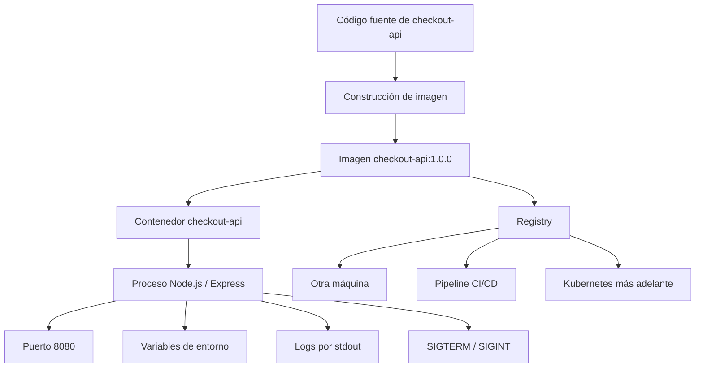

---

## 1.1. Qué problema resuelve un contenedor

Cuando ejecutas `checkout-api` directamente en tu máquina, dependes del entorno local.

Puede funcionar en tu ordenador y fallar en otro porque cambia algo:

- Versión de Node.js
- Versión de npm
- Librerías del sistema
- Variables de entorno
- Usuario que ejecuta el proceso
- Ficheros disponibles
- Puertos ocupados
- Arquitectura de CPU
- Sistema operativo
- Permisos
- Certificados
- Dependencias externas
Un contenedor reduce parte de esa variabilidad empaquetando la aplicación con lo que necesita para ejecutarse.

No elimina todos los problemas. Pero cambia el punto de partida.

En vez de decir:

> Instala Node, instala npm, instala dependencias, configura variables, arranca el proceso y asegúrate de tener el mismo entorno.

Dices:

> Ejecuta esta imagen con esta configuración.

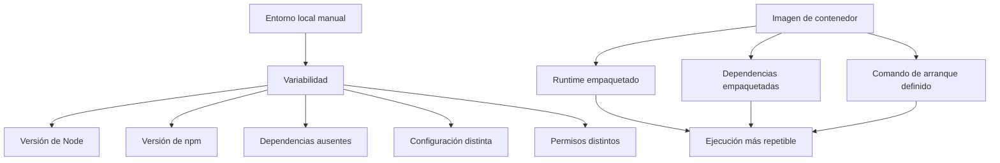

### Qué debes entender

Una imagen es un artefacto empaquetado. Contiene filesystem, metadata y una configuración de ejecución. La documentación de Docker define una imagen de contenedor como un paquete estandarizado que incluye los ficheros, binarios, librerías y configuración necesarios para ejecutar un contenedor. ([Docker Documentation](https://docs.docker.com/get-started/docker-concepts/the-basics/what-is-an-image/ "What is an image? | Docker Docs"))

Un contenedor es una instancia en ejecución basada en una imagen. Tiene un proceso principal, entorno, red, filesystem y ciclo de vida.

Un registry almacena imágenes para que otras máquinas puedan descargarlas. Esto será esencial más adelante porque un cluster Kubernetes puede tener varios nodos y todos necesitan acceder a las imágenes que aparecen en los manifests.

### DevEx del bloque

Desde el principio, todo lo que hagas debería poder ejecutarse con comandos repetibles.

No queremos que el alumno tenga que recordar comandos largos como:

```bash
docker build -t checkout-api:1.0.0 ./apps/checkout-api
```

Queremos que pueda usar:

```bash
task container:build:docker
```

Pero el Taskfile debe mostrar el comando real.

Taskfile facilita la repetición, no sustituye el aprendizaje.

### Criterio de comprensión

Debes poder explicar:

> Un contenedor no es una máquina virtual pequeña. Es una forma de ejecutar un proceso aislado, empaquetado y configurable.

---

## 1.2. Imagen vs contenedor

La confusión más habitual es mezclar imagen y contenedor.

Una imagen no está corriendo.

Un contenedor sí.

Una imagen se construye, etiqueta, escanea, sube a un registry y descarga.

Un contenedor se crea, arranca, para, reinicia, inspecciona y elimina.

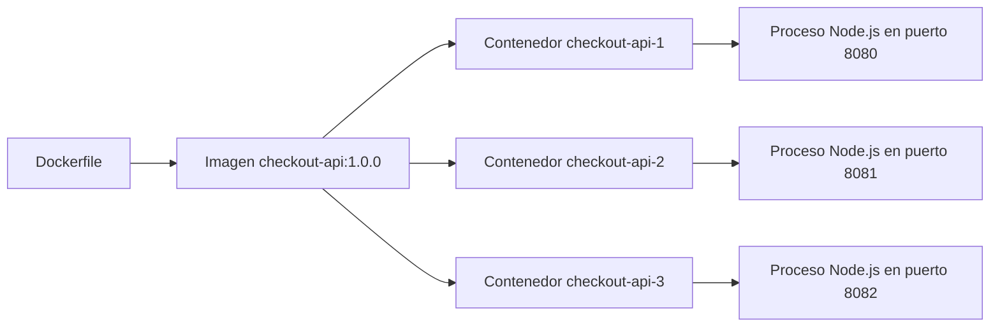

### Contrato mental

|Concepto|Qué es|Qué haces con él|
|---|---|---|
|Imagen|Paquete ejecutable|Build, tag, push, pull, inspect, scan|
|Contenedor|Ejecución concreta de una imagen|Run, stop, logs, exec, inspect, remove|
|Registry|Lugar donde se almacenan imágenes|Push, pull|
|Dockerfile|Receta para construir una imagen|Build|
|Tag|Nombre legible de una imagen|Versionar de forma humana|
|Digest|Identificador por contenido|Referenciar una imagen exacta|

### Ejemplo mínimo

Si tienes esta imagen:

```text
checkout-api:1.0.0
```

Puedes ejecutar un contenedor:

```bash
docker run --rm -p 8080:8080 checkout-api:1.0.0
```

Y también otro:

```bash
docker run --rm -p 8081:8080 checkout-api:1.0.0
```

Ambos contenedores salen de la misma imagen, pero son procesos distintos.

### Práctica rápida

Construye la imagen:

```bash
docker build -t checkout-api:1.0.0 ./apps/checkout-api
```

Ejecuta dos contenedores desde la misma imagen:

```bash
docker run -d --name checkout-one -p 8080:8080 checkout-api:1.0.0
docker run -d --name checkout-two -p 8081:8080 checkout-api:1.0.0
```

Valida:

```bash
curl -i http://localhost:8080/health
curl -i http://localhost:8081/health
```

Limpia:

```bash
docker stop checkout-one checkout-two
docker rm checkout-one checkout-two
```

### DevEx del bloque

Añade tareas pequeñas:

```yaml
container:list:
  desc: List local containers
  cmds:
    - docker ps -a

image:list:
  desc: List local checkout-api images
  cmds:
    - docker images | grep checkout-api || true
```

### Criterio de comprensión

Debes poder explicar:

> La imagen es el paquete reutilizable. El contenedor es una ejecución concreta de ese paquete.

---

## 1.3. Docker, Podman, OCI y runtimes

Docker y Podman son herramientas para trabajar con contenedores e imágenes.

OCI es diferente: no es una herramienta de uso diario, sino un conjunto de especificaciones abiertas. OCI mantiene especificaciones abiertas para imágenes, runtimes y distribución de contenedores. ([Docker Documentation](https://docs.docker.com/get-started/docker-overview/ "What is Docker?"))

Kubernetes usa la Container Runtime Interface, conocida como CRI, para que el kubelet pueda usar distintos runtimes de contenedores sin tener que recompilar los componentes del cluster. ([Docker Documentation](https://docs.docker.com/get-started/docker-overview/ "What is Docker?"))

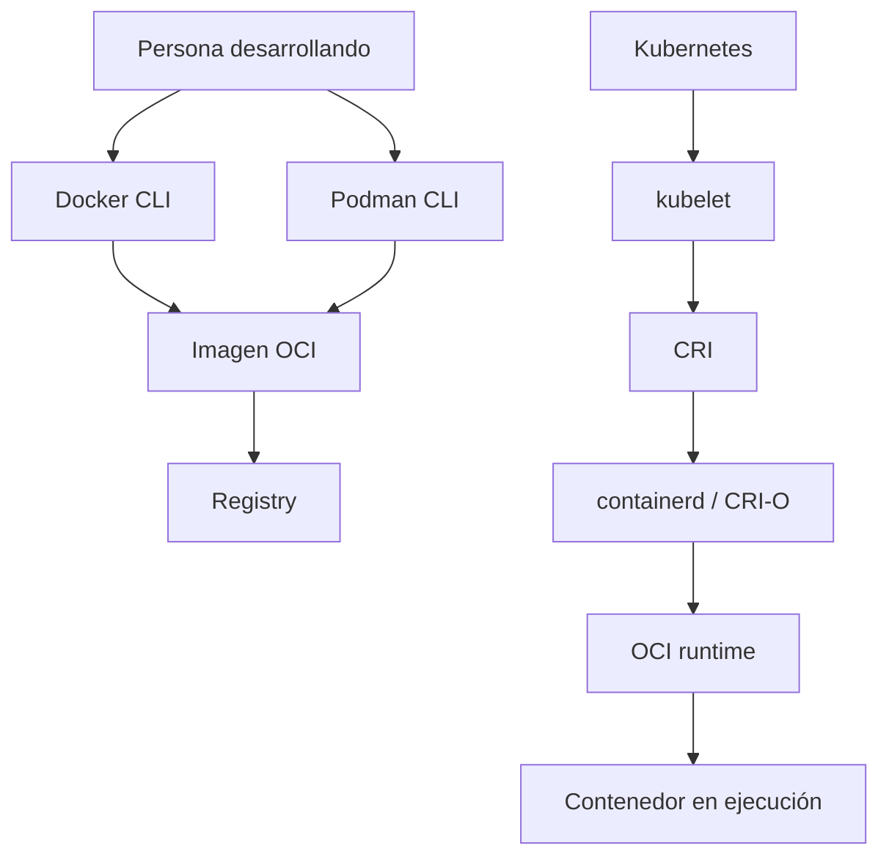

### Docker

Docker es una plataforma para construir, distribuir y ejecutar aplicaciones usando contenedores. En este módulo lo usaremos para construir imágenes, ejecutar contenedores, ver logs, publicar puertos, montar volúmenes, crear redes y usar Compose. ([Docker Documentation](https://docs.docker.com/get-started/docker-overview/ "What is Docker?"))

### Podman

Podman es una herramienta daemonless, open source y Linux native para buscar, ejecutar, construir, compartir y desplegar aplicaciones usando contenedores e imágenes OCI. Su CLI resulta familiar para personas que ya han usado Docker. ([docs.podman.io](https://docs.podman.io/ "What is Podman? — Podman documentation"))

Podman es útil porque ayuda a separar el concepto de contenedor de una herramienta concreta.

### OCI

OCI te ayuda a entender por qué una imagen no debería ser “de Docker” en sentido conceptual. Docker puede construirla, Podman puede construirla, un registry puede almacenarla y Kubernetes puede ejecutarla mediante runtimes compatibles.

### CRI

CRI es importante para Kubernetes, no para tus primeros comandos locales. Más adelante verás que Kubernetes no ejecuta contenedores llamando a `docker run`. El kubelet habla con un runtime mediante CRI.

### DevEx del bloque

En el laboratorio no vamos a obligar a usar Docker o Podman como única opción.

La DevEx buena aquí consiste en ofrecer tareas equivalentes:

```bash
task container:build:docker
task container:build:podman
task container:run:docker
task container:run:podman
```

Esto permite aprender el modelo sin quedar atrapado en una sola herramienta.

### Criterio de comprensión

Debes poder explicar:

> Docker y Podman son herramientas. OCI define estándares. Kubernetes usa runtimes mediante CRI para ejecutar contenedores en los nodos.

---

## 1.4. Ciclo de vida de una imagen

Una imagen pasa por un ciclo de vida.

Primero tienes código. Después defines cómo empaquetarlo. Luego construyes la imagen, la etiquetas, la pruebas, la escaneas, la publicas y la usas.

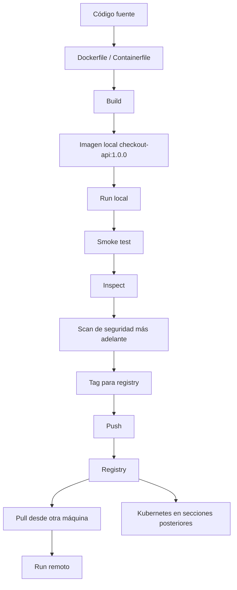

### Estados importantes

|Estado|Qué significa|
|---|---|
|Imagen local|Existe en tu máquina|
|Imagen etiquetada|Tiene un nombre útil, por ejemplo `checkout-api:1.0.0`|
|Imagen publicada|Está en un registry|
|Imagen por digest|Se referencia por contenido exacto|
|Imagen obsoleta|Ya no debería usarse|
|Imagen vulnerable|Tiene vulnerabilidades conocidas y requiere revisión|

### Tags y digests

Un tag es un alias legible:

```text
checkout-api:1.0.0
```

Un digest identifica contenido concreto:

```text
sha256:...
```

Para aprendizaje, usar tags es cómodo.

Para despliegues profesionales, los digests reducen ambigüedad porque apuntan a un contenido concreto.

### DevEx del bloque

Define las variables de imagen una sola vez en `Taskfile.yml`:

```yaml
vars:
  IMAGE_NAME: checkout-api
  IMAGE_TAG: 1.0.0
```

Así evitas escribir tags distintos por accidente.

### Criterio de comprensión

Debes poder explicar:

> Un tag es un nombre cómodo. Un digest identifica el contenido exacto de una imagen.

---

## 1.5. Contrato HTTP mínimo de checkout-api

Antes de escribir la aplicación, necesitamos definir qué comportamiento esperamos de ella.

Una API no es solo un proceso que escucha en un puerto. Es un proceso que expone una interfaz.

En este módulo usaremos tres endpoints:

- `GET /health`
- `GET /ready`
- `GET /checkout`
Cada endpoint tiene un propósito distinto.

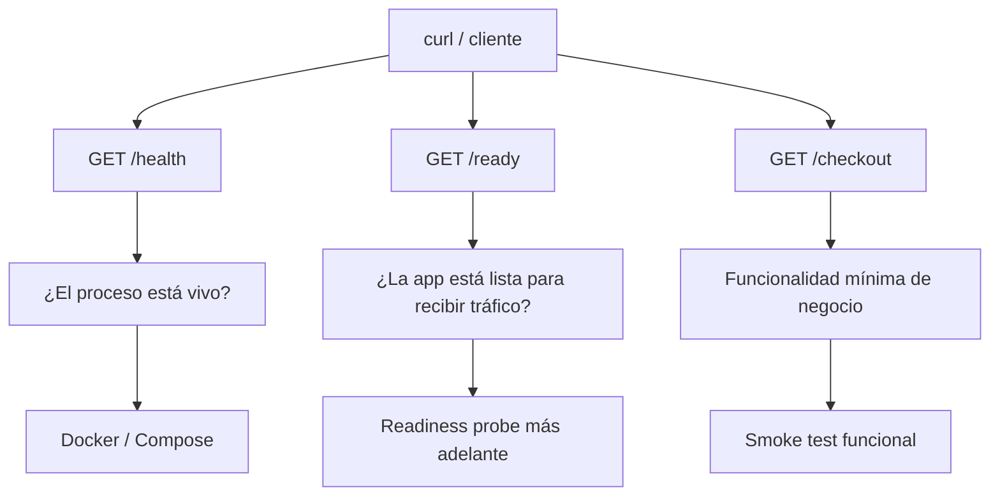

### Qué es un endpoint

Un endpoint es una ruta concreta expuesta por una aplicación para realizar una acción o consultar información.

Por ejemplo:

```text
GET /health
```

Significa:

- Método HTTP: `GET`
- Ruta: `/health`
- Propósito: comprobar salud básica del proceso
- Respuesta esperada: HTTP `200 OK` si el proceso puede responder
### Qué es un contrato HTTP

Un contrato HTTP define qué puede esperar un cliente cuando llama a un endpoint.

Debe indicar:

- Método HTTP
- Ruta
- Código de estado esperado
- Formato de respuesta
- Campos mínimos
- Significado operativo
Ejemplo:

```http
GET /health
```

Respuesta esperada:

```http
HTTP/1.1 200 OK
Content-Type: application/json
```

Body:

```json
{
  "service": "checkout-api",
  "status": "ok"
}
```

---

### Endpoint 1: GET /health

#### Objetivo

Comprobar que el proceso está vivo y puede responder HTTP.

`/health` debe ser barato, rápido y estable.

No debería depender de sistemas externos como PostgreSQL, Redis o proveedores de pago.

Si `/health` falla, normalmente significa que el proceso no está funcionando correctamente.

#### Contrato

|Campo|Valor|
|---|---|
|Método|`GET`|
|Ruta|`/health`|
|Código correcto|`200 OK`|
|Content-Type|`application/json`|
|Dependencias externas|No|
|Uso principal|Saber si el proceso responde|

#### Respuesta esperada

```json
{
  "service": "checkout-api",
  "status": "ok"
}
```

#### Validación con curl

```bash
curl -i http://localhost:8080/health
```

Respuesta esperada:

```text
HTTP/1.1 200 OK
Content-Type: application/json
```

Con body parecido a:

```json
{
  "service": "checkout-api",
  "status": "ok"
}
```

---

### Endpoint 2: GET /ready

#### Objetivo

Comprobar que la aplicación está lista para recibir tráfico.

`/ready` no significa exactamente lo mismo que `/health`.

Una aplicación puede estar viva pero no estar lista.

Ejemplos:

- El proceso arrancó, pero todavía carga configuración
- El proceso arrancó, pero no puede conectar con una dependencia obligatoria
- El proceso está cerrándose y ya no debería recibir tráfico
- El proceso necesita completar una inicialización antes de aceptar peticiones reales
En este módulo, `/ready` será simple y devolverá `ready`.

Más adelante, en Kubernetes, esta diferencia será clave para entender readiness probes.

#### Contrato

|Campo|Valor|
|---|---|
|Método|`GET`|
|Ruta|`/ready`|
|Código correcto|`200 OK`|
|Content-Type|`application/json`|
|Dependencias externas|En este módulo, no|
|Uso principal|Saber si la app debería recibir tráfico|

#### Respuesta esperada

```json
{
  "service": "checkout-api",
  "status": "ready"
}
```

#### Validación con curl

```bash
curl -i http://localhost:8080/ready
```

Respuesta esperada:

```text
HTTP/1.1 200 OK
Content-Type: application/json
```

Con body parecido a:

```json
{
  "service": "checkout-api",
  "status": "ready"
}
```

---

### Diferencia entre /health y /ready

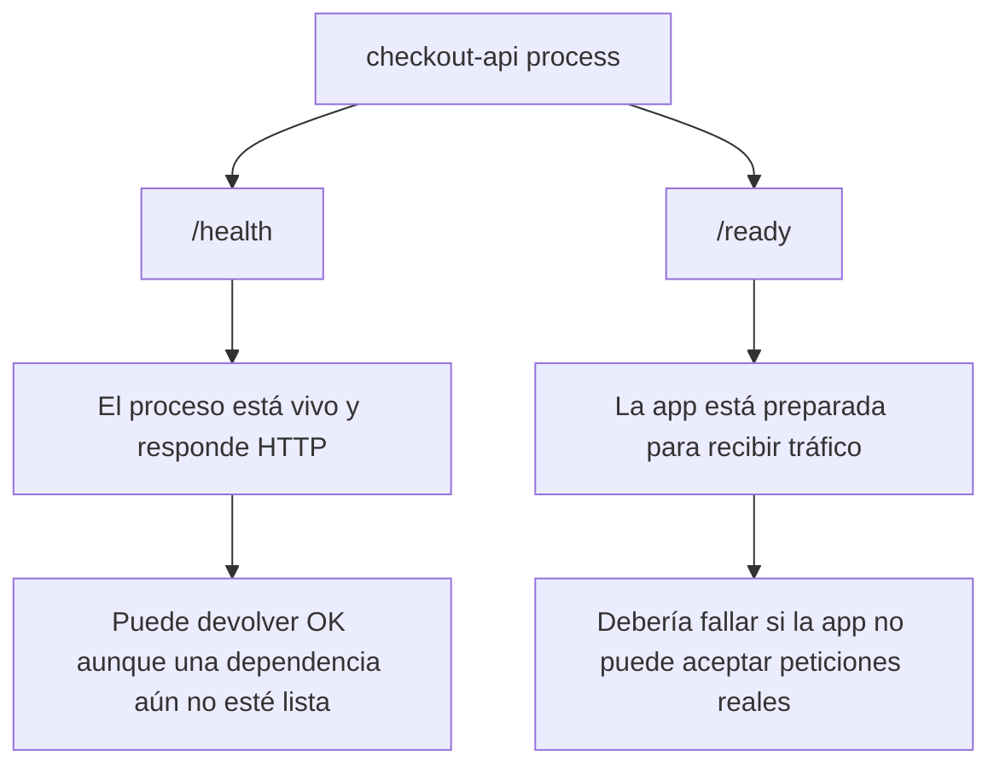

|Endpoint|Pregunta que responde|Ejemplo de uso|
|---|---|---|
|`/health`|¿El proceso está vivo?|Reiniciar si el proceso queda bloqueado|
|`/ready`|¿Debe recibir tráfico ahora?|Sacar la instancia del balanceo si no está lista|

En este módulo ambos devolverán `200`, porque todavía no tenemos dependencias reales.

Más adelante, cuando `checkout-api` dependa de `Redis`, `PostgreSQL` o `payment-api`, podremos decidir si `/ready` debe comprobar esas dependencias o solo comprobar readiness interna.

---

### Endpoint 3: GET /checkout

#### Objetivo

Tener un endpoint funcional mínimo.

No queremos una API compleja. Solo necesitamos una ruta que represente una operación de negocio sencilla para poder hacer smoke tests.

`/checkout` simula la creación de un checkout.

#### Contrato

|Campo|Valor|
|---|---|
|Método|`GET`|
|Ruta|`/checkout`|
|Código correcto|`200 OK`|
|Content-Type|`application/json`|
|Uso principal|Validar que la API responde funcionalmente|

#### Respuesta esperada

```json
{
  "service": "checkout-api",
  "status": "ok",
  "message": "checkout created"
}
```

#### Validación con curl

```bash
curl -i http://localhost:8080/checkout
```

---

### Contrato completo de la API

|Endpoint|Método|Código esperado|Body esperado|Propósito|
|---|---|--:|---|---|
|`/health`|`GET`|`200`|`{ "service": "checkout-api", "status": "ok" }`|Proceso vivo|
|`/ready`|`GET`|`200`|`{ "service": "checkout-api", "status": "ready" }`|App preparada|
|`/checkout`|`GET`|`200`|`{ "service": "checkout-api", "status": "ok", "message": "checkout created" }`|Flujo funcional mínimo|

### Smoke test mínimo

Un smoke test no demuestra que todo el sistema sea correcto.

Demuestra que lo mínimo imprescindible responde.

Para este módulo, el smoke test debe comprobar:

```bash
curl -fsS http://localhost:8080/health
curl -fsS http://localhost:8080/ready
curl -fsS http://localhost:8080/checkout
```

Usamos:

```bash
-f
```

para fallar si HTTP devuelve error.

Usamos:

```bash
-sS
```

para reducir ruido, pero mostrar errores.

El criterio no es:

> La app parece arrancar.

El criterio es:

> La app responde correctamente en los endpoints que forman su contrato mínimo.

### DevEx del bloque

Este contrato debe convertirse en script.

Si lo haces a mano cada vez, lo olvidarás o lo comprobarás de forma distinta.

Por eso más adelante crearemos:

```text
scripts/smoke-test.sh
```

Y lo ejecutaremos con:

```bash
task smoke
```

### Criterio de comprensión

Debes poder explicar:

> Validar no es mirar si parece funcionar. Validar es comparar el comportamiento real contra un contrato esperado.

---

## 1.6. Preparar checkout-api con Express

Usaremos una `checkout-api` mínima escrita con Express.

La práctica no intenta enseñar Node.js en profundidad. Express se usa porque permite crear una API pequeña, clara y fácil de entender, sin meter complejidad accidental. Express se define oficialmente como un framework web minimalista y flexible para Node.js que proporciona un conjunto robusto de características para aplicaciones web y móviles. ([Express](https://expressjs.com/ "Express - Node.js web application framework"))

### Qué debe cumplir la aplicación

La API debe cumplir el contrato definido antes:

- Exponer `GET /health`
- Exponer `GET /ready`
- Exponer `GET /checkout`
- Devolver JSON
- Usar códigos HTTP correctos
- Leer configuración desde variables de entorno
- Escribir logs por stdout
- Escuchar en un puerto configurable
- Apagarse correctamente cuando recibe `SIGTERM` o `SIGINT`
### Estructura

Crea esta estructura:

```text
kubernetes-learning-lab/
  apps/
    checkout-api/
      package.json
      src/
        server.js
      Dockerfile
      Containerfile
      .dockerignore
```

### package.json

```json
{
  "name": "checkout-api",
  "version": "1.0.0",
  "private": true,
  "description": "Minimal checkout API for the Kubernetes learning lab",
  "main": "src/server.js",
  "scripts": {
    "start": "node src/server.js"
  },
  "dependencies": {
    "express": "4.18.3"
  }
}
```

`npm install` instala un paquete y las dependencias que necesita. Si existe `package-lock.json`, npm lo usa para guiar la instalación de dependencias. ([Documentación de npm](https://docs.npmjs.com/cli/v8/commands/npm-install "npm-install"))

### src/server.js

```js
const express = require("express");

const app = express();

const serviceName = process.env.SERVICE_NAME || "checkout-api";
const port = Number(process.env.PORT || 8080);
const logLevel = process.env.LOG_LEVEL || "info";

function response(status, extra = {}) {
  return {
    service: serviceName,
    status,
    ...extra
  };
}

app.use((req, res, next) => {
  const startedAt = Date.now();

  res.on("finish", () => {
    console.log(JSON.stringify({
      level: logLevel,
      service: serviceName,
      method: req.method,
      path: req.path,
      status: res.statusCode,
      durationMs: Date.now() - startedAt
    }));
  });

  next();
});

app.get("/health", (_req, res) => {
  res
    .status(200)
    .type("application/json")
    .json(response("ok"));
});

app.get("/ready", (_req, res) => {
  res
    .status(200)
    .type("application/json")
    .json(response("ready"));
});

app.get("/checkout", (_req, res) => {
  res
    .status(200)
    .type("application/json")
    .json(response("ok", {
      message: "checkout created"
    }));
});

app.use((req, res) => {
  res
    .status(404)
    .type("application/json")
    .json(response("not_found", {
      message: `route ${req.method} ${req.path} not found`
    }));
});

const server = app.listen(port, () => {
  console.log(JSON.stringify({
    level: logLevel,
    service: serviceName,
    message: "server started",
    port
  }));
});

function shutdown(signal) {
  console.log(JSON.stringify({
    level: "info",
    service: serviceName,
    message: "received shutdown signal",
    signal
  }));

  server.close(() => {
    console.log(JSON.stringify({
      level: "info",
      service: serviceName,
      message: "server stopped"
    }));

    process.exit(0);
  });

  setTimeout(() => {
    console.error(JSON.stringify({
      level: "error",
      service: serviceName,
      message: "forced shutdown timeout"
    }));

    process.exit(1);
  }, 10000);
}

process.on("SIGTERM", shutdown);
process.on("SIGINT", shutdown);
```

### .dockerignore

```text
node_modules
npm-debug.log
.git
tmp
dist
*.log
```

### Ejecutar sin contenedor

Antes de containerizar, valida que la app funciona como proceso local:

```bash
cd apps/checkout-api
npm install
PORT=8080 LOG_LEVEL=debug npm start
```

En otra terminal:

```bash
curl -i http://localhost:8080/health
curl -i http://localhost:8080/ready
curl -i http://localhost:8080/checkout
curl -i http://localhost:8080/unknown
```

### Qué debes observar

`/health` debe devolver `200`.

`/ready` debe devolver `200`.

`/checkout` debe devolver `200`.

`/unknown` debe devolver `404`.

Todas las respuestas deben ser JSON.

Los logs deben aparecer en stdout.

### DevEx del bloque

Añade tareas para ejecutar la app sin contenedor:

```yaml
app:install:
  desc: Install checkout-api dependencies locally
  dir: apps/{{.APP_NAME}}
  cmds:
    - npm install

app:run:
  desc: Run checkout-api locally without a container
  dir: apps/{{.APP_NAME}}
  cmds:
    - PORT={{.PORT}} LOG_LEVEL=debug npm start
```

Esto crea una transición limpia:

```text
proceso local → contenedor → Compose → Kubernetes
```

### Criterio de comprensión

Debes poder explicar:

> Antes de empaquetar una aplicación, debo poder ejecutarla y comprobar que se comporta correctamente como proceso.

---

## 1.7. Smoke test como contrato ejecutable

Antes de construir una imagen, vamos a convertir el contrato HTTP en un script.

Esto evita que la validación dependa de memoria, intuición o mirar respuestas a ojo.

Crea:

```text
scripts/smoke-test.sh
```

Contenido:

```bash
#!/usr/bin/env bash
set -euo pipefail

PORT="${PORT:-8080}"
BASE_URL="http://localhost:${PORT}"
RESPONSE_FILE="/tmp/checkout-api-response.json"

check_endpoint() {
  local path="$1"
  local expected_status="$2"
  local expected_service="$3"
  local expected_app_status="$4"

  echo "Checking ${path}"

  status="$(
    curl -sS -o "${RESPONSE_FILE}" \
      -w "%{http_code}" \
      "${BASE_URL}${path}"
  )"

  if [ "${status}" != "${expected_status}" ]; then
    echo "Expected HTTP ${expected_status} for ${path}, got ${status}"
    cat "${RESPONSE_FILE}"
    exit 1
  fi

  jq -e ".service == \"${expected_service}\"" "${RESPONSE_FILE}" > /dev/null
  jq -e ".status == \"${expected_app_status}\"" "${RESPONSE_FILE}" > /dev/null
}

check_endpoint "/health" "200" "checkout-api" "ok"
check_endpoint "/ready" "200" "checkout-api" "ready"
check_endpoint "/checkout" "200" "checkout-api" "ok"

echo "checkout-api smoke test passed"
```

Dale permisos:

```bash
chmod +x scripts/smoke-test.sh
```

Ejecuta:

```bash
./scripts/smoke-test.sh
```

### Qué comprueba este smoke test

Comprueba:

- Que los endpoints responden
- Que devuelven el código HTTP esperado
- Que devuelven JSON parseable por `jq`
- Que aparece `service`
- Que aparece `status`
- Que `status` tiene el valor esperado
No comprueba todo.

No valida seguridad.

No valida rendimiento.

No valida lógica de negocio real.

Pero sí comprueba el contrato mínimo.

### DevEx del bloque

Añade al Taskfile:

```yaml
smoke:
  desc: Run checkout-api smoke test
  cmds:
    - ./scripts/smoke-test.sh
```

Ahora el contrato se valida con:

```bash
task smoke
```

### Criterio de comprensión

Debes poder explicar:

> Un smoke test convierte una expectativa mínima en una comprobación repetible.

---

## 1.8. Dockerfile y Containerfile

Un Dockerfile describe cómo construir una imagen. Docker construye imágenes leyendo instrucciones desde un Dockerfile. ([Docker Documentation](https://docs.docker.com/build/concepts/dockerfile/ "Dockerfile overview"))

Usaremos una imagen sencilla para no meter complejidad innecesaria en esta fase.

### Dockerfile

```Dockerfile
FROM node:20-alpine

WORKDIR /app

COPY package.json package-lock.json* ./

RUN npm install --omit=dev

COPY src ./src

RUN addgroup -S app && adduser -S app -G app
USER app

EXPOSE 8080

CMD ["npm", "start"]
```

Guárdalo en:

```text
apps/checkout-api/Dockerfile
```

Copia el mismo contenido en:

```text
apps/checkout-api/Containerfile
```

Esto permite practicar tanto con Docker como con Podman.

La imagen oficial de Node en Docker Hub está mantenida por el Node.js Docker Team y está marcada como Docker Official Image. ([Docker Hub](https://hub.docker.com/_/node "node - Official Image"))

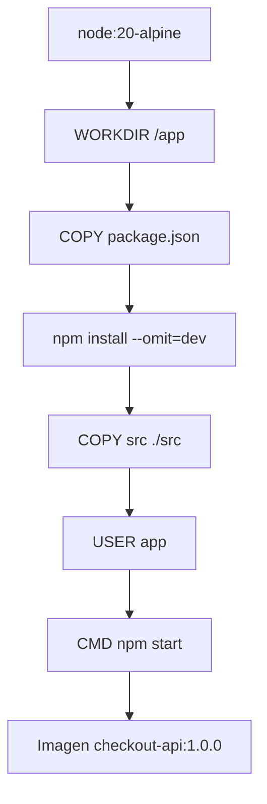

### Explicación línea por línea

```Dockerfile
FROM node:20-alpine
```

Define la imagen base. En este caso usamos Node 20 sobre Alpine.

```Dockerfile
WORKDIR /app
```

Define el directorio de trabajo dentro de la imagen.

```Dockerfile
COPY package.json package-lock.json* ./
```

Copia la definición de dependencias.

```Dockerfile
RUN npm install --omit=dev
```

Instala dependencias de producción.

```Dockerfile
COPY src ./src
```

Copia el código fuente.

```Dockerfile
RUN addgroup -S app && adduser -S app -G app
USER app
```

Crea y usa un usuario no root.

```Dockerfile
EXPOSE 8080
```

Documenta que la aplicación escucha en el puerto 8080 dentro del contenedor.

```Dockerfile
CMD ["npm", "start"]
```

Define el comando por defecto al ejecutar el contenedor.

### Por qué esta imagen es suficiente para el módulo 1

En este módulo el objetivo es entender:

- Imagen
- Contenedor
- Build
- Run
- Puertos
- Variables de entorno
- Logs
- Usuario no root
- Compose
- Volúmenes
- Redes
No necesitamos optimizar todavía cada detalle de la imagen.

Más adelante, cuando el alumno ya entienda el modelo, se puede mejorar con:

- `npm ci` si existe `package-lock.json`
- Build reproducible
- Imagen más pequeña
- Escaneo de vulnerabilidades
- Distroless
- SBOM
- Firma de imágenes
- Multi-stage si hay build real
### DevEx del bloque

El Dockerfile debe ser corto, legible y fácil de discutir.

En esta etapa, la legibilidad tiene más valor didáctico que una optimización prematura.

También conviene tener `Dockerfile` y `Containerfile` con el mismo contenido para que las prácticas con Docker y Podman sean simétricas.

### Criterio de comprensión

Debes poder explicar:

> El Dockerfile convierte una aplicación y sus instrucciones de ejecución en una imagen que puedo construir, etiquetar y ejecutar.

---

## 1.9. Construir la imagen con Docker

Desde la raíz del repositorio:

```bash
docker build -t checkout-api:1.0.0 ./apps/checkout-api
```

Ver imágenes locales:

```bash
docker images | grep checkout-api
```

Inspeccionar la imagen:

```bash
docker image inspect checkout-api:1.0.0
```

Ver historial de capas:

```bash
docker history checkout-api:1.0.0
```

### Qué observar

- Nombre de imagen
- Tag
- Tamaño
- Comando de arranque
- Usuario
- Capas
- Variables configuradas
- Arquitectura
### Ejercicio

Construye dos tags:

```bash
docker build -t checkout-api:1.0.0 ./apps/checkout-api
docker build -t checkout-api:dev ./apps/checkout-api
```

Después responde:

- ¿Son la misma imagen?
- ¿Tienen el mismo ID?
- ¿Qué significa que una imagen tenga varios tags?
- ¿Qué tag usarías para una práctica local?
- ¿Qué tag evitarías en un despliegue serio?
### DevEx del bloque

La tarea recomendada es:

```yaml
container:build:docker:
  desc: Build checkout-api image with Docker
  cmds:
    - docker build -t {{.IMAGE_NAME}}:{{.IMAGE_TAG}} ./apps/{{.APP_NAME}}
```

Así el comando queda visible, pero no tienes que reescribirlo continuamente.

### Criterio de comprensión

Debes poder explicar:

> Construir una imagen convierte una receta de build en un artefacto ejecutable y distribuible.

---

## 1.10. Ejecutar la imagen con Docker

Ejecuta `checkout-api`:

```bash
docker run --rm -p 8080:8080 checkout-api:1.0.0
```

En otra terminal:

```bash
curl -i http://localhost:8080/health
curl -i http://localhost:8080/ready
curl -i http://localhost:8080/checkout
```

También puedes ejecutar el smoke test:

```bash
task smoke
```

### Publicación de puertos

Esta parte suele confundir.

La aplicación escucha dentro del contenedor en el puerto `8080`.

Tu máquina no puede acceder automáticamente a ese puerto. Por eso publicas un puerto del host hacia un puerto del contenedor:

```bash
-p 8080:8080
```

La forma general es:

```text
-p HOST_PORT:CONTAINER_PORT
```

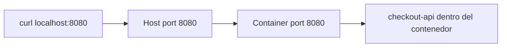

### Ejecutar con otro puerto del host

```bash
docker run --rm -p 9090:8080 checkout-api:1.0.0
```

Validar:

```bash
PORT=9090 task smoke
```

Aquí `checkout-api` sigue escuchando en `8080` dentro del contenedor. Lo que cambia es el puerto de tu máquina.

### DevEx del bloque

Añade dos tareas:

```yaml
container:run:docker:
  desc: Run checkout-api with Docker
  cmds:
    - docker run --rm -p {{.PORT}}:8080 {{.IMAGE_NAME}}:{{.IMAGE_TAG}}

smoke:
  desc: Run checkout-api smoke test
  cmds:
    - ./scripts/smoke-test.sh
```

La idea es que cada vez que arranques el contenedor puedas comprobarlo con un solo comando:

```bash
task smoke
```

### Criterio de comprensión

Debes poder explicar:

> El puerto del host y el puerto del contenedor no son lo mismo. `-p 9090:8080` expone en mi máquina el puerto 9090 y lo redirige al 8080 del contenedor.

---

## 1.11. Variables de entorno en contenedores

La imagen debe ser estable.

La configuración debe cambiar en tiempo de ejecución.

Ejecuta con configuración:

```bash
docker run --rm \
  -p 8080:8080 \
  -e SERVICE_NAME=checkout-api \
  -e LOG_LEVEL=debug \
  checkout-api:1.0.0
```

Valida:

```bash
curl -i http://localhost:8080/health
```

También puedes cambiar el puerto interno de la app:

```bash
docker run --rm \
  -p 9090:9090 \
  -e PORT=9090 \
  -e LOG_LEVEL=debug \
  checkout-api:1.0.0
```

Validar:

```bash
PORT=9090 task smoke
```

### Qué observar

- La imagen no cambia
- El comportamiento cambia por configuración
- La misma imagen puede ejecutarse en distintos entornos
- La configuración sensible no debería meterse dentro de la imagen
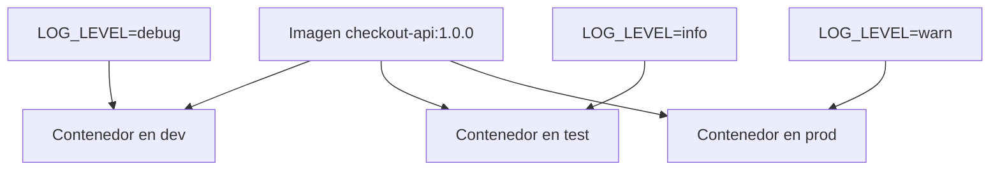

### DevEx del bloque

Añade una variante de debug:

```yaml
container:run:docker:debug:
  desc: Run checkout-api with Docker and debug logs
  cmds:
    - docker run --rm -p {{.PORT}}:8080 -e LOG_LEVEL=debug {{.IMAGE_NAME}}:{{.IMAGE_TAG}}
```

Así el alumno no tiene que recordar el flag `-e` cada vez.

### Criterio de comprensión

Debes poder explicar:

> La imagen debe ser estable. La configuración debe poder cambiar sin reconstruir la imagen.

---

## 1.12. Logs en contenedores

Ejecuta en segundo plano:

```bash
docker run -d \
  --name checkout-api \
  -p 8080:8080 \
  -e LOG_LEVEL=debug \
  checkout-api:1.0.0
```

Ver logs:

```bash
docker logs checkout-api
```

Seguir logs:

```bash
docker logs -f checkout-api
```

Generar tráfico:

```bash
curl -i http://localhost:8080/health
curl -i http://localhost:8080/checkout
```

Parar y eliminar:

```bash
docker stop checkout-api
docker rm checkout-api
```

### Qué observar

Los logs no están en un fichero dentro del contenedor. Salen por stdout/stderr y Docker los recoge.

Esto prepara la idea que después usará Kubernetes con:

```bash
kubectl logs
```

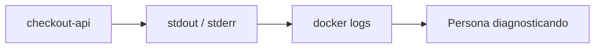

### Contrato mínimo de logs

Para este módulo, cada request debe producir un log JSON con:

- `level`
- `service`
- `method`
- `path`
- `status`
- `durationMs`
Ejemplo:

```json
{
  "level": "debug",
  "service": "checkout-api",
  "method": "GET",
  "path": "/health",
  "status": 200,
  "durationMs": 3
}
```

### DevEx del bloque

Añade tareas de logs cuando uses contenedores con nombre:

```yaml
container:run:docker:detached:
  desc: Run checkout-api with Docker in detached mode
  cmds:
    - docker run -d --name checkout-api -p {{.PORT}}:8080 -e LOG_LEVEL=debug {{.IMAGE_NAME}}:{{.IMAGE_TAG}}

container:logs:docker:
  desc: Follow checkout-api Docker logs
  cmds:
    - docker logs -f checkout-api

container:stop:docker:
  desc: Stop and remove checkout-api Docker container
  cmds:
    - docker stop checkout-api || true
    - docker rm checkout-api || true
```

### Criterio de comprensión

Debes poder explicar:

> En contenedores, escribir logs a stdout/stderr permite que la plataforma los recoja sin acoplar la app a un fichero local.

---

## 1.13. Entrar en un contenedor

Ejecuta:

```bash
docker run -d \
  --name checkout-api \
  -p 8080:8080 \
  checkout-api:1.0.0
```

Entrar con shell:

```bash
docker exec -it checkout-api sh
```

Dentro:

```sh
whoami
pwd
ls -la
ps
```

Salir:

```sh
exit
```

Limpiar:

```bash
docker stop checkout-api
docker rm checkout-api
```

### Qué observar

- El usuario debería ser `app`
- El directorio debería ser `/app`
- El proceso principal debería ser `npm start` y, debajo, `node src/server.js`
- El filesystem visible es el del contenedor, no el de tu máquina
### DevEx del bloque

Añade una tarea explícita:

```yaml
container:shell:docker:
  desc: Open a shell inside checkout-api Docker container
  cmds:
    - docker exec -it checkout-api sh
```

No uses esto como forma normal de operar.

Úsalo como herramienta de inspección.

### Criterio de comprensión

Debes poder explicar:

> Entrar en un contenedor sirve para inspeccionar, no para arreglar producción a mano.

---

## 1.14. Filesystem efímero

Ejecuta:

```bash
docker run -it --name temp-checkout checkout-api:1.0.0 sh
```

Dentro del contenedor:

```sh
echo "temporary data" > /tmp/example.txt
cat /tmp/example.txt
exit
```

Vuelve a arrancar el mismo contenedor si existe:

```bash
docker start -ai temp-checkout
```

El fichero puede seguir si es el mismo contenedor.

Ahora elimina el contenedor:

```bash
docker rm temp-checkout
```

Crea uno nuevo:

```bash
docker run -it --name temp-checkout-2 checkout-api:1.0.0 sh
```

Comprueba:

```sh
cat /tmp/example.txt
```

No debería existir.

### Qué aprender

El filesystem del contenedor no es una base de datos.

Si necesitas persistencia, usarás volúmenes.

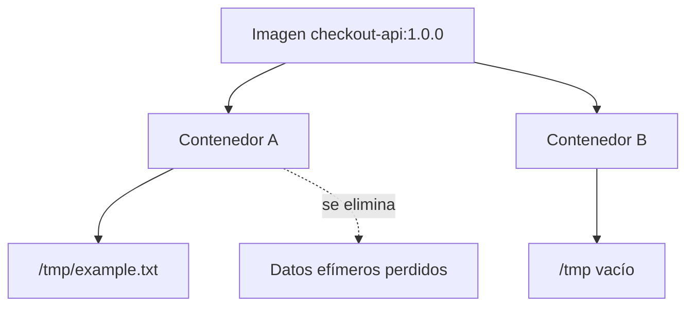

### DevEx del bloque

No automatices demasiado este ejercicio.

Aquí interesa que el alumno lo haga a mano para sentir la diferencia entre imagen, contenedor y filesystem del contenedor.

### Criterio de comprensión

Debes poder explicar:

> Lo que escribo dentro de un contenedor vive con ese contenedor. Si necesito datos persistentes, necesito un volumen o un servicio externo de almacenamiento.

---

## 1.15. Volúmenes

Antes de usar un volumen, hay que entender el problema.

Un contenedor puede eliminarse.

Si los datos viven solo dentro del filesystem del contenedor, esos datos desaparecen con él.

Un volumen desacopla datos del ciclo de vida del contenedor.

Crea un volumen:

```bash
docker volume create checkout-data
```

Ejecuta un contenedor montando el volumen:

```bash
docker run --rm -it \
  -v checkout-data:/data \
  checkout-api:1.0.0 sh
```

Dentro:

```sh
echo "persistent data" > /data/example.txt
exit
```

Arranca otro contenedor con el mismo volumen:

```bash
docker run --rm -it \
  -v checkout-data:/data \
  checkout-api:1.0.0 sh
```

Dentro:

```sh
cat /data/example.txt
exit
```

Eliminar volumen:

```bash
docker volume rm checkout-data
```

### Qué aprender

Un volumen desacopla datos del ciclo de vida del contenedor.

Esto prepara lo que más adelante será:

- Volume
- PersistentVolume
- PersistentVolumeClaim
- StorageClass
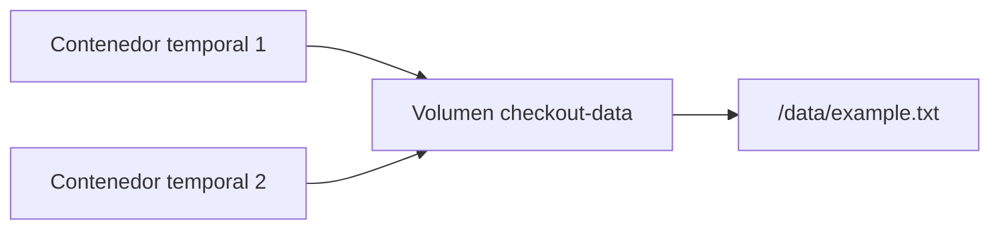

### DevEx del bloque

Añade tareas opcionales para listar y limpiar volúmenes con cuidado:

```yaml
volume:list:
  desc: List Docker volumes
  cmds:
    - docker volume ls

volume:remove:checkout:
  desc: Remove checkout-data volume
  cmds:
    - docker volume rm checkout-data || true
```

Evita tareas agresivas como `docker volume prune` en prácticas iniciales.

### Criterio de comprensión

Debes poder explicar:

> Un contenedor puede desaparecer sin que necesariamente desaparezcan sus datos, si esos datos viven en un volumen.

---

## 1.16. Redes de Docker

Antes de usar una red de Docker, hay que entender el problema.

Si tienes varios contenedores, necesitan comunicarse.

Ejemplo:

- `checkout-api` necesita hablar con `redis`
- `checkout-api` necesita hablar con `postgres`
- `checkout-api` necesita hablar con `payment-api`
No queremos que `checkout-api` dependa de IPs manuales.

Queremos que pueda usar nombres.

Crea una red:

```bash
docker network create shop-net
```

Ejecuta `checkout-api` en esa red:

```bash
docker run -d \
  --name checkout-api \
  --network shop-net \
  -p 8080:8080 \
  checkout-api:1.0.0
```

Ejecuta Redis en la misma red:

```bash
docker run -d \
  --name redis \
  --network shop-net \
  redis:7-alpine
```

Inspecciona la red:

```bash
docker network inspect shop-net
```

Prueba resolución de nombres desde un contenedor temporal:

```bash
docker run --rm -it \
  --network shop-net \
  alpine:3.20 sh
```

Dentro:

```sh
apk add --no-cache bind-tools
nslookup redis
exit
```

Limpiar:

```bash
docker stop checkout-api redis
docker rm checkout-api redis
docker network rm shop-net
```

### Qué aprender

En una red de contenedores, los contenedores pueden descubrirse por nombre.

Esto prepara la idea de Service DNS en Kubernetes.

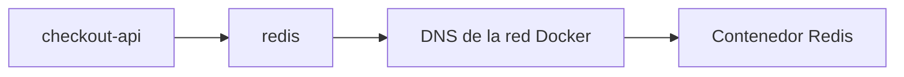

### DevEx del bloque

El objetivo no es recordar todos los comandos de red. El objetivo es tener una práctica repetible para ver que el nombre `redis` resuelve dentro de la red.

Puedes añadir:

```yaml
network:create:
  desc: Create shop-net Docker network
  cmds:
    - docker network create shop-net || true

network:inspect:
  desc: Inspect shop-net Docker network
  cmds:
    - docker network inspect shop-net | jq '.[0].Containers'
```

### Criterio de comprensión

Debes poder explicar:

> En una red de contenedores, el nombre del contenedor puede funcionar como identidad de red. En Kubernetes usaremos Services para conseguir una identidad estable más robusta.

---

## 1.17. Docker inspect y jq

`docker inspect` devuelve información estructurada del objeto.

Ejecuta:

```bash
docker run -d \
  --name checkout-api \
  -p 8080:8080 \
  checkout-api:1.0.0
```

Inspecciona:

```bash
docker inspect checkout-api
```

Extrae campos concretos con `jq`:

```bash
docker inspect checkout-api | jq '.[0].Config.Image'
docker inspect checkout-api | jq '.[0].Config.User'
docker inspect checkout-api | jq '.[0].NetworkSettings.Ports'
```

Limpiar:

```bash
docker stop checkout-api
docker rm checkout-api
```

### Qué aprender

No hace falta leer JSON gigante a mano.

La combinación de Docker y `jq` es una práctica útil para debugging.

### DevEx del bloque

Añade una tarea que enseñe inspección estructurada:

```yaml
container:inspect:docker:
  desc: Inspect checkout-api container with jq
  cmds:
    - docker inspect checkout-api | jq '.[0].Config'
    - docker inspect checkout-api | jq '.[0].NetworkSettings.Ports'
```

### Criterio de comprensión

Debes poder explicar:

> Los comandos de contenedores pueden devolver datos estructurados. `jq` me permite convertir esos datos en respuestas concretas.

---

## 1.18. Construir y ejecutar con Podman

Construir con Podman:

```bash
podman build -t checkout-api:1.0.0 -f apps/checkout-api/Containerfile ./apps/checkout-api
```

Ejecutar:

```bash
podman run --rm -p 8080:8080 checkout-api:1.0.0
```

Validar:

```bash
curl -i http://localhost:8080/health
```

Ejecutar en segundo plano:

```bash
podman run -d \
  --name checkout-api \
  -p 8080:8080 \
  checkout-api:1.0.0
```

Logs:

```bash
podman logs -f checkout-api
```

Entrar:

```bash
podman exec -it checkout-api sh
```

Limpiar:

```bash
podman stop checkout-api
podman rm checkout-api
```

### Qué observar

El flujo conceptual es casi el mismo:

- Build
- Run
- Logs
- Exec
- Stop
- Remove
Pero la herramienta no es la misma.

Podman ayuda a entender que el concepto importante no es Docker en sí, sino contenedores, imágenes, registros, redes, volúmenes y procesos aislados.

### DevEx del bloque

La simetría del Taskfile importa:

```yaml
container:build:podman:
  desc: Build checkout-api image with Podman
  cmds:
    - podman build -t {{.IMAGE_NAME}}:{{.IMAGE_TAG}} -f ./apps/{{.APP_NAME}}/Containerfile ./apps/{{.APP_NAME}}

container:run:podman:
  desc: Run checkout-api with Podman
  cmds:
    - podman run --rm -p {{.PORT}}:8080 {{.IMAGE_NAME}}:{{.IMAGE_TAG}}
```

El alumno ve que cambia la herramienta, pero no cambia el modelo.

### Criterio de comprensión

Debes poder explicar:

> Si entiendo el modelo, puedo moverme entre Docker y Podman sin volver a aprender contenedores desde cero.

---

## 1.19. Pods locales con Podman

Podman permite trabajar con pods locales.

Esto no es Kubernetes, pero sirve como puente mental.

Crea un pod:

```bash
podman pod create \
  --name shop-pod \
  -p 8080:8080
```

Añade `checkout-api`:

```bash
podman run -d \
  --name checkout-api \
  --pod shop-pod \
  checkout-api:1.0.0
```

Añade un contenedor auxiliar:

```bash
podman run -d \
  --name debug-shell \
  --pod shop-pod \
  alpine:3.20 sleep 3600
```

Ver el pod:

```bash
podman pod ps
podman ps --pod
```

Entrar al contenedor auxiliar:

```bash
podman exec -it debug-shell sh
```

Probar dentro:

```sh
wget -qO- http://localhost:8080/health
exit
```

Limpiar:

```bash
podman pod stop shop-pod
podman pod rm shop-pod
```

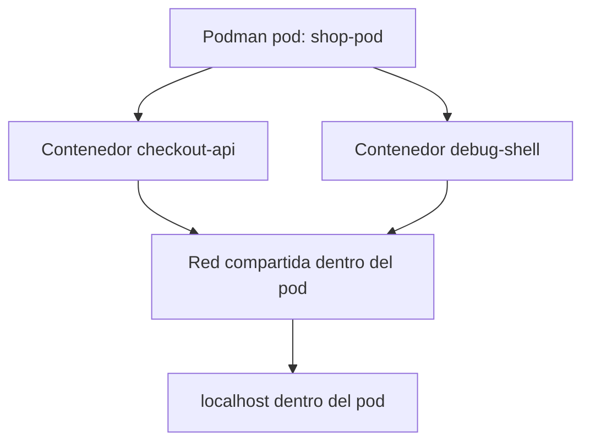

### Qué aprender

En un pod local, los contenedores pueden compartir red.

Esto prepara el modelo de Pod en Kubernetes, donde varios contenedores dentro de un mismo Pod comparten ciertas partes del entorno, especialmente red.

### DevEx del bloque

Añade tareas opcionales:

```yaml
podman:pod:create:
  desc: Create local Podman pod
  cmds:
    - podman pod create --name shop-pod -p {{.PORT}}:8080

podman:pod:ps:
  desc: List Podman pods and containers
  cmds:
    - podman pod ps
    - podman ps --pod

podman:pod:delete:
  desc: Delete local Podman pod
  cmds:
    - podman pod stop shop-pod || true
    - podman pod rm shop-pod || true
```

### Criterio de comprensión

Debes poder explicar:

> Un pod agrupa contenedores que necesitan vivir juntos. En Kubernetes, el Pod será la unidad mínima de ejecución.

---

## 1.20. Docker Compose

Docker Compose permite definir una aplicación multi-contenedor en un fichero YAML. La referencia oficial de Compose define un Compose file como una configuración para servicios, redes, volúmenes y otros elementos de una aplicación Docker. ([Docker Documentation](https://docs.docker.com/reference/compose-file/ "Compose file reference"))

Compose no sustituye el conocimiento de Docker.

Compose organiza varios contenedores para que puedas trabajar con un sistema local completo sin escribir manualmente todos los `docker run`.

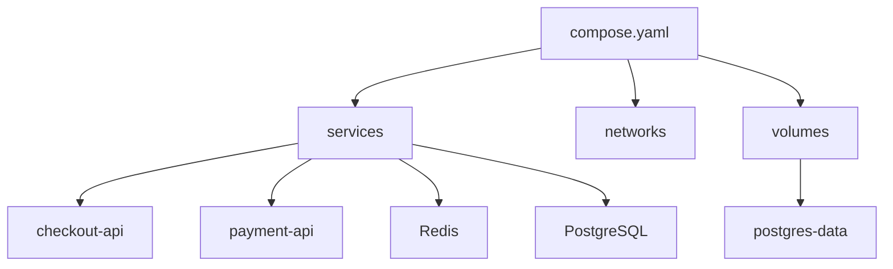

### Qué aprender

Compose introduce una idea que será muy importante en Kubernetes:

> El sistema se describe en un fichero, no en una secuencia manual de comandos.

Pero Compose todavía no es Kubernetes.

Compose facilita desarrollo local.

Kubernetes añade reconciliación, scheduling, rollouts, RBAC, NetworkPolicies, controladores, API declarativa y operación multi-nodo.

### DevEx del bloque

Compose es una gran herramienta de DevEx para este módulo porque permite arrancar varias dependencias locales con un comando.

La práctica debería permitir:

```bash
task compose:up:detached
task compose:ps
task compose:logs
task compose:down
```

### Criterio de comprensión

Debes poder explicar:

> Compose convierte varios `docker run` en una definición legible y repetible de un sistema local.

---

## 1.21. Compose para shop

Antes de crear el fichero, definimos el contrato del entorno local.

Queremos levantar:

- `checkout-api`
- `payment-api`
- `Redis`
- `PostgreSQL`
No vamos a implementar todavía `payment-api`.

Usaremos `nginx` como servicio HTTP temporal para tener una dependencia de red simple.

`checkout-api` no va a conectarse realmente a PostgreSQL ni Redis en este módulo. Los añadimos para practicar servicios, redes, volúmenes, healthchecks y variables de entorno sin crear una práctica demasiado grande.

### Contrato del entorno Compose

|Servicio|Imagen o build|Propósito|
|---|---|---|
|`checkout-api`|Build local|API principal|
|`payment-api`|`nginx:1.27-alpine`|Dependencia HTTP simulada|
|`redis`|`redis:7-alpine`|Dependencia de cache o cola|
|`postgres`|`postgres:16-alpine`|Dependencia con volumen persistente|
|`postgres-data`|Volumen|Persistencia de PostgreSQL|

Crea:

```text
compose/
  compose.yaml
```

Contenido:

```yaml
services:
  checkout-api:
    build:
      context: ../apps/checkout-api
      dockerfile: Dockerfile
    image: checkout-api:1.0.0
    ports:
      - "8080:8080"
    environment:
      SERVICE_NAME: checkout-api
      LOG_LEVEL: debug
      PORT: 8080
      PAYMENT_API_URL: http://payment-api:80
      REDIS_HOST: redis
      POSTGRES_HOST: postgres
    depends_on:
      redis:
        condition: service_started
      postgres:
        condition: service_healthy

  payment-api:
    image: nginx:1.27-alpine
    ports:
      - "8081:80"

  redis:
    image: redis:7-alpine

  postgres:
    image: postgres:16-alpine
    environment:
      POSTGRES_DB: shop
      POSTGRES_USER: shop
      POSTGRES_PASSWORD: shop
    volumes:
      - postgres-data:/var/lib/postgresql/data
    healthcheck:
      test: ["CMD-SHELL", "pg_isready -U shop -d shop"]
      interval: 5s
      timeout: 3s
      retries: 10

volumes:
  postgres-data:
```

Desde la raíz del repo:

```bash
docker compose -f compose/compose.yaml up --build
```

En otra terminal:

```bash
curl -i http://localhost:8080/health
curl -i http://localhost:8080/checkout
```

Ver servicios:

```bash
docker compose -f compose/compose.yaml ps
```

Ver logs:

```bash
docker compose -f compose/compose.yaml logs -f checkout-api
```

Parar:

```bash
docker compose -f compose/compose.yaml down
```

Parar y borrar volumen:

```bash
docker compose -f compose/compose.yaml down -v
```

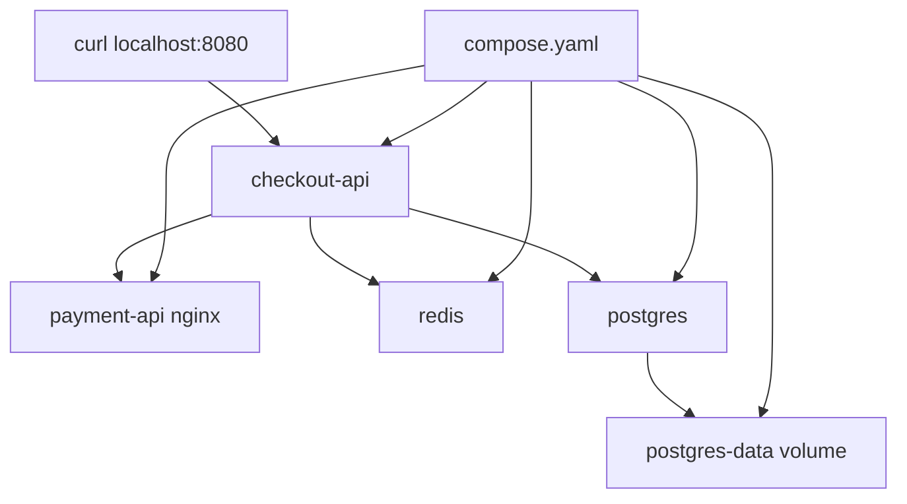

### Por qué depends_on no es suficiente

Compose permite controlar el orden de arranque y apagado con `depends_on`; su documentación indica que Compose arranca y para contenedores en orden de dependencia, determinada por atributos como `depends_on`, `links`, `volumes_from` y `network_mode: "service:..."`. ([Docker Documentation](https://docs.docker.com/compose/how-tos/startup-order/ "Control startup and shutdown order in Compose"))

Pero ordenar el arranque no equivale a que una dependencia esté lista para uso real.

Por eso `postgres` tiene un `healthcheck`.

Más adelante, en Kubernetes, esta conversación se convertirá en:

- readiness probes
- startup probes
- init containers
- retries en la aplicación
- diseño tolerante a dependencias lentas
### DevEx del bloque

La DevEx buena aquí no es solo tener `compose.yaml`.

Es tener una rutina:

```bash
task compose:up:detached
task compose:ps
task smoke
task compose:logs
task compose:down
```

Ese flujo permite arrancar, comprobar, observar y limpiar.

### Criterio de comprensión

Debes poder explicar:

> Compose me ayuda a levantar un sistema local multi-contenedor, pero no reemplaza una estrategia real de readiness, resiliencia u orquestación.

---

## 1.22. Compose vs Kubernetes

Compose y Kubernetes no resuelven el mismo problema al mismo nivel.

Compose es excelente para desarrollo local, demos, integración simple y entornos de aprendizaje.

Kubernetes aparece cuando el problema incluye operación distribuida, estado deseado, scheduling, reconciliación, rollouts, self-healing, RBAC, NetworkPolicies, observabilidad, escalado, nodos, control plane y múltiples equipos.

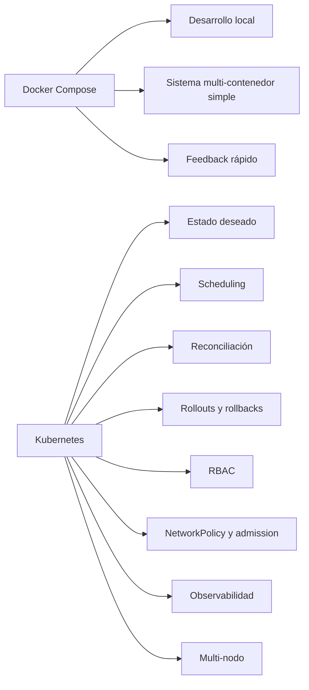

### Tabla comparativa

|Necesidad|Compose|Kubernetes|
|---|--:|--:|
|Levantar varios servicios localmente|Sí|Sí, pero con más coste|
|Definir redes y volúmenes locales|Sí|Sí|
|Reconciliar estado deseado continuamente|Limitado|Sí|
|Scheduling multi-nodo|No|Sí|
|Rollouts y rollbacks declarativos|No al mismo nivel|Sí|
|RBAC|No como modelo central|Sí|
|NetworkPolicy|No como modelo central|Sí|
|Auto-recuperación avanzada|Limitada|Sí|
|Operación multi-equipo|Limitada|Sí|
|Control plane declarativo|No|Sí|

### DevEx del bloque

El paso de Compose a Kubernetes debe sentirse natural:

```text
compose.yaml → manifests Kubernetes
docker compose logs → kubectl logs
docker compose ps → kubectl get pods
docker compose down → kubectl delete / helm uninstall / git revert
```

No son equivalentes perfectos, pero el alumno empieza a construir correspondencias.

### Criterio de comprensión

Debes poder explicar:

> Compose es un puente excelente hacia Kubernetes porque te enseña servicios, redes, volúmenes y configuración. Kubernetes añade operación distribuida, reconciliación, seguridad y control declarativo.

---

## 1.23. Taskfile para el módulo 1

La DevEx de este módulo se apoya en Taskfile.

El objetivo no es esconder comandos.

El objetivo es hacerlos repetibles, visibles y fáciles de ejecutar.

### Taskfile recomendado

```yaml
version: '3'

vars:
  APP_NAME: checkout-api
  IMAGE_NAME: checkout-api
  IMAGE_TAG: 1.0.0
  PORT: 8080
  COMPOSE_FILE: compose/compose.yaml

tasks:
  default:
    desc: List available tasks
    cmds:
      - task --list

  doctor:
    desc: Check required local tools
    cmds:
      - node --version || true
      - npm --version || true
      - git --version
      - curl --version
      - jq --version
      - yq --version
      - task --version
      - docker --version
      - docker compose version
      - podman --version || true

  app:install:
    desc: Install checkout-api dependencies locally
    dir: apps/{{.APP_NAME}}
    cmds:
      - npm install

  app:run:
    desc: Run checkout-api locally without a container
    dir: apps/{{.APP_NAME}}
    cmds:
      - PORT={{.PORT}} LOG_LEVEL=debug npm start

  container:build:docker:
    desc: Build checkout-api image with Docker
    cmds:
      - docker build -t {{.IMAGE_NAME}}:{{.IMAGE_TAG}} ./apps/{{.APP_NAME}}

  container:run:docker:
    desc: Run checkout-api with Docker
    cmds:
      - docker run --rm -p {{.PORT}}:8080 {{.IMAGE_NAME}}:{{.IMAGE_TAG}}

  container:run:docker:debug:
    desc: Run checkout-api with Docker and debug logs
    cmds:
      - docker run --rm -p {{.PORT}}:8080 -e LOG_LEVEL=debug {{.IMAGE_NAME}}:{{.IMAGE_TAG}}

  container:run:docker:detached:
    desc: Run checkout-api with Docker in detached mode
    cmds:
      - docker run -d --name checkout-api -p {{.PORT}}:8080 -e LOG_LEVEL=debug {{.IMAGE_NAME}}:{{.IMAGE_TAG}}

  container:logs:docker:
    desc: Follow checkout-api Docker logs
    cmds:
      - docker logs -f checkout-api

  container:shell:docker:
    desc: Open a shell inside checkout-api Docker container
    cmds:
      - docker exec -it checkout-api sh

  container:stop:docker:
    desc: Stop and remove checkout-api Docker container
    cmds:
      - docker stop checkout-api || true
      - docker rm checkout-api || true

  container:inspect:image:docker:
    desc: Inspect checkout-api image with Docker
    cmds:
      - docker image inspect {{.IMAGE_NAME}}:{{.IMAGE_TAG}} | jq '.[0].Config'
      - docker history {{.IMAGE_NAME}}:{{.IMAGE_TAG}}

  container:inspect:docker:
    desc: Inspect checkout-api container with Docker
    cmds:
      - docker inspect checkout-api | jq '.[0].Config'
      - docker inspect checkout-api | jq '.[0].NetworkSettings.Ports'

  container:build:podman:
    desc: Build checkout-api image with Podman
    cmds:
      - podman build -t {{.IMAGE_NAME}}:{{.IMAGE_TAG}} -f ./apps/{{.APP_NAME}}/Containerfile ./apps/{{.APP_NAME}}

  container:run:podman:
    desc: Run checkout-api with Podman
    cmds:
      - podman run --rm -p {{.PORT}}:8080 {{.IMAGE_NAME}}:{{.IMAGE_TAG}}

  podman:pod:create:
    desc: Create local Podman pod
    cmds:
      - podman pod create --name shop-pod -p {{.PORT}}:8080

  podman:pod:ps:
    desc: List Podman pods and containers
    cmds:
      - podman pod ps
      - podman ps --pod

  podman:pod:delete:
    desc: Delete local Podman pod
    cmds:
      - podman pod stop shop-pod || true
      - podman pod rm shop-pod || true

  compose:up:
    desc: Start shop with Docker Compose
    cmds:
      - docker compose -f {{.COMPOSE_FILE}} up --build

  compose:up:detached:
    desc: Start shop with Docker Compose in detached mode
    cmds:
      - docker compose -f {{.COMPOSE_FILE}} up -d --build

  compose:ps:
    desc: Show Compose services
    cmds:
      - docker compose -f {{.COMPOSE_FILE}} ps

  compose:logs:
    desc: Follow Compose logs
    cmds:
      - docker compose -f {{.COMPOSE_FILE}} logs -f

  compose:down:
    desc: Stop Compose services
    cmds:
      - docker compose -f {{.COMPOSE_FILE}} down

  compose:down:volumes:
    desc: Stop Compose services and remove volumes
    cmds:
      - docker compose -f {{.COMPOSE_FILE}} down -v

  smoke:
    desc: Run checkout-api smoke test
    cmds:
      - ./scripts/smoke-test.sh

  image:list:
    desc: List local checkout-api images
    cmds:
      - docker images | grep checkout-api || true

  container:list:
    desc: List local containers
    cmds:
      - docker ps -a

  volume:list:
    desc: List Docker volumes
    cmds:
      - docker volume ls

  network:list:
    desc: List Docker networks
    cmds:
      - docker network ls
```

### Flujo recomendado

```bash
task doctor
task app:install
task app:run
task smoke
task container:build:docker
task container:run:docker
task smoke
task container:build:podman
task container:run:podman
task compose:up:detached
task compose:ps
task compose:logs
task smoke
task compose:down
```

### Criterio DevEx

Debes poder explicar:

> Taskfile no hace que Docker, Podman o Compose desaparezcan. Hace que el flujo de aprendizaje sea repetible, visible y más difícil de romper por errores accidentales.

---

## 1.24. Práctica principal del módulo

### Objetivo

Empaquetar `checkout-api`, ejecutarla con Docker, ejecutarla con Podman y levantar un sistema local con Compose.

### Resultado esperado

Al final deberías tener:

```text
kubernetes-learning-lab/
  apps/
    checkout-api/
      package.json
      src/
        server.js
      Dockerfile
      Containerfile
      .dockerignore

  compose/
    compose.yaml

  scripts/
    smoke-test.sh

  Taskfile.yml
```

### Paso 1. Crear la app

Crea los ficheros de `apps/checkout-api`.

Valida que existen:

```bash
tree apps/checkout-api
```

### Paso 2. Crear el smoke test

Crea:

```text
scripts/smoke-test.sh
```

Dale permisos:

```bash
chmod +x scripts/smoke-test.sh
```

### Paso 3. Ejecutar sin contenedor

```bash
task app:install
task app:run
```

En otra terminal:

```bash
task smoke
```

### Paso 4. Construir con Docker

```bash
task container:build:docker
```

Valida:

```bash
docker images | grep checkout-api
```

### Paso 5. Ejecutar con Docker

```bash
task container:run:docker
```

En otra terminal:

```bash
task smoke
```

### Paso 6. Inspeccionar la imagen

```bash
task container:inspect:image:docker
```

Observa:

- Usuario
- Comando
- Imagen base
- Capas
- Tamaño
### Paso 7. Ejecutar en segundo plano y ver logs

```bash
task container:run:docker:detached
task smoke
task container:logs:docker
```

Después limpia:

```bash
task container:stop:docker
```

### Paso 8. Construir con Podman

```bash
task container:build:podman
```

### Paso 9. Ejecutar con Podman

```bash
task container:run:podman
```

En otra terminal:

```bash
task smoke
```

### Paso 10. Levantar Compose

```bash
task compose:up:detached
task compose:ps
task smoke
```

### Paso 11. Revisar logs

```bash
task compose:logs
```

### Paso 12. Apagar sin borrar datos

```bash
task compose:down
```

### Paso 13. Apagar borrando datos

```bash
task compose:down:volumes
```

### Criterio de finalización

La práctica está completa cuando puedes:

- Ejecutar `checkout-api` sin contenedor
- Validar el contrato HTTP con `task smoke`
- Construir la imagen con Docker
- Ejecutarla con Docker
- Ejecutarla con variables de entorno
- Ver logs
- Entrar en el contenedor
- Construir la imagen con Podman
- Ejecutarla con Podman
- Levantar `checkout-api`, `payment-api`, `Redis` y `PostgreSQL` con Compose
- Explicar qué se pierde y qué no se pierde al borrar contenedores
- Explicar qué ocurre al borrar volúmenes
---

## 1.25. Ejercicios cortos

### Ejercicio 1. Imagen y contenedor

Ejecuta:

```bash
docker build -t checkout-api:1.0.0 ./apps/checkout-api
docker run -d --name checkout-one -p 8080:8080 checkout-api:1.0.0
docker run -d --name checkout-two -p 8081:8080 checkout-api:1.0.0
```

Valida:

```bash
curl -i http://localhost:8080/health
curl -i http://localhost:8081/health
```

Pregunta:

- ¿Cuántas imágenes hay?
- ¿Cuántos contenedores hay?
- ¿Qué comparten?
- ¿Qué no comparten?
Limpia:

```bash
docker stop checkout-one checkout-two
docker rm checkout-one checkout-two
```

---

### Ejercicio 2. Contrato HTTP

Ejecuta:

```bash
docker run --rm -p 8080:8080 checkout-api:1.0.0
```

En otra terminal:

```bash
curl -i http://localhost:8080/health
curl -i http://localhost:8080/ready
curl -i http://localhost:8080/checkout
curl -i http://localhost:8080/unknown
```

Pregunta:

- ¿Qué endpoint devuelve `status: ok`?
- ¿Qué endpoint devuelve `status: ready`?
- ¿Qué endpoint devuelve `404`?
- ¿Por qué `/health` y `/ready` no significan lo mismo?
---

### Ejercicio 3. Variables de entorno

Ejecuta:

```bash
docker run --rm \
  -p 8080:8080 \
  -e SERVICE_NAME=checkout-api \
  -e LOG_LEVEL=debug \
  checkout-api:1.0.0
```

En otra terminal:

```bash
curl -i http://localhost:8080/health
```

Pregunta:

- ¿Cambió la imagen?
- ¿Cambió el comportamiento?
- ¿Dónde debería vivir la configuración?
---

### Ejercicio 4. Usuario no root

Ejecuta:

```bash
docker run --rm -it checkout-api:1.0.0 sh
```

Dentro:

```sh
whoami
id
exit
```

Pregunta:

- ¿Qué usuario ejecuta la app?
- ¿Por qué no conviene ejecutar como root?
- ¿Qué errores podrían aparecer por permisos?
---

### Ejercicio 5. Volumen

Ejecuta:

```bash
docker volume create shop-data
docker run --rm -it -v shop-data:/data alpine:3.20 sh
```

Dentro:

```sh
echo "hello" > /data/example.txt
exit
```

Vuelve a entrar:

```bash
docker run --rm -it -v shop-data:/data alpine:3.20 sh
```

Dentro:

```sh
cat /data/example.txt
exit
```

Pregunta:

- ¿Por qué el fichero sigue existiendo?
- ¿Qué pasa si borras el volumen?
Limpia:

```bash
docker volume rm shop-data
```

---

### Ejercicio 6. Red

Ejecuta:

```bash
docker network create shop-net
docker run -d --name redis --network shop-net redis:7-alpine
docker run --rm -it --network shop-net alpine:3.20 sh
```

Dentro:

```sh
apk add --no-cache bind-tools
nslookup redis
exit
```

Pregunta:

- ¿Por qué puedes resolver `redis`?
- ¿Qué diferencia hay entre nombre e IP?
- ¿Qué relación tendrá esto con Services en Kubernetes?
Limpia:

```bash
docker stop redis
docker rm redis
docker network rm shop-net
```

---

### Ejercicio 7. Compose

Ejecuta:

```bash
docker compose -f compose/compose.yaml up -d --build
docker compose -f compose/compose.yaml ps
curl -i http://localhost:8080/health
docker compose -f compose/compose.yaml logs checkout-api
docker compose -f compose/compose.yaml down
```

Pregunta:

- ¿Qué servicios levantó Compose?
- ¿Qué red creó?
- ¿Qué volumen creó?
- ¿Qué comando usarías para borrar también el volumen?
- ¿Qué hace `depends_on`?
- ¿Por qué `depends_on` no sustituye una readiness real?
---

## 1.26. Errores habituales

### Error 1. Confundir imagen con contenedor

Mal:

> La imagen está corriendo.

Mejor:

> El contenedor está corriendo a partir de una imagen.

---

### Error 2. Usar latest como si fuera una versión

`latest` no significa “la versión más segura” ni “la versión correcta”.

Es solo un tag.

Para prácticas puede ser cómodo.

Para delivery serio, usa versiones explícitas y, cuando tenga sentido, digests.

---

### Error 3. Meter secretos dentro de la imagen

No metas contraseñas, tokens ni claves privadas en:

- Dockerfile
- Código
- Imagen
- Variables de build
- Ficheros copiados dentro de la imagen
La imagen puede acabar en un registry, cache, escáner o máquina donde no esperabas que ese secreto existiera.

---

### Error 4. Pensar que Compose es Kubernetes pequeño

Compose es muy útil, pero no tiene el mismo modelo de control que Kubernetes.

Compose levanta servicios.

Kubernetes reconcilia estado deseado.

---

### Error 5. No distinguir build-time y run-time

Build-time:

- Instalar dependencias
- Copiar código
- Preparar imagen
- Definir comando de arranque
Run-time:

- Elegir puerto
- Pasar variables
- Montar volúmenes
- Conectar redes
- Ejecutar el proceso
---

### Error 6. Ejecutar como root sin pensarlo

No siempre podrás evitar root desde el primer día, pero debes tratarlo como una decisión consciente.

En el laboratorio, `checkout-api` debe ejecutarse como usuario no root.

---

### Error 7. No limpiar recursos

Durante prácticas locales es fácil acumular:

- Contenedores parados
- Imágenes viejas
- Redes
- Volúmenes
Comandos útiles:

```bash
docker ps -a
docker images
docker volume ls
docker network ls
docker system df
```

Limpieza con cuidado:

```bash
docker container prune
docker image prune
docker volume prune
```

No ejecutes limpiezas agresivas sin entender qué borran.

---

### Error 8. Pedir una API sin definir su contrato

No basta con decir:

> Crea `/health`.

Hay que saber:

- Qué método usa
- Qué código devuelve
- Qué body devuelve
- Qué significa cuando falla
- Cómo se valida
- Qué relación tendrá con Kubernetes
---

### Error 9. Hacer smoke tests demasiado débiles

Esto es débil:

```bash
curl http://localhost:8080/health
```

Esto es mejor:

```bash
curl -fsS http://localhost:8080/health
```

Esto es todavía mejor para este módulo:

```bash
./scripts/smoke-test.sh
```

Porque comprueba código HTTP y campos mínimos del JSON.

---

## 1.27. Criterio de salida del módulo

Puedes pasar al módulo 2 cuando puedas hacer todo esto sin seguir una receta ciegamente.

### Conceptos

Debes poder explicar:

- Qué es una imagen
- Qué es un contenedor
- Qué es un registry
- Qué es un Dockerfile
- Qué es un Containerfile
- Qué es un tag
- Qué es un digest
- Qué es un volumen
- Qué es una red de contenedores
- Qué diferencia hay entre Docker y Podman
- Qué papel tiene OCI
- Qué papel tiene CRI en Kubernetes
- Qué resuelve Compose
- Qué no resuelve Compose
### Contrato HTTP

Debes poder explicar:

- Qué es un endpoint
- Qué es un contrato HTTP
- Qué devuelve `GET /health`
- Qué devuelve `GET /ready`
- Qué devuelve `GET /checkout`
- Qué diferencia hay entre `/health` y `/ready`
- Por qué un smoke test debe comprobar comportamiento esperado, no solo que algo responde
### Docker

Debes poder:

- Construir una imagen
- Ejecutar un contenedor
- Publicar un puerto
- Pasar variables de entorno
- Ver logs
- Entrar en un contenedor
- Inspeccionar una imagen
- Inspeccionar un contenedor
- Crear una red
- Crear un volumen
- Limpiar recursos
### Podman

Debes poder:

- Construir la misma imagen con Podman
- Ejecutarla con Podman
- Ver logs
- Entrar en el contenedor
- Crear un pod local sencillo
- Explicar por qué Podman ayuda a separar concepto de herramienta
### Compose

Debes poder:

- Leer un `compose.yaml`
- Levantar varios servicios
- Ver logs
- Ver estado
- Parar servicios
- Borrar volúmenes
- Explicar por qué Compose es buen puente hacia Kubernetes
### DevEx

Debes poder:

- Ejecutar `task doctor`
- Ejecutar la app local con `task app:run`
- Validar el contrato con `task smoke`
- Construir la imagen con `task container:build:docker`
- Ejecutar la imagen con `task container:run:docker`
- Levantar el sistema con `task compose:up:detached`
- Ver estado con `task compose:ps`
- Ver logs con `task compose:logs`
- Limpiar con `task compose:down`
- Explicar qué comando real hay debajo de cada tarea
### Frase final de comprensión

Debes poder explicar esta frase:

> Kubernetes no empieza en el YAML. Kubernetes empieza en la necesidad de operar procesos empaquetados como contenedores, conectados por red, configurados por entorno, observables por logs y preparados para fallar.

---

## 1.28. Referencias oficiales

|Tema|Referencia|
|---|---|
|Docker overview|Docker Docs, Docker overview. ([Docker Documentation](https://docs.docker.com/get-started/docker-overview/ "What is Docker?"))|
|Docker images|Docker Docs, What is an image? ([Docker Documentation](https://docs.docker.com/get-started/docker-concepts/the-basics/what-is-an-image/ "What is an image? \| Docker Docs"))|
|Dockerfile|Docker Docs, Dockerfile overview. ([Docker Documentation](https://docs.docker.com/build/concepts/dockerfile/ "Dockerfile overview"))|
|Docker Compose file|Docker Docs, Compose file reference. ([Docker Documentation](https://docs.docker.com/reference/compose-file/ "Compose file reference"))|
|Compose startup order|Docker Docs, Control startup and shutdown order in Compose. ([Docker Documentation](https://docs.docker.com/compose/how-tos/startup-order/ "Control startup and shutdown order in Compose"))|
|Podman|Podman official documentation. ([docs.podman.io](https://docs.podman.io/ "What is Podman? — Podman documentation"))|
|Podman CLI|Podman manual. ([docs.podman.io](https://docs.podman.io/en/stable/markdown/podman.1.html "containers.conf"))|
|OCI|Open Container Initiative. ([Docker Documentation](https://docs.docker.com/get-started/docker-overview/ "What is Docker?"))|
|Kubernetes CRI|Kubernetes Docs, Container Runtime Interface. ([Docker Documentation](https://docs.docker.com/get-started/docker-overview/ "What is Docker?"))|
|Express|Express official website. ([Express](https://expressjs.com/ "Express - Node.js web application framework"))|
|Node official image|Docker Hub, Node official image. ([Docker Hub](https://hub.docker.com/_/node "node - Official Image"))|
|npm install|npm Docs, `npm install`. ([Documentación de npm](https://docs.npmjs.com/cli/v8/commands/npm-install "npm-install"))|

## 1.29. Lecturas de apoyo

|Libro|Qué leer|
|---|---|
|_Érase una vez Docker_|Introducción a contenedores, instalación de Docker, primeros pasos, gestión de imágenes, contenedores, redes, publicación de puertos, logs, recursos y Compose.|
|_Kubernetes: Up and Running_|Capítulo 2: imágenes, Dockerfile, seguridad de imagen, multistage builds, registry y runtime.|
|_Kubernetes in Action_|Capítulos 1 y 2: contenedores, Docker, creación de imagen, ejecución, registry y primeros pasos hacia Kubernetes.|
|_Cloud Native DevOps with Kubernetes_|Capítulos 1 y 2: cloud, DevOps, contenedores, Dockerfile, imágenes mínimas, registries y primer despliegue.|