# 10. Delivery de aplicaciones

## Objetivo del módulo

En el módulo 9 construiste una cadena de testing automatizado para Kubernetes:

```text
render
schema validation
static analysis
policy tests
server-side dry-run
kind
deployment test
endpoint test
smoke test
failure lab
```

Ahora toca convertir esa cadena de feedback en delivery.

Delivery no significa “hacer deploy”.

Delivery significa:

> Tener un camino repetible, validado, auditable y reversible para que un cambio pase desde código hasta un entorno Kubernetes sin depender de pasos manuales frágiles.

Kubernetes soporta gestión declarativa de objetos usando ficheros de configuración. La documentación oficial explica que puedes crear, actualizar y borrar objetos almacenando configuraciones en ficheros y usando `kubectl apply`; también indica que `kubectl diff` permite previsualizar cambios antes de aplicar. ([Kubernetes](https://kubernetes.io/docs/tasks/manage-kubernetes-objects/declarative-config/ "Declarative Management of Kubernetes Objects Using ..."))

La idea central del módulo es esta:

> Delivery en Kubernetes no empieza en `kubectl apply`. Empieza en una imagen versionada, pasa por quality gates, actualiza manifests de forma trazable, despliega de forma controlada, valida señales y deja un camino claro de rollback.

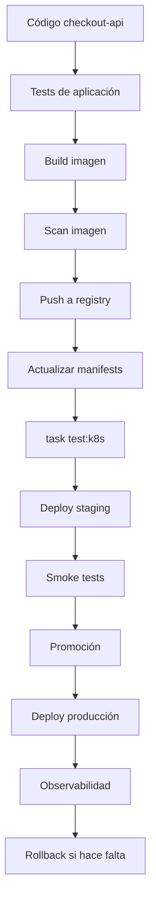

---

## 10.1. Qué vas a aprender y qué no vas a aprender todavía

Vas a aprender:

- Qué significa delivery en Kubernetes
- Diferencia entre deploy manual, CI/CD y GitOps
- Por qué delivery debe consumir el quality gate del módulo 9
- Cómo versionar imágenes
- Por qué evitar `latest`
- Cómo construir y publicar una imagen
- Cómo escanear una imagen
- Cómo actualizar manifests con Kustomize
- Cuándo usar Kustomize
- Cuándo usar Helm
- Qué son releases en Helm
- Cómo usar `kubectl apply`, `kubectl diff` y Server-Side Apply
- Cómo ejecutar rollout status
- Cómo hacer rollback
- Cómo promover cambios entre entornos
- Qué es GitOps
- Qué aporta Argo CD
- Qué aporta Flux
- Qué es progressive delivery
- Qué aportan canary y blue-green
- Qué parte será obligatoria en el laboratorio y qué parte será conceptual u opcional
No vamos a profundizar todavía en:

- GitOps completo en producción
- Argo CD instalado y operado como plataforma
- Flux instalado y operado como plataforma
- Argo Rollouts en producción
- Canary con métricas reales
- Blue-green con tráfico real
- Firmado de imágenes
- SLSA
- SBOM avanzada
- OIDC cloud real
- Promoción multi-cluster
- Gestión avanzada de secrets en delivery
- Progressive delivery con Service Mesh
Eso aparecerá después o en rutas profesionales.

La regla pedagógica del módulo será:

```text
Primero definir qué problema de delivery resolvemos
Luego explicar el contrato mental
Luego construir el flujo mínimo
Luego añadir gates
Luego añadir rollback
Luego comparar CI/CD, GitOps y progressive delivery
```

---

## 10.2. El problema: aplicar YAML manualmente no es delivery

Hasta ahora has ejecutado comandos como:

```bash
kubectl apply -f kubernetes/02-deployment/deployment.yaml
kubectl rollout status deployment/checkout-api -n shop
kubectl rollout undo deployment/checkout-api -n shop
```

Eso está bien para aprender.

Pero como mecanismo de delivery tiene problemas.

### Problemas del deploy manual

|Problema|Consecuencia|
|---|---|
|Depende de una persona|No es repetible|
|No siempre ejecuta los mismos gates|Puede saltarse validaciones|
|No deja trazabilidad clara|Difícil auditar qué llegó y por qué|
|Puede usar context equivocado|Riesgo alto|
|Puede aplicar manifests no versionados|Drift entre Git y cluster|
|Puede no validar rollout|Deploy “verde” falso|
|Puede no ejecutar smoke tests|Fallos tardíos|
|Puede no tener rollback definido|Recuperación lenta|

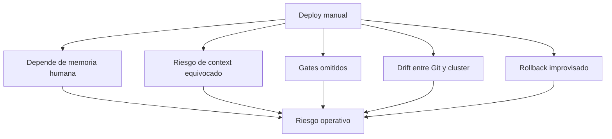

### Contrato mental

Un delivery mínimo debe responder:

- ¿Qué código se está entregando?
- ¿Qué imagen se construyó?
- ¿Qué tag o digest se desplegó?
- ¿Qué tests pasaron?
- ¿Qué manifests cambiaron?
- ¿Qué diff se aplicó?
- ¿Qué entorno recibió el cambio?
- ¿Qué smoke test validó el resultado?
- ¿Cómo se revierte?
- ¿Dónde queda registrado?
### Criterio de comprensión

Debes poder explicar:

> Delivery no es ejecutar comandos. Delivery es convertir cambios en releases trazables, validadas y reversibles.

---

## 10.3. El flujo mínimo de delivery

Antes de hablar de Helm, GitOps o progressive delivery, define el flujo mínimo.

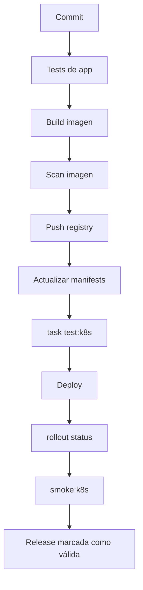

### Flujo base

1. Ejecutar tests de aplicación
2. Construir imagen
3. Etiquetar imagen de forma única
4. Escanear imagen
5. Publicar imagen en registry
6. Actualizar manifests con esa imagen
7. Renderizar manifests
8. Validar manifests
9. Probar políticas
10. Crear cluster efímero
11. Desplegar en kind
12. Ejecutar smoke tests
13. Desplegar en staging
14. Validar rollout
15. Ejecutar smoke tests en staging
16. Promocionar
17. Desplegar en producción
18. Observar
19. Hacer rollback si hace falta
### Qué no debe pasar

No deberías desplegar una imagen que:

- No tiene tag trazable
- No pasó tests
- No fue escaneada
- No tiene manifest actualizado
- No pasó `task test:k8s`
- No tiene rollback claro
- No se puede vincular a un commit
### Criterio de comprensión

Debes poder explicar:

> La imagen, el manifest y el commit deben formar una cadena trazable.

---

## 10.4. Tags, digests y `latest`

Antes de construir pipeline, hay que explicar versionado de imágenes.

### Por qué no usar `latest`

`latest` no expresa una versión real.

Puede cambiar sin que el manifest cambie.

Hace más difícil auditar, reproducir y revertir.

En el módulo 9 ya añadiste policies para bloquearlo.

### Tags útiles

Para laboratorio:

```text
checkout-api:1.0.0
checkout-api:1.0.1
checkout-api:dev-<short-sha>
```

Para CI real:

```text
ghcr.io/owner/repo/checkout-api:<git-sha>
ghcr.io/owner/repo/checkout-api:main-<git-sha>
ghcr.io/owner/repo/checkout-api:v1.2.3
```

### Digest

Un digest identifica contenido exacto de una imagen.

Ejemplo conceptual:

```text
checkout-api@sha256:...
```

El tag puede moverse.

El digest apunta a contenido concreto.

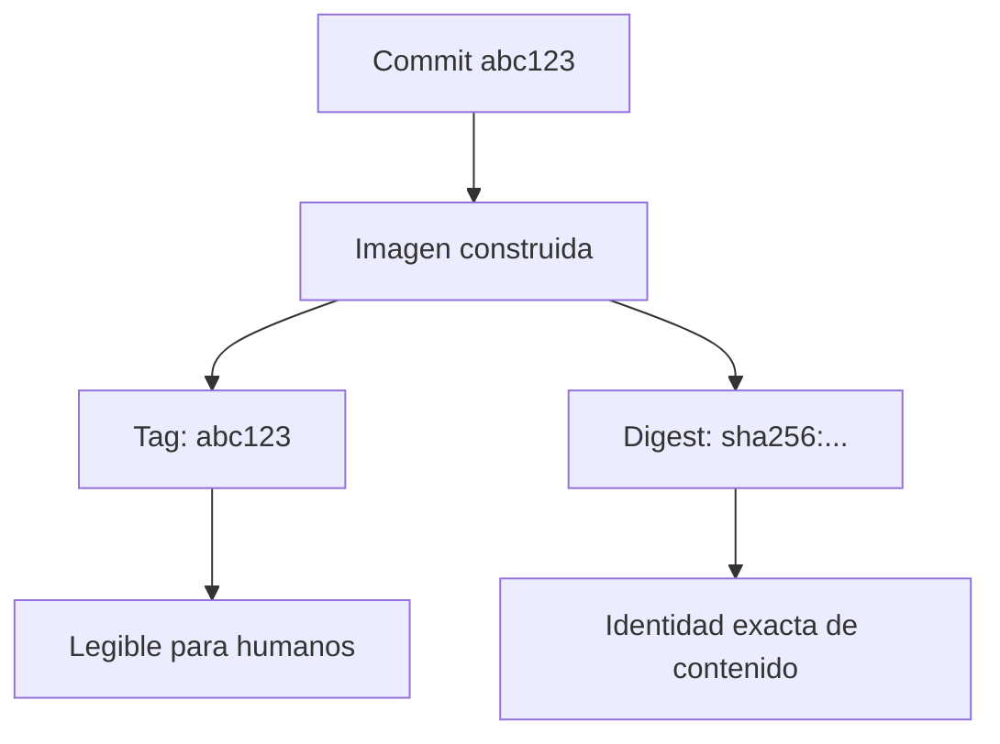

### Contrato del curso

Para el laboratorio usaremos:

```text
checkout-api:1.0.0
checkout-api:1.0.1
```

Para CI dejaremos preparado el patrón:

```text
IMAGE_TAG=${GITHUB_SHA}
```

### Criterio de comprensión

Debes poder explicar:

> Un tag ayuda a identificar una release. Un digest ayuda a identificar contenido exacto. `latest` oculta ambas cosas.

---

## 10.5. Build y push de imagen

### Qué problema resuelve

Kubernetes no despliega código fuente.

Despliega Pods que referencian imágenes.

Por tanto, delivery necesita publicar imágenes en un registry accesible por el cluster.

GitHub Actions define workflows como procesos automatizados configurables mediante YAML, compuestos por jobs y steps. GitHub también documenta cómo crear workflows que construyen y publican imágenes Docker en Docker Hub o GitHub Packages. ([GitHub Docs](https://docs.github.com/actions/using-workflows/workflow-syntax-for-github-actions "Workflow syntax for GitHub Actions"))

### Build local

```bash
docker build -t checkout-api:1.0.1 ./apps/checkout-api
```

### Push conceptual a registry

Ejemplo con GHCR:

```bash
docker tag checkout-api:1.0.1 ghcr.io/OWNER/REPO/checkout-api:1.0.1
docker push ghcr.io/OWNER/REPO/checkout-api:1.0.1
```

### Para kind

En kind no necesitas push si cargas la imagen:

```bash
kind load docker-image checkout-api:1.0.1 --name shop-learning
```

Pero en un cluster remoto sí necesitas que el cluster pueda hacer pull desde un registry.

### DevEx

Añade variables:

```yaml
vars:
  IMAGE_REGISTRY: ghcr.io
  IMAGE_REPOSITORY: owner/repo/checkout-api
  IMAGE_NAME: checkout-api
  IMAGE_TAG: 1.0.1
```

Añade tareas:

```yaml
image:build:
  desc: Build checkout-api image
  cmds:
    - docker build -t {{.IMAGE_NAME}}:{{.IMAGE_TAG}} ./apps/{{.APP_NAME}}

image:tag:
  desc: Tag checkout-api image for registry
  cmds:
    - docker tag {{.IMAGE_NAME}}:{{.IMAGE_TAG}} {{.IMAGE_REGISTRY}}/{{.IMAGE_REPOSITORY}}:{{.IMAGE_TAG}}

image:push:
  desc: Push checkout-api image to registry
  cmds:
    - docker push {{.IMAGE_REGISTRY}}/{{.IMAGE_REPOSITORY}}:{{.IMAGE_TAG}}
```

### Criterio de comprensión

Debes poder explicar:

> Un cluster remoto no ve mi imagen local. La imagen debe estar en un registry accesible, o cargarse explícitamente si es un cluster local como kind.

---

## 10.6. Scan de imagen

### Qué problema resuelve

Antes de publicar o desplegar una imagen, debes revisar vulnerabilidades y riesgos básicos.

Trivy se presenta como un scanner para encontrar vulnerabilidades, misconfigurations, secrets, SBOMs y problemas en contenedores, repositorios, artefactos, Kubernetes y cloud. También documenta scanning de imágenes de contenedor y generación o lectura de SBOMs. ([Trivy](https://trivy.dev/ "Trivy"))

### Comando básico

```bash
trivy image checkout-api:1.0.1
```

### Gate más estricto

```bash
trivy image --exit-code 1 --severity HIGH,CRITICAL checkout-api:1.0.1
```

### Qué detecta

Puede detectar:

- Vulnerabilidades de paquetes
- Dependencias vulnerables
- Problemas conocidos por base image
- Secrets, según configuración
- SBOM, según modo usado
### Qué no detecta

No demuestra:

- Que la app funcione
- Que tus manifests sean correctos
- Que tus permisos Kubernetes sean mínimos
- Que no haya vulnerabilidades lógicas
- Que tus secretos estén bien rotados
### DevEx

```yaml
image:scan:
  desc: Scan checkout-api image with Trivy
  cmds:
    - trivy image --exit-code 1 --severity HIGH,CRITICAL {{.IMAGE_NAME}}:{{.IMAGE_TAG}}
```

### Criterio de comprensión

Debes poder explicar:

> El scan de imagen es un gate de seguridad de artefacto. No sustituye tests de aplicación ni tests de Kubernetes.

---

## 10.7. Actualizar manifests con Kustomize
### Kustomize mínimo para CKAD

Kustomize permite partir de una base y aplicar variaciones sin convertir YAML en templates.

Para CKAD debes practicar cuatro operaciones:

1. Componer recursos.
2. Cambiar imágenes.
3. Generar ConfigMaps.
4. Aplicar patches.

### Base

```yaml
apiVersion: kustomize.config.k8s.io/v1beta1
kind: Kustomization

resources:
  - deployment.yaml
  - service.yaml
```

### Overlay local

```yaml
apiVersion: kustomize.config.k8s.io/v1beta1
kind: Kustomization

namespace: shop

resources:
  - ../../base

images:
  - name: checkout-api
    newName: checkout-api
    newTag: "1.0.1"

configMapGenerator:
  - name: checkout-api-config
    literals:
      - NODE_ENV=local
      - LOG_LEVEL=debug

patches:
  - path: patch-resources.yaml
```

### Patch

```yaml
apiVersion: apps/v1
kind: Deployment
metadata:
  name: checkout-api
spec:
  template:
    spec:
      containers:
        - name: checkout-api
          resources:
            requests:
              cpu: 100m
              memory: 128Mi
            limits:
              memory: 256Mi
```

### Render

```bash
kubectl kustomize kubernetes/overlays/local
```

### Aplicar

```bash
kubectl apply -k kubernetes/overlays/local
```

### Validar

```bash
kubectl get deploy,svc,cm -n shop
kubectl rollout status deployment/checkout-api -n shop
```

### Criterio de comprensión

Debes poder explicar:

> Kustomize no sustituye Kubernetes. Kustomize prepara el YAML final que Kubernetes recibirá.

### Qué problema resuelve

Después de construir una imagen, necesitas que los manifests apunten a esa versión.

No quieres editar YAML a mano en cada release.

Kustomize permite personalizar objetos Kubernetes mediante un fichero `kustomization`, y `kubectl` soporta gestionar objetos usando `kustomization` desde hace tiempo. La documentación oficial muestra `kubectl kustomize` para ver recursos y `kubectl apply -k` para aplicar configuraciones personalizadas. ([Kubernetes](https://kubernetes.io/docs/tasks/manage-kubernetes-objects/kustomization/ "Declarative Management of Kubernetes Objects Using ..."))

### Estructura recomendada

```text
kubernetes/
  base/
    kustomization.yaml
    deployment.yaml
    service.yaml
    configmap.yaml

  overlays/
    local/
      kustomization.yaml
    staging/
      kustomization.yaml
    production/
      kustomization.yaml
```

### Base

```yaml
resources:
  - deployment.yaml
  - service.yaml
  - configmap.yaml

images:
  - name: checkout-api
    newName: checkout-api
    newTag: 1.0.0
```

### Overlay local

```yaml
resources:
  - ../../base

images:
  - name: checkout-api
    newName: checkout-api
    newTag: 1.0.1
```

### Actualizar imagen

```bash
cd kubernetes/overlays/local
kustomize edit set image checkout-api=checkout-api:1.0.1
```

O usando `yq` de forma explícita, si prefieres control determinista sobre el fichero:

```bash
yq -i '.images[0].newTag = "1.0.1"' kubernetes/overlays/local/kustomization.yaml
```

### Render

```bash
kubectl kustomize kubernetes/overlays/local > .tmp/rendered.yaml
```

### DevEx

```yaml
manifests:set-image:
  desc: Update local overlay image tag. Usage: task manifests:set-image IMAGE_TAG=1.0.1
  cmds:
    - yq -i '.images[0].newTag = "{{.IMAGE_TAG}}"' kubernetes/overlays/local/kustomization.yaml
    - kubectl kustomize kubernetes/overlays/local > .tmp/rendered.yaml
    - yq 'select(.kind == "Deployment") | .spec.template.spec.containers[0].image' .tmp/rendered.yaml
```

### Criterio de comprensión

Debes poder explicar:

> Delivery no debería depender de editar YAML manualmente. El pipeline debe actualizar la referencia de imagen de forma trazable y reproducible.

---

## 10.8. Helm
### Helm mínimo obligatorio para CKAD

Aunque el curso use Kustomize como camino principal, CKAD espera que puedas usar Helm para desplegar paquetes existentes.

No necesitas crear charts complejos.

Sí necesitas poder:

- Añadir un repositorio.
- Buscar un chart.
- Inspeccionar valores.
- Instalar una release.
- Actualizar una release.
- Ver historial.
- Hacer rollback.
- Desinstalar.

### Flujo mínimo

```bash
helm repo add bitnami https://charts.bitnami.com/bitnami
helm repo update
helm search repo nginx
```

Inspeccionar valores:

```bash
helm show values bitnami/nginx > values.yaml
```

Instalar:

```bash
helm install demo-nginx bitnami/nginx \
  --namespace shop \
  --create-namespace
```

Ver estado:

```bash
helm list -n shop
kubectl get all -n shop
```

Actualizar con valores:

```bash
helm upgrade demo-nginx bitnami/nginx \
  -n shop \
  -f values.yaml
```

Ver historial:

```bash
helm history demo-nginx -n shop
```

Rollback:

```bash
helm rollback demo-nginx 1 -n shop
```

Desinstalar:

```bash
helm uninstall demo-nginx -n shop
```

### Criterio de comprensión

Debes poder explicar:

> Helm instala y gestiona releases de charts. Kubernetes sigue ejecutando objetos. Helm no reemplaza el modelo de Kubernetes, lo empaqueta.

### Qué problema resuelve

Kustomize es muy bueno para personalizar manifests sin templates.

Helm es útil cuando necesitas empaquetar una aplicación como chart, usar templates, values, releases, upgrades y rollbacks.

Helm documenta `helm upgrade` como el comando para actualizar una release a una nueva versión de un chart, y `helm rollback` como el comando para volver una release a una revisión anterior. ([helm.sh](https://helm.sh/docs/helm/helm_upgrade "helm upgrade"))

### Cuándo usar Helm

Helm encaja si:

- Quieres empaquetar la app como chart
- Tienes múltiples valores por entorno
- Necesitas instalar dependencias
- Quieres gestionar releases con historial
- Usas charts externos
- Tu organización ya usa Helm
### Cuándo preferir Kustomize

Kustomize encaja si:

- Quieres personalización simple
- Prefieres no usar templates
- Los manifests son tuyos
- Quieres overlays claros por entorno
- Buscas menos abstracción
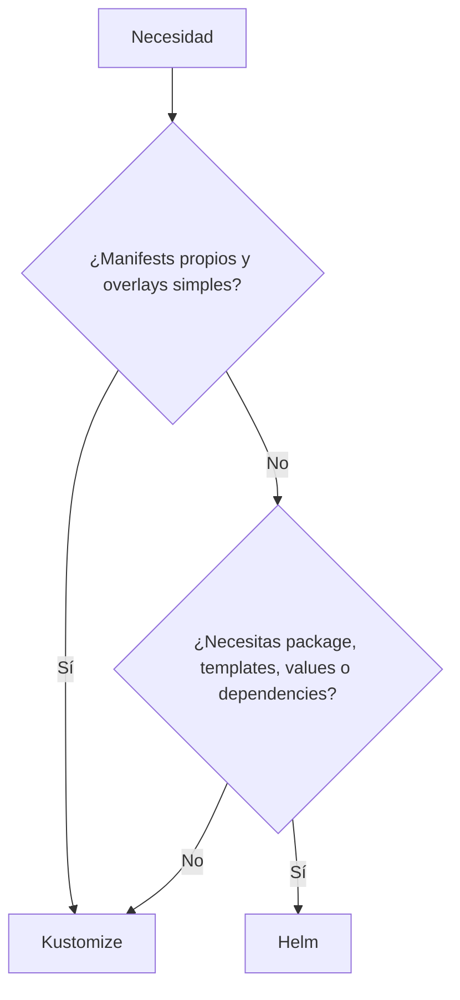

### Helm como ruta opcional en este módulo

Este roadmap usará Kustomize como camino principal porque:

- Ya lo usamos en el módulo 9
- Es suficiente para el laboratorio
- Tiene menos fricción para enseñar delivery
- Evita meter templating antes de necesitarlo
Helm queda como herramienta importante que el alumno debe entender, pero no como práctica obligatoria de este módulo.

### Criterio de comprensión

Debes poder explicar:

> Kustomize personaliza manifests. Helm empaqueta aplicaciones como charts y gestiona releases. No son intercambiables sin coste.

---

## 10.9. `kubectl apply`, `kubectl diff` y Server-Side Apply

### Qué problema resuelven

Cuando despliegas de forma declarativa, necesitas aplicar cambios y entender qué cambiará.

`kubectl apply` crea o actualiza recursos a partir de ficheros. `kubectl diff` muestra diferencias entre configuración deseada y estado vivo antes de aplicar. Server-Side Apply permite que el control plane rastree qué manager controla qué campos de un objeto, y está estable desde Kubernetes v1.22. ([GitHub Docs](https://docs.github.com/actions/using-workflows/workflow-syntax-for-github-actions "Workflow syntax for GitHub Actions"))

### `kubectl diff`

```bash
kubectl diff -k kubernetes/overlays/local
```

Sirve para ver qué cambiaría.

### Client-Side Apply

```bash
kubectl apply -k kubernetes/overlays/local
```

Es el flujo clásico.

### Server-Side Apply

```bash
kubectl apply --server-side --field-manager=checkout-delivery -k kubernetes/overlays/local
```

Server-Side Apply puede ser útil cuando quieres que el API Server gestione field ownership de forma más explícita.

### Cuidado

No mezcles sin criterio varios managers escribiendo los mismos campos.

Puedes provocar conflictos de ownership.

### DevEx

```yaml
deploy:diff:
  desc: Show diff for local overlay
  cmds:
    - kubectl diff -k kubernetes/overlays/local || true

deploy:apply:
  desc: Apply local overlay
  cmds:
    - kubectl apply -k kubernetes/overlays/local

deploy:apply:server-side:
  desc: Apply local overlay using Server-Side Apply
  cmds:
    - kubectl apply --server-side --field-manager=checkout-delivery -k kubernetes/overlays/local
```

### Criterio de comprensión

Debes poder explicar:

> `diff` enseña qué cambiaría. `apply` cambia el cluster. Server-Side Apply añade gestión explícita de ownership de campos por parte del API Server.

---

## 10.9 bis. API deprecations

Kubernetes evoluciona.

Eso significa que algunas APIs cambian de versión, quedan obsoletas o desaparecen.

Un manifest puede ser correcto hoy y dejar de ser aceptado después de actualizar el cluster.

Ejemplo conceptual:

```yaml
apiVersion: extensions/v1beta1
kind: Ingress
```

Ese tipo de manifest representa un riesgo porque usa una API antigua.

La versión moderna de Ingress usa:

```yaml
apiVersion: networking.k8s.io/v1
kind: Ingress
```

### Qué debes aprender

No tienes que memorizar todas las APIs antiguas.

Debes aprender a detectar tres señales:

1. El `apiVersion` del manifest.
2. Si esa versión existe en el cluster.
3. Si hay una versión más moderna del mismo recurso.

### Comandos útiles

```bash
kubectl api-versions
kubectl api-resources
kubectl explain ingress
kubectl explain ingress.spec
```

Para inspeccionar todos los `apiVersion` usados en un directorio:

```bash
grep -R "^apiVersion:" kubernetes/
```

Con `yq`:

```bash
find kubernetes -name "*.yaml" -print0 \
  | xargs -0 -I{} sh -c 'echo {}; yq ".apiVersion + \" \" + .kind" {}'
```

### Regla del curso

Todo manifest debe declarar una API soportada por el cluster de práctica.

Antes de aplicar, valida:

```bash
kubectl apply --dry-run=server -f <manifest>
```

### Criterio de comprensión

Debes poder explicar:

> Un manifest no solo debe tener YAML válido. Debe usar una API que el cluster actual entienda y mantenga.

--- 
## 10.10. Rollout status y rollback

### Qué problema resuelven

Aplicar manifests no es suficiente.

Necesitas comprobar que el rollout termina.

`kubectl rollout` gestiona rollouts de Deployments, DaemonSets y StatefulSets, y `kubectl rollout undo` revierte un rollout anterior. ([Kubernetes](https://kubernetes.io/docs/reference/kubectl/generated/kubectl_rollout/ "kubectl rollout"))

### Ver estado

```bash
kubectl rollout status deployment/checkout-api -n shop --timeout=120s
```

### Ver historial

```bash
kubectl rollout history deployment/checkout-api -n shop
```

### Rollback

```bash
kubectl rollout undo deployment/checkout-api -n shop
kubectl rollout status deployment/checkout-api -n shop --timeout=120s
```

### Lo importante

Rollback no debe ser una improvisación.

Debe estar documentado y probado.

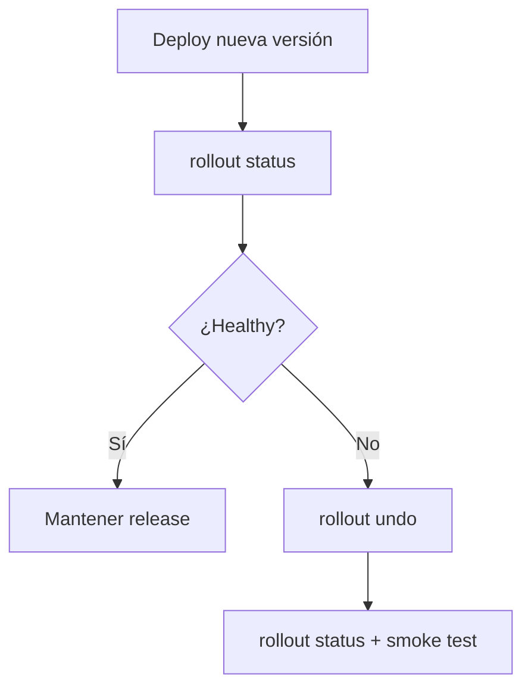

### DevEx

```yaml
deploy:status:
  desc: Wait for checkout-api rollout
  cmds:
    - kubectl rollout status deployment/checkout-api -n {{.NAMESPACE}} --timeout=120s

deploy:history:
  desc: Show checkout-api rollout history
  cmds:
    - kubectl rollout history deployment/checkout-api -n {{.NAMESPACE}}

deploy:rollback:
  desc: Rollback checkout-api Deployment and validate
  cmds:
    - kubectl rollout undo deployment/checkout-api -n {{.NAMESPACE}}
    - kubectl rollout status deployment/checkout-api -n {{.NAMESPACE}} --timeout=120s
    - task smoke:k8s
```

### Criterio de comprensión

Debes poder explicar:

> Un deploy no está completo cuando `apply` termina. Está completo cuando el rollout termina y el smoke test valida el comportamiento mínimo.

---

## 10.11. Delivery local completo con kind

### Qué problema resuelve

Antes de enviar algo a staging, debes poder probar el flujo entero en local o CI con kind.

Esto reutiliza el módulo 9, pero ahora con intención de delivery.

### Flujo

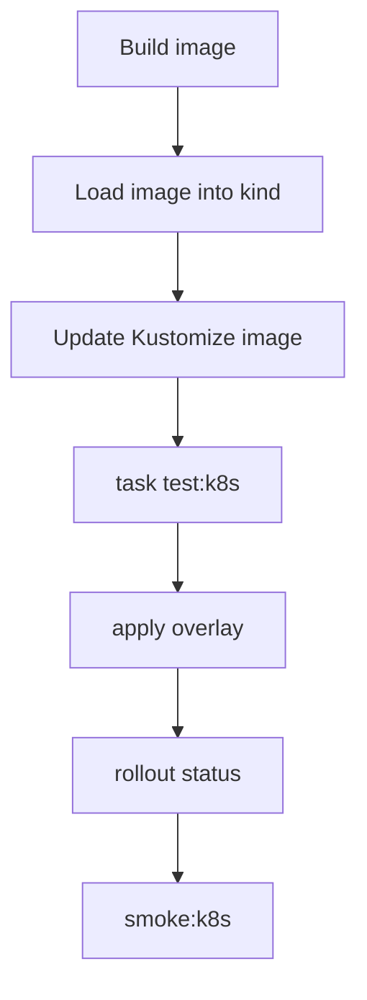

### Taskfile

```yaml
delivery:local:
  desc: Run local delivery flow against kind
  cmds:
    - task image:build
    - task k8s:image:load
    - task manifests:set-image IMAGE_TAG={{.IMAGE_TAG}}
    - task test:k8s
```

### Nota

En este flujo, `test:k8s` ya crea su propio cluster efímero según el módulo 9.

Si quieres desplegar en un cluster local existente, crea otra tarea:

```yaml
delivery:local:apply:
  desc: Apply current local overlay to the active cluster and validate
  cmds:
    - task manifests:render
    - task manifests:validate:schema
    - task manifests:score
    - task manifests:dry-run
    - task deploy:diff
    - task deploy:apply
    - task deploy:status
    - task smoke:k8s
```

### Criterio de comprensión

Debes poder explicar:

> El delivery local no sustituye staging, pero evita que errores baratos lleguen tarde.

---

## 10.12. CI/CD con GitHub Actions

### Qué problema resuelve

El flujo no debe depender de tu máquina.

Debe poder ejecutarse en un entorno automatizado.

GitHub Actions define workflows mediante YAML y permite crear jobs compuestos por steps. GitHub documenta workflows para construir y publicar imágenes Docker en registries como Docker Hub o GitHub Packages. ([GitHub Docs](https://docs.github.com/actions/using-workflows/workflow-syntax-for-github-actions "Workflow syntax for GitHub Actions"))

### Workflow base

Crea:

```text
.github/workflows/kubernetes-delivery.yml
```

Contenido:

```yaml
name: Kubernetes delivery

on:
  push:
    branches:
      - main
  pull_request:

env:
  IMAGE_NAME: checkout-api
  IMAGE_TAG: ${{ github.sha }}
  TEST_CLUSTER: shop-test
  NAMESPACE: shop

jobs:
  validate-and-package:
    runs-on: ubuntu-latest

    permissions:
      contents: read
      packages: write

    steps:
      - name: Checkout
        uses: actions/checkout@v4

      - name: Set up Task
        uses: arduino/setup-task@v2

      - name: Install Kubernetes tools
        run: |
          set -euo pipefail
          curl -Lo ./kind https://kind.sigs.k8s.io/dl/v0.27.0/kind-linux-amd64
          chmod +x ./kind
          sudo mv ./kind /usr/local/bin/kind

          curl -Lo ./kubectl https://dl.k8s.io/release/v1.33.0/bin/linux/amd64/kubectl
          chmod +x ./kubectl
          sudo mv ./kubectl /usr/local/bin/kubectl

      - name: Install validation tools
        run: |
          set -euo pipefail
          echo "Install kubeconform, kube-score, kyverno, conftest and trivy here"
          echo "Pin exact versions in a real repository"

      - name: Build image
        run: |
          docker build -t checkout-api:${IMAGE_TAG} ./apps/checkout-api

      - name: Scan image
        run: |
          trivy image --exit-code 1 --severity HIGH,CRITICAL checkout-api:${IMAGE_TAG}

      - name: Update manifests
        run: |
          yq -i '.images[0].newTag = strenv(IMAGE_TAG)' kubernetes/overlays/local/kustomization.yaml

      - name: Run Kubernetes quality gate
        run: |
          task test:k8s IMAGE_TAG=${IMAGE_TAG} TEST_CLUSTER=${TEST_CLUSTER}
```

### Nota honesta

El bloque de instalación de herramientas está intencionalmente señalado como lugar para fijar versiones.

En una guía profesional, no conviene instalar “lo último” sin pinning.

Debes fijar versiones de:

- `kubectl`
- kind
- kubeconform
- kube-score
- Kyverno CLI
- Conftest
- Trivy
- Task
- yq
- jq
### Criterio de comprensión

Debes poder explicar:

> CI/CD no es solo “correr comandos en GitHub”. Es mover el delivery fuera de la memoria humana y convertirlo en un gate repetible.

---

## 10.13. Promoción entre entornos

### Qué problema resuelve

No todos los entornos deben recibir cambios al mismo tiempo.

Un flujo sano suele separar:

```text
local
test
staging
production
```

La promoción debe responder:

> ¿Qué artefacto probado avanza al siguiente entorno?

El artefacto debería ser la misma imagen.

No deberías reconstruir una imagen distinta para producción si ya validaste otra.

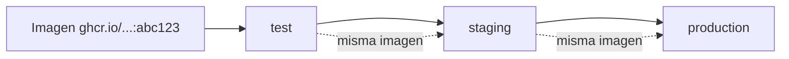

### Overlays por entorno

```text
kubernetes/
  overlays/
    local/
      kustomization.yaml
    staging/
      kustomization.yaml
    production/
      kustomization.yaml
```

### Diferencias razonables por entorno

|Configuración|Local|Staging|Producción|
|---|---|---|---|
|Réplicas|1 o 3|2 o 3|Según capacidad|
|Resources|Menores|Realistas|Basados en datos|
|Secrets|Fake/lab|Staging|Producción|
|Ingress host|local|staging|production|
|Storage|local|staging|producción|
|Policies|progresivas|estrictas|estrictas|

### Qué no debe cambiar

No debería cambiar:

- El código de la imagen
- El tag validado que promocionas
- Los contratos HTTP
- La estructura esencial de workloads
- Los gates mínimos
### Criterio de comprensión

Debes poder explicar:

> Promocionar no es reconstruir. Promocionar es mover un artefacto ya validado hacia otro entorno con configuración controlada.

---

## 10.14. GitOps

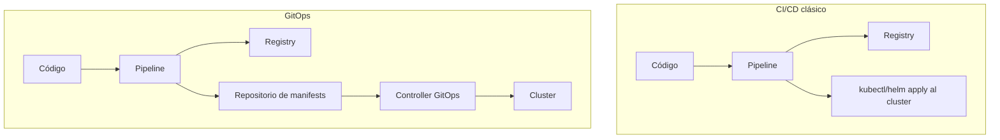

### Qué problema resuelve

En CI/CD clásico, la pipeline suele aplicar al cluster.

En GitOps, un controller dentro del cluster observa Git y reconcilia el estado real hacia el estado deseado.

Argo CD se define como un controller de Kubernetes que monitoriza aplicaciones en ejecución y compara el estado vivo con el estado objetivo definido en Git; si difieren, la aplicación se considera `OutOfSync`, y Argo CD permite sincronizar manual o automáticamente. Flux se define como una herramienta para mantener clusters Kubernetes sincronizados con fuentes de configuración como repositorios Git, y automatizar actualizaciones de configuración cuando hay nuevo código. ([argo-cd.readthedocs.io](https://argo-cd.readthedocs.io/en/stable/ "Declarative GitOps CD for Kubernetes - Argo CD"))

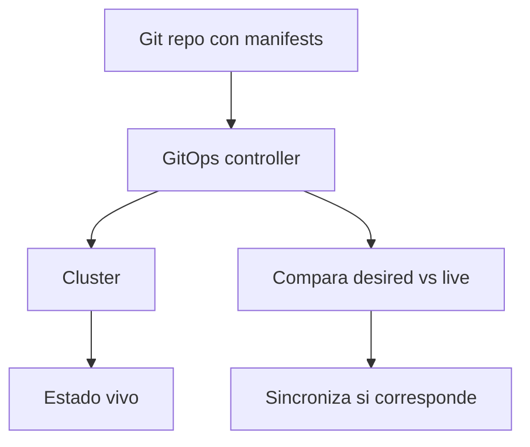

### CI/CD clásico

```text
Pipeline → kubectl apply → cluster
```

### GitOps

```text
Pipeline → actualiza Git
GitOps controller → aplica al cluster
```

### Ventajas de GitOps

- Git como fuente de verdad
- Mejor trazabilidad
- Menos credenciales de cluster en CI
- Drift detection
- Reconciliación continua
- Auditoría por pull requests
- Separación entre build y deploy
### Costes de GitOps

- Necesitas operar el controller
- Necesitas diseñar repos y permisos
- Necesitas entender sync, drift y rollback
- Necesitas gobernar secretos
- Necesitas evitar que “Git dice sí” pero observabilidad diga no
### Criterio de comprensión

Debes poder explicar:

> GitOps no es una herramienta. Es un modelo donde Git contiene el estado deseado y un controller reconcilia el cluster hacia ese estado.

---

## 10.15. Argo CD

### Qué problema resuelve

Argo CD implementa GitOps para Kubernetes.

Observa repositorios, compara estado deseado y estado vivo, muestra drift y permite sincronizar.

Argo CD documenta su modelo como un controller que monitoriza aplicaciones y compara el estado vivo con el estado target definido en Git. ([argo-cd.readthedocs.io](https://argo-cd.readthedocs.io/en/stable/ "Declarative GitOps CD for Kubernetes - Argo CD"))

### Modelo conceptual

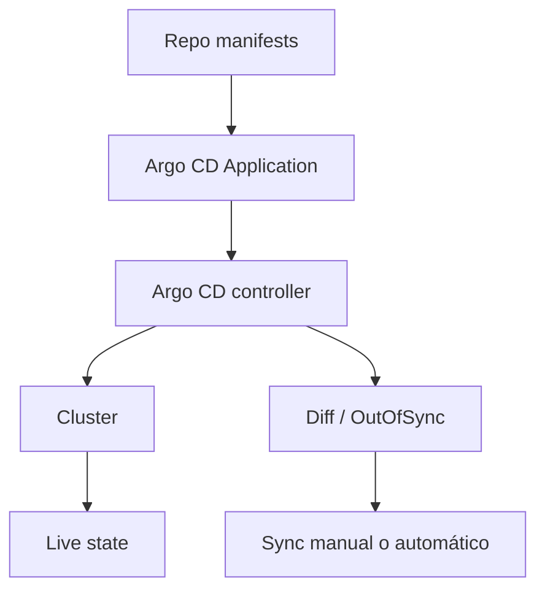

### Application conceptual

```yaml
apiVersion: argoproj.io/v1alpha1
kind: Application
metadata:
  name: checkout-api
  namespace: argocd
spec:
  project: default
  source:
    repoURL: https://example.com/your/repo.git
    targetRevision: main
    path: kubernetes/overlays/staging
  destination:
    server: https://kubernetes.default.svc
    namespace: shop
  syncPolicy:
    automated:
      prune: false
      selfHeal: false
```

### Nota

Este manifest es conceptual.

No lo apliques en el laboratorio salvo que hayas instalado Argo CD y tengas un repo real.

### Criterio de comprensión

Debes poder explicar:

> Argo CD no construye mi imagen por sí mismo en este modelo. Reconcilia manifests desde Git hacia el cluster.

---

## 10.16. Flux

### Qué problema resuelve

Flux también implementa GitOps.

Su documentación lo define como una solución de continuous delivery para Kubernetes que mantiene clusters sincronizados con fuentes de configuración como Git y automatiza actualizaciones cuando hay nuevo código. ([fluxcd.io](https://fluxcd.io/flux/ "Flux Documentation"))

### Modelo conceptual

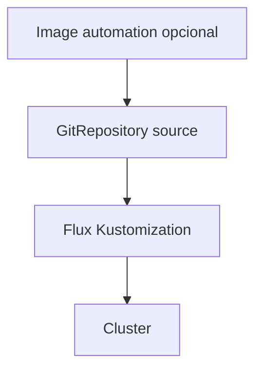

### Diferencia práctica con Argo CD

A alto nivel, ambos pueden resolver GitOps.

La elección depende de:

- Experiencia del equipo
- Modelo operativo
- Preferencia de UI vs controller-first
- Integración con repos
- Automatización de imágenes
- Gobernanza interna
- Ecosistema ya existente
### Criterio de comprensión

Debes poder explicar:

> Argo CD y Flux son caminos GitOps. No deberías elegirlos por moda, sino por modelo operativo, capacidades necesarias y coste de operación.

---

## 10.17. Progressive delivery

### Qué problema resuelve

RollingUpdate es útil, pero no siempre basta.

A veces quieres controlar exposición progresiva:

- 5% de tráfico a la nueva versión
- Validar métricas
- Pausar
- Promocionar
- Abort automático si algo falla
- Blue-green
- Canary
Argo Rollouts se define como un controller y conjunto de CRDs para capacidades avanzadas de deployment como blue-green, canary, análisis, experimentación y progressive delivery sobre Kubernetes. ([argo-rollouts.readthedocs.io](https://argo-rollouts.readthedocs.io/ "Argo Rollouts - Kubernetes Progressive Delivery Controller"))

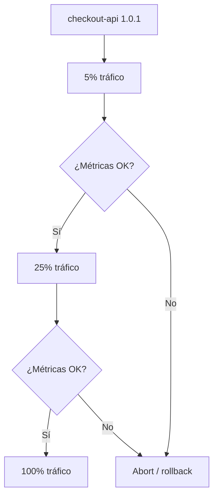

### Cuándo usar progressive delivery

Tiene sentido si:

- El coste de fallo es alto
- Puedes medir señales fiables
- Tienes tráfico suficiente
- Tienes automatización madura
- Tienes rollback rápido
- Tu equipo entiende qué métrica decide promoción o abort
### Cuándo no usarlo

No lo uses si:

- No tienes métricas fiables
- No tienes observabilidad
- No tienes capacidad de operar el controller
- El sistema no soporta dos versiones vivas
- Solo quieres “hacer algo avanzado”
### Criterio de comprensión

Debes poder explicar:

> Progressive delivery no es una estrategia de despliegue bonita. Es una forma de limitar exposición al riesgo usando señales reales.

---

## 10.18. Estrategias de despliegue

### RollingUpdate

Es la estrategia normal de Deployment.

Reemplaza Pods gradualmente.

Encaja para muchas APIs stateless.

### Recreate

Termina Pods antiguos antes de crear nuevos.

Puede causar downtime.

Útil en casos donde dos versiones no pueden convivir.

### Blue-green

Mantienes dos entornos o versiones.

Cambias tráfico de una a otra cuando la nueva está lista.

### Canary

Envías una parte pequeña del tráfico a la nueva versión y aumentas progresivamente si las señales son buenas.

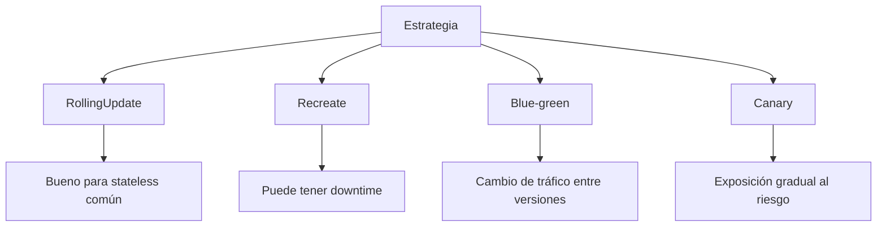

### Contrato de elección

|Estrategia|Cuándo encaja|
|---|---|
|RollingUpdate|Stateless, versiones compatibles, riesgo moderado|
|Recreate|No pueden convivir versiones, downtime aceptable|
|Blue-green|Quieres validar entorno nuevo antes de cambiar tráfico|
|Canary|Quieres exposición gradual y tienes métricas fiables|

### Criterio de comprensión

Debes poder explicar:

> La estrategia de despliegue se elige por compatibilidad entre versiones, tolerancia al riesgo, capacidad de observación y coste de operación.

---

## 10.19. Migraciones y delivery

### Qué problema resuelve

Muchas releases no cambian solo código.

También cambian datos.

Ejemplo:

```text
checkout-api 1.0.1 necesita nueva columna en PostgreSQL
```

Esto es peligroso si no diseñas compatibilidad.

### Reglas básicas

- Las migraciones deben ser compatibles hacia atrás cuando sea posible
- Evita cambios destructivos en el mismo deploy
- Separa expand y contract
- Primero añade estructura compatible
- Luego despliega código que la usa
- Después elimina lo antiguo cuando ya no se usa
- No asumas rollback de base de datos como si fuera rollback de imagen
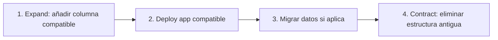

### Job de migración

En Kubernetes, una migración puntual suele representarse como Job.

Pero ejecutar migraciones en delivery requiere cuidado:

- ¿Se puede reintentar?
- ¿Es idempotente?
- ¿Qué pasa si falla a medias?
- ¿Qué versión de app la necesita?
- ¿Puede correr dos veces?
- ¿Bloquea rollout?
- ¿Tiene rollback?
### Criterio de comprensión

Debes poder explicar:

> Rollback de aplicación no implica rollback de datos. Las migraciones deben diseñarse como parte del delivery, no como un script añadido al final.

---

## 10.20. Delivery con calidad: gates obligatorios

### Qué gates debe tener el flujo

Mínimo:

1. Tests de aplicación
2. Build de imagen
3. Scan de imagen
4. Render de manifests
5. Schema validation
6. Static analysis
7. Policy tests
8. Server-side dry-run
9. Deploy en kind
10. Rollout status
11. Service endpoints
12. Smoke test
13. Diff antes de aplicar a entorno real
14. Rollout status en entorno real
15. Smoke test post-deploy
16. Rollback probado
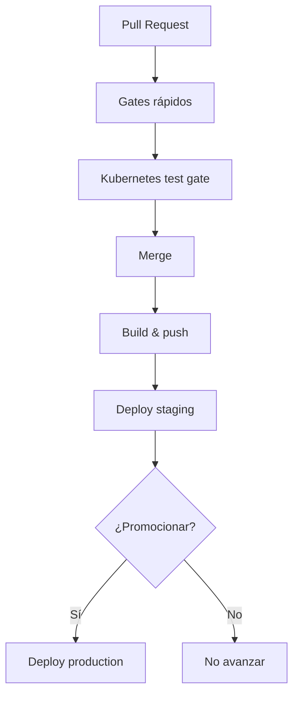

### Qué no debe ser opcional

- `task test:k8s`
- Scan de imagen, al menos severidad alta/crítica
- Smoke test post-deploy
- Rollback documentado
- Diff visible antes de aplicar cambios sensibles
### Criterio de comprensión

Debes poder explicar:

> Delivery debe estar subordinado a feedback. Si el gate falla, el cambio no avanza.

---

## 10.21. Taskfile del módulo 10

Añade estas tareas al `Taskfile.yml`.

```yaml
vars:
  APP_NAME: checkout-api
  IMAGE_NAME: checkout-api
  IMAGE_TAG: 1.0.1
  IMAGE_REGISTRY: ghcr.io
  IMAGE_REPOSITORY: owner/repo/checkout-api
  NAMESPACE: shop
  PORT: 8080

tasks:
  image:build:
    desc: Build checkout-api image
    cmds:
      - docker build -t {{.IMAGE_NAME}}:{{.IMAGE_TAG}} ./apps/{{.APP_NAME}}

  image:scan:
    desc: Scan checkout-api image with Trivy
    cmds:
      - trivy image --exit-code 1 --severity HIGH,CRITICAL {{.IMAGE_NAME}}:{{.IMAGE_TAG}}

  image:tag:
    desc: Tag checkout-api image for registry
    cmds:
      - docker tag {{.IMAGE_NAME}}:{{.IMAGE_TAG}} {{.IMAGE_REGISTRY}}/{{.IMAGE_REPOSITORY}}:{{.IMAGE_TAG}}

  image:push:
    desc: Push checkout-api image to registry
    cmds:
      - docker push {{.IMAGE_REGISTRY}}/{{.IMAGE_REPOSITORY}}:{{.IMAGE_TAG}}

  manifests:set-image:
    desc: Update local overlay image tag. Usage: task manifests:set-image IMAGE_TAG=1.0.1
    cmds:
      - yq -i '.images[0].newTag = "{{.IMAGE_TAG}}"' kubernetes/overlays/local/kustomization.yaml
      - mkdir -p .tmp
      - kubectl kustomize kubernetes/overlays/local > .tmp/rendered.yaml
      - yq 'select(.kind == "Deployment") | .spec.template.spec.containers[0].image' .tmp/rendered.yaml

  deploy:diff:
    desc: Show diff for local overlay
    cmds:
      - kubectl diff -k kubernetes/overlays/local || true

  deploy:apply:
    desc: Apply local overlay
    cmds:
      - kubectl apply -k kubernetes/overlays/local

  deploy:apply:server-side:
    desc: Apply local overlay using Server-Side Apply
    cmds:
      - kubectl apply --server-side --field-manager=checkout-delivery -k kubernetes/overlays/local

  deploy:status:
    desc: Wait for checkout-api rollout
    cmds:
      - kubectl rollout status deployment/checkout-api -n {{.NAMESPACE}} --timeout=120s

  deploy:history:
    desc: Show checkout-api rollout history
    cmds:
      - kubectl rollout history deployment/checkout-api -n {{.NAMESPACE}}

  deploy:rollback:
    desc: Rollback checkout-api Deployment and validate
    cmds:
      - kubectl rollout undo deployment/checkout-api -n {{.NAMESPACE}}
      - kubectl rollout status deployment/checkout-api -n {{.NAMESPACE}} --timeout=120s
      - task smoke:k8s

  delivery:local:apply:
    desc: Apply current local overlay to active cluster and validate
    cmds:
      - task manifests:render
      - task manifests:validate:schema
      - task manifests:score
      - task policies:test
      - task manifests:dry-run
      - task deploy:diff
      - task deploy:apply
      - task deploy:status
      - task cluster:wait
      - task smoke:k8s

  delivery:local:
    desc: Run local delivery flow against kind
    cmds:
      - task image:build
      - task image:scan
      - task k8s:image:load
      - task manifests:set-image IMAGE_TAG={{.IMAGE_TAG}}
      - task test:k8s

  delivery:release:local:
    desc: Build, scan, update manifests, apply and validate on active local cluster
    cmds:
      - task image:build
      - task image:scan
      - task k8s:image:load
      - task manifests:set-image IMAGE_TAG={{.IMAGE_TAG}}
      - task delivery:local:apply
```

### Criterio DevEx

Debes poder explicar:

> El Taskfile no oculta Kubernetes. Hace que el delivery sea repetible, visible y revisable.

---

## 10.22. Práctica principal del módulo

### Objetivo

Construir un flujo de delivery local completo para `checkout-api`.

### Resultado esperado

```text
kubernetes-learning-lab/
  kubernetes/
    base/
      kustomization.yaml
      deployment.yaml
      service.yaml
      configmap.yaml
    overlays/
      local/
        kustomization.yaml
      staging/
        kustomization.yaml
      production/
        kustomization.yaml

  .github/
    workflows/
      kubernetes-delivery.yml

  Taskfile.yml
```

### Paso 1. Preparar cluster

```bash
task k8s:kind:create
task k8s:namespace:apply
```

### Paso 2. Construir y escanear imagen

```bash
task image:build IMAGE_TAG=1.0.1
task image:scan IMAGE_TAG=1.0.1
```

### Paso 3. Cargar imagen en kind

```bash
task k8s:image:load IMAGE_TAG=1.0.1
```

### Paso 4. Actualizar manifest

```bash
task manifests:set-image IMAGE_TAG=1.0.1
```

### Paso 5. Ejecutar quality gates

```bash
task manifests:render
task manifests:validate:schema
task manifests:score
task policies:test
task manifests:dry-run
```

### Paso 6. Ver diff

```bash
task deploy:diff
```

### Paso 7. Aplicar

```bash
task deploy:apply
```

### Paso 8. Esperar rollout

```bash
task deploy:status
```

### Paso 9. Validar Service y smoke test

```bash
task cluster:wait
task smoke:k8s
```

### Paso 10. Ver historial

```bash
task deploy:history
```

### Paso 11. Probar rollback

Primero fuerza una imagen mala:

```bash
task k8s:failure:rollout:bad-image
```

Después revierte:

```bash
task deploy:rollback
```

### Paso 12. Ejecutar flujo completo

```bash
task delivery:release:local IMAGE_TAG=1.0.1
```

### Paso 13. Limpiar

```bash
task k8s:namespace:delete
task k8s:kind:delete
```

### Criterio de finalización

La práctica está completa cuando puedes explicar:

- Qué imagen se construyó
- Qué tag se usó
- Qué scan se ejecutó
- Qué manifest se actualizó
- Qué diff se revisó
- Qué gates pasaron
- Qué se aplicó al cluster
- Qué rollout se validó
- Qué smoke test confirmó el resultado
- Cómo se hizo rollback
- Qué partes deberían moverse a CI
- Qué partes podrían moverse a GitOps
---

## 10.23. CI workflow completo, versión didáctica

Este workflow es una base didáctica.

En un repositorio real debes fijar versiones exactas de herramientas, gestionar cache, credenciales, permisos mínimos y publicación real de imagen.

```yaml
name: Kubernetes delivery

on:
  pull_request:
  push:
    branches:
      - main

env:
  APP_NAME: checkout-api
  IMAGE_NAME: checkout-api
  IMAGE_TAG: ${{ github.sha }}
  TEST_CLUSTER: shop-test
  NAMESPACE: shop

jobs:
  validate:
    runs-on: ubuntu-latest

    permissions:
      contents: read
      packages: write

    steps:
      - name: Checkout
        uses: actions/checkout@v4

      - name: Set up Task
        uses: arduino/setup-task@v2

      - name: Install base tools
        run: |
          set -euo pipefail
          sudo apt-get update
          sudo apt-get install -y jq curl

      - name: Install yq
        run: |
          set -euo pipefail
          sudo wget -qO /usr/local/bin/yq https://github.com/mikefarah/yq/releases/download/v4.45.1/yq_linux_amd64
          sudo chmod +x /usr/local/bin/yq

      - name: Install kind
        run: |
          set -euo pipefail
          curl -Lo kind https://kind.sigs.k8s.io/dl/v0.27.0/kind-linux-amd64
          chmod +x kind
          sudo mv kind /usr/local/bin/kind

      - name: Install kubectl
        run: |
          set -euo pipefail
          curl -Lo kubectl https://dl.k8s.io/release/v1.33.0/bin/linux/amd64/kubectl
          chmod +x kubectl
          sudo mv kubectl /usr/local/bin/kubectl

      - name: Install validation tools
        run: |
          set -euo pipefail
          echo "Install kubeconform, kube-score, kyverno, conftest and trivy with pinned versions"
          echo "This course keeps this step explicit so the repo owner chooses exact versions"

      - name: Build image
        run: |
          docker build -t checkout-api:${IMAGE_TAG} ./apps/checkout-api

      - name: Scan image
        run: |
          trivy image --exit-code 1 --severity HIGH,CRITICAL checkout-api:${IMAGE_TAG}

      - name: Update manifests
        run: |
          yq -i '.images[0].newTag = strenv(IMAGE_TAG)' kubernetes/overlays/local/kustomization.yaml

      - name: Run Kubernetes quality gate
        run: |
          task test:k8s IMAGE_TAG=${IMAGE_TAG} TEST_CLUSTER=${TEST_CLUSTER}
```

### Nota de rigor

No he puesto comandos inventados para instalar cada herramienta de validación porque cada repo debería fijar versiones y checksums concretos.

Este workflow marca el lugar correcto para hacerlo, pero no finge que una instalación genérica sea una buena práctica universal.

### Criterio de comprensión

Debes poder explicar:

> Un workflow didáctico muestra el flujo. Un workflow profesional fija versiones, permisos, credenciales, cache, cleanup y condiciones de promoción.

---

## 10.24. Troubleshooting progresivo de delivery

Cuando falle delivery, no digas “CI está roto”.

Identifica la capa.

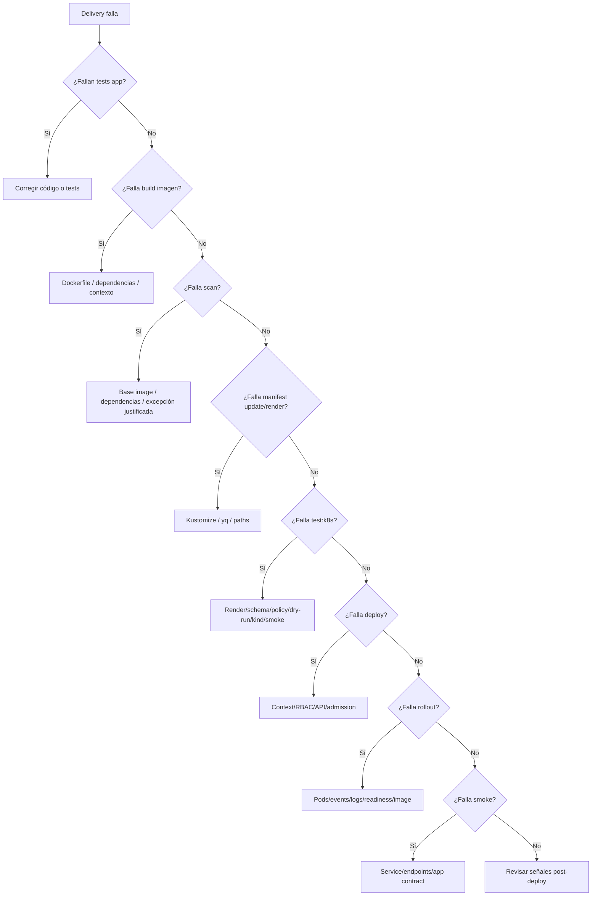

### Comandos útiles

```bash
task manifests:render
task manifests:validate:schema
task manifests:score
task policies:test
task manifests:dry-run
task deploy:diff
task deploy:status
task k8s:events
task k8s:network:troubleshoot:checkout
task k8s:troubleshoot:config-storage
task smoke:k8s
```

### Criterio de comprensión

Debes poder explicar:

> Un fallo de delivery debe apuntar a una capa concreta. Si todo se diagnostica igual, el pipeline está mal diseñado.

---

## 10.25. Errores habituales

### Error 1. Confundir build con release

Construir una imagen no significa que esté lista para producción.

Debe pasar gates y estar vinculada a manifests.

---

### Error 2. Usar `latest`

`latest` oculta qué versión se desplegó y dificulta rollback.

Usa tags trazables o digests.

---

### Error 3. Reconstruir para cada entorno

Si validas una imagen en staging, no reconstruyas otra para producción salvo que tengas una razón muy clara.

Promociona el mismo artefacto.

---

### Error 4. Aplicar sin diff

`kubectl diff` no sustituye tests, pero ayuda a ver qué cambiaría.

---

### Error 5. Aplicar sin rollout status

`kubectl apply` puede terminar correctamente mientras el rollout falla después.

---

### Error 6. Rollback no probado

Un rollback escrito en un documento pero nunca probado es una esperanza, no una capacidad operacional.

---

### Error 7. GitOps sin ownership claro

GitOps requiere decidir quién cambia Git, quién aprueba, quién sincroniza, cómo se gestionan secrets y cómo se detecta drift.

---

### Error 8. Progressive delivery sin observabilidad

Canary sin métricas fiables es exposición gradual a ciegas.

---

### Error 9. Migraciones destructivas en el mismo deploy

Si rompes compatibilidad de datos, rollback de imagen puede no salvarte.

---

## 10.26. Criterio de salida del módulo

Puedes pasar al módulo 11 cuando puedas hacer todo esto sin seguir una receta ciegamente.

### Conceptos

Debes poder explicar:

- Qué significa delivery en Kubernetes
- Por qué aplicar YAML manualmente no es suficiente
- Qué relación hay entre imagen, manifest y commit
- Por qué evitar `latest`
- Qué diferencia hay entre tag y digest
- Qué aporta un scan de imagen
- Qué papel tiene Kustomize en delivery
- Cuándo usar Helm
- Qué hace `kubectl diff`
- Qué hace `kubectl apply`
- Qué aporta Server-Side Apply
- Qué es rollout status
- Qué es rollback
- Qué es promoción entre entornos
- Qué es GitOps
- Qué diferencia hay entre CI/CD clásico y GitOps
- Qué aportan Argo CD y Flux
- Qué es progressive delivery
- Diferencia entre RollingUpdate, Recreate, blue-green y canary
- Por qué migraciones y rollback de aplicación no son lo mismo
### Práctica

Debes poder:

- Construir una imagen
- Escanear una imagen
- Cargar imagen en kind
- Actualizar Kustomize con nuevo tag
- Renderizar manifests
- Ejecutar gates del módulo 9
- Ver diff
- Aplicar overlay
- Esperar rollout
- Ejecutar smoke test
- Ver historial
- Provocar rollout fallido
- Ejecutar rollback
- Explicar cómo llevar el flujo a CI
- Explicar cómo evolucionarlo hacia GitOps
### DevEx

Debes poder ejecutar:

```bash
task image:build IMAGE_TAG=1.0.1
task image:scan IMAGE_TAG=1.0.1
task k8s:image:load IMAGE_TAG=1.0.1
task manifests:set-image IMAGE_TAG=1.0.1
task manifests:render
task manifests:validate:schema
task manifests:score
task policies:test
task manifests:dry-run
task deploy:diff
task deploy:apply
task deploy:status
task smoke:k8s
task deploy:history
task k8s:failure:rollout:bad-image
task deploy:rollback
task delivery:release:local IMAGE_TAG=1.0.1
```

### Frase final de comprensión

Debes poder explicar esta frase:

> Delivery en Kubernetes es una cadena de decisiones y verificaciones: construir una imagen trazable, comprobarla, actualizar configuración declarativa, pasar quality gates, desplegar de forma observable, validar comportamiento y conservar una ruta de rollback.

---

## 10.27. Referencias oficiales y fuentes primarias

|Tema|Referencia|
|---|---|
|Declarative Management|Kubernetes Docs, Declarative Management of Kubernetes Objects Using Configuration Files. ([Kubernetes](https://kubernetes.io/docs/tasks/manage-kubernetes-objects/declarative-config/ "Declarative Management of Kubernetes Objects Using ..."))|
|Server-Side Apply|Kubernetes Docs, Server-Side Apply. ([Kubernetes](https://kubernetes.io/docs/reference/using-api/server-side-apply/ "Server-Side Apply"))|
|Kustomize|Kubernetes Docs, Declarative Management using Kustomize. ([Kubernetes](https://kubernetes.io/docs/tasks/manage-kubernetes-objects/kustomization/ "Declarative Management of Kubernetes Objects Using ..."))|
|Kustomize site|Kustomize official site. ([kustomize.io](https://kustomize.io/ "Kustomize - Kubernetes native configuration management"))|
|Deployments|Kubernetes Docs, Deployments. ([Kubernetes](https://kubernetes.io/docs/concepts/workloads/controllers/deployment/ "Deployments"))|
|`kubectl rollout`|Kubernetes Docs, `kubectl rollout`. ([Kubernetes](https://kubernetes.io/docs/reference/kubectl/generated/kubectl_rollout/ "kubectl rollout"))|
|`kubectl rollout undo`|Kubernetes Docs, `kubectl rollout undo`. ([Kubernetes](https://kubernetes.io/docs/reference/kubectl/generated/kubectl_rollout/kubectl_rollout_undo/ "kubectl rollout undo"))|
|`kubectl diff`|Kubernetes Docs, `kubectl diff`. ([GitHub Docs](https://docs.github.com/actions/using-workflows/workflow-syntax-for-github-actions "Workflow syntax for GitHub Actions"))|
|Helm upgrade|Helm Docs, `helm upgrade`. ([helm.sh](https://helm.sh/docs/helm/helm_upgrade "helm upgrade"))|
|Helm rollback|Helm Docs, `helm rollback`. ([helm.sh](https://helm.sh/docs/helm/helm_rollback "helm rollback"))|
|Helm charts|Helm Docs, Charts. ([helm.sh](https://helm.sh/docs/topics/charts "Charts"))|
|Argo CD|Argo CD Docs. ([argo-cd.readthedocs.io](https://argo-cd.readthedocs.io/en/stable/ "Declarative GitOps CD for Kubernetes - Argo CD"))|
|Flux|Flux Docs. ([fluxcd.io](https://fluxcd.io/flux/ "Flux Documentation"))|
|Argo Rollouts|Argo Rollouts Docs. ([argo-rollouts.readthedocs.io](https://argo-rollouts.readthedocs.io/ "Argo Rollouts - Kubernetes Progressive Delivery Controller"))|
|Argo Rollouts Canary|Argo Rollouts Docs, Canary. ([argo-rollouts.readthedocs.io](https://argo-rollouts.readthedocs.io/en/stable/features/canary/ "Canary - Kubernetes Progressive Delivery Controller"))|
|Trivy|Trivy Docs. ([Trivy](https://trivy.dev/ "Trivy"))|
|Trivy container image scanning|Trivy Docs, Container Image. ([Trivy](https://trivy.dev/docs/latest/guide/target/container_image/ "Container Image"))|
|GitHub Actions workflow syntax|GitHub Docs, Workflow syntax. ([GitHub Docs](https://docs.github.com/actions/using-workflows/workflow-syntax-for-github-actions "Workflow syntax for GitHub Actions"))|
|Publishing Docker images with GitHub Actions|GitHub Docs, Publishing Docker images. ([GitHub Docs](https://docs.github.com/actions/guides/publishing-docker-images "Publishing Docker images"))|

## 10.28. Lecturas de apoyo

|Libro|Qué leer|
|---|---|
|_Cloud Native DevOps with Kubernetes_|Capítulos 12, 13 y 14: Helm, Kustomize, development workflow, deployment strategies, continuous deployment, tests, manifests validation, image publishing y deploy.|
|_Kubernetes in Action_|Capítulos 9 y 17: Deployments, rollouts, rollbacks, lifecycle, shutdown, manifests, desarrollo y CI/CD.|
|_Kubernetes: Up and Running_|Capítulos 10, 13, 17 y 18: Deployments, ConfigMaps, aplicaciones reales y organización de aplicaciones.|
|_Kubernetes Patterns_|Declarative Deployment, Health Probe, Managed Lifecycle, Service Discovery y Elastic Scale.|