# 14. Extensión de Kubernetes

## Objetivo del módulo

En el módulo 13 aprendiste patrones cloud native:

```text
Health Probe
Managed Lifecycle
Service Discovery
Configuration Resource
Controller
Operator
Elastic Scale
Observable Behavior
```

Ahora toca entender una de las ideas más potentes de Kubernetes:

> Kubernetes no es solo una plataforma para ejecutar workloads. También es una plataforma extensible.

Hasta ahora has usado objetos que Kubernetes ya conoce:

```text
Pod
Deployment
Service
ConfigMap
Secret
Job
CronJob
PersistentVolumeClaim
NetworkPolicy
Ingress
```

Pero Kubernetes permite añadir nuevos tipos de recursos y nuevos comportamientos al cluster.

Eso es lo que hace posible que herramientas como cert-manager, External Secrets Operator, Argo CD, Crossplane, Prometheus Operator, Gateway API implementations, storage drivers, network plugins y muchos operators funcionen como si fueran parte natural del sistema.

La documentación oficial explica que Kubernetes es altamente configurable y extensible, y que normalmente no hace falta modificar el código del proyecto Kubernetes para adaptarlo. También separa varias formas de extensión: Custom Resources, API aggregation, admission webhooks, plugins de red, plugins de storage CSI, device plugins y otros mecanismos. ([Kubernetes](https://kubernetes.io/docs/concepts/extend-kubernetes/ "Extending Kubernetes"))

La idea central del módulo es esta:

> Extender Kubernetes significa añadir nuevos contratos al cluster. Un CRD añade vocabulario. Un controller añade comportamiento. Un operator añade conocimiento operacional. Un webhook añade decisión en admisión. Un plugin añade capacidad técnica a la plataforma.

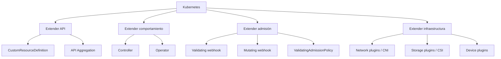

---

## 14.1. Qué vas a aprender y qué no vas a aprender todavía

Vas a aprender:

- Qué significa extender Kubernetes
- Qué problema resuelve un Custom Resource
- Qué problema resuelve un CRD
- Qué diferencia hay entre CRD y Custom Resource
- Por qué un CRD sin controller solo almacena datos
- Qué es un controller
- Qué es reconciliation
- Qué es un operator
- Qué es `spec`
- Qué es `status`
- Qué es `status subresource`
- Qué son finalizers
- Qué son owner references
- Qué es versionado de CRDs
- Qué son conversiones de versiones
- Qué es admission control
- Qué son admission webhooks
- Qué riesgos tienen los webhooks
- Qué es API aggregation
- Qué son network plugins
- Qué es CSI
- Qué son device plugins
- Cuándo extender Kubernetes tiene sentido
- Cuándo extender Kubernetes es sobreingeniería
- Cómo crear un CRD `BackupPolicy`
- Cómo crear Custom Resources de ejemplo
- Cómo validar schema
- Cómo entender el ciclo de reconciliación sin implementar todavía un operator completo
- Cómo mejorar la DevEx con Taskfile
No vamos a profundizar todavía en:

- Implementar un operator productivo
- Programar un controller completo
- Go avanzado
- Kubebuilder completo
- controller-runtime en profundidad
- Conversion webhooks productivos
- Admission webhooks productivos
- API servers agregados productivos
- Desarrollo de CNI
- Desarrollo de CSI
- Desarrollo de device plugins
- Seguridad avanzada de controllers
- Multi-tenancy de platform APIs
- Upgrade real de CRDs en producción
- Certificados y alta disponibilidad de webhooks
- Performance del API Server con miles de Custom Resources
La regla pedagógica del módulo será:

```text
Primero problema
Luego extensión
Luego contrato API
Luego comportamiento esperado
Luego riesgos
Luego práctica pequeña
Luego criterio de salida
```

---

## 14.2. El problema: Kubernetes no conoce tu dominio

Kubernetes sabe qué es un Deployment.

Pero no sabe qué es esto:

```text
BackupPolicy
RefundWorkflow
TenantEnvironment
DatabaseCluster
FeatureEnvironment
CertificateIssuer
ReleasePromotion
```

Puedes representar muchas cosas con ConfigMaps y Jobs, pero llega un punto donde eso se vuelve pobre:

- No hay schema claro
- No hay validación del contrato
- No hay status
- No hay reconciliación
- No hay lifecycle
- No hay ownership
- No hay finalizers
- No hay experiencia nativa con `kubectl`
- No hay una API de plataforma para equipos
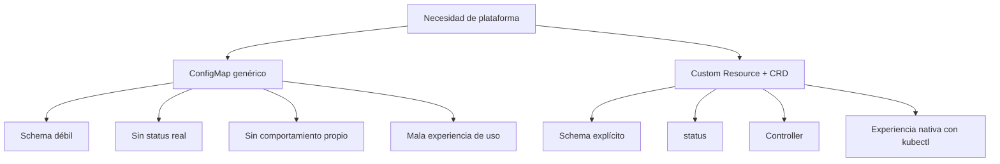

### Ejemplo realista del curso

Queremos expresar esto:

> Para el namespace `shop`, quiero una política de backup diaria para PostgreSQL, con retención de 7 días y una ventana horaria preferida.

Podríamos crear un CronJob manual.

Pero como concepto de plataforma, podríamos querer un recurso propio:

```yaml
apiVersion: platform.example.com/v1alpha1
kind: BackupPolicy
metadata:
  name: postgres-daily
  namespace: shop
spec:
  targetRef:
    kind: PersistentVolumeClaim
    name: postgres-data
  schedule: "0 2 * * *"
  retentionDays: 7
```

Eso no hace nada por sí solo.

Pero sí crea un lenguaje.

El controller sería quien convertiría ese deseo en Jobs, snapshots, backups o integraciones con Velero.

### Criterio de comprensión

Debes poder explicar:

> Un CRD permite que Kubernetes entienda un nuevo tipo de recurso. Un controller permite que ese recurso produzca comportamiento.

---

## 14.3. Custom Resource y CRD

### Qué problema resuelven

Un Custom Resource es una extensión del API de Kubernetes. La documentación oficial lo define como una extensión del Kubernetes API que no está necesariamente disponible en todos los clusters. Kubernetes permite añadir Custom Resources principalmente mediante CustomResourceDefinitions o mediante API aggregation. ([Kubernetes](https://kubernetes.io/docs/concepts/extend-kubernetes/api-extension/custom-resources/ "Custom Resources"))

### Diferencia esencial

|Concepto|Qué es|
|---|---|
|CRD|La definición del nuevo tipo de recurso|
|Custom Resource|Una instancia concreta de ese tipo|
|Controller|El componente que observa esas instancias y actúa|
|Operator|Un controller que automatiza conocimiento operacional sobre una aplicación o sistema|

### Ejemplo

El CRD dice:

```text
Existe un tipo llamado BackupPolicy.
Tiene estos campos.
Vive en este API group.
Tiene estas versiones.
Puede validarse así.
```

El Custom Resource dice:

```text
Quiero una BackupPolicy llamada postgres-daily para este PVC.
```

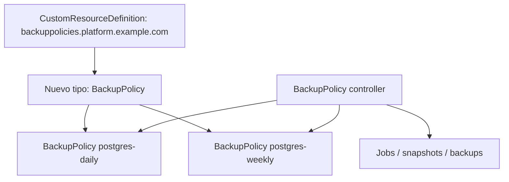

### Regla didáctica

No llames CRD a todo.

Esto es el CRD:

```text
CustomResourceDefinition backuppolicies.platform.example.com
```

Esto es un Custom Resource:

```text
BackupPolicy postgres-daily
```

### Criterio de comprensión

Debes poder explicar:

> El CRD define el tipo. El Custom Resource es un objeto de ese tipo. El controller le da comportamiento.

---

## 14.4. `spec` y `status`

### Qué problema resuelven

Kubernetes separa intención y realidad.

`spec` expresa lo que quieres.

`status` expresa lo que el sistema observa.

Esto ya lo has visto en Deployments y Pods.

En tus propios recursos deberías mantener la misma separación.

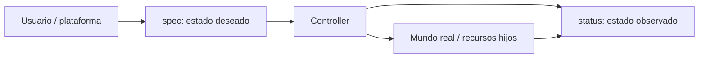

### Ejemplo

```yaml
spec:
  schedule: "0 2 * * *"
  retentionDays: 7
  targetRef:
    kind: PersistentVolumeClaim
    name: postgres-data

status:
  lastBackupTime: "2026-05-13T02:00:00Z"
  lastBackupStatus: Succeeded
  observedGeneration: 3
  conditions:
    - type: Ready
      status: "True"
```

### Status subresource

La documentación oficial explica que, cuando se habilita el `status subresource` en un CRD, el subrecurso `/status` queda expuesto para el Custom Resource. Las actualizaciones a `/status` ignoran cambios fuera de `.status` y validan la parte de status según corresponda. ([Kubernetes](https://kubernetes.io/docs/tasks/extend-kubernetes/custom-resources/custom-resource-definitions/ "Extend the Kubernetes API with CustomResourceDefinitions"))

### Por qué importa

Sin `status`, el usuario solo ve lo que pidió.

Con `status`, puede ver qué ha pasado.

```bash
kubectl get backuppolicy postgres-daily -n shop -o yaml
```

### Criterio de comprensión

Debes poder explicar:

> `spec` es intención. `status` es observación. Un controller profesional actualiza `status` para que el usuario no tenga que adivinar qué ocurrió.

---

## 14.5. CRD `BackupPolicy`

### Qué problema resuelve

Queremos crear una API pequeña y realista para expresar políticas de backup.

No vamos a implementar todavía el controller.

Primero vamos a crear el contrato.

### Estructura esperada

```text
kubernetes/
  12-extension/
    crd-backuppolicy.yaml
    postgres-daily-backuppolicy.yaml
    postgres-weekly-backuppolicy.yaml
```

### Manifest del CRD

Crea:

```text
kubernetes/12-extension/crd-backuppolicy.yaml
```

Contenido:

```yaml
apiVersion: apiextensions.k8s.io/v1
kind: CustomResourceDefinition
metadata:
  name: backuppolicies.platform.example.com
spec:
  group: platform.example.com
  scope: Namespaced
  names:
    plural: backuppolicies
    singular: backuppolicy
    kind: BackupPolicy
    shortNames:
      - bkp
  versions:
    - name: v1alpha1
      served: true
      storage: true
      subresources:
        status: {}
      additionalPrinterColumns:
        - name: Schedule
          type: string
          jsonPath: .spec.schedule
        - name: Retention
          type: integer
          jsonPath: .spec.retentionDays
        - name: Target
          type: string
          jsonPath: .spec.targetRef.name
        - name: Ready
          type: string
          jsonPath: .status.conditions[?(@.type=="Ready")].status
      schema:
        openAPIV3Schema:
          type: object
          required:
            - spec
          properties:
            spec:
              type: object
              required:
                - targetRef
                - schedule
                - retentionDays
              properties:
                targetRef:
                  type: object
                  required:
                    - kind
                    - name
                  properties:
                    kind:
                      type: string
                      enum:
                        - PersistentVolumeClaim
                    name:
                      type: string
                      minLength: 1
                schedule:
                  type: string
                  minLength: 1
                retentionDays:
                  type: integer
                  minimum: 1
                  maximum: 365
                suspend:
                  type: boolean
                  default: false
            status:
              type: object
              properties:
                observedGeneration:
                  type: integer
                lastBackupTime:
                  type: string
                  format: date-time
                lastBackupStatus:
                  type: string
                  enum:
                    - Unknown
                    - Running
                    - Succeeded
                    - Failed
                conditions:
                  type: array
                  items:
                    type: object
                    required:
                      - type
                      - status
                    properties:
                      type:
                        type: string
                      status:
                        type: string
                        enum:
                          - "True"
                          - "False"
                          - Unknown
                      reason:
                        type: string
                      message:
                        type: string
```

### Qué estás declarando

|Campo|Significado|
|---|---|
|`group`|Grupo de API propio|
|`scope: Namespaced`|Cada BackupPolicy vive en un namespace|
|`names.kind`|Tipo visible para el usuario|
|`shortNames`|Alias para `kubectl get bkp`|
|`versions`|Versiones servidas por la API|
|`storage: true`|Versión usada para persistir|
|`schema`|Validación estructural|
|`status`|Subrecurso para estado observado|
|`additionalPrinterColumns`|Columnas útiles en `kubectl get`|

### Aplicar

```bash
kubectl apply -f kubernetes/12-extension/crd-backuppolicy.yaml
```

### Validar que existe

```bash
kubectl get crd backuppolicies.platform.example.com
kubectl api-resources | grep -i backuppolicy
kubectl explain backuppolicy
kubectl explain backuppolicy.spec
```

### Criterio de comprensión

Debes poder explicar:

> El CRD crea un nuevo tipo de recurso validado por el API Server. Todavía no crea backups.

---

## 14.6. Crear Custom Resources `BackupPolicy`

### Qué problema resuelve

Ahora que el API Server conoce el tipo `BackupPolicy`, podemos crear instancias.

### Backup diario

Crea:

```text
kubernetes/12-extension/postgres-daily-backuppolicy.yaml
```

Contenido:

```yaml
apiVersion: platform.example.com/v1alpha1
kind: BackupPolicy
metadata:
  name: postgres-daily
  namespace: shop
  labels:
    app.kubernetes.io/name: postgres
    app.kubernetes.io/component: backup
    app.kubernetes.io/part-of: shop
spec:
  targetRef:
    kind: PersistentVolumeClaim
    name: postgres-data
  schedule: "0 2 * * *"
  retentionDays: 7
  suspend: false
```

### Backup semanal

Crea:

```text
kubernetes/12-extension/postgres-weekly-backuppolicy.yaml
```

Contenido:

```yaml
apiVersion: platform.example.com/v1alpha1
kind: BackupPolicy
metadata:
  name: postgres-weekly
  namespace: shop
  labels:
    app.kubernetes.io/name: postgres
    app.kubernetes.io/component: backup
    app.kubernetes.io/part-of: shop
spec:
  targetRef:
    kind: PersistentVolumeClaim
    name: postgres-data
  schedule: "0 3 * * 0"
  retentionDays: 30
  suspend: false
```

### Aplicar

```bash
kubectl apply -f kubernetes/12-extension/postgres-daily-backuppolicy.yaml
kubectl apply -f kubernetes/12-extension/postgres-weekly-backuppolicy.yaml
```

### Ver

```bash
kubectl get backuppolicies -n shop
kubectl get bkp -n shop
kubectl get bkp postgres-daily -n shop -o yaml
```

### Qué verás

Verás los objetos.

Pero no verás backups reales.

Eso es correcto.

Todavía no hay controller.

### Criterio de comprensión

Debes poder explicar:

> Crear un Custom Resource no ejecuta comportamiento por sí mismo. Solo crea un objeto en la API.

---

## 14.7. Validación de schema

### Qué problema resuelve

Uno de los valores de un CRD es que el API Server puede validar forma y tipos.

Queremos evitar recursos mal formados.

### Recurso inválido

Crea:

```text
kubernetes/12-extension/invalid-backuppolicy.yaml
```

Contenido:

```yaml
apiVersion: platform.example.com/v1alpha1
kind: BackupPolicy
metadata:
  name: invalid-backup
  namespace: shop
spec:
  targetRef:
    kind: PersistentVolumeClaim
    name: postgres-data
  schedule: ""
  retentionDays: 0
```

### Aplicar

```bash
kubectl apply -f kubernetes/12-extension/invalid-backuppolicy.yaml
```

### Resultado esperado

El API Server debería rechazarlo porque:

- `schedule` tiene `minLength: 1`
- `retentionDays` tiene mínimo `1`
### Validar sin persistir

```bash
kubectl apply --dry-run=server -f kubernetes/12-extension/invalid-backuppolicy.yaml
```

### Criterio de comprensión

Debes poder explicar:

> El schema del CRD permite rechazar recursos inválidos antes de que un controller tenga que interpretarlos.

---

## 14.8. Controller y reconciliation

### Qué problema resuelve

Un controller observa recursos y actúa para que el estado real se acerque al estado deseado.

Kubernetes ya funciona así internamente.

El Deployment controller observa Deployments y ReplicaSets.

El Job controller observa Jobs y Pods.

Un controller propio podría observar BackupPolicies y crear Jobs, snapshots o recursos de Velero.

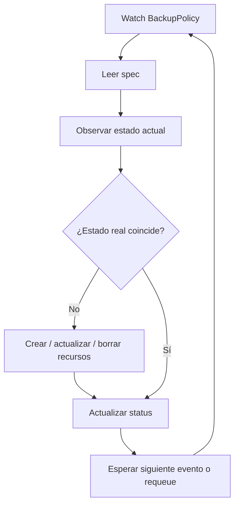

### Reconciliation loop

El ciclo típico:

1. Observa un recurso
2. Lee `spec`
3. Lee recursos relacionados
4. Compara estado deseado y real
5. Crea, actualiza o borra recursos
6. Actualiza `status`
7. Repite
### Para `BackupPolicy`

Un controller real podría hacer:

|`BackupPolicy.spec`|Acción del controller|
|---|---|
|`schedule`|Crear o actualizar CronJob|
|`targetRef`|Validar que el PVC existe|
|`retentionDays`|Configurar cleanup|
|`suspend`|Suspender CronJob|
|borrado del recurso|Ejecutar limpieza con finalizer|
|resultado del backup|Actualizar `status`|

### Sin controller

El recurso queda así:

```text
Objeto almacenado
Schema validado
Sin comportamiento automático
Sin status real
```

### Criterio de comprensión

Debes poder explicar:

> El controller es el puente entre la intención declarada en `spec` y los cambios reales en el cluster o en sistemas externos.

---

## 14.9. Operator

### Qué problema resuelve

Un operator es un controller especializado que automatiza conocimiento operacional.

La documentación oficial define Operators como extensiones software que usan Custom Resources para gestionar aplicaciones y sus componentes, siguiendo principios de Kubernetes y especialmente el control loop. ([Kubernetes](https://kubernetes.io/docs/concepts/extend-kubernetes/ "Extending Kubernetes"))

### Diferencia entre controller y operator

|Concepto|Diferencia práctica|
|---|---|
|Controller|Reconciliador genérico de estado|
|Operator|Controller que codifica conocimiento operacional de una aplicación o dominio|

### Ejemplos de conocimiento operacional

Un operator puede saber:

- Cómo instalar
- Cómo actualizar
- Cómo hacer backup
- Cómo restaurar
- Cómo rotar certificados
- Cómo hacer failover
- Cómo actualizar `status`
- Cómo limpiar recursos externos
- Cómo validar precondiciones
- Cómo manejar versiones
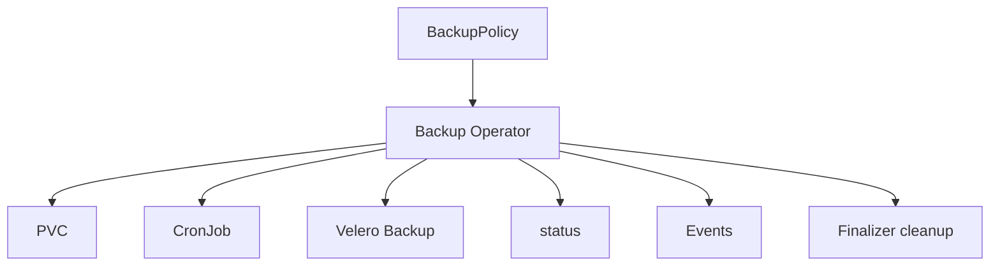

### Cuidado

Un operator no es una forma elegante de esconder YAML.

Un operator merece la pena cuando automatiza decisiones operacionales repetitivas y con suficiente complejidad.

### Criterio de comprensión

Debes poder explicar:

> Operator significa automatizar operación, no solo generar manifests.

---

## 14.10. Finalizers

### Qué problema resuelven

A veces, antes de borrar un recurso, necesitas ejecutar limpieza.

Ejemplos:

- Borrar backup externo
- Desregistrar algo en un proveedor
- Liberar un recurso externo
- Hacer snapshot final
- Eliminar credenciales creadas dinámicamente
Kubernetes documenta finalizers como claves que indican que un recurso no puede eliminarse completamente hasta que se cumplan ciertas condiciones. También explica su relación con owner references y limpieza de objetos. ([Kubernetes](https://kubernetes.io/docs/concepts/overview/working-with-objects/finalizers/ "Finalizers"))

### Cómo funciona

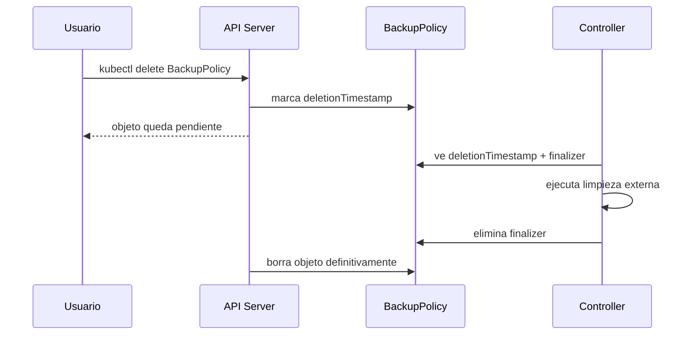

### Ejemplo conceptual

```yaml
metadata:
  finalizers:
    - platform.example.com/backuppolicy-cleanup
```

### Riesgo

Si el controller desaparece o falla y el finalizer no se elimina, el recurso puede quedarse atascado en estado de eliminación.

### Comandos de diagnóstico

```bash
kubectl get bkp postgres-daily -n shop -o json | jq '.metadata.finalizers, .metadata.deletionTimestamp'
kubectl describe bkp postgres-daily -n shop
```

### Criterio de comprensión

Debes poder explicar:

> Finalizer retrasa el borrado definitivo para que un controller pueda limpiar recursos antes de que el objeto desaparezca.

---

## 14.11. Owner references

### Qué problema resuelven

Cuando un objeto crea otros objetos, Kubernetes necesita saber quién es dueño de quién para poder limpiar dependencias.

La documentación oficial explica que los objetos dependientes tienen `metadata.ownerReferences` apuntando a su dueño, y que Kubernetes usa esas relaciones para garbage collection. ([Kubernetes](https://kubernetes.io/docs/concepts/overview/working-with-objects/owners-dependents/ "Owners and Dependents"))

### Ejemplo mental

Un BackupPolicy controller podría crear un CronJob.

Ese CronJob debería tener owner reference hacia la BackupPolicy.

Si borras la BackupPolicy, Kubernetes puede limpiar el CronJob dependiente.

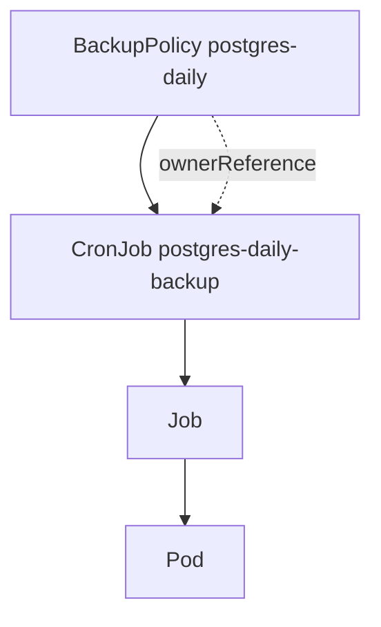

### Diferencia entre label y ownerReference

|Mecanismo|Uso|
|---|---|
|Label|Selección, agrupación, consultas|
|OwnerReference|Relación de propiedad y garbage collection|

### Criterio de comprensión

Debes poder explicar:

> Las labels ayudan a encontrar objetos. Owner references expresan dependencia y permiten limpieza automática.

---

## 14.12. Versionado de CRDs

### Qué problema resuelve

Tu API cambiará.

Si publicas un CRD para otros equipos, necesitas evolucionarlo sin romper a todos.

La documentación oficial de versionado de CRDs explica cómo añadir información de versiones, indicar estabilidad y avanzar la API a nuevas versiones, incluyendo conversiones entre representaciones. ([Kubernetes](https://kubernetes.io/docs/tasks/extend-kubernetes/custom-resources/custom-resource-definition-versioning/ "Versions in CustomResourceDefinitions"))

### Ejemplo

Empiezas con:

```text
platform.example.com/v1alpha1
```

Después podrías añadir:

```text
platform.example.com/v1beta1
platform.example.com/v1
```

### Campos importantes

|Campo|Significado|
|---|---|
|`served`|La versión se puede usar en la API|
|`storage`|La versión en la que se persisten objetos|
|conversion webhook|Convierte entre versiones si las estructuras cambian|

### Regla

No uses `v1` si todavía estás aprendiendo el contrato.

Para el curso, `v1alpha1` es correcto porque el API es experimental.

### Criterio de comprensión

Debes poder explicar:

> Versionar CRDs es diseñar evolución de API. No es solo cambiar un string en `apiVersion`.

---

## 14.13. Admission control y webhooks

### Qué problema resuelven

RBAC responde:

> ¿Quién puede pedir algo?

Admission responde:

> Aunque tenga permiso, ¿deberíamos aceptar o modificar este objeto?

La documentación oficial define admission controllers como piezas que interceptan requests al API Server antes de persistir el recurso, después de autenticación y autorización. ([Kubernetes](https://kubernetes.io/docs/reference/access-authn-authz/admission-controllers/ "Admission Control in Kubernetes"))

### Tipos

|Tipo|Qué hace|
|---|---|
|Validating admission|Permite o rechaza|
|Mutating admission|Modifica el objeto antes de guardarlo|
|ValidatingAdmissionPolicy|Validación declarativa con CEL|
|Webhook|Servicio externo que decide o muta|

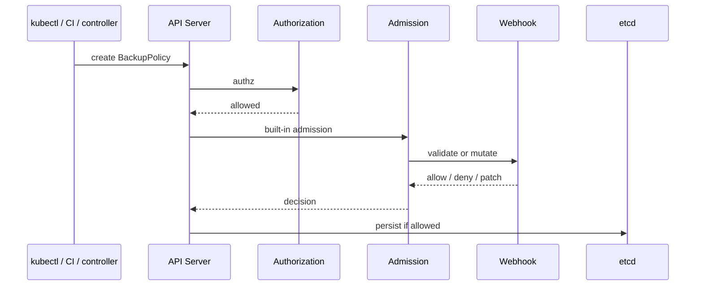

### Ejemplos

Un validating webhook podría rechazar:

- BackupPolicy con horario fuera de ventana permitida
- BackupPolicy que apunta a PVC inexistente
- BackupPolicy con retención mayor a la permitida por el tenant
- Recurso sin labels obligatorias
Un mutating webhook podría añadir:

- Labels estándar
- Defaults
- Annotations
- Valores de entorno
- Sidecars
### Buenas prácticas

Kubernetes mantiene una guía específica de buenas prácticas para admission webhooks. Los webhooks deben diseñarse con cuidado porque están en el camino crítico de creación y actualización de recursos. ([Kubernetes](https://kubernetes.io/docs/concepts/cluster-administration/admission-webhooks-good-practices/ "Admission Webhook Good Practices"))

### Criterio de comprensión

Debes poder explicar:

> Admission webhook es una extensión poderosa, pero si falla o está mal diseñado puede bloquear el flujo de cambios del cluster.

---

## 14.14. API aggregation

### Qué problema resuelve

CRDs son la forma más común de añadir tipos de recursos.

Pero no son la única.

La API aggregation layer permite extender Kubernetes con APIs adicionales más allá de las APIs core. La documentación oficial explica que la aggregation layer es diferente de los CRDs: los CRDs hacen que kube-apiserver reconozca nuevos tipos de objeto, mientras que la aggregation layer permite registrar APIs adicionales servidas por otro API server. ([Kubernetes](https://kubernetes.io/docs/concepts/extend-kubernetes/api-extension/apiserver-aggregation/ "Kubernetes API Aggregation Layer"))

### Cuándo considerar API aggregation

Puede tener sentido si necesitas:

- API con comportamiento muy específico
- Lógica de serving avanzada
- Integración que no encaja bien con CRDs
- API server separado
- Métricas o recursos agregados especiales
### Ejemplo conocido

Metrics Server usa una API agregada para exponer métricas de recursos al cluster.

### Para el curso

No vamos a implementar API aggregation.

Solo necesitas entender cuándo existe y por qué no es el primer paso.

### Criterio de comprensión

Debes poder explicar:

> API aggregation extiende Kubernetes con APIs servidas por un API server adicional. Para la mayoría de extensiones de dominio, empieza por CRDs.

---

## 14.15. Extensiones de infraestructura: CNI, CSI y Device Plugins

### Qué problema resuelven

No todas las extensiones son APIs de dominio.

Algunas añaden capacidades de infraestructura.

### Network plugins

Kubernetes requiere un plugin CNI para implementar su modelo de red. La documentación oficial indica que los CNI plugins son necesarios para cluster networking y deben ser compatibles con el cluster y con la especificación CNI adecuada. ([Kubernetes](https://kubernetes.io/docs/concepts/extend-kubernetes/compute-storage-net/network-plugins/ "Network Plugins"))

Ejemplos de capacidades:

- Conectividad de Pods
- NetworkPolicy
- eBPF
- Routing
- Encryption
- Observabilidad de red
### CSI

Container Storage Interface permite extender Kubernetes con nuevos tipos de volúmenes. Kubernetes documenta CSI como el mecanismo recomendado para storage plugins, mientras FlexVolume está deprecado desde Kubernetes v1.23 en favor de CSI. ([Kubernetes](https://kubernetes.io/docs/concepts/extend-kubernetes/ "Extending Kubernetes"))

Ejemplos de capacidades:

- Volúmenes cloud
- Snapshots
- Expansion
- StorageClasses
- Drivers de storage externos
### Device plugins

Device plugins permiten configurar el cluster con soporte para recursos que requieren configuración específica de vendor, como GPUs, NICs, FPGAs o memoria no volátil. Kubernetes documenta el device plugin framework como mecanismo para anunciar recursos hardware al kubelet. ([Kubernetes](https://kubernetes.io/docs/concepts/extend-kubernetes/compute-storage-net/device-plugins/ "Device Plugins"))

### Criterio de comprensión

Debes poder explicar:

> CNI extiende red, CSI extiende storage y Device Plugins extienden acceso a hardware especializado. No son operators de aplicación, son capacidades de plataforma.

---

## 14.16. Ruta de implementación: manual, Kubebuilder o Operator SDK

### Qué problema resuelve

Crear CRDs a mano sirve para aprender.

Pero un controller real necesita estructura, tests, RBAC, manifests, manager, reconciliation y packaging.

Kubebuilder se presenta como una herramienta para construir Kubernetes APIs usando CRDs, y su libro oficial cubre crear un proyecto, crear una API, ejecutar localmente y ejecutar dentro del cluster. ([book.kubebuilder.io](https://book.kubebuilder.io/ "The Kubebuilder Book: Introduction"))

### Rutas posibles

|Ruta|Uso|
|---|---|
|YAML manual|Aprender CRD y Custom Resources|
|Kubebuilder|Construir APIs/controllers con Go y controller-runtime|
|Operator SDK|Ruta operator-oriented dentro del ecosistema Operator Framework|
|Kopf|Controllers en Python, útil en algunos equipos, no es la ruta principal oficial de Kubernetes|
|Kube-rs|Controllers en Rust, útil si tu equipo trabaja en Rust|

### Decisión del curso

La práctica obligatoria será YAML manual + modelo de controller.

La práctica opcional será Kubebuilder.

Motivo:

- El curso no debe convertir este módulo en una formación de Go
- El objetivo ahora es entender el modelo de extensión
- Kubebuilder es una ruta profesional válida, pero requiere más tiempo
### Criterio de comprensión

Debes poder explicar:

> Aprender CRDs no obliga a implementar un controller completo el primer día. Primero debes entender el contrato API y el ciclo de reconciliación.

---

## 14.17. Seguridad y blast radius de controllers

### Qué problema resuelve

Un controller puede tener mucho poder.

Si observa muchos namespaces y puede crear, actualizar o borrar recursos, su blast radius puede ser grande.

### Riesgos

- RBAC demasiado amplio
- Bugs que crean demasiados recursos
- Finalizers atascados
- Borrados accidentales
- Reconciliación en bucle
- Status updates demasiado frecuentes
- Webhooks que bloquean admisión
- CRDs con schema demasiado permisivo
- Recursos externos huérfanos
- Owner references incorrectas
- Logs sin contexto
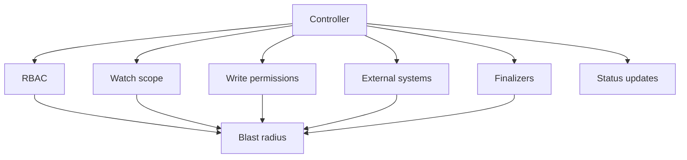

### Reglas mínimas

- Scope limitado si es posible
- RBAC mínimo
- Reconciliation idempotente
- Finalizers con timeout y recuperación
- Status claro
- Events útiles
- Logs estructurados
- Métricas del controller
- Tests de policies
- Tests de reconciliación
- Rate limiting
- Backoff
- Alertas sobre errores de reconciliación
### Criterio de comprensión

Debes poder explicar:

> Un controller es software con permisos dentro del cluster. Debe diseñarse, testearse y operarse como parte crítica de la plataforma.

---

## 14.18. Failure lab 1: CR inválido

### Qué queremos comprobar

Queremos ver que el API Server rechaza un Custom Resource que no cumple schema.

### Ejecutar

```bash
kubectl apply --dry-run=server -f kubernetes/12-extension/invalid-backuppolicy.yaml
```

### Señal esperada

- Error de validación
- No se crea el objeto
### Preguntas

- ¿Qué campo falla?
- ¿Lo detecta el API Server?
- ¿Lo detectaría un controller?
- ¿Por qué es mejor fallar antes?
### Criterio de comprensión

Debes poder explicar:

> Schema validation evita que recursos claramente inválidos entren al sistema.

---

## 14.19. Failure lab 2: CRD sin controller

### Qué queremos comprobar

Queremos demostrar que crear un CR no implica comportamiento.

### Ejecutar

```bash
kubectl apply -f kubernetes/12-extension/postgres-daily-backuppolicy.yaml
kubectl get bkp -n shop
kubectl get cronjob -n shop
kubectl get job -n shop
```

### Señal esperada

- BackupPolicy existe
- No aparece CronJob nuevo creado automáticamente
- No aparece Job de backup
- `status` no cambia por sí solo
### Preguntas

- ¿Qué falta?
- ¿Por qué no se crea ningún backup?
- ¿Qué tendría que hacer el controller?
- ¿Qué debería aparecer en `status`?
### Criterio de comprensión

Debes poder explicar:

> Un Custom Resource sin controller es intención almacenada, no automatización.

---

## 14.20. Failure lab 3: finalizer atascado, conceptual

### Qué queremos comprobar

Queremos entender un fallo típico: un recurso se queda borrando porque tiene un finalizer y el controller no lo limpia.

### Manifest conceptual

No lo aplicamos como práctica obligatoria porque sin controller solo crearíamos un atasco artificial.

Pero debes saber diagnosticarlo:

```bash
kubectl get bkp postgres-daily -n shop -o json | jq '.metadata.finalizers, .metadata.deletionTimestamp'
kubectl describe bkp postgres-daily -n shop
```

### Señal esperada

- `deletionTimestamp` presente
- `finalizers` presente
- Objeto no desaparece
### Acción en producción

No elimines finalizers a mano sin entender qué limpieza pendiente representan.

Hacerlo puede dejar recursos externos huérfanos.

### Criterio de comprensión

Debes poder explicar:

> Quitar un finalizer manualmente puede liberar el objeto, pero también puede saltarse una limpieza necesaria.

---

## 14.21. Taskfile del módulo 14

Añade estas tareas al `Taskfile.yml`.

```yaml
  extension:crd:apply:
    desc: Apply BackupPolicy CRD
    cmds:
      - kubectl apply -f kubernetes/12-extension/crd-backuppolicy.yaml

  extension:crd:delete:
    desc: Delete BackupPolicy CRD and all its custom resources
    cmds:
      - kubectl delete -f kubernetes/12-extension/crd-backuppolicy.yaml --ignore-not-found

  extension:crd:status:
    desc: Show BackupPolicy CRD status and API resources
    cmds:
      - kubectl get crd backuppolicies.platform.example.com
      - kubectl api-resources | grep -i backuppolicy || true
      - kubectl explain backuppolicy || true
      - kubectl explain backuppolicy.spec || true

  extension:cr:apply:
    desc: Apply BackupPolicy custom resources
    cmds:
      - kubectl apply -f kubernetes/12-extension/postgres-daily-backuppolicy.yaml
      - kubectl apply -f kubernetes/12-extension/postgres-weekly-backuppolicy.yaml

  extension:cr:status:
    desc: Show BackupPolicy custom resources
    cmds:
      - kubectl get backuppolicies -n {{.NAMESPACE}}
      - kubectl get bkp -n {{.NAMESPACE}} -o yaml

  extension:cr:describe:
    desc: Describe postgres-daily BackupPolicy
    cmds:
      - kubectl describe bkp postgres-daily -n {{.NAMESPACE}}

  extension:cr:invalid:dry-run:
    desc: Validate invalid BackupPolicy with server-side dry-run
    cmds:
      - kubectl apply --dry-run=server -f kubernetes/12-extension/invalid-backuppolicy.yaml || true

  extension:no-controller:check:
    desc: Show that BackupPolicy does not create behavior without a controller
    cmds:
      - kubectl get bkp -n {{.NAMESPACE}} || true
      - kubectl get cronjob -n {{.NAMESPACE}} || true
      - kubectl get job -n {{.NAMESPACE}} || true

  extension:status:check:
    desc: Show BackupPolicy status fields
    cmds:
      - kubectl get bkp postgres-daily -n {{.NAMESPACE}} -o json | jq '.status // {}'

  extension:finalizers:check:
    desc: Inspect finalizers and deletion timestamp for postgres-daily BackupPolicy
    cmds:
      - kubectl get bkp postgres-daily -n {{.NAMESPACE}} -o json | jq '.metadata.finalizers, .metadata.deletionTimestamp' || true

  extension:all:
    desc: Apply CRD and sample BackupPolicy resources
    cmds:
      - task extension:crd:apply
      - task extension:crd:status
      - task extension:cr:apply
      - task extension:cr:status
      - task extension:no-controller:check

  extension:test:
    desc: Run extension module checks
    cmds:
      - task extension:crd:apply
      - task extension:crd:status
      - task extension:cr:apply
      - task extension:cr:status
      - task extension:cr:invalid:dry-run
      - task extension:no-controller:check
      - task extension:status:check
```

### Criterio DevEx

Debes poder explicar:

> La DevEx de extensión debe permitir aplicar el CRD, crear recursos, validar schema, inspeccionar status y demostrar claramente que sin controller no hay comportamiento.

---

## 14.22. Práctica principal del módulo

### Objetivo

Crear una extensión mínima de Kubernetes para expresar políticas de backup, sin implementar todavía el controller.

### Resultado esperado

```text
kubernetes-learning-lab/
  kubernetes/
    12-extension/
      crd-backuppolicy.yaml
      postgres-daily-backuppolicy.yaml
      postgres-weekly-backuppolicy.yaml
      invalid-backuppolicy.yaml

  docs/
    extension/
      backuppolicy-api.md
      backuppolicy-controller-design.md
      backuppolicy-risks.md
      backuppolicy-versioning.md

  Taskfile.yml
```

### Paso 1. Preparar cluster y namespace

```bash
task k8s:kind:create
task k8s:namespace:apply
```

### Paso 2. Aplicar CRD

```bash
task extension:crd:apply
task extension:crd:status
```

### Paso 3. Aplicar Custom Resources

```bash
task extension:cr:apply
task extension:cr:status
task extension:cr:describe
```

### Paso 4. Probar validación de schema

```bash
task extension:cr:invalid:dry-run
```

### Paso 5. Demostrar que no hay controller

```bash
task extension:no-controller:check
task extension:status:check
```

### Paso 6. Diseñar el controller en documentación

Crea:

```text
docs/extension/backuppolicy-controller-design.md
```

Contenido mínimo:

```markdown
# BackupPolicy controller design

## Resource watched

BackupPolicy.platform.example.com/v1alpha1

## Desired state

For each BackupPolicy, create or update a CronJob that performs backups for the target PVC.

## Reconciliation steps

1. Read BackupPolicy.
2. Validate target PVC exists.
3. If suspend is false, create or update CronJob.
4. If suspend is true, suspend CronJob.
5. Set ownerReference on CronJob.
6. Update status.conditions.
7. Emit events.
8. On deletion, run finalizer cleanup if needed.
9. Remove finalizer.

## Status

- observedGeneration
- lastBackupTime
- lastBackupStatus
- Ready condition

## Failure modes

- PVC does not exist.
- Invalid schedule.
- CronJob creation denied by RBAC.
- Backup Job fails.
- Finalizer gets stuck.
- Too many status updates.
```

### Paso 7. Documentar riesgos

Crea:

```text
docs/extension/backuppolicy-risks.md
```

Incluye:

- CRD demasiado genérico
- Schema demasiado permisivo
- Controller con RBAC amplio
- Finalizers atascados
- OwnerReferences incorrectas
- Status sin información útil
- Versionado roto
- Webhook bloqueando admisión
- Recursos externos huérfanos
- Reconciliación no idempotente
- Loops agresivos
- Logs insuficientes
### Paso 8. Documentar versionado

Crea:

```text
docs/extension/backuppolicy-versioning.md
```

Incluye:

- Por qué `v1alpha1`
- Qué haría falta para `v1beta1`
- Qué cambios serían compatibles
- Qué cambios exigirían conversión
- Qué campos no deberías renombrar sin estrategia
- Cómo comunicar deprecaciones
### Paso 9. Ejecutar test completo

```bash
task extension:test
```

### Paso 10. Limpiar

```bash
kubectl delete -f kubernetes/12-extension/postgres-weekly-backuppolicy.yaml --ignore-not-found
kubectl delete -f kubernetes/12-extension/postgres-daily-backuppolicy.yaml --ignore-not-found
task extension:crd:delete
task k8s:namespace:delete
task k8s:kind:delete
```

### Criterio de finalización

La práctica está completa cuando puedes explicar:

- Qué CRD has creado
- Qué Custom Resources has creado
- Qué valida el schema
- Qué no ocurre porque no hay controller
- Qué debería hacer un controller
- Qué debería contener `status`
- Qué papel tendrían finalizers
- Qué papel tendrían ownerReferences
- Qué riesgos tendría operar este controller
- Cómo evolucionarías de `v1alpha1` a `v1beta1`
---

## 14.23. Ejercicios cortos

### Ejercicio 1. CRD vs Custom Resource

Completa:

|Pregunta|Respuesta|
|---|---|
|¿Cuál es el CRD?||
|¿Cuál es el Custom Resource?||
|¿Qué crea el tipo `BackupPolicy`?||
|¿Qué crea `postgres-daily`?||
|¿Por qué no se ejecuta ningún backup?||

---

### Ejercicio 2. `spec` y `status`

Ejecuta:

```bash
kubectl get bkp postgres-daily -n shop -o yaml
```

Responde:

- ¿Qué hay en `spec`?
- ¿Qué hay en `status`?
- ¿Por qué `status` está vacío?
- ¿Quién debería actualizarlo?
- ¿Qué campos de status serían útiles?
---

### Ejercicio 3. Schema validation

Ejecuta:

```bash
task extension:cr:invalid:dry-run
```

Responde:

- ¿Qué campo falla?
- ¿Qué mensaje devuelve el API Server?
- ¿Por qué es mejor detectarlo en admisión que en runtime?
- ¿Qué otro campo validarías?
---

### Ejercicio 4. Controller design

Diseña la reconciliación de `BackupPolicy`:

|Paso|Acción|
|---|---|
|Leer recurso||
|Validar PVC||
|Crear recurso hijo||
|Añadir ownerReference||
|Actualizar status||
|Manejar borrado||
|Emitir events||

---

### Ejercicio 5. Finalizers

Responde:

- ¿Cuándo añadirías un finalizer?
- ¿Qué limpieza haría?
- ¿Qué pasa si el controller desaparece?
- ¿Cuándo sería peligroso quitarlo manualmente?
---

### Ejercicio 6. Owner references

Responde:

- ¿Qué objeto sería owner?
- ¿Qué objeto sería dependent?
- ¿Qué problema resuelve garbage collection?
- ¿Por qué una label no basta?
---

### Ejercicio 7. Admission webhook

Decide si usarías webhook:

|Necesidad|Webhook sí/no|Motivo|
|---|--:|---|
|Rechazar BackupPolicy con retención mayor a 30 días en namespaces dev|||
|Añadir label estándar a todos los recursos|||
|Crear un CronJob desde BackupPolicy|||
|Validar que el PVC existe antes de aceptar el recurso|||
|Ejecutar el backup|||

---

## 14.24. Errores habituales

### Error 1. Crear un CRD para todo

No todo necesita una API nueva.

A veces basta con Deployment, Job, CronJob, ConfigMap, Helm o Kustomize.

---

### Error 2. Crear CRD sin comportamiento esperado

Un CRD sin controller puede estar bien para configuración declarativa simple, pero si el usuario espera automatización, falta una pieza clave.

---

### Error 3. Diseñar `spec` como reflejo de implementación

`spec` debe expresar intención del usuario, no detalles internos del controller.

---

### Error 4. No actualizar `status`

Sin status, el usuario no sabe qué ocurrió.

Termina mirando logs del controller para entender el estado.

---

### Error 5. Usar finalizers sin plan de recuperación

Un finalizer puede atascar borrados si el controller falla.

---

### Error 6. OwnerReferences incorrectas

Si las relaciones de ownership están mal, puedes dejar recursos huérfanos o borrar más de lo esperado.

---

### Error 7. Versionar tarde

Si otros equipos usan tu API, cambiar campos sin estrategia rompe consumidores.

---

### Error 8. Webhooks en el camino crítico sin cuidado

Un webhook lento o caído puede bloquear creación o actualización de recursos.

---

### Error 9. RBAC demasiado amplio para controllers

Un controller con permisos amplios aumenta el blast radius de cualquier bug o compromiso.

---

### Error 10. Llamar operator a cualquier controller

Un operator debería automatizar conocimiento operacional, no solo observar un recurso y crear YAML.

---

## 14.25. Troubleshooting progresivo de extensiones

Cuando una extensión falla, no empieces por reescribir el controller.

Sigue la cadena.

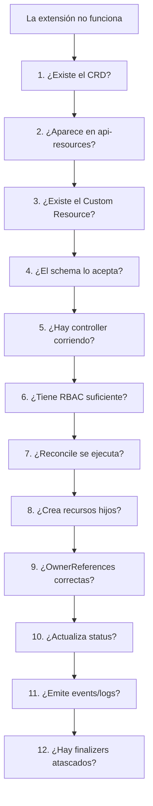

### Comandos

```bash
kubectl get crd backuppolicies.platform.example.com
kubectl api-resources | grep -i backuppolicy
kubectl explain backuppolicy.spec
kubectl get bkp -n shop
kubectl describe bkp postgres-daily -n shop
kubectl get bkp postgres-daily -n shop -o json | jq '.spec, .status, .metadata.finalizers'
kubectl get events -n shop --sort-by=.metadata.creationTimestamp
kubectl get role,rolebinding -n shop
kubectl auth can-i create cronjobs --as=system:serviceaccount:shop:backup-policy-controller -n shop
```

### Criterio de comprensión

Debes poder explicar:

> Troubleshooting de extensiones empieza por la API: CRD, recurso, schema. Después viene controller, RBAC, recursos hijos, status, events y finalizers.

---

## 14.26. Criterio de salida del módulo

Puedes pasar al módulo 15 cuando puedas hacer todo esto sin seguir una receta ciegamente.

### Conceptos

Debes poder explicar:

- Qué significa extender Kubernetes
- Qué es un Custom Resource
- Qué es un CRD
- Diferencia entre CRD y Custom Resource
- Qué es un controller
- Qué es reconciliation
- Qué es un operator
- Diferencia entre controller y operator
- Qué es `spec`
- Qué es `status`
- Qué es `status subresource`
- Qué son finalizers
- Qué son owner references
- Qué es CRD versioning
- Qué significa `served`
- Qué significa `storage`
- Qué es admission control
- Qué son admission webhooks
- Qué riesgos tienen los webhooks
- Qué es API aggregation
- Qué son network plugins
- Qué es CSI
- Qué son device plugins
- Qué riesgos introduce un controller
- Cuándo extender Kubernetes tiene sentido
- Cuándo es sobreingeniería
### Práctica

Debes poder:

- Crear un CRD `BackupPolicy`
- Aplicar el CRD
- Verlo con `kubectl api-resources`
- Usar `kubectl explain`
- Crear BackupPolicies
- Verlas con `kubectl get bkp`
- Rechazar un recurso inválido por schema
- Explicar por qué no hay comportamiento sin controller
- Diseñar un ciclo de reconciliación
- Diseñar status útil
- Explicar dónde usarías finalizers
- Explicar dónde usarías ownerReferences
- Documentar riesgos de operación
- Documentar estrategia de versionado
### DevEx

Debes poder ejecutar:

```bash
task extension:crd:apply
task extension:crd:status
task extension:cr:apply
task extension:cr:status
task extension:cr:describe
task extension:cr:invalid:dry-run
task extension:no-controller:check
task extension:status:check
task extension:finalizers:check
task extension:test
```

### Frase final de comprensión

Debes poder explicar esta frase:

> Extender Kubernetes no consiste en inventar YAML nuevo. Consiste en diseñar una API, validarla, darle comportamiento con reconciliación, exponer estado útil, controlar borrados, limitar permisos y operar esa extensión como parte crítica de la plataforma.

---

## 14.27. Referencias oficiales y fuentes primarias

|Tema|Referencia|
|---|---|
|Extending Kubernetes|Kubernetes Docs, Extending Kubernetes. ([Kubernetes](https://kubernetes.io/docs/concepts/extend-kubernetes/ "Extending Kubernetes"))|
|Extending the Kubernetes API|Kubernetes Docs, Extending the Kubernetes API. ([Kubernetes](https://kubernetes.io/docs/concepts/extend-kubernetes/api-extension/ "Extending the Kubernetes API"))|
|Custom Resources|Kubernetes Docs, Custom Resources. ([Kubernetes](https://kubernetes.io/docs/concepts/extend-kubernetes/api-extension/custom-resources/ "Custom Resources"))|
|CustomResourceDefinitions|Kubernetes Docs, Extend the Kubernetes API with CustomResourceDefinitions. ([Kubernetes](https://kubernetes.io/docs/tasks/extend-kubernetes/custom-resources/custom-resource-definitions/ "Extend the Kubernetes API with CustomResourceDefinitions"))|
|CRD versioning|Kubernetes Docs, Versions in CustomResourceDefinitions. ([Kubernetes](https://kubernetes.io/docs/tasks/extend-kubernetes/custom-resources/custom-resource-definition-versioning/ "Versions in CustomResourceDefinitions"))|
|Operator pattern|Kubernetes Docs, Operator Pattern. ([GitHub](https://github.com/kubernetes-sigs/kubebuilder "Kubebuilder - SDK for building Kubernetes APIs using CRDs"))|
|Finalizers|Kubernetes Docs, Finalizers. ([Kubernetes](https://kubernetes.io/docs/concepts/overview/working-with-objects/finalizers/ "Finalizers"))|
|Owners and dependents|Kubernetes Docs, Owners and Dependents. ([Kubernetes](https://kubernetes.io/docs/concepts/overview/working-with-objects/owners-dependents/ "Owners and Dependents"))|
|Admission controllers|Kubernetes Docs, Admission Control. ([Kubernetes](https://kubernetes.io/docs/reference/access-authn-authz/admission-controllers/ "Admission Control in Kubernetes"))|
|Admission webhook good practices|Kubernetes Docs, Admission Webhook Good Practices. ([Kubernetes](https://kubernetes.io/docs/concepts/cluster-administration/admission-webhooks-good-practices/ "Admission Webhook Good Practices"))|
|API aggregation layer|Kubernetes Docs, Kubernetes API Aggregation Layer. ([Kubernetes](https://kubernetes.io/docs/concepts/extend-kubernetes/api-extension/apiserver-aggregation/ "Kubernetes API Aggregation Layer"))|
|Network plugins|Kubernetes Docs, Network Plugins. ([Kubernetes](https://kubernetes.io/docs/concepts/extend-kubernetes/compute-storage-net/network-plugins/ "Network Plugins"))|
|Device plugins|Kubernetes Docs, Device Plugins. ([Kubernetes](https://kubernetes.io/docs/concepts/extend-kubernetes/compute-storage-net/device-plugins/ "Device Plugins"))|
|CSI / storage plugins|Kubernetes Docs, Extending Kubernetes, Storage plugins. ([Kubernetes](https://kubernetes.io/docs/concepts/extend-kubernetes/ "Extending Kubernetes"))|
|Kubebuilder Book|Kubebuilder official book. ([book.kubebuilder.io](https://book.kubebuilder.io/ "The Kubebuilder Book: Introduction"))|
|Kubebuilder Quick Start|Kubebuilder official quick start. ([book.kubebuilder.io](https://book.kubebuilder.io/quick-start.html "Quick Start"))|

## 14.28. Lecturas de apoyo

|Libro|Qué leer|
|---|---|
|_Kubernetes in Action_|Capítulo 18: CRDs, custom controllers, validación, custom API servers y plataformas sobre Kubernetes. Actualiza cualquier ejemplo antiguo a `apiextensions.k8s.io/v1`.|
|_Kubernetes: Up and Running_|Capítulo 16: puntos de extensibilidad, custom resources, admission controllers y operators.|
|_Kubernetes Patterns_|Controller y Operator como patrones principales de esta unidad.|
|_Cloud Native DevOps with Kubernetes_|Capítulos sobre CRDs, controllers, Helm, operación, seguridad y observabilidad como contexto para operar extensiones.|