# 2. Por qué aparece Kubernetes

## Objetivo del módulo

En el módulo 1 empaquetaste `checkout-api` como contenedor, la ejecutaste con Docker, la ejecutaste con Podman y levantaste un sistema local con Compose.

Ahora toca entender **por qué eso no es suficiente cuando el sistema crece**.

Este módulo no empieza creando Pods ni escribiendo YAML de Kubernetes. Empieza con una pregunta más importante:

> ¿Qué problemas aparecen cuando ya no tienes un contenedor, sino muchos workloads, muchos nodos, muchos cambios, muchos fallos parciales y varios equipos tocando el mismo sistema?

Kubernetes se define oficialmente como una plataforma portable, extensible y open source para gestionar workloads y servicios containerizados, facilitando configuración declarativa y automatización. Esa frase importa porque Kubernetes no es solo una forma de “arrancar contenedores”. Es una plataforma para operar sistemas containerizados mediante API, objetos, estado deseado, control plane y reconciliación. ([Kubernetes](https://kubernetes.io/docs/concepts/overview/ "Overview"))

La idea central del módulo es esta:

> Kubernetes no aparece porque ejecutar un contenedor sea difícil. Aparece porque operar muchos contenedores, en muchos nodos, con cambios constantes, red, configuración, seguridad, fallos y observabilidad sí es difícil.

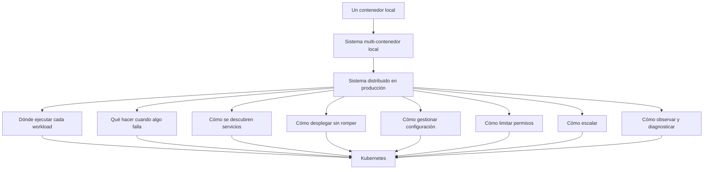

---

## 2.1. Qué problema no resuelve Kubernetes

Antes de explicar por qué aparece Kubernetes, conviene quitar expectativas falsas.

Kubernetes no arregla automáticamente:

- Una aplicación mal diseñada
- Un endpoint `/health` que miente
- Una app que no sabe apagarse bien
- Una imagen enorme o vulnerable
- Un secreto hardcodeado dentro de la imagen
- Un sistema sin logs útiles
- Una base de datos sin backups
- Una arquitectura con dependencias caóticas
- Un equipo que despliega cambios sin validar
- Un producto que no sabe qué debería existir
Kubernetes puede reiniciar un contenedor, pero no puede convertir una aplicación mal comportada en una buena ciudadana cloud native.

Kubernetes puede mantener réplicas, pero no puede decidir por ti si tu aplicación soporta tener varias réplicas.

Kubernetes puede exponer servicios, pero no puede arreglar un contrato HTTP confuso.

Kubernetes puede aplicar configuración declarativa, pero si declaras algo incorrecto, puede repetir el error de forma muy eficiente.

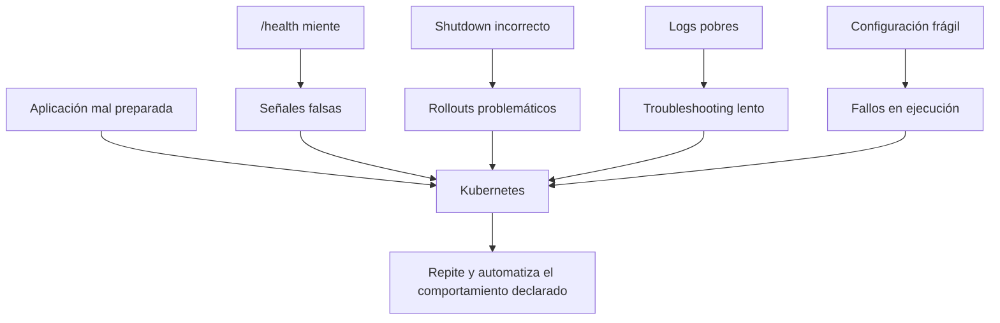

### Contrato mental

|Idea equivocada|Lectura más correcta|
|---|---|
|Kubernetes hace que todo sea fiable|Kubernetes necesita apps que puedan ser operadas|
|Kubernetes reemplaza Docker y Compose|Kubernetes opera workloads containerizados en otro nivel|
|Kubernetes evita entender redes|Kubernetes hace la red más explícita, no menos importante|
|Kubernetes evita entender logs|Kubernetes hace los logs más necesarios|
|Kubernetes evita pensar en configuración|Kubernetes separa y modela configuración|
|Kubernetes arregla fallos|Kubernetes reacciona ante ciertos fallos declarados y observables|

### DevEx del bloque

La DevEx empieza aquí con una regla:

> No uses Kubernetes para esconder que no entiendes tu aplicación.

Antes de migrar algo a Kubernetes, tu laboratorio debe poder responder:

```bash
task app:run
task smoke
task container:build:docker
task container:run:docker
task smoke
task compose:up:detached
task smoke
task compose:logs
```

Si esto no funciona fuera de Kubernetes, meterlo dentro de Kubernetes solo añade capas de diagnóstico.

### Criterio de comprensión

Debes poder explicar:

> Kubernetes no sustituye una buena aplicación, una buena imagen, una buena configuración ni una buena estrategia de diagnóstico. Los amplifica.

---

## 2.2. El salto real: de ejecutar a operar

En Docker ejecutas un contenedor.

En Compose describes y levantas varios servicios.

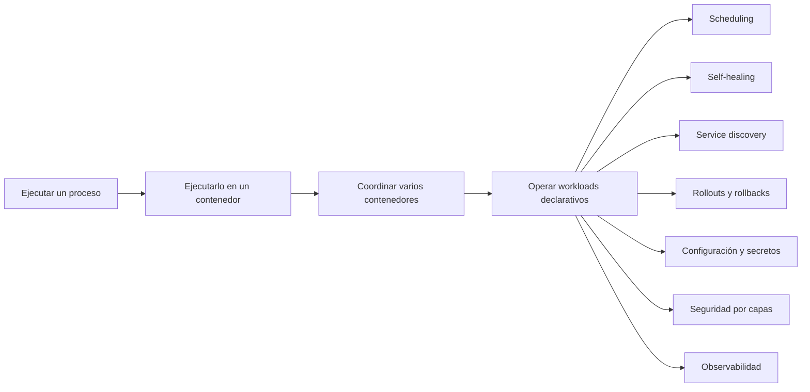

En Kubernetes declaras el estado deseado de un sistema y un conjunto de componentes intenta mantener el estado real cerca de ese estado deseado.

Ese salto es la clave.

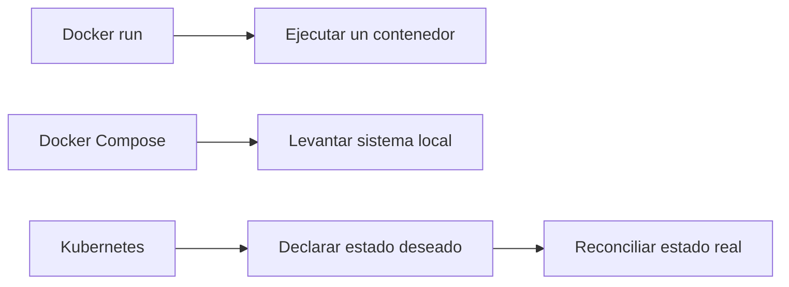

### Ejecutar

Ejecutar significa lanzar un proceso.

Ejemplo:

```bash
docker run --rm -p 8080:8080 checkout-api:1.0.0
```

Tú decides cuándo arrancar y cuándo parar.

### Levantar un sistema local

Compose permite levantar varios servicios definidos en un fichero:

```bash
docker compose -f compose/compose.yaml up -d --build
```

Esto mejora mucho la DevEx local, pero sigue siendo principalmente una herramienta de desarrollo local.

### Operar

Operar significa gestionar un sistema durante el tiempo:

- Arranques
- Paradas
- Reinicios
- Fallos
- Rollouts
- Rollbacks
- Configuración
- Red
- Identidad
- Permisos
- Recursos
- Observabilidad
- Cambios de versión
- Estado deseado
- Estado real
Kubernetes trabaja con objetos declarativos. Los objetos suelen tener `spec`, que describe el estado deseado, y `status`, que describe el estado actual observado por Kubernetes. La documentación oficial explica que el control plane gestiona continuamente el estado actual de los objetos para intentar que coincida con el estado deseado. ([Kubernetes](https://kubernetes.io/docs/concepts/overview/working-with-objects/ "Objects In Kubernetes"))

### Criterio de comprensión

Debes poder explicar:

> Docker me permite ejecutar. Compose me permite levantar un sistema local. Kubernetes me permite declarar y operar estado deseado en un cluster.

---

## 2.3. El sistema shop como ejemplo

Seguiremos usando el sistema `shop`.

Componentes:

- `frontend`
- `checkout-api`
- `payment-api`
- `inventory-api`
- `notification-worker`
- `Redis`
- `PostgreSQL`
En local, Compose puede levantar una versión simplificada.

En producción, aparecen preguntas que Compose no intenta resolver al mismo nivel.

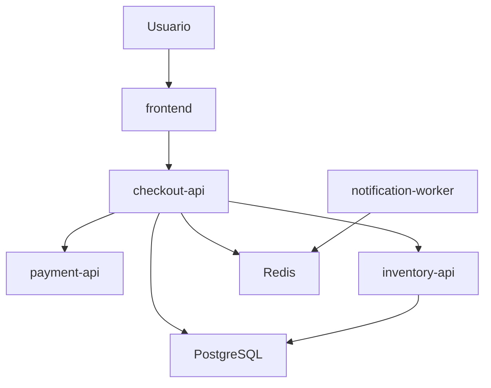

### Preguntas operativas reales

Cuando el sistema crece, aparecen preguntas como estas:

|Pregunta|Por qué importa|
|---|---|
|¿Dónde se ejecuta cada workload?|No todos los nodos tienen la misma capacidad|
|¿Qué pasa si muere `checkout-api`?|El sistema debe recuperarse sin intervención manual constante|
|¿Qué pasa si un nodo falla?|Los workloads deben poder moverse o recrearse|
|¿Cómo descubre `frontend` a `checkout-api`?|Las IPs de instancias son efímeras|
|¿Cómo despliego `checkout-api:1.0.1` sin cortar tráfico?|El cambio debe ser gradual y observable|
|¿Cómo vuelvo a `checkout-api:1.0.0` si algo falla?|El rollback debe ser posible y rápido|
|¿Cómo separo configuración de imagen?|La misma imagen debe servir para distintos entornos|
|¿Cómo limito qué puede hacer cada app?|Reducir blast radius|
|¿Cómo sé qué falló?|Sin señales no hay operación fiable|
|¿Cómo evito que `frontend` hable con `PostgreSQL`?|Seguridad y diseño de red|
|¿Cómo controlo CPU y memoria?|Evitar que un workload degrade el cluster|

### DevEx del bloque

El sistema de ejemplo debe seguir siendo pequeño.

No intentamos construir una tienda real.

Intentamos tener piezas suficientes para que los problemas operativos aparezcan sin convertir la práctica en un monstruo.

La regla de DevEx es:

> El ejemplo debe ser lo bastante realista para enseñar el problema, pero lo bastante pequeño para practicar sin dolor.

### Criterio de comprensión

Debes poder explicar:

> Kubernetes se entiende mejor cuando se estudia como respuesta a problemas operativos concretos, no como una lista de objetos YAML.

---

## 2.4. Problema 1: scheduling

### Qué es

Scheduling significa decidir **dónde se ejecuta un workload**.

En Docker local no piensas demasiado en esto. Tu máquina es el único lugar posible.

En un cluster puede haber muchos nodos.

Algunos tendrán más CPU.

Otros tendrán más memoria.

Otros pueden tener taints, restricciones, presión de recursos, discos concretos o GPUs.

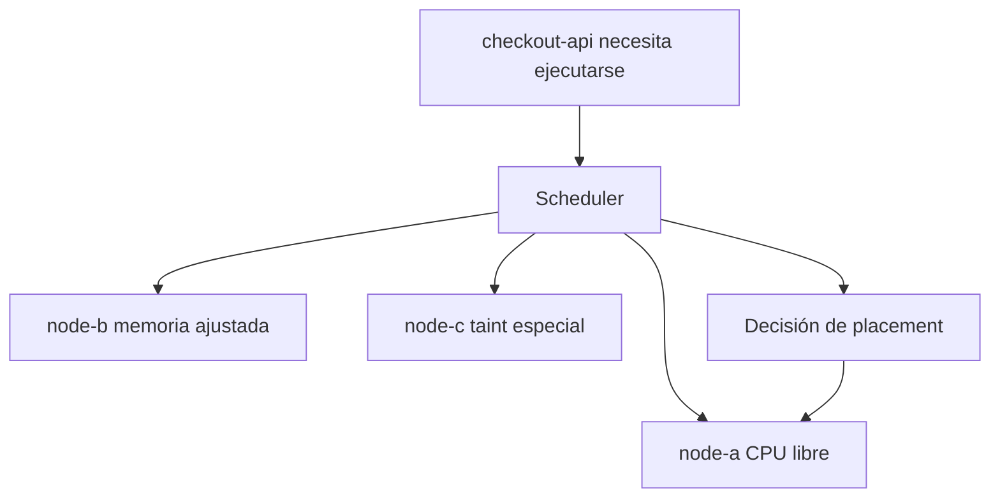

Kubernetes tiene un componente llamado scheduler dentro del control plane. La documentación de componentes describe que el scheduler observa Pods recién creados que todavía no tienen nodo asignado y selecciona un nodo donde ejecutarlos. ([Kubernetes](https://kubernetes.io/docs/concepts/overview/components/ "Kubernetes Components"))

### Contrato mental

|Concepto|Pregunta|
|---|---|
|Workload|¿Qué quiero ejecutar?|
|Nodo|¿Dónde podría ejecutarse?|
|Scheduler|¿Qué nodo encaja mejor según restricciones y recursos?|
|Requests|¿Qué recursos necesita como mínimo?|
|Taints y tolerations|¿Qué nodos aceptan o rechazan ciertos workloads?|

### Ejemplo con shop

`checkout-api` puede ejecutarse en cualquier nodo general.

`notification-worker` también.

`PostgreSQL` en producción real puede necesitar restricciones más cuidadosas, storage específico o incluso una solución gestionada fuera del cluster.

En este módulo no resolveremos scheduling todavía. Solo necesitamos entender por qué aparece.

### DevEx del bloque

No introduzcas todavía reglas avanzadas de scheduling.

En el roadmap, scheduling aparecerá progresivamente:

```text
Módulo 2: por qué existe scheduling
Módulo 4: scheduler como componente
Módulo 6: requests, limits, affinity, taints y tolerations
Módulo 12: troubleshooting de FailedScheduling
```

### Criterio de comprensión

Debes poder explicar:

> En mi portátil no hay scheduling real. En un cluster, alguien debe decidir dónde vive cada workload.

---

## 2.5. Problema 2: self-healing y reconciliación

### Qué es

Self-healing significa que el sistema puede reaccionar ante ciertos fallos.

Pero Kubernetes no “cura” cualquier cosa.

Kubernetes compara estado deseado y estado actual. Si declaras que quieres tres réplicas de `checkout-api` y una desaparece, Kubernetes puede crear otra para volver a acercarse al estado deseado.

La documentación oficial de objetos explica que, si defines una Deployment con tres réplicas y una instancia falla, el sistema responde a la diferencia entre `spec` y `status` haciendo una corrección, por ejemplo iniciando una instancia de reemplazo. ([Kubernetes](https://kubernetes.io/docs/concepts/overview/working-with-objects/ "Objects In Kubernetes"))

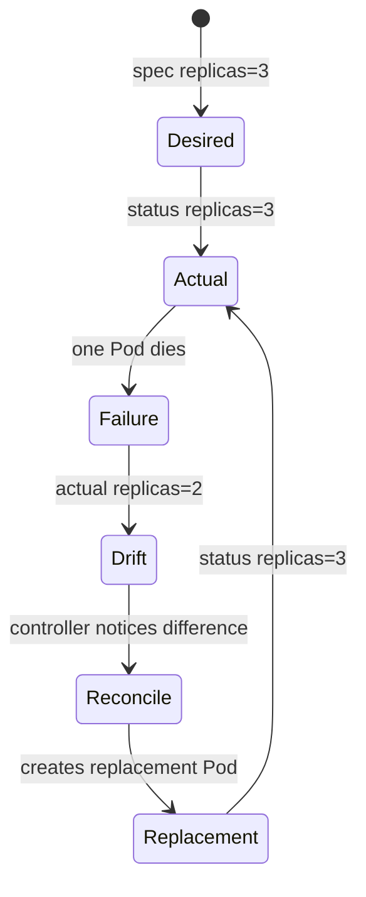

### Contrato mental

|Concepto|Significado|
|---|---|
|`spec`|Lo que quieres|
|`status`|Lo que Kubernetes observa|
|Drift|Diferencia entre lo deseado y lo real|
|Controller|Componente que observa y actúa|
|Reconciliación|Intento de corregir la diferencia|

### Ejemplo con shop

Quieres:

```text
checkout-api replicas = 3
```

Estado real:

```text
checkout-api replicas = 2
```

Kubernetes intenta crear otra réplica.

Pero si la imagen está mal, puede crear Pods que fallan una y otra vez.

Eso no es magia fallando. Es reconciliación haciendo exactamente lo que le pediste con una definición incorrecta.

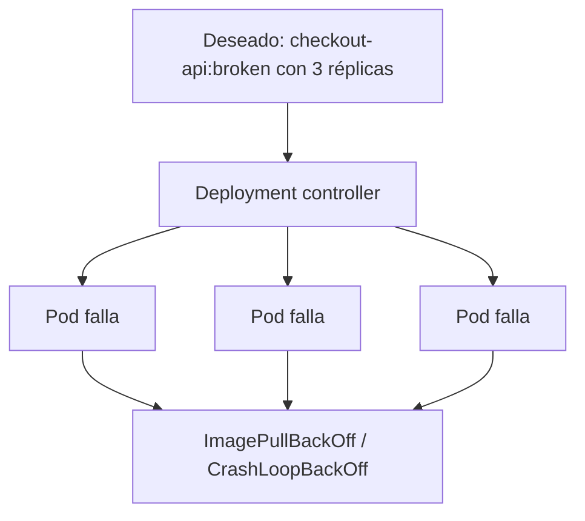

### DevEx del bloque

Desde el punto de vista de DevEx, el aprendizaje importante es:

> Antes de culpar a Kubernetes, mira qué estado deseado le has dado.

Más adelante esto se convertirá en tareas como:

```bash
task k8s:status
task k8s:events
task k8s:debug
```

### Criterio de comprensión

Debes poder explicar:

> Kubernetes no improvisa. Reacciona a diferencias entre estado deseado y estado real.

---

## 2.6. Problema 3: service discovery

### Qué es

Service discovery significa que una aplicación puede encontrar a otra sin depender de IPs manuales o efímeras.

En Compose, `checkout-api` puede llamar a `redis` por nombre dentro de la red de Compose.

En Kubernetes, el equivalente conceptual será usar Services y DNS interno.

No lo implementaremos en este módulo, pero el problema ya debe quedar claro.

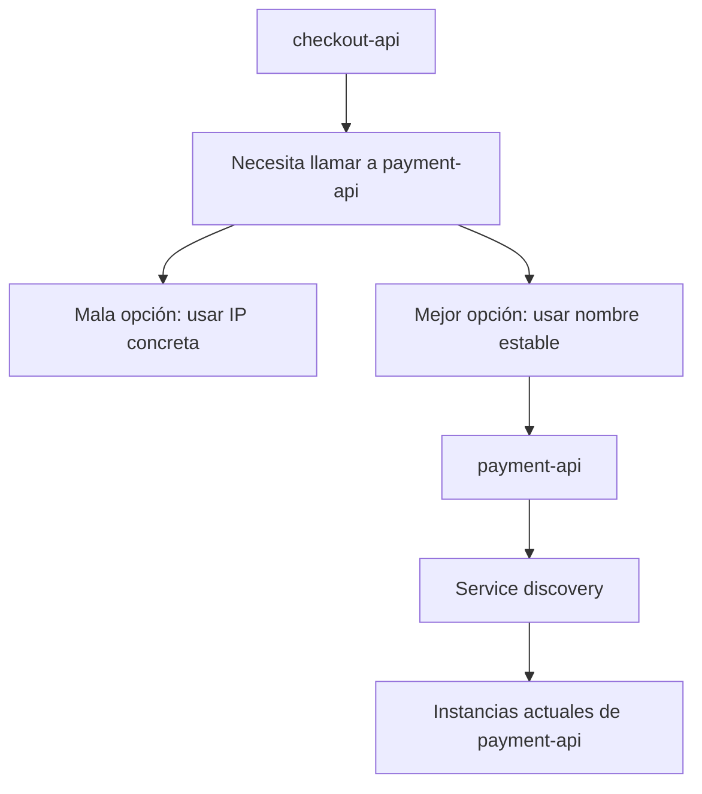

### Por qué importa

Los contenedores y Pods son efímeros.

Pueden morir.

Pueden recrearse.

Pueden moverse.

Pueden cambiar de IP.

Si `frontend` depende de una IP concreta de `checkout-api`, el sistema será frágil.

### Contrato mental

|Concepto|Pregunta|
|---|---|
|Instancia|¿Qué proceso concreto responde ahora?|
|Servicio|¿Cuál es el nombre estable al que llamo?|
|DNS|¿Cómo resuelvo ese nombre?|
|Endpoints|¿Qué instancias reales están detrás del nombre?|

### Ejemplo con shop

Queremos que:

```text
frontend → checkout-api
checkout-api → payment-api
checkout-api → inventory-api
notification-worker → redis
```

No queremos que:

```text
frontend → 10.42.1.37
checkout-api → 10.42.2.19
```

### DevEx del bloque

En Compose ya puedes practicar esta idea con nombres de servicio:

```text
PAYMENT_API_URL=http://payment-api:80
REDIS_HOST=redis
POSTGRES_HOST=postgres
```

Esto prepara el salto mental hacia Kubernetes Services.

### Criterio de comprensión

Debes poder explicar:

> Service discovery desacopla a quien llama de la instancia concreta que responde.

---

## 2.7. Problema 4: configuración declarativa

### Qué es

Configuración declarativa significa describir el estado que quieres, no solo ejecutar comandos paso a paso.

En lugar de pensar:

```text
arranca esto
luego arranca esto
luego cambia esto
luego reinicia aquello
```

Piensas:

```text
quiero este sistema con esta forma
```

Kubernetes trabaja con objetos que se crean, modifican y eliminan mediante su API. La documentación oficial explica que para trabajar con objetos, incluyendo crearlos, modificarlos o eliminarlos, se usa la Kubernetes API; `kubectl` realiza esas llamadas a la API por ti. ([Kubernetes](https://kubernetes.io/docs/concepts/overview/working-with-objects/ "Objects In Kubernetes"))

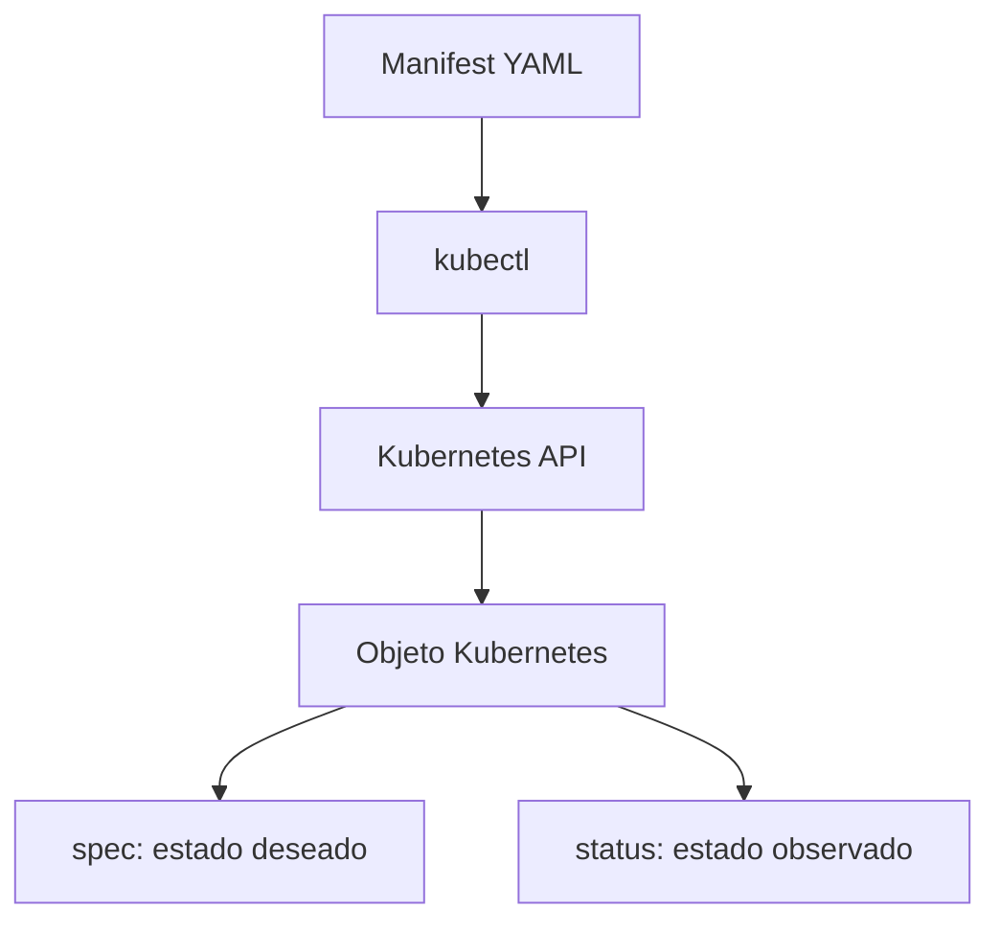

### Contrato mental

|Concepto|Significado|
|---|---|
|Manifest|Fichero que describe objetos|
|API Server|Entrada principal al control plane|
|Object|Recurso gestionado por Kubernetes|
|`spec`|Estado deseado|
|`status`|Estado observado|
|Declarativo|Digo qué quiero, no cada paso manual|

### Ejemplo conceptual

En vez de ejecutar manualmente tres contenedores de `checkout-api`, declaras:

```text
Quiero checkout-api con 3 réplicas usando la imagen checkout-api:1.0.0.
```

Kubernetes decide cómo aproximarse a ese estado.

### DevEx del bloque

Esto conecta con una idea importante del curso:

> Todo lo importante debe poder versionarse.

Eso incluye:

- Dockerfile
- compose.yaml
- manifests Kubernetes
- Taskfile
- scripts
- smoke tests
- runbooks
### Criterio de comprensión

Debes poder explicar:

> Kubernetes se opera a través de una API y objetos declarativos. `kubectl` es solo un cliente de esa API.

---

## 2.8. Problema 5: rollouts y rollbacks

### Qué es

Un rollout es el proceso de desplegar una nueva versión.

Un rollback es volver a una versión anterior cuando algo va mal.

En local puedes parar y arrancar.

En producción necesitas evitar o reducir cortes.

Ejemplo:

```text
checkout-api:1.0.0 → checkout-api:1.0.1
```

Preguntas importantes:

- ¿Cuántas instancias se reemplazan a la vez?
- ¿Qué pasa si la nueva versión no está ready?
- ¿Cómo se detecta que el rollout falló?
- ¿Cómo vuelvo atrás?
- ¿Qué logs y métricas reviso?
- ¿Qué smoke tests ejecuto?
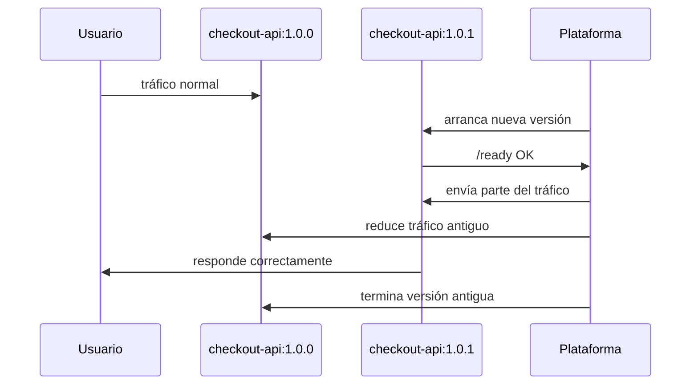

### Qué puede salir mal

La nueva versión puede:

- No arrancar
- Fallar en `/ready`
- Responder `500`
- Tener una dependencia mal configurada
- Consumir demasiada memoria
- Romper el contrato HTTP
- Emitir logs insuficientes
- Funcionar en local pero fallar en entorno real
### DevEx del bloque

El smoke test que creaste en el módulo 1 es la semilla de una quality gate.

En módulos posteriores, ese smoke test se ejecutará:

```text
local → container → Compose → kind → pipeline → entorno real
```

### Criterio de comprensión

Debes poder explicar:

> Un rollout no es solo cambiar una imagen. Es cambiar comportamiento en un sistema vivo sin perder control.

---

## 2.9. Problema 6: configuración y secretos

### Qué es

Una imagen no debería contener configuración específica de entorno ni secretos.

Esto ya lo viste en el módulo 1 con variables de entorno.

Kubernetes lleva esta idea más lejos con objetos específicos como ConfigMaps y Secrets, que veremos en detalle más adelante.

En este módulo basta con entender el problema:

```text
La imagen debe ser reusable.
La configuración debe inyectarse.
Los secretos deben tratarse con cuidado.
```

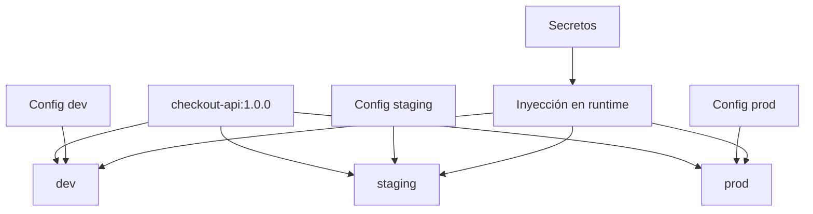

### Ejemplo con shop

La misma imagen de `checkout-api` puede necesitar:

|Entorno|Configuración|
|---|---|
|Local|`PAYMENT_API_URL=http://payment-api:80`|
|Test|`PAYMENT_API_URL=http://payment-api.test`|
|Producción|`PAYMENT_API_URL=https://payments.example.com`|

La imagen no debería reconstruirse para cada caso.

### DevEx del bloque

Desde el principio, usa `.env.example` para documentar configuración esperada, pero no subas `.env` reales con secretos.

Ejemplo:

```text
PORT=8080
LOG_LEVEL=debug
PAYMENT_API_URL=http://payment-api:80
REDIS_HOST=redis
POSTGRES_HOST=postgres
```

### Criterio de comprensión

Debes poder explicar:

> La imagen empaqueta la aplicación. La configuración define cómo se comporta en un entorno concreto.

---

## 2.10. Problema 7: seguridad y blast radius

### Qué es

Cuando un sistema crece, no basta con que “funcione”.

También importa qué puede hacer cada parte.

Preguntas básicas:

- ¿Qué puede hacer `checkout-api` dentro del cluster?
- ¿Puede leer secretos?
- ¿Puede listar Pods?
- ¿Puede hablar con `PostgreSQL`?
- ¿Puede `frontend` hablar directamente con `PostgreSQL`?
- ¿Qué pasa si `notification-worker` se ve comprometido?
Kubernetes modela seguridad con varias capas. Algunas aparecerán más adelante:

- ServiceAccounts
- RBAC
- NetworkPolicies
- SecurityContext
- Pod Security Standards
- Admission control
- Secrets
- Image scanning
### Contrato mental

|Concepto|Pregunta|
|---|---|
|Identidad|¿Quién es este workload?|
|Autorización|¿Qué puede hacer?|
|Red|¿Con quién puede hablar?|
|Runtime security|¿Con qué permisos se ejecuta?|
|Blast radius|¿Qué alcance tiene un fallo o compromiso?|

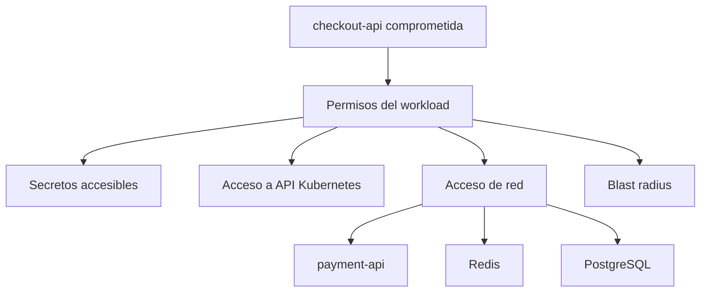

### DevEx del bloque

No introduzcas seguridad como un añadido final.

Desde el módulo 1 ya tomamos decisiones pequeñas:

- No ejecutar como root
- No meter secretos en la imagen
- Escribir logs útiles
- Separar configuración
- Usar contratos explícitos
Eso no completa la seguridad, pero evita construir malos hábitos.

### Criterio de comprensión

Debes poder explicar:

> Kubernetes no solo ejecuta workloads. También permite modelar límites de permisos, red y comportamiento.

---

## 2.11. Problema 8: observabilidad y troubleshooting

### Qué es

Cuando algo falla en local, miras la terminal.

Cuando algo falla en un sistema distribuido, necesitas señales.

Señales mínimas:

- Estado de recursos
- Eventos
- Logs
- Métricas
- Trazas
- Health checks
- Readiness
- Rollout status
- Errores HTTP
- Latencia
- Reinicios
- Uso de CPU y memoria
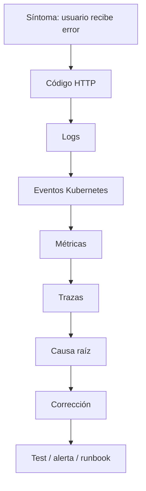

### Ejemplo con shop

El usuario dice:

```text
No puedo finalizar el checkout.
```

Posibles causas:

- `frontend` no llega a `checkout-api`
- `checkout-api` está caído
- `checkout-api` no está ready
- `payment-api` responde 500
- `Redis` no responde
- `PostgreSQL` está saturado
- Una NetworkPolicy bloquea tráfico
- Un Secret falta
- Una nueva versión rompió el contrato
### DevEx del bloque

La DevEx de troubleshooting empieza antes de Kubernetes:

- `task smoke`
- `task compose:logs`
- `task compose:ps`
- logs JSON
- endpoints claros
- configuración visible
- scripts repetibles
Más adelante se ampliará con:

```bash
task k8s:status
task k8s:events
task k8s:debug
task test:k8s
```

### Criterio de comprensión

Debes poder explicar:

> En sistemas distribuidos, si no defines señales, no tienes operación. Tienes intuición y suerte.

---

## 2.12. El modelo Kubernetes en una frase

Kubernetes opera mediante una API.

Los usuarios y componentes crean, leen, modifican y eliminan objetos. El API Server es el centro del control plane y expone una API HTTP para interactuar con el estado del cluster. ([Kubernetes](https://kubernetes.io/docs/concepts/overview/kubernetes-api/ "The Kubernetes API"))

Casi todos los objetos relevantes tienen:

- `metadata`
- `spec`
- `status`
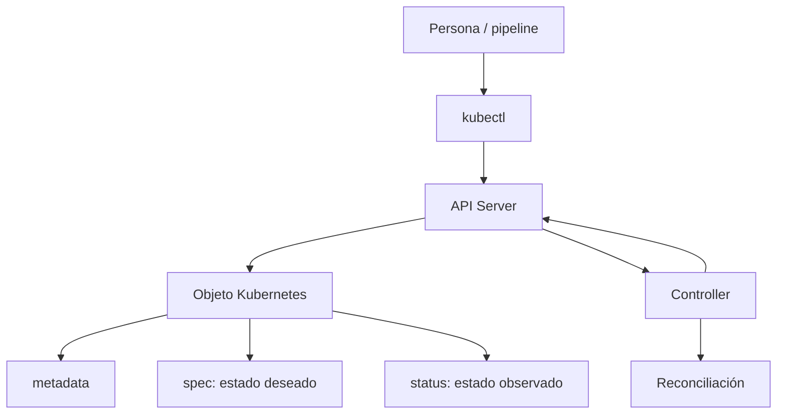

### metadata

Identidad y datos del objeto:

- nombre
- namespace
- labels
- annotations
- ownerReferences
La documentación oficial explica que cada objeto tiene un nombre único para ese tipo de recurso dentro de su ámbito, y también un UID único en todo el cluster. ([Kubernetes](https://kubernetes.io/docs/concepts/overview/working-with-objects/names/ "Object Names and IDs"))

### spec

Lo que quieres.

Ejemplo conceptual:

```yaml
spec:
  replicas: 3
  image: checkout-api:1.0.0
```

### status

Lo que Kubernetes observa.

Ejemplo conceptual:

```yaml
status:
  availableReplicas: 2
```

### Criterio de comprensión

Debes poder explicar:

> `spec` es intención. `status` es observación. Kubernetes trabaja intentando reducir la distancia entre ambas.

---

## 2.13. Componentes de Kubernetes como respuesta a problemas

En este módulo no necesitas memorizar todos los componentes. Solo entender qué problema cubren.

La documentación oficial divide un cluster en control plane y worker nodes, y describe componentes como API Server, etcd, scheduler, controller manager, kubelet, kube-proxy y container runtime. ([Kubernetes](https://kubernetes.io/docs/concepts/overview/components/ "Kubernetes Components"))

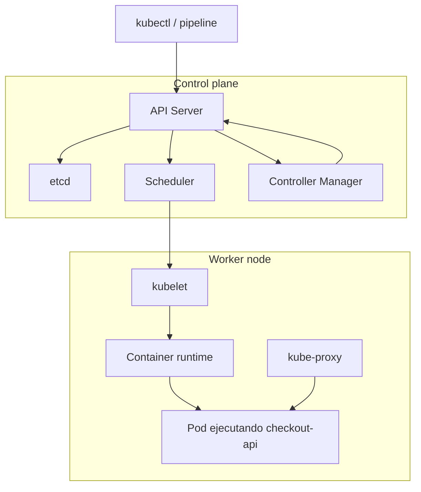

### Mapa problema → componente

|Problema|Componente relacionado|
|---|---|
|Entrada a la plataforma|API Server|
|Guardar estado del cluster|etcd|
|Decidir nodo para un Pod|Scheduler|
|Reconciliar recursos|Controllers|
|Ejecutar Pods en nodos|kubelet|
|Ejecutar contenedores|container runtime|
|Red de servicios|kube-proxy y CNI|
|DNS interno|CoreDNS|
|Extensión|CRDs, controllers, admission webhooks|

### DevEx del bloque

No conviertas esto en memorización.

El aprendizaje útil es poder decir:

> Estoy viendo un síntoma. ¿Qué parte del sistema podría estar implicada?

Ejemplo:

|Síntoma|Posible zona|
|---|---|
|Pod no se programa|Scheduler, requests, taints, nodos|
|Pod se reinicia|kubelet, container runtime, app|
|Service no responde|selector, endpoints, kube-proxy, CNI|
|Objeto no se crea|API Server, RBAC, admission|
|Estado no cambia|controller, spec incorrecta, eventos|

### Criterio de comprensión

Debes poder explicar:

> Kubernetes no es un binario único. Es un conjunto de componentes cooperando alrededor de una API y un modelo declarativo.

---

## 2.14. Qué hace Kubernetes y qué no hace

### Lo que sí hace

Kubernetes ayuda a:

- Gestionar workloads containerizados
- Declarar estado deseado
- Reconciliar estado real
- Programar workloads en nodos
- Mantener réplicas
- Exponer servicios
- Gestionar configuración y secretos
- Ejecutar rollouts
- Facilitar escalado
- Modelar permisos
- Integrar observabilidad
- Extender la plataforma con APIs propias
### Lo que no hace por sí solo

Kubernetes no sustituye:

- Diseño de aplicación
- Testing
- Contratos claros
- Backups reales
- Observabilidad bien pensada
- Seguridad de imagen
- Gestión de secretos madura
- Disciplina de delivery
- Conocimiento de redes
- Conocimiento de Linux
- Buen criterio económico y operacional
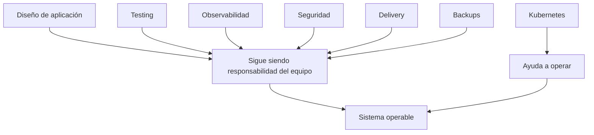

### Criterio de comprensión

Debes poder explicar:

> Kubernetes es una plataforma de operación. No es una excusa para dejar de diseñar, testar, observar y proteger bien.

---

## 2.15. Práctica principal del módulo

### Objetivo

Analizar el sistema `shop` y justificar por qué Kubernetes empieza a tener sentido.

No vamos a crear un cluster todavía.

Vamos a entrenar el pensamiento operativo.

### Resultado esperado

Crear un documento:

```text
docs/why-kubernetes.md
```

Debe responder con claridad:

1. Qué resuelve Docker en este sistema
2. Qué resuelve Compose
3. Qué problemas siguen abiertos
4. Qué problemas Kubernetes modelará más adelante
5. Qué riesgos Kubernetes no arregla automáticamente
6. Qué señales necesitamos antes de operar el sistema
### Estructura sugerida

```markdown
# Why Kubernetes for shop

## Current local system

- frontend
- checkout-api
- payment-api
- inventory-api
- notification-worker
- Redis
- PostgreSQL

## What Docker solves

## What Compose solves

## What remains unsolved

## Problems Kubernetes will model later

## Risks Kubernetes does not solve automatically

## Required operational signals

## DevEx expectations

## Exit criteria before moving to Kubernetes
```

### Preguntas guía

#### Docker

- ¿Qué parte del problema resuelve empaquetar `checkout-api` como imagen?
- ¿Qué sigue dependiendo de configuración externa?
- ¿Qué pasaría si la imagen contiene secretos?
- ¿Qué cambia al ejecutar el contenedor como usuario no root?
#### Compose

- ¿Qué mejora `compose.yaml` respecto a ejecutar varios `docker run`?
- ¿Qué límites aparecen si intentas usar Compose como si fuera producción?
- ¿Qué ocurre con `PostgreSQL` al ejecutar `compose down`?
- ¿Qué ocurre con `PostgreSQL` al ejecutar `compose down -v`?
#### Kubernetes

- ¿Qué componente conceptual necesitaríamos para mantener tres réplicas de `checkout-api`?
- ¿Qué problema resuelve service discovery?
- ¿Qué problema resuelve el scheduling?
- ¿Qué problema resuelven los rollouts?
- ¿Qué problema resuelve separar `spec` y `status`?
- ¿Qué señales necesitaríamos para diagnosticar un fallo?
### DevEx del bloque

Añade una tarea:

```yaml
docs:why-kubernetes:
  desc: Show the why Kubernetes learning document
  cmds:
    - cat docs/why-kubernetes.md
```

Y otra para validar que el laboratorio local sigue funcionando:

```yaml
learning:module2:check:
  desc: Check module 2 prerequisites
  cmds:
    - task doctor
    - task container:build:docker
    - task compose:up:detached
    - task smoke
    - task compose:ps
    - task compose:down
```

### Criterio de finalización

La práctica está completa cuando puedes explicar, usando tu propio sistema `shop`, por qué Kubernetes aparece como respuesta a problemas operativos concretos, no como una herramienta de moda.

---

## 2.16. Ejercicios cortos

### Ejercicio 1. Docker vs Compose vs Kubernetes

Completa esta tabla:

|Necesidad|Docker|Compose|Kubernetes|
|---|---|---|---|
|Ejecutar `checkout-api` localmente|Sí|Sí|Sí|
|Levantar `Redis` y `PostgreSQL` con la app|Manual|Sí|Sí|
|Mantener tres réplicas si una cae|No|Limitado|Sí|
|Decidir en qué nodo ejecutar|No|No|Sí|
|Rollout declarativo|No|Limitado|Sí|
|Service discovery estable|Limitado|Sí en local|Sí|
|RBAC|No|No|Sí|
|NetworkPolicy|No|No|Sí|
|Observabilidad integrada con plataforma|No|Limitado|Sí, integrable|

Después escribe tres frases:

```text
Docker me ayuda a...
Compose me ayuda a...
Kubernetes aparece cuando...
```

---

### Ejercicio 2. Estado deseado vs estado actual

Escribe este escenario:

```text
Quiero 3 réplicas de checkout-api.
Ahora mismo hay 2 réplicas disponibles.
```

Responde:

- ¿Cuál es el estado deseado?
- ¿Cuál es el estado actual?
- ¿Qué significa drift?
- ¿Qué debería hacer un controller?
- ¿Qué podría impedir que vuelva a 3 réplicas?
---

### Ejercicio 3. Service discovery

Dado este sistema:

```text
frontend → checkout-api → payment-api
checkout-api → redis
checkout-api → postgres
```

Responde:

- ¿Por qué no deberíamos usar IPs concretas?
- ¿Qué nombres usarías?
- ¿Qué pasaría si `payment-api` cambia de instancia?
- ¿Qué concepto de Kubernetes estudiarás más adelante para resolverlo?
---

### Ejercicio 4. Rollout fallido

Escenario:

```text
checkout-api:1.0.0 funciona.
checkout-api:1.0.1 arranca pero /ready devuelve 500.
```

Responde:

- ¿Debe recibir tráfico la versión nueva?
- ¿Qué señal detecta el fallo?
- ¿Qué endpoint es más importante aquí, `/health` o `/ready`?
- ¿Qué debería permitir la plataforma?
- ¿Qué test debería haber fallado antes?
---

### Ejercicio 5. Kubernetes no arregla todo

Escribe cinco problemas que Kubernetes no arregla automáticamente en `shop`.

Ejemplos:

- `checkout-api` no tiene logs útiles
- `payment-api` cambia su contrato sin avisar
- `PostgreSQL` no tiene backup
- `frontend` habla directamente con `PostgreSQL`
- `checkout-api` contiene secretos en la imagen
Para cada uno, indica:

- Qué lo causa
- Qué señal lo mostraría
- Qué práctica lo prevendría
---

## 2.17. Errores habituales

### Error 1. Aprender Kubernetes como una lista de YAMLs

Mal:

> Primero Pod, luego Deployment, luego Service.

Mejor:

> Primero entiendo qué problema operativo resuelve cada objeto.

---

### Error 2. Pensar que Kubernetes es Docker con más cosas

Docker ejecuta contenedores.

Kubernetes opera workloads containerizados en un cluster mediante API, objetos, control plane y reconciliación.

---

### Error 3. Ignorar la aplicación

Si `/health` miente, Kubernetes tomará decisiones con una señal mala.

Si `/ready` no representa readiness real, el rollout puede enviar tráfico a una instancia que no debería recibirlo.

Si los logs no tienen contexto, el troubleshooting será lento.

---

### Error 4. Confundir self-healing con fiabilidad total

Kubernetes puede recrear un Pod muerto.

Eso no significa que pueda recuperar datos perdidos, arreglar una migración destructiva o compensar un contrato roto entre servicios.

---

### Error 5. Saltar a Kubernetes sin DevEx local

Si no puedes ejecutar, validar y diagnosticar el sistema con Docker y Compose, Kubernetes añadirá capas de complejidad.

---

### Error 6. Declarar mal y esperar que Kubernetes lo arregle

Kubernetes intenta cumplir lo que declaras.

Si declaras una imagen incorrecta, un puerto incorrecto o una readiness rota, la plataforma puede repetir el fallo de forma consistente.

---

## 2.18. Criterio de salida del módulo

Puedes pasar al módulo 3 cuando puedas explicar todo esto sin seguir una receta ciegamente.

### Conceptos

Debes poder explicar:

- Por qué aparece Kubernetes
- Qué diferencia hay entre ejecutar y operar
- Qué es estado deseado
- Qué es estado actual
- Qué es reconciliación
- Qué es scheduling
- Qué es service discovery
- Qué problema resuelven los rollouts
- Qué problema resuelve la configuración declarativa
- Qué problemas Kubernetes no arregla automáticamente
### Sistema shop

Debes poder explicar:

- Qué resuelve Docker en `shop`
- Qué resuelve Compose en `shop`
- Qué queda abierto después de Compose
- Por qué `checkout-api`, `payment-api`, `inventory-api`, `Redis` y `PostgreSQL` crean problemas operativos distintos
- Qué señales mínimas necesitas para operar `shop`
### DevEx

Debes poder:

- Ejecutar `task doctor`
- Ejecutar `task container:build:docker`
- Ejecutar `task compose:up:detached`
- Ejecutar `task smoke`
- Ejecutar `task compose:ps`
- Ejecutar `task compose:logs`
- Ejecutar `task compose:down`
- Mantener `docs/why-kubernetes.md`
### Frase final de comprensión

Debes poder explicar esta frase:

> Kubernetes no aparece para hacer más elegante el YAML. Aparece para modelar y operar el estado deseado de sistemas containerizados que cambian, fallan, escalan y necesitan ser observables, seguros y recuperables.

---

## 2.19. Referencias oficiales

|Tema|Referencia|
|---|---|
|Kubernetes overview|Kubernetes Docs, Overview. ([Kubernetes](https://kubernetes.io/docs/concepts/overview/ "Overview"))|
|Kubernetes API|Kubernetes Docs, The Kubernetes API. ([Kubernetes](https://kubernetes.io/docs/concepts/overview/kubernetes-api/ "The Kubernetes API"))|
|Objects in Kubernetes|Kubernetes Docs, Objects In Kubernetes. ([Kubernetes](https://kubernetes.io/docs/concepts/overview/working-with-objects/ "Objects In Kubernetes"))|
|Kubernetes components|Kubernetes Docs, Kubernetes Components. ([Kubernetes](https://kubernetes.io/docs/concepts/overview/components/ "Kubernetes Components"))|
|Object management|Kubernetes Docs, Kubernetes Object Management. ([Kubernetes](https://kubernetes.io/docs/concepts/overview/working-with-objects/object-management/ "Kubernetes Object Management"))|
|Object names and IDs|Kubernetes Docs, Object Names and IDs. ([Kubernetes](https://kubernetes.io/docs/concepts/overview/working-with-objects/names/ "Object Names and IDs"))|
|Labels and selectors|Kubernetes Docs, Labels and Selectors. ([Kubernetes](https://kubernetes.io/docs/concepts/overview/working-with-objects/labels/ "Labels and Selectors"))|
|Recommended labels|Kubernetes Docs, Recommended Labels. ([Kubernetes](https://kubernetes.io/docs/concepts/overview/working-with-objects/common-labels/ "Recommended Labels"))|
|Docker overview|Docker Docs, Docker overview. ([Kubernetes](https://kubernetes.io/docs/concepts/overview/ "Overview"))|

## 2.20. Lecturas de apoyo

|Libro|Qué leer|
|---|---|
|_Kubernetes in Action_|Capítulo 1: por qué Kubernetes, qué problemas resuelve, contenedores, arquitectura general y beneficios.|
|_Kubernetes: Up and Running_|Capítulo 1: velocidad, inmutabilidad, configuración declarativa, self-healing, escalado y eficiencia.|
|_Cloud Native DevOps with Kubernetes_|Capítulo 1: cloud, DevOps, contenedores, Kubernetes, cloud native y operaciones.|
|_Kubernetes Patterns_|Capítulo 1: primitives distribuidas, contenedores, Pods, Services, labels, annotations y namespaces.|