# 4. Modelo mental de Kubernetes

## Objetivo del módulo

En el módulo 3 creaste un cluster local con kind, aplicaste un namespace, desplegaste `checkout-api` como Pod, leíste logs, entraste en el contenedor y usaste `port-forward` para validar el contrato HTTP.

Ahora toca entender **qué estaba pasando por debajo**.

Hasta ahora has usado Kubernetes desde fuera:

```text
kubectl apply
kubectl get
kubectl describe
kubectl logs
kubectl exec
kubectl port-forward
```

En este módulo vas a construir el modelo mental que explica por qué esos comandos funcionan y qué componentes participan.

El objetivo no es memorizar nombres. El objetivo es poder razonar.

Kubernetes funciona alrededor de una API. La documentación oficial explica que el API Server expone una API HTTP que permite a usuarios, componentes internos y componentes externos comunicarse entre sí, y que la Kubernetes API permite consultar y manipular el estado de objetos como Pods, Namespaces, ConfigMaps y Events. ([Kubernetes](https://kubernetes.io/docs/concepts/overview/kubernetes-api/ "The Kubernetes API"))

La idea central del módulo es esta:

> Kubernetes no es una caja mágica que ejecuta YAML. Es un sistema de control basado en API, objetos, estado deseado, estado observado y bucles de reconciliación.

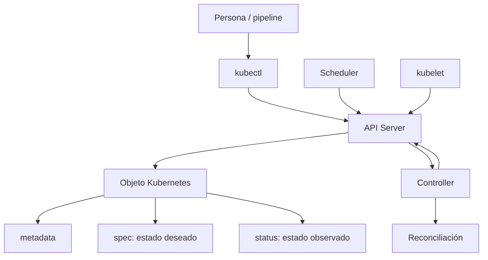

---

## 4.1. Qué vas a aprender y qué no vas a aprender todavía

Este módulo explica cómo pensar Kubernetes.

Vas a aprender:

- Qué significa que Kubernetes sea API-first
- Qué son objetos Kubernetes
- Qué papel tienen `metadata`, `spec` y `status`
- Qué diferencia hay entre estado deseado y estado observado
- Qué es reconciliación
- Qué es un controller
- Qué hace el API Server
- Qué guarda `etcd`
- Qué hace el scheduler
- Qué hace kubelet
- Qué hace el container runtime
- Qué papel tienen kube-proxy, CNI y CoreDNS
- Qué son events y por qué importan
- Cómo observar todo esto con `kubectl`, `jq`, `yq` y Taskfile
No vamos a profundizar todavía en:

- Deployments y ReplicaSets en detalle
- Probes
- Services y EndpointSlices
- Ingress o Gateway API
- ConfigMaps y Secrets
- RBAC
- Storage
- NetworkPolicy
- HPA, VPA o Cluster Autoscaler
- Operators y CRDs
Esos temas aparecerán más adelante.

Aquí buscamos otra cosa:

> Cuando mires un recurso de Kubernetes, debes poder preguntarte: ¿qué he declarado?, ¿qué observa Kubernetes?, ¿qué componente debería actuar?, ¿qué señales me dicen qué está pasando?

---

## 4.2. El salto mental: de comando a objeto

En Docker, ejecutabas algo así:

```bash
docker run --rm -p 8080:8080 checkout-api:1.0.0
```

En Kubernetes, aplicaste algo así:

```bash
kubectl apply -f kubernetes/01-pod/pod.yaml
```

Estos dos comandos no tienen el mismo modelo mental.

Con Docker, pides directamente la ejecución de un contenedor.

Con Kubernetes, envías un objeto a la API. Ese objeto expresa una intención. Después, varios componentes observan esa intención y actúan.

La documentación oficial explica que los objetos Kubernetes son entidades persistentes del sistema que representan el estado del cluster, y que esos objetos pueden expresarse en YAML. ([Kubernetes](https://kubernetes.io/docs/concepts/overview/working-with-objects/ "Objects In Kubernetes"))

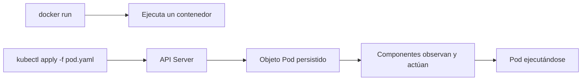

### Contrato mental

|Modelo|Qué haces|Qué ocurre|
|---|---|---|
|Docker|Ejecutas un contenedor|La herramienta arranca el proceso|
|Compose|Levantas servicios locales|Compose crea contenedores, redes y volúmenes|
|Kubernetes|Declaras objetos|El control plane intenta reconciliar estado|

### DevEx del bloque

No uses `kubectl apply` como un conjuro.

Cada vez que apliques algo, deberías poder ejecutar después:

```bash
kubectl get
kubectl describe
kubectl get -o yaml
kubectl get -o json | jq
```

La DevEx buena no es solo crear recursos rápido. Es crear recursos y tener una forma clara de observarlos.

### Criterio de comprensión

Debes poder explicar:

> `kubectl apply` no ejecuta directamente mi aplicación. Envía una declaración a la API de Kubernetes.

---

## 4.3. La API como centro del sistema

Kubernetes trata casi todo como un objeto de API.

El API Server es el punto central de comunicación. Los usuarios hablan con el API Server mediante `kubectl`, pipelines o clientes. Los componentes internos también se comunican con el API Server para leer y escribir estado. La documentación de referencia indica que la REST API es la base de Kubernetes y que las operaciones y comunicaciones entre componentes y comandos externos son llamadas API gestionadas por el API Server. ([Kubernetes](https://kubernetes.io/docs/reference/using-api/ "API Overview"))

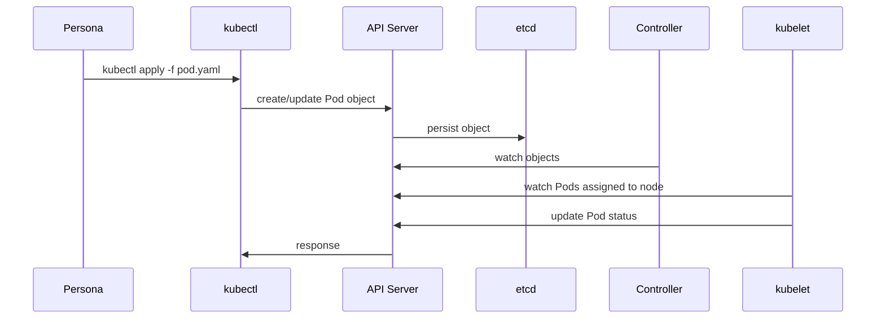

### Qué significa API-first

Significa que el estado importante no vive en comandos sueltos.

Vive como objetos consultables, versionables conceptualmente y observables.

Puedes preguntar:

```bash
kubectl get pod checkout-api -n shop -o yaml
```

Puedes extraer el estado observado:

```bash
kubectl get pod checkout-api -n shop -o json | jq '.status'
```

Puedes revisar lo que declaraste:

```bash
kubectl get pod checkout-api -n shop -o json | jq '.spec'
```

### Contrato mental

|Elemento|Pregunta|
|---|---|
|API Server|¿Quién recibe y valida las peticiones?|
|Objeto|¿Qué entidad representa el estado del cluster?|
|`spec`|¿Qué quiero que exista?|
|`status`|¿Qué observa Kubernetes ahora?|
|Watch|¿Qué componentes están observando cambios?|
|Reconciliación|¿Quién intenta reducir la diferencia?|

### DevEx del bloque

Añade tareas que separen intención y observación:

```yaml
k8s:pod:spec:
  desc: Show checkout-api Pod desired specification
  cmds:
    - kubectl get pod checkout-api -n {{.NAMESPACE}} -o json | jq '.spec'

k8s:pod:status:
  desc: Show checkout-api Pod observed status
  cmds:
    - kubectl get pod checkout-api -n {{.NAMESPACE}} -o json | jq '.status'
```

### Criterio de comprensión

Debes poder explicar:

> Si quiero entender Kubernetes, debo mirar la API. `kubectl` es solo una de las formas de hacerlo.

---

## 4.4. Anatomía de un objeto Kubernetes

Antes de hablar de componentes, necesitamos entender qué están leyendo y escribiendo.

Un objeto Kubernetes suele tener:

- `apiVersion`
- `kind`
- `metadata`
- `spec`
- `status`
En el fichero que escribes normalmente defines `apiVersion`, `kind`, `metadata` y `spec`.

`status` lo actualiza Kubernetes.

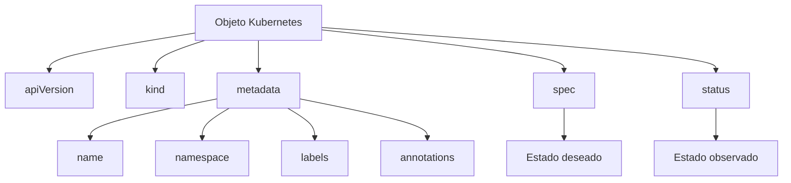

### Ejemplo: Pod `checkout-api`

Manifest local:

```yaml
apiVersion: v1
kind: Pod
metadata:
  name: checkout-api
  namespace: shop
  labels:
    app.kubernetes.io/name: checkout-api
    app.kubernetes.io/part-of: shop
spec:
  containers:
    - name: checkout-api
      image: checkout-api:1.0.0
      imagePullPolicy: IfNotPresent
      ports:
        - containerPort: 8080
      env:
        - name: SERVICE_NAME
          value: checkout-api
        - name: PORT
          value: "8080"
        - name: LOG_LEVEL
          value: debug
```

### Qué significa cada parte

|Campo|Significado|
|---|---|
|`apiVersion`|Versión de la API usada por el recurso|
|`kind`|Tipo de objeto|
|`metadata.name`|Nombre del objeto|
|`metadata.namespace`|Namespace donde vive|
|`metadata.labels`|Etiquetas para identificar y agrupar|
|`spec`|Estado deseado|
|`status`|Estado observado por Kubernetes|

### Ver el objeto completo en el cluster

```bash
kubectl get pod checkout-api -n shop -o yaml
```

### Ver solo `spec`

```bash
kubectl get pod checkout-api -n shop -o json | jq '.spec'
```

### Ver solo `status`

```bash
kubectl get pod checkout-api -n shop -o json | jq '.status'
```

### Ver el manifest local con `yq`

```bash
yq '.spec.containers[0].image' kubernetes/01-pod/pod.yaml
```

### Criterio de comprensión

Debes poder explicar:

> El manifest expresa intención. El objeto en el cluster incluye intención, metadata gestionada por Kubernetes y estado observado.

---

## 4.5. `metadata`: identidad y clasificación

`metadata` responde preguntas de identidad:

- ¿Cómo se llama este objeto?
- ¿En qué namespace vive?
- ¿Qué etiquetas tiene?
- ¿Qué anotaciones tiene?
- ¿Quién lo creó?
- ¿Qué UID tiene?
- ¿Qué generación tiene?
- ¿Tiene owner references?
No todo esto lo escribes manualmente. Kubernetes añade parte de la metadata.

### Labels

Las labels permiten identificar y seleccionar objetos.

Ejemplo:

```yaml
labels:
  app.kubernetes.io/name: checkout-api
  app.kubernetes.io/part-of: shop
```

### Annotations

Las annotations sirven para metadata no pensada para selección.

Ejemplo conceptual:

```yaml
annotations:
  course.example.com/purpose: "first-pod-lab"
```

### Comandos

```bash
kubectl get pod checkout-api -n shop --show-labels
kubectl get pod checkout-api -n shop -o json | jq '.metadata.labels'
kubectl get pod checkout-api -n shop -o json | jq '.metadata.uid'
```

### DevEx del bloque

Usa labels consistentes desde el principio.

No porque Kubernetes lo exija para este Pod simple, sino porque más adelante Services, Deployments, NetworkPolicies, observabilidad y selección de recursos se apoyarán en labels.

### Criterio de comprensión

Debes poder explicar:

> `metadata` no es decoración. Es identidad operativa para encontrar, agrupar, seleccionar y entender recursos.

---

## 4.6. `spec`: estado deseado

`spec` representa lo que quieres.

En un Pod simple, `spec` dice:

- Qué contenedores deben existir
- Qué imagen deben usar
- Qué variables de entorno tendrán
- Qué puertos documentan
- Qué política de descarga de imagen usarán
Ejemplo:

```bash
kubectl get pod checkout-api -n shop -o json | jq '.spec.containers[0]'
```

### Qué debes mirar

```bash
kubectl get pod checkout-api -n shop -o json | jq '.spec.containers[0].image'
kubectl get pod checkout-api -n shop -o json | jq '.spec.containers[0].env'
kubectl get pod checkout-api -n shop -o json | jq '.spec.nodeName'
```

### Detalle importante

Después del scheduling, el Pod tendrá un `spec.nodeName`.

Eso indica el nodo asignado.

No lo has escrito en el manifest. Kubernetes lo ha completado durante el proceso.

### Criterio de comprensión

Debes poder explicar:

> `spec` es lo que quiero que Kubernetes intente materializar. No todo lo que aparece en `spec` tiene que haberlo escrito yo manualmente.

---

## 4.7. `status`: estado observado

`status` representa lo que Kubernetes observa.

En un Pod, `status` puede incluir:

- Fase del Pod
- Condiciones
- IP del Pod
- Estado de contenedores
- Reinicios
- Imagen usada
- Tiempos de arranque
- Razones de espera o terminación
Comandos:

```bash
kubectl get pod checkout-api -n shop -o json | jq '.status.phase'
kubectl get pod checkout-api -n shop -o json | jq '.status.conditions'
kubectl get pod checkout-api -n shop -o json | jq '.status.containerStatuses'
```

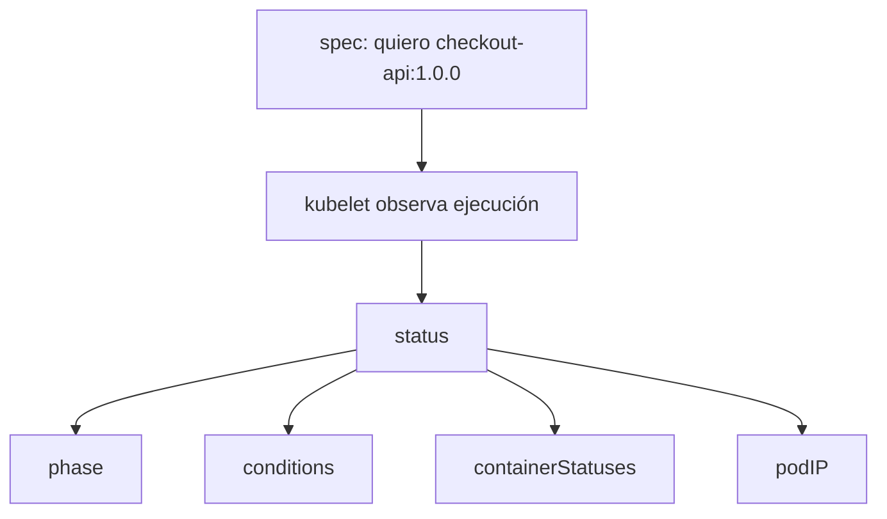

### Ejemplo de diferencia

Puede que `spec` diga:

```text
image: checkout-api:1.0.0
```

Pero `status` diga:

```text
state.waiting.reason: ImagePullBackOff
```

Eso significa:

> La intención existe, pero no se ha podido materializar correctamente.

### Criterio de comprensión

Debes poder explicar:

> `status` no es lo que quiero. Es lo que Kubernetes ve ahora.

---

## 4.8. Estado deseado, estado actual y drift

Este es el corazón del modelo.

Kubernetes compara intención y observación.

- Estado deseado: lo que declaras
- Estado actual: lo que existe u observa el sistema
- Drift: diferencia entre ambos
- Reconciliación: intento de reducir esa diferencia
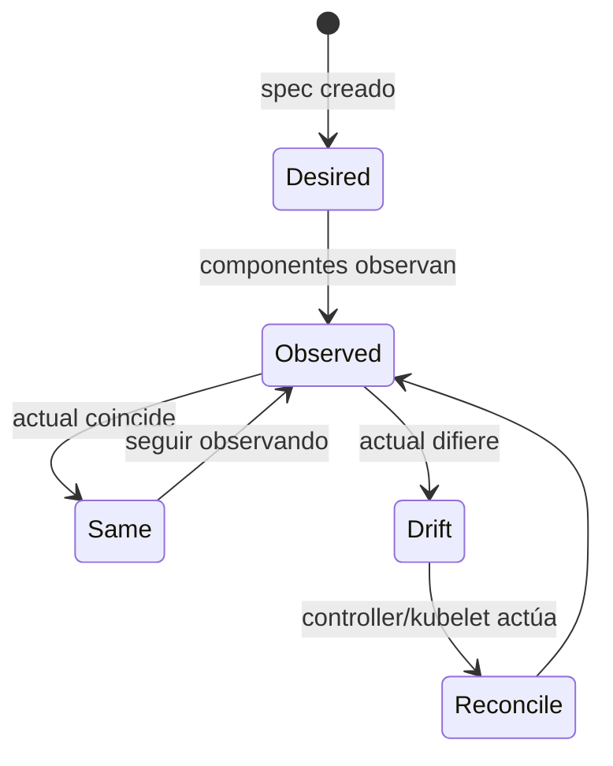

### Ejemplo simple

Deseado:

```text
Existe un Pod checkout-api con imagen checkout-api:1.0.0.
```

Actual:

```text
El Pod está Running y el contenedor está Ready.
```

No hay drift relevante.

Ahora rompes la imagen:

```yaml
image: checkout-api:does-not-exist
```

Deseado:

```text
Existe un Pod con una imagen inexistente.
```

Actual:

```text
El Pod existe, pero el contenedor no arranca.
```

Hay drift operativo: Kubernetes aceptó la intención, pero no puede materializarla.

### Importante

Kubernetes no sabe si tu intención era buena.

Solo intenta actuar según lo declarado y según las reglas del sistema.

### DevEx del bloque

Cada práctica debe enseñar a mirar ambos lados:

```bash
task k8s:pod:spec
task k8s:pod:status
task k8s:pod:inspect
```

### Criterio de comprensión

Debes poder explicar:

> Cuando algo falla, no pregunto solo “qué está roto”. Pregunto “qué declaré, qué observa Kubernetes y dónde aparece la primera diferencia”.

---

## 4.9. Reconciliación y control loops

Un controller es un bucle de control.

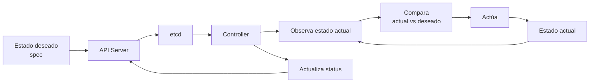

La documentación oficial define los controllers como control loops que observan el estado del cluster y hacen o solicitan cambios donde es necesario; cada controller intenta mover el estado actual hacia el estado deseado. ([Kubernetes](https://kubernetes.io/docs/concepts/architecture/controller/ "Controllers"))

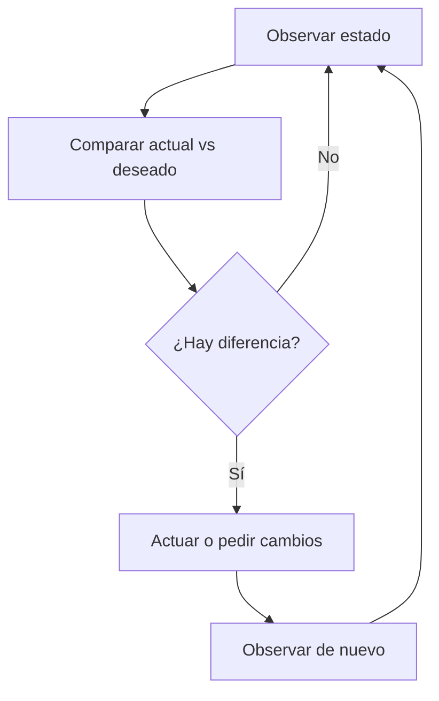

### Qué NO significa reconciliación

No significa:

- Que todo se arregle
- Que Kubernetes entienda tu negocio
- Que no necesites tests
- Que no necesites logs
- Que un mal manifest se corrija solo
Sí significa:

- El sistema observa continuamente
- Detecta diferencias que entiende
- Intenta actuar para acercarse al estado deseado
- Actualiza el estado observado
- Emite señales
### Ejemplo actual del curso

En el módulo 3 creaste un Pod directo.

Un Pod directo tiene menos comportamiento de reconciliación que un Deployment.

Si borras un Pod creado directamente, desaparece y no vuelve.

Más adelante, si creas un Deployment con réplicas, el Deployment controller sí recreará Pods para mantener la cantidad deseada.

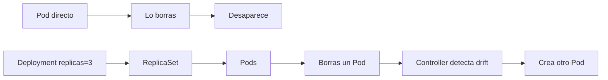

### DevEx del bloque

No uses todavía Deployments como práctica principal si el módulo quiere explicar el modelo. Pero sí puedes mostrar la diferencia conceptual.

En el módulo 6, esta idea se practicará en serio.

### Criterio de comprensión

Debes poder explicar:

> No todos los objetos tienen el mismo comportamiento de reconciliación. Un Pod directo no se comporta igual que un Deployment.

---

## 4.10. API Server

El API Server es la puerta de entrada al control plane.

Recibe peticiones, valida objetos, aplica autenticación y autorización, ejecuta admisión cuando corresponde y persiste estado en `etcd`.

La documentación oficial describe el API Server como el componente del control plane que expone la Kubernetes API. ([Kubernetes](https://kubernetes.io/docs/concepts/overview/components/ "Kubernetes Components"))

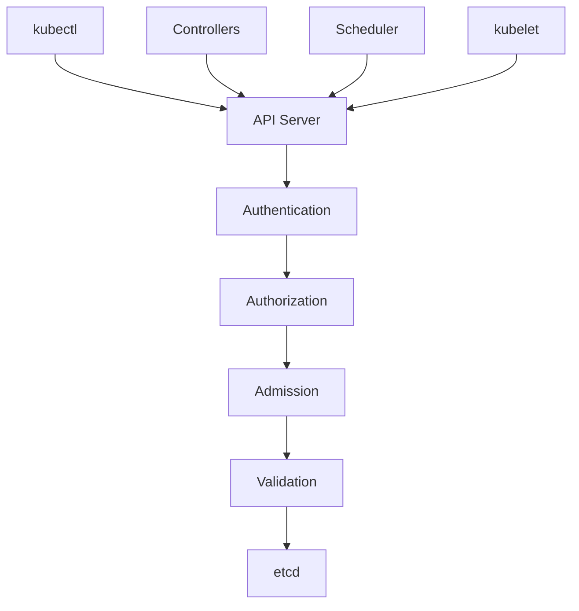

### Qué hace para ti

Cuando ejecutas:

```bash
kubectl apply -f kubernetes/01-pod/pod.yaml
```

el API Server recibe la petición.

Si el objeto es válido, lo acepta.

Si no lo es, lo rechaza.

### Qué puedes observar

```bash
kubectl api-resources
kubectl explain pod
kubectl explain pod.spec
kubectl explain pod.status
```

`kubectl explain` describe campos y estructura de recursos soportados por la API. ([Kubernetes](https://kubernetes.io/docs/reference/kubectl/generated/kubectl_explain/ "kubectl explain"))

### DevEx del bloque

`kubectl explain` debe convertirse en una herramienta habitual.

Antes de inventar o copiar campos YAML:

```bash
kubectl explain pod.spec.containers
```

### Criterio de comprensión

Debes poder explicar:

> El API Server es la entrada del sistema. Si un objeto no pasa por la API, Kubernetes no lo gestiona como parte de su estado.

---

## 4.11. `etcd`

`etcd` es el almacén de datos consistente y altamente disponible usado como backing store del cluster. La documentación de componentes de Kubernetes lo identifica como el almacén de clave-valor usado para todos los datos del cluster. ([Kubernetes](https://kubernetes.io/docs/concepts/overview/components/ "Kubernetes Components"))

No necesitas operar `etcd` todavía.

Pero sí necesitas entender su papel:

> Kubernetes necesita un lugar donde persistir el estado de los objetos del cluster.

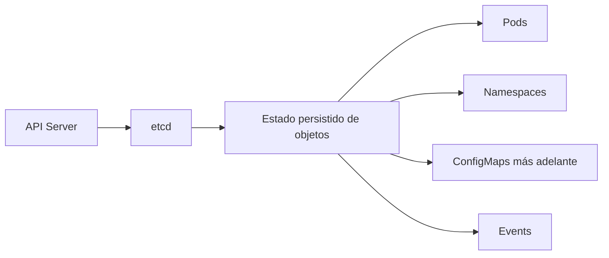

### Qué NO debes hacer ahora

No te conectes directamente a `etcd` en este curso inicial.

No uses `etcdctl` todavía.

No trates `etcd` como una base de datos de aplicación.

### Por qué importa

Si pierdes `etcd` sin backup, puedes perder el estado del cluster.

En módulos posteriores, cuando hablemos de operación, backup y disaster recovery, `etcd` volverá a aparecer.

### DevEx del bloque

En un cluster local con kind, no vamos a operar `etcd`.

Solo vamos a aprender a reconocer que `etcd` existe y que el API Server es el camino correcto para interactuar con el estado.

### Criterio de comprensión

Debes poder explicar:

> `etcd` guarda el estado del cluster. Yo no debería saltarme la API para manipularlo.

---

## 4.12. Scheduler

El scheduler decide en qué nodo debe ejecutarse un Pod que todavía no tiene nodo asignado.

La documentación de componentes explica que el kube-scheduler observa Pods recién creados sin nodo asignado y selecciona un nodo donde ejecutarlos. ([Kubernetes](https://kubernetes.io/docs/concepts/overview/components/ "Kubernetes Components"))

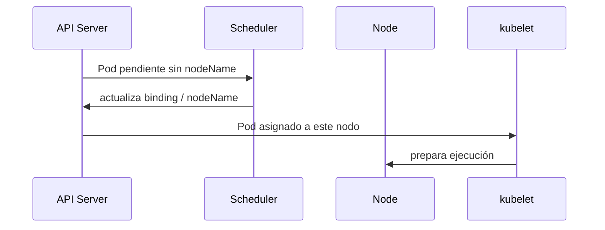

### Qué mira el scheduler

En este módulo no entraremos a scheduling avanzado.

Pero el scheduler puede considerar cosas como:

- Recursos disponibles
- Requests de CPU y memoria
- Restricciones de nodo
- Taints y tolerations
- Affinity y anti-affinity
- Policies y configuración de scheduling
### Cómo observarlo

```bash
kubectl get pod checkout-api -n shop -o wide
kubectl get pod checkout-api -n shop -o json | jq '.spec.nodeName'
kubectl describe pod checkout-api -n shop
```

En eventos podrías ver señales de scheduling.

### DevEx del bloque

Añade una tarea:

```yaml
k8s:pod:node:
  desc: Show the node where checkout-api is scheduled
  cmds:
    - kubectl get pod checkout-api -n {{.NAMESPACE}} -o json | jq -r '.spec.nodeName'
```

### Criterio de comprensión

Debes poder explicar:

> Yo declaro un Pod. El scheduler decide en qué nodo debe ejecutarse.

---

## 4.13. Kubelet

Kubelet vive en cada nodo.

Su responsabilidad es asegurarse de que los contenedores descritos en los Pods asignados a ese nodo estén corriendo. La documentación de componentes describe kubelet como un agente que corre en cada nodo y se asegura de que los contenedores estén ejecutándose en un Pod. ([Kubernetes](https://kubernetes.io/docs/concepts/overview/components/ "Kubernetes Components"))

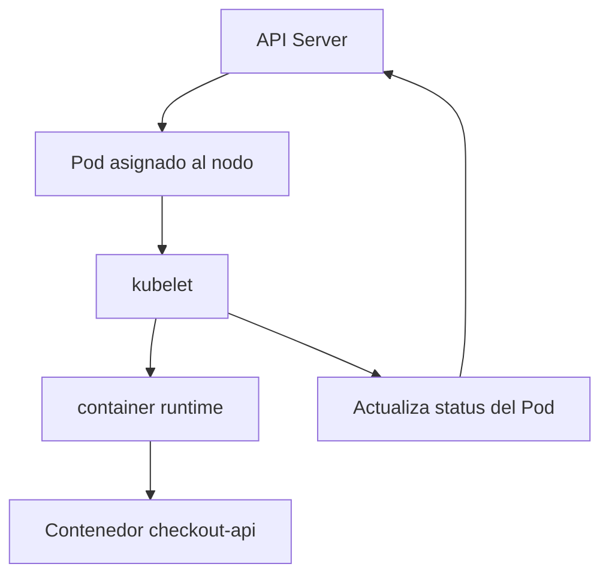

### Qué hace kubelet

Kubelet:

- Observa Pods asignados a su nodo
- Pide al runtime que cree contenedores
- Monta configuración y volúmenes cuando toca
- Supervisa estado
- Reporta `status` al API Server
- Expone señales de salud del nodo y Pods
### Qué puedes observar

```bash
kubectl get pod checkout-api -n shop -o json | jq '.status.containerStatuses'
kubectl describe pod checkout-api -n shop
```

### Criterio de comprensión

Debes poder explicar:

> El API Server acepta el objeto. El scheduler asigna nodo. Kubelet materializa el Pod en ese nodo y reporta estado.

---

## 4.14. Container runtime

Kubelet no ejecuta contenedores por sí mismo.

Habla con un container runtime.

La documentación de nodos indica que los componentes de un nodo incluyen kubelet, un container runtime y kube-proxy. ([Kubernetes](https://kubernetes.io/docs/concepts/architecture/nodes/ "Nodes"))

En Kubernetes moderno, runtimes habituales son:

- containerd
- CRI-O
El detalle exacto depende del cluster.

En kind, puedes inspeccionar parte del entorno, pero no necesitas operar el runtime todavía.

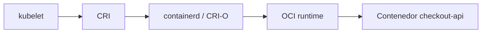

### Qué significa para ti

Cuando ves:

```text
ImagePullBackOff
CrashLoopBackOff
ContainerCreating
Running
```

estás viendo señales que nacen de la colaboración entre kubelet, runtime, imagen y proceso de aplicación.

### DevEx del bloque

No intentes depurar el runtime en este módulo.

Primero aprende la cadena:

```text
Pod object → scheduler → kubelet → runtime → container → status
```

### Criterio de comprensión

Debes poder explicar:

> Kubernetes no ejecuta contenedores llamando a Docker CLI. Kubelet se coordina con un runtime compatible mediante interfaces de Kubernetes.

---

## 4.15. Controller Manager y controllers

El controller manager ejecuta control loops centrales de Kubernetes.

Los controllers observan objetos y actúan para reducir drift.

La referencia del `kube-controller-manager` explica que un controller es un control loop que observa el estado compartido del cluster a través del API Server y hace cambios intentando mover el estado actual hacia el estado deseado. ([Kubernetes](https://kubernetes.io/docs/reference/command-line-tools-reference/kube-controller-manager/ "kube-controller-manager"))

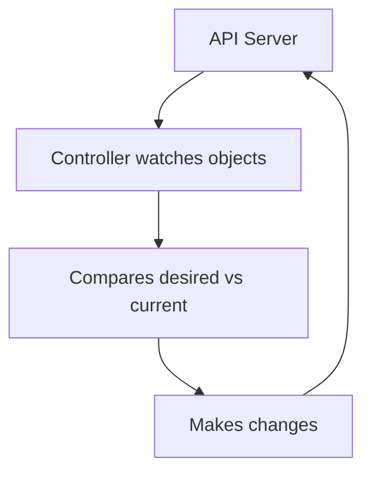

### Ejemplos de controllers

No necesitas dominarlos todavía, pero es útil conocer ejemplos:

|Controller|Qué intenta mantener|
|---|---|
|Deployment controller|Estado deseado de Deployments|
|ReplicaSet controller|Número deseado de Pods|
|Job controller|Ejecución hasta completar trabajo|
|Node controller|Estado de nodos|
|EndpointSlice controller|Endpoints asociados a Services|

### Importante para este módulo

Tu Pod directo no tiene un controller de alto nivel manteniéndolo vivo como lo haría un Deployment.

Por eso, si lo borras, desaparece.

Esto es intencional: queremos que veas la diferencia antes de usar Workloads más avanzados.

### Criterio de comprensión

Debes poder explicar:

> Los controllers son la razón por la que Kubernetes puede operar de forma continua, no solo crear recursos una vez.

---

## 4.16. Kube-proxy, CNI y CoreDNS

Todavía no vamos a estudiar networking en profundidad.

Pero el modelo mental necesita situar tres piezas.

### kube-proxy

kube-proxy es un componente de red que se ejecuta en nodos y ayuda a implementar parte de la abstracción de Service.

Lo estudiarás mejor en el módulo de networking.

### CNI

Kubernetes usa plugins CNI para implementar el modelo de red del cluster. La documentación oficial indica que se requiere un plugin CNI para implementar el modelo de red de Kubernetes. ([Kubernetes](https://kubernetes.io/docs/concepts/extend-kubernetes/compute-storage-net/network-plugins/ "Network Plugins"))

### CoreDNS

CoreDNS permite resolver nombres dentro del cluster. La documentación oficial sobre DNS explica que Kubernetes crea registros DNS para Services y Pods, y que los workloads pueden descubrir Services usando DNS en lugar de IPs. ([Kubernetes](https://kubernetes.io/docs/concepts/services-networking/dns-pod-service/ "DNS for Services and Pods"))

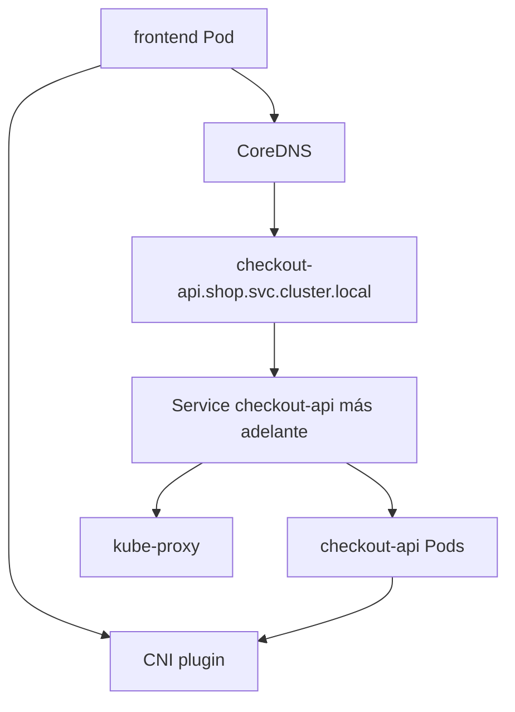

### En este módulo

No vamos a crear Services todavía.

Pero debes saber que:

- Los Pods necesitan red
- El cluster necesita un plugin CNI
- Los Services tendrán DNS
- kube-proxy participa en la implementación del tráfico de Services
- CoreDNS será clave para service discovery
### DevEx del bloque

No sobrecargues la práctica con networking todavía.

Guarda estas preguntas para el módulo 7:

```text
¿Resuelve DNS?
¿Hay Service?
¿Hay endpoints?
¿El selector coincide?
¿La NetworkPolicy bloquea?
¿El CNI implementa policy?
```

### Criterio de comprensión

Debes poder explicar:

> Para que Kubernetes opere workloads reales, no basta con ejecutar contenedores. También necesita red, resolución de nombres y mecanismos para dirigir tráfico.

---

## 4.17. Events: la caja negra empieza a hablar

Los events son señales operativas generadas por Kubernetes.

No son logs de aplicación.

No son métricas.

Son pistas del sistema sobre cosas que ocurren con objetos.

Ejemplos:

- Pod scheduled
- Pulling image
- Pulled image
- Created container
- Started container
- FailedScheduling
- BackOff
- Unhealthy
La documentación oficial de troubleshooting usa `kubectl describe pod` para obtener detalles de Pods, incluyendo información útil para depurar Pods en ejecución o con fallos. ([Kubernetes](https://kubernetes.io/docs/tasks/debug/debug-application/debug-running-pod/ "Debug Running Pods"))

### Comandos

```bash
kubectl describe pod checkout-api -n shop
kubectl get events -n shop --sort-by=.metadata.creationTimestamp
kubectl get events -A --sort-by=.metadata.creationTimestamp
```

### Filtrar events con `jq`

```bash
kubectl get events -n shop -o json \
  | jq -r '.items[] | [.reason, .involvedObject.kind, .involvedObject.name, .message] | @tsv'
```

### Relación entre logs y events

|Señal|Quién la produce|Para qué sirve|
|---|---|---|
|Logs|Tu aplicación o contenedor|Entender comportamiento interno|
|Events|Kubernetes|Entender decisiones y fallos del sistema|
|Status|Kubernetes|Ver estado observado del objeto|
|Metrics|Componentes o apps|Medir comportamiento en el tiempo|
|Traces|App instrumentada|Seguir flujo entre servicios|

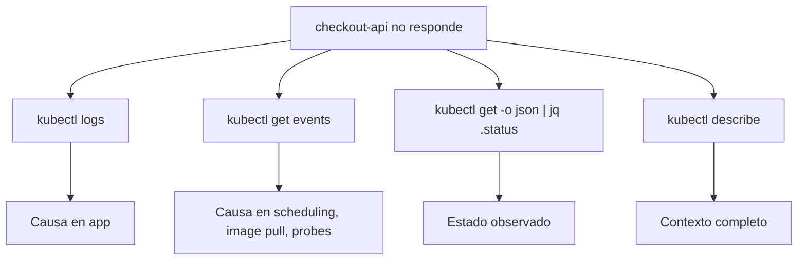

### DevEx del bloque

Añade:

```yaml
k8s:events:
  desc: Show namespace events
  cmds:
    - kubectl get events -n {{.NAMESPACE}} --sort-by=.metadata.creationTimestamp

k8s:events:summary:
  desc: Show namespace events as a compact table
  cmds:
    - kubectl get events -n {{.NAMESPACE}} -o json | jq -r '.items[] | [.reason, .involvedObject.kind, .involvedObject.name, .message] | @tsv'
```

### Criterio de comprensión

Debes poder explicar:

> Cuando Kubernetes no hace lo que espero, los events suelen decir qué intentó hacer y por qué falló.

---

## 4.18. Práctica guiada: mirar Kubernetes por dentro sin abrirlo

### Objetivo

Usar el laboratorio del módulo 3 para observar `metadata`, `spec`, `status`, scheduling, kubelet signals, logs y events.

No vamos a crear nuevos objetos complejos.

Vamos a mirar mejor el Pod que ya conoces.

### Requisitos previos

Debes tener:

```bash
task k8s:kind:create
task k8s:image:prepare
task k8s:lab:apply
```

Y el Pod debe existir:

```bash
kubectl get pod checkout-api -n shop
```

### Paso 1. Ver objeto completo

```bash
kubectl get pod checkout-api -n shop -o yaml
```

Responde:

- ¿Dónde está `metadata`?
- ¿Dónde está `spec`?
- ¿Dónde está `status`?
- ¿Qué partes escribiste tú?
- ¿Qué partes añadió Kubernetes?
### Paso 2. Separar `spec` y `status`

```bash
kubectl get pod checkout-api -n shop -o json | jq '.spec'
kubectl get pod checkout-api -n shop -o json | jq '.status'
```

Responde:

- ¿Qué imagen aparece en `spec`?
- ¿Qué fase aparece en `status`?
- ¿Qué condiciones aparecen?
- ¿Qué contenedor aparece en `containerStatuses`?
### Paso 3. Ver scheduling

```bash
kubectl get pod checkout-api -n shop -o wide
kubectl get pod checkout-api -n shop -o json | jq -r '.spec.nodeName'
```

Responde:

- ¿En qué nodo se ejecuta?
- ¿Ese nodo lo escribiste tú?
- ¿Qué componente tomó esa decisión?
### Paso 4. Ver events

```bash
kubectl describe pod checkout-api -n shop
kubectl get events -n shop --sort-by=.metadata.creationTimestamp
```

Responde:

- ¿Ves eventos de scheduling?
- ¿Ves eventos de pull o start de contenedor?
- ¿Qué evento parece más cercano al arranque del contenedor?
### Paso 5. Ver logs

```bash
kubectl logs pod/checkout-api -n shop
```

Responde:

- ¿Qué logs vienen de la app?
- ¿Qué diferencia hay entre estos logs y los events?
### Paso 6. Validar con port-forward

En una terminal:

```bash
kubectl port-forward pod/checkout-api -n shop 8080:8080
```

En otra:

```bash
task smoke
```

Después mira logs otra vez:

```bash
kubectl logs pod/checkout-api -n shop
```

### Criterio de finalización

La práctica está completa cuando puedes contar la historia completa:

> Apliqué un manifest. El API Server aceptó un objeto Pod. Kubernetes añadió metadata y status. El scheduler asignó un nodo. Kubelet materializó el contenedor. La aplicación escribió logs. Kubernetes generó events. Yo validé el contrato HTTP con port-forward y smoke test.

---

## 4.19. Práctica de fallo controlado: imagen incorrecta

### Objetivo

Ver qué pasa cuando el estado deseado contiene una imagen que no se puede ejecutar.

No queremos un fallo complejo. Queremos uno pequeño, diagnosticable y didáctico.

### Paso 1. Crear manifest roto

Copia el Pod:

```bash
cp kubernetes/01-pod/pod.yaml kubernetes/01-pod/pod-broken-image.yaml
```

Cambia la imagen:

```bash
yq -i '.spec.containers[0].image = "checkout-api:does-not-exist"' kubernetes/01-pod/pod-broken-image.yaml
```

Cambia el nombre:

```bash
yq -i '.metadata.name = "checkout-api-broken-image"' kubernetes/01-pod/pod-broken-image.yaml
```

### Paso 2. Aplicar

```bash
kubectl apply -f kubernetes/01-pod/pod-broken-image.yaml
```

### Paso 3. Observar

```bash
kubectl get pod checkout-api-broken-image -n shop
kubectl describe pod checkout-api-broken-image -n shop
kubectl get events -n shop --sort-by=.metadata.creationTimestamp
kubectl get pod checkout-api-broken-image -n shop -o json | jq '.status.containerStatuses'
```

### Preguntas

- ¿El API Server aceptó el objeto?
- ¿El Pod existe?
- ¿El contenedor arrancó?
- ¿Dónde se ve el fallo?
- ¿El fallo está en `spec` o en `status`?
- ¿Qué evento lo explica?
- ¿Kubernetes puede arreglar una imagen que no existe?

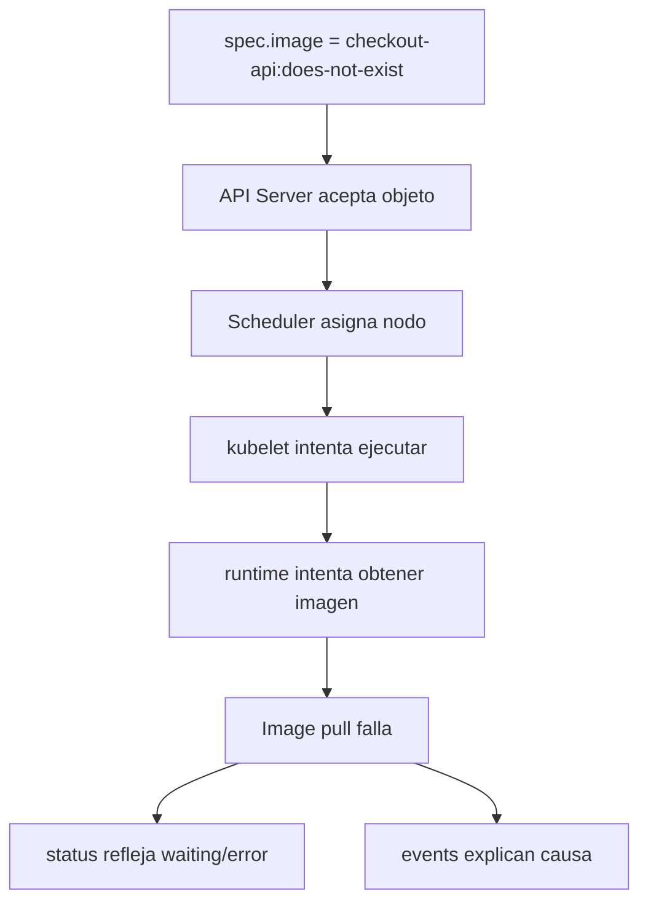

### Paso 4. Limpiar

```bash
kubectl delete -f kubernetes/01-pod/pod-broken-image.yaml --ignore-not-found
```

### DevEx del bloque

Añade tareas opcionales:

```yaml
k8s:failure:image:apply:
  desc: Apply Pod with broken image
  cmds:
    - cp kubernetes/01-pod/pod.yaml kubernetes/01-pod/pod-broken-image.yaml
    - yq -i '.metadata.name = "checkout-api-broken-image"' kubernetes/01-pod/pod-broken-image.yaml
    - yq -i '.spec.containers[0].image = "checkout-api:does-not-exist"' kubernetes/01-pod/pod-broken-image.yaml
    - kubectl apply -f kubernetes/01-pod/pod-broken-image.yaml

k8s:failure:image:inspect:
  desc: Inspect broken image Pod
  cmds:
    - kubectl get pod checkout-api-broken-image -n {{.NAMESPACE}} || true
    - kubectl describe pod checkout-api-broken-image -n {{.NAMESPACE}} || true
    - kubectl get pod checkout-api-broken-image -n {{.NAMESPACE}} -o json | jq '.status.containerStatuses' || true
    - kubectl get events -n {{.NAMESPACE}} --sort-by=.metadata.creationTimestamp

k8s:failure:image:delete:
  desc: Delete broken image Pod
  cmds:
    - kubectl delete -f kubernetes/01-pod/pod-broken-image.yaml --ignore-not-found || true
```

### Criterio de comprensión

Debes poder explicar:

> Kubernetes puede aceptar un objeto válido aunque su ejecución falle después. Por eso necesito distinguir validación de API, scheduling, ejecución y estado observado.

---

## 4.20. Taskfile completo del módulo 4

Añade estas tareas al `Taskfile.yml` del laboratorio.

```yaml
  k8s:pod:spec:
    desc: Show checkout-api Pod desired specification
    cmds:
      - kubectl get pod checkout-api -n {{.NAMESPACE}} -o json | jq '.spec'

  k8s:pod:status:
    desc: Show checkout-api Pod observed status
    cmds:
      - kubectl get pod checkout-api -n {{.NAMESPACE}} -o json | jq '.status'

  k8s:pod:metadata:
    desc: Show checkout-api Pod metadata
    cmds:
      - kubectl get pod checkout-api -n {{.NAMESPACE}} -o json | jq '.metadata'

  k8s:pod:node:
    desc: Show the node where checkout-api is scheduled
    cmds:
      - kubectl get pod checkout-api -n {{.NAMESPACE}} -o json | jq -r '.spec.nodeName'

  k8s:events:
    desc: Show namespace events
    cmds:
      - kubectl get events -n {{.NAMESPACE}} --sort-by=.metadata.creationTimestamp

  k8s:events:summary:
    desc: Show namespace events as a compact table
    cmds:
      - kubectl get events -n {{.NAMESPACE}} -o json | jq -r '.items[] | [.reason, .involvedObject.kind, .involvedObject.name, .message] | @tsv'

  k8s:api:resources:
    desc: Show Kubernetes API resources
    cmds:
      - kubectl api-resources

  k8s:api:explain:pod:
    desc: Explain Pod API fields
    cmds:
      - kubectl explain pod
      - kubectl explain pod.spec
      - kubectl explain pod.status

  k8s:model:inspect:
    desc: Inspect checkout-api through Kubernetes mental model
    cmds:
      - task k8s:pod:metadata
      - task k8s:pod:spec
      - task k8s:pod:status
      - task k8s:pod:node
      - task k8s:events:summary

  k8s:failure:image:apply:
    desc: Apply Pod with broken image
    cmds:
      - cp kubernetes/01-pod/pod.yaml kubernetes/01-pod/pod-broken-image.yaml
      - yq -i '.metadata.name = "checkout-api-broken-image"' kubernetes/01-pod/pod-broken-image.yaml
      - yq -i '.spec.containers[0].image = "checkout-api:does-not-exist"' kubernetes/01-pod/pod-broken-image.yaml
      - kubectl apply -f kubernetes/01-pod/pod-broken-image.yaml

  k8s:failure:image:inspect:
    desc: Inspect broken image Pod
    cmds:
      - kubectl get pod checkout-api-broken-image -n {{.NAMESPACE}} || true
      - kubectl describe pod checkout-api-broken-image -n {{.NAMESPACE}} || true
      - kubectl get pod checkout-api-broken-image -n {{.NAMESPACE}} -o json | jq '.status.containerStatuses' || true
      - kubectl get events -n {{.NAMESPACE}} --sort-by=.metadata.creationTimestamp

  k8s:failure:image:delete:
    desc: Delete broken image Pod
    cmds:
      - kubectl delete -f kubernetes/01-pod/pod-broken-image.yaml --ignore-not-found || true
```

### Flujo recomendado

```bash
task k8s:kind:create
task k8s:image:prepare
task k8s:lab:apply
task k8s:model:inspect
task k8s:api:explain:pod
task k8s:failure:image:apply
task k8s:failure:image:inspect
task k8s:failure:image:delete
task k8s:lab:delete
task k8s:kind:delete
```

### Criterio DevEx

Debes poder explicar:

> La DevEx en Kubernetes no consiste solo en aplicar manifests rápido. Consiste en tener tareas que permitan observar intención, estado, eventos y fallos de forma repetible.

---

## 4.21. Práctica principal del módulo

### Objetivo

Construir el modelo mental de Kubernetes observando un Pod real y un fallo controlado.

### Resultado esperado

Al final deberías tener:

```text
kubernetes-learning-lab/
  kubernetes/
    01-pod/
      pod.yaml
      pod-broken-image.yaml
  Taskfile.yml
```

### Paso 1. Preparar entorno

```bash
task k8s:kind:create
task k8s:image:prepare
task k8s:lab:apply
```

### Paso 2. Inspeccionar objeto completo

```bash
kubectl get pod checkout-api -n shop -o yaml
```

### Paso 3. Separar metadata, spec y status

```bash
task k8s:pod:metadata
task k8s:pod:spec
task k8s:pod:status
```

### Paso 4. Ver nodo asignado

```bash
task k8s:pod:node
```

### Paso 5. Ver events

```bash
task k8s:events
task k8s:events:summary
```

### Paso 6. Ver logs

```bash
task k8s:logs
```

### Paso 7. Usar `kubectl explain`

```bash
task k8s:api:explain:pod
```

### Paso 8. Crear fallo de imagen

```bash
task k8s:failure:image:apply
task k8s:failure:image:inspect
```

### Paso 9. Limpiar fallo

```bash
task k8s:failure:image:delete
```

### Paso 10. Limpiar laboratorio

```bash
task k8s:lab:delete
task k8s:kind:delete
```

### Criterio de finalización

La práctica está completa cuando puedes explicar:

- Qué parte del objeto es metadata
- Qué parte expresa intención
- Qué parte expresa observación
- Qué componente asignó nodo
- Qué componente materializó el contenedor
- Dónde aparecen los events
- Qué diferencia hay entre logs y events
- Por qué la imagen rota fue aceptada por la API pero falló en ejecución
- Qué comandos usarías para diagnosticar el problema

---

## 4.22. Ejercicios cortos

### Ejercicio 1. metadata, spec y status

Ejecuta:

```bash
kubectl get pod checkout-api -n shop -o json | jq '.metadata'
kubectl get pod checkout-api -n shop -o json | jq '.spec'
kubectl get pod checkout-api -n shop -o json | jq '.status'
```

Responde:

- ¿Qué campos escribiste tú?
- ¿Qué campos añadió Kubernetes?
- ¿Qué parte representa intención?
- ¿Qué parte representa observación?
---

### Ejercicio 2. API Server

Ejecuta:

```bash
kubectl api-resources
kubectl explain pod
kubectl explain pod.spec
kubectl explain pod.status
```

Responde:

- ¿Qué te permite descubrir `kubectl api-resources`?
- ¿Para qué sirve `kubectl explain`?
- ¿Por qué esto es mejor que copiar YAML sin entenderlo?
---

### Ejercicio 3. Scheduler

Ejecuta:

```bash
kubectl get pod checkout-api -n shop -o wide
kubectl get pod checkout-api -n shop -o json | jq -r '.spec.nodeName'
```

Responde:

- ¿En qué nodo se ejecuta el Pod?
- ¿Ese nodo estaba en tu manifest?
- ¿Qué componente decidió el nodo?
---

### Ejercicio 4. Kubelet y runtime

Ejecuta:

```bash
kubectl get pod checkout-api -n shop -o json | jq '.status.containerStatuses'
```

Responde:

- ¿Qué imagen aparece?
- ¿Cuál es el estado del contenedor?
- ¿Cuántos reinicios tiene?
- ¿Qué señal te indica que el contenedor arrancó?
---

### Ejercicio 5. Events vs logs

Ejecuta:

```bash
kubectl get events -n shop --sort-by=.metadata.creationTimestamp
kubectl logs pod/checkout-api -n shop
```

Completa:

|Señal|Producida por|Responde a|
|---|---|---|
|Events|||
|Logs|||

---

### Ejercicio 6. Imagen rota

Aplica el fallo:

```bash
task k8s:failure:image:apply
task k8s:failure:image:inspect
```

Responde:

- ¿El objeto existe?
- ¿El contenedor está ejecutándose?
- ¿Qué dice `status`?
- ¿Qué dicen los events?
- ¿Dónde está la primera diferencia entre intención y realidad?
Limpia:

```bash
task k8s:failure:image:delete
```

---

## 4.23. Errores habituales

### Error 1. Pensar que YAML es Kubernetes

YAML es solo una forma de expresar objetos.

Kubernetes es la API, los objetos, los componentes y los control loops que actúan sobre ese estado.

---

### Error 2. Mirar solo `kubectl get`

`kubectl get` es una vista rápida.

No basta para diagnosticar.

Cuando algo falle, usa:

```bash
kubectl describe
kubectl get -o yaml
kubectl get -o json | jq
kubectl logs
kubectl get events
```

---

### Error 3. Confundir `spec` y `status`

`spec` es lo que quieres.

`status` es lo que Kubernetes observa.

Si no separas ambas cosas, diagnosticarás mal.

---

### Error 4. Pensar que todo objeto se autorepara

Un Pod directo no vuelve si lo borras.

Un Deployment sí puede crear Pods nuevos para mantener réplicas.

No todos los objetos tienen el mismo comportamiento.

---

### Error 5. Ignorar events

Los events suelen explicar cosas que los logs de aplicación no pueden explicar:

- scheduling
- image pull
- container start
- backoff
- errores de configuración
- fallos de recursos
---

### Error 6. Creer que Kubernetes corrige una intención mala

Si declaras una imagen inexistente, Kubernetes puede intentar usarla y fallar.

El sistema no sabe que querías otra cosa.

---

### Error 7. Saltar a componentes internos demasiado pronto

No necesitas operar `etcd`, modificar scheduler ni depurar CNI ahora.

Primero aprende a observar objetos, status y events.

---

## 4.24. Criterio de salida del módulo

Puedes pasar al módulo 5 cuando puedas hacer todo esto sin seguir una receta ciegamente.

### Conceptos

Debes poder explicar:

- Qué significa que Kubernetes esté basado en API
- Qué es un objeto Kubernetes
- Qué representa `metadata`
- Qué representa `spec`
- Qué representa `status`
- Qué es estado deseado
- Qué es estado observado
- Qué es drift
- Qué es reconciliación
- Qué es un control loop
- Qué hace el API Server
- Qué papel tiene `etcd`
- Qué hace el scheduler
- Qué hace kubelet
- Qué hace el container runtime
- Qué hacen conceptualmente kube-proxy, CNI y CoreDNS
- Qué son events
- Qué diferencia hay entre logs y events
### Práctica

Debes poder:

- Aplicar el laboratorio del módulo 3
- Ver el objeto completo del Pod
- Separar metadata, spec y status
- Ver el nodo asignado
- Leer events
- Leer logs
- Usar `kubectl explain`
- Crear un fallo con imagen incorrecta
- Diagnosticarlo con status y events
- Limpiar el fallo
- Limpiar el laboratorio
### DevEx

Debes poder ejecutar:

```bash
task k8s:model:inspect
task k8s:api:explain:pod
task k8s:events
task k8s:events:summary
task k8s:failure:image:apply
task k8s:failure:image:inspect
task k8s:failure:image:delete
```

### Frase final de comprensión

Debes poder explicar esta frase:

> Kubernetes es un sistema de control. La API guarda objetos, `spec` expresa intención, `status` muestra observación y los componentes trabajan continuamente para acercar el estado real al estado deseado.

---

## 4.25. Referencias oficiales

|Tema|Referencia|
|---|---|
|Kubernetes architecture|Kubernetes Docs, Cluster Architecture. ([Kubernetes](https://kubernetes.io/docs/concepts/architecture/ "Cluster Architecture"))|
|Kubernetes components|Kubernetes Docs, Kubernetes Components. ([Kubernetes](https://kubernetes.io/docs/concepts/overview/components/ "Kubernetes Components"))|
|Kubernetes API|Kubernetes Docs, The Kubernetes API. ([Kubernetes](https://kubernetes.io/docs/concepts/overview/kubernetes-api/ "The Kubernetes API"))|
|API concepts|Kubernetes Docs, API Concepts. ([Kubernetes](https://kubernetes.io/docs/reference/using-api/api-concepts/ "Kubernetes API Concepts"))|
|API overview|Kubernetes Docs, API Overview. ([Kubernetes](https://kubernetes.io/docs/reference/using-api/ "API Overview"))|
|Objects in Kubernetes|Kubernetes Docs, Objects In Kubernetes. ([Kubernetes](https://kubernetes.io/docs/concepts/overview/working-with-objects/ "Objects In Kubernetes"))|
|Controllers|Kubernetes Docs, Controllers. ([Kubernetes](https://kubernetes.io/docs/concepts/architecture/controller/ "Controllers"))|
|kube-controller-manager|Kubernetes Docs, kube-controller-manager. ([Kubernetes](https://kubernetes.io/docs/reference/command-line-tools-reference/kube-controller-manager/ "kube-controller-manager"))|
|Nodes|Kubernetes Docs, Nodes. ([Kubernetes](https://kubernetes.io/docs/concepts/architecture/nodes/ "Nodes"))|
|Cloud Controller Manager|Kubernetes Docs, Cloud Controller Manager. ([Kubernetes](https://kubernetes.io/docs/concepts/architecture/cloud-controller/ "Cloud Controller Manager"))|
|Network plugins and CNI|Kubernetes Docs, Network Plugins. ([Kubernetes](https://kubernetes.io/docs/concepts/extend-kubernetes/compute-storage-net/network-plugins/ "Network Plugins"))|
|DNS for Services and Pods|Kubernetes Docs, DNS for Services and Pods. ([Kubernetes](https://kubernetes.io/docs/concepts/services-networking/dns-pod-service/ "DNS for Services and Pods"))|
|Debug running Pods|Kubernetes Docs, Debug Running Pods. ([Kubernetes](https://kubernetes.io/docs/tasks/debug/debug-application/debug-running-pod/ "Debug Running Pods"))|
|Events API|Kubernetes Docs, Events API. ([Kubernetes](https://kubernetes.io/docs/reference/kubernetes-api/cluster-resources/event-v1/ "Kubernetes Events API"))|
|`kubectl explain`|Kubernetes Docs, kubectl explain. ([Kubernetes](https://kubernetes.io/docs/reference/kubectl/generated/kubectl_explain/ "kubectl explain"))|

## 4.26. Lecturas de apoyo

|Libro|Qué leer|
|---|---|
|_Kubernetes in Action_|Capítulo 11: internals, API Server, scheduler, controllers, kubelet, kube-proxy, add-ons, events, CNI, Services y alta disponibilidad.|
|_Kubernetes: Up and Running_|Capítulos 3, 4, 5, 9 y 10: cluster, `kubectl`, Pods, ReplicaSets, reconciliation loops y Deployments.|
|_Cloud Native DevOps with Kubernetes_|Capítulos 3 y 4: arquitectura, control plane, node components, objetos, Deployments, Pods, ReplicaSets, scheduler, manifests y Services.|
|_Kubernetes Patterns_|Capítulo 1 para primitivas distribuidas, y capítulos 22 y 23 como lectura posterior para Controller y Operator.|