# 7. Networking

## Objetivo del módulo

En el módulo 6 aprendiste a usar workloads para operar Pods: Deployments, Jobs, CronJobs, DaemonSets, StatefulSets, PDBs y autoscaling.

Ahora toca responder una pregunta inevitable:

> ¿Cómo se comunican esos workloads entre sí y con el exterior?

Hasta ahora has usado `port-forward` para acceder a `checkout-api`.

Eso era útil para aprender, pero no es una estrategia real de exposición.

En este módulo vas a entender el modelo de red de Kubernetes y cómo se construye el camino desde un Pod hasta otro Pod, desde un Pod hasta un Service, desde un cliente externo hasta una aplicación, y desde una aplicación hasta una dependencia interna.

Kubernetes agrupa sus conceptos de red bajo “Services, Load Balancing, and Networking”, e incluye Service, Ingress, Gateway API, EndpointSlices, NetworkPolicy y DNS para Services y Pods como piezas principales del modelo. ([Kubernetes](https://kubernetes.io/docs/concepts/services-networking/ "Services, Load Balancing, and Networking"))

La idea central del módulo es esta:

> En Kubernetes, los Pods son efímeros, sus IPs cambian y los clientes no deberían depender de instancias concretas. Services, DNS, EndpointSlices, Ingress, Gateway API y NetworkPolicies existen para convertir comunicación frágil entre Pods en comunicación declarativa, estable, observable y gobernable.

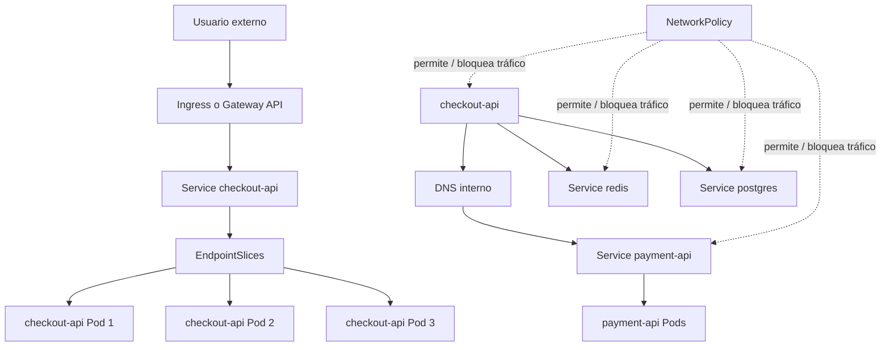

---

## 7.1. Qué vas a aprender y qué no vas a aprender todavía

Vas a aprender:

- Por qué las IPs de Pods no son una interfaz estable
- Qué es el modelo básico de red de Kubernetes
- Qué es una Pod IP
- Qué es un Service
- Qué diferencia hay entre `ClusterIP`, `NodePort`, `LoadBalancer` y `Headless Service`
- Qué son EndpointSlices
- Qué resuelve el DNS interno
- Qué es Ingress
- Por qué un Ingress necesita un Ingress Controller
- Qué es Gateway API
- Qué diferencia conceptual hay entre Ingress y Gateway API
- Qué son NetworkPolicies
- Por qué NetworkPolicy depende del CNI
- Cómo crear un laboratorio realista con `frontend`, `checkout-api`, `payment-api`, `redis` y `postgres`
- Cómo diagnosticar problemas de red con `kubectl`, `curl`, `nslookup`, `jq`, `yq` y Taskfile
No vamos a profundizar todavía en:

- TLS real con cert-manager
- Service mesh
- mTLS
- eBPF avanzado
- Cilium avanzado
- Multi-cluster networking
- ExternalDNS
- Cloud load balancers reales
- Gateway API avanzada
- Ingress hardening
- Observabilidad completa de red
Eso vendrá más adelante o en rutas profesionales.

La regla pedagógica del módulo será esta:

```text
Primero problema
Luego contrato mental
Luego objeto Kubernetes
Luego manifest
Luego validación
Luego troubleshooting
Luego DevEx con Taskfile
```

---

## 7.2. El problema: los Pods son efímeros

Antes de crear un Service, hay que entender por qué hace falta.

En el módulo 6 creaste un Deployment con varias réplicas de `checkout-api`.

Eso significa que ahora no tienes “la API”.

Tienes varios Pods que ejecutan la API.

Esos Pods pueden:

- Morir
- Recrearse
- Cambiar de IP
- Moverse a otro nodo
- Aparecer durante un rollout
- Desaparecer durante un rollback
- No estar ready todavía
- Ser reemplazados por un ReplicaSet nuevo
Si `frontend` llama directamente a la IP de un Pod concreto de `checkout-api`, el sistema queda acoplado a una instancia efímera.

Eso es frágil.

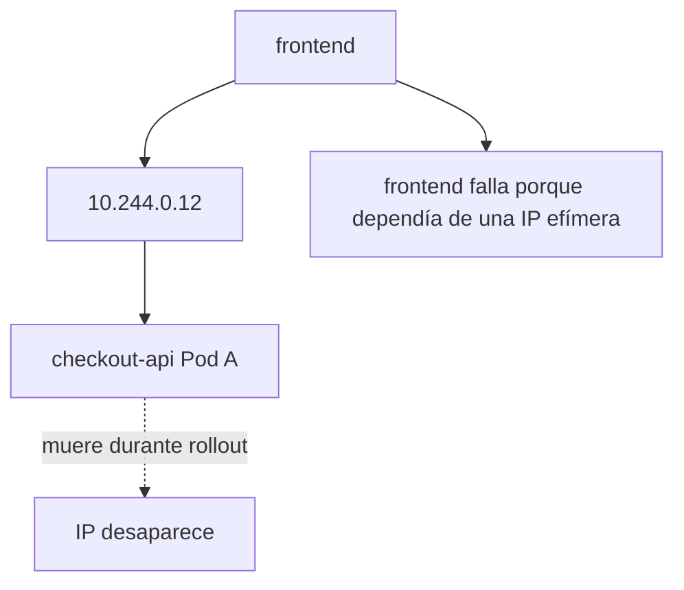

### Contrato mental

|Concepto|Qué debes asumir|
|---|---|
|Pod|Es una instancia efímera|
|Pod IP|Puede cambiar|
|Deployment|Puede crear y destruir Pods|
|Rollout|Puede mezclar Pods antiguos y nuevos|
|Cliente|No debería depender de una Pod IP concreta|
|Service|Da una identidad estable delante de Pods|

### Ejemplo con `shop`

Queremos que:

```text
frontend → checkout-api
checkout-api → payment-api
checkout-api → redis
checkout-api → postgres
```

No queremos que:

```text
frontend → 10.244.0.12
checkout-api → 10.244.0.23
checkout-api → 10.244.0.31
```

### DevEx del bloque

Desde este módulo, el smoke test debe empezar a validar comunicación a través de objetos Kubernetes, no solo con `port-forward` directo al Pod.

El objetivo de la DevEx será pasar de esto:

```bash
kubectl port-forward pod/checkout-api -n shop 8080:8080
```

a esto:

```bash
kubectl port-forward service/checkout-api -n shop 8080:80
```

Ese cambio parece pequeño, pero conceptualmente es enorme.

Ya no apuntas a una instancia concreta. Apuntas a una identidad estable.

### Criterio de comprensión

Debes poder explicar:

> Un Pod es una instancia. Un Service es una identidad estable para llegar a un conjunto de instancias.

---

## 7.3. Modelo básico de red de Kubernetes

Antes de entrar en Services, hay que entender el modelo general.

Kubernetes necesita una red donde los Pods puedan comunicarse. Para implementar ese modelo, el cluster necesita un plugin CNI compatible. La documentación oficial indica que se requiere un plugin CNI para implementar el modelo de red de Kubernetes. ([Kubernetes](https://kubernetes.io/docs/concepts/extend-kubernetes/compute-storage-net/network-plugins/ "Network Plugins"))

### Qué implica para el alumno

En kind, el cluster ya viene con una configuración de red funcional para practicar.

No necesitas instalar un CNI manualmente en este módulo.

Pero sí debes entender que:

- Kubernetes no “inventa” la red solo
- El CNI implementa conectividad de Pods
- No todos los CNIs implementan todas las capacidades igual
- NetworkPolicy solo funciona si el plugin de red la soporta
- El troubleshooting de red puede involucrar Kubernetes, CNI, DNS, Services, selectors, Pods y policies
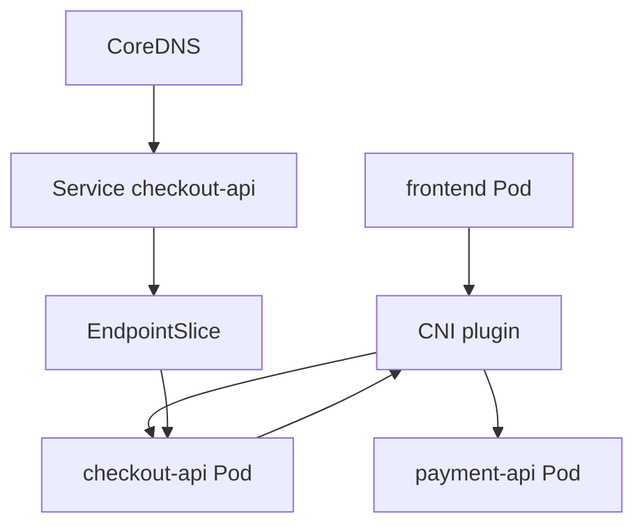

### Contrato mental

|Pieza|Pregunta que responde|
|---|---|
|Pod IP|¿Dónde está esta instancia ahora?|
|CNI|¿Cómo se conectan Pods en la red del cluster?|
|Service|¿Cuál es el nombre estable para llegar a un grupo de Pods?|
|EndpointSlice|¿Qué Pods concretos están detrás del Service?|
|DNS|¿Cómo resuelvo nombres en vez de IPs?|
|NetworkPolicy|¿Qué tráfico está permitido o bloqueado?|

### Criterio de comprensión

Debes poder explicar:

> Kubernetes networking no es una sola cosa. Es la colaboración entre Pods, CNI, Services, EndpointSlices, DNS, kube-proxy o equivalente, y policies.

---

## 7.4. Service

### Qué problema resuelve

Un Service proporciona una forma estable de acceder a un conjunto de Pods.

La documentación oficial define Service como un método para exponer una aplicación de red que se ejecuta como uno o más Pods en el cluster. También explica que los Services permiten que el frontend no tenga que rastrear directamente los Pods backend. ([Kubernetes](https://kubernetes.io/docs/concepts/services-networking/service/ "Service"))

### Contrato mental

Un Service responde a esta pregunta:

> ¿Cómo llamo a una aplicación aunque sus Pods cambien?

Un Service necesita normalmente:

- Un nombre
- Un namespace
- Un selector
- Uno o varios puertos
- Un tipo de Service
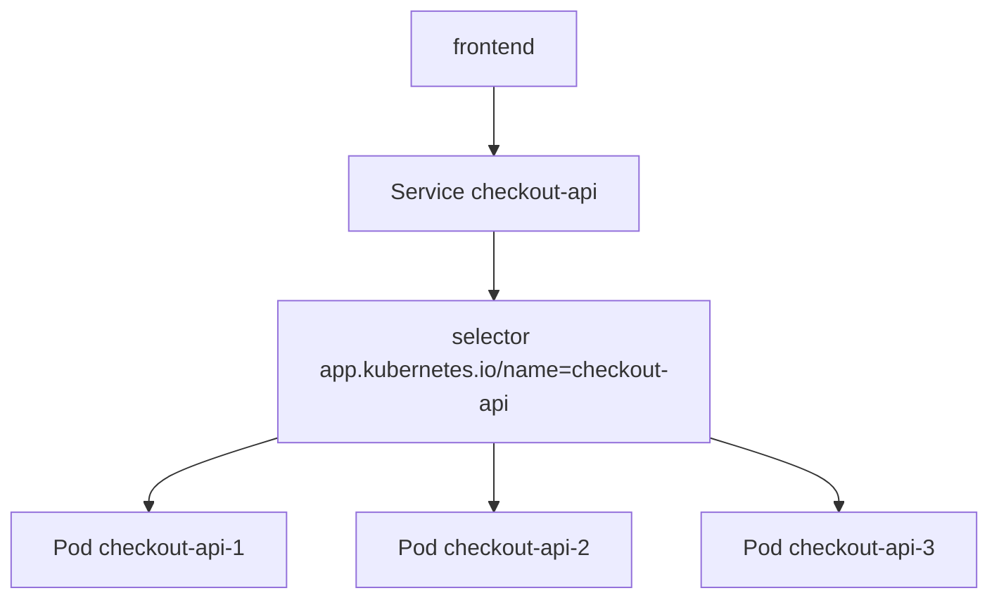

### Selector

El selector conecta el Service con Pods.

Ejemplo:

```yaml
selector:
  app.kubernetes.io/name: checkout-api
  app.kubernetes.io/component: api
```

Esto significa:

> Este Service apunta a los Pods que tengan estas labels.

### Puertos

Un Service tiene dos ideas importantes:

```yaml
ports:
  - name: http
    port: 80
    targetPort: http
```

|Campo|Significado|
|---|---|
|`port`|Puerto expuesto por el Service|
|`targetPort`|Puerto del contenedor o nombre de puerto en el Pod|
|`name`|Nombre del puerto del Service|

En nuestro Deployment, el contenedor tenía:

```yaml
ports:
  - name: http
    containerPort: 8080
```

Por eso el Service puede usar:

```yaml
targetPort: http
```

Esto es más robusto que repetir `8080` en todas partes.

### Manifest Service para `checkout-api`

Crea:

```text
kubernetes/03-service/checkout-api-service.yaml
```

Contenido:

```yaml
apiVersion: v1
kind: Service
metadata:
  name: checkout-api
  namespace: shop
  labels:
    app.kubernetes.io/name: checkout-api
    app.kubernetes.io/component: api
    app.kubernetes.io/part-of: shop
spec:
  type: ClusterIP
  selector:
    app.kubernetes.io/name: checkout-api
    app.kubernetes.io/component: api
  ports:
    - name: http
      port: 80
      targetPort: http
```

### Aplicar

```bash
kubectl apply -f kubernetes/03-service/checkout-api-service.yaml
```

### Ver

```bash
kubectl get svc -n shop
kubectl describe svc checkout-api -n shop
kubectl get endpointslices -n shop
```

### Validar con port-forward al Service

```bash
kubectl port-forward service/checkout-api -n shop 8080:80
```

En otra terminal:

```bash
task smoke
```

### Criterio de comprensión

Debes poder explicar:

> Un Service no ejecuta la aplicación. Da una identidad estable y una forma de enrutar tráfico hacia Pods seleccionados por labels.

---

## 7.5. Tipos de Service

Antes de elegir un tipo, hay que explicar el problema que resuelve cada uno.

Kubernetes soporta distintos tipos de Service para distintos tipos de exposición. La documentación oficial agrupa estos conceptos bajo Services, Load Balancing and Networking. ([Kubernetes](https://kubernetes.io/docs/concepts/services-networking/ "Services, Load Balancing, and Networking"))

### ClusterIP

`ClusterIP` expone el Service dentro del cluster.

Es el tipo por defecto.

Sirve para comunicación interna:

```text
frontend → checkout-api
checkout-api → payment-api
checkout-api → redis
```

### NodePort

`NodePort` expone el Service en un puerto de cada nodo.

Es útil para aprendizaje o casos concretos, pero no suele ser el mecanismo final más limpio para producción.

### LoadBalancer

`LoadBalancer` pide un balanceador externo al proveedor de infraestructura.

En clusters cloud gestionados, esto suele crear un load balancer real.

En kind no tendrás un load balancer cloud por defecto.

### Headless Service

Un Headless Service no asigna ClusterIP.

Se usa cuando quieres discovery directo de endpoints, especialmente en escenarios stateful o cuando necesitas controlar directamente las instancias.

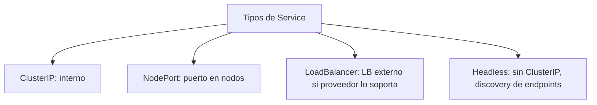

### Contrato mental

|Tipo|Cuándo usarlo|
|---|---|
|ClusterIP|Comunicación interna entre workloads|
|NodePort|Exposición simple por nodo, aprendizaje o casos concretos|
|LoadBalancer|Entrada externa gestionada por infraestructura|
|Headless|Discovery directo de Pods, frecuente en stateful|

### Para este módulo

Usaremos `ClusterIP` como tipo principal porque queremos enseñar comunicación interna y composición de servicios.

Ingress y Gateway API se verán después como entrada HTTP desde fuera.

### Criterio de comprensión

Debes poder explicar:

> El tipo de Service no se elige por costumbre. Se elige por el tipo de exposición que necesitas.

---

## 7.6. EndpointSlices

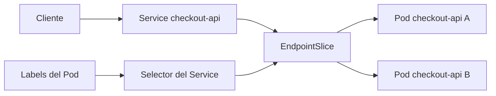

### Qué problema resuelven

Un Service necesita saber qué Pods están detrás.

Esa información se representa mediante EndpointSlices.

La documentación oficial indica que EndpointSlice es el mecanismo que Kubernetes usa para que un Service escale a muchos backends y para actualizar eficientemente la lista de endpoints sanos. También indica que normalmente los EndpointSlices están asociados a un Service y representan Pods backend. ([Kubernetes](https://kubernetes.io/docs/concepts/services-networking/endpoint-slices/ "EndpointSlices"))

### Contrato mental

|Pieza|Papel|
|---|---|
|Service|Nombre estable y puerto|
|Selector|Regla para encontrar Pods|
|EndpointSlice|Lista de endpoints concretos detrás del Service|
|Pod|Instancia real que recibe tráfico|

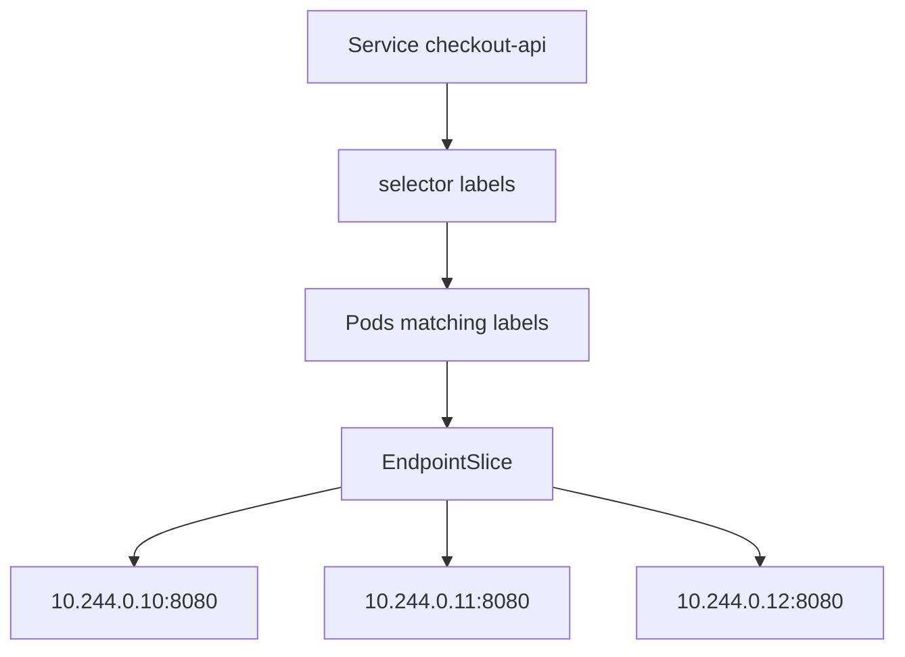

### Comandos

```bash
kubectl get endpointslices -n shop
kubectl describe endpointslice -n shop -l kubernetes.io/service-name=checkout-api
kubectl get endpointslices -n shop -l kubernetes.io/service-name=checkout-api -o yaml
```

### Inspección con `jq`

```bash
kubectl get endpointslices -n shop -l kubernetes.io/service-name=checkout-api -o json \
  | jq '.items[].endpoints'
```

### Failure lab: selector incorrecto

Si el selector del Service no coincide con las labels de los Pods, el Service existirá, pero no tendrá endpoints útiles.

Copia el Service:

```bash
cp kubernetes/03-service/checkout-api-service.yaml kubernetes/03-service/checkout-api-service-bad-selector.yaml
```

Cambia el nombre:

```bash
yq -i '.metadata.name = "checkout-api-bad-selector"' kubernetes/03-service/checkout-api-service-bad-selector.yaml
```

Rompe el selector:

```bash
yq -i '.spec.selector."app.kubernetes.io/name" = "does-not-exist"' kubernetes/03-service/checkout-api-service-bad-selector.yaml
```

Aplica:

```bash
kubectl apply -f kubernetes/03-service/checkout-api-service-bad-selector.yaml
```

Observa:

```bash
kubectl describe svc checkout-api-bad-selector -n shop
kubectl get endpointslices -n shop -l kubernetes.io/service-name=checkout-api-bad-selector
```

Limpia:

```bash
kubectl delete -f kubernetes/03-service/checkout-api-service-bad-selector.yaml --ignore-not-found
```

### Criterio de comprensión

Debes poder explicar:

> Si un Service no tiene endpoints, normalmente el problema está en selectors, labels, readiness o Pods inexistentes.

---

## 7.7. DNS interno

### Qué problema resuelve

No queremos que las aplicaciones llamen a Services por IP.

Queremos que usen nombres.

Kubernetes crea registros DNS para Services y Pods. La documentación oficial explica que los workloads pueden descubrir Services usando DNS, y que los contenedores pueden buscar Services por nombre en vez de IP. ([Kubernetes](https://kubernetes.io/docs/concepts/services-networking/dns-pod-service/ "DNS for Services and Pods"))

### Nombre corto dentro del mismo namespace

Desde un Pod en namespace `shop`, puedes llamar a:

```text
http://checkout-api
```

### Nombre con namespace

Desde otro namespace:

```text
http://checkout-api.shop
```

### Nombre completo

```text
checkout-api.shop.svc.cluster.local
```

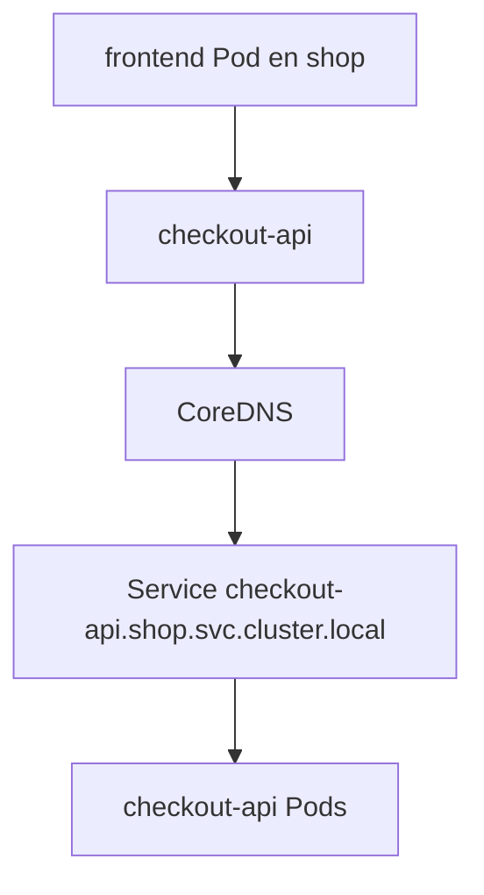

### Crear Pod de diagnóstico DNS

Crea:

```text
kubernetes/09-debug/dnsutils.yaml
```

Contenido:

```yaml
apiVersion: v1
kind: Pod
metadata:
  name: dnsutils
  namespace: shop
  labels:
    app.kubernetes.io/name: dnsutils
    app.kubernetes.io/component: debug
    app.kubernetes.io/part-of: shop
spec:
  restartPolicy: Never
  containers:
    - name: dnsutils
      image: registry.k8s.io/e2e-test-images/jessie-dnsutils:1.3
      command:
        - sleep
        - "3600"
```

La documentación oficial de debugging de DNS usa un Pod `dnsutils` para verificar resolución DNS dentro del cluster. ([Kubernetes](https://kubernetes.io/docs/tasks/administer-cluster/dns-debugging-resolution/ "Debugging DNS Resolution"))

Aplicar:

```bash
kubectl apply -f kubernetes/09-debug/dnsutils.yaml
```

Validar DNS:

```bash
kubectl exec -n shop dnsutils -- nslookup checkout-api
kubectl exec -n shop dnsutils -- nslookup checkout-api.shop
kubectl exec -n shop dnsutils -- nslookup checkout-api.shop.svc.cluster.local
```

Validar HTTP con `wget`:

```bash
kubectl exec -n shop dnsutils -- wget -qO- http://checkout-api/health
```

### Criterio de comprensión

Debes poder explicar:

> DNS interno permite que los workloads llamen a Services por nombres estables en vez de IPs efímeras.

---

## 7.8. Laboratorio base de networking para `shop`

Antes de hablar de Ingress, Gateway o NetworkPolicy, necesitamos un sistema mínimo con varias piezas.

Usaremos:

- `checkout-api`
- `payment-api`
- `redis`
- `postgres`
- `dnsutils`
Para no complicar demasiado el módulo, `payment-api`, `redis` y `postgres` pueden ser workloads sencillos. No buscamos todavía persistencia real ni lógica de negocio completa.

### Objetivo del laboratorio

Queremos poder validar:

```text
dnsutils → checkout-api Service
dnsutils → payment-api Service
checkout-api → variables de entorno con nombres internos
NetworkPolicy → permitir o bloquear tráfico
```

### `payment-api` Deployment

Crea:

```text
kubernetes/02-deployment/payment-api-deployment.yaml
```

Contenido:

```yaml
apiVersion: apps/v1
kind: Deployment
metadata:
  name: payment-api
  namespace: shop
  labels:
    app.kubernetes.io/name: payment-api
    app.kubernetes.io/component: api
    app.kubernetes.io/part-of: shop
spec:
  replicas: 2
  selector:
    matchLabels:
      app.kubernetes.io/name: payment-api
      app.kubernetes.io/component: api
  template:
    metadata:
      labels:
        app.kubernetes.io/name: payment-api
        app.kubernetes.io/component: api
        app.kubernetes.io/part-of: shop
    spec:
      containers:
        - name: payment-api
          image: nginx:1.27-alpine
          ports:
            - name: http
              containerPort: 80
          resources:
            requests:
              cpu: 50m
              memory: 64Mi
            limits:
              cpu: 100m
              memory: 128Mi
```

### `payment-api` Service

Crea:

```text
kubernetes/03-service/payment-api-service.yaml
```

Contenido:

```yaml
apiVersion: v1
kind: Service
metadata:
  name: payment-api
  namespace: shop
  labels:
    app.kubernetes.io/name: payment-api
    app.kubernetes.io/component: api
    app.kubernetes.io/part-of: shop
spec:
  type: ClusterIP
  selector:
    app.kubernetes.io/name: payment-api
    app.kubernetes.io/component: api
  ports:
    - name: http
      port: 80
      targetPort: http
```

### `redis` Deployment y Service

Crea:

```text
kubernetes/02-deployment/redis-deployment.yaml
```

```yaml
apiVersion: apps/v1
kind: Deployment
metadata:
  name: redis
  namespace: shop
  labels:
    app.kubernetes.io/name: redis
    app.kubernetes.io/component: cache
    app.kubernetes.io/part-of: shop
spec:
  replicas: 1
  selector:
    matchLabels:
      app.kubernetes.io/name: redis
      app.kubernetes.io/component: cache
  template:
    metadata:
      labels:
        app.kubernetes.io/name: redis
        app.kubernetes.io/component: cache
        app.kubernetes.io/part-of: shop
    spec:
      containers:
        - name: redis
          image: redis:7-alpine
          ports:
            - name: redis
              containerPort: 6379
          resources:
            requests:
              cpu: 50m
              memory: 64Mi
            limits:
              cpu: 200m
              memory: 256Mi
```

Crea:

```text
kubernetes/03-service/redis-service.yaml
```

```yaml
apiVersion: v1
kind: Service
metadata:
  name: redis
  namespace: shop
  labels:
    app.kubernetes.io/name: redis
    app.kubernetes.io/component: cache
    app.kubernetes.io/part-of: shop
spec:
  type: ClusterIP
  selector:
    app.kubernetes.io/name: redis
    app.kubernetes.io/component: cache
  ports:
    - name: redis
      port: 6379
      targetPort: redis
```

### Aplicar laboratorio

```bash
kubectl apply -f kubernetes/02-deployment/payment-api-deployment.yaml
kubectl apply -f kubernetes/03-service/payment-api-service.yaml
kubectl apply -f kubernetes/02-deployment/redis-deployment.yaml
kubectl apply -f kubernetes/03-service/redis-service.yaml
kubectl apply -f kubernetes/09-debug/dnsutils.yaml
```

### Validar

```bash
kubectl get deploy -n shop
kubectl get svc -n shop
kubectl get endpointslices -n shop
kubectl exec -n shop dnsutils -- nslookup checkout-api
kubectl exec -n shop dnsutils -- nslookup payment-api
kubectl exec -n shop dnsutils -- wget -qO- http://payment-api/
```

### Criterio de comprensión

Debes poder explicar:

> El laboratorio de networking necesita varios workloads porque el problema de red aparece cuando hay comunicación entre componentes, no cuando solo existe una API aislada.

---

## 7.9. Ingress

### Qué problema resuelve

Un Service `ClusterIP` sirve para comunicación interna.

Pero un usuario externo no entra al cluster llamando directamente a un ClusterIP.

Para entrada HTTP/HTTPS puedes usar Ingress.

La documentación oficial define Ingress como un objeto API que gestiona acceso externo a Services dentro del cluster, normalmente HTTP. También explica que Ingress puede proporcionar balanceo de carga, terminación TLS y virtual hosting basado en nombres. ([Kubernetes](https://kubernetes.io/docs/concepts/services-networking/service/ "Service"))

### Ingress mínimo para CKAD

Ingress expone servicios HTTP o HTTPS usando reglas.

Un Ingress no funciona solo.

Necesita un Ingress Controller instalado en el cluster.

### Manifest mínimo

```yaml
apiVersion: networking.k8s.io/v1
kind: Ingress
metadata:
  name: checkout-api
  namespace: shop
spec:
  rules:
    - host: checkout.local
      http:
        paths:
          - path: /
            pathType: Prefix
            backend:
              service:
                name: checkout-api
                port:
                  number: 80
```

### Validar

```bash
kubectl get ingress -n shop
kubectl describe ingress checkout-api -n shop
kubectl get svc -n shop
kubectl get endpointslice -n shop
```

### Probar localmente

Si el entorno local usa un Ingress Controller compatible, puedes probar con:

```bash
curl -H "Host: checkout.local" http://localhost/
```

### Errores frecuentes

| Síntoma | Posible causa |
|---|---|
| Ingress existe pero no responde | No hay Ingress Controller |
| 404 | Host o path no coincide |
| 503 | Service sin endpoints |
| Timeout | Controller no expuesto o red local mal configurada |
| Backend no encontrado | Nombre o puerto del Service incorrecto |

### Criterio de comprensión

Debes poder explicar:

> Ingress no envía tráfico a Pods directamente. Ingress enruta hacia Services, y los Services seleccionan Pods mediante EndpointSlices.
### Importante: Ingress necesita controller

Crear un recurso Ingress no basta.

Necesitas un Ingress Controller que implemente ese recurso.

La documentación oficial separa Ingress de Ingress Controllers precisamente porque el objeto Ingress es una declaración y el controller es quien la materializa. ([Kubernetes](https://kubernetes.io/docs/concepts/services-networking/service/ "Service"))

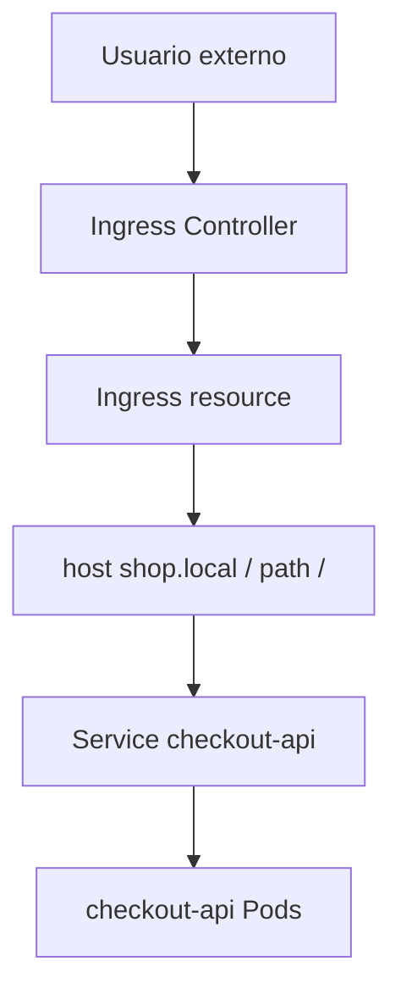

### Contrato mental

|Pieza|Papel|
|---|---|
|Ingress|Declara reglas HTTP|
|Ingress Controller|Implementa esas reglas|
|Service|Backend interno|
|Pod|Instancia real|
|DNS externo o `/etc/hosts`|Hace que el nombre llegue al controller|

### Manifest de ejemplo

Este manifest es válido como ejemplo, pero no funcionará si no tienes Ingress Controller instalado.

Crea:

```text
kubernetes/04-ingress/checkout-api-ingress.yaml
```

Contenido:

```yaml
apiVersion: networking.k8s.io/v1
kind: Ingress
metadata:
  name: checkout-api
  namespace: shop
  labels:
    app.kubernetes.io/name: checkout-api
    app.kubernetes.io/component: api
    app.kubernetes.io/part-of: shop
spec:
  rules:
    - host: shop.local
      http:
        paths:
          - path: /checkout
            pathType: Prefix
            backend:
              service:
                name: checkout-api
                port:
                  number: 80
          - path: /health
            pathType: Prefix
            backend:
              service:
                name: checkout-api
                port:
                  number: 80
          - path: /ready
            pathType: Prefix
            backend:
              service:
                name: checkout-api
                port:
                  number: 80
```

### Para este módulo

No haremos de Ingress la práctica principal obligatoria porque instalar un Ingress Controller en kind añade fricción.

Sí debes entender el modelo.

En una práctica avanzada puedes instalar `ingress-nginx` para kind, pero eso pertenece más a un laboratorio adicional.

### Criterio de comprensión

Debes poder explicar:

> Ingress declara reglas de entrada HTTP, pero no funciona por sí solo. Necesita un Ingress Controller.

---

## 7.10. Gateway API

### Qué problema resuelve

Gateway API es el modelo más moderno y expresivo para routing y entrada de tráfico en Kubernetes.

La documentación oficial de Kubernetes explica que Gateway API es una familia de API kinds para aprovisionamiento dinámico de infraestructura y routing avanzado, mediante un mecanismo extensible, orientado a roles y consciente del protocolo. ([Kubernetes](https://kubernetes.io/docs/concepts/services-networking/gateway/ "Gateway API"))

La documentación oficial del proyecto Gateway API lo presenta como un proyecto oficial de Kubernetes centrado en routing L4 y L7, y como la siguiente generación de APIs de Ingress, Load Balancing y Service Mesh. También explica que su modelo está diseñado alrededor de roles y recursos separados. ([Kubernetes Gateway API](https://gateway-api.sigs.k8s.io/ "Kubernetes Gateway API: Introduction"))

### Por qué aparece Gateway API

Ingress es útil, pero tiene límites:

- Modelo pequeño
- Extensibilidad frecuente vía annotations
- Separación de responsabilidades limitada
- Menos expresivo para routing avanzado
- Diferencias entre controllers
Gateway API intenta mejorar esto separando roles:

- Infraestructura de gateway
- Reglas de routing
- Backends
- Responsabilidades entre platform y application teams
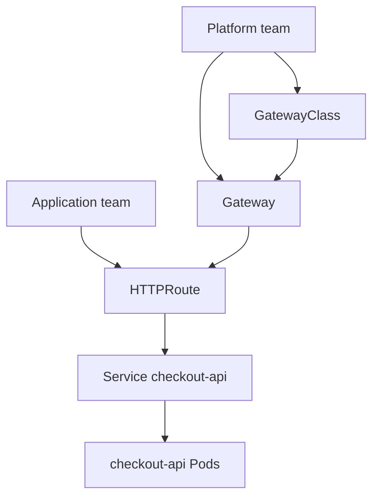

### Contrato mental

|Recurso|Responsable típico|Qué declara|
|---|---|---|
|GatewayClass|Platform team|Tipo de gateway disponible|
|Gateway|Platform team|Punto de entrada y listeners|
|HTTPRoute|App team|Reglas HTTP hacia Services|
|Service|App team|Backend interno|
|Pod|Workload|Instancia real|

### Manifest conceptual de HTTPRoute

Este manifest requiere que Gateway API esté instalado y que exista un Gateway compatible.

```yaml
apiVersion: gateway.networking.k8s.io/v1
kind: HTTPRoute
metadata:
  name: checkout-api
  namespace: shop
spec:
  parentRefs:
    - name: shop-gateway
  hostnames:
    - shop.local
  rules:
    - matches:
        - path:
            type: PathPrefix
            value: /checkout
      backendRefs:
        - name: checkout-api
          port: 80
```

### Para este módulo

Gateway API se explica como modelo moderno y se deja como práctica opcional, porque en kind requiere instalar CRDs y un controller compatible.

La prioridad obligatoria del módulo será entender Services, DNS, EndpointSlices y NetworkPolicy.

### Criterio de comprensión

Debes poder explicar:

> Gateway API no es solo “Ingress nuevo”. Es un modelo más expresivo y orientado a roles para entrada y routing.

---

## 7.11. NetworkPolicy

### Qué problema resuelve

Por defecto, muchos clusters permiten comunicación amplia entre Pods.

Si quieres controlar qué Pods pueden hablar con qué Pods, necesitas NetworkPolicy.

La documentación oficial explica que NetworkPolicies permiten especificar reglas de tráfico a nivel IP o puerto, tanto dentro del cluster como entre Pods y el exterior. También advierte que el cluster debe usar un plugin de red que soporte enforcement de NetworkPolicy. ([Kubernetes](https://kubernetes.io/docs/concepts/services-networking/network-policies/ "Network Policies"))

### Contrato mental

Una NetworkPolicy responde a esta pregunta:

> ¿Qué tráfico está permitido para los Pods seleccionados?

Puntos clave:

- Selecciona Pods con `podSelector`
- Puede definir reglas de ingress
- Puede definir reglas de egress
- Si no hay NetworkPolicy que seleccione un Pod, normalmente ese Pod no está aislado por NetworkPolicy
- Cuando una policy selecciona un Pod para ingress o egress, el tráfico permitido queda definido por las reglas
- No funciona si el CNI no implementa NetworkPolicy
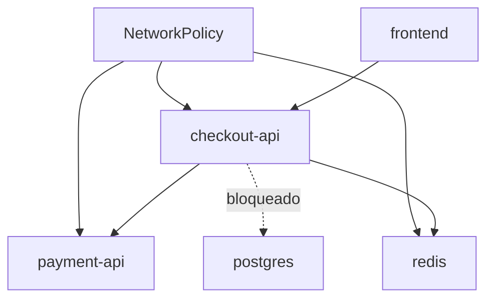

### Diseño para `shop`

Queremos una política progresiva, no una política gigante desde el inicio.

Primero:

1. Crear una política default deny para ingress
2. Permitir tráfico hacia `checkout-api` desde Pods debug o frontend
3. Permitir tráfico hacia `payment-api` desde `checkout-api`
4. Permitir tráfico hacia `redis` desde `checkout-api`
### Importante para kind

kind puede no aplicar NetworkPolicy según el CNI usado en tu cluster local.

Si tu cluster no usa un CNI con soporte de NetworkPolicy, los manifiestos se aceptarán, pero no tendrán efecto real de bloqueo.

Esto es una limitación importante que debes explicar al alumno antes de la práctica.

### Criterio de comprensión

Debes poder explicar:

> NetworkPolicy es declarativa, pero su enforcement depende del CNI. Si el CNI no la soporta, aplicar YAML no bloquea tráfico.

---

## 7.12. NetworkPolicy: default deny ingress

### Qué problema resuelve

Una default deny policy cambia el punto de partida.

En vez de permitir todo por defecto para los Pods seleccionados, dices:

> Para estos Pods, no se permite tráfico entrante salvo que otra policy lo permita.

### Manifest

Crea:

```text
kubernetes/10-networkpolicy/default-deny-ingress.yaml
```

Contenido:

```yaml
apiVersion: networking.k8s.io/v1
kind: NetworkPolicy
metadata:
  name: default-deny-ingress
  namespace: shop
spec:
  podSelector: {}
  policyTypes:
    - Ingress
```

### Qué significa

|Campo|Significado|
|---|---|
|`podSelector: {}`|Selecciona todos los Pods del namespace|
|`policyTypes: Ingress`|Aplica aislamiento de tráfico entrante|
|Sin reglas `ingress`|No permite ingress salvo otras policies|

### Aplicar

```bash
kubectl apply -f kubernetes/10-networkpolicy/default-deny-ingress.yaml
```

### Ver

```bash
kubectl get networkpolicy -n shop
kubectl describe networkpolicy default-deny-ingress -n shop
```

### Criterio de comprensión

Debes poder explicar:

> Una default deny ingress policy no dice quién puede entrar. Dice que nadie puede entrar salvo que otra policy lo permita.

---

## 7.13. NetworkPolicy: permitir tráfico hacia `checkout-api`

### Qué problema resuelve

Después de cerrar por defecto, necesitamos abrir lo mínimo necesario.

Para el laboratorio, permitiremos que el Pod `dnsutils` pueda llamar a `checkout-api`.

### Manifest

Crea:

```text
kubernetes/10-networkpolicy/allow-dnsutils-to-checkout-api.yaml
```

Contenido:

```yaml
apiVersion: networking.k8s.io/v1
kind: NetworkPolicy
metadata:
  name: allow-dnsutils-to-checkout-api
  namespace: shop
spec:
  podSelector:
    matchLabels:
      app.kubernetes.io/name: checkout-api
      app.kubernetes.io/component: api
  policyTypes:
    - Ingress
  ingress:
    - from:
        - podSelector:
            matchLabels:
              app.kubernetes.io/name: dnsutils
              app.kubernetes.io/component: debug
      ports:
        - protocol: TCP
          port: 8080
```

### Validar

Si tu CNI soporta NetworkPolicy:

```bash
kubectl exec -n shop dnsutils -- wget -qO- http://checkout-api/health
```

Debería funcionar.

Si pruebas desde otro Pod no permitido, debería bloquearse.

### Criterio de comprensión

Debes poder explicar:

> NetworkPolicy permite expresar comunicación por identidad de Pods y puertos, no por IPs fijas.

---

## 7.14. NetworkPolicy: permitir `checkout-api` hacia `payment-api`

### Qué problema resuelve

Queremos que `checkout-api` pueda hablar con `payment-api`, pero no queremos abrir `payment-api` a todo el namespace.

### Manifest

Crea:

```text
kubernetes/10-networkpolicy/allow-checkout-to-payment-api.yaml
```

Contenido:

```yaml
apiVersion: networking.k8s.io/v1
kind: NetworkPolicy
metadata:
  name: allow-checkout-to-payment-api
  namespace: shop
spec:
  podSelector:
    matchLabels:
      app.kubernetes.io/name: payment-api
      app.kubernetes.io/component: api
  policyTypes:
    - Ingress
  ingress:
    - from:
        - podSelector:
            matchLabels:
              app.kubernetes.io/name: checkout-api
              app.kubernetes.io/component: api
      ports:
        - protocol: TCP
          port: 80
```

### Qué enseña

Esta policy selecciona `payment-api`.

Luego permite ingress desde Pods con labels de `checkout-api`.

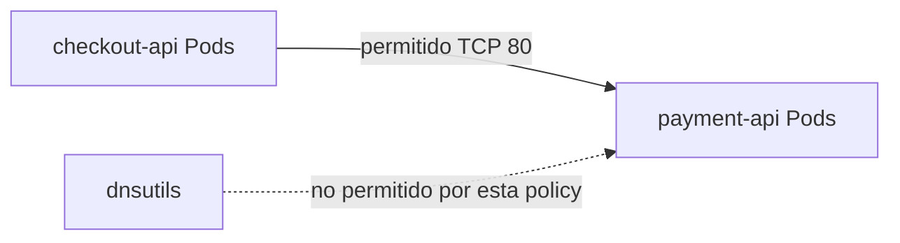

### Criterio de comprensión

Debes poder explicar:

> En NetworkPolicy, `podSelector` selecciona los Pods protegidos por la policy. Las reglas `from` o `to` definen quién puede comunicarse.

---

## 7.15. Troubleshooting progresivo de networking

Antes de añadir más YAML, hay que enseñar cómo diagnosticar.

La secuencia debe ser progresiva.

No empieces por el CNI.

Empieza por lo más barato y visible.

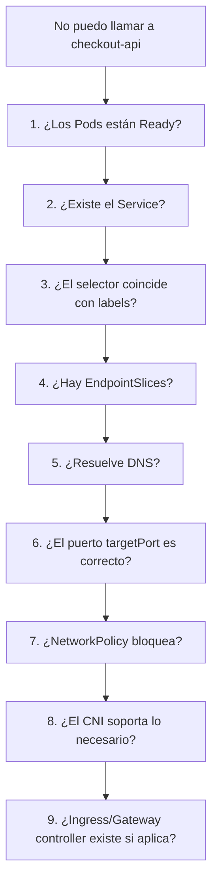

### Paso 1. Pods

```bash
kubectl get pods -n shop -o wide
kubectl get pods -n shop -l app.kubernetes.io/name=checkout-api
```

Pregunta:

> ¿Hay Pods? ¿Están Ready?

### Paso 2. Service

```bash
kubectl get svc -n shop
kubectl describe svc checkout-api -n shop
```

Pregunta:

> ¿Existe el Service? ¿Tiene el puerto esperado?

### Paso 3. Selector y labels

```bash
kubectl get svc checkout-api -n shop -o json | jq '.spec.selector'
kubectl get pods -n shop --show-labels
```

Pregunta:

> ¿El selector del Service coincide con labels reales de Pods?

### Paso 4. EndpointSlices

```bash
kubectl get endpointslices -n shop -l kubernetes.io/service-name=checkout-api
kubectl describe endpointslice -n shop -l kubernetes.io/service-name=checkout-api
```

Pregunta:

> ¿Hay endpoints detrás del Service?

### Paso 5. DNS

```bash
kubectl exec -n shop dnsutils -- nslookup checkout-api
kubectl exec -n shop dnsutils -- nslookup checkout-api.shop.svc.cluster.local
```

Pregunta:

> ¿El nombre resuelve?

### Paso 6. HTTP desde dentro

```bash
kubectl exec -n shop dnsutils -- wget -qO- http://checkout-api/health
```

Pregunta:

> ¿El Service responde desde dentro del cluster?

### Paso 7. NetworkPolicy

```bash
kubectl get networkpolicy -n shop
kubectl describe networkpolicy -n shop
```

Pregunta:

> ¿Hay alguna policy aislando el tráfico?

### Paso 8. Events

```bash
kubectl get events -n shop --sort-by=.metadata.creationTimestamp
```

Pregunta:

> ¿Hay señales del sistema?

### Criterio de comprensión

Debes poder explicar:

> Troubleshooting de networking en Kubernetes debe avanzar desde Pods y Services hacia DNS, EndpointSlices, NetworkPolicy, CNI y controllers. Saltar directamente al CNI suele ser perder tiempo.

---

## 7.16. Taskfile del módulo 7

Añade estas tareas al `Taskfile.yml`.

```yaml
  k8s:service:apply:
    desc: Apply checkout-api Service
    cmds:
      - kubectl apply -f kubernetes/03-service/checkout-api-service.yaml

  k8s:service:apply:all:
    desc: Apply all shop Services
    cmds:
      - kubectl apply -f kubernetes/03-service/checkout-api-service.yaml
      - kubectl apply -f kubernetes/03-service/payment-api-service.yaml
      - kubectl apply -f kubernetes/03-service/redis-service.yaml

  k8s:service:status:
    desc: Show Services and EndpointSlices
    cmds:
      - kubectl get svc -n {{.NAMESPACE}}
      - kubectl get endpointslices -n {{.NAMESPACE}}

  k8s:service:describe:checkout:
    desc: Describe checkout-api Service
    cmds:
      - kubectl describe svc checkout-api -n {{.NAMESPACE}}

  k8s:endpoints:checkout:
    desc: Show checkout-api EndpointSlices
    cmds:
      - kubectl get endpointslices -n {{.NAMESPACE}} -l kubernetes.io/service-name=checkout-api -o yaml

  k8s:endpoints:checkout:json:
    desc: Show checkout-api endpoints as JSON summary
    cmds:
      - kubectl get endpointslices -n {{.NAMESPACE}} -l kubernetes.io/service-name=checkout-api -o json | jq '.items[].endpoints'

  k8s:debug:dns:apply:
    desc: Apply dnsutils debug Pod
    cmds:
      - kubectl apply -f kubernetes/09-debug/dnsutils.yaml

  k8s:debug:dns:delete:
    desc: Delete dnsutils debug Pod
    cmds:
      - kubectl delete -f kubernetes/09-debug/dnsutils.yaml --ignore-not-found

  k8s:debug:dns:checkout:
    desc: Resolve checkout-api DNS names
    cmds:
      - kubectl exec -n {{.NAMESPACE}} dnsutils -- nslookup checkout-api
      - kubectl exec -n {{.NAMESPACE}} dnsutils -- nslookup checkout-api.{{.NAMESPACE}}
      - kubectl exec -n {{.NAMESPACE}} dnsutils -- nslookup checkout-api.{{.NAMESPACE}}.svc.cluster.local

  k8s:debug:http:checkout:
    desc: Call checkout-api from dnsutils Pod
    cmds:
      - kubectl exec -n {{.NAMESPACE}} dnsutils -- wget -qO- http://checkout-api/health
      - kubectl exec -n {{.NAMESPACE}} dnsutils -- wget -qO- http://checkout-api/ready
      - kubectl exec -n {{.NAMESPACE}} dnsutils -- wget -qO- http://checkout-api/checkout

  k8s:network:shop:apply:
    desc: Apply shop networking lab workloads and services
    cmds:
      - kubectl apply -f kubernetes/02-deployment/payment-api-deployment.yaml
      - kubectl apply -f kubernetes/03-service/payment-api-service.yaml
      - kubectl apply -f kubernetes/02-deployment/redis-deployment.yaml
      - kubectl apply -f kubernetes/03-service/redis-service.yaml
      - kubectl apply -f kubernetes/09-debug/dnsutils.yaml

  k8s:network:shop:status:
    desc: Show shop networking lab status
    cmds:
      - kubectl get deploy -n {{.NAMESPACE}}
      - kubectl get pods -n {{.NAMESPACE}} -o wide
      - kubectl get svc -n {{.NAMESPACE}}
      - kubectl get endpointslices -n {{.NAMESPACE}}

  k8s:network:troubleshoot:checkout:
    desc: Troubleshoot checkout-api networking progressively
    cmds:
      - kubectl get pods -n {{.NAMESPACE}} -l app.kubernetes.io/name=checkout-api -o wide
      - kubectl get svc checkout-api -n {{.NAMESPACE}} -o yaml
      - kubectl get svc checkout-api -n {{.NAMESPACE}} -o json | jq '.spec.selector'
      - kubectl get pods -n {{.NAMESPACE}} --show-labels
      - kubectl get endpointslices -n {{.NAMESPACE}} -l kubernetes.io/service-name=checkout-api
      - kubectl exec -n {{.NAMESPACE}} dnsutils -- nslookup checkout-api || true
      - kubectl exec -n {{.NAMESPACE}} dnsutils -- wget -qO- http://checkout-api/health || true
      - kubectl get networkpolicy -n {{.NAMESPACE}} || true
      - kubectl get events -n {{.NAMESPACE}} --sort-by=.metadata.creationTimestamp

  k8s:failure:service:bad-selector:apply:
    desc: Apply checkout-api Service with wrong selector
    cmds:
      - cp kubernetes/03-service/checkout-api-service.yaml kubernetes/03-service/checkout-api-service-bad-selector.yaml
      - yq -i '.metadata.name = "checkout-api-bad-selector"' kubernetes/03-service/checkout-api-service-bad-selector.yaml
      - yq -i '.spec.selector."app.kubernetes.io/name" = "does-not-exist"' kubernetes/03-service/checkout-api-service-bad-selector.yaml
      - kubectl apply -f kubernetes/03-service/checkout-api-service-bad-selector.yaml

  k8s:failure:service:bad-selector:inspect:
    desc: Inspect Service with wrong selector
    cmds:
      - kubectl describe svc checkout-api-bad-selector -n {{.NAMESPACE}} || true
      - kubectl get endpointslices -n {{.NAMESPACE}} -l kubernetes.io/service-name=checkout-api-bad-selector || true

  k8s:failure:service:bad-selector:delete:
    desc: Delete Service with wrong selector
    cmds:
      - kubectl delete -f kubernetes/03-service/checkout-api-service-bad-selector.yaml --ignore-not-found || true

  k8s:networkpolicy:apply:
    desc: Apply NetworkPolicies
    cmds:
      - kubectl apply -f kubernetes/10-networkpolicy/default-deny-ingress.yaml
      - kubectl apply -f kubernetes/10-networkpolicy/allow-dnsutils-to-checkout-api.yaml
      - kubectl apply -f kubernetes/10-networkpolicy/allow-checkout-to-payment-api.yaml

  k8s:networkpolicy:status:
    desc: Show NetworkPolicies
    cmds:
      - kubectl get networkpolicy -n {{.NAMESPACE}}
      - kubectl describe networkpolicy -n {{.NAMESPACE}}

  k8s:networkpolicy:delete:
    desc: Delete NetworkPolicies
    cmds:
      - kubectl delete -f kubernetes/10-networkpolicy/allow-checkout-to-payment-api.yaml --ignore-not-found
      - kubectl delete -f kubernetes/10-networkpolicy/allow-dnsutils-to-checkout-api.yaml --ignore-not-found
      - kubectl delete -f kubernetes/10-networkpolicy/default-deny-ingress.yaml --ignore-not-found

  k8s:service:port-forward:
    desc: Forward local port to checkout-api Service
    cmds:
      - kubectl port-forward service/checkout-api -n {{.NAMESPACE}} {{.PORT}}:80
```

### Criterio DevEx

Debes poder explicar:

> Una buena DevEx de networking no consiste en tener comandos para aplicar YAML. Consiste en tener comandos para validar Services, selectors, EndpointSlices, DNS, HTTP interno, policies y troubleshooting progresivo.

---

## 7.17. Práctica principal del módulo

### Objetivo

Convertir `checkout-api` en una aplicación accesible mediante Service, validar DNS interno, añadir dependencias de laboratorio y practicar troubleshooting progresivo.

### Resultado esperado

Al final deberías tener:

```text
kubernetes-learning-lab/
  kubernetes/
    02-deployment/
      deployment.yaml
      payment-api-deployment.yaml
      redis-deployment.yaml
    03-service/
      checkout-api-service.yaml
      payment-api-service.yaml
      redis-service.yaml
      checkout-api-service-bad-selector.yaml
    04-ingress/
      checkout-api-ingress.yaml
    09-debug/
      dnsutils.yaml
    10-networkpolicy/
      default-deny-ingress.yaml
      allow-dnsutils-to-checkout-api.yaml
      allow-checkout-to-payment-api.yaml
```

### Paso 1. Preparar cluster y workloads base

```bash
task k8s:kind:create
task k8s:image:prepare
task k8s:namespace:apply
task k8s:deployment:apply
task k8s:deployment:status
```

### Paso 2. Aplicar Service de `checkout-api`

```bash
task k8s:service:apply
task k8s:service:status
task k8s:service:describe:checkout
task k8s:endpoints:checkout:json
```

### Paso 3. Validar Service con port-forward

En una terminal:

```bash
task k8s:service:port-forward
```

En otra:

```bash
task smoke
```

### Paso 4. Aplicar laboratorio de red

```bash
task k8s:network:shop:apply
task k8s:network:shop:status
```

### Paso 5. Validar DNS interno

```bash
task k8s:debug:dns:checkout
```

### Paso 6. Validar HTTP interno

```bash
task k8s:debug:http:checkout
```

### Paso 7. Provocar Service con selector incorrecto

```bash
task k8s:failure:service:bad-selector:apply
task k8s:failure:service:bad-selector:inspect
task k8s:failure:service:bad-selector:delete
```

### Paso 8. Aplicar NetworkPolicies

Antes de ejecutar este paso, recuerda:

> Si el CNI de tu cluster no soporta NetworkPolicy, las policies pueden aceptarse pero no bloquear tráfico.

```bash
task k8s:networkpolicy:apply
task k8s:networkpolicy:status
task k8s:debug:http:checkout
```

### Paso 9. Ejecutar troubleshooting progresivo

```bash
task k8s:network:troubleshoot:checkout
```

### Paso 10. Limpiar

```bash
task k8s:networkpolicy:delete
task k8s:debug:dns:delete
kubectl delete -f kubernetes/03-service/redis-service.yaml --ignore-not-found
kubectl delete -f kubernetes/02-deployment/redis-deployment.yaml --ignore-not-found
kubectl delete -f kubernetes/03-service/payment-api-service.yaml --ignore-not-found
kubectl delete -f kubernetes/02-deployment/payment-api-deployment.yaml --ignore-not-found
kubectl delete -f kubernetes/03-service/checkout-api-service.yaml --ignore-not-found
kubectl delete -f kubernetes/02-deployment/deployment.yaml --ignore-not-found
task k8s:namespace:delete
task k8s:kind:delete
```

### Criterio de finalización

La práctica está completa cuando puedes explicar:

- Por qué `checkout-api` necesita un Service
- Cómo el Service encuentra Pods
- Qué ocurre si el selector está mal
- Qué son EndpointSlices
- Cómo DNS resuelve `checkout-api`
- Cómo validar HTTP interno desde un Pod
- Por qué `port-forward service/...` es mejor que `port-forward pod/...` para esta fase
- Qué hace una NetworkPolicy
- Por qué NetworkPolicy depende del CNI
- Cómo diagnosticar un fallo de red paso a paso
---

## 7.18. Ejercicios cortos

### Ejercicio 1. Service y selectors

Ejecuta:

```bash
kubectl get svc checkout-api -n shop -o yaml
kubectl get pods -n shop --show-labels
```

Responde:

- ¿Qué selector usa el Service?
- ¿Qué Pods coinciden?
- ¿Qué pasaría si cambias una label del Pod?
- ¿Qué pasaría si cambias el selector del Service?
---

### Ejercicio 2. EndpointSlices

Ejecuta:

```bash
kubectl get endpointslices -n shop -l kubernetes.io/service-name=checkout-api
kubectl get endpointslices -n shop -l kubernetes.io/service-name=checkout-api -o json | jq '.items[].endpoints'
```

Responde:

- ¿Cuántos endpoints ves?
- ¿Coincide con las réplicas ready?
- ¿Qué pasa durante un rollout?
- ¿Qué pasa si la readiness falla?
---

### Ejercicio 3. DNS

Ejecuta:

```bash
kubectl exec -n shop dnsutils -- nslookup checkout-api
kubectl exec -n shop dnsutils -- nslookup checkout-api.shop
kubectl exec -n shop dnsutils -- nslookup checkout-api.shop.svc.cluster.local
```

Responde:

- ¿Qué nombres resuelven?
- ¿Cuál usarías dentro del mismo namespace?
- ¿Cuál usarías desde otro namespace?
- ¿Por qué no usarías IPs directas?
---

### Ejercicio 4. HTTP interno

Ejecuta:

```bash
kubectl exec -n shop dnsutils -- wget -qO- http://checkout-api/health
kubectl exec -n shop dnsutils -- wget -qO- http://checkout-api/ready
kubectl exec -n shop dnsutils -- wget -qO- http://checkout-api/checkout
```

Responde:

- ¿Qué endpoint valida proceso vivo?
- ¿Qué endpoint valida readiness?
- ¿Qué endpoint valida flujo funcional mínimo?
- ¿Por qué esto es mejor que probar solo desde fuera?
---

### Ejercicio 5. Service roto

Ejecuta:

```bash
task k8s:failure:service:bad-selector:apply
task k8s:failure:service:bad-selector:inspect
```

Responde:

- ¿El Service existe?
- ¿Tiene endpoints?
- ¿Cuál es el selector?
- ¿Qué labels tienen los Pods reales?
- ¿Dónde está el fallo?
Limpia:

```bash
task k8s:failure:service:bad-selector:delete
```

---

### Ejercicio 6. NetworkPolicy

Ejecuta:

```bash
task k8s:networkpolicy:apply
task k8s:networkpolicy:status
```

Responde:

- ¿Qué Pods selecciona la default deny?
- ¿Qué Pods pueden llamar a `checkout-api`?
- ¿Qué Pods pueden llamar a `payment-api`?
- ¿Tu CNI aplica realmente las policies?
- ¿Cómo lo comprobarías?
---

### Ejercicio 7. Ingress vs Gateway API

Completa:

|Pregunta|Ingress|Gateway API|
|---|---|---|
|¿Necesita controller?|||
|¿Está orientado a HTTP?|||
|¿Separa mejor responsabilidades?|||
|¿Es más expresivo para routing avanzado?|||
|¿Lo usarás como práctica obligatoria en kind?|||

---

## 7.19. Errores habituales

### Error 1. Llamar a Pods por IP

Las Pod IPs son efímeras.

Usa Services y DNS.

---

### Error 2. Crear Service sin revisar selectors

Un Service con selector incorrecto puede existir perfectamente y no apuntar a ningún Pod.

Mira siempre:

```bash
kubectl describe svc
kubectl get endpointslices
kubectl get pods --show-labels
```

---

### Error 3. Confundir `port` y `targetPort`

`port` es el puerto del Service.

`targetPort` es el puerto del Pod o nombre de puerto del contenedor.

---

### Error 4. Pensar que Ingress funciona sin controller

El recurso Ingress declara reglas.

El Ingress Controller las implementa.

Sin controller, el YAML no te da entrada real.

---

### Error 5. Pensar que Gateway API funciona solo por crear HTTPRoute

Gateway API requiere CRDs y un controller compatible.

Además, normalmente necesita GatewayClass y Gateway configurados.

---

### Error 6. Aplicar NetworkPolicy y asumir que bloquea

NetworkPolicy requiere CNI con soporte de enforcement.

Si el CNI no lo soporta, la policy puede aceptarse sin bloquear tráfico.

---

### Error 7. Diagnosticar DNS antes de revisar Service

Si el Service no existe o no tiene endpoints, DNS puede resolver y aun así la app no responder.

Sigue una secuencia:

```text
Pods → Service → selectors → EndpointSlices → DNS → HTTP → NetworkPolicy → CNI
```

---

### Error 8. Usar NodePort como solución por defecto

NodePort puede servir para aprender o casos concretos, pero no debe ser tu respuesta automática para entrada HTTP profesional.

Para entrada HTTP, revisa Ingress o Gateway API.

---

## 7.20. Criterio de salida del módulo

Puedes pasar al módulo 8 cuando puedas hacer todo esto sin seguir una receta ciegamente.

### Conceptos

Debes poder explicar:

- Por qué los Pods necesitan Services
- Qué es una Pod IP
- Qué problema resuelve un Service
- Qué diferencia hay entre `ClusterIP`, `NodePort`, `LoadBalancer` y `Headless Service`
- Qué son EndpointSlices
- Cómo un Service encuentra Pods
- Qué papel tienen labels y selectors
- Cómo funciona el DNS interno para Services
- Qué es Ingress
- Por qué Ingress necesita controller
- Qué es Gateway API
- Qué diferencia conceptual hay entre Ingress y Gateway API
- Qué es NetworkPolicy
- Por qué NetworkPolicy depende del CNI
- Qué orden seguir para troubleshooting progresivo de red
### Práctica

Debes poder:

- Aplicar el Service de `checkout-api`
- Validar el Service con `port-forward`
- Inspeccionar Services
- Inspeccionar EndpointSlices
- Crear y usar `dnsutils`
- Resolver `checkout-api`
- Llamar a `checkout-api` desde dentro del cluster
- Aplicar `payment-api` y `redis` como dependencias de laboratorio
- Provocar un Service con selector incorrecto
- Diagnosticar que no tiene endpoints
- Aplicar NetworkPolicies
- Entender si tu CNI las aplica realmente
- Ejecutar troubleshooting progresivo con Taskfile
### DevEx

Debes poder ejecutar:

```bash
task k8s:service:apply
task k8s:service:status
task k8s:service:describe:checkout
task k8s:endpoints:checkout:json
task k8s:service:port-forward
task smoke
task k8s:network:shop:apply
task k8s:network:shop:status
task k8s:debug:dns:checkout
task k8s:debug:http:checkout
task k8s:failure:service:bad-selector:apply
task k8s:failure:service:bad-selector:inspect
task k8s:failure:service:bad-selector:delete
task k8s:networkpolicy:apply
task k8s:networkpolicy:status
task k8s:network:troubleshoot:checkout
```

### Frase final de comprensión

Debes poder explicar esta frase:

> Kubernetes networking convierte Pods efímeros en comunicación estable mediante Services, selectors, EndpointSlices y DNS; controla entrada HTTP con Ingress o Gateway API; y limita comunicación con NetworkPolicies cuando el CNI lo soporta.

---

## 7.21. Referencias oficiales

|Tema|Referencia|
|---|---|
|Services, Load Balancing and Networking|Kubernetes Docs, Services, Load Balancing, and Networking. ([Kubernetes](https://kubernetes.io/docs/concepts/services-networking/ "Services, Load Balancing, and Networking"))|
|Service|Kubernetes Docs, Service. ([Kubernetes](https://kubernetes.io/docs/concepts/services-networking/service/ "Service"))|
|EndpointSlices|Kubernetes Docs, EndpointSlices. ([Kubernetes](https://kubernetes.io/docs/concepts/services-networking/endpoint-slices/ "EndpointSlices"))|
|DNS for Services and Pods|Kubernetes Docs, DNS for Services and Pods. ([Kubernetes](https://kubernetes.io/docs/concepts/services-networking/dns-pod-service/ "DNS for Services and Pods"))|
|Debugging DNS Resolution|Kubernetes Docs, Debugging DNS Resolution. ([Kubernetes](https://kubernetes.io/docs/tasks/administer-cluster/dns-debugging-resolution/ "Debugging DNS Resolution"))|
|NetworkPolicy|Kubernetes Docs, Network Policies. ([Kubernetes](https://kubernetes.io/docs/concepts/services-networking/network-policies/ "Network Policies"))|
|CNI / Network Plugins|Kubernetes Docs, Network Plugins. ([Kubernetes](https://kubernetes.io/docs/concepts/extend-kubernetes/compute-storage-net/network-plugins/ "Network Plugins"))|
|Gateway API|Kubernetes Docs, Gateway API. ([Kubernetes](https://kubernetes.io/docs/concepts/services-networking/gateway/ "Gateway API"))|
|Gateway API project|Kubernetes Gateway API official documentation. ([Kubernetes Gateway API](https://gateway-api.sigs.k8s.io/ "Kubernetes Gateway API: Introduction"))|
|Gateway API v1.3|Kubernetes Blog, Gateway API v1.3.0. ([Kubernetes](https://kubernetes.io/blog/2025/06/02/gateway-api-v1-3/ "Gateway API v1.3.0: Advancements in Request Mirroring ..."))|

## 7.22. Lecturas de apoyo

|Libro|Qué leer|
|---|---|
|_Kubernetes in Action_|Capítulo 5: Services, endpoints, NodePort, LoadBalancer, Ingress, readiness, headless services, DNS y troubleshooting de Services.|
|_Kubernetes: Up and Running_|Capítulos 7 y 8: Service Discovery e Ingress.|
|_Cloud Native DevOps with Kubernetes_|Capítulos 4, 7, 9 y 15: Services, Ingress, kubectl, debugging, observabilidad y networking operativo.|
|_Kubernetes Patterns_|Capítulo 12: Service Discovery.|