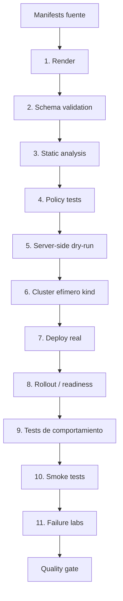
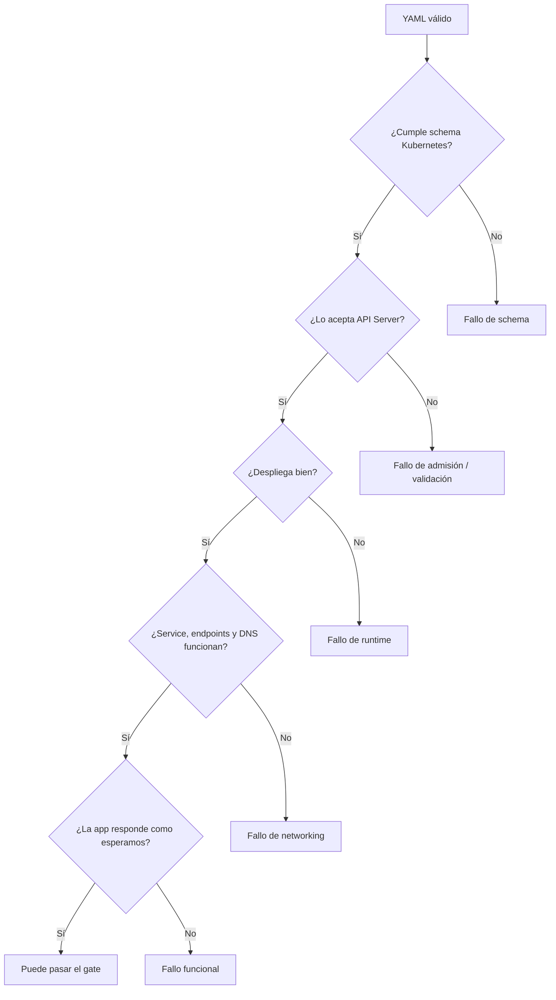
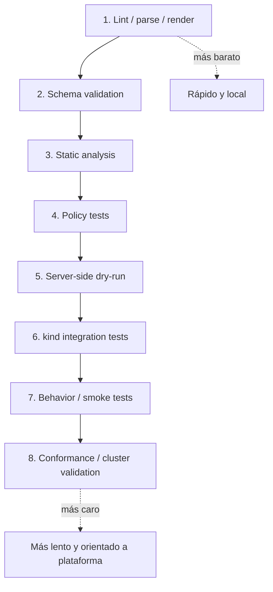
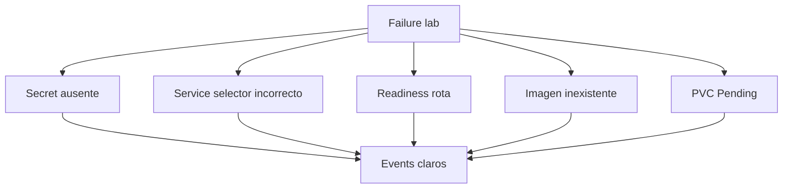
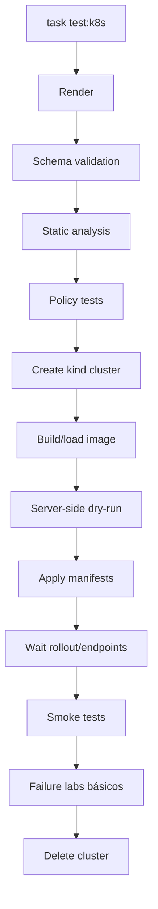
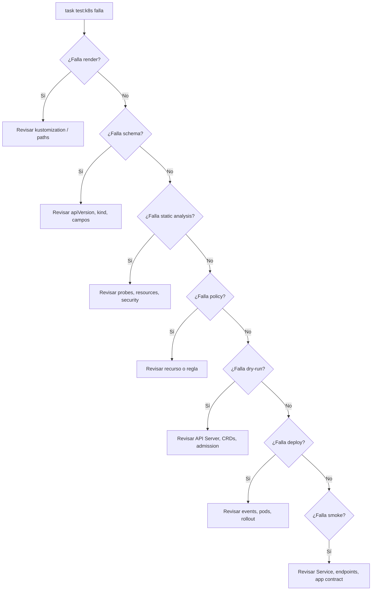

He contrastado este módulo con documentación oficial y fuentes primarias actuales: `kubectl apply`, `kubectl diff`, Kustomize, kind, kubeconform, kube-score, Polaris, Kyverno CLI, Conftest, Chainsaw, KUTTL, Terratest y Sonobuoy. También he separado qué parte sirve para validar manifests, qué parte sirve para probar políticas, qué parte necesita un cluster real y qué parte pertenece más a platform teams que a cada PR de una aplicación.

# 9. Testing automatizado de Kubernetes

## Objetivo del módulo

En los módulos anteriores ya has construido una base bastante seria:

```text
contenedores
cluster local
kubectl
modelo mental
Pods
Workloads
Networking
ConfigMaps
Secrets
Storage
```

Ahora toca una pregunta incómoda:

> ¿Cómo sabes que todo eso funciona antes de desplegarlo?

No basta con que un YAML “parezca correcto”.

No basta con que `kubectl apply` no explote una vez en tu máquina.

No basta con que una persona revise manifests a ojo.

Un sistema Kubernetes puede fallar por muchas razones:

- El YAML no renderiza
- El manifest no cumple el schema
- El API Server rechaza el recurso
- El Service no tiene endpoints
- La readiness está mal
- El selector no coincide con las labels
- Falta un Secret
- Falta un ConfigMap
- El PVC se queda `Pending`
- Una NetworkPolicy bloquea tráfico esperado
- Una policy de seguridad debería rechazar un recurso peligroso y no lo hace
- El Deployment existe, pero nunca llega a `Available`
- El Job existe, pero no completa
- El smoke test no pasa
- El fallo es diagnosticable, pero nadie lo ha automatizado
La idea central del módulo es esta:

> Testing de Kubernetes no es solo validar YAML. Es construir una cadena de feedback que compruebe render, schema, análisis estático, políticas, aceptación por el API Server, despliegue real, comportamiento observable, smoke tests y fallos esperados.



`kubectl apply` permite aplicar configuración desde fichero o stdin, y acepta formatos JSON y YAML. `kubectl diff` compara la configuración especificada con el estado online que resultaría si se aplicara. Estas dos piezas son útiles, pero por sí solas no son una estrategia completa de testing. ([Kubernetes](https://kubernetes.io/docs/reference/kubectl/generated/kubectl_apply/ "kubectl apply"))

---

## 9.1. Qué vas a aprender y qué no vas a aprender todavía

Vas a aprender:

- Qué significa testar Kubernetes
- Qué diferencia hay entre validar, analizar, probar y desplegar
- Qué es render de manifests
- Qué es validación de schemas
- Qué diferencia hay entre validación local y validación del API Server
- Cómo usar `kubectl apply --dry-run=server`
- Cómo usar `kubectl diff`
- Cómo usar `kubeconform`
- Cómo usar `kube-score`
- Cómo usar Polaris
- Cómo probar políticas con Kyverno CLI
- Cómo probar políticas con OPA Conftest
- Cómo usar kind como cluster efímero
- Cómo probar que un Deployment llega a Ready
- Cómo probar que un Service tiene endpoints
- Cómo probar que un Job completa
- Cómo probar DNS y HTTP interno
- Cómo estructurar smoke tests
- Cómo diseñar failure tests pequeños
- Cómo integrar todo con Taskfile
- Cómo preparar una futura pipeline de delivery
No vamos a profundizar todavía en:

- GitOps
- Argo CD
- Flux
- Progressive delivery
- Canary real
- Blue-green real
- Supply chain avanzada
- Firma de imágenes
- SBOM
- Admission controllers instalados en cluster
- Testing avanzado de operators
- Conformance completo de clusters productivos
Eso vendrá en módulos posteriores o en rutas profesionales.

La regla pedagógica del módulo será:

```text
Primero explicar qué queremos probar
Luego explicar qué herramienta encaja
Luego crear una práctica pequeña
Luego automatizarla
Luego convertirla en quality gate
```

---

## 9.2. El problema: Kubernetes tiene demasiados puntos de fallo para validar a ojo

Antes de hablar de herramientas, hay que entender el problema.

Un manifest puede estar bien escrito como YAML, pero mal como recurso Kubernetes.

Un recurso puede cumplir schema, pero ser inseguro.

Un recurso puede ser aceptado por el API Server, pero no desplegarse bien.

Un Deployment puede crear Pods, pero el Service puede no tener endpoints.

Un Service puede tener endpoints, pero DNS puede fallar.

DNS puede resolver, pero una NetworkPolicy puede bloquear tráfico.

La aplicación puede responder `/health`, pero fallar en `/checkout`.



### Contrato mental

|Nivel|Pregunta|
|---|---|
|YAML|¿El fichero se puede parsear?|
|Render|¿El manifiesto final existe y tiene sentido?|
|Schema|¿Cumple la forma esperada por Kubernetes?|
|Static analysis|¿Tiene riesgos o malas prácticas?|
|Policy|¿Cumple reglas del equipo?|
|API Server|¿Kubernetes aceptaría esto?|
|Cluster real|¿Los recursos se crean y llegan a estado esperado?|
|Behavior|¿La aplicación responde y se comunica?|
|Failure lab|¿Los fallos esperados dejan señales diagnosticables?|

### Criterio de comprensión

Debes poder explicar:

> Que un manifest sea YAML válido no significa que sea un recurso Kubernetes correcto, seguro, desplegable ni funcional.

---

## 9.3. La pirámide de testing de Kubernetes

No todos los tests cuestan lo mismo.

Los tests locales son rápidos.

Los tests contra un cluster real dan más confianza, pero cuestan más.

Los tests de conformance de cluster son útiles, pero no deberían ejecutarse en cada PR de una aplicación.



### Cómo leerla

No es una pirámide perfecta.

Es una cadena de feedback.

Lo importante es no saltar directamente al cluster si puedes detectar antes errores baratos.

|Capa|Coste|Qué detecta|
|---|--:|---|
|Render|Bajo|Manifests incompletos, overlays rotos|
|Schema|Bajo|Campos inválidos, APIs mal formadas|
|Static analysis|Bajo-medio|Falta de probes, resources, securityContext|
|Policy tests|Medio|Reglas del equipo|
|Server dry-run|Medio|Validación real del API Server|
|kind tests|Medio-alto|Despliegue real y comportamiento básico|
|Smoke tests|Medio-alto|Contrato HTTP mínimo|
|Sonobuoy|Alto|Estado/conformance del cluster|

### Criterio de comprensión

Debes poder explicar:

> El testing de Kubernetes debe empezar con feedback barato y terminar, cuando hace falta, con verificación en un cluster real.

---

## 9.4. Estructura del repositorio para testing

Antes de escribir comandos, ordena el repositorio.

No queremos scripts sueltos.

Queremos una estructura que explique la intención de cada tipo de test.

```text
kubernetes-learning-lab/
  kubernetes/
    base/
      namespace.yaml
      deployment.yaml
      service.yaml
      configmap.yaml
      secret.example.yaml
      kustomization.yaml

    overlays/
      local/
        kustomization.yaml

  tests/
    manifests/
      rendered/

    policies/
      kyverno/
        disallow-latest/
          policy.yaml
          kyverno-test.yaml
          resources/
            valid-deployment.yaml
            invalid-deployment.yaml

      conftest/
        policy/
          kubernetes.rego
        valid/
          deployment.yaml
        invalid/
          deployment-latest.yaml

    cluster/
      chainsaw/
        deployment-ready/
          chainsaw-test.yaml

    smoke/
      smoke-test.sh

    failure-lab/
      missing-secret/
      bad-service-selector/
      bad-readiness/
      pvc-pending/

  scripts/
    wait-for-rollout.sh
    wait-for-endpoints.sh
    smoke-test.sh

  Taskfile.yml
```

### Por qué esta estructura ayuda

- `kubernetes/` contiene lo que despliegas
- `tests/manifests/` contiene artefactos renderizados o temporales
- `tests/policies/` separa políticas de manifests de aplicación
- `tests/cluster/` contiene tests que necesitan cluster
- `tests/smoke/` contiene comprobaciones funcionales mínimas
- `tests/failure-lab/` contiene escenarios negativos
- `scripts/` contiene piezas reutilizables
- `Taskfile.yml` orquesta el flujo
### Criterio de comprensión

Debes poder explicar:

> Si los tests de Kubernetes no tienen estructura, terminan siendo comandos manuales difíciles de repetir y difíciles de confiar.

---

## 9.5. Render de manifests

### Qué problema resuelve

Antes de validar o desplegar, necesitas saber cuál es el manifest final.

Si usas Kustomize, Helm o cualquier herramienta de composición, el fichero fuente no siempre es lo que llega a Kubernetes.

Render significa:

> Generar el YAML final que se va a validar, analizar, probar y aplicar.

Kustomize permite personalizar objetos Kubernetes mediante un fichero `kustomization`, y `kubectl` soporta `kubectl kustomize` y `kubectl apply -k` para trabajar con esos directorios. ([Kubernetes](https://kubernetes.io/docs/tasks/manage-kubernetes-objects/kustomization/ "Declarative Management of Kubernetes Objects Using ..."))

### Kustomize base mínimo

Crea:

```text
kubernetes/base/kustomization.yaml
```

Contenido:

```yaml
resources:
  - ../00-namespace/namespace.yaml
  - ../02-deployment/deployment.yaml
  - ../03-service/checkout-api-service.yaml
  - ../05-config/configmap.yaml
  - ../05-config/secret.yaml
```

Crea:

```text
kubernetes/overlays/local/kustomization.yaml
```

Contenido:

```yaml
resources:
  - ../../base
```

### Render

```bash
mkdir -p .tmp
kubectl kustomize kubernetes/overlays/local > .tmp/rendered.yaml
```

### Inspeccionar

```bash
yq '.kind' .tmp/rendered.yaml
yq 'select(.kind == "Deployment") | .metadata.name' .tmp/rendered.yaml
```

### DevEx

Añade:

```yaml
  manifests:render:
    desc: Render Kubernetes manifests
    cmds:
      - mkdir -p .tmp
      - kubectl kustomize kubernetes/overlays/local > .tmp/rendered.yaml
      - test -s .tmp/rendered.yaml
```

### Criterio de comprensión

Debes poder explicar:

> No valido los ficheros fuente por intuición. Primero genero el manifest final que realmente quiero comprobar.

---

## 9.6. Validación de schema con kubeconform

### Qué problema resuelve

Un YAML puede ser válido, pero no cumplir la estructura esperada por Kubernetes.

`kubeconform` valida manifests contra definiciones de recursos Kubernetes. Su documentación lo presenta como una herramienta de validación de manifests que comprueba si los manifests son válidos según las definiciones de recursos de Kubernetes. ([kubeconform.mandragor.org](https://kubeconform.mandragor.org/docs/overview/ "Fast Kubernetes manifests validation! | Overview - Kubeconform"))

### Qué detecta

Puede detectar cosas como:

- `apiVersion` incorrecta
- `kind` incorrecto
- Campos mal escritos
- Tipos incorrectos
- Estructura inválida
- Recursos no reconocidos, según schemas disponibles
### Qué no detecta siempre

No sustituye:

- Validación del API Server
- Admission webhooks
- Reglas de negocio del equipo
- Que el Service tenga endpoints
- Que el Deployment llegue a Ready
- Que la app responda
### Comando

```bash
kubeconform -strict -summary .tmp/rendered.yaml
```

Si tienes CRDs y no tienes schemas para ellos, puedes necesitar configurar schemas adicionales o decidir si usar `-ignore-missing-schemas`.

### DevEx

Añade:

```yaml
  manifests:validate:schema:
    desc: Validate rendered manifests against Kubernetes schemas
    deps:
      - manifests:render
    cmds:
      - kubeconform -strict -summary .tmp/rendered.yaml
```

### Criterio de comprensión

Debes poder explicar:

> kubeconform valida forma y schema. No demuestra que el sistema desplegado funcione.

---

## 9.7. Análisis estático con kube-score

### Qué problema resuelve

Un manifest puede cumplir schema y aun así ser débil operacionalmente.

Ejemplos:

- No tiene probes
- No tiene resource requests
- No tiene securityContext
- Usa `latest`
- No define PodDisruptionBudget
- Tiene configuración poco resiliente
`kube-score` se presenta como una herramienta de análisis estático para definiciones de objetos Kubernetes, y produce recomendaciones para mejorar seguridad y resiliencia. ([GitHub](https://github.com/zegl/kube-score "zegl/kube-score"))

### Qué aporta

Aporta feedback sobre prácticas comunes de operación.

No es verdad absoluta.

Una recomendación puede no aplicar en tu caso, pero debe forzarte a justificar la decisión.

### Comando

```bash
kube-score score .tmp/rendered.yaml
```

### DevEx

Añade:

```yaml
  manifests:score:
    desc: Run kube-score static analysis
    deps:
      - manifests:render
    cmds:
      - kube-score score .tmp/rendered.yaml
```

### Criterio de comprensión

Debes poder explicar:

> kube-score no prueba comportamiento. Señala riesgos de configuración que pueden afectar seguridad, resiliencia u operación.

---

## 9.8. Auditoría con Polaris

### Qué problema resuelve

Polaris valida y audita configuración de recursos Kubernetes contra políticas y buenas prácticas. La documentación oficial de Fairwinds describe Polaris como un policy engine open source para Kubernetes que valida y puede remediar configuración de recursos, con políticas incorporadas y posibilidad de políticas custom. ([polaris.docs.fairwinds.com](https://polaris.docs.fairwinds.com/ "Fairwinds Polaris Documentation"))

### Cuándo usarlo

Puedes usar Polaris para:

- Auditar manifests
- Auditar recursos en un cluster
- Revisar prácticas de seguridad
- Revisar prácticas de reliability
- Añadir otro punto de feedback más orientado a configuración
### Comando típico local

Según instalación, puedes ejecutar Polaris en modo audit sobre ficheros o cluster. Para mantener el módulo portable, lo dejaremos como gate opcional:

```bash
polaris audit --audit-path .tmp/rendered.yaml --format=pretty
```

La CLI exacta puede variar entre versiones, así que en el Taskfile lo trataremos como opcional y no bloqueante al principio.

### DevEx

```yaml
  manifests:polaris:
    desc: Run Polaris audit if installed
    deps:
      - manifests:render
    cmds:
      - polaris audit --audit-path .tmp/rendered.yaml --format=pretty || true
```

### Criterio de comprensión

Debes poder explicar:

> Polaris añade una capa de auditoría de configuración. Es útil, pero no sustituye tests de despliegue ni smoke tests.

---

## 9.9. Validación con `kubectl apply --dry-run=server`

### Qué problema resuelve

La validación local no siempre reproduce lo que hará el API Server.

El server-side dry run envía la petición al API Server y permite ejecutar validación, defaulting y admisión sin persistir el objeto. La documentación histórica de Kubernetes sobre dry-run explica que el dry run del API Server permite ver si una petición habría tenido éxito y qué habría pasado sin persistirla. ([Kubernetes](https://kubernetes.io/blog/2019/01/14/apiserver-dry-run-and-kubectl-diff/ "APIServer dry-run and kubectl diff"))

### Por qué importa

Esto puede detectar:

- Campos que el API Server rechaza
- Problemas de admisión
- Problemas de versión real del cluster
- Recursos que no existen en ese cluster
- Validaciones que una herramienta local no conoce
### Comando

```bash
kubectl apply --dry-run=server --validate=strict -f .tmp/rendered.yaml
```

### Cuidado

Esto necesita un cluster accesible.

No es puramente local.

### DevEx

```yaml
  manifests:dry-run:
    desc: Validate rendered manifests against the Kubernetes API Server
    deps:
      - manifests:render
    cmds:
      - kubectl apply --dry-run=server --validate=strict -f .tmp/rendered.yaml
```

### Criterio de comprensión

Debes poder explicar:

> Server-side dry-run valida contra el API Server real del cluster. Por eso detecta problemas que el análisis local puede no ver.

---

## 9.10. `kubectl diff`

### Qué problema resuelve

Antes de aplicar cambios, necesitas ver qué cambiaría.

`kubectl diff` compara la configuración especificada con la configuración online actual como quedaría si se aplicara, y su salida es YAML. ([Kubernetes](https://kubernetes.io/docs/reference/kubectl/generated/kubectl_diff/ "kubectl diff"))

### Cuándo usarlo

Úsalo antes de aplicar:

```bash
kubectl diff -f .tmp/rendered.yaml
```

En CI puede ser útil para revisar cambios, pero no siempre debe bloquear. Depende de tu flujo.

### DevEx

```yaml
  manifests:diff:
    desc: Show diff between rendered manifests and live cluster
    deps:
      - manifests:render
    cmds:
      - kubectl diff -f .tmp/rendered.yaml || true
```

### Criterio de comprensión

Debes poder explicar:

> `kubectl diff` no prueba que algo funcione. Te enseña qué cambiaría en el cluster si aplicas el manifest.

---

## 9.11. Policy tests con Kyverno CLI

### Qué problema resuelve

Las herramientas de análisis estático tienen reglas genéricas.

Tu equipo puede necesitar reglas propias:

- No usar `latest`
- Requerir labels estándar
- Requerir resource requests
- Requerir probes
- Bloquear contenedores privilegiados
- Requerir `runAsNonRoot`
- Exigir namespaces concretos
- Bloquear Services `LoadBalancer` en entornos locales
Kyverno CLI permite validar y testear comportamiento de políticas antes de añadirlas al cluster. Su documentación indica que el CLI sirve para validar y probar comportamiento de policies sobre recursos antes de añadirlos a un cluster, y que puede usarse en pipelines CI/CD. ([Kyverno](https://kyverno.io/docs/kyverno-cli/reference/kyverno/ "Kyverno"))

### Política: bloquear `latest`

Crea:

```text
tests/policies/kyverno/disallow-latest/policy.yaml
```

Contenido:

```yaml
apiVersion: kyverno.io/v1
kind: ClusterPolicy
metadata:
  name: disallow-latest-tag
spec:
  validationFailureAction: Enforce
  background: false
  rules:
    - name: require-explicit-image-tag
      match:
        any:
          - resources:
              kinds:
                - Pod
                - Deployment
                - StatefulSet
                - DaemonSet
                - Job
                - CronJob
      validate:
        message: "Images must not use the latest tag."
        pattern:
          spec:
            =(template):
              spec:
                containers:
                  - image: "!*:latest"
            =(jobTemplate):
              spec:
                template:
                  spec:
                    containers:
                      - image: "!*:latest"
            =(containers):
              - image: "!*:latest"
```

### Recurso válido

```text
tests/policies/kyverno/disallow-latest/resources/valid-deployment.yaml
```

```yaml
apiVersion: apps/v1
kind: Deployment
metadata:
  name: valid-checkout-api
spec:
  replicas: 1
  selector:
    matchLabels:
      app: valid-checkout-api
  template:
    metadata:
      labels:
        app: valid-checkout-api
    spec:
      containers:
        - name: checkout-api
          image: checkout-api:1.0.0
```

### Recurso inválido

```text
tests/policies/kyverno/disallow-latest/resources/invalid-deployment.yaml
```

```yaml
apiVersion: apps/v1
kind: Deployment
metadata:
  name: invalid-checkout-api
spec:
  replicas: 1
  selector:
    matchLabels:
      app: invalid-checkout-api
  template:
    metadata:
      labels:
        app: invalid-checkout-api
    spec:
      containers:
        - name: checkout-api
          image: checkout-api:latest
```

### Test Kyverno

Crea:

```text
tests/policies/kyverno/disallow-latest/kyverno-test.yaml
```

Contenido:

```yaml
apiVersion: cli.kyverno.io/v1alpha1
kind: Test
metadata:
  name: disallow-latest-tag
policies:
  - policy.yaml
resources:
  - resources/valid-deployment.yaml
  - resources/invalid-deployment.yaml
results:
  - policy: disallow-latest-tag
    rule: require-explicit-image-tag
    resource: valid-checkout-api
    kind: Deployment
    result: pass
  - policy: disallow-latest-tag
    rule: require-explicit-image-tag
    resource: invalid-checkout-api
    kind: Deployment
    result: fail
```

Kyverno `test` compara resultados esperados declarados en un fichero de test con los resultados reales reportados por Kyverno. ([Kyverno](https://kyverno.io/docs/kyverno-cli/reference/kyverno_test/ "kyverno test"))

### Comando

```bash
kyverno test tests/policies/kyverno/disallow-latest
```

### DevEx

```yaml
  policies:test:kyverno:
    desc: Test Kyverno policies
    cmds:
      - kyverno test tests/policies/kyverno/disallow-latest
```

### Criterio de comprensión

Debes poder explicar:

> Testear policies no es solo comprobar que rechazan lo malo. También debes comprobar que aceptan lo válido.

---

## 9.12. Policy tests con OPA Conftest

### Qué problema resuelve

Conftest permite escribir tests contra configuración estructurada usando Rego de Open Policy Agent. Su documentación indica que puede usarse para Kubernetes configurations, Terraform, Serverless y otros formatos estructurados. ([conftest.dev](https://www.conftest.dev/ "Conftest"))

### Cuándo usar Conftest

Úsalo si:

- Tu equipo ya usa OPA/Rego
- Quieres políticas reutilizables entre varios tipos de configuración
- Necesitas lógica de validación más expresiva
- Quieres tests rápidos sin cluster
### Política simple: bloquear `latest`

Crea:

```text
tests/policies/conftest/policy/kubernetes.rego
```

Contenido:

```rego
package kubernetes

deny[msg] {
  input.kind == "Deployment"
  container := input.spec.template.spec.containers[_]
  endswith(container.image, ":latest")
  msg := sprintf("container %s must not use latest tag", [container.name])
}

deny[msg] {
  input.kind == "Deployment"
  not input.spec.template.spec.containers[_].resources.requests.cpu
  msg := "containers must define cpu requests"
}

deny[msg] {
  input.kind == "Deployment"
  not input.spec.template.spec.containers[_].resources.requests.memory
  msg := "containers must define memory requests"
}
```

### Comando

```bash
conftest test .tmp/rendered.yaml --policy tests/policies/conftest/policy
```

### DevEx

```yaml
  policies:test:conftest:
    desc: Test rendered manifests with OPA Conftest
    deps:
      - manifests:render
    cmds:
      - conftest test .tmp/rendered.yaml --policy tests/policies/conftest/policy
```

### Criterio de comprensión

Debes poder explicar:

> Kyverno encaja muy bien con políticas Kubernetes-native. Conftest encaja bien cuando quieres policy-as-code genérica sobre configuración estructurada.

---

## 9.13. Cluster efímero con kind

### Qué problema resuelve

Algunos problemas solo aparecen en un cluster real.

kind permite crear clusters locales usando contenedores Docker como nodos. Su documentación lo describe como una herramienta para ejecutar clusters Kubernetes locales usando contenedores Docker como nodos, diseñada principalmente para probar Kubernetes, aunque también útil para desarrollo local y CI. ([kind.sigs.k8s.io](https://kind.sigs.k8s.io/ "kind - Kubernetes"))

### Qué puedes probar con kind

- El API Server acepta manifests
- Pods se crean
- Deployments llegan a Available
- Services tienen EndpointSlices
- DNS resuelve
- Jobs completan
- PVCs se quedan `Bound` o `Pending`
- Smoke tests funcionan
- Failure labs dejan señales
### Qué no debes asumir

kind no es producción.

Puede no reproducir:

- LoadBalancers cloud
- Storage CSI real
- NetworkPolicy si el CNI no la soporta
- Performance real
- IAM cloud
- DNS externo
- Ingress cloud real
### DevEx

```yaml
  cluster:create:
    desc: Create disposable kind cluster
    cmds:
      - kind create cluster --name {{.TEST_CLUSTER}}

  cluster:delete:
    desc: Delete disposable kind cluster
    cmds:
      - kind delete cluster --name {{.TEST_CLUSTER}}
```

### Criterio de comprensión

Debes poder explicar:

> kind no sustituye un entorno real, pero es excelente para comprobar que manifests se aceptan y recursos básicos se comportan en un cluster Kubernetes real.

---

## 9.14. Test de despliegue: Deployment Ready

### Qué problema resuelve

Después de aplicar manifests, no basta con que el comando termine.

Necesitas esperar a que el Deployment llegue al estado esperado.

### Comando base

```bash
kubectl rollout status deployment/checkout-api -n shop --timeout=120s
```

### Validaciones adicionales

```bash
kubectl get deploy checkout-api -n shop
kubectl get pods -n shop -l app.kubernetes.io/name=checkout-api
kubectl get pods -n shop -l app.kubernetes.io/name=checkout-api -o json \
  | jq '.items[] | {name: .metadata.name, phase: .status.phase, conditions: .status.conditions}'
```

### Script

Crea:

```text
scripts/wait-for-rollout.sh
```

Contenido:

```bash
#!/usr/bin/env bash
set -euo pipefail

NAMESPACE="${NAMESPACE:-shop}"
DEPLOYMENT="${DEPLOYMENT:-checkout-api}"
TIMEOUT="${TIMEOUT:-120s}"

kubectl rollout status "deployment/${DEPLOYMENT}" \
  -n "${NAMESPACE}" \
  --timeout="${TIMEOUT}"
```

Permisos:

```bash
chmod +x scripts/wait-for-rollout.sh
```

### DevEx

```yaml
  cluster:wait:deployment:
    desc: Wait for checkout-api Deployment rollout
    cmds:
      - NAMESPACE={{.NAMESPACE}} DEPLOYMENT=checkout-api ./scripts/wait-for-rollout.sh
```

### Criterio de comprensión

Debes poder explicar:

> Aplicar un Deployment no significa que esté listo. El test debe esperar explícitamente a que el rollout termine.

---

## 9.15. Test de Service con EndpointSlices

### Qué problema resuelve

Un Service puede existir y no tener backends.

Esto ya lo viste en el módulo 7.

Ahora lo convertimos en test.

### Script

Crea:

```text
scripts/wait-for-endpoints.sh
```

Contenido:

```bash
#!/usr/bin/env bash
set -euo pipefail

NAMESPACE="${NAMESPACE:-shop}"
SERVICE="${SERVICE:-checkout-api}"
TIMEOUT_SECONDS="${TIMEOUT_SECONDS:-60}"

for i in $(seq 1 "${TIMEOUT_SECONDS}"); do
  endpoint_count="$(
    kubectl get endpointslices \
      -n "${NAMESPACE}" \
      -l "kubernetes.io/service-name=${SERVICE}" \
      -o json \
      | jq '[.items[].endpoints[]? | select(.conditions.ready != false)] | length'
  )"

  if [ "${endpoint_count}" -gt 0 ]; then
    echo "Service ${SERVICE} has ${endpoint_count} ready endpoint(s)"
    exit 0
  fi

  sleep 1
done

echo "Timed out waiting for Service ${SERVICE} endpoints"
kubectl get svc "${SERVICE}" -n "${NAMESPACE}" -o yaml || true
kubectl get endpointslices -n "${NAMESPACE}" -l "kubernetes.io/service-name=${SERVICE}" -o yaml || true
exit 1
```

Permisos:

```bash
chmod +x scripts/wait-for-endpoints.sh
```

### DevEx

```yaml
  cluster:wait:endpoints:
    desc: Wait for checkout-api Service endpoints
    cmds:
      - NAMESPACE={{.NAMESPACE}} SERVICE=checkout-api ./scripts/wait-for-endpoints.sh
```

### Criterio de comprensión

Debes poder explicar:

> Un Service sin endpoints es una identidad estable sin destino útil.

---

## 9.16. Smoke tests

### Qué problema resuelven

Los tests anteriores prueban Kubernetes.

El smoke test prueba el contrato mínimo de la aplicación.

Para `checkout-api`, el contrato mínimo sigue siendo:

- `GET /health`
- `GET /ready`
- `GET /checkout`
### Smoke test por Service

En módulo 7 aprendiste a hacer port-forward al Service:

```bash
kubectl port-forward service/checkout-api -n shop 8080:80
```

Para automatizarlo en CI local, puedes usar un patrón simple:

1. Abrir port-forward en background
2. Esperar un momento
3. Ejecutar `scripts/smoke-test.sh`
4. Cerrar port-forward
### Script

Crea:

```text
scripts/smoke-test-k8s.sh
```

Contenido:

```bash
#!/usr/bin/env bash
set -euo pipefail

NAMESPACE="${NAMESPACE:-shop}"
SERVICE="${SERVICE:-checkout-api}"
LOCAL_PORT="${LOCAL_PORT:-8080}"
SERVICE_PORT="${SERVICE_PORT:-80}"

cleanup() {
  if [ -n "${PF_PID:-}" ]; then
    kill "${PF_PID}" >/dev/null 2>&1 || true
  fi
}

trap cleanup EXIT

kubectl port-forward "service/${SERVICE}" \
  -n "${NAMESPACE}" \
  "${LOCAL_PORT}:${SERVICE_PORT}" >/tmp/checkout-api-port-forward.log 2>&1 &

PF_PID="$!"

sleep 3

PORT="${LOCAL_PORT}" ./scripts/smoke-test.sh
```

Permisos:

```bash
chmod +x scripts/smoke-test-k8s.sh
```

### DevEx

```yaml
  smoke:k8s:
    desc: Run smoke test against checkout-api Service through port-forward
    cmds:
      - NAMESPACE={{.NAMESPACE}} SERVICE=checkout-api LOCAL_PORT={{.PORT}} ./scripts/smoke-test-k8s.sh
```

### Criterio de comprensión

Debes poder explicar:

> Smoke test no demuestra todo, pero confirma que el contrato mínimo de la aplicación responde a través de Kubernetes.

---

## 9.17. Tests declarativos con Chainsaw

### Qué problema resuelve

Algunos tests son más cómodos si se expresan como pasos declarativos sobre recursos Kubernetes.

Chainsaw proporciona testing end-to-end declarativo para Kubernetes. Su documentación lo presenta como una herramienta que permite escribir tests en YAML, sin tener que escribir código de propósito general para cada caso. ([kyverno.github.io](https://kyverno.github.io/chainsaw/0.2.3/ "Chainsaw - Stronger end-to-end testing tool"))

### Cuándo usar Chainsaw

Úsalo para:

- Aplicar recursos
- Esperar condiciones
- Comprobar estado
- Probar comportamiento de recursos Kubernetes
- Testear controllers, policies o flujos declarativos
### Test básico: Deployment Ready y Service con endpoints

Crea:

```text
tests/cluster/chainsaw/deployment-ready/chainsaw-test.yaml
```

Contenido orientativo:

```yaml
apiVersion: chainsaw.kyverno.io/v1alpha1
kind: Test
metadata:
  name: checkout-api-deployment-ready
spec:
  steps:
    - name: assert deployment exists
      try:
        - assert:
            resource:
              apiVersion: apps/v1
              kind: Deployment
              metadata:
                name: checkout-api
                namespace: shop
              status:
                availableReplicas: 3

    - name: assert service exists
      try:
        - assert:
            resource:
              apiVersion: v1
              kind: Service
              metadata:
                name: checkout-api
                namespace: shop
```

La sintaxis exacta de Chainsaw puede cambiar entre versiones, así que este módulo lo usa como introducción declarativa y recomienda fijar versión de herramienta en el repositorio.

### DevEx

```yaml
  cluster:test:chainsaw:
    desc: Run Chainsaw cluster tests
    cmds:
      - chainsaw test tests/cluster/chainsaw
```

### Criterio de comprensión

Debes poder explicar:

> Chainsaw sirve para expresar tests de comportamiento Kubernetes como pasos declarativos contra un cluster real.

---

## 9.18. KUTTL

### Qué problema resuelve

KUTTL ofrece un enfoque declarativo para testing de Kubernetes, especialmente operators, aunque también puede probar objetos Kubernetes en general. Su repositorio oficial explica que KUTTL está diseñado para testing de operators, pero puede testear declarativamente cualquier objeto Kubernetes. ([GitHub](https://github.com/kudobuilder/kuttl "kudobuilder/kuttl: KUbernetes Test TooL (kuttl)"))

### Cuándo usar KUTTL

Úsalo si:

- Estás testando operators
- Quieres tests declarativos por pasos
- Ya tienes suites KUTTL en la organización
- Necesitas assert/error manifests
### Para este roadmap

KUTTL será lectura y herramienta opcional.

El camino principal del módulo usará:

```text
kubeconform
kube-score
Kyverno CLI o Conftest
kind
kubectl
smoke tests
Chainsaw opcional
```

### Criterio de comprensión

Debes poder explicar:

> KUTTL es especialmente útil en testing de operators y controllers, pero para una app básica podemos empezar con gates más simples.

---

## 9.19. Terratest

### Qué problema resuelve

Terratest es una librería Go para testing de infraestructura. Su documentación la presenta como una librería con helpers y patrones para tareas comunes de infrastructure testing, incluyendo Kubernetes, Docker, Terraform y cloud providers. ([terratest.gruntwork.io](https://terratest.gruntwork.io/docs/ "Documentation - Terratest - Gruntwork"))

### Cuándo usar Terratest

Úsalo si:

- Ya tienes tests en Go
- Necesitas lógica de test más programática
- Combinas Kubernetes con cloud real
- Necesitas preparar infraestructura, desplegar, validar y destruir
- Quieres assertions más ricas que bash
### Para este roadmap

No será obligatorio porque el laboratorio evita meter Go como requisito.

La ruta base usará Bash, Taskfile y herramientas declarativas.

### Criterio de comprensión

Debes poder explicar:

> Terratest es potente cuando necesitas tests programáticos de infraestructura, pero añade coste de lenguaje, dependencias y mantenimiento.

---

## 9.20. Sonobuoy

### Qué problema resuelve

Sonobuoy está más cerca de platform engineering que de cada PR de aplicación.

Sonobuoy se presenta como una herramienta de diagnóstico para entender el estado de un cluster ejecutando tests de configuración de forma accesible y no destructiva. También se usa para conformance testing, es decir, comprobar que un cluster se comporta conforme a las especificaciones oficiales de Kubernetes. ([sonobuoy.io](https://sonobuoy.io/ "Sonobuoy"))

### Cuándo usarlo

Úsalo para:

- Validar clusters
- Diagnóstico de plataforma
- Conformance
- Revisiones de upgrades
- Validación de proveedores o distribuciones Kubernetes
### Cuándo no usarlo

No lo ejecutes en cada PR de `checkout-api`.

Es demasiado pesado para esa capa.

### Criterio de comprensión

Debes poder explicar:

> Sonobuoy valida el cluster. No sustituye tests de manifests ni smoke tests de una aplicación concreta.

---

## 9.21. Failure tests pequeños

### Qué problema resuelven

No basta con probar el camino feliz.

También debes probar que los fallos importantes dejan señales claras.

Failure tests no buscan romper todo.

Buscan aprender y automatizar diagnósticos.



### Failure lab mínimo

Incluye estos escenarios:

|Fallo|Señal esperada|
|---|---|
|Imagen inexistente|`ImagePullBackOff` o error de pull|
|Secret ausente|Event de secret not found|
|ConfigMap ausente|Event de configmap not found|
|Service selector incorrecto|Service sin EndpointSlices útiles|
|Readiness rota|Pod Running pero no Ready|
|Liveness rota|Reinicios|
|PVC con StorageClass inexistente|PVC `Pending`|
|Job fallido|Job no completa, Pods fallidos|

### Regla

Cada failure test debe documentar:

- Qué rompe
- Cómo se aplica
- Qué señal esperamos
- Cómo se diagnostica
- Cómo se limpia
- Qué gate lo habría evitado
### Criterio de comprensión

Debes poder explicar:

> Un failure lab no es caos aleatorio. Es una forma controlada de enseñar qué señal aparece cuando una categoría de fallo ocurre.

---

## 9.22. Testing de NetworkPolicy

### Qué problema resuelve

Una NetworkPolicy puede existir y no aplicarse si el CNI no soporta enforcement.

También puede estar mal definida.

Por eso, los tests de NetworkPolicy deben separar dos cosas:

```text
¿La policy existe?
¿El tráfico se permite o bloquea realmente?
```

### Prueba mínima

Desde `dnsutils`:

```bash
kubectl exec -n shop dnsutils -- wget -qO- http://checkout-api/health
```

Para un bloqueo, necesitas un Pod no permitido y un comando con timeout.

Ejemplo:

```bash
kubectl run blocked-client \
  -n shop \
  --image=busybox:1.36 \
  --restart=Never \
  -- sleep 3600
```

Probar:

```bash
kubectl exec -n shop blocked-client -- wget -T 3 -qO- http://checkout-api/health
```

Si tu CNI aplica NetworkPolicy y la policy no permite ese Pod, debería fallar o hacer timeout.

### Criterio de comprensión

Debes poder explicar:

> Testear NetworkPolicy exige probar tráfico real. Ver el YAML no demuestra enforcement.

---

## 9.23. Quality gate completo

### Qué problema resuelve

Hasta ahora tienes piezas.

Ahora necesitas una secuencia.

Un quality gate debe fallar pronto, dar señales claras y limpiar recursos.

### Secuencia recomendada



### Taskfile principal

```yaml
vars:
  TEST_CLUSTER: shop-test
  NAMESPACE: shop
  IMAGE_NAME: checkout-api
  IMAGE_TAG: 1.0.0
  PORT: 8080
  RENDERED: .tmp/rendered.yaml

tasks:
  test:k8s:
    desc: Run full Kubernetes test suite
    cmds:
      - task manifests:render
      - task manifests:validate:schema
      - task manifests:score
      - task policies:test
      - task cluster:create
      - task k8s:image:prepare:test
      - task manifests:dry-run
      - task cluster:deploy
      - task cluster:wait
      - task smoke:k8s
      - task failure:test:basic
      - task cluster:delete
```

### Criterio de comprensión

Debes poder explicar:

> Un quality gate no es una herramienta. Es una secuencia de comprobaciones que reduce el riesgo de que un cambio llegue roto al siguiente entorno.

---

## 9.24. Taskfile del módulo 9

Añade estas tareas al `Taskfile.yml`.

```yaml
  manifests:render:
    desc: Render Kubernetes manifests
    cmds:
      - mkdir -p .tmp
      - kubectl kustomize kubernetes/overlays/local > .tmp/rendered.yaml
      - test -s .tmp/rendered.yaml

  manifests:show:
    desc: Show rendered manifests
    deps:
      - manifests:render
    cmds:
      - cat .tmp/rendered.yaml

  manifests:validate:schema:
    desc: Validate rendered manifests against Kubernetes schemas
    deps:
      - manifests:render
    cmds:
      - kubeconform -strict -summary .tmp/rendered.yaml

  manifests:score:
    desc: Run kube-score static analysis
    deps:
      - manifests:render
    cmds:
      - kube-score score .tmp/rendered.yaml

  manifests:polaris:
    desc: Run Polaris audit if installed
    deps:
      - manifests:render
    cmds:
      - polaris audit --audit-path .tmp/rendered.yaml --format=pretty || true

  manifests:dry-run:
    desc: Validate rendered manifests against the Kubernetes API Server
    deps:
      - manifests:render
    cmds:
      - kubectl apply --dry-run=server --validate=strict -f .tmp/rendered.yaml

  manifests:diff:
    desc: Show diff between rendered manifests and live cluster
    deps:
      - manifests:render
    cmds:
      - kubectl diff -f .tmp/rendered.yaml || true

  policies:test:
    desc: Run all policy tests
    cmds:
      - task policies:test:kyverno
      - task policies:test:conftest

  policies:test:kyverno:
    desc: Test Kyverno policies
    cmds:
      - kyverno test tests/policies/kyverno/disallow-latest

  policies:test:conftest:
    desc: Test rendered manifests with OPA Conftest
    deps:
      - manifests:render
    cmds:
      - conftest test .tmp/rendered.yaml --policy tests/policies/conftest/policy

  cluster:create:
    desc: Create disposable kind cluster for tests
    cmds:
      - kind create cluster --name {{.TEST_CLUSTER}}

  cluster:delete:
    desc: Delete disposable kind cluster for tests
    cmds:
      - kind delete cluster --name {{.TEST_CLUSTER}} || true

  k8s:image:prepare:test:
    desc: Build and load checkout-api image into test kind cluster
    cmds:
      - docker build -t {{.IMAGE_NAME}}:{{.IMAGE_TAG}} ./apps/{{.APP_NAME}}
      - kind load docker-image {{.IMAGE_NAME}}:{{.IMAGE_TAG}} --name {{.TEST_CLUSTER}}

  cluster:deploy:
    desc: Apply rendered manifests to test cluster
    deps:
      - manifests:render
    cmds:
      - kubectl apply -f .tmp/rendered.yaml

  cluster:wait:
    desc: Wait for Kubernetes resources to become ready
    cmds:
      - NAMESPACE={{.NAMESPACE}} DEPLOYMENT=checkout-api ./scripts/wait-for-rollout.sh
      - NAMESPACE={{.NAMESPACE}} SERVICE=checkout-api ./scripts/wait-for-endpoints.sh

  smoke:k8s:
    desc: Run smoke test against checkout-api Service through port-forward
    cmds:
      - NAMESPACE={{.NAMESPACE}} SERVICE=checkout-api LOCAL_PORT={{.PORT}} ./scripts/smoke-test-k8s.sh

  cluster:test:chainsaw:
    desc: Run Chainsaw cluster tests
    cmds:
      - chainsaw test tests/cluster/chainsaw

  failure:test:basic:
    desc: Run basic failure checks
    cmds:
      - task failure:test:bad-service-selector
      - task failure:test:bad-image

  failure:test:bad-service-selector:
    desc: Test Service without endpoints due to wrong selector
    cmds:
      - task k8s:failure:service:bad-selector:apply
      - task k8s:failure:service:bad-selector:inspect
      - task k8s:failure:service:bad-selector:delete

  failure:test:bad-image:
    desc: Test failed rollout with bad image and rollback
    cmds:
      - task k8s:failure:rollout:bad-image
      - task k8s:deployment:rollback

  test:k8s:
    desc: Run full Kubernetes test suite
    cmds:
      - task manifests:render
      - task manifests:validate:schema
      - task manifests:score
      - task policies:test
      - task cluster:create
      - task k8s:image:prepare:test
      - task manifests:dry-run
      - task cluster:deploy
      - task cluster:wait
      - task smoke:k8s
      - task failure:test:basic
      - task cluster:delete
```

### Nota importante de limpieza

Si un paso falla antes de `cluster:delete`, tendrás que limpiar manualmente:

```bash
task cluster:delete
```

En una pipeline real, esto debería ir en un bloque `finally`, `post`, `always` o equivalente.

### Criterio DevEx

Debes poder explicar:

> La DevEx del testing de Kubernetes debe permitir ejecutar el gate completo con un comando, pero también ejecutar cada capa por separado para diagnosticar rápido.

---

## 9.25. Práctica principal del módulo

### Objetivo

Construir una suite automatizada que valide manifests, políticas, despliegue real, endpoints y smoke tests de `checkout-api`.

### Resultado esperado

```text
kubernetes-learning-lab/
  kubernetes/
    base/
      kustomization.yaml
    overlays/
      local/
        kustomization.yaml

  tests/
    policies/
      kyverno/
        disallow-latest/
          policy.yaml
          kyverno-test.yaml
          resources/
            valid-deployment.yaml
            invalid-deployment.yaml
      conftest/
        policy/
          kubernetes.rego
    cluster/
      chainsaw/
        deployment-ready/
          chainsaw-test.yaml
    smoke/
      smoke-test.sh

  scripts/
    wait-for-rollout.sh
    wait-for-endpoints.sh
    smoke-test-k8s.sh

  Taskfile.yml
```

### Paso 1. Preparar Kustomize

```bash
task manifests:render
task manifests:show
```

### Paso 2. Validar schema

```bash
task manifests:validate:schema
```

### Paso 3. Ejecutar análisis estático

```bash
task manifests:score
task manifests:polaris
```

### Paso 4. Testear políticas

```bash
task policies:test:kyverno
task policies:test:conftest
```

### Paso 5. Crear cluster efímero

```bash
task cluster:create
```

### Paso 6. Preparar imagen

```bash
task k8s:image:prepare:test
```

### Paso 7. Validar con API Server

```bash
task manifests:dry-run
task manifests:diff
```

### Paso 8. Desplegar

```bash
task cluster:deploy
task cluster:wait
```

### Paso 9. Smoke test

```bash
task smoke:k8s
```

### Paso 10. Failure tests

```bash
task failure:test:basic
```

### Paso 11. Limpiar

```bash
task cluster:delete
```

### Paso 12. Ejecutar todo

```bash
task test:k8s
```

### Criterio de finalización

La práctica está completa cuando puedes explicar:

- Qué valida cada capa
- Qué capa falla primero ante un campo inválido
- Qué capa falla ante `latest`
- Qué capa falla si el API Server rechaza algo
- Qué capa falla si el Deployment no llega a Ready
- Qué capa falla si el Service no tiene endpoints
- Qué capa falla si `/checkout` no responde
- Qué pruebas requieren cluster
- Qué pruebas no requieren cluster
- Qué parte debe ir en CI antes del delivery
---

## 9.26. Ejercicios cortos

### Ejercicio 1. Clasificar tests

Clasifica cada prueba:

|Prueba|Local|Necesita cluster|Qué detecta|
|---|--:|--:|---|
|`kubectl kustomize`||||
|`kubeconform`||||
|`kube-score`||||
|`kyverno test`||||
|`conftest test`||||
|`kubectl apply --dry-run=server`||||
|`kubectl rollout status`||||
|`smoke-test-k8s.sh`||||
|Sonobuoy||||

---

### Ejercicio 2. Schema vs policy

Responde:

- ¿Un Deployment con `image: checkout-api:latest` puede cumplir schema?
- ¿Qué herramienta detectaría que `latest` viola una regla del equipo?
- ¿Por qué schema y policy no son lo mismo?
---

### Ejercicio 3. Server dry-run

Ejecuta:

```bash
task manifests:dry-run
```

Responde:

- ¿Necesita cluster?
- ¿Persiste objetos?
- ¿Qué diferencia tiene respecto a kubeconform?
- ¿Qué problemas puede detectar que una validación local no detecta?
---

### Ejercicio 4. Service sin endpoints

Ejecuta:

```bash
task failure:test:bad-service-selector
```

Responde:

- ¿El Service existe?
- ¿Tiene endpoints?
- ¿Qué labels tiene el Deployment?
- ¿Qué selector tiene el Service roto?
- ¿Qué gate habría detectado esto?
---

### Ejercicio 5. Smoke test

Ejecuta:

```bash
task smoke:k8s
```

Responde:

- ¿Contra qué recurso hace port-forward?
- ¿Qué endpoints prueba?
- ¿Por qué esto es mejor que mirar solo `kubectl get pods`?
- ¿Qué no prueba este smoke test?
---

### Ejercicio 6. Failure lab

Elige un fallo:

```text
Secret ausente
ConfigMap ausente
readiness rota
PVC Pending
imagen inexistente
```

Para ese fallo, documenta:

- Cómo lo provocas
- Qué señal esperas
- Qué comando lo diagnostica
- Qué gate lo detectaría antes
- Cómo lo limpias
---

## 9.27. Errores habituales

### Error 1. Pensar que `kubectl apply` es testing

`kubectl apply` crea o actualiza recursos.

No demuestra que el sistema funcione.

---

### Error 2. Validar YAML pero no render final

Si usas Kustomize o Helm, valida el manifest renderizado.

No solo los fragmentos fuente.

---

### Error 3. Confundir schema con buenas prácticas

Schema dice si la forma es válida.

No dice si tu Deployment tiene probes, resources, securityContext o etiquetas correctas.

---

### Error 4. No testear policies

Una policy sin test puede rechazar recursos válidos o aceptar recursos peligrosos.

Debes probar ambos casos.

---

### Error 5. No probar en cluster real

Algunos errores solo aparecen cuando el API Server, scheduler, kubelet, DNS, EndpointSlices y runtime participan.

---

### Error 6. Smoke test demasiado débil

Esto es débil:

```bash
curl http://localhost:8080/health
```

Mejor:

```bash
curl -fsS http://localhost:8080/health
curl -fsS http://localhost:8080/ready
curl -fsS http://localhost:8080/checkout
```

Mejor aún:

```bash
task smoke:k8s
```

porque valida el contrato a través de Kubernetes.

---

### Error 7. No limpiar clusters efímeros

Los tests con kind deben limpiar.

Si fallan, debe existir una tarea clara:

```bash
task cluster:delete
```

---

### Error 8. Ejecutar Sonobuoy en cada PR de aplicación

Sonobuoy es para validar clusters y conformance.

No es el gate normal de cada cambio de `checkout-api`.

---

### Error 9. No documentar qué significa cada gate

Si un gate falla y nadie sabe qué está comprobando, el equipo lo acabará ignorando.

---

## 9.28. Troubleshooting progresivo del testing

Cuando `task test:k8s` falla, no respondas con “Kubernetes está roto”.

Sigue la capa que falló.



### Criterio de comprensión

Debes poder explicar:

> Un fallo de test debe apuntar a una capa. Si todo falla de forma indistinta, el gate está mal diseñado.

---

## 9.29. Criterio de salida del módulo

Puedes pasar al módulo 10 cuando puedas hacer todo esto sin seguir una receta ciegamente.

### Conceptos

Debes poder explicar:

- Qué significa testar Kubernetes
- Diferencia entre render, schema, static analysis, policy test, dry-run, deploy test y smoke test
- Qué valida kubeconform
- Qué valida kube-score
- Qué aporta Polaris
- Qué prueba Kyverno CLI
- Qué prueba Conftest
- Qué aporta kind
- Qué prueba server-side dry-run
- Qué aporta `kubectl diff`
- Qué significa que un Deployment llegue a Ready
- Qué significa que un Service tenga endpoints
- Qué prueba un smoke test
- Qué es un failure lab
- Cuándo usar Chainsaw
- Cuándo usar KUTTL
- Cuándo usar Terratest
- Cuándo usar Sonobuoy
### Práctica

Debes poder:

- Renderizar manifests
- Validar schema
- Ejecutar análisis estático
- Probar policies con Kyverno CLI
- Probar policies con Conftest
- Crear un cluster kind efímero
- Cargar imagen en kind
- Ejecutar server-side dry-run
- Aplicar manifests renderizados
- Esperar rollout
- Esperar endpoints
- Ejecutar smoke test por Service
- Ejecutar failure tests básicos
- Limpiar cluster
- Ejecutar todo con `task test:k8s`
### DevEx

Debes poder ejecutar:

```bash
task manifests:render
task manifests:validate:schema
task manifests:score
task policies:test
task cluster:create
task k8s:image:prepare:test
task manifests:dry-run
task cluster:deploy
task cluster:wait
task smoke:k8s
task failure:test:basic
task cluster:delete
task test:k8s
```

### Frase final de comprensión

Debes poder explicar esta frase:

> Testing de Kubernetes no consiste en mirar YAML. Consiste en crear una cadena de feedback que empiece en el render, pase por schemas, análisis, políticas y API Server, y termine probando comportamiento real en un cluster efímero con señales claras de fallo.

---

## 9.30. Referencias oficiales y fuentes primarias

|Tema|Referencia|
|---|---|
|`kubectl apply`|Kubernetes Docs, `kubectl apply`. ([Kubernetes](https://kubernetes.io/docs/reference/kubectl/generated/kubectl_apply/ "kubectl apply"))|
|`kubectl diff`|Kubernetes Docs, `kubectl diff`. ([Kubernetes](https://kubernetes.io/docs/reference/kubectl/generated/kubectl_diff/ "kubectl diff"))|
|Kustomize con Kubernetes|Kubernetes Docs, Declarative Management using Kustomize. ([Kubernetes](https://kubernetes.io/docs/tasks/manage-kubernetes-objects/kustomization/ "Declarative Management of Kubernetes Objects Using ..."))|
|`kubectl kustomize`|Kubernetes Docs, `kubectl kustomize`. ([Kubernetes](https://kubernetes.io/docs/reference/kubectl/generated/kubectl_kustomize/ "kubectl kustomize"))|
|kind|kind official documentation. ([kind.sigs.k8s.io](https://kind.sigs.k8s.io/ "kind - Kubernetes"))|
|kubeconform|Kubeconform documentation. ([kubeconform.mandragor.org](https://kubeconform.mandragor.org/docs/overview/ "Fast Kubernetes manifests validation! \| Overview - Kubeconform"))|
|kube-score|kube-score repository. ([GitHub](https://github.com/zegl/kube-score "zegl/kube-score"))|
|Polaris|Fairwinds Polaris documentation. ([polaris.docs.fairwinds.com](https://polaris.docs.fairwinds.com/ "Fairwinds Polaris Documentation"))|
|Kyverno CLI|Kyverno CLI documentation. ([Kyverno](https://kyverno.io/docs/subprojects/kyverno-cli/ "Kyverno CLI"))|
|`kyverno test`|Kyverno CLI `test` reference. ([Kyverno](https://kyverno.io/docs/kyverno-cli/reference/kyverno_test/ "kyverno test"))|
|Conftest|Conftest documentation. ([conftest.dev](https://www.conftest.dev/ "Conftest"))|
|Chainsaw|Chainsaw documentation and repository. ([kyverno.github.io](https://kyverno.github.io/chainsaw/0.2.3/ "Chainsaw - Stronger end-to-end testing tool"))|
|KUTTL|KUTTL repository. ([GitHub](https://github.com/kudobuilder/kuttl "kudobuilder/kuttl: KUbernetes Test TooL (kuttl)"))|
|Terratest|Terratest documentation. ([terratest.gruntwork.io](https://terratest.gruntwork.io/docs/ "Documentation - Terratest - Gruntwork"))|
|Sonobuoy|Sonobuoy documentation. ([sonobuoy.io](https://sonobuoy.io/ "Sonobuoy"))|

## 9.31. Lecturas de apoyo

|Libro|Qué leer|
|---|---|
|_Cloud Native DevOps with Kubernetes_|Capítulo 6: conformance, validation, auditing y chaos testing; capítulo 14: continuous deployment, tests, validación de manifests, publicación de imagen y despliegue.|
|_Kubernetes in Action_|Capítulo 17: best practices para desarrollo y testing, lifecycle, shutdown, logs, manifests y CI/CD.|
|_Kubernetes: Up and Running_|Capítulos sobre RBAC, aplicaciones reales y organización de aplicaciones, como apoyo conceptual para validar despliegues reales.|
|_Kubernetes Patterns_|Health Probe, Declarative Deployment, Managed Lifecycle, Service Discovery, Controller y Operator como patrones que influyen en qué merece ser probado.|