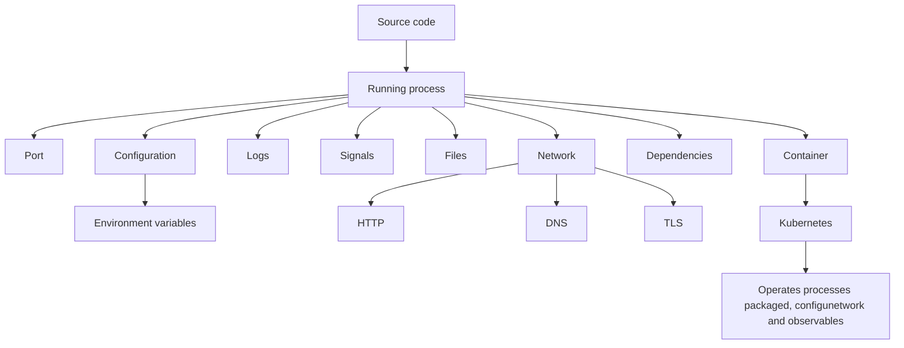
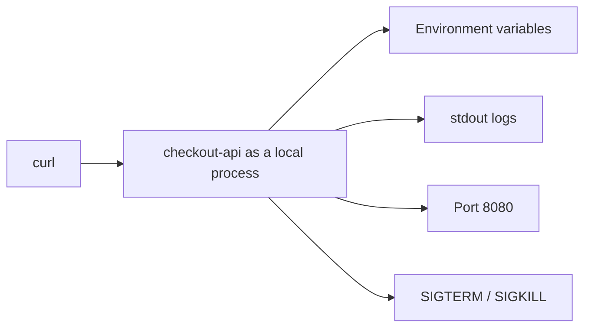
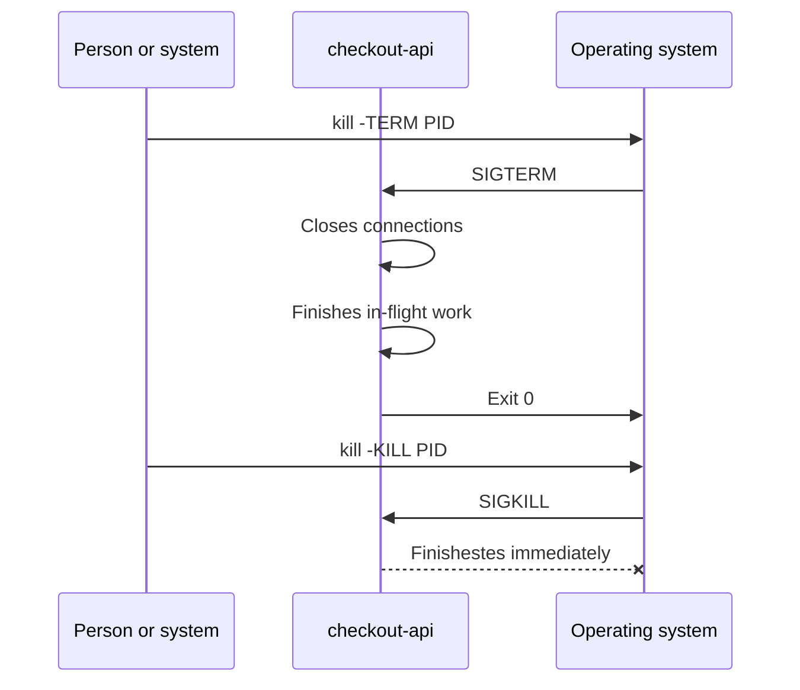
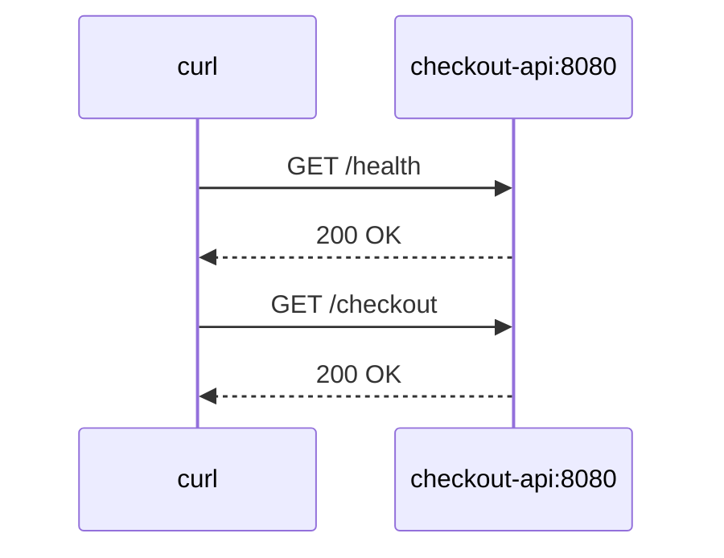
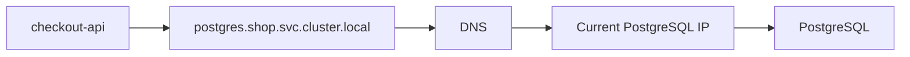
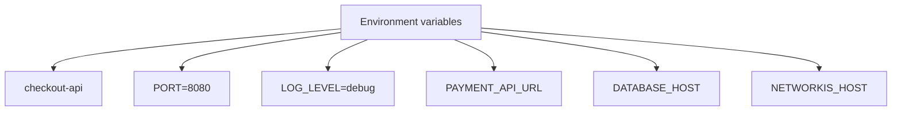
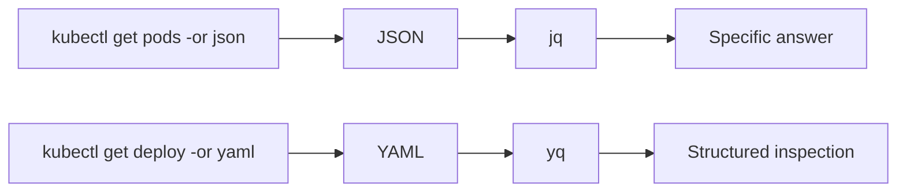

<!-- COURSE_NAV_START -->
[Index](README.md) | [Next](<1. Containers, Docker, Podman, and Compose.md>)
<!-- COURSE_NAV_END -->

# 0. Foundations, DevEx, and reproducible environment

## Section objective

Before learning Kubernetes, you need to understand what está intentando operate Kubernetes.

Kubernetes does not operates “code”. Operates processes packaged, configunetwork, exposed over the network, limited by resources, observados mediante logs, conectados to otros services and sujetos to failures.

That is why this primera section tiene tres objectives:

1. Build the foundations technical minimum
2. Create a learning environment reproducible
3. Learn to inspect JSON and YAML with `jq` and `yq`
The idea is not convertirte yet in system administrator. The idea is que when later veas a Pod, a Deployment, a Service, a probe, a ConfigMap or a Secret, not parezcan isolated concepts.

Everything that exists because a real application needs start, receive traffic, read configuration, write logs, manage dependencies, shut down properly and behave reasonably when something fails.



---

## 0.1. By what this section exists

A person can learn to write a Deployment before of understand Linux, network or processes. But that creates a fragile understanding.

For example, if `checkout-api` does not start in Kubernetes, the problema may be in many layers:

- The image does not exist
- The process starts and dies
- The app listens on another port
- An environment variable is missing
- The app needs to Secret
- The container not tiene permisos
- The readiness probe apunta to a ruta incorrecta
- The app not can resolver `postgres`
- `PostgreSQL` not acepta conexiones
- The Service not selecciona ningún Pod
- The Deployment está bien, but the problema está in the application
Kubernetes te dará signals, but not can pensar by ti.

This section entrena the base for interpretar esas signals.

---

## 0.2. Sistema of ejemplo of the section

During the section 0 usaremos a versión minimum of the sistema `shop`.

In this fase yet not hay Kubernetes.

Only hay a API ejecutándose como process local.

Componente principal:

- `checkout-api`
Responsabilidades simples of `checkout-api`:

- Expose a endpoint HTTP of salud
- Expose a endpoint HTTP funcional
- Read configuration desde environment variables
- Write logs by output estándar
- Responder in a port configurable
- Shut down properly when recibe `SIGTERM`
Ejemplo of endpoints:

- `GET /health`
- `GET /ready`
- `GET /checkout`


---

## 0.3. Foundations technical que you need

### Processes

A process es a programa in ejecución.

When you run `checkout-api`, the sistema operativo creates a process. That process tiene a PID, can escuchar in a port, can write logs, can receive signals and can terminar bien or bad.

In Kubernetes, a container also acaba ejecutando a process. That is why understand processes ayuda to understand Pods, reinicios, probes, lifecycle hooks and shutdown.

### What debes learn

- What es a process
- What es a PID
- How listar processes
- How see consumo of CPU and memoria
- How terminar a process
- What it means que a process muera
- What diferencia hay between parar limpiamente and matar to the fuerza
### Commands base

```bash
ps aux
top
pgrep checkout-api
kill <PID>
kill -TERM <PID>
kill -KILL <PID>
```

### Ejercicio

Starts `checkout-api` localmente.

After:

1. Localiza su PID
2. Comtest in what port escucha
3. Mira sus logs
4. For the process with `SIGTERM`
5. Vuelve to startlo
6. Mátalo with `SIGKILL`
7. Documenta the diferencia
### Criterio of comprensión

Debes poder explicar:

> Kubernetes does not reinicia “code”. Reinicia processes dentro of containers.

---

## 0.4. Signals: SIGTERM and SIGKILL

When a process must shut downse, not always se mata of golpe.

`SIGTERM` pide to the process que termine. The application can use that señal for cerrar conexiones, terminar trabajo in course, liberar Resources and salir properly.

`SIGKILL` mata the process without darle oportunidad of reaccionar.

Esto será importante later because Kubernetes can enviar signals during the apagado of a container, for example during a rollout, a drain or a eliminación of Pod.



### Ejercicio

Implementa or simula a handler of apagado in `checkout-api`.

It must write algo parecido to:

```text
received SIGTERM, shutting down gracefully
server stopped
```

After test:

```bash
kill -TERM <PID>
```

AND compara with:

```bash
kill -KILL <PID>
```

### Criterio of comprensión

Debes poder explicar:

> An application preparada for Kubernetes must shut downse bien, not only start bien.

---

## 0.5. Ports, TCP and HTTP

A API needs escuchar in a port for receive peticiones.

HTTP es a protocolo client-server usado for intercambiar Resources and datos in the web. MDN lo describe como the base of the intercambio of datos in the Web and como a protocolo where the peticiones the inicia the client. ([MDN Web Docs](https://developer.mozilla.org/en-US/docs/Web/HTTP/Guides/Overview "Overview of HTTP - MDN Web Docs"))

In nuestro caso:

- `curl` será the client
- `checkout-api` será the server
- The port será `8080`
- The rutas serán `/health`, `/ready` and `/checkout`


### What debes learn

- What es a port
- What it means que a app “escuche” in a port
- What es a petición HTTP
- What es a respuesta HTTP
- What it meansn códigos como `200`, `404` and `500`
- What diferencia hay between que the process esté vivo and que the app responda properly
### Commands base

```bash
curl http://localhost:8080/health
curl -i http://localhost:8080/health
curl -i http://localhost:8080/checkout
ss -lntp
```

### Ejercicio

Starts `checkout-api` in the port `8080`.

After ejecuta:

```bash
curl -i http://localhost:8080/health
curl -i http://localhost:8080/ready
curl -i http://localhost:8080/checkout
```

Cambia the port to `9090` usando a variable of environment:

```bash
PORT=9090 ./checkout-api
```

Valida:

```bash
curl -i http://localhost:9090/health
```

### Criterio of comprensión

Debes poder explicar:

> Que a process exista not significa que the service esté disponible. Disponibilidad implica que responde properly by the interfaz esperada.

---

## 0.6. DNS and nombres

In local you can llamar to a API with `localhost`.

In sistemas distribuidos, the services need encontrarse by nombre.

DNS permite use nombres legibles instead of direcciones IP. MDN explica que the nombres of dominio son a parte clave of the infraestructura of Internet because proporcionan a dirección legible for servidores disponibles in Internet. ([MDN Web Docs](https://developer.mozilla.org/en-US/docs/Learn_web_development/Howto/Web_mechanics/What_is_a_domain_name "What is to Domain Name? - Learn web development | MDN"))

Later, in Kubernetes, usarás nombres como:

```text
checkout-api.shop.svc.cluster.local
postgres.shop.svc.cluster.local
redis.shop.svc.cluster.local
```

Yet does not you need learn DNS internal of Kubernetes, but yes understand the idea:

> The applications should notn depender of IPs efímeras if pueden depender of nombres estables.



### What debes learn

- What problema resuelve DNS
- Diferencia between nombre e IP
- By what a IP can cambiar
- By what a nombre estable ayuda to operate sistemas
- What it means “resolver a nombre”
### Commands base

```bash
nslookup example.com
dig example.com
getent hosts localhost
```

### Ejercicio

Ejecuta:

```bash
getent hosts localhost
```

After añade a input temporal to `/etc/hosts` for simular a nombre local:

```text
127.0.0.1 checkout.local
```

AND test:

```bash
curl -i http://checkout.local:8080/health
```

### Criterio of comprensión

Debes poder explicar:

> A nombre estable desacopla to quien llama of the dirección concreta of the service.

---

## 0.7. Environment variables and configuration

An application should not necesitar recompilarse for cambiar su configuration.

Ejemplos of configuration:

- Port
- Nivel of logs
- URL of `payment-api`
- Host of `PostgreSQL`
- Host of `Redis`
- Feature flags
- Timeouts
In this section usaremos environment variables.

Ejemplo:

```bash
PORT=8080
LOG_LEVEL=debug
PAYMENT_API_URL=http://localhost:8081
DATABASE_HOST=localhost
REDIS_HOST=localhost
```



### What debes learn

- What es configuration
- By what not must hardcodearse
- What es a variable of environment
- How read variables desde an application
- What pasa when falta configuration
- Diferencia between configuration sensible and not sensible
### Ejercicio

Starts `checkout-api` with:

```bash
PORT=8080 LOG_LEVEL=debug ./checkout-api
```

After arráncala without `PORT`.

The app should tener a valor by defecto or fail with a mensaje claro.

Documenta cuál of the dos decisiones has tomado and by what.

### Criterio of comprensión

Debes poder explicar:

> The same binario should poder runse in entornos distintos cambiando configuration, not cambiando code.

---

## 0.8. Logs

The logs son a of the primeras signals for understand what está pasando.

In local you can write logs in the terminal. In containers and Kubernetes, lo normal es write logs to output estándar and error estándar for que the plataforma pueda recogerlos.

Ejemplo of logs útiles:

```json
{"level":"info","service":"checkout-api","message":"server started","port":8080}
{"level":"info","service":"checkout-api","message":"request completed","path":"/health","status":200}
{"level":"error","service":"checkout-api","message":"payment provider unavailable"}
```

### What debes learn

- Diferencia between logs útiles and ruido
- By what the logs must incluir contexto
- By what stdout and stderr importan
- How seguir logs in tiempo real
- How buscar in logs
- By what the logs not sustituyen métricas ni trazas
### Commands base

```bash
./checkout-api
./checkout-api > app.log 2>&1
tail -f app.log
grep error app.log
```

### Ejercicio

Haz que `checkout-api` escriba logs to the start and to the receive peticiones.

It must registrar:

- Service
- Ruta
- Code HTTP
- Duración aproximada
- Error, if lo hay
After ejecuta:

```bash
curl -i http://localhost:8080/health
curl -i http://localhost:8080/checkout
```

AND revisa the logs.

### Criterio of comprensión

Debes poder explicar:

> A log útil must ayudar to reconstruir what pasó, not only demostrar que algo imprimió texto.

---

## 0.9. YAML and JSON

Kubernetes se suele write in YAML, but sus objetos also pueden verse como JSON.

YAML es a lenguaje of serialización of datos legible by humanos. The especificación YAML 1.2.2 define YAML 1.2 and aclara que that revisión not introduce cambios normativos about YAML 1.2, sinot correcciones and claridad. ([yaml.org](https://yaml.org/spec/1.2.2/ "YAML Ain't Markup Language (YAML™) revision 1.2.2"))

JSON será importante because `kubectl` can devolver objetos in JSON, and tools como `jq` permiten inspectlos with precisión.

Ejemplo conceptual:

```yaml
apiVersion: v1
kind: ConfigMap
metadata:
  name: checkout-config
  namespace: shop
data:
  LOG_LEVEL: debug
  PAYMENT_API_URL: http://payment-api
```

The same idea como estructura of datos:

```json
{
  "apiVersion": "v1",
  "kind": "ConfigMap",
  "metadata": {
    "name": "checkout-config",
    "namespace": "shop"
  },
  "data": {
    "LOG_LEVEL": "debug",
    "PAYMENT_API_URL": "http://payment-api"
  }
}
```

### What debes learn

- Clave and valor
- Objetos
- Arrays
- Strings
- Números
- Booleanos
- Indentación in YAML
- Diferencia between YAML válido and YAML correcto for Kubernetes
- Diferencia between sintaxis and significado
### Ejercicio

Creates a file `checkout-config.yaml`:

```yaml
service:
  name: checkout-api
  port: 8080
  logLevel: debug
dependencies:
  paymentApi: http://payment-api
  redis: redis
  postgres: postgres
```

After creates the equivalente in JSON:

```json
{
  "service": {
    "name": "checkout-api",
    "port": 8080,
    "logLevel": "debug"
  },
  "dependencies": {
    "paymentApi": "http://payment-api",
    "redis": "redis",
    "postgres": "postgres"
  }
}
```

### Criterio of comprensión

Debes poder explicar:

> YAML and JSON not son Kubernetes. Son formatos for expresar datos. Kubernetes interpreta esos datos como objetos of su API.

---

## 0.10. jq

`jq` permite consultar, filtrar and transformar JSON. Su manual lo describe como a sistema of filtros: recibe a input and produce a output, and esos filtros pueden combinarse mediante pipes. ([jqlang.org](https://jqlang.org/manual/ "jq 1.8 Manual"))

In Kubernetes esto será very útil because `kubectl get -o json` devuelve objetos grandes.

Without `jq`, acabas leyendo manualmente mucho texto.

With `jq`, you can hacer preguntas precisas.

### Ejemplo base

Dado this file `checkout-config.json`:

```json
{
  "service": {
    "name": "checkout-api",
    "port": 8080,
    "logLevel": "debug"
  },
  "dependencies": {
    "paymentApi": "http://payment-api",
    "redis": "redis",
    "postgres": "postgres"
  }
}
```

You can consultar the port:

```bash
jq '.service.port' checkout-config.json
```

You can consultar the nombre of the service:

```bash
jq -r '.service.name' checkout-config.json
```

You can consultar the dependencies:

```bash
jq '.dependencies' checkout-config.json
```

### Ejemplo with estructura parecida to Kubernetes

Creates `pods.json`:

```json
{
  "items": [
    {
      "metadata": {
        "namespace": "shop",
        "name": "checkout-api-7d9f"
      },
      "status": {
        "phase": "Running"
      }
    },
    {
      "metadata": {
        "namespace": "shop",
        "name": "payment-api-6c8a"
      },
      "status": {
        "phase": "Pending"
      }
    }
  ]
}
```

Listar nombres:

```bash
jq -r '.items[].metadata.name' pods.json
```

Listar namespace and nombre:

```bash
jq -r '.items[] | [.metadata.namespace, .metadata.name] | @tsv' pods.json
```

Filtrar Pods que not están `Running`:

```bash
jq -r '.items[] | select(.status.phase != "Running") | .metadata.name' pods.json
```

### Criterio of comprensión

Debes poder explicar:

> `jq` convierte JSON grande in respuestas pequeñas and precisas.

---

## 0.11. yq

`yq` permite consultar and transformar YAML, also of otros formatos. The documentación of the proyecto lo presenta como a procesador ligero and portable for YAML, JSON, INI and XML, with sintaxis inspirada in `jq`. ([mikefarah.gitbook.io](https://mikefarah.gitbook.io/yq "Quick Usage Guide - yq"))

In Kubernetes esto será very útil because the manifests suelen writese in YAML.

### Ejemplo base

With `checkout-config.yaml`:

```yaml
service:
  name: checkout-api
  port: 8080
  logLevel: debug
dependencies:
  paymentApi: http://payment-api
  redis: redis
  postgres: postgres
```

Consultar the port:

```bash
yq '.service.port' checkout-config.yaml
```

Consultar the nombre:

```bash
yq '.service.name' checkout-config.yaml
```

Modificar the nivel of logs:

```bash
yq -i '.service.logLevel = "info"' checkout-config.yaml
```

### Ejemplo with manifest parecido to Kubernetes

Creates `deployment.yaml`:

```yaml
apiVersion: apps/v1
kind: Deployment
metadata:
  name: checkout-api
  namespace: shop
spec:
  replicas: 2
  template:
    spec:
      containers:
        - name: checkout-api
          image: checkout-api:1.0.0
          ports:
            - containerPort: 8080
```

Consultar the nombre:

```bash
yq '.metadata.name' deployment.yaml
```

Consultar the image:

```bash
yq '.spec.template.spec.containers[0].image' deployment.yaml
```

Cambiar the image:

```bash
yq -i '.spec.template.spec.containers[0].image = "checkout-api:1.0.1"' deployment.yaml
```

### Criterio of comprensión

Debes poder explicar:

> `yq` permite tratar YAML como datos estructurados, not como texto suelto.

---

## 0.12. kubectl, JSON and formatos of output

Yet not you need dominar `kubectl`, but yes debes understand a idea importante: `kubectl` can mostrar objetos in distintos formatos. The documentación oficial of Kubernetes explica que `kubectl` soporta JSONPath como formato of output for filtrar campos concretos of objetos JSON. ([Kubernetes](https://kubernetes.io/docs/reference/kubectl/jsonpath/ "JSONPath Support"))

Later usarás commands como:

```bash
kubectl get pods -A -o json
kubectl get pods -A -o yaml
kubectl get pods -A -o jsonpath='{.items[*].metadata.name}'
```

AND also:

```bash
kubectl get pods -A -o json | jq -r '.items[].metadata.name'
```

### Idea clave

`kubectl` not only sirve for “see tablas”.

Sirve for consultar objetos.



### Criterio of comprensión

Debes poder explicar:

> If Kubernetes expone objetos, necesito tools for consultar objetos, not only for read texto.

---

## 0.13. Git

Git será necessary for versionar:

- Code
- Dockerfiles
- Manifests
- Taskfiles
- Documentación
- Runbooks
- Tests
- Decisiones of configuration
The libro oficial _Pro Git_ está disponible in the web oficial of Git and organiza the aprendizaje desde foundations hasta branching, Git distribuido, tools and personalización. ([Git](https://git-scm.com/book/en/v2 "Pro Git book"))

### What debes learn

- `git init`
- `git status`
- `git add`
- `git commit`
- `git log`
- `git diff`
- `.gitignore`
- Branches basic
- Tags basic
- How read cambios before of commit
### Ejercicio

Creates the repositorio:

```bash
mkdir kubernetes-learning-lab
cd kubernetes-learning-lab
git init
```

Creates:

```text
README.md
Taskfile.yml
.env.example
apps/checkout-api/
docs/commands.md
docs/troubleshooting.md
```

Haz tu primer commit:

```bash
git add .
git commit -m "Create learning lab skeleton"
```

### Criterio of comprensión

Debes poder explicar:

> If not versionot mi learning environment, not puedo reproducirlo, revisarlo ni mejorarlo with security.

---

## 0.14. Estructura of the repositorio

This será the estructura inicial of the laboratorio.

```text
kubernetes-learning-lab/
  Taskfile.yml
  README.md
  .env.example
  .gitignore

  apps/
    checkout-api/

  scripts/
    smoke-test.sh
    validate-tools.sh

  docs/
    commands.md
    troubleshooting.md
    references.md
    jq-yq.md

  tmp/
```

Later crecerá hacia:

```text
kubernetes-learning-lab/
  Taskfile.yml
  README.md
  .env.example
  .gitignore

  apps/
    frontend/
    checkout-api/
    payment-api/
    inventory-api/
    notification-worker/

  containers/
    docker/
    podman/

  compose/
    compose.yaml

  kubernetes/
    00-namespace/
    01-pod/
    02-deployment/
    03-service/
    04-ingress-o-gateway/
    05-config/
    06-storage/
    07-security/
    08-observability/

  scripts/
    smoke-test.sh
    wait-for-rollout.sh
    validate-tools.sh
    inspect-json.sh
    inspect-yaml.sh

  tests/
    manifests/
    policies/
    cluster/
    smoke/
    failure-lab/

  docs/
    commands.md
    troubleshooting.md
    failure-lab.md
    references.md
    jq-yq.md
```

---

## 0.15. Taskfile

Task permite definir tasks in YAML. Su documentación oficial muestra que the Taskfiles se escriben in YAML and que pueden incluir versión, variables and commands. ([Task](https://taskfile.dev/docs/getting-started "Getting Started | Task - Taskfile"))

The documentación also explica que, if not se especifica a Taskfile concreto, Task busca a file compatible in the directory actual. ([Task](https://taskfile.dev/docs/guide "Guide | Task - Taskfile"))

The intención of the Taskfile in this course es networkucir fricción accidental.

Not must ocultar the aprendizaje.

It must hacer visibles the commands and permitir repetirlos.

### Taskfile inicial

```yaml
version: '3'

vars:
  APP_NAME: checkout-api
  PORT: 8080

tasks:
  default:
    desc: List available tasks
    cmds:
      - task --list

  doctor:
    desc: Check required local tools
    cmds:
      - git --version
      - curl --version
      - jq --version
      - yq --version
      - task --version

  app:run:
    desc: Run checkout-api locally
    dir: apps/{{.APP_NAME}}
    cmds:
      - PORT={{.PORT}} ./checkout-api

  app:health:
    desc: Call checkout-api health endpoint
    cmds:
      - curl -i http://localhost:{{.PORT}}/health

  app:ready:
    desc: Call checkout-api readiness endpoint
    cmds:
      - curl -i http://localhost:{{.PORT}}/ready

  app:checkout:
    desc: Call checkout-api checkout endpoint
    cmds:
      - curl -i http://localhost:{{.PORT}}/checkout

  json:inspect:
    desc: Inspect sample JSON with jq
    cmds:
      - jq '.service.name' docs/examples/checkout-config.json
      - jq '.service.port' docs/examples/checkout-config.json

  yaml:inspect:
    desc: Inspect sample YAML with yq
    cmds:
      - yq '.service.name' docs/examples/checkout-config.yaml
      - yq '.service.port' docs/examples/checkout-config.yaml
```

### Criterio of comprensión

Debes poder explicar:

> Taskfile not sustituye the conocimiento of the commands. Hace que the aprendizaje sea repetible.

---

## 0.16. Practice principal of the section

### Objective

Build a laboratorio minimum que puedas run muchas veces.

### Resultado esperado

To the final of the practice debes tener:

```text
kubernetes-learning-lab/
  Taskfile.yml
  README.md
  .env.example
  .gitignore

  apps/
    checkout-api/

  docs/
    examples/
      checkout-config.yaml
      checkout-config.json
    commands.md
    troubleshooting.md
    references.md
    jq-yq.md

  scripts/
    validate-tools.sh
    smoke-test.sh
```

### Paso 1. Create estructura

```bash
mkdir -p kubernetes-learning-lab
cd kubernetes-learning-lab

mkdir -p apps/checkout-api
mkdir -p docs/examples
mkdir -p scripts

touch README.md
touch .env.example
touch .gitignore
touch docs/commands.md
touch docs/troubleshooting.md
touch docs/references.md
touch docs/jq-yq.md
touch scripts/validate-tools.sh
touch scripts/smoke-test.sh
touch Taskfile.yml
```

### Paso 2. Create configuration YAML

```yaml
service:
  name: checkout-api
  port: 8080
  logLevel: debug
dependencies:
  paymentApi: http://payment-api
  redis: redis
  postgres: postgres
```

Guárdalo in:

```text
docs/examples/checkout-config.yaml
```

### Paso 3. Create configuration JSON

```json
{
  "service": {
    "name": "checkout-api",
    "port": 8080,
    "logLevel": "debug"
  },
  "dependencies": {
    "paymentApi": "http://payment-api",
    "redis": "redis",
    "postgres": "postgres"
  }
}
```

Guárdalo in:

```text
docs/examples/checkout-config.json
```

### Paso 4. Create script of validación

```bash
#!/usr/bin/env bash
set -euo pipefail

echo "Checking required tools..."

git --version
curl --version
jq --version
yq --version
task --version

echo "All required tools are available."
```

Guárdalo in:

```text
scripts/validate-tools.sh
```

Dale permisos:

```bash
chmod +x scripts/validate-tools.sh
```

### Paso 5. Create smoke test inicial

```bash
#!/usr/bin/env bash
set -euo pipefail

PORT="${PORT:-8080}"

curl -fsS "http://localhost:${PORT}/health" > /dev/null

echo "checkout-api health check passed"
```

Guárdalo in:

```text
scripts/smoke-test.sh
```

Dale permisos:

```bash
chmod +x scripts/smoke-test.sh
```

### Paso 6. Create Taskfile

```yaml
version: '3'

vars:
  APP_NAME: checkout-api
  PORT: 8080

tasks:
  default:
    desc: List available tasks
    cmds:
      - task --list

  doctor:
    desc: Check required local tools
    cmds:
      - ./scripts/validate-tools.sh

  yaml:inspect:
    desc: Inspect YAML example with yq
    cmds:
      - yq '.service.name' docs/examples/checkout-config.yaml
      - yq '.service.port' docs/examples/checkout-config.yaml
      - yq '.dependencies' docs/examples/checkout-config.yaml

  json:inspect:
    desc: Inspect JSON example with jq
    cmds:
      - jq '.service.name' docs/examples/checkout-config.json
      - jq '.service.port' docs/examples/checkout-config.json
      - jq '.dependencies' docs/examples/checkout-config.json

  smoke:
    desc: Run local smoke test
    cmds:
      - ./scripts/smoke-test.sh
```

### Paso 7. Run

```bash
task doctor
task yaml:inspect
task json:inspect
```

The smoke test funcionará when tengas `checkout-api` arrancada:

```bash
task smoke
```

---

## 0.17. Ejercicios cortos

### Ejercicio 1. Processes

Starts cualquier process HTTP local.

May be tu `checkout-api` or a server temporal.

Ejemplo with Python:

```bash
python3 -m http.server 8080
```

After:

```bash
ps aux | grep python
ss -lntp | grep 8080
curl -i http://localhost:8080
```

Explica:

- What process está corriendo
- What port uses
- What ocurre if lo paras
---

### Ejercicio 2. Environment variables

Ejecuta:

```bash
PORT=8080 LOG_LEVEL=debug env | grep -E 'PORT|LOG_LEVEL'
```

After documenta:

- What it means `PORT`
- What it means `LOG_LEVEL`
- By what these variables should notn estar hardcodeadas in the code
---

### Ejercicio 3. jq

Ejecuta:

```bash
jq -r '.service.name' docs/examples/checkout-config.json
jq -r '.dependencies.postgres' docs/examples/checkout-config.json
```

After añade a nueva dependencia:

```json
"fraudApi": "http://fraud-api"
```

AND extráela with `jq`.

---

### Ejercicio 4. yq

Ejecuta:

```bash
yq '.service.name' docs/examples/checkout-config.yaml
yq '.dependencies.postgres' docs/examples/checkout-config.yaml
```

After cambia the port:

```bash
yq -i '.service.port = 9090' docs/examples/checkout-config.yaml
```

Comtest:

```bash
yq '.service.port' docs/examples/checkout-config.yaml
```

---

### Ejercicio 5. Git

Inicializa the repositorio:

```bash
git init
git status
git add .
git commit -m "Create section 0 learning lab"
```

After modifica `docs/jq-yq.md` and revisa:

```bash
git diff
git status
```

---

## 0.18. Errores habituales In this section

### Error 1. Memorizar commands without understand what observan

Not basta with saber run:

```bash
ps aux
```

Debes saber what pregunta responde.

Better:

> Quiero saber if `checkout-api` sigue vivo como process.

Entonces usas:

```bash
ps aux | grep checkout-api
```

---

### Error 2. Confundir YAML válido with configuration correcta

This YAML may be válido:

```yaml
service:
  name: checkout-api
  port: wrong
```

But may be incorrecto for tu application if `port` must ser a número.

The sintaxis not demuestra que the significado sea correcto.

---

### Error 3. Tratar base64 como cifrado

Later verás Secrets of Kubernetes. It is important preparar this idea desde ahora:

> Codificar is not cifrar.

Base64 transforma representación. Not protege the secret by yes same.

---

### Error 4. Write logs without contexto

Esto ayuda poco:

```text
error
```

Esto ayuda more:

```json
{"level":"error","service":"checkout-api","operation":"create-checkout","message":"payment provider unavailable"}
```

---

### Error 5. Use Taskfile for esconder everything

Taskfile must facilitar the repetición, not convertir the aprendizaje in magia.

Each task must ser fácil of read.

---

## 0.19. Criterio of output of the section

You can pasar to the section 1 when puedas hacer everything esto without seguir a receta ciegamente:

### Foundations

- Explicar what es a process
- Explicar what es a PID
- Explicar what es a port
- Explicar what es a variable of environment
- Explicar what es a log
- Explicar the diferencia between `SIGTERM` and `SIGKILL`
- Explicar by what DNS ayuda to not depender of IPs concretas
- Explicar what representa YAML
- Explicar what representa JSON
### Tools

- Run `curl` contra a endpoint local
- See processes with `ps`
- See ports abiertos with `ss`
- Read logs with `tail`
- Buscar texto with `grep`
- Consultar JSON with `jq`
- Consultar YAML with `yq`
- Run tasks with Taskfile
- Versionar cambios with Git
### Laboratorio

- Tener creado `kubernetes-learning-lab`
- Tener `Taskfile.yml`
- Tener `checkout-config.yaml`
- Tener `checkout-config.json`
- Tener `scripts/validate-tools.sh`
- Tener `scripts/smoke-test.sh`
- Run properly:

```bash
task doctor
task yaml:inspect
task json:inspect
```

### Comprensión final

Debes poder explicar this frase:

> An application in producción is not only code. Es a process, with configuration, ports, permisos, dependencies, límites, logs, state and comportamiento ante failures.

---

## 0.20. References oficiales

|Tema|Referencia|
|---|---|
|HTTP|MDN, Overview of HTTP. ([MDN Web Docs](https://developer.mozilla.org/en-US/docs/Web/HTTP/Guides/Overview "Overview of HTTP - MDN Web Docs"))|
|DNS and nombres of dominio|MDN, What is to domain name? ([MDN Web Docs](https://developer.mozilla.org/en-US/docs/Learn_web_development/Howto/Web_mechanics/What_is_a_domain_name "What is to Domain Name? - Learn web development \| MDN"))|
|Git|Pro Git Book. ([Git](https://git-scm.com/book/en/v2 "Pro Git book"))|
|YAML|YAML 1.2.2 Specification. ([yaml.org](https://yaml.org/spec/1.2.2/ "YAML Ain't Markup Language (YAML™) revision 1.2.2"))|
|jq|jq Manual. ([jqlang.org](https://jqlang.org/manual/ "jq 1.8 Manual"))|
|yq|yq official documentation. ([mikefarah.gitbook.io](https://mikefarah.gitbook.io/yq "Quick Usage Guide - yq"))|
|Taskfile|Taskfile Getting Started. ([Task](https://taskfile.dev/docs/getting-started "Getting Started \| Task - Taskfile"))|
|Taskfile guide|Taskfile Guide. ([Task](https://taskfile.dev/docs/guide "Guide \| Task - Taskfile"))|
|kubectl JSONPath|Kubernetes JSONPath Support. ([Kubernetes](https://kubernetes.io/docs/reference/kubectl/jsonpath/ "JSONPath Support"))|
|kubectl reference|Kubernetes kubectl reference. ([Kubernetes](https://kubernetes.io/docs/reference/generated/kubectl/kubectl-commands "Kubectl Reference Docs"))|

<!-- COURSE_NAV_START -->
[Index](README.md) | [Next](<1. Containers, Docker, Podman, and Compose.md>)
<!-- COURSE_NAV_END -->
