<!-- COURSE_NAV_START -->
[Previous](<0. Foundations, DevEx, and reproducible environment.md>) | [Index](README.md) | [Next](<2. Why Kubernetes exists.md>)
<!-- COURSE_NAV_END -->

# 1. Containers, Docker, Podman, and Compose

## Objective of the module

In the module 0 aprendiste to mirar an application como a process: starts, escucha in a port, lee configuration, escribe logs, recibe signals and may fail.

In this module vamos to empaquetar that process.

The objective is not learn Docker como if Docker fuera the centro of the modelo. The objective es understand containers:

- What es an image
- What es a container
- What es a registry
- What problema resuelve a Dockerfile or Containerfile
- How se construye an image
- How runs a container
- How se publican ports
- How se pasan environment variables
- How se gestionan logs
- How se persisten datos
- What papel tienen Docker, Podman, Compose, OCI and the runtimes
- How mejorar DevEx for repetir the prácticas without fricción
Docker se presenta oficialmente como a plataforma for desarrollar, distribuir and run applications, and su documentación explica que to the use Docker trabajas with objetos como images, containers, networks, volúmenes and registries. ([Docker Documentation](https://docs.docker.com/get-started/docker-overview/ "What is Docker?"))

The idea central of the module es this:

> A image es the paquete. A container es a process ejecutándose to partir of that paquete.

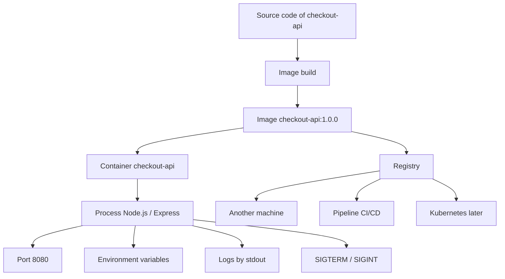

---

## 1.1. What problema resuelve a container

When you run `checkout-api` directamente in tu máquina, dependes of the local environment.

It can funcionar in tu ordenador and fail in otro because cambia algo:

- Versión of Node.js
- Versión of npm
- Librerías of the sistema
- Environment variables
- User que ejecuta the process
- Files disponibles
- Ports ocupados
- Arquitectura of CPU
- Sistema operativo
- Permisos
- Certificados
- Dependencies externas
A container reduce parte of that variabilidad empaquetando the application with lo que needs for runse.

Not elimina all the problemas. But cambia the starting point.

In vez of decir:

> Instala Node, instala npm, instala dependencies, configura variables, starts the process and asegúrate of tener the same environment.

Dices:

> Ejecuta this image with this configuration.

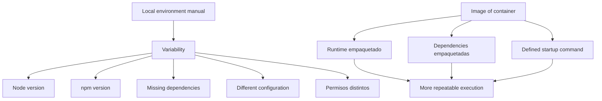

### What debes understand

A image es a artefacto empaquetado. Contiene filesystem, metadata and a configuration of ejecución. The documentación of Docker define an image of container como a paquete estandarizado que incluye the files, binarios, librerías and configuration necesarios for run a container. ([Docker Documentation](https://docs.docker.com/get-started/docker-concepts/the-basics/what-is-an-image/ "What is an image? | Docker Docs"))

A container es a instancia in ejecución basada in an image. Tiene a process principal, environment, network, filesystem and ciclo of vida.

A registry almacenan images for que otras máquinas puedan descargarlas. Esto será esencial later because a cluster Kubernetes may have varios nodos and all need acceder to the images que aparecen in the manifests.

### DevEx of the bloque

Desde the principio, everything lo que hagas should poder runse with commands repetibles.

Not queremos que the learner tenga que recordar commands largos como:

```bash
docker build -t checkout-api:1.0.0 ./apps/checkout-api
```

Queremos que pueda use:

```bash
task container:build:docker
```

But the Taskfile must mostrar the command real.

Taskfile facilita the repetición, not sustituye the aprendizaje.

### Criterio of comprensión

Debes poder explicar:

> A container is not a máquina virtual pequeña. Es a forma of run a process isolated, empaquetado and configurable.

---

## 1.2. Image vs container

The confusión more habitual es mezclar image and container.

A image not está corriendo.

A container yes.

A image se construye, etiqueta, escanea, sube to a registry and descarga.

A container is created, starts, for, reinicia, inspecciona and elimina.

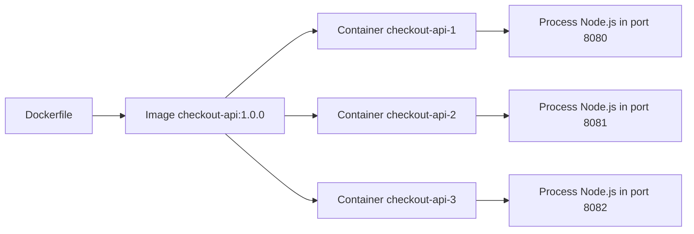

### Contrato mental

|Concept|What es|What haces with él|
|---|---|---|
|Image|Paquete ejecutable|Build, tag, push, pull, inspect, scan|
|Container|Ejecución concreta of an image|Run, stop, logs, exec, inspect, remove|
|Registry|Lugar where se almacenan images|Push, pull|
|Dockerfile|Receta for build an image|Build|
|Tag|Nombre legible of an image|Versionar of forma humana|
|Digest|Identificador by contenido|Referenciar an image exacta|

### Ejemplo minimum

If tienes this image:

```text
checkout-api:1.0.0
```

You can run a container:

```bash
docker run --rm -p 8080:8080 checkout-api:1.0.0
```

AND also otro:

```bash
docker run --rm -p 8081:8080 checkout-api:1.0.0
```

Ambos containers salen of the same image, but son processes distintos.

### Practice rápida

Construye the image:

```bash
docker build -t checkout-api:1.0.0 ./apps/checkout-api
```

Ejecuta dos containers desde the same image:

```bash
docker run -d --name checkout-one -p 8080:8080 checkout-api:1.0.0
docker run -d --name checkout-two -p 8081:8080 checkout-api:1.0.0
```

Valida:

```bash
curl -i http://localhost:8080/health
curl -i http://localhost:8081/health
```

Limpia:

```bash
docker stop checkout-one checkout-two
docker rm checkout-one checkout-two
```

### DevEx of the bloque

Añade tasks pequeñas:

```yaml
container:list:
  desc: List local containers
  cmds:
    - docker ps -a

image:list:
  desc: List local checkout-api images
  cmds:
    - docker images | grep checkout-api || true
```

### Criterio of comprensión

Debes poder explicar:

> The image es the paquete reutilizable. The container es a ejecución concreta of that paquete.

---

## 1.3. Docker, Podman, OCI and runtimes

Docker and Podman son tools for trabajar with containers e images.

OCI es diferente: is not a tool of uso diario, sinot a conjunto of especificaciones abiertas. OCI mantiene especificaciones abiertas for images, runtimes and distribución of containers. ([Docker Documentation](https://docs.docker.com/get-started/docker-overview/ "What is Docker?"))

Kubernetes uses the Container Runtime Interface, conocida como CRI, for que the kubelet pueda use distintos runtimes of containers without tener que recompilar the componentes of the cluster. ([Docker Documentation](https://docs.docker.com/get-started/docker-overview/ "What is Docker?"))

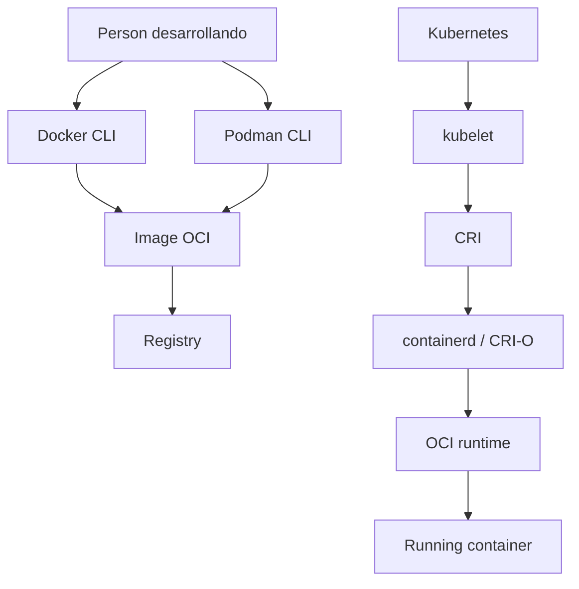

### Docker

Docker es a plataforma for build, distribuir and run applications usando containers. In this module lo usaremos for build images, run containers, see logs, publicar ports, mount volúmenes, create networks and use Compose. ([Docker Documentation](https://docs.docker.com/get-started/docker-overview/ "What is Docker?"))

### Podman

Podman es a tool daemonless, open source and Linux native for buscar, run, build, share and desplegar applications usando containers e images OCI. Su CLI resulta familiar for personas que already han usado Docker. ([docs.podman.io](https://docs.podman.io/ "What is Podman? — Podman documentation"))

Podman es útil because ayuda to separar the concept of container of a tool concreta.

### OCI

OCI te ayuda to understand by what an image should not ser “of Docker” in sentido conceptual. Docker can construirla, Podman can construirla, a registry can almacenarla and Kubernetes can runla mediante runtimes compatibles.

### CRI

CRI it is important for Kubernetes, not for tus firsts commands locales. Later verás que Kubernetes does not ejecuta containers llamando to `docker run`. The kubelet habla with a runtime mediante CRI.

### DevEx of the bloque

In the laboratorio not vamos to obligar to use Docker or Podman como única opción.

The DevEx good aquí consiste in ofrecer tasks equivalentes:

```bash
task container:build:docker
task container:build:podman
task container:run:docker
task container:run:podman
```

This allows learn the modelo without quedar atrapado in a sola tool.

### Criterio of comprensión

Debes poder explicar:

> Docker and Podman son tools. OCI define estándares. Kubernetes uses runtimes mediante CRI for run containers in the nodos.

---

## 1.4. Ciclo of vida of an image

A image pasa by a ciclo of vida.

First tienes code. After defines how empaquetarlo. Then construyes the image, the etiquetas, the tests, the escaneas, the publicas and the usas.

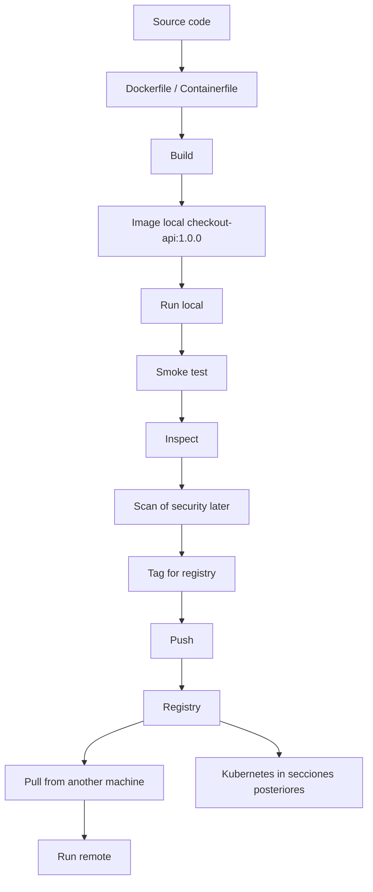

### States importbefore

|State|What it means|
|---|---|
|Image local|Exists in tu máquina|
|Image etiquetada|Tiene a nombre útil, for example `checkout-api:1.0.0`|
|Image publicada|Está in a registry|
|Image by digest|Se referencia by contenido exacto|
|Image obsoleta|Already should not usarse|
|Image vulnerable|Tiene vulnerabilidades conocidas and requiere revisión|

### Tags and digests

A tag es a alias legible:

```text
checkout-api:1.0.0
```

A digest identifica contenido concreto:

```text
sha256:...
```

For aprendizaje, use tags es cómodo.

For deployments profesionales, the digests networkucen ambigüedad because apuntan to a contenido concreto.

### DevEx of the bloque

Define the variables of image a sola vez in `Taskfile.yml`:

```yaml
vars:
  IMAGE_NAME: checkout-api
  IMAGE_TAG: 1.0.0
```

Así evitas write tags distintos by accidente.

### Criterio of comprensión

Debes poder explicar:

> A tag es a nombre cómodo. A digest identifica the contenido exacto of an image.

---

## 1.5. Contrato HTTP minimum of checkout-api

Before of write the application, necesitamos definir what comportamiento esperamos of ella.

A API is not only a process que escucha in a port. Es a process que expone a interfaz.

In this module usaremos tres endpoints:

- `GET /health`
- `GET /ready`
- `GET /checkout`
Each endpoint tiene a propósito distinto.

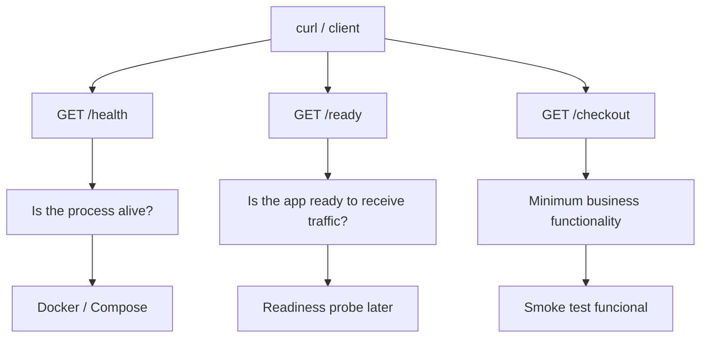

### What es a endpoint

A endpoint es a ruta concreta expuesta by an application for realizar a acción or consultar información.

For example:

```text
GET /health
```

Significa:

- Método HTTP: `GET`
- Ruta: `/health`
- Propósito: check salud básica of the process
- Respuesta esperada: HTTP `200 OK` if the process can responder
### What es a contrato HTTP

A contrato HTTP define what can esperar a client when llama to a endpoint.

It must indicar:

- Método HTTP
- Ruta
- Code of state esperado
- Formato of respuesta
- Campos minimum
- Significado operativo
Ejemplo:

```http
GET /health
```

Respuesta esperada:

```http
HTTP/1.1 200 OK
Content-Type: application/json
```

Body:

```json
{
  "service": "checkout-api",
  "status": "ok"
}
```

---

### Endpoint 1: GET /health

#### Objective

Check que the process está vivo and can responder HTTP.

`/health` must ser barato, rápido and estable.

Should does not depender of sistemas externos como PostgreSQL, Redis or proveedores of pago.

If `/health` fails, normalmente significa que the process not está funcionando properly.

#### Contrato

|Campo|Valor|
|---|---|
|Método|`GET`|
|Ruta|`/health`|
|Code correcto|`200 OK`|
|Content-Type|`application/json`|
|Dependencies externas|Not|
|Uso principal|Saber if the process responde|

#### Respuesta esperada

```json
{
  "service": "checkout-api",
  "status": "ok"
}
```

#### Validación with curl

```bash
curl -i http://localhost:8080/health
```

Respuesta esperada:

```text
HTTP/1.1 200 OK
Content-Type: application/json
```

With body parecido to:

```json
{
  "service": "checkout-api",
  "status": "ok"
}
```

---

### Endpoint 2: GET /ready

#### Objective

Check que the application está lista for receive traffic.

`/ready` not significa exactamente lo same que `/health`.

An application may be viva but not estar lista.

Ejemplos:

- The process arrancó, but yet carga configuration
- The process arrancó, but not can conectar with a dependencia obligatoria
- The process está cerrándose and already should not receive traffic
- The process needs completar a inicialización before of aceptar peticiones reales
In this module, `/ready` será simple and devolverá `ready`.

Later, in Kubernetes, this diferencia será clave for understand readiness probes.

#### Contrato

|Campo|Valor|
|---|---|
|Método|`GET`|
|Ruta|`/ready`|
|Code correcto|`200 OK`|
|Content-Type|`application/json`|
|Dependencies externas|In this module, not|
|Uso principal|Saber if the app should receive traffic|

#### Respuesta esperada

```json
{
  "service": "checkout-api",
  "status": "ready"
}
```

#### Validación with curl

```bash
curl -i http://localhost:8080/ready
```

Respuesta esperada:

```text
HTTP/1.1 200 OK
Content-Type: application/json
```

With body parecido to:

```json
{
  "service": "checkout-api",
  "status": "ready"
}
```

---

### Diferencia between /health and /ready

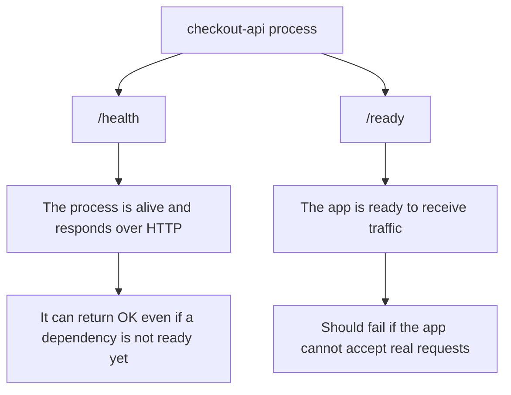

|Endpoint|Pregunta que responde|Ejemplo of uso|
|---|---|---|
|`/health`|¿The process está vivo?|Restart if the process queda bloqueado|
|`/ready`|¿It must receive traffic ahora?|Sacar the instancia of the balanceo if not está lista|

In this module ambos devolverán `200`, because yet not tenemos dependencies reales.

Later, when `checkout-api` dependa of `Redis`, `PostgreSQL` or `payment-api`, podremos decidir if `/ready` must check esas dependencies or only check readiness interna.

---

### Endpoint 3: GET /checkout

#### Objective

Tener a endpoint funcional minimum.

Not queremos a API complex. Only necesitamos a ruta que represente a operación of negocio sencilla for poder hacer smoke tests.

`/checkout` simula the creación of a checkout.

#### Contrato

|Campo|Valor|
|---|---|
|Método|`GET`|
|Ruta|`/checkout`|
|Code correcto|`200 OK`|
|Content-Type|`application/json`|
|Uso principal|Validate que the API responde funcionalmente|

#### Respuesta esperada

```json
{
  "service": "checkout-api",
  "status": "ok",
  "message": "checkout created"
}
```

#### Validación with curl

```bash
curl -i http://localhost:8080/checkout
```

---

### Contrato completo of the API

|Endpoint|Método|Code esperado|Body esperado|Propósito|
|---|---|--:|---|---|
|`/health`|`GET`|`200`|`{ "service": "checkout-api", "status": "ok" }`|Process vivo|
|`/ready`|`GET`|`200`|`{ "service": "checkout-api", "status": "ready" }`|App preparada|
|`/checkout`|`GET`|`200`|`{ "service": "checkout-api", "status": "ok", "message": "checkout created" }`|Flujo funcional minimum|

### Smoke test minimum

A smoke test not demuestra que everything the sistema sea correcto.

Demuestra que lo minimum imprescindible responde.

For this module, the smoke test must check:

```bash
curl -fsS http://localhost:8080/health
curl -fsS http://localhost:8080/ready
curl -fsS http://localhost:8080/checkout
```

Usamos:

```bash
-f
```

for fail if HTTP devuelve error.

Usamos:

```bash
-sS
```

for networkucir ruido, but mostrar errores.

The criterio is not:

> The app parece start.

The criterio es:

> The app responde properly in the endpoints que forman su contrato minimum.

### DevEx of the bloque

This contrato must convertirse in script.

If lo haces to manot each vez, lo olvidarás or lo checkás of forma distinta.

That is why later createemos:

```text
scripts/smoke-test.sh
```

AND lo runemos with:

```bash
task smoke
```

### Criterio of comprensión

Debes poder explicar:

> Validate is not mirar if parece funcionar. Validate es comparar the comportamiento real contra a contrato esperado.

---

## 1.6. Preparar checkout-api with Express

Usaremos a `checkout-api` minimum escrita with Express.

The practice not intenta enseñar Node.js in profundidad. Express is used because permite create a API pequeña, clara and fácil of understand, without meter complejidad accidental. Express se define oficialmente como a framework web minimalista and flexible for Node.js que proporciona a conjunto robusto of características for applications web and móviles. ([Express](https://expressjs.com/ "Express - Node.js web application framework"))

### What must cumplir the application

The API must cumplir the contrato definido before:

- Expose `GET /health`
- Expose `GET /ready`
- Expose `GET /checkout`
- Devolver JSON
- Use códigos HTTP correctos
- Read configuration desde environment variables
- Write logs by stdout
- Escuchar in a port configurable
- Shut down properly when recibe `SIGTERM` or `SIGINT`
### Estructura

Creates this estructura:

```text
kubernetes-learning-lab/
  apps/
    checkout-api/
      package.json
      src/
        server.js
      Dockerfile
      Containerfile
      .dockerignore
```

### package.json

```json
{
  "name": "checkout-api",
  "version": "1.0.0",
  "private": true,
  "description": "Minimal checkout API for the Kubernetes learning lab",
  "main": "src/server.js",
  "scripts": {
    "start": "node src/server.js"
  },
  "dependencies": {
    "express": "4.18.3"
  }
}
```

`npm install` instala a paquete and the dependencies que needs. If exists `package-lock.json`, npm lo uses for guiar the instalación of dependencies. ([Documentación of npm](https://docs.npmjs.com/cli/v8/commands/npm-install "npm-install"))

### src/server.js

```js
const express = require("express");

const app = express();

const serviceName = process.env.SERVICE_NAME || "checkout-api";
const port = Number(process.env.PORT || 8080);
const logLevel = process.env.LOG_LEVEL || "info";

function response(status, extra = {}) {
  return {
    service: serviceName,
    status,
    ...extra
  };
}

app.use((req, res, next) => {
  const startedAt = Date.now();

  res.on("finish", () => {
    console.log(JSON.stringify({
      level: logLevel,
      service: serviceName,
      method: req.method,
      path: req.path,
      status: res.statusCode,
      durationMs: Date.now() - startedAt
    }));
  });

  next();
});

app.get("/health", (_req, res) => {
  res
    .status(200)
    .type("application/json")
    .json(response("ok"));
});

app.get("/ready", (_req, res) => {
  res
    .status(200)
    .type("application/json")
    .json(response("ready"));
});

app.get("/checkout", (_req, res) => {
  res
    .status(200)
    .type("application/json")
    .json(response("ok", {
      message: "checkout created"
    }));
});

app.use((req, res) => {
  res
    .status(404)
    .type("application/json")
    .json(response("not_found", {
      message: `route ${req.method} ${req.path} does not found`
    }));
});

const server = app.listen(port, () => {
  console.log(JSON.stringify({
    level: logLevel,
    service: serviceName,
    message: "server started",
    port
  }));
});

function shutdown(signal) {
  console.log(JSON.stringify({
    level: "info",
    service: serviceName,
    message: "received shutdown signal",
    signal
  }));

  server.close(() => {
    console.log(JSON.stringify({
      level: "info",
      service: serviceName,
      message: "server stopped"
    }));

    process.exit(0);
  });

  setTimeout(() => {
    console.error(JSON.stringify({
      level: "error",
      service: serviceName,
      message: "forced shutdown timeout"
    }));

    process.exit(1);
  }, 10000);
}

process.on("SIGTERM", shutdown);
process.on("SIGINT", shutdown);
```

### .dockerignore

```text
node_modules
npm-debug.log
.git
tmp
dist
*.log
```

### Run without container

Before of containerizar, valida que the app funciona como process local:

```bash
cd apps/checkout-api
npm install
PORT=8080 LOG_LEVEL=debug npm start
```

In otra terminal:

```bash
curl -i http://localhost:8080/health
curl -i http://localhost:8080/ready
curl -i http://localhost:8080/checkout
curl -i http://localhost:8080/unknown
```

### What debes observar

`/health` must devolver `200`.

`/ready` must devolver `200`.

`/checkout` must devolver `200`.

`/unknown` must devolver `404`.

All the respuestas must ser JSON.

The logs must aparecer in stdout.

### DevEx of the bloque

Añade tasks for run the app without container:

```yaml
app:install:
  desc: Install checkout-api dependencies locally
  dir: apps/{{.APP_NAME}}
  cmds:
    - npm install

app:run:
  desc: Run checkout-api locally without a container
  dir: apps/{{.APP_NAME}}
  cmds:
    - PORT={{.PORT}} LOG_LEVEL=debug npm start
```

This creates a transición limpia:

```text
local process → container → Compose → Kubernetes
```

### Criterio of comprensión

Debes poder explicar:

> Before of empaquetar an application, debo poder runla and check que se comporta properly como process.

---

## 1.7. Smoke test como contrato ejecutable

Before of build an image, vamos to convertir the contrato HTTP in a script.

This avoids que the validación dependa of memoria, intuición or mirar respuestas to ojo.

Creates:

```text
scripts/smoke-test.sh
```

Contenido:

```bash
#!/usr/bin/env bash
set -euo pipefail

PORT="${PORT:-8080}"
BASE_URL="http://localhost:${PORT}"
RESPONSE_FILE="/tmp/checkout-api-response.json"

check_endpoint() {
  local path="$1"
  local expected_status="$2"
  local expected_service="$3"
  local expected_app_status="$4"

  echo "Checking ${path}"

  status="$(
    curl -sS -o "${RESPONSE_FILE}" \
      -w "%{http_code}" \
      "${BASE_URL}${path}"
  )"

  if [ "${status}" != "${expected_status}" ]; then
    echo "Expected HTTP ${expected_status} for ${path}, got ${status}"
    cat "${RESPONSE_FILE}"
    exit 1
  fi

  jq -e ".service == \"${expected_service}\"" "${RESPONSE_FILE}" > /dev/null
  jq -e ".status == \"${expected_app_status}\"" "${RESPONSE_FILE}" > /dev/null
}

check_endpoint "/health" "200" "checkout-api" "ok"
check_endpoint "/ready" "200" "checkout-api" "ready"
check_endpoint "/checkout" "200" "checkout-api" "ok"

echo "checkout-api smoke test passed"
```

Dale permisos:

```bash
chmod +x scripts/smoke-test.sh
```

Ejecuta:

```bash
./scripts/smoke-test.sh
```

### What comtest this smoke test

Comtest:

- Que the endpoints responden
- Que devuelven the code HTTP esperado
- Que devuelven JSON parseable by `jq`
- Que aparece `service`
- Que aparece `status`
- Que `status` tiene the valor esperado
Not comtest everything.

Not valida security.

Not valida rendimiento.

Not valida lógica of negocio real.

But yes comtest the contrato minimum.

### DevEx of the bloque

Añade to the Taskfile:

```yaml
smoke:
  desc: Run checkout-api smoke test
  cmds:
    - ./scripts/smoke-test.sh
```

Ahora the contrato se valida with:

```bash
task smoke
```

### Criterio of comprensión

Debes poder explicar:

> A smoke test convierte a expectativa minimum in a comprobación repetible.

---

## 1.8. Dockerfile and Containerfile

A Dockerfile describe how build an image. Docker construye images leyendo instrucciones desde a Dockerfile. ([Docker Documentation](https://docs.docker.com/build/concepts/dockerfile/ "Dockerfile overview"))

Usaremos an image sencilla for not meter complejidad innecesaria in this fase.

### Dockerfile

```Dockerfile
FROM node:20-alpine

WORKDIR /app

COPY package.json package-lock.json* ./

RUN npm install --omit=dev

COPY src ./src

RUN addgroup -S app && adduser -S app -G app
USER app

EXPOSE 8080

CMD ["npm", "start"]
```

Guárdalo in:

```text
apps/checkout-api/Dockerfile
```

Copia the same contenido in:

```text
apps/checkout-api/Containerfile
```

This allows practicar tanto with Docker como with Podman.

The image oficial of Node in Docker Hub está mantenida by the Node.js Docker Team and está marcada como Docker Official Image. ([Docker Hub](https://hub.docker.com/_/node "node - Official Image"))

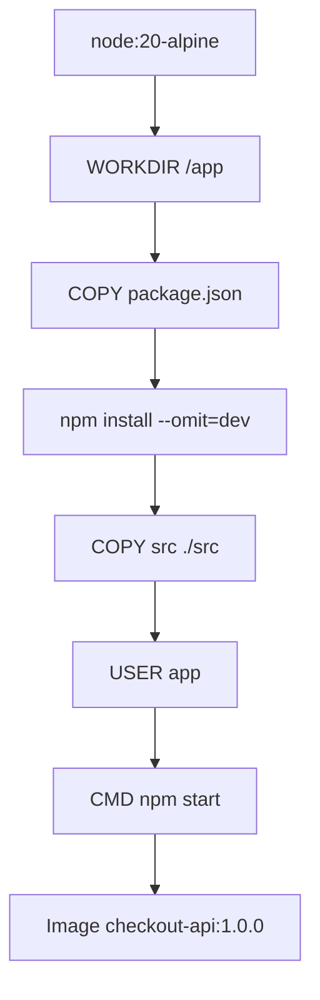

### Explicación línea by línea

```Dockerfile
FROM node:20-alpine
```

Define the image base. In this caso usamos Node 20 about Alpine.

```Dockerfile
WORKDIR /app
```

Define the directory of trabajo dentro of the image.

```Dockerfile
COPY package.json package-lock.json* ./
```

Copia the definición of dependencies.

```Dockerfile
RUN npm install --omit=dev
```

Instala dependencies of producción.

```Dockerfile
COPY src ./src
```

Copia the source code.

```Dockerfile
RUN addgroup -S app && adduser -S app -G app
USER app
```

Creates and uses a user not root.

```Dockerfile
EXPOSE 8080
```

Documenta que the application escucha in the port 8080 dentro of the container.

```Dockerfile
CMD ["npm", "start"]
```

Define the command by defecto to the run the container.

### By what this image es suficiente for the module 1

In this module the objective es understand:

- Image
- Container
- Build
- Run
- Ports
- Environment variables
- Logs
- User not root
- Compose
- Volúmenes
- Networks
Not necesitamos optimizar yet each detalle of the image.

Later, when the learner already entienda the modelo, se can mejorar with:

- `npm ci` if exists `package-lock.json`
- Build reproducible
- Image more pequeña
- Escaneo of vulnerabilidades
- Distroless
- SBOM
- Firma of images
- Multi-stage if hay build real
### DevEx of the bloque

The Dockerfile must ser corto, legible and fácil of discutir.

In this etapa, the legibilidad tiene more valor didáctico que a optimización prematura.

Also conviene tener `Dockerfile` and `Containerfile` with the same contenido for que the prácticas with Docker and Podman sean simétricas.

### Criterio of comprensión

Debes poder explicar:

> The Dockerfile convierte an application and sus instrucciones of ejecución in an image que puedo build, etiquetar and run.

---

## 1.9. Build the image with Docker

Desde the raíz of the repositorio:

```bash
docker build -t checkout-api:1.0.0 ./apps/checkout-api
```

See images locales:

```bash
docker images | grep checkout-api
```

Inspect the image:

```bash
docker image inspect checkout-api:1.0.0
```

See historial of layers:

```bash
docker history checkout-api:1.0.0
```

### What observar

- Nombre of image
- Tag
- Tamaño
- Command of arranque
- User
- Layers
- Variables configuradas
- Arquitectura
### Ejercicio

Construye dos tags:

```bash
docker build -t checkout-api:1.0.0 ./apps/checkout-api
docker build -t checkout-api:dev ./apps/checkout-api
```

After responde:

- ¿Son the same image?
- ¿Tienen the same ID?
- ¿What it means que an image tenga varios tags?
- ¿What tag usarías for a practice local?
- ¿What tag evitarías in a deployment serio?
### DevEx of the bloque

The task recomendada es:

```yaml
container:build:docker:
  desc: Build checkout-api image with Docker
  cmds:
    - docker build -t {{.IMAGE_NAME}}:{{.IMAGE_TAG}} ./apps/{{.APP_NAME}}
```

Así the command queda visible, but not tienes que rewritelo continuamente.

### Criterio of comprensión

Debes poder explicar:

> Build an image convierte a receta of build in a artefacto ejecutable and distribuible.

---

## 1.10. Run the image with Docker

Ejecuta `checkout-api`:

```bash
docker run --rm -p 8080:8080 checkout-api:1.0.0
```

In otra terminal:

```bash
curl -i http://localhost:8080/health
curl -i http://localhost:8080/ready
curl -i http://localhost:8080/checkout
```

Also you can run the smoke test:

```bash
task smoke
```

### Publicación of ports

This parte suele confundir.

The application escucha dentro of the container in the port `8080`.

Tu máquina not can acceder automáticamente to that port. That is why publicas a port of the host hacia a port of the container:

```bash
-p 8080:8080
```

The forma general es:

```text
-p HOST_PORT:CONTAINER_PORT
```

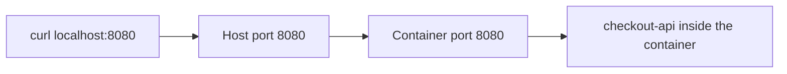

### Run with otro port of the host

```bash
docker run --rm -p 9090:8080 checkout-api:1.0.0
```

Validate:

```bash
PORT=9090 task smoke
```

Aquí `checkout-api` sigue escuchando in `8080` dentro of the container. Lo que cambia es the port of tu máquina.

### DevEx of the bloque

Añade dos tasks:

```yaml
container:run:docker:
  desc: Run checkout-api with Docker
  cmds:
    - docker run --rm -p {{.PORT}}:8080 {{.IMAGE_NAME}}:{{.IMAGE_TAG}}

smoke:
  desc: Run checkout-api smoke test
  cmds:
    - ./scripts/smoke-test.sh
```

The idea is que each vez que arranques the container puedas checklo with a only command:

```bash
task smoke
```

### Criterio of comprensión

Debes poder explicar:

> The port of the host and the port of the container not son lo same. `-p 9090:8080` expone in mi máquina the port 9090 and lo networkirige to the 8080 of the container.

---

## 1.11. Environment variables in containers

The image must ser estable.

The configuration must cambiar in tiempo of ejecución.

Ejecuta with configuration:

```bash
docker run --rm \
  -p 8080:8080 \
  -e SERVICE_NAME=checkout-api \
  -e LOG_LEVEL=debug \
  checkout-api:1.0.0
```

Valida:

```bash
curl -i http://localhost:8080/health
```

Also you can cambiar the port internal of the app:

```bash
docker run --rm \
  -p 9090:9090 \
  -e PORT=9090 \
  -e LOG_LEVEL=debug \
  checkout-api:1.0.0
```

Validate:

```bash
PORT=9090 task smoke
```

### What observar

- The image not cambia
- The comportamiento cambia by configuration
- The same image can runse in distintos entornos
- The configuration sensible should not meterse dentro of the image
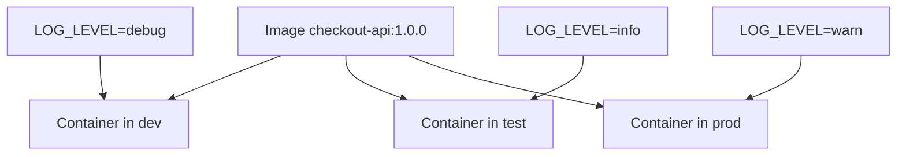

### DevEx of the bloque

Añade a variante of debug:

```yaml
container:run:docker:debug:
  desc: Run checkout-api with Docker and debug logs
  cmds:
    - docker run --rm -p {{.PORT}}:8080 -e LOG_LEVEL=debug {{.IMAGE_NAME}}:{{.IMAGE_TAG}}
```

Así the learner does not tiene que recordar the flag `-e` each vez.

### Criterio of comprensión

Debes poder explicar:

> The image must ser estable. The configuration must poder cambiar without reconstruir the image.

---

## 1.12. Logs in containers

Ejecuta in second plano:

```bash
docker run -d \
  --name checkout-api \
  -p 8080:8080 \
  -e LOG_LEVEL=debug \
  checkout-api:1.0.0
```

See logs:

```bash
docker logs checkout-api
```

Seguir logs:

```bash
docker logs -f checkout-api
```

Generate traffic:

```bash
curl -i http://localhost:8080/health
curl -i http://localhost:8080/checkout
```

Parar and remove:

```bash
docker stop checkout-api
docker rm checkout-api
```

### What observar

The logs not están in a file dentro of the container. Salen by stdout/stderr and Docker the recoge.

Esto prepara the idea que after usará Kubernetes with:

```bash
kubectl logs
```

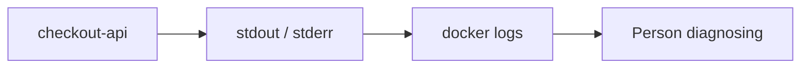

### Contrato minimum of logs

For this module, each request must producir a log JSON with:

- `level`
- `service`
- `method`
- `path`
- `status`
- `durationMs`
Ejemplo:

```json
{
  "level": "debug",
  "service": "checkout-api",
  "method": "GET",
  "path": "/health",
  "status": 200,
  "durationMs": 3
}
```

### DevEx of the bloque

Añade tasks of logs when uses containers with nombre:

```yaml
container:run:docker:detached:
  desc: Run checkout-api with Docker in detached mode
  cmds:
    - docker run -d --name checkout-api -p {{.PORT}}:8080 -e LOG_LEVEL=debug {{.IMAGE_NAME}}:{{.IMAGE_TAG}}

container:logs:docker:
  desc: Follow checkout-api Docker logs
  cmds:
    - docker logs -f checkout-api

container:stop:docker:
  desc: Stop and remove checkout-api Docker container
  cmds:
    - docker stop checkout-api || true
    - docker rm checkout-api || true
```

### Criterio of comprensión

Debes poder explicar:

> In containers, write logs to stdout/stderr permite que the plataforma the recoja without acoplar the app to a file local.

---

## 1.13. Entrar in a container

Ejecuta:

```bash
docker run -d \
  --name checkout-api \
  -p 8080:8080 \
  checkout-api:1.0.0
```

Entrar with shell:

```bash
docker exec -it checkout-api sh
```

Dentro:

```sh
whoami
pwd
ls -la
ps
```

Salir:

```sh
exit
```

Limpiar:

```bash
docker stop checkout-api
docker rm checkout-api
```

### What observar

- The user should ser `app`
- The directory should ser `/app`
- The process principal should ser `npm start` and, debajo, `node src/server.js`
- The filesystem visible es the of the container, not the of tu máquina
### DevEx of the bloque

Añade a task explícita:

```yaml
container:shell:docker:
  desc: Open a shell inside checkout-api Docker container
  cmds:
    - docker exec -it checkout-api sh
```

Not uses esto como forma normal of operate.

Úsalo como tool of inspección.

### Criterio of comprensión

Debes poder explicar:

> Entrar in a container sirve for inspect, not for arreglar producción to mano.

---

## 1.14. Filesystem efímero

Ejecuta:

```bash
docker run -it --name temp-checkout checkout-api:1.0.0 sh
```

Dentro of the container:

```sh
echo "temporary data" > /tmp/example.txt
cat /tmp/example.txt
exit
```

Vuelve to start the same container if exists:

```bash
docker start -ai temp-checkout
```

The file can seguir if es the same container.

Ahora elimina the container:

```bash
docker rm temp-checkout
```

Creates one nuevo:

```bash
docker run -it --name temp-checkout-2 checkout-api:1.0.0 sh
```

Comtest:

```sh
cat /tmp/example.txt
```

Should not existir.

### What learn

The filesystem of the container is not a database.

If you need persistencia, usarás volúmenes.

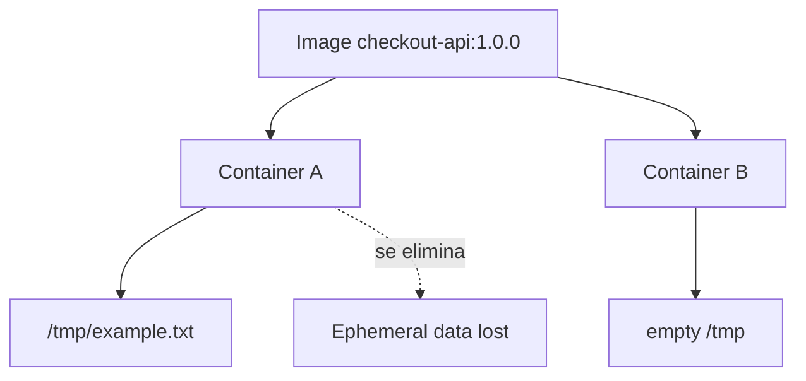

### DevEx of the bloque

Not automatices demasiado this ejercicio.

Aquí interesa que the learner lo haga to manot for sentir the diferencia between image, container and filesystem of the container.

### Criterio of comprensión

Debes poder explicar:

> Lo que escribo dentro of a container vive with that container. If necesito data persistentes, necesito a volume or a service external of storage.

---

## 1.15. Volúmenes

Before using a volumen, you need to understand the problema.

A container can removese.

If the datos viven only dentro of the filesystem of the container, esos datos desaparecen with él.

A volumen desacopla datos of the ciclo of vida of the container.

Creates a volumen:

```bash
docker volume create checkout-data
```

Ejecuta a container montando the volumen:

```bash
docker run --rm -it \
  -v checkout-data:/data \
  checkout-api:1.0.0 sh
```

Dentro:

```sh
echo "persistent data" > /data/example.txt
exit
```

Starts otro container with the same volumen:

```bash
docker run --rm -it \
  -v checkout-data:/data \
  checkout-api:1.0.0 sh
```

Dentro:

```sh
cat /data/example.txt
exit
```

Remove volumen:

```bash
docker volume rm checkout-data
```

### What learn

A volumen desacopla datos of the ciclo of vida of the container.

Esto prepara lo que later será:

- Volume
- PersistentVolume
- PersistentVolumeClaim
- StorageClass
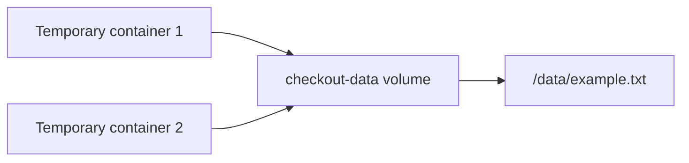

### DevEx of the bloque

Añade tasks opcionales for listar and limpiar volúmenes with cuidado:

```yaml
volume:list:
  desc: List Docker volumes
  cmds:
    - docker volume ls

volume:remove:checkout:
  desc: Remove checkout-data volume
  cmds:
    - docker volume rm checkout-data || true
```

Evita tasks agresivas como `docker volume prune` in prácticas iniciales.

### Criterio of comprensión

Debes poder explicar:

> A container can desaparecer without que necesariamente desaparezcan sus datos, if esos datos viven in a volumen.

---

## 1.16. Networks of Docker

Before using a network of Docker, you need to understand the problema.

If tienes varios containers, need comunicarse.

Ejemplo:

- `checkout-api` needs hablar with `redis`
- `checkout-api` needs hablar with `postgres`
- `checkout-api` needs hablar with `payment-api`
Not queremos que `checkout-api` dependa of IPs manuales.

Queremos que pueda use nombres.

Creates a network:

```bash
docker network create shop-net
```

Ejecuta `checkout-api` in that network:

```bash
docker run -d \
  --name checkout-api \
  --network shop-net \
  -p 8080:8080 \
  checkout-api:1.0.0
```

Ejecuta Redis in the same network:

```bash
docker run -d \
  --name redis \
  --network shop-net \
  redis:7-alpine
```

Inspecciona the network:

```bash
docker network inspect shop-net
```

Test resolución of nombres desde a container temporal:

```bash
docker run --rm -it \
  --network shop-net \
  alpine:3.20 sh
```

Dentro:

```sh
apk add --no-cache bind-tools
nslookup redis
exit
```

Limpiar:

```bash
docker stop checkout-api redis
docker rm checkout-api redis
docker network rm shop-net
```

### What learn

In a network of containers, the containers pueden descubrirse by nombre.

Esto prepara the idea of Service DNS in Kubernetes.

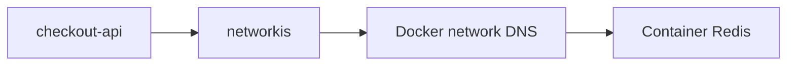

### DevEx of the bloque

The objective is not recordar all the commands of network. The objective es tener a practice repetible for see que the nombre `redis` resuelve dentro of the network.

You can añadir:

```yaml
network:create:
  desc: Create shop-net Docker network
  cmds:
    - docker network create shop-net || true

network:inspect:
  desc: Inspect shop-net Docker network
  cmds:
    - docker network inspect shop-net | jq '.[0].Containers'
```

### Criterio of comprensión

Debes poder explicar:

> In a network of containers, the nombre of the container can funcionar como identidad of network. In Kubernetes usaremos Services for conseguir a identidad estable more robusta.

---

## 1.17. Docker inspect and jq

`docker inspect` devuelve información estructurada of the objeto.

Ejecuta:

```bash
docker run -d \
  --name checkout-api \
  -p 8080:8080 \
  checkout-api:1.0.0
```

Inspecciona:

```bash
docker inspect checkout-api
```

Extrae campos concretos with `jq`:

```bash
docker inspect checkout-api | jq '.[0].Config.Image'
docker inspect checkout-api | jq '.[0].Config.User'
docker inspect checkout-api | jq '.[0].NetworkSettings.Ports'
```

Limpiar:

```bash
docker stop checkout-api
docker rm checkout-api
```

### What learn

Not hace falta read JSON gigante to mano.

The combinación of Docker and `jq` es a practice útil for debugging.

### DevEx of the bloque

Añade a task que enseñe inspección estructurada:

```yaml
container:inspect:docker:
  desc: Inspect checkout-api container with jq
  cmds:
    - docker inspect checkout-api | jq '.[0].Config'
    - docker inspect checkout-api | jq '.[0].NetworkSettings.Ports'
```

### Criterio of comprensión

Debes poder explicar:

> The commands of containers pueden devolver datos estructurados. `jq` me permite convertir esos datos in respuestas concretas.

---

## 1.18. Build and run with Podman

Build with Podman:

```bash
podman build -t checkout-api:1.0.0 -f apps/checkout-api/Containerfile ./apps/checkout-api
```

Run:

```bash
podman run --rm -p 8080:8080 checkout-api:1.0.0
```

Validate:

```bash
curl -i http://localhost:8080/health
```

Run in second plano:

```bash
podman run -d \
  --name checkout-api \
  -p 8080:8080 \
  checkout-api:1.0.0
```

Logs:

```bash
podman logs -f checkout-api
```

Entrar:

```bash
podman exec -it checkout-api sh
```

Limpiar:

```bash
podman stop checkout-api
podman rm checkout-api
```

### What observar

The flujo conceptual es casi the same:

- Build
- Run
- Logs
- Exec
- Stop
- Remove
But the tool is not the same.

Podman ayuda to understand que the concept importante is not Docker in yes, sinot containers, images, registros, networks, volúmenes and processes isolated.

### DevEx of the bloque

The simetría of the Taskfile importa:

```yaml
container:build:podman:
  desc: Build checkout-api image with Podman
  cmds:
    - podman build -t {{.IMAGE_NAME}}:{{.IMAGE_TAG}} -f ./apps/{{.APP_NAME}}/Containerfile ./apps/{{.APP_NAME}}

container:run:podman:
  desc: Run checkout-api with Podman
  cmds:
    - podman run --rm -p {{.PORT}}:8080 {{.IMAGE_NAME}}:{{.IMAGE_TAG}}
```

The learner ve que cambia the tool, but does not cambia the modelo.

### Criterio of comprensión

Debes poder explicar:

> If entiendo the modelo, puedo moverme between Docker and Podman without volver to learn containers from scratch.

---

## 1.19. Pods locales with Podman

Podman permite trabajar with pods locales.

Esto is not Kubernetes, but sirve como puente mental.

Creates a pod:

```bash
podman pod create \
  --name shop-pod \
  -p 8080:8080
```

Añade `checkout-api`:

```bash
podman run -d \
  --name checkout-api \
  --pod shop-pod \
  checkout-api:1.0.0
```

Añade a container auxiliar:

```bash
podman run -d \
  --name debug-shell \
  --pod shop-pod \
  alpine:3.20 sleep 3600
```

See the pod:

```bash
podman pod ps
podman ps --pod
```

Entrar to the container auxiliar:

```bash
podman exec -it debug-shell sh
```

Probar dentro:

```sh
wget -qO- http://localhost:8080/health
exit
```

Limpiar:

```bash
podman pod stop shop-pod
podman pod rm shop-pod
```

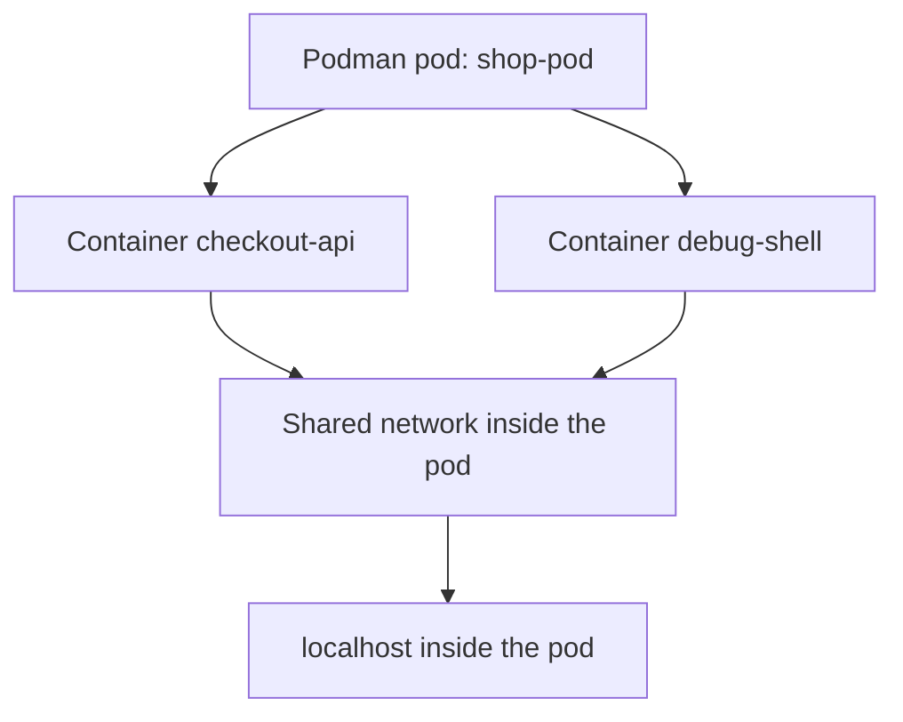

### What learn

In a pod local, the containers pueden share network.

Esto prepara the modelo of Pod in Kubernetes, where varios containers dentro of a same Pod comparten ciertas partes of the environment, especialmente network.

### DevEx of the bloque

Añade tasks opcionales:

```yaml
podman:pod:create:
  desc: Create local Podman pod
  cmds:
    - podman pod create --name shop-pod -p {{.PORT}}:8080

podman:pod:ps:
  desc: List Podman pods and containers
  cmds:
    - podman pod ps
    - podman ps --pod

podman:pod:delete:
  desc: Delete local Podman pod
  cmds:
    - podman pod stop shop-pod || true
    - podman pod rm shop-pod || true
```

### Criterio of comprensión

Debes poder explicar:

> A pod agrupa containers que need vivir juntos. In Kubernetes, the Pod será the unidad minimum of ejecución.

---

## 1.20. Docker Compose

Docker Compose permite definir an application multi-container in a file YAML. The referencia oficial of Compose define a Compose file como a configuration for services, networks, volúmenes and otros elementos of an application Docker. ([Docker Documentation](https://docs.docker.com/reference/compose-file/ "Compose file reference"))

Compose not sustituye the conocimiento of Docker.

Compose organiza varios containers for que puedas trabajar with a sistema local completo without write manualmente all the `docker run`.

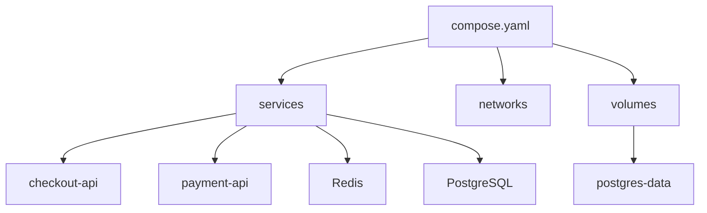

### What learn

Compose introduce a idea que será very importante in Kubernetes:

> The sistema se describe in a file, not in a secuencia manual of commands.

But Compose yet is not Kubernetes.

Compose facilita desarrollo local.

Kubernetes añade reconciliación, scheduling, rollouts, RBAC, NetworkPolicies, controladores, API declarativa and operación multi-nodo.

### DevEx of the bloque

Compose es a gran tool of DevEx for this module because permite start varias dependencies locales with a command.

The practice should permitir:

```bash
task compose:up:detached
task compose:ps
task compose:logs
task compose:down
```

### Criterio of comprensión

Debes poder explicar:

> Compose convierte varios `docker run` in a definición legible and repetible of a sistema local.

---

## 1.21. Compose for shop

Before of create the file, definimos the contrato of the local environment.

Queremos levantar:

- `checkout-api`
- `payment-api`
- `Redis`
- `PostgreSQL`
Not vamos to implementar yet `payment-api`.

Usaremos `nginx` como service HTTP temporal for tener a dependencia of network simple.

`checkout-api` does not va to conectarse realmente to PostgreSQL ni Redis In this module. The añadimos for practicar services, networks, volúmenes, healthchecks and environment variables without create a practice too grande.

### Contrato of the environment Compose

|Service|Image or build|Propósito|
|---|---|---|
|`checkout-api`|Build local|API principal|
|`payment-api`|`nginx:1.27-alpine`|Dependencia HTTP simulada|
|`redis`|`redis:7-alpine`|Dependencia of cache or cola|
|`postgres`|`postgres:16-alpine`|Dependencia with volumen persistente|
|`postgres-data`|Volumen|Persistencia of PostgreSQL|

Creates:

```text
compose/
  compose.yaml
```

Contenido:

```yaml
services:
  checkout-api:
    build:
      context: ../apps/checkout-api
      dockerfile: Dockerfile
    image: checkout-api:1.0.0
    ports:
      - "8080:8080"
    environment:
      SERVICE_NAME: checkout-api
      LOG_LEVEL: debug
      PORT: 8080
      PAYMENT_API_URL: http://payment-api:80
      REDIS_HOST: redis
      POSTGRES_HOST: postgres
    depends_on:
      redis:
        condition: service_started
      postgres:
        condition: service_healthy

  payment-api:
    image: nginx:1.27-alpine
    ports:
      - "8081:80"

  redis:
    image: redis:7-alpine

  postgres:
    image: postgres:16-alpine
    environment:
      POSTGRES_DB: shop
      POSTGRES_USER: shop
      POSTGRES_PASSWORD: shop
    volumes:
      - postgres-data:/var/lib/postgresql/data
    healthcheck:
      test: ["CMD-SHELL", "pg_isready -U shop -d shop"]
      interval: 5s
      timeout: 3s
      retries: 10

volumes:
  postgres-data:
```

Desde the raíz of the repo:

```bash
docker compose -f compose/compose.yaml up --build
```

In otra terminal:

```bash
curl -i http://localhost:8080/health
curl -i http://localhost:8080/checkout
```

See services:

```bash
docker compose -f compose/compose.yaml ps
```

See logs:

```bash
docker compose -f compose/compose.yaml logs -f checkout-api
```

Parar:

```bash
docker compose -f compose/compose.yaml down
```

Parar and delete volumen:

```bash
docker compose -f compose/compose.yaml down -v
```

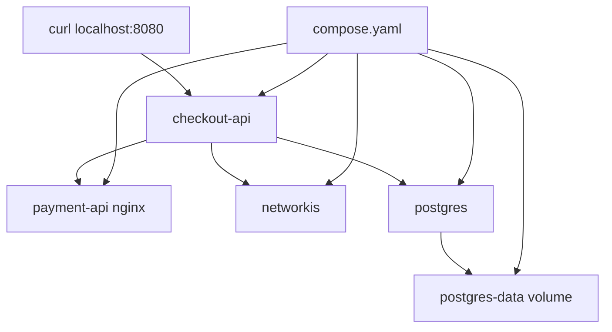

### By what depends_on is not enough

Compose permite controlar the orden of arranque and apagado with `depends_on`; su documentación indica que Compose starts and for containers in orden of dependencia, determinada by atributos como `depends_on`, `links`, `volumes_from` and `network_mode: "service:..."`. ([Docker Documentation](https://docs.docker.com/compose/how-tos/startup-order/ "Control startup and shutdown order in Compose"))

But ordenar the arranque not equivale to que a dependencia esté lista for uso real.

That is why `postgres` tiene a `healthcheck`.

Later, in Kubernetes, this conversación se convertirá in:

- readiness probes
- startup probes
- init containers
- retries in the application
- diseño tolerante to dependencies lentas
### DevEx of the bloque

The DevEx good aquí is not only tener `compose.yaml`.

Es tener a rutina:

```bash
task compose:up:detached
task compose:ps
task smoke
task compose:logs
task compose:down
```

That flujo permite start, check, observar and limpiar.

### Criterio of comprensión

Debes poder explicar:

> Compose me ayuda to levantar a sistema local multi-container, but not reemplaza a estrategia real of readiness, resiliencia u orquestación.

---

## 1.22. Compose vs Kubernetes

Compose and Kubernetes does not resuelven the same problema to the same nivel.

Compose es excelente for desarrollo local, demos, integración simple and entornos of aprendizaje.

Kubernetes aparece when the problema incluye operación distribuida, state deseado, scheduling, reconciliación, rollouts, self-healing, RBAC, NetworkPolicies, observability, escalado, nodos, control plane and múltiples equipos.

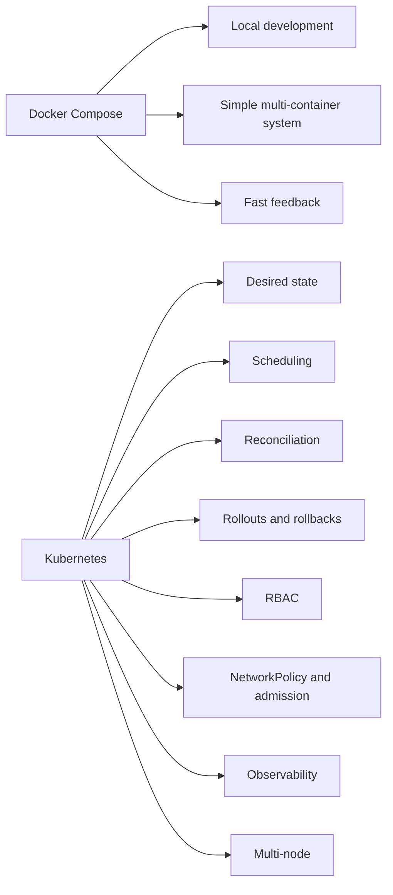

### Tabla comparativa

|Necesidad|Compose|Kubernetes|
|---|--:|--:|
|Levantar varios services localmente|Yes|Yes, but with more coste|
|Definir networks and volúmenes locales|Yes|Yes|
|Reconciliar state deseado continuamente|Limitado|Yes|
|Scheduling multi-nodo|Not|Yes|
|Rollouts and rollbacks declarativos|Not to the same nivel|Yes|
|RBAC|Not como modelo central|Yes|
|NetworkPolicy|Not como modelo central|Yes|
|Auto-recuperación advanced|Limitada|Yes|
|Operación multi-team|Limitada|Yes|
|Control plane declarativo|Not|Yes|

### DevEx of the bloque

The paso of Compose to Kubernetes must sentirse natural:

```text
compose.yaml → manifests Kubernetes
docker compose logs → kubectl logs
docker compose ps → kubectl get pods
docker compose down → kubectl delete / helm uninstall / git revert
```

Not son equivalentes perfectos, but the learner empieza to build correspondencias.

### Criterio of comprensión

Debes poder explicar:

> Compose es a puente excelente hacia Kubernetes because te enseña services, networks, volúmenes and configuration. Kubernetes añade operación distribuida, reconciliación, security and control declarativo.

---

## 1.23. Taskfile for the module 1

The DevEx of this module se apoya in Taskfile.

The objective is not esconder commands.

The objective es hacerlos repetibles, visibles and fáciles of run.

### Taskfile recomendado

```yaml
version: '3'

vars:
  APP_NAME: checkout-api
  IMAGE_NAME: checkout-api
  IMAGE_TAG: 1.0.0
  PORT: 8080
  COMPOSE_FILE: compose/compose.yaml

tasks:
  default:
    desc: List available tasks
    cmds:
      - task --list

  doctor:
    desc: Check required local tools
    cmds:
      - node --version || true
      - npm --version || true
      - git --version
      - curl --version
      - jq --version
      - yq --version
      - task --version
      - docker --version
      - docker compose version
      - podman --version || true

  app:install:
    desc: Install checkout-api dependencies locally
    dir: apps/{{.APP_NAME}}
    cmds:
      - npm install

  app:run:
    desc: Run checkout-api locally without a container
    dir: apps/{{.APP_NAME}}
    cmds:
      - PORT={{.PORT}} LOG_LEVEL=debug npm start

  container:build:docker:
    desc: Build checkout-api image with Docker
    cmds:
      - docker build -t {{.IMAGE_NAME}}:{{.IMAGE_TAG}} ./apps/{{.APP_NAME}}

  container:run:docker:
    desc: Run checkout-api with Docker
    cmds:
      - docker run --rm -p {{.PORT}}:8080 {{.IMAGE_NAME}}:{{.IMAGE_TAG}}

  container:run:docker:debug:
    desc: Run checkout-api with Docker and debug logs
    cmds:
      - docker run --rm -p {{.PORT}}:8080 -e LOG_LEVEL=debug {{.IMAGE_NAME}}:{{.IMAGE_TAG}}

  container:run:docker:detached:
    desc: Run checkout-api with Docker in detached mode
    cmds:
      - docker run -d --name checkout-api -p {{.PORT}}:8080 -e LOG_LEVEL=debug {{.IMAGE_NAME}}:{{.IMAGE_TAG}}

  container:logs:docker:
    desc: Follow checkout-api Docker logs
    cmds:
      - docker logs -f checkout-api

  container:shell:docker:
    desc: Open a shell inside checkout-api Docker container
    cmds:
      - docker exec -it checkout-api sh

  container:stop:docker:
    desc: Stop and remove checkout-api Docker container
    cmds:
      - docker stop checkout-api || true
      - docker rm checkout-api || true

  container:inspect:image:docker:
    desc: Inspect checkout-api image with Docker
    cmds:
      - docker image inspect {{.IMAGE_NAME}}:{{.IMAGE_TAG}} | jq '.[0].Config'
      - docker history {{.IMAGE_NAME}}:{{.IMAGE_TAG}}

  container:inspect:docker:
    desc: Inspect checkout-api container with Docker
    cmds:
      - docker inspect checkout-api | jq '.[0].Config'
      - docker inspect checkout-api | jq '.[0].NetworkSettings.Ports'

  container:build:podman:
    desc: Build checkout-api image with Podman
    cmds:
      - podman build -t {{.IMAGE_NAME}}:{{.IMAGE_TAG}} -f ./apps/{{.APP_NAME}}/Containerfile ./apps/{{.APP_NAME}}

  container:run:podman:
    desc: Run checkout-api with Podman
    cmds:
      - podman run --rm -p {{.PORT}}:8080 {{.IMAGE_NAME}}:{{.IMAGE_TAG}}

  podman:pod:create:
    desc: Create local Podman pod
    cmds:
      - podman pod create --name shop-pod -p {{.PORT}}:8080

  podman:pod:ps:
    desc: List Podman pods and containers
    cmds:
      - podman pod ps
      - podman ps --pod

  podman:pod:delete:
    desc: Delete local Podman pod
    cmds:
      - podman pod stop shop-pod || true
      - podman pod rm shop-pod || true

  compose:up:
    desc: Start shop with Docker Compose
    cmds:
      - docker compose -f {{.COMPOSE_FILE}} up --build

  compose:up:detached:
    desc: Start shop with Docker Compose in detached mode
    cmds:
      - docker compose -f {{.COMPOSE_FILE}} up -d --build

  compose:ps:
    desc: Show Compose services
    cmds:
      - docker compose -f {{.COMPOSE_FILE}} ps

  compose:logs:
    desc: Follow Compose logs
    cmds:
      - docker compose -f {{.COMPOSE_FILE}} logs -f

  compose:down:
    desc: Stop Compose services
    cmds:
      - docker compose -f {{.COMPOSE_FILE}} down

  compose:down:volumes:
    desc: Stop Compose services and remove volumes
    cmds:
      - docker compose -f {{.COMPOSE_FILE}} down -v

  smoke:
    desc: Run checkout-api smoke test
    cmds:
      - ./scripts/smoke-test.sh

  image:list:
    desc: List local checkout-api images
    cmds:
      - docker images | grep checkout-api || true

  container:list:
    desc: List local containers
    cmds:
      - docker ps -a

  volume:list:
    desc: List Docker volumes
    cmds:
      - docker volume ls

  network:list:
    desc: List Docker networks
    cmds:
      - docker network ls
```

### Flujo recomendado

```bash
task doctor
task app:install
task app:run
task smoke
task container:build:docker
task container:run:docker
task smoke
task container:build:podman
task container:run:podman
task compose:up:detached
task compose:ps
task compose:logs
task smoke
task compose:down
```

### Criterio DevEx

Debes poder explicar:

> Taskfile not hace que Docker, Podman or Compose desaparezcan. Hace que the flujo of aprendizaje sea repetible, visible and more difícil of romper by errores accidentales.

---

## 1.24. Practice principal of the module

### Objective

Empaquetar `checkout-api`, runla with Docker, runla with Podman and levantar a sistema local with Compose.

### Resultado esperado

To the final you should tener:

```text
kubernetes-learning-lab/
  apps/
    checkout-api/
      package.json
      src/
        server.js
      Dockerfile
      Containerfile
      .dockerignore

  compose/
    compose.yaml

  scripts/
    smoke-test.sh

  Taskfile.yml
```

### Paso 1. Create the app

Creates the files of `apps/checkout-api`.

Valida que exist:

```bash
tree apps/checkout-api
```

### Paso 2. Create the smoke test

Creates:

```text
scripts/smoke-test.sh
```

Dale permisos:

```bash
chmod +x scripts/smoke-test.sh
```

### Paso 3. Run without container

```bash
task app:install
task app:run
```

In otra terminal:

```bash
task smoke
```

### Paso 4. Build with Docker

```bash
task container:build:docker
```

Valida:

```bash
docker images | grep checkout-api
```

### Paso 5. Run with Docker

```bash
task container:run:docker
```

In otra terminal:

```bash
task smoke
```

### Paso 6. Inspect the image

```bash
task container:inspect:image:docker
```

Observa:

- User
- Command
- Image base
- Layers
- Tamaño
### Paso 7. Run in second planot and see logs

```bash
task container:run:docker:detached
task smoke
task container:logs:docker
```

After limpia:

```bash
task container:stop:docker
```

### Paso 8. Build with Podman

```bash
task container:build:podman
```

### Paso 9. Run with Podman

```bash
task container:run:podman
```

In otra terminal:

```bash
task smoke
```

### Paso 10. Levantar Compose

```bash
task compose:up:detached
task compose:ps
task smoke
```

### Paso 11. Review logs

```bash
task compose:logs
```

### Paso 12. Shut down without delete datos

```bash
task compose:down
```

### Paso 13. Shut down borrando datos

```bash
task compose:down:volumes
```

### Criterio of finalización

The practice está completa when you can:

- Run `checkout-api` without container
- Validate the contrato HTTP with `task smoke`
- Build the image with Docker
- Runla with Docker
- Runla with environment variables
- See logs
- Entrar in the container
- Build the image with Podman
- Runla with Podman
- Levantar `checkout-api`, `payment-api`, `Redis` and `PostgreSQL` with Compose
- Explicar what se pierde and what not se pierde to the delete containers
- Explicar what ocurre to the delete volúmenes
---

## 1.25. Ejercicios cortos

### Ejercicio 1. Image and container

Ejecuta:

```bash
docker build -t checkout-api:1.0.0 ./apps/checkout-api
docker run -d --name checkout-one -p 8080:8080 checkout-api:1.0.0
docker run -d --name checkout-two -p 8081:8080 checkout-api:1.0.0
```

Valida:

```bash
curl -i http://localhost:8080/health
curl -i http://localhost:8081/health
```

Pregunta:

- ¿Cuántas images hay?
- ¿Cuántos containers hay?
- ¿What comparten?
- ¿What not comparten?
Limpia:

```bash
docker stop checkout-one checkout-two
docker rm checkout-one checkout-two
```

---

### Ejercicio 2. Contrato HTTP

Ejecuta:

```bash
docker run --rm -p 8080:8080 checkout-api:1.0.0
```

In otra terminal:

```bash
curl -i http://localhost:8080/health
curl -i http://localhost:8080/ready
curl -i http://localhost:8080/checkout
curl -i http://localhost:8080/unknown
```

Pregunta:

- ¿What endpoint devuelve `status: ok`?
- ¿What endpoint devuelve `status: ready`?
- ¿What endpoint devuelve `404`?
- ¿By what `/health` and `/ready` not significan lo same?
---

### Ejercicio 3. Environment variables

Ejecuta:

```bash
docker run --rm \
  -p 8080:8080 \
  -e SERVICE_NAME=checkout-api \
  -e LOG_LEVEL=debug \
  checkout-api:1.0.0
```

In otra terminal:

```bash
curl -i http://localhost:8080/health
```

Pregunta:

- ¿Cambió the image?
- ¿Cambió the comportamiento?
- ¿Dónde should vivir the configuration?
---

### Ejercicio 4. User not root

Ejecuta:

```bash
docker run --rm -it checkout-api:1.0.0 sh
```

Dentro:

```sh
whoami
id
exit
```

Pregunta:

- ¿What user ejecuta the app?
- ¿By what not conviene run como root?
- ¿What errores podrían aparecer by permisos?
---

### Ejercicio 5. Volumen

Ejecuta:

```bash
docker volume create shop-data
docker run --rm -it -v shop-data:/data alpine:3.20 sh
```

Dentro:

```sh
echo "hello" > /data/example.txt
exit
```

Vuelve to entrar:

```bash
docker run --rm -it -v shop-data:/data alpine:3.20 sh
```

Dentro:

```sh
cat /data/example.txt
exit
```

Pregunta:

- ¿By what the file sigue existiendo?
- ¿What pasa if borras the volumen?
Limpia:

```bash
docker volume rm shop-data
```

---

### Ejercicio 6. Network

Ejecuta:

```bash
docker network create shop-net
docker run -d --name redis --network shop-net redis:7-alpine
docker run --rm -it --network shop-net alpine:3.20 sh
```

Dentro:

```sh
apk add --no-cache bind-tools
nslookup redis
exit
```

Pregunta:

- ¿By what you can resolver `redis`?
- ¿What diferencia hay between nombre e IP?
- ¿What relación tendrá esto with Services in Kubernetes?
Limpia:

```bash
docker stop redis
docker rm redis
docker network rm shop-net
```

---

### Ejercicio 7. Compose

Ejecuta:

```bash
docker compose -f compose/compose.yaml up -d --build
docker compose -f compose/compose.yaml ps
curl -i http://localhost:8080/health
docker compose -f compose/compose.yaml logs checkout-api
docker compose -f compose/compose.yaml down
```

Pregunta:

- ¿What services levantó Compose?
- ¿What network creó?
- ¿What volumen creó?
- ¿What command usarías for delete also the volumen?
- ¿What hace `depends_on`?
- ¿By what `depends_on` not sustituye a readiness real?
---

## 1.26. Errores habituales

### Error 1. Confundir image with container

Bad:

> The image está corriendo.

Better:

> The container está corriendo to partir of an image.

---

### Error 2. Use latest como if fuera a versión

`latest` not significa “the versión more segura” ni “the versión correcta”.

Es only a tag.

For prácticas may be cómodo.

For delivery serio, uses versiones explícitas and, when tenga sentido, digests.

---

### Error 3. Meter secrets dentro of the image

Not metas contraseñas, tokens ni claves privadas in:

- Dockerfile
- Code
- Image
- Variables of build
- Files copiados dentro of the image
The image can acabar in a registry, cache, escáner or máquina where not esperabas que that secret existiera.

---

### Error 4. Pensar que Compose es Kubernetes pequeño

Compose es very útil, but not tiene the same modelo of control que Kubernetes.

Compose levanta services.

Kubernetes reconcilia state deseado.

---

### Error 5. Not distinguir build-time and run-time

Build-time:

- Install dependencies
- Copiar code
- Preparar image
- Definir command of arranque
Run-time:

- Elegir port
- Pasar variables
- Mount volúmenes
- Conectar networks
- Run the process
---

### Error 6. Run como root without pensarlo

Not always podrás evitar root desde the primer día, but debes tratarlo como a decisión consciente.

In the laboratorio, `checkout-api` must runse como user not root.

---

### Error 7. Not limpiar Resources

During prácticas locales es fácil acumular:

- Containers parados
- Images viejas
- Networks
- Volúmenes
Commands útiles:

```bash
docker ps -a
docker images
docker volume ls
docker network ls
docker system df
```

Limpieza with cuidado:

```bash
docker container prune
docker image prune
docker volume prune
```

Not ejecutes limpiezas agresivas without understand what borran.

---

### Error 8. Pedir a API without definir su contrato

Not basta with decir:

> Creates `/health`.

You need to saber:

- What método uses
- What code devuelve
- What body devuelve
- What it means when fails
- How se valida
- What relación tendrá with Kubernetes
---

### Error 9. Hacer smoke tests demasiado débiles

Esto es débil:

```bash
curl http://localhost:8080/health
```

Esto es better:

```bash
curl -fsS http://localhost:8080/health
```

Esto es yet better for this module:

```bash
./scripts/smoke-test.sh
```

Because comtest code HTTP and campos minimum of the JSON.

---

## 1.27. Criterio of output of the module

You can pasar to the module 2 when puedas hacer everything esto without seguir a receta ciegamente.

### Concepts

Debes poder explicar:

- What es an image
- What es a container
- What es a registry
- What es a Dockerfile
- What es a Containerfile
- What es a tag
- What es a digest
- What es a volumen
- What es a network of containers
- What diferencia hay between Docker and Podman
- What papel tiene OCI
- What papel tiene CRI in Kubernetes
- What resuelve Compose
- What not resuelve Compose
### Contrato HTTP

Debes poder explicar:

- What es a endpoint
- What es a contrato HTTP
- What devuelve `GET /health`
- What devuelve `GET /ready`
- What devuelve `GET /checkout`
- What diferencia hay between `/health` and `/ready`
- By what a smoke test must check comportamiento esperado, not only que algo responde
### Docker

Debes poder:

- Build an image
- Run a container
- Publicar a port
- Pasar environment variables
- See logs
- Entrar in a container
- Inspect an image
- Inspect a container
- Create a network
- Create a volumen
- Limpiar Resources
### Podman

Debes poder:

- Build the same image with Podman
- Runla with Podman
- See logs
- Entrar in the container
- Create a pod local sencillo
- Explicar by what Podman ayuda to separar concept of tool
### Compose

Debes poder:

- Read a `compose.yaml`
- Levantar varios services
- See logs
- See state
- Parar services
- Delete volúmenes
- Explicar by what Compose es buen puente hacia Kubernetes
### DevEx

Debes poder:

- Run `task doctor`
- Run the app local with `task app:run`
- Validate the contrato with `task smoke`
- Build the image with `task container:build:docker`
- Run the image with `task container:run:docker`
- Levantar the sistema with `task compose:up:detached`
- See state with `task compose:ps`
- See logs with `task compose:logs`
- Limpiar with `task compose:down`
- Explicar what command real hay debajo of each task
### Frase final of comprensión

Debes poder explicar this frase:

> Kubernetes does not empieza in the YAML. Kubernetes empieza in the necesidad of operate processes packaged como containers, conectados by network, configunetwork by environment, observables by logs and preparados for fail.

---

## 1.28. References oficiales

|Tema|Referencia|
|---|---|
|Docker overview|Docker Docs, Docker overview. ([Docker Documentation](https://docs.docker.com/get-started/docker-overview/ "What is Docker?"))|
|Docker images|Docker Docs, What is an image? ([Docker Documentation](https://docs.docker.com/get-started/docker-concepts/the-basics/what-is-an-image/ "What is an image? \| Docker Docs"))|
|Dockerfile|Docker Docs, Dockerfile overview. ([Docker Documentation](https://docs.docker.com/build/concepts/dockerfile/ "Dockerfile overview"))|
|Docker Compose file|Docker Docs, Compose file reference. ([Docker Documentation](https://docs.docker.com/reference/compose-file/ "Compose file reference"))|
|Compose startup order|Docker Docs, Control startup and shutdown order in Compose. ([Docker Documentation](https://docs.docker.com/compose/how-tos/startup-order/ "Control startup and shutdown order in Compose"))|
|Podman|Podman official documentation. ([docs.podman.io](https://docs.podman.io/ "What is Podman? — Podman documentation"))|
|Podman CLI|Podman manual. ([docs.podman.io](https://docs.podman.io/en/stable/markdown/podman.1.html "containers.conf"))|
|OCI|Open Container Initiative. ([Docker Documentation](https://docs.docker.com/get-started/docker-overview/ "What is Docker?"))|
|Kubernetes CRI|Kubernetes Docs, Container Runtime Interface. ([Docker Documentation](https://docs.docker.com/get-started/docker-overview/ "What is Docker?"))|
|Express|Express official website. ([Express](https://expressjs.com/ "Express - Node.js web application framework"))|
|Node official image|Docker Hub, Node official image. ([Docker Hub](https://hub.docker.com/_/node "node - Official Image"))|
|npm install|npm Docs, `npm install`. ([Documentación of npm](https://docs.npmjs.com/cli/v8/commands/npm-install "npm-install"))|

## 1.29. Lecturas of apoyo

|Libro|What read|
|---|---|
|_Érase a vez Docker_|Introducción to containers, instalación of Docker, firsts pasos, gestión of images, containers, networks, publicación of ports, logs, Resources and Compose.|
|_Kubernetes: Up and Running_|Chapter 2: images, Dockerfile, security of image, multistage builds, registry and runtime.|
|_Kubernetes in Action_|Capítulos 1 and 2: containers, Docker, creación of image, ejecución, registry and firsts pasos hacia Kubernetes.|
|_Cloud Native DevOps with Kubernetes_|Capítulos 1 and 2: cloud, DevOps, containers, Dockerfile, images mínimas, registries and primer deployment.|

<!-- COURSE_NAV_START -->
[Previous](<0. Foundations, DevEx, and reproducible environment.md>) | [Index](README.md) | [Next](<2. Why Kubernetes exists.md>)
<!-- COURSE_NAV_END -->
