<!-- COURSE_NAV_START -->
[Previous](9.%20Automated%20testing%20for%20Kubernetes.md) | [Index](README.md) | [Next](11.%20Security.md)
<!-- COURSE_NAV_END -->

# 10. Application delivery

## Objective of the module

In the module 9 construiste a cadena of testing automated for Kubernetes:

```text
render
schema validation
static analysis
policy tests
server-side dry-run
kind
deployment test
endpoint test
smoke test
failure lab
```

Ahora toca convertir that cadena of feedback in delivery.

Delivery not significa “hacer deploy”.

Delivery significa:

> Tener a path repetible, validado, auditable and reversible for que a change pase desde code hasta an environment Kubernetes without depender of pasos manuales frágiles.

Kubernetes soporta gestión declarativa of objetos usando files of configuration. The documentación oficial explica que you can create, update and delete objetos almacenando configuraciones in files and usando `kubectl apply`; also indica que `kubectl diff` permite previsualizar cambios before of apply. ([Kubernetes](https://kubernetes.io/docs/tasks/manage-kubernetes-objects/declarative-config/ "Declarative Management of Kubernetes Objects Using ..."))

The idea central of the module es this:

> Delivery in Kubernetes does not empieza in `kubectl apply`. Empieza in an image versionada, pasa by quality gates, actualiza manifests of forma trazable, despliega of forma controlada, valida signals and deja a path claro of rollback.

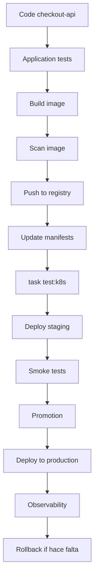

---

## 10.1. What you are going to learn and what not you are going to learn yet

You are going to learn:

- What it means delivery in Kubernetes
- Diferencia between deploy manual, CI/CD and GitOps
- By what delivery must consumir the quality gate of the module 9
- How versionar images
- By what evitar `latest`
- How build and publicar an image
- How escanear an image
- How update manifests with Kustomize
- Cuándo use Kustomize
- Cuándo use Helm
- What son releases in Helm
- How use `kubectl apply`, `kubectl diff` and Server-Side Apply
- How run rollout status
- How hacer rollback
- How promover cambios between entornos
- What es GitOps
- What aporta Argo CD
- What aporta Flux
- What es progressive delivery
- What aportan canary and blue-green
- What parte será obligatoria in the laboratorio and what parte será conceptual u opcional
Not vamos to profundizar yet in:

- GitOps completo in producción
- Argo CD instalado and operado como plataforma
- Flux instalado and operado como plataforma
- Argo Rollouts in producción
- Canary with métricas reales
- Blue-green with traffic real
- Firmado of images
- SLSA
- SBOM advanced
- OIDC cloud real
- Promoción multi-cluster
- Gestión advanced of secrets in delivery
- Progressive delivery with Service Mesh
That aparecerá after or in rutas profesionales.

The regla pedagógica of the module será:

```text
First, define which delivery problem we are solving
Then explain the mental contract
Then build the minimum flow
Then add gates
Then add rollback
Then compare CI/CD, GitOps, and progressive delivery
```

---

## 10.2. The problema: apply YAML manualmente is not delivery

Hasta ahora has ejecutado commands como:

```bash
kubectl apply -f kubernetes/02-deployment/deployment.yaml
kubectl rollout status deployment/checkout-api -n shop
kubectl rollout undo deployment/checkout-api -n shop
```

That está bien for learn.

But como mecanismo of delivery tiene problemas.

### Problemas of the deploy manual

|Problema|Consecuencia|
|---|---|
|Depende of a person|It is not repetible|
|Not always ejecuta the mismos gates|It can saltarse validaciones|
|Not deja trazabilidad clara|Difícil auditar what llegó and by what|
|It can use context equivocado|Riesgo alto|
|It can apply manifests not versionados|Drift between Git and cluster|
|It can not validate rollout|Deploy “verde” falso|
|It can not run smoke tests|Failures tardíos|
|It can not tener rollback definido|Recuperación lenta|

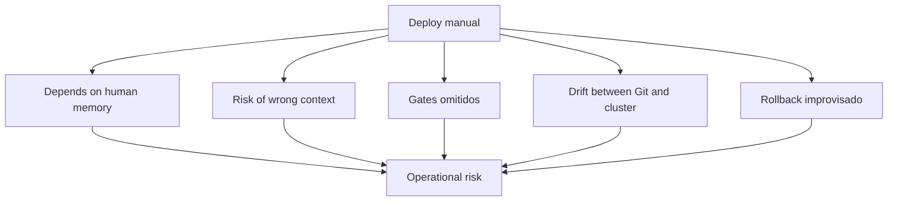

### Contrato mental

A delivery minimum must responder:

- ¿What code se está entregando?
- ¿What image se construyó?
- ¿What tag or digest se desplegó?
- ¿What tests pasaron?
- ¿What manifests cambiaron?
- ¿What diff se aplicó?
- ¿What environment recibió the cambio?
- ¿What smoke test validó the resultado?
- ¿How se revierte?
- ¿Dónde queda registrado?
### Criterio of comprensión

Debes poder explicar:

> Delivery is not run commands. Delivery es convertir cambios in releases trazables, validadas and reversibles.

---

## 10.3. The flujo minimum of delivery

Before of hablar of Helm, GitOps or progressive delivery, define the flujo minimum.

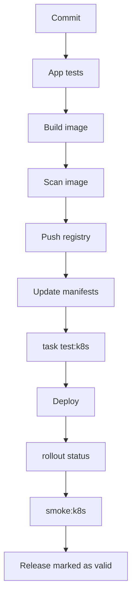

### Flujo base

1. Run tests of application
2. Build image
3. Etiquetar image of forma única
4. Escanear image
5. Publicar image in registry
6. Update manifests with that image
7. Renderizar manifests
8. Validate manifests
9. Probar políticas
10. Create cluster efímero
11. Desplegar in kind
12. Run smoke tests
13. Desplegar in staging
14. Validate rollout
15. Run smoke tests in staging
16. Promocionar
17. Desplegar in producción
18. Observar
19. Hacer rollback if hace falta
### What not must pasar

Should nots desplegar an image que:

- Not tiene tag trazable
- Not pasó tests
- Not fue escaneada
- Not tiene manifest actualizado
- Not pasó `task test:k8s`
- Not tiene rollback claro
- Not se can vincular to a commit
### Criterio of comprensión

Debes poder explicar:

> The image, the manifest and the commit must formar a cadena trazable.

---

## 10.4. Tags, digests and `latest`

Before of build pipeline, you need to explicar versionado of images.

### By what not use `latest`

`latest` not expresa a versión real.

It can cambiar without que the manifest cambie.

Hace more difícil auditar, reproducir and revertir.

In the module 9 already añadiste policies for bloquearlo.

### Tags útiles

For laboratorio:

```text
checkout-api:1.0.0
checkout-api:1.0.1
checkout-api:dev-<short-sha>
```

For CI real:

```text
ghcr.io/owner/repo/checkout-api:<git-sha>
ghcr.io/owner/repo/checkout-api:main-<git-sha>
ghcr.io/owner/repo/checkout-api:v1.2.3
```

### Digest

A digest identifica contenido exacto of an image.

Ejemplo conceptual:

```text
checkout-api@sha256:...
```

The tag can moverse.

The digest apunta to contenido concreto.

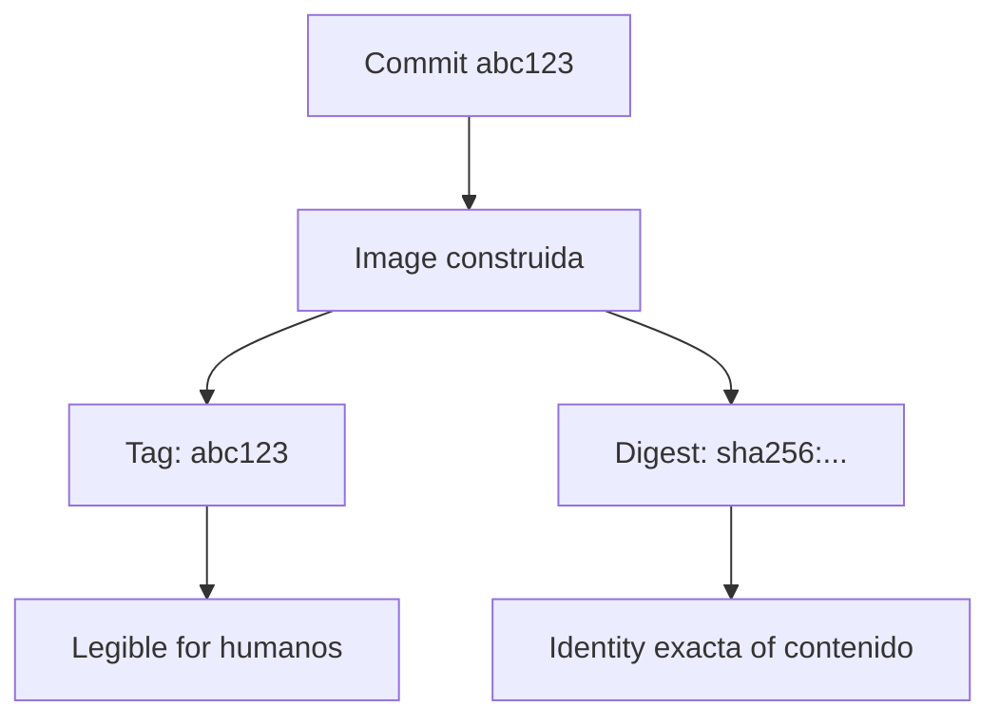

### Contrato of the course

For the laboratorio usaremos:

```text
checkout-api:1.0.0
checkout-api:1.0.1
```

For CI dejaremos preparado the patrón:

```text
IMAGE_TAG=${GITHUB_SHA}
```

### Criterio of comprensión

Debes poder explicar:

> A tag ayuda to identificar a release. A digest ayuda to identificar contenido exacto. `latest` oculta ambas cosas.

---

## 10.5. Build and push of image

### What problema resuelve

Kubernetes does not despliega source code.

Despliega Pods que referencian images.

Therefore, delivery needs publicar images in a registry accesible by the cluster.

GitHub Actions define workflows como processes automateds configurables mediante YAML, compuestos by jobs and steps. GitHub also documenta how create workflows que construyen and publican images Docker in Docker Hub or GitHub Packages. ([GitHub Docs](https://docs.github.com/actions/using-workflows/workflow-syntax-for-github-actions "Workflow syntax for GitHub Actions"))

### Build local

```bash
docker build -t checkout-api:1.0.1 ./apps/checkout-api
```

### Push conceptual to registry

Ejemplo with GHCR:

```bash
docker tag checkout-api:1.0.1 ghcr.io/OWNER/REPO/checkout-api:1.0.1
docker push ghcr.io/OWNER/REPO/checkout-api:1.0.1
```

### For kind

In kind not you need push if cargas the image:

```bash
kind load docker-image checkout-api:1.0.1 --name shop-learning
```

But in a cluster remote yes you need que the cluster pueda hacer pull desde a registry.

### DevEx

Añade variables:

```yaml
vars:
  IMAGE_REGISTRY: ghcr.io
  IMAGE_REPOSITORY: owner/repo/checkout-api
  IMAGE_NAME: checkout-api
  IMAGE_TAG: 1.0.1
```

Añade tasks:

```yaml
image:build:
  desc: Build checkout-api image
  cmds:
    - docker build -t {{.IMAGE_NAME}}:{{.IMAGE_TAG}} ./apps/{{.APP_NAME}}

image:tag:
  desc: Tag checkout-api image for registry
  cmds:
    - docker tag {{.IMAGE_NAME}}:{{.IMAGE_TAG}} {{.IMAGE_REGISTRY}}/{{.IMAGE_REPOSITORY}}:{{.IMAGE_TAG}}

image:push:
  desc: Push checkout-api image to registry
  cmds:
    - docker push {{.IMAGE_REGISTRY}}/{{.IMAGE_REPOSITORY}}:{{.IMAGE_TAG}}
```

### Criterio of comprensión

Debes poder explicar:

> A cluster remote not ve mi image local. The image must estar in a registry accesible, or cargarse explícitamente if es a cluster local como kind.

---

## 10.6. Scan of image

### What problema resuelve

Before of publicar or desplegar an image, debes revisar vulnerabilidades and riesgos basic.

Trivy se presenta como a scanner for encontrar vulnerabilidades, misconfigurations, secrets, SBOMs and problemas in containers, repositorios, artefactos, Kubernetes and cloud. Also documenta scanning of images of container and generación or lectura of SBOMs. ([Trivy](https://trivy.dev/ "Trivy"))

### Command basic

```bash
trivy image checkout-api:1.0.1
```

### Gate more estricto

```bash
trivy image --exit-code 1 --severity HIGH,CRITICAL checkout-api:1.0.1
```

### What detecta

It can detectar:

- Vulnerabilidades of packages
- Dependencies vulnerables
- Problemas conocidos by base image
- Secrets, según configuration
- SBOM, según modo usado
### What not detecta

Not demuestra:

- Que the app funcione
- Que tus manifests sean correctos
- Que tus permisos Kubernetes sean minimum
- Que not haya vulnerabilidades lógicas
- Que tus secrets estén bien rotados
### DevEx

```yaml
image:scan:
  desc: Scan checkout-api image with Trivy
  cmds:
    - trivy image --exit-code 1 --severity HIGH,CRITICAL {{.IMAGE_NAME}}:{{.IMAGE_TAG}}
```

### Criterio of comprensión

Debes poder explicar:

> The scan of image es a gate of security of artefacto. Not sustituye tests of application ni tests of Kubernetes.

---

## 10.7. Update manifests with Kustomize
### Kustomize minimum for CKAD

Kustomize permite partir of a base and apply variaciones without convertir YAML in templates.

For CKAD debes practicar cuatro operaciones:

1. Componer Resources.
2. Cambiar images.
3. Generate ConfigMaps.
4. Apply patches.

### Base

```yaml
apiVersion: kustomize.config.k8s.io/v1beta1
kind: Kustomization

resources:
  - deployment.yaml
  - service.yaml
```

### Overlay local

```yaml
apiVersion: kustomize.config.k8s.io/v1beta1
kind: Kustomization

namespace: shop

resources:
  - ../../base

images:
  - name: checkout-api
    newName: checkout-api
    newTag: "1.0.1"

configMapGenerator:
  - name: checkout-api-config
    literals:
      - NODE_ENV=local
      - LOG_LEVEL=debug

patches:
  - path: patch-resources.yaml
```

### Patch

```yaml
apiVersion: apps/v1
kind: Deployment
metadata:
  name: checkout-api
spec:
  template:
    spec:
      containers:
        - name: checkout-api
          resources:
            requests:
              cpu: 100m
              memory: 128Mi
            limits:
              memory: 256Mi
```

### Render

```bash
kubectl kustomize kubernetes/overlays/local
```

### Apply

```bash
kubectl apply -k kubernetes/overlays/local
```

### Validate

```bash
kubectl get deploy,svc,cm -n shop
kubectl rollout status deployment/checkout-api -n shop
```

### Criterio of comprensión

Debes poder explicar:

> Kustomize not sustituye Kubernetes. Kustomize prepara the YAML final que Kubernetes recibirá.

### What problema resuelve

After of build an image, you need que the manifests apunten to that versión.

Not quieres editar YAML to manot in each release.

Kustomize permite personalizar objetos Kubernetes mediante a file `kustomization`, and `kubectl` soporta gestionar objetos usando `kustomization` desde hace tiempo. The documentación oficial muestra `kubectl kustomize` for see Resources and `kubectl apply -k` for apply configuraciones personalizadas. ([Kubernetes](https://kubernetes.io/docs/tasks/manage-kubernetes-objects/kustomization/ "Declarative Management of Kubernetes Objects Using ..."))

### Estructura recomendada

```text
kubernetes/
  base/
    kustomization.yaml
    deployment.yaml
    service.yaml
    configmap.yaml

  overlays/
    local/
      kustomization.yaml
    staging/
      kustomization.yaml
    production/
      kustomization.yaml
```

### Base

```yaml
resources:
  - deployment.yaml
  - service.yaml
  - configmap.yaml

images:
  - name: checkout-api
    newName: checkout-api
    newTag: 1.0.0
```

### Overlay local

```yaml
resources:
  - ../../base

images:
  - name: checkout-api
    newName: checkout-api
    newTag: 1.0.1
```

### Update image

```bash
cd kubernetes/overlays/local
kustomize edit set image checkout-api=checkout-api:1.0.1
```

OR usando `yq` explicitly, if prefieres control determinista about the file:

```bash
yq -i '.images[0].newTag = "1.0.1"' kubernetes/overlays/local/kustomization.yaml
```

### Render

```bash
kubectl kustomize kubernetes/overlays/local > .tmp/rendered.yaml
```

### DevEx

```yaml
manifests:set-image:
  desc: Update local overlay image tag. Usage: task manifests:set-image IMAGE_TAG=1.0.1
  cmds:
    - yq -i '.images[0].newTag = "{{.IMAGE_TAG}}"' kubernetes/overlays/local/kustomization.yaml
    - kubectl kustomize kubernetes/overlays/local > .tmp/rendered.yaml
    - yq 'select(.kind == "Deployment") | .spec.template.spec.containers[0].image' .tmp/rendered.yaml
```

### Criterio of comprensión

Debes poder explicar:

> Delivery should not depender of editar YAML manualmente. The pipeline must update the referencia of image of forma trazable and reproducible.

---

## 10.8. Helm
### Helm minimum obligatorio for CKAD

Although the course use Kustomize como path principal, CKAD espera que puedas use Helm for desplegar packages existentes.

Not you need create charts complejos.

Yes you need poder:

- Añadir a repositorio.
- Buscar a chart.
- Inspect valores.
- Install a release.
- Update a release.
- See historial.
- Hacer rollback.
- Desinstall.

### Flujo minimum

```bash
helm repo add bitnami https://charts.bitnami.com/bitnami
helm repo update
helm search repo nginx
```

Inspect valores:

```bash
helm show values bitnami/nginx > values.yaml
```

Install:

```bash
helm install demo-nginx bitnami/nginx \
  --namespace shop \
  --create-namespace
```

See state:

```bash
helm list -n shop
kubectl get all -n shop
```

Update with valores:

```bash
helm upgrade demo-nginx bitnami/nginx \
  -n shop \
  -f values.yaml
```

See historial:

```bash
helm history demo-nginx -n shop
```

Rollback:

```bash
helm rollback demo-nginx 1 -n shop
```

Desinstall:

```bash
helm uninstall demo-nginx -n shop
```

### Criterio of comprensión

Debes poder explicar:

> Helm instala and gestiona releases of charts. Kubernetes sigue ejecutando objetos. Helm not reemplaza the modelo of Kubernetes, lo empaqueta.

### What problema resuelve

Kustomize es very good for personalizar manifests without templates.

Helm es útil when you need empaquetar an application como chart, use templates, values, releases, upgrades and rollbacks.

Helm documenta `helm upgrade` como the command for update a release to a nueva versión of a chart, and `helm rollback` como the command for volver a release to a revisión anterior. ([helm.sh](https://helm.sh/docs/helm/helm_upgrade "helm upgrade"))

### Cuándo use Helm

Helm encaja if:

- Quieres empaquetar the app como chart
- Tienes múltiples valores by environment
- You need install dependencies
- Quieres gestionar releases with historial
- Usas charts externos
- Tu organización already uses Helm
### Cuándo preferir Kustomize

Kustomize encaja if:

- Quieres personalización simple
- Prefieres not use templates
- The manifests son tuyos
- Quieres overlays claros by environment
- Buscas less abstracción
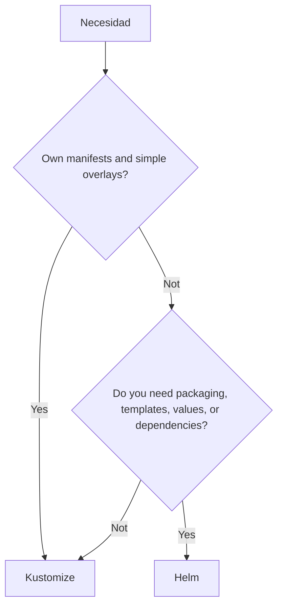

### Helm como ruta opcional In this module

This roadmap usará Kustomize como path principal because:

- Already lo usamos in the module 9
- Es suficiente for the laboratorio
- Tiene less fricción for enseñar delivery
- Evita meter templating before of necesitarlo
Helm queda como tool importante que the learner must understand, but does not como practice obligatoria of this module.

### Criterio of comprensión

Debes poder explicar:

> Kustomize personaliza manifests. Helm empaquetan applications como charts and gestiona releases. Not son intercambiables without coste.

---

## 10.9. `kubectl apply`, `kubectl diff` and Server-Side Apply

### What problema resuelven

When despliegas declaratively, you need apply cambios and understand what cambiará.

`kubectl apply` creates or actualiza Resources to partir of files. `kubectl diff` muestra diferencias between configuration deseada and state vivo before of apply. Server-Side Apply permite que the control plane rastree what manager controla what campos of a objeto, and está estable desde Kubernetes v1.22. ([GitHub Docs](https://docs.github.com/actions/using-workflows/workflow-syntax-for-github-actions "Workflow syntax for GitHub Actions"))

### `kubectl diff`

```bash
kubectl diff -k kubernetes/overlays/local
```

Sirve for see what cambiaría.

### Client-Side Apply

```bash
kubectl apply -k kubernetes/overlays/local
```

Es the flujo clásico.

### Server-Side Apply

```bash
kubectl apply --server-side --field-manager=checkout-delivery -k kubernetes/overlays/local
```

Server-Side Apply may be útil when quieres que the API Server gestione field ownership of forma more explícita.

### Cuidado

Not mezcles without criterio varios managers escribiendo the mismos campos.

You can provocar conflictos of ownership.

### DevEx

```yaml
deploy:diff:
  desc: Show diff for local overlay
  cmds:
    - kubectl diff -k kubernetes/overlays/local || true

deploy:apply:
  desc: Apply local overlay
  cmds:
    - kubectl apply -k kubernetes/overlays/local

deploy:apply:server-side:
  desc: Apply local overlay using Server-Side Apply
  cmds:
    - kubectl apply --server-side --field-manager=checkout-delivery -k kubernetes/overlays/local
```

### Criterio of comprensión

Debes poder explicar:

> `diff` enseña what cambiaría. `apply` cambia the cluster. Server-Side Apply añade gestión explícita of ownership of campos by parte of the API Server.

---

## 10.9 bis. API deprecations

Kubernetes evoluciona.

That significa que algunas APIs cambian of versión, quedan obsoletas or desaparecen.

A manifest may be correcto hoy and dejar of ser aceptado after of update the cluster.

Ejemplo conceptual:

```yaml
apiVersion: extensions/v1beta1
kind: Ingress
```

That tipo of manifest representa a riesgo because uses a API antigua.

The versión moderna of Ingress uses:

```yaml
apiVersion: networking.k8s.io/v1
kind: Ingress
```

### What debes learn

Not tienes que memorizar all the APIs antiguas.

Debes learn to detectar tres signals:

1. The `apiVersion` of the manifest.
2. If that versión exists in the cluster.
3. If hay a versión more moderna of the same recurso.

### Commands útiles

```bash
kubectl api-versions
kubectl api-resources
kubectl explain ingress
kubectl explain ingress.spec
```

For inspect all the `apiVersion` usados in a directory:

```bash
grep -R "^apiVersion:" kubernetes/
```

With `yq`:

```bash
find kubernetes -name "*.yaml" -print0 \
  | xargs -0 -I{} sh -c 'echo {}; yq ".apiVersion + \" \" + .kind" {}'
```

### Regla of the course

Everything manifest must declarar a API soportada by the cluster of practice.

Before of apply, valida:

```bash
kubectl apply --dry-run=server -f <manifest>
```

### Criterio of comprensión

Debes poder explicar:

> A manifest not only must tener YAML válido. It must use a API que the cluster actual entienda and mantenga.

--- 
## 10.10. Rollout status and rollback

### What problema resuelven

Apply manifests is not enough.

You need check que the rollout termina.

`kubectl rollout` gestiona rollouts of Deployments, DaemonSets and StatefulSets, and `kubectl rollout undo` revierte a rollout anterior. ([Kubernetes](https://kubernetes.io/docs/reference/kubectl/generated/kubectl_rollout/ "kubectl rollout"))

### See state

```bash
kubectl rollout status deployment/checkout-api -n shop --timeout=120s
```

### See historial

```bash
kubectl rollout history deployment/checkout-api -n shop
```

### Rollback

```bash
kubectl rollout undo deployment/checkout-api -n shop
kubectl rollout status deployment/checkout-api -n shop --timeout=120s
```

### Lo importante

Rollback not must ser a improvisación.

It must estar documentado and probado.

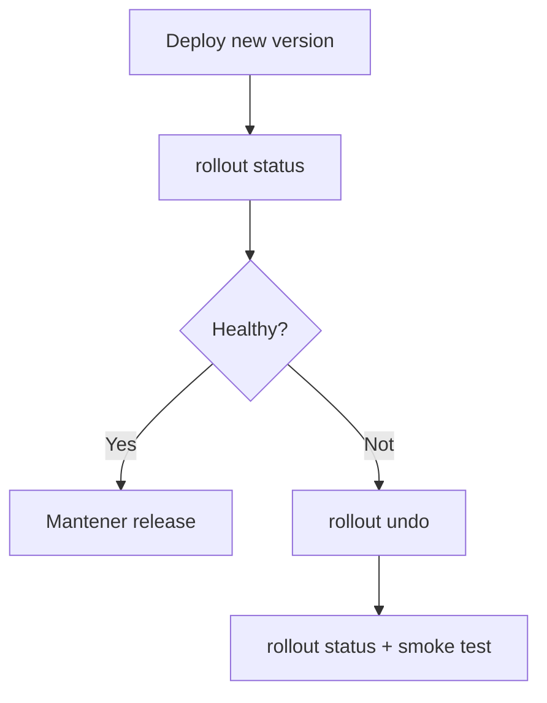

### DevEx

```yaml
deploy:status:
  desc: Wait for checkout-api rollout
  cmds:
    - kubectl rollout status deployment/checkout-api -n {{.NAMESPACE}} --timeout=120s

deploy:history:
  desc: Show checkout-api rollout history
  cmds:
    - kubectl rollout history deployment/checkout-api -n {{.NAMESPACE}}

deploy:rollback:
  desc: Rollback checkout-api Deployment and validate
  cmds:
    - kubectl rollout undo deployment/checkout-api -n {{.NAMESPACE}}
    - kubectl rollout status deployment/checkout-api -n {{.NAMESPACE}} --timeout=120s
    - task smoke:k8s
```

### Criterio of comprensión

Debes poder explicar:

> A deploy not está completo when `apply` termina. Está completo when the rollout termina and the smoke test valida the comportamiento minimum.

---

## 10.11. Delivery local completo with kind

### What problema resuelve

Before of enviar algo to staging, debes poder probar the flujo entero in local or CI with kind.

Esto reutiliza the module 9, but ahora with intención of delivery.

### Flujo

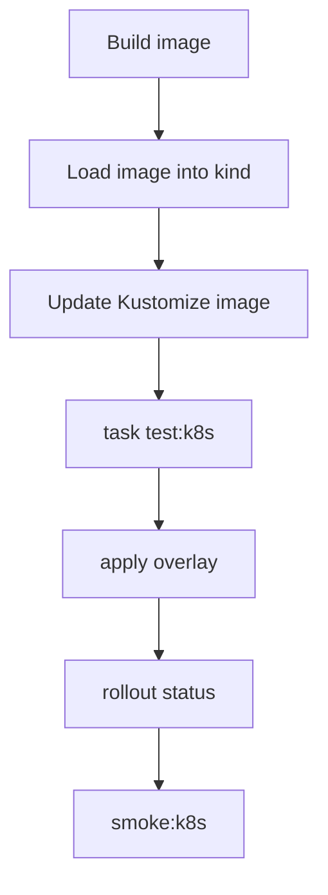

### Taskfile

```yaml
delivery:local:
  desc: Run local delivery flow against kind
  cmds:
    - task image:build
    - task k8s:image:load
    - task manifests:set-image IMAGE_TAG={{.IMAGE_TAG}}
    - task test:k8s
```

### Nota

In this flujo, `test:k8s` already creates su propio cluster efímero según the module 9.

If quieres desplegar in a cluster local existente, creates otra task:

```yaml
delivery:local:apply:
  desc: Apply current local overlay to the active cluster and validate
  cmds:
    - task manifests:render
    - task manifests:validate:schema
    - task manifests:score
    - task manifests:dry-run
    - task deploy:diff
    - task deploy:apply
    - task deploy:status
    - task smoke:k8s
```

### Criterio of comprensión

Debes poder explicar:

> The delivery local not sustituye staging, but evita que errores baratos lleguen tarde.

---

## 10.12. CI/CD with GitHub Actions

### What problema resuelve

The flujo not must depender of tu máquina.

It must poder runse in an environment automated.

GitHub Actions define workflows mediante YAML and permite create jobs compuestos by steps. GitHub documenta workflows for build and publicar images Docker in registries como Docker Hub or GitHub Packages. ([GitHub Docs](https://docs.github.com/actions/using-workflows/workflow-syntax-for-github-actions "Workflow syntax for GitHub Actions"))

### Workflow base

Creates:

```text
.github/workflows/kubernetes-delivery.yml
```

Contenido:

```yaml
name: Kubernetes delivery

on:
  push:
    branches:
      - main
  pull_request:

env:
  IMAGE_NAME: checkout-api
  IMAGE_TAG: ${{ github.sha }}
  TEST_CLUSTER: shop-test
  NAMESPACE: shop

jobs:
  validate-and-package:
    runs-on: ubuntu-latest

    permissions:
      contents: read
      packages: write

    steps:
      - name: Checkout
        uses: actions/checkout@v4

      - name: Set up Task
        uses: arduino/setup-task@v2

      - name: Install Kubernetes tools
        run: |
          set -euo pipefail
          curl -Lo ./kind https://kind.sigs.k8s.io/dl/v0.27.0/kind-linux-amd64
          chmod +x ./kind
          sudo mv ./kind /usr/local/bin/kind

          curl -Lo ./kubectl https://dl.k8s.io/release/v1.33.0/bin/linux/amd64/kubectl
          chmod +x ./kubectl
          sudo mv ./kubectl /usr/local/bin/kubectl

      - name: Install validation tools
        run: |
          set -euo pipefail
          echo "Install kubeconform, kube-score, kyverno, conftest and trivy here"
          echo "Pin exact versions in a real repository"

      - name: Build image
        run: |
          docker build -t checkout-api:${IMAGE_TAG} ./apps/checkout-api

      - name: Scan image
        run: |
          trivy image --exit-code 1 --severity HIGH,CRITICAL checkout-api:${IMAGE_TAG}

      - name: Update manifests
        run: |
          yq -i '.images[0].newTag = strenv(IMAGE_TAG)' kubernetes/overlays/local/kustomization.yaml

      - name: Run Kubernetes quality gate
        run: |
          task test:k8s IMAGE_TAG=${IMAGE_TAG} TEST_CLUSTER=${TEST_CLUSTER}
```

### Nota honesta

The bloque of instalación of tools está intencionalmente señalado como lugar for fijar versiones.

In a guía professional, not conviene install “lo last” without pinning.

Debes fijar versiones of:

- `kubectl`
- kind
- kubeconform
- kube-score
- Kyvernot CLI
- Conftest
- Trivy
- Task
- yq
- jq
### Criterio of comprensión

Debes poder explicar:

> CI/CD is not only “correr commands in GitHub”. Es mover the delivery fuera of the memoria humana and convertirlo in a gate repetible.

---

## 10.13. Promoción between entornos

### What problema resuelve

Not all the entornos must receive cambios to the same tiempo.

A flujo sanot suele separar:

```text
local
test
staging
production
```

The promoción must responder:

> ¿What artefacto probado avanza to the siguiente environment?

The artefacto should ser the same image.

Should nots reconstruir an image distinta for producción if already validaste otra.

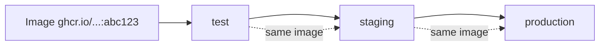

### Overlays by environment

```text
kubernetes/
  overlays/
    local/
      kustomization.yaml
    staging/
      kustomization.yaml
    production/
      kustomization.yaml
```

### Diferencias razonables by environment

|Configuration|Local|Staging|Producción|
|---|---|---|---|
|Réplicas|1 or 3|2 or 3|Según capacidad|
|Resources|Menores|Realistas|Basados in datos|
|Secrets|Fake/lab|Staging|Producción|
|Ingress host|local|staging|production|
|Storage|local|staging|producción|
|Policies|progresivas|estrictas|estrictas|

### What not must cambiar

Should not cambiar:

- The code of the image
- The tag validado que promocionas
- The contratos HTTP
- The estructura esencial of workloads
- The gates minimum
### Criterio of comprensión

Debes poder explicar:

> Promocionar is not reconstruir. Promocionar es mover a artefacto already validado hacia otro environment with configuration controlada.

---

## 10.14. GitOps

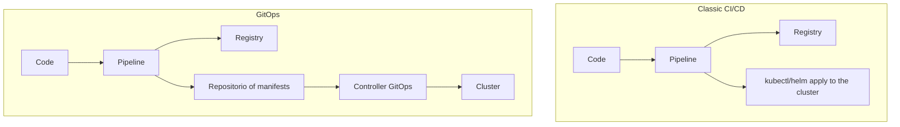

### What problema resuelve

In CI/CD clásico, the pipeline suele apply to the cluster.

In GitOps, a controller dentro of the cluster observa Git and reconcilia the state real hacia the state deseado.

Argo CD se define como a controller of Kubernetes que monitorizan applications in ejecución and compara the state vivo with the state objective definido in Git; if difieren, the application se considera `OutOfSync`, and Argo CD permite sincronizar manual or automáticamente. Flux se define como a tool for mantener clusters Kubernetes sincronizados with fuentes of configuration como repositorios Git, and automatizar actualizaciones of configuration when hay nuevo code. ([argo-cd.readthedocs.io](https://argo-cd.readthedocs.io/en/stable/ "Declarative GitOps CD for Kubernetes - Argo CD"))

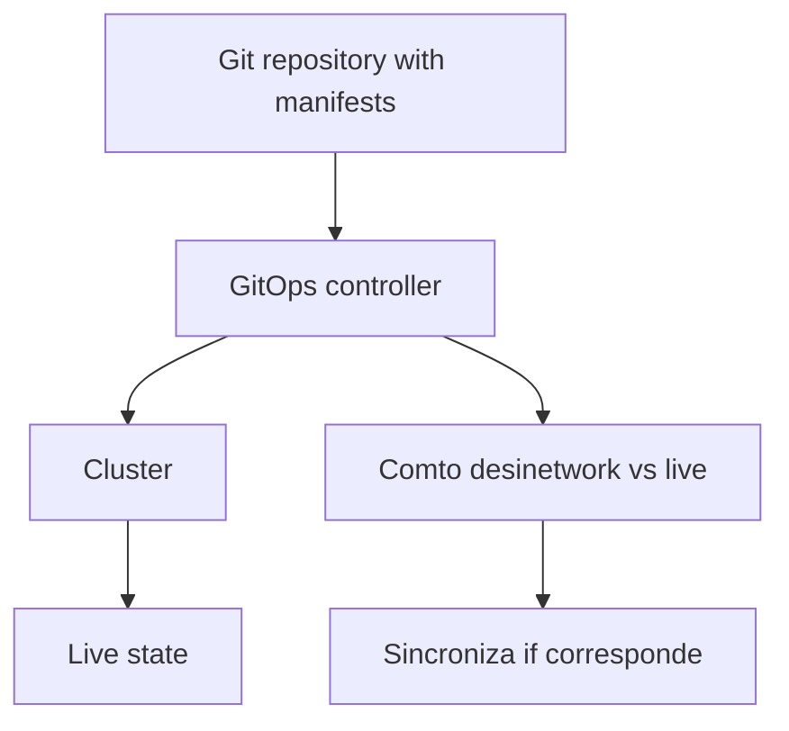

### CI/CD clásico

```text
Pipeline → kubectl apply → cluster
```

### GitOps

```text
Pipeline → actualiza Git
GitOps controller → aplica al cluster
```

### Ventajas of GitOps

- Git como fuente of verdad
- Better trazabilidad
- Less cnetworkenciales of cluster in CI
- Drift detection
- Reconciliación continuous
- Auditoría by pull requests
- Separación between build and deploy
### Costes of GitOps

- You need operate the controller
- You need diseñar repos and permisos
- You need to understand sync, drift and rollback
- You need gobernar secrets
- You need evitar que “Git dice yes” but observability diga not
### Criterio of comprensión

Debes poder explicar:

> GitOps is not a tool. Es a modelo where Git contiene the state deseado and a controller reconcilia the cluster hacia that state.

---

## 10.15. Argo CD

### What problema resuelve

Argo CD implementa GitOps for Kubernetes.

Observa repositorios, compara state deseado and state vivo, muestra drift and permite sincronizar.

Argo CD documenta su modelo como a controller que monitorizan applications and compara the state vivo with the state target definido in Git. ([argo-cd.readthedocs.io](https://argo-cd.readthedocs.io/en/stable/ "Declarative GitOps CD for Kubernetes - Argo CD"))

### Modelo conceptual

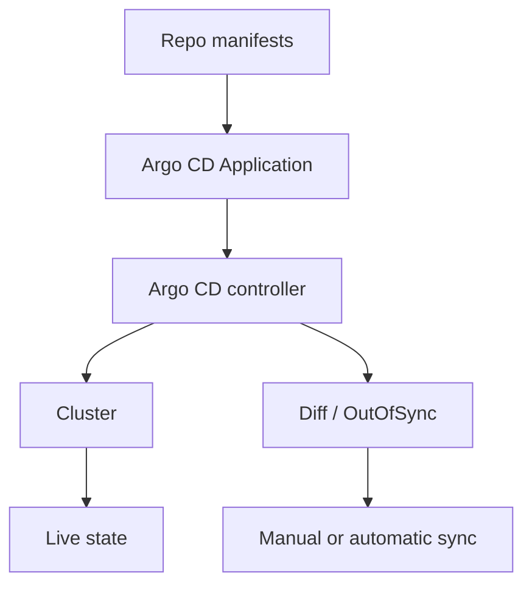

### Application conceptual

```yaml
apiVersion: argoproj.io/v1alpha1
kind: Application
metadata:
  name: checkout-api
  namespace: argocd
spec:
  project: default
  source:
    repoURL: https://example.com/your/repo.git
    targetRevision: main
    path: kubernetes/overlays/staging
  destination:
    server: https://kubernetes.default.svc
    namespace: shop
  syncPolicy:
    automated:
      prune: false
      selfHeal: false
```

### Nota

This manifest es conceptual.

Not lo apliques in the laboratorio salvo que hayas instalado Argo CD and tengas a repo real.

### Criterio of comprensión

Debes poder explicar:

> Argo CD not construye mi image by yes same in this modelo. Reconcilia manifests desde Git hacia the cluster.

---

## 10.16. Flux

### What problema resuelve

Flux also implementa GitOps.

Su documentación lo define como a solución of continuous delivery for Kubernetes que mantiene clusters sincronizados with fuentes of configuration como Git and automatiza actualizaciones when hay nuevo code. ([fluxcd.io](https://fluxcd.io/flux/ "Flux Documentation"))

### Modelo conceptual

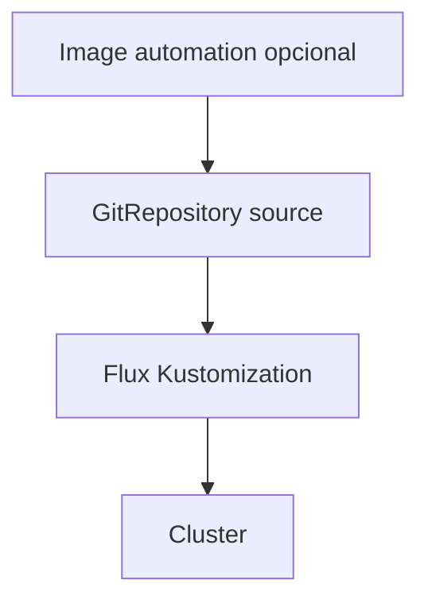

### Diferencia practice with Argo CD

TO alto nivel, ambos pueden resolver GitOps.

The elección depende of:

- Experiencia of the team
- Modelo operativo
- Preferencia of UI vs controller-first
- Integración with repos
- Automatización of images
- Gobernanza interna
- Ecosistema already existente
### Criterio of comprensión

Debes poder explicar:

> Argo CD and Flux son caminos GitOps. Should nots elegirlos by moda, sinot by modelo operativo, capacidades necesarias and coste of operación.

---

## 10.17. Progressive delivery

### What problema resuelve

RollingUpdate es útil, but not always basta.

TO veces quieres controlar exposición progresiva:

- 5% of traffic to the nueva versión
- Validate métricas
- Pausar
- Promocionar
- Abort automático if algo fails
- Blue-green
- Canary
Argo Rollouts se define como a controller and conjunto of CRDs for capacidades avanzadas of deployment como blue-green, canary, análisis, experimentación and progressive delivery about Kubernetes. ([argo-rollouts.readthedocs.io](https://argo-rollouts.readthedocs.io/ "Argo Rollouts - Kubernetes Progressive Delivery Controller"))

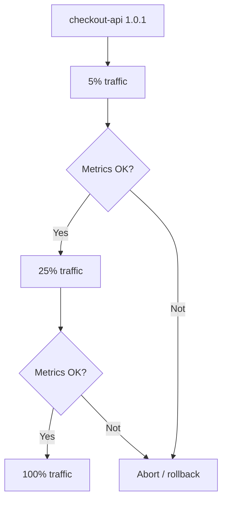

### Cuándo use progressive delivery

Tiene sentido if:

- The coste of failure es alto
- You can medir signals fiables
- Tienes traffic suficiente
- Tienes automatización madura
- Tienes rollback rápido
- Tu team understands what métrica decide promoción or abort
### Cuándo not usarlo

Not lo uses if:

- Not tienes métricas fiables
- Not tienes observability
- Not tienes capacidad of operate the controller
- The sistema not soporta dos versiones vivas
- Only quieres “hacer algo advanced”
### Criterio of comprensión

Debes poder explicar:

> Progressive delivery is not a estrategia of deployment bonita. Es a forma of limitar exposición to the riesgo usando signals reales.

---

## 10.18. Strategys of deployment

### RollingUpdate

Es the estrategia normal of Deployment.

Reemplaza Pods gradualmente.

Encaja for muchas APIs stateless.

### Recreate

Termina Pods antiguos before of create nuevos.

It can causar downtime.

Útil in casos where dos versiones not pueden convivir.

### Blue-green

Mantienes dos entornos or versiones.

Cambias traffic of a to otra when the nueva está lista.

### Canary

Envías a parte pequeña of the traffic to the nueva versión and aumentas progresivamente if the signals son buenas.

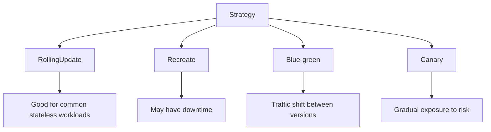

### Contrato of elección

|Strategy|Cuándo encaja|
|---|---|
|RollingUpdate|Stateless, versiones compatibles, riesgo moderado|
|Recreate|Not pueden convivir versiones, downtime aceptable|
|Blue-green|Quieres validate environment nuevo before of cambiar traffic|
|Canary|Quieres exposición gradual and tienes métricas fiables|

### Criterio of comprensión

Debes poder explicar:

> The estrategia of deployment se elige by compatibilidad between versiones, tolerancia to the riesgo, capacidad of observación and coste of operación.

---

## 10.19. Migraciones and delivery

### What problema resuelve

Muchas releases not cambian only code.

Also cambian datos.

Ejemplo:

```text
checkout-api 1.0.1 necesita nueva columna en PostgreSQL
```

Esto es peligroso if not diseñas compatibilidad.

### Reglas básicas

- The migraciones must ser compatibles hacia atrás when sea possible
- Evita cambios destructivos in the same deploy
- Separa expand and contract
- First añade estructura compatible
- Then despliega code que the uses
- After elimina lo antiguo when already not is used
- Not asumas rollback of database como if fuera rollback of image
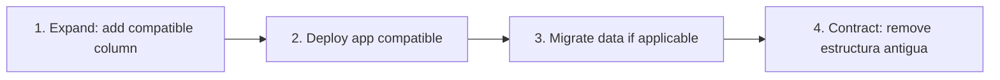

### Job of migración

In Kubernetes, a migración puntual suele representarse como Job.

But run migraciones in delivery requiere cuidado:

- ¿Se can reintentar?
- ¿Es idempotente?
- ¿What pasa if fails to medias?
- ¿What versión of app the needs?
- ¿It can correr dos veces?
- ¿Bloquea rollout?
- ¿Tiene rollback?
### Criterio of comprensión

Debes poder explicar:

> Rollback of application not implica rollback of datos. The migraciones must diseñarse como parte of the delivery, not como a script añadido to the final.

---

## 10.20. Delivery with calidad: gates obligatorios

### What gates must tener the flujo

Minimum:

1. Tests of application
2. Build of image
3. Scan of image
4. Render of manifests
5. Schema validation
6. Static analysis
7. Policy tests
8. Server-side dry-run
9. Deploy in kind
10. Rollout status
11. Service endpoints
12. Smoke test
13. Diff before of apply to environment real
14. Rollout status in environment real
15. Smoke test post-deploy
16. Rollback probado
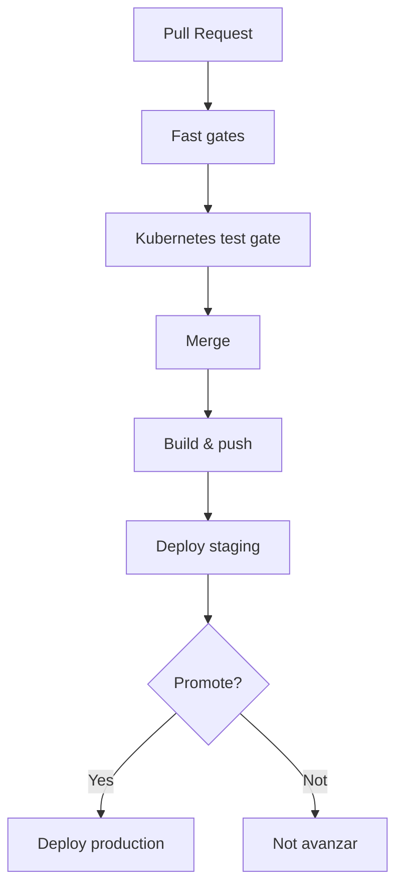

### What not must ser opcional

- `task test:k8s`
- Scan of image, to the less severidad alta/crítica
- Smoke test post-deploy
- Rollback documentado
- Diff visible before of apply cambios sensibles
### Criterio of comprensión

Debes poder explicar:

> Delivery must estar subordinado to feedback. If the gate fails, the cambio not avanza.

---

## 10.21. Taskfile of the module 10

Añade these tasks to the `Taskfile.yml`.

```yaml
vars:
  APP_NAME: checkout-api
  IMAGE_NAME: checkout-api
  IMAGE_TAG: 1.0.1
  IMAGE_REGISTRY: ghcr.io
  IMAGE_REPOSITORY: owner/repo/checkout-api
  NAMESPACE: shop
  PORT: 8080

tasks:
  image:build:
    desc: Build checkout-api image
    cmds:
      - docker build -t {{.IMAGE_NAME}}:{{.IMAGE_TAG}} ./apps/{{.APP_NAME}}

  image:scan:
    desc: Scan checkout-api image with Trivy
    cmds:
      - trivy image --exit-code 1 --severity HIGH,CRITICAL {{.IMAGE_NAME}}:{{.IMAGE_TAG}}

  image:tag:
    desc: Tag checkout-api image for registry
    cmds:
      - docker tag {{.IMAGE_NAME}}:{{.IMAGE_TAG}} {{.IMAGE_REGISTRY}}/{{.IMAGE_REPOSITORY}}:{{.IMAGE_TAG}}

  image:push:
    desc: Push checkout-api image to registry
    cmds:
      - docker push {{.IMAGE_REGISTRY}}/{{.IMAGE_REPOSITORY}}:{{.IMAGE_TAG}}

  manifests:set-image:
    desc: Update local overlay image tag. Usage: task manifests:set-image IMAGE_TAG=1.0.1
    cmds:
      - yq -i '.images[0].newTag = "{{.IMAGE_TAG}}"' kubernetes/overlays/local/kustomization.yaml
      - mkdir -p .tmp
      - kubectl kustomize kubernetes/overlays/local > .tmp/rendered.yaml
      - yq 'select(.kind == "Deployment") | .spec.template.spec.containers[0].image' .tmp/rendered.yaml

  deploy:diff:
    desc: Show diff for local overlay
    cmds:
      - kubectl diff -k kubernetes/overlays/local || true

  deploy:apply:
    desc: Apply local overlay
    cmds:
      - kubectl apply -k kubernetes/overlays/local

  deploy:apply:server-side:
    desc: Apply local overlay using Server-Side Apply
    cmds:
      - kubectl apply --server-side --field-manager=checkout-delivery -k kubernetes/overlays/local

  deploy:status:
    desc: Wait for checkout-api rollout
    cmds:
      - kubectl rollout status deployment/checkout-api -n {{.NAMESPACE}} --timeout=120s

  deploy:history:
    desc: Show checkout-api rollout history
    cmds:
      - kubectl rollout history deployment/checkout-api -n {{.NAMESPACE}}

  deploy:rollback:
    desc: Rollback checkout-api Deployment and validate
    cmds:
      - kubectl rollout undo deployment/checkout-api -n {{.NAMESPACE}}
      - kubectl rollout status deployment/checkout-api -n {{.NAMESPACE}} --timeout=120s
      - task smoke:k8s

  delivery:local:apply:
    desc: Apply current local overlay to active cluster and validate
    cmds:
      - task manifests:render
      - task manifests:validate:schema
      - task manifests:score
      - task policies:test
      - task manifests:dry-run
      - task deploy:diff
      - task deploy:apply
      - task deploy:status
      - task cluster:wait
      - task smoke:k8s

  delivery:local:
    desc: Run local delivery flow against kind
    cmds:
      - task image:build
      - task image:scan
      - task k8s:image:load
      - task manifests:set-image IMAGE_TAG={{.IMAGE_TAG}}
      - task test:k8s

  delivery:release:local:
    desc: Build, scan, update manifests, apply and validate on active local cluster
    cmds:
      - task image:build
      - task image:scan
      - task k8s:image:load
      - task manifests:set-image IMAGE_TAG={{.IMAGE_TAG}}
      - task delivery:local:apply
```

### Criterio DevEx

Debes poder explicar:

> The Taskfile not oculta Kubernetes. Hace que the delivery sea repetible, visible and revisable.

---

## 10.22. Practice principal of the module

### Objective

Build a flujo of delivery local completo for `checkout-api`.

### Resultado esperado

```text
kubernetes-learning-lab/
  kubernetes/
    base/
      kustomization.yaml
      deployment.yaml
      service.yaml
      configmap.yaml
    overlays/
      local/
        kustomization.yaml
      staging/
        kustomization.yaml
      production/
        kustomization.yaml

  .github/
    workflows/
      kubernetes-delivery.yml

  Taskfile.yml
```

### Paso 1. Preparar cluster

```bash
task k8s:kind:create
task k8s:namespace:apply
```

### Paso 2. Build and escanear image

```bash
task image:build IMAGE_TAG=1.0.1
task image:scan IMAGE_TAG=1.0.1
```

### Paso 3. Cargar image in kind

```bash
task k8s:image:load IMAGE_TAG=1.0.1
```

### Paso 4. Update manifest

```bash
task manifests:set-image IMAGE_TAG=1.0.1
```

### Paso 5. Run quality gates

```bash
task manifests:render
task manifests:validate:schema
task manifests:score
task policies:test
task manifests:dry-run
```

### Paso 6. See diff

```bash
task deploy:diff
```

### Paso 7. Apply

```bash
task deploy:apply
```

### Paso 8. Esperar rollout

```bash
task deploy:status
```

### Paso 9. Validate Service and smoke test

```bash
task cluster:wait
task smoke:k8s
```

### Paso 10. See historial

```bash
task deploy:history
```

### Paso 11. Probar rollback

First fuerza an image mala:

```bash
task k8s:failure:rollout:bad-image
```

After revierte:

```bash
task deploy:rollback
```

### Paso 12. Run flujo completo

```bash
task delivery:release:local IMAGE_TAG=1.0.1
```

### Paso 13. Limpiar

```bash
task k8s:namespace:delete
task k8s:kind:delete
```

### Criterio of finalización

The practice está completa when you can explicar:

- What image se construyó
- What tag se usó
- What scan se ejecutó
- What manifest se actualizó
- What diff se revisó
- What gates pasaron
- What se aplicó to the cluster
- What rollout se validó
- What smoke test confirmó the resultado
- How se hizo rollback
- What partes shouldn moverse to CI
- What partes podrían moverse to GitOps
---

## 10.23. CI workflow completo, versión didáctica

This workflow es a base didáctica.

In a repositorio real debes fijar versiones exactas of tools, gestionar cache, cnetworkenciales, permisos minimum and publicación real of image.

```yaml
name: Kubernetes delivery

on:
  pull_request:
  push:
    branches:
      - main

env:
  APP_NAME: checkout-api
  IMAGE_NAME: checkout-api
  IMAGE_TAG: ${{ github.sha }}
  TEST_CLUSTER: shop-test
  NAMESPACE: shop

jobs:
  validate:
    runs-on: ubuntu-latest

    permissions:
      contents: read
      packages: write

    steps:
      - name: Checkout
        uses: actions/checkout@v4

      - name: Set up Task
        uses: arduino/setup-task@v2

      - name: Install base tools
        run: |
          set -euo pipefail
          sudo apt-get update
          sudo apt-get install -y jq curl

      - name: Install yq
        run: |
          set -euo pipefail
          sudo wget -qO /usr/local/bin/yq https://github.com/mikefarah/yq/releases/download/v4.45.1/yq_linux_amd64
          sudo chmod +x /usr/local/bin/yq

      - name: Install kind
        run: |
          set -euo pipefail
          curl -Lo kind https://kind.sigs.k8s.io/dl/v0.27.0/kind-linux-amd64
          chmod +x kind
          sudo mv kind /usr/local/bin/kind

      - name: Install kubectl
        run: |
          set -euo pipefail
          curl -Lo kubectl https://dl.k8s.io/release/v1.33.0/bin/linux/amd64/kubectl
          chmod +x kubectl
          sudo mv kubectl /usr/local/bin/kubectl

      - name: Install validation tools
        run: |
          set -euo pipefail
          echo "Install kubeconform, kube-score, kyverno, conftest and trivy with pinned versions"
          echo "This course keeps this step explicit so the repo owner chooses exact versions"

      - name: Build image
        run: |
          docker build -t checkout-api:${IMAGE_TAG} ./apps/checkout-api

      - name: Scan image
        run: |
          trivy image --exit-code 1 --severity HIGH,CRITICAL checkout-api:${IMAGE_TAG}

      - name: Update manifests
        run: |
          yq -i '.images[0].newTag = strenv(IMAGE_TAG)' kubernetes/overlays/local/kustomization.yaml

      - name: Run Kubernetes quality gate
        run: |
          task test:k8s IMAGE_TAG=${IMAGE_TAG} TEST_CLUSTER=${TEST_CLUSTER}
```

### Nota of rigor

Not he puesto commands inventados for install each tool of validación because each repo should fijar versiones and checksums concretos.

This workflow marca the lugar correcto for hacerlo, but not finge que a instalación genérica sea a good practice universal.

### Criterio of comprensión

Debes poder explicar:

> A workflow didáctico muestra the flujo. A workflow professional fija versiones, permisos, cnetworkenciales, cache, cleanup and condiciones of promoción.

---

## 10.24. Troubleshooting progresivo of delivery

When falle delivery, not digas “CI está roto”.

Identifica the capa.

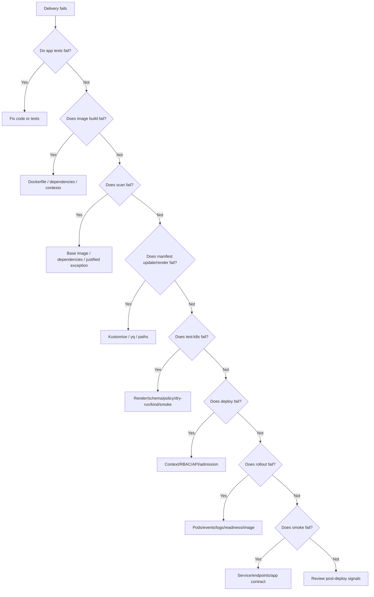

### Commands útiles

```bash
task manifests:render
task manifests:validate:schema
task manifests:score
task policies:test
task manifests:dry-run
task deploy:diff
task deploy:status
task k8s:events
task k8s:network:troubleshoot:checkout
task k8s:troubleshoot:config-storage
task smoke:k8s
```

### Criterio of comprensión

Debes poder explicar:

> A failure of delivery must apuntar to a capa concreta. If everything se diagnostica igual, the pipeline está bad diseñado.

---

## 10.25. Errores habituales

### Error 1. Confundir build with release

Build an image not significa que esté lista for producción.

It must pasar gates and estar vinculada to manifests.

---

### Error 2. Use `latest`

`latest` oculta what versión se desplegó and dificulta rollback.

Uses tags trazables or digests.

---

### Error 3. Reconstruir for each environment

If validas an image in staging, not reconstruyas otra for producción salvo que tengas a razón very clara.

Promociona the same artefacto.

---

### Error 4. Apply without diff

`kubectl diff` not sustituye tests, but ayuda to see what cambiaría.

---

### Error 5. Apply without rollout status

`kubectl apply` can terminar properly while the rollout fails after.

---

### Error 6. Rollback not probado

A rollback escrito in a documento but never probado es a esperanza, not a capacidad operacional.

---

### Error 7. GitOps without ownership claro

GitOps requiere decidir quién cambia Git, quién atest, quién sincroniza, how se gestionan secrets and how se detecta drift.

---

### Error 8. Progressive delivery without observability

Canary without métricas fiables es exposición gradual to ciegas.

---

### Error 9. Migraciones destructivas in the same deploy

If rompes compatibilidad of datos, rollback of image can not salvarte.

---

## 10.26. Criterio of output of the module

You can pasar to the module 11 when puedas hacer everything esto without seguir a receta ciegamente.

### Concepts

Debes poder explicar:

- What it means delivery in Kubernetes
- By what apply YAML manualmente is not enough
- What relación hay between image, manifest and commit
- By what evitar `latest`
- What diferencia hay between tag and digest
- What aporta a scan of image
- What papel tiene Kustomize in delivery
- Cuándo use Helm
- What hace `kubectl diff`
- What hace `kubectl apply`
- What aporta Server-Side Apply
- What es rollout status
- What es rollback
- What es promoción between entornos
- What es GitOps
- What diferencia hay between CI/CD clásico and GitOps
- What aportan Argo CD and Flux
- What es progressive delivery
- Diferencia between RollingUpdate, Recreate, blue-green and canary
- By what migraciones and rollback of application not son lo same
### Practice

Debes poder:

- Build an image
- Escanear an image
- Cargar image in kind
- Update Kustomize with nuevo tag
- Renderizar manifests
- Run gates of the module 9
- See diff
- Apply overlay
- Esperar rollout
- Run smoke test
- See historial
- Provocar rollout fallido
- Run rollback
- Explicar how llevar the flujo to CI
- Explicar how evolucionarlo hacia GitOps
### DevEx

Debes poder run:

```bash
task image:build IMAGE_TAG=1.0.1
task image:scan IMAGE_TAG=1.0.1
task k8s:image:load IMAGE_TAG=1.0.1
task manifests:set-image IMAGE_TAG=1.0.1
task manifests:render
task manifests:validate:schema
task manifests:score
task policies:test
task manifests:dry-run
task deploy:diff
task deploy:apply
task deploy:status
task smoke:k8s
task deploy:history
task k8s:failure:rollout:bad-image
task deploy:rollback
task delivery:release:local IMAGE_TAG=1.0.1
```

### Frase final of comprensión

Debes poder explicar this frase:

> Delivery in Kubernetes es a cadena of decisiones and verificaciones: build an image trazable, checkla, update configuration declarativa, pasar quality gates, desplegar of forma observable, validate comportamiento and conservar a ruta of rollback.

---

## 10.27. References oficiales and fuentes primarias

|Tema|Referencia|
|---|---|
|Declarative Management|Kubernetes Docs, Declarative Management of Kubernetes Objects Using Configuration Files. ([Kubernetes](https://kubernetes.io/docs/tasks/manage-kubernetes-objects/declarative-config/ "Declarative Management of Kubernetes Objects Using ..."))|
|Server-Side Apply|Kubernetes Docs, Server-Side Apply. ([Kubernetes](https://kubernetes.io/docs/reference/using-api/server-side-apply/ "Server-Side Apply"))|
|Kustomize|Kubernetes Docs, Declarative Management using Kustomize. ([Kubernetes](https://kubernetes.io/docs/tasks/manage-kubernetes-objects/kustomization/ "Declarative Management of Kubernetes Objects Using ..."))|
|Kustomize site|Kustomize official site. ([kustomize.io](https://kustomize.io/ "Kustomize - Kubernetes native configuration management"))|
|Deployments|Kubernetes Docs, Deployments. ([Kubernetes](https://kubernetes.io/docs/concepts/workloads/controllers/deployment/ "Deployments"))|
|`kubectl rollout`|Kubernetes Docs, `kubectl rollout`. ([Kubernetes](https://kubernetes.io/docs/reference/kubectl/generated/kubectl_rollout/ "kubectl rollout"))|
|`kubectl rollout undo`|Kubernetes Docs, `kubectl rollout undo`. ([Kubernetes](https://kubernetes.io/docs/reference/kubectl/generated/kubectl_rollout/kubectl_rollout_undo/ "kubectl rollout undo"))|
|`kubectl diff`|Kubernetes Docs, `kubectl diff`. ([GitHub Docs](https://docs.github.com/actions/using-workflows/workflow-syntax-for-github-actions "Workflow syntax for GitHub Actions"))|
|Helm upgrade|Helm Docs, `helm upgrade`. ([helm.sh](https://helm.sh/docs/helm/helm_upgrade "helm upgrade"))|
|Helm rollback|Helm Docs, `helm rollback`. ([helm.sh](https://helm.sh/docs/helm/helm_rollback "helm rollback"))|
|Helm charts|Helm Docs, Charts. ([helm.sh](https://helm.sh/docs/topics/charts "Charts"))|
|Argo CD|Argo CD Docs. ([argo-cd.readthedocs.io](https://argo-cd.readthedocs.io/en/stable/ "Declarative GitOps CD for Kubernetes - Argo CD"))|
|Flux|Flux Docs. ([fluxcd.io](https://fluxcd.io/flux/ "Flux Documentation"))|
|Argo Rollouts|Argo Rollouts Docs. ([argo-rollouts.readthedocs.io](https://argo-rollouts.readthedocs.io/ "Argo Rollouts - Kubernetes Progressive Delivery Controller"))|
|Argo Rollouts Canary|Argo Rollouts Docs, Canary. ([argo-rollouts.readthedocs.io](https://argo-rollouts.readthedocs.io/en/stable/features/canary/ "Canary - Kubernetes Progressive Delivery Controller"))|
|Trivy|Trivy Docs. ([Trivy](https://trivy.dev/ "Trivy"))|
|Trivy container image scanning|Trivy Docs, Container Image. ([Trivy](https://trivy.dev/docs/latest/guide/target/container_image/ "Container Image"))|
|GitHub Actions workflow syntax|GitHub Docs, Workflow syntax. ([GitHub Docs](https://docs.github.com/actions/using-workflows/workflow-syntax-for-github-actions "Workflow syntax for GitHub Actions"))|
|Publishing Docker images with GitHub Actions|GitHub Docs, Publishing Docker images. ([GitHub Docs](https://docs.github.com/actions/guides/publishing-docker-images "Publishing Docker images"))|

## 10.28. Lecturas of apoyo

|Libro|What read|
|---|---|
|_Cloud Native DevOps with Kubernetes_|Capítulos 12, 13 and 14: Helm, Kustomize, development workflow, deployment strategies, continuous deployment, tests, manifests validation, image publishing and deploy.|
|_Kubernetes in Action_|Capítulos 9 and 17: Deployments, rollouts, rollbacks, lifecycle, shutdown, manifests, desarrollo and CI/CD.|
|_Kubernetes: Up and Running_|Capítulos 10, 13, 17 and 18: Deployments, ConfigMaps, real applications and organización of applications.|
|_Kubernetes Patterns_|Declarative Deployment, Health Probe, Managed Lifecycle, Service Discovery and Elastic Scale.|

<!-- COURSE_NAV_START -->
[Previous](9.%20Automated%20testing%20for%20Kubernetes.md) | [Index](README.md) | [Next](11.%20Security.md)
<!-- COURSE_NAV_END -->
