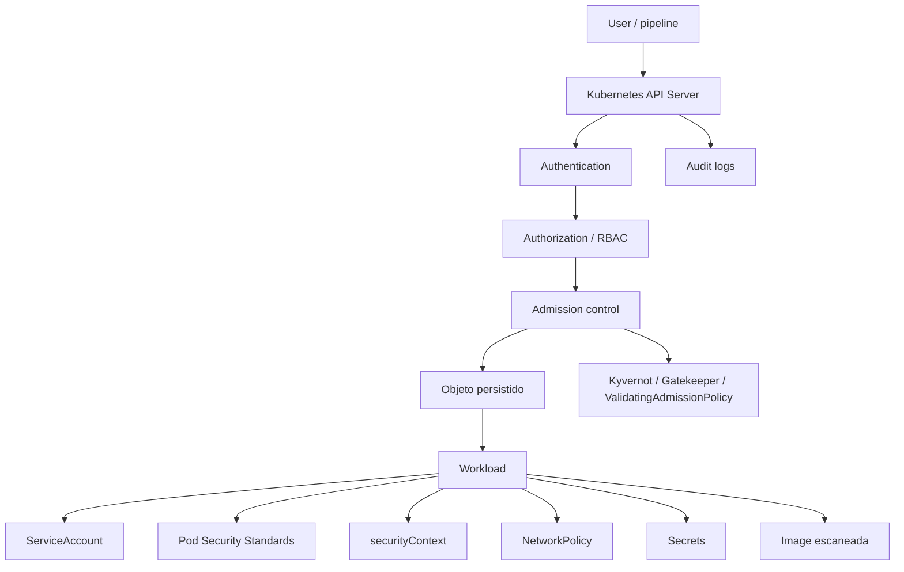
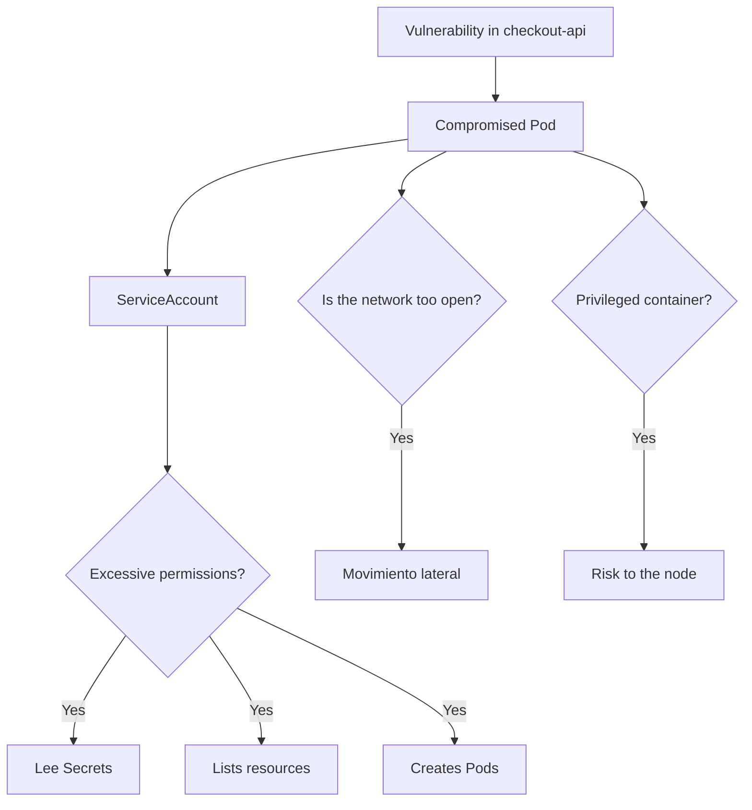
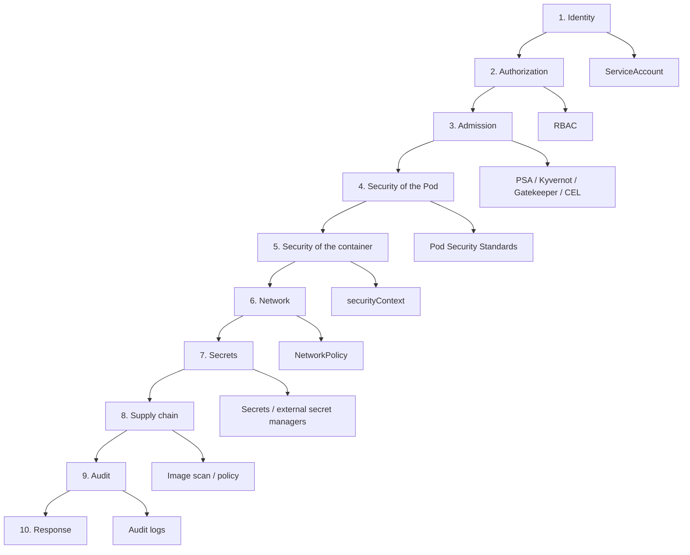
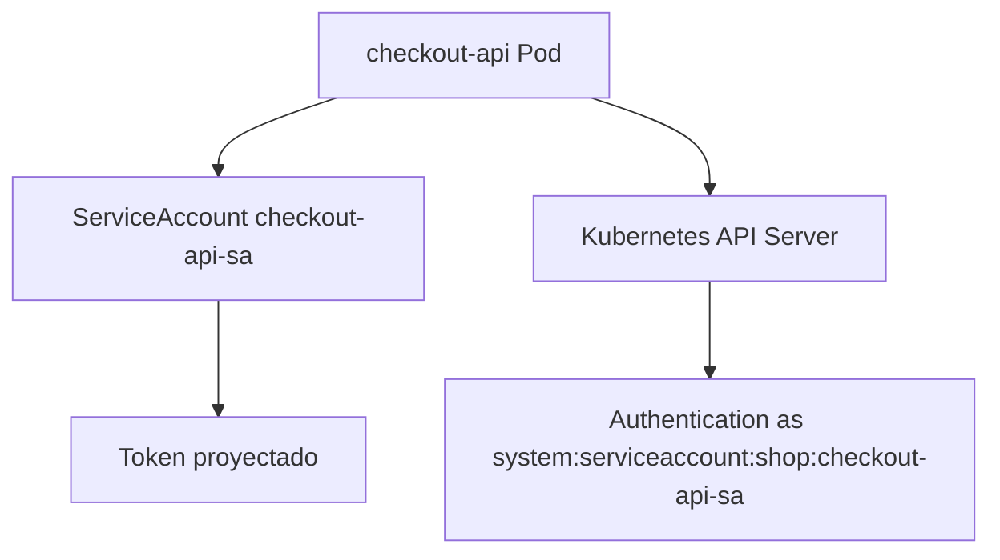
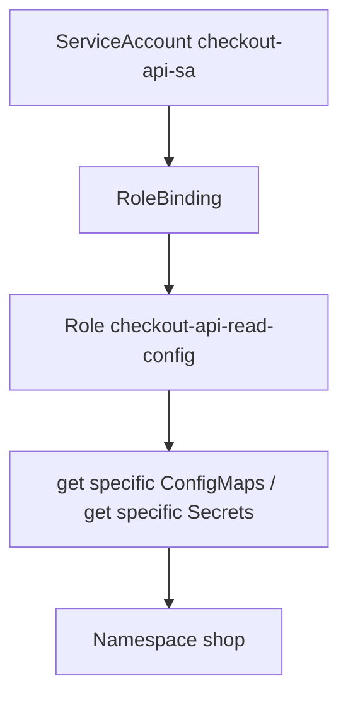
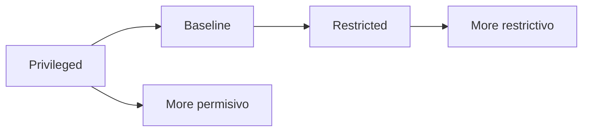
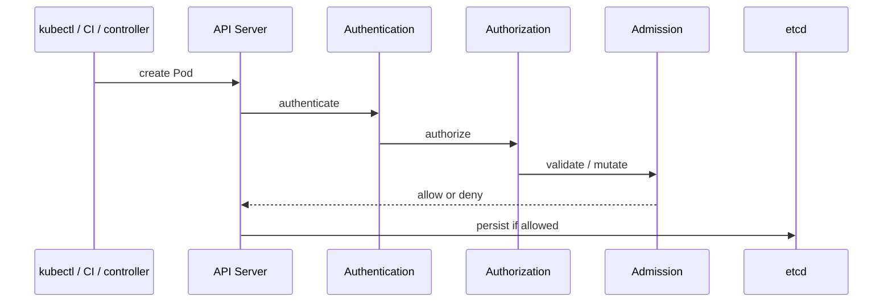
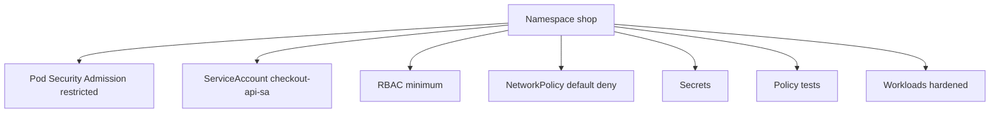
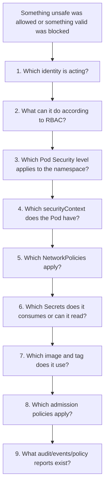

<!-- COURSE_NAV_START -->
[Previous](<10. Application delivery.md>) | [Index](README.md) | [Next](<12. Operations, observability, and reliability with Grafana LGTM.md>)
<!-- COURSE_NAV_END -->

# 11. Security

## Objective of the module

In the module 10 convertiste the trabajo anterior in delivery:

```text
build
scan
push
update manifests
quality gates
deploy
rollout status
smoke test
rollback
```

Ahora toca introducir a idea incómoda:

> Que an application deployment properly not significa que esté desplegada safely.

Kubernetes ofrece muchas primitivas of security, but not the activa all by ti of forma mágica. Tienes que diseñar identidad, permisos, aislamiento, admisión, secrets, políticas, images, auditoría and blast radius.

The documentación oficial of Kubernetes agrupa security alnetworkedor of varias áreas: control plane, nodos, workloads, políticas, secrets, auditoría, supply chain, acceso to the API and controles of admisión. Also, Kubernetes audit logging proporciona a registro cronológico and relevante for security of the acciones realizadas by usuarios, applications and the propio control plane. ([Kubernetes](https://kubernetes.io/docs/concepts/security/ "Security"))

The idea central of the module es this:

> Security in Kubernetes is does not a tool. Es a cadena of controles que reduce permisos, reduce exposición, reduce blast radius, bloquea configuraciones peligrosas and deja signals auditables when algo ocurre.



---

## 11.1. What you are going to learn and what not you are going to learn yet

You are going to learn:

- What it means security in Kubernetes desde a punto of vista práctico
- What es blast radius
- What es defensa in profundidad
- What son ServiceAccounts
- What es RBAC
- What diferencia hay between Role, ClusterRole, RoleBinding and ClusterRoleBinding
- How use `kubectl auth can-i`
- What son Pod Security Standards
- What es Pod Security Admission
- What sustituye to PodSecurityPolicy
- What es `securityContext`
- What it means correr como not root
- What it means remove Linux capabilities
- What implica `readOnlyRootFilesystem`
- How use NetworkPolicy como control of network
- What límites tienen the Secrets nativos
- What controles minimum apply about Secrets
- What es admission control
- What es ValidatingAdmissionPolicy
- What aportan Kyvernot and OPA Gatekeeper
- What aporta Trivy in images and Kubernetes
- What son audit logs
- How create a namespace `production-like` for `shop`
- How automatizar validaciones of security with Taskfile
- How hacer troubleshooting progresivo of security
Not vamos to profundizar yet in:

- Security advanced of nodos
- Hardening completo of kube-apiserver
- Gestión advanced of certificados
- mTLS with service mesh
- Runtime security with Falco in profundidad
- Forensics completa
- Threat modeling formal
- Multi-tenancy fuerte
- Firmado and verificación of images
- SBOM advanced
- SLSA
- OIDC cloud real
- Vault advanced
- Cifrado of etcd administrado by proveedor
- CKS completo
The regla pedagógica of the module será:

```text
First, threat or risk
Then control
Then manifest
Then validation
Then controlled failure
Then automation
```

---

## 11.2. The problema: Kubernetes amplifica tanto capacidad como riesgo

Kubernetes permite create workloads, conectarlos, scalelos and updatelos with mucha velocidad.

That same velocidad can amplificar errores.

A Deployment bad configurado can create varios Pods inseguros.

A ServiceAccount with demasiados permisos can dar acceso excesivo desde a Pod comprometido.

A image vulnerable can desplegarse muchas veces.

A Secret accesible by demasiados actores can expose cnetworkenciales.

A `securityContext` débil can ampliar the impacto of a vulnerabilidad.

A NetworkPolicy ausente can dejar comunicación lateral demasiado abierta.



### Contrato mental

Not preguntes only:

> ¿Funciona?

Pregunta:

> If esto fails or se compromete, ¿hasta dónde can llegar the daño?

### Blast radius

Blast radius es the alcance of the daño possible.

In Kubernetes, can depender of:

- Permisos RBAC
- ServiceAccount usada
- Secrets accesibles
- NetworkPolicies
- Privilegios of the container
- Montajes of volúmenes
- Capabilities Linux
- Acceso to the host
- Image usada
- Políticas of admisión
- Separación by namespace
- Auditoría disponible
### Criterio of comprensión

Debes poder explicar:

> Security in Kubernetes does not elimina the risk. Networkuce lo que a failure can tocar, reduce configuraciones peligrosas and mejora the capacidad of detectar and respondsr.

---

--- 
## 11.3. Modelo of security by layers

Before of create Resources, necesitamos a mapa.



### Layers mínimas for this module

|Capa|Control|
|---|---|
|Identidad|ServiceAccount by application|
|Autorización|RBAC minimum|
|Admisión|Pod Security Admission and policy-as-code|
|Pod|Pod Security Standards|
|Container|`securityContext` restrictivo|
|Network|NetworkPolicy|
|Secrets|Secrets with acceso minimum|
|Supply chain|Trivy, not `latest`, registry controlado|
|Auditoría|audit logs, events, policy reports|
|Testing|`task test:k8s` and tests of policies|

### Criterio of comprensión

Debes poder explicar:

> Ninguna capa aislada basta. The security aparece when varias layers se refuerzan between yes.

---

## 11.4. ServiceAccounts

### What problema resuelven

TO Pod needs a identidad for hablar with the API of Kubernetes.

That identidad suele ser a ServiceAccount.

The documentación oficial explica que a ServiceAccount proporciona a identidad for processes que corren in Pods, and que can usarse for autenticar workloads frente to the API Server. ([Kubernetes](https://kubernetes.io/docs/concepts/security/service-accounts/ "Service Accounts"))

### Why it matters

If not especificas ServiceAccount, the Pod uses the ServiceAccount `default` of the namespace.

That may be aceptable for a laboratorio very basic, but is not a good base professional.

Queremos que `checkout-api` tenga su propia identidad:

```text
checkout-api-sa
```



### Manifest

Creates:

```text
kubernetes/07-security/serviceaccount.yaml
```

Contenido:

```yaml
apiVersion: v1
kind: ServiceAccount
metadata:
  name: checkout-api-sa
  namespace: shop
  labels:
    app.kubernetes.io/name: checkout-api
    app.kubernetes.io/component: api
    app.kubernetes.io/part-of: shop
automountServiceAccountToken: false
```

### By what `automountServiceAccountToken: false`

If the application not needs hablar with the API of Kubernetes, not needs mount automáticamente a token.

Esto reduce exposición.

If later a workload needs hablar with the API, debes habilitarlo explícitamente and darle permisos minimum.

### Añadir to the Deployment

In `deployment.yaml`:

```yaml
spec:
  template:
    spec:
      serviceAccountName: checkout-api-sa
      automountServiceAccountToken: false
```

### Apply

```bash
kubectl apply -f kubernetes/07-security/serviceaccount.yaml
kubectl apply -f kubernetes/02-deployment/deployment.yaml
```

### Validate

```bash
kubectl get serviceaccount -n shop
kubectl get pod -n shop -l app.kubernetes.io/name=checkout-api -o json \
  | jq '.items[].spec.serviceAccountName'
```

### Criterio of comprensión

Debes poder explicar:

> Each workload should tener a identidad explícita. If not needs hablar with the API, should not mount token automáticamente.

---

## 11.5. RBAC

### What problema resuelve

RBAC controla what acciones can realizar a identidad about Resources Kubernetes.

The documentación oficial define RBAC como a método for regular acceso to Resources según roles, usando the API group `rbac.authorization.k8s.io` for tomar decisiones of autorización. Also mantiene a guía of good practices que insiste in diseñar permisos minimum and understand possible caminos of escalada of privilegios. ([Kubernetes](https://kubernetes.io/docs/reference/access-authn-authz/rbac/ "Using RBAC Authorization"))

### Objetos principales

|Objeto|Scope|What hace|
|---|---|---|
|Role|Namespace|Define permisos dentro of a namespace|
|ClusterRole|Cluster|Define permisos to nivel cluster or reutilizables|
|RoleBinding|Namespace|Asocia Role or ClusterRole to sujetos in a namespace|
|ClusterRoleBinding|Cluster|Asocia ClusterRole to sujetos in everything the cluster|



### Regla of diseño

Empieza with cero permisos.

Añade only lo que the workload needs.

For `checkout-api`, in this course asumiremos que not needs llamar to the API of Kubernetes.

Therefore, not le daremos permisos for read Secrets ni ConfigMaps mediante API.

Recibirá configuration by inyección of Kubernetes, not because the app llame to the API Server.

### Role didáctico of only lectura, opcional

For learn RBAC, createemos a Role of ejemplo que permitiría read ConfigMaps, but not lo vincularemos to `checkout-api` salvo for a practice controlada.

```text
kubernetes/07-security/role-read-configmaps.yaml
```

```yaml
apiVersion: rbac.authorization.k8s.io/v1
kind: Role
metadata:
  name: read-configmaps
  namespace: shop
rules:
  - apiGroups:
      - ""
    resources:
      - configmaps
    verbs:
      - get
      - list
```

RoleBinding didáctico:

```text
kubernetes/07-security/rolebinding-read-configmaps.yaml
```

```yaml
apiVersion: rbac.authorization.k8s.io/v1
kind: RoleBinding
metadata:
  name: checkout-api-read-configmaps
  namespace: shop
subjects:
  - kind: ServiceAccount
    name: checkout-api-sa
    namespace: shop
roleRef:
  kind: Role
  name: read-configmaps
  apiGroup: rbac.authorization.k8s.io
```

### Validate with `kubectl auth can-i`

Before of apply binding:

```bash
kubectl auth can-i get configmaps \
  --as=system:serviceaccount:shop:checkout-api-sa \
  -n shop
```

After of apply:

```bash
kubectl apply -f kubernetes/07-security/role-read-configmaps.yaml
kubectl apply -f kubernetes/07-security/rolebinding-read-configmaps.yaml

kubectl auth can-i get configmaps \
  --as=system:serviceaccount:shop:checkout-api-sa \
  -n shop
```

### Limpiar

```bash
kubectl delete -f kubernetes/07-security/rolebinding-read-configmaps.yaml --ignore-not-found
kubectl delete -f kubernetes/07-security/role-read-configmaps.yaml --ignore-not-found
```

### Criterio of comprensión

Debes poder explicar:

> RBAC not protege by intención. Protege by reglas explícitas. If das permisos amplios, the cluster the aceptará although the application not the necesite.

---

## 11.6. Pod Security Standards

### What problema resuelven

Not all the Pods shouldn poder runse with cualquier privilegio.

Pod Security Standards define tres niveles acumulativos of security: `Privileged`, `Baseline` and `Restricted`. The documentación oficial the presenta como políticas que cubren a espectro desde altamente permisivo hasta altamente restrictivo. ([Kubernetes](https://kubernetes.io/docs/concepts/security/pod-security-standards/ "Pod Security Standards"))

### Niveles

|Nivel|Uso|
|---|---|
|Privileged|Without restricciones relevbefore. Only for workloads altamente confiables and excepcionales|
|Baseline|Evita escaladas conocidas and configuraciones peligrosas comunes|
|Restricted|Sigue good practices of hardening more estrictas|

### Contrato of the course

For the namespace `shop`, queremos acercarnos to `restricted`.

That implica que nuestros Pods must evitar cosas como:

- `privileged: true`
- correr como root
- escalada of privilegios
- capabilities innecesarias
- perfiles seccomp inseguros
- uso of host namespaces
- montajes peligrosos


### Criterio of comprensión

Debes poder explicar:

> Pod Security Standards define niveles of security for Pods. `Restricted` es more exigente and obliga to diseñar workloads more seguros desde the manifest.

---

## 11.7. Pod Security Admission

### What problema resuelve

Pod Security Standards define the niveles.

Pod Security Admission permite applylos.

Kubernetes ofrece a admission controller incorporado for apply Pod Security Standards to nivel of namespace when se create Pods. Se configura mediante labels in the namespace, como `pod-security.kubernetes.io/enforce`, `audit` and `warn`. ([Kubernetes](https://kubernetes.io/docs/concepts/security/pod-security-admission/ "Pod Security Admission"))

### Modos

|Modo|What hace|
|---|---|
|`enforce`|Rechaza Pods que violan the nivel|
|`audit`|Registra violaciones in audit logs|
|`warn`|Muestra advertencias to the user|

### Apply to namespace `shop`

Actualiza:

```text
kubernetes/00-namespace/namespace.yaml
```

Contenido:

```yaml
apiVersion: v1
kind: Namespace
metadata:
  name: shop
  labels:
    app.kubernetes.io/part-of: shop
    pod-security.kubernetes.io/enforce: restricted
    pod-security.kubernetes.io/enforce-version: latest
    pod-security.kubernetes.io/audit: restricted
    pod-security.kubernetes.io/audit-version: latest
    pod-security.kubernetes.io/warn: restricted
    pod-security.kubernetes.io/warn-version: latest
```

### Apply

```bash
kubectl apply -f kubernetes/00-namespace/namespace.yaml
```

### See labels

```bash
kubectl get namespace shop -o json | jq '.metadata.labels'
```

### Importante

If tus manifests not cumplen `restricted`, Pod Security Admission can bloquearlos.

That es good.

Significa que the gate funciona.

### Criterio of comprensión

Debes poder explicar:

> Pod Security Admission convierte the estándares of security of Pods in a política aplicada in the namespace.

---

## 11.8. `securityContext` restrictivo

### What problema resuelve

`securityContext` permite declarar how must runse the Pod or container desde the punto of vista of permisos and aislamiento.

Already lo introdujiste in the module 5. Aquí lo endurecemos como parte of security.

### Contrato for `checkout-api`

Queremos:

- Not root
- Without escalada of privilegios
- Filesystem raíz of only lectura
- Without capabilities Linux innecesarias
- Seccomp `RuntimeDefault`
```yaml
securityContext:
  seccompProfile:
    type: RuntimeDefault
```

TO nivel container:

```yaml
securityContext:
  allowPrivilegeEscalation: false
  readOnlyRootFilesystem: true
  runAsNonRoot: true
  runAsUser: 1000
  capabilities:
    drop:
      - ALL
```

### Cuidado with `readOnlyRootFilesystem`

If the application intenta write in `/tmp`, cache local or logs in file, can romper.

The solución is not desactivar security without pensar.

The solución es understand what needs write and mount a volumen explícito if procede.

```yaml
volumes:
  - name: tmp
    emptyDir: {}

volumeMounts:
  - name: tmp
    mountPath: /tmp
```

### Validate

```bash
kubectl get deploy checkout-api -n shop -o json \
  | jq '.spec.template.spec.securityContext, .spec.template.spec.containers[0].securityContext'
```

### Criterio of comprensión

Debes poder explicar:

> `securityContext` is not decoración. Define límites concretos of ejecución of the process dentro of the container.

---

## 11.9. NetworkPolicy como control of security

### What problema resuelve

Security is not only permisos of API.

Also es network.

In the module 7 aprendiste que NetworkPolicy permite controlar traffic to nivel of Pod, IP and port, and que depende of que the CNI implemente enforcement. ([Kubernetes](https://kubernetes.io/docs/concepts/security/ "Security"))

### Objective of security

Queremos evitar que cualquier Pod pueda hablar with cualquier otro Pod.

For `shop`:

```text
frontend → checkout-api
checkout-api → payment-api
checkout-api → redis
checkout-api → postgres
debug → permitido solo en laboratorio
```

Not queremos:

```text
cualquier Pod → postgres
cualquier Pod → secrets service
cualquier Pod → payment-api
```

### Default deny ingress

```yaml
apiVersion: networking.k8s.io/v1
kind: NetworkPolicy
metadata:
  name: default-deny-ingress
  namespace: shop
spec:
  podSelector: {}
  policyTypes:
    - Ingress
```

### Permitir `checkout-api` hacia PostgreSQL, desde the punto of vista of PostgreSQL

```text
kubernetes/10-networkpolicy/allow-checkout-to-postgres.yaml
```

```yaml
apiVersion: networking.k8s.io/v1
kind: NetworkPolicy
metadata:
  name: allow-checkout-to-postgres
  namespace: shop
spec:
  podSelector:
    matchLabels:
      app.kubernetes.io/name: postgres
      app.kubernetes.io/component: database
  policyTypes:
    - Ingress
  ingress:
    - from:
        - podSelector:
            matchLabels:
              app.kubernetes.io/name: checkout-api
              app.kubernetes.io/component: api
      ports:
        - protocol: TCP
          port: 5432
```

### Validate

```bash
kubectl get networkpolicy -n shop
kubectl describe networkpolicy -n shop
```

### Cuidado

If tu CNI not soporta NetworkPolicy, the objetos pueden existir without bloquear traffic.

### Criterio of comprensión

Debes poder explicar:

> NetworkPolicy reduce movimiento lateral, but only if the CNI the aplica realmente.

---

## 11.10. Secrets and acceso minimum

### What problema resuelve

In the module 8 aprendiste que Secret separa datos sensibles of image and code, but que base64 is not cifrado.

The documentación oficial of good practices for Secrets recomienda cifrado in reposo for Secrets in etcd and controles of acceso estrictos, because cualquiera with permisos for read Secrets can obtener sus valores. ([Kubernetes](https://kubernetes.io/docs/concepts/security/ "Security"))

### Reglas for this module

- `checkout-api` only consume the Secrets que needs
- Not damos permisos RBAC of lectura of Secrets to `checkout-api`
- Not imprimimos Secrets in logs
- Not usamos ConfigMap for datos sensibles
- Not guardamos Secrets reales in Git
- In laboratorio usamos `stringData` explícito for learn, not como recomendación of producción
- In producción se should use a gestor externo, SOPS, External Secrets Operator or mecanismo equivalente
### Validate que the ServiceAccount not can read Secrets

```bash
kubectl auth can-i get secrets \
  --as=system:serviceaccount:shop:checkout-api-sa \
  -n shop
```

Resultado esperado:

```text
no
```

### Criterio of comprensión

Debes poder explicar:

> Que a Pod consuma a Secret not significa que su ServiceAccount deba poder read Secrets mediante the API.

---

## 11.11. Images, registries e imagePullPolicy

### What problema resuelve

A image es parte of the superficie of ataque.

Kubernetes documenta que `imagePullPolicy` and the tag of the image afectan cuándo kubelet intenta descargar the image. Also documenta how use `imagePullSecrets` for tirar images desde registries privados. ([Kubernetes](https://kubernetes.io/docs/concepts/containers/images/ "Images"))

### Reglas mínimas

- Not use `latest`
- Use tags trazables or digests
- Escanear images before of desplegar
- Use images pequeñas and mantenidas
- Not run como root
- Evitar packages innecesarios
- Use registry privado if corresponde
- Use `imagePullSecrets` or ServiceAccounts configunetwork for private registry when haga falta
- Not confiar only in the nombre of the image
### `imagePullPolicy`

|Valor|Uso|
|---|---|
|`IfNotPresent`|Útil in kind and entornos where cargas images locales|
|`Always`|Fuerza comprobación/pull según política, útil when quieres evitar reutilizar images locales without verify|
|`Never`|Only if the image already exists in the nodo|

### For the course

In kind, seguimos usando:

```yaml
imagePullPolicy: IfNotPresent
```

because cargamos images localmente.

In entornos remotos, the decisión must revisarse según registry, tags, digest and política of security.

### Criterio of comprensión

Debes poder explicar:

> Security of image is not only escanear. Also incluye origen, tag, digest, pull policy, user, superficie of packages and política of admisión.

---

## 11.12. Escaneo with Trivy

### What problema resuelve

Trivy can escanear images, repositorios, IaC, SBOMs, clusters Kubernetes and more. Su documentación of Kubernetes scanning explica que `trivy k8s` can conectarse to the cluster and escanear problemas of security, although that funcionalidad aparece marcada como experimental in the documentación actual. ([Trivy](https://trivy.dev/ "Trivy"))

### Escanear image

```bash
trivy image --exit-code 1 --severity HIGH,CRITICAL checkout-api:1.0.1
```

### Escanear manifests or configuration

```bash
trivy config kubernetes/
```

### Escanear cluster, opcional

```bash
trivy k8s --report summary cluster
```

### What detecta

- Vulnerabilidades conocidas
- Misconfigurations
- Secrets expuestos, según modo
- Problemas IaC
- Problemas in cluster, if usas `trivy k8s`
### What not detecta

- Lógica of negocio vulnerable
- RBAC bad diseñado in all the casos
- Flujos of ataque complejos
- If tus políticas of runtime son suficientes
- If tus Secrets están rotados properly
### DevEx

```yaml
security:image:scan:
  desc: Scan checkout-api image with Trivy
  cmds:
    - trivy image --exit-code 1 --severity HIGH,CRITICAL {{.IMAGE_NAME}}:{{.IMAGE_TAG}}

security:config:scan:
  desc: Scan Kubernetes manifests with Trivy
  cmds:
    - trivy config kubernetes/

security:k8s:scan:
  desc: Scan active Kubernetes cluster with Trivy
  cmds:
    - trivy k8s --report summary cluster || true
```

### Criterio of comprensión

Debes poder explicar:

> Trivy ayuda to detectar vulnerabilidades and misconfigurations, but not reemplaza RBAC, Pod Security, NetworkPolicy, secrets management ni threat modeling.

---

## 11.13. Admission control

### What problema resuelve

RBAC responde:

> ¿Quién can pedir algo?

Admission control responde:

> Although tenga permiso, ¿shouldmos aceptar this objeto?

The documentación oficial explica que a admission controller intercepta peticiones to the API Server before of persistir the recurso, after of autenticación and autorización. ([Kubernetes](https://kubernetes.io/docs/reference/access-authn-authz/admission-controllers/ "Admission Control in Kubernetes"))



### Tipos prácticos

|Tipo|What hace|
|---|---|
|Validating|Permite or rechaza|
|Mutating|Modifica the objeto before of persistir|
|Built-in|Viene with Kubernetes|
|Webhook|Implementado by componentes externos|
|CEL ValidatingAdmissionPolicy|Política declarativa dentro of the API Server|

### Criterio of comprensión

Debes poder explicar:

> Admission control es the last barrera before of que the objeto between to the state of the cluster.

---

## 11.14. ValidatingAdmissionPolicy

### What problema resuelve

ValidatingAdmissionPolicy permite declarar validaciones with CEL without desplegar a webhook externo.

The documentación oficial lo presenta como a alternativa declarativa e in-process to validating admission webhooks, usando Common Expression Language for expresar reglas. ([Kubernetes](https://kubernetes.io/docs/reference/access-authn-authz/validating-admission-policy/ "Validating Admission Policy"))

### Cuándo tiene sentido

Tiene sentido for reglas relativamente simples como:

- Requerir labels
- Bloquear `latest`
- Restringir ciertos tipos of Service
- Exigir campos concretos
- Validaciones parametrizables
### Cuándo not basta

It can not ser suficiente if you need:

- Lógica complex
- Mutación
- Integración externa
- Inventario
- Reports avanzados
- Ecosistema policy-as-code already basado in Kyvernot or OPA
### Ejemplo conceptual

This ejemplo es conceptual and can necesitar ajuste según versión of the cluster and configuration of admission.

```yaml
apiVersion: admissionregistration.k8s.io/v1
kind: ValidatingAdmissionPolicy
metadata:
  name: disallow-latest-images
spec:
  failurePolicy: Fail
  matchConstraints:
    resourceRules:
      - apiGroups:
          - apps
        apiVersions:
          - v1
        operations:
          - CREATE
          - UPDATE
        resources:
          - deployments
  validations:
    - expression: "object.spec.template.spec.containers.all(c, !c.image.endsWith(':latest'))"
      message: "Container images must does not use the latest tag."
```

### Criterio of comprensión

Debes poder explicar:

> ValidatingAdmissionPolicy permite políticas declarativas without webhook externo, but not reemplaza all the casos of Kyvernot or Gatekeeper.

---

## 11.15. Kyverno

### What problema resuelve

Kyvernot permite write políticas Kubernetes-native in YAML, gestionarlas como Resources Kubernetes and testearlas with Kyvernot CLI. Su documentación of security explica que the reglas Kyvernot son Resources Kubernetes escritos in YAML and que the CLI proporciona `test` for run unit tests como parte of a pipeline of delivery. ([Kyverno](https://kyverno.io/docs/guides/security/ "Security"))

### By what encaja bien in this roadmap

Encaja because:

- Uses YAML
- Se integra bien with Kubernetes
- Permite validate, mutate, generate and verify images
- Tiene CLI for tests
- The policies pueden revisarse como code
### Policy: exigir `runAsNonRoot`

Creates:

```text
tests/policies/kyverno/require-run-as-non-root/policy.yaml
```

```yaml
apiVersion: kyverno.io/v1
kind: ClusterPolicy
metadata:
  name: require-run-as-non-root
spec:
  validationFailureAction: Enforce
  background: false
  rules:
    - name: require-run-as-non-root
      match:
        any:
          - resources:
              kinds:
                - Pod
                - Deployment
      validate:
        message: "Containers must run as non-root."
        pattern:
          spec:
            =(template):
              spec:
                containers:
                  - securityContext:
                      runAsNonRoot: true
            =(containers):
              - securityContext:
                  runAsNonRoot: true
```

### Test

Creates Resources válidos e inválidos igual que hiciste in module 9.

Then:

```bash
kyverno test tests/policies/kyverno/require-run-as-non-root
```

### Criterio of comprensión

Debes poder explicar:

> Kyvernot permite convertir reglas of security in code testeable before of applylas to the cluster.

---

## 11.16. OPA Gatekeeper

### What problema resuelve

OPA Gatekeeper permite apply políticas basadas in Open Policy Agent in Kubernetes mediante admission webhooks. Su documentación lo define como a webhook validante and mutante que aplica políticas CRD-based ejecutadas by OPA. ([open-policy-agent.github.io](https://open-policy-agent.github.io/gatekeeper/website/docs/ "Introduction | Gatekeeper"))

### Cuándo elegir Gatekeeper

It can encajar if:

- Tu organización already uses OPA/Rego
- Quieres políticas expresivas and reutilizables
- You need a ecosistema fuerte alnetworkedor of OPA
- Quieres ConstraintTemplates and Constraints
- Tienes experiencia operando Gatekeeper
### Coste

Gatekeeper implica:

- Learn Rego
- Operate a admission controller
- Gestionar ConstraintTemplates
- Testear policies
- Medir impacto in admisión
- Diseñar excepciones
### Relación with Conftest

In the module 9 usaste Conftest for testear políticas localmente with Rego.

Gatekeeper aplica políticas in the cluster.

### Criterio of comprensión

Debes poder explicar:

> Conftest ayuda to probar políticas localmente. Gatekeeper can apply políticas OPA in the cluster mediante admission control.

---

## 11.17. Namespace `production-like` for `shop`

### What problema resuelve

Queremos a learning environment with controles minimum realistas.

Not será producción real.

Será `production-like`.

It must tener:

- Namespace with Pod Security Admission `restricted`
- ServiceAccount explícito
- Tokens not montados by defecto
- RBAC minimum
- NetworkPolicy default deny
- Policies testeadas
- Secrets separados
- ConfigMaps separados
- Pods with `securityContext`
- Images without `latest`
- Resources definidos
- Probes definidos


### Criterio of comprensión

Debes poder explicar:

> `production-like` not significa tener everything producción. Significa practicar the controles que cambian how diseñas and validas workloads.

---

## 11.18. Failure lab 1: Pod privilegiado bloqueado

### What queremos check

Queremos demostrar que Pod Security Admission bloquea a Pod inseguro.

### Manifest inseguro

Creates:

```text
kubernetes/07-security/failure/privileged-pod.yaml
```

```yaml
apiVersion: v1
kind: Pod
metadata:
  name: privileged-debug
  namespace: shop
spec:
  containers:
    - name: privileged-debug
      image: busybox:1.36
      command:
        - sleep
        - "3600"
      securityContext:
        privileged: true
```

### Apply

```bash
kubectl apply -f kubernetes/07-security/failure/privileged-pod.yaml
```

### Resultado esperado

With `restricted` in enforce, should ser rechazado.

### Inspect

```bash
kubectl get pods -n shop
kubectl get events -n shop --sort-by=.metadata.creationTimestamp
```

### Criterio of comprensión

Debes poder explicar:

> The objective is not que the Pod inseguro falle by casualidad. The objective es que the admission controller lo rechace before of persistirlo.

---

## 11.19. Failure lab 2: ServiceAccount without permisos

### What queremos check

Queremos check que `checkout-api-sa` not can read Secrets.

### Command

```bash
kubectl auth can-i get secrets \
  --as=system:serviceaccount:shop:checkout-api-sa \
  -n shop
```

Resultado esperado:

```text
no
```

### Intento desde a Pod of debug, opcional

If creas a Pod with token montado explícitamente and permisos insuficientes, the API should rechazar the lectura.

In this module basta with `kubectl auth can-i`, because es claro and not needs añadir complejidad.

### Criterio of comprensión

Debes poder explicar:

> The test of security is not only mirar manifests. Es check what can hacer realmente a identidad.

---

## 11.20. Failure lab 3: image `latest` bloqueada by policy test

### What queremos check

Queremos que an image `latest` falle in policy tests before of llegar to the cluster.

Already lo hiciste in the module 9.

Ahora lo tratamos como control of security.

### Command

```bash
task policies:test:kyverno
task policies:test:conftest
```

### Resultado esperado

- Recurso válido: pasa
- Recurso with `latest`: fails
### Criterio of comprensión

Debes poder explicar:

> A policy of security útil must fail temprano, in CI, before of que the API Server reciba a recurso peligroso.

---

## 11.21. Failure lab 4: NetworkPolicy and movimiento lateral

### What queremos check

Queremos que a Pod not autorizado not pueda llegar to PostgreSQL.

### Create client bloqueado

```bash
kubectl run blocked-client \
  -n shop \
  --image=busybox:1.36 \
  --restart=Never \
  -- sleep 3600
```

### Probar conexión

```bash
kubectl exec -n shop blocked-client -- nc -vz -w 3 postgres 5432
```

### Resultado esperado

If the CNI aplica NetworkPolicy and tus policies están bien, the traffic should fail.

### Limpieza

```bash
kubectl delete pod blocked-client -n shop --ignore-not-found
```

### Cuidado

If tu CNI not implementa NetworkPolicy, this test not demuestra aislamiento.

### Criterio of comprensión

Debes poder explicar:

> NetworkPolicy only es a control of security real when tests traffic and sabes que the CNI the aplica.

---

## 11.22. Audit logs

### What problema resuelven

Without auditoría, you can not saber quién hizo what.

Kubernetes audit logging proporciona registros cronológicos relevbefore for security about acciones of usuarios, applications and control plane, and permite responder preguntas about what ocurrió, cuándo and quién inició the acción. ([Kubernetes](https://kubernetes.io/docs/tasks/debug/debug-cluster/audit/ "Auditing"))

### What can registrar

- Creación of Pods
- Cambios in Deployments
- Lectura of Secrets
- Uso of `exec`
- Cambios of RBAC
- Borrado of Resources
- Acciones of control plane
### Audit policy

The API of configuration of auditoría define `Policy` como the configuration of audit logging and reglas about what categorías of requests se registran. ([Kubernetes](https://kubernetes.io/docs/reference/config-api/apiserver-audit.v1/ "kube-apiserver Audit Configuration (v1)"))

Ejemplo conceptual:

```yaml
apiVersion: audit.k8s.io/v1
kind: Policy
rules:
  - level: Metadata
    resources:
      - group: ""
        resources:
          - secrets
  - level: RequestResponse
    verbs:
      - create
      - update
      - patch
      - delete
```

### For the course

In kind not vamos to configurar audit logs como requisito obligatorio.

Lo importante ahora es understand:

- Why it existsn
- What preguntas responden
- What acciones críticas shouldn ser auditables
- By what read Secrets or cambiar RBAC should dejar señal
### Criterio of comprensión

Debes poder explicar:

> Audit logs not previenen the incidente, but pueden ser esenciales for understand what ocurrió and responder.

---

## 11.23. Troubleshooting progresivo of security

Not empieces instalando more tools.

Sigue a secuencia.



### Commands base

```bash
kubectl get namespace shop -o json | jq '.metadata.labels'

kubectl get serviceaccount -n shop
kubectl get role,rolebinding -n shop
kubectl auth can-i get secrets \
  --as=system:serviceaccount:shop:checkout-api-sa \
  -n shop

kubectl get deploy checkout-api -n shop -o json \
  | jq '.spec.template.spec.serviceAccountName, .spec.template.spec.automountServiceAccountToken'

kubectl get deploy checkout-api -n shop -o json \
  | jq '.spec.template.spec.securityContext, .spec.template.spec.containers[0].securityContext'

kubectl get networkpolicy -n shop
kubectl get secret -n shop
kubectl get events -n shop --sort-by=.metadata.creationTimestamp
```

### Criterio of comprensión

Debes poder explicar:

> Troubleshooting of security empieza by identidad and permisos, not by tools. First you need to saber quién actúa, what can hacer and what controles shouldn applyse.

---

## 11.24. Taskfile of the module 11

Añade these tasks to the `Taskfile.yml`.

```yaml
  security:serviceaccount:apply:
    desc: Apply checkout-api ServiceAccount
    cmds:
      - kubectl apply -f kubernetes/07-security/serviceaccount.yaml

  security:serviceaccount:status:
    desc: Show ServiceAccounts
    cmds:
      - kubectl get serviceaccount -n {{.NAMESPACE}}
      - kubectl get deploy checkout-api -n {{.NAMESPACE}} -o json | jq '.spec.template.spec.serviceAccountName, .spec.template.spec.automountServiceAccountToken'

  security:rbac:apply:demo:
    desc: Apply demo RBAC read ConfigMaps role and binding
    cmds:
      - kubectl apply -f kubernetes/07-security/role-read-configmaps.yaml
      - kubectl apply -f kubernetes/07-security/rolebinding-read-configmaps.yaml

  security:rbac:delete:demo:
    desc: Delete demo RBAC resources
    cmds:
      - kubectl delete -f kubernetes/07-security/rolebinding-read-configmaps.yaml --ignore-not-found
      - kubectl delete -f kubernetes/07-security/role-read-configmaps.yaml --ignore-not-found

  security:rbac:can-i:
    desc: Check checkout-api-sa permissions
    cmds:
      - kubectl auth can-i get configmaps --as=system:serviceaccount:{{.NAMESPACE}}:checkout-api-sa -n {{.NAMESPACE}}
      - kubectl auth can-i get secrets --as=system:serviceaccount:{{.NAMESPACE}}:checkout-api-sa -n {{.NAMESPACE}}
      - kubectl auth can-i create pods --as=system:serviceaccount:{{.NAMESPACE}}:checkout-api-sa -n {{.NAMESPACE}}

  security:namespace:apply:
    desc: Apply namespace with Pod Security Admission labels
    cmds:
      - kubectl apply -f kubernetes/00-namespace/namespace.yaml

  security:namespace:status:
    desc: Show namespace security labels
    cmds:
      - kubectl get namespace {{.NAMESPACE}} -o json | jq '.metadata.labels'

  security:pod:context:
    desc: Show checkout-api Pod and container security contexts
    cmds:
      - kubectl get deploy checkout-api -n {{.NAMESPACE}} -o json | jq '.spec.template.spec.securityContext, .spec.template.spec.containers[0].securityContext'

  security:image:scan:
    desc: Scan checkout-api image with Trivy
    cmds:
      - trivy image --exit-code 1 --severity HIGH,CRITICAL {{.IMAGE_NAME}}:{{.IMAGE_TAG}}

  security:config:scan:
    desc: Scan Kubernetes manifests with Trivy
    cmds:
      - trivy config kubernetes/

  security:k8s:scan:
    desc: Scan active Kubernetes cluster with Trivy
    cmds:
      - trivy k8s --report summary cluster || true

  security:networkpolicy:apply:
    desc: Apply security NetworkPolicies
    cmds:
      - kubectl apply -f kubernetes/10-networkpolicy/default-deny-ingress.yaml
      - kubectl apply -f kubernetes/10-networkpolicy/allow-dnsutils-to-checkout-api.yaml
      - kubectl apply -f kubernetes/10-networkpolicy/allow-checkout-to-payment-api.yaml
      - kubectl apply -f kubernetes/10-networkpolicy/allow-checkout-to-postgres.yaml

  security:networkpolicy:status:
    desc: Show NetworkPolicies
    cmds:
      - kubectl get networkpolicy -n {{.NAMESPACE}}
      - kubectl describe networkpolicy -n {{.NAMESPACE}}

  security:failure:privileged-pod:
    desc: Try to apply a privileged Pod that should be rejected by Pod Security Admission
    cmds:
      - kubectl apply -f kubernetes/07-security/failure/privileged-pod.yaml || true
      - kubectl get pods -n {{.NAMESPACE}}
      - kubectl get events -n {{.NAMESPACE}} --sort-by=.metadata.creationTimestamp

  security:failure:blocked-client:apply:
    desc: Create blocked client Pod
    cmds:
      - kubectl run blocked-client -n {{.NAMESPACE}} --image=busybox:1.36 --restart=Never -- sleep 3600

  security:failure:blocked-client:test-postgres:
    desc: Test blocked client access to postgres
    cmds:
      - kubectl exec -n {{.NAMESPACE}} blocked-client -- nc -vz -w 3 postgres 5432 || true

  security:failure:blocked-client:delete:
    desc: Delete blocked client Pod
    cmds:
      - kubectl delete pod blocked-client -n {{.NAMESPACE}} --ignore-not-found

  security:inspect:
    desc: Inspect main security controls
    cmds:
      - task security:namespace:status
      - task security:serviceaccount:status
      - task security:rbac:can-i
      - task security:pod:context
      - task security:networkpolicy:status
      - kubectl get secret -n {{.NAMESPACE}}
      - kubectl get events -n {{.NAMESPACE}} --sort-by=.metadata.creationTimestamp

  security:test:
    desc: Run security checks for the module
    cmds:
      - task security:namespace:status
      - task security:serviceaccount:status
      - task security:rbac:can-i
      - task security:pod:context
      - task policies:test
      - task security:config:scan
      - task security:failure:privileged-pod
```

### Criterio DevEx

Debes poder explicar:

> The DevEx of security must hacer visibles identidad, permisos, policies, securityContext, network, secrets and failures esperados without depender of inspección manual dispersa.

## 11.24. bis Security minimum for developers CKAD

CKAD not espera que diseñes toda the security of the cluster.

Yes espera que entiendas how an application runs with a identidad, permisos and restricciones of runtime.

### ServiceAccount

A ServiceAccount da identidad to processes que corren dentro of Pods.

```bash
kubectl create serviceaccount checkout-api -n shop
```

Uso in a Pod or Deployment:

```yaml
spec:
  serviceAccountName: checkout-api
```

### Check permisos

```bash
kubectl auth can-i get pods --as=system:serviceaccount:shop:checkout-api -n shop
kubectl auth can-i list secrets --as=system:serviceaccount:shop:checkout-api -n shop
```

### Role

```yaml
apiVersion: rbac.authorization.k8s.io/v1
kind: Role
metadata:
  name: read-configmaps
  namespace: shop
rules:
  - apiGroups: [""]
    resources: ["configmaps"]
    verbs: ["get", "list"]
```

### RoleBinding

```yaml
apiVersion: rbac.authorization.k8s.io/v1
kind: RoleBinding
metadata:
  name: checkout-api-read-configmaps
  namespace: shop
subjects:
  - kind: ServiceAccount
    name: checkout-api
    namespace: shop
roleRef:
  kind: Role
  name: read-configmaps
  apiGroup: rbac.authorization.k8s.io
```

### securityContext minimum

```yaml
securityContext:
  runAsNonRoot: true
  allowPrivilegeEscalation: false
  readOnlyRootFilesystem: true
  capabilities:
    drop:
      - ALL
```

### Criterio of comprensión

Debes poder explicar:

> An application in Kubernetes does not only tiene image and configuration. Also tiene identidad, permisos and restricciones of runtime.

---

## 11.25. Practice principal of the module

### Objective

Convertir the namespace `shop` in an environment `production-like` with controles minimum of security.

### Resultado esperado

```text
kubernetes-learning-lab/
  kubernetes/
    00-namespace/
      namespace.yaml
    07-security/
      serviceaccount.yaml
      role-read-configmaps.yaml
      rolebinding-read-configmaps.yaml
      failure/
        privileged-pod.yaml
    10-networkpolicy/
      default-deny-ingress.yaml
      allow-dnsutils-to-checkout-api.yaml
      allow-checkout-to-payment-api.yaml
      allow-checkout-to-postgres.yaml
  tests/
    policies/
      kyverno/
      conftest/
  Taskfile.yml
```

### Paso 1. Apply namespace with Pod Security Admission

```bash
task security:namespace:apply
task security:namespace:status
```

### Paso 2. Apply ServiceAccount

```bash
task security:serviceaccount:apply
```

Asegúrate of que the Deployment uses:

```yaml
serviceAccountName: checkout-api-sa
automountServiceAccountToken: false
```

Aplica Deployment:

```bash
task k8s:deployment:apply
task k8s:deployment:status
task security:serviceaccount:status
```

### Paso 3. Validate RBAC minimum

```bash
task security:rbac:can-i
```

Resultado esperado:

```text
no
no
no
```

or, if has aplicado the Role demo, `get configmaps` can pasar, but `get secrets` and `create pods` shouldn seguir siendo `no`.

### Paso 4. Validate `securityContext`

```bash
task security:pod:context
```

It must aparecer:

```text
runAsNonRoot: true
allowPrivilegeEscalation: false
readOnlyRootFilesystem: true
capabilities.drop: ALL
seccompProfile: RuntimeDefault
```

### Paso 5. Apply NetworkPolicies

```bash
task security:networkpolicy:apply
task security:networkpolicy:status
```

### Paso 6. Run policy tests

```bash
task policies:test
```

### Paso 7. Run scans

```bash
task security:image:scan IMAGE_TAG=1.0.1
task security:config:scan
```

### Paso 8. Probar Pod privilegiado bloqueado

```bash
task security:failure:privileged-pod
```

### Paso 9. Probar client bloqueado, if tu CNI aplica NetworkPolicy

```bash
task security:failure:blocked-client:apply
task security:failure:blocked-client:test-postgres
task security:failure:blocked-client:delete
```

### Paso 10. Inspección completa

```bash
task security:inspect
```

### Criterio of finalización

The practice está completa when you can explicar:

- What ServiceAccount uses `checkout-api`
- If monta token or not
- What can hacer that ServiceAccount según RBAC
- What Pod Security Admission aplica to the namespace
- What securityContext tiene the Deployment
- What NetworkPolicies exist
- What Secrets exist
- If the image pasa scan
- If the policies bloquean `latest`
- If a Pod privilegiado se rechaza
- If the CNI aplica NetworkPolicy realmente
- What signals revisarías in a incidente
---

## 11.26. Ejercicios cortos

### Ejercicio 1. Identidad of the workload

Ejecuta:

```bash
kubectl get deploy checkout-api -n shop -o json \
  | jq '.spec.template.spec.serviceAccountName, .spec.template.spec.automountServiceAccountToken'
```

Responde:

- ¿What ServiceAccount uses?
- ¿Monta token automáticamente?
- ¿By what that reduce exposición?
---

### Ejercicio 2. RBAC minimum

Ejecuta:

```bash
task security:rbac:can-i
```

Responde:

- ¿It can read ConfigMaps?
- ¿It can read Secrets?
- ¿It can create Pods?
- ¿What permiso sería peligroso if not lo needs?
---

### Ejercicio 3. Pod Security Admission

Ejecuta:

```bash
task security:namespace:status
task security:failure:privileged-pod
```

Responde:

- ¿What nivel se aplica in `enforce`?
- ¿What Pod se intenta create?
- ¿By what should rechazarse?
- ¿In what capa se rechaza?
---

### Ejercicio 4. SecurityContext

Ejecuta:

```bash
task security:pod:context
```

Responde:

- ¿Corre como root?
- ¿Permite escalada of privilegios?
- ¿Tiene filesystem raíz of only lectura?
- ¿What capabilities conserva?
- ¿What perfil seccomp uses?
---

### Ejercicio 5. Secrets

Ejecuta:

```bash
kubectl get secret -n shop
kubectl auth can-i get secrets \
  --as=system:serviceaccount:shop:checkout-api-sa \
  -n shop
```

Responde:

- ¿What Secrets exist?
- ¿It can `checkout-api-sa` read Secrets by API?
- ¿By what consumir a Secret not implica permiso RBAC for readlo?
---

### Ejercicio 6. Image

Ejecuta:

```bash
task security:image:scan IMAGE_TAG=1.0.1
```

Responde:

- ¿What severidades bloquean the gate?
- ¿What harías if fails by a vulnerabilidad crítica?
- ¿What not demuestra this scan?
---

### Ejercicio 7. NetworkPolicy

Ejecuta:

```bash
task security:networkpolicy:status
```

Responde:

- ¿Hay default deny?
- ¿Quién can llamar to `checkout-api`?
- ¿Quién can llamar to `postgres`?
- ¿Tu CNI aplica realmente esas policies?
---

## 11.27. Errores habituales

### Error 1. Use the ServiceAccount `default` for everything

Esto hace more difícil razonar about identidad and permisos.

Each workload relevante should tener identidad explícita.

---

### Error 2. Dar permisos RBAC by comodidad

`cluster-admin` is not a solución.

Es a forma rápida of ampliar blast radius.

---

### Error 3. Pensar que namespace equivale to security

Namespace organiza.

The security requiere RBAC, NetworkPolicy, Pod Security, policies and controles adicionales.

---

### Error 4. Confiar only in Secrets nativos

Secret es a primitiva.

Not sustituye cifrado in reposo, RBAC, rotación, gestión externa and auditoría.

---

### Error 5. Desactivar `readOnlyRootFilesystem` without investigar

If a app needs write, monta a volumen explícito.

Not desactives controles without understand the necesidad.

---

### Error 6. Apply NetworkPolicy without probar traffic

The YAML can existir without enforcement real if the CNI not soporta NetworkPolicy.

---

### Error 7. Confundir scan of image with security completa

Trivy ayuda, but not cubre everything.

You need controles of runtime, permisos, admisión, network and secrets.

---

### Error 8. Install policy engine without tests

A policy without tests can bloquear workloads válidos or permitir workloads peligrosos.

---

### Error 9. Not auditar acciones sensibles

Read Secrets, cambiar RBAC, create Pods privilegiados or use `exec` shouldn dejar signals auditables in clusters reales.

---

## 11.28. Troubleshooting progresivo of security

When algo falle:

```text
who is acting?
what permission does it have?
which policy applies?
which object was rejected?
which signal exists?
```

### Secuencia recomendada

```bash
kubectl get namespace shop -o json | jq '.metadata.labels'

kubectl get serviceaccount -n shop
kubectl get role,rolebinding -n shop

kubectl auth can-i get secrets \
  --as=system:serviceaccount:shop:checkout-api-sa \
  -n shop

kubectl get deploy checkout-api -n shop -o json \
  | jq '.spec.template.spec.serviceAccountName, .spec.template.spec.automountServiceAccountToken'

kubectl get deploy checkout-api -n shop -o json \
  | jq '.spec.template.spec.securityContext, .spec.template.spec.containers[0].securityContext'

kubectl get networkpolicy -n shop
kubectl get events -n shop --sort-by=.metadata.creationTimestamp
```

### Criterio of comprensión

Debes poder explicar:

> A failure of security se diagnostica by layers: identidad, autorización, admisión, runtime, network, secrets, image and auditoría.

---

## 11.29. Criterio of output of the module

You can pasar to the module 12 when puedas hacer everything esto without seguir a receta ciegamente.

### Concepts

Debes poder explicar:

- What it means security in Kubernetes
- What es blast radius
- What es defensa in profundidad
- What es ServiceAccount
- What problema resuelve RBAC
- Diferencia between Role, ClusterRole, RoleBinding and ClusterRoleBinding
- What comtest `kubectl auth can-i`
- What son Pod Security Standards
- What es Pod Security Admission
- What diferencia hay between `enforce`, `audit` and `warn`
- What es `securityContext`
- What it means `runAsNonRoot`
- What it means `allowPrivilegeEscalation: false`
- What implica `readOnlyRootFilesystem`
- What implica `capabilities.drop: ALL`
- What papel tiene NetworkPolicy
- By what NetworkPolicy depende of the CNI
- What límites tienen Secrets
- What es admission control
- What es ValidatingAdmissionPolicy
- What aportan Kyvernot and Gatekeeper
- What aporta Trivy
- What son audit logs
### Practice

Debes poder:

- Create ServiceAccount explícito
- Desactivar montaje automático of token if not hace falta
- Validate permisos with `kubectl auth can-i`
- Apply Pod Security Admission `restricted`
- Validate `securityContext`
- Apply NetworkPolicies
- Run scans with Trivy
- Probar policies with Kyvernot and Conftest
- Bloquear a Pod privilegiado
- Validate que `checkout-api-sa` not can read Secrets
- Probar aislamiento of network if the CNI lo soporta
- Run inspección of security with Taskfile
### DevEx

Debes poder run:

```bash
task security:namespace:apply
task security:namespace:status
task security:serviceaccount:apply
task security:serviceaccount:status
task security:rbac:can-i
task security:pod:context
task security:networkpolicy:apply
task security:networkpolicy:status
task policies:test
task security:image:scan IMAGE_TAG=1.0.1
task security:config:scan
task security:failure:privileged-pod
task security:inspect
task security:test
```

### Frase final of comprensión

Debes poder explicar this frase:

> Security in Kubernetes consiste in networkucir privilegios, networkucir exposición, bloquear configuraciones peligrosas, controlar comunicación, proteger secrets, validate images and conservar signals auditables. Not hay a único control suficiente; the valor aparece in the combinación.

---

## 11.30. References oficiales and fuentes primarias

|Tema|Referencia|
|---|---|
|Kubernetes Security|Kubernetes Docs, Security overview. ([Kubernetes](https://kubernetes.io/docs/concepts/security/ "Security"))|
|RBAC|Kubernetes Docs, Using RBAC Authorization. ([Kubernetes](https://kubernetes.io/docs/reference/access-authn-authz/rbac/ "Using RBAC Authorization"))|
|RBAC good practices|Kubernetes Docs, Role Based Access Control Good Practices. ([Kubernetes](https://kubernetes.io/docs/concepts/security/rbac-good-practices/ "Role Based Access Control Good Practices"))|
|ServiceAccounts|Kubernetes Docs, Service Accounts. ([Kubernetes](https://kubernetes.io/docs/concepts/security/service-accounts/ "Service Accounts"))|
|Pod Security Standards|Kubernetes Docs, Pod Security Standards. ([Kubernetes](https://kubernetes.io/docs/concepts/security/pod-security-standards/ "Pod Security Standards"))|
|Pod Security Admission|Kubernetes Docs, Pod Security Admission. ([Kubernetes](https://kubernetes.io/docs/concepts/security/pod-security-admission/ "Pod Security Admission"))|
|Admission Controllers|Kubernetes Docs, Admission Control. ([Kubernetes](https://kubernetes.io/docs/reference/access-authn-authz/admission-controllers/ "Admission Control in Kubernetes"))|
|ValidatingAdmissionPolicy|Kubernetes Docs, Validating Admission Policy. ([Kubernetes](https://kubernetes.io/docs/reference/access-authn-authz/validating-admission-policy/ "Validating Admission Policy"))|
|Kubernetes auditing|Kubernetes Docs, Auditing. ([Kubernetes](https://kubernetes.io/docs/tasks/debug/debug-cluster/audit/ "Auditing"))|
|Audit policy API|Kubernetes Docs, kube-apiserver Audit Configuration. ([Kubernetes](https://kubernetes.io/docs/reference/config-api/apiserver-audit.v1/ "kube-apiserver Audit Configuration (v1)"))|
|Images and imagePullPolicy|Kubernetes Docs, Images. ([Kubernetes](https://kubernetes.io/docs/concepts/containers/images/ "Images"))|
|Private registries|Kubernetes Docs, Pull an Image from to Private Registry. ([Kubernetes](https://kubernetes.io/docs/tasks/configure-pod-container/pull-image-private-registry/ "Pull an Image from to Private Registry"))|
|Trivy|Trivy documentation. ([Trivy](https://trivy.dev/ "Trivy"))|
|Trivy Kubernetes scanning|Trivy Docs, Kubernetes scanning. ([Trivy](https://trivy.dev/docs/latest/target/kubernetes/ "Kubernetes"))|
|Kyvernot security|Kyvernot Docs, Security. ([Kyverno](https://kyverno.io/docs/guides/security/ "Security"))|
|OPA Gatekeeper|Gatekeeper documentation. ([open-policy-agent.github.io](https://open-policy-agent.github.io/gatekeeper/website/docs/ "Introduction \| Gatekeeper"))|

## 11.31. Lecturas of apoyo

|Libro|What read|
|---|---|
|_Kubernetes in Action_|Capítulos 12 and 13: API Server security, ServiceAccounts, RBAC, securityContext, capabilities and NetworkPolicy. PodSecurityPolicy must readse only como contenido histórico.|
|_Kubernetes: Up and Running_|Chapter 14: RBAC, identity, roles, role bindings, `can-i` and RBAC in source control.|
|_Cloud Native DevOps with Kubernetes_|Capítulos 10 and 11: Secrets, encryption at rest, SOPS, KMS, RBAC, security scanning, backups, etcd and Velero.|
|_Kubernetes Patterns_|Health Probe, Managed Lifecycle, Configuration Resource, Controller and Operator como apoyo for diseñar workloads operables and networkucibles in blast radius.|

<!-- COURSE_NAV_START -->
[Previous](<10. Application delivery.md>) | [Index](README.md) | [Next](<12. Operations, observability, and reliability with Grafana LGTM.md>)
<!-- COURSE_NAV_END -->
