<!-- COURSE_NAV_START -->
[Previous](<11. Security.md>) | [Index](README.md) | [Next](<13. Cloud native patterns.md>)
<!-- COURSE_NAV_END -->

# 12. Operations, observability, and reliability with Grafana LGTM

## Objective of the module

In the module 11 añadiste controles of security:

```text
ServiceAccount
RBAC
Pod Security Admission
securityContext
NetworkPolicy
Secrets
policy tests
image scanning
```

Ahora toca a pregunta igual of importante:

> When algo falle, ¿how lo vas to saber, how lo vas to diagnosticar and how vas to recuperar the sistema?

Hasta ahora has usado commands como:

```bash
kubectl get pods
kubectl describe pod
kubectl logs
kubectl get events
kubectl rollout status
```

That es necessary, but not suficiente.

In operación you need signals.

You need to know:

- What está pasando
- Dónde está pasando
- Desde cuándo
- What cambió
- What usuarios están afectados
- What componente está saturado
- What error se repite
- What request cruza what services
- What alerta should haber avisado
- What runbook seguir
- What rollback, restart, scaling, drain or restore tiene sentido
Kubernetes define observability como the process of recopilar and analizar métricas, logs and trazas for comprender the state interno, rendimiento and salud of the cluster. Also mantiene documentación específica for logging architecture, métricas of componentes of the sistema, logs of the sistema and trazas of componentes of Kubernetes. ([Kubernetes](https://kubernetes.io/docs/concepts/cluster-administration/observability/ "Observability | Kubernetes"))

The idea central of the module es this:

> Operate Kubernetes does not consiste in mirar commands to the azar. Consiste in build a sistema of signals, alertas, dashboards, runbooks and prácticas of recuperación que permita diagnosticar and actuar with criterio.

In this roadmap usaremos the stack Grafana LGTM como modelo principal:

```text
Loki   → logs
Grafana → visualization, dashboards, and alerts
Tempo  → traces
Mimir  → metrics
```

Grafana documenta Alloy como a componente capaz of trabajar with pipelines of OpenTelemetry, Prometheus, Loki, Tempo, Mimir and otros sistemas of métricas, logs, trazas and perfiles; the documentación of Grafana also presenta sus Helm charts for install Grafana, Loki, Tempo, Mimir, Alloy and Kubernetes Monitoring Helm chart in Kubernetes. ([Grafana Labs](https://grafana.com/docs/alloy/latest/ "Grafana Alloy | Grafana Alloy documentation"))

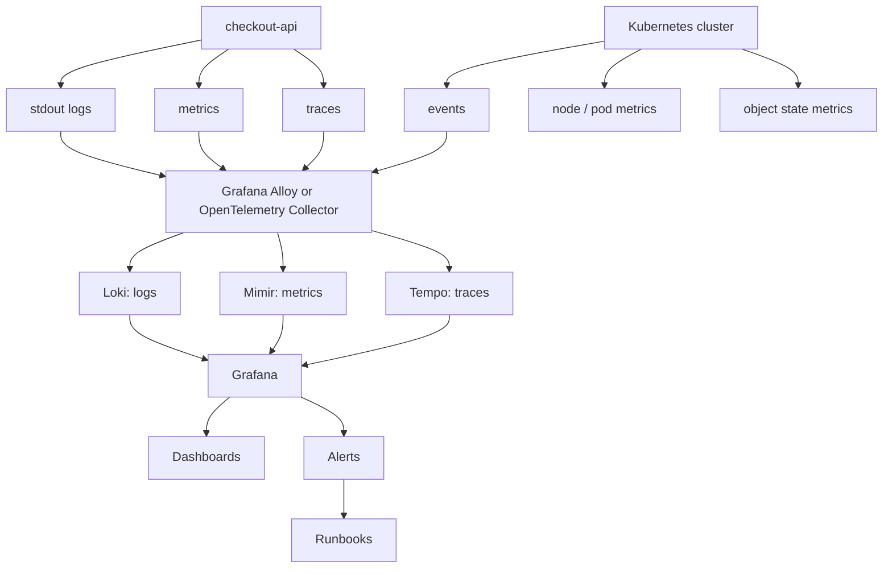

---

## 12.1. What you are going to learn and what not you are going to learn yet

You are going to learn:

- What it means operate Kubernetes
- What diferencia hay between monitoring, observability and debugging
- What signals mínimas you need: events, logs, métricas and trazas
- What papel tienen Loki, Mimir, Tempo, Grafana and Alloy
- What papel may have OpenTelemetry Collector
- What mirar first when fails a Pod, Deployment, Service, Job, PVC or NetworkPolicy
- What son NETWORK and USE como modelos of métricas
- What es metrics-server
- What es kube-state-metrics
- What aporta node-exporter
- What relación hay between métricas and HPA
- What es alerting
- What diferencia hay between alerta, dashboard and runbook
- What it means a runbook útil
- What es a failure lab operativo
- What hacer with image inexistente, Secret ausente, ConfigMap bad escrito, selector of Service roto, readiness agresiva, OOMKilled, RBAC insuficiente, PVC Pending, NetworkPolicy bloqueando and rollout defectuoso
- What prácticas mínimas of backup and restore debes understand
- How automatizar commands of diagnóstico with Taskfile
Not vamos to profundizar yet in:

- Instalación completa and productiva of Mimir
- Instalación completa and productiva of Loki
- Instalación completa and productiva of Tempo
- Operación advanced of Grafana
- Multi-tenancy of observability
- Retención and coste of logs to gran escala
- SLOs and error budgets completos
- Incident command
- On-call professional
- Chaos engineering advanced
- Disaster recovery multi-región
- Service mesh telemetry
- eBPF advanced
- Profiling with Pyroscope
- Producción real of Prometheus, Mimir or Grafana
- Backup transaccional advanced of databases
The regla pedagógica of the module será:

```text
First, signal
Then symptom
Then diagnosis
Then action
Then prevention
Then runbook
```

---

## 12.2. The problema: without signals, Kubernetes parece aleatorio

When not tienes observability, the failures parecen magia.

TO Pod does not start.

A API not responde.

A rollout se queda bloqueado.

A Service not tiene endpoints.

A dependencia not resuelve by DNS.

The app reinicia, but nadie sabe by what.

The database conserva datos, but nadie sabe if hay backup.

A user reporta error, but not you can seguir the request.

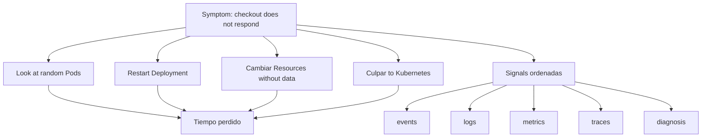

### Contrato mental

Not preguntes first:

> ¿What command pruebo?

Pregunta:

> ¿What señal necesito for confirmar or descartar a hipótesis?

### Cuatro signals mínimas

|Señal|Pregunta que responde|
|---|---|
|Events|¿What está diciendo Kubernetes about the objetos?|
|Logs|¿What está diciendo the application or componente?|
|Métricas|¿What está pasando in the tiempo and with what magnitud?|
|Trazas|¿By dónde pasó a request and dónde se degradó?|

### Criterio of comprensión

Debes poder explicar:

> Without signals, operate es adivinar. With signals, diagnosticar se convierte in networkucir hipótesis.

---

## 12.3. Monitoring, observability and debugging

Before of install tools, separa concepts.

### Monitoring

Monitoring responde:

> ¿The sistema está dentro of límites esperados?

Ejemplos:

- CPU alta
- Memoria alta
- Error rate subiendo
- Latencia alta
- Pods not Ready
- Rollout bloqueado
- PVC casi lleno
### Observability

Observability responde:

> ¿Puedo understand the state internal of the sistema to partir of sus signals externas?

Kubernetes uses the idea of métricas, logs and trazas como pilares of observability for understand the state, rendimiento and salud of the cluster. ([Kubernetes](https://kubernetes.io/docs/concepts/cluster-administration/observability/ "Observability | Kubernetes"))

### Debugging

Debugging responde:

> ¿Cuál es the causa concreta and how the corrijo?

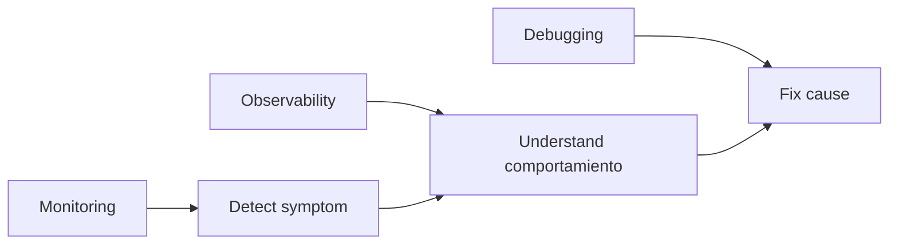

### Ejemplo

Síntoma:

```text
checkout-api tiene 500s
```

Monitoring:

```text
alert for high error rate
```

Observability:

```text
traza muestra lentitud en payment-api
logs muestran timeout
metric shows connection saturation
```

Debugging:

```text
corriges timeout, connection pool, dependencia o rollback
```

### Criterio of comprensión

Debes poder explicar:

> Monitoring avisa. Observability ayuda to understand. Debugging corrige.

---

## 12.3 bis. Observability built-in for CKAD

Before using Grafana, Loki, Tempo or Mimir, debes dominar the signals nativas of Kubernetes.

CKAD not evalúa que sepas mount a stack completo of observability.

Evalúa que puedas observar, diagnosticar and mantener applications usando tools integradas.

### State rápido

```bash
kubectl get pods -n shop
kubectl get deploy -n shop
kubectl get events -n shop --sort-by=.lastTimestamp
```

### Detalle operativo

```bash
kubectl describe pod <pod> -n shop
kubectl describe deployment checkout-api -n shop
```

### Logs

```bash
kubectl logs <pod> -n shop
kubectl logs <pod> -c <container> -n shop
kubectl logs <pod> --previous -n shop
kubectl logs deployment/checkout-api -n shop
```

### Esperar condiciones

```bash
kubectl wait --for=condition=Ready pod/<pod> -n shop --timeout=60s
kubectl rollout status deployment/checkout-api -n shop
```

### Métricas, if Metrics Server está instalado

```bash
kubectl top pod -n shop
kubectl top node
```

### Debugging minimum

```bash
kubectl exec -it <pod> -n shop -- sh
kubectl debug -it <pod> -n shop --image=busybox:1.36 --target=<container>
```

### Orden recomendado

```text
get
describe
events
logs
previous logs
exec/debug
rollout status
service/endpointslice
```

### Criterio of comprensión

Debes poder explicar:

> LGTM da observability advanced. CKAD exige dominar first the observability nativa of Kubernetes.

---

## 12.4. Stack LGTM: mapa mental

### What problema resuelve

Queremos a modelo coherente for logs, métricas, trazas, dashboards and alertas.

In this roadmap usaremos Grafana LGTM como referencia principal:

|Letra|Componente|Señal|
|---|---|---|
|L|Loki|Logs|
|G|Grafana|Dashboards, exploración and alertas|
|T|Tempo|Traces|
|M|Mimir|Metrics|

Grafana Loki está documentado como the componente of logs, Grafana Mimir permite ingerir métricas Prometheus u OpenTelemetry, consultar datos, create recording rules and configurar alerting rules, and Grafana Tempo está documentado como backend of trazas distribuido que permite buscar trazas and enlazarlas with logs and métricas. ([Grafana Labs](https://grafana.com/docs/loki/latest/ "Grafana Loki | Grafana Loki documentation"))

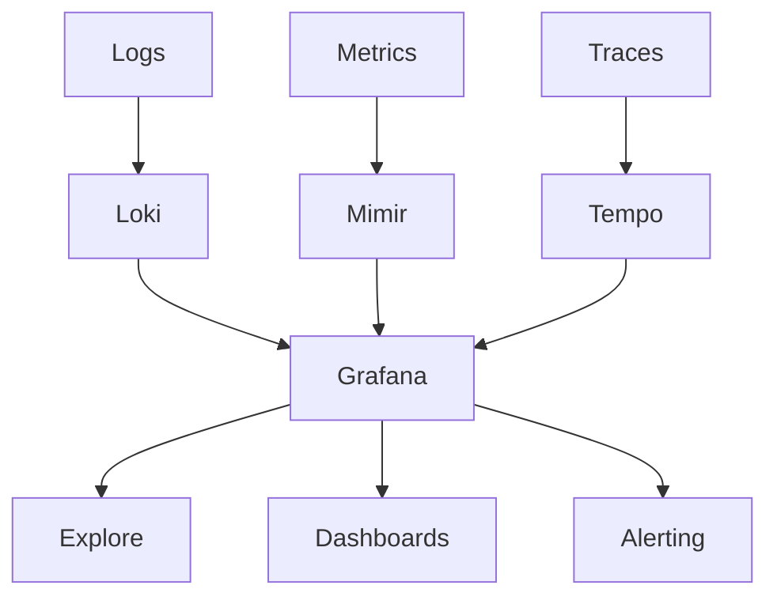

### Papel of Alloy

Grafana Alloy can recolectar, procesar and enviar telemetría hacia sistemas como Loki, Mimir and Tempo, and also es compatible with pipelines of OpenTelemetry Collector and Prometheus Agent. ([Grafana Labs](https://grafana.com/docs/alloy/latest/ "Grafana Alloy | Grafana Alloy documentation"))

### Papel of OpenTelemetry Collector

OpenTelemetry Collector es a componente vendor-neutral for receive, procesar and exportar datos of telemetría. The documentación of OpenTelemetry tiene a section específica for use Collector in Kubernetes and for monitorizar services ejecutándose in Kubernetes. ([OpenTelemetry](https://opentelemetry.io/docs/platforms/kubernetes/collector/ "OpenTelemetry Collector and Kubernetes | OpenTelemetry"))

### Criterio of comprensión

Debes poder explicar:

> LGTM separa storage and consulta by tipo of señal, while Grafana actúa como punto of exploración, dashboarding and alerting.

---

## 12.5. Arquitectura of observability of the course

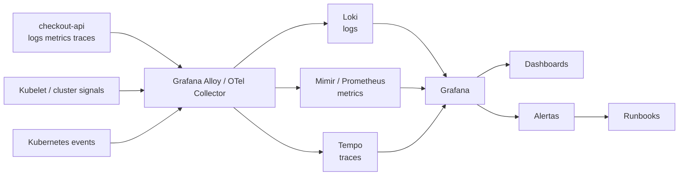

### What queremos build

Not vamos to convertir the course in a operación completa of Grafana in producción.

We are going to build a arquitectura conceptual and practice suficiente for learn.

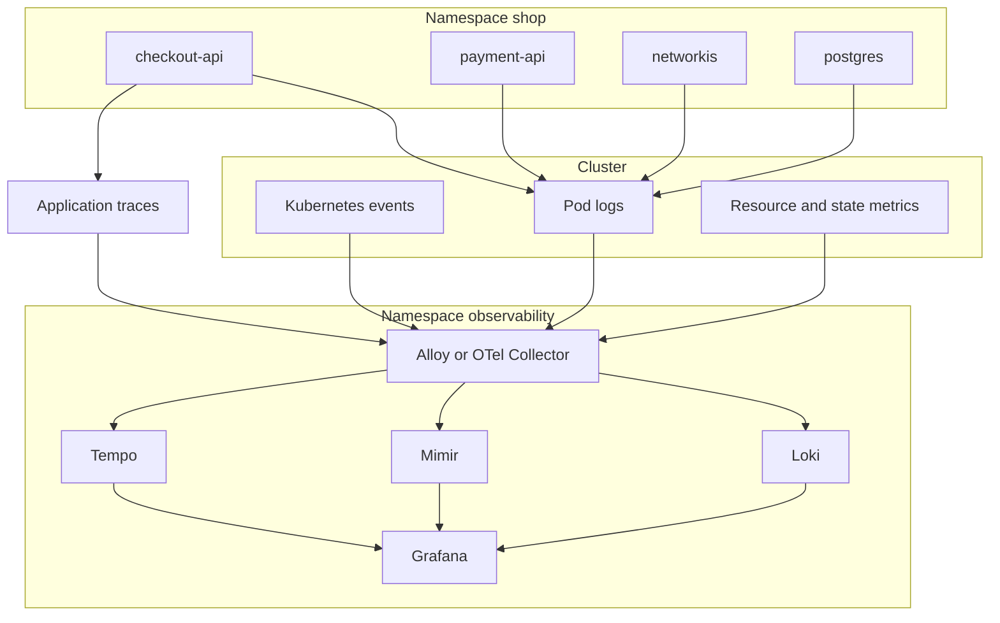

### Reglas of the laboratorio

- The diagnóstico inicial seguirá usando `kubectl`
- The observability centralizada se explicará with LGTM
- The instalación completa of LGTM será opcional, because consume Resources and can variar según environment
- The manifests of the course must preparar the application for observability
- The failure lab must enseñar what señal buscar in each caso
- The Taskfile must permitir diagnóstico progresivo although yet not tengas LGTM instalado
### Criterio of comprensión

Debes poder explicar:

> Before of install a stack of observability, the application and the manifests must producir signals útiles.

---

## 12.6. Preparar `checkout-api` for operate

### What problema resuelve

An application not se vuelve observable by install Grafana.

The application must emitir signals útiles.

For `checkout-api`, como minimum necesitamos:

- Logs by stdout
- Endpoints `/health` and `/ready`
- Endpoint funcional `/checkout`
- Mensajes of error with contexto
- Correlation ID or request ID
- Latencia by request
- Métricas HTTP if se implementan
- Trazas if se instrumenta with OpenTelemetry
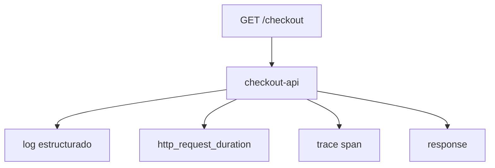

### Contrato minimum of logs

Each log importante should permitir responder:

- What ocurrió
- In what service
- In what Pod
- In what endpoint
- With what status
- With what duración
- With what request ID
- If hubo error, what tipo of error
Ejemplo of log JSON:

```json
{
  "level": "info",
  "service": "checkout-api",
  "pod": "checkout-api-abc123",
  "requestId": "req-123",
  "method": "GET",
  "path": "/checkout",
  "status": 200,
  "durationMs": 42,
  "message": "request completed"
}
```

### Contrato minimum of health

Already viene of módulos anteriores:

|Endpoint|Uso|
|---|---|
|`/health`|Process vivo|
|`/ready`|Instancia lista for traffic|
|`/checkout`|Flujo funcional minimum|

### Criterio of comprensión

Debes poder explicar:

> A stack of observability not arregla an application muda. The application must emitir logs, métricas and trazas útiles.

---

## 12.7. Events of Kubernetes

### What problema resuelven

Events son a of the primeras signals que debes mirar.

Te dicen what está intentando hacer Kubernetes:

- Pull of image
- Failure of pull
- Scheduling
- Readiness failing
- Liveness reiniciando
- PVC Pending
- Secret ausente
- ConfigMap ausente
- Backoff
- FailedMount
- FailedScheduling
### Commands

```bash
kubectl get events -n shop --sort-by=.metadata.creationTimestamp
kubectl get events -A --sort-by=.metadata.creationTimestamp
```

Filtrar:

```bash
kubectl get events -n shop --field-selector involvedObject.kind=Pod
kubectl get events -n shop --field-selector involvedObject.name=checkout-api
```

### Cuándo mirarlos

Míralos pronto when:

- TO Pod does not start
- A rollout not termina
- A PVC not está `Bound`
- A Service not tiene endpoints
- Falta a Secret
- The image not se can descargar
- Hay reinicios
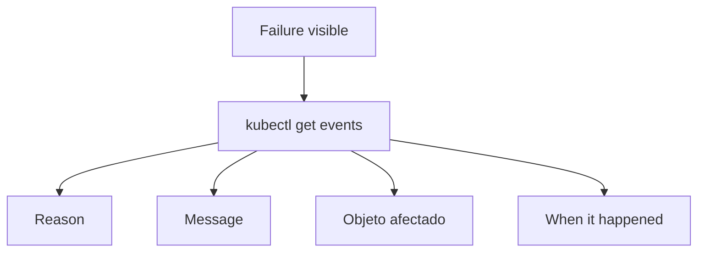

### DevEx

```yaml
k8s:events:
  desc: Show recent events in the namespace
  cmds:
    - kubectl get events -n {{.NAMESPACE}} --sort-by=.metadata.creationTimestamp

k8s:events:all:
  desc: Show recent events in all namespaces
  cmds:
    - kubectl get events -A --sort-by=.metadata.creationTimestamp
```

### Criterio of comprensión

Debes poder explicar:

> Events son the voz of Kubernetes about lo que intenta hacer and by what algo not avanza.

---

## 12.8. Logs

### What problema resuelven

Logs explican comportamiento discreto.

Sirven for understand:

- Errores
- Requests
- Timeouts
- Configuration cargada
- Arranque
- Shutdown
- Dependencies
- Stack traces
- Decisiones internas of the app
Kubernetes mantiene documentación específica about logging architecture dentro of the section of observability and tasks of debugging. ([Kubernetes](https://kubernetes.io/docs/concepts/cluster-administration/observability/ "Observability | Kubernetes"))

### Logs with `kubectl`

```bash
kubectl logs -n shop deploy/checkout-api
kubectl logs -n shop deploy/checkout-api --tail=100
kubectl logs -n shop deploy/checkout-api -f
kubectl logs -n shop pod/<pod-name> -c checkout-api
kubectl logs -n shop job/checkout-db-migration
```

Logs of Pod anterior if hubo restart:

```bash
kubectl logs -n shop pod/<pod-name> --previous
```

### Logs centralizados with Loki

In a stack LGTM, the logs of Pods and componentes se envían to Loki and se exploran desde Grafana. Loki está diseñado for storage and consulta of logs dentro of the ecosistema Grafana. ([Grafana Labs](https://grafana.com/docs/loki/latest/ "Grafana Loki | Grafana Loki documentation"))

Consulta conceptual in LogQL:

```logql
{namespace="shop", app_kubernetes_io_name="checkout-api"}
```

Filtrar errores:

```logql
{namespace="shop", app_kubernetes_io_name="checkout-api"} |= "error"
```

### Criterio of comprensión

Debes poder explicar:

> `kubectl logs` sirve for diagnóstico inmediato. Loki permite búsqueda histórica, correlación, dashboards and alertas about logs.

---

## 12.9. Métricas

### What problema resuelven

The métricas responden:

> ¿Cuánto, with what frecuencia, during cuánto tiempo and with what tendencia?

Ejemplos:

- CPU
- Memoria
- Restarts
- Request rate
- Error rate
- Latencia
- Pods Ready
- Deployment Available
- PVC usage
- Node pressure
- HPA desinetwork replicas
Kubernetes documenta resource metrics pipeline como the ruta of métricas of Resources desde kubelet/cAdvisor hacia metrics-server and consumidores como HPA and `kubectl top`. ([Kubernetes](https://kubernetes.io/docs/tasks/debug/debug-cluster/resource-metrics-pipeline/ "Resource metrics pipeline | Kubernetes"))

### Métricas of Resources

```bash
kubectl top nodes
kubectl top pods -n shop
```

Esto requiere metrics-server.

### HPA and métricas

HorizontalPodAutoscaler ajusta réplicas of workloads in función of métricas observadas, como CPU or memoria, when the métricas necesarias están disponibles. ([Kubernetes](https://kubernetes.io/docs/concepts/workloads/autoscaling/horizontal-pod-autoscale/ "Horizontal Pod Autoscaling | Kubernetes"))

### kube-state-metrics

`kube-state-metrics` expone métricas about the state of objetos Kubernetes, como Deployments, Pods, Jobs, Nodes, DaemonSets, StatefulSets and otros Resources. ([GitHub](https://github.com/kubernetes/kube-state-metrics "GitHub - kubernetes/kube-state-metrics: Add-on agent to generate and expose cluster-level metrics. · GitHub"))

### node-exporter

node-exporter expone métricas of the sistema operativo and hardware of nodos Linux for Prometheus-compatible scraping. ([prometheus.io](https://prometheus.io/docs/guides/node-exporter/ "Monitoring Linux host metrics with the Node Exporter | Prometheus"))

### Métricas with Mimir

Grafana Mimir permite ingerir métricas Prometheus u OpenTelemetry, consultarlas, create recording rules and configurar alerting rules. ([Grafana Labs](https://grafana.com/docs/mimir/latest/ "Grafana Mimir documentation | Grafana Mimir documentation"))

### Criterio of comprensión

Debes poder explicar:

> Metrics-server sirve for métricas of Resources and HPA. kube-state-metrics describe state of objetos Kubernetes. Mimir es a backend escalable for métricas of observability.

---

## 12.10. NETWORK and USE

### What problema resuelven

You need modelos for not mirar métricas to the azar.

### NETWORK for services

NETWORK is used mucho for services request/response:

|Letra|Pregunta|
|---|---|
|Rate|¿Cuántas requests by second?|
|Errors|¿Cuántas fail?|
|Duration|¿Cuánto tardan?|

For `checkout-api`:

```text
request rate
5xx rate
p95 latency
```

### USE for Resources

USE is used for Resources como CPU, memoria, disco or network:

|Letra|Pregunta|
|---|---|
|Utilization|¿What porcentaje is used?|
|Saturation|¿Hay cola or presión?|
|Errors|¿Hay errores?|

For nodos:

```text
CPU utilization
memory pressure
disk pressure
network errors
```

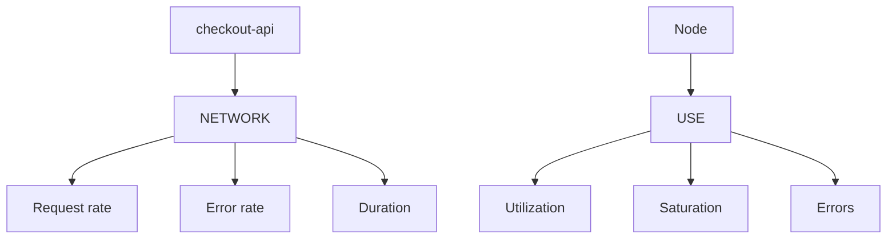

### Criterio of comprensión

Debes poder explicar:

> NETWORK ayuda to understand services. USE ayuda to understand Resources. Not uses dashboards como colecciones aleatorias of gráficas.

---

## 12.11. Trazas

### What problema resuelven

The trazas muestran the recorrido of a request to través of services.

Son especialmente útiles when hay varios componentes:

```text
frontend → checkout-api → payment-api → redis/postgres
```

Tempo es the backend of trazas of Grafana and permite buscar trazas, generate métricas desde spans and enlazar trazas with logs and métricas. ([Grafana Labs](https://grafana.com/docs/tempo/latest/ "Grafana Tempo | Grafana Tempo documentation"))

### What should mostrar a traza

- Request ID
- Service origen
- Service destino
- Duración of each span
- Errores
- Dependencia lenta
- Path completo
- Metadata útil
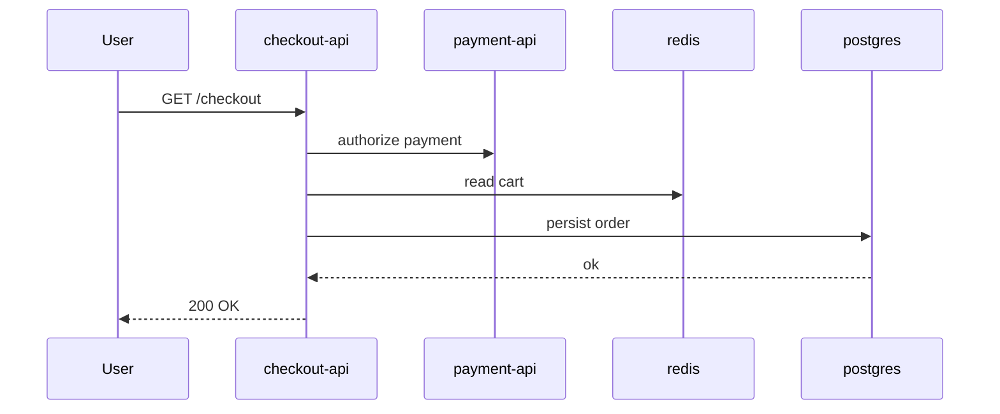

### OpenTelemetry

OpenTelemetry permite instrumentar applications and enviar trazas, métricas and logs hacia a Collector. The documentación of OpenTelemetry for Kubernetes describe the Collector como a forma vendor-neutral of receive, procesar and exportar telemetría. ([OpenTelemetry](https://opentelemetry.io/docs/platforms/kubernetes/collector/ "OpenTelemetry Collector and Kubernetes | OpenTelemetry"))

### Criterio of comprensión

Debes poder explicar:

> Logs explican eventos. Métricas explican tendencias. Trazas explican the path of a request between services.

---

## 12.12. Grafana Alloy u OpenTelemetry Collector

### What problema resuelven

Not quieres que each application conozca all the backends of observability.

Quieres a componente que reciba, procese and exporte signals.

Alloy can trabajar with pipelines of OpenTelemetry, Prometheus, Loki, Tempo and Mimir. OpenTelemetry Collector, by su parte, es a forma vendor-neutral of receive, procesar and exportar telemetría, and su documentación cubre específicamente su uso in Kubernetes. ([Grafana Labs](https://grafana.com/docs/alloy/latest/ "Grafana Alloy | Grafana Alloy documentation"))

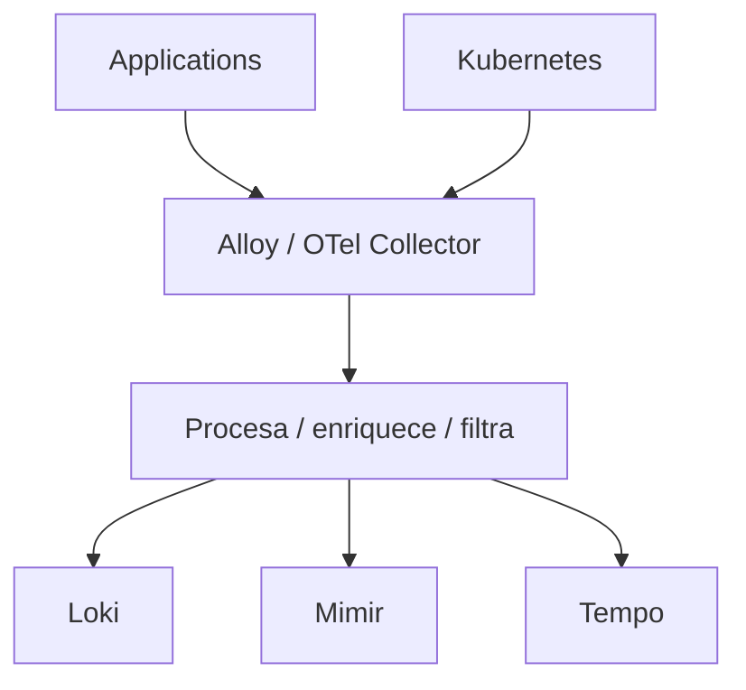

### Alloy encaja when

- Estás in ecosistema Grafana
- Quieres pipelines hacia Loki, Mimir, Tempo
- Quieres compatibilidad with OpenTelemetry and Prometheus
- Quieres recolectar logs, métricas and trazas in a modelo integrado
### OpenTelemetry Collector encaja when

- Quieres vendor-neutralidad
- Quieres separar instrumentación of backend
- Quieres exportar to varios proveedores
- Quieres use estándar OpenTelemetry
### Criterio of comprensión

Debes poder explicar:

> Collector is not the backend final. Es the tubería que recoge, procesa and envía signals to the backends.

---

## 12.13. Instalación of observability: enfoque of the course

### Decisión didáctica

This module not hará obligatoria the instalación completa of LGTM.

Motivo:

- It can consumir bastbefore Resources in kind
- Mimir and Tempo productivos requieren decisiones of storage
- Loki requiere decisiones of retención and storage
- The Helm charts evolucionan
- The configuration varía if usas Grafana Cloud or stack self-hosted
- The objective of the module es learn signals and operación, not administrar Grafana completo in producción
Grafana mantiene Helm charts for Grafana, Loki, Tempo, Mimir, Alloy and Kubernetes Monitoring Helm chart. Also documenta Kubernetes Monitoring Helm chart como solución for configurar infraestructura, instrumentación and recolección of telemetría. ([Grafana Labs](https://grafana.com/docs/helm-charts/ "Grafana Labs Helm charts | Grafana Labs Helm charts documentation"))

### Practice obligatoria

The practice obligatoria será:

- Preparar the app for logs útiles
- Use `kubectl` for events, logs, rollout, endpoints, resources and storage
- Create dashboards conceptuales
- Create alertas conceptuales
- Create runbooks
- Run failure labs
- Automatizar diagnóstico with Taskfile
### Practice opcional

The practice opcional será:

- Create namespace `observability`
- Install stack of observability or componentes with Helm
- Install Alloy u OpenTelemetry Collector
- Enviar logs and métricas
- Consultar in Grafana
### Criterio of comprensión

Debes poder explicar:

> The course enseña first what signals you need and how diagnosticarlas. Install LGTM without criterio only creates otra plataforma que not sabes operate.

---

## 12.14. Namespace of observability

### What problema resuelve

Separar observability of the application evita mezclar responsabilidades.

Creates:

```text
kubernetes/11-observability/namespace.yaml
```

```yaml
apiVersion: v1
kind: Namespace
metadata:
  name: observability
  labels:
    app.kubernetes.io/part-of: observability
```

Apply:

```bash
kubectl apply -f kubernetes/11-observability/namespace.yaml
```

See:

```bash
kubectl get namespace observability
```

### Criterio of comprensión

Debes poder explicar:

> Observability es a capacidad of plataforma. Conviene separarla of the namespace of application.

---

## 12.15. Dashboards minimum

### What problema resuelven

A dashboard not must ser a panetwork of gráficas.

It must responder preguntas operativas.

### Dashboard of `checkout-api`

Preguntas:

- ¿Está disponible?
- ¿Cuántas réplicas hay?
- ¿Cuántos Pods están Ready?
- ¿Cuántas requests recibe?
- ¿What error rate tiene?
- ¿Cuál es the latencia p95?
- ¿Cuántos restarts hay?
- ¿What versión está desplegada?
- ¿What logs of error aparecen?
- ¿Hay trazas lentas?
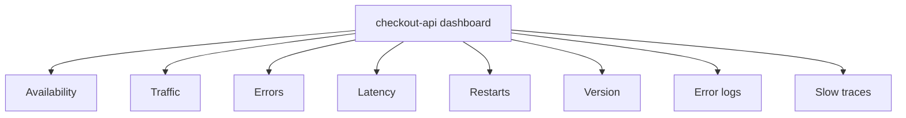

### Dashboard of cluster

Preguntas:

- ¿Nodos Ready?
- ¿CPU by nodo?
- ¿Memoria by nodo?
- ¿Pods Pending?
- ¿Pods CrashLoopBackOff?
- ¿PVCs Pending?
- ¿Deployments not Available?
- ¿Jobs fallidos?
- ¿Eventos críticos recientes?
### Criterio of comprensión

Debes poder explicar:

> A dashboard útil está organizado by preguntas, not by tools.

---

## 12.16. Alerting

### What problema resuelve

A dashboard es pasivo.

A alerta es activa.

Grafana Alerting permite create, gestionar and enrutar alertas desde Grafana. ([Grafana Labs](https://grafana.com/docs/grafana/latest/alerting/ "Grafana Alerting | Grafana documentation"))

### What merece alerta

Not everything merece despertar to alguien.

Buenas alertas:

- Indican impacto or riesgo real
- Son accionables
- Tienen runbook
- Tienen umbral reasonable
- Evitan ruido
- Se testn
- Se revisan after of incidentes
### Alertas mínimas for the course

|Alerta|Condición conceptual|Runbook|
|---|---|---|
|Deployment not disponible|`checkout-api` without réplicas Available|Runbook rollout|
|Error rate alto|5xx by encima of umbral|Runbook errores API|
|Latencia alta|p95 by encima of umbral|Runbook latencia|
|CrashLoopBackOff|Pods reiniciando|Runbook reinicios|
|PVC Pending|PVC not Bound|Runbook storage|
|Job fallido|Job not completa|Runbook jobs|
|HPA without métricas|HPA muestra `<unknown>`|Runbook métricas|

### Criterio of comprensión

Debes poder explicar:

> A alerta without runbook suele convertirse in ruido. A alerta good apunta to a acción reasonable.

---

## 12.17. Runbooks

### What problema resuelven

A runbook convierte conocimiento operativo in pasos repetibles.

Not must ser a novela.

It must ayudar in presión.

### Formato recomendado

````markdown
# Runbook: checkout-api rollout bloqueado

## Symptom

El Deployment `checkout-api` no completa rollout.

## Impacto posible

The new version is not available or some replicas are not Ready.

## Primeras comprobaciones

```bash
kubectl rollout status deployment/checkout-api -n shop --timeout=60s
kubectl get pods -n shop -l app.kubernetes.io/name=checkout-api -o wide
kubectl get events -n shop --sort-by=.metadata.creationTimestamp
````

## Diagnosis

1. Review image.
    
2. Review readiness.
    
3. Review ConfigMap and Secret.
    
4. Review resources.
    
5. Review logs.
    
6. Review endpoints.
    

## Acciones

- If the image does not exist: roll back.
    
- If readiness is broken: review the `/ready` endpoint.
    
- Si Missing Secret: restaurar Secret and reiniciar rollout.
    
- If OOMKilled: review memory, leaks, and limits.
    

## Validation

```bash
kubectl rollout status deployment/checkout-api -n shop
task smoke:k8s
```

## Prevention

- `task test:k8s`
    
- policy contra `latest`
    
- smoke tests
    
- failure lab
    

````

### Criterio de comprensión

Debes poder explicar:

> Un runbook no sustituye criterio. Reduce tiempo de diagnóstico y evita improvisación bajo presión.

---

## 12.18. Troubleshooting progresivo general

### Secuencia base

```mermaid
flowchart TD
  Symptom["Symptom"] --> Scope["1. Define scope"]
  Scope --> Events["2. Events"]
  Events --> Objects["3. Object state"]
  Objects --> Logs["4. Logs"]
  Logs --> Metrics["5. Metrics"]
  Metrics --> Traces["6. Trazas"]
  Traces --> RecentChange["7. Cambios recientes"]
  RecentChange --> Action["8. Minimum safe action"]
  Action --> Validate["9. Validate recovery"]
  Validate --> Prevent["10. Prevent recurrence"]
````

### Preguntas

1. ¿Falla una instancia, un workload, un namespace o todo el cluster?
2. ¿Qué cambió recientemente?
3. ¿Qué dicen events?
4. ¿Qué dicen logs?
5. ¿Hay métricas de saturación?
6. ¿Hay error rate o latencia?
7. ¿La traza muestra una dependencia lenta?
8. ¿El fallo coincide con rollout?
9. ¿Hay rollback disponible?
10. ¿Hay runbook?
### Criterio de comprensión

Debes poder explicar:

> Troubleshooting progresivo evita saltar a soluciones antes de entender el alcance y la señal.

---

## 12.19. Failure lab operativo

### Objetivo

Convertir fallos conocidos en ejercicios de diagnóstico.

No es chaos engineering avanzado.

Es aprendizaje controlado.

```mermaid
flowchart TD
  FailureLab["Operational failure lab"] --> BadImage["Nonexistent image"]
  FailureLab --> MissingSecret["Missing Secret"]
  FailureLab --> BadConfig["ConfigMap mal escrito"]
  FailureLab --> BadSelector["Incorrect Service selector"]
  FailureLab --> BadReadiness["Readiness agresiva"]
  FailureLab --> OOM["OOMKilled"]
  FailureLab --> NetPol["NetworkPolicy bloqueando"]
  FailureLab --> RBAC["RBAC insuficiente"]
  FailureLab --> PVCPending["PVC Pending"]
  FailureLab --> BrokenRollout["Rollout roto"]

  BadImage --> Runbook["Runbook"]
  MissingSecret --> Runbook
  BadConfig --> Runbook
  BadSelector --> Runbook
  BadReadiness --> Runbook
  OOM --> Runbook
  NetPol --> Runbook
  RBAC --> Runbook
  PVCPending --> Runbook
  BrokenRollout --> Runbook
```

Each failure must documentar:

- Síntoma
- Señal in events
- Señal in logs
- Señal in métricas, if aplica
- Señal in trazas, if aplica
- Commands of diagnóstico
- Acción segura
- Validación
- Prevención
- Runbook asociado
---

## 12.20. Caso 1: image inexistente

### What rompe

A Deployment referencia an image que the cluster not can descargar.

### Provocar

```bash
kubectl set image deployment/checkout-api checkout-api=checkout-api:does-not-exist -n shop
kubectl rollout status deployment/checkout-api -n shop --timeout=60s || true
```

### Diagnosticar

```bash
kubectl get pods -n shop
kubectl describe deployment checkout-api -n shop
kubectl get events -n shop --sort-by=.metadata.creationTimestamp
kubectl describe pod -n shop -l app.kubernetes.io/name=checkout-api
```

### Señal esperada

- `ImagePullBackOff`
- `ErrImagePull`
- rollout bloqueado
- events with failure of pull
### Acción

```bash
kubectl rollout undo deployment/checkout-api -n shop
kubectl rollout status deployment/checkout-api -n shop
task smoke:k8s
```

### Prevención

- Policy contra `latest`
- `task test:k8s`
- Image cargada or publicada before of update manifest
- Scan and push in pipeline
---

## 12.21. Caso 2: Secret ausente

### What rompe

The Pod referencia a Secret obligatorio que does not exist.

### Provocar

```bash
kubectl delete secret checkout-api-secret -n shop --ignore-not-found
kubectl rollout restart deployment/checkout-api -n shop
kubectl rollout status deployment/checkout-api -n shop --timeout=60s || true
```

### Diagnosticar

```bash
kubectl get pods -n shop -l app.kubernetes.io/name=checkout-api
kubectl describe pod -n shop -l app.kubernetes.io/name=checkout-api
kubectl get events -n shop --sort-by=.metadata.creationTimestamp
```

### Señal esperada

- Pod does not start properly
- Event indicando Secret not encontrado
- rollout not completa
### Acción

```bash
kubectl apply -f kubernetes/05-config/secret.yaml
kubectl rollout restart deployment/checkout-api -n shop
kubectl rollout status deployment/checkout-api -n shop
```

### Prevención

- Validación of manifests
- Dry-run contra API Server
- Failure test of Secret ausente
- Gestión of secrets with flujo claro
---

## 12.22. Caso 3: Service selector incorrecto

### What rompe

The Service exists, but not apunta to Pods.

### Diagnosticar

```bash
kubectl get svc checkout-api -n shop -o yaml
kubectl get pods -n shop --show-labels
kubectl get endpointslices -n shop -l kubernetes.io/service-name=checkout-api
kubectl describe svc checkout-api -n shop
```

### Señal esperada

- Service without endpoints útiles
- Smoke test fails
- Pods pueden estar sanos, but traffic not llega
### Acción

Corregir selector or labels.

Validate:

```bash
task cluster:wait
task smoke:k8s
```

### Prevención

- Test of endpoints of the module 9
- Failure lab of selector incorrecto
- Labels recomendadas consistentes
---

## 12.23. Caso 4: readiness demasiado agresiva

### What rompe

The app may be viva, but Kubernetes does not the considera lista.

### Diagnosticar

```bash
kubectl get pods -n shop -l app.kubernetes.io/name=checkout-api
kubectl describe pod -n shop -l app.kubernetes.io/name=checkout-api
kubectl get endpointslices -n shop -l kubernetes.io/service-name=checkout-api
kubectl logs -n shop deploy/checkout-api --tail=100
```

### Señal esperada

- Pod `Running` but not `Ready`
- Endpoint not ready
- Events of readiness failed
- Service with less endpoints
### Acción

- Revisar `/ready`
- Revisar initialDelay, period, timeout, failureThreshold
- Revisar dependencies que readiness comtest
- Ajustar probe with datos
### Prevención

- Smoke tests
- Failure lab of readiness
- Métricas of latencia of arranque
---

## 12.24. Caso 5: OOMKilled

### What rompe

The container supera the límite of memoria and kubelet lo termina.

### Diagnosticar

```bash
kubectl get pods -n shop
kubectl describe pod -n shop -l app.kubernetes.io/name=checkout-api
kubectl get pod -n shop -l app.kubernetes.io/name=checkout-api -o json \
  | jq '.items[].status.containerStatuses[] | {name, restartCount, lastState}'
kubectl top pods -n shop
```

### Señal esperada

- `OOMKilled` in `lastState`
- restarts incrementando
- memoria alta before of the kill, if tienes métricas
### Acción

- Revisar memory limit
- Revisar memory leak
- Revisar carga
- Revisar requests and limits
- Scale or optimizar only with evidencia
### Prevención

- Métricas of memoria
- Alertas by restarts
- Alertas by memoria cerca of limit
- Tests of carga in environment adecuado
---

## 12.25. Caso 6: NetworkPolicy bloqueando traffic

### What rompe

A workload not can comunicarse with otro.

### Diagnosticar

```bash
kubectl get networkpolicy -n shop
kubectl describe networkpolicy -n shop
kubectl exec -n shop dnsutils -- nslookup payment-api
kubectl exec -n shop dnsutils -- wget -T 3 -qO- http://payment-api/ || true
```

### Señal esperada

- DNS can resolver
- Service can existir
- Endpoint can existir
- Traffic fails or hace timeout
- Not always habrá log claro if es bloqueo of network
### Acción

- Revisar `podSelector`
- Revisar `from` and `to`
- Revisar ports
- Confirmar que the CNI aplica NetworkPolicy
- Añadir policy minimum necessary
### Prevención

- Tests of NetworkPolicy
- Diagramas of comunicación permitida
- Default deny progresivo
---

## 12.26. Caso 7: RBAC insuficiente

### What rompe

TO Pod or user intenta hacer algo without permisos.

### Diagnosticar

```bash
kubectl auth can-i get secrets \
  --as=system:serviceaccount:shop:checkout-api-sa \
  -n shop

kubectl get role,rolebinding -n shop
kubectl describe rolebinding -n shop
```

### Señal esperada

- `Forbidden`
- API rechaza the acción
- Logs of application pueden mostrar error 403 if llama to the API
### Acción

- Not dar permisos amplios
- Añadir permiso minimum
- Validate with `kubectl auth can-i`
- Documentar by what the workload needs that permiso
### Prevención

- Tests RBAC
- ServiceAccount by workload
- Revisión of permisos
---

## 12.27. Caso 8: PVC Pending

### What rompe

The workload needs storage, but the PVC not se satisface.

### Diagnosticar

```bash
kubectl get pvc -n shop
kubectl describe pvc postgres-data -n shop
kubectl get storageclass
kubectl get pv
kubectl get events -n shop --sort-by=.metadata.creationTimestamp
```

### Señal esperada

- PVC `Pending`
- Events relacionados with provisioning
- Pod can quedar `Pending`
### Acción

- Revisar StorageClass
- Revisar accessModes
- Revisar requests of storage
- Revisar provisioner
- Revisar CSI driver
### Prevención

- Tests of PVC in kind, with limitaciones
- Runbook of storage
- Backups and restore probados
---

## 12.28. Backup and restore operacional

### What problema resuelve

In the module 8 separaste persistencia of backup.

Aquí lo llevamos to operación.

Velero documenta backup and restore of Resources Kubernetes and volúmenes persistentes según configuration and proveedor. ([Velero](https://velero.io/docs/main/ "Velero Docs - Overview"))

### What debes respaldar

- Manifests
- ConfigMaps
- Secrets, with protección especial
- PVCs and datos
- Resources críticos
- State of GitOps if aplica
- Documentación of restore
- Runbooks
### What debes probar

- Restore of namespace
- Restore of PVC
- Restore of Secret necessary
- Restore in otro namespace
- Tiempo of recuperación
- Validación funcional after of restore
### Regla

```text
Backup no probado = backup no demostrado
```

### Criterio of comprensión

Debes poder explicar:

> Persistir datos evita perderlos to the recreate Pods. Backup and restore probados permiten recuperarte ante pérdida, corrupción or error humano.

---

## 12.29. Drains, PDBs and mantenimiento

### What problema resuelve

Operate also implica mantenimiento of nodos.

In módulos anteriores viste PodDisruptionBudget.

Aquí lo conectamos with operación.

### Commands conceptuales

```bash
kubectl drain <node> --ignore-daemonsets --delete-emptydir-data
kubectl uncordon <node>
kubectl get pdb -n shop
kubectl describe pdb checkout-api-pdb -n shop
```

### Cuidado

Not practiques `drain` without understand tu cluster local.

In kind of a only nodo can dejarte without sitio for programar Pods.

### What mirar

- PDB
- Réplicas
- Readiness
- DaemonSets
- Storage local
- Workloads stateful
- Capacidad restante
### Criterio of comprensión

Debes poder explicar:

> A PDB not evita all the failures. Ayuda to controlar interrupciones voluntarias during mantenimiento.

---

## 12.30. Taskfile of the module 12

Añade these tasks to the `Taskfile.yml`.

```yaml
  observability:namespace:apply:
    desc: Apply observability namespace
    cmds:
      - kubectl apply -f kubernetes/11-observability/namespace.yaml

  observability:namespace:status:
    desc: Show observability namespace
    cmds:
      - kubectl get namespace observability

  k8s:events:
    desc: Show recent events in the application namespace
    cmds:
      - kubectl get events -n {{.NAMESPACE}} --sort-by=.metadata.creationTimestamp

  k8s:events:all:
    desc: Show recent events in all namespaces
    cmds:
      - kubectl get events -A --sort-by=.metadata.creationTimestamp

  k8s:logs:checkout:
    desc: Show checkout-api logs
    cmds:
      - kubectl logs -n {{.NAMESPACE}} deploy/checkout-api --tail=100

  k8s:logs:checkout:follow:
    desc: Follow checkout-api logs
    cmds:
      - kubectl logs -n {{.NAMESPACE}} deploy/checkout-api -f

  k8s:logs:checkout:previous:
    desc: Show previous checkout-api container logs when available
    cmds:
      - |
        POD="$(kubectl get pod -n {{.NAMESPACE}} -l app.kubernetes.io/name=checkout-api -o jsonpath='{.items[0].metadata.name}')"
        kubectl logs -n {{.NAMESPACE}} "$POD" --previous || true

  k8s:metrics:top:
    desc: Show node and pod resource metrics if metrics-server is installed
    cmds:
      - kubectl top nodes || true
      - kubectl top pods -n {{.NAMESPACE}} || true

  k8s:rollout:checkout:
    desc: Show checkout-api rollout status
    cmds:
      - kubectl rollout status deployment/checkout-api -n {{.NAMESPACE}} --timeout=120s
      - kubectl rollout history deployment/checkout-api -n {{.NAMESPACE}}

  k8s:health:checkout:
    desc: Check checkout-api health through Service port-forward
    cmds:
      - task smoke:k8s

  k8s:debug:checkout:summary:
    desc: Progressive diagnostic summary for checkout-api
    cmds:
      - kubectl get deploy checkout-api -n {{.NAMESPACE}} -o wide
      - kubectl get rs -n {{.NAMESPACE}}
      - kubectl get pods -n {{.NAMESPACE}} -l app.kubernetes.io/name=checkout-api -o wide
      - kubectl get svc checkout-api -n {{.NAMESPACE}} -o wide
      - kubectl get endpointslices -n {{.NAMESPACE}} -l kubernetes.io/service-name=checkout-api
      - kubectl get configmap checkout-api-config -n {{.NAMESPACE}} || true
      - kubectl get secret checkout-api-secret -n {{.NAMESPACE}} || true
      - kubectl get networkpolicy -n {{.NAMESPACE}} || true
      - kubectl get events -n {{.NAMESPACE}} --sort-by=.metadata.creationTimestamp
      - kubectl logs -n {{.NAMESPACE}} deploy/checkout-api --tail=50 || true

  reliability:failure:bad-image:
    desc: Trigger bad image rollout and show operational signals
    cmds:
      - kubectl set image deployment/checkout-api checkout-api=checkout-api:does-not-exist -n {{.NAMESPACE}}
      - kubectl rollout status deployment/checkout-api -n {{.NAMESPACE}} --timeout=60s || true
      - task k8s:debug:checkout:summary

  reliability:failure:bad-image:recover:
    desc: Recover from bad image rollout
    cmds:
      - kubectl rollout undo deployment/checkout-api -n {{.NAMESPACE}}
      - kubectl rollout status deployment/checkout-api -n {{.NAMESPACE}} --timeout=120s
      - task smoke:k8s

  reliability:failure:missing-secret:
    desc: Delete checkout-api Secret and show operational signals
    cmds:
      - kubectl delete secret checkout-api-secret -n {{.NAMESPACE}} --ignore-not-found
      - kubectl rollout restart deployment/checkout-api -n {{.NAMESPACE}}
      - kubectl rollout status deployment/checkout-api -n {{.NAMESPACE}} --timeout=60s || true
      - task k8s:debug:checkout:summary

  reliability:failure:missing-secret:recover:
    desc: Recover missing checkout-api Secret
    cmds:
      - kubectl apply -f kubernetes/05-config/secret.yaml
      - kubectl rollout restart deployment/checkout-api -n {{.NAMESPACE}}
      - kubectl rollout status deployment/checkout-api -n {{.NAMESPACE}} --timeout=120s

  reliability:failure:service-selector:
    desc: Apply bad Service selector and show operational signals
    cmds:
      - task k8s:failure:service:bad-selector:apply
      - task k8s:failure:service:bad-selector:inspect

  reliability:failure:service-selector:recover:
    desc: Recover from bad Service selector failure
    cmds:
      - task k8s:failure:service:bad-selector:delete
      - task cluster:wait
      - task smoke:k8s

  reliability:storage:status:
    desc: Show storage operational status
    cmds:
      - kubectl get pvc -n {{.NAMESPACE}}
      - kubectl get pv
      - kubectl get storageclass
      - kubectl get events -n {{.NAMESPACE}} --sort-by=.metadata.creationTimestamp

  reliability:backup:resources:
    desc: Export namespace resources to a local YAML file for learning purposes
    cmds:
      - mkdir -p .tmp
      - kubectl get all,configmap,secret,pvc,networkpolicy,pdb -n {{.NAMESPACE}} -o yaml > .tmp/{{.NAMESPACE}}-resources-backup.yaml
      - ls -lh .tmp/{{.NAMESPACE}}-resources-backup.yaml

  reliability:runbook:checkout:
    desc: Print commands for checkout-api runbook
    cmds:
      - echo "1. task k8s:debug:checkout:summary"
      - echo "2. task k8s:events"
      - echo "3. task k8s:logs:checkout"
      - echo "4. task k8s:metrics:top"
      - echo "5. task k8s:network:troubleshoot:checkout"
      - echo "6. task k8s:troubleshoot:config-storage"
      - echo "7. task smoke:k8s"

  reliability:test:
    desc: Run operational checks
    cmds:
      - task k8s:debug:checkout:summary
      - task k8s:metrics:top
      - task smoke:k8s
      - task reliability:storage:status
```

### Criterio DevEx

Debes poder explicar:

> The DevEx of operación must permitir ir desde síntoma hasta signals principales with pocos commands, without ocultar what se está inspeccionando.

---

## 12.31. Practice principal of the module

### Objective

Create a practice operativa completa for diagnosticar and recuperar `checkout-api`.

### Resultado esperado

```text
kubernetes-learning-lab/
  kubernetes/
    11-observability/
      namespace.yaml
  docs/
    runbooks/
      checkout-api-rollout.md
      checkout-api-errors.md
      storage-pvc-pending.md
      service-no-endpoints.md
  Taskfile.yml
```

### Paso 1. Preparar environment

```bash
task k8s:kind:create
task k8s:namespace:apply
task k8s:image:prepare
task k8s:deployment:apply
task k8s:service:apply
task k8s:config:apply
task k8s:deployment:status
task smoke:k8s
```

### Paso 2. Apply namespace of observability

```bash
task observability:namespace:apply
task observability:namespace:status
```

### Paso 3. Diagnóstico base

```bash
task k8s:debug:checkout:summary
task k8s:events
task k8s:logs:checkout
task k8s:metrics:top
```

### Paso 4. Run failure lab of image inexistente

```bash
task reliability:failure:bad-image
task reliability:failure:bad-image:recover
```

### Paso 5. Run failure lab of Secret ausente

```bash
task reliability:failure:missing-secret
task reliability:failure:missing-secret:recover
```

### Paso 6. Run failure lab of Service selector incorrecto

```bash
task reliability:failure:service-selector
task reliability:failure:service-selector:recover
```

### Paso 7. Revisar storage

```bash
task reliability:storage:status
```

### Paso 8. Exportar Resources for aprendizaje

```bash
task reliability:backup:resources
```

### Paso 9. Create runbooks

Creates:

```text
docs/runbooks/checkout-api-rollout.md
docs/runbooks/checkout-api-errors.md
docs/runbooks/storage-pvc-pending.md
docs/runbooks/service-no-endpoints.md
```

Each runbook must tener:

- Síntoma
- Impacto possible
- Primeras comprobaciones
- Diagnóstico
- Acciones seguras
- Validación
- Prevención
### Paso 10. Run chequeo operativo

```bash
task reliability:test
```

### Criterio of finalización

The practice está completa when you can explicar:

- What mirar first if `checkout-api` not responde
- What señal da an image inexistente
- What señal da a Secret ausente
- What señal da a Service without endpoints
- What señal da a PVC Pending
- What diferencia hay between logs, events, metrics and traces
- What dashboard harías for `checkout-api`
- What alertas mínimas createías
- What runbook seguirías
- What parte of LGTM installías first and by what
---

## 12.32. Ejercicios cortos

### Ejercicio 1. Clasificar signals

Completa:

|Problema|Events|Logs|Métricas|Trazas|
|---|--:|--:|--:|--:|
|Image inexistente|||||
|Error 500 in `/checkout`|||||
|Payment lento|||||
|OOMKilled|||||
|Service without endpoints|||||
|PVC Pending|||||

---

### Ejercicio 2. Diagnóstico base

Ejecuta:

```bash
task k8s:debug:checkout:summary
```

Responde:

- ¿Cuántas réplicas tiene the Deployment?
- ¿Cuántos Pods están Ready?
- ¿The Service tiene endpoints?
- ¿Hay events recientes relevbefore?
- ¿The logs muestran errores?
---

### Ejercicio 3. Logs

Ejecuta:

```bash
task k8s:logs:checkout
```

Responde:

- ¿The logs tienen service?
- ¿Tienen request ID?
- ¿Tienen status?
- ¿Tienen duración?
- ¿Serían útiles in Loki?
---

### Ejercicio 4. Métricas

Ejecuta:

```bash
task k8s:metrics:top
```

Responde:

- ¿Tu cluster tiene metrics-server?
- ¿You can see CPU of Pods?
- ¿You can see memoria?
- ¿What implicaría if HPA muestra `<unknown>`?
---

### Ejercicio 5. Failure lab of image

Ejecuta:

```bash
task reliability:failure:bad-image
```

Responde:

- ¿What state aparece in Pods?
- ¿What dicen the events?
- ¿What dice rollout status?
- ¿How recuperas?
Recupera:

```bash
task reliability:failure:bad-image:recover
```

---

### Ejercicio 6. Service without endpoints

Ejecuta:

```bash
task reliability:failure:service-selector
```

Responde:

- ¿The Service exists?
- ¿Tiene endpoints?
- ¿What selector tiene?
- ¿What labels tienen the Pods?
- ¿What test of the module 9 habría detectado esto?
Recupera:

```bash
task reliability:failure:service-selector:recover
```

---

### Ejercicio 7. Diseñar alerta

Diseña a alerta for:

```text
checkout-api error rate alto
```

Incluye:

- Señal
- Umbral inicial
- Duración
- Severidad
- Runbook
- What acción should nots automatizar without validación
---

## 12.33. Errores habituales

### Error 1. Install Grafana before of saber what preguntar

A dashboard without preguntas operativas claras se convierte in decoración.

---

### Error 2. Confundir health check with observability

`/health` dice if the process responde.

Not explica latencia, errores, saturación, dependencies ni causa raíz.

---

### Error 3. Mirar logs without contexto

A log without request ID, service, Pod, status and duración may be difícil of correlacionar.

---

### Error 4. Alertar by everything

Demasiadas alertas create ruido.

The ruido hace que the gente ignore signals.

---

### Error 5. Not probar runbooks

A runbook not probado suele fail in the worse momento.

---

### Error 6. Tratar `kubectl top` como observability completa

`kubectl top` ayuda with Resources.

Not sustituye métricas of application, logs, trazas, dashboards ni alertas.

---

### Error 7. Creer que persistencia es recuperación

A PVC can sobrevivir to a Pod.

That not significa que puedas recuperar datos ante corrupción, borrado or pérdida of the volumen.

---

### Error 8. Empezar troubleshooting by the componente more complex

Not empieces by CNI, Tempo or Mimir.

Empieza by alcance, events, state of objetos, logs and cambios recientes.

---

## 12.34. Criterio of output of the module

You can pasar to the module 13 when puedas hacer everything esto without seguir a receta ciegamente.

### Concepts

Debes poder explicar:

- What it means operate Kubernetes
- Diferencia between monitoring, observability and debugging
- What son events
- What aportan logs
- What aportan métricas
- What aportan trazas
- What papel tienen Loki, Grafana, Tempo and Mimir
- What papel tiene Grafana Alloy
- What papel tiene OpenTelemetry Collector
- What es metrics-server
- What relación hay between metrics-server and HPA
- What aporta kube-state-metrics
- What aporta node-exporter
- What son NETWORK and USE
- What es alerting
- What diferencia hay between dashboard, alerta and runbook
- What it means backup probado
- What relación hay between PDBs, drains and mantenimiento
### Practice

Debes poder:

- Consultar events
- Consultar logs actuales and anteriores
- Consultar métricas with `kubectl top` if metrics-server exists
- Diagnosticar rollout bloqueado
- Diagnosticar image inexistente
- Diagnosticar Secret ausente
- Diagnosticar Service without endpoints
- Diagnosticar PVC Pending
- Run smoke test
- Recuperar with rollback
- Create runbooks
- Diseñar dashboards minimum
- Diseñar alertas mínimas
- Exportar Resources for aprendizaje
### DevEx

Debes poder run:

```bash
task observability:namespace:apply
task k8s:debug:checkout:summary
task k8s:events
task k8s:logs:checkout
task k8s:logs:checkout:previous
task k8s:metrics:top
task reliability:failure:bad-image
task reliability:failure:bad-image:recover
task reliability:failure:missing-secret
task reliability:failure:missing-secret:recover
task reliability:failure:service-selector
task reliability:failure:service-selector:recover
task reliability:storage:status
task reliability:backup:resources
task reliability:test
```

### Frase final of comprensión

Debes poder explicar this frase:

> Operate Kubernetes es trabajar with signals. Events explican what intenta hacer Kubernetes, logs explican comportamiento, métricas muestran tendencias, trazas conectan services, dashboards organizan preguntas, alertas llaman the atención and runbooks convierten diagnóstico in acción segura.

---

## 12.35. References oficiales and fuentes primarias

|Tema|Referencia|
|---|---|
|Observability in Kubernetes|Kubernetes Docs, Observability. ([Kubernetes](https://kubernetes.io/docs/concepts/cluster-administration/observability/ "Observability \| Kubernetes"))|
|Monitoring, logging and debugging|Kubernetes Docs, Monitoring, Logging, and Debugging. ([Kubernetes](https://kubernetes.io/docs/tasks/debug/ "Monitoring, Logging, and Debugging \| Kubernetes"))|
|Resource metrics pipeline|Kubernetes Docs, Resource metrics pipeline. ([Kubernetes](https://kubernetes.io/docs/tasks/debug/debug-cluster/resource-metrics-pipeline/ "Resource metrics pipeline \| Kubernetes"))|
|Horizontal Pod Autoscaling|Kubernetes Docs, Horizontal Pod Autoscaling. ([Kubernetes](https://kubernetes.io/docs/concepts/workloads/autoscaling/horizontal-pod-autoscale/ "Horizontal Pod Autoscaling \| Kubernetes"))|
|Grafana Alloy|Grafana Alloy documentation. ([Grafana Labs](https://grafana.com/docs/alloy/latest/ "Grafana Alloy \| Grafana Alloy documentation"))|
|Grafana Helm charts|Grafana Labs Helm charts documentation. ([Grafana Labs](https://grafana.com/docs/helm-charts/ "Grafana Labs Helm charts \| Grafana Labs Helm charts documentation"))|
|Grafana Loki|Grafana Loki documentation. ([Grafana Labs](https://grafana.com/docs/loki/latest/ "Grafana Loki \| Grafana Loki documentation"))|
|Grafana Mimir|Grafana Mimir documentation. ([Grafana Labs](https://grafana.com/docs/mimir/latest/ "Grafana Mimir documentation \| Grafana Mimir documentation"))|
|Grafana Tempo|Grafana Tempo documentation. ([Grafana Labs](https://grafana.com/docs/tempo/latest/ "Grafana Tempo \| Grafana Tempo documentation"))|
|Grafana Alerting|Grafana Alerting documentation. ([Grafana Labs](https://grafana.com/docs/grafana/latest/alerting/ "Grafana Alerting \| Grafana documentation"))|
|OpenTelemetry Collector in Kubernetes|OpenTelemetry Collector and Kubernetes. ([OpenTelemetry](https://opentelemetry.io/docs/platforms/kubernetes/collector/ "OpenTelemetry Collector and Kubernetes \| OpenTelemetry"))|
|kube-state-metrics|Kubernetes kube-state-metrics repository. ([GitHub](https://github.com/kubernetes/kube-state-metrics "GitHub - kubernetes/kube-state-metrics: Add-on agent to generate and expose cluster-level metrics. · GitHub"))|
|node-exporter|Prometheus node-exporter guide. ([prometheus.io](https://prometheus.io/docs/guides/node-exporter/ "Monitoring Linux host metrics with the Node Exporter \| Prometheus"))|
|Velero|Velero documentation. ([Velero](https://velero.io/docs/main/ "Velero Docs - Overview"))|

## 12.36. Lecturas of apoyo

|Libro|What read|
|---|---|
|_Cloud Native DevOps with Kubernetes_|Capítulos 6, 11, 15 and 16: cluster sizing, validation, auditing, chaos testing, backups, etcd, Velero, observability, logging, metrics, tracing, NETWORK, USE, dashboards and alerting.|
|_Kubernetes in Action_|Capítulos 11, 14, 15, 16 and 17: internals, resources, autoscaling, scheduling, lifecycle, logs and best practices.|
|_Kubernetes: Up and Running_|Capítulos about Deployments, Jobs, DaemonSets, ConfigMaps, Secrets, RBAC, stateful applications and real applications como apoyo operativo.|
|_Kubernetes Patterns_|Health Probe, Managed Lifecycle, Service Discovery, Elastic Scale, Controller and Operator como patterns que influyen directamente in observability and operación.|

<!-- COURSE_NAV_START -->
[Previous](<11. Security.md>) | [Index](README.md) | [Next](<13. Cloud native patterns.md>)
<!-- COURSE_NAV_END -->
