<!-- COURSE_NAV_START -->
[Previous](<12. Operations, observability, and reliability with Grafana LGTM.md>) | [Index](README.md) | [Next](<14. Extending Kubernetes.md>)
<!-- COURSE_NAV_END -->

He contrastado the module with documentación oficial actual of Kubernetes about Workloads, Pod lifecycle, probes, container lifecycle hooks, sidecar containers, resource management, scheduling, Downward API, extending Kubernetes and Operator pattern. Also he revisado References primarias about OpenTelemetry for instrumentación and the contenido of apoyo of _Kubernetes Patterns_ for organizar the patterns of forma didáctica.

# 13. Cloud native patterns

## Objective of the module

In the module 12 aprendiste to operate Kubernetes with signals:

```text
events
logs
metrics
traces
dashboards
alertas
runbooks
failure labs
```

Ahora toca a idea clave:

> Kubernetes does not convierte automáticamente an application tradicional in an application cloud native.

Kubernetes can restart Pods, hacer rollouts, expose Services, mount ConfigMaps, apply NetworkPolicies and recolectar signals.

But the application tiene que colaborar.

An application cloud native bien diseñada understands the environment where vive:

- Expone health checks reales
- Starts of forma pnetworkecible
- Se apaga of forma controlada
- Not depende of the filesystem efímero for datos duraderos
- Declara Resources
- Externaliza configuration
- Emite logs útiles
- May be observada
- Tolera failures parciales
- Uses the workload correcto
- Evita acoplarse to a instancia concreta
- Not fuerza to Kubernetes to adivinar how operarla

Kubernetes define a workload como an application que corre in Kubernetes, normalmente dentro of one or multiple Pods, and ofrece abstracciones of mayor nivel for gestionarlos. Also documenta explícitamente the ciclo of vida of Pods, probes, lifecycle hooks, sidecar containers, Resources and extensibilidad como piezas fundamentales for operate applications properly. ([Kubernetes](https://kubernetes.io/docs/concepts/workloads/ "Workloads"))

The idea central of the module es this:

> The Cloud native patterns son acuerdos of diseño between the application and the plataforma. Not son recetas of YAML. Son formas of hacer que Kubernetes pueda desplegar, observar, scale, aislar, update and recuperar an application with less fricción.

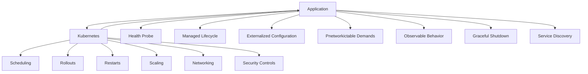

---

## 13.1. What you are going to learn and what not you are going to learn yet

You are going to learn:

- What it means diseñar an application for Kubernetes
- What problema resuelven the Cloud native patterns
- By what Kubernetes does not arregla an application bad diseñada
- What es Pnetworkictable Demands
- What es Declarative Deployment
- What es Health Probe
- What es Managed Lifecycle
- What es Automated Placement
- What son Batch Job and Periodic Job
- What es Daemon Service
- What es Singleton Service
- What es Stateful Service
- What es Service Discovery
- What es Self Awareness
- What son Init Container, Sidecar, Adapter and Ambassador
- What son EnvVar Configuration, Configuration Resource, Immutable Configuration and Configuration Template
- What son Controller and Operator
- What es Elastic Scale
- How networkiseñar `checkout-api` aplicando patterns
- How detectar cuándo a patrón ayuda and cuándo es sobreingeniería
- How practicar patterns with manifests pequeños and comprensibles
- How mejorar DevEx with Taskfile
Not vamos to profundizar yet in:

- Implementar a operator completo
- Service mesh
- mTLS
- Knative
- KEDA
- Argo Rollouts advanced
- Cilium advanced
- Multi-cluster
- Databases productivas in Kubernetes
- Operators productivos of PostgreSQL
- Platform engineering advanced
- Diseño completo of a plataforma interna
The regla pedagógica of the module será:

```text
First, problem
Then pattern
Then application responsibility
Then Kubernetes responsibility
Then small practice
Then exit criterion
```

---

## 13.2. The problema: Kubernetes does not can operate bien an application que not coopera

Kubernetes observa objetos, states and signals.

But if the application not da signals útiles, Kubernetes actúa with información pobre.

Ejemplos:

|Application bad preparada|Consecuencia|
|---|---|
|Not tiene `/ready`|Kubernetes can enviar traffic demasiado pronto|
|Not tiene `/health` real|Kubernetes does not sabe cuándo restart|
|Not responde to `SIGTERM`|Rollouts pueden cortar requests vivas|
|Escribe datos importbefore in filesystem efímero|Pierde datos to the recreate Pod|
|Not declara requests|The scheduler decide with less información|
|Not emite logs útiles|Diagnóstico lento|
|Not externaliza configuration|Requiere images distintas by environment|
|Depende of IPs of Pods|Se rompe with recreaciones|
|Uses workers infinitos for tasks finitas|Difícil saber cuándo terminaron|
|Uses Deployment for everything|Mezcla comportamientos operativos distintos|

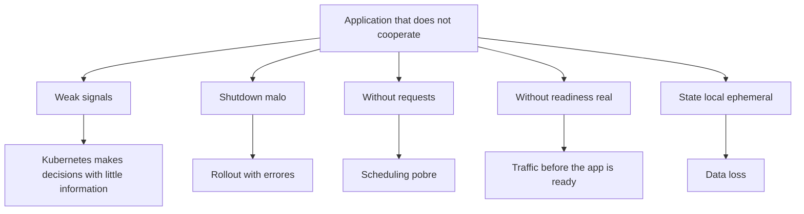

### Contrato mental

Not diseñes only for que the app funcione in tu máquina.

Diseña for que Kubernetes pueda responder these preguntas:

- ¿Está viva?
- ¿Está lista?
- ¿It can receive traffic?
- ¿Cuándo can shut downse?
- ¿Cuántos Resources needs?
- ¿What configuration needs?
- ¿What secrets needs?
- ¿What dependencies tiene?
- ¿What datos must sobrevivir?
- ¿What signals emite?
- ¿It can scale?
- ¿What pasa if a réplica muere?
- ¿What pasa if a dependencia fails?
### Criterio of comprensión

Debes poder explicar:

> Kubernetes can automatizar operación, but needs contratos claros of salud, configuration, Resources, lifecycle, network and observability.

---

## 13.3. Mapa of patterns of the module

This module organiza the patterns in seis layers.

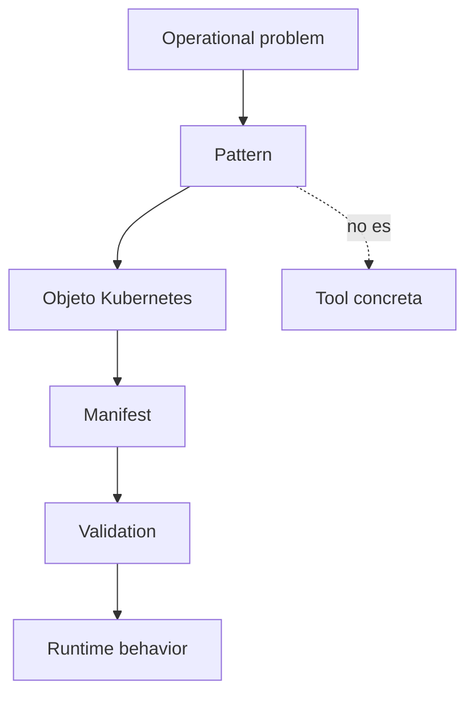

```mermaid
flowchart TD
  Patterns["Cloud native patterns"] --> Foundational["1. Fundacionales"]
  Patterns --> Behavioral["2. Comportamiento"]
  Patterns --> Structural["3. Estructurales"]
  Patterns --> Config["4. Configuration"]
  Patterns --> Advanced["5. Avanzados"]
  Patterns --> Operational["6. Operacionales"]

  Foundational --> Predictable["Pnetworkictable Demands"]
  Foundational --> Declarative["Declarative Deployment"]
  Foundational --> Health["Health Probe"]
  Foundational --> Lifecycle["Managed Lifecycle"]
  Foundational --> Placement["Automated Placement"]

  Behavioral --> Batch["Batch Job"]
  Behavioral --> Periodic["Periodic Job"]
  Behavioral --> Daemon["Daemon Service"]
  Behavioral --> Singleton["Singleton Service"]
  Behavioral --> Stateful["Stateful Service"]
  Behavioral --> Discovery["Service Discovery"]

  Structural --> Init["Init Container"]
  Structural --> Sidecar["Sidecar"]
  Structural --> Adapter["Adapter"]
  Structural --> Ambassador["Ambassador"]

  Config --> EnvVar["EnvVar Configuration"]
  Config --> ConfigResource["Configuration Resource"]
  Config --> Immutable["Immutable Configuration"]
  Config --> Template["Configuration Template"]

  Advanced --> Controller["Controller"]
  Advanced --> Operator["Operator"]
  Advanced --> Elastic["Elastic Scale"]

  Operational --> Observability["Observable Behavior"]
  Operational --> Graceful["Graceful Shutdown"]
  Operational --> Runbooks["Runbook-ready Design"]
```

### How read this mapa

Not tienes que use all the patterns.

Tienes que saber elegir.

An application sencilla can necesitar:

```text
Health Probe
Managed Lifecycle
EnvVar Configuration
Configuration Resource
Service Discovery
Predictable Demands
Declarative Deployment
```

A plataforma can necesitar:

```text
Controller
Operator
Admission policies
Elastic Scale
Advanced observability
```

### Criterio of comprensión

Debes poder explicar:

> A patrón es útil if reduce risk operativo, aclara responsabilidades or mejora the capacidad of change. If only añade complejidad, is does not a patrón aplicado: es decoración.

---

# 13.4. Patterns fundacionales

## 13.4.1. Pnetworkictable Demands

### What problema resuelve

Kubernetes needs saber cuántos Resources needs a workload for poder programarlo and operarlo better.

If not declaras requests and limits, the scheduler tiene less información.

The documentación oficial explica que you can especificar cuánta CPU and memoria needs a container mediante `requests` and `limits`, and que these valores influyen in scheduling and gestión of Resources. ([Kubernetes](https://kubernetes.io/docs/concepts/workloads/ "Workloads"))

### Contrato mental

|Campo|Pregunta|
|---|---|
|`requests.cpu`|¿Cuánta CPU needs como base?|
|`requests.memory`|¿Cuánta memoria needs como base?|
|`limits.cpu`|¿Cuánta CPU máxima can consumir?|
|`limits.memory`|¿Cuánta memoria máxima can consumir before of ser limitado or terminado?|

### Ejemplo for `checkout-api`

```yaml
resources:
  requests:
    cpu: 100m
    memory: 128Mi
  limits:
    cpu: 500m
    memory: 256Mi
```

### Lo importante

These valores should notn elegirse to the azar.

In laboratorio usamos valores pequeños for practicar.

In producción shouldn ajustarse with datos:

- Métricas of CPU
- Métricas of memoria
- Carga esperada
- Picos
- Tests of carga
- Historial of OOMKilled
- Objectives of latencia
### Failure lab

If the limit of memoria es demasiado bajo, you can provocar `OOMKilled`.

Diagnóstico:

```bash
kubectl describe pod -n shop -l app.kubernetes.io/name=checkout-api
kubectl get pod -n shop -l app.kubernetes.io/name=checkout-api -o json \
  | jq '.items[].status.containerStatuses[] | {name, restartCount, lastState}'
kubectl top pods -n shop || true
```

### DevEx

```yaml
patterns:resources:inspect:
  desc: Show checkout-api resources and QoS
  cmds:
    - kubectl get deploy checkout-api -n {{.NAMESPACE}} -o json | jq '.spec.template.spec.containers[0].resources'
    - kubectl get pods -n {{.NAMESPACE}} -l app.kubernetes.io/name=checkout-api -o json | jq '.items[] | {name: .metadata.name, qos: .status.qosClass}'
```

### Criterio of comprensión

Debes poder explicar:

> Pnetworkictable Demands significa que the application declara sus necesidades of Resources for que Kubernetes pueda tomar mejores decisiones.

---

## 13.4.2. Declarative Deployment

### What problema resuelve

Not quieres que the state of the sistema dependa of commands manuales.

Quieres declarar the state deseado.

Kubernetes trabaja with objetos declarativos como Deployments, Services, ConfigMaps, Secrets and otros Resources. The uso of manifests and `kubectl apply` permite gestionar objetos to partir of configuration versionada. ([Kubernetes](https://kubernetes.io/docs/concepts/workloads/ "Workloads"))

### Contrato mental

Declarativo significa:

```text
Este es el state que quiero.
Kubernetes intenta reconciliar el state real hacia ese state.
```

Not significa:

```text
Ejecuta estos pasos imperativos en este orden and espera que nada falle.
```

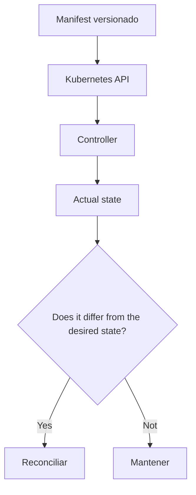

### Ejemplo

`checkout-api` should declararse with:

- Deployment
- Service
- ConfigMap
- Secret
- NetworkPolicy
- PodDisruptionBudget
- HPA, if aplica
- Kustomize overlay
### DevEx

```yaml
patterns:declarative:diff:
  desc: Show declarative diff before apply
  cmds:
    - kubectl diff -k kubernetes/overlays/local || true

patterns:declarative:apply:
  desc: Apply declarative local overlay
  cmds:
    - kubectl apply -k kubernetes/overlays/local
```

### Criterio of comprensión

Debes poder explicar:

> Declarative Deployment significa que Git and manifests describen the state deseado; Kubernetes and sus controllers se encargan of aproximar the state real.

---

## 13.4.3. Health Probe

### What problema resuelve

Kubernetes needs saber if a instancia está viva, if está lista and if needs more tiempo for start.

The documentación oficial describe liveness, readiness and startup probes como mecanismos for que kubelet compruebe the salud and disponibilidad of containers. ([Kubernetes](https://kubernetes.io/docs/tasks/configure-pod-container/configure-liveness-readiness-startup-probes/ "Configure Liveness, Readiness and Startup Probes"))

### Tres probes, tres preguntas distintas

|Probe|Pregunta|
|---|---|
|Startup|¿The application already ha terminado of start?|
|Readiness|¿It can receive traffic ahora?|
|Liveness|¿Está tan rota que must restartse?|

### Error habitual

Use the same endpoint for everything without pensar.

Esto can funcionar in apps very simples, but not always es correcto.

### Contrato for `checkout-api`

|Endpoint|Significado|
|---|---|
|`/health`|The process está vivo|
|`/ready`|The instancia está lista for traffic|
|`/checkout`|Flujo funcional minimum|

### Ejemplo

```yaml
startupProbe:
  httpGet:
    path: /health
    port: http
  failureThreshold: 30
  periodSeconds: 2

readinessProbe:
  httpGet:
    path: /ready
    port: http
  initialDelaySeconds: 2
  periodSeconds: 5
  failureThreshold: 3

livenessProbe:
  httpGet:
    path: /health
    port: http
  initialDelaySeconds: 5
  periodSeconds: 10
  failureThreshold: 3
```

### Diagrama

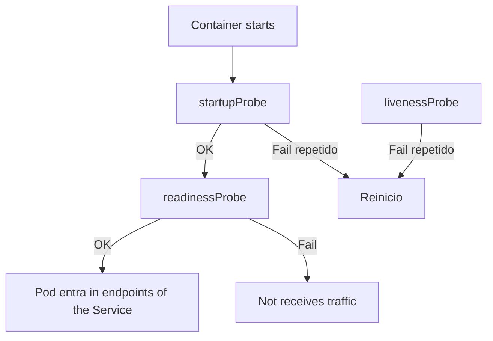

### Failure lab

Readiness rota:

```bash
kubectl describe pod -n shop -l app.kubernetes.io/name=checkout-api
kubectl get endpointslices -n shop -l kubernetes.io/service-name=checkout-api
kubectl get events -n shop --sort-by=.metadata.creationTimestamp
```

### Criterio of comprensión

Debes poder explicar:

> Health Probe is not only poner endpoints. Es separar arranque, disponibilidad and necesidad of reinicio.

---

## 13.4.4. Managed Lifecycle

### What problema resuelve

Kubernetes can terminar Pods during rollouts, scaling, drains or cambios of nodo.

The application must shut downse of forma controlada.

Kubernetes documenta the ciclo of vida of Pods and the container lifecycle hooks, incluyendo `PostStart` and `PreStop`, como mecanismos for run code in eventos of ciclo of vida of the container. ([Kubernetes](https://kubernetes.io/docs/concepts/workloads/pods/pod-lifecycle/ "Pod Lifecycle"))

### What must hacer an application bien diseñada

When recibe `SIGTERM`:

- Deja of aceptar trabajo nuevo
- Termina requests in course, if can
- Cierra conexiones
- Libera Resources
- Termina dentro of `terminationGracePeriodSeconds`
- Registra a log claro
### Diagrama of shutdown

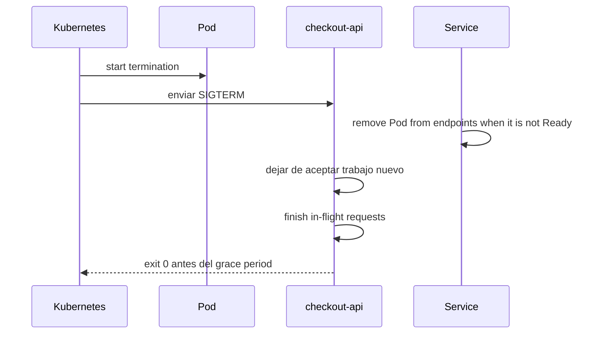

### Manifest

```yaml
terminationGracePeriodSeconds: 30
```

Opcionalmente:

```yaml
lifecycle:
  preStop:
    exec:
      command:
        - sh
        - -c
        - sleep 5
```

### Cuidado

`preStop` not must usarse como parche mágico.

The app must gestionar `SIGTERM`.

### DevEx

```yaml
patterns:lifecycle:inspect:
  desc: Inspect lifecycle and termination settings
  cmds:
    - kubectl get deploy checkout-api -n {{.NAMESPACE}} -o json | jq '.spec.template.spec.terminationGracePeriodSeconds, .spec.template.spec.containers[0].lifecycle'
```

### Criterio of comprensión

Debes poder explicar:

> Managed Lifecycle significa que the application understands que Kubernetes can startla, checkla, retirarla of the traffic and terminarla.

---

## 13.4.5. Automated Placement

### What problema resuelve

Not all the Pods shouldn runse in cualquier nodo.

Kubernetes permite influir in placement mediante requests, node selectors, affinity, anti-affinity, taints and tolerations.

### Cuándo importa

- Separar réplicas of a API
- Evitar que all the réplicas caigan with a nodo
- Colocar workloads GPU in nodos GPU
- Run agentes in nodos concretos
- Reservar nodos for workloads críticos
### Ejemplo suave: anti-affinity preferida

```yaml
affinity:
  podAntiAffinity:
    preferredDuringSchedulingIgnoredDuringExecution:
      - weight: 50
        podAffinityTerm:
          labelSelector:
            matchLabels:
              app.kubernetes.io/name: checkout-api
          topologyKey: kubernetes.io/hostname
```

### Cuidado

In kind of a nodo, this practice not mostrará gran cosa.

Not fuerces reglas duras in a cluster que not can satisfacerlas.

### Criterio of comprensión

Debes poder explicar:

> Automated Placement is not forzar nodos by capricho. Es expresar restricciones or pReferences of colocación según reliability, coste, security or capacidad.

---

# 13.5. Patterns of comportamiento

## 13.5.1. Batch Job

### What problema resuelve

A task finita should not modelarse como Deployment.

It must runse, terminar and dejar señal clara.

Ejemplos:

- Migración puntual
- Importación
- Reprocesado
- Generación of informe
- Validación batch
### Kubernetes object

`Job`.

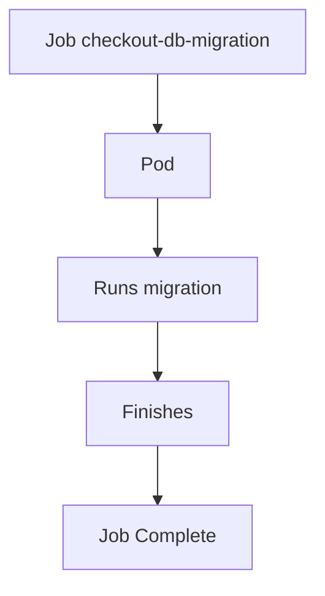

### Criterio of comprensión

Debes poder explicar:

> Batch Job modela trabajo finito. The éxito is not estar corriendo, es completar.

---

## 13.5.2. Periodic Job

### What problema resuelve

A task que must runse periódicamente should not implementarse como a process durmiendo dentro of a Deployment.

It must declararse como planificación.

### Kubernetes object

`CronJob`.

Ejemplos:

- Limpieza diaria of carritos expirados
- Reporte nocturno
- Reintento programado
- Backup simple of laboratorio
### Criterio of comprensión

Debes poder explicar:

> Periodic Job modela trabajo finito que is created según a calendario.

---

## 13.5.3. Daemon Service

### What problema resuelve

Algunos workloads must runse a vez by nodo.

Ejemplos:

- Agente of logs
- Agente of métricas
- Agente of security
- Componente of network
- Componente of storage
### Kubernetes object

`DaemonSet`.

### Criterio of comprensión

Debes poder explicar:

> Daemon Service is not “varias réplicas”. Es “a instancia by nodo elegible”.

---

## 13.5.4. Singleton Service

### What problema resuelve

TO veces you need exactamente a instancia activa.

Ejemplos:

- Scheduler interno
- Coordinador
- Worker que not must duplicarse
- Process que ejecuta a task exclusiva
### Opciones

|Caso|Opción|
|---|---|
|Process largo with a sola réplica|Deployment replicas=1|
|Task finita exclusiva|Job|
|Leader election real|Application with mecanismo of liderazgo|
|Workload stateful with identidad|StatefulSet|

### Cuidado

`replicas: 1` not garantiza semántica distribuida of singleton fuerte in all the escenarios.

During algunos cambios or failures pueden aparecer situaciones transitorias que debes understand.

### Criterio of comprensión

Debes poder explicar:

> Singleton Service not significa only poner `replicas: 1`. Significa understand what pasaría if hay duplicidad, failover or transición.

---

## 13.5.5. Stateful Service

### What problema resuelve

Algunos services need identidad estable, orden or storage estable.

Ejemplos:

- Database
- Broker
- Sistema distribuido with nodos identificables
- Redis with persistencia, según diseño
- Elasticsearch, Kafka or similares, normalmente with operator or solución gestionada
### Kubernetes object

`StatefulSet`.

Kubernetes documenta StatefulSet como the recurso for gestionar applications stateful with identidad estable and garantías of orden e identidad. ([Kubernetes](https://kubernetes.io/docs/concepts/workloads/ "Workloads"))

### Cuidado

Not uses StatefulSet because “parece more professional”.

Úsalo when the comportamiento lo requiere.

### Criterio of comprensión

Debes poder explicar:

> Stateful Service significa que the identidad and the storage of each réplica importan.

---

## 13.5.6. Service Discovery

### What problema resuelve

The Pods cambian.

The IPs cambian.

The applications need nombres estables.

In Kubernetes, Services and DNS permiten descubrir dependencies internas by nombre.

### Ejemplo

```text
checkout-api → http://payment-api
checkout-api → redis:6379
checkout-api → postgres:5432
```

### Criterio of comprensión

Debes poder explicar:

> Service Discovery evita que the applications dependan of instancias efímeras and permite comunicación by identidad estable.

---

# 13.6. Patterns estructurales

## 13.6.1. Init Container

### What problema resuelve

Algunas tasks must ocurrir before of start the application principal.

Ejemplos:

- Esperar to que a dependencia esté disponible
- Preparar a file
- Descargar configuration not sensible
- Run a comprobación
- Preparar permisos of a volumen
### Kubernetes object

`initContainers`.

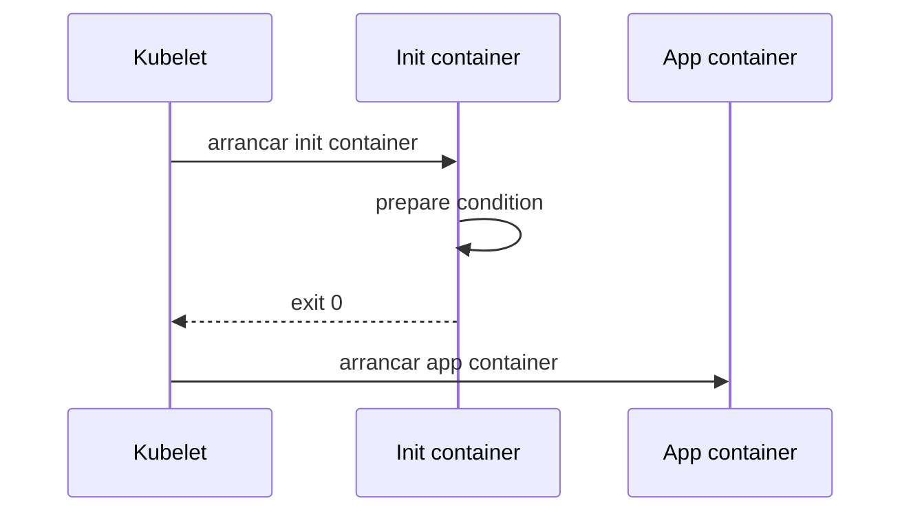

### Ejemplo

```yaml
initContainers:
  - name: wait-for-payment-api
    image: busybox:1.36
    command:
      - sh
      - -c
      - until wget -qO- http://payment-api/; do echo waiting; sleep 2; done
```

### Cuidado

Not conviertas init containers in lógica of negocio.

Tampoco the uses for ocultar dependencies bad diseñadas.

### Criterio of comprensión

Debes poder explicar:

> Init Container prepara a condición before of que arranque the container principal.

---

## 13.6.2. Sidecar

### What problema resuelve

A sidecar extiende or acompaña to the container principal dentro of the same Pod.

Kubernetes documenta the sidecar containers como containers que trabajan junto to the container principal, extendiendo su funcionalidad, and que pueden runse during the ciclo of vida of the Pod. The documentación actual explica que the sidecars tienen soporte específico and se comportan como a clase especial of init containers with `restartPolicy: Always`. ([Kubernetes](https://kubernetes.io/docs/concepts/workloads/pods/sidecar-containers/ "Sidecar Containers"))

### Ejemplos

- Proxy local
- Recolector or adaptador of logs
- Sincronizador of configuration
- Agente of security
- Exportador of métricas
- Helper of certificados
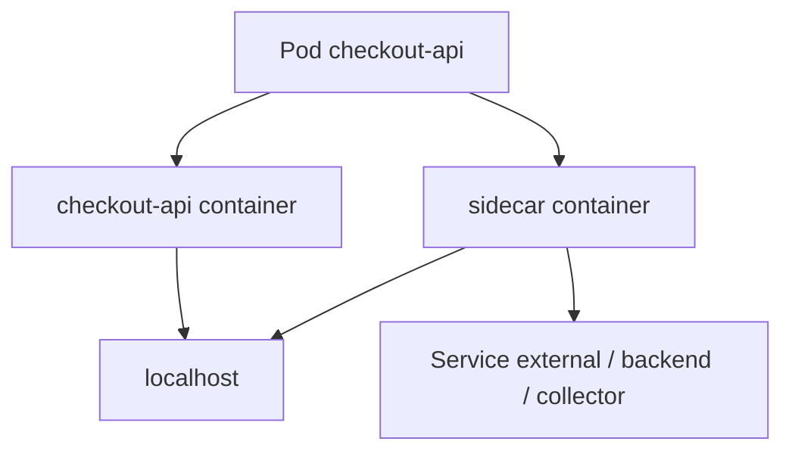

### Ejemplo conceptual

```yaml
initContainers:
  - name: log-forwarder
    image: busybox:1.36
    restartPolicy: Always
    command:
      - sh
      - -c
      - while true; do echo sidecar running; sleep 30; done
```

### Cuidado

A sidecar aumenta acoplamiento dentro of the Pod.

Úsalo if the relación es realmente of ciclo of vida compartido.

### Criterio of comprensión

Debes poder explicar:

> Sidecar añade a capacidad local to the Pod, but also aumenta complejidad operativa and consumo of Resources.

---

## 13.6.3. Adapter

### What problema resuelve

TO veces an application emite datos in a formato que the plataforma not understands bien.

A Adapter transforma the output of the application to a contrato more útil.

Ejemplos:

- Convertir logs of texto to JSON
- Expose métricas in formato Prometheus-compatible
- Normalizar formatos
- Transformar protocolos


### Criterio of comprensión

Debes poder explicar:

> Adapter traduce a interfaz or señal existente to a formato more operativo without cambiar necesariamente the application principal.

---

## 13.6.4. Ambassador

### What problema resuelve

A Ambassador actúa como proxy local between the application and a service externo.

Ejemplos:

- Proxy to a API externa
- Proxy to a database
- Manejo local of TLS
- Retry or routing local, with mucho cuidado
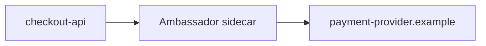

### Cuidado

Not uses Ambassador for esconder complejidad que should estar in infraestructura or diseño.

It can hacer more difícil observar and debug if not se instrumenta bien.

### Criterio of comprensión

Debes poder explicar:

> Ambassador encapsula comunicación externa como a proxy local, but can ocultar failures if not se diseña with good observability.

---

# 13.7. Patterns of configuration

## 13.7.1. EnvVar Configuration

### What problema resuelve

Permite configurar valores simples in runtime.

Ejemplos:

```text
LOG_LEVEL
PORT
PAYMENT_API_URL
REDIS_HOST
```

### Kubernetes objects

- ConfigMap
- Secret
- `env`
- `envFrom`
### Criterio of comprensión

Debes poder explicar:

> EnvVar Configuration encaja with valores simples, but not with configuration estructurada complex or secrets que not quieres expose como environment.

---

## 13.7.2. Configuration Resource

### What problema resuelve

Permite externalizar configuration como recurso Kubernetes.

Ejemplos:

- ConfigMap
- Secret
- Custom Resource
### Ejemplo

```yaml
apiVersion: v1
kind: ConfigMap
metadata:
  name: checkout-api-config
data:
  LOG_LEVEL: debug
  PAYMENT_API_URL: http://payment-api
```

### Criterio of comprensión

Debes poder explicar:

> Configuration Resource convierte configuration in a objeto declarativo, versionable and aplicable by environment.

---

## 13.7.3. Immutable Configuration

### What problema resuelve

Evita que the configuration cambie silenciosamente bajo an application already desplegada.

A estrategia habitual consiste in versionar ConfigMaps or Secrets by nombre:

```text
checkout-api-config-v1
checkout-api-config-v2
```

Then the Deployment referencia a versión concreta.

### Ventaja

- More trazabilidad
- Rollback more claro
- Less cambios invisibles
- Better alineación with delivery declarativo
### Coste

- More objetos
- You need limpieza
- You need process claro of actualización
### Criterio of comprensión

Debes poder explicar:

> Immutable Configuration reduce cambios silenciosos, but exige disciplina of versionado and limpieza.

---

## 13.7.4. Configuration Template

### What problema resuelve

TO veces you need generate configuration to partir of valores of environment.

Ejemplos:

- Generate a file JSON
- Generate configuration Nginx
- Generate configuration for a tool antigua
### Opciones

- Init container que renderiza plantilla
- Helm template
- Kustomize
- App que genera configuration to the start
- Tool especializada
### Cuidado

Not conviertas Kubernetes in a motor of plantillas complex without necesidad.

### Criterio of comprensión

Debes poder explicar:

> Configuration Template must usarse when hay a necesidad real of generate configuration, not como sustituto automático of ConfigMap.

---

# 13.8. Patterns avanzados

## 13.8.1. Controller

### What problema resuelve

A controller observa the state real and lo reconcilia hacia the state deseado.

Kubernetes documenta the patrón of controller como parte central of su modelo of control. The controllers observan Resources and actúan for acercar the state real to the deseado. ([Kubernetes](https://kubernetes.io/docs/concepts/workloads/ "Workloads"))

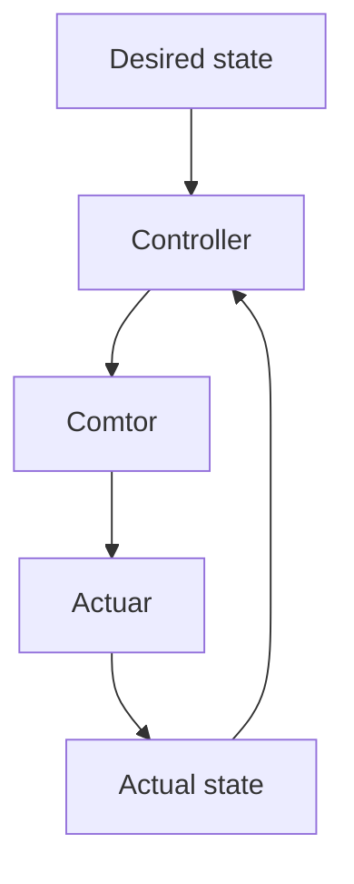

### Ejemplos

- Deployment controller
- Job controller
- StatefulSet controller
- Custom controller propio
### Criterio of comprensión

Debes poder explicar:

> Controller not ejecuta a script a vez. Reconcilia continuamente.

---

## 13.8.2. Operator

### What problema resuelve

A Operator extiende Kubernetes for gestionar applications complejas mediante Custom Resources and controllers.

Kubernetes define Operators como extensiones software que use custom resources for gestionar applications and sus componentes, siguiendo the principios of Kubernetes, especialmente the control loop. ([Kubernetes](https://kubernetes.io/docs/concepts/extend-kubernetes/operator/ "Operator pattern"))

### What can automatizar

- Instalación
- Configuration
- Backups
- Restores
- Upgrades
- Failover
- Escalado
- Rotación
- State operativo
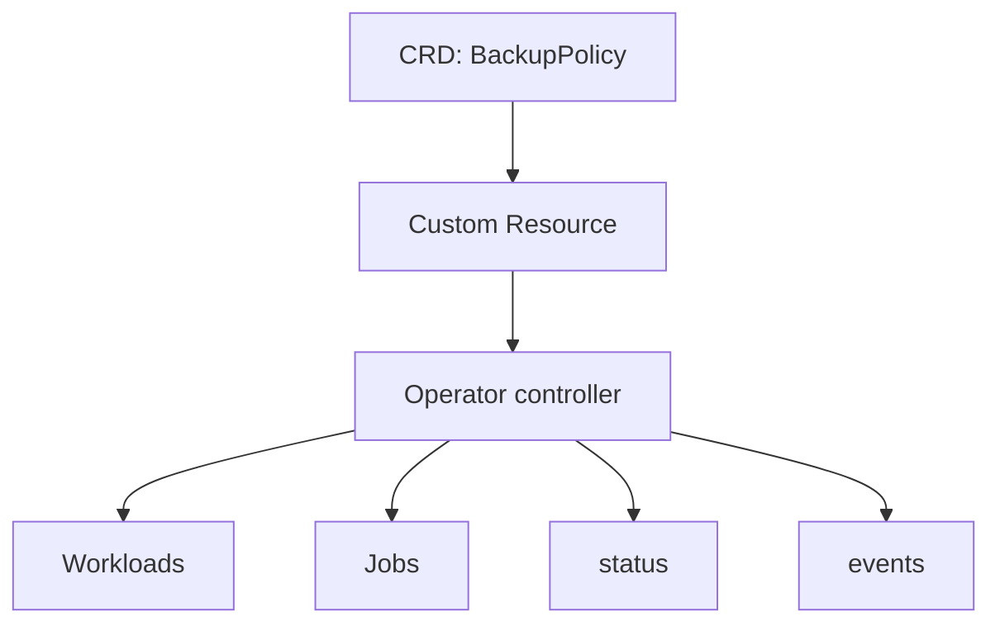

### Cuidado

Not everything needs a Operator.

A Operator tiene coste:

- Code
- RBAC
- Testing
- Observability
- Upgrades
- Security
- Blast radius
- Mantenimiento
### Criterio of comprensión

Debes poder explicar:

> A Operator merece the pena when automatiza conocimiento operativo repetible and complex. If only envuelve YAML estático, probably es sobreingeniería.

---

## 13.8.3. Elastic Scale

### What problema resuelve

Elastic Scale permite ajustar capacidad según demanda.

In Kubernetes can implicar:

- HPA
- VPA
- Cluster Autoscaler
- KEDA
- Escalado by métricas externas
- Escalado to cero, in plataformas que lo soportan
### Cuidado

Scale not arregla everything.

Not arregla:

- Errores of code
- Dependencies saturadas
- Mala configuration
- Database lenta
- NetworkPolicy bad diseñada
- Secrets ausentes
- Falta of observability
### Criterio of comprensión

Debes poder explicar:

> Elastic Scale aumenta or reduce capacidad, but must estar guiado by métricas correctas and límites claros.

---

# 13.9. Patrón operacional: observable behavior

### What problema resuelve

An application cloud native must ser observable by diseño.

Not basta with install Loki, Mimir, Tempo or Grafana.

The app must emitir signals útiles.

### Contrato for `checkout-api`

It must emitir:

- Logs JSON
- Request ID
- Status code
- Duración
- Endpoint
- Service
- Pod
- Error type
- Métricas HTTP, if está instrumentada
- Trazas, if está instrumentada
OpenTelemetry define a enfoque vendor-neutral for recolectar and exportar telemetría mediante SDKs and Collector. ([Kubernetes](https://kubernetes.io/docs/concepts/workloads/ "Workloads"))

### Criterio of comprensión

Debes poder explicar:

> Observable Behavior significa que the application ayuda activamente to ser diagnosticada.

---

# 13.10. Networkiseño of `checkout-api` aplicando patterns

## Objective

Tomar a API sencilla and convertirla in a good ciudadana Kubernetes.

### State inicial

```text
Express app
Dockerfile
Deployment
Service
ConfigMap
Secret
Probes
Resources
SecurityContext
Smoke test
```

### State objective

```text
Predictable Demands
Declarative Deployment
Health Probe
Managed Lifecycle
Service Discovery
Configuration Resource
EnvVar Configuration
Observable Behavior
NetworkPolicy
PDB
HPA opcional
Runbook
```

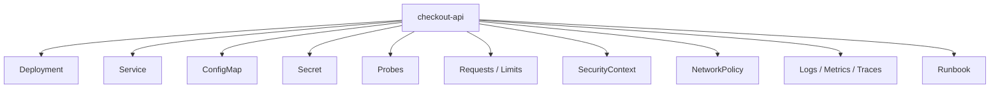

### Manifest consolidado, fragmentos clave

Not repito everything the Deployment completo.

The patrón importante está in these piezas:

```yaml
spec:
  replicas: 3
  template:
    spec:
      serviceAccountName: checkout-api-sa
      automountServiceAccountToken: false
      terminationGracePeriodSeconds: 30
      securityContext:
        seccompProfile:
          type: RuntimeDefault
      containers:
        - name: checkout-api
          image: checkout-api:1.0.1
          imagePullPolicy: IfNotPresent
          ports:
            - name: http
              containerPort: 8080
          envFrom:
            - configMapRef:
                name: checkout-api-config
            - secretRef:
                name: checkout-api-secret
          startupProbe:
            httpGet:
              path: /health
              port: http
            failureThreshold: 30
            periodSeconds: 2
          readinessProbe:
            httpGet:
              path: /ready
              port: http
            periodSeconds: 5
            failureThreshold: 3
          livenessProbe:
            httpGet:
              path: /health
              port: http
            periodSeconds: 10
            failureThreshold: 3
          resources:
            requests:
              cpu: 100m
              memory: 128Mi
            limits:
              cpu: 500m
              memory: 256Mi
          securityContext:
            allowPrivilegeEscalation: false
            readOnlyRootFilesystem: true
            runAsNonRoot: true
            runAsUser: 1000
            capabilities:
              drop:
                - ALL
```

### Criterio of comprensión

Debes poder explicar:

> A buen Deployment is not only an image and réplicas. Es a contrato operativo completo between application and plataforma.

---

# 13.11. Practice principal of the module

## Objective

Revisar `checkout-api` and documentar what patterns aplica, what patterns not needs and what signals must emitir.

## Resultado esperado

```text
kubernetes-learning-lab/
  docs/
    patterns/
      checkout-api-pattern-review.md
      pattern-decision-records.md
      anti-patterns.md
  kubernetes/
    02-deployment/
      deployment.yaml
    03-service/
      checkout-api-service.yaml
    05-config/
      configmap.yaml
      secret.yaml
    07-security/
      serviceaccount.yaml
    10-networkpolicy/
      default-deny-ingress.yaml
      allow-dnsutils-to-checkout-api.yaml
```

## Paso 1. Create revisión of patterns

Creates:

```text
docs/patterns/checkout-api-pattern-review.md
```

### Tabla of Patterns in Kubernetes (Revisión and Análisis)

---

|**Pattern**|**Applied**|**Evidence**|**Why**|**Risk if missing**|
|---|---|---|---|---|
|**Pnetworkictable Demands**|Yes|`requests` / `limits`|Scheduler and resource control|Poor placement, noisy neighbor risk|
|**Declarative Deployment**|Yes|Deployment / Kustomize|Reproducible delivery|Manual drift|
|**Health Probe**|Yes|Startup / Readiness / Liveness|Safer traffic and restarts|Bad rollouts|
|**Managed Lifecycle**|Partial|`terminationGracePeriod`|Needs SIGTERM handling in app|Broken requests during rollout|
|**Service Discovery**|Yes|Service DNS|Stable dependencies|Pod IP coupling|
|**Configuration Resource**|Yes|ConfigMap / Secret|Runtime config|Image per environment|
|**Observable Behavior**|Partial|Logs exist|Needs structunetwork logs and metrics|Slow diagnosis|
|**Network Isolation**|Yes|NetworkPolicy|Networkuce lateral movement|Broad communication|
|**Elastic Scale**|Optional|HPA|Needs metrics|Scaling without evidence|
|**Operator**|Not|Not needed|Avoids unnecessary complexity|Overengineering|

---

### Notas about the puntos "Partial":

- **Managed Lifecycle:** For pasar of "Partial" to "Yes", asegúrate of que tu application capture the señal `SIGTERM` and finalice the conexiones existentes before of que the process muera.
    
- **Observable Behavior:** A sistema es totalmente observable only when the logs son estructurados (JSON) and se exponen métricas (como a endpoint of `/metrics` for Prometheus) also of rastreo distribuido (tracing) if es a microservice.
    

> **Tip of experto:** If estás usando **Kustomize**, recuerda que you can use `configMapGenerator` for que, to the cambiar a ConfigMap, se dispare automáticamente a deployment of the Pods relacionados, garantizando que always tengan the configuration more fresca.

## Paso 2. Create decisiones of patterns

Creates:

```text
docs/patterns/pattern-decision-records.md
```

Formato:

```markdown
# Pattern decision: Health Probe

## Context

checkout-api receives HTTP traffic through a Kubernetes Service.

## Decision

Use startup, readiness and liveness probes with setote operational meanings.

## Consequences

Kubernetes can avoid sending traffic before readiness and can restart the process if liveness fails repeatedly.

## Risks

A too aggressive liveness probe can restart healthy but slow instances.

## Validation

task smoke:k8s
kubectl describe pod -n shop -l app.kubernetes.io/name=checkout-api
```

## Paso 3. Create anti-patterns

Creates:

```text
docs/patterns/anti-patterns.md
```

Incluye:

- Deployment for tasks finitas
- CronJob for workers continuos
- StatefulSet without necesidad of identidad estable
- Sidecar without ciclo of vida compartido real
- Liveness agresiva
- Configuration sensible in ConfigMap
- `latest`
- Pods with permisos amplios
- Logs without contexto
- Service selector fragile
- HPA without métricas confiables
- Operator for envolver YAML estático
## Paso 4. Validate manifests

```bash
task manifests:render
task manifests:validate:schema
task manifests:score
task policies:test
task test:k8s
```

## Paso 5. Run diagnóstico operativo

```bash
task k8s:debug:checkout:summary
task reliability:test
```

## Criterio of finalización

The practice está completa when you can explicar:

- What patterns aplica `checkout-api`
- What evidencia hay in manifests
- What responsabilidad tiene the app
- What responsabilidad tiene Kubernetes
- What patterns not needs
- What anti-patterns estás evitando
- What tests validan esos patterns
- What runbook usarías if fail
---

# 13.12. Taskfile of the module 13

Añade these tasks to the `Taskfile.yml`.

```yaml
  patterns:resources:inspect:
    desc: Show checkout-api resources and QoS
    cmds:
      - kubectl get deploy checkout-api -n {{.NAMESPACE}} -o json | jq '.spec.template.spec.containers[0].resources'
      - kubectl get pods -n {{.NAMESPACE}} -l app.kubernetes.io/name=checkout-api -o json | jq '.items[] | {name: .metadata.name, qos: .status.qosClass}'

  patterns:probes:inspect:
    desc: Show checkout-api probes
    cmds:
      - kubectl get deploy checkout-api -n {{.NAMESPACE}} -o json | jq '.spec.template.spec.containers[0] | {startupProbe, readinessProbe, livenessProbe}'

  patterns:lifecycle:inspect:
    desc: Inspect lifecycle and termination settings
    cmds:
      - kubectl get deploy checkout-api -n {{.NAMESPACE}} -o json | jq '.spec.template.spec.terminationGracePeriodSeconds, .spec.template.spec.containers[0].lifecycle'

  patterns:service-discovery:inspect:
    desc: Inspect checkout-api Service discovery
    cmds:
      - kubectl get svc checkout-api -n {{.NAMESPACE}} -o yaml
      - kubectl get endpointslices -n {{.NAMESPACE}} -l kubernetes.io/service-name=checkout-api
      - kubectl exec -n {{.NAMESPACE}} dnsutils -- nslookup checkout-api || true

  patterns:configuration:inspect:
    desc: Inspect ConfigMap and Secret usage
    cmds:
      - kubectl get configmap checkout-api-config -n {{.NAMESPACE}} -o yaml
      - kubectl describe secret checkout-api-secret -n {{.NAMESPACE}}
      - kubectl get deploy checkout-api -n {{.NAMESPACE}} -o json | jq '.spec.template.spec.containers[0].envFrom'

  patterns:security:inspect:
    desc: Inspect security-related pattern evidence
    cmds:
      - kubectl get deploy checkout-api -n {{.NAMESPACE}} -o json | jq '.spec.template.spec.serviceAccountName, .spec.template.spec.automountServiceAccountToken'
      - kubectl get deploy checkout-api -n {{.NAMESPACE}} -o json | jq '.spec.template.spec.securityContext, .spec.template.spec.containers[0].securityContext'
      - kubectl get networkpolicy -n {{.NAMESPACE}}

  patterns:observability:inspect:
    desc: Inspect operational signals for checkout-api
    cmds:
      - kubectl logs -n {{.NAMESPACE}} deploy/checkout-api --tail=50 || true
      - kubectl get events -n {{.NAMESPACE}} --sort-by=.metadata.creationTimestamp
      - task smoke:k8s

  patterns:review:
    desc: Run pattern review checks for checkout-api
    cmds:
      - task patterns:resources:inspect
      - task patterns:probes:inspect
      - task patterns:lifecycle:inspect
      - task patterns:service-discovery:inspect
      - task patterns:configuration:inspect
      - task patterns:security:inspect
      - task patterns:observability:inspect

  patterns:test:
    desc: Validate cloud native pattern evidence through existing gates
    cmds:
      - task manifests:render
      - task manifests:validate:schema
      - task manifests:score
      - task policies:test
      - task test:k8s
      - task reliability:test
```

### Criterio DevEx

Debes poder explicar:

> The DevEx of patterns must hacer visible the evidencia. Not basta with decir que aplicamos Health Probe, Configuration Resource or Managed Lifecycle. It must poder verse in manifests, tests and signals.

---

# 13.13. Ejercicios cortos

## Ejercicio 1. Clasificar patterns

Completa:

|Caso|Patrón|
|---|---|
|API HTTP with réplicas and rollout||
|Migración puntual||
|Limpieza each noche||
|Agente by nodo||
|Configuration by environment||
|Transformar logs to formato estándar||
|Proxy local hacia proveedor externo||
|App que needs identidad estable||
|Scale según CPU||
|Automatizar operación of a database complex||

---

## Ejercicio 2. Revisar `checkout-api`

Ejecuta:

```bash
task patterns:review
```

Responde:

- ¿Tiene probes?
- ¿Tiene requests and limits?
- ¿Tiene Service?
- ¿Uses ConfigMap?
- ¿Uses Secret?
- ¿Tiene ServiceAccount explícito?
- ¿Tiene securityContext restrictivo?
- ¿Tiene NetworkPolicy?
- ¿Emite logs útiles?
- ¿What patrón está more débil?
---

## Ejercicio 3. Health Probe

Responde:

- ¿What must check `/health`?
- ¿What must check `/ready`?
- ¿What should not check liveness?
- ¿What riesgo tiene a liveness agresiva?
- ¿What ocurre if readiness fails but liveness pasa?
---

## Ejercicio 4. Managed Lifecycle

Simula a rollout:

```bash
kubectl rollout restart deployment/checkout-api -n shop
kubectl rollout status deployment/checkout-api -n shop
kubectl get events -n shop --sort-by=.metadata.creationTimestamp
```

Responde:

- ¿What Pods se create?
- ¿What Pods se terminan?
- ¿The app registra shutdown?
- ¿Hay requests cortadas?
- ¿What necesitarías medir for saberlo?
---

## Ejercicio 5. Sidecar or not sidecar

Decide if usarías sidecar:

|Necesidad|Sidecar yes/not|Motivo|
|---|--:|---|
|Exportar métricas of a app legacy|||
|Run lógica of checkout|||
|Proxy local with ciclo of vida of the Pod|||
|Migración of database puntual|||
|Recolector local of logs|||
|Generate reporte mensual|||

---

## Ejercicio 6. Operator or not operator

For each caso, decide:

|Caso|Operator yes/not|Motivo|
|---|--:|---|
|Create a Deployment and Service of a app simple|||
|Gestionar backups, failover and upgrades of PostgreSQL|||
|Apply labels estándar|||
|Automatizar rotación of certificados complex|||
|Envolver a YAML estático without lógica operacional|||

---

# 13.14. Errores habituales

## Error 1. Creer que cloud native significa “corre in Kubernetes”

Not basta with desplegar.

The application must cooperar with the plataforma.

---

## Error 2. Use all the patterns

More patterns not significa better diseño.

Each patrón must pagar su coste.

---

## Error 3. Meter lógica of negocio in init containers

A init container prepara the environment.

Should not esconder lógica of dominio crítica.

---

## Error 4. Use sidecar by moda

Sidecar aumenta complejidad, consumo, troubleshooting and lifecycle compartido.

Úsalo when the relación local sea real.

---

## Error 5. Confundir readiness with liveness

Readiness controla traffic.

Liveness controla reinicio.

Confundirlas can causar incidentes.

---

## Error 6. Declarar Resources without medir

Requests and limits must empezar razonables, but evolucionar with datos.

---

## Error 7. Use StatefulSet for everything lo que parece importante

StatefulSet es for identidad and state estable.

Not for hacer que a workload parezca more serio.

---

## Error 8. Use Operator for evitar understand Kubernetes

Operator automatiza conocimiento operacional.

Not must ser a caja negra for ocultar falta of comprensión.

---

## Error 9. Diseñar dashboards after of the incidente

The observability must formar parte of the diseño of the workload.

---

# 13.15. Troubleshooting progresivo of patterns

When a patrón fails, diagnostica the responsabilidad.

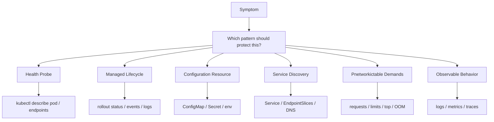

### Secuencia

1. ¿What comportamiento esperabas?
2. ¿What patrón lo cubría?
3. ¿The app cumple su parte?
4. ¿The manifest cumple su parte?
5. ¿Kubernetes está recibiendo the señal correcta?
6. ¿Hay tests que validen the patrón?
7. ¿Hay runbook?
8. ¿The patrón está bad aplicado or falta?
### Criterio of comprensión

Debes poder explicar:

> Troubleshooting of patterns consiste in encontrar what contrato between application and plataforma se rompió.

---

# 13.16. Criterio of output of the module

You can pasar to the module 14 when puedas hacer everything esto without seguir a receta ciegamente.

## Concepts

Debes poder explicar:

- What son Cloud native patterns
- By what Kubernetes does not arregla an application bad diseñada
- What es Pnetworkictable Demands
- What es Declarative Deployment
- What es Health Probe
- What es Managed Lifecycle
- What es Automated Placement
- What es Batch Job
- What es Periodic Job
- What es Daemon Service
- What es Singleton Service
- What es Stateful Service
- What es Service Discovery
- What es Self Awareness
- What es Init Container
- What es Sidecar
- What es Adapter
- What es Ambassador
- What es EnvVar Configuration
- What es Configuration Resource
- What es Immutable Configuration
- What es Configuration Template
- What es Controller
- What es Operator
- What es Elastic Scale
- What es Observable Behavior
- Cuándo a patrón ayuda
- Cuándo a patrón es sobreingeniería
## Practice

Debes poder:

- Revisar `checkout-api` desde patterns
- Identificar evidencia in manifests
- Run inspecciones with Taskfile
- Validate probes
- Validate resources
- Validate Service Discovery
- Validate configuration
- Validate security
- Validate signals operativas
- Create a pattern review
- Create pattern decision records
- Create anti-patterns
- Explicar what patterns not usarías and by what
## DevEx

Debes poder run:

```bash
task patterns:resources:inspect
task patterns:probes:inspect
task patterns:lifecycle:inspect
task patterns:service-discovery:inspect
task patterns:configuration:inspect
task patterns:security:inspect
task patterns:observability:inspect
task patterns:review
task patterns:test
```

## Frase final of comprensión

Debes poder explicar this frase:

> The Cloud native patterns not son trucos of YAML. Son contratos of diseño between application and plataforma for que Kubernetes pueda desplegar, observar, scale, aislar, recuperar and evolucionar a sistema with less riesgo.

---

# 13.17. References oficiales and fuentes primarias

|Tema|Referencia|
|---|---|
|Workloads|Kubernetes Docs, Workloads. ([Kubernetes](https://kubernetes.io/docs/concepts/workloads/ "Workloads"))|
|Pod lifecycle|Kubernetes Docs, Pod Lifecycle. ([Kubernetes](https://kubernetes.io/docs/concepts/workloads/pods/pod-lifecycle/ "Pod Lifecycle"))|
|Liveness, readiness and startup probes|Kubernetes Docs, Configure Liveness, Readiness and Startup Probes. ([Kubernetes](https://kubernetes.io/docs/tasks/configure-pod-container/configure-liveness-readiness-startup-probes/ "Configure Liveness, Readiness and Startup Probes"))|
|Container lifecycle hooks|Kubernetes Docs, Container Lifecycle Hooks. ([Kubernetes](https://kubernetes.io/docs/concepts/containers/container-lifecycle-hooks/ "Container Lifecycle Hooks"))|
|Sidecar containers|Kubernetes Docs, Sidecar Containers. ([Kubernetes](https://kubernetes.io/docs/concepts/workloads/pods/sidecar-containers/ "Sidecar Containers"))|
|Sidecar KEP|Kubernetes Enhancements, KEP-753 Sidecar Containers. ([GitHub](https://github.com/kubernetes/enhancements/blob/master/keps/sig-node/753-sidecar-containers/README.md "KEP-753: Sidecar containers - kubernetes/enhancements"))|
|Operator pattern|Kubernetes Docs, Operator Pattern. ([Kubernetes](https://kubernetes.io/docs/concepts/extend-kubernetes/operator/ "Operator pattern"))|
|Kubernetes Patterns examples|Kubernetes Patterns examples repository. ([GitHub](https://github.com/k8spatterns/examples "Examples for \"Kubernetes Patterns - Reusable Elements ..."))|
|CKAD curriculum reference|Linux Foundation, CKAD. ([Linux Foundation - Education](https://training.linuxfoundation.org/certification/certified-kubernetes-application-developer-ckad/ "Certified Kubernetes Application Developer (CKAD)"))|

# 13.18. Lecturas of apoyo

|Libro|What read|
|---|---|
|_Kubernetes Patterns_|Libro principal for this module: patterns fundacionales, comportamentales, estructurales, of configuration and avanzados.|
|_Kubernetes Patterns_|Health Probe, Managed Lifecycle, Automated Placement, Batch Job, Periodic Job, Daemon Service, Singleton Service, Stateful Service, Service Discovery, Init Container, Sidecar, Adapter, Ambassador, Controller, Operator and Elastic Scale.|
|_Kubernetes in Action_|Chapter 17 como apoyo for lifecycle, shutdown, logs, manifests, desarrollo and good practices.|
|_Kubernetes: Up and Running_|Capítulos about Pods, Deployments, Jobs, DaemonSets, ConfigMaps, Services, RBAC and real applications.|
|_Cloud Native DevOps with Kubernetes_|Capítulos about workloads, resources, probes, observability, deployment strategies, Helm, Kustomize and operación.|

<!-- COURSE_NAV_START -->
[Previous](<12. Operations, observability, and reliability with Grafana LGTM.md>) | [Index](README.md) | [Next](<14. Extending Kubernetes.md>)
<!-- COURSE_NAV_END -->
