<!-- COURSE_NAV_START -->
[Previous](13.%20Cloud%20native%20patterns.md) | [Index](README.md) | [Next](15.%20Professionalization%20by%20role.md)
<!-- COURSE_NAV_END -->

# 14. Extending Kubernetes

## Objective of the module

In the module 13 aprendiste Cloud native patterns:

```text
Health Probe
Managed Lifecycle
Service Discovery
Configuration Resource
Controller
Operator
Elastic Scale
Observable Behavior
```

Ahora toca understand a of the ideas more potentes of Kubernetes:

> Kubernetes is not only a plataforma for run workloads. Also es a plataforma extensible.

Hasta ahora has usado objetos que Kubernetes already conoce:

```text
Pod
Deployment
Service
ConfigMap
Secret
Job
CronJob
PersistentVolumeClaim
NetworkPolicy
Ingress
```

But Kubernetes permite añadir nuevos tipos of Resources and nuevos comportamientos to the cluster.

That es lo que hace possible que tools como cert-manager, External Secrets Operator, Argo CD, Crossplane, Prometheus Operator, Gateway API implementations, storage drivers, network plugins and muchos operators funcionen como if fueran parte natural of the sistema.

The documentación oficial explica que Kubernetes es altamente configurable and extensible, and que normalmente not hace falta modificar the code of the proyecto Kubernetes for adaptarlo. Also separa varias formas of extension: Custom Resources, API aggregation, admission webhooks, plugins of network, plugins of storage CSI, device plugins and otros mecanismos. ([Kubernetes](https://kubernetes.io/docs/concepts/extend-kubernetes/ "Extending Kubernetes"))

The idea central of the module es this:

> Extender Kubernetes significa añadir nuevos contratos to the cluster. A CRD añade vocabulario. A controller añade comportamiento. A operator añade conocimiento operacional. A webhook añade decisión in admisión. A plugin añade capacidad technical to the plataforma.

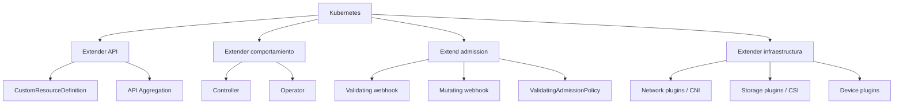

---

## 14.1. What you are going to learn and what not you are going to learn yet

You are going to learn:

- What it means extender Kubernetes
- What problema resuelve a Custom Resource
- What problema resuelve a CRD
- What diferencia hay between CRD and Custom Resource
- By what a CRD without controller only almacena datos
- What es a controller
- What es reconciliation
- What es a operator
- What es `spec`
- What es `status`
- What es `status subresource`
- What son finalizers
- What son owner references
- What es versionado of CRDs
- What son conversiones of versiones
- What es admission control
- What son admission webhooks
- What riesgos tienen the webhooks
- What es API aggregation
- What son network plugins
- What es CSI
- What son device plugins
- Cuándo extender Kubernetes tiene sentido
- Cuándo extender Kubernetes es sobreingeniería
- How create a CRD `BackupPolicy`
- How create Custom Resources of ejemplo
- How validate schema
- How understand the ciclo of reconciliación without implementar yet a operator completo
- How mejorar DevEx with Taskfile
Not vamos to profundizar yet in:

- Implementar a operator productivo
- Programar a controller completo
- Go advanced
- Kubebuilder completo
- controller-runtime in profundidad
- Conversion webhooks productivos
- Admission webhooks productivos
- API servers agregados productivos
- Desarrollo of CNI
- Desarrollo of CSI
- Desarrollo of device plugins
- Security advanced of controllers
- Multi-tenancy of platform APIs
- Upgrade real of CRDs in producción
- Certificados and high availability of webhooks
- Performance of the API Server with miles of Custom Resources
The regla pedagógica of the module será:

```text
First, problem
Then extension
Then API contract
Then expected behavior
Then risks
Then small practice
Then exit criterion
```

---

## 14.2. The problema: Kubernetes does not conoce tu dominio

Kubernetes sabe what es a Deployment.

But not sabe what es esto:

```text
BackupPolicy
RefundWorkflow
TenantEnvironment
DatabaseCluster
FeatureEnvironment
CertificateIssuer
ReleasePromotion
```

You can representar muchas cosas with ConfigMaps and Jobs, but llega a punto where that se vuelve pobre:

- Not hay schema claro
- Not hay validación of the contrato
- Not hay status
- Not hay reconciliación
- Not hay lifecycle
- Not hay ownership
- Not hay finalizers
- Not hay experiencia nativa with `kubectl`
- Not hay a API of plataforma for equipos
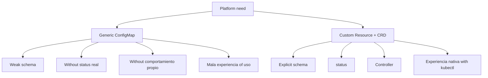

### Ejemplo realista of the course

Queremos expresar esto:

> For the namespace `shop`, quiero a política of backup diaria for PostgreSQL, with retención of 7 días and a ventana horaria preferida.

Podríamos create a CronJob manual.

But como concept of plataforma, podríamos querer a recurso propio:

```yaml
apiVersion: platform.example.com/v1alpha1
kind: BackupPolicy
metadata:
  name: postgres-daily
  namespace: shop
spec:
  targetRef:
    kind: PersistentVolumeClaim
    name: postgres-data
  schedule: "0 2 * * *"
  retentionDays: 7
```

That not hace nada by yes only.

But yes creates a lenguaje.

The controller sería quien convertiría that deseo in Jobs, snapshots, backups or integraciones with Velero.

### Criterio of comprensión

Debes poder explicar:

> A CRD permite que Kubernetes entienda a nuevo tipo of recurso. A controller permite que that recurso produzca comportamiento.

---

## 14.3. Custom Resource and CRD

### What problema resuelven

A Custom Resource es a extension of the API of Kubernetes. The documentación oficial lo define como a extension of Kubernetes API que not está necesariamente disponible in all the clusters. Kubernetes permite añadir Custom Resources principalmente mediante CustomResourceDefinitions or mediante API aggregation. ([Kubernetes](https://kubernetes.io/docs/concepts/extend-kubernetes/api-extension/custom-resources/ "Custom Resources"))

### Diferencia esencial

|Concept|What es|
|---|---|
|CRD|The definición of the nuevo tipo of recurso|
|Custom Resource|A instancia concreta of that tipo|
|Controller|The componente que observa esas instancias and actúa|
|Operator|A controller que automatiza conocimiento operacional about an application or sistema|

### Ejemplo

The CRD dice:

```text
Existe un tipo llamado BackupPolicy.
Tiene estos campos.
Vive en este API group.
Tiene estas versiones.
It can be validated like this.
```

The Custom Resource dice:

```text
Quiero una BackupPolicy llamada postgres-daily to este PVC.
```

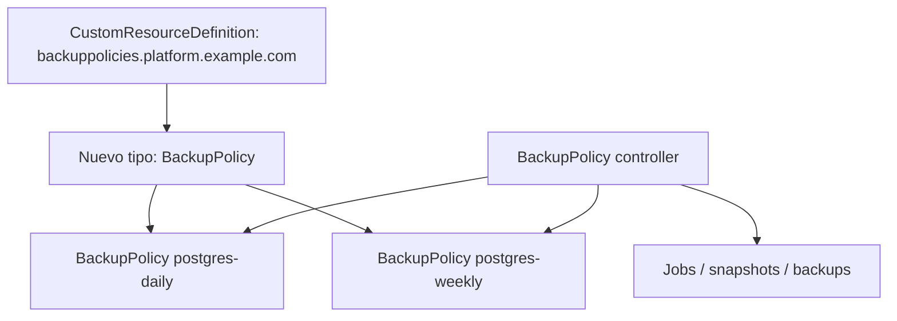

### Regla didáctica

Not llames CRD to everything.

Esto es the CRD:

```text
CustomResourceDefinition backuppolicies.platform.example.com
```

Esto es a Custom Resource:

```text
BackupPolicy postgres-daily
```

### Criterio of comprensión

Debes poder explicar:

> The CRD define the tipo. The Custom Resource es a objeto of that tipo. The controller le da comportamiento.

---

## 14.4. `spec` and `status`

### What problema resuelven

Kubernetes separa intención and realidad.

`spec` expresa lo que quieres.

`status` expresa lo que the sistema observa.

Esto already lo has visto in Deployments and Pods.

In tus propios Resources you should mantener the same separación.

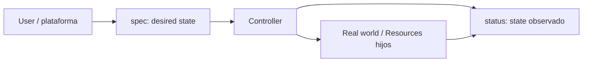

### Ejemplo

```yaml
spec:
  schedule: "0 2 * * *"
  retentionDays: 7
  targetRef:
    kind: PersistentVolumeClaim
    name: postgres-data

status:
  lastBackupTime: "2026-05-13T02:00:00Z"
  lastBackupStatus: Succeeded
  observedGeneration: 3
  conditions:
    - type: Ready
      status: "True"
```

### Status subresource

The documentación oficial explica que, when se habilita the `status subresource` in a CRD, the subrecurso `/status` queda expuesto for the Custom Resource. The actualizaciones to `/status` ignoran cambios fuera of `.status` and validan the parte of status según corresponda. ([Kubernetes](https://kubernetes.io/docs/tasks/extend-kubernetes/custom-resources/custom-resource-definitions/ "Extend Kubernetes API with CustomResourceDefinitions"))

### Why it matters

Without `status`, the user only ve lo que pidió.

With `status`, can see what ha pasado.

```bash
kubectl get backuppolicy postgres-daily -n shop -o yaml
```

### Criterio of comprensión

Debes poder explicar:

> `spec` es intención. `status` es observación. A controller professional actualiza `status` for que the user not tenga que adivinar what ocurrió.

---

## 14.5. CRD `BackupPolicy`

### What problema resuelve

Queremos create a API pequeña and realista for expresar políticas of backup.

Not vamos to implementar yet the controller.

First we are going to create the contrato.

### Estructura esperada

```text
kubernetes/
  12-extension/
    crd-backuppolicy.yaml
    postgres-daily-backuppolicy.yaml
    postgres-weekly-backuppolicy.yaml
```

### Manifest of the CRD

Creates:

```text
kubernetes/12-extension/crd-backuppolicy.yaml
```

Contenido:

```yaml
apiVersion: apiextensions.k8s.io/v1
kind: CustomResourceDefinition
metadata:
  name: backuppolicies.platform.example.com
spec:
  group: platform.example.com
  scope: Namespaced
  names:
    plural: backuppolicies
    singular: backuppolicy
    kind: BackupPolicy
    shortNames:
      - bkp
  versions:
    - name: v1alpha1
      served: true
      storage: true
      subresources:
        status: {}
      additionalPrinterColumns:
        - name: Schedule
          type: string
          jsonPath: .spec.schedule
        - name: Retention
          type: integer
          jsonPath: .spec.retentionDays
        - name: Target
          type: string
          jsonPath: .spec.targetRef.name
        - name: Ready
          type: string
          jsonPath: .status.conditions[?(@.type=="Ready")].status
      schema:
        openAPIV3Schema:
          type: object
          required:
            - spec
          properties:
            spec:
              type: object
              required:
                - targetRef
                - schedule
                - retentionDays
              properties:
                targetRef:
                  type: object
                  required:
                    - kind
                    - name
                  properties:
                    kind:
                      type: string
                      enum:
                        - PersistentVolumeClaim
                    name:
                      type: string
                      minLength: 1
                schedule:
                  type: string
                  minLength: 1
                retentionDays:
                  type: integer
                  minimum: 1
                  maximum: 365
                suspend:
                  type: boolean
                  default: false
            status:
              type: object
              properties:
                observedGeneration:
                  type: integer
                lastBackupTime:
                  type: string
                  format: date-time
                lastBackupStatus:
                  type: string
                  enum:
                    - Unknown
                    - Running
                    - Succeeded
                    - Failed
                conditions:
                  type: array
                  items:
                    type: object
                    required:
                      - type
                      - status
                    properties:
                      type:
                        type: string
                      status:
                        type: string
                        enum:
                          - "True"
                          - "False"
                          - Unknown
                      reason:
                        type: string
                      message:
                        type: string
```

### What estás declarando

|Campo|Significado|
|---|---|
|`group`|Grupo of API propio|
|`scope: Namespaced`|Each BackupPolicy vive in a namespace|
|`names.kind`|Tipo visible for the user|
|`shortNames`|Alias for `kubectl get bkp`|
|`versions`|Versiones servidas by the API|
|`storage: true`|Versión usada for persistir|
|`schema`|Validación estructural|
|`status`|Subrecurso for state observado|
|`additionalPrinterColumns`|Columnas útiles in `kubectl get`|

### Apply

```bash
kubectl apply -f kubernetes/12-extension/crd-backuppolicy.yaml
```

### Validate que exists

```bash
kubectl get crd backuppolicies.platform.example.com
kubectl api-resources | grep -i backuppolicy
kubectl explain backuppolicy
kubectl explain backuppolicy.spec
```

### Criterio of comprensión

Debes poder explicar:

> The CRD creates a nuevo tipo of recurso validado by the API Server. Yet not creates backups.

---

## 14.6. Create Custom Resources `BackupPolicy`

### What problema resuelve

Ahora que the API Server conoce the tipo `BackupPolicy`, podemos create instancias.

### Backup diario

Creates:

```text
kubernetes/12-extension/postgres-daily-backuppolicy.yaml
```

Contenido:

```yaml
apiVersion: platform.example.com/v1alpha1
kind: BackupPolicy
metadata:
  name: postgres-daily
  namespace: shop
  labels:
    app.kubernetes.io/name: postgres
    app.kubernetes.io/component: backup
    app.kubernetes.io/part-of: shop
spec:
  targetRef:
    kind: PersistentVolumeClaim
    name: postgres-data
  schedule: "0 2 * * *"
  retentionDays: 7
  suspend: false
```

### Backup semanal

Creates:

```text
kubernetes/12-extension/postgres-weekly-backuppolicy.yaml
```

Contenido:

```yaml
apiVersion: platform.example.com/v1alpha1
kind: BackupPolicy
metadata:
  name: postgres-weekly
  namespace: shop
  labels:
    app.kubernetes.io/name: postgres
    app.kubernetes.io/component: backup
    app.kubernetes.io/part-of: shop
spec:
  targetRef:
    kind: PersistentVolumeClaim
    name: postgres-data
  schedule: "0 3 * * 0"
  retentionDays: 30
  suspend: false
```

### Apply

```bash
kubectl apply -f kubernetes/12-extension/postgres-daily-backuppolicy.yaml
kubectl apply -f kubernetes/12-extension/postgres-weekly-backuppolicy.yaml
```

### See

```bash
kubectl get backuppolicies -n shop
kubectl get bkp -n shop
kubectl get bkp postgres-daily -n shop -o yaml
```

### What verás

Verás the objetos.

But not verás backups reales.

That es correcto.

Yet not hay controller.

### Criterio of comprensión

Debes poder explicar:

> Create a Custom Resource not ejecuta comportamiento by yes same. Only creates a objeto in the API.

---

## 14.7. Validación of schema

### What problema resuelve

Unot of the valores of a CRD es que the API Server can validate forma and tipos.

Queremos evitar Resources bad formados.

### Recurso inválido

Creates:

```text
kubernetes/12-extension/invalid-backuppolicy.yaml
```

Contenido:

```yaml
apiVersion: platform.example.com/v1alpha1
kind: BackupPolicy
metadata:
  name: invalid-backup
  namespace: shop
spec:
  targetRef:
    kind: PersistentVolumeClaim
    name: postgres-data
  schedule: ""
  retentionDays: 0
```

### Apply

```bash
kubectl apply -f kubernetes/12-extension/invalid-backuppolicy.yaml
```

### Resultado esperado

The API Server should rechazarlo because:

- `schedule` tiene `minLength: 1`
- `retentionDays` tiene minimum `1`
### Validate without persistir

```bash
kubectl apply --dry-run=server -f kubernetes/12-extension/invalid-backuppolicy.yaml
```

### Criterio of comprensión

Debes poder explicar:

> The schema of the CRD permite rechazar Resources inválidos before of que a controller tenga que interpretarlos.

---

## 14.8. Controller and reconciliation

### What problema resuelve

A controller observa Resources and actúa for que the state real se acerque to the state deseado.

Kubernetes already funciona así internamente.

The Deployment controller observa Deployments and ReplicaSets.

The Job controller observa Jobs and Pods.

A controller propio podría observar BackupPolicies and create Jobs, snapshots or Resources of Velero.

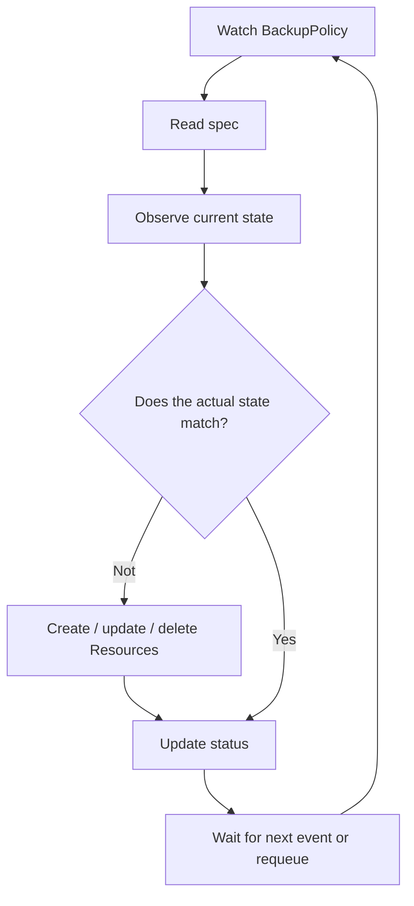

### Reconciliation loop

The ciclo típico:

1. Observa a recurso
2. Lee `spec`
3. Lee Resources relacionados
4. Compara state deseado and real
5. Creates, actualiza or borra Resources
6. Actualiza `status`
7. Repite
### For `BackupPolicy`

A controller real podría hacer:

|`BackupPolicy.spec`|Acción of the controller|
|---|---|
|`schedule`|Create or update CronJob|
|`targetRef`|Validate que the PVC exists|
|`retentionDays`|Configurar cleanup|
|`suspend`|Suspender CronJob|
|borrado of the recurso|Run limpieza with finalizer|
|resultado of the backup|Update `status`|

### Without controller

The recurso queda así:

```text
Objeto almacenado
Schema validado
No automatic behavior
Sin status real
```

### Criterio of comprensión

Debes poder explicar:

> The controller es the puente between the intención declarada in `spec` and the cambios reales in the cluster or in sistemas externos.

---

## 14.9. Operator

### What problema resuelve

A operator es a controller especializado que automatiza conocimiento operacional.

The documentación oficial define Operators como extensiones software que use Custom Resources for gestionar applications and sus componentes, siguiendo principios of Kubernetes and especialmente the control loop. ([Kubernetes](https://kubernetes.io/docs/concepts/extend-kubernetes/ "Extending Kubernetes"))

### Diferencia between controller and operator

|Concept|Diferencia practice|
|---|---|
|Controller|Reconciliador genérico of state|
|Operator|Controller que codifica conocimiento operacional of an application or dominio|

### Ejemplos of conocimiento operacional

A operator can saber:

- How install
- How update
- How hacer backup
- How restaurar
- How rotar certificados
- How hacer failover
- How update `status`
- How limpiar Resources externos
- How validate precondiciones
- How manejar versiones
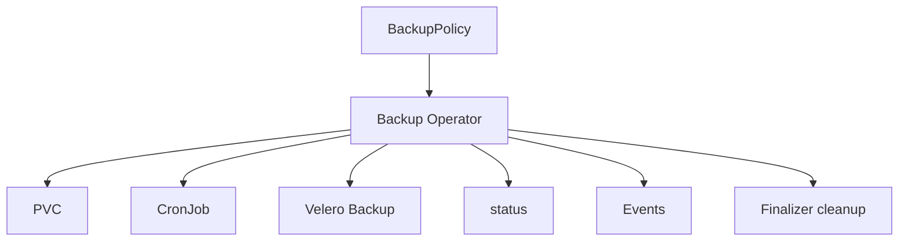

### Cuidado

A operator is not a forma elegante of esconder YAML.

A operator merece the pena when automatiza decisiones operacionales repetitivas and with suficiente complejidad.

### Criterio of comprensión

Debes poder explicar:

> Operator significa automatizar operación, not only generate manifests.

---

## 14.10. Finalizers

### What problema resuelven

TO veces, before of delete a recurso, you need run limpieza.

Ejemplos:

- Delete backup externo
- Desregistrar algo in a proveedor
- Liberar a recurso externo
- Hacer snapshot final
- Remove cnetworkenciales creadas dinámicamente
Kubernetes documenta finalizers como claves que indican que a recurso not can removese completamente hasta que se cumplan ciertas condiciones. Also explica su relación with owner references and limpieza of objetos. ([Kubernetes](https://kubernetes.io/docs/concepts/overview/working-with-objects/finalizers/ "Finalizers"))

### How it works

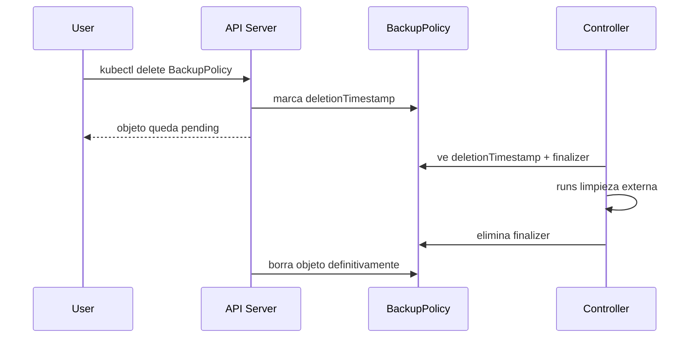

### Ejemplo conceptual

```yaml
metadata:
  finalizers:
    - platform.example.com/backuppolicy-cleanup
```

### Riesgo

If the controller desaparece or fails and the finalizer not se elimina, the recurso can quedarse atascado in state of eliminación.

### Commands of diagnóstico

```bash
kubectl get bkp postgres-daily -n shop -o json | jq '.metadata.finalizers, .metadata.deletionTimestamp'
kubectl describe bkp postgres-daily -n shop
```

### Criterio of comprensión

Debes poder explicar:

> Finalizer retrasa the borrado definitivo for que a controller pueda limpiar Resources before of que the objeto desaparezca.

---

## 14.11. Owner references

### What problema resuelven

When a objeto creates otros objetos, Kubernetes needs saber quién es dueño of quién for poder limpiar dependencies.

The documentación oficial explica que the objetos dependientes tienen `metadata.ownerReferences` apuntando to su dueño, and que Kubernetes uses esas relaciones for garbage collection. ([Kubernetes](https://kubernetes.io/docs/concepts/overview/working-with-objects/owners-dependents/ "Owners and Dependents"))

### Ejemplo mental

A BackupPolicy controller podría create a CronJob.

That CronJob should tener owner reference hacia the BackupPolicy.

If borras the BackupPolicy, Kubernetes can limpiar the CronJob dependiente.

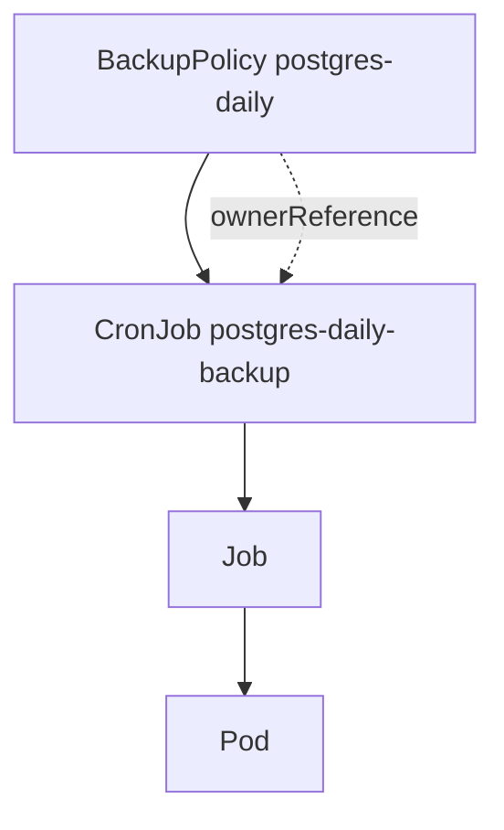

### Diferencia between label and ownerReference

|Mecanismo|Uso|
|---|---|
|Label|Selección, agrupación, consultas|
|OwnerReference|Relación of propiedad and garbage collection|

### Criterio of comprensión

Debes poder explicar:

> The labels ayudan to encontrar objetos. Owner references expresan dependencia and permiten limpieza automática.

---

## 14.12. Versionado of CRDs

### What problema resuelve

Tu API cambiará.

If publicas a CRD for otros equipos, you need evolucionarlo without romper to all.

The documentación oficial of versionado of CRDs explica how añadir información of versiones, indicar estabilidad and avanzar the API to nuevas versiones, incluyendo conversiones between representaciones. ([Kubernetes](https://kubernetes.io/docs/tasks/extend-kubernetes/custom-resources/custom-resource-definition-versioning/ "Versions in CustomResourceDefinitions"))

### Ejemplo

Empiezas with:

```text
platform.example.com/v1alpha1
```

After podrías añadir:

```text
platform.example.com/v1beta1
platform.example.com/v1
```

### Campos importbefore

|Campo|Significado|
|---|---|
|`served`|The versión se can use in the API|
|`storage`|The versión in the que se persisten objetos|
|conversion webhook|Convierte between versiones if the estructuras cambian|

### Regla

Not uses `v1` if yet estás aprendiendo the contrato.

For the course, `v1alpha1` es correcto because the API es experimental.

### Criterio of comprensión

Debes poder explicar:

> Versionar CRDs es diseñar evolución of API. It is not only cambiar a string in `apiVersion`.

---

## 14.13. Admission control and webhooks

### What problema resuelven

RBAC responde:

> ¿Quién can pedir algo?

Admission responde:

> Although tenga permiso, ¿shouldmos aceptar or modificar this objeto?

The documentación oficial define admission controllers como piezas que interceptan requests to the API Server before of persistir the recurso, after of autenticación and autorización. ([Kubernetes](https://kubernetes.io/docs/reference/access-authn-authz/admission-controllers/ "Admission Control in Kubernetes"))

### Tipos

|Tipo|What hace|
|---|---|
|Validating admission|Permite or rechaza|
|Mutating admission|Modifica the objeto before of savelo|
|ValidatingAdmissionPolicy|Validación declarativa with CEL|
|Webhook|Service external que decide or muta|

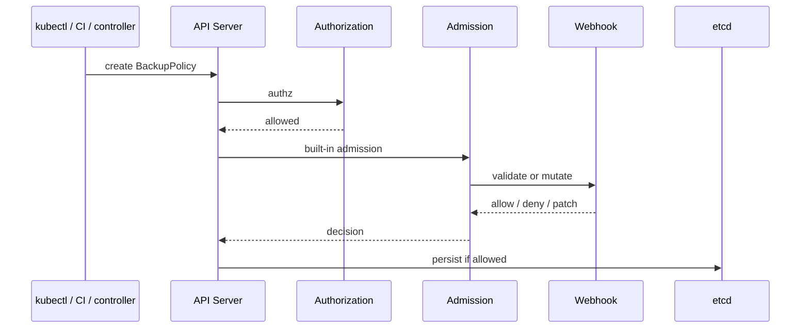

### Ejemplos

A validating webhook podría rechazar:

- BackupPolicy with horario fuera of ventana permitida
- BackupPolicy que apunta to PVC inexistente
- BackupPolicy with retención mayor to the permitida by the tenant
- Recurso without labels obligatorias
A mutating webhook podría añadir:

- Labels estándar
- Defaults
- Annotations
- Valores of environment
- Sidecars
### Good practices

Kubernetes mantiene a guide específica of good practices for admission webhooks. The webhooks must diseñarse with cuidado because están in the path crítico of creación and actualización of Resources. ([Kubernetes](https://kubernetes.io/docs/concepts/cluster-administration/admission-webhooks-good-practices/ "Admission Webhook Good Practices"))

### Criterio of comprensión

Debes poder explicar:

> Admission webhook es a extension poderosa, but if fails or está bad diseñado can bloquear the flujo of cambios of the cluster.

---

## 14.14. API aggregation

### What problema resuelve

CRDs son the forma more común of añadir tipos of Resources.

But not son the única.

The API aggregation layer permite extender Kubernetes with APIs adicionales more allá of the APIs core. The documentación oficial explica que the aggregation layer es diferente of the CRDs: the CRDs hacen que kube-apiserver reconozca nuevos tipos of objeto, while que the aggregation layer permite registrar APIs adicionales servidas by otro API server. ([Kubernetes](https://kubernetes.io/docs/concepts/extend-kubernetes/api-extension/apiserver-aggregation/ "Kubernetes API Aggregation Layer"))

### Cuándo considerar API aggregation

May have sentido if you need:

- API with comportamiento very específico
- Lógica of serving advanced
- Integración que not encaja bien with CRDs
- API server separado
- Métricas or Resources agregados especiales
### Ejemplo conocido

Metrics Server uses a API agregada for expose métricas of Resources to the cluster.

### For the course

Not vamos to implementar API aggregation.

Only you need to understand cuándo exists and by what is not the primer paso.

### Criterio of comprensión

Debes poder explicar:

> API aggregation extiende Kubernetes with APIs servidas by a API server adicional. For the mayoría of extensiones of dominio, empieza by CRDs.

---

## 14.15. Extensiones of infraestructura: CNI, CSI and Device Plugins

### What problema resuelven

Not all the extensiones son APIs of dominio.

Algunas añaden capacidades of infraestructura.

### Network plugins

Kubernetes requiere a plugin CNI for implementar su modelo of network. The documentación oficial indica que the CNI plugins son necesarios for cluster networking and must ser compatibles with the cluster and with the especificación CNI adecuada. ([Kubernetes](https://kubernetes.io/docs/concepts/extend-kubernetes/compute-storage-net/network-plugins/ "Network Plugins"))

Ejemplos of capacidades:

- Conectividad of Pods
- NetworkPolicy
- eBPF
- Routing
- Encryption
- Observability of network
### CSI

Container Storage Interface permite extender Kubernetes with nuevos tipos of volúmenes. Kubernetes documenta CSI como the mecanismo recomendado for storage plugins, while FlexVolume está deprecado desde Kubernetes v1.23 in favor of CSI. ([Kubernetes](https://kubernetes.io/docs/concepts/extend-kubernetes/ "Extending Kubernetes"))

Ejemplos of capacidades:

- Volúmenes cloud
- Snapshots
- Expansion
- StorageClasses
- Drivers of storage externos
### Device plugins

Device plugins permiten configurar the cluster with soporte for Resources que requieren configuration específica of vendor, como GPUs, NICs, FPGAs or memoria not volátil. Kubernetes documenta the device plugin framework como mecanismo for anunciar Resources hardware to the kubelet. ([Kubernetes](https://kubernetes.io/docs/concepts/extend-kubernetes/compute-storage-net/device-plugins/ "Device Plugins"))

### Criterio of comprensión

Debes poder explicar:

> CNI extiende network, CSI extiende storage and Device Plugins extienden acceso to hardware especializado. Not son operators of application, son capacidades of plataforma.

---

## 14.16. Ruta of implementación: manual, Kubebuilder or Operator SDK

### What problema resuelve

Create CRDs to manot sirve for learn.

But a controller real needs estructura, tests, RBAC, manifests, manager, reconciliation and packaging.

Kubebuilder se presenta como a tool for build Kubernetes APIs usando CRDs, and su libro oficial cubre create a proyecto, create a API, run localmente and run dentro of the cluster. ([book.kubebuilder.io](https://book.kubebuilder.io/ "The Kubebuilder Book: Introduction"))

### Rutas possible

|Ruta|Uso|
|---|---|
|YAML manual|Learn CRD and Custom Resources|
|Kubebuilder|Build APIs/controllers with Go and controller-runtime|
|Operator SDK|Ruta operator-oriented dentro of the ecosistema Operator Framework|
|Kopf|Controllers in Python, útil in algunos equipos, is not the ruta principal oficial of Kubernetes|
|Kube-rs|Controllers in Rust, útil if tu team trabaja in Rust|

### Decisión of the course

The practice obligatoria será YAML manual + modelo of controller.

The practice opcional será Kubebuilder.

Motivo:

- The course not must convertir this module in a formación of Go
- The objective ahora es understand the modelo of extension
- Kubebuilder es a ruta professional válida, but requiere more tiempo
### Criterio of comprensión

Debes poder explicar:

> Learn CRDs not obliga to implementar a controller completo the primer día. First debes understand the contrato API and the ciclo of reconciliación.

---

## 14.17. Security and blast radius of controllers

### What problema resuelve

A controller may have mucho poder.

If observa muchos namespaces and can create, update or delete Resources, su blast radius may be grande.

### Riesgos

- RBAC demasiado amplio
- Bugs que create demasiados Resources
- Finalizers atascados
- Borrados accidentales
- Reconciliación in bucle
- Status updates demasiado frecuentes
- Webhooks que bloquean admisión
- CRDs with schema demasiado permisivo
- Resources externos huérfanos
- Owner references incorrectas
- Logs without contexto
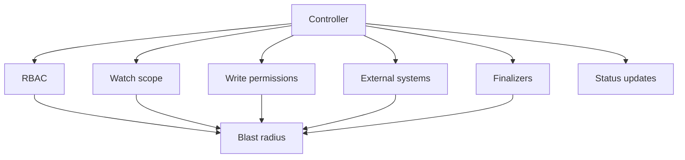

### Reglas mínimas

- Scope limitado if es possible
- RBAC minimum
- Reconciliation idempotente
- Finalizers with timeout and recuperación
- Status claro
- Events útiles
- Logs estructurados
- Métricas of the controller
- Tests of policies
- Tests of reconciliación
- Rate limiting
- Backoff
- Alertas about errores of reconciliación
### Criterio of comprensión

Debes poder explicar:

> A controller es software with permisos dentro of the cluster. It must diseñarse, testearse and operarse como parte crítica of the plataforma.

---

## 14.18. Failure lab 1: CR inválido

### What queremos check

Queremos see que the API Server rechaza a Custom Resource que not cumple schema.

### Run

```bash
kubectl apply --dry-run=server -f kubernetes/12-extension/invalid-backuppolicy.yaml
```

### Señal esperada

- Error of validación
- Not is created the objeto
### Preguntas

- ¿What campo fails?
- ¿Lo detecta the API Server?
- ¿Lo detectaría a controller?
- ¿By what es better fail before?
### Criterio of comprensión

Debes poder explicar:

> Schema validation evita que Resources claramente inválidos entren to the sistema.

---

## 14.19. Failure lab 2: CRD without controller

### What queremos check

Queremos demostrar que create a CR not implica comportamiento.

### Run

```bash
kubectl apply -f kubernetes/12-extension/postgres-daily-backuppolicy.yaml
kubectl get bkp -n shop
kubectl get cronjob -n shop
kubectl get job -n shop
```

### Señal esperada

- BackupPolicy exists
- Not aparece CronJob nuevo creado automáticamente
- Not aparece Job of backup
- `status` not cambia by yes only
### Preguntas

- ¿What falta?
- ¿By what not is created ningún backup?
- ¿What tendría que hacer the controller?
- ¿What should aparecer in `status`?
### Criterio of comprensión

Debes poder explicar:

> A Custom Resource without controller es intención almacenada, not automatización.

---

## 14.20. Failure lab 3: finalizer atascado, conceptual

### What queremos check

Queremos understand a failure típico: a recurso se queda borrando because tiene a finalizer and the controller not lo limpia.

### Manifest conceptual

Not lo aplicamos como practice obligatoria because without controller only createíamos a atasco artificial.

But debes saber diagnosticarlo:

```bash
kubectl get bkp postgres-daily -n shop -o json | jq '.metadata.finalizers, .metadata.deletionTimestamp'
kubectl describe bkp postgres-daily -n shop
```

### Señal esperada

- `deletionTimestamp` presente
- `finalizers` presente
- Objeto not desaparece
### Acción in producción

Not elimines finalizers to manot without understand what limpieza pendiente representan.

Hacerlo can dejar Resources externos huérfanos.

### Criterio of comprensión

Debes poder explicar:

> Quitar a finalizer manualmente can liberar the objeto, but also can saltarse a limpieza necessary.

---

## 14.21. Taskfile of the module 14

Añade these tasks to the `Taskfile.yml`.

```yaml
  extension:crd:apply:
    desc: Apply BackupPolicy CRD
    cmds:
      - kubectl apply -f kubernetes/12-extension/crd-backuppolicy.yaml

  extension:crd:delete:
    desc: Delete BackupPolicy CRD and all its custom resources
    cmds:
      - kubectl delete -f kubernetes/12-extension/crd-backuppolicy.yaml --ignore-not-found

  extension:crd:status:
    desc: Show BackupPolicy CRD status and API resources
    cmds:
      - kubectl get crd backuppolicies.platform.example.com
      - kubectl api-resources | grep -i backuppolicy || true
      - kubectl explain backuppolicy || true
      - kubectl explain backuppolicy.spec || true

  extension:cr:apply:
    desc: Apply BackupPolicy custom resources
    cmds:
      - kubectl apply -f kubernetes/12-extension/postgres-daily-backuppolicy.yaml
      - kubectl apply -f kubernetes/12-extension/postgres-weekly-backuppolicy.yaml

  extension:cr:status:
    desc: Show BackupPolicy custom resources
    cmds:
      - kubectl get backuppolicies -n {{.NAMESPACE}}
      - kubectl get bkp -n {{.NAMESPACE}} -o yaml

  extension:cr:describe:
    desc: Describe postgres-daily BackupPolicy
    cmds:
      - kubectl describe bkp postgres-daily -n {{.NAMESPACE}}

  extension:cr:invalid:dry-run:
    desc: Validate invalid BackupPolicy with server-side dry-run
    cmds:
      - kubectl apply --dry-run=server -f kubernetes/12-extension/invalid-backuppolicy.yaml || true

  extension:no-controller:check:
    desc: Show that BackupPolicy does not create behavior without a controller
    cmds:
      - kubectl get bkp -n {{.NAMESPACE}} || true
      - kubectl get cronjob -n {{.NAMESPACE}} || true
      - kubectl get job -n {{.NAMESPACE}} || true

  extension:status:check:
    desc: Show BackupPolicy status fields
    cmds:
      - kubectl get bkp postgres-daily -n {{.NAMESPACE}} -o json | jq '.status // {}'

  extension:finalizers:check:
    desc: Inspect finalizers and deletion timestamp for postgres-daily BackupPolicy
    cmds:
      - kubectl get bkp postgres-daily -n {{.NAMESPACE}} -o json | jq '.metadata.finalizers, .metadata.deletionTimestamp' || true

  extension:all:
    desc: Apply CRD and sample BackupPolicy resources
    cmds:
      - task extension:crd:apply
      - task extension:crd:status
      - task extension:cr:apply
      - task extension:cr:status
      - task extension:no-controller:check

  extension:test:
    desc: Run extension module checks
    cmds:
      - task extension:crd:apply
      - task extension:crd:status
      - task extension:cr:apply
      - task extension:cr:status
      - task extension:cr:invalid:dry-run
      - task extension:no-controller:check
      - task extension:status:check
```

### Criterio DevEx

Debes poder explicar:

> The DevEx of extension must permitir apply the CRD, create Resources, validate schema, inspect status and demostrar claramente que without controller not hay comportamiento.

---

## 14.22. Practice principal of the module

### Objective

Create a extension minimum of Kubernetes for expresar políticas of backup, without implementar yet the controller.

### Resultado esperado

```text
kubernetes-learning-lab/
  kubernetes/
    12-extension/
      crd-backuppolicy.yaml
      postgres-daily-backuppolicy.yaml
      postgres-weekly-backuppolicy.yaml
      invalid-backuppolicy.yaml

  docs/
    extension/
      backuppolicy-api.md
      backuppolicy-controller-design.md
      backuppolicy-risks.md
      backuppolicy-versioning.md

  Taskfile.yml
```

### Paso 1. Preparar cluster and namespace

```bash
task k8s:kind:create
task k8s:namespace:apply
```

### Paso 2. Apply CRD

```bash
task extension:crd:apply
task extension:crd:status
```

### Paso 3. Apply Custom Resources

```bash
task extension:cr:apply
task extension:cr:status
task extension:cr:describe
```

### Paso 4. Probar validación of schema

```bash
task extension:cr:invalid:dry-run
```

### Paso 5. Demostrar que not hay controller

```bash
task extension:no-controller:check
task extension:status:check
```

### Paso 6. Diseñar the controller in documentación

Creates:

```text
docs/extension/backuppolicy-controller-design.md
```

Contenido minimum:

```markdown
# BackupPolicy controller design

## Resource watched

BackupPolicy.platform.example.com/v1alpha1

## Desired state

For each BackupPolicy, create or update a CronJob that performs backups for the target PVC.

## Reconciliation steps

1. Read BackupPolicy.
2. Validate target PVC exists.
3. If suspend is false, create or update CronJob.
4. If suspend is true, suspend CronJob.
5. Set ownerReference on CronJob.
6. Update status.conditions.
7. Emit events.
8. On deletion, run finalizer cleanup if needed.
9. Remove finalizer.

## Status

- observedGeneration
- lastBackupTime
- lastBackupStatus
- Ready condition

## Failure modes

- PVC does not exist.
- Invalid schedule.
- CronJob creation denied by RBAC.
- Backup Job fails.
- Finalizer gets stuck.
- Too many status updates.
```

### Paso 7. Documentar riesgos

Creates:

```text
docs/extension/backuppolicy-risks.md
```

Incluye:

- CRD demasiado genérico
- Schema demasiado permisivo
- Controller with RBAC amplio
- Finalizers atascados
- OwnerReferences incorrectas
- Status without información útil
- Versionado roto
- Webhook bloqueando admisión
- Resources externos huérfanos
- Reconciliación not idempotente
- Loops agresivos
- Logs insuficientes
### Paso 8. Documentar versionado

Creates:

```text
docs/extension/backuppolicy-versioning.md
```

Incluye:

- By what `v1alpha1`
- What haría falta for `v1beta1`
- What cambios serían compatibles
- What cambios exigirían conversión
- What campos should nots renombrar without estrategia
- How comunicar deprecaciones
### Paso 9. Run test completo

```bash
task extension:test
```

### Paso 10. Limpiar

```bash
kubectl delete -f kubernetes/12-extension/postgres-weekly-backuppolicy.yaml --ignore-not-found
kubectl delete -f kubernetes/12-extension/postgres-daily-backuppolicy.yaml --ignore-not-found
task extension:crd:delete
task k8s:namespace:delete
task k8s:kind:delete
```

### Criterio of finalización

The practice está completa when you can explicar:

- What CRD has creado
- What Custom Resources has creado
- What valida the schema
- What not ocurre because not hay controller
- What should hacer a controller
- What should contener `status`
- What papel tendrían finalizers
- What papel tendrían ownerReferences
- What riesgos tendría operate this controller
- How evolucionarías of `v1alpha1` to `v1beta1`
---

## 14.23. Ejercicios cortos

### Ejercicio 1. CRD vs Custom Resource

Completa:

|Pregunta|Respuesta|
|---|---|
|¿Cuál es the CRD?||
|¿Cuál es the Custom Resource?||
|¿What creates the tipo `BackupPolicy`?||
|¿What creates `postgres-daily`?||
|¿By what not runs ningún backup?||

---

### Ejercicio 2. `spec` and `status`

Ejecuta:

```bash
kubectl get bkp postgres-daily -n shop -o yaml
```

Responde:

- ¿What hay in `spec`?
- ¿What hay in `status`?
- ¿By what `status` está vacío?
- ¿Quién should updatelo?
- ¿What campos of status serían útiles?
---

### Ejercicio 3. Schema validation

Ejecuta:

```bash
task extension:cr:invalid:dry-run
```

Responde:

- ¿What campo fails?
- ¿What mensaje devuelve the API Server?
- ¿By what es better detectarlo in admisión que in runtime?
- ¿What otro campo validateías?
---

### Ejercicio 4. Controller design

Diseña the reconciliación of `BackupPolicy`:

|Paso|Acción|
|---|---|
|Read recurso||
|Validate PVC||
|Create recurso hijo||
|Añadir ownerReference||
|Update status||
|Manejar borrado||
|Emitir events||

---

### Ejercicio 5. Finalizers

Responde:

- ¿Cuándo añadirías a finalizer?
- ¿What limpieza haría?
- ¿What pasa if the controller desaparece?
- ¿Cuándo sería peligroso quitarlo manualmente?
---

### Ejercicio 6. Owner references

Responde:

- ¿What objeto sería owner?
- ¿What objeto sería dependent?
- ¿What problema resuelve garbage collection?
- ¿By what a label not basta?
---

### Ejercicio 7. Admission webhook

Decide if usarías webhook:

|Necesidad|Webhook yes/not|Motivo|
|---|--:|---|
|Rechazar BackupPolicy with retención mayor to 30 días in namespaces dev|||
|Añadir label estándar to all the Resources|||
|Create a CronJob desde BackupPolicy|||
|Validate que the PVC exists before of aceptar the recurso|||
|Run the backup|||

---

## 14.24. Errores habituales

### Error 1. Create a CRD for everything

Not everything needs a API nueva.

TO veces basta with Deployment, Job, CronJob, ConfigMap, Helm or Kustomize.

---

### Error 2. Create CRD without comportamiento esperado

A CRD without controller may be bien for configuration declarativa simple, but if the user espera automatización, falta a pieza clave.

---

### Error 3. Diseñar `spec` como reflejo of implementación

`spec` must expresar intención of the user, not detalles internos of the controller.

---

### Error 4. Not update `status`

Without status, the user not sabe what ocurrió.

Termina mirando logs of the controller for understand the state.

---

### Error 5. Use finalizers without plan of recuperación

A finalizer can atascar borrados if the controller fails.

---

### Error 6. OwnerReferences incorrectas

If the relaciones of ownership están bad, you can dejar Resources huérfanos or delete more of lo esperado.

---

### Error 7. Versionar tarde

If otros equipos use tu API, cambiar campos without estrategia rompe consumidores.

---

### Error 8. Webhooks in the path crítico without cuidado

A webhook lento or caído can bloquear creación or actualización of Resources.

---

### Error 9. RBAC demasiado amplio for controllers

A controller with permisos amplios aumenta the blast radius of cualquier bug or compromiso.

---

### Error 10. Llamar operator to cualquier controller

A operator should automatizar conocimiento operacional, not only observar a recurso and create YAML.

---

## 14.25. Troubleshooting progresivo of extensiones

When a extension fails, not empieces by rewrite the controller.

Sigue the cadena.

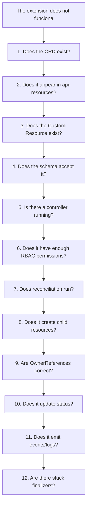

### Commands

```bash
kubectl get crd backuppolicies.platform.example.com
kubectl api-resources | grep -i backuppolicy
kubectl explain backuppolicy.spec
kubectl get bkp -n shop
kubectl describe bkp postgres-daily -n shop
kubectl get bkp postgres-daily -n shop -o json | jq '.spec, .status, .metadata.finalizers'
kubectl get events -n shop --sort-by=.metadata.creationTimestamp
kubectl get role,rolebinding -n shop
kubectl auth can-i create cronjobs --as=system:serviceaccount:shop:backup-policy-controller -n shop
```

### Criterio of comprensión

Debes poder explicar:

> Troubleshooting of extensiones empieza by the API: CRD, recurso, schema. After viene controller, RBAC, Resources hijos, status, events and finalizers.

---

## 14.26. Criterio of output of the module

You can pasar to the module 15 when puedas hacer everything esto without seguir a receta ciegamente.

### Concepts

Debes poder explicar:

- What it means extender Kubernetes
- What es a Custom Resource
- What es a CRD
- Diferencia between CRD and Custom Resource
- What es a controller
- What es reconciliation
- What es a operator
- Diferencia between controller and operator
- What es `spec`
- What es `status`
- What es `status subresource`
- What son finalizers
- What son owner references
- What es CRD versioning
- What it means `served`
- What it means `storage`
- What es admission control
- What son admission webhooks
- What riesgos tienen the webhooks
- What es API aggregation
- What son network plugins
- What es CSI
- What son device plugins
- What riesgos introduce a controller
- Cuándo extender Kubernetes tiene sentido
- Cuándo es sobreingeniería
### Practice

Debes poder:

- Create a CRD `BackupPolicy`
- Apply the CRD
- Verlo with `kubectl api-resources`
- Use `kubectl explain`
- Create BackupPolicies
- Verlas with `kubectl get bkp`
- Rechazar a recurso inválido by schema
- Explicar by what not hay comportamiento without controller
- Diseñar a ciclo of reconciliación
- Diseñar status útil
- Explicar dónde usarías finalizers
- Explicar dónde usarías ownerReferences
- Documentar riesgos of operación
- Documentar estrategia of versionado
### DevEx

Debes poder run:

```bash
task extension:crd:apply
task extension:crd:status
task extension:cr:apply
task extension:cr:status
task extension:cr:describe
task extension:cr:invalid:dry-run
task extension:no-controller:check
task extension:status:check
task extension:finalizers:check
task extension:test
```

### Frase final of comprensión

Debes poder explicar this frase:

> Extender Kubernetes does not consiste in inventar YAML nuevo. Consiste in diseñar a API, validatela, darle comportamiento with reconciliación, expose state útil, controlar borrados, limitar permisos and operate that extension como parte crítica of the plataforma.

---

## 14.27. References oficiales and fuentes primarias

|Tema|Referencia|
|---|---|
|Extending Kubernetes|Kubernetes Docs, Extending Kubernetes. ([Kubernetes](https://kubernetes.io/docs/concepts/extend-kubernetes/ "Extending Kubernetes"))|
|Extending Kubernetes API|Kubernetes Docs, Extending Kubernetes API. ([Kubernetes](https://kubernetes.io/docs/concepts/extend-kubernetes/api-extension/ "Extending Kubernetes API"))|
|Custom Resources|Kubernetes Docs, Custom Resources. ([Kubernetes](https://kubernetes.io/docs/concepts/extend-kubernetes/api-extension/custom-resources/ "Custom Resources"))|
|CustomResourceDefinitions|Kubernetes Docs, Extend Kubernetes API with CustomResourceDefinitions. ([Kubernetes](https://kubernetes.io/docs/tasks/extend-kubernetes/custom-resources/custom-resource-definitions/ "Extend Kubernetes API with CustomResourceDefinitions"))|
|CRD versioning|Kubernetes Docs, Versions in CustomResourceDefinitions. ([Kubernetes](https://kubernetes.io/docs/tasks/extend-kubernetes/custom-resources/custom-resource-definition-versioning/ "Versions in CustomResourceDefinitions"))|
|Operator pattern|Kubernetes Docs, Operator Pattern. ([GitHub](https://github.com/kubernetes-sigs/kubebuilder "Kubebuilder - SDK for building Kubernetes APIs using CRDs"))|
|Finalizers|Kubernetes Docs, Finalizers. ([Kubernetes](https://kubernetes.io/docs/concepts/overview/working-with-objects/finalizers/ "Finalizers"))|
|Owners and dependents|Kubernetes Docs, Owners and Dependents. ([Kubernetes](https://kubernetes.io/docs/concepts/overview/working-with-objects/owners-dependents/ "Owners and Dependents"))|
|Admission controllers|Kubernetes Docs, Admission Control. ([Kubernetes](https://kubernetes.io/docs/reference/access-authn-authz/admission-controllers/ "Admission Control in Kubernetes"))|
|Admission webhook good practices|Kubernetes Docs, Admission Webhook Good Practices. ([Kubernetes](https://kubernetes.io/docs/concepts/cluster-administration/admission-webhooks-good-practices/ "Admission Webhook Good Practices"))|
|API aggregation layer|Kubernetes Docs, Kubernetes API Aggregation Layer. ([Kubernetes](https://kubernetes.io/docs/concepts/extend-kubernetes/api-extension/apiserver-aggregation/ "Kubernetes API Aggregation Layer"))|
|Network plugins|Kubernetes Docs, Network Plugins. ([Kubernetes](https://kubernetes.io/docs/concepts/extend-kubernetes/compute-storage-net/network-plugins/ "Network Plugins"))|
|Device plugins|Kubernetes Docs, Device Plugins. ([Kubernetes](https://kubernetes.io/docs/concepts/extend-kubernetes/compute-storage-net/device-plugins/ "Device Plugins"))|
|CSI / storage plugins|Kubernetes Docs, Extending Kubernetes, Storage plugins. ([Kubernetes](https://kubernetes.io/docs/concepts/extend-kubernetes/ "Extending Kubernetes"))|
|Kubebuilder Book|Kubebuilder official book. ([book.kubebuilder.io](https://book.kubebuilder.io/ "The Kubebuilder Book: Introduction"))|
|Kubebuilder Quick Start|Kubebuilder official quick start. ([book.kubebuilder.io](https://book.kubebuilder.io/quick-start.html "Quick Start"))|

## 14.28. Lecturas of apoyo

|Libro|What read|
|---|---|
|_Kubernetes in Action_|Chapter 18: CRDs, custom controllers, validación, custom API servers and plataformas about Kubernetes. Actualiza cualquier ejemplo antiguo to `apiextensions.k8s.io/v1`.|
|_Kubernetes: Up and Running_|Chapter 16: puntos of extensibilidad, custom resources, admission controllers and operators.|
|_Kubernetes Patterns_|Controller and Operator como patterns principales of this unidad.|
|_Cloud Native DevOps with Kubernetes_|Capítulos about CRDs, controllers, Helm, operación, security and observability como contexto for operate extensiones.|

<!-- COURSE_NAV_START -->
[Previous](13.%20Cloud%20native%20patterns.md) | [Index](README.md) | [Next](15.%20Professionalization%20by%20role.md)
<!-- COURSE_NAV_END -->
