<!-- COURSE_NAV_START -->
[Previous](14.%20Extending%20Kubernetes.md) | [Index](README.md) | [Next](16.%20Final%20roadmap%20project.md)
<!-- COURSE_NAV_END -->

# 15. Professionalization by role

## Objective of the module

In the módulos anteriores has construido a base completa:

```text
1. Containers
2. Why Kubernetes
3. Primer cluster and kubectl
4. Mental model
5. Pods
6. Workloads
7. Networking
8. Configuration, secretos and almacenamiento
9. Testing automatizado de Kubernetes
10. Delivery
11. Security
12. Operations, observability, and reliability
13. Patrones cloud native
14. Extending Kubernetes
```

Ahora toca convertir everything that in rutas profesionales.

Because learn Kubernetes “entero” without a dirección may be infinito.

A developer not needs priorizar lo same que a person of platform engineering.

A person of security not needs empezar by operators.

A person of SRE not can quedarse only in Deployments and Services.

AND alguien que quiere llegar to arquitectura or platform engineering needs understand not only Kubernetes, sinot also sus decisiones económicas, of reliability, of security, of operación and of developer experience.

The CNCF mantiene certificaciones cloud native como CKA, CKAD, CKS, KCNA, KCSA, PCA, ICA, CCA, CAPA, CGOA and otras. Also, CNCF publica rutas of certificación where KCNA funciona como base and then se can avanzar hacia perfiles of security, administración or desarrollo. ([CNCF](https://www.cncf.io/training/certification/ "Cloud Native Certifications | CNCF"))

The idea central of the module es this:

> Profesionalizarse in Kubernetes does not consiste in coleccionar temas. Consiste in elegir a ruta, practicar tasks reales, demostrar criterio operativo and saber what profundidad you need según the trabajo que quieres hacer.

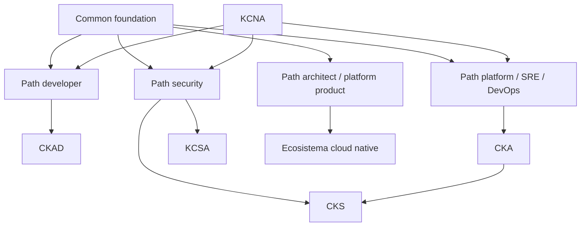

---

## 15.1. What you are going to learn and what not you are going to learn yet

You are going to learn:

- How convertir the roadmap in rutas profesionales
- What must dominar cualquier person que trabaje with Kubernetes
- What priorizar if eres developer
- What priorizar if eres platform engineer, SRE or DevOps
- What priorizar if tu foco es security
- What priorizar if quieres arquitectura or platform engineering
- What certificaciones encajan with each ruta
- How use KCNA, CKAD, CKA, CKS and KCSA with criterio
- What it means Kubestronaut and cuándo tendría sentido
- How use the curriculum público of CNCF como mapa of cobertura
- How medir progreso with prácticas reales, not only lectura
- How build a portfolio technical of Kubernetes
- How preparar entrevistas técnicas
- How evitar sobreoptimizar for exámenes
- How mantenerte actualizado without vivir persiguiendo tools
Not vamos to hacer yet:

- Preparación exhaustiva of each examen
- Simulacros completos CKA, CKAD or CKS
- Desarrollo of plataforma interna completa
- Diseño multi-cluster professional
- Preparación advanced of service mesh
- Preparación advanced of Cilium, Istio, Argo, Kyvernot or Prometheus
- Plan professional personalizado with fechas exactas
The regla pedagógica of the module será:

```text
First, role
Then real responsibilities
Then required capabilities
Then practice
Then useful certification
Then maturity criterion
```

---

## 15.2. Base común for cualquier ruta

Before of separar rutas, hay a base que should nots saltarte.

Da igual if eres developer, SRE, security engineer or platform engineer.

Hay a minimum común.

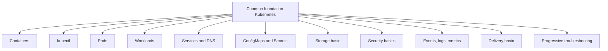

### Capacidades mínimas

Debes poder:

- Build an image
- Run containers with Docker or Podman
- Understand what es an image and what es a container
- Create a cluster local
- Use `kubectl` with soltura
- Understand Pods, Deployments, Services, ConfigMaps, Secrets and PVCs
- Read `events`
- Read logs
- Diagnosticar `CrashLoopBackOff`, `ImagePullBackOff`, readiness failing, Service without endpoints and PVC Pending
- Hacer rollback
- Understand requests and limits
- Understand ServiceAccount and RBAC basic
- Understand by what NetworkPolicy depende of the CNI
- Run a smoke test
- Validate manifests
- Explicar what está pasando without repetir commands of memoria
### Practice base

The sistema `shop` must existir with:

```text
checkout-api
payment-api
redis
postgres
ConfigMap
Secret
PVC
Service
NetworkPolicy
securityContext
probes
Taskfile
smoke tests
failure labs
```

### Criterio of comprensión

Debes poder explicar:

> The base professional of Kubernetes is not saber muchos objetos. Es poder desplegar, observar, diagnosticar and recuperar a sistema pequeño with criterio.

---

## 15.3. Mapa of roles

Kubernetes is used desde distintos roles.

Each role needs a profundidad distinta.

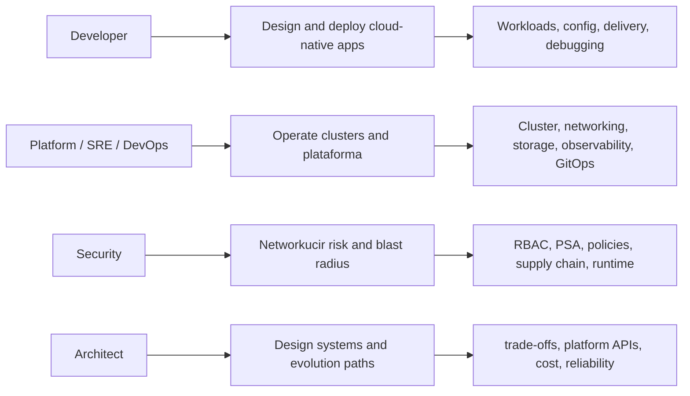

### Tabla resumen

|Ruta|Pregunta principal|
|---|---|
|Developer|¿How construyo and entrego applications que Kubernetes pueda operate bien?|
|Platform / SRE / DevOps|¿How hago que the plataforma sea fiable, segura, observable and mantenible?|
|Security|¿How networkuzco permisos, exposición, supply chain risk and blast radius?|
|Architect / platform product|¿How diseño a plataforma que acelere equipos without ocultar riesgos?|

### Criterio of comprensión

Debes poder explicar:

> Not all the rutas exigen the same profundidad in everything. The profesionalización consiste in saber what profundidad exige tu role.

---

# 15.4. Ruta developer

## Objective

Learn Kubernetes desde the punto of vista of quien construye, despliega and mantiene applications cloud native.

The certificación CKAD está orientada to personas que diseñan, construyen, configuran and exponen applications cloud native for Kubernetes. ([Linux Foundation - Education](https://training.linuxfoundation.org/client-course-cert-bundle/ "Client Only Course & Certification Bundle"))

## Responsabilidad real

A developer professional in Kubernetes should poder responder:

- ¿Mi application starts properly?
- ¿Tiene health checks reales?
- ¿Está lista before of receive traffic?
- ¿Se apaga without romper requests?
- ¿Está configurada by environment without reconstruir image?
- ¿Not lleva secrets dentro?
- ¿Tiene resources razonables?
- ¿Emite logs útiles?
- ¿Se can hacer rollback?
- ¿Se can diagnosticar when fails?
- ¿The Service tiene endpoints?
- ¿The smoke test pasa to través of Kubernetes?
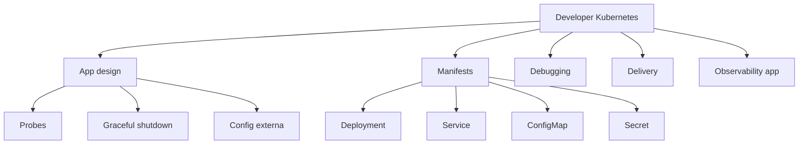

## Prioridad of estudio

### Nivel 1. Base of application

- Containers
- Dockerfile
- Image pequeña
- Not root
- Environment variables
- Logs by stdout
- `/health`
- `/ready`
- Graceful shutdown
- Configuration externa
### Nivel 2. Kubernetes core for apps

- Pod
- Deployment
- ReplicaSet
- Service
- DNS interno
- ConfigMap
- Secret
- Volumes basic
- Job
- CronJob
- Namespace
- Labels
- Annotations
- Probes
- Requests and limits
### Nivel 3. Delivery and debugging

- `kubectl logs`
- `kubectl describe`
- `kubectl exec`
- `kubectl port-forward`
- `kubectl rollout status`
- `kubectl rollout undo`
- `kubectl diff`
- Kustomize
- Helm basic
- Smoke tests
- Failure labs
- `task test:k8s`
### Nivel 4. Security minimum

- ServiceAccount explícito
- `automountServiceAccountToken: false` if not hace falta
- `securityContext`
- Not `latest`
- Secrets bien separados
- NetworkPolicy básica
- Policy tests
## Certificación útil

### CKAD

CKAD es the certificación more alineada with this ruta because se centra in build, configurar and expose applications cloud native about Kubernetes. ([CNCF](https://www.cncf.io/training/certification/ "Cloud Native Certifications | CNCF"))

KCNA may be útil before of CKAD if you need a base conceptual of Kubernetes and of the ecosistema cloud native; Linux Foundation describe KCNA como a certificación of nivel associate for personas que quieren avanzar in tecnologías cloud native. ([Linux Foundation - Education](https://training.linuxfoundation.org/certification/kubernetes-cloud-native-associate/ "Kubernetes and Cloud Native Associate (KCNA)"))

## Practice principal of the ruta

Construye and delivery `checkout-api` with:

- Express
- Dockerfile
- Deployment
- Service
- ConfigMap
- Secret
- Probes
- Resources
- SecurityContext
- Smoke test
- Kustomize
- `task test:k8s`
- Rollback probado
## Criterio of madurez

You can considerar madura this ruta when puedas:

- Create a app nueva and desplegarla without copiar manifiestos ciegamente
- Diagnosticar by what not recibe traffic
- Explicar readiness vs liveness
- Ajustar ConfigMap and Secret
- Hacer rollback
- Create a Job for a migración
- Añadir a CronJob for a task periódica
- Pasar manifests by validation, policy and smoke tests
- Explicar the contrato operativo of tu app
## Frase of comprensión

> A developer Kubernetes professional not only escribe code. Diseñan applications que Kubernetes can start, configurar, check, update, observar and retirar of the traffic safely.

---

# 15.5. Ruta platform engineer / SRE / DevOps

## Objective

Learn Kubernetes desde the punto of vista of quien operates the plataforma, define flujos of delivery, gestiona capacidad, security base, observability, networking, storage and developer experience.

CKA está orientada to administradores of Kubernetes, administradores cloud and profesionales que gestionan instancias Kubernetes; Linux Foundation the describe como a certificación practice, basada in tasks desde command line. ([Linux Foundation - Education](https://training.linuxfoundation.org/certification/certified-kubernetes-administrator-cka/ "Certified Kubernetes Administrator (CKA)"))

## Responsabilidad real

A person of platform, SRE or DevOps must poder responder:

- ¿The cluster está sano?
- ¿The nodos están Ready?
- ¿The control plane responde?
- ¿Hay capacidad?
- ¿The CNI funciona?
- ¿The DNS internal funciona?
- ¿The Services tienen endpoints?
- ¿The storage provisiona?
- ¿The backups se pueden restaurar?
- ¿The upgrades son seguros?
- ¿The equipos tienen a path of delivery repetible?
- ¿The sistema tiene observability?
- ¿The failures tienen runbooks?
- ¿The plataforma reduce fricción without ocultar Kubernetes?
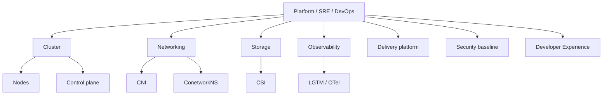

## Prioridad of estudio

### Nivel 1. Administración core

- Arquitectura of the cluster
- API Server
- etcd
- Scheduler
- Controller Manager
- Kubelet
- Kube-proxy or alternativa
- Container runtime
- ConetworkNS
- Namespaces
- Contexts
- `kubectl` advanced
### Nivel 2. Networking and storage

- CNI
- Services
- EndpointSlices
- DNS
- Ingress Controller
- Gateway API
- NetworkPolicy
- CSI
- StorageClass
- PV
- PVC
- VolumeSnapshot
- Backup and restore
### Nivel 3. Operación

- Rollouts
- Rollbacks
- Drains
- PDB
- HPA
- VPA
- Cluster Autoscaler
- Upgrades
- Capacity planning
- ResourceQuota
- LimitRange
- Troubleshooting progresivo
- Runbooks
### Nivel 4. Delivery platform

- Kustomize
- Helm
- Argo CD
- Flux
- CI/CD
- GitOps
- Quality gates
- Policy-as-code
- Promotion flows
- Environment strategy
### Nivel 5. Observability

- Events
- Logs
- Metrics
- Traces
- Grafana
- Loki
- Mimir
- Tempo
- Alloy
- OpenTelemetry Collector
- kube-state-metrics
- node-exporter
- Alerting
- SLOs, when toque
## Certificación útil

### CKA

CKA es the certificación more alineada with administración and operación of Kubernetes. ([Linux Foundation - Education](https://training.linuxfoundation.org/certification/certified-kubernetes-administrator-cka/ "Certified Kubernetes Administrator (CKA)"))

### After of CKA

After of CKA, you can elegir:

- CKS if quieres profundizar in security
- CAPA if tu plataforma uses Argo
- CGOA if tu foco es GitOps
- CCA if tu plataforma uses Cilium
- PCA if tu foco es Prometheus
- CNPA or CNPE if tu foco se mueve hacia platform engineering more amplio
The repositorio público of currículos CNCF incluye currículos for CKA, CKAD, CKS, CAPA, CGOA, CCA, KCA, CNPA, CNPE and otras certificaciones, lo que lo convierte in a referencia útil for validate cobertura temática. ([GitHub](https://github.com/cncf/curriculum "Open Source Curriculum for CNCF Certification Courses"))

## Practice principal of the ruta

Construye an environment `shop` completo:

- kind multi-node, if the ordenador lo soporta
- `checkout-api`
- `payment-api`
- Redis
- PostgreSQL of laboratorio
- Ingress or Gateway opcional
- NetworkPolicies
- ConfigMaps and Secrets
- PVC
- Backup/restore of laboratorio
- Observability minimum
- `task test:k8s`
- Failure labs
- Runbooks
- Delivery local
- GitOps conceptual or real
## Criterio of madurez

You can considerar madura this ruta when puedas:

- Entrar in a cluster desconocido and diagnosticar of forma ordenada
- Explicar by what a Pod está Pending
- Explicar by what a Service not tiene endpoints
- Explicar by what a PVC está Pending
- Explicar by what HPA not escala
- Hacer rollback with confianza
- Distinguir failure of app, failure of manifest, failure of network, failure of storage and failure of plataforma
- Diseñar quality gates
- Create runbooks útiles
- Mantener a good DevEx for otros equipos
## Frase of comprensión

> A good plataforma Kubernetes is does not the que esconde everything. Es the que reduce fricción, hace seguros the caminos comunes and deja signals claras when something fails.

---

# 15.6. Ruta security

## Objective

Learn Kubernetes desde the punto of vista of networkucción of riesgo.

The ruta of security not must empezar by tools sofisticadas.

It must empezar by identidad, permisos, admisión, aislamiento, secrets, images, network, auditoría and supply chain.

CNCF presenta CKS como a certificación for personas especializadas in security Kubernetes, and Linux Foundation indica que CKS requiere CKA and cubre good practices for asegurar applications contenerizadas and plataformas Kubernetes during build, deployment and runtime. ([CNCF](https://www.cncf.io/training/certification/ "Cloud Native Certifications | CNCF"))

## Responsabilidad real

A person of security must poder responder:

- ¿Quién can hacer what?
- ¿What can hacer a Pod comprometido?
- ¿What Secrets can read?
- ¿What network can alcanzar?
- ¿What políticas bloquean configuraciones peligrosas?
- ¿What image se está ejecutando?
- ¿Está firmada or escaneada?
- ¿Hay `latest`?
- ¿Hay Pods privilegiados?
- ¿Se aplica Pod Security Admission?
- ¿Hay audit logs?
- ¿Hay runtime signals?
- ¿Cuál es the blast radius?
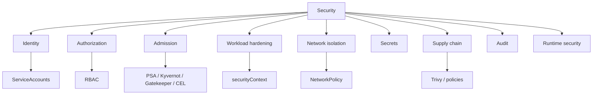

## Prioridad of estudio

### Nivel 1. Security base

- ServiceAccounts
- RBAC
- `kubectl auth can-i`
- Least privilege
- Pod Security Standards
- Pod Security Admission
- SecurityContext
- Secrets good practices
- NetworkPolicy
- Image scanning
- Not `latest`
- Audit logs
### Nivel 2. Policy-as-code

- Kyverno
- OPA Gatekeeper
- ValidatingAdmissionPolicy
- Conftest
- Policy tests
- Admission webhooks
- Excepciones controladas
- Policy reports
### Nivel 3. Supply chain

- Scanning of images
- SBOM
- Firma of images
- Verificación of images
- Registry policies
- Dependencies
- Base images
- CI/CD security
- Secrets scanning
### Nivel 4. Runtime and respuesta

- Runtime detection
- Logs
- Audit
- Forensics básica
- Incident response
- Blast radius
- Network segmentation
- Node hardening
- API Server hardening
- etcd encryption
## Certificación útil

### KCSA

KCSA may bevir como input to security cloud native and baseline security. Linux Foundation the describe como a certificación for demostrar comprensión of the configuration base of security of clusters Kubernetes for objectives of compliance. ([Linux Foundation - Education](https://training.linuxfoundation.org/certification/kubestronaut-bundle/ "Kubestronaut Bundle"))

### CKS

CKS es the certificación advanced of security Kubernetes and requiere CKA. ([Linux Foundation - Education](https://training.linuxfoundation.org/certification/kubestronaut-bundle/ "Kubestronaut Bundle"))

## Ruta recomendada

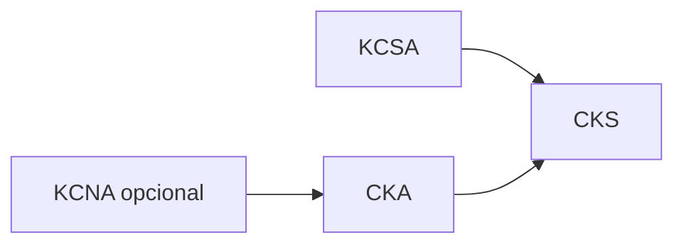

A ruta reasonable sería:

```text
KCSA → CKA → CKS
```

or:

```text
CKA → KCSA → CKS
```

if already tienes experiencia operativa.

## Practice principal of the ruta

Creates an environment `shop` with:

- Namespace `restricted`
- ServiceAccount by workload
- `automountServiceAccountToken: false`
- RBAC minimum
- `securityContext` restrictivo
- NetworkPolicy default deny
- Policies contra `latest`
- Policies for `runAsNonRoot`
- Trivy image scan
- Trivy config scan
- Secrets separados
- Failure lab of Pod privilegiado
- Failure lab of ServiceAccount without permisos
- Failure lab of NetworkPolicy
- Audit conceptual
## Criterio of madurez

You can considerar madura this ruta when puedas:

- Explicar blast radius of a Pod comprometido
- Diseñar RBAC minimum
- Detectar permisos peligrosos
- Apply Pod Security Admission
- Write and testear policies
- Explicar límites of Secrets
- Revisar manifests by riesgo
- Explicar diferencia between build-time, deploy-time and runtime security
- Relacionar CNI with NetworkPolicy
- Diseñar a baseline of security for namespaces
## Frase of comprensión

> Security in Kubernetes does not consiste in añadir a tool. Consiste in networkucir privilegios, networkucir exposición, bloquear configuraciones peligrosas and conservar signals auditables.

---

# 15.7. Ruta architect / platform product

## Objective

This ruta es for quien quiere diseñar sistemas, plataformas internas or estrategias of adopción.

Not se centra only in “saber Kubernetes”.

Se centra in decidir:

- What must ofrecer the plataforma
- What must seguir siendo responsabilidad of the equipos
- What se automatiza
- What se documenta
- What se convierte in golden path
- What se bloquea with policy
- What not merece construirse
- What coste operacional introduce each decisión
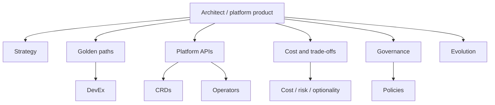

## Responsabilidad real

A person in this ruta must poder responder:

- ¿What problema of negocio resuelve the plataforma?
- ¿What fricción reduce?
- ¿What riesgos reduce?
- ¿What decisiones deja to the equipos?
- ¿What decisiones centraliza?
- ¿What APIs ofrece?
- ¿What se hace with GitOps?
- ¿What se hace with observability?
- ¿What se hace with security?
- ¿What partes must ser self-service?
- ¿What parts son demasiado peligrosas for self-service without controles?
- ¿What coste basal introduce each tool?
- ¿What pasa when the team que construyó the plataforma not está?
## Prioridad of estudio

### Nivel 1. Sistema completo

- Arquitectura Kubernetes
- Workloads
- Networking
- Storage
- Security
- Observability
- Delivery
- GitOps
- Policy-as-code
- Extension model
### Nivel 2. Platform APIs

- CRDs
- Controllers
- Operators
- Admission
- Gateway API
- External Secrets
- Backstage, if aplica
- Golden paths
- Templates
- Scorecards
### Nivel 3. Operabilidad and economía

- Runbooks
- SLOs
- Incident response
- Cost optimization
- Capacity planning
- Build vs buy
- Managed vs self-hosted
- Upgrade strategy
- Deprecation strategy
- Maintenance cost
- Cognitive load
- DevEx
### Nivel 4. Ecosistema CNCF

- Argo
- Flux
- Cilium
- Istio
- Prometheus
- OpenTelemetry
- Kyverno
- Backstage
- Crossplane
- cert-manager
- External Secrets
- Velero
## Certificaciones útiles

Not hay a única certificación for this ruta.

Dependiendo of foco:

|Foco|Certificaciones útiles|
|---|---|
|Kubernetes base|KCNA, CKA|
|Desarrollo app|CKAD|
|Security|KCSA, CKS|
|GitOps|CGOA|
|Argo|CAPA|
|Cilium|CCA|
|Kyverno|KCA|
|Platform engineering|CNPA, CNPE|

The repositorio público of currículos CNCF incluye varias of these certificaciones and can usarse como checklist of cobertura, although not sustituye build experiencia real. ([GitHub](https://github.com/cncf/curriculum "Open Source Curriculum for CNCF Certification Courses"))

## Practice principal of the ruta

Diseña a “mini platform” for the sistema `shop`:

- Golden path for a API Express
- Template of Deployment
- ConfigMap
- Secret
- Service
- NetworkPolicy
- Security baseline
- Observability baseline
- Delivery pipeline
- `task test:k8s`
- Runbooks
- Documentation
- Policy tests
- CRD conceptual `BackupPolicy`
- Decision records
- Cost and risk analysis
## Criterio of madurez

You can considerar madura this ruta when puedas:

- Explicar trade-offs of each tool
- Decidir Kustomize vs Helm without dogma
- Decidir CI/CD vs GitOps without dogma
- Decidir CRD vs ConfigMap vs Helm values
- Decidir operator vs runbook vs managed service
- Diseñar APIs of plataforma with buen límite
- Evitar sobreingeniería
- Medir if the plataforma mejora the flujo real
- Networkucir carga cognitiva without create a caja negra
## Frase of comprensión

> A plataforma good is not the que tiene more tools. Es the que mejora the throughput seguro of the equipos networkuciendo fricción, riesgo, incertidumbre and coste operacional.

---

# 15.8. Certificaciones CNCF and Linux Foundation

## Mapa principal

CNCF lista certificaciones cloud native como CKA, CKAD, CKS, KCNA, KCSA, PCA, ICA, CCA, CAPA, CGOA and otras. ([CNCF](https://www.cncf.io/training/certification/ "Cloud Native Certifications | CNCF"))

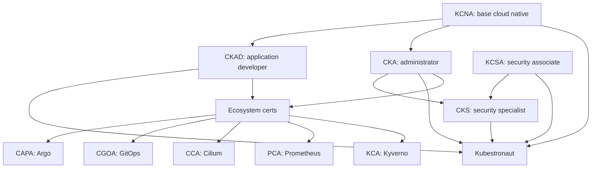

## Certificaciones Kubernetes core

|Certificación|Enfoque|
|---|---|
|KCNA|Foundations Kubernetes and ecosistema cloud native|
|CKAD|Desarrollo, configuration and exposición of applications cloud native|
|CKA|Administración and operación of Kubernetes|
|KCSA|Security cloud native and baseline security|
|CKS|Security advanced of Kubernetes, requiere CKA|

CNCF indica que Kubestronaut requiere aprobar all the certificaciones Kubernetes core: CKA, CKAD, CKS, KCNA and KCSA, and que all must estar activas. ([CNCF](https://www.cncf.io/training/kubestronaut/kubestronaut-faq/ "Kubestronaut FAQ"))

## Nota about recertificación

CNCF anunció the programa CARE of recertificación, where KCNA can renovarse automáticamente to the aprobar or recertificar CKA or CKAD, and KCSA to the aprobar or recertificar CKS. Esto es información reciente and must checkse in the página oficial before of tomar decisiones of compra or planificación. ([CNCF](https://www.cncf.io/blog/2026/03/23/cncf-introduces-a-new-recertification-program-as-kubestronaut-community-surpasses-3500/ "CNCF Introduces CARE Program"))

## Criterio of comprensión

Debes poder explicar:

> The certificaciones son mapas and signals externas. Not sustituyen experiencia, failure labs, operación real ni capacidad of diagnóstico.

---

# 15.9. How elegir certificación without autoengañarte

## Not empieces by the certificación

Empieza by the role.

After elige certificación.

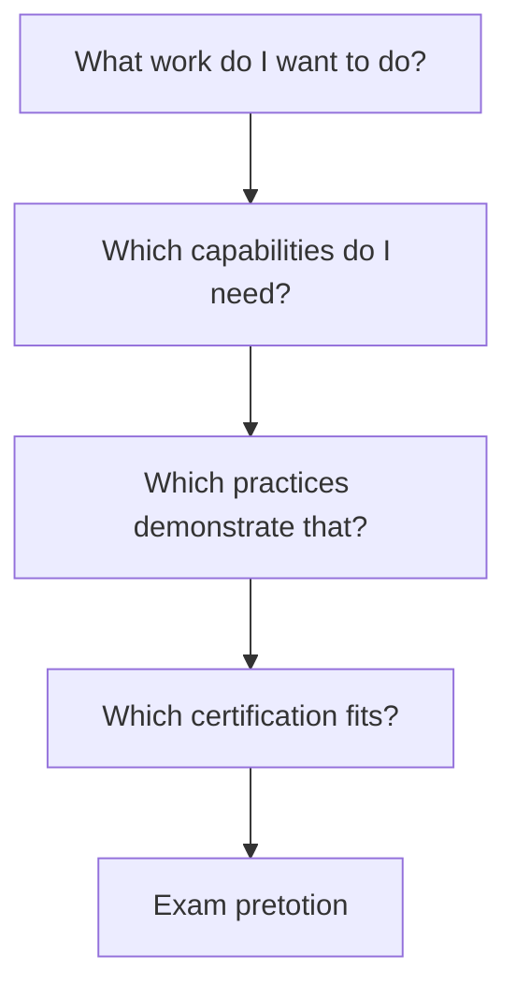

## Guía rápida

|Tu objective|Ruta likely|
|---|---|
|Understand the ecosistema from scratch|KCNA|
|Build apps cloud native|CKAD|
|Administrar clusters|CKA|
|Entrar in security cloud native|KCSA|
|Especializarte in security Kubernetes|CKA + CKS|
|Use Argo profesionalmente|CAPA|
|GitOps como practice principal|CGOA|
|Cilium / networking advanced|CCA|
|Prometheus / métricas|PCA|
|Kyvernot / policy-as-code|KCA|

## Riesgo

Preparar certificaciones can generate a falsa sensación of dominio.

You can aprobar tasks of examen and aun así not saber:

- Diagnosticar a incidente real
- Diseñar a delivery path
- Elegir between Helm and Kustomize
- Operate observability
- Gestionar secrets profesionalmente
- Explicar blast radius
- Diseñar a plataforma sostenible
## Criterio of comprensión

Debes poder explicar:

> The certificación must validate a ruta of aprendizaje, not sustituirla.

---

# 15.10. Matriz of profundidad by role

Uses this matriz for saber cuánto profundizar.

|Tema|Developer|Platform / SRE|Security|Architect|
|---|--:|--:|--:|--:|
|Containers|Alto|Alto|Medio|Medio|
|Pods|Alto|Alto|Medio|Medio|
|Deployments|Alto|Alto|Medio|Medio|
|Jobs / CronJobs|Alto|Medio|Bajo|Medio|
|Services / DNS|Alto|Alto|Medio|Medio|
|Ingress / Gateway|Medio|Alto|Medio|Alto|
|NetworkPolicy|Medio|Alto|Alto|Alto|
|ConfigMaps / Secrets|Alto|Alto|Alto|Alto|
|Storage|Medio|Alto|Medio|Alto|
|RBAC|Medio|Alto|Alto|Alto|
|Pod Security|Medio|Alto|Alto|Alto|
|Policy-as-code|Medio|Alto|Alto|Alto|
|Observability|Medio|Alto|Alto|Alto|
|Delivery|Alto|Alto|Medio|Alto|
|GitOps|Medio|Alto|Medio|Alto|
|CRDs / Operators|Bajo|Medio|Medio|Alto|
|Cluster internals|Bajo|Alto|Medio|Alto|
|Node operations|Bajo|Alto|Medio|Medio|
|Incident response|Medio|Alto|Alto|Alto|
|Cost optimization|Bajo|Alto|Medio|Alto|

### How read the matriz

- **Bajo**: understand concept and límites
- **Medio**: poder usarlo and diagnosticar casos comunes
- **Alto**: poder diseñarlo, operarlo, enseñar trade-offs and resolver failures
### Criterio of comprensión

Debes poder explicar:

> The profundidad correcta depende of the role. Aprenderlo everything with the same intensidad suele ser a mala inversión.

---

# 15.11. Portfolio technical of Kubernetes

## Objective

Not basta with decir “sé Kubernetes”.

Debes poder enseñarlo.

A portfolio útil must demostrar:

- Que entiendes concepts
- Que sabes practicar
- Que sabes diagnosticar
- Que sabes documentar
- Que sabes automatizar
- Que sabes tomar decisiones
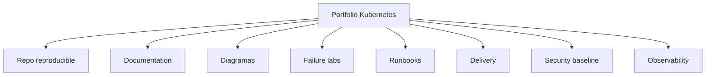

## Proyecto recomendado

A repo público or privado with:

```text
kubernetes-learning-lab/
  apps/
    checkout-api/
  kubernetes/
    base/
    overlays/
    00-namespace/
    02-deployment/
    03-service/
    05-config/
    06-storage/
    07-security/
    10-networkpolicy/
    11-observability/
    12-extension/
  tests/
    policies/
    cluster/
    smoke/
    failure-lab/
  docs/
    runbooks/
    patterns/
    extension/
    troubleshooting.md
    architecture.md
  Taskfile.yml
```

## It must poder demostrar

- `task doctor`
- `task test:k8s`
- `task delivery:release:local`
- `task security:test`
- `task reliability:test`
- `task patterns:review`
- `task extension:test`
## Criterio of comprensión

Debes poder explicar:

> A buen portfolio does not enseña only the path feliz. Enseña how the sistema fails, how lo detectas and how lo recuperas.

---

# 15.12. Preparación for entrevistas técnicas

## Preguntas que you should poder responder

### Developer

- ¿What diferencia hay between liveness and readiness?
- ¿By what not usarías `latest`?
- ¿What pasa if a Service not tiene endpoints?
- ¿How pasarías configuration to a app?
- ¿Cuándo usarías Job in vez of Deployment?
- ¿What harías if a rollout se queda bloqueado?
- ¿How probarías tu manifest before of desplegar?
### Platform / SRE

- ¿What mirarías if a Pod está Pending?
- ¿How diagnosticas DNS interno?
- ¿How diagnosticas PVC Pending?
- ¿What papel tiene ConetworkNS?
- ¿What hace the scheduler?
- ¿What es etcd?
- ¿How harías drain of a nodo?
- ¿What signals pondrías in a dashboard of cluster?
- ¿What diferencia hay between CI/CD and GitOps?
### Security

- ¿What can hacer a ServiceAccount?
- ¿How comtests permisos with `kubectl auth can-i`?
- ¿What es Pod Security Admission?
- ¿What it means `runAsNonRoot`?
- ¿By what base64 is not cifrado?
- ¿What controla NetworkPolicy?
- ¿What harías for networkucir blast radius?
- ¿What políticas bloquearías in admisión?
### Architect

- ¿Cuándo createías a CRD?
- ¿Cuándo not createías a operator?
- ¿What pondrías in a golden path?
- ¿What must ser self-service and what not?
- ¿How evitarías que the plataforma se vuelva a caja negra?
- ¿How medirías if the plataforma mejora the flujo?
- ¿What coste operacional introduce GitOps?
- ¿What trade-offs hay between Helm and Kustomize?
## Criterio of comprensión

Debes poder explicar:

> A good entrevista Kubernetes does not se gana memorizando objetos. Se gana razonando about failures, trade-offs and responsabilidades.

---

# 15.13. DevEx professional

## What problema resuelve

Cuanto more professional es the uso of Kubernetes, more importante se vuelve DevEx.

Without DevEx, the gente aprende commands sueltos, copia YAML and evita tocar the plataforma by miedo.

With good DevEx:

- Hay caminos claros
- Hay commands repetibles
- Hay validación temprana
- Hay docs
- Hay runbooks
- Hay diagramas
- Hay failure labs
- Hay calidad before of delivery
- Hay less dependencia of memoria individual
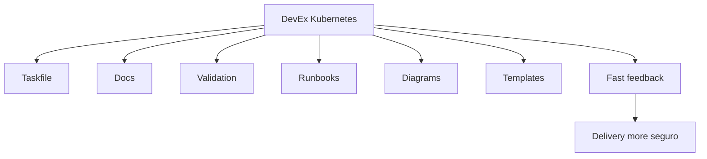

## Reglas of DevEx

- Each practice importante must tener a command
- Each command must mostrar what hace
- Each failure lab must tener recuperación
- Each module must tener criterio of output
- Each ruta must tener checklist
- Each manifest importante must estar validado
- Each decisión not obvia must estar documentada
- Each tool must pagar su coste
## Criterio of comprensión

Debes poder explicar:

> DevEx is not comodidad superficial. Es a forma of networkucir error humano, coste cognitivo and variabilidad operacional.

---

# 15.14. Taskfile of the module 15

Añade these tasks to the `Taskfile.yml`.

```yaml
  professional:checklist:developer:
    desc: Print developer Kubernetes professionalization checklist
    cmds:
      - echo "Developer route checklist:"
      - echo "- Build and run checkout-api container"
      - echo "- Deploy Deployment and Service"
      - echo "- Configure ConfigMap and Secret"
      - echo "- Validate probes"
      - echo "- Run smoke tests"
      - echo "- Debug Service endpoints"
      - echo "- Execute rollout and rollback"
      - echo "- Run task test:k8s"

  professional:checklist:platform:
    desc: Print platform/SRE Kubernetes professionalization checklist
    cmds:
      - echo "Platform/SRE route checklist:"
      - echo "- Diagnose Pods, Services, DNS, PVCs and events"
      - echo "- Validate storage and networking"
      - echo "- Execute failure labs"
      - echo "- Run reliability:test"
      - echo "- Design runbooks"
      - echo "- Explain GitOps and delivery trade-offs"
      - echo "- Explain observability signals"

  professional:checklist:security:
    desc: Print security Kubernetes professionalization checklist
    cmds:
      - echo "Security route checklist:"
      - echo "- Apply Pod Security Admission"
      - echo "- Validate ServiceAccount and RBAC"
      - echo "- Run kubectl auth can-i checks"
      - echo "- Apply NetworkPolicies"
      - echo "- Run policy tests"
      - echo "- Run image and config scans"
      - echo "- Explain blast radius"

  professional:checklist:architect:
    desc: Print architecture/platform product professionalization checklist
    cmds:
      - echo "Architect/platform route checklist:"
      - echo "- Explain golden path"
      - echo "- Explain Helm vs Kustomize"
      - echo "- Explain CI/CD vs GitOps"
      - echo "- Explain CRD vs ConfigMap"
      - echo "- Explain operator vs runbook"
      - echo "- Document trade-offs"
      - echo "- Review platform cost and operational risk"

  professional:portfolio:validate:
    desc: Validate the Kubernetes learning portfolio
    cmds:
      - test -d apps/{{.APP_NAME}}
      - test -f Taskfile.yml
      - test -d kubernetes
      - test -d tests
      - test -d docs
      - task manifests:render
      - task manifests:validate:schema
      - task policies:test

  professional:portfolio:test:
    desc: Run the main portfolio evidence checks
    cmds:
      - task test:k8s
      - task security:test
      - task reliability:test
      - task patterns:review
      - task extension:test

  professional:interview:questions:
    desc: Print Kubernetes interview practice prompts
    cmds:
      - echo "Explain readiness vs liveness."
      - echo "Diagnose a Service with no endpoints."
      - echo "Explain why a PVC is Pending."
      - echo "Explain how rollback works."
      - echo "Explain ServiceAccount and RBAC."
      - echo "Explain Pod Security Admission."
      - echo "Explain CI/CD vs GitOps."
      - echo "Explain when you would create a CRD."
      - echo "Explain when an operator is overengineering."

  professional:route:developer:
    desc: Run checks aligned with the developer route
    cmds:
      - task professional:checklist:developer
      - task manifests:render
      - task test:k8s
      - task smoke:k8s

  professional:route:platform:
    desc: Run checks aligned with the platform/SRE route
    cmds:
      - task professional:checklist:platform
      - task reliability:test
      - task k8s:debug:checkout:summary
      - task reliability:storage:status

  professional:route:security:
    desc: Run checks aligned with the security route
    cmds:
      - task professional:checklist:security
      - task security:test
      - task policies:test
      - task security:inspect

  professional:route:architect:
    desc: Run checks aligned with the architecture/platform product route
    cmds:
      - task professional:checklist:architect
      - task patterns:review
      - task extension:test
```

### Criterio DevEx

Debes poder explicar:

> The profesionalización also must ser ejecutable. If not you can demostrar tu progreso with commands, tests, docs and failure labs, probably only tienes lectura acumulada.

---

# 15.15. Practice principal of the module

## Objective

Convertir the roadmap in a ruta professional elegida and demostrable.

## Resultado esperado

```text
kubernetes-learning-lab/
  docs/
    professionalization/
      role-choice.md
      skill-matrix.md
      certification-plan.md
      portfolio-evidence.md
      interview-prep.md
```

## Paso 1. Elegir ruta

Creates:

```text
docs/professionalization/role-choice.md
```

Contenido:

```markdown
# Role choice

## Primary route

Developer / Platform-SRE / Security / Architect

## Why this route

...

## What I need to be able to do

...

## What I do does not need to prioritize yet

...
```

## Paso 2. Create matriz of habilidades

Creates:

```text
docs/professionalization/skill-matrix.md
```

Contenido:

```markdown
# Skill matrix

| Skill | Current level | Target level | Evidence |
|---|---:|---:|---|
| Deployments | | | |
| Services and DNS | | | |
| ConfigMaps and Secrets | | | |
| Storage | | | |
| SecurityContext | | | |
| RBAC | | | |
| NetworkPolicy | | | |
| Observability | | | |
| Delivery | | | |
| GitOps | | | |
| CRDs | | | |
| Troubleshooting | | | |
```

## Paso 3. Create plan of certificación

Creates:

```text
docs/professionalization/certification-plan.md
```

Contenido:

```markdown
# Certification plan

## Target certification

KCNA / CKAD / CKA / KCSA / CKS / other

## Why this certification

...

## What it validates

...

## What it does not validate

...

## Practice evidence before booking

- [ ] I can run the relevant route tasks.
- [ ] I can diagnose failure labs.
- [ ] I can explain trade-offs.
- [ ] I can complete timed practice tasks.
```

## Paso 4. Create evidencia of portfolio

Creates:

```text
docs/professionalization/portfolio-evidence.md
```

Contenido:

```markdown
# Portfolio evidence

## Commands

- task test:k8s
- task security:test
- task reliability:test
- task patterns:review
- task extension:test

## Failure labs demonstrated

- Bad image
- Missing Secret
- Bad Service selector
- PVC Pending
- Privileged Pod rejected

## Runbooks

- checkout-api rollout
- service no endpoints
- storage PVC Pending
- security baseline

## Diagrams

- architecture
- delivery flow
- troubleshooting flow
- platform extension model
```

## Paso 5. Run checks by ruta

Developer:

```bash
task professional:route:developer
```

Platform:

```bash
task professional:route:platform
```

Security:

```bash
task professional:route:security
```

Architect:

```bash
task professional:route:architect
```

## Paso 6. Run portfolio completo

```bash
task professional:portfolio:validate
task professional:portfolio:test
```

## Criterio of finalización

The practice está completa when you can explicar:

- What ruta has elegido
- By what that ruta
- What habilidades you need
- What certificación encaja
- What certificación not you need yet
- What evidencia technical tienes
- What failure labs you can demostrar
- What runbooks tienes
- What trade-offs you can explicar
---

# 15.16. Ejercicios cortos

## Ejercicio 1. Elegir ruta

Responde:

|Pregunta|Respuesta|
|---|---|
|¿Quiero build apps or plataformas?||
|¿Quiero operate clusters?||
|¿Quiero especializarme in security?||
|¿Quiero diseñar golden paths?||
|¿What ruta encaja better ahora?||

---

## Ejercicio 2. Elegir certificación

Completa:

|Objective|Certificación candidata|By what|
|---|---|---|
|Base cloud native|||
|Developer Kubernetes|||
|Administración Kubernetes|||
|Security base|||
|Security advanced|||
|GitOps|||
|Argo|||
|Cilium|||

---

## Ejercicio 3. Evidencia real

For tu ruta elegida, completa:

|Capacidad|Evidencia in the repo|
|---|---|
|Deploy||
|Debugging||
|Delivery||
|Security||
|Observability||
|Failure recovery||
|Documentation||

---

## Ejercicio 4. Entrevista technical

Responde without mirar apuntes:

- ¿What pasa if a Deployment exists but not hay Pods Ready?
- ¿What pasa if the Service exists but not tiene endpoints?
- ¿What pasa if DNS resuelve but HTTP not responde?
- ¿What pasa if a PVC está Pending?
- ¿What pasa if a Pod está `ImagePullBackOff`?
- ¿What pasa if a NetworkPolicy exists but not bloquea?
- ¿What pasa if a Secret falta?
- ¿What pasa if a rollback not recupera because hubo migración of datos?
---

## Ejercicio 5. Certificación vs experiencia

Completa:

|Tema|Lo can validate a examen|Lo demuestra better a proyecto|
|---|---|---|
|Create Deployment|||
|Diagnosticar incidente|||
|Diseñar plataforma|||
|Write runbook|||
|Hacer rollback|||
|Gestionar trade-offs|||
|Operate observability|||

---

# 15.17. Errores habituales

## Error 1. Querer learn everything to the vez

Kubernetes es demasiado amplio.

Elige ruta.

Then profundidad.

---

## Error 2. Preparar certificaciones without practicar failures

A examen can entrenarte for tasks.

The failure labs te entrenan for operate.

You need ambos if quieres criterio real.

---

## Error 3. Confundir developer Kubernetes with platform Kubernetes

A developer must saber desplegar and diagnosticar su app.

Not needs empezar by API aggregation or CNI advanced.

---

## Error 4. Confundir platform engineering with install tools

Platform engineering is not install Argo, Backstage, Cilium and Grafana.

Es diseñar caminos seguros and útiles for the equipos.

---

## Error 5. Confundir security with escaneo

Security scanning es a pieza.

Security also incluye identidad, RBAC, Pod Security, NetworkPolicy, Secrets, admission, runtime and auditoría.

---

## Error 6. Perseguir certificaciones by orden of moda

The orden correcto depende of the role.

Not of LinkedIn.

---

## Error 7. Not documentar decisiones

If not you can explicar by what usaste Helm, Kustomize, GitOps, CRD, operator or policy, yet not tienes criterio professional.

---

## Error 8. Not mantener the conocimiento actualizado

Kubernetes cambia.

Certificaciones cambian.

The ecosistema cambia.

Uses documentación oficial and currículos actualizados como referencia viva.

---

# 15.18. Troubleshooting progresivo of tu aprendizaje

When sientas que “Kubernetes es demasiado”, not estudies more temas to the azar.

Diagnostica tu aprendizaje.

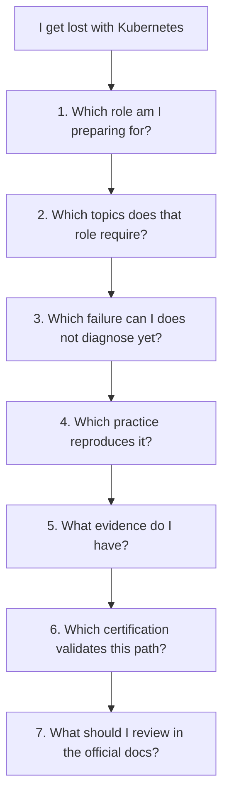

## Secuencia

1. Elige ruta
2. Elige a capacidad
3. Busca a failure real asociado
4. Reprodúcelo in laboratorio
5. Diagnostícalo
6. Documenta runbook
7. Automatiza validación
8. Repite
## Criterio of comprensión

Debes poder explicar:

> Learn Kubernetes profesionalmente is not read more. Es convertir dudas in prácticas, prácticas in signals, signals in diagnóstico and diagnóstico in criterio.

---

# 15.19. Criterio of output of the module

You can pasar to the proyecto final when puedas hacer everything esto without seguir a receta ciegamente.

## Concepts

Debes poder explicar:

- What ruta professional quieres seguir
- What capacidades exige that ruta
- What capacidades not you need priorizar yet
- What diferencia hay between KCNA, CKAD, CKA, KCSA and CKS
- What it means Kubestronaut
- What valor tiene a certificación
- What límites tiene a certificación
- What evidencia technical you should build
- How preparar entrevistas técnicas
- How use a portfolio Kubernetes
- How mantener DevEx in the aprendizaje
- How use documentación oficial and currículos CNCF como referencia
## Practice

Debes poder:

- Create a plan professional
- Create a matriz of habilidades
- Create a plan of certificación
- Create evidencia of portfolio
- Run checks by ruta
- Run portfolio completo
- Defender decisiones técnicas
- Explicar failures and recuperaciones
- Explicar what estudiarías after and by what
## DevEx

Debes poder run:

```bash
task professional:checklist:developer
task professional:checklist:platform
task professional:checklist:security
task professional:checklist:architect
task professional:route:developer
task professional:route:platform
task professional:route:security
task professional:route:architect
task professional:portfolio:validate
task professional:portfolio:test
task professional:interview:questions
```

## Frase final of comprensión

Debes poder explicar this frase:

> Profesionalizarse in Kubernetes is not saber all the objetos. Es elegir a ruta, practicar tasks reales, diagnosticar failures, automatizar feedback, documentar decisiones and demostrar criterio bajo condiciones parecidas to producción.

---

## 15.20. References oficiales and fuentes primarias

|Tema|Referencia|
|---|---|
|CNCF Cloud Native Certifications|CNCF, Cloud Native Certifications. ([CNCF](https://www.cncf.io/training/certification/ "Cloud Native Certifications \| CNCF"))|
|CNCF training pathways|CNCF, Training and cloud native certification pathways. ([CNCF](https://www.cncf.io/training/ "Training & Certification \| CNCF"))|
|Linux Foundation CKA|Linux Foundation Training, Certified Kubernetes Administrator. ([Linux Foundation - Education](https://training.linuxfoundation.org/certification/certified-kubernetes-administrator-cka/ "Certified Kubernetes Administrator (CKA)"))|
|KCNA|Linux Foundation Training, Kubernetes and Cloud Native Associate. ([Linux Foundation - Education](https://training.linuxfoundation.org/certification/kubernetes-cloud-native-associate/ "Kubernetes and Cloud Native Associate (KCNA)"))|
|KCNA + CKA bundle description|Linux Foundation Training, KCNA and CKA bundle. ([Linux Foundation - Education](https://training.linuxfoundation.org/training/kcna-cka-exam-bundle/ "Kubernetes and Cloud Native Associate (KCNA) + Certified ..."))|
|Kubestronaut requirements|CNCF, Kubestronaut FAQ. ([CNCF](https://www.cncf.io/training/kubestronaut/kubestronaut-faq/ "Kubestronaut FAQ"))|
|Kubestronaut program|CNCF, Kubestronaut Program. ([CNCF](https://www.cncf.io/training/kubestronaut/ "Kubestronaut Program"))|
|CNCF curriculum repository|CNCF, Open Source Curriculum for CNCF Certification Courses. ([GitHub](https://github.com/cncf/curriculum "Open Source Curriculum for CNCF Certification Courses"))|
|CARE recertification program|CNCF, CARE recertification announcement. ([CNCF](https://www.cncf.io/blog/2026/03/23/cncf-introduces-a-new-recertification-program-as-kubestronaut-community-surpasses-3500/ "CNCF Introduces CARE Program"))|

## 15.21. Lecturas of apoyo

|Recurso|What use|
|---|---|
|_Kubernetes in Action_|Base profunda for understand objetos, workloads, networking, storage, security, internals and extension.|
|_Kubernetes: Up and Running_|Base practice for containers, Kubernetes core, Deployments, Services, RBAC, ConfigMaps, Secrets and real applications.|
|_Cloud Native DevOps with Kubernetes_|Operación, delivery, Helm, Kustomize, observability, security, backups and prácticas DevOps.|
|_Kubernetes Patterns_|Cloud native patterns for diseñar applications que Kubernetes pueda operate bien.|
|CNCF curriculum repository|Checklist vivo for comparar tu roadmap with currículos oficiales.|
|Documentación oficial Kubernetes|Fuente principal for check commands, APIs and cambios actuales.|

<!-- COURSE_NAV_START -->
[Previous](14.%20Extending%20Kubernetes.md) | [Index](README.md) | [Next](16.%20Final%20roadmap%20project.md)
<!-- COURSE_NAV_END -->
