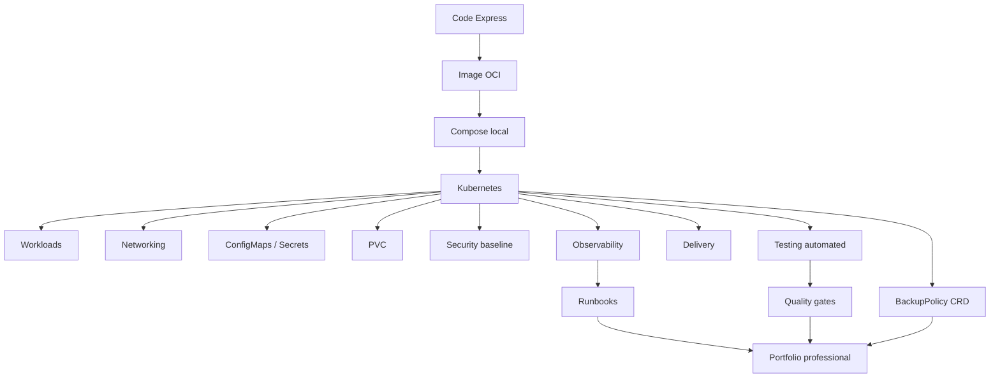
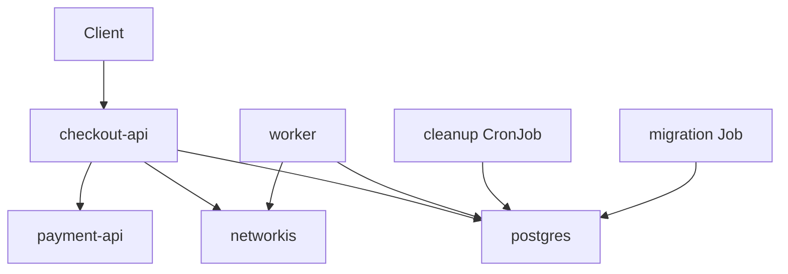
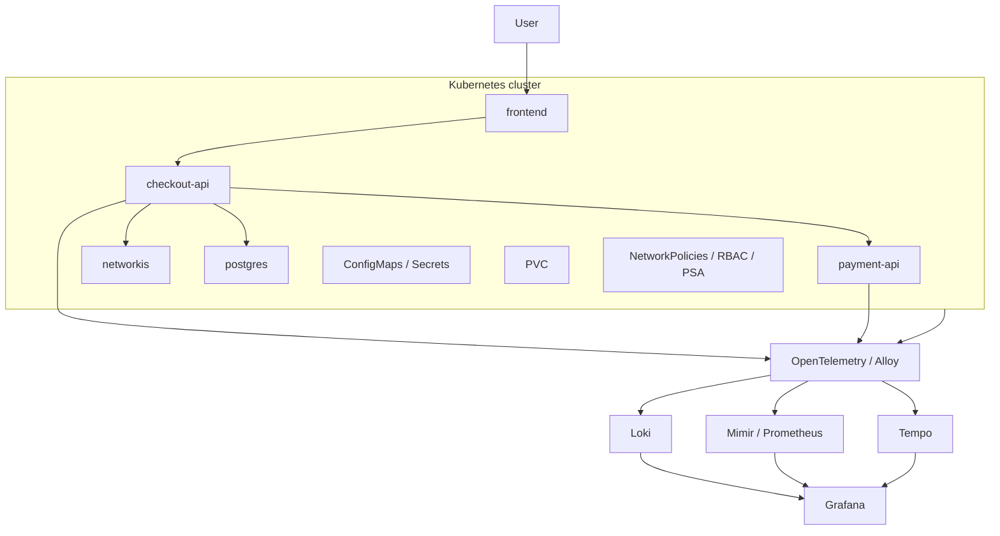
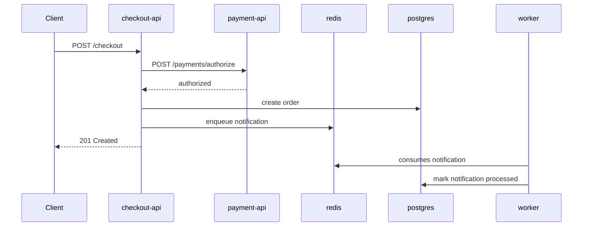
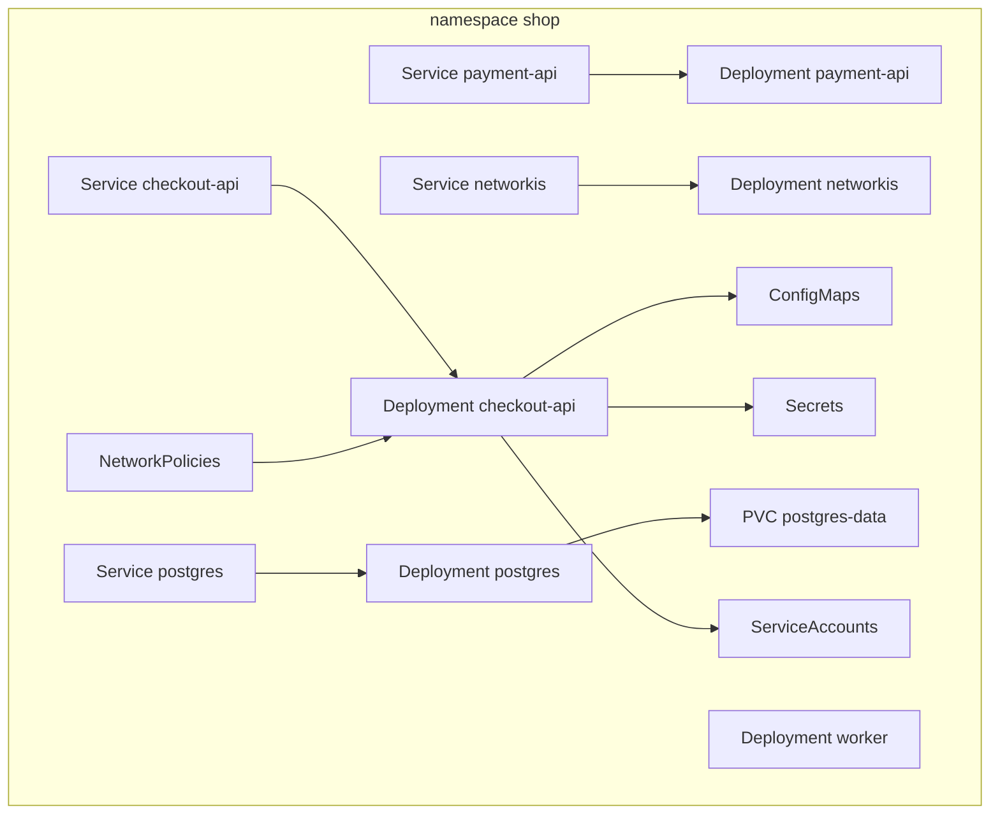
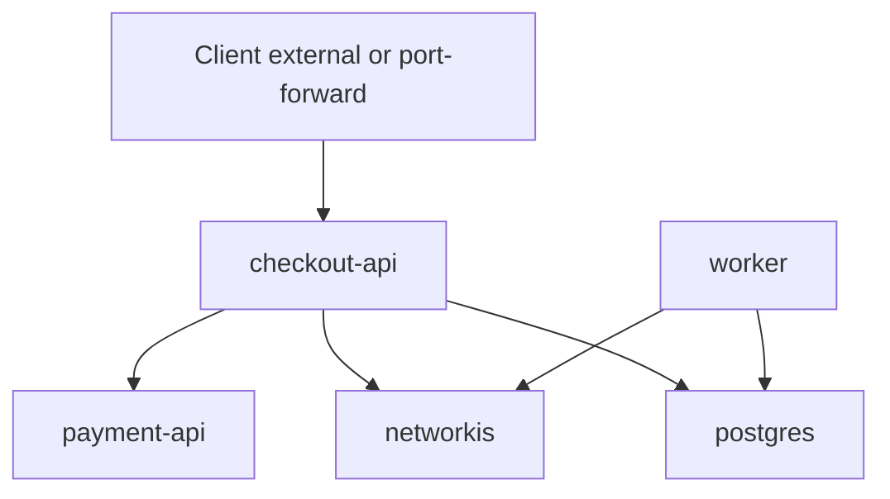
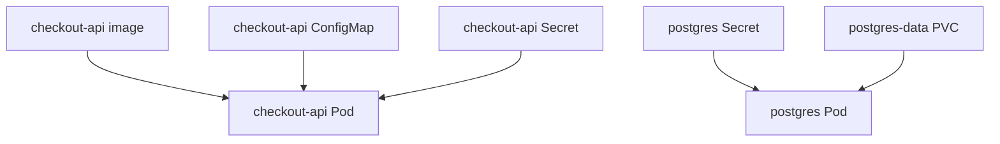
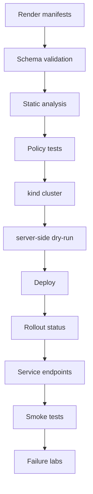
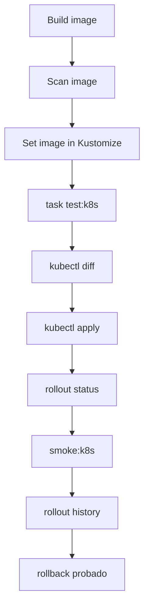
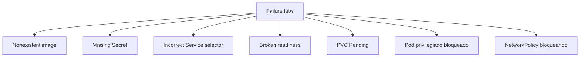

<!-- COURSE_NAV_START -->
[Previous](<15. Professionalization by role.md>) | [Index](README.md) | [Next](<17. GitOps and continuous delivery with Argo CD.md>)
<!-- COURSE_NAV_END -->

# 16. Final roadmap project

## Objective of the module

This module convierte the roadmap completo in a proyecto final.

Hasta ahora has trabajado by layers:

```text
1. Containers
2. Why Kubernetes
3. Primer cluster and kubectl
4. Mental model
5. Pods
6. Workloads
7. Networking
8. Configuration, secretos and almacenamiento
9. Testing automatizado de Kubernetes
10. Delivery
11. Security
12. Operations, observability, and reliability
13. Patrones cloud native
14. Extending Kubernetes
15. Professionalization by role
```

Ahora the objective es juntar everything in a sistema que puedas build, run, romper, diagnosticar, recuperar and explicar.

The proyecto final not busca parecer “enterprise”.

Busca demostrar criterio.

The documentación oficial of Kubernetes describe Kubernetes como a plataforma for gestionar workloads and services containerizados mediante configuration declarativa and automatización, and organiza the conocimiento alnetworkedor of workloads, services, networking, storage, configuration, security, observability and extension. That es exactamente the arco que this proyecto must integrar. ([Kubernetes](https://kubernetes.io/docs/home/ "Kubernetes Documentation"))

The idea central of the module es this:

> The proyecto final not consiste in desplegar a app. Consiste in demostrar que entiendes the ciclo completo: code, container, composición local, Kubernetes, configuration, security, network, storage, testing, delivery, observability, troubleshooting, patterns, extension and criterio professional.



---

## 16.1. What you are going to learn and what not you are going to learn yet

You are going to learn:

- How build a proyecto final que integre everything the roadmap
- How organizar a repositorio of aprendizaje professional
- How diseñar a sistema pequeño but realista
- How run the app without containers
- How containerizarla with Docker and Podman
- How runla with Compose
- How migrarla to Kubernetes
- How añadir ConfigMaps, Secrets and PVCs
- How añadir Services, DNS, NetworkPolicies e Ingress or Gateway opcional
- How añadir probes, resources, securityContext and ServiceAccount
- How añadir testing automated of manifests, policies, cluster, smoke and failure labs
- How añadir delivery local with quality gates
- How añadir observability and runbooks
- How documentar Cloud native patterns
- How añadir a extension minimum with `BackupPolicy`
- How create evidencia professional of aprendizaje
Not vas to build yet:

- A plataforma productiva multi-cluster
- A operator completo
- A database productiva in Kubernetes
- A stack LGTM productivo
- A sistema of autenticación real
- A service mesh
- A pipeline cloud completo with cnetworkenciales reales
- A plan of disaster recovery real
- A environment productivo
The regla pedagógica of the module será:

```text
First, small system
Then one capability per phase
Then exit criterion
Then failure lab
Then documentation
Then automation
```

---

## 16.2. Sistema final to build

The sistema se llamará `shop`.

Tendrá these componentes:

```text
checkout-api
payment-api
worker
redis
postgres
```

Not you need a frontend in the proyecto final. It can añadirse after, but not must bloquear the aprendizaje principal.

### Componentes

|Componente|Tecnología|Responsabilidad|
|---|---|---|
|`checkout-api`|Express / Node.js|API pública of checkout|
|`payment-api`|Express / Node.js|API interna simulada of pagos|
|`worker`|Node.js|Trabajo asíncronot of laboratorio|
|`redis`|Redis|Cola/cache of laboratorio|
|`postgres`|PostgreSQL|Datos persistentes of laboratorio|

### Contratos HTTP minimum

`checkout-api` must expose:

```text
GET /health
GET /ready
GET /checkout
POST /checkout
```

`payment-api` must expose:

```text
GET /health
GET /ready
POST /payments/authorize
```

### What must demostrar

The sistema must demostrar:

- A API pública
- A API interna
- A dependencia interna by Service DNS
- Configuration externa
- Secrets separados
- Storage persistente
- Worker
- Job
- CronJob
- NetworkPolicy
- Security baseline
- Observability minimum
- Testing automated
- Delivery local
- Failure labs
- Runbooks
- CRD conceptual `BackupPolicy`


### Criterio of comprensión

Debes poder explicar:

> The sistema final es pequeño to propósito. Su valor not está in the tamaño, sinot in que contiene the piezas necesarias for practicar operación realista without perder control.

---

## 16.3. Arquitectura of the repositorio

Before of write code, ordena the repositorio.

Taskfile encaja como capa of input humana to the proyecto because permite definir tasks in YAML, variables, includes and commands repetibles. Su documentación oficial describe `Taskfile.yml` como a file YAML with versión, variables and tasks, and documenta the schema of Taskfile v3. ([Task](https://taskfile.dev/docs/guide "Guide | Task - Taskfile"))

```text
kubernetes-learning-lab/
  Taskfile.yml
  README.md
  .gitignore
  .env.example

  apps/
    checkout-api/
      package.json
      src/
        server.js
      Dockerfile

    payment-api/
      package.json
      src/
        server.js
      Dockerfile

    worker/
      package.json
      src/
        worker.js
      Dockerfile

  compose/
    compose.yaml

  kubernetes/
    base/
      kustomization.yaml

    overlays/
      local/
        kustomization.yaml
      staging/
        kustomization.yaml
      production/
        kustomization.yaml

    00-namespace/
      namespace.yaml

    02-deployment/
      checkout-api-deployment.yaml
      payment-api-deployment.yaml
      worker-deployment.yaml
      postgres-deployment.yaml
      redis-deployment.yaml

    03-service/
      checkout-api-service.yaml
      payment-api-service.yaml
      postgres-service.yaml
      redis-service.yaml

    04-ingress-o-gateway/
      ingress.yaml

    05-config/
      checkout-api-configmap.yaml
      checkout-api-secret.yaml
      payment-api-configmap.yaml
      postgres-secret.yaml

    06-storage/
      postgres-pvc.yaml
      postgres-pvc-bad-storageclass.yaml

    07-security/
      checkout-api-serviceaccount.yaml
      payment-api-serviceaccount.yaml
      worker-serviceaccount.yaml
      failure/
        privileged-pod.yaml

    08-jobs/
      migration-job.yaml
      cleanup-cronjob.yaml

    10-networkpolicy/
      default-deny-ingress.yaml
      allow-client-to-checkout-api.yaml
      allow-checkout-to-payment-api.yaml
      allow-checkout-to-postgres.yaml
      allow-worker-to-redis.yaml
      allow-worker-to-postgres.yaml

    11-observability/
      namespace.yaml

    12-extension/
      crd-backuppolicy.yaml
      postgres-daily-backuppolicy.yaml
      invalid-backuppolicy.yaml

  tests/
    smoke/
      smoke-checkout-api.sh
      smoke-payment-api.sh

    policies/
      kyverno/
      conftest/

    cluster/
      chainsaw/

    failure-lab/
      bad-image/
      missing-secret/
      bad-service-selector/
      bad-readiness/
      pvc-pending/

  scripts/
    doctor.sh
    wait-for-rollout.sh
    wait-for-endpoints.sh

  docs/
    architecture.md
    troubleshooting.md
    references.md

    runbooks/
      checkout-api-rollout.md
      service-no-endpoints.md
      pvc-pending.md
      bad-image.md

    patterns/
      checkout-api-pattern-review.md
      anti-patterns.md

    extension/
      backuppolicy-api.md
      backuppolicy-controller-design.md

    professionalization/
      portfolio-evidence.md
```

### Criterio of comprensión

Debes poder explicar:

> The estructura of the repositorio es parte of the aprendizaje. If the repositorio not comunica the sistema, the sistema already empieza siendo difícil of operate.

---

## 16.4. Arquitectura funcional



The flujo principal será:

```text
Client → checkout-api → payment-api → postgres
checkout-api → redis
worker → redis
worker → postgres
```



### Comportamiento minimum

`POST /checkout` must:

1. Receive a petición
2. Llamar to `payment-api`
3. Simular creación of pedido
4. Write a log estructurado
5. Responder `201` if everything va bien
6. Responder error controlado if `payment-api` fails
### Criterio of comprensión

Debes poder explicar:

> The flujo funcional must ser suficiente for probar networking, configuration, logs, smoke tests, traces conceptuales and failures controlados.

---

## 16.5. Fase TO: run without containers

### Objective

Before of Docker, Compose or Kubernetes, the app must funcionar como process local.

Esto refuerza a idea clave:

> Kubernetes operates processes containerizados, but the primer contrato es que the application funcione como process.

### What debes build

`checkout-api` with Express:

```javascript
import express from "express";

const app = express();
app.use(express.json());

const port = Number(process.env.PORT || 8080);
const serviceName = process.env.SERVICE_NAME || "checkout-api";
const paymentApiUrl = process.env.PAYMENT_API_URL || "http://localhost:8081";

let ready = true;

app.get("/health", (req, res) => {
  res.status(200).json({
    status: "ok",
    service: serviceName
  });
});

app.get("/ready", (req, res) => {
  if (!ready) {
    return res.status(503).json({
      status: "not-ready",
      service: serviceName
    });
  }

  res.status(200).json({
    status: "ready",
    service: serviceName
  });
});

app.get("/checkout", (req, res) => {
  res.status(200).json({
    status: "ok",
    service: serviceName,
    paymentApiUrl
  });
});

app.post("/checkout", async (req, res) => {
  const startedAt = Date.now();

  try {
    const response = await fetch(`${paymentApiUrl}/payments/authorize`, {
      method: "POST",
      headers: {
        "content-type": "application/json"
      },
      body: JSON.stringify({
        amount: req.body.amount || 100
      })
    });

    if (!response.ok) {
      throw new Error(`payment-api responded with ${response.status}`);
    }

    console.log(JSON.stringify({
      level: "info",
      service: serviceName,
      path: "/checkout",
      status: 201,
      durationMs: Date.now() - startedAt,
      message: "checkout completed"
    }));

    res.status(201).json({
      status: "created"
    });
  } catch (error) {
    console.error(JSON.stringify({
      level: "error",
      service: serviceName,
      path: "/checkout",
      status: 502,
      durationMs: Date.now() - startedAt,
      message: error.message
    }));

    res.status(502).json({
      status: "payment_failed"
    });
  }
});

const server = app.listen(port, () => {
  console.log(JSON.stringify({
    level: "info",
    service: serviceName,
    port,
    message: "server started"
  }));
});

process.on("SIGTERM", () => {
  ready = false;

  console.log(JSON.stringify({
    level: "info",
    service: serviceName,
    message: "SIGTERM received, shutting down"
  }));

  server.close(() => {
    console.log(JSON.stringify({
      level: "info",
      service: serviceName,
      message: "server closed"
    }));

    process.exit(0);
  });
});
```

### What debes probar

```bash
npm install
PORT=8080 SERVICE_NAME=checkout-api PAYMENT_API_URL=http://localhost:8081 npm start

curl -fsS http://localhost:8080/health
curl -fsS http://localhost:8080/ready
curl -fsS http://localhost:8080/checkout
```

### DevEx

```yaml
app:checkout:dev:
  desc: Run checkout-api locally without containers
  dir: apps/checkout-api
  cmds:
    - npm install
    - PORT=8080 SERVICE_NAME=checkout-api PAYMENT_API_URL=http://localhost:8081 npm start

app:checkout:smoke:
  desc: Smoke test checkout-api locally
  cmds:
    - curl -fsS http://localhost:8080/health
    - curl -fsS http://localhost:8080/ready
    - curl -fsS http://localhost:8080/checkout
```

### Criterio of output

You can pasar to the siguiente fase when puedas explicar:

- What process runs
- What port uses
- What configuration recibe by environment
- What it means `/health`
- What it means `/ready`
- What ocurre with `SIGTERM`
- What logs emite
- What pasa if `payment-api` not responde
---

## 16.6. Fase B: containerizar with Docker and Podman

### Objective

Convertir each app in an image reproducible.

Docker documenta que a Dockerfile contiene the instrucciones for build an image, and Compose separa Dockerfile como construcción of image of Compose como definición of services in ejecución. ([Docker Documentation](https://docs.docker.com/reference/dockerfile/ "Dockerfile reference"))

Podman permite gestionar containers, images, volúmenes and pods, and su documentación oficial lo presenta como a tool for trabajar with the ecosistema of containers and pods. ([docs.podman.io](https://docs.podman.io/ "What is Podman? — Podman documentation"))

### Dockerfile for `checkout-api`

```dockerfile
FROM node:22-alpine AS dependencies
WORKDIR /app
COPY package*.json ./
RUN npm ci --omit=dev

FROM node:22-alpine
WORKDIR /app

ENV NODE_ENV=production
ENV PORT=8080

RUN addgroup -S app && adduser -S app -G app

COPY --from=dependencies /app/node_modules ./node_modules
COPY package*.json ./
COPY src ./src

USER app

EXPOSE 8080

CMD ["node", "src/server.js"]
```

### Build and run with Docker

```bash
docker build -t checkout-api:1.0.0 ./apps/checkout-api
docker run --rm -p 8080:8080 checkout-api:1.0.0
```

### Build and run with Podman

```bash
podman build -t checkout-api:1.0.0 ./apps/checkout-api
podman run --rm -p 8080:8080 checkout-api:1.0.0
```

### DevEx

```yaml
image:checkout:build:docker:
  desc: Build checkout-api image with Docker
  cmds:
    - docker build -t checkout-api:{{.IMAGE_TAG}} ./apps/checkout-api

image:checkout:run:docker:
  desc: Run checkout-api image with Docker
  cmds:
    - docker run --rm -p 8080:8080 checkout-api:{{.IMAGE_TAG}}

image:checkout:build:podman:
  desc: Build checkout-api image with Podman
  cmds:
    - podman build -t checkout-api:{{.IMAGE_TAG}} ./apps/checkout-api

image:checkout:run:podman:
  desc: Run checkout-api image with Podman
  cmds:
    - podman run --rm -p 8080:8080 checkout-api:{{.IMAGE_TAG}}
```

### Criterio of output

You can continuar when puedas explicar:

- What se copia dentro of the image
- What not must copiarse
- By what is used user not root
- What diferencia hay between image and container
- By what the cluster remote not ve an image local
- How build the same app with Docker and Podman
---

## 16.7. Fase C: run with Compose

### Objective

Run the sistema multi-service fuera of Kubernetes.

Docker Compose permite definir and run applications multi-container with services, networks and volúmenes in a file YAML. ([Docker Documentation](https://docs.docker.com/compose/ "Docker Compose"))

### `compose.yaml`

```yaml
services:
  checkout-api:
    build:
      context: ../apps/checkout-api
    environment:
      SERVICE_NAME: checkout-api
      PORT: 8080
      PAYMENT_API_URL: http://payment-api:8081
      REDIS_HOST: redis
      POSTGRES_HOST: postgres
    ports:
      - "8080:8080"
    depends_on:
      - payment-api
      - redis
      - postgres

  payment-api:
    build:
      context: ../apps/payment-api
    environment:
      SERVICE_NAME: payment-api
      PORT: 8081
    ports:
      - "8081:8081"

  worker:
    build:
      context: ../apps/worker
    environment:
      SERVICE_NAME: worker
      REDIS_HOST: redis
      POSTGRES_HOST: postgres
    depends_on:
      - redis
      - postgres

  redis:
    image: redis:7-alpine

  postgres:
    image: postgres:16-alpine
    environment:
      POSTGRES_DB: shop
      POSTGRES_USER: shop
      POSTGRES_PASSWORD: shop-password
    volumes:
      - postgres-data:/var/lib/postgresql/data

volumes:
  postgres-data:
```

### Run

```bash
docker compose -f compose/compose.yaml up -d --build
docker compose -f compose/compose.yaml logs -f
curl -fsS http://localhost:8080/health
curl -fsS http://localhost:8080/ready
curl -fsS http://localhost:8080/checkout
docker compose -f compose/compose.yaml down -v
```

### DevEx

```yaml
compose:up:
  desc: Start local Compose environment
  cmds:
    - docker compose -f compose/compose.yaml up -d --build

compose:logs:
  desc: Follow Compose logs
  cmds:
    - docker compose -f compose/compose.yaml logs -f

compose:smoke:
  desc: Smoke test Compose environment
  cmds:
    - curl -fsS http://localhost:8080/health
    - curl -fsS http://localhost:8080/ready
    - curl -fsS http://localhost:8080/checkout

compose:down:
  desc: Stop Compose environment
  cmds:
    - docker compose -f compose/compose.yaml down -v
```

### Criterio of output

You can continuar when puedas explicar:

- What resuelve Compose
- What not resuelve Compose
- How se comunican the services by nombre
- What volumen conserva datos of PostgreSQL
- What ocurriría if borras the volumen
- By what Kubernetes sigue teniendo sentido after of Compose
---

## 16.8. Fase D: migrar to Kubernetes

### Objective

Pasar of the sistema multi-container local to a sistema declarativo in Kubernetes.

Kubernetes define the workloads como applications que corren in Pods and ofrece abstracciones como Deployments, Jobs, CronJobs, StatefulSets and DaemonSets for gestionarlos. ([Kubernetes](https://kubernetes.io/docs/concepts/workloads/ "Workloads"))

### Objetos minimum

|Componente|Objeto principal|
|---|---|
|`checkout-api`|Deployment|
|`payment-api`|Deployment|
|`worker`|Deployment|
|`redis`|Deployment|
|`postgres`|Deployment of laboratorio or StatefulSet opcional|
|migración|Job|
|limpieza periódica|CronJob|
|exposición interna|Services|
|configuration|ConfigMaps|
|secrets|Secrets|
|persistencia|PVC|
|security|ServiceAccounts, securityContext, NetworkPolicy|

### Diagrama Kubernetes



### Criterio of output

You can continuar when puedas run:

```bash
task k8s:kind:create
task k8s:image:prepare
task k8s:namespace:apply
task k8s:apply
task k8s:status
task smoke:k8s
```

AND explicar:

- What objeto representa each componente
- By what `checkout-api` es Deployment
- By what a migración es Job
- By what a limpieza periódica es CronJob
- What Services son internos
- What configuration se separa of the image
- What datos viven in PVC
---

## 16.9. Fase E: networking and comunicación controlada

### Objective

Asegurar que the services se comunican by identidad estable and with permisos of network explícitos.

The documentación oficial of Kubernetes agrupa Services, DNS, Ingress, Gateway API and NetworkPolicy dentro of Services, Load Balancing and Networking. NetworkPolicy permite controlar the traffic between Pods, always que the CNI implemente enforcement. ([Kubernetes](https://kubernetes.io/docs/concepts/services-networking/ "Services, Load Balancing, and Networking"))

### Comunicación permitida



### Comunicación que must bloquearse

```text
payment-api → postgres
payment-api → redis
client externo → postgres
client externo → redis
worker → payment-api
cualquier Pod desconocido → postgres
```

### NetworkPolicies mínimas

- `default-deny-ingress`
- `allow-client-to-checkout-api`
- `allow-checkout-to-payment-api`
- `allow-checkout-to-postgres`
- `allow-checkout-to-redis`
- `allow-worker-to-redis`
- `allow-worker-to-postgres`
### Criterio of output

You can continuar when puedas explicar:

- What Service uses each app
- What DNS internal is used
- What selector conecta Service with Pods
- What NetworkPolicies permiten traffic
- What traffic should fail
- If tu CNI aplica NetworkPolicy realmente
---

## 16.10. Fase F: configuration, secrets and storage

### Objective

Separar image, configuration, secrets and datos persistentes.

This fase recupera the module 8 and lo integra in the proyecto final.

### Contratos

|Necesidad|Objeto|
|---|---|
|`LOG_LEVEL`|ConfigMap|
|`PAYMENT_API_URL`|ConfigMap|
|`REDIS_HOST`|ConfigMap|
|`POSTGRES_HOST`|ConfigMap|
|`POSTGRES_USER`|Secret|
|`POSTGRES_PASSWORD`|Secret|
|datos PostgreSQL|PVC|
|política of backup conceptual|BackupPolicy CRD|

### Diagrama



### Criterio of output

You can continuar when puedas:

- Cambiar `LOG_LEVEL` without reconstruir image
- Rotar a Secret of laboratorio
- Check que PostgreSQL conserva datos tras recreate Pod
- Explicar by what persistencia is not backup
- See PVC, PV and StorageClass
- Provocar PVC Pending and diagnosticarlo
---

## 16.11. Fase G: security minimum

### Objective

Convertir the namespace `shop` in an environment `production-like`.

The documentación of Kubernetes mantiene secciones específicas of security, RBAC, Pod Security Admission, Pod Security Standards, ServiceAccounts, admission control, audit and good practices of Secrets. The proyecto final not reemplaza a revisión of security real, but yes must practicar the controles minimum. ([Kubernetes](https://kubernetes.io/docs/setup/production-environment/ "Production environment"))

### Controles minimum

- Namespace with Pod Security Admission `restricted`
- ServiceAccount by workload
- `automountServiceAccountToken: false` when not haga falta
- RBAC minimum
- `securityContext` restrictivo
- Not root
- `readOnlyRootFilesystem`, if the app lo soporta
- `capabilities.drop: ALL`
- NetworkPolicy
- Secrets separados
- Trivy image scan
- Policy tests contra `latest`
- Failure lab of Pod privilegiado
### Criterio of output

You can continuar when puedas run:

```bash
task security:test
task security:inspect
```

AND explicar:

- What ServiceAccount uses each workload
- What permisos tiene
- What can hacer a Pod comprometido
- What Secrets can read by API
- What traffic can iniciar or receive
- What policy bloquearía an image `latest`
- What pasa if intentas create a Pod privilegiado
---

## 16.12. Fase H: testing automated

### Objective

Convertir the proyecto in algo comprobable.

Not must depender of “to mí me funciona”.

### Quality gate



### Gates minimum

- `kubectl kustomize`
- `kubeconform`
- `kube-score`
- Kyvernot CLI or Conftest
- `kubectl apply --dry-run=server`
- kind
- rollout status
- endpoint checks
- smoke tests
- failure labs
### Criterio of output

You can continuar when puedas run:

```bash
task test:k8s
```

AND explicar what valida each paso.

---

## 16.13. Fase I: delivery local

### Objective

Create a path of delivery reproducible.

Not basta with apply YAML.

The delivery must build image, escanearla, update manifests, run gates, apply, esperar rollout, run smoke and permitir rollback.



### Criterio of output

You can continuar when puedas run:

```bash
task delivery:release:local IMAGE_TAG=1.0.1
```

AND explicar:

- What image se construyó
- What tag se usó
- What scan se ejecutó
- What manifest cambió
- What gates pasaron
- What diff se aplicó
- What smoke test validó the resultado
- How harías rollback
---

## 16.14. Fase J: observability and reliability

### Objective

Preparar the sistema for ser operado.

Not hace falta install a LGTM productivo, but yes debes demostrar signals, runbooks and failure labs.

Grafana Alloy can trabajar with pipelines of OpenTelemetry, Prometheus, Loki, Tempo and Mimir, and OpenTelemetry Collector se documenta como a forma vendor-neutral of receive, procesar and exportar telemetría, incluyendo escenarios in Kubernetes. ([Grafana Labs](https://grafana.com/docs/alloy/latest/ "Grafana Alloy documentation"))

### Signals mínimas

|Señal|Tool inicial|Backend conceptual|
|---|---|---|
|Events|`kubectl get events`|Kubernetes|
|Logs|`kubectl logs`|Loki|
|Métricas|`kubectl top`, kube-state-metrics|Mimir|
|Trazas|OpenTelemetry SDK|Tempo|
|Dashboards|Grafana|Grafana|
|Alertas|Grafana Alerting|Grafana|

Grafana Loki se documenta como a stack of logging, Mimir como backend for métricas Prometheus u OpenTelemetry, and Tempo como backend of trazas distribuido que permite enlazar trazas with logs and métricas. ([Grafana Labs](https://grafana.com/docs/loki/latest/ "Grafana Loki documentation"))

### Runbooks obligatorios

Creates:

```text
docs/runbooks/bad-image.md
docs/runbooks/missing-secret.md
docs/runbooks/service-no-endpoints.md
docs/runbooks/pvc-pending.md
docs/runbooks/checkout-api-rollout.md
```

Each runbook must tener:

- Síntoma
- Impacto possible
- Commands iniciales
- Signals esperadas
- Diagnóstico
- Acción segura
- Validación
- Prevención
### Criterio of output

You can continuar when puedas run:

```bash
task reliability:test
```

AND explicar:

- What mirarías first
- What dicen events
- What dicen logs
- What métrica necesitarías
- What traza sería útil
- What runbook seguirías
- What rollback applyías
- What prevención añadirías
---

## 16.15. Fase K: Cloud native patterns

### Objective

Demostrar que not only sabes desplegar YAML.

Debes poder revisar if `checkout-api` es a good ciudadana Kubernetes.

### Pattern review obligatorio

Creates:

```text
docs/patterns/checkout-api-pattern-review.md
```

It must cubrir:

|Patrón|Evidencia|
|---|---|
|Pnetworkictable Demands|requests and limits|
|Declarative Deployment|Kustomize and manifests|
|Health Probe|startup, readiness, liveness|
|Managed Lifecycle|SIGTERM and termination grace period|
|Service Discovery|Services and DNS|
|Configuration Resource|ConfigMaps and Secrets|
|Observable Behavior|logs estructurados|
|Network Isolation|NetworkPolicies|
|Security Baseline|securityContext and ServiceAccount|
|Elastic Scale|HPA opcional|
|Operator|not usado, justificación|

### Criterio of output

You can continuar when puedas run:

```bash
task patterns:review
```

AND explicar:

- What patterns aplicas
- What patterns not aplicas
- What patrón está more débil
- What evidencia exists in manifests
- What evidencia exists in the application
- What tests validan that patrón
---

## 16.16. Fase L: extension minimum with `BackupPolicy`

### Objective

Demostrar que entiendes Extending Kubernetes without build a operator completo.

Kubernetes documenta Custom Resources and CRDs como mecanismos for extender the API, and separa claramente the definición of the tipo of recurso of the controllers que dan comportamiento. ([Kubernetes](https://kubernetes.io/docs/concepts/extend-kubernetes/ "Extending Kubernetes"))

### Resources

- CRD `BackupPolicy`
- CR `postgres-daily`
- CR inválido for probar schema
- Documento of diseño of the controller
- Documento of riesgos
- Documento of versionado
### Criterio of output

You can continuar when puedas run:

```bash
task extension:test
```

AND explicar:

- What es the CRD
- What es the Custom Resource
- What valida the schema
- By what not runs ningún backup
- What haría the controller
- What pondrías in `status`
- What riesgo tienen finalizers
- What riesgo tiene RBAC amplio
---

## 16.17. Fase M: portfolio professional

### Objective

Convertir the proyecto final in evidencia professional.

Not basta with que exista.

Tiene que poder revisarse.

### Evidencias obligatorias

```text
docs/professionalization/portfolio-evidence.md
docs/professionalization/skill-matrix.md
docs/professionalization/role-choice.md
docs/professionalization/certification-plan.md
```

### It must demostrar

- Arquitectura
- Commands reproducibles
- Testing
- Delivery
- Security
- Observability
- Failure labs
- Runbooks
- Patterns
- Extension
- Decisiones
- Trade-offs
- What harías distinto in producción
### Criterio of output

You can run:

```bash
task professional:portfolio:validate
task professional:portfolio:test
```

AND explicar the proyecto como if lo defendieras in a entrevista technical.

---

## 16.18. Taskfile final of the proyecto

This Taskfile es a consolidación. Not sustituye the Taskfiles of módulos anteriores, but marca the flujo final.

```yaml
version: '3'

vars:
  APP_NAME: checkout-api
  IMAGE_TAG: 1.0.1
  NAMESPACE: shop
  KIND_CLUSTER: shop-learning
  TEST_CLUSTER: shop-test
  PORT: 8080
  RENDERED: .tmp/rendered.yaml

tasks:
  default:
    desc: List tasks
    cmds:
      - task --list

  doctor:
    desc: Check required tools
    cmds:
      - node --version
      - npm --version
      - docker --version
      - podman --version || true
      - docker compose version
      - kubectl version --client
      - kind version
      - helm version || true
      - jq --version
      - yq --version
      - task --version

  app:checkout:smoke:
    desc: Smoke test checkout-api locally
    cmds:
      - curl -fsS http://localhost:8080/health
      - curl -fsS http://localhost:8080/ready
      - curl -fsS http://localhost:8080/checkout

  compose:up:
    desc: Start local Compose environment
    cmds:
      - docker compose -f compose/compose.yaml up -d --build

  compose:smoke:
    desc: Smoke test Compose environment
    cmds:
      - curl -fsS http://localhost:8080/health
      - curl -fsS http://localhost:8080/ready
      - curl -fsS http://localhost:8080/checkout

  compose:down:
    desc: Stop Compose environment
    cmds:
      - docker compose -f compose/compose.yaml down -v

  image:build:
    desc: Build all application images
    cmds:
      - docker build -t checkout-api:{{.IMAGE_TAG}} ./apps/checkout-api
      - docker build -t payment-api:{{.IMAGE_TAG}} ./apps/payment-api
      - docker build -t worker:{{.IMAGE_TAG}} ./apps/worker

  k8s:kind:create:
    desc: Create local kind cluster
    cmds:
      - kind create cluster --name {{.KIND_CLUSTER}}

  k8s:kind:delete:
    desc: Delete local kind cluster
    cmds:
      - kind delete cluster --name {{.KIND_CLUSTER}} || true

  k8s:image:load:
    desc: Load images into kind
    cmds:
      - kind load docker-image checkout-api:{{.IMAGE_TAG}} --name {{.KIND_CLUSTER}}
      - kind load docker-image payment-api:{{.IMAGE_TAG}} --name {{.KIND_CLUSTER}}
      - kind load docker-image worker:{{.IMAGE_TAG}} --name {{.KIND_CLUSTER}}

  manifests:render:
    desc: Render Kubernetes manifests
    cmds:
      - mkdir -p .tmp
      - kubectl kustomize kubernetes/overlays/local > {{.RENDERED}}
      - test -s {{.RENDERED}}

  manifests:validate:schema:
    desc: Validate rendered manifests with kubeconform
    deps:
      - manifests:render
    cmds:
      - kubeconform -strict -summary {{.RENDERED}}

  manifests:score:
    desc: Run static analysis with kube-score
    deps:
      - manifests:render
    cmds:
      - kube-score score {{.RENDERED}}

  policies:test:
    desc: Run policy tests
    cmds:
      - kyverno test tests/policies/kyverno || true
      - conftest test {{.RENDERED}} --policy tests/policies/conftest/policy || true

  k8s:apply:
    desc: Apply local overlay
    cmds:
      - kubectl apply -k kubernetes/overlays/local

  k8s:status:
    desc: Show cluster status
    cmds:
      - kubectl get nodes
      - kubectl get pods -n {{.NAMESPACE}} -o wide
      - kubectl get svc -n {{.NAMESPACE}}
      - kubectl get pvc -n {{.NAMESPACE}}
      - kubectl get events -n {{.NAMESPACE}} --sort-by=.metadata.creationTimestamp

  k8s:wait:
    desc: Wait for main workloads
    cmds:
      - kubectl rollout status deployment/checkout-api -n {{.NAMESPACE}} --timeout=120s
      - kubectl rollout status deployment/payment-api -n {{.NAMESPACE}} --timeout=120s
      - kubectl rollout status deployment/worker -n {{.NAMESPACE}} --timeout=120s

  smoke:k8s:
    desc: Smoke test checkout-api through Kubernetes
    cmds:
      - ./tests/smoke/smoke-checkout-api.sh

  test:k8s:
    desc: Run Kubernetes quality gate
    cmds:
      - task manifests:render
      - task manifests:validate:schema
      - task manifests:score
      - task policies:test
      - kind create cluster --name {{.TEST_CLUSTER}}
      - docker build -t checkout-api:{{.IMAGE_TAG}} ./apps/checkout-api
      - docker build -t payment-api:{{.IMAGE_TAG}} ./apps/payment-api
      - docker build -t worker:{{.IMAGE_TAG}} ./apps/worker
      - kind load docker-image checkout-api:{{.IMAGE_TAG}} --name {{.TEST_CLUSTER}}
      - kind load docker-image payment-api:{{.IMAGE_TAG}} --name {{.TEST_CLUSTER}}
      - kind load docker-image worker:{{.IMAGE_TAG}} --name {{.TEST_CLUSTER}}
      - kubectl apply --dry-run=server --validate=strict -f {{.RENDERED}}
      - kubectl apply -f {{.RENDERED}}
      - task k8s:wait
      - task smoke:k8s
      - kind delete cluster --name {{.TEST_CLUSTER}}

  delivery:release:local:
    desc: Build, test, deploy and validate locally
    cmds:
      - task image:build
      - task k8s:image:load
      - task test:k8s
      - task manifests:render
      - kubectl diff -k kubernetes/overlays/local || true
      - task k8s:apply
      - task k8s:wait
      - task smoke:k8s

  security:test:
    desc: Run security checks
    cmds:
      - kubectl get namespace {{.NAMESPACE}} -o json | jq '.metadata.labels'
      - kubectl get serviceaccount -n {{.NAMESPACE}}
      - kubectl get networkpolicy -n {{.NAMESPACE}}
      - task policies:test

  reliability:test:
    desc: Run reliability checks
    cmds:
      - task k8s:status
      - task smoke:k8s
      - kubectl logs -n {{.NAMESPACE}} deploy/checkout-api --tail=50 || true

  patterns:review:
    desc: Run pattern evidence checks
    cmds:
      - kubectl get deploy checkout-api -n {{.NAMESPACE}} -o json | jq '.spec.template.spec.containers[0].resources'
      - kubectl get deploy checkout-api -n {{.NAMESPACE}} -o json | jq '.spec.template.spec.containers[0] | {startupProbe, readinessProbe, livenessProbe}'
      - kubectl get deploy checkout-api -n {{.NAMESPACE}} -o json | jq '.spec.template.spec.securityContext, .spec.template.spec.containers[0].securityContext'
      - kubectl get svc checkout-api -n {{.NAMESPACE}}
      - kubectl get endpointslices -n {{.NAMESPACE}} -l kubernetes.io/service-name=checkout-api

  extension:test:
    desc: Run BackupPolicy extension checks
    cmds:
      - kubectl apply -f kubernetes/12-extension/crd-backuppolicy.yaml
      - kubectl apply -f kubernetes/12-extension/postgres-daily-backuppolicy.yaml
      - kubectl get bkp -n {{.NAMESPACE}}
      - kubectl apply --dry-run=server -f kubernetes/12-extension/invalid-backuppolicy.yaml || true
      - kubectl get cronjob -n {{.NAMESPACE}} || true

  final:validate:
    desc: Validate the final project
    cmds:
      - task doctor
      - task manifests:render
      - task manifests:validate:schema
      - task policies:test
      - task test:k8s
      - task security:test
      - task reliability:test
      - task patterns:review
      - task extension:test
```

### Criterio of comprensión

Debes poder explicar:

> The Taskfile final not must ocultar the sistema. It must permitir repetir, validate, diagnosticar and enseñar the sistema.

---

## 16.19. Practice principal of the module

### Objective

Build and defender the proyecto final completo.

### Paso 1. Preparar tools

```bash
task doctor
```

### Paso 2. Run without containers

```bash
task app:checkout:smoke
```

### Paso 3. Run with Compose

```bash
task compose:up
task compose:smoke
task compose:down
```

### Paso 4. Build images

```bash
task image:build IMAGE_TAG=1.0.1
```

### Paso 5. Create cluster local

```bash
task k8s:kind:create
task k8s:image:load IMAGE_TAG=1.0.1
```

### Paso 6. Apply Kubernetes

```bash
task manifests:render
task k8s:apply
task k8s:wait
task k8s:status
task smoke:k8s
```

### Paso 7. Run quality gate

```bash
task test:k8s
```

### Paso 8. Run delivery local

```bash
task delivery:release:local IMAGE_TAG=1.0.1
```

### Paso 9. Run security

```bash
task security:test
```

### Paso 10. Run reliability

```bash
task reliability:test
```

### Paso 11. Run revisión of patterns

```bash
task patterns:review
```

### Paso 12. Run extension

```bash
task extension:test
```

### Paso 13. Validate proyecto completo

```bash
task final:validate
```

### Paso 14. Limpiar

```bash
task k8s:kind:delete
```

### Criterio of finalización

The practice está completa when you can explicar:

- How runs the app localmente
- How se containeriza
- How runs with Compose
- How is deployed in Kubernetes
- How se comunican the services
- How se configura each environment
- What datos son persistentes
- What security minimum exists
- What tests bloquean cambios malos
- How se delivery a nueva versión
- What signals mirarías in a failure
- What runbook seguirías
- What patrón aplica each decisión
- What extension has creado and what not hace without controller
- What cambiarías for producción real
---

## 16.20. Failure labs obligatorios

The proyecto final must poder romperse of forma controlada.



### Tabla of failures

|Failure|Señal esperada|Recuperación|
|---|---|---|
|Image inexistente|`ImagePullBackOff`|rollback|
|Secret ausente|event of Secret not encontrado|reapply Secret and restart rollout|
|Service selector incorrecto|Service without endpoints|corregir selector|
|Readiness rota|Pod Running but not Ready|corregir `/ready` or probe|
|PVC Pending|PVC not Bound|corregir StorageClass|
|Pod privilegiado|rechazado by admission|mantener policy|
|NetworkPolicy bloqueando|timeout of traffic|ajustar policy minimum|

### Criterio of comprensión

Debes poder explicar:

> A proyecto without failure labs only demuestra the path feliz. A proyecto professional demuestra also diagnóstico and recuperación.

---

## 16.21. Documentación obligatoria

### `README.md`

It must incluir:

- What es the proyecto
- Arquitectura
- Requisitos
- How run `task doctor`
- How run local
- How run Compose
- How run Kubernetes
- How run tests
- How run delivery
- How run failure labs
- How limpiar
### `docs/architecture.md`

It must incluir:

- Diagrama funcional
- Diagrama Kubernetes
- Tabla of componentes
- Flujo principal
- Dependencies
- Decisiones
### `docs/troubleshooting.md`

It must incluir:

- Secuencia progresiva
- Failures comunes
- Commands base
- How read events
- How read logs
- How validate endpoints
- How validate PVC
- How validate RBAC
### `docs/references.md`

It must incluir References oficiales.

### Criterio of comprensión

Debes poder explicar:

> The documentación is not a extra. Es parte of the operabilidad of the sistema.

---

## 16.22 Simulacro CKAD of the proyecto final

This simulacro not sustituye the proyecto final.

Sirve for check if you can operate bajo presión.

Tiempo recomendado: 45 minutos.

Reglas:

- Not uses apuntes internos of the course.
- You can use documentación oficial of Kubernetes.
- Trabaja only with terminal.
- Not copies manifests completos if you can generatelos.
- Valida each resultado.

### Task 1. Namespace and contexto

Creates the namespace `shop-ckad` and configúralo como namespace actual.

Criterio:

```bash
kubectl config view --minify
```

must mostrar `shop-ckad` como namespace.

### Task 2. Deployment

Creates a Deployment `checkout-api` with 3 réplicas, image `nginx:1.27`, port 80 and labels `app=checkout-api`.

Criterio:

```bash
kubectl get deploy checkout-api
kubectl get pods -l app=checkout-api
```

### Task 3. Service

Expón the Deployment with a Service ClusterIP llamado `checkout-api` que publique the port 80.

Criterio:

```bash
kubectl get svc checkout-api
kubectl get endpointslice -l kubernetes.io/service-name=checkout-api
```

### Task 4. ConfigMap and Secret

Creates a ConfigMap `checkout-api-config` with `LOG_LEVEL=info`.

Creates a Secret `checkout-api-secret` with `API_TOKEN=demo`.

Móntalos in the Deployment como environment variables.

Criterio:

```bash
kubectl exec deploy/checkout-api -- env | grep LOG_LEVEL
kubectl exec deploy/checkout-api -- env | grep API_TOKEN
```

### Task 5. Probes

Añade readinessProbe and livenessProbe HTTP contra `/`.

Criterio:

```bash
kubectl rollout status deploy/checkout-api
kubectl describe deploy checkout-api | grep -i readiness -A5
```

### Task 6. Resources

Añade requests of CPU and memoria, and limit of memoria.

Criterio:

```bash
kubectl get deploy checkout-api -o yaml | yq '.spec.template.spec.containers[0].resources'
```

### Task 7. Rollout

Actualiza the image to `nginx:1.28`.

Comtest rollout.

Haz rollback.

Criterio:

```bash
kubectl rollout history deploy/checkout-api
kubectl rollout status deploy/checkout-api
```

### Task 8. Ingress

Creates a Ingress for `checkout.local` que apunte to the Service `checkout-api`.

Criterio:

```bash
kubectl get ingress
kubectl describe ingress checkout-api
```

### Task 9. NetworkPolicy

Creates a NetworkPolicy default deny ingress.

After permite traffic hacia Pods `app=checkout-api` desde Pods with label `role=frontend`.

Criterio:

```bash
kubectl describe networkpolicy
```

### Task 10. Debugging

Rompe the Deployment cambiando the image to a inexistente.

Diagnostica the error.

Repara the Deployment.

Criterio:

```bash
kubectl get pods
kubectl describe pod <pod>
kubectl rollout status deploy/checkout-api
```

### Criterio final

The simulacro está superado if you can:

- Create Resources rápido.
- Inspectlos without perderte.
- Diagnosticar failures.
- Reparar the sistema.
- Explicar each decisión.

## 16.23. Checklist final

### Application

-  `checkout-api` exists
-  `payment-api` exists
-  `worker` exists
-  `/health` exists
-  `/ready` exists
-  `/checkout` exists
-  `SIGTERM` se gestiona
-  Logs estructurados
### Containers

-  Dockerfile by app
-  Image not root
-  Build reproducible
-  Docker funciona
-  Podman funciona or está documentado como opcional
-  Compose funciona
### Kubernetes

-  Namespace
-  Deployments
-  Services
-  ConfigMaps
-  Secrets
-  PVC
-  Job
-  CronJob
-  NetworkPolicies
-  ServiceAccounts
-  securityContext
-  probes
-  resources
### Testing

-  Render
-  Schema validation
-  Static analysis
-  Policy tests
-  Server dry-run
-  kind test
-  rollout status
-  endpoint checks
-  smoke tests
-  failure labs
### Delivery

-  Build
-  Scan
-  Update manifests
-  Quality gate
-  Diff
-  Apply
-  Rollout
-  Smoke
-  Rollback
### Operación

-  Events
-  Logs
-  Métricas básicas
-  Runbooks
-  Backup conceptual
-  Restore documentado
-  Failure labs documentados
### Patterns and extension

-  Pattern review
-  Anti-patterns
-  CRD `BackupPolicy`
-  CR válido
-  CR inválido
-  Diseño of controller
-  Riesgos of extension
### Portfolio

-  Skill matrix
-  Role choice
-  Certification plan
-  Portfolio evidence
-  Interview questions
---

## 16.24. Errores habituales

### Error 1. Hacer the proyecto demasiado grande

More componentes not significan more aprendizaje.

The sistema must ser suficientemente pequeño for poder romperlo and entenderlo.

### Error 2. Saltar directo to Kubernetes

First process.

Then container.

Then Compose.

Then Kubernetes.

### Error 3. Not automatizar

If you need copiar veinte commands to mano, the proyecto is not reproducible.

### Error 4. Not documentar failures

The path feliz enseña poco.

The failures enseñan operación.

### Error 5. Install tools without understand signals

Grafana, Loki, Mimir or Tempo not sustituyen saber read events, logs, rollout and endpoints.

### Error 6. Use CRD without explicar comportamiento

A CRD without controller not automatiza nada.

It must quedar claro.

### Error 7. Confundir laboratorio with producción

This proyecto es a laboratorio professional, not producción.

It must decir explícitamente what faltaría for producción real.

---

## 16.25. What faltaría for producción real

This proyecto not must venderse como producción.

For producción real haría falta analizar, como minimum:

- Cluster gestionado or self-hosted
- High availability of the control plane
- Gestión real of secrets
- Registry privado
- Firma and verificación of images
- SBOM
- CI/CD or GitOps real
- Observability completa
- Alertas accionables
- On-call
- Backups and restores probados
- Strategy of upgrades
- Gestión of costes
- SLOs
- Capacity planning
- Hardening of nodos
- Audit logs
- Políticas of admisión
- Disaster recovery
- Revisión of security
- Revisión of datos
- Strategy of migraciones
- Runbooks probados
The documentación oficial of Kubernetes recomienda evaluar necesidades of producción alnetworkedor of control plane, worker nodes, acceso of usuarios and Resources of workloads. ([Kubernetes](https://kubernetes.io/docs/setup/production-environment/ "Production environment"))

### Criterio of comprensión

Debes poder explicar:

> A laboratorio serio must dejar claro dónde termina the aprendizaje and dónde empieza the responsabilidad productiva.

---

## 16.26. Criterio of output of the module

You can considerar terminado the roadmap when puedas hacer everything esto without seguir a receta ciegamente.

### Concepts

Debes poder explicar:

- What problema resuelve each fase
- By what the app runs first without containers
- By what se containeriza
- What aporta Compose
- What aporta Kubernetes
- What workloads uses each componente
- How it works networking interno
- How se separan configuration, secrets and storage
- How se aplican controles of security
- How se valida the sistema
- How se delivery a nueva versión
- How se diagnostica a failure
- How se recupera the sistema
- What Cloud native patterns se aplican
- What extension is created
- What not está resuelto for producción real
### Practice

Debes poder run:

```bash
task doctor
task compose:up
task compose:smoke
task compose:down
task image:build IMAGE_TAG=1.0.1
task k8s:kind:create
task k8s:image:load IMAGE_TAG=1.0.1
task k8s:apply
task k8s:wait
task smoke:k8s
task test:k8s
task delivery:release:local IMAGE_TAG=1.0.1
task security:test
task reliability:test
task patterns:review
task extension:test
task final:validate
task k8s:kind:delete
```

### DevEx

Debes poder enseñar the proyecto to otra person and que pueda:

- Clonar the repo
- Run `task doctor`
- Levantar Compose
- Levantar Kubernetes
- Run tests
- Provocar failures
- Recuperar the sistema
- Read documentación
- Understand the diagramas
- Revisar decisiones
### Frase final of comprensión

Debes poder explicar this frase:

> The proyecto final demuestra Kubernetes como sistema completo: applications que cooperan with the plataforma, manifests declarativos, networks controladas, configuration separada, storage explícito, security minimum, testing automated, delivery reproducible, signals operativas, runbooks, patterns and criterio for saber what not llevarías to producción without more trabajo.

---

## 16.27. References oficiales and fuentes primarias

|Tema|Referencia|
|---|---|
|Kubernetes Documentation|Kubernetes Documentation home. ([Kubernetes](https://kubernetes.io/docs/home/ "Kubernetes Documentation"))|
|Kubernetes Workloads|Kubernetes Docs, Workloads. ([Kubernetes](https://kubernetes.io/docs/concepts/workloads/ "Workloads"))|
|Kubernetes Services and Networking|Kubernetes Docs, Services, Load Balancing, and Networking. ([Kubernetes](https://kubernetes.io/docs/concepts/services-networking/ "Services, Load Balancing, and Networking"))|
|Kubernetes NetworkPolicy|Kubernetes Docs, Network Policies. ([Kubernetes](https://kubernetes.io/docs/concepts/services-networking/network-policies/ "Network Policies"))|
|Kubernetes Extensibility|Kubernetes Docs, Extending Kubernetes. ([Kubernetes](https://kubernetes.io/docs/concepts/extend-kubernetes/ "Extending Kubernetes"))|
|Kubernetes Production Environment|Kubernetes Docs, Production environment. ([Kubernetes](https://kubernetes.io/docs/setup/production-environment/ "Production environment"))|
|Dockerfile|Docker Docs, Dockerfile reference. ([Docker Documentation](https://docs.docker.com/reference/dockerfile/ "Dockerfile reference"))|
|Docker Compose|Docker Docs, Compose. ([Docker Documentation](https://docs.docker.com/compose/ "Docker Compose"))|
|Compose file reference|Docker Docs, Compose file reference. ([Docker Documentation](https://docs.docker.com/reference/compose-file/ "Compose file reference"))|
|Podman|Podman documentation. ([docs.podman.io](https://docs.podman.io/ "What is Podman? — Podman documentation"))|
|Podman pods|Podman pod documentation. ([docs.podman.io](https://docs.podman.io/en/v5.0.1/markdown/podman-pod.1.html "podman-pod"))|
|Taskfile guide|Taskfile official guide. ([Task](https://taskfile.dev/docs/guide "Guide \| Task - Taskfile"))|
|Taskfile schema|Taskfile schema reference. ([Task](https://taskfile.dev/docs/reference/schema "Taskfile Schema Reference \| Task"))|
|Grafana Alloy|Grafana Alloy documentation. ([Grafana Labs](https://grafana.com/docs/alloy/latest/ "Grafana Alloy documentation"))|
|Grafana Loki|Grafana Loki documentation. ([Grafana Labs](https://grafana.com/docs/loki/latest/ "Grafana Loki documentation"))|
|Grafana Mimir|Grafana Mimir documentation. ([Grafana Labs](https://grafana.com/docs/mimir/latest/ "Grafana Mimir documentation"))|
|Grafana Tempo|Grafana Tempo documentation. ([Grafana Labs](https://grafana.com/docs/tempo/latest/ "Grafana Tempo documentation"))|
|OpenTelemetry Collector|OpenTelemetry Collector documentation. ([OpenTelemetry](https://opentelemetry.io/docs/collector/ "Collector"))|
|OpenTelemetry Collector and Kubernetes|OpenTelemetry Collector and Kubernetes documentation. ([OpenTelemetry](https://opentelemetry.io/docs/platforms/kubernetes/collector/ "OpenTelemetry Collector and Kubernetes"))|

## 16.28. Lecturas of apoyo

|Recurso|What use|
|---|---|
|_Kubernetes in Action_|For reforzar Pods, Services, ConfigMaps, Secrets, storage, security, internals and extension.|
|_Kubernetes: Up and Running_|For reforzar the path práctico desde containers hasta Deployments, Services, RBAC, ConfigMaps, Secrets and real applications.|
|_Cloud Native DevOps with Kubernetes_|For reforzar delivery, operación, Helm, Kustomize, observability, backups, security and DevOps.|
|_Kubernetes Patterns_|For revisar if `checkout-api` coopera bien with Kubernetes como application cloud native.|
|Documentación oficial of Kubernetes|Fuente principal for validate APIs, commands and cambios actuales.|

<!-- COURSE_NAV_START -->
[Previous](<15. Professionalization by role.md>) | [Index](README.md) | [Next](<17. GitOps and continuous delivery with Argo CD.md>)
<!-- COURSE_NAV_END -->
