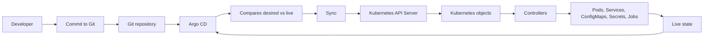
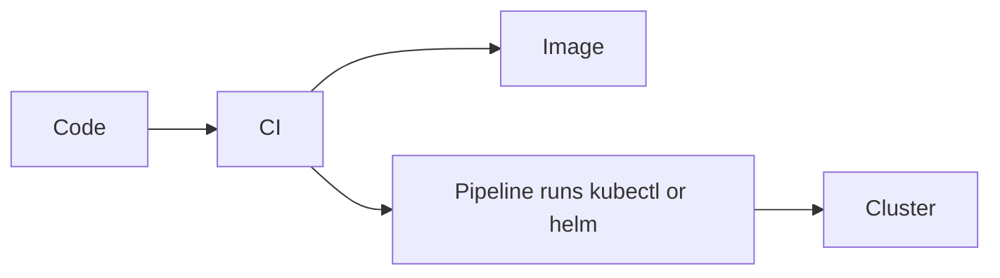
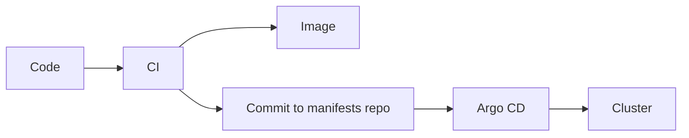
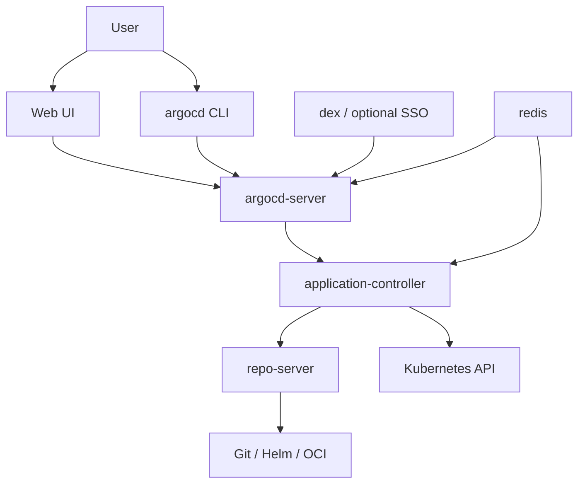

<!-- COURSE_NAV_START -->
[Previous](16.%20Final%20roadmap%20project.md) | [Index](README.md)
<!-- COURSE_NAV_END -->
# 17. GitOps and continuous delivery with Argo CD

## 17.1. Purpose of this module

So far, you have learned how to build images, write manifests, validate YAML, deploy workloads, expose services, configure applications, apply policies, observe the system, and diagnose failures.

That is already enough to work with Kubernetes.

But there is still an important question:

> Who applies changes to the cluster, and how do we know that the cluster still represents what is in Git?

In a manual workflow, a person or a pipeline runs:

```bash
kubectl apply -f ...
helm upgrade ...
kubectl apply -k ...
```

That model works for learning.

But in real teams, it starts to create problems:

- The cluster can change without Git reflecting it.
- A pipeline needs direct credentials to the cluster.
- It is hard to know whether production matches what was declared.
- Rollbacks depend on scripts, pipeline history, or team memory.
- Change review gets mixed with deployment execution.
- The developer experience depends on commands that are not always visible, repeatable, or auditable.

Argo CD exists to solve that problem through a simple idea:

> Git declares the desired state. Argo CD observes the cluster and reconciles reality against Git.

Argo CD does not replace Kubernetes.

Argo CD automates the relationship between Git and Kubernetes.

## 17.2. What you will learn

By the end of this module, you should be able to:

- Explain what problem Argo CD solves.
- Differentiate classic CI/CD, GitOps, and continuous reconciliation.
- Install Argo CD in a local learning cluster.
- Access Argo CD through the CLI and UI.
- Create an Argo CD application imperatively and declaratively.
- Sync an application manually.
- Configure automated sync with prune and self-heal.
- Use Argo CD with Kustomize.
- Use Argo CD with Helm.
- Understand AppProject as a boundary and multi-tenancy mechanism.
- Understand ApplicationSet for generating multiple Applications.
- Use sync waves and hooks to order deployments.
- Understand differences, drift, pruning, orphaned resources, and ignore differences.
- Apply a GitOps workflow to the `shop` system.
- Automate Argo CD tasks with Taskfile.
- Diagnose common Argo CD problems.
- Connect Argo CD with observability and DevEx.

## 17.3. What problem Argo CD solves

Kubernetes already has a declarative model.

You declare `spec`.

Controllers try to move the real state closer to that desired state.

But Kubernetes does not know, by itself, what the desired state in your repository is.

Kubernetes only knows the objects that have reached the API Server.

That leaves an important gap:

```text
Git knows what you wanted to deploy.
Kubernetes knows what is running.
But someone has to compare both.
```

That “someone” is often a person, a script, or a pipeline.

Argo CD turns that comparison into an explicit responsibility of the system.

Argo CD works as a Kubernetes controller that monitors running applications and compares their live state with the desired state defined in Git. When both states diverge, the application is shown as `OutOfSync`; Argo CD can show the difference and sync the cluster back to Git.

## 17.4. Mental model: Git, Argo CD, and Kubernetes

The simplest way to understand Argo CD is this:

```text
Git
  contains the desired state

Argo CD
  compares desired state and live state

Kubernetes
  runs and reconciles objects inside the cluster
```

Diagram:



The important idea is that Argo CD does not “deploy code” directly.

Argo CD applies manifests.

The code should already have gone through CI, tests, image build, scanning, registry publishing, and manifest updates.

## 17.5. Classic CI/CD versus GitOps

In a classic pipeline, the pipeline pushes changes to the cluster.



In GitOps, the pipeline updates Git and Argo CD reconciles from inside the cluster.



The difference is not cosmetic.

It is an operational control difference.

With GitOps:

- The cluster does not need to accept direct deployments from any pipeline.
- Git becomes the source of truth.
- Changes go through review.
- The desired state is auditable.
- Argo CD can detect drift.
- A rollback can return to a previous version of the manifests.
- The UI shows health, sync status, differences, and resources.

Argo CD supports several ways of defining manifests: Kustomize, Helm, Jsonnet, YAML or JSON directories, and custom config management plugins. It can also deploy to different environments by following branches, tags, or specific commits.

## 17.6. What Argo CD does not solve

Argo CD does not fix a bad delivery process.

It does not compensate for confusing manifests.

It does not replace tests.

It does not replace observability.

It does not automatically turn an insecure application into a secure one.

It does not prevent you from deploying bad configuration if that configuration is in Git and Argo CD has permission to apply it.

Argo CD improves one specific part of the system:

> It makes the distance between Git and the cluster visible and reconcilable.

But the quality of the outcome still depends on:

- How you build images.
- How you validate manifests.
- How you manage secrets.
- How you separate environments.
- How you define permissions.
- How you observe the system.
- How you review changes.
- How you design rollback and recovery.
- How you make the workflow easy for the team to use.

## 17.7. Argo CD architecture

Argo CD has several components.

For this module, you do not need to memorize every internal detail, but you do need to understand the main responsibilities.



Main responsibilities:

| Component | Responsibility |
|---|---|
| `argocd-server` | API, UI, authentication, and CLI interaction |
| `argocd-application-controller` | Observes Applications, calculates state, syncs, and updates status |
| `argocd-repo-server` | Fetches repositories and generates manifests from Kustomize, Helm, Jsonnet, or YAML |
| `argocd-dex-server` | Optional SSO integration |
| `argocd-redis` | Cache and internal coordination |

Argo CD is installed inside Kubernetes and exposes access through its API server, UI, or CLI. A multi-tenant installation is the most common setup in organizations where a platform serves several development teams.

## 17.8. Main concepts

Before installing anything, it is worth understanding the vocabulary.

| Concept | What it means |
|---|---|
| Application | Argo CD resource that connects a Git, Helm, or Kustomize source with a Kubernetes destination |
| AppProject | Logical grouping and security boundary for Applications |
| Source | Repository, path, chart, branch, tag, or commit containing the desired state |
| Destination | Cluster and namespace where the application is deployed |
| Sync | Operation that applies the desired state to the cluster |
| Health | Evaluation of the operational state of the resources |
| OutOfSync | Git and cluster do not match |
| Synced | Git and cluster match |
| Prune | Delete resources that no longer exist in Git |
| Self-heal | Revert manual changes made in the cluster |
| ApplicationSet | Generator of multiple Applications from templates and generators |

## 17.9. Environment preparation

This module assumes you already have:

- Docker or Podman.
- A local cluster, for example `kind`, `k3d`, `minikube`, or Docker Desktop Kubernetes.
- `kubectl`.
- `jq`.
- `yq`.
- `task`.
- `helm`.
- Access to a Git repository for the manifests.

Check the tools:

```bash
kubectl version --client
helm version
jq --version
yq --version
task --version
```

Check the cluster:

```bash
kubectl get nodes
kubectl get ns
```

Create the namespace for Argo CD:

```bash
kubectl create namespace argocd
```

## 17.10. Local Argo CD installation

For a local learning environment, install Argo CD in the `argocd` namespace.

```bash
kubectl apply -n argocd \
  -f https://raw.githubusercontent.com/argoproj/argo-cd/stable/manifests/install.yaml
```

Wait until the Pods are ready:

```bash
kubectl get pods -n argocd
kubectl wait --for=condition=Available deployment/argocd-server -n argocd --timeout=180s
```

View the main resources:

```bash
kubectl get deploy,sts,svc,cm,secret -n argocd
```

To access it locally:

```bash
kubectl port-forward svc/argocd-server -n argocd 8080:443
```

The UI will be available on local port `8080`.

To get the initial password for the `admin` user:

```bash
kubectl get secret argocd-initial-admin-secret -n argocd \
  -o jsonpath="{.data.password}" | base64 -d
echo
```

Log in from the CLI:

```bash
argocd login localhost:8080
```

Locally, if you are using a self-signed certificate, you may need:

```bash
argocd login localhost:8080 --insecure
```

Change the initial password:

```bash
argocd account update-password
```

Exit criteria:

```bash
argocd version
argocd app list
kubectl get pods -n argocd
```

## 17.11. Installing with Helm

You can also install Argo CD with Helm.

This path is useful when you want to treat Argo CD as part of the platform and version its values.

Add the repository:

```bash
helm repo add argo https://argoproj.github.io/argo-helm
helm repo update
```

Install:

```bash
helm upgrade --install argocd argo/argo-cd \
  --namespace argocd \
  --create-namespace
```

Verify:

```bash
helm list -n argocd
kubectl get pods -n argocd
```

Understanding criterion:

> Installing with direct manifests is simple for learning. Installing with Helm makes it easier to parameterize and version the installation.

## 17.12. Recommended `shop` repository structure

For this course, the most coherent structure would be:

```text
shop-platform/
  apps/
    checkout-api/
      base/
        deployment.yaml
        service.yaml
        configmap.yaml
        kustomization.yaml
      overlays/
        local/
          kustomization.yaml
          patch-resources.yaml
        staging/
          kustomization.yaml
        production/
          kustomization.yaml

  argocd/
    projects/
      shop-project.yaml
    applications/
      checkout-api-local.yaml
      checkout-api-staging.yaml
      checkout-api-production.yaml
    applicationsets/
      shop-environments.yaml

  taskfile/
  Taskfile.yml
```

This structure separates:

- Application manifests.
- Argo CD configuration.
- Environments.
- Automation.

The rule for this module is:

> Argo CD should apply manifests that you could already render and validate without Argo CD.

## 17.13. First imperative Application

Create an Application from the CLI.

Example:

```bash
argocd app create checkout-api-local \
  --repo https://github.com/your-organization/shop-platform.git \
  --path apps/checkout-api/overlays/local \
  --dest-server https://kubernetes.default.svc \
  --dest-namespace shop \
  --sync-policy none
```

Check it:

```bash
argocd app list
argocd app get checkout-api-local
```

Sync manually:

```bash
argocd app sync checkout-api-local
```

Check in Kubernetes:

```bash
kubectl get deploy,svc,pod -n shop
```

Understanding criterion:

> Creating an Application does not necessarily mean syncing it. First you define the relationship between Git and the destination. Then you decide when to sync.

## 17.14. First declarative Application

In GitOps, Applications are usually defined as YAML.

Create:

```text
argocd/applications/checkout-api-local.yaml
```

Content:

```yaml
apiVersion: argoproj.io/v1alpha1
kind: Application
metadata:
  name: checkout-api-local
  namespace: argocd
spec:
  project: default

  source:
    repoURL: https://github.com/your-organization/shop-platform.git
    targetRevision: main
    path: apps/checkout-api/overlays/local

  destination:
    server: https://kubernetes.default.svc
    namespace: shop

  syncPolicy:
    syncOptions:
      - CreateNamespace=true
```

Apply it:

```bash
kubectl apply -f argocd/applications/checkout-api-local.yaml
```

Inspect it:

```bash
kubectl get applications -n argocd
kubectl describe application checkout-api-local -n argocd
argocd app get checkout-api-local
```

Sync it:

```bash
argocd app sync checkout-api-local
```

Argo CD allows Applications, Projects, and configuration to be defined declaratively through Kubernetes manifests, which can be applied with `kubectl apply`; Applications and AppProjects are installed in the Argo CD namespace, usually `argocd` by default.

## 17.15. Sync and health states

Argo CD separates two different questions.

First question:

> Does the cluster match Git?

That is sync status.

Second question:

> Is the application working according to its Kubernetes resources?

That is health status.

Typical states:

| State | Meaning |
|---|---|
| `Synced` | The live state matches Git |
| `OutOfSync` | The live state does not match Git |
| `Healthy` | The resources appear operational |
| `Progressing` | The system is moving toward the expected state |
| `Degraded` | Some resource is in a bad state |
| `Missing` | An expected resource does not exist |
| `Unknown` | Argo CD cannot determine the state |

Commands:

```bash
argocd app get checkout-api-local
argocd app diff checkout-api-local
argocd app history checkout-api-local
```

From Kubernetes:

```bash
kubectl get application checkout-api-local -n argocd -o yaml
```

With `jq`:

```bash
kubectl get application checkout-api-local -n argocd -o json \
  | jq '.status | {sync: .sync.status, health: .health.status}'
```

Understanding criterion:

> `Synced` does not necessarily mean `Healthy`. An application can be synced with Git and still be broken if Git declares a bad configuration.

## 17.16. Manual sync

Manual sync is the safest mode to start with.

Flow:

```text
Git changes
Argo CD detects OutOfSync
A person reviews the diff
A person syncs
Argo CD applies changes
```

Commands:

```bash
argocd app diff checkout-api-local
argocd app sync checkout-api-local
argocd app wait checkout-api-local --health --timeout 120
```

View resources:

```bash
argocd app resources checkout-api-local
```

View rendered manifests:

```bash
argocd app manifests checkout-api-local
```

Understanding criterion:

> Manual sync keeps explicit human control. It is good for learning, critical environments, or high-risk changes.

## 17.17. Automated sync

Automated sync allows Argo CD to apply changes when it detects differences between Git and the cluster.

Declarative example:

```yaml
apiVersion: argoproj.io/v1alpha1
kind: Application
metadata:
  name: checkout-api-local
  namespace: argocd
spec:
  project: default

  source:
    repoURL: https://github.com/your-organization/shop-platform.git
    targetRevision: main
    path: apps/checkout-api/overlays/local

  destination:
    server: https://kubernetes.default.svc
    namespace: shop

  syncPolicy:
    automated:
      prune: true
      selfHeal: true
      allowEmpty: false
    syncOptions:
      - CreateNamespace=true
```

Meaning:

| Field | What it does |
|---|---|
| `automated` | Enables automated sync |
| `prune: true` | Deletes resources that are no longer in Git |
| `selfHeal: true` | Reverts manual changes made in the cluster |
| `allowEmpty: false` | Prevents accidentally deleting everything if the app renders empty |
| `CreateNamespace=true` | Creates the destination namespace if it does not exist |

Argo CD can automatically sync an Application when it detects differences between desired manifests and live state. One operational advantage is that the CI pipeline does not need direct access to the Argo CD API server or to the cluster to deploy; it can limit itself to committing and pushing to the manifests repository.

Understanding criterion:

> Auto-sync reduces friction, but it makes proper review of what enters Git even more important.

## 17.18. Prune and self-heal

Prune and self-heal are two different concepts.

### Prune

Prune deletes resources from the cluster that Argo CD manages and that no longer exist in Git.

Example:

```text
Git removes service.yaml
Argo CD detects that the Service exists in the cluster but not in Git
With prune enabled, Argo CD can delete the Service
```

### Self-heal

Self-heal corrects manual changes made in the cluster.

Example:

```bash
kubectl scale deploy checkout-api -n shop --replicas=10
```

If Git says there are 3 replicas and self-heal is enabled, Argo CD will return it to 3.

Understanding criterion:

> Prune corrects extra resources. Self-heal corrects manual drift.

## 17.19. Important sync options

Argo CD allows you to modify sync behavior with sync options.

Example:

```yaml
syncPolicy:
  automated:
    prune: true
    selfHeal: true
  syncOptions:
    - CreateNamespace=true
    - PruneLast=true
    - RespectIgnoreDifferences=true
```

Useful options:

| Option | Use |
|---|---|
| `CreateNamespace=true` | Creates the destination namespace |
| `PruneLast=true` | Runs pruning at the end |
| `RespectIgnoreDifferences=true` | Also respects ignored fields during sync |
| `ServerSideApply=true` | Uses server-side apply |
| `Validate=false` | Disables validation; use carefully |
| `PrunePropagationPolicy=foreground` | Controls deletion policy |

Argo CD documents sync options as a mechanism for changing sync behavior, including validation, namespace creation, prune propagation, prune last, and respecting ignore differences.

Understanding criterion:

> Sync options are not decoration. They change how Argo CD applies, deletes, and compares resources.

## 17.20. Argo CD with Kustomize

Argo CD detects Kustomize when the configured path contains a `kustomization.yaml`.

Application example:

```yaml
apiVersion: argoproj.io/v1alpha1
kind: Application
metadata:
  name: checkout-api-local
  namespace: argocd
spec:
  project: default

  source:
    repoURL: https://github.com/your-organization/shop-platform.git
    targetRevision: main
    path: apps/checkout-api/overlays/local

  destination:
    server: https://kubernetes.default.svc
    namespace: shop

  syncPolicy:
    automated:
      prune: true
      selfHeal: true
    syncOptions:
      - CreateNamespace=true
```

Render locally before trusting Argo CD:

```bash
kubectl kustomize apps/checkout-api/overlays/local
```

Validate against the cluster:

```bash
kubectl apply --dry-run=server -k apps/checkout-api/overlays/local
```

Argo CD renders manifests with Kustomize when the Application path contains a `kustomization.yaml`. It also allows you to configure options such as `images`, `replicas`, common labels, common annotations, namespace, and other Kustomize-specific settings from the Application.

Understanding criterion:

> If Kustomize fails outside Argo CD, it will also fail inside Argo CD. Render locally first, then sync.

## 17.21. Argo CD with Helm

Argo CD can deploy Helm charts.

Example with a remote chart:

```yaml
apiVersion: argoproj.io/v1alpha1
kind: Application
metadata:
  name: nginx-helm
  namespace: argocd
spec:
  project: default

  source:
    repoURL: https://charts.bitnami.com/bitnami
    chart: nginx
    targetRevision: 18.2.5
    helm:
      releaseName: nginx-helm
      values: |
        service:
          type: ClusterIP

  destination:
    server: https://kubernetes.default.svc
    namespace: shop

  syncPolicy:
    syncOptions:
      - CreateNamespace=true
```

Example with a chart inside Git:

```yaml
apiVersion: argoproj.io/v1alpha1
kind: Application
metadata:
  name: checkout-api-chart
  namespace: argocd
spec:
  project: default

  source:
    repoURL: https://github.com/your-organization/shop-platform.git
    targetRevision: main
    path: charts/checkout-api
    helm:
      valueFiles:
        - values-local.yaml

  destination:
    server: https://kubernetes.default.svc
    namespace: shop
```

Validate outside Argo CD:

```bash
helm template checkout-api charts/checkout-api -f charts/checkout-api/values-local.yaml
```

Important warning:

Argo CD uses labels for resource tracking. The documentation warns that overriding the Helm release name can cause issues when the chart uses the `app.kubernetes.io/instance` label, because Argo CD injects it with the Application name for tracking.

Understanding criterion:

> In Argo CD, Helm is mainly used to render manifests. Argo CD is still the system that compares, syncs, and observes the Application.

## 17.22. Directory applications

You can also point an Application to a directory of plain YAML.

Example:

```yaml
apiVersion: argoproj.io/v1alpha1
kind: Application
metadata:
  name: raw-yaml-app
  namespace: argocd
spec:
  project: default

  source:
    repoURL: https://github.com/your-organization/shop-platform.git
    targetRevision: main
    path: raw/checkout-api
    directory:
      recurse: true
      include: "*.yaml"

  destination:
    server: https://kubernetes.default.svc
    namespace: shop
```

Argo CD states that directory applications work with plain manifests. If `directory` is forced and Argo CD finds Kustomize, Helm, or Jsonnet files, manifest rendering will fail.

Understanding criterion:

> Use directory when you have plain YAML. Use Kustomize or Helm when the repository actually uses Kustomize or Helm.

## 17.23. AppProject

AppProject is one of the most important pieces for a shared platform.

An Application always belongs to a Project.

The `default` project exists automatically, but it is too permissive for real teams.

Projects group Applications and can restrict which repositories can be used, which clusters and namespaces can be deployed to, which object types can be created, and which roles exist inside the project.

Example:

```yaml
apiVersion: argoproj.io/v1alpha1
kind: AppProject
metadata:
  name: shop
  namespace: argocd
spec:
  description: Project for the shop system applications

  sourceRepos:
    - https://github.com/your-organization/shop-platform.git

  destinations:
    - server: https://kubernetes.default.svc
      namespace: shop
    - server: https://kubernetes.default.svc
      namespace: shop-staging

  clusterResourceWhitelist:
    - group: ""
      kind: Namespace

  namespaceResourceWhitelist:
    - group: ""
      kind: ConfigMap
    - group: ""
      kind: Secret
    - group: ""
      kind: Service
    - group: apps
      kind: Deployment
    - group: networking.k8s.io
      kind: Ingress
    - group: networking.k8s.io
      kind: NetworkPolicy
```

Application using the project:

```yaml
apiVersion: argoproj.io/v1alpha1
kind: Application
metadata:
  name: checkout-api-local
  namespace: argocd
spec:
  project: shop

  source:
    repoURL: https://github.com/your-organization/shop-platform.git
    targetRevision: main
    path: apps/checkout-api/overlays/local

  destination:
    server: https://kubernetes.default.svc
    namespace: shop
```

Understanding criterion:

> AppProject is not a folder. It is an operational and security boundary.

## 17.24. RBAC in Argo CD

Kubernetes RBAC and Argo CD RBAC are not the same thing.

Kubernetes RBAC controls what an identity can do against the Kubernetes API.

Argo CD RBAC controls what a person or integration can do inside Argo CD.

Argo CD does not have full user management of its own. It has a built-in `admin` user, and RBAC usually relies on SSO or local users. Argo CD includes built-in roles such as `role:readonly` and `role:admin`, and allows permissions to be configured globally or as roles inside AppProjects.

Conceptual policy example:

```csv
p, role:shop-reader, applications, get, shop/*, allow
p, role:shop-syncer, applications, sync, shop/*, allow
g, team-shop, role:shop-syncer
```

Understanding criterion:

> A person can have permission to sync an Application in Argo CD without having direct permission to run `kubectl apply` against the cluster.

## 17.25. Private repositories and credentials

To use private repositories, Argo CD needs credentials.

There are two main approaches:

1. Add credentials from the CLI.
2. Declare them as Secrets in the `argocd` namespace.

HTTPS CLI example:

```bash
argocd repo add https://github.com/your-organization/shop-platform.git \
  --username <user> \
  --password <token>
```

Declarative example:

```yaml
apiVersion: v1
kind: Secret
metadata:
  name: shop-platform-repo
  namespace: argocd
  labels:
    argocd.argoproj.io/secret-type: repository
stringData:
  type: git
  url: https://github.com/your-organization/shop-platform.git
  username: <user>
  password: <token>
```

Rules:

- Do not store real tokens in Git without encryption.
- Use SOPS, Sealed Secrets, External Secrets, or an equivalent mechanism if you want to declare credentials.
- Give the token minimum permissions.
- Avoid long-lived personal tokens for shared platforms.
- Document who rotates credentials and when.

Understanding criterion:

> GitOps does not mean putting every secret in Git as plain text. It means declaring state in an auditable and secure way.

## 17.26. Sync waves

Sometimes you need to control application order.

Example:

```text
Namespace
ConfigMap / Secret
Deployment
Service
Ingress
Post-deploy Job
```

Argo CD lets you use sync waves with the annotation:

```yaml
metadata:
  annotations:
    argocd.argoproj.io/sync-wave: "1"
```

Example:

```yaml
apiVersion: v1
kind: ConfigMap
metadata:
  name: checkout-api-config
  namespace: shop
  annotations:
    argocd.argoproj.io/sync-wave: "0"
data:
  LOG_LEVEL: info
```

Deployment:

```yaml
apiVersion: apps/v1
kind: Deployment
metadata:
  name: checkout-api
  namespace: shop
  annotations:
    argocd.argoproj.io/sync-wave: "1"
spec:
  replicas: 3
```

Ingress:

```yaml
apiVersion: networking.k8s.io/v1
kind: Ingress
metadata:
  name: checkout-api
  namespace: shop
  annotations:
    argocd.argoproj.io/sync-wave: "2"
spec: {}
```

Understanding criterion:

> Sync waves order resource application. They should not be used to hide poorly designed dependencies.

## 17.27. Resource hooks

Hooks let you run resources during specific sync phases.

Common phases:

| Hook | When it runs |
|---|---|
| `PreSync` | Before normal resources are applied |
| `Sync` | During synchronization |
| `PostSync` | After synchronization |
| `SyncFail` | When synchronization fails |
| `PostDelete` | After deleting the Application |

Example post-sync smoke test:

```yaml
apiVersion: batch/v1
kind: Job
metadata:
  name: checkout-api-smoke-test
  namespace: shop
  annotations:
    argocd.argoproj.io/hook: PostSync
    argocd.argoproj.io/hook-delete-policy: HookSucceeded
spec:
  template:
    spec:
      restartPolicy: Never
      containers:
        - name: smoke
          image: curlimages/curl:8.8.0
          command:
            - sh
            - -c
            - |
              curl -f http://checkout-api.shop.svc.cluster.local/health
```

During a sync operation, Argo CD applies `PreSync` hooks first, then `Sync` hooks, and then `PostSync` hooks. If a hook in those phases fails, the operation is marked as failed; `SyncFail` can run for cleanup or other tasks.

Understanding criterion:

> Hooks are useful for validating or preparing deployments. They should not become a hidden pipeline inside Kubernetes.

## 17.28. Diff and drift

Argo CD calculates differences between the desired state and the live state to decide whether an Application is `OutOfSync`. The same logic is used in the UI to show differences by resource.

Commands:

```bash
argocd app diff checkout-api-local
argocd app get checkout-api-local
```

Cause manual drift:

```bash
kubectl scale deployment checkout-api -n shop --replicas=10
```

Observe:

```bash
argocd app get checkout-api-local
argocd app diff checkout-api-local
```

If `selfHeal` is enabled, Argo CD should return the Deployment to the number of replicas declared in Git.

Understanding criterion:

> Drift is any difference between what is declared and what is live. It can come from manual changes, controllers, API Server defaults, or mutating webhooks.

## 17.29. Ignore differences

Sometimes there are legitimate differences that you do not want Argo CD to treat as drift.

Examples:

- Fields modified by controllers.
- Replicas managed by HPA.
- Mutations made by admission controllers.
- Fields defaulted by the API Server.

Example for ignoring replicas in Deployments:

```yaml
apiVersion: argoproj.io/v1alpha1
kind: Application
metadata:
  name: checkout-api-local
  namespace: argocd
spec:
  project: shop

  source:
    repoURL: https://github.com/your-organization/shop-platform.git
    targetRevision: main
    path: apps/checkout-api/overlays/local

  destination:
    server: https://kubernetes.default.svc
    namespace: shop

  ignoreDifferences:
    - group: apps
      kind: Deployment
      jsonPointers:
        - /spec/replicas
```

Argo CD allows differences to be ignored at the Application level using JSON pointers, JQ path expressions, and fields managed by specific managers in `metadata.managedFields`.

Warning:

> Ignoring differences can be correct. Ignoring differences without understanding them can hide real drift.

## 17.30. Orphaned resources

An orphaned resource is a resource that exists in the namespace but does not belong to any expected Application.

Examples:

- Someone manually created a Service.
- A resource remained after migrating manifests.
- A hook created something and did not clean it up.
- A chart changed resource names.

The operational question is:

```text
Should this resource exist?
Who manages it?
Is it declared in Git?
Can Argo CD delete it?
```

Useful commands:

```bash
kubectl get all -n shop
argocd app resources checkout-api-local
```

Understanding criterion:

> GitOps is not only about creating resources. It is also about knowing which resources should no longer exist.

## 17.31. Application deletion

Deleting an Application can mean two different things.

First option:

> Delete only the Argo CD Application while keeping the Kubernetes resources.

Second option:

> Delete the Application and also the resources it managed.

Argo CD supports cascade and non-cascade deletion. With cascade delete, the Application and its resources are deleted; without cascade delete, only the Application is deleted.

Commands:

```bash
argocd app delete checkout-api-local --cascade=false
```

```bash
argocd app delete checkout-api-local --cascade
```

Understanding criterion:

> Before deleting an Application, you must know whether you want to unregister management or destroy resources.

## 17.32. ApplicationSet

An Application represents one application in one destination.

But in real platforms, this pattern often appears:

```text
same app
multiple environments
multiple clusters
multiple teams
multiple regions
```

Creating every Application by hand does not scale well.

ApplicationSet lets you generate Applications from templates and generators. The ApplicationSet controller provides tools to automate the creation and modification of Applications from sources such as Argo CD clusters or Git repositories.

Example with list generator:

```yaml
apiVersion: argoproj.io/v1alpha1
kind: ApplicationSet
metadata:
  name: checkout-api-environments
  namespace: argocd
spec:
  generators:
    - list:
        elements:
          - environment: local
            namespace: shop
            revision: main
          - environment: staging
            namespace: shop-staging
            revision: main

  template:
    metadata:
      name: 'checkout-api-{{environment}}'
    spec:
      project: shop
      source:
        repoURL: https://github.com/your-organization/shop-platform.git
        targetRevision: '{{revision}}'
        path: 'apps/checkout-api/overlays/{{environment}}'
      destination:
        server: https://kubernetes.default.svc
        namespace: '{{namespace}}'
      syncPolicy:
        syncOptions:
          - CreateNamespace=true
```

The List generator generates parameters from an arbitrary list of key-value pairs, as long as the values are strings.

Understanding criterion:

> ApplicationSet does not deploy workloads directly. It generates Applications that Argo CD then reconciles.

## 17.33. ApplicationSet generators

Common generators:

| Generator | Use |
|---|---|
| List | Explicit list of environments, clusters, or apps |
| Cluster | Generate apps per registered cluster |
| Git | Generate apps from directories or files in Git |
| Matrix | Combine two generators |
| Merge | Merge parameters with overrides |
| Pull Request | Create temporary apps per PR |
| SCM Provider | Discover repositories from an SCM provider |

The Cluster generator identifies clusters defined in Argo CD and extracts their data as parameters.

The Matrix generator combines the parameters of two generators, producing combinations between both.

The Merge generator combines parameters from a base generator with overrides from other generators using merge keys.

Security warning:

The Git generator documentation warns that, if the `project` field is templated, developers could create Applications under Projects with excessive permissions; in those cases, the source of truth should be controlled by admins and PRs should require admin approval.

Understanding criterion:

> ApplicationSet reduces repetition, but it increases the importance of controlling templates, permissions, and parameter sources.

## 17.34. App of Apps

App of Apps is a pattern where a root Application deploys other Applications.

Example:

```text
root-app
  argocd/projects/shop-project.yaml
  argocd/applications/checkout-api.yaml
  argocd/applications/payment-api.yaml
  argocd/applications/frontend.yaml
```

Root Application:

```yaml
apiVersion: argoproj.io/v1alpha1
kind: Application
metadata:
  name: shop-root
  namespace: argocd
spec:
  project: default

  source:
    repoURL: https://github.com/your-organization/shop-platform.git
    targetRevision: main
    path: argocd

  destination:
    server: https://kubernetes.default.svc
    namespace: argocd

  syncPolicy:
    automated:
      prune: true
      selfHeal: true
```

Recommended use in this course:

- One root app for local bootstrap.
- Separate Applications for each service.
- AppProject to limit permissions.
- Manual sync at first.
- Auto-sync once the team understands the flow.

Understanding criterion:

> App of Apps helps bootstrap Argo CD with Argo CD, but it can hide dependencies if it is not well structured.

## 17.35. Argo CD and secrets

GitOps does not remove the secrets problem.

It makes it more visible.

Do not put real secrets in plain YAML.

Common options:

| Option | Idea |
|---|---|
| External Secrets Operator | Kubernetes gets secrets from an external secret manager |
| Sealed Secrets | Encrypted Secret that only the cluster can decrypt |
| SOPS | File encryption in Git with KMS, PGP, or Age |
| Vault | External secret management |
| Manual Secret | Only for controlled local labs |

Local teaching example:

```yaml
apiVersion: v1
kind: Secret
metadata:
  name: checkout-api-secret
  namespace: shop
type: Opaque
stringData:
  API_TOKEN: demo
```

Warning:

> This example is useful for learning integration. It should not be used with real secrets in shared repositories.

Understanding criterion:

> GitOps needs a secrets strategy. Without one, Git becomes a risk.

## 17.36. Argo CD and observability

Argo CD adds new operational questions:

- Which Applications are `OutOfSync`?
- Which Applications are `Degraded`?
- When did the last sync happen?
- Which resource prevents an app from being Healthy?
- Which team made the change in Git?
- Which diff is pending?
- Which sync failed?
- Which hook failed?
- Which ApplicationSet generated this Application?

Commands:

```bash
argocd app list
argocd app get checkout-api-local
argocd app history checkout-api-local
argocd app resources checkout-api-local
```

From Kubernetes:

```bash
kubectl get applications -n argocd
kubectl get applications -n argocd -o json \
  | jq '.items[] | {name: .metadata.name, sync: .status.sync.status, health: .status.health.status}'
```

Argo CD Notifications monitors Applications and can notify important state changes through triggers and templates.

Example subscription by annotation:

```yaml
metadata:
  annotations:
    notifications.argoproj.io/subscribe.on-sync-failed.slack: platform-alerts
```

Subscriptions can be defined with `notifications.argoproj.io/subscribe.<trigger>.<service>: <recipient>` annotations on Applications or AppProjects.

Understanding criterion:

> Argo CD does not replace LGTM. Argo CD adds delivery signals that should be connected with system observability.

## 17.37. Argo CD and DevEx

Argo CD improves developer experience when it reduces manual steps without hiding the model.

Good DevEx flow:

```text
developer changes code
CI runs tests
CI builds image
CI publishes image
CI updates manifest or values
PR reviews declarative change
merge updates Git
Argo CD detects change
Argo CD shows diff
Argo CD syncs
team observes health
```

Bad DevEx flow:

```text
developer does not know what was deployed
pipeline touches the cluster directly
Argo CD fights manual changes
manifests cannot be rendered locally
secrets are mixed with configuration
nobody knows whether OutOfSync is normal or dangerous
```

Rules:

- Every manifest must be renderable outside Argo CD.
- Every change must be reviewable in Git.
- Every failed sync must leave clear signals.
- Every environment must have a rollback path.
- Applications must have predictable names.
- Projects must limit blast radius.
- Hooks must be idempotent.
- Sync waves must be few and justified.
- Taskfile must simplify, not hide.

## 17.38. Taskfile for Argo CD

Add this to `Taskfile.yml`:

```yaml
version: '3'

tasks:
  argocd:install:
    desc: Installs Argo CD in the local cluster
    cmds:
      - kubectl create namespace argocd --dry-run=client -o yaml | kubectl apply -f -
      - kubectl apply -n argocd -f https://raw.githubusercontent.com/argoproj/argo-cd/stable/manifests/install.yaml
      - kubectl wait --for=condition=Available deployment/argocd-server -n argocd --timeout=180s

  argocd:status:
    desc: Shows Argo CD status
    cmds:
      - kubectl get pods -n argocd
      - kubectl get svc -n argocd
      - kubectl get applications -n argocd || true

  argocd:password:
    desc: Shows the initial password for the admin user
    cmds:
      - kubectl get secret argocd-initial-admin-secret -n argocd -o jsonpath="{.data.password}" | base64 -d
      - echo

  argocd:port-forward:
    desc: Exposes Argo CD locally at https://localhost:8080
    cmds:
      - kubectl port-forward svc/argocd-server -n argocd 8080:443

  argocd:apply:
    desc: Applies declarative Argo CD configuration
    cmds:
      - kubectl apply -f argocd/projects/
      - kubectl apply -f argocd/applications/

  argocd:apps:
    desc: Lists Applications with sync and health status
    cmds:
      - kubectl get applications -n argocd -o json | jq '.items[] | {name: .metadata.name, sync: .status.sync.status, health: .status.health.status}'

  argocd:diff:
    desc: Shows diff for an Application
    vars:
      APP: '{{.APP | default "checkout-api-local"}}'
    cmds:
      - argocd app diff {{.APP}}

  argocd:sync:
    desc: Syncs an Application
    vars:
      APP: '{{.APP | default "checkout-api-local"}}'
    cmds:
      - argocd app sync {{.APP}}
      - argocd app wait {{.APP}} --health --timeout 120

  argocd:resources:
    desc: Shows resources managed by an Application
    vars:
      APP: '{{.APP | default "checkout-api-local"}}'
    cmds:
      - argocd app resources {{.APP}}

  argocd:delete:
    desc: Deletes an Application without deleting resources
    vars:
      APP: '{{.APP | default "checkout-api-local"}}'
    cmds:
      - argocd app delete {{.APP}} --cascade=false
```

Usage:

```bash
task argocd:install
task argocd:status
task argocd:password
task argocd:port-forward
task argocd:apply
task argocd:apps
task argocd:sync APP=checkout-api-local
```

Understanding criterion:

> Taskfile does not replace Argo CD. Taskfile makes learning and diagnostic operations repeatable.

## 17.39. jq and yq with Argo CD

Inspect Application status:

```bash
kubectl get applications -n argocd -o json \
  | jq '.items[] | {
      name: .metadata.name,
      project: .spec.project,
      sync: .status.sync.status,
      health: .status.health.status
    }'
```

View source and destination:

```bash
kubectl get application checkout-api-local -n argocd -o json \
  | jq '.spec | {source, destination}'
```

View sync policy:

```bash
kubectl get application checkout-api-local -n argocd -o yaml \
  | yq '.spec.syncPolicy'
```

View managed resources:

```bash
kubectl get application checkout-api-local -n argocd -o json \
  | jq '.status.resources[] | {kind, name, namespace, status, health}'
```

Understanding criterion:

> Argo CD is also Kubernetes. Its Applications have `spec` and `status`, and you can inspect them with the same tools.

## 17.40. Full workflow for `checkout-api`

### Step 1. Local render

```bash
kubectl kustomize apps/checkout-api/overlays/local
```

### Step 2. Server-side validation

```bash
kubectl apply --dry-run=server -k apps/checkout-api/overlays/local
```

### Step 3. AppProject

```bash
kubectl apply -f argocd/projects/shop-project.yaml
```

### Step 4. Application

```bash
kubectl apply -f argocd/applications/checkout-api-local.yaml
```

### Step 5. Diff

```bash
argocd app diff checkout-api-local
```

### Step 6. Sync

```bash
argocd app sync checkout-api-local
argocd app wait checkout-api-local --health --timeout 120
```

### Step 7. Kubernetes validation

```bash
kubectl get deploy,svc,pod -n shop
kubectl rollout status deploy/checkout-api -n shop
kubectl get endpointslice -n shop
```

### Step 8. Argo CD validation

```bash
argocd app get checkout-api-local
argocd app resources checkout-api-local
```

Exit criterion:

> The Argo CD state should be `Synced` and `Healthy`, and Kubernetes should show `Ready` Pods.

## 17.41. Failure lab 1: manual change in the cluster

Goal:

> Understand drift and self-heal.

Scale manually:

```bash
kubectl scale deployment checkout-api -n shop --replicas=10
```

Observe:

```bash
argocd app get checkout-api-local
argocd app diff checkout-api-local
```

If self-heal is enabled, wait:

```bash
watch kubectl get deploy checkout-api -n shop
```

Questions:

- Did Argo CD detect OutOfSync?
- Did it return to the value declared in Git?
- What does the diff show?
- What would happen if self-heal were disabled?

Understanding criterion:

> A manual change can look useful during an emergency, but it breaks the source of truth if it does not return to Git.

## 17.42. Failure lab 2: invalid manifest

Goal:

> Understand rendering and sync errors.

Break a YAML file in the overlay.

For example, use bad indentation or an invalid field.

Check locally:

```bash
kubectl kustomize apps/checkout-api/overlays/local
kubectl apply --dry-run=server -k apps/checkout-api/overlays/local
```

Check Argo CD:

```bash
argocd app get checkout-api-local
argocd app sync checkout-api-local
```

Questions:

- Did Kustomize fail first, or did the API Server fail?
- What error does Argo CD show?
- Was the error visible before committing?
- Which Taskfile task should have detected it?

Understanding criterion:

> Argo CD should not be the first validation line. The repository should have quality gates before it.

## 17.43. Failure lab 3: resource removed from Git

Goal:

> Understand prune.

Remove `service.yaml` from Kustomize.

Render:

```bash
kubectl kustomize apps/checkout-api/overlays/local
```

Check diff:

```bash
argocd app diff checkout-api-local
```

If prune is enabled, sync:

```bash
argocd app sync checkout-api-local
```

Observe:

```bash
kubectl get svc -n shop
argocd app resources checkout-api-local
```

Questions:

- Did Argo CD delete the Service?
- Did the application remain Healthy?
- What impact would this have on Ingress?
- When does it make sense to use `Prune=confirm`?

Argo CD lets you configure pruning with confirmation for critical resources using the `Prune=confirm` sync option.

Understanding criterion:

> Prune is powerful because it removes garbage. It is also dangerous if you do not review what disappears from Git.

## 17.44. Argo CD troubleshooting

### Application does not appear

Check:

```bash
kubectl get applications -n argocd
kubectl get crd | grep applications
kubectl describe application <app> -n argocd
```

Possible causes:

- The manifest was applied in another namespace.
- The CRD does not exist.
- The YAML is invalid.
- `metadata.name` is not the expected one.

### Application is OutOfSync

Check:

```bash
argocd app get <app>
argocd app diff <app>
```

Possible causes:

- Manual changes in the cluster.
- Git changed and has not been synced.
- A mutating webhook changes fields.
- HPA changes replicas.
- API Server defaults modify the object.

### Application is Degraded

Check:

```bash
argocd app resources <app>
kubectl get pods -n <namespace>
kubectl describe pod <pod> -n <namespace>
kubectl get events -n <namespace> --sort-by=.lastTimestamp
```

Possible causes:

- Deployment is unavailable.
- Pods are not Ready.
- ImagePullBackOff.
- CrashLoopBackOff.
- Service has no endpoints.
- Job hook failed.

### Sync fails

Check:

```bash
argocd app get <app>
argocd app sync <app>
kubectl get events -n <namespace> --sort-by=.lastTimestamp
```

Possible causes:

- Insufficient permissions.
- Project blocks the repo, destination, or kind.
- Namespace does not exist and `CreateNamespace=true` is missing.
- CRD is not installed.
- Hook failed.
- Manifest is invalid.
- Immutable resource field.

### Repo does not connect

Check:

```bash
argocd repo list
argocd repo get <repo-url>
```

Possible causes:

- Invalid token.
- Incorrect SSH key.
- Untrusted certificate.
- Private repository without credentials.
- Wrong URL.

### Kustomize fails

Check:

```bash
kubectl kustomize <path>
argocd app manifests <app>
```

Possible causes:

- Wrong path.
- Broken `kustomization.yaml`.
- Duplicate resource.
- Patch does not match.
- Image or namespace misconfigured.

### Helm fails

Check:

```bash
helm template <release> <chart> -f values.yaml
argocd app manifests <app>
```

Possible causes:

- Chart does not exist.
- Incorrect version.
- Invalid values.
- Helm repo is not accessible.
- Required CRDs are not installed.

## 17.45. Best practices

### Keep Git as the source of truth

Do not fix production with `kubectl edit` and forget about it.

If you must make a manual emergency change, move it back to Git afterward, or Argo CD will revert it, or worse, it will remain unexplained drift.

### Render before syncing

Before trusting Argo CD:

```bash
kubectl kustomize ...
helm template ...
kubectl apply --dry-run=server ...
```

### Use Projects from the beginning

Do not leave everything in `default`.

A Project should limit:

- Allowed repositories.
- Allowed namespaces.
- Allowed clusters.
- Allowed kinds.
- Allowed roles.

### Start with manual sync

For learning, use manual sync.

Then enable auto-sync per environment.

A reasonable progression:

```text
local: auto-sync + prune + self-heal
staging: auto-sync + prune + self-heal
production: manual sync or auto-sync with additional controls
```

### Do not abuse hooks

Use hooks for necessary validations.

Do not put the whole pipeline inside Argo CD.

### Control pruning

Enable prune once the team understands the consequences.

Use confirmation for critical resources.

### Do not ignore differences without understanding them

`ignoreDifferences` should have an explanation.

If you ignore everything uncomfortable, Argo CD stops being a control tool.

### Version Applications and Projects

Do not create Applications only from the UI.

The UI is good for observing.

Git should be the source of truth.

### Connect Argo CD with observability

A `Degraded` app should have a diagnostic path:

```text
Argo CD Application
Kubernetes resource
Pod logs
Events
Metrics
Traces
Runbook
```

## 17.46. Antipatterns

### Using Argo CD as a magic button

If the team does not understand Kubernetes, Argo CD only adds another layer of confusion.

### Mixing manual changes and GitOps without a clear rule

This creates constant drift.

### Giving the Project overly broad permissions

A permissive Project reduces friction at first, but it increases blast radius.

### Using auto-sync in production without quality gates

Auto-sync multiplies the propagation speed of errors.

### Putting real secrets in Git as plain text

GitOps without a secrets strategy is a bad practice.

### Ignoring OutOfSync because “it always happens”

If OutOfSync is normal, the system stops communicating.

### Using ApplicationSet without controls

Generating many Applications from poorly controlled templates can create problems at scale.

## 17.47. Relationship with previous modules

| Previous module | Relationship with Argo CD |
|---|---|
| Module 0 | Taskfile, jq, yq, and reproducible environment |
| Module 1 | Images later referenced in manifests |
| Module 3 | `kubectl`, contexts, and namespaces |
| Module 4 | Desired state, spec/status, and reconciliation |
| Module 5 | Pods, probes, and lifecycle |
| Module 6 | Deployments, Jobs, and rollouts |
| Module 7 | Services, Ingress, and NetworkPolicy |
| Module 8 | ConfigMaps, Secrets, and storage |
| Module 9 | Manifest validation before deployment |
| Module 10 | Kustomize, Helm, diff, rollout, and delivery |
| Module 11 | RBAC, ServiceAccounts, and security |
| Module 12 | Observability, health, alerts, and runbooks |
| Module 13 | Cloud native patterns |
| Module 14 | CRDs, controllers, and operators |
| Module 16 | Final integrated project |

Argo CD connects all those modules into a continuous delivery workflow.

## 17.48. Guided exercise

Goal:

> Deploy `checkout-api` with Argo CD from a Kustomize overlay.

### Step 1. Create namespace

```bash
kubectl create namespace shop --dry-run=client -o yaml | kubectl apply -f -
```

### Step 2. Validate overlay

```bash
kubectl kustomize apps/checkout-api/overlays/local
kubectl apply --dry-run=server -k apps/checkout-api/overlays/local
```

### Step 3. Create Project

```bash
kubectl apply -f argocd/projects/shop-project.yaml
```

### Step 4. Create Application

```bash
kubectl apply -f argocd/applications/checkout-api-local.yaml
```

### Step 5. Observe

```bash
argocd app get checkout-api-local
argocd app diff checkout-api-local
```

### Step 6. Sync

```bash
argocd app sync checkout-api-local
argocd app wait checkout-api-local --health --timeout 120
```

### Step 7. Validate Kubernetes

```bash
kubectl get deploy,svc,pod -n shop
kubectl get endpointslice -n shop
```

### Step 8. Test drift

```bash
kubectl scale deployment checkout-api -n shop --replicas=10
argocd app diff checkout-api-local
```

### Step 9. Repair through GitOps

If self-heal is enabled, observe.

If it is not enabled:

```bash
argocd app sync checkout-api-local
```

### Expected result

The Application should end as:

```text
Synced
Healthy
```

And Kubernetes should show Ready Pods.

## 17.49. Module acceptance criteria

This module is complete when you can demonstrate:

- Argo CD is installed and accessible locally.
- You can log in through the CLI and UI.
- There is a `shop` AppProject.
- There is a declarative Application for `checkout-api`.
- The Application uses Kustomize.
- You can see the diff before syncing.
- You can sync manually.
- You can enable auto-sync.
- You can explain prune and self-heal.
- You can create and detect drift.
- You can repair drift from Argo CD.
- You can diagnose a failed sync.
- You can see resources managed by the Application.
- You can use `jq` to read sync and health status.
- You can automate common operations with Taskfile.
- You can explain why Argo CD improves DevEx.
- You can explain what risks it introduces when used poorly.

## 17.50. Summary

Argo CD is not just a nice UI for Kubernetes.

Argo CD is a way to make the relationship between Git and the cluster visible, auditable, and reconcilable.

Its value is not simply “deploy faster.”

Its value is reducing ambiguity:

```text
what we want
what is running
what changed
what is out of sync
what is healthy
what failed
what must be reconciled
```

Used well, Argo CD improves developer experience because it reduces manual steps, avoids direct cluster credentials from pipelines, shows differences before applying, lets teams return to previous states declared in Git, and turns delivery into an observable system.

Used poorly, Argo CD only adds another layer of automation on top of weak manifests, poorly managed secrets, excessive permissions, and unclear processes.

The final rule is this:

> Argo CD should not hide Kubernetes. It should make the contract between Git, Kubernetes, and the team more visible.

## 17.51. References

- Argo CD documentation, overview and architecture.
- Argo CD documentation, installation.
- Argo CD documentation, declarative setup.
- Argo CD documentation, automated sync policy.
- Argo CD documentation, sync options.
- Argo CD documentation, sync phases and waves.
- Argo CD documentation, Kustomize.
- Argo CD documentation, Helm.
- Argo CD documentation, directory applications.
- Argo CD documentation, Projects.
- Argo CD documentation, RBAC.
- Argo CD documentation, diff customization.
- Argo CD documentation, ApplicationSet.
- Argo CD documentation, notifications.


<!-- COURSE_NAV_START -->
[Previous](16.%20Final%20roadmap%20project.md) | [Index](README.md)
<!-- COURSE_NAV_END -->
