<!-- COURSE_NAV_START -->
[Previous](<1. Containers, Docker, Podman, and Compose.md>) | [Index](README.md) | [Next](<3. First cluster and kubectl.md>)
<!-- COURSE_NAV_END -->

# 2. Why Kubernetes exists

## Objective of the module

In the module 1 empaquetaste `checkout-api` como container, the ejecutaste with Docker, the ejecutaste with Podman and levantaste a sistema local with Compose.

Ahora toca understand **by what that is not enough when the sistema crece**.

This module not empieza creando Pods ni escribiendo YAML of Kubernetes. Empieza with a pregunta more importante:

> ¿What problemas aparecen when already not tienes a container, sinot muchos workloads, muchos nodos, muchos cambios, muchos failures parciales and varios equipos tocando the same sistema?

Kubernetes se define oficialmente como a plataforma portable, extensible and open source for gestionar workloads and services containerizados, facilitando configuration declarativa and automatización. That frase importa because Kubernetes is not only a forma of “start containers”. Es a plataforma for operate sistemas containerizados mediante API, objetos, state deseado, control plane and reconciliación. ([Kubernetes](https://kubernetes.io/docs/concepts/overview/ "Overview"))

The idea central of the module es this:

> Kubernetes does not aparece because run a container sea difícil. Aparece because operate muchos containers, in muchos nodos, with cambios constbefore, network, configuration, security, failures and observability yes es difícil.

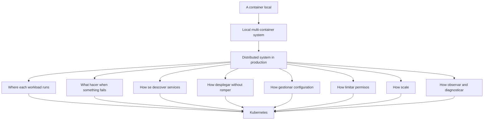

---

## 2.1. What problema not resuelve Kubernetes

Before of explicar Why Kubernetes exists, conviene quitar expectativas falsas.

Kubernetes does not arregla automáticamente:

- An application bad diseñada
- A endpoint `/health` que miente
- A app que not sabe shut downse bien
- A image enorme or vulnerable
- A secret hardcodeado dentro of the image
- A sistema without logs útiles
- A database without backups
- A arquitectura with dependencies caóticas
- A team que despliega cambios without validate
- A producto que not sabe what should existir
Kubernetes can restart a container, but not can convertir an application bad comportada in a good ciudadana cloud native.

Kubernetes can mantener réplicas, but not can decidir by ti if tu application soporta tener varias réplicas.

Kubernetes can expose services, but not can arreglar a contrato HTTP confuso.

Kubernetes can apply configuration declarativa, but if declaras algo incorrecto, can repetir the error of forma very eficiente.

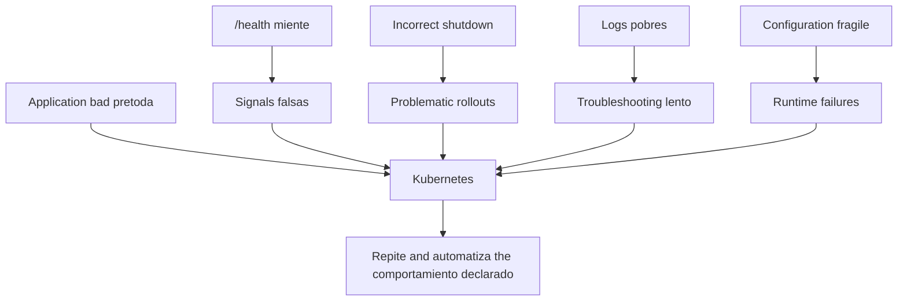

### Contrato mental

|Idea equivocada|Lectura more correcta|
|---|---|
|Kubernetes hace que everything sea fiable|Kubernetes needs apps que puedan ser operadas|
|Kubernetes reemplaza Docker and Compose|Kubernetes operates workloads containerizados in otro nivel|
|Kubernetes evita understand networks|Kubernetes hace the network more explícita, not less importante|
|Kubernetes evita understand logs|Kubernetes hace the logs more necesarios|
|Kubernetes evita pensar in configuration|Kubernetes separa and modela configuration|
|Kubernetes arregla failures|Kubernetes reacciona ante ciertos failures declarados and observables|

### DevEx of the bloque

The DevEx empieza aquí with a regla:

> Not uses Kubernetes for esconder que not entiendes tu application.

Before of migrar algo to Kubernetes, tu laboratorio must poder responder:

```bash
task app:run
task smoke
task container:build:docker
task container:run:docker
task smoke
task compose:up:detached
task smoke
task compose:logs
```

If esto not funciona fuera of Kubernetes, meterlo dentro of Kubernetes only añade layers of diagnóstico.

### Criterio of comprensión

Debes poder explicar:

> Kubernetes does not sustituye a good application, a good image, a good configuration ni a good estrategia of diagnóstico. The amplifica.

---

## 2.2. The salto real: of run to operate

In Docker ejecutas a container.

In Compose describes and levantas varios services.

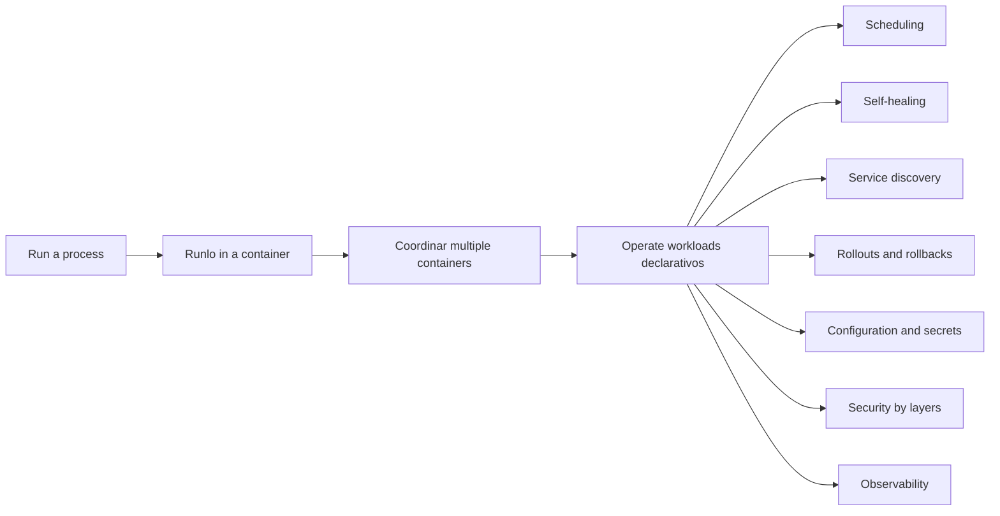

In Kubernetes declaras the state deseado of a sistema and a conjunto of componentes intenta mantener the state real cerca of that state deseado.

That salto es the clave.

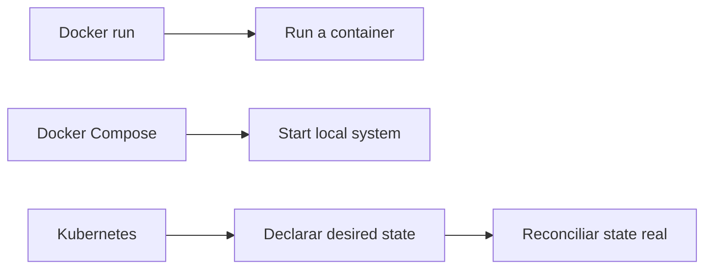

### Run

Run significa lanzar a process.

Ejemplo:

```bash
docker run --rm -p 8080:8080 checkout-api:1.0.0
```

Tú decides cuándo start and cuándo parar.

### Levantar a sistema local

Compose permite levantar varios services definidos in a file:

```bash
docker compose -f compose/compose.yaml up -d --build
```

Esto mejora mucho DevEx local, but sigue siendo principalmente a tool of desarrollo local.

### Operate

Operate significa gestionar a sistema during the tiempo:

- Arranques
- Paradas
- Reinicios
- Failures
- Rollouts
- Rollbacks
- Configuration
- Network
- Identidad
- Permisos
- Resources
- Observability
- Cambios of versión
- State deseado
- State real
Kubernetes trabaja with objetos declarativos. The objetos suelen tener `spec`, que describe the state deseado, and `status`, que describe the state actual observado by Kubernetes. The documentación oficial explica que the control plane gestiona continuamente the state actual of the objetos for intentar que coincida with the state deseado. ([Kubernetes](https://kubernetes.io/docs/concepts/overview/working-with-objects/ "Objects In Kubernetes"))

### Criterio of comprensión

Debes poder explicar:

> Docker me permite run. Compose me permite levantar a sistema local. Kubernetes me permite declarar and operate state deseado in a cluster.

---

## 2.3. The sistema shop como ejemplo

Seguiremos usando the sistema `shop`.

Componentes:

- `frontend`
- `checkout-api`
- `payment-api`
- `inventory-api`
- `notification-worker`
- `Redis`
- `PostgreSQL`
In local, Compose can levantar a versión simplificada.

In producción, aparecen preguntas que Compose not intenta resolver to the same nivel.

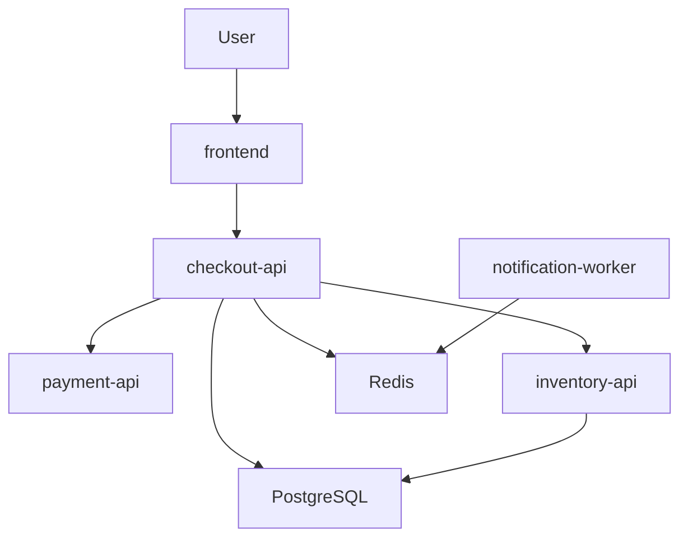

### Preguntas operativas reales

When the sistema crece, aparecen preguntas como these:

|Pregunta|Why it matters|
|---|---|
|¿Dónde runs each workload?|Not all the nodos tienen the same capacidad|
|¿What pasa if muere `checkout-api`?|The sistema must recuperarse without intervención manual constante|
|¿What pasa if a nodo fails?|The workloads must poder moverse or recreatese|
|¿How descubre `frontend` to `checkout-api`?|The IPs of instancias son efímeras|
|¿How despliego `checkout-api:1.0.1` without cortar traffic?|The cambio must ser gradual and observable|
|¿How vuelvo to `checkout-api:1.0.0` if algo fails?|The rollback must ser possible and rápido|
|¿How separo configuration of image?|The same image must servir for distintos entornos|
|¿How limito what can hacer each app?|Networkucir blast radius|
|¿How sé what falló?|Without signals not hay operación fiable|
|¿How evito que `frontend` hable with `PostgreSQL`?|Security and diseño of network|
|¿How controlo CPU and memoria?|Evitar que a workload degrade the cluster|

### DevEx of the bloque

The sistema of ejemplo must seguir siendo pequeño.

Not intentamos build a tienda real.

Intentamos tener piezas suficientes for que the problemas operativos aparezcan without convertir the practice in a monstruo.

The regla of DevEx es:

> The ejemplo must ser lo bastante realista for enseñar the problema, but lo bastante pequeño for practicar without dolor.

### Criterio of comprensión

Debes poder explicar:

> Kubernetes se understands better when se estudia como respuesta to problemas operativos concretos, not como a lista of objetos YAML.

---

## 2.4. Problema 1: scheduling

### What es

Scheduling significa decidir **dónde runs a workload**.

In Docker local not piensas demasiado in esto. Tu máquina es the único lugar possible.

In a cluster can haber muchos nodos.

Algunos tendrán more CPU.

Otros tendrán more memoria.

Otros pueden tener taints, restricciones, presión of Resources, discos concretos or GPUs.

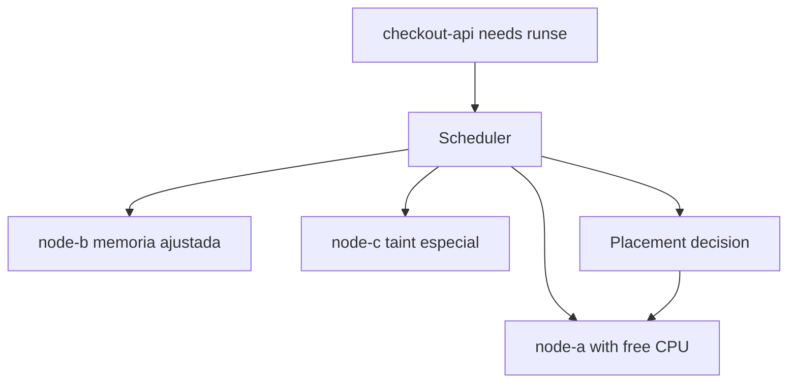

Kubernetes tiene a componente llamado scheduler dentro of the control plane. The documentación of componentes describe que the scheduler observa Pods recién creados que yet not tienen nodo asignado and selecciona a nodo where runlos. ([Kubernetes](https://kubernetes.io/docs/concepts/overview/components/ "Kubernetes Components"))

### Contrato mental

|Concept|Pregunta|
|---|---|
|Workload|¿What quiero run?|
|Nodo|¿Dónde podría runse?|
|Scheduler|¿What nodo encaja better según restricciones and Resources?|
|Requests|¿What Resources needs como minimum?|
|Taints and tolerations|¿What nodos aceptan or rechazan ciertos workloads?|

### Ejemplo with shop

`checkout-api` can runse in cualquier nodo general.

`notification-worker` also.

`PostgreSQL` in producción real can necesitar restricciones more cuidadosas, storage específico or incluso a solución gestionada fuera of the cluster.

In this module not resolveremos scheduling yet. Only necesitamos understand by what aparece.

### DevEx of the bloque

Not introduzcas yet reglas avanzadas of scheduling.

In the roadmap, scheduling aparecerá progresivamente:

```text
Module 2: why scheduling exists
Module 4: scheduler como componente
Module 6: requests, limits, affinity, taints and tolerations
Module 12: troubleshooting de FailedScheduling
```

### Criterio of comprensión

Debes poder explicar:

> In mi portátil not hay scheduling real. In a cluster, alguien must decidir dónde vive each workload.

---

## 2.5. Problema 2: self-healing and reconciliación

### What es

Self-healing significa que the sistema can reaccionar ante ciertos failures.

But Kubernetes does not “cura” cualquier cosa.

Kubernetes compara state deseado and state actual. If declaras que quieres tres réplicas of `checkout-api` and a desaparece, Kubernetes can create otra for volver to acercarse to the state deseado.

The documentación oficial of objetos explica que, if defines a Deployment with tres réplicas and a instancia fails, the sistema responde to the diferencia between `spec` and `status` haciendo a corrección, for example iniciando a instancia of reemplazo. ([Kubernetes](https://kubernetes.io/docs/concepts/overview/working-with-objects/ "Objects In Kubernetes"))

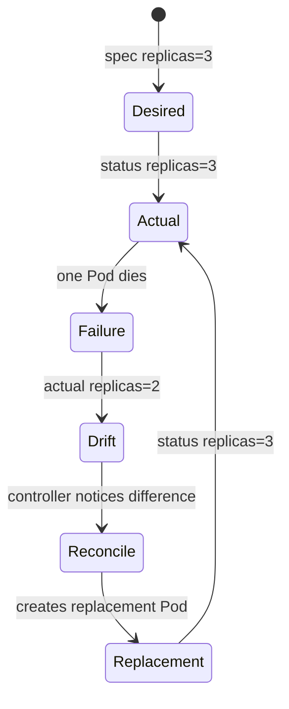

### Contrato mental

|Concept|Significado|
|---|---|
|`spec`|Lo que quieres|
|`status`|Lo que Kubernetes observa|
|Drift|Diferencia between lo deseado and lo real|
|Controller|Componente que observa and actúa|
|Reconciliación|Intento of corregir the diferencia|

### Ejemplo with shop

Quieres:

```text
checkout-api replicas = 3
```

State real:

```text
checkout-api replicas = 2
```

Kubernetes intenta create otra réplica.

But if the image está bad, can create Pods que fail a and otra vez.

That is not magia failing. Es reconciliación haciendo exactamente lo que le pediste with a definición incorrecta.

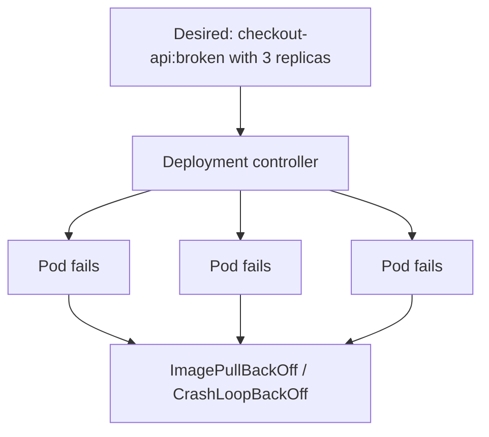

### DevEx of the bloque

Desde the punto of vista of DevEx, the aprendizaje importante es:

> Before of culpar to Kubernetes, mira what state deseado le has dado.

Later esto se convertirá in tasks como:

```bash
task k8s:status
task k8s:events
task k8s:debug
```

### Criterio of comprensión

Debes poder explicar:

> Kubernetes does not improvisa. Reacciona to diferencias between state deseado and state real.

---

## 2.6. Problema 3: service discovery

### What es

Service discovery significa que an application can encontrar to otra without depender of IPs manuales or efímeras.

In Compose, `checkout-api` can llamar to `redis` by nombre dentro of the network of Compose.

In Kubernetes, the equivalente conceptual será use Services and DNS interno.

Not lo implementaremos In this module, but the problema already must quedar claro.

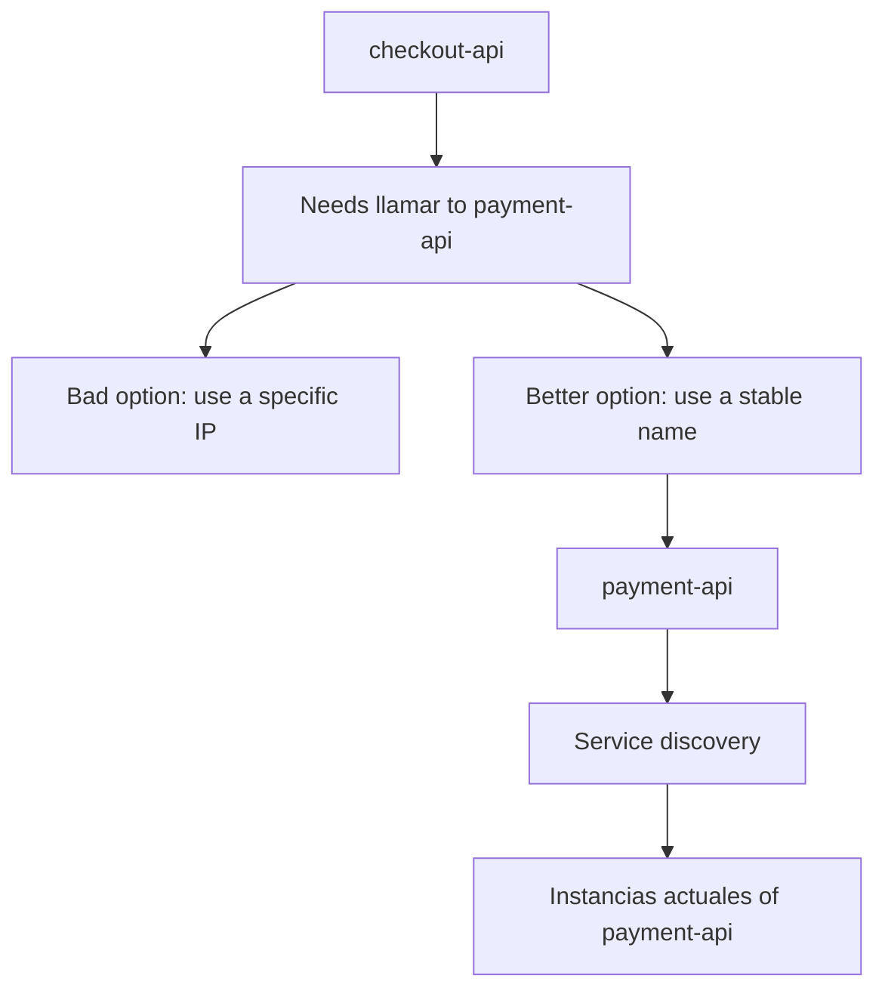

### Why it matters

The containers and Pods son efímeros.

Pueden morir.

Pueden recreatese.

Pueden moverse.

Pueden cambiar of IP.

If `frontend` depende of a IP concreta of `checkout-api`, the sistema será fragile.

### Contrato mental

|Concept|Pregunta|
|---|---|
|Instancia|¿What process concreto responde ahora?|
|Service|¿Cuál es the nombre estable to the que llamo?|
|DNS|¿How resuelvo that nombre?|
|Endpoints|¿What instancias reales están detrás of the nombre?|

### Ejemplo with shop

Queremos que:

```text
frontend → checkout-api
checkout-api → payment-api
checkout-api → inventory-api
notification-worker → redis
```

Not queremos que:

```text
frontend → 10.42.1.37
checkout-api → 10.42.2.19
```

### DevEx of the bloque

In Compose already you can practicar this idea with nombres of service:

```text
PAYMENT_API_URL=http://payment-api:80
REDIS_HOST=redis
POSTGRES_HOST=postgres
```

Esto prepara the salto mental hacia Kubernetes Services.

### Criterio of comprensión

Debes poder explicar:

> Service discovery desacopla to quien llama of the instancia concreta que responde.

---

## 2.7. Problema 4: configuration declarativa

### What es

Configuration declarativa significa describe the state que quieres, not only run commands step by step.

Instead of pensar:

```text
arranca esto
then start this
then change this
then restart that
```

Piensas:

```text
I want this system with this shape
```

Kubernetes trabaja with objetos que se create, modifican and eliminan mediante su API. The documentación oficial explica que for trabajar with objetos, incluyendo createlos, modificarlos or removelos, is used Kubernetes API; `kubectl` realiza esas llamadas to the API by ti. ([Kubernetes](https://kubernetes.io/docs/concepts/overview/working-with-objects/ "Objects In Kubernetes"))

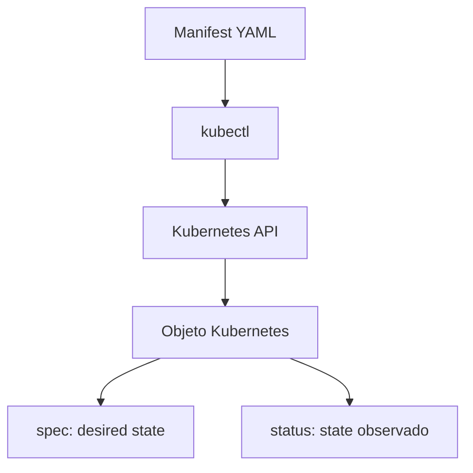

### Contrato mental

|Concept|Significado|
|---|---|
|Manifest|File que describe objetos|
|API Server|Input principal to the control plane|
|Object|Recurso gestionado by Kubernetes|
|`spec`|State deseado|
|`status`|State observado|
|Declarativo|Digo what quiero, not each paso manual|

### Ejemplo conceptual

In vez of run manualmente tres containers of `checkout-api`, declaras:

```text
I want checkout-api with 3 replicas using the checkout-api:1.0.0 image.
```

Kubernetes decide how aproximarse to that state.

### DevEx of the bloque

Esto conecta with a idea importante of the course:

> Everything lo importante must poder versionarse.

That incluye:

- Dockerfile
- compose.yaml
- manifests Kubernetes
- Taskfile
- scripts
- smoke tests
- runbooks
### Criterio of comprensión

Debes poder explicar:

> Kubernetes se operates to través of a API and objetos declarativos. `kubectl` es only a client of that API.

---

## 2.8. Problema 5: rollouts and rollbacks

### What es

A rollout es the process of desplegar a nueva versión.

A rollback es volver to a versión anterior when algo va bad.

In local you can parar and start.

In producción you need evitar or networkucir cortes.

Ejemplo:

```text
checkout-api:1.0.0 → checkout-api:1.0.1
```

Preguntas importbefore:

- ¿Cuántas instancias se reemplazan to the vez?
- ¿What pasa if the nueva versión not está ready?
- ¿How se detecta que the rollout falló?
- ¿How vuelvo atrás?
- ¿What logs and métricas reviso?
- ¿What smoke tests ejecuto?
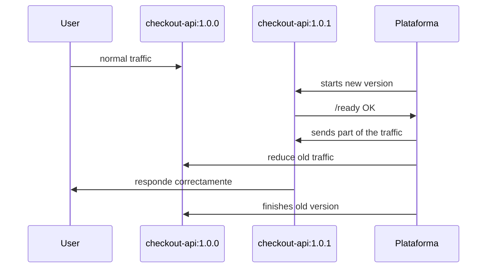

### What can salir bad

The nueva versión can:

- Does not startr
- Fail in `/ready`
- Responder `500`
- Tener a dependencia bad configurada
- Consumir demasiada memoria
- Romper the contrato HTTP
- Emitir logs insuficientes
- Funcionar in local but fail in environment real
### DevEx of the bloque

The smoke test que creaste in the module 1 es the semilla of a quality gate.

In módulos posteriores, that smoke test se runá:

```text
local → container → Compose → kind → pipeline → environment real
```

### Criterio of comprensión

Debes poder explicar:

> A rollout is not only cambiar an image. Es cambiar comportamiento in a sistema vivo without perder control.

---

## 2.9. Problema 6: configuration and secrets

### What es

A image should not contener configuration específica of environment ni secrets.

Esto already lo viste in the module 1 with environment variables.

Kubernetes lleva this idea more lejos with objetos específicos como ConfigMaps and Secrets, que veremos in detalle later.

In this module basta with understand the problema:

```text
La imagen debe ser reusable.
La configuration debe inyectarse.
Los secretos deben tratarse con cuidado.
```

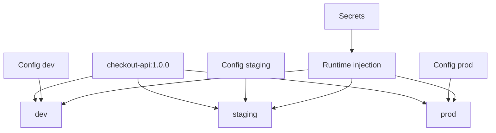

### Ejemplo with shop

The same image of `checkout-api` can necesitar:

|Environment|Configuration|
|---|---|
|Local|`PAYMENT_API_URL=http://payment-api:80`|
|Test|`PAYMENT_API_URL=http://payment-api.test`|
|Producción|`PAYMENT_API_URL=https://payments.example.com`|

The image should not reconstruirse for each caso.

### DevEx of the bloque

Desde the principio, uses `.env.example` for documentar configuration esperada, but not subas `.env` reales with secrets.

Ejemplo:

```text
PORT=8080
LOG_LEVEL=debug
PAYMENT_API_URL=http://payment-api:80
REDIS_HOST=redis
POSTGRES_HOST=postgres
```

### Criterio of comprensión

Debes poder explicar:

> The image empaqueta the application. The configuration define how se comporta in an environment concreto.

---

## 2.10. Problema 7: security and blast radius

### What es

When a sistema crece, not basta with que “funcione”.

Also importa what can hacer each parte.

Preguntas básicas:

- ¿What can hacer `checkout-api` dentro of the cluster?
- ¿It can read secrets?
- ¿It can listar Pods?
- ¿It can hablar with `PostgreSQL`?
- ¿It can `frontend` hablar directamente with `PostgreSQL`?
- ¿What pasa if `notification-worker` se ve comprometido?
Kubernetes modela security with varias layers. Algunas aparecerán later:

- ServiceAccounts
- RBAC
- NetworkPolicies
- SecurityContext
- Pod Security Standards
- Admission control
- Secrets
- Image scanning
### Contrato mental

|Concept|Pregunta|
|---|---|
|Identidad|¿Quién es this workload?|
|Autorización|¿What can hacer?|
|Network|¿With quién can hablar?|
|Runtime security|¿With what permisos runs?|
|Blast radius|¿What alcance tiene a failure or compromiso?|

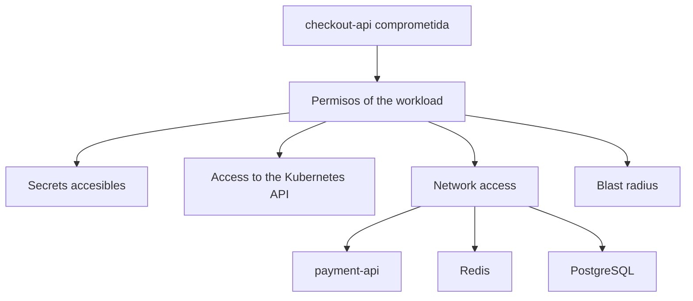

### DevEx of the bloque

Not introduzcas security como a añadido final.

Desde the module 1 already tomamos decisiones pequeñas:

- Not run como root
- Not meter secrets in the image
- Write logs útiles
- Separar configuration
- Use contratos explícitos
That not completa the security, but evita build malos hábitos.

### Criterio of comprensión

Debes poder explicar:

> Kubernetes does not only ejecuta workloads. Also permite modelar límites of permisos, network and comportamiento.

---

## 2.11. Problema 8: observability and troubleshooting

### What es

When something fails in local, miras the terminal.

When something fails in a sistema distribuido, you need signals.

Signals mínimas:

- State of Resources
- Eventos
- Logs
- Métricas
- Trazas
- Health checks
- Readiness
- Rollout status
- Errores HTTP
- Latencia
- Reinicios
- Uso of CPU and memoria
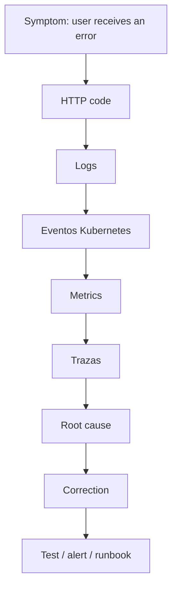

### Ejemplo with shop

The user dice:

```text
No puedo finalizar el checkout.
```

Possible causas:

- `frontend` not llega to `checkout-api`
- `checkout-api` está caído
- `checkout-api` not está ready
- `payment-api` responde 500
- `Redis` not responde
- `PostgreSQL` está saturado
- A NetworkPolicy bloquea traffic
- A Secret falta
- A nueva versión rompió the contrato
### DevEx of the bloque

The DevEx of troubleshooting empieza before of Kubernetes:

- `task smoke`
- `task compose:logs`
- `task compose:ps`
- logs JSON
- endpoints claros
- configuration visible
- scripts repetibles
Later se ampliará with:

```bash
task k8s:status
task k8s:events
task k8s:debug
task test:k8s
```

### Criterio of comprensión

Debes poder explicar:

> In sistemas distribuidos, if not defines signals, not tienes operación. Tienes intuición and suerte.

---

## 2.12. The modelo Kubernetes in a frase

Kubernetes operates mediante a API.

The usuarios and componentes create, leen, modifican and eliminan objetos. The API Server es the centro of the control plane and expone a API HTTP for interactuar with the state of the cluster. ([Kubernetes](https://kubernetes.io/docs/concepts/overview/kubernetes-api/ "The Kubernetes API"))

Casi all the objetos relevbefore tienen:

- `metadata`
- `spec`
- `status`
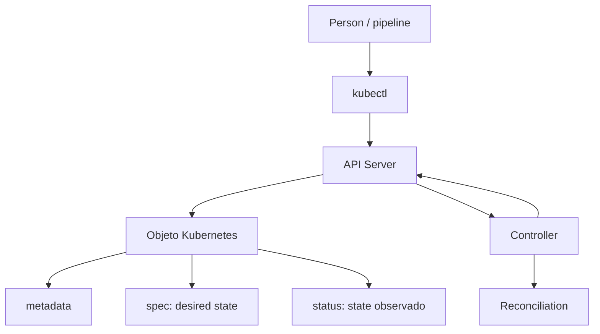

### metadata

Identidad and datos of the objeto:

- nombre
- namespace
- labels
- annotations
- ownerReferences
The documentación oficial explica que each objeto tiene a nombre único for that tipo of recurso dentro of su ámbito, and also a UID único in everything the cluster. ([Kubernetes](https://kubernetes.io/docs/concepts/overview/working-with-objects/names/ "Object Names and IDs"))

### spec

Lo que quieres.

Ejemplo conceptual:

```yaml
spec:
  replicas: 3
  image: checkout-api:1.0.0
```

### status

Lo que Kubernetes observa.

Ejemplo conceptual:

```yaml
status:
  availableReplicas: 2
```

### Criterio of comprensión

Debes poder explicar:

> `spec` es intención. `status` es observación. Kubernetes trabaja intentando networkucir the distancia between ambas.

---

## 2.13. Componentes of Kubernetes como respuesta to problemas

In this module not you need memorizar all the componentes. Only understand what problema cubren.

The documentación oficial divide a cluster in control plane and worker nodes, and describe componentes como API Server, etcd, scheduler, controller manager, kubelet, kube-proxy and container runtime. ([Kubernetes](https://kubernetes.io/docs/concepts/overview/components/ "Kubernetes Components"))

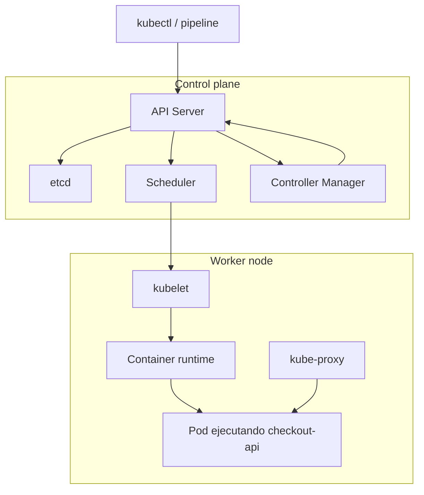

### Mapa problema → componente

|Problema|Componente relacionado|
|---|---|
|Input to the plataforma|API Server|
|Save state of the cluster|etcd|
|Decidir nodo for a Pod|Scheduler|
|Reconciliar Resources|Controllers|
|Run Pods in nodos|kubelet|
|Run containers|container runtime|
|Network of services|kube-proxy and CNI|
|DNS interno|ConetworkNS|
|Extension|CRDs, controllers, admission webhooks|

### DevEx of the bloque

Not conviertas esto in memorización.

The aprendizaje útil es poder decir:

> Estoy viendo a síntoma. ¿What parte of the sistema podría estar implicada?

Ejemplo:

|Síntoma|Possible zona|
|---|---|
|Pod not se programa|Scheduler, requests, taints, nodos|
|Pod se reinicia|kubelet, container runtime, app|
|Service not responde|selector, endpoints, kube-proxy, CNI|
|Objeto not is created|API Server, RBAC, admission|
|State not cambia|controller, spec incorrecta, eventos|

### Criterio of comprensión

Debes poder explicar:

> Kubernetes is not a binario único. Es a conjunto of componentes cooperando alnetworkedor of a API and a modelo declarativo.

---

## 2.14. What hace Kubernetes and what not hace

### Lo que yes hace

Kubernetes ayuda to:

- Gestionar workloads containerizados
- Declarar state deseado
- Reconciliar state real
- Programar workloads in nodos
- Mantener réplicas
- Expose services
- Gestionar configuration and secrets
- Run rollouts
- Facilitar escalado
- Modelar permisos
- Integrar observability
- Extender the plataforma with APIs propias
### Lo que not hace by yes only

Kubernetes does not sustituye:

- Diseño of application
- Testing
- Contratos claros
- Backups reales
- Observability bien pensada
- Security of image
- Gestión of secrets madura
- Disciplina of delivery
- Conocimiento of networks
- Conocimiento of Linux
- Buen criterio económico and operacional
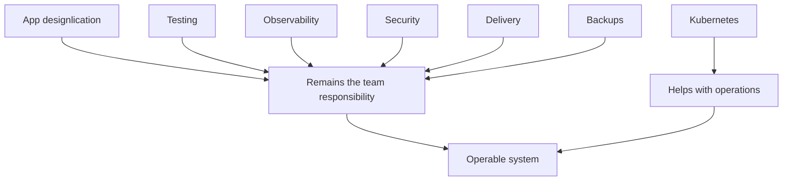

### Criterio of comprensión

Debes poder explicar:

> Kubernetes es a plataforma of operación. It is not a excusa for dejar of diseñar, testar, observar and proteger bien.

---

## 2.15. Practice principal of the module

### Objective

Analizar the sistema `shop` and justificar by what Kubernetes empieza to tener sentido.

Not we are going to create a cluster yet.

Vamos to entrenar the pensamiento operativo.

### Resultado esperado

Create a documento:

```text
docs/why-kubernetes.md
```

It must responder with claridad:

1. What resuelve Docker in this sistema
2. What resuelve Compose
3. What problemas siguen abiertos
4. What problemas Kubernetes modelará later
5. What riesgos Kubernetes does not arregla automáticamente
6. What signals necesitamos before of operate the sistema
### Estructura sugerida

```markdown
# Why Kubernetes for shop

## Current local system

- frontend
- checkout-api
- payment-api
- inventory-api
- notification-worker
- Redis
- PostgreSQL

## What Docker solves

## What Compose solves

## What remains unsolved

## Problems Kubernetes will model later

## Risks Kubernetes does not solve automatically

## Required operational signals

## DevEx expectations

## Exit criteria before moving to Kubernetes
```

### Preguntas guía

#### Docker

- ¿What parte of the problema resuelve empaquetar `checkout-api` como image?
- ¿What sigue dependiendo of configuration externa?
- ¿What pasaría if the image contiene secrets?
- ¿What cambia to the run the container como user not root?
#### Compose

- ¿What mejora `compose.yaml` respecto to run varios `docker run`?
- ¿What límites aparecen if intentas use Compose como if fuera producción?
- ¿What ocurre with `PostgreSQL` to the run `compose down`?
- ¿What ocurre with `PostgreSQL` to the run `compose down -v`?
#### Kubernetes

- ¿What componente conceptual necesitaríamos for mantener tres réplicas of `checkout-api`?
- ¿What problema resuelve service discovery?
- ¿What problema resuelve the scheduling?
- ¿What problema resuelven the rollouts?
- ¿What problema resuelve separar `spec` and `status`?
- ¿What signals necesitaríamos for diagnosticar a failure?
### DevEx of the bloque

Añade a task:

```yaml
docs:why-kubernetes:
  desc: Show the why Kubernetes learning document
  cmds:
    - cat docs/why-kubernetes.md
```

AND otra for validate que the laboratorio local sigue funcionando:

```yaml
learning:module2:check:
  desc: Check module 2 prerequisites
  cmds:
    - task doctor
    - task container:build:docker
    - task compose:up:detached
    - task smoke
    - task compose:ps
    - task compose:down
```

### Criterio of finalización

The practice está completa when you can explicar, usando tu propio sistema `shop`, by what Kubernetes aparece como respuesta to problemas operativos concretos, not como a tool of moda.

---

## 2.16. Ejercicios cortos

### Ejercicio 1. Docker vs Compose vs Kubernetes

Completa this tabla:

|Necesidad|Docker|Compose|Kubernetes|
|---|---|---|---|
|Run `checkout-api` localmente|Yes|Yes|Yes|
|Levantar `Redis` and `PostgreSQL` with the app|Manual|Yes|Yes|
|Mantener tres réplicas if a cae|Not|Limitado|Yes|
|Decidir in what nodo run|Not|Not|Yes|
|Rollout declarativo|Not|Limitado|Yes|
|Service discovery estable|Limitado|Yes in local|Yes|
|RBAC|Not|Not|Yes|
|NetworkPolicy|Not|Not|Yes|
|Observability integrada with plataforma|Not|Limitado|Yes, integrable|

After escribe tres frases:

```text
Docker me ayuda a...
Compose me ayuda a...
Kubernetes aparece cuando...
```

---

### Ejercicio 2. State deseado vs state actual

Escribe this escenario:

```text
I want 3 checkout-api replicas.
Right now there are 2 available replicas.
```

Responde:

- ¿Cuál es the state deseado?
- ¿Cuál es the state actual?
- ¿What it means drift?
- ¿What should hacer a controller?
- ¿What podría impedir que vuelva to 3 réplicas?
---

### Ejercicio 3. Service discovery

Dado this sistema:

```text
frontend → checkout-api → payment-api
checkout-api → redis
checkout-api → postgres
```

Responde:

- ¿By what should notmos use IPs concretas?
- ¿What nombres usarías?
- ¿What pasaría if `payment-api` cambia of instancia?
- ¿What concept of Kubernetes estudiarás later for resolverlo?
---

### Ejercicio 4. Rollout fallido

Escenario:

```text
checkout-api:1.0.0 funciona.
checkout-api:1.0.1 arranca pero /ready devuelve 500.
```

Responde:

- ¿It must receive traffic the versión nueva?
- ¿What señal detecta the failure?
- ¿What endpoint es more importante aquí, `/health` or `/ready`?
- ¿What should permitir the plataforma?
- ¿What test should haber fallado before?
---

### Ejercicio 5. Kubernetes does not arregla everything

Escribe cinco problemas que Kubernetes does not arregla automáticamente in `shop`.

Ejemplos:

- `checkout-api` not tiene logs útiles
- `payment-api` cambia su contrato without avisar
- `PostgreSQL` not tiene backup
- `frontend` habla directamente with `PostgreSQL`
- `checkout-api` contiene secrets in the image
For each uno, indica:

- What lo causa
- What señal lo mostraría
- What practice lo prevendría
---

## 2.17. Errores habituales

### Error 1. Learn Kubernetes como a lista of YAMLs

Bad:

> First Pod, then Deployment, then Service.

Better:

> First entiendo what problema operativo resuelve each objeto.

---

### Error 2. Pensar que Kubernetes es Docker with more cosas

Docker ejecuta containers.

Kubernetes operates workloads containerizados in a cluster mediante API, objetos, control plane and reconciliación.

---

### Error 3. Ignorar the application

If `/health` miente, Kubernetes tomará decisiones with a señal mala.

If `/ready` not representa readiness real, the rollout can enviar traffic to a instancia que should not recibirlo.

If the logs not tienen contexto, the troubleshooting será lento.

---

### Error 4. Confundir self-healing with reliability total

Kubernetes can recreate a Pod muerto.

That not significa que pueda recuperar datos perdidos, arreglar a migración destructiva or compensar a contrato roto between services.

---

### Error 5. Saltar to Kubernetes without DevEx local

If not you can run, validate and diagnosticar the sistema with Docker and Compose, Kubernetes añadirá layers of complejidad.

---

### Error 6. Declarar bad and esperar que Kubernetes lo arregle

Kubernetes intenta cumplir lo que declaras.

If declaras an image incorrecta, a port incorrecto or a readiness rota, the plataforma can repetir the failure of forma consistente.

---

## 2.18. Criterio of output of the module

You can pasar to the module 3 when puedas explicar everything esto without seguir a receta ciegamente.

### Concepts

Debes poder explicar:

- Why Kubernetes exists
- What diferencia hay between run and operate
- What es state deseado
- What es state actual
- What es reconciliación
- What es scheduling
- What es service discovery
- What problema resuelven the rollouts
- What problema resuelve the configuration declarativa
- What problemas Kubernetes does not arregla automáticamente
### Sistema shop

Debes poder explicar:

- What resuelve Docker in `shop`
- What resuelve Compose in `shop`
- What queda abierto after of Compose
- By what `checkout-api`, `payment-api`, `inventory-api`, `Redis` and `PostgreSQL` create problemas operativos distintos
- What signals mínimas you need for operate `shop`
### DevEx

Debes poder:

- Run `task doctor`
- Run `task container:build:docker`
- Run `task compose:up:detached`
- Run `task smoke`
- Run `task compose:ps`
- Run `task compose:logs`
- Run `task compose:down`
- Mantener `docs/why-kubernetes.md`
### Frase final of comprensión

Debes poder explicar this frase:

> Kubernetes does not aparece for hacer more elegante the YAML. Aparece for modelar and operate the state deseado of sistemas containerizados que cambian, fail, escalan and need ser observables, seguros and recuperables.

---

## 2.19. References oficiales

|Tema|Referencia|
|---|---|
|Kubernetes overview|Kubernetes Docs, Overview. ([Kubernetes](https://kubernetes.io/docs/concepts/overview/ "Overview"))|
|Kubernetes API|Kubernetes Docs, The Kubernetes API. ([Kubernetes](https://kubernetes.io/docs/concepts/overview/kubernetes-api/ "The Kubernetes API"))|
|Objects in Kubernetes|Kubernetes Docs, Objects In Kubernetes. ([Kubernetes](https://kubernetes.io/docs/concepts/overview/working-with-objects/ "Objects In Kubernetes"))|
|Kubernetes components|Kubernetes Docs, Kubernetes Components. ([Kubernetes](https://kubernetes.io/docs/concepts/overview/components/ "Kubernetes Components"))|
|Object management|Kubernetes Docs, Kubernetes Object Management. ([Kubernetes](https://kubernetes.io/docs/concepts/overview/working-with-objects/object-management/ "Kubernetes Object Management"))|
|Object names and IDs|Kubernetes Docs, Object Names and IDs. ([Kubernetes](https://kubernetes.io/docs/concepts/overview/working-with-objects/names/ "Object Names and IDs"))|
|Labels and selectors|Kubernetes Docs, Labels and Selectors. ([Kubernetes](https://kubernetes.io/docs/concepts/overview/working-with-objects/labels/ "Labels and Selectors"))|
|Recommended labels|Kubernetes Docs, Recommended Labels. ([Kubernetes](https://kubernetes.io/docs/concepts/overview/working-with-objects/common-labels/ "Recommended Labels"))|
|Docker overview|Docker Docs, Docker overview. ([Kubernetes](https://kubernetes.io/docs/concepts/overview/ "Overview"))|

## 2.20. Lecturas of apoyo

|Libro|What read|
|---|---|
|_Kubernetes in Action_|Chapter 1: by what Kubernetes, what problemas resuelve, containers, arquitectura general and beneficios.|
|_Kubernetes: Up and Running_|Chapter 1: velocidad, inmutabilidad, configuration declarativa, self-healing, escalado and eficiencia.|
|_Cloud Native DevOps with Kubernetes_|Chapter 1: cloud, DevOps, containers, Kubernetes, cloud native and operaciones.|
|_Kubernetes Patterns_|Chapter 1: primitives distribuidas, containers, Pods, Services, labels, annotations and namespaces.|

<!-- COURSE_NAV_START -->
[Previous](<1. Containers, Docker, Podman, and Compose.md>) | [Index](README.md) | [Next](<3. First cluster and kubectl.md>)
<!-- COURSE_NAV_END -->
