<!-- COURSE_NAV_START -->
[Previous](<2. Why Kubernetes exists.md>) | [Index](README.md) | [Next](<4. Kubernetes mental model.md>)
<!-- COURSE_NAV_END -->

# 3. First cluster and kubectl

## Objective of the module

In the module 1 aprendiste to empaquetar `checkout-api` como container.

In the module 2 entendiste Why Kubernetes exists: not because run a container sea difícil, sinot because operate muchos workloads, in muchos nodos, with cambios, failures, network, configuration, permisos and observability yes lo es.

In this module vas to create tu primer cluster local and aprenderás to hablar with Kubernetes usando `kubectl`.

The objective is not dominar yet Pods, Deployments, Services or networking. That vendrá after.

The objective es build the primer circuito completo:

```text
crear cluster local
hablar con la API
ver nodos
crear un namespace
apply a manifest
ver state
leer logs
entrar en un container
hacer port-forward
ejecutar smoke test
borrar resources
repetirlo con Taskfile
```

Kubernetes proporciona `kubectl` como tool of command line for comunicarse with the control plane usando the API of Kubernetes. `kubectl` is not Kubernetes. Es a client of the API. ([Kubernetes](https://kubernetes.io/docs/reference/kubectl/ "Command line tool (kubectl)"))

The idea central of the module es this:

> Kubernetes se controla mediante a API. `kubectl` es a forma cómoda of hablar with that API.

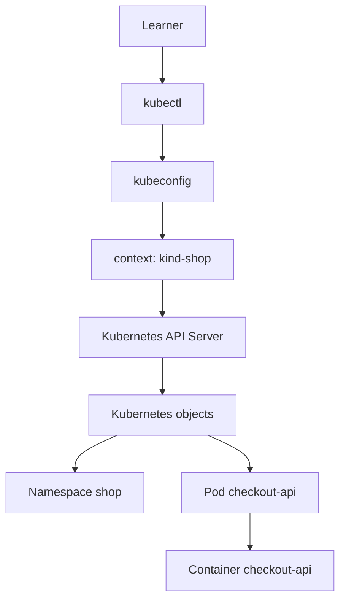

---

## 3.1. What you are going to learn and what not you are going to learn yet

This module es the primer contacto práctico with Kubernetes.

You are going to learn:

- What es a cluster local
- What es `kubectl`
- What es a `kubeconfig`
- What es a context
- What es a namespace
- How create a cluster with kind
- How check que the cluster responde
- How apply a manifest sencillo
- How inspect Resources
- How read logs
- How entrar in a container
- How use `port-forward`
- How delete Resources
- How automatizar the flujo with Taskfile
Not vamos to profundizar yet in:

- Ciclo of vida completo of Pods
- Deployments
- ReplicaSets
- Services
- Ingress
- Gateway API
- ConfigMaps
- Secrets
- Storage
- RBAC
- Probes
- NetworkPolicy
- Scheduling advanced
- Observability completa
Esos temas tienen módulos propios.

Aquí queremos que the learner gane a primera intuición:

> Creo algo in Kubernetes, Kubernetes lo guarda como objeto, puedo observarlo, diagnosticarlo and deletelo.

---

## 3.2. What es a cluster local

A cluster Kubernetes es a conjunto of componentes que trabajan juntos for run workloads.

For learn not you need empezar with a cluster cloud.

You can use a cluster local.

In this module usaremos **kind** como opción principal.

kind ejecuta clusters locales of Kubernetes usando containers Docker como “nodos”. Fue diseñado principalmente for probar Kubernetes, but also is used for desarrollo local and CI. ([kind.sigs.k8s.io](https://kind.sigs.k8s.io/ "kind - Kubernetes"))

Also exists **minikube**, que se define como Kubernetes local, enfocado in facilitar the aprendizaje and the desarrollo. minikube can start Kubernetes with a only command if tienes Docker u otro environment compatible of containers or máquinas virtuales. ([Kubernetes](https://kubernetes.io/docs/tasks/tools/install-minikube "minikube start - Kubernetes"))

### By what usaremos kind como opción principal

kind encaja very bien with this course because:

- Es reproducible
- Es rápido for create and delete clusters
- Funciona bien with Taskfile
- Encaja bien with prácticas automated
- It is used mucho for testing local and CI
- Permite cargar images locales in the cluster without publicar in a registry
### Contrato mental

|Tool|What hace|Cuándo usarla aquí|
|---|---|---|
|kind|Creates clusters locales usando containers como nodos|Opción principal of the course|
|minikube|Creates a cluster local orientado to aprendizaje and desarrollo|Alternativa válida|
|Docker Desktop Kubernetes|Cluster local integrado in Docker Desktop|Útil if already lo tienes, but less explícito for learn|
|Cluster cloud gestionado|Cluster real gestionado by a proveedor|Later, not for the primer laboratorio|

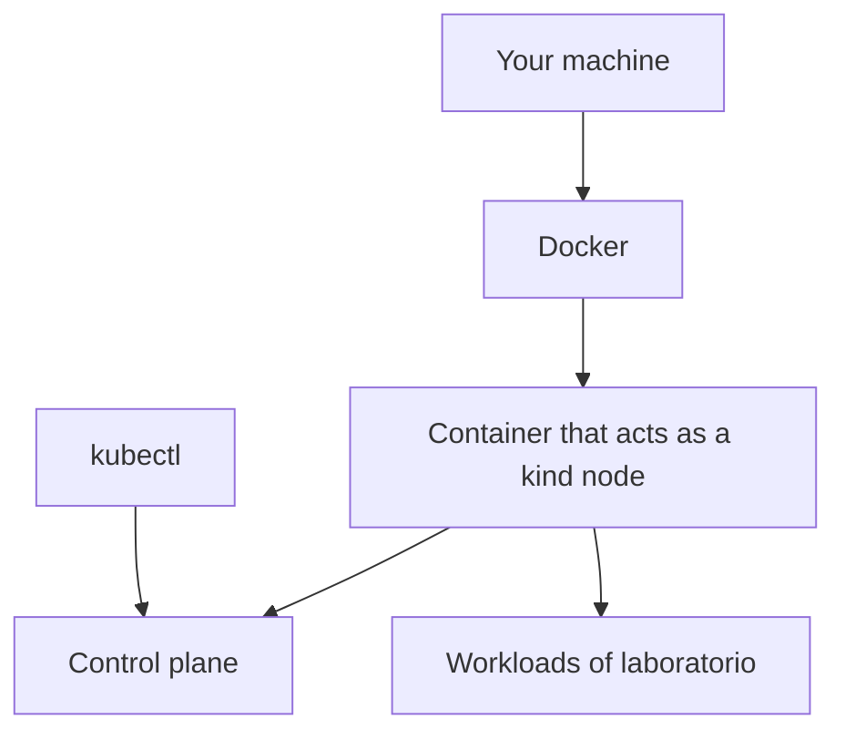

### DevEx of the bloque

A buen laboratorio local must poder createse and destruirse without miedo.

That is why vamos to tratar the cluster local como desechable:

```bash
task k8s:kind:create
task k8s:kind:delete
```

The regla es:

> If the cluster local not se can reconstruir fácilmente, the learning environment se convierte in a fuente of fricción.

---

## 3.3. What es `kubectl`

`kubectl` es the tool of command line for interactuar with clusters Kubernetes usando the API. Sirve for desplegar applications, inspect Resources and gestionar workloads. ([Kubernetes](https://kubernetes.io/docs/reference/kubectl/introduction/ "Introduction to kubectl"))

Not debes pensar in `kubectl` como a shell remota.

`kubectl` not entra in the cluster for run magia.

`kubectl` hace peticiones to the API of Kubernetes.

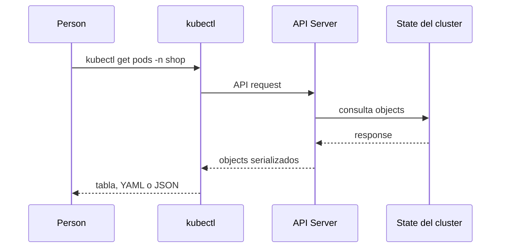

### Commands que vas to use

|Command|Pregunta que responde|
|---|---|
|`kubectl version --client`|¿Tengo client instalado?|
|`kubectl cluster-info`|¿The cluster responde?|
|`kubectl config get-contexts`|¿What contextos conozco?|
|`kubectl config current-context`|¿TO what cluster apunta ahora `kubectl`?|
|`kubectl get nodes`|¿What nodos tiene the cluster?|
|`kubectl get namespaces`|¿What namespaces exist?|
|`kubectl apply -f`|¿Puedo create or update Resources declarativos?|
|`kubectl get`|¿What Resources exist?|
|`kubectl describe`|¿What detalles and eventos tiene a recurso?|
|`kubectl logs`|¿What está escribiendo a container?|
|`kubectl exec`|¿Puedo run a command dentro of a container?|
|`kubectl port-forward`|¿Puedo expose temporalmente a recurso localmente?|
|`kubectl delete -f`|¿Puedo delete lo que apliqué?|

### DevEx of the bloque

Not memorices all the commands como a lista.

Agrúpalos by intención:

```text
ver configuration
ver state
apply changes
diagnosticar
acceder temporalmente
borrar
```

That hará que the troubleshooting sea more natural in módulos posteriores.

---

## 3.3 bis. Fluidez `kubectl` for CKAD

CKAD not mide if sabes read a explicación larga.

Mide if you can operate Kubernetes with precisión desde the terminal.

That exige fluidez with `kubectl`.

Not you need memorizar everything Kubernetes, but yes you need dominar the movimientos basic.

### Alias recomendado

```bash
alias k=kubectl
```

This course usará `kubectl` in the ejemplos for ser explícito, but in practice of examen you can use `k`.

### Namespace by defecto

In CKAD es habitual trabajar in namespaces específicos.

You can evitar repetir `-n shop` in each command configurando the namespace of the contexto actual:

```bash
kubectl config set-context --current --namespace=shop
```

Comtest the contexto:

```bash
kubectl config view --minify
```

### Create YAML without create the recurso

Patrón clave:

```bash
kubectl run checkout-api \
  --image=checkout-api:1.0.0 \
  --port=8080 \
  --dry-run=client \
  -o yaml > pod.yaml
```

The objective is not use imperativo in producción.

The objective es generate a starting point rápido and after editarlo.

### Commands que debes automatizar mentalmente

```bash
kubectl get pods
kubectl get pod checkout-api -o yaml
kubectl describe pod checkout-api
kubectl logs checkout-api
kubectl logs checkout-api --previous
kubectl exec -it checkout-api -- sh
kubectl explain pod.spec.containers
kubectl api-resources
kubectl api-versions
kubectl get events --sort-by=.lastTimestamp
kubectl wait --for=condition=Ready pod/checkout-api --timeout=60s
```

### Regla of examen

Before of buscar in documentación, test:

```bash
kubectl <command> --help
kubectl explain <resource>.<field>
```

Ejemplos:

```bash
kubectl create deployment --help
kubectl create service clusterip --help
kubectl explain deployment.spec.strategy
kubectl explain pod.spec.volumes
```

### Criterio of comprensión

Debes poder explicar:

> In CKAD, `kubectl` is not a tool auxiliar. Es the medio principal for pensar, create, inspect, corregir and validate.

---
## 3.4. `kubeconfig`, contexts and namespaces

Before of create Resources, you need to understand tres concepts.

### `kubeconfig`

`kubectl` needs saber to what cluster conectarse and with what cnetworkenciales.

For that uses a file of configuration.

The documentación oficial indica que `kubectl` busca by defecto a file llamado `config` in `$HOME/.kube`, although also you can indicar otros files with the variable `KUBECONFIG` or with the flag `--kubeconfig`. ([Kubernetes](https://kubernetes.io/docs/reference/kubectl/ "Command line tool (kubectl)"))

### context

A context indica a combinación of:

- cluster
- user or cnetworkenciales
- namespace by defecto, if está configurado
This allows cambiar between clusters without rewrite commands completos.

### namespace

A namespace permite agrupar Resources dentro of the cluster.

In this course usaremos:

```text
shop
```

como namespace principal.

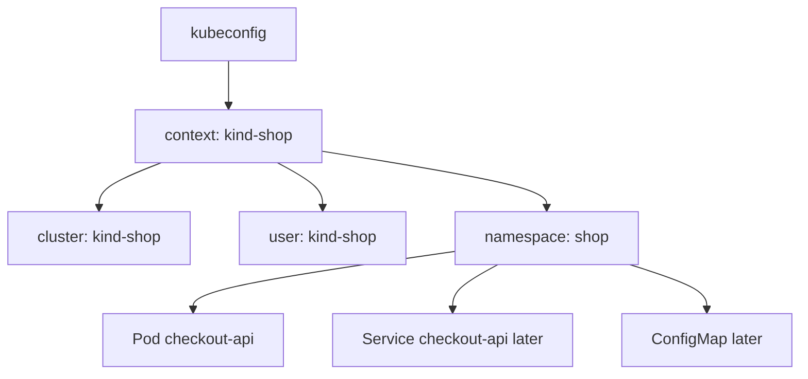

### Commands

See contextos:

```bash
kubectl config get-contexts
```

See the context actual:

```bash
kubectl config current-context
```

Create namespace:

```bash
kubectl create namespace shop
```

Use namespace in each command:

```bash
kubectl get pods -n shop
```

Configurar namespace by defecto for the context actual:

```bash
kubectl config set-context --current --namespace=shop
```

### DevEx of the bloque

For aprendizaje, es better ser explícito to the principio:

```bash
kubectl get pods -n shop
```

Although configures namespace by defecto, write `-n shop` hace more visible dónde estás trabajando.

Later you can use tasks of Taskfile for evitar repetirlo without ocultarlo:

```yaml
vars:
  NAMESPACE: shop
```

---

## 3.5. Create the primer cluster with kind

### Contrato of the cluster local

Queremos a cluster local que:

- Se llame `shop-learning`
- Sea fácil of delete
- Sea fácil of recreate
- Permita desplegar `checkout-api`
- Permita inspect nodos and Resources
- Permita use images locales cargadas desde Docker
### Create cluster

```bash
kind create cluster --name shop-learning
```

See clusters kind:

```bash
kind get clusters
```

Check contexto actual:

```bash
kubectl config current-context
```

You should see algo parecido to:

```text
kind-shop-learning
```

Check que the cluster responde:

```bash
kubectl cluster-info
kubectl get nodes
```

kind documenta the flujo of inicio rápido with the command `kind create cluster`, and creates a contexto of `kubectl` for hablar with the cluster creado. ([kind.sigs.k8s.io](https://kind.sigs.k8s.io/docs/user/quick-start/ "Quick Start - kind - Kubernetes"))

### What observar

```bash
kubectl get nodes
```

Should mostrar to the less a nodo.

In kind, that nodo es a container Docker que actúa como nodo Kubernetes.

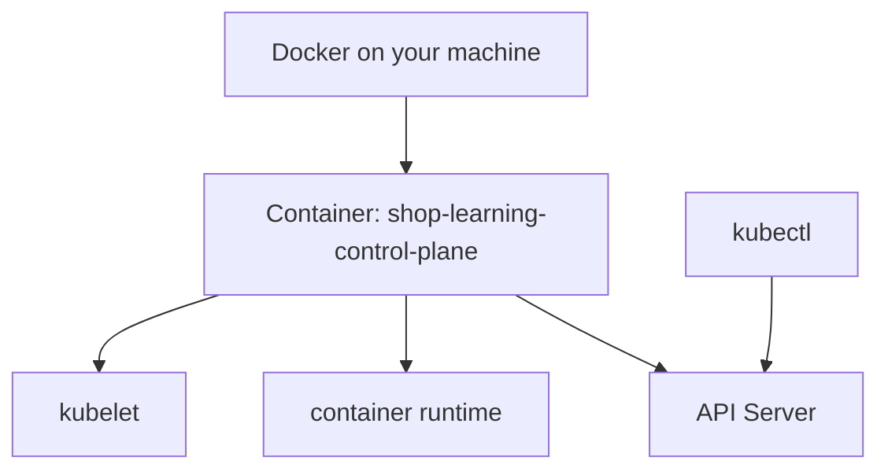

### Delete cluster

```bash
kind delete cluster --name shop-learning
```

### DevEx of the bloque

Añade these tasks:

```yaml
k8s:kind:create:
  desc: Create local Kubernetes cluster with kind
  cmds:
    - kind create cluster --name {{.KIND_CLUSTER}}

k8s:kind:delete:
  desc: Delete local Kubernetes cluster
  cmds:
    - kind delete cluster --name {{.KIND_CLUSTER}}

k8s:context:
  desc: Show current kubectl context
  cmds:
    - kubectl config current-context
```

### Criterio of comprensión

Debes poder explicar:

> kind creates a cluster local usando containers como nodos. `kubectl` habla with that cluster mediante the context configurado.

---

## 3.6. Check tools and compatibilidad

Before of trabajar with the cluster, valida tus tools.

`kubectl` must ser compatible with the versión of the cluster. The documentación oficial indica que the versión of `kubectl` must estar dentro of a diferencia of a versión menor respecto to the control plane of the cluster. ([Kubernetes](https://kubernetes.io/docs/tasks/tools/install-kubectl-linux/ "Install and Set Up kubectl on Linux"))

### Commands

```bash
kubectl version --client
kubectl version
kind version
docker --version
jq --version
yq --version
task --version
```

### What observar

- `kubectl` instalado
- kind instalado
- Docker disponible
- `jq` disponible
- `yq` disponible
- Task disponible
- `kubectl` can hablar with the cluster
### DevEx of the bloque

Amplía `task doctor`:

```yaml
doctor:
  desc: Check required local tools
  cmds:
    - node --version || true
    - npm --version || true
    - git --version
    - curl --version
    - jq --version
    - yq --version
    - task --version
    - docker --version
    - docker compose version
    - podman --version || true
    - kubectl version --client
    - kind version
```

AND añade a task for check the cluster:

```yaml
k8s:doctor:
  desc: Check Kubernetes cluster access
  cmds:
    - kubectl config current-context
    - kubectl cluster-info
    - kubectl get nodes
```

### Criterio of comprensión

Debes poder explicar:

> Tener `kubectl` instalado not significa tener acceso correcto to the cluster. Debo check client, context and respuesta of the API Server.

---

## 3.7. Firsts commands of lectura

Before of create nada, lee the state of the cluster.

The primera habilidad in Kubernetes is not write YAML.

The primera habilidad es observar.

### Commands

```bash
kubectl get nodes
kubectl get namespaces
kubectl get pods -A
kubectl get events -A --sort-by=.metadata.creationTimestamp
```

### What it means each command

|Command|What observa|
|---|---|
|`kubectl get nodes`|Nodos disponibles|
|`kubectl get namespaces`|Espacios of agrupación|
|`kubectl get pods -A`|Pods of all the namespaces|
|`kubectl get events -A`|Eventos recientes of the cluster|

### Output amplia

```bash
kubectl get pods -A -o wide
```

`-o wide` añade more información in formato tabular.

### Output JSON

```bash
kubectl get pods -A -o json | jq -r '.items[] | [.metadata.namespace, .metadata.name, .status.phase] | @tsv'
```

### Output YAML

```bash
kubectl get nodes -o yaml | yq '.items[].metadata.name'
```

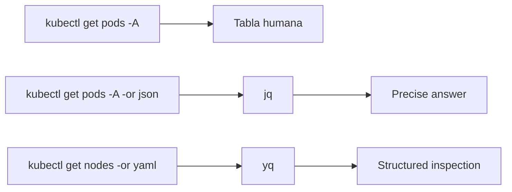

### DevEx of the bloque

Añade tasks of observación:

```yaml
k8s:status:
  desc: Show useful Kubernetes status
  cmds:
    - kubectl get nodes
    - kubectl get namespaces
    - kubectl get pods -A
    - kubectl get events -A --sort-by=.metadata.creationTimestamp

k8s:pods:json:
  desc: Show pods as structured JSON summary
  cmds:
    - kubectl get pods -A -o json | jq -r '.items[] | [.metadata.namespace, .metadata.name, .status.phase] | @tsv'
```

### Criterio of comprensión

Debes poder explicar:

> Before of cambiar a cluster, debo saber observar su state actual.

---

## 3.8. Create the namespace `shop`

### What es a namespace

A namespace agrupa Resources dentro of the cluster.

It is not a frontera of security completa by yes same, but permite organizar Resources and apply políticas later.

In this course, everything the sistema `shop` vivirá in:

```text
shop
```

### Manifest declarativo

Creates:

```text
kubernetes/00-namespace/namespace.yaml
```

Contenido:

```yaml
apiVersion: v1
kind: Namespace
metadata:
  name: shop
  labels:
    app.kubernetes.io/part-of: shop
```

### Apply

```bash
kubectl apply -f kubernetes/00-namespace/namespace.yaml
```

### See

```bash
kubectl get namespaces
kubectl get namespace shop -o yaml
```

Inspect with `yq`:

```bash
yq '.metadata.name' kubernetes/00-namespace/namespace.yaml
```

Inspect desde the cluster with `jq`:

```bash
kubectl get namespace shop -o json | jq '.metadata.name'
```

### DevEx of the bloque

Añade:

```yaml
k8s:namespace:apply:
  desc: Apply shop namespace
  cmds:
    - kubectl apply -f kubernetes/00-namespace/namespace.yaml

k8s:namespace:get:
  desc: Show shop namespace
  cmds:
    - kubectl get namespace shop -o yaml
```

### Criterio of comprensión

Debes poder explicar:

> A namespace me permite agrupar Resources relacionados. In this course, `shop` será the espacio of trabajo principal dentro of the cluster.

---

## 3.9. Preparar the image local for kind

This punto it is important.

When construyes an image with Docker:

```bash
docker build -t checkout-api:1.0.0 ./apps/checkout-api
```

the image exists in tu Docker local.

But the cluster kind ejecuta sus nodos dentro of containers. Esos nodos not necesariamente ven automáticamente all the images of tu Docker local.

kind permite cargar an image local dentro of the cluster with `kind load docker-image`. The documentación of kind incluye flujos for cargar images locales in a cluster kind. ([kind.sigs.k8s.io](https://kind.sigs.k8s.io/docs/ "Documentation Distributed under CC BY 4.0 - kind - Kubernetes"))

### Build

```bash
docker build -t checkout-api:1.0.0 ./apps/checkout-api
```

### Load into kind

```bash
kind load docker-image checkout-api:1.0.0 --name shop-learning
```

### Contrato mental

|Lugar|What contiene|
|---|---|
|Docker local|Image construida by `docker build`|
|Nodo kind|Image disponible for que Kubernetes the ejecute|
|Registry externo|Image disponible for otros clusters or máquinas|

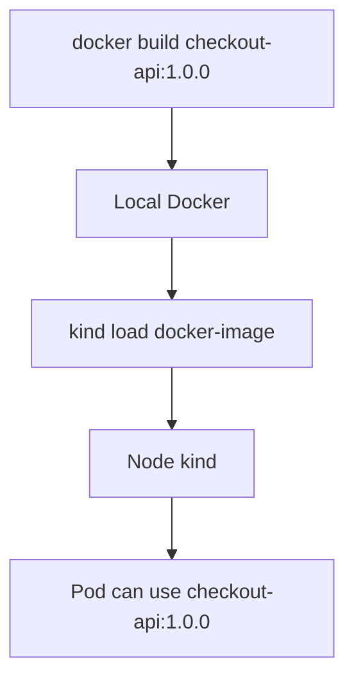

### DevEx of the bloque

Añade:

```yaml
k8s:image:load:
  desc: Load checkout-api image into kind cluster
  cmds:
    - kind load docker-image {{.IMAGE_NAME}}:{{.IMAGE_TAG}} --name {{.KIND_CLUSTER}}
```

AND a task compuesta:

```yaml
k8s:image:prepare:
  desc: Build and load checkout-api image into kind
  cmds:
    - task container:build:docker
    - task k8s:image:load
```

### Criterio of comprensión

Debes poder explicar:

> Build an image local not basta for que a cluster kind pueda usarla. Tengo que cargarla in the cluster or publicarla in a registry accesible.

---

## 3.10. Primer manifest: Pod `checkout-api`

Before of create the Pod, definimos the contrato minimum.

### What queremos

Queremos run `checkout-api` dentro of the namespace `shop`.

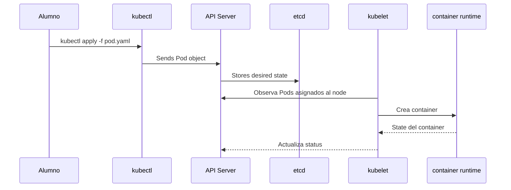

The Pod must:

- Use the image `checkout-api:1.0.0`
- Run a container llamado `checkout-api`
- Expose the port internal `8080`
- Receive environment variables
- Use `imagePullPolicy: IfNotPresent` for permitir the image cargada in kind
- Mantener the ejemplo sencillo
Not vamos to explicar yet everything the ciclo of vida of Pods. That corresponde to the module 5.

Aquí only you need see the primer objeto ejecutable.

### Manifest

Creates:

```text
kubernetes/01-pod/pod.yaml
```

Contenido:

```yaml
apiVersion: v1
kind: Pod
metadata:
  name: checkout-api
  namespace: shop
  labels:
    app.kubernetes.io/name: checkout-api
    app.kubernetes.io/part-of: shop
spec:
  containers:
    - name: checkout-api
      image: checkout-api:1.0.0
      imagePullPolicy: IfNotPresent
      ports:
        - containerPort: 8080
      env:
        - name: SERVICE_NAME
          value: checkout-api
        - name: PORT
          value: "8080"
        - name: LOG_LEVEL
          value: debug
```

### Explicación minimum

|Campo|What it means|
|---|---|
|`apiVersion`|Versión of the API usada by this objeto|
|`kind`|Tipo of objeto|
|`metadata.name`|Nombre of the objeto|
|`metadata.namespace`|Namespace where vive|
|`metadata.labels`|Etiquetas for identificarlo|
|`spec`|State deseado|
|`containers`|Containers dentro of the Pod|
|`image`|Image que runs|
|`imagePullPolicy`|Cuándo intentar descargar the image|
|`ports.containerPort`|Port documentado of the container|
|`env`|Environment variables|

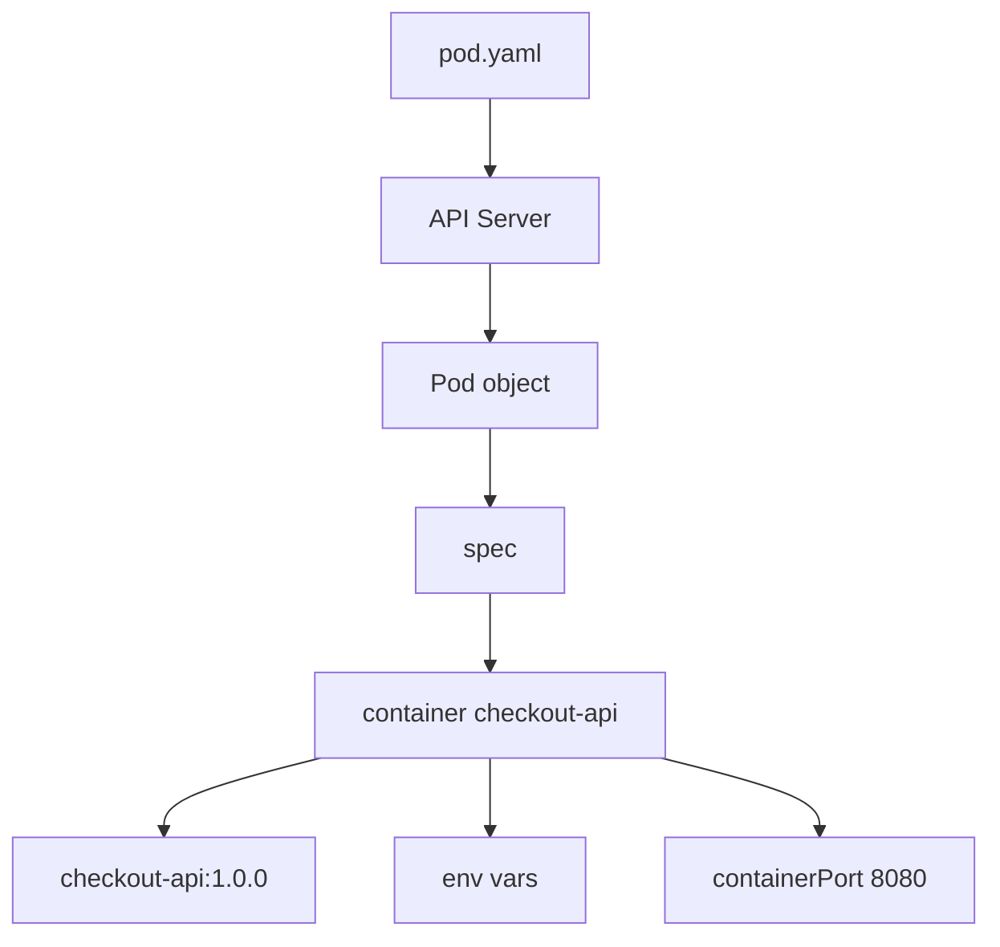

### Apply

```bash
kubectl apply -f kubernetes/01-pod/pod.yaml
```

### See

```bash
kubectl get pods -n shop
kubectl get pod checkout-api -n shop -o wide
```

### DevEx of the bloque

Añade:

```yaml
k8s:pod:apply:
  desc: Apply checkout-api Pod
  cmds:
    - kubectl apply -f kubernetes/01-pod/pod.yaml

k8s:pod:get:
  desc: Show checkout-api Pod
  cmds:
    - kubectl get pod checkout-api -n {{.NAMESPACE}} -o wide
```

### Criterio of comprensión

Debes poder explicar:

> TO Pod es the primer objeto ejecutable que createé in Kubernetes, but `kubectl apply` not ejecuta directamente a container. Envía a objeto to the API and Kubernetes intenta materializarlo.

---

## 3.11. Observar state of the Pod

A vez creado the Pod, not basta with see que “exists”.

You need to observar su state.

### Commands

```bash
kubectl get pod checkout-api -n shop
kubectl get pod checkout-api -n shop -o wide
kubectl describe pod checkout-api -n shop
kubectl get events -n shop --sort-by=.metadata.creationTimestamp
```

### What mirar

|Señal|What indica|
|---|---|
|`STATUS`|Fase visible of the Pod|
|`READY`|Containers ready frente to total|
|`RESTARTS`|Reinicios of the container|
|`AGE`|Tiempo desde creación|
|`NODE`|Nodo where runs|
|Events|Signals of scheduling, pull, start, errores|

### Inspección estructurada with `jq`

```bash
kubectl get pod checkout-api -n shop -o json | jq '.status.phase'
kubectl get pod checkout-api -n shop -o json | jq '.status.containerStatuses'
kubectl get pod checkout-api -n shop -o json | jq '.spec.containers[0].image'
```

### Inspección of the manifest local with `yq`

```bash
yq '.kind' kubernetes/01-pod/pod.yaml
yq '.metadata.name' kubernetes/01-pod/pod.yaml
yq '.spec.containers[0].image' kubernetes/01-pod/pod.yaml
```

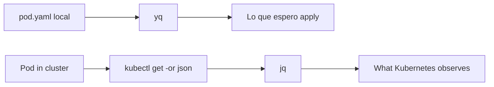

### DevEx of the bloque

Añade:

```yaml
k8s:pod:inspect:
  desc: Inspect checkout-api Pod
  cmds:
    - kubectl get pod checkout-api -n {{.NAMESPACE}} -o wide
    - kubectl describe pod checkout-api -n {{.NAMESPACE}}
    - kubectl get pod checkout-api -n {{.NAMESPACE}} -o json | jq '.status.phase'
    - kubectl get pod checkout-api -n {{.NAMESPACE}} -o json | jq '.status.containerStatuses'
```

### Criterio of comprensión

Debes poder explicar:

> `kubectl get` me da a vista rápida. `kubectl describe` me da detalles and eventos. `kubectl get -o json | jq` me permite hacer preguntas precisas.

---

## 3.12. Read logs of the Pod

The application already escribía logs by stdout in Docker.

In Kubernetes, you can read esos logs with:

```bash
kubectl logs checkout-api -n shop
```

Seguir logs:

```bash
kubectl logs -f checkout-api -n shop
```

Generate traffic yet not será possible desde tu máquina hasta que hagamos `port-forward`, but the log of arranque already should existir.

### Contrato of logs esperado

The arranque should emitir algo parecido to:

```json
{
  "level": "debug",
  "service": "checkout-api",
  "message": "server started",
  "port": 8080
}
```

### DevEx of the bloque

Añade:

```yaml
k8s:logs:
  desc: Follow checkout-api logs
  cmds:
    - kubectl logs -f pod/checkout-api -n {{.NAMESPACE}}
```

### Criterio of comprensión

Debes poder explicar:

> `kubectl logs` lee the output of the container gestionado by Kubernetes. The decisión of write logs by stdout in the module 1 permite que esto funcione ahora.

---

## 3.13. Entrar in the container with `kubectl exec`

In Docker usaste:

```bash
docker exec -it checkout-api sh
```

In Kubernetes usarás:

```bash
kubectl exec -it checkout-api -n shop -- sh
```

Dentro:

```sh
whoami
pwd
ls -la
printenv | sort
wget -qO- http://localhost:8080/health
exit
```

### What observar

- Estás dentro of the container of the Pod
- `localhost:8080` funciona dentro of the same container
- The environment variables están presentes
- The user should ser the definido in the image
### DevEx of the bloque

Añade:

```yaml
k8s:shell:
  desc: Open shell inside checkout-api Pod
  cmds:
    - kubectl exec -it pod/checkout-api -n {{.NAMESPACE}} -- sh
```

### Criterio of comprensión

Debes poder explicar:

> `kubectl exec` sirve for inspect a container que Kubernetes está ejecutando. Not must convertirse in the forma normal of corregir sistemas to mano.

---

## 3.14. Acceder to `checkout-api` with `port-forward`

Yet not hemos creado a Service.

Not tenemos Ingress.

Not tenemos Gateway.

Only tenemos a Pod.

For acceder temporalmente desde tu máquina, usaremos `port-forward`.

```bash
kubectl port-forward pod/checkout-api -n shop 8080:8080
```

In otra terminal:

```bash
curl -i http://localhost:8080/health
curl -i http://localhost:8080/ready
curl -i http://localhost:8080/checkout
```

Also you can run:

```bash
task smoke
```

### What it means

```text
8080:8080
```

significa:

```text
LOCAL_PORT:POD_PORT
```

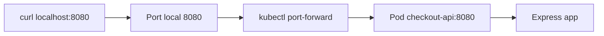

### Contrato of uso

`port-forward` es útil for:

- Desarrollo local
- Debugging
- Validate a app without create Service
- Acceso temporal
It is not a estrategia of exposición real for producción.

Later aprenderás Services, Ingress and Gateway API.

### DevEx of the bloque

Añade:

```yaml
k8s:port-forward:
  desc: Forward local port to checkout-api Pod
  cmds:
    - kubectl port-forward pod/checkout-api -n {{.NAMESPACE}} {{.PORT}}:8080
```

This task se queda ejecutando. It must correr in a terminal separada.

### Criterio of comprensión

Debes poder explicar:

> `port-forward` creates a túnel temporal between mi máquina and a recurso of the cluster. Not reemplaza a Service.

---

## 3.15. Delete Resources

Everything lo que creas must poder deletese.

Delete the Pod:

```bash
kubectl delete -f kubernetes/01-pod/pod.yaml
```

Delete the namespace:

```bash
kubectl delete -f kubernetes/00-namespace/namespace.yaml
```

Check:

```bash
kubectl get pods -n shop
kubectl get namespace shop
```

If the namespace already does not exist, the command of Pods devolverá error because the namespace fue eliminado.

### DevEx of the bloque

Añade:

```yaml
k8s:pod:delete:
  desc: Delete checkout-api Pod
  cmds:
    - kubectl delete -f kubernetes/01-pod/pod.yaml --ignore-not-found

k8s:namespace:delete:
  desc: Delete shop namespace
  cmds:
    - kubectl delete -f kubernetes/00-namespace/namespace.yaml --ignore-not-found
```

### Criterio of comprensión

Debes poder explicar:

> A laboratorio serio not only sabe create Resources. Also sabe deletelos and reconstruirlos.

---

## 3.16. Primer flujo completo of the module

This es the flow que the learner must poder repetir.

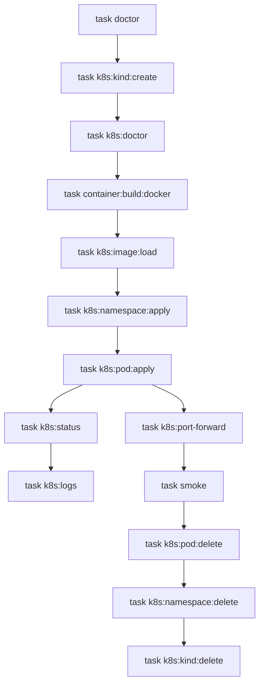

### Commands

Terminal 1:

```bash
task doctor
task k8s:kind:create
task k8s:doctor
task k8s:image:prepare
task k8s:namespace:apply
task k8s:pod:apply
task k8s:pod:inspect
task k8s:port-forward
```

Terminal 2:

```bash
task smoke
task k8s:logs
```

Limpieza:

```bash
task k8s:pod:delete
task k8s:namespace:delete
task k8s:kind:delete
```

### Criterio of comprensión

Debes poder explicar everything the circuito:

> Construyo image, the cargo in kind, creo a namespace, aplico a Pod, observo state, leo logs, abro a port-forward, valido the contrato HTTP and borro Resources.

---

## 3.17. Taskfile completo for the module 3

Amplía the `Taskfile.yml` with these variables and tasks.

```yaml
version: '3'

vars:
  APP_NAME: checkout-api
  IMAGE_NAME: checkout-api
  IMAGE_TAG: 1.0.0
  PORT: 8080
  KIND_CLUSTER: shop-learning
  NAMESPACE: shop
  COMPOSE_FILE: compose/compose.yaml

tasks:
  default:
    desc: List available tasks
    cmds:
      - task --list

  doctor:
    desc: Check required local tools
    cmds:
      - node --version || true
      - npm --version || true
      - git --version
      - curl --version
      - jq --version
      - yq --version
      - task --version
      - docker --version
      - docker compose version
      - podman --version || true
      - kubectl version --client
      - kind version

  app:install:
    desc: Install checkout-api dependencies locally
    dir: apps/{{.APP_NAME}}
    cmds:
      - npm install

  app:run:
    desc: Run checkout-api locally without a container
    dir: apps/{{.APP_NAME}}
    cmds:
      - PORT={{.PORT}} LOG_LEVEL=debug npm start

  container:build:docker:
    desc: Build checkout-api image with Docker
    cmds:
      - docker build -t {{.IMAGE_NAME}}:{{.IMAGE_TAG}} ./apps/{{.APP_NAME}}

  smoke:
    desc: Run checkout-api smoke test
    cmds:
      - ./scripts/smoke-test.sh

  k8s:kind:create:
    desc: Create local Kubernetes cluster with kind
    cmds:
      - kind create cluster --name {{.KIND_CLUSTER}}

  k8s:kind:delete:
    desc: Delete local Kubernetes cluster
    cmds:
      - kind delete cluster --name {{.KIND_CLUSTER}}

  k8s:context:
    desc: Show current kubectl context
    cmds:
      - kubectl config current-context

  k8s:doctor:
    desc: Check Kubernetes cluster access
    cmds:
      - kubectl config current-context
      - kubectl cluster-info
      - kubectl get nodes

  k8s:status:
    desc: Show useful Kubernetes status
    cmds:
      - kubectl get nodes
      - kubectl get namespaces
      - kubectl get pods -A
      - kubectl get events -A --sort-by=.metadata.creationTimestamp

  k8s:pods:json:
    desc: Show pods as structured JSON summary
    cmds:
      - kubectl get pods -A -o json | jq -r '.items[] | [.metadata.namespace, .metadata.name, .status.phase] | @tsv'

  k8s:image:load:
    desc: Load checkout-api image into kind cluster
    cmds:
      - kind load docker-image {{.IMAGE_NAME}}:{{.IMAGE_TAG}} --name {{.KIND_CLUSTER}}

  k8s:image:prepare:
    desc: Build and load checkout-api image into kind
    cmds:
      - task container:build:docker
      - task k8s:image:load

  k8s:namespace:apply:
    desc: Apply shop namespace
    cmds:
      - kubectl apply -f kubernetes/00-namespace/namespace.yaml

  k8s:namespace:get:
    desc: Show shop namespace
    cmds:
      - kubectl get namespace {{.NAMESPACE}} -o yaml

  k8s:namespace:delete:
    desc: Delete shop namespace
    cmds:
      - kubectl delete -f kubernetes/00-namespace/namespace.yaml --ignore-not-found

  k8s:pod:apply:
    desc: Apply checkout-api Pod
    cmds:
      - kubectl apply -f kubernetes/01-pod/pod.yaml

  k8s:pod:get:
    desc: Show checkout-api Pod
    cmds:
      - kubectl get pod checkout-api -n {{.NAMESPACE}} -o wide

  k8s:pod:inspect:
    desc: Inspect checkout-api Pod
    cmds:
      - kubectl get pod checkout-api -n {{.NAMESPACE}} -o wide
      - kubectl describe pod checkout-api -n {{.NAMESPACE}}
      - kubectl get pod checkout-api -n {{.NAMESPACE}} -o json | jq '.status.phase'
      - kubectl get pod checkout-api -n {{.NAMESPACE}} -o json | jq '.status.containerStatuses'

  k8s:logs:
    desc: Follow checkout-api logs
    cmds:
      - kubectl logs -f pod/checkout-api -n {{.NAMESPACE}}

  k8s:shell:
    desc: Open shell inside checkout-api Pod
    cmds:
      - kubectl exec -it pod/checkout-api -n {{.NAMESPACE}} -- sh

  k8s:port-forward:
    desc: Forward local port to checkout-api Pod
    cmds:
      - kubectl port-forward pod/checkout-api -n {{.NAMESPACE}} {{.PORT}}:8080

  k8s:pod:delete:
    desc: Delete checkout-api Pod
    cmds:
      - kubectl delete -f kubernetes/01-pod/pod.yaml --ignore-not-found

  k8s:lab:apply:
    desc: Apply namespace and checkout-api Pod
    cmds:
      - task k8s:namespace:apply
      - task k8s:pod:apply

  k8s:lab:delete:
    desc: Delete checkout-api Pod and namespace
    cmds:
      - task k8s:pod:delete
      - task k8s:namespace:delete
```

---

## 3.18. Practice principal of the module

### Objective

Create a cluster local, desplegar `checkout-api` como Pod, observarlo, acceder by `port-forward`, validate su contrato and limpiar everything.

### Resultado esperado

To the final you should tener:

```text
kubernetes-learning-lab/
  kubernetes/
    00-namespace/
      namespace.yaml
    01-pod/
      pod.yaml
  Taskfile.yml
```

### Paso 1. Create cluster

```bash
task k8s:kind:create
task k8s:doctor
```

### Paso 2. Build and cargar image

```bash
task k8s:image:prepare
```

### Paso 3. Create namespace

```bash
task k8s:namespace:apply
task k8s:namespace:get
```

### Paso 4. Apply Pod

```bash
task k8s:pod:apply
task k8s:pod:get
```

### Paso 5. Inspect

```bash
task k8s:pod:inspect
task k8s:status
```

### Paso 6. Read logs

```bash
task k8s:logs
```

### Paso 7. Acceder with port-forward

In a terminal:

```bash
task k8s:port-forward
```

In otra terminal:

```bash
task smoke
```

### Paso 8. Entrar in the container

```bash
task k8s:shell
```

Dentro:

```sh
printenv | sort
wget -qO- http://localhost:8080/health
exit
```

### Paso 9. Delete Resources

```bash
task k8s:lab:delete
```

### Paso 10. Delete cluster

```bash
task k8s:kind:delete
```

### Criterio of finalización

The practice está completa when you can:

- Create the cluster
- See nodos
- See context actual
- Create the namespace `shop`
- Build the image
- Cargar the image in kind
- Apply the Pod
- See state of the Pod
- Read logs
- Entrar in the container
- Hacer port-forward
- Run the smoke test
- Delete Resources
- Delete the cluster
- Repetir everything with Taskfile
---

## 3.19. Ejercicios cortos

### Ejercicio 1. Context actual

Ejecuta:

```bash
kubectl config current-context
kubectl config get-contexts
```

Responde:

- ¿TO what cluster apunta `kubectl`?
- ¿What context creó kind?
- ¿What pasaría if tu context apunta to otro cluster?
---

### Ejercicio 2. Namespaces

Ejecuta:

```bash
kubectl get namespaces
kubectl get pods -A
kubectl get pods -n shop
```

Responde:

- ¿What diferencia hay between `-A` and `-n shop`?
- ¿By what usaremos `shop` como namespace?
- ¿What error aparece if the namespace does not exist?
---

### Ejercicio 3. Image not cargada

Borra the cluster and créalo of nuevo:

```bash
task k8s:kind:delete
task k8s:kind:create
```

Aplica namespace and Pod without cargar the image:

```bash
task k8s:namespace:apply
task k8s:pod:apply
task k8s:pod:inspect
```

Responde:

- ¿What error aparece?
- ¿By what Kubernetes does not encuentra the image?
- ¿What command lo corrige?
After corrige:

```bash
task k8s:image:load
kubectl delete pod checkout-api -n shop
task k8s:pod:apply
```

---

### Ejercicio 4. Logs

Ejecuta:

```bash
task k8s:logs
```

In otra terminal:

```bash
task k8s:port-forward
```

In a tercera terminal:

```bash
task smoke
```

Responde:

- ¿What logs aparecen?
- ¿What endpoint genera each log?
- ¿By what the logs funcionaban already desde Docker?
---

### Ejercicio 5. `port-forward`

Ejecuta:

```bash
task k8s:port-forward
```

Responde:

- ¿What port local estás usando?
- ¿TO what port of the Pod apunta?
- ¿By what esto is not a forma real of expose producción?
- ¿What recurso estudiarás later for expose Pods of forma estable?
---

### Ejercicio 6. `kubectl get`, `describe`, `logs`, `exec`

Completa:

|Necesidad|Command|
|---|---|
|See if the Pod exists||
|See eventos of the Pod||
|Read logs of the Pod||
|Entrar in the container||
|See YAML of the Pod||
|Extraer image with `jq`||

---

## 3.20. Errores habituales

### Error 1. Pensar que `kubectl` es Kubernetes

`kubectl` is not Kubernetes.

Es a client of the API.

You can tener Kubernetes without use `kubectl`, and you can tener `kubectl` instalado without tener acceso correcto to ningún cluster.

---

### Error 2. Olvidar the context

Unot of the errores more peligrosos es run commands contra the cluster equivocado.

Before of apply or delete Resources, revisa:

```bash
kubectl config current-context
```

---

### Error 3. Olvidar the namespace

If ejecutas:

```bash
kubectl get pods
```

only see Pods of the namespace by defecto of the context actual.

For this course uses:

```bash
kubectl get pods -n shop
```

or:

```bash
kubectl get pods -A
```

---

### Error 4. Build an image local and asumir que kind the ve

Docker local and the nodo kind not son exactamente the same espacio of ejecución.

If usas an image local in kind, normalmente tendrás que cargarla:

```bash
kind load docker-image checkout-api:1.0.0 --name shop-learning
```

---

### Error 5. Saltar directamente to YAML without observar

Before of cambiar cosas, observa:

```bash
kubectl get
kubectl describe
kubectl logs
kubectl get events
```

The practice is not only apply manifests. Es learn to read the sistema.

---

### Error 6. Use `exec` for arreglar to mano

Entrar in a container can ayudar to diagnosticar.

Not must convertirse in the mecanismo normal of cambio.

The cambios must vivir in code, images, manifests or configuration versionada.

---

### Error 7. Confundir `port-forward` with exposición real

`port-forward` sirve for acceso temporal.

Later usarás Services, Ingress or Gateway API for exposición estable.

---

## 3.21. Criterio of output of the module

You can pasar to the module 4 when puedas hacer everything esto without seguir a receta ciegamente.

### Concepts

Debes poder explicar:

- What es a cluster local
- What es kind
- What diferencia hay between kind and minikube to nivel of propósito
- What es `kubectl`
- What es `kubeconfig`
- What es a context
- What es a namespace
- What hace `kubectl apply`
- What diferencia hay between `get`, `describe`, `logs`, `exec` and `port-forward`
- By what an image local must cargarse in kind
- By what `port-forward` not sustituye a Service
### Practice

Debes poder:

- Create a cluster kind
- See nodos
- See context actual
- Create namespace `shop`
- Build `checkout-api`
- Cargar the image in kind
- Apply the Pod
- See the state of the Pod
- Read logs
- Entrar in the container
- Hacer port-forward
- Run the smoke test
- Delete Resources
- Delete the cluster
### DevEx

Debes poder run:

```bash
task doctor
task k8s:kind:create
task k8s:doctor
task k8s:image:prepare
task k8s:lab:apply
task k8s:pod:inspect
task k8s:port-forward
task smoke
task k8s:lab:delete
task k8s:kind:delete
```

### Frase final of comprensión

Debes poder explicar this frase:

> Kubernetes se controla mediante a API. `kubectl` es a client of that API. Before of understand all the objetos of Kubernetes, debo learn to create, observar, diagnosticar and delete Resources of forma repetible.

---

## 3.22. References oficiales

|Tema|Referencia|
|---|---|
|Install tools Kubernetes|Kubernetes Docs, Install Tools. ([Kubernetes](https://kubernetes.io/docs/tasks/tools/ "Install Tools"))|
|Install `kubectl` in Linux|Kubernetes Docs, Install and Set Up kubectl on Linux. ([Kubernetes](https://kubernetes.io/docs/tasks/tools/install-kubectl-linux/ "Install and Set Up kubectl on Linux"))|
|Install `kubectl` in macOS|Kubernetes Docs, Install and Set Up kubectl on macOS. ([Kubernetes](https://kubernetes.io/docs/tasks/tools/install-kubectl-macos/ "Install and Set Up kubectl on macOS"))|
|Install `kubectl` in Windows|Kubernetes Docs, Install and Set Up kubectl on Windows. ([Kubernetes](https://kubernetes.io/docs/tasks/tools/install-kubectl-windows/ "Install and Set Up kubectl on Windows"))|
|`kubectl`|Kubernetes Docs, Command line tool. ([Kubernetes](https://kubernetes.io/docs/reference/kubectl/ "Command line tool (kubectl)"))|
|Introducción to `kubectl`|Kubernetes Docs, Introduction to kubectl. ([Kubernetes](https://kubernetes.io/docs/reference/kubectl/introduction/ "Introduction to kubectl"))|
|Referencia rápida of `kubectl`|Kubernetes Docs, kubectl Quick Reference. ([Kubernetes](https://kubernetes.io/docs/reference/kubectl/quick-reference/ "kubectl Quick Reference"))|
|kind|kind official site. ([kind.sigs.k8s.io](https://kind.sigs.k8s.io/ "kind - Kubernetes"))|
|kind Quick Start|kind official documentation. ([kind.sigs.k8s.io](https://kind.sigs.k8s.io/docs/user/quick-start/ "Quick Start - kind - Kubernetes"))|
|minikube|minikube official documentation. ([Kubernetes](https://kubernetes.io/docs/tasks/tools/install-minikube "minikube start - Kubernetes"))|
|Hello Minikube|Kubernetes tutorial. ([Kubernetes](https://kubernetes.io/docs/tutorials/hello-minikube/ "Hello Minikube"))|
|Use `kubectl` if vienes of Docker|Kubernetes Docs, kubectl for Docker Users. ([Kubernetes](https://kubernetes.io/docs/reference/kubectl/docker-cli-to-kubectl/ "kubectl for Docker Users"))|

## 3.23. Lecturas of apoyo

|Libro|What read|
|---|---|
|_Kubernetes: Up and Running_|Chapter 3: cluster, minikube, cloud providers, client Kubernetes and componentes.|
|_Kubernetes: Up and Running_|Chapter 4: `kubectl`, namespaces, contexts, objetos, labels, annotations and debugging.|
|_Kubernetes in Action_|Chapter 2: cluster local, Minikube, primer deployment and commands iniciales.|
|_Cloud Native DevOps with Kubernetes_|Chapter 3: arquitectura, managed Kubernetes, self-hosting and costes.|
|_Cloud Native DevOps with Kubernetes_|Chapter 7: `kubectl`, logs, exec, port-forward, contexts, namespaces and tools útiles.|

<!-- COURSE_NAV_START -->
[Previous](<2. Why Kubernetes exists.md>) | [Index](README.md) | [Next](<4. Kubernetes mental model.md>)
<!-- COURSE_NAV_END -->
