<!-- COURSE_NAV_START -->
[Previous](3.%20First%20cluster%20and%20kubectl.md) | [Index](README.md) | [Next](5.%20Pods%20and%20basic%20objects.md)
<!-- COURSE_NAV_END -->

# 4. Kubernetes mental model

## Objective of the module

In the module 3 creaste a cluster local with kind, aplicaste a namespace, desplegaste `checkout-api` como Pod, leíste logs, entraste in the container and usaste `port-forward` for validate the contrato HTTP.

Ahora toca understand **what estaba pasando by debajo**.

Hasta ahora has usado Kubernetes desde fuera:

```text
kubectl apply
kubectl get
kubectl describe
kubectl logs
kubectl exec
kubectl port-forward
```

In this module vas to build the modelo mental que explica by what esos commands funcionan and what componentes participan.

The objective is not memorizar nombres. The objective es poder razonar.

Kubernetes funciona alnetworkedor of a API. The documentación oficial explica que the API Server expone a API HTTP que permite to usuarios, componentes internos and componentes externos comunicarse between yes, and que Kubernetes API permite consultar and manipular the state of objetos como Pods, Namespaces, ConfigMaps and Events. ([Kubernetes](https://kubernetes.io/docs/concepts/overview/kubernetes-api/ "The Kubernetes API"))

The idea central of the module es this:

> Kubernetes is not a caja mágica que ejecuta YAML. Es a sistema of control basado in API, objetos, state deseado, state observado and bucles of reconciliación.

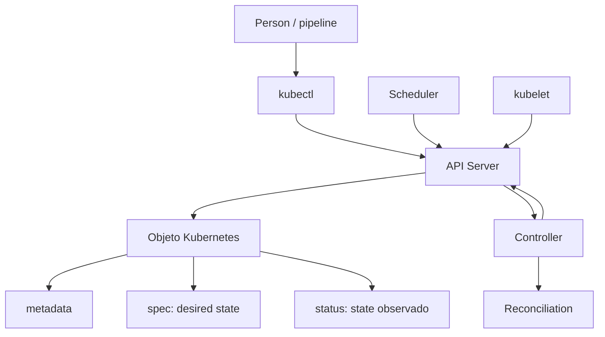

---

## 4.1. What you are going to learn and what not you are going to learn yet

This module explica how pensar Kubernetes.

You are going to learn:

- What it means que Kubernetes sea API-first
- What son objetos Kubernetes
- What papel tienen `metadata`, `spec` and `status`
- What diferencia hay between state deseado and state observado
- What es reconciliación
- What es a controller
- What hace the API Server
- What guarda `etcd`
- What hace the scheduler
- What hace kubelet
- What hace the container runtime
- What papel tienen kube-proxy, CNI and ConetworkNS
- What son events and why it mattersn
- How observar everything esto with `kubectl`, `jq`, `yq` and Taskfile
Not vamos to profundizar yet in:

- Deployments and ReplicaSets in detalle
- Probes
- Services and EndpointSlices
- Ingress or Gateway API
- ConfigMaps and Secrets
- RBAC
- Storage
- NetworkPolicy
- HPA, VPA or Cluster Autoscaler
- Operators and CRDs
Esos temas aparecerán later.

Aquí buscamos otra cosa:

> When mires a recurso of Kubernetes, debes poder preguntarte: ¿what he declarado?, ¿what observa Kubernetes?, ¿what componente should actuar?, ¿what signals me dicen what está pasando?

---

## 4.2. The salto mental: of command to objeto

In Docker, ejecutabas algo así:

```bash
docker run --rm -p 8080:8080 checkout-api:1.0.0
```

In Kubernetes, aplicaste algo así:

```bash
kubectl apply -f kubernetes/01-pod/pod.yaml
```

These dos commands not tienen the same modelo mental.

With Docker, pides directamente the ejecución of a container.

With Kubernetes, envías a objeto to the API. That objeto expresa a intención. After, varios componentes observan that intención and actúan.

The documentación oficial explica que the objetos Kubernetes son entidades persistentes of the sistema que representan the state of the cluster, and que esos objetos pueden expresarse in YAML. ([Kubernetes](https://kubernetes.io/docs/concepts/overview/working-with-objects/ "Objects In Kubernetes"))

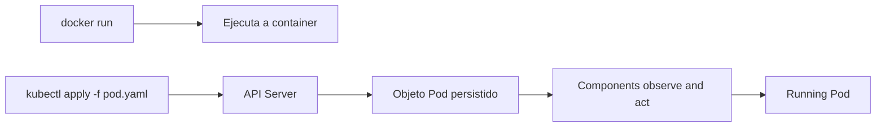

### Contrato mental

|Modelo|What haces|What ocurre|
|---|---|---|
|Docker|Ejecutas a container|The tool starts the process|
|Compose|Levantas services locales|Compose creates containers, networks and volúmenes|
|Kubernetes|Declaras objetos|The control plane intenta reconciliar state|

### DevEx of the bloque

Not uses `kubectl apply` como a conjuro.

Each vez que apliques algo, you should poder run after:

```bash
kubectl get
kubectl describe
kubectl get -o yaml
kubectl get -o json | jq
```

The DevEx good is not only create Resources rápido. Es create Resources and tener a forma clara of observarlos.

### Criterio of comprensión

Debes poder explicar:

> `kubectl apply` not ejecuta directamente mi application. Envía a declaración to the API of Kubernetes.

---

## 4.3. The API como centro of the sistema

Kubernetes trata casi everything como a objeto of API.

The API Server es the punto central of comunicación. The usuarios hablan with the API Server mediante `kubectl`, pipelines or clientes. The componentes internos also se comunican with the API Server for read and write state. The documentación of referencia indica que the REST API es the base of Kubernetes and que the operaciones and comunicaciones between componentes and commands externos son llamadas API gestionadas by the API Server. ([Kubernetes](https://kubernetes.io/docs/reference/using-api/ "API Overview"))

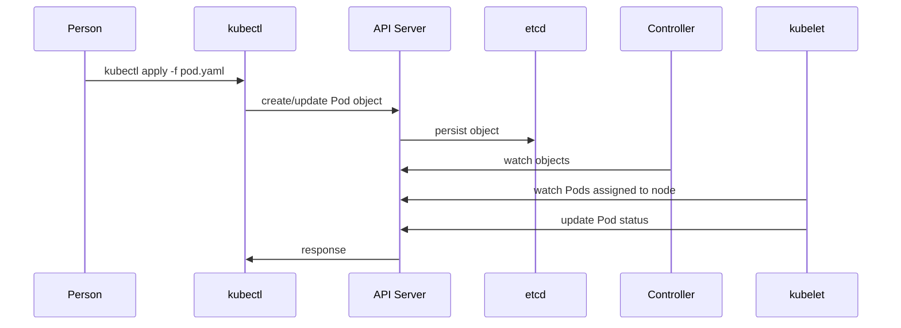

### What it means API-first

Significa que the state importante not vive in commands sueltos.

Vive como objetos consultables, versionables conceptualmente and observables.

You can preguntar:

```bash
kubectl get pod checkout-api -n shop -o yaml
```

You can extraer the state observado:

```bash
kubectl get pod checkout-api -n shop -o json | jq '.status'
```

You can revisar lo que declaraste:

```bash
kubectl get pod checkout-api -n shop -o json | jq '.spec'
```

### Contrato mental

|Elemento|Pregunta|
|---|---|
|API Server|¿Quién recibe and valida the peticiones?|
|Objeto|¿What entidad representa the state of the cluster?|
|`spec`|¿What quiero que exista?|
|`status`|¿What observa Kubernetes ahora?|
|Watch|¿What componentes están observando cambios?|
|Reconciliación|¿Quién intenta networkucir the diferencia?|

### DevEx of the bloque

Añade tasks que separen intención and observación:

```yaml
k8s:pod:spec:
  desc: Show checkout-api Pod desired specification
  cmds:
    - kubectl get pod checkout-api -n {{.NAMESPACE}} -o json | jq '.spec'

k8s:pod:status:
  desc: Show checkout-api Pod observed status
  cmds:
    - kubectl get pod checkout-api -n {{.NAMESPACE}} -o json | jq '.status'
```

### Criterio of comprensión

Debes poder explicar:

> If quiero understand Kubernetes, debo mirar the API. `kubectl` es only a of the formas of hacerlo.

---

## 4.4. Anatomía of a objeto Kubernetes

Before of hablar of componentes, necesitamos understand what están leyendo and escribiendo.

A objeto Kubernetes suele tener:

- `apiVersion`
- `kind`
- `metadata`
- `spec`
- `status`
In the file que escribes normalmente defines `apiVersion`, `kind`, `metadata` and `spec`.

`status` lo actualiza Kubernetes.

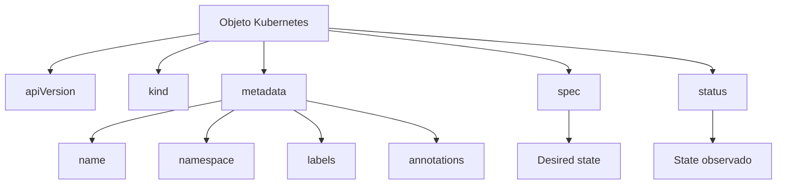

### Ejemplo: Pod `checkout-api`

Manifest local:

```yaml
apiVersion: v1
kind: Pod
metadata:
  name: checkout-api
  namespace: shop
  labels:
    app.kubernetes.io/name: checkout-api
    app.kubernetes.io/part-of: shop
spec:
  containers:
    - name: checkout-api
      image: checkout-api:1.0.0
      imagePullPolicy: IfNotPresent
      ports:
        - containerPort: 8080
      env:
        - name: SERVICE_NAME
          value: checkout-api
        - name: PORT
          value: "8080"
        - name: LOG_LEVEL
          value: debug
```

### What it means each parte

|Campo|Significado|
|---|---|
|`apiVersion`|Versión of the API usada by the recurso|
|`kind`|Tipo of objeto|
|`metadata.name`|Nombre of the objeto|
|`metadata.namespace`|Namespace where vive|
|`metadata.labels`|Etiquetas for identificar and agrupar|
|`spec`|State deseado|
|`status`|State observado by Kubernetes|

### See the objeto completo in the cluster

```bash
kubectl get pod checkout-api -n shop -o yaml
```

### See only `spec`

```bash
kubectl get pod checkout-api -n shop -o json | jq '.spec'
```

### See only `status`

```bash
kubectl get pod checkout-api -n shop -o json | jq '.status'
```

### See the manifest local with `yq`

```bash
yq '.spec.containers[0].image' kubernetes/01-pod/pod.yaml
```

### Criterio of comprensión

Debes poder explicar:

> The manifest expresa intención. The objeto in the cluster incluye intención, metadata gestionada by Kubernetes and state observado.

---

## 4.5. `metadata`: identidad and clasificación

`metadata` responde preguntas of identidad:

- ¿How se llama this objeto?
- ¿In what namespace vive?
- ¿What etiquetas tiene?
- ¿What anotaciones tiene?
- ¿Quién lo creó?
- ¿What UID tiene?
- ¿What generación tiene?
- ¿Tiene owner references?
Not everything esto lo escribes manualmente. Kubernetes añade parte of the metadata.

### Labels

The labels permiten identificar and seleccionar objetos.

Ejemplo:

```yaml
labels:
  app.kubernetes.io/name: checkout-api
  app.kubernetes.io/part-of: shop
```

### Annotations

The annotations sirven for metadata not pensada for selección.

Ejemplo conceptual:

```yaml
annotations:
  course.example.com/purpose: "first-pod-lab"
```

### Commands

```bash
kubectl get pod checkout-api -n shop --show-labels
kubectl get pod checkout-api -n shop -o json | jq '.metadata.labels'
kubectl get pod checkout-api -n shop -o json | jq '.metadata.uid'
```

### DevEx of the bloque

Uses labels consistentes desde the principio.

Not because Kubernetes lo exija for this Pod simple, sinot because later Services, Deployments, NetworkPolicies, observability and selección of Resources se apoyarán in labels.

### Criterio of comprensión

Debes poder explicar:

> `metadata` is not decoración. Es identidad operativa for encontrar, agrupar, seleccionar and understand Resources.

---

## 4.6. `spec`: state deseado

`spec` representa lo que quieres.

In a Pod simple, `spec` dice:

- What containers must existir
- What image must use
- What environment variables tendrán
- What ports documentan
- What política of descarga of image usarán
Ejemplo:

```bash
kubectl get pod checkout-api -n shop -o json | jq '.spec.containers[0]'
```

### What debes mirar

```bash
kubectl get pod checkout-api -n shop -o json | jq '.spec.containers[0].image'
kubectl get pod checkout-api -n shop -o json | jq '.spec.containers[0].env'
kubectl get pod checkout-api -n shop -o json | jq '.spec.nodeName'
```

### Detalle importante

After of the scheduling, the Pod tendrá a `spec.nodeName`.

That indica the nodo asignado.

Not lo has escrito in the manifest. Kubernetes lo ha completado during the process.

### Criterio of comprensión

Debes poder explicar:

> `spec` es lo que quiero que Kubernetes intente materializar. Not everything lo que aparece in `spec` tiene que haberlo escrito yo manualmente.

---

## 4.7. `status`: state observado

`status` representa lo que Kubernetes observa.

In a Pod, `status` can incluir:

- Fase of the Pod
- Condiciones
- IP of the Pod
- State of containers
- Reinicios
- Image usada
- Tiempos of arranque
- Razones of espera or terminación
Commands:

```bash
kubectl get pod checkout-api -n shop -o json | jq '.status.phase'
kubectl get pod checkout-api -n shop -o json | jq '.status.conditions'
kubectl get pod checkout-api -n shop -o json | jq '.status.containerStatuses'
```

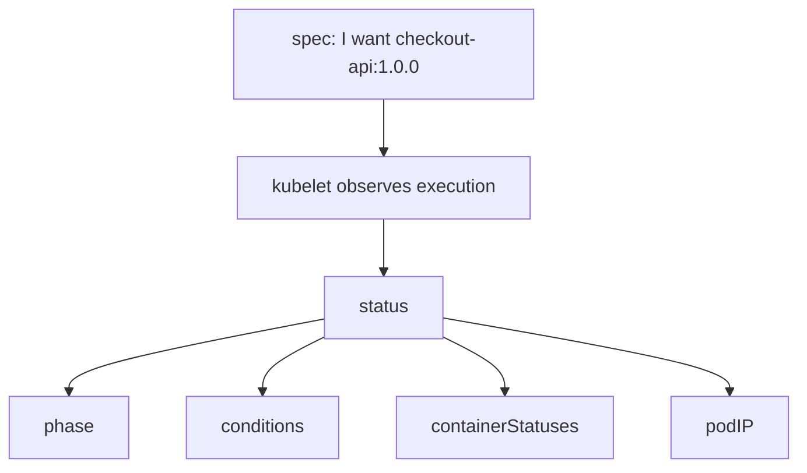

### Ejemplo of diferencia

It can que `spec` diga:

```text
image: checkout-api:1.0.0
```

But `status` diga:

```text
state.waiting.reason: ImagePullBackOff
```

That significa:

> The intención exists, but not se ha podido materializar properly.

### Criterio of comprensión

Debes poder explicar:

> `status` is not lo que quiero. Es lo que Kubernetes ve ahora.

---

## 4.8. State deseado, state actual and drift

This es the corazón of the modelo.

Kubernetes compara intención and observación.

- State deseado: lo que declaras
- State actual: lo que exists u observa the sistema
- Drift: diferencia between ambos
- Reconciliación: intento of networkucir that diferencia
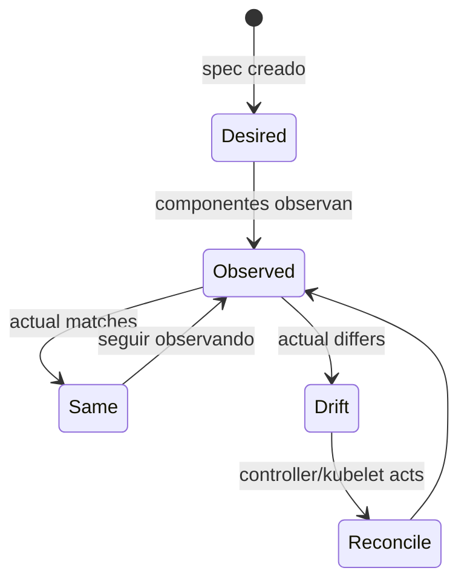

### Ejemplo simple

Deseado:

```text
Existe un Pod checkout-api con imagen checkout-api:1.0.0.
```

Actual:

```text
The Pod is Running and the container is Ready.
```

Not hay drift relevante.

Ahora rompes the image:

```yaml
image: checkout-api:does-not-exist
```

Deseado:

```text
There is a Pod with a nonexistent image.
```

Actual:

```text
El Pod existe, pero el container no arranca.
```

Hay drift operativo: Kubernetes aceptó the intención, but not can materializarla.

### Importante

Kubernetes does not sabe if tu intención era good.

Only intenta actuar según lo declarado and según the reglas of the sistema.

### DevEx of the bloque

Each practice must enseñar to mirar ambos lados:

```bash
task k8s:pod:spec
task k8s:pod:status
task k8s:pod:inspect
```

### Criterio of comprensión

Debes poder explicar:

> When something fails, not pregunto only “what está roto”. Pregunto “what declaré, what observa Kubernetes and dónde aparece the primera diferencia”.

---

## 4.9. Reconciliación and control loops

A controller es a bucle of control.

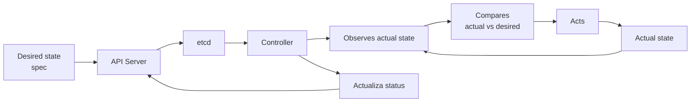

The documentación oficial define the controllers como control loops que observan the state of the cluster and hacen or solicitan cambios where es necessary; each controller intenta mover the state actual hacia the state deseado. ([Kubernetes](https://kubernetes.io/docs/concepts/architecture/controller/ "Controllers"))

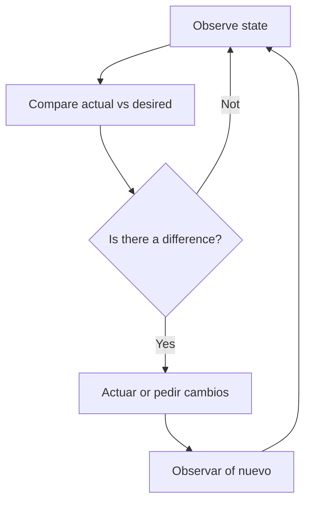

### What NOT significa reconciliación

Not significa:

- Que everything se arregle
- Que Kubernetes entienda tu negocio
- Que not necesites tests
- Que not necesites logs
- Que a bad manifest se corrija only
Yes significa:

- The sistema observa continuamente
- Detecta diferencias que understands
- Intenta actuar for acercarse to the state deseado
- Actualiza the state observado
- Emite signals
### Ejemplo actual of the course

In the module 3 creaste a Pod directo.

TO Pod directo tiene less comportamiento of reconciliación que a Deployment.

If borras a Pod creado directamente, desaparece and not vuelve.

Later, if creas a Deployment with réplicas, the Deployment controller yes recreateá Pods for mantener the cantidad deseada.

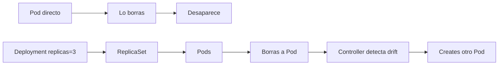

### DevEx of the bloque

Not uses yet Deployments como practice principal if the module quiere explicar the modelo. But yes you can mostrar the diferencia conceptual.

In the module 6, this idea se practicará in serio.

### Criterio of comprensión

Debes poder explicar:

> Not all the objetos tienen the same comportamiento of reconciliación. TO Pod directo not se comporta igual que a Deployment.

---

## 4.10. API Server

The API Server es the puerta of input to the control plane.

Recibe peticiones, valida objetos, aplica autenticación and autorización, ejecuta admisión when corresponde and persiste state in `etcd`.

The documentación oficial describe the API Server como the componente of the control plane que expone Kubernetes API. ([Kubernetes](https://kubernetes.io/docs/concepts/overview/components/ "Kubernetes Components"))

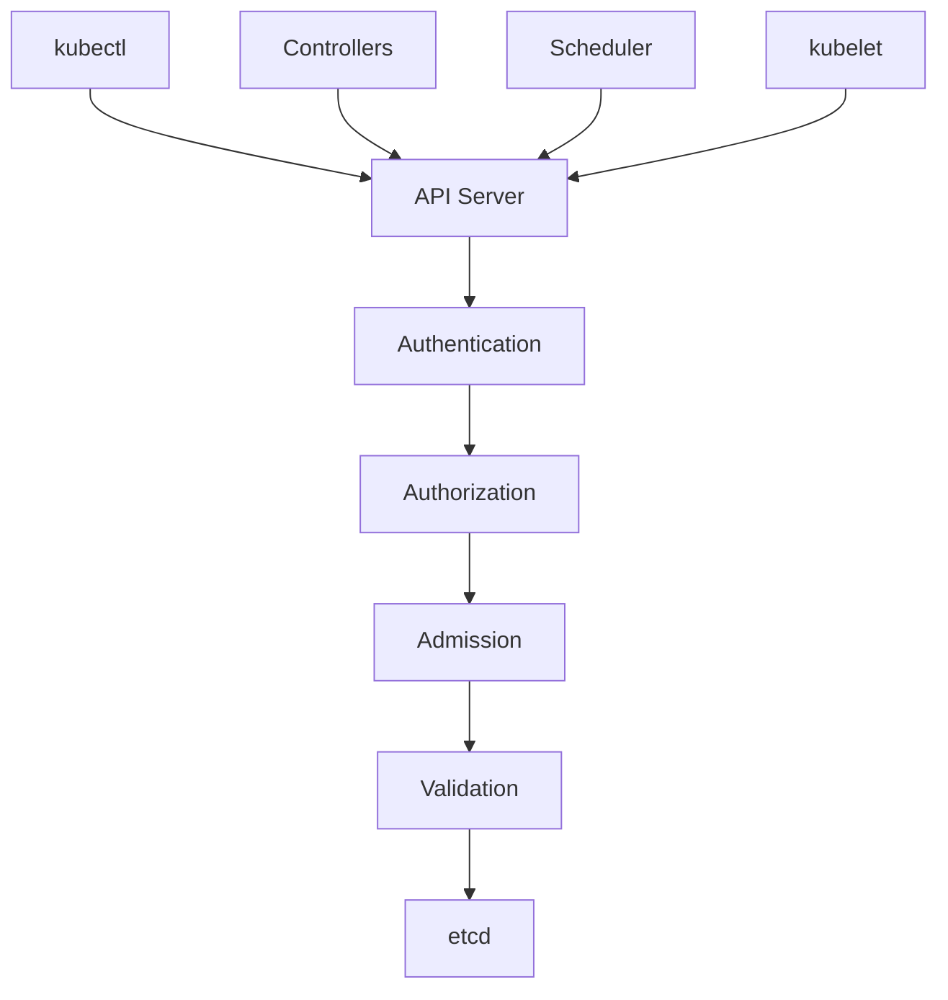

### What hace for ti

When you run:

```bash
kubectl apply -f kubernetes/01-pod/pod.yaml
```

the API Server recibe the petición.

If the objeto es válido, lo acepta.

If not lo es, lo rechaza.

### What you can observar

```bash
kubectl api-resources
kubectl explain pod
kubectl explain pod.spec
kubectl explain pod.status
```

`kubectl explain` describe campos and estructura of Resources soportados by the API. ([Kubernetes](https://kubernetes.io/docs/reference/kubectl/generated/kubectl_explain/ "kubectl explain"))

### DevEx of the bloque

`kubectl explain` must convertirse in a tool habitual.

Before of inventar or copiar campos YAML:

```bash
kubectl explain pod.spec.containers
```

### Criterio of comprensión

Debes poder explicar:

> The API Server es the input of the sistema. If a objeto not pasa by the API, Kubernetes does not lo gestiona como parte of su state.

---

## 4.11. `etcd`

`etcd` es the almacén of datos consistente and altamente disponible usado como backing store of the cluster. The documentación of componentes of Kubernetes lo identifica como the almacén of clave-valor usado for all the datos of the cluster. ([Kubernetes](https://kubernetes.io/docs/concepts/overview/components/ "Kubernetes Components"))

Not you need operate `etcd` yet.

But yes you need to understand su papel:

> Kubernetes needs a lugar where persistir the state of the objetos of the cluster.

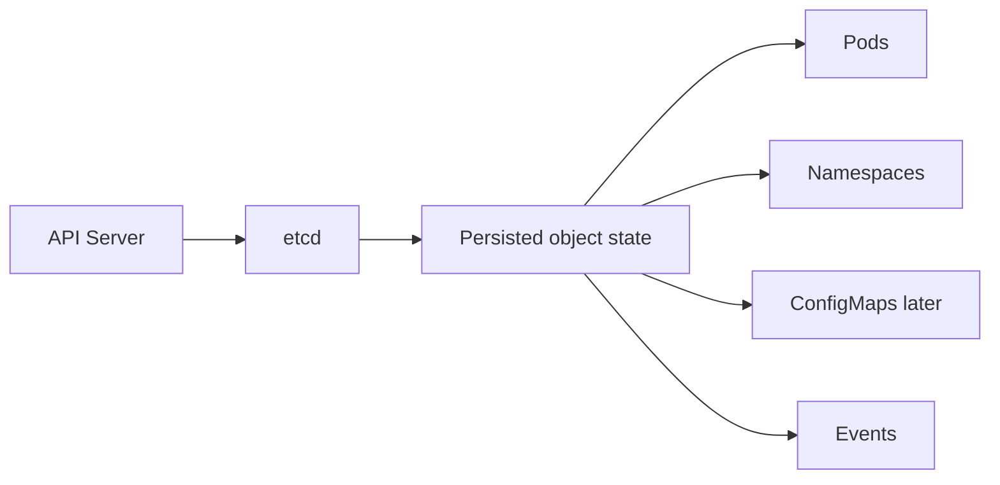

### What NOT debes hacer ahora

Not te conectes directamente to `etcd` in this course inicial.

Not uses `etcdctl` yet.

Not trates `etcd` como a database of application.

### Why it matters

If pierdes `etcd` without backup, you can perder the state of the cluster.

In módulos posteriores, when hablemos of operación, backup and disaster recovery, `etcd` volverá to aparecer.

### DevEx of the bloque

In a cluster local with kind, not vamos to operate `etcd`.

Only vamos to learn to reconocer que `etcd` exists and que the API Server es the path correct for interactuar with the state.

### Criterio of comprensión

Debes poder explicar:

> `etcd` guarda the state of the cluster. Yo should not saltarme the API for manipularlo.

---

## 4.12. Scheduler

The scheduler decide in what nodo must runse a Pod que yet not tiene nodo asignado.

The documentación of componentes explica que the kube-scheduler observa Pods recién creados without nodo asignado and selecciona a nodo where runlos. ([Kubernetes](https://kubernetes.io/docs/concepts/overview/components/ "Kubernetes Components"))

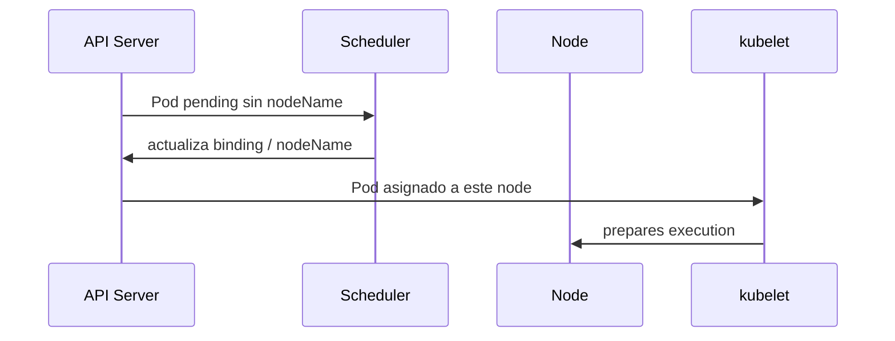

### What mira the scheduler

In this module not entraremos to scheduling advanced.

But the scheduler can considerar cosas como:

- Resources disponibles
- Requests of CPU and memoria
- Restricciones of nodo
- Taints and tolerations
- Affinity and anti-affinity
- Policies and configuration of scheduling
### How observarlo

```bash
kubectl get pod checkout-api -n shop -o wide
kubectl get pod checkout-api -n shop -o json | jq '.spec.nodeName'
kubectl describe pod checkout-api -n shop
```

In eventos podrías see signals of scheduling.

### DevEx of the bloque

Añade a task:

```yaml
k8s:pod:node:
  desc: Show the node where checkout-api is scheduled
  cmds:
    - kubectl get pod checkout-api -n {{.NAMESPACE}} -o json | jq -r '.spec.nodeName'
```

### Criterio of comprensión

Debes poder explicar:

> Yo declaro a Pod. The scheduler decide in what nodo must runse.

---

## 4.13. Kubelet

Kubelet vive in each nodo.

Su responsabilidad es asegurarse of que the containers descritos in the Pods asignados to that nodo estén corriendo. The documentación of componentes describe kubelet como a agente que corre in each nodo and se asegura of que the containers estén ejecutándose in a Pod. ([Kubernetes](https://kubernetes.io/docs/concepts/overview/components/ "Kubernetes Components"))

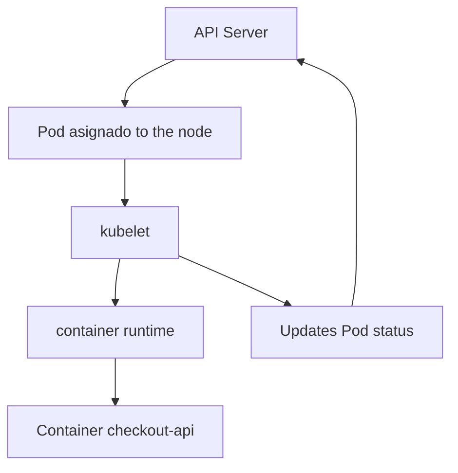

### What hace kubelet

Kubelet:

- Observa Pods asignados to su nodo
- Pide to the runtime que cree containers
- Monta configuration and volúmenes when toca
- Supervisa state
- Reporta `status` to the API Server
- Expone signals of salud of the nodo and Pods
### What you can observar

```bash
kubectl get pod checkout-api -n shop -o json | jq '.status.containerStatuses'
kubectl describe pod checkout-api -n shop
```

### Criterio of comprensión

Debes poder explicar:

> The API Server acepta the objeto. The scheduler asigna nodo. Kubelet materializa the Pod in that nodo and reporta state.

---

## 4.14. Container runtime

Kubelet not ejecuta containers by yes same.

Habla with a container runtime.

The documentación of nodos indica que the componentes of a nodo incluyen kubelet, a container runtime and kube-proxy. ([Kubernetes](https://kubernetes.io/docs/concepts/architecture/nodes/ "Nodes"))

In Kubernetes moderno, runtimes habituales son:

- containerd
- CRI-O
The detalle exacto depende of the cluster.

In kind, you can inspect parte of the environment, but not you need operate the runtime yet.

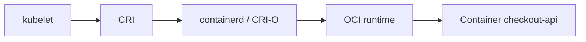

### What it means for ti

When see:

```text
ImagePullBackOff
CrashLoopBackOff
ContainerCreating
Running
```

estás viendo signals que nacen of the colaboración between kubelet, runtime, image and process of application.

### DevEx of the bloque

Not intentes debug the runtime In this module.

First aprende the cadena:

```text
Pod object → scheduler → kubelet → runtime → container → status
```

### Criterio of comprensión

Debes poder explicar:

> Kubernetes does not ejecuta containers llamando to Docker CLI. Kubelet se coordina with a runtime compatible mediante interfaces of Kubernetes.

---

## 4.15. Controller Manager and controllers

The controller manager ejecuta control loops centrales of Kubernetes.

The controllers observan objetos and actúan for networkucir drift.

The referencia of the `kube-controller-manager` explica que a controller es a control loop que observa the state compartido of the cluster to través of the API Server and hace cambios intentando mover the state actual hacia the state deseado. ([Kubernetes](https://kubernetes.io/docs/reference/command-line-tools-reference/kube-controller-manager/ "kube-controller-manager"))

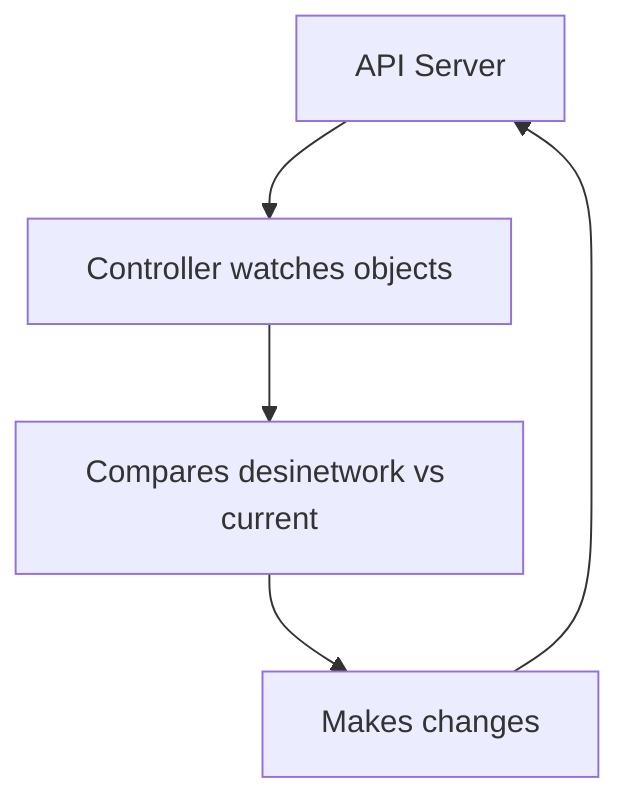

### Ejemplos of controllers

Not you need dominarlos yet, but es útil conocer ejemplos:

|Controller|What intenta mantener|
|---|---|
|Deployment controller|State deseado of Deployments|
|ReplicaSet controller|Número deseado of Pods|
|Job controller|Ejecución hasta completar trabajo|
|Node controller|State of nodos|
|EndpointSlice controller|Endpoints asociados to Services|

### Importante for this module

Tu Pod directo not tiene a controller of alto nivel manteniéndolo vivo como lo haría a Deployment.

That is why, if lo borras, desaparece.

Esto es intencional: queremos que veas the diferencia Before using Workloads more avanzados.

### Criterio of comprensión

Debes poder explicar:

> The controllers son the razón by the que Kubernetes can operate of forma continuous, not only create Resources a vez.

---

## 4.16. Kube-proxy, CNI and ConetworkNS

Yet not vamos to estudiar networking in profundidad.

But the modelo mental needs situar tres piezas.

### kube-proxy

kube-proxy es a componente of network que runs in nodos and ayuda to implementar parte of the abstracción of Service.

Lo estudiarás better in the module of networking.

### CNI

Kubernetes uses plugins CNI for implementar the modelo of network of the cluster. The documentación oficial indica que se requiere a plugin CNI for implementar the modelo of network of Kubernetes. ([Kubernetes](https://kubernetes.io/docs/concepts/extend-kubernetes/compute-storage-net/network-plugins/ "Network Plugins"))

### ConetworkNS

ConetworkNS permite resolver nombres dentro of the cluster. The documentación oficial about DNS explica que Kubernetes creates registros DNS for Services and Pods, and que the workloads pueden descubrir Services usando DNS instead of IPs. ([Kubernetes](https://kubernetes.io/docs/concepts/services-networking/dns-pod-service/ "DNS for Services and Pods"))

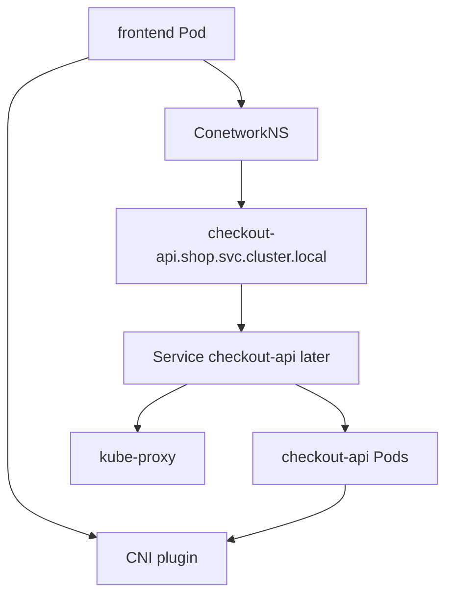

### In this module

Not we are going to create Services yet.

But debes saber que:

- The Pods need network
- The cluster needs a plugin CNI
- The Services tendrán DNS
- kube-proxy participa in the implementación of the traffic of Services
- ConetworkNS será clave for service discovery
### DevEx of the bloque

Not sobrecargues the practice with networking yet.

Guarda these preguntas for the module 7:

```text
Resuelve DNS?
Hay Service?
Hay endpoints?
Does the selector match?
La NetworkPolicy bloquea?
El CNI implementa policy?
```

### Criterio of comprensión

Debes poder explicar:

> For que Kubernetes opere workloads reales, not basta with run containers. Also needs network, resolución of nombres and mecanismos for dirigir traffic.

---

## 4.17. Events: the caja negra empieza to hablar

The events son signals operativas generadas by Kubernetes.

Not son logs of application.

Not son métricas.

Son pistas of the sistema about cosas que ocurren with objetos.

Ejemplos:

- Pod scheduled
- Pulling image
- Pulled image
- Created container
- Started container
- FailedScheduling
- BackOff
- Unhealthy
The documentación oficial of troubleshooting uses `kubectl describe pod` for obtener detalles of Pods, incluyendo información útil for debug Pods in ejecución or with failures. ([Kubernetes](https://kubernetes.io/docs/tasks/debug/debug-application/debug-running-pod/ "Debug Running Pods"))

### Commands

```bash
kubectl describe pod checkout-api -n shop
kubectl get events -n shop --sort-by=.metadata.creationTimestamp
kubectl get events -A --sort-by=.metadata.creationTimestamp
```

### Filtrar events with `jq`

```bash
kubectl get events -n shop -o json \
  | jq -r '.items[] | [.reason, .involvedObject.kind, .involvedObject.name, .message] | @tsv'
```

### Relación between logs and events

|Señal|Quién the produce|What it is for|
|---|---|---|
|Logs|Tu application or container|Understand comportamiento interno|
|Events|Kubernetes|Understand decisiones and failures of the sistema|
|Status|Kubernetes|See state observado of the objeto|
|Metrics|Componentes or apps|Medir comportamiento in the tiempo|
|Traces|App instrumentada|Seguir flujo between services|

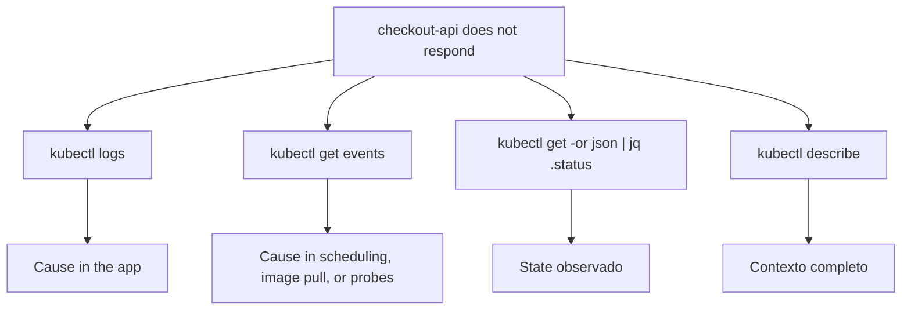

### DevEx of the bloque

Añade:

```yaml
k8s:events:
  desc: Show namespace events
  cmds:
    - kubectl get events -n {{.NAMESPACE}} --sort-by=.metadata.creationTimestamp

k8s:events:summary:
  desc: Show namespace events as a compact table
  cmds:
    - kubectl get events -n {{.NAMESPACE}} -o json | jq -r '.items[] | [.reason, .involvedObject.kind, .involvedObject.name, .message] | @tsv'
```

### Criterio of comprensión

Debes poder explicar:

> When Kubernetes does not hace lo que espero, the events suelen decir what intentó hacer and by what falló.

---

## 4.18. Guided practice: mirar Kubernetes by dentro without abrirlo

### Objective

Use the laboratorio of the module 3 for observar `metadata`, `spec`, `status`, scheduling, kubelet signals, logs and events.

Not we are going to create nuevos objetos complejos.

Vamos to mirar better the Pod que already conoces.

### Requisitos previos

Debes tener:

```bash
task k8s:kind:create
task k8s:image:prepare
task k8s:lab:apply
```

AND the Pod must existir:

```bash
kubectl get pod checkout-api -n shop
```

### Paso 1. See objeto completo

```bash
kubectl get pod checkout-api -n shop -o yaml
```

Responde:

- ¿Dónde está `metadata`?
- ¿Dónde está `spec`?
- ¿Dónde está `status`?
- ¿What partes escribiste tú?
- ¿What partes añadió Kubernetes?
### Paso 2. Separar `spec` and `status`

```bash
kubectl get pod checkout-api -n shop -o json | jq '.spec'
kubectl get pod checkout-api -n shop -o json | jq '.status'
```

Responde:

- ¿What image aparece in `spec`?
- ¿What fase aparece in `status`?
- ¿What condiciones aparecen?
- ¿What container aparece in `containerStatuses`?
### Paso 3. See scheduling

```bash
kubectl get pod checkout-api -n shop -o wide
kubectl get pod checkout-api -n shop -o json | jq -r '.spec.nodeName'
```

Responde:

- ¿In what nodo runs?
- ¿That nodo lo escribiste tú?
- ¿What componente tomó that decisión?
### Paso 4. See events

```bash
kubectl describe pod checkout-api -n shop
kubectl get events -n shop --sort-by=.metadata.creationTimestamp
```

Responde:

- ¿See eventos of scheduling?
- ¿See eventos of pull or start of container?
- ¿What evento parece more cercanot to the arranque of the container?
### Paso 5. See logs

```bash
kubectl logs pod/checkout-api -n shop
```

Responde:

- ¿What logs vienen of the app?
- ¿What diferencia hay between these logs and the events?
### Paso 6. Validate with port-forward

In a terminal:

```bash
kubectl port-forward pod/checkout-api -n shop 8080:8080
```

In otra:

```bash
task smoke
```

After mira logs otra vez:

```bash
kubectl logs pod/checkout-api -n shop
```

### Criterio of finalización

The practice está completa when you can contar the historia completa:

> Apliqué a manifest. The API Server aceptó a objeto Pod. Kubernetes añadió metadata and status. The scheduler asignó a nodo. Kubelet materializó the container. The application escribió logs. Kubernetes generó events. Yo validé the contrato HTTP with port-forward and smoke test.

---

## 4.19. Practice of failure controlado: image incorrecta

### Objective

See what pasa when the state deseado contiene an image que not se can run.

Not queremos a failure complex. Queremos one pequeño, diagnosticable and didáctico.

### Paso 1. Create manifest roto

Copia the Pod:

```bash
cp kubernetes/01-pod/pod.yaml kubernetes/01-pod/pod-broken-image.yaml
```

Cambia the image:

```bash
yq -i '.spec.containers[0].image = "checkout-api:does-not-exist"' kubernetes/01-pod/pod-broken-image.yaml
```

Cambia the nombre:

```bash
yq -i '.metadata.name = "checkout-api-broken-image"' kubernetes/01-pod/pod-broken-image.yaml
```

### Paso 2. Apply

```bash
kubectl apply -f kubernetes/01-pod/pod-broken-image.yaml
```

### Paso 3. Observar

```bash
kubectl get pod checkout-api-broken-image -n shop
kubectl describe pod checkout-api-broken-image -n shop
kubectl get events -n shop --sort-by=.metadata.creationTimestamp
kubectl get pod checkout-api-broken-image -n shop -o json | jq '.status.containerStatuses'
```

### Preguntas

- ¿The API Server aceptó the objeto?
- ¿The Pod exists?
- ¿The container arrancó?
- ¿Dónde se ve the failure?
- ¿The failure está in `spec` or in `status`?
- ¿What evento lo explica?
- ¿Kubernetes can arreglar an image que does not exist?

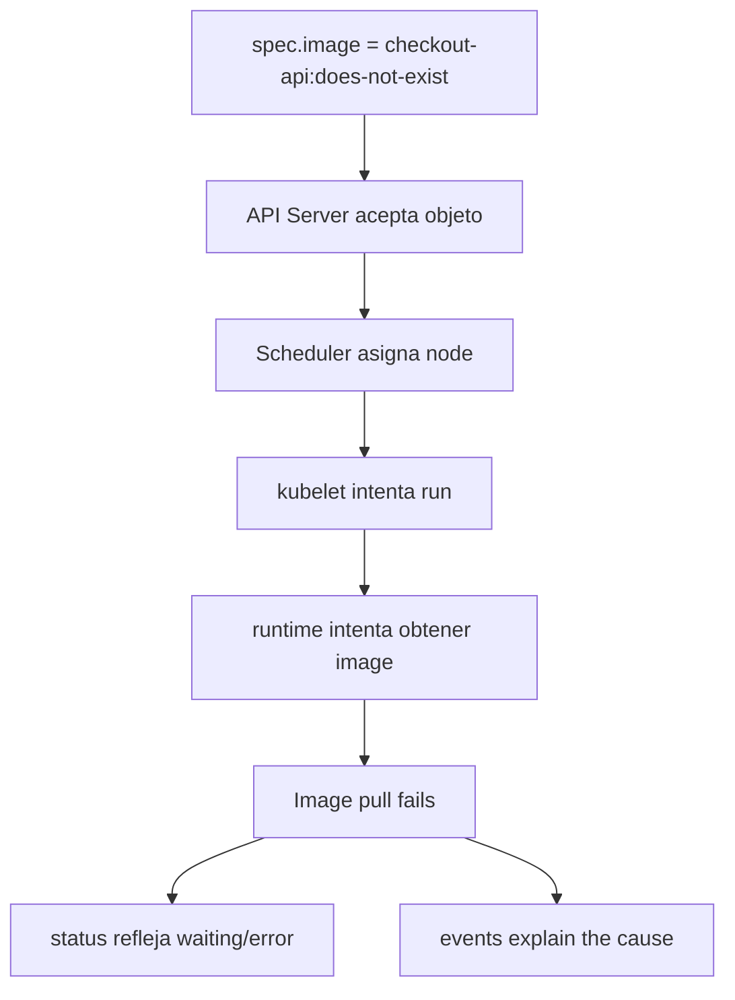

### Paso 4. Limpiar

```bash
kubectl delete -f kubernetes/01-pod/pod-broken-image.yaml --ignore-not-found
```

### DevEx of the bloque

Añade tasks opcionales:

```yaml
k8s:failure:image:apply:
  desc: Apply Pod with broken image
  cmds:
    - cp kubernetes/01-pod/pod.yaml kubernetes/01-pod/pod-broken-image.yaml
    - yq -i '.metadata.name = "checkout-api-broken-image"' kubernetes/01-pod/pod-broken-image.yaml
    - yq -i '.spec.containers[0].image = "checkout-api:does-not-exist"' kubernetes/01-pod/pod-broken-image.yaml
    - kubectl apply -f kubernetes/01-pod/pod-broken-image.yaml

k8s:failure:image:inspect:
  desc: Inspect broken image Pod
  cmds:
    - kubectl get pod checkout-api-broken-image -n {{.NAMESPACE}} || true
    - kubectl describe pod checkout-api-broken-image -n {{.NAMESPACE}} || true
    - kubectl get pod checkout-api-broken-image -n {{.NAMESPACE}} -o json | jq '.status.containerStatuses' || true
    - kubectl get events -n {{.NAMESPACE}} --sort-by=.metadata.creationTimestamp

k8s:failure:image:delete:
  desc: Delete broken image Pod
  cmds:
    - kubectl delete -f kubernetes/01-pod/pod-broken-image.yaml --ignore-not-found || true
```

### Criterio of comprensión

Debes poder explicar:

> Kubernetes can aceptar a objeto válido although su ejecución falle after. That is why necesito distinguir validación of API, scheduling, ejecución and state observado.

---

## 4.20. Taskfile completo of the module 4

Añade these tasks to the `Taskfile.yml` of the laboratorio.

```yaml
  k8s:pod:spec:
    desc: Show checkout-api Pod desired specification
    cmds:
      - kubectl get pod checkout-api -n {{.NAMESPACE}} -o json | jq '.spec'

  k8s:pod:status:
    desc: Show checkout-api Pod observed status
    cmds:
      - kubectl get pod checkout-api -n {{.NAMESPACE}} -o json | jq '.status'

  k8s:pod:metadata:
    desc: Show checkout-api Pod metadata
    cmds:
      - kubectl get pod checkout-api -n {{.NAMESPACE}} -o json | jq '.metadata'

  k8s:pod:node:
    desc: Show the node where checkout-api is scheduled
    cmds:
      - kubectl get pod checkout-api -n {{.NAMESPACE}} -o json | jq -r '.spec.nodeName'

  k8s:events:
    desc: Show namespace events
    cmds:
      - kubectl get events -n {{.NAMESPACE}} --sort-by=.metadata.creationTimestamp

  k8s:events:summary:
    desc: Show namespace events as a compact table
    cmds:
      - kubectl get events -n {{.NAMESPACE}} -o json | jq -r '.items[] | [.reason, .involvedObject.kind, .involvedObject.name, .message] | @tsv'

  k8s:api:resources:
    desc: Show Kubernetes API resources
    cmds:
      - kubectl api-resources

  k8s:api:explain:pod:
    desc: Explain Pod API fields
    cmds:
      - kubectl explain pod
      - kubectl explain pod.spec
      - kubectl explain pod.status

  k8s:model:inspect:
    desc: Inspect checkout-api through Kubernetes mental model
    cmds:
      - task k8s:pod:metadata
      - task k8s:pod:spec
      - task k8s:pod:status
      - task k8s:pod:node
      - task k8s:events:summary

  k8s:failure:image:apply:
    desc: Apply Pod with broken image
    cmds:
      - cp kubernetes/01-pod/pod.yaml kubernetes/01-pod/pod-broken-image.yaml
      - yq -i '.metadata.name = "checkout-api-broken-image"' kubernetes/01-pod/pod-broken-image.yaml
      - yq -i '.spec.containers[0].image = "checkout-api:does-not-exist"' kubernetes/01-pod/pod-broken-image.yaml
      - kubectl apply -f kubernetes/01-pod/pod-broken-image.yaml

  k8s:failure:image:inspect:
    desc: Inspect broken image Pod
    cmds:
      - kubectl get pod checkout-api-broken-image -n {{.NAMESPACE}} || true
      - kubectl describe pod checkout-api-broken-image -n {{.NAMESPACE}} || true
      - kubectl get pod checkout-api-broken-image -n {{.NAMESPACE}} -o json | jq '.status.containerStatuses' || true
      - kubectl get events -n {{.NAMESPACE}} --sort-by=.metadata.creationTimestamp

  k8s:failure:image:delete:
    desc: Delete broken image Pod
    cmds:
      - kubectl delete -f kubernetes/01-pod/pod-broken-image.yaml --ignore-not-found || true
```

### Flujo recomendado

```bash
task k8s:kind:create
task k8s:image:prepare
task k8s:lab:apply
task k8s:model:inspect
task k8s:api:explain:pod
task k8s:failure:image:apply
task k8s:failure:image:inspect
task k8s:failure:image:delete
task k8s:lab:delete
task k8s:kind:delete
```

### Criterio DevEx

Debes poder explicar:

> The DevEx in Kubernetes does not consiste only in apply manifests rápido. Consiste in tener tasks que permitan observar intención, state, eventos and failures of forma repetible.

---

## 4.21. Practice principal of the module

### Objective

Build Kubernetes mental model observando a Pod real and a failure controlado.

### Resultado esperado

To the final you should tener:

```text
kubernetes-learning-lab/
  kubernetes/
    01-pod/
      pod.yaml
      pod-broken-image.yaml
  Taskfile.yml
```

### Paso 1. Preparar environment

```bash
task k8s:kind:create
task k8s:image:prepare
task k8s:lab:apply
```

### Paso 2. Inspect objeto completo

```bash
kubectl get pod checkout-api -n shop -o yaml
```

### Paso 3. Separar metadata, spec and status

```bash
task k8s:pod:metadata
task k8s:pod:spec
task k8s:pod:status
```

### Paso 4. See nodo asignado

```bash
task k8s:pod:node
```

### Paso 5. See events

```bash
task k8s:events
task k8s:events:summary
```

### Paso 6. See logs

```bash
task k8s:logs
```

### Paso 7. Use `kubectl explain`

```bash
task k8s:api:explain:pod
```

### Paso 8. Create failure of image

```bash
task k8s:failure:image:apply
task k8s:failure:image:inspect
```

### Paso 9. Limpiar failure

```bash
task k8s:failure:image:delete
```

### Paso 10. Limpiar laboratorio

```bash
task k8s:lab:delete
task k8s:kind:delete
```

### Criterio of finalización

The practice está completa when you can explicar:

- What parte of the objeto es metadata
- What parte expresa intención
- What parte expresa observación
- What componente asignó nodo
- What componente materializó the container
- Dónde aparecen the events
- What diferencia hay between logs and events
- By what the image rota fue aceptada by the API but falló in ejecución
- What commands usarías for diagnosticar the problema

---

## 4.22. Ejercicios cortos

### Ejercicio 1. metadata, spec and status

Ejecuta:

```bash
kubectl get pod checkout-api -n shop -o json | jq '.metadata'
kubectl get pod checkout-api -n shop -o json | jq '.spec'
kubectl get pod checkout-api -n shop -o json | jq '.status'
```

Responde:

- ¿What campos escribiste tú?
- ¿What campos añadió Kubernetes?
- ¿What parte representa intención?
- ¿What parte representa observación?
---

### Ejercicio 2. API Server

Ejecuta:

```bash
kubectl api-resources
kubectl explain pod
kubectl explain pod.spec
kubectl explain pod.status
```

Responde:

- ¿What te permite descubrir `kubectl api-resources`?
- ¿What it is for `kubectl explain`?
- ¿By what esto es better que copiar YAML without entenderlo?
---

### Ejercicio 3. Scheduler

Ejecuta:

```bash
kubectl get pod checkout-api -n shop -o wide
kubectl get pod checkout-api -n shop -o json | jq -r '.spec.nodeName'
```

Responde:

- ¿In what nodo runs the Pod?
- ¿That nodo estaba in tu manifest?
- ¿What componente decidió the nodo?
---

### Ejercicio 4. Kubelet and runtime

Ejecuta:

```bash
kubectl get pod checkout-api -n shop -o json | jq '.status.containerStatuses'
```

Responde:

- ¿What image aparece?
- ¿Cuál es the state of the container?
- ¿Cuántos reinicios tiene?
- ¿What señal te indica que the container arrancó?
---

### Ejercicio 5. Events vs logs

Ejecuta:

```bash
kubectl get events -n shop --sort-by=.metadata.creationTimestamp
kubectl logs pod/checkout-api -n shop
```

Completa:

|Señal|Producida by|Responde to|
|---|---|---|
|Events|||
|Logs|||

---

### Ejercicio 6. Image rota

Aplica the failure:

```bash
task k8s:failure:image:apply
task k8s:failure:image:inspect
```

Responde:

- ¿The objeto exists?
- ¿The container está ejecutándose?
- ¿What dice `status`?
- ¿What dicen the events?
- ¿Dónde está the primera diferencia between intención and realidad?
Limpia:

```bash
task k8s:failure:image:delete
```

---

## 4.23. Errores habituales

### Error 1. Pensar que YAML es Kubernetes

YAML es only a forma of expresar objetos.

Kubernetes es the API, the objetos, the componentes and the control loops que actúan about that state.

---

### Error 2. Mirar only `kubectl get`

`kubectl get` es a vista rápida.

Not basta for diagnosticar.

When algo falle, uses:

```bash
kubectl describe
kubectl get -o yaml
kubectl get -o json | jq
kubectl logs
kubectl get events
```

---

### Error 3. Confundir `spec` and `status`

`spec` es lo que quieres.

`status` es lo que Kubernetes observa.

If not separas ambas cosas, diagnosticarás bad.

---

### Error 4. Pensar que everything objeto se autorepara

TO Pod directo not vuelve if lo borras.

A Deployment yes can create Pods nuevos for mantener réplicas.

Not all the objetos tienen the same comportamiento.

---

### Error 5. Ignorar events

The events suelen explicar cosas que the logs of application not pueden explicar:

- scheduling
- image pull
- container start
- backoff
- errores of configuration
- failures of Resources
---

### Error 6. Creer que Kubernetes corrige a intención mala

If declaras an image inexistente, Kubernetes can intentar usarla and fail.

The sistema not sabe que querías otra cosa.

---

### Error 7. Saltar to componentes internos demasiado pronto

Not you need operate `etcd`, modificar scheduler ni debug CNI ahora.

First aprende to observar objetos, status and events.

---

## 4.24. Criterio of output of the module

You can pasar to the module 5 when puedas hacer everything esto without seguir a receta ciegamente.

### Concepts

Debes poder explicar:

- What it means que Kubernetes esté basado in API
- What es a objeto Kubernetes
- What representa `metadata`
- What representa `spec`
- What representa `status`
- What es state deseado
- What es state observado
- What es drift
- What es reconciliación
- What es a control loop
- What hace the API Server
- What papel tiene `etcd`
- What hace the scheduler
- What hace kubelet
- What hace the container runtime
- What hacen conceptualmente kube-proxy, CNI and ConetworkNS
- What son events
- What diferencia hay between logs and events
### Practice

Debes poder:

- Apply the laboratorio of the module 3
- See the objeto completo of the Pod
- Separar metadata, spec and status
- See the nodo asignado
- Read events
- Read logs
- Use `kubectl explain`
- Create a failure with image incorrecta
- Diagnosticarlo with status and events
- Limpiar the failure
- Limpiar the laboratorio
### DevEx

Debes poder run:

```bash
task k8s:model:inspect
task k8s:api:explain:pod
task k8s:events
task k8s:events:summary
task k8s:failure:image:apply
task k8s:failure:image:inspect
task k8s:failure:image:delete
```

### Frase final of comprensión

Debes poder explicar this frase:

> Kubernetes es a sistema of control. The API guarda objetos, `spec` expresa intención, `status` muestra observación and the componentes trabajan continuamente for acercar the state real to the state deseado.

---

## 4.25. References oficiales

|Tema|Referencia|
|---|---|
|Kubernetes architecture|Kubernetes Docs, Cluster Architecture. ([Kubernetes](https://kubernetes.io/docs/concepts/architecture/ "Cluster Architecture"))|
|Kubernetes components|Kubernetes Docs, Kubernetes Components. ([Kubernetes](https://kubernetes.io/docs/concepts/overview/components/ "Kubernetes Components"))|
|Kubernetes API|Kubernetes Docs, The Kubernetes API. ([Kubernetes](https://kubernetes.io/docs/concepts/overview/kubernetes-api/ "The Kubernetes API"))|
|API concepts|Kubernetes Docs, API Concepts. ([Kubernetes](https://kubernetes.io/docs/reference/using-api/api-concepts/ "Kubernetes API Concepts"))|
|API overview|Kubernetes Docs, API Overview. ([Kubernetes](https://kubernetes.io/docs/reference/using-api/ "API Overview"))|
|Objects in Kubernetes|Kubernetes Docs, Objects In Kubernetes. ([Kubernetes](https://kubernetes.io/docs/concepts/overview/working-with-objects/ "Objects In Kubernetes"))|
|Controllers|Kubernetes Docs, Controllers. ([Kubernetes](https://kubernetes.io/docs/concepts/architecture/controller/ "Controllers"))|
|kube-controller-manager|Kubernetes Docs, kube-controller-manager. ([Kubernetes](https://kubernetes.io/docs/reference/command-line-tools-reference/kube-controller-manager/ "kube-controller-manager"))|
|Nodes|Kubernetes Docs, Nodes. ([Kubernetes](https://kubernetes.io/docs/concepts/architecture/nodes/ "Nodes"))|
|Cloud Controller Manager|Kubernetes Docs, Cloud Controller Manager. ([Kubernetes](https://kubernetes.io/docs/concepts/architecture/cloud-controller/ "Cloud Controller Manager"))|
|Network plugins and CNI|Kubernetes Docs, Network Plugins. ([Kubernetes](https://kubernetes.io/docs/concepts/extend-kubernetes/compute-storage-net/network-plugins/ "Network Plugins"))|
|DNS for Services and Pods|Kubernetes Docs, DNS for Services and Pods. ([Kubernetes](https://kubernetes.io/docs/concepts/services-networking/dns-pod-service/ "DNS for Services and Pods"))|
|Debug running Pods|Kubernetes Docs, Debug Running Pods. ([Kubernetes](https://kubernetes.io/docs/tasks/debug/debug-application/debug-running-pod/ "Debug Running Pods"))|
|Events API|Kubernetes Docs, Events API. ([Kubernetes](https://kubernetes.io/docs/reference/kubernetes-api/cluster-resources/event-v1/ "Kubernetes Events API"))|
|`kubectl explain`|Kubernetes Docs, kubectl explain. ([Kubernetes](https://kubernetes.io/docs/reference/kubectl/generated/kubectl_explain/ "kubectl explain"))|

## 4.26. Lecturas of apoyo

|Libro|What read|
|---|---|
|_Kubernetes in Action_|Chapter 11: internals, API Server, scheduler, controllers, kubelet, kube-proxy, add-ons, events, CNI, Services and high availability.|
|_Kubernetes: Up and Running_|Capítulos 3, 4, 5, 9 and 10: cluster, `kubectl`, Pods, ReplicaSets, reconciliation loops and Deployments.|
|_Cloud Native DevOps with Kubernetes_|Capítulos 3 and 4: arquitectura, control plane, node components, objetos, Deployments, Pods, ReplicaSets, scheduler, manifests and Services.|
|_Kubernetes Patterns_|Chapter 1 for primitivas distribuidas, and capítulos 22 and 23 como lectura posterior for Controller and Operator.|

<!-- COURSE_NAV_START -->
[Previous](3.%20First%20cluster%20and%20kubectl.md) | [Index](README.md) | [Next](5.%20Pods%20and%20basic%20objects.md)
<!-- COURSE_NAV_END -->
