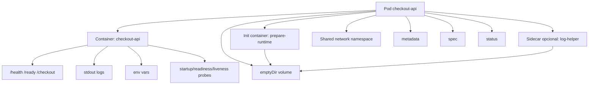
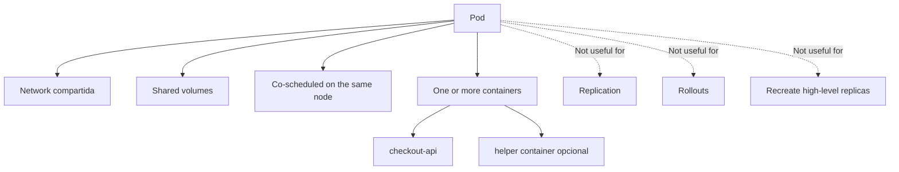
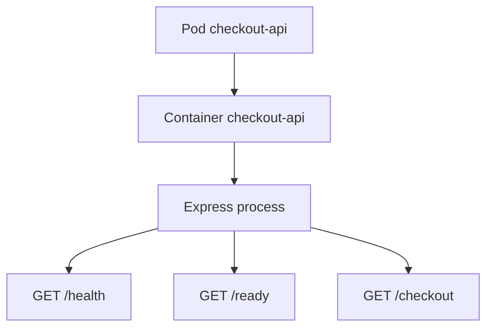
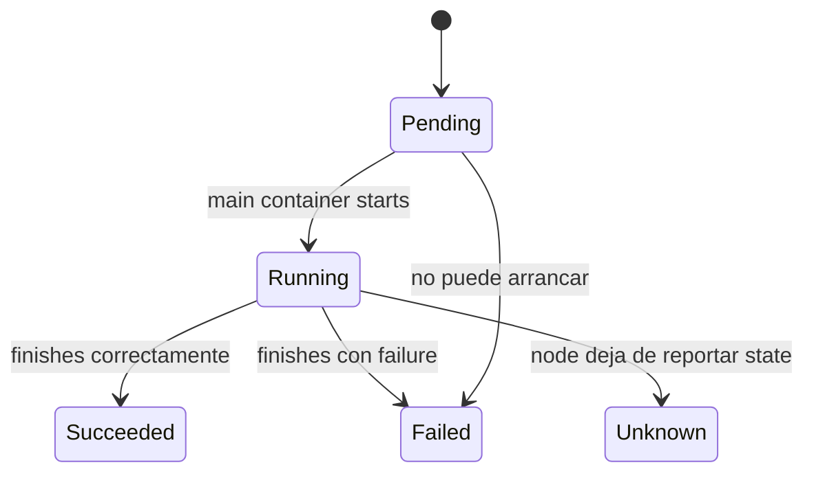
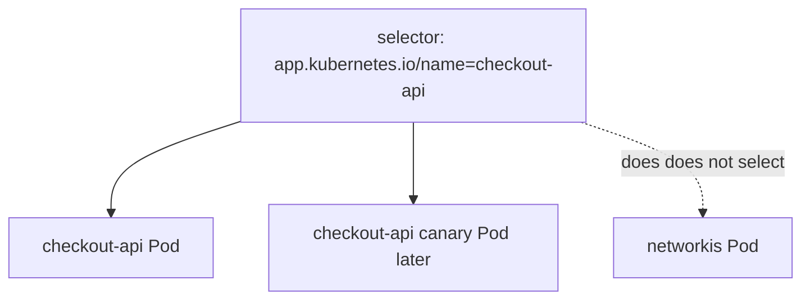
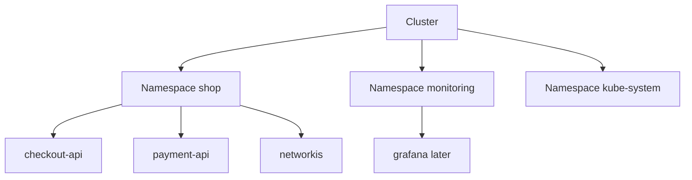
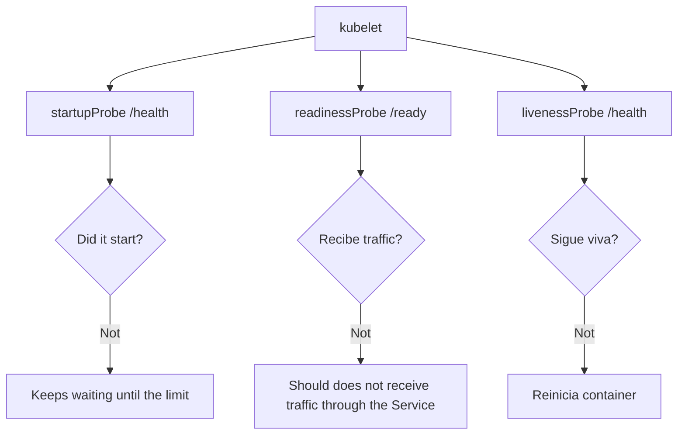
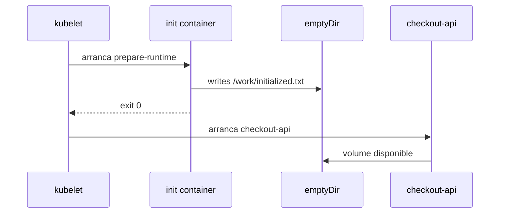

<!-- COURSE_NAV_START -->
[Previous](<4. Kubernetes mental model.md>) | [Index](README.md) | [Next](<6. Workloads.md>)
<!-- COURSE_NAV_END -->

# 5. Pods and basic objects

## Objective of the module

In the module 3 creaste tu primer Pod `checkout-api`.

In the module 4 aprendiste to mirarlo with more criterio: `metadata`, `spec`, `status`, events, logs, scheduler, kubelet and reconciliación.

Ahora toca profundizar in the objeto more importante for understand Kubernetes desde dentro:

> The Pod.

A Pod es the objeto desplegable more pequeño of Kubernetes. The documentación oficial lo define como a grupo of one or more containers with Resources compartidos of network and storage, and with a especificación que indica how run esos containers. Also explica que the Pods se ejecutan in a contexto compartido and que Kubernetes gestiona Pods, does not containers directamente. ([Kubernetes](https://kubernetes.io/docs/concepts/workloads/pods/ "Pods | Kubernetes"))

The idea central of the module es this:

> A Pod is does not “a container”. A Pod es a unidad lógica of ejecución where one or more containers viven juntos, se programan juntos, comparten contexto and producen signals que Kubernetes can observar.



---

## 5.1. What you are going to learn and what not you are going to learn yet

You are going to learn:

- What es a Pod
- What comparte a Pod
- What not comparte a Pod
- What it means the lifecycle of a Pod
- What son the fases `Pending`, `Running`, `Succeeded` and `Failed`
- What son the condiciones of the Pod
- What son init containers
- What son sidecars
- What son ephemeral containers
- What son labels and selectors
- What son namespaces
- What son annotations
- What son probes: startup, readiness and liveness
- What son requests and limits
- What es `securityContext`
- What es Downward API
- How use `jq`, `yq`, `kubectl` and Taskfile for inspect Pods
- How create a pequeño failure lab of Pods
Not vamos to profundizar yet in:

- Deployments
- ReplicaSets
- Services
- StatefulSets
- DaemonSets
- Jobs
- CronJobs
- ConfigMaps and Secrets in detalle
- PersistentVolumes
- NetworkPolicy
- RBAC
- Ingress or Gateway API
That vendrá after.

Aquí queremos que the learner entienda bien the unidad minimum of ejecución.

---

## 5.2. The contrato mental of a Pod

Before of write more YAML, you need to definir the contrato mental.

TO Pod responde to this pregunta:

> ¿What containers must vivir juntos for formar a unidad minimum of ejecución?

The documentación oficial explica que a Pod can usarse of dos formas principales: como wrapper of a único container, que es the caso more habitual, or como grupo of varios containers estrechamente acoplados que need share Resources and vivir juntos. Also advierte que not se must use múltiples containers in a Pod for conseguir replicación; for that exist Resources of workload que gestionan Pods in tu nombre. ([Kubernetes](https://kubernetes.io/docs/concepts/workloads/pods/ "Pods | Kubernetes"))

### What comparte a Pod

The containers dentro of the same Pod pueden share:

- Network
- IP of the Pod
- `localhost`
- Volúmenes
- Algunas partes of the contexto of ejecución
- Ciclo of vida operativo of the Pod
### What not significa a Pod

TO Pod not significa:

- A réplica escalable by yes same
- A microservice completo in all the casos
- A process único necesariamente
- A máquina virtual
- A mecanismo of resiliencia by yes only
- A sustituto of Deployment


### Criterio of comprensión

Debes poder explicar:

> If dos containers not need vivir juntos, share network or share volúmenes, probably should notn estar in the same Pod.

---

## 5.3. Cuándo use a Pod of a only container

The caso normal es a Pod with a container principal.

For `checkout-api`, the diseño base será:

```text
Pod checkout-api
  container checkout-api
```

Esto es correcto because the API already contiene su process principal and not needs, by ahora, otro container estrechamente acoplado.



### Contrato of the Pod base

Queremos a Pod que:

- Viva in the namespace `shop`
- Tenga labels consistentes
- Ejecute the image `checkout-api:1.0.0`
- Use `imagePullPolicy: IfNotPresent`
- Exponga the port internal `8080`
- Reciban environment variables
- Tenga probes HTTP
- Tenga requests and limits
- Tenga `securityContext`
- Escriba logs by stdout
- Se pueda validate with `task smoke` usando `port-forward`
### Criterio of comprensión

Debes poder explicar:

> TO Pod of a only container is not a mala practice. Es the caso more habitual when the application not needs a container auxiliar estrechamente acoplado.

---

## 5.4. Lifecycle of a Pod

Before of pedir probes, init containers or debugging, you need to understand the ciclo of vida.

The documentación oficial explica que the Pods siguen a lifecycle definido: empiezan in `Pending`, pasan to `Running` if to the less one of sus containers primarios starts properly, and then pasan to `Succeeded` or `Failed` dependiendo of how terminen sus containers. Also indica que kubelet gestiona the containers and runs probes for seguir the health of the application. ([Kubernetes](https://kubernetes.io/docs/concepts/workloads/pods/pod-lifecycle/ "Pod Lifecycle | Kubernetes"))



### Fases habituales

|Fase|Significado|
|---|---|
|`Pending`|The Pod fue aceptado by the API, but aún not all the containers están creados or ejecutándose|
|`Running`|The Pod fue asignado to a nodo and to the less a container principal está ejecutándose|
|`Succeeded`|All the containers terminaron properly and not serán reiniciados|
|`Failed`|To the less a container terminó with failure and not será reiniciado|
|`Unknown`|The state not se can obtener, normalmente by problemas of comunicación with the nodo|

### States visibles que verás mucho

Also of the fases, in `kubectl get pods` verás states operativos como:

- `ContainerCreating`
- `ImagePullBackOff`
- `ErrImagePull`
- `CrashLoopBackOff`
- `CreateContainerConfigError`
- `Running`
- `Completed`
- `Error`
- `Pending`
These nombres not son all “fases” puras of the Pod. Muchos vienen of states of containers, reasons and condiciones.

### Commands

```bash
kubectl get pod checkout-api -n shop
kubectl get pod checkout-api -n shop -o json | jq '.status.phase'
kubectl get pod checkout-api -n shop -o json | jq '.status.conditions'
kubectl get pod checkout-api -n shop -o json | jq '.status.containerStatuses'
kubectl describe pod checkout-api -n shop
kubectl get events -n shop --sort-by=.metadata.creationTimestamp
```

### Criterio of comprensión

Debes poder explicar:

> `kubectl get pods` me da a vista resumida. For understand the lifecycle real debo mirar `status`, `containerStatuses`, conditions and events.

---

## 5.5. Labels and selectors

Before using labels, you need to explicar what it is forn.

The labels son pares clave-valor asociados to objetos como Pods. The documentación oficial explica que se use for identificar atributos significativos for the usuarios, organizar objetos and seleccionar subconjuntos of objetos. ([Kubernetes](https://kubernetes.io/docs/concepts/overview/working-with-objects/labels/ "Labels and Selectors | Kubernetes"))

### Why it mattersn

Kubernetes should not depender of nombres frágiles for agrupar Resources.

If later tienes tres Pods of `checkout-api`, does not quieres operate each one by nombre concreto.

Quieres decir:

```text
todos los Pods cuyo app.kubernetes.io/name sea checkout-api
```

### Labels recomendadas for the course

Usaremos labels consistentes:

```yaml
labels:
  app.kubernetes.io/name: checkout-api
  app.kubernetes.io/component: api
  app.kubernetes.io/part-of: shop
  app.kubernetes.io/version: "1.0.0"
```

### Selector

A selector permite seleccionar objetos usando labels.

Ejemplo:

```bash
kubectl get pods -n shop -l app.kubernetes.io/name=checkout-api
```



### Practice rápida

```bash
kubectl get pods -n shop --show-labels
kubectl get pods -n shop -l app.kubernetes.io/name=checkout-api
kubectl get pods -n shop -l app.kubernetes.io/part-of=shop
```

### DevEx of the bloque

Añade tasks:

```yaml
k8s:pods:labels:
  desc: Show Pods with labels
  cmds:
    - kubectl get pods -n {{.NAMESPACE}} --show-labels

k8s:pods:select:checkout:
  desc: Select checkout-api Pods by label
  cmds:
    - kubectl get pods -n {{.NAMESPACE}} -l app.kubernetes.io/name=checkout-api
```

### Criterio of comprensión

Debes poder explicar:

> The labels hacen que the objetos puedan ser encontrados, agrupados and conectados by intención operativa, not only by nombre.

---

## 5.6. Namespaces

Already usaste `shop` in módulos anteriores. Ahora lo explicamos better.

The namespaces permiten aislar grupos of Resources dentro of a same cluster. The documentación oficial explica que the nombres of Resources must ser únicos dentro of a namespace, but not between namespaces, and que this scope aplica to objetos namespaced, not to Resources of cluster como Nodes or StorageClasses. ([Kubernetes](https://kubernetes.io/docs/concepts/overview/working-with-objects/namespaces/ "Namespaces"))

### What resuelve a namespace

A namespace ayuda to separar:

- Applications
- Entornos
- Equipos
- Laboratorios
- Políticas
- Cuotas
- Security
- Limpieza of Resources
### What not resuelve by yes only

A namespace is not automáticamente:

- A frontera of security completa
- A network aislada
- A tenant seguro
- A garantía of que not haya acceso between Resources
For that you need otras piezas, como RBAC, NetworkPolicy, ResourceQuota, LimitRange and Pod Security Admission.



### Commands

```bash
kubectl get namespaces
kubectl get pods -n shop
kubectl get pods -A
kubectl get all -n shop
```

### DevEx of the bloque

Mantén the namespace como variable:

```yaml
vars:
  NAMESPACE: shop
```

AND evita commands ambiguos in the course:

```bash
kubectl get pods
```

Prefiere:

```bash
kubectl get pods -n shop
```

### Criterio of comprensión

Debes poder explicar:

> A namespace organiza Resources and ayuda to apply políticas, but not must confundirse with security completa.

---

## 5.7. Annotations

The annotations son metadata not pensada for selección.

The documentación oficial dice que you can use annotations for adjuntar metadata arbitraria not identificadora to objetos, and que clientes como tools or librerías pueden recuperar that metadata. ([Kubernetes](https://kubernetes.io/docs/concepts/overview/working-with-objects/annotations/ "Annotations"))

### Diferencia between labels and annotations

|Elemento|Uso principal|It is used for seleccionar|
|---|---|---|
|Label|Identificar, agrupar and seleccionar|Yes|
|Annotation|Añadir metadata not selectiva|Not|

### Ejemplo

```yaml
annotations:
  course.emmanuel.dev/module: "5"
  course.emmanuel.dev/purpose: "pod-lifecycle-lab"
```

### Cuándo use annotations

You can usarlas for:

- Documentar propósito
- Añadir información for tools
- Registrar decisiones
- Añadir links to runbooks
- Save checksums generados by tools
- Integrar with controllers or sistemas externos
### Cuándo not usarlas

Not uses annotations for:

- Seleccionar Pods
- Sustituir documentación importante
- Save secrets
- Meter configuration of negocio grande
- Ocultar decisiones que shouldn estar in manifests claros
### Commands

```bash
kubectl get pod checkout-api -n shop -o json | jq '.metadata.annotations'
kubectl annotate pod checkout-api -n shop course.emmanuel.dev/inspected=true
kubectl get pod checkout-api -n shop -o json | jq '.metadata.annotations'
```

### Criterio of comprensión

Debes poder explicar:

> Labels sirven for seleccionar. Annotations sirven for añadir metadata que otras tools or personas pueden read.

---

## 5.8. Probes: startup, readiness and liveness

Before of añadir probes to the YAML, you need to explicar the contrato.

A probe es a comprobación que kubelet ejecuta for understand algo about the container.

Kubernetes documenta tres tipos principales of probes for containers: startup, readiness and liveness. The página oficial of configuration explica how definir probes HTTP, TCP, gRPC and by command, and muestra the uso of startup probes for proteger containers lentos to the start. ([Kubernetes](https://kubernetes.io/docs/tasks/configure-pod-container/configure-liveness-readiness-startup-probes/ "Configure Liveness, Readiness and Startup Probes | Kubernetes"))

### Why it mattersn

In the module 1 definiste the contrato HTTP:

- `GET /health`
- `GET /ready`
- `GET /checkout`
Ahora Kubernetes can use parte of that contrato for operate the Pod.

### Startup probe

Pregunta:

> ¿The application already ha terminado of start?

Uso típico:

- Apps lentas to the start
- Evitar que liveness mate the app before of tiempo
- Dar margen inicial
### Readiness probe

Pregunta:

> ¿This instancia must receive traffic ahora?

Uso típico:

- Sacar a Pod of the balanceo if not está listo
- Evitar enviar traffic to a instancia arrancada but not preparada
- Controlar rollouts more seguros
### Liveness probe

Pregunta:

> ¿This instancia está viva or must restartse?

Uso típico:

- Detectar bloqueos
- Restart containers que not se recuperan solos
- Evitar processes vivos but inútiles


### Contrato recomendado for `checkout-api`

|Probe|Endpoint|Motivo|
|---|---|---|
|startupProbe|`/health`|The app already responde HTTP|
|readinessProbe|`/ready`|The app can receive traffic|
|livenessProbe|`/health`|The process sigue respondiendo|

### Importante

In this module yet not tendremos Service, así que readiness not afectará to traffic real of a Service. Aun así, yes verás the state `Ready` in the Pod.

### Fragmento of YAML

```yaml
startupProbe:
  httpGet:
    path: /health
    port: http
  failureThreshold: 30
  periodSeconds: 2

readinessProbe:
  httpGet:
    path: /ready
    port: http
  initialDelaySeconds: 2
  periodSeconds: 5
  failureThreshold: 3

livenessProbe:
  httpGet:
    path: /health
    port: http
  initialDelaySeconds: 5
  periodSeconds: 10
  failureThreshold: 3
```

### DevEx of the bloque

Añade a task for inspect probes:

```yaml
k8s:pod:probes:
  desc: Show checkout-api probes
  cmds:
    - kubectl get pod checkout-api -n {{.NAMESPACE}} -o json | jq '.spec.containers[0] | {startupProbe, readinessProbe, livenessProbe}'
```

### Criterio of comprensión

Debes poder explicar:

> Startup decide if the app terminó of start. Readiness decide if must receive traffic. Liveness decide if the container must restartse.

---

## 5.9. Requests and limits

Before of poner Resources in YAML, you need to explicar what it meansn.

When defines a Pod, you can especificar cuántos Resources needs each container. The documentación oficial indica que the Resources more comunes son CPU and memoria; the scheduler uses requests for decidir in what nodo colocar the Pod, and kubelet aplica limits for impedir que a container use more of the límite configurado. ([Kubernetes](https://kubernetes.io/docs/concepts/configuration/manage-resources-containers/ "Resource Management for Pods and Containers | Kubernetes"))

### Requests

A request dice:

> For run this container, reserva or considera que necesito to the less esto.

Ejemplo:

```yaml
requests:
  cpu: 100m
  memory: 128Mi
```

### Limits

A limit dice:

> This container should not poder use more of esto.

Ejemplo:

```yaml
limits:
  cpu: 500m
  memory: 256Mi
```

### CPU

In Kubernetes:

```text
100m
```

significa 100 millicores, es decir, 0.1 CPU.

### Memory

Ejemplos:

```text
128Mi
256Mi
1Gi
```

### Contrato for `checkout-api`

For the laboratorio:

```yaml
resources:
  requests:
    cpu: 100m
    memory: 128Mi
  limits:
    cpu: 500m
    memory: 256Mi
```

It is not a recomendación universal for producción.

Es a valor didáctico reasonable for a API Express pequeña of laboratorio.

### DevEx of the bloque

Añade:

```yaml
k8s:pod:resources:
  desc: Show checkout-api resource requests and limits
  cmds:
    - kubectl get pod checkout-api -n {{.NAMESPACE}} -o json | jq '.spec.containers[0].resources'
```

### Criterio of comprensión

Debes poder explicar:

> Requests ayudan to the scheduler to decidir dónde colocar the Pod. Limits ayudan to kubelet to controlar cuánto can consumir the container.

---

## 5.10. SecurityContext

Before of añadir security to the YAML, you need to explicar the problema.

In the module 1 decidiste que the image of `checkout-api` not debía runse como root.

In Kubernetes, you can reforzar parte of that intención with `securityContext`.

The documentación oficial define security context como the configuration of privilegios and control of acceso for a Pod or container, incluyendo UID/GID, ejecución privilegiada or not privilegiada, capacidades Linux and otras opciones. ([Kubernetes](https://kubernetes.io/docs/tasks/configure-pod-container/security-context/ "Configure to Security Context for to Pod or Container"))

### What queremos for `checkout-api`

Queremos que the container:

- Not escale privilegios
- Ejecute como user not root
- Use filesystem raíz of only lectura when sea possible
- Elimine capacidades Linux innecesarias
- Tenga a perfil seccomp reasonable
### Fragmento recomendado

```yaml
securityContext:
  allowPrivilegeEscalation: false
  readOnlyRootFilesystem: true
  runAsNonRoot: true
  runAsUser: 1000
  capabilities:
    drop:
      - ALL
```

TO nivel of Pod:

```yaml
securityContext:
  seccompProfile:
    type: RuntimeDefault
```

### Cuidado with readOnlyRootFilesystem

If usas `readOnlyRootFilesystem: true`, the app not can write in the filesystem raíz.

That es good for security, but can romper applications que intentan write in `/tmp`, logs in file or caches locales.

Nuestra `checkout-api` escribe logs by stdout, así que encaja bien.

### DevEx of the bloque

Añade:

```yaml
k8s:pod:security:
  desc: Show checkout-api security context
  cmds:
    - kubectl get pod checkout-api -n {{.NAMESPACE}} -o json | jq '{podSecurityContext: .spec.securityContext, containerSecurityContext: .spec.containers[0].securityContext}'
```

### Criterio of comprensión

Debes poder explicar:

> SecurityContext not arregla toda the security, but permite declarar límites importbefore about how runs a Pod or container.

---

## 5.11. Downward API

Before using Downward API, you need to explicar the problema.

TO veces the application needs saber algo about the Pod where corre:

- Nombre of the Pod
- Namespace
- Nombre of the nodo
- IP of the Pod
- Labels
- Annotations
- Requests or limits asignados
Not queremos que the application tenga que hablar with Kubernetes API for obtener datos basic about yes same.

The documentación oficial explica que Downward API permite expose campos of the Pod and of the container to the processes que corren dentro of the container, already sea mediante environment variables or mediante files in a volumen especial. ([Kubernetes](https://kubernetes.io/docs/concepts/workloads/pods/downward-api/ "Downward API | Kubernetes"))

### Ejemplo with environment variables

```yaml
env:
  - name: POD_NAME
    valueFrom:
      fieldRef:
        fieldPath: metadata.name
  - name: POD_NAMESPACE
    valueFrom:
      fieldRef:
        fieldPath: metadata.namespace
  - name: POD_IP
    valueFrom:
      fieldRef:
        fieldPath: status.podIP
```

### What permite

Dentro of the container:

```sh
printenv | grep POD_
```

Podrías see:

```text
POD_NAME=checkout-api
POD_NAMESPACE=shop
POD_IP=10.244.0.12
```

### DevEx of the bloque

Añade:

```yaml
k8s:pod:env:
  desc: Show environment variables inside checkout-api
  cmds:
    - kubectl exec -n {{.NAMESPACE}} pod/checkout-api -- printenv | sort
```

### Criterio of comprensión

Debes poder explicar:

> Downward API permite que the application conozca metadata básica of su propio Pod without acoplarse directamente to the client of Kubernetes.

---

## 5.12. Init containers

Before of pedir a init container, you need to explicar cuándo tiene sentido.

A init container es a container especializado que runs before of the containers principales. The documentación oficial explica que the init containers corren before que the app containers, must completar properly and se ejecutan of forma secuencial; if one fails, kubelet lo reinicia hasta que tenga éxito, salvo configuraciones of restart policy específicas. ([Kubernetes](https://kubernetes.io/docs/concepts/workloads/pods/init-containers/ "Init Containers | Kubernetes"))

### What it is forn

Sirven for tasks previas como:

- Esperar a dependencia
- Generate a file temporal
- Preparar permisos
- Descargar configuration not sensible
- Hacer a comprobación previa
- Separar tools of preparación of the image principal
### For what not sirven

Should notn usarse for:

- Lógica principal of negocio
- Processes que must vivir junto to the app
- Sustituir a Job of migración real
- Esconder dependencies bad diseñadas
### Practice didáctica

Usaremos a init container simple que escribe a file in a volumen `emptyDir`.

It is not a necesidad real of `checkout-api`.

Es a practice for see lifecycle and volumen compartido without meter dependencies externas.



### Fragmento

```yaml
volumes:
  - name: runtime-work
    emptyDir: {}

initContainers:
  - name: prepare-runtime
    image: busybox:1.36
    command:
      - sh
      - -c
      - echo "initialized at $(date)" > /work/initialized.txt
    volumeMounts:
      - name: runtime-work
        mountPath: /work
```

### Criterio of comprensión

Debes poder explicar:

> A init container prepara algo before of que arranque the app principal. It must terminar properly; not vive during toda the vida of the Pod.

---

## 5.13. Sidecars

Before using sidecars, you need to explicar bien the concept.

A sidecar es a container auxiliar que corre junto to the container principal dentro of the same Pod. The documentación oficial indica que the sidecars extienden or ayudan to the application principal with funcionalidades como logging, monitoring, security or sincronización, without modificar directamente the code principal. Also indica que Kubernetes v1.33 marca the sidecar containers como estables and que se implementan como a caso especial of init containers with `restartPolicy: Always`. ([Kubernetes](https://kubernetes.io/docs/concepts/workloads/pods/sidecar-containers/ "Sidecar Containers | Kubernetes"))

### Cuándo tiene sentido a sidecar

Tiene sentido if the container auxiliar:

- It must vivir in the same Pod
- Needs share network or volúmenes
- Extiende to the container principal
- Tiene a relación estrecha with the app
- Not merece ser a service separado
Ejemplos:

- Agente of logs
- Proxy local
- Sincronizador of files
- Exporter local
- Adaptador of protocolo
### Cuándo not tiene sentido

Not uses sidecar if:

- Only quieres scalelo of forma independiente
- Tiene ciclo of vida separado
- Es otro service of negocio
- Not needs share contexto with the app
- Only estás metiendo cosas juntas by comodidad
### Importante for the laboratorio

For evitar depender of a versión concreta of the cluster, the practice principal of this module not requerirá sidecar nativo. Lo explicaremos como concept and dejaremos a practice opcional.

The documentación actual indica que the sidecars nativos son estables in Kubernetes v1.33, but if the learner uses a cluster more antiguo, can does not tener the same comportamiento. ([Kubernetes](https://kubernetes.io/docs/concepts/workloads/pods/sidecar-containers/ "Sidecar Containers | Kubernetes"))

### Criterio of comprensión

Debes poder explicar:

> A sidecar is not “otro container cualquiera”. Es a colaborador estrechamente acoplado to the container principal dentro of the same Pod.

---

## 5.13 bis. Patterns CKAD of multi-container Pods

TO Pod may have varios containers, but that not significa que debas meter varios microservices dentro of the same Pod.

Regla base:

> TO Pod must representar a unidad of deployment cohesionada.

The multi-container Pods tienen sentido when the containers colaboran estrechamente and comparten lifecycle, network or volúmenes.

CKAD suele esperar que entiendas these patterns:

| Patrón | Intención |
|---|---|
| Init container | Preparar algo before of start the app principal |
| Sidecar | Añadir a capacidad auxiliar junto to the app |
| Adapter | Transformar a output or interfaz |
| Ambassador | Proxy local hacia a service external |

### Init container

A init container runs before of the containers principales.

If fails, Kubernetes vuelve to intentarlo según the política of the Pod.

Ejemplo:

```yaml
apiVersion: v1
kind: Pod
metadata:
  name: checkout-with-init
spec:
  initContainers:
    - name: wait-for-config
      image: busybox:1.36
      command: ["sh", "-c", "echo preparing runtime && sleep 2"]
  containers:
    - name: checkout-api
      image: nginx:1.27
      ports:
        - containerPort: 80
```

Validate:

```bash
kubectl apply -f checkout-with-init.yaml
kubectl get pod checkout-with-init
kubectl logs checkout-with-init -c wait-for-config
kubectl logs checkout-with-init -c checkout-api
```

### Sidecar with `emptyDir`

A sidecar añade a capacidad auxiliar.

Ejemplo: the container principal escribe files and the sidecar the observa.

```yaml
apiVersion: v1
kind: Pod
metadata:
  name: data-exchange
spec:
  volumes:
    - name: shared-data
      emptyDir: {}
  containers:
    - name: main-app
      image: busybox:1.36
      command: ["sh", "-c"]
      args:
        - i=1; while true; do echo "data-$i" > /data/$i.txt; i=$((i+1)); sleep 10; done
      volumeMounts:
        - name: shared-data
          mountPath: /data

    - name: sidecar
      image: busybox:1.36
      command: ["sh", "-c"]
      args:
        - while true; do echo "files=$(ls /data | wc -l)"; sleep 15; done
      volumeMounts:
        - name: shared-data
          mountPath: /data
```

Validate:

```bash
kubectl apply -f data-exchange.yaml
kubectl logs data-exchange -c sidecar -f
kubectl exec -it data-exchange -c main-app -- sh
```

### Adapter

A adapter transforma a output existente in a formato more útil.

Ejemplo conceptual:

```text
app writes logs in its own format
adapter reads esos logs
adapter exposes or emits a standard format
```

Manifest simplificado:

```yaml
apiVersion: v1
kind: Pod
metadata:
  name: adapter-example
spec:
  volumes:
    - name: logs
      emptyDir: {}
  containers:
    - name: app
      image: busybox:1.36
      command: ["sh", "-c"]
      args:
        - while true; do echo "checkout ok" >> /logs/app.log; sleep 5; done
      volumeMounts:
        - name: logs
          mountPath: /logs

    - name: adapter
      image: busybox:1.36
      command: ["sh", "-c"]
      args:
        - tail -f /logs/app.log | sed 's/^/[checkout-api] /'
      volumeMounts:
        - name: logs
          mountPath: /logs
```

Validate:

```bash
kubectl apply -f adapter-example.yaml
kubectl logs adapter-example -c adapter -f
```

### Ambassador

A ambassador actúa como proxy local.

The application habla with `localhost`.

The ambassador se encarga of llegar to the service external or interno.

Ejemplo conceptual:

```text
main app -> localhost:9000 -> ambassador -> payment-api.shop.svc.cluster.local:80
```

In CKAD can aparecer como patrón conceptual or como manifest multi-container.

The señal clave es this:

> If a container simplifica the acceso of the app principal to otro service mediante a proxy local, probably estás ante Ambassador.

--- 
## 5.14. Ephemeral containers

Before using ephemeral containers, you need to explicar su propósito.

A ephemeral container es a container temporal que se añade to a Pod existente for troubleshooting. The documentación oficial dice que se use for inspect services, not for build applications, and que son estables desde Kubernetes v1.25. Also indica que not se reinician automáticamente and que not son apropiados for workloads normales. ([Kubernetes](https://kubernetes.io/docs/concepts/workloads/pods/ephemeral-containers/ "Ephemeral Containers | Kubernetes"))

### Cuándo usarlos

- For debuggear a Pod in ejecución
- When the image principal not tiene shell
- When you need tools of diagnóstico temporal
- For investigar problemas difíciles of reproducir
### Cuándo not usarlos

Not uses ephemeral containers for:

- Añadir funcionalidad of negocio
- Corregir producción to mano
- Sustituir images bien preparadas
- Run processes permanentes
- Evitar create a Pod nuevo
### Ejemplo conceptual

```bash
kubectl debug -n shop -it pod/checkout-api --image=busybox:1.36 --target=checkout-api
```

Dependiendo of the runtime, permisos and versión of the cluster, the comportamiento can variar. That is why lo trataremos como practice opcional of troubleshooting, not como requisito of the module.

### Criterio of comprensión

Debes poder explicar:

> A ephemeral container es a tool of diagnóstico temporal, not a forma normal of diseñar applications.

---

## 5.15. Manifest completo of the Pod `checkout-api`

Ahora que already hemos explicado the concepts, podemos pedir the manifest.

Creates:

```text
kubernetes/01-pod/pod.yaml
```

Contenido:

```yaml
apiVersion: v1
kind: Pod
metadata:
  name: checkout-api
  namespace: shop
  labels:
    app.kubernetes.io/name: checkout-api
    app.kubernetes.io/component: api
    app.kubernetes.io/part-of: shop
    app.kubernetes.io/version: "1.0.0"
  annotations:
    course.emmanuel.dev/module: "5"
    course.emmanuel.dev/purpose: "pod-lifecycle-lab"
spec:
  securityContext:
    seccompProfile:
      type: RuntimeDefault

  volumes:
    - name: runtime-work
      emptyDir: {}

  initContainers:
    - name: prepare-runtime
      image: busybox:1.36
      command:
        - sh
        - -c
        - echo "initialized at $(date)" > /work/initialized.txt
      volumeMounts:
        - name: runtime-work
          mountPath: /work

  containers:
    - name: checkout-api
      image: checkout-api:1.0.0
      imagePullPolicy: IfNotPresent

      ports:
        - name: http
          containerPort: 8080

      env:
        - name: SERVICE_NAME
          value: checkout-api
        - name: PORT
          value: "8080"
        - name: LOG_LEVEL
          value: debug
        - name: POD_NAME
          valueFrom:
            fieldRef:
              fieldPath: metadata.name
        - name: POD_NAMESPACE
          valueFrom:
            fieldRef:
              fieldPath: metadata.namespace
        - name: POD_IP
          valueFrom:
            fieldRef:
              fieldPath: status.podIP

      volumeMounts:
        - name: runtime-work
          mountPath: /work

      startupProbe:
        httpGet:
          path: /health
          port: http
        failureThreshold: 30
        periodSeconds: 2

      readinessProbe:
        httpGet:
          path: /ready
          port: http
        initialDelaySeconds: 2
        periodSeconds: 5
        failureThreshold: 3

      livenessProbe:
        httpGet:
          path: /health
          port: http
        initialDelaySeconds: 5
        periodSeconds: 10
        failureThreshold: 3

      resources:
        requests:
          cpu: 100m
          memory: 128Mi
        limits:
          cpu: 500m
          memory: 256Mi

      securityContext:
        allowPrivilegeEscalation: false
        readOnlyRootFilesystem: true
        runAsNonRoot: true
        runAsUser: 1000
        capabilities:
          drop:
            - ALL
```

### What contiene this manifest

|Bloque|What enseña|
|---|---|
|`metadata.labels`|Organización and selección|
|`metadata.annotations`|Metadata not selectiva|
|`spec.securityContext`|Security to nivel of Pod|
|`volumes.emptyDir`|Volumen temporal compartido|
|`initContainers`|Preparación before of start the app|
|`containers`|Container principal|
|`ports.name`|Port nombrado for probes|
|`env.valueFrom.fieldRef`|Downward API|
|`startupProbe`|Arranque|
|`readinessProbe`|Preparación for traffic|
|`livenessProbe`|Salud of the process|
|`resources`|Requests and limits|
|`container.securityContext`|Security to nivel of container|

### Apply

```bash
kubectl apply -f kubernetes/01-pod/pod.yaml
```

### See

```bash
kubectl get pod checkout-api -n shop -o wide
kubectl describe pod checkout-api -n shop
kubectl get events -n shop --sort-by=.metadata.creationTimestamp
```

### Criterio of comprensión

Debes poder explicar:

> This manifest is not a lista of campos. Es a declaración of how must runse, prepararse, observarse, limitarse and protegerse `checkout-api`.

---

## 5.16. Inspección with `kubectl`, `jq` and `yq`

The inspección must ser parte of the aprendizaje, not a actividad secundaria.

### Inspect the manifest local

```bash
yq '.metadata.labels' kubernetes/01-pod/pod.yaml
yq '.spec.initContainers' kubernetes/01-pod/pod.yaml
yq '.spec.containers[0].readinessProbe' kubernetes/01-pod/pod.yaml
yq '.spec.containers[0].resources' kubernetes/01-pod/pod.yaml
yq '.spec.containers[0].securityContext' kubernetes/01-pod/pod.yaml
```

### Inspect the objeto in the cluster

```bash
kubectl get pod checkout-api -n shop -o json | jq '.metadata.labels'
kubectl get pod checkout-api -n shop -o json | jq '.status.phase'
kubectl get pod checkout-api -n shop -o json | jq '.status.initContainerStatuses'
kubectl get pod checkout-api -n shop -o json | jq '.status.containerStatuses'
kubectl get pod checkout-api -n shop -o json | jq '.spec.containers[0].resources'
```

### Inspect Downward API dentro of the container

```bash
kubectl exec -n shop pod/checkout-api -- printenv | grep POD_
```

### Inspect volumen compartido

```bash
kubectl exec -n shop pod/checkout-api -- cat /work/initialized.txt
```

### Criterio of comprensión

Debes poder explicar:

> `yq` me ayuda to understand lo que voy to apply. `jq` me ayuda to understand lo que Kubernetes aceptó and observa.

---

## 5.17. Failure lab 1: readiness rota

Before of create the failure, explica what queremos check.

Queremos see what ocurre when the container starts, but the readiness probe apunta to a ruta incorrecta.

That representa a situación real:

> The app está viva, but Kubernetes does not the considera lista.

### Create manifest roto

```bash
cp kubernetes/01-pod/pod.yaml kubernetes/01-pod/pod-bad-readiness.yaml
yq -i '.metadata.name = "checkout-api-bad-readiness"' kubernetes/01-pod/pod-bad-readiness.yaml
yq -i '.spec.containers[0].readinessProbe.httpGet.path = "/not-ready"' kubernetes/01-pod/pod-bad-readiness.yaml
```

### Apply

```bash
kubectl apply -f kubernetes/01-pod/pod-bad-readiness.yaml
```

### Observar

```bash
kubectl get pod checkout-api-bad-readiness -n shop
kubectl describe pod checkout-api-bad-readiness -n shop
kubectl get events -n shop --sort-by=.metadata.creationTimestamp
kubectl logs pod/checkout-api-bad-readiness -n shop
```

### Preguntas

- ¿The Pod está `Running`?
- ¿Está `Ready`?
- ¿The container se reinicia?
- ¿What events aparecen?
- ¿What diferencia hay between liveness failing and readiness failing?
### Limpiar

```bash
kubectl delete -f kubernetes/01-pod/pod-bad-readiness.yaml --ignore-not-found
```

### Criterio of comprensión

Debes poder explicar:

> A readiness rota can impedir que the Pod sea considerado listo without restart necesariamente the container.

---

## 5.18. Failure lab 2: liveness rota

Ahora queremos see algo more peligroso.

If liveness fails, kubelet can restart the container.

### Create manifest roto

```bash
cp kubernetes/01-pod/pod.yaml kubernetes/01-pod/pod-bad-liveness.yaml
yq -i '.metadata.name = "checkout-api-bad-liveness"' kubernetes/01-pod/pod-bad-liveness.yaml
yq -i '.spec.containers[0].livenessProbe.httpGet.path = "/dead"' kubernetes/01-pod/pod-bad-liveness.yaml
```

### Apply

```bash
kubectl apply -f kubernetes/01-pod/pod-bad-liveness.yaml
```

### Observar

```bash
kubectl get pod checkout-api-bad-liveness -n shop -w
kubectl describe pod checkout-api-bad-liveness -n shop
kubectl get pod checkout-api-bad-liveness -n shop -o json | jq '.status.containerStatuses'
kubectl get events -n shop --sort-by=.metadata.creationTimestamp
```

### Preguntas

- ¿Aumenta `RESTARTS`?
- ¿What dice `lastState`?
- ¿What events aparecen?
- ¿By what a liveness bad definida can create inestabilidad?
### Limpiar

```bash
kubectl delete -f kubernetes/01-pod/pod-bad-liveness.yaml --ignore-not-found
```

### Criterio of comprensión

Debes poder explicar:

> A liveness probe bad definida can restart an application sana and create a failure artificial.

---

## 5.19. Failure lab 3: init container failing

Queremos observar what pasa when a init container not termina properly.

### Create manifest roto

```bash
cp kubernetes/01-pod/pod.yaml kubernetes/01-pod/pod-bad-init.yaml
yq -i '.metadata.name = "checkout-api-bad-init"' kubernetes/01-pod/pod-bad-init.yaml
yq -i '.spec.initContainers[0].command = ["sh", "-c", "echo failing init && exit 1"]' kubernetes/01-pod/pod-bad-init.yaml
```

### Apply

```bash
kubectl apply -f kubernetes/01-pod/pod-bad-init.yaml
```

### Observar

```bash
kubectl get pod checkout-api-bad-init -n shop
kubectl describe pod checkout-api-bad-init -n shop
kubectl get pod checkout-api-bad-init -n shop -o json | jq '.status.initContainerStatuses'
kubectl logs pod/checkout-api-bad-init -n shop -c prepare-runtime
```

### Preguntas

- ¿Starts the container principal?
- ¿Dónde aparece the failure?
- ¿What logs tiene the init container?
- ¿What relación hay between init containers and app containers?
### Limpiar

```bash
kubectl delete -f kubernetes/01-pod/pod-bad-init.yaml --ignore-not-found
```

### Criterio of comprensión

Debes poder explicar:

> If a init container fails, the container principal does not start because the inicialización of the Pod not se ha completado.

---

## 5.20. Taskfile of the module 5

Añade these tasks to the `Taskfile.yml`.

```yaml
  k8s:pod:apply:
    desc: Apply checkout-api Pod
    cmds:
      - kubectl apply -f kubernetes/01-pod/pod.yaml

  k8s:pod:delete:
    desc: Delete checkout-api Pod
    cmds:
      - kubectl delete -f kubernetes/01-pod/pod.yaml --ignore-not-found

  k8s:pod:describe:
    desc: Describe checkout-api Pod
    cmds:
      - kubectl describe pod checkout-api -n {{.NAMESPACE}}

  k8s:pod:labels:
    desc: Show checkout-api Pod labels
    cmds:
      - kubectl get pod checkout-api -n {{.NAMESPACE}} --show-labels
      - kubectl get pod checkout-api -n {{.NAMESPACE}} -o json | jq '.metadata.labels'

  k8s:pod:annotations:
    desc: Show checkout-api Pod annotations
    cmds:
      - kubectl get pod checkout-api -n {{.NAMESPACE}} -o json | jq '.metadata.annotations'

  k8s:pod:lifecycle:
    desc: Show checkout-api Pod lifecycle status
    cmds:
      - kubectl get pod checkout-api -n {{.NAMESPACE}} -o wide
      - kubectl get pod checkout-api -n {{.NAMESPACE}} -o json | jq '{phase: .status.phase, conditions: .status.conditions, initContainerStatuses: .status.initContainerStatuses, containerStatuses: .status.containerStatuses}'

  k8s:pod:probes:
    desc: Show checkout-api probes
    cmds:
      - kubectl get pod checkout-api -n {{.NAMESPACE}} -o json | jq '.spec.containers[0] | {startupProbe, readinessProbe, livenessProbe}'

  k8s:pod:resources:
    desc: Show checkout-api resource requests and limits
    cmds:
      - kubectl get pod checkout-api -n {{.NAMESPACE}} -o json | jq '.spec.containers[0].resources'

  k8s:pod:security:
    desc: Show checkout-api security context
    cmds:
      - kubectl get pod checkout-api -n {{.NAMESPACE}} -o json | jq '{podSecurityContext: .spec.securityContext, containerSecurityContext: .spec.containers[0].securityContext}'

  k8s:pod:env:
    desc: Show environment variables inside checkout-api
    cmds:
      - kubectl exec -n {{.NAMESPACE}} pod/checkout-api -- printenv | sort

  k8s:pod:init:file:
    desc: Show file created by init container
    cmds:
      - kubectl exec -n {{.NAMESPACE}} pod/checkout-api -- cat /work/initialized.txt

  k8s:pod:inspect:full:
    desc: Inspect checkout-api Pod deeply
    cmds:
      - task k8s:pod:describe
      - task k8s:pod:labels
      - task k8s:pod:annotations
      - task k8s:pod:lifecycle
      - task k8s:pod:probes
      - task k8s:pod:resources
      - task k8s:pod:security

  k8s:failure:readiness:apply:
    desc: Apply Pod with broken readiness probe
    cmds:
      - cp kubernetes/01-pod/pod.yaml kubernetes/01-pod/pod-bad-readiness.yaml
      - yq -i '.metadata.name = "checkout-api-bad-readiness"' kubernetes/01-pod/pod-bad-readiness.yaml
      - yq -i '.spec.containers[0].readinessProbe.httpGet.path = "/not-ready"' kubernetes/01-pod/pod-bad-readiness.yaml
      - kubectl apply -f kubernetes/01-pod/pod-bad-readiness.yaml

  k8s:failure:readiness:inspect:
    desc: Inspect Pod with broken readiness probe
    cmds:
      - kubectl get pod checkout-api-bad-readiness -n {{.NAMESPACE}} || true
      - kubectl describe pod checkout-api-bad-readiness -n {{.NAMESPACE}} || true
      - kubectl get events -n {{.NAMESPACE}} --sort-by=.metadata.creationTimestamp

  k8s:failure:readiness:delete:
    desc: Delete Pod with broken readiness probe
    cmds:
      - kubectl delete -f kubernetes/01-pod/pod-bad-readiness.yaml --ignore-not-found || true

  k8s:failure:liveness:apply:
    desc: Apply Pod with broken liveness probe
    cmds:
      - cp kubernetes/01-pod/pod.yaml kubernetes/01-pod/pod-bad-liveness.yaml
      - yq -i '.metadata.name = "checkout-api-bad-liveness"' kubernetes/01-pod/pod-bad-liveness.yaml
      - yq -i '.spec.containers[0].livenessProbe.httpGet.path = "/dead"' kubernetes/01-pod/pod-bad-liveness.yaml
      - kubectl apply -f kubernetes/01-pod/pod-bad-liveness.yaml

  k8s:failure:liveness:inspect:
    desc: Inspect Pod with broken liveness probe
    cmds:
      - kubectl get pod checkout-api-bad-liveness -n {{.NAMESPACE}} || true
      - kubectl describe pod checkout-api-bad-liveness -n {{.NAMESPACE}} || true
      - kubectl get pod checkout-api-bad-liveness -n {{.NAMESPACE}} -o json | jq '.status.containerStatuses' || true
      - kubectl get events -n {{.NAMESPACE}} --sort-by=.metadata.creationTimestamp

  k8s:failure:liveness:delete:
    desc: Delete Pod with broken liveness probe
    cmds:
      - kubectl delete -f kubernetes/01-pod/pod-bad-liveness.yaml --ignore-not-found || true

  k8s:failure:init:apply:
    desc: Apply Pod with broken init container
    cmds:
      - cp kubernetes/01-pod/pod.yaml kubernetes/01-pod/pod-bad-init.yaml
      - yq -i '.metadata.name = "checkout-api-bad-init"' kubernetes/01-pod/pod-bad-init.yaml
      - yq -i '.spec.initContainers[0].command = ["sh", "-c", "echo failing init && exit 1"]' kubernetes/01-pod/pod-bad-init.yaml
      - kubectl apply -f kubernetes/01-pod/pod-bad-init.yaml

  k8s:failure:init:inspect:
    desc: Inspect Pod with broken init container
    cmds:
      - kubectl get pod checkout-api-bad-init -n {{.NAMESPACE}} || true
      - kubectl describe pod checkout-api-bad-init -n {{.NAMESPACE}} || true
      - kubectl get pod checkout-api-bad-init -n {{.NAMESPACE}} -o json | jq '.status.initContainerStatuses' || true
      - kubectl logs pod/checkout-api-bad-init -n {{.NAMESPACE}} -c prepare-runtime || true

  k8s:failure:init:delete:
    desc: Delete Pod with broken init container
    cmds:
      - kubectl delete -f kubernetes/01-pod/pod-bad-init.yaml --ignore-not-found || true
```

### Flujo recomendado

```bash
task k8s:kind:create
task k8s:image:prepare
task k8s:namespace:apply
task k8s:pod:apply
task k8s:pod:inspect:full
task k8s:port-forward
task smoke
```

In otra terminal:

```bash
task k8s:pod:env
task k8s:pod:init:file
```

Failure lab:

```bash
task k8s:failure:readiness:apply
task k8s:failure:readiness:inspect
task k8s:failure:readiness:delete

task k8s:failure:liveness:apply
task k8s:failure:liveness:inspect
task k8s:failure:liveness:delete

task k8s:failure:init:apply
task k8s:failure:init:inspect
task k8s:failure:init:delete
```

### Criterio DevEx

Debes poder explicar:

> A good DevEx for Pods not consiste only in apply YAML. Consiste in tener tasks for apply, validate, inspect lifecycle, see probes, revisar resources, analizar security and reproducir failures pequeños.

---

## 5.21. Practice principal of the module

### Objective

Convertir the Pod basic of módulos anteriores in a Pod didáctico and operable.

### Resultado esperado

To the final you should tener:

```text
kubernetes-learning-lab/
  kubernetes/
    01-pod/
      pod.yaml
      pod-bad-readiness.yaml
      pod-bad-liveness.yaml
      pod-bad-init.yaml
  Taskfile.yml
```

### Paso 1. Preparar cluster e image

```bash
task k8s:kind:create
task k8s:image:prepare
task k8s:namespace:apply
```

### Paso 2. Apply Pod completo

```bash
task k8s:pod:apply
```

### Paso 3. Inspect lifecycle

```bash
task k8s:pod:lifecycle
task k8s:events
```

### Paso 4. Inspect labels and annotations

```bash
task k8s:pod:labels
task k8s:pod:annotations
```

### Paso 5. Inspect probes

```bash
task k8s:pod:probes
```

### Paso 6. Inspect resources and security

```bash
task k8s:pod:resources
task k8s:pod:security
```

### Paso 7. Validate Downward API e init container

```bash
task k8s:pod:env
task k8s:pod:init:file
```

### Paso 8. Validate contrato HTTP

In a terminal:

```bash
task k8s:port-forward
```

In otra:

```bash
task smoke
```

### Paso 9. Run failure labs

```bash
task k8s:failure:readiness:apply
task k8s:failure:readiness:inspect
task k8s:failure:readiness:delete
```

```bash
task k8s:failure:liveness:apply
task k8s:failure:liveness:inspect
task k8s:failure:liveness:delete
```

```bash
task k8s:failure:init:apply
task k8s:failure:init:inspect
task k8s:failure:init:delete
```

### Paso 10. Limpiar

```bash
task k8s:pod:delete
task k8s:namespace:delete
task k8s:kind:delete
```

### Criterio of finalización

The practice está completa when you can explicar:

- What hace the Pod
- What hace the init container
- What expone Downward API
- What comtest each probe
- What resources has declarado
- What securityContext has declarado
- What it meansn labels and annotations
- What diferencia hay between readiness rota, liveness rota e init container failing
- What commands usaste for diagnosticar each caso
---

## 5.22. Ejercicios cortos

### Ejercicio 1. Read the Pod como contrato

Ejecuta:

```bash
yq '.metadata' kubernetes/01-pod/pod.yaml
yq '.spec.containers[0]' kubernetes/01-pod/pod.yaml
```

Responde:

- ¿What parte identifica the Pod?
- ¿What parte define the container principal?
- ¿Dónde están the probes?
- ¿Dónde están the resources?
- ¿Dónde está the securityContext?
---

### Ejercicio 2. Labels and selectors

Ejecuta:

```bash
kubectl get pods -n shop --show-labels
kubectl get pods -n shop -l app.kubernetes.io/name=checkout-api
kubectl get pods -n shop -l app.kubernetes.io/component=api
```

Responde:

- ¿What labels tiene the Pod?
- ¿What selector lo encuentra?
- ¿What selector not lo encuentra?
---

### Ejercicio 3. Probes

Ejecuta:

```bash
kubectl get pod checkout-api -n shop -o json | jq '.spec.containers[0] | {startupProbe, readinessProbe, livenessProbe}'
```

Responde:

- ¿What endpoint uses startup?
- ¿What endpoint uses readiness?
- ¿What endpoint uses liveness?
- ¿What pasaría if `/ready` devuelve 500?
- ¿What pasaría if `/health` deja of responder?
---

### Ejercicio 4. Resources

Ejecuta:

```bash
kubectl get pod checkout-api -n shop -o json | jq '.spec.containers[0].resources'
```

Responde:

- ¿What CPU request tiene?
- ¿What memory request tiene?
- ¿What CPU limit tiene?
- ¿What memory limit tiene?
- ¿What componente uses requests for scheduling?
- ¿What componente aplica limits?
---

### Ejercicio 5. SecurityContext

Ejecuta:

```bash
kubectl get pod checkout-api -n shop -o json | jq '{podSecurityContext: .spec.securityContext, containerSecurityContext: .spec.containers[0].securityContext}'
```

Responde:

- ¿Corre como root?
- ¿Permite privilege escalation?
- ¿What capacidades se eliminan?
- ¿What implica `readOnlyRootFilesystem`?
---

### Ejercicio 6. Init container

Ejecuta:

```bash
kubectl get pod checkout-api -n shop -o json | jq '.status.initContainerStatuses'
kubectl exec -n shop pod/checkout-api -- cat /work/initialized.txt
```

Responde:

- ¿Terminó properly the init container?
- ¿What file creó?
- ¿How lo ve the container principal?
---

### Ejercicio 7. Downward API

Ejecuta:

```bash
kubectl exec -n shop pod/checkout-api -- printenv | grep POD_
```

Responde:

- ¿Cuál es the nombre of the Pod?
- ¿Cuál es the namespace?
- ¿Cuál es the IP of the Pod?
- ¿By what esto not requiere que the application llame to the API of Kubernetes?
---

## 5.23. Errores habituales

### Error 1. Pensar que a Pod es always a container

A Pod may have one or multiple containers.

The caso of a container es the more común, but not define everything the concept.

---

### Error 2. Meter varios services in the same Pod by comodidad

Not metas `checkout-api`, `payment-api` and `inventory-api` in the same Pod.

Son services with ciclos of vida distintos.

They must poder desplegarse, scalese and fail of forma independiente.

---

### Error 3. Confundir readiness and liveness

Readiness decide if the instancia should receive traffic.

Liveness decide if kubelet should restart the container.

A liveness bad definida can create reinicios innecesarios.

---

### Error 4. Añadir probes before of tener endpoints claros

First define the contrato HTTP.

After conecta probes to that contrato.

Not inventes probes que not representen salud real.

---

### Error 5. Not definir resources

Without requests, the scheduler tiene less información for colocar the Pod.

Without limits, you can tener less control about consumo máximo.

The valores must revisarse with datos reales later.

---

### Error 6. Use init containers for lógica of negocio

A init container prepara the environment.

Should not run lógica principal of the application.

---

### Error 7. Use sidecars for everything

A sidecar aumenta acoplamiento dentro of the Pod.

Úsalo when the relación sea estrecha and justificada.

---

### Error 8. Use ephemeral containers como parche operacional

A ephemeral container es for troubleshooting.

Not must convertirse in a forma normal of modificar producción.

---

### Error 9. Tratar annotations como cajón desastre

Annotations son útiles, but not must ocultar decisiones importbefore ni save secrets.

---

## 5.24. Criterio of output of the module

You can pasar to the module 6 when puedas hacer everything esto without seguir a receta ciegamente.

### Concepts

Debes poder explicar:

- What es a Pod
- By what Kubernetes gestiona Pods and not containers sueltos
- What comparte a Pod
- What not resuelve a Pod
- What son phases, conditions and containerStatuses
- What son labels
- What son selectors
- What son namespaces
- What son annotations
- What diferencia hay between startup, readiness and liveness
- What son requests and limits
- What es `securityContext`
- What es Downward API
- What es a init container
- What es a sidecar
- What es a ephemeral container
### Practice

Debes poder:

- Apply the Pod completo
- Inspect labels and annotations
- Inspect lifecycle
- Inspect probes
- Inspect resources
- Inspect securityContext
- Validate Downward API
- See the file creado by the init container
- Run smoke test with port-forward
- Provocar a readiness rota
- Provocar a liveness rota
- Provocar a init container failing
- Diagnosticar each caso with `get`, `describe`, `logs`, `events`, `jq` and `yq`
### DevEx

Debes poder run:

```bash
task k8s:pod:apply
task k8s:pod:inspect:full
task k8s:pod:env
task k8s:pod:init:file
task k8s:failure:readiness:apply
task k8s:failure:readiness:inspect
task k8s:failure:readiness:delete
task k8s:failure:liveness:apply
task k8s:failure:liveness:inspect
task k8s:failure:liveness:delete
task k8s:failure:init:apply
task k8s:failure:init:inspect
task k8s:failure:init:delete
```

### Frase final of comprensión

Debes poder explicar this frase:

> TO Pod es the unidad minimum of ejecución of Kubernetes. For operarlo bien necesito understand su lifecycle, sus signals, sus probes, sus Resources, sus límites of security, su metadata and the relación between sus containers.

---

## 5.25. References oficiales

|Tema|Referencia|
|---|---|
|Pods|Kubernetes Docs, Pods. ([Kubernetes](https://kubernetes.io/docs/concepts/workloads/pods/ "Pods \| Kubernetes"))|
|Pod lifecycle|Kubernetes Docs, Pod Lifecycle. ([Kubernetes](https://kubernetes.io/docs/concepts/workloads/pods/pod-lifecycle/ "Pod Lifecycle \| Kubernetes"))|
|Init containers|Kubernetes Docs, Init Containers. ([Kubernetes](https://kubernetes.io/docs/concepts/workloads/pods/init-containers/ "Init Containers \| Kubernetes"))|
|Sidecar containers|Kubernetes Docs, Sidecar Containers. ([Kubernetes](https://kubernetes.io/docs/concepts/workloads/pods/sidecar-containers/ "Sidecar Containers \| Kubernetes"))|
|Ephemeral containers|Kubernetes Docs, Ephemeral Containers. ([Kubernetes](https://kubernetes.io/docs/concepts/workloads/pods/ephemeral-containers/ "Ephemeral Containers \| Kubernetes"))|
|Probes|Kubernetes Docs, Configure Liveness, Readiness and Startup Probes. ([Kubernetes](https://kubernetes.io/docs/tasks/configure-pod-container/configure-liveness-readiness-startup-probes/ "Configure Liveness, Readiness and Startup Probes \| Kubernetes"))|
|Resource management|Kubernetes Docs, Resource Management for Pods and Containers. ([Kubernetes](https://kubernetes.io/docs/concepts/configuration/manage-resources-containers/ "Resource Management for Pods and Containers \| Kubernetes"))|
|Labels and selectors|Kubernetes Docs, Labels and Selectors. ([Kubernetes](https://kubernetes.io/docs/concepts/overview/working-with-objects/labels/ "Labels and Selectors \| Kubernetes"))|
|Namespaces|Kubernetes Docs, Namespaces. ([Kubernetes](https://kubernetes.io/docs/concepts/overview/working-with-objects/namespaces/ "Namespaces"))|
|Annotations|Kubernetes Docs, Annotations. ([Kubernetes](https://kubernetes.io/docs/concepts/overview/working-with-objects/annotations/ "Annotations"))|
|Security context|Kubernetes Docs, Configure to Security Context for to Pod or Container. ([Kubernetes](https://kubernetes.io/docs/tasks/configure-pod-container/security-context/ "Configure to Security Context for to Pod or Container"))|
|Downward API|Kubernetes Docs, Downward API. ([Kubernetes](https://kubernetes.io/docs/concepts/workloads/pods/downward-api/ "Downward API \| Kubernetes"))|

## 5.26. Lecturas of apoyo

|Libro|What read|
|---|---|
|_Kubernetes in Action_|Capítulos 3 and 4: Pods, labels, selectors, annotations, namespaces, probes, ReplicationControllers, ReplicaSets, DaemonSets, Jobs and CronJobs.|
|_Kubernetes: Up and Running_|Capítulos 5 and 6: Pods, health checks, resource management, volumes, labels and annotations.|
|_Cloud Native DevOps with Kubernetes_|Capítulos 5 and 8: resources, probes, lifecycle, containers, image tags, digests, ports, env vars, security context and volumes.|
|_Kubernetes Patterns_|Capítulos 4, 5 and 6: Health Probe, Managed Lifecycle and Automated Placement.|

<!-- COURSE_NAV_START -->
[Previous](<4. Kubernetes mental model.md>) | [Index](README.md) | [Next](<6. Workloads.md>)
<!-- COURSE_NAV_END -->
