<!-- COURSE_NAV_START -->
[Previous](<5. Pods and basic objects.md>) | [Index](README.md) | [Next](<7. Networking.md>)
<!-- COURSE_NAV_END -->

# 6. Workloads

## Objective of the module

In the module 5 entendiste the Pod como unidad minimum of ejecución.

Ahora toca dar the siguiente paso:

> In Kubernetes casi never quieres operate Pods sueltos directamente. Quieres use objetos of workload que creen, mantengan, reemplacen, escalen or ejecuten Pods by ti.

Kubernetes define a workload como an application que runs in Kubernetes, and explica que, although tu application sea a único componente or varios que trabajan juntos, in Kubernetes runs dentro of a conjunto of Pods. Also indica que the workloads of nivel superior ayudan to run and gestionar esos Pods. ([Kubernetes](https://kubernetes.io/docs/concepts/workloads/ "Workloads"))

The idea central of the module es this:

> TO Pod ejecuta. A workload controller operates Pods según a intención.

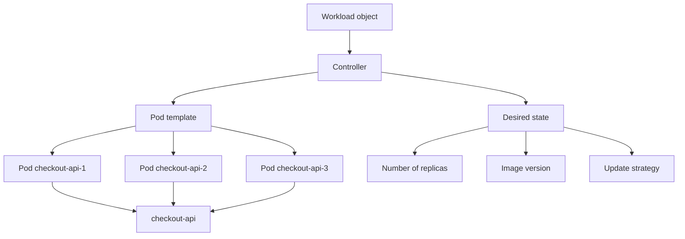

In this module aprenderás cuándo use:

- `ReplicaSet`
- `Deployment`
- `Job`
- `CronJob`
- `DaemonSet`
- `StatefulSet`
- `PodDisruptionBudget`
- `HorizontalPodAutoscaler`
- `VerticalPodAutoscaler`
- `LimitRange`
- `ResourceQuota`
- Reglas básicas of scheduling
AND, about everything, aprenderás to elegir.

---

## 6.1. What you are going to learn and what not you are going to learn yet

You are going to learn:

- By what not se suelen operate Pods sueltos
- What es a workload controller
- What problema resuelve each tipo of workload
- Cuándo use Deployment
- What papel tiene ReplicaSet
- How it worksn rollouts and rollbacks
- Cuándo use Job
- Cuándo use CronJob
- Cuándo use DaemonSet
- Cuándo use StatefulSet
- What son requests, limits and QoS
- What son LimitRange and ResourceQuota
- What es a PodDisruptionBudget
- What es HPA
- What es VPA
- What concepts basic of scheduling debes conocer
- How practicar everything esto with `checkout-api` without create a laboratorio demasiado fragile
- How mejorar DevEx with Taskfile
Not vamos to profundizar yet in:

- Services
- DNS interno
- Ingress or Gateway API
- ConfigMaps and Secrets in detalle
- PersistentVolumes and StorageClasses in detalle
- NetworkPolicy
- RBAC advanced
- Observability completa
- GitOps
- Operators
Esos temas aparecerán after.

The regla pedagógica of the module será this:

```text
First, problem
Then mental contract
Then Kubernetes object
Then manifest
Then inspection
Then failure lab
Then automation con Taskfile
```

---

## 6.2. The salto: of Pod directo to workload

In the module 5 aplicaste a Pod directamente.

That sirve for learn.

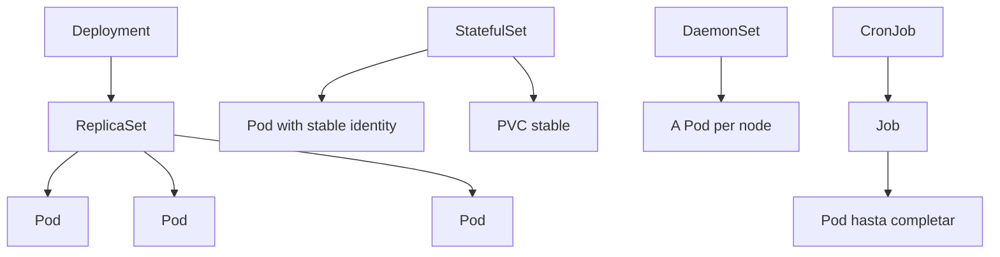

But tiene a límite importante:

> If borras a Pod directo, not vuelve.

TO Pod directo not expresa cosas como:

- Quiero tres réplicas
- Quiero rollout gradual
- Quiero rollback
- Quiero run a task hasta completar
- Quiero run algo in each nodo
- Quiero identidad estable for each réplica
- Quiero a task periódica
- Quiero controlar cuántas interrupciones simultáneas tolero
For that usas workloads.

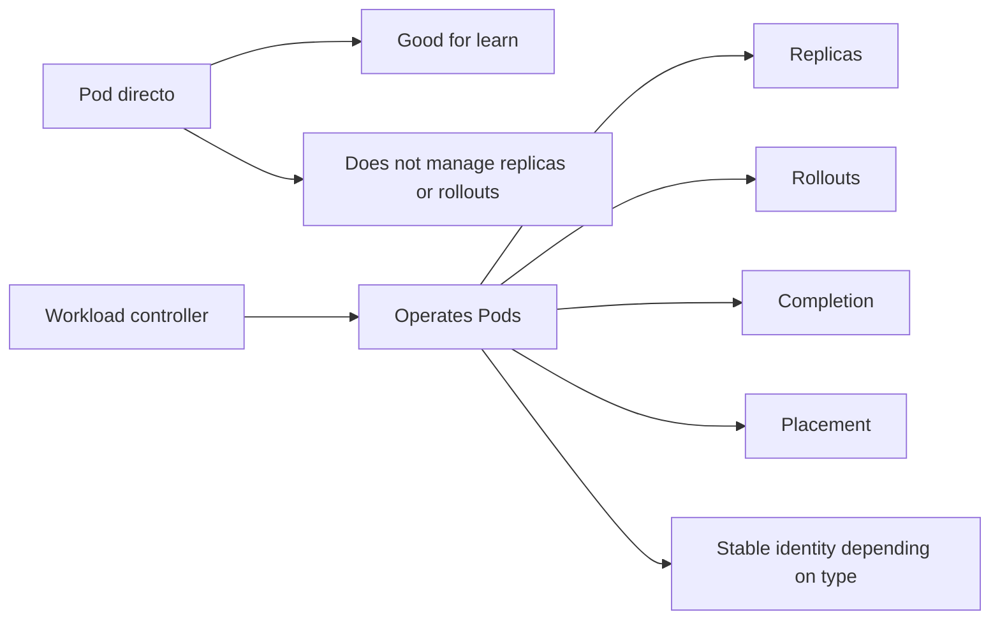

### Contrato mental

|Necesidad|Objeto likely|
|---|---|
|API stateless with varias réplicas|Deployment|
|Mantener réplicas of Pods|ReplicaSet, normalmente gestionado by Deployment|
|Task finita|Job|
|Task periódica|CronJob|
|Agente by nodo|DaemonSet|
|Workload with identidad estable|StatefulSet|
|Limitar interrupciones voluntarias|PodDisruptionBudget|
|Scale by métricas|HorizontalPodAutoscaler|
|Ajustar requests verticalmente|VerticalPodAutoscaler|
|Poner límites by namespace|LimitRange and ResourceQuota|

### DevEx of the bloque

In the laboratorio not queremos copiar manifests sueltos without entenderlos.

The estructura must separar tipos of workload:

```text
kubernetes/
  02-deployment/
  03-job/
  04-cronjob/
  05-daemonset/
  06-statefulset/
  07-policy/
  08-autoscaling/
```

Así the learner ve que each objeto responde to a problema distinto.

### Criterio of comprensión

Debes poder explicar:

> TO Pod directo enseña ejecución. A workload enseña operación.

---

## 6.3. Mapa of decisión of workloads

Before of write YAML, you need a forma of elegir.

Not preguntes first:

> ¿What YAML copio?

Pregunta:

> ¿What comportamiento necesito?

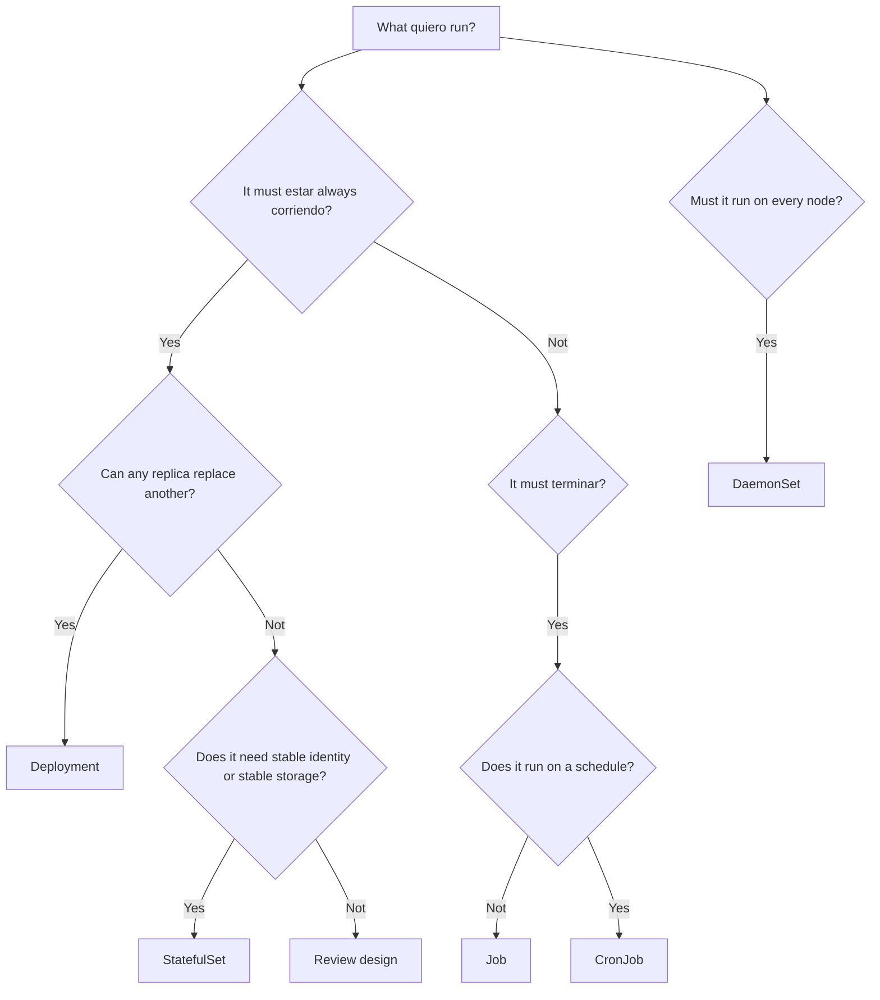

### Ejemplos reales of the sistema `shop`

|Componente|Tipo recomendado|Motivo|
|---|---|---|
|`checkout-api`|Deployment|API stateless que may have varias réplicas|
|`payment-api`|Deployment|Service HTTP stateless|
|`inventory-api`|Deployment or StatefulSet, según diseño|If only expone API stateless, Deployment|
|`notification-worker`|Deployment or Job, según comportamiento|Worker continuo, Deployment. Trabajo finito, Job|
|Migración of database|Job|It must runse hasta completar|
|Limpieza diaria of carritos expirados|CronJob|Task periódica|
|Agente of logs per node|DaemonSet|It must haber one per node|
|PostgreSQL dentro of the cluster|StatefulSet, with mucho cuidado|Needs identidad and storage estable|
|Redis of laboratorio|StatefulSet or Deployment según objective|For production, revisar requisitos reales|

### Criterio of comprensión

Debes poder explicar:

> The tipo of workload se elige by comportamiento operacional, not by preferencia of YAML.

---

## 6.4. ReplicaSet

### What problema resuelve

A ReplicaSet mantiene a número deseado of Pods.

If quieres tres réplicas of a same plantilla, a ReplicaSet intenta mantener tres.

But in the practice, normalmente not creas ReplicaSets to mano.

The creates and gestiona a Deployment.

The documentación of Deployments explica que a Deployment creates a ReplicaSet, and that ReplicaSet creates Pods in second plano. Also explica que, to the update the plantilla of the Pod, the Deployment creates a nuevo ReplicaSet and escala gradualmente the nuevo while reduce the anterior. ([Kubernetes](https://kubernetes.io/docs/concepts/workloads/controllers/deployment/ "Deployments"))

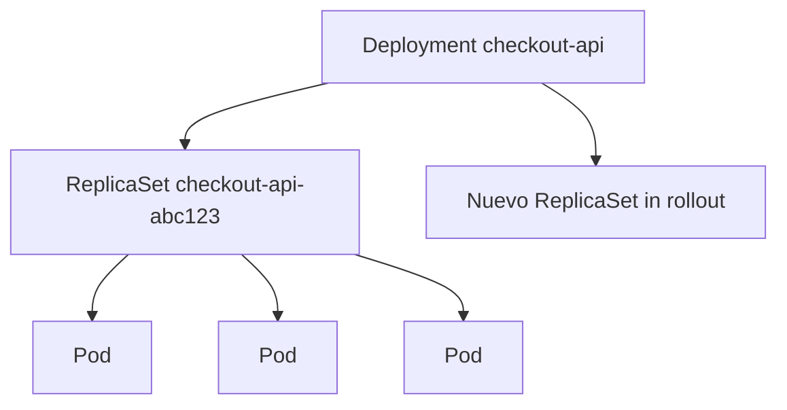

### Contrato mental

|Concept|Significado|
|---|---|
|ReplicaSet|Mantiene número of Pods|
|Selector|Decide what Pods pertenecen to the ReplicaSet|
|Pod template|Plantilla for create Pods|
|Deployment|Gestiona ReplicaSets and rollouts|

### What debes saber ahora

Not you need create a ReplicaSet manual in the laboratorio.

Yes you need to know readlo:

```bash
kubectl get rs -n shop
kubectl describe rs -n shop
```

### DevEx of the bloque

Añade a task of inspección:

```yaml
k8s:rs:
  desc: Show ReplicaSets
  cmds:
    - kubectl get rs -n {{.NAMESPACE}}
```

### Criterio of comprensión

Debes poder explicar:

> ReplicaSet mantiene réplicas, but normalmente lo opero mediante Deployment.

---

## 6.5. Deployment

### What problema resuelve

A Deployment es the workload principal for applications stateless of larga duración.

Sirve for:

- Mantener réplicas
- Declarar a plantilla of Pod
- Hacer rollouts
- Hacer rollbacks
- Scale réplicas
- Sustituir Pods of forma controlada
The documentación oficial describe Deployment como the recurso for create a rollout of a ReplicaSet, check the state of the rollout and update the state of the Pods declarando a nueva plantilla. ([Kubernetes](https://kubernetes.io/docs/concepts/workloads/controllers/deployment/ "Deployments"))

### By what `checkout-api` must ser a Deployment

`checkout-api` es a API HTTP stateless of laboratorio.

That significa:

- Cualquier réplica can responder
- Not needs identidad estable propia
- Not escribe state local persistente
- It can reemplazarse by otra réplica
- It can scale horizontalmente
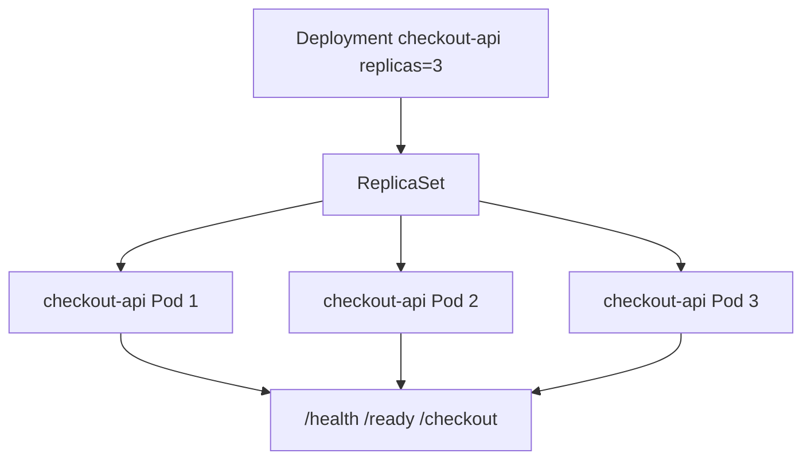

### Contrato of the Deployment

Queremos que `checkout-api`:

- Viva in namespace `shop`
- Tenga tres réplicas
- Use labels consistentes
- Use the image `checkout-api:1.0.0`
- Mantenga probes
- Mantenga requests and limits
- Mantenga securityContext
- Mantenga Downward API
- Tenga estrategia RollingUpdate
- Se pueda inspect with `kubectl rollout`
### Manifest

Creates:

```text
kubernetes/02-deployment/deployment.yaml
```

Contenido:

```yaml
apiVersion: apps/v1
kind: Deployment
metadata:
  name: checkout-api
  namespace: shop
  labels:
    app.kubernetes.io/name: checkout-api
    app.kubernetes.io/component: api
    app.kubernetes.io/part-of: shop
spec:
  replicas: 3
  revisionHistoryLimit: 5
  strategy:
    type: RollingUpdate
    rollingUpdate:
      maxUnavailable: 1
      maxSurge: 1
  selector:
    matchLabels:
      app.kubernetes.io/name: checkout-api
      app.kubernetes.io/component: api
  template:
    metadata:
      labels:
        app.kubernetes.io/name: checkout-api
        app.kubernetes.io/component: api
        app.kubernetes.io/part-of: shop
        app.kubernetes.io/version: "1.0.0"
      annotations:
        course.emmanuel.dev/module: "6"
        course.emmanuel.dev/purpose: "deployment-lab"
    spec:
      securityContext:
        seccompProfile:
          type: RuntimeDefault

      containers:
        - name: checkout-api
          image: checkout-api:1.0.0
          imagePullPolicy: IfNotPresent

          ports:
            - name: http
              containerPort: 8080

          env:
            - name: SERVICE_NAME
              value: checkout-api
            - name: PORT
              value: "8080"
            - name: LOG_LEVEL
              value: debug
            - name: POD_NAME
              valueFrom:
                fieldRef:
                  fieldPath: metadata.name
            - name: POD_NAMESPACE
              valueFrom:
                fieldRef:
                  fieldPath: metadata.namespace
            - name: POD_IP
              valueFrom:
                fieldRef:
                  fieldPath: status.podIP

          startupProbe:
            httpGet:
              path: /health
              port: http
            failureThreshold: 30
            periodSeconds: 2

          readinessProbe:
            httpGet:
              path: /ready
              port: http
            initialDelaySeconds: 2
            periodSeconds: 5
            failureThreshold: 3

          livenessProbe:
            httpGet:
              path: /health
              port: http
            initialDelaySeconds: 5
            periodSeconds: 10
            failureThreshold: 3

          resources:
            requests:
              cpu: 100m
              memory: 128Mi
            limits:
              cpu: 500m
              memory: 256Mi

          securityContext:
            allowPrivilegeEscalation: false
            readOnlyRootFilesystem: true
            runAsNonRoot: true
            runAsUser: 1000
            capabilities:
              drop:
                - ALL
```

### Apply

```bash
kubectl apply -f kubernetes/02-deployment/deployment.yaml
```

### Observar

```bash
kubectl get deploy -n shop
kubectl get rs -n shop
kubectl get pods -n shop -l app.kubernetes.io/name=checkout-api
kubectl rollout status deployment/checkout-api -n shop
```

### DevEx of the bloque

Añade tasks:

```yaml
k8s:deployment:apply:
  desc: Apply checkout-api Deployment
  cmds:
    - kubectl apply -f kubernetes/02-deployment/deployment.yaml

k8s:deployment:status:
  desc: Show checkout-api Deployment status
  cmds:
    - kubectl get deploy checkout-api -n {{.NAMESPACE}}
    - kubectl get rs -n {{.NAMESPACE}}
    - kubectl get pods -n {{.NAMESPACE}} -l app.kubernetes.io/name=checkout-api -o wide
    - kubectl rollout status deployment/checkout-api -n {{.NAMESPACE}}
```

### Criterio of comprensión

Debes poder explicar:

> For a API stateless como `checkout-api`, Deployment es the objeto principal because mantiene réplicas and permite rollouts controlados.

---

## 6.6. Rollouts and rollbacks

### What problema resuelven

An application not only is deployed a vez.

Cambia.

You need pasar of:

```text
checkout-api:1.0.0
```

to:

```text
checkout-api:1.0.1
```

without perder control.

A rollout is not only cambiar an image. Es cambiar comportamiento in a sistema vivo.

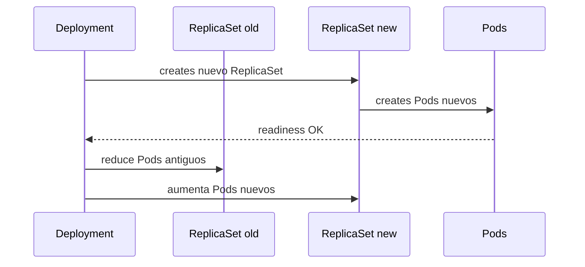

### Commands principales

See historial:

```bash
kubectl rollout history deployment/checkout-api -n shop
```

See state:

```bash
kubectl rollout status deployment/checkout-api -n shop
```

Cambiar image:

```bash
kubectl set image deployment/checkout-api checkout-api=checkout-api:1.0.1 -n shop
```

Rollback:

```bash
kubectl rollout undo deployment/checkout-api -n shop
```

### Practice segura

Como in kind only tienes cargada `checkout-api:1.0.0`, first genera an image `1.0.1` cambiando algo pequeño, for example `LOG_LEVEL` not, because that es runtime. For a practice simple, you can reconstruir the same app with otro tag:

```bash
docker build -t checkout-api:1.0.1 ./apps/checkout-api
kind load docker-image checkout-api:1.0.1 --name shop-learning
kubectl set image deployment/checkout-api checkout-api=checkout-api:1.0.1 -n shop
kubectl rollout status deployment/checkout-api -n shop
```

### Failure lab: rollout with image inexistente

This failure enseña mucho.

```bash
kubectl set image deployment/checkout-api checkout-api=checkout-api:does-not-exist -n shop
kubectl rollout status deployment/checkout-api -n shop --timeout=60s
kubectl get pods -n shop
kubectl describe deployment checkout-api -n shop
kubectl get events -n shop --sort-by=.metadata.creationTimestamp
```

After:

```bash
kubectl rollout undo deployment/checkout-api -n shop
kubectl rollout status deployment/checkout-api -n shop
```

### DevEx of the bloque

Añade:

```yaml
k8s:deployment:rollout:history:
  desc: Show checkout-api rollout history
  cmds:
    - kubectl rollout history deployment/checkout-api -n {{.NAMESPACE}}

k8s:deployment:rollout:status:
  desc: Show checkout-api rollout status
  cmds:
    - kubectl rollout status deployment/checkout-api -n {{.NAMESPACE}}

k8s:deployment:rollback:
  desc: Rollback checkout-api Deployment
  cmds:
    - kubectl rollout undo deployment/checkout-api -n {{.NAMESPACE}}
    - kubectl rollout status deployment/checkout-api -n {{.NAMESPACE}}

k8s:failure:rollout:bad-image:
  desc: Trigger a rollout with a bad image
  cmds:
    - kubectl set image deployment/checkout-api checkout-api=checkout-api:does-not-exist -n {{.NAMESPACE}}
    - kubectl rollout status deployment/checkout-api -n {{.NAMESPACE}} --timeout=60s || true
    - kubectl get pods -n {{.NAMESPACE}}
    - kubectl get events -n {{.NAMESPACE}} --sort-by=.metadata.creationTimestamp
```

### Criterio of comprensión

Debes poder explicar:

> A rollout fallido is not only a Pod roto. Es a transición of versión que not ha podido completarse of forma sana.

---

## 6.7. Scaling manual

### What problema resuelve

Before of autoscaling, you need to understand scaling manual.

Scale manualmente significa cambiar the número deseado of réplicas.

Ejemplo:

```bash
kubectl scale deployment/checkout-api --replicas=5 -n shop
```

See:

```bash
kubectl get deploy checkout-api -n shop
kubectl get pods -n shop -l app.kubernetes.io/name=checkout-api
```

Volver to tres:

```bash
kubectl scale deployment/checkout-api --replicas=3 -n shop
```

### What ocurre

The Deployment actualiza the número deseado.

The ReplicaSet ajusta Pods.

Kubernetes intenta acercar state real to state deseado.

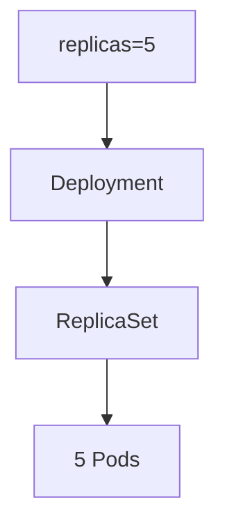

### DevEx of the bloque

Añade:

```yaml
k8s:deployment:scale:
  desc: Scale checkout-api Deployment. Usage: task k8s:deployment:scale REPLICAS=5
  cmds:
    - kubectl scale deployment/checkout-api --replicas={{.REPLICAS}} -n {{.NAMESPACE}}
    - kubectl get deploy checkout-api -n {{.NAMESPACE}}
```

### Criterio of comprensión

Debes poder explicar:

> Scale a Deployment es cambiar the número deseado of réplicas. Kubernetes ajusta the Pods for aproximarse to that intención.

---

## 6.8. Job

### What problema resuelve

A Job ejecuta a task finita hasta completarla.

Not quieres a Deployment for algo que must terminar.

Ejemplos:

- Migración puntual
- Importación of datos
- Generación of reporte
- Reprocesado puntual
- Validación batch


### Contrato mental

|Pregunta|Job|
|---|---|
|¿It must estar always corriendo?|Not|
|¿It must terminar?|Yes|
|¿It must reintentarse if fails?|It can configurarse|
|¿It must create Pods hasta completar?|Yes|

### Manifest

Creates:

```text
kubernetes/03-job/job.yaml
```

Contenido:

```yaml
apiVersion: batch/v1
kind: Job
metadata:
  name: checkout-db-migration
  namespace: shop
  labels:
    app.kubernetes.io/name: checkout-db-migration
    app.kubernetes.io/component: migration
    app.kubernetes.io/part-of: shop
spec:
  backoffLimit: 2
  template:
    metadata:
      labels:
        app.kubernetes.io/name: checkout-db-migration
        app.kubernetes.io/component: migration
        app.kubernetes.io/part-of: shop
    spec:
      restartPolicy: Never
      containers:
        - name: migration
          image: busybox:1.36
          command:
            - sh
            - -c
            - echo "running checkout database migration" && sleep 2 && echo "migration completed"
          resources:
            requests:
              cpu: 50m
              memory: 64Mi
            limits:
              cpu: 100m
              memory: 128Mi
```

### Apply and observar

```bash
kubectl apply -f kubernetes/03-job/job.yaml
kubectl get jobs -n shop
kubectl get pods -n shop -l app.kubernetes.io/name=checkout-db-migration
kubectl logs -n shop job/checkout-db-migration
```

### Failure lab: Job fallido

Copia and rompe:

```bash
cp kubernetes/03-job/job.yaml kubernetes/03-job/job-failing.yaml
yq -i '.metadata.name = "checkout-db-migration-failing"' kubernetes/03-job/job-failing.yaml
yq -i '.spec.template.metadata.labels."app.kubernetes.io/name" = "checkout-db-migration-failing"' kubernetes/03-job/job-failing.yaml
yq -i '.spec.template.spec.containers[0].command = ["sh", "-c", "echo failing migration && exit 1"]' kubernetes/03-job/job-failing.yaml
kubectl apply -f kubernetes/03-job/job-failing.yaml
```

Observar:

```bash
kubectl get jobs -n shop
kubectl describe job checkout-db-migration-failing -n shop
kubectl get pods -n shop -l app.kubernetes.io/name=checkout-db-migration-failing
kubectl logs -n shop -l app.kubernetes.io/name=checkout-db-migration-failing
```

### DevEx of the bloque

Añade:

```yaml
k8s:job:apply:
  desc: Apply checkout migration Job
  cmds:
    - kubectl apply -f kubernetes/03-job/job.yaml

k8s:job:status:
  desc: Show checkout migration Job status
  cmds:
    - kubectl get jobs -n {{.NAMESPACE}}
    - kubectl get pods -n {{.NAMESPACE}} -l app.kubernetes.io/component=migration
    - kubectl logs -n {{.NAMESPACE}} job/checkout-db-migration || true

k8s:job:delete:
  desc: Delete checkout migration Job
  cmds:
    - kubectl delete -f kubernetes/03-job/job.yaml --ignore-not-found
```

### Criterio of comprensión

Debes poder explicar:

> A Job not mantiene a service vivo. Ejecuta trabajo finito hasta completar or agotar reintentos.

---

## 6.9. CronJob

### What problema resuelve

A CronJob creates Jobs siguiendo a horario.

Sirve for tasks periódicas:

- Limpieza diaria
- Reportes
- Backups sencillos of laboratorio
- Sincronizaciones
- Reintentos programados
The documentación oficial of CronJob lo describe como a recurso for create Jobs siguiendo a programación repetitiva. ([Kubernetes](https://kubernetes.io/docs/concepts/workloads/controllers/cron-jobs/ "CronJob"))

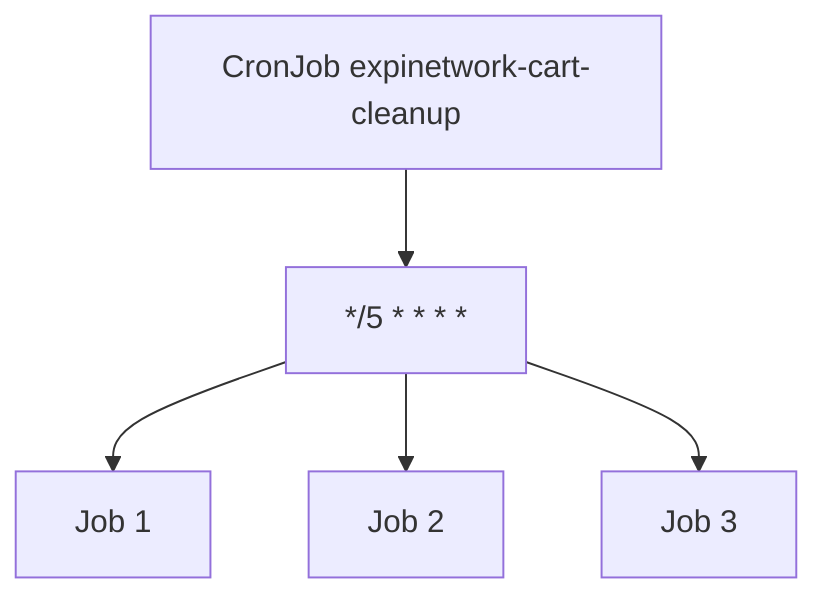

### Contrato mental

|Pregunta|CronJob|
|---|---|
|¿Es task finita?|Yes|
|¿Se repite by horario?|Yes|
|¿Creates Jobs?|Yes|
|¿It must sustituir a worker continuo?|Not|

### Manifest

Creates:

```text
kubernetes/04-cronjob/cronjob.yaml
```

Contenido:

```yaml
apiVersion: batch/v1
kind: CronJob
metadata:
  name: expired-cart-cleanup
  namespace: shop
  labels:
    app.kubernetes.io/name: expired-cart-cleanup
    app.kubernetes.io/component: cleanup
    app.kubernetes.io/part-of: shop
spec:
  schedule: "*/5 * * * *"
  concurrencyPolicy: Forbid
  successfulJobsHistoryLimit: 3
  failedJobsHistoryLimit: 3
  jobTemplate:
    spec:
      backoffLimit: 1
      template:
        metadata:
          labels:
            app.kubernetes.io/name: expired-cart-cleanup
            app.kubernetes.io/component: cleanup
            app.kubernetes.io/part-of: shop
        spec:
          restartPolicy: Never
          containers:
            - name: cleanup
              image: busybox:1.36
              command:
                - sh
                - -c
                - echo "cleaning expired carts" && date
              resources:
                requests:
                  cpu: 50m
                  memory: 64Mi
                limits:
                  cpu: 100m
                  memory: 128Mi
```

### Apply and observar

```bash
kubectl apply -f kubernetes/04-cronjob/cronjob.yaml
kubectl get cronjobs -n shop
kubectl get jobs -n shop
```

You can create a Job manual desde the CronJob:

```bash
kubectl create job manual-expired-cart-cleanup \
  --from=cronjob/expired-cart-cleanup \
  -n shop
```

See logs:

```bash
kubectl logs -n shop job/manual-expired-cart-cleanup
```

### DevEx of the bloque

Añade:

```yaml
k8s:cronjob:apply:
  desc: Apply expired cart cleanup CronJob
  cmds:
    - kubectl apply -f kubernetes/04-cronjob/cronjob.yaml

k8s:cronjob:status:
  desc: Show CronJobs and Jobs
  cmds:
    - kubectl get cronjobs -n {{.NAMESPACE}}
    - kubectl get jobs -n {{.NAMESPACE}}

k8s:cronjob:run-now:
  desc: Create a manual Job from the CronJob
  cmds:
    - kubectl create job manual-expired-cart-cleanup-$(date +%s) --from=cronjob/expired-cart-cleanup -n {{.NAMESPACE}}

k8s:cronjob:delete:
  desc: Delete expired cart cleanup CronJob
  cmds:
    - kubectl delete -f kubernetes/04-cronjob/cronjob.yaml --ignore-not-found
```

### Criterio of comprensión

Debes poder explicar:

> CronJob not ejecuta trabajo directamente of forma continuous. Creates Jobs in momentos definidos by a expresión cron.

---

## 6.10. DaemonSet

### What problema resuelve

A DaemonSet ejecuta a copia of a Pod in all or algunos nodos.

Kubernetes describe DaemonSet como a recurso for Pods que ofrecen capacidades locales to the nodos; when añades a nodo que encaja with the especificación, the control plane programa a Pod of the DaemonSet in that nodo. ([Kubernetes](https://kubernetes.io/docs/concepts/workloads/ "Workloads"))

Ejemplos reales:

- Agente of logs by nodo
- Agente of métricas by nodo
- Agente of security by nodo
- Plugin of network
- Agente of storage
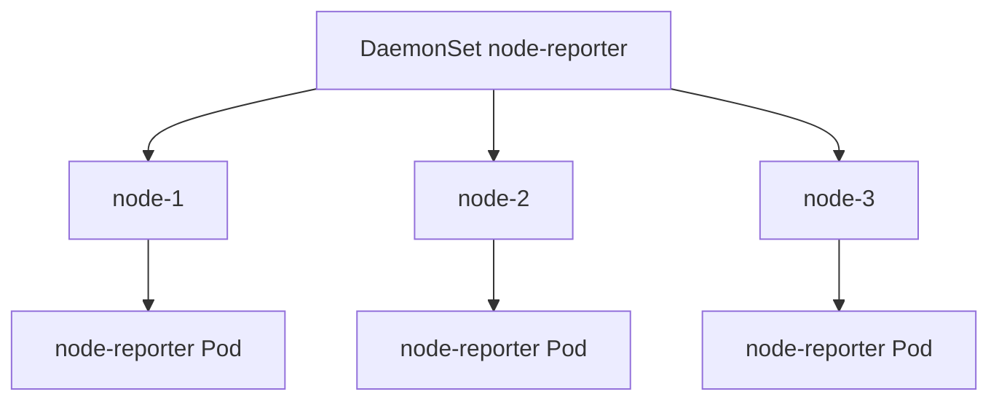

### Contrato mental

|Pregunta|DaemonSet|
|---|---|
|¿Quiero N réplicas arbitrarias?|Not|
|¿Quiero a by nodo?|Yes|
|¿Depende of the nodo where vive?|Normalmente yes|
|¿Es good opción for a API of negocio?|Normalmente not|

### Manifest of laboratorio

Creates:

```text
kubernetes/05-daemonset/daemonset.yaml
```

Contenido:

```yaml
apiVersion: apps/v1
kind: DaemonSet
metadata:
  name: node-reporter
  namespace: shop
  labels:
    app.kubernetes.io/name: node-reporter
    app.kubernetes.io/component: node-agent
    app.kubernetes.io/part-of: shop
spec:
  selector:
    matchLabels:
      app.kubernetes.io/name: node-reporter
      app.kubernetes.io/component: node-agent
  template:
    metadata:
      labels:
        app.kubernetes.io/name: node-reporter
        app.kubernetes.io/component: node-agent
        app.kubernetes.io/part-of: shop
    spec:
      containers:
        - name: node-reporter
          image: busybox:1.36
          command:
            - sh
            - -c
            - while true; do echo "running on node ${NODE_NAME}"; sleep 30; done
          env:
            - name: NODE_NAME
              valueFrom:
                fieldRef:
                  fieldPath: spec.nodeName
          resources:
            requests:
              cpu: 20m
              memory: 32Mi
            limits:
              cpu: 50m
              memory: 64Mi
```

### Apply and observar

```bash
kubectl apply -f kubernetes/05-daemonset/daemonset.yaml
kubectl get daemonsets -n shop
kubectl get pods -n shop -l app.kubernetes.io/name=node-reporter -o wide
kubectl logs -n shop -l app.kubernetes.io/name=node-reporter
```

In a cluster kind of a nodo, verás a réplica. In a cluster with varios nodos, you should see a by nodo elegible.

### DevEx of the bloque

Añade:

```yaml
k8s:daemonset:apply:
  desc: Apply node-reporter DaemonSet
  cmds:
    - kubectl apply -f kubernetes/05-daemonset/daemonset.yaml

k8s:daemonset:status:
  desc: Show node-reporter DaemonSet status
  cmds:
    - kubectl get daemonsets -n {{.NAMESPACE}}
    - kubectl get pods -n {{.NAMESPACE}} -l app.kubernetes.io/name=node-reporter -o wide

k8s:daemonset:logs:
  desc: Show node-reporter logs
  cmds:
    - kubectl logs -n {{.NAMESPACE}} -l app.kubernetes.io/name=node-reporter --tail=20

k8s:daemonset:delete:
  desc: Delete node-reporter DaemonSet
  cmds:
    - kubectl delete -f kubernetes/05-daemonset/daemonset.yaml --ignore-not-found
```

### Criterio of comprensión

Debes poder explicar:

> DaemonSet not sirve for “tener varias réplicas”. Sirve for tener Pods ligados to nodos.

---

## 6.11. StatefulSet

### What problema resuelve

StatefulSet gestionan applications stateful.

The documentación oficial explica que StatefulSet gestiona the deployment and escalado of a conjunto of Pods, and ofrece garantías about orden e identidad única. Also indica que es útil for applications que need storage persistente or identidad of network estable. ([Kubernetes](https://kubernetes.io/docs/concepts/workloads/controllers/statefulset/ "StatefulSets"))

### What diferencia to StatefulSet

A StatefulSet proporciona:

- Identidad estable by Pod
- Nombres estables como `redis-0`, `redis-1`
- Orden of creación and eliminación
- Asociación estable with storage, when is used `volumeClaimTemplates`
- Semántica diferente to Deployment
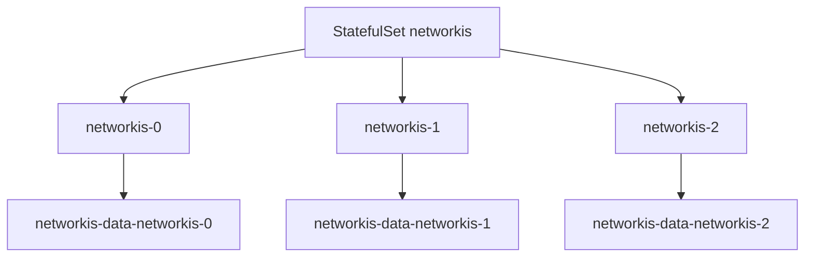

### Cuándo usarlo

Uses StatefulSet if you need:

- Identidad estable
- Storage estable by réplica
- Orden of arranque or apagado
- Clustering stateful
- Nombres pnetworkecibles by réplica
### Cuándo not usarlo

Not lo uses if:

- The app es stateless
- Cualquier réplica can sustituir to otra
- Not you need storage estable
- Only quieres “algo more serio que Deployment”
### Nota didáctica

This module explica StatefulSet, but not lo convertirá in the practice principal because the storage se estudia in profundidad in the module 8.

Aquí basta with understand the decisión.

### Manifest ilustrativo, not practice principal

Creates opcionalmente:

```text
kubernetes/06-statefulset/statefulset.redis.example.yaml
```

Contenido:

```yaml
apiVersion: apps/v1
kind: StatefulSet
metadata:
  name: redis
  namespace: shop
spec:
  serviceName: redis
  replicas: 1
  selector:
    matchLabels:
      app.kubernetes.io/name: redis
  template:
    metadata:
      labels:
        app.kubernetes.io/name: redis
        app.kubernetes.io/component: cache
        app.kubernetes.io/part-of: shop
    spec:
      containers:
        - name: redis
          image: redis:7-alpine
          ports:
            - name: redis
              containerPort: 6379
```

This manifest está incompleto for a Redis productivo. Not define Service headless ni storage persistente. It is used only for discutir estructura.

### Criterio of comprensión

Debes poder explicar:

> StatefulSet is not “Deployment for databases”. Es a workload for Pods with identidad estable and, normalmente, storage estable.

---

## 6.12. Requests, limits and QoS

### What problema resuelven

The workloads compiten by CPU and memoria.

Kubernetes needs información for colocar Pods and gestionar presión of Resources.

The documentación oficial indica que, to the especificar a Pod, you can definir cuántos Resources needs a container, siendo CPU and memoria the more comunes. ([Kubernetes](https://kubernetes.io/docs/concepts/configuration/manage-resources-containers/ "Resource Management for Pods and Containers"))

### Requests

Requests informan to the scheduler:

> For colocar this Pod, considera que needs to the less esto.

### Limits

Limits informan to the runtime and kubelet:

> This container should not consumir more of esto.

### QoS

Kubernetes asigna clases of Quality of Service to Pods: `Guaranteed`, `Burstable` and `BestEffort`. The documentación oficial explica que Kubernetes uses these clases for decidir about evictions when the Resources of the nodo se exceden. ([Kubernetes](https://kubernetes.io/docs/tasks/configure-pod-container/quality-service-pod/ "Configure Quality of Service for Pods"))

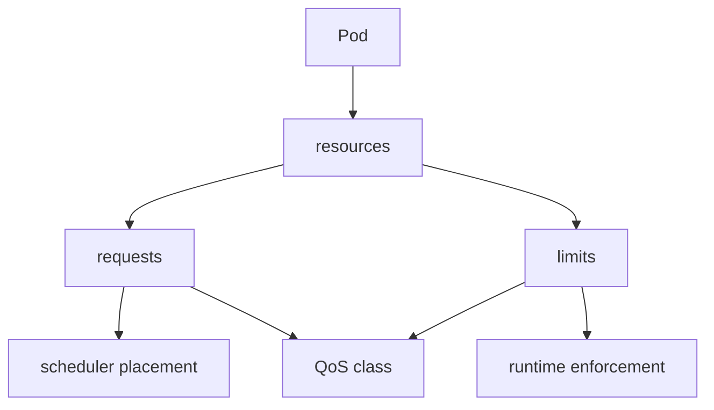

### Contrato for `checkout-api`

Already usamos:

```yaml
resources:
  requests:
    cpu: 100m
    memory: 128Mi
  limits:
    cpu: 500m
    memory: 256Mi
```

That normalmente genera QoS `Burstable`, because requests and limits not son iguales.

### Commands

```bash
kubectl get pod -n shop -l app.kubernetes.io/name=checkout-api -o json \
  | jq '.items[] | {name: .metadata.name, qosClass: .status.qosClass, resources: .spec.containers[0].resources}'
```

### DevEx of the bloque

Añade:

```yaml
k8s:resources:summary:
  desc: Show Pod resources and QoS
  cmds:
    - kubectl get pods -n {{.NAMESPACE}} -o json | jq -r '.items[] | [.metadata.name, .status.qosClass, (.spec.containers[0].resources | tostring)] | @tsv'
```

### Criterio of comprensión

Debes poder explicar:

> Requests ayudan to decidir placement. Limits networkucen consumo máximo. QoS influye in decisiones of eviction bajo presión.

---

## 6.13. LimitRange and ResourceQuota

### What problema resuelven

Not basta with que each manifest individual sea correcto.

A namespace can necesitar reglas.

`LimitRange` permite poner restricciones or defaults of Resources dentro of a namespace. The documentación oficial explica que a LimitRange es a política que limita asignaciones of Resources, como requests and limits, for tipos of objeto aplicables dentro of a namespace. ([Kubernetes](https://kubernetes.io/docs/concepts/policy/limit-range/ "Limit Ranges"))

`ResourceQuota` limita the consumo agregado of Resources dentro of a namespace. The documentación oficial explica que ResourceQuota can limitar consumo agregado and also cantidad of objetos by tipo dentro of the namespace. ([Kubernetes](https://kubernetes.io/docs/concepts/policy/resource-quotas/ "Resource Quotas"))

### Contrato mental

|Objeto|Pregunta|
|---|---|
|LimitRange|¿What límites or defaults aplican to each Pod or container?|
|ResourceQuota|¿Cuánto can consumir or create in total this namespace?|

### Manifest LimitRange

Creates:

```text
kubernetes/07-policy/limitrange.yaml
```

Contenido:

```yaml
apiVersion: v1
kind: LimitRange
metadata:
  name: shop-default-limits
  namespace: shop
spec:
  limits:
    - type: Container
      defaultRequest:
        cpu: 50m
        memory: 64Mi
      default:
        cpu: 500m
        memory: 256Mi
```

### Manifest ResourceQuota

Creates:

```text
kubernetes/07-policy/resourcequota.yaml
```

Contenido:

```yaml
apiVersion: v1
kind: ResourceQuota
metadata:
  name: shop-quota
  namespace: shop
spec:
  hard:
    requests.cpu: "2"
    requests.memory: 2Gi
    limits.cpu: "4"
    limits.memory: 4Gi
    pods: "20"
```

### Apply

```bash
kubectl apply -f kubernetes/07-policy/limitrange.yaml
kubectl apply -f kubernetes/07-policy/resourcequota.yaml
```

### See

```bash
kubectl describe limitrange shop-default-limits -n shop
kubectl describe resourcequota shop-quota -n shop
```

### DevEx of the bloque

Añade:

```yaml
k8s:policy:apply:
  desc: Apply LimitRange and ResourceQuota
  cmds:
    - kubectl apply -f kubernetes/07-policy/limitrange.yaml
    - kubectl apply -f kubernetes/07-policy/resourcequota.yaml

k8s:policy:status:
  desc: Show namespace resource policies
  cmds:
    - kubectl describe limitrange shop-default-limits -n {{.NAMESPACE}}
    - kubectl describe resourcequota shop-quota -n {{.NAMESPACE}}

k8s:policy:delete:
  desc: Delete namespace resource policies
  cmds:
    - kubectl delete -f kubernetes/07-policy/resourcequota.yaml --ignore-not-found
    - kubectl delete -f kubernetes/07-policy/limitrange.yaml --ignore-not-found
```

### Criterio of comprensión

Debes poder explicar:

> LimitRange actúa about defaults and límites by objeto. ResourceQuota limita the consumo agregado of the namespace.

---

## 6.14. Scheduling basic: nodeSelector, affinity, taints and tolerations

### What problema resuelve

Not all the Pods shouldn poder correr in cualquier nodo.

TO veces you need controlar placement.

Ejemplos:

- Workloads GPU in nodos GPU
- Agentes in nodos concretos
- Separar workloads críticos
- Evitar colocar dos réplicas juntas
- Reservar nodos for ciertos equipos
### nodeSelector

`nodeSelector` es a forma simple of pedir nodos with ciertas labels.

Ejemplo conceptual:

```yaml
nodeSelector:
  node-type: general
```

### Affinity and anti-affinity

Affinity permite expresar reglas more ricas of colocación.

Anti-affinity permite decir que ciertos Pods should notn colocarse juntos.

### Taints and tolerations

The taints se aplican to nodos and permiten repeler Pods. The tolerations se aplican to Pods and permiten que the scheduler pueda colocarlos in nodos with taints compatibles. The documentación oficial explica que the tolerations permiten scheduling, but not lo garantizan, because the scheduler evalúa otros parámetros. ([Kubernetes](https://kubernetes.io/docs/concepts/scheduling-eviction/taint-and-toleration/ "Taints and Tolerations"))

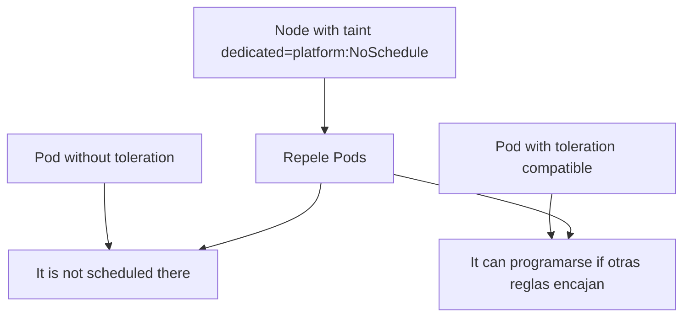

### Contrato mental

|Mecanismo|Pregunta|
|---|---|
|nodeSelector|¿Quiero nodos with labels concretas?|
|node affinity|¿Quiero reglas of nodo more expresivas?|
|pod affinity|¿Quiero acercar Pods to otros Pods?|
|pod anti-affinity|¿Quiero separar Pods between yes?|
|taints|¿Quiero que the nodo rechace Pods by defecto?|
|tolerations|¿This Pod can tolerar that taint?|

### Practice recomendada

In kind of a nodo, not hagas prácticas agresivas of taints because you can bloquear tus propios Pods.

For this module, estudia the manifest conceptual and practica inspección:

```bash
kubectl get nodes --show-labels
kubectl describe nodes
```

### Criterio of comprensión

Debes poder explicar:

> Scheduling is not only “Kubernetes decide”. Yo puedo declarar restricciones and pReferences, but debo understand su impacto.

---

## 6.15. PodDisruptionBudget

### What problema resuelve

A PodDisruptionBudget, or PDB, limita cuántas interrupciones voluntarias can sufrir an application to the same tiempo.

The documentación oficial explica que a PDB permite limitar disrupciones concurrentes for an application and permite mayor disponibilidad while the administradores gestionan nodos of the cluster. ([Kubernetes](https://kubernetes.io/docs/tasks/run-application/configure-pdb/ "Specifying to Disruption Budget for your Application"))

### What es a interrupción voluntaria

Ejemplos:

- Drain of nodo
- Mantenimiento
- Evictions iniciadas by administración
- Actualizaciones controladas
Not everything failure respeta a PDB.

If a nodo se muere, the PDB not can impedirlo.

### Contrato for `checkout-api`

If tienes tres réplicas, you can decir:

```text
Debe haber al menos 2 disponibles.
```

Manifest:

```text
kubernetes/07-policy/pdb.yaml
```

```yaml
apiVersion: policy/v1
kind: PodDisruptionBudget
metadata:
  name: checkout-api-pdb
  namespace: shop
spec:
  minAvailable: 2
  selector:
    matchLabels:
      app.kubernetes.io/name: checkout-api
      app.kubernetes.io/component: api
```

Apply:

```bash
kubectl apply -f kubernetes/07-policy/pdb.yaml
kubectl get pdb -n shop
kubectl describe pdb checkout-api-pdb -n shop
```

### DevEx of the bloque

Añade:

```yaml
k8s:pdb:apply:
  desc: Apply checkout-api PodDisruptionBudget
  cmds:
    - kubectl apply -f kubernetes/07-policy/pdb.yaml

k8s:pdb:status:
  desc: Show checkout-api PodDisruptionBudget
  cmds:
    - kubectl get pdb -n {{.NAMESPACE}}
    - kubectl describe pdb checkout-api-pdb -n {{.NAMESPACE}}

k8s:pdb:delete:
  desc: Delete checkout-api PodDisruptionBudget
  cmds:
    - kubectl delete -f kubernetes/07-policy/pdb.yaml --ignore-not-found
```

### Criterio of comprensión

Debes poder explicar:

> PDB not hace que a app sea inmortal. Declara cuántas interrupciones voluntarias simultáneas can tolerar.

---

## 6.16. HorizontalPodAutoscaler

### What problema resuelve

HPA escala horizontalmente a workload ajustando the número of réplicas.

The documentación oficial explica que HorizontalPodAutoscaler actualiza automáticamente a recurso como Deployment or StatefulSet for ajustar capacidad según demanda observada, for example CPU or memoria. ([Kubernetes](https://kubernetes.io/docs/concepts/workloads/autoscaling/horizontal-pod-autoscale/ "Horizontal Pod Autoscaling"))

### What needs

HPA needs métricas.

In a cluster kind basic, can que not tengas `metrics-server`.

That is why In this module HPA se explica and se deja como practice opcional if instalas metrics-server.

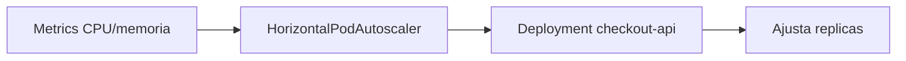

### Manifest opcional

Creates:

```text
kubernetes/08-autoscaling/hpa.yaml
```

Contenido:

```yaml
apiVersion: autoscaling/v2
kind: HorizontalPodAutoscaler
metadata:
  name: checkout-api
  namespace: shop
spec:
  scaleTargetRef:
    apiVersion: apps/v1
    kind: Deployment
    name: checkout-api
  minReplicas: 2
  maxReplicas: 5
  metrics:
    - type: Resource
      resource:
        name: cpu
        target:
          type: Utilization
          averageUtilization: 70
```

Apply:

```bash
kubectl apply -f kubernetes/08-autoscaling/hpa.yaml
kubectl get hpa -n shop
```

If see métricas como `<unknown>`, normalmente falta metrics-server or métricas disponibles.

### DevEx of the bloque

Añade:

```yaml
k8s:hpa:apply:
  desc: Apply checkout-api HPA
  cmds:
    - kubectl apply -f kubernetes/08-autoscaling/hpa.yaml

k8s:hpa:status:
  desc: Show checkout-api HPA
  cmds:
    - kubectl get hpa -n {{.NAMESPACE}}
    - kubectl describe hpa checkout-api -n {{.NAMESPACE}} || true

k8s:hpa:delete:
  desc: Delete checkout-api HPA
  cmds:
    - kubectl delete -f kubernetes/08-autoscaling/hpa.yaml --ignore-not-found
```

### Criterio of comprensión

Debes poder explicar:

> HPA not escala because yes. Escala a workload usando métricas observadas and límites declarados.

---

## 6.17. VerticalPodAutoscaler

### What problema resuelve

VPA ajusta Resources verticalmente, es decir, requests of CPU and memoria.

The documentación oficial actual explica que VerticalPodAutoscaler se define como a CRD, que to diferencia of HPA not forma parte of the API core of Kubernetes and must installse by separado in the cluster. Also indica que the API estable actual es `autoscaling.k8s.io/v1`. ([Kubernetes](https://kubernetes.io/docs/concepts/workloads/autoscaling/vertical-pod-autoscale/ "Vertical Pod Autoscaling"))

### What it means esto for the course

Not vamos to install VPA In this module.

Lo importante ahora es understand the diferencia:

|Tipo|What ajusta|
|---|---|
|HPA|Número of Pods|
|VPA|Requests of CPU and memoria|
|Cluster Autoscaler|Número of nodos|

### Criterio of comprensión

Debes poder explicar:

> HPA escala horizontalmente réplicas. VPA ajusta Resources by Pod and requiere componentes adicionales instalados in the cluster.

---

## 6.18. Practice principal of the module

### Objective

Convertir `checkout-api` of Pod directo to Deployment, añadir workloads auxiliares and practicar operación básica.

### Resultado esperado

```text
kubernetes-learning-lab/
  kubernetes/
    02-deployment/
      deployment.yaml
    03-job/
      job.yaml
      job-failing.yaml
    04-cronjob/
      cronjob.yaml
    05-daemonset/
      daemonset.yaml
    06-statefulset/
      statefulset.redis.example.yaml
    07-policy/
      limitrange.yaml
      resourcequota.yaml
      pdb.yaml
    08-autoscaling/
      hpa.yaml
```

### Paso 1. Preparar environment

```bash
task k8s:kind:create
task k8s:image:prepare
task k8s:namespace:apply
```

### Paso 2. Apply políticas of Resources

```bash
task k8s:policy:apply
task k8s:policy:status
```

### Paso 3. Apply Deployment

```bash
task k8s:deployment:apply
task k8s:deployment:status
```

### Paso 4. Scale manualmente

```bash
task k8s:deployment:scale REPLICAS=5
task k8s:deployment:status
task k8s:deployment:scale REPLICAS=3
```

### Paso 5. Probar rollout fallido and rollback

```bash
task k8s:failure:rollout:bad-image
task k8s:deployment:rollback
task k8s:deployment:status
```

### Paso 6. Apply Job

```bash
task k8s:job:apply
task k8s:job:status
```

### Paso 7. Apply CronJob

```bash
task k8s:cronjob:apply
task k8s:cronjob:status
task k8s:cronjob:run-now
task k8s:cronjob:status
```

### Paso 8. Apply DaemonSet

```bash
task k8s:daemonset:apply
task k8s:daemonset:status
task k8s:daemonset:logs
```

### Paso 9. Apply PDB

```bash
task k8s:pdb:apply
task k8s:pdb:status
```

### Paso 10. HPA opcional

```bash
task k8s:hpa:apply
task k8s:hpa:status
```

### Paso 11. Limpiar

```bash
task k8s:hpa:delete
task k8s:pdb:delete
task k8s:daemonset:delete
task k8s:cronjob:delete
task k8s:job:delete
task k8s:policy:delete
kubectl delete -f kubernetes/02-deployment/deployment.yaml --ignore-not-found
task k8s:namespace:delete
task k8s:kind:delete
```

### Criterio of finalización

The practice está completa when you can explicar:

- By what `checkout-api` pasa of Pod to Deployment
- What ReplicaSet aparece detrás
- What ocurre to the scale
- What ocurre in a rollout fallido
- What hace rollback
- What diferencia hay between Job and CronJob
- By what DaemonSet está ligado to nodos
- By what StatefulSet is not the practice principal yet
- What hacen LimitRange, ResourceQuota and PDB
- By what HPA can necesitar metrics-server
---

## 6.19. Taskfile of the module 6

Añade these tasks to the `Taskfile.yml`.

```yaml
  k8s:rs:
    desc: Show ReplicaSets
    cmds:
      - kubectl get rs -n {{.NAMESPACE}}

  k8s:deployment:apply:
    desc: Apply checkout-api Deployment
    cmds:
      - kubectl apply -f kubernetes/02-deployment/deployment.yaml

  k8s:deployment:status:
    desc: Show checkout-api Deployment status
    cmds:
      - kubectl get deploy checkout-api -n {{.NAMESPACE}}
      - kubectl get rs -n {{.NAMESPACE}}
      - kubectl get pods -n {{.NAMESPACE}} -l app.kubernetes.io/name=checkout-api -o wide
      - kubectl rollout status deployment/checkout-api -n {{.NAMESPACE}}

  k8s:deployment:scale:
    desc: Scale checkout-api Deployment. Usage: task k8s:deployment:scale REPLICAS=5
    cmds:
      - kubectl scale deployment/checkout-api --replicas={{.REPLICAS}} -n {{.NAMESPACE}}
      - kubectl get deploy checkout-api -n {{.NAMESPACE}}

  k8s:deployment:rollout:history:
    desc: Show checkout-api rollout history
    cmds:
      - kubectl rollout history deployment/checkout-api -n {{.NAMESPACE}}

  k8s:deployment:rollout:status:
    desc: Show checkout-api rollout status
    cmds:
      - kubectl rollout status deployment/checkout-api -n {{.NAMESPACE}}

  k8s:deployment:rollback:
    desc: Rollback checkout-api Deployment
    cmds:
      - kubectl rollout undo deployment/checkout-api -n {{.NAMESPACE}}
      - kubectl rollout status deployment/checkout-api -n {{.NAMESPACE}}

  k8s:failure:rollout:bad-image:
    desc: Trigger a rollout with a bad image
    cmds:
      - kubectl set image deployment/checkout-api checkout-api=checkout-api:does-not-exist -n {{.NAMESPACE}}
      - kubectl rollout status deployment/checkout-api -n {{.NAMESPACE}} --timeout=60s || true
      - kubectl get pods -n {{.NAMESPACE}}
      - kubectl get events -n {{.NAMESPACE}} --sort-by=.metadata.creationTimestamp

  k8s:job:apply:
    desc: Apply checkout migration Job
    cmds:
      - kubectl apply -f kubernetes/03-job/job.yaml

  k8s:job:status:
    desc: Show checkout migration Job status
    cmds:
      - kubectl get jobs -n {{.NAMESPACE}}
      - kubectl get pods -n {{.NAMESPACE}} -l app.kubernetes.io/component=migration
      - kubectl logs -n {{.NAMESPACE}} job/checkout-db-migration || true

  k8s:job:delete:
    desc: Delete checkout migration Job
    cmds:
      - kubectl delete -f kubernetes/03-job/job.yaml --ignore-not-found

  k8s:cronjob:apply:
    desc: Apply expired cart cleanup CronJob
    cmds:
      - kubectl apply -f kubernetes/04-cronjob/cronjob.yaml

  k8s:cronjob:status:
    desc: Show CronJobs and Jobs
    cmds:
      - kubectl get cronjobs -n {{.NAMESPACE}}
      - kubectl get jobs -n {{.NAMESPACE}}

  k8s:cronjob:run-now:
    desc: Create a manual Job from the CronJob
    cmds:
      - kubectl create job manual-expired-cart-cleanup-$(date +%s) --from=cronjob/expired-cart-cleanup -n {{.NAMESPACE}}

  k8s:cronjob:delete:
    desc: Delete expired cart cleanup CronJob
    cmds:
      - kubectl delete -f kubernetes/04-cronjob/cronjob.yaml --ignore-not-found

  k8s:daemonset:apply:
    desc: Apply node-reporter DaemonSet
    cmds:
      - kubectl apply -f kubernetes/05-daemonset/daemonset.yaml

  k8s:daemonset:status:
    desc: Show node-reporter DaemonSet status
    cmds:
      - kubectl get daemonsets -n {{.NAMESPACE}}
      - kubectl get pods -n {{.NAMESPACE}} -l app.kubernetes.io/name=node-reporter -o wide

  k8s:daemonset:logs:
    desc: Show node-reporter logs
    cmds:
      - kubectl logs -n {{.NAMESPACE}} -l app.kubernetes.io/name=node-reporter --tail=20

  k8s:daemonset:delete:
    desc: Delete node-reporter DaemonSet
    cmds:
      - kubectl delete -f kubernetes/05-daemonset/daemonset.yaml --ignore-not-found

  k8s:policy:apply:
    desc: Apply LimitRange and ResourceQuota
    cmds:
      - kubectl apply -f kubernetes/07-policy/limitrange.yaml
      - kubectl apply -f kubernetes/07-policy/resourcequota.yaml

  k8s:policy:status:
    desc: Show namespace resource policies
    cmds:
      - kubectl describe limitrange shop-default-limits -n {{.NAMESPACE}}
      - kubectl describe resourcequota shop-quota -n {{.NAMESPACE}}

  k8s:policy:delete:
    desc: Delete namespace resource policies
    cmds:
      - kubectl delete -f kubernetes/07-policy/resourcequota.yaml --ignore-not-found
      - kubectl delete -f kubernetes/07-policy/limitrange.yaml --ignore-not-found

  k8s:pdb:apply:
    desc: Apply checkout-api PodDisruptionBudget
    cmds:
      - kubectl apply -f kubernetes/07-policy/pdb.yaml

  k8s:pdb:status:
    desc: Show checkout-api PodDisruptionBudget
    cmds:
      - kubectl get pdb -n {{.NAMESPACE}}
      - kubectl describe pdb checkout-api-pdb -n {{.NAMESPACE}}

  k8s:pdb:delete:
    desc: Delete checkout-api PodDisruptionBudget
    cmds:
      - kubectl delete -f kubernetes/07-policy/pdb.yaml --ignore-not-found

  k8s:hpa:apply:
    desc: Apply checkout-api HPA
    cmds:
      - kubectl apply -f kubernetes/08-autoscaling/hpa.yaml

  k8s:hpa:status:
    desc: Show checkout-api HPA
    cmds:
      - kubectl get hpa -n {{.NAMESPACE}}
      - kubectl describe hpa checkout-api -n {{.NAMESPACE}} || true

  k8s:hpa:delete:
    desc: Delete checkout-api HPA
    cmds:
      - kubectl delete -f kubernetes/08-autoscaling/hpa.yaml --ignore-not-found

  k8s:resources:summary:
    desc: Show Pod resources and QoS
    cmds:
      - kubectl get pods -n {{.NAMESPACE}} -o json | jq -r '.items[] | [.metadata.name, .status.qosClass, (.spec.containers[0].resources | tostring)] | @tsv'
```

---

## 6.20. Ejercicios cortos

### Ejercicio 1. Elegir workload

For each caso, elige the workload:

|Caso|Workload|
|---|---|
|API HTTP stateless||
|Migración puntual||
|Limpieza each noche||
|Agente by nodo||
|Database with identidad estable||
|Worker continuo||
|Reporte mensual||

After justifica each elección in a frase.

---

### Ejercicio 2. Deployment and ReplicaSet

Ejecuta:

```bash
kubectl get deploy checkout-api -n shop
kubectl get rs -n shop
kubectl get pods -n shop -l app.kubernetes.io/name=checkout-api
```

Responde:

- ¿What creó the Deployment?
- ¿What creó the ReplicaSet?
- ¿Cuántas réplicas hay?
- ¿What labels conectan everything?
---

### Ejercicio 3. Rollout fallido

Ejecuta:

```bash
task k8s:failure:rollout:bad-image
```

Responde:

- ¿What Pods antiguos siguen funcionando?
- ¿What Pods nuevos fail?
- ¿What dice `kubectl rollout status`?
- ¿What events explican the failure?
- ¿How vuelves atrás?
---

### Ejercicio 4. Job

Ejecuta:

```bash
task k8s:job:apply
task k8s:job:status
```

Responde:

- ¿The Job sigue corriendo for always?
- ¿What Pod creó?
- ¿What logs emitió?
- ¿What it means Complete?
---

### Ejercicio 5. CronJob

Ejecuta:

```bash
task k8s:cronjob:apply
task k8s:cronjob:run-now
task k8s:cronjob:status
```

Responde:

- ¿What diferencia hay between CronJob and Job?
- ¿What creates the CronJob?
- ¿What it is for `concurrencyPolicy: Forbid`?
---

### Ejercicio 6. DaemonSet

Ejecuta:

```bash
task k8s:daemonset:apply
task k8s:daemonset:status
```

Responde:

- ¿Cuántos nodos tiene tu kind?
- ¿Cuántos Pods creó the DaemonSet?
- ¿By what that número tiene sentido?
---

### Ejercicio 7. Resources and QoS

Ejecuta:

```bash
task k8s:resources:summary
```

Responde:

- ¿What QoS tienen the Pods?
- ¿What requests tienen?
- ¿What limits tienen?
- ¿By what that importa for scheduling?
---

## 6.21. Errores habituales

### Error 1. Use Deployment for everything

Deployment es excelente for APIs stateless, but not for everything.

A task finita must ser Job.

A task periódica must ser CronJob.

A agente by nodo must ser DaemonSet.

A workload with identidad estable can necesitar StatefulSet.

---

### Error 2. Create ReplicaSets to manot without motivo

Normalmente uses Deployment.

ReplicaSet aparece como parte of the mecanismo internal of the Deployment.

---

### Error 3. Confundir escala with resiliencia real

Tener tres réplicas ayuda, but not arregla:

- Contratos rotos
- Database caída
- Configuration mala
- Mala observability
- Errores compartidos between réplicas
---

### Error 4. Hacer liveness agresiva during rollouts

A liveness bad definida can restart Pods sanos.

Readiness controla input of traffic.

Liveness controla reinicio.

Not son intercambiables.

---

### Error 5. Use CronJob for processes continuos

If algo must estar always escuchando a cola, probably sea Deployment.

If algo must runse each cierto tiempo and terminar, CronJob encaja better.

---

### Error 6. Use StatefulSet only because “parece more serio”

StatefulSet tiene coste conceptual.

Úsalo when necesites identidad estable, orden or storage estable.

---

### Error 7. Activar HPA without understand métricas

HPA needs métricas.

If tu cluster not tiene metrics-server or métricas adecuadas, the HPA not can tomar buenas decisiones.

---

### Error 8. Not definir requests

Without requests, the scheduler tiene less información for tomar decisiones.

---

### Error 9. Creer que PDB cubre all the failures

PDB ayuda with interrupciones voluntarias.

Not evita que a nodo muera, que a app falle or que an image esté rota.

---

## 6.22. Criterio of output of the module

You can pasar to the module 7 when puedas hacer everything esto without seguir a receta ciegamente.

### Concepts

Debes poder explicar:

- What es a workload
- By what not operate Pods directos in escenarios normales
- What es ReplicaSet
- What es Deployment
- What es rollout
- What es rollback
- What es Job
- What es CronJob
- What es DaemonSet
- What es StatefulSet
- What son requests and limits
- What es QoS
- What es LimitRange
- What es ResourceQuota
- What es PDB
- What es HPA
- What es VPA
- What son taints and tolerations
- What diferencia hay between nodeSelector, affinity and anti-affinity
### Practice

Debes poder:

- Apply the Deployment of `checkout-api`
- See Deployment, ReplicaSet and Pods
- Scale manualmente
- Provocar a rollout fallido
- Hacer rollback
- Apply a Job
- See logs of the Job
- Apply a CronJob
- Create a Job manual desde the CronJob
- Apply a DaemonSet
- See cuántos Pods creates
- Apply LimitRange and ResourceQuota
- Apply PDB
- Apply HPA of forma opcional and understand sus limitaciones in kind
### DevEx

Debes poder run:

```bash
task k8s:deployment:apply
task k8s:deployment:status
task k8s:deployment:scale REPLICAS=5
task k8s:failure:rollout:bad-image
task k8s:deployment:rollback
task k8s:job:apply
task k8s:job:status
task k8s:cronjob:apply
task k8s:cronjob:run-now
task k8s:daemonset:apply
task k8s:policy:apply
task k8s:pdb:apply
task k8s:resources:summary
```

### Frase final of comprensión

Debes poder explicar this frase:

> Workloads son the forma in the que Kubernetes convierte Pods in comportamiento operativo: réplicas, rollouts, tasks finitas, tasks periódicas, agentes by nodo, identidad estable, límites of Resources e interrupciones controladas.

---

## 6.23. References oficiales

|Tema|Referencia|
|---|---|
|Workloads|Kubernetes Docs, Workloads. ([Kubernetes](https://kubernetes.io/docs/concepts/workloads/ "Workloads"))|
|Deployments|Kubernetes Docs, Deployments. ([Kubernetes](https://kubernetes.io/docs/concepts/workloads/controllers/deployment/ "Deployments"))|
|StatefulSets|Kubernetes Docs, StatefulSets. ([Kubernetes](https://kubernetes.io/docs/concepts/workloads/controllers/statefulset/ "StatefulSets"))|
|DaemonSets|Kubernetes Docs, Workloads overview. ([Kubernetes](https://kubernetes.io/docs/concepts/workloads/ "Workloads"))|
|CronJobs|Kubernetes Docs, CronJob. ([Kubernetes](https://kubernetes.io/docs/concepts/workloads/controllers/cron-jobs/ "CronJob"))|
|Resource management|Kubernetes Docs, Resource Management for Pods and Containers. ([Kubernetes](https://kubernetes.io/docs/concepts/configuration/manage-resources-containers/ "Resource Management for Pods and Containers"))|
|QoS|Kubernetes Docs, Configure Quality of Service for Pods. ([Kubernetes](https://kubernetes.io/docs/tasks/configure-pod-container/quality-service-pod/ "Configure Quality of Service for Pods"))|
|LimitRange|Kubernetes Docs, Limit Ranges. ([Kubernetes](https://kubernetes.io/docs/concepts/policy/limit-range/ "Limit Ranges"))|
|ResourceQuota|Kubernetes Docs, Resource Quotas. ([Kubernetes](https://kubernetes.io/docs/concepts/policy/resource-quotas/ "Resource Quotas"))|
|PodDisruptionBudget|Kubernetes Docs, Specifying to Disruption Budget for your Application. ([Kubernetes](https://kubernetes.io/docs/tasks/run-application/configure-pdb/ "Specifying to Disruption Budget for your Application"))|
|Autoscaling workloads|Kubernetes Docs, Autoscaling Workloads. ([Kubernetes](https://kubernetes.io/docs/concepts/workloads/autoscaling/ "Autoscaling Workloads"))|
|Horizontal Pod Autoscaling|Kubernetes Docs, Horizontal Pod Autoscaling. ([Kubernetes](https://kubernetes.io/docs/concepts/workloads/autoscaling/horizontal-pod-autoscale/ "Horizontal Pod Autoscaling"))|
|Vertical Pod Autoscaling|Kubernetes Docs, Vertical Pod Autoscaling. ([Kubernetes](https://kubernetes.io/docs/concepts/workloads/autoscaling/vertical-pod-autoscale/ "Vertical Pod Autoscaling"))|
|Taints and tolerations|Kubernetes Docs, Taints and Tolerations. ([Kubernetes](https://kubernetes.io/docs/concepts/scheduling-eviction/taint-and-toleration/ "Taints and Tolerations"))|

## 6.24. Lecturas of apoyo

|Libro|What read|
|---|---|
|_Kubernetes in Action_|Capítulos 4, 9, 10, 14, 15 and 16: controllers, Deployments, rollbacks, StatefulSets, resources, autoscaling and scheduling.|
|_Kubernetes: Up and Running_|Capítulos 9 to 12: ReplicaSets, Deployments, DaemonSets, Jobs and CronJobs.|
|_Cloud Native DevOps with Kubernetes_|Capítulos 5, 6, 9 and 13: resources, PDBs, scaling, controllers, HPA, deployment strategies and operación.|
|_Kubernetes Patterns_|Behavioral patterns: Batch Job, Periodic Job, Daemon Service, Singleton Service, Stateful Service and Elastic Scale.|

<!-- COURSE_NAV_START -->
[Previous](<5. Pods and basic objects.md>) | [Index](README.md) | [Next](<7. Networking.md>)
<!-- COURSE_NAV_END -->
