<!-- COURSE_NAV_START -->
[Previous](6.%20Workloads.md) | [Index](README.md) | [Next](8.%20Configuration,%20secrets,%20and%20storage.md)
<!-- COURSE_NAV_END -->

# 7. Networking

## Objective of the module

In the module 6 aprendiste to use workloads for operate Pods: Deployments, Jobs, CronJobs, DaemonSets, StatefulSets, PDBs and autoscaling.

Ahora toca responder a pregunta inevitable:

> ¿How se comunican esos workloads between yes and with the exterior?

Hasta ahora has usado `port-forward` for acceder to `checkout-api`.

That era útil for learn, but is not a estrategia real of exposición.

In this module vas to understand the modelo of network of Kubernetes and how se construye the path desde a Pod hasta otro Pod, desde a Pod hasta a Service, desde a client external hasta an application, and desde an application hasta a dependencia interna.

Kubernetes agrupa sus concepts of network bajo “Services, Load Balancing, and Networking”, e incluye Service, Ingress, Gateway API, EndpointSlices, NetworkPolicy and DNS for Services and Pods como piezas principales of the modelo. ([Kubernetes](https://kubernetes.io/docs/concepts/services-networking/ "Services, Load Balancing, and Networking"))

The idea central of the module es this:

> In Kubernetes, the Pods son efímeros, sus IPs cambian and the clientes should notn depender of instancias concretas. Services, DNS, EndpointSlices, Ingress, Gateway API and NetworkPolicies exist for convertir comunicación fragile between Pods in comunicación declarativa, estable, observable and gobernable.

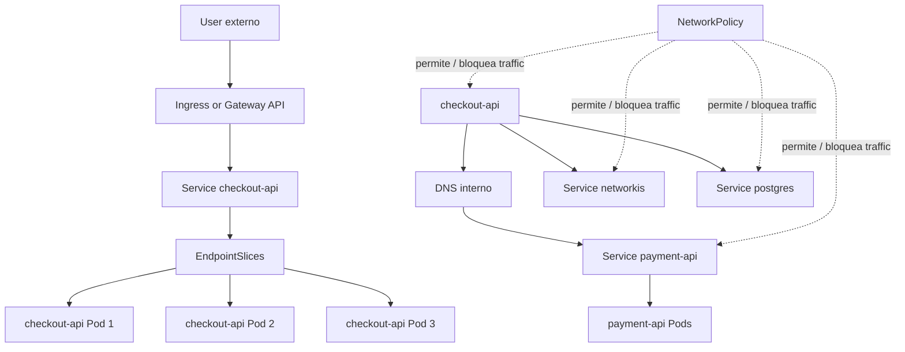

---

## 7.1. What you are going to learn and what not you are going to learn yet

You are going to learn:

- By what the IPs of Pods not son a interfaz estable
- What es the modelo basic of network of Kubernetes
- What es a Pod IP
- What es a Service
- What diferencia hay between `ClusterIP`, `NodePort`, `LoadBalancer` and `Headless Service`
- What son EndpointSlices
- What resuelve the DNS interno
- What es Ingress
- By what a Ingress needs a Ingress Controller
- What es Gateway API
- What diferencia conceptual hay between Ingress and Gateway API
- What son NetworkPolicies
- By what NetworkPolicy depende of the CNI
- How create a laboratorio realista with `frontend`, `checkout-api`, `payment-api`, `redis` and `postgres`
- How diagnosticar problemas of network with `kubectl`, `curl`, `nslookup`, `jq`, `yq` and Taskfile
Not vamos to profundizar yet in:

- TLS real with cert-manager
- Service mesh
- mTLS
- eBPF advanced
- Cilium advanced
- Multi-cluster networking
- ExternalDNS
- Cloud load balancers reales
- Gateway API advanced
- Ingress hardening
- Observability completa of network
That vendrá later or in rutas profesionales.

The regla pedagógica of the module será this:

```text
First, problem
Then mental contract
Then Kubernetes object
Then manifest
Then validation
Then troubleshooting
Then DevEx with Taskfile
```

---

## 7.2. The problema: the Pods son efímeros

Before of create a Service, you need to understand by what hace falta.

In the module 6 creaste a Deployment with varias réplicas of `checkout-api`.

That significa que ahora not tienes “the API”.

Tienes varios Pods que ejecutan the API.

Esos Pods pueden:

- Morir
- Recreatese
- Cambiar of IP
- Moverse to otro nodo
- Aparecer during a rollout
- Desaparecer during a rollback
- Not estar ready yet
- Ser reemplazados by a ReplicaSet nuevo
If `frontend` llama directamente to the IP of a Pod concreto of `checkout-api`, the sistema queda acoplado to a instancia efímera.

That es fragile.

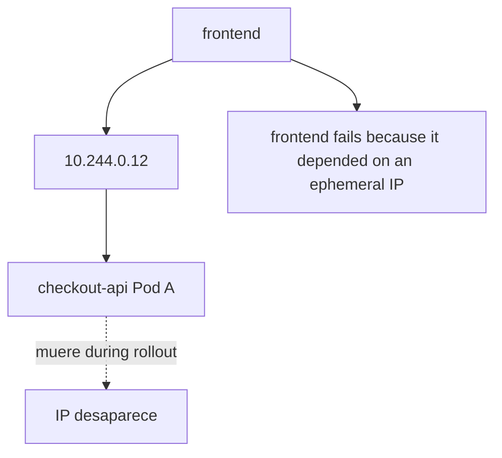

### Contrato mental

|Concept|What debes asumir|
|---|---|
|Pod|Es a instancia efímera|
|Pod IP|It can cambiar|
|Deployment|It can create and destruir Pods|
|Rollout|It can mezclar Pods antiguos and nuevos|
|Client|Should not depender of a Pod IP concreta|
|Service|Da a identidad estable delante of Pods|

### Ejemplo with `shop`

Queremos que:

```text
frontend → checkout-api
checkout-api → payment-api
checkout-api → redis
checkout-api → postgres
```

Not queremos que:

```text
frontend → 10.244.0.12
checkout-api → 10.244.0.23
checkout-api → 10.244.0.31
```

### DevEx of the bloque

Desde this module, the smoke test must empezar to validate comunicación to través of objetos Kubernetes, not only with `port-forward` directo to the Pod.

The objective of DevEx será pasar of esto:

```bash
kubectl port-forward pod/checkout-api -n shop 8080:8080
```

to esto:

```bash
kubectl port-forward service/checkout-api -n shop 8080:80
```

That cambio parece pequeño, but conceptualmente es enorme.

Already not apuntas to a instancia concreta. Apuntas to a identidad estable.

### Criterio of comprensión

Debes poder explicar:

> TO Pod es a instancia. A Service es a identidad estable for llegar to a conjunto of instancias.

---

## 7.3. Modelo basic of network of Kubernetes

Before of entrar in Services, you need to understand the modelo general.

Kubernetes needs a network where the Pods puedan comunicarse. For implementar that modelo, the cluster needs a plugin CNI compatible. The documentación oficial indica que se requiere a plugin CNI for implementar the modelo of network of Kubernetes. ([Kubernetes](https://kubernetes.io/docs/concepts/extend-kubernetes/compute-storage-net/network-plugins/ "Network Plugins"))

### What implica for the alumno

In kind, the cluster already viene with a configuration of network funcional for practicar.

Not you need install a CNI manualmente In this module.

But yes debes understand que:

- Kubernetes does not “inventa” the network only
- The CNI implementa conectividad of Pods
- Not all the CNIs implementan all the capacidades igual
- NetworkPolicy only funciona if the plugin of network the soporta
- The troubleshooting of network can involucrar Kubernetes, CNI, DNS, Services, selectors, Pods and policies
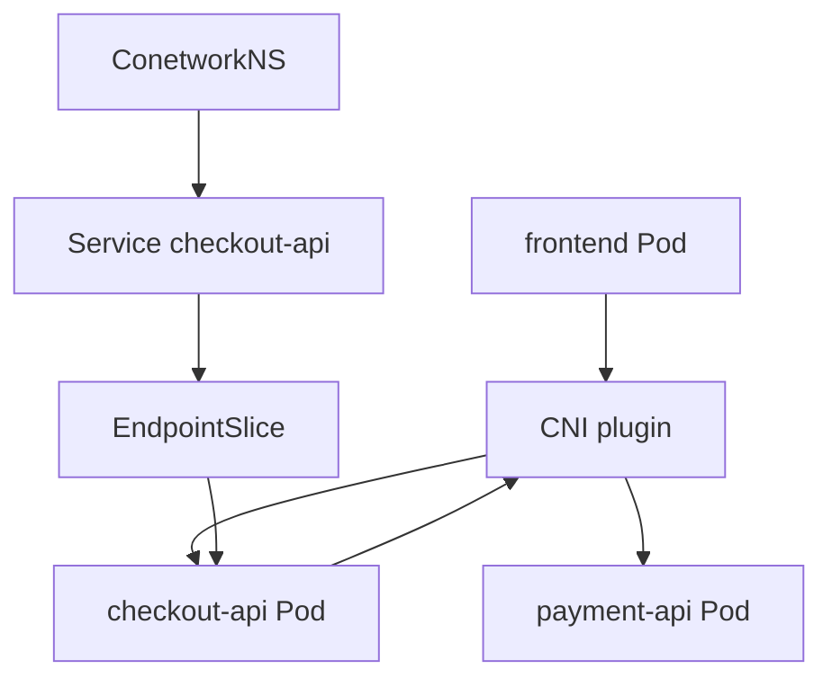

### Contrato mental

|Pieza|Pregunta que responde|
|---|---|
|Pod IP|¿Dónde está this instancia ahora?|
|CNI|¿How se conectan Pods in the network of the cluster?|
|Service|¿Cuál es the nombre estable for llegar to a grupo of Pods?|
|EndpointSlice|¿What Pods concretos están detrás of the Service?|
|DNS|¿How resuelvo nombres in vez of IPs?|
|NetworkPolicy|¿What traffic está permitido or bloqueado?|

### Criterio of comprensión

Debes poder explicar:

> Kubernetes networking is not a sola cosa. Es the colaboración between Pods, CNI, Services, EndpointSlices, DNS, kube-proxy or equivalente, and policies.

---

## 7.4. Service

### What problema resuelve

A Service proporciona a forma estable of acceder to a conjunto of Pods.

The documentación oficial define Service como a método for expose an application of network que runs como one or more Pods in the cluster. Also explica que the Services permiten que the frontend does not tenga que rastrear directamente the Pods backend. ([Kubernetes](https://kubernetes.io/docs/concepts/services-networking/service/ "Service"))

### Contrato mental

A Service responde to this pregunta:

> ¿How llamo to an application although sus Pods cambien?

A Service needs normalmente:

- A nombre
- A namespace
- A selector
- Unot or varios ports
- A tipo of Service
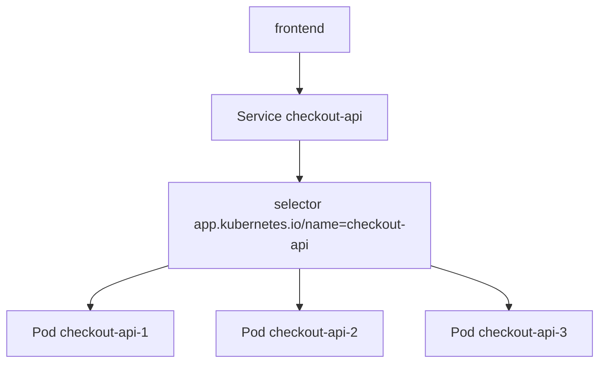

### Selector

The selector conecta the Service with Pods.

Ejemplo:

```yaml
selector:
  app.kubernetes.io/name: checkout-api
  app.kubernetes.io/component: api
```

Esto significa:

> This Service apunta to the Pods que tengan these labels.

### Ports

A Service tiene dos ideas importbefore:

```yaml
ports:
  - name: http
    port: 80
    targetPort: http
```

|Campo|Significado|
|---|---|
|`port`|Port expuesto by the Service|
|`targetPort`|Port of the container or nombre of port in the Pod|
|`name`|Nombre of the port of the Service|

In nuestro Deployment, the container tenía:

```yaml
ports:
  - name: http
    containerPort: 8080
```

That is why the Service can use:

```yaml
targetPort: http
```

Esto es more robusto que repetir `8080` in all partes.

### Manifest Service for `checkout-api`

Creates:

```text
kubernetes/03-service/checkout-api-service.yaml
```

Contenido:

```yaml
apiVersion: v1
kind: Service
metadata:
  name: checkout-api
  namespace: shop
  labels:
    app.kubernetes.io/name: checkout-api
    app.kubernetes.io/component: api
    app.kubernetes.io/part-of: shop
spec:
  type: ClusterIP
  selector:
    app.kubernetes.io/name: checkout-api
    app.kubernetes.io/component: api
  ports:
    - name: http
      port: 80
      targetPort: http
```

### Apply

```bash
kubectl apply -f kubernetes/03-service/checkout-api-service.yaml
```

### See

```bash
kubectl get svc -n shop
kubectl describe svc checkout-api -n shop
kubectl get endpointslices -n shop
```

### Validate with port-forward to the Service

```bash
kubectl port-forward service/checkout-api -n shop 8080:80
```

In otra terminal:

```bash
task smoke
```

### Criterio of comprensión

Debes poder explicar:

> A Service not ejecuta the application. Da a identidad estable and a forma of enrutar traffic hacia Pods seleccionados by labels.

---

## 7.5. Tipos of Service

Before of elegir a tipo, you need to explicar the problema que resuelve each uno.

Kubernetes soporta distintos tipos of Service for distintos tipos of exposición. The documentación oficial agrupa these concepts bajo Services, Load Balancing and Networking. ([Kubernetes](https://kubernetes.io/docs/concepts/services-networking/ "Services, Load Balancing, and Networking"))

### ClusterIP

`ClusterIP` expone the Service dentro of the cluster.

Es the tipo by defecto.

Sirve for comunicación interna:

```text
frontend → checkout-api
checkout-api → payment-api
checkout-api → redis
```

### NodePort

`NodePort` expone the Service in a port of each nodo.

Es útil for aprendizaje or casos concretos, but not suele ser the mecanismo final more limpio for producción.

### LoadBalancer

`LoadBalancer` pide a balanceador external to the proveedor of infraestructura.

In clusters cloud gestionados, esto suele create a load balancer real.

In kind not tendrás a load balancer cloud by defecto.

### Headless Service

A Headless Service not asigna ClusterIP.

It is used when quieres discovery directo of endpoints, especialmente in escenarios stateful or when you need controlar directamente the instancias.

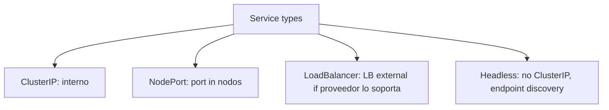

### Contrato mental

|Tipo|Cuándo usarlo|
|---|---|
|ClusterIP|Comunicación interna between workloads|
|NodePort|Exposición simple by nodo, aprendizaje or casos concretos|
|LoadBalancer|Input externa gestionada by infraestructura|
|Headless|Discovery directo of Pods, frecuente in stateful|

### For this module

Usaremos `ClusterIP` como tipo principal because queremos enseñar comunicación interna and composición of services.

Ingress and Gateway API se verán after como input HTTP desde fuera.

### Criterio of comprensión

Debes poder explicar:

> The tipo of Service not se elige by costumbre. Se elige by the tipo of exposición que you need.

---

## 7.6. EndpointSlices

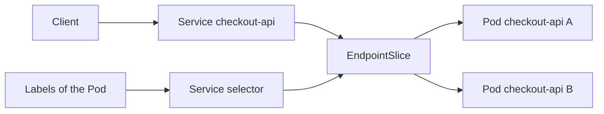

### What problema resuelven

A Service needs saber what Pods están detrás.

That información se representa mediante EndpointSlices.

The documentación oficial indica que EndpointSlice es the mecanismo que Kubernetes uses for que a Service escale to muchos backends and for update eficientemente the lista of endpoints sanos. Also indica que normalmente the EndpointSlices están asociados to a Service and representan Pods backend. ([Kubernetes](https://kubernetes.io/docs/concepts/services-networking/endpoint-slices/ "EndpointSlices"))

### Contrato mental

|Pieza|Papel|
|---|---|
|Service|Nombre estable and port|
|Selector|Regla for encontrar Pods|
|EndpointSlice|Lista of endpoints concretos detrás of the Service|
|Pod|Instancia real que recibe traffic|

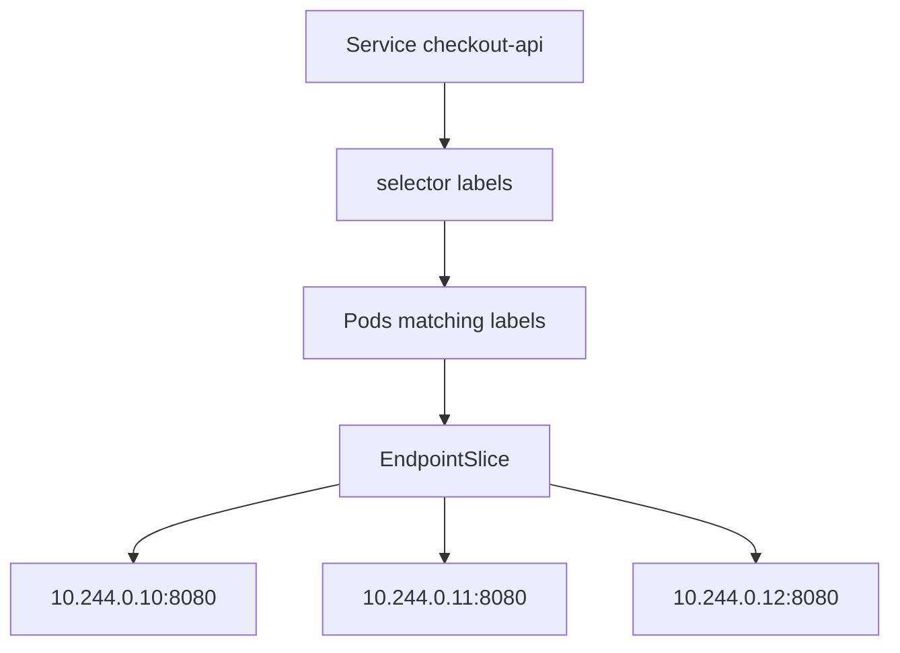

### Commands

```bash
kubectl get endpointslices -n shop
kubectl describe endpointslice -n shop -l kubernetes.io/service-name=checkout-api
kubectl get endpointslices -n shop -l kubernetes.io/service-name=checkout-api -o yaml
```

### Inspección with `jq`

```bash
kubectl get endpointslices -n shop -l kubernetes.io/service-name=checkout-api -o json \
  | jq '.items[].endpoints'
```

### Failure lab: selector incorrecto

If the selector of the Service not coincide with the labels of the Pods, the Service existirá, but not tendrá endpoints útiles.

Copia the Service:

```bash
cp kubernetes/03-service/checkout-api-service.yaml kubernetes/03-service/checkout-api-service-bad-selector.yaml
```

Cambia the nombre:

```bash
yq -i '.metadata.name = "checkout-api-bad-selector"' kubernetes/03-service/checkout-api-service-bad-selector.yaml
```

Rompe the selector:

```bash
yq -i '.spec.selector."app.kubernetes.io/name" = "does-not-exist"' kubernetes/03-service/checkout-api-service-bad-selector.yaml
```

Aplica:

```bash
kubectl apply -f kubernetes/03-service/checkout-api-service-bad-selector.yaml
```

Observa:

```bash
kubectl describe svc checkout-api-bad-selector -n shop
kubectl get endpointslices -n shop -l kubernetes.io/service-name=checkout-api-bad-selector
```

Limpia:

```bash
kubectl delete -f kubernetes/03-service/checkout-api-service-bad-selector.yaml --ignore-not-found
```

### Criterio of comprensión

Debes poder explicar:

> If a Service not tiene endpoints, normalmente the problema está in selectors, labels, readiness or Pods inexistentes.

---

## 7.7. DNS interno

### What problema resuelve

Not queremos que the applications llamen to Services by IP.

Queremos que usen nombres.

Kubernetes creates registros DNS for Services and Pods. The documentación oficial explica que the workloads pueden descubrir Services usando DNS, and que the containers pueden buscar Services by nombre in vez of IP. ([Kubernetes](https://kubernetes.io/docs/concepts/services-networking/dns-pod-service/ "DNS for Services and Pods"))

### Nombre corto dentro of the same namespace

Desde a Pod in namespace `shop`, you can llamar to:

```text
http://checkout-api
```

### Nombre with namespace

Desde otro namespace:

```text
http://checkout-api.shop
```

### Nombre completo

```text
checkout-api.shop.svc.cluster.local
```

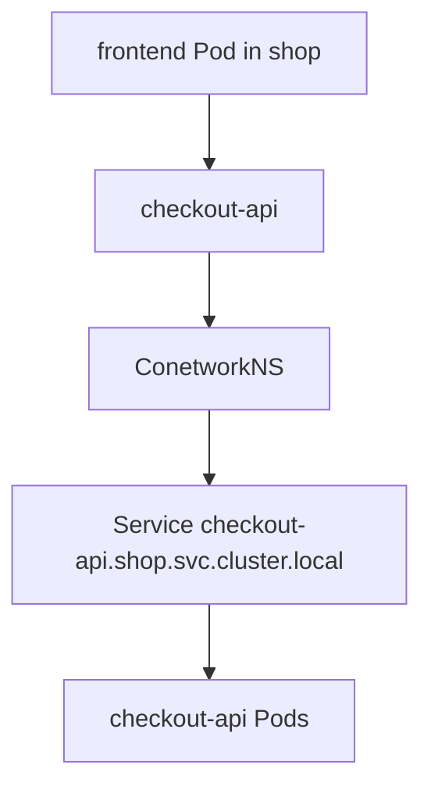

### Create Pod of diagnóstico DNS

Creates:

```text
kubernetes/09-debug/dnsutils.yaml
```

Contenido:

```yaml
apiVersion: v1
kind: Pod
metadata:
  name: dnsutils
  namespace: shop
  labels:
    app.kubernetes.io/name: dnsutils
    app.kubernetes.io/component: debug
    app.kubernetes.io/part-of: shop
spec:
  restartPolicy: Never
  containers:
    - name: dnsutils
      image: registry.k8s.io/e2e-test-images/jessie-dnsutils:1.3
      command:
        - sleep
        - "3600"
```

The documentación oficial of debugging of DNS uses a Pod `dnsutils` for verify DNS resolution dentro of the cluster. ([Kubernetes](https://kubernetes.io/docs/tasks/administer-cluster/dns-debugging-resolution/ "Debugging DNS Resolution"))

Apply:

```bash
kubectl apply -f kubernetes/09-debug/dnsutils.yaml
```

Validate DNS:

```bash
kubectl exec -n shop dnsutils -- nslookup checkout-api
kubectl exec -n shop dnsutils -- nslookup checkout-api.shop
kubectl exec -n shop dnsutils -- nslookup checkout-api.shop.svc.cluster.local
```

Validate HTTP with `wget`:

```bash
kubectl exec -n shop dnsutils -- wget -qO- http://checkout-api/health
```

### Criterio of comprensión

Debes poder explicar:

> DNS internal permite que the workloads llamen to Services by nombres estables in vez of IPs efímeras.

---

## 7.8. Laboratorio base of networking for `shop`

Before of hablar of Ingress, Gateway or NetworkPolicy, necesitamos a sistema minimum with varias piezas.

Usaremos:

- `checkout-api`
- `payment-api`
- `redis`
- `postgres`
- `dnsutils`
For not complicar demasiado the module, `payment-api`, `redis` and `postgres` pueden ser workloads sencillos. Not buscamos yet persistencia real ni lógica of negocio completa.

### Objective of the laboratorio

Queremos poder validate:

```text
dnsutils → checkout-api Service
dnsutils → payment-api Service
checkout-api → variables de environment con nombres internos
NetworkPolicy → allow or block traffic
```

### `payment-api` Deployment

Creates:

```text
kubernetes/02-deployment/payment-api-deployment.yaml
```

Contenido:

```yaml
apiVersion: apps/v1
kind: Deployment
metadata:
  name: payment-api
  namespace: shop
  labels:
    app.kubernetes.io/name: payment-api
    app.kubernetes.io/component: api
    app.kubernetes.io/part-of: shop
spec:
  replicas: 2
  selector:
    matchLabels:
      app.kubernetes.io/name: payment-api
      app.kubernetes.io/component: api
  template:
    metadata:
      labels:
        app.kubernetes.io/name: payment-api
        app.kubernetes.io/component: api
        app.kubernetes.io/part-of: shop
    spec:
      containers:
        - name: payment-api
          image: nginx:1.27-alpine
          ports:
            - name: http
              containerPort: 80
          resources:
            requests:
              cpu: 50m
              memory: 64Mi
            limits:
              cpu: 100m
              memory: 128Mi
```

### `payment-api` Service

Creates:

```text
kubernetes/03-service/payment-api-service.yaml
```

Contenido:

```yaml
apiVersion: v1
kind: Service
metadata:
  name: payment-api
  namespace: shop
  labels:
    app.kubernetes.io/name: payment-api
    app.kubernetes.io/component: api
    app.kubernetes.io/part-of: shop
spec:
  type: ClusterIP
  selector:
    app.kubernetes.io/name: payment-api
    app.kubernetes.io/component: api
  ports:
    - name: http
      port: 80
      targetPort: http
```

### `redis` Deployment and Service

Creates:

```text
kubernetes/02-deployment/redis-deployment.yaml
```

```yaml
apiVersion: apps/v1
kind: Deployment
metadata:
  name: redis
  namespace: shop
  labels:
    app.kubernetes.io/name: redis
    app.kubernetes.io/component: cache
    app.kubernetes.io/part-of: shop
spec:
  replicas: 1
  selector:
    matchLabels:
      app.kubernetes.io/name: redis
      app.kubernetes.io/component: cache
  template:
    metadata:
      labels:
        app.kubernetes.io/name: redis
        app.kubernetes.io/component: cache
        app.kubernetes.io/part-of: shop
    spec:
      containers:
        - name: redis
          image: redis:7-alpine
          ports:
            - name: redis
              containerPort: 6379
          resources:
            requests:
              cpu: 50m
              memory: 64Mi
            limits:
              cpu: 200m
              memory: 256Mi
```

Creates:

```text
kubernetes/03-service/redis-service.yaml
```

```yaml
apiVersion: v1
kind: Service
metadata:
  name: redis
  namespace: shop
  labels:
    app.kubernetes.io/name: redis
    app.kubernetes.io/component: cache
    app.kubernetes.io/part-of: shop
spec:
  type: ClusterIP
  selector:
    app.kubernetes.io/name: redis
    app.kubernetes.io/component: cache
  ports:
    - name: redis
      port: 6379
      targetPort: redis
```

### Apply laboratorio

```bash
kubectl apply -f kubernetes/02-deployment/payment-api-deployment.yaml
kubectl apply -f kubernetes/03-service/payment-api-service.yaml
kubectl apply -f kubernetes/02-deployment/redis-deployment.yaml
kubectl apply -f kubernetes/03-service/redis-service.yaml
kubectl apply -f kubernetes/09-debug/dnsutils.yaml
```

### Validate

```bash
kubectl get deploy -n shop
kubectl get svc -n shop
kubectl get endpointslices -n shop
kubectl exec -n shop dnsutils -- nslookup checkout-api
kubectl exec -n shop dnsutils -- nslookup payment-api
kubectl exec -n shop dnsutils -- wget -qO- http://payment-api/
```

### Criterio of comprensión

Debes poder explicar:

> The laboratorio of networking needs varios workloads because the problema of network aparece when hay comunicación between componentes, not when only exists a API aislada.

---

## 7.9. Ingress

### What problema resuelve

A Service `ClusterIP` sirve for comunicación interna.

But a user external does not entra to the cluster llamando directamente to a ClusterIP.

For input HTTP/HTTPS you can use Ingress.

The documentación oficial define Ingress como a objeto API que gestiona acceso external to Services dentro of the cluster, normalmente HTTP. Also explica que Ingress can proporcionar load balancing, terminación TLS and virtual hosting basado in nombres. ([Kubernetes](https://kubernetes.io/docs/concepts/services-networking/service/ "Service"))

### Ingress minimum for CKAD

Ingress expone services HTTP or HTTPS usando reglas.

A Ingress not funciona only.

Needs a Ingress Controller instalado in the cluster.

### Manifest minimum

```yaml
apiVersion: networking.k8s.io/v1
kind: Ingress
metadata:
  name: checkout-api
  namespace: shop
spec:
  rules:
    - host: checkout.local
      http:
        paths:
          - path: /
            pathType: Prefix
            backend:
              service:
                name: checkout-api
                port:
                  number: 80
```

### Validate

```bash
kubectl get ingress -n shop
kubectl describe ingress checkout-api -n shop
kubectl get svc -n shop
kubectl get endpointslice -n shop
```

### Probar localmente

If the local environment uses a Ingress Controller compatible, you can probar with:

```bash
curl -H "Host: checkout.local" http://localhost/
```

### Errores frecuentes

| Síntoma | Possible causa |
|---|---|
| Ingress exists but not responde | Not hay Ingress Controller |
| 404 | Host or path not coincide |
| 503 | Service without endpoints |
| Timeout | Controller not expuesto or network local bad configurada |
| Backend not encontrado | Nombre or port of the Service incorrecto |

### Criterio of comprensión

Debes poder explicar:

> Ingress not envía traffic to Pods directamente. Ingress enruta hacia Services, and the Services seleccionan Pods mediante EndpointSlices.
### Importante: Ingress needs controller

Create a recurso Ingress not basta.

You need a Ingress Controller que implemente that recurso.

The documentación oficial separa Ingress of Ingress Controllers precisamente because the objeto Ingress es a declaración and the controller es quien the materializa. ([Kubernetes](https://kubernetes.io/docs/concepts/services-networking/service/ "Service"))

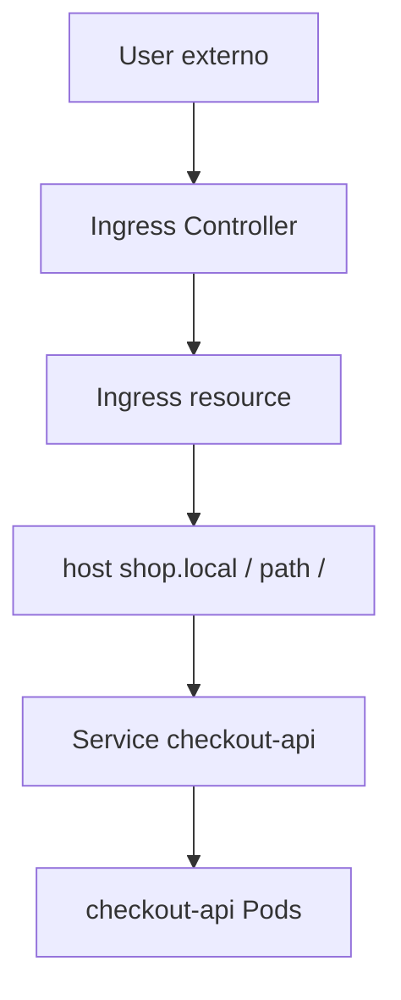

### Contrato mental

|Pieza|Papel|
|---|---|
|Ingress|Declara reglas HTTP|
|Ingress Controller|Implementa esas reglas|
|Service|Backend interno|
|Pod|Instancia real|
|DNS external or `/etc/hosts`|Hace que the nombre llegue to the controller|

### Manifest of ejemplo

This manifest es válido como ejemplo, but not funcionará if not tienes Ingress Controller instalado.

Creates:

```text
kubernetes/04-ingress/checkout-api-ingress.yaml
```

Contenido:

```yaml
apiVersion: networking.k8s.io/v1
kind: Ingress
metadata:
  name: checkout-api
  namespace: shop
  labels:
    app.kubernetes.io/name: checkout-api
    app.kubernetes.io/component: api
    app.kubernetes.io/part-of: shop
spec:
  rules:
    - host: shop.local
      http:
        paths:
          - path: /checkout
            pathType: Prefix
            backend:
              service:
                name: checkout-api
                port:
                  number: 80
          - path: /health
            pathType: Prefix
            backend:
              service:
                name: checkout-api
                port:
                  number: 80
          - path: /ready
            pathType: Prefix
            backend:
              service:
                name: checkout-api
                port:
                  number: 80
```

### For this module

Not haremos of Ingress the practice principal obligatoria because install a Ingress Controller in kind añade fricción.

Yes debes understand the modelo.

In a practice advanced you can install `ingress-nginx` for kind, but that pertenece more to a laboratorio adicional.

### Criterio of comprensión

Debes poder explicar:

> Ingress declara reglas of input HTTP, but not funciona by yes only. Needs a Ingress Controller.

---

## 7.10. Gateway API

### What problema resuelve

Gateway API es the modelo more modernot and expresivo for routing and input of traffic in Kubernetes.

The documentación oficial of Kubernetes explica que Gateway API es a familia of API kinds for aprovisionamiento dinámico of infraestructura and routing advanced, mediante a mecanismo extensible, orientado to roles and consciente of the protocolo. ([Kubernetes](https://kubernetes.io/docs/concepts/services-networking/gateway/ "Gateway API"))

The documentación oficial of the proyecto Gateway API lo presenta como a proyecto oficial of Kubernetes centrado in routing L4 and L7, and como the siguiente generación of APIs of Ingress, Load Balancing and Service Mesh. Also explica que su modelo está diseñado alnetworkedor of roles and Resources separados. ([Kubernetes Gateway API](https://gateway-api.sigs.k8s.io/ "Kubernetes Gateway API: Introduction"))

### By what aparece Gateway API

Ingress es útil, but tiene límites:

- Modelo pequeño
- Extensibilidad frecuente vía annotations
- Separación of responsabilidades limitada
- Less expresivo for routing advanced
- Diferencias between controllers
Gateway API intenta mejorar esto separando roles:

- Infraestructura of gateway
- Reglas of routing
- Backends
- Responsabilidades between platform and application teams
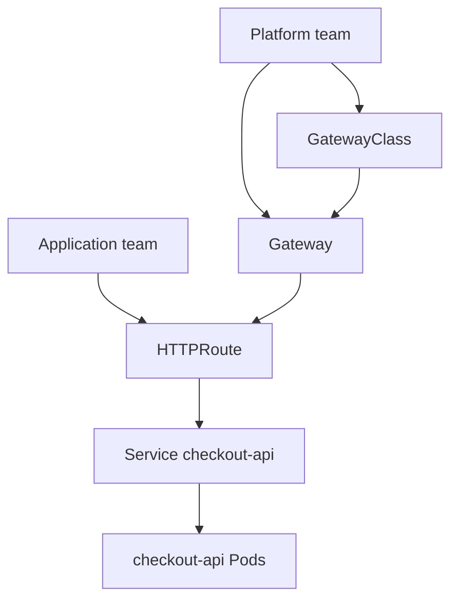

### Contrato mental

|Recurso|Responsable típico|What declara|
|---|---|---|
|GatewayClass|Platform team|Tipo of gateway disponible|
|Gateway|Platform team|Punto of input and listeners|
|HTTPRoute|App team|Reglas HTTP hacia Services|
|Service|App team|Backend interno|
|Pod|Workload|Instancia real|

### Manifest conceptual of HTTPRoute

This manifest requiere que Gateway API esté instalado and que exista a Gateway compatible.

```yaml
apiVersion: gateway.networking.k8s.io/v1
kind: HTTPRoute
metadata:
  name: checkout-api
  namespace: shop
spec:
  parentRefs:
    - name: shop-gateway
  hostnames:
    - shop.local
  rules:
    - matches:
        - path:
            type: PathPrefix
            value: /checkout
      backendRefs:
        - name: checkout-api
          port: 80
```

### For this module

Gateway API se explica como modelo modernot and se deja como practice opcional, because in kind requiere install CRDs and a controller compatible.

The prioridad obligatoria of the module será understand Services, DNS, EndpointSlices and NetworkPolicy.

### Criterio of comprensión

Debes poder explicar:

> Gateway API is not only “Ingress nuevo”. Es a modelo more expresivo and orientado to roles for input and routing.

---

## 7.11. NetworkPolicy

### What problema resuelve

By defecto, muchos clusters permiten comunicación amplia between Pods.

If quieres controlar what Pods pueden hablar with what Pods, you need NetworkPolicy.

The documentación oficial explica que NetworkPolicies permiten especificar reglas of traffic to nivel IP or port, tanto dentro of the cluster como between Pods and the exterior. Also advierte que the cluster must use a plugin of network que soporte enforcement of NetworkPolicy. ([Kubernetes](https://kubernetes.io/docs/concepts/services-networking/network-policies/ "Network Policies"))

### Contrato mental

A NetworkPolicy responde to this pregunta:

> ¿What traffic está permitido for the Pods seleccionados?

Puntos clave:

- Selecciona Pods with `podSelector`
- It can definir reglas of ingress
- It can definir reglas of egress
- If not hay NetworkPolicy que seleccione a Pod, normalmente that Pod not está isolated by NetworkPolicy
- When a policy selecciona a Pod for ingress or egress, the traffic permitido queda definido by the reglas
- Not funciona if the CNI not implementa NetworkPolicy
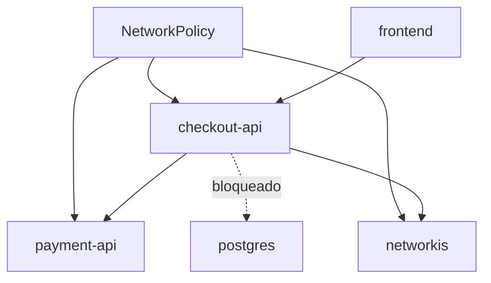

### Diseño for `shop`

Queremos a política progresiva, not a política gigante desde the inicio.

First:

1. Create a política default deny for ingress
2. Permitir traffic hacia `checkout-api` desde Pods debug or frontend
3. Permitir traffic hacia `payment-api` desde `checkout-api`
4. Permitir traffic hacia `redis` desde `checkout-api`
### Importante for kind

kind can not apply NetworkPolicy según the CNI usado in tu cluster local.

If tu cluster not uses a CNI with soporte of NetworkPolicy, the manifiestos se aceptarán, but not tendrán efecto real of bloqueo.

Esto es a limitación importante que debes explicar to the learner before of the practice.

### Criterio of comprensión

Debes poder explicar:

> NetworkPolicy es declarativa, but su enforcement depende of the CNI. If the CNI not the soporta, apply YAML not bloquea traffic.

---

## 7.12. NetworkPolicy: default deny ingress

### What problema resuelve

A default deny policy cambia the starting point.

In vez of permitir everything by defecto for the Pods seleccionados, dices:

> For these Pods, not se permite traffic entrante salvo que otra policy lo permita.

### Manifest

Creates:

```text
kubernetes/10-networkpolicy/default-deny-ingress.yaml
```

Contenido:

```yaml
apiVersion: networking.k8s.io/v1
kind: NetworkPolicy
metadata:
  name: default-deny-ingress
  namespace: shop
spec:
  podSelector: {}
  policyTypes:
    - Ingress
```

### What it means

|Campo|Significado|
|---|---|
|`podSelector: {}`|Selecciona all the Pods of the namespace|
|`policyTypes: Ingress`|Aplica aislamiento of traffic entrante|
|Without reglas `ingress`|Not permite ingress salvo otras policies|

### Apply

```bash
kubectl apply -f kubernetes/10-networkpolicy/default-deny-ingress.yaml
```

### See

```bash
kubectl get networkpolicy -n shop
kubectl describe networkpolicy default-deny-ingress -n shop
```

### Criterio of comprensión

Debes poder explicar:

> A default deny ingress policy not dice quién can entrar. Dice que nadie can entrar salvo que otra policy lo permita.

---

## 7.13. NetworkPolicy: permitir traffic hacia `checkout-api`

### What problema resuelve

After of cerrar by defecto, necesitamos abrir lo minimum necessary.

For the laboratorio, permitiremos que the Pod `dnsutils` pueda llamar to `checkout-api`.

### Manifest

Creates:

```text
kubernetes/10-networkpolicy/allow-dnsutils-to-checkout-api.yaml
```

Contenido:

```yaml
apiVersion: networking.k8s.io/v1
kind: NetworkPolicy
metadata:
  name: allow-dnsutils-to-checkout-api
  namespace: shop
spec:
  podSelector:
    matchLabels:
      app.kubernetes.io/name: checkout-api
      app.kubernetes.io/component: api
  policyTypes:
    - Ingress
  ingress:
    - from:
        - podSelector:
            matchLabels:
              app.kubernetes.io/name: dnsutils
              app.kubernetes.io/component: debug
      ports:
        - protocol: TCP
          port: 8080
```

### Validate

If tu CNI soporta NetworkPolicy:

```bash
kubectl exec -n shop dnsutils -- wget -qO- http://checkout-api/health
```

Should funcionar.

If tests desde otro Pod not permitido, should bloquearse.

### Criterio of comprensión

Debes poder explicar:

> NetworkPolicy permite expresar comunicación by identidad of Pods and ports, not by IPs fijas.

---

## 7.14. NetworkPolicy: permitir `checkout-api` hacia `payment-api`

### What problema resuelve

Queremos que `checkout-api` pueda hablar with `payment-api`, but not queremos abrir `payment-api` to everything the namespace.

### Manifest

Creates:

```text
kubernetes/10-networkpolicy/allow-checkout-to-payment-api.yaml
```

Contenido:

```yaml
apiVersion: networking.k8s.io/v1
kind: NetworkPolicy
metadata:
  name: allow-checkout-to-payment-api
  namespace: shop
spec:
  podSelector:
    matchLabels:
      app.kubernetes.io/name: payment-api
      app.kubernetes.io/component: api
  policyTypes:
    - Ingress
  ingress:
    - from:
        - podSelector:
            matchLabels:
              app.kubernetes.io/name: checkout-api
              app.kubernetes.io/component: api
      ports:
        - protocol: TCP
          port: 80
```

### What enseña

This policy selecciona `payment-api`.

Then permite ingress desde Pods with labels of `checkout-api`.

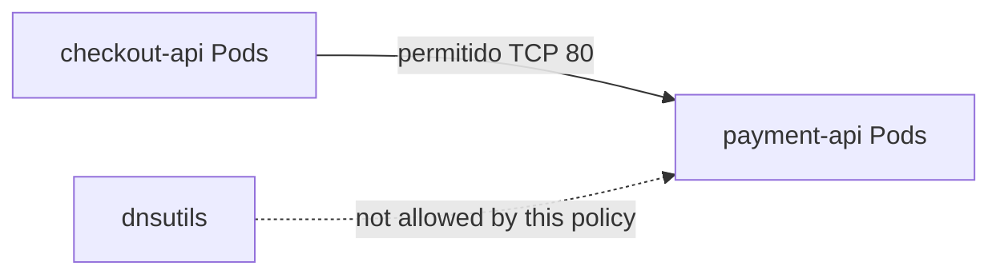

### Criterio of comprensión

Debes poder explicar:

> In NetworkPolicy, `podSelector` selecciona the Pods protegidos by the policy. The reglas `from` or `to` definen quién can comunicarse.

---

## 7.15. Troubleshooting progresivo of networking

Before of añadir more YAML, you need to enseñar how diagnosticar.

The secuencia must ser progresiva.

Not empieces by the CNI.

Empieza by lo more barato and visible.

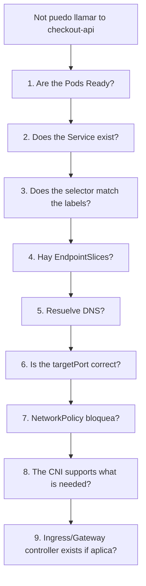

### Paso 1. Pods

```bash
kubectl get pods -n shop -o wide
kubectl get pods -n shop -l app.kubernetes.io/name=checkout-api
```

Pregunta:

> ¿Hay Pods? ¿Están Ready?

### Paso 2. Service

```bash
kubectl get svc -n shop
kubectl describe svc checkout-api -n shop
```

Pregunta:

> ¿Exists the Service? ¿Tiene the port esperado?

### Paso 3. Selector and labels

```bash
kubectl get svc checkout-api -n shop -o json | jq '.spec.selector'
kubectl get pods -n shop --show-labels
```

Pregunta:

> ¿The selector of the Service coincide with labels reales of Pods?

### Paso 4. EndpointSlices

```bash
kubectl get endpointslices -n shop -l kubernetes.io/service-name=checkout-api
kubectl describe endpointslice -n shop -l kubernetes.io/service-name=checkout-api
```

Pregunta:

> ¿Hay endpoints detrás of the Service?

### Paso 5. DNS

```bash
kubectl exec -n shop dnsutils -- nslookup checkout-api
kubectl exec -n shop dnsutils -- nslookup checkout-api.shop.svc.cluster.local
```

Pregunta:

> ¿The nombre resuelve?

### Paso 6. HTTP desde dentro

```bash
kubectl exec -n shop dnsutils -- wget -qO- http://checkout-api/health
```

Pregunta:

> ¿The Service responde desde dentro of the cluster?

### Paso 7. NetworkPolicy

```bash
kubectl get networkpolicy -n shop
kubectl describe networkpolicy -n shop
```

Pregunta:

> ¿Hay alguna policy aislando the traffic?

### Paso 8. Events

```bash
kubectl get events -n shop --sort-by=.metadata.creationTimestamp
```

Pregunta:

> ¿Hay signals of the sistema?

### Criterio of comprensión

Debes poder explicar:

> Troubleshooting of networking in Kubernetes must avanzar desde Pods and Services hacia DNS, EndpointSlices, NetworkPolicy, CNI and controllers. Saltar directamente to the CNI suele ser perder tiempo.

---

## 7.16. Taskfile of the module 7

Añade these tasks to the `Taskfile.yml`.

```yaml
  k8s:service:apply:
    desc: Apply checkout-api Service
    cmds:
      - kubectl apply -f kubernetes/03-service/checkout-api-service.yaml

  k8s:service:apply:all:
    desc: Apply all shop Services
    cmds:
      - kubectl apply -f kubernetes/03-service/checkout-api-service.yaml
      - kubectl apply -f kubernetes/03-service/payment-api-service.yaml
      - kubectl apply -f kubernetes/03-service/redis-service.yaml

  k8s:service:status:
    desc: Show Services and EndpointSlices
    cmds:
      - kubectl get svc -n {{.NAMESPACE}}
      - kubectl get endpointslices -n {{.NAMESPACE}}

  k8s:service:describe:checkout:
    desc: Describe checkout-api Service
    cmds:
      - kubectl describe svc checkout-api -n {{.NAMESPACE}}

  k8s:endpoints:checkout:
    desc: Show checkout-api EndpointSlices
    cmds:
      - kubectl get endpointslices -n {{.NAMESPACE}} -l kubernetes.io/service-name=checkout-api -o yaml

  k8s:endpoints:checkout:json:
    desc: Show checkout-api endpoints as JSON summary
    cmds:
      - kubectl get endpointslices -n {{.NAMESPACE}} -l kubernetes.io/service-name=checkout-api -o json | jq '.items[].endpoints'

  k8s:debug:dns:apply:
    desc: Apply dnsutils debug Pod
    cmds:
      - kubectl apply -f kubernetes/09-debug/dnsutils.yaml

  k8s:debug:dns:delete:
    desc: Delete dnsutils debug Pod
    cmds:
      - kubectl delete -f kubernetes/09-debug/dnsutils.yaml --ignore-not-found

  k8s:debug:dns:checkout:
    desc: Resolve checkout-api DNS names
    cmds:
      - kubectl exec -n {{.NAMESPACE}} dnsutils -- nslookup checkout-api
      - kubectl exec -n {{.NAMESPACE}} dnsutils -- nslookup checkout-api.{{.NAMESPACE}}
      - kubectl exec -n {{.NAMESPACE}} dnsutils -- nslookup checkout-api.{{.NAMESPACE}}.svc.cluster.local

  k8s:debug:http:checkout:
    desc: Call checkout-api from dnsutils Pod
    cmds:
      - kubectl exec -n {{.NAMESPACE}} dnsutils -- wget -qO- http://checkout-api/health
      - kubectl exec -n {{.NAMESPACE}} dnsutils -- wget -qO- http://checkout-api/ready
      - kubectl exec -n {{.NAMESPACE}} dnsutils -- wget -qO- http://checkout-api/checkout

  k8s:network:shop:apply:
    desc: Apply shop networking lab workloads and services
    cmds:
      - kubectl apply -f kubernetes/02-deployment/payment-api-deployment.yaml
      - kubectl apply -f kubernetes/03-service/payment-api-service.yaml
      - kubectl apply -f kubernetes/02-deployment/redis-deployment.yaml
      - kubectl apply -f kubernetes/03-service/redis-service.yaml
      - kubectl apply -f kubernetes/09-debug/dnsutils.yaml

  k8s:network:shop:status:
    desc: Show shop networking lab status
    cmds:
      - kubectl get deploy -n {{.NAMESPACE}}
      - kubectl get pods -n {{.NAMESPACE}} -o wide
      - kubectl get svc -n {{.NAMESPACE}}
      - kubectl get endpointslices -n {{.NAMESPACE}}

  k8s:network:troubleshoot:checkout:
    desc: Troubleshoot checkout-api networking progressively
    cmds:
      - kubectl get pods -n {{.NAMESPACE}} -l app.kubernetes.io/name=checkout-api -o wide
      - kubectl get svc checkout-api -n {{.NAMESPACE}} -o yaml
      - kubectl get svc checkout-api -n {{.NAMESPACE}} -o json | jq '.spec.selector'
      - kubectl get pods -n {{.NAMESPACE}} --show-labels
      - kubectl get endpointslices -n {{.NAMESPACE}} -l kubernetes.io/service-name=checkout-api
      - kubectl exec -n {{.NAMESPACE}} dnsutils -- nslookup checkout-api || true
      - kubectl exec -n {{.NAMESPACE}} dnsutils -- wget -qO- http://checkout-api/health || true
      - kubectl get networkpolicy -n {{.NAMESPACE}} || true
      - kubectl get events -n {{.NAMESPACE}} --sort-by=.metadata.creationTimestamp

  k8s:failure:service:bad-selector:apply:
    desc: Apply checkout-api Service with wrong selector
    cmds:
      - cp kubernetes/03-service/checkout-api-service.yaml kubernetes/03-service/checkout-api-service-bad-selector.yaml
      - yq -i '.metadata.name = "checkout-api-bad-selector"' kubernetes/03-service/checkout-api-service-bad-selector.yaml
      - yq -i '.spec.selector."app.kubernetes.io/name" = "does-not-exist"' kubernetes/03-service/checkout-api-service-bad-selector.yaml
      - kubectl apply -f kubernetes/03-service/checkout-api-service-bad-selector.yaml

  k8s:failure:service:bad-selector:inspect:
    desc: Inspect Service with wrong selector
    cmds:
      - kubectl describe svc checkout-api-bad-selector -n {{.NAMESPACE}} || true
      - kubectl get endpointslices -n {{.NAMESPACE}} -l kubernetes.io/service-name=checkout-api-bad-selector || true

  k8s:failure:service:bad-selector:delete:
    desc: Delete Service with wrong selector
    cmds:
      - kubectl delete -f kubernetes/03-service/checkout-api-service-bad-selector.yaml --ignore-not-found || true

  k8s:networkpolicy:apply:
    desc: Apply NetworkPolicies
    cmds:
      - kubectl apply -f kubernetes/10-networkpolicy/default-deny-ingress.yaml
      - kubectl apply -f kubernetes/10-networkpolicy/allow-dnsutils-to-checkout-api.yaml
      - kubectl apply -f kubernetes/10-networkpolicy/allow-checkout-to-payment-api.yaml

  k8s:networkpolicy:status:
    desc: Show NetworkPolicies
    cmds:
      - kubectl get networkpolicy -n {{.NAMESPACE}}
      - kubectl describe networkpolicy -n {{.NAMESPACE}}

  k8s:networkpolicy:delete:
    desc: Delete NetworkPolicies
    cmds:
      - kubectl delete -f kubernetes/10-networkpolicy/allow-checkout-to-payment-api.yaml --ignore-not-found
      - kubectl delete -f kubernetes/10-networkpolicy/allow-dnsutils-to-checkout-api.yaml --ignore-not-found
      - kubectl delete -f kubernetes/10-networkpolicy/default-deny-ingress.yaml --ignore-not-found

  k8s:service:port-forward:
    desc: Forward local port to checkout-api Service
    cmds:
      - kubectl port-forward service/checkout-api -n {{.NAMESPACE}} {{.PORT}}:80
```

### Criterio DevEx

Debes poder explicar:

> A good DevEx of networking not consiste in tener commands for apply YAML. Consiste in tener commands for validate Services, selectors, EndpointSlices, DNS, HTTP interno, policies and troubleshooting progresivo.

---

## 7.17. Practice principal of the module

### Objective

Convertir `checkout-api` in an application accesible mediante Service, validate DNS interno, añadir dependencies of laboratorio and practicar troubleshooting progresivo.

### Resultado esperado

To the final you should tener:

```text
kubernetes-learning-lab/
  kubernetes/
    02-deployment/
      deployment.yaml
      payment-api-deployment.yaml
      redis-deployment.yaml
    03-service/
      checkout-api-service.yaml
      payment-api-service.yaml
      redis-service.yaml
      checkout-api-service-bad-selector.yaml
    04-ingress/
      checkout-api-ingress.yaml
    09-debug/
      dnsutils.yaml
    10-networkpolicy/
      default-deny-ingress.yaml
      allow-dnsutils-to-checkout-api.yaml
      allow-checkout-to-payment-api.yaml
```

### Paso 1. Preparar cluster and workloads base

```bash
task k8s:kind:create
task k8s:image:prepare
task k8s:namespace:apply
task k8s:deployment:apply
task k8s:deployment:status
```

### Paso 2. Apply Service of `checkout-api`

```bash
task k8s:service:apply
task k8s:service:status
task k8s:service:describe:checkout
task k8s:endpoints:checkout:json
```

### Paso 3. Validate Service with port-forward

In a terminal:

```bash
task k8s:service:port-forward
```

In otra:

```bash
task smoke
```

### Paso 4. Apply laboratorio of network

```bash
task k8s:network:shop:apply
task k8s:network:shop:status
```

### Paso 5. Validate DNS interno

```bash
task k8s:debug:dns:checkout
```

### Paso 6. Validate HTTP interno

```bash
task k8s:debug:http:checkout
```

### Paso 7. Provocar Service with selector incorrecto

```bash
task k8s:failure:service:bad-selector:apply
task k8s:failure:service:bad-selector:inspect
task k8s:failure:service:bad-selector:delete
```

### Paso 8. Apply NetworkPolicies

Before of run this paso, recuerda:

> If the CNI of tu cluster not soporta NetworkPolicy, the policies pueden aceptarse but not bloquear traffic.

```bash
task k8s:networkpolicy:apply
task k8s:networkpolicy:status
task k8s:debug:http:checkout
```

### Paso 9. Run troubleshooting progresivo

```bash
task k8s:network:troubleshoot:checkout
```

### Paso 10. Limpiar

```bash
task k8s:networkpolicy:delete
task k8s:debug:dns:delete
kubectl delete -f kubernetes/03-service/redis-service.yaml --ignore-not-found
kubectl delete -f kubernetes/02-deployment/redis-deployment.yaml --ignore-not-found
kubectl delete -f kubernetes/03-service/payment-api-service.yaml --ignore-not-found
kubectl delete -f kubernetes/02-deployment/payment-api-deployment.yaml --ignore-not-found
kubectl delete -f kubernetes/03-service/checkout-api-service.yaml --ignore-not-found
kubectl delete -f kubernetes/02-deployment/deployment.yaml --ignore-not-found
task k8s:namespace:delete
task k8s:kind:delete
```

### Criterio of finalización

The practice está completa when you can explicar:

- By what `checkout-api` needs a Service
- How the Service encuentra Pods
- What ocurre if the selector está bad
- What son EndpointSlices
- How DNS resuelve `checkout-api`
- How validate HTTP internal desde a Pod
- By what `port-forward service/...` es better que `port-forward pod/...` for this fase
- What hace a NetworkPolicy
- By what NetworkPolicy depende of the CNI
- How diagnosticar a failure of network step by step
---

## 7.18. Ejercicios cortos

### Ejercicio 1. Service and selectors

Ejecuta:

```bash
kubectl get svc checkout-api -n shop -o yaml
kubectl get pods -n shop --show-labels
```

Responde:

- ¿What selector uses the Service?
- ¿What Pods coinciden?
- ¿What pasaría if cambias a label of the Pod?
- ¿What pasaría if cambias the selector of the Service?
---

### Ejercicio 2. EndpointSlices

Ejecuta:

```bash
kubectl get endpointslices -n shop -l kubernetes.io/service-name=checkout-api
kubectl get endpointslices -n shop -l kubernetes.io/service-name=checkout-api -o json | jq '.items[].endpoints'
```

Responde:

- ¿Cuántos endpoints see?
- ¿Coincide with the réplicas ready?
- ¿What pasa during a rollout?
- ¿What pasa if the readiness fails?
---

### Ejercicio 3. DNS

Ejecuta:

```bash
kubectl exec -n shop dnsutils -- nslookup checkout-api
kubectl exec -n shop dnsutils -- nslookup checkout-api.shop
kubectl exec -n shop dnsutils -- nslookup checkout-api.shop.svc.cluster.local
```

Responde:

- ¿What nombres resuelven?
- ¿Cuál usarías dentro of the same namespace?
- ¿Cuál usarías desde otro namespace?
- ¿By what not usarías IPs directas?
---

### Ejercicio 4. HTTP interno

Ejecuta:

```bash
kubectl exec -n shop dnsutils -- wget -qO- http://checkout-api/health
kubectl exec -n shop dnsutils -- wget -qO- http://checkout-api/ready
kubectl exec -n shop dnsutils -- wget -qO- http://checkout-api/checkout
```

Responde:

- ¿What endpoint valida process vivo?
- ¿What endpoint valida readiness?
- ¿What endpoint valida flujo funcional minimum?
- ¿By what esto es better que probar only desde fuera?
---

### Ejercicio 5. Service roto

Ejecuta:

```bash
task k8s:failure:service:bad-selector:apply
task k8s:failure:service:bad-selector:inspect
```

Responde:

- ¿The Service exists?
- ¿Tiene endpoints?
- ¿Cuál es the selector?
- ¿What labels tienen the Pods reales?
- ¿Dónde está the failure?
Limpia:

```bash
task k8s:failure:service:bad-selector:delete
```

---

### Ejercicio 6. NetworkPolicy

Ejecuta:

```bash
task k8s:networkpolicy:apply
task k8s:networkpolicy:status
```

Responde:

- ¿What Pods selecciona the default deny?
- ¿What Pods pueden llamar to `checkout-api`?
- ¿What Pods pueden llamar to `payment-api`?
- ¿Tu CNI aplica realmente the policies?
- ¿How lo checkías?
---

### Ejercicio 7. Ingress vs Gateway API

Completa:

|Pregunta|Ingress|Gateway API|
|---|---|---|
|¿Needs controller?|||
|¿Está orientado to HTTP?|||
|¿Separa better responsabilidades?|||
|¿Es more expresivo for routing advanced?|||
|¿Lo usarás como practice obligatoria in kind?|||

---

## 7.19. Errores habituales

### Error 1. Llamar to Pods by IP

The Pod IPs son efímeras.

Uses Services and DNS.

---

### Error 2. Create Service without revisar selectors

A Service with selector incorrecto can existir perfectamente and not apuntar to ningún Pod.

Mira always:

```bash
kubectl describe svc
kubectl get endpointslices
kubectl get pods --show-labels
```

---

### Error 3. Confundir `port` and `targetPort`

`port` es the port of the Service.

`targetPort` es the port of the Pod or nombre of port of the container.

---

### Error 4. Pensar que Ingress funciona without controller

The recurso Ingress declara reglas.

The Ingress Controller the implementa.

Without controller, the YAML not te da input real.

---

### Error 5. Pensar que Gateway API funciona only by create HTTPRoute

Gateway API requiere CRDs and a controller compatible.

Also, normalmente needs GatewayClass and Gateway configunetwork.

---

### Error 6. Apply NetworkPolicy and asumir que bloquea

NetworkPolicy requiere CNI with soporte of enforcement.

If the CNI not lo soporta, the policy can aceptarse without bloquear traffic.

---

### Error 7. Diagnosticar DNS before of revisar Service

If the Service does not exist or not tiene endpoints, DNS can resolver and aun así the app not responder.

Sigue a secuencia:

```text
Pods → Service → selectors → EndpointSlices → DNS → HTTP → NetworkPolicy → CNI
```

---

### Error 8. Use NodePort como solución by defecto

NodePort may bevir for learn or casos concretos, but not must ser tu respuesta automática for input HTTP professional.

For input HTTP, revisa Ingress or Gateway API.

---

## 7.20. Criterio of output of the module

You can pasar to the module 8 when puedas hacer everything esto without seguir a receta ciegamente.

### Concepts

Debes poder explicar:

- By what the Pods need Services
- What es a Pod IP
- What problema resuelve a Service
- What diferencia hay between `ClusterIP`, `NodePort`, `LoadBalancer` and `Headless Service`
- What son EndpointSlices
- How a Service encuentra Pods
- What papel tienen labels and selectors
- How it works the DNS internal for Services
- What es Ingress
- By what Ingress needs controller
- What es Gateway API
- What diferencia conceptual hay between Ingress and Gateway API
- What es NetworkPolicy
- By what NetworkPolicy depende of the CNI
- What orden seguir for troubleshooting progresivo of network
### Practice

Debes poder:

- Apply the Service of `checkout-api`
- Validate the Service with `port-forward`
- Inspect Services
- Inspect EndpointSlices
- Create and use `dnsutils`
- Resolver `checkout-api`
- Llamar to `checkout-api` desde dentro of the cluster
- Apply `payment-api` and `redis` como dependencies of laboratorio
- Provocar a Service with selector incorrecto
- Diagnosticar que not tiene endpoints
- Apply NetworkPolicies
- Understand if tu CNI the aplica realmente
- Run troubleshooting progresivo with Taskfile
### DevEx

Debes poder run:

```bash
task k8s:service:apply
task k8s:service:status
task k8s:service:describe:checkout
task k8s:endpoints:checkout:json
task k8s:service:port-forward
task smoke
task k8s:network:shop:apply
task k8s:network:shop:status
task k8s:debug:dns:checkout
task k8s:debug:http:checkout
task k8s:failure:service:bad-selector:apply
task k8s:failure:service:bad-selector:inspect
task k8s:failure:service:bad-selector:delete
task k8s:networkpolicy:apply
task k8s:networkpolicy:status
task k8s:network:troubleshoot:checkout
```

### Frase final of comprensión

Debes poder explicar this frase:

> Kubernetes networking convierte Pods efímeros in comunicación estable mediante Services, selectors, EndpointSlices and DNS; controla input HTTP with Ingress or Gateway API; and limita comunicación with NetworkPolicies when the CNI lo soporta.

---

## 7.21. References oficiales

|Tema|Referencia|
|---|---|
|Services, Load Balancing and Networking|Kubernetes Docs, Services, Load Balancing, and Networking. ([Kubernetes](https://kubernetes.io/docs/concepts/services-networking/ "Services, Load Balancing, and Networking"))|
|Service|Kubernetes Docs, Service. ([Kubernetes](https://kubernetes.io/docs/concepts/services-networking/service/ "Service"))|
|EndpointSlices|Kubernetes Docs, EndpointSlices. ([Kubernetes](https://kubernetes.io/docs/concepts/services-networking/endpoint-slices/ "EndpointSlices"))|
|DNS for Services and Pods|Kubernetes Docs, DNS for Services and Pods. ([Kubernetes](https://kubernetes.io/docs/concepts/services-networking/dns-pod-service/ "DNS for Services and Pods"))|
|Debugging DNS Resolution|Kubernetes Docs, Debugging DNS Resolution. ([Kubernetes](https://kubernetes.io/docs/tasks/administer-cluster/dns-debugging-resolution/ "Debugging DNS Resolution"))|
|NetworkPolicy|Kubernetes Docs, Network Policies. ([Kubernetes](https://kubernetes.io/docs/concepts/services-networking/network-policies/ "Network Policies"))|
|CNI / Network Plugins|Kubernetes Docs, Network Plugins. ([Kubernetes](https://kubernetes.io/docs/concepts/extend-kubernetes/compute-storage-net/network-plugins/ "Network Plugins"))|
|Gateway API|Kubernetes Docs, Gateway API. ([Kubernetes](https://kubernetes.io/docs/concepts/services-networking/gateway/ "Gateway API"))|
|Gateway API project|Kubernetes Gateway API official documentation. ([Kubernetes Gateway API](https://gateway-api.sigs.k8s.io/ "Kubernetes Gateway API: Introduction"))|
|Gateway API v1.3|Kubernetes Blog, Gateway API v1.3.0. ([Kubernetes](https://kubernetes.io/blog/2025/06/02/gateway-api-v1-3/ "Gateway API v1.3.0: Advancements in Request Mirroring ..."))|

## 7.22. Lecturas of apoyo

|Libro|What read|
|---|---|
|_Kubernetes in Action_|Chapter 5: Services, endpoints, NodePort, LoadBalancer, Ingress, readiness, headless services, DNS and troubleshooting of Services.|
|_Kubernetes: Up and Running_|Capítulos 7 and 8: Service Discovery e Ingress.|
|_Cloud Native DevOps with Kubernetes_|Capítulos 4, 7, 9 and 15: Services, Ingress, kubectl, debugging, observability and networking operativo.|
|_Kubernetes Patterns_|Chapter 12: Service Discovery.|

<!-- COURSE_NAV_START -->
[Previous](6.%20Workloads.md) | [Index](README.md) | [Next](8.%20Configuration,%20secrets,%20and%20storage.md)
<!-- COURSE_NAV_END -->
