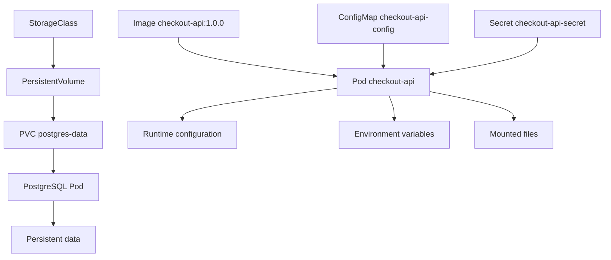
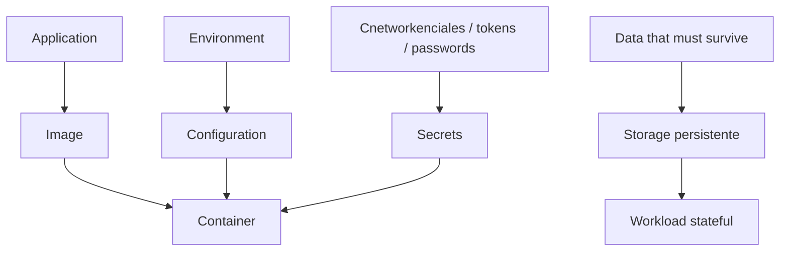
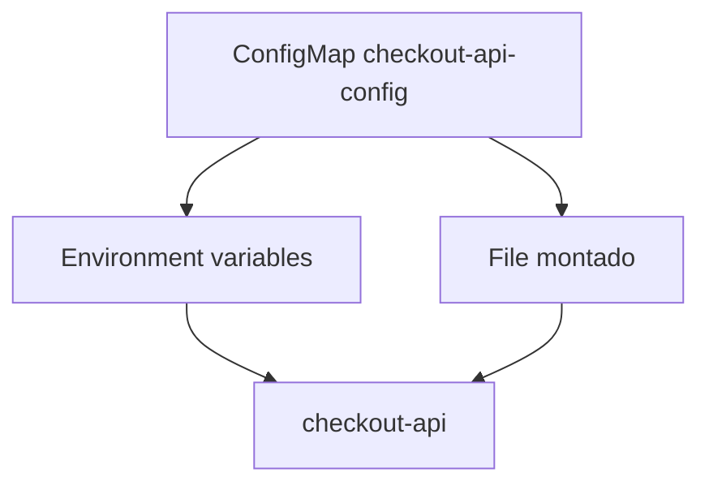
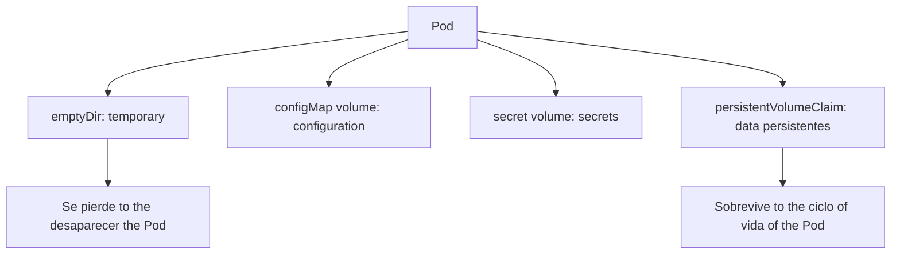
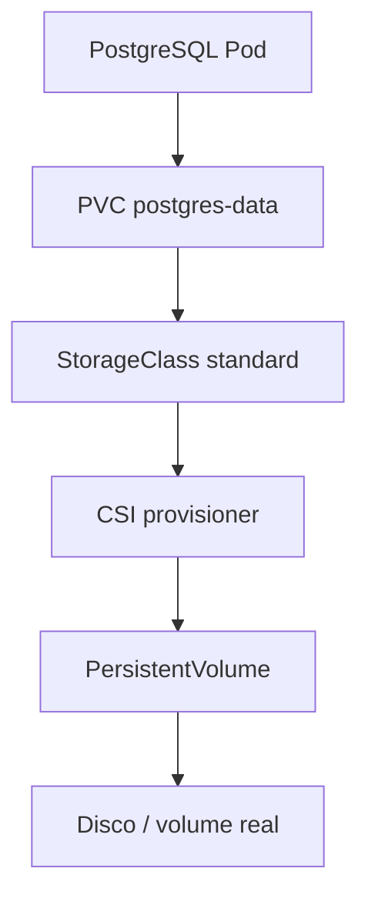
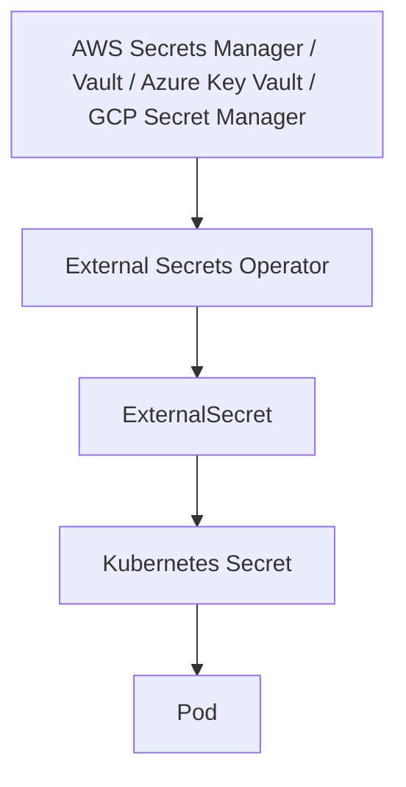
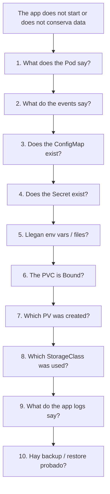

<!-- COURSE_NAV_START -->
[Previous](<7. Networking.md>) | [Index](README.md) | [Next](<9. Automated testing for Kubernetes.md>)
<!-- COURSE_NAV_END -->

# 8. Configuration, secrets, and storage

## Objective of the module

In the módulos anteriores aprendiste to run `checkout-api`, exposela with Services, conectar workloads mediante DNS internal and empezar to pensar in network, readiness, rollouts and troubleshooting.

Ahora toca separar tres cosas que suelen mezclarse bad:

```text
configuration
secretos
data persistentes
```

An application in Kubernetes should not depender of an image distinta for each environment.

Tampoco should llevar secrets dentro of the image.

AND should not asumir que the filesystem of the container es a lugar seguro for save datos que must sobrevivir.

Kubernetes ofrece objetos específicos for esto:

- `ConfigMap` for configuration not sensible
- `Secret` for información sensible, entendiendo bien sus límites
- `Volume` for mount datos dentro of Pods
- `PersistentVolume` and `PersistentVolumeClaim` for persistencia desacoplada of the Pod
- `StorageClass` for provisioning dinámico
- `VolumeSnapshot` for snapshots, if the CSI driver lo soporta
- Tools externas como External Secrets Operator or Velero for gestión of secrets and backup/restore
The documentación oficial define ConfigMap como a objeto API for almacenar datos not confidenciales in pares clave-valor, consumibles como environment variables, argumentos or files montados in a volumen. Also explica que permite desacoplar configuration específica of environment of the images of container. ([Kubernetes](https://kubernetes.io/docs/concepts/configuration/configmap/ "ConfigMaps"))

The idea central of the module es this:

> The image empaqueta the application. ConfigMaps and Secrets inyectan configuration. Volumes and PVCs gestionan datos. If mezclas esas responsabilidades, haces que the sistema sea more fragile, less portable and more difícil of operate.



---

## 8.1. What you are going to learn and what not you are going to learn yet

You are going to learn:

- What es configuration in Kubernetes
- What problema resuelve ConfigMap
- Cuándo consumir ConfigMaps como environment variables
- Cuándo consumir ConfigMaps como files
- What es Secret
- By what base64 is not cifrado
- What límites tienen the Secrets nativos
- What good practices mínimas apply with Secrets
- What es a Volume
- What diferencia hay between `emptyDir`, ConfigMap volume, Secret volume and PVC
- What es a PersistentVolume
- What es a PersistentVolumeClaim
- What es a StorageClass
- What es dynamic provisioning
- What es CSI
- What son snapshots of volumen
- What it means backup and restore in Kubernetes
- What papel pueden tener External Secrets Operator, SOPS, KMS and Velero
- How practicarlo with `checkout-api`, `payment-api`, `redis` and a PostgreSQL of laboratorio
- How diagnosticar errores comunes: ConfigMap ausente, Secret ausente, PVC pendiente, permisos of volumen and configuration not actualizada
Not vamos to profundizar yet in:

- Gestión advanced of secrets by proveedor cloud
- Rotación real of cnetworkenciales in producción
- Cifrado completo of etcd gestionado by proveedor
- Backups of databases with consistencia transaccional real
- Operación advanced of PostgreSQL in Kubernetes
- Operators of databases
- Disaster recovery multi-cluster
- CSI drivers específicos of each cloud
- Vault advanced
- GitOps with secrets cifrados
That vendrá after or in rutas profesionales.

The regla pedagógica of the module será:

```text
First, setote responsibilities
Then explain the object
Then define the contract
Then apply the manifest
Then inspect
Then trigger failures
Then automate with Taskfile
```

---

## 8.2. The problema: image, configuration, secrets and datos not son lo same

Before of write YAML, you need to separar concepts.

A image should responder:

> ¿What application ejecuto?

The configuration should responder:

> ¿How se comporta this application in this environment?

A secret should responder:

> ¿What dato sensible needs the application for operate?

The storage persistente should responder:

> ¿What datos must sobrevivir to the ciclo of vida of Pods and containers?



### Ejemplo with `checkout-api`

`checkout-api` needs:

|Necesidad|Tipo|
|---|---|
|`PORT=8080`|Configuration|
|`LOG_LEVEL=debug`|Configuration|
|`PAYMENT_API_URL=http://payment-api`|Configuración|
|`REDIS_HOST=redis`|Configuration|
|`POSTGRES_HOST=postgres`|Configuration|
|`POSTGRES_USER=shop`|Secret or configuration sensible según contexto|
|`POSTGRES_PASSWORD=...`|Secret|
|Code Express|Image|
|Dependencies npm|Image|
|Datos of PostgreSQL|Storage persistente|

### Error of diseño habitual

Mala separación:

```text
checkout-api-prod:1.0.0
checkout-api-staging:1.0.0
checkout-api-dev:1.0.0
```

Better separación:

```text
checkout-api:1.0.0
ConfigMap dev / staging / prod
Secret dev / staging / prod
```

### Criterio of comprensión

Debes poder explicar:

> If cambio of environment, should cambiar configuration and secrets, not reconstruir the image salvo que cambie the application.

---

## 8.3. ConfigMap

### What problema resuelve

ConfigMap permite almacenar configuration not sensible fuera of the image.

Esto reduce acoplamiento between image and environment.

The same image can runse in local, test, staging or producción with configuration distinta.

Kubernetes documenta ConfigMap como objeto API for datos not confidenciales in pares clave-valor, consumibles by Pods como environment variables, argumentos or files montados. ([Kubernetes](https://kubernetes.io/docs/concepts/configuration/configmap/ "ConfigMaps"))

### Cuándo use ConfigMap

Uses ConfigMap for:

- URLs internas not sensibles
- Feature flags not sensibles
- Nombres of host
- Configuration of logging
- Parámetros of comportamiento
- Files of configuration not sensibles
Not lo uses for:

- Passwords
- Tokens
- API keys
- Certificados privados
- Cnetworkenciales of database
- Cualquier dato que not quieras expose to cualquiera with permisos of lectura about ConfigMaps


### Contrato of configuration of `checkout-api`

Vamos to mover this configuration fuera of the Deployment:

```text
SERVICE_NAME=checkout-api
PORT=8080
LOG_LEVEL=debug
PAYMENT_API_URL=http://payment-api
REDIS_HOST=redis
POSTGRES_HOST=postgres
```

### Manifest

Creates:

```text
kubernetes/05-config/configmap.yaml
```

Contenido:

```yaml
apiVersion: v1
kind: ConfigMap
metadata:
  name: checkout-api-config
  namespace: shop
  labels:
    app.kubernetes.io/name: checkout-api
    app.kubernetes.io/component: api
    app.kubernetes.io/part-of: shop
data:
  SERVICE_NAME: checkout-api
  PORT: "8080"
  LOG_LEVEL: debug
  PAYMENT_API_URL: http://payment-api
  REDIS_HOST: redis
  POSTGRES_HOST: postgres
```

### Apply

```bash
kubectl apply -f kubernetes/05-config/configmap.yaml
```

### See

```bash
kubectl get configmap checkout-api-config -n shop
kubectl get configmap checkout-api-config -n shop -o yaml
kubectl get configmap checkout-api-config -n shop -o json | jq '.data'
```

### Criterio of comprensión

Debes poder explicar:

> ConfigMap guarda configuration not sensible and permite cambiar comportamiento by environment without cambiar the image.

---

## 8.4. Consumir ConfigMap como environment variables

### What problema resuelve

For valores pequeños, simples and of uso directo, the environment variables son cómodas.

Ejemplos:

```text
LOG_LEVEL
PAYMENT_API_URL
REDIS_HOST
```

### How se consume

In the Deployment of `checkout-api`, you can use:

```yaml
envFrom:
  - configMapRef:
      name: checkout-api-config
```

Esto inyecta all the claves of the ConfigMap como environment variables.

### Fragmento of the Deployment

In:

```text
kubernetes/02-deployment/deployment.yaml
```

reemplaza the environment variables fijas by:

```yaml
envFrom:
  - configMapRef:
      name: checkout-api-config
```

Mantén Downward API como `env`, because not viene of the ConfigMap:

```yaml
env:
  - name: POD_NAME
    valueFrom:
      fieldRef:
        fieldPath: metadata.name
  - name: POD_NAMESPACE
    valueFrom:
      fieldRef:
        fieldPath: metadata.namespace
  - name: POD_IP
    valueFrom:
      fieldRef:
        fieldPath: status.podIP
```

### What debes saber

When consumes a ConfigMap como environment variables, the valores se leen to the start the container.

If cambias the ConfigMap, the containers existentes not actualizan automáticamente sus environment variables.

Normalmente you need recreate Pods or hacer rollout.

### Validate

```bash
kubectl rollout restart deployment/checkout-api -n shop
kubectl rollout status deployment/checkout-api -n shop
kubectl exec -n shop deploy/checkout-api -- printenv | sort
```

### DevEx of the bloque

Añade:

```yaml
k8s:config:apply:
  desc: Apply checkout-api ConfigMap
  cmds:
    - kubectl apply -f kubernetes/05-config/configmap.yaml

k8s:config:get:
  desc: Show checkout-api ConfigMap
  cmds:
    - kubectl get configmap checkout-api-config -n {{.NAMESPACE}} -o yaml

k8s:deployment:restart:
  desc: Restart checkout-api Deployment
  cmds:
    - kubectl rollout restart deployment/checkout-api -n {{.NAMESPACE}}
    - kubectl rollout status deployment/checkout-api -n {{.NAMESPACE}}

k8s:app:env:
  desc: Show checkout-api runtime environment
  cmds:
    - kubectl exec -n {{.NAMESPACE}} deploy/checkout-api -- printenv | sort
```

### Criterio of comprensión

Debes poder explicar:

> ConfigMap como env var es simple, but the Pods already arrancados not cambian automáticamente sus variables if the ConfigMap cambia.

---

## 8.5. Consumir ConfigMap como file

### What problema resuelve

Not toda configuration encaja bien in environment variables.

TO veces you need a file:

- Configuration multi-línea
- Plantillas
- Configuration of a tool
- Reglas not sensibles
- Files `.properties`, `.json`, `.yaml`, `.ini`
ConfigMap can mountse como volumen for que the application lea files. Kubernetes documenta that modo of consumo como a of the formas habituales of use ConfigMaps in Pods. ([Kubernetes](https://kubernetes.io/docs/tasks/configure-pod-container/configure-pod-configmap/ "Configure to Pod to Use to ConfigMap"))

### Manifest with file of configuration

Amplía `configmap.yaml`:

```yaml
apiVersion: v1
kind: ConfigMap
metadata:
  name: checkout-api-config
  namespace: shop
  labels:
    app.kubernetes.io/name: checkout-api
    app.kubernetes.io/component: api
    app.kubernetes.io/part-of: shop
data:
  SERVICE_NAME: checkout-api
  PORT: "8080"
  LOG_LEVEL: debug
  PAYMENT_API_URL: http://payment-api
  REDIS_HOST: redis
  POSTGRES_HOST: postgres
  app-config.json: |
    {
      "featureFlags": {
        "newCheckoutFlow": true,
        "asyncNotifications": false
      },
      "timeouts": {
        "paymentApiMs": 2000,
        "inventoryApiMs": 1500
      }
    }
```

### Mountlo in the Deployment

Añade volumen:

```yaml
volumes:
  - name: checkout-api-config-files
    configMap:
      name: checkout-api-config
      items:
        - key: app-config.json
          path: app-config.json
```

Añade mount to the container:

```yaml
volumeMounts:
  - name: checkout-api-config-files
    mountPath: /etc/checkout-api
    readOnly: true
```

### Validate

```bash
kubectl exec -n shop deploy/checkout-api -- cat /etc/checkout-api/app-config.json
```

### Criterio of comprensión

Debes poder explicar:

> Environment variables encajan bien for valores simples. Files montados encajan better for configuration estructurada or multi-línea.

## 8.5. bis ResourceQuota and LimitRange

Requests and limits declaran necesidades of a container.

ResourceQuota and LimitRange gobiernan the consumo dentro of a namespace.

### LimitRange

LimitRange define valores minimum, máximos or by defecto for Resources dentro of a namespace.

Ejemplo:

```yaml
apiVersion: v1
kind: LimitRange
metadata:
  name: shop-defaults
  namespace: shop
spec:
  limits:
    - type: Container
      defaultRequest:
        cpu: 100m
        memory: 128Mi
      default:
        memory: 256Mi
      min:
        cpu: 50m
        memory: 64Mi
      max:
        cpu: "1"
        memory: 512Mi
```

### ResourceQuota

ResourceQuota limita the consumo total of the namespace.

Ejemplo:

```yaml
apiVersion: v1
kind: ResourceQuota
metadata:
  name: shop-quota
  namespace: shop
spec:
  hard:
    requests.cpu: "2"
    requests.memory: 2Gi
    limits.memory: 4Gi
    pods: "20"
    secrets: "20"
    configmaps: "20"
```

### Validate

```bash
kubectl apply -f limitrange.yaml
kubectl apply -f resourcequota.yaml
kubectl describe limitrange shop-defaults -n shop
kubectl describe resourcequota shop-quota -n shop
```

### Criterio of comprensión

Debes poder explicar:

> Requests and limits pertenecen to the Pod. LimitRange and ResourceQuota pertenecen to the namespace and definen saveraíles.

---

## 8.6. Secret

### What problema resuelve

Secret permite separar datos sensibles of the manifest of the application and of the image.

The documentación oficial define Secret como a objeto que contiene a pequeña cantidad of datos sensibles, como passwords, tokens or claves. Also indica que use Secrets evita incluir datos confidenciales directamente in the code of the application. ([Kubernetes](https://kubernetes.io/docs/concepts/configuration/secret/ "Secrets"))

### What debes understand Before using Secrets

A Secret nativo of Kubernetes is not a solución completa of gestión of secrets.

Es a pieza of the modelo.

Puntos importbefore:

- The Secrets son objetos of Kubernetes
- Pueden ser leídos by personas or ServiceAccounts with permisos suficientes
- By defecto, Kubernetes históricamente ha almacenado Secrets in etcd codificados, not necesariamente cifrados
- The documentación oficial of good practices recomienda configurar cifrado in reposo for Secrets in etcd and apply controles of acceso estrictos. ([Kubernetes](https://kubernetes.io/docs/concepts/security/secrets-good-practices/ "Good practices for Kubernetes Secrets"))
### Base64 is not cifrado

In YAML, muchos Secrets aparecen with valores base64:

```yaml
data:
  POSTGRES_PASSWORD: c2hvcC1wYXNzd29yZA==
```

That not significa que esté cifrado.

You can decodificarlo:

```bash
echo 'c2hvcC1wYXNzd29yZA==' | base64 -d
```

That is why, for aprendizaje, usaremos `stringData`, que es more legible. Kubernetes lo convierte to the formato internal correspondiente.

### Contrato of Secret for laboratorio

Queremos a Secret for:

```text
POSTGRES_USER=shop
POSTGRES_PASSWORD=shop-password
```

In producción, these valores should notn vivir in texto planot in Git.

For the laboratorio, yes the usaremos explicitly because the objective es learn the modelo.

### Manifest

Creates:

```text
kubernetes/05-config/secret.yaml
```

Contenido:

```yaml
apiVersion: v1
kind: Secret
metadata:
  name: checkout-api-secret
  namespace: shop
  labels:
    app.kubernetes.io/name: checkout-api
    app.kubernetes.io/component: api
    app.kubernetes.io/part-of: shop
type: Opaque
stringData:
  POSTGRES_USER: shop
  POSTGRES_PASSWORD: shop-password
```

### Apply

```bash
kubectl apply -f kubernetes/05-config/secret.yaml
```

### See metadata without expose valores

```bash
kubectl get secret checkout-api-secret -n shop
kubectl describe secret checkout-api-secret -n shop
```

### See valores codificados

```bash
kubectl get secret checkout-api-secret -n shop -o json | jq '.data'
```

### Decodificar for aprendizaje

```bash
kubectl get secret checkout-api-secret -n shop -o jsonpath='{.data.POSTGRES_PASSWORD}' | base64 -d
```

### Criterio of comprensión

Debes poder explicar:

> Secret evita meter datos sensibles in image or code, but not elimina the necesidad of RBAC, cifrado in reposo, rotación and gestión segura fuera of the cluster.

---

## 8.7. Consumir Secrets in Pods

### What problema resuelve

The application needs acceder to datos sensibles in runtime.

Igual que ConfigMap, Secret can consumirse como environment variables or como files montados.

### Consumir como environment variables

Añade to the container of `checkout-api`:

```yaml
envFrom:
  - configMapRef:
      name: checkout-api-config
  - secretRef:
      name: checkout-api-secret
```

### Riesgo operativo

Consumir secrets como environment variables es cómodo, but can hacer que aparezcan in dumps, diagnósticos or outputs of environment if alguien ejecuta:

```bash
kubectl exec -n shop deploy/checkout-api -- printenv
```

For ciertos secrets, mountlos como files may be preferible.

### Consumir como file

Añade volumen:

```yaml
volumes:
  - name: checkout-api-secret-files
    secret:
      secretName: checkout-api-secret
```

Añade mount:

```yaml
volumeMounts:
  - name: checkout-api-secret-files
    mountPath: /etc/checkout-api/secrets
    readOnly: true
```

Validate:

```bash
kubectl exec -n shop deploy/checkout-api -- ls -la /etc/checkout-api/secrets
```

Not imprimas valores sensibles salvo in laboratorio controlado.

### Criterio of comprensión

Debes poder explicar:

> Secrets pueden llegar to the container como env vars or como files. The forma elegida afecta exposición, ergonomía and operación.

---

## 8.8. Good practices mínimas for Secrets

### What problema resuelven

A Secret bad gestionado sigue siendo a riesgo.

The documentación oficial of good practices recomienda, between otros puntos, cifrado in reposo for Secrets in etcd and controles of acceso estrictos. ([Kubernetes](https://kubernetes.io/docs/concepts/security/secrets-good-practices/ "Good practices for Kubernetes Secrets"))

### Reglas mínimas

For this roadmap, aplica these reglas:

- Not metas secrets in images
- Not metas secrets reales in Git
- Not imprimas secrets in logs
- Not uses ConfigMap for datos sensibles
- Limita quién can read Secrets with RBAC
- Uses cifrado in reposo for Secrets in clusters reales
- Uses a gestor external of secrets when tenga sentido
- Rota secrets
- Documenta what workloads consumen what secrets
- Evita dar permisos of lectura of all the Secrets of the namespace without necesidad
### Tools relacionadas

|Necesidad|Tool|
|---|---|
|Sincronizar secrets desde gestores externos|External Secrets Operator|
|Cifrar YAML before of savelo in Git|SOPS|
|Cifrar with claves gestionadas|KMS|
|Gestionar secrets centralizados|Vault, AWS Secrets Manager, Azure Key Vault, GCP Secret Manager|
|GitOps with secrets cifrados|SOPS + Flux / Argo CD, Sealed Secrets, External Secrets|

External Secrets Operator se presenta como a operador for sincronizar secrets desde APIs externas hacia Kubernetes, usando Resources custom como `ExternalSecret` and `SecretStore`. ([external-secrets.io](https://external-secrets.io/ "External Secrets Operator: Introduction"))

### Criterio of comprensión

Debes poder explicar:

> Kubernetes Secret es a primitiva útil, but the gestión professional of secrets requiere controles of acceso, cifrado, rotación and, to menudo, integración with a gestor externo.

---

## 8.9. Volumes

### What problema resuelven

The filesystem of the container es efímero.

If a container muere or se recrea, the datos escritos dentro of the container pueden perderse.

Kubernetes Volumes resuelven distintas necesidades of storage dentro of the Pod.

Not all the volúmenes son persistentes.

### Tipos que debes understand ahora

|Tipo|Uso|
|---|---|
|`emptyDir`|Espacio temporal compartido while vive the Pod|
|`configMap`|Mount configuration como files|
|`secret`|Mount secrets como files|
|`persistentVolumeClaim`|Mount storage persistente|
|`projected`|Combinar varias fuentes in a volumen|



### Criterio of comprensión

Debes poder explicar:

> Volume not always significa persistencia. `emptyDir` desaparece with the Pod; a PVC apunta to storage persistente.

---

## 8.10. PersistentVolume, PersistentVolumeClaim and StorageClass

### What problema resuelven

TO Pod should not conocer the detalles físicos of the storage.

The application dice:

> Necesito storage of these características.

The cluster resuelve:

> What volumen real satisface that solicitud.

Kubernetes documenta PersistentVolume como a pieza of storage of the cluster, provisionada by a administrador or dinámicamente mediante StorageClass. PersistentVolumeClaim es the solicitud of storage que hace a user. ([Kubernetes](https://kubernetes.io/docs/concepts/storage/persistent-volumes/ "Persistent Volumes"))

StorageClass permite to the administradores describe clases of storage disponibles, que pueden mapear to distintos niveles of calidad, políticas of backup u otras políticas of the proveedor. Kubernetes does not impone what it means each clase. ([Kubernetes](https://kubernetes.io/docs/concepts/storage/storage-classes/ "Storage Classes"))

### Contrato mental

|Objeto|Pregunta|
|---|---|
|StorageClass|¿What tipo of storage ofrece the cluster?|
|PersistentVolume|¿What volumen real exists?|
|PersistentVolumeClaim|¿What storage pide mi workload?|
|Pod|¿What claim monta for read or write datos?|



### Dynamic provisioning

With dynamic provisioning, not creas manualmente the PV.

Creas a PVC que referencia a StorageClass, and the provisioner creates the volumen real.

### CSI

CSI, Container Storage Interface, permite integrar sistemas of storage with Kubernetes mediante drivers.

The capacidad real depende of the driver instalado.

### Criterio of comprensión

Debes poder explicar:

> The Pod should not depender of a disco concreto. Pide storage mediante PVC, and the cluster lo satisface usando StorageClass and the provisioner disponible.

---

## 8.11. PVC for PostgreSQL of laboratorio

### What problema resuelve

In módulos anteriores usaste Redis and PostgreSQL como dependencies of laboratorio.

Ahora queremos que PostgreSQL tenga datos persistentes although the Pod se recree.

Not estamos enseñando producción of PostgreSQL in Kubernetes.

Estamos enseñando the contrato of storage.

### PVC

Creates:

```text
kubernetes/06-storage/postgres-pvc.yaml
```

Contenido:

```yaml
apiVersion: v1
kind: PersistentVolumeClaim
metadata:
  name: postgres-data
  namespace: shop
  labels:
    app.kubernetes.io/name: postgres
    app.kubernetes.io/component: database
    app.kubernetes.io/part-of: shop
spec:
  accessModes:
    - ReadWriteOnce
  resources:
    requests:
      storage: 1Gi
```

Not especificamos `storageClassName` for que the cluster use the default StorageClass, if exists.

In kind, normalmente hay a StorageClass local by defecto, but esto can variar según instalación.

### PostgreSQL Secret

Creates:

```text
kubernetes/05-config/postgres-secret.yaml
```

Contenido:

```yaml
apiVersion: v1
kind: Secret
metadata:
  name: postgres-secret
  namespace: shop
  labels:
    app.kubernetes.io/name: postgres
    app.kubernetes.io/component: database
    app.kubernetes.io/part-of: shop
type: Opaque
stringData:
  POSTGRES_DB: shop
  POSTGRES_USER: shop
  POSTGRES_PASSWORD: shop-password
```

### PostgreSQL Deployment of laboratorio

Creates:

```text
kubernetes/02-deployment/postgres-deployment.yaml
```

Contenido:

```yaml
apiVersion: apps/v1
kind: Deployment
metadata:
  name: postgres
  namespace: shop
  labels:
    app.kubernetes.io/name: postgres
    app.kubernetes.io/component: database
    app.kubernetes.io/part-of: shop
spec:
  replicas: 1
  selector:
    matchLabels:
      app.kubernetes.io/name: postgres
      app.kubernetes.io/component: database
  template:
    metadata:
      labels:
        app.kubernetes.io/name: postgres
        app.kubernetes.io/component: database
        app.kubernetes.io/part-of: shop
    spec:
      containers:
        - name: postgres
          image: postgres:16-alpine
          ports:
            - name: postgres
              containerPort: 5432
          envFrom:
            - secretRef:
                name: postgres-secret
          volumeMounts:
            - name: postgres-data
              mountPath: /var/lib/postgresql/data
          resources:
            requests:
              cpu: 100m
              memory: 256Mi
            limits:
              cpu: 500m
              memory: 512Mi
      volumes:
        - name: postgres-data
          persistentVolumeClaim:
            claimName: postgres-data
```

### PostgreSQL Service

Creates:

```text
kubernetes/03-service/postgres-service.yaml
```

Contenido:

```yaml
apiVersion: v1
kind: Service
metadata:
  name: postgres
  namespace: shop
  labels:
    app.kubernetes.io/name: postgres
    app.kubernetes.io/component: database
    app.kubernetes.io/part-of: shop
spec:
  type: ClusterIP
  selector:
    app.kubernetes.io/name: postgres
    app.kubernetes.io/component: database
  ports:
    - name: postgres
      port: 5432
      targetPort: postgres
```

### Apply

```bash
kubectl apply -f kubernetes/05-config/postgres-secret.yaml
kubectl apply -f kubernetes/06-storage/postgres-pvc.yaml
kubectl apply -f kubernetes/02-deployment/postgres-deployment.yaml
kubectl apply -f kubernetes/03-service/postgres-service.yaml
```

### Observar

```bash
kubectl get pvc -n shop
kubectl get pv
kubectl get pods -n shop -l app.kubernetes.io/name=postgres
kubectl describe pvc postgres-data -n shop
kubectl describe pod -n shop -l app.kubernetes.io/name=postgres
```

### Criterio of comprensión

Debes poder explicar:

> PostgreSQL monta a PVC. If the Pod se recrea, the claim sigue existiendo and can volver to mountse según the reglas of the storage disponible.

---

## 8.12. Probar persistencia of PostgreSQL

### What queremos check

Queremos check que the dato vive in the volumen, not in the container.

### Create a tabla

```bash
POSTGRES_POD="$(kubectl get pod -n shop -l app.kubernetes.io/name=postgres -o jsonpath='{.items[0].metadata.name}')"

kubectl exec -n shop "$POSTGRES_POD" -- psql -U shop -d shop -c "CREATE TABLE IF NOT EXISTS learning_notes (id serial PRIMARY KEY, note text);"

kubectl exec -n shop "$POSTGRES_POD" -- psql -U shop -d shop -c "INSERT INTO learning_notes(note) VALUES ('persistent data from kubernetes lab');"

kubectl exec -n shop "$POSTGRES_POD" -- psql -U shop -d shop -c "SELECT * FROM learning_notes;"
```

### Delete the Pod

```bash
kubectl delete pod -n shop "$POSTGRES_POD"
```

Esperar recreación:

```bash
kubectl rollout status deployment/postgres -n shop
```

Consultar of nuevo:

```bash
POSTGRES_POD="$(kubectl get pod -n shop -l app.kubernetes.io/name=postgres -o jsonpath='{.items[0].metadata.name}')"

kubectl exec -n shop "$POSTGRES_POD" -- psql -U shop -d shop -c "SELECT * FROM learning_notes;"
```

### What demuestra

Demuestra que the dato sobrevivió to the Pod.

Not demuestra que tengas a estrategia of backup real.

Not demuestra que PostgreSQL esté bien operado for producción.

Not demuestra high availability.

### Criterio of comprensión

Debes poder explicar:

> Persistencia is not backup. Que the dato sobreviva to a Pod recreado not significa que esté protegido frente to corrupción, borrado accidental or pérdida of the volumen.

---

## 8.13. Reclaim policy and ciclo of vida of the storage

### What problema resuelve

When borras a PVC, ¿what ocurre with the volumen real?

Depende of the `reclaimPolicy` of the PV or of the StorageClass usada for createlo.

Políticas habituales:

|Reclaim policy|What it means|
|---|---|
|`Delete`|To the delete the PVC, the volumen subyacente can removese|
|`Retain`|The volumen queda retenido for recuperación manual|

### Commands

```bash
kubectl get pv
kubectl get pv -o json | jq '.items[] | {name: .metadata.name, reclaimPolicy: .spec.persistentVolumeReclaimPolicy, claim: .spec.claimRef}'
kubectl get storageclass
kubectl describe storageclass
```

### Cuidado

In entornos cloud, `Delete` can delete the disco real.

In laboratorio can parecer cómodo.

In producción, the decisión must ser consciente.

### Criterio of comprensión

Debes poder explicar:

> Delete a Pod is not lo same que delete a PVC. Delete a PVC may have consecuencias about the volumen real según the reclaim policy.

---

## 8.14. VolumeSnapshots

### What problema resuelven

A snapshot captura the contenido of a volumen in a punto temporal, if the driver of storage lo soporta.

The documentación oficial explica que VolumeSnapshots ofrecen a forma estandarizada of copiar the contenido of a volumen in a momento concreto without create a volumen completamente nuevo, and que the funcionalidad depende of the soporte of the sistema of storage. ([Kubernetes](https://kubernetes.io/docs/concepts/storage/volume-snapshots/ "Volume Snapshots"))

### Condiciones importbefore

For use snapshots you need:

- CRDs of snapshots instalados
- Snapshot controller
- CSI driver que soporte snapshots
- `VolumeSnapshotClass` compatible
The documentación oficial also describe `VolumeSnapshotClass` como the equivalente conceptual to StorageClass, but for snapshots. ([Kubernetes](https://kubernetes.io/docs/concepts/storage/volume-snapshot-classes/ "Volume Snapshot Classes"))

### Manifest conceptual

This manifest es conceptual. It can not funcionar in kind if not tienes snapshot controller and CSI compatible.

```yaml
apiVersion: snapshot.storage.k8s.io/v1
kind: VolumeSnapshot
metadata:
  name: postgres-data-snapshot
  namespace: shop
spec:
  volumeSnapshotClassName: example-snapshot-class
  source:
    persistentVolumeClaimName: postgres-data
```

### Criterio of comprensión

Debes poder explicar:

> VolumeSnapshot es a API estándar, but su funcionamiento real depende of the componentes of snapshot and of the CSI driver instalado.

---

## 8.15. Backup and restore

### What problema resuelve

Persistencia is not backup.

A PVC can sobrevivir to a Pod, but not necesariamente te protege contra:

- Borrado accidental
- Corrupción lógica
- Migraciones destructivas
- Pérdida of the volumen
- Pérdida of the cluster
- Error humano
- Desastre regional
- Borrado of Secrets necesarios for restaurar
Backup and restore must cubrir tanto Resources Kubernetes como datos.

Velero es a tool ampliamente usada for backup and restore of Resources Kubernetes and volúmenes persistentes. Su documentación oficial cubre instalación, arquitectura and personalización según versión. ([Velero](https://velero.io/docs/main/ "Velero Docs - Overview"))

### What can incluir a backup

- Manifests of Resources
- Namespaces
- ConfigMaps
- Secrets, with cuidado especial
- PVCs
- Snapshots of volúmenes, if the proveedor lo soporta
- Metadata necessary for restaurar
- Orden of restauración
### What not debes asumir

Not asumas que:

- Backup of manifests equivale to backup of datos
- Snapshot equivale to backup completo
- Backup exists if never probaste restore
- Backup of Secrets es seguro without cifrado and control of acceso
- PostgreSQL es consistente if haces snapshot without considerar transacciones
### Practice didáctica minimum

For this module, not installemos Velero como requisito obligatorio.

Yes createemos a practice manual of exportación of manifiestos and a practice of persistencia.

Exportar Resources of the namespace:

```bash
kubectl get all,configmap,secret,pvc -n shop -o yaml > .tmp/shop-resources-backup.yaml
```

Esto is not backup professional.

Es a practice for understand que Resources and datos son cosas distintas.

### Criterio of comprensión

Debes poder explicar:

> Backup does not exist of verdad hasta que has probado restore. In Kubernetes, also, debes distinguir backup of objetos, backup of datos and backup of secrets.

---

## 8.16. External Secrets, SOPS and KMS

### What problema resuelven

In producción, not quieres poner secrets reales in YAML in texto plano.

Tampoco quieres depender únicamente of create Secrets manualmente with `kubectl`.

Hay varias estrategias.

### External Secrets Operator

External Secrets Operator sincroniza secrets desde APIs externas hacia Kubernetes. Su documentación lo presenta como a colección of Resources custom, como `ExternalSecret`, orientados to traer secrets desde proveedores externos hacia Secrets nativos. ([external-secrets.io](https://external-secrets.io/ "External Secrets Operator: Introduction"))

Modelo conceptual:



### SOPS

SOPS permite cifrar files before of savelos in Git.

It can integrarse with KMS, GPG, age and flujos GitOps.

### KMS

KMS permite gestionar claves of cifrado in a proveedor or sistema centralizado.

### Cuándo use each enfoque

|Enfoque|Encaja when|
|---|---|
|Secret manual|Laboratorio, tests pequeñas|
|SOPS|Quieres save YAML cifrado in Git|
|External Secrets Operator|Already tienes gestor external of secrets|
|Vault|You need gestión advanced, políticas and emisión dinámica|
|KMS|You need cifrado with claves gestionadas and auditoría|

### Criterio of comprensión

Debes poder explicar:

> Kubernetes Secret es the objeto que consume the Pod, but the origen professional of the secret may be fuera of the cluster.

---

## 8.17. Failure lab 1: ConfigMap ausente

### What queremos check

Queremos see what ocurre if a Deployment referencia a ConfigMap que does not exist.

### Create failure

Borra the ConfigMap:

```bash
kubectl delete configmap checkout-api-config -n shop
```

Reinicia Deployment:

```bash
kubectl rollout restart deployment/checkout-api -n shop
kubectl rollout status deployment/checkout-api -n shop --timeout=60s || true
```

### Observar

```bash
kubectl get pods -n shop -l app.kubernetes.io/name=checkout-api
kubectl describe pod -n shop -l app.kubernetes.io/name=checkout-api
kubectl get events -n shop --sort-by=.metadata.creationTimestamp
```

### Restaurar

```bash
kubectl apply -f kubernetes/05-config/configmap.yaml
kubectl rollout restart deployment/checkout-api -n shop
kubectl rollout status deployment/checkout-api -n shop
```

### Preguntas

- ¿The Deployment exists?
- ¿The nuevos Pods arrancan?
- ¿What event explica the failure?
- ¿Dónde se ve que falta the ConfigMap?
- ¿By what apply the ConfigMap and restart corrige the problema?
### Criterio of comprensión

Debes poder explicar:

> If a Pod referencia a ConfigMap obligatorio que does not exist, Kubernetes can aceptar the Deployment but fail to the create containers properly.

---

## 8.18. Failure lab 2: Secret ausente

### What queremos check

Queremos see the same patrón with Secrets.

### Create failure

Borra the Secret:

```bash
kubectl delete secret checkout-api-secret -n shop
```

Reinicia:

```bash
kubectl rollout restart deployment/checkout-api -n shop
kubectl rollout status deployment/checkout-api -n shop --timeout=60s || true
```

### Observar

```bash
kubectl get pods -n shop -l app.kubernetes.io/name=checkout-api
kubectl describe pod -n shop -l app.kubernetes.io/name=checkout-api
kubectl get events -n shop --sort-by=.metadata.creationTimestamp
```

### Restaurar

```bash
kubectl apply -f kubernetes/05-config/secret.yaml
kubectl rollout restart deployment/checkout-api -n shop
kubectl rollout status deployment/checkout-api -n shop
```

### Preguntas

- ¿What diferencia hay between Secret ausente and ConfigMap ausente?
- ¿What event aparece?
- ¿The error está in the app or in the configuration of the Pod?
- ¿How lo detectarías in a pipeline before of desplegar?
### Criterio of comprensión

Debes poder explicar:

> Secrets also forman parte of the contrato of runtime. If faltan, the problema can aparecer to the create the Pod, not necesariamente dentro of the code of the application.

---

## 8.19. Failure lab 3: PVC pendiente

### What queremos check

Queremos understand what pasa when a PVC not can satisfacerse.

### Create PVC with StorageClass inexistente

Creates:

```text
kubernetes/06-storage/postgres-pvc-bad-storageclass.yaml
```

Contenido:

```yaml
apiVersion: v1
kind: PersistentVolumeClaim
metadata:
  name: postgres-data-bad-storageclass
  namespace: shop
spec:
  storageClassName: does-not-exist
  accessModes:
    - ReadWriteOnce
  resources:
    requests:
      storage: 1Gi
```

Apply:

```bash
kubectl apply -f kubernetes/06-storage/postgres-pvc-bad-storageclass.yaml
```

Observar:

```bash
kubectl get pvc -n shop
kubectl describe pvc postgres-data-bad-storageclass -n shop
kubectl get events -n shop --sort-by=.metadata.creationTimestamp
```

Limpiar:

```bash
kubectl delete -f kubernetes/06-storage/postgres-pvc-bad-storageclass.yaml --ignore-not-found
```

### Preguntas

- ¿The PVC se queda Pending?
- ¿What event aparece?
- ¿What StorageClasses exist in tu cluster?
- ¿What it means que a PVC not esté Bound?
### Criterio of comprensión

Debes poder explicar:

> A PVC Pending normalmente significa que Kubernetes does not ha podido encontrar or provisionar storage que satisfaga the solicitud.

---

## 8.20. Troubleshooting progresivo of configuration and storage

Not empieces by reinstall the cluster.

Sigue a secuencia.



### Commands base

```bash
kubectl get pods -n shop
kubectl describe pod -n shop -l app.kubernetes.io/name=checkout-api
kubectl get events -n shop --sort-by=.metadata.creationTimestamp

kubectl get configmap -n shop
kubectl get secret -n shop
kubectl get pvc -n shop
kubectl get pv
kubectl get storageclass

kubectl exec -n shop deploy/checkout-api -- printenv | sort
kubectl exec -n shop deploy/checkout-api -- ls -la /etc/checkout-api || true
```

### Criterio of comprensión

Debes poder explicar:

> Troubleshooting of configuration and storage empieza by the Pod and the events, then confirma objetos referenciados, after volúmenes, claims, StorageClass and finally datos.

---

## 8.21. Taskfile of the module 8

Añade these tasks to the `Taskfile.yml`.

```yaml
  k8s:config:apply:
    desc: Apply checkout-api ConfigMap and Secret
    cmds:
      - kubectl apply -f kubernetes/05-config/configmap.yaml
      - kubectl apply -f kubernetes/05-config/secret.yaml

  k8s:config:get:
    desc: Show checkout-api ConfigMap and Secret metadata
    cmds:
      - kubectl get configmap checkout-api-config -n {{.NAMESPACE}} -o yaml
      - kubectl describe secret checkout-api-secret -n {{.NAMESPACE}}

  k8s:config:data:
    desc: Show checkout-api ConfigMap data
    cmds:
      - kubectl get configmap checkout-api-config -n {{.NAMESPACE}} -o json | jq '.data'

  k8s:secret:metadata:
    desc: Show checkout-api Secret metadata without values
    cmds:
      - kubectl get secret checkout-api-secret -n {{.NAMESPACE}}
      - kubectl describe secret checkout-api-secret -n {{.NAMESPACE}}

  k8s:secret:decode:lab:
    desc: Decode checkout-api Secret for lab purposes only
    cmds:
      - kubectl get secret checkout-api-secret -n {{.NAMESPACE}} -o jsonpath='{.data.POSTGRES_PASSWORD}' | base64 -d
      - echo

  k8s:deployment:restart:
    desc: Restart checkout-api Deployment
    cmds:
      - kubectl rollout restart deployment/checkout-api -n {{.NAMESPACE}}
      - kubectl rollout status deployment/checkout-api -n {{.NAMESPACE}}

  k8s:app:env:
    desc: Show checkout-api runtime environment
    cmds:
      - kubectl exec -n {{.NAMESPACE}} deploy/checkout-api -- printenv | sort

  k8s:app:config:file:
    desc: Show checkout-api mounted config file
    cmds:
      - kubectl exec -n {{.NAMESPACE}} deploy/checkout-api -- cat /etc/checkout-api/app-config.json

  k8s:postgres:apply:
    desc: Apply PostgreSQL lab resources
    cmds:
      - kubectl apply -f kubernetes/05-config/postgres-secret.yaml
      - kubectl apply -f kubernetes/06-storage/postgres-pvc.yaml
      - kubectl apply -f kubernetes/02-deployment/postgres-deployment.yaml
      - kubectl apply -f kubernetes/03-service/postgres-service.yaml

  k8s:postgres:status:
    desc: Show PostgreSQL lab status
    cmds:
      - kubectl get secret postgres-secret -n {{.NAMESPACE}}
      - kubectl get pvc postgres-data -n {{.NAMESPACE}}
      - kubectl get pv
      - kubectl get deploy postgres -n {{.NAMESPACE}}
      - kubectl get pods -n {{.NAMESPACE}} -l app.kubernetes.io/name=postgres -o wide
      - kubectl get svc postgres -n {{.NAMESPACE}}

  k8s:postgres:insert:
    desc: Insert lab data into PostgreSQL
    cmds:
      - |
        POSTGRES_POD="$(kubectl get pod -n {{.NAMESPACE}} -l app.kubernetes.io/name=postgres -o jsonpath='{.items[0].metadata.name}')"
        kubectl exec -n {{.NAMESPACE}} "$POSTGRES_POD" -- psql -U shop -d shop -c "CREATE TABLE IF NOT EXISTS learning_notes (id serial PRIMARY KEY, note text);"
        kubectl exec -n {{.NAMESPACE}} "$POSTGRES_POD" -- psql -U shop -d shop -c "INSERT INTO learning_notes(note) VALUES ('persistent data from kubernetes lab');"
        kubectl exec -n {{.NAMESPACE}} "$POSTGRES_POD" -- psql -U shop -d shop -c "SELECT * FROM learning_notes;"

  k8s:postgres:select:
    desc: Select lab data from PostgreSQL
    cmds:
      - |
        POSTGRES_POD="$(kubectl get pod -n {{.NAMESPACE}} -l app.kubernetes.io/name=postgres -o jsonpath='{.items[0].metadata.name}')"
        kubectl exec -n {{.NAMESPACE}} "$POSTGRES_POD" -- psql -U shop -d shop -c "SELECT * FROM learning_notes;"

  k8s:postgres:delete-pod:
    desc: Delete PostgreSQL Pod to test persistence
    cmds:
      - |
        POSTGRES_POD="$(kubectl get pod -n {{.NAMESPACE}} -l app.kubernetes.io/name=postgres -o jsonpath='{.items[0].metadata.name}')"
        kubectl delete pod -n {{.NAMESPACE}} "$POSTGRES_POD"
        kubectl rollout status deployment/postgres -n {{.NAMESPACE}}

  k8s:postgres:delete:
    desc: Delete PostgreSQL lab resources but keep PVC unless explicitly removed
    cmds:
      - kubectl delete -f kubernetes/03-service/postgres-service.yaml --ignore-not-found
      - kubectl delete -f kubernetes/02-deployment/postgres-deployment.yaml --ignore-not-found
      - kubectl delete -f kubernetes/05-config/postgres-secret.yaml --ignore-not-found

  k8s:postgres:pvc:delete:
    desc: Delete PostgreSQL PVC. This may delete underlying storage depending on reclaim policy
    cmds:
      - kubectl delete -f kubernetes/06-storage/postgres-pvc.yaml --ignore-not-found

  k8s:storage:status:
    desc: Show storage objects
    cmds:
      - kubectl get storageclass
      - kubectl get pvc -n {{.NAMESPACE}}
      - kubectl get pv
      - kubectl get pv -o json | jq '.items[] | {name: .metadata.name, reclaimPolicy: .spec.persistentVolumeReclaimPolicy, claim: .spec.claimRef}'

  k8s:failure:configmap:missing:
    desc: Delete ConfigMap and restart checkout-api to observe failure
    cmds:
      - kubectl delete configmap checkout-api-config -n {{.NAMESPACE}} --ignore-not-found
      - kubectl rollout restart deployment/checkout-api -n {{.NAMESPACE}}
      - kubectl rollout status deployment/checkout-api -n {{.NAMESPACE}} --timeout=60s || true
      - kubectl get pods -n {{.NAMESPACE}} -l app.kubernetes.io/name=checkout-api
      - kubectl get events -n {{.NAMESPACE}} --sort-by=.metadata.creationTimestamp

  k8s:failure:secret:missing:
    desc: Delete Secret and restart checkout-api to observe failure
    cmds:
      - kubectl delete secret checkout-api-secret -n {{.NAMESPACE}} --ignore-not-found
      - kubectl rollout restart deployment/checkout-api -n {{.NAMESPACE}}
      - kubectl rollout status deployment/checkout-api -n {{.NAMESPACE}} --timeout=60s || true
      - kubectl get pods -n {{.NAMESPACE}} -l app.kubernetes.io/name=checkout-api
      - kubectl get events -n {{.NAMESPACE}} --sort-by=.metadata.creationTimestamp

  k8s:failure:pvc:bad-storageclass:apply:
    desc: Apply PVC with non-existing StorageClass
    cmds:
      - kubectl apply -f kubernetes/06-storage/postgres-pvc-bad-storageclass.yaml

  k8s:failure:pvc:bad-storageclass:inspect:
    desc: Inspect PVC with non-existing StorageClass
    cmds:
      - kubectl get pvc -n {{.NAMESPACE}}
      - kubectl describe pvc postgres-data-bad-storageclass -n {{.NAMESPACE}} || true
      - kubectl get events -n {{.NAMESPACE}} --sort-by=.metadata.creationTimestamp

  k8s:failure:pvc:bad-storageclass:delete:
    desc: Delete PVC with non-existing StorageClass
    cmds:
      - kubectl delete -f kubernetes/06-storage/postgres-pvc-bad-storageclass.yaml --ignore-not-found

  k8s:backup:resources:
    desc: Export namespace resources to a local YAML file for learning purposes
    cmds:
      - mkdir -p .tmp
      - kubectl get all,configmap,secret,pvc -n {{.NAMESPACE}} -o yaml > .tmp/shop-resources-backup.yaml
      - ls -lh .tmp/shop-resources-backup.yaml

  k8s:troubleshoot:config-storage:
    desc: Troubleshoot configuration, secrets and storage progressively
    cmds:
      - kubectl get pods -n {{.NAMESPACE}} -o wide
      - kubectl get events -n {{.NAMESPACE}} --sort-by=.metadata.creationTimestamp
      - kubectl get configmap -n {{.NAMESPACE}}
      - kubectl get secret -n {{.NAMESPACE}}
      - kubectl get pvc -n {{.NAMESPACE}}
      - kubectl get pv
      - kubectl get storageclass
```

---

## 8.22. Practice principal of the module

### Objective

Separar configuration, secrets and datos persistentes in the sistema `shop`.

### Resultado esperado

To the final you should tener:

```text
kubernetes-learning-lab/
  kubernetes/
    05-config/
      configmap.yaml
      secret.yaml
      postgres-secret.yaml
    06-storage/
      postgres-pvc.yaml
      postgres-pvc-bad-storageclass.yaml
    02-deployment/
      deployment.yaml
      postgres-deployment.yaml
    03-service/
      postgres-service.yaml
```

### Paso 1. Preparar cluster and namespace

```bash
task k8s:kind:create
task k8s:image:prepare
task k8s:namespace:apply
```

### Paso 2. Apply ConfigMap and Secret of `checkout-api`

```bash
task k8s:config:apply
task k8s:config:get
task k8s:config:data
task k8s:secret:metadata
```

### Paso 3. Apply Deployment of `checkout-api`

```bash
task k8s:deployment:apply
task k8s:deployment:status
```

### Paso 4. Validate configuration in runtime

```bash
task k8s:app:env
task k8s:app:config:file
```

### Paso 5. Apply PostgreSQL with PVC

```bash
task k8s:postgres:apply
task k8s:postgres:status
task k8s:storage:status
```

### Paso 6. Insertar datos

```bash
task k8s:postgres:insert
task k8s:postgres:select
```

### Paso 7. Delete Pod and check persistencia

```bash
task k8s:postgres:delete-pod
task k8s:postgres:select
```

### Paso 8. Run failure labs

ConfigMap ausente:

```bash
task k8s:failure:configmap:missing
task k8s:config:apply
task k8s:deployment:restart
```

Secret ausente:

```bash
task k8s:failure:secret:missing
task k8s:config:apply
task k8s:deployment:restart
```

PVC with StorageClass inexistente:

```bash
task k8s:failure:pvc:bad-storageclass:apply
task k8s:failure:pvc:bad-storageclass:inspect
task k8s:failure:pvc:bad-storageclass:delete
```

### Paso 9. Exportar Resources for aprendizaje

```bash
task k8s:backup:resources
```

### Paso 10. Limpiar

```bash
task k8s:postgres:delete
task k8s:postgres:pvc:delete
kubectl delete -f kubernetes/02-deployment/deployment.yaml --ignore-not-found
kubectl delete -f kubernetes/05-config/secret.yaml --ignore-not-found
kubectl delete -f kubernetes/05-config/configmap.yaml --ignore-not-found
task k8s:namespace:delete
task k8s:kind:delete
```

### Criterio of finalización

The practice está completa when you can explicar:

- What configuration vive in ConfigMap
- What datos viven in Secret
- What should nots save in ConfigMap
- How llega the configuration to the container
- How llega the Secret to the container
- What valores se actualizan only to the recreate Pods
- What datos sobreviven to the borrado of the Pod of PostgreSQL
- What diferencia hay between delete a Pod, delete a Deployment and delete a PVC
- What it means PVC `Bound`
- What it means PVC `Pending`
- What papel tiene StorageClass
- By what persistencia not equivale to backup
---

## 8.23. Ejercicios cortos

### Ejercicio 1. Separar responsabilidades

Clasifica each dato:

|Dato|Image|ConfigMap|Secret|PVC|
|---|---|---|---|---|
|Code of `checkout-api`|||||
|`LOG_LEVEL=debug`|||||
|`PAYMENT_API_URL=http://payment-api`|||||
|`POSTGRES_PASSWORD`|||||
|Datos of tablas PostgreSQL|||||
|`app-config.json` not sensible|||||

---

### Ejercicio 2. ConfigMap como env var

Ejecuta:

```bash
kubectl get configmap checkout-api-config -n shop -o json | jq '.data'
kubectl exec -n shop deploy/checkout-api -- printenv | grep -E 'LOG_LEVEL|PAYMENT_API_URL|REDIS_HOST'
```

Responde:

- ¿What claves tiene the ConfigMap?
- ¿What claves llegan to the container?
- ¿What ocurre if cambias the ConfigMap without restart Pods?
---

### Ejercicio 3. Secret and base64

Ejecuta in laboratorio:

```bash
kubectl get secret checkout-api-secret -n shop -o json | jq '.data'
kubectl get secret checkout-api-secret -n shop -o jsonpath='{.data.POSTGRES_PASSWORD}' | base64 -d
```

Responde:

- ¿By what base64 is not cifrado?
- ¿Quién podría read this valor?
- ¿What controles you need in a cluster real?
---

### Ejercicio 4. PVC and PV

Ejecuta:

```bash
kubectl get pvc -n shop
kubectl get pv
kubectl describe pvc postgres-data -n shop
```

Responde:

- ¿The PVC está `Bound`?
- ¿What PV está asociado?
- ¿What StorageClass se usó?
- ¿What reclaim policy tiene the PV?
---

### Ejercicio 5. Persistencia

Ejecuta:

```bash
task k8s:postgres:insert
task k8s:postgres:delete-pod
task k8s:postgres:select
```

Responde:

- ¿The dato sobrevivió?
- ¿What objeto permitió that persistencia?
- ¿What pasaría if borras the PVC?
- ¿Esto demuestra que tienes backup?
---

### Ejercicio 6. PVC Pending

Ejecuta:

```bash
task k8s:failure:pvc:bad-storageclass:apply
task k8s:failure:pvc:bad-storageclass:inspect
```

Responde:

- ¿By what not is created the volumen?
- ¿What dice the event?
- ¿What StorageClasses exist realmente?
- ¿How lo corregirías?
Limpia:

```bash
task k8s:failure:pvc:bad-storageclass:delete
```

---

## 8.24. Errores habituales

### Error 1. Save secrets in ConfigMap

ConfigMap es for datos not sensibles.

If contiene password, token or API key, the problema is not Kubernetes. The problema es the diseño of configuration.

---

### Error 2. Pensar que Secret cifra automáticamente everything

Secret separa datos sensibles of image and code, but you need RBAC, cifrado in reposo, auditoría and good gestión operacional.

---

### Error 3. Creer que base64 es security

Base64 es codificación, not cifrado.

If alguien can read the Secret, can decodificarlo.

---

### Error 4. Cambiar ConfigMap and esperar que env vars cambien solas

If the ConfigMap se consume como environment variables, the Pods existentes not cambian automáticamente.

Normalmente you need rollout restart.

---

### Error 5. Pensar que everything Volume es persistente

`emptyDir` muere with the Pod.

ConfigMap volume and Secret volume proyectan objetos.

PVC apunta to storage persistente.

---

### Error 6. Use PostgreSQL in Kubernetes without understand storage

This module uses PostgreSQL for learn PVCs.

It is not a recomendación directa of producción.

Operate databases in Kubernetes requiere backups, restores probados, upgrades, monitoreo, storage fiable, security and, normalmente, a operator or service gestionado.

---

### Error 7. Confundir persistencia with backup

Persistencia mantiene datos between recreaciones of Pod.

Backup permite recuperar ante pérdida, corrupción or error humano.

Not son lo same.

---

### Error 8. Delete PVC without understand reclaim policy

Delete a PVC can delete the volumen real if the política lo permite.

Before of delete, mira PV and reclaim policy.

---

### Error 9. Use snapshots without check soporte real

VolumeSnapshot depende of snapshot controller, CRDs and CSI driver compatible.

Que exista the YAML not significa que the cluster pueda create snapshots.

---

## 8.25. Criterio of output of the module

You can pasar to the module 9 when puedas hacer everything esto without seguir a receta ciegamente.

### Concepts

Debes poder explicar:

- What es configuration
- What es a ConfigMap
- What not must ir in ConfigMap
- What es a Secret
- By what base64 is not cifrado
- What controles adicionales need the Secrets
- Diferencia between consumir ConfigMap or Secret como env vars or como files
- What es a Volume
- What diferencia hay between `emptyDir`, ConfigMap volume, Secret volume and PVC
- What es PersistentVolume
- What es PersistentVolumeClaim
- What es StorageClass
- What es dynamic provisioning
- What es CSI
- What es reclaim policy
- What es VolumeSnapshot
- What condiciones needs VolumeSnapshot
- What diferencia hay between persistencia, snapshot, backup and restore
- What papel pueden tener External Secrets Operator, SOPS, KMS and Velero
### Practice

Debes poder:

- Create ConfigMap of `checkout-api`
- Create Secret of `checkout-api`
- Inyectar configuration to the Deployment
- Mount configuration como file
- See configuration in runtime
- Create Secret of PostgreSQL
- Create PVC of PostgreSQL
- Mount PVC in PostgreSQL
- Insertar datos
- Delete Pod and validate persistencia
- See PVC, PV and StorageClass
- Provocar ConfigMap ausente
- Provocar Secret ausente
- Provocar PVC Pending
- Diagnosticar each caso with `get`, `describe`, events, `jq`, `yq` and Taskfile
### DevEx

Debes poder run:

```bash
task k8s:config:apply
task k8s:config:get
task k8s:secret:metadata
task k8s:deployment:restart
task k8s:app:env
task k8s:app:config:file
task k8s:postgres:apply
task k8s:postgres:status
task k8s:postgres:insert
task k8s:postgres:delete-pod
task k8s:postgres:select
task k8s:storage:status
task k8s:failure:configmap:missing
task k8s:failure:secret:missing
task k8s:failure:pvc:bad-storageclass:apply
task k8s:failure:pvc:bad-storageclass:inspect
task k8s:backup:resources
task k8s:troubleshoot:config-storage
```

### Frase final of comprensión

Debes poder explicar this frase:

> Kubernetes separan application, configuration, secrets and datos. ConfigMap and Secret cambian how se comporta a workload; PVC cambia dónde viven the datos; StorageClass cambia how se obtiene storage; backup and restore cambian tu capacidad real of recuperación.

---

## 8.26. References oficiales

|Tema|Referencia|
|---|---|
|ConfigMaps|Kubernetes Docs, ConfigMaps. ([Kubernetes](https://kubernetes.io/docs/concepts/configuration/configmap/ "ConfigMaps"))|
|Use ConfigMaps in Pods|Kubernetes Docs, Configure to Pod to Use to ConfigMap. ([Kubernetes](https://kubernetes.io/docs/tasks/configure-pod-container/configure-pod-configmap/ "Configure to Pod to Use to ConfigMap"))|
|Secrets|Kubernetes Docs, Secrets. ([Kubernetes](https://kubernetes.io/docs/concepts/configuration/secret/ "Secrets"))|
|Good practices for Secrets|Kubernetes Docs, Good practices for Kubernetes Secrets. ([Kubernetes](https://kubernetes.io/docs/concepts/security/secrets-good-practices/ "Good practices for Kubernetes Secrets"))|
|PersistentVolumes|Kubernetes Docs, Persistent Volumes. ([Kubernetes](https://kubernetes.io/docs/concepts/storage/persistent-volumes/ "Persistent Volumes"))|
|StorageClasses|Kubernetes Docs, Storage Classes. ([Kubernetes](https://kubernetes.io/docs/concepts/storage/storage-classes/ "Storage Classes"))|
|VolumeSnapshots|Kubernetes Docs, Volume Snapshots. ([Kubernetes](https://kubernetes.io/docs/concepts/storage/volume-snapshots/ "Volume Snapshots"))|
|VolumeSnapshotClasses|Kubernetes Docs, Volume Snapshot Classes. ([Kubernetes](https://kubernetes.io/docs/concepts/storage/volume-snapshot-classes/ "Volume Snapshot Classes"))|
|External Secrets Operator|External Secrets Operator Documentation. ([external-secrets.io](https://external-secrets.io/ "External Secrets Operator: Introduction"))|
|Velero|Velero Documentation. ([Velero](https://velero.io/docs/main/ "Velero Docs - Overview"))|

## 8.27. Lecturas of apoyo

|Libro|What read|
|---|---|
|_Kubernetes in Action_|Capítulos 6 and 7: volumes, PersistentVolumes, PersistentVolumeClaims, StorageClass, ConfigMaps and Secrets.|
|_Kubernetes: Up and Running_|Capítulos 13 and 15: ConfigMaps, Secrets, external services, reliable singletons, dynamic provisioning, StatefulSets and PersistentVolumes.|
|_Cloud Native DevOps with Kubernetes_|Capítulos 10 and 11: ConfigMaps, Secrets, encryption at rest, SOPS, KMS, RBAC, backups, etcd, Velero and cluster state.|
|_Kubernetes Patterns_|Capítulos 18 to 21: EnvVar Configuration, Configuration Resource, Immutable Configuration and Configuration Template.|

<!-- COURSE_NAV_START -->
[Previous](<7. Networking.md>) | [Index](README.md) | [Next](<9. Automated testing for Kubernetes.md>)
<!-- COURSE_NAV_END -->
