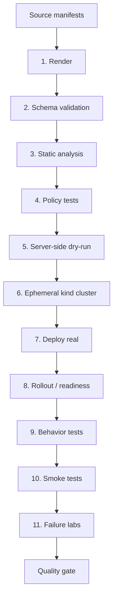
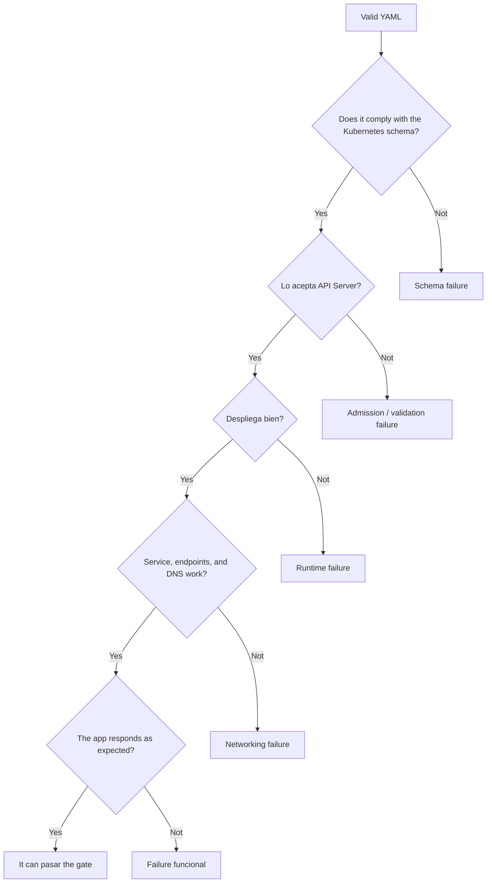
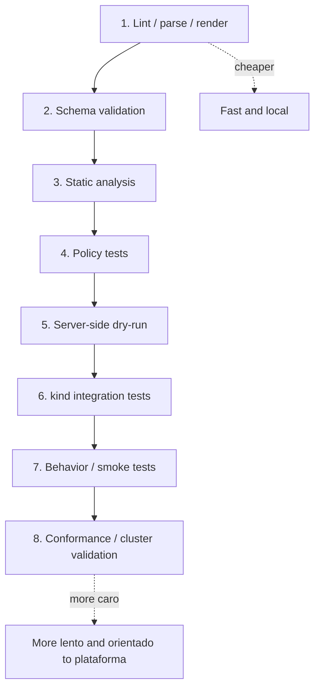
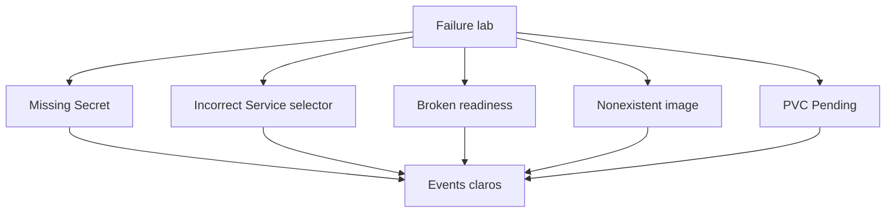
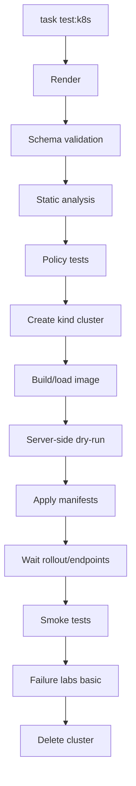

<!-- COURSE_NAV_START -->
[Previous](8.%20Configuration,%20secrets,%20and%20storage.md) | [Index](README.md) | [Next](10.%20Application%20delivery.md)
<!-- COURSE_NAV_END -->

# 9. Automated testing for Kubernetes

## Objective of the module

In the módulos anteriores already has construido a base bastante seria:

```text
containers
cluster local
kubectl
modelo mental
Pods
Workloads
Networking
ConfigMaps
Secrets
Storage
```

Ahora toca a pregunta incómoda:

> ¿How sabes que everything that funciona before of desplegarlo?

Not basta with que a YAML “parezca correcto”.

Not basta with que `kubectl apply` not explote a vez in tu máquina.

Not basta with que a person revise manifests to ojo.

A sistema Kubernetes may fail by muchas razones:

- The YAML not renderiza
- The manifest not cumple the schema
- The API Server rechaza the recurso
- The Service not tiene endpoints
- The readiness está bad
- The selector not coincide with the labels
- Falta a Secret
- Falta a ConfigMap
- The PVC se queda `Pending`
- A NetworkPolicy bloquea traffic esperado
- A policy of security should rechazar a recurso peligroso and not lo hace
- The Deployment exists, but never llega to `Available`
- The Job exists, but not completa
- The smoke test not pasa
- The failure es diagnosticable, but nadie lo ha automated
The idea central of the module es this:

> Testing of Kubernetes is not only validate YAML. Es build a cadena of feedback que compruebe render, schema, análisis estático, políticas, aceptación by the API Server, deployment real, comportamiento observable, smoke tests and failures esperados.



`kubectl apply` permite apply configuration desde file or stdin, and acepta formatos JSON and YAML. `kubectl diff` compara the configuration especificada with the state online que resultaría if se applya. These dos piezas son útiles, but by yes solas not son a estrategia completa of testing. ([Kubernetes](https://kubernetes.io/docs/reference/kubectl/generated/kubectl_apply/ "kubectl apply"))

---

## 9.1. What you are going to learn and what not you are going to learn yet

You are going to learn:

- What it means testar Kubernetes
- What diferencia hay between validate, analizar, probar and desplegar
- What es render of manifests
- What es validación of schemas
- What diferencia hay between validación local and validación of the API Server
- How use `kubectl apply --dry-run=server`
- How use `kubectl diff`
- How use `kubeconform`
- How use `kube-score`
- How use Polaris
- How probar políticas with Kyvernot CLI
- How probar políticas with OPA Conftest
- How use kind como cluster efímero
- How probar que a Deployment llega to Ready
- How probar que a Service tiene endpoints
- How probar que a Job completa
- How probar DNS and HTTP interno
- How estructurar smoke tests
- How diseñar failure tests pequeños
- How integrar everything with Taskfile
- How preparar a futura pipeline of delivery
Not vamos to profundizar yet in:

- GitOps
- Argo CD
- Flux
- Progressive delivery
- Canary real
- Blue-green real
- Supply chain advanced
- Firma of images
- SBOM
- Admission controllers instalados in cluster
- Testing advanced of operators
- Conformance completo of clusters productivos
That vendrá in módulos posteriores or in rutas profesionales.

The regla pedagógica of the module será:

```text
First, explain what we want to test
Then explain which tool fits
Then create a small practice
Then automate it
Then turn it into a quality gate
```

---

## 9.2. The problema: Kubernetes tiene demasiados puntos of failure for validate to ojo

Before of hablar of tools, you need to understand the problema.

A manifest may be bien escrito como YAML, but bad como recurso Kubernetes.

A recurso can cumplir schema, but ser inseguro.

A recurso may be aceptado by the API Server, but not desplegarse bien.

A Deployment can create Pods, but the Service can not tener endpoints.

A Service may have endpoints, but DNS may fail.

DNS can resolver, but a NetworkPolicy can bloquear traffic.

The application can responder `/health`, but fail in `/checkout`.



### Contrato mental

|Nivel|Pregunta|
|---|---|
|YAML|¿The file se can parsear?|
|Render|¿The manifiesto final exists and tiene sentido?|
|Schema|¿Cumple the forma esperada by Kubernetes?|
|Static analysis|¿Tiene riesgos or bad practices?|
|Policy|¿Cumple reglas of the team?|
|API Server|¿Kubernetes aceptaría esto?|
|Cluster real|¿The Resources se create and llegan to state esperado?|
|Behavior|¿The application responde and se comunica?|
|Failure lab|¿The failures esperados dejan signals diagnosticables?|

### Criterio of comprensión

Debes poder explicar:

> Que a manifest sea YAML válido not significa que sea a recurso Kubernetes correcto, seguro, desplegable ni funcional.

---

## 9.3. The pirámide of testing of Kubernetes

Not all the tests cuestan lo same.

The tests locales son rápidos.

The tests contra a cluster real dan more confianza, but cuestan more.

The tests of conformance of cluster son útiles, but should notn runse in each PR of an application.



### How readla

It is not a pirámide perfecta.

Es a cadena of feedback.

Lo importante es not saltar directamente to the cluster if you can detectar before errores baratos.

|Capa|Coste|What detecta|
|---|--:|---|
|Render|Bajo|Manifests incompletos, overlays rotos|
|Schema|Bajo|Campos inválidos, APIs bad formadas|
|Static analysis|Bajo-medio|Falta of probes, resources, securityContext|
|Policy tests|Medio|Reglas of the team|
|Server dry-run|Medio|Validación real of the API Server|
|kind tests|Medio-alto|Deployment real and comportamiento basic|
|Smoke tests|Medio-alto|Contrato HTTP minimum|
|Sonobuoy|Alto|State/conformance of the cluster|

### Criterio of comprensión

Debes poder explicar:

> The testing of Kubernetes must empezar with feedback barato and terminar, when hace falta, with verificación in a cluster real.

---

## 9.4. Estructura of the repositorio for testing

Before of write commands, ordena the repositorio.

Not queremos scripts sueltos.

Queremos a estructura que explique the intención of each tipo of test.

```text
kubernetes-learning-lab/
  kubernetes/
    base/
      namespace.yaml
      deployment.yaml
      service.yaml
      configmap.yaml
      secret.example.yaml
      kustomization.yaml

    overlays/
      local/
        kustomization.yaml

  tests/
    manifests/
      rendered/

    policies/
      kyverno/
        disallow-latest/
          policy.yaml
          kyverno-test.yaml
          resources/
            valid-deployment.yaml
            invalid-deployment.yaml

      conftest/
        policy/
          kubernetes.rego
        valid/
          deployment.yaml
        invalid/
          deployment-latest.yaml

    cluster/
      chainsaw/
        deployment-ready/
          chainsaw-test.yaml

    smoke/
      smoke-test.sh

    failure-lab/
      missing-secret/
      bad-service-selector/
      bad-readiness/
      pvc-pending/

  scripts/
    wait-for-rollout.sh
    wait-for-endpoints.sh
    smoke-test.sh

  Taskfile.yml
```

### By what this estructura ayuda

- `kubernetes/` contiene lo que despliegas
- `tests/manifests/` contiene artefactos renderizados or temporales
- `tests/policies/` separa políticas of manifests of application
- `tests/cluster/` contiene tests que need cluster
- `tests/smoke/` contiene comprobaciones funcionales mínimas
- `tests/failure-lab/` contiene escenarios negativos
- `scripts/` contiene piezas reutilizables
- `Taskfile.yml` orquesta the flujo
### Criterio of comprensión

Debes poder explicar:

> If the tests of Kubernetes does not tienen estructura, terminan siendo commands manuales difíciles of repetir and difíciles of confiar.

---

## 9.5. Render of manifests

### What problema resuelve

Before of validate or desplegar, you need to know cuál es the manifest final.

If usas Kustomize, Helm or cualquier tool of composición, the file fuente not always es lo que llega to Kubernetes.

Render significa:

> Generate the YAML final que se va to validate, analizar, probar and apply.

Kustomize permite personalizar objetos Kubernetes mediante a file `kustomization`, and `kubectl` soporta `kubectl kustomize` and `kubectl apply -k` for trabajar with esos directories. ([Kubernetes](https://kubernetes.io/docs/tasks/manage-kubernetes-objects/kustomization/ "Declarative Management of Kubernetes Objects Using ..."))

### Kustomize base minimum

Creates:

```text
kubernetes/base/kustomization.yaml
```

Contenido:

```yaml
resources:
  - ../00-namespace/namespace.yaml
  - ../02-deployment/deployment.yaml
  - ../03-service/checkout-api-service.yaml
  - ../05-config/configmap.yaml
  - ../05-config/secret.yaml
```

Creates:

```text
kubernetes/overlays/local/kustomization.yaml
```

Contenido:

```yaml
resources:
  - ../../base
```

### Render

```bash
mkdir -p .tmp
kubectl kustomize kubernetes/overlays/local > .tmp/rendered.yaml
```

### Inspect

```bash
yq '.kind' .tmp/rendered.yaml
yq 'select(.kind == "Deployment") | .metadata.name' .tmp/rendered.yaml
```

### DevEx

Añade:

```yaml
  manifests:render:
    desc: Render Kubernetes manifests
    cmds:
      - mkdir -p .tmp
      - kubectl kustomize kubernetes/overlays/local > .tmp/rendered.yaml
      - test -s .tmp/rendered.yaml
```

### Criterio of comprensión

Debes poder explicar:

> Not valido the files fuente by intuición. First genero the manifest final que realmente quiero check.

---

## 9.6. Validación of schema with kubeconform

### What problema resuelve

A YAML may be válido, but not cumplir the estructura esperada by Kubernetes.

`kubeconform` valida manifests contra definiciones of Resources Kubernetes. Su documentación lo presenta como a tool of validación of manifests que comtest if the manifests son válidos según the definiciones of Resources of Kubernetes. ([kubeconform.mandragor.org](https://kubeconform.mandragor.org/docs/overview/ "Fast Kubernetes manifests validation! | Overview - Kubeconform"))

### What detecta

It can detectar cosas como:

- `apiVersion` incorrecta
- `kind` incorrecto
- Campos bad escritos
- Tipos incorrectos
- Estructura inválida
- Resources not reconocidos, según schemas disponibles
### What not detecta always

Not sustituye:

- Validación of the API Server
- Admission webhooks
- Reglas of negocio of the team
- Que the Service tenga endpoints
- Que the Deployment llegue to Ready
- Que the app responda
### Command

```bash
kubeconform -strict -summary .tmp/rendered.yaml
```

If tienes CRDs and not tienes schemas for ellos, you can necesitar configurar schemas adicionales or decidir if use `-ignore-missing-schemas`.

### DevEx

Añade:

```yaml
  manifests:validate:schema:
    desc: Validate rendered manifests against Kubernetes schemas
    deps:
      - manifests:render
    cmds:
      - kubeconform -strict -summary .tmp/rendered.yaml
```

### Criterio of comprensión

Debes poder explicar:

> kubeconform valida forma and schema. Not demuestra que the sistema desplegado funcione.

---

## 9.7. Análisis estático with kube-score

### What problema resuelve

A manifest can cumplir schema and aun así ser débil operacionalmente.

Ejemplos:

- Not tiene probes
- Not tiene resource requests
- Not tiene securityContext
- Uses `latest`
- Not define PodDisruptionBudget
- Tiene configuration poco resiliente
`kube-score` se presenta como a tool of análisis estático for definiciones of objetos Kubernetes, and produce recomendaciones for mejorar security and resiliencia. ([GitHub](https://github.com/zegl/kube-score "zegl/kube-score"))

### What aporta

Aporta feedback about prácticas comunes of operación.

It is not verdad absoluta.

A recomendación can not apply in tu caso, but must forzarte to justificar the decisión.

### Command

```bash
kube-score score .tmp/rendered.yaml
```

### DevEx

Añade:

```yaml
  manifests:score:
    desc: Run kube-score static analysis
    deps:
      - manifests:render
    cmds:
      - kube-score score .tmp/rendered.yaml
```

### Criterio of comprensión

Debes poder explicar:

> kube-score not test comportamiento. Señala riesgos of configuration que pueden afectar security, resiliencia u operación.

---

## 9.8. Auditoría with Polaris

### What problema resuelve

Polaris valida and audita configuration of Resources Kubernetes contra políticas and good practices. The documentación oficial of Fairwinds describe Polaris como a policy engine open source for Kubernetes que valida and can remediar configuration of Resources, with políticas incorporadas and posibilidad of políticas custom. ([polaris.docs.fairwinds.com](https://polaris.docs.fairwinds.com/ "Fairwinds Polaris Documentation"))

### Cuándo usarlo

You can use Polaris for:

- Auditar manifests
- Auditar Resources in a cluster
- Revisar prácticas of security
- Revisar prácticas of reliability
- Añadir otro punto of feedback more orientado to configuration
### Command típico local

Según instalación, you can run Polaris in modo audit about files or cluster. For mantener the module portable, lo dejaremos como gate opcional:

```bash
polaris audit --audit-path .tmp/rendered.yaml --format=pretty
```

The CLI exacta can variar between versiones, así que in the Taskfile lo trataremos como opcional and not bloqueante to the principio.

### DevEx

```yaml
  manifests:polaris:
    desc: Run Polaris audit if installed
    deps:
      - manifests:render
    cmds:
      - polaris audit --audit-path .tmp/rendered.yaml --format=pretty || true
```

### Criterio of comprensión

Debes poder explicar:

> Polaris añade a capa of auditoría of configuration. Es útil, but not sustituye tests of deployment ni smoke tests.

---

## 9.9. Validación with `kubectl apply --dry-run=server`

### What problema resuelve

The validación local not always reproduce lo que hará the API Server.

The server-side dry run envía the petición to the API Server and permite run validación, defaulting and admisión without persistir the objeto. The documentación histórica of Kubernetes about dry-run explica que the dry run of the API Server permite see if a petición habría tenido éxito and what habría pasado without persistirla. ([Kubernetes](https://kubernetes.io/blog/2019/01/14/apiserver-dry-run-and-kubectl-diff/ "APIServer dry-run and kubectl diff"))

### Why it matters

Esto can detectar:

- Campos que the API Server rechaza
- Problemas of admisión
- Problemas of versión real of the cluster
- Resources que does not existn in that cluster
- Validaciones que a tool local not conoce
### Command

```bash
kubectl apply --dry-run=server --validate=strict -f .tmp/rendered.yaml
```

### Cuidado

Esto needs a cluster accesible.

It is not puramente local.

### DevEx

```yaml
  manifests:dry-run:
    desc: Validate rendered manifests against the Kubernetes API Server
    deps:
      - manifests:render
    cmds:
      - kubectl apply --dry-run=server --validate=strict -f .tmp/rendered.yaml
```

### Criterio of comprensión

Debes poder explicar:

> Server-side dry-run valida contra the API Server real of the cluster. That is why detecta problemas que the análisis local can not see.

---

## 9.10. `kubectl diff`

### What problema resuelve

Before of apply cambios, you need see what cambiaría.

`kubectl diff` compara the configuration especificada with the configuration online actual como quedaría if se applya, and su output es YAML. ([Kubernetes](https://kubernetes.io/docs/reference/kubectl/generated/kubectl_diff/ "kubectl diff"))

### Cuándo usarlo

Úsalo before of apply:

```bash
kubectl diff -f .tmp/rendered.yaml
```

In CI may be útil for revisar cambios, but not always must bloquear. Depende of tu flujo.

### DevEx

```yaml
  manifests:diff:
    desc: Show diff between rendered manifests and live cluster
    deps:
      - manifests:render
    cmds:
      - kubectl diff -f .tmp/rendered.yaml || true
```

### Criterio of comprensión

Debes poder explicar:

> `kubectl diff` not test que algo funcione. Te enseña what cambiaría in the cluster if aplicas the manifest.

---

## 9.11. Policy tests with Kyvernot CLI

### What problema resuelve

The tools of análisis estático tienen reglas genéricas.

Tu team can necesitar reglas propias:

- Not use `latest`
- Requerir labels estándar
- Requerir resource requests
- Requerir probes
- Bloquear containers privilegiados
- Requerir `runAsNonRoot`
- Exigir namespaces concretos
- Bloquear Services `LoadBalancer` in entornos locales
Kyvernot CLI permite validate and testear comportamiento of políticas before of añadirlas to the cluster. Su documentación indica que the CLI sirve for validate and probar comportamiento of policies about Resources before of añadirlos to a cluster, and que can usarse in pipelines CI/CD. ([Kyverno](https://kyverno.io/docs/kyverno-cli/reference/kyverno/ "Kyverno"))

### Política: bloquear `latest`

Creates:

```text
tests/policies/kyverno/disallow-latest/policy.yaml
```

Contenido:

```yaml
apiVersion: kyverno.io/v1
kind: ClusterPolicy
metadata:
  name: disallow-latest-tag
spec:
  validationFailureAction: Enforce
  background: false
  rules:
    - name: require-explicit-image-tag
      match:
        any:
          - resources:
              kinds:
                - Pod
                - Deployment
                - StatefulSet
                - DaemonSet
                - Job
                - CronJob
      validate:
        message: "Images must does not use the latest tag."
        pattern:
          spec:
            =(template):
              spec:
                containers:
                  - image: "!*:latest"
            =(jobTemplate):
              spec:
                template:
                  spec:
                    containers:
                      - image: "!*:latest"
            =(containers):
              - image: "!*:latest"
```

### Recurso válido

```text
tests/policies/kyverno/disallow-latest/resources/valid-deployment.yaml
```

```yaml
apiVersion: apps/v1
kind: Deployment
metadata:
  name: valid-checkout-api
spec:
  replicas: 1
  selector:
    matchLabels:
      app: valid-checkout-api
  template:
    metadata:
      labels:
        app: valid-checkout-api
    spec:
      containers:
        - name: checkout-api
          image: checkout-api:1.0.0
```

### Recurso inválido

```text
tests/policies/kyverno/disallow-latest/resources/invalid-deployment.yaml
```

```yaml
apiVersion: apps/v1
kind: Deployment
metadata:
  name: invalid-checkout-api
spec:
  replicas: 1
  selector:
    matchLabels:
      app: invalid-checkout-api
  template:
    metadata:
      labels:
        app: invalid-checkout-api
    spec:
      containers:
        - name: checkout-api
          image: checkout-api:latest
```

### Test Kyverno

Creates:

```text
tests/policies/kyverno/disallow-latest/kyverno-test.yaml
```

Contenido:

```yaml
apiVersion: cli.kyverno.io/v1alpha1
kind: Test
metadata:
  name: disallow-latest-tag
policies:
  - policy.yaml
resources:
  - resources/valid-deployment.yaml
  - resources/invalid-deployment.yaml
results:
  - policy: disallow-latest-tag
    rule: require-explicit-image-tag
    resource: valid-checkout-api
    kind: Deployment
    result: pass
  - policy: disallow-latest-tag
    rule: require-explicit-image-tag
    resource: invalid-checkout-api
    kind: Deployment
    result: fail
```

Kyvernot `test` compara resultados esperados declarados in a file of test with the resultados reales reportados by Kyverno. ([Kyverno](https://kyverno.io/docs/kyverno-cli/reference/kyverno_test/ "kyvernot test"))

### Command

```bash
kyverno test tests/policies/kyverno/disallow-latest
```

### DevEx

```yaml
  policies:test:kyverno:
    desc: Test Kyverno policies
    cmds:
      - kyverno test tests/policies/kyverno/disallow-latest
```

### Criterio of comprensión

Debes poder explicar:

> Testear policies is not only check que rechazan lo malo. Also debes check que aceptan lo válido.

---

## 9.12. Policy tests with OPA Conftest

### What problema resuelve

Conftest permite write tests contra configuration estructurada usando Rego of Open Policy Agent. Su documentación indica que can usarse for Kubernetes configurations, Terraform, Serverless and otros formatos estructurados. ([conftest.dev](https://www.conftest.dev/ "Conftest"))

### Cuándo use Conftest

Úsalo if:

- Tu team already uses OPA/Rego
- Quieres políticas reutilizables between varios tipos of configuration
- You need lógica of validación more expresiva
- Quieres tests rápidos without cluster
### Política simple: bloquear `latest`

Creates:

```text
tests/policies/conftest/policy/kubernetes.rego
```

Contenido:

```rego
package kubernetes

deny[msg] {
  input.kind == "Deployment"
  container := input.spec.template.spec.containers[_]
  endswith(container.image, ":latest")
  msg := sprintf("container %s must does not use latest tag", [container.name])
}

deny[msg] {
  input.kind == "Deployment"
  does not input.spec.template.spec.containers[_].resources.requests.cpu
  msg := "containers must define cpu requests"
}

deny[msg] {
  input.kind == "Deployment"
  does not input.spec.template.spec.containers[_].resources.requests.memory
  msg := "containers must define memory requests"
}
```

### Command

```bash
conftest test .tmp/rendered.yaml --policy tests/policies/conftest/policy
```

### DevEx

```yaml
  policies:test:conftest:
    desc: Test rendered manifests with OPA Conftest
    deps:
      - manifests:render
    cmds:
      - conftest test .tmp/rendered.yaml --policy tests/policies/conftest/policy
```

### Criterio of comprensión

Debes poder explicar:

> Kyvernot encaja very bien with políticas Kubernetes-native. Conftest encaja bien when quieres policy-as-code genérica about configuration estructurada.

---

## 9.13. Cluster efímero with kind

### What problema resuelve

Algunos problemas only aparecen in a cluster real.

kind permite create clusters locales usando containers Docker como nodos. Su documentación lo describe como a tool for run clusters Kubernetes locales usando containers Docker como nodos, diseñada principalmente for probar Kubernetes, although also útil for desarrollo local and CI. ([kind.sigs.k8s.io](https://kind.sigs.k8s.io/ "kind - Kubernetes"))

### What you can probar with kind

- The API Server acepta manifests
- Pods se create
- Deployments llegan to Available
- Services tienen EndpointSlices
- DNS resuelve
- Jobs completan
- PVCs se quedan `Bound` or `Pending`
- Smoke tests funcionan
- Failure labs dejan signals
### What not debes asumir

kind is not producción.

It can not reproducir:

- LoadBalancers cloud
- Storage CSI real
- NetworkPolicy if the CNI not the soporta
- Performance real
- IAM cloud
- DNS externo
- Ingress cloud real
### DevEx

```yaml
  cluster:create:
    desc: Create disposable kind cluster
    cmds:
      - kind create cluster --name {{.TEST_CLUSTER}}

  cluster:delete:
    desc: Delete disposable kind cluster
    cmds:
      - kind delete cluster --name {{.TEST_CLUSTER}}
```

### Criterio of comprensión

Debes poder explicar:

> kind not sustituye an environment real, but es excelente for check que manifests se aceptan and Resources basic se comportan in a cluster Kubernetes real.

---

## 9.14. Test of deployment: Deployment Ready

### What problema resuelve

After of apply manifests, not basta with que the command termine.

You need esperar to que the Deployment llegue to the state esperado.

### Command base

```bash
kubectl rollout status deployment/checkout-api -n shop --timeout=120s
```

### Validaciones adicionales

```bash
kubectl get deploy checkout-api -n shop
kubectl get pods -n shop -l app.kubernetes.io/name=checkout-api
kubectl get pods -n shop -l app.kubernetes.io/name=checkout-api -o json \
  | jq '.items[] | {name: .metadata.name, phase: .status.phase, conditions: .status.conditions}'
```

### Script

Creates:

```text
scripts/wait-for-rollout.sh
```

Contenido:

```bash
#!/usr/bin/env bash
set -euo pipefail

NAMESPACE="${NAMESPACE:-shop}"
DEPLOYMENT="${DEPLOYMENT:-checkout-api}"
TIMEOUT="${TIMEOUT:-120s}"

kubectl rollout status "deployment/${DEPLOYMENT}" \
  -n "${NAMESPACE}" \
  --timeout="${TIMEOUT}"
```

Permisos:

```bash
chmod +x scripts/wait-for-rollout.sh
```

### DevEx

```yaml
  cluster:wait:deployment:
    desc: Wait for checkout-api Deployment rollout
    cmds:
      - NAMESPACE={{.NAMESPACE}} DEPLOYMENT=checkout-api ./scripts/wait-for-rollout.sh
```

### Criterio of comprensión

Debes poder explicar:

> Apply a Deployment not significa que esté listo. The test must esperar explícitamente to que the rollout termine.

---

## 9.15. Test of Service with EndpointSlices

### What problema resuelve

A Service can existir and not tener backends.

Esto already lo viste in the module 7.

Ahora lo convertimos in test.

### Script

Creates:

```text
scripts/wait-for-endpoints.sh
```

Contenido:

```bash
#!/usr/bin/env bash
set -euo pipefail

NAMESPACE="${NAMESPACE:-shop}"
SERVICE="${SERVICE:-checkout-api}"
TIMEOUT_SECONDS="${TIMEOUT_SECONDS:-60}"

for i in $(seq 1 "${TIMEOUT_SECONDS}"); do
  endpoint_count="$(
    kubectl get endpointslices \
      -n "${NAMESPACE}" \
      -l "kubernetes.io/service-name=${SERVICE}" \
      -o json \
      | jq '[.items[].endpoints[]? | select(.conditions.ready != false)] | length'
  )"

  if [ "${endpoint_count}" -gt 0 ]; then
    echo "Service ${SERVICE} has ${endpoint_count} ready endpoint(s)"
    exit 0
  fi

  sleep 1
done

echo "Timed out waiting for Service ${SERVICE} endpoints"
kubectl get svc "${SERVICE}" -n "${NAMESPACE}" -o yaml || true
kubectl get endpointslices -n "${NAMESPACE}" -l "kubernetes.io/service-name=${SERVICE}" -o yaml || true
exit 1
```

Permisos:

```bash
chmod +x scripts/wait-for-endpoints.sh
```

### DevEx

```yaml
  cluster:wait:endpoints:
    desc: Wait for checkout-api Service endpoints
    cmds:
      - NAMESPACE={{.NAMESPACE}} SERVICE=checkout-api ./scripts/wait-for-endpoints.sh
```

### Criterio of comprensión

Debes poder explicar:

> A Service without endpoints es a identidad estable without destinot útil.

---

## 9.16. Smoke tests

### What problema resuelven

The tests anteriores testn Kubernetes.

The smoke test test the contrato minimum of the application.

For `checkout-api`, the contrato minimum sigue siendo:

- `GET /health`
- `GET /ready`
- `GET /checkout`
### Smoke test by Service

In module 7 aprendiste to hacer port-forward to the Service:

```bash
kubectl port-forward service/checkout-api -n shop 8080:80
```

For automatizarlo in CI local, you can use a patrón simple:

1. Abrir port-forward in background
2. Esperar a momento
3. Run `scripts/smoke-test.sh`
4. Cerrar port-forward
### Script

Creates:

```text
scripts/smoke-test-k8s.sh
```

Contenido:

```bash
#!/usr/bin/env bash
set -euo pipefail

NAMESPACE="${NAMESPACE:-shop}"
SERVICE="${SERVICE:-checkout-api}"
LOCAL_PORT="${LOCAL_PORT:-8080}"
SERVICE_PORT="${SERVICE_PORT:-80}"

cleanup() {
  if [ -n "${PF_PID:-}" ]; then
    kill "${PF_PID}" >/dev/null 2>&1 || true
  fi
}

trap cleanup EXIT

kubectl port-forward "service/${SERVICE}" \
  -n "${NAMESPACE}" \
  "${LOCAL_PORT}:${SERVICE_PORT}" >/tmp/checkout-api-port-forward.log 2>&1 &

PF_PID="$!"

sleep 3

PORT="${LOCAL_PORT}" ./scripts/smoke-test.sh
```

Permisos:

```bash
chmod +x scripts/smoke-test-k8s.sh
```

### DevEx

```yaml
  smoke:k8s:
    desc: Run smoke test against checkout-api Service through port-forward
    cmds:
      - NAMESPACE={{.NAMESPACE}} SERVICE=checkout-api LOCAL_PORT={{.PORT}} ./scripts/smoke-test-k8s.sh
```

### Criterio of comprensión

Debes poder explicar:

> Smoke test not demuestra everything, but confirma que the contrato minimum of the application responde to través of Kubernetes.

---

## 9.17. Tests declarativos with Chainsaw

### What problema resuelve

Algunos tests son more cómodos if se expresan como pasos declarativos about Resources Kubernetes.

Chainsaw proporciona testing end-to-end declarativo for Kubernetes. Su documentación lo presenta como a tool que permite write tests in YAML, without tener que write code of propósito general for each caso. ([kyverno.github.io](https://kyverno.github.io/chainsaw/0.2.3/ "Chainsaw - Stronger end-to-end testing tool"))

### Cuándo use Chainsaw

Úsalo for:

- Apply Resources
- Esperar condiciones
- Check state
- Probar comportamiento of Resources Kubernetes
- Testear controllers, policies or flujos declarativos
### Test basic: Deployment Ready and Service with endpoints

Creates:

```text
tests/cluster/chainsaw/deployment-ready/chainsaw-test.yaml
```

Contenido orientativo:

```yaml
apiVersion: chainsaw.kyverno.io/v1alpha1
kind: Test
metadata:
  name: checkout-api-deployment-ready
spec:
  steps:
    - name: assert deployment exists
      try:
        - assert:
            resource:
              apiVersion: apps/v1
              kind: Deployment
              metadata:
                name: checkout-api
                namespace: shop
              status:
                availableReplicas: 3

    - name: assert service exists
      try:
        - assert:
            resource:
              apiVersion: v1
              kind: Service
              metadata:
                name: checkout-api
                namespace: shop
```

The sintaxis exacta of Chainsaw can cambiar between versiones, así que this module lo uses como introducción declarativa and recomienda fijar versión of tool in the repositorio.

### DevEx

```yaml
  cluster:test:chainsaw:
    desc: Run Chainsaw cluster tests
    cmds:
      - chainsaw test tests/cluster/chainsaw
```

### Criterio of comprensión

Debes poder explicar:

> Chainsaw sirve for expresar tests of comportamiento Kubernetes como pasos declarativos contra a cluster real.

---

## 9.18. KUTTL

### What problema resuelve

KUTTL ofrece a enfoque declarativo for testing of Kubernetes, especialmente operators, although also can probar objetos Kubernetes in general. Su repositorio oficial explica que KUTTL está diseñado for testing of operators, but can testear declarativamente cualquier objeto Kubernetes. ([GitHub](https://github.com/kudobuilder/kuttl "kudobuilder/kuttl: KUbernetes Test TooL (kuttl)"))

### Cuándo use KUTTL

Úsalo if:

- Estás testando operators
- Quieres tests declarativos by pasos
- Already tienes suites KUTTL in the organización
- You need assert/error manifests
### For this roadmap

KUTTL será lectura and tool opcional.

The path principal of the module usará:

```text
kubeconform
kube-score
Kyverno CLI o Conftest
kind
kubectl
smoke tests
Chainsaw opcional
```

### Criterio of comprensión

Debes poder explicar:

> KUTTL es especialmente útil in testing of operators and controllers, but for a app básica podemos empezar with gates more simples.

---

## 9.19. Terratest

### What problema resuelve

Terratest es a librería Go for testing of infraestructura. Su documentación the presenta como a librería with helpers and patterns for tasks comunes of infrastructure testing, incluyendo Kubernetes, Docker, Terraform and cloud providers. ([terratest.gruntwork.io](https://terratest.gruntwork.io/docs/ "Documentation - Terratest - Gruntwork"))

### Cuándo use Terratest

Úsalo if:

- Already tienes tests in Go
- You need lógica of test more programática
- Combinas Kubernetes with cloud real
- You need preparar infraestructura, desplegar, validate and destruir
- Quieres assertions more ricas que bash
### For this roadmap

Not será obligatorio because the laboratorio evita meter Go como requisito.

The ruta base usará Bash, Taskfile and tools declarativas.

### Criterio of comprensión

Debes poder explicar:

> Terratest es potente when you need tests programáticos of infraestructura, but añade coste of lenguaje, dependencies and mantenimiento.

---

## 9.20. Sonobuoy

### What problema resuelve

Sonobuoy está more cerca of platform engineering que of each PR of application.

Sonobuoy se presenta como a tool of diagnóstico for understand the state of a cluster ejecutando tests of configuration of forma accesible and not destructiva. Also is used for conformance testing, es decir, check que a cluster se comporta conforme to the especificaciones oficiales of Kubernetes. ([sonobuoy.io](https://sonobuoy.io/ "Sonobuoy"))

### Cuándo usarlo

Úsalo for:

- Validate clusters
- Diagnóstico of plataforma
- Conformance
- Revisiones of upgrades
- Validación of proveedores or distribuciones Kubernetes
### Cuándo not usarlo

Not lo ejecutes in each PR of `checkout-api`.

Es demasiado pesado for that capa.

### Criterio of comprensión

Debes poder explicar:

> Sonobuoy valida the cluster. Not sustituye tests of manifests ni smoke tests of an application concreta.

---

## 9.21. Failure tests pequeños

### What problema resuelven

Not basta with probar the path feliz.

Also debes probar que the failures importbefore dejan signals claras.

Failure tests not buscan romper everything.

Buscan learn and automatizar diagnósticos.



### Failure lab minimum

Incluye these escenarios:

|Failure|Señal esperada|
|---|---|
|Image inexistente|`ImagePullBackOff` or error of pull|
|Secret ausente|Event of secret not found|
|ConfigMap ausente|Event of configmap not found|
|Service selector incorrecto|Service without EndpointSlices útiles|
|Readiness rota|Pod Running but not Ready|
|Liveness rota|Reinicios|
|PVC with StorageClass inexistente|PVC `Pending`|
|Job fallido|Job not completa, Pods fallidos|

### Regla

Each failure test must documentar:

- What rompe
- How se aplica
- What señal esperamos
- How se diagnostica
- How se limpia
- What gate lo habría evitado
### Criterio of comprensión

Debes poder explicar:

> A failure lab is not caos aleatorio. Es a forma controlada of enseñar what señal aparece when a categoría of failure ocurre.

---

## 9.22. Testing of NetworkPolicy

### What problema resuelve

A NetworkPolicy can existir and not applyse if the CNI not soporta enforcement.

Also may be bad definida.

That is why, the tests of NetworkPolicy must separar dos cosas:

```text
La policy existe?
Is traffic really allowed or blocked?
```

### Test minimum

Desde `dnsutils`:

```bash
kubectl exec -n shop dnsutils -- wget -qO- http://checkout-api/health
```

For a bloqueo, you need a Pod not permitido and a command with timeout.

Ejemplo:

```bash
kubectl run blocked-client \
  -n shop \
  --image=busybox:1.36 \
  --restart=Never \
  -- sleep 3600
```

Probar:

```bash
kubectl exec -n shop blocked-client -- wget -T 3 -qO- http://checkout-api/health
```

If tu CNI aplica NetworkPolicy and the policy not permite that Pod, should fail or hacer timeout.

### Criterio of comprensión

Debes poder explicar:

> Testear NetworkPolicy exige probar traffic real. See the YAML not demuestra enforcement.

---

## 9.23. Quality gate completo

### What problema resuelve

Hasta ahora tienes piezas.

Ahora you need a secuencia.

A quality gate must fail pronto, dar signals claras and limpiar Resources.

### Secuencia recomendada



### Taskfile principal

```yaml
vars:
  TEST_CLUSTER: shop-test
  NAMESPACE: shop
  IMAGE_NAME: checkout-api
  IMAGE_TAG: 1.0.0
  PORT: 8080
  RENDERED: .tmp/rendered.yaml

tasks:
  test:k8s:
    desc: Run full Kubernetes test suite
    cmds:
      - task manifests:render
      - task manifests:validate:schema
      - task manifests:score
      - task policies:test
      - task cluster:create
      - task k8s:image:prepare:test
      - task manifests:dry-run
      - task cluster:deploy
      - task cluster:wait
      - task smoke:k8s
      - task failure:test:basic
      - task cluster:delete
```

### Criterio of comprensión

Debes poder explicar:

> A quality gate is does not a tool. Es a secuencia of comprobaciones que reduce the risk of que a change llegue roto to the siguiente environment.

---

## 9.24. Taskfile of the module 9

Añade these tasks to the `Taskfile.yml`.

```yaml
  manifests:render:
    desc: Render Kubernetes manifests
    cmds:
      - mkdir -p .tmp
      - kubectl kustomize kubernetes/overlays/local > .tmp/rendered.yaml
      - test -s .tmp/rendered.yaml

  manifests:show:
    desc: Show rendered manifests
    deps:
      - manifests:render
    cmds:
      - cat .tmp/rendered.yaml

  manifests:validate:schema:
    desc: Validate rendered manifests against Kubernetes schemas
    deps:
      - manifests:render
    cmds:
      - kubeconform -strict -summary .tmp/rendered.yaml

  manifests:score:
    desc: Run kube-score static analysis
    deps:
      - manifests:render
    cmds:
      - kube-score score .tmp/rendered.yaml

  manifests:polaris:
    desc: Run Polaris audit if installed
    deps:
      - manifests:render
    cmds:
      - polaris audit --audit-path .tmp/rendered.yaml --format=pretty || true

  manifests:dry-run:
    desc: Validate rendered manifests against the Kubernetes API Server
    deps:
      - manifests:render
    cmds:
      - kubectl apply --dry-run=server --validate=strict -f .tmp/rendered.yaml

  manifests:diff:
    desc: Show diff between rendered manifests and live cluster
    deps:
      - manifests:render
    cmds:
      - kubectl diff -f .tmp/rendered.yaml || true

  policies:test:
    desc: Run all policy tests
    cmds:
      - task policies:test:kyverno
      - task policies:test:conftest

  policies:test:kyverno:
    desc: Test Kyverno policies
    cmds:
      - kyverno test tests/policies/kyverno/disallow-latest

  policies:test:conftest:
    desc: Test rendered manifests with OPA Conftest
    deps:
      - manifests:render
    cmds:
      - conftest test .tmp/rendered.yaml --policy tests/policies/conftest/policy

  cluster:create:
    desc: Create disposable kind cluster for tests
    cmds:
      - kind create cluster --name {{.TEST_CLUSTER}}

  cluster:delete:
    desc: Delete disposable kind cluster for tests
    cmds:
      - kind delete cluster --name {{.TEST_CLUSTER}} || true

  k8s:image:prepare:test:
    desc: Build and load checkout-api image into test kind cluster
    cmds:
      - docker build -t {{.IMAGE_NAME}}:{{.IMAGE_TAG}} ./apps/{{.APP_NAME}}
      - kind load docker-image {{.IMAGE_NAME}}:{{.IMAGE_TAG}} --name {{.TEST_CLUSTER}}

  cluster:deploy:
    desc: Apply rendered manifests to test cluster
    deps:
      - manifests:render
    cmds:
      - kubectl apply -f .tmp/rendered.yaml

  cluster:wait:
    desc: Wait for Kubernetes resources to become ready
    cmds:
      - NAMESPACE={{.NAMESPACE}} DEPLOYMENT=checkout-api ./scripts/wait-for-rollout.sh
      - NAMESPACE={{.NAMESPACE}} SERVICE=checkout-api ./scripts/wait-for-endpoints.sh

  smoke:k8s:
    desc: Run smoke test against checkout-api Service through port-forward
    cmds:
      - NAMESPACE={{.NAMESPACE}} SERVICE=checkout-api LOCAL_PORT={{.PORT}} ./scripts/smoke-test-k8s.sh

  cluster:test:chainsaw:
    desc: Run Chainsaw cluster tests
    cmds:
      - chainsaw test tests/cluster/chainsaw

  failure:test:basic:
    desc: Run basic failure checks
    cmds:
      - task failure:test:bad-service-selector
      - task failure:test:bad-image

  failure:test:bad-service-selector:
    desc: Test Service without endpoints due to wrong selector
    cmds:
      - task k8s:failure:service:bad-selector:apply
      - task k8s:failure:service:bad-selector:inspect
      - task k8s:failure:service:bad-selector:delete

  failure:test:bad-image:
    desc: Test failed rollout with bad image and rollback
    cmds:
      - task k8s:failure:rollout:bad-image
      - task k8s:deployment:rollback

  test:k8s:
    desc: Run full Kubernetes test suite
    cmds:
      - task manifests:render
      - task manifests:validate:schema
      - task manifests:score
      - task policies:test
      - task cluster:create
      - task k8s:image:prepare:test
      - task manifests:dry-run
      - task cluster:deploy
      - task cluster:wait
      - task smoke:k8s
      - task failure:test:basic
      - task cluster:delete
```

### Nota importante of limpieza

If a paso fails before of `cluster:delete`, tendrás que limpiar manualmente:

```bash
task cluster:delete
```

In a pipeline real, esto should ir in a bloque `finally`, `post`, `always` or equivalente.

### Criterio DevEx

Debes poder explicar:

> The DevEx of the testing of Kubernetes must permitir run the gate completo with a command, but also run each capa by separado for diagnosticar rápido.

---

## 9.25. Practice principal of the module

### Objective

Build a suite automated que valide manifests, políticas, deployment real, endpoints and smoke tests of `checkout-api`.

### Resultado esperado

```text
kubernetes-learning-lab/
  kubernetes/
    base/
      kustomization.yaml
    overlays/
      local/
        kustomization.yaml

  tests/
    policies/
      kyverno/
        disallow-latest/
          policy.yaml
          kyverno-test.yaml
          resources/
            valid-deployment.yaml
            invalid-deployment.yaml
      conftest/
        policy/
          kubernetes.rego
    cluster/
      chainsaw/
        deployment-ready/
          chainsaw-test.yaml
    smoke/
      smoke-test.sh

  scripts/
    wait-for-rollout.sh
    wait-for-endpoints.sh
    smoke-test-k8s.sh

  Taskfile.yml
```

### Paso 1. Preparar Kustomize

```bash
task manifests:render
task manifests:show
```

### Paso 2. Validate schema

```bash
task manifests:validate:schema
```

### Paso 3. Run análisis estático

```bash
task manifests:score
task manifests:polaris
```

### Paso 4. Testear políticas

```bash
task policies:test:kyverno
task policies:test:conftest
```

### Paso 5. Create cluster efímero

```bash
task cluster:create
```

### Paso 6. Preparar image

```bash
task k8s:image:prepare:test
```

### Paso 7. Validate with API Server

```bash
task manifests:dry-run
task manifests:diff
```

### Paso 8. Desplegar

```bash
task cluster:deploy
task cluster:wait
```

### Paso 9. Smoke test

```bash
task smoke:k8s
```

### Paso 10. Failure tests

```bash
task failure:test:basic
```

### Paso 11. Limpiar

```bash
task cluster:delete
```

### Paso 12. Run everything

```bash
task test:k8s
```

### Criterio of finalización

The practice está completa when you can explicar:

- What valida each capa
- What capa fails first ante a campo inválido
- What capa fails ante `latest`
- What capa fails if the API Server rechaza algo
- What capa fails if the Deployment not llega to Ready
- What capa fails if the Service not tiene endpoints
- What capa fails if `/checkout` not responde
- What tests requieren cluster
- What tests not requieren cluster
- What parte must ir in CI before of the delivery
---

## 9.26. Ejercicios cortos

### Ejercicio 1. Clasificar tests

Clasifica each test:

|Test|Local|Needs cluster|What detecta|
|---|--:|--:|---|
|`kubectl kustomize`||||
|`kubeconform`||||
|`kube-score`||||
|`kyverno test`||||
|`conftest test`||||
|`kubectl apply --dry-run=server`||||
|`kubectl rollout status`||||
|`smoke-test-k8s.sh`||||
|Sonobuoy||||

---

### Ejercicio 2. Schema vs policy

Responde:

- ¿A Deployment with `image: checkout-api:latest` can cumplir schema?
- ¿What tool detectaría que `latest` viola a regla of the team?
- ¿By what schema and policy not son lo same?
---

### Ejercicio 3. Server dry-run

Ejecuta:

```bash
task manifests:dry-run
```

Responde:

- ¿Needs cluster?
- ¿Persiste objetos?
- ¿What diferencia tiene respecto to kubeconform?
- ¿What problemas can detectar que a validación local not detecta?
---

### Ejercicio 4. Service without endpoints

Ejecuta:

```bash
task failure:test:bad-service-selector
```

Responde:

- ¿The Service exists?
- ¿Tiene endpoints?
- ¿What labels tiene the Deployment?
- ¿What selector tiene the Service roto?
- ¿What gate habría detectado esto?
---

### Ejercicio 5. Smoke test

Ejecuta:

```bash
task smoke:k8s
```

Responde:

- ¿Contra what recurso hace port-forward?
- ¿What endpoints test?
- ¿By what esto es better que mirar only `kubectl get pods`?
- ¿What not test this smoke test?
---

### Ejercicio 6. Failure lab

Elige a failure:

```text
Missing Secret
Missing ConfigMap
broken readiness
PVC Pending
nonexistent image
```

For that failure, documenta:

- How lo provocas
- What señal esperas
- What command lo diagnostica
- What gate lo detectaría before
- How lo limpias
---

## 9.27. Errores habituales

### Error 1. Pensar que `kubectl apply` es testing

`kubectl apply` creates or actualiza Resources.

Not demuestra que the sistema funcione.

---

### Error 2. Validate YAML but not render final

If usas Kustomize or Helm, valida the manifest renderizado.

Not only the fragmentos fuente.

---

### Error 3. Confundir schema with good practices

Schema dice if the forma es válida.

Not dice if tu Deployment tiene probes, resources, securityContext or etiquetas correctas.

---

### Error 4. Not testear policies

A policy without test can rechazar Resources válidos or aceptar Resources peligrosos.

Debes probar ambos casos.

---

### Error 5. Not probar in cluster real

Algunos errores only aparecen when the API Server, scheduler, kubelet, DNS, EndpointSlices and runtime participan.

---

### Error 6. Smoke test demasiado débil

Esto es débil:

```bash
curl http://localhost:8080/health
```

Better:

```bash
curl -fsS http://localhost:8080/health
curl -fsS http://localhost:8080/ready
curl -fsS http://localhost:8080/checkout
```

Better aún:

```bash
task smoke:k8s
```

because valida the contrato to través of Kubernetes.

---

### Error 7. Not limpiar clusters efímeros

The tests with kind must limpiar.

If fail, must existir a task clara:

```bash
task cluster:delete
```

---

### Error 8. Run Sonobuoy in each PR of application

Sonobuoy es for validate clusters and conformance.

It is not the gate normal of each cambio of `checkout-api`.

---

### Error 9. Not documentar what it means each gate

If a gate fails and nadie sabe what está comprobando, the team lo acabará ignorando.

---

## 9.28. Troubleshooting progresivo of the testing

When `task test:k8s` fails, not respondas with “Kubernetes está roto”.

Sigue the capa que falló.

```mermaid
flowchart TD
  Failure["task test:k8s fails"] --> Render{"Fails render?"}
  Render -->|Yes| FixRender["Review kustomization / paths"]

  Render -->|Not| Schema{"Fails schema?"}
  Schema -->|Yes| FixSchema["Review apiVersion, kind, fields"]

  Schema -->|Not| Static{"Fails static analysis?"}
  Static -->|Yes| FixStatic["Review probes, resources, security"]

  Static -->|Not| Policy{"Fails policy?"}
  Policy -->|Yes| FixPolicy["Review resource or rule"]

  Policy -->|Not| DryRun{"Fails dry-run?"}
  DryRun -->|Yes| FixDry["Review API Server, CRDs, admission"]

  DryRun -->|Not| Deploy{"Does deploy fail?"}
  Deploy -->|Yes| FixDeploy["Review events, pods, rollout"]

  Deploy -->|Not| Smoke{"Does smoke fail?"}
  Smoke -->|Yes| FixSmoke["Review Service, endpoints, app contract"]
```



### Criterio of comprensión

Debes poder explicar:

> A failure of test must apuntar to a capa. If everything fails of forma indistinta, the gate está bad diseñado.

---

## 9.29. Criterio of output of the module

You can pasar to the module 10 when puedas hacer everything esto without seguir a receta ciegamente.

### Concepts

Debes poder explicar:

- What it means testar Kubernetes
- Diferencia between render, schema, static analysis, policy test, dry-run, deploy test and smoke test
- What valida kubeconform
- What valida kube-score
- What aporta Polaris
- What test Kyvernot CLI
- What test Conftest
- What aporta kind
- What test server-side dry-run
- What aporta `kubectl diff`
- What it means que a Deployment llegue to Ready
- What it means que a Service tenga endpoints
- What test a smoke test
- What es a failure lab
- Cuándo use Chainsaw
- Cuándo use KUTTL
- Cuándo use Terratest
- Cuándo use Sonobuoy
### Practice

Debes poder:

- Renderizar manifests
- Validate schema
- Run análisis estático
- Probar policies with Kyvernot CLI
- Probar policies with Conftest
- Create a cluster kind efímero
- Cargar image in kind
- Run server-side dry-run
- Apply manifests renderizados
- Esperar rollout
- Esperar endpoints
- Run smoke test by Service
- Run failure tests basic
- Limpiar cluster
- Run everything with `task test:k8s`
### DevEx

Debes poder run:

```bash
task manifests:render
task manifests:validate:schema
task manifests:score
task policies:test
task cluster:create
task k8s:image:prepare:test
task manifests:dry-run
task cluster:deploy
task cluster:wait
task smoke:k8s
task failure:test:basic
task cluster:delete
task test:k8s
```

### Frase final of comprensión

Debes poder explicar this frase:

> Testing of Kubernetes does not consiste in mirar YAML. Consiste in create a cadena of feedback que empiece in the render, pase by schemas, análisis, políticas and API Server, and termine probando comportamiento real in a cluster efímero with signals claras of failure.

---

## 9.30. References oficiales and fuentes primarias

|Tema|Referencia|
|---|---|
|`kubectl apply`|Kubernetes Docs, `kubectl apply`. ([Kubernetes](https://kubernetes.io/docs/reference/kubectl/generated/kubectl_apply/ "kubectl apply"))|
|`kubectl diff`|Kubernetes Docs, `kubectl diff`. ([Kubernetes](https://kubernetes.io/docs/reference/kubectl/generated/kubectl_diff/ "kubectl diff"))|
|Kustomize with Kubernetes|Kubernetes Docs, Declarative Management using Kustomize. ([Kubernetes](https://kubernetes.io/docs/tasks/manage-kubernetes-objects/kustomization/ "Declarative Management of Kubernetes Objects Using ..."))|
|`kubectl kustomize`|Kubernetes Docs, `kubectl kustomize`. ([Kubernetes](https://kubernetes.io/docs/reference/kubectl/generated/kubectl_kustomize/ "kubectl kustomize"))|
|kind|kind official documentation. ([kind.sigs.k8s.io](https://kind.sigs.k8s.io/ "kind - Kubernetes"))|
|kubeconform|Kubeconform documentation. ([kubeconform.mandragor.org](https://kubeconform.mandragor.org/docs/overview/ "Fast Kubernetes manifests validation! \| Overview - Kubeconform"))|
|kube-score|kube-score repository. ([GitHub](https://github.com/zegl/kube-score "zegl/kube-score"))|
|Polaris|Fairwinds Polaris documentation. ([polaris.docs.fairwinds.com](https://polaris.docs.fairwinds.com/ "Fairwinds Polaris Documentation"))|
|Kyvernot CLI|Kyvernot CLI documentation. ([Kyverno](https://kyverno.io/docs/subprojects/kyverno-cli/ "Kyvernot CLI"))|
|`kyverno test`|Kyvernot CLI `test` reference. ([Kyverno](https://kyverno.io/docs/kyverno-cli/reference/kyverno_test/ "kyvernot test"))|
|Conftest|Conftest documentation. ([conftest.dev](https://www.conftest.dev/ "Conftest"))|
|Chainsaw|Chainsaw documentation and repository. ([kyverno.github.io](https://kyverno.github.io/chainsaw/0.2.3/ "Chainsaw - Stronger end-to-end testing tool"))|
|KUTTL|KUTTL repository. ([GitHub](https://github.com/kudobuilder/kuttl "kudobuilder/kuttl: KUbernetes Test TooL (kuttl)"))|
|Terratest|Terratest documentation. ([terratest.gruntwork.io](https://terratest.gruntwork.io/docs/ "Documentation - Terratest - Gruntwork"))|
|Sonobuoy|Sonobuoy documentation. ([sonobuoy.io](https://sonobuoy.io/ "Sonobuoy"))|

## 9.31. Lecturas of apoyo

|Libro|What read|
|---|---|
|_Cloud Native DevOps with Kubernetes_|Chapter 6: conformance, validation, auditing and chaos testing; chapter 14: continuous deployment, tests, validación of manifests, publicación of image and deployment.|
|_Kubernetes in Action_|Chapter 17: best practices for desarrollo and testing, lifecycle, shutdown, logs, manifests and CI/CD.|
|_Kubernetes: Up and Running_|Capítulos about RBAC, real applications and organización of applications, como apoyo conceptual for validate deployments reales.|
|_Kubernetes Patterns_|Health Probe, Declarative Deployment, Managed Lifecycle, Service Discovery, Controller and Operator como patterns que influyen in what merece ser probado.|

<!-- COURSE_NAV_START -->
[Previous](8.%20Configuration,%20secrets,%20and%20storage.md) | [Index](README.md) | [Next](10.%20Application%20delivery.md)
<!-- COURSE_NAV_END -->
