## Idea central of the roadmap

Kubernetes does not se aprende bien como a lista of objetos.

Se aprende como a progresión:

1. First entiendes how vive an application como process
2. After entiendes how empaquetarla como container
3. After entiendes how coordinar varios containers
4. After entiendes Why Kubernetes exists
5. After aprendes to expresar state deseado
6. After aprendes to diagnosticar when the state real not coincide
7. After aprendes to validate, desplegar, proteger, observar and operate
The guía not busca que memorices YAML.

Busca que puedas razonar about sistemas.

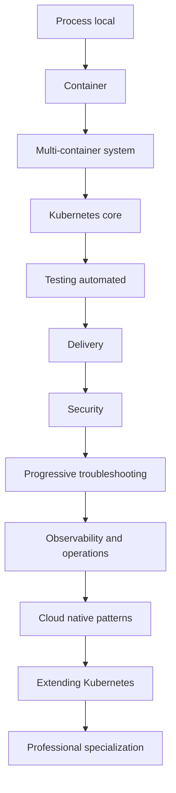

---

# Complete roadmap to learn Kubernetes from zero to professional, with references

The roadmap completo está dividido in tres layers.

## Capa 1. Base obligatoria

This capa construye the comprensión minimum seria.

Incluye:

- Foundations technical
- DevEx reproducible
- `jq` and `yq`
- Containers
- Docker
- Podman
- Compose
- Why Kubernetes exists
- Primer cluster
- `kubectl`
- Kubernetes mental model
- Pods
- Workloads
- Networking
- Configuration, secrets, and storage
## Capa 2. Profesionalización

This capa convierte the conocimiento basic in capacidad professional.

Incluye:

- Automated testing for Kubernetes
- Application delivery
- Security
- Troubleshooting progresivo
- Operations, observability, and reliability with Grafana LGTM
- Cloud native patterns
## Capa 3. Especialización

This capa permite profundizar según role.

Incluye:

- Extending Kubernetes
- CRDs
- Controllers
- Operators
- Admission webhooks
- Professionalization by role
- Proyecto final completo
- Orden recomendado of lectura
- Lecturas by libro
```mermaid
flowchart LR
  subgraph C1["Layer 1: required foundation"]
    A0["0. Foundations and DevEx"]
    A1["1. Containers"]
    A2["2. Why Kubernetes"]
    A3["3. First cluster and kubectl"]
    A4["4. Mental model"]
    A5["5. Pods"]
    A6["6. Workloads"]
    A7["7. Networking"]
    A8["8. Config, secrets and storage"]
  end

  subgraph C2["Layer 2: professionalization"]
    B9["9. Testing automated"]
    B10["10. Delivery"]
    B11["11. Security"]
    B12["12. Progressive troubleshooting"]
    B13["13. Operations and observability"]
    B14["14. Cloud native patterns"]
  end

  subgraph C3["Layer 3: specialization"]
    C15["15. Extension"]
    C16["16. Professionalization by role"]
    C17["Proyecto final"]
    C18["Lecturas and References"]
  end

  C1 --> C2 --> C3
```

---

# Sistema of ejemplo usado during the roadmap

For que the prácticas, diagramas and ejercicios tengan continuidad, everything the roadmap uses the same sistema of ejemplo.

## Sistema base

An application of comercio llamada `shop`.

Componentes:

- `frontend`
- `checkout-api`
- `payment-api`
- `inventory-api`
- `notification-worker`
- `Redis`
- `PostgreSQL`
Namespace principal:

- `shop`
Image principal:

- `checkout-api:1.0.0`
Ingress or Gateway:

- `shop-web`
Quality gate principal:

- `task test:k8s`
Input of troubleshooting:

- `task debug:*`
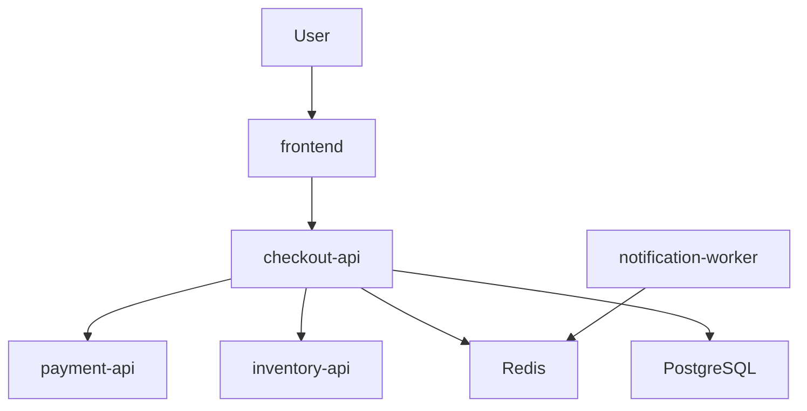

---

# Capa 1. Base obligatoria

---

# 0. Foundations, DevEx, and reproducible environment

## Objective

Build the base technical and preparar a learning environment que puedas run muchas veces without fricción.

This nivel tiene tres responsabilidades:

1. Learn the foundations minimum: Linux, network, HTTP, DNS, Git, YAML, JSON and processes
2. Create a developer experience reproducible with Taskfile
3. Learn tools of inspección como `jq` and `yq`
Kubernetes tiene muchas piezas. That is why conviene tener an environment ordenado desde the principio.

---

## 0.1. Foundations technical

### What estudiar

- Processes
- PID
- Signals como `SIGTERM` and `SIGKILL`
- Usuarios and permisos
- Ports
- TCP and UDP
- HTTP and HTTPS
- DNS
- TLS basic
- Environment variables
- Logs
- Git
- YAML
- JSON
- `curl`
- `grep`
- `ps`
- `top`
- `ss`
- `tail`
- `less`
### References

|Tipo|Recurso|
|---|---|
|HTTP|MDN HTTP Overview|
|DNS|MDN DNS / Domain names|
|Git|Pro Git Book|
|YAML|YAML 1.2.2 Specification|
|Kubernetes|Kubernetes Documentation home|
|Linux|Network Hat, What is Linux?|

---

## 0.2. DevEx minimum of the roadmap

### Objective

Create a repositorio of aprendizaje que not sea a folder llena of commands sueltos.

Desde the principio you should tener a forma común of run:

- Validaciones
- Build of images
- Ejecución with Docker
- Ejecución with Podman
- Levantar Compose
- Create cluster local
- Apply manifests
- See state
- Run smoke tests
- Limpiar Resources
- Reproducir escenarios of failure
Aquí entra Taskfile.

Taskfile not reemplaza Docker, Podman, Compose, Kubernetes ni CI/CD.

Su papel es otro:

> Taskfile es the capa of input humana to the repo.

The user not tiene que recordar veinte commands distintos. Aprende the concepts, but ejecuta the prácticas of forma repetible.

Ejemplo:

```bash
task doctor
task container:build
task compose:up
task k8s:kind:create
task k8s:apply
task k8s:status
task k8s:smoke
task clean
```

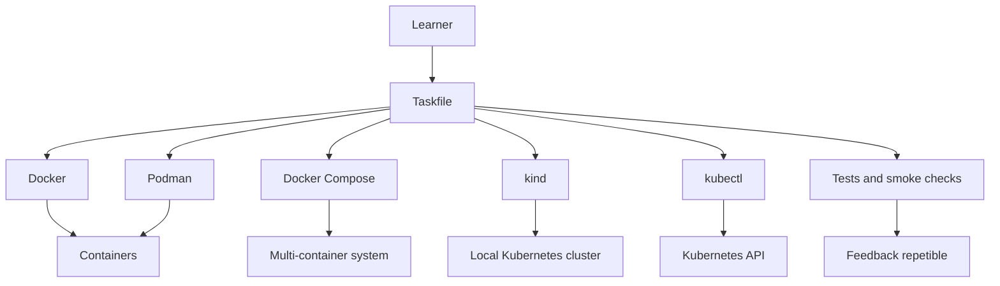

---

## 0.3. jq and yq como tools base

### Objective

Learn to inspect and transformar JSON and YAML of forma fiable.

Kubernetes se expresa habitualmente with YAML, but su API trabaja with objetos. `kubectl` can devolver información in JSON or YAML, and muchas tasks reales consisten in consultar campos, filtrar listas, validate estructura or comparar Resources.

Aquí entran `jq` and `yq`.

- `jq` sirve for consultar, filtrar and transformar JSON
- `yq` sirve for consultar, filtrar and transformar YAML
- `kubectl get -o json` combinado with `jq` permite inspect the state real of the cluster
- `yq` permite revisar and transformar manifests before of applylos
- Ambos networkucen dependencia of inspección manual and hacen possible create comprobaciones automated
### What estudiar

- JSON basic
- YAML basic
- Selectores of campos
- Filtros
- Arrays
- Objetos
- Pipes
- Transformaciones
- Output tabular
- Uso with `kubectl`
- Uso with manifests locales
- Uso in scripts of validación
- Uso in Taskfile
- Uso in troubleshooting
### References

|Tipo|Recurso|Uso|
|---|---|---|
|Tool|jq|For consultar and transformar JSON.|
|Tool|yq|For consultar and transformar YAML.|
|Kubernetes|kubectl output formats|For combinar `kubectl` with JSON, YAML and JSONPath.|

---

## 0.4. jq aplicado to Kubernetes

### Objective

Use `jq` for read the state real of the cluster without depender only of the output humana of `kubectl`.

### Ejemplos

Listar nombres of Pods in all the namespaces:

```bash
kubectl get pods -A -o json | jq -r '.items[].metadata.name'
```

Listar namespace and nombre of each Pod:

```bash
kubectl get pods -A -o json \
  | jq -r '.items[] | [.metadata.namespace, .metadata.name] | @tsv'
```

Listar images usadas by Pods:

```bash
kubectl get pods -A -o json \
  | jq -r '.items[].spec.containers[].image' \
  | sort -u
```

Listar Pods que not están Ready:

```bash
kubectl get pods -A -o json \
  | jq -r '
    .items[]
    | select(
        [.status.containerStatuses[]? | select(.ready == false)] | length > 0
      )
    | [.metadata.namespace, .metadata.name] | @tsv
  '
```

Detectar containers without requests:

```bash
kubectl get pods -A -o json \
  | jq -r '
    .items[]
    | . as $pod
    | .spec.containers[]
    | select(.resources.requests == null)
    | [$pod.metadata.namespace, $pod.metadata.name, .name] | @tsv
  '
```

Extraer eventos relevbefore:

```bash
kubectl get events -A -o json \
  | jq -r '
    .items[]
    | [.involvedObject.kind, .involvedObject.name, .reason, .message]
    | @tsv
  '
```

Eventos with signals of failure:

```bash
kubectl get events -A -o json \
  | jq -r '
    .items[]
    | select(.reason | test("Failed|BackOff|Unhealthy|FailedScheduling"))
    | [.metadata.namespace, .involvedObject.name, .reason, .message]
    | @tsv
  '
```

### Practice

Uses `jq` for responder:

- ¿What images se están ejecutando in the cluster?
- ¿What Pods not están Ready?
- ¿What Pods not tienen requests?
- ¿What Pods han sido reiniciados?
- ¿What eventos mencionan `Failed`, `BackOff`, `Unhealthy` or `FailedScheduling`?
- ¿What Services not tienen endpoints?
- ¿What Deployments not tienen all sus réplicas disponibles?
### Criterio of output

You can continuar when puedas explicar:

> `kubectl get` me da objetos. `jq` me permite hacer preguntas precisas about esos objetos.

---

## 0.5. yq aplicado to manifests

### Objective

Use `yq` for read, validate and transformar manifests before of applylos.

### Ejemplos

Listar the `kind` of all the manifests of a folder:

```bash
yq '.kind' kubernetes/**/*.yaml
```

Listar nombres of Resources:

```bash
yq '.metadata.name' kubernetes/**/*.yaml
```

Cambiar the namespace of a manifest:

```bash
yq -i '.metadata.namespace = "shop"' kubernetes/02-deployment/deployment.yaml
```

See the image of a Deployment:

```bash
yq '.spec.template.spec.containers[].image' kubernetes/02-deployment/deployment.yaml
```

Cambiar tag of image:

```bash
yq -i '
  .spec.template.spec.containers[] |=
  select(.name == "checkout-api").image = "checkout-api:1.0.0"
' kubernetes/02-deployment/deployment.yaml
```

Check if hay probes:

```bash
yq '.spec.template.spec.containers[] | {name, readinessProbe, livenessProbe}' kubernetes/**/*.yaml
```

Check if hay requests and limits:

```bash
yq '.spec.template.spec.containers[] | {name, resources}' kubernetes/**/*.yaml
```

### Practice

Uses `yq` for:

- Read all the `kind` of the repo
- Check que all the Resources tienen `metadata.name`
- Check que all the Resources tienen `metadata.labels`
- Cambiar the namespace of all the manifests of laboratorio
- Cambiar the tag of an image
- Detectar Deployments without `readinessProbe`
- Detectar containers without `resources.requests`
- Comparar a manifest before and after of a transformación
### Criterio of output

You can continuar when puedas explicar:

> YAML is not only texto. In Kubernetes representa objetos. `yq` me permite inspect and transformar esos objetos before of enviarlos to the API Server.

---

## 0.6. jq, yq and Taskfile juntos

### Objective

Incorporar `jq` and `yq` to the flujo reproducible of the repo.

### Ejemplo of tasks

```yaml
version: '3'

tasks:
  tools:check:
    desc: Check local tools required for this roadmap
    cmds:
      - docker --version
      - podman --version
      - docker compose version
      - kubectl version --client
      - kind version
      - jq --version
      - yq --version

  manifests:list-kinds:
    desc: List Kubernetes resource kinds from manifests
    cmds:
      - yq '.kind' kubernetes/**/*.yaml

  manifests:list-names:
    desc: List Kubernetes resource names from manifests
    cmds:
      - yq '.metadata.name' kubernetes/**/*.yaml

  cluster:list-images:
    desc: List images currently running in the cluster
    cmds:
      - kubectl get pods -A -o json | jq -r '.items[].spec.containers[].image' | sort -u

  cluster:not-ready:
    desc: List pods that are does not ready
    cmds:
      - kubectl get pods -A -o json | jq -r '.items[] | select(([.status.containerStatuses[]? | select(.ready == false)] | length) > 0) | [.metadata.namespace, .metadata.name] | @tsv'

  cluster:events:failures:
    desc: Show failure-related Kubernetes events
    cmds:
      - kubectl get events -A -o json | jq -r '.items[] | select(.reason | test("Failed|BackOff|Unhealthy|FailedScheduling")) | [.metadata.namespace, .reason, .message] | @tsv'
```

---

## 0.7. Ejemplo of estructura of repositorio

```text
kubernetes-learning-lab/
  Taskfile.yml
  README.md
  .env.example

  apps/
    frontend/
    checkout-api/
    payment-api/
    inventory-api/
    notification-worker/

  containers/
    docker/
    podman/

  compose/
    compose.yaml

  kubernetes/
    00-namespace/
    01-pod/
    02-deployment/
    03-service/
    04-ingress-o-gateway/
    05-config/
    06-storage/
    07-security/
    08-observability/

  scripts/
    smoke-test.sh
    wait-for-rollout.sh
    validate-tools.sh
    inspect-json.sh
    inspect-yaml.sh

  tests/
    manifests/
    policies/
    cluster/
    smoke/
    failure-lab/

  docs/
    commands.md
    troubleshooting.md
    failure-lab.md
    references.md
    jq-yq.md
```

---

## 0.8. Ejemplo inicial of Taskfile

```yaml
version: '3'

vars:
  APP_NAME: checkout-api
  IMAGE_NAME: checkout-api
  IMAGE_TAG: 1.0.0
  KIND_CLUSTER: shop-learning
  NAMESPACE: shop

tasks:
  default:
    desc: List available tasks
    cmds:
      - task --list

  doctor:
    desc: Check required local tools
    cmds:
      - docker --version
      - podman --version
      - docker compose version
      - kubectl version --client
      - kind version
      - helm version || true
      - jq --version
      - yq --version

  clean:
    desc: Clean generated local resources
    cmds:
      - docker compose -f compose/compose.yaml down -v || true
      - kind delete cluster --name {{.KIND_CLUSTER}} || true

  container:build:docker:
    desc: Build the application image with Docker
    cmds:
      - docker build -t {{.IMAGE_NAME}}:{{.IMAGE_TAG}} ./apps/{{.APP_NAME}}

  container:run:docker:
    desc: Run the application with Docker
    cmds:
      - docker run --rm -p 8080:8080 {{.IMAGE_NAME}}:{{.IMAGE_TAG}}

  container:build:podman:
    desc: Build the application image with Podman
    cmds:
      - podman build -t {{.IMAGE_NAME}}:{{.IMAGE_TAG}} ./apps/{{.APP_NAME}}

  container:run:podman:
    desc: Run the application with Podman
    cmds:
      - podman run --rm -p 8080:8080 {{.IMAGE_NAME}}:{{.IMAGE_TAG}}

  compose:up:
    desc: Start the local multi-container environment
    cmds:
      - docker compose -f compose/compose.yaml up -d --build

  compose:logs:
    desc: Follow local Compose logs
    cmds:
      - docker compose -f compose/compose.yaml logs -f

  compose:down:
    desc: Stop the local Compose environment
    cmds:
      - docker compose -f compose/compose.yaml down

  k8s:kind:create:
    desc: Create a local Kubernetes cluster with kind
    cmds:
      - kind create cluster --name {{.KIND_CLUSTER}}

  k8s:kind:delete:
    desc: Delete the local Kubernetes cluster
    cmds:
      - kind delete cluster --name {{.KIND_CLUSTER}}

  k8s:apply:
    desc: Apply Kubernetes manifests
    cmds:
      - kubectl apply -f kubernetes/00-namespace
      - kubectl apply -f kubernetes/01-pod
      - kubectl apply -f kubernetes/02-deployment
      - kubectl apply -f kubernetes/03-service

  k8s:delete:
    desc: Delete Kubernetes manifests
    cmds:
      - kubectl delete -f kubernetes/03-service --ignore-not-found
      - kubectl delete -f kubernetes/02-deployment --ignore-not-found
      - kubectl delete -f kubernetes/01-pod --ignore-not-found
      - kubectl delete -f kubernetes/00-namespace --ignore-not-found

  k8s:status:
    desc: Show useful Kubernetes status
    cmds:
      - kubectl get nodes
      - kubectl get pods -A
      - kubectl get svc -A
      - kubectl get events -A --sort-by=.metadata.creationTimestamp

  k8s:images:
    desc: Show images running in the cluster
    cmds:
      - kubectl get pods -A -o json | jq -r '.items[].spec.containers[].image' | sort -u

  k8s:not-ready:
    desc: Show pods that are does not ready
    cmds:
      - kubectl get pods -A -o json | jq -r '.items[] | select(([.status.containerStatuses[]? | select(.ready == false)] | length) > 0) | [.metadata.namespace, .metadata.name] | @tsv'

  manifests:kinds:
    desc: Show kinds defined in Kubernetes manifests
    cmds:
      - yq '.kind' kubernetes/**/*.yaml

  manifests:names:
    desc: Show resource names defined in Kubernetes manifests
    cmds:
      - yq '.metadata.name' kubernetes/**/*.yaml

  k8s:smoke:
    desc: Run smoke tests against the Kubernetes deployment
    cmds:
      - ./scripts/smoke-test.sh

  k8s:debug:
    desc: Print common debugging information
    cmds:
      - kubectl get pods -A -o wide
      - kubectl get deploy -A
      - kubectl get rs -A
      - kubectl get svc -A
      - kubectl get ingress -A || true
      - kubectl get events -A --sort-by=.metadata.creationTimestamp
      - kubectl get pods -A -o json | jq -r '.items[] | [.metadata.namespace, .metadata.name, .status.phase] | @tsv'
```

This Taskfile not must ocultar the commands. It must hacerlos visibles, repetibles and fáciles of run.

---

## 0.9. Practice

Before of seguir, you should poder:

- Levantar `checkout-api` localmente
- Exposela in a port
- Cambiar configuration with environment variables
- Read logs
- Hacer a petición with `curl`
- Parar the process of forma limpia
- Explicar what pasa when the process muere
- Read YAML basic
- Read JSON basic
- Consultar JSON with `jq`
- Consultar YAML with `yq`
- Run tasks comunes desde Taskfile
---

## 0.10. Criterio of output

You can pasar to the nivel 1 when puedas:

- Run `task doctor`
- Levantar `checkout-api` without container
- Explicar processes, ports, logs and environment variables
- Read YAML basic
- Read JSON basic
- Use `jq` for inspect output JSON
- Use `yq` for inspect manifests YAML
- Run tasks comunes desde Taskfile
- Explicar que Taskfile automatiza acciones, but not reemplaza the conocimiento of the tools
You can continuar when entiendes this frase:

> An application in producción is not only code. Es a process, with configuration, ports, permisos, dependencies, límites, logs, state and comportamiento ante failures.

---

# 1. Containers, Docker, Podman and Compose

## 1.1. Containers como concept

### Objective

Understand containers without confundirlos with Docker.

A container es a forma of run a process isolated, empaquetado and reproducible.

Docker and Podman son tools for build and run containers. Kubernetes is not Docker distribuido. Kubernetes orquesta workloads que normalmente se ejecutan como containers, usando runtimes compatibles with the ecosistema OCI.

The idea importante es this:

> A image es the paquete. A container es a process ejecutándose to partir of that paquete.

When you run an application without container, dependes mucho of the local environment: versión of the lenguaje, librerías instaladas, variables, sistema operativo, permisos and configuration.

When construyes an image, intentas capturar everything lo necessary for run that application of forma more repetible.

When you run a container, arrancas a process isolated with su filesystem, variables, network, user, límites and configuration.

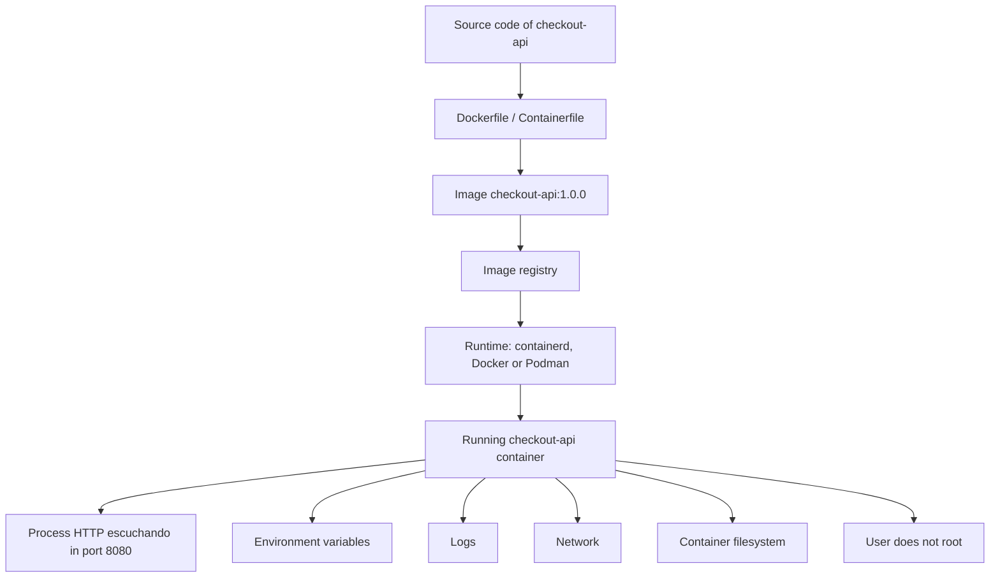

### What estudiar

- Container
- Image
- Image vs container
- Registry
- Dockerfile
- Containerfile
- Volúmenes
- Networks
- Docker
- Podman
- Docker Compose
- Limitaciones of Compose
- OCI
- Runtimes
- Namespaces
- Cgroups
- Filesystem of the container
- Processes
- Ports
- Environment variables
- Tags and digests
- Images OCI
- Security básica of images
### Documentación and enlaces

|Tipo|Recurso|Uso|
|---|---|---|
|Estándar|Open Container Initiative|For understand que exist especificaciones abiertas alnetworkedor of images and runtimes of containers.|
|Kubernetes|Container runtimes|For understand how Kubernetes se relaciona with containerd, CRI-O and CRI.|
|Docker|What is Docker?|For understand the plataforma Docker, images, containers, daemon, client and registries.|
|Docker|Dockerfile overview|For learn to build images properly.|
|Podman|Podman documentation|For understand Podman como tool daemonless for trabajar with containers e images OCI.|
|Podman|podman pod|For practicar pods locales before of entrar in Pods of Kubernetes.|
|Compose|Docker Compose docs|For definir and run applications multi-container.|

### Lecturas of libros

|Libro|What read|
|---|---|
|_Érase a vez Docker_|Introducción to containers, instalación of Docker, firsts pasos, gestión of images, containers, networks, publicación of ports and Compose.|
|_Kubernetes: Up and Running_|Chapter 2: images, Dockerfiles, security of image, multistage builds, registry and runtime.|
|_Kubernetes in Action_|Capítulos 1 and 2: containers, Docker, creación of image, ejecución, registry and firsts pasos hacia Kubernetes.|
|_Cloud Native DevOps with Kubernetes_|Capítulos 1 and 2: cloud, DevOps, containers, Dockerfile, images mínimas, registries and primer deployment.|

### Nota of actualidad

The concepts siguen siendo útiles, but the aprendizaje does not must quedarse in Docker. Conviene understand OCI, containerd, CRI-O, Podman and Docker Compose for does not confundir a tool concreta with the modelo of containers.

### Practice

Construye `checkout-api` and haz esto:

1. Runla without container
2. Create image with Docker
3. Runla with Docker
4. Runla with Podman
5. Subirla to a registry
6. Runla desde the registry
7. Cambiar tag by digest
8. Networkucir tamaño of image
9. Runla como user not root
10. Analizar what datos se pierden to the delete the container
### Criterio of output

Debes poder explicar:

> A image es the paquete. A container es a process ejecutándose to partir of that image. Docker and Podman son tools. The estándar and the modelo of ejecución son more importbefore que a tool concreta.

---

## 1.2. Docker

### Objective

Learn Docker como tool practice for build, run and distribuir containers.

### What estudiar

- `docker run`
- `docker ps`
- `docker logs`
- `docker exec`
- `docker build`
- `docker pull`
- `docker push`
- `docker inspect`
- Dockerfile
- Multi-stage builds
- Docker networks
- Docker volumes
- Docker registries
### Documentación and enlaces

|Tipo|Recurso|Uso|
|---|---|---|
|Oficial|Docker overview|Base conceptual of Docker, daemon, client, images, containers and registries.|
|Oficial|Dockerfile overview|For build images of forma limpia.|
|Oficial|Docker Compose|For pasar of a container to a app multi-container.|

### Practice

Haz a app with:

- `checkout-api`
- `PostgreSQL`
- `Redis`
- Volumen for `PostgreSQL`
- Network interna
- Environment variables
- Logs
- Reinicio of containers
- Borrado of containers without delete datos
- Borrado of volumen for observar pérdida of state
### Criterio of output

Debes poder explicar:

- What hace Docker
- What es específico of Docker
- What es común to the containers
- What resuelve Docker in desarrollo local
- What not resuelve Docker in operación distribuida
---

## 1.3. Podman

### Objective

Learn Podman como alternativa and complemento to Docker.

Podman es especialmente útil for understand containers rootless, flujos daemonless and pods locales.

### What estudiar

- CLI of Podman
- Rootless containers
- Images OCI
- Pods in Podman
- Diferencia between daemon and daemonless
- Compatibilidad conceptual with Docker
- Uso local of pods
### Documentación and enlaces

|Tipo|Recurso|Uso|
|---|---|---|
|Oficial|Podman docs|Base for install, run and build containers with Podman.|
|Oficial|podman pod|For understand how Podman agrupa containers in pods.|
|Kubernetes|Pods|For comparar the concept of pod local with the Pod como unidad of ejecución in Kubernetes.|

### Practice

Repite the ejercicios of Docker with Podman:

- `podman run`
- `podman ps`
- `podman logs`
- `podman exec`
- `podman build`
- `podman pull`
- `podman push`
- `podman pod create`
- `podman pod ps`
Then creates a pod local with:

- `checkout-api`
- A container auxiliar of logs or debug
- Port compartido
- Logs separados
- Parada and arranque of the pod completo
### Criterio of output

Debes poder explicar:

> Podman ayuda to understand que Docker is not the concept. The concept son containers, images, runtimes, processes isolated and, in algunos casos, pods.

---

## 1.4. Docker Compose como puente hacia Kubernetes

### Objective

Learn to run sistemas multi-container before of entrar in orquestación real.

Compose es a tool excelente for desarrollo local, but is not a orqustater completo. Compose te enseña dependencies, networks, volúmenes, services and configuration.

Kubernetes aparece when you need scheduling, reconciliación, rollouts, security, observability, escalado and operación multi-nodo.

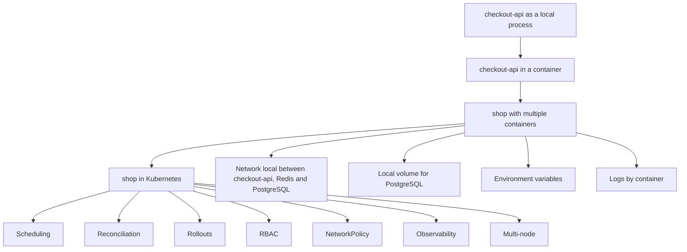

### Documentación and enlaces

|Tipo|Recurso|Uso|
|---|---|---|
|Oficial|Docker Compose docs|For definir and run applications multi-container.|
|Kubernetes|Overview|For understand the salto desde ejecución local to plataforma declarativa of workloads.|
|Kubernetes|Workloads|For see how Kubernetes modela Pods, Deployments, Jobs, CronJobs, StatefulSets and DaemonSets.|

### Practice

Creates a `compose.yaml` with:

- `frontend`
- `checkout-api`
- `payment-api`
- `inventory-api`
- `notification-worker`
- `PostgreSQL`
- `Redis`
- Volumen
- Network interna
- Variables
- Healthchecks
- Command of migración
After documenta the límites:

- Escalado
- Scheduling
- Rollouts
- Rollbacks
- Secrets
- Security
- Observability
- Multi-nodo
- Multi-team
- Auto-recuperación
### Criterio of output

Debes poder explicar:

> Compose es ideal for desarrollo local and sistemas simples. Kubernetes empieza to tener sentido when you need operate workloads distribuidos declaratively, segura, observable and recuperable.

---

# 2. Why Kubernetes exists

## Objective

Understand Kubernetes como respuesta to problemas of operación, not como moda.

Run a container not suele ser the gran problema.

The problema aparece when tienes muchos services, muchos deployments, muchos nodos, muchos equipos and muchos failures parciales ocurriendo to the same tiempo.

Imagina this sistema:

- `frontend`
- `checkout-api`
- `payment-api`
- `inventory-api`
- `notification-worker`
- `Redis`
- `PostgreSQL`
In local you can levantar algo parecido with Compose.

But in producción empiezan the preguntas difíciles:

- ¿Dónde runs each service?
- ¿What pasa if muere `checkout-api`?
- ¿What pasa if a nodo se queda without memoria?
- ¿How descubren the services dónde está `payment-api`?
- ¿How haces a rollout without cortar traffic?
- ¿How vuelves atrás if the nueva versión fails?
- ¿How separas configuration, secrets and binario?
- ¿How networkuces permisos?
- ¿How observas what está failing?
- ¿How evitas que a service hable with otro que should not?
- ¿How mantienes the state deseado without estar arreglando cosas to mano?
Kubernetes aparece for modelar and operate that tipo of problemas.

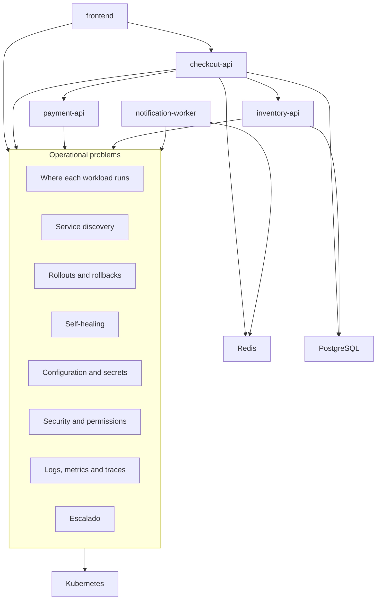

## What estudiar

- Orquestación
- State deseado
- State actual
- Reconciliación
- Scheduling
- Self-healing
- Service discovery
- Configuration declarativa
- Rollouts and rollbacks
- Escalado
- Security
- Observability
## Documentación and enlaces

|Tipo|Recurso|Uso|
|---|---|---|
|Oficial|Kubernetes Overview|For understand what es Kubernetes and what problema resuelve.|
|Oficial|Kubernetes Components|For empezar to see API Server, etcd, scheduler, kubelet and controllers.|
|Oficial|Kubernetes Objects|For understand que Kubernetes trabaja with objetos declarativos.|

## Lecturas of libros

|Libro|What read|
|---|---|
|_Kubernetes in Action_|Chapter 1: necesidad of Kubernetes, containers, arquitectura and beneficios.|
|_Kubernetes: Up and Running_|Chapter 1: velocidad, inmutabilidad, configuration declarativa, self-healing, escalado and eficiencia.|
|_Cloud Native DevOps with Kubernetes_|Chapter 1: cloud, DevOps, containers, Kubernetes, cloud native and operaciones.|

## Criterio of output

Debes poder explicar:

> Kubernetes does not exist because run a container sea difícil. Exists because operate muchos containers, in muchos nodos, with cambios constbefore, security, network, failures and equipos distintos yes es difícil.

---

# 3. First cluster and kubectl

## Objective

Tener an environment of practice and learn to hablar with the API of Kubernetes.

## What estudiar

- `kubectl`
- `kubeconfig`
- Contexts
- Namespaces
- Clusters locales
- Clusters gestionados
- Manifiestos
- `kubectl apply`
- `kubectl get`
- `kubectl describe`
- `kubectl logs`
- `kubectl exec`
- `kubectl port-forward`
- Output JSON with `kubectl get -o json`
- Output YAML with `kubectl get -o yaml`
- Uso of `jq` with `kubectl`
- Uso of `yq` with manifests
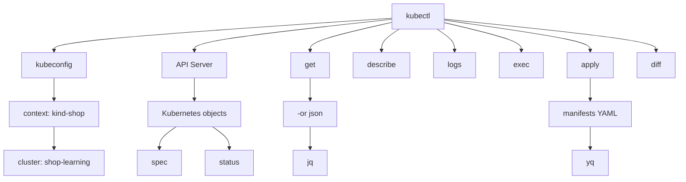

## Documentación and enlaces

|Tipo|Recurso|Uso|
|---|---|---|
|Oficial|Install tools|For install `kubectl` and tools básicas.|
|Oficial|kubectl command-line tool|For understand `kubectl` como client of the API.|
|Local|kind|For create clusters locales reproducibles.|
|Local|minikube|For practicar with a cluster local guiado.|
|Kubernetes|Container runtimes|For understand the runtime usado by the nodos.|
|Tool|jq|For analizar output JSON of `kubectl`.|
|Tool|yq|For analizar manifests YAML.|

## Lecturas of libros

|Libro|What read|
|---|---|
|_Kubernetes: Up and Running_|Chapter 3: cluster, minikube, cloud providers, client Kubernetes and componentes.|
|_Kubernetes: Up and Running_|Chapter 4: `kubectl`, namespaces, contexts, objetos, labels, annotations and debugging.|
|_Cloud Native DevOps with Kubernetes_|Chapter 3: arquitectura, managed Kubernetes, self-hosting and costes.|
|_Cloud Native DevOps with Kubernetes_|Chapter 7: `kubectl`, logs, exec, port-forward, contexts, namespaces and tools útiles.|
|_Kubernetes in Action_|Chapter 2: cluster local, Minikube, GKE, aliases and primer deployment.|

## Practice

Creates a repo:

```text
kubernetes-learning-lab/
  apps/
    frontend/
    checkout-api/
    payment-api/
    inventory-api/
    notification-worker/
  containers/
    docker/
    podman/
    compose/
  manifests/
    01-pod/
    02-deployment/
    03-service/
  notes/
    commands.md
    troubleshooting.md
```

Debes poder:

- Create a cluster local
- See nodos
- Desplegar `checkout-api` como Pod
- Read logs
- Entrar in the container
- Hacer port-forward
- Delete Resources
- Reconstruir everything desde manifiestos
- Obtener Pods in JSON
- Filtrar Pods with `jq`
- Inspect manifests with `yq`
## Criterio of output

Debes poder explicar:

> Kubernetes se controla to través of a API. `kubectl` is not Kubernetes. Es a client of that API.

---

# 4. Kubernetes mental model

## Objective

Pasar of use commands to understand the sistema.

## What estudiar

- API Server
- etcd
- Scheduler
- Controller Manager
- Cloud Controller Manager
- Kubelet
- Kube-proxy
- Container runtime
- CNI
- ConetworkNS
- Desinetwork state
- Actual state
- `spec`
- `status`
- Events
- Controllers
- Reconciliation loops
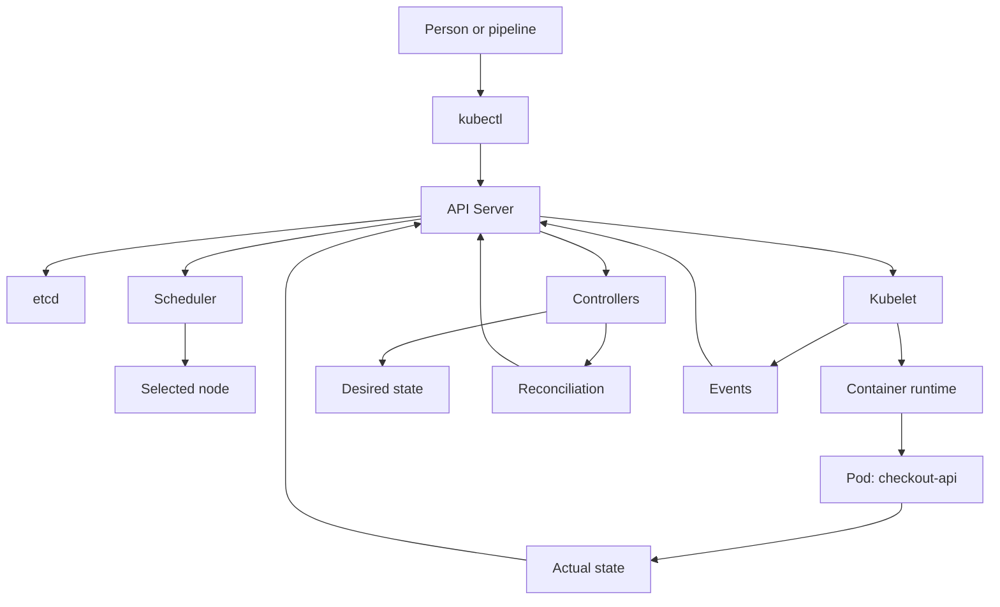

## What it means the modelo

Kubernetes does not funciona como a shell remota.

Kubernetes guarda objetos. Esos objetos tienen a intención in `spec` and a observación in `status`.

The controllers miran continuamente the diferencia between lo que should existir and lo que exists. When hay diferencia, intentan reconciliar.

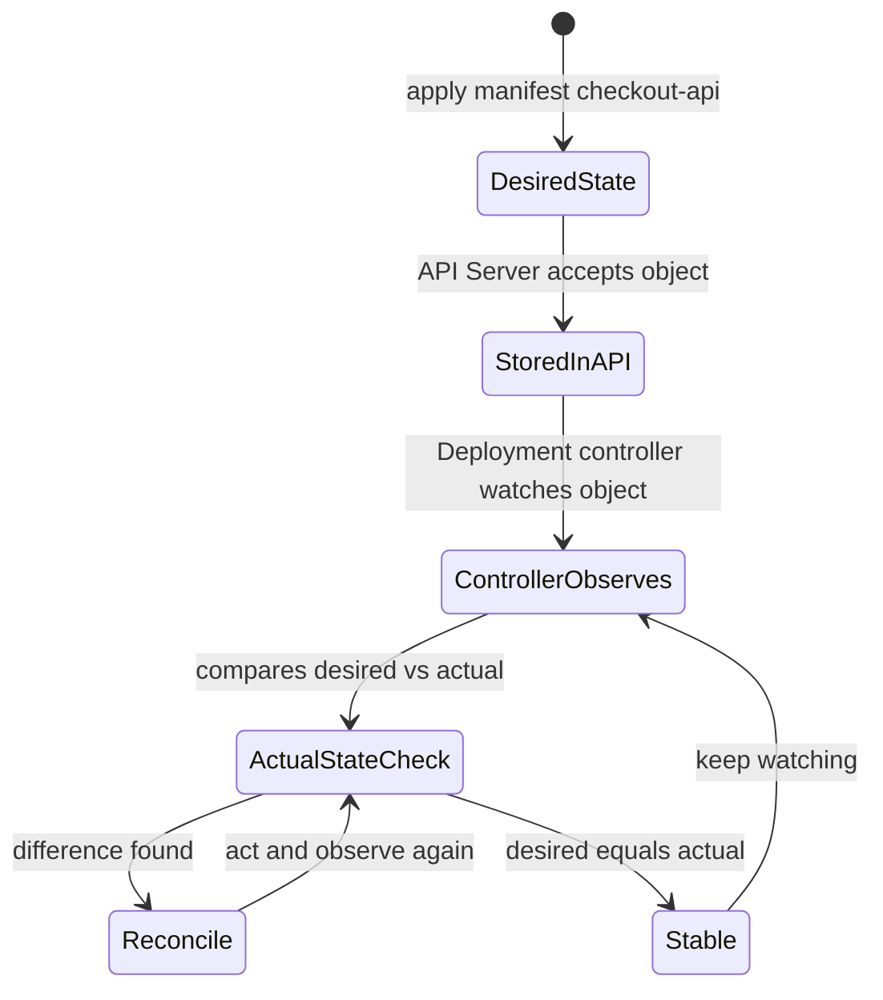

## Documentación and enlaces

|Tipo|Recurso|Uso|
|---|---|---|
|Oficial|Cluster Architecture|For understand control plane, nodos and componentes.|
|Oficial|Kubernetes Components|For estudiar API Server, etcd, scheduler, controller manager, kubelet and kube-proxy.|
|Oficial|Controllers|For understand the patrón of control and reconciliación.|
|Oficial|Kubernetes API|For understand Kubernetes como API declarativa.|

## Lecturas of libros

|Libro|What read|
|---|---|
|_Kubernetes in Action_|Chapter 11: internals, etcd, API Server, scheduler, controllers, kubelet, kube-proxy, add-ons, eventos, CNI, Services and high availability.|
|_Cloud Native DevOps with Kubernetes_|Capítulos 3 and 4: arquitectura, control plane, node components, objetos, Deployments, Pods, ReplicaSets, scheduler, manifests, Services and Helm basic.|
|_Kubernetes: Up and Running_|Capítulos 3, 4, 5, 9 and 10: cluster, `kubectl`, Pods, ReplicaSets, reconciliation loops and Deployments.|

## Practice

Creates a Deployment with tres réplicas of `checkout-api`.

Then:

- Borra a Pod manualmente
- Observa how vuelve
- Cambia the image
- Observa the rollout
- Uses an image inexistente
- Observa the failure
- Haz rollback
- Revisa eventos
- Uses `kubectl describe`
- Extrae the state with `kubectl get deploy -o json | jq`
- Compara the manifest local with the recurso aplicado
## Criterio of output

Debes poder explicar:

- What hace the API Server
- What guarda etcd
- What decide the scheduler
- What hace kubelet
- What hace a controller
- By what Kubernetes can autocorregir ciertos failures
- By what Kubernetes also can repetir errores declarados by ti
---

# 5. Pods and basic objects

## Objective

Understand the unidad minimum of ejecución in Kubernetes.

## What estudiar

- Pods
- Pod lifecycle
- Init containers
- Sidecar containers
- Ephemeral containers
- Labels
- Selectors
- Namespaces
- Annotations
- Probes
- Resource requests
- Resource limits
- SecurityContext
- Downward API
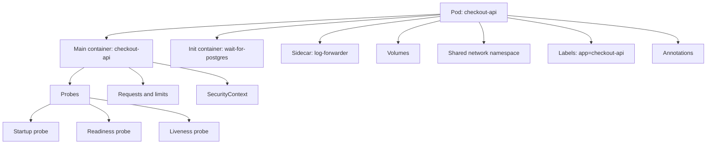

## Documentación and enlaces

|Tipo|Recurso|Uso|
|---|---|---|
|Oficial|Workloads|Input to Pods, workload APIs and gestión of workloads.|
|Oficial|Pods|For understand the Pod como unidad of ejecución.|
|Oficial|Pod Lifecycle|For understand fases, condiciones and reinicios.|
|Oficial|Init Containers|For preparar a Pod before of start the app principal.|
|Oficial|Sidecar Containers|For composición dentro of a Pod.|
|Oficial|Labels and Selectors|For identidad operativa and selección of objetos.|
|Oficial|Namespaces|For agrupar Resources.|
|Oficial|Annotations|For metadatos not selectivos.|
|Oficial|Liveness, Readiness and Startup Probes|For salud, readiness and arranque.|
|Oficial|Resource Management for Pods and Containers|For requests, limits and Resources.|

## Lecturas of libros

|Libro|What read|
|---|---|
|_Kubernetes in Action_|Capítulos 3 and 4: Pods, labels, selectors, namespaces, liveness probes, ReplicationControllers, ReplicaSets, DaemonSets, Jobs and CronJobs.|
|_Kubernetes: Up and Running_|Capítulos 5 and 6: Pods, health checks, resource management, volumes, labels and annotations.|
|_Kubernetes Patterns_|Capítulos 4, 5 and 6: Health Probe, Managed Lifecycle and Automated Placement.|
|_Cloud Native DevOps with Kubernetes_|Capítulos 5 and 8: resources, probes, lifecycle, containers, image tags, digests, ports, env vars, security context and volumes.|

## Nota of actualidad

For sidecars, uses documentación oficial actual. In Kubernetes moderno, the sidecar containers pueden modelarse como a clase especial of init containers with `restartPolicy: Always`.

## Practice

Creates a Pod `checkout-api` with:

- App principal
- Init container `wait-for-postgres`
- Readiness probe
- Liveness probe
- Startup probe
- Requests and limits
- SecurityContext restrictivo
- Configuration by variable of environment
- `emptyDir`
After rómpelo with:

- Image incorrecta
- Port incorrecto
- Probe incorrecta
- Memoria insuficiente
- Configuration ausente
- User without permisos
## Criterio of output

Debes poder diagnosticar:

- `ImagePullBackOff`
- `CrashLoopBackOff`
- `CreateContainerConfigError`
- `OOMKilled`
- Pod `Pending`
- Readiness failing
- Liveness reiniciando the container
- Problemas of permisos
---

# 6. Workloads

## Objective

Elegir the tipo correcto of controlador según the trabajo que quieres run.

## What estudiar

- ReplicaSet
- Deployment
- DaemonSet
- Job
- CronJob
- StatefulSet
- HPA
- VPA
- PodDisruptionBudget
- Rollouts
- Rollbacks
- Scheduling basic
- Requests
- Limits
- QoS
- LimitRange
- ResourceQuota
- Taints
- Tolerations
- Node affinity
- Pod affinity
- Pod anti-affinity
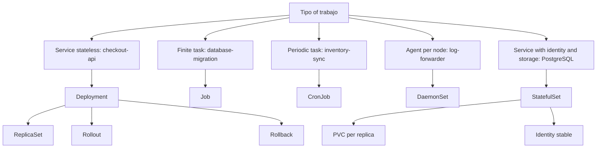

## Documentación and enlaces

|Tipo|Recurso|Uso|
|---|---|---|
|Oficial|Workloads|Vista general of Pods, Deployments, ReplicaSets, StatefulSets, DaemonSets, Jobs and CronJobs.|
|Oficial|Deployments|For applications stateless and rollouts declarativos.|
|Oficial|ReplicaSet|For understand how se mantienen réplicas.|
|Oficial|StatefulSets|For identidad estable, storage estable and workloads stateful.|
|Oficial|DaemonSet|For agentes by nodo.|
|Oficial|Jobs|For tasks finitas.|
|Oficial|CronJob|For tasks periódicas.|
|Oficial|Autoscaling Workloads|For HPA, VPA and escalado of workloads.|
|Oficial|Scheduling, Preemption and Eviction|For placement, taints, tolerations, affinity and evictions.|

## Lecturas of libros

|Libro|What read|
|---|---|
|_Kubernetes in Action_|Capítulos 4, 9 and 10: controllers, Deployments, rollbacks, StatefulSets, identidad estable, storage estable and node failures.|
|_Kubernetes in Action_|Chapter 14: requests, limits, QoS, LimitRange, ResourceQuota and monitorización of Resources.|
|_Kubernetes in Action_|Chapter 15: HPA, VPA and Cluster Autoscaler.|
|_Kubernetes in Action_|Chapter 16: taints, tolerations, node affinity, pod affinity and anti-affinity.|
|_Kubernetes: Up and Running_|Capítulos 9 to 12: ReplicaSets, Deployments, DaemonSets, Jobs and CronJobs.|
|_Kubernetes Patterns_|Batch Job, Periodic Job, Daemon Service, Singleton Service and Stateful Service.|
|_Kubernetes Patterns_|Chapter 24: Elastic Scale, incluyendo HPA, VPA and cluster autoscaling.|

## Practice

Construye:

- `checkout-api` como Deployment
- `database-migration` como Job
- `inventory-sync` como CronJob
- `log-forwarder` como DaemonSet
- `PostgreSQL` of laboratorio with StatefulSet
- Service for each pieza
- HPA for `checkout-api`
- Requests and limits in all the workloads
- PDB for `checkout-api` and `PostgreSQL`
- Afinidad or anti-affinity in to the less a caso controlado
## Criterio of output

Debes poder responder:

- ¿By what `checkout-api` es a Deployment and not a Job?
- ¿By what `database-migration` es a Job and not a Deployment?
- ¿By what `log-forwarder` es a DaemonSet and not a Deployment?
- ¿By what `PostgreSQL` requiere StatefulSet?
- ¿What pasa if borro a Pod of `checkout-api`?
- ¿What pasa if borro a PVC of `PostgreSQL`?
- ¿What ocurre during a rollout fallido?
- ¿How vuelvo to a versión anterior?
- ¿How afectan requests and limits to the scheduling?
- ¿Cuándo usarías HPA, VPA or Cluster Autoscaler?
- ¿What problema resuelven taints, tolerations, affinity and anti-affinity?
---

# 7. Networking

## Objective

Understand how se comunican the workloads dentro and fuera of the cluster.

Kubernetes networking not va only of abrir ports.

Va of dar identidad estable to workloads efímeros.

TO Pod can morir and volver with otra IP. A Deployment can create nuevas réplicas during a rollout. A Service mantiene a punto estable of acceso for que otros workloads not dependan of Pods concretos.

Ejemplo:

- `frontend` recibe traffic externo
- `frontend` llama to `checkout-api`
- `checkout-api` llama to `payment-api`
- `checkout-api` consulta `inventory-api`
- `checkout-api` uses `Redis` for state temporal
- `checkout-api` uses `PostgreSQL` for persistencia
- `notification-worker` consume trabajos desde `Redis`
- `PostgreSQL` not must aceptar traffic externo
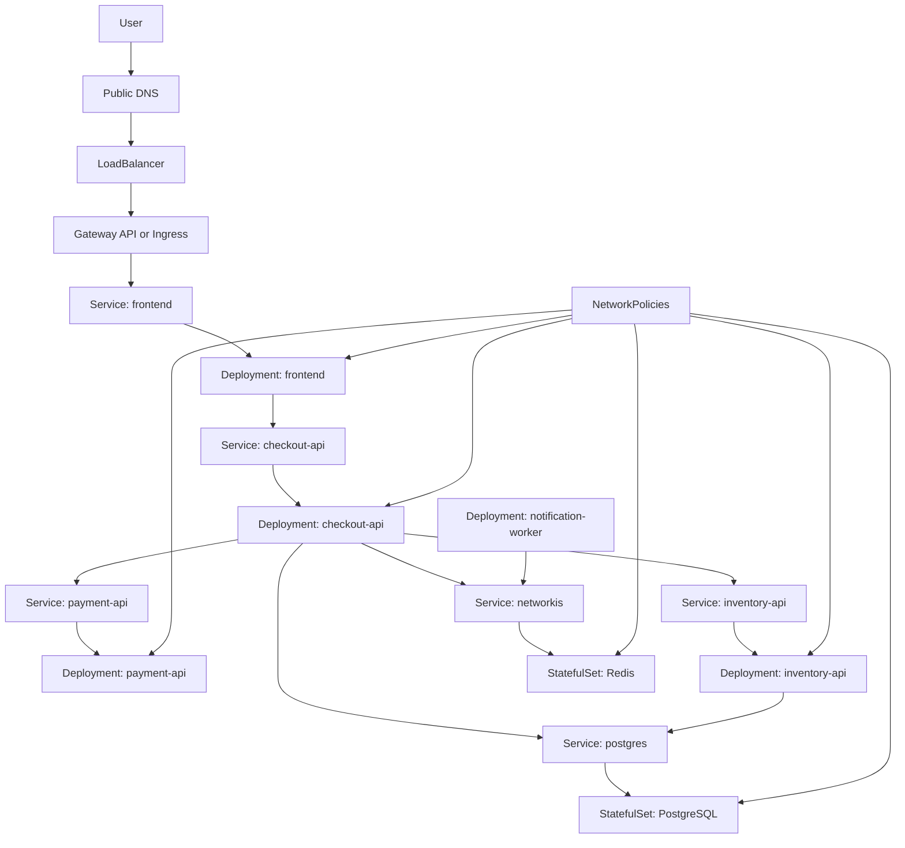

## What estudiar

- Pod IP
- Service
- ClusterIP
- NodePort
- LoadBalancer
- Headless Service
- EndpointSlices
- DNS interno
- Ingress
- Ingress Controller
- Gateway API
- NetworkPolicy
- CNI
- TLS
## Documentación and enlaces

|Tipo|Recurso|Uso|
|---|---|---|
|Oficial|Services, Load Balancing, and Networking|Input principal to networking in Kubernetes.|
|Oficial|Service|For identidad estable about Pods efímeros.|
|Oficial|Ingress|For input HTTP/HTTPS to the cluster.|
|Oficial|Ingress Controllers|For understand que a Ingress needs a controller.|
|Oficial|Gateway API|For the modelo modernot of input and routing with separación of responsabilidades.|
|Oficial|EndpointSlices|For understand endpoints escalables detrás of Services.|
|Oficial|Network Policies|For controlar traffic between Pods.|
|Oficial|DNS for Services and Pods|For resolución interna of nombres.|
|CNI|Cilium docs|For profundizar in networking, NetworkPolicy, eBPF and operación advanced.|
|TLS|cert-manager docs|For automatizar certificados TLS in Kubernetes.|

## Lecturas of libros

|Libro|What read|
|---|---|
|_Kubernetes in Action_|Chapter 5: Services, endpoints, NodePort, LoadBalancer, Ingress, TLS, readiness, headless services, DNS and troubleshooting of Services.|
|_Kubernetes: Up and Running_|Capítulos 7 and 8: Service Discovery e Ingress.|
|_Kubernetes Patterns_|Chapter 12: Service Discovery.|

## Nota of actualidad

Services, DNS e Ingress son concepts fundamentales. Gateway API, Cilium and cert-manager must estudiarse desde documentación actual because evolucionan more rápido que the libros.

## Practice

Construye:

- `frontend`
- `checkout-api`
- `payment-api`
- `inventory-api`
- `notification-worker`
- `Redis`
- `PostgreSQL`
- Ingress or Gateway API
- TLS
- NetworkPolicies
Valida:

- `frontend` only habla with `checkout-api`
- `checkout-api` habla with `payment-api`, `inventory-api`, `Redis` and `PostgreSQL`
- `notification-worker` habla with `Redis`
- `payment-api` not habla directamente with `PostgreSQL` if not lo needs
- `PostgreSQL` not acepta traffic externo
- `Redis` not acepta traffic desde `frontend`
- Nada habla with services not permitidos
## Criterio of output

Debes poder explicar:

- How llega a petición externa hasta `frontend`
- How `frontend` descubre `checkout-api`
- How `checkout-api` descubre `payment-api`
- By what a Service should not depender of a IP concreta of Pod
- Diferencia between Service, Ingress and Gateway API
- By what a Ingress needs controller
- What resuelve DNS dentro of the cluster
- What hace a NetworkPolicy
- By what a NetworkPolicy depende of the CNI
---

# 8. Configuration, secrets, and storage

## Objective

Separar binario, configuration, secrets and datos persistentes.

## What estudiar

- ConfigMaps
- Secrets
- External Secrets
- Sops
- KMS
- Volumes
- PersistentVolumes
- PersistentVolumeClaims
- StorageClasses
- Dynamic provisioning
- CSI
- Snapshots
- Backup
- Restore
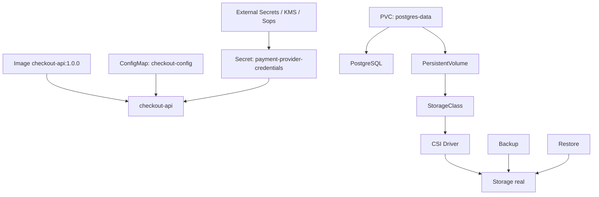

## Documentación and enlaces

|Tipo|Recurso|Uso|
|---|---|---|
|Oficial|Configuration|Input to ConfigMaps, Secrets, probes, resources and kubeconfig.|
|Oficial|ConfigMaps|For configuration not sensible.|
|Oficial|Secrets|For datos sensibles, entendiendo sus límites.|
|Oficial|Good practices for Kubernetes Secrets|For gestionar Secrets with more criterio.|
|Oficial|Storage|Input to volumes, PV, PVC, StorageClass, dynamic provisioning and snapshots.|
|Oficial|Volumes|For understand tipos of volumen.|
|Oficial|Persistent Volumes|For persistencia desacoplada of the Pod.|
|Oficial|Storage Classes|For provisioning dinámico.|
|Oficial|Volume Snapshots|For snapshots, when the driver lo soporte.|
|Tool|External Secrets Operator|For integrar Secrets externos in Kubernetes.|
|Tool|Velero|For backups and restore of Resources and volúmenes.|

## Lecturas of libros

|Libro|What read|
|---|---|
|_Kubernetes in Action_|Capítulos 6 and 7: volumes, PV, PVC, StorageClass, ConfigMaps and Secrets.|
|_Kubernetes: Up and Running_|Capítulos 13 and 15: ConfigMaps, Secrets, external services, reliable singletons, dynamic provisioning, StatefulSets and Persistent Volumes.|
|_Cloud Native DevOps with Kubernetes_|Chapter 10: ConfigMaps, Secrets, encryption at rest, estrategias of gestión of secrets, Sops and KMS.|
|_Cloud Native DevOps with Kubernetes_|Chapter 11: RBAC, security scanning, backups, etcd, resource state, cluster state and Velero.|

## Practice

Creates:

- `checkout-api` configurada by ConfigMap
- Secret for cnetworkenciales of `payment-api`
- `PostgreSQL` of laboratorio with PVC
- Backup manual
- Restore in otro namespace
- Rotación of Secret
- Cambio of ConfigMap with networkeploy controlado
## Criterio of output

Debes poder explicar:

- Diferencia between ConfigMap and Secret
- By what base64 is not cifrado
- What ocurre if a PVC se queda huérfano
- What pasa with the storage to the delete a StatefulSet
- How restaurar state in otro namespace or cluster
- What configuration must versionarse and cuál not
---

# Capa 2. Profesionalización

---

# 9. Automated testing for Kubernetes

## Objective

Learn to check of forma automated que the manifests, políticas, deployments and comportamientos basic of an application in Kubernetes funcionan before of integrarlos in a pipeline of delivery.

This section not va of TDD.

Va of build a estrategia of feedback fiable for Kubernetes.

The idea clave es:

> Not basta with que a YAML sea válido. Tiene que renderizarse bien, cumplir schemas, respetar políticas, ser aceptado by the API Server, desplegarse in a cluster real and demostrar que the application responde.

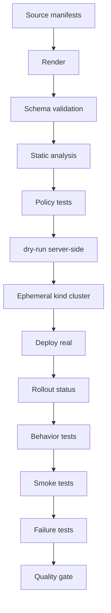

---

## 9.1. What estudiar

### Validación of manifests

- Render of manifests
- Validación of schemas
- Validación contra distintas versiones of Kubernetes
- Diferencia between validación local and validación of the API Server
- `kubectl apply --dry-run=server`
- `kubectl diff`
- Uso of `yq` for inspección previa
- Uso of `jq` for inspección of the state aplicado
### Análisis estático

- Falta of probes
- Falta of resource requests
- Falta of limits, when aplique
- Uso of images with `latest`
- SecurityContext débil
- Services without selectors correctos
- Configuration fragile
- Riesgos comunes in manifests
### Tests of políticas

- Políticas que aceptan Resources válidos
- Políticas que rechazan Resources peligrosos
- Reglas of security
- Reglas of naming
- Reglas of Resources minimum
- Reglas about images
- Reglas about namespaces
- Reglas about NetworkPolicies
### Tests in cluster local

- kind como cluster efímero
- Apply manifests in a cluster real
- Esperar rollouts
- Check Pods Ready
- Check Services
- Check endpoints
- Check Jobs completados
- Check CronJobs
- Check PVCs
- Check NetworkPolicies
### Smoke tests

- Health endpoint
- Readiness endpoint
- Endpoint principal of `checkout-api`
- Conectividad interna
- Conectividad externa
- Respuesta HTTP esperada
- Validación minimum of the flujo principal
### Failure tests

- Image inexistente
- ConfigMap ausente
- Secret ausente
- Service selector incorrecto
- Readiness rota
- Memory limit demasiado bajo
- RBAC insuficiente
- NetworkPolicy bloqueando traffic
- PVC pendiente
- Job fallido
---

## 9.2. Documentación and enlaces

|Tipo|Recurso|Uso|
|---|---|---|
|Kubernetes|`kubectl apply`|For `--dry-run=server`, validación and application declarativa.|
|Kubernetes|`kubectl diff`|For see cambios before of applylos.|
|Kubernetes|kind|For create clusters locales efímeros in tests automated.|
|Kubernetes|Kustomize|For renderizar manifests desde bases and overlays.|
|Helm|Helm template|For renderizar charts before of apply.|
|Helm|Helm lint|For detectar problemas basic in charts.|
|Testing|kubeconform|For validate manifests contra schemas of Kubernetes.|
|Testing|kube-score|For análisis estático of manifests.|
|Testing|Polaris|For auditoría of configuration and good practices.|
|Policy|Kyvernot CLI|For probar políticas and Resources without depender always of a cluster completo.|
|Policy|OPA Conftest|For probar políticas como code if usas Rego.|
|Kubernetes tests|Chainsaw|For tests declarativos about Resources Kubernetes.|
|Kubernetes tests|KUTTL|For testing of operators, controllers and comportamiento Kubernetes.|
|Infra tests|Terratest|For tests more programáticos, especialmente if mezclas Kubernetes, cloud e infraestructura.|
|Cluster validation|Sonobuoy|For conformance and diagnóstico of clusters, more útil for platform teams que for each PR of app.|
|CLI|jq|For inspect state real of the cluster in JSON.|
|CLI|yq|For inspect manifests renderizados in YAML.|

---

## 9.3. Lecturas of libros

|Libro|What read|
|---|---|
|_Cloud Native DevOps with Kubernetes_|Chapter 6: Operating Clusters, especialmente conformance, validation, auditing and chaos testing.|
|_Cloud Native DevOps with Kubernetes_|Chapter 14: Continuous Deployment, especialmente tests, build of container, validación of manifests, publicación of image and deployment.|
|_Kubernetes in Action_|Chapter 17: best practices for development and testing, lifecycle, shutdown, logs, manifests and CI/CD.|
|_Kubernetes: Up and Running_|Chapter 14: RBAC and testing of autorización with `can-i`.|
|_Kubernetes: Up and Running_|Chapter 17: real applications and testing.|
|_Kubernetes Patterns_|Health Probe, Declarative Deployment, Managed Lifecycle, Service Discovery, Elastic Scale, Controller and Operator.|

---

## 9.4. Practice

Create a suite of testing for the sistema `shop`.

The suite should check:

1. The manifests se renderizan properly
2. The manifests cumplen schemas
3. The manifests pasan análisis estático
4. The políticas aceptan Resources válidos
5. The políticas rechazan Resources peligrosos
6. The API Server acepta the Resources with `dry-run=server`
7. The Resources se despliegan in kind
8. The Deployment `checkout-api` llega to Ready
9. The Service `checkout-api` tiene endpoints
10. The smoke test responde properly
11. A Job of migración termina properly
12. A NetworkPolicy permite and bloquea lo esperado
13. A failure provocado deja signals diagnosticables
---

## 9.5. Ejemplo of estructura

```text
kubernetes-learning-lab/
  tests/
    manifests/
      rendered/
      schema/
      static-analysis/

    policies/
      kyverno/
      conftest/

    cluster/
      chainsaw/
        checkout-api-ready/
        checkout-service-has-endpoints/
        migration-job-completes/
        network-policy/

    smoke/
      smoke-test.sh

    failure-lab/
      checkout-image-pull-error/
      payment-missing-secret/
      checkout-bad-service-selector/
      checkout-bad-readiness/
      rbac-denied/
```

---

## 9.6. Ejemplo of Taskfile for testing

```yaml
version: '3'

vars:
  CLUSTER: shop-test
  RENDERED: .tmp/rendered.yaml
  NAMESPACE: shop

tasks:
  test:k8s:
    desc: Run the full Kubernetes test suite
    cmds:
      - task manifests:render
      - task manifests:inspect
      - task manifests:validate
      - task manifests:score
      - task policies:test
      - task cluster:create
      - task manifests:dry-run
      - task cluster:deploy
      - task cluster:test
      - task smoke:test
      - task cluster:inspect
      - task cluster:delete

  manifests:render:
    desc: Render Kubernetes manifests
    cmds:
      - mkdir -p .tmp
      - kubectl kustomize kubernetes/overlays/local > {{.RENDERED}}

  manifests:inspect:
    desc: Inspect rendered manifests with yq
    cmds:
      - yq '.kind' {{.RENDERED}}
      - yq '.metadata.name' {{.RENDERED}}

  manifests:validate:
    desc: Validate rendered manifests against Kubernetes schemas
    cmds:
      - kubeconform -strict -summary -ignore-missing-schemas {{.RENDERED}}

  manifests:score:
    desc: Run static analysis on rendered manifests
    cmds:
      - kube-score score {{.RENDERED}}

  policies:test:
    desc: Test Kubernetes policies
    cmds:
      - kyverno test tests/policies || true

  cluster:create:
    desc: Create disposable kind cluster
    cmds:
      - kind create cluster --name {{.CLUSTER}}

  cluster:delete:
    desc: Delete disposable kind cluster
    cmds:
      - kind delete cluster --name {{.CLUSTER}}

  manifests:dry-run:
    desc: Validate manifests against the Kubernetes API server
    cmds:
      - kubectl apply --dry-run=server --validate=strict -f {{.RENDERED}}

  cluster:deploy:
    desc: Deploy manifests to the test cluster
    cmds:
      - kubectl apply -f {{.RENDERED}}
      - kubectl rollout status deployment/checkout-api -n {{.NAMESPACE}} --timeout=120s

  cluster:test:
    desc: Run Kubernetes behavior tests
    cmds:
      - chainsaw test tests/cluster/chainsaw

  cluster:inspect:
    desc: Inspect cluster state after deployment
    cmds:
      - kubectl get pods -A -o json | jq -r '.items[] | [.metadata.namespace, .metadata.name, .status.phase] | @tsv'
      - kubectl get pods -A -o json | jq -r '.items[].spec.containers[].image' | sort -u

  smoke:test:
    desc: Run smoke tests
    cmds:
      - ./tests/smoke/smoke-test.sh
```

---

## 9.7. Criterio of output

You can pasar to Delivery when puedas:

- Renderizar manifests of forma repetible
- Validate manifests contra schemas
- Detectar problemas comunes of configuration
- Probar políticas with casos válidos e inválidos
- Create a cluster kind efímero
- Apply manifests in that cluster
- Esperar rollouts
- Run smoke tests
- Provocar a failure and diagnosticarlo with commands
- Use `jq` for inspect the state real
- Use `yq` for inspect manifests
- Run everything with a only command:
```bash
task test:k8s
```

---

# 10. Application delivery

## Objective

Pasar of apply YAML manualmente to entregar cambios of forma repetible, revisable and reversible.

This section consume the suite creada in the section 9.

The objective of Delivery es convertir esas comprobaciones in quality gates dentro of the flujo of delivery.

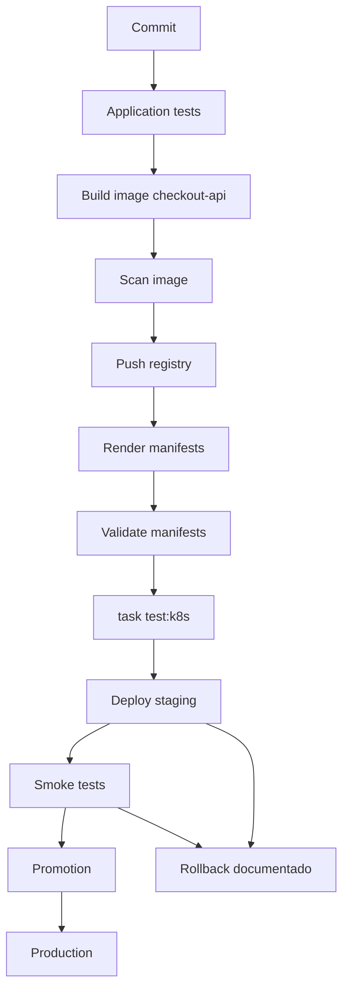

## What estudiar

- Manifiestos declarativos
- `kubectl apply`
- `kubectl diff`
- Server-side apply
- Kustomize
- Helm
- GitOps
- Argo CD
- Flux
- CI/CD
- Quality gates
- Build of image
- Scan of image
- Push to registry
- Render of manifests
- `task test:k8s`
- Deploy to staging
- Smoke tests
- Promoción
- Rollbacks
- Progressive delivery
- Validación of manifests
## Documentación and enlaces

|Tipo|Recurso|Uso|
|---|---|---|
|Oficial|Declarative Management of Kubernetes Objects|For gestionar objetos with files declarativos.|
|Oficial|Kustomize desde Kubernetes docs|For bases, overlays, generators and `kubectl apply -k`.|
|Oficial|Kustomize site|For understand Kustomize como configuration template-free.|
|Oficial|Helm docs|For charts, values, templates, releases, upgrades and rollbacks.|
|Oficial|Argo CD docs|For GitOps declarativo about Kubernetes.|
|Oficial|Flux docs|For GitOps basado in reconciliation continuous.|

## Lecturas of libros

|Libro|What read|
|---|---|
|_Cloud Native DevOps with Kubernetes_|Chapter 12: Helm, charts, templates, dependencies, upgrades, rollbacks, chart repos, Sops, Helmfile, Kustomize and tools of manifests.|
|_Cloud Native DevOps with Kubernetes_|Chapter 13: development workflow, deployment strategies, rolling updates, blue-green, canary and migraciones with Helm.|
|_Cloud Native DevOps with Kubernetes_|Chapter 14: continuous deployment, tests, validación of manifests, publicación of image and deploy.|
|_Kubernetes in Action_|Chapter 9: Deployments, rollouts, rollbacks, control of the rollout and bloqueo of versiones defectuosas.|
|_Kubernetes in Action_|Chapter 17: best practices, manifests, desarrollo and CI/CD.|
|_Kubernetes Patterns_|Chapter 3: Declarative Deployment, rolling, fixed, blue-green and canary release.|

## Nota of actualización

Tools como Draft, ksonnet, Gitkube or kubeval pueden aparecer in libros antiguos. For a formación actual, the núcleo práctico should apoyarse in Helm, Kustomize, Argo CD, Flux, kubeconform, policy tests and quality gates.

## Practice

Creates a pipeline que haga:

1. Tests
2. Build of image
3. Scan of image
4. Push to registry
5. Actualización of manifests
6. Validación of manifests
7. `task test:k8s`
8. Deploy to environment of tests
9. Smoke tests
10. Promoción to staging
11. Rollback documentado
## Criterio of output

Debes poder demostrar:

- A cambio llega to Kubernetes without commands manuales
- The manifiesto está versionado
- The deployment es reversible
- The state aplicado se can auditar
- The environment se can reconstruir desde Git
- A failure of rollout se detecta and se revierte
- The suite of testing of Kubernetes runs como quality gate before of the deployment
---

# 11. Security

## Objective

Networkucir permisos, exposición and blast radius.

## What estudiar

- RBAC
- ServiceAccounts
- Pod Security Standards
- Pod Security Admission
- SecurityContext
- NetworkPolicy
- Secrets
- Image scanning
- SBOM
- Admission control
- Audit logs
- Supply chain security
- Node hardening
- API Server hardening
- Multi-tenancy
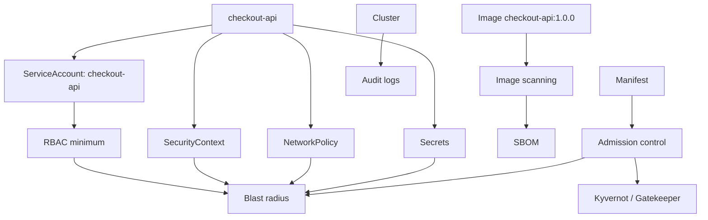

## Documentación and enlaces

|Tipo|Recurso|Uso|
|---|---|---|
|Oficial|Kubernetes Security|Input principal to security.|
|Oficial|Cloud Native Security|Modelo general of security cloud native.|
|Oficial|Pod Security Standards|For niveles Privileged, Baseline and Restricted.|
|Oficial|Pod Security Admission|For apply Pod Security Standards in namespaces.|
|Oficial|Service Accounts|For identidad of workloads.|
|Oficial|Controlling Access to Kubernetes API|For autenticación, autorización and acceso to the API.|
|Oficial|RBAC good practices|For minimum privilegio.|
|Oficial|Good practices for Kubernetes Secrets|For tratar secrets of forma more segura.|
|Oficial|Security Checklist|For revisión of security.|
|Tooling|Kyvernot docs|Policy as code and validación/mutación of Resources.|
|Tooling|OPA Gatekeeper docs|Policy as code with OPA in Kubernetes.|
|Tooling|Trivy docs|Escaneo of images, repositorios, Kubernetes, IaC, SBOM and vulnerabilidades.|

## Lecturas of libros

|Libro|What read|
|---|---|
|_Kubernetes in Action_|Chapter 12: API Server security, authentication, ServiceAccounts, RBAC, Roles, RoleBindings, ClusterRoles and ClusterRoleBindings.|
|_Kubernetes in Action_|Chapter 13: security contexts, host namespaces, capabilities, runAsUser, privileged mode, read-only filesystem and NetworkPolicy.|
|_Kubernetes: Up and Running_|Chapter 14: RBAC, identity, roles, role bindings, `can-i` and RBAC in source control.|
|_Cloud Native DevOps with Kubernetes_|Chapter 11: RBAC, cluster-admin, security scanning, backups, etcd and Velero.|

## Nota of actualización

PodSecurityPolicy must tratarse como contenido histórico. In a roadmap actual must sustituirse by Pod Security Admission, Pod Security Standards, Kyvernot u OPA Gatekeeper.

## Practice

Creates a namespace `shop` with:

- ServiceAccount by application
- RBAC minimum
- NetworkPolicy deny by default
- Pod Security Admission in modo restricted
- Secret external or cifrado
- Image not root
- Read-only filesystem
- Escaneo of image
- Policy que bloquee `latest`
## Criterio of output

Debes poder responder:

- ¿What can hacer `checkout-api` dentro of the cluster?
- ¿What secrets can read?
- ¿With what workloads can hablar?
- ¿What pasaría if this container se ve comprometido?
- ¿Cuál es the blast radius?
- ¿What policy impide desplegar algo peligroso?
---

# 12. Troubleshooting progresivo

## Objective

Learn to diagnosticar Kubernetes of forma ordenada, desde signals simples hasta failures distribuidos.

Troubleshooting is not a lista of commands.

Es a forma of pensar.

The objective es build a secuencia:

1. What should estar pasando
2. What está pasando
3. Dónde aparece the primera diferencia
4. What señal lo demuestra
5. What cambio corrige the causa
6. What test, policy or alerta evitaría repetir the failure
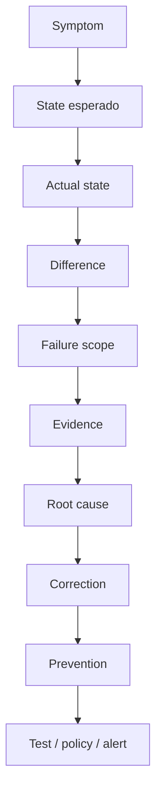

---

## 12.1. Modelo mental of troubleshooting

### Preguntas base

- ¿The recurso exists?
- ¿The recurso fue aceptado by the API Server?
- ¿The controller lo está reconciliando?
- ¿The Pod fue programado?
- ¿The container arrancó?
- ¿The app está viva?
- ¿The app está ready?
- ¿The Service selecciona Pods?
- ¿Hay endpoints?
- ¿DNS resuelve?
- ¿The network permite traffic?
- ¿The autorización permite the acción?
- ¿The storage está ligado?
- ¿The configuration exists?
- ¿The secret exists?
- ¿The límites of Resources son razonables?
- ¿The eventos dicen algo more tempranot que the logs?
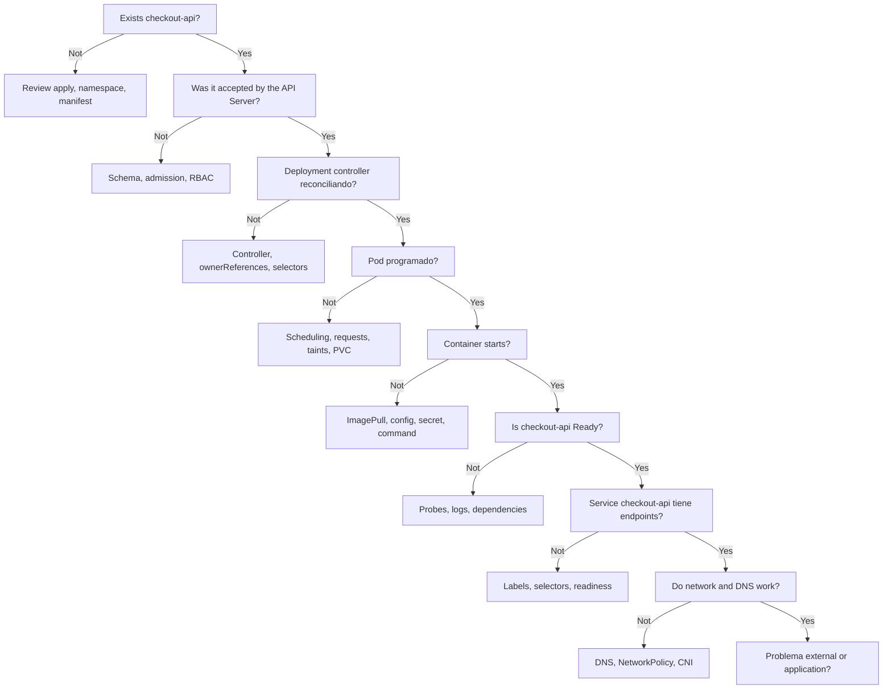

---

## 12.2. Nivel 1 of troubleshooting: commands esenciales

### What estudiar

- `kubectl get`
- `kubectl describe`
- `kubectl logs`
- `kubectl logs --previous`
- `kubectl events`
- `kubectl exec`
- `kubectl port-forward`
- `kubectl rollout status`
- `kubectl rollout history`
- `kubectl rollout undo`
- `kubectl auth can-i`
- `kubectl top`
- `kubectl explain`
- `kubectl get -o yaml`
- `kubectl get -o json`
- `jq`
- `yq`
### Practice

For each recurso desplegado, ejecuta:

```bash
kubectl get pods -A
kubectl get pods -A -o wide
kubectl describe pod <pod> -n shop
kubectl logs <pod> -n shop
kubectl logs <pod> -n shop --previous
kubectl get events -A --sort-by=.metadata.creationTimestamp
kubectl get deploy -A
kubectl rollout status deployment/checkout-api -n shop
kubectl get svc -A
kubectl get endpointslices -A
kubectl auth can-i get pods -n shop
kubectl get pods -A -o json | jq -r '.items[] | [.metadata.namespace, .metadata.name, .status.phase] | @tsv'
```

### Criterio of output

Debes poder explicar what command usarías for responder:

- ¿Exists the recurso?
- ¿In what namespace está?
- ¿What evento explica the failure?
- ¿What container falló?
- ¿What image está usando?
- ¿What probes tiene?
- ¿What Service lo selecciona?
- ¿What permisos tiene?
---

## 12.3. Nivel 2 of troubleshooting: Pods and containers

### Síntomas

- `ImagePullBackOff`
- `ErrImagePull`
- `CrashLoopBackOff`
- `CreateContainerConfigError`
- `RunContainerError`
- `OOMKilled`
- `Pending`
- Readiness failing
- Liveness reiniciando
- Startup probe demasiado agresiva
- Permisos of filesystem
### What estudiar

- `kubectl describe pod`
- `kubectl logs`
- `kubectl logs --previous`
- `kubectl get pod -o yaml`
- `kubectl get events`
- Image pull secrets
- Entrypoint and command
- Environment variables
- ConfigMap ausente
- Secret ausente
- Requests and limits
- SecurityContext
- Probes
### Practice

Provoca and documenta:

|Failure|Señal esperada|Command principal|
|---|---|---|
|Image inexistente in `checkout-api`|`ImagePullBackOff`|`kubectl describe pod`|
|Command incorrecto in `payment-api`|`CrashLoopBackOff`|`kubectl logs --previous`|
|Secret ausente in `payment-api`|`CreateContainerConfigError`|`kubectl describe pod`|
|Memory limit bajo in `inventory-api`|`OOMKilled`|`kubectl describe pod`|
|Readiness incorrecta in `checkout-api`|Pod Running but not Ready|`kubectl describe pod`|
|User without permisos in `notification-worker`|Crash or permission denied|`kubectl logs`|

---

## 12.4. Nivel 3 of troubleshooting: Workloads

### Síntomas

- Deployment not disponible
- Rollout bloqueado
- ReplicaSet creado but Pods failing
- Job not completa
- CronJob not ejecuta
- StatefulSet not progresa
- DaemonSet not llega to all the nodos
- HPA not escala
### What estudiar

- ReplicaSets
- Owner references
- Selectors
- Rollout history
- Rollback
- Job completions
- Job backoffLimit
- CronJob schedule
- StatefulSet identity
- PVCs by réplica
- DaemonSet scheduling
- HPA metrics
### Commands

```bash
kubectl get deploy -A
kubectl describe deploy checkout-api -n shop
kubectl get rs -n shop
kubectl rollout status deployment/checkout-api -n shop
kubectl rollout history deployment/checkout-api -n shop
kubectl rollout undo deployment/checkout-api -n shop
kubectl get jobs -A
kubectl describe job database-migration -n shop
kubectl get cronjobs -A
kubectl get statefulsets -A
kubectl get daemonsets -A
kubectl get hpa -A
```

### Practice

Provoca and documenta:

- Rollout of `checkout-api` with image rota
- Deployment `payment-api` with selector incorrecto
- Job `database-migration` que fails varias veces
- CronJob `inventory-sync` suspendido
- StatefulSet `PostgreSQL` with PVC pendiente
- DaemonSet `log-forwarder` que not can programarse in a nodo by taint
- HPA of `checkout-api` without métricas
---

## 12.5. Nivel 4 of troubleshooting: Networking

### Síntomas

- `frontend` not can llamar to `checkout-api`
- `checkout-api` not can llamar to `payment-api`
- `checkout-api` not can resolver `inventory-api`
- `notification-worker` not can conectar with `Redis`
- `checkout-api` not can conectar with `PostgreSQL`
- Service without endpoints
- DNS not resuelve
- Ingress responde 404
- Ingress responde 502
- Gateway not enruta
- NetworkPolicy bloquea traffic
- TLS fails
- Desde dentro funciona, but desde fuera not
- The LoadBalancer recibe traffic, but the app not responde
### What estudiar

- Services
- Selectors
- EndpointSlices
- DNS interno
- ConetworkNS
- Ingress Controller
- Gateway API
- NetworkPolicy
- CNI
- TLS
- cert-manager
### Commands

```bash
kubectl get svc -A
kubectl describe svc checkout-api -n shop
kubectl get endpointslices -A
kubectl get ingress -A
kubectl describe ingress shop-web -n shop
kubectl get gateway -A
kubectl get httproute -A
kubectl get networkpolicy -A
kubectl logs -n kube-system -l k8s-app=kube-dns
kubectl run debug-shell --rm -it --image=busybox -- sh
```

### Practice

Provoca and documenta:

- `frontend` apunta to a nombre of Service incorrecto
- `checkout-api` not está Ready, by lo que not aparece como endpoint
- `payment-api` tiene labels que not coinciden with the selector of the Service
- `inventory-api` fails by DNS bad escrito
- `notification-worker` queda bloqueado by a NetworkPolicy
- `PostgreSQL` recibe traffic desde a workload not permitido
- Ingress exists, but not hay Ingress Controller
- TLS secret ausente
- Ruta HTTP bad configurada
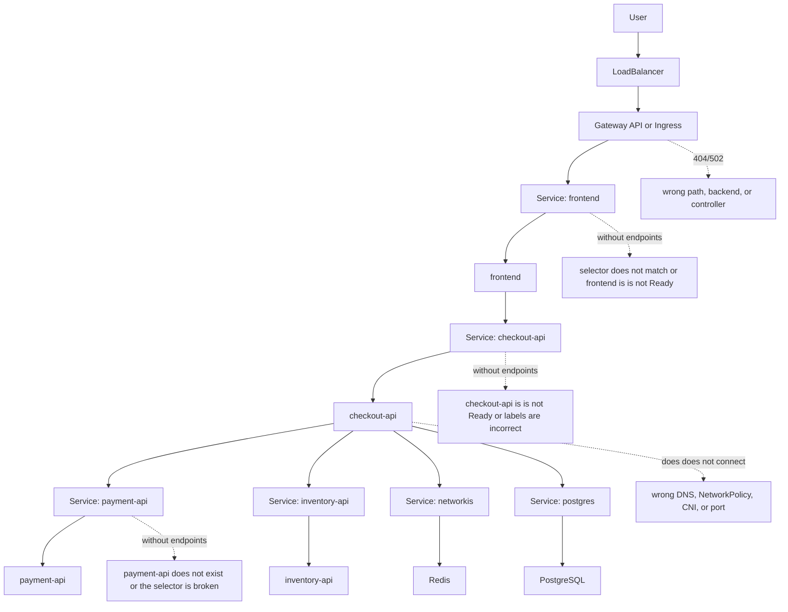

### Criterio of output

Debes poder diagnosticar:

- By what `frontend` not llega to `checkout-api`
- By what `checkout-api` not llega to `payment-api`
- By what `checkout-api` not resuelve `inventory-api`
- By what `notification-worker` not conecta with `Redis`
- By what `PostgreSQL` está recibiendo traffic que should not
- By what a Service not tiene endpoints
- By what a Ingress responde 404 or 502
- By what a NetworkPolicy bloquea traffic esperado
---

## 12.6. Nivel 5 of troubleshooting: Configuration, secrets and storage

### Síntomas

- ConfigMap ausente
- Secret ausente
- Variable of environment incorrecta
- File montado where not toca
- PVC `Pending`
- Pod bloqueado by volumen
- StatefulSet does not start
- Datos desaparecen tras delete Resources
- Restore incompleto
### What estudiar

- ConfigMap
- Secret
- Volume mounts
- PVC
- PV
- StorageClass
- Dynamic provisioning
- Access modes
- Reclaim policy
- Snapshots
- Backup
- Restore
### Commands

```bash
kubectl get configmap -A
kubectl describe configmap checkout-config -n shop
kubectl get secret -A
kubectl describe secret payment-provider-credentials -n shop
kubectl get pvc -A
kubectl describe pvc postgres-data -n shop
kubectl get pv
kubectl get storageclass
kubectl describe pod <pod> -n shop
```

### Practice

Provoca and documenta:

- ConfigMap `checkout-config` inexistente
- Secret `payment-provider-credentials` inexistente
- Key incorrecta dentro of the ConfigMap
- PVC without StorageClass
- StatefulSet `PostgreSQL` with PVC retenido
- Borrado of StatefulSet without delete PVC
- Restore in otro namespace
---

## 12.7. Nivel 6 of troubleshooting: Security and RBAC

### Síntomas

- `Forbidden`
- ServiceAccount without permisos
- Pod not can listar Resources
- Admission rechaza manifest
- Pod Security Admission bloquea Pod
- Policy bloquean image
- NetworkPolicy bloquea comunicación
- Secret not accesible
### What estudiar

- ServiceAccounts
- Roles
- RoleBindings
- ClusterRoles
- ClusterRoleBindings
- `kubectl auth can-i`
- Admission controllers
- Pod Security Admission
- Kyverno
- Gatekeeper
- Audit logs
### Commands

```bash
kubectl auth can-i get pods -n shop
kubectl auth can-i get configmaps -n shop --as=system:serviceaccount:shop:checkout-api
kubectl auth can-i get secrets -n shop --as=system:serviceaccount:shop:checkout-api
kubectl get role -A
kubectl get rolebinding -A
kubectl get clusterrole
kubectl get clusterrolebinding
kubectl describe role checkout-api -n shop
kubectl describe rolebinding checkout-api -n shop
```

### Practice

Provoca and documenta:

- ServiceAccount without permiso for read ConfigMaps
- RoleBinding in namespace incorrecto
- Policy que rechaza `runAsRoot`
- Policy que rechazan image `latest`
- NetworkPolicy que bloquea traffic necessary
- Admission webhook caído or demasiado restrictivo
---

## 12.8. Nivel 7 of troubleshooting: Nodos and cluster

### Síntomas

- Pods `Pending`
- `FailedScheduling`
- Nodo `NotReady`
- Presión of memoria
- Presión of disco
- Pods evicted
- CNI failing
- ConetworkNS failing
- metrics-server ausente
- HPA without métricas
- Volúmenes not montan
- Drenado of nodo afecta disponibilidad
### What estudiar

- Nodes
- Conditions
- Taints
- Tolerations
- Requests
- Limits
- Evictions
- CNI
- ConetworkNS
- kubelet
- kube-proxy
- metrics-server
- Cluster Autoscaler
- PDB
- Drain
- Cordón of nodo
### Commands

```bash
kubectl get nodes
kubectl describe node <node>
kubectl top nodes
kubectl top pods -A
kubectl get pods -A -o wide
kubectl get events -A --sort-by=.metadata.creationTimestamp
kubectl cordon <node>
kubectl drain <node> --ignore-daemonsets --delete-emptydir-data
kubectl uncordon <node>
```

### Practice

Provoca and documenta:

- Pod with requests imposibles
- Nodo with taint without toleration
- PDB que bloquea drain
- Pod evicted by Resources
- HPA without metrics-server
- ConetworkNS failing
- Network plugin failing in laboratorio controlado
---

## 12.9. Nivel 8 of troubleshooting: Delivery and GitOps

### Síntomas

- Pipeline verde but deploy roto
- Manifests renderizados diferentes to lo esperado
- Argo CD OutOfSync
- Flux not reconcilia
- Helm release fallida
- Rollback incompleto
- Drift between Git and cluster
- Secret not disponible during deploy
- Hook of migración fails
### What estudiar

- Render of manifests
- Helm template
- Helm values
- Helm release history
- Kustomize overlays
- GitOps reconciliation
- Drift
- Rollback
- Progressive delivery
- Quality gates
### Commands

```bash
helm template ./chart
helm lint ./chart
helm upgrade --install shop ./chart -n shop
helm history shop -n shop
helm rollback shop <revision> -n shop
kubectl diff -f <manifest>
kubectl apply --dry-run=server -f <manifest>
```

### Practice

Provoca and documenta:

- Helm values incorrectos
- Kustomize overlay with patch roto
- Deployment aplicado manualmente que genera drift
- Rollback to versión anterior
- Hook of migración fallido
- Pipeline que not ejecuta `task test:k8s`
---

## 12.10. Nivel 9 of troubleshooting: Observability

### Síntomas

- Not hay logs
- Logs without correlación
- Métricas ausentes
- Trazas incompletas
- Dashboard engañoso
- Alerta ruidosa
- Alerta ausente
- SLO not medido
- Incidente without runbook
- Señal technical without impacto of user
### What estudiar

- Logs with Loki
- Métricas with Mimir
- Trazas with Tempo
- Dashboards with Grafana
- OpenTelemetry
- Grafana Alloy u OpenTelemetry Collector
- Alerting
- SLI
- SLO
- Runbooks
- Correlación between signals
### Practice

For each failure of the failure lab documenta:

- Síntoma visible for the user
- Evento of Kubernetes
- Log relevante
- Métrica relevante
- Traza relevante, if aplica
- Dashboard where se ve
- Alerta que should saltar
- Runbook que seguirías
- Test que lo habría detectado before
---

## 12.11. Ejemplo of runbook of troubleshooting

````markdown
# Runbook: checkout-api no llega a Ready

## Symptom

El Deployment `checkout-api` no alcanza disponibilidad.

## Comandos iniciales

```bash
kubectl get deploy checkout-api -n shop
kubectl describe deploy checkout-api -n shop
kubectl get rs -n shop
kubectl get pods -n shop -o wide
kubectl describe pod <pod> -n shop
kubectl logs <pod> -n shop
kubectl logs <pod> -n shop --previous
kubectl get events -n shop --sort-by=.metadata.creationTimestamp
````

## Preguntas

- El Deployment existe?
    
- El ReplicaSet existe?
    
- Los Pods se crean?
    
- Are the Pods Pending, Running, CrashLoopBackOff, or ImagePullBackOff?
    
- La app arranca?
    
- La readiness probe pasa?
    
- Hay endpoints en el Service?
    

## Causas frecuentes

- Nonexistent image.
    
- Missing ConfigMap.
    
- Missing Secret.
    
- Probe mal configurada.
    
- Requests imposibles.
    
- Permisos insuficientes.
    
- App listens en otro puerto.
    

## Correction

Document the root cause and apply the smallest change.

## Prevention

- Add a test to `task test:k8s`.
    
- Add a policy if applicable.
    
- Add an alert if applicable.
    
- Add a case to the failure lab.
    

````

---

## 12.12. Ejemplo de Taskfile para troubleshooting

```yaml
version: '3'

vars:
  NAMESPACE: shop
  APP: checkout-api

tasks:
  debug:all:
    desc: Run progressive troubleshooting checks
    cmds:
      - task debug:resources
      - task debug:events
      - task debug:pods
      - task debug:services
      - task debug:rbac

  debug:resources:
    desc: Show main resources
    cmds:
      - kubectl get all -n {{.NAMESPACE}}
      - kubectl get configmap,secret,pvc -n {{.NAMESPACE}}

  debug:events:
    desc: Show namespace events
    cmds:
      - kubectl get events -n {{.NAMESPACE}} --sort-by=.metadata.creationTimestamp

  debug:pods:
    desc: Show pod status and images
    cmds:
      - kubectl get pods -n {{.NAMESPACE}} -o wide
      - kubectl get pods -n {{.NAMESPACE}} -o json | jq -r '.items[] | [.metadata.name, .status.phase] | @tsv'
      - kubectl get pods -n {{.NAMESPACE}} -o json | jq -r '.items[].spec.containers[].image' | sort -u

  debug:services:
    desc: Show services and endpoints
    cmds:
      - kubectl get svc -n {{.NAMESPACE}}
      - kubectl get endpointslices -n {{.NAMESPACE}}

  debug:rbac:
    desc: Check basic permissions
    cmds:
      - kubectl auth can-i get pods -n {{.NAMESPACE}}
      - kubectl auth can-i get configmaps -n {{.NAMESPACE}}
      - kubectl auth can-i get secrets -n {{.NAMESPACE}}
````

---

## 12.13. Criterio de salida

Puedes pasar a operación y observabilidad cuando puedas:

- Diagnosticar un Pod roto
- Diagnosticar un Deployment bloqueado
- Diagnosticar un Service sin endpoints
- Diagnosticar DNS interno
- Diagnosticar NetworkPolicy
- Diagnosticar RBAC
- Diagnosticar PVC pendiente
- Diagnosticar rollout fallido
- Usar eventos antes de saltar a conclusiones
- Usar `jq` para leer el estado real
- Usar `yq` para inspeccionar manifests
- Escribir un runbook breve para cada fallo
- Convertir un fallo aprendido en test, policy o alerta
---

# 13. Operación, observability and fiabilidad con Grafana LGTM

## Objetivo

Aprender a diagnosticar, mantener y recuperar sistemas usando un stack de observabilidad basado en Grafana LGTM.

En este roadmap, la estrategia de observabilidad se basa en:

- Logs con Loki
- Métricas con Mimir
- Trazas con Tempo
- Visualización con Grafana
- Recolección con Grafana Alloy u OpenTelemetry Collector
La observabilidad no es instalar dashboards.

La observabilidad es poder responder preguntas operativas sobre un sistema real:

- ¿Está fallando `checkout-api`?
- ¿El fallo está en `payment-api` o en el proveedor externo de pagos?
- ¿`inventory-api` está respondiendo lento?
- ¿`notification-worker` está acumulando trabajos?
- ¿`PostgreSQL` está saturado?
- ¿El usuario está viendo errores o solo hay ruido interno?
- ¿Qué cambió antes del incidente?
- ¿Qué alerta debería haber avisado?
- ¿Qué runbook debería seguir el equipo?
```mermaid
flowchart TD
  Frontend["frontend"] --> Checkout["checkout-api"]
  Checkout --> Payment["payment-api"]
  Checkout --> Inventory["inventory-api"]
  Checkout --> Redis["Redis"]
  Checkout --> Postgres["PostgreSQL"]
  Worker["notification-worker"] --> Redis

  Frontend --> Logs["Logs"]
  Checkout --> Logs
  Payment --> Logs
  Inventory --> Logs
  Worker --> Logs

  Frontend --> Metrics["Metrics"]
  Checkout --> Metrics
  Payment --> Metrics
  Inventory --> Metrics
  Worker --> Metrics
  Redis --> Metrics
  Postgres --> Metrics

  Frontend --> Traces["Trazas"]
  Checkout --> Traces
  Payment --> Traces
  Inventory --> Traces

  Logs --> Alloy["Grafana Alloy / OTel Collector"]
  Metrics --> Alloy
  Traces --> Alloy

  Alloy --> Loki["Loki"]
  Alloy --> Mimir["Mimir"]
  Alloy --> Tempo["Tempo"]

  Loki --> Grafana["Grafana"]
  Mimir --> Grafana
  Tempo --> Grafana

  Grafana --> Dashboards["Dashboards"]
  Grafana --> Alerts["Alertas"]
  Alerts --> Runbooks["Runbooks"]
```

## What estudiar

- Troubleshooting
- Eventos of Kubernetes
- Logs with Loki
- Métricas with Mimir
- Trazas with Tempo
- Visualización with Grafana
- Instrumentación with OpenTelemetry
- Recolección with Grafana Alloy u OpenTelemetry Collector
- Alertas with Grafana Alerting or Alertmanager if decides mantenerlo
- kube-state-metrics
- metrics-server
- node-exporter
- HPA
- VPA
- Cluster Autoscaler
- PDB
- Drains
- Upgrades
- Backups
- Disaster recovery
- Runbooks
## Documentación and enlaces

|Tipo|Recurso|Uso|
|---|---|---|
|Oficial|Monitoring, Logging, and Debugging|Input principal to debug, logs and troubleshooting.|
|Oficial|Observability|Concepts of observability in administración of the cluster.|
|Oficial|Logging Architecture|Arquitectura of logging in Kubernetes.|
|Oficial|Metrics for Kubernetes System Components|Métricas of the sistema Kubernetes.|
|Oficial|System Logs|Logs of the sistema.|
|Oficial|Traces For Kubernetes System Components|Trazas of componentes of the sistema.|
|Tooling|Grafana docs|Dashboards, exploración, alertas, métricas, logs and trazas.|
|Tooling|Grafana Loki|Logs dentro of the stack LGTM.|
|Tooling|Grafana Mimir|Métricas dentro of the stack LGTM.|
|Tooling|Grafana Tempo|Trazas dentro of the stack LGTM.|
|Tooling|Grafana Alloy|Recolección, procesamiento and envío of telemetría.|
|Tooling|OpenTelemetry|Instrumentación, métricas, logs and trazas vendor-neutral.|
|Tooling|Velero|Backup and restore.|

## Lecturas of libros

|Libro|What read|
|---|---|
|_Cloud Native DevOps with Kubernetes_|Chapter 6: cluster sizing, scaling, conformance, validation, auditing and chaos testing.|
|_Cloud Native DevOps with Kubernetes_|Chapter 11: backups, etcd, Velero and monitoring cluster status.|
|_Cloud Native DevOps with Kubernetes_|Chapter 15: observability, monitoring, black-box checks, logging, metrics, tracing and observability pipeline.|
|_Cloud Native DevOps with Kubernetes_|Chapter 16: metrics, NETWORK, USE, dashboards, alerting and tools of monitorización.|
|_Kubernetes in Action_|Capítulos 11, 14, 15, 16 and 17: internals, Resources, autoscaling, scheduling and best practices for apps.|
|_Kubernetes Patterns_|Health Probe and Elastic Scale.|
|_Observability with Grafana_|Logs with Loki, métricas with Mimir/Prometheus, trazas with Tempo, Kubernetes, dashboards, alerting, IaC and troubleshooting.|

## Practice

Creates a failure lab with escenarios:

1. Image inexistente in `checkout-api`
2. Secret ausente in `payment-api`
3. ConfigMap bad escrito in `inventory-api`
4. Service selector incorrecto for `checkout-api`
5. DNS internal failing between `frontend` and `checkout-api`
6. Readiness probe demasiado agresiva in `payment-api`
7. Memory limit demasiado bajo in `inventory-api`
8. NetworkPolicy bloqueando `notification-worker` hacia `Redis`
9. RBAC insuficiente for a Job of mantenimiento
10. Nodo drenado while `checkout-api` tiene pocas réplicas
11. PVC without StorageClass for `PostgreSQL`
12. Rollout with versión rota of `frontend`
For each caso documenta:

- Síntoma
- Commands usados
- Causa raíz
- Corrección
- Prevención
- Señal observable
- Log esperado in Loki
- Métrica esperada in Mimir
- Traza esperada in Tempo, if aplica
- Dashboard in Grafana
- Alerta que tendría sentido
- Runbook asociado
## Criterio of output

Debes poder entrar in a cluster desconocido and build a diagnóstico ordenado without actuar to the azar.

Also debes poder responder:

- What mirarías first in eventos of Kubernetes
- What buscarías in Loki
- What métrica consultarías in Mimir
- What traza revisarías in Tempo
- What dashboard abrirías in Grafana
- What alerta should haber saltado
- What runbook seguirías
---

# 14. Cloud native patterns

## Objective

Diseñar applications que Kubernetes pueda operate bien.

Kubernetes does not arregla an application bad diseñada.

The app must ser a good ciudadana cloud native:

- Health checks reales
- Shutdown correcto
- Configuration externa
- Resources declarados
- Tolerancia to failures parciales
- Observability
- Security minimum
- Comportamiento pnetworkecible ante reinicios
```mermaid
flowchart TD
  Patterns["Cloud native patterns"] --> Foundational["Fundacionales"]
  Patterns --> Behavioral["Comportamentales"]
  Patterns --> Structural["Estructurales"]
  Patterns --> Config["Configuration"]
  Patterns --> Advanced["Avanzados"]

  Foundational --> PD["Pnetworkictable Demands"]
  Foundational --> DD["Declarative Deployment"]
  Foundational --> HP["Health Probe"]
  Foundational --> ML["Managed Lifecycle"]
  Foundational --> AP["Automated Placement"]

  Behavioral --> BJ["Batch Job"]
  Behavioral --> PJ["Periodic Job"]
  Behavioral --> DS["Daemon Service"]
  Behavioral --> SS["Stateful Service"]

  Structural --> Init["Init Container"]
  Structural --> Sidecar["Sidecar"]
  Structural --> Adapter["Adapter"]
  Structural --> Ambassador["Ambassador"]

  Config --> Env["EnvVar Configuration"]
  Config --> CR["Configuration Resource"]
  Config --> IC["Immutable Configuration"]
  Config --> CT["Configuration Template"]

  Advanced --> Controller["Controller"]
  Advanced --> Operator["Operator"]
  Advanced --> Elastic["Elastic Scale"]
  Advanced --> ImageBuilder["Image Builder"]
```

## What estudiar

- Pnetworkictable Demands
- Declarative Deployment
- Health Probe
- Managed Lifecycle
- Automated Placement
- Batch Job
- Periodic Job
- Daemon Service
- Singleton Service
- Stateful Service
- Service Discovery
- Self Awareness
- Init Container
- Sidecar
- Adapter
- Ambassador
- EnvVar Configuration
- Configuration Resource
- Immutable Configuration
- Configuration Template
- Controller
- Operator
- Elastic Scale
- Image Builder
## Documentación and enlaces

|Tipo|Recurso|Uso|
|---|---|---|
|Oficial|Workloads|For elegir the primitiva correcta según the comportamiento.|
|Oficial|Probes|For Health Probe.|
|Oficial|Resource Management|For Pnetworkictable Demands.|
|Oficial|Scheduling, Preemption and Eviction|For placement, taints, tolerations, affinity and evictions.|
|Oficial|Downward API|For Self Awareness.|
|Oficial|Extending Kubernetes|For Controller and Operator.|
|Oficial|Sidecar Containers|For update the patrón Sidecar with the soporte actual of sidecars nativos.|

## Lecturas of libros

|Libro|What read|
|---|---|
|_Kubernetes Patterns_|Libro principal completo for this unidad.|
|_Kubernetes Patterns_|Capítulos 2 to 6: patterns fundacionales.|
|_Kubernetes Patterns_|Capítulos 7 to 13: patterns comportamentales.|
|_Kubernetes Patterns_|Capítulos 14 to 17: Init Container, Sidecar, Adapter and Ambassador.|
|_Kubernetes Patterns_|Capítulos 18 to 21: configuration patterns.|
|_Kubernetes Patterns_|Capítulos 22 to 25: Controller, Operator, Elastic Scale e Image Builder.|
|_Kubernetes in Action_|Chapter 17: best practices for apps, lifecycle, shutdown, logs, images, labels, annotations, desarrollo and CI/CD.|

## Practice

Toma a app tradicional and networkiseñala:

- Health checks reales
- Graceful shutdown
- Requests and limits
- ConfigMap
- Secret
- Deployment
- Job of migración
- CronJob of mantenimiento
- NetworkPolicy
- HPA
- Observability with Grafana LGTM
- Helm or Kustomize
- GitOps
- Runbook
## Criterio of output

Debes poder revisar an application and decir:

- What espera Kubernetes of ella
- What automatiza Kubernetes
- What sigue siendo responsabilidad of the app
- What patrón encaja
- What patrón sería sobreingeniería
---

# Capa 3. Especialización

---

# 15. Extending Kubernetes

## Objective

Understand how Kubernetes se convierte in plataforma extensible.

Not you need empezar creando operators, but a professional should understand CRDs, controllers, operators, admission webhooks and finalizers.

## What estudiar

- CRDs
- Custom Resources
- Controllers
- Operators
- Finalizers
- Owner references
- Admission webhooks
- API aggregation
- Device plugins
- Network plugins
- CSI
- Reconciliation
- Status subresource
- Versioning
```mermaid
flowchart TD
  CRD["CRD: BackupPolicy"] --> CR["Custom Resource: daily-postgres-backup"]
  CR --> Controller["Controller"]
  Controller --> Reconcile["Reconciliation loop"]
  Reconcile --> External["Backup in external storage"]
  Controller --> Status["status subresource"]
  CR --> Finalizer["Finalizer"]
  Finalizer --> Delete["Borrado controlado"]

  Manifest["Manifest"] --> Admission["Admission webhook"]
  Admission --> Validate["Validation"]
  Admission --> Mutate["Mutation"]
  Validate --> API["API Server"]
  Mutate --> API
```

## Documentación and enlaces

|Tipo|Recurso|Uso|
|---|---|---|
|Oficial|Extending Kubernetes|Input general to extensiones.|
|Oficial|Custom Resources|For CRDs and Custom Resources.|
|Oficial|Operator Pattern|For understand operators como automatización operacional.|
|Oficial|Kubernetes API Aggregation Layer|For extension advanced of the API.|
|Oficial|Device Plugins|For Resources especializados.|
|Oficial|Network Plugins|For extensiones of network.|
|Oficial|Admission Webhook Good Practices|For validate or mutar Resources safely.|

## Lecturas of libros

|Libro|What read|
|---|---|
|_Kubernetes in Action_|Chapter 18: CRDs, custom controllers, validación, custom API servers and plataformas about Kubernetes.|
|_Kubernetes: Up and Running_|Chapter 16: puntos of extensibilidad, custom resources, admission controllers and operators.|
|_Kubernetes Patterns_|Capítulos 22 and 23: Controller and Operator.|
|_Kubernetes Patterns_|Chapter 24: Elastic Scale.|
|_Kubernetes Patterns_|Chapter 25: Image Builder.|

## Nota of actualización

The concepts of CRD, controller, operator, admission and custom resources siguen siendo válidos.

The ejemplos of libros antiguos pueden use APIs como `apiextensions.k8s.io/v1beta1`. In a formación actual you need to enseñar CRDs with `apiextensions.k8s.io/v1`.

Service Catalog can mencionarse como ejemplo histórico of extension, but should not ser a practice principal of the roadmap.

## Practice

Creates a practice minimum:

- Define a CRD `BackupPolicy`
- Creates a recurso `daily-postgres-backup`
- Valida schema
- Añade `status`
- Escribe a controller simple or uses a tool guiada
- Añade finalizers
- Simula borrado
- Documenta the ciclo of reconciliación
## Criterio of output

Debes poder explicar:

- Diferencia between CRD and controller
- By what a CRD without controller es only datos
- What hace a operator
- What riesgos introduce a admission webhook
- What permisos needs a operator
- How auditar su blast radius
---

# 16. Professionalization by role

## Objective

Alinear the aprendizaje with the tipo of trabajo que quieres hacer.

```mermaid
flowchart TD
  Roadmap["Common roadmap"] --> Dev["Path developer"]
  Roadmap --> Platform["Path platform engineer / SRE / DevOps"]
  Roadmap --> Security["Path security"]

  Dev --> CKAD["CKAD"]
  Platform --> CKA["CKA"]
  Platform --> CKS["CKS"]
  Security --> KCSA["KCSA"]
  Security --> CKS2["CKS"]
```

---

## Ruta developer

### Prioridad

- Containers
- Docker
- Podman
- Compose
- Taskfile
- jq
- yq
- Pods
- Deployments
- Services
- Ingress or Gateway API
- ConfigMaps
- Secrets
- Probes
- Resources
- SecurityContext
- Jobs
- CronJobs
- Automated testing for Kubernetes
- Troubleshooting progresivo
- Helm or Kustomize
- Debugging
- Logs and métricas
- NetworkPolicy básica
- GitOps basic
- Cloud native patterns
### Certificación útil

- CKAD
### References principales

- Kubernetes Workloads
- Kubernetes Configuration
- Kubernetes Services and Networking
- Helm docs
- Kustomize docs
- CNCF CKAD
- kubeconform
- kube-score
- Chainsaw
- Taskfile
- jq
- yq
---

## Ruta platform engineer / SRE / DevOps

### Prioridad

- Arquitectura of the cluster
- Control plane
- etcd
- kubelet
- CNI
- CSI
- Ingress controllers
- Gateway API
- RBAC
- Pod Security Admission
- Admission policies
- Automated testing for Kubernetes
- Troubleshooting progresivo
- Observability with Grafana LGTM
- Backups
- Upgrades
- Node lifecycle
- Capacity planning
- Autoscaling
- Multi-tenancy
- GitOps
- Helm
- Kustomize
- Secrets management
- Policy as code
- Incident response
- Disaster recovery
- Cost optimization
- Managed Kubernetes vs self-hosted
### Certificación útil

- CKA
- After CKS
### References principales

- Kubernetes Cluster Architecture
- Kubernetes Cluster Administration
- Kubernetes Security
- Kubernetes Observability
- Grafana
- Loki
- Mimir
- Tempo
- Grafana Alloy
- Velero
- Argo CD
- Flux
- CNCF CKA
- Sonobuoy
- Chainsaw
- Terratest
---

## Ruta security

### Prioridad

- RBAC advanced
- ServiceAccounts
- Pod Security Standards
- Pod Security Admission
- SecurityContext
- NetworkPolicy
- Secrets management
- Image scanning
- Supply chain
- Admission control
- Audit logs
- Runtime security
- Node hardening
- API Server hardening
- Multi-tenancy
- Incident response
- Forensics básica
- Policy testing
- Troubleshooting progresivo of security
- Security gates dentro of `task test:k8s`
### Certificación útil

- KCSA como input
- CKA como base operativa
- CKS como ruta advanced
### References principales

- Kubernetes Security
- Pod Security Standards
- Pod Security Admission
- RBAC good practices
- Secrets good practices
- Kyverno
- OPA Gatekeeper
- Trivy
- CNCF CKS and KCSA
- Kyvernot CLI
- OPA Conftest
- kube-score
- Polaris
---

# Final roadmap project

## Sistema to build

A real applicationista with:

- `frontend`
- `checkout-api`
- `payment-api`
- `inventory-api`
- `notification-worker`
- `Redis`
- `PostgreSQL`
- Migraciones
- Job batch
- CronJob
- Automated testing for Kubernetes
- Troubleshooting progresivo
- Observability with Grafana LGTM
- Security
- Delivery automated
```mermaid
flowchart TD
  User["User"] --> Frontend["frontend"]
  Frontend --> Checkout["checkout-api"]
  Checkout --> Payment["payment-api"]
  Checkout --> Inventory["inventory-api"]
  Checkout --> DB["PostgreSQL"]
  Checkout --> Redis["Redis"]
  Redis --> Worker["notification-worker"]
  Cron["CronJob: inventory-sync"] --> Inventory
  Job["Job: database-migration"] --> DB

  Checkout --> Logs["Logs"]
  Worker --> Logs
  Payment --> Logs
  Inventory --> Logs

  Checkout --> Metrics["Metrics"]
  Worker --> Metrics
  Payment --> Metrics
  Inventory --> Metrics

  Checkout --> Traces["Trazas"]
  Payment --> Traces
  Inventory --> Traces

  Logs --> Loki["Loki"]
  Metrics --> Mimir["Mimir"]
  Traces --> Tempo["Tempo"]

  Loki --> Grafana["Grafana"]
  Mimir --> Grafana
  Tempo --> Grafana
```

---

## Fase TO. Runlo without containers

### Objective

- Understand processes
- Understand ports
- Understand configuration
- Understand dependencies
- Understand logs
### References

- MDN HTTP
- Git Book
- YAML spec
- jq
- yq
### Criterio of output

- `checkout-api` starts without container
- You can cambiar configuration by environment variables
- You can read logs
- You can hacer a petición with `curl`
- You can parar the process limpiamente
- You can explicar what pasa if the process muere
---

## Fase B. Containerizarlo

It must incluir:

- Dockerfile
- Image pequeña
- Not root
- Without secrets
- Build reproducible
- Registry
- Ejecución with Docker
- Ejecución with Podman
### References

- Docker overview
- Dockerfile overview
- Podman docs
- OCI
- _Érase a vez Docker_
- _Kubernetes: Up and Running_, chapter 2
### Criterio of output

- The image se construye
- The image runs
- The app responde desde container
- The image not requiere root
- The tag and the digest se entienden
- The container not contiene secrets
---

## Fase C. Runlo with Compose

It must incluir:

- `frontend`
- `checkout-api`
- `payment-api`
- `inventory-api`
- `notification-worker`
- `Redis`
- `PostgreSQL`
- Volumen
- Network
- Variables
- Healthchecks
### References

- Docker Compose docs
### Criterio of output

- The sistema completo starts with a command
- Hay network interna
- `PostgreSQL` uses volumen
- `Redis` se comunica with `notification-worker`
- `checkout-api` responde
- The logs son inspeccionables
- You can delete containers without delete datos
- You can delete volumen and observar pérdida of state
---

## Fase D. Migrarlo to Kubernetes

It must incluir:

- Deployment
- Service
- Ingress or Gateway API
- ConfigMap
- Secret
- PVC
- Job
- CronJob
- HPA
- PDB
- NetworkPolicy
- RBAC
- ServiceAccount
- Pod Security Admission
- SecurityContext
- Requests and limits
- Probes
- Helm or Kustomize
- GitOps
- Logs
- Métricas
- Trazas
- Alertas
- Backup and restore
- Runbook
### References base

- Kubernetes docs home
- Workloads
- Services and Networking
- Configuration
- Storage
- Security
- Monitoring, Logging and Debugging
- _Kubernetes in Action_
- _Kubernetes: Up and Running_
- _Cloud Native DevOps with Kubernetes_
### Criterio of output

- Everything the sistema runs in Kubernetes
- The Resources están versionados
- The Pods tienen probes
- The Pods tienen requests
- The Services tienen endpoints
- The input externa funciona
- The Secrets not están hardcodeados
- The storage persiste
- The sistema tiene NetworkPolicies
- The sistema tiene RBAC minimum
- The sistema tiene runbook basic
---

## Fase E. Añadir Automated testing for Kubernetes

It must incluir:

- Render of manifests
- Validación with kubeconform
- Análisis with kube-score or Polaris
- Tests of políticas with Kyvernot CLI u OPA Conftest
- Cluster efímero with kind
- `kubectl apply --dry-run=server`
- Deploy in kind
- Rollout status
- Tests with Chainsaw or KUTTL
- Smoke tests
- Failure tests
- `task test:k8s`
- Inspección with `jq`
- Inspección with `yq`
### References

- kubeconform
- kube-score
- Polaris
- Kyvernot CLI
- OPA Conftest
- kind
- Chainsaw
- KUTTL
- Terratest
- Sonobuoy, if the foco es validate clusters
- jq
- yq
### Criterio of output

- The suite runs with a command
- A manifest inválido fails
- A policy rota fails
- A Deployment que not llega to Ready fails
- A Service without endpoints fails
- A smoke test roto fails
- A caso of the failure lab produce signals diagnosticables
---

## Fase F. Añadir troubleshooting progresivo

It must incluir:

- Runbooks by failure
- Debugging of Pods
- Debugging of Deployments
- Debugging of Services
- Debugging of DNS
- Debugging of NetworkPolicies
- Debugging of RBAC
- Debugging of PVCs
- Debugging of rollouts
- Debugging of GitOps
- Uso of `jq`
- Uso of `yq`
- Tasks `task debug:*`
### References

- Kubernetes debugging docs
- kubectl docs
- jq
- yq
- _Kubernetes in Action_, chapter 17
- _Cloud Native DevOps with Kubernetes_, capítulos 6, 7 and 11
### Criterio of output

- You can diagnosticar each failure of the failure lab
- Each failure tiene causa raíz documentada
- Each failure tiene corrección
- Each failure tiene prevención
- Each failure tiene command principal
- Each failure tiene señal observable
- Each failure termina in test, policy, alerta or runbook
---

## Fase G. Añadir observability with Grafana LGTM

It must incluir:

- Logs with Loki
- Métricas with Mimir
- Trazas with Tempo
- Dashboards with Grafana
- Recolección with Grafana Alloy u OpenTelemetry Collector
- Instrumentación with OpenTelemetry
- Alertas with Grafana Alerting or Alertmanager if decides mantenerlo
- Runbooks conectados with alertas
### References

- Grafana
- Loki
- Mimir
- Tempo
- Grafana Alloy
- OpenTelemetry
- Kubernetes observability docs
- _Observability with Grafana_
### Criterio of output

- The logs aparecen in Loki
- The métricas aparecen in Mimir
- The trazas aparecen in Tempo
- Grafana permite navegar between signals
- Hay dashboards útiles
- Hay alertas with intención clara
- Hay runbooks asociados
- The failure lab deja signals visibles
---

# Orden recomendado of lectura

## Nivel 1. Base

1. Docker overview
2. Dockerfile overview
3. Podman docs
4. Docker Compose
5. Taskfile
6. jq
7. yq
8. Kubernetes Overview
9. Kubernetes Workloads
10. Kubernetes Services and Networking
## Nivel 2. Kubernetes core

1. _Kubernetes in Action_, capítulos 1 to 10
2. _Kubernetes: Up and Running_, capítulos 2 to 15
3. Kubernetes docs of Pods, Deployments, Services, ConfigMaps, Secrets, Volumes, RBAC and Storage
## Nivel 3. Testing, troubleshooting and delivery

1. kubeconform
2. kube-score
3. Polaris
4. Kyvernot CLI
5. OPA Conftest
6. kind
7. Chainsaw
8. KUTTL
9. jq aplicado to `kubectl`
10. yq aplicado to manifests
11. Helm
12. Kustomize
13. Argo CD or Flux
## Nivel 4. Operación professional

1. _Cloud Native DevOps with Kubernetes_
2. Kubernetes Security docs
3. Kubernetes Debugging docs
4. Grafana LGTM stack
5. OpenTelemetry
6. Velero
7. Argo CD or Flux
8. _Observability with Grafana_
## Nivel 5. Diseño advanced

1. _Kubernetes Patterns_
2. Kubernetes Extending docs
3. CRDs
4. Controllers
5. Operators
6. Admission webhooks
7. Gateway API
8. Policy as code with Kyvernot u OPA Gatekeeper
---

# Lecturas corregidas by libro

## Érase a vez Docker

- Introducción to the containers
- Instalación of Docker
- Firsts pasos with Docker
- Gestión of images and containers
- Logs
- Resources
- Networks
- Publicación of ports
- Comunicación between containers
- Docker Compose
- Rutinas of trabajo with containers
---

## Kubernetes in Action

- Chapter 1: By what Kubernetes, containers, arquitectura and beneficios
- Chapter 2: Firsts pasos with Docker, images, registry, Minikube and primer deployment
- Chapter 3: Pods, YAML, labels, selectors, annotations and namespaces
- Chapter 4: Liveness probes, ReplicaSets, DaemonSets, Jobs and CronJobs
- Chapter 5: Services, Ingress, readiness, headless services, DNS and troubleshooting
- Chapter 6: Volumes, PersistentVolumes, PVCs and StorageClass
- Chapter 7: ConfigMaps and Secrets
- Chapter 8: Downward API and acceso to the API desde Pods
- Chapter 9: Deployments, rollouts, rollbacks and bloqueo of versiones defectuosas
- Chapter 10: StatefulSets
- Chapter 11: Internals
- Chapter 12: API Server security, ServiceAccounts and RBAC
- Chapter 13: SecurityContext, capabilities and NetworkPolicy. PodSecurityPolicy only como histórico
- Chapter 14: Requests, limits, QoS, LimitRange and ResourceQuota
- Chapter 15: HPA, VPA and Cluster Autoscaler
- Chapter 16: Taints, tolerations, node affinity, pod affinity and anti-affinity
- Chapter 17: Best practices, lifecycle, graceful shutdown, logs, manifests and CI/CD
- Chapter 18: CRDs, custom controllers, validación and extension. Update APIs to versiones actuales
---

## Kubernetes: Up and Running

- Chapter 1: Modelo mental general, inmutabilidad, configuration declarativa, self-healing and escalado
- Chapter 2: Images, Dockerfiles, image security, multistage builds, registry and runtime
- Chapter 3: Cluster, minikube, cloud providers, client Kubernetes and componentes
- Chapter 4: kubectl, namespaces, contexts, objetos, labels, annotations and debugging
- Chapter 5: Pods, probes, resources and volumes
- Chapter 6: Labels and annotations
- Chapter 7: Service Discovery
- Chapter 8: Ingress
- Chapter 9: ReplicaSets and reconciliation loops
- Chapter 10: Deployments
- Chapter 11: DaemonSets
- Chapter 12: Jobs and CronJobs
- Chapter 13: ConfigMaps and Secrets
- Chapter 14: RBAC and testing of autorización with `can-i`
- Chapter 15: External services, reliable singletons, dynamic provisioning, StatefulSets and PVs
- Chapter 16: CRDs, admission controllers and Operators. Update ejemplos v1beta1
- Chapter 17: Real applications
- Chapter 18: Organización of applications
---

## Cloud Native DevOps with Kubernetes

- Chapter 1: Cloud, DevOps, containers, Kubernetes and cloud native
- Chapter 2: Firsts pasos, images, Dockerfile, registry and primer deployment
- Chapter 3: Arquitectura, managed Kubernetes, self-hosting and costes
- Chapter 4: Deployments, Pods, ReplicaSets, scheduler, manifests, Services and Helm basic
- Chapter 5: Requests, limits, probes, PDBs, namespaces, quotas and optimización of costes
- Chapter 6: Sizing, scaling, conformance, validation, auditing and chaos testing
- Chapter 7: kubectl, logs, exec, port-forward, contexts, namespaces and tools
- Chapter 8: Containers, image tags/digests, ports, env vars, security context and volumes
- Chapter 9: Labels, affinities, taints, tolerations, controllers, HPA, Ingress and CRDs
- Chapter 10: ConfigMaps, Secrets, encryption at rest, Sops and KMS
- Chapter 11: RBAC, security scanning, backups, etcd, Velero and cluster status
- Chapter 12: Helm, Helmfile, Sops, Kustomize and gestión of manifests
- Chapter 13: Development workflow and deployment strategies
- Chapter 14: Continuous deployment, tests, manifests validation, image publishing and deploy
- Chapter 15: Observability, logs, metrics, tracing and monitoring
- Chapter 16: Metrics, NETWORK, USE, dashboards, alerting and tools. For LGTM, complementar with docs actuales of Grafana
---

## Kubernetes Patterns

- Chapter 1: Distributed primitives, containers, Pods, Services, labels, annotations and namespaces
- Chapter 2: Pnetworkictable Demands
- Chapter 3: Declarative Deployment
- Chapter 4: Health Probe
- Chapter 5: Managed Lifecycle
- Chapter 6: Automated Placement
- Capítulos 7 to 13: Behavioral patterns
- Capítulos 14 to 17: Structural patterns, Init Container, Sidecar, Adapter and Ambassador
- Capítulos 18 to 21: Configuration patterns
- Capítulos 22 to 25: Controller, Operator, Elastic Scale e Image Builder
---

## Observability with Grafana

- Chapter 1: Observability, tipos of telemetría, métricas, logs, trazas and stack Grafana
- Chapter 2: Instrumentación of applications e infraestructura
- Chapter 3: Learning environment with Kubernetes, Helm, OpenTelemetry Demo, Loki, Mimir/Prometheus and Tempo
- Chapter 4: Logs with Grafana Loki and LogQL
- Chapter 5: Métricas with Grafana Mimir and Prometheus
- Chapter 6: Trazas with Grafana Tempo and TraceQL
- Chapter 7: Infraestructura with Kubernetes, AWS, GCP and Azure
- Chapter 8: Dashboards
- Chapter 9: Incidentes and alertas
- Chapter 10: Automatización with Infrastructure as Code
- Capítulos finales: arquitectura of the stack, DevOps, good practices and troubleshooting
---

# Resumen of the roadmap with references principales

|Fase|Tema|References principales|
|---|---|---|
|0|Foundations, DevEx, jq, yq and reproducible environment|MDN HTTP, MDN DNS, Git Book, YAML spec, Linux basics, Taskfile, jq, yq.|
|1|Containers|Docker docs, Podman docs, OCI, Kubernetes container runtimes, Érase a vez Docker.|
|2|By what Kubernetes|Kubernetes Overview, Kubernetes Components, Kubernetes in Action.|
|3|Primer cluster|kubectl, kind, minikube, Kubernetes tools, Kubernetes: Up and Running cap. 3 and 4.|
|4|Modelo mental|Cluster Architecture, Controllers, API Server, etcd, scheduler, Kubernetes in Action cap. 11.|
|5|Pods|Pods, lifecycle, probes, labels, namespaces, resources, sidecars actuales.|
|6|Workloads|Deployments, ReplicaSets, Jobs, CronJobs, DaemonSets, StatefulSets, resources, autoscaling, scheduling.|
|7|Networking|Services, DNS, Ingress, Gateway API, NetworkPolicies, CNI.|
|8|Config, secrets, storage|ConfigMaps, Secrets, PV, PVC, StorageClass, Velero, External Secrets.|
|9|Automated testing for Kubernetes|kubeconform, kube-score, Polaris, Kyvernot CLI, OPA Conftest, kind, Chainsaw, KUTTL, smoke tests, jq, yq.|
|10|Delivery|Declarative config, Kustomize, Helm, Argo CD, Flux, CI/CD, quality gates.|
|11|Security|RBAC, Pod Security Admission, Pod Security Standards, NetworkPolicy, Kyverno, Gatekeeper, Trivy.|
|12|Troubleshooting progresivo|kubectl, events, describe, logs, auth can-i, top, jq, yq, runbooks, failure lab.|
|13|Operación and observability with Grafana LGTM|Debugging, events, Loki, Mimir, Tempo, Grafana, OpenTelemetry, Grafana Alloy, Velero.|
|14|Patterns|Kubernetes Patterns, cloud native design, lifecycle, health, scaling.|
|15|Extension|CRDs v1, controllers, operators, admission webhooks.|
|16|Profesionalización|CNCF curriculum, CKA, CKAD, CKS, KCNA, KCSA.|

---

# Frase guía final

> Aprende Kubernetes with concepts, practica Kubernetes with a reproducible environment, inspecciona Kubernetes with jq and yq, testa Kubernetes with quality gates automateds, diagnostica Kubernetes with troubleshooting progresivo and operates Kubernetes with signals observables.

```

References used to align the syllabus with the uploaded books: the indexes of *Kubernetes in Action* cover Pods, Services, Volumes, ConfigMaps, Deployments, StatefulSets, internals, security, resources, autoscaling, scheduling and extension :contentReference[oaicite:0]{index=0}; *Cloud Native DevOps with Kubernetes* covers containers, architecture, objects, resources, operations, Helm, CD and observability :contentReference[oaicite:1]{index=1}; *Observability with Grafana* covers LGTM, OpenTelemetry, Loki, Mimir, Tempo, Kubernetes, dashboards and troubleshooting :contentReference[oaicite:2]{index=2}.
```