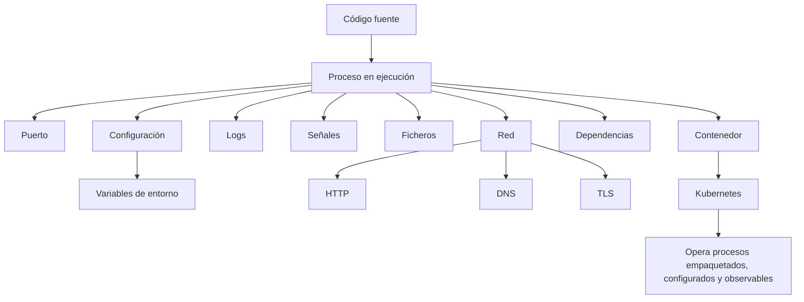
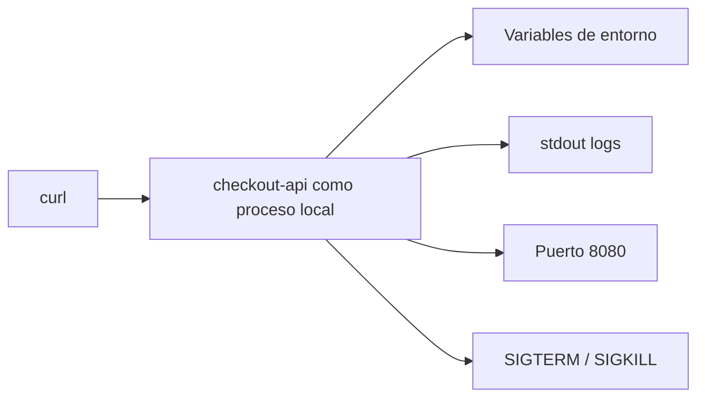
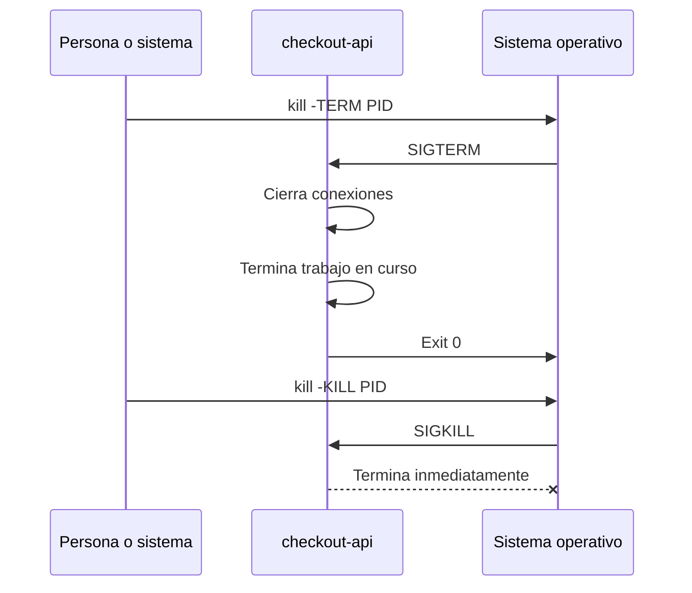
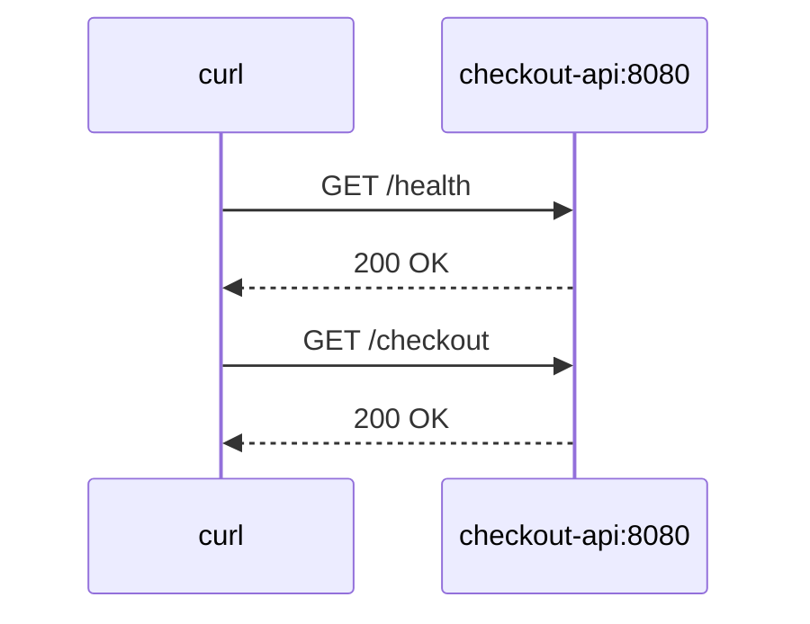
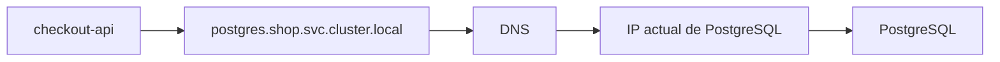
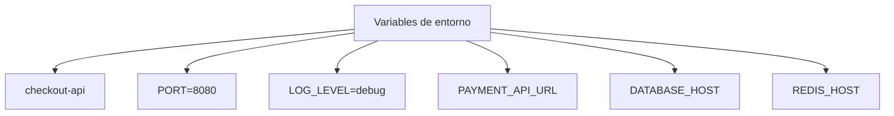
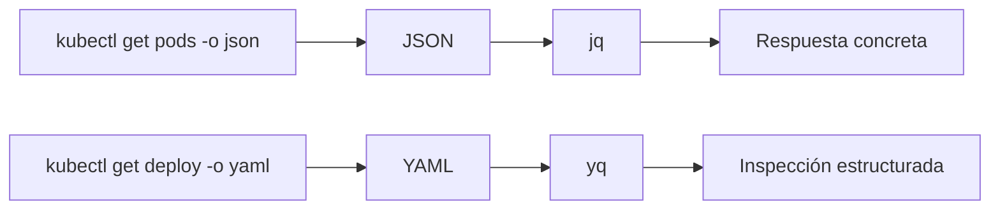

Empiezo por la **sección 0 completa**, ya escrita como parte del curso.

# 0. Fundamentos, DevEx y entorno reproducible

## Objetivo de la sección

Antes de aprender Kubernetes, necesitas entender qué está intentando operar Kubernetes.

Kubernetes no opera “código”. Opera procesos empaquetados, configurados, expuestos en red, limitados por recursos, observados mediante logs, conectados a otros servicios y sujetos a fallos.

Por eso esta primera sección tiene tres objetivos:

1. Construir los fundamentos técnicos mínimos
2. Crear un entorno de aprendizaje reproducible
3. Aprender a inspeccionar JSON y YAML con `jq` y `yq`
La idea no es convertirte todavía en administrador de sistemas. La idea es que cuando más adelante veas un Pod, un Deployment, un Service, una probe, un ConfigMap o un Secret, no parezcan conceptos aislados.

Todo eso existe porque una aplicación real necesita arrancar, recibir tráfico, leer configuración, escribir logs, gestionar dependencias, apagarse correctamente y comportarse de forma razonable cuando algo falla.



---

## 0.1. Por qué esta sección existe

Una persona puede aprender a escribir un Deployment antes de entender Linux, red o procesos. Pero eso crea una comprensión frágil.

Por ejemplo, si `checkout-api` no arranca en Kubernetes, el problema puede estar en muchas capas:

- La imagen no existe
- El proceso arranca y muere
- La app escucha en otro puerto
- Falta una variable de entorno
- La app necesita un Secret
- El contenedor no tiene permisos
- La readiness probe apunta a una ruta incorrecta
- La app no puede resolver `postgres`
- `PostgreSQL` no acepta conexiones
- El Service no selecciona ningún Pod
- El Deployment está bien, pero el problema está en la aplicación
Kubernetes te dará señales, pero no puede pensar por ti.

Esta sección entrena la base para interpretar esas señales.

---

## 0.2. Sistema de ejemplo de la sección

Durante la sección 0 usaremos una versión mínima del sistema `shop`.

En esta fase todavía no hay Kubernetes.

Solo hay una API ejecutándose como proceso local.

Componente principal:

- `checkout-api`
Responsabilidades simples de `checkout-api`:

- Exponer un endpoint HTTP de salud
- Exponer un endpoint HTTP funcional
- Leer configuración desde variables de entorno
- Escribir logs por salida estándar
- Responder en un puerto configurable
- Apagarse correctamente cuando recibe `SIGTERM`
Ejemplo de endpoints:

- `GET /health`
- `GET /ready`
- `GET /checkout`


---

## 0.3. Fundamentos técnicos que necesitas

### Procesos

Un proceso es un programa en ejecución.

Cuando ejecutas `checkout-api`, el sistema operativo crea un proceso. Ese proceso tiene un PID, puede escuchar en un puerto, puede escribir logs, puede recibir señales y puede terminar bien o mal.

En Kubernetes, un contenedor también acaba ejecutando un proceso. Por eso entender procesos ayuda a entender Pods, reinicios, probes, lifecycle hooks y shutdown.

### Qué debes aprender

- Qué es un proceso
- Qué es un PID
- Cómo listar procesos
- Cómo ver consumo de CPU y memoria
- Cómo terminar un proceso
- Qué significa que un proceso muera
- Qué diferencia hay entre parar limpiamente y matar a la fuerza
### Comandos base

```bash
ps aux
top
pgrep checkout-api
kill <PID>
kill -TERM <PID>
kill -KILL <PID>
```

### Ejercicio

Arranca `checkout-api` localmente.

Después:

1. Localiza su PID
2. Comprueba en qué puerto escucha
3. Mira sus logs
4. Para el proceso con `SIGTERM`
5. Vuelve a arrancarlo
6. Mátalo con `SIGKILL`
7. Documenta la diferencia
### Criterio de comprensión

Debes poder explicar:

> Kubernetes no reinicia “código”. Reinicia procesos dentro de contenedores.

---

## 0.4. Señales: SIGTERM y SIGKILL

Cuando un proceso debe apagarse, no siempre se mata de golpe.

`SIGTERM` pide al proceso que termine. La aplicación puede usar esa señal para cerrar conexiones, terminar trabajo en curso, liberar recursos y salir correctamente.

`SIGKILL` mata el proceso sin darle oportunidad de reaccionar.

Esto será importante más adelante porque Kubernetes puede enviar señales durante el apagado de un contenedor, por ejemplo durante un rollout, un drain o una eliminación de Pod.



### Ejercicio

Implementa o simula un handler de apagado en `checkout-api`.

Debe escribir algo parecido a:

```text
received SIGTERM, shutting down gracefully
server stopped
```

Después prueba:

```bash
kill -TERM <PID>
```

Y compara con:

```bash
kill -KILL <PID>
```

### Criterio de comprensión

Debes poder explicar:

> Una aplicación preparada para Kubernetes debe apagarse bien, no solo arrancar bien.

---

## 0.5. Puertos, TCP y HTTP

Una API necesita escuchar en un puerto para recibir peticiones.

HTTP es un protocolo cliente-servidor usado para intercambiar recursos y datos en la web. MDN lo describe como la base del intercambio de datos en la Web y como un protocolo donde las peticiones las inicia el cliente. ([MDN Web Docs](https://developer.mozilla.org/en-US/docs/Web/HTTP/Guides/Overview "Overview of HTTP - MDN Web Docs"))

En nuestro caso:

- `curl` será el cliente
- `checkout-api` será el servidor
- El puerto será `8080`
- Las rutas serán `/health`, `/ready` y `/checkout`


### Qué debes aprender

- Qué es un puerto
- Qué significa que una app “escuche” en un puerto
- Qué es una petición HTTP
- Qué es una respuesta HTTP
- Qué significan códigos como `200`, `404` y `500`
- Qué diferencia hay entre que el proceso esté vivo y que la app responda correctamente
### Comandos base

```bash
curl http://localhost:8080/health
curl -i http://localhost:8080/health
curl -i http://localhost:8080/checkout
ss -lntp
```

### Ejercicio

Arranca `checkout-api` en el puerto `8080`.

Después ejecuta:

```bash
curl -i http://localhost:8080/health
curl -i http://localhost:8080/ready
curl -i http://localhost:8080/checkout
```

Cambia el puerto a `9090` usando una variable de entorno:

```bash
PORT=9090 ./checkout-api
```

Valida:

```bash
curl -i http://localhost:9090/health
```

### Criterio de comprensión

Debes poder explicar:

> Que un proceso exista no significa que el servicio esté disponible. Disponibilidad implica que responde correctamente por la interfaz esperada.

---

## 0.6. DNS y nombres

En local puedes llamar a una API con `localhost`.

En sistemas distribuidos, los servicios necesitan encontrarse por nombre.

DNS permite usar nombres legibles en lugar de direcciones IP. MDN explica que los nombres de dominio son una parte clave de la infraestructura de Internet porque proporcionan una dirección legible para servidores disponibles en Internet. ([MDN Web Docs](https://developer.mozilla.org/en-US/docs/Learn_web_development/Howto/Web_mechanics/What_is_a_domain_name "What is a Domain Name? - Learn web development | MDN"))

Más adelante, en Kubernetes, usarás nombres como:

```text
checkout-api.shop.svc.cluster.local
postgres.shop.svc.cluster.local
redis.shop.svc.cluster.local
```

Todavía no necesitas aprender DNS interno de Kubernetes, pero sí entender la idea:

> Las aplicaciones no deberían depender de IPs efímeras si pueden depender de nombres estables.



### Qué debes aprender

- Qué problema resuelve DNS
- Diferencia entre nombre e IP
- Por qué una IP puede cambiar
- Por qué un nombre estable ayuda a operar sistemas
- Qué significa “resolver un nombre”
### Comandos base

```bash
nslookup example.com
dig example.com
getent hosts localhost
```

### Ejercicio

Ejecuta:

```bash
getent hosts localhost
```

Después añade una entrada temporal a `/etc/hosts` para simular un nombre local:

```text
127.0.0.1 checkout.local
```

Y prueba:

```bash
curl -i http://checkout.local:8080/health
```

### Criterio de comprensión

Debes poder explicar:

> Un nombre estable desacopla a quien llama de la dirección concreta del servicio.

---

## 0.7. Variables de entorno y configuración

Una aplicación no debería necesitar recompilarse para cambiar su configuración.

Ejemplos de configuración:

- Puerto
- Nivel de logs
- URL de `payment-api`
- Host de `PostgreSQL`
- Host de `Redis`
- Feature flags
- Timeouts
En esta sección usaremos variables de entorno.

Ejemplo:

```bash
PORT=8080
LOG_LEVEL=debug
PAYMENT_API_URL=http://localhost:8081
DATABASE_HOST=localhost
REDIS_HOST=localhost
```



### Qué debes aprender

- Qué es configuración
- Por qué no debe hardcodearse
- Qué es una variable de entorno
- Cómo leer variables desde una aplicación
- Qué pasa cuando falta configuración
- Diferencia entre configuración sensible y no sensible
### Ejercicio

Arranca `checkout-api` con:

```bash
PORT=8080 LOG_LEVEL=debug ./checkout-api
```

Después arráncala sin `PORT`.

La app debería tener un valor por defecto o fallar con un mensaje claro.

Documenta cuál de las dos decisiones has tomado y por qué.

### Criterio de comprensión

Debes poder explicar:

> El mismo binario debería poder ejecutarse en entornos distintos cambiando configuración, no cambiando código.

---

## 0.8. Logs

Los logs son una de las primeras señales para entender qué está pasando.

En local puedes escribir logs en la terminal. En contenedores y Kubernetes, lo normal es escribir logs a salida estándar y error estándar para que la plataforma pueda recogerlos.

Ejemplo de logs útiles:

```json
{"level":"info","service":"checkout-api","message":"server started","port":8080}
{"level":"info","service":"checkout-api","message":"request completed","path":"/health","status":200}
{"level":"error","service":"checkout-api","message":"payment provider unavailable"}
```

### Qué debes aprender

- Diferencia entre logs útiles y ruido
- Por qué los logs deben incluir contexto
- Por qué stdout y stderr importan
- Cómo seguir logs en tiempo real
- Cómo buscar en logs
- Por qué los logs no sustituyen métricas ni trazas
### Comandos base

```bash
./checkout-api
./checkout-api > app.log 2>&1
tail -f app.log
grep error app.log
```

### Ejercicio

Haz que `checkout-api` escriba logs al arrancar y al recibir peticiones.

Debe registrar:

- Servicio
- Ruta
- Código HTTP
- Duración aproximada
- Error, si lo hay
Después ejecuta:

```bash
curl -i http://localhost:8080/health
curl -i http://localhost:8080/checkout
```

Y revisa los logs.

### Criterio de comprensión

Debes poder explicar:

> Un log útil debe ayudar a reconstruir qué pasó, no solo demostrar que algo imprimió texto.

---

## 0.9. YAML y JSON

Kubernetes se suele escribir en YAML, pero sus objetos también pueden verse como JSON.

YAML es un lenguaje de serialización de datos legible por humanos. La especificación YAML 1.2.2 define YAML 1.2 y aclara que esa revisión no introduce cambios normativos sobre YAML 1.2, sino correcciones y claridad. ([yaml.org](https://yaml.org/spec/1.2.2/ "YAML Ain't Markup Language (YAML™) revision 1.2.2"))

JSON será importante porque `kubectl` puede devolver objetos en JSON, y herramientas como `jq` permiten inspeccionarlos con precisión.

Ejemplo conceptual:

```yaml
apiVersion: v1
kind: ConfigMap
metadata:
  name: checkout-config
  namespace: shop
data:
  LOG_LEVEL: debug
  PAYMENT_API_URL: http://payment-api
```

La misma idea como estructura de datos:

```json
{
  "apiVersion": "v1",
  "kind": "ConfigMap",
  "metadata": {
    "name": "checkout-config",
    "namespace": "shop"
  },
  "data": {
    "LOG_LEVEL": "debug",
    "PAYMENT_API_URL": "http://payment-api"
  }
}
```

### Qué debes aprender

- Clave y valor
- Objetos
- Arrays
- Strings
- Números
- Booleanos
- Indentación en YAML
- Diferencia entre YAML válido y YAML correcto para Kubernetes
- Diferencia entre sintaxis y significado
### Ejercicio

Crea un fichero `checkout-config.yaml`:

```yaml
service:
  name: checkout-api
  port: 8080
  logLevel: debug
dependencies:
  paymentApi: http://payment-api
  redis: redis
  postgres: postgres
```

Después crea el equivalente en JSON:

```json
{
  "service": {
    "name": "checkout-api",
    "port": 8080,
    "logLevel": "debug"
  },
  "dependencies": {
    "paymentApi": "http://payment-api",
    "redis": "redis",
    "postgres": "postgres"
  }
}
```

### Criterio de comprensión

Debes poder explicar:

> YAML y JSON no son Kubernetes. Son formatos para expresar datos. Kubernetes interpreta esos datos como objetos de su API.

---

## 0.10. jq

`jq` permite consultar, filtrar y transformar JSON. Su manual lo describe como un sistema de filtros: recibe una entrada y produce una salida, y esos filtros pueden combinarse mediante pipes. ([jqlang.org](https://jqlang.org/manual/ "jq 1.8 Manual"))

En Kubernetes esto será muy útil porque `kubectl get -o json` devuelve objetos grandes.

Sin `jq`, acabas leyendo manualmente mucho texto.

Con `jq`, puedes hacer preguntas precisas.

### Ejemplo base

Dado este fichero `checkout-config.json`:

```json
{
  "service": {
    "name": "checkout-api",
    "port": 8080,
    "logLevel": "debug"
  },
  "dependencies": {
    "paymentApi": "http://payment-api",
    "redis": "redis",
    "postgres": "postgres"
  }
}
```

Puedes consultar el puerto:

```bash
jq '.service.port' checkout-config.json
```

Puedes consultar el nombre del servicio:

```bash
jq -r '.service.name' checkout-config.json
```

Puedes consultar las dependencias:

```bash
jq '.dependencies' checkout-config.json
```

### Ejemplo con estructura parecida a Kubernetes

Crea `pods.json`:

```json
{
  "items": [
    {
      "metadata": {
        "namespace": "shop",
        "name": "checkout-api-7d9f"
      },
      "status": {
        "phase": "Running"
      }
    },
    {
      "metadata": {
        "namespace": "shop",
        "name": "payment-api-6c8a"
      },
      "status": {
        "phase": "Pending"
      }
    }
  ]
}
```

Listar nombres:

```bash
jq -r '.items[].metadata.name' pods.json
```

Listar namespace y nombre:

```bash
jq -r '.items[] | [.metadata.namespace, .metadata.name] | @tsv' pods.json
```

Filtrar Pods que no están `Running`:

```bash
jq -r '.items[] | select(.status.phase != "Running") | .metadata.name' pods.json
```

### Criterio de comprensión

Debes poder explicar:

> `jq` convierte JSON grande en respuestas pequeñas y precisas.

---

## 0.11. yq

`yq` permite consultar y transformar YAML, además de otros formatos. La documentación del proyecto lo presenta como un procesador ligero y portable para YAML, JSON, INI y XML, con sintaxis inspirada en `jq`. ([mikefarah.gitbook.io](https://mikefarah.gitbook.io/yq "Quick Usage Guide - yq"))

En Kubernetes esto será muy útil porque los manifests suelen escribirse en YAML.

### Ejemplo base

Con `checkout-config.yaml`:

```yaml
service:
  name: checkout-api
  port: 8080
  logLevel: debug
dependencies:
  paymentApi: http://payment-api
  redis: redis
  postgres: postgres
```

Consultar el puerto:

```bash
yq '.service.port' checkout-config.yaml
```

Consultar el nombre:

```bash
yq '.service.name' checkout-config.yaml
```

Modificar el nivel de logs:

```bash
yq -i '.service.logLevel = "info"' checkout-config.yaml
```

### Ejemplo con manifest parecido a Kubernetes

Crea `deployment.yaml`:

```yaml
apiVersion: apps/v1
kind: Deployment
metadata:
  name: checkout-api
  namespace: shop
spec:
  replicas: 2
  template:
    spec:
      containers:
        - name: checkout-api
          image: checkout-api:1.0.0
          ports:
            - containerPort: 8080
```

Consultar el nombre:

```bash
yq '.metadata.name' deployment.yaml
```

Consultar la imagen:

```bash
yq '.spec.template.spec.containers[0].image' deployment.yaml
```

Cambiar la imagen:

```bash
yq -i '.spec.template.spec.containers[0].image = "checkout-api:1.0.1"' deployment.yaml
```

### Criterio de comprensión

Debes poder explicar:

> `yq` permite tratar YAML como datos estructurados, no como texto suelto.

---

## 0.12. kubectl, JSON y formatos de salida

Todavía no necesitas dominar `kubectl`, pero sí debes entender una idea importante: `kubectl` puede mostrar objetos en distintos formatos. La documentación oficial de Kubernetes explica que `kubectl` soporta JSONPath como formato de salida para filtrar campos concretos de objetos JSON. ([Kubernetes](https://kubernetes.io/docs/reference/kubectl/jsonpath/ "JSONPath Support"))

Más adelante usarás comandos como:

```bash
kubectl get pods -A -o json
kubectl get pods -A -o yaml
kubectl get pods -A -o jsonpath='{.items[*].metadata.name}'
```

Y también:

```bash
kubectl get pods -A -o json | jq -r '.items[].metadata.name'
```

### Idea clave

`kubectl` no solo sirve para “ver tablas”.

Sirve para consultar objetos.



### Criterio de comprensión

Debes poder explicar:

> Si Kubernetes expone objetos, necesito herramientas para consultar objetos, no solo para leer texto.

---

## 0.13. Git

Git será necesario para versionar:

- Código
- Dockerfiles
- Manifests
- Taskfiles
- Documentación
- Runbooks
- Tests
- Decisiones de configuración
El libro oficial _Pro Git_ está disponible en la web oficial de Git y organiza el aprendizaje desde fundamentos hasta branching, Git distribuido, herramientas y personalización. ([Git](https://git-scm.com/book/en/v2 "Pro Git book"))

### Qué debes aprender

- `git init`
- `git status`
- `git add`
- `git commit`
- `git log`
- `git diff`
- `.gitignore`
- Branches básicos
- Tags básicos
- Cómo leer cambios antes de commit
### Ejercicio

Crea el repositorio:

```bash
mkdir kubernetes-learning-lab
cd kubernetes-learning-lab
git init
```

Crea:

```text
README.md
Taskfile.yml
.env.example
apps/checkout-api/
docs/commands.md
docs/troubleshooting.md
```

Haz tu primer commit:

```bash
git add .
git commit -m "Create learning lab skeleton"
```

### Criterio de comprensión

Debes poder explicar:

> Si no versiono mi entorno de aprendizaje, no puedo reproducirlo, revisarlo ni mejorarlo con seguridad.

---

## 0.14. Estructura del repositorio

Esta será la estructura inicial del laboratorio.

```text
kubernetes-learning-lab/
  Taskfile.yml
  README.md
  .env.example
  .gitignore

  apps/
    checkout-api/

  scripts/
    smoke-test.sh
    validate-tools.sh

  docs/
    commands.md
    troubleshooting.md
    references.md
    jq-yq.md

  tmp/
```

Más adelante crecerá hacia:

```text
kubernetes-learning-lab/
  Taskfile.yml
  README.md
  .env.example
  .gitignore

  apps/
    frontend/
    checkout-api/
    payment-api/
    inventory-api/
    notification-worker/

  containers/
    docker/
    podman/

  compose/
    compose.yaml

  kubernetes/
    00-namespace/
    01-pod/
    02-deployment/
    03-service/
    04-ingress-or-gateway/
    05-config/
    06-storage/
    07-security/
    08-observability/

  scripts/
    smoke-test.sh
    wait-for-rollout.sh
    validate-tools.sh
    inspect-json.sh
    inspect-yaml.sh

  tests/
    manifests/
    policies/
    cluster/
    smoke/
    failure-lab/

  docs/
    commands.md
    troubleshooting.md
    failure-lab.md
    references.md
    jq-yq.md
```

---

## 0.15. Taskfile

Task permite definir tareas en YAML. Su documentación oficial muestra que los Taskfiles se escriben en YAML y que pueden incluir versión, variables y comandos. ([Task](https://taskfile.dev/docs/getting-started "Getting Started | Task - Taskfile"))

La documentación también explica que, si no se especifica un Taskfile concreto, Task busca un fichero compatible en el directorio actual. ([Task](https://taskfile.dev/docs/guide "Guide | Task - Taskfile"))

La intención del Taskfile en este curso es reducir fricción accidental.

No debe ocultar el aprendizaje.

Debe hacer visibles los comandos y permitir repetirlos.

### Taskfile inicial

```yaml
version: '3'

vars:
  APP_NAME: checkout-api
  PORT: 8080

tasks:
  default:
    desc: List available tasks
    cmds:
      - task --list

  doctor:
    desc: Check required local tools
    cmds:
      - git --version
      - curl --version
      - jq --version
      - yq --version
      - task --version

  app:run:
    desc: Run checkout-api locally
    dir: apps/{{.APP_NAME}}
    cmds:
      - PORT={{.PORT}} ./checkout-api

  app:health:
    desc: Call checkout-api health endpoint
    cmds:
      - curl -i http://localhost:{{.PORT}}/health

  app:ready:
    desc: Call checkout-api readiness endpoint
    cmds:
      - curl -i http://localhost:{{.PORT}}/ready

  app:checkout:
    desc: Call checkout-api checkout endpoint
    cmds:
      - curl -i http://localhost:{{.PORT}}/checkout

  json:inspect:
    desc: Inspect sample JSON with jq
    cmds:
      - jq '.service.name' docs/examples/checkout-config.json
      - jq '.service.port' docs/examples/checkout-config.json

  yaml:inspect:
    desc: Inspect sample YAML with yq
    cmds:
      - yq '.service.name' docs/examples/checkout-config.yaml
      - yq '.service.port' docs/examples/checkout-config.yaml
```

### Criterio de comprensión

Debes poder explicar:

> Taskfile no sustituye el conocimiento de los comandos. Hace que el aprendizaje sea repetible.

---

## 0.16. Práctica principal de la sección

### Objetivo

Construir un laboratorio mínimo que puedas ejecutar muchas veces.

### Resultado esperado

Al final de la práctica debes tener:

```text
kubernetes-learning-lab/
  Taskfile.yml
  README.md
  .env.example
  .gitignore

  apps/
    checkout-api/

  docs/
    examples/
      checkout-config.yaml
      checkout-config.json
    commands.md
    troubleshooting.md
    references.md
    jq-yq.md

  scripts/
    validate-tools.sh
    smoke-test.sh
```

### Paso 1. Crear estructura

```bash
mkdir -p kubernetes-learning-lab
cd kubernetes-learning-lab

mkdir -p apps/checkout-api
mkdir -p docs/examples
mkdir -p scripts

touch README.md
touch .env.example
touch .gitignore
touch docs/commands.md
touch docs/troubleshooting.md
touch docs/references.md
touch docs/jq-yq.md
touch scripts/validate-tools.sh
touch scripts/smoke-test.sh
touch Taskfile.yml
```

### Paso 2. Crear configuración YAML

```yaml
service:
  name: checkout-api
  port: 8080
  logLevel: debug
dependencies:
  paymentApi: http://payment-api
  redis: redis
  postgres: postgres
```

Guárdalo en:

```text
docs/examples/checkout-config.yaml
```

### Paso 3. Crear configuración JSON

```json
{
  "service": {
    "name": "checkout-api",
    "port": 8080,
    "logLevel": "debug"
  },
  "dependencies": {
    "paymentApi": "http://payment-api",
    "redis": "redis",
    "postgres": "postgres"
  }
}
```

Guárdalo en:

```text
docs/examples/checkout-config.json
```

### Paso 4. Crear script de validación

```bash
#!/usr/bin/env bash
set -euo pipefail

echo "Checking required tools..."

git --version
curl --version
jq --version
yq --version
task --version

echo "All required tools are available."
```

Guárdalo en:

```text
scripts/validate-tools.sh
```

Dale permisos:

```bash
chmod +x scripts/validate-tools.sh
```

### Paso 5. Crear smoke test inicial

```bash
#!/usr/bin/env bash
set -euo pipefail

PORT="${PORT:-8080}"

curl -fsS "http://localhost:${PORT}/health" > /dev/null

echo "checkout-api health check passed"
```

Guárdalo en:

```text
scripts/smoke-test.sh
```

Dale permisos:

```bash
chmod +x scripts/smoke-test.sh
```

### Paso 6. Crear Taskfile

```yaml
version: '3'

vars:
  APP_NAME: checkout-api
  PORT: 8080

tasks:
  default:
    desc: List available tasks
    cmds:
      - task --list

  doctor:
    desc: Check required local tools
    cmds:
      - ./scripts/validate-tools.sh

  yaml:inspect:
    desc: Inspect YAML example with yq
    cmds:
      - yq '.service.name' docs/examples/checkout-config.yaml
      - yq '.service.port' docs/examples/checkout-config.yaml
      - yq '.dependencies' docs/examples/checkout-config.yaml

  json:inspect:
    desc: Inspect JSON example with jq
    cmds:
      - jq '.service.name' docs/examples/checkout-config.json
      - jq '.service.port' docs/examples/checkout-config.json
      - jq '.dependencies' docs/examples/checkout-config.json

  smoke:
    desc: Run local smoke test
    cmds:
      - ./scripts/smoke-test.sh
```

### Paso 7. Ejecutar

```bash
task doctor
task yaml:inspect
task json:inspect
```

El smoke test funcionará cuando tengas `checkout-api` arrancada:

```bash
task smoke
```

---

## 0.17. Ejercicios cortos

### Ejercicio 1. Procesos

Arranca cualquier proceso HTTP local.

Puede ser tu `checkout-api` o un servidor temporal.

Ejemplo con Python:

```bash
python3 -m http.server 8080
```

Después:

```bash
ps aux | grep python
ss -lntp | grep 8080
curl -i http://localhost:8080
```

Explica:

- Qué proceso está corriendo
- Qué puerto usa
- Qué ocurre si lo paras
---

### Ejercicio 2. Variables de entorno

Ejecuta:

```bash
PORT=8080 LOG_LEVEL=debug env | grep -E 'PORT|LOG_LEVEL'
```

Después documenta:

- Qué significa `PORT`
- Qué significa `LOG_LEVEL`
- Por qué estas variables no deberían estar hardcodeadas en el código
---

### Ejercicio 3. jq

Ejecuta:

```bash
jq -r '.service.name' docs/examples/checkout-config.json
jq -r '.dependencies.postgres' docs/examples/checkout-config.json
```

Después añade una nueva dependencia:

```json
"fraudApi": "http://fraud-api"
```

Y extráela con `jq`.

---

### Ejercicio 4. yq

Ejecuta:

```bash
yq '.service.name' docs/examples/checkout-config.yaml
yq '.dependencies.postgres' docs/examples/checkout-config.yaml
```

Después cambia el puerto:

```bash
yq -i '.service.port = 9090' docs/examples/checkout-config.yaml
```

Comprueba:

```bash
yq '.service.port' docs/examples/checkout-config.yaml
```

---

### Ejercicio 5. Git

Inicializa el repositorio:

```bash
git init
git status
git add .
git commit -m "Create section 0 learning lab"
```

Después modifica `docs/jq-yq.md` y revisa:

```bash
git diff
git status
```

---

## 0.18. Errores habituales en esta sección

### Error 1. Memorizar comandos sin entender qué observan

No basta con saber ejecutar:

```bash
ps aux
```

Debes saber qué pregunta responde.

Mejor:

> Quiero saber si `checkout-api` sigue vivo como proceso.

Entonces usas:

```bash
ps aux | grep checkout-api
```

---

### Error 2. Confundir YAML válido con configuración correcta

Este YAML puede ser válido:

```yaml
service:
  name: checkout-api
  port: wrong
```

Pero puede ser incorrecto para tu aplicación si `port` debe ser un número.

La sintaxis no demuestra que el significado sea correcto.

---

### Error 3. Tratar base64 como cifrado

Más adelante verás Secrets de Kubernetes. Es importante preparar esta idea desde ahora:

> Codificar no es cifrar.

Base64 transforma representación. No protege el secreto por sí mismo.

---

### Error 4. Escribir logs sin contexto

Esto ayuda poco:

```text
error
```

Esto ayuda más:

```json
{"level":"error","service":"checkout-api","operation":"create-checkout","message":"payment provider unavailable"}
```

---

### Error 5. Usar Taskfile para esconder todo

Taskfile debe facilitar la repetición, no convertir el aprendizaje en magia.

Cada tarea debe ser fácil de leer.

---

## 0.19. Criterio de salida de la sección

Puedes pasar a la sección 1 cuando puedas hacer todo esto sin seguir una receta ciegamente:

### Fundamentos

- Explicar qué es un proceso
- Explicar qué es un PID
- Explicar qué es un puerto
- Explicar qué es una variable de entorno
- Explicar qué es un log
- Explicar la diferencia entre `SIGTERM` y `SIGKILL`
- Explicar por qué DNS ayuda a no depender de IPs concretas
- Explicar qué representa YAML
- Explicar qué representa JSON
### Herramientas

- Ejecutar `curl` contra un endpoint local
- Ver procesos con `ps`
- Ver puertos abiertos con `ss`
- Leer logs con `tail`
- Buscar texto con `grep`
- Consultar JSON con `jq`
- Consultar YAML con `yq`
- Ejecutar tareas con Taskfile
- Versionar cambios con Git
### Laboratorio

- Tener creado `kubernetes-learning-lab`
- Tener `Taskfile.yml`
- Tener `checkout-config.yaml`
- Tener `checkout-config.json`
- Tener `scripts/validate-tools.sh`
- Tener `scripts/smoke-test.sh`
- Ejecutar correctamente:
```bash
task doctor
task yaml:inspect
task json:inspect
```

### Comprensión final

Debes poder explicar esta frase:

> Una aplicación en producción no es solo código. Es un proceso, con configuración, puertos, permisos, dependencias, límites, logs, estado y comportamiento ante fallos.

---

## 0.20. Referencias oficiales

|Tema|Referencia|
|---|---|
|HTTP|MDN, Overview of HTTP. ([MDN Web Docs](https://developer.mozilla.org/en-US/docs/Web/HTTP/Guides/Overview "Overview of HTTP - MDN Web Docs"))|
|DNS y nombres de dominio|MDN, What is a domain name? ([MDN Web Docs](https://developer.mozilla.org/en-US/docs/Learn_web_development/Howto/Web_mechanics/What_is_a_domain_name "What is a Domain Name? - Learn web development \| MDN"))|
|Git|Pro Git Book. ([Git](https://git-scm.com/book/en/v2 "Pro Git book"))|
|YAML|YAML 1.2.2 Specification. ([yaml.org](https://yaml.org/spec/1.2.2/ "YAML Ain't Markup Language (YAML™) revision 1.2.2"))|
|jq|jq Manual. ([jqlang.org](https://jqlang.org/manual/ "jq 1.8 Manual"))|
|yq|yq official documentation. ([mikefarah.gitbook.io](https://mikefarah.gitbook.io/yq "Quick Usage Guide - yq"))|
|Taskfile|Taskfile Getting Started. ([Task](https://taskfile.dev/docs/getting-started "Getting Started \| Task - Taskfile"))|
|Taskfile guide|Taskfile Guide. ([Task](https://taskfile.dev/docs/guide "Guide \| Task - Taskfile"))|
|kubectl JSONPath|Kubernetes JSONPath Support. ([Kubernetes](https://kubernetes.io/docs/reference/kubectl/jsonpath/ "JSONPath Support"))|
|kubectl reference|Kubernetes kubectl reference. ([Kubernetes](https://kubernetes.io/docs/reference/generated/kubectl/kubectl-commands "Kubectl Reference Docs"))|