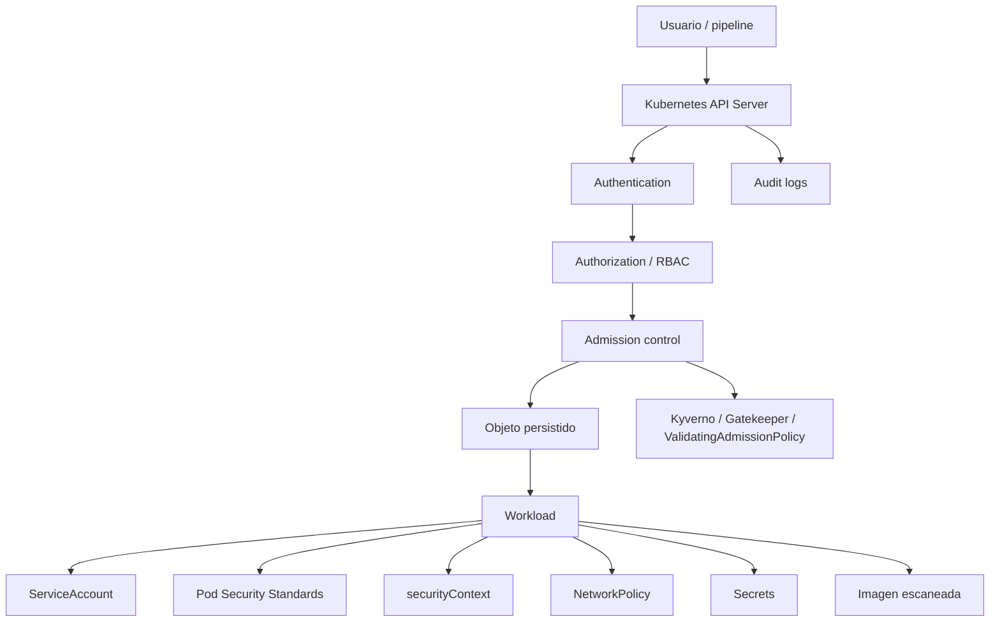
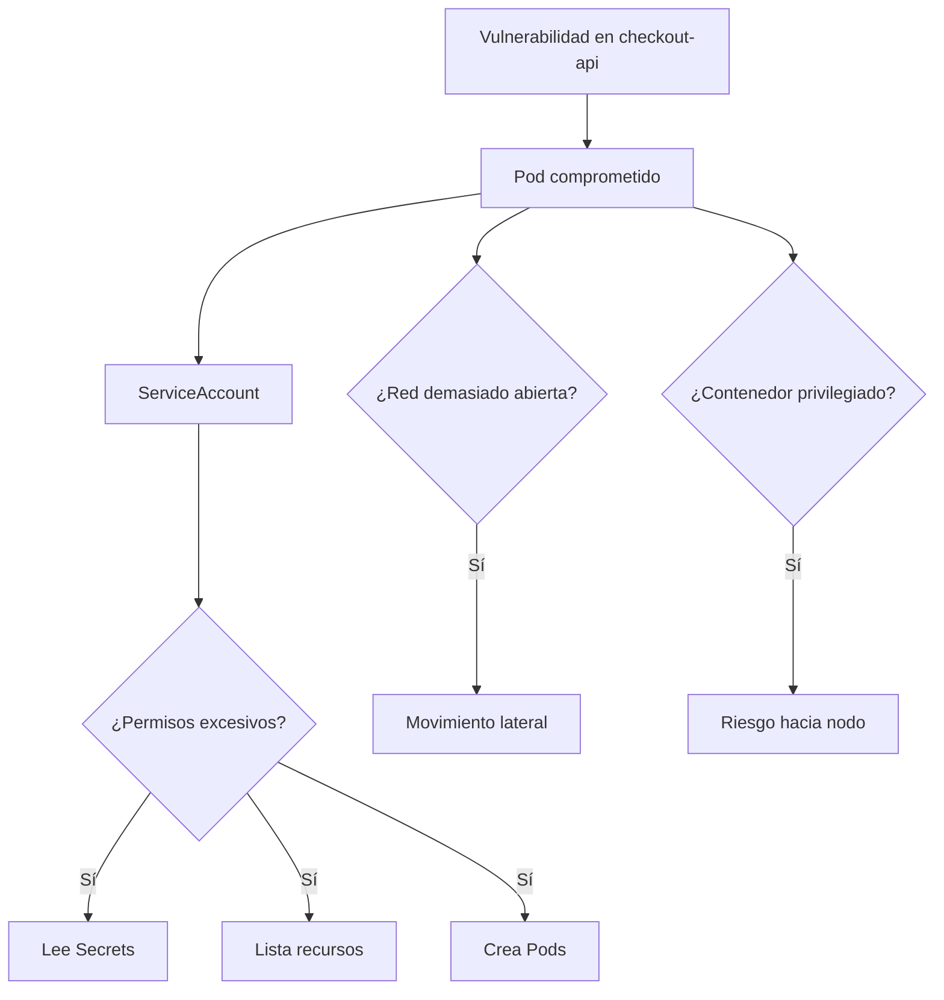
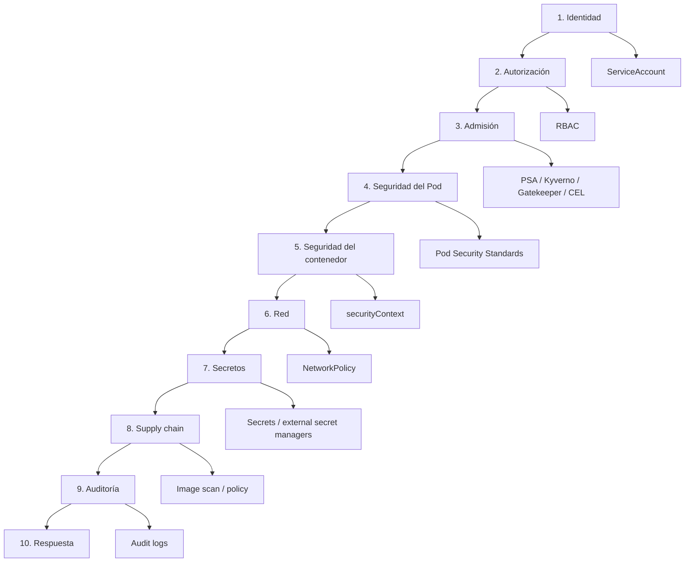
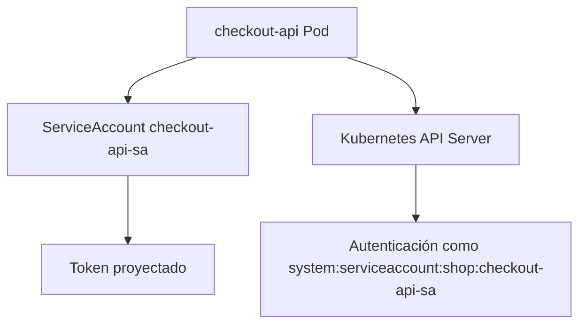
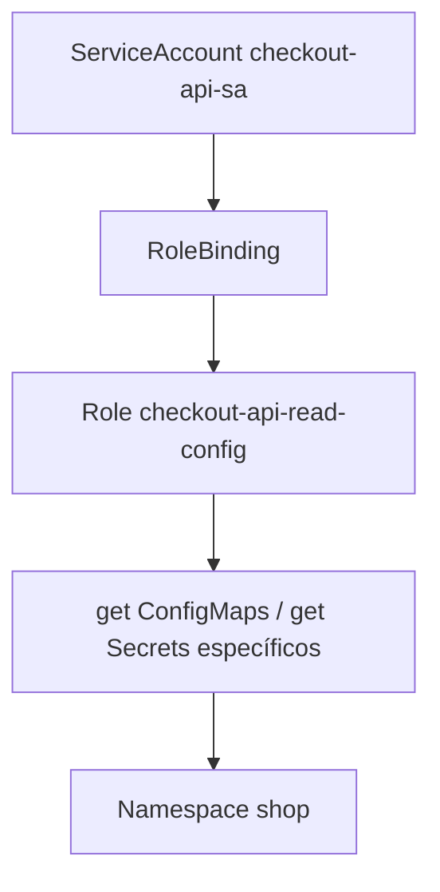
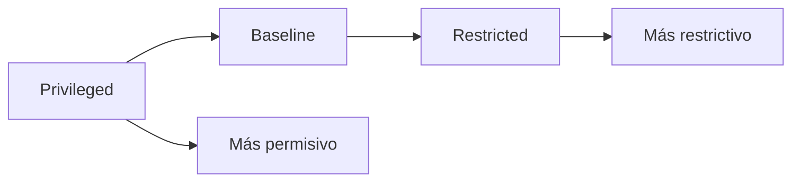
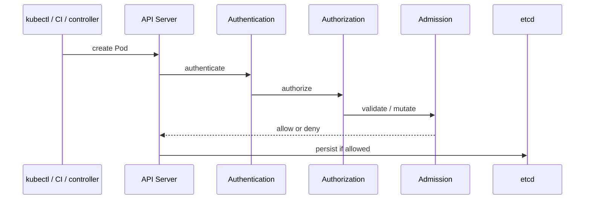
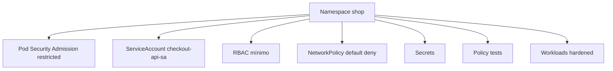
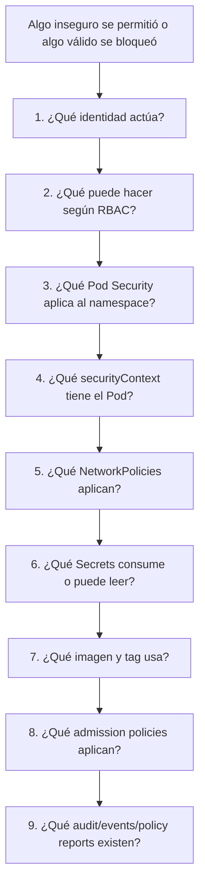

<!-- COURSE_NAV_START -->
[Anterior](<10. Delivery de aplicaciones.md>) | [Indice](README.md) | [Siguiente](<12. Operación, observabilidad y fiabilidad con Grafana LGTM.md>)
<!-- COURSE_NAV_END -->

# 11. Seguridad

## Objetivo del módulo

En el módulo 10 convertiste el trabajo anterior en delivery:

```text
build
scan
push
update manifests
quality gates
deploy
rollout status
smoke test
rollback
```

Ahora toca introducir una idea incómoda:

> Que una aplicación despliegue correctamente no significa que esté desplegada de forma segura.

Kubernetes ofrece muchas primitivas de seguridad, pero no las activa todas por ti de forma mágica. Tienes que diseñar identidad, permisos, aislamiento, admisión, secretos, políticas, imágenes, auditoría y blast radius.

La documentación oficial de Kubernetes agrupa seguridad alrededor de varias áreas: control plane, nodos, workloads, políticas, secretos, auditoría, supply chain, acceso a la API y controles de admisión. Además, Kubernetes audit logging proporciona un registro cronológico y relevante para seguridad de las acciones realizadas por usuarios, aplicaciones y el propio control plane. ([Kubernetes](https://kubernetes.io/docs/concepts/security/ "Security"))

La idea central del módulo es esta:

> Seguridad en Kubernetes no es una herramienta. Es una cadena de controles que reduce permisos, reduce exposición, reduce blast radius, bloquea configuraciones peligrosas y deja señales auditables cuando algo ocurre.



---

## 11.1. Qué vas a aprender y qué no vas a aprender todavía

Vas a aprender:

- Qué significa seguridad en Kubernetes desde un punto de vista práctico
- Qué es blast radius
- Qué es defensa en profundidad
- Qué son ServiceAccounts
- Qué es RBAC
- Qué diferencia hay entre Role, ClusterRole, RoleBinding y ClusterRoleBinding
- Cómo usar `kubectl auth can-i`
- Qué son Pod Security Standards
- Qué es Pod Security Admission
- Qué sustituye a PodSecurityPolicy
- Qué es `securityContext`
- Qué significa correr como no root
- Qué significa eliminar Linux capabilities
- Qué implica `readOnlyRootFilesystem`
- Cómo usar NetworkPolicy como control de red
- Qué límites tienen los Secrets nativos
- Qué controles mínimos aplicar sobre Secrets
- Qué es admission control
- Qué es ValidatingAdmissionPolicy
- Qué aportan Kyverno y OPA Gatekeeper
- Qué aporta Trivy en imágenes y Kubernetes
- Qué son audit logs
- Cómo crear un namespace `production-like` para `shop`
- Cómo automatizar validaciones de seguridad con Taskfile
- Cómo hacer troubleshooting progresivo de seguridad
No vamos a profundizar todavía en:

- Seguridad avanzada de nodos
- Hardening completo de kube-apiserver
- Gestión avanzada de certificados
- mTLS con service mesh
- Runtime security con Falco en profundidad
- Forensics completa
- Threat modeling formal
- Multi-tenancy fuerte
- Firmado y verificación de imágenes
- SBOM avanzada
- SLSA
- OIDC cloud real
- Vault avanzado
- Cifrado de etcd administrado por proveedor
- CKS completo
La regla pedagógica del módulo será:

```text
Primero amenaza o riesgo
Luego control
Luego manifest
Luego validación
Luego fallo controlado
Luego automatización
```

---

## 11.2. El problema: Kubernetes amplifica tanto capacidad como riesgo

Kubernetes permite crear workloads, conectarlos, escalarlos y actualizarlos con mucha velocidad.

Esa misma velocidad puede amplificar errores.

Un Deployment mal configurado puede crear varios Pods inseguros.

Un ServiceAccount con demasiados permisos puede dar acceso excesivo desde un Pod comprometido.

Una imagen vulnerable puede desplegarse muchas veces.

Un Secret accesible por demasiados actores puede exponer credenciales.

Un `securityContext` débil puede ampliar el impacto de una vulnerabilidad.

Una NetworkPolicy ausente puede dejar comunicación lateral demasiado abierta.



### Contrato mental

No preguntes solo:

> ¿Funciona?

Pregunta:

> Si esto falla o se compromete, ¿hasta dónde puede llegar el daño?

### Blast radius

Blast radius es el alcance del daño posible.

En Kubernetes, puede depender de:

- Permisos RBAC
- ServiceAccount usada
- Secrets accesibles
- NetworkPolicies
- Privilegios del contenedor
- Montajes de volúmenes
- Capabilities Linux
- Acceso al host
- Imagen usada
- Políticas de admisión
- Separación por namespace
- Auditoría disponible
### Criterio de comprensión

Debes poder explicar:

> Seguridad en Kubernetes no elimina el riesgo. Reduce lo que un fallo puede tocar, reduce configuraciones peligrosas y mejora la capacidad de detectar y responder.

---

--- 
## 11.3. Modelo de seguridad por capas

Antes de crear recursos, necesitamos un mapa.



### Capas mínimas para este módulo

|Capa|Control|
|---|---|
|Identidad|ServiceAccount por aplicación|
|Autorización|RBAC mínimo|
|Admisión|Pod Security Admission y policy-as-code|
|Pod|Pod Security Standards|
|Contenedor|`securityContext` restrictivo|
|Red|NetworkPolicy|
|Secretos|Secrets con acceso mínimo|
|Supply chain|Trivy, no `latest`, registry controlado|
|Auditoría|audit logs, events, policy reports|
|Testing|`task test:k8s` y tests de policies|

### Criterio de comprensión

Debes poder explicar:

> Ninguna capa aislada basta. La seguridad aparece cuando varias capas se refuerzan entre sí.

---

## 11.4. ServiceAccounts

### Qué problema resuelven

Un Pod necesita una identidad para hablar con la API de Kubernetes.

Esa identidad suele ser un ServiceAccount.

La documentación oficial explica que un ServiceAccount proporciona una identidad para procesos que corren en Pods, y que puede usarse para autenticar workloads frente al API Server. ([Kubernetes](https://kubernetes.io/docs/concepts/security/service-accounts/ "Service Accounts"))

### Por qué importa

Si no especificas ServiceAccount, el Pod usa el ServiceAccount `default` del namespace.

Eso puede ser aceptable para un laboratorio muy básico, pero no es una buena base profesional.

Queremos que `checkout-api` tenga su propia identidad:

```text
checkout-api-sa
```



### Manifest

Crea:

```text
kubernetes/07-security/serviceaccount.yaml
```

Contenido:

```yaml
apiVersion: v1
kind: ServiceAccount
metadata:
  name: checkout-api-sa
  namespace: shop
  labels:
    app.kubernetes.io/name: checkout-api
    app.kubernetes.io/component: api
    app.kubernetes.io/part-of: shop
automountServiceAccountToken: false
```

### Por qué `automountServiceAccountToken: false`

Si la aplicación no necesita hablar con la API de Kubernetes, no necesita montar automáticamente un token.

Esto reduce exposición.

Si más adelante un workload necesita hablar con la API, debes habilitarlo explícitamente y darle permisos mínimos.

### Añadir al Deployment

En `deployment.yaml`:

```yaml
spec:
  template:
    spec:
      serviceAccountName: checkout-api-sa
      automountServiceAccountToken: false
```

### Aplicar

```bash
kubectl apply -f kubernetes/07-security/serviceaccount.yaml
kubectl apply -f kubernetes/02-deployment/deployment.yaml
```

### Validar

```bash
kubectl get serviceaccount -n shop
kubectl get pod -n shop -l app.kubernetes.io/name=checkout-api -o json \
  | jq '.items[].spec.serviceAccountName'
```

### Criterio de comprensión

Debes poder explicar:

> Cada workload debería tener una identidad explícita. Si no necesita hablar con la API, no debería montar token automáticamente.

---

## 11.5. RBAC

### Qué problema resuelve

RBAC controla qué acciones puede realizar una identidad sobre recursos Kubernetes.

La documentación oficial define RBAC como un método para regular acceso a recursos según roles, usando el API group `rbac.authorization.k8s.io` para tomar decisiones de autorización. También mantiene una guía de buenas prácticas que insiste en diseñar permisos mínimos y entender posibles caminos de escalada de privilegios. ([Kubernetes](https://kubernetes.io/docs/reference/access-authn-authz/rbac/ "Using RBAC Authorization"))

### Objetos principales

|Objeto|Scope|Qué hace|
|---|---|---|
|Role|Namespace|Define permisos dentro de un namespace|
|ClusterRole|Cluster|Define permisos a nivel cluster o reutilizables|
|RoleBinding|Namespace|Asocia Role o ClusterRole a sujetos en un namespace|
|ClusterRoleBinding|Cluster|Asocia ClusterRole a sujetos en todo el cluster|



### Regla de diseño

Empieza con cero permisos.

Añade solo lo que el workload necesita.

Para `checkout-api`, en este curso asumiremos que no necesita llamar a la API de Kubernetes.

Por tanto, no le daremos permisos para leer Secrets ni ConfigMaps mediante API.

Recibirá configuración por inyección de Kubernetes, no porque la app llame al API Server.

### Role didáctico de solo lectura, opcional

Para aprender RBAC, crearemos un Role de ejemplo que permitiría leer ConfigMaps, pero no lo vincularemos a `checkout-api` salvo para una práctica controlada.

```text
kubernetes/07-security/role-read-configmaps.yaml
```

```yaml
apiVersion: rbac.authorization.k8s.io/v1
kind: Role
metadata:
  name: read-configmaps
  namespace: shop
rules:
  - apiGroups:
      - ""
    resources:
      - configmaps
    verbs:
      - get
      - list
```

RoleBinding didáctico:

```text
kubernetes/07-security/rolebinding-read-configmaps.yaml
```

```yaml
apiVersion: rbac.authorization.k8s.io/v1
kind: RoleBinding
metadata:
  name: checkout-api-read-configmaps
  namespace: shop
subjects:
  - kind: ServiceAccount
    name: checkout-api-sa
    namespace: shop
roleRef:
  kind: Role
  name: read-configmaps
  apiGroup: rbac.authorization.k8s.io
```

### Validar con `kubectl auth can-i`

Antes de aplicar binding:

```bash
kubectl auth can-i get configmaps \
  --as=system:serviceaccount:shop:checkout-api-sa \
  -n shop
```

Después de aplicar:

```bash
kubectl apply -f kubernetes/07-security/role-read-configmaps.yaml
kubectl apply -f kubernetes/07-security/rolebinding-read-configmaps.yaml

kubectl auth can-i get configmaps \
  --as=system:serviceaccount:shop:checkout-api-sa \
  -n shop
```

### Limpiar

```bash
kubectl delete -f kubernetes/07-security/rolebinding-read-configmaps.yaml --ignore-not-found
kubectl delete -f kubernetes/07-security/role-read-configmaps.yaml --ignore-not-found
```

### Criterio de comprensión

Debes poder explicar:

> RBAC no protege por intención. Protege por reglas explícitas. Si das permisos amplios, el cluster los aceptará aunque la aplicación no los necesite.

---

## 11.6. Pod Security Standards

### Qué problema resuelven

No todos los Pods deberían poder ejecutarse con cualquier privilegio.

Pod Security Standards define tres niveles acumulativos de seguridad: `Privileged`, `Baseline` y `Restricted`. La documentación oficial los presenta como políticas que cubren un espectro desde altamente permisivo hasta altamente restrictivo. ([Kubernetes](https://kubernetes.io/docs/concepts/security/pod-security-standards/ "Pod Security Standards"))

### Niveles

|Nivel|Uso|
|---|---|
|Privileged|Sin restricciones relevantes. Solo para workloads altamente confiables y excepcionales|
|Baseline|Evita escaladas conocidas y configuraciones peligrosas comunes|
|Restricted|Sigue buenas prácticas de hardening más estrictas|

### Contrato del curso

Para el namespace `shop`, queremos acercarnos a `restricted`.

Eso implica que nuestros Pods deben evitar cosas como:

- `privileged: true`
- correr como root
- escalada de privilegios
- capabilities innecesarias
- perfiles seccomp inseguros
- uso de host namespaces
- montajes peligrosos


### Criterio de comprensión

Debes poder explicar:

> Pod Security Standards define niveles de seguridad para Pods. `Restricted` es más exigente y obliga a diseñar workloads más seguros desde el manifest.

---

## 11.7. Pod Security Admission

### Qué problema resuelve

Pod Security Standards define los niveles.

Pod Security Admission permite aplicarlos.

Kubernetes ofrece un admission controller incorporado para aplicar Pod Security Standards a nivel de namespace cuando se crean Pods. Se configura mediante labels en el namespace, como `pod-security.kubernetes.io/enforce`, `audit` y `warn`. ([Kubernetes](https://kubernetes.io/docs/concepts/security/pod-security-admission/ "Pod Security Admission"))

### Modos

|Modo|Qué hace|
|---|---|
|`enforce`|Rechaza Pods que violan el nivel|
|`audit`|Registra violaciones en audit logs|
|`warn`|Muestra advertencias al usuario|

### Aplicar a namespace `shop`

Actualiza:

```text
kubernetes/00-namespace/namespace.yaml
```

Contenido:

```yaml
apiVersion: v1
kind: Namespace
metadata:
  name: shop
  labels:
    app.kubernetes.io/part-of: shop
    pod-security.kubernetes.io/enforce: restricted
    pod-security.kubernetes.io/enforce-version: latest
    pod-security.kubernetes.io/audit: restricted
    pod-security.kubernetes.io/audit-version: latest
    pod-security.kubernetes.io/warn: restricted
    pod-security.kubernetes.io/warn-version: latest
```

### Aplicar

```bash
kubectl apply -f kubernetes/00-namespace/namespace.yaml
```

### Ver labels

```bash
kubectl get namespace shop -o json | jq '.metadata.labels'
```

### Importante

Si tus manifests no cumplen `restricted`, Pod Security Admission puede bloquearlos.

Eso es bueno.

Significa que el gate funciona.

### Criterio de comprensión

Debes poder explicar:

> Pod Security Admission convierte los estándares de seguridad de Pods en una política aplicada en el namespace.

---

## 11.8. `securityContext` restrictivo

### Qué problema resuelve

`securityContext` permite declarar cómo debe ejecutarse el Pod o contenedor desde el punto de vista de permisos y aislamiento.

Ya lo introdujiste en el módulo 5. Aquí lo endurecemos como parte de seguridad.

### Contrato para `checkout-api`

Queremos:

- No root
- Sin escalada de privilegios
- Filesystem raíz de solo lectura
- Sin capabilities Linux innecesarias
- Seccomp `RuntimeDefault`
```yaml
securityContext:
  seccompProfile:
    type: RuntimeDefault
```

A nivel contenedor:

```yaml
securityContext:
  allowPrivilegeEscalation: false
  readOnlyRootFilesystem: true
  runAsNonRoot: true
  runAsUser: 1000
  capabilities:
    drop:
      - ALL
```

### Cuidado con `readOnlyRootFilesystem`

Si la aplicación intenta escribir en `/tmp`, cache local o logs en fichero, puede romper.

La solución no es desactivar seguridad sin pensar.

La solución es entender qué necesita escribir y montar un volumen explícito si procede.

```yaml
volumes:
  - name: tmp
    emptyDir: {}

volumeMounts:
  - name: tmp
    mountPath: /tmp
```

### Validar

```bash
kubectl get deploy checkout-api -n shop -o json \
  | jq '.spec.template.spec.securityContext, .spec.template.spec.containers[0].securityContext'
```

### Criterio de comprensión

Debes poder explicar:

> `securityContext` no es decoración. Define límites concretos de ejecución del proceso dentro del contenedor.

---

## 11.9. NetworkPolicy como control de seguridad

### Qué problema resuelve

Seguridad no es solo permisos de API.

También es red.

En el módulo 7 aprendiste que NetworkPolicy permite controlar tráfico a nivel de Pod, IP y puerto, y que depende de que el CNI implemente enforcement. ([Kubernetes](https://kubernetes.io/docs/concepts/security/ "Security"))

### Objetivo de seguridad

Queremos evitar que cualquier Pod pueda hablar con cualquier otro Pod.

Para `shop`:

```text
frontend → checkout-api
checkout-api → payment-api
checkout-api → redis
checkout-api → postgres
debug → permitido solo en laboratorio
```

No queremos:

```text
cualquier Pod → postgres
cualquier Pod → secrets service
cualquier Pod → payment-api
```

### Default deny ingress

```yaml
apiVersion: networking.k8s.io/v1
kind: NetworkPolicy
metadata:
  name: default-deny-ingress
  namespace: shop
spec:
  podSelector: {}
  policyTypes:
    - Ingress
```

### Permitir `checkout-api` hacia PostgreSQL, desde el punto de vista de PostgreSQL

```text
kubernetes/10-networkpolicy/allow-checkout-to-postgres.yaml
```

```yaml
apiVersion: networking.k8s.io/v1
kind: NetworkPolicy
metadata:
  name: allow-checkout-to-postgres
  namespace: shop
spec:
  podSelector:
    matchLabels:
      app.kubernetes.io/name: postgres
      app.kubernetes.io/component: database
  policyTypes:
    - Ingress
  ingress:
    - from:
        - podSelector:
            matchLabels:
              app.kubernetes.io/name: checkout-api
              app.kubernetes.io/component: api
      ports:
        - protocol: TCP
          port: 5432
```

### Validar

```bash
kubectl get networkpolicy -n shop
kubectl describe networkpolicy -n shop
```

### Cuidado

Si tu CNI no soporta NetworkPolicy, los objetos pueden existir sin bloquear tráfico.

### Criterio de comprensión

Debes poder explicar:

> NetworkPolicy reduce movimiento lateral, pero solo si el CNI la aplica realmente.

---

## 11.10. Secrets y acceso mínimo

### Qué problema resuelve

En el módulo 8 aprendiste que Secret separa datos sensibles de imagen y código, pero que base64 no es cifrado.

La documentación oficial de buenas prácticas para Secrets recomienda cifrado en reposo para Secrets en etcd y controles de acceso estrictos, porque cualquiera con permisos para leer Secrets puede obtener sus valores. ([Kubernetes](https://kubernetes.io/docs/concepts/security/ "Security"))

### Reglas para este módulo

- `checkout-api` solo consume los Secrets que necesita
- No damos permisos RBAC de lectura de Secrets a `checkout-api`
- No imprimimos Secrets en logs
- No usamos ConfigMap para datos sensibles
- No guardamos Secrets reales en Git
- En laboratorio usamos `stringData` explícito para aprender, no como recomendación de producción
- En producción se debería usar un gestor externo, SOPS, External Secrets Operator o mecanismo equivalente
### Validar que el ServiceAccount no puede leer Secrets

```bash
kubectl auth can-i get secrets \
  --as=system:serviceaccount:shop:checkout-api-sa \
  -n shop
```

Resultado esperado:

```text
no
```

### Criterio de comprensión

Debes poder explicar:

> Que un Pod consuma un Secret no significa que su ServiceAccount deba poder leer Secrets mediante la API.

---

## 11.11. Imágenes, registries e imagePullPolicy

### Qué problema resuelve

Una imagen es parte de la superficie de ataque.

Kubernetes documenta que `imagePullPolicy` y el tag de la imagen afectan cuándo kubelet intenta descargar la imagen. También documenta cómo usar `imagePullSecrets` para tirar imágenes desde registries privados. ([Kubernetes](https://kubernetes.io/docs/concepts/containers/images/ "Images"))

### Reglas mínimas

- No usar `latest`
- Usar tags trazables o digests
- Escanear imágenes antes de desplegar
- Usar imágenes pequeñas y mantenidas
- No ejecutar como root
- Evitar paquetes innecesarios
- Usar registry privado si corresponde
- Usar `imagePullSecrets` o ServiceAccounts configurados para private registry cuando haga falta
- No confiar solo en el nombre de la imagen
### `imagePullPolicy`

|Valor|Uso|
|---|---|
|`IfNotPresent`|Útil en kind y entornos donde cargas imágenes locales|
|`Always`|Fuerza comprobación/pull según política, útil cuando quieres evitar reutilizar imágenes locales sin verificar|
|`Never`|Solo si la imagen ya existe en el nodo|

### Para el curso

En kind, seguimos usando:

```yaml
imagePullPolicy: IfNotPresent
```

porque cargamos imágenes localmente.

En entornos remotos, la decisión debe revisarse según registry, tags, digest y política de seguridad.

### Criterio de comprensión

Debes poder explicar:

> Seguridad de imagen no es solo escanear. También incluye origen, tag, digest, pull policy, usuario, superficie de paquetes y política de admisión.

---

## 11.12. Escaneo con Trivy

### Qué problema resuelve

Trivy puede escanear imágenes, repositorios, IaC, SBOMs, clusters Kubernetes y más. Su documentación de Kubernetes scanning explica que `trivy k8s` puede conectarse al cluster y escanear problemas de seguridad, aunque esa funcionalidad aparece marcada como experimental en la documentación actual. ([Trivy](https://trivy.dev/ "Trivy"))

### Escanear imagen

```bash
trivy image --exit-code 1 --severity HIGH,CRITICAL checkout-api:1.0.1
```

### Escanear manifests o configuración

```bash
trivy config kubernetes/
```

### Escanear cluster, opcional

```bash
trivy k8s --report summary cluster
```

### Qué detecta

- Vulnerabilidades conocidas
- Misconfigurations
- Secretos expuestos, según modo
- Problemas IaC
- Problemas en cluster, si usas `trivy k8s`
### Qué no detecta

- Lógica de negocio vulnerable
- RBAC mal diseñado en todos los casos
- Flujos de ataque complejos
- Si tus políticas de runtime son suficientes
- Si tus Secrets están rotados correctamente
### DevEx

```yaml
security:image:scan:
  desc: Scan checkout-api image with Trivy
  cmds:
    - trivy image --exit-code 1 --severity HIGH,CRITICAL {{.IMAGE_NAME}}:{{.IMAGE_TAG}}

security:config:scan:
  desc: Scan Kubernetes manifests with Trivy
  cmds:
    - trivy config kubernetes/

security:k8s:scan:
  desc: Scan active Kubernetes cluster with Trivy
  cmds:
    - trivy k8s --report summary cluster || true
```

### Criterio de comprensión

Debes poder explicar:

> Trivy ayuda a detectar vulnerabilidades y misconfigurations, pero no reemplaza RBAC, Pod Security, NetworkPolicy, secrets management ni threat modeling.

---

## 11.13. Admission control

### Qué problema resuelve

RBAC responde:

> ¿Quién puede pedir algo?

Admission control responde:

> Aunque tenga permiso, ¿deberíamos aceptar este objeto?

La documentación oficial explica que un admission controller intercepta peticiones al API Server antes de persistir el recurso, después de autenticación y autorización. ([Kubernetes](https://kubernetes.io/docs/reference/access-authn-authz/admission-controllers/ "Admission Control in Kubernetes"))



### Tipos prácticos

|Tipo|Qué hace|
|---|---|
|Validating|Permite o rechaza|
|Mutating|Modifica el objeto antes de persistir|
|Built-in|Viene con Kubernetes|
|Webhook|Implementado por componentes externos|
|CEL ValidatingAdmissionPolicy|Política declarativa dentro del API Server|

### Criterio de comprensión

Debes poder explicar:

> Admission control es la última barrera antes de que el objeto entre al estado del cluster.

---

## 11.14. ValidatingAdmissionPolicy

### Qué problema resuelve

ValidatingAdmissionPolicy permite declarar validaciones con CEL sin desplegar un webhook externo.

La documentación oficial lo presenta como una alternativa declarativa e in-process a validating admission webhooks, usando Common Expression Language para expresar reglas. ([Kubernetes](https://kubernetes.io/docs/reference/access-authn-authz/validating-admission-policy/ "Validating Admission Policy"))

### Cuándo tiene sentido

Tiene sentido para reglas relativamente simples como:

- Requerir labels
- Bloquear `latest`
- Restringir ciertos tipos de Service
- Exigir campos concretos
- Validaciones parametrizables
### Cuándo no basta

Puede no ser suficiente si necesitas:

- Lógica compleja
- Mutación
- Integración externa
- Inventario
- Reports avanzados
- Ecosistema policy-as-code ya basado en Kyverno o OPA
### Ejemplo conceptual

Este ejemplo es conceptual y puede necesitar ajuste según versión del cluster y configuración de admission.

```yaml
apiVersion: admissionregistration.k8s.io/v1
kind: ValidatingAdmissionPolicy
metadata:
  name: disallow-latest-images
spec:
  failurePolicy: Fail
  matchConstraints:
    resourceRules:
      - apiGroups:
          - apps
        apiVersions:
          - v1
        operations:
          - CREATE
          - UPDATE
        resources:
          - deployments
  validations:
    - expression: "object.spec.template.spec.containers.all(c, !c.image.endsWith(':latest'))"
      message: "Container images must not use the latest tag."
```

### Criterio de comprensión

Debes poder explicar:

> ValidatingAdmissionPolicy permite políticas declarativas sin webhook externo, pero no reemplaza todos los casos de Kyverno o Gatekeeper.

---

## 11.15. Kyverno

### Qué problema resuelve

Kyverno permite escribir políticas Kubernetes-native en YAML, gestionarlas como recursos Kubernetes y testearlas con Kyverno CLI. Su documentación de seguridad explica que las reglas Kyverno son recursos Kubernetes escritos en YAML y que el CLI proporciona `test` para ejecutar unit tests como parte de una pipeline de delivery. ([Kyverno](https://kyverno.io/docs/guides/security/ "Security"))

### Por qué encaja bien en este roadmap

Encaja porque:

- Usa YAML
- Se integra bien con Kubernetes
- Permite validate, mutate, generate y verify images
- Tiene CLI para tests
- Las policies pueden revisarse como código
### Policy: exigir `runAsNonRoot`

Crea:

```text
tests/policies/kyverno/require-run-as-non-root/policy.yaml
```

```yaml
apiVersion: kyverno.io/v1
kind: ClusterPolicy
metadata:
  name: require-run-as-non-root
spec:
  validationFailureAction: Enforce
  background: false
  rules:
    - name: require-run-as-non-root
      match:
        any:
          - resources:
              kinds:
                - Pod
                - Deployment
      validate:
        message: "Containers must run as non-root."
        pattern:
          spec:
            =(template):
              spec:
                containers:
                  - securityContext:
                      runAsNonRoot: true
            =(containers):
              - securityContext:
                  runAsNonRoot: true
```

### Test

Crea recursos válidos e inválidos igual que hiciste en módulo 9.

Luego:

```bash
kyverno test tests/policies/kyverno/require-run-as-non-root
```

### Criterio de comprensión

Debes poder explicar:

> Kyverno permite convertir reglas de seguridad en código testeable antes de aplicarlas al cluster.

---

## 11.16. OPA Gatekeeper

### Qué problema resuelve

OPA Gatekeeper permite aplicar políticas basadas en Open Policy Agent en Kubernetes mediante admission webhooks. Su documentación lo define como un webhook validante y mutante que aplica políticas CRD-based ejecutadas por OPA. ([open-policy-agent.github.io](https://open-policy-agent.github.io/gatekeeper/website/docs/ "Introduction | Gatekeeper"))

### Cuándo elegir Gatekeeper

Puede encajar si:

- Tu organización ya usa OPA/Rego
- Quieres políticas expresivas y reutilizables
- Necesitas un ecosistema fuerte alrededor de OPA
- Quieres ConstraintTemplates y Constraints
- Tienes experiencia operando Gatekeeper
### Coste

Gatekeeper implica:

- Aprender Rego
- Operar un admission controller
- Gestionar ConstraintTemplates
- Testear policies
- Medir impacto en admisión
- Diseñar excepciones
### Relación con Conftest

En el módulo 9 usaste Conftest para testear políticas localmente con Rego.

Gatekeeper aplica políticas en el cluster.

### Criterio de comprensión

Debes poder explicar:

> Conftest ayuda a probar políticas localmente. Gatekeeper puede aplicar políticas OPA en el cluster mediante admission control.

---

## 11.17. Namespace `production-like` para `shop`

### Qué problema resuelve

Queremos un entorno de aprendizaje con controles mínimos realistas.

No será producción real.

Será `production-like`.

Debe tener:

- Namespace con Pod Security Admission `restricted`
- ServiceAccount explícito
- Tokens no montados por defecto
- RBAC mínimo
- NetworkPolicy default deny
- Policies testeadas
- Secrets separados
- ConfigMaps separados
- Pods con `securityContext`
- Imágenes sin `latest`
- Resources definidos
- Probes definidos


### Criterio de comprensión

Debes poder explicar:

> `production-like` no significa tener todo producción. Significa practicar los controles que cambian cómo diseñas y validas workloads.

---

## 11.18. Failure lab 1: Pod privilegiado bloqueado

### Qué queremos comprobar

Queremos demostrar que Pod Security Admission bloquea un Pod inseguro.

### Manifest inseguro

Crea:

```text
kubernetes/07-security/failure/privileged-pod.yaml
```

```yaml
apiVersion: v1
kind: Pod
metadata:
  name: privileged-debug
  namespace: shop
spec:
  containers:
    - name: privileged-debug
      image: busybox:1.36
      command:
        - sleep
        - "3600"
      securityContext:
        privileged: true
```

### Aplicar

```bash
kubectl apply -f kubernetes/07-security/failure/privileged-pod.yaml
```

### Resultado esperado

Con `restricted` en enforce, debería ser rechazado.

### Inspeccionar

```bash
kubectl get pods -n shop
kubectl get events -n shop --sort-by=.metadata.creationTimestamp
```

### Criterio de comprensión

Debes poder explicar:

> El objetivo no es que el Pod inseguro falle por casualidad. El objetivo es que el admission controller lo rechace antes de persistirlo.

---

## 11.19. Failure lab 2: ServiceAccount sin permisos

### Qué queremos comprobar

Queremos comprobar que `checkout-api-sa` no puede leer Secrets.

### Comando

```bash
kubectl auth can-i get secrets \
  --as=system:serviceaccount:shop:checkout-api-sa \
  -n shop
```

Resultado esperado:

```text
no
```

### Intento desde un Pod de debug, opcional

Si creas un Pod con token montado explícitamente y permisos insuficientes, la API debería rechazar la lectura.

En este módulo basta con `kubectl auth can-i`, porque es claro y no necesita añadir complejidad.

### Criterio de comprensión

Debes poder explicar:

> La prueba de seguridad no es solo mirar manifests. Es comprobar qué puede hacer realmente una identidad.

---

## 11.20. Failure lab 3: imagen `latest` bloqueada por policy test

### Qué queremos comprobar

Queremos que una imagen `latest` falle en policy tests antes de llegar al cluster.

Ya lo hiciste en el módulo 9.

Ahora lo tratamos como control de seguridad.

### Comando

```bash
task policies:test:kyverno
task policies:test:conftest
```

### Resultado esperado

- Recurso válido: pasa
- Recurso con `latest`: falla
### Criterio de comprensión

Debes poder explicar:

> Una policy de seguridad útil debe fallar temprano, en CI, antes de que el API Server reciba un recurso peligroso.

---

## 11.21. Failure lab 4: NetworkPolicy y movimiento lateral

### Qué queremos comprobar

Queremos que un Pod no autorizado no pueda llegar a PostgreSQL.

### Crear cliente bloqueado

```bash
kubectl run blocked-client \
  -n shop \
  --image=busybox:1.36 \
  --restart=Never \
  -- sleep 3600
```

### Probar conexión

```bash
kubectl exec -n shop blocked-client -- nc -vz -w 3 postgres 5432
```

### Resultado esperado

Si el CNI aplica NetworkPolicy y tus policies están bien, el tráfico debería fallar.

### Limpieza

```bash
kubectl delete pod blocked-client -n shop --ignore-not-found
```

### Cuidado

Si tu CNI no implementa NetworkPolicy, esta prueba no demuestra aislamiento.

### Criterio de comprensión

Debes poder explicar:

> NetworkPolicy solo es un control de seguridad real cuando pruebas tráfico y sabes que el CNI la aplica.

---

## 11.22. Audit logs

### Qué problema resuelven

Sin auditoría, puedes no saber quién hizo qué.

Kubernetes audit logging proporciona registros cronológicos relevantes para seguridad sobre acciones de usuarios, aplicaciones y control plane, y permite responder preguntas sobre qué ocurrió, cuándo y quién inició la acción. ([Kubernetes](https://kubernetes.io/docs/tasks/debug/debug-cluster/audit/ "Auditing"))

### Qué puede registrar

- Creación de Pods
- Cambios en Deployments
- Lectura de Secrets
- Uso de `exec`
- Cambios de RBAC
- Borrado de recursos
- Acciones de control plane
### Audit policy

La API de configuración de auditoría define `Policy` como la configuración de audit logging y reglas sobre qué categorías de requests se registran. ([Kubernetes](https://kubernetes.io/docs/reference/config-api/apiserver-audit.v1/ "kube-apiserver Audit Configuration (v1)"))

Ejemplo conceptual:

```yaml
apiVersion: audit.k8s.io/v1
kind: Policy
rules:
  - level: Metadata
    resources:
      - group: ""
        resources:
          - secrets
  - level: RequestResponse
    verbs:
      - create
      - update
      - patch
      - delete
```

### Para el curso

En kind no vamos a configurar audit logs como requisito obligatorio.

Lo importante ahora es entender:

- Por qué existen
- Qué preguntas responden
- Qué acciones críticas deberían ser auditables
- Por qué leer Secrets o cambiar RBAC debería dejar señal
### Criterio de comprensión

Debes poder explicar:

> Audit logs no previenen el incidente, pero pueden ser esenciales para entender qué ocurrió y responder.

---

## 11.23. Troubleshooting progresivo de seguridad

No empieces instalando más herramientas.

Sigue una secuencia.



### Comandos base

```bash
kubectl get namespace shop -o json | jq '.metadata.labels'

kubectl get serviceaccount -n shop
kubectl get role,rolebinding -n shop
kubectl auth can-i get secrets \
  --as=system:serviceaccount:shop:checkout-api-sa \
  -n shop

kubectl get deploy checkout-api -n shop -o json \
  | jq '.spec.template.spec.serviceAccountName, .spec.template.spec.automountServiceAccountToken'

kubectl get deploy checkout-api -n shop -o json \
  | jq '.spec.template.spec.securityContext, .spec.template.spec.containers[0].securityContext'

kubectl get networkpolicy -n shop
kubectl get secret -n shop
kubectl get events -n shop --sort-by=.metadata.creationTimestamp
```

### Criterio de comprensión

Debes poder explicar:

> Troubleshooting de seguridad empieza por identidad y permisos, no por herramientas. Primero hay que saber quién actúa, qué puede hacer y qué controles deberían aplicarse.

---

## 11.24. Taskfile del módulo 11

Añade estas tareas al `Taskfile.yml`.

```yaml
  security:serviceaccount:apply:
    desc: Apply checkout-api ServiceAccount
    cmds:
      - kubectl apply -f kubernetes/07-security/serviceaccount.yaml

  security:serviceaccount:status:
    desc: Show ServiceAccounts
    cmds:
      - kubectl get serviceaccount -n {{.NAMESPACE}}
      - kubectl get deploy checkout-api -n {{.NAMESPACE}} -o json | jq '.spec.template.spec.serviceAccountName, .spec.template.spec.automountServiceAccountToken'

  security:rbac:apply:demo:
    desc: Apply demo RBAC read ConfigMaps role and binding
    cmds:
      - kubectl apply -f kubernetes/07-security/role-read-configmaps.yaml
      - kubectl apply -f kubernetes/07-security/rolebinding-read-configmaps.yaml

  security:rbac:delete:demo:
    desc: Delete demo RBAC resources
    cmds:
      - kubectl delete -f kubernetes/07-security/rolebinding-read-configmaps.yaml --ignore-not-found
      - kubectl delete -f kubernetes/07-security/role-read-configmaps.yaml --ignore-not-found

  security:rbac:can-i:
    desc: Check checkout-api-sa permissions
    cmds:
      - kubectl auth can-i get configmaps --as=system:serviceaccount:{{.NAMESPACE}}:checkout-api-sa -n {{.NAMESPACE}}
      - kubectl auth can-i get secrets --as=system:serviceaccount:{{.NAMESPACE}}:checkout-api-sa -n {{.NAMESPACE}}
      - kubectl auth can-i create pods --as=system:serviceaccount:{{.NAMESPACE}}:checkout-api-sa -n {{.NAMESPACE}}

  security:namespace:apply:
    desc: Apply namespace with Pod Security Admission labels
    cmds:
      - kubectl apply -f kubernetes/00-namespace/namespace.yaml

  security:namespace:status:
    desc: Show namespace security labels
    cmds:
      - kubectl get namespace {{.NAMESPACE}} -o json | jq '.metadata.labels'

  security:pod:context:
    desc: Show checkout-api Pod and container security contexts
    cmds:
      - kubectl get deploy checkout-api -n {{.NAMESPACE}} -o json | jq '.spec.template.spec.securityContext, .spec.template.spec.containers[0].securityContext'

  security:image:scan:
    desc: Scan checkout-api image with Trivy
    cmds:
      - trivy image --exit-code 1 --severity HIGH,CRITICAL {{.IMAGE_NAME}}:{{.IMAGE_TAG}}

  security:config:scan:
    desc: Scan Kubernetes manifests with Trivy
    cmds:
      - trivy config kubernetes/

  security:k8s:scan:
    desc: Scan active Kubernetes cluster with Trivy
    cmds:
      - trivy k8s --report summary cluster || true

  security:networkpolicy:apply:
    desc: Apply security NetworkPolicies
    cmds:
      - kubectl apply -f kubernetes/10-networkpolicy/default-deny-ingress.yaml
      - kubectl apply -f kubernetes/10-networkpolicy/allow-dnsutils-to-checkout-api.yaml
      - kubectl apply -f kubernetes/10-networkpolicy/allow-checkout-to-payment-api.yaml
      - kubectl apply -f kubernetes/10-networkpolicy/allow-checkout-to-postgres.yaml

  security:networkpolicy:status:
    desc: Show NetworkPolicies
    cmds:
      - kubectl get networkpolicy -n {{.NAMESPACE}}
      - kubectl describe networkpolicy -n {{.NAMESPACE}}

  security:failure:privileged-pod:
    desc: Try to apply a privileged Pod that should be rejected by Pod Security Admission
    cmds:
      - kubectl apply -f kubernetes/07-security/failure/privileged-pod.yaml || true
      - kubectl get pods -n {{.NAMESPACE}}
      - kubectl get events -n {{.NAMESPACE}} --sort-by=.metadata.creationTimestamp

  security:failure:blocked-client:apply:
    desc: Create blocked client Pod
    cmds:
      - kubectl run blocked-client -n {{.NAMESPACE}} --image=busybox:1.36 --restart=Never -- sleep 3600

  security:failure:blocked-client:test-postgres:
    desc: Test blocked client access to postgres
    cmds:
      - kubectl exec -n {{.NAMESPACE}} blocked-client -- nc -vz -w 3 postgres 5432 || true

  security:failure:blocked-client:delete:
    desc: Delete blocked client Pod
    cmds:
      - kubectl delete pod blocked-client -n {{.NAMESPACE}} --ignore-not-found

  security:inspect:
    desc: Inspect main security controls
    cmds:
      - task security:namespace:status
      - task security:serviceaccount:status
      - task security:rbac:can-i
      - task security:pod:context
      - task security:networkpolicy:status
      - kubectl get secret -n {{.NAMESPACE}}
      - kubectl get events -n {{.NAMESPACE}} --sort-by=.metadata.creationTimestamp

  security:test:
    desc: Run security checks for the module
    cmds:
      - task security:namespace:status
      - task security:serviceaccount:status
      - task security:rbac:can-i
      - task security:pod:context
      - task policies:test
      - task security:config:scan
      - task security:failure:privileged-pod
```

### Criterio DevEx

Debes poder explicar:

> La DevEx de seguridad debe hacer visibles identidad, permisos, policies, securityContext, red, secrets y fallos esperados sin depender de inspección manual dispersa.

## 11.24. bis Seguridad mínima para developers CKAD

CKAD no espera que diseñes toda la seguridad del cluster.

Sí espera que entiendas cómo una aplicación se ejecuta con una identidad, permisos y restricciones de runtime.

### ServiceAccount

Una ServiceAccount da identidad a procesos que corren dentro de Pods.

```bash
kubectl create serviceaccount checkout-api -n shop
```

Uso en un Pod o Deployment:

```yaml
spec:
  serviceAccountName: checkout-api
```

### Comprobar permisos

```bash
kubectl auth can-i get pods --as=system:serviceaccount:shop:checkout-api -n shop
kubectl auth can-i list secrets --as=system:serviceaccount:shop:checkout-api -n shop
```

### Role

```yaml
apiVersion: rbac.authorization.k8s.io/v1
kind: Role
metadata:
  name: read-configmaps
  namespace: shop
rules:
  - apiGroups: [""]
    resources: ["configmaps"]
    verbs: ["get", "list"]
```

### RoleBinding

```yaml
apiVersion: rbac.authorization.k8s.io/v1
kind: RoleBinding
metadata:
  name: checkout-api-read-configmaps
  namespace: shop
subjects:
  - kind: ServiceAccount
    name: checkout-api
    namespace: shop
roleRef:
  kind: Role
  name: read-configmaps
  apiGroup: rbac.authorization.k8s.io
```

### securityContext mínimo

```yaml
securityContext:
  runAsNonRoot: true
  allowPrivilegeEscalation: false
  readOnlyRootFilesystem: true
  capabilities:
    drop:
      - ALL
```

### Criterio de comprensión

Debes poder explicar:

> Una aplicación en Kubernetes no solo tiene imagen y configuración. También tiene identidad, permisos y restricciones de runtime.

---

## 11.25. Práctica principal del módulo

### Objetivo

Convertir el namespace `shop` en un entorno `production-like` con controles mínimos de seguridad.

### Resultado esperado

```text
kubernetes-learning-lab/
  kubernetes/
    00-namespace/
      namespace.yaml
    07-security/
      serviceaccount.yaml
      role-read-configmaps.yaml
      rolebinding-read-configmaps.yaml
      failure/
        privileged-pod.yaml
    10-networkpolicy/
      default-deny-ingress.yaml
      allow-dnsutils-to-checkout-api.yaml
      allow-checkout-to-payment-api.yaml
      allow-checkout-to-postgres.yaml
  tests/
    policies/
      kyverno/
      conftest/
  Taskfile.yml
```

### Paso 1. Aplicar namespace con Pod Security Admission

```bash
task security:namespace:apply
task security:namespace:status
```

### Paso 2. Aplicar ServiceAccount

```bash
task security:serviceaccount:apply
```

Asegúrate de que el Deployment usa:

```yaml
serviceAccountName: checkout-api-sa
automountServiceAccountToken: false
```

Aplica Deployment:

```bash
task k8s:deployment:apply
task k8s:deployment:status
task security:serviceaccount:status
```

### Paso 3. Validar RBAC mínimo

```bash
task security:rbac:can-i
```

Resultado esperado:

```text
no
no
no
```

o, si has aplicado el Role demo, `get configmaps` puede pasar, pero `get secrets` y `create pods` deberían seguir siendo `no`.

### Paso 4. Validar `securityContext`

```bash
task security:pod:context
```

Debe aparecer:

```text
runAsNonRoot: true
allowPrivilegeEscalation: false
readOnlyRootFilesystem: true
capabilities.drop: ALL
seccompProfile: RuntimeDefault
```

### Paso 5. Aplicar NetworkPolicies

```bash
task security:networkpolicy:apply
task security:networkpolicy:status
```

### Paso 6. Ejecutar policy tests

```bash
task policies:test
```

### Paso 7. Ejecutar scans

```bash
task security:image:scan IMAGE_TAG=1.0.1
task security:config:scan
```

### Paso 8. Probar Pod privilegiado bloqueado

```bash
task security:failure:privileged-pod
```

### Paso 9. Probar cliente bloqueado, si tu CNI aplica NetworkPolicy

```bash
task security:failure:blocked-client:apply
task security:failure:blocked-client:test-postgres
task security:failure:blocked-client:delete
```

### Paso 10. Inspección completa

```bash
task security:inspect
```

### Criterio de finalización

La práctica está completa cuando puedes explicar:

- Qué ServiceAccount usa `checkout-api`
- Si monta token o no
- Qué puede hacer ese ServiceAccount según RBAC
- Qué Pod Security Admission aplica al namespace
- Qué securityContext tiene el Deployment
- Qué NetworkPolicies existen
- Qué Secrets existen
- Si la imagen pasa scan
- Si las policies bloquean `latest`
- Si un Pod privilegiado se rechaza
- Si el CNI aplica NetworkPolicy realmente
- Qué señales revisarías en un incidente
---

## 11.26. Ejercicios cortos

### Ejercicio 1. Identidad del workload

Ejecuta:

```bash
kubectl get deploy checkout-api -n shop -o json \
  | jq '.spec.template.spec.serviceAccountName, .spec.template.spec.automountServiceAccountToken'
```

Responde:

- ¿Qué ServiceAccount usa?
- ¿Monta token automáticamente?
- ¿Por qué eso reduce exposición?
---

### Ejercicio 2. RBAC mínimo

Ejecuta:

```bash
task security:rbac:can-i
```

Responde:

- ¿Puede leer ConfigMaps?
- ¿Puede leer Secrets?
- ¿Puede crear Pods?
- ¿Qué permiso sería peligroso si no lo necesita?
---

### Ejercicio 3. Pod Security Admission

Ejecuta:

```bash
task security:namespace:status
task security:failure:privileged-pod
```

Responde:

- ¿Qué nivel se aplica en `enforce`?
- ¿Qué Pod se intenta crear?
- ¿Por qué debería rechazarse?
- ¿En qué capa se rechaza?
---

### Ejercicio 4. SecurityContext

Ejecuta:

```bash
task security:pod:context
```

Responde:

- ¿Corre como root?
- ¿Permite escalada de privilegios?
- ¿Tiene filesystem raíz de solo lectura?
- ¿Qué capabilities conserva?
- ¿Qué perfil seccomp usa?
---

### Ejercicio 5. Secrets

Ejecuta:

```bash
kubectl get secret -n shop
kubectl auth can-i get secrets \
  --as=system:serviceaccount:shop:checkout-api-sa \
  -n shop
```

Responde:

- ¿Qué Secrets existen?
- ¿Puede `checkout-api-sa` leer Secrets por API?
- ¿Por qué consumir un Secret no implica permiso RBAC para leerlo?
---

### Ejercicio 6. Imagen

Ejecuta:

```bash
task security:image:scan IMAGE_TAG=1.0.1
```

Responde:

- ¿Qué severidades bloquean el gate?
- ¿Qué harías si falla por una vulnerabilidad crítica?
- ¿Qué no demuestra este scan?
---

### Ejercicio 7. NetworkPolicy

Ejecuta:

```bash
task security:networkpolicy:status
```

Responde:

- ¿Hay default deny?
- ¿Quién puede llamar a `checkout-api`?
- ¿Quién puede llamar a `postgres`?
- ¿Tu CNI aplica realmente esas policies?
---

## 11.27. Errores habituales

### Error 1. Usar el ServiceAccount `default` para todo

Esto hace más difícil razonar sobre identidad y permisos.

Cada workload relevante debería tener identidad explícita.

---

### Error 2. Dar permisos RBAC por comodidad

`cluster-admin` no es una solución.

Es una forma rápida de ampliar blast radius.

---

### Error 3. Pensar que namespace equivale a seguridad

Namespace organiza.

La seguridad requiere RBAC, NetworkPolicy, Pod Security, policies y controles adicionales.

---

### Error 4. Confiar solo en Secrets nativos

Secret es una primitiva.

No sustituye cifrado en reposo, RBAC, rotación, gestión externa y auditoría.

---

### Error 5. Desactivar `readOnlyRootFilesystem` sin investigar

Si una app necesita escribir, monta un volumen explícito.

No desactives controles sin entender la necesidad.

---

### Error 6. Aplicar NetworkPolicy sin probar tráfico

El YAML puede existir sin enforcement real si el CNI no soporta NetworkPolicy.

---

### Error 7. Confundir scan de imagen con seguridad completa

Trivy ayuda, pero no cubre todo.

Necesitas controles de runtime, permisos, admisión, red y secretos.

---

### Error 8. Instalar policy engine sin tests

Una policy sin tests puede bloquear workloads válidos o permitir workloads peligrosos.

---

### Error 9. No auditar acciones sensibles

Leer Secrets, cambiar RBAC, crear Pods privilegiados o usar `exec` deberían dejar señales auditables en clusters reales.

---

## 11.28. Troubleshooting progresivo de seguridad

Cuando algo falle:

```text
¿quién actúa?
¿qué permiso tiene?
¿qué policy se aplica?
¿qué objeto se rechazó?
¿qué señal existe?
```

### Secuencia recomendada

```bash
kubectl get namespace shop -o json | jq '.metadata.labels'

kubectl get serviceaccount -n shop
kubectl get role,rolebinding -n shop

kubectl auth can-i get secrets \
  --as=system:serviceaccount:shop:checkout-api-sa \
  -n shop

kubectl get deploy checkout-api -n shop -o json \
  | jq '.spec.template.spec.serviceAccountName, .spec.template.spec.automountServiceAccountToken'

kubectl get deploy checkout-api -n shop -o json \
  | jq '.spec.template.spec.securityContext, .spec.template.spec.containers[0].securityContext'

kubectl get networkpolicy -n shop
kubectl get events -n shop --sort-by=.metadata.creationTimestamp
```

### Criterio de comprensión

Debes poder explicar:

> Un fallo de seguridad se diagnostica por capas: identidad, autorización, admisión, runtime, red, secretos, imagen y auditoría.

---

## 11.29. Criterio de salida del módulo

Puedes pasar al módulo 12 cuando puedas hacer todo esto sin seguir una receta ciegamente.

### Conceptos

Debes poder explicar:

- Qué significa seguridad en Kubernetes
- Qué es blast radius
- Qué es defensa en profundidad
- Qué es ServiceAccount
- Qué problema resuelve RBAC
- Diferencia entre Role, ClusterRole, RoleBinding y ClusterRoleBinding
- Qué comprueba `kubectl auth can-i`
- Qué son Pod Security Standards
- Qué es Pod Security Admission
- Qué diferencia hay entre `enforce`, `audit` y `warn`
- Qué es `securityContext`
- Qué significa `runAsNonRoot`
- Qué significa `allowPrivilegeEscalation: false`
- Qué implica `readOnlyRootFilesystem`
- Qué implica `capabilities.drop: ALL`
- Qué papel tiene NetworkPolicy
- Por qué NetworkPolicy depende del CNI
- Qué límites tienen Secrets
- Qué es admission control
- Qué es ValidatingAdmissionPolicy
- Qué aportan Kyverno y Gatekeeper
- Qué aporta Trivy
- Qué son audit logs
### Práctica

Debes poder:

- Crear ServiceAccount explícito
- Desactivar montaje automático de token si no hace falta
- Validar permisos con `kubectl auth can-i`
- Aplicar Pod Security Admission `restricted`
- Validar `securityContext`
- Aplicar NetworkPolicies
- Ejecutar scans con Trivy
- Probar policies con Kyverno y Conftest
- Bloquear un Pod privilegiado
- Validar que `checkout-api-sa` no puede leer Secrets
- Probar aislamiento de red si el CNI lo soporta
- Ejecutar inspección de seguridad con Taskfile
### DevEx

Debes poder ejecutar:

```bash
task security:namespace:apply
task security:namespace:status
task security:serviceaccount:apply
task security:serviceaccount:status
task security:rbac:can-i
task security:pod:context
task security:networkpolicy:apply
task security:networkpolicy:status
task policies:test
task security:image:scan IMAGE_TAG=1.0.1
task security:config:scan
task security:failure:privileged-pod
task security:inspect
task security:test
```

### Frase final de comprensión

Debes poder explicar esta frase:

> Seguridad en Kubernetes consiste en reducir privilegios, reducir exposición, bloquear configuraciones peligrosas, controlar comunicación, proteger secretos, validar imágenes y conservar señales auditables. No hay un único control suficiente; el valor aparece en la combinación.

---

## 11.30. Referencias oficiales y fuentes primarias

|Tema|Referencia|
|---|---|
|Kubernetes Security|Kubernetes Docs, Security overview. ([Kubernetes](https://kubernetes.io/docs/concepts/security/ "Security"))|
|RBAC|Kubernetes Docs, Using RBAC Authorization. ([Kubernetes](https://kubernetes.io/docs/reference/access-authn-authz/rbac/ "Using RBAC Authorization"))|
|RBAC good practices|Kubernetes Docs, Role Based Access Control Good Practices. ([Kubernetes](https://kubernetes.io/docs/concepts/security/rbac-good-practices/ "Role Based Access Control Good Practices"))|
|ServiceAccounts|Kubernetes Docs, Service Accounts. ([Kubernetes](https://kubernetes.io/docs/concepts/security/service-accounts/ "Service Accounts"))|
|Pod Security Standards|Kubernetes Docs, Pod Security Standards. ([Kubernetes](https://kubernetes.io/docs/concepts/security/pod-security-standards/ "Pod Security Standards"))|
|Pod Security Admission|Kubernetes Docs, Pod Security Admission. ([Kubernetes](https://kubernetes.io/docs/concepts/security/pod-security-admission/ "Pod Security Admission"))|
|Admission Controllers|Kubernetes Docs, Admission Control. ([Kubernetes](https://kubernetes.io/docs/reference/access-authn-authz/admission-controllers/ "Admission Control in Kubernetes"))|
|ValidatingAdmissionPolicy|Kubernetes Docs, Validating Admission Policy. ([Kubernetes](https://kubernetes.io/docs/reference/access-authn-authz/validating-admission-policy/ "Validating Admission Policy"))|
|Kubernetes auditing|Kubernetes Docs, Auditing. ([Kubernetes](https://kubernetes.io/docs/tasks/debug/debug-cluster/audit/ "Auditing"))|
|Audit policy API|Kubernetes Docs, kube-apiserver Audit Configuration. ([Kubernetes](https://kubernetes.io/docs/reference/config-api/apiserver-audit.v1/ "kube-apiserver Audit Configuration (v1)"))|
|Images and imagePullPolicy|Kubernetes Docs, Images. ([Kubernetes](https://kubernetes.io/docs/concepts/containers/images/ "Images"))|
|Private registries|Kubernetes Docs, Pull an Image from a Private Registry. ([Kubernetes](https://kubernetes.io/docs/tasks/configure-pod-container/pull-image-private-registry/ "Pull an Image from a Private Registry"))|
|Trivy|Trivy documentation. ([Trivy](https://trivy.dev/ "Trivy"))|
|Trivy Kubernetes scanning|Trivy Docs, Kubernetes scanning. ([Trivy](https://trivy.dev/docs/latest/target/kubernetes/ "Kubernetes"))|
|Kyverno security|Kyverno Docs, Security. ([Kyverno](https://kyverno.io/docs/guides/security/ "Security"))|
|OPA Gatekeeper|Gatekeeper documentation. ([open-policy-agent.github.io](https://open-policy-agent.github.io/gatekeeper/website/docs/ "Introduction \| Gatekeeper"))|

## 11.31. Lecturas de apoyo

|Libro|Qué leer|
|---|---|
|_Kubernetes in Action_|Capítulos 12 y 13: API Server security, ServiceAccounts, RBAC, securityContext, capabilities y NetworkPolicy. PodSecurityPolicy debe leerse solo como contenido histórico.|
|_Kubernetes: Up and Running_|Capítulo 14: RBAC, identity, roles, role bindings, `can-i` y RBAC en source control.|
|_Cloud Native DevOps with Kubernetes_|Capítulos 10 y 11: Secrets, encryption at rest, SOPS, KMS, RBAC, security scanning, backups, etcd y Velero.|
|_Kubernetes Patterns_|Health Probe, Managed Lifecycle, Configuration Resource, Controller y Operator como apoyo para diseñar workloads operables y reducibles en blast radius.|

<!-- COURSE_NAV_START -->
[Anterior](<10. Delivery de aplicaciones.md>) | [Indice](README.md) | [Siguiente](<12. Operación, observabilidad y fiabilidad con Grafana LGTM.md>)
<!-- COURSE_NAV_END -->
