<!-- COURSE_NAV_START -->
[Anterior](11.%20Seguridad.md) | [Indice](README.md) | [Siguiente](13.%20Patrones%20cloud%20native.md)
<!-- COURSE_NAV_END -->

# 12. Operación, observabilidad y fiabilidad con Grafana LGTM

## Objetivo del módulo

En el módulo 11 añadiste controles de seguridad:

```text
ServiceAccount
RBAC
Pod Security Admission
securityContext
NetworkPolicy
Secrets
policy tests
image scanning
```

Ahora toca una pregunta igual de importante:

> Cuando algo falle, ¿cómo lo vas a saber, cómo lo vas a diagnosticar y cómo vas a recuperar el sistema?

Hasta ahora has usado comandos como:

```bash
kubectl get pods
kubectl describe pod
kubectl logs
kubectl get events
kubectl rollout status
```

Eso es necesario, pero no suficiente.

En operación necesitas señales.

Necesitas saber:

- Qué está pasando
- Dónde está pasando
- Desde cuándo
- Qué cambió
- Qué usuarios están afectados
- Qué componente está saturado
- Qué error se repite
- Qué request cruza qué servicios
- Qué alerta debería haber avisado
- Qué runbook seguir
- Qué rollback, restart, scaling, drain o restore tiene sentido
Kubernetes define observability como el proceso de recopilar y analizar métricas, logs y trazas para comprender el estado interno, rendimiento y salud del cluster. También mantiene documentación específica para logging architecture, métricas de componentes del sistema, logs del sistema y trazas de componentes de Kubernetes. ([Kubernetes](https://kubernetes.io/docs/concepts/cluster-administration/observability/ "Observability | Kubernetes"))

La idea central del módulo es esta:

> Operar Kubernetes no consiste en mirar comandos al azar. Consiste en construir un sistema de señales, alertas, dashboards, runbooks y prácticas de recuperación que permita diagnosticar y actuar con criterio.

En este roadmap usaremos el stack Grafana LGTM como modelo principal:

```text
Loki   → logs
Grafana → visualización, dashboards y alertas
Tempo  → trazas
Mimir  → métricas
```

Grafana documenta Alloy como un componente capaz de trabajar con pipelines de OpenTelemetry, Prometheus, Loki, Tempo, Mimir y otros sistemas de métricas, logs, trazas y perfiles; la documentación de Grafana también presenta sus Helm charts para instalar Grafana, Loki, Tempo, Mimir, Alloy y el Kubernetes Monitoring Helm chart en Kubernetes. ([Grafana Labs](https://grafana.com/docs/alloy/latest/ "Grafana Alloy | Grafana Alloy documentation"))

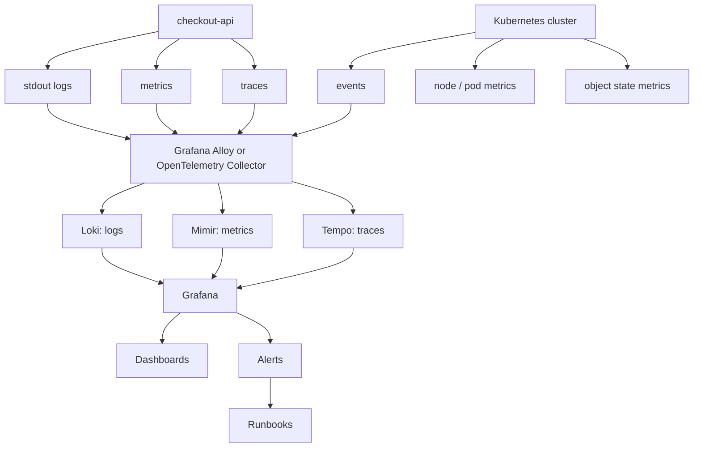

---

## 12.1. Qué vas a aprender y qué no vas a aprender todavía

Vas a aprender:

- Qué significa operar Kubernetes
- Qué diferencia hay entre monitoring, observabilidad y debugging
- Qué señales mínimas necesitas: events, logs, métricas y trazas
- Qué papel tienen Loki, Mimir, Tempo, Grafana y Alloy
- Qué papel puede tener OpenTelemetry Collector
- Qué mirar primero cuando falla un Pod, Deployment, Service, Job, PVC o NetworkPolicy
- Qué son RED y USE como modelos de métricas
- Qué es metrics-server
- Qué es kube-state-metrics
- Qué aporta node-exporter
- Qué relación hay entre métricas y HPA
- Qué es alerting
- Qué diferencia hay entre alerta, dashboard y runbook
- Qué significa un runbook útil
- Qué es un failure lab operativo
- Qué hacer con imagen inexistente, Secret ausente, ConfigMap mal escrito, selector de Service roto, readiness agresiva, OOMKilled, RBAC insuficiente, PVC Pending, NetworkPolicy bloqueando y rollout defectuoso
- Qué prácticas mínimas de backup y restore debes entender
- Cómo automatizar comandos de diagnóstico con Taskfile
No vamos a profundizar todavía en:

- Instalación completa y productiva de Mimir
- Instalación completa y productiva de Loki
- Instalación completa y productiva de Tempo
- Operación avanzada de Grafana
- Multi-tenancy de observabilidad
- Retención y coste de logs a gran escala
- SLOs y error budgets completos
- Incident command
- On-call profesional
- Chaos engineering avanzado
- Disaster recovery multi-región
- Service mesh telemetry
- eBPF avanzado
- Profiling con Pyroscope
- Producción real de Prometheus, Mimir o Grafana
- Backup transaccional avanzado de bases de datos
La regla pedagógica del módulo será:

```text
Primero señal
Luego síntoma
Luego diagnóstico
Luego acción
Luego prevención
Luego runbook
```

---

## 12.2. El problema: sin señales, Kubernetes parece aleatorio

Cuando no tienes observabilidad, los fallos parecen magia.

Un Pod no arranca.

Una API no responde.

Un rollout se queda bloqueado.

Un Service no tiene endpoints.

Una dependencia no resuelve por DNS.

La app reinicia, pero nadie sabe por qué.

La base de datos conserva datos, pero nadie sabe si hay backup.

Un usuario reporta error, pero no puedes seguir la request.

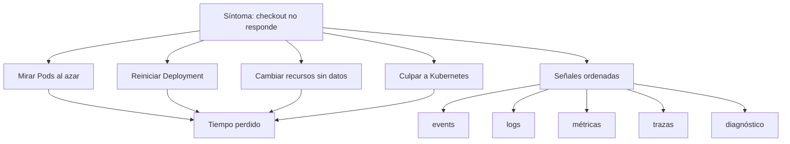

### Contrato mental

No preguntes primero:

> ¿Qué comando pruebo?

Pregunta:

> ¿Qué señal necesito para confirmar o descartar una hipótesis?

### Cuatro señales mínimas

|Señal|Pregunta que responde|
|---|---|
|Events|¿Qué está diciendo Kubernetes sobre los objetos?|
|Logs|¿Qué está diciendo la aplicación o componente?|
|Métricas|¿Qué está pasando en el tiempo y con qué magnitud?|
|Trazas|¿Por dónde pasó una request y dónde se degradó?|

### Criterio de comprensión

Debes poder explicar:

> Sin señales, operar es adivinar. Con señales, diagnosticar se convierte en reducir hipótesis.

---

## 12.3. Monitoring, observabilidad y debugging

Antes de instalar herramientas, separa conceptos.

### Monitoring

Monitoring responde:

> ¿El sistema está dentro de límites esperados?

Ejemplos:

- CPU alta
- Memoria alta
- Error rate subiendo
- Latencia alta
- Pods no Ready
- Rollout bloqueado
- PVC casi lleno
### Observabilidad

Observabilidad responde:

> ¿Puedo entender el estado interno del sistema a partir de sus señales externas?

Kubernetes usa la idea de métricas, logs y trazas como pilares de observabilidad para entender el estado, rendimiento y salud del cluster. ([Kubernetes](https://kubernetes.io/docs/concepts/cluster-administration/observability/ "Observability | Kubernetes"))

### Debugging

Debugging responde:

> ¿Cuál es la causa concreta y cómo la corrijo?

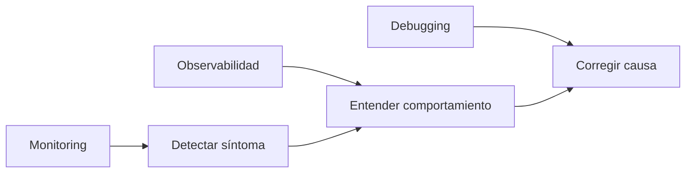

### Ejemplo

Síntoma:

```text
checkout-api tiene 500s
```

Monitoring:

```text
alerta por error rate alto
```

Observabilidad:

```text
traza muestra lentitud en payment-api
logs muestran timeout
métrica muestra saturación de conexiones
```

Debugging:

```text
corriges timeout, connection pool, dependencia o rollback
```

### Criterio de comprensión

Debes poder explicar:

> Monitoring avisa. Observabilidad ayuda a entender. Debugging corrige.

---

## 12.3 bis. Observabilidad built-in para CKAD

Antes de usar Grafana, Loki, Tempo o Mimir, debes dominar las señales nativas de Kubernetes.

CKAD no evalúa que sepas montar un stack completo de observabilidad.

Evalúa que puedas observar, diagnosticar y mantener aplicaciones usando herramientas integradas.

### Estado rápido

```bash
kubectl get pods -n shop
kubectl get deploy -n shop
kubectl get events -n shop --sort-by=.lastTimestamp
```

### Detalle operativo

```bash
kubectl describe pod <pod> -n shop
kubectl describe deployment checkout-api -n shop
```

### Logs

```bash
kubectl logs <pod> -n shop
kubectl logs <pod> -c <container> -n shop
kubectl logs <pod> --previous -n shop
kubectl logs deployment/checkout-api -n shop
```

### Esperar condiciones

```bash
kubectl wait --for=condition=Ready pod/<pod> -n shop --timeout=60s
kubectl rollout status deployment/checkout-api -n shop
```

### Métricas, si Metrics Server está instalado

```bash
kubectl top pod -n shop
kubectl top node
```

### Debugging mínimo

```bash
kubectl exec -it <pod> -n shop -- sh
kubectl debug -it <pod> -n shop --image=busybox:1.36 --target=<container>
```

### Orden recomendado

```text
get
describe
events
logs
previous logs
exec/debug
rollout status
service/endpointslice
```

### Criterio de comprensión

Debes poder explicar:

> LGTM da observabilidad avanzada. CKAD exige dominar primero la observabilidad nativa de Kubernetes.

---

## 12.4. Stack LGTM: mapa mental

### Qué problema resuelve

Queremos un modelo coherente para logs, métricas, trazas, dashboards y alertas.

En este roadmap usaremos Grafana LGTM como referencia principal:

|Letra|Componente|Señal|
|---|---|---|
|L|Loki|Logs|
|G|Grafana|Dashboards, exploración y alertas|
|T|Tempo|Traces|
|M|Mimir|Metrics|

Grafana Loki está documentado como el componente de logs, Grafana Mimir permite ingerir métricas Prometheus u OpenTelemetry, consultar datos, crear recording rules y configurar alerting rules, y Grafana Tempo está documentado como backend de trazas distribuido que permite buscar trazas y enlazarlas con logs y métricas. ([Grafana Labs](https://grafana.com/docs/loki/latest/ "Grafana Loki | Grafana Loki documentation"))

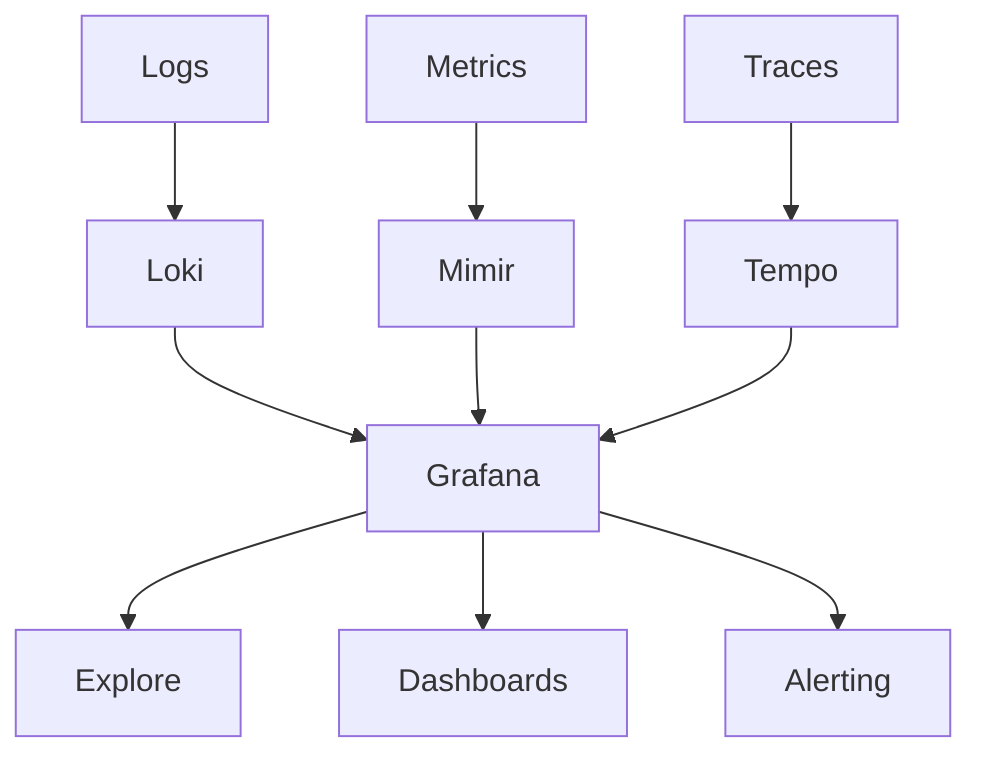

### Papel de Alloy

Grafana Alloy puede recolectar, procesar y enviar telemetría hacia sistemas como Loki, Mimir y Tempo, y también es compatible con pipelines de OpenTelemetry Collector y Prometheus Agent. ([Grafana Labs](https://grafana.com/docs/alloy/latest/ "Grafana Alloy | Grafana Alloy documentation"))

### Papel de OpenTelemetry Collector

OpenTelemetry Collector es un componente vendor-neutral para recibir, procesar y exportar datos de telemetría. La documentación de OpenTelemetry tiene una sección específica para usar Collector en Kubernetes y para monitorizar servicios ejecutándose en Kubernetes. ([OpenTelemetry](https://opentelemetry.io/docs/platforms/kubernetes/collector/ "OpenTelemetry Collector and Kubernetes | OpenTelemetry"))

### Criterio de comprensión

Debes poder explicar:

> LGTM separa almacenamiento y consulta por tipo de señal, mientras Grafana actúa como punto de exploración, dashboarding y alerting.

---

## 12.5. Arquitectura de observabilidad del curso

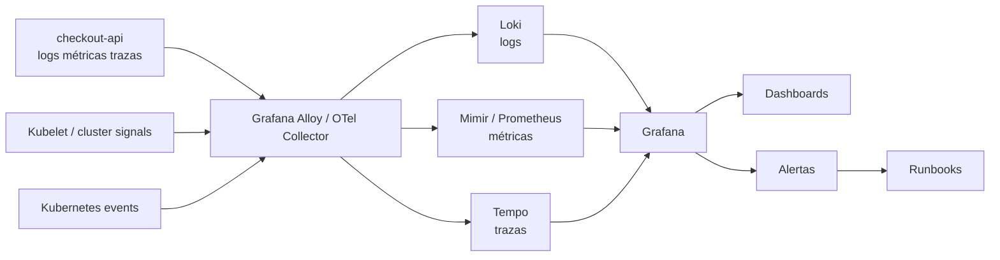

### Qué queremos construir

No vamos a convertir el curso en una operación completa de Grafana en producción.

Vamos a construir una arquitectura conceptual y práctica suficiente para aprender.

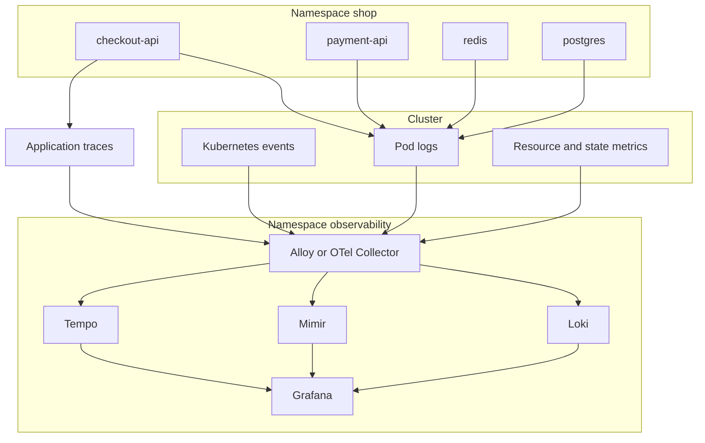

### Reglas del laboratorio

- El diagnóstico inicial seguirá usando `kubectl`
- La observabilidad centralizada se explicará con LGTM
- La instalación completa de LGTM será opcional, porque consume recursos y puede variar según entorno
- Los manifests del curso deben preparar la aplicación para observabilidad
- El failure lab debe enseñar qué señal buscar en cada caso
- El Taskfile debe permitir diagnóstico progresivo aunque todavía no tengas LGTM instalado
### Criterio de comprensión

Debes poder explicar:

> Antes de instalar un stack de observabilidad, la aplicación y los manifests deben producir señales útiles.

---

## 12.6. Preparar `checkout-api` para operar

### Qué problema resuelve

Una aplicación no se vuelve observable por instalar Grafana.

La aplicación debe emitir señales útiles.

Para `checkout-api`, como mínimo necesitamos:

- Logs por stdout
- Endpoints `/health` y `/ready`
- Endpoint funcional `/checkout`
- Mensajes de error con contexto
- Correlation ID o request ID
- Latencia por request
- Métricas HTTP si se implementan
- Trazas si se instrumenta con OpenTelemetry
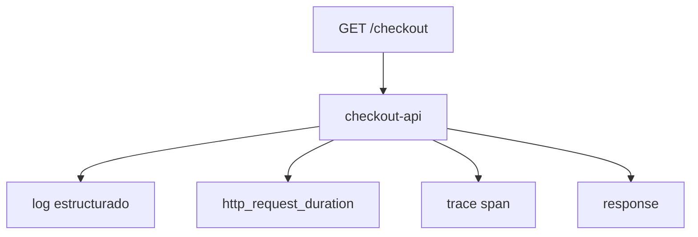

### Contrato mínimo de logs

Cada log importante debería permitir responder:

- Qué ocurrió
- En qué servicio
- En qué Pod
- En qué endpoint
- Con qué status
- Con qué duración
- Con qué request ID
- Si hubo error, qué tipo de error
Ejemplo de log JSON:

```json
{
  "level": "info",
  "service": "checkout-api",
  "pod": "checkout-api-abc123",
  "requestId": "req-123",
  "method": "GET",
  "path": "/checkout",
  "status": 200,
  "durationMs": 42,
  "message": "request completed"
}
```

### Contrato mínimo de health

Ya viene de módulos anteriores:

|Endpoint|Uso|
|---|---|
|`/health`|Proceso vivo|
|`/ready`|Instancia lista para tráfico|
|`/checkout`|Flujo funcional mínimo|

### Criterio de comprensión

Debes poder explicar:

> Un stack de observabilidad no arregla una aplicación muda. La aplicación debe emitir logs, métricas y trazas útiles.

---

## 12.7. Events de Kubernetes

### Qué problema resuelven

Events son una de las primeras señales que debes mirar.

Te dicen qué está intentando hacer Kubernetes:

- Pull de imagen
- Fallo de pull
- Scheduling
- Readiness fallando
- Liveness reiniciando
- PVC Pending
- Secret ausente
- ConfigMap ausente
- Backoff
- FailedMount
- FailedScheduling
### Comandos

```bash
kubectl get events -n shop --sort-by=.metadata.creationTimestamp
kubectl get events -A --sort-by=.metadata.creationTimestamp
```

Filtrar:

```bash
kubectl get events -n shop --field-selector involvedObject.kind=Pod
kubectl get events -n shop --field-selector involvedObject.name=checkout-api
```

### Cuándo mirarlos

Míralos pronto cuando:

- Un Pod no arranca
- Un rollout no termina
- Un PVC no está `Bound`
- Un Service no tiene endpoints
- Falta un Secret
- La imagen no se puede descargar
- Hay reinicios
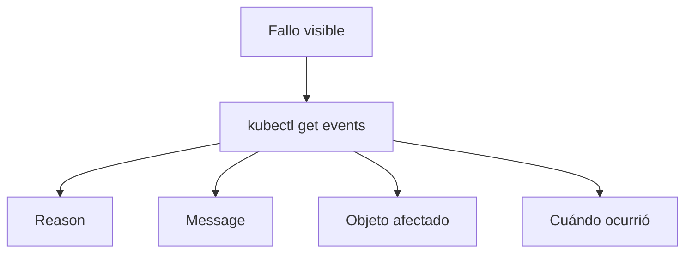

### DevEx

```yaml
k8s:events:
  desc: Show recent events in the namespace
  cmds:
    - kubectl get events -n {{.NAMESPACE}} --sort-by=.metadata.creationTimestamp

k8s:events:all:
  desc: Show recent events in all namespaces
  cmds:
    - kubectl get events -A --sort-by=.metadata.creationTimestamp
```

### Criterio de comprensión

Debes poder explicar:

> Events son la voz de Kubernetes sobre lo que intenta hacer y por qué algo no avanza.

---

## 12.8. Logs

### Qué problema resuelven

Logs explican comportamiento discreto.

Sirven para entender:

- Errores
- Requests
- Timeouts
- Configuración cargada
- Arranque
- Shutdown
- Dependencias
- Stack traces
- Decisiones internas de la app
Kubernetes mantiene documentación específica sobre logging architecture dentro de la sección de observability y tareas de debugging. ([Kubernetes](https://kubernetes.io/docs/concepts/cluster-administration/observability/ "Observability | Kubernetes"))

### Logs con `kubectl`

```bash
kubectl logs -n shop deploy/checkout-api
kubectl logs -n shop deploy/checkout-api --tail=100
kubectl logs -n shop deploy/checkout-api -f
kubectl logs -n shop pod/<pod-name> -c checkout-api
kubectl logs -n shop job/checkout-db-migration
```

Logs de Pod anterior si hubo restart:

```bash
kubectl logs -n shop pod/<pod-name> --previous
```

### Logs centralizados con Loki

En un stack LGTM, los logs de Pods y componentes se envían a Loki y se exploran desde Grafana. Loki está diseñado para almacenamiento y consulta de logs dentro del ecosistema Grafana. ([Grafana Labs](https://grafana.com/docs/loki/latest/ "Grafana Loki | Grafana Loki documentation"))

Consulta conceptual en LogQL:

```logql
{namespace="shop", app_kubernetes_io_name="checkout-api"}
```

Filtrar errores:

```logql
{namespace="shop", app_kubernetes_io_name="checkout-api"} |= "error"
```

### Criterio de comprensión

Debes poder explicar:

> `kubectl logs` sirve para diagnóstico inmediato. Loki permite búsqueda histórica, correlación, dashboards y alertas sobre logs.

---

## 12.9. Métricas

### Qué problema resuelven

Las métricas responden:

> ¿Cuánto, con qué frecuencia, durante cuánto tiempo y con qué tendencia?

Ejemplos:

- CPU
- Memoria
- Restarts
- Request rate
- Error rate
- Latencia
- Pods Ready
- Deployment Available
- PVC usage
- Node pressure
- HPA desired replicas
Kubernetes documenta resource metrics pipeline como la ruta de métricas de recursos desde kubelet/cAdvisor hacia metrics-server y consumidores como HPA y `kubectl top`. ([Kubernetes](https://kubernetes.io/docs/tasks/debug/debug-cluster/resource-metrics-pipeline/ "Resource metrics pipeline | Kubernetes"))

### Métricas de recursos

```bash
kubectl top nodes
kubectl top pods -n shop
```

Esto requiere metrics-server.

### HPA y métricas

HorizontalPodAutoscaler ajusta réplicas de workloads en función de métricas observadas, como CPU o memoria, cuando las métricas necesarias están disponibles. ([Kubernetes](https://kubernetes.io/docs/concepts/workloads/autoscaling/horizontal-pod-autoscale/ "Horizontal Pod Autoscaling | Kubernetes"))

### kube-state-metrics

`kube-state-metrics` expone métricas sobre el estado de objetos Kubernetes, como Deployments, Pods, Jobs, Nodes, DaemonSets, StatefulSets y otros recursos. ([GitHub](https://github.com/kubernetes/kube-state-metrics "GitHub - kubernetes/kube-state-metrics: Add-on agent to generate and expose cluster-level metrics. · GitHub"))

### node-exporter

node-exporter expone métricas del sistema operativo y hardware de nodos Linux para Prometheus-compatible scraping. ([prometheus.io](https://prometheus.io/docs/guides/node-exporter/ "Monitoring Linux host metrics with the Node Exporter | Prometheus"))

### Métricas con Mimir

Grafana Mimir permite ingerir métricas Prometheus u OpenTelemetry, consultarlas, crear recording rules y configurar alerting rules. ([Grafana Labs](https://grafana.com/docs/mimir/latest/ "Grafana Mimir documentation | Grafana Mimir documentation"))

### Criterio de comprensión

Debes poder explicar:

> Metrics-server sirve para métricas de recursos y HPA. kube-state-metrics describe estado de objetos Kubernetes. Mimir es un backend escalable para métricas de observabilidad.

---

## 12.10. RED y USE

### Qué problema resuelven

Necesitas modelos para no mirar métricas al azar.

### RED para servicios

RED se usa mucho para servicios request/response:

|Letra|Pregunta|
|---|---|
|Rate|¿Cuántas requests por segundo?|
|Errors|¿Cuántas fallan?|
|Duration|¿Cuánto tardan?|

Para `checkout-api`:

```text
request rate
5xx rate
p95 latency
```

### USE para recursos

USE se usa para recursos como CPU, memoria, disco o red:

|Letra|Pregunta|
|---|---|
|Utilization|¿Qué porcentaje se usa?|
|Saturation|¿Hay cola o presión?|
|Errors|¿Hay errores?|

Para nodos:

```text
CPU utilization
memory pressure
disk pressure
network errors
```

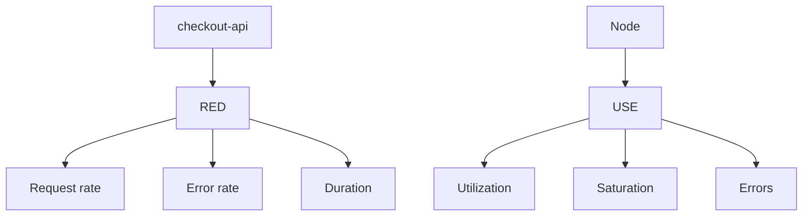

### Criterio de comprensión

Debes poder explicar:

> RED ayuda a entender servicios. USE ayuda a entender recursos. No uses dashboards como colecciones aleatorias de gráficas.

---

## 12.11. Trazas

### Qué problema resuelven

Las trazas muestran el recorrido de una request a través de servicios.

Son especialmente útiles cuando hay varios componentes:

```text
frontend → checkout-api → payment-api → redis/postgres
```

Tempo es el backend de trazas de Grafana y permite buscar trazas, generar métricas desde spans y enlazar trazas con logs y métricas. ([Grafana Labs](https://grafana.com/docs/tempo/latest/ "Grafana Tempo | Grafana Tempo documentation"))

### Qué debería mostrar una traza

- Request ID
- Servicio origen
- Servicio destino
- Duración de cada span
- Errores
- Dependencia lenta
- Path completo
- Metadata útil
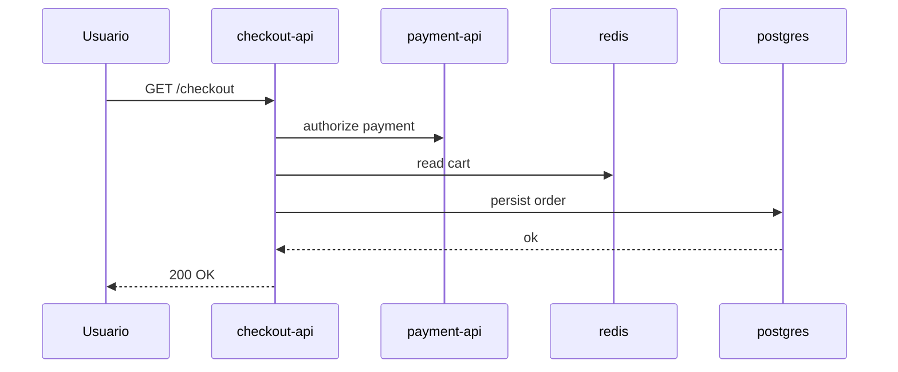

### OpenTelemetry

OpenTelemetry permite instrumentar aplicaciones y enviar trazas, métricas y logs hacia un Collector. La documentación de OpenTelemetry para Kubernetes describe el Collector como una forma vendor-neutral de recibir, procesar y exportar telemetría. ([OpenTelemetry](https://opentelemetry.io/docs/platforms/kubernetes/collector/ "OpenTelemetry Collector and Kubernetes | OpenTelemetry"))

### Criterio de comprensión

Debes poder explicar:

> Logs explican eventos. Métricas explican tendencias. Trazas explican el camino de una request entre servicios.

---

## 12.12. Grafana Alloy u OpenTelemetry Collector

### Qué problema resuelven

No quieres que cada aplicación conozca todos los backends de observabilidad.

Quieres un componente que reciba, procese y exporte señales.

Alloy puede trabajar con pipelines de OpenTelemetry, Prometheus, Loki, Tempo y Mimir. OpenTelemetry Collector, por su parte, es una forma vendor-neutral de recibir, procesar y exportar telemetría, y su documentación cubre específicamente su uso en Kubernetes. ([Grafana Labs](https://grafana.com/docs/alloy/latest/ "Grafana Alloy | Grafana Alloy documentation"))

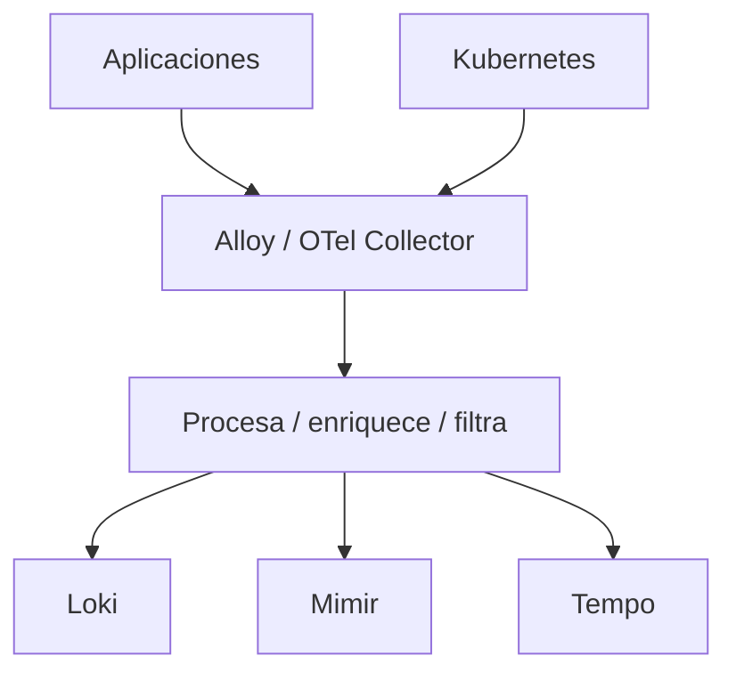

### Alloy encaja cuando

- Estás en ecosistema Grafana
- Quieres pipelines hacia Loki, Mimir, Tempo
- Quieres compatibilidad con OpenTelemetry y Prometheus
- Quieres recolectar logs, métricas y trazas en un modelo integrado
### OpenTelemetry Collector encaja cuando

- Quieres vendor-neutralidad
- Quieres separar instrumentación de backend
- Quieres exportar a varios proveedores
- Quieres usar estándar OpenTelemetry
### Criterio de comprensión

Debes poder explicar:

> Collector no es el backend final. Es la tubería que recoge, procesa y envía señales a los backends.

---

## 12.13. Instalación de observabilidad: enfoque del curso

### Decisión didáctica

Este módulo no hará obligatoria la instalación completa de LGTM.

Motivo:

- Puede consumir bastantes recursos en kind
- Mimir y Tempo productivos requieren decisiones de storage
- Loki requiere decisiones de retención y storage
- Los Helm charts evolucionan
- La configuración varía si usas Grafana Cloud o stack self-hosted
- El objetivo del módulo es aprender señales y operación, no administrar Grafana completo en producción
Grafana mantiene Helm charts para Grafana, Loki, Tempo, Mimir, Alloy y el Kubernetes Monitoring Helm chart. También documenta el Kubernetes Monitoring Helm chart como solución para configurar infraestructura, instrumentación y recolección de telemetría. ([Grafana Labs](https://grafana.com/docs/helm-charts/ "Grafana Labs Helm charts | Grafana Labs Helm charts documentation"))

### Práctica obligatoria

La práctica obligatoria será:

- Preparar la app para logs útiles
- Usar `kubectl` para events, logs, rollout, endpoints, resources y storage
- Crear dashboards conceptuales
- Crear alertas conceptuales
- Crear runbooks
- Ejecutar failure labs
- Automatizar diagnóstico con Taskfile
### Práctica opcional

La práctica opcional será:

- Crear namespace `observability`
- Instalar stack de observabilidad o componentes con Helm
- Instalar Alloy u OpenTelemetry Collector
- Enviar logs y métricas
- Consultar en Grafana
### Criterio de comprensión

Debes poder explicar:

> El curso enseña primero qué señales necesitas y cómo diagnosticarlas. Instalar LGTM sin criterio solo crea otra plataforma que no sabes operar.

---

## 12.14. Namespace de observabilidad

### Qué problema resuelve

Separar observabilidad de la aplicación evita mezclar responsabilidades.

Crea:

```text
kubernetes/11-observability/namespace.yaml
```

```yaml
apiVersion: v1
kind: Namespace
metadata:
  name: observability
  labels:
    app.kubernetes.io/part-of: observability
```

Aplicar:

```bash
kubectl apply -f kubernetes/11-observability/namespace.yaml
```

Ver:

```bash
kubectl get namespace observability
```

### Criterio de comprensión

Debes poder explicar:

> Observabilidad es una capacidad de plataforma. Conviene separarla del namespace de aplicación.

---

## 12.15. Dashboards mínimos

### Qué problema resuelven

Un dashboard no debe ser una pared de gráficas.

Debe responder preguntas operativas.

### Dashboard de `checkout-api`

Preguntas:

- ¿Está disponible?
- ¿Cuántas réplicas hay?
- ¿Cuántos Pods están Ready?
- ¿Cuántas requests recibe?
- ¿Qué error rate tiene?
- ¿Cuál es la latencia p95?
- ¿Cuántos restarts hay?
- ¿Qué versión está desplegada?
- ¿Qué logs de error aparecen?
- ¿Hay trazas lentas?
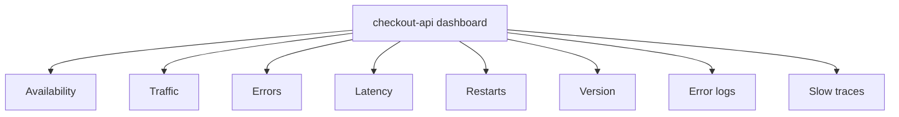

### Dashboard de cluster

Preguntas:

- ¿Nodos Ready?
- ¿CPU por nodo?
- ¿Memoria por nodo?
- ¿Pods Pending?
- ¿Pods CrashLoopBackOff?
- ¿PVCs Pending?
- ¿Deployments no Available?
- ¿Jobs fallidos?
- ¿Eventos críticos recientes?
### Criterio de comprensión

Debes poder explicar:

> Un dashboard útil está organizado por preguntas, no por herramientas.

---

## 12.16. Alerting

### Qué problema resuelve

Un dashboard es pasivo.

Una alerta es activa.

Grafana Alerting permite crear, gestionar y enrutar alertas desde Grafana. ([Grafana Labs](https://grafana.com/docs/grafana/latest/alerting/ "Grafana Alerting | Grafana documentation"))

### Qué merece alerta

No todo merece despertar a alguien.

Buenas alertas:

- Indican impacto o riesgo real
- Son accionables
- Tienen runbook
- Tienen umbral razonable
- Evitan ruido
- Se prueban
- Se revisan después de incidentes
### Alertas mínimas para el curso

|Alerta|Condición conceptual|Runbook|
|---|---|---|
|Deployment no disponible|`checkout-api` sin réplicas Available|Runbook rollout|
|Error rate alto|5xx por encima de umbral|Runbook errores API|
|Latencia alta|p95 por encima de umbral|Runbook latencia|
|CrashLoopBackOff|Pods reiniciando|Runbook reinicios|
|PVC Pending|PVC no Bound|Runbook storage|
|Job fallido|Job no completa|Runbook jobs|
|HPA sin métricas|HPA muestra `<unknown>`|Runbook métricas|

### Criterio de comprensión

Debes poder explicar:

> Una alerta sin runbook suele convertirse en ruido. Una alerta buena apunta a una acción razonable.

---

## 12.17. Runbooks

### Qué problema resuelven

Un runbook convierte conocimiento operativo en pasos repetibles.

No debe ser una novela.

Debe ayudar en presión.

### Formato recomendado

````markdown
# Runbook: checkout-api rollout bloqueado

## Síntoma

El Deployment `checkout-api` no completa rollout.

## Impacto posible

La nueva versión no está disponible o algunas réplicas no están Ready.

## Primeras comprobaciones

```bash
kubectl rollout status deployment/checkout-api -n shop --timeout=60s
kubectl get pods -n shop -l app.kubernetes.io/name=checkout-api -o wide
kubectl get events -n shop --sort-by=.metadata.creationTimestamp
````

## Diagnóstico

1. Revisar imagen.
    
2. Revisar readiness.
    
3. Revisar ConfigMap y Secret.
    
4. Revisar resources.
    
5. Revisar logs.
    
6. Revisar endpoints.
    

## Acciones

- Si imagen inexistente: rollback.
    
- Si readiness rota: revisar endpoint `/ready`.
    
- Si Secret ausente: restaurar Secret y reiniciar rollout.
    
- Si OOMKilled: revisar memoria, leaks y limits.
    

## Validación

```bash
kubectl rollout status deployment/checkout-api -n shop
task smoke:k8s
```

## Prevención

- `task test:k8s`
    
- policy contra `latest`
    
- smoke tests
    
- failure lab
    

````

### Criterio de comprensión

Debes poder explicar:

> Un runbook no sustituye criterio. Reduce tiempo de diagnóstico y evita improvisación bajo presión.

---

## 12.18. Troubleshooting progresivo general

### Secuencia base

```mermaid
flowchart TD
  Symptom["Síntoma"] --> Scope["1. Delimitar alcance"]
  Scope --> Events["2. Events"]
  Events --> Objects["3. Estado de objetos"]
  Objects --> Logs["4. Logs"]
  Logs --> Metrics["5. Métricas"]
  Metrics --> Traces["6. Trazas"]
  Traces --> RecentChange["7. Cambios recientes"]
  RecentChange --> Action["8. Acción mínima segura"]
  Action --> Validate["9. Validar recuperación"]
  Validate --> Prevent["10. Prevenir repetición"]
````

### Preguntas

1. ¿Falla una instancia, un workload, un namespace o todo el cluster?
2. ¿Qué cambió recientemente?
3. ¿Qué dicen events?
4. ¿Qué dicen logs?
5. ¿Hay métricas de saturación?
6. ¿Hay error rate o latencia?
7. ¿La traza muestra una dependencia lenta?
8. ¿El fallo coincide con rollout?
9. ¿Hay rollback disponible?
10. ¿Hay runbook?
### Criterio de comprensión

Debes poder explicar:

> Troubleshooting progresivo evita saltar a soluciones antes de entender el alcance y la señal.

---

## 12.19. Failure lab operativo

### Objetivo

Convertir fallos conocidos en ejercicios de diagnóstico.

No es chaos engineering avanzado.

Es aprendizaje controlado.

```mermaid
flowchart TD
  FailureLab["Failure lab operativo"] --> BadImage["Imagen inexistente"]
  FailureLab --> MissingSecret["Secret ausente"]
  FailureLab --> BadConfig["ConfigMap mal escrito"]
  FailureLab --> BadSelector["Service selector incorrecto"]
  FailureLab --> BadReadiness["Readiness agresiva"]
  FailureLab --> OOM["OOMKilled"]
  FailureLab --> NetPol["NetworkPolicy bloqueando"]
  FailureLab --> RBAC["RBAC insuficiente"]
  FailureLab --> PVCPending["PVC Pending"]
  FailureLab --> BrokenRollout["Rollout roto"]

  BadImage --> Runbook["Runbook"]
  MissingSecret --> Runbook
  BadConfig --> Runbook
  BadSelector --> Runbook
  BadReadiness --> Runbook
  OOM --> Runbook
  NetPol --> Runbook
  RBAC --> Runbook
  PVCPending --> Runbook
  BrokenRollout --> Runbook
```

Cada fallo debe documentar:

- Síntoma
- Señal en events
- Señal en logs
- Señal en métricas, si aplica
- Señal en trazas, si aplica
- Comandos de diagnóstico
- Acción segura
- Validación
- Prevención
- Runbook asociado
---

## 12.20. Caso 1: imagen inexistente

### Qué rompe

Un Deployment referencia una imagen que el cluster no puede descargar.

### Provocar

```bash
kubectl set image deployment/checkout-api checkout-api=checkout-api:does-not-exist -n shop
kubectl rollout status deployment/checkout-api -n shop --timeout=60s || true
```

### Diagnosticar

```bash
kubectl get pods -n shop
kubectl describe deployment checkout-api -n shop
kubectl get events -n shop --sort-by=.metadata.creationTimestamp
kubectl describe pod -n shop -l app.kubernetes.io/name=checkout-api
```

### Señal esperada

- `ImagePullBackOff`
- `ErrImagePull`
- rollout bloqueado
- events con fallo de pull
### Acción

```bash
kubectl rollout undo deployment/checkout-api -n shop
kubectl rollout status deployment/checkout-api -n shop
task smoke:k8s
```

### Prevención

- Policy contra `latest`
- `task test:k8s`
- Imagen cargada o publicada antes de actualizar manifest
- Scan y push en pipeline
---

## 12.21. Caso 2: Secret ausente

### Qué rompe

El Pod referencia un Secret obligatorio que no existe.

### Provocar

```bash
kubectl delete secret checkout-api-secret -n shop --ignore-not-found
kubectl rollout restart deployment/checkout-api -n shop
kubectl rollout status deployment/checkout-api -n shop --timeout=60s || true
```

### Diagnosticar

```bash
kubectl get pods -n shop -l app.kubernetes.io/name=checkout-api
kubectl describe pod -n shop -l app.kubernetes.io/name=checkout-api
kubectl get events -n shop --sort-by=.metadata.creationTimestamp
```

### Señal esperada

- Pod no arranca correctamente
- Event indicando Secret no encontrado
- rollout no completa
### Acción

```bash
kubectl apply -f kubernetes/05-config/secret.yaml
kubectl rollout restart deployment/checkout-api -n shop
kubectl rollout status deployment/checkout-api -n shop
```

### Prevención

- Validación de manifests
- Dry-run contra API Server
- Failure test de Secret ausente
- Gestión de secretos con flujo claro
---

## 12.22. Caso 3: Service selector incorrecto

### Qué rompe

El Service existe, pero no apunta a Pods.

### Diagnosticar

```bash
kubectl get svc checkout-api -n shop -o yaml
kubectl get pods -n shop --show-labels
kubectl get endpointslices -n shop -l kubernetes.io/service-name=checkout-api
kubectl describe svc checkout-api -n shop
```

### Señal esperada

- Service sin endpoints útiles
- Smoke test falla
- Pods pueden estar sanos, pero tráfico no llega
### Acción

Corregir selector o labels.

Validar:

```bash
task cluster:wait
task smoke:k8s
```

### Prevención

- Test de endpoints del módulo 9
- Failure lab de selector incorrecto
- Labels recomendadas consistentes
---

## 12.23. Caso 4: readiness demasiado agresiva

### Qué rompe

La app puede estar viva, pero Kubernetes no la considera lista.

### Diagnosticar

```bash
kubectl get pods -n shop -l app.kubernetes.io/name=checkout-api
kubectl describe pod -n shop -l app.kubernetes.io/name=checkout-api
kubectl get endpointslices -n shop -l kubernetes.io/service-name=checkout-api
kubectl logs -n shop deploy/checkout-api --tail=100
```

### Señal esperada

- Pod `Running` pero no `Ready`
- Endpoint no ready
- Events de readiness failed
- Service con menos endpoints
### Acción

- Revisar `/ready`
- Revisar initialDelay, period, timeout, failureThreshold
- Revisar dependencias que readiness comprueba
- Ajustar probe con datos
### Prevención

- Smoke tests
- Failure lab de readiness
- Métricas de latencia de arranque
---

## 12.24. Caso 5: OOMKilled

### Qué rompe

El contenedor supera el límite de memoria y kubelet lo termina.

### Diagnosticar

```bash
kubectl get pods -n shop
kubectl describe pod -n shop -l app.kubernetes.io/name=checkout-api
kubectl get pod -n shop -l app.kubernetes.io/name=checkout-api -o json \
  | jq '.items[].status.containerStatuses[] | {name, restartCount, lastState}'
kubectl top pods -n shop
```

### Señal esperada

- `OOMKilled` en `lastState`
- restarts incrementando
- memoria alta antes del kill, si tienes métricas
### Acción

- Revisar memory limit
- Revisar memory leak
- Revisar carga
- Revisar requests y limits
- Escalar o optimizar solo con evidencia
### Prevención

- Métricas de memoria
- Alertas por restarts
- Alertas por memoria cerca de limit
- Pruebas de carga en entorno adecuado
---

## 12.25. Caso 6: NetworkPolicy bloqueando tráfico

### Qué rompe

Un workload no puede comunicarse con otro.

### Diagnosticar

```bash
kubectl get networkpolicy -n shop
kubectl describe networkpolicy -n shop
kubectl exec -n shop dnsutils -- nslookup payment-api
kubectl exec -n shop dnsutils -- wget -T 3 -qO- http://payment-api/ || true
```

### Señal esperada

- DNS puede resolver
- Service puede existir
- Endpoint puede existir
- Tráfico falla o hace timeout
- No siempre habrá log claro si es bloqueo de red
### Acción

- Revisar `podSelector`
- Revisar `from` y `to`
- Revisar puertos
- Confirmar que el CNI aplica NetworkPolicy
- Añadir policy mínima necesaria
### Prevención

- Tests de NetworkPolicy
- Diagramas de comunicación permitida
- Default deny progresivo
---

## 12.26. Caso 7: RBAC insuficiente

### Qué rompe

Un Pod o usuario intenta hacer algo sin permisos.

### Diagnosticar

```bash
kubectl auth can-i get secrets \
  --as=system:serviceaccount:shop:checkout-api-sa \
  -n shop

kubectl get role,rolebinding -n shop
kubectl describe rolebinding -n shop
```

### Señal esperada

- `Forbidden`
- API rechaza la acción
- Logs de aplicación pueden mostrar error 403 si llama a la API
### Acción

- No dar permisos amplios
- Añadir permiso mínimo
- Validar con `kubectl auth can-i`
- Documentar por qué el workload necesita ese permiso
### Prevención

- Tests RBAC
- ServiceAccount por workload
- Revisión de permisos
---

## 12.27. Caso 8: PVC Pending

### Qué rompe

El workload necesita storage, pero el PVC no se satisface.

### Diagnosticar

```bash
kubectl get pvc -n shop
kubectl describe pvc postgres-data -n shop
kubectl get storageclass
kubectl get pv
kubectl get events -n shop --sort-by=.metadata.creationTimestamp
```

### Señal esperada

- PVC `Pending`
- Events relacionados con provisioning
- Pod puede quedar `Pending`
### Acción

- Revisar StorageClass
- Revisar accessModes
- Revisar requests de storage
- Revisar provisioner
- Revisar CSI driver
### Prevención

- Tests de PVC en kind, con limitaciones
- Runbook de storage
- Backups y restore probados
---

## 12.28. Backup y restore operacional

### Qué problema resuelve

En el módulo 8 separaste persistencia de backup.

Aquí lo llevamos a operación.

Velero documenta backup y restore de recursos Kubernetes y volúmenes persistentes según configuración y proveedor. ([Velero](https://velero.io/docs/main/ "Velero Docs - Overview"))

### Qué debes respaldar

- Manifests
- ConfigMaps
- Secrets, con protección especial
- PVCs y datos
- Recursos críticos
- Estado de GitOps si aplica
- Documentación de restore
- Runbooks
### Qué debes probar

- Restore de namespace
- Restore de PVC
- Restore de Secret necesario
- Restore en otro namespace
- Tiempo de recuperación
- Validación funcional después de restore
### Regla

```text
Backup no probado = backup no demostrado
```

### Criterio de comprensión

Debes poder explicar:

> Persistir datos evita perderlos al recrear Pods. Backup y restore probados permiten recuperarte ante pérdida, corrupción o error humano.

---

## 12.29. Drains, PDBs y mantenimiento

### Qué problema resuelve

Operar también implica mantenimiento de nodos.

En módulos anteriores viste PodDisruptionBudget.

Aquí lo conectamos con operación.

### Comandos conceptuales

```bash
kubectl drain <node> --ignore-daemonsets --delete-emptydir-data
kubectl uncordon <node>
kubectl get pdb -n shop
kubectl describe pdb checkout-api-pdb -n shop
```

### Cuidado

No practiques `drain` sin entender tu cluster local.

En kind de un solo nodo puede dejarte sin sitio para programar Pods.

### Qué mirar

- PDB
- Réplicas
- Readiness
- DaemonSets
- Storage local
- Workloads stateful
- Capacidad restante
### Criterio de comprensión

Debes poder explicar:

> Un PDB no evita todos los fallos. Ayuda a controlar interrupciones voluntarias durante mantenimiento.

---

## 12.30. Taskfile del módulo 12

Añade estas tareas al `Taskfile.yml`.

```yaml
  observability:namespace:apply:
    desc: Apply observability namespace
    cmds:
      - kubectl apply -f kubernetes/11-observability/namespace.yaml

  observability:namespace:status:
    desc: Show observability namespace
    cmds:
      - kubectl get namespace observability

  k8s:events:
    desc: Show recent events in the application namespace
    cmds:
      - kubectl get events -n {{.NAMESPACE}} --sort-by=.metadata.creationTimestamp

  k8s:events:all:
    desc: Show recent events in all namespaces
    cmds:
      - kubectl get events -A --sort-by=.metadata.creationTimestamp

  k8s:logs:checkout:
    desc: Show checkout-api logs
    cmds:
      - kubectl logs -n {{.NAMESPACE}} deploy/checkout-api --tail=100

  k8s:logs:checkout:follow:
    desc: Follow checkout-api logs
    cmds:
      - kubectl logs -n {{.NAMESPACE}} deploy/checkout-api -f

  k8s:logs:checkout:previous:
    desc: Show previous checkout-api container logs when available
    cmds:
      - |
        POD="$(kubectl get pod -n {{.NAMESPACE}} -l app.kubernetes.io/name=checkout-api -o jsonpath='{.items[0].metadata.name}')"
        kubectl logs -n {{.NAMESPACE}} "$POD" --previous || true

  k8s:metrics:top:
    desc: Show node and pod resource metrics if metrics-server is installed
    cmds:
      - kubectl top nodes || true
      - kubectl top pods -n {{.NAMESPACE}} || true

  k8s:rollout:checkout:
    desc: Show checkout-api rollout status
    cmds:
      - kubectl rollout status deployment/checkout-api -n {{.NAMESPACE}} --timeout=120s
      - kubectl rollout history deployment/checkout-api -n {{.NAMESPACE}}

  k8s:health:checkout:
    desc: Check checkout-api health through Service port-forward
    cmds:
      - task smoke:k8s

  k8s:debug:checkout:summary:
    desc: Progressive diagnostic summary for checkout-api
    cmds:
      - kubectl get deploy checkout-api -n {{.NAMESPACE}} -o wide
      - kubectl get rs -n {{.NAMESPACE}}
      - kubectl get pods -n {{.NAMESPACE}} -l app.kubernetes.io/name=checkout-api -o wide
      - kubectl get svc checkout-api -n {{.NAMESPACE}} -o wide
      - kubectl get endpointslices -n {{.NAMESPACE}} -l kubernetes.io/service-name=checkout-api
      - kubectl get configmap checkout-api-config -n {{.NAMESPACE}} || true
      - kubectl get secret checkout-api-secret -n {{.NAMESPACE}} || true
      - kubectl get networkpolicy -n {{.NAMESPACE}} || true
      - kubectl get events -n {{.NAMESPACE}} --sort-by=.metadata.creationTimestamp
      - kubectl logs -n {{.NAMESPACE}} deploy/checkout-api --tail=50 || true

  reliability:failure:bad-image:
    desc: Trigger bad image rollout and show operational signals
    cmds:
      - kubectl set image deployment/checkout-api checkout-api=checkout-api:does-not-exist -n {{.NAMESPACE}}
      - kubectl rollout status deployment/checkout-api -n {{.NAMESPACE}} --timeout=60s || true
      - task k8s:debug:checkout:summary

  reliability:failure:bad-image:recover:
    desc: Recover from bad image rollout
    cmds:
      - kubectl rollout undo deployment/checkout-api -n {{.NAMESPACE}}
      - kubectl rollout status deployment/checkout-api -n {{.NAMESPACE}} --timeout=120s
      - task smoke:k8s

  reliability:failure:missing-secret:
    desc: Delete checkout-api Secret and show operational signals
    cmds:
      - kubectl delete secret checkout-api-secret -n {{.NAMESPACE}} --ignore-not-found
      - kubectl rollout restart deployment/checkout-api -n {{.NAMESPACE}}
      - kubectl rollout status deployment/checkout-api -n {{.NAMESPACE}} --timeout=60s || true
      - task k8s:debug:checkout:summary

  reliability:failure:missing-secret:recover:
    desc: Recover missing checkout-api Secret
    cmds:
      - kubectl apply -f kubernetes/05-config/secret.yaml
      - kubectl rollout restart deployment/checkout-api -n {{.NAMESPACE}}
      - kubectl rollout status deployment/checkout-api -n {{.NAMESPACE}} --timeout=120s

  reliability:failure:service-selector:
    desc: Apply bad Service selector and show operational signals
    cmds:
      - task k8s:failure:service:bad-selector:apply
      - task k8s:failure:service:bad-selector:inspect

  reliability:failure:service-selector:recover:
    desc: Recover from bad Service selector failure
    cmds:
      - task k8s:failure:service:bad-selector:delete
      - task cluster:wait
      - task smoke:k8s

  reliability:storage:status:
    desc: Show storage operational status
    cmds:
      - kubectl get pvc -n {{.NAMESPACE}}
      - kubectl get pv
      - kubectl get storageclass
      - kubectl get events -n {{.NAMESPACE}} --sort-by=.metadata.creationTimestamp

  reliability:backup:resources:
    desc: Export namespace resources to a local YAML file for learning purposes
    cmds:
      - mkdir -p .tmp
      - kubectl get all,configmap,secret,pvc,networkpolicy,pdb -n {{.NAMESPACE}} -o yaml > .tmp/{{.NAMESPACE}}-resources-backup.yaml
      - ls -lh .tmp/{{.NAMESPACE}}-resources-backup.yaml

  reliability:runbook:checkout:
    desc: Print commands for checkout-api runbook
    cmds:
      - echo "1. task k8s:debug:checkout:summary"
      - echo "2. task k8s:events"
      - echo "3. task k8s:logs:checkout"
      - echo "4. task k8s:metrics:top"
      - echo "5. task k8s:network:troubleshoot:checkout"
      - echo "6. task k8s:troubleshoot:config-storage"
      - echo "7. task smoke:k8s"

  reliability:test:
    desc: Run operational checks
    cmds:
      - task k8s:debug:checkout:summary
      - task k8s:metrics:top
      - task smoke:k8s
      - task reliability:storage:status
```

### Criterio DevEx

Debes poder explicar:

> La DevEx de operación debe permitir ir desde síntoma hasta señales principales con pocos comandos, sin ocultar qué se está inspeccionando.

---

## 12.31. Práctica principal del módulo

### Objetivo

Crear una práctica operativa completa para diagnosticar y recuperar `checkout-api`.

### Resultado esperado

```text
kubernetes-learning-lab/
  kubernetes/
    11-observability/
      namespace.yaml
  docs/
    runbooks/
      checkout-api-rollout.md
      checkout-api-errors.md
      storage-pvc-pending.md
      service-no-endpoints.md
  Taskfile.yml
```

### Paso 1. Preparar entorno

```bash
task k8s:kind:create
task k8s:namespace:apply
task k8s:image:prepare
task k8s:deployment:apply
task k8s:service:apply
task k8s:config:apply
task k8s:deployment:status
task smoke:k8s
```

### Paso 2. Aplicar namespace de observabilidad

```bash
task observability:namespace:apply
task observability:namespace:status
```

### Paso 3. Diagnóstico base

```bash
task k8s:debug:checkout:summary
task k8s:events
task k8s:logs:checkout
task k8s:metrics:top
```

### Paso 4. Ejecutar failure lab de imagen inexistente

```bash
task reliability:failure:bad-image
task reliability:failure:bad-image:recover
```

### Paso 5. Ejecutar failure lab de Secret ausente

```bash
task reliability:failure:missing-secret
task reliability:failure:missing-secret:recover
```

### Paso 6. Ejecutar failure lab de Service selector incorrecto

```bash
task reliability:failure:service-selector
task reliability:failure:service-selector:recover
```

### Paso 7. Revisar storage

```bash
task reliability:storage:status
```

### Paso 8. Exportar recursos para aprendizaje

```bash
task reliability:backup:resources
```

### Paso 9. Crear runbooks

Crea:

```text
docs/runbooks/checkout-api-rollout.md
docs/runbooks/checkout-api-errors.md
docs/runbooks/storage-pvc-pending.md
docs/runbooks/service-no-endpoints.md
```

Cada runbook debe tener:

- Síntoma
- Impacto posible
- Primeras comprobaciones
- Diagnóstico
- Acciones seguras
- Validación
- Prevención
### Paso 10. Ejecutar chequeo operativo

```bash
task reliability:test
```

### Criterio de finalización

La práctica está completa cuando puedes explicar:

- Qué mirar primero si `checkout-api` no responde
- Qué señal da una imagen inexistente
- Qué señal da un Secret ausente
- Qué señal da un Service sin endpoints
- Qué señal da un PVC Pending
- Qué diferencia hay entre logs, events, metrics y traces
- Qué dashboard harías para `checkout-api`
- Qué alertas mínimas crearías
- Qué runbook seguirías
- Qué parte de LGTM instalarías primero y por qué
---

## 12.32. Ejercicios cortos

### Ejercicio 1. Clasificar señales

Completa:

|Problema|Events|Logs|Métricas|Trazas|
|---|--:|--:|--:|--:|
|Imagen inexistente|||||
|Error 500 en `/checkout`|||||
|Payment lento|||||
|OOMKilled|||||
|Service sin endpoints|||||
|PVC Pending|||||

---

### Ejercicio 2. Diagnóstico base

Ejecuta:

```bash
task k8s:debug:checkout:summary
```

Responde:

- ¿Cuántas réplicas tiene el Deployment?
- ¿Cuántos Pods están Ready?
- ¿El Service tiene endpoints?
- ¿Hay events recientes relevantes?
- ¿Los logs muestran errores?
---

### Ejercicio 3. Logs

Ejecuta:

```bash
task k8s:logs:checkout
```

Responde:

- ¿Los logs tienen servicio?
- ¿Tienen request ID?
- ¿Tienen status?
- ¿Tienen duración?
- ¿Serían útiles en Loki?
---

### Ejercicio 4. Métricas

Ejecuta:

```bash
task k8s:metrics:top
```

Responde:

- ¿Tu cluster tiene metrics-server?
- ¿Puedes ver CPU de Pods?
- ¿Puedes ver memoria?
- ¿Qué implicaría si HPA muestra `<unknown>`?
---

### Ejercicio 5. Failure lab de imagen

Ejecuta:

```bash
task reliability:failure:bad-image
```

Responde:

- ¿Qué estado aparece en Pods?
- ¿Qué dicen los events?
- ¿Qué dice rollout status?
- ¿Cómo recuperas?
Recupera:

```bash
task reliability:failure:bad-image:recover
```

---

### Ejercicio 6. Service sin endpoints

Ejecuta:

```bash
task reliability:failure:service-selector
```

Responde:

- ¿El Service existe?
- ¿Tiene endpoints?
- ¿Qué selector tiene?
- ¿Qué labels tienen los Pods?
- ¿Qué test del módulo 9 habría detectado esto?
Recupera:

```bash
task reliability:failure:service-selector:recover
```

---

### Ejercicio 7. Diseñar alerta

Diseña una alerta para:

```text
checkout-api error rate alto
```

Incluye:

- Señal
- Umbral inicial
- Duración
- Severidad
- Runbook
- Qué acción no deberías automatizar sin validación
---

## 12.33. Errores habituales

### Error 1. Instalar Grafana antes de saber qué preguntar

Un dashboard sin preguntas operativas claras se convierte en decoración.

---

### Error 2. Confundir health check con observabilidad

`/health` dice si el proceso responde.

No explica latencia, errores, saturación, dependencias ni causa raíz.

---

### Error 3. Mirar logs sin contexto

Un log sin request ID, servicio, Pod, status y duración puede ser difícil de correlacionar.

---

### Error 4. Alertar por todo

Demasiadas alertas crean ruido.

El ruido hace que la gente ignore señales.

---

### Error 5. No probar runbooks

Un runbook no probado suele fallar en el peor momento.

---

### Error 6. Tratar `kubectl top` como observabilidad completa

`kubectl top` ayuda con recursos.

No sustituye métricas de aplicación, logs, trazas, dashboards ni alertas.

---

### Error 7. Creer que persistencia es recuperación

Un PVC puede sobrevivir a un Pod.

Eso no significa que puedas recuperar datos ante corrupción, borrado o pérdida del volumen.

---

### Error 8. Empezar troubleshooting por el componente más complejo

No empieces por CNI, Tempo o Mimir.

Empieza por alcance, events, estado de objetos, logs y cambios recientes.

---

## 12.34. Criterio de salida del módulo

Puedes pasar al módulo 13 cuando puedas hacer todo esto sin seguir una receta ciegamente.

### Conceptos

Debes poder explicar:

- Qué significa operar Kubernetes
- Diferencia entre monitoring, observabilidad y debugging
- Qué son events
- Qué aportan logs
- Qué aportan métricas
- Qué aportan trazas
- Qué papel tienen Loki, Grafana, Tempo y Mimir
- Qué papel tiene Grafana Alloy
- Qué papel tiene OpenTelemetry Collector
- Qué es metrics-server
- Qué relación hay entre metrics-server y HPA
- Qué aporta kube-state-metrics
- Qué aporta node-exporter
- Qué son RED y USE
- Qué es alerting
- Qué diferencia hay entre dashboard, alerta y runbook
- Qué significa backup probado
- Qué relación hay entre PDBs, drains y mantenimiento
### Práctica

Debes poder:

- Consultar events
- Consultar logs actuales y anteriores
- Consultar métricas con `kubectl top` si metrics-server existe
- Diagnosticar rollout bloqueado
- Diagnosticar imagen inexistente
- Diagnosticar Secret ausente
- Diagnosticar Service sin endpoints
- Diagnosticar PVC Pending
- Ejecutar smoke test
- Recuperar con rollback
- Crear runbooks
- Diseñar dashboards mínimos
- Diseñar alertas mínimas
- Exportar recursos para aprendizaje
### DevEx

Debes poder ejecutar:

```bash
task observability:namespace:apply
task k8s:debug:checkout:summary
task k8s:events
task k8s:logs:checkout
task k8s:logs:checkout:previous
task k8s:metrics:top
task reliability:failure:bad-image
task reliability:failure:bad-image:recover
task reliability:failure:missing-secret
task reliability:failure:missing-secret:recover
task reliability:failure:service-selector
task reliability:failure:service-selector:recover
task reliability:storage:status
task reliability:backup:resources
task reliability:test
```

### Frase final de comprensión

Debes poder explicar esta frase:

> Operar Kubernetes es trabajar con señales. Events explican qué intenta hacer Kubernetes, logs explican comportamiento, métricas muestran tendencias, trazas conectan servicios, dashboards organizan preguntas, alertas llaman la atención y runbooks convierten diagnóstico en acción segura.

---

## 12.35. Referencias oficiales y fuentes primarias

|Tema|Referencia|
|---|---|
|Observability en Kubernetes|Kubernetes Docs, Observability. ([Kubernetes](https://kubernetes.io/docs/concepts/cluster-administration/observability/ "Observability \| Kubernetes"))|
|Monitoring, logging and debugging|Kubernetes Docs, Monitoring, Logging, and Debugging. ([Kubernetes](https://kubernetes.io/docs/tasks/debug/ "Monitoring, Logging, and Debugging \| Kubernetes"))|
|Resource metrics pipeline|Kubernetes Docs, Resource metrics pipeline. ([Kubernetes](https://kubernetes.io/docs/tasks/debug/debug-cluster/resource-metrics-pipeline/ "Resource metrics pipeline \| Kubernetes"))|
|Horizontal Pod Autoscaling|Kubernetes Docs, Horizontal Pod Autoscaling. ([Kubernetes](https://kubernetes.io/docs/concepts/workloads/autoscaling/horizontal-pod-autoscale/ "Horizontal Pod Autoscaling \| Kubernetes"))|
|Grafana Alloy|Grafana Alloy documentation. ([Grafana Labs](https://grafana.com/docs/alloy/latest/ "Grafana Alloy \| Grafana Alloy documentation"))|
|Grafana Helm charts|Grafana Labs Helm charts documentation. ([Grafana Labs](https://grafana.com/docs/helm-charts/ "Grafana Labs Helm charts \| Grafana Labs Helm charts documentation"))|
|Grafana Loki|Grafana Loki documentation. ([Grafana Labs](https://grafana.com/docs/loki/latest/ "Grafana Loki \| Grafana Loki documentation"))|
|Grafana Mimir|Grafana Mimir documentation. ([Grafana Labs](https://grafana.com/docs/mimir/latest/ "Grafana Mimir documentation \| Grafana Mimir documentation"))|
|Grafana Tempo|Grafana Tempo documentation. ([Grafana Labs](https://grafana.com/docs/tempo/latest/ "Grafana Tempo \| Grafana Tempo documentation"))|
|Grafana Alerting|Grafana Alerting documentation. ([Grafana Labs](https://grafana.com/docs/grafana/latest/alerting/ "Grafana Alerting \| Grafana documentation"))|
|OpenTelemetry Collector en Kubernetes|OpenTelemetry Collector and Kubernetes. ([OpenTelemetry](https://opentelemetry.io/docs/platforms/kubernetes/collector/ "OpenTelemetry Collector and Kubernetes \| OpenTelemetry"))|
|kube-state-metrics|Kubernetes kube-state-metrics repository. ([GitHub](https://github.com/kubernetes/kube-state-metrics "GitHub - kubernetes/kube-state-metrics: Add-on agent to generate and expose cluster-level metrics. · GitHub"))|
|node-exporter|Prometheus node-exporter guide. ([prometheus.io](https://prometheus.io/docs/guides/node-exporter/ "Monitoring Linux host metrics with the Node Exporter \| Prometheus"))|
|Velero|Velero documentation. ([Velero](https://velero.io/docs/main/ "Velero Docs - Overview"))|

## 12.36. Lecturas de apoyo

|Libro|Qué leer|
|---|---|
|_Cloud Native DevOps with Kubernetes_|Capítulos 6, 11, 15 y 16: cluster sizing, validation, auditing, chaos testing, backups, etcd, Velero, observability, logging, metrics, tracing, RED, USE, dashboards y alerting.|
|_Kubernetes in Action_|Capítulos 11, 14, 15, 16 y 17: internals, resources, autoscaling, scheduling, lifecycle, logs y best practices.|
|_Kubernetes: Up and Running_|Capítulos sobre Deployments, Jobs, DaemonSets, ConfigMaps, Secrets, RBAC, stateful applications y aplicaciones reales como apoyo operativo.|
|_Kubernetes Patterns_|Health Probe, Managed Lifecycle, Service Discovery, Elastic Scale, Controller y Operator como patrones que influyen directamente en observabilidad y operación.|

<!-- COURSE_NAV_START -->
[Anterior](11.%20Seguridad.md) | [Indice](README.md) | [Siguiente](13.%20Patrones%20cloud%20native.md)
<!-- COURSE_NAV_END -->
