<!-- COURSE_NAV_START -->
[Anterior](12.%20Operación,%20observabilidad%20y%20fiabilidad%20con%20Grafana%20LGTM.md) | [Indice](README.md) | [Siguiente](14.%20Extensión%20de%20Kubernetes.md)
<!-- COURSE_NAV_END -->

He contrastado el módulo con documentación oficial actual de Kubernetes sobre Workloads, Pod lifecycle, probes, container lifecycle hooks, sidecar containers, resource management, scheduling, Downward API, extending Kubernetes y Operator pattern. También he revisado referencias primarias sobre OpenTelemetry para instrumentación y el contenido de apoyo de _Kubernetes Patterns_ para organizar los patrones de forma didáctica.

# 13. Patrones cloud native

## Objetivo del módulo

En el módulo 12 aprendiste a operar Kubernetes con señales:

```text
events
logs
métricas
trazas
dashboards
alertas
runbooks
failure labs
```

Ahora toca una idea clave:

> Kubernetes no convierte automáticamente una aplicación tradicional en una aplicación cloud native.

Kubernetes puede reiniciar Pods, hacer rollouts, exponer Services, montar ConfigMaps, aplicar NetworkPolicies y recolectar señales.

Pero la aplicación tiene que colaborar.

Una aplicación cloud native bien diseñada entiende el entorno donde vive:

- Expone health checks reales
- Arranca de forma predecible
- Se apaga de forma controlada
- No depende del filesystem efímero para datos duraderos
- Declara recursos
- Externaliza configuración
- Emite logs útiles
- Puede ser observada
- Tolera fallos parciales
- Usa el workload correcto
- Evita acoplarse a una instancia concreta
- No fuerza a Kubernetes a adivinar cómo operarla

Kubernetes define un workload como una aplicación que corre en Kubernetes, normalmente dentro de uno o varios Pods, y ofrece abstracciones de mayor nivel para gestionarlos. También documenta explícitamente el ciclo de vida de Pods, probes, lifecycle hooks, sidecar containers, recursos y extensibilidad como piezas fundamentales para operar aplicaciones correctamente. ([Kubernetes](https://kubernetes.io/docs/concepts/workloads/ "Workloads"))

La idea central del módulo es esta:

> Los patrones cloud native son acuerdos de diseño entre la aplicación y la plataforma. No son recetas de YAML. Son formas de hacer que Kubernetes pueda desplegar, observar, escalar, aislar, actualizar y recuperar una aplicación con menos fricción.

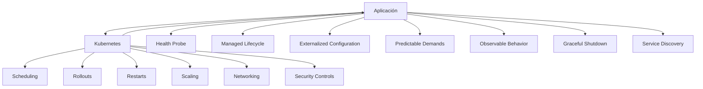

---

## 13.1. Qué vas a aprender y qué no vas a aprender todavía

Vas a aprender:

- Qué significa diseñar una aplicación para Kubernetes
- Qué problema resuelven los patrones cloud native
- Por qué Kubernetes no arregla una aplicación mal diseñada
- Qué es Predictable Demands
- Qué es Declarative Deployment
- Qué es Health Probe
- Qué es Managed Lifecycle
- Qué es Automated Placement
- Qué son Batch Job y Periodic Job
- Qué es Daemon Service
- Qué es Singleton Service
- Qué es Stateful Service
- Qué es Service Discovery
- Qué es Self Awareness
- Qué son Init Container, Sidecar, Adapter y Ambassador
- Qué son EnvVar Configuration, Configuration Resource, Immutable Configuration y Configuration Template
- Qué son Controller y Operator
- Qué es Elastic Scale
- Cómo rediseñar `checkout-api` aplicando patrones
- Cómo detectar cuándo un patrón ayuda y cuándo es sobreingeniería
- Cómo practicar patrones con manifests pequeños y comprensibles
- Cómo mejorar la DevEx con Taskfile
No vamos a profundizar todavía en:

- Implementar un operator completo
- Service mesh
- mTLS
- Knative
- KEDA
- Argo Rollouts avanzado
- Cilium avanzado
- Multi-cluster
- Bases de datos productivas en Kubernetes
- Operators productivos de PostgreSQL
- Platform engineering avanzado
- Diseño completo de una plataforma interna
La regla pedagógica del módulo será:

```text
Primero problema
Luego patrón
Luego responsabilidad de la aplicación
Luego responsabilidad de Kubernetes
Luego práctica pequeña
Luego criterio de salida
```

---

## 13.2. El problema: Kubernetes no puede operar bien una aplicación que no coopera

Kubernetes observa objetos, estados y señales.

Pero si la aplicación no da señales útiles, Kubernetes actúa con información pobre.

Ejemplos:

|Aplicación mal preparada|Consecuencia|
|---|---|
|No tiene `/ready`|Kubernetes puede enviar tráfico demasiado pronto|
|No tiene `/health` real|Kubernetes no sabe cuándo reiniciar|
|No responde a `SIGTERM`|Rollouts pueden cortar requests vivas|
|Escribe datos importantes en filesystem efímero|Pierde datos al recrear Pod|
|No declara requests|El scheduler decide con menos información|
|No emite logs útiles|Diagnóstico lento|
|No externaliza configuración|Requiere imágenes distintas por entorno|
|Depende de IPs de Pods|Se rompe con recreaciones|
|Usa workers infinitos para tareas finitas|Difícil saber cuándo terminaron|
|Usa Deployment para todo|Mezcla comportamientos operativos distintos|

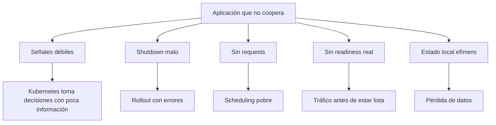

### Contrato mental

No diseñes solo para que la app funcione en tu máquina.

Diseña para que Kubernetes pueda responder estas preguntas:

- ¿Está viva?
- ¿Está lista?
- ¿Puede recibir tráfico?
- ¿Cuándo puede apagarse?
- ¿Cuántos recursos necesita?
- ¿Qué configuración necesita?
- ¿Qué secretos necesita?
- ¿Qué dependencias tiene?
- ¿Qué datos deben sobrevivir?
- ¿Qué señales emite?
- ¿Puede escalar?
- ¿Qué pasa si una réplica muere?
- ¿Qué pasa si una dependencia falla?
### Criterio de comprensión

Debes poder explicar:

> Kubernetes puede automatizar operación, pero necesita contratos claros de salud, configuración, recursos, lifecycle, red y observabilidad.

---

## 13.3. Mapa de patrones del módulo

Este módulo organiza los patrones en seis capas.

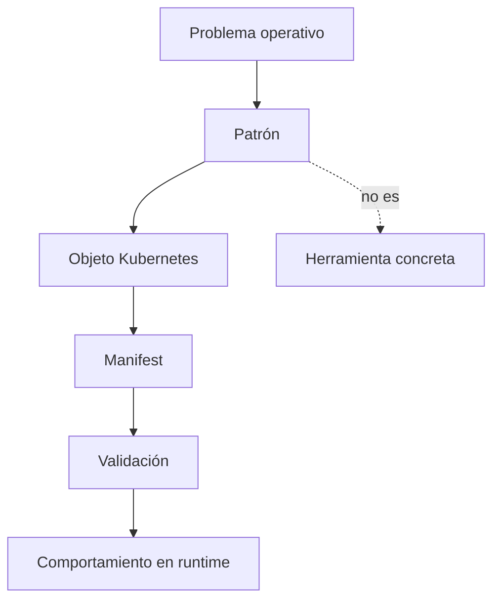

```mermaid
flowchart TD
  Patterns["Patrones cloud native"] --> Foundational["1. Fundacionales"]
  Patterns --> Behavioral["2. Comportamiento"]
  Patterns --> Structural["3. Estructurales"]
  Patterns --> Config["4. Configuración"]
  Patterns --> Advanced["5. Avanzados"]
  Patterns --> Operational["6. Operacionales"]

  Foundational --> Predictable["Predictable Demands"]
  Foundational --> Declarative["Declarative Deployment"]
  Foundational --> Health["Health Probe"]
  Foundational --> Lifecycle["Managed Lifecycle"]
  Foundational --> Placement["Automated Placement"]

  Behavioral --> Batch["Batch Job"]
  Behavioral --> Periodic["Periodic Job"]
  Behavioral --> Daemon["Daemon Service"]
  Behavioral --> Singleton["Singleton Service"]
  Behavioral --> Stateful["Stateful Service"]
  Behavioral --> Discovery["Service Discovery"]

  Structural --> Init["Init Container"]
  Structural --> Sidecar["Sidecar"]
  Structural --> Adapter["Adapter"]
  Structural --> Ambassador["Ambassador"]

  Config --> EnvVar["EnvVar Configuration"]
  Config --> ConfigResource["Configuration Resource"]
  Config --> Immutable["Immutable Configuration"]
  Config --> Template["Configuration Template"]

  Advanced --> Controller["Controller"]
  Advanced --> Operator["Operator"]
  Advanced --> Elastic["Elastic Scale"]

  Operational --> Observability["Observable Behavior"]
  Operational --> Graceful["Graceful Shutdown"]
  Operational --> Runbooks["Runbook-ready Design"]
```

### Cómo leer este mapa

No tienes que usar todos los patrones.

Tienes que saber elegir.

Una aplicación sencilla puede necesitar:

```text
Health Probe
Managed Lifecycle
EnvVar Configuration
Configuration Resource
Service Discovery
Predictable Demands
Declarative Deployment
```

Una plataforma puede necesitar:

```text
Controller
Operator
Admission policies
Elastic Scale
Advanced observability
```

### Criterio de comprensión

Debes poder explicar:

> Un patrón es útil si reduce riesgo operativo, aclara responsabilidades o mejora la capacidad de cambio. Si solo añade complejidad, no es un patrón aplicado: es decoración.

---

# 13.4. Patrones fundacionales

## 13.4.1. Predictable Demands

### Qué problema resuelve

Kubernetes necesita saber cuántos recursos necesita un workload para poder programarlo y operarlo mejor.

Si no declaras requests y limits, el scheduler tiene menos información.

La documentación oficial explica que puedes especificar cuánta CPU y memoria necesita un contenedor mediante `requests` y `limits`, y que estos valores influyen en scheduling y gestión de recursos. ([Kubernetes](https://kubernetes.io/docs/concepts/workloads/ "Workloads"))

### Contrato mental

|Campo|Pregunta|
|---|---|
|`requests.cpu`|¿Cuánta CPU necesita como base?|
|`requests.memory`|¿Cuánta memoria necesita como base?|
|`limits.cpu`|¿Cuánta CPU máxima puede consumir?|
|`limits.memory`|¿Cuánta memoria máxima puede consumir antes de ser limitado o terminado?|

### Ejemplo para `checkout-api`

```yaml
resources:
  requests:
    cpu: 100m
    memory: 128Mi
  limits:
    cpu: 500m
    memory: 256Mi
```

### Lo importante

Estos valores no deberían elegirse al azar.

En laboratorio usamos valores pequeños para practicar.

En producción deberían ajustarse con datos:

- Métricas de CPU
- Métricas de memoria
- Carga esperada
- Picos
- Pruebas de carga
- Historial de OOMKilled
- Objetivos de latencia
### Failure lab

Si el limit de memoria es demasiado bajo, puedes provocar `OOMKilled`.

Diagnóstico:

```bash
kubectl describe pod -n shop -l app.kubernetes.io/name=checkout-api
kubectl get pod -n shop -l app.kubernetes.io/name=checkout-api -o json \
  | jq '.items[].status.containerStatuses[] | {name, restartCount, lastState}'
kubectl top pods -n shop || true
```

### DevEx

```yaml
patterns:resources:inspect:
  desc: Show checkout-api resources and QoS
  cmds:
    - kubectl get deploy checkout-api -n {{.NAMESPACE}} -o json | jq '.spec.template.spec.containers[0].resources'
    - kubectl get pods -n {{.NAMESPACE}} -l app.kubernetes.io/name=checkout-api -o json | jq '.items[] | {name: .metadata.name, qos: .status.qosClass}'
```

### Criterio de comprensión

Debes poder explicar:

> Predictable Demands significa que la aplicación declara sus necesidades de recursos para que Kubernetes pueda tomar mejores decisiones.

---

## 13.4.2. Declarative Deployment

### Qué problema resuelve

No quieres que el estado del sistema dependa de comandos manuales.

Quieres declarar el estado deseado.

Kubernetes trabaja con objetos declarativos como Deployments, Services, ConfigMaps, Secrets y otros recursos. El uso de manifests y `kubectl apply` permite gestionar objetos a partir de configuración versionada. ([Kubernetes](https://kubernetes.io/docs/concepts/workloads/ "Workloads"))

### Contrato mental

Declarativo significa:

```text
Este es el estado que quiero.
Kubernetes intenta reconciliar el estado real hacia ese estado.
```

No significa:

```text
Ejecuta estos pasos imperativos en este orden y espera que nada falle.
```

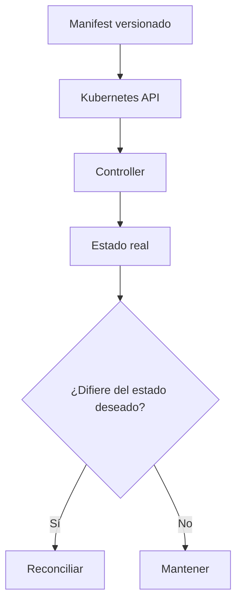

### Ejemplo

`checkout-api` debería declararse con:

- Deployment
- Service
- ConfigMap
- Secret
- NetworkPolicy
- PodDisruptionBudget
- HPA, si aplica
- Kustomize overlay
### DevEx

```yaml
patterns:declarative:diff:
  desc: Show declarative diff before apply
  cmds:
    - kubectl diff -k kubernetes/overlays/local || true

patterns:declarative:apply:
  desc: Apply declarative local overlay
  cmds:
    - kubectl apply -k kubernetes/overlays/local
```

### Criterio de comprensión

Debes poder explicar:

> Declarative Deployment significa que Git y manifests describen el estado deseado; Kubernetes y sus controllers se encargan de aproximar el estado real.

---

## 13.4.3. Health Probe

### Qué problema resuelve

Kubernetes necesita saber si una instancia está viva, si está lista y si necesita más tiempo para arrancar.

La documentación oficial describe liveness, readiness y startup probes como mecanismos para que kubelet compruebe la salud y disponibilidad de contenedores. ([Kubernetes](https://kubernetes.io/docs/tasks/configure-pod-container/configure-liveness-readiness-startup-probes/ "Configure Liveness, Readiness and Startup Probes"))

### Tres probes, tres preguntas distintas

|Probe|Pregunta|
|---|---|
|Startup|¿La aplicación ya ha terminado de arrancar?|
|Readiness|¿Puede recibir tráfico ahora?|
|Liveness|¿Está tan rota que debe reiniciarse?|

### Error habitual

Usar el mismo endpoint para todo sin pensar.

Esto puede funcionar en apps muy simples, pero no siempre es correcto.

### Contrato para `checkout-api`

|Endpoint|Significado|
|---|---|
|`/health`|El proceso está vivo|
|`/ready`|La instancia está lista para tráfico|
|`/checkout`|Flujo funcional mínimo|

### Ejemplo

```yaml
startupProbe:
  httpGet:
    path: /health
    port: http
  failureThreshold: 30
  periodSeconds: 2

readinessProbe:
  httpGet:
    path: /ready
    port: http
  initialDelaySeconds: 2
  periodSeconds: 5
  failureThreshold: 3

livenessProbe:
  httpGet:
    path: /health
    port: http
  initialDelaySeconds: 5
  periodSeconds: 10
  failureThreshold: 3
```

### Diagrama

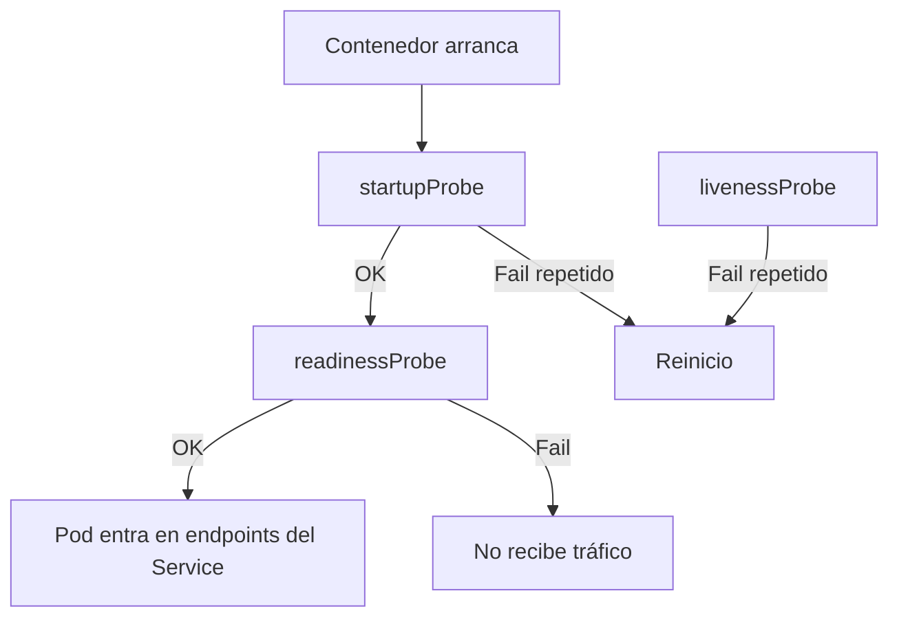

### Failure lab

Readiness rota:

```bash
kubectl describe pod -n shop -l app.kubernetes.io/name=checkout-api
kubectl get endpointslices -n shop -l kubernetes.io/service-name=checkout-api
kubectl get events -n shop --sort-by=.metadata.creationTimestamp
```

### Criterio de comprensión

Debes poder explicar:

> Health Probe no es solo poner endpoints. Es separar arranque, disponibilidad y necesidad de reinicio.

---

## 13.4.4. Managed Lifecycle

### Qué problema resuelve

Kubernetes puede terminar Pods durante rollouts, scaling, drains o cambios de nodo.

La aplicación debe apagarse de forma controlada.

Kubernetes documenta el ciclo de vida de Pods y los container lifecycle hooks, incluyendo `PostStart` y `PreStop`, como mecanismos para ejecutar código en eventos de ciclo de vida del contenedor. ([Kubernetes](https://kubernetes.io/docs/concepts/workloads/pods/pod-lifecycle/ "Pod Lifecycle"))

### Qué debe hacer una aplicación bien diseñada

Cuando recibe `SIGTERM`:

- Deja de aceptar trabajo nuevo
- Termina requests en curso, si puede
- Cierra conexiones
- Libera recursos
- Termina dentro de `terminationGracePeriodSeconds`
- Registra un log claro
### Diagrama de shutdown

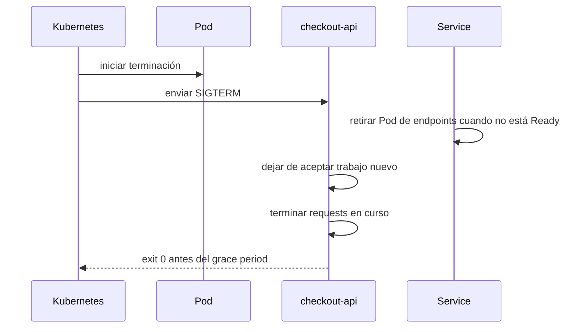

### Manifest

```yaml
terminationGracePeriodSeconds: 30
```

Opcionalmente:

```yaml
lifecycle:
  preStop:
    exec:
      command:
        - sh
        - -c
        - sleep 5
```

### Cuidado

`preStop` no debe usarse como parche mágico.

La app debe gestionar `SIGTERM`.

### DevEx

```yaml
patterns:lifecycle:inspect:
  desc: Inspect lifecycle and termination settings
  cmds:
    - kubectl get deploy checkout-api -n {{.NAMESPACE}} -o json | jq '.spec.template.spec.terminationGracePeriodSeconds, .spec.template.spec.containers[0].lifecycle'
```

### Criterio de comprensión

Debes poder explicar:

> Managed Lifecycle significa que la aplicación entiende que Kubernetes puede arrancarla, comprobarla, retirarla del tráfico y terminarla.

---

## 13.4.5. Automated Placement

### Qué problema resuelve

No todos los Pods deberían ejecutarse en cualquier nodo.

Kubernetes permite influir en placement mediante requests, node selectors, affinity, anti-affinity, taints y tolerations.

### Cuándo importa

- Separar réplicas de una API
- Evitar que todas las réplicas caigan con un nodo
- Colocar workloads GPU en nodos GPU
- Ejecutar agentes en nodos concretos
- Reservar nodos para workloads críticos
### Ejemplo suave: anti-affinity preferida

```yaml
affinity:
  podAntiAffinity:
    preferredDuringSchedulingIgnoredDuringExecution:
      - weight: 50
        podAffinityTerm:
          labelSelector:
            matchLabels:
              app.kubernetes.io/name: checkout-api
          topologyKey: kubernetes.io/hostname
```

### Cuidado

En kind de un nodo, esta práctica no mostrará gran cosa.

No fuerces reglas duras en un cluster que no puede satisfacerlas.

### Criterio de comprensión

Debes poder explicar:

> Automated Placement no es forzar nodos por capricho. Es expresar restricciones o preferencias de colocación según fiabilidad, coste, seguridad o capacidad.

---

# 13.5. Patrones de comportamiento

## 13.5.1. Batch Job

### Qué problema resuelve

Una tarea finita no debería modelarse como Deployment.

Debe ejecutarse, terminar y dejar señal clara.

Ejemplos:

- Migración puntual
- Importación
- Reprocesado
- Generación de informe
- Validación batch
### Kubernetes object

`Job`.

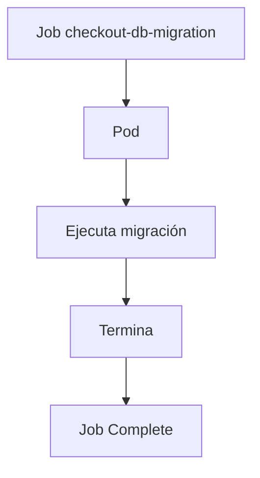

### Criterio de comprensión

Debes poder explicar:

> Batch Job modela trabajo finito. El éxito no es estar corriendo, es completar.

---

## 13.5.2. Periodic Job

### Qué problema resuelve

Una tarea que debe ejecutarse periódicamente no debería implementarse como un proceso durmiendo dentro de un Deployment.

Debe declararse como planificación.

### Kubernetes object

`CronJob`.

Ejemplos:

- Limpieza diaria de carritos expirados
- Reporte nocturno
- Reintento programado
- Backup simple de laboratorio
### Criterio de comprensión

Debes poder explicar:

> Periodic Job modela trabajo finito que se crea según un calendario.

---

## 13.5.3. Daemon Service

### Qué problema resuelve

Algunos workloads deben ejecutarse una vez por nodo.

Ejemplos:

- Agente de logs
- Agente de métricas
- Agente de seguridad
- Componente de red
- Componente de storage
### Kubernetes object

`DaemonSet`.

### Criterio de comprensión

Debes poder explicar:

> Daemon Service no es “varias réplicas”. Es “una instancia por nodo elegible”.

---

## 13.5.4. Singleton Service

### Qué problema resuelve

A veces necesitas exactamente una instancia activa.

Ejemplos:

- Scheduler interno
- Coordinador
- Worker que no debe duplicarse
- Proceso que ejecuta una tarea exclusiva
### Opciones

|Caso|Opción|
|---|---|
|Proceso largo con una sola réplica|Deployment replicas=1|
|Tarea finita exclusiva|Job|
|Leader election real|Aplicación con mecanismo de liderazgo|
|Workload stateful con identidad|StatefulSet|

### Cuidado

`replicas: 1` no garantiza semántica distribuida de singleton fuerte en todos los escenarios.

Durante algunos cambios o fallos pueden aparecer situaciones transitorias que debes entender.

### Criterio de comprensión

Debes poder explicar:

> Singleton Service no significa solo poner `replicas: 1`. Significa entender qué pasaría si hay duplicidad, failover o transición.

---

## 13.5.5. Stateful Service

### Qué problema resuelve

Algunos servicios necesitan identidad estable, orden o storage estable.

Ejemplos:

- Base de datos
- Broker
- Sistema distribuido con nodos identificables
- Redis con persistencia, según diseño
- Elasticsearch, Kafka o similares, normalmente con operator o solución gestionada
### Kubernetes object

`StatefulSet`.

Kubernetes documenta StatefulSet como el recurso para gestionar aplicaciones stateful con identidad estable y garantías de orden e identidad. ([Kubernetes](https://kubernetes.io/docs/concepts/workloads/ "Workloads"))

### Cuidado

No uses StatefulSet porque “parece más profesional”.

Úsalo cuando el comportamiento lo requiere.

### Criterio de comprensión

Debes poder explicar:

> Stateful Service significa que la identidad y el almacenamiento de cada réplica importan.

---

## 13.5.6. Service Discovery

### Qué problema resuelve

Los Pods cambian.

Las IPs cambian.

Las aplicaciones necesitan nombres estables.

En Kubernetes, Services y DNS permiten descubrir dependencias internas por nombre.

### Ejemplo

```text
checkout-api → http://payment-api
checkout-api → redis:6379
checkout-api → postgres:5432
```

### Criterio de comprensión

Debes poder explicar:

> Service Discovery evita que las aplicaciones dependan de instancias efímeras y permite comunicación por identidad estable.

---

# 13.6. Patrones estructurales

## 13.6.1. Init Container

### Qué problema resuelve

Algunas tareas deben ocurrir antes de arrancar la aplicación principal.

Ejemplos:

- Esperar a que una dependencia esté disponible
- Preparar un fichero
- Descargar configuración no sensible
- Ejecutar una comprobación
- Preparar permisos de un volumen
### Kubernetes object

`initContainers`.

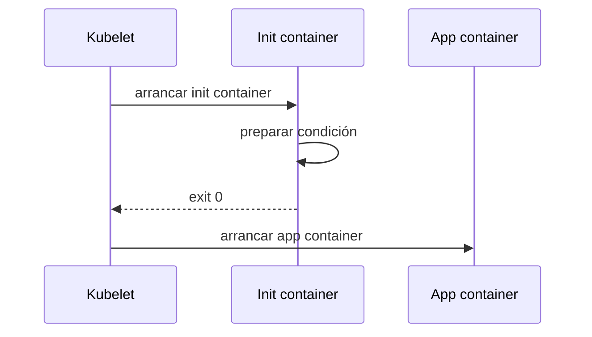

### Ejemplo

```yaml
initContainers:
  - name: wait-for-payment-api
    image: busybox:1.36
    command:
      - sh
      - -c
      - until wget -qO- http://payment-api/; do echo waiting; sleep 2; done
```

### Cuidado

No conviertas init containers en lógica de negocio.

Tampoco los uses para ocultar dependencias mal diseñadas.

### Criterio de comprensión

Debes poder explicar:

> Init Container prepara una condición antes de que arranque el contenedor principal.

---

## 13.6.2. Sidecar

### Qué problema resuelve

Un sidecar extiende o acompaña al contenedor principal dentro del mismo Pod.

Kubernetes documenta los sidecar containers como contenedores que trabajan junto al contenedor principal, extendiendo su funcionalidad, y que pueden ejecutarse durante el ciclo de vida del Pod. La documentación actual explica que los sidecars tienen soporte específico y se comportan como una clase especial de init containers con `restartPolicy: Always`. ([Kubernetes](https://kubernetes.io/docs/concepts/workloads/pods/sidecar-containers/ "Sidecar Containers"))

### Ejemplos

- Proxy local
- Recolector o adaptador de logs
- Sincronizador de configuración
- Agente de seguridad
- Exportador de métricas
- Helper de certificados
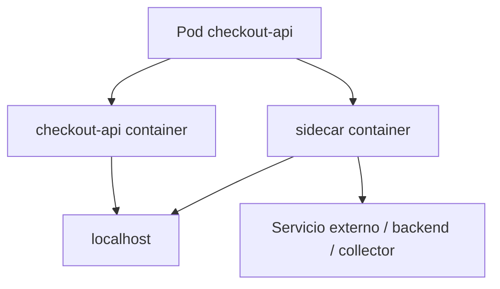

### Ejemplo conceptual

```yaml
initContainers:
  - name: log-forwarder
    image: busybox:1.36
    restartPolicy: Always
    command:
      - sh
      - -c
      - while true; do echo sidecar running; sleep 30; done
```

### Cuidado

Un sidecar aumenta acoplamiento dentro del Pod.

Úsalo si la relación es realmente de ciclo de vida compartido.

### Criterio de comprensión

Debes poder explicar:

> Sidecar añade una capacidad local al Pod, pero también aumenta complejidad operativa y consumo de recursos.

---

## 13.6.3. Adapter

### Qué problema resuelve

A veces una aplicación emite datos en un formato que la plataforma no entiende bien.

Un Adapter transforma la salida de la aplicación a un contrato más útil.

Ejemplos:

- Convertir logs de texto a JSON
- Exponer métricas en formato Prometheus-compatible
- Normalizar formatos
- Transformar protocolos
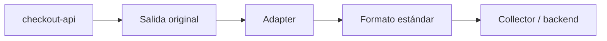

### Criterio de comprensión

Debes poder explicar:

> Adapter traduce una interfaz o señal existente a un formato más operativo sin cambiar necesariamente la aplicación principal.

---

## 13.6.4. Ambassador

### Qué problema resuelve

Un Ambassador actúa como proxy local entre la aplicación y un servicio externo.

Ejemplos:

- Proxy a una API externa
- Proxy a una base de datos
- Manejo local de TLS
- Retry o routing local, con mucho cuidado
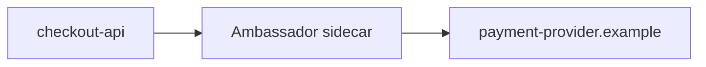

### Cuidado

No uses Ambassador para esconder complejidad que debería estar en infraestructura o diseño.

Puede hacer más difícil observar y depurar si no se instrumenta bien.

### Criterio de comprensión

Debes poder explicar:

> Ambassador encapsula comunicación externa como un proxy local, pero puede ocultar fallos si no se diseña con buena observabilidad.

---

# 13.7. Patrones de configuración

## 13.7.1. EnvVar Configuration

### Qué problema resuelve

Permite configurar valores simples en runtime.

Ejemplos:

```text
LOG_LEVEL
PORT
PAYMENT_API_URL
REDIS_HOST
```

### Kubernetes objects

- ConfigMap
- Secret
- `env`
- `envFrom`
### Criterio de comprensión

Debes poder explicar:

> EnvVar Configuration encaja con valores simples, pero no con configuración estructurada compleja o secretos que no quieres exponer como entorno.

---

## 13.7.2. Configuration Resource

### Qué problema resuelve

Permite externalizar configuración como recurso Kubernetes.

Ejemplos:

- ConfigMap
- Secret
- Custom Resource
### Ejemplo

```yaml
apiVersion: v1
kind: ConfigMap
metadata:
  name: checkout-api-config
data:
  LOG_LEVEL: debug
  PAYMENT_API_URL: http://payment-api
```

### Criterio de comprensión

Debes poder explicar:

> Configuration Resource convierte configuración en un objeto declarativo, versionable y aplicable por entorno.

---

## 13.7.3. Immutable Configuration

### Qué problema resuelve

Evita que la configuración cambie silenciosamente bajo una aplicación ya desplegada.

Una estrategia habitual consiste en versionar ConfigMaps o Secrets por nombre:

```text
checkout-api-config-v1
checkout-api-config-v2
```

Luego el Deployment referencia una versión concreta.

### Ventaja

- Más trazabilidad
- Rollback más claro
- Menos cambios invisibles
- Mejor alineación con delivery declarativo
### Coste

- Más objetos
- Necesitas limpieza
- Necesitas proceso claro de actualización
### Criterio de comprensión

Debes poder explicar:

> Immutable Configuration reduce cambios silenciosos, pero exige disciplina de versionado y limpieza.

---

## 13.7.4. Configuration Template

### Qué problema resuelve

A veces necesitas generar configuración a partir de valores de entorno.

Ejemplos:

- Generar un fichero JSON
- Generar configuración Nginx
- Generar configuración para una herramienta antigua
### Opciones

- Init container que renderiza plantilla
- Helm template
- Kustomize
- App que genera configuración al arrancar
- Herramienta especializada
### Cuidado

No conviertas Kubernetes en un motor de plantillas complejo sin necesidad.

### Criterio de comprensión

Debes poder explicar:

> Configuration Template debe usarse cuando hay una necesidad real de generar configuración, no como sustituto automático de ConfigMap.

---

# 13.8. Patrones avanzados

## 13.8.1. Controller

### Qué problema resuelve

Un controller observa el estado real y lo reconcilia hacia el estado deseado.

Kubernetes documenta el patrón de controller como parte central de su modelo de control. Los controllers observan recursos y actúan para acercar el estado real al deseado. ([Kubernetes](https://kubernetes.io/docs/concepts/workloads/ "Workloads"))

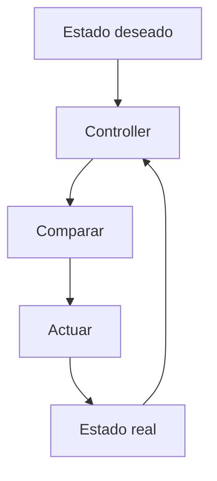

### Ejemplos

- Deployment controller
- Job controller
- StatefulSet controller
- Custom controller propio
### Criterio de comprensión

Debes poder explicar:

> Controller no ejecuta un script una vez. Reconcilia continuamente.

---

## 13.8.2. Operator

### Qué problema resuelve

Un Operator extiende Kubernetes para gestionar aplicaciones complejas mediante Custom Resources y controllers.

Kubernetes define Operators como extensiones software que usan custom resources para gestionar aplicaciones y sus componentes, siguiendo los principios de Kubernetes, especialmente el control loop. ([Kubernetes](https://kubernetes.io/docs/concepts/extend-kubernetes/operator/ "Operator pattern"))

### Qué puede automatizar

- Instalación
- Configuración
- Backups
- Restores
- Upgrades
- Failover
- Escalado
- Rotación
- Estado operativo
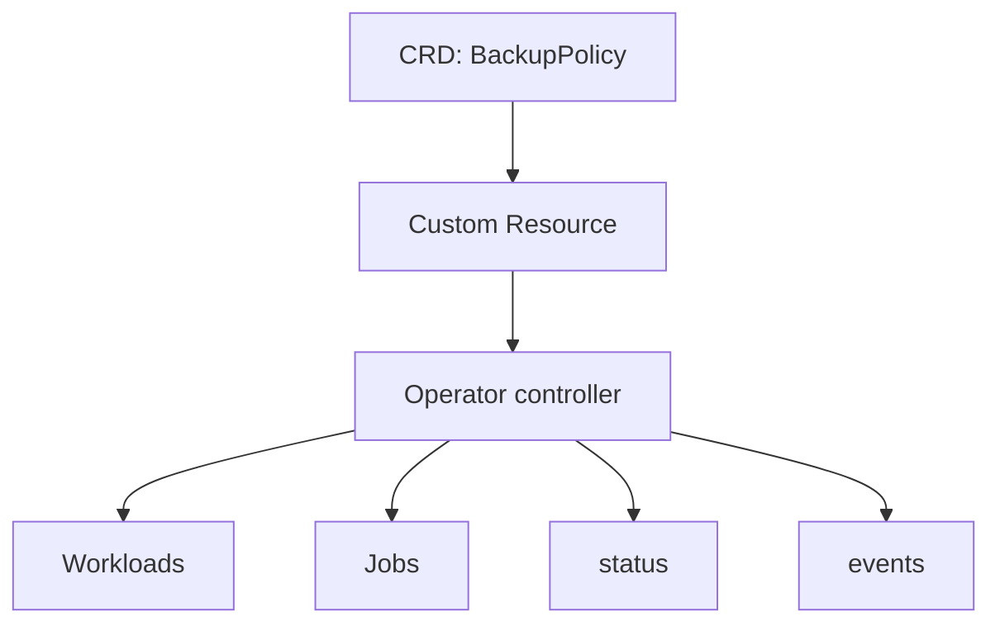

### Cuidado

No todo necesita un Operator.

Un Operator tiene coste:

- Código
- RBAC
- Testing
- Observabilidad
- Upgrades
- Seguridad
- Blast radius
- Mantenimiento
### Criterio de comprensión

Debes poder explicar:

> Un Operator merece la pena cuando automatiza conocimiento operativo repetible y complejo. Si solo envuelve YAML estático, probablemente es sobreingeniería.

---

## 13.8.3. Elastic Scale

### Qué problema resuelve

Elastic Scale permite ajustar capacidad según demanda.

En Kubernetes puede implicar:

- HPA
- VPA
- Cluster Autoscaler
- KEDA
- Escalado por métricas externas
- Escalado a cero, en plataformas que lo soportan
### Cuidado

Escalar no arregla todo.

No arregla:

- Errores de código
- Dependencias saturadas
- Mala configuración
- Base de datos lenta
- NetworkPolicy mal diseñada
- Secrets ausentes
- Falta de observabilidad
### Criterio de comprensión

Debes poder explicar:

> Elastic Scale aumenta o reduce capacidad, pero debe estar guiado por métricas correctas y límites claros.

---

# 13.9. Patrón operacional: observable behavior

### Qué problema resuelve

Una aplicación cloud native debe ser observable por diseño.

No basta con instalar Loki, Mimir, Tempo o Grafana.

La app debe emitir señales útiles.

### Contrato para `checkout-api`

Debe emitir:

- Logs JSON
- Request ID
- Status code
- Duración
- Endpoint
- Servicio
- Pod
- Error type
- Métricas HTTP, si está instrumentada
- Trazas, si está instrumentada
OpenTelemetry define un enfoque vendor-neutral para recolectar y exportar telemetría mediante SDKs y Collector. ([Kubernetes](https://kubernetes.io/docs/concepts/workloads/ "Workloads"))

### Criterio de comprensión

Debes poder explicar:

> Observable Behavior significa que la aplicación ayuda activamente a ser diagnosticada.

---

# 13.10. Rediseño de `checkout-api` aplicando patrones

## Objetivo

Tomar una API sencilla y convertirla en una buena ciudadana Kubernetes.

### Estado inicial

```text
Express app
Dockerfile
Deployment
Service
ConfigMap
Secret
Probes
Resources
SecurityContext
Smoke test
```

### Estado objetivo

```text
Predictable Demands
Declarative Deployment
Health Probe
Managed Lifecycle
Service Discovery
Configuration Resource
EnvVar Configuration
Observable Behavior
NetworkPolicy
PDB
HPA opcional
Runbook
```

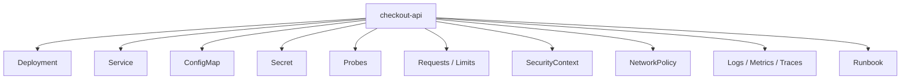

### Manifest consolidado, fragmentos clave

No repito todo el Deployment completo.

El patrón importante está en estas piezas:

```yaml
spec:
  replicas: 3
  template:
    spec:
      serviceAccountName: checkout-api-sa
      automountServiceAccountToken: false
      terminationGracePeriodSeconds: 30
      securityContext:
        seccompProfile:
          type: RuntimeDefault
      containers:
        - name: checkout-api
          image: checkout-api:1.0.1
          imagePullPolicy: IfNotPresent
          ports:
            - name: http
              containerPort: 8080
          envFrom:
            - configMapRef:
                name: checkout-api-config
            - secretRef:
                name: checkout-api-secret
          startupProbe:
            httpGet:
              path: /health
              port: http
            failureThreshold: 30
            periodSeconds: 2
          readinessProbe:
            httpGet:
              path: /ready
              port: http
            periodSeconds: 5
            failureThreshold: 3
          livenessProbe:
            httpGet:
              path: /health
              port: http
            periodSeconds: 10
            failureThreshold: 3
          resources:
            requests:
              cpu: 100m
              memory: 128Mi
            limits:
              cpu: 500m
              memory: 256Mi
          securityContext:
            allowPrivilegeEscalation: false
            readOnlyRootFilesystem: true
            runAsNonRoot: true
            runAsUser: 1000
            capabilities:
              drop:
                - ALL
```

### Criterio de comprensión

Debes poder explicar:

> Un buen Deployment no es solo una imagen y réplicas. Es un contrato operativo completo entre aplicación y plataforma.

---

# 13.11. Práctica principal del módulo

## Objetivo

Revisar `checkout-api` y documentar qué patrones aplica, qué patrones no necesita y qué señales debe emitir.

## Resultado esperado

```text
kubernetes-learning-lab/
  docs/
    patterns/
      checkout-api-pattern-review.md
      pattern-decision-records.md
      anti-patterns.md
  kubernetes/
    02-deployment/
      deployment.yaml
    03-service/
      checkout-api-service.yaml
    05-config/
      configmap.yaml
      secret.yaml
    07-security/
      serviceaccount.yaml
    10-networkpolicy/
      default-deny-ingress.yaml
      allow-dnsutils-to-checkout-api.yaml
```

## Paso 1. Crear revisión de patrones

Crea:

```text
docs/patterns/checkout-api-pattern-review.md
```

### Tabla de Patrones en Kubernetes (Revisión y Análisis)

---

|**Pattern**|**Applied**|**Evidence**|**Why**|**Risk if missing**|
|---|---|---|---|---|
|**Predictable Demands**|Yes|`requests` / `limits`|Scheduler and resource control|Poor placement, noisy neighbor risk|
|**Declarative Deployment**|Yes|Deployment / Kustomize|Reproducible delivery|Manual drift|
|**Health Probe**|Yes|Startup / Readiness / Liveness|Safer traffic and restarts|Bad rollouts|
|**Managed Lifecycle**|Partial|`terminationGracePeriod`|Needs SIGTERM handling in app|Broken requests during rollout|
|**Service Discovery**|Yes|Service DNS|Stable dependencies|Pod IP coupling|
|**Configuration Resource**|Yes|ConfigMap / Secret|Runtime config|Image per environment|
|**Observable Behavior**|Partial|Logs exist|Needs structured logs and metrics|Slow diagnosis|
|**Network Isolation**|Yes|NetworkPolicy|Reduce lateral movement|Broad communication|
|**Elastic Scale**|Optional|HPA|Needs metrics|Scaling without evidence|
|**Operator**|No|Not needed|Avoids unnecessary complexity|Overengineering|

---

### Notas sobre los puntos "Partial":

- **Managed Lifecycle:** Para pasar de "Partial" a "Yes", asegúrate de que tu aplicación capture la señal `SIGTERM` y finalice las conexiones existentes antes de que el proceso muera.
    
- **Observable Behavior:** Un sistema es totalmente observable solo cuando los logs son estructurados (JSON) y se exponen métricas (como un endpoint de `/metrics` para Prometheus) además de rastreo distribuido (tracing) si es un microservicio.
    

> **Tip de experto:** Si estás usando **Kustomize**, recuerda que puedes usar `configMapGenerator` para que, al cambiar un ConfigMap, se dispare automáticamente un despliegue de los Pods relacionados, garantizando que siempre tengan la configuración más fresca.

## Paso 2. Crear decisiones de patrones

Crea:

```text
docs/patterns/pattern-decision-records.md
```

Formato:

```markdown
# Pattern decision: Health Probe

## Context

checkout-api receives HTTP traffic through a Kubernetes Service.

## Decision

Use startup, readiness and liveness probes with separate operational meanings.

## Consequences

Kubernetes can avoid sending traffic before readiness and can restart the process if liveness fails repeatedly.

## Risks

A too aggressive liveness probe can restart healthy but slow instances.

## Validation

task smoke:k8s
kubectl describe pod -n shop -l app.kubernetes.io/name=checkout-api
```

## Paso 3. Crear anti-patterns

Crea:

```text
docs/patterns/anti-patterns.md
```

Incluye:

- Deployment para tareas finitas
- CronJob para workers continuos
- StatefulSet sin necesidad de identidad estable
- Sidecar sin ciclo de vida compartido real
- Liveness agresiva
- Configuración sensible en ConfigMap
- `latest`
- Pods con permisos amplios
- Logs sin contexto
- Service selector frágil
- HPA sin métricas confiables
- Operator para envolver YAML estático
## Paso 4. Validar manifests

```bash
task manifests:render
task manifests:validate:schema
task manifests:score
task policies:test
task test:k8s
```

## Paso 5. Ejecutar diagnóstico operativo

```bash
task k8s:debug:checkout:summary
task reliability:test
```

## Criterio de finalización

La práctica está completa cuando puedes explicar:

- Qué patrones aplica `checkout-api`
- Qué evidencia hay en manifests
- Qué responsabilidad tiene la app
- Qué responsabilidad tiene Kubernetes
- Qué patrones no necesita
- Qué anti-patterns estás evitando
- Qué tests validan esos patrones
- Qué runbook usarías si fallan
---

# 13.12. Taskfile del módulo 13

Añade estas tareas al `Taskfile.yml`.

```yaml
  patterns:resources:inspect:
    desc: Show checkout-api resources and QoS
    cmds:
      - kubectl get deploy checkout-api -n {{.NAMESPACE}} -o json | jq '.spec.template.spec.containers[0].resources'
      - kubectl get pods -n {{.NAMESPACE}} -l app.kubernetes.io/name=checkout-api -o json | jq '.items[] | {name: .metadata.name, qos: .status.qosClass}'

  patterns:probes:inspect:
    desc: Show checkout-api probes
    cmds:
      - kubectl get deploy checkout-api -n {{.NAMESPACE}} -o json | jq '.spec.template.spec.containers[0] | {startupProbe, readinessProbe, livenessProbe}'

  patterns:lifecycle:inspect:
    desc: Inspect lifecycle and termination settings
    cmds:
      - kubectl get deploy checkout-api -n {{.NAMESPACE}} -o json | jq '.spec.template.spec.terminationGracePeriodSeconds, .spec.template.spec.containers[0].lifecycle'

  patterns:service-discovery:inspect:
    desc: Inspect checkout-api Service discovery
    cmds:
      - kubectl get svc checkout-api -n {{.NAMESPACE}} -o yaml
      - kubectl get endpointslices -n {{.NAMESPACE}} -l kubernetes.io/service-name=checkout-api
      - kubectl exec -n {{.NAMESPACE}} dnsutils -- nslookup checkout-api || true

  patterns:configuration:inspect:
    desc: Inspect ConfigMap and Secret usage
    cmds:
      - kubectl get configmap checkout-api-config -n {{.NAMESPACE}} -o yaml
      - kubectl describe secret checkout-api-secret -n {{.NAMESPACE}}
      - kubectl get deploy checkout-api -n {{.NAMESPACE}} -o json | jq '.spec.template.spec.containers[0].envFrom'

  patterns:security:inspect:
    desc: Inspect security-related pattern evidence
    cmds:
      - kubectl get deploy checkout-api -n {{.NAMESPACE}} -o json | jq '.spec.template.spec.serviceAccountName, .spec.template.spec.automountServiceAccountToken'
      - kubectl get deploy checkout-api -n {{.NAMESPACE}} -o json | jq '.spec.template.spec.securityContext, .spec.template.spec.containers[0].securityContext'
      - kubectl get networkpolicy -n {{.NAMESPACE}}

  patterns:observability:inspect:
    desc: Inspect operational signals for checkout-api
    cmds:
      - kubectl logs -n {{.NAMESPACE}} deploy/checkout-api --tail=50 || true
      - kubectl get events -n {{.NAMESPACE}} --sort-by=.metadata.creationTimestamp
      - task smoke:k8s

  patterns:review:
    desc: Run pattern review checks for checkout-api
    cmds:
      - task patterns:resources:inspect
      - task patterns:probes:inspect
      - task patterns:lifecycle:inspect
      - task patterns:service-discovery:inspect
      - task patterns:configuration:inspect
      - task patterns:security:inspect
      - task patterns:observability:inspect

  patterns:test:
    desc: Validate cloud native pattern evidence through existing gates
    cmds:
      - task manifests:render
      - task manifests:validate:schema
      - task manifests:score
      - task policies:test
      - task test:k8s
      - task reliability:test
```

### Criterio DevEx

Debes poder explicar:

> La DevEx de patrones debe hacer visible la evidencia. No basta con decir que aplicamos Health Probe, Configuration Resource o Managed Lifecycle. Debe poder verse en manifests, tests y señales.

---

# 13.13. Ejercicios cortos

## Ejercicio 1. Clasificar patrones

Completa:

|Caso|Patrón|
|---|---|
|API HTTP con réplicas y rollout||
|Migración puntual||
|Limpieza cada noche||
|Agente por nodo||
|Configuración por entorno||
|Transformar logs a formato estándar||
|Proxy local hacia proveedor externo||
|App que necesita identidad estable||
|Escalar según CPU||
|Automatizar operación de una base de datos compleja||

---

## Ejercicio 2. Revisar `checkout-api`

Ejecuta:

```bash
task patterns:review
```

Responde:

- ¿Tiene probes?
- ¿Tiene requests y limits?
- ¿Tiene Service?
- ¿Usa ConfigMap?
- ¿Usa Secret?
- ¿Tiene ServiceAccount explícito?
- ¿Tiene securityContext restrictivo?
- ¿Tiene NetworkPolicy?
- ¿Emite logs útiles?
- ¿Qué patrón está más débil?
---

## Ejercicio 3. Health Probe

Responde:

- ¿Qué debe comprobar `/health`?
- ¿Qué debe comprobar `/ready`?
- ¿Qué no debería comprobar liveness?
- ¿Qué riesgo tiene una liveness agresiva?
- ¿Qué ocurre si readiness falla pero liveness pasa?
---

## Ejercicio 4. Managed Lifecycle

Simula un rollout:

```bash
kubectl rollout restart deployment/checkout-api -n shop
kubectl rollout status deployment/checkout-api -n shop
kubectl get events -n shop --sort-by=.metadata.creationTimestamp
```

Responde:

- ¿Qué Pods se crean?
- ¿Qué Pods se terminan?
- ¿La app registra shutdown?
- ¿Hay requests cortadas?
- ¿Qué necesitarías medir para saberlo?
---

## Ejercicio 5. Sidecar o no sidecar

Decide si usarías sidecar:

|Necesidad|Sidecar sí/no|Motivo|
|---|--:|---|
|Exportar métricas de una app legacy|||
|Ejecutar lógica de checkout|||
|Proxy local con ciclo de vida del Pod|||
|Migración de base de datos puntual|||
|Recolector local de logs|||
|Generar reporte mensual|||

---

## Ejercicio 6. Operator o no operator

Para cada caso, decide:

|Caso|Operator sí/no|Motivo|
|---|--:|---|
|Crear un Deployment y Service de una app simple|||
|Gestionar backups, failover y upgrades de PostgreSQL|||
|Aplicar labels estándar|||
|Automatizar rotación de certificados compleja|||
|Envolver un YAML estático sin lógica operacional|||

---

# 13.14. Errores habituales

## Error 1. Creer que cloud native significa “corre en Kubernetes”

No basta con desplegar.

La aplicación debe cooperar con la plataforma.

---

## Error 2. Usar todos los patrones

Más patrones no significa mejor diseño.

Cada patrón debe pagar su coste.

---

## Error 3. Meter lógica de negocio en init containers

Un init container prepara el entorno.

No debería esconder lógica de dominio crítica.

---

## Error 4. Usar sidecar por moda

Sidecar aumenta complejidad, consumo, troubleshooting y lifecycle compartido.

Úsalo cuando la relación local sea real.

---

## Error 5. Confundir readiness con liveness

Readiness controla tráfico.

Liveness controla reinicio.

Confundirlas puede causar incidentes.

---

## Error 6. Declarar recursos sin medir

Requests y limits deben empezar razonables, pero evolucionar con datos.

---

## Error 7. Usar StatefulSet para todo lo que parece importante

StatefulSet es para identidad y estado estable.

No para hacer que un workload parezca más serio.

---

## Error 8. Usar Operator para evitar entender Kubernetes

Operator automatiza conocimiento operacional.

No debe ser una caja negra para ocultar falta de comprensión.

---

## Error 9. Diseñar dashboards después del incidente

La observabilidad debe formar parte del diseño del workload.

---

# 13.15. Troubleshooting progresivo de patrones

Cuando un patrón falla, diagnostica la responsabilidad.

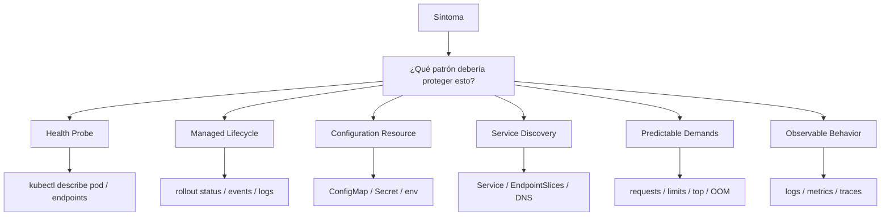

### Secuencia

1. ¿Qué comportamiento esperabas?
2. ¿Qué patrón lo cubría?
3. ¿La app cumple su parte?
4. ¿El manifest cumple su parte?
5. ¿Kubernetes está recibiendo la señal correcta?
6. ¿Hay tests que validen el patrón?
7. ¿Hay runbook?
8. ¿El patrón está mal aplicado o falta?
### Criterio de comprensión

Debes poder explicar:

> Troubleshooting de patrones consiste en encontrar qué contrato entre aplicación y plataforma se rompió.

---

# 13.16. Criterio de salida del módulo

Puedes pasar al módulo 14 cuando puedas hacer todo esto sin seguir una receta ciegamente.

## Conceptos

Debes poder explicar:

- Qué son patrones cloud native
- Por qué Kubernetes no arregla una aplicación mal diseñada
- Qué es Predictable Demands
- Qué es Declarative Deployment
- Qué es Health Probe
- Qué es Managed Lifecycle
- Qué es Automated Placement
- Qué es Batch Job
- Qué es Periodic Job
- Qué es Daemon Service
- Qué es Singleton Service
- Qué es Stateful Service
- Qué es Service Discovery
- Qué es Self Awareness
- Qué es Init Container
- Qué es Sidecar
- Qué es Adapter
- Qué es Ambassador
- Qué es EnvVar Configuration
- Qué es Configuration Resource
- Qué es Immutable Configuration
- Qué es Configuration Template
- Qué es Controller
- Qué es Operator
- Qué es Elastic Scale
- Qué es Observable Behavior
- Cuándo un patrón ayuda
- Cuándo un patrón es sobreingeniería
## Práctica

Debes poder:

- Revisar `checkout-api` desde patrones
- Identificar evidencia en manifests
- Ejecutar inspecciones con Taskfile
- Validar probes
- Validar resources
- Validar Service Discovery
- Validar configuración
- Validar seguridad
- Validar señales operativas
- Crear un pattern review
- Crear pattern decision records
- Crear anti-patterns
- Explicar qué patrones no usarías y por qué
## DevEx

Debes poder ejecutar:

```bash
task patterns:resources:inspect
task patterns:probes:inspect
task patterns:lifecycle:inspect
task patterns:service-discovery:inspect
task patterns:configuration:inspect
task patterns:security:inspect
task patterns:observability:inspect
task patterns:review
task patterns:test
```

## Frase final de comprensión

Debes poder explicar esta frase:

> Los patrones cloud native no son trucos de YAML. Son contratos de diseño entre aplicación y plataforma para que Kubernetes pueda desplegar, observar, escalar, aislar, recuperar y evolucionar un sistema con menos riesgo.

---

# 13.17. Referencias oficiales y fuentes primarias

|Tema|Referencia|
|---|---|
|Workloads|Kubernetes Docs, Workloads. ([Kubernetes](https://kubernetes.io/docs/concepts/workloads/ "Workloads"))|
|Pod lifecycle|Kubernetes Docs, Pod Lifecycle. ([Kubernetes](https://kubernetes.io/docs/concepts/workloads/pods/pod-lifecycle/ "Pod Lifecycle"))|
|Liveness, readiness and startup probes|Kubernetes Docs, Configure Liveness, Readiness and Startup Probes. ([Kubernetes](https://kubernetes.io/docs/tasks/configure-pod-container/configure-liveness-readiness-startup-probes/ "Configure Liveness, Readiness and Startup Probes"))|
|Container lifecycle hooks|Kubernetes Docs, Container Lifecycle Hooks. ([Kubernetes](https://kubernetes.io/docs/concepts/containers/container-lifecycle-hooks/ "Container Lifecycle Hooks"))|
|Sidecar containers|Kubernetes Docs, Sidecar Containers. ([Kubernetes](https://kubernetes.io/docs/concepts/workloads/pods/sidecar-containers/ "Sidecar Containers"))|
|Sidecar KEP|Kubernetes Enhancements, KEP-753 Sidecar Containers. ([GitHub](https://github.com/kubernetes/enhancements/blob/master/keps/sig-node/753-sidecar-containers/README.md "KEP-753: Sidecar containers - kubernetes/enhancements"))|
|Operator pattern|Kubernetes Docs, Operator Pattern. ([Kubernetes](https://kubernetes.io/docs/concepts/extend-kubernetes/operator/ "Operator pattern"))|
|Kubernetes Patterns examples|Kubernetes Patterns examples repository. ([GitHub](https://github.com/k8spatterns/examples "Examples for \"Kubernetes Patterns - Reusable Elements ..."))|
|CKAD curriculum reference|Linux Foundation, CKAD. ([Linux Foundation - Education](https://training.linuxfoundation.org/certification/certified-kubernetes-application-developer-ckad/ "Certified Kubernetes Application Developer (CKAD)"))|

# 13.18. Lecturas de apoyo

|Libro|Qué leer|
|---|---|
|_Kubernetes Patterns_|Libro principal para este módulo: patrones fundacionales, comportamentales, estructurales, de configuración y avanzados.|
|_Kubernetes Patterns_|Health Probe, Managed Lifecycle, Automated Placement, Batch Job, Periodic Job, Daemon Service, Singleton Service, Stateful Service, Service Discovery, Init Container, Sidecar, Adapter, Ambassador, Controller, Operator y Elastic Scale.|
|_Kubernetes in Action_|Capítulo 17 como apoyo para lifecycle, shutdown, logs, manifests, desarrollo y buenas prácticas.|
|_Kubernetes: Up and Running_|Capítulos sobre Pods, Deployments, Jobs, DaemonSets, ConfigMaps, Services, RBAC y aplicaciones reales.|
|_Cloud Native DevOps with Kubernetes_|Capítulos sobre workloads, resources, probes, observability, deployment strategies, Helm, Kustomize y operación.|

<!-- COURSE_NAV_START -->
[Anterior](12.%20Operación,%20observabilidad%20y%20fiabilidad%20con%20Grafana%20LGTM.md) | [Indice](README.md) | [Siguiente](14.%20Extensión%20de%20Kubernetes.md)
<!-- COURSE_NAV_END -->
