<!-- COURSE_NAV_START -->
[Anterior](<14. Extensión de Kubernetes.md>) | [Indice](README.md) | [Siguiente](<16. Proyecto final del roadmap.md>)
<!-- COURSE_NAV_END -->

# 15. Profesionalización por rol

## Objetivo del módulo

En los módulos anteriores has construido una base completa:

```text
1. Contenedores
2. Por qué Kubernetes
3. Primer cluster y kubectl
4. Modelo mental
5. Pods
6. Workloads
7. Networking
8. Configuración, secretos y almacenamiento
9. Testing automatizado de Kubernetes
10. Delivery
11. Seguridad
12. Operación, observabilidad y fiabilidad
13. Patrones cloud native
14. Extensión de Kubernetes
```

Ahora toca convertir todo eso en rutas profesionales.

Porque aprender Kubernetes “entero” sin una dirección puede ser infinito.

Un developer no necesita priorizar lo mismo que una persona de platform engineering.

Una persona de seguridad no necesita empezar por operators.

Una persona de SRE no puede quedarse solo en Deployments y Services.

Y alguien que quiere llegar a arquitectura o platform engineering necesita entender no solo Kubernetes, sino también sus decisiones económicas, de fiabilidad, de seguridad, de operación y de experiencia de desarrollo.

La CNCF mantiene certificaciones cloud native como CKA, CKAD, CKS, KCNA, KCSA, PCA, ICA, CCA, CAPA, CGOA y otras. Además, CNCF publica rutas de certificación donde KCNA funciona como base y luego se puede avanzar hacia perfiles de seguridad, administración o desarrollo. ([CNCF](https://www.cncf.io/training/certification/ "Cloud Native Certifications | CNCF"))

La idea central del módulo es esta:

> Profesionalizarse en Kubernetes no consiste en coleccionar temas. Consiste en elegir una ruta, practicar tareas reales, demostrar criterio operativo y saber qué profundidad necesitas según el trabajo que quieres hacer.

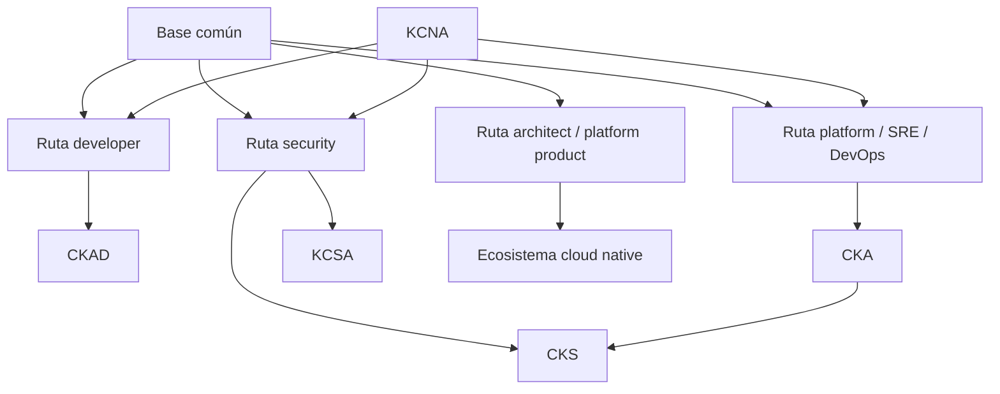

---

## 15.1. Qué vas a aprender y qué no vas a aprender todavía

Vas a aprender:

- Cómo convertir el roadmap en rutas profesionales
- Qué debe dominar cualquier persona que trabaje con Kubernetes
- Qué priorizar si eres developer
- Qué priorizar si eres platform engineer, SRE o DevOps
- Qué priorizar si tu foco es seguridad
- Qué priorizar si quieres arquitectura o platform engineering
- Qué certificaciones encajan con cada ruta
- Cómo usar KCNA, CKAD, CKA, CKS y KCSA con criterio
- Qué significa Kubestronaut y cuándo tendría sentido
- Cómo usar el curriculum público de CNCF como mapa de cobertura
- Cómo medir progreso con prácticas reales, no solo lectura
- Cómo construir un portfolio técnico de Kubernetes
- Cómo preparar entrevistas técnicas
- Cómo evitar sobreoptimizar para exámenes
- Cómo mantenerte actualizado sin vivir persiguiendo herramientas
No vamos a hacer todavía:

- Preparación exhaustiva de cada examen
- Simulacros completos CKA, CKAD o CKS
- Desarrollo de plataforma interna completa
- Diseño multi-cluster profesional
- Preparación avanzada de service mesh
- Preparación avanzada de Cilium, Istio, Argo, Kyverno o Prometheus
- Plan profesional personalizado con fechas exactas
La regla pedagógica del módulo será:

```text
Primero rol
Luego responsabilidades reales
Luego capacidades necesarias
Luego práctica
Luego certificación útil
Luego criterio de madurez
```

---

## 15.2. Base común para cualquier ruta

Antes de separar rutas, hay una base que no deberías saltarte.

Da igual si eres developer, SRE, security engineer o platform engineer.

Hay un mínimo común.

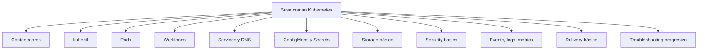

### Capacidades mínimas

Debes poder:

- Construir una imagen
- Ejecutar contenedores con Docker o Podman
- Entender qué es una imagen y qué es un contenedor
- Crear un cluster local
- Usar `kubectl` con soltura
- Entender Pods, Deployments, Services, ConfigMaps, Secrets y PVCs
- Leer `events`
- Leer logs
- Diagnosticar `CrashLoopBackOff`, `ImagePullBackOff`, readiness fallando, Service sin endpoints y PVC Pending
- Hacer rollback
- Entender requests y limits
- Entender ServiceAccount y RBAC básico
- Entender por qué NetworkPolicy depende del CNI
- Ejecutar un smoke test
- Validar manifests
- Explicar qué está pasando sin repetir comandos de memoria
### Práctica base

El sistema `shop` debe existir con:

```text
checkout-api
payment-api
redis
postgres
ConfigMap
Secret
PVC
Service
NetworkPolicy
securityContext
probes
Taskfile
smoke tests
failure labs
```

### Criterio de comprensión

Debes poder explicar:

> La base profesional de Kubernetes no es saber muchos objetos. Es poder desplegar, observar, diagnosticar y recuperar un sistema pequeño con criterio.

---

## 15.3. Mapa de roles

Kubernetes se usa desde distintos roles.

Cada rol necesita una profundidad distinta.

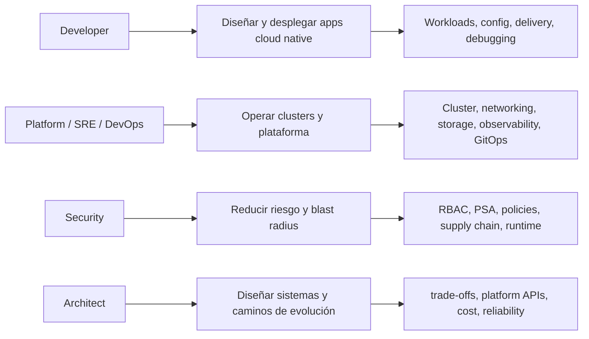

### Tabla resumen

|Ruta|Pregunta principal|
|---|---|
|Developer|¿Cómo construyo y entrego aplicaciones que Kubernetes pueda operar bien?|
|Platform / SRE / DevOps|¿Cómo hago que la plataforma sea fiable, segura, observable y mantenible?|
|Security|¿Cómo reduzco permisos, exposición, supply chain risk y blast radius?|
|Architect / platform product|¿Cómo diseño una plataforma que acelere equipos sin ocultar riesgos?|

### Criterio de comprensión

Debes poder explicar:

> No todas las rutas exigen la misma profundidad en todo. La profesionalización consiste en saber qué profundidad exige tu rol.

---

# 15.4. Ruta developer

## Objetivo

Aprender Kubernetes desde el punto de vista de quien construye, despliega y mantiene aplicaciones cloud native.

La certificación CKAD está orientada a personas que diseñan, construyen, configuran y exponen aplicaciones cloud native para Kubernetes. ([Linux Foundation - Education](https://training.linuxfoundation.org/client-course-cert-bundle/ "Client Only Course & Certification Bundle"))

## Responsabilidad real

Un developer profesional en Kubernetes debería poder responder:

- ¿Mi aplicación arranca correctamente?
- ¿Tiene health checks reales?
- ¿Está lista antes de recibir tráfico?
- ¿Se apaga sin romper requests?
- ¿Está configurada por entorno sin reconstruir imagen?
- ¿No lleva secretos dentro?
- ¿Tiene resources razonables?
- ¿Emite logs útiles?
- ¿Se puede hacer rollback?
- ¿Se puede diagnosticar cuando falla?
- ¿El Service tiene endpoints?
- ¿El smoke test pasa a través de Kubernetes?
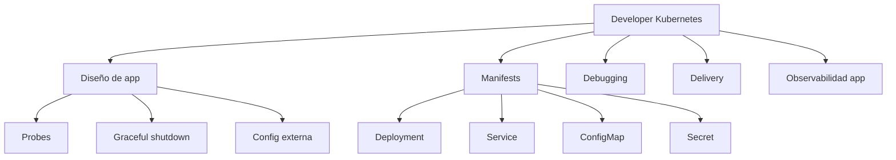

## Prioridad de estudio

### Nivel 1. Base de aplicación

- Contenedores
- Dockerfile
- Imagen pequeña
- No root
- Variables de entorno
- Logs por stdout
- `/health`
- `/ready`
- Graceful shutdown
- Configuración externa
### Nivel 2. Kubernetes core para apps

- Pod
- Deployment
- ReplicaSet
- Service
- DNS interno
- ConfigMap
- Secret
- Volumes básicos
- Job
- CronJob
- Namespace
- Labels
- Annotations
- Probes
- Requests y limits
### Nivel 3. Delivery y debugging

- `kubectl logs`
- `kubectl describe`
- `kubectl exec`
- `kubectl port-forward`
- `kubectl rollout status`
- `kubectl rollout undo`
- `kubectl diff`
- Kustomize
- Helm básico
- Smoke tests
- Failure labs
- `task test:k8s`
### Nivel 4. Seguridad mínima

- ServiceAccount explícito
- `automountServiceAccountToken: false` si no hace falta
- `securityContext`
- No `latest`
- Secrets bien separados
- NetworkPolicy básica
- Policy tests
## Certificación útil

### CKAD

CKAD es la certificación más alineada con esta ruta porque se centra en construir, configurar y exponer aplicaciones cloud native sobre Kubernetes. ([CNCF](https://www.cncf.io/training/certification/ "Cloud Native Certifications | CNCF"))

KCNA puede ser útil antes de CKAD si necesitas una base conceptual de Kubernetes y del ecosistema cloud native; Linux Foundation describe KCNA como una certificación de nivel associate para personas que quieren avanzar en tecnologías cloud native. ([Linux Foundation - Education](https://training.linuxfoundation.org/certification/kubernetes-cloud-native-associate/ "Kubernetes and Cloud Native Associate (KCNA)"))

## Práctica principal de la ruta

Construye y entrega `checkout-api` con:

- Express
- Dockerfile
- Deployment
- Service
- ConfigMap
- Secret
- Probes
- Resources
- SecurityContext
- Smoke test
- Kustomize
- `task test:k8s`
- Rollback probado
## Criterio de madurez

Puedes considerar madura esta ruta cuando puedas:

- Crear una app nueva y desplegarla sin copiar manifiestos ciegamente
- Diagnosticar por qué no recibe tráfico
- Explicar readiness vs liveness
- Ajustar ConfigMap y Secret
- Hacer rollback
- Crear un Job para una migración
- Añadir un CronJob para una tarea periódica
- Pasar manifests por validation, policy y smoke tests
- Explicar el contrato operativo de tu app
## Frase de comprensión

> Un developer Kubernetes profesional no solo escribe código. Diseña aplicaciones que Kubernetes puede arrancar, configurar, comprobar, actualizar, observar y retirar del tráfico de forma segura.

---

# 15.5. Ruta platform engineer / SRE / DevOps

## Objetivo

Aprender Kubernetes desde el punto de vista de quien opera la plataforma, define flujos de delivery, gestiona capacidad, seguridad base, observabilidad, networking, storage y experiencia de desarrollo.

CKA está orientada a administradores de Kubernetes, administradores cloud y profesionales que gestionan instancias Kubernetes; Linux Foundation la describe como una certificación práctica, basada en tareas desde línea de comandos. ([Linux Foundation - Education](https://training.linuxfoundation.org/certification/certified-kubernetes-administrator-cka/ "Certified Kubernetes Administrator (CKA)"))

## Responsabilidad real

Una persona de platform, SRE o DevOps debe poder responder:

- ¿El cluster está sano?
- ¿Los nodos están Ready?
- ¿El control plane responde?
- ¿Hay capacidad?
- ¿El CNI funciona?
- ¿El DNS interno funciona?
- ¿Los Services tienen endpoints?
- ¿El storage provisiona?
- ¿Los backups se pueden restaurar?
- ¿Los upgrades son seguros?
- ¿Los equipos tienen un camino de delivery repetible?
- ¿El sistema tiene observabilidad?
- ¿Los fallos tienen runbooks?
- ¿La plataforma reduce fricción sin ocultar Kubernetes?
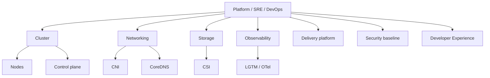

## Prioridad de estudio

### Nivel 1. Administración core

- Arquitectura del cluster
- API Server
- etcd
- Scheduler
- Controller Manager
- Kubelet
- Kube-proxy o alternativa
- Container runtime
- CoreDNS
- Namespaces
- Contexts
- `kubectl` avanzado
### Nivel 2. Networking y storage

- CNI
- Services
- EndpointSlices
- DNS
- Ingress Controller
- Gateway API
- NetworkPolicy
- CSI
- StorageClass
- PV
- PVC
- VolumeSnapshot
- Backup y restore
### Nivel 3. Operación

- Rollouts
- Rollbacks
- Drains
- PDB
- HPA
- VPA
- Cluster Autoscaler
- Upgrades
- Capacity planning
- ResourceQuota
- LimitRange
- Troubleshooting progresivo
- Runbooks
### Nivel 4. Delivery platform

- Kustomize
- Helm
- Argo CD
- Flux
- CI/CD
- GitOps
- Quality gates
- Policy-as-code
- Promotion flows
- Environment strategy
### Nivel 5. Observabilidad

- Events
- Logs
- Metrics
- Traces
- Grafana
- Loki
- Mimir
- Tempo
- Alloy
- OpenTelemetry Collector
- kube-state-metrics
- node-exporter
- Alerting
- SLOs, cuando toque
## Certificación útil

### CKA

CKA es la certificación más alineada con administración y operación de Kubernetes. ([Linux Foundation - Education](https://training.linuxfoundation.org/certification/certified-kubernetes-administrator-cka/ "Certified Kubernetes Administrator (CKA)"))

### Después de CKA

Después de CKA, puedes elegir:

- CKS si quieres profundizar en seguridad
- CAPA si tu plataforma usa Argo
- CGOA si tu foco es GitOps
- CCA si tu plataforma usa Cilium
- PCA si tu foco es Prometheus
- CNPA o CNPE si tu foco se mueve hacia platform engineering más amplio
El repositorio público de currículos CNCF incluye currículos para CKA, CKAD, CKS, CAPA, CGOA, CCA, KCA, CNPA, CNPE y otras certificaciones, lo que lo convierte en una referencia útil para validar cobertura temática. ([GitHub](https://github.com/cncf/curriculum "Open Source Curriculum for CNCF Certification Courses"))

## Práctica principal de la ruta

Construye un entorno `shop` completo:

- kind multi-node, si el ordenador lo soporta
- `checkout-api`
- `payment-api`
- Redis
- PostgreSQL de laboratorio
- Ingress o Gateway opcional
- NetworkPolicies
- ConfigMaps y Secrets
- PVC
- Backup/restore de laboratorio
- Observabilidad mínima
- `task test:k8s`
- Failure labs
- Runbooks
- Delivery local
- GitOps conceptual o real
## Criterio de madurez

Puedes considerar madura esta ruta cuando puedas:

- Entrar en un cluster desconocido y diagnosticar de forma ordenada
- Explicar por qué un Pod está Pending
- Explicar por qué un Service no tiene endpoints
- Explicar por qué un PVC está Pending
- Explicar por qué HPA no escala
- Hacer rollback con confianza
- Distinguir fallo de app, fallo de manifest, fallo de red, fallo de storage y fallo de plataforma
- Diseñar quality gates
- Crear runbooks útiles
- Mantener una buena DevEx para otros equipos
## Frase de comprensión

> Una buena plataforma Kubernetes no es la que esconde todo. Es la que reduce fricción, hace seguros los caminos comunes y deja señales claras cuando algo falla.

---

# 15.6. Ruta security

## Objetivo

Aprender Kubernetes desde el punto de vista de reducción de riesgo.

La ruta de seguridad no debe empezar por herramientas sofisticadas.

Debe empezar por identidad, permisos, admisión, aislamiento, secretos, imágenes, red, auditoría y supply chain.

CNCF presenta CKS como una certificación para personas especializadas en seguridad Kubernetes, y Linux Foundation indica que CKS requiere CKA y cubre buenas prácticas para asegurar aplicaciones contenerizadas y plataformas Kubernetes durante build, deployment y runtime. ([CNCF](https://www.cncf.io/training/certification/ "Cloud Native Certifications | CNCF"))

## Responsabilidad real

Una persona de seguridad debe poder responder:

- ¿Quién puede hacer qué?
- ¿Qué puede hacer un Pod comprometido?
- ¿Qué Secrets puede leer?
- ¿Qué red puede alcanzar?
- ¿Qué políticas bloquean configuraciones peligrosas?
- ¿Qué imagen se está ejecutando?
- ¿Está firmada o escaneada?
- ¿Hay `latest`?
- ¿Hay Pods privilegiados?
- ¿Se aplica Pod Security Admission?
- ¿Hay audit logs?
- ¿Hay runtime signals?
- ¿Cuál es el blast radius?
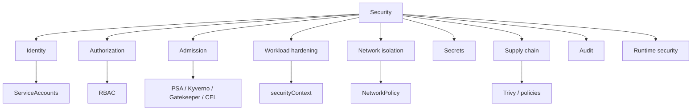

## Prioridad de estudio

### Nivel 1. Seguridad base

- ServiceAccounts
- RBAC
- `kubectl auth can-i`
- Least privilege
- Pod Security Standards
- Pod Security Admission
- SecurityContext
- Secrets good practices
- NetworkPolicy
- Image scanning
- No `latest`
- Audit logs
### Nivel 2. Policy-as-code

- Kyverno
- OPA Gatekeeper
- ValidatingAdmissionPolicy
- Conftest
- Policy tests
- Admission webhooks
- Excepciones controladas
- Policy reports
### Nivel 3. Supply chain

- Scanning de imágenes
- SBOM
- Firma de imágenes
- Verificación de imágenes
- Registry policies
- Dependencias
- Base images
- CI/CD security
- Secrets scanning
### Nivel 4. Runtime y respuesta

- Runtime detection
- Logs
- Audit
- Forensics básica
- Incident response
- Blast radius
- Network segmentation
- Node hardening
- API Server hardening
- etcd encryption
## Certificación útil

### KCSA

KCSA puede servir como entrada a seguridad cloud native y baseline security. Linux Foundation la describe como una certificación para demostrar comprensión de la configuración base de seguridad de clusters Kubernetes para objetivos de compliance. ([Linux Foundation - Education](https://training.linuxfoundation.org/certification/kubestronaut-bundle/ "Kubestronaut Bundle"))

### CKS

CKS es la certificación avanzada de seguridad Kubernetes y requiere CKA. ([Linux Foundation - Education](https://training.linuxfoundation.org/certification/kubestronaut-bundle/ "Kubestronaut Bundle"))

## Ruta recomendada

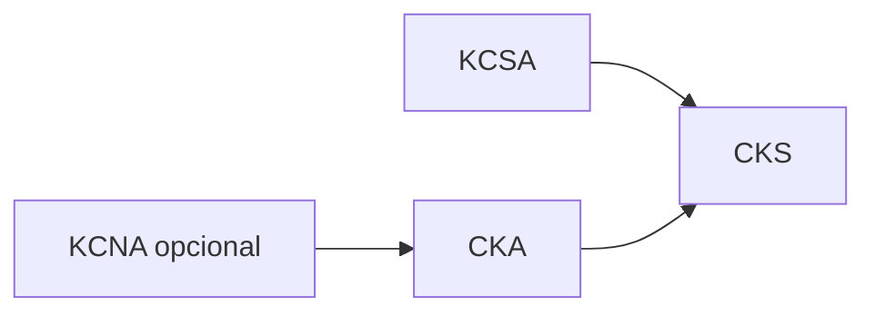

Una ruta razonable sería:

```text
KCSA → CKA → CKS
```

o:

```text
CKA → KCSA → CKS
```

si ya tienes experiencia operativa.

## Práctica principal de la ruta

Crea un entorno `shop` con:

- Namespace `restricted`
- ServiceAccount por workload
- `automountServiceAccountToken: false`
- RBAC mínimo
- `securityContext` restrictivo
- NetworkPolicy default deny
- Policies contra `latest`
- Policies para `runAsNonRoot`
- Trivy image scan
- Trivy config scan
- Secrets separados
- Failure lab de Pod privilegiado
- Failure lab de ServiceAccount sin permisos
- Failure lab de NetworkPolicy
- Audit conceptual
## Criterio de madurez

Puedes considerar madura esta ruta cuando puedas:

- Explicar blast radius de un Pod comprometido
- Diseñar RBAC mínimo
- Detectar permisos peligrosos
- Aplicar Pod Security Admission
- Escribir y testear policies
- Explicar límites de Secrets
- Revisar manifests por riesgo
- Explicar diferencia entre build-time, deploy-time y runtime security
- Relacionar CNI con NetworkPolicy
- Diseñar un baseline de seguridad para namespaces
## Frase de comprensión

> Seguridad en Kubernetes no consiste en añadir una herramienta. Consiste en reducir privilegios, reducir exposición, bloquear configuraciones peligrosas y conservar señales auditables.

---

# 15.7. Ruta architect / platform product

## Objetivo

Esta ruta es para quien quiere diseñar sistemas, plataformas internas o estrategias de adopción.

No se centra solo en “saber Kubernetes”.

Se centra en decidir:

- Qué debe ofrecer la plataforma
- Qué debe seguir siendo responsabilidad de los equipos
- Qué se automatiza
- Qué se documenta
- Qué se convierte en golden path
- Qué se bloquea con policy
- Qué no merece construirse
- Qué coste operacional introduce cada decisión
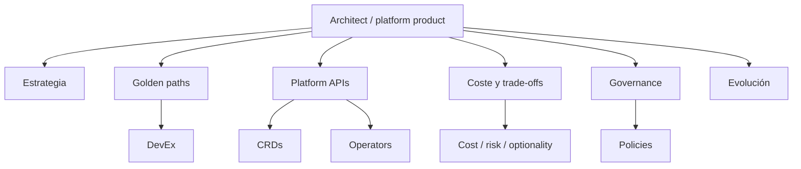

## Responsabilidad real

Una persona en esta ruta debe poder responder:

- ¿Qué problema de negocio resuelve la plataforma?
- ¿Qué fricción reduce?
- ¿Qué riesgos reduce?
- ¿Qué decisiones deja a los equipos?
- ¿Qué decisiones centraliza?
- ¿Qué APIs ofrece?
- ¿Qué se hace con GitOps?
- ¿Qué se hace con observabilidad?
- ¿Qué se hace con seguridad?
- ¿Qué partes deben ser self-service?
- ¿Qué parts son demasiado peligrosas para self-service sin controles?
- ¿Qué coste basal introduce cada herramienta?
- ¿Qué pasa cuando el equipo que construyó la plataforma no está?
## Prioridad de estudio

### Nivel 1. Sistema completo

- Arquitectura Kubernetes
- Workloads
- Networking
- Storage
- Security
- Observability
- Delivery
- GitOps
- Policy-as-code
- Extension model
### Nivel 2. Platform APIs

- CRDs
- Controllers
- Operators
- Admission
- Gateway API
- External Secrets
- Backstage, si aplica
- Golden paths
- Templates
- Scorecards
### Nivel 3. Operabilidad y economía

- Runbooks
- SLOs
- Incident response
- Cost optimization
- Capacity planning
- Build vs buy
- Managed vs self-hosted
- Upgrade strategy
- Deprecation strategy
- Maintenance cost
- Cognitive load
- DevEx
### Nivel 4. Ecosistema CNCF

- Argo
- Flux
- Cilium
- Istio
- Prometheus
- OpenTelemetry
- Kyverno
- Backstage
- Crossplane
- cert-manager
- External Secrets
- Velero
## Certificaciones útiles

No hay una única certificación para esta ruta.

Dependiendo de foco:

|Foco|Certificaciones útiles|
|---|---|
|Kubernetes base|KCNA, CKA|
|Desarrollo app|CKAD|
|Seguridad|KCSA, CKS|
|GitOps|CGOA|
|Argo|CAPA|
|Cilium|CCA|
|Kyverno|KCA|
|Platform engineering|CNPA, CNPE|

El repositorio público de currículos CNCF incluye varias de estas certificaciones y puede usarse como checklist de cobertura, aunque no sustituye construir experiencia real. ([GitHub](https://github.com/cncf/curriculum "Open Source Curriculum for CNCF Certification Courses"))

## Práctica principal de la ruta

Diseña una “mini platform” para el sistema `shop`:

- Golden path para una API Express
- Template de Deployment
- ConfigMap
- Secret
- Service
- NetworkPolicy
- Security baseline
- Observability baseline
- Delivery pipeline
- `task test:k8s`
- Runbooks
- Documentation
- Policy tests
- CRD conceptual `BackupPolicy`
- Decision records
- Cost and risk analysis
## Criterio de madurez

Puedes considerar madura esta ruta cuando puedas:

- Explicar trade-offs de cada herramienta
- Decidir Kustomize vs Helm sin dogma
- Decidir CI/CD vs GitOps sin dogma
- Decidir CRD vs ConfigMap vs Helm values
- Decidir operator vs runbook vs managed service
- Diseñar APIs de plataforma con buen límite
- Evitar sobreingeniería
- Medir si la plataforma mejora el flujo real
- Reducir carga cognitiva sin crear una caja negra
## Frase de comprensión

> Una plataforma buena no es la que tiene más herramientas. Es la que mejora el throughput seguro de los equipos reduciendo fricción, riesgo, incertidumbre y coste operacional.

---

# 15.8. Certificaciones CNCF y Linux Foundation

## Mapa principal

CNCF lista certificaciones cloud native como CKA, CKAD, CKS, KCNA, KCSA, PCA, ICA, CCA, CAPA, CGOA y otras. ([CNCF](https://www.cncf.io/training/certification/ "Cloud Native Certifications | CNCF"))

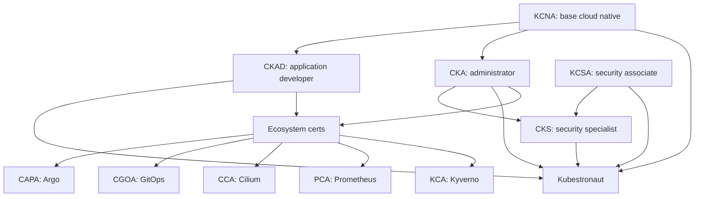

## Certificaciones Kubernetes core

|Certificación|Enfoque|
|---|---|
|KCNA|Fundamentos Kubernetes y ecosistema cloud native|
|CKAD|Desarrollo, configuración y exposición de aplicaciones cloud native|
|CKA|Administración y operación de Kubernetes|
|KCSA|Seguridad cloud native y baseline security|
|CKS|Seguridad avanzada de Kubernetes, requiere CKA|

CNCF indica que Kubestronaut requiere aprobar todas las certificaciones Kubernetes core: CKA, CKAD, CKS, KCNA y KCSA, y que todas deben estar activas. ([CNCF](https://www.cncf.io/training/kubestronaut/kubestronaut-faq/ "Kubestronaut FAQ"))

## Nota sobre recertificación

CNCF anunció el programa CARE de recertificación, donde KCNA puede renovarse automáticamente al aprobar o recertificar CKA o CKAD, y KCSA al aprobar o recertificar CKS. Esto es información reciente y debe comprobarse en la página oficial antes de tomar decisiones de compra o planificación. ([CNCF](https://www.cncf.io/blog/2026/03/23/cncf-introduces-a-new-recertification-program-as-kubestronaut-community-surpasses-3500/ "CNCF Introduces CARE Program"))

## Criterio de comprensión

Debes poder explicar:

> Las certificaciones son mapas y señales externas. No sustituyen experiencia, failure labs, operación real ni capacidad de diagnóstico.

---

# 15.9. Cómo elegir certificación sin autoengañarte

## No empieces por la certificación

Empieza por el rol.

Después elige certificación.

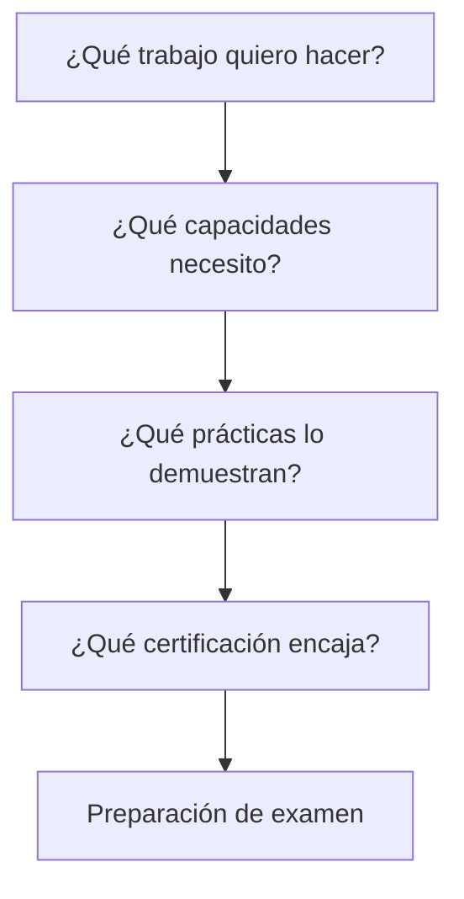

## Guía rápida

|Tu objetivo|Ruta probable|
|---|---|
|Entender el ecosistema desde cero|KCNA|
|Construir apps cloud native|CKAD|
|Administrar clusters|CKA|
|Entrar en seguridad cloud native|KCSA|
|Especializarte en seguridad Kubernetes|CKA + CKS|
|Usar Argo profesionalmente|CAPA|
|GitOps como práctica principal|CGOA|
|Cilium / networking avanzado|CCA|
|Prometheus / métricas|PCA|
|Kyverno / policy-as-code|KCA|

## Riesgo

Preparar certificaciones puede generar una falsa sensación de dominio.

Puedes aprobar tareas de examen y aun así no saber:

- Diagnosticar un incidente real
- Diseñar un delivery path
- Elegir entre Helm y Kustomize
- Operar observabilidad
- Gestionar secretos profesionalmente
- Explicar blast radius
- Diseñar una plataforma sostenible
## Criterio de comprensión

Debes poder explicar:

> La certificación debe validar una ruta de aprendizaje, no sustituirla.

---

# 15.10. Matriz de profundidad por rol

Usa esta matriz para saber cuánto profundizar.

|Tema|Developer|Platform / SRE|Security|Architect|
|---|--:|--:|--:|--:|
|Contenedores|Alto|Alto|Medio|Medio|
|Pods|Alto|Alto|Medio|Medio|
|Deployments|Alto|Alto|Medio|Medio|
|Jobs / CronJobs|Alto|Medio|Bajo|Medio|
|Services / DNS|Alto|Alto|Medio|Medio|
|Ingress / Gateway|Medio|Alto|Medio|Alto|
|NetworkPolicy|Medio|Alto|Alto|Alto|
|ConfigMaps / Secrets|Alto|Alto|Alto|Alto|
|Storage|Medio|Alto|Medio|Alto|
|RBAC|Medio|Alto|Alto|Alto|
|Pod Security|Medio|Alto|Alto|Alto|
|Policy-as-code|Medio|Alto|Alto|Alto|
|Observability|Medio|Alto|Alto|Alto|
|Delivery|Alto|Alto|Medio|Alto|
|GitOps|Medio|Alto|Medio|Alto|
|CRDs / Operators|Bajo|Medio|Medio|Alto|
|Cluster internals|Bajo|Alto|Medio|Alto|
|Node operations|Bajo|Alto|Medio|Medio|
|Incident response|Medio|Alto|Alto|Alto|
|Cost optimization|Bajo|Alto|Medio|Alto|

### Cómo leer la matriz

- **Bajo**: entender concepto y límites
- **Medio**: poder usarlo y diagnosticar casos comunes
- **Alto**: poder diseñarlo, operarlo, enseñar trade-offs y resolver fallos
### Criterio de comprensión

Debes poder explicar:

> La profundidad correcta depende del rol. Aprenderlo todo con la misma intensidad suele ser una mala inversión.

---

# 15.11. Portfolio técnico de Kubernetes

## Objetivo

No basta con decir “sé Kubernetes”.

Debes poder enseñarlo.

Un portfolio útil debe demostrar:

- Que entiendes conceptos
- Que sabes practicar
- Que sabes diagnosticar
- Que sabes documentar
- Que sabes automatizar
- Que sabes tomar decisiones
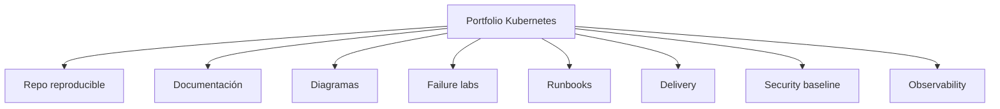

## Proyecto recomendado

Un repo público o privado con:

```text
kubernetes-learning-lab/
  apps/
    checkout-api/
  kubernetes/
    base/
    overlays/
    00-namespace/
    02-deployment/
    03-service/
    05-config/
    06-storage/
    07-security/
    10-networkpolicy/
    11-observability/
    12-extension/
  tests/
    policies/
    cluster/
    smoke/
    failure-lab/
  docs/
    runbooks/
    patterns/
    extension/
    troubleshooting.md
    architecture.md
  Taskfile.yml
```

## Debe poder demostrar

- `task doctor`
- `task test:k8s`
- `task delivery:release:local`
- `task security:test`
- `task reliability:test`
- `task patterns:review`
- `task extension:test`
## Criterio de comprensión

Debes poder explicar:

> Un buen portfolio no enseña solo el camino feliz. Enseña cómo el sistema falla, cómo lo detectas y cómo lo recuperas.

---

# 15.12. Preparación para entrevistas técnicas

## Preguntas que deberías poder responder

### Developer

- ¿Qué diferencia hay entre liveness y readiness?
- ¿Por qué no usarías `latest`?
- ¿Qué pasa si un Service no tiene endpoints?
- ¿Cómo pasarías configuración a una app?
- ¿Cuándo usarías Job en vez de Deployment?
- ¿Qué harías si un rollout se queda bloqueado?
- ¿Cómo probarías tu manifest antes de desplegar?
### Platform / SRE

- ¿Qué mirarías si un Pod está Pending?
- ¿Cómo diagnosticas DNS interno?
- ¿Cómo diagnosticas PVC Pending?
- ¿Qué papel tiene CoreDNS?
- ¿Qué hace el scheduler?
- ¿Qué es etcd?
- ¿Cómo harías drain de un nodo?
- ¿Qué señales pondrías en un dashboard de cluster?
- ¿Qué diferencia hay entre CI/CD y GitOps?
### Security

- ¿Qué puede hacer un ServiceAccount?
- ¿Cómo compruebas permisos con `kubectl auth can-i`?
- ¿Qué es Pod Security Admission?
- ¿Qué significa `runAsNonRoot`?
- ¿Por qué base64 no es cifrado?
- ¿Qué controla NetworkPolicy?
- ¿Qué harías para reducir blast radius?
- ¿Qué políticas bloquearías en admisión?
### Architect

- ¿Cuándo crearías un CRD?
- ¿Cuándo no crearías un operator?
- ¿Qué pondrías en un golden path?
- ¿Qué debe ser self-service y qué no?
- ¿Cómo evitarías que la plataforma se vuelva una caja negra?
- ¿Cómo medirías si la plataforma mejora el flujo?
- ¿Qué coste operacional introduce GitOps?
- ¿Qué trade-offs hay entre Helm y Kustomize?
## Criterio de comprensión

Debes poder explicar:

> Una buena entrevista Kubernetes no se gana memorizando objetos. Se gana razonando sobre fallos, trade-offs y responsabilidades.

---

# 15.13. DevEx profesional

## Qué problema resuelve

Cuanto más profesional es el uso de Kubernetes, más importante se vuelve la DevEx.

Sin DevEx, la gente aprende comandos sueltos, copia YAML y evita tocar la plataforma por miedo.

Con buena DevEx:

- Hay caminos claros
- Hay comandos repetibles
- Hay validación temprana
- Hay docs
- Hay runbooks
- Hay diagramas
- Hay failure labs
- Hay calidad antes de delivery
- Hay menos dependencia de memoria individual
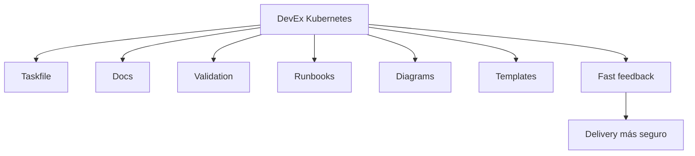

## Reglas de DevEx

- Cada práctica importante debe tener un comando
- Cada comando debe mostrar qué hace
- Cada failure lab debe tener recuperación
- Cada módulo debe tener criterio de salida
- Cada ruta debe tener checklist
- Cada manifest importante debe estar validado
- Cada decisión no obvia debe estar documentada
- Cada herramienta debe pagar su coste
## Criterio de comprensión

Debes poder explicar:

> DevEx no es comodidad superficial. Es una forma de reducir error humano, coste cognitivo y variabilidad operacional.

---

# 15.14. Taskfile del módulo 15

Añade estas tareas al `Taskfile.yml`.

```yaml
  professional:checklist:developer:
    desc: Print developer Kubernetes professionalization checklist
    cmds:
      - echo "Developer route checklist:"
      - echo "- Build and run checkout-api container"
      - echo "- Deploy Deployment and Service"
      - echo "- Configure ConfigMap and Secret"
      - echo "- Validate probes"
      - echo "- Run smoke tests"
      - echo "- Debug Service endpoints"
      - echo "- Execute rollout and rollback"
      - echo "- Run task test:k8s"

  professional:checklist:platform:
    desc: Print platform/SRE Kubernetes professionalization checklist
    cmds:
      - echo "Platform/SRE route checklist:"
      - echo "- Diagnose Pods, Services, DNS, PVCs and events"
      - echo "- Validate storage and networking"
      - echo "- Execute failure labs"
      - echo "- Run reliability:test"
      - echo "- Design runbooks"
      - echo "- Explain GitOps and delivery trade-offs"
      - echo "- Explain observability signals"

  professional:checklist:security:
    desc: Print security Kubernetes professionalization checklist
    cmds:
      - echo "Security route checklist:"
      - echo "- Apply Pod Security Admission"
      - echo "- Validate ServiceAccount and RBAC"
      - echo "- Run kubectl auth can-i checks"
      - echo "- Apply NetworkPolicies"
      - echo "- Run policy tests"
      - echo "- Run image and config scans"
      - echo "- Explain blast radius"

  professional:checklist:architect:
    desc: Print architecture/platform product professionalization checklist
    cmds:
      - echo "Architect/platform route checklist:"
      - echo "- Explain golden path"
      - echo "- Explain Helm vs Kustomize"
      - echo "- Explain CI/CD vs GitOps"
      - echo "- Explain CRD vs ConfigMap"
      - echo "- Explain operator vs runbook"
      - echo "- Document trade-offs"
      - echo "- Review platform cost and operational risk"

  professional:portfolio:validate:
    desc: Validate the Kubernetes learning portfolio
    cmds:
      - test -d apps/{{.APP_NAME}}
      - test -f Taskfile.yml
      - test -d kubernetes
      - test -d tests
      - test -d docs
      - task manifests:render
      - task manifests:validate:schema
      - task policies:test

  professional:portfolio:test:
    desc: Run the main portfolio evidence checks
    cmds:
      - task test:k8s
      - task security:test
      - task reliability:test
      - task patterns:review
      - task extension:test

  professional:interview:questions:
    desc: Print Kubernetes interview practice prompts
    cmds:
      - echo "Explain readiness vs liveness."
      - echo "Diagnose a Service with no endpoints."
      - echo "Explain why a PVC is Pending."
      - echo "Explain how rollback works."
      - echo "Explain ServiceAccount and RBAC."
      - echo "Explain Pod Security Admission."
      - echo "Explain CI/CD vs GitOps."
      - echo "Explain when you would create a CRD."
      - echo "Explain when an operator is overengineering."

  professional:route:developer:
    desc: Run checks aligned with the developer route
    cmds:
      - task professional:checklist:developer
      - task manifests:render
      - task test:k8s
      - task smoke:k8s

  professional:route:platform:
    desc: Run checks aligned with the platform/SRE route
    cmds:
      - task professional:checklist:platform
      - task reliability:test
      - task k8s:debug:checkout:summary
      - task reliability:storage:status

  professional:route:security:
    desc: Run checks aligned with the security route
    cmds:
      - task professional:checklist:security
      - task security:test
      - task policies:test
      - task security:inspect

  professional:route:architect:
    desc: Run checks aligned with the architecture/platform product route
    cmds:
      - task professional:checklist:architect
      - task patterns:review
      - task extension:test
```

### Criterio DevEx

Debes poder explicar:

> La profesionalización también debe ser ejecutable. Si no puedes demostrar tu progreso con comandos, tests, docs y failure labs, probablemente solo tienes lectura acumulada.

---

# 15.15. Práctica principal del módulo

## Objetivo

Convertir el roadmap en una ruta profesional elegida y demostrable.

## Resultado esperado

```text
kubernetes-learning-lab/
  docs/
    professionalization/
      role-choice.md
      skill-matrix.md
      certification-plan.md
      portfolio-evidence.md
      interview-prep.md
```

## Paso 1. Elegir ruta

Crea:

```text
docs/professionalization/role-choice.md
```

Contenido:

```markdown
# Role choice

## Primary route

Developer / Platform-SRE / Security / Architect

## Why this route

...

## What I need to be able to do

...

## What I do not need to prioritize yet

...
```

## Paso 2. Crear matriz de habilidades

Crea:

```text
docs/professionalization/skill-matrix.md
```

Contenido:

```markdown
# Skill matrix

| Skill | Current level | Target level | Evidence |
|---|---:|---:|---|
| Deployments | | | |
| Services and DNS | | | |
| ConfigMaps and Secrets | | | |
| Storage | | | |
| SecurityContext | | | |
| RBAC | | | |
| NetworkPolicy | | | |
| Observability | | | |
| Delivery | | | |
| GitOps | | | |
| CRDs | | | |
| Troubleshooting | | | |
```

## Paso 3. Crear plan de certificación

Crea:

```text
docs/professionalization/certification-plan.md
```

Contenido:

```markdown
# Certification plan

## Target certification

KCNA / CKAD / CKA / KCSA / CKS / other

## Why this certification

...

## What it validates

...

## What it does not validate

...

## Practice evidence before booking

- [ ] I can run the relevant route tasks.
- [ ] I can diagnose failure labs.
- [ ] I can explain trade-offs.
- [ ] I can complete timed practice tasks.
```

## Paso 4. Crear evidencia de portfolio

Crea:

```text
docs/professionalization/portfolio-evidence.md
```

Contenido:

```markdown
# Portfolio evidence

## Commands

- task test:k8s
- task security:test
- task reliability:test
- task patterns:review
- task extension:test

## Failure labs demonstrated

- Bad image
- Missing Secret
- Bad Service selector
- PVC Pending
- Privileged Pod rejected

## Runbooks

- checkout-api rollout
- service no endpoints
- storage PVC Pending
- security baseline

## Diagrams

- architecture
- delivery flow
- troubleshooting flow
- platform extension model
```

## Paso 5. Ejecutar checks por ruta

Developer:

```bash
task professional:route:developer
```

Platform:

```bash
task professional:route:platform
```

Security:

```bash
task professional:route:security
```

Architect:

```bash
task professional:route:architect
```

## Paso 6. Ejecutar portfolio completo

```bash
task professional:portfolio:validate
task professional:portfolio:test
```

## Criterio de finalización

La práctica está completa cuando puedes explicar:

- Qué ruta has elegido
- Por qué esa ruta
- Qué habilidades necesitas
- Qué certificación encaja
- Qué certificación no necesitas todavía
- Qué evidencia técnica tienes
- Qué failure labs puedes demostrar
- Qué runbooks tienes
- Qué trade-offs puedes explicar
---

# 15.16. Ejercicios cortos

## Ejercicio 1. Elegir ruta

Responde:

|Pregunta|Respuesta|
|---|---|
|¿Quiero construir apps o plataformas?||
|¿Quiero operar clusters?||
|¿Quiero especializarme en seguridad?||
|¿Quiero diseñar golden paths?||
|¿Qué ruta encaja mejor ahora?||

---

## Ejercicio 2. Elegir certificación

Completa:

|Objetivo|Certificación candidata|Por qué|
|---|---|---|
|Base cloud native|||
|Developer Kubernetes|||
|Administración Kubernetes|||
|Seguridad base|||
|Seguridad avanzada|||
|GitOps|||
|Argo|||
|Cilium|||

---

## Ejercicio 3. Evidencia real

Para tu ruta elegida, completa:

|Capacidad|Evidencia en el repo|
|---|---|
|Deploy||
|Debugging||
|Delivery||
|Security||
|Observability||
|Failure recovery||
|Documentation||

---

## Ejercicio 4. Entrevista técnica

Responde sin mirar apuntes:

- ¿Qué pasa si un Deployment existe pero no hay Pods Ready?
- ¿Qué pasa si el Service existe pero no tiene endpoints?
- ¿Qué pasa si DNS resuelve pero HTTP no responde?
- ¿Qué pasa si un PVC está Pending?
- ¿Qué pasa si un Pod está `ImagePullBackOff`?
- ¿Qué pasa si una NetworkPolicy existe pero no bloquea?
- ¿Qué pasa si un Secret falta?
- ¿Qué pasa si un rollback no recupera porque hubo migración de datos?
---

## Ejercicio 5. Certificación vs experiencia

Completa:

|Tema|Lo puede validar un examen|Lo demuestra mejor un proyecto|
|---|---|---|
|Crear Deployment|||
|Diagnosticar incidente|||
|Diseñar plataforma|||
|Escribir runbook|||
|Hacer rollback|||
|Gestionar trade-offs|||
|Operar observabilidad|||

---

# 15.17. Errores habituales

## Error 1. Querer aprender todo a la vez

Kubernetes es demasiado amplio.

Elige ruta.

Luego profundidad.

---

## Error 2. Preparar certificaciones sin practicar fallos

Un examen puede entrenarte para tareas.

Los failure labs te entrenan para operar.

Necesitas ambos si quieres criterio real.

---

## Error 3. Confundir developer Kubernetes con platform Kubernetes

Un developer debe saber desplegar y diagnosticar su app.

No necesita empezar por API aggregation o CNI avanzado.

---

## Error 4. Confundir platform engineering con instalar herramientas

Platform engineering no es instalar Argo, Backstage, Cilium y Grafana.

Es diseñar caminos seguros y útiles para los equipos.

---

## Error 5. Confundir seguridad con escaneo

Security scanning es una pieza.

Seguridad también incluye identidad, RBAC, Pod Security, NetworkPolicy, Secrets, admission, runtime y auditoría.

---

## Error 6. Perseguir certificaciones por orden de moda

El orden correcto depende del rol.

No de LinkedIn.

---

## Error 7. No documentar decisiones

Si no puedes explicar por qué usaste Helm, Kustomize, GitOps, CRD, operator o policy, todavía no tienes criterio profesional.

---

## Error 8. No mantener el conocimiento actualizado

Kubernetes cambia.

Certificaciones cambian.

El ecosistema cambia.

Usa documentación oficial y currículos actualizados como referencia viva.

---

# 15.18. Troubleshooting progresivo de tu aprendizaje

Cuando sientas que “Kubernetes es demasiado”, no estudies más temas al azar.

Diagnostica tu aprendizaje.

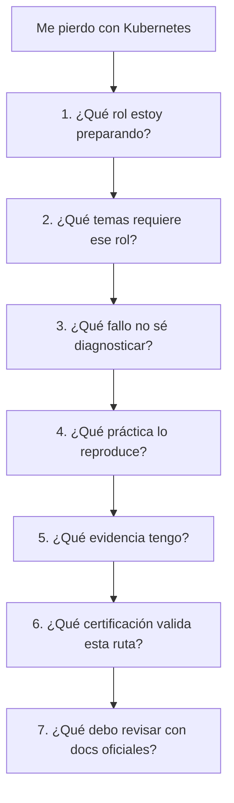

## Secuencia

1. Elige ruta
2. Elige una capacidad
3. Busca un fallo real asociado
4. Reprodúcelo en laboratorio
5. Diagnostícalo
6. Documenta runbook
7. Automatiza validación
8. Repite
## Criterio de comprensión

Debes poder explicar:

> Aprender Kubernetes profesionalmente no es leer más. Es convertir dudas en prácticas, prácticas en señales, señales en diagnóstico y diagnóstico en criterio.

---

# 15.19. Criterio de salida del módulo

Puedes pasar al proyecto final cuando puedas hacer todo esto sin seguir una receta ciegamente.

## Conceptos

Debes poder explicar:

- Qué ruta profesional quieres seguir
- Qué capacidades exige esa ruta
- Qué capacidades no necesitas priorizar todavía
- Qué diferencia hay entre KCNA, CKAD, CKA, KCSA y CKS
- Qué significa Kubestronaut
- Qué valor tiene una certificación
- Qué límites tiene una certificación
- Qué evidencia técnica deberías construir
- Cómo preparar entrevistas técnicas
- Cómo usar un portfolio Kubernetes
- Cómo mantener DevEx en el aprendizaje
- Cómo usar documentación oficial y currículos CNCF como referencia
## Práctica

Debes poder:

- Crear un plan profesional
- Crear una matriz de habilidades
- Crear un plan de certificación
- Crear evidencia de portfolio
- Ejecutar checks por ruta
- Ejecutar portfolio completo
- Defender decisiones técnicas
- Explicar fallos y recuperaciones
- Explicar qué estudiarías después y por qué
## DevEx

Debes poder ejecutar:

```bash
task professional:checklist:developer
task professional:checklist:platform
task professional:checklist:security
task professional:checklist:architect
task professional:route:developer
task professional:route:platform
task professional:route:security
task professional:route:architect
task professional:portfolio:validate
task professional:portfolio:test
task professional:interview:questions
```

## Frase final de comprensión

Debes poder explicar esta frase:

> Profesionalizarse en Kubernetes no es saber todos los objetos. Es elegir una ruta, practicar tareas reales, diagnosticar fallos, automatizar feedback, documentar decisiones y demostrar criterio bajo condiciones parecidas a producción.

---

## 15.20. Referencias oficiales y fuentes primarias

|Tema|Referencia|
|---|---|
|CNCF Cloud Native Certifications|CNCF, Cloud Native Certifications. ([CNCF](https://www.cncf.io/training/certification/ "Cloud Native Certifications \| CNCF"))|
|CNCF training pathways|CNCF, Training and cloud native certification pathways. ([CNCF](https://www.cncf.io/training/ "Training & Certification \| CNCF"))|
|Linux Foundation CKA|Linux Foundation Training, Certified Kubernetes Administrator. ([Linux Foundation - Education](https://training.linuxfoundation.org/certification/certified-kubernetes-administrator-cka/ "Certified Kubernetes Administrator (CKA)"))|
|KCNA|Linux Foundation Training, Kubernetes and Cloud Native Associate. ([Linux Foundation - Education](https://training.linuxfoundation.org/certification/kubernetes-cloud-native-associate/ "Kubernetes and Cloud Native Associate (KCNA)"))|
|KCNA + CKA bundle description|Linux Foundation Training, KCNA and CKA bundle. ([Linux Foundation - Education](https://training.linuxfoundation.org/training/kcna-cka-exam-bundle/ "Kubernetes and Cloud Native Associate (KCNA) + Certified ..."))|
|Kubestronaut requirements|CNCF, Kubestronaut FAQ. ([CNCF](https://www.cncf.io/training/kubestronaut/kubestronaut-faq/ "Kubestronaut FAQ"))|
|Kubestronaut program|CNCF, Kubestronaut Program. ([CNCF](https://www.cncf.io/training/kubestronaut/ "Kubestronaut Program"))|
|CNCF curriculum repository|CNCF, Open Source Curriculum for CNCF Certification Courses. ([GitHub](https://github.com/cncf/curriculum "Open Source Curriculum for CNCF Certification Courses"))|
|CARE recertification program|CNCF, CARE recertification announcement. ([CNCF](https://www.cncf.io/blog/2026/03/23/cncf-introduces-a-new-recertification-program-as-kubestronaut-community-surpasses-3500/ "CNCF Introduces CARE Program"))|

## 15.21. Lecturas de apoyo

|Recurso|Qué usar|
|---|---|
|_Kubernetes in Action_|Base profunda para entender objetos, workloads, networking, storage, seguridad, internals y extensión.|
|_Kubernetes: Up and Running_|Base práctica para contenedores, Kubernetes core, Deployments, Services, RBAC, ConfigMaps, Secrets y aplicaciones reales.|
|_Cloud Native DevOps with Kubernetes_|Operación, delivery, Helm, Kustomize, observabilidad, seguridad, backups y prácticas DevOps.|
|_Kubernetes Patterns_|Patrones cloud native para diseñar aplicaciones que Kubernetes pueda operar bien.|
|CNCF curriculum repository|Checklist vivo para comparar tu roadmap con currículos oficiales.|
|Documentación oficial Kubernetes|Fuente principal para comprobar comandos, APIs y cambios actuales.|

<!-- COURSE_NAV_START -->
[Anterior](<14. Extensión de Kubernetes.md>) | [Indice](README.md) | [Siguiente](<16. Proyecto final del roadmap.md>)
<!-- COURSE_NAV_END -->
