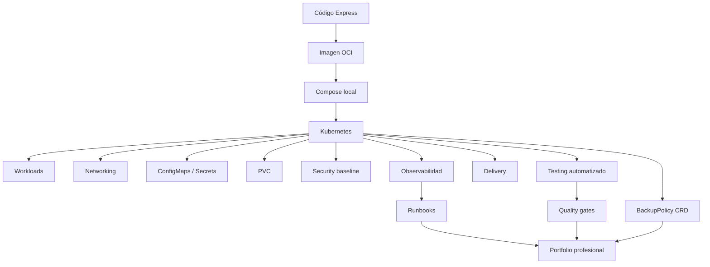
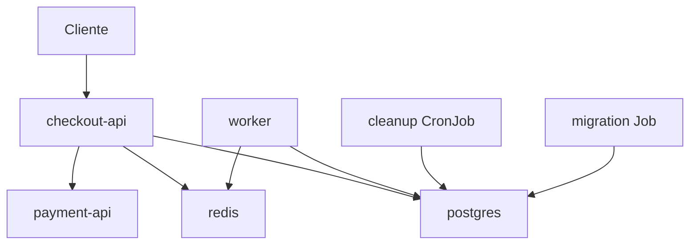
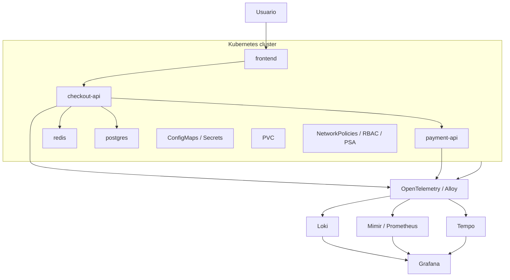
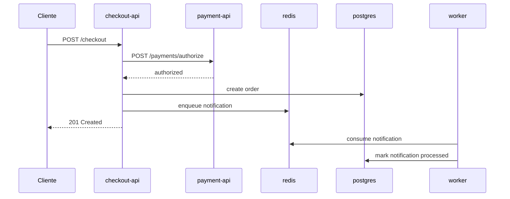
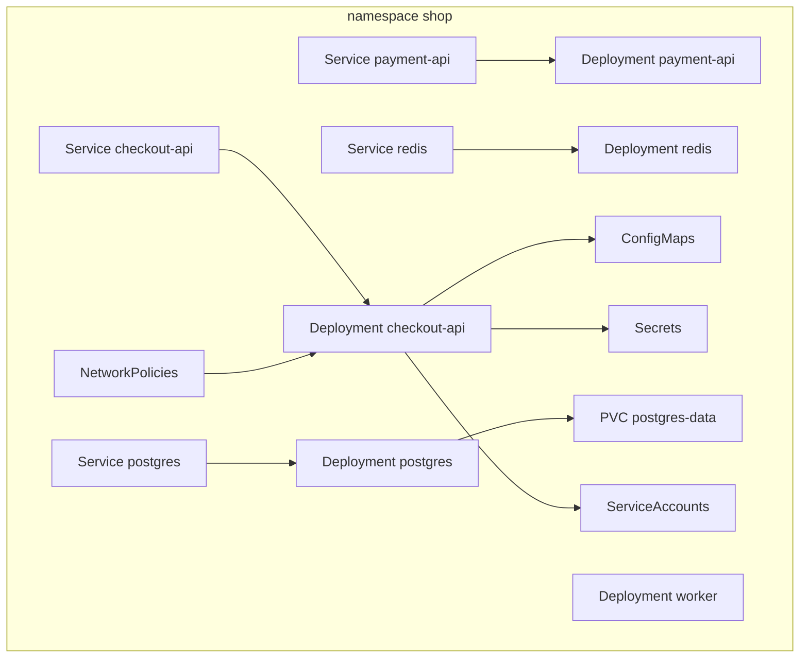
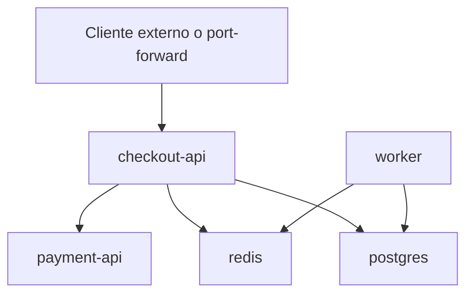
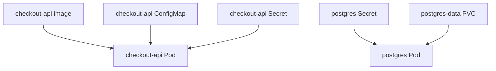
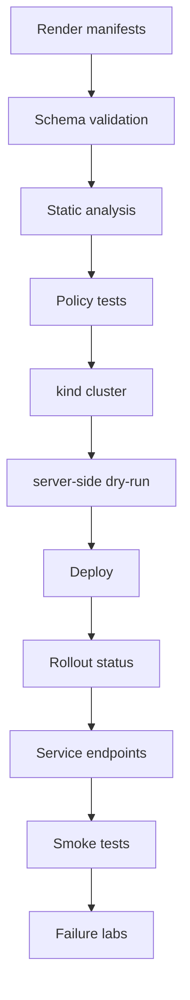
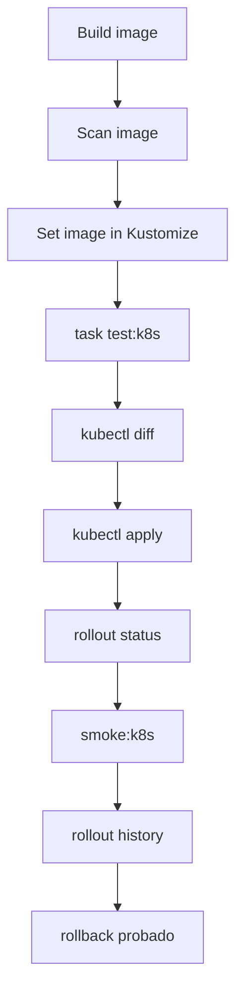
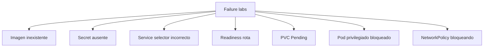

# 16. Proyecto final del roadmap

## Objetivo del módulo

Este módulo convierte el roadmap completo en un proyecto final.

Hasta ahora has trabajado por capas:

```text
1. Contenedores
2. Por qué Kubernetes
3. Primer cluster y kubectl
4. Modelo mental
5. Pods
6. Workloads
7. Networking
8. Configuración, secretos y almacenamiento
9. Testing automatizado de Kubernetes
10. Delivery
11. Seguridad
12. Operación, observabilidad y fiabilidad
13. Patrones cloud native
14. Extensión de Kubernetes
15. Profesionalización por rol
```

Ahora el objetivo es juntar todo en un sistema que puedas construir, ejecutar, romper, diagnosticar, recuperar y explicar.

El proyecto final no busca parecer “enterprise”.

Busca demostrar criterio.

La documentación oficial de Kubernetes describe Kubernetes como una plataforma para gestionar workloads y servicios containerizados mediante configuración declarativa y automatización, y organiza el conocimiento alrededor de workloads, services, networking, storage, configuración, seguridad, observabilidad y extensión. Ese es exactamente el arco que este proyecto debe integrar. ([Kubernetes](https://kubernetes.io/docs/home/ "Kubernetes Documentation"))

La idea central del módulo es esta:

> El proyecto final no consiste en desplegar una app. Consiste en demostrar que entiendes el ciclo completo: código, contenedor, composición local, Kubernetes, configuración, seguridad, red, storage, testing, delivery, observabilidad, troubleshooting, patrones, extensión y criterio profesional.



---

## 16.1. Qué vas a aprender y qué no vas a aprender todavía

Vas a aprender:

- Cómo construir un proyecto final que integre todo el roadmap
- Cómo organizar un repositorio de aprendizaje profesional
- Cómo diseñar un sistema pequeño pero realista
- Cómo ejecutar la app sin contenedores
- Cómo containerizarla con Docker y Podman
- Cómo ejecutarla con Compose
- Cómo migrarla a Kubernetes
- Cómo añadir ConfigMaps, Secrets y PVCs
- Cómo añadir Services, DNS, NetworkPolicies e Ingress o Gateway opcional
- Cómo añadir probes, resources, securityContext y ServiceAccount
- Cómo añadir testing automatizado de manifests, policies, cluster, smoke y failure labs
- Cómo añadir delivery local con quality gates
- Cómo añadir observabilidad y runbooks
- Cómo documentar patrones cloud native
- Cómo añadir una extensión mínima con `BackupPolicy`
- Cómo crear evidencia profesional de aprendizaje
No vas a construir todavía:

- Una plataforma productiva multi-cluster
- Un operator completo
- Una base de datos productiva en Kubernetes
- Un stack LGTM productivo
- Un sistema de autenticación real
- Un service mesh
- Un pipeline cloud completo con credenciales reales
- Un plan de disaster recovery real
- Un entorno productivo
La regla pedagógica del módulo será:

```text
Primero sistema pequeño
Luego una capacidad por fase
Luego criterio de salida
Luego failure lab
Luego documentación
Luego automatización
```

---

## 16.2. Sistema final a construir

El sistema se llamará `shop`.

Tendrá estos componentes:

```text
checkout-api
payment-api
worker
redis
postgres
```

No necesitas un frontend en el proyecto final. Puede añadirse después, pero no debe bloquear el aprendizaje principal.

### Componentes

|Componente|Tecnología|Responsabilidad|
|---|---|---|
|`checkout-api`|Express / Node.js|API pública de checkout|
|`payment-api`|Express / Node.js|API interna simulada de pagos|
|`worker`|Node.js|Trabajo asíncrono de laboratorio|
|`redis`|Redis|Cola/cache de laboratorio|
|`postgres`|PostgreSQL|Datos persistentes de laboratorio|

### Contratos HTTP mínimos

`checkout-api` debe exponer:

```text
GET /health
GET /ready
GET /checkout
POST /checkout
```

`payment-api` debe exponer:

```text
GET /health
GET /ready
POST /payments/authorize
```

### Qué debe demostrar

El sistema debe demostrar:

- Una API pública
- Una API interna
- Una dependencia interna por Service DNS
- Configuración externa
- Secretos separados
- Storage persistente
- Worker
- Job
- CronJob
- NetworkPolicy
- Security baseline
- Observabilidad mínima
- Testing automatizado
- Delivery local
- Failure labs
- Runbooks
- CRD conceptual `BackupPolicy`


### Criterio de comprensión

Debes poder explicar:

> El sistema final es pequeño a propósito. Su valor no está en el tamaño, sino en que contiene las piezas necesarias para practicar operación realista sin perder control.

---

## 16.3. Arquitectura del repositorio

Antes de escribir código, ordena el repositorio.

Taskfile encaja como capa de entrada humana al proyecto porque permite definir tareas en YAML, variables, includes y comandos repetibles. Su documentación oficial describe `Taskfile.yml` como un fichero YAML con versión, variables y tareas, y documenta el schema de Taskfile v3. ([Task](https://taskfile.dev/docs/guide "Guide | Task - Taskfile"))

```text
kubernetes-learning-lab/
  Taskfile.yml
  README.md
  .gitignore
  .env.example

  apps/
    checkout-api/
      package.json
      src/
        server.js
      Dockerfile

    payment-api/
      package.json
      src/
        server.js
      Dockerfile

    worker/
      package.json
      src/
        worker.js
      Dockerfile

  compose/
    compose.yaml

  kubernetes/
    base/
      kustomization.yaml

    overlays/
      local/
        kustomization.yaml
      staging/
        kustomization.yaml
      production/
        kustomization.yaml

    00-namespace/
      namespace.yaml

    02-deployment/
      checkout-api-deployment.yaml
      payment-api-deployment.yaml
      worker-deployment.yaml
      postgres-deployment.yaml
      redis-deployment.yaml

    03-service/
      checkout-api-service.yaml
      payment-api-service.yaml
      postgres-service.yaml
      redis-service.yaml

    04-ingress-or-gateway/
      ingress.yaml

    05-config/
      checkout-api-configmap.yaml
      checkout-api-secret.yaml
      payment-api-configmap.yaml
      postgres-secret.yaml

    06-storage/
      postgres-pvc.yaml
      postgres-pvc-bad-storageclass.yaml

    07-security/
      checkout-api-serviceaccount.yaml
      payment-api-serviceaccount.yaml
      worker-serviceaccount.yaml
      failure/
        privileged-pod.yaml

    08-jobs/
      migration-job.yaml
      cleanup-cronjob.yaml

    10-networkpolicy/
      default-deny-ingress.yaml
      allow-client-to-checkout-api.yaml
      allow-checkout-to-payment-api.yaml
      allow-checkout-to-postgres.yaml
      allow-worker-to-redis.yaml
      allow-worker-to-postgres.yaml

    11-observability/
      namespace.yaml

    12-extension/
      crd-backuppolicy.yaml
      postgres-daily-backuppolicy.yaml
      invalid-backuppolicy.yaml

  tests/
    smoke/
      smoke-checkout-api.sh
      smoke-payment-api.sh

    policies/
      kyverno/
      conftest/

    cluster/
      chainsaw/

    failure-lab/
      bad-image/
      missing-secret/
      bad-service-selector/
      bad-readiness/
      pvc-pending/

  scripts/
    doctor.sh
    wait-for-rollout.sh
    wait-for-endpoints.sh

  docs/
    architecture.md
    troubleshooting.md
    references.md

    runbooks/
      checkout-api-rollout.md
      service-no-endpoints.md
      pvc-pending.md
      bad-image.md

    patterns/
      checkout-api-pattern-review.md
      anti-patterns.md

    extension/
      backuppolicy-api.md
      backuppolicy-controller-design.md

    professionalization/
      portfolio-evidence.md
```

### Criterio de comprensión

Debes poder explicar:

> La estructura del repositorio es parte del aprendizaje. Si el repositorio no comunica el sistema, el sistema ya empieza siendo difícil de operar.

---

## 16.4. Arquitectura funcional



El flujo principal será:

```text
Cliente → checkout-api → payment-api → postgres
checkout-api → redis
worker → redis
worker → postgres
```



### Comportamiento mínimo

`POST /checkout` debe:

1. Recibir una petición
2. Llamar a `payment-api`
3. Simular creación de pedido
4. Escribir un log estructurado
5. Responder `201` si todo va bien
6. Responder error controlado si `payment-api` falla
### Criterio de comprensión

Debes poder explicar:

> El flujo funcional debe ser suficiente para probar networking, configuración, logs, smoke tests, traces conceptuales y fallos controlados.

---

## 16.5. Fase A: ejecutar sin contenedores

### Objetivo

Antes de Docker, Compose o Kubernetes, la app debe funcionar como proceso local.

Esto refuerza una idea clave:

> Kubernetes opera procesos containerizados, pero el primer contrato es que la aplicación funcione como proceso.

### Qué debes construir

`checkout-api` con Express:

```javascript
import express from "express";

const app = express();
app.use(express.json());

const port = Number(process.env.PORT || 8080);
const serviceName = process.env.SERVICE_NAME || "checkout-api";
const paymentApiUrl = process.env.PAYMENT_API_URL || "http://localhost:8081";

let ready = true;

app.get("/health", (req, res) => {
  res.status(200).json({
    status: "ok",
    service: serviceName
  });
});

app.get("/ready", (req, res) => {
  if (!ready) {
    return res.status(503).json({
      status: "not-ready",
      service: serviceName
    });
  }

  res.status(200).json({
    status: "ready",
    service: serviceName
  });
});

app.get("/checkout", (req, res) => {
  res.status(200).json({
    status: "ok",
    service: serviceName,
    paymentApiUrl
  });
});

app.post("/checkout", async (req, res) => {
  const startedAt = Date.now();

  try {
    const response = await fetch(`${paymentApiUrl}/payments/authorize`, {
      method: "POST",
      headers: {
        "content-type": "application/json"
      },
      body: JSON.stringify({
        amount: req.body.amount || 100
      })
    });

    if (!response.ok) {
      throw new Error(`payment-api responded with ${response.status}`);
    }

    console.log(JSON.stringify({
      level: "info",
      service: serviceName,
      path: "/checkout",
      status: 201,
      durationMs: Date.now() - startedAt,
      message: "checkout completed"
    }));

    res.status(201).json({
      status: "created"
    });
  } catch (error) {
    console.error(JSON.stringify({
      level: "error",
      service: serviceName,
      path: "/checkout",
      status: 502,
      durationMs: Date.now() - startedAt,
      message: error.message
    }));

    res.status(502).json({
      status: "payment_failed"
    });
  }
});

const server = app.listen(port, () => {
  console.log(JSON.stringify({
    level: "info",
    service: serviceName,
    port,
    message: "server started"
  }));
});

process.on("SIGTERM", () => {
  ready = false;

  console.log(JSON.stringify({
    level: "info",
    service: serviceName,
    message: "SIGTERM received, shutting down"
  }));

  server.close(() => {
    console.log(JSON.stringify({
      level: "info",
      service: serviceName,
      message: "server closed"
    }));

    process.exit(0);
  });
});
```

### Qué debes probar

```bash
npm install
PORT=8080 SERVICE_NAME=checkout-api PAYMENT_API_URL=http://localhost:8081 npm start

curl -fsS http://localhost:8080/health
curl -fsS http://localhost:8080/ready
curl -fsS http://localhost:8080/checkout
```

### DevEx

```yaml
app:checkout:dev:
  desc: Run checkout-api locally without containers
  dir: apps/checkout-api
  cmds:
    - npm install
    - PORT=8080 SERVICE_NAME=checkout-api PAYMENT_API_URL=http://localhost:8081 npm start

app:checkout:smoke:
  desc: Smoke test checkout-api locally
  cmds:
    - curl -fsS http://localhost:8080/health
    - curl -fsS http://localhost:8080/ready
    - curl -fsS http://localhost:8080/checkout
```

### Criterio de salida

Puedes pasar a la siguiente fase cuando puedas explicar:

- Qué proceso se ejecuta
- Qué puerto usa
- Qué configuración recibe por entorno
- Qué significa `/health`
- Qué significa `/ready`
- Qué ocurre con `SIGTERM`
- Qué logs emite
- Qué pasa si `payment-api` no responde
---

## 16.6. Fase B: containerizar con Docker y Podman

### Objetivo

Convertir cada app en una imagen reproducible.

Docker documenta que un Dockerfile contiene las instrucciones para construir una imagen, y Compose separa Dockerfile como construcción de imagen de Compose como definición de servicios en ejecución. ([Docker Documentation](https://docs.docker.com/reference/dockerfile/ "Dockerfile reference"))

Podman permite gestionar contenedores, imágenes, volúmenes y pods, y su documentación oficial lo presenta como una herramienta para trabajar con el ecosistema de contenedores y pods. ([docs.podman.io](https://docs.podman.io/ "What is Podman? — Podman documentation"))

### Dockerfile para `checkout-api`

```dockerfile
FROM node:22-alpine AS dependencies
WORKDIR /app
COPY package*.json ./
RUN npm ci --omit=dev

FROM node:22-alpine
WORKDIR /app

ENV NODE_ENV=production
ENV PORT=8080

RUN addgroup -S app && adduser -S app -G app

COPY --from=dependencies /app/node_modules ./node_modules
COPY package*.json ./
COPY src ./src

USER app

EXPOSE 8080

CMD ["node", "src/server.js"]
```

### Build y run con Docker

```bash
docker build -t checkout-api:1.0.0 ./apps/checkout-api
docker run --rm -p 8080:8080 checkout-api:1.0.0
```

### Build y run con Podman

```bash
podman build -t checkout-api:1.0.0 ./apps/checkout-api
podman run --rm -p 8080:8080 checkout-api:1.0.0
```

### DevEx

```yaml
image:checkout:build:docker:
  desc: Build checkout-api image with Docker
  cmds:
    - docker build -t checkout-api:{{.IMAGE_TAG}} ./apps/checkout-api

image:checkout:run:docker:
  desc: Run checkout-api image with Docker
  cmds:
    - docker run --rm -p 8080:8080 checkout-api:{{.IMAGE_TAG}}

image:checkout:build:podman:
  desc: Build checkout-api image with Podman
  cmds:
    - podman build -t checkout-api:{{.IMAGE_TAG}} ./apps/checkout-api

image:checkout:run:podman:
  desc: Run checkout-api image with Podman
  cmds:
    - podman run --rm -p 8080:8080 checkout-api:{{.IMAGE_TAG}}
```

### Criterio de salida

Puedes continuar cuando puedas explicar:

- Qué se copia dentro de la imagen
- Qué no debe copiarse
- Por qué se usa usuario no root
- Qué diferencia hay entre imagen y contenedor
- Por qué el cluster remoto no ve una imagen local
- Cómo construir la misma app con Docker y Podman
---

## 16.7. Fase C: ejecutar con Compose

### Objetivo

Ejecutar el sistema multi-servicio fuera de Kubernetes.

Docker Compose permite definir y ejecutar aplicaciones multi-contenedor con servicios, redes y volúmenes en un fichero YAML. ([Docker Documentation](https://docs.docker.com/compose/ "Docker Compose"))

### `compose.yaml`

```yaml
services:
  checkout-api:
    build:
      context: ../apps/checkout-api
    environment:
      SERVICE_NAME: checkout-api
      PORT: 8080
      PAYMENT_API_URL: http://payment-api:8081
      REDIS_HOST: redis
      POSTGRES_HOST: postgres
    ports:
      - "8080:8080"
    depends_on:
      - payment-api
      - redis
      - postgres

  payment-api:
    build:
      context: ../apps/payment-api
    environment:
      SERVICE_NAME: payment-api
      PORT: 8081
    ports:
      - "8081:8081"

  worker:
    build:
      context: ../apps/worker
    environment:
      SERVICE_NAME: worker
      REDIS_HOST: redis
      POSTGRES_HOST: postgres
    depends_on:
      - redis
      - postgres

  redis:
    image: redis:7-alpine

  postgres:
    image: postgres:16-alpine
    environment:
      POSTGRES_DB: shop
      POSTGRES_USER: shop
      POSTGRES_PASSWORD: shop-password
    volumes:
      - postgres-data:/var/lib/postgresql/data

volumes:
  postgres-data:
```

### Ejecutar

```bash
docker compose -f compose/compose.yaml up -d --build
docker compose -f compose/compose.yaml logs -f
curl -fsS http://localhost:8080/health
curl -fsS http://localhost:8080/ready
curl -fsS http://localhost:8080/checkout
docker compose -f compose/compose.yaml down -v
```

### DevEx

```yaml
compose:up:
  desc: Start local Compose environment
  cmds:
    - docker compose -f compose/compose.yaml up -d --build

compose:logs:
  desc: Follow Compose logs
  cmds:
    - docker compose -f compose/compose.yaml logs -f

compose:smoke:
  desc: Smoke test Compose environment
  cmds:
    - curl -fsS http://localhost:8080/health
    - curl -fsS http://localhost:8080/ready
    - curl -fsS http://localhost:8080/checkout

compose:down:
  desc: Stop Compose environment
  cmds:
    - docker compose -f compose/compose.yaml down -v
```

### Criterio de salida

Puedes continuar cuando puedas explicar:

- Qué resuelve Compose
- Qué no resuelve Compose
- Cómo se comunican los servicios por nombre
- Qué volumen conserva datos de PostgreSQL
- Qué ocurriría si borras el volumen
- Por qué Kubernetes sigue teniendo sentido después de Compose
---

## 16.8. Fase D: migrar a Kubernetes

### Objetivo

Pasar del sistema multi-contenedor local a un sistema declarativo en Kubernetes.

Kubernetes define los workloads como aplicaciones que corren en Pods y ofrece abstracciones como Deployments, Jobs, CronJobs, StatefulSets y DaemonSets para gestionarlos. ([Kubernetes](https://kubernetes.io/docs/concepts/workloads/ "Workloads"))

### Objetos mínimos

|Componente|Objeto principal|
|---|---|
|`checkout-api`|Deployment|
|`payment-api`|Deployment|
|`worker`|Deployment|
|`redis`|Deployment|
|`postgres`|Deployment de laboratorio o StatefulSet opcional|
|migración|Job|
|limpieza periódica|CronJob|
|exposición interna|Services|
|configuración|ConfigMaps|
|secretos|Secrets|
|persistencia|PVC|
|seguridad|ServiceAccounts, securityContext, NetworkPolicy|

### Diagrama Kubernetes



### Criterio de salida

Puedes continuar cuando puedas ejecutar:

```bash
task k8s:kind:create
task k8s:image:prepare
task k8s:namespace:apply
task k8s:apply
task k8s:status
task smoke:k8s
```

Y explicar:

- Qué objeto representa cada componente
- Por qué `checkout-api` es Deployment
- Por qué una migración es Job
- Por qué una limpieza periódica es CronJob
- Qué Services son internos
- Qué configuración se separa de la imagen
- Qué datos viven en PVC
---

## 16.9. Fase E: networking y comunicación controlada

### Objetivo

Asegurar que los servicios se comunican por identidad estable y con permisos de red explícitos.

La documentación oficial de Kubernetes agrupa Services, DNS, Ingress, Gateway API y NetworkPolicy dentro de Services, Load Balancing and Networking. NetworkPolicy permite controlar el tráfico entre Pods, siempre que el CNI implemente enforcement. ([Kubernetes](https://kubernetes.io/docs/concepts/services-networking/ "Services, Load Balancing, and Networking"))

### Comunicación permitida



### Comunicación que debe bloquearse

```text
payment-api → postgres
payment-api → redis
cliente externo → postgres
cliente externo → redis
worker → payment-api
cualquier Pod desconocido → postgres
```

### NetworkPolicies mínimas

- `default-deny-ingress`
- `allow-client-to-checkout-api`
- `allow-checkout-to-payment-api`
- `allow-checkout-to-postgres`
- `allow-checkout-to-redis`
- `allow-worker-to-redis`
- `allow-worker-to-postgres`
### Criterio de salida

Puedes continuar cuando puedas explicar:

- Qué Service usa cada app
- Qué DNS interno se usa
- Qué selector conecta Service con Pods
- Qué NetworkPolicies permiten tráfico
- Qué tráfico debería fallar
- Si tu CNI aplica NetworkPolicy realmente
---

## 16.10. Fase F: configuración, secretos y storage

### Objetivo

Separar imagen, configuración, secretos y datos persistentes.

Esta fase recupera el módulo 8 y lo integra en el proyecto final.

### Contratos

|Necesidad|Objeto|
|---|---|
|`LOG_LEVEL`|ConfigMap|
|`PAYMENT_API_URL`|ConfigMap|
|`REDIS_HOST`|ConfigMap|
|`POSTGRES_HOST`|ConfigMap|
|`POSTGRES_USER`|Secret|
|`POSTGRES_PASSWORD`|Secret|
|datos PostgreSQL|PVC|
|política de backup conceptual|BackupPolicy CRD|

### Diagrama



### Criterio de salida

Puedes continuar cuando puedas:

- Cambiar `LOG_LEVEL` sin reconstruir imagen
- Rotar un Secret de laboratorio
- Comprobar que PostgreSQL conserva datos tras recrear Pod
- Explicar por qué persistencia no es backup
- Ver PVC, PV y StorageClass
- Provocar PVC Pending y diagnosticarlo
---

## 16.11. Fase G: seguridad mínima

### Objetivo

Convertir el namespace `shop` en un entorno `production-like`.

La documentación de Kubernetes mantiene secciones específicas de seguridad, RBAC, Pod Security Admission, Pod Security Standards, ServiceAccounts, admission control, audit y buenas prácticas de Secrets. El proyecto final no reemplaza una revisión de seguridad real, pero sí debe practicar los controles mínimos. ([Kubernetes](https://kubernetes.io/docs/setup/production-environment/ "Production environment"))

### Controles mínimos

- Namespace con Pod Security Admission `restricted`
- ServiceAccount por workload
- `automountServiceAccountToken: false` cuando no haga falta
- RBAC mínimo
- `securityContext` restrictivo
- No root
- `readOnlyRootFilesystem`, si la app lo soporta
- `capabilities.drop: ALL`
- NetworkPolicy
- Secrets separados
- Trivy image scan
- Policy tests contra `latest`
- Failure lab de Pod privilegiado
### Criterio de salida

Puedes continuar cuando puedas ejecutar:

```bash
task security:test
task security:inspect
```

Y explicar:

- Qué ServiceAccount usa cada workload
- Qué permisos tiene
- Qué puede hacer un Pod comprometido
- Qué Secrets puede leer por API
- Qué tráfico puede iniciar o recibir
- Qué policy bloquearía una imagen `latest`
- Qué pasa si intentas crear un Pod privilegiado
---

## 16.12. Fase H: testing automatizado

### Objetivo

Convertir el proyecto en algo comprobable.

No debe depender de “a mí me funciona”.

### Quality gate



### Gates mínimos

- `kubectl kustomize`
- `kubeconform`
- `kube-score`
- Kyverno CLI o Conftest
- `kubectl apply --dry-run=server`
- kind
- rollout status
- endpoint checks
- smoke tests
- failure labs
### Criterio de salida

Puedes continuar cuando puedas ejecutar:

```bash
task test:k8s
```

Y explicar qué valida cada paso.

---

## 16.13. Fase I: delivery local

### Objetivo

Crear un camino de entrega reproducible.

No basta con aplicar YAML.

El delivery debe construir imagen, escanearla, actualizar manifests, ejecutar gates, aplicar, esperar rollout, ejecutar smoke y permitir rollback.



### Criterio de salida

Puedes continuar cuando puedas ejecutar:

```bash
task delivery:release:local IMAGE_TAG=1.0.1
```

Y explicar:

- Qué imagen se construyó
- Qué tag se usó
- Qué scan se ejecutó
- Qué manifest cambió
- Qué gates pasaron
- Qué diff se aplicó
- Qué smoke test validó el resultado
- Cómo harías rollback
---

## 16.14. Fase J: observabilidad y fiabilidad

### Objetivo

Preparar el sistema para ser operado.

No hace falta instalar un LGTM productivo, pero sí debes demostrar señales, runbooks y failure labs.

Grafana Alloy puede trabajar con pipelines de OpenTelemetry, Prometheus, Loki, Tempo y Mimir, y OpenTelemetry Collector se documenta como una forma vendor-neutral de recibir, procesar y exportar telemetría, incluyendo escenarios en Kubernetes. ([Grafana Labs](https://grafana.com/docs/alloy/latest/ "Grafana Alloy documentation"))

### Señales mínimas

|Señal|Herramienta inicial|Backend conceptual|
|---|---|---|
|Events|`kubectl get events`|Kubernetes|
|Logs|`kubectl logs`|Loki|
|Métricas|`kubectl top`, kube-state-metrics|Mimir|
|Trazas|OpenTelemetry SDK|Tempo|
|Dashboards|Grafana|Grafana|
|Alertas|Grafana Alerting|Grafana|

Grafana Loki se documenta como un stack de logging, Mimir como backend para métricas Prometheus u OpenTelemetry, y Tempo como backend de trazas distribuido que permite enlazar trazas con logs y métricas. ([Grafana Labs](https://grafana.com/docs/loki/latest/ "Grafana Loki documentation"))

### Runbooks obligatorios

Crea:

```text
docs/runbooks/bad-image.md
docs/runbooks/missing-secret.md
docs/runbooks/service-no-endpoints.md
docs/runbooks/pvc-pending.md
docs/runbooks/checkout-api-rollout.md
```

Cada runbook debe tener:

- Síntoma
- Impacto posible
- Comandos iniciales
- Señales esperadas
- Diagnóstico
- Acción segura
- Validación
- Prevención
### Criterio de salida

Puedes continuar cuando puedas ejecutar:

```bash
task reliability:test
```

Y explicar:

- Qué mirarías primero
- Qué dicen events
- Qué dicen logs
- Qué métrica necesitarías
- Qué traza sería útil
- Qué runbook seguirías
- Qué rollback aplicarías
- Qué prevención añadirías
---

## 16.15. Fase K: patrones cloud native

### Objetivo

Demostrar que no solo sabes desplegar YAML.

Debes poder revisar si `checkout-api` es una buena ciudadana Kubernetes.

### Pattern review obligatorio

Crea:

```text
docs/patterns/checkout-api-pattern-review.md
```

Debe cubrir:

|Patrón|Evidencia|
|---|---|
|Predictable Demands|requests y limits|
|Declarative Deployment|Kustomize y manifests|
|Health Probe|startup, readiness, liveness|
|Managed Lifecycle|SIGTERM y termination grace period|
|Service Discovery|Services y DNS|
|Configuration Resource|ConfigMaps y Secrets|
|Observable Behavior|logs estructurados|
|Network Isolation|NetworkPolicies|
|Security Baseline|securityContext y ServiceAccount|
|Elastic Scale|HPA opcional|
|Operator|no usado, justificación|

### Criterio de salida

Puedes continuar cuando puedas ejecutar:

```bash
task patterns:review
```

Y explicar:

- Qué patrones aplicas
- Qué patrones no aplicas
- Qué patrón está más débil
- Qué evidencia existe en manifests
- Qué evidencia existe en la aplicación
- Qué tests validan ese patrón
---

## 16.16. Fase L: extensión mínima con `BackupPolicy`

### Objetivo

Demostrar que entiendes extensión de Kubernetes sin construir un operator completo.

Kubernetes documenta Custom Resources y CRDs como mecanismos para extender el API, y separa claramente la definición del tipo de recurso de los controllers que dan comportamiento. ([Kubernetes](https://kubernetes.io/docs/concepts/extend-kubernetes/ "Extending Kubernetes"))

### Recursos

- CRD `BackupPolicy`
- CR `postgres-daily`
- CR inválido para probar schema
- Documento de diseño del controller
- Documento de riesgos
- Documento de versionado
### Criterio de salida

Puedes continuar cuando puedas ejecutar:

```bash
task extension:test
```

Y explicar:

- Qué es el CRD
- Qué es el Custom Resource
- Qué valida el schema
- Por qué no se ejecuta ningún backup
- Qué haría el controller
- Qué pondrías en `status`
- Qué riesgo tienen finalizers
- Qué riesgo tiene RBAC amplio
---

## 16.17. Fase M: portfolio profesional

### Objetivo

Convertir el proyecto final en evidencia profesional.

No basta con que exista.

Tiene que poder revisarse.

### Evidencias obligatorias

```text
docs/professionalization/portfolio-evidence.md
docs/professionalization/skill-matrix.md
docs/professionalization/role-choice.md
docs/professionalization/certification-plan.md
```

### Debe demostrar

- Arquitectura
- Comandos reproducibles
- Testing
- Delivery
- Seguridad
- Observabilidad
- Failure labs
- Runbooks
- Patrones
- Extensión
- Decisiones
- Trade-offs
- Qué harías distinto en producción
### Criterio de salida

Puedes ejecutar:

```bash
task professional:portfolio:validate
task professional:portfolio:test
```

Y explicar el proyecto como si lo defendieras en una entrevista técnica.

---

## 16.18. Taskfile final del proyecto

Este Taskfile es una consolidación. No sustituye los Taskfiles de módulos anteriores, pero marca el flujo final.

```yaml
version: '3'

vars:
  APP_NAME: checkout-api
  IMAGE_TAG: 1.0.1
  NAMESPACE: shop
  KIND_CLUSTER: shop-learning
  TEST_CLUSTER: shop-test
  PORT: 8080
  RENDERED: .tmp/rendered.yaml

tasks:
  default:
    desc: List tasks
    cmds:
      - task --list

  doctor:
    desc: Check required tools
    cmds:
      - node --version
      - npm --version
      - docker --version
      - podman --version || true
      - docker compose version
      - kubectl version --client
      - kind version
      - helm version || true
      - jq --version
      - yq --version
      - task --version

  app:checkout:smoke:
    desc: Smoke test checkout-api locally
    cmds:
      - curl -fsS http://localhost:8080/health
      - curl -fsS http://localhost:8080/ready
      - curl -fsS http://localhost:8080/checkout

  compose:up:
    desc: Start local Compose environment
    cmds:
      - docker compose -f compose/compose.yaml up -d --build

  compose:smoke:
    desc: Smoke test Compose environment
    cmds:
      - curl -fsS http://localhost:8080/health
      - curl -fsS http://localhost:8080/ready
      - curl -fsS http://localhost:8080/checkout

  compose:down:
    desc: Stop Compose environment
    cmds:
      - docker compose -f compose/compose.yaml down -v

  image:build:
    desc: Build all application images
    cmds:
      - docker build -t checkout-api:{{.IMAGE_TAG}} ./apps/checkout-api
      - docker build -t payment-api:{{.IMAGE_TAG}} ./apps/payment-api
      - docker build -t worker:{{.IMAGE_TAG}} ./apps/worker

  k8s:kind:create:
    desc: Create local kind cluster
    cmds:
      - kind create cluster --name {{.KIND_CLUSTER}}

  k8s:kind:delete:
    desc: Delete local kind cluster
    cmds:
      - kind delete cluster --name {{.KIND_CLUSTER}} || true

  k8s:image:load:
    desc: Load images into kind
    cmds:
      - kind load docker-image checkout-api:{{.IMAGE_TAG}} --name {{.KIND_CLUSTER}}
      - kind load docker-image payment-api:{{.IMAGE_TAG}} --name {{.KIND_CLUSTER}}
      - kind load docker-image worker:{{.IMAGE_TAG}} --name {{.KIND_CLUSTER}}

  manifests:render:
    desc: Render Kubernetes manifests
    cmds:
      - mkdir -p .tmp
      - kubectl kustomize kubernetes/overlays/local > {{.RENDERED}}
      - test -s {{.RENDERED}}

  manifests:validate:schema:
    desc: Validate rendered manifests with kubeconform
    deps:
      - manifests:render
    cmds:
      - kubeconform -strict -summary {{.RENDERED}}

  manifests:score:
    desc: Run static analysis with kube-score
    deps:
      - manifests:render
    cmds:
      - kube-score score {{.RENDERED}}

  policies:test:
    desc: Run policy tests
    cmds:
      - kyverno test tests/policies/kyverno || true
      - conftest test {{.RENDERED}} --policy tests/policies/conftest/policy || true

  k8s:apply:
    desc: Apply local overlay
    cmds:
      - kubectl apply -k kubernetes/overlays/local

  k8s:status:
    desc: Show cluster status
    cmds:
      - kubectl get nodes
      - kubectl get pods -n {{.NAMESPACE}} -o wide
      - kubectl get svc -n {{.NAMESPACE}}
      - kubectl get pvc -n {{.NAMESPACE}}
      - kubectl get events -n {{.NAMESPACE}} --sort-by=.metadata.creationTimestamp

  k8s:wait:
    desc: Wait for main workloads
    cmds:
      - kubectl rollout status deployment/checkout-api -n {{.NAMESPACE}} --timeout=120s
      - kubectl rollout status deployment/payment-api -n {{.NAMESPACE}} --timeout=120s
      - kubectl rollout status deployment/worker -n {{.NAMESPACE}} --timeout=120s

  smoke:k8s:
    desc: Smoke test checkout-api through Kubernetes
    cmds:
      - ./tests/smoke/smoke-checkout-api.sh

  test:k8s:
    desc: Run Kubernetes quality gate
    cmds:
      - task manifests:render
      - task manifests:validate:schema
      - task manifests:score
      - task policies:test
      - kind create cluster --name {{.TEST_CLUSTER}}
      - docker build -t checkout-api:{{.IMAGE_TAG}} ./apps/checkout-api
      - docker build -t payment-api:{{.IMAGE_TAG}} ./apps/payment-api
      - docker build -t worker:{{.IMAGE_TAG}} ./apps/worker
      - kind load docker-image checkout-api:{{.IMAGE_TAG}} --name {{.TEST_CLUSTER}}
      - kind load docker-image payment-api:{{.IMAGE_TAG}} --name {{.TEST_CLUSTER}}
      - kind load docker-image worker:{{.IMAGE_TAG}} --name {{.TEST_CLUSTER}}
      - kubectl apply --dry-run=server --validate=strict -f {{.RENDERED}}
      - kubectl apply -f {{.RENDERED}}
      - task k8s:wait
      - task smoke:k8s
      - kind delete cluster --name {{.TEST_CLUSTER}}

  delivery:release:local:
    desc: Build, test, deploy and validate locally
    cmds:
      - task image:build
      - task k8s:image:load
      - task test:k8s
      - task manifests:render
      - kubectl diff -k kubernetes/overlays/local || true
      - task k8s:apply
      - task k8s:wait
      - task smoke:k8s

  security:test:
    desc: Run security checks
    cmds:
      - kubectl get namespace {{.NAMESPACE}} -o json | jq '.metadata.labels'
      - kubectl get serviceaccount -n {{.NAMESPACE}}
      - kubectl get networkpolicy -n {{.NAMESPACE}}
      - task policies:test

  reliability:test:
    desc: Run reliability checks
    cmds:
      - task k8s:status
      - task smoke:k8s
      - kubectl logs -n {{.NAMESPACE}} deploy/checkout-api --tail=50 || true

  patterns:review:
    desc: Run pattern evidence checks
    cmds:
      - kubectl get deploy checkout-api -n {{.NAMESPACE}} -o json | jq '.spec.template.spec.containers[0].resources'
      - kubectl get deploy checkout-api -n {{.NAMESPACE}} -o json | jq '.spec.template.spec.containers[0] | {startupProbe, readinessProbe, livenessProbe}'
      - kubectl get deploy checkout-api -n {{.NAMESPACE}} -o json | jq '.spec.template.spec.securityContext, .spec.template.spec.containers[0].securityContext'
      - kubectl get svc checkout-api -n {{.NAMESPACE}}
      - kubectl get endpointslices -n {{.NAMESPACE}} -l kubernetes.io/service-name=checkout-api

  extension:test:
    desc: Run BackupPolicy extension checks
    cmds:
      - kubectl apply -f kubernetes/12-extension/crd-backuppolicy.yaml
      - kubectl apply -f kubernetes/12-extension/postgres-daily-backuppolicy.yaml
      - kubectl get bkp -n {{.NAMESPACE}}
      - kubectl apply --dry-run=server -f kubernetes/12-extension/invalid-backuppolicy.yaml || true
      - kubectl get cronjob -n {{.NAMESPACE}} || true

  final:validate:
    desc: Validate the final project
    cmds:
      - task doctor
      - task manifests:render
      - task manifests:validate:schema
      - task policies:test
      - task test:k8s
      - task security:test
      - task reliability:test
      - task patterns:review
      - task extension:test
```

### Criterio de comprensión

Debes poder explicar:

> El Taskfile final no debe ocultar el sistema. Debe permitir repetir, validar, diagnosticar y enseñar el sistema.

---

## 16.19. Práctica principal del módulo

### Objetivo

Construir y defender el proyecto final completo.

### Paso 1. Preparar herramientas

```bash
task doctor
```

### Paso 2. Ejecutar sin contenedores

```bash
task app:checkout:smoke
```

### Paso 3. Ejecutar con Compose

```bash
task compose:up
task compose:smoke
task compose:down
```

### Paso 4. Construir imágenes

```bash
task image:build IMAGE_TAG=1.0.1
```

### Paso 5. Crear cluster local

```bash
task k8s:kind:create
task k8s:image:load IMAGE_TAG=1.0.1
```

### Paso 6. Aplicar Kubernetes

```bash
task manifests:render
task k8s:apply
task k8s:wait
task k8s:status
task smoke:k8s
```

### Paso 7. Ejecutar quality gate

```bash
task test:k8s
```

### Paso 8. Ejecutar delivery local

```bash
task delivery:release:local IMAGE_TAG=1.0.1
```

### Paso 9. Ejecutar seguridad

```bash
task security:test
```

### Paso 10. Ejecutar fiabilidad

```bash
task reliability:test
```

### Paso 11. Ejecutar revisión de patrones

```bash
task patterns:review
```

### Paso 12. Ejecutar extensión

```bash
task extension:test
```

### Paso 13. Validar proyecto completo

```bash
task final:validate
```

### Paso 14. Limpiar

```bash
task k8s:kind:delete
```

### Criterio de finalización

La práctica está completa cuando puedes explicar:

- Cómo se ejecuta la app localmente
- Cómo se containeriza
- Cómo se ejecuta con Compose
- Cómo se despliega en Kubernetes
- Cómo se comunican los servicios
- Cómo se configura cada entorno
- Qué datos son persistentes
- Qué seguridad mínima existe
- Qué tests bloquean cambios malos
- Cómo se entrega una nueva versión
- Qué señales mirarías en un fallo
- Qué runbook seguirías
- Qué patrón aplica cada decisión
- Qué extensión has creado y qué no hace sin controller
- Qué cambiarías para producción real
---

## 16.20. Failure labs obligatorios

El proyecto final debe poder romperse de forma controlada.



### Tabla de fallos

|Fallo|Señal esperada|Recuperación|
|---|---|---|
|Imagen inexistente|`ImagePullBackOff`|rollback|
|Secret ausente|event de Secret no encontrado|reaplicar Secret y reiniciar rollout|
|Service selector incorrecto|Service sin endpoints|corregir selector|
|Readiness rota|Pod Running pero no Ready|corregir `/ready` o probe|
|PVC Pending|PVC no Bound|corregir StorageClass|
|Pod privilegiado|rechazado por admission|mantener policy|
|NetworkPolicy bloqueando|timeout de tráfico|ajustar policy mínima|

### Criterio de comprensión

Debes poder explicar:

> Un proyecto sin failure labs solo demuestra el camino feliz. Un proyecto profesional demuestra también diagnóstico y recuperación.

---

## 16.21. Documentación obligatoria

### `README.md`

Debe incluir:

- Qué es el proyecto
- Arquitectura
- Requisitos
- Cómo ejecutar `task doctor`
- Cómo ejecutar local
- Cómo ejecutar Compose
- Cómo ejecutar Kubernetes
- Cómo ejecutar tests
- Cómo ejecutar delivery
- Cómo ejecutar failure labs
- Cómo limpiar
### `docs/architecture.md`

Debe incluir:

- Diagrama funcional
- Diagrama Kubernetes
- Tabla de componentes
- Flujo principal
- Dependencias
- Decisiones
### `docs/troubleshooting.md`

Debe incluir:

- Secuencia progresiva
- Fallos comunes
- Comandos base
- Cómo leer events
- Cómo leer logs
- Cómo validar endpoints
- Cómo validar PVC
- Cómo validar RBAC
### `docs/references.md`

Debe incluir referencias oficiales.

### Criterio de comprensión

Debes poder explicar:

> La documentación no es un extra. Es parte de la operabilidad del sistema.

---

## 16.22. Checklist final

### Aplicación

-  `checkout-api` existe
-  `payment-api` existe
-  `worker` existe
-  `/health` existe
-  `/ready` existe
-  `/checkout` existe
-  `SIGTERM` se gestiona
-  Logs estructurados
### Contenedores

-  Dockerfile por app
-  Imagen no root
-  Build reproducible
-  Docker funciona
-  Podman funciona o está documentado como opcional
-  Compose funciona
### Kubernetes

-  Namespace
-  Deployments
-  Services
-  ConfigMaps
-  Secrets
-  PVC
-  Job
-  CronJob
-  NetworkPolicies
-  ServiceAccounts
-  securityContext
-  probes
-  resources
### Testing

-  Render
-  Schema validation
-  Static analysis
-  Policy tests
-  Server dry-run
-  kind test
-  rollout status
-  endpoint checks
-  smoke tests
-  failure labs
### Delivery

-  Build
-  Scan
-  Update manifests
-  Quality gate
-  Diff
-  Apply
-  Rollout
-  Smoke
-  Rollback
### Operación

-  Events
-  Logs
-  Métricas básicas
-  Runbooks
-  Backup conceptual
-  Restore documentado
-  Failure labs documentados
### Patrones y extensión

-  Pattern review
-  Anti-patterns
-  CRD `BackupPolicy`
-  CR válido
-  CR inválido
-  Diseño de controller
-  Riesgos de extensión
### Portfolio

-  Skill matrix
-  Role choice
-  Certification plan
-  Portfolio evidence
-  Interview questions
---

## 16.23. Errores habituales

### Error 1. Hacer el proyecto demasiado grande

Más componentes no significan más aprendizaje.

El sistema debe ser suficientemente pequeño para poder romperlo y entenderlo.

### Error 2. Saltar directo a Kubernetes

Primero proceso.

Luego contenedor.

Luego Compose.

Luego Kubernetes.

### Error 3. No automatizar

Si necesitas copiar veinte comandos a mano, el proyecto no es reproducible.

### Error 4. No documentar fallos

El camino feliz enseña poco.

Los fallos enseñan operación.

### Error 5. Instalar herramientas sin entender señales

Grafana, Loki, Mimir o Tempo no sustituyen saber leer events, logs, rollout y endpoints.

### Error 6. Usar CRD sin explicar comportamiento

Un CRD sin controller no automatiza nada.

Debe quedar claro.

### Error 7. Confundir laboratorio con producción

Este proyecto es un laboratorio profesional, no producción.

Debe decir explícitamente qué faltaría para producción real.

---

## 16.24. Qué faltaría para producción real

Este proyecto no debe venderse como producción.

Para producción real haría falta analizar, como mínimo:

- Cluster gestionado o self-hosted
- Alta disponibilidad del control plane
- Gestión real de secretos
- Registry privado
- Firma y verificación de imágenes
- SBOM
- CI/CD o GitOps real
- Observabilidad completa
- Alertas accionables
- On-call
- Backups y restores probados
- Estrategia de upgrades
- Gestión de costes
- SLOs
- Capacity planning
- Hardening de nodos
- Audit logs
- Políticas de admisión
- Disaster recovery
- Revisión de seguridad
- Revisión de datos
- Estrategia de migraciones
- Runbooks probados
La documentación oficial de Kubernetes recomienda evaluar necesidades de producción alrededor de control plane, worker nodes, acceso de usuarios y recursos de workloads. ([Kubernetes](https://kubernetes.io/docs/setup/production-environment/ "Production environment"))

### Criterio de comprensión

Debes poder explicar:

> Un laboratorio serio debe dejar claro dónde termina el aprendizaje y dónde empieza la responsabilidad productiva.

---

## 16.25. Criterio de salida del módulo

Puedes considerar terminado el roadmap cuando puedas hacer todo esto sin seguir una receta ciegamente.

### Conceptos

Debes poder explicar:

- Qué problema resuelve cada fase
- Por qué la app se ejecuta primero sin contenedores
- Por qué se containeriza
- Qué aporta Compose
- Qué aporta Kubernetes
- Qué workloads usa cada componente
- Cómo funciona networking interno
- Cómo se separan configuración, secretos y storage
- Cómo se aplican controles de seguridad
- Cómo se valida el sistema
- Cómo se entrega una nueva versión
- Cómo se diagnostica un fallo
- Cómo se recupera el sistema
- Qué patrones cloud native se aplican
- Qué extensión se crea
- Qué no está resuelto para producción real
### Práctica

Debes poder ejecutar:

```bash
task doctor
task compose:up
task compose:smoke
task compose:down
task image:build IMAGE_TAG=1.0.1
task k8s:kind:create
task k8s:image:load IMAGE_TAG=1.0.1
task k8s:apply
task k8s:wait
task smoke:k8s
task test:k8s
task delivery:release:local IMAGE_TAG=1.0.1
task security:test
task reliability:test
task patterns:review
task extension:test
task final:validate
task k8s:kind:delete
```

### DevEx

Debes poder enseñar el proyecto a otra persona y que pueda:

- Clonar el repo
- Ejecutar `task doctor`
- Levantar Compose
- Levantar Kubernetes
- Ejecutar tests
- Provocar fallos
- Recuperar el sistema
- Leer documentación
- Entender los diagramas
- Revisar decisiones
### Frase final de comprensión

Debes poder explicar esta frase:

> El proyecto final demuestra Kubernetes como sistema completo: aplicaciones que cooperan con la plataforma, manifests declarativos, redes controladas, configuración separada, storage explícito, seguridad mínima, testing automatizado, delivery reproducible, señales operativas, runbooks, patrones y criterio para saber qué no llevarías a producción sin más trabajo.

---

## 16.26. Referencias oficiales y fuentes primarias

|Tema|Referencia|
|---|---|
|Kubernetes Documentation|Kubernetes Documentation home. ([Kubernetes](https://kubernetes.io/docs/home/ "Kubernetes Documentation"))|
|Kubernetes Workloads|Kubernetes Docs, Workloads. ([Kubernetes](https://kubernetes.io/docs/concepts/workloads/ "Workloads"))|
|Kubernetes Services and Networking|Kubernetes Docs, Services, Load Balancing, and Networking. ([Kubernetes](https://kubernetes.io/docs/concepts/services-networking/ "Services, Load Balancing, and Networking"))|
|Kubernetes NetworkPolicy|Kubernetes Docs, Network Policies. ([Kubernetes](https://kubernetes.io/docs/concepts/services-networking/network-policies/ "Network Policies"))|
|Kubernetes Extensibility|Kubernetes Docs, Extending Kubernetes. ([Kubernetes](https://kubernetes.io/docs/concepts/extend-kubernetes/ "Extending Kubernetes"))|
|Kubernetes Production Environment|Kubernetes Docs, Production environment. ([Kubernetes](https://kubernetes.io/docs/setup/production-environment/ "Production environment"))|
|Dockerfile|Docker Docs, Dockerfile reference. ([Docker Documentation](https://docs.docker.com/reference/dockerfile/ "Dockerfile reference"))|
|Docker Compose|Docker Docs, Compose. ([Docker Documentation](https://docs.docker.com/compose/ "Docker Compose"))|
|Compose file reference|Docker Docs, Compose file reference. ([Docker Documentation](https://docs.docker.com/reference/compose-file/ "Compose file reference"))|
|Podman|Podman documentation. ([docs.podman.io](https://docs.podman.io/ "What is Podman? — Podman documentation"))|
|Podman pods|Podman pod documentation. ([docs.podman.io](https://docs.podman.io/en/v5.0.1/markdown/podman-pod.1.html "podman-pod"))|
|Taskfile guide|Taskfile official guide. ([Task](https://taskfile.dev/docs/guide "Guide \| Task - Taskfile"))|
|Taskfile schema|Taskfile schema reference. ([Task](https://taskfile.dev/docs/reference/schema "Taskfile Schema Reference \| Task"))|
|Grafana Alloy|Grafana Alloy documentation. ([Grafana Labs](https://grafana.com/docs/alloy/latest/ "Grafana Alloy documentation"))|
|Grafana Loki|Grafana Loki documentation. ([Grafana Labs](https://grafana.com/docs/loki/latest/ "Grafana Loki documentation"))|
|Grafana Mimir|Grafana Mimir documentation. ([Grafana Labs](https://grafana.com/docs/mimir/latest/ "Grafana Mimir documentation"))|
|Grafana Tempo|Grafana Tempo documentation. ([Grafana Labs](https://grafana.com/docs/tempo/latest/ "Grafana Tempo documentation"))|
|OpenTelemetry Collector|OpenTelemetry Collector documentation. ([OpenTelemetry](https://opentelemetry.io/docs/collector/ "Collector"))|
|OpenTelemetry Collector and Kubernetes|OpenTelemetry Collector and Kubernetes documentation. ([OpenTelemetry](https://opentelemetry.io/docs/platforms/kubernetes/collector/ "OpenTelemetry Collector and Kubernetes"))|

## 16.27. Lecturas de apoyo

|Recurso|Qué usar|
|---|---|
|_Kubernetes in Action_|Para reforzar Pods, Services, ConfigMaps, Secrets, storage, security, internals y extensión.|
|_Kubernetes: Up and Running_|Para reforzar el camino práctico desde contenedores hasta Deployments, Services, RBAC, ConfigMaps, Secrets y aplicaciones reales.|
|_Cloud Native DevOps with Kubernetes_|Para reforzar delivery, operación, Helm, Kustomize, observabilidad, backups, seguridad y DevOps.|
|_Kubernetes Patterns_|Para revisar si `checkout-api` coopera bien con Kubernetes como aplicación cloud native.|
|Documentación oficial de Kubernetes|Fuente principal para validar APIs, comandos y cambios actuales.|