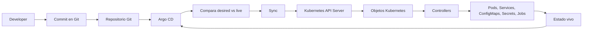
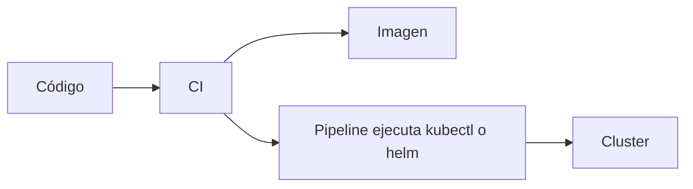
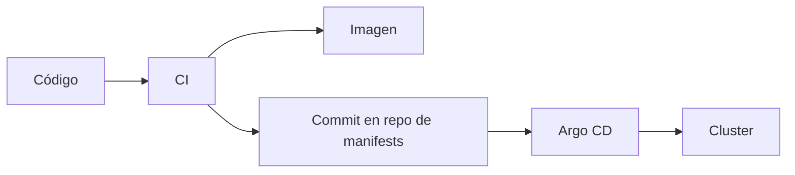
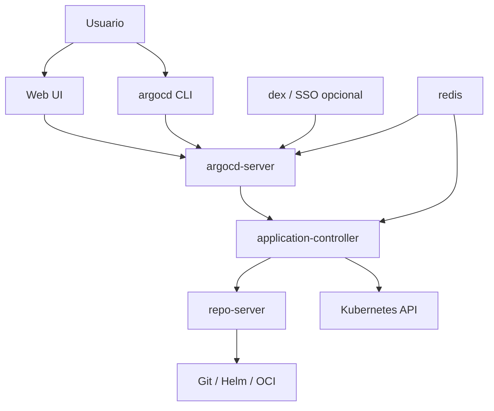

<!-- COURSE_NAV_START -->
[Anterior](<16. Proyecto final del roadmap.md>) | [Indice](README.md)
<!-- COURSE_NAV_END -->

# 17. GitOps y delivery continuo con Argo CD

## 17.1. Propósito del módulo

Hasta ahora has aprendido a construir imágenes, escribir manifests, validar YAML, desplegar workloads, exponer servicios, configurar aplicaciones, aplicar políticas, observar el sistema y diagnosticar fallos.

Eso ya permite trabajar con Kubernetes.

Pero todavía hay una pregunta importante:

> ¿Quién aplica los cambios al cluster y cómo sabemos que el cluster sigue representando lo que hay en Git?

En un flujo manual, una persona o pipeline ejecuta:

```bash
kubectl apply -f ...
helm upgrade ...
kubectl apply -k ...
```

Ese modelo funciona para aprender.

Pero en equipos reales empieza a crear problemas:

- El cluster puede cambiar sin que Git lo refleje.
- Un pipeline necesita credenciales directas contra el cluster.
- Es difícil saber si producción coincide con lo declarado.
- Los rollbacks dependen de scripts, historial de pipelines o memoria del equipo.
- La revisión de cambios se mezcla con la ejecución del despliegue.
- La experiencia de desarrollo depende de comandos que no siempre son visibles, repetibles o auditables.

Argo CD aparece para resolver ese problema desde una idea sencilla:

> Git declara el estado deseado. Argo CD observa el cluster y reconcilia la realidad contra Git.

Argo CD no sustituye Kubernetes.

Argo CD automatiza la relación entre Git y Kubernetes.

## 17.2. Qué aprenderás

Al terminar este módulo deberías poder:

- Explicar qué problema resuelve Argo CD.
- Diferenciar CI/CD clásico, GitOps y reconciliación continua.
- Instalar Argo CD en un cluster local de aprendizaje.
- Acceder a Argo CD desde CLI y UI.
- Crear una aplicación Argo CD de forma imperativa y declarativa.
- Sincronizar una aplicación manualmente.
- Configurar sincronización automática con prune y self-heal.
- Usar Argo CD con Kustomize.
- Usar Argo CD con Helm.
- Entender AppProject como mecanismo de límites y multi-tenancy.
- Entender ApplicationSet para generar múltiples Applications.
- Usar sync waves y hooks para ordenar despliegues.
- Entender diferencias, drift, pruning, orphaned resources e ignore differences.
- Aplicar un flujo GitOps al sistema `shop`.
- Automatizar tareas de Argo CD con Taskfile.
- Diagnosticar problemas habituales de Argo CD.
- Conectar Argo CD con observabilidad y DevEx.

## 17.3. Qué problema resuelve Argo CD

Kubernetes ya tiene un modelo declarativo.

Tú declaras `spec`.

Los controllers intentan que el estado real se acerque a ese estado deseado.

Pero Kubernetes no sabe, por sí mismo, cuál es el estado deseado de tu repositorio.

Kubernetes solo conoce los objetos que han llegado al API Server.

Eso deja un hueco importante:

```text
Git sabe lo que querías desplegar.
Kubernetes sabe lo que está corriendo.
Pero alguien tiene que comparar ambas cosas.
```

Ese “alguien” suele ser una persona, un script o un pipeline.

Argo CD convierte esa comparación en una responsabilidad explícita del sistema.

Argo CD funciona como un controller de Kubernetes que monitoriza aplicaciones en ejecución y compara su estado vivo con el estado deseado definido en Git. Cuando ambos estados divergen, la aplicación aparece como `OutOfSync`; Argo CD puede mostrar la diferencia y sincronizar el cluster de nuevo contra Git. :contentReference[oaicite:0]{index=0}

## 17.4. Modelo mental: Git, Argo CD y Kubernetes

La forma más sencilla de entender Argo CD es esta:

```text
Git
  contiene el estado deseado

Argo CD
  compara estado deseado y estado vivo

Kubernetes
  ejecuta y reconcilia objetos dentro del cluster
```

Diagrama:



La idea importante es que Argo CD no “despliega código” directamente.

Argo CD aplica manifests.

El código ya debería haber pasado por CI, tests, build de imagen, escaneo, publicación en registry y actualización del manifest.

## 17.5. CI/CD clásico frente a GitOps

En un pipeline clásico, el pipeline empuja cambios al cluster.



En GitOps, el pipeline actualiza Git y Argo CD reconcilia desde el cluster.



La diferencia no es estética.

La diferencia es de control operativo.

En GitOps:

- El cluster no necesita aceptar despliegues directos desde cualquier pipeline.
- Git queda como fuente de verdad.
- Los cambios pasan por revisión.
- El estado deseado es auditable.
- Argo CD puede detectar drift.
- El rollback puede volver a una versión previa de manifests.
- La UI muestra salud, sincronización, diferencias y recursos.

Argo CD soporta varias formas de definir manifests: Kustomize, Helm, Jsonnet, directorios de YAML o JSON, y config management plugins personalizados. También puede desplegar en diferentes entornos siguiendo ramas, tags o commits concretos. :contentReference[oaicite:1]{index=1}

## 17.6. Qué no resuelve Argo CD

Argo CD no arregla un mal proceso de delivery.

No compensa manifests confusos.

No sustituye tests.

No sustituye observabilidad.

No convierte automáticamente una aplicación insegura en una aplicación segura.

No evita que despliegues una mala configuración si esa configuración está en Git y Argo CD tiene permiso para aplicarla.

Argo CD mejora una parte concreta del sistema:

> Hace visible y reconciliable la distancia entre Git y el cluster.

Pero la calidad del resultado sigue dependiendo de:

- Cómo construyes imágenes.
- Cómo validas manifests.
- Cómo gestionas secretos.
- Cómo separas entornos.
- Cómo defines permisos.
- Cómo observas el sistema.
- Cómo revisas cambios.
- Cómo diseñas rollback y recuperación.
- Cómo haces que el flujo sea fácil de usar para el equipo.

## 17.7. Arquitectura de Argo CD

Argo CD tiene varios componentes.

Para este módulo no necesitas memorizar todos los detalles internos, pero sí entender las responsabilidades principales.



Responsabilidades principales:

| Componente | Responsabilidad |
|---|---|
| `argocd-server` | API, UI, autenticación e interacción con CLI |
| `argocd-application-controller` | Observa Applications, calcula estado, sincroniza y actualiza status |
| `argocd-repo-server` | Obtiene repositorios y genera manifests desde Kustomize, Helm, Jsonnet o YAML |
| `argocd-dex-server` | Integración opcional con SSO |
| `argocd-redis` | Cache y coordinación interna |

Argo CD se instala dentro de Kubernetes y expone acceso a través de su API server, UI o CLI. La instalación multi-tenant es la más común en organizaciones donde una plataforma da servicio a varios equipos de desarrollo. :contentReference[oaicite:2]{index=2}

## 17.8. Conceptos principales

Antes de instalar nada, conviene entender el vocabulario.

| Concepto | Qué significa |
|---|---|
| Application | Recurso de Argo CD que conecta una fuente Git/Helm/Kustomize con un destino Kubernetes |
| AppProject | Agrupación lógica y límite de seguridad para Applications |
| Source | Repositorio, path, chart, branch, tag o commit que contiene el estado deseado |
| Destination | Cluster y namespace donde se despliega |
| Sync | Operación que aplica el estado deseado al cluster |
| Health | Evaluación del estado operativo de los recursos |
| OutOfSync | Git y cluster no coinciden |
| Synced | Git y cluster coinciden |
| Prune | Borrar recursos que ya no existen en Git |
| Self-heal | Revertir cambios hechos manualmente en el cluster |
| ApplicationSet | Generador de múltiples Applications a partir de plantillas y generadores |

## 17.9. Preparación del entorno

Este módulo asume que ya tienes:

- Docker o Podman.
- Un cluster local, por ejemplo `kind`, `k3d`, `minikube` o Docker Desktop Kubernetes.
- `kubectl`.
- `jq`.
- `yq`.
- `task`.
- `helm`.
- Acceso a un repositorio Git para los manifests.

Comprueba herramientas:

```bash
kubectl version --client
helm version
jq --version
yq --version
task --version
```

Comprueba cluster:

```bash
kubectl get nodes
kubectl get ns
```

Crea namespace para Argo CD:

```bash
kubectl create namespace argocd
```

## 17.10. Instalación local de Argo CD

Para un entorno de aprendizaje local, instala Argo CD en el namespace `argocd`.

```bash
kubectl apply -n argocd \
  -f https://raw.githubusercontent.com/argoproj/argo-cd/stable/manifests/install.yaml
```

Espera a que los Pods estén listos:

```bash
kubectl get pods -n argocd
kubectl wait --for=condition=Available deployment/argocd-server -n argocd --timeout=180s
```

Ver recursos principales:

```bash
kubectl get deploy,sts,svc,cm,secret -n argocd
```

Para acceder localmente:

```bash
kubectl port-forward svc/argocd-server -n argocd 8080:443
```

La UI quedará accesible en el puerto local `8080`.

Para obtener la contraseña inicial del usuario `admin`:

```bash
kubectl get secret argocd-initial-admin-secret -n argocd \
  -o jsonpath="{.data.password}" | base64 -d
echo
```

Login desde CLI:

```bash
argocd login localhost:8080
```

En local, si usas certificado autofirmado, puede que necesites:

```bash
argocd login localhost:8080 --insecure
```

Cambia la contraseña inicial:

```bash
argocd account update-password
```

Criterio de salida:

```bash
argocd version
argocd app list
kubectl get pods -n argocd
```

## 17.11. Instalación con Helm

También puedes instalar Argo CD con Helm.

Este camino es útil cuando quieres tratar Argo CD como parte de la plataforma y versionar sus valores.

Añade el repositorio:

```bash
helm repo add argo https://argoproj.github.io/argo-helm
helm repo update
```

Instala:

```bash
helm upgrade --install argocd argo/argo-cd \
  --namespace argocd \
  --create-namespace
```

Verifica:

```bash
helm list -n argocd
kubectl get pods -n argocd
```

Criterio de comprensión:

> Instalar con manifests directos es simple para aprender. Instalar con Helm facilita parametrizar y versionar la instalación.

## 17.12. Estructura recomendada del repositorio `shop`

Para este curso, la estructura más coherente sería:

```text
shop-platform/
  apps/
    checkout-api/
      base/
        deployment.yaml
        service.yaml
        configmap.yaml
        kustomization.yaml
      overlays/
        local/
          kustomization.yaml
          patch-resources.yaml
        staging/
          kustomization.yaml
        production/
          kustomization.yaml

  argocd/
    projects/
      shop-project.yaml
    applications/
      checkout-api-local.yaml
      checkout-api-staging.yaml
      checkout-api-production.yaml
    applicationsets/
      shop-environments.yaml

  taskfile/
  Taskfile.yml
```

Esta estructura separa:

- Manifests de aplicación.
- Configuración propia de Argo CD.
- Entornos.
- Automatización.

La regla del módulo será:

> Argo CD debe aplicar manifests que ya podrías renderizar y validar sin Argo CD.

## 17.13. Primera Application imperativa

Crea una Application desde CLI.

Ejemplo:

```bash
argocd app create checkout-api-local \
  --repo https://github.com/tu-organizacion/shop-platform.git \
  --path apps/checkout-api/overlays/local \
  --dest-server https://kubernetes.default.svc \
  --dest-namespace shop \
  --sync-policy none
```

Comprueba:

```bash
argocd app list
argocd app get checkout-api-local
```

Sincroniza manualmente:

```bash
argocd app sync checkout-api-local
```

Comprueba en Kubernetes:

```bash
kubectl get deploy,svc,pod -n shop
```

Criterio de comprensión:

> Crear una Application no significa necesariamente sincronizarla. Primero defines la relación entre Git y destino. Después decides cuándo sincronizar.

## 17.14. Primera Application declarativa

En GitOps, lo normal es definir Applications como YAML.

Crea:

```text
argocd/applications/checkout-api-local.yaml
```

Contenido:

```yaml
apiVersion: argoproj.io/v1alpha1
kind: Application
metadata:
  name: checkout-api-local
  namespace: argocd
spec:
  project: default

  source:
    repoURL: https://github.com/tu-organizacion/shop-platform.git
    targetRevision: main
    path: apps/checkout-api/overlays/local

  destination:
    server: https://kubernetes.default.svc
    namespace: shop

  syncPolicy:
    syncOptions:
      - CreateNamespace=true
```

Aplica:

```bash
kubectl apply -f argocd/applications/checkout-api-local.yaml
```

Inspecciona:

```bash
kubectl get applications -n argocd
kubectl describe application checkout-api-local -n argocd
argocd app get checkout-api-local
```

Sincroniza:

```bash
argocd app sync checkout-api-local
```

Argo CD permite definir Applications, Projects y configuración declarativamente mediante manifests de Kubernetes, que pueden aplicarse con `kubectl apply`; las Applications y AppProjects se instalan en el namespace de Argo CD, que por defecto suele ser `argocd`. :contentReference[oaicite:3]{index=3}

## 17.15. Estados de sincronización y salud

Argo CD separa dos preguntas distintas.

Primera pregunta:

> ¿El cluster coincide con Git?

Eso es sync status.

Segunda pregunta:

> ¿La aplicación está funcionando según los recursos de Kubernetes?

Eso es health status.

Estados típicos:

| Estado | Significado |
|---|---|
| `Synced` | El estado vivo coincide con Git |
| `OutOfSync` | El estado vivo no coincide con Git |
| `Healthy` | Los recursos parecen operativos |
| `Progressing` | El sistema está avanzando hacia el estado esperado |
| `Degraded` | Algún recurso está en mal estado |
| `Missing` | Un recurso esperado no existe |
| `Unknown` | Argo CD no puede determinar el estado |

Comandos:

```bash
argocd app get checkout-api-local
argocd app diff checkout-api-local
argocd app history checkout-api-local
```

Desde Kubernetes:

```bash
kubectl get application checkout-api-local -n argocd -o yaml
```

Con `jq`:

```bash
kubectl get application checkout-api-local -n argocd -o json \
  | jq '.status | {sync: .sync.status, health: .health.status}'
```

Criterio de comprensión:

> `Synced` no significa necesariamente `Healthy`. Una aplicación puede estar sincronizada con Git y seguir rota si Git declara una mala configuración.

## 17.16. Sincronización manual

La sincronización manual es el modo más seguro para empezar.

Flujo:

```text
Git cambia
Argo CD detecta OutOfSync
Una persona revisa diff
Una persona sincroniza
Argo CD aplica cambios
```

Comandos:

```bash
argocd app diff checkout-api-local
argocd app sync checkout-api-local
argocd app wait checkout-api-local --health --timeout 120
```

Ver recursos:

```bash
argocd app resources checkout-api-local
```

Ver manifests renderizados:

```bash
argocd app manifests checkout-api-local
```

Criterio de comprensión:

> La sincronización manual mantiene control humano explícito. Es buena para aprendizaje, entornos críticos o cambios con alto riesgo.

## 17.17. Sincronización automática

La sincronización automática permite que Argo CD aplique cambios cuando detecta diferencias entre Git y el cluster.

Ejemplo declarativo:

```yaml
apiVersion: argoproj.io/v1alpha1
kind: Application
metadata:
  name: checkout-api-local
  namespace: argocd
spec:
  project: default

  source:
    repoURL: https://github.com/tu-organizacion/shop-platform.git
    targetRevision: main
    path: apps/checkout-api/overlays/local

  destination:
    server: https://kubernetes.default.svc
    namespace: shop

  syncPolicy:
    automated:
      prune: true
      selfHeal: true
      allowEmpty: false
    syncOptions:
      - CreateNamespace=true
```

Significado:

| Campo | Qué hace |
|---|---|
| `automated` | Activa sincronización automática |
| `prune: true` | Borra recursos que ya no están en Git |
| `selfHeal: true` | Revierte cambios manuales hechos en el cluster |
| `allowEmpty: false` | Evita borrar todo por accidente si la app renderiza vacío |
| `CreateNamespace=true` | Crea el namespace destino si no existe |

Argo CD puede sincronizar automáticamente una Application cuando detecta diferencias entre manifests deseados y estado vivo. Una ventaja operativa es que el pipeline de CI no necesita acceso directo al API server de Argo CD ni al cluster para desplegar; puede limitarse a hacer commit y push en el repositorio de manifests. :contentReference[oaicite:4]{index=4}

Criterio de comprensión:

> Auto-sync reduce fricción, pero aumenta la importancia de revisar bien lo que entra en Git.

## 17.18. Prune y self-heal

Prune y self-heal son dos conceptos diferentes.

### Prune

Prune borra del cluster recursos que Argo CD gestiona y que ya no existen en Git.

Ejemplo:

```text
Git elimina service.yaml
Argo CD detecta que el Service existe en el cluster pero no en Git
Con prune activado, Argo CD puede borrar el Service
```

### Self-heal

Self-heal corrige cambios hechos manualmente en el cluster.

Ejemplo:

```bash
kubectl scale deploy checkout-api -n shop --replicas=10
```

Si Git dice que hay 3 réplicas y self-heal está activado, Argo CD volverá a 3.

Criterio de comprensión:

> Prune corrige recursos sobrantes. Self-heal corrige drift manual.

## 17.19. Sync options importantes

Argo CD permite modificar el comportamiento de sincronización con sync options.

Ejemplo:

```yaml
syncPolicy:
  automated:
    prune: true
    selfHeal: true
  syncOptions:
    - CreateNamespace=true
    - PruneLast=true
    - RespectIgnoreDifferences=true
```

Opciones útiles:

| Opción | Uso |
|---|---|
| `CreateNamespace=true` | Crea el namespace destino |
| `PruneLast=true` | Ejecuta pruning al final |
| `RespectIgnoreDifferences=true` | Respeta campos ignorados también durante sync |
| `ServerSideApply=true` | Usa server-side apply |
| `Validate=false` | Desactiva validación, úsalo con cuidado |
| `PrunePropagationPolicy=foreground` | Controla política de borrado |

Argo CD documenta sync options como mecanismo para modificar el comportamiento de sincronización, incluyendo validación, creación de namespace, prune propagation, prune last y respeto de ignore differences. :contentReference[oaicite:5]{index=5}

Criterio de comprensión:

> Las sync options no son decoración. Cambian cómo Argo CD aplica, borra y compara recursos.

## 17.20. Argo CD con Kustomize

Argo CD detecta Kustomize cuando en el path configurado existe un `kustomization.yaml`.

Ejemplo de Application:

```yaml
apiVersion: argoproj.io/v1alpha1
kind: Application
metadata:
  name: checkout-api-local
  namespace: argocd
spec:
  project: default

  source:
    repoURL: https://github.com/tu-organizacion/shop-platform.git
    targetRevision: main
    path: apps/checkout-api/overlays/local

  destination:
    server: https://kubernetes.default.svc
    namespace: shop

  syncPolicy:
    automated:
      prune: true
      selfHeal: true
    syncOptions:
      - CreateNamespace=true
```

Render local antes de confiar en Argo CD:

```bash
kubectl kustomize apps/checkout-api/overlays/local
```

Validar contra el cluster:

```bash
kubectl apply --dry-run=server -k apps/checkout-api/overlays/local
```

Argo CD renderiza manifests con Kustomize cuando el path de la Application contiene un `kustomization.yaml`. También permite configurar opciones como `images`, `replicas`, labels comunes, annotations comunes, namespace y otras opciones específicas de Kustomize desde la Application. :contentReference[oaicite:6]{index=6}

Criterio de comprensión:

> Si Kustomize falla fuera de Argo CD, también fallará dentro de Argo CD. Primero renderiza local, después sincroniza.

## 17.21. Argo CD con Helm

Argo CD puede desplegar charts Helm.

Ejemplo con chart remoto:

```yaml
apiVersion: argoproj.io/v1alpha1
kind: Application
metadata:
  name: nginx-helm
  namespace: argocd
spec:
  project: default

  source:
    repoURL: https://charts.bitnami.com/bitnami
    chart: nginx
    targetRevision: 18.2.5
    helm:
      releaseName: nginx-helm
      values: |
        service:
          type: ClusterIP

  destination:
    server: https://kubernetes.default.svc
    namespace: shop

  syncPolicy:
    syncOptions:
      - CreateNamespace=true
```

Ejemplo con chart dentro de Git:

```yaml
apiVersion: argoproj.io/v1alpha1
kind: Application
metadata:
  name: checkout-api-chart
  namespace: argocd
spec:
  project: default

  source:
    repoURL: https://github.com/tu-organizacion/shop-platform.git
    targetRevision: main
    path: charts/checkout-api
    helm:
      valueFiles:
        - values-local.yaml

  destination:
    server: https://kubernetes.default.svc
    namespace: shop
```

Validar fuera de Argo CD:

```bash
helm template checkout-api charts/checkout-api -f charts/checkout-api/values-local.yaml
```

Advertencia importante:

Argo CD usa labels para tracking de recursos. La documentación advierte que sobrescribir el Helm release name puede causar problemas cuando el chart usa el label `app.kubernetes.io/instance`, porque Argo CD lo inyecta con el nombre de la Application para tracking. :contentReference[oaicite:7]{index=7}

Criterio de comprensión:

> En Argo CD, Helm se usa principalmente para renderizar manifests. Argo CD sigue siendo quien compara, sincroniza y observa la Application.

## 17.22. Directory applications

También puedes apuntar una Application a un directorio de YAML plano.

Ejemplo:

```yaml
apiVersion: argoproj.io/v1alpha1
kind: Application
metadata:
  name: raw-yaml-app
  namespace: argocd
spec:
  project: default

  source:
    repoURL: https://github.com/tu-organizacion/shop-platform.git
    targetRevision: main
    path: raw/checkout-api
    directory:
      recurse: true
      include: "*.yaml"

  destination:
    server: https://kubernetes.default.svc
    namespace: shop
```

Argo CD indica que las directory applications funcionan con manifests planos. Si se fuerza `directory` y Argo CD encuentra ficheros Kustomize, Helm o Jsonnet, fallará el renderizado. :contentReference[oaicite:8]{index=8}

Criterio de comprensión:

> Usa directory cuando tengas YAML plano. Usa Kustomize o Helm cuando el repositorio realmente use Kustomize o Helm.

## 17.23. AppProject

AppProject es una de las piezas más importantes para una plataforma compartida.

Una Application siempre pertenece a un Project.

El proyecto `default` existe automáticamente, pero es demasiado permisivo para equipos reales.

Projects agrupan Applications y pueden restringir qué repositorios se pueden usar, a qué clusters y namespaces se puede desplegar, qué tipos de objetos se pueden crear y qué roles existen dentro del proyecto. :contentReference[oaicite:9]{index=9}

Ejemplo:

```yaml
apiVersion: argoproj.io/v1alpha1
kind: AppProject
metadata:
  name: shop
  namespace: argocd
spec:
  description: Proyecto para aplicaciones del sistema shop

  sourceRepos:
    - https://github.com/tu-organizacion/shop-platform.git

  destinations:
    - server: https://kubernetes.default.svc
      namespace: shop
    - server: https://kubernetes.default.svc
      namespace: shop-staging

  clusterResourceWhitelist:
    - group: ""
      kind: Namespace

  namespaceResourceWhitelist:
    - group: ""
      kind: ConfigMap
    - group: ""
      kind: Secret
    - group: ""
      kind: Service
    - group: apps
      kind: Deployment
    - group: networking.k8s.io
      kind: Ingress
    - group: networking.k8s.io
      kind: NetworkPolicy
```

Application usando el proyecto:

```yaml
apiVersion: argoproj.io/v1alpha1
kind: Application
metadata:
  name: checkout-api-local
  namespace: argocd
spec:
  project: shop

  source:
    repoURL: https://github.com/tu-organizacion/shop-platform.git
    targetRevision: main
    path: apps/checkout-api/overlays/local

  destination:
    server: https://kubernetes.default.svc
    namespace: shop
```

Criterio de comprensión:

> AppProject no es una carpeta. Es una frontera operativa y de seguridad.

## 17.24. RBAC en Argo CD

Kubernetes RBAC y Argo CD RBAC no son lo mismo.

Kubernetes RBAC controla qué puede hacer una identidad contra la API de Kubernetes.

Argo CD RBAC controla qué puede hacer una persona o integración dentro de Argo CD.

Argo CD no tiene gestión propia completa de usuarios. Tiene un usuario integrado `admin`, y RBAC suele apoyarse en SSO o usuarios locales. Argo CD incluye roles built-in como `role:readonly` y `role:admin`, y permite configurar permisos globales o roles dentro de AppProjects. :contentReference[oaicite:10]{index=10}

Ejemplo conceptual de política:

```csv
p, role:shop-reader, applications, get, shop/*, allow
p, role:shop-syncer, applications, sync, shop/*, allow
g, team-shop, role:shop-syncer
```

Criterio de comprensión:

> Una persona puede tener permiso para sincronizar una Application en Argo CD sin tener permiso directo de `kubectl apply` contra el cluster.

## 17.25. Repositorios privados y credenciales

Para usar repositorios privados, Argo CD necesita credenciales.

Hay dos enfoques principales:

1. Añadir credenciales desde CLI.
2. Declararlas como Secrets en el namespace `argocd`.

Ejemplo CLI HTTPS:

```bash
argocd repo add https://github.com/tu-organizacion/shop-platform.git \
  --username <user> \
  --password <token>
```

Ejemplo declarativo:

```yaml
apiVersion: v1
kind: Secret
metadata:
  name: shop-platform-repo
  namespace: argocd
  labels:
    argocd.argoproj.io/secret-type: repository
stringData:
  type: git
  url: https://github.com/tu-organizacion/shop-platform.git
  username: <user>
  password: <token>
```

Reglas:

- No guardes tokens reales en Git sin cifrado.
- Usa SOPS, Sealed Secrets, External Secrets o un mecanismo equivalente si quieres declarar credenciales.
- Da permisos mínimos al token.
- Evita tokens personales de larga vida para plataformas compartidas.
- Documenta quién rota credenciales y cuándo.

Criterio de comprensión:

> GitOps no significa meter todos los secretos en Git en texto plano. Significa declarar estado de forma auditable y segura.

## 17.26. Sync waves

A veces necesitas controlar el orden de aplicación.

Ejemplo:

```text
Namespace
ConfigMap / Secret
Deployment
Service
Ingress
Job post-deploy
```

Argo CD permite usar sync waves con la anotación:

```yaml
metadata:
  annotations:
    argocd.argoproj.io/sync-wave: "1"
```

Ejemplo:

```yaml
apiVersion: v1
kind: ConfigMap
metadata:
  name: checkout-api-config
  namespace: shop
  annotations:
    argocd.argoproj.io/sync-wave: "0"
data:
  LOG_LEVEL: info
```

Deployment:

```yaml
apiVersion: apps/v1
kind: Deployment
metadata:
  name: checkout-api
  namespace: shop
  annotations:
    argocd.argoproj.io/sync-wave: "1"
spec:
  replicas: 3
```

Ingress:

```yaml
apiVersion: networking.k8s.io/v1
kind: Ingress
metadata:
  name: checkout-api
  namespace: shop
  annotations:
    argocd.argoproj.io/sync-wave: "2"
spec: {}
```

Criterio de comprensión:

> Sync waves ordenan aplicación de recursos. No deberían usarse para esconder dependencias mal diseñadas.

## 17.27. Resource hooks

Los hooks permiten ejecutar recursos en fases concretas del sync.

Fases habituales:

| Hook | Cuándo se ejecuta |
|---|---|
| `PreSync` | Antes de aplicar recursos normales |
| `Sync` | Durante la sincronización |
| `PostSync` | Después de sincronizar |
| `SyncFail` | Cuando falla la sincronización |
| `PostDelete` | Después de borrar la Application |

Ejemplo de smoke test post-sync:

```yaml
apiVersion: batch/v1
kind: Job
metadata:
  name: checkout-api-smoke-test
  namespace: shop
  annotations:
    argocd.argoproj.io/hook: PostSync
    argocd.argoproj.io/hook-delete-policy: HookSucceeded
spec:
  template:
    spec:
      restartPolicy: Never
      containers:
        - name: smoke
          image: curlimages/curl:8.8.0
          command:
            - sh
            - -c
            - |
              curl -f http://checkout-api.shop.svc.cluster.local/health
```

Durante una operación de sync, Argo CD aplica primero hooks `PreSync`, después hooks `Sync`, y después hooks `PostSync`. Si falla un hook de esas fases, la operación se marca como fallida; `SyncFail` puede ejecutarse para limpieza u otras tareas. :contentReference[oaicite:11]{index=11}

Criterio de comprensión:

> Los hooks sirven para validar o preparar despliegues. No deberían convertirse en un pipeline oculto dentro de Kubernetes.

## 17.28. Diff y drift

Argo CD calcula diferencias entre el estado deseado y el estado vivo para decidir si una Application está `OutOfSync`. Esa misma lógica se usa en la UI para mostrar diferencias por recurso. :contentReference[oaicite:12]{index=12}

Comandos:

```bash
argocd app diff checkout-api-local
argocd app get checkout-api-local
```

Provoca drift manual:

```bash
kubectl scale deployment checkout-api -n shop --replicas=10
```

Observa:

```bash
argocd app get checkout-api-local
argocd app diff checkout-api-local
```

Si `selfHeal` está activado, Argo CD debería devolver el Deployment al número de réplicas declarado en Git.

Criterio de comprensión:

> Drift es cualquier diferencia entre lo declarado y lo vivo. Puede venir de cambios manuales, controllers, defaults del API Server o mutating webhooks.

## 17.29. Ignore differences

A veces hay diferencias legítimas que no quieres que Argo CD trate como drift.

Ejemplos:

- Campos modificados por controllers.
- Réplicas gestionadas por HPA.
- Mutaciones hechas por admission controllers.
- Campos con defaults del API Server.

Ejemplo para ignorar réplicas en Deployments:

```yaml
apiVersion: argoproj.io/v1alpha1
kind: Application
metadata:
  name: checkout-api-local
  namespace: argocd
spec:
  project: shop

  source:
    repoURL: https://github.com/tu-organizacion/shop-platform.git
    targetRevision: main
    path: apps/checkout-api/overlays/local

  destination:
    server: https://kubernetes.default.svc
    namespace: shop

  ignoreDifferences:
    - group: apps
      kind: Deployment
      jsonPointers:
        - /spec/replicas
```

Argo CD permite ignorar diferencias a nivel de Application usando JSON pointers, JQ path expressions y campos gestionados por managers concretos en `metadata.managedFields`. :contentReference[oaicite:13]{index=13}

Advertencia:

> Ignorar diferencias puede ser correcto. Ignorar diferencias sin entenderlas puede ocultar drift real.

## 17.30. Orphaned resources

Un recurso huérfano es un recurso que existe en el namespace, pero que no pertenece a ninguna Application esperada.

Ejemplos:

- Alguien creó un Service manualmente.
- Un recurso quedó después de migrar manifests.
- Un hook creó algo y no lo limpió.
- Un chart cambió nombres de recursos.

La pregunta operativa es:

```text
¿Este recurso debe existir?
¿Quién lo gestiona?
¿Está declarado en Git?
¿Lo puede borrar Argo CD?
```

Comandos útiles:

```bash
kubectl get all -n shop
argocd app resources checkout-api-local
```

Criterio de comprensión:

> GitOps no solo va de crear recursos. También va de saber qué recursos ya no deberían existir.

## 17.31. Application deletion

Borrar una Application puede significar dos cosas distintas.

Primera opción:

> Borrar solo la Application de Argo CD, conservando los recursos Kubernetes.

Segunda opción:

> Borrar la Application y también los recursos que gestionaba.

Argo CD permite borrado con cascada o sin cascada. Con cascade delete se borra la Application y sus recursos; sin cascade delete se borra solo la Application. :contentReference[oaicite:14]{index=14}

Comandos:

```bash
argocd app delete checkout-api-local --cascade=false
```

```bash
argocd app delete checkout-api-local --cascade
```

Criterio de comprensión:

> Antes de borrar una Application, debes saber si quieres desregistrar gestión o destruir recursos.

## 17.32. ApplicationSet

Una Application representa una aplicación en un destino.

Pero en plataformas reales suele aparecer este patrón:

```text
misma app
varios entornos
varios clusters
varios equipos
varias regiones
```

Crear cada Application a mano escala mal.

ApplicationSet permite generar Applications desde plantillas y generadores. El controller de ApplicationSet ofrece herramientas para automatizar la creación y modificación de Applications a partir de fuentes como clusters de Argo CD o repositorios Git. :contentReference[oaicite:15]{index=15}

Ejemplo con list generator:

```yaml
apiVersion: argoproj.io/v1alpha1
kind: ApplicationSet
metadata:
  name: checkout-api-environments
  namespace: argocd
spec:
  generators:
    - list:
        elements:
          - environment: local
            namespace: shop
            revision: main
          - environment: staging
            namespace: shop-staging
            revision: main

  template:
    metadata:
      name: 'checkout-api-{{environment}}'
    spec:
      project: shop
      source:
        repoURL: https://github.com/tu-organizacion/shop-platform.git
        targetRevision: '{{revision}}'
        path: 'apps/checkout-api/overlays/{{environment}}'
      destination:
        server: https://kubernetes.default.svc
        namespace: '{{namespace}}'
      syncPolicy:
        syncOptions:
          - CreateNamespace=true
```

El List generator genera parámetros desde una lista arbitraria de pares clave-valor, siempre que los valores sean strings. :contentReference[oaicite:16]{index=16}

Criterio de comprensión:

> ApplicationSet no despliega directamente workloads. Genera Applications que luego Argo CD reconcilia.

## 17.33. Generadores de ApplicationSet

Generadores habituales:

| Generador | Uso |
|---|---|
| List | Lista explícita de entornos, clusters o apps |
| Cluster | Generar apps por cluster registrado |
| Git | Generar apps desde directorios o ficheros en Git |
| Matrix | Combinar dos generadores |
| Merge | Mezclar parámetros con overrides |
| Pull Request | Crear apps temporales por PR |
| SCM Provider | Descubrir repositorios desde proveedor SCM |

El Cluster generator identifica clusters definidos en Argo CD y extrae sus datos como parámetros. :contentReference[oaicite:17]{index=17}

El Matrix generator combina los parámetros de dos generadores, produciendo combinaciones entre ambos. :contentReference[oaicite:18]{index=18}

El Merge generator combina parámetros de un generador base con overrides de otros generadores usando claves de merge. :contentReference[oaicite:19]{index=19}

Advertencia de seguridad:

La documentación de Git generator advierte que, si el campo `project` está templado, developers podrían crear Applications bajo Projects con permisos excesivos; en esos casos, la fuente de verdad debe estar controlada por admins y los PRs deberían requerir aprobación admin. :contentReference[oaicite:20]{index=20}

Criterio de comprensión:

> ApplicationSet reduce repetición, pero aumenta la importancia de controlar bien plantillas, permisos y fuentes de parámetros.

## 17.34. App of Apps

App of Apps es un patrón donde una Application raíz despliega otras Applications.

Ejemplo:

```text
root-app
  argocd/projects/shop-project.yaml
  argocd/applications/checkout-api.yaml
  argocd/applications/payment-api.yaml
  argocd/applications/frontend.yaml
```

Application raíz:

```yaml
apiVersion: argoproj.io/v1alpha1
kind: Application
metadata:
  name: shop-root
  namespace: argocd
spec:
  project: default

  source:
    repoURL: https://github.com/tu-organizacion/shop-platform.git
    targetRevision: main
    path: argocd

  destination:
    server: https://kubernetes.default.svc
    namespace: argocd

  syncPolicy:
    automated:
      prune: true
      selfHeal: true
```

Uso recomendado en el curso:

- Una root app para bootstrap local.
- Applications separadas para cada servicio.
- AppProject para limitar permisos.
- Sync manual al principio.
- Auto-sync cuando el equipo entienda el flujo.

Criterio de comprensión:

> App of Apps ayuda a bootstrappear Argo CD con Argo CD, pero puede ocultar dependencias si no está bien estructurado.

## 17.35. Argo CD y secretos

GitOps no elimina el problema de los secretos.

Lo hace más visible.

No metas secretos reales en YAML plano.

Opciones habituales:

| Opción | Idea |
|---|---|
| External Secrets Operator | Kubernetes obtiene secretos desde un gestor externo |
| Sealed Secrets | Secret cifrado que solo el cluster puede descifrar |
| SOPS | Cifrado de ficheros en Git con KMS, PGP o Age |
| Vault | Secret management externo |
| Secret manual | Solo para laboratorios locales controlados |

Ejemplo didáctico para local:

```yaml
apiVersion: v1
kind: Secret
metadata:
  name: checkout-api-secret
  namespace: shop
type: Opaque
stringData:
  API_TOKEN: demo
```

Advertencia:

> Este ejemplo sirve para aprender integración. No debe usarse con secretos reales en repositorios compartidos.

Criterio de comprensión:

> GitOps necesita una estrategia de secretos. Sin ella, Git se convierte en un riesgo.

## 17.36. Argo CD y observabilidad

Argo CD añade nuevas preguntas operativas:

- ¿Qué Applications están `OutOfSync`?
- ¿Qué Applications están `Degraded`?
- ¿Cuándo ocurrió el último sync?
- ¿Qué recurso impide que una app esté Healthy?
- ¿Qué equipo hizo el cambio en Git?
- ¿Qué diff está pendiente?
- ¿Qué sync falló?
- ¿Qué hook falló?
- ¿Qué ApplicationSet generó esta Application?

Comandos:

```bash
argocd app list
argocd app get checkout-api-local
argocd app history checkout-api-local
argocd app resources checkout-api-local
```

Desde Kubernetes:

```bash
kubectl get applications -n argocd
kubectl get applications -n argocd -o json \
  | jq '.items[] | {name: .metadata.name, sync: .status.sync.status, health: .status.health.status}'
```

Argo CD Notifications monitoriza Applications y permite notificar cambios importantes de estado mediante triggers y templates. :contentReference[oaicite:21]{index=21}

Ejemplo de suscripción por anotación:

```yaml
metadata:
  annotations:
    notifications.argoproj.io/subscribe.on-sync-failed.slack: platform-alerts
```

Las suscripciones pueden definirse con anotaciones `notifications.argoproj.io/subscribe.<trigger>.<service>: <recipient>` en Applications o AppProjects. :contentReference[oaicite:22]{index=22}

Criterio de comprensión:

> Argo CD no sustituye LGTM. Argo CD añade señales de delivery que deben conectarse con la observabilidad del sistema.

## 17.37. Argo CD y DevEx

Argo CD mejora la experiencia de desarrollo cuando reduce pasos manuales sin esconder el modelo.

Buen flujo DevEx:

```text
developer cambia código
CI ejecuta tests
CI construye imagen
CI publica imagen
CI actualiza manifest o values
PR revisa cambio declarativo
merge actualiza Git
Argo CD detecta cambio
Argo CD muestra diff
Argo CD sincroniza
equipo observa salud
```

Mal flujo DevEx:

```text
developer no sabe qué se desplegó
pipeline toca cluster directamente
Argo CD pelea contra cambios manuales
los manifests no se pueden renderizar localmente
los secretos están mezclados con configuración
nadie sabe si OutOfSync es normal o peligroso
```

Reglas:

- Todo manifest debe poder renderizarse fuera de Argo CD.
- Todo cambio debe poder revisarse en Git.
- Todo sync fallido debe dejar señales claras.
- Todo entorno debe tener una ruta de rollback.
- Las Applications deben tener nombres previsibles.
- Los Projects deben limitar blast radius.
- Los hooks deben ser idempotentes.
- Las sync waves deben ser pocas y justificadas.
- Taskfile debe simplificar, no esconder.

## 17.38. Taskfile para Argo CD

Añade al `Taskfile.yml`:

```yaml
version: '3'

tasks:
  argocd:install:
    desc: Instala Argo CD en el cluster local
    cmds:
      - kubectl create namespace argocd --dry-run=client -o yaml | kubectl apply -f -
      - kubectl apply -n argocd -f https://raw.githubusercontent.com/argoproj/argo-cd/stable/manifests/install.yaml
      - kubectl wait --for=condition=Available deployment/argocd-server -n argocd --timeout=180s

  argocd:status:
    desc: Muestra el estado de Argo CD
    cmds:
      - kubectl get pods -n argocd
      - kubectl get svc -n argocd
      - kubectl get applications -n argocd || true

  argocd:password:
    desc: Muestra la contraseña inicial del usuario admin
    cmds:
      - kubectl get secret argocd-initial-admin-secret -n argocd -o jsonpath="{.data.password}" | base64 -d
      - echo

  argocd:port-forward:
    desc: Expone Argo CD localmente en https://localhost:8080
    cmds:
      - kubectl port-forward svc/argocd-server -n argocd 8080:443

  argocd:apply:
    desc: Aplica configuración declarativa de Argo CD
    cmds:
      - kubectl apply -f argocd/projects/
      - kubectl apply -f argocd/applications/

  argocd:apps:
    desc: Lista Applications con sync y health
    cmds:
      - kubectl get applications -n argocd -o json | jq '.items[] | {name: .metadata.name, sync: .status.sync.status, health: .status.health.status}'

  argocd:diff:
    desc: Muestra diff de una Application
    vars:
      APP: '{{.APP | default "checkout-api-local"}}'
    cmds:
      - argocd app diff {{.APP}}

  argocd:sync:
    desc: Sincroniza una Application
    vars:
      APP: '{{.APP | default "checkout-api-local"}}'
    cmds:
      - argocd app sync {{.APP}}
      - argocd app wait {{.APP}} --health --timeout 120

  argocd:resources:
    desc: Muestra recursos gestionados por una Application
    vars:
      APP: '{{.APP | default "checkout-api-local"}}'
    cmds:
      - argocd app resources {{.APP}}

  argocd:delete:
    desc: Borra una Application sin borrar recursos
    vars:
      APP: '{{.APP | default "checkout-api-local"}}'
    cmds:
      - argocd app delete {{.APP}} --cascade=false
```

Uso:

```bash
task argocd:install
task argocd:status
task argocd:password
task argocd:port-forward
task argocd:apply
task argocd:apps
task argocd:sync APP=checkout-api-local
```

Criterio de comprensión:

> Taskfile no reemplaza Argo CD. Taskfile hace repetibles las operaciones de aprendizaje y diagnóstico.

## 17.39. jq y yq con Argo CD

Inspeccionar estado de Applications:

```bash
kubectl get applications -n argocd -o json \
  | jq '.items[] | {
      name: .metadata.name,
      project: .spec.project,
      sync: .status.sync.status,
      health: .status.health.status
    }'
```

Ver source y destination:

```bash
kubectl get application checkout-api-local -n argocd -o json \
  | jq '.spec | {source, destination}'
```

Ver sync policy:

```bash
kubectl get application checkout-api-local -n argocd -o yaml \
  | yq '.spec.syncPolicy'
```

Ver recursos gestionados:

```bash
kubectl get application checkout-api-local -n argocd -o json \
  | jq '.status.resources[] | {kind, name, namespace, status, health}'
```

Criterio de comprensión:

> Argo CD también es Kubernetes. Sus Applications tienen `spec` y `status`, y puedes inspeccionarlas con las mismas herramientas.

## 17.40. Flujo completo para `checkout-api`

### Paso 1. Render local

```bash
kubectl kustomize apps/checkout-api/overlays/local
```

### Paso 2. Validación server-side

```bash
kubectl apply --dry-run=server -k apps/checkout-api/overlays/local
```

### Paso 3. AppProject

```bash
kubectl apply -f argocd/projects/shop-project.yaml
```

### Paso 4. Application

```bash
kubectl apply -f argocd/applications/checkout-api-local.yaml
```

### Paso 5. Diff

```bash
argocd app diff checkout-api-local
```

### Paso 6. Sync

```bash
argocd app sync checkout-api-local
argocd app wait checkout-api-local --health --timeout 120
```

### Paso 7. Validación Kubernetes

```bash
kubectl get deploy,svc,pod -n shop
kubectl rollout status deploy/checkout-api -n shop
kubectl get endpointslice -n shop
```

### Paso 8. Validación Argo CD

```bash
argocd app get checkout-api-local
argocd app resources checkout-api-local
```

Criterio de salida:

> El estado de Argo CD debe estar `Synced` y `Healthy`, y Kubernetes debe mostrar Pods `Ready`.

## 17.41. Failure lab 1: cambio manual en el cluster

Objetivo:

> Entender drift y self-heal.

Escala manualmente:

```bash
kubectl scale deployment checkout-api -n shop --replicas=10
```

Observa:

```bash
argocd app get checkout-api-local
argocd app diff checkout-api-local
```

Si self-heal está activado, espera:

```bash
watch kubectl get deploy checkout-api -n shop
```

Preguntas:

- ¿Argo CD detectó OutOfSync?
- ¿Volvió al valor declarado en Git?
- ¿Qué muestra el diff?
- ¿Qué pasaría si self-heal estuviera desactivado?

Criterio de comprensión:

> Un cambio manual puede parecer útil en emergencia, pero rompe la fuente de verdad si no vuelve a Git.

## 17.42. Failure lab 2: manifest inválido

Objetivo:

> Entender errores de renderizado y sync.

Rompe un YAML en el overlay.

Por ejemplo, cambia mal la indentación o usa un campo inexistente.

Comprueba local:

```bash
kubectl kustomize apps/checkout-api/overlays/local
kubectl apply --dry-run=server -k apps/checkout-api/overlays/local
```

Comprueba Argo CD:

```bash
argocd app get checkout-api-local
argocd app sync checkout-api-local
```

Preguntas:

- ¿Falló antes Kustomize o el API Server?
- ¿Qué error muestra Argo CD?
- ¿El error era visible antes de hacer commit?
- ¿Qué tarea de Taskfile debería haberlo detectado?

Criterio de comprensión:

> Argo CD no debe ser la primera línea de validación. El repositorio debe tener quality gates antes.

## 17.43. Failure lab 3: recurso eliminado de Git

Objetivo:

> Entender prune.

Elimina `service.yaml` de Kustomize.

Renderiza:

```bash
kubectl kustomize apps/checkout-api/overlays/local
```

Comprueba diff:

```bash
argocd app diff checkout-api-local
```

Si prune está activado, sincroniza:

```bash
argocd app sync checkout-api-local
```

Observa:

```bash
kubectl get svc -n shop
argocd app resources checkout-api-local
```

Preguntas:

- ¿Argo CD borró el Service?
- ¿La aplicación quedó Healthy?
- ¿Qué impacto tendría esto en Ingress?
- ¿Cuándo conviene usar `Prune=confirm`?

Argo CD permite configurar pruning con confirmación para recursos críticos, usando la sync option `Prune=confirm`. :contentReference[oaicite:23]{index=23}

Criterio de comprensión:

> Prune es potente porque elimina basura. También es peligroso si no revisas qué desaparece de Git.

## 17.44. Troubleshooting de Argo CD

### Application no aparece

Comprobar:

```bash
kubectl get applications -n argocd
kubectl get crd | grep applications
kubectl describe application <app> -n argocd
```

Posibles causas:

- El manifest se aplicó en otro namespace.
- La CRD no existe.
- El YAML es inválido.
- El `metadata.name` no es el esperado.

### Application está OutOfSync

Comprobar:

```bash
argocd app get <app>
argocd app diff <app>
```

Posibles causas:

- Cambios manuales en el cluster.
- Git cambió y no se ha sincronizado.
- Mutating webhook cambia campos.
- HPA cambia réplicas.
- Defaults del API Server modifican el objeto.

### Application está Degraded

Comprobar:

```bash
argocd app resources <app>
kubectl get pods -n <namespace>
kubectl describe pod <pod> -n <namespace>
kubectl get events -n <namespace> --sort-by=.lastTimestamp
```

Posibles causas:

- Deployment no disponible.
- Pods no están Ready.
- ImagePullBackOff.
- CrashLoopBackOff.
- Service sin endpoints.
- Job hook fallido.

### Sync falla

Comprobar:

```bash
argocd app get <app>
argocd app sync <app>
kubectl get events -n <namespace> --sort-by=.lastTimestamp
```

Posibles causas:

- Permisos insuficientes.
- Project bloquea repo, destino o kind.
- Namespace inexistente sin `CreateNamespace=true`.
- CRD no instalada.
- Hook fallido.
- Manifest inválido.
- Recurso inmutable.

### Repo no conecta

Comprobar:

```bash
argocd repo list
argocd repo get <repo-url>
```

Posibles causas:

- Token inválido.
- SSH key incorrecta.
- Certificado no confiable.
- Repositorio privado sin credenciales.
- URL mal escrita.

### Kustomize falla

Comprobar:

```bash
kubectl kustomize <path>
argocd app manifests <app>
```

Posibles causas:

- Path incorrecto.
- `kustomization.yaml` roto.
- Recurso duplicado.
- Patch no coincide.
- Imagen o namespace mal configurado.

### Helm falla

Comprobar:

```bash
helm template <release> <chart> -f values.yaml
argocd app manifests <app>
```

Posibles causas:

- Chart no existe.
- Version incorrecta.
- Values inválidos.
- Repo Helm no accesible.
- CRDs requeridas no instaladas.

## 17.45. Buenas prácticas

### Mantén Git como fuente de verdad

No corrijas producción con `kubectl edit` y te olvides.

Si tienes que hacer un cambio manual por emergencia, después llévalo a Git o Argo CD lo revertirá, o peor, quedará drift sin explicar.

### Renderiza antes de sincronizar

Antes de confiar en Argo CD:

```bash
kubectl kustomize ...
helm template ...
kubectl apply --dry-run=server ...
```

### Usa Projects desde el principio

No dejes todo en `default`.

Un Project debe limitar:

- Repositorios permitidos.
- Namespaces permitidos.
- Clusters permitidos.
- Kinds permitidos.
- Roles permitidos.

### Empieza con sync manual

Para aprender, usa sync manual.

Después activa auto-sync por entorno.

Una progresión razonable:

```text
local: auto-sync + prune + self-heal
staging: auto-sync + prune + self-heal
production: manual sync o auto-sync con controles adicionales
```

### No abuses de hooks

Usa hooks para validaciones necesarias.

No metas todo el pipeline dentro de Argo CD.

### Controla pruning

Activa prune cuando el equipo entienda las consecuencias.

Usa confirmación para recursos críticos.

### No ignores diferencias sin entenderlas

`ignoreDifferences` debe tener explicación.

Si ignoras todo lo incómodo, Argo CD deja de ser una herramienta de control.

### Versiona Applications y Projects

No crees Applications solo desde UI.

La UI es buena para observar.

Git debe ser la fuente de verdad.

### Conecta Argo CD con observabilidad

Una app `Degraded` debe tener camino de diagnóstico:

```text
Argo CD Application
Kubernetes resource
Pod logs
Events
Metrics
Traces
Runbook
```

## 17.46. Antipatrones

### Usar Argo CD como botón mágico

Si el equipo no entiende Kubernetes, Argo CD solo añade otra capa de confusión.

### Mezclar cambios manuales y GitOps sin regla clara

Esto genera drift constante.

### Dar permisos demasiado amplios al Project

Un Project permisivo reduce fricción al principio, pero aumenta blast radius.

### Usar auto-sync en producción sin quality gates

Auto-sync multiplica la velocidad de propagación de errores.

### Meter secretos reales en Git en texto plano

GitOps sin estrategia de secretos es una mala práctica.

### Ignorar OutOfSync porque “siempre pasa”

Si OutOfSync es normal, el sistema deja de comunicar.

### Usar ApplicationSet sin controles

Generar muchas Applications desde plantillas mal controladas puede crear problemas a escala.

## 17.47. Relación con los módulos anteriores

| Módulo anterior | Relación con Argo CD |
|---|---|
| Módulo 0 | Taskfile, jq, yq y entorno reproducible |
| Módulo 1 | Imágenes que después se referencian en manifests |
| Módulo 3 | `kubectl`, contextos y namespaces |
| Módulo 4 | Estado deseado, spec/status y reconciliación |
| Módulo 5 | Pods, probes y lifecycle |
| Módulo 6 | Deployments, Jobs y rollouts |
| Módulo 7 | Services, Ingress y NetworkPolicy |
| Módulo 8 | ConfigMaps, Secrets y storage |
| Módulo 9 | Validación de manifests antes de desplegar |
| Módulo 10 | Kustomize, Helm, diff, rollout y delivery |
| Módulo 11 | RBAC, ServiceAccounts y seguridad |
| Módulo 12 | Observabilidad, health, alertas y runbooks |
| Módulo 13 | Patrones cloud native |
| Módulo 14 | CRDs, controllers y operadores |
| Módulo 16 | Proyecto final integrador |

Argo CD conecta todos esos módulos en un flujo de delivery continuo.

## 17.48. Ejercicio guiado

Objetivo:

> Desplegar `checkout-api` con Argo CD desde un overlay Kustomize.

### Paso 1. Crear namespace

```bash
kubectl create namespace shop --dry-run=client -o yaml | kubectl apply -f -
```

### Paso 2. Validar overlay

```bash
kubectl kustomize apps/checkout-api/overlays/local
kubectl apply --dry-run=server -k apps/checkout-api/overlays/local
```

### Paso 3. Crear Project

```bash
kubectl apply -f argocd/projects/shop-project.yaml
```

### Paso 4. Crear Application

```bash
kubectl apply -f argocd/applications/checkout-api-local.yaml
```

### Paso 5. Observar

```bash
argocd app get checkout-api-local
argocd app diff checkout-api-local
```

### Paso 6. Sincronizar

```bash
argocd app sync checkout-api-local
argocd app wait checkout-api-local --health --timeout 120
```

### Paso 7. Validar Kubernetes

```bash
kubectl get deploy,svc,pod -n shop
kubectl get endpointslice -n shop
```

### Paso 8. Probar drift

```bash
kubectl scale deployment checkout-api -n shop --replicas=10
argocd app diff checkout-api-local
```

### Paso 9. Reparar desde GitOps

Si self-heal está activado, observa.

Si no está activado:

```bash
argocd app sync checkout-api-local
```

### Resultado esperado

La Application debe quedar:

```text
Synced
Healthy
```

Y Kubernetes debe mostrar Pods Ready.

## 17.49. Criterios de aceptación del módulo

Este módulo está completado cuando puedes demostrar:

- Argo CD está instalado y accesible localmente.
- Puedes entrar por CLI y UI.
- Existe un AppProject `shop`.
- Existe una Application declarativa para `checkout-api`.
- La Application usa Kustomize.
- Puedes ver diff antes de sincronizar.
- Puedes sincronizar manualmente.
- Puedes activar auto-sync.
- Puedes explicar prune y self-heal.
- Puedes provocar y detectar drift.
- Puedes reparar drift desde Argo CD.
- Puedes diagnosticar un sync fallido.
- Puedes ver recursos gestionados por la Application.
- Puedes usar `jq` para leer sync y health.
- Puedes automatizar operaciones comunes con Taskfile.
- Puedes explicar por qué Argo CD mejora la DevEx.
- Puedes explicar qué riesgos introduce si se usa mal.

## 17.50. Resumen

Argo CD no es solo una UI bonita para Kubernetes.

Argo CD es una forma de hacer visible, auditable y reconciliable la relación entre Git y el cluster.

Su valor no está en “desplegar más rápido” sin más.

Su valor está en reducir ambigüedad:

```text
qué queremos
qué hay corriendo
qué ha cambiado
qué está fuera de sync
qué está sano
qué falló
qué debe reconciliarse
```

Bien usado, Argo CD mejora la experiencia de desarrollo porque reduce pasos manuales, evita credenciales directas desde pipelines al cluster, muestra diferencias antes de aplicar, permite volver a estados anteriores declarados en Git y convierte el delivery en un sistema observable.

Mal usado, Argo CD solo añade otra capa de automatización encima de manifests débiles, secretos mal gestionados, permisos excesivos y procesos poco claros.

La regla final es esta:

> Argo CD no debe esconder Kubernetes. Debe hacer más visible el contrato entre Git, Kubernetes y el equipo.

## 17.51. Referencias

- Argo CD documentation, overview and architecture.
- Argo CD documentation, installation.
- Argo CD documentation, declarative setup.
- Argo CD documentation, automated sync policy.
- Argo CD documentation, sync options.
- Argo CD documentation, sync phases and waves.
- Argo CD documentation, Kustomize.
- Argo CD documentation, Helm.
- Argo CD documentation, directory applications.
- Argo CD documentation, Projects.
- Argo CD documentation, RBAC.
- Argo CD documentation, diff customization.
- Argo CD documentation, ApplicationSet.
- Argo CD documentation, notifications.

<!-- COURSE_NAV_START -->
[Anterior](<16. Proyecto final del roadmap.md>) | [Indice](README.md)
<!-- COURSE_NAV_END -->
