<!-- COURSE_NAV_START -->
[Anterior](<17. GitOps y delivery continuo con Argo CD.md>) | [Indice](README.md) | [Siguiente](<19. Releases, compatibilidad y versionado seguro.md>)
<!-- COURSE_NAV_END -->

# 18. Deployments sin downtime, progressive delivery y experimentación

## 18.1. Objetivo del módulo

Hasta ahora has aprendido a empaquetar aplicaciones, ejecutarlas en Kubernetes, exponerlas mediante Services, configurar probes, observar logs, validar manifests, trabajar con GitOps y automatizar despliegues.

Pero todavía falta una pregunta crítica:

> ¿Cómo cambiamos una aplicación en producción sin interrumpir el servicio y sin apostar todo a una única jugada?

Un deployment no es solo “subir una versión”.

Un deployment es una intervención sobre un sistema vivo.

Cuando despliegas, introduces una diferencia entre lo que estaba funcionando y lo que quieres que funcione ahora. Esa diferencia puede ser pequeña, compatible, observable y reversible. O puede ser grande, opaca, incompatible y difícil de recuperar.

Este módulo trata sobre cómo diseñar despliegues con menos riesgo.

Aprenderás:

- Qué significa realmente “zero downtime”.
- Por qué “sin downtime” no significa “sin riesgo”.
- Qué necesita una aplicación para poder desplegarse sin cortar tráfico.
- Cómo fluye el tráfico entre Ingress, Service, EndpointSlices y Pods.
- Cómo funcionan rolling updates en Kubernetes.
- Cómo usar `maxSurge` y `maxUnavailable`.
- Por qué RollingUpdate implica convivencia temporal entre versiones.
- Por qué readiness es más importante que liveness durante un rollout.
- Cómo usar `startupProbe` para proteger arranques lentos.
- Cómo usar `minReadySeconds` para evitar avanzar demasiado rápido.
- Cómo hacer apagado correcto con `SIGTERM`, `preStop` y `terminationGracePeriodSeconds`.
- Qué papel tienen Services y EndpointSlices durante una actualización.
- Cómo diseñar PodDisruptionBudgets.
- Cómo distribuir réplicas para reducir riesgo de nodo o zona.
- Qué es blue-green deployment.
- Qué es canary deployment.
- Qué es progressive delivery.
- Qué es A/B testing y qué no es.
- Qué puede hacer Kubernetes nativo y qué no puede hacer.
- Cuándo necesitas Argo Rollouts, un Ingress controller avanzado, Gateway API, service mesh o feature flags.
- Cómo observar, pausar, promover y hacer rollback.
- Cómo automatizar estas prácticas con Taskfile.
- Cómo diseñar laboratorios de fallo para comprender el comportamiento real del sistema.

La idea central del módulo es esta:

> Un deployment seguro no depende de que el cambio sea perfecto. Depende de que el sistema pueda introducirlo, observarlo, limitarlo y revertirlo.

---

## 18.2. El problema real: cambiar un sistema vivo

Desplegar una aplicación en producción significa cambiar un sistema que ya está dando servicio.

El sistema no se detiene para que tú despliegues.

Mientras el cambio ocurre, siguen existiendo:

- Usuarios reales.
- Tráfico real.
- Dependencias reales.
- Datos reales.
- Timeouts reales.
- Retries reales.
- Alertas reales.
- Integraciones reales.
- Versiones antiguas y nuevas conviviendo durante un tiempo.

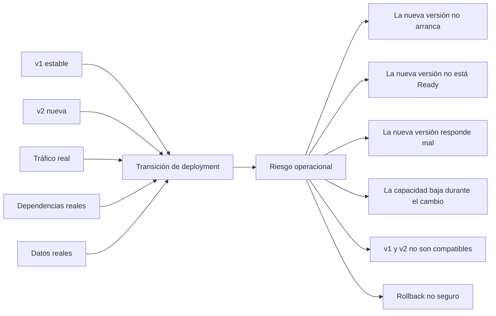

El riesgo no aparece solo porque cambie una imagen.

Aparece porque cambia una relación dentro del sistema:

- El Service empieza a enviar tráfico a Pods nuevos.
- El Deployment crea un ReplicaSet nuevo.
- El ReplicaSet antiguo reduce réplicas.
- La aplicación nueva lee configuración.
- La aplicación nueva habla con dependencias.
- La aplicación nueva emite logs, métricas o eventos.
- La aplicación nueva lee y escribe datos.
- Los clientes esperan el contrato anterior.
- El equipo necesita observar si todo va bien.

Un rollout técnicamente exitoso puede seguir siendo una mala release si rompe contratos, datos, métricas o consumidores.

Este módulo se centra en la parte operacional del cambio. El módulo siguiente profundizará en releases, versionado y compatibilidad.

### Criterio de comprensión

Debes poder explicar:

> Un deployment no es el momento en el que “se copia software”. Es el momento en el que una transición operacional entra en contacto con usuarios reales.

---

## 18.3. Qué significa “zero downtime”

“Zero downtime” no significa que nada pueda fallar.

Significa que el usuario no debería percibir una interrupción del servicio durante el cambio.

Eso requiere varias condiciones:

- Hay más de una réplica disponible.
- La aplicación puede recibir tráfico solo cuando está lista.
- El tráfico deja de enviarse a una réplica antes de apagarla.
- La aplicación gestiona bien `SIGTERM`.
- Las peticiones en curso tienen tiempo para terminar.
- El Service solo apunta a Pods Ready.
- El rollout no deja todas las réplicas no disponibles al mismo tiempo.
- La capacidad restante puede soportar la carga durante el cambio.
- El equipo puede observar el estado del rollout.
- El equipo puede hacer rollback si aparece una señal mala.
- La nueva versión es compatible con la versión anterior durante la transición.

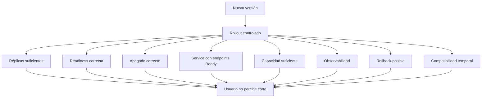

### Qué no significa

“Zero downtime” no significa:

- Que la nueva versión no tenga bugs.
- Que el cambio no tenga impacto.
- Que no haya errores parciales.
- Que no necesites rollback.
- Que no necesites observabilidad.
- Que una sola réplica sea suficiente.
- Que Kubernetes lo haga todo automáticamente.
- Que una migración incompatible sea segura.
- Que un cambio de contrato no pueda romper consumidores.
- Que el usuario no pueda sufrir degradación aunque no haya corte total.

Kubernetes puede ayudarte mucho.

Pero Kubernetes no puede arreglar una aplicación que:

- No sabe arrancar de forma predecible.
- No sabe decir cuándo está lista.
- No sabe cerrarse.
- No mantiene compatibilidad temporal.
- No emite señales útiles.
- Depende de una sola réplica.
- Tiene migraciones incompatibles.
- No tiene una ruta de rollback razonable.

### Criterio de comprensión

Debes poder explicar:

> Zero downtime no es una propiedad del comando de despliegue. Es una propiedad del sistema completo: aplicación, probes, réplicas, Service, estrategia de rollout, apagado, capacidad, compatibilidad y observabilidad.

---

## 18.4. El camino del tráfico durante un rollout

Antes de hablar de estrategias de deployment, tienes que entender por dónde pasa el tráfico.

Un Deployment no recibe tráfico.

Un Deployment crea y gestiona ReplicaSets.

Los ReplicaSets crean y gestionan Pods.

El tráfico normalmente llega a través de un Service, y el Service usa EndpointSlices para saber qué Pods están disponibles como destino.

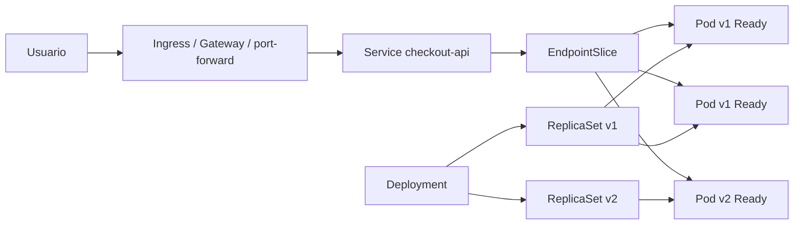

Durante un rollout, estas dos responsabilidades avanzan a la vez:

```text
Control de ejecución:
Deployment -> ReplicaSet -> Pod

Control de tráfico:
Service -> EndpointSlice -> Pods Ready
```

Esto es importante porque puedes tener problemas distintos:

- El Deployment puede crear Pods correctamente, pero el Service no tener endpoints.
- Los Pods pueden estar `Running`, pero no estar `Ready`.
- El Service puede tener selector incorrecto.
- El Pod puede escuchar en un puerto distinto al `targetPort`.
- El rollout puede estar progresando, pero el tráfico real fallar.

### Comandos útiles

```bash
kubectl get deploy,rs,pod -n shop
kubectl get svc,endpointslice -n shop
kubectl describe svc checkout-api -n shop
kubectl get pods -n shop -l app=checkout-api --show-labels
```

### Criterio de comprensión

Debes poder explicar:

> El Deployment controla Pods. El Service envía tráfico a endpoints Ready. Son responsabilidades distintas y ambas deben estar bien para que un deployment sea seguro.

---

## 18.5. Las condiciones previas para desplegar sin downtime

Antes de hablar de estrategias, hay que hablar de requisitos.

No puedes conseguir despliegues sin downtime solo cambiando YAML.

Necesitas que la aplicación, los manifests y el entorno cumplan ciertas condiciones.

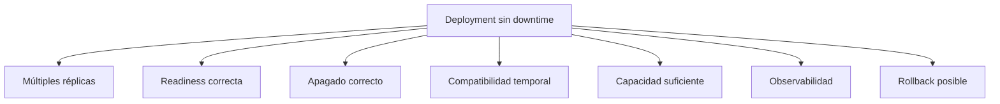

### 1. Múltiples réplicas

Si tienes una sola réplica, cualquier actualización puede dejar el servicio sin capacidad.

Ejemplo frágil:

```yaml
spec:
  replicas: 1
```

Con una sola réplica, Kubernetes puede intentar ser cuidadoso, pero no puede inventar capacidad.

Para un servicio HTTP básico, una base mínima más razonable es:

```yaml
spec:
  replicas: 3
```

Esto no significa que 3 sea siempre correcto.

Significa que una sola réplica rara vez es una buena base para hablar de zero downtime.

### 2. Readiness probe correcta

Readiness responde a esta pregunta:

> ¿Este Pod debe recibir tráfico ahora?

Si readiness no existe o es mala, Kubernetes puede enviar tráfico a una instancia que todavía no puede responder correctamente.

### 3. Apagado correcto

Cuando una versión antigua debe salir, Kubernetes envía una señal de terminación.

La app debe dejar de aceptar tráfico nuevo y terminar trabajo en curso.

### 4. Compatibilidad temporal

Durante un rolling update, pueden convivir dos versiones.

Eso exige compatibilidad temporal:

- API compatible.
- Contratos HTTP compatibles.
- Eventos compatibles.
- Esquemas de base de datos compatibles.
- Configuración compatible.
- Clientes compatibles.
- Métricas y logs compatibles con dashboards y alertas existentes.

### 5. Capacidad suficiente

Durante un rollout puedes necesitar capacidad extra.

Si usas `maxSurge: 1`, Kubernetes puede crear Pods adicionales temporalmente.

Si el cluster no tiene recursos, el nuevo Pod puede quedar `Pending`.

### 6. Observabilidad

No puedes hacer progressive delivery si no puedes ver progresivamente.

Necesitas señales:

- Error rate.
- Latencia.
- Saturación.
- Restarts.
- Readiness failures.
- Logs.
- Métricas de negocio.
- Trazas.
- Eventos de Kubernetes.

### 7. Rollback posible

Un rollback solo es seguro si volver atrás no rompe datos, contratos o migraciones.

### Criterio de comprensión

Debes poder explicar:

> La estrategia de rollout es solo una parte. La aplicación debe estar diseñada para sobrevivir a la transición.

---

## 18.6. Deployment nativo de Kubernetes

Kubernetes Deployment gestiona Pods mediante ReplicaSets.

Cuando actualizas un Deployment, Kubernetes crea un nuevo ReplicaSet para la nueva versión y reduce progresivamente el ReplicaSet anterior.

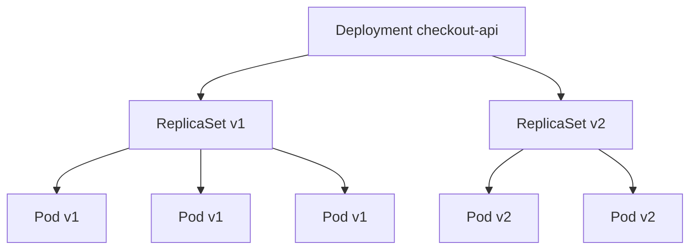

Un Deployment describe el estado deseado de una aplicación y el Deployment Controller mueve el estado actual hacia ese estado deseado de forma controlada.

### Ejemplo base

```yaml
apiVersion: apps/v1
kind: Deployment
metadata:
  name: checkout-api
  namespace: shop
spec:
  replicas: 3
  selector:
    matchLabels:
      app: checkout-api
  template:
    metadata:
      labels:
        app: checkout-api
    spec:
      containers:
        - name: checkout-api
          image: checkout-api:1.0.0
          ports:
            - containerPort: 8080
```

### Actualizar imagen

```bash
kubectl set image deployment/checkout-api \
  checkout-api=checkout-api:1.1.0 \
  -n shop
```

Ver rollout:

```bash
kubectl rollout status deployment/checkout-api -n shop
```

Historial:

```bash
kubectl rollout history deployment/checkout-api -n shop
```

Rollback:

```bash
kubectl rollout undo deployment/checkout-api -n shop
```

### Qué ocurre internamente

Cuando cambias el template del Pod dentro del Deployment, Kubernetes crea un nuevo ReplicaSet.

El cambio puede ser:

- Nueva imagen.
- Nueva variable de entorno.
- Nuevo label en el Pod template.
- Nueva probe.
- Nuevo recurso.
- Nuevo volumen.
- Cualquier cambio en `.spec.template`.

El Deployment no “edita” Pods existentes para convertirlos en nuevos.

Crea Pods nuevos y elimina Pods antiguos de forma controlada.

### Criterio de comprensión

Debes poder explicar:

> Un Deployment no actualiza Pods directamente. Gestiona ReplicaSets, y los ReplicaSets gestionan Pods.

---

## 18.7. Estrategias nativas: Recreate y RollingUpdate

Kubernetes Deployment soporta dos estrategias principales:

- `Recreate`
- `RollingUpdate`

### Recreate

`Recreate` elimina los Pods antiguos antes de crear los nuevos.

```yaml
strategy:
  type: Recreate
```

Esto puede ser aceptable para:

- Jobs internos.
- Herramientas administrativas.
- Entornos de desarrollo.
- Aplicaciones que no soportan dos versiones vivas al mismo tiempo.
- Casos donde prefieres downtime controlado a inconsistencia.

Pero no es una estrategia zero downtime.

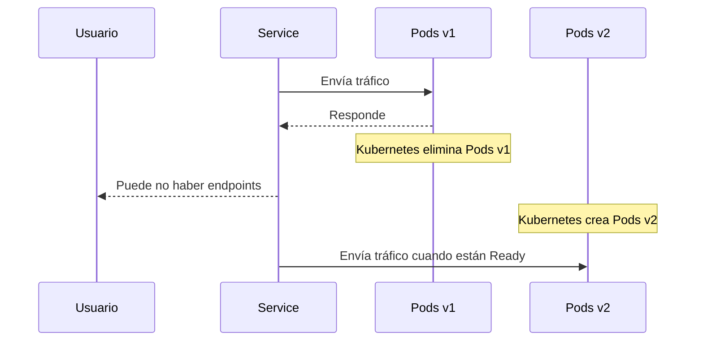

### RollingUpdate

`RollingUpdate` reemplaza Pods gradualmente.

```yaml
strategy:
  type: RollingUpdate
```

Con rolling update, Kubernetes intenta mantener disponibilidad mientras introduce la nueva versión.

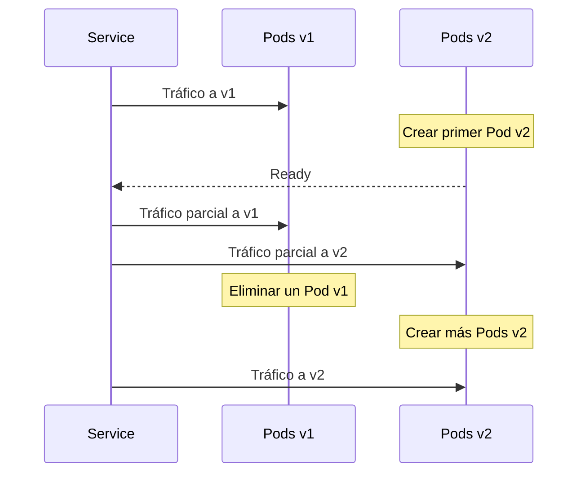

### Tabla comparativa

| Estrategia | Disponibilidad durante el cambio | Riesgo principal | Uso típico |
|---|---:|---|---|
| `Recreate` | Baja | Corte entre versiones | Apps no compatibles con doble versión |
| `RollingUpdate` | Alta si está bien configurado | Requiere compatibilidad y readiness | Servicios HTTP replicados |

### Criterio de comprensión

Debes poder explicar:

> Recreate cambia todo de golpe y puede cortar servicio. RollingUpdate cambia gradualmente y puede evitar downtime si la app y la configuración lo permiten.

---

## 18.8. RollingUpdate implica convivencia de versiones

Durante un RollingUpdate, v1 y v2 pueden estar vivas al mismo tiempo.

Eso significa que ambas versiones pueden:

- Recibir tráfico.
- Leer la misma base de datos.
- Escribir en la misma base de datos.
- Publicar eventos.
- Consumir eventos.
- Emitir métricas.
- Ser observadas por los mismos dashboards.
- Ser seleccionadas por el mismo Service.
- Convivir detrás del mismo Ingress o Gateway.

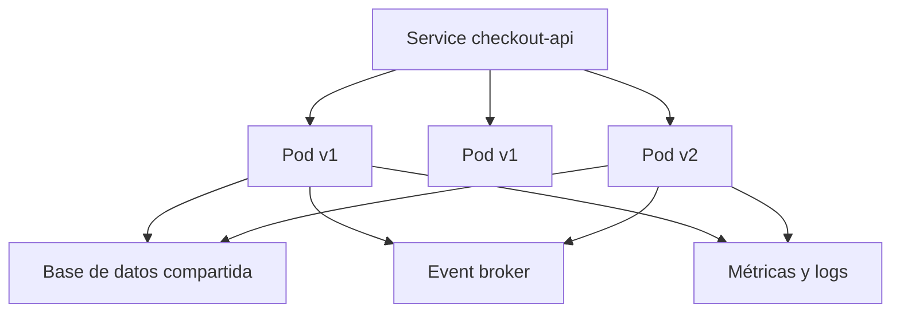

Por eso RollingUpdate no es solo un mecanismo de Kubernetes.

También es un requisito de compatibilidad.

Si v1 y v2 no pueden convivir, RollingUpdate puede ser la estrategia equivocada.

En ese caso puede que necesites:

- `Recreate`.
- Blue-green con promoción controlada.
- Feature flags.
- Migración expand and contract.
- Ventana de mantenimiento.
- Cambio forward-only cuidadosamente diseñado.
- División en varios releases más pequeños.

### Preguntas antes de usar RollingUpdate

Antes de aplicar RollingUpdate a una release, pregunta:

- ¿v1 puede leer datos escritos por v2?
- ¿v2 puede leer datos escritos por v1?
- ¿Ambas versiones entienden los mismos eventos?
- ¿Los clientes toleran campos nuevos?
- ¿Las métricas siguen siendo compatibles?
- ¿Las rutas HTTP antiguas siguen funcionando?
- ¿Los consumers asíncronos pueden convivir con el cambio?
- ¿El rollback sigue siendo seguro?

### Criterio de comprensión

Debes poder explicar:

> RollingUpdate significa convivencia temporal. Convivencia temporal significa compatibilidad.

---

## 18.9. maxSurge y maxUnavailable

En un RollingUpdate, Kubernetes necesita saber dos cosas.

Primera pregunta:

> ¿Cuántos Pods extra puedo crear durante el rollout?

Eso es `maxSurge`.

Segunda pregunta:

> ¿Cuántos Pods pueden estar no disponibles durante el rollout?

Eso es `maxUnavailable`.

Ejemplo:

```yaml
strategy:
  type: RollingUpdate
  rollingUpdate:
    maxSurge: 1
    maxUnavailable: 0
```

Con 3 réplicas:

```text
replicas: 3
maxSurge: 1
maxUnavailable: 0
```

Kubernetes puede llegar temporalmente a 4 Pods, pero no debería dejar menos de 3 disponibles.

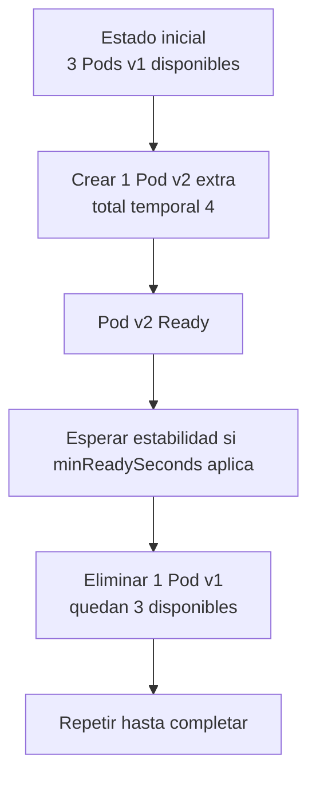

### Configuración conservadora

```yaml
replicas: 3
strategy:
  type: RollingUpdate
  rollingUpdate:
    maxSurge: 1
    maxUnavailable: 0
```

Ventajas:

- Protege disponibilidad.
- No reduce capacidad declarada durante rollout.
- Buena para servicios de usuario.

Coste:

- Necesita recursos extra temporalmente.

### Configuración más rápida pero con más riesgo

```yaml
replicas: 3
strategy:
  type: RollingUpdate
  rollingUpdate:
    maxSurge: 1
    maxUnavailable: 1
```

Ventajas:

- Puede avanzar más rápido.
- Necesita menos capacidad extra.

Coste:

- Puede reducir capacidad disponible durante rollout.

### Configuración peligrosa si no entiendes la carga

```yaml
replicas: 2
strategy:
  type: RollingUpdate
  rollingUpdate:
    maxSurge: 0
    maxUnavailable: 1
```

Puede dejarte con una sola réplica disponible durante el rollout.

Si una sola réplica no soporta la carga, habrá degradación.

### Porcentajes

También puedes usar porcentajes:

```yaml
rollingUpdate:
  maxSurge: 25%
  maxUnavailable: 25%
```

Esto puede ser útil en workloads grandes.

En módulos de aprendizaje, los números absolutos son más fáciles de razonar.

### Criterio de comprensión

Debes poder explicar:

> `maxSurge` controla capacidad extra temporal. `maxUnavailable` controla cuánta capacidad puedes perder durante el rollout.

---

## 18.10. Readiness: la pieza central del rollout

Readiness es la protección más importante durante un rollout.

Un Pod puede estar `Running`, pero no estar listo.

Kubernetes no debería enviar tráfico de Service a Pods que no están Ready.

Ejemplo:

```yaml
readinessProbe:
  httpGet:
    path: /ready
    port: 8080
  initialDelaySeconds: 3
  periodSeconds: 5
  timeoutSeconds: 2
  failureThreshold: 3
```

### Qué debe comprobar readiness

Readiness debe comprobar si la instancia puede recibir tráfico real.

Puede incluir:

- Configuración cargada.
- Servidor HTTP listo.
- Dependencias críticas disponibles.
- Migraciones compatibles completadas.
- Estado interno preparado.
- Calentamiento mínimo completado.

Pero debe tener cuidado.

Una readiness demasiado estricta puede sacar todas las réplicas del tráfico ante una dependencia lenta.

Una readiness demasiado débil puede enviar tráfico a instancias no preparadas.

### Diferencia con liveness

| Probe | Pregunta | Acción |
|---|---|---|
| readiness | ¿Debe recibir tráfico ahora? | Se incluye o excluye de endpoints |
| liveness | ¿Debe reiniciarse el contenedor? | Reinicia el contenedor |
| startup | ¿Ya terminó de arrancar? | Protege arranques lentos antes de liveness |

### Antipatrón

No uses liveness para comprobar dependencias externas.

Si Redis tiene un problema temporal y liveness depende de Redis, Kubernetes puede reiniciar todas las réplicas aunque la app esté bien.

Eso empeora el incidente.

### Readiness y Service

Un Service no debería mandar tráfico a Pods no Ready.

Durante un rollout, esto permite que:

1. El Pod nuevo arranque.
2. La app inicialice.
3. La readiness pase.
4. El Pod entre en endpoints.
5. El Service empiece a enviar tráfico.

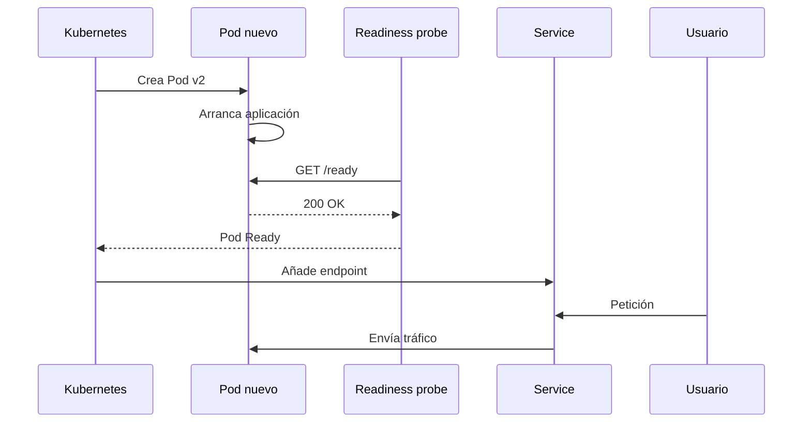

### Criterio de comprensión

Debes poder explicar:

> Durante un deployment, readiness decide cuándo una nueva réplica puede entrar al tráfico y cuándo una réplica debe salir.

---

## 18.11. Startup probe: proteger arranques lentos

Algunas aplicaciones tardan en arrancar.

Ejemplos:

- Cargan modelos.
- Compilan assets.
- Calientan caches.
- Esperan configuración.
- Inicializan conexiones.
- Verifican dependencias.
- Ejecutan validaciones internas.

Si usas liveness demasiado pronto, Kubernetes puede matar el contenedor antes de que termine de arrancar.

Para eso existe `startupProbe`.

```yaml
startupProbe:
  httpGet:
    path: /health
    port: 8080
  periodSeconds: 5
  failureThreshold: 24
```

Esto permite hasta 120 segundos de arranque:

```text
periodSeconds 5 * failureThreshold 24 = 120 segundos
```

Mientras la startup probe no ha tenido éxito, liveness y readiness no se ejecutan.

### Cuándo usar startupProbe

Úsala cuando:

- La aplicación tiene arranque lento.
- Liveness podría reiniciarla demasiado pronto.
- La inicialización es variable.
- Quieres separar “todavía arrancando” de “está rota”.

### Criterio de comprensión

Debes poder explicar:

> Startup probe protege el arranque. Readiness protege el tráfico. Liveness protege contra procesos atascados.

---

## 18.12. minReadySeconds: no avanzar demasiado rápido

Que un Pod esté Ready una vez no siempre significa que sea estable.

Puede ocurrir esto:

```text
Pod arranca
/readiness devuelve 200
Kubernetes lo considera disponible
el rollout avanza
unos segundos después el Pod empieza a fallar
```

`minReadySeconds` añade una ventana mínima de estabilidad.

Ejemplo:

```yaml
spec:
  minReadySeconds: 10
```

Esto significa:

> Un Pod nuevo debe estar Ready durante al menos 10 segundos sin que sus contenedores fallen antes de ser considerado disponible para el Deployment.

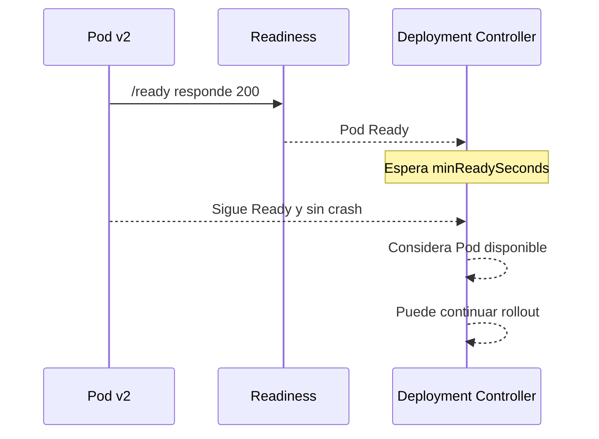

### Qué problema resuelve

`minReadySeconds` ayuda cuando:

- La aplicación falla poco después de arrancar.
- La app necesita calentamiento.
- Hay errores que no aparecen en el primer check.
- Quieres reducir rollouts demasiado rápidos.
- Quieres dar tiempo a observar señales iniciales.

### Qué no resuelve

`minReadySeconds` no sustituye:

- Readiness.
- Liveness.
- Observabilidad.
- Tests.
- Métricas.
- Compatibilidad.
- Rollback.

Solo añade tiempo mínimo de estabilidad antes de avanzar.

### Criterio de comprensión

Debes poder explicar:

> Ready ahora no es lo mismo que estable. `minReadySeconds` añade una ventana mínima antes de que el Deployment considere disponible a un Pod nuevo.

---

## 18.13. Apagado correcto: SIGTERM, preStop y terminationGracePeriodSeconds

Cuando Kubernetes necesita terminar un Pod, no debería cortar tráfico de forma brusca.

El proceso normal es:

1. El Pod entra en estado `Terminating`.
2. Kubernetes ejecuta `preStop` si existe.
3. Cuando `preStop` termina, Kubernetes envía `SIGTERM` al proceso principal.
4. Kubernetes espera hasta `terminationGracePeriodSeconds`.
5. Si el proceso no termina a tiempo, Kubernetes envía `SIGKILL`.

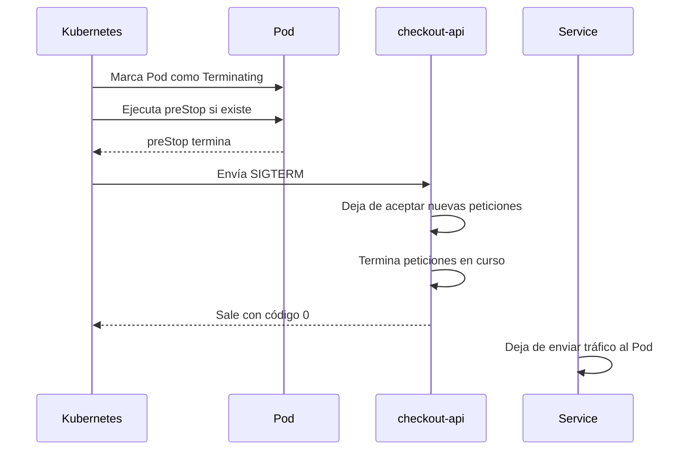

### Configuración recomendada

```yaml
terminationGracePeriodSeconds: 30
containers:
  - name: checkout-api
    image: checkout-api:1.0.0
    lifecycle:
      preStop:
        exec:
          command: ["sh", "-c", "sleep 5"]
```

### El matiz importante

El tiempo de `preStop` cuenta dentro de `terminationGracePeriodSeconds`.

Si configuras:

```yaml
terminationGracePeriodSeconds: 30
```

y tu `preStop` tarda 10 segundos, la aplicación no tiene 30 segundos completos después para cerrar. Le quedan aproximadamente 20 segundos.

Por eso `preStop` debe ser corto, intencional y fácil de razonar.

No hagas esto sin pensarlo:

```yaml
terminationGracePeriodSeconds: 30
lifecycle:
  preStop:
    exec:
      command: ["sh", "-c", "sleep 30"]
```

Ese patrón puede consumir casi todo el periodo de gracia antes de que la aplicación reciba `SIGTERM`.

### Por qué a veces se usa preStop sleep

El `sleep` no es una solución elegante por sí misma.

Pero puede ayudar a dar tiempo a que los endpoints se actualicen y el tráfico deje de llegar al Pod antes de que la aplicación cierre.

La solución real combina:

- Readiness correcta.
- Manejo de `SIGTERM`.
- Grace period suficiente.
- App que deja de aceptar nuevas peticiones.
- Balanceadores que respetan endpoints.
- Timeouts razonables.
- Clientes con retries seguros.
- Observabilidad para ver errores durante terminación.

### Aplicación Node.js

En `checkout-api`, el cierre debería parecerse a esto:

```js
function shutdown(signal) {
  console.log(JSON.stringify({
    level: "info",
    service: serviceName,
    message: "received shutdown signal",
    signal
  }));

  server.close(() => {
    console.log(JSON.stringify({
      level: "info",
      service: serviceName,
      message: "server stopped"
    }));

    process.exit(0);
  });

  setTimeout(() => {
    console.error(JSON.stringify({
      level: "error",
      service: serviceName,
      message: "forced shutdown timeout"
    }));

    process.exit(1);
  }, 10000);
}

process.on("SIGTERM", shutdown);
process.on("SIGINT", shutdown);
```

### Criterio de comprensión

Debes poder explicar:

> Kubernetes puede dar tiempo para cerrar, pero la aplicación debe saber usar ese tiempo. Además, `preStop` y el cierre de la aplicación comparten el mismo periodo de gracia.

---

## 18.14. Services, endpoints y tráfico durante un rollout

Un Service no envía tráfico a un Deployment.

Un Service selecciona Pods mediante labels.

Después Kubernetes mantiene endpoints o EndpointSlices que representan los destinos reales.

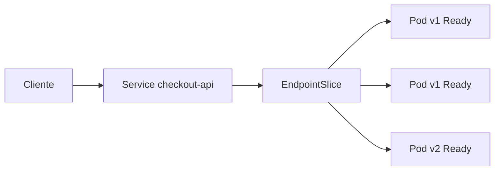

Durante un rollout:

1. El Deployment crea Pods nuevos.
2. Los Pods nuevos arrancan.
3. Readiness pasa.
4. Los Pods nuevos aparecen como endpoints.
5. Los Pods antiguos empiezan a terminar.
6. Los endpoints antiguos se eliminan.
7. El tráfico fluye hacia Pods disponibles.

### Comandos útiles

```bash
kubectl get svc -n shop
kubectl get endpointslice -n shop
kubectl describe svc checkout-api -n shop
kubectl get pods -n shop -l app=checkout-api
```

Ver Pods Ready:

```bash
kubectl get pods -n shop -l app=checkout-api \
  -o custom-columns=NAME:.metadata.name,READY:.status.containerStatuses[0].ready,PHASE:.status.phase
```

### Problema habitual

El Deployment está bien.

Los Pods están Running.

Pero el Service no tiene endpoints.

Causas posibles:

- Los labels del Pod no coinciden con el selector del Service.
- Los Pods no están Ready.
- El Service apunta a un puerto incorrecto.
- El namespace no es el esperado.

### Criterio de comprensión

Debes poder explicar:

> El tráfico no llega a “un Deployment”. Llega a un Service, y el Service usa endpoints que dependen de Pods seleccionados y Ready.

---

## 18.15. progressDeadlineSeconds: detectar rollouts bloqueados

Un rollout puede quedarse atascado.

Ejemplos:

- La imagen no existe.
- Los Pods nuevos nunca pasan readiness.
- El scheduler no puede colocar los Pods.
- La aplicación arranca y luego crashea.
- Hay falta de CPU o memoria.
- El nuevo ReplicaSet no consigue réplicas disponibles.

`progressDeadlineSeconds` define cuánto tiempo espera Kubernetes a que el Deployment progrese antes de marcarlo como fallido.

Ejemplo:

```yaml
spec:
  progressDeadlineSeconds: 120
```

Esto no hace rollback automáticamente por sí solo.

Lo que hace es exponer una condición clara de fallo para que una persona, un pipeline o una herramienta superior pueda actuar.

### Cómo verlo

```bash
kubectl describe deployment checkout-api -n shop
kubectl rollout status deployment/checkout-api -n shop --timeout=120s
```

Si el rollout no progresa, puedes ver condiciones relacionadas con el fallo del progreso.

### Criterio de comprensión

Debes poder explicar:

> `progressDeadlineSeconds` no arregla un rollout bloqueado, pero ayuda a detectarlo y hacerlo visible.

---

## 18.16. Manifiesto base para rollout sin downtime

Este es un Deployment razonable para empezar:

```yaml
apiVersion: apps/v1
kind: Deployment
metadata:
  name: checkout-api
  namespace: shop
  labels:
    app: checkout-api
    app.kubernetes.io/name: checkout-api
    app.kubernetes.io/component: api
    app.kubernetes.io/part-of: shop
spec:
  replicas: 3
  revisionHistoryLimit: 5
  progressDeadlineSeconds: 120
  minReadySeconds: 10
  strategy:
    type: RollingUpdate
    rollingUpdate:
      maxSurge: 1
      maxUnavailable: 0
  selector:
    matchLabels:
      app: checkout-api
  template:
    metadata:
      labels:
        app: checkout-api
        app.kubernetes.io/name: checkout-api
        app.kubernetes.io/component: api
        app.kubernetes.io/part-of: shop
    spec:
      terminationGracePeriodSeconds: 30
      containers:
        - name: checkout-api
          image: checkout-api:1.0.0
          imagePullPolicy: IfNotPresent
          ports:
            - name: http
              containerPort: 8080
          env:
            - name: SERVICE_NAME
              value: checkout-api
            - name: PORT
              value: "8080"
            - name: LOG_LEVEL
              value: info
          startupProbe:
            httpGet:
              path: /health
              port: http
            periodSeconds: 5
            failureThreshold: 12
          readinessProbe:
            httpGet:
              path: /ready
              port: http
            initialDelaySeconds: 3
            periodSeconds: 5
            timeoutSeconds: 2
            failureThreshold: 3
          livenessProbe:
            httpGet:
              path: /health
              port: http
            initialDelaySeconds: 10
            periodSeconds: 10
            timeoutSeconds: 2
            failureThreshold: 3
          lifecycle:
            preStop:
              exec:
                command: ["sh", "-c", "sleep 5"]
          resources:
            requests:
              cpu: 100m
              memory: 128Mi
            limits:
              memory: 256Mi
```

Service:

```yaml
apiVersion: v1
kind: Service
metadata:
  name: checkout-api
  namespace: shop
  labels:
    app: checkout-api
    app.kubernetes.io/name: checkout-api
    app.kubernetes.io/component: api
    app.kubernetes.io/part-of: shop
spec:
  selector:
    app: checkout-api
  ports:
    - name: http
      port: 80
      targetPort: http
```

### Por qué cada parte importa

| Campo | Por qué importa |
|---|---|
| `replicas: 3` | Mantiene capacidad durante rollout |
| `maxSurge: 1` | Permite crear capacidad extra |
| `maxUnavailable: 0` | Evita perder capacidad declarada |
| `startupProbe` | Protege arranques lentos |
| `readinessProbe` | Controla entrada al tráfico |
| `livenessProbe` | Reinicia procesos atascados |
| `minReadySeconds` | Evita avanzar en cuanto readiness pasa una sola vez |
| `terminationGracePeriodSeconds` | Da tiempo al cierre |
| `preStop` | Reduce cortes durante eliminación si se usa con cuidado |
| `resources.requests` | Ayuda al scheduler |
| `revisionHistoryLimit` | Mantiene historial de rollback |
| `progressDeadlineSeconds` | Detecta rollout bloqueado |
| Service `targetPort: http` | Usa puerto nombrado y reduce errores |

### Criterio de comprensión

Debes poder explicar:

> Un Deployment zero downtime no es solo `strategy: RollingUpdate`. Es la combinación de réplicas, readiness, apagado, recursos, Service, estabilidad mínima y observabilidad.

---

## 18.17. Nota importante sobre imágenes locales

En un entorno real, Kubernetes descarga imágenes desde un registry.

En laboratorios locales, la imagen también debe estar disponible para el cluster.

Construir una imagen en tu ordenador no siempre significa que el cluster pueda usarla.

Si actualizas el Deployment a:

```text
checkout-api:1.1.0
```

pero el cluster no puede encontrar esa imagen, el rollout puede fallar con errores como:

```text
ImagePullBackOff
ErrImagePull
```

### kind

Con `kind`, normalmente necesitas cargar la imagen en el cluster:

```bash
kind load docker-image checkout-api:1.1.0
```

### minikube

Con `minikube`, puedes usar distintas opciones según tu configuración:

```bash
minikube image load checkout-api:1.1.0
```

O construir usando el entorno Docker de minikube, si estás trabajando con ese flujo.

### Docker Desktop Kubernetes

En Docker Desktop Kubernetes, las imágenes locales pueden estar disponibles de forma más directa, pero no debes asumirlo sin comprobar.

### Criterio de comprensión

Debes poder explicar:

> Construir una imagen en mi máquina no siempre significa hacerla disponible para Kubernetes.

---

## 18.18. Observar un rollout

Aplicar:

```bash
kubectl create namespace shop --dry-run=client -o yaml | kubectl apply -f -
kubectl apply -f k8s/zero-downtime/service.yaml
kubectl apply -f k8s/zero-downtime/deployment.yaml
```

Ver estado:

```bash
kubectl get deploy,rs,pod,svc,endpointslice -n shop
```

Actualizar imagen:

```bash
kubectl set image deployment/checkout-api \
  checkout-api=checkout-api:1.1.0 \
  -n shop
```

Observar rollout:

```bash
kubectl rollout status deployment/checkout-api -n shop
```

Ver ReplicaSets:

```bash
kubectl get rs -n shop -l app=checkout-api
```

Ver Pods por versión o labels:

```bash
kubectl get pods -n shop -l app=checkout-api --show-labels
```

Ver eventos:

```bash
kubectl get events -n shop --sort-by=.lastTimestamp
```

Ver endpoints:

```bash
kubectl get endpointslice -n shop
```

Ver descripción del Deployment:

```bash
kubectl describe deployment checkout-api -n shop
```

### Qué observar

Durante un rollout deberías mirar:

- Réplicas deseadas.
- Réplicas disponibles.
- ReplicaSet nuevo.
- ReplicaSet antiguo.
- Pods Ready.
- Restarts.
- Events.
- Endpoints.
- Latencia y errores.
- Logs.
- Métricas de aplicación.
- Señales de negocio si aplica.

### Criterio de comprensión

Debes poder explicar:

> No basta con ejecutar el rollout. Debo observar cómo cambia el sistema mientras el rollout ocurre.

---

## 18.19. Pausar, reanudar y hacer rollback

Kubernetes permite pausar un Deployment.

Pausar:

```bash
kubectl rollout pause deployment/checkout-api -n shop
```

Actualizar mientras está pausado:

```bash
kubectl set image deployment/checkout-api \
  checkout-api=checkout-api:1.2.0 \
  -n shop
```

Ver historial:

```bash
kubectl rollout history deployment/checkout-api -n shop
```

Reanudar:

```bash
kubectl rollout resume deployment/checkout-api -n shop
```

Rollback:

```bash
kubectl rollout undo deployment/checkout-api -n shop
```

Rollback a una revisión concreta:

```bash
kubectl rollout undo deployment/checkout-api \
  --to-revision=2 \
  -n shop
```

### Cuándo pausar

Pausar puede ser útil para:

- Agrupar varios cambios antes de iniciar rollout.
- Revisar estado intermedio.
- Evitar que el controller avance mientras investigas.
- Coordinar con una ventana de validación.

### Cuándo rollback no basta

Rollback no siempre soluciona todo.

Puede no ser seguro si:

- Hubo migraciones de base de datos irreversibles.
- La nueva versión emitió eventos incompatibles.
- Los clientes cambiaron su comportamiento.
- Se modificó estado externo.
- Se activaron feature flags con efectos persistentes.
- La versión anterior no puede leer datos nuevos.

### Criterio de comprensión

Debes poder explicar:

> Rollback de Deployment revierte manifests de workload. No revierte automáticamente datos, efectos externos ni contratos rotos.

---

## 18.20. PodDisruptionBudget

Un rollout no es la única forma en la que puedes perder Pods.

También hay disrupciones voluntarias:

- Drain de nodo.
- Mantenimiento.
- Actualización del cluster.
- Rebalanceo.
- Operaciones del administrador.

Un PodDisruptionBudget, PDB, limita cuántos Pods de una aplicación replicada pueden estar caídos al mismo tiempo durante disrupciones voluntarias.

Ejemplo:

```yaml
apiVersion: policy/v1
kind: PodDisruptionBudget
metadata:
  name: checkout-api
  namespace: shop
spec:
  minAvailable: 2
  selector:
    matchLabels:
      app: checkout-api
```

Con 3 réplicas, este PDB dice:

> Durante disrupciones voluntarias, deben quedar al menos 2 Pods disponibles.

### minAvailable vs maxUnavailable

```yaml
minAvailable: 2
```

Dice cuántos deben permanecer disponibles.

```yaml
maxUnavailable: 1
```

Dice cuántos pueden estar no disponibles.

No uses ambos a la vez.

### Qué no hace un PDB

Un PDB no evita:

- Fallos de aplicación.
- CrashLoopBackOff.
- OOMKilled.
- Problemas de imagen.
- Caídas involuntarias de nodo.
- Bugs.
- Mala configuración de readiness.

Un PDB tampoco sustituye:

- `replicas`.
- `maxUnavailable`.
- readiness probes.
- resource requests.
- topology spread.
- resiliencia de la aplicación.

Un PDB no es una estrategia de rollout.

Ayuda con disrupciones voluntarias, pero no controla por sí mismo cómo progresa una nueva versión.

### Criterio de comprensión

Debes poder explicar:

> Un PDB no hace que mi app sea highly available por sí solo. Limita ciertas disrupciones voluntarias para no bajar de una disponibilidad mínima.

---

## 18.21. Topology spread y anti-affinity

Tener 3 réplicas no sirve de mucho si las 3 acaban en el mismo nodo.

Para reducir riesgo, puedes distribuir Pods entre nodos o zonas.

Ejemplo con topology spread:

```yaml
topologySpreadConstraints:
  - maxSkew: 1
    topologyKey: kubernetes.io/hostname
    whenUnsatisfiable: ScheduleAnyway
    labelSelector:
      matchLabels:
        app: checkout-api
```

Esto intenta repartir los Pods entre nodos.

También puedes usar anti-affinity:

```yaml
affinity:
  podAntiAffinity:
    preferredDuringSchedulingIgnoredDuringExecution:
      - weight: 100
        podAffinityTerm:
          labelSelector:
            matchLabels:
              app: checkout-api
          topologyKey: kubernetes.io/hostname
```

### Cuándo importa

Importa cuando quieres reducir riesgo de:

- Nodo saturado.
- Nodo caído.
- Mantenimiento de nodo.
- Zona degradada.
- Concentración accidental de réplicas.

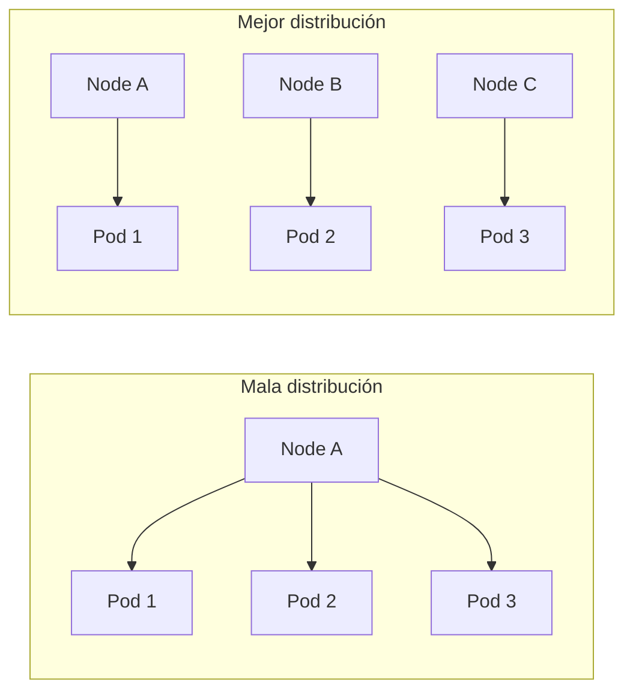

### Criterio de comprensión

Debes poder explicar:

> Alta disponibilidad no es solo número de réplicas. También importa dónde viven esas réplicas.

---

## 18.22. Blue-green deployment

Blue-green deployment mantiene dos entornos o versiones:

- Blue: versión activa.
- Green: versión nueva.

El tráfico apunta a una de ellas.

Cuando la nueva versión está validada, cambias el tráfico.

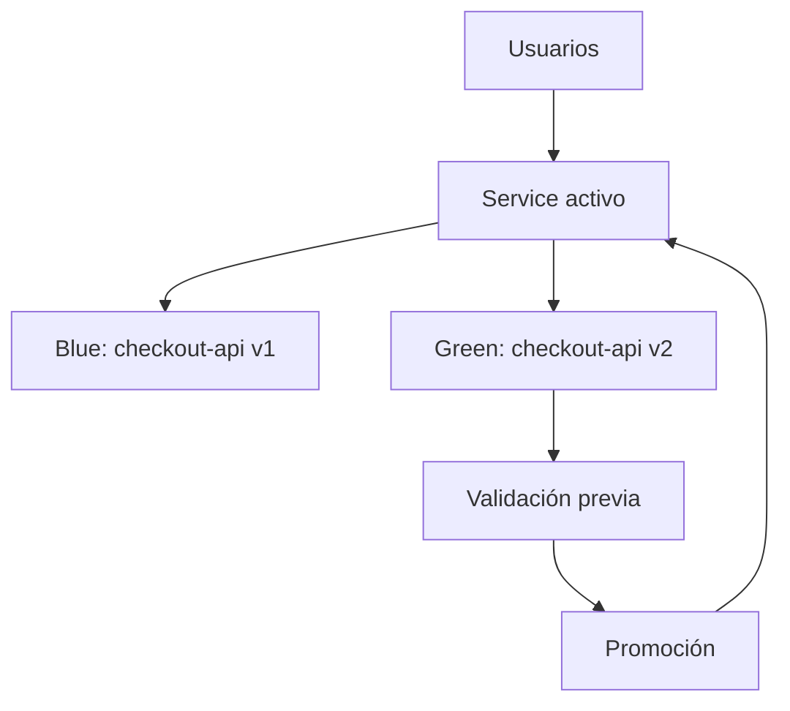

### Ventajas

- Cambio de tráfico rápido.
- Puedes validar green antes de promocionar.
- Rollback puede ser rápido si blue sigue vivo.
- El modelo es fácil de explicar.
- Reduce tiempo de convivencia entre versiones si lo comparas con un rollout largo.

### Costes

- Necesitas capacidad duplicada temporalmente.
- Debes gestionar dos versiones.
- Debes controlar bien estado y migraciones.
- Puede haber problemas con sesiones, caches o conexiones persistentes.
- Puede ser peligroso si la base de datos no es compatible con ambas versiones.

### Blue-green básico con Services

Puedes tener dos Deployments:

```text
checkout-api-blue
checkout-api-green
```

Y un Service activo:

```yaml
apiVersion: v1
kind: Service
metadata:
  name: checkout-api
  namespace: shop
spec:
  selector:
    app: checkout-api
    version: blue
  ports:
    - name: http
      port: 80
      targetPort: 8080
```

Para promover green, cambias el selector:

```yaml
selector:
  app: checkout-api
  version: green
```

### Advertencia

Cambiar selectors manualmente funciona para aprender, pero no es suficiente como plataforma profesional.

Para producción, normalmente usarás:

- Argo Rollouts.
- Ingress controller con capacidades avanzadas.
- Service mesh.
- Gateway API con capacidades de traffic splitting según implementación.
- Feature flags para separar deploy y release.

### Criterio de comprensión

Debes poder explicar:

> Blue-green separa despliegue de promoción. La versión nueva puede existir antes de recibir tráfico real.

---

## 18.23. Canary deployment

Canary deployment libera una nueva versión a una pequeña parte del tráfico.

Primero envías poco tráfico.

Observas.

Si las señales son buenas, aumentas.

Si las señales son malas, abortas.

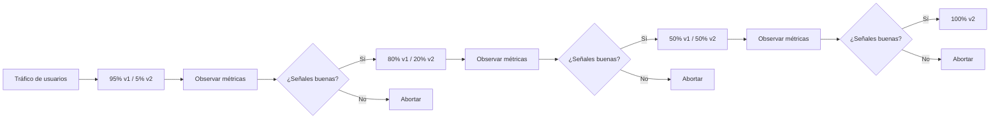

### Ventajas

- Reduce blast radius.
- Permite detectar fallos con tráfico real limitado.
- Permite promoción gradual.
- Encaja bien con métricas y automatización.
- Permite comparar comportamiento operacional entre versiones.

### Costes

- Necesitas routing más avanzado.
- Necesitas métricas fiables.
- Necesitas saber qué significa éxito.
- Puedes introducir sesgos si el tráfico canary no representa al tráfico real.
- Debes manejar compatibilidad entre versiones.
- Debes diseñar rollback y abort explícitos.

### Kubernetes nativo y canary

Kubernetes Deployment nativo puede ejecutar dos versiones al mismo tiempo durante un rolling update.

Pero no ofrece por sí solo control fino de porcentaje de tráfico por versión.

Un Service selecciona Pods por labels, pero no reparte tráfico por peso entre versiones de forma declarativa nativa.

Para canary real necesitas normalmente:

- Argo Rollouts.
- Istio.
- Linkerd.
- NGINX Ingress con anotaciones específicas.
- Traefik.
- Gateway API con una implementación que soporte pesos.
- Flagger.
- Feature flags a nivel aplicación.

### Criterio de comprensión

Debes poder explicar:

> RollingUpdate actualiza gradualmente Pods. Canary controla gradualmente exposición de tráfico y riesgo.

---

## 18.24. A/B testing

A/B testing no es lo mismo que canary.

Canary responde a una pregunta operacional:

> ¿La nueva versión es suficientemente segura para ampliar exposición?

A/B testing responde a una pregunta de producto:

> ¿Qué variante produce mejor resultado para un segmento de usuarios?

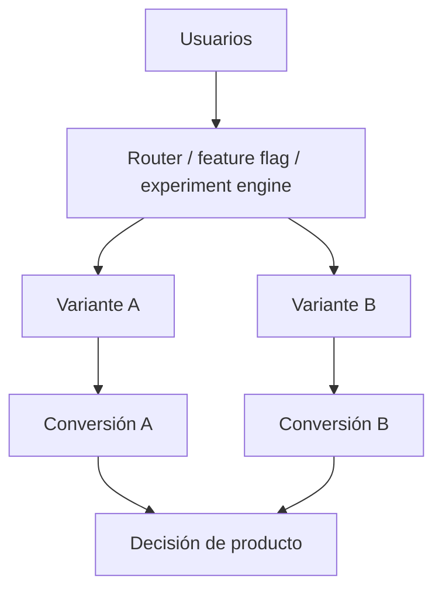

### Diferencias

| Técnica | Pregunta principal | Métrica principal |
|---|---|---|
| Rolling update | ¿Puedo reemplazar Pods sin cortar servicio? | Disponibilidad del rollout |
| Canary | ¿La nueva versión es segura bajo tráfico real limitado? | Errores, latencia, saturación |
| Blue-green | ¿Puedo cambiar tráfico entre dos versiones completas? | Salud antes y después de promoción |
| A/B testing | ¿Qué variante funciona mejor para usuarios o negocio? | Conversión, retención, comportamiento |

### A/B testing requiere segmentación

Para A/B testing necesitas decidir quién ve qué.

Criterios posibles:

- Header HTTP.
- Cookie.
- User ID.
- Tenant.
- País.
- Plan de suscripción.
- Feature flag.
- Porcentaje estable de usuarios.

Ejemplo conceptual:

```text
usuarios con header X-Experiment: B -> variante B
resto -> variante A
```

### A/B testing no es solo dividir tráfico

Un experimento serio necesita:

- Hipótesis.
- Asignación estable.
- Tamaño de muestra suficiente.
- Métrica primaria.
- Métricas de guardrail.
- Duración definida.
- Evitar contaminación entre grupos.
- Regla de decisión antes de mirar resultados.
- Observabilidad técnica y de producto.

### A/B testing no debería hacerse solo con Deployments

Puedes hacer una demo simple con dos Services y un Ingress avanzado.

Pero un A/B test serio normalmente requiere:

- Sistema de experimentación.
- Asignación estable de usuarios.
- Métricas de producto.
- Evitar contaminación entre grupos.
- Control de sesgos.
- Capacidad de parar el experimento.
- Análisis estadístico.
- Feature flags.
- Observabilidad técnica y de negocio.

### Criterio de comprensión

Debes poder explicar:

> Canary reduce riesgo operacional. A/B testing aprende sobre comportamiento de usuarios. Se parecen en que dividen tráfico, pero no responden a la misma pregunta.

---

## 18.25. Progressive delivery

Progressive delivery es una forma de entregar cambios reduciendo riesgo mediante exposición gradual, validación continua y promoción controlada.

Incluye técnicas como:

- Rolling updates.
- Canary.
- Blue-green.
- Feature flags.
- A/B testing.
- Automated analysis.
- Manual gates.
- Rollback automático.
- Métricas de negocio y técnicas.

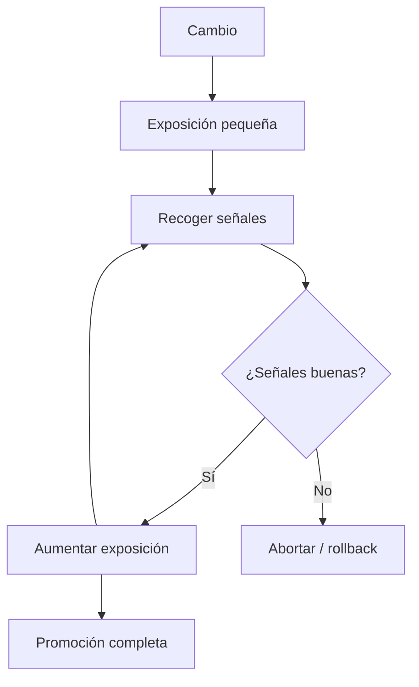

### La idea clave

No todo cambio debe exponerse a todo el mundo al mismo tiempo.

Puedes separar:

```text
deploy
release
exposure
experiment
promotion
```

### Deploy vs release

Deploy:

> La versión está instalada en el entorno.

Release:

> La versión está disponible para usuarios.

Con feature flags o routing avanzado, puedes desplegar sin liberar.

Esto reduce riesgo porque puedes preparar el sistema antes de exponerlo.

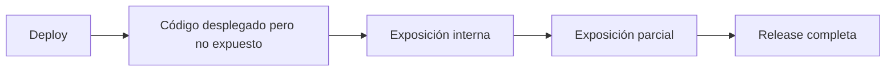

### Criterio de comprensión

Debes poder explicar:

> Progressive delivery separa desplegar de exponer, y usa señales para decidir si avanzar o parar.

---

## 18.26. Qué puede hacer Kubernetes nativo y qué no

Kubernetes nativo te da una base muy potente.

Pero no lo hace todo.

| Capability | Kubernetes Deployment nativo | Necesita tooling extra o diseño de aplicación |
|---|---:|---:|
| Rolling update | Sí | No |
| Recreate strategy | Sí | No |
| Inclusión en tráfico basada en readiness | Sí | No |
| Rollback básico | Sí | No |
| Pausar y reanudar rollout | Sí | No |
| Exact traffic percentage canary | No | Sí |
| Header-based routing | No | Sí |
| User-based A/B assignment | No | Sí |
| Metric-based automatic promotion | No | Sí |
| Business-metric experiment decision | No | Sí |
| Feature flag exposure | No | Sí |
| Database compatibility | No | Sí |
| Event schema compatibility | No | Sí |
| Migraciones seguras | No | Sí |
| Rollback de datos | No | Sí |

### Lectura correcta

No significa que Kubernetes sea insuficiente.

Significa que debes saber dónde termina su responsabilidad.

Kubernetes puede:

- Crear Pods.
- Eliminar Pods.
- Esperar readiness.
- Mantener ReplicaSets.
- Hacer rollouts básicos.
- Revertir el template del Deployment.

Kubernetes no puede decidir por ti:

- Si tu contrato HTTP es compatible.
- Si tu migración de datos es segura.
- Si tu canary tiene métricas fiables.
- Si una variante A/B es estadísticamente válida.
- Si un rollback rompe datos.
- Si una feature flag debe activarse.

### Criterio de comprensión

Debes poder explicar:

> Kubernetes puede operar workloads, pero la seguridad de una release depende también de compatibilidad, datos, tráfico, métricas y decisiones de producto.

---

## 18.27. Argo Rollouts

Kubernetes Deployment nativo es suficiente para muchos rolling updates.

Pero no cubre de forma nativa todas las estrategias avanzadas.

Argo Rollouts es un controller de Kubernetes y un conjunto de CRDs que proporciona capacidades avanzadas como blue-green, canary, análisis canary, experimentación y progressive delivery.

### Qué añade Argo Rollouts

- Rollout como recurso similar a Deployment.
- Blue-green strategy.
- Canary strategy.
- Traffic shifting.
- AnalysisTemplates.
- Automated promotion.
- Manual promotion.
- Automated rollback.
- Integración con métricas.
- Integración con Ingress controllers y service meshes.
- Experiments.

### Deployment vs Rollout

| Kubernetes Deployment | Argo Rollout |
|---|---|
| RollingUpdate y Recreate | Canary, BlueGreen, experimentos |
| Rollback básico | Rollback ligado a análisis |
| Sin análisis nativo | AnalysisTemplates |
| Sin traffic weights nativos | Integración con traffic managers |
| Nativo de Kubernetes | CRD adicional |

### Ejemplo conceptual de Rollout canary

```yaml
apiVersion: argoproj.io/v1alpha1
kind: Rollout
metadata:
  name: checkout-api
  namespace: shop
spec:
  replicas: 5
  selector:
    matchLabels:
      app: checkout-api
  template:
    metadata:
      labels:
        app: checkout-api
    spec:
      containers:
        - name: checkout-api
          image: checkout-api:1.1.0
          ports:
            - containerPort: 8080
  strategy:
    canary:
      steps:
        - setWeight: 10
        - pause:
            duration: 60s
        - setWeight: 25
        - pause:
            duration: 120s
        - setWeight: 50
        - pause: {}
        - setWeight: 100
```

### Importante

Este ejemplo muestra intención.

Para traffic splitting real, normalmente necesitas configurar integración con un traffic manager como Ingress controller o service mesh.

Sin traffic manager, el comportamiento puede limitarse al peso por número de réplicas, no a porcentaje exacto de tráfico.

### Criterio de comprensión

Debes poder explicar:

> Argo Rollouts extiende Kubernetes cuando necesitas progressive delivery más allá del RollingUpdate nativo.

---

## 18.28. AnalysisTemplates y métricas de promoción

Un rollout progresivo no debería avanzar solo porque pasó tiempo.

Debería avanzar porque las señales son buenas.

Ejemplos de señales:

- Error rate bajo.
- Latencia p95 aceptable.
- Sin aumento de restarts.
- Sin aumento de 5xx.
- SLO respetado.
- Métrica de negocio estable.
- Smoke test exitoso.

Con Argo Rollouts puedes definir análisis.

Ejemplo conceptual con Prometheus:

```yaml
apiVersion: argoproj.io/v1alpha1
kind: AnalysisTemplate
metadata:
  name: checkout-api-success-rate
  namespace: shop
spec:
  metrics:
    - name: success-rate
      interval: 30s
      count: 3
      successCondition: result[0] >= 0.99
      failureLimit: 1
      provider:
        prometheus:
          address: http://prometheus-server.monitoring.svc.cluster.local
          query: |
            sum(rate(http_requests_total{app="checkout-api",status!~"5.."}[2m]))
            /
            sum(rate(http_requests_total{app="checkout-api"}[2m]))
```

### Advertencia importante

Un análisis automatizado es tan bueno como sus métricas.

Si tus métricas están mal, el rollout tomará malas decisiones rápido.

Antes de automatizar promoción, valida manualmente:

- Qué mide la métrica.
- Qué significa éxito.
- Qué significa fallo.
- Cuánto retraso tiene la señal.
- Qué pasa con bajo tráfico.
- Qué pasa si Prometheus no responde.
- Qué pasa si la consulta devuelve vacío.
- Qué pasa si el tráfico canary no es representativo.

### Criterio de comprensión

Debes poder explicar:

> Progressive delivery necesita métricas confiables. Automatizar promoción con métricas malas solo automatiza decisiones malas.

---

## 18.29. Feature flags

Los feature flags separan despliegue y release.

Puedes desplegar código nuevo apagado.

Luego activarlo gradualmente.

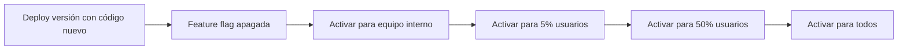

### Casos de uso

- Liberar una funcionalidad a usuarios internos.
- Activar por tenant.
- Activar por país.
- Hacer A/B testing.
- Desactivar una funcionalidad defectuosa sin rollback completo.
- Separar cambios técnicos de cambios visibles.
- Reducir exposición de una integración externa.
- Ejecutar una migración funcional por fases.

### Riesgos

Los flags también añaden complejidad:

- Ramas condicionales en código.
- Estados combinatorios.
- Flags olvidadas.
- Comportamiento difícil de probar.
- Dependencia de plataforma de flags.
- Riesgo de activar algo sin preparación.
- Deuda operacional si nadie limpia flags antiguos.

### Regla

Un flag debe tener dueño y fecha de retirada.

Si una feature flag ya no cumple función, debe eliminarse.

### Criterio de comprensión

Debes poder explicar:

> Feature flags reducen riesgo de exposición, pero aumentan complejidad si no se gestionan con disciplina.

---

## 18.30. Migraciones de base de datos y compatibilidad

Muchos despliegues fallan no por Kubernetes, sino por datos.

El problema clásico:

```text
v1 espera columna old_name
v2 escribe columna new_name
rollback vuelve a v1
v1 ya no entiende los datos nuevos
```

Para zero downtime, las migraciones deben ser compatibles con versiones que conviven.

Patrón expand and contract:

```mermaid
flowchart LR
  Step1["v1 usa esquema actual"] --> Step2["Expandir esquema<br/>añadir columna/campo compatible"]
  Step2 --> Step3["v2 escribe nuevo formato<br/>mantiene compatibilidad"]
  Step3 --> Step4["Migrar datos"]
  Step4 --> Step5["Confirmar que nadie usa formato antiguo"]
  Step5 --> Step6["Contract<br/>eliminar campo antiguo"]
```

### Reglas prácticas

- No elimines columnas en el mismo despliegue que introduce su reemplazo.
- No renombres campos de golpe.
- Añade primero.
- Escribe de forma compatible.
- Lee ambos formatos durante la transición.
- Migra datos.
- Observa.
- Elimina después.

### Relación con rollback

Si una migración no es reversible, rollback puede ser peligroso.

Antes de desplegar, pregunta:

- ¿Puede v1 funcionar después de que v2 escriba datos?
- ¿Puede v2 leer datos escritos por v1?
- ¿Se puede revertir el schema?
- ¿La migración es online?
- ¿Bloquea tablas?
- ¿Cuánto tarda?
- ¿Qué pasa si se corta a mitad?

### Criterio de comprensión

Debes poder explicar:

> Zero downtime no termina en Pods Ready. Si el cambio de datos no es compatible, el deployment sigue siendo riesgoso.

---

## 18.31. Estrategia de rollback

Rollback no debe improvisarse.

Antes de desplegar, define:

- Qué señal dispara rollback.
- Quién puede ejecutarlo.
- Qué comando se usa.
- Qué datos quedan afectados.
- Qué versión es segura.
- Qué se comunica.
- Cómo se valida recuperación.

### Rollback de Deployment

```bash
kubectl rollout undo deployment/checkout-api -n shop
```

Validar:

```bash
kubectl rollout status deployment/checkout-api -n shop
kubectl get pods -n shop
kubectl logs deployment/checkout-api -n shop
```

### Rollback con GitOps

Si usas Argo CD:

```text
revert commit
Argo CD detecta cambio
sync
observar health
```

### Rollback con Argo Rollouts

```bash
kubectl argo rollouts abort checkout-api -n shop
kubectl argo rollouts undo checkout-api -n shop
```

### Criterio de comprensión

Debes poder explicar:

> Rollback no es un botón de pánico. Es una ruta de recuperación diseñada antes del incidente.

---

## 18.32. Observabilidad durante deployments

Un deployment sin observabilidad es una apuesta.

Durante el rollout, deberías mirar como mínimo:

### Señales Kubernetes

```bash
kubectl rollout status deployment/checkout-api -n shop
kubectl get deploy,rs,pod -n shop
kubectl get events -n shop --sort-by=.lastTimestamp
kubectl describe deployment checkout-api -n shop
kubectl get endpointslice -n shop
```

### Señales de aplicación

- HTTP 5xx.
- HTTP 4xx inesperados.
- Latencia p95 y p99.
- Throughput.
- Logs de error.
- Restarts.
- Saturación CPU y memoria.
- Timeouts.
- Errores por dependencia.

### Señales de negocio

- Checkouts creados.
- Pagos completados.
- Carritos abandonados.
- Errores por usuario.
- Conversión.
- Cancelaciones.

```mermaid
flowchart TD
  Rollout["Rollout"] --> K8s["Señales Kubernetes"]
  Rollout --> App["Señales de aplicación"]
  Rollout --> Business["Señales de negocio"]

  K8s --> Decision["Decisión: continuar, pausar o rollback"]
  App --> Decision
  Business --> Decision
```

### Criterio de comprensión

Debes poder explicar:

> Observar un deployment no es solo mirar Pods. También hay que mirar comportamiento de aplicación y señales de usuario.

---

## 18.33. Práctica 1: RollingUpdate sin downtime

### Objetivo

Configurar `checkout-api` para actualizarse con RollingUpdate manteniendo disponibilidad.

### Manifests

Crea:

```text
k8s/zero-downtime/deployment.yaml
k8s/zero-downtime/service.yaml
```

Usa el Deployment de la sección 18.16.

### Aplicar

```bash
kubectl create namespace shop --dry-run=client -o yaml | kubectl apply -f -
kubectl apply -f k8s/zero-downtime/service.yaml
kubectl apply -f k8s/zero-downtime/deployment.yaml
```

### Observar

```bash
kubectl get deploy,rs,pod,svc,endpointslice -n shop
kubectl rollout status deployment/checkout-api -n shop
```

### Generar tráfico desde dentro del cluster

Crea un Pod temporal:

```bash
kubectl run curl \
  --rm -it \
  --image=curlimages/curl:8.8.0 \
  -n shop \
  -- sh
```

Dentro:

```sh
while true; do
  curl -fsS http://checkout-api/health && echo
  sleep 1
done
```

### Actualizar imagen

Si usas `kind`, carga primero la imagen:

```bash
kind load docker-image checkout-api:1.1.0
```

Después actualiza:

```bash
kubectl set image deployment/checkout-api \
  checkout-api=checkout-api:1.1.0 \
  -n shop
```

### Validar

```bash
kubectl rollout status deployment/checkout-api -n shop
kubectl get rs -n shop -l app=checkout-api
kubectl get pods -n shop -l app=checkout-api
kubectl get endpointslice -n shop
```

### Preguntas

- ¿Cuántos ReplicaSets aparecen?
- ¿Cuántos Pods hay temporalmente?
- ¿Hubo respuestas fallidas?
- ¿Qué papel jugó readiness?
- ¿Qué papel jugó `minReadySeconds`?
- ¿Qué habría pasado con `replicas: 1`?
- ¿Qué habría pasado con `maxUnavailable: 1` y poca capacidad?

### Criterio

Debes poder explicar:

> RollingUpdate necesita tráfico real o simulado para observar si el cambio mantiene disponibilidad.

---

## 18.34. Práctica 2: Rollout roto por imagen inexistente

### Objetivo

Romper un rollout y recuperarlo.

Actualiza a una imagen inexistente:

```bash
kubectl set image deployment/checkout-api \
  checkout-api=checkout-api:does-not-exist \
  -n shop
```

Observa:

```bash
kubectl rollout status deployment/checkout-api -n shop --timeout=60s
kubectl get pods -n shop
kubectl describe deployment checkout-api -n shop
kubectl get events -n shop --sort-by=.lastTimestamp
```

Rollback:

```bash
kubectl rollout undo deployment/checkout-api -n shop
```

Validar:

```bash
kubectl rollout status deployment/checkout-api -n shop
kubectl get pods -n shop
```

### Preguntas

- ¿Qué estado tuvieron los Pods nuevos?
- ¿Se eliminó toda la versión anterior?
- ¿Qué hizo `maxUnavailable: 0`?
- ¿Qué señal te indicó el problema?
- ¿El rollback fue suficiente?
- ¿Qué habría pasado si el fallo no fuera de imagen, sino de comportamiento?

### Criterio

Debes poder explicar:

> Una buena estrategia de rollout limita el impacto cuando la nueva versión ni siquiera puede arrancar.

---

## 18.35. Práctica 3: Rollout con readiness fallando

### Objetivo

Comprender que `Running` no significa `Ready`.

Cambia temporalmente la readiness probe:

```yaml
readinessProbe:
  httpGet:
    path: /not-ready
    port: http
```

Aplica el Deployment:

```bash
kubectl apply -f k8s/zero-downtime/deployment.yaml
```

Observa:

```bash
kubectl rollout status deployment/checkout-api -n shop --timeout=60s
kubectl get pods -n shop
kubectl describe pod <pod> -n shop
kubectl get endpointslice -n shop
```

### Preguntas

- ¿Los Pods están `Running`?
- ¿Los Pods están `Ready`?
- ¿El Service los incluye como endpoints?
- ¿El rollout completa?
- ¿Por qué esto es más seguro que enviar tráfico a un Pod roto?

### Reparar

Vuelve a dejar:

```yaml
readinessProbe:
  httpGet:
    path: /ready
    port: http
```

Aplica:

```bash
kubectl apply -f k8s/zero-downtime/deployment.yaml
kubectl rollout status deployment/checkout-api -n shop
```

### Criterio

Debes poder explicar:

> Un Pod puede estar Running y aun así no recibir tráfico porque readiness protege los endpoints del Service.

---

## 18.36. Práctica 4: Observar terminación de Pods

### Objetivo

Ver qué ocurre cuando un Pod se elimina durante un rollout o un restart.

En una terminal:

```bash
kubectl get pods -n shop -w
```

En otra terminal:

```bash
kubectl rollout restart deployment/checkout-api -n shop
```

Observa:

- Pods entrando en `Terminating`.
- Nuevos Pods creándose.
- Readiness antes de recibir tráfico.
- Eventos.
- Logs de apagado si la app registra `SIGTERM`.

Ver logs:

```bash
kubectl logs deployment/checkout-api -n shop
```

Ver eventos:

```bash
kubectl get events -n shop --sort-by=.lastTimestamp
```

### Preguntas

- ¿La aplicación recibió `SIGTERM`?
- ¿El Pod desapareció inmediatamente?
- ¿Readiness protegió la entrada de tráfico?
- ¿Cuánto tardó la terminación?
- ¿Qué pasaría si el cierre tarda más que `terminationGracePeriodSeconds`?

### Criterio

Debes poder explicar:

> Graceful shutdown es observable. Si no puedes verlo, no puedes confiar en él.

---

## 18.37. Práctica 5: Blue-green manual

### Objetivo

Entender blue-green usando dos Deployments y un Service.

### Blue Deployment

```yaml
apiVersion: apps/v1
kind: Deployment
metadata:
  name: checkout-api-blue
  namespace: shop
spec:
  replicas: 3
  selector:
    matchLabels:
      app: checkout-api
      version: blue
  template:
    metadata:
      labels:
        app: checkout-api
        version: blue
    spec:
      containers:
        - name: checkout-api
          image: checkout-api:1.0.0
          ports:
            - containerPort: 8080
```

### Green Deployment

```yaml
apiVersion: apps/v1
kind: Deployment
metadata:
  name: checkout-api-green
  namespace: shop
spec:
  replicas: 3
  selector:
    matchLabels:
      app: checkout-api
      version: green
  template:
    metadata:
      labels:
        app: checkout-api
        version: green
    spec:
      containers:
        - name: checkout-api
          image: checkout-api:1.1.0
          ports:
            - containerPort: 8080
```

### Active Service

```yaml
apiVersion: v1
kind: Service
metadata:
  name: checkout-api
  namespace: shop
spec:
  selector:
    app: checkout-api
    version: blue
  ports:
    - port: 80
      targetPort: 8080
```

### Promover green

Cambia selector:

```yaml
selector:
  app: checkout-api
  version: green
```

Aplica:

```bash
kubectl apply -f k8s/blue-green/service.yaml
```

### Preguntas

- ¿Qué versión recibía tráfico antes?
- ¿Qué versión recibía tráfico después?
- ¿Qué coste de capacidad tiene este modelo?
- ¿Cómo harías rollback?
- ¿Qué problemas aparecen con estado compartido?
- ¿Qué pasa si green usa una migración incompatible?

### Criterio

Debes poder explicar:

> Blue-green permite validar una versión nueva antes de cambiar tráfico, pero duplica capacidad y no resuelve por sí mismo compatibilidad de datos.

---

## 18.38. Práctica 6: Canary conceptual

### Objetivo

Entender los límites de Kubernetes nativo.

Crea dos Deployments:

- `checkout-api-stable`
- `checkout-api-canary`

Ambos con label común:

```yaml
app: checkout-api
```

Y label de track:

```yaml
track: stable
```

o:

```yaml
track: canary
```

Service:

```yaml
apiVersion: v1
kind: Service
metadata:
  name: checkout-api
  namespace: shop
spec:
  selector:
    app: checkout-api
  ports:
    - port: 80
      targetPort: 8080
```

Si tienes 9 Pods stable y 1 Pod canary, aproximadamente podrías recibir algo cercano a 10% de tráfico hacia canary.

Pero esto no es un traffic split exacto para experimentación.

### Por qué esta aproximación no basta

Este laboratorio es útil para aprender, pero no es suficiente para canary profesional porque:

- No proporciona pesos explícitos de tráfico.
- No garantiza asignación estable por usuario.
- No conoce segmentos de producto.
- No sabe si el tráfico canary es representativo.
- No proporciona análisis automático de métricas.
- No proporciona semántica de promoción o aborto.
- Puede comportarse de forma diferente con conexiones largas.

Este laboratorio enseña la limitación, no el mecanismo recomendado para producción.

### Preguntas

- ¿Por qué esto no es un canary preciso?
- ¿Qué pasa si los Pods tienen distinta capacidad?
- ¿Qué pasa con conexiones persistentes?
- ¿Qué necesitarías para canary real?
- ¿Qué señales usarías para promover?
- ¿Por qué esto no es A/B testing?

### Criterio

Debes poder explicar:

> Kubernetes Service puede repartir entre endpoints, pero no es una herramienta completa de canary, A/B testing o experimentación.

---

## 18.39. Taskfile para el módulo

Añade tareas:

```yaml
zero-downtime:apply:
  desc: Apply zero-downtime deployment manifests
  cmds:
    - kubectl create namespace shop --dry-run=client -o yaml | kubectl apply -f -
    - kubectl apply -f k8s/zero-downtime/service.yaml
    - kubectl apply -f k8s/zero-downtime/deployment.yaml

zero-downtime:status:
  desc: Show rollout and runtime status
  cmds:
    - kubectl get deploy,rs,pod,svc,endpointslice -n shop
    - kubectl rollout status deployment/checkout-api -n shop --timeout=120s

zero-downtime:update:
  desc: Update checkout-api image
  vars:
    IMAGE: '{{.IMAGE | default "checkout-api:1.1.0"}}'
  cmds:
    - kubectl set image deployment/checkout-api checkout-api={{.IMAGE}} -n shop
    - kubectl rollout status deployment/checkout-api -n shop --timeout=120s

zero-downtime:kind:load-image:
  desc: Load checkout-api image into kind
  vars:
    IMAGE: '{{.IMAGE | default "checkout-api:1.1.0"}}'
  cmds:
    - kind load docker-image {{.IMAGE}}

zero-downtime:rollback:
  desc: Rollback checkout-api deployment
  cmds:
    - kubectl rollout undo deployment/checkout-api -n shop
    - kubectl rollout status deployment/checkout-api -n shop --timeout=120s

zero-downtime:restart:
  desc: Restart checkout-api deployment
  cmds:
    - kubectl rollout restart deployment/checkout-api -n shop
    - kubectl rollout status deployment/checkout-api -n shop --timeout=120s

zero-downtime:history:
  desc: Show rollout history
  cmds:
    - kubectl rollout history deployment/checkout-api -n shop

zero-downtime:events:
  desc: Show namespace events
  cmds:
    - kubectl get events -n shop --sort-by=.lastTimestamp

zero-downtime:endpoints:
  desc: Show Service and EndpointSlices
  cmds:
    - kubectl get svc,endpointslice -n shop

zero-downtime:watch:
  desc: Watch Deployment, ReplicaSets and Pods
  cmds:
    - watch kubectl get deploy,rs,pod -n shop

blue-green:apply:
  desc: Apply blue-green manifests
  cmds:
    - kubectl apply -f k8s/blue-green/

blue-green:promote-green:
  desc: Promote green version by applying green Service selector
  cmds:
    - kubectl apply -f k8s/blue-green/service-green.yaml

blue-green:rollback-blue:
  desc: Roll back traffic to blue version
  cmds:
    - kubectl apply -f k8s/blue-green/service-blue.yaml
```

### Criterio DevEx

Debes poder explicar:

> Taskfile no sustituye el conocimiento del rollout. Hace que las operaciones de aplicar, observar, actualizar y revertir sean repetibles.

---

## 18.40. Checklist de deployment seguro

Antes de desplegar:

- [ ] Hay más de una réplica.
- [ ] Existe readiness probe.
- [ ] Existe liveness probe razonable.
- [ ] Existe startup probe si el arranque puede ser lento.
- [ ] Existe `minReadySeconds` si necesitas una ventana mínima de estabilidad.
- [ ] La app gestiona `SIGTERM`.
- [ ] Hay `terminationGracePeriodSeconds`.
- [ ] `preStop` no consume todo el periodo de gracia.
- [ ] Hay recursos declarados.
- [ ] La estrategia RollingUpdate está configurada.
- [ ] `maxUnavailable` no reduce capacidad por debajo de lo aceptable.
- [ ] `maxSurge` cabe en el cluster.
- [ ] Existe Service estable.
- [ ] Los selectors del Service coinciden con labels del Pod.
- [ ] La imagen está disponible para el cluster.
- [ ] Hay observabilidad mínima.
- [ ] Hay rollback definido.
- [ ] Las migraciones son compatibles.
- [ ] Los contratos son compatibles entre versiones.
- [ ] No se mezclan demasiados cambios en un único rollout.
- [ ] Hay una señal clara para pausar o abortar.

Durante el rollout:

- [ ] Observar `kubectl rollout status`.
- [ ] Observar Pods Ready.
- [ ] Observar ReplicaSets.
- [ ] Observar Events.
- [ ] Observar EndpointSlices.
- [ ] Observar logs.
- [ ] Observar métricas técnicas.
- [ ] Observar métricas de negocio si aplica.

Después del rollout:

- [ ] Confirmar versión activa.
- [ ] Confirmar endpoints.
- [ ] Confirmar ausencia de restarts inesperados.
- [ ] Confirmar latencia.
- [ ] Confirmar error rate.
- [ ] Confirmar comportamiento funcional.
- [ ] Documentar incidencias.
- [ ] Eliminar flags o recursos temporales cuando toque.

---

## 18.41. Errores habituales

### Error 1. Creer que RollingUpdate garantiza zero downtime

RollingUpdate ayuda, pero no basta.

Necesitas readiness, réplicas suficientes, apagado correcto, capacidad y compatibilidad.

### Error 2. Usar `replicas: 1` para servicios críticos

Con una sola réplica no hay margen.

Si esa réplica se actualiza, cae o no está Ready, no hay otra que atienda tráfico.

### Error 3. No tener readiness probe

Sin readiness, Kubernetes puede enviar tráfico demasiado pronto.

### Error 4. Usar liveness como readiness

Liveness reinicia.

Readiness saca del tráfico.

No son intercambiables.

### Error 5. Hacer liveness demasiado agresiva

Una liveness agresiva puede crear reinicios en cascada durante momentos de latencia o carga.

### Error 6. No gestionar SIGTERM

Si la app no cierra bien, puede cortar peticiones en curso.

### Error 7. Configurar `preStop` sin entender el grace period

`preStop` cuenta dentro de `terminationGracePeriodSeconds`.

Un `preStop` demasiado largo puede dejar muy poco tiempo para que la app cierre correctamente.

### Error 8. Pensar que rollback revierte datos

Rollback de Deployment no revierte bases de datos ni efectos externos.

### Error 9. Hacer canary sin métricas

Canary sin observabilidad es exposición parcial a ciegas.

### Error 10. Confundir A/B testing con canary

Canary valida seguridad operacional.

A/B testing valida comportamiento de usuario o negocio.

### Error 11. Usar blue-green sin pensar en estado

Blue-green puede ser muy limpio para tráfico HTTP, pero complejo si hay sesiones, estado local, datos o migraciones.

### Error 12. Cambiar labels sin revisar selectors

Puedes dejar un Service sin endpoints si cambias labels usadas por selectors.

### Error 13. Automatizar promoción con métricas débiles

Automatizar decisiones con señales malas puede empeorar la velocidad del fallo.

### Error 14. Olvidar que la imagen local debe estar disponible para el cluster

Construir una imagen local no siempre basta.

En `kind`, por ejemplo, normalmente debes cargarla con `kind load docker-image`.

---

## 18.42. Criterio de salida del módulo

Puedes dar este módulo por completado cuando puedas explicar y demostrar:

### Conceptos

Debes poder explicar:

- Qué significa zero downtime.
- Qué no significa zero downtime.
- Qué es RollingUpdate.
- Qué es Recreate.
- Qué hacen `maxSurge` y `maxUnavailable`.
- Por qué RollingUpdate implica convivencia de versiones.
- Por qué readiness es crítica.
- Qué diferencia hay entre readiness, liveness y startup.
- Qué problema resuelve `minReadySeconds`.
- Qué problema resuelve `progressDeadlineSeconds`.
- Qué ocurre durante la terminación de un Pod.
- Qué papel tienen `preStop` y `terminationGracePeriodSeconds`.
- Qué papel tiene el Service durante un rollout.
- Qué papel tienen EndpointSlices.
- Qué es un PDB.
- Qué problema resuelve topology spread.
- Qué problema resuelve blue-green.
- Qué problema resuelve canary.
- Qué problema resuelve A/B testing.
- Qué es progressive delivery.
- Qué puede hacer Kubernetes nativo.
- Cuándo necesitas Argo Rollouts o un traffic manager.
- Por qué las migraciones de datos pueden romper zero downtime.
- Por qué una imagen local puede no estar disponible para el cluster.

### Práctica

Debes poder:

- Aplicar un Deployment con RollingUpdate.
- Configurar `maxSurge` y `maxUnavailable`.
- Configurar readiness, liveness y startup probes.
- Configurar `minReadySeconds`.
- Observar un rollout.
- Actualizar imagen.
- Ver ReplicaSets.
- Hacer rollback.
- Romper un rollout con una imagen inválida.
- Diagnosticar el fallo.
- Romper un rollout con readiness fallando.
- Explicar por qué Running no es Ready.
- Observar terminación de Pods.
- Recuperar la versión anterior.
- Crear un PDB.
- Explicar un blue-green manual.
- Explicar por qué el canary nativo con Services es limitado.
- Explicar qué señales usarías para promover o abortar.

### Frase final de comprensión

Debes poder explicar esta frase:

> Un deployment seguro no es el que nunca falla. Es el que limita el impacto, hace visible el fallo y permite decidir rápido si avanzar, pausar o volver atrás.

---

## 18.43. Referencias oficiales

| Tema | Referencia |
|---|---|
| Kubernetes Deployments | Kubernetes Docs, Deployments. https://kubernetes.io/docs/concepts/workloads/controllers/deployment/ |
| Kubernetes rolling updates | Kubernetes Docs, Performing a Rolling Update. https://kubernetes.io/docs/tutorials/kubernetes-basics/update/update-intro/ |
| Kubernetes probes | Kubernetes Docs, Configure Liveness, Readiness and Startup Probes. https://kubernetes.io/docs/tasks/configure-pod-container/configure-liveness-readiness-startup-probes/ |
| Kubernetes probes concepts | Kubernetes Docs, Liveness, Readiness and Startup Probes. https://kubernetes.io/docs/concepts/configuration/liveness-readiness-startup-probes/ |
| Kubernetes Pod lifecycle | Kubernetes Docs, Pod Lifecycle. https://kubernetes.io/docs/concepts/workloads/pods/pod-lifecycle/ |
| Kubernetes container lifecycle hooks | Kubernetes Docs, Container Lifecycle Hooks. https://kubernetes.io/docs/concepts/containers/container-lifecycle-hooks/ |
| Pod termination and endpoints | Kubernetes Docs, Explore Termination Behavior for Pods And Their Endpoints. https://kubernetes.io/docs/tutorials/services/pods-and-endpoint-termination-flow/ |
| PodDisruptionBudget | Kubernetes Docs, Specifying a Disruption Budget for your Application. https://kubernetes.io/docs/tasks/run-application/configure-pdb/ |
| Kubernetes disruptions | Kubernetes Docs, Disruptions. https://kubernetes.io/docs/concepts/workloads/pods/disruptions/ |
| Services | Kubernetes Docs, Service. https://kubernetes.io/docs/concepts/services-networking/service/ |
| EndpointSlices | Kubernetes Docs, EndpointSlices. https://kubernetes.io/docs/concepts/services-networking/endpoint-slices/ |
| Topology spread constraints | Kubernetes Docs, Pod Topology Spread Constraints. https://kubernetes.io/docs/concepts/scheduling-eviction/topology-spread-constraints/ |
| Assigning Pods to Nodes | Kubernetes Docs, Assigning Pods to Nodes. https://kubernetes.io/docs/concepts/scheduling-eviction/assign-pod-node/ |
| Argo Rollouts | Argo Rollouts documentation. https://argo-rollouts.readthedocs.io/en/stable/ |
| Argo Rollouts overview | Argo Rollouts project overview. https://argoproj.github.io/rollouts/ |
| Argo Rollouts concepts | Argo Rollouts, Concepts. https://argo-rollouts.readthedocs.io/en/stable/concepts/ |
| Argo Rollouts canary | Argo Rollouts, Canary strategy. https://argo-rollouts.readthedocs.io/en/stable/features/canary/ |
| Argo Rollouts blue-green | Argo Rollouts, BlueGreen strategy. https://argo-rollouts.readthedocs.io/en/stable/features/bluegreen/ |
| Argo Rollouts analysis | Argo Rollouts, Analysis and Progressive Delivery. https://argo-rollouts.readthedocs.io/en/stable/features/analysis/ |
| Argo Rollouts specification | Argo Rollouts, Rollout specification. https://argo-rollouts.readthedocs.io/en/stable/features/specification/ |
| Argo Rollouts best practices | Argo Rollouts, Best Practices. https://argo-rollouts.readthedocs.io/en/stable/best-practices/ |

## 18.44. Lecturas de apoyo

| Tema                                  | Qué leer                                                                                             |
| ------------------------------------- | ---------------------------------------------------------------------------------------------------- |
| _Kubernetes: Up and Running_          | Deployments, Services, health checks, rollouts, scaling y operación de aplicaciones.                 |
| _Kubernetes in Action_                | Deployments, ReplicaSets, Services, readiness, rolling updates y actualización de aplicaciones.      |
| _Cloud Native DevOps with Kubernetes_ | Deployments, release strategies, observability, progressive delivery y operación de servicios.       |
| Progressive delivery                  | Canary, blue-green, feature flags, automated analysis, rollback y separación entre deploy y release. |
| Feature flags                         | Separación entre deploy y release, kill switches, segmentación, flags temporales y deuda de flags.   |
| Observability                         | RED, USE, golden signals, logs, métricas, trazas y runbooks aplicados a deployments.                 |
| Database migrations                   | Expand and contract, compatibilidad temporal, migraciones online y rollback seguro.                  |

<!-- COURSE_NAV_START -->
[Anterior](<17. GitOps y delivery continuo con Argo CD.md>) | [Indice](README.md) | [Siguiente](<19. Releases, compatibilidad y versionado seguro.md>)
<!-- COURSE_NAV_END -->