<!-- COURSE_NAV_START -->
[Anterior](<18. Deployments sin downtime, progressive delivery y experimentación.md>) | [Indice](README.md) | [Siguiente](<20. Migraciones de datos sin downtime.md>)
<!-- COURSE_NAV_END -->

# 19. Releases, compatibilidad y versionado seguro

## 19.1. Objetivo del módulo

En el módulo anterior aprendiste que desplegar sin downtime no depende solo de ejecutar un `kubectl apply`.

Depende de réplicas, readiness, apagado correcto, estrategia de rollout, observabilidad, compatibilidad temporal y capacidad de rollback.

Pero todavía falta una pieza crítica.

Puedes hacer un rollout técnicamente perfecto y romper producción igualmente.

¿Por qué?

Porque el sistema no solo cambia cuando cambian los Pods.

El sistema cambia cuando cambian los contratos.

Un contrato puede ser:

- Un endpoint HTTP.
- Un schema JSON.
- Un evento publicado.
- Un mensaje consumido.
- Un campo de base de datos.
- Un formato de configuración.
- Un nombre de variable de entorno.
- Un tag de imagen.
- Un digest de imagen.
- Un comportamiento esperado por otro servicio.
- Una métrica usada por una alerta.
- Una label usada por Argo CD, dashboards, NetworkPolicy o selección de Pods.
- Un formato de log usado por soporte u observabilidad.
- Un manifest que depende de una versión concreta de la API de Kubernetes.

Este módulo trata sobre cómo publicar versiones de forma segura.

Aprenderás:

- Qué es una release.
- Qué diferencia hay entre build, artifact, deploy y release.
- Por qué una release puede contener varios artefactos.
- Qué significa versionar de forma útil.
- Qué aporta SemVer y qué no aporta.
- Cómo usar pre-release y build metadata sin perder claridad.
- Por qué tags y digests no resuelven el mismo problema.
- Qué riesgo tienen los tags mutables.
- Qué papel tiene `imagePullPolicy`.
- Cómo promover el mismo artefacto entre entornos.
- Cómo usar labels y annotations para trazabilidad.
- Qué diferencia hay entre labels de selección, labels de observabilidad y annotations.
- Qué es compatibilidad hacia atrás.
- Qué es compatibilidad hacia delante.
- Qué significa que dos versiones convivan durante un rollout.
- Cómo diseñar APIs HTTP compatibles.
- Cómo usar OpenAPI como contrato operativo.
- Qué son consumer-driven contracts.
- Cómo versionar eventos.
- Cómo evolucionar schemas de eventos.
- Cómo evitar cambios rompientes accidentales.
- Cómo anunciar deprecaciones.
- Cómo hacer doble publicación durante transiciones.
- Cómo diseñar releases rollback-safe.
- Qué significa forward-only release.
- Qué debe contener una release note técnica.
- Cómo automatizar validaciones con Taskfile.
- Cómo conectar versionado, GitOps, observabilidad y progressive delivery.
- Cómo convertir una release en una decisión revisable y no en un comando aislado.

La idea central del módulo es esta:

> Desplegar sin downtime no sirve de mucho si la nueva versión rompe los contratos que el sistema todavía necesita.

---

## 19.2. El problema real: una release cambia expectativas

Una release no es solo una imagen nueva.

Una release cambia expectativas.

Cuando publicas una nueva versión, otros elementos del sistema pueden depender de lo que existía antes:

- Un frontend que llama a `GET /checkout`.
- Un consumidor que espera un campo `orderId`.
- Un dashboard que filtra por `app.kubernetes.io/version`.
- Una alerta que espera una métrica con cierto nombre.
- Un job que usa una variable de entorno.
- Una NetworkPolicy que selecciona Pods por label.
- Un cliente externo que todavía usa una ruta antigua.
- Un script de soporte que espera cierto formato de log.
- Una versión anterior del mismo servicio durante un rolling update.
- Un consumidor asíncrono que espera un evento con una estructura concreta.
- Un runbook que espera ciertos comandos, labels o métricas.

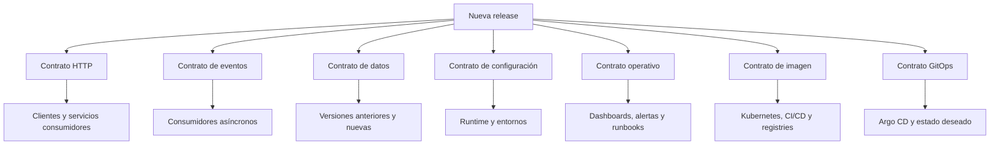

Un deployment puede ser técnicamente exitoso:

```text
Pods Ready
rollout completed
Service con endpoints
sin restarts
```

Y aun así la release puede ser mala si rompe una expectativa externa.

Ejemplos:

- Cambias `customerId` por `clientId` y un consumidor no se actualizó.
- Cambias un endpoint de `GET /checkout` a `POST /checkout` sin transición.
- Eliminas una variable de entorno usada en staging.
- Cambias el formato de logs y rompes un parser.
- Cambias una métrica y la alerta deja de funcionar.
- Cambias un evento y un consumidor empieza a fallar.
- Cambias el schema de base de datos y el rollback deja de ser seguro.
- Cambias labels de Pods y el Service se queda sin endpoints.
- Cambias el contrato de readiness y Argo Rollouts ya no puede analizar correctamente la release.

### Criterio de comprensión

Debes poder explicar:

> Una release no solo cambia código. Cambia contratos que otras partes del sistema pueden estar usando.

---

## 19.3. Build, artifact, deploy y release

Antes de hablar de versionado, hay que separar cuatro conceptos.

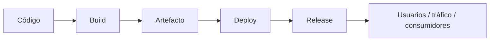

### Build

Build es el proceso que convierte código fuente en un artefacto ejecutable.

Ejemplos:

- Instalar dependencias.
- Ejecutar tests.
- Construir una imagen.
- Generar un binario.
- Generar manifests.
- Generar un SBOM.
- Publicar artefactos.

### Artifact

Artifact es el resultado versionable del build.

Ejemplos:

- Imagen de contenedor.
- Chart Helm.
- Paquete npm.
- Binario.
- SBOM.
- Manifest renderizado.
- Bundle de configuración.
- OpenAPI publicado.
- Schema de eventos.

### Deploy

Deploy significa instalar o actualizar una versión en un entorno.

Ejemplos:

- Crear Pods con una imagen nueva.
- Aplicar manifests.
- Sincronizar una Application de Argo CD.
- Actualizar un Helm release.
- Ejecutar una migración.
- Cambiar un valor de configuración.

### Release

Release significa exponer una capacidad a usuarios, clientes, consumidores o tráfico real.

Con feature flags o traffic routing, puedes desplegar sin liberar.

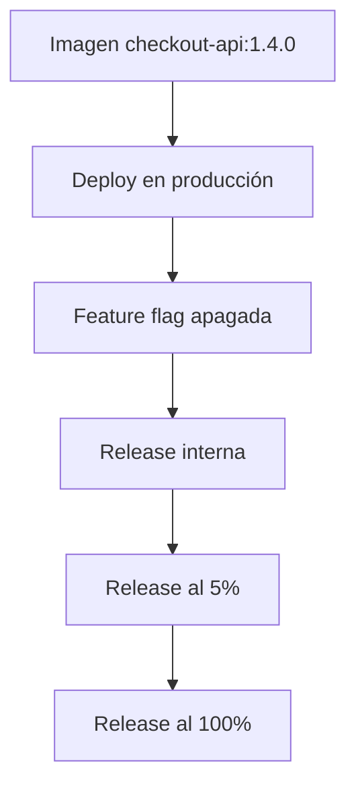

### Tabla de diferencias

| Concepto | Pregunta que responde | Ejemplo |
|---|---|---|
| Build | ¿Puedo construir algo ejecutable? | `docker build` |
| Artifact | ¿Qué artefacto exacto salió? | `checkout-api:1.4.0` |
| Deploy | ¿Está instalado en el entorno? | Deployment actualizado |
| Release | ¿Está expuesto a usuarios o consumidores? | Flag activada o tráfico dirigido |

### Por qué importa

Si mezclas estos conceptos, pierdes control.

Un equipo puede decir:

> Ya está en producción.

Pero eso puede significar cosas distintas:

- La imagen existe en el registry.
- El manifest está en Git.
- Argo CD la ha sincronizado.
- Los Pods están Ready.
- El tráfico ya llega a la versión nueva.
- La feature está activada.
- El experimento está activo.
- Los consumidores ya reciben eventos nuevos.
- La migración ya se ejecutó.

Cada una de esas frases describe una realidad distinta.

### Criterio de comprensión

Debes poder explicar:

> Build produce artefactos. Deploy instala artefactos. Release expone capacidades.

---

## 19.4. Una release puede contener varios artefactos

Una release profesional rara vez es solo una imagen.

Puede incluir:

- Imagen de contenedor.
- Manifests Kubernetes.
- Kustomize overlay.
- Helm values.
- ConfigMaps.
- Secrets.
- OpenAPI.
- Schemas de eventos.
- Migraciones.
- Feature flags.
- Dashboards.
- Alertas.
- Runbooks.
- Release notes.
- SBOM -> Revisar Dependency Track https://dependencytrack.org/
- Metadata de build.
- Evidencias de validación.

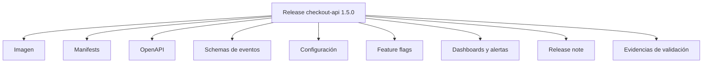

Por eso una release segura necesita trazabilidad entre todos esos artefactos.

La pregunta no es solo:

> ¿Qué imagen hemos desplegado?

También es:

> ¿Qué contrato hemos cambiado, qué configuración acompaña al cambio, qué señales lo validan y qué ruta de recuperación existe?

### Criterio de comprensión

Debes poder explicar:

> Una release es una unidad de cambio operacional. Puede incluir código, configuración, contratos, documentación, observabilidad y recuperación.

---

## 19.5. Versionado: qué problema resuelve

Versionar no consiste en poner números bonitos.

Versionar sirve para responder preguntas operativas.

```text
¿Qué está corriendo?
¿Qué cambió?
¿De dónde salió?
¿Es compatible?
¿Se puede volver atrás?
¿Quién lo aprobó?
¿Qué contrato garantiza?
¿Qué riesgos introduce?
¿Qué evidencia de validación existe?
¿Qué consumidores pueden verse afectados?
```

Una versión útil ayuda a:

- Identificar un artefacto.
- Comparar dos releases.
- Reproducir un estado.
- Investigar incidentes.
- Hacer rollback.
- Comunicar cambios.
- Coordinar equipos.
- Trazar cambios desde Git hasta producción.
- Saber qué contrato se mantiene y cuál cambia.
- Conectar release notes con artefactos reales.
- Reducir ambigüedad durante incidentes.

### Versionado débil

Esto es débil:

```text
checkout-api:latest
```

No explica qué código hay dentro.

No explica cuándo se construyó.

No explica qué commit contiene.

No explica si cambia contratos.

No explica si es seguro volver atrás.

No explica si dos nodos están ejecutando exactamente el mismo contenido.

### Versionado más útil

Ejemplos mejores:

```text
checkout-api:1.4.2
checkout-api:1.4.2-a1b2c3d
checkout-api:main-a1b2c3d
checkout-api@sha256:...
```

Cada formato responde mejor a una necesidad distinta.

### Criterio de comprensión

Debes poder explicar:

> Una versión útil no solo nombra algo. Ayuda a operar, comparar, auditar y recuperar.

---

## 19.6. SemVer: MAJOR.MINOR.PATCH

Semantic Versioning, normalmente llamado SemVer, usa el formato:

```text
MAJOR.MINOR.PATCH
```

Ejemplo:

```text
1.4.2
```

La regla general es:

| Parte | Cuándo cambia |
|---|---|
| MAJOR | Cuando introduces cambios incompatibles |
| MINOR | Cuando añades funcionalidad compatible |
| PATCH | Cuando corriges errores de forma compatible |

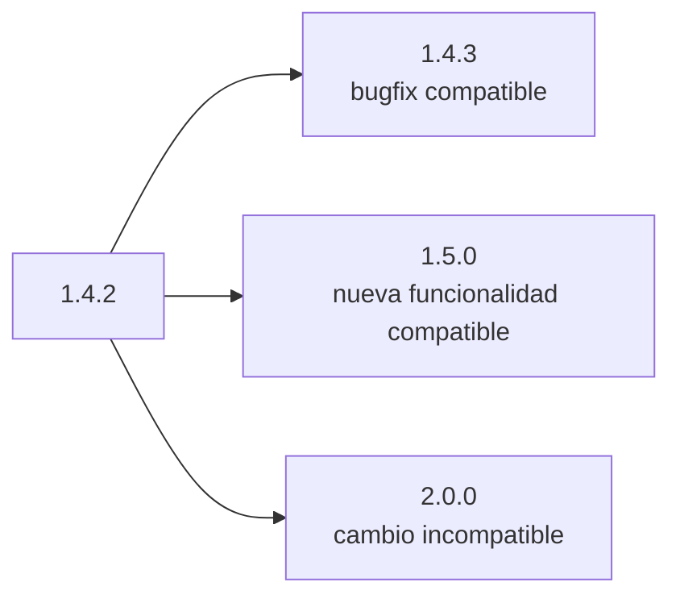

La especificación oficial de SemVer dice que el software que usa Semantic Versioning debe declarar una API pública, y que un número de versión normal debe tener forma `X.Y.Z`. También indica que, una vez publicada una versión, su contenido no debería modificarse; cualquier cambio debe publicarse como una nueva versión.

### El matiz importante

SemVer solo tiene sentido si sabes cuál es tu API pública.

En una librería, la API pública puede ser bastante clara.

En un servicio, la API pública puede incluir muchas cosas:

- Endpoints HTTP.
- Schemas de request y response.
- Eventos publicados.
- Variables de configuración.
- Métricas prometidas.
- Comportamientos observables.
- Garantías de compatibilidad.
- Códigos de error.
- Timeouts esperados.
- Formatos de logs si otros sistemas los consumen.
- Labels o annotations si herramientas dependen de ellas.
- Contratos de readiness si hay automation o progressive delivery.

Si no declaras qué es contrato, SemVer se vuelve decoración.

### Ejemplos

Cambio PATCH:

```text
1.4.2 -> 1.4.3
```

Ejemplos:

- Corriges un bug interno.
- Corriges un mensaje de error sin cambiar el contrato.
- Mejoras rendimiento sin cambiar respuesta.
- Corriges una métrica rota manteniendo el nombre.

Cambio MINOR:

```text
1.4.2 -> 1.5.0
```

Ejemplos:

- Añades `GET /checkout/{id}`.
- Añades un campo opcional en la respuesta.
- Añades una nueva métrica.
- Añades soporte para un header nuevo.
- Añades un evento nuevo sin romper consumidores existentes.

Cambio MAJOR:

```text
1.4.2 -> 2.0.0
```

Ejemplos:

- Eliminas `GET /checkout`.
- Renombras un campo obligatorio.
- Cambias el significado de un código HTTP.
- Cambias un evento existente de forma incompatible.
- Eliminas una variable de entorno usada por despliegues.
- Cambias el contrato de autenticación.

### Pre-release y build metadata

SemVer también permite expresar versiones previas y metadata de build.

Ejemplos:

```text
1.5.0-alpha.1
1.5.0-rc.1
1.5.0+build.123
1.5.0+a1b2c3d
```

Una versión pre-release puede servir para identificar una versión candidata antes de publicación final.

La build metadata puede ayudar a conectar una versión con un build, commit o pipeline.

Pero no uses metadata como sustituto de una estrategia clara de trazabilidad.

Para imágenes de contenedor, normalmente querrás combinar:

```text
versión semántica
commit
digest
release note
```

Ejemplo:

```text
checkout-api:1.5.0
checkout-api:1.5.0-a1b2c3d
checkout-api@sha256:...
```

### Cuidado

SemVer comunica intención de compatibilidad.

No prueba compatibilidad.

Una versión `1.5.0` puede romper clientes si el equipo etiqueta mal el cambio.

### Criterio de comprensión

Debes poder explicar:

> SemVer solo es útil si defines qué contrato público estás versionando, y aun así debe acompañarse de validación real.

---

## 19.7. Tags, digests y trazabilidad de imágenes

En contenedores, versionar no termina con SemVer.

También debes entender tags y digests.

### Tag

Un tag es un nombre legible.

Ejemplo:

```text
ghcr.io/example/checkout-api:1.4.2
```

Ventajas:

- Fácil de leer.
- Fácil de comunicar.
- Útil para humanos.
- Encaja bien con release notes.

Problema:

- Un tag puede moverse si alguien vuelve a publicar otro contenido con el mismo tag.

### Digest

Un digest identifica contenido exacto.

Ejemplo:

```text
ghcr.io/example/checkout-api@sha256:3b1f...
```

Ventajas:

- Identifica una imagen exacta.
- Reduce ambigüedad.
- Es mejor para reproducibilidad.

Problema:

- Es menos legible.
- Es incómodo para comunicación humana.

### Modelo recomendado

Usa ambos mentalmente:

```text
tag para comunicación humana
digest para identidad exacta
```

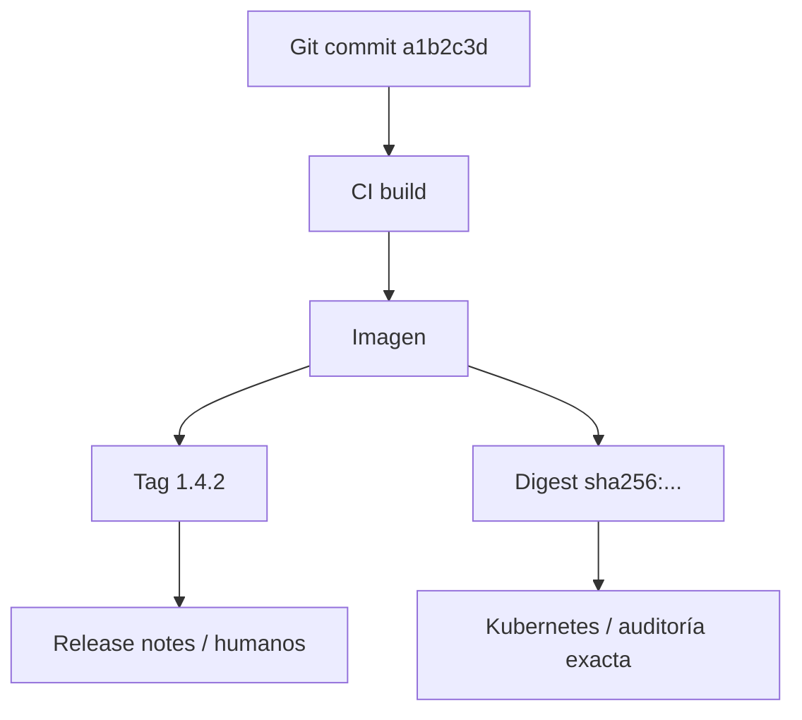

### Tags mutables e imagePullPolicy

Un tag puede moverse.

Esto significa que hoy:

```text
checkout-api:1.5.0
```

puede apuntar a una imagen, y mañana podría apuntar a otra si alguien vuelve a publicar el mismo tag.

Eso no debería ocurrir en una política de release disciplinada, pero técnicamente puede ocurrir.

`imagePullPolicy` afecta a cuándo el runtime intenta descargar la imagen.

Ejemplo:

```yaml
imagePullPolicy: IfNotPresent
```

usa una imagen local si ya existe en el nodo.

Ejemplo:

```yaml
imagePullPolicy: Always
```

consulta el registry cada vez que crea un contenedor.

Pero `Always` no convierte un tag mutable en una buena práctica.

Solo hace que Kubernetes intente resolverlo de nuevo.

Para releases serias:

- Evita `latest`.
- Evita mutar tags publicados.
- Usa tags únicos.
- Usa digests cuando necesites identidad exacta.
- Mantén trazabilidad con commit, build y release note.

### Criterio de comprensión

Debes poder explicar:

> El tag ayuda a humanos. El digest identifica contenido exacto. `imagePullPolicy` no arregla una política de versionado débil.

---

## 19.8. Construir una vez, promover el mismo artefacto

Una release segura intenta evitar esta situación:

```text
dev image      -> checkout-api:dev
staging image  -> checkout-api:staging
prod image     -> checkout-api:prod
```

Si cada entorno usa una imagen construida de forma distinta, ya no sabes si producción ejecuta exactamente lo que validaste antes.

Un flujo más seguro es:

```text
build once
publish image
promote same image through environments
change configuration per environment
```

Ejemplo:

```text
ghcr.io/example/checkout-api:1.5.0
```

La misma imagen puede usarse en:

- dev
- staging
- production

Lo que cambia por entorno debería ser configuración:

- variables
- ConfigMaps
- Secrets
- replicas
- resources
- feature flags
- endpoints externos
- políticas de autoscaling
- límites de exposición

No el contenido de la imagen.

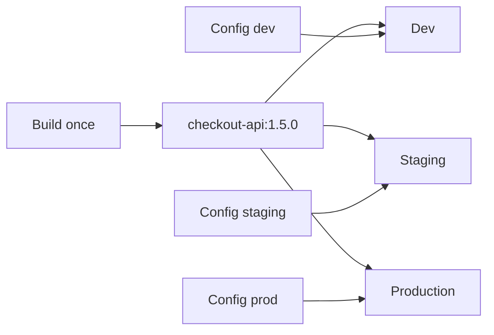

### Criterio de comprensión

Debes poder explicar:

> Una release reproducible promueve el mismo artefacto. Si reconstruyes por entorno, reduces la confianza en lo que has probado.

---

## 19.9. Labels recomendadas, selectors y annotations

Kubernetes recomienda labels comunes con prefijo `app.kubernetes.io`. Son opcionales, pero ayudan a herramientas, dashboards y automatización.

Ejemplo:

```yaml
metadata:
  labels:
    app: checkout-api
    app.kubernetes.io/name: checkout-api
    app.kubernetes.io/instance: checkout-api
    app.kubernetes.io/version: "1.4.2"
    app.kubernetes.io/component: api
    app.kubernetes.io/part-of: shop
    app.kubernetes.io/managed-by: kustomize
```

La label `app.kubernetes.io/version` se usa para indicar la versión actual de la aplicación y puede contener una versión semántica o un hash de revisión de Git.

### Labels de selección

Algunas labels forman parte del contrato de tráfico.

Ejemplo:

```yaml
selector:
  app: checkout-api
```

Si cambias esa label en los Pods, el Service puede quedarse sin endpoints.

Estas labels deben tratarse como contrato crítico.

### Labels de observabilidad

Otras labels ayudan a observar, filtrar y agrupar:

```yaml
app.kubernetes.io/version: "1.5.0"
app.kubernetes.io/component: api
app.kubernetes.io/part-of: shop
```

Estas son útiles para:

- dashboards
- queries
- troubleshooting
- coste
- ownership
- release tracking

### Annotations para trazabilidad

Las annotations pueden guardar metadata más larga o no usada para selección.

Ejemplo:

```yaml
metadata:
  annotations:
    app.example.com/git-commit: "a1b2c3d4"
    app.example.com/build-url: "https://ci.example.com/builds/1234"
    app.example.com/release-notes: "https://example.com/releases/1.4.2"
```

No uses annotations para datos sensibles.

### Regla práctica

- Si algo selecciona tráfico o recursos, trátalo como contrato crítico.
- Si algo sirve para filtrar, agrupar u observar, trátalo como metadata operativa.
- Si algo es descriptivo o largo, usa annotation.
- Si algo es sensible, no lo pongas en labels ni annotations.

### Criterio de comprensión

Debes poder explicar:

> No todas las labels tienen el mismo riesgo. Las labels usadas por selectors pueden afectar tráfico. Las labels informativas ayudan a observar. Las annotations ayudan a trazar.

---

## 19.10. Contratos: la unidad real de compatibilidad

La compatibilidad no se decide mirando solo el código.

Se decide mirando contratos.

Un contrato define qué puede esperar otro actor del sistema.

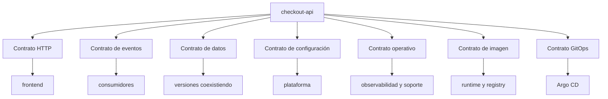

### Contrato HTTP

Incluye:

- Método.
- Ruta.
- Headers.
- Query params.
- Body.
- Status codes.
- Error format.
- Idempotencia.
- Paginación.
- Autenticación.
- Timeouts esperados.

### Contrato de eventos

Incluye:

- Nombre del evento.
- Schema.
- Versión del schema.
- Campos obligatorios.
- Campos opcionales.
- Semántica.
- Orden esperado.
- Idempotencia.
- Compatibilidad de consumidores.

### Contrato de datos

Incluye:

- Tablas.
- Columnas.
- Tipos.
- Constraints.
- Índices.
- Campos requeridos.
- Formato de datos.
- Migraciones.

### Contrato de configuración

Incluye:

- Variables de entorno.
- ConfigMaps.
- Secrets.
- Valores por defecto.
- Flags.
- Campos obligatorios.
- Formato de configuración.

### Contrato operativo

Incluye:

- Endpoints `/health` y `/ready`.
- Métricas.
- Logs.
- Trazas.
- Labels.
- Annotations.
- Runbooks.
- Alertas.
- Dashboards.

### Contrato y validación asociada

| Contrato | Ejemplo | Validación útil |
|---|---|---|
| HTTP | `GET /checkout` | OpenAPI, contract tests, smoke tests |
| Evento | `checkout.created.v1` | Schema validation, consumer tests |
| Datos | columna `checkout_id` | migration tests, expand and contract |
| Configuración | `PAYMENT_API_URL` | startup validation, config schema |
| Operativo | `/ready`, métricas, labels | dashboards, alerts, rollout checks |
| Imagen | tag, digest, SBOM | image scan, provenance, digest pinning |
| GitOps | manifest deseado | diff, dry-run, policy checks |

### Criterio de comprensión

Debes poder explicar:

> La compatibilidad se rompe cuando rompes una expectativa que otro actor del sistema todavía necesita.

---

## 19.11. Compatibilidad hacia atrás y hacia delante

Hay dos ideas que suelen mezclarse.

### Compatibilidad hacia atrás

Una nueva versión puede trabajar con clientes o datos antiguos.

Ejemplo:

```text
v2 puede leer requests de v1
v2 puede leer datos escritos por v1
v2 sigue aceptando campos antiguos
```

### Compatibilidad hacia delante

Una versión antigua puede tolerar datos o mensajes producidos por una versión nueva.

Ejemplo:

```text
v1 ignora campos nuevos que no entiende
v1 puede seguir funcionando si v2 escribe un campo adicional
v1 no falla ante eventos con campos opcionales nuevos
```

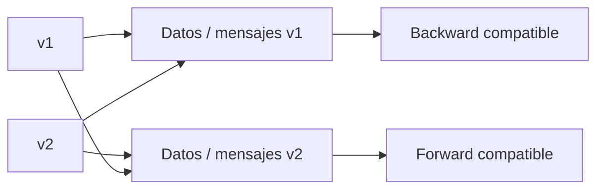

### Por qué importa durante rolling updates

Durante un rolling update pueden convivir dos versiones.

```text
checkout-api v1
checkout-api v2
```

Ambas pueden recibir tráfico.

Ambas pueden leer o escribir datos.

Ambas pueden publicar o consumir eventos.

Si no son compatibles temporalmente, el rollout puede romper aunque Kubernetes haga todo bien.

### Criterio de comprensión

Debes poder explicar:

> Durante un rollout, la compatibilidad no es teórica. Dos versiones pueden estar vivas al mismo tiempo.

---

## 19.12. Cambios compatibles e incompatibles en APIs HTTP

### Cambios normalmente compatibles

Suelen ser compatibles si los clientes están bien diseñados:

- Añadir un endpoint nuevo.
- Añadir un campo opcional en una respuesta.
- Añadir un query param opcional.
- Añadir un header opcional.
- Añadir un nuevo código de error documentado sin cambiar casos existentes.
- Ampliar información sin cambiar significado previo.
- Hacer más rápida una respuesta sin cambiar contrato.

Ejemplo compatible:

Antes:

```json
{
  "id": "chk_123",
  "status": "created"
}
```

Después:

```json
{
  "id": "chk_123",
  "status": "created",
  "currency": "EUR"
}
```

Si los clientes ignoran campos desconocidos, esto debería ser compatible.

### Cambios normalmente incompatibles

Suelen romper:

- Eliminar un endpoint.
- Cambiar método HTTP.
- Renombrar un campo.
- Cambiar tipo de un campo.
- Hacer obligatorio un campo que antes era opcional.
- Cambiar significado de un campo.
- Cambiar formato de error.
- Cambiar códigos HTTP esperados.
- Cambiar semántica de idempotencia.
- Cambiar autenticación sin transición.
- Eliminar soporte de una versión antigua sin aviso.

Ejemplo incompatible:

Antes:

```json
{
  "id": "chk_123",
  "status": "created"
}
```

Después:

```json
{
  "checkoutId": "chk_123",
  "state": "created"
}
```

Un cliente que espera `id` y `status` puede romper.

### Patrón compatible para renombrar campos

No cambies directamente:

```json
{
  "checkoutId": "chk_123"
}
```

Haz transición:

```json
{
  "id": "chk_123",
  "checkoutId": "chk_123"
}
```

Después:

1. Añades el campo nuevo.
2. Mantienes el campo antiguo.
3. Documentas deprecación.
4. Migras clientes.
5. Observas uso.
6. Eliminas en una versión mayor o ventana acordada.

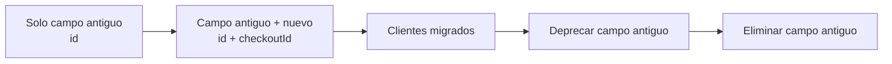

### Criterio de comprensión

Debes poder explicar:

> Añadir suele ser más seguro que cambiar o eliminar. La compatibilidad se diseña por transición, no por sorpresa.

---

## 19.13. OpenAPI como contrato HTTP

OpenAPI permite describir APIs HTTP de forma estructurada y legible por herramientas.

No sustituye el diseño de API.

Pero ayuda a declarar el contrato.

Un contrato OpenAPI puede usarse para:

- Documentación.
- Generación de clientes.
- Validación.
- Tests de contrato.
- Comparación entre versiones.
- Detección de breaking changes.
- Revisión en pull requests.

Ejemplo mínimo:

```yaml
openapi: 3.1.0
info:
  title: checkout-api
  version: 1.4.2
paths:
  /checkout:
    get:
      operationId: getCheckout
      responses:
        "200":
          description: Checkout created
          content:
            application/json:
              schema:
                type: object
                required:
                  - service
                  - status
                  - message
                properties:
                  service:
                    type: string
                    example: checkout-api
                  status:
                    type: string
                    example: ok
                  message:
                    type: string
                    example: checkout created
```

La especificación OpenAPI define un formato estándar para describir la estructura de APIs HTTP, incluyendo paths, operaciones, parámetros, requests, responses y schemas.

### Breaking changes detectables

Una comparación entre dos contratos OpenAPI puede ayudar a detectar cambios como:

- Endpoint eliminado.
- Método eliminado.
- Campo requerido eliminado de response.
- Campo requerido añadido a request.
- Tipo de campo cambiado.
- Código de respuesta eliminado.
- Schema de error cambiado.
- Parámetro antes opcional convertido en obligatorio.

No todos los cambios peligrosos son detectables automáticamente.

Por ejemplo, cambiar el significado de un campo sin cambiar su tipo puede parecer compatible para la herramienta, pero romper negocio.

Por eso necesitas:

- Revisión humana.
- Tests de contrato.
- Ejemplos.
- Release notes.
- Observabilidad.

### Qué conviene versionar

No basta con poner la versión de la aplicación.

También puede tener sentido versionar:

- La especificación OpenAPI.
- El contrato público.
- El SDK generado.
- La documentación.
- Los ejemplos.
- Los tests de contrato.

### Criterio de comprensión

Debes poder explicar:

> OpenAPI ayuda a convertir un contrato HTTP en un artefacto revisable, testeable y versionable.

---

## 19.14. Consumer-driven contracts

OpenAPI describe el contrato desde el punto de vista de la API.

Pero en sistemas con varios consumidores, también necesitas saber qué partes del contrato usan realmente los consumidores.

Un consumer-driven contract expresa:

> Este consumidor espera este comportamiento del proveedor.

Ejemplos:

- El frontend espera que `GET /checkout` devuelva `status`.
- El servicio de soporte espera que `checkoutId` exista.
- El consumidor de eventos espera `checkout.created.v1`.
- El dashboard espera la métrica `http_requests_total`.
- Un job interno espera la variable `PAYMENT_API_URL`.

Esto ayuda a detectar cambios que parecen pequeños desde el proveedor, pero rompen consumidores reales.

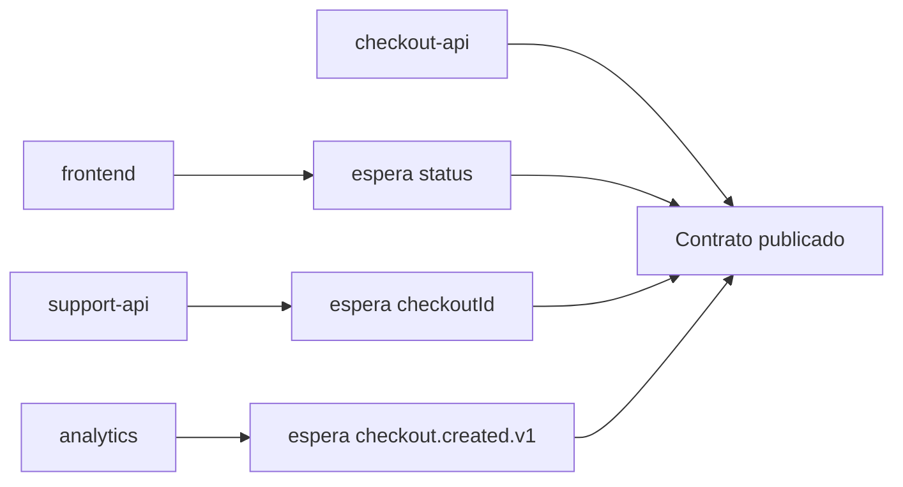

### Criterio de comprensión

Debes poder explicar:

> Un contrato no vive solo en el proveedor. Vive también en las expectativas de sus consumidores.

---

## 19.15. Versionado de APIs HTTP

Hay varias formas de versionar una API HTTP.

No hay una única respuesta universal.

Lo importante es que la estrategia sea explícita y consistente.

### Versionado por ruta

Ejemplo:

```text
/api/v1/checkout
/api/v2/checkout
```

Ventajas:

- Visible.
- Fácil de enrutar.
- Fácil de documentar.
- Fácil de mantener en paralelo.

Costes:

- Puede duplicar superficie.
- Puede fomentar cambios mayores demasiado pronto.
- Puede ensuciar URLs si se abusa.

### Versionado por header

Ejemplo:

```http
Accept: application/vnd.shop.checkout.v1+json
```

Ventajas:

- Mantiene URLs estables.
- Puede ser más fino a nivel de representación.

Costes:

- Menos visible.
- Más difícil de probar manualmente.
- Puede complicar tooling o caching.

### Versionado por contrato evolutivo

Ejemplo:

```text
Mantener /checkout estable
Añadir campos opcionales
No romper clientes
Deprecar con ventana clara
```

Ventajas:

- Evita crear versiones mayores innecesarias.
- Favorece compatibilidad.

Costes:

- Requiere disciplina.
- Requiere buenos tests de contrato.
- Requiere observabilidad de uso.

### Recomendación didáctica para este curso

Para `checkout-api`, usa un contrato evolutivo al principio.

No crees `/v2` hasta que haya una razón real.

Regla:

> Primero intenta evolucionar de forma compatible. Versiona mayor cuando no puedas mantener compatibilidad de forma razonable.

### Criterio de comprensión

Debes poder explicar:

> Versionar una API no consiste en poner `/v1`. Consiste en gestionar compatibilidad, evolución y retirada de contratos.

---

## 19.16. Contratos de eventos

En arquitecturas event-driven, los eventos también son contratos.

Un evento publicado hoy puede ser consumido por sistemas que no controlas directamente.

Ejemplo:

```json
{
  "id": "evt_123",
  "type": "checkout.created",
  "version": "1.0",
  "occurredAt": "2026-05-20T10:00:00Z",
  "data": {
    "checkoutId": "chk_123",
    "customerId": "cus_456",
    "amount": 4999,
    "currency": "EUR"
  }
}
```

### Qué forma parte del contrato

- `type`
- `version`
- `id`
- `occurredAt`
- `data`
- Campos obligatorios
- Campos opcionales
- Tipos
- Semántica
- Orden esperado
- Claves de idempotencia
- Política de reintentos
- Comportamiento ante duplicados

### Cambios compatibles en eventos

Normalmente compatibles:

- Añadir un campo opcional.
- Añadir un nuevo tipo de evento.
- Añadir metadata no obligatoria.
- Añadir una versión nueva manteniendo la anterior.
- Permitir que consumidores ignoren campos desconocidos.

### Cambios incompatibles

Normalmente incompatibles:

- Renombrar un campo.
- Eliminar un campo requerido.
- Cambiar tipo.
- Cambiar significado.
- Reutilizar el mismo `type` para otra semántica.
- Cambiar garantías de idempotencia.
- Cambiar orden esperado sin avisar.

### Evolución de schemas de eventos

En eventos, la compatibilidad debe pensarse desde dos lados:

- Productor: publica eventos.
- Consumidor: interpreta eventos.

Un cambio compatible suele permitir que consumidores antiguos sigan funcionando.

Reglas prácticas:

- Añadir campos opcionales suele ser más seguro.
- Eliminar campos requeridos suele romper consumidores.
- Cambiar tipos suele romper consumidores.
- Reutilizar el mismo `type` para otra semántica es peligroso.
- Los consumidores deberían ignorar campos desconocidos.
- Los consumidores deberían ser idempotentes.
- Los consumidores deberían tolerar duplicados si el sistema de mensajería puede reenviar.
- No asumas orden global salvo que el sistema lo proporcione explícitamente.

### Versionar eventos

Puedes versionar de varias formas:

```json
{
  "type": "checkout.created",
  "version": "1.0"
}
```

o:

```json
{
  "type": "checkout.created.v1"
}
```

Lo importante no es el formato exacto.

Lo importante es que el equipo tenga una política clara y que los consumidores puedan migrar sin romper.

### Nota sobre CloudEvents

CloudEvents puede servir como formato estándar para envolver metadata común de eventos, como tipo, origen, identificador y momento de ocurrencia.

No necesitas usar CloudEvents para aprender este módulo.

Pero sí debes entender la idea:

> Un evento profesional necesita metadata estable además del payload de negocio.

### Patrón recomendado

Para eventos críticos:

```text
publicar evento v1
añadir evento v2 en paralelo
migrar consumidores
medir consumo
deprecar v1
retirar v1
```

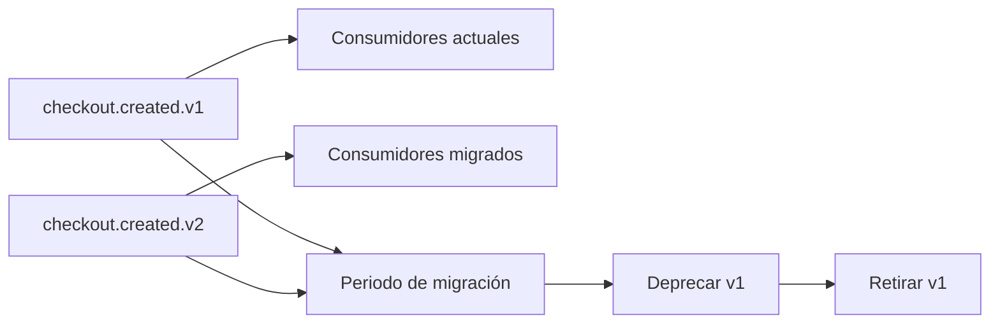

### Criterio de comprensión

Debes poder explicar:

> Un evento es una API asíncrona. Cambiarlo sin compatibilidad puede romper consumidores aunque tu servicio esté Healthy.

---

## 19.17. Contratos de configuración

La configuración también es contrato.

Si una aplicación necesita estas variables:

```text
PORT
LOG_LEVEL
PAYMENT_API_URL
REDIS_HOST
POSTGRES_HOST
```

entonces los entornos, manifests, charts y operadores dependen de ese contrato.

### Cambios peligrosos

- Renombrar una variable sin compatibilidad.
- Cambiar valor por defecto.
- Hacer obligatoria una variable antes opcional.
- Cambiar formato de un valor.
- Cambiar unidades.
- Cambiar significado.

Ejemplo peligroso:

```text
TIMEOUT=30
```

Antes significaba segundos.

Después significa milisegundos.

Eso puede romper producción sin cambiar el nombre de la variable.

### Patrón compatible

Si necesitas cambiar una variable:

1. Añade la nueva.
2. Mantén la antigua.
3. Define precedencia.
4. Loguea advertencia si se usa la antigua.
5. Documenta deprecación.
6. Migra entornos.
7. Elimina después.

Ejemplo:

```text
PAYMENT_API_URL antiguo
PAYMENT_BASE_URL nuevo
```

Regla:

```text
si PAYMENT_BASE_URL existe, usar PAYMENT_BASE_URL
si no existe, usar PAYMENT_API_URL
emitir warning si se usa PAYMENT_API_URL
```

### Validación de configuración al arrancar

Una aplicación debería validar su configuración al arrancar.

Ejemplos:

- Variable obligatoria ausente.
- URL con formato inválido.
- Timeout no numérico.
- Valor fuera de rango.
- Flag con valor desconocido.
- Secret vacío.

Si la configuración es inválida, normalmente es mejor fallar de forma clara al inicio que aceptar tráfico con un estado corrupto.

La validación de configuración debe producir errores claros en logs.

Ejemplo de log:

```json
{
  "level": "error",
  "service": "checkout-api",
  "message": "invalid configuration",
  "field": "PAYMENT_API_URL",
  "reason": "must be a valid URL"
}
```

### Criterio de comprensión

Debes poder explicar:

> La configuración también tiene contrato. Validarla al arrancar reduce fallos ambiguos durante runtime.

---

## 19.18. Contratos operativos

Las operaciones también consumen contratos.

Esto suele olvidarse.

Ejemplos:

- `/health`
- `/ready`
- Nombres de métricas
- Labels
- Annotations
- Formato de logs
- Status codes
- Nombres de dashboards
- Nombres de alertas
- Nombres de Services
- Nombres de Ports
- Selectors
- Topics
- Queue names

### Ejemplo: romper una métrica

Antes:

```text
http_requests_total
```

Después:

```text
checkout_http_requests_total
```

Si cambias la métrica sin transición, puedes romper:

- Alertas.
- Dashboards.
- SLOs.
- Automatización de progressive delivery.
- AnalysisTemplates de Argo Rollouts.

### Ejemplo: romper una label

Antes:

```yaml
labels:
  app: checkout-api
```

Service:

```yaml
selector:
  app: checkout-api
```

Si cambias la label de los Pods sin cambiar el selector del Service, el Service puede quedarse sin endpoints.

### Doble publicación durante transiciones

Cuando cambias un contrato consumido por otros sistemas, muchas veces la transición segura consiste en publicar ambos formatos durante un tiempo.

Ejemplos:

- Campo antiguo y campo nuevo en una respuesta.
- Evento `checkout.created.v1` y `checkout.created.v2`.
- Métrica antigua y métrica nueva.
- Variable antigua y variable nueva.
- Formato de log antiguo y nuevo.

Esto reduce riesgo porque permite migrar consumidores por etapas.

El coste es que durante un tiempo mantienes más complejidad.

Por eso toda doble publicación debe tener fecha o criterio de retirada.

### Criterio de comprensión

Debes poder explicar:

> La compatibilidad también aplica a observabilidad, operación y automatización.

---

## 19.19. Kubernetes API deprecations y compatibilidad del cluster

Kubernetes también tiene sus propios contratos.

Los manifests usan APIs.

Ejemplo:

```yaml
apiVersion: networking.k8s.io/v1
kind: Ingress
```

Si usas una API obsoleta o eliminada, tus manifests pueden fallar al actualizar el cluster.

La documentación oficial de Kubernetes explica que eliminar recursos o campos requiere seguir la política de deprecación de APIs. Kubernetes mantiene una promesa fuerte de compatibilidad para APIs oficiales que llegan a GA, normalmente `v1`. También documenta reglas de deprecación y retirada para APIs alpha, beta y GA.

### Comandos útiles

Ver APIs disponibles:

```bash
kubectl api-versions
kubectl api-resources
```

Explicar recurso:

```bash
kubectl explain ingress
kubectl explain deployment.spec.strategy
```

Validar manifests contra el API Server:

```bash
kubectl apply --dry-run=server -f k8s/
```

Buscar apiVersions:

```bash
grep -R "^apiVersion:" k8s/
```

Con `yq`:

```bash
find k8s -name "*.yaml" -print0 \
  | xargs -0 -I{} sh -c 'echo {}; yq ".apiVersion + \" \" + .kind" {}'
```

### Criterio de comprensión

Debes poder explicar:

> Mis manifests también dependen de contratos de Kubernetes. Una release de aplicación puede fallar si el cluster ya no acepta las APIs que uso.

---

## 19.20. Estrategia de deprecación

Deprecar no significa borrar.

Deprecar significa avisar que algo sigue funcionando por ahora, pero será retirado en el futuro.

Una buena deprecación incluye:

- Qué queda deprecado.
- Desde qué versión.
- Por qué se depreca.
- Qué usar en su lugar.
- Hasta cuándo estará disponible.
- Cómo detectar uso.
- Cómo migrar.
- Qué pasará después de la fecha límite.

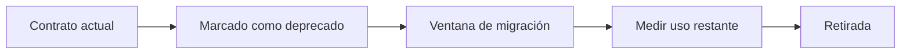

### Ejemplo de deprecación HTTP

```http
Deprecation: true
Sunset: Wed, 31 Dec 2026 23:59:59 GMT
Link: <https://docs.example.com/migration/checkout-v2>; rel="deprecation"
```

### Ejemplo en documentación

```md
## Deprecation notice

`GET /checkout` is deprecated since `checkout-api 1.5.0`.

Use `POST /checkouts` instead.

The old endpoint will remain available until `2026-12-31`.

Migration guide: docs/migrations/checkout-endpoint-v2.md
```

### Observabilidad de deprecación

No basta con documentar.

También deberías medir.

Ejemplo de log:

```json
{
  "level": "warn",
  "service": "checkout-api",
  "message": "deprecated endpoint used",
  "endpoint": "GET /checkout",
  "replacement": "POST /checkouts"
}
```

Métrica conceptual:

```text
deprecated_endpoint_requests_total{endpoint="GET /checkout"}
```

### Criterio de comprensión

Debes poder explicar:

> Una deprecación profesional no rompe de golpe. Avisa, da alternativa, mide uso y retira con una ventana clara.

---

## 19.21. Compatibilidad temporal también tiene coste

Mantener dos campos, dos endpoints, dos eventos o dos métricas puede ser necesario para migrar sin romper.

Pero no debería quedarse para siempre.

La compatibilidad temporal añade:

- Más código.
- Más tests.
- Más documentación.
- Más casos de soporte.
- Más combinaciones posibles.
- Más carga cognitiva.
- Más riesgo de comportamiento divergente.
- Más coste de mantenimiento.
- Más ruido en observabilidad.

Por eso toda transición compatible debería tener:

- Dueño.
- Motivo.
- Métrica de uso.
- Criterio de retirada.
- Fecha o versión objetivo.
- Tarea de limpieza explícita.

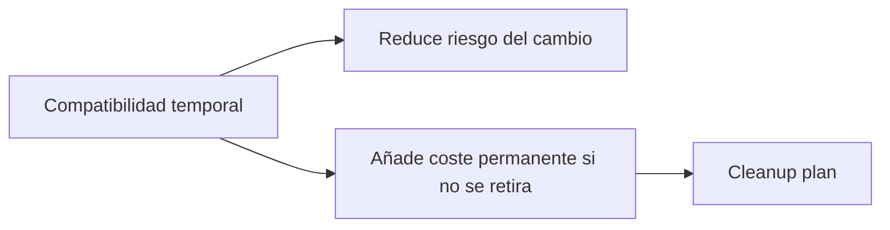

### Criterio de comprensión

Debes poder explicar:

> La compatibilidad temporal reduce riesgo de cambio, pero si no se limpia se convierte en coste permanente.

---

## 19.22. Release compatible durante rolling update

Durante un rolling update, pueden coexistir versiones.

Ejemplo:

```text
checkout-api 1.4.2
checkout-api 1.5.0
```

Ambas versiones pueden recibir tráfico.

Ambas pueden escribir datos.

Ambas pueden publicar eventos.

Ambas pueden leer configuración.

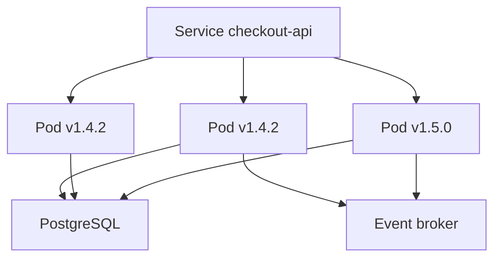

### Preguntas antes de desplegar

Antes de una release, responde:

- ¿La nueva versión acepta requests antiguas?
- ¿La versión antigua tolera datos escritos por la nueva?
- ¿Ambas versiones pueden leer el mismo schema?
- ¿Ambas versiones publican eventos compatibles?
- ¿Los consumidores toleran campos nuevos?
- ¿Los dashboards siguen funcionando?
- ¿Las alerts siguen funcionando?
- ¿El rollback sigue siendo seguro?
- ¿Las feature flags tienen valores compatibles?
- ¿Los contratos HTTP siguen siendo válidos?

### Criterio de comprensión

Debes poder explicar:

> Un rollout gradual exige compatibilidad temporal entre versiones vivas.

---

## 19.23. Release notes técnicas

Una release note no es marketing interno.

Es una herramienta operativa.

Debe responder:

```text
qué cambia
por qué cambia
qué riesgo tiene
qué contrato cambia
cómo se valida
cómo se revierte
qué señales mirar
```

### Plantilla recomendada

```md
# Release checkout-api 1.5.0

## Resumen

Añade soporte para consultar checkouts por ID mediante `GET /checkouts/{id}`.

## Tipo de cambio

- [ ] Patch
- [x] Minor compatible
- [ ] Major incompatible
- [ ] Security
- [ ] Operational
- [ ] Migration required

## Artefactos

- Image: `ghcr.io/example/checkout-api:1.5.0`
- Digest: `sha256:...`
- Git commit: `a1b2c3d`
- OpenAPI: `openapi/checkout-api-1.5.0.yaml`

## Cambios de contrato

### HTTP

Añadido:

```http
GET /checkouts/{id}
```

Sin cambios incompatibles conocidos.

### Eventos

Sin cambios.

### Configuración

Sin cambios.

### Datos

Sin cambios.

### Observabilidad

Añadida métrica:

```text
checkout_lookup_requests_total
```

## Compatibilidad

Compatible con clientes de `1.4.x`.

Durante rolling update puede convivir con `1.4.x`.

## Validación

- Smoke tests.
- Contract tests.
- Server-side dry-run.
- Canary 10%.
- Métricas RED durante 30 minutos.

## Rollback

Rollback esperado seguro a `1.4.2`.

No hay migraciones de datos.

## Señales a observar

- 5xx rate.
- Latencia p95.
- Restarts.
- `checkout_lookup_requests_total`.
- Logs de endpoint `GET /checkouts/{id}`.
```

### Criterio de comprensión

Debes poder explicar:

> Una release note técnica reduce ambigüedad durante despliegue, soporte, incidentes y rollback.

---

## 19.24. Rollback-safe releases

Una release rollback-safe permite volver a una versión anterior sin romper el sistema.

No todas las releases lo permiten.

### Release normalmente rollback-safe

Ejemplos:

- Bugfix interno.
- Añadir endpoint nuevo compatible.
- Añadir campo opcional.
- Cambiar implementación sin cambiar contrato.
- Añadir métrica nueva.
- Añadir feature flag apagada.

### Release potencialmente no rollback-safe

Ejemplos:

- Migración irreversible.
- Cambio de schema incompatible.
- Evento nuevo que reemplaza al antiguo.
- Eliminación de campo requerido.
- Cambio de formato de datos persistidos.
- Cambio en contratos de autenticación.
- Activación de feature con efectos persistentes.

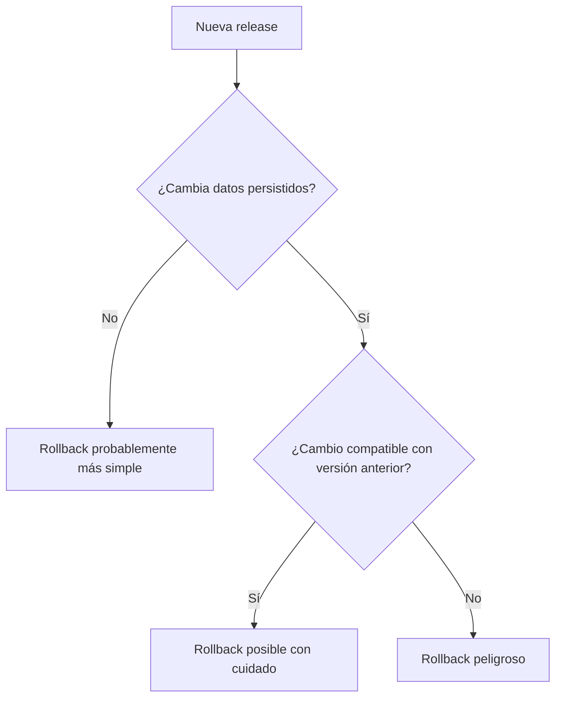

### Checklist rollback-safe

Antes de desplegar:

- ¿La versión anterior puede leer datos nuevos?
- ¿La versión nueva puede leer datos antiguos?
- ¿La migración es reversible?
- ¿La feature puede apagarse?
- ¿Los eventos antiguos siguen existiendo?
- ¿Los consumidores siguen funcionando?
- ¿El rollback está probado?
- ¿El equipo sabe qué comando ejecutar?
- ¿Hay señales para decidir rollback?

### Criterio de comprensión

Debes poder explicar:

> Rollback-safe no significa “puedo ejecutar rollback”. Significa que volver atrás no rompe contratos, datos ni consumidores.

---

## 19.25. Forward-only releases

A veces rollback no es la estrategia principal.

Algunos cambios son forward-only.

Esto significa que, si algo falla, la recuperación se hace hacia delante, no volviendo a la versión anterior.

Ejemplos:

- Migraciones irreversibles.
- Cambios regulatorios.
- Cambio de proveedor externo.
- Corrección de seguridad que no debe revertirse.
- Cambio de datos que no puede deshacerse de forma segura.

### Qué exige una release forward-only

Si una release es forward-only, necesita más disciplina:

- Plan de mitigación.
- Feature flag o kill switch si aplica.
- Backups antes del cambio.
- Prueba de restore si hay datos críticos.
- Rollout gradual.
- Observabilidad fuerte.
- Runbook específico.
- Aprobación explícita.
- Comunicación clara.
- Plan de fix-forward.

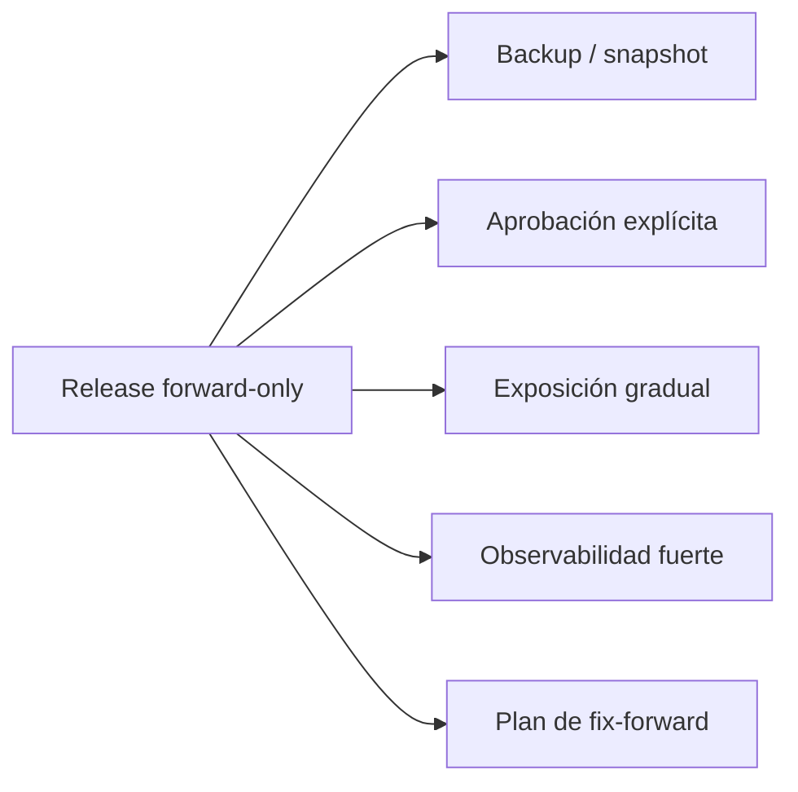

### Criterio de comprensión

Debes poder explicar:

> Si no puedes volver atrás, necesitas diseñar mucho mejor cómo avanzar de forma segura.

---

## 19.26. Matriz de decisión de recuperación

No todos los cambios tienen la misma estrategia de recuperación.

| Tipo de cambio | Rollback esperado | Estrategia recomendada |
|---|---|---|
| Cambio interno sin contrato | Normalmente seguro | RollingUpdate |
| Campo opcional nuevo | Normalmente seguro | RollingUpdate o canary |
| Endpoint nuevo | Normalmente seguro | RollingUpdate |
| Campo renombrado con compatibilidad | Seguro durante transición | Expand and deprecate |
| Campo eliminado | Riesgoso | Deprecation window, MAJOR |
| Migración reversible | Posible con cuidado | Plan de rollback probado |
| Migración irreversible | No seguro | Forward-only |
| Evento incompatible | Riesgoso | Publicar v1 y v2 en paralelo |
| Cambio de métrica usada por alertas | Riesgoso | Doble publicación temporal |
| Cambio de auth | Alto riesgo | Progressive delivery y plan explícito |

### Criterio de comprensión

Debes poder explicar:

> La estrategia de recuperación depende del tipo de cambio, no solo del mecanismo de deployment.

---

## 19.27. Versionado con GitOps y Argo CD

En GitOps, Git contiene el estado deseado.

Eso cambia cómo piensas las releases.

La pregunta ya no es solo:

```text
¿Qué imagen construí?
```

También es:

```text
¿Qué cambio declarativo entró en Git?
¿Qué Application lo sincronizó?
¿Qué diff aplicó Argo CD?
¿Qué versión quedó en el cluster?
```

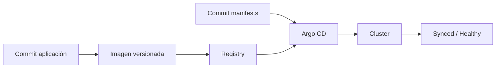

### Buenas prácticas

- No uses `latest`.
- Usa tags explícitos o digests.
- Revisa cambios de imagen en PR.
- Mantén release notes vinculadas al commit.
- Usa labels de versión en manifests.
- Usa `argocd app diff` antes de sync manual.
- Usa sync windows o approvals si el entorno lo requiere.
- Mantén trazabilidad entre commit, imagen, manifest y rollout.

### Promoción por Pull Request

En un flujo GitOps, promover una versión puede ser tan simple como cambiar un tag o digest en Git.

Ejemplo:

```yaml
newTag: "1.5.0"
```

Ese cambio debería pasar por revisión.

La revisión no debería mirar solo el tag.

También debería mirar:

- Release note.
- Tipo de cambio.
- Compatibilidad.
- Riesgo de rollback.
- Migraciones.
- Feature flags.
- Observabilidad.
- Resultado de validaciones.

La promoción por PR convierte una release en una decisión revisable, no en un comando aislado.

### Ejemplo de cambio de imagen en Kustomize

```yaml
images:
  - name: checkout-api
    newName: ghcr.io/example/checkout-api
    newTag: "1.5.0"
```

### Ejemplo con digest

```yaml
images:
  - name: checkout-api
    newName: ghcr.io/example/checkout-api
    digest: sha256:3b1f...
```

### Criterio de comprensión

Debes poder explicar:

> En GitOps, una release es tanto un artefacto publicado como un cambio declarativo aprobado y reconciliado.

---

## 19.28. Política de releases

Una política de releases define cómo se publica software.

No debe ser burocracia.

Debe reducir ambigüedad.

### Preguntas que debe responder

- ¿Cómo se versionan imágenes?
- ¿Cuándo se incrementa MAJOR?
- ¿Cuándo se incrementa MINOR?
- ¿Cuándo se incrementa PATCH?
- ¿Qué se considera breaking change?
- ¿Qué contratos se revisan?
- ¿Cómo se documentan deprecaciones?
- ¿Cuánto dura una ventana de deprecación?
- ¿Cómo se generan release notes?
- ¿Quién aprueba una release?
- ¿Qué señales bloquean una release?
- ¿Qué cambios requieren progressive delivery?
- ¿Qué cambios requieren plan de rollback?
- ¿Qué cambios son forward-only?
- ¿Cómo se limpia compatibilidad temporal?

### Política mínima para el curso

```md
# Política de releases de shop

## Versionado

Usamos SemVer para servicios.

MAJOR cambia cuando se rompe un contrato público.

MINOR cambia cuando se añade funcionalidad compatible.

PATCH cambia cuando se corrige comportamiento sin romper contrato.

## Contratos públicos

Para `checkout-api`, consideramos contrato público:

- Endpoints HTTP.
- Schemas JSON.
- Códigos HTTP.
- Eventos publicados.
- Variables de configuración.
- Métricas usadas por alertas.
- Labels y selectors usados por Kubernetes.
- Comportamiento de `/health` y `/ready`.

## Imágenes

Las imágenes deben publicarse con tag explícito.

No se usa `latest` en manifests.

Cuando el entorno lo requiera, se usa digest.

Los tags publicados no se mutan.

## Deprecaciones

Una deprecación debe incluir:

- Alternativa.
- Fecha o versión de retirada.
- Métrica o log de uso.
- Guía de migración.
- Dueño de la retirada.

## Compatibilidad temporal

Toda compatibilidad temporal debe tener:

- Dueño.
- Motivo.
- Criterio de retirada.
- Fecha o versión objetivo.

## Rollback

Cada release debe declarar si el rollback es seguro.

Si no lo es, debe tener plan forward-only.
```

### Criterio de comprensión

Debes poder explicar:

> Una política de releases convierte decisiones repetidas en reglas visibles y revisables.

---

## 19.29. Validación automática de compatibilidad

No puedes depender solo de revisión manual.

Necesitas checks.

### Checks útiles

- Lint de OpenAPI.
- Detección de breaking changes en OpenAPI.
- Contract tests.
- Consumer-driven contract tests.
- Schema validation de eventos.
- Tests de compatibilidad de configuración.
- Validación de manifests.
- Server-side dry-run.
- Escaneo de imágenes.
- Comprobación de tags prohibidos.
- Verificación de labels obligatorias.
- Validación de release notes.

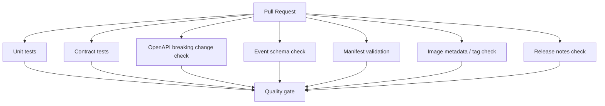

### Qué validar en este curso

Para mantenerlo práctico:

- Que no se usa `latest`.
- Que hay `app.kubernetes.io/version`.
- Que la versión de imagen coincide con la release.
- Que existe release note.
- Que OpenAPI existe si cambia API.
- Que los manifests renderizan.
- Que `kubectl apply --dry-run=server` pasa.
- Que smoke tests pasan.
- Que las labels usadas por Services no se rompen.

### Criterio de comprensión

Debes poder explicar:

> La compatibilidad no debería depender solo de que alguien se acuerde de revisar. Debe tener checks automatizados.

---

## 19.30. Taskfile para releases

Añade tareas orientadas a release.

```yaml
release:info:
  desc: Show release metadata
  vars:
    VERSION: '{{.VERSION | default "1.5.0"}}'
    IMAGE: '{{.IMAGE | default "ghcr.io/example/checkout-api"}}'
  cmds:
    - echo "Version: {{.VERSION}}"
    - echo "Image: {{.IMAGE}}:{{.VERSION}}"
    - git rev-parse --short HEAD

release:check:no-latest:
  desc: Fail if rendered Kubernetes manifests use latest tag
  cmds:
    - ./scripts/check-no-latest.sh

release:check:labels:
  desc: Check recommended Kubernetes version label exists
  cmds:
    - ./scripts/check-version-label.sh

release:check:openapi:
  desc: Check OpenAPI file exists for checkout-api
  cmds:
    - test -f openapi/checkout-api.yaml

release:render:
  desc: Render manifests
  cmds:
    - kubectl kustomize apps/checkout-api/overlays/local

release:dry-run:
  desc: Validate manifests against Kubernetes API server
  cmds:
    - kubectl apply --dry-run=server -k apps/checkout-api/overlays/local

release:smoke:
  desc: Run smoke test
  cmds:
    - ./scripts/smoke-test.sh

release:check:
  desc: Run release checks
  deps:
    - release:check:no-latest
    - release:check:labels
    - release:check:openapi
    - release:render
    - release:dry-run
  cmds:
    - echo "Release checks passed"
```

### scripts/check-no-latest.sh

```bash
#!/usr/bin/env bash
set -euo pipefail

rendered="$(kubectl kustomize apps/checkout-api/overlays/local)"

if echo "${rendered}" | yq '.. | select(has("image")?) | .image' - | grep ':latest'; then
  echo "Do not use :latest in rendered manifests"
  exit 1
fi

echo "No :latest image tags found"
```

### scripts/check-version-label.sh

```bash
#!/usr/bin/env bash
set -euo pipefail

rendered="$(kubectl kustomize apps/checkout-api/overlays/local)"

if ! echo "${rendered}" | grep "app.kubernetes.io/version"; then
  echo "Missing app.kubernetes.io/version label"
  exit 1
fi

echo "Version label found"
```

### Nota sobre estos checks

Estos checks siguen siendo didácticos.

En un flujo profesional conviene validar YAML renderizado con herramientas más robustas, policies y tests específicos.

El objetivo aquí es que el alumno vea el patrón:

```text
renderizar
inspeccionar
validar
fallar pronto
```

### Criterio DevEx

Debes poder explicar:

> Un buen flujo de release hace visibles los riesgos antes de que el cambio llegue al cluster.

---

## 19.31. Práctica 1: etiquetar una versión sin romper selectors

### Objetivo

Añadir metadata de versión a `checkout-api` sin romper el Service.

### Importante

Añade estas labels sin eliminar las labels que ya usa el Service o el Deployment selector.

Si tu Service usa:

```yaml
selector:
  app: checkout-api
```

entonces los Pods deben seguir teniendo:

```yaml
labels:
  app: checkout-api
```

No uses `app.kubernetes.io/version` como selector estable del Service salvo que estés haciendo una práctica explícita de blue-green o routing por versión.

### Deployment

Añade labels:

```yaml
metadata:
  labels:
    app: checkout-api
    app.kubernetes.io/name: checkout-api
    app.kubernetes.io/instance: checkout-api
    app.kubernetes.io/version: "1.5.0"
    app.kubernetes.io/component: api
    app.kubernetes.io/part-of: shop
spec:
  template:
    metadata:
      labels:
        app: checkout-api
        app.kubernetes.io/name: checkout-api
        app.kubernetes.io/instance: checkout-api
        app.kubernetes.io/version: "1.5.0"
        app.kubernetes.io/component: api
        app.kubernetes.io/part-of: shop
```

### Validar

```bash
kubectl apply -f k8s/checkout-api/deployment.yaml
kubectl get pods -n shop --show-labels
```

Filtrar por versión:

```bash
kubectl get pods -n shop -l app.kubernetes.io/version=1.5.0
```

Confirmar endpoints:

```bash
kubectl get endpointslice -n shop
kubectl describe svc checkout-api -n shop
```

### Preguntas

- ¿Dónde está la versión?
- ¿Puedes filtrar Pods por versión?
- ¿Qué dashboards podrían usar esta label?
- ¿Qué pasaría si cambias labels usadas por selectors?
- ¿Por qué `app.kubernetes.io/version` no debería ser selector estable del Service en este caso?

### Criterio

Debes poder explicar:

> Las labels de versión ayudan a observar y operar releases, pero no deben romper selectors existentes.

---

## 19.32. Práctica 2: por qué latest no es una release

### Objetivo

Entender por qué `latest` no identifica una versión segura.

Construye una imagen:

```bash
docker build -t checkout-api:latest ./apps/checkout-api
```

Despliega temporalmente:

```yaml
image: checkout-api:latest
```

Ahora cambia el código y vuelve a construir:

```bash
docker build -t checkout-api:latest ./apps/checkout-api
```

### Preguntas

- ¿El tag cambió?
- ¿El contenido cambió?
- ¿Cómo sabes qué versión está corriendo?
- ¿Cómo harías rollback?
- ¿Qué pasaría si un nodo conserva la imagen antigua y otro descarga la nueva?
- ¿Qué aporta un digest en esta situación?

### Criterio

Debes poder explicar:

> `latest` es un nombre mutable. Una release necesita identidad y trazabilidad.

---

## 19.33. Práctica 3: cambio HTTP compatible

### Objetivo

Añadir un campo opcional sin romper clientes existentes.

Respuesta actual:

```json
{
  "service": "checkout-api",
  "status": "ok",
  "message": "checkout created"
}
```

Respuesta nueva:

```json
{
  "service": "checkout-api",
  "status": "ok",
  "message": "checkout created",
  "checkoutId": "chk_demo"
}
```

### Validación

El smoke test existente debería seguir pasando porque solo exige:

```json
service
status
```

Añade una comprobación opcional:

```bash
curl -fsS http://localhost:8080/checkout | jq -e '.checkoutId'
```

### Preguntas

- ¿Por qué este cambio es compatible?
- ¿Qué cliente podría romper igualmente?
- ¿Por qué los clientes deberían ignorar campos desconocidos?
- ¿Esto sería PATCH o MINOR?

### Criterio

Debes poder explicar:

> Añadir un campo opcional suele ser compatible si los clientes están diseñados para tolerar expansión.

---

## 19.34. Práctica 4: cambio HTTP incompatible

### Objetivo

Ver por qué renombrar campos rompe contratos.

Cambia temporalmente:

```json
{
  "service": "checkout-api",
  "state": "ok"
}
```

en vez de:

```json
{
  "service": "checkout-api",
  "status": "ok"
}
```

Ejecuta:

```bash
task smoke
```

Debe fallar.

### Preguntas

- ¿Qué contrato se rompió?
- ¿El endpoint seguía respondiendo HTTP 200?
- ¿Por qué mirar solo `curl -i` puede ser insuficiente?
- ¿Qué versión SemVer requeriría este cambio si se publicara sin compatibilidad?
- ¿Cómo lo harías compatible?

### Criterio

Debes poder explicar:

> Una respuesta HTTP 200 no demuestra compatibilidad. El body también forma parte del contrato.

---

## 19.35. Práctica 5: contrato OpenAPI mínimo

### Objetivo

Crear un contrato HTTP mínimo para `checkout-api`.

Crea:

```text
openapi/checkout-api.yaml
```

Incluye:

- `GET /health`
- `GET /ready`
- `GET /checkout`

Ejemplo inicial:

```yaml
openapi: 3.1.0
info:
  title: checkout-api
  version: 1.5.0
paths:
  /health:
    get:
      responses:
        "200":
          description: Service is alive
  /ready:
    get:
      responses:
        "200":
          description: Service is ready
  /checkout:
    get:
      responses:
        "200":
          description: Checkout created
          content:
            application/json:
              schema:
                type: object
                required:
                  - service
                  - status
                  - message
                properties:
                  service:
                    type: string
                  status:
                    type: string
                  message:
                    type: string
                  checkoutId:
                    type: string
```

### Preguntas

- ¿Qué parte del contrato está documentada?
- ¿Qué parte todavía depende de tests?
- ¿Qué cambio rompería clientes?
- ¿Qué cambio sería compatible?
- ¿Qué parte del significado no puede validar OpenAPI por sí sola?

### Criterio

Debes poder explicar:

> OpenAPI convierte parte del contrato HTTP en un artefacto revisable, pero no sustituye tests ni revisión de semántica.

---

## 19.36. Práctica 6: deprecación compatible

### Objetivo

Simular una transición de endpoint.

Endpoint antiguo:

```text
GET /checkout
```

Endpoint nuevo:

```text
GET /checkouts/demo
```

Mantén ambos durante un periodo.

Añade log de deprecación en el endpoint antiguo:

```js
console.log(JSON.stringify({
  level: "warn",
  service: serviceName,
  message: "deprecated endpoint used",
  endpoint: "GET /checkout",
  replacement: "GET /checkouts/{id}"
}));
```

### Validar

```bash
curl -i http://localhost:8080/checkout
curl -i http://localhost:8080/checkouts/demo
docker logs checkout-api | grep deprecated
```

### Preguntas

- ¿Por qué no eliminamos el endpoint antiguo directamente?
- ¿Cómo medirías uso real del endpoint antiguo?
- ¿Dónde documentarías la retirada?
- ¿Qué señales mirarías antes de eliminarlo?
- ¿Qué coste tiene mantener ambos endpoints demasiado tiempo?

### Criterio

Debes poder explicar:

> Deprecar profesionalmente significa mantener compatibilidad mientras das una ruta clara de migración.

---

## 19.37. Práctica 7: release note técnica

### Objetivo

Crear una release note para `checkout-api 1.5.0`.

Crea:

```text
releases/checkout-api/1.5.0.md
```

Contenido base:

```md
# Release checkout-api 1.5.0

## Resumen

Añade `checkoutId` a la respuesta de `GET /checkout`.

## Tipo de cambio

- [ ] Patch
- [x] Minor compatible
- [ ] Major incompatible
- [ ] Security
- [ ] Operational
- [ ] Migration required

## Artefactos

- Image: `ghcr.io/example/checkout-api:1.5.0`
- Digest: `sha256:pending`
- Git commit: `pending`
- OpenAPI: `openapi/checkout-api.yaml`

## Cambios de contrato

### HTTP

Añadido campo opcional:

```json
{
  "checkoutId": "chk_demo"
}
```

No se eliminan campos existentes.

### Eventos

Sin cambios.

### Configuración

Sin cambios.

### Datos

Sin cambios.

### Observabilidad

Sin cambios.

## Compatibilidad

Compatible con clientes que ignoran campos desconocidos.

## Validación

- Smoke test.
- Contract test.
- Render de manifests.
- Server-side dry-run.

## Rollback

Rollback esperado seguro.

No hay migraciones de datos.

## Señales a observar

- 5xx rate.
- Latencia p95.
- Restarts.
- Logs de `GET /checkout`.

## Limpieza posterior

No aplica.
```

### Criterio

Debes poder explicar:

> Una release note técnica debe ayudar a desplegar, observar, soportar y revertir.

---

## 19.38. Diagrama de decisión de release

Este diagrama resume el razonamiento principal del módulo.

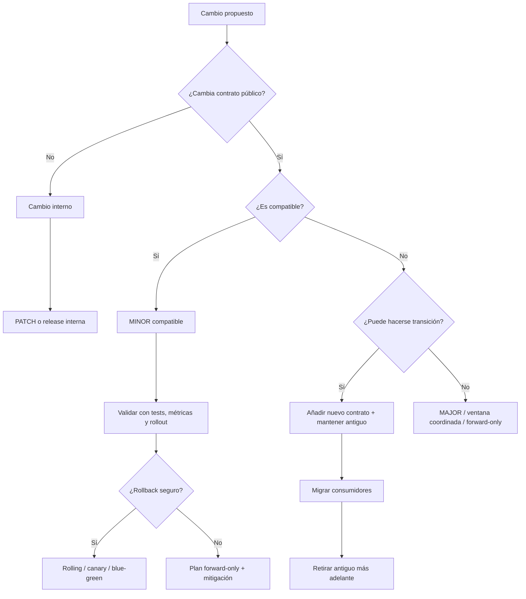

### Criterio de comprensión

Debes poder explicar:

> La decisión de release depende del contrato, la compatibilidad, la recuperación y la capacidad de observar el resultado.

---

## 19.39. Checklist de release segura

Antes de aprobar una release:

- [ ] La versión está definida.
- [ ] La imagen tiene tag explícito.
- [ ] No se usa `latest`.
- [ ] El digest está disponible si el entorno lo exige.
- [ ] Hay commit asociado.
- [ ] Hay release note.
- [ ] Los contratos cambiados están documentados.
- [ ] Los cambios incompatibles están marcados.
- [ ] Hay plan de deprecación si aplica.
- [ ] Hay plan de rollback.
- [ ] Se sabe si la release es rollback-safe o forward-only.
- [ ] OpenAPI está actualizado si cambia HTTP.
- [ ] Schemas de eventos están actualizados si cambian eventos.
- [ ] Configuración nueva tiene defaults o migración.
- [ ] La configuración se valida al arrancar.
- [ ] Manifests renderizan.
- [ ] Server-side dry-run pasa.
- [ ] Smoke tests pasan.
- [ ] Observabilidad mínima existe.
- [ ] Métricas y alertas no se rompen.
- [ ] La release puede convivir con la versión anterior durante rollout.
- [ ] La compatibilidad temporal tiene plan de limpieza.
- [ ] Las labels usadas por selectors no se rompen.
- [ ] La promoción está revisada en Git si usas GitOps.

Durante la release:

- [ ] Observar rollout.
- [ ] Observar error rate.
- [ ] Observar latencia.
- [ ] Observar restarts.
- [ ] Observar logs.
- [ ] Observar señales de negocio si aplica.
- [ ] Confirmar versión en labels.
- [ ] Confirmar endpoints.
- [ ] Confirmar que no hay consumidores fallando.

Después de la release:

- [ ] Confirmar release estable.
- [ ] Documentar incidencias.
- [ ] Revisar uso de contratos deprecados.
- [ ] Programar retirada de flags temporales.
- [ ] Programar limpieza de compatibilidad temporal.
- [ ] Actualizar documentación.
- [ ] Revisar si la release note fue suficiente durante la operación.

---

## 19.40. Errores habituales

### Error 1. Pensar que versionar es solo cambiar el tag

Cambiar un tag no explica si el contrato cambió.

La versión debe ayudar a entender compatibilidad, riesgo y trazabilidad.

### Error 2. Usar SemVer sin declarar API pública

SemVer no sirve de mucho si nadie sabe qué cuenta como contrato público.

### Error 3. Usar `latest` en manifests

`latest` aumenta ambigüedad.

No comunica qué versión se espera.

No ayuda a rollback.

No ayuda a auditoría.

### Error 4. Creer que `imagePullPolicy: Always` arregla tags mutables

`Always` cambia cuándo se consulta el registry.

No convierte un tag mutable en una buena release.

### Error 5. Romper contratos con HTTP 200

Una respuesta puede devolver 200 y aun así romper clientes si cambia el body.

### Error 6. Eliminar antes de deprecar

Eliminar un endpoint, campo, evento o variable sin transición genera fallos evitables.

### Error 7. Creer que rollback siempre es seguro

Rollback puede romper si la nueva versión cambió datos, eventos o estado externo.

### Error 8. No versionar eventos

Los eventos son APIs asíncronas.

Romper un evento puede romper consumidores lejos del servicio que publicaste.

### Error 9. Olvidar contratos operativos

Métricas, logs, labels, readiness y dashboards también pueden romperse.

### Error 10. No medir uso de deprecaciones

Si no mides quién usa lo viejo, no sabes cuándo puedes retirarlo.

### Error 11. Hacer release notes genéricas

“Bug fixes and improvements” no ayuda durante un incidente.

Una release note técnica debe explicar impacto y recuperación.

### Error 12. Romper selectors al añadir labels

Añadir metadata no debe eliminar labels usadas por Services, Deployments, NetworkPolicies o dashboards críticos.

### Error 13. Dejar compatibilidad temporal para siempre

La compatibilidad temporal que no se retira se convierte en coste permanente.

---

## 19.41. Criterio de salida del módulo

Puedes dar este módulo por completado cuando puedas explicar y demostrar lo siguiente.

### Conceptos

Debes poder explicar:

- Qué diferencia hay entre build, artifact, deploy y release.
- Por qué una release puede contener varios artefactos.
- Qué problema resuelve el versionado.
- Qué significa MAJOR, MINOR y PATCH.
- Para qué sirven pre-release y build metadata.
- Por qué SemVer necesita una API pública.
- Qué diferencia hay entre tag y digest.
- Qué problema tienen los tags mutables.
- Qué papel tiene `imagePullPolicy`.
- Por qué conviene construir una vez y promover el mismo artefacto.
- Qué aporta `app.kubernetes.io/version`.
- Qué diferencia hay entre labels de selección, labels informativas y annotations.
- Qué es un contrato HTTP.
- Qué es un contrato de eventos.
- Qué es un contrato de configuración.
- Qué es un contrato operativo.
- Qué es compatibilidad hacia atrás.
- Qué es compatibilidad hacia delante.
- Por qué dos versiones pueden convivir durante un rolling update.
- Qué es una deprecación.
- Qué es doble publicación.
- Por qué la compatibilidad temporal tiene coste.
- Qué debe contener una release note técnica.
- Qué es una release rollback-safe.
- Qué es una release forward-only.
- Cómo se promueve una release en GitOps.
- Qué validaciones automáticas reducen riesgo.

### Práctica

Debes poder:

- Añadir labels de versión a manifests sin romper selectors.
- Filtrar Pods por versión.
- Evitar `latest` en manifests.
- Explicar por qué `latest` no identifica una release.
- Crear una release note técnica.
- Detectar un cambio HTTP incompatible con smoke test.
- Crear un contrato OpenAPI mínimo.
- Diseñar una transición compatible para un campo renombrado.
- Explicar cómo deprecar un endpoint.
- Validar manifests con server-side dry-run.
- Explicar si una release requiere PATCH, MINOR o MAJOR.
- Explicar si una release es rollback-safe.
- Explicar cuándo una release debe ser forward-only.
- Ejecutar checks de release desde Taskfile.

### Frase final de comprensión

Debes poder explicar esta frase:

> Un deployment cambia lo que corre. Una release cambia lo que otros pueden esperar del sistema. Si no gestionas compatibilidad, puedes desplegar sin downtime y aun así romper producción.

La madurez de una release no se mide solo por si llega a producción. Se mide por si puede ser entendida, validada, observada, revertida o continuada sin improvisar.

---

## 19.42. Referencias oficiales

| Tema | Referencia |
|---|---|
| Semantic Versioning | SemVer, Semantic Versioning 2.0.0. https://semver.org/ |
| Kubernetes API | Kubernetes Docs, The Kubernetes API. https://kubernetes.io/docs/concepts/overview/kubernetes-api/ |
| Kubernetes deprecation policy | Kubernetes Docs, Deprecation Policy. https://kubernetes.io/docs/reference/using-api/deprecation-policy/ |
| Kubernetes recommended labels | Kubernetes Docs, Recommended Labels. https://kubernetes.io/docs/concepts/overview/working-with-objects/common-labels/ |
| Kubernetes well-known labels | Kubernetes Docs, Well-Known Labels, Annotations and Taints. https://kubernetes.io/docs/reference/labels-annotations-taints/ |
| Kubernetes labels and selectors | Kubernetes Docs, Labels and Selectors. https://kubernetes.io/docs/concepts/overview/working-with-objects/labels/ |
| Kubernetes annotations | Kubernetes Docs, Annotations. https://kubernetes.io/docs/concepts/overview/working-with-objects/annotations/ |
| Kubernetes Deployments | Kubernetes Docs, Deployments. https://kubernetes.io/docs/concepts/workloads/controllers/deployment/ |
| Kubernetes images | Kubernetes Docs, Images. https://kubernetes.io/docs/concepts/containers/images/ |
| OpenAPI Specification | OpenAPI Specification. https://swagger.io/specification/ |
| OpenAPI Initiative | OpenAPI Initiative. https://www.openapis.org/ |
| Docker image tags | Docker Docs, Docker images and registries. https://docs.docker.com/get-started/docker-concepts/the-basics/what-is-an-image/ |
| Docker registries | Docker Docs, Docker overview. https://docs.docker.com/get-started/docker-overview/ |
| CloudEvents | CloudEvents. https://cloudevents.io/ |

## 19.43. Lecturas de apoyo

| Libro o tema | Qué leer |
|---|---|
| _Kubernetes: Up and Running_ | Capítulos sobre Deployments, Services, labels, rolling updates, configuración declarativa y operación de aplicaciones. |
| _Kubernetes in Action_ | Secciones sobre Pods, Services, Deployments, rollouts, labels/selectors y actualización de aplicaciones. |
| _Cloud Native DevOps with Kubernetes_ | Capítulos sobre imágenes, deployments, releases, GitOps, operación y fiabilidad. |
| _Docker in Action_ | Capítulos sobre imágenes, tags, distribución, registries y pipelines de imagen. |
| OpenAPI | Modelado de contratos HTTP, schemas, responses y compatibilidad entre versiones. |
| Consumer-driven contracts | Expectativas de consumidores, pactos de compatibilidad y validación proveedor-consumidor. |
| Event-driven architecture | Contratos de eventos, evolución de schemas, compatibilidad de productores y consumidores. |
| Progressive delivery | Separación entre deploy, release, exposición, promoción y rollback. |
| Feature flags | Separación entre deploy y release, kill switches, segmentación, flags temporales y deuda de flags. |
| Software economics | Coste de compatibilidad temporal, coste de rollback, coste de coordinación y coste de mantener contratos antiguos. |

<!-- COURSE_NAV_START -->
[Anterior](<18. Deployments sin downtime, progressive delivery y experimentación.md>) | [Indice](README.md) | [Siguiente](<20. Migraciones de datos sin downtime.md>)
<!-- COURSE_NAV_END -->