<!-- COURSE_NAV_START -->
[Anterior](<20. Migraciones de datos sin downtime.md>) | [Indice](README.md) | [Siguiente](<22. Supply chain, imágenes seguras y políticas de admisión.md>)
<!-- COURSE_NAV_END -->

# 21. Feature flags, releases graduales y configuración dinámica

## 21.1. Objetivo del módulo

En los módulos anteriores aprendiste tres ideas importantes.

Primero, Kubernetes puede desplegar una versión nueva sin cortar tráfico si la aplicación, los manifests y la estrategia de rollout están bien diseñados.

Segundo, una release no solo cambia código. Cambia contratos.

Tercero, una migración de datos puede hacer que un rollback de aplicación no sea suficiente.

Este módulo añade otra pieza:

> Kubernetes despliega versiones. Los feature flags controlan exposición.

Pero esta frase necesita precisión.

Una feature flag útil no solo separa deploy y release en una presentación o en una arquitectura dibujada. Lo separa operacionalmente.

Si activar o desactivar una feature flag exige construir otra imagen, cambiar el Deployment, reiniciar Pods o esperar un nuevo rollout, entonces el sistema sigue acoplado al deployment.

Eso puede ser configuración de arranque.

Puede ser configuración versionada.

Puede ser un mecanismo didáctico.

Pero no entrega el beneficio principal de una feature flag de release:

> Cambiar exposición en runtime sin desplegar otro artefacto de aplicación.

En este módulo aprenderás:

- Qué diferencia hay entre deploy y release
- Qué es una feature flag en sentido estricto dentro de este curso
- Por qué muchas cosas llamadas “feature flags” son en realidad configuración, permisos, experimentos o controles operacionales
- Cómo se relaciona esta distinción con la taxonomía conocida de feature toggles
- Por qué una feature flag real debe poder cambiar exposición sin redeploy
- Qué son release flags
- Qué es configuración dinámica
- Qué son kill switches
- Qué son operational toggles
- Qué son permission flags
- Qué son experiment flags
- Qué flags deberían ser temporales
- Qué controles pueden ser permanentes
- Por qué los flags olvidados generan deuda
- Cómo modelar exposición gradual por usuario, tenant o porcentaje
- Cómo se relacionan flags, canary y A/B testing
- Cómo hacerlo con Kubernetes
- Por qué ConfigMap como env var no es un sistema de feature flags runtime
- Qué aporta ConfigMap montado como fichero con reload real
- Qué aporta OpenFeature y `flagd` como modelo Kubernetes-first
- Qué cambia entre sidecar y servicio central
- Cómo validar flags con schema
- Cómo diseñar fallback y last known good configuration
- Cómo observar comportamiento por variante
- Cómo observar cambios de configuración
- Cómo evitar cardinalidad explosiva en métricas
- Cómo conectar feature flags con trunk-based development
- Cómo no usar flags para esconder migraciones incompatibles
- Cuándo no usar flags
- Cómo automatizar el flujo con Taskfile
La tesis del módulo es esta:

> Kubernetes despliega versiones. Los feature flags controlan exposición. Pero solo controlan exposición de verdad si pueden cambiarla sin desplegar otro artefacto.

---

## 21.2. Primero: una aclaración importante de lenguaje

En la literatura, el término “feature toggle” o “feature flag” se usa muchas veces de forma amplia.

El artículo clásico publicado en el sitio de Martin Fowler, escrito por Pete Hodgson, clasifica los toggles en categorías como release toggles, experiment toggles, ops toggles y permissioning toggles. Esa taxonomía es útil para entender cómo habla la industria.

Pero este curso no adoptará esa taxonomía literalmente como lenguaje principal.

Usaremos una distinción más estricta.

### Lenguaje que usaremos en este curso

| Concepto | Cómo lo llamaremos aquí | Ejemplo |
|---|---|---|
| Exponer o no una funcionalidad nueva | Feature flag | Activar nuevo checkout |
| Cambiar un parámetro de comportamiento | Configuración dinámica | Timeout, batch size, log level |
| Apagar una capacidad para proteger el sistema | Control operacional o kill switch | Desactivar recomendaciones |
| Dar acceso según usuario, rol, plan o tenant | Permiso o entitlement | Funcionalidad premium |
| Comparar variantes para aprender | Experimento | Variante A/B del checkout |
| Enrutar tráfico entre versiones | Canary o traffic splitting | 10% a v2 |
| Cambiar secretos o credenciales | Gestión de secretos | API key, password |

### Por qué hacemos esta distinción

Porque llamar “feature flag” a todo crea confusión.

No todo `if` configurable es una feature flag.

No todo cambio dinámico es release de funcionalidad.

No todo permiso es una feature flag.

No todo experimento es una feature flag.

No todo kill switch es una feature flag.

Pueden usar mecanismos parecidos, pero no tienen el mismo propósito, ciclo de vida, riesgo, dueño ni forma de validación.

### El criterio del curso

En este curso, usaremos “feature flag” en sentido estricto para:

> Controlar la exposición de una funcionalidad de producto o capacidad visible, normalmente para separar deploy de release.

Usaremos otros nombres para otros controles:

- Configuración dinámica
- Kill switch
- Control operacional
- Permiso
- Experimento
- Traffic split
- Canary
### Cómo usar la taxonomía amplia sin perder claridad

La taxonomía amplia es útil para hablar con equipos que ya usan ese vocabulario.

Pero al diseñar el sistema conviene separar conceptos por propósito operativo:

- Release flag
- Configuración dinámica
- Control operacional
- Permiso
- Experimento
Esto evita un problema frecuente:

> Tratar controles con ciclos de vida distintos como si fueran el mismo tipo de cosa.

### Criterio de comprensión

Debes poder explicar:

> La infraestructura puede parecer parecida, pero un feature flag, un permiso, un experimento y un kill switch no tienen el mismo propósito ni el mismo ciclo de vida.

---

## 21.3. Deploy vs release

Deploy y release no son lo mismo.

Deploy significa:

> La versión está instalada en un entorno.

Release significa:

> La funcionalidad está expuesta a usuarios, clientes o consumidores.

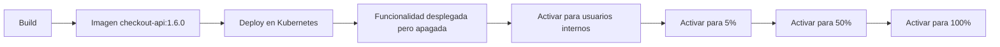

### Ejemplo

Despliegas `checkout-api:1.6.0`.

La imagen contiene un nuevo flujo de checkout.

Pero la flag está apagada:

```json
{
  "newCheckoutFlow": {
    "enabled": false
  }
}
```

La nueva versión está en producción.

La funcionalidad no está liberada.

Después puedes activar:

```json
{
  "newCheckoutFlow": {
    "enabled": true,
    "segments": ["internal"]
  }
}
```

La funcionalidad sigue usando la misma versión desplegada.

Lo que cambia es la exposición.

### Por qué importa

Separar deploy y release permite:

- Desplegar cambios antes de exponerlos
- Validar en producción con usuarios internos
- Activar gradualmente
- Desactivar sin rollback completo
- Reducir blast radius
- Coordinar releases de producto
- Evitar ramas largas
- Practicar trunk-based development con menos riesgo
### Criterio de comprensión

Debes poder explicar:

> Deploy responde a “qué versión corre”. Release responde a “quién puede usar una capacidad”.

---

## 21.4. El criterio mínimo de una feature flag útil

En este curso, una feature flag de release debe permitir cambiar exposición sin construir una imagen nueva y sin desplegar otro artefacto de aplicación.

Si activar o desactivar una flag requiere:

- Cambiar la imagen
- Cambiar el Deployment
- Reiniciar Pods
- Esperar un rollout
- Publicar otro artefacto de aplicación
- Cambiar código
- Coordinar una ventana de deployment
entonces no estamos ante un sistema de feature flags completo.

Puede ser configuración de arranque.

Puede ser configuración versionada.

Puede ser un mecanismo didáctico.

Puede ser un primer paso.

Pero no ofrece el beneficio principal de una feature flag profesional:

> Separar deploy de release en runtime.

### Tabla de decisión

| Mecanismo | Cambia sin nueva imagen | Cambia sin reiniciar Pods | Sirve como feature flag runtime |
|---|---:|---:|---:|
| Env var desde ConfigMap | Sí | No | No |
| ConfigMap montado como fichero, sin reload en app | Sí | Parcialmente | No |
| ConfigMap montado como fichero, con reload real en app | Sí | Sí | Básico |
| OpenFeature + flagd | Sí | Sí | Sí |
| Servicio de flags | Sí | Sí | Sí |
| Argo Rollouts | Sí para tráfico entre versiones | Sí | No, controla versiones |
| Permisos en sistema de autorización | Sí | Sí | No, controla acceso |

### Criterio de comprensión

Debes poder explicar:

> Una feature flag útil separa deploy de release no solo conceptualmente, sino operacionalmente. Si para cambiarla necesitas desplegar otro artefacto, has vuelto a acoplar release y deploy.

---

## 21.5. El problema que resuelven los feature flags

Sin feature flags, muchas releases se convierten en apuestas binarias.

```text
todo apagado
o
todo encendido
```

Con feature flags puedes introducir un estado intermedio:

```text
código desplegado
funcionalidad apagada
activación controlada
observación
promoción
retirada del flag
```

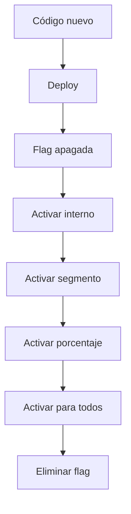

### Qué problema económico reducen

Los feature flags pueden reducir:

- Riesgo de release
- Coste de rollback
- Coste de coordinación
- Coste de ramas largas
- Coste de esperar a que todo esté terminado
- Coste de exponer demasiado pronto
- Coste de no poder apagar una funcionalidad defectuosa
Pero también añaden coste:

- Más caminos de ejecución
- Más tests
- Más configuración
- Más documentación
- Más observabilidad
- Más reglas de limpieza
- Más complejidad mental
- Más combinatoria
- Más riesgo de estados no probados
### Criterio de comprensión

Debes poder explicar:

> Un feature flag compra opción y control, pero paga con complejidad. El flag debe tener una razón económica clara.

---

## 21.6. Feature flags y trunk-based development

En trunk-based development, los equipos integran cambios pequeños frecuentemente en la rama principal.

Eso crea una tensión:

> Queremos integrar pronto, pero no siempre queremos exponer pronto.

Las feature flags ayudan cuando permiten:

- Integrar código incompleto de forma segura
- Mantener `main` desplegable
- Evitar ramas largas
- Hacer releases graduales
- Apagar funcionalidad sin revertir todo
- Reducir riesgo de integración tardía
- Separar trabajo técnico de exposición de producto
Pero esto solo funciona si:

- La flag puede cambiar sin redeploy
- El camino apagado sigue probado
- La flag tiene limpieza
- La app mantiene compatibilidad
- La observabilidad permite decidir
- El equipo no acumula flags indefinidamente
### Antipatrón

Esto no resuelve bien el problema:

```text
merge a main
deploy
flag apagada
para encender hay que redeployar
```

Eso puede seguir reduciendo riesgo de integración, pero no separa release de deploy en runtime.

### Criterio de comprensión

Debes poder explicar:

> Las feature flags ayudan a trunk-based development cuando permiten integrar pronto sin exponer pronto, y cuando la exposición puede cambiar sin redeploy.

---

## 21.7. Lo que Kubernetes puede hacer y lo que no

Kubernetes puede desplegar, reiniciar, escalar y reconciliar workloads.

Pero Kubernetes no entiende por sí solo:

- Qué usuario debe ver una funcionalidad
- Qué tenant está en beta
- Qué porcentaje estable debe recibir una variante
- Qué experimento tiene validez
- Qué flag debe retirarse
- Qué combinación de flags está soportada
- Qué control es permiso, configuración o release
- Qué valor por defecto es seguro para negocio
- Qué cambio contamina un experimento
Kubernetes proporciona mecanismos para inyectar y operar configuración:

- ConfigMaps
- Secrets
- Env vars
- Volumes
- Deployments
- Services
- Ingress
- Gateway
- Argo CD
- Argo Rollouts
- Jobs
- RBAC
- NetworkPolicy
- Observabilidad
Pero la decisión de exposición normalmente vive en:

- La aplicación
- Una librería de evaluación
- Un servicio de feature flags
- Un sistema de experimentación
- Una configuración dinámica
- Un proveedor externo
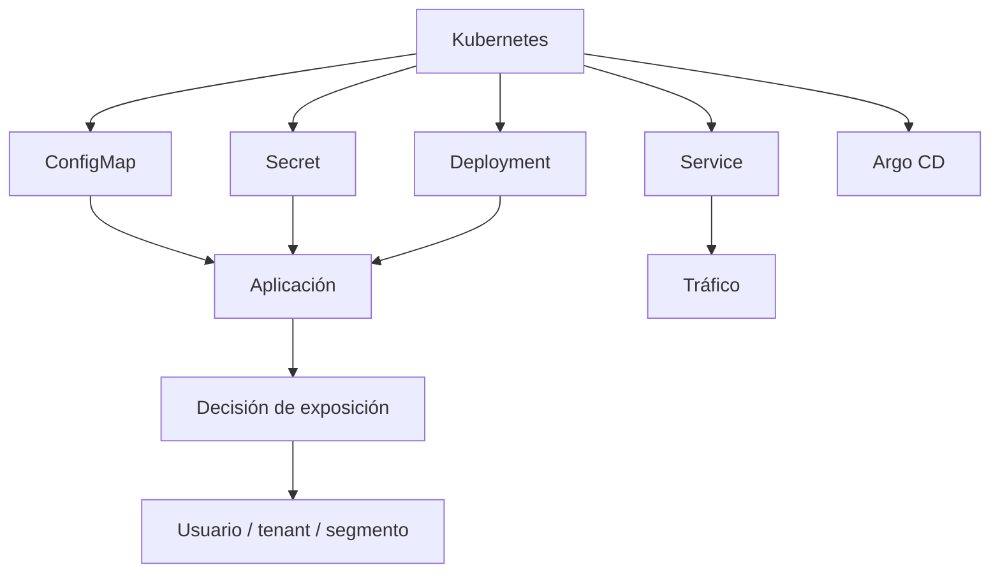

### Criterio de comprensión

Debes poder explicar:

> Kubernetes entrega configuración y opera versiones. La lógica de exposición por usuario, tenant o variante normalmente vive fuera del scheduler y dentro de la aplicación o de una plataforma de flags.

---

## 21.8. Modelos de implementación en Kubernetes

Hay varias formas de implementar flags o configuración dinámica en Kubernetes.

No todas sirven para lo mismo.

| Modelo | Dinamismo | Complejidad | Uso típico | ¿Feature flag runtime? |
|---|---:|---:|---|---:|
| Env vars desde ConfigMap | Bajo | Bajo | Configuración de arranque | No |
| ConfigMap montado como fichero sin reload | Bajo/medio | Medio | Config disponible como fichero | No |
| ConfigMap montado como fichero con reload | Medio | Medio | Configuración dinámica básica | Parcial |
| Kustomize ConfigMap generator con hash | Bajo | Medio | Rollout por cambio de config | No |
| OpenFeature + flagd | Alto | Medio/alto | Feature flags runtime | Sí |
| Servicio interno de flags | Alto | Alto | Segmentación, porcentaje, runtime | Sí |
| Proveedor externo de flags | Alto | Alto | Plataforma gestionada | Sí |
| Argo Rollouts / Ingress / Gateway | Alto para tráfico | Alto | Canary por versión | No |
| Feature flags en base de datos | Alto | Medio/alto | Producto o permisos, requiere gobernanza | Depende |

### Criterio de elección

Pregunta:

```text
¿Necesito cambiar esto sin reiniciar Pods?
¿Necesito segmentar por usuario?
¿Necesito porcentaje estable?
¿Necesito auditar cambios?
¿Necesito aprobación?
¿Necesito fallback si el proveedor falla?
¿Necesito que sea GitOps?
¿Necesito que la app reaccione en segundos?
¿Necesito UI?
¿Necesito que producto pueda operar esto?
```

### Modelo recomendado en este curso

| Necesidad | Modelo recomendado |
|---|---|
| Configuración estable por entorno | ConfigMap/Secret + rollout |
| Feature flag real de release | Evaluación runtime en app |
| Feature flag Kubernetes-first | OpenFeature + flagd |
| Segmentación por usuario o tenant | Servicio de flags o SDK con contexto |
| Canary por versión | Argo Rollouts / Ingress / Gateway / service mesh |
| Kill switch urgente | Servicio de flags runtime o configuración dinámica con reload probado |
| Permisos permanentes | Sistema de autorización / entitlements |
| Experimentos | Plataforma de experimentación |

El modelo mínimo profesional para feature flags no es:

```text
Kubernetes cambia una variable
```

El modelo mínimo profesional es:

```text
flag store
evaluación runtime
contexto de usuario o tenant
fallback seguro
auditoría
observabilidad por variante
limpieza
```

### Criterio de comprensión

Debes poder explicar:

> No existe un único modelo correcto. El modelo depende de la velocidad de cambio, el riesgo, la segmentación, la auditoría y la necesidad de runtime dinámico.

---

## 21.9. ConfigMaps como configuración de arranque, no como feature flags reales

Un ConfigMap permite separar configuración no sensible de la imagen de contenedor.

Esto es útil.

Pero hay que entender el límite.

### ConfigMap simple

```yaml
apiVersion: v1
kind: ConfigMap
metadata:
  name: checkout-api-startup-config
  namespace: shop
  labels:
    app: checkout-api
    app.kubernetes.io/name: checkout-api
    app.kubernetes.io/component: config
    app.kubernetes.io/part-of: shop
data:
  LOG_LEVEL: "info"
  NEW_CHECKOUT_FLOW_ENABLED: "false"
```

### Uso como env var

```yaml
env:
  - name: NEW_CHECKOUT_FLOW_ENABLED
    valueFrom:
      configMapKeyRef:
        name: checkout-api-startup-config
        key: NEW_CHECKOUT_FLOW_ENABLED
```

Esto es simple.

Pero tiene una consecuencia importante:

> Si consumes un ConfigMap como variable de entorno, los Pods existentes no ven el cambio automáticamente. Necesitan reiniciarse o redeplegarse.

### Veredicto

Consumir flags como env vars puede ser útil para configuración simple, pero no cumple el criterio de feature flag runtime de este curso.

Si necesitas reiniciar Pods para activar o desactivar la flag, el cambio sigue acoplado al deployment operacional.

Esto puede valer para:

- Configuración estable por entorno
- Parámetros de arranque
- Defaults
- Ejemplos didácticos
- Prácticas iniciales
- Valores que deliberadamente quieres cambiar con rollout
Pero no debería presentarse como sistema profesional de feature flags.

### Cuándo usar env vars

Úsalas para:

- Configuración estable por release
- Valores que no necesitas cambiar en segundos
- Configuración que prefieres versionar con el Deployment
- Entornos donde GitOps y revisión importan más que cambio inmediato
- Configuración de arranque
### Cuándo no usar env vars

No las uses como mecanismo principal si necesitas:

- Activación inmediata
- Segmentación por usuario
- Porcentaje dinámico
- Kill switch urgente
- Experimentos en runtime
- Cambios frecuentes sin restart
- Separación real entre deploy y release
### Criterio de comprensión

Debes poder explicar:

> ConfigMap como env var es configuración de arranque. Si necesitas reiniciar Pods para cambiar una flag, no tienes feature flags runtime.

---

## 21.10. ConfigMap como fichero montado: configuración dinámica básica

Otra opción es montar el ConfigMap como volumen.

Para mantener buena DevEx, no escribiremos JSON embebido dentro de YAML como fuente principal.

Usaremos ficheros separados.

### Estructura recomendada

```text
flags/
  checkout-api-flags.schema.json
  checkout-api-flags.json

k8s/flags/
  kustomization.yaml
```

### flags/checkout-api-flags.json

```json
{
  "newCheckoutFlow": {
    "enabled": false,
    "owner": "checkout-team",
    "type": "release",
    "temporary": true,
    "createdAt": "2026-05-20",
    "removeAfter": "2026-06-30",
    "cleanupIssue": "SHOP-1234"
  }
}
```

### k8s/flags/kustomization.yaml

```yaml
apiVersion: kustomize.config.k8s.io/v1beta1
kind: Kustomization

configMapGenerator:
  - name: checkout-api-flags
    files:
      - flags.json=../../flags/checkout-api-flags.json

generatorOptions:
  disableNameSuffixHash: true
```

### Por qué `disableNameSuffixHash: true`

Para feature flags runtime queremos un nombre estable:

```text
checkout-api-flags
```

La aplicación debe recargar el contenido.

No queremos forzar un rollout solo porque cambió la flag.

Si mantienes hash en el nombre generado, el cambio puede producir un nuevo ConfigMap y requerir que el Deployment referencie el nuevo nombre. Eso puede ser útil para configuración de arranque, pero no es el objetivo de feature flags runtime.

### Montaje en el Deployment

```yaml
volumeMounts:
  - name: flags
    mountPath: /etc/checkout-api/flags
    readOnly: true

volumes:
  - name: flags
    configMap:
      name: checkout-api-flags
```

La aplicación leería:

```text
/etc/checkout-api/flags/flags.json
```

### Diferencia con env vars

Cuando un ConfigMap se monta como volumen, Kubernetes puede actualizar los ficheros montados en Pods existentes, aunque no de forma instantánea.

Pero hay dos matices importantes:

- Si usas `subPath`, el contenedor no recibe actualizaciones del ConfigMap
- Que el fichero cambie no significa que la aplicación lo use
La aplicación debe:

- Releer el fichero
- Observar cambios
- Hacer polling
- Tener un mecanismo de reload
- Validar la nueva configuración
- Mantener último valor válido si el nuevo falla
- Exponer la configuración activa
- Emitir logs y métricas de reload
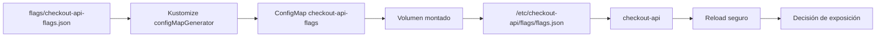

### Criterio de comprensión

Debes poder explicar:

> Montar un ConfigMap como fichero puede servir para configuración dinámica básica, pero solo si la aplicación recarga de forma segura. Sin reload real, no tienes feature flags runtime.

---

## 21.11. Advertencia sobre checksum annotations y rollouts por configuración

Un patrón habitual en Kubernetes es añadir un checksum del ConfigMap al Pod template.

Ejemplo conceptual:

```yaml
template:
  metadata:
    annotations:
      checksum/flags: "abc123"
```

Cuando cambia el checksum, cambia el Pod template y el Deployment hace rollout.

Esto puede ser útil para configuración de arranque.

Pero hay una advertencia importante.

### Advertencia

El patrón checksum annotation es útil para configuración que debe aplicarse mediante restart controlado.

Pero si lo usas para activar o desactivar una feature flag, vuelves a depender de un rollout.

Por tanto, en este curso no lo consideraremos un mecanismo válido para feature flags de release runtime.

Sí puede ser válido para:

- Cambios de configuración estable
- Parámetros de arranque
- Certificados que requieren restart
- Configuración que prefieres aplicar con rollout controlado
- Valores que no deben cambiar dentro de un proceso vivo
### Criterio de comprensión

Debes poder explicar:

> Un rollout por checksum puede ser buena configuración operacional, pero no es separación runtime entre deploy y release.

---

## 21.12. OpenFeature y flagd como modelo Kubernetes-first recomendado

Para este curso, el modelo más interesante para feature flags reales en Kubernetes es usar evaluación runtime mediante OpenFeature y `flagd`.

La idea es:

```text
checkout-api
OpenFeature SDK
flagd
configuración de flags
```

`flagd` puede ejecutarse como:

- Servicio central dentro del cluster
- Sidecar junto a la aplicación
- Proceso embebido, según el diseño
La ventaja es que la aplicación no depende directamente de leer ConfigMaps como si fueran feature flags.

La aplicación evalúa flags mediante una interfaz estable.

Kubernetes opera los componentes.

OpenFeature reduce acoplamiento al proveedor.

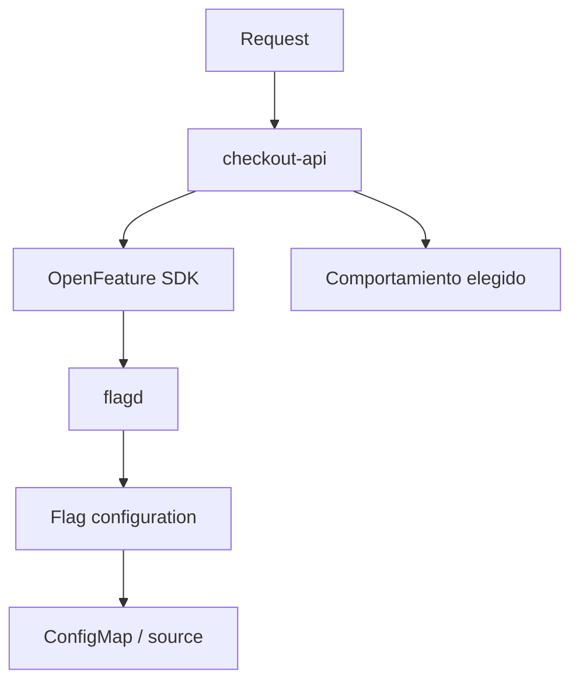

### Qué aporta OpenFeature

OpenFeature ayuda a separar:

- Código de negocio
- API de evaluación de flags
- Proveedor de flags
- Estrategia de despliegue
- Vendor concreto
La aplicación puede preguntar:

```text
¿Está activa newCheckoutFlow para este contexto?
```

sin acoplarse directamente al almacenamiento exacto.

### Qué no resuelve por sí solo

OpenFeature no decide por ti:

- Qué es una feature flag
- Qué es permiso
- Qué es experimento
- Qué es configuración dinámica
- Quién aprueba cambios
- Cómo se testea
- Cómo se retira
- Cómo se observa
- Qué valor por defecto es seguro
- Qué métricas son relevantes
### Criterio de comprensión

Debes poder explicar:

> OpenFeature puede darte una interfaz estable de evaluación, pero la disciplina de release, observabilidad, fallback y limpieza sigue siendo responsabilidad del equipo.

---

## 21.13. flagd como sidecar vs servicio central

En Kubernetes hay dos topologías importantes.

### Sidecar

Cada Pod tiene su propio evaluador local.

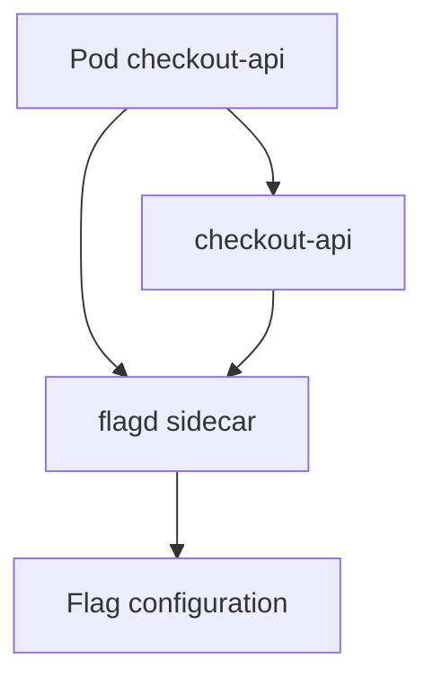

Ventajas:

- Baja latencia
- Menos dependencia de red por evaluación
- Fallos más contenidos
- Encaja bien con el modelo Kubernetes
- La evaluación puede seguir funcionando localmente si el sidecar tiene configuración cargada
Costes:

- Más contenedores
- Más consumo de recursos
- Hay que observar sidecars
- Hay que controlar propagación de configuración
- Hay que entender qué ocurre cuando cambia la configuración
### Servicio central

Las apps llaman a un servicio de flags compartido.

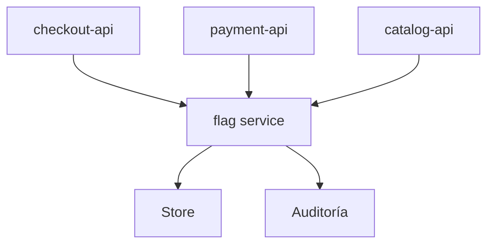

Ventajas:

- Un solo punto de gestión
- Auditoría central
- Menos duplicación
- Más fácil integrar UI o administración
- Mejor para reglas compartidas
Costes:

- Dependencia de red
- Posible punto crítico
- Necesita caching y fallback
- Necesita SLO propio
- Necesita control de latencia
### Criterio práctico

Para feature flags de release con baja complejidad, un sidecar o proveedor local puede ser suficiente.

Para segmentación avanzada, auditoría, UI y gestión por producto, probablemente necesites un servicio de flags más completo.

### Criterio de comprensión

Debes poder explicar:

> Sidecar reduce dependencia de red en la evaluación. Servicio central mejora gestión y auditoría. La elección depende del riesgo, la escala y la operación.

---

## 21.14. FeatureFlagConfiguration como modelo conceptual

Con OpenFeature Operator puedes modelar configuración de flags como recursos Kubernetes.

La API exacta puede cambiar entre versiones del operador, por lo que este ejemplo es conceptual y debe validarse con la versión concreta que uses.

```yaml
apiVersion: core.openfeature.dev/v1beta1
kind: FeatureFlagConfiguration
metadata:
  name: checkout-api-flags
  namespace: shop
spec:
  flagSpec:
    flags:
      newCheckoutFlow:
        state: ENABLED
        variants:
          "on": true
          "off": false
        defaultVariant: "off"
        targeting:
          if:
            - in:
                - var:
                    - userId
                - ["user-001", "user-002"]
          then: "on"
          else: "off"
```

### Qué muestra este ejemplo

Muestra una idea importante:

> Los flags pueden convertirse en recursos operables dentro de Kubernetes.

Esto permite:

- Revisar cambios en Git
- Sincronizar con Argo CD
- Observar objetos
- Separar configuración de código
- Usar Kubernetes como plano operacional
### Cuidado

Kubernetes-native no significa automáticamente bueno.

Todavía necesitas:

- Fallback
- Auditoría
- Observabilidad
- Validación
- Limpieza
- Control de acceso
- Revisión de cambios
- Políticas de expiración
### Criterio de comprensión

Debes poder explicar:

> Modelar flags como recursos Kubernetes puede mejorar operación y GitOps, pero no elimina la necesidad de disciplina de release.

---

## 21.15. Secrets no son feature flags

Un Secret sirve para información sensible.

Ejemplos:

- Passwords
- Tokens
- API keys
- Certificados
- Credenciales
- Connection strings sensibles
No uses Secrets para modelar feature flags de producto.

Y no uses ConfigMaps para secretos.

### Actualización de Secrets

Igual que con ConfigMaps, hay que distinguir cómo se consumen.

Si un Secret se consume como variable de entorno, un contenedor ya arrancado no ve la actualización hasta reiniciar.

Si se monta como volumen, Kubernetes puede actualizar los ficheros, con matices similares a ConfigMaps.

Un Secret montado con `subPath` no recibe actualizaciones automáticas.

### Regla práctica

- Feature flag: no sensible, controla exposición de funcionalidad
- Configuración dinámica: puede ser no sensible o sensible según caso
- Secret: sensible, no debe usarse como mecanismo de release
- Permiso: decisión de autorización, no secreto
- Experimento: decisión de aprendizaje, no secreto
### Criterio de comprensión

Debes poder explicar:

> Un Secret protege datos sensibles. Un feature flag controla exposición funcional. Mezclarlos crea confusión y riesgo.

---

## 21.16. Feature flag mínimo en checkout-api

Vamos a usar un ejemplo sencillo.

Feature:

```text
newCheckoutFlow
```

Propósito:

```text
Exponer una nueva respuesta de /checkout
```

Flag apagada:

```json
{
  "newCheckoutFlow": {
    "enabled": false
  }
}
```

Flag encendida:

```json
{
  "newCheckoutFlow": {
    "enabled": true
  }
}
```

### Comportamiento esperado

Con flag apagada:

```json
{
  "service": "checkout-api",
  "status": "ok",
  "message": "checkout created",
  "flow": "classic"
}
```

Con flag encendida:

```json
{
  "service": "checkout-api",
  "status": "ok",
  "message": "checkout created",
  "flow": "new"
}
```

### Código conceptual con fichero montado

```js
const fs = require("fs");

const flagsPath = process.env.FLAGS_FILE || "/etc/checkout-api/flags/flags.json";

let lastKnownGoodFlags = {
  newCheckoutFlow: {
    enabled: false
  }
};

function loadFlags() {
  try {
    const raw = fs.readFileSync(flagsPath, "utf8");
    const parsed = JSON.parse(raw);

    if (typeof parsed.newCheckoutFlow?.enabled !== "boolean") {
      throw new Error("newCheckoutFlow.enabled must be boolean");
    }

    lastKnownGoodFlags = parsed;

    return parsed;
  } catch (error) {
    console.error(JSON.stringify({
      level: "error",
      service: "checkout-api",
      message: "failed to load flags, using last known good configuration",
      error: error.message
    }));

    return lastKnownGoodFlags;
  }
}

function isNewCheckoutFlowEnabled() {
  const flags = loadFlags();

  return flags.newCheckoutFlow?.enabled === true;
}

app.get("/checkout", (_req, res) => {
  const enabled = isNewCheckoutFlowEnabled();

  console.log(JSON.stringify({
    level: "info",
    service: serviceName,
    feature: "newCheckoutFlow",
    variant: enabled ? "new" : "classic"
  }));

  res.status(200).json({
    service: serviceName,
    status: "ok",
    message: "checkout created",
    flow: enabled ? "new" : "classic"
  });
});
```

### Importante

Este ejemplo es deliberadamente simple.

Leer el fichero en cada request puede ser aceptable para aprendizaje, pero no debería ser el diseño por defecto de una aplicación con tráfico real.

Un diseño mejor suele ser:

- Cargar flags al arrancar
- Recargar con polling o watcher
- Cachear último valor válido
- Validar antes de publicar nueva configuración
- Exponer cuándo se cargó la configuración
- Emitir métricas de fallo de reload
- Evitar I/O innecesario por request
- Usar SDK de flags cuando hay segmentación compleja
### Criterio de comprensión

Debes poder explicar:

> Kubernetes puede entregar el fichero de configuración. La aplicación debe evaluarlo, validarlo, recargarlo y fallar de forma segura.

---

## 21.17. Fallback y last known good configuration

Una aplicación debe saber qué hacer si no puede cargar flags.

Casos habituales:

- ConfigMap no montado
- JSON inválido
- `flagd` no responde
- Proveedor externo cae
- Timeout
- Configuración parcial
- Regla de segmentación inválida
- Red lenta
- Error de permisos
- Configuración incompatible con la versión de la app
### Opciones de fallback

- Usar valores por defecto seguros
- Mantener la última configuración válida
- Degradar comportamiento
- Desactivar funcionalidades no críticas
- Emitir logs y métricas
- Fallar readiness solo si no hay configuración mínima viable
### Valor por defecto

Para release flags, el valor por defecto más seguro suele ser apagado.

Ejemplo:

```json
{
  "newCheckoutFlow": {
    "enabled": false
  }
}
```

Para kill switches, depende del diseño.

A veces el valor seguro es apagar una integración.

A veces el valor seguro es mantener el último valor válido.

### Last known good configuration

El patrón last known good significa:

> Si llega una configuración inválida, la aplicación mantiene la última configuración válida.

Esto evita que un cambio mal formado rompa de golpe el comportamiento.

Pero también exige observabilidad.

Si estás usando last known good, debes saberlo.

### Señales necesarias

- `flag_reload_success_total`
- `flag_reload_error_total`
- `flag_last_reload_timestamp`
- `flag_using_last_known_good`
- logs de error de validación
- versión de configuración activa
### Criterio de comprensión

Debes poder explicar:

> Un sistema de flags profesional no solo evalúa flags. También define qué ocurre cuando la fuente de flags falla.

---

## 21.18. Schema de configuración de flags

Los flags también tienen contrato.

Un `flags.json` debería validarse contra un schema.

### flags/checkout-api-flags.schema.json

```json
{
  "$schema": "https://json-schema.org/draft/2020-12/schema",
  "type": "object",
  "required": ["newCheckoutFlow"],
  "properties": {
    "newCheckoutFlow": {
      "type": "object",
      "required": ["enabled", "owner", "type", "temporary", "removeAfter", "cleanupIssue"],
      "properties": {
        "enabled": {
          "type": "boolean"
        },
        "owner": {
          "type": "string",
          "minLength": 1
        },
        "type": {
          "type": "string",
          "enum": ["release"]
        },
        "temporary": {
          "type": "boolean",
          "const": true
        },
        "createdAt": {
          "type": "string"
        },
        "removeAfter": {
          "type": "string"
        },
        "cleanupIssue": {
          "type": "string",
          "minLength": 1
        }
      },
      "additionalProperties": false
    }
  },
  "additionalProperties": false
}
```

### Por qué importa

Sin schema, estos errores pueden llegar a producción:

```json
{
  "newCheckoutFlow": {
    "enabled": "yes"
  }
}
```

o:

```json
{
  "newCheckoutFlow": {
    "enabled": true
  }
}
```

El primer caso tiene tipo incorrecto.

El segundo puede funcionar, pero no tiene dueño, tipo ni plan de cleanup.

### Criterio de comprensión

Debes poder explicar:

> Una configuración de flags también es contrato. Si no validas ese contrato, un cambio de configuración puede romper producción.

---

## 21.19. Validación de flags con jq, yq y schema

Para una práctica simple, puedes validar con `jq`.

```bash
jq -e '.newCheckoutFlow.enabled | type == "boolean"' flags/checkout-api-flags.json
jq -e '.newCheckoutFlow.owner | type == "string"' flags/checkout-api-flags.json
jq -e '.newCheckoutFlow.temporary == true' flags/checkout-api-flags.json
jq -e '.newCheckoutFlow.removeAfter | type == "string"' flags/checkout-api-flags.json
jq -e '.newCheckoutFlow.cleanupIssue | type == "string"' flags/checkout-api-flags.json
```

Si necesitas extraer JSON desde un ConfigMap YAML:

```bash
yq -r '.data["flags.json"]' k8s/flags/checkout-api-flags.yaml | jq .
```

Pero la estructura recomendada del módulo es mantener el JSON separado:

```text
flags/checkout-api-flags.json
```

Eso mejora:

- Diffs
- Validación
- Edición
- Tests
- Reutilización
- Calidad del repositorio
### Validación conceptual con schema

Dependiendo de las herramientas disponibles, podrías usar una herramienta de validación JSON Schema.

La idea importante es esta:

```text
flags.json
debe cumplir
checkout-api-flags.schema.json
```

### Criterio de comprensión

Debes poder explicar:

> Validar flags no es cosmética. Es una forma de evitar que configuración inválida cambie comportamiento en producción.

---

## 21.20. Lifecycle completo de una feature flag

Una feature flag de release no termina cuando se activa.

Termina cuando se elimina.

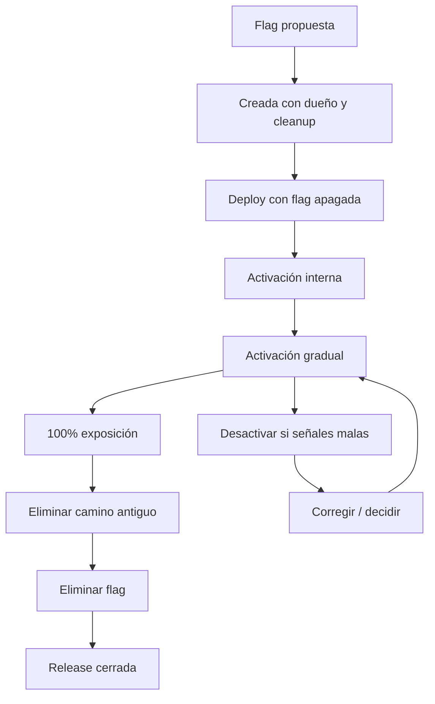

### Estados mínimos

| Estado | Qué significa |
|---|---|
| Proposed | El equipo quiere crear una flag |
| Created | La flag existe con dueño y cleanup |
| Off | El código está desplegado, pero la funcionalidad apagada |
| Internal | Solo usuarios internos la ven |
| Gradual | Exposición parcial |
| Full | Exposición al 100% |
| Cleanup | Se elimina el camino antiguo y la flag |
| Done | La release queda cerrada |

### Criterio de comprensión

Debes poder explicar:

> Una flag temporal que llega al 100% pero no se elimina sigue siendo deuda.

---

## 21.21. Registro de decisión de flag

Toda feature flag relevante debería tener un pequeño registro de decisión.

Crea:

```text
docs/flags/newCheckoutFlow.md
```

Contenido:

```md
# Flag: newCheckoutFlow

## Tipo

Feature flag de release.

## Objetivo

Separar deploy de release para el nuevo flujo de checkout.

## Dueño

checkout-team.

## Valor por defecto

Off.

## Plan de activación

Internal -> 5% -> 25% -> 50% -> 100%.

## Señales

- error rate por variante
- latencia p95 por variante
- checkout conversion
- logs de fallback
- feedback de soporte

## Plan de desactivación

Desactivar flag en proveedor runtime.

## Fallback

Usar flujo clásico.

## Relación con datos

No requiere migración destructiva.

## Cleanup

Eliminar flag y camino clásico después de 100% durante 7 días sin incidentes.

## Fecha objetivo de retirada

2026-06-30.

## Issue de limpieza

SHOP-1234.
```

### Criterio de comprensión

Debes poder explicar:

> Una flag importante es una decisión operacional. Debe tener dueño, motivo, plan de activación, señales y plan de retirada.

---

## 21.22. Flags temporales vs controles permanentes

Una de las causas más comunes de deuda es no distinguir vida útil.

### Feature flags temporales

Una release flag debería desaparecer.

Ejemplo:

```text
newCheckoutFlow
```

Ciclo de vida:

```text
propuesta
implementación
activación interna
activación gradual
100%
limpieza
eliminación
```

### Controles permanentes

Algunos controles pueden vivir mucho tiempo.

Pero en este curso no los llamaremos feature flags si no controlan release de funcionalidad.

Ejemplos:

- Permisos por plan
- Configuración de límites
- Kill switch operacional
- Modo degradado
- Política de riesgo
- Configuración de proveedor
### Tabla

| Tipo | Temporal | Responsable | Riesgo si se olvida |
|---|---:|---|---|
| Feature flag de release | Sí | Equipo de producto y equipo técnico | Deuda de código |
| Kill switch | Puede ser permanente | Operaciones / plataforma | Mal uso o falta de prueba |
| Configuración dinámica | Puede ser permanente | Equipo propietario | Cambios sin validación |
| Permiso | Normalmente permanente | Producto / autorización | Confundir release con acceso |
| Experimento | Temporal | Producto / data | Resultados contaminados |

### Criterio de comprensión

Debes poder explicar:

> Un feature flag de release debe retirarse. Un permiso o control operacional puede permanecer, pero debe gestionarse con otra disciplina.

---

## 21.23. Deuda por flags olvidadas

Un flag olvidado es código que ya no debería existir.

Pero sigue afectando al sistema.

Puede dejar:

- Condicionales innecesarios
- Tests duplicados
- Rutas muertas
- Configuración obsoleta
- Métricas con variantes inútiles
- Dashboards ruidosos
- Dudas durante incidentes
- Combinaciones no probadas
- Complejidad en soporte
- Carga cognitiva
- Coste de mantenimiento
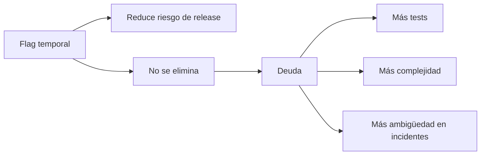

### Regla mínima

Cada feature flag temporal debe tener:

- Nombre
- Tipo
- Dueño
- Motivo
- Fecha de creación
- Criterio de activación al 100%
- Fecha o versión de retirada
- Métrica de uso
- Ticket de cleanup
- Estado actual
Ejemplo:

```json
{
  "newCheckoutFlow": {
    "enabled": false,
    "owner": "checkout-team",
    "type": "release",
    "temporary": true,
    "createdAt": "2026-05-20",
    "removeAfter": "2026-06-30",
    "cleanupIssue": "SHOP-1234"
  }
}
```

### Criterio de comprensión

Debes poder explicar:

> Un flag temporal sin plan de retirada no reduce riesgo gratis. Lo mueve al futuro como coste de mantenimiento.

---

## 21.24. Feature flags no arreglan migraciones incompatibles

Una feature flag puede ocultar una funcionalidad.

Pero no deshace una migración destructiva.

Ejemplo peligroso:

```text
1. eliminar columna antigua
2. desplegar código nuevo detrás de flag apagada
3. hacer rollback de app
```

Aunque la flag esté apagada, la columna ya no existe.

La regla es:

> Primero compatibilidad de datos. Después flags de exposición.

### Caso correcto

```text
1. expand compatible
2. desplegar código nuevo detrás de flag apagada
3. activar gradualmente
4. validar
5. backfill si aplica
6. limpiar camino antiguo más adelante
7. contract destructivo solo cuando haya evidencia
```

### Criterio de comprensión

Debes poder explicar:

> Una feature flag controla exposición de comportamiento. No convierte una migración incompatible en rollback-safe.

---

## 21.25. Readiness y proveedor de flags

Si la aplicación necesita flags para operar, debes decidir qué ocurre si la fuente de flags no responde.

Opciones:

- Seguir con último valor válido
- Usar defaults seguros
- Degradar funcionalidades no críticas
- Fallar readiness solo si no hay configuración mínima viable
No hagas que toda la app salga del tráfico por un fallo menor del proveedor de flags si puede seguir funcionando con defaults seguros.

### Preguntas de diseño

- ¿La app puede funcionar con flags por defecto?
- ¿La app puede funcionar con last known good?
- ¿Qué flags son críticas para seguridad?
- ¿Qué flags son solo exposición de producto?
- ¿Qué ocurre si el proveedor tarda 500 ms?
- ¿Qué ocurre si el proveedor cae durante 10 minutos?
- ¿Qué se observa en `/ready`?
- ¿Qué se observa en métricas?
### Patrón recomendado

Readiness puede fallar si falta una configuración mínima necesaria para operar.

Pero no debería fallar por cada error menor del sistema de flags si la app puede operar de forma segura con defaults.

### Criterio de comprensión

Debes poder explicar:

> Readiness debe proteger tráfico, no convertir cada fallo parcial del sistema de flags en caída total de la aplicación.

---

## 21.26. Segmentación

La segmentación decide quién recibe una variante.

Puede basarse en:

- Usuario
- Tenant
- Organización
- País
- Plan
- Rol
- Header
- Cookie
- Porcentaje
- Lista allowlist
- Entorno
- Versión de cliente
- Canal interno o externo
### Ejemplo por tenant

```json
{
  "newCheckoutFlow": {
    "enabled": true,
    "tenants": ["tenant-a", "tenant-b"]
  }
}
```

### Ejemplo por usuarios internos

```json
{
  "newCheckoutFlow": {
    "enabled": true,
    "segments": ["internal"]
  }
}
```

### Ejemplo por porcentaje

```json
{
  "newCheckoutFlow": {
    "enabled": true,
    "percentage": 10
  }
}
```

### Criterio de comprensión

Debes poder explicar:

> Activar una flag no debería significar siempre “para todos”. La exposición puede controlarse por segmento, pero cada segmento debe tener una semántica clara.

---

## 21.27. Rollout gradual por porcentaje estable

Un porcentaje debe ser estable.

No quieres que un usuario vea la funcionalidad encendida en una request y apagada en la siguiente.

Un patrón común es usar una función determinista sobre una clave estable.

Ejemplo conceptual:

```text
hash(userId + flagKey) % 100 < percentage
```

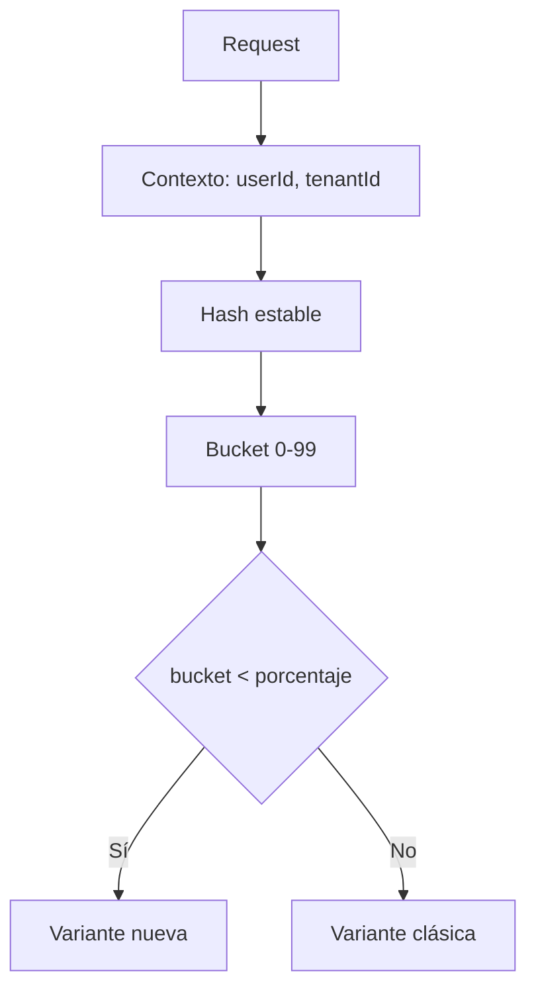

### Ejemplo conceptual en JavaScript

```js
function hashToBucket(value) {
  let hash = 0;

  for (let index = 0; index < value.length; index += 1) {
    hash = ((hash << 5) - hash) + value.charCodeAt(index);
    hash |= 0;
  }

  return Math.abs(hash) % 100;
}

function isEnabledForPercentage(flagKey, userId, percentage) {
  const bucket = hashToBucket(`${flagKey}:${userId}`);

  return bucket < percentage;
}
```

### Reglas

- Usa una clave estable
- No uses aleatoriedad por request
- Documenta qué identidad se usa
- Evita cambiar algoritmo durante un experimento
- Ten cuidado con usuarios anónimos
- Ten cuidado con tenants grandes que distorsionan porcentajes
- Observa por variante
### Criterio de comprensión

Debes poder explicar:

> Un rollout porcentual debe ser estable. Si la asignación cambia en cada request, no estás haciendo exposición gradual fiable.

---

## 21.28. Canary vs feature flag

Canary y feature flag se parecen porque ambos reducen exposición.

Pero no son lo mismo.

### Canary

Canary controla tráfico entre versiones.

Ejemplo:

```text
95% tráfico -> checkout-api v1
5% tráfico -> checkout-api v2
```

Esto suele ocurrir en:

- Ingress
- Gateway
- Service mesh
- Argo Rollouts
- Traffic manager
### Feature flag

Feature flag controla comportamiento dentro de una versión o capacidad.

Ejemplo:

```text
checkout-api v2 corre para todos
newCheckoutFlow activo para 5% de usuarios
```

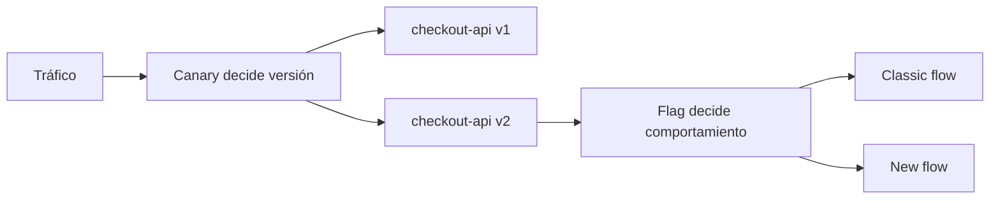

### Tabla

| Técnica | Controla | Dónde vive la decisión |
|---|---|---|
| Canary | Versión que recibe tráfico | Infraestructura de tráfico |
| Feature flag | Funcionalidad expuesta | Aplicación o plataforma de flags |
| A/B testing | Variante para aprender | Sistema de experimentación |
| Configuración dinámica | Parámetro de comportamiento | Configuración |

### Criterio de comprensión

Debes poder explicar:

> Canary decide qué versión recibe tráfico. Feature flag decide qué funcionalidad se expone dentro del comportamiento de la aplicación.

---

## 21.29. Relación con Argo Rollouts

Argo Rollouts y feature flags resuelven problemas relacionados, pero distintos.

Argo Rollouts puede ayudarte a:

- Canary por versión
- Blue-green
- Pausas
- Promoción
- Análisis automático
- Traffic splitting con integración de tráfico
Feature flags ayudan a:

- Exponer una funcionalidad dentro de una versión
- Activar por usuario
- Activar por tenant
- Activar por porcentaje estable
- Separar deploy de release
- Apagar una funcionalidad sin cambiar tráfico entre Pods
### Ejemplo combinado

```text
1. Deploy checkout-api v2 con Argo Rollouts al 10%
2. Dentro de v2, newCheckoutFlow sigue apagada
3. Activar newCheckoutFlow para usuarios internos
4. Activar para 5% de usuarios
5. Promover rollout de v2
6. Activar flag al 100%
7. Eliminar flag en release posterior
```

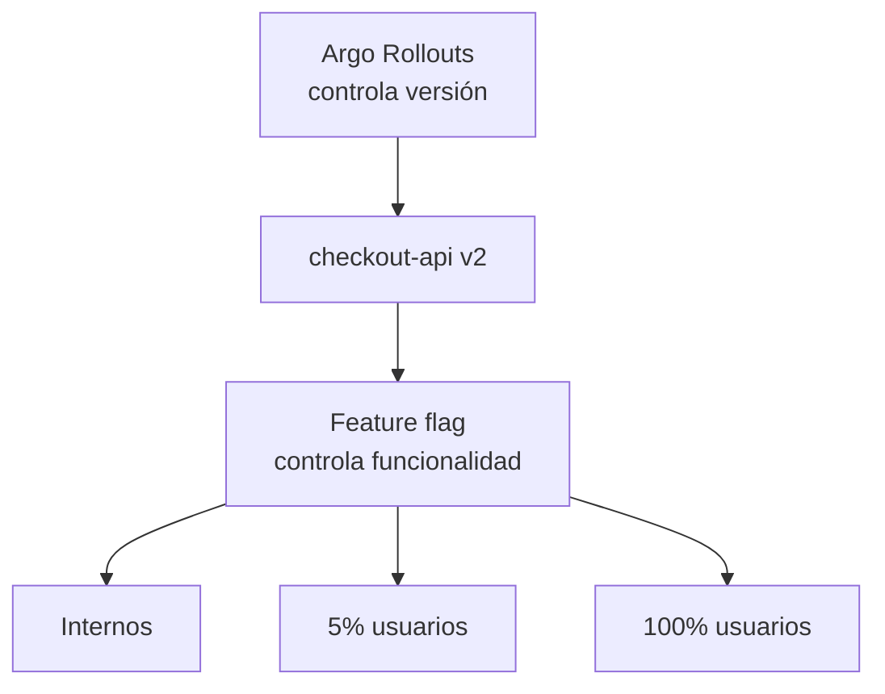

### Criterio de comprensión

Debes poder explicar:

> Argo Rollouts controla exposición de versiones. Feature flags controlan exposición de comportamiento dentro de la aplicación.

---

## 21.30. A/B testing y experimentos

Un A/B test no es simplemente una feature flag al 50%.

Un experimento necesita:

- Hipótesis
- Métrica primaria
- Métricas de guardrail
- Asignación estable
- Segmentación clara
- Duración definida
- Tamaño de muestra suficiente
- Evitar contaminación entre grupos
- Decisión antes de mirar resultados
- Observabilidad técnica
- Observabilidad de producto
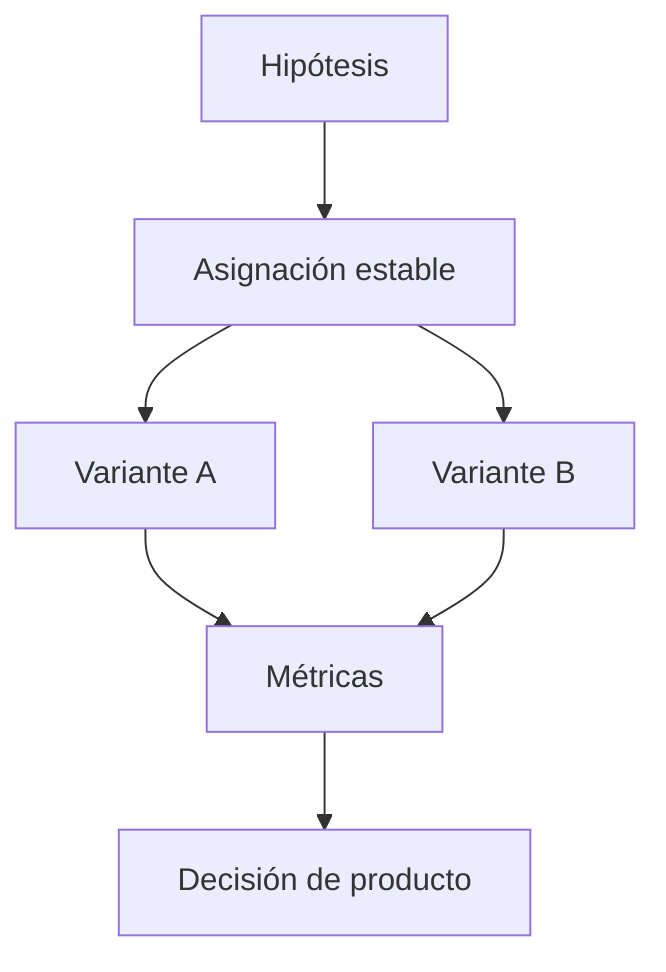

### Relación con flags

Un flag puede ser el mecanismo que activa una variante.

Pero el experimento es más que el flag.

El experimento incluye:

- Diseño
- Medición
- Interpretación
- Decisión
- Limpieza posterior
### Criterio de comprensión

Debes poder explicar:

> Un flag puede habilitar un experimento, pero no convierte por sí solo una exposición en un A/B test válido.

---

## 21.31. Kill switches y controles operacionales

Un kill switch permite desactivar una capacidad rápidamente para proteger el sistema.

Ejemplo:

```json
{
  "recommendationsPanel": {
    "enabled": false,
    "type": "operational-control",
    "reason": "High latency in recommendations service"
  }
}
```

En este curso no lo llamaremos feature flag en sentido estricto.

Lo llamaremos control operacional.

### Usos

- Desactivar una integración externa
- Degradar una funcionalidad costosa
- Reducir carga
- Evitar llamadas a un proveedor inestable
- Proteger un flujo crítico
- Apagar una funcionalidad no esencial durante incidente
### Diferencia con feature flag

| Feature flag | Kill switch |
|---|---|
| Controla exposición de funcionalidad nueva | Protege operación |
| Normalmente temporal | Puede ser permanente |
| Dueño producto y equipo técnico | Dueño operación y equipo técnico |
| Se retira tras release | Se prueba periódicamente |
| Se activa para liberar | Se desactiva para mitigar |

### Criterio de comprensión

Debes poder explicar:

> Un kill switch no es una release de funcionalidad. Es un control operacional para reducir daño durante una degradación.

---

## 21.32. Permission flags no son feature flags

Un permiso responde a:

> ¿Este usuario tiene derecho a usar esta capacidad?

Un feature flag responde a:

> ¿Queremos exponer esta funcionalidad ahora?

Son preguntas distintas.

### Ejemplo de permiso

```json
{
  "premiumCheckout": {
    "allowedPlans": ["premium", "enterprise"]
  }
}
```

Esto no debería tratarse como flag temporal.

Es parte del modelo de producto y autorización.

### Riesgo de mezclar

Si mezclas permisos y feature flags, puedes terminar con:

- Usuarios sin acceso correcto
- Funcionalidades visibles para quien no debe
- Lógica de autorización dispersa
- Flags permanentes con nombre de release
- Dificultad para auditar acceso
- Confusión entre producto, seguridad y delivery
### Regla

No uses feature flags como sistema de autorización principal.

Puedes usar un flag para exponer una nueva funcionalidad premium durante una transición, pero el permiso estable debe vivir en el sistema de autorización o entitlements.

### Criterio de comprensión

Debes poder explicar:

> Un permiso decide acceso. Un feature flag decide exposición de una release. Pueden interactuar, pero no son lo mismo.

---

## 21.33. Testing con flags

Los flags aumentan combinaciones.

Si tienes una flag:

```text
off / on
```

tienes dos caminos.

Si tienes cinco flags independientes:

```text
2^5 = 32 combinaciones
```

No puedes probar todo sin criterio.

### Qué probar siempre

Para una feature flag de release:

- Camino con flag apagada
- Camino con flag encendida
- Valor por defecto seguro
- Configuración inválida
- Configuración ausente
- Exposición por segmento
- Smoke test de variante activa
- Métricas por variante
- Cleanup cuando la flag se retira
### Ejemplo de test conceptual

```js
describe("checkout flow", () => {
  it("uses classic flow when newCheckoutFlow is disabled", () => {
    const flags = {
      newCheckoutFlow: {
        enabled: false
      }
    };

    const result = createCheckout({ flags });

    expect(result.flow).toBe("classic");
  });

  it("uses new flow when newCheckoutFlow is enabled", () => {
    const flags = {
      newCheckoutFlow: {
        enabled: true
      }
    };

    const result = createCheckout({ flags });

    expect(result.flow).toBe("new");
  });
});
```

### Testing en Kubernetes

También necesitas validar comportamiento desplegado.

```bash
curl -fsS http://localhost:8080/checkout | jq -e '.flow == "classic"'
```

Después de activar:

```bash
curl -fsS http://localhost:8080/checkout | jq -e '.flow == "new"'
```

### Criterio de comprensión

Debes poder explicar:

> Cada flag añade caminos de ejecución. Si no pruebas ambos lados y el valor por defecto, estás comprando riesgo oculto.

---

## 21.34. Observabilidad por variante

No puedes operar una flag si no sabes qué variante está activa.

Necesitas observar:

- Qué variante se ejecutó
- Cuántas requests usan cada variante
- Error rate por variante
- Latencia por variante
- Logs de evaluación
- Exposición por tenant o segmento, con cuidado
- Cambios de configuración
- Fallos de carga de configuración
- Fallbacks al valor por defecto
- Uso de last known good
### Log recomendado

```json
{
  "level": "info",
  "service": "checkout-api",
  "message": "checkout created",
  "feature": "newCheckoutFlow",
  "variant": "new",
  "segment": "internal"
}
```

### Métricas conceptuales

```text
checkout_requests_total{flow="classic"}
checkout_requests_total{flow="new"}
checkout_errors_total{flow="classic"}
checkout_errors_total{flow="new"}
checkout_duration_seconds{flow="classic"}
checkout_duration_seconds{flow="new"}
feature_flag_evaluations_total{flag="newCheckoutFlow",variant="new"}
feature_flag_reload_errors_total{flag_source="configmap"}
```

### Cuidado con la cardinalidad

No pongas `userId` como label de métrica.

Puede destruir la utilidad de tu sistema de métricas.

Mejor:

- `flag`
- `variant`
- `service`
- `environment`
- `segment` con cardinalidad controlada
Evita:

- `userId`
- `email`
- `sessionId`
- `requestId`
- valores libres de tenant si hay miles sin control
### Criterio de comprensión

Debes poder explicar:

> La observabilidad por variante permite decidir si avanzar, pausar o revertir. Pero una mala cardinalidad puede dañar el sistema de métricas.

---

## 21.35. Observabilidad de cambios de flags

Además de medir variantes, registra cambios.

Un incidente puede empezar justo después de un cambio de configuración.

Necesitas saber:

- Qué flag cambió
- Valor anterior
- Valor nuevo
- Quién lo cambió
- Cuándo
- Motivo
- Enlace a PR o ticket
- Versión de configuración
- Entorno afectado
- Resultado de validación
### En GitOps

Parte de esto vive en Git:

- Pull request
- Commit
- Autor
- Revisión
- Diff
- Historial
### En una plataforma de flags

Debe vivir en auditoría:

- Actor
- Timestamp
- Cambio
- Motivo
- Aprobación
- Rollback de configuración
### Log conceptual

```json
{
  "level": "info",
  "service": "checkout-api",
  "message": "flag configuration reloaded",
  "source": "configmap",
  "configVersion": "2026-05-20T10:00:00Z",
  "flags": ["newCheckoutFlow"]
}
```

### Criterio de comprensión

Debes poder explicar:

> Durante un incidente, saber qué cambió puede ser tan importante como saber qué variante falló.

---

## 21.36. Exponer configuración activa

Un sistema con flags debe permitir entender qué configuración está activa.

No necesariamente públicamente.

Puede ser:

- Endpoint interno
- Log al arrancar
- Métrica
- Dashboard
- Admin UI
- Comando de diagnóstico
### Endpoint interno conceptual

```http
GET /internal/config
```

Respuesta:

```json
{
  "service": "checkout-api",
  "flags": {
    "newCheckoutFlow": {
      "enabled": true,
      "source": "configmap",
      "loadedAt": "2026-05-20T10:00:00Z",
      "usingLastKnownGood": false
    }
  }
}
```

### Cuidado

No expongas:

- Secrets
- Tokens
- Datos personales
- Reglas de segmentación sensibles
- Información que permita abuso
### Criterio de comprensión

Debes poder explicar:

> Si no puedes saber qué configuración está activa, diagnosticar flags se vuelve una adivinanza.

---

## 21.37. GitOps y flags

Si usas GitOps, puedes gestionar flags en Git.

Ejemplo:

```text
flags/checkout-api-flags.json
k8s/flags/kustomization.yaml
```

Ventajas:

- Revisión por PR
- Historial
- Auditoría
- Rollback de configuración
- Argo CD puede reconciliar el estado
- Menos cambios manuales invisibles
- Validaciones antes de aplicar
Costes:

- Cambios menos inmediatos
- Puede no servir para kill switches urgentes
- Requiere entender propagación
- Requiere validar ConfigMaps antes de aplicar
- Si usas env vars, requiere restart o rollout
- Si usas reload, debes observar que la app recargó
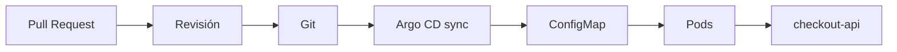

### GitOps para release flags

Encaja bien cuando:

- La flag cambia como parte de una release
- Quieres revisión
- No necesitas reacción en segundos
- Quieres auditoría fuerte
- El cambio debe pasar por validaciones
- El sistema recarga configuración sin redeploy
### GitOps no siempre basta

Puede no ser suficiente para:

- Kill switch urgente
- Experimento con ajustes frecuentes
- Segmentación por usuario gestionada por producto
- Reglas complejas
- Cambios controlados por un equipo no técnico
- Reacción operacional inmediata
### Criterio de comprensión

Debes poder explicar:

> GitOps da trazabilidad a los flags, pero no convierte cualquier configuración en feature flag runtime.

---

## 21.38. Cuándo no usar flags

No uses flags para todo.

Un flag puede ser mala idea si:

- El cambio es pequeño y seguro
- Puedes hacer una release compatible sin flag
- No tienes observabilidad
- No tienes plan de retirada
- No puedes testear ambos caminos
- La lógica crea demasiada combinatoria
- El flag oculta deuda de diseño
- El flag sustituye mal a un permiso
- El flag sustituye mal a configuración clara
- El flag intenta tapar una migración incompatible
- El flag se usaría para evitar tomar una decisión de producto
- El equipo no sabe quién es dueño del flag
- Activarlo o desactivarlo requiere redeploy
- El valor por defecto no está claro
- El proveedor de flags no tiene fallback
### Señal de alarma

Si no puedes responder estas preguntas, no añadas el flag todavía:

```text
¿Qué riesgo reduce?
¿Quién lo controla?
¿Cuándo se retira?
¿Cómo se prueba?
¿Cómo se observa?
¿Qué pasa si el proveedor de flags falla?
¿Qué valor por defecto es seguro?
¿Puedo cambiar exposición sin redeploy?
```

### Criterio de comprensión

Debes poder explicar:

> Un flag sin dueño, observabilidad, fallback y fecha de retirada no es una práctica de delivery. Es deuda diferida.

---

## 21.39. Manifiestos recomendados para el módulo

Estructura:

```text
flags/
  checkout-api-flags.schema.json
  checkout-api-flags.json

k8s/flags/
  kustomization.yaml

k8s/checkout-api/
  deployment.yaml
  service.yaml

docs/flags/
  newCheckoutFlow.md

scripts/
  smoke-classic-flow.sh
  smoke-new-flow.sh
  validate-flags.sh
  check-temporary-flags-cleanup.sh
```

### flags/checkout-api-flags.json

```json
{
  "newCheckoutFlow": {
    "enabled": false,
    "owner": "checkout-team",
    "type": "release",
    "temporary": true,
    "createdAt": "2026-05-20",
    "removeAfter": "2026-06-30",
    "cleanupIssue": "SHOP-1234"
  }
}
```

### k8s/flags/kustomization.yaml

```yaml
apiVersion: kustomize.config.k8s.io/v1beta1
kind: Kustomization

configMapGenerator:
  - name: checkout-api-flags
    files:
      - flags.json=../../flags/checkout-api-flags.json

generatorOptions:
  disableNameSuffixHash: true
```

### Deployment

```yaml
apiVersion: apps/v1
kind: Deployment
metadata:
  name: checkout-api
  namespace: shop
  labels:
    app: checkout-api
    app.kubernetes.io/name: checkout-api
    app.kubernetes.io/component: api
    app.kubernetes.io/part-of: shop
spec:
  replicas: 3
  selector:
    matchLabels:
      app: checkout-api
  template:
    metadata:
      labels:
        app: checkout-api
        app.kubernetes.io/name: checkout-api
        app.kubernetes.io/component: api
        app.kubernetes.io/part-of: shop
    spec:
      containers:
        - name: checkout-api
          image: checkout-api:1.6.0
          imagePullPolicy: IfNotPresent
          ports:
            - name: http
              containerPort: 8080
          env:
            - name: FLAGS_FILE
              value: /etc/checkout-api/flags/flags.json
          readinessProbe:
            httpGet:
              path: /ready
              port: http
            periodSeconds: 5
            timeoutSeconds: 2
            failureThreshold: 3
          livenessProbe:
            httpGet:
              path: /health
              port: http
            periodSeconds: 10
            timeoutSeconds: 2
            failureThreshold: 3
          volumeMounts:
            - name: flags
              mountPath: /etc/checkout-api/flags
              readOnly: true
          resources:
            requests:
              cpu: 100m
              memory: 128Mi
            limits:
              memory: 256Mi
      volumes:
        - name: flags
          configMap:
            name: checkout-api-flags
```

### Service

```yaml
apiVersion: v1
kind: Service
metadata:
  name: checkout-api
  namespace: shop
  labels:
    app: checkout-api
    app.kubernetes.io/name: checkout-api
    app.kubernetes.io/component: api
    app.kubernetes.io/part-of: shop
spec:
  selector:
    app: checkout-api
  ports:
    - name: http
      port: 80
      targetPort: http
```

### Criterio de comprensión

Debes poder explicar:

> Este diseño monta flags como fichero. Kubernetes entrega el fichero y la aplicación debe recargar o releer de forma segura. Si la app no recarga, esto no es feature flag runtime.

---

## 21.40. Taskfile para flags y configuración dinámica

Añade tareas:

```yaml
flags:validate:
  desc: Validate checkout-api flags JSON
  cmds:
    - jq -e '.newCheckoutFlow.enabled | type == "boolean"' flags/checkout-api-flags.json
    - jq -e '.newCheckoutFlow.owner | type == "string"' flags/checkout-api-flags.json
    - jq -e '.newCheckoutFlow.type == "release"' flags/checkout-api-flags.json
    - jq -e '.newCheckoutFlow.temporary == true' flags/checkout-api-flags.json
    - jq -e '.newCheckoutFlow.removeAfter | type == "string"' flags/checkout-api-flags.json
    - jq -e '.newCheckoutFlow.cleanupIssue | type == "string"' flags/checkout-api-flags.json

flags:check:cleanup:
  desc: Fail if temporary flags do not have removeAfter and cleanupIssue
  cmds:
    - |
      jq -e '
        to_entries[]
        | select(.value.temporary == true)
        | .value.removeAfter and .value.cleanupIssue
      ' flags/checkout-api-flags.json

flags:render:
  desc: Render flags ConfigMap
  cmds:
    - kubectl kustomize k8s/flags

flags:apply:
  desc: Apply checkout-api flags ConfigMap
  cmds:
    - task flags:validate
    - task flags:check:cleanup
    - kubectl apply -k k8s/flags

flags:show:
  desc: Show checkout-api flags ConfigMap from Kubernetes
  cmds:
    - kubectl get configmap checkout-api-flags -n shop -o yaml

flags:show:json:
  desc: Show flags.json from ConfigMap
  cmds:
    - kubectl get configmap checkout-api-flags -n shop -o jsonpath='{.data.flags\.json}' | jq .

flags:enable:new-checkout:
  desc: Enable newCheckoutFlow locally and apply
  cmds:
    - jq '.newCheckoutFlow.enabled = true' flags/checkout-api-flags.json > /tmp/checkout-api-flags.json
    - mv /tmp/checkout-api-flags.json flags/checkout-api-flags.json
    - task flags:apply

flags:disable:new-checkout:
  desc: Disable newCheckoutFlow locally and apply
  cmds:
    - jq '.newCheckoutFlow.enabled = false' flags/checkout-api-flags.json > /tmp/checkout-api-flags.json
    - mv /tmp/checkout-api-flags.json flags/checkout-api-flags.json
    - task flags:apply

flags:logs:
  desc: Show checkout-api logs
  cmds:
    - kubectl logs deployment/checkout-api -n shop

flags:smoke:classic:
  desc: Check classic checkout flow
  cmds:
    - curl -fsS http://localhost:8080/checkout | jq -e '.flow == "classic"'

flags:smoke:new:
  desc: Check new checkout flow
  cmds:
    - curl -fsS http://localhost:8080/checkout | jq -e '.flow == "new"'

flags:debug:
  desc: Debug flags and checkout-api runtime state
  cmds:
    - kubectl get configmap checkout-api-flags -n shop -o yaml
    - kubectl get pods -n shop -l app=checkout-api --show-labels
    - kubectl describe deployment checkout-api -n shop
    - kubectl logs deployment/checkout-api -n shop
```

### Por qué evitamos editar JSON embebido en YAML

Editar JSON embebido dentro de un ConfigMap YAML genera mala DevEx:

- Diffs peores
- Validación más incómoda
- Comandos más frágiles
- Más fricción para revisar cambios
Por eso usamos:

```text
flags/checkout-api-flags.json
```

como fuente y Kustomize para generar el ConfigMap.

### Criterio DevEx

Debes poder explicar:

> Taskfile no debe esconder el modelo. Debe hacer repetible validar, aplicar, activar, desactivar, observar y depurar flags.

---

## 21.41. Práctica 1: deploy sin release

### Objetivo

Desplegar una versión que contiene una funcionalidad nueva, pero mantenerla apagada.

### Pasos

Aplicar ConfigMap:

```bash
task flags:apply
```

Aplicar Deployment:

```bash
kubectl apply -f k8s/checkout-api/deployment.yaml
kubectl apply -f k8s/checkout-api/service.yaml
kubectl rollout status deployment/checkout-api -n shop
```

Port-forward:

```bash
kubectl port-forward svc/checkout-api 8080:80 -n shop
```

Validar:

```bash
curl -fsS http://localhost:8080/checkout | jq
```

Esperado:

```json
{
  "flow": "classic"
}
```

### Preguntas

- ¿La versión nueva está desplegada?
- ¿La funcionalidad nueva está liberada?
- ¿Qué controla Kubernetes?
- ¿Qué controla la flag?
- ¿Puedes cambiar exposición sin nueva imagen?
### Criterio

Debes poder explicar:

> La funcionalidad puede estar en producción sin estar expuesta.

---

## 21.42. Práctica 2: activar una feature flag runtime

### Objetivo

Activar `newCheckoutFlow` sin construir una nueva imagen y sin redeployar la aplicación.

Editar:

```text
flags/checkout-api-flags.json
```

Cambiar:

```json
{
  "newCheckoutFlow": {
    "enabled": true
  }
}
```

Aplicar:

```bash
task flags:apply
```

Validar ConfigMap:

```bash
task flags:show:json
```

Probar:

```bash
curl -fsS http://localhost:8080/checkout | jq
```

Si la aplicación recarga el fichero en runtime, debería devolver:

```json
{
  "flow": "new"
}
```

### Preguntas

- ¿La imagen cambió?
- ¿El Deployment cambió?
- ¿Hubo rollout?
- ¿El comportamiento cambió?
- ¿La app recargó configuración?
- ¿Dónde ves logs de reload?
- ¿Dónde ves la variante ejecutada?
### Criterio

Debes poder explicar:

> Activar una feature flag real cambia exposición sin construir otra imagen y sin redeployar la aplicación.

---

## 21.43. Práctica 3: por qué env vars no son feature flags runtime

### Objetivo

Comprobar que una variable de entorno inyectada desde ConfigMap no permite activar o desactivar una feature flag en runtime.

Esta práctica existe para entender el límite del modelo, no para recomendarlo como solución profesional.

ConfigMap:

```yaml
apiVersion: v1
kind: ConfigMap
metadata:
  name: checkout-api-env-flags
  namespace: shop
data:
  NEW_CHECKOUT_FLOW_ENABLED: "false"
```

Deployment:

```yaml
env:
  - name: NEW_CHECKOUT_FLOW_ENABLED
    valueFrom:
      configMapKeyRef:
        name: checkout-api-env-flags
        key: NEW_CHECKOUT_FLOW_ENABLED
```

Cambia ConfigMap a:

```yaml
NEW_CHECKOUT_FLOW_ENABLED: "true"
```

Aplica:

```bash
kubectl apply -f k8s/flags/checkout-api-env-flags.yaml
```

Observa:

```bash
kubectl exec -n shop deployment/checkout-api -- printenv NEW_CHECKOUT_FLOW_ENABLED
```

Reinicia:

```bash
kubectl rollout restart deployment/checkout-api -n shop
kubectl rollout status deployment/checkout-api -n shop
```

Vuelve a observar.

### Preguntas

- ¿Cambió la env var sin reiniciar?
- ¿Qué implica esto para kill switches?
- ¿Cuándo es suficiente este modelo?
- ¿Cuándo no lo es?
- ¿Por qué no cumple el criterio de feature flag runtime?
### Criterio

Debes poder explicar:

> Env vars son configuración de arranque. No son configuración dinámica para Pods ya vivos.

---

## 21.44. Práctica 4: configuración inválida

### Objetivo

Ver qué ocurre si `flags.json` no es válido.

Cambia temporalmente:

```json
{
  "newCheckoutFlow": {
    "enabled": "yes",
    "owner": "checkout-team",
    "type": "release",
    "temporary": true,
    "removeAfter": "2026-06-30",
    "cleanupIssue": "SHOP-1234"
  }
}
```

Valida:

```bash
task flags:validate
```

Debe fallar.

### Preguntas

- ¿Por qué `"yes"` no es aceptable?
- ¿Qué haría la aplicación si esto llegara a runtime?
- ¿Debe mantener último valor válido?
- ¿Debe usar default?
- ¿Debe fallar readiness?
- ¿Qué métrica debería emitir?
### Criterio

Debes poder explicar:

> Flags inválidos también pueden romper producción. Por eso deben validarse antes de aplicarse y tener fallback en runtime.

---

## 21.45. Práctica 5: segmentación por header

### Objetivo

Activar una funcionalidad solo para requests internas.

Regla conceptual:

```text
X-Internal-User: true -> new flow
resto -> classic flow
```

Código conceptual:

```js
function isInternalUser(req) {
  return req.header("X-Internal-User") === "true";
}

function isNewCheckoutFlowEnabled(req) {
  const flags = loadFlags();

  if (!flags.newCheckoutFlow?.enabled) {
    return false;
  }

  if (flags.newCheckoutFlow?.segments?.includes("internal")) {
    return isInternalUser(req);
  }

  return true;
}
```

Config:

```json
{
  "newCheckoutFlow": {
    "enabled": true,
    "segments": ["internal"]
  }
}
```

Validar:

```bash
curl -fsS http://localhost:8080/checkout | jq -e '.flow == "classic"'
curl -fsS -H "X-Internal-User: true" http://localhost:8080/checkout | jq -e '.flow == "new"'
```

### Preguntas

- ¿Quién ve la funcionalidad?
- ¿Qué riesgo reduce este modelo?
- ¿Qué riesgo introduce confiar en headers?
- ¿Dónde debería vivir la identidad real en un sistema profesional?
### Criterio

Debes poder explicar:

> La segmentación necesita una identidad fiable. Un header manual sirve para laboratorio, no como autorización real.

---

## 21.46. Práctica 6: porcentaje estable

### Objetivo

Exponer una funcionalidad al 10% de usuarios de forma estable.

Config:

```json
{
  "newCheckoutFlow": {
    "enabled": true,
    "percentage": 10
  }
}
```

Validar con diferentes usuarios:

```bash
curl -fsS -H "X-User-Id: user-001" http://localhost:8080/checkout | jq
curl -fsS -H "X-User-Id: user-002" http://localhost:8080/checkout | jq
curl -fsS -H "X-User-Id: user-003" http://localhost:8080/checkout | jq
```

Repetir varias veces con el mismo usuario.

### Preguntas

- ¿El mismo usuario recibe siempre la misma variante?
- ¿Qué pasaría con asignación aleatoria por request?
- ¿Por qué se usa `flagKey + userId`?
- ¿Qué problema aparece con usuarios anónimos?
- ¿Qué problema aparece con tenants grandes?
### Criterio

Debes poder explicar:

> El porcentaje debe asignar usuarios de forma estable, no decidir de forma aleatoria en cada request.

---

## 21.47. Práctica 7: observabilidad por variante

### Objetivo

Emitir señales diferentes para `classic` y `new`.

Genera tráfico:

```bash
curl -fsS http://localhost:8080/checkout | jq
curl -fsS -H "X-Internal-User: true" http://localhost:8080/checkout | jq
```

Revisar logs:

```bash
kubectl logs deployment/checkout-api -n shop
```

Busca campos:

```json
{
  "feature": "newCheckoutFlow",
  "variant": "new"
}
```

### Preguntas

- ¿Puedes saber qué variante se ejecutó?
- ¿Puedes comparar errores por variante?
- ¿Puedes comparar latencia por variante?
- ¿Qué labels de métricas usarías?
- ¿Qué labels evitarías por cardinalidad?
- ¿Puedes saber si la app está usando last known good?
### Criterio

Debes poder explicar:

> Si no puedes observar por variante, no puedes tomar buenas decisiones de promoción o rollback.

---

## 21.48. Práctica 8: kill switch operacional

### Objetivo

Entender un kill switch como control operacional, no como feature flag estricta.

Config:

```json
{
  "recommendationsEnabled": {
    "enabled": false,
    "type": "operational-control",
    "reason": "recommendations service degraded"
  }
}
```

Comportamiento:

- Si está activo, mostrar recomendaciones
- Si está apagado, omitir recomendaciones
- El checkout debe seguir funcionando
### Preguntas

- ¿Esto es release de funcionalidad?
- ¿Qué protege?
- ¿Quién debería poder cambiarlo?
- ¿Cómo lo probarías periódicamente?
- ¿Qué observabilidad necesitas?
- ¿Qué valor por defecto es seguro?
### Criterio

Debes poder explicar:

> Un kill switch protege operación. No debería confundirse con una feature flag de release.

---

## 21.49. Práctica 9: limpiar una flag

### Objetivo

Retirar `newCheckoutFlow` cuando ya está al 100%.

Pasos:

1. Confirmar que `newCheckoutFlow` está al 100%
2. Confirmar que no hay uso de `classic`
3. Confirmar que no hay errores de la variante nueva
4. Eliminar rama antigua del código
5. Eliminar flag del ConfigMap o proveedor
6. Eliminar tests del camino antiguo
7. Mantener tests del nuevo comportamiento
8. Actualizar release note
9. Eliminar dashboards temporales si ya no aplican
10. Cerrar el issue de cleanup
### Preguntas

- ¿Qué evidencia necesitas antes de eliminar?
- ¿Qué código se borra?
- ¿Qué configuración se borra?
- ¿Qué tests se actualizan?
- ¿Qué pasa si nunca haces esta limpieza?
- ¿Qué métrica demuestra que el camino antiguo ya no se usa?
### Criterio

Debes poder explicar:

> La release no termina cuando la flag llega al 100%. Termina cuando la compatibilidad temporal se limpia.

---

## 21.50. Práctica avanzada: OpenFeature y flagd

### Objetivo

Entender cómo una aplicación puede evaluar flags en runtime usando un proveedor local.

Esta práctica es avanzada.

No necesitas completarla para entender el módulo, pero sí ayuda a ver el modelo Kubernetes-first profesional.

### Pasos conceptuales

1. Instalar OpenFeature Operator
2. Definir una `FeatureFlagConfiguration`
3. Inyectar `flagd` como sidecar o desplegarlo como servicio
4. Configurar la app para usar OpenFeature SDK
5. Evaluar `newCheckoutFlow` con contexto
6. Cambiar la flag sin reconstruir imagen
7. Observar comportamiento
8. Validar fallback si `flagd` no responde
### Preguntas

- ¿Dónde vive la configuración de flags?
- ¿Cómo evalúa la app la flag?
- ¿Qué ocurre si `flagd` falla?
- ¿Hay last known good?
- ¿Hay auditoría?
- ¿Cómo se observa la variante?
- ¿Cómo se limpia la flag?
### Criterio

Debes poder explicar:

> OpenFeature y flagd permiten modelar feature flags runtime de forma más cercana a una plataforma profesional en Kubernetes.

---

## 21.51. Checklist de uso responsable

Antes de crear una flag:

- [ ] El riesgo que reduce está claro
- [ ] La flag controla una funcionalidad, no un permiso disfrazado
- [ ] El tipo está definido
- [ ] Hay dueño
- [ ] Hay valor por defecto seguro
- [ ] Puede cambiar exposición sin redeploy
- [ ] Hay plan de activación
- [ ] Hay plan de observabilidad
- [ ] Hay tests con flag apagada
- [ ] Hay tests con flag encendida
- [ ] Hay fecha o criterio de retirada
- [ ] Hay ticket de cleanup
- [ ] Hay estrategia si la configuración no carga
- [ ] Hay estrategia si el proveedor de flags falla
- [ ] Hay last known good o default seguro
- [ ] La configuración está validada antes de aplicar
- [ ] La cardinalidad de métricas está controlada
- [ ] Está claro si necesita runtime dinámico o restart controlado
- [ ] Está claro si interactúa con migraciones de datos
- [ ] Está claro si interactúa con permisos
Durante la activación:

- [ ] Activar primero en entorno seguro o segmento interno
- [ ] Observar logs
- [ ] Observar error rate
- [ ] Observar latencia
- [ ] Observar métricas por variante
- [ ] Observar cambios de configuración
- [ ] Observar fallos de reload
- [ ] Observar señales de negocio si aplica
- [ ] Tener plan de desactivación
- [ ] Documentar decisión
Después de activar al 100%:

- [ ] Confirmar estabilidad
- [ ] Eliminar camino antiguo
- [ ] Eliminar flag
- [ ] Eliminar configuración temporal
- [ ] Eliminar tests obsoletos
- [ ] Actualizar documentación
- [ ] Actualizar release note
- [ ] Revisar dashboards y alertas
- [ ] Cerrar issue de cleanup
---

## 21.52. Errores habituales

### Error 1. Llamar feature flag a todo

Un permiso, una configuración dinámica, un kill switch y un experimento no son lo mismo.

### Error 2. Crear flags sin fecha de retirada

Una flag temporal sin cleanup es deuda.

### Error 3. Aceptar redeploy como activación normal de una feature flag

Si para activar o desactivar una flag necesitas redeployar, no tienes separación runtime entre deploy y release.

### Error 4. No probar ambos caminos

Si solo pruebas la flag encendida, puedes romper el rollback lógico.

Si solo pruebas la flag apagada, puedes desplegar una funcionalidad rota.

### Error 5. Usar env vars esperando cambios dinámicos

Las env vars no cambian en Pods ya arrancados.

### Error 6. Montar ConfigMap como fichero y no recargarlo

El fichero puede cambiar, pero la app debe releerlo y validarlo.

### Error 7. Usar Secrets como flags

Un Secret no es un mecanismo de release.

### Error 8. Usar ConfigMaps para secretos

Un ConfigMap no protege información sensible.

### Error 9. Confundir canary con feature flag

Canary enruta entre versiones.

Feature flag expone funcionalidad dentro de la aplicación.

### Error 10. Confundir A/B testing con porcentaje

Un experimento necesita hipótesis, métricas y asignación estable.

### Error 11. Medir por usuario en labels de métricas

Eso puede crear cardinalidad explosiva.

### Error 12. Usar flags para evitar diseño

A veces un flag solo esconde una decisión de diseño mal resuelta.

### Error 13. No exponer configuración activa

Si no sabes qué configuración está activa, diagnosticar incidentes se vuelve lento.

### Error 14. No tener fallback

Si la configuración no carga, la aplicación debe tener un comportamiento seguro.

### Error 15. Usar flags para tapar migraciones incompatibles

Una flag apagada no restaura columnas eliminadas ni datos transformados.

### Error 16. No registrar cambios de flags

Sin auditoría o historial, un incidente puede parecer aleatorio.

---

## 21.53. Criterio de salida del módulo

Puedes dar este módulo por completado cuando puedas explicar y demostrar lo siguiente.

### Conceptos

Debes poder explicar:

- Qué diferencia hay entre deploy y release
- Por qué Kubernetes despliega versiones y los flags controlan exposición
- Qué llamamos feature flag en este curso
- Por qué no todo toggle es una feature flag
- Por qué una feature flag real debe poder cambiar exposición sin redeploy
- Qué diferencia hay entre feature flag, configuración dinámica, permiso, experimento y kill switch
- Qué es una release flag
- Qué es una configuración dinámica
- Qué es un control operacional
- Qué es un permiso
- Qué es un experimento
- Qué son flags temporales y controles permanentes
- Por qué los flags olvidados generan deuda
- Cómo funciona segmentación por usuario, tenant o porcentaje
- Por qué el porcentaje debe ser estable
- Qué diferencia hay entre canary y feature flag
- Qué diferencia hay entre feature flag y A/B testing
- Qué puede aportar OpenFeature
- Qué puede aportar `flagd`
- Qué diferencia hay entre sidecar y servicio central
- Qué limitaciones tiene ConfigMap como env var
- Qué cambia si montas ConfigMap como fichero
- Por qué reload real importa
- Por qué Secrets no son feature flags
- Qué es last known good configuration
- Cómo observar por variante
- Cómo observar cambios de flags
- Cómo evitar cardinalidad explosiva
- Cuándo no usar flags
- Por qué una flag no arregla una migración incompatible
- Cómo readiness debe tratar errores del proveedor de flags
### Práctica

Debes poder:

- Crear un fichero JSON de flags
- Crear un schema de flags
- Validar flags con `jq`
- Generar un ConfigMap con Kustomize
- Montar un ConfigMap como fichero en un Deployment
- Leer flags desde la aplicación
- Activar y desactivar una flag sin nueva imagen
- Distinguir cuándo hace falta restart y cuándo no
- Probar comportamiento con flag apagada
- Probar comportamiento con flag encendida
- Demostrar por qué env vars no son feature flags runtime
- Probar configuración inválida
- Segmentar por header en laboratorio
- Diseñar porcentaje estable por usuario
- Observar logs por variante
- Explicar un kill switch como control operacional
- Limpiar una flag temporal
- Automatizar el flujo con Taskfile
- Explicar cómo OpenFeature y flagd encajan en Kubernetes
### Frase final de comprensión

Debes poder explicar esta frase:

> Kubernetes despliega versiones. Los feature flags controlan exposición. Pero si activar o desactivar una flag requiere redeploy, no estás separando deploy de release en runtime. Estás usando configuración de despliegue con otro nombre.

---

## 21.54. Referencias oficiales y materiales de apoyo

| Tema | Referencia |
|---|---|
| Feature Toggles | Pete Hodgson, Martin Fowler site, Feature Toggles. https://martinfowler.com/articles/feature-toggles.html |
| Martin Fowler Feature Flag bliki | Martin Fowler, Feature Flag. https://martinfowler.com/bliki/FeatureFlag.html |
| OpenFeature | OpenFeature. https://openfeature.dev/ |
| OpenFeature introduction | OpenFeature Docs, Introduction. https://openfeature.dev/docs/reference/intro |
| OpenFeature flagd | OpenFeature Docs, flagd. https://openfeature.dev/docs/reference/technologies/server/flagd/ |
| OpenFeature Operator | OpenFeature Docs, OpenFeature Operator quick start. https://openfeature.dev/docs/tutorials/open-feature-operator/quick-start |
| Kubernetes ConfigMaps | Kubernetes Docs, ConfigMaps. https://kubernetes.io/docs/concepts/configuration/configmap/ |
| Kubernetes Secrets | Kubernetes Docs, Secrets. https://kubernetes.io/docs/concepts/configuration/secret/ |
| Kubernetes Secrets as env vars | Kubernetes Docs, Distribute Credentials Securely Using Secrets. https://kubernetes.io/docs/tasks/inject-data-application/distribute-credentials-secure/ |
| Updating configuration via ConfigMap | Kubernetes Docs, Updating Configuration via a ConfigMap. https://kubernetes.io/docs/tutorials/configuration/updating-configuration-via-a-configmap/ |
| Kubernetes Deployments | Kubernetes Docs, Deployments. https://kubernetes.io/docs/concepts/workloads/controllers/deployment/ |
| Kubernetes Services | Kubernetes Docs, Service. https://kubernetes.io/docs/concepts/services-networking/service/ |
| Kustomize configMapGenerator | Kubernetes Docs, Declarative Management of Kubernetes Objects Using Kustomize. https://kubernetes.io/docs/tasks/manage-kubernetes-objects/kustomization/ |
| Argo Rollouts | Argo Rollouts documentation. https://argo-rollouts.readthedocs.io/en/stable/ |
| Argo Rollouts Canary | Argo Rollouts, Canary Deployment Strategy. https://argo-rollouts.readthedocs.io/en/stable/features/canary/ |
| Argo Rollouts BlueGreen | Argo Rollouts, BlueGreen Deployment Strategy. https://argo-rollouts.readthedocs.io/en/stable/features/bluegreen/ |
| Argo CD | Argo CD documentation. https://argo-cd.readthedocs.io/en/stable/ |

## 21.55. Lecturas de apoyo

| Tema | Qué leer |
|---|---|
| Feature toggles | Categorías, duración, dinamismo, configuración y coste de mantener toggles vivos. |
| Progressive delivery | Separación entre deploy, release, exposición, promoción y rollback. |
| Kubernetes ConfigMaps | Inyección de configuración, env vars, volúmenes y actualización de configuración. |
| Kubernetes Secrets | Separación entre configuración sensible y no sensible. |
| OpenFeature | Abstracción vendor-neutral para evaluación de flags. |
| flagd | Evaluación de flags runtime y despliegue cloud-native. |
| Argo Rollouts | Canary, blue-green y análisis automatizado de versiones. |
| Observabilidad | Métricas por variante, logs estructurados, auditoría de cambios y control de cardinalidad. |
| Trunk-based development | Integración frecuente, main siempre desplegable y separación entre integración y exposición. |
| Software economics | Coste de flags olvidadas, coste de combinatoria, valor de opciones reversibles y coste de limpieza pendiente. |

<!-- COURSE_NAV_START -->
[Anterior](<20. Migraciones de datos sin downtime.md>) | [Indice](README.md) | [Siguiente](<22. Supply chain, imágenes seguras y políticas de admisión.md>)
<!-- COURSE_NAV_END -->