<!-- COURSE_NAV_START -->
[Anterior](<21. Feature flags, releases graduales y configuración dinámica.md>) | [Indice](README.md) | [Siguiente](<23. SLOs, error budgets e incident response.md>)
<!-- COURSE_NAV_END -->

# 22. Resiliencia de aplicaciones cloud native

## 22.1. Objetivo del módulo

En los módulos anteriores aprendiste a desplegar aplicaciones en Kubernetes, separar deploy de release, diseñar migraciones compatibles y controlar exposición con feature flags. Este módulo se centra en una pregunta distinta: qué ocurre cuando algo falla mientras la aplicación está atendiendo tráfico real.

En una aplicación cloud native, los fallos rara vez aparecen como un único evento claro y aislado. Una dependencia puede empezar a responder más lento, una base de datos puede saturarse, un proveedor externo puede devolver errores intermitentes, una cola puede acumular mensajes o un consumidor puede procesar dos veces el mismo evento. También puede ocurrir que un Pod reciba una señal de terminación durante un rollout mientras todavía tiene requests en curso, o que un timeout demasiado largo agote conexiones, memoria o capacidad de proceso. En todos esos casos, Kubernetes puede ayudar, pero no puede decidir por la aplicación cuál es el comportamiento correcto.

Kubernetes puede ayudarte reiniciando contenedores, retirando Pods de los endpoints de un Service cuando readiness falla, creando réplicas, repartiendo tráfico entre Pods Ready, limitando recursos, escalando workloads con HPA, ejecutando Jobs y dando tiempo de terminación antes de matar un proceso. Todo eso es valioso, pero no sustituye el diseño de resiliencia de la aplicación. Kubernetes puede operar mejor un sistema, pero no puede inventar timeouts correctos, retries seguros, idempotencia, fallbacks, circuit breakers, backpressure o una política clara para mensajes que fallan una y otra vez.

La tesis del módulo es esta:

> Kubernetes puede reiniciar contenedores, pero no puede diseñar por ti una aplicación tolerante a fallos.

Y la tesis operacional es esta:

> La resiliencia en Kubernetes aparece cuando la aplicación y la plataforma tienen un contrato claro: la aplicación sabe fallar, y Kubernetes sabe cuándo enrutar, reiniciar, escalar o esperar.

En este módulo aprenderás:

- Qué significa resiliencia en una aplicación cloud native.
- Qué puede resolver Kubernetes y qué debe resolver la aplicación.
- Por qué la resiliencia no es ausencia de fallos.
- Cómo evolucionar un sistema desde una llamada frágil hasta un diseño tolerante a fallos.
- Por qué los timeouts son obligatorios.
- Qué es un presupuesto de latencia.
- Qué es deadline propagation.
- Por qué los retries sin criterio pueden ser peligrosos.
- Cómo clasificar errores antes de reintentar.
- Qué es backoff.
- Qué es jitter.
- Qué es un retry budget.
- Qué es una retry storm.
- Qué ocurre cuando hay retries en varias capas.
- Qué es un circuit breaker.
- Qué implica un circuit breaker local por Pod.
- Qué es un bulkhead.
- Qué son los límites de concurrencia.
- Qué es rate limiting.
- Qué es load shedding.
- Qué es backpressure.
- Qué significa graceful degradation.
- Qué son fallbacks.
- Qué es brownout.
- Qué significa idempotencia.
- Qué es deduplicación.
- Cómo trabajar con colas.
- Por qué las colas deben tener límites.
- Qué son poison messages.
- Qué es una dead-letter queue.
- Qué son cascading failures.
- Cómo se relacionan resilience, readiness, liveness y startup probes.
- Por qué readiness no debe ser el mecanismo principal de load shedding.
- Cómo diseñar graceful shutdown en Kubernetes.
- Cómo usar Deployment strategy, PodDisruptionBudget y distribución de Pods para disponibilidad.
- Cómo afectan requests, limits, CPU throttling y HPA a la resiliencia.
- Cómo se relaciona resiliencia con SLOs y error budgets.
- Cómo observar patrones de resiliencia.
- Cómo practicar fallos de forma controlada con Taskfile.

La idea principal es sencilla:

```text
No basta con que Kubernetes mantenga Pods vivos.
La aplicación debe saber fallar bien.
```

---

## 22.2. El ciclo de resiliencia

Una aplicación resiliente no improvisa durante el incidente. Antes de que el fallo ocurra, el sistema ya debería tener una forma de detectar señales relevantes, limitar el impacto, degradar comportamiento cuando tenga sentido, recuperarse sin amplificar el problema y dejar información suficiente para aprender. Por eso, en este módulo no veremos los patrones de resiliencia como una lista de técnicas independientes, sino como partes de un ciclo.

| Fase | Pregunta | Patrones |
|---|---|---|
| Detectar | ¿Qué está fallando? | timeouts, métricas, trazas, logs |
| Limitar | ¿Cómo evito amplificar daño? | rate limiting, bulkheads, circuit breakers, límites de concurrencia |
| Degradar | ¿Qué parte puedo sacrificar? | fallbacks, graceful degradation, brownout, load shedding |
| Recuperar | ¿Cómo vuelvo de forma segura? | backoff, jitter, retries limitados, colas, DLQ |
| Aprender | ¿Qué señal queda? | SLOs, error budgets, dashboards, alertas, postmortems |

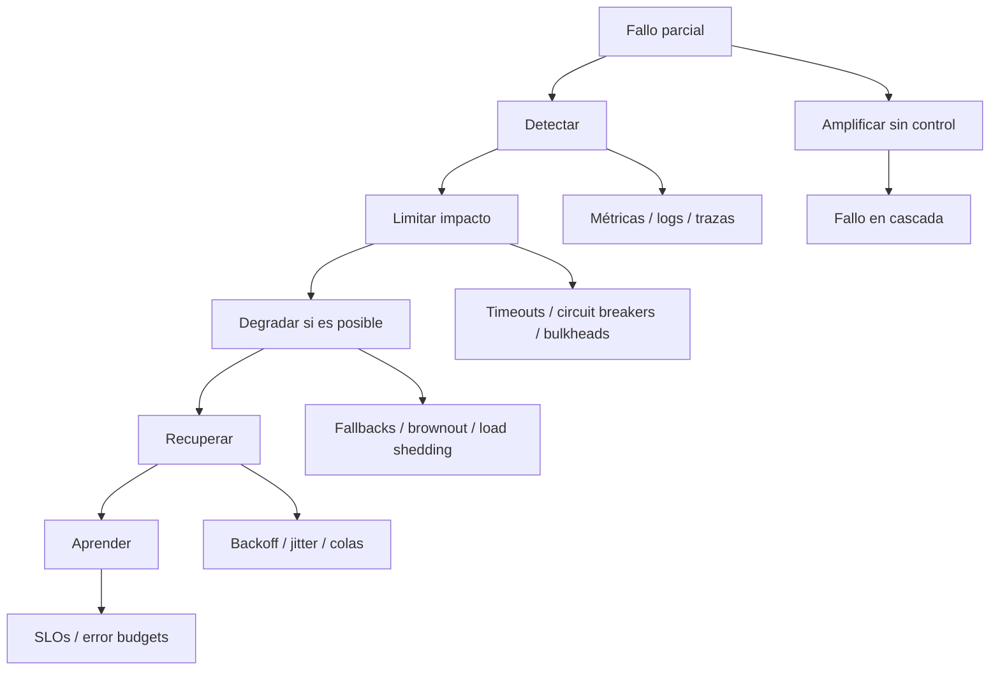
```mermaid
flowchart TD
  Failure["Fallo parcial"] --> Detect["Detectar"]
  Detect --> Bound["Limitar impacto"]
  Bound --> Degrade["Degradar si es posible"]
  Degrade --> Recover["Recuperar"]
  Recover --> Learn["Aprender"]

  Failure --> Amplify["Amplificar sin control"]
  Amplify --> Cascade["Fallo en cascada"]

  Detect --> Metrics["Métricas / logs / trazas"]
  Bound --> Timeouts["Timeouts / circuit breakers / bulkheads"]
  Degrade --> Fallbacks["Fallbacks / brownout / load shedding"]
  Recover --> Backoff["Backoff / jitter / colas"]
  Learn --> SLOs["SLOs / error budgets"]
```

### Criterio de comprensión

Debes poder explicar:

> Los patrones de resiliencia no son una lista de técnicas sueltas. Forman un ciclo para detectar, limitar, degradar, recuperar y aprender.

---

## 22.3. Resiliencia no es ausencia de fallos

Una aplicación resiliente no es una aplicación que nunca falla. Eso no existe en sistemas distribuidos. Una aplicación resiliente es una aplicación que puede detectar fallos, limitar el daño, degradar comportamiento cuando tenga sentido, evitar amplificar el problema, recuperarse cuando la dependencia vuelve y producir señales claras para operar.

La diferencia es importante. Si una dependencia falla y tu aplicación simplemente espera hasta agotar todos sus recursos, el sistema no está siendo resiliente aunque Kubernetes mantenga el Pod vivo. Si una cola crece sin límite y nadie observa la edad del mensaje más antiguo, el sistema no está siendo resiliente aunque los consumers sigan ejecutándose. Si un retry duplica pagos porque la operación no es idempotente, el sistema no está siendo resiliente aunque haya reintentos.

En Kubernetes, la resiliencia aparece cuando la aplicación y la plataforma colaboran. La aplicación define cómo se comporta ante fallos. Kubernetes usa las señales que la aplicación expone para enrutar tráfico, reiniciar procesos, aplicar rollouts, mantener capacidad y operar el ciclo de vida de los Pods.

### Decisiones que pertenecen a la aplicación

La resiliencia de aplicación vive en decisiones como estas:

- Cuánto espero a una dependencia.
- Cuántas veces reintento.
- Cuándo dejo de reintentar.
- Qué hago si el proveedor falla.
- Qué operaciones son idempotentes.
- Qué errores son transitorios.
- Qué errores son definitivos.
- Qué errores son ambiguos.
- Qué endpoints deben seguir funcionando en modo degradado.
- Qué cola puede absorber trabajo.
- Qué mensaje debe ir a una dead-letter queue.
- Qué señales expongo para observabilidad.
- Qué comportamiento debe hacer que el Pod no esté Ready.
- Qué comportamiento debe hacer que Kubernetes reinicie el proceso.

### Criterio de comprensión

Debes poder explicar:

> Kubernetes puede mantener procesos ejecutándose. La resiliencia exige diseñar cómo esos procesos se comportan cuando sus dependencias fallan.

---

## 22.4. Qué puede hacer Kubernetes y qué no

Kubernetes ayuda mucho, pero no reemplaza el diseño de resiliencia de aplicación. Esta distinción debe quedar clara desde el principio porque muchos errores operativos aparecen cuando un equipo espera que Kubernetes compense decisiones que pertenecen al código, al protocolo o al contrato de negocio.

| Necesidad | Kubernetes puede ayudar | La aplicación debe decidir |
|---|---:|---|
| Reiniciar proceso colgado | Sí, con liveness | Qué significa estar colgado |
| Evitar tráfico a Pod no preparado | Sí, con readiness | Qué significa estar preparado |
| Proteger arranque lento | Sí, con startup probe | Cuándo terminó la inicialización |
| Dar tiempo para apagado | Sí, con `terminationGracePeriodSeconds` | Cómo cerrar conexiones y terminar requests |
| Controlar rollouts | Sí, con Deployment strategy | Si la app puede convivir con versiones |
| Limitar disrupciones voluntarias | Sí, con PodDisruptionBudget | Cuánta capacidad mínima necesita |
| Distribuir réplicas | Sí, con scheduling y topology spread | Qué nivel de disponibilidad necesitas |
| Reintentar requests HTTP | No en Service core | Cuándo y cómo reintentar |
| Circuit breaker | No en Kubernetes core | Cuándo abrir, cerrar y probar |
| Rate limiting | No en Kubernetes core | Límite por usuario, tenant, ruta o dependencia |
| Load shedding | Parcialmente | Qué trabajo rechazar y con qué respuesta |
| Idempotencia | No | Claves, estado, deduplicación |
| Poison messages | No | Política de reintentos, DLQ, observabilidad |
| Fallbacks | No | Qué respuesta degradada es aceptable |
| SLOs | No directamente | Qué nivel de servicio prometes y mides |

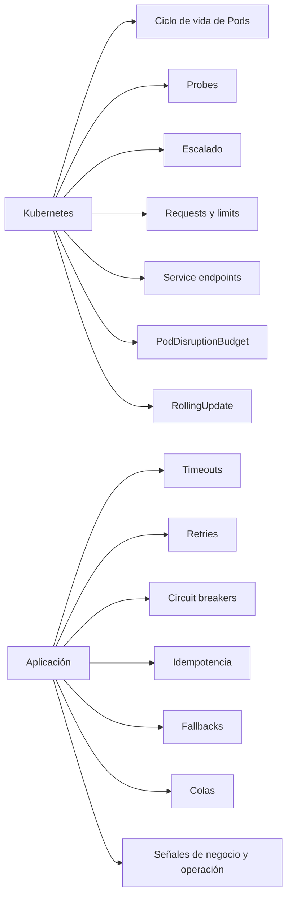
```mermaid
flowchart LR
  K8s["Kubernetes"] --> Lifecycle["Ciclo de vida de Pods"]
  K8s --> Probes["Probes"]
  K8s --> Scaling["Escalado"]
  K8s --> Resources["Requests y limits"]
  K8s --> Routing["Service endpoints"]
  K8s --> PDB["PodDisruptionBudget"]
  K8s --> Rollout["RollingUpdate"]

  App["Aplicación"] --> Timeouts["Timeouts"]
  App --> Retries["Retries"]
  App --> Circuit["Circuit breakers"]
  App --> Idempotency["Idempotencia"]
  App --> Fallbacks["Fallbacks"]
  App --> Queues["Colas"]
  App --> Signals["Señales de negocio y operación"]
```

### Qué no debe hacer Kubernetes por ti

Kubernetes no debería ser tu estrategia para:

- Reintentar pagos.
- Corregir duplicados.
- Esconder timeouts.
- Reiniciar por cada fallo externo.
- Escalar sin mirar dependencias downstream.
- Usar liveness como recuperación de negocio.
- Usar readiness como pánico global.
- Convertir una aplicación sin límites en una aplicación segura.
- Tapar falta de idempotencia.
- Arreglar poison messages.
- Decidir qué fallback es aceptable.

### Regla del módulo

No delegues en Kubernetes una decisión que pertenece al comportamiento de la aplicación.

Kubernetes puede retirar un Pod del tráfico. No sabe si un pago debe reintentarse. Kubernetes puede reiniciar un contenedor. No sabe si una operación era idempotente. Kubernetes puede escalar réplicas. No sabe si estás saturando una base de datos compartida.

### Criterio de comprensión

Debes poder explicar:

> Kubernetes da mecanismos de operación. La aplicación debe definir las reglas de tolerancia a fallos.

---

## 22.5. El escenario narrativo del módulo

Seguiremos con `checkout-api` y añadiremos una dependencia real de laboratorio llamada `payment-api`. `checkout-api` llamará a `payment-api` para simular una autorización de pago. El objetivo no es crear un sistema de pagos real, sino practicar resiliencia con una dependencia controlable que pueda responder rápido, responder lento, fallar de forma explícita o desaparecer temporalmente.

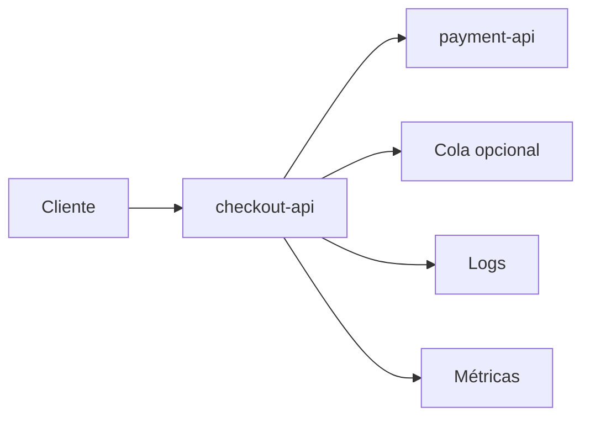
```mermaid
flowchart LR
  User["Cliente"] --> Checkout["checkout-api"]
  Checkout --> Payment["payment-api"]
  Checkout --> Queue["Cola opcional"]
  Checkout --> Logs["Logs"]
  Checkout --> Metrics["Métricas"]
```

Este módulo seguirá una historia acumulativa. Primero, `checkout-api` llamará directamente a `payment-api`. Después, `payment-api` se volverá lento y veremos por qué la lentitud puede ser más peligrosa que una caída rápida. A continuación añadiremos timeouts, retries, backoff, jitter y circuit breakers. Cuando aparezcan problemas de duplicación, introduciremos idempotencia y deduplicación. Cuando hablemos de colas, veremos poison messages y DLQ. Por último, conectaremos todo con probes, graceful shutdown, Deployment strategy, PodDisruptionBudget, HPA, recursos, SLOs y observabilidad.

### Criterio de comprensión

Debes poder explicar:

> Este módulo no estudia patrones aislados. Sigue la evolución de un sistema que aprende a fallar con menos daño.

---

## 22.6. Contrato HTTP de payment-api

Antes de hablar de resiliencia, necesitamos un contrato. `payment-api` tendrá tres endpoints: `GET /health`, `GET /ready` y `POST /authorize`. Los dos primeros permiten integrarse con probes y smoke tests. El tercero simula la autorización de un pago.

### GET /health

Comprueba que el proceso responde.

Respuesta esperada:

```json
{
  "service": "payment-api",
  "status": "ok"
}
```

### GET /ready

Comprueba que la app está preparada para recibir tráfico.

Respuesta esperada:

```json
{
  "service": "payment-api",
  "status": "ready"
}
```

### POST /authorize

Simula autorización de pago.

Request:

```json
{
  "checkoutId": "chk_123",
  "amount": 4999,
  "currency": "EUR"
}
```

Response OK:

```json
{
  "service": "payment-api",
  "status": "authorized",
  "authorizationId": "auth_chk_123"
}
```

Response de error controlado:

```json
{
  "service": "payment-api",
  "status": "unavailable",
  "reason": "payment dependency unavailable"
}
```

### Variables de simulación

`payment-api` será controlable con variables de entorno:

| Variable | Significado | Ejemplo |
|---|---|---|
| `PAYMENT_DELAY_MS` | Retraso artificial por request | `1000` |
| `PAYMENT_STATUS_CODE` | Código HTTP que devuelve `/authorize` | `200`, `500`, `503` |
| `PAYMENT_FAILURE_MODE` | Modo de fallo | `none`, `always_fail` |
| `LOG_LEVEL` | Nivel de logs | `debug` |

### Criterio de comprensión

Debes poder explicar:

> Un laboratorio de resiliencia necesita dependencias controlables. Si no puedes simular lentitud y fallos, no puedes observar bien los patrones.

---

## 22.7. payment-api didáctica con Express

Crea:

```text
apps/payment-api/
  package.json
  src/
    server.js
  Dockerfile
  .dockerignore
```

### package.json

```json
{
  "name": "payment-api",
  "version": "1.0.0",
  "private": true,
  "description": "Minimal payment API for the Kubernetes resilience lab",
  "main": "src/server.js",
  "scripts": {
    "start": "node src/server.js"
  },
  "dependencies": {
    "express": "4.18.3"
  }
}
```

### src/server.js

```js
const express = require("express");

const app = express();

app.use(express.json());

const serviceName = process.env.SERVICE_NAME || "payment-api";
const port = Number(process.env.PORT || 8080);
const logLevel = process.env.LOG_LEVEL || "info";

function delay(ms) {
  return new Promise((resolve) => setTimeout(resolve, ms));
}

function response(status, extra = {}) {
  return {
    service: serviceName,
    status,
    ...extra
  };
}

app.use((req, res, next) => {
  const startedAt = Date.now();

  res.on("finish", () => {
    console.log(JSON.stringify({
      level: logLevel,
      service: serviceName,
      method: req.method,
      path: req.path,
      status: res.statusCode,
      durationMs: Date.now() - startedAt
    }));
  });

  next();
});

app.get("/health", (_req, res) => {
  res.status(200).json(response("ok"));
});

app.get("/ready", (_req, res) => {
  res.status(200).json(response("ready"));
});

app.post("/authorize", async (req, res) => {
  const delayMs = Number(process.env.PAYMENT_DELAY_MS || 0);
  const statusCode = Number(process.env.PAYMENT_STATUS_CODE || 200);
  const failureMode = process.env.PAYMENT_FAILURE_MODE || "none";

  if (delayMs > 0) {
    await delay(delayMs);
  }

  if (failureMode === "always_fail" || statusCode >= 500) {
    return res.status(statusCode).json(response("unavailable", {
      reason: "simulated payment failure"
    }));
  }

  const checkoutId = req.body?.checkoutId || "unknown";

  return res.status(200).json(response("authorized", {
    authorizationId: `auth_${checkoutId}`
  }));
});

const server = app.listen(port, () => {
  console.log(JSON.stringify({
    level: "info",
    service: serviceName,
    message: "server started",
    port
  }));
});

function shutdown(signal) {
  console.log(JSON.stringify({
    level: "info",
    service: serviceName,
    message: "received shutdown signal",
    signal
  }));

  server.close(() => {
    console.log(JSON.stringify({
      level: "info",
      service: serviceName,
      message: "server stopped"
    }));

    process.exit(0);
  });

  setTimeout(() => {
    console.error(JSON.stringify({
      level: "error",
      service: serviceName,
      message: "forced shutdown timeout"
    }));

    process.exit(1);
  }, 10000);
}

process.on("SIGTERM", shutdown);
process.on("SIGINT", shutdown);
```

### Dockerfile

```Dockerfile
FROM node:20-alpine

WORKDIR /app

COPY package.json package-lock.json* ./

RUN npm install --omit=dev

COPY src ./src

RUN addgroup -S app && adduser -S app -G app
USER app

EXPOSE 8080

CMD ["npm", "start"]
```

### .dockerignore

```text
node_modules
npm-debug.log
.git
tmp
dist
*.log
```

### Criterio de comprensión

Debes poder explicar:

> Usamos una payment-api propia porque necesitamos controlar retrasos, errores y señales para aprender resiliencia de forma observable.

---

## 22.8. Dos mundos: requests síncronas y trabajo asíncrono

En resiliencia hay dos modelos distintos.

| Modelo | Ejemplo | Riesgo principal |
|---|---|---|
| Síncrono | `checkout-api` llama a `payment-api` | latencia, timeouts, retries, cascadas |
| Asíncrono | `checkout-api` publica un mensaje o evento | duplicados, poison messages, backlog, orden |

No se diseñan igual.

### En HTTP síncrono importan más

- Timeout total.
- Latencia.
- Respuesta al usuario.
- Circuit breaker.
- Rate limiting.
- Load shedding.
- Fallback.
- Presupuesto de latencia.
- Propagación de deadline.

### En colas importan más

- Reintentos.
- Idempotencia.
- Deduplicación.
- Dead-letter queue.
- Backlog.
- Edad de mensajes.
- Poison messages.
- Consumers.
- Backpressure.
- Orden.
- Reprocesamiento.

### Criterio de comprensión

Debes poder explicar:

> Las requests síncronas fallan por latencia y cascadas. El trabajo asíncrono falla por duplicados, backlog y mensajes que no pueden procesarse.

---

## 22.9. Fallos parciales y dependencias lentas

En sistemas distribuidos, muchas veces el problema no es que una dependencia esté completamente caída. El problema es que está lenta. Esa lentitud puede mantener conexiones abiertas, bloquear capacidad de proceso, aumentar latencia, disparar retries y hacer que la aplicación parezca viva aunque ya no esté ofreciendo una experiencia aceptable.

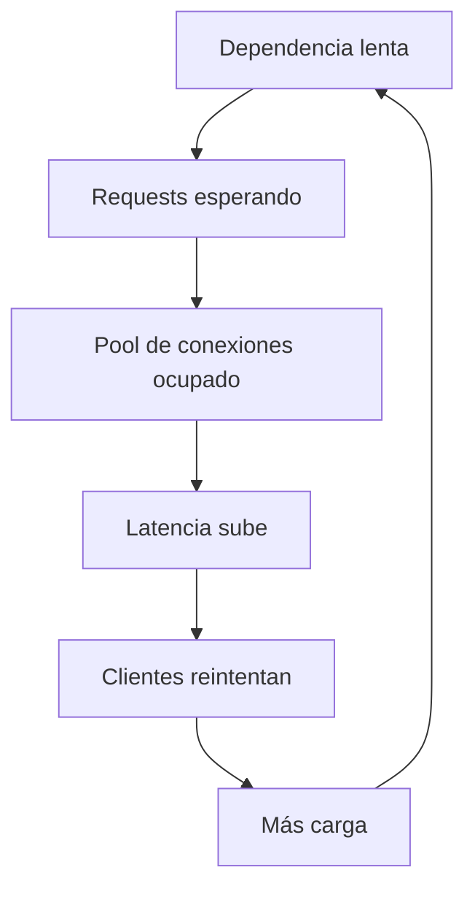
```mermaid
flowchart TD
  SlowDep["Dependencia lenta"] --> Waiting["Requests esperando"]
  Waiting --> Pool["Pool de conexiones ocupado"]
  Pool --> Latency["Latencia sube"]
  Latency --> Retries["Clientes reintentan"]
  Retries --> MoreLoad["Más carga"]
  MoreLoad --> SlowDep
```

Este es un bucle de refuerzo. Si no lo cortas, aparece una cascada. Una dependencia caída puede fallar rápido, pero una dependencia lenta puede retener recursos hasta que el sistema completo se degrada.

### Diagrama causal de presión

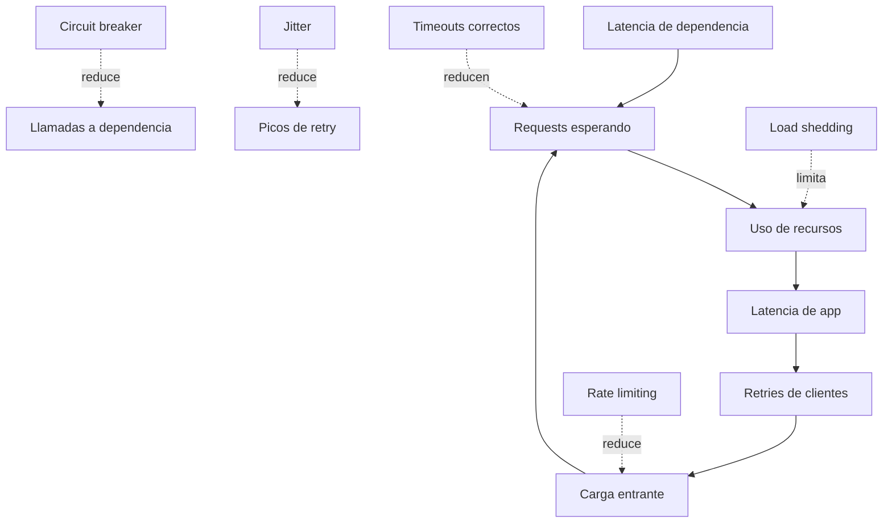
```mermaid
flowchart TD
  DependencyLatency["Latencia de dependencia"] --> WaitingRequests["Requests esperando"]
  WaitingRequests --> ResourceUsage["Uso de recursos"]
  ResourceUsage --> AppLatency["Latencia de app"]
  AppLatency --> ClientRetries["Retries de clientes"]
  ClientRetries --> IncomingLoad["Carga entrante"]
  IncomingLoad --> WaitingRequests

  Timeouts["Timeouts correctos"] -. "reducen" .-> WaitingRequests
  CircuitBreaker["Circuit breaker"] -. "reduce" .-> DependencyCalls["Llamadas a dependencia"]
  Jitter["Jitter"] -. "reduce" .-> RetrySpikes["Picos de retry"]
  RateLimit["Rate limiting"] -. "reduce" .-> IncomingLoad
  LoadShedding["Load shedding"] -. "limita" .-> ResourceUsage
```

### Criterio de comprensión

Debes poder explicar:

> La lentitud no controlada es una forma de fallo. Sin timeouts y límites, una dependencia lenta puede arrastrar a todo el servicio.

---

## 22.10. Presupuesto de latencia

Un presupuesto de latencia reparte el tiempo máximo aceptable entre las partes de una operación. Si el SLO de checkout dice que el 95% de las requests deben responder en menos de 500 ms, no puedes dar 500 ms a cada dependencia. El flujo completo necesita margen para la aplicación, las dependencias, la red, la serialización y un buffer.

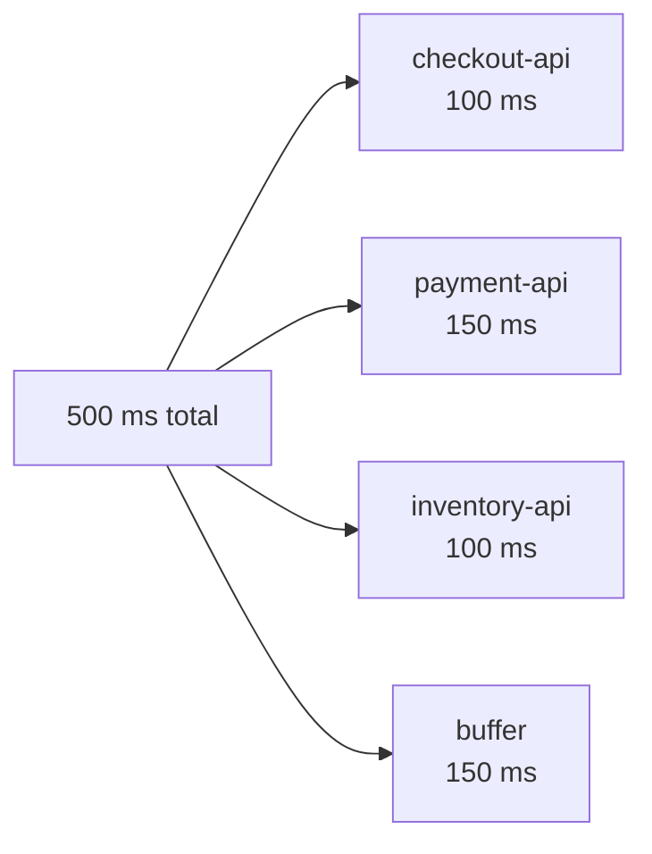
```mermaid
flowchart LR
  Total["500 ms total"] --> App["checkout-api<br/>100 ms"]
  Total --> Payment["payment-api<br/>150 ms"]
  Total --> Inventory["inventory-api<br/>100 ms"]
  Total --> Buffer["buffer<br/>150 ms"]
```

### Ejemplo de mala configuración

```text
timeout payment-api = 2s
timeout inventory-api = 2s
timeout customer-api = 2s
SLO checkout = 500ms
```

Esto no tiene sentido. Aunque cada timeout parezca razonable por separado, el sistema completo no puede cumplir el objetivo.

### Regla

Los timeouts deben componerse.

```text
timeout de dependencia
<
timeout de operación completa
<
timeout del cliente externo
```

### Valores didácticos para el laboratorio

Usaremos valores iniciales como estos:

```text
PAYMENT_TIMEOUT_MS=150
PAYMENT_MAX_RETRIES=2
PAYMENT_BACKOFF_BASE_MS=50
PAYMENT_BACKOFF_MAX_MS=300
```

Estos valores son didácticos. En un sistema real se derivan de SLOs, latencias reales, comportamiento de dependencias, capacidad y presupuesto de error.

### Criterio de comprensión

Debes poder explicar:

> Los timeouts deben diseñarse desde el presupuesto de latencia del flujo completo, no desde cada llamada aislada.

---

## 22.11. Timeouts por capas

Un timeout aislado no basta. Los timeouts deben formar una cadena coherente entre cliente, gateway, aplicación y dependencias. Si el cliente externo corta a los 500 ms pero tu app sigue trabajando 3 segundos, estás gastando recursos en una respuesta que nadie espera.

```text
timeout interno de dependencia
<
timeout de operación de aplicación
<
timeout del servidor
<
timeout del gateway o cliente externo
```

### Capas donde puede haber timeouts

- Cliente web o móvil.
- CDN.
- API Gateway.
- Ingress.
- Service mesh.
- Servidor HTTP de la app.
- Cliente HTTP interno.
- Cliente de base de datos.
- Cliente Redis.
- Productor de mensajes.
- Consumidor de mensajes.
- Job.
- Health checks.
- Shutdown.
- Proveedor externo.

### Preguntas de diseño

- ¿Quién tiene el deadline total?
- ¿Qué pasa si el gateway corta antes que la app?
- ¿La app sigue trabajando después de que el cliente se fue?
- ¿Los retries respetan el tiempo restante?
- ¿La dependencia sabe cuánto tiempo queda?
- ¿Los logs muestran timeout real o solo error genérico?

### Criterio de comprensión

Debes poder explicar:

> Los timeouts deben estar coordinados por capas. Si cada capa decide sola, el sistema puede gastar recursos en trabajo inútil.

---

## 22.12. Deadline propagation

Una request debería tener un deadline total. Cada llamada interna consume parte del presupuesto, por lo que la aplicación debería propagar cuánto tiempo queda en vez de reiniciar el reloj en cada dependencia.

### Ejemplo

```text
request budget = 500 ms
checkout-api consume 120 ms
quedan 380 ms
payment-api timeout máximo = min(150 ms, 380 ms)
```

### Sin deadline propagation

Cada dependencia cree que tiene todo el tiempo.

```text
checkout-api tarda 200 ms
payment-api espera 500 ms
inventory-api espera 500 ms
cliente ya se fue
```

### Con deadline propagation

Cada dependencia conoce el tiempo restante.

```text
request deadline = ahora + 500 ms
cada llamada calcula cuánto queda
si queda poco, falla rápido o degrada
```

### Criterio de comprensión

Debes poder explicar:

> Deadline propagation evita que cada dependencia reinicie el reloj y consuma un presupuesto de latencia que ya se agotó.

---

## 22.13. Timeouts

Un timeout limita cuánto tiempo estás dispuesto a esperar. Sin timeout, una llamada puede quedarse esperando demasiado, reteniendo recursos que podrían servir a otras requests.

### Dónde necesitas timeouts

- Cliente HTTP.
- Cliente de base de datos.
- Cliente Redis.
- Productor de mensajes.
- Consumidor de mensajes.
- Llamadas a proveedores externos.
- Requests entrantes.
- Jobs.
- Operaciones de shutdown.
- Health checks.
- Reintentos.

### Regla

Todo I/O debe tener timeout.

```text
request sin timeout
=
recurso potencialmente retenido sin límite
```

### Ejemplo conceptual en JavaScript

```js
async function fetchWithTimeout(url, options, timeoutMs) {
  const controller = new AbortController();
  const timeout = setTimeout(() => controller.abort(), timeoutMs);

  try {
    const response = await fetch(url, {
      ...options,
      signal: controller.signal
    });

    return response;
  } finally {
    clearTimeout(timeout);
  }
}
```

### Timeout no es un número aleatorio

Un timeout debe venir de:

- Presupuesto de latencia.
- SLO.
- Comportamiento real de la dependencia.
- Coste de esperar.
- Capacidad de reintentar.
- Experiencia del usuario.
- Número de dependencias en la ruta.
- Tiempo máximo aceptable del request completo.

### Criterio de comprensión

Debes poder explicar:

> Un timeout no arregla una dependencia lenta. Limita cuánto daño puede hacerte.

---

## 22.14. Clasificación de errores

Antes de reintentar, clasifica. No todos los errores significan lo mismo y no todos merecen la misma respuesta.

| Tipo | Ejemplo | Acción habitual |
|---|---|---|
| Transitorio | timeout, conexión reiniciada, `503` temporal | retry con backoff y jitter |
| Permanente | validación, `400`, schema inválido | no retry |
| Autorización | `401`, `403` | no retry automático |
| Ambiguo | timeout después de enviar request | retry solo si hay idempotencia |
| Sobrecarga | `429`, `503` con `Retry-After` | respetar señal, backoff |
| Configuración | URL mal configurada, credenciales inválidas | no retry indefinido, alertar |

### Regla

Un retry sin clasificación de errores es una apuesta.

### Retry-After

Si una dependencia devuelve `Retry-After`, tu cliente debe respetarlo salvo que tengas una razón explícita para no hacerlo. Esa cabecera es una señal de cooperación. Ignorarla puede aumentar presión sobre una dependencia que ya te está diciendo que necesita tiempo.

### Criterio de comprensión

Debes poder explicar:

> La primera pregunta antes de reintentar no es “cuántas veces”. Es “qué tipo de fallo es”.

---

## 22.15. Retries

Un retry repite una operación que falló. Puede ser útil cuando el fallo es transitorio, por ejemplo ante un timeout breve, una conexión reiniciada, un `503` temporal, un rate limit con `Retry-After`, un error de red o una dependencia que se está reiniciando. Pero un retry también puede empeorar el problema porque cada reintento añade carga.

### No todos los errores deben reintentarse

Normalmente no deberías reintentar:

- `400 Bad Request`
- `401 Unauthorized`
- `403 Forbidden`
- errores de validación
- operaciones no idempotentes sin clave de idempotencia
- pagos o efectos externos sin protección
- errores permanentes de configuración

### Ejemplo de retry peligroso

```text
payment-api está saturada
checkout-api reintenta 3 veces cada request
100 requests se convierten en 400 llamadas
payment-api se satura más
```

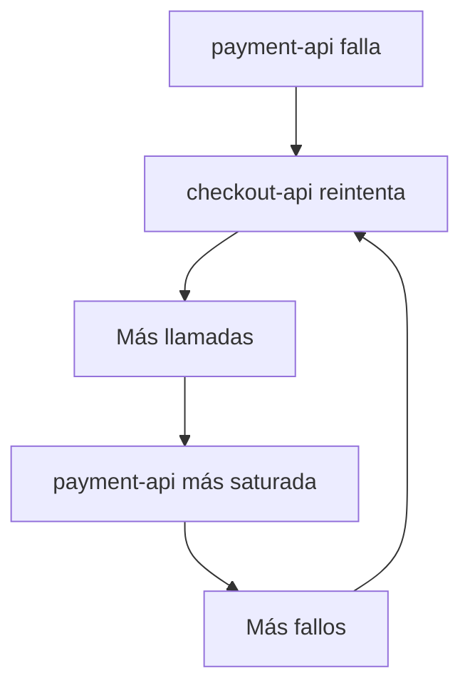
```mermaid
flowchart TD
  Failure["payment-api falla"] --> Retry["checkout-api reintenta"]
  Retry --> MoreCalls["Más llamadas"]
  MoreCalls --> Saturation["payment-api más saturada"]
  Saturation --> MoreFailures["Más fallos"]
  MoreFailures --> Retry
```

### Secuencia con retry

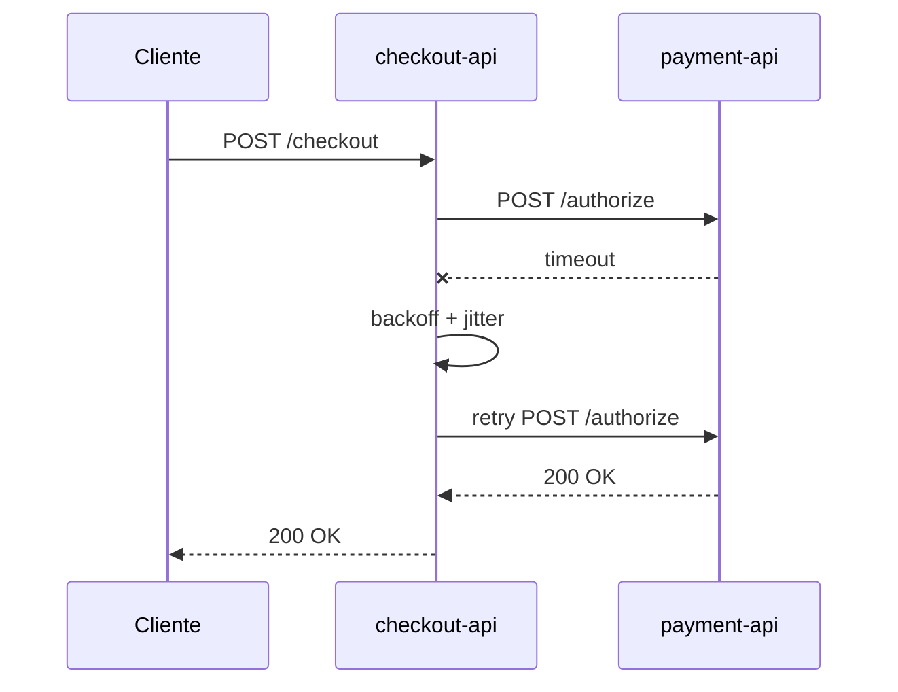
```mermaid
sequenceDiagram
  participant C as Cliente
  participant A as checkout-api
  participant P as payment-api

  C->>A: POST /checkout
  A->>P: POST /authorize
  P--xA: timeout
  A->>A: backoff + jitter
  A->>P: retry POST /authorize
  P-->>A: 200 OK
  A-->>C: 200 OK
```

### Criterio de comprensión

Debes poder explicar:

> Un retry es carga adicional. Solo ayuda si el fallo es transitorio y el sistema tiene capacidad para recuperarse.

---

## 22.16. Retry budget

Un retry budget limita cuántos retries permites. No basta con decir que una operación tiene tres retries. También necesitas saber cuánta carga extra máxima estás aceptando.

Ejemplo:

```text
1000 requests originales
1 retry máximo
carga máxima aproximada = 2000 llamadas
```

Con 3 retries:

```text
1000 requests originales
hasta 4000 llamadas
```

### Regla

Los retries deben tener:

- Número máximo.
- Timeout por intento.
- Timeout total.
- Backoff.
- Jitter.
- Clasificación de errores.
- Idempotencia.
- Observabilidad.
- Presupuesto de carga.

### Criterio de comprensión

Debes poder explicar:

> Un retry budget evita que la estrategia de recuperación se convierta en amplificación de carga.

---

## 22.17. Backoff

Backoff significa esperar más tiempo entre reintentos. Sin backoff, puedes golpear una dependencia fallando de forma agresiva.

Ejemplo simple:

```text
retry 1: esperar 100 ms
retry 2: esperar 200 ms
retry 3: esperar 400 ms
retry 4: esperar 800 ms
```

### Ejemplo conceptual

```js
function exponentialBackoff(attempt, baseMs = 100, maxMs = 1000) {
  return Math.min(baseMs * (2 ** attempt), maxMs);
}
```

### Por qué importa

Backoff da tiempo a la dependencia para recuperarse y reduce presión durante incidentes.

### Criterio de comprensión

Debes poder explicar:

> Backoff convierte reintentos agresivos en reintentos con pausa. Eso reduce presión sobre dependencias degradadas.

---

## 22.18. Jitter

Jitter añade aleatoriedad al backoff. Sin jitter, muchos clientes pueden reintentar al mismo tiempo y crear oleadas de carga.

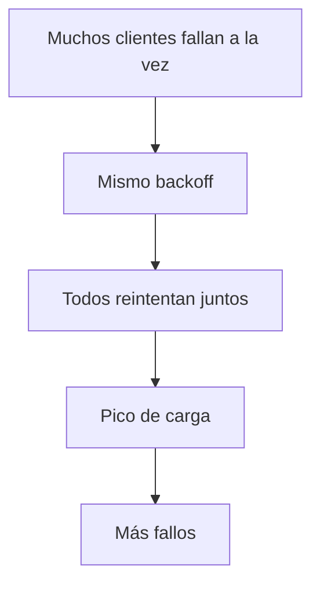
```mermaid
flowchart TD
  Clients["Muchos clientes fallan a la vez"] --> SameDelay["Mismo backoff"]
  SameDelay --> Wave["Todos reintentan juntos"]
  Wave --> Spike["Pico de carga"]
  Spike --> Failure["Más fallos"]
```

Con jitter, los reintentos se distribuyen.

```js
function backoffWithJitter(attempt, baseMs = 100, maxMs = 1000) {
  const backoff = Math.min(baseMs * (2 ** attempt), maxMs);
  const jitter = Math.random() * backoff;

  return jitter;
}
```

### Regla

Retries sin jitter pueden sincronizar fallos.

### Criterio de comprensión

Debes poder explicar:

> Jitter evita que todos los clientes reintenten a la vez y conviertan una recuperación en otro pico de carga.

---

## 22.19. Retries por capas

En Kubernetes profesional, los retries pueden aparecer en varias capas. Esto es útil cuando está diseñado como una política de sistema, pero peligroso cuando cada capa reintenta sin conocer a las demás.

| Capa | ¿Puede reintentar? | Riesgo |
|---|---:|---|
| Cliente web o móvil | Sí | duplicar requests de usuario |
| CDN o Gateway | Sí | ocultar fallos y amplificar |
| Service mesh | Sí | multiplicar llamadas internas |
| Aplicación | Sí | duplicar efectos si no hay idempotencia |
| SDK externo | Sí | retries invisibles |
| Broker | Sí | duplicar mensajes |
| Worker | Sí | repetir efectos secundarios |

Si no sabes cuántas capas reintentan, no sabes cuánta carga genera un fallo.

### Service mesh, gateway y retries automáticos

Si usas Ingress, Gateway API, Envoy, Istio, Linkerd u otro proxy, puede haber retries fuera de la aplicación. Eso puede ser útil, pero también puede duplicar carga sin que el código lo vea.

Antes de activar retries en infraestructura, responde:

- ¿La operación es idempotente?
- ¿La app también reintenta?
- ¿Cuál es el timeout total?
- ¿Hay jitter?
- ¿Qué errores se reintentan?
- ¿Cómo se observa?
- ¿Hay retry budget global?
- ¿El downstream puede soportar la carga extra?

### Criterio de comprensión

Debes poder explicar:

> Los retries deben diseñarse como una política de sistema, no como una configuración aislada por capa.

---

## 22.20. Retry storms

Una retry storm ocurre cuando muchos clientes reintentan a la vez. Puede aparecer por timeouts demasiado cortos, retries sin jitter, retries automáticos en varias capas, fallos sincronizados, dependencias degradadas, ausencia de circuit breaker o backoff inexistente.

### Ejemplo

```text
cliente reintenta 2 veces
gateway reintenta 2 veces
checkout-api reintenta 3 veces
```

Carga potencial:

```text
1 request de usuario
puede convertirse en muchas llamadas internas
```

### Regla

No diseñes retries capa por capa sin mirar el sistema completo.

### Criterio de comprensión

Debes poder explicar:

> Una retry storm es una forma de autoataque. El sistema intenta recuperarse y se satura a sí mismo.

---

## 22.21. Circuit breakers

Un circuit breaker evita seguir llamando a una dependencia que está fallando. La idea es parecida a un interruptor eléctrico: cuando detecta demasiados fallos, abre el circuito y evita llamadas nuevas durante un periodo. Después prueba si la dependencia se ha recuperado.

Estados típicos:

- Closed: las llamadas pasan.
- Open: las llamadas se rechazan rápido.
- Half-open: se prueban algunas llamadas para ver si la dependencia se recuperó.

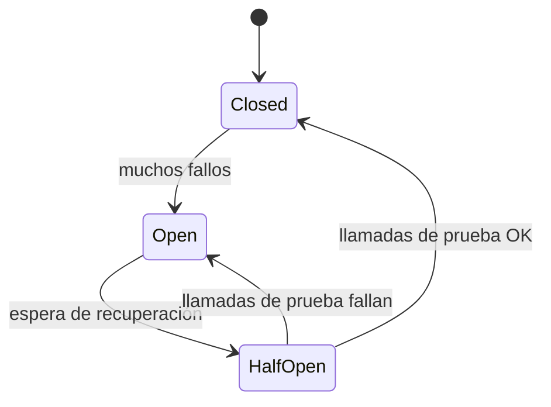
```mermaid
stateDiagram-v2
  [*] --> Closed
  Closed --> Open: muchos fallos
  Open --> HalfOpen: espera de recuperación
  HalfOpen --> Closed: llamadas de prueba OK
  HalfOpen --> Open: llamadas de prueba fallan
```

### Qué problema resuelve

Evita:

- Esperar timeouts una y otra vez.
- Saturar una dependencia caída.
- Consumir pools internos.
- Crear retry storms.
- Convertir un fallo externo en fallo local.

### Secuencia con circuit breaker abierto

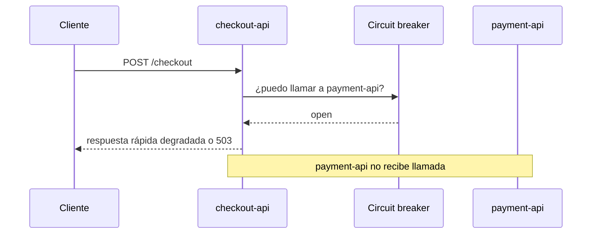
```mermaid
sequenceDiagram
  participant C as Cliente
  participant A as checkout-api
  participant CB as Circuit breaker
  participant P as payment-api

  C->>A: POST /checkout
  A->>CB: ¿puedo llamar a payment-api?
  CB-->>A: open
  A-->>C: respuesta rápida degradada o 503
  Note over A,P: payment-api no recibe llamada
```

### Qué debe devolver la app

Depende del caso:

- Respuesta degradada.
- Error rápido.
- `503 Service Unavailable`.
- Respuesta cacheada.
- Encolar trabajo para procesarlo después.
- Mensaje claro al usuario.

### Criterio de comprensión

Debes poder explicar:

> Un circuit breaker no arregla una dependencia. Evita que tu aplicación siga dañándose al llamarla cuando está fallando.

---

## 22.22. Circuit breakers en un sistema con varias réplicas

En Kubernetes, normalmente tienes varias réplicas. Un circuit breaker dentro de la aplicación suele ser local al Pod.

```text
Pod A abre circuito
Pod B no lo sabe
Pod C sigue llamando
```

### Ventajas del circuit breaker local

- Simple.
- No necesita coordinación central.
- Aísla decisiones por réplica.
- Evita dependencia adicional.
- Funciona aunque otro Pod esté sano o enfermo de forma distinta.

### Costes

- Decisiones no coordinadas.
- Una dependencia puede seguir recibiendo tráfico desde otros Pods.
- Los estados pueden diferir entre réplicas.
- Las métricas deben agregarse por Pod y globalmente.
- La recuperación puede ser desigual.

### Criterio de comprensión

Debes poder explicar:

> En Kubernetes, un circuit breaker local protege a un Pod, pero no necesariamente coordina la presión global sobre una dependencia.

---

## 22.23. Bulkheads

Un bulkhead separa recursos para que un fallo no consuma todo. La metáfora viene de compartimentos de un barco: si un compartimento se inunda, no debería hundir todo el barco.

### Ejemplos en aplicación

- Pool de conexiones separado por dependencia.
- Límite de concurrencia por endpoint.
- Límite de workers por tipo de trabajo.
- Cola separada por prioridad.
- Timeouts distintos por dependencia.
- Circuit breaker por dependencia.
- Threads separados para operaciones críticas y no críticas.

### Ejemplos en Kubernetes

- Deployments separados.
- Recursos separados.
- Namespaces.
- Requests y limits.
- HPA por workload.
- Queues separadas.
- Consumers separados.
- PriorityClass, si aplica.
- NetworkPolicy, para aislar comunicación.
- PodDisruptionBudget, para proteger disponibilidad durante disrupciones voluntarias.

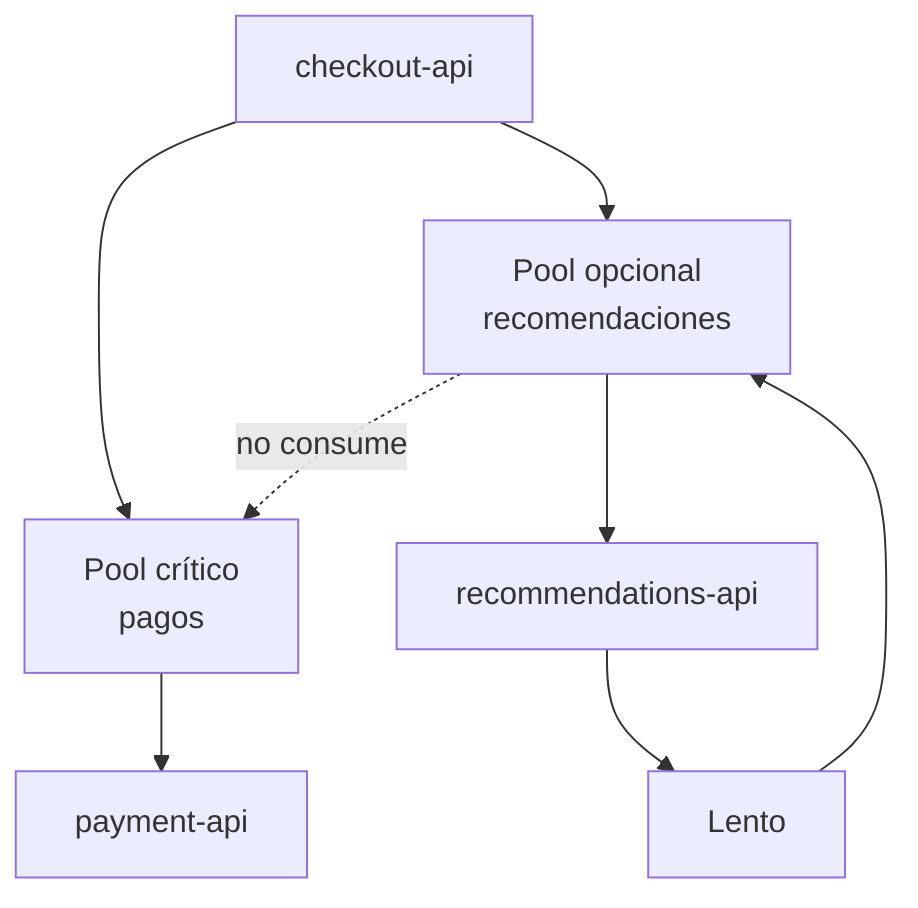
```mermaid
flowchart TD
  Checkout["checkout-api"] --> Critical["Pool crítico<br/>pagos"]
  Checkout --> Optional["Pool opcional<br/>recomendaciones"]

  Critical --> Payment["payment-api"]
  Optional --> Recommendations["recommendations-api"]

  Recommendations --> Slow["Lento"]
  Slow --> Optional
  Optional -. "no consume" .-> Critical
```

### Criterio de comprensión

Debes poder explicar:

> Bulkhead significa aislar recursos para que una dependencia o flujo no consuma la capacidad de todo el servicio.

---

## 22.24. Límites de concurrencia

Un límite de concurrencia decide cuántas operaciones de un tipo pueden ejecutarse a la vez.

Ejemplos:

- Máximo 50 requests simultáneas a `payment-api`.
- Máximo 10 operaciones de checkout por Pod.
- Máximo 5 llamadas concurrentes a proveedor externo.
- Máximo 2 backfills simultáneos.
- Máximo 100 mensajes en proceso por worker.

### Diferencia con rate limiting

| Patrón | Controla |
|---|---|
| Rate limiting | velocidad por tiempo |
| Concurrency limiting | trabajo simultáneo |

Muchos incidentes no vienen por QPS, sino por trabajo retenido. Una dependencia lenta puede mantener 100 requests abiertas aunque el número de requests por segundo no parezca enorme.

### Criterio de comprensión

Debes poder explicar:

> Los límites de concurrencia protegen capacidad simultánea. Son esenciales cuando la lentitud retiene recursos.

---

## 22.25. Rate limiting

Rate limiting limita cuántas requests aceptas en un periodo. Puede proteger la aplicación, una dependencia, un tenant, un usuario, una ruta, un proveedor externo o una operación cara.

### Dónde se puede aplicar

- En la aplicación.
- En un API Gateway.
- En Ingress.
- En service mesh.
- En un proveedor externo.
- En una cola.
- En un worker.

### Respuesta habitual

```http
HTTP/1.1 429 Too Many Requests
Retry-After: 10
```

### Rate limiting no es lo mismo que autoscaling

Autoscaling añade capacidad. Rate limiting protege capacidad. Si una dependencia compartida está saturada, escalar `checkout-api` puede empeorar el problema.

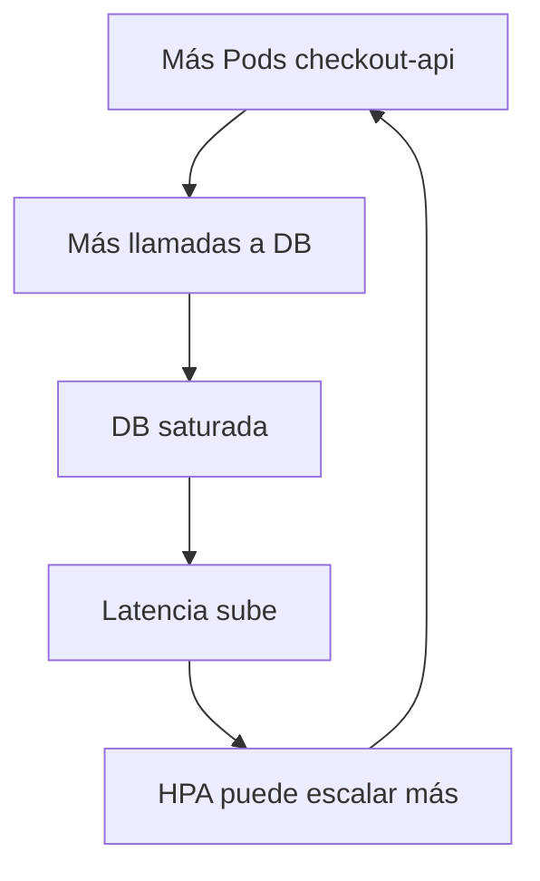
```mermaid
flowchart TD
  MorePods["Más Pods checkout-api"] --> MoreCalls["Más llamadas a DB"]
  MoreCalls --> DB["DB saturada"]
  DB --> Latency["Latencia sube"]
  Latency --> HPA["HPA puede escalar más"]
  HPA --> MorePods
```

### Criterio de comprensión

Debes poder explicar:

> Rate limiting protege al sistema. Escalar sin límites puede amplificar presión sobre una dependencia compartida.

---

## 22.26. Load shedding

Load shedding significa rechazar trabajo para proteger el sistema. Es una decisión incómoda, pero a veces necesaria.

Ejemplos:

- Rechazar requests no críticas.
- Desactivar recomendaciones.
- Omitir cálculos caros.
- Devolver respuesta parcial.
- Encolar para después.
- Rechazar nuevos trabajos cuando la cola está llena.
- Responder `503` con `Retry-After`.

### Diferencia con rate limiting

Rate limiting aplica límites definidos. Load shedding responde a condiciones de saturación.

Ejemplo:

```text
Si la cola interna supera 10.000 mensajes, dejar de aceptar operaciones no críticas.
```

### Con Kubernetes

Kubernetes puede ayudar observando CPU, memoria, réplicas, restarts, readiness y métricas usadas por HPA. Pero la decisión de qué trabajo sacrificar normalmente pertenece a la aplicación o al gateway.

### Criterio de comprensión

Debes poder explicar:

> Load shedding acepta fallar parcialmente para evitar una caída mayor.

---

## 22.27. Backpressure

Backpressure significa que una parte saturada del sistema comunica presión hacia atrás para reducir entrada de trabajo.

Sin backpressure:

```text
la cola crece
los consumidores no llegan
los productores siguen enviando
la latencia crece
el sistema colapsa tarde
```

Con backpressure:

```text
la app rechaza, retrasa, limita o degrada antes de colapsar
```

### Formas de backpressure

- `429 Too Many Requests`.
- `503 Service Unavailable`.
- `Retry-After`.
- Rechazar mensajes nuevos.
- Pausar consumidores.
- Reducir concurrencia.
- Load shedding.
- Rate limiting.
- Bounded queues.
- Circuit breaker abierto.

### Criterio de comprensión

Debes poder explicar:

> Backpressure evita que una parte saturada del sistema siga recibiendo trabajo como si estuviera sana.

---

## 22.28. Graceful degradation

Graceful degradation significa mantener una experiencia útil aunque una parte falle. La clave está en proteger lo esencial sin ocultar que algo no pudo completarse.

### Ejemplo de respuesta degradada

```json
{
  "service": "checkout-api",
  "status": "degraded",
  "checkout": {
    "id": "chk_123",
    "status": "created"
  },
  "recommendations": {
    "status": "unavailable"
  }
}
```

### Cuándo tiene sentido

- La dependencia es opcional.
- El usuario puede completar la acción principal.
- El fallback es claro.
- La degradación está observada.
- El producto acepta ese comportamiento.

### Cuándo no tiene sentido

- Pagos.
- Seguridad.
- Autorización.
- Integridad de datos.
- Operaciones reguladas.
- Procesos donde respuesta parcial puede engañar al usuario.

### Criterio de comprensión

Debes poder explicar:

> Degradar bien no es ocultar errores. Es preservar lo esencial y hacer visible lo que no pudo completarse.

---

## 22.29. Fallbacks

Un fallback es una respuesta alternativa cuando el camino principal falla. Puede ser una cache, un valor por defecto, una respuesta parcial, un modo degradado, un proveedor secundario, un reintento asíncrono o un mensaje claro al usuario.

### Riesgos

Un fallback malo puede ser peor que un error.

Ejemplos:

- Devolver precio incorrecto.
- Aceptar un pago sin autorización.
- Mostrar permisos antiguos.
- Usar datos obsoletos sin indicarlo.
- Ocultar una pérdida de consistencia.
- Convertir fallo temporal en comportamiento permanente.

### Regla

Un fallback debe tener semántica clara.

```text
¿Qué prometo al usuario cuando uso fallback?
¿Qué no prometo?
¿Cómo lo observo?
¿Cuándo dejo de usarlo?
```

### Pagos como ejemplo

Para pagos, no debes inventar autorización.

Opciones posibles:

- Devolver error claro.
- Devolver `payment_pending` si el negocio acepta proceso asíncrono.
- Encolar autorización para después.
- Ofrecer otro método de pago.
- Pedir al usuario que intente más tarde.
- Bloquear checkout si no hay forma segura de continuar.

### Criterio de comprensión

Debes poder explicar:

> Un fallback no es inventar una respuesta. Es un comportamiento alternativo con contrato explícito.

---

## 22.30. Brownout

Brownout consiste en apagar funciones no esenciales bajo carga para preservar el núcleo del sistema.

Ejemplo:

```text
checkout sí
recomendaciones no
historial no
cupones opcionales no
```

### Diferencia con caída total

En una caída total, el sistema deja de servir. En brownout, el sistema conserva lo esencial sacrificando funciones secundarias.

### Relación con feature flags y kill switches

El módulo anterior explicó kill switches. Un kill switch puede ser una herramienta de brownout.

Ejemplos:

- Desactivar recomendaciones.
- Desactivar un proveedor secundario lento.
- Cambiar a modo asíncrono.
- Reducir operaciones caras.
- Omitir enriquecimientos no críticos.

Pero un kill switch no sustituye timeouts ni circuit breakers. Si la dependencia está lenta, necesitas protección automática antes de que alguien active una flag.

### Criterio de comprensión

Debes poder explicar:

> Brownout protege el núcleo del producto apagando partes no esenciales bajo presión.

---

## 22.31. Contrato de respuesta degradada

Una respuesta degradada debe formar parte del contrato HTTP. No basta con devolver cualquier cosa.

### Ejemplo con pago pendiente

Si `checkout-api` acepta el checkout pero no puede completar la autorización en ese momento, podría devolver:

```http
HTTP/1.1 202 Accepted
Content-Type: application/json
```

```json
{
  "service": "checkout-api",
  "status": "accepted",
  "checkout": {
    "id": "chk_123",
    "status": "payment_pending"
  },
  "payment": {
    "status": "pending",
    "reason": "payment authorization queued"
  }
}
```

### Qué exige un `202 Accepted`

Si aceptas trabajo para procesarlo después, necesitas:

- ID de operación.
- Estado persistido.
- Endpoint o mecanismo para consultar estado.
- Reintentos.
- Idempotencia.
- Comunicación clara al usuario.
- Observabilidad.
- Política de expiración.
- Manejo de fallo final.

### Criterio de comprensión

Debes poder explicar:

> Una respuesta degradada no debe engañar al cliente. Debe decir claramente qué se completó, qué queda pendiente y cómo se observará.

---

## 22.32. Idempotencia

Una operación idempotente puede ejecutarse más de una vez y producir el mismo resultado esperado. Esto es crítico para retries, mensajes duplicados, timeouts ambiguos, procesamiento asíncrono y recuperación tras fallos.

### Ejemplo

Crear un checkout con idempotency key:

```http
POST /checkout
Idempotency-Key: req_123
```

Si el cliente reintenta con la misma key, el servidor no crea dos checkouts.

### Diseño conceptual

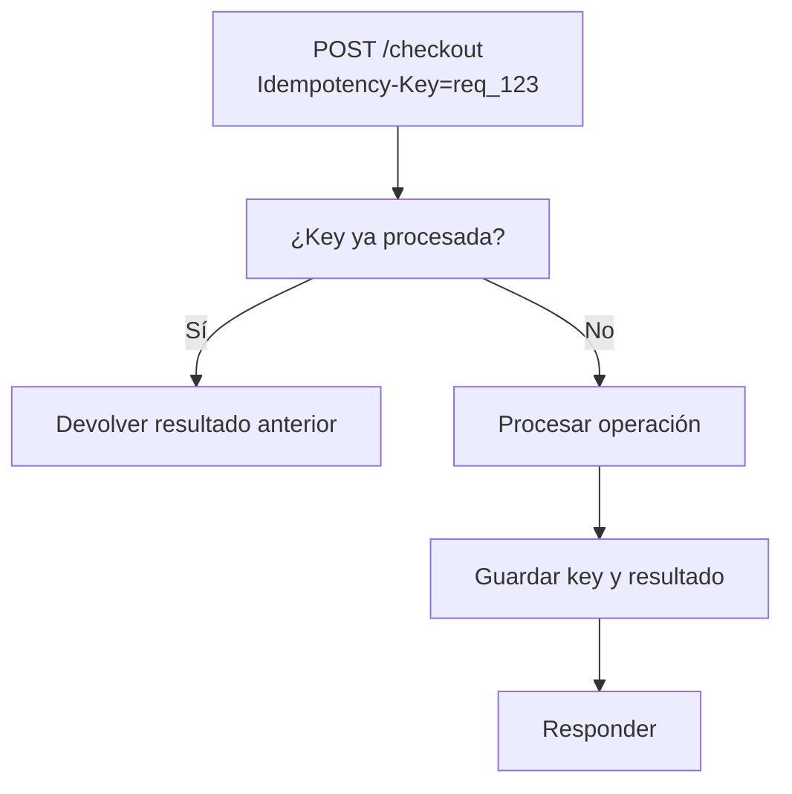
```mermaid
flowchart TD
  Request["POST /checkout<br/>Idempotency-Key=req_123"] --> Check["¿Key ya procesada?"]
  Check -->|Sí| Previous["Devolver resultado anterior"]
  Check -->|No| Process["Procesar operación"]
  Process --> Store["Guardar key y resultado"]
  Store --> Response["Responder"]
```

### Qué guardar con una idempotency key

- Key.
- Hash del request.
- Estado de procesamiento.
- Respuesta final.
- Timestamp.
- Expiración.
- Usuario o tenant.
- Correlation ID.

### Regla importante

Si llega la misma key con un body diferente, no debes tratarlo como el mismo request. Eso debería ser un conflicto.

Ejemplo:

```http
HTTP/1.1 409 Conflict
```

### Criterio de comprensión

Debes poder explicar:

> Sin idempotencia, los retries pueden duplicar efectos. Con idempotencia, los retries son mucho más seguros.

---

## 22.33. Deduplicación

Deduplicación significa detectar y evitar procesar dos veces el mismo trabajo. Aparece mucho en sistemas con colas y eventos porque la duplicación no es una anomalía rara, sino una posibilidad normal en sistemas distribuidos.

### Por qué ocurre duplicación

- El productor reintenta.
- El broker reentrega.
- El consumidor falla después de procesar pero antes de confirmar.
- Hay timeout.
- Hay particiones de red.
- Hay operaciones manuales.
- Hay Jobs reejecutados.

### Estrategias

- Idempotency key.
- Event ID.
- Tabla de mensajes procesados.
- Unique constraint.
- Versionado de entidad.
- Control de estado.
- Outbox pattern, si aplica.
- Exactly-once semántico en el dominio, no solo en la infraestructura.

### Criterio de comprensión

Debes poder explicar:

> En sistemas distribuidos, recibir el mismo mensaje dos veces debe considerarse normal. El consumidor debe saber tolerarlo.

---

## 22.34. Colas

Una cola desacopla producción y consumo. Puede ayudar cuando el trabajo no necesita respuesta inmediata, cuando una dependencia está temporalmente saturada, cuando quieres absorber picos, controlar concurrencia, reintentar de forma asíncrona o aplicar backpressure.

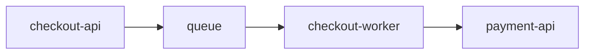
```mermaid
flowchart LR
  Checkout["checkout-api"] --> Queue["queue"]
  Queue --> Worker["checkout-worker"]
  Worker --> Payment["payment-api"]
```

### Riesgo

Una cola no elimina problemas. Los mueve.

Debes observar:

- Tamaño de cola.
- Edad del mensaje más antiguo.
- Tiempo de procesamiento.
- Errores por mensaje.
- Reintentos.
- Dead-letter queue.
- Poison messages.
- Consumers vivos.
- Saturación de dependencias.

### Las colas deben tener límites

Una cola sin límite puede ocultar saturación hasta que el retraso sea inaceptable.

Toda cola necesita:

- Tamaño máximo o política de presión.
- Métrica de profundidad.
- Métrica de edad del mensaje más antiguo.
- Política de reintentos.
- DLQ.
- Consumers escalables.
- Decisión sobre pérdida, retraso o rechazo.

### Criterio de comprensión

Debes poder explicar:

> Una cola convierte presión síncrona en trabajo asíncrono, pero necesita límites, observabilidad y política de fallo.

---

## 22.35. Poison messages

Un poison message es un mensaje que falla una y otra vez. Puede ocurrir por payload inválido, datos inconsistentes, versión de schema desconocida, error permanente, mensaje que rompe el consumidor u operación imposible de completar.

### Qué no hacer

No reintentes indefinidamente. Eso consume capacidad y oculta el problema.

### Qué hacer

- Limitar reintentos.
- Clasificar errores.
- Enviar a dead-letter queue.
- Guardar motivo del fallo.
- Alertar.
- Permitir inspección.
- Tener runbook.
- Reprocesar solo después de corregir causa.

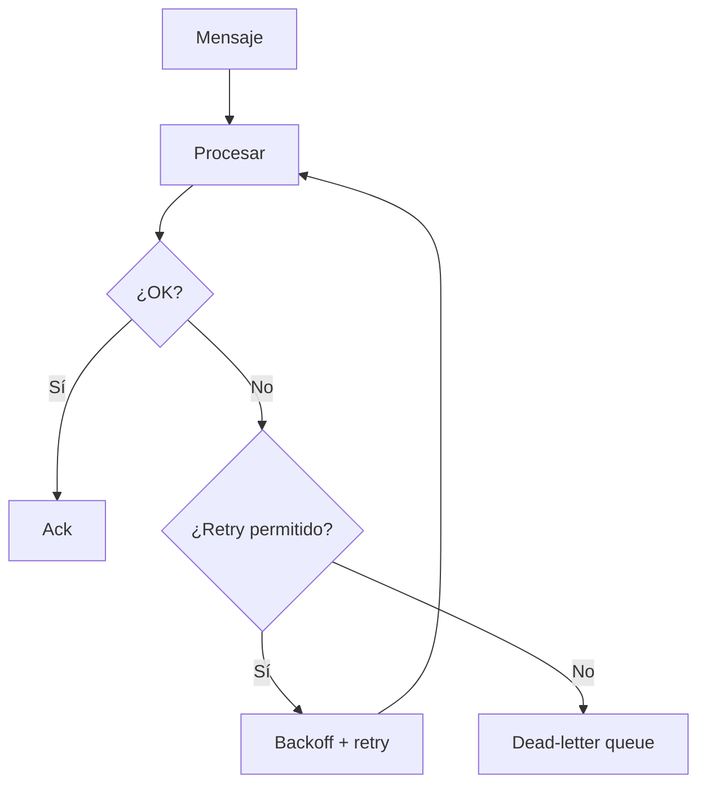
```mermaid
flowchart TD
  Message["Mensaje"] --> Process["Procesar"]
  Process --> Success{"¿OK?"}
  Success -->|Sí| Ack["Ack"]
  Success -->|No| Retry{"¿Retry permitido?"}
  Retry -->|Sí| Backoff["Backoff + retry"]
  Backoff --> Process
  Retry -->|No| DLQ["Dead-letter queue"]
```

### Criterio de comprensión

Debes poder explicar:

> Un poison message no debe bloquear una cola indefinidamente. Debe aislarse, observarse y tratarse como incidente de datos o contrato.

---

## 22.36. Outbox pattern como puente

Cuando una operación actualiza una base de datos y publica un evento, aparece un problema clásico: puede confirmarse la base de datos y fallar la publicación del evento, o puede publicarse el evento y después fallar la transacción local. El patrón transactional outbox ayuda a coordinar persistencia y publicación.

La idea básica es:

1. Guardar el cambio de dominio.
2. Guardar el evento pendiente en una tabla outbox en la misma transacción.
3. Un worker publica eventos pendientes.
4. El consumidor deduplica con `eventId`.

Este módulo no profundiza en outbox, pero debes conocer por qué aparece:

> La resiliencia asíncrona no es solo usar una cola. También exige coordinar estado, publicación y deduplicación.

### Criterio de comprensión

Debes poder explicar:

> Si mezclas base de datos y eventos, necesitas pensar qué pasa si una parte confirma y la otra falla.

---

## 22.37. Cascading failures

Un cascading failure ocurre cuando un fallo en una parte se propaga a otras. En una arquitectura con Kubernetes, este tipo de fallo puede combinar dependencia lenta, retries, saturación, probes mal diseñadas y pérdida de capacidad efectiva.

Ejemplo:

```text
payment-api lento
checkout-api espera demasiado
clientes reintentan
checkout-api consume todos sus workers
readiness empieza a fallar
Pods salen del Service
menos Pods reciben más tráfico
más Pods fallan
```

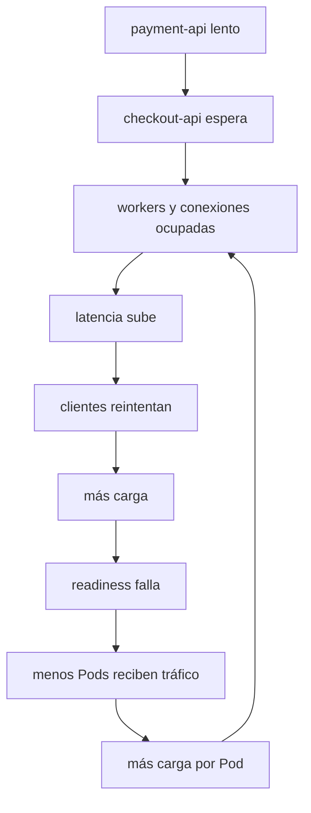
```mermaid
flowchart TD
  PaymentSlow["payment-api lento"] --> CheckoutWait["checkout-api espera"]
  CheckoutWait --> Resources["workers y conexiones ocupadas"]
  Resources --> Latency["latencia sube"]
  Latency --> ClientRetries["clientes reintentan"]
  ClientRetries --> Load["más carga"]
  Load --> Readiness["readiness falla"]
  Readiness --> FewerPods["menos Pods reciben tráfico"]
  FewerPods --> MoreLoadPerPod["más carga por Pod"]
  MoreLoadPerPod --> Resources
```

### Cómo cortar la cascada

- Timeouts.
- Circuit breakers.
- Bulkheads.
- Límites de concurrencia.
- Rate limiting.
- Load shedding.
- Backpressure.
- Fallbacks.
- Colas acotadas.
- Readiness bien diseñada.
- HPA con métricas correctas.
- Observabilidad.

### Criterio de comprensión

Debes poder explicar:

> Un fallo en cascada suele aparecer cuando cada parte intenta ayudar de forma local, pero el sistema completo amplifica la carga.

---

## 22.38. Relación con readiness, liveness y startup probes

Kubernetes ofrece probes para que el kubelet evalúe estado de los contenedores. Este módulo no trata probes como simple YAML, sino como contrato entre la aplicación y Kubernetes.

### Startup probe

Sirve para aplicaciones que necesitan tiempo para arrancar. Si se configura startup probe, Kubernetes no ejecuta liveness ni readiness hasta que startup probe tiene éxito. Esto evita que aplicaciones lentas al arrancar sean reiniciadas o evaluadas prematuramente antes de completar inicialización.

### Liveness probe

Responde a:

> ¿Este proceso está tan mal que conviene reiniciarlo?

No debe depender de servicios externos. Si liveness falla porque una base de datos externa está caída, Kubernetes puede reiniciar Pods sanos y empeorar el incidente.

### Readiness probe

Responde a:

> ¿Este Pod debe recibir tráfico ahora?

Puede considerar:

- Inicialización completa.
- Configuración mínima disponible.
- Capacidad interna.
- Modo de drenado durante shutdown.
- Estado local que impide atender tráfico.

No debe hacer checks pesados ni fluctuar por cualquier fallo transitorio menor.

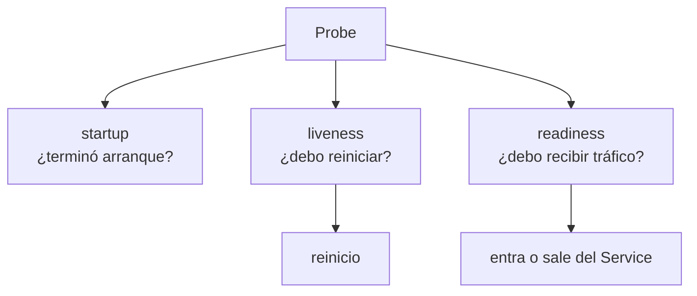
```mermaid
flowchart TD
  Probe["Probe"] --> Startup["startup<br/>¿terminó arranque?"]
  Probe --> Liveness["liveness<br/>¿debo reiniciar?"]
  Probe --> Readiness["readiness<br/>¿debo recibir tráfico?"]

  Liveness --> Restart["reinicio"]
  Readiness --> Endpoints["entra o sale del Service"]
```

### Criterio de comprensión

Debes poder explicar:

> Liveness reinicia. Readiness enruta. Startup protege el arranque. Confundirlas puede convertir Kubernetes en amplificador de incidentes.

---

## 22.39. Liveness como último recurso

Liveness debe ser conservadora. Debe responder a una pregunta fuerte: si reiniciar este proceso probablemente ayuda.

| Situación | ¿Liveness debería fallar? | Por qué |
|---|---:|---|
| Event loop bloqueado | Sí | reiniciar puede recuperar |
| Deadlock interno | Sí | el proceso no progresa |
| DB caída | No | reiniciar no arregla la DB |
| Proveedor externo lento | No | reiniciar puede amplificar |
| Redis saturado | No | el problema no está en el proceso |
| Config inválida irrecuperable | Depende | puede requerir intervención |
| Memoria corrupta o estado imposible | Sí | el proceso no es fiable |
| Dependencia devuelve `503` | No | es fallo externo |

### Criterio de comprensión

Debes poder explicar:

> Liveness no debe reiniciar una aplicación sana solo porque el mundo externo está fallando.

---

## 22.40. Readiness no es tu mecanismo principal de load shedding

Readiness puede ayudar cuando un Pod concreto no debe recibir tráfico, pero no debe ser el mecanismo principal de load shedding del sistema. Si todos los Pods fallan readiness por saturación al mismo tiempo, el Service puede quedarse sin endpoints y empeorar el incidente.

### Buen uso

- El Pod está arrancando.
- El Pod está drenando.
- El Pod perdió configuración crítica.
- El Pod no puede atender tráfico de forma segura.
- El Pod tiene saturación local extrema y temporal.

### Mal uso

- Falla por cada error de dependencia.
- Hace queries pesadas.
- Cambia de estado constantemente.
- Saca todos los Pods del tráfico a la vez.
- Se usa como sustituto de rate limiting.
- Se usa para ocultar falta de backpressure.

### Para overload, normalmente necesitas

- Límites de concurrencia.
- Rate limiting.
- Colas acotadas.
- Load shedding en aplicación o gateway.
- Backpressure.
- HPA con métricas adecuadas.
- Circuit breakers.
- Bulkheads.

### Criterio de comprensión

Debes poder explicar:

> Readiness puede proteger tráfico, pero no debe ser el mecanismo principal para gestionar sobrecarga sistémica.

---

## 22.41. Graceful shutdown

Cuando Kubernetes termina un Pod, la aplicación debe cooperar. La aplicación recibe una señal de terminación y tiene un periodo de gracia antes de que el proceso sea forzado a terminar.

### Qué debe hacer una app al recibir SIGTERM

- Dejar de aceptar nuevas requests.
- Marcarse como no Ready.
- Terminar requests en curso.
- Cerrar conexiones.
- Dejar de consumir mensajes nuevos.
- Confirmar o devolver mensajes de forma segura.
- Vaciar buffers si aplica.
- Salir antes de `terminationGracePeriodSeconds`.

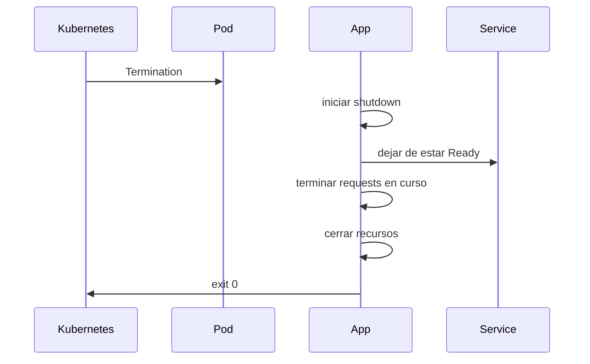
```mermaid
sequenceDiagram
  participant K as Kubernetes
  participant P as Pod
  participant A as App
  participant S as Service

  K->>P: Termination
  A->>A: iniciar shutdown
  A->>S: dejar de estar Ready
  A->>A: terminar requests en curso
  A->>A: cerrar recursos
  A->>K: exit 0
```

### Deployment recomendado

```yaml
apiVersion: apps/v1
kind: Deployment
metadata:
  name: checkout-api
  namespace: shop
spec:
  replicas: 3
  strategy:
    type: RollingUpdate
    rollingUpdate:
      maxUnavailable: 0
      maxSurge: 1
  template:
    spec:
      terminationGracePeriodSeconds: 30
      containers:
        - name: checkout-api
          image: checkout-api:1.7.0
          lifecycle:
            preStop:
              exec:
                command:
                  - sh
                  - -c
                  - sleep 5
```

### Cuidado con `preStop`

Un `preStop` con `sleep` puede ayudar a dar tiempo a que endpoints y balanceadores dejen de enviar tráfico, pero no debe sustituir el shutdown correcto de la aplicación. La aplicación sigue necesitando manejar `SIGTERM`. El tiempo de `preStop` y el tiempo de parada normal comparten el periodo de gracia.

### Criterio de comprensión

Debes poder explicar:

> Kubernetes puede dar tiempo para terminar. La aplicación debe usar ese tiempo para dejar de aceptar trabajo y cerrar bien.

---

## 22.42. Deployment strategy y disponibilidad durante rollouts

La estrategia de Deployment afecta la resiliencia durante cambios.

Ejemplo:

```yaml
strategy:
  type: RollingUpdate
  rollingUpdate:
    maxUnavailable: 0
    maxSurge: 1
```

### Qué significa

`maxUnavailable: 0` intenta evitar reducir capacidad disponible durante el rollout. `maxSurge: 1` permite crear un Pod extra durante la actualización.

Esto ayuda cuando:

- Hay recursos suficientes.
- Readiness está bien diseñada.
- La aplicación arranca correctamente.
- La app maneja shutdown.
- Las versiones son compatibles.

### Lo que no resuelve

No resuelve:

- Migraciones incompatibles.
- Probes mal diseñadas.
- Shutdown incorrecto.
- Dependencias saturadas.
- Falta de idempotencia.
- Bugs de la nueva versión.
- Recursos insuficientes en el cluster.

### Criterio de comprensión

Debes poder explicar:

> RollingUpdate ayuda a mantener capacidad durante un despliegue, pero solo funciona bien si la aplicación coopera con readiness, compatibilidad y shutdown.

---

## 22.43. PodDisruptionBudget

Un PodDisruptionBudget protege disponibilidad durante disrupciones voluntarias, como drain de nodo, mantenimiento, algunas operaciones de cluster o reubicaciones controladas.

Ejemplo:

```yaml
apiVersion: policy/v1
kind: PodDisruptionBudget
metadata:
  name: checkout-api-pdb
  namespace: shop
spec:
  minAvailable: 2
  selector:
    matchLabels:
      app: checkout-api
```

### Qué aporta

Si tienes 3 réplicas de `checkout-api`, puedes pedir que al menos 2 sigan disponibles durante disrupciones voluntarias.

### Qué no aporta

No evita todos los fallos. No evita que un nodo muera. No arregla una app frágil. No sustituye réplicas suficientes, readiness correcta o SLOs.

### Criterio de comprensión

Debes poder explicar:

> PodDisruptionBudget protege disponibilidad frente a disrupciones voluntarias, pero no convierte una aplicación frágil en resiliente.

---

## 22.44. Distribución de Pods

Tener 3 réplicas no ayuda mucho si todas viven en el mismo nodo y ese nodo falla. Kubernetes puede ayudarte a distribuir Pods, pero necesitas expresar esa intención.

Mecanismos útiles:

- `topologySpreadConstraints`.
- Pod anti-affinity.
- Múltiples zonas, si el cluster lo permite.
- Requests realistas para que el scheduler pueda colocar bien.
- PDB para disrupciones voluntarias.

### Ejemplo conceptual

```yaml
topologySpreadConstraints:
  - maxSkew: 1
    topologyKey: kubernetes.io/hostname
    whenUnsatisfiable: ScheduleAnyway
    labelSelector:
      matchLabels:
        app: checkout-api
```

### Criterio de comprensión

Debes poder explicar:

> Réplicas no significan resiliencia si todas comparten el mismo punto de fallo.

---

## 22.45. NetworkPolicy como contención

NetworkPolicy no hace que la app tolere mejor timeouts, pero puede limitar comunicación inesperada y reducir blast radius.

Ejemplos:

- `checkout-api` solo puede llamar a `payment-api`.
- `payment-api` no puede llamar a cualquier servicio.
- Un Pod comprometido no puede moverse libremente por el namespace.
- Una dependencia no prevista no se convierte en acoplamiento oculto.

### Criterio de comprensión

Debes poder explicar:

> NetworkPolicy no es resiliencia de comportamiento, pero sí ayuda a contener daño y acoplamientos accidentales.

---

## 22.46. Recursos, limits y resiliencia

Requests y limits no son solo optimización de costes. También afectan resiliencia.

### Requests

Ayudan al scheduler a colocar Pods en nodos con capacidad suficiente. También son importantes para HPA cuando escala por utilización de CPU o memoria.

### Limits

Limitan consumo máximo y pueden proteger el nodo. Pero un limit demasiado bajo puede provocar OOMKilled, throttling de CPU, latencia alta, reinicios, falsos positivos en probes y menos capacidad real.

### Ejemplo

```yaml
resources:
  requests:
    cpu: 100m
    memory: 128Mi
  limits:
    memory: 256Mi
```

### CPU throttling y falsas señales

Un CPU limit demasiado bajo puede hacer que la app responda tarde. Eso puede parecer dependencia lenta, timeout externo, readiness fallando, liveness fallando, error de red o saturación de aplicación, cuando la causa real puede ser throttling.

### Criterio de comprensión

Debes poder explicar:

> Los recursos mal configurados pueden parecer problema de aplicación, red o dependencia. También son parte del diseño resiliente.

---

## 22.47. HPA y resiliencia

Horizontal Pod Autoscaler puede aumentar o reducir réplicas según métricas. Esto ayuda cuando el cuello de botella está en el workload escalado, pero no siempre ayuda.

### HPA puede ayudar si

- El servicio es stateless.
- La carga se reparte bien.
- La dependencia soporta más llamadas.
- La métrica representa saturación real.
- Hay requests configurados.
- Hay margen de nodos.

### HPA puede empeorar si

- La base de datos es el cuello de botella.
- Cada Pod nuevo añade presión a una dependencia saturada.
- La métrica llega tarde.
- El problema es retry storm.
- El problema es lock o migración.
- El problema es proveedor externo.
- El arranque es lento y no hay startup probe.

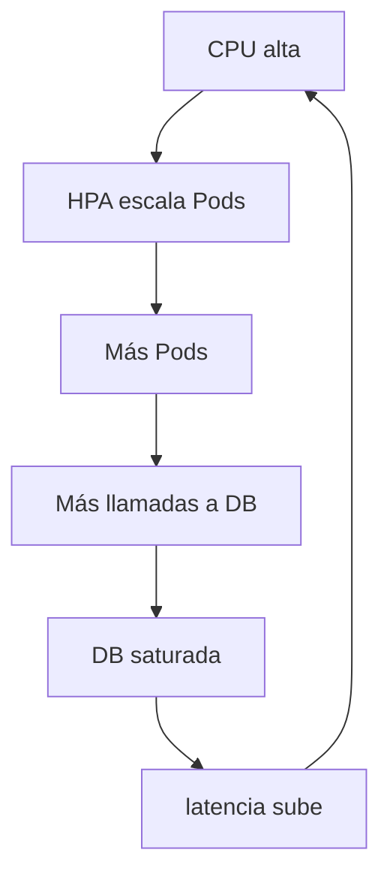
```mermaid
flowchart TD
  HighCPU["CPU alta"] --> HPA["HPA escala Pods"]
  HPA --> MorePods["Más Pods"]
  MorePods --> MoreDB["Más llamadas a DB"]
  MoreDB --> DBSaturation["DB saturada"]
  DBSaturation --> Latency["latencia sube"]
  Latency --> HighCPU
```

### Métricas mejores para workers

Para workers de cola, CPU puede ser mala señal.

Métricas más útiles:

- `queue_depth`
- `oldest_message_age`
- `processing_lag`
- `messages_per_second`
- `error_rate`
- `in_flight_messages`

No escales consumers si la dependencia downstream está saturada.

### Nota sobre VPA y Cluster Autoscaler

HPA escala Pods. VPA ajusta recursos. Cluster Autoscaler añade o quita nodos. Ninguno sustituye límites, backpressure ni diseño de aplicación.

### Criterio de comprensión

Debes poder explicar:

> Escalar réplicas no arregla un cuello de botella compartido. A veces lo presiona más.

---

## 22.48. Resiliencia y SLOs

Un SLO define un objetivo de servicio.

Ejemplos:

```text
99.9% de requests de checkout exitosas en 30 días
95% de requests de checkout por debajo de 500 ms
```

La resiliencia existe para proteger esos objetivos. Sin SLO, puedes discutir eternamente cuánto timeout usar, cuántos retries permitir, cuándo abrir circuito, cuándo degradar, cuándo rechazar carga o cuándo alertar.

Con SLO, tienes una dirección:

```text
El checkout crítico prioriza éxito y latencia.
Las recomendaciones son opcionales.
La degradación aceptable es ocultar recomendaciones.
No es aceptable aceptar un pago sin autorización.
```

### Error budget

El error budget es el margen de fallo permitido por el SLO. Si tu SLO permite 0.1% de error, ese margen debe guiar cuándo degradar, cuándo pausar una release, cuándo dejar de asumir riesgo, cuándo activar un kill switch, cuándo abrir un incidente y cuándo reducir cambios.

### Criterio de comprensión

Debes poder explicar:

> Los patrones de resiliencia no se eligen en abstracto. Se eligen para proteger SLOs y usar el error budget con criterio.

---

## 22.49. Observabilidad de resiliencia

No basta con implementar timeouts, retries o circuit breakers. Debes observarlos para saber si están protegiendo el sistema o si están generando más daño.

### Métricas útiles

```text
http_client_request_duration_seconds{dependency="payment-api"}
http_client_errors_total{dependency="payment-api",type="timeout"}
http_client_retries_total{dependency="payment-api"}
circuit_breaker_state{dependency="payment-api"}
circuit_breaker_open_total{dependency="payment-api"}
fallback_used_total{feature="recommendations"}
load_shed_requests_total{reason="overload"}
rate_limited_requests_total{route="/checkout"}
queue_depth{queue="checkout-payments"}
queue_oldest_message_age_seconds{queue="checkout-payments"}
poison_messages_total{queue="checkout-payments"}
```

### Logs útiles

```json
{
  "level": "warn",
  "service": "checkout-api",
  "message": "payment-api timeout",
  "dependency": "payment-api",
  "timeoutMs": 150,
  "attempt": 2,
  "maxAttempts": 3,
  "correlationId": "req_123"
}
```

### Trazas

Las trazas ayudan a ver:

- Qué dependencia consumió más tiempo.
- Dónde ocurrió el timeout.
- Cuántos retries hubo.
- Qué fallback se usó.
- Qué parte del presupuesto de latencia se gastó.
- Qué request acabó en error.

### Alertas buenas y malas

No alertes por cada retry. Eso puede generar ruido.

Alerta cuando:

- El circuit breaker permanece abierto.
- La tasa de fallback supera un umbral.
- La edad de cola crece.
- El SLO se quema demasiado rápido.
- Los timeouts aumentan sostenidamente.
- La tasa de poison messages supera el umbral.
- La latencia p95 o p99 se aleja del objetivo.
- Los Pods reinician por OOMKilled.
- Readiness fluctúa de forma masiva.

### Criterio de comprensión

Debes poder explicar:

> Un patrón de resiliencia no observado es difícil de distinguir de un fallo silencioso.

---

## 22.50. Resiliencia y kill switches

Un kill switch puede ser una herramienta de resiliencia. Puede servir para desactivar recomendaciones, apagar un proveedor secundario lento, cambiar a modo asíncrono, reducir operaciones caras, apagar una integración no crítica o activar brownout.

Pero un kill switch no sustituye timeouts, circuit breakers, rate limiting, backpressure, idempotencia ni observabilidad.

### Regla

El kill switch es una herramienta de control. No debe ser tu primera línea de defensa. Si una dependencia lenta puede tumbar el sistema antes de que alguien active el kill switch, el diseño sigue siendo frágil.

### Criterio de comprensión

Debes poder explicar:

> Un kill switch ayuda a operar degradación, pero la aplicación debe protegerse automáticamente ante lentitud y fallos.

---

## 22.51. Resiliencia y migraciones

Una migración larga puede crear latencia, locks y timeouts. Durante una migración debes observar latencia de base de datos, lock waits, error rate, queue lag, retries, circuit breaker state, saturación de conexión, timeouts, readiness y SLO burn rate.

### Regla

Una migración no es solo un cambio de datos. También es una presión temporal sobre el sistema.

### Criterio de comprensión

Debes poder explicar:

> Las migraciones pueden activar los mismos mecanismos de resiliencia que una dependencia lenta o saturada.

---

## 22.52. Resilience policy por dependencia

La resiliencia debe estar documentada por dependencia crítica.

Crea:

```text
docs/resilience/payment-api-policy.md
```

Contenido recomendado:

```md
# Dependency policy: payment-api

## Criticality

Critical for payment authorization.

## Timeout

150 ms per attempt.

## Retries

2 max.

Retry only on:

- timeout
- 502
- 503
- 504

Do not retry:

- 400
- 401
- 403
- validation errors
- non-idempotent requests without Idempotency-Key

## Backoff

Exponential with jitter.

Base: 50 ms.

Max: 300 ms.

## Circuit breaker

Open after 50% failures over 20 requests.

Half-open after 10 seconds.

## Fallback

No silent approval.

Allowed behaviours:

- fail clearly
- return payment_pending if asynchronous processing is enabled
- ask user to retry later

## Idempotency

Required with Idempotency-Key.

## Metrics

- payment latency
- timeout count
- retry count
- circuit state
- fallback count
- pending payment count

## Alerts

- circuit breaker open for more than 2 minutes
- timeout rate above threshold
- checkout SLO burn rate above threshold
```

### Criterio de comprensión

Debes poder explicar:

> Una dependency policy convierte decisiones de resiliencia en contrato explícito, no en configuración dispersa.

---

## 22.53. Manifiestos recomendados del módulo

Estructura:

```text
k8s/resilience/
  checkout-api-deployment.yaml
  checkout-api-service.yaml
  payment-api-deployment.yaml
  payment-api-service.yaml
  checkout-api-pdb.yaml

apps/payment-api/
  package.json
  src/server.js
  Dockerfile
  .dockerignore

docs/resilience/
  payment-api-policy.md

scripts/
  smoke-checkout.sh
  load-checkout.sh
```

### payment-api Deployment

```yaml
apiVersion: apps/v1
kind: Deployment
metadata:
  name: payment-api
  namespace: shop
  labels:
    app: payment-api
    app.kubernetes.io/name: payment-api
    app.kubernetes.io/component: api
    app.kubernetes.io/part-of: shop
spec:
  replicas: 2
  selector:
    matchLabels:
      app: payment-api
  template:
    metadata:
      labels:
        app: payment-api
        app.kubernetes.io/name: payment-api
        app.kubernetes.io/component: api
        app.kubernetes.io/part-of: shop
    spec:
      containers:
        - name: payment-api
          image: payment-api:1.0.0
          imagePullPolicy: IfNotPresent
          ports:
            - name: http
              containerPort: 8080
          env:
            - name: SERVICE_NAME
              value: payment-api
            - name: PORT
              value: "8080"
            - name: PAYMENT_DELAY_MS
              value: "0"
            - name: PAYMENT_STATUS_CODE
              value: "200"
            - name: PAYMENT_FAILURE_MODE
              value: "none"
          readinessProbe:
            httpGet:
              path: /ready
              port: http
            periodSeconds: 5
            timeoutSeconds: 2
            failureThreshold: 3
          livenessProbe:
            httpGet:
              path: /health
              port: http
            periodSeconds: 10
            timeoutSeconds: 2
            failureThreshold: 6
          resources:
            requests:
              cpu: 50m
              memory: 64Mi
            limits:
              memory: 128Mi
```

### payment-api Service

```yaml
apiVersion: v1
kind: Service
metadata:
  name: payment-api
  namespace: shop
  labels:
    app: payment-api
    app.kubernetes.io/name: payment-api
    app.kubernetes.io/component: api
    app.kubernetes.io/part-of: shop
spec:
  selector:
    app: payment-api
  ports:
    - name: http
      port: 80
      targetPort: http
```

### checkout-api Deployment con configuración resiliente

```yaml
apiVersion: apps/v1
kind: Deployment
metadata:
  name: checkout-api
  namespace: shop
  labels:
    app: checkout-api
    app.kubernetes.io/name: checkout-api
    app.kubernetes.io/component: api
    app.kubernetes.io/part-of: shop
spec:
  replicas: 3
  strategy:
    type: RollingUpdate
    rollingUpdate:
      maxUnavailable: 0
      maxSurge: 1
  selector:
    matchLabels:
      app: checkout-api
  template:
    metadata:
      labels:
        app: checkout-api
        app.kubernetes.io/name: checkout-api
        app.kubernetes.io/component: api
        app.kubernetes.io/part-of: shop
    spec:
      terminationGracePeriodSeconds: 30
      containers:
        - name: checkout-api
          image: checkout-api:1.7.0
          imagePullPolicy: IfNotPresent
          ports:
            - name: http
              containerPort: 8080
          env:
            - name: PAYMENT_API_URL
              value: http://payment-api.shop.svc.cluster.local
            - name: PAYMENT_TIMEOUT_MS
              value: "150"
            - name: PAYMENT_MAX_RETRIES
              value: "2"
            - name: PAYMENT_BACKOFF_BASE_MS
              value: "50"
            - name: PAYMENT_BACKOFF_MAX_MS
              value: "300"
            - name: PAYMENT_CIRCUIT_BREAKER_ENABLED
              value: "true"
          startupProbe:
            httpGet:
              path: /health
              port: http
            periodSeconds: 2
            failureThreshold: 15
          readinessProbe:
            httpGet:
              path: /ready
              port: http
            periodSeconds: 5
            timeoutSeconds: 2
            failureThreshold: 3
          livenessProbe:
            httpGet:
              path: /health
              port: http
            periodSeconds: 10
            timeoutSeconds: 2
            failureThreshold: 6
          lifecycle:
            preStop:
              exec:
                command:
                  - sh
                  - -c
                  - sleep 5
          resources:
            requests:
              cpu: 100m
              memory: 128Mi
            limits:
              memory: 256Mi
```

### checkout-api Service

```yaml
apiVersion: v1
kind: Service
metadata:
  name: checkout-api
  namespace: shop
  labels:
    app: checkout-api
    app.kubernetes.io/name: checkout-api
    app.kubernetes.io/component: api
    app.kubernetes.io/part-of: shop
spec:
  selector:
    app: checkout-api
  ports:
    - name: http
      port: 80
      targetPort: http
```

### checkout-api PodDisruptionBudget

```yaml
apiVersion: policy/v1
kind: PodDisruptionBudget
metadata:
  name: checkout-api-pdb
  namespace: shop
spec:
  minAvailable: 2
  selector:
    matchLabels:
      app: checkout-api
```

### Criterio de comprensión

Debes poder explicar:

> El manifest puede configurar probes, recursos, termination grace, rollout strategy y PDB. Pero la lógica de timeouts, retries, circuit breaker e idempotencia vive en la aplicación.

---

## 22.54. Taskfile para resiliencia

Añade tareas:

```yaml
payment:build:docker:
  desc: Build payment-api image with Docker
  cmds:
    - docker build -t payment-api:1.0.0 ./apps/payment-api

resilience:apply:
  desc: Apply resilience lab manifests
  cmds:
    - kubectl apply -f k8s/resilience/payment-api-deployment.yaml
    - kubectl apply -f k8s/resilience/payment-api-service.yaml
    - kubectl apply -f k8s/resilience/checkout-api-deployment.yaml
    - kubectl apply -f k8s/resilience/checkout-api-service.yaml
    - kubectl apply -f k8s/resilience/checkout-api-pdb.yaml

resilience:status:
  desc: Show resilience lab status
  cmds:
    - kubectl get deploy,svc,pods,pdb -n shop -l app.kubernetes.io/part-of=shop

resilience:rollout:
  desc: Wait for rollout
  cmds:
    - kubectl rollout status deployment/payment-api -n shop --timeout=120s
    - kubectl rollout status deployment/checkout-api -n shop --timeout=120s

resilience:logs:checkout:
  desc: Show checkout-api logs
  cmds:
    - kubectl logs deployment/checkout-api -n shop

resilience:logs:payment:
  desc: Show payment-api logs
  cmds:
    - kubectl logs deployment/payment-api -n shop

resilience:port-forward:
  desc: Port-forward checkout-api
  cmds:
    - kubectl port-forward svc/checkout-api 8080:80 -n shop

resilience:smoke:
  desc: Smoke test checkout-api
  cmds:
    - curl -fsS http://localhost:8080/health | jq .
    - curl -fsS http://localhost:8080/ready | jq .
    - curl -fsS http://localhost:8080/checkout | jq .

resilience:payment:slow:
  desc: Simulate slow payment-api
  cmds:
    - kubectl set env deployment/payment-api -n shop PAYMENT_DELAY_MS=1000 PAYMENT_STATUS_CODE=200 PAYMENT_FAILURE_MODE=none
    - kubectl rollout status deployment/payment-api -n shop --timeout=120s

resilience:payment:fail:
  desc: Simulate failing payment-api
  cmds:
    - kubectl set env deployment/payment-api -n shop PAYMENT_DELAY_MS=0 PAYMENT_STATUS_CODE=503 PAYMENT_FAILURE_MODE=always_fail
    - kubectl rollout status deployment/payment-api -n shop --timeout=120s

resilience:payment:healthy:
  desc: Restore healthy payment-api
  cmds:
    - kubectl set env deployment/payment-api -n shop PAYMENT_DELAY_MS=0 PAYMENT_STATUS_CODE=200 PAYMENT_FAILURE_MODE=none
    - kubectl rollout status deployment/payment-api -n shop --timeout=120s

resilience:scale:payment:down:
  desc: Scale payment-api down to simulate dependency unavailable
  cmds:
    - kubectl scale deployment/payment-api -n shop --replicas=0

resilience:scale:payment:up:
  desc: Scale payment-api back up
  cmds:
    - kubectl scale deployment/payment-api -n shop --replicas=2
    - kubectl rollout status deployment/payment-api -n shop --timeout=120s

resilience:checkout:timeout:long:
  desc: Configure long payment timeout in checkout-api
  cmds:
    - kubectl set env deployment/checkout-api -n shop PAYMENT_TIMEOUT_MS=2000
    - kubectl rollout status deployment/checkout-api -n shop --timeout=120s

resilience:checkout:timeout:short:
  desc: Configure short payment timeout in checkout-api
  cmds:
    - kubectl set env deployment/checkout-api -n shop PAYMENT_TIMEOUT_MS=150
    - kubectl rollout status deployment/checkout-api -n shop --timeout=120s

resilience:checkout:retries:
  desc: Configure checkout-api retry count
  cmds:
    - kubectl set env deployment/checkout-api -n shop PAYMENT_MAX_RETRIES={{.RETRIES}}
    - kubectl rollout status deployment/checkout-api -n shop --timeout=120s

resilience:describe:checkout:
  desc: Describe checkout-api deployment
  cmds:
    - kubectl describe deployment checkout-api -n shop

resilience:events:
  desc: Show namespace events
  cmds:
    - kubectl get events -n shop --sort-by=.lastTimestamp

resilience:delete:
  desc: Delete resilience lab resources
  cmds:
    - kubectl delete -f k8s/resilience/checkout-api-pdb.yaml || true
    - kubectl delete -f k8s/resilience/checkout-api-deployment.yaml || true
    - kubectl delete -f k8s/resilience/checkout-api-service.yaml || true
    - kubectl delete -f k8s/resilience/payment-api-deployment.yaml || true
    - kubectl delete -f k8s/resilience/payment-api-service.yaml || true
```

### Criterio DevEx

Debes poder explicar:

> Taskfile no oculta Kubernetes. Hace repetible simular fallos, observarlos y recuperar el laboratorio.

---

## 22.55. Práctica 1: dependencia disponible

### Objetivo

Validar el flujo normal.

### Pasos

```bash
task payment:build:docker
task resilience:apply
task resilience:rollout
task resilience:status
task resilience:port-forward
```

En otra terminal:

```bash
task resilience:smoke
```

### Preguntas

- ¿Cuántas réplicas tiene `checkout-api`?
- ¿Cuántas réplicas tiene `payment-api`?
- ¿Qué endpoints usa `checkout-api`?
- ¿Qué probes están configuradas?
- ¿Qué recursos tiene cada Pod?
- ¿Qué PDB protege `checkout-api`?
- ¿Qué respuesta devuelve `/checkout`?

### Criterio

Debes poder explicar:

> Antes de simular fallos, necesitas conocer el estado sano del sistema.

---

## 22.56. Práctica 2: dependencia lenta

### Objetivo

Ver cómo una dependencia lenta afecta al sistema.

### Pasos

Simula lentitud:

```bash
task resilience:payment:slow
```

Llama a checkout:

```bash
time curl -i http://localhost:8080/checkout
```

Observa logs:

```bash
task resilience:logs:checkout
task resilience:logs:payment
```

Restaura:

```bash
task resilience:payment:healthy
```

### Preguntas

- ¿Cuánto tarda en responder?
- ¿Falla rápido o espera demasiado?
- ¿Qué timeout se aplicó?
- ¿Se hicieron retries?
- ¿Qué recursos quedan retenidos durante la espera?
- ¿Qué ocurriría con 100 requests concurrentes?

### Criterio

Debes poder explicar:

> Una dependencia lenta puede ser más peligrosa que una caída rápida porque retiene recursos mientras parece seguir funcionando.

---

## 22.57. Práctica 3: dependencia caída

### Objetivo

Ver qué ocurre cuando `payment-api` no está disponible.

### Pasos

```bash
task resilience:scale:payment:down
task resilience:status
```

Llama a checkout:

```bash
curl -i http://localhost:8080/checkout
```

Observa logs:

```bash
task resilience:logs:checkout
task resilience:events
```

Recupera:

```bash
task resilience:scale:payment:up
```

### Preguntas

- ¿`checkout-api` sigue vivo?
- ¿`checkout-api` sigue Ready?
- ¿Qué respuesta devuelve?
- ¿Hay timeout?
- ¿Hay retry?
- ¿Hay fallback?
- ¿El error es rápido o lento?
- ¿Qué debería ver el usuario?
- ¿Qué métrica debería incrementarse?

### Criterio

Debes poder explicar:

> Una dependencia caída no debería convertir automáticamente a `checkout-api` en un proceso muerto.

---

## 22.58. Práctica 4: timeout demasiado largo

### Objetivo

Entender cómo un timeout largo consume presupuesto de latencia.

### Pasos

Configura timeout largo:

```bash
task resilience:checkout:timeout:long
```

Simula dependencia lenta:

```bash
task resilience:payment:slow
```

Llama:

```bash
time curl -i http://localhost:8080/checkout
```

### Preguntas

- ¿Cuánto tarda en fallar o responder?
- ¿Ese tiempo encaja con el SLO?
- ¿Qué ocurre si hay muchas requests concurrentes?
- ¿Qué recursos quedan ocupados mientras espera?
- ¿Cómo afecta a clientes?
- ¿El cliente podría irse antes de que la app termine?

### Criterio

Debes poder explicar:

> Un timeout largo puede hacer que un fallo externo se convierta en saturación local.

---

## 22.59. Práctica 5: timeout corto y fallo rápido

### Objetivo

Configurar un timeout alineado con presupuesto de latencia.

Configura:

```bash
task resilience:checkout:timeout:short
```

Prueba:

```bash
time curl -i http://localhost:8080/checkout
```

### Preguntas

- ¿El fallo es más rápido?
- ¿Qué gana el sistema?
- ¿Qué pierde?
- ¿Qué fallback tendría sentido?
- ¿Qué métrica confirma que hay timeouts?
- ¿La respuesta al cliente es clara?

### Criterio

Debes poder explicar:

> Fallar rápido puede proteger capacidad, pero debe venir acompañado de respuesta clara y observabilidad.

---

## 22.60. Práctica 6: retries y retry storm conceptual

### Objetivo

Entender que los retries añaden carga.

### Configura

```bash
task resilience:checkout:retries RETRIES=3
```

Con dependencia caída, cada request puede hacer:

```text
1 intento original + 3 retries = 4 intentos
```

### Preguntas

- Si entran 100 requests, ¿cuántas llamadas internas puedes generar?
- ¿Qué ocurre si además el cliente externo reintenta?
- ¿Qué ocurre si el gateway también reintenta?
- ¿Por qué necesitas retry budget?
- ¿Por qué necesitas jitter?
- ¿Cómo observarías el número de intentos?
- ¿Qué errores no deberías reintentar?

### Criterio

Debes poder explicar:

> Los retries no son gratis. Deben tener presupuesto, backoff, jitter y clasificación de errores.

---

## 22.61. Práctica 7: circuit breaker conceptual

### Objetivo

Entender qué debería ocurrir cuando `payment-api` falla repetidamente.

### Escenario

`payment-api` devuelve `503`. `checkout-api` acumula fallos. El circuit breaker abre. Las siguientes llamadas fallan rápido o degradan sin llamar a `payment-api`.

### Pasos

```bash
task resilience:payment:fail
```

Llama varias veces:

```bash
for i in $(seq 1 20); do
  curl -i http://localhost:8080/checkout
done
```

Observa logs:

```bash
task resilience:logs:checkout
task resilience:logs:payment
```

Restaura:

```bash
task resilience:payment:healthy
```

### Preguntas

- ¿Cuándo debería abrir el circuito?
- ¿Las llamadas posteriores siguen llegando a `payment-api`?
- ¿Qué respuesta recibe el cliente?
- ¿Cómo se observa el estado del circuito?
- ¿El circuit breaker es local por Pod o compartido?
- ¿Qué ocurre si solo un Pod abre circuito?

### Criterio

Debes poder explicar:

> Un circuit breaker reduce daño evitando llamadas repetidas a una dependencia que ya está fallando.

---

## 22.62. Práctica 8: graceful shutdown durante rollout

### Objetivo

Validar que la aplicación responde correctamente a terminación.

### Pasos

Observa Pods:

```bash
kubectl get pods -n shop -l app=checkout-api -w
```

En otra terminal:

```bash
kubectl rollout restart deployment/checkout-api -n shop
```

Mientras ocurre el rollout, genera tráfico:

```bash
for i in $(seq 1 50); do
  curl -fsS http://localhost:8080/checkout > /dev/null || echo "failed"
  sleep 0.2
done
```

Observa logs:

```bash
task resilience:logs:checkout
```

### Preguntas

- ¿La app recibió señal de terminación?
- ¿Dejó de estar Ready antes de salir?
- ¿Terminó requests en curso?
- ¿Hubo errores durante el rollout?
- ¿`terminationGracePeriodSeconds` fue suficiente?
- ¿Qué pasaría con requests largas?
- ¿Qué aporta `maxUnavailable: 0`?
- ¿Qué aporta `maxSurge: 1`?

### Criterio

Debes poder explicar:

> Un rollout sin downtime requiere que la aplicación coopere con Kubernetes durante la terminación.

---

## 22.63. Práctica 9: readiness mal diseñada

### Objetivo

Entender por qué readiness no debe depender de cualquier fallo externo.

### Escenario conceptual

Readiness comprueba `payment-api`. `payment-api` falla. Todos los Pods de `checkout-api` fallan readiness. El Service queda sin endpoints.

### Preguntas

- ¿Reiniciar `checkout-api` ayuda?
- ¿Sacar todos los Pods del tráfico ayuda?
- ¿Hay alguna funcionalidad que podría seguir funcionando?
- ¿Sería mejor degradar?
- ¿Sería mejor circuit breaker?
- ¿Qué debería medir readiness realmente?
- ¿Qué patrón debería manejar sobrecarga?
- ¿Qué patrón debería manejar dependencia caída?

### Criterio

Debes poder explicar:

> Readiness debe representar capacidad de recibir tráfico, no pánico ante cualquier fallo externo.

---

## 22.64. Práctica 10: idempotencia

### Objetivo

Diseñar una operación segura ante retries.

### Contrato

```http
POST /checkout
Idempotency-Key: req_123
```

### Preguntas

- ¿Dónde guardas la idempotency key?
- ¿Qué guardas junto a la key?
- ¿Cuánto tiempo vive?
- ¿Qué devuelves si llega la misma key otra vez?
- ¿Qué pasa si el primer intento terminó pero el cliente no recibió respuesta?
- ¿Qué pasa si llega la misma key con body diferente?
- ¿Qué código HTTP devolverías en conflicto?
- ¿Cómo se relaciona esto con pagos?

### Criterio

Debes poder explicar:

> Idempotencia convierte retries ambiguos en operaciones controladas.

---

## 22.65. Práctica 11: poison message

### Objetivo

Diseñar política de fallo para mensajes que no pueden procesarse.

### Escenario

Un worker consume:

```json
{
  "eventId": "evt_123",
  "type": "checkout.created",
  "schemaVersion": "unknown",
  "data": {}
}
```

El consumidor falla siempre.

### Preguntas

- ¿Cuántas veces reintentas?
- ¿Qué errores son transitorios?
- ¿Qué errores son permanentes?
- ¿Dónde guardas el mensaje?
- ¿Qué metadata añades?
- ¿Qué alerta disparas?
- ¿Cómo reprocesas después?
- ¿Cómo evitas bloquear toda la cola?
- ¿Cómo deduplicas si el mensaje aparece otra vez?

### Criterio

Debes poder explicar:

> Un poison message debe aislarse después de una política de reintentos clara. No debe bloquear el sistema indefinidamente.

---

## 22.66. Práctica 12: HPA y dependencia saturada

### Objetivo

Razonar cuándo escalar ayuda y cuándo empeora.

### Escenario conceptual

`checkout-api` tiene CPU alta porque espera y reintenta contra `payment-api`. HPA añade más Pods. Cada Pod nuevo llama a `payment-api`. `payment-api` se satura más.

### Preguntas

- ¿El cuello de botella está en `checkout-api`?
- ¿O está en `payment-api`?
- ¿Qué métrica usarías para decidir?
- ¿CPU es una buena métrica aquí?
- ¿Qué límite pondrías antes de escalar?
- ¿Qué haría rate limiting?
- ¿Qué haría circuit breaker?
- ¿Qué haría load shedding?

### Criterio

Debes poder explicar:

> HPA ayuda cuando escala el verdadero cuello de botella. Si escala presión sobre una dependencia saturada, puede empeorar el incidente.

---

## 22.67. Checklist de resiliencia de aplicación

Antes de producción:

- [ ] Todo I/O tiene timeout.
- [ ] Los timeouts respetan el presupuesto de latencia.
- [ ] Hay deadline total por request crítica.
- [ ] Los retries tienen máximo.
- [ ] Los retries usan backoff.
- [ ] Los retries usan jitter.
- [ ] Los retries tienen clasificación de errores.
- [ ] Los retries respetan `Retry-After` cuando aplica.
- [ ] Los retries solo protegen operaciones idempotentes o seguras.
- [ ] Hay retry budget.
- [ ] Hay circuit breaker para dependencias críticas o frágiles.
- [ ] Está claro si el circuit breaker es local o compartido.
- [ ] Hay límites de concurrencia.
- [ ] Hay bulkheads para dependencias importantes.
- [ ] Hay rate limiting donde aplica.
- [ ] Hay load shedding para saturación.
- [ ] Hay backpressure.
- [ ] Hay fallbacks con contrato claro.
- [ ] Hay graceful degradation para funcionalidades opcionales.
- [ ] Hay brownout para funciones no esenciales si aplica.
- [ ] Las operaciones con efectos tienen idempotency key cuando aplica.
- [ ] Los consumidores toleran duplicados.
- [ ] Hay política de poison messages.
- [ ] Hay DLQ si aplica.
- [ ] Las colas tienen límites o política de presión.
- [ ] Readiness no reinicia procesos.
- [ ] Readiness no depende de cualquier fallo externo.
- [ ] Liveness no depende de servicios externos.
- [ ] Startup probe protege arranques lentos.
- [ ] Graceful shutdown está implementado.
- [ ] `terminationGracePeriodSeconds` es suficiente.
- [ ] Deployment strategy protege disponibilidad durante rollouts.
- [ ] Hay PodDisruptionBudget si la disponibilidad lo requiere.
- [ ] Las réplicas no comparten innecesariamente el mismo punto de fallo.
- [ ] Requests y limits están definidos.
- [ ] CPU throttling está considerado.
- [ ] HPA no amplifica cuello de botella compartido.
- [ ] Métricas de resiliencia existen.
- [ ] Logs incluyen dependencia, intento, timeout y correlation ID.
- [ ] Trazas muestran llamadas a dependencias.
- [ ] Las decisiones están alineadas con SLOs.
- [ ] Hay alertas útiles, no ruido por cada evento menor.
- [ ] Existe una dependency policy para dependencias críticas.

---

## 22.68. Errores habituales

### Error 1. No tener timeouts

Sin timeout, una dependencia lenta puede consumir recursos sin límite práctico.

### Error 2. Reintentar todo

No todos los errores son transitorios.

Reintentar errores permanentes solo añade carga.

### Error 3. Reintentar sin jitter

Puedes sincronizar clientes y crear picos de carga.

### Error 4. Tener retries en demasiadas capas

Cliente, gateway, service mesh y app pueden multiplicar llamadas sin que nadie lo vea.

### Error 5. Usar liveness para comprobar dependencias externas

Puedes reiniciar Pods sanos y empeorar el incidente.

### Error 6. Usar readiness como pánico global

Si todos los Pods salen del tráfico por un fallo externo, puedes quedarte sin endpoints.

### Error 7. No implementar graceful shutdown

Durante rollouts, puedes cortar requests en curso.

### Error 8. Escalar sin mirar el cuello de botella

Más Pods pueden saturar más la base de datos o proveedor externo.

### Error 9. Fallbacks sin contrato

Un fallback ambiguo puede devolver información incorrecta.

### Error 10. Colas sin DLQ

Un poison message puede bloquear procesamiento.

### Error 11. Colas sin límite

Una cola infinita puede ocultar saturación hasta que el retraso sea inaceptable.

### Error 12. No diseñar idempotencia

Los retries pueden duplicar efectos.

### Error 13. No observar patrones de resiliencia

Si no mides timeouts, retries, circuit breakers y fallbacks, no sabes si te están protegiendo o dañando.

### Error 14. Pensar que HPA arregla cualquier saturación

HPA puede añadir presión sobre una dependencia compartida.

### Error 15. Confundir brownout con fallo silencioso

Brownout debe ser explícito, observable y aceptado por producto.

### Error 16. Usar Kubernetes como sustituto de diseño

Kubernetes puede operar mejor una aplicación, pero no puede diseñar sus decisiones de resiliencia.

---

## 22.69. Criterio de salida del módulo

Puedes dar este módulo por completado cuando puedas explicar y demostrar lo siguiente.

### Conceptos

Debes poder explicar:

- Qué es resiliencia de aplicación.
- Qué puede hacer Kubernetes y qué no.
- Qué es el ciclo detectar, limitar, degradar, recuperar y aprender.
- Por qué una dependencia lenta es peligrosa.
- Qué problema resuelve un timeout.
- Qué es presupuesto de latencia.
- Qué es deadline propagation.
- Qué son timeouts por capas.
- Cuándo reintentar y cuándo no.
- Qué es clasificación de errores.
- Qué es backoff.
- Qué es jitter.
- Qué es retry budget.
- Qué es retry storm.
- Qué riesgo tienen retries por capas.
- Qué es circuit breaker.
- Qué implica un circuit breaker local por Pod.
- Qué es bulkhead.
- Qué es límite de concurrencia.
- Qué es rate limiting.
- Qué es load shedding.
- Qué es backpressure.
- Qué es graceful degradation.
- Qué es fallback.
- Qué es brownout.
- Qué es idempotencia.
- Qué es deduplicación.
- Qué aporta una cola.
- Por qué las colas deben tener límites.
- Qué es un poison message.
- Qué es una DLQ.
- Qué es outbox pattern a nivel conceptual.
- Qué es cascading failure.
- Cómo se relaciona resiliencia con probes.
- Qué debe hacer liveness.
- Qué debe hacer readiness.
- Qué debe hacer startup probe.
- Qué implica graceful shutdown.
- Cómo afectan Deployment strategy, PDB y distribución de Pods a disponibilidad.
- Cómo afectan requests, limits y CPU throttling a resiliencia.
- Cómo afecta HPA a resiliencia.
- Cómo se relaciona resiliencia con SLOs y error budgets.
- Qué señales observar.
- Qué alertas tienen valor.

### Práctica

Debes poder:

- Crear `payment-api` didáctica.
- Desplegar `checkout-api` y `payment-api`.
- Simular dependencia lenta.
- Simular dependencia caída.
- Simular dependencia que devuelve `503`.
- Observar logs y eventos.
- Configurar timeouts.
- Razonar sobre retries.
- Explicar backoff y jitter.
- Explicar retry budget.
- Razonar sobre circuit breaker.
- Validar graceful shutdown durante rollout.
- Detectar readiness mal diseñada.
- Diseñar idempotency key.
- Diseñar política para poison messages.
- Razonar sobre HPA y dependencias saturadas.
- Usar Taskfile para aplicar, observar, simular y recuperar.

### Frase final de comprensión

Debes poder explicar esta frase:

> Kubernetes no hace resiliente una aplicación frágil. Solo le da un entorno donde sus decisiones de resiliencia se vuelven más visibles, más operables y, si están mal diseñadas, también más peligrosas.

---

## 22.70. Referencias oficiales y materiales de apoyo

| Tema | Referencia |
|---|---|
| Kubernetes Liveness, Readiness and Startup Probes | Kubernetes Docs, Configure Liveness, Readiness and Startup Probes. https://kubernetes.io/docs/tasks/configure-pod-container/configure-liveness-readiness-startup-probes/ |
| Kubernetes probe concepts | Kubernetes Docs, Liveness, Readiness, and Startup Probes. https://kubernetes.io/docs/concepts/configuration/liveness-readiness-startup-probes/ |
| Kubernetes Pod lifecycle | Kubernetes Docs, Pod Lifecycle. https://kubernetes.io/docs/concepts/workloads/pods/pod-lifecycle/ |
| Kubernetes Container lifecycle hooks | Kubernetes Docs, Container Lifecycle Hooks. https://kubernetes.io/docs/concepts/containers/container-lifecycle-hooks/ |
| Kubernetes resource management | Kubernetes Docs, Resource Management for Pods and Containers. https://kubernetes.io/docs/concepts/configuration/manage-resources-containers/ |
| Kubernetes HPA | Kubernetes Docs, Horizontal Pod Autoscaling. https://kubernetes.io/docs/concepts/workloads/autoscaling/horizontal-pod-autoscale/ |
| Kubernetes Jobs | Kubernetes Docs, Jobs. https://kubernetes.io/docs/concepts/workloads/controllers/job/ |
| Kubernetes Services | Kubernetes Docs, Service. https://kubernetes.io/docs/concepts/services-networking/service/ |
| Kubernetes Deployments | Kubernetes Docs, Deployments. https://kubernetes.io/docs/concepts/workloads/controllers/deployment/ |
| Kubernetes Pod Disruption Budgets | Kubernetes Docs, Specifying a Disruption Budget for your Application. https://kubernetes.io/docs/tasks/run-application/configure-pdb/ |
| Kubernetes Disruptions | Kubernetes Docs, Disruptions. https://kubernetes.io/docs/concepts/workloads/pods/disruptions/ |
| Kubernetes Topology Spread Constraints | Kubernetes Docs, Pod Topology Spread Constraints. https://kubernetes.io/docs/concepts/scheduling-eviction/topology-spread-constraints/ |
| Kubernetes NetworkPolicy | Kubernetes Docs, Network Policies. https://kubernetes.io/docs/concepts/services-networking/network-policies/ |

## 22.71. Lecturas de apoyo

| Tema | Qué leer |
|---|---|
| _Release It!_ | Timeouts, circuit breakers, bulkheads, stability patterns y fallos en cascada. |
| _Designing Data-Intensive Applications_ | Sistemas distribuidos, duplicación, reintentos, idempotencia, colas y consistencia. |
| _Cloud Native DevOps with Kubernetes_ | Operación de aplicaciones, probes, escalado, despliegues y fiabilidad. |
| _Kubernetes: Up and Running_ | Pods, probes, Deployments, Services, Jobs y operación básica. |
| SRE | SLOs, error budgets, alerting, overload, graceful degradation y gestión de incidentes. |
| Observabilidad | Métricas RED/USE, trazas, logs estructurados y diagnóstico de dependencias. |
| Event-driven architecture | Idempotencia, deduplicación, poison messages, DLQ, backpressure y outbox. |
| Software economics | Coste de fallos en cascada, coste de retries mal diseñados, coste de sobrecargar dependencias y valor económico de fallar rápido con control. |

<!-- COURSE_NAV_START -->
[Anterior](<21. Feature flags, releases graduales y configuración dinámica.md>) | [Indice](README.md) | [Siguiente](<23. Supply chain, imágenes seguras y políticas de admisión.md>)
<!-- COURSE_NAV_END -->