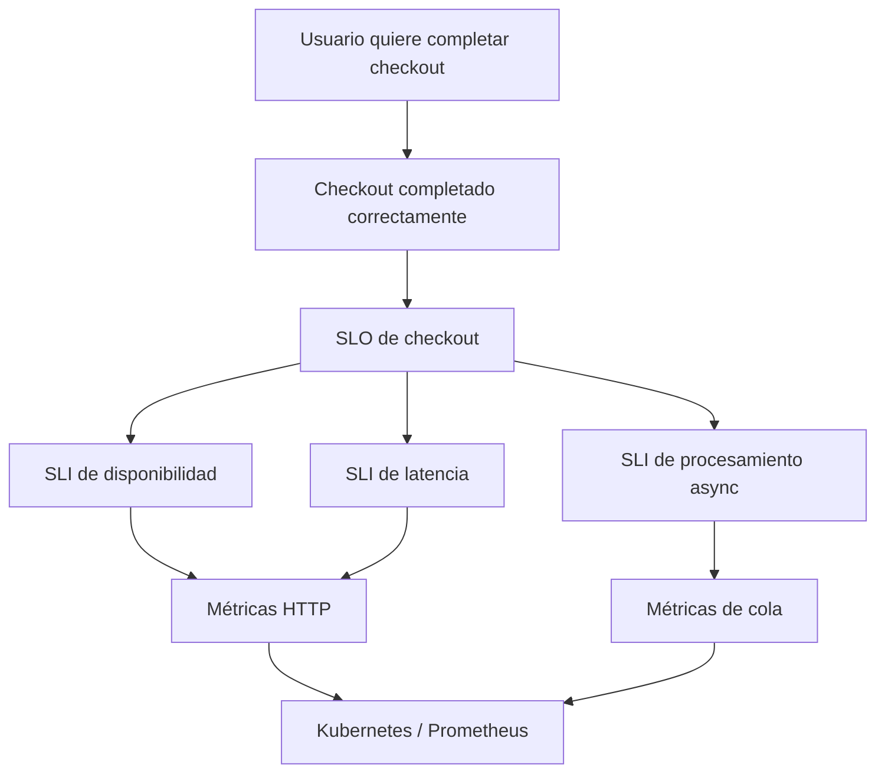
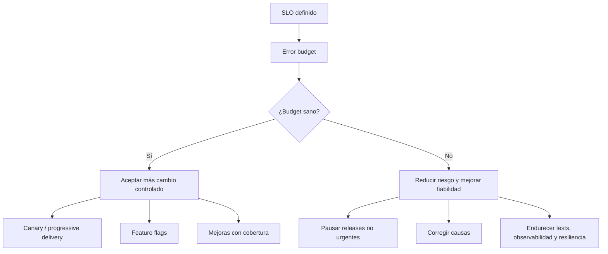
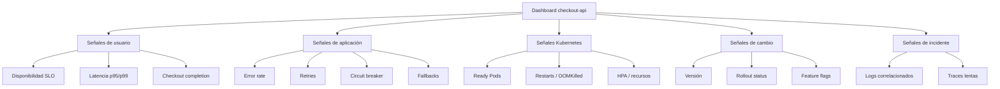
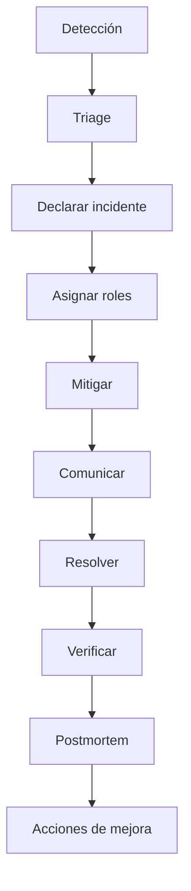

<!-- COURSE_NAV_START -->
[Anterior](<22.%20Resiliencia%20de%20aplicaciones%20cloud%20native.md>) | [Indice](README.md) | [Siguiente](<24. Autoscaling, capacidad y eficiencia operativa.md>)
<!-- COURSE_NAV_END -->
# 23. SLOs, error budgets e incident response

## 23.1. Objetivo del módulo

En el módulo anterior trabajaste la resiliencia de aplicaciones cloud native: timeouts, retries, backoff, jitter, circuit breakers, bulkheads, rate limiting, load shedding, backpressure, idempotencia, colas, poison messages, graceful shutdown, probes, HPA y recursos. Todo eso ayuda a que una aplicación falle con menos daño, pero todavía falta una pieza esencial para operar un sistema real: decidir qué nivel de fiabilidad necesitas, cómo lo vas a medir, cuándo vas a alertar y cómo vas a responder cuando ese nivel se degrada.

Este módulo trata de SLOs, error budgets e incident response desde una perspectiva Kubernetes. No vamos a estudiar SRE como teoría separada de la plataforma. Vamos a conectar los objetivos de fiabilidad con workloads reales, Services, Pods, probes, Deployments, métricas, logs, trazas, dashboards, alertas, rollouts, feature flags, migraciones y prácticas de respuesta a incidentes.

La tesis del módulo es esta:

> Kubernetes puede mostrarte síntomas, pero no puede decidir por ti qué nivel de fiabilidad importa ni cuándo una degradación debe convertirse en incidente.

La tesis operacional es esta:

> Un SLO convierte la fiabilidad en una decisión explícita; un error budget convierte esa decisión en capacidad de actuación; incident response convierte las señales en una respuesta coordinada.

En este módulo aprenderás:

- Qué problema resuelven los SLOs
- Qué diferencia hay entre SLI, SLO y SLA
- Por qué no todo lo observable merece ser un SLO
- Cómo definir SLIs útiles para una aplicación en Kubernetes
- Cómo modelar disponibilidad, latencia, errores, saturación y frescura
- Qué es un error budget
- Cómo se calcula un error budget
- Cómo usar error budgets para decidir si acelerar, pausar o endurecer cambios
- Qué es burn rate
- Por qué alertar por síntomas es mejor que alertar por cada causa posible
- Cómo diseñar alertas que no despierten a alguien por ruido
- Cómo relacionar Prometheus, Alertmanager, Grafana, Loki y Tempo con la respuesta a incidentes
- Cómo usar eventos de Kubernetes durante una investigación
- Cómo diseñar dashboards útiles para operación
- Cómo clasificar severidad
- Qué debe pasar durante un incidente
- Cómo hacer triage, mitigación, comunicación, resolución y aprendizaje
- Cómo escribir runbooks
- Cómo escribir postmortems sin buscar culpables
- Cómo conectar incident response con progressive delivery, feature flags, migraciones y resiliencia
- Cómo automatizar prácticas con Taskfile
La idea principal es sencilla:

```text
No operas bien lo que no has definido.
No mejoras bien lo que no puedes medir.
No respondes bien si cada incidente se improvisa.
```

---

## 23.2. Por qué este módulo existe en un curso de Kubernetes

Kubernetes te da muchas señales: estado de Pods, eventos, restarts, readiness, liveness, uso de CPU y memoria, logs, métricas de red, estado de Deployments, rollouts, Jobs, Services y muchas otras piezas del cluster. El problema es que tener muchas señales no significa tener buena operación. Un equipo puede mirar cientos de métricas y aun así no saber si el usuario está recibiendo un servicio aceptable.

La fiabilidad no empieza en el dashboard. Empieza en una decisión de producto y tecnología: qué experiencia queremos proteger y cuánto fallo podemos tolerar. Esa decisión debe aterrizar en indicadores medibles. Después, esos indicadores deben convertirse en objetivos. Finalmente, esos objetivos deben influir en alertas, rollouts, feature flags, migraciones, priorización, guardias, runbooks y postmortems.

En Kubernetes esto es especialmente importante porque la plataforma puede producir mucho ruido. Un Pod puede reiniciarse y no afectar al usuario. Un nodo puede estar bajo presión y aun así el servicio puede estar sano. Un endpoint interno puede fallar durante unos segundos sin quemar el SLO. También puede ocurrir lo contrario: todos los Pods parecen Running, pero el checkout está tardando 5 segundos y el usuario no puede completar la compra. Por eso necesitamos separar señales de infraestructura, señales de aplicación y señales de usuario.

### Criterio de comprensión

Debes poder explicar:

> Kubernetes te da señales operativas, pero los SLOs definen qué señales representan fiabilidad real para el usuario o consumidor del servicio.

---

## 23.3. SLI, SLO y SLA

Antes de diseñar alertas o dashboards, hay que limpiar el lenguaje. SLI, SLO y SLA se parecen, pero no significan lo mismo.

| Concepto | Qué es                                   | Ejemplo                                       |
| -------- | ---------------------------------------- | --------------------------------------------- |
| SLI      | Indicador medible de nivel de servicio   | porcentaje de requests exitosas               |
| SLO      | Objetivo que quieres cumplir para un SLI | 99.9% de requests exitosas en 30 días         |
| SLA      | Compromiso contractual o externo         | penalización si no se cumple el 99.5% mensual |

Un SLI mide. Un SLO decide el objetivo. Un SLA compromete hacia fuera, normalmente con implicaciones legales, comerciales o contractuales.

### Ejemplo para checkout-api

SLI:

```text
successful checkout requests / total checkout requests
```

SLO:

```text
99.9% de requests de checkout deben completarse correctamente en ventanas de 30 días.
```

SLA:

```text
El contrato con clientes enterprise garantiza 99.5% de disponibilidad mensual del checkout.
```

El SLA puede ser menos estricto que el SLO. Esto es habitual porque el SLO se usa internamente para operar antes de llegar al incumplimiento contractual.

### Criterio de comprensión

Debes poder explicar:

> El SLI mide comportamiento, el SLO define el objetivo y el SLA formaliza un compromiso externo.

---

## 23.4. No todo lo observable merece ser un SLO

Un error frecuente es convertir cualquier métrica disponible en objetivo. Kubernetes y el stack LGTM pueden darte muchísimos datos, pero un SLO debe estar conectado con una experiencia que importa.

Mala señal para SLO:

```text
CPU media de checkout-api por debajo del 70%
```

Puede ser una métrica útil para diagnóstico, pero no mide directamente si el usuario puede completar un checkout.

Mejor señal para SLO:

```text
Porcentaje de requests POST /checkout que terminan con resultado correcto y latencia menor de 500 ms.
```

Esto está más cerca de la experiencia real.

### Tipos de señales

| Señal               | Uso principal               |                      ¿Buen SLO? |
| ------------------- | --------------------------- | ------------------------------: |
| CPU de Pod          | diagnóstico, capacidad, HPA |                  normalmente no |
| Memory usage        | diagnóstico, capacidad      |                  normalmente no |
| Restarts            | síntoma operativo           |                         depende |
| HTTP 5xx            | disponibilidad técnica      |    sí, si representa fallo real |
| Latencia p95        | experiencia de usuario      |                              sí |
| Checkout completado | resultado de negocio        |                              sí |
| Queue lag           | frescura de procesamiento   |         sí, para sistemas async |
| Error de migración  | diagnóstico                 |                  normalmente no |
| Readiness failures  | síntoma Kubernetes          | normalmente no como SLO usuario |
| SLO burn rate       | gestión de riesgo           |                sí para alerting |

### Regla

Un buen SLO debe responder a esta pregunta:

```text
¿Si esto se degrada, el usuario o consumidor del servicio recibe una experiencia peor?
```

### Criterio de comprensión

Debes poder explicar:

> Una métrica puede ser útil para diagnosticar sin ser un buen SLO.

---

## 23.5. SLOs desde la perspectiva del usuario

Un SLO no debería nacer desde lo que es fácil medir, sino desde lo que importa proteger. En el caso de `checkout-api`, el usuario no se preocupa por si el Pod está Running, si el Deployment tiene todas sus réplicas o si la CPU está baja. El usuario se preocupa por poder completar un checkout de forma correcta, dentro de un tiempo aceptable y sin resultados ambiguos.

Eso no significa que las métricas de infraestructura no importen. Importan mucho para investigar causas, detectar saturación y operar el cluster. Pero los SLOs principales deberían representar el servicio visto desde fuera.

### Ejemplo de jerarquía



### Criterio de comprensión

Debes poder explicar:

> Los SLOs deben proteger outcomes del usuario o consumidor, no simplemente estados internos de Kubernetes.

---

## 23.6. SLIs básicos para checkout-api

Para `checkout-api`, empezaremos con tres SLIs básicos:

1. Disponibilidad
2. Latencia
3. Correctitud funcional mínima
### SLI de disponibilidad

```text
requests exitosas / requests totales
```

Para un API HTTP, una aproximación inicial puede ser:

```text
requests con status 2xx o 3xx / requests totales
```

Pero hay que tener cuidado. Un `202 Accepted` puede ser correcto si el contrato dice que el pago queda pendiente. Un `409 Conflict` puede ser correcto si una idempotency key se reutiliza con un body diferente. Un `400` puede ser culpa del cliente y quizá no debería contar contra disponibilidad del servicio.

Por eso, el SLI real debe entender el contrato de la API.

### SLI de latencia

```text
porcentaje de requests completadas por debajo de un umbral
```

Ejemplo:

```text
95% de POST /checkout responde en menos de 500 ms.
```

La latencia debe medirse en requests válidas y relevantes. No mezcles endpoints críticos con endpoints secundarios si la experiencia que protegen es distinta.

### SLI de correctitud funcional mínima

No todo fallo aparece como HTTP 5xx. Una API puede devolver `200 OK` con un body incorrecto. Por eso, para flujos críticos, puede tener sentido medir resultados funcionales.

Ejemplo:

```text
checkout_completed_total / checkout_started_total
```

Este indicador exige instrumentación de negocio, no solo métricas HTTP.

### Criterio de comprensión

Debes poder explicar:

> Un SLI útil debe reflejar el contrato real del servicio, no solo códigos HTTP genéricos.

---

## 23.7. SLIs para trabajo asíncrono

No todos los sistemas son request-response. Si `checkout-api` acepta trabajo y lo procesa después mediante una cola, la disponibilidad HTTP no basta. Puedes devolver `202 Accepted` correctamente y aun así tener el sistema roto si los mensajes no se procesan.

Para trabajo asíncrono, los SLIs más importantes suelen estar relacionados con frescura, retraso y éxito de procesamiento.

| SLI                   | Qué mide                            | Ejemplo                    |
| --------------------- | ----------------------------------- | -------------------------- |
| Queue freshness       | retraso del mensaje más antiguo     | oldest message age < 2 min |
| Processing success    | mensajes procesados correctamente   | 99.9% en 30 días           |
| DLQ rate              | mensajes enviados a DLQ             | < 0.1%                     |
| End-to-end completion | desde aceptación hasta finalización | 95% en menos de 5 min      |

### Ejemplo

Si `POST /checkout` devuelve `202 Accepted` porque la autorización de pago se procesa de forma asíncrona, necesitas medir cuánto tarda ese pago en resolverse y cuántos quedan atrapados.

```text
95% de pagos aceptados para procesamiento async deben resolverse en menos de 2 minutos.
```

### Criterio de comprensión

Debes poder explicar:

> En sistemas asíncronos, responder rápido no significa completar el trabajo. Necesitas SLIs de frescura y finalización.

---

## 23.8. SLIs desde Kubernetes

Kubernetes aporta señales que ayudan a entender el sistema, pero no todas deben convertirse en SLO de usuario. Su valor principal suele estar en diagnóstico, correlación y operación.

Señales útiles de Kubernetes:

- Pod phase
- Pod conditions
- Container restarts
- Ready replicas
- Deployment rollout status
- Events
- OOMKilled
- ImagePullBackOff
- CrashLoopBackOff
- Pending Pods
- Node pressure
- HPA scaling activity
- CPU y memoria por Pod
- Network errors, si están instrumentados
- Readiness y liveness failures
### Cómo se usan

Estas señales ayudan a responder preguntas operativas:

```text
¿El fallo viene de la aplicación?
¿El fallo viene de scheduling?
¿El fallo viene de recursos?
¿El fallo viene de una imagen?
¿El rollout está atascado?
¿Hay Pods reiniciando?
¿La app está no Ready?
¿Hay presión de memoria?
¿HPA está escalando?
```

Pero un SLO principal como “99.9% de Pods Running” suele ser peor que “99.9% de checkouts exitosos”, porque los Pods pueden estar Running mientras el usuario falla.

### Criterio de comprensión

Debes poder explicar:

> Kubernetes metrics y events son esenciales para diagnóstico, pero los SLOs principales deben representar servicio, no solo estado interno del cluster.

---

## 23.9. SLO inicial para checkout-api

Definiremos un SLO inicial para `checkout-api` que combine disponibilidad y latencia. No será perfecto, pero será suficiente para el laboratorio y servirá como punto de partida.

### SLO 1: disponibilidad de checkout

```text
99.9% de requests válidas a POST /checkout deben terminar con resultado correcto en una ventana de 30 días.
```

### SLO 2: latencia de checkout

```text
95% de requests válidas a POST /checkout deben responder en menos de 500 ms en una ventana de 30 días.
```

### SLO 3: procesamiento asíncrono, si aplica

```text
99% de checkouts aceptados como payment_pending deben resolverse en menos de 2 minutos.
```

### Por qué no usamos un único SLO

Un único SLO puede ocultar degradaciones. Puedes tener alta disponibilidad pero latencia mala. Puedes tener buena latencia HTTP y procesamiento async roto. Puedes tener Pods sanos pero pagos pendientes acumulándose.

La fiabilidad real suele necesitar un pequeño conjunto de SLOs, no una métrica única que intente explicarlo todo.

### Criterio de comprensión

Debes poder explicar:

> Un servicio crítico suele necesitar más de un SLO porque disponibilidad, latencia y finalización no miden lo mismo.

---

## 23.10. Ventanas de medición

Un SLO siempre necesita una ventana de medición. No es lo mismo medir durante 5 minutos, 1 hora, 7 días o 30 días. Las ventanas cortas reaccionan rápido, pero pueden ser ruidosas. Las ventanas largas son más estables, pero pueden reaccionar tarde.

Ejemplos:

```text
99.9% durante 30 días
99.5% durante 7 días
95% de latencia bajo 500 ms durante 1 hora
```

### Ventanas útiles

| Ventana    | Uso                            |
| ---------- | ------------------------------ |
| 5 minutos  | detección rápida, pero ruidosa |
| 30 minutos | alerta rápida más estable      |
| 1 hora     | degradaciones sostenidas       |
| 6 horas    | burn rate medio                |
| 24 horas   | tendencia diaria               |
| 7 días     | seguimiento semanal            |
| 30 días    | SLO mensual                    |

### Criterio de comprensión

Debes poder explicar:

> La ventana de medición cambia la interpretación del SLO. Una degradación de 5 minutos y una degradación de 7 días no se gestionan igual.

---

## 23.11. Error budget

Un error budget es la cantidad de fallo que puedes tolerar antes de incumplir el SLO. Si el SLO es 99.9%, el error budget es 0.1%.

Ejemplo:

```text
SLO = 99.9%
Error budget = 0.1%
```

Si tienes 1.000.000 requests en 30 días:

```text
error budget = 1.000 requests fallidas
```

Si ya has tenido 800 fallos, te queda poco margen. Si has tenido 100 fallos, todavía tienes más capacidad para asumir riesgo.

### Por qué importa

El error budget permite discutir fiabilidad sin caer en extremos. No necesitas perseguir 100% de disponibilidad si no es económicamente razonable. Tampoco puedes acelerar cambios indefinidamente si ya estás quemando demasiado margen.

### Criterio de comprensión

Debes poder explicar:

> El error budget convierte la fiabilidad en una capacidad limitada que el equipo puede gastar o proteger.

---

## 23.12. Error budget como mecanismo de decisión

El error budget no es solo una métrica de reporting. Debe cambiar decisiones.

Cuando el error budget está sano, el equipo puede asumir más riesgo controlado:

- Desplegar con frecuencia
- Activar canaries
- Hacer experimentos
- Avanzar con migraciones compatibles
- Activar feature flags gradualmente
- Refactorizar con buena protección
- Simplificar deuda operativa
Cuando el error budget se consume rápido, el equipo debe reducir riesgo:

- Pausar releases no urgentes
- Reducir cambios grandes
- Endurecer pruebas
- Mejorar observabilidad
- Corregir causas de incidentes
- Revisar timeouts, retries y probes
- Revisar capacidad
- Desactivar funcionalidades no críticas
- Activar brownout si aplica
### Diagrama de decisión



### Criterio de comprensión

Debes poder explicar:

> Un error budget no sirve de mucho si no cambia el comportamiento del equipo.

---

## 23.13. Burn rate

Burn rate mide la velocidad a la que estás consumiendo el error budget. Es una señal más útil que mirar solo si el SLO final ya se incumplió, porque permite actuar antes.

Ejemplo conceptual:

```text
Burn rate = ritmo actual de errores / ritmo permitido por el SLO
```

Si el burn rate es 1, estás consumiendo el budget al ritmo esperado. Si es 10, estás consumiendo diez veces más rápido de lo permitido. Si eso continúa, incumplirás el SLO antes de terminar la ventana.

### Por qué importa

El burn rate permite alertar por velocidad de degradación, no solo por incumplimiento final. Esto es importante porque cuando el SLO ya se incumplió, llegas tarde.

### Criterio de comprensión

Debes poder explicar:

> Burn rate responde a “a este ritmo, ¿cuánto tardaremos en quemar el error budget?”.

---

## 23.14. Alertas basadas en síntomas

Una alerta debería despertar a alguien cuando hay impacto real o riesgo alto de impacto real. Alertar por cada causa posible genera ruido. En Kubernetes, esto es especialmente importante porque hay muchos eventos internos que pueden parecer graves y no afectar al usuario.

Malas alertas principales:

```text
Pod restarted once
CPU > 80% durante 1 minuto
Un endpoint interno falló una vez
Un Job tardó un poco más
```

Mejores alertas principales:

```text
SLO de checkout quemándose demasiado rápido
error rate alto sostenido
latencia p95 fuera de objetivo
cola con oldest_message_age alto
circuit breaker abierto durante demasiado tiempo
no hay Pods Ready para un servicio crítico
```

### Regla

Alerta por síntomas que afectan al usuario o ponen en riesgo inmediato el SLO. Usa las causas para dashboards, investigación y runbooks.

### Criterio de comprensión

Debes poder explicar:

> Una alerta debe representar acción necesaria, no curiosidad técnica.

---

## 23.15. Alertas multi-window y multi-burn-rate

Una estrategia común para alertar sobre SLOs es combinar ventanas cortas y largas. La ventana corta detecta incidentes rápidos. La ventana larga evita ruido y confirma que la degradación es sostenida.

Ejemplo conceptual:

```text
Alerta crítica:
burn rate alto durante 5 minutos
y burn rate alto durante 1 hora

Alerta warning:
burn rate moderado durante 30 minutos
y burn rate moderado durante 6 horas
```

### Por qué dos ventanas

Una sola ventana corta puede ser ruidosa. Una sola ventana larga puede reaccionar tarde. La combinación ayuda a detectar rápido sin alertar por cada pico menor.

### Ejemplo Prometheus conceptual

```yaml
groups:
  - name: checkout-api-slo
    rules:
      - alert: CheckoutHighErrorBudgetBurn
        expr: |
          (
            sum(rate(http_requests_total{service="checkout-api",route="/checkout",status=~"5.."}[5m]))
            /
            sum(rate(http_requests_total{service="checkout-api",route="/checkout"}[5m]))
          ) > 0.02
          and
          (
            sum(rate(http_requests_total{service="checkout-api",route="/checkout",status=~"5.."}[1h]))
            /
            sum(rate(http_requests_total{service="checkout-api",route="/checkout"}[1h]))
          ) > 0.01
        for: 2m
        labels:
          severity: page
          service: checkout-api
        annotations:
          summary: "checkout-api is burning error budget quickly"
          description: "The checkout error rate is high in both short and long windows."
```

Este ejemplo es didáctico. En un sistema real, las expresiones deben ajustarse a tus métricas, etiquetas, ventanas, tráfico y SLO concreto.

### Criterio de comprensión

Debes poder explicar:

> Las alertas de burn rate intentan detectar degradaciones importantes pronto sin convertir cada pico corto en una página.

---

## 23.16. Alertmanager: routing, grouping, inhibition y silences

Prometheus evalúa reglas de alerta. Alertmanager gestiona qué ocurre con esas alertas: agrupa, enruta, inhibe, silencia y envía notificaciones.

### Problema que resuelve

Durante un incidente, pueden dispararse muchas alertas relacionadas. Si cada Pod, cada instancia y cada síntoma envía una notificación separada, el equipo recibe ruido en el peor momento.

Alertmanager ayuda a:

- Agrupar alertas relacionadas
- Enrutarlas al equipo correcto
- Inhibir alertas secundarias cuando una alerta principal está activa
- Silenciar alertas durante mantenimiento
- Enviar notificaciones a Slack, email, PagerDuty, Opsgenie u otras herramientas
### Ejemplo de diseño

```text
CheckoutHighErrorBudgetBurn
  -> severity=page
  -> equipo checkout
  -> canal on-call

CheckoutLatencyWarning
  -> severity=ticket
  -> equipo checkout
  -> canal async
```

### Regla

La alerta debe llegar a quien puede actuar.

### Criterio de comprensión

Debes poder explicar:

> Prometheus detecta condiciones; Alertmanager ayuda a convertirlas en notificaciones útiles y menos ruidosas.

---

## 23.17. Dashboards para operar, no para decorar

Un dashboard útil responde preguntas durante operación. No debería ser una pared de gráficas sin intención.

Para `checkout-api`, un dashboard operativo debería ayudar a responder:

- ¿El usuario puede completar checkout?
- ¿Cuál es la disponibilidad actual?
- ¿Cuál es la latencia p50, p95 y p99?
- ¿Estamos quemando error budget?
- ¿Qué versión está desplegada?
- ¿Hubo rollout reciente?
- ¿Qué Pods están Ready?
- ¿Hay restarts?
- ¿Hay OOMKilled?
- ¿Hay circuit breakers abiertos?
- ¿Hay retries aumentando?
- ¿Hay fallback o brownout activo?
- ¿La cola está creciendo?
- ¿Qué traces representan requests lentas?
- ¿Qué logs están correlacionados con el fallo?
### Dashboard recomendado



### Criterio de comprensión

Debes poder explicar:

> Un dashboard debe responder preguntas operativas concretas, no demostrar que tenemos muchas métricas.

---

## 23.18. LGTM aplicado al módulo

En este curso, el stack LGTM de Grafana aparece como soporte de observabilidad. En este módulo lo usamos para conectar SLOs e incident response.

| Herramienta      | Papel en este módulo                                        |
| ---------------- | ----------------------------------------------------------- |
| Loki             | logs estructurados y búsqueda durante incidentes            |
| Grafana          | dashboards, exploración, visualización y alerting si aplica |
| Tempo            | trazas distribuidas para requests lentas o fallidas         |
| Mimir/Prometheus | métricas, SLIs, alertas y burn rate                         |

### Cómo se conectan

Durante un incidente de checkout, una alerta basada en métricas puede indicar que se está quemando error budget. Desde el dashboard puedes ver si la latencia o el error rate suben. Con trazas puedes identificar si `payment-api` consume el presupuesto de latencia. Con logs puedes ver timeouts, retries, circuit breaker open, fallback y correlation IDs. Con eventos de Kubernetes puedes confirmar si hubo rollout, OOMKilled, Pods no Ready o problemas de scheduling.

### Criterio de comprensión

Debes poder explicar:

> Métricas alertan y cuantifican; logs explican eventos; trazas muestran caminos; dashboards conectan señales para decidir.

---

## 23.19. Eventos de Kubernetes durante incidentes

Los eventos de Kubernetes son una fuente importante para investigar qué ocurrió en el cluster. No sustituyen métricas, logs o trazas de aplicación, pero ayudan a entender cambios de estado y problemas operativos.

Eventos útiles:

- FailedScheduling
- FailedMount
- Unhealthy
- Killing
- Pulled / Pulling / Failed
- BackOff
- OOMKilled, según cómo aparezca en estado del contenedor
- ScalingReplicaSet
- SuccessfulCreate
- NodeNotReady
- Evicted
### Comandos útiles

```bash
kubectl get events -n shop --sort-by=.lastTimestamp
kubectl describe pod -n shop <pod-name>
kubectl describe deployment -n shop checkout-api
kubectl rollout history deployment/checkout-api -n shop
kubectl rollout status deployment/checkout-api -n shop
```

### Criterio de comprensión

Debes poder explicar:

> Los eventos de Kubernetes ayudan a reconstruir cambios operativos del cluster, pero deben correlacionarse con métricas, logs, trazas y timeline del incidente.

---

## 23.20. Severidad de incidentes

No todos los incidentes tienen la misma urgencia. Necesitas una clasificación que ayude a coordinar respuesta, comunicación y expectativas.

### Propuesta de severidad

| Severidad | Descripción                                                  | Ejemplo                                               |
| --------- | ------------------------------------------------------------ | ----------------------------------------------------- |
| SEV1      | Impacto crítico en funcionalidad principal o muchos usuarios | checkout no funciona                                  |
| SEV2      | Degradación fuerte o parcial de funcionalidad importante     | checkout funciona lento o pagos pendientes acumulados |
| SEV3      | Problema limitado, workaround disponible                     | recomendaciones caídas, checkout sano                 |
| SEV4      | Anomalía menor o seguimiento                                 | alerta warning sin impacto visible                    |

### Criterios útiles

Para clasificar, mira:

- Alcance de usuarios afectados
- Funcionalidad afectada
- Duración
- Error budget burn rate
- Existencia de workaround
- Riesgo de empeoramiento
- Impacto económico
- Impacto reputacional
- Impacto legal o de seguridad, si aplica
### Criterio de comprensión

Debes poder explicar:

> La severidad no mide lo interesante que es el problema técnico. Mide impacto, urgencia y necesidad de coordinación.

---

## 23.21. Ciclo de incident response

Incident response necesita estructura. No para burocratizar, sino para evitar improvisación cuando el sistema está degradado.

Fases:

1. Detección
2. Triage
3. Declaración de incidente
4. Asignación de roles
5. Mitigación
6. Comunicación
7. Resolución
8. Verificación
9. Postmortem
10. Acciones de mejora


### Criterio de comprensión

Debes poder explicar:

> Incident response no es solo arreglar rápido. Es coordinar decisión, mitigación, comunicación y aprendizaje.

---

## 23.22. Roles durante un incidente

En incidentes pequeños, una persona puede hacer varias cosas. En incidentes importantes, separar roles reduce confusión.

| Rol                      | Responsabilidad                                  |
| ------------------------ | ------------------------------------------------ |
| Incident Commander       | coordina, prioriza, evita caos                   |
| Tech Lead / Investigator | investiga causas técnicas y propone mitigaciones |
| Communications Lead      | comunica estado a stakeholders                   |
| Scribe                   | registra timeline, decisiones y acciones         |
| Subject Matter Expert    | aporta conocimiento específico                   |
| On-call responder        | ejecuta acciones operativas iniciales            |

### Regla

Quien coordina no debería ser quien está haciendo todas las investigaciones profundas, porque coordinar requiere mantener visión global.

### Criterio de comprensión

Debes poder explicar:

> Los roles evitan que todo el mundo investigue a la vez y nadie coordine.

---

## 23.23. Triage inicial

El triage inicial debe responder rápido a preguntas básicas. No busca la causa raíz completa. Busca entender impacto, alcance y primera mitigación razonable.

Preguntas:

- ¿Qué SLO está afectado?
- ¿Qué usuarios o tenants están afectados?
- ¿Desde cuándo ocurre?
- ¿Está empeorando?
- ¿Hay rollout reciente?
- ¿Hay migración reciente?
- ¿Hay feature flag reciente?
- ¿Hay cambios de configuración?
- ¿Hay dependencia degradada?
- ¿Hay Pods no Ready?
- ¿Hay restarts u OOMKilled?
- ¿Hay error budget quemándose rápido?
- ¿Hay mitigación segura?
### Comandos de primera mirada

```bash
kubectl get deploy,rs,pods,svc -n shop
kubectl get events -n shop --sort-by=.lastTimestamp
kubectl rollout status deployment/checkout-api -n shop
kubectl logs deployment/checkout-api -n shop --since=15m
kubectl describe deployment checkout-api -n shop
```

### Criterio de comprensión

Debes poder explicar:

> El triage inicial no busca saberlo todo. Busca saber si hay impacto, cuánto riesgo existe y qué mitigación puede reducir daño.

---

## 23.24. Mitigación antes que causa raíz

Durante un incidente, la prioridad inicial no siempre es descubrir la causa raíz. Muchas veces la prioridad es reducir impacto.

Mitigaciones posibles:

- Rollback de aplicación
- Pausar rollout
- Desactivar feature flag
- Activar kill switch
- Activar brownout
- Escalar réplicas, si el cuello de botella está en el workload
- Reducir tráfico
- Aplicar rate limiting
- Aumentar recursos temporalmente
- Desactivar una integración no crítica
- Revertir configuración
- Pausar una migración
- Drenar o aislar un worker
- Cambiar a modo async si el contrato lo permite
### Regla

Mitigar no significa ignorar la causa. Significa reducir daño antes de investigar con calma.

### Criterio de comprensión

Debes poder explicar:

> En un incidente, primero protege al usuario y al sistema. La causa raíz completa puede esperar a que el impacto esté contenido.

---

## 23.25. Rollback, roll-forward y feature flags

En Kubernetes, una mitigación habitual puede ser rollback. Pero rollback no siempre es la mejor opción, ni siempre es seguro.

### Rollback puede ayudar si

- El problema viene claramente de una versión nueva
- El schema de datos sigue siendo compatible
- No hay migración destructiva
- La versión anterior sigue siendo operable
- El rollout reciente coincide con el inicio del incidente
### Rollback puede ser peligroso si

- Hubo migración incompatible
- La nueva versión escribió datos en formato nuevo
- El problema está en una dependencia externa
- El problema es capacidad
- El problema es configuración compartida
- La versión anterior tiene el mismo bug
- El rollout no es la causa
### Feature flags como mitigación

Si el problema está en una funcionalidad nueva, desactivar la flag puede ser más rápido y menos riesgoso que rollback. Pero esto solo funciona si el sistema de flags permite cambiar exposición sin redeploy y si el camino apagado sigue siendo compatible.

### Criterio de comprensión

Debes poder explicar:

> Rollback es una herramienta, no una respuesta automática. Antes de usarlo, comprueba compatibilidad de datos, cambios recientes y causa probable.

---

## 23.26. Incident response y migraciones

Las migraciones tienen un papel especial en incident response porque pueden cambiar el estado de los datos de forma que un rollback de aplicación no deshace.

Durante un incidente relacionado con migraciones, revisa:

- Si la migración está en curso
- Si hay locks
- Si aumentó la latencia de base de datos
- Si hay timeouts
- Si hay errores de schema
- Si la app vieja y nueva son compatibles
- Si hay backfills corriendo
- Si hay Jobs fallando
- Si hay cola creciendo
- Si hay datos parcialmente transformados
### Mitigaciones posibles

- Pausar backfill
- Reducir batch size
- Detener Jobs no críticos
- Revertir aplicación solo si los datos siguen siendo compatibles
- Activar compatibilidad de lectura antigua/nueva
- Desactivar exposición con feature flag
- Aumentar observabilidad temporal
- Escalar workers solo si la DB lo soporta
### Criterio de comprensión

Debes poder explicar:

> En incidentes con datos, rollback de aplicación no equivale a rollback del sistema.

---

## 23.27. Comunicación durante incidentes

La comunicación durante un incidente debe ser clara, breve y orientada a estado. No necesita explicar cada hipótesis técnica, pero sí debe decir qué se sabe, qué impacto hay, qué se está haciendo y cuándo será la próxima actualización.

### Plantilla interna

```md
## Incident update

Status: investigating | mitigating | monitoring | resolved

Impact:

- What users or flows are affected.
- Since when.
- Current severity.

What we know:

- Confirmed facts only.

What we are doing:

- Current mitigation or investigation.

Next update:

- Time of next update.
```

### Ejemplo

```md
## Incident update

Status: mitigating

Impact:
Checkout requests are experiencing elevated latency and intermittent failures for a subset of users. The issue started around 10:15 UTC.

What we know:
The checkout SLO burn rate is above the critical threshold. Payment authorization latency increased at the same time. A rollout of checkout-api started at 10:05 UTC.

What we are doing:
We paused the rollout, disabled the new checkout flow flag, and are checking payment-api latency and Kubernetes events.

Next update:
10:45 UTC.
```

### Criterio de comprensión

Debes poder explicar:

> Durante un incidente, comunica hechos confirmados, impacto, acción actual y próxima actualización.

---

## 23.28. Timeline del incidente

El timeline es una de las piezas más importantes para aprender. No debe reconstruirse al final desde memoria si puede evitarse. Durante el incidente, alguien debería registrar eventos importantes.

### Qué registrar

- Hora de detección
- Alertas disparadas
- Cambios recientes
- Inicio de impacto
- Decisiones tomadas
- Mitigaciones aplicadas
- Resultado de mitigaciones
- Comunicaciones enviadas
- Hora de resolución
- Evidencias relevantes
- Enlaces a dashboards, logs, traces y PRs
### Plantilla

```md
## Timeline

- 10:12 UTC — CheckoutHighErrorBudgetBurn fired.
- 10:14 UTC — On-call acknowledged.
- 10:16 UTC — Incident declared SEV2.
- 10:18 UTC — Rollout checkout-api 1.8.0 paused.
- 10:22 UTC — newCheckoutFlow disabled.
- 10:29 UTC — Error rate started decreasing.
- 10:40 UTC — SLO burn rate back below threshold.
- 10:55 UTC — Incident moved to monitoring.
- 11:30 UTC — Incident resolved.
```

### Criterio de comprensión

Debes poder explicar:

> Un buen timeline convierte un incidente confuso en una secuencia de hechos que se puede analizar.

---

## 23.29. Runbooks

Un runbook describe cómo responder a una alerta o situación conocida. No debe ser una novela, pero sí debe reducir incertidumbre en el momento de mayor presión.

### Qué debe tener un runbook

- Nombre de la alerta
- Qué significa
- Impacto probable
- Dashboards relevantes
- Comandos útiles
- Primeras comprobaciones
- Mitigaciones seguras
- Riesgos de cada mitigación
- Cuándo escalar
- Cómo verificar recuperación
- Enlaces a documentación relacionada
### Ejemplo de runbook

````md
# Runbook: CheckoutHighErrorBudgetBurn

## Meaning

checkout-api is consuming error budget faster than allowed.

## Likely impact

Users may experience checkout failures or elevated latency.

## First checks

- Open checkout-api SLO dashboard.
- Check error rate and latency panels.
- Check recent rollouts.
- Check feature flag changes.
- Check payment-api latency.
- Check Kubernetes events in namespace shop.

## Commands
```bash
kubectl get deploy,pods,svc -n shop
kubectl get events -n shop --sort-by=.lastTimestamp
kubectl rollout history deployment/checkout-api -n shop
kubectl logs deployment/checkout-api -n shop --since=15m
```
````

## Safe mitigations

- Pause rollout if active
- Disable new checkout feature flag if recently changed
- Activate brownout for recommendations if saturation is present
- Scale checkout-api only if downstream dependencies are healthy
- Rollback only if data compatibility is confirmed
## Escalate when

- Burn rate remains critical for more than 15 minutes
- Payment provider degradation is confirmed
- Migration or data compatibility is involved
- Customer impact is broad
````

### Criterio de comprensión

Debes poder explicar:

> Un runbook no sustituye pensar. Reduce carga cognitiva para que puedas pensar mejor durante presión.

---

## 23.30. Postmortems sin culpa

Un postmortem no debe buscar culpables. Debe explicar qué ocurrió, por qué las defensas existentes no fueron suficientes y qué cambios reducirán la probabilidad o el impacto de incidentes similares.

### Plantilla de postmortem
```md
# Postmortem: Checkout elevated error rate

## Summary

Short description of what happened.

## Impact

- Users affected
- Duration
- SLO impact
- Business impact if known
## Timeline

Key events in chronological order.

## What went well

- Detection
- Mitigation
- Communication
- Tooling
## What did not go well

- Missing signal
- Slow diagnosis
- Unsafe rollout
- Weak runbook
- No fallback
- Alert noise
## Contributing factors

- Technical factors
- Process factors
- Observability gaps
- Testing gaps
- Deployment or migration factors
## Root causes

Root causes should describe system conditions, not blame individuals.

## Action items

| Action | Owner | Due date | Type |
|---|---|---|---|
| Add burn-rate alert for checkout latency | checkout-team | 2026-07-15 | detection |
| Add runbook for payment-api degradation | checkout-team | 2026-07-20 | response |
| Add idempotency conflict metric | checkout-team | 2026-07-25 | prevention |
````

### Buenas acciones

Una buena acción de postmortem debe ser concreta, tener dueño, fecha y mecanismo de verificación. “Ser más cuidadosos” no es una acción útil. “Añadir alerta de burn rate para latencia p95 de checkout y validarla en staging” sí lo es.

### Criterio de comprensión

Debes poder explicar:

> Un postmortem útil no pregunta “quién falló”, sino “qué condiciones permitieron que este fallo tuviera este impacto”.

---

## 23.31. Incident response y software economics

La fiabilidad tiene coste. Perseguir 100% de disponibilidad puede ser económicamente absurdo, pero ignorar la fiabilidad también tiene coste: pérdida de ventas, pérdida de confianza, soporte, interrupciones, trabajo reactivo, estrés, deuda operativa y menor capacidad de entregar producto.

Los SLOs y error budgets ayudan a tomar decisiones económicas explícitas. Si el budget está sano, puedes invertir más en cambio. Si el budget está quemándose, debes invertir más en estabilidad. Esto evita tratar fiabilidad y delivery como objetivos opuestos. Son parte del mismo sistema económico.

### Decisiones económicas guiadas por error budget

| Situación                         | Decisión probable              |
| --------------------------------- | ------------------------------ |
| Budget sano                       | aceptar más cambio controlado  |
| Budget casi agotado               | pausar cambios riesgosos       |
| Burn rate crítico                 | mitigar y reducir impacto      |
| Incidentes repetidos              | invertir en resiliencia        |
| Alertas ruidosas                  | invertir en calidad de señales |
| Postmortems sin acciones cerradas | deuda operativa acumulada      |

### Criterio de comprensión

Debes poder explicar:

> El error budget permite equilibrar entrega y fiabilidad sin convertir la conversación en opiniones.

---

## 23.32. Manifiestos y reglas recomendadas del módulo

Este módulo no necesita introducir muchos manifests nuevos, porque se apoya en los servicios ya creados. Sí necesita añadir reglas de alerta, documentación operativa y tareas de diagnóstico.

Estructura recomendada:
```text
observability/
  prometheus/
    checkout-api-slo-rules.yaml
    checkout-api-recording-rules.yaml

docs/
  incidents/
    runbooks/
      checkout-high-error-budget-burn.md
      checkout-latency-degradation.md
      payment-api-degradation.md
    postmortems/
      template.md
  slos/
    checkout-api-slo.md

Taskfile.yml
```

### docs/slos/checkout-api-slo.md
```md
# SLO: checkout-api

## User journey

Users must be able to complete checkout.

## Availability SLO

99.9% of valid POST /checkout requests must complete successfully over 30 days.

## Latency SLO

95% of valid POST /checkout requests must complete in less than 500 ms over 30 days.

## Async completion SLO

If checkout is accepted asynchronously, 99% of payment_pending checkouts must resolve in less than 2 minutes.

## Exclusions

- Invalid client requests
- Explicit 409 idempotency conflicts
- Planned maintenance windows, if agreed
- Synthetic tests marked as synthetic
## User-visible impact

Failure means users cannot complete checkout, checkout is too slow, or payment remains pending longer than expected.

## Dashboards

- checkout-api SLO dashboard
- checkout-api Kubernetes workload dashboard
- payment-api dependency dashboard
## Alerts

- CheckoutHighErrorBudgetBurn
- CheckoutLatencyBudgetBurn
- CheckoutAsyncProcessingLag
## Runbooks

- docs/incidents/runbooks/checkout-high-error-budget-burn.md
- docs/incidents/runbooks/payment-api-degradation.md
```

### observability/prometheus/checkout-api-slo-rules.yaml
```yaml
groups:
  - name: checkout-api-slo
    rules:
      - alert: CheckoutHighErrorBudgetBurn
        expr: |
          (
            sum(rate(http_requests_total{service="checkout-api",route="/checkout",status=~"5.."}[5m]))
            /
            sum(rate(http_requests_total{service="checkout-api",route="/checkout"}[5m]))
          ) > 0.02
          and
          (
            sum(rate(http_requests_total{service="checkout-api",route="/checkout",status=~"5.."}[1h]))
            /
            sum(rate(http_requests_total{service="checkout-api",route="/checkout"}[1h]))
          ) > 0.01
        for: 2m
        labels:
          severity: page
          service: checkout-api
          slo: availability
        annotations:
          summary: "checkout-api is burning availability error budget quickly"
          description: "The checkout error rate is high in both short and long windows."
          runbook_url: "docs/incidents/runbooks/checkout-high-error-budget-burn.md"

      - alert: CheckoutLatencyBudgetBurn
        expr: |
          histogram_quantile(
            0.95,
            sum(rate(http_request_duration_seconds_bucket{service="checkout-api",route="/checkout"}[5m])) by (le)
          ) > 0.5
        for: 10m
        labels:
          severity: page
          service: checkout-api
          slo: latency
        annotations:
          summary: "checkout-api p95 latency is above SLO"
          description: "p95 latency for POST /checkout is above 500ms for 10 minutes."
          runbook_url: "docs/incidents/runbooks/checkout-latency-degradation.md"
```

Estos ejemplos son didácticos. En un entorno real debes ajustar nombres de métricas, etiquetas, rutas, ventanas, thresholds y severidad a tu instrumentación.

### Criterio de comprensión

Debes poder explicar:

> Las reglas de alerta deben estar conectadas con SLOs y runbooks, no vivir como expresiones sueltas sin contexto operativo.

---

## 23.33. Taskfile para SLOs e incident response

Añade tareas:
```yaml
slo:docs:
  desc: Show checkout-api SLO document
  cmds:
    - cat docs/slos/checkout-api-slo.md
slo:rules:show:
  desc: Show Prometheus SLO alerting rules
  cmds:
    - cat observability/prometheus/checkout-api-slo-rules.yaml
slo:rules:validate:
  desc: Validate Prometheus rules syntax when promtool is available
  cmds:
    - promtool check rules observability/prometheus/checkout-api-slo-rules.yaml
incident:triage:checkout:
  desc: Run first triage commands for checkout-api
  cmds:
    - kubectl get deploy,rs,pods,svc -n shop -l app.kubernetes.io/part-of=shop
    - kubectl get events -n shop --sort-by=.lastTimestamp
    - kubectl rollout status deployment/checkout-api -n shop
    - kubectl logs deployment/checkout-api -n shop --since=15m
incident:rollout:history:
  desc: Show checkout-api rollout history
  cmds:
    - kubectl rollout history deployment/checkout-api -n shop
incident:pause:checkout:
  desc: Pause checkout-api rollout
  cmds:
    - kubectl rollout pause deployment/checkout-api -n shop
incident:resume:checkout:
  desc: Resume checkout-api rollout
  cmds:
    - kubectl rollout resume deployment/checkout-api -n shop
incident:undo:checkout:
  desc: Roll back checkout-api deployment
  cmds:
    - kubectl rollout undo deployment/checkout-api -n shop
    - kubectl rollout status deployment/checkout-api -n shop --timeout=120s
incident:runbook:checkout:
  desc: Show checkout high error budget burn runbook
  cmds:
    - cat docs/incidents/runbooks/checkout-high-error-budget-burn.md
incident:postmortem:template:
  desc: Show postmortem template
  cmds:
    - cat docs/incidents/postmortems/template.md
incident:debug:pod:
  desc: Describe a specific pod. Usage TASK_POD=<pod> task incident:debug:pod
  cmds:
    - kubectl describe pod -n shop {{.TASK_POD}}
incident:logs:checkout:
  desc: Show checkout-api logs from last 30 minutes
  cmds:
    - kubectl logs deployment/checkout-api -n shop --since=30m
```

### Criterio DevEx

Debes poder explicar:

> Taskfile no resuelve el incidente. Reduce fricción para ejecutar las primeras acciones correctas bajo presión.

---

## 23.34. Práctica 1: definir el SLO de checkout-api

### Objetivo

Crear un documento de SLO para `checkout-api`.

### Pasos

Crea:
```text
docs/slos/checkout-api-slo.md
```

Incluye:

- User journey.
- Availability SLO.
- Latency SLO.
- Async completion SLO, si aplica.
- Exclusiones.
- Impacto visible.
- Dashboards.
- Alertas.
- Runbooks.

Valida con:
```bash
task slo:docs
```

### Preguntas

- ¿Qué experiencia de usuario protege este SLO?
- ¿Qué requests cuentan?
- ¿Qué requests se excluyen?
- ¿Qué latencia es aceptable?
- ¿Qué pasa con `202 Accepted`?
- ¿El SLO protege un outcome real o una métrica cómoda?

### Criterio

Debes poder explicar:

> Un SLO debe estar escrito antes de alertar sobre él.

---

## 23.35. Práctica 2: calcular error budget

### Objetivo

Entender cuánto fallo permite un SLO.

### Ejemplo

SLO:
```text
99.9% de disponibilidad en 30 días
```

Tráfico mensual:
```text
1.000.000 requests
```

Error budget:
```text
0.1% = 1.000 requests fallidas permitidas
```

### Preguntas

- ¿Cuántos fallos permite un SLO de 99.9%?
- ¿Cuántos permite uno de 99.95%?
- ¿Qué cambia si el tráfico crece?
- ¿Qué pasa si quemas 800 errores en el primer día?
- ¿Cómo cambia la decisión de release?

### Criterio

Debes poder explicar:

> El error budget te dice cuánto margen de fallo queda antes de incumplir el objetivo.

---

## 23.36. Práctica 3: diseñar una alerta de burn rate

### Objetivo

Diseñar una alerta conectada con el SLO.

### Pasos

Crea:
```text
observability/prometheus/checkout-api-slo-rules.yaml
```

Añade una alerta de disponibilidad y otra de latencia.

Valida:
```bash
task slo:rules:show
task slo:rules:validate
```

### Preguntas

- ¿Qué SLO protege esta alerta?
- ¿Qué ventana corta usa?
- ¿Qué ventana larga usa?
- ¿Qué severidad tiene?
- ¿Tiene runbook?
- ¿Podría generar ruido?
- ¿Qué etiqueta enruta al equipo correcto?

### Criterio

Debes poder explicar:

> Una alerta de SLO debe decir qué objetivo está en riesgo y qué acción espera.

---

## 23.37. Práctica 4: simular triage de checkout

### Objetivo

Practicar los primeros pasos de investigación.

### Pasos

Ejecuta:
```bash
task incident:triage:checkout
task incident:rollout:history
task incident:logs:checkout
```

### Preguntas

- ¿Hay Pods no Ready?
- ¿Hay restarts?
- ¿Hay eventos recientes?
- ¿Hubo rollout reciente?
- ¿Hay errores en logs?
- ¿Hay señales de timeout?
- ¿Hay señales de circuit breaker?
- ¿Hay señales de fallback?
- ¿Qué mirarías en Grafana?
- ¿Qué mirarías en Loki?
- ¿Qué mirarías en Tempo?

### Criterio

Debes poder explicar:

> El triage inicial busca impacto, cambios recientes, señales principales y primera mitigación segura.

---

## 23.38. Práctica 5: decidir mitigación

### Objetivo

Elegir una mitigación según el escenario.

### Escenario A

Una nueva versión de `checkout-api` empezó a fallar justo después del rollout. No hubo migraciones. La versión anterior es compatible.

Mitigación probable:
```bash
task incident:undo:checkout
```

### Escenario B

La latencia subió por `payment-api`. No hubo rollout reciente.

Mitigaciones posibles:

- Activar circuit breaker.
- Activar modo degradado.
- Reducir retries.
- Aplicar rate limiting.
- Comunicar degradación.
- Escalar solo si `payment-api` lo soporta.

### Escenario C

El error empezó durante una migración con locks en base de datos.

Mitigaciones posibles:

- Pausar migración o backfill.
- Reducir batch size.
- Revisar locks.
- No hacer rollback de aplicación sin validar compatibilidad.
- Observar DB latency y queue lag.

### Preguntas

- ¿Qué evidencia tienes?
- ¿Qué mitigación reduce impacto más rápido?
- ¿Qué mitigación puede empeorar el problema?
- ¿Qué necesitas comunicar?
- ¿Cómo verificas recuperación?

### Criterio

Debes poder explicar:

> La mitigación depende del tipo de fallo. Rollback, scale-up, kill switch y pausa de migración no son intercambiables.

---

## 23.39. Práctica 6: escribir un runbook

### Objetivo

Crear un runbook accionable para una alerta.

Crea:
```text
docs/incidents/runbooks/checkout-high-error-budget-burn.md
```

Debe incluir:

- Qué significa la alerta.
- Impacto probable.
- Dashboards.
- Comandos.
- Primeras comprobaciones.
- Mitigaciones seguras.
- Riesgos.
- Escalado.
- Verificación.

Valida:
```bash
task incident:runbook:checkout
```

### Preguntas

- ¿Alguien de guardia podría usarlo a las 3 de la mañana?
- ¿Tiene comandos concretos?
- ¿Distingue rollback de feature flag?
- ¿Advierte sobre migraciones?
- ¿Indica cuándo escalar?
- ¿Indica cómo confirmar recuperación?

### Criterio

Debes poder explicar:

> Un runbook bueno reduce ambigüedad sin impedir criterio técnico.

---

## 23.40. Práctica 7: escribir un postmortem

### Objetivo

Practicar aprendizaje sin culpa.

Crea:
```text
docs/incidents/postmortems/template.md
```

Usa la plantilla del módulo y rellénala con un incidente simulado:
```text
checkout-api elevated latency due to payment-api degradation
```

Incluye:

- Summary.
- Impact.
- Timeline.
- What went well.
- What did not go well.
- Contributing factors.
- Root causes.
- Action items.

### Preguntas

- ¿Las acciones son concretas?
- ¿Tienen dueño?
- ¿Tienen fecha?
- ¿Reducen probabilidad, impacto o tiempo de detección?
- ¿Hay acciones de observabilidad?
- ¿Hay acciones de resiliencia?
- ¿Hay acciones de proceso?

### Criterio

Debes poder explicar:

> Un postmortem no termina cuando se escribe. Termina cuando las acciones importantes se cierran.

---

## 23.41. Checklist de SLOs e incident response

Antes de considerar listo el módulo en un sistema real:

- Cada servicio crítico tiene SLO documentado.
- Cada SLO tiene SLIs claros.
- Cada SLI se puede medir.
- Las exclusiones están definidas.
- Hay ventana de medición.
- El error budget está calculado.
- El error budget influye en decisiones.
- Hay alertas de burn rate.
- Las alertas tienen severidad.
- Las alertas tienen runbook.
- Alertmanager enruta al equipo correcto.
- Hay dashboards por servicio crítico.
- Los dashboards muestran señales de usuario, aplicación y Kubernetes.
- Logs tienen correlation ID.
- Trazas conectan requests entre servicios.
- Eventos de Kubernetes se revisan durante triage.
- Hay plantilla de comunicación.
- Hay plantilla de timeline.
- Hay plantilla de postmortem.
- Hay criterios de severidad.
- Hay mitigaciones conocidas.
- Rollback no se usa sin revisar compatibilidad de datos.
- Feature flags se pueden usar como mitigación cuando aplica.
- Migraciones tienen señales propias.
- Las acciones de postmortem tienen dueño y fecha.
- Hay revisión periódica de alertas ruidosas.

---

## 23.42. Errores habituales

### Error 1. Medir lo fácil en vez de lo importante

CPU, memoria y restarts pueden ser útiles, pero no reemplazan un SLO de experiencia de usuario.

### Error 2. Confundir SLA con SLO

Un SLA suele ser compromiso externo. Un SLO es una herramienta interna para operar y mejorar.

### Error 3. Crear SLOs sin exclusiones

Sin exclusiones claras, discutirás cada incidente desde cero.

### Error 4. Tener error budget y no usarlo para decidir

Si el budget no cambia decisiones de release, no está cumpliendo su función.

### Error 5. Alertar por causas en vez de síntomas

Alertar por cada Pod restart puede generar ruido. Alertar por burn rate alto conecta mejor con impacto.

### Error 6. No tener runbooks

Sin runbooks, cada alerta se convierte en improvisación.

### Error 7. Hacer postmortems sin acciones cerrables

Un postmortem sin acciones verificables es documentación sin aprendizaje operativo.

### Error 8. Usar rollback sin pensar en datos

Si hubo migración incompatible, rollback de app puede empeorar o no resolver el incidente.

### Error 9. No revisar cambios recientes

Rollouts, flags, ConfigMaps, Secrets, Jobs y migraciones son parte del contexto operativo.

### Error 10. No distinguir mitigación de causa raíz

Durante impacto activo, mitigar puede ser más importante que explicar todo.

### Error 11. Crear dashboards decorativos

Un dashboard debe responder preguntas operativas, no acumular gráficas.

### Error 12. Ignorar alert fatigue

Demasiadas alertas reducen la capacidad de responder bien a las importantes.

---

## 23.43. Criterio de salida del módulo

Puedes dar este módulo por completado cuando puedas explicar y demostrar lo siguiente.

### Conceptos

Debes poder explicar:

- Qué problema resuelven los SLOs.
- Qué diferencia hay entre SLI, SLO y SLA.
- Por qué no todo lo observable merece ser SLO.
- Cómo diseñar SLIs para HTTP.
- Cómo diseñar SLIs para trabajo asíncrono.
- Cómo usar señales de Kubernetes en diagnóstico.
- Qué es error budget.
- Cómo se calcula error budget.
- Cómo error budget cambia decisiones de producto y tecnología.
- Qué es burn rate.
- Por qué alertar por síntomas suele ser mejor que alertar por causas.
- Qué aporta Alertmanager.
- Cómo diseñar dashboards operativos.
- Cómo usar métricas, logs y trazas en incidentes.
- Cómo usar Kubernetes events durante triage.
- Cómo clasificar severidad.
- Qué fases tiene incident response.
- Qué roles pueden existir durante un incidente.
- Cómo hacer triage inicial.
- Por qué mitigación no es causa raíz.
- Cuándo rollback ayuda y cuándo puede ser peligroso.
- Cómo incident response se relaciona con migraciones.
- Cómo escribir runbooks.
- Cómo escribir postmortems sin culpa.
- Cómo conectar SLOs con software economics.

### Práctica

Debes poder:

- Crear un documento SLO para `checkout-api`.
- Definir disponibilidad, latencia y procesamiento async.
- Calcular error budget.
- Diseñar reglas Prometheus de alerta.
- Validar reglas con `promtool`.
- Ejecutar triage con `kubectl`.
- Revisar eventos de Kubernetes.
- Revisar rollout history.
- Decidir mitigación según escenario.
- Escribir un runbook.
- Escribir un postmortem.
- Explicar cómo LGTM apoya incident response.
- Usar Taskfile para reducir fricción operativa.

### Frase final de comprensión

Debes poder explicar esta frase:

> Un SLO define qué fiabilidad importa, un error budget define cuánto riesgo queda y un proceso de incident response define cómo actuar cuando la realidad se aleja del objetivo.

---

## 23.44. Referencias oficiales y materiales de apoyo

| Tema                                                        | Referencia                                                                                                                                                                                                     |
| ----------------------------------------------------------- | -------------------------------------------------------------------------------------------------------------------------------------------------------------------------------------------------------------- |
| Google SRE Book, Service Level Objectives                   | [https://sre.google/sre-book/service-level-objectives/](https://sre.google/sre-book/service-level-objectives/)                                                                                                 |
| Google SRE Workbook, Implementing SLOs                      | [https://sre.google/workbook/implementing-slos/](https://sre.google/workbook/implementing-slos/)                                                                                                               |
| Prometheus alerting rules                                   | [https://prometheus.io/docs/prometheus/latest/configuration/alerting_rules/](https://prometheus.io/docs/prometheus/latest/configuration/alerting_rules/)                                                       |
| Prometheus Alertmanager overview                            | [https://prometheus.io/docs/alerting/latest/overview/](https://prometheus.io/docs/alerting/latest/overview/)                                                                                                   |
| Prometheus Alertmanager                                     | [https://prometheus.io/docs/alerting/latest/alertmanager/](https://prometheus.io/docs/alerting/latest/alertmanager/)                                                                                           |
| Kubernetes Observability                                    | [https://kubernetes.io/docs/concepts/cluster-administration/observability/](https://kubernetes.io/docs/concepts/cluster-administration/observability/)                                                         |
| Kubernetes Monitoring, Logging, and Debugging               | [https://kubernetes.io/docs/tasks/debug/](https://kubernetes.io/docs/tasks/debug/)                                                                                                                             |
| Kubernetes Logging Architecture                             | [https://kubernetes.io/docs/concepts/cluster-administration/logging/](https://kubernetes.io/docs/concepts/cluster-administration/logging/)                                                                     |
| Kubernetes Debug Pods                                       | [https://kubernetes.io/docs/tasks/debug/debug-application/debug-pods/](https://kubernetes.io/docs/tasks/debug/debug-application/debug-pods/)                                                                   |
| Kubernetes Resource Metrics Pipeline                        | [https://kubernetes.io/docs/tasks/debug/debug-cluster/resource-metrics-pipeline/](https://kubernetes.io/docs/tasks/debug/debug-cluster/resource-metrics-pipeline/)                                             |
| Kubernetes Liveness, Readiness and Startup Probes           | [https://kubernetes.io/docs/concepts/workloads/pods/probes/](https://kubernetes.io/docs/concepts/workloads/pods/probes/)                                                                                       |
| Kubernetes Configure Liveness, Readiness and Startup Probes | [https://kubernetes.io/docs/tasks/configure-pod-container/configure-liveness-readiness-startup-probes/](https://kubernetes.io/docs/tasks/configure-pod-container/configure-liveness-readiness-startup-probes/) |
| Grafana documentation                                       | [https://grafana.com/docs/grafana/latest/](https://grafana.com/docs/grafana/latest/)                                                                                                                           |
| Grafana Loki documentation                                  | [https://grafana.com/docs/loki/latest/](https://grafana.com/docs/loki/latest/)                                                                                                                                 |
| Grafana Tempo documentation                                 | [https://grafana.com/docs/tempo/latest/](https://grafana.com/docs/tempo/latest/)                                                                                                                               |
| Grafana Mimir documentation                                 | [https://grafana.com/docs/mimir/latest/](https://grafana.com/docs/mimir/latest/)                                                                                                                               |

## 23.45. Lecturas de apoyo

| Tema                                  | Qué leer                                                                                                   |
| ------------------------------------- | ---------------------------------------------------------------------------------------------------------- |
| _Site Reliability Engineering_        | SLOs, error budgets, alerting, toil, incident response y postmortems.                                      |
| _The Site Reliability Workbook_       | Implementación práctica de SLOs, burn rates, alertas y políticas de error budget.                          |
| _Release It!_                         | Estabilidad, fallos en producción, patrones de resiliencia y diseño para operación.                        |
| _Cloud Native DevOps with Kubernetes_ | Operación de aplicaciones en Kubernetes, observabilidad, despliegues y respuesta operativa.                |
| Observabilidad con LGTM               | Métricas, logs, trazas, dashboards, correlación y diagnóstico durante incidentes.                          |
| Progressive delivery                  | Cómo usar canary, rollback, feature flags y análisis para reducir impacto.                                 |
| Software economics                    | Error budget como mecanismo económico para equilibrar fiabilidad, velocidad, riesgo y capacidad de cambio. |

<!-- COURSE_NAV_START -->
[Anterior](<22.%20Resiliencia%20de%20aplicaciones%20cloud%20native.md>) | [Indice](README.md) | [Siguiente](<24. Autoscaling, capacidad y eficiencia operativa.md>)
<!-- COURSE_NAV_END -->
