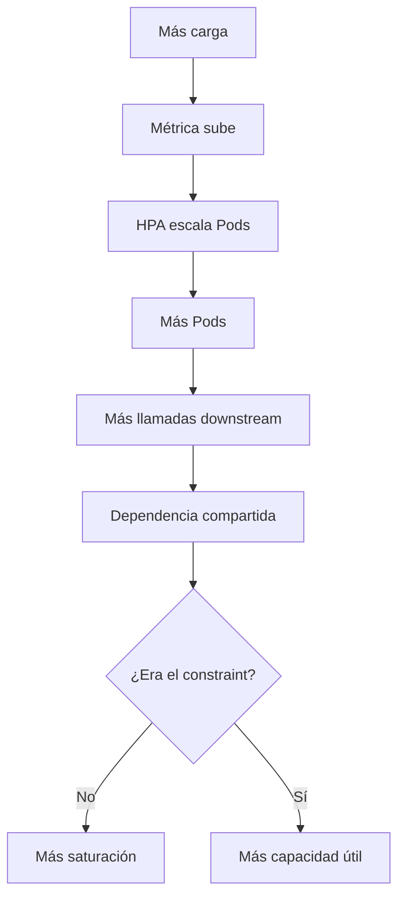
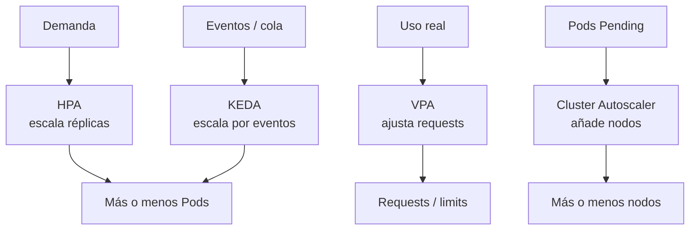
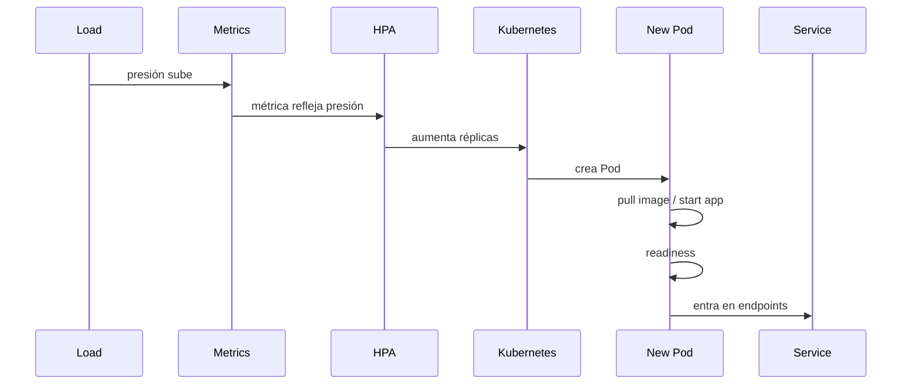
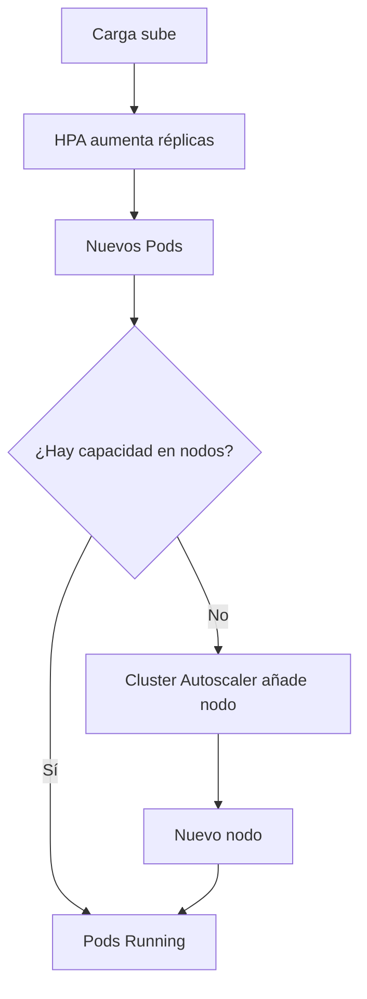

<!-- COURSE_NAV_START -->
[Anterior](<23. SLOs, error budgets e incident response.md>) | [Indice](README.md) | [Siguiente](<25. Seguridad de la cadena de suministro.md>)
<!-- COURSE_NAV_END -->

# 24. Autoscaling, capacidad y eficiencia operativa

## 24.1. Objetivo del módulo

En los módulos anteriores aprendiste a diseñar resiliencia de aplicación, definir SLOs, usar error budgets y responder a incidentes. Este módulo conecta esas ideas con una pregunta operativa y económica muy concreta: cuánta capacidad necesita una aplicación en Kubernetes, cuándo debe escalar, qué señal debe usar para escalar y cómo evitar que el autoscaling se convierta en una forma automática de amplificar problemas.

Autoscaling no significa “hacer que Kubernetes añada Pods cuando haya carga”. Esa es solo una parte del problema. Autoscaling significa diseñar un sistema de capacidad que proteja el servicio, respete los SLOs, no sature dependencias compartidas, no dispare costes innecesarios y no oculte problemas de diseño. Un autoscaler mal diseñado puede reaccionar tarde, escalar por la señal equivocada, añadir presión sobre una base de datos ya saturada, provocar flapping, empeorar un incidente o dar una falsa sensación de seguridad.

Kubernetes ofrece varias piezas para trabajar capacidad y escalado: requests, limits, Horizontal Pod Autoscaler, Vertical Pod Autoscaler, Cluster Autoscaler, métricas de recursos, métricas custom, métricas externas, node autoscaling, afinidad, distribución de Pods, prioridades y mecanismos event-driven como KEDA. Pero ninguna de esas piezas decide por sí sola cuál es el cuello de botella real del sistema ni cuál es el coste aceptable de mantener capacidad preparada.

La tesis del módulo es esta:

> Autoscaling no arregla un sistema sin límites; solo automatiza la respuesta a una señal. Si la señal es mala, el autoscaler escala el problema.

La tesis operacional es esta:

> La capacidad en Kubernetes debe diseñarse desde SLOs, restricciones reales, dependencias compartidas, tiempo de reacción y coste de mantener margen.

En este módulo aprenderás:

- Qué significa capacidad en Kubernetes
- Qué diferencia hay entre escalado horizontal, vertical y de nodos
- Qué papel tienen requests y limits
- Por qué HPA depende de requests cuando escala por CPU o memoria
- Cuándo escalar por CPU es razonable y cuándo no
- Cuándo usar métricas de aplicación
- Cuándo usar métricas externas
- Qué aporta KEDA en workloads event-driven
- Qué aporta VPA para right-sizing
- Qué aporta Cluster Autoscaler o node autoscaling
- Por qué HPA, VPA y Cluster Autoscaler no resuelven el mismo problema
- Qué es overprovisioning
- Qué es underprovisioning
- Qué es headroom
- Qué es flapping
- Qué es cold start de capacidad
- Qué es scale-to-zero y cuándo puede ser mala idea
- Cómo se relaciona autoscaling con SLOs
- Cómo se relaciona autoscaling con error budgets
- Cómo se relaciona autoscaling con resiliencia
- Cómo evitar que autoscaling sature downstream dependencies
- Cómo observar decisiones de escalado
- Cómo hacer capacity planning básico
- Cómo usar Taskfile para inspeccionar, probar y depurar escalado
La idea principal es sencilla:

```text
Escalar no es mejorar.
Escalar es mover capacidad.
La mejora depende de si mueves capacidad hacia el verdadero constraint.
```

---

## 24.2. Autoscaling no es magia

Autoscaling suele presentarse como si fuera una solución directa: llega más carga, Kubernetes añade Pods, el sistema aguanta. Esa historia es incompleta. Para que escalar ayude, el cuello de botella debe estar en el workload que estás escalando, la métrica debe representar bien la presión real, el sistema debe tener nodos disponibles o poder crearlos a tiempo, las dependencias downstream deben soportar la carga adicional y la aplicación debe estar diseñada para arrancar, estar Ready y terminar correctamente.

Si `checkout-api` está saturado por CPU, escalar réplicas puede ayudar. Si `checkout-api` está esperando a `payment-api`, escalar `checkout-api` puede aumentar las llamadas a `payment-api` y empeorar la degradación. Si la base de datos está saturada por conexiones, añadir Pods puede agotar más rápido el pool de conexiones. Si el problema es una retry storm, HPA puede interpretar el aumento de CPU como necesidad de más capacidad y reforzar el bucle de fallo.



### Criterio de comprensión

Debes poder explicar:

> Autoscaling solo ayuda cuando escala el recurso que limita el sistema. Si escala un componente que presiona al verdadero cuello de botella, puede empeorar el incidente.

---

## 24.3. Capacidad desde una perspectiva de sistema

Capacidad no es solo número de Pods. Capacidad es la cantidad de trabajo que el sistema puede aceptar, procesar y completar dentro de los SLOs definidos. En Kubernetes, esa capacidad depende de varios niveles: aplicación, Pod, nodo, cluster, red, almacenamiento, base de datos, colas, proveedores externos y personas operando el sistema.

Desde Theory of Constraints, la pregunta no es “qué componente está al 80%”, sino “qué limita el throughput del sistema respecto a su objetivo”. Si el objetivo es completar checkouts correctamente y dentro de 500 ms, el constraint puede estar en `checkout-api`, en `payment-api`, en la base de datos, en una cola, en un proveedor externo, en locks creados por una migración o en una política de retries mal diseñada.

### Niveles de capacidad

| Nivel       | Pregunta                                          |
| ----------- | ------------------------------------------------- |
| Aplicación  | ¿Puede procesar más requests sin romper latencia? |
| Pod         | ¿Tiene CPU, memoria y conexiones suficientes?     |
| Deployment  | ¿Hay suficientes réplicas Ready?                  |
| Nodo        | ¿Hay CPU/memoria disponible para programar Pods?  |
| Cluster     | ¿Puede crecer a tiempo?                           |
| Dependencia | ¿DB, cola o proveedor soportan más carga?         |
| Operación   | ¿El equipo puede observar y responder?            |
| SLO         | ¿La capacidad protege el objetivo real?           |

### Criterio de comprensión

Debes poder explicar:

> La capacidad útil no se mide en Pods. Se mide en trabajo completado dentro del objetivo de servicio.

---

## 24.4. El mapa de autoscaling en Kubernetes

Kubernetes tiene varias piezas que participan en escalado, pero cada una resuelve un problema diferente. Confundirlas lleva a diseños frágiles.

| Mecanismo                             | Qué escala                              | Problema principal que resuelve          |
| ------------------------------------- | --------------------------------------- | ---------------------------------------- |
| HPA                                   | número de réplicas de un workload       | ajustar Pods a demanda                   |
| VPA                                   | requests y limits de Pods               | right-sizing vertical                    |
| Cluster Autoscaler / node autoscaling | nodos o node groups                     | capacidad de cluster para programar Pods |
| KEDA                                  | réplicas según eventos                  | escalado event-driven                    |
| Manual scaling                        | réplicas o recursos por decisión humana | intervención explícita                   |
| Overprovisioning controlado           | capacidad reservada                     | reducir tiempo de reacción               |
| Pod priority / preemption             | prioridad de scheduling                 | proteger workloads críticos              |



### Criterio de comprensión

Debes poder explicar:

> HPA, VPA, Cluster Autoscaler y KEDA no son alternativas equivalentes. Escalan cosas distintas a partir de señales distintas.

---

## 24.5. Requests y limits como contrato de capacidad

Antes de hablar de autoscaling, hay que hablar de requests y limits. En Kubernetes, `requests` dicen al scheduler cuánta CPU y memoria necesita un contenedor para ser programado razonablemente. `limits` restringen cuánto puede consumir como máximo. Esta configuración afecta scheduling, eficiencia, estabilidad, HPA, VPA, OOMKilled, CPU throttling y coste.

### Ejemplo

```yaml
resources:
  requests:
    cpu: 100m
    memory: 128Mi
  limits:
    memory: 256Mi
```

### Requests

Los requests ayudan a Kubernetes a decidir dónde colocar Pods. También son relevantes para HPA cuando escala por utilización de CPU o memoria, porque la utilización se interpreta respecto al request. Si los requests son irreales, HPA puede tomar malas decisiones.

### Limits

Los limits protegen al nodo de consumos excesivos, pero también pueden causar problemas. Un memory limit demasiado bajo puede provocar `OOMKilled`. Un CPU limit demasiado restrictivo puede causar throttling, aumentar latencia, provocar timeouts y hacer que las probes fallen.

### Regla

No trates requests y limits como valores decorativos copiados de otro servicio. Son parte del contrato de capacidad del workload.

### Criterio de comprensión

Debes poder explicar:

> Requests y limits no son solo YAML obligatorio. Definen cómo Kubernetes reserva, restringe y razona sobre capacidad.

---

## 24.6. QoS classes y eficiencia

Kubernetes asigna una Quality of Service class a los Pods según cómo tengan configurados requests y limits. Esto afecta el comportamiento del sistema bajo presión de recursos.

| QoS        | Condición general                                                      | Implicación                             |
| ---------- | ---------------------------------------------------------------------- | --------------------------------------- |
| Guaranteed | requests y limits iguales para CPU y memoria en todos los contenedores | máxima protección relativa ante presión |
| Burstable  | hay requests, pero no todo coincide con limits                         | comportamiento intermedio               |
| BestEffort | sin requests ni limits                                                 | más vulnerable ante presión             |

Un curso profesional de Kubernetes no debería enseñar “pon cualquier request pequeño para pasar el manifest”. Eso puede hacer que el scheduler coloque demasiados Pods en un nodo, que HPA interprete mal la utilización y que el sistema falle de forma confusa bajo carga.

### Criterio de comprensión

Debes poder explicar:

> La eficiencia no consiste en pedir siempre menos. Consiste en pedir capacidad realista para que el scheduler y los autoscalers tomen mejores decisiones.

---

## 24.7. Right-sizing antes de autoscaling

Autoscaling no sustituye right-sizing. Si un Pod tiene requests demasiado bajos, el scheduler puede sobrecargar nodos y HPA puede escalar tarde o de forma agresiva. Si los requests son demasiado altos, el cluster puede necesitar más nodos de los necesarios, aumentar coste y dejar capacidad ociosa.

Right-sizing significa ajustar requests y limits a partir de uso real, SLOs, perfil de carga, margen de seguridad y comportamiento bajo estrés. VPA puede ayudar con recomendaciones y, según configuración, también puede aplicar cambios. Pero incluso con VPA, el equipo debe entender qué significa el ajuste y si reiniciar Pods para cambiar recursos es aceptable.

### Señales para right-sizing

- CPU usage p50, p95 y p99
- Memory working set
- OOMKilled
- CPU throttling
- Latencia p95/p99
- Restarts
- HPA scaling behaviour
- Uso durante picos
- Diferencia entre requests y uso real
- SLO burn rate durante carga
### Criterio de comprensión

Debes poder explicar:

> Primero necesitas saber cuánta capacidad consume un Pod sano. Después puedes decidir cómo escalarlo.

---

## 24.8. Overprovisioning, underprovisioning y headroom

La eficiencia operativa no significa usar el 100% de los recursos todo el tiempo. Un sistema sin margen puede ser barato cuando está tranquilo y caro cuando falla. La capacidad ociosa controlada puede ser una inversión razonable si reduce latencia, protege SLOs y evita incidentes durante picos.

| Concepto          | Significado                     | Riesgo                                 |
| ----------------- | ------------------------------- | -------------------------------------- |
| Underprovisioning | menos capacidad de la necesaria | errores, latencia, SLO burn            |
| Overprovisioning  | más capacidad de la necesaria   | coste innecesario                      |
| Headroom          | margen deliberado               | coste aceptado para absorber variación |

### Ejemplo

Si `checkout-api` tarda 40 segundos en tener nuevos Pods Ready y el tráfico puede duplicarse en 10 segundos, necesitas margen antes del pico. HPA es reactivo: detecta presión después de que la señal cambió. Si esperas a estar saturado para escalar, los Pods nuevos pueden llegar tarde.

### Criterio de comprensión

Debes poder explicar:

> La capacidad eficiente no es capacidad mínima. Es capacidad suficiente, con margen explícito, para cumplir SLOs al menor coste razonable.

---

## 24.9. Escalado horizontal con HPA

Horizontal Pod Autoscaler ajusta el número de réplicas de un workload como Deployment o StatefulSet. Su objetivo es añadir Pods cuando la señal de carga sube y reducirlos cuando la señal baja.

### Ejemplo básico con CPU

```yaml
apiVersion: autoscaling/v2
kind: HorizontalPodAutoscaler
metadata:
  name: checkout-api
  namespace: shop
spec:
  scaleTargetRef:
    apiVersion: apps/v1
    kind: Deployment
    name: checkout-api
  minReplicas: 3
  maxReplicas: 10
  metrics:
    - type: Resource
      resource:
        name: cpu
        target:
          type: Utilization
          averageUtilization: 70
```

### Qué significa

Este HPA intenta mantener la CPU media alrededor del 70% del request de CPU. Si la utilización sube, escala hacia arriba. Si baja, puede escalar hacia abajo. Pero el resultado depende de requests realistas, métricas disponibles, tiempo de arranque, readiness, comportamiento de la aplicación y capacidad del cluster.

### Criterio de comprensión

Debes poder explicar:

> HPA escala réplicas a partir de una señal. La calidad del escalado depende de la calidad de esa señal y del tiempo que tarda la nueva capacidad en estar disponible.

---

## 24.10. Por qué CPU no siempre es buena señal

CPU puede ser una buena señal para workloads CPU-bound, como procesamiento intensivo, compresión, cifrado o cálculos pesados. Pero muchas aplicaciones web y APIs no se saturan primero por CPU. Pueden saturarse por latencia de red, base de datos, locks, pool de conexiones, event loop, cola interna, proveedor externo o límites de concurrencia.

En una aplicación Node.js, por ejemplo, CPU moderada no garantiza que el event loop esté sano. En una API que espera a una base de datos lenta, CPU puede estar baja mientras la latencia se dispara. En un sistema con retries, CPU puede subir como consecuencia de un fallo downstream, no porque falten réplicas de la API.

### Tabla de señales

| Síntoma                    |     CPU HPA ayuda | Mejor señal                               |
| -------------------------- | ----------------: | ----------------------------------------- |
| CPU alta por cálculo local |                Sí | CPU                                       |
| Latencia por DB lenta      | No necesariamente | DB latency, pool usage, request latency   |
| Cola creciendo             | No necesariamente | queue depth, oldest message age           |
| Event loop saturado        |           Depende | event loop lag                            |
| Proveedor externo lento    |                No | dependency latency, circuit breaker state |
| Memory pressure            |           Depende | memory working set, OOMKilled             |
| Requests retenidas         |           Depende | concurrency, in-flight requests           |

### Criterio de comprensión

Debes poder explicar:

> CPU es una señal útil cuando CPU es el constraint. Si el constraint está en otro lugar, escalar por CPU puede ser tarde, inútil o dañino.

---

## 24.11. HPA con memoria

HPA también puede escalar por memoria, pero hay que usarlo con cuidado. La memoria no siempre baja cuando añades réplicas, especialmente si cada Pod mantiene caches, buffers o estructuras internas. Escalar por memoria puede ser razonable en algunos workloads, pero puede producir comportamientos poco intuitivos.

### Cuándo puede tener sentido

- Workloads donde memoria crece con carga
- Workers con buffers proporcionales al trabajo
- Servicios con consumo de memoria correlacionado con requests simultáneas
- Procesamiento de lotes con tamaño variable
### Cuándo puede ser mala señal

- Caches que no se liberan rápidamente
- Lenguajes con GC que retienen memoria
- Memory leaks
- Baseline de memoria alto por Pod
- Memoria no correlacionada con throughput
- Aplicaciones que necesitan VPA o leak fix, no más réplicas
### Criterio de comprensión

Debes poder explicar:

> Escalar por memoria solo ayuda si añadir réplicas reduce la presión de memoria por Pod. Si hay leak o cache mal diseñada, HPA puede ocultar el problema.

---

## 24.12. Métricas custom y externas

Cuando CPU y memoria no representan bien la presión real, puedes escalar con métricas custom o externas. Esto permite usar señales más cercanas al comportamiento de la aplicación o del sistema.

Ejemplos de métricas custom:

- Requests por segundo por Pod
- In-flight requests
- Latencia p95
- Event loop lag
- Tamaño de pool de conexiones usado
- Queue depth
- Oldest message age
- Mensajes por segundo
- Trabajos pendientes
- Errores por dependencia
### Cuidado con latencia como métrica de escalado

Escalar por latencia puede parecer natural, pero hay que entender la causa. Si la latencia sube porque falta CPU local, escalar puede ayudar. Si la latencia sube porque la base de datos está lenta, añadir Pods puede empeorar la presión. La latencia es un síntoma excelente para SLOs y alerting, pero no siempre es una señal segura para autoscaling.

### Criterio de comprensión

Debes poder explicar:

> Una métrica custom debe representar una presión que el escalado pueda aliviar. Si solo mide un síntoma downstream, puede inducir decisiones dañinas.

---

## 24.13. HPA behavior: estabilización y políticas

HPA puede configurarse para controlar el comportamiento de escalado. Esto ayuda a evitar flapping, escalados demasiado agresivos o reducciones demasiado rápidas de capacidad.

### Ejemplo

```yaml
apiVersion: autoscaling/v2
kind: HorizontalPodAutoscaler
metadata:
  name: checkout-api
  namespace: shop
spec:
  scaleTargetRef:
    apiVersion: apps/v1
    kind: Deployment
    name: checkout-api
  minReplicas: 3
  maxReplicas: 20
  metrics:
    - type: Resource
      resource:
        name: cpu
        target:
          type: Utilization
          averageUtilization: 70
  behavior:
    scaleUp:
      stabilizationWindowSeconds: 60
      policies:
        - type: Percent
          value: 100
          periodSeconds: 60
        - type: Pods
          value: 4
          periodSeconds: 60
      selectPolicy: Max
    scaleDown:
      stabilizationWindowSeconds: 300
      policies:
        - type: Percent
          value: 50
          periodSeconds: 60
      selectPolicy: Max
```

### Qué enseña este ejemplo

Escalar hacia arriba puede necesitar rapidez, pero escalar hacia abajo suele requerir prudencia. Si reduces capacidad demasiado pronto, puedes provocar oscilaciones. Si subes demasiado lento, puedes quemar SLO durante picos. El comportamiento correcto depende del tiempo de arranque, la variabilidad del tráfico, el margen de capacidad y el coste.

### Criterio de comprensión

Debes poder explicar:

> El autoscaling no solo necesita saber cuánto escalar, sino también a qué velocidad puede hacerlo sin desestabilizar el sistema.

---

## 24.14. Flapping y oscilaciones

Flapping ocurre cuando el sistema escala arriba y abajo repetidamente. Puede aparecer cuando la métrica es ruidosa, los thresholds son demasiado agresivos, el tiempo de estabilización es bajo, el tráfico es irregular o el escalado cambia la métrica de forma brusca.

### Ejemplo

```text
CPU sube a 75%
HPA escala de 3 a 6 Pods
CPU baja a 35%
HPA escala de 6 a 3 Pods
CPU vuelve a subir
```

Esto puede generar:

- Coste innecesario
- Pods arrancando y terminando continuamente
- Warm-up constante
- Peor latencia
- Más eventos operativos
- Más ruido en dashboards
- Más riesgo durante rollouts
### Cómo reducir flapping

- Stabilization windows
- Políticas de scale-down más conservadoras
- Métricas menos ruidosas
- Requests más realistas
- MinReplicas adecuado
- Headroom explícito
- Separar workloads con perfiles distintos
- Evitar escalar por métricas que cambian artificialmente al añadir Pods
### Criterio de comprensión

Debes poder explicar:

> Un autoscaler que oscila no está siendo eficiente. Está convirtiendo variación normal en trabajo operativo y coste.

---

## 24.15. Tiempo de reacción y cold start de capacidad

Autoscaling es reactivo en la mayoría de configuraciones. Primero cambia la carga, después cambia la métrica, después el autoscaler decide, después Kubernetes crea Pods, después el scheduler los programa, después las imágenes se descargan si hace falta, después la app arranca, después pasa readiness y finalmente el Pod recibe tráfico.

Ese ciclo puede tardar más que el pico de tráfico.



### Factores que aumentan tiempo de reacción

- Imagen grande
- Nodo sin imagen cacheada
- Cluster sin capacidad libre
- Cluster Autoscaler necesita crear nodo
- App tarda en arrancar
- Startup probe lenta
- Dependencias de arranque lentas
- Requests demasiado grandes
- Scheduling constraints estrictas
- Pull rate limits
- Init containers lentos
### Criterio de comprensión

Debes poder explicar:

> El autoscaler decide en segundos, pero la capacidad útil aparece cuando el Pod está Ready. Ese retraso debe formar parte del diseño.

---

## 24.16. MinReplicas y capacidad base

`minReplicas` define capacidad mínima. Elegirlo demasiado bajo puede ahorrar coste, pero aumentar latencia durante picos o dejar al sistema sin margen durante fallos. Elegirlo demasiado alto puede desperdiciar recursos.

### Factores para decidir minReplicas

- Tráfico base
- Picos habituales
- Tiempo de arranque
- SLO de latencia
- Necesidad de alta disponibilidad
- PDB
- Zonas o nodos disponibles
- Coste por réplica
- Dependencias compartidas
- Error budget
- Horarios de tráfico
- Carga de background jobs
### Ejemplo

Para `checkout-api`, `minReplicas: 1` puede ser insuficiente aunque el tráfico medio sea bajo. Un rollout, una disrupción voluntaria, un nodo fallando o un Pod no Ready podrían dejar el servicio sin capacidad. Para un flujo crítico, `minReplicas: 3` suele ser un punto didáctico más razonable porque permite disponibilidad durante rollouts y PDB.

### Criterio de comprensión

Debes poder explicar:

> MinReplicas no es solo coste mínimo. Es la capacidad base que protege disponibilidad mientras el autoscaler reacciona.

---

## 24.17. MaxReplicas y protección de dependencias

`maxReplicas` no es solo un límite presupuestario. También puede proteger dependencias downstream. Si `checkout-api` puede escalar hasta 100 Pods pero la base de datos solo soporta 300 conexiones, el autoscaler puede ayudarte a llegar antes al límite de la base de datos.

### Preguntas para definir maxReplicas

- ¿Cuántas conexiones abre cada Pod?
- ¿Cuántas conexiones soporta la DB?
- ¿Qué QPS soporta el proveedor externo?
- ¿Qué throughput soporta la cola?
- ¿Qué límites tiene el API Gateway?
- ¿Qué coste máximo aceptamos?
- ¿Qué ocurre si llegamos a maxReplicas?
- ¿Tenemos rate limiting o backpressure?
- ¿Qué alerta se dispara al acercarnos?
### Criterio de comprensión

Debes poder explicar:

> MaxReplicas debe proteger coste y dependencias compartidas. No debería ser un número arbitrario alto para “que Kubernetes escale si hace falta”.

---

## 24.18. Escalado vertical con VPA

Vertical Pod Autoscaler ajusta recursos de los Pods, especialmente requests y limits, para acercarlos al uso real. Puede servir para right-sizing, reducir desperdicio y evitar workloads mal dimensionados.

### Modos conceptuales

| Modo                 | Uso                                                 |
| -------------------- | --------------------------------------------------- |
| Off / recommendation | obtener recomendaciones sin aplicar                 |
| Initial              | aplicar recursos al crear Pods                      |
| Auto / recreate      | aplicar cambios recreando Pods, según configuración |

### Cuándo usar VPA

- Para aprender requests realistas
- Para workloads con uso estable
- Para servicios que no escalan bien horizontalmente
- Para reducir overprovisioning
- Para evitar underprovisioning crónico
- Para generar recomendaciones revisables
### Cuidado con VPA y HPA

VPA y HPA pueden interactuar de forma problemática si ambos actúan sobre la misma dimensión. Por ejemplo, HPA por CPU depende de requests, y VPA puede modificar esos requests. Esto no significa que nunca puedan coexistir, pero sí que debes diseñarlo conscientemente. Una práctica común es usar VPA en modo recomendación para servicios con HPA, o usar HPA con métricas que no dependan directamente de los recursos que VPA cambia.

### Criterio de comprensión

Debes poder explicar:

> VPA ayuda a ajustar tamaño de Pods. HPA ajusta número de Pods. Si ambos modifican señales relacionadas, pueden interferir.

---

## 24.19. Node autoscaling y Cluster Autoscaler

Aunque HPA añada réplicas, esas réplicas necesitan nodos donde ejecutarse. Si el cluster no tiene capacidad, los Pods quedan Pending. Node autoscaling o Cluster Autoscaler se encarga de añadir o quitar nodos según necesidad.

### Cómo encaja con HPA



### Riesgos

- El nodo tarda en crearse
- La imagen tarda en descargarse
- Los Pods tienen requests demasiado grandes
- Hay constraints que impiden scheduling
- Hay taints/tolerations mal configurados
- Hay PDB o prioridades que afectan movimiento
- Hay coste inesperado
- Hay scale-down demasiado agresivo
### Criterio de comprensión

Debes poder explicar:

> HPA puede pedir más Pods, pero Cluster Autoscaler debe proporcionar nodos. La capacidad útil llega cuando los Pods están Running y Ready.

---

## 24.20. KEDA y autoscaling event-driven

KEDA permite escalar workloads en función de eventos, como tamaño de cola, mensajes pendientes, lag, métricas Prometheus, eventos de Kafka, colas cloud o muchas otras fuentes. Es especialmente útil cuando CPU y memoria no representan bien el trabajo pendiente.

### Ejemplo conceptual con ScaledObject

```yaml
apiVersion: keda.sh/v1alpha1
kind: ScaledObject
metadata:
  name: checkout-worker
  namespace: shop
spec:
  scaleTargetRef:
    name: checkout-worker
  minReplicaCount: 1
  maxReplicaCount: 20
  pollingInterval: 30
  cooldownPeriod: 300
  triggers:
    - type: prometheus
      metadata:
        serverAddress: http://prometheus.monitoring.svc.cluster.local:9090
        metricName: checkout_queue_depth
        threshold: "100"
        query: sum(checkout_queue_depth{queue="checkout-payments"})
```

Este ejemplo es didáctico. En un entorno real, debes ajustar autenticación, nombres de métricas, thresholds, cooldown, polling, min/max replicas y comportamiento ante fallos de la fuente de métricas.

### Cuándo KEDA aporta valor

- Workers de cola
- Procesamiento asíncrono
- Carga event-driven
- Escalado por lag
- Escalado por backlog
- Escalado por métricas externas
- Workloads que pueden scale-to-zero
- Jobs event-driven
### Cuándo tener cuidado

- Si la cola no tiene límites
- Si el downstream está saturado
- Si escalar consumers aumenta presión sobre una DB
- Si cada consumer procesa mensajes no idempotentes
- Si no hay DLQ
- Si el tiempo de arranque es largo
- Si scale-to-zero rompe latencia esperada
### Criterio de comprensión

Debes poder explicar:

> KEDA escala por eventos, pero no elimina la necesidad de idempotencia, límites, DLQ, backpressure y SLOs de procesamiento.

---

## 24.21. Scale-to-zero

Scale-to-zero puede reducir coste cuando no hay trabajo. Es atractivo para workloads event-driven, tareas internas, entornos no críticos o servicios con tráfico esporádico. Pero también introduce latencia de arranque y puede romper expectativas si el primer usuario paga el cold start.

### Cuándo puede tener sentido

- Workers sin trabajo pendiente
- Entornos de desarrollo
- Procesos batch
- Funcionalidades internas
- Servicios no críticos
- Workloads event-driven con tolerancia a retraso
### Cuándo puede ser mala idea

- APIs críticas
- Flujos con SLO de latencia estricto
- Servicios que requieren conexión caliente
- Workloads con inicialización lenta
- Sistemas donde el primer request debe responder rápido
- Dependencias que no toleran arranques simultáneos
### Criterio de comprensión

Debes poder explicar:

> Scale-to-zero ahorra coste trasladando parte del coste al primer request o al primer evento. Eso solo es aceptable si el SLO lo permite.

---

## 24.22. Autoscaling y SLOs

Autoscaling debe diseñarse desde SLOs. Si el SLO de checkout exige p95 menor de 500 ms, la política de escalado debe tener en cuenta si la nueva capacidad llega antes de quemar demasiado error budget. Si una cola debe procesar mensajes en menos de 2 minutos, el autoscaling de workers debe mirar backlog, oldest message age o lag, no solo CPU.

### Preguntas SLO-first

- ¿Qué SLO protege esta política de autoscaling?
- ¿Qué métrica indica presión antes de incumplir el SLO?
- ¿Cuánto tarda en estar disponible nueva capacidad?
- ¿Cuánto headroom necesitamos?
- ¿Cuál es el coste de mantener ese headroom?
- ¿Qué ocurre si llegamos a maxReplicas?
- ¿Qué alerta se dispara antes de incumplir el SLO?
- ¿Qué dependency puede convertirse en constraint?
### Criterio de comprensión

Debes poder explicar:

> Una política de autoscaling debe proteger un objetivo de servicio, no solo perseguir una métrica de infraestructura.

---

## 24.23. Autoscaling y error budgets

El error budget ayuda a decidir cuánto riesgo operativo puedes asumir. Si el error budget está sano, puedes permitir políticas más eficientes o cambios de escalado experimentales. Si el error budget se está quemando rápido, quizá necesitas más headroom, thresholds más conservadores, límites más estrictos o pausar cambios que aumentan variabilidad.

### Decisiones guiadas por error budget

| Estado del budget    | Decisión de capacidad                      |
| -------------------- | ------------------------------------------ |
| Sano                 | optimizar coste con cuidado                |
| Consumiéndose rápido | aumentar margen o reducir riesgo           |
| Casi agotado         | pausar cambios riesgosos                   |
| Burn rate crítico    | mitigar, no optimizar coste                |
| Incidentes repetidos | invertir en capacidad, resiliencia o señal |

### Criterio de comprensión

Debes poder explicar:

> El error budget te ayuda a decidir si debes optimizar eficiencia o proteger fiabilidad.

---

## 24.24. Autoscaling y resiliencia

Autoscaling y resiliencia están conectados, pero no son lo mismo. Autoscaling añade o retira capacidad. Resiliencia define cómo se comporta el sistema cuando esa capacidad no basta o cuando una dependencia falla.

### Relación con patrones del módulo 22

| Patrón           | Relación con autoscaling                                         |
| ---------------- | ---------------------------------------------------------------- |
| Timeouts         | evitan que capacidad quede retenida sin límite                   |
| Retries          | pueden aumentar carga y disparar autoscaling                     |
| Circuit breakers | reducen presión sobre dependencias y pueden estabilizar métricas |
| Bulkheads        | evitan que una ruta consuma toda la capacidad                    |
| Rate limiting    | protege antes de escalar sin control                             |
| Load shedding    | rechaza trabajo para preservar el núcleo                         |
| Backpressure     | comunica saturación hacia atrás                                  |
| Idempotencia     | permite reintentos y procesamiento async más seguro              |
| Colas            | suavizan picos, pero necesitan límites y autoscaling de workers  |

### Criterio de comprensión

Debes poder explicar:

> Autoscaling no sustituye resiliencia. Sin límites y backpressure, puede añadir capacidad a un bucle de fallo.

---

## 24.25. Autoscaling y downstream dependencies

Uno de los errores más peligrosos es escalar un servicio sin mirar a qué dependencias presiona. Cada Pod adicional puede abrir conexiones, ejecutar queries, llamar proveedores, consumir mensajes o competir por locks.

### Ejemplo

```text
checkout-api escala de 3 a 20 Pods
cada Pod abre hasta 20 conexiones a DB
capacidad potencial = 400 conexiones
DB soporta 200 conexiones
```

El HPA parece ayudar, pero la DB se convierte en constraint.

### Medidas de protección

- Límites de conexiones por Pod
- Pool de conexiones dimensionado
- MaxReplicas alineado con downstream
- Rate limiting
- Circuit breaker
- Backpressure
- Bulkheads
- Métricas de dependencia
- Alertas de saturación downstream
- Pruebas de carga con dependencias realistas
### Criterio de comprensión

Debes poder explicar:

> Antes de subir maxReplicas, calcula qué presión máxima puede ejercer el workload sobre sus dependencias.

---

## 24.26. Autoscaling y colas

Las colas suavizan picos, pero no eliminan capacidad necesaria. Si los productores envían más trabajo del que los consumidores pueden procesar, la cola crece. El autoscaling de consumers puede ayudar, pero solo si el downstream soporta el incremento.

### Métricas útiles

- Queue depth
- Oldest message age
- Processing rate
- Error rate
- Retry rate
- DLQ rate
- In-flight messages
- Consumer lag
- Downstream latency
### Regla

Para colas, `oldest_message_age` suele ser más cercana al SLO que CPU. Queue depth puede ser útil, pero una cola de 10.000 mensajes no significa lo mismo si los mensajes tardan 1 ms o 2 segundos en procesarse.

### Criterio de comprensión

Debes poder explicar:

> En workloads asíncronos, escala para proteger frescura y finalización, no solo para reducir CPU.

---

## 24.27. Capacity planning básico

Capacity planning no es predecir el futuro perfectamente. Es construir una hipótesis explícita sobre demanda, capacidad, margen y coste. Autoscaling reduce la necesidad de capacidad fija, pero no elimina la necesidad de entender el sistema.

### Preguntas mínimas

- ¿Cuál es el tráfico base?
- ¿Cuál es el pico habitual?
- ¿Cuál es el pico esperado?
- ¿Cuánto tarda un Pod en estar Ready?
- ¿Cuánto throughput soporta un Pod?
- ¿Cuánto throughput soporta la dependencia más débil?
- ¿Qué SLO queremos proteger?
- ¿Cuánto headroom necesitamos?
- ¿Cuánto cuesta ese headroom?
- ¿Qué pasa si la demanda sube más rápido que el autoscaler?
- ¿Qué pasa si el cluster no puede añadir nodos?
- ¿Qué pasa si llegamos a maxReplicas?
### Fórmula didáctica

```text
capacidad necesaria =
demanda esperada
+ margen para variación
+ margen para tiempo de reacción
+ margen para fallos parciales
```

### Criterio de comprensión

Debes poder explicar:

> Autoscaling no elimina capacity planning. Cambia la pregunta de “cuánta capacidad fija compro” a “cuánto margen necesito mientras el sistema reacciona”.

---

## 24.28. Eficiencia operativa y economía

La eficiencia operativa no consiste en gastar lo mínimo posible. Consiste en gastar lo necesario para proteger el objetivo del sistema con el menor desperdicio razonable. Desde una perspectiva económica, la capacidad tiene coste, pero la falta de capacidad también tiene coste: errores, latencia, incidentes, pérdida de ingresos, soporte, daño reputacional, guardias interrumpidas y trabajo reactivo.

### Costes de capacidad

| Decisión          | Coste visible       | Coste oculto                  |
| ----------------- | ------------------- | ----------------------------- |
| Overprovisioning  | más infraestructura | menor riesgo, más margen      |
| Underprovisioning | menor factura       | incidentes, SLO burn, soporte |
| Scale-to-zero     | ahorro en reposo    | cold start, peor latencia     |
| Headroom          | capacidad ociosa    | protección ante picos         |
| HPA agresivo      | más reacción        | flapping, presión downstream  |
| HPA conservador   | menos coste         | reacción tardía               |
| VPA mal aplicado  | cambios automáticos | reinicios inesperados         |

### Regla económica

No optimices coste local si empeoras throughput, SLO o constraint global.

Esta regla conecta con Theory of Constraints: una mejora local solo es mejora del sistema si protege o eleva el verdadero constraint.

### Criterio de comprensión

Debes poder explicar:

> La eficiencia operativa no es minimizar recursos. Es maximizar valor entregado por unidad de coste sin romper SLOs ni aumentar fragilidad.

---

## 24.29. Observabilidad de autoscaling

Un autoscaler no debe ser una caja negra. Necesitas observar qué decisión tomó, por qué la tomó y qué efecto tuvo.

### Señales útiles

- Réplicas deseadas
- Réplicas actuales
- Réplicas Ready
- HPA current metrics
- HPA target metrics
- HPA conditions
- Eventos de escalado
- Pods Pending
- Scheduling failures
- Node provisioning events
- CPU/memory requests
- CPU/memory usage
- OOMKilled
- CPU throttling
- Latencia p95/p99
- Error rate
- Queue depth
- Oldest message age
- Downstream latency
- SLO burn rate
- Coste por namespace o workload, si está disponible
### Comandos útiles

```bash
kubectl get hpa -n shop
kubectl describe hpa checkout-api -n shop
kubectl top pods -n shop
kubectl top nodes
kubectl get pods -n shop
kubectl get events -n shop --sort-by=.lastTimestamp
kubectl describe deployment checkout-api -n shop
```

### Criterio de comprensión

Debes poder explicar:

> Para depurar autoscaling, mira la señal, la decisión, el resultado y el efecto sobre el SLO.

---

## 24.30. Dashboard de capacidad

Un dashboard de capacidad debe mostrar más que CPU. Debe conectar demanda, capacidad, saturación, escalado, coste y SLO.

```mermaid
flowchart TD
  Dashboard["Capacity dashboard"] --> Demand["Demanda"]
  Dashboard --> Capacity["Capacidad"]
  Dashboard --> Autoscaling["Autoscaling"]
  Dashboard --> Reliability["SLO"]
  Dashboard --> Cost["Coste"]
  Dashboard --> Downstream["Dependencias"]

  Demand --> RPS["RPS / eventos"]
  Demand --> Queue["Queue depth / lag"]

  Capacity --> Replicas["Replicas Ready"]
  Capacity --> Resources["CPU / memory requests"]
  Capacity --> Headroom["Headroom"]

  Autoscaling --> HPA["HPA desired/current"]
  Autoscaling --> VPA["VPA recommendations"]
  Autoscaling --> Nodes["Node scaling"]

  Reliability --> Latency["p95/p99 latency"]
  Reliability --> Errors["Error rate"]
  Reliability --> Burn["Error budget burn"]

  Cost --> Waste["Overprovisioning"]
  Cost --> Spend["Coste aproximado"]

  Downstream --> DB["DB latency / connections"]
  Downstream --> Provider["Provider latency"]
```



### Preguntas que debe responder

- ¿La demanda subió?
- ¿El HPA reaccionó?
- ¿Cuánto tardó en reaccionar?
- ¿Los Pods nuevos llegaron a Ready?
- ¿Había nodos disponibles?
- ¿Hubo Pods Pending?
- ¿La latencia bajó después de escalar?
- ¿El error rate mejoró?
- ¿La dependencia downstream empeoró?
- ¿Estamos sobreaprovisionados?
- ¿Estamos quemando error budget?
### Criterio de comprensión

Debes poder explicar:

> Un dashboard de autoscaling debe mostrar si escalar ayudó, llegó tarde, fue irrelevante o empeoró el constraint.

---

## 24.31. Manifiestos del módulo

Usaremos `checkout-api` como workload HTTP y `checkout-worker` como workload asíncrono conceptual. El objetivo es mostrar HPA, VPA, KEDA y las relaciones con recursos y capacidad. Algunos manifests pueden requerir componentes instalados en el cluster, como Metrics Server, VPA o KEDA.

Estructura recomendada:

```text
k8s/autoscaling/
  checkout-api-hpa.yaml
  checkout-api-hpa-behavior.yaml
  checkout-api-vpa-recommendation.yaml
  checkout-worker-scaledobject.yaml
  checkout-api-load-job.yaml

docs/capacity/
  checkout-api-capacity-policy.md

scripts/
  load-checkout.sh
```

### checkout-api HPA básico

```yaml
apiVersion: autoscaling/v2
kind: HorizontalPodAutoscaler
metadata:
  name: checkout-api
  namespace: shop
spec:
  scaleTargetRef:
    apiVersion: apps/v1
    kind: Deployment
    name: checkout-api
  minReplicas: 3
  maxReplicas: 10
  metrics:
    - type: Resource
      resource:
        name: cpu
        target:
          type: Utilization
          averageUtilization: 70
```

### checkout-api HPA con behavior

```yaml
apiVersion: autoscaling/v2
kind: HorizontalPodAutoscaler
metadata:
  name: checkout-api
  namespace: shop
spec:
  scaleTargetRef:
    apiVersion: apps/v1
    kind: Deployment
    name: checkout-api
  minReplicas: 3
  maxReplicas: 20
  metrics:
    - type: Resource
      resource:
        name: cpu
        target:
          type: Utilization
          averageUtilization: 70
  behavior:
    scaleUp:
      stabilizationWindowSeconds: 60
      policies:
        - type: Percent
          value: 100
          periodSeconds: 60
        - type: Pods
          value: 4
          periodSeconds: 60
      selectPolicy: Max
    scaleDown:
      stabilizationWindowSeconds: 300
      policies:
        - type: Percent
          value: 50
          periodSeconds: 60
      selectPolicy: Max
```

### VPA en modo recomendación

```yaml
apiVersion: autoscaling.k8s.io/v1
kind: VerticalPodAutoscaler
metadata:
  name: checkout-api
  namespace: shop
spec:
  targetRef:
    apiVersion: apps/v1
    kind: Deployment
    name: checkout-api
  updatePolicy:
    updateMode: "Off"
```

### KEDA ScaledObject conceptual para worker

```yaml
apiVersion: keda.sh/v1alpha1
kind: ScaledObject
metadata:
  name: checkout-worker
  namespace: shop
spec:
  scaleTargetRef:
    name: checkout-worker
  minReplicaCount: 1
  maxReplicaCount: 20
  pollingInterval: 30
  cooldownPeriod: 300
  triggers:
    - type: prometheus
      metadata:
        serverAddress: http://prometheus.monitoring.svc.cluster.local:9090
        metricName: checkout_queue_depth
        threshold: "100"
        query: sum(checkout_queue_depth{queue="checkout-payments"})
```

### Capacity policy

```md
# Capacity policy: checkout-api

## SLO protected

- 99.9% availability for valid POST /checkout requests over 30 days.
- 95% of valid POST /checkout requests under 500 ms.

## Scaling model

- HPA scales checkout-api horizontally.
- Initial metric: CPU utilization.
- Future metric: in-flight requests or request rate per Pod.

## Base capacity

minReplicas: 3

Reason:

- tolerate rollout
- support PDB minAvailable=2
- avoid cold start for critical checkout path

## Maximum capacity

maxReplicas: 20

Reason:

- avoid exceeding DB and payment-api limits
- protect infrastructure cost
- require alert when sustained near max

## Dependencies

- payment-api
- PostgreSQL
- message broker if async mode is enabled

## Risk

Do not increase maxReplicas without checking:

- DB connection capacity
- payment-api rate limits
- queue processing rate
- error budget state

## Observability

Track:

- HPA desired/current replicas
- Ready replicas
- p95/p99 latency
- error rate
- SLO burn rate
- downstream latency
- DB connections
```

### Criterio de comprensión

Debes poder explicar:

> Los manifests de autoscaling no deben vivir aislados. Deben estar conectados con una política de capacidad, SLOs y límites de dependencias.

---

## 24.32. Taskfile para autoscaling

Añade tareas:

```yaml
autoscaling:apply:hpa:
  desc: Apply checkout-api HPA
  cmds:
    - kubectl apply -f k8s/autoscaling/checkout-api-hpa.yaml

autoscaling:apply:hpa:behavior:
  desc: Apply checkout-api HPA with behavior policies
  cmds:
    - kubectl apply -f k8s/autoscaling/checkout-api-hpa-behavior.yaml

autoscaling:apply:vpa:
  desc: Apply checkout-api VPA recommendation mode
  cmds:
    - kubectl apply -f k8s/autoscaling/checkout-api-vpa-recommendation.yaml

autoscaling:apply:keda:
  desc: Apply checkout-worker KEDA ScaledObject
  cmds:
    - kubectl apply -f k8s/autoscaling/checkout-worker-scaledobject.yaml

autoscaling:status:
  desc: Show autoscaling status
  cmds:
    - kubectl get hpa -n shop
    - kubectl get deploy,pods -n shop -l app.kubernetes.io/part-of=shop
    - kubectl get events -n shop --sort-by=.lastTimestamp

autoscaling:describe:hpa:
  desc: Describe checkout-api HPA
  cmds:
    - kubectl describe hpa checkout-api -n shop

autoscaling:top:
  desc: Show resource usage
  cmds:
    - kubectl top pods -n shop
    - kubectl top nodes

autoscaling:scale:manual:
  desc: Manually scale checkout-api. Usage REPLICAS=5 task autoscaling:scale:manual
  cmds:
    - kubectl scale deployment/checkout-api -n shop --replicas={{.REPLICAS}}
    - kubectl rollout status deployment/checkout-api -n shop --timeout=120s

autoscaling:load:checkout:
  desc: Generate simple checkout load
  cmds:
    - |
      for i in $(seq 1 200); do
        curl -fsS http://localhost:8080/checkout > /dev/null &
      done
      wait

autoscaling:watch:hpa:
  desc: Watch HPA and Pods
  cmds:
    - kubectl get hpa,pods -n shop -w

autoscaling:debug:pending:
  desc: Debug pending pods
  cmds:
    - kubectl get pods -n shop --field-selector=status.phase=Pending
    - kubectl get events -n shop --sort-by=.lastTimestamp

autoscaling:delete:
  desc: Delete autoscaling resources
  cmds:
    - kubectl delete -f k8s/autoscaling/checkout-api-hpa.yaml || true
    - kubectl delete -f k8s/autoscaling/checkout-api-hpa-behavior.yaml || true
    - kubectl delete -f k8s/autoscaling/checkout-api-vpa-recommendation.yaml || true
    - kubectl delete -f k8s/autoscaling/checkout-worker-scaledobject.yaml || true
```

### Criterio DevEx

Debes poder explicar:

> Taskfile debe hacer repetible observar, aplicar, cargar, depurar y limpiar autoscaling sin esconder cómo funciona Kubernetes.

---

## 24.33. Práctica 1: inspeccionar requests, limits y uso real

### Objetivo

Entender la capacidad base antes de activar autoscaling.

### Pasos

```bash
kubectl describe deployment checkout-api -n shop
kubectl top pods -n shop
kubectl top nodes
```

### Preguntas

- ¿Qué requests tiene `checkout-api`?
- ¿Qué limits tiene?
- ¿El uso real se parece al request?
- ¿Hay Pods con CPU muy por encima del request?
- ¿Hay memoria cerca del limit?
- ¿Hay restarts u OOMKilled?
- ¿La app tiene CPU throttling visible en métricas?
- ¿HPA tendría una señal razonable?
### Criterio

Debes poder explicar:

> No actives HPA sin entender primero requests, limits y uso real.

---

## 24.34. Práctica 2: aplicar HPA básico

### Objetivo

Crear un HPA inicial para `checkout-api`.

### Pasos

```bash
task autoscaling:apply:hpa
task autoscaling:status
task autoscaling:describe:hpa
```

### Preguntas

- ¿Cuál es `minReplicas`?
- ¿Cuál es `maxReplicas`?
- ¿Qué métrica usa?
- ¿Cuál es el target?
- ¿HPA puede leer métricas?
- ¿Qué ocurre si Metrics Server no está disponible?
- ¿La métrica está por debajo o por encima del target?
### Criterio

Debes poder explicar:

> Un HPA aplicado no significa que el sistema ya esté escalando bien. Primero debes validar que lee la señal correcta.

---

## 24.35. Práctica 3: generar carga y observar escalado

### Objetivo

Ver cómo responde HPA a una carga simple.

### Pasos

En una terminal:

```bash
task autoscaling:watch:hpa
```

En otra terminal:

```bash
task autoscaling:load:checkout
```

Después:

```bash
task autoscaling:describe:hpa
task autoscaling:status
```

### Preguntas

- ¿Subió la métrica?
- ¿Cambió desired replicas?
- ¿Cuánto tardaron los Pods nuevos en estar Ready?
- ¿Hubo Pods Pending?
- ¿La latencia mejoró?
- ¿El error rate cambió?
- ¿La carga era CPU-bound o I/O-bound?
- ¿HPA escaló por una señal útil?
### Criterio

Debes poder explicar:

> La prueba no termina cuando HPA sube réplicas. Termina cuando compruebas si el SLO mejoró.

---

## 24.36. Práctica 4: observar flapping

### Objetivo

Entender oscilaciones de autoscaling.

### Escenario

Genera carga en ráfagas cortas:

```bash
for round in $(seq 1 5); do
  task autoscaling:load:checkout
  sleep 20
done
```

Observa:

```bash
task autoscaling:watch:hpa
```

### Preguntas

- ¿HPA escala arriba y abajo repetidamente?
- ¿Scale-down ocurre demasiado pronto?
- ¿Hay Pods arrancando y muriendo sin aportar?
- ¿La latencia se estabiliza?
- ¿Qué stabilization window usarías?
- ¿Qué coste tiene mantener más minReplicas?
### Criterio

Debes poder explicar:

> Flapping es señal de que la política de escalado no está amortiguando bien la variabilidad.

---

## 24.37. Práctica 5: HPA con behavior

### Objetivo

Aplicar una política más controlada.

### Pasos

```bash
task autoscaling:apply:hpa:behavior
task autoscaling:describe:hpa
```

Repite carga y observación.

### Preguntas

- ¿Cambió la velocidad de scale-up?
- ¿Cambió scale-down?
- ¿Hay menos oscilación?
- ¿El sistema reacciona suficientemente rápido?
- ¿Qué coste tiene una scale-down window más larga?
- ¿Cómo se relaciona esto con SLO y coste?
### Criterio

Debes poder explicar:

> HPA behavior permite diseñar la dinámica del autoscaler, no solo el target.

---

## 24.38. Práctica 6: maxReplicas y downstream

### Objetivo

Razonar sobre límites de escalado.

### Escenario

`checkout-api` puede escalar hasta 20 Pods. Cada Pod puede abrir 20 conexiones a PostgreSQL.

```text
20 Pods * 20 conexiones = 400 conexiones potenciales
```

### Preguntas

- ¿La base de datos soporta 400 conexiones?
- ¿`payment-api` soporta esa presión?
- ¿Qué ocurre si todos los Pods reintentan?
- ¿Qué pool size debería tener cada Pod?
- ¿Qué maxReplicas es seguro?
- ¿Qué alerta necesitas al acercarte a maxReplicas?
- ¿Qué mecanismo limita entrada de trabajo?
### Criterio

Debes poder explicar:

> MaxReplicas debe definirse mirando el sistema completo, no solo el Deployment que escala.

---

## 24.39. Práctica 7: VPA en modo recomendación

### Objetivo

Usar VPA para aprender right-sizing sin cambiar Pods automáticamente.

### Pasos

```bash
task autoscaling:apply:vpa
kubectl describe vpa checkout-api -n shop
```

### Preguntas

- ¿Qué CPU recomienda VPA?
- ¿Qué memoria recomienda?
- ¿La recomendación encaja con el uso observado?
- ¿Qué pasaría si VPA aplicara cambios automáticamente?
- ¿Interfiere con HPA?
- ¿Usarías VPA en modo Off, Initial o Auto?
### Criterio

Debes poder explicar:

> VPA en modo recomendación ayuda a mejorar requests sin entregar automáticamente el control de cambios.

---

## 24.40. Práctica 8: escalado event-driven con KEDA

### Objetivo

Entender cuándo tiene sentido escalar por eventos.

### Pasos

Revisa el `ScaledObject` conceptual:

```bash
cat k8s/autoscaling/checkout-worker-scaledobject.yaml
```

Si KEDA está instalado y Prometheus expone la métrica:

```bash
task autoscaling:apply:keda
kubectl get scaledobject -n shop
kubectl describe scaledobject checkout-worker -n shop
```

### Preguntas

- ¿Qué evento dispara escalado?
- ¿Qué métrica usa?
- ¿El threshold representa backlog real?
- ¿Qué ocurre si Prometheus no responde?
- ¿Cuál es `cooldownPeriod`?
- ¿Cuál es `minReplicaCount`?
- ¿Scale-to-zero sería aceptable?
- ¿El downstream soporta más consumers?
### Criterio

Debes poder explicar:

> KEDA es útil cuando la presión real está en eventos o colas, pero sigue necesitando límites, idempotencia y observabilidad.

---

## 24.41. Práctica 9: capacity policy

### Objetivo

Documentar la política de capacidad de `checkout-api`.

Crea:

```text
docs/capacity/checkout-api-capacity-policy.md
```

Debe incluir:

- SLO protegido
- Métrica de escalado
- minReplicas
- maxReplicas
- Tiempo de arranque
- Headroom
- Dependencias
- Riesgo downstream
- Observabilidad
- Criterios para cambiar thresholds
- Criterios para cambiar maxReplicas
- Relación con error budget
### Preguntas

- ¿Qué SLO protege esta política?
- ¿Por qué minReplicas tiene ese valor?
- ¿Por qué maxReplicas tiene ese valor?
- ¿Qué downstream limita el escalado?
- ¿Qué pasa si hay Pods Pending?
- ¿Qué coste aceptas como headroom?
- ¿Qué señal indica que la política debe revisarse?
### Criterio

Debes poder explicar:

> Una política de capacidad convierte números de autoscaling en decisiones explícitas y revisables.

---

## 24.42. Checklist de autoscaling y capacidad

Antes de considerar lista una política de autoscaling:

- El SLO protegido está claro
- La métrica de escalado representa presión real
- Requests y limits son realistas
- Metrics Server funciona si se usan métricas de recursos
- HPA puede leer métricas
- minReplicas protege disponibilidad base
- maxReplicas protege coste y downstream
- El tiempo de arranque está medido
- Readiness representa capacidad real
- Startup probe protege arranque lento
- Scale-up no llega demasiado tarde para el SLO
- Scale-down no provoca flapping
- HPA behavior está diseñado si hay variabilidad
- Hay headroom explícito
- Las dependencias downstream están consideradas
- Los pools de conexiones están dimensionados
- Hay rate limiting o backpressure
- HPA no escala retry storms sin protección
- VPA se usa con estrategia clara
- Cluster Autoscaler o node autoscaling está considerado
- Se observan Pods Pending
- Se observan eventos de scheduling
- Se observan desired/current replicas
- Se observan SLOs durante escalado
- Hay dashboard de capacidad
- Hay política de capacidad documentada
- El error budget influye en decisiones de eficiencia
- Hay revisión periódica de overprovisioning y underprovisioning
---

## 24.43. Errores habituales

### Error 1. Escalar por CPU aunque CPU no sea el constraint

CPU es útil si el workload es CPU-bound. Si el problema es una base de datos lenta, una cola acumulada o un proveedor externo, CPU puede ser una señal tardía o engañosa.

### Error 2. No configurar requests

Sin requests realistas, el scheduler y HPA toman decisiones peores.

### Error 3. Confundir HPA, VPA y Cluster Autoscaler

HPA escala Pods. VPA ajusta recursos. Cluster Autoscaler escala nodos. No son equivalentes.

### Error 4. Subir maxReplicas sin mirar downstream

Puedes saturar la DB, el broker o el proveedor externo.

### Error 5. Pensar que scale-to-zero es gratis

El coste se mueve al primer request o evento.

### Error 6. No medir tiempo hasta Ready

La capacidad no existe cuando el HPA decide. Existe cuando el Pod está Ready.

### Error 7. Escalar por latencia sin entender causa

La latencia es excelente para SLOs, pero no siempre es una señal segura de escalado.

### Error 8. Ignorar flapping

Oscilar entre tamaños consume recursos y puede empeorar la estabilidad.

### Error 9. Usar VPA Auto sin entender reinicios

Cambiar recursos puede implicar recreación de Pods según configuración y entorno.

### Error 10. No observar autoscaling

Si no miras desired replicas, current replicas, métricas actuales, eventos y SLOs, no sabes si el autoscaler está ayudando.

### Error 11. Optimizar coste local y romper el sistema

Reducir Pods puede ahorrar hoy y quemar error budget mañana.

### Error 12. Usar autoscaling como sustituto de resiliencia

Autoscaling no reemplaza timeouts, backpressure, circuit breakers, límites ni fallbacks.

---

## 24.44. Criterio de salida del módulo

Puedes dar este módulo por completado cuando puedas explicar y demostrar lo siguiente.

### Conceptos

Debes poder explicar:

- Qué significa capacidad en Kubernetes
- Por qué autoscaling no es magia
- Qué diferencia hay entre HPA, VPA, Cluster Autoscaler y KEDA
- Qué papel tienen requests y limits
- Qué son QoS classes
- Qué es right-sizing
- Qué es overprovisioning
- Qué es underprovisioning
- Qué es headroom
- Qué es flapping
- Qué es cold start de capacidad
- Qué significa minReplicas
- Qué significa maxReplicas
- Por qué CPU no siempre es buena señal
- Cuándo escalar por memoria
- Cuándo usar métricas custom
- Cuándo usar métricas externas
- Cómo HPA behavior cambia la dinámica
- Cómo VPA puede ayudar a recomendaciones
- Cómo node autoscaling se relaciona con HPA
- Cómo KEDA ayuda en workloads event-driven
- Cuándo scale-to-zero tiene sentido
- Cómo autoscaling se relaciona con SLOs
- Cómo autoscaling se relaciona con error budgets
- Cómo autoscaling se relaciona con resiliencia
- Por qué downstream dependencies limitan maxReplicas
- Cómo hacer capacity planning básico
- Cómo evaluar eficiencia operativa económicamente
- Qué observar en un dashboard de capacidad
### Práctica

Debes poder:

- Inspeccionar requests y limits
- Ver uso real con `kubectl top`
- Aplicar un HPA
- Describir un HPA
- Generar carga
- Observar desired/current replicas
- Observar Pods Pending
- Aplicar HPA behavior
- Razonar sobre flapping
- Razonar sobre maxReplicas y downstream
- Revisar recomendaciones de VPA
- Leer un ScaledObject de KEDA
- Crear una capacity policy
- Usar Taskfile para aplicar, observar y depurar autoscaling
### Frase final de comprensión

Debes poder explicar esta frase:

> Autoscaling no es una estrategia de fiabilidad por sí misma. Es un mecanismo de control que solo mejora el sistema cuando escala el recurso correcto, con una señal correcta, dentro de límites económicos y operativos explícitos.

---

## 24.45. Referencias oficiales y materiales de apoyo

| Tema                                                   | Referencia                                                                                                                                                                       |
| ------------------------------------------------------ | -------------------------------------------------------------------------------------------------------------------------------------------------------------------------------- |
| Kubernetes Autoscaling Workloads                       | [https://kubernetes.io/docs/concepts/workloads/autoscaling/](https://kubernetes.io/docs/concepts/workloads/autoscaling/)                                                         |
| Kubernetes Horizontal Pod Autoscaling                  | [https://kubernetes.io/docs/concepts/workloads/autoscaling/horizontal-pod-autoscale/](https://kubernetes.io/docs/concepts/workloads/autoscaling/horizontal-pod-autoscale/)       |
| Kubernetes HorizontalPodAutoscaler Walkthrough         | [https://kubernetes.io/docs/tasks/run-application/horizontal-pod-autoscale-walkthrough/](https://kubernetes.io/docs/tasks/run-application/horizontal-pod-autoscale-walkthrough/) |
| Kubernetes Vertical Pod Autoscaling                    | [https://kubernetes.io/docs/concepts/workloads/autoscaling/vertical-pod-autoscale/](https://kubernetes.io/docs/concepts/workloads/autoscaling/vertical-pod-autoscale/)           |
| Kubernetes Node Autoscaling                            | [https://kubernetes.io/docs/concepts/cluster-administration/node-autoscaling/](https://kubernetes.io/docs/concepts/cluster-administration/node-autoscaling/)                     |
| Kubernetes Resource Metrics Pipeline                   | [https://kubernetes.io/docs/tasks/debug/debug-cluster/resource-metrics-pipeline/](https://kubernetes.io/docs/tasks/debug/debug-cluster/resource-metrics-pipeline/)               |
| Kubernetes Metrics Server                              | [https://kubernetes-sigs.github.io/metrics-server/](https://kubernetes-sigs.github.io/metrics-server/)                                                                           |
| Kubernetes Resource Management for Pods and Containers | [https://kubernetes.io/docs/concepts/configuration/manage-resources-containers/](https://kubernetes.io/docs/concepts/configuration/manage-resources-containers/)                 |
| Kubernetes Pod Quality of Service Classes              | [https://kubernetes.io/docs/concepts/workloads/pods/pod-qos/](https://kubernetes.io/docs/concepts/workloads/pods/pod-qos/)                                                       |
| Kubernetes Pod Topology Spread Constraints             | [https://kubernetes.io/docs/concepts/scheduling-eviction/topology-spread-constraints/](https://kubernetes.io/docs/concepts/scheduling-eviction/topology-spread-constraints/)     |
| Kubernetes Cluster Autoscaler FAQ                      | [https://github.com/kubernetes/autoscaler/blob/master/cluster-autoscaler/FAQ.md](https://github.com/kubernetes/autoscaler/blob/master/cluster-autoscaler/FAQ.md)                 |
| KEDA documentation                                     | [https://keda.sh/docs/](https://keda.sh/docs/)                                                                                                                                   |
| KEDA Concepts                                          | [https://keda.sh/docs/2.20/concepts/](https://keda.sh/docs/2.20/concepts/)                                                                                                       |
| KEDA ScaledObject                                      | [https://keda.sh/docs/2.20/concepts/scaling-deployments/](https://keda.sh/docs/2.20/concepts/scaling-deployments/)                                                               |

## 24.46. Lecturas de apoyo

| Tema                                | Qué leer                                                                                       |
| ----------------------------------- | ---------------------------------------------------------------------------------------------- |
| Kubernetes official docs            | HPA, VPA, resource metrics, node autoscaling, requests, limits y QoS.                          |
| Cloud Native DevOps with Kubernetes | Operación, capacidad, escalado y despliegue de aplicaciones en Kubernetes.                     |
| Kubernetes Up & Running             | Fundamentos de scheduling, Deployments, Services, Pods y escalado.                             |
| Site Reliability Engineering        | Capacidad, SLOs, error budgets, overload y eficiencia operativa.                               |
| Release It!                         | Estabilidad, límites, bulkheads, backpressure y fallos por saturación.                         |
| Observability with Grafana          | Dashboards, métricas, logs y visualización de capacidad.                                       |
| Theory of Constraints               | Identificar constraints reales y evitar optimización local.                                    |
| Software economics                  | Coste de capacidad, coste de fallo, coste de oportunidad y eficiencia como decisión económica. |

<!-- COURSE_NAV_START -->
[Anterior](<23. SLOs, error budgets e incident response.md>) | [Indice](README.md) | [Siguiente](<25. Seguridad de la cadena de suministro.md>)
<!-- COURSE_NAV_END -->
