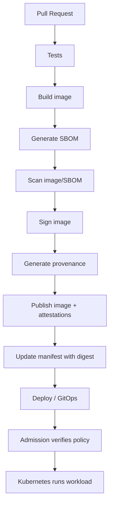

<!-- COURSE_NAV_START -->

[Anterior](<24. Autoscaling, capacidad y eficiencia operativa.md>) | [Indice](README.md) | [Siguiente](<26. Policy as Code y guardrails de plataforma.md>)

<!-- COURSE_NAV_END -->

# 25. Seguridad de la cadena de suministro

## 25.1. Objetivo del módulo

En los módulos anteriores aprendiste a desplegar aplicaciones en Kubernetes, controlar releases, diseñar migraciones compatibles, operar resiliencia, definir SLOs y ajustar capacidad con autoscaling. Este módulo cambia el foco hacia una pregunta igual de importante: cómo sabes que lo que estás desplegando en Kubernetes es realmente lo que crees que estás desplegando.

La seguridad de la cadena de suministro no empieza cuando un Pod ya está ejecutándose. Empieza mucho antes: en el código fuente, las dependencias, los repositorios, los permisos de CI/CD, los runners, los secretos, el build, la imagen de contenedor, el registry, los manifests, las firmas, las evidencias de procedencia, las políticas de admisión y la forma en la que Kubernetes acepta o rechaza workloads. Si cualquiera de esos puntos se debilita, puedes terminar ejecutando una imagen vulnerable, manipulada, construida en un entorno no confiable o desplegada sin trazabilidad.

Kubernetes no puede saber por sí solo si una imagen fue construida desde el commit correcto, si el pipeline fue manipulado, si el tag apunta al digest esperado, si el SBOM existe, si la imagen fue firmada, si las dependencias tienen vulnerabilidades explotables o si alguien introdujo un secreto dentro de la imagen. Kubernetes ejecuta lo que le pides ejecutar. La seguridad de la cadena de suministro consiste en construir controles para que solo llegue al cluster aquello que cumple las condiciones mínimas de confianza.

La tesis del módulo es esta:

> En Kubernetes, no basta con proteger el runtime. También tienes que proteger el camino que convierte código en Pods.

La tesis operacional es esta:

> Una cadena de suministro segura reduce la distancia entre intención, artefacto y ejecución: sabemos qué código se construyó, cómo se construyó, qué contiene, quién lo firmó, qué política lo validó y dónde se está ejecutando.

En este módulo aprenderás:

- Qué es la cadena de suministro de software en Kubernetes
- Qué amenazas aparecen antes de que el Pod exista
- Por qué no basta con escanear imágenes
- Qué diferencia hay entre tag, digest, firma, SBOM y provenance
- Por qué los tags mutables son peligrosos
- Cómo usar digests para despliegues reproducibles
- Cómo diseñar imágenes mínimas y más seguras
- Cómo evitar secretos en imágenes, logs y builds
- Qué aporta un SBOM
- Qué aporta el escaneo de vulnerabilidades
- Qué límites tiene el escaneo
- Qué aporta firmar imágenes
- Qué aporta verificar firmas antes de desplegar
- Qué aporta SLSA como modelo de madurez
- Qué es provenance
- Qué es attestation
- Cómo conectar CI/CD, registry y Kubernetes
- Cómo usar políticas de admisión para bloquear imágenes inseguras
- Qué papel pueden tener ValidatingAdmissionPolicy, Kyverno, Gatekeeper u otros controladores
- Cómo diseñar gates de seguridad sin bloquear delivery de forma irracional
- Cómo responder ante una imagen comprometida
- Cómo automatizar validaciones con Taskfile
- Cómo conectar seguridad de supply chain con SLOs, incident response y software economics
La idea principal es sencilla:

```text
No despliegues en Kubernetes artefactos que no puedes explicar, verificar ni retirar.
```

---

## 25.2. Qué significa supply chain en Kubernetes

La cadena de suministro de software es el recorrido que transforma una intención de cambio en algo ejecutándose en producción. En una aplicación Kubernetes, ese recorrido suele incluir código fuente, dependencias, pipeline, build, imagen de contenedor, registry, manifests, GitOps o CD, admisión en el cluster y finalmente Pods ejecutándose.

```mermaid
flowchart LR
  Source["Código fuente"] --> Dependencies["Dependencias"]
  Dependencies --> CI["CI/CD"]
  CI --> Build["Build"]
  Build --> Image["Imagen"]
  Image --> Registry["Registry"]
  Registry --> Manifest["Manifest / Helm / Kustomize"]
  Manifest --> CD["CD / GitOps"]
  CD --> Admission["Admission control"]
  Admission --> Cluster["Kubernetes"]
  Cluster --> Pod["Pods"]
```



Cada paso puede introducir riesgo. Una dependencia puede estar comprometida, un token de CI puede tener demasiados permisos, una imagen base puede tener vulnerabilidades críticas, un tag puede cambiar después de ser aprobado, un secreto puede quedar grabado en una capa de Docker, un manifest puede usar `latest`, una política de admisión puede no existir o un registry puede permitir sobrescribir artefactos.

El objetivo del módulo no es convertir cada equipo en un equipo de seguridad especializado. El objetivo es que un equipo que despliega en Kubernetes tenga un modelo operacional suficiente para reducir riesgo, detectar problemas y responder cuando algo se compromete.

### Criterio de comprensión

Debes poder explicar:

> La cadena de suministro no es una herramienta. Es el conjunto de pasos, artefactos, permisos y evidencias que conectan código fuente con workloads ejecutándose en Kubernetes.

---

## 25.3. Modelo de amenaza

Antes de añadir herramientas, hay que entender qué amenazas quieres reducir. Sin modelo de amenaza, la seguridad se convierte en una lista de scanners, badges y checks que pueden dar sensación de control sin proteger el flujo real.

En Kubernetes, algunas amenazas relevantes son:

- Dependencia maliciosa o comprometida
- Typosquatting o dependency confusion
- Imagen base vulnerable o manipulada
- Build ejecutado en runner comprometido
- Pipeline con permisos excesivos
- Token de registry filtrado
- Secreto incluido en imagen
- Tag mutable apuntando a una imagen distinta
- Imagen sin firma ni provenance
- Registry que permite sobrescribir artefactos
- Manifest que usa `latest`
- Pull request malicioso que modifica pipeline
- Cache de build contaminada
- Escaneo ignorado o sin criterios claros
- Admisión del cluster sin políticas mínimas
- Workload desplegado desde un origen no aprobado
- Falta de trazabilidad entre commit, imagen y Pod
### Amenaza central del módulo

La amenaza central es esta:

```text
creer que estás ejecutando una cosa
pero Kubernetes ejecuta otra
```

Eso puede ocurrir porque el tag cambió, porque la imagen no se construyó desde el commit esperado, porque el build fue manipulado, porque se desplegó una imagen desde un registry no aprobado o porque el cluster no verifica ninguna evidencia antes de admitir el Pod.

### Criterio de comprensión

Debes poder explicar:

> La seguridad de supply chain reduce la posibilidad de que una imagen no confiable llegue al cluster sin ser detectada o bloqueada.

---

## 25.4. Seguridad de supply chain no es solo escaneo

Escanear imágenes es útil, pero no suficiente. Un scanner puede decirte que una imagen contiene vulnerabilidades conocidas. No te dice por sí solo si la imagen fue construida desde el commit correcto, si el pipeline tenía permisos seguros, si el tag fue reemplazado después de aprobarse, si hay provenance verificable, si el registry es confiable o si Kubernetes debería aceptar esa imagen.

### Lo que sí puede aportar un scanner

- Detectar vulnerabilidades conocidas
- Detectar paquetes del sistema operativo
- Detectar librerías vulnerables
- Detectar secretos en algunos casos
- Generar informes comparables
- Ayudar a priorizar actualizaciones
- Bloquear vulnerabilidades críticas según política
### Lo que no resuelve por sí solo

- Integridad del build
- Procedencia del artefacto
- Identidad del firmante
- Manipulación del pipeline
- Tags mutables
- Permisos excesivos en CI
- Admisión en Kubernetes
- Excepciones mal gestionadas
- Riesgo real de explotación
- Trazabilidad completa commit-imagen-Pod
### Criterio de comprensión

Debes poder explicar:

> El escaneo responde “qué se sabe que contiene esta imagen”. La supply chain segura también necesita responder “de dónde viene, quién la construyó, cómo se construyó y por qué Kubernetes debería aceptarla”.

---

## 25.5. Tag, digest, firma, SBOM y provenance

Estos conceptos se confunden mucho. Conviene separarlos desde el principio.

| Concepto    | Qué responde                              | Ejemplo                       |
| ----------- | ----------------------------------------- | ----------------------------- |
| Tag         | nombre humano o versión mutable           | `checkout-api:1.8.0`          |
| Digest      | identidad inmutable del contenido         | `sha256:abc...`               |
| Firma       | quién afirma haber firmado el artefacto   | cosign signature              |
| SBOM        | qué componentes contiene                  | paquetes y dependencias       |
| Provenance  | cómo, dónde y desde qué se construyó      | commit, builder, workflow     |
| Attestation | afirmación verificable sobre un artefacto | SBOM, provenance, test result |

Un tag es cómodo para humanos, pero puede cambiar. Un digest identifica contenido exacto. Una firma ayuda a verificar integridad e identidad. Un SBOM ayuda a entender composición. Provenance ayuda a trazar el proceso de build. Una attestation permite asociar evidencias verificables a un artefacto.

### Criterio de comprensión

Debes poder explicar:

> El tag nombra, el digest identifica, la firma verifica, el SBOM describe y la provenance explica el origen.

---

## 25.6. Tags mutables y digests

En Kubernetes puedes referenciar imágenes por tag:

```yaml
image: ghcr.io/acme/checkout-api:1.8.0
```

También puedes referenciarlas por digest:

```yaml
image: ghcr.io/acme/checkout-api@sha256:abc123...
```

El problema de los tags es que pueden ser mutables. Aunque tu equipo trate `1.8.0` como si fuera inmutable, el registry puede permitir que alguien publique otra imagen con el mismo tag. Si eso ocurre, dos despliegues con el mismo manifest podrían terminar ejecutando contenidos distintos.

### Tag + digest

Una práctica útil es mantener el tag para legibilidad y fijar el digest para identidad exacta:

```yaml
image: ghcr.io/acme/checkout-api:1.8.0@sha256:abc123...
```

Así el lector entiende la versión humana y Kubernetes resuelve el contenido exacto.

### Por qué importa en incident response

Durante un incidente, necesitas responder:

```text
¿Qué imagen exacta está corriendo?
¿Qué commit la produjo?
¿Qué pipeline la construyó?
¿Qué SBOM tenía?
¿Qué firma tenía?
¿Qué vulnerabilidades se conocían en ese momento?
```

Si solo tienes tags mutables, esa investigación se vuelve mucho más débil.

### Criterio de comprensión

Debes poder explicar:

> Un tag ayuda a leer una versión. Un digest permite saber qué contenido exacto se ejecutó.

---

## 25.7. Política de imágenes para Kubernetes

Un curso profesional no debería enseñar manifests que despliegan imágenes sin criterio. La política mínima debería definir de dónde pueden venir las imágenes, cómo se nombran, cómo se versionan, cómo se fijan, cómo se escanean, cómo se firman y cómo se admiten en el cluster.

### Política mínima recomendada

Para workloads de producción:

- No usar `latest`
- No usar imágenes sin registry explícito
- No usar imágenes desde registries personales
- Preferir digests para despliegues
- Usar tags únicos por release o commit
- Firmar imágenes
- Generar SBOM
- Generar provenance cuando sea posible
- Escanear antes de publicar o antes de desplegar
- Bloquear vulnerabilidades críticas según política
- Bloquear imágenes sin firma en entornos sensibles
- Mantener trazabilidad commit → imagen → digest → deployment
- Retener artefactos y evidencias durante una ventana definida
- Revocar o bloquear imágenes comprometidas
### Ejemplo de policy humana

```md
# Image policy: checkout-api

## Registries allowed

- ghcr.io/acme
- registry.internal.example.com/shop

## Tagging

- No latest.
- Release tags must be immutable.
- Every production deployment must pin digest.

## Build evidence

- SBOM required.
- Vulnerability scan required.
- Signature required.
- Provenance required for production.

## Admission

Production clusters must reject:

- images without digest
- images from unapproved registries
- images with latest tag
- unsigned images
- images with critical vulnerabilities without exception
```

### Criterio de comprensión

Debes poder explicar:

> Una política de imágenes convierte decisiones implícitas en reglas verificables antes de que Kubernetes ejecute algo.

---

## 25.8. Imágenes mínimas y superficie de ataque

Una imagen de contenedor debería contener lo necesario para ejecutar la aplicación, no todo lo que era cómodo durante el build. Cuanto más contiene una imagen, más superficie de ataque, más vulnerabilidades potenciales, más peso, más tiempo de descarga, más coste de almacenamiento y más ruido en escaneos.

### Prácticas recomendadas

- Usar multi-stage builds
- Separar build image y runtime image
- Evitar herramientas de build en runtime
- Ejecutar como usuario no root
- Usar imágenes base mantenidas
- Reducir paquetes innecesarios
- No instalar shells si no son necesarios
- No copiar tests, caches o documentación innecesaria
- No copiar `.git`
- No copiar ficheros `.env`
- No incluir secretos
- Usar `.dockerignore`
- Preferir imágenes pequeñas, pero no a costa de perder mantenibilidad
### Ejemplo didáctico para checkout-api

```Dockerfile
FROM node:20-alpine AS dependencies

WORKDIR /app

COPY package.json package-lock.json ./

RUN npm ci --omit=dev

FROM node:20-alpine AS runtime

WORKDIR /app

ENV NODE_ENV=production

COPY --from=dependencies /app/node_modules ./node_modules
COPY src ./src
COPY package.json ./

RUN addgroup -S app && adduser -S app -G app
USER app

EXPOSE 8080

CMD ["node", "src/server.js"]
```

Este ejemplo es didáctico. En producción puedes valorar imágenes distroless, imágenes mantenidas por tu organización o bases endurecidas, pero el criterio sigue siendo el mismo: minimizar runtime sin perder trazabilidad ni capacidad operativa.

### Criterio de comprensión

Debes poder explicar:

> Una imagen de runtime no debería arrastrar herramientas, secretos o dependencias que solo eran necesarias para construir.

---

## 25.9. Secretos en builds e imágenes

Uno de los errores más graves es introducir secretos en el proceso de build de forma que queden persistidos en capas, logs o caches. Un secreto usado durante `docker build` puede quedar expuesto aunque después borres el fichero en una capa posterior, porque las capas anteriores pueden conservarlo.

### Lugares donde se filtran secretos

- Dockerfile
- Build args
- `.npmrc`
- `.env`
- Logs de CI
- Cache de build
- Capas intermedias
- Test fixtures
- Ficheros copiados por error
- Scripts de instalación
- ConfigMaps mal usados
- Manifests en Git
### Regla

No metas secretos en la imagen.

Si necesitas secretos para descargar dependencias privadas, usa mecanismos seguros del builder o del CI, evita logs sensibles y asegúrate de que el secreto no queda en capas ni artefactos.

### .dockerignore recomendado

```text
.git
node_modules
.env
.env.*
*.pem
*.key
*.crt
coverage
dist
tmp
npm-debug.log
Dockerfile.local
```

### Criterio de comprensión

Debes poder explicar:

> Borrar un secreto después de copiarlo en una imagen no significa que nunca haya quedado en la imagen.

---

## 25.10. Dependencias y lockfiles

Las dependencias son parte de la cadena de suministro. Una aplicación puede tener código propio pequeño y una superficie real enorme por sus dependencias directas y transitivas. Por eso, no basta con revisar tu código. También necesitas controlar cómo entran, se actualizan y se validan las dependencias.

### Prácticas mínimas

- Usar lockfiles
- Revisar cambios en lockfiles
- Automatizar actualizaciones con Dependabot, Renovate u otra herramienta
- Separar actualizaciones menores de mayores cuando tenga sentido
- Ejecutar tests con cada actualización
- Escanear dependencias
- Revisar paquetes abandonados
- Evitar dependencias innecesarias
- Evitar scripts de instalación no confiables cuando sea posible
- Tener política para vulnerabilidades críticas
- Mantener lista de dependencias críticas del runtime
### Dependency confusion

Dependency confusion ocurre cuando un build resuelve una dependencia desde un origen no esperado, por ejemplo un registry público en vez de un registry privado. Esto puede permitir que un atacante publique un paquete con el mismo nombre o una versión más alta en el registry público y el build lo consuma.

### Criterio de comprensión

Debes poder explicar:

> Cada dependencia es código que ejecutas o empaquetas. Debe entrar al sistema con control, trazabilidad y actualización segura.

---

## 25.11. CI/CD como parte crítica de la supply chain

El pipeline de CI/CD tiene mucho poder. Puede leer código, ejecutar scripts, crear imágenes, publicar en registries, firmar artefactos, modificar manifests, desplegar en entornos y acceder a secretos. Por eso, comprometer CI/CD suele ser más grave que comprometer una máquina de desarrollo aislada.

### Riesgos habituales

- Tokens con permisos excesivos
- Secretos disponibles en pull requests no confiables
- Runners compartidos sin aislamiento suficiente
- Workflows modificables sin revisión
- Acciones de terceros sin pinning
- Scripts que ejecutan código no confiable
- Caches contaminables
- Builds no reproducibles
- Falta de separación entre build y deploy
- Deploy desde ramas no protegidas
- Falta de aprobación para producción
- OIDC mal configurado
- Permisos de escritura innecesarios
### Prácticas recomendadas

- Usar ramas protegidas
- Requerir revisión para cambios de pipeline
- Usar permisos mínimos en tokens
- Usar OIDC en vez de secretos cloud de larga duración cuando sea posible
- Separar build, sign, publish y deploy
- Pinnear acciones por commit o versión confiable
- Evitar ejecutar secretos en PRs no confiables
- Proteger runners
- Rotar credenciales
- Auditar accesos
- Guardar provenance y logs de build
- Usar entornos con aprobación para producción
### Criterio de comprensión

Debes poder explicar:

> Si el pipeline puede publicar y desplegar imágenes, entonces el pipeline es parte de tu perímetro de producción.

---

## 25.12. SBOM

Un SBOM, Software Bill of Materials, describe los componentes que forman un artefacto. En una imagen de contenedor puede incluir paquetes del sistema operativo, librerías de aplicación, versiones, hashes y relaciones entre componentes.

### Qué aporta

- Inventario de componentes
- Respuesta más rápida ante CVEs
- Trazabilidad de dependencias
- Comparación entre versiones
- Evidencia para auditoría
- Entrada para scanners
- Base para análisis de impacto
### Qué no aporta por sí solo

- No garantiza que el build sea confiable
- No garantiza que no haya vulnerabilidades
- No garantiza que la imagen esté firmada
- No garantiza que Kubernetes deba admitir la imagen
- No garantiza que el runtime esté seguro
### Ejemplo con Syft

```bash
syft ghcr.io/acme/checkout-api:1.8.0 -o cyclonedx-json > sbom.cyclonedx.json
```

### Criterio de comprensión

Debes poder explicar:

> Un SBOM no hace segura una imagen. Hace visible su composición para poder analizar, auditar y responder.

---

## 25.13. Escaneo de vulnerabilidades

El escaneo de vulnerabilidades compara los componentes detectados contra bases de datos de vulnerabilidades conocidas. Puede ejecutarse sobre repositorios, dependencias, imágenes, ficheros SBOM o manifests.

### Herramientas habituales

- Trivy
- Grype
- Snyk
- Docker Scout
- GitHub Dependabot
- GitLab Dependency Scanning
- Herramientas del registry
- Herramientas comerciales
### Ejemplo con Trivy

```bash
trivy image --severity HIGH,CRITICAL ghcr.io/acme/checkout-api:1.8.0
```

### Ejemplo con Grype sobre SBOM

```bash
grype sbom:sbom.cyclonedx.json
```

### Criterios de decisión

No todas las vulnerabilidades tienen el mismo riesgo real. Para priorizar, mira:

- Severidad
- Explotabilidad
- Alcance
- Si está en runtime o solo build
- Si el paquete vulnerable se usa realmente
- Si hay fix disponible
- Si hay mitigación
- Si el servicio es expuesto públicamente
- Si hay compensating controls
- Si afecta a un flujo crítico
- Si el error budget o riesgo actual permite asumir excepción
### Criterio de comprensión

Debes poder explicar:

> Escanear es detectar. Gestionar vulnerabilidades exige priorizar, corregir, mitigar o aceptar riesgo con criterio explícito.

---

## 25.14. Falsos positivos, falsos negativos y excepciones

Un scanner puede producir ruido. También puede no detectar problemas. Por eso, una política madura no trata el output del scanner como verdad absoluta, sino como evidencia dentro de un proceso de decisión.

### Falsos positivos

Puede aparecer una vulnerabilidad en un paquete que no se usa, en una ruta no ejecutable, en una capa de build que no llega al runtime o en una versión mal identificada.

### Falsos negativos

Puede existir una vulnerabilidad no conocida, una configuración insegura, una dependencia maliciosa sin CVE, un secreto filtrado o un comportamiento inseguro que el scanner no detecta.

### Excepciones

Una excepción debe tener:

- Vulnerabilidad o regla afectada
- Servicio afectado
- Motivo
- Mitigación
- Dueño
- Fecha de expiración
- Evidencia
- Aprobación
- Plan de eliminación
### Ejemplo

```md
# Security exception

## Finding

CVE-XXXX-YYYY in package zlib.

## Affected artifact

ghcr.io/acme/checkout-api@sha256:abc123

## Reason

No fixed version available. Package present in base image but not reachable by runtime path used by checkout-api.

## Mitigation

Network exposure limited. Runtime does not use affected binary. Monitoring enabled.

## Owner

checkout-team

## Expires

2026-08-01

## Removal plan

Update base image when fixed version is released.
```

### Criterio de comprensión

Debes poder explicar:

> Una excepción sin expiración no es gestión de riesgo. Es deuda de seguridad.

---

## 25.15. Firma de imágenes

Firmar una imagen permite asociar una identidad criptográfica al artefacto. La firma ayuda a verificar que la imagen fue firmada por una identidad esperada y que no fue modificada desde entonces.

### Ejemplo con cosign

```bash
cosign sign ghcr.io/acme/checkout-api@sha256:abc123
```

### Verificación

```bash
cosign verify ghcr.io/acme/checkout-api@sha256:abc123
```

En entornos profesionales, la verificación debe comprobar identidad, issuer, políticas de confianza y condiciones del entorno. No basta con que “exista una firma”; debes saber quién firmó y si esa identidad es aceptable para producción.

### Qué aporta

- Integridad del artefacto
- Identidad del firmante
- Base para políticas de admisión
- Evidencia para auditoría
- Mejor respuesta ante manipulación
### Qué no aporta por sí solo

- No garantiza ausencia de vulnerabilidades
- No garantiza buen código
- No garantiza configuración segura
- No garantiza que el build sea correcto
- No garantiza que la imagen deba desplegarse en cualquier entorno
### Criterio de comprensión

Debes poder explicar:

> Una firma no dice que una imagen sea buena. Dice que una identidad confiable firmó ese contenido exacto.

---

## 25.16. Provenance y attestations

Provenance describe cómo se construyó un artefacto. Puede incluir repositorio, commit, workflow, builder, parámetros de build, materiales de entrada y entorno. Una attestation es una afirmación verificable asociada a un artefacto, por ejemplo que existe un SBOM, que se ejecutaron tests, que se generó provenance o que el build ocurrió en un runner determinado.

### Ejemplos de preguntas que responde provenance

- ¿Desde qué commit se construyó esta imagen?
- ¿Qué workflow la construyó?
- ¿Qué builder se usó?
- ¿Qué dependencias o materiales entraron?
- ¿Qué identidad generó el artefacto?
- ¿Se construyó en un entorno esperado?
- ¿El build fue reproducible o al menos trazable?
- ¿Qué parámetros se usaron?
### Relación con SLSA

SLSA proporciona un marco para mejorar la integridad de artefactos y la resistencia frente a manipulación en la cadena de suministro. Para este módulo, lo importante no es memorizar niveles, sino entender la dirección de mejora: generar provenance, usar builders más confiables, reducir manipulación manual, endurecer pipelines y verificar evidencias antes de consumir artefactos.

### Criterio de comprensión

Debes poder explicar:

> Provenance conecta un artefacto con el proceso que lo produjo. Sin provenance, una imagen puede ser escaneada y firmada, pero seguir teniendo una historia incompleta.

---

## 25.17. SLSA como mapa de madurez

SLSA, Supply-chain Levels for Software Artifacts, es útil como mapa para pensar controles de supply chain. No debe usarse como decoración documental. Su valor está en orientar mejoras concretas sobre build, provenance, integridad y confianza.

### Lectura práctica para el curso

| Pregunta                                   | Mejora asociada                     |
| ------------------------------------------ | ----------------------------------- |
| ¿Existe provenance?                        | generar evidencia del build         |
| ¿El build ocurre en plataforma gestionada? | reducir manipulación local          |
| ¿El build está endurecido?                 | reducir riesgo de tampering         |
| ¿La provenance se verifica?                | no aceptar artefactos sin evidencia |
| ¿El consumidor exige controles?            | admission policy o gate de CD       |

### Cómo aplicarlo sin burocracia

Para `checkout-api`, una evolución razonable puede ser:

1. Build reproducible desde CI
2. Imagen publicada por pipeline protegido
3. Digest capturado en release
4. SBOM generado
5. Vulnerability scan ejecutado
6. Imagen firmada
7. Provenance generada
8. Manifest usa digest
9. Admisión verifica registry, digest y firma
10. Producción rechaza artefactos sin evidencias mínimas
### Criterio de comprensión

Debes poder explicar:

> SLSA no es un badge. Es un mapa para reducir manipulación y aumentar trazabilidad en el camino de build a consumo.

---

## 25.18. Registry como frontera de confianza

El registry no es solo un almacén de imágenes. Es una frontera de confianza entre build y runtime. Si el registry permite sobrescribir tags, publicar sin control, borrar evidencias o mezclar imágenes personales con producción, la cadena de suministro se debilita.

### Política recomendada de registry

- Repositorios separados por entorno o criticidad
- Inmutabilidad de tags cuando sea posible
- Retención definida
- Control de permisos
- Publicación solo desde CI/CD
- Escaneo integrado si está disponible
- Acceso de lectura limitado por entorno
- Auditoría de pushes y deletes
- Bloqueo de imágenes comprometidas
- Replicación o mirror si aplica
- Asociación de SBOM, firma y provenance al digest
### Criterio de comprensión

Debes poder explicar:

> El registry es parte de producción. Si cualquiera puede publicar o reemplazar imágenes, Kubernetes puede terminar ejecutando contenido no confiable.

---

## 25.19. Kubernetes admission control

Admission control es el punto en el que Kubernetes puede aceptar o rechazar objetos antes de persistirlos o ejecutarlos. Para supply chain, es una pieza clave porque permite bloquear manifests que no cumplen políticas mínimas.

### Qué puede bloquear una política de admisión

- Imágenes sin digest
- Imágenes con `latest`
- Imágenes desde registries no aprobados
- Workloads sin labels de trazabilidad
- Pods que corren como root
- Contenedores privileged
- Imágenes sin firma, si usas un controlador capaz de verificar firmas
- Manifests sin owner o sin metadata requerida
- Workloads que no cumplen políticas de seguridad
- Deployments que usan namespaces no permitidos
### Herramientas posibles

- ValidatingAdmissionPolicy con CEL para reglas declarativas simples
- Kyverno para políticas Kubernetes-native y mutación/validación/generación
- OPA Gatekeeper para políticas basadas en Rego
- Controladores específicos de verificación de imágenes
- Webhooks propios, si hay una necesidad fuerte y capacidad de mantenerlos
- Ratify u otras integraciones de verificación, según entorno
### Criterio de comprensión

Debes poder explicar:

> Admission control convierte reglas de supply chain en una frontera del cluster: si no cumple, no entra.

---

## 25.20. ValidatingAdmissionPolicy para reglas simples

ValidatingAdmissionPolicy permite definir reglas de validación declarativas usando CEL. Es útil para algunas políticas simples que no necesitan llamadas externas.

### Ejemplo: bloquear latest

```yaml
apiVersion: admissionregistration.k8s.io/v1
kind: ValidatingAdmissionPolicy
metadata:
  name: disallow-latest-images
spec:
  failurePolicy: Fail
  matchConstraints:
    resourceRules:
      - apiGroups: [""]
        apiVersions: ["v1"]
        operations: ["CREATE", "UPDATE"]
        resources: ["pods"]
  validations:
    - expression: "object.spec.containers.all(c, !c.image.endsWith(':latest'))"
      message: "Images must not use the latest tag."
```

### Binding

```yaml
apiVersion: admissionregistration.k8s.io/v1
kind: ValidatingAdmissionPolicyBinding
metadata:
  name: disallow-latest-images
spec:
  policyName: disallow-latest-images
  validationActions: ["Deny"]
```

Este ejemplo es didáctico. En producción debes considerar init containers, ephemeral containers, excepciones, namespaces, mensajes de error, auditoría, dry-run, compatibilidad con tus workloads y estrategia de rollout de la política.

### Criterio de comprensión

Debes poder explicar:

> ValidatingAdmissionPolicy sirve bien para reglas declarativas simples dentro del API server, pero no sustituye herramientas especializadas para verificar firmas o consultar sistemas externos.

---

## 25.21. Políticas con Kyverno o Gatekeeper

Kyverno y Gatekeeper permiten expresar políticas más amplias sobre recursos Kubernetes. La elección depende del ecosistema, el equipo y la forma de operar políticas.

### Ejemplo conceptual con Kyverno: exigir digest

```yaml
apiVersion: kyverno.io/v1
kind: ClusterPolicy
metadata:
  name: require-image-digest
spec:
  validationFailureAction: Enforce
  rules:
    - name: require-digest
      match:
        any:
          - resources:
              kinds:
                - Pod
      validate:
        message: "Images must be pinned by digest."
        pattern:
          spec:
            containers:
              - image: "*@sha256:*"
```

### Ejemplo conceptual con Gatekeeper

```yaml
apiVersion: templates.gatekeeper.sh/v1
kind: ConstraintTemplate
metadata:
  name: k8srequiredimagedigest
spec:
  crd:
    spec:
      names:
        kind: K8sRequiredImageDigest
  targets:
    - target: admission.k8s.gatekeeper.sh
      rego: |
        package k8srequiredimagedigest

        violation[{"msg": msg}] {
          container := input.review.object.spec.containers[_]
          not contains(container.image, "@sha256:")
          msg := sprintf("container %v must use image digest", [container.name])
        }
```

Estos ejemplos enseñan la intención. En un entorno real, las políticas deben cubrir init containers, namespaces de sistema, excepciones controladas, modo audit antes de enforce y pruebas de compatibilidad.

### Criterio de comprensión

Debes poder explicar:

> Las políticas deben introducirse como producto interno: con pruebas, modo audit, excepciones, documentación y ownership.

---

## 25.22. Verificación de firmas en Kubernetes

Firmar imágenes es útil, pero el valor real aparece cuando el entorno que consume la imagen verifica la firma. Si firmas en CI pero Kubernetes admite cualquier imagen sin comprobar nada, la firma es evidencia pasiva, no control activo.

### Estrategia de verificación

Una estrategia completa puede incluir:

1. CI construye imagen
2. CI genera SBOM
3. CI escanea
4. CI firma imagen
5. CI genera provenance
6. CD actualiza manifest con digest
7. Admission controller verifica firma y condiciones
8. Kubernetes admite solo imágenes confiables
9. Runtime mantiene trazabilidad de digest y versión
### Preguntas de política

- ¿Qué identidad puede firmar imágenes de producción?
- ¿Qué issuer OIDC es confiable?
- ¿Qué repositorios pueden producir imágenes?
- ¿Qué registries son permitidos?
- ¿Qué namespaces exigen firma?
- ¿Qué ocurre en desarrollo?
- ¿Cómo se gestionan excepciones?
- ¿Qué pasa si la verificación falla?
- ¿Cómo se hace rollback si una imagen firmada resulta vulnerable?
- ¿Qué logs o auditoría quedan?
### Criterio de comprensión

Debes poder explicar:

> Firmar sin verificar en el punto de consumo reduce el valor operativo de la firma.

---

## 25.23. Trazabilidad commit-imagen-Pod

Durante una investigación necesitas conectar lo que corre en Kubernetes con el cambio que lo produjo. Para eso, los workloads deben llevar labels y annotations útiles.

### Labels recomendadas

```yaml
metadata:
  labels:
    app.kubernetes.io/name: checkout-api
    app.kubernetes.io/component: api
    app.kubernetes.io/part-of: shop
    app.kubernetes.io/version: "1.8.0"
```

### Annotations útiles

```yaml
metadata:
  annotations:
    app.acme.io/git-commit: "abc123"
    app.acme.io/image-digest: "sha256:abc123..."
    app.acme.io/build-url: "https://github.com/acme/shop/actions/runs/123"
    app.acme.io/sbom: "oci://ghcr.io/acme/checkout-api@sha256:abc123"
    app.acme.io/provenance: "oci://ghcr.io/acme/checkout-api@sha256:abc123"
```

No todo tiene que estar en annotations si hay sistemas mejores para consultarlo, pero la intención es clara: desde un Pod deberías poder llegar al digest, al build y al commit.

### Criterio de comprensión

Debes poder explicar:

> Trazabilidad significa poder responder rápidamente qué código, build e imagen están detrás de un Pod.

---

## 25.24. CI/CD seguro para checkout-api

Un pipeline de `checkout-api` debería producir artefactos y evidencias, no solo una imagen.

### Flujo recomendado



### Gates mínimos

- Tests pasan
- Imagen se construye desde rama protegida o commit aprobado
- SBOM generado
- Escaneo sin findings bloqueantes
- Firma generada por identidad esperada
- Provenance generada
- Manifest usa digest
- CD despliega desde fuente controlada
- Admission valida reglas mínimas
### Criterio de comprensión

Debes poder explicar:

> Un pipeline seguro no solo produce una imagen. Produce evidencia verificable para decidir si esa imagen puede llegar a Kubernetes.

---

## 25.25. Ejemplo de workflow conceptual

Este ejemplo es conceptual y debe adaptarse a tu CI real. La intención es mostrar la secuencia de validaciones.

```yaml
name: checkout-api-supply-chain

on:
  push:
    branches:
      - main

permissions:
  contents: read
  packages: write
  id-token: write
  security-events: write

jobs:
  build:
    runs-on: ubuntu-latest

    steps:
      - name: Checkout
        uses: actions/checkout@v4

      - name: Build image
        run: |
          docker build -t ghcr.io/acme/checkout-api:${GITHUB_SHA} .

      - name: Scan image
        run: |
          trivy image --severity HIGH,CRITICAL --exit-code 1 ghcr.io/acme/checkout-api:${GITHUB_SHA}

      - name: Generate SBOM
        run: |
          syft ghcr.io/acme/checkout-api:${GITHUB_SHA} -o cyclonedx-json > sbom.cyclonedx.json

      - name: Push image
        run: |
          docker push ghcr.io/acme/checkout-api:${GITHUB_SHA}

      - name: Resolve digest
        run: |
          docker buildx imagetools inspect ghcr.io/acme/checkout-api:${GITHUB_SHA}

      - name: Sign image
        run: |
          cosign sign ghcr.io/acme/checkout-api:${GITHUB_SHA}
```

### Cuidado

No copies este workflow sin adaptarlo. En un entorno real debes configurar login al registry, instalación de herramientas, pinning de acciones, permisos mínimos, verificación de identidades, generación de provenance, gestión de SBOM como attestation y actualización de manifests por digest.

### Criterio de comprensión

Debes poder explicar:

> Un workflow de supply chain debe ser diseñado como parte de producción, no como script auxiliar sin controles.

---

## 25.26. GitOps y supply chain

GitOps puede mejorar trazabilidad porque separa build de deployment y deja el estado deseado en Git. Pero GitOps no hace segura la cadena de suministro por sí solo. Si el manifest en Git referencia un tag mutable, si el registry permite reemplazar imágenes o si el cluster no verifica políticas, GitOps solo reproducirá de forma consistente una decisión débil.

### Buenas prácticas con GitOps

- Manifests con digest
- PR para cambios de imagen
- Trazabilidad a build
- Argo CD o Flux desplegando desde repositorio controlado
- Diferenciar repositorio de aplicación y repositorio de manifests si aplica
- Políticas de admisión en cluster
- Firma de commits o revisión obligatoria si aplica
- Registro de quién aprobó la promoción
- Rollback entendido como cambio de estado deseado, no como magia
### Criterio de comprensión

Debes poder explicar:

> GitOps mejora trazabilidad del estado deseado, pero necesita artefactos verificables y políticas de admisión para cerrar el ciclo.

---

## 25.27. Política gradual: audit antes de enforce

Una política de seguridad introducida de golpe puede bloquear equipos, romper despliegues y generar bypasses informales. Muchas políticas deberían empezar en modo audit, producir evidencia, corregir violaciones y solo después pasar a enforce.

### Estrategia gradual

1. Definir política
2. Ejecutar en CI
3. Ejecutar en cluster en modo audit
4. Medir violaciones
5. Corregir workloads
6. Definir excepciones temporales
7. Pasar a enforce en entornos no críticos
8. Pasar a enforce en producción
9. Revisar periódicamente
### Ejemplo

Primero, detecta imágenes con `latest`.

Después, bloquea `latest` en nuevos Deployments.

Más adelante, exige digest.

Finalmente, exige firma y registry aprobado.

### Criterio de comprensión

Debes poder explicar:

> Una política que nadie puede cumplir genera bypasses. Una política gradual crea adopción, aprendizaje y enforcement realista.

---

## 25.28. Seguridad como restricción económica

La seguridad de supply chain tiene coste. Añade herramientas, checks, esperas, mantenimiento, excepciones, formación y posibles bloqueos. Pero no tenerla también tiene coste: incidentes, despliegues comprometidos, pérdida de confianza, rollback complejo, exposición de secretos, incumplimientos, interrupciones y trabajo reactivo.

La pregunta económica no es si la seguridad “ralentiza”. La pregunta es qué riesgo reduce, qué coste introduce y si el control está colocado en el punto correcto del sistema. Un scanner que genera ruido y no bloquea nada importante puede ser coste sin protección suficiente. Una política de admisión que bloquea imágenes sin digest puede ser barata y muy efectiva. Firmar imágenes sin verificarlas en el cluster aporta menos valor que firmar y verificar en el punto de consumo.

### Decisiones económicas

| Decisión                   | Coste                            | Beneficio                   |
| -------------------------- | -------------------------------- | --------------------------- |
| Usar digests               | cambio en pipeline/manifests     | despliegues reproducibles   |
| Generar SBOM               | tiempo de build y almacenamiento | respuesta rápida a CVEs     |
| Escanear imágenes          | tiempo y gestión de ruido        | detección temprana          |
| Firmar imágenes            | integración y claves/identidad   | integridad y confianza      |
| Verificar en admission     | operación de políticas           | bloqueo antes de ejecución  |
| Provenance                 | complejidad de pipeline          | trazabilidad build-artifact |
| Excepciones con expiración | administración                   | riesgo controlado           |

### Criterio de comprensión

Debes poder explicar:

> La seguridad efectiva no es añadir todos los controles posibles. Es colocar controles verificables donde reducen más riesgo con menor fricción sistémica.

---

## 25.29. Observabilidad y auditoría de supply chain

La seguridad de supply chain también necesita observabilidad. Si una política bloquea un deployment, si una imagen no tiene firma, si un scanner encuentra una vulnerabilidad crítica o si un registry recibe un push inesperado, necesitas señales.

### Señales útiles

- Imagen desplegada por digest
- Digest actualmente ejecutado por Pod
- Build URL asociado
- Commit asociado
- Firma presente o ausente
- SBOM presente o ausente
- Resultado de escaneo
- Violaciones de política
- Rechazos de admission
- Excepciones activas
- Imágenes desde registries no aprobados
- Uso de `latest`
- Workloads sin metadata
- Pushes al registry
- Cambios en manifests
- Rollouts recientes
- Pods ejecutando imágenes revocadas
### Dashboards útiles

Un dashboard de supply chain no debería mostrar solo número de CVEs. Debería ayudar a responder:

- ¿Qué imágenes corren en producción?
- ¿Qué digests están activos?
- ¿Qué servicios no tienen SBOM?
- ¿Qué servicios no tienen firma?
- ¿Qué vulnerabilidades críticas están desplegadas?
- ¿Qué excepciones están activas?
- ¿Qué workloads usan tags mutables?
- ¿Qué políticas están bloqueando despliegues?
- ¿Qué imágenes vienen de registries no aprobados?
### Criterio de comprensión

Debes poder explicar:

> Supply chain security también necesita señales operativas. Si no puedes ver qué corre y qué evidencia tiene, no puedes gobernarlo.

---

## 25.30. Incident response ante imagen comprometida

Si descubres que una imagen desplegada está comprometida o contiene una vulnerabilidad crítica explotable, el proceso se parece a un incidente de producción, pero con preguntas específicas de supply chain.

### Preguntas iniciales

- ¿Qué digest está afectado?
- ¿Qué servicios lo ejecutan?
- ¿En qué namespaces?
- ¿Desde cuándo?
- ¿Qué commit lo produjo?
- ¿Qué pipeline lo construyó?
- ¿Qué vulnerabilidad o compromiso existe?
- ¿Hay explotación activa?
- ¿Hay secretos expuestos?
- ¿Hay imágenes derivadas?
- ¿Hay tags que apuntan al mismo digest?
- ¿Hay SBOM y provenance?
- ¿La imagen fue firmada?
- ¿Qué política permitió que entrara?
- ¿Hay que bloquear el digest?
### Mitigaciones posibles

- Bloquear digest en admission
- Retirar o revocar tag
- Publicar imagen corregida
- Roll forward a imagen segura
- Rollback solo si la imagen anterior es segura
- Rotar secretos si hubo exposición
- Invalidar credenciales de CI/CD
- Pausar deployments
- Revisar runners
- Revisar logs de registry
- Revisar quién más usa la base vulnerable
- Crear excepción solo si hay mitigación clara y expiración
### Criterio de comprensión

Debes poder explicar:

> Ante una imagen comprometida, el digest afectado es la unidad de investigación y contención.

---

## 25.31. Manifiestos y estructura del módulo

Estructura recomendada:

```text
k8s/supply-chain/
  validating-admission-policy-disallow-latest.yaml
  validating-admission-policy-require-approved-registry.yaml
  validating-admission-policy-binding.yaml
  kyverno-require-digest.yaml

docs/supply-chain/
  image-policy.md
  security-exception-template.md
  compromised-image-runbook.md

scripts/
  check-no-latest.sh
  check-digests.sh
  scan-image.sh
  generate-sbom.sh
  sign-image.sh
  verify-image.sh
```

### docs/supply-chain/image-policy.md

```md
# Image policy

## Allowed registries

- ghcr.io/acme
- registry.internal.example.com/shop

## Production requirements

- No latest tag.
- Image digest required.
- SBOM required.
- Vulnerability scan required.
- Signature required.
- Provenance required.
- Build must run in protected CI.
- Deployment must happen through GitOps or approved CD.

## Exceptions

Exceptions must include:

- owner
- reason
- mitigation
- expiration date
- approval
```

### docs/supply-chain/compromised-image-runbook.md

````md
# Runbook: compromised image

## First questions

- What digest is affected?
- What services run it?
- What namespaces run it?
- What build produced it?
- Is there active exploitation?
- Are secrets exposed?

## First commands
```bash
kubectl get pods -A -o jsonpath='{range .items[*]}{.metadata.namespace}{" "}{.metadata.name}{" "}{range .spec.containers[*]}{.image}{" "}{end}{"\n"}{end}'
kubectl get deploy -A -o yaml
```
````

## Mitigations

- Block digest in admission policy
- Deploy patched image
- Rollback only if previous digest is safe
- Rotate secrets if exposure is possible
- Pause rollout if active
- Review registry logs
- Review CI logs
````

### Criterio de comprensión

Debes poder explicar:

> La documentación de supply chain debe ser operativa: política, excepción y runbook.

---

## 25.32. Taskfile para supply chain

Añade tareas:
```yaml
supply-chain:check:no-latest:
  desc: Fail if Kubernetes manifests use latest tag
  cmds:
    - |
      if grep -R "image: .*:latest" k8s; then
        echo "latest tag is not allowed"
        exit 1
      fi

supply-chain:check:digests:
  desc: Check that production manifests use image digests
  cmds:
    - |
      if grep -R "image: " k8s/production | grep -v "@sha256:"; then
        echo "production images must be pinned by digest"
        exit 1
      fi

supply-chain:sbom:
  desc: Generate SBOM for checkout-api image. Usage IMAGE=... task supply-chain:sbom
  cmds:
    - syft {{.IMAGE}} -o cyclonedx-json > sbom.cyclonedx.json
supply-chain:scan:
  desc: Scan checkout-api image. Usage IMAGE=... task supply-chain:scan
  cmds:
    - trivy image --severity HIGH,CRITICAL {{.IMAGE}}
supply-chain:scan:strict:
  desc: Strict scan checkout-api image. Usage IMAGE=... task supply-chain:scan:strict
  cmds:
    - trivy image --severity CRITICAL --exit-code 1 {{.IMAGE}}
supply-chain:sign:
  desc: Sign image with cosign. Usage IMAGE=... task supply-chain:sign
  cmds:
    - cosign sign {{.IMAGE}}
supply-chain:verify:
  desc: Verify image signature with cosign. Usage IMAGE=... task supply-chain:verify
  cmds:
    - cosign verify {{.IMAGE}}
supply-chain:admission:apply:no-latest:
  desc: Apply ValidatingAdmissionPolicy to disallow latest
  cmds:
    - kubectl apply -f k8s/supply-chain/validating-admission-policy-disallow-latest.yaml
    - kubectl apply -f k8s/supply-chain/validating-admission-policy-binding.yaml
supply-chain:images:running:
  desc: List images running in the cluster
  cmds:
    - |
      kubectl get pods -A -o jsonpath='{range .items[*]}{.metadata.namespace}{" "}{.metadata.name}{" "}{range .spec.containers[*]}{.image}{" "}{end}{"\n"}{end}'

supply-chain:policy:show:
  desc: Show image policy
  cmds:
    - cat docs/supply-chain/image-policy.md
supply-chain:runbook:compromised-image:
  desc: Show compromised image runbook
  cmds:
    - cat docs/supply-chain/compromised-image-runbook.md
````

### Criterio DevEx

Debes poder explicar:

> Taskfile debe convertir controles de supply chain en hábitos repetibles: comprobar, escanear, generar SBOM, firmar, verificar, aplicar políticas y listar lo que corre.

---

## 25.33. Práctica 1: detectar uso de latest

### Objetivo

Evitar despliegues con tags mutables evidentes.

### Pasos

Busca imágenes con `latest`:
```bash
task supply-chain:check:no-latest
```

Crea temporalmente un manifest con:
```yaml
image: nginx:latest
```

Ejecuta de nuevo.

### Preguntas

- ¿Por qué `latest` es peligroso?
- ¿Qué ocurre si el tag cambia?
- ¿Cómo afecta a rollback?
- ¿Cómo afecta a incident response?
- ¿Qué alternativa usarías?

### Criterio

Debes poder explicar:

> `latest` rompe trazabilidad porque no identifica de forma estable el contenido desplegado.

---

## 25.34. Práctica 2: usar digest en manifests

### Objetivo

Fijar una imagen por contenido exacto.

### Pasos

Inspecciona una imagen:
```bash
docker buildx imagetools inspect ghcr.io/acme/checkout-api:1.8.0
```

Actualiza manifest:
```yaml
image: ghcr.io/acme/checkout-api:1.8.0@sha256:abc123...
```

Valida:
```bash
task supply-chain:check:digests
```

### Preguntas

- ¿Qué aporta el tag?
- ¿Qué aporta el digest?
- ¿Qué pasa si el tag cambia en el registry?
- ¿Qué valor tiene esto para rollback?
- ¿Qué valor tiene para auditoría?

### Criterio

Debes poder explicar:

> Pinnear por digest permite saber qué contenido exacto va a ejecutar Kubernetes.

---

## 25.35. Práctica 3: generar SBOM

### Objetivo

Crear inventario de componentes de una imagen.

### Pasos
```bash
task supply-chain:sbom IMAGE=ghcr.io/acme/checkout-api:1.8.0
```

Revisa:
```bash
jq . sbom.cyclonedx.json
```

### Preguntas

- ¿Qué paquetes aparecen?
- ¿Qué dependencias son de runtime?
- ¿Qué dependencias no esperabas?
- ¿Cómo usarías este SBOM ante una CVE?
- ¿Dónde almacenarías este SBOM?

### Criterio

Debes poder explicar:

> El SBOM permite saber qué contiene una imagen sin tener que reconstruir conocimiento durante un incidente.

---

## 25.36. Práctica 4: escanear imagen

### Objetivo

Detectar vulnerabilidades conocidas.

### Pasos
```bash
task supply-chain:scan IMAGE=ghcr.io/acme/checkout-api:1.8.0
```

Después prueba modo estricto:
```bash
task supply-chain:scan:strict IMAGE=ghcr.io/acme/checkout-api:1.8.0
```

### Preguntas

- ¿Qué vulnerabilidades aparecen?
- ¿Cuáles están en runtime?
- ¿Hay fix disponible?
- ¿Cuál bloquearías?
- ¿Cuál aceptarías temporalmente?
- ¿Qué evidencia exigirías para una excepción?

### Criterio

Debes poder explicar:

> Un scan no decide por ti. Te da evidencia para bloquear, corregir, mitigar o aceptar riesgo.

---

## 25.37. Práctica 5: firmar y verificar imagen

### Objetivo

Asociar una firma verificable al artefacto.

### Pasos

Firmar:
```bash
task supply-chain:sign IMAGE=ghcr.io/acme/checkout-api@sha256:abc123
```

Verificar:
```bash
task supply-chain:verify IMAGE=ghcr.io/acme/checkout-api@sha256:abc123
```

### Preguntas

- ¿Qué identidad firma?
- ¿Qué estás verificando exactamente?
- ¿Por qué es mejor firmar digest que tag?
- ¿Qué debería comprobar una política de producción?
- ¿Qué ocurre si la firma existe pero la identidad no es confiable?

### Criterio

Debes poder explicar:

> Verificar una firma exige comprobar contenido e identidad, no solo que haya una firma cualquiera.

---

## 25.38. Práctica 6: admission policy contra latest

### Objetivo

Bloquear en Kubernetes workloads que usen `latest`.

### Pasos

Aplica política:
```bash
task supply-chain:admission:apply:no-latest
```

Intenta crear un Pod con:
```yaml
apiVersion: v1
kind: Pod
metadata:
  name: latest-test
  namespace: shop
spec:
  containers:
    - name: nginx
      image: nginx:latest
```

### Preguntas

- ¿Kubernetes acepta el Pod?
- ¿Qué mensaje de error aparece?
- ¿La política cubre Deployments o solo Pods?
- ¿Cubre init containers?
- ¿Cómo harías rollout de esta política sin romper equipos?
- ¿Qué excepciones permitirías?

### Criterio

Debes poder explicar:

> Admission control es donde una recomendación se convierte en una regla del cluster.

---

## 25.39. Práctica 7: listar imágenes en ejecución

### Objetivo

Saber qué imágenes están corriendo en el cluster.

### Pasos
```bash
task supply-chain:images:running
```

Analiza:

- Namespace.
- Pod.
- Imagen.
- Tag.
- Digest si aparece.
- Registry.
- Workloads con imágenes no aprobadas.

### Preguntas

- ¿Qué imágenes no tienen digest?
- ¿Qué imágenes vienen de registries externos?
- ¿Qué workloads usan tags mutables?
- ¿Qué imágenes no puedes trazar a un commit?
- ¿Qué servicios requieren prioridad de corrección?

### Criterio

Debes poder explicar:

> No puedes gobernar la supply chain si no puedes listar qué artefactos están ejecutándose.

---

## 25.40. Práctica 8: diseñar excepción de seguridad

### Objetivo

Gestionar una vulnerabilidad sin convertir la excepción en deuda invisible.

### Escenario

Una imagen tiene una vulnerabilidad crítica en una librería de sistema. No hay fix disponible en la imagen base actual. El servicio no expone la funcionalidad vulnerable, pero la imagen está en producción.

Crea:
```text
docs/supply-chain/exceptions/CVE-XXXX-YYYY-checkout-api.md
```

Incluye:

- Finding.
- Imagen y digest.
- Riesgo.
- Mitigación.
- Dueño.
- Expiración.
- Plan de eliminación.
- Aprobación.

### Preguntas

- ¿Qué evidencia justifica la excepción?
- ¿Cuándo expira?
- ¿Quién la revisa?
- ¿Qué señal indica que debe revocarse?
- ¿Cómo evitas que se olvide?

### Criterio

Debes poder explicar:

> Una excepción aceptable tiene dueño, expiración, mitigación y plan de eliminación.

---

## 25.41. Práctica 9: runbook de imagen comprometida

### Objetivo

Preparar respuesta operativa ante un artefacto inseguro.

### Pasos

Crea o revisa:
```text
docs/supply-chain/compromised-image-runbook.md
```

Ejecuta:
```bash
task supply-chain:runbook:compromised-image
```

### Preguntas

- ¿Cuál es el digest afectado?
- ¿Qué Pods lo ejecutan?
- ¿Qué Deployments lo referencian?
- ¿Qué commit lo produjo?
- ¿Qué build lo produjo?
- ¿Hay que bloquear el digest?
- ¿Hay que rotar secretos?
- ¿Rollback es seguro?
- ¿Qué comunicación interna hace falta?

### Criterio

Debes poder explicar:

> Una imagen comprometida se investiga por digest, alcance, origen, exposición y mitigación.

---

## 25.42. Checklist de supply chain para Kubernetes

Antes de considerar madura la cadena de suministro:

- No se usa `latest` en producción.
- Las imágenes de producción usan digest.
- Los registries permitidos están definidos.
- Los tags de release son inmutables o tratados como no confiables.
- Las imágenes se construyen en CI protegido.
- Los pipelines tienen permisos mínimos.
- No hay secretos persistidos en imágenes.
- `.dockerignore` evita copiar material sensible.
- Las dependencias usan lockfiles.
- Las actualizaciones de dependencias están automatizadas.
- Se genera SBOM.
- Se escanean imágenes.
- Hay criterio de bloqueo por vulnerabilidades.
- Las excepciones tienen dueño y expiración.
- Las imágenes se firman.
- La identidad de firma está definida.
- Se genera provenance cuando aplica.
- Los manifests incluyen metadata de trazabilidad.
- Kubernetes bloquea políticas mínimas en admission.
- Las políticas se prueban en audit antes de enforce.
- Hay runbook para imagen comprometida.
- Puedes listar imágenes corriendo por namespace.
- Puedes conectar Pod → digest → build → commit.
- El registry tiene controles de acceso.
- El registry tiene auditoría.
- Hay proceso para revocar o bloquear imágenes.
- Supply chain está conectada con incident response.

---

## 25.43. Errores habituales

### Error 1. Creer que escanear imágenes es suficiente

Escanear detecta vulnerabilidades conocidas, pero no verifica procedencia, integridad ni política de admisión.

### Error 2. Usar `latest`

`latest` rompe trazabilidad y hace que dos despliegues con el mismo manifest puedan ejecutar contenidos distintos.

### Error 3. Desplegar por tag sin digest

Un tag puede cambiar. Un digest identifica contenido.

### Error 4. Firmar pero no verificar

La firma tiene mucho menos valor si el cluster no la usa para decidir admisión.

### Error 5. Generar SBOM y no almacenarlo

Un SBOM que no puedes recuperar durante un incidente aporta poco.

### Error 6. Ignorar CI/CD como superficie crítica

Si el pipeline puede publicar imágenes, comprometer el pipeline compromete producción.

### Error 7. Usar secretos en build de forma insegura

Los secretos pueden quedar en capas, logs o caches.

### Error 8. Bloquear vulnerabilidades sin proceso de excepción

Sin excepciones controladas, los equipos buscarán bypasses.

### Error 9. Permitir registries arbitrarios

Si cualquier manifest puede desplegar desde cualquier registry, el cluster acepta demasiado riesgo.

### Error 10. Introducir políticas de golpe

Una política sin adopción gradual puede romper delivery y crear resistencia.

### Error 11. No tener trazabilidad

Si no puedes conectar Pod, digest, build y commit, incident response será lento y débil.

### Error 12. Confundir imagen mínima con imagen segura

Reducir tamaño ayuda, pero no sustituye firma, SBOM, escaneo, provenance y políticas.

---

## 25.44. Criterio de salida del módulo

Puedes dar este módulo por completado cuando puedas explicar y demostrar lo siguiente.

### Conceptos

Debes poder explicar:

- Qué es supply chain en Kubernetes.
- Qué amenazas aparecen antes del runtime.
- Por qué escanear no es suficiente.
- Qué diferencia hay entre tag y digest.
- Qué aporta una firma.
- Qué aporta un SBOM.
- Qué aporta provenance.
- Qué es una attestation.
- Qué aporta SLSA como mapa de madurez.
- Por qué los tags mutables son peligrosos.
- Por qué CI/CD es parte del perímetro de producción.
- Cómo evitar secretos en imágenes.
- Cómo controlar dependencias.
- Cómo priorizar vulnerabilidades.
- Cómo gestionar excepciones.
- Qué papel tiene el registry.
- Qué es admission control.
- Cuándo usar ValidatingAdmissionPolicy.
- Cuándo usar Kyverno o Gatekeeper.
- Por qué firmar sin verificar es insuficiente.
- Cómo conectar commit, build, digest y Pod.
- Cómo responder ante una imagen comprometida.
- Cómo evaluar supply chain desde software economics.

### Práctica

Debes poder:

- Detectar uso de `latest`.
- Fijar una imagen por digest.
- Generar un SBOM.
- Escanear una imagen.
- Firmar una imagen.
- Verificar una firma.
- Aplicar una política de admisión simple.
- Listar imágenes en ejecución.
- Diseñar una excepción de seguridad.
- Escribir un runbook de imagen comprometida.
- Crear una política de imágenes para Kubernetes.
- Automatizar validaciones con Taskfile.

### Frase final de comprensión

Debes poder explicar esta frase:

> La seguridad de supply chain en Kubernetes consiste en impedir que el cluster ejecute artefactos que no tienen origen, contenido, integridad y política suficientemente verificables.

---

## 25.45. Referencias oficiales y materiales de apoyo

| Tema                                 | Referencia                                                                                                                                                                   |
| ------------------------------------ | ---------------------------------------------------------------------------------------------------------------------------------------------------------------------------- |
| Kubernetes Images                    | [https://kubernetes.io/docs/concepts/containers/images/](https://kubernetes.io/docs/concepts/containers/images/)                                                             |
| Kubernetes ValidatingAdmissionPolicy | [https://kubernetes.io/docs/reference/access-authn-authz/validating-admission-policy/](https://kubernetes.io/docs/reference/access-authn-authz/validating-admission-policy/) |
| Kubernetes Admission Controllers     | [https://kubernetes.io/docs/reference/access-authn-authz/admission-controllers/](https://kubernetes.io/docs/reference/access-authn-authz/admission-controllers/)             |
| Kubernetes Pod Security Standards    | [https://kubernetes.io/docs/concepts/security/pod-security-standards/](https://kubernetes.io/docs/concepts/security/pod-security-standards/)                                 |
| Kubernetes Secrets                   | [https://kubernetes.io/docs/concepts/configuration/secret/](https://kubernetes.io/docs/concepts/configuration/secret/)                                                       |
| SLSA                                 | [https://slsa.dev/](https://slsa.dev/)                                                                                                                                       |
| SLSA Security Levels                 | [https://slsa.dev/spec/v1.0/levels](https://slsa.dev/spec/v1.0/levels)                                                                                                       |
| OpenSSF SLSA project                 | [https://openssf.org/projects/slsa/](https://openssf.org/projects/slsa/)                                                                                                     |
| Sigstore                             | [https://www.sigstore.dev/](https://www.sigstore.dev/)                                                                                                                       |
| Cosign verification                  | [https://docs.sigstore.dev/cosign/verifying/verify/](https://docs.sigstore.dev/cosign/verifying/verify/)                                                                     |
| CycloneDX                            | [https://cyclonedx.org/](https://cyclonedx.org/)                                                                                                                             |
| SPDX                                 | [https://spdx.dev/](https://spdx.dev/)                                                                                                                                       |
| Syft                                 | [https://github.com/anchore/syft](https://github.com/anchore/syft)                                                                                                           |
| Grype                                | [https://github.com/anchore/grype](https://github.com/anchore/grype)                                                                                                         |
| Trivy                                | [https://trivy.dev/](https://trivy.dev/)                                                                                                                                     |
| Kyverno                              | [https://kyverno.io/](https://kyverno.io/)                                                                                                                                   |
| OPA Gatekeeper                       | [https://open-policy-agent.github.io/gatekeeper/](https://open-policy-agent.github.io/gatekeeper/)                                                                           |
| Ratify                               | [https://ratify.dev/](https://ratify.dev/)                                                                                                                                   |

## 25.46. Lecturas de apoyo

| Tema                                | Qué leer                                                                                    |
| ----------------------------------- | ------------------------------------------------------------------------------------------- |
| Docker in Action                    | Construcción de imágenes, capas, tags, registries y prácticas de contenedores.              |
| Docker in Practice                  | Seguridad práctica de imágenes, builds, registries y operación de contenedores.             |
| Kubernetes in Action                | Ejecución de workloads, imágenes, Pods, Services y control del cluster.                     |
| Kubernetes Up & Running             | Fundamentos de imágenes, Deployments, configuración y operación en Kubernetes.              |
| Cloud Native DevOps with Kubernetes | CI/CD, operación cloud native, seguridad operacional y despliegue.                          |
| SLSA                                | Modelo de integridad, provenance y madurez de supply chain.                                 |
| Sigstore/cosign                     | Firma, verificación y confianza de artefactos.                                              |
| OWASP Supply Chain guidance         | Riesgos comunes de dependencias, pipelines y artefactos.                                    |
| Software economics                  | Coste de controles, coste de incidentes, riesgo, trazabilidad y reducción de incertidumbre. |

<!-- COURSE_NAV_START -->

[Anterior](<24. Autoscaling, capacidad y eficiencia operativa.md>) | [Indice](README.md) | [Siguiente](<26. Policy as Code y guardrails de plataforma.md>)

<!-- COURSE_NAV_END -->
