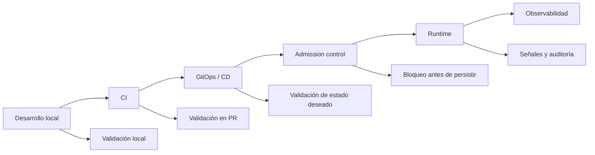

<!-- COURSE_NAV_START -->

[Anterior](<25. Seguridad de la cadena de suministro.md>) | [Indice](README.md) | [Siguiente](<27. Multi-tenancy, namespaces y límites de plataforma.md>)

<!-- COURSE_NAV_END -->

# 26. Policy as Code y guardrails de plataforma

## 26.1. Objetivo del módulo

En el módulo anterior trabajaste la seguridad de la cadena de suministro: imágenes por digest, SBOMs, escaneo, firmas, provenance, registries confiables y políticas de admisión para impedir que artefactos no verificables lleguen al cluster. Este módulo continúa esa línea, pero amplía el foco. Ya no nos preguntamos solo si una imagen es confiable, sino cómo convertir las reglas operativas, de seguridad, fiabilidad, coste y plataforma en guardrails ejecutables que ayuden a los equipos a desplegar mejor en Kubernetes.

Policy as Code significa expresar políticas como artefactos versionados, revisables, probables, automatizables y ejecutables. En Kubernetes, esas políticas pueden vivir en CI, en GitOps, en admission control, en validaciones locales, en controladores como Kyverno o Gatekeeper, en `ValidatingAdmissionPolicy`, en reglas de seguridad de namespace, en tests de manifests o en scripts de plataforma. La idea no es crear una burocracia de YAML que bloquee todo, sino diseñar un sistema de reglas que haga más fácil hacer lo correcto y más difícil introducir riesgo accidental.

Un guardrail no es una pared. Una pared impide moverse. Un guardrail permite avanzar con seguridad dentro de límites explícitos. En una plataforma Kubernetes bien diseñada, los equipos deberían poder desplegar con autonomía, pero esa autonomía necesita límites operativos claros: no usar `latest`, no desplegar imágenes desde registries no aprobados, no crear Pods privilegiados sin excepción, no saltarse requests y limits, no desplegar workloads sin labels mínimas, no exponer servicios de forma insegura, no romper convenciones de observabilidad y no introducir cambios que el cluster no puede operar.

La tesis del módulo es esta:

> Policy as Code no consiste en bloquear equipos; consiste en convertir conocimiento operativo en guardrails verificables.

La tesis operacional es esta:

> Una plataforma Kubernetes madura no depende de que todo el mundo recuerde todas las reglas. Codifica las reglas críticas, las prueba, las versiona, las despliega gradualmente y ofrece caminos seguros para cumplirlas.

En este módulo aprenderás:

- Qué es Policy as Code en Kubernetes
- Qué diferencia hay entre policy, guardrail, standard y convention
- Por qué los guardrails deben habilitar autonomía, no sustituir criterio
- Qué tipos de políticas existen: validación, mutación, generación, auditoría y excepciones
- Dónde se pueden ejecutar políticas: local, CI, GitOps, admission y runtime
- Qué papel tiene admission control
- Qué aporta `ValidatingAdmissionPolicy`
- Qué aporta Pod Security Admission
- Qué aportan Kyverno y Gatekeeper
- Cuándo usar CEL, cuándo usar Kyverno y cuándo usar Rego/Gatekeeper
- Cómo introducir políticas en modo audit antes de enforce
- Cómo diseñar excepciones con dueño y expiración
- Cómo probar políticas
- Cómo versionar un repositorio de políticas
- Cómo conectar policy as code con supply chain, resiliencia, SLOs, autoscaling y seguridad runtime
- Cómo diseñar guardrails de plataforma para equipos de producto
- Cómo evitar que las políticas se conviertan en burocracia o en optimización local
- Cómo automatizar validaciones con Taskfile
La idea principal es sencilla:

```text
Una regla importante que solo vive en una wiki no es un guardrail.
Es una esperanza.
```

---

## 26.2. Por qué este módulo existe en un curso de Kubernetes

Kubernetes es una plataforma muy flexible. Esa flexibilidad es una fortaleza, pero también crea una superficie enorme de decisiones. Cada Deployment, Pod, Service, Ingress, Job, CronJob, ConfigMap, Secret, HPA o namespace puede introducir riesgo si se configura mal. Algunos errores son evidentes, como usar una imagen inexistente. Otros son más sutiles: un Pod sin requests puede afectar al scheduling, un container privilegiado puede ampliar el blast radius, un HPA sin maxReplicas razonable puede presionar una base de datos, un Service mal expuesto puede abrir tráfico no deseado, un namespace sin Pod Security puede aceptar workloads demasiado permisivos y un manifest sin labels puede romper observabilidad, ownership y operación.

No es razonable esperar que cada equipo recuerde todas las decisiones correctas en cada cambio. Tampoco es razonable centralizar todo en un equipo de plataforma que revise manualmente cada manifest. Ese modelo no escala, crea colas, frena feedback y convierte a la plataforma en un cuello de botella. Policy as Code ofrece una salida intermedia: las reglas importantes se codifican, se prueban y se ejecutan automáticamente, mientras los equipos mantienen autonomía dentro de límites claros.

Este módulo se apoya en una idea de plataforma: los equipos deberían tener golden paths, plantillas, documentación, Taskfile, validaciones y mensajes de error útiles. Las políticas no deberían aparecer como castigo al final del flujo, sino como feedback temprano y comprensible. Cuando una política bloquea algo, debería explicar qué regla se ha incumplido, por qué importa y cómo corregirlo.

### Criterio de comprensión

Debes poder explicar:

> Kubernetes da libertad para definir workloads; Policy as Code convierte las reglas críticas de la plataforma en feedback automático y gobernable.

---

## 26.3. Policy, guardrail, standard y convention

Antes de escribir reglas, conviene limpiar el lenguaje. No todo lo que preferimos debe ser una política bloqueante. No todo lo que bloqueamos debe nacer como enforce desde el primer día. Y no toda convención necesita admission control.

| Concepto   | Qué es                                     | Ejemplo                                                      |
| ---------- | ------------------------------------------ | ------------------------------------------------------------ |
| Convention | Forma recomendada de hacer algo            | usar labels `app.kubernetes.io/*`                            |
| Standard   | Acuerdo documentado que debería cumplirse  | todos los workloads tienen requests                          |
| Guardrail  | Límite automatizado que guía o bloquea     | no permitir imágenes `latest`                                |
| Policy     | Regla ejecutable con alcance definido      | denegar Pods privilegiados en namespaces restricted          |
| Exception  | Permiso temporal y trazable para incumplir | permitir privileged durante 7 días para diagnóstico aprobado |

Una convención puede vivir en una plantilla o en una guía. Un standard puede validarse en CI. Un guardrail crítico puede ejecutarse en admission. Una excepción debe estar documentada, tener dueño, expiración y justificación.

### Regla

No conviertas cada preferencia en una política bloqueante.

Si todo bloquea, los equipos buscarán bypasses. Si nada bloquea, la plataforma depende de memoria humana. El diseño de guardrails consiste en elegir qué reglas deben ser feedback, qué reglas deben ser warning y qué reglas deben ser enforcement.

### Criterio de comprensión

Debes poder explicar:

> Una política bloqueante debe proteger un riesgo suficientemente importante como para justificar fricción en el flujo de entrega.

---

## 26.4. Policy as Code como sistema de feedback

Policy as Code no debería entenderse como una lista de prohibiciones. Debe entenderse como un sistema de feedback. Cuanto antes aparece el feedback, más barato es corregir. Cuanto más tarde aparece, más frustrante y costoso se vuelve.



El mejor momento para detectar un problema de manifest es antes de hacer merge. El segundo mejor momento es antes de desplegar. El último punto de defensa antes de ejecución es admission control. Si esperas a runtime para descubrir que un workload no tiene requests, corre como root, usa una imagen sin digest o no expone labels mínimas, la corrección ya llegó tarde.

### Criterio de comprensión

Debes poder explicar:

> Policy as Code reduce coste de corrección cuando mueve el feedback hacia la izquierda sin eliminar controles en el punto de entrada al cluster.

---

## 26.5. Tipos de políticas

En Kubernetes, las políticas pueden hacer varias cosas. No todas las herramientas soportan todos los tipos de política y no todos los casos necesitan la misma capacidad.

| Tipo      | Qué hace                             | Ejemplo                                |
| --------- | ------------------------------------ | -------------------------------------- |
| Validate  | acepta o rechaza un recurso          | no permitir `latest`                   |
| Mutate    | modifica un recurso                  | añadir label por defecto               |
| Generate  | crea recursos relacionados           | crear NetworkPolicy base por namespace |
| Audit     | reporta incumplimientos sin bloquear | listar Deployments sin requests        |
| Verify    | comprueba evidencia externa          | verificar firma de imagen              |
| Cleanup   | elimina o marca recursos             | borrar recursos temporales expirados   |
| Exception | permite incumplimiento temporal      | permitir hostPath con aprobación       |

### Validar

La validación es el caso más común: una regla comprueba el recurso y decide si cumple.

### Mutar

La mutación puede mejorar DevEx, pero debe usarse con cuidado. Mutar puede ocultar decisiones, generar sorpresa y hacer que lo que se aplica no sea exactamente lo que el equipo escribió. Es útil para defaults seguros, pero no debe sustituir documentación ni plantillas claras.

### Generar

La generación puede ayudar a crear recursos estándar, como NetworkPolicies, RoleBindings o ConfigMaps base. También puede crear acoplamiento si el equipo no entiende qué recursos aparecen automáticamente.

### Auditar

Audit es ideal para adopción gradual. Permite ver incumplimientos sin romper delivery.

### Criterio de comprensión

Debes poder explicar:

> Validar bloquea, mutar corrige, generar completa, auditar informa y excepcionar controla el incumplimiento temporal.

---

## 26.6. Dónde ejecutar políticas

Una política puede ejecutarse en varios puntos del flujo. Cada punto tiene ventajas y límites.

| Lugar         | Ventaja                                    | Límite                                   |
| ------------- | ------------------------------------------ | ---------------------------------------- |
| Local         | feedback rápido                            | depende de que se ejecute                |
| Pre-commit    | evita errores simples                      | puede ser saltado                        |
| CI            | bloquea PRs                                | no ve siempre estado real del cluster    |
| GitOps        | valida estado deseado                      | puede llegar tarde si el PR ya se aprobó |
| Admission     | última frontera antes del cluster          | feedback más tardío                      |
| Runtime audit | detecta drift o incumplimientos existentes | no previene el primer impacto            |

Una buena estrategia combina varios puntos. Las reglas más críticas deben existir en admission porque el cluster no debe aceptar recursos peligrosos. Pero esas mismas reglas deberían estar disponibles en CI para que el equipo reciba feedback antes.

### Criterio de comprensión

Debes poder explicar:

> Una política crítica debería fallar temprano en CI y también estar protegida en admission, porque CI solo no es una frontera suficiente del cluster.

---

## 26.7. Admission control como frontera del cluster

Admission control es el punto donde Kubernetes puede aceptar, rechazar o modificar una petición antes de persistir el objeto. Para guardrails de plataforma, admission es una frontera crítica: si algo no cumple una regla mínima, no entra al cluster.

Admission no debe ser el primer lugar donde el equipo descubre una regla. Si una política bloquea en admission pero no hay validación en CI, buen mensaje de error o documentación, el equipo experimenta la plataforma como una caja negra. El objetivo es que admission proteja el cluster, no que sea la única experiencia de feedback.

### Qué tiene sentido bloquear en admission

- Imágenes `latest`
- Imágenes desde registries no aprobados
- Pods privilegiados en namespaces restringidos
- Workloads sin security context mínimo
- Workloads sin requests en entornos compartidos
- HostPath no aprobado
- Capabilities peligrosas
- Workloads sin labels mínimas
- Services de tipo `LoadBalancer` fuera de namespaces permitidos
- Ingress sin clase o sin TLS, si aplica
- Imágenes sin digest en producción
- Imágenes sin firma en producción, si la plataforma lo soporta
### Qué puede no tener sentido bloquear al principio

- Convenciones de naming no críticas
- Labels informativas no operativas
- Reglas que muchos workloads legacy incumplen
- Reglas sin documentación
- Reglas sin camino de corrección
- Reglas que no tienen excepción posible
- Reglas que bloquean incident response
### Criterio de comprensión

Debes poder explicar:

> Admission control protege el cluster, pero la experiencia de plataforma debe dar feedback antes de que el usuario choque contra esa frontera.

---

## 26.8. ValidatingAdmissionPolicy y CEL

`ValidatingAdmissionPolicy` permite definir reglas de validación declarativas dentro de Kubernetes usando CEL. Es una alternativa in-process para casos de validación que no necesitan llamar a sistemas externos ni ejecutar lógica compleja. Su valor está en que permite cubrir reglas relativamente simples sin mantener un webhook propio.

### Casos adecuados

- Bloquear `latest`
- Exigir labels
- Exigir annotations
- Restringir campos simples
- Validar tipos de Service
- Validar securityContext básico
- Aplicar reglas por namespace o por selector
- Añadir mensajes claros de rechazo
- Usar bindings para controlar alcance
### Casos menos adecuados

- Verificación de firma de imagen
- Consultar un registry externo
- Consultar un sistema de excepciones complejo
- Lógica de política con muchas relaciones
- Políticas que requieren inventario global
- Mutación
- Generación de recursos
### Ejemplo: bloquear `latest`

```yaml
apiVersion: admissionregistration.k8s.io/v1
kind: ValidatingAdmissionPolicy
metadata:
  name: disallow-latest-images
spec:
  failurePolicy: Fail
  matchConstraints:
    resourceRules:
      - apiGroups: [""]
        apiVersions: ["v1"]
        operations: ["CREATE", "UPDATE"]
        resources: ["pods"]
  validations:
    - expression: "object.spec.containers.all(c, !c.image.endsWith(':latest'))"
      message: "Images must not use the latest tag."
```

### Binding

```yaml
apiVersion: admissionregistration.k8s.io/v1
kind: ValidatingAdmissionPolicyBinding
metadata:
  name: disallow-latest-images
spec:
  policyName: disallow-latest-images
  validationActions: ["Deny"]
```

Este ejemplo es didáctico. En una política real debes cubrir `initContainers`, `ephemeralContainers`, namespaces excluidos, workloads gestionados por controladores, rollout gradual, audit, excepciones y mensajes de corrección.

### Criterio de comprensión

Debes poder explicar:

> ValidatingAdmissionPolicy es útil para reglas declarativas simples y cercanas al API server, pero no sustituye un motor de políticas completo.

---

## 26.9. Pod Security Admission

Pod Security Admission aplica los Pod Security Standards mediante labels en namespaces. Es una herramienta nativa para restringir comportamientos de Pods según perfiles como `privileged`, `baseline` y `restricted`.

### Ejemplo de namespace restricted

```yaml
apiVersion: v1
kind: Namespace
metadata:
  name: shop
  labels:
    pod-security.kubernetes.io/enforce: restricted
    pod-security.kubernetes.io/enforce-version: latest
    pod-security.kubernetes.io/audit: restricted
    pod-security.kubernetes.io/audit-version: latest
    pod-security.kubernetes.io/warn: restricted
    pod-security.kubernetes.io/warn-version: latest
```

### Qué aporta

- Control nativo
- Sin instalar un motor externo
- Modelo estándar
- Fácil de aplicar por namespace
- Buen punto de partida para seguridad de Pods
### Qué no resuelve

- Políticas específicas de imagen
- Políticas de labels propias
- Reglas de coste
- Reglas de observabilidad
- Mutación
- Generación de recursos
- Verificación de firmas
- Excepciones complejas
- Reglas de plataforma específicas
### Criterio de comprensión

Debes poder explicar:

> Pod Security Admission es un guardrail nativo para seguridad de Pods, pero no cubre toda la gobernanza de plataforma.

---

## 26.10. Kyverno

Kyverno es un motor de políticas Kubernetes-native. Sus políticas se expresan como recursos Kubernetes y pueden validar, mutar, generar, verificar imágenes y realizar escaneos o reportes según configuración. Es especialmente interesante para equipos que quieren trabajar con YAML y conceptos cercanos a Kubernetes sin introducir Rego como lenguaje principal.

### Casos donde Kyverno encaja bien

- Validar manifests Kubernetes
- Mutar defaults
- Generar recursos por namespace
- Validar imágenes y firmas
- Producir policy reports
- Ejecutar políticas en admission y background scans
- Mantener políticas en GitOps
- Dar mensajes de error cercanos al usuario
### Ejemplo: exigir requests y limits

```yaml
apiVersion: kyverno.io/v1
kind: ClusterPolicy
metadata:
  name: require-requests-limits
spec:
  validationFailureAction: Enforce
  rules:
    - name: validate-resources
      match:
        any:
          - resources:
              kinds:
                - Pod
      validate:
        message: "CPU and memory requests and memory limits are required."
        pattern:
          spec:
            containers:
              - resources:
                  requests:
                    cpu: "?*"
                    memory: "?*"
                  limits:
                    memory: "?*"
```

Este ejemplo es didáctico. En producción debes cubrir init containers, excepciones, namespaces de sistema, workloads legacy, modo audit, documentación y pruebas.

### Criterio de comprensión

Debes poder explicar:

> Kyverno es una opción fuerte cuando quieres políticas Kubernetes-native con validación, mutación, generación y reporting integrados en el flujo del cluster.

---

## 26.11. Gatekeeper y OPA

OPA Gatekeeper permite aplicar políticas basadas en Open Policy Agent al admission control de Kubernetes. Gatekeeper usa constraints y templates para expresar reglas reutilizables, normalmente con Rego como lenguaje de política.

### Casos donde Gatekeeper encaja bien

- Organizaciones que ya usan OPA
- Políticas complejas
- Reutilización de lógica entre plataformas
- Necesidad de lenguaje de políticas expresivo
- Gobernanza multi-cluster
- Separar templates reutilizables de constraints concretas
- Auditar recursos existentes además de admission
### Ejemplo conceptual: exigir digest

```yaml
apiVersion: templates.gatekeeper.sh/v1
kind: ConstraintTemplate
metadata:
  name: k8srequiredimagedigest
spec:
  crd:
    spec:
      names:
        kind: K8sRequiredImageDigest
  targets:
    - target: admission.k8s.gatekeeper.sh
      rego: |
        package k8srequiredimagedigest

        violation[{"msg": msg}] {
          container := input.review.object.spec.containers[_]
          not contains(container.image, "@sha256:")
          msg := sprintf("container %v must use image digest", [container.name])
        }
```

Constraint:

```yaml
apiVersion: constraints.gatekeeper.sh/v1beta1
kind: K8sRequiredImageDigest
metadata:
  name: require-image-digest
spec:
  match:
    kinds:
      - apiGroups: [""]
        kinds: ["Pod"]
```

Este ejemplo enseña la estructura. En producción debes cubrir init containers, ephemeral containers, namespaces excluidos, testing, library reuse, documentación y rollout gradual.

### Criterio de comprensión

Debes poder explicar:

> Gatekeeper es potente cuando necesitas políticas expresivas y reutilizables, pero exige tratar Rego, templates y constraints como código mantenible.

---

## 26.12. CEL, Kyverno o Gatekeeper

No hay una única herramienta correcta para todos los equipos. La decisión debe considerar complejidad de políticas, habilidades del equipo, operación, reporting, mutación, generación, verificación de imágenes, multi-cluster y coste de mantenimiento.

| Necesidad                              | Opción razonable                         |
| -------------------------------------- | ---------------------------------------- |
| Validación simple nativa               | ValidatingAdmissionPolicy                |
| Pod security estándar                  | Pod Security Admission                   |
| Validación YAML-friendly               | Kyverno                                  |
| Mutación o generación                  | Kyverno                                  |
| Rego y políticas complejas             | Gatekeeper                               |
| Organización ya usa OPA                | Gatekeeper                               |
| Verificación de imagen integrada       | Kyverno u otra herramienta especializada |
| Reglas simples sin dependencia externa | CEL                                      |
| Políticas como librería reutilizable   | Gatekeeper o Kyverno bien estructurado   |

### Regla

Empieza por el mecanismo más simple que cubre bien el riesgo.

No introduzcas un motor de políticas complejo para una regla que Kubernetes puede expresar de forma nativa. Tampoco fuerces CEL para un problema que necesita reporting, mutación, excepciones o verificación externa.

### Criterio de comprensión

Debes poder explicar:

> La herramienta debe adaptarse al tipo de política y al modelo operativo del equipo, no al revés.

---

## 26.13. Guardrails de plataforma

Un guardrail de plataforma es una regla, plantilla, automatización o validación que reduce riesgo sin obligar a cada equipo a redescubrir la misma decisión. Los guardrails buenos aparecen integrados en el golden path.

### Guardrails habituales

- Namespaces con Pod Security configurado
- ResourceQuotas y LimitRanges por entorno
- Labels mínimas obligatorias
- Requests requeridos
- Prohibición de `latest`
- Registry aprobado
- Digest requerido en producción
- Firma requerida en producción
- Prohibición de privileged por defecto
- NetworkPolicy base
- TLS requerido en Ingress
- HPA con límites razonables
- PDB para servicios críticos
- Probes requeridas para APIs
- Annotations de trazabilidad
- Runbooks requeridos para alertas page
- SLO documentado para servicios críticos
### Guardrail frente a proceso manual

Un proceso manual dice: “recuerda revisar esto”.

Un guardrail dice: “si esto no cumple, recibes feedback automático y una forma clara de corregir”.

### Criterio de comprensión

Debes poder explicar:

> Un guardrail bueno reduce decisiones repetitivas y evita errores comunes sin bloquear el flujo normal de entrega.

---

## 26.14. Guardrails por etapa de madurez

No todos los equipos pueden adoptar todas las políticas el primer día. Una plataforma madura introduce guardrails por etapas.

| Etapa              | Objetivo                         | Ejemplos                           |
| ------------------ | -------------------------------- | ---------------------------------- |
| Visibilidad        | saber qué incumple               | audit reports, dashboards          |
| Feedback temprano  | corregir antes de merge          | CI checks, Taskfile                |
| Enforce suave      | bloquear en entornos no críticos | staging enforcement                |
| Enforce productivo | proteger producción              | admission deny                     |
| Mejora continua    | ajustar reglas                   | excepciones, métricas, postmortems |

### Estrategia recomendada

Primero haz visible el problema. Después ofrece plantillas y correcciones. Luego valida en CI. Más tarde aplica enforcement en entornos de menor riesgo. Finalmente, protege producción. Este orden reduce resistencia y evita que las políticas se perciban como un obstáculo arbitrario.

### Criterio de comprensión

Debes poder explicar:

> La adopción de políticas debe ser progresiva. Primero visibilidad, luego feedback, después enforcement.

---

## 26.15. Audit, warn y enforce

Una política puede tener diferentes modos de acción. En Kubernetes y en motores de políticas, este matiz es clave para introducir guardrails sin romper delivery.

| Modo         | Qué hace                | Uso                                  |
| ------------ | ----------------------- | ------------------------------------ |
| Audit        | registra incumplimiento | descubrir alcance                    |
| Warn         | avisa sin bloquear      | preparar adopción                    |
| Enforce/Deny | bloquea                 | proteger regla crítica               |
| Mutate       | corrige o completa      | defaults seguros                     |
| Exception    | permite temporalmente   | gestionar transición o caso especial |

### Regla

No empieces en enforce si no sabes cuántos recursos incumplen ni qué camino de corrección tienen.

El modo audit no es debilidad. Es una fase de aprendizaje. Lo importante es que audit tenga fecha de revisión y plan para pasar a enforce cuando la organización esté lista.

### Criterio de comprensión

Debes poder explicar:

> Audit sin plan se convierte en ruido. Enforce sin adopción se convierte en bloqueo y bypass.

---

## 26.16. Excepciones

Las excepciones son necesarias. Si una plataforma no ofrece excepciones controladas, los equipos buscarán formas informales de saltarse la política. Una excepción bien diseñada no elimina el riesgo, pero lo hace explícito, temporal y revisable.

### Una excepción debe tener

- Política afectada
- Recurso afectado
- Namespace
- Motivo
- Riesgo aceptado
- Mitigación
- Dueño
- Fecha de expiración
- Aprobación
- Plan para volver a cumplir
- Evidencia
### Ejemplo

```md
# Policy exception

## Policy

require-non-root-containers

## Resource

Deployment/payment-debugger in namespace shop-debug

## Reason

Temporary diagnostic tool required by incident SEV2.

## Risk

Container requires elevated permissions to inspect network behavior.

## Mitigation

Namespace isolated. NetworkPolicy applied. Access limited to platform team.

## Owner

platform-team

## Expires

2026-07-15

## Removal plan

Delete deployment and remove exception after incident analysis.
```

### Criterio de comprensión

Debes poder explicar:

> Una excepción sin dueño, expiración y plan de eliminación no es una excepción; es una nueva política implícita.

---

## 26.17. Políticas que ayudan a DevEx

Policy as Code se suele asociar a seguridad, pero también puede mejorar experiencia de desarrollo. Si las políticas se diseñan bien, los equipos reciben feedback claro y temprano. Si se diseñan mal, reciben errores opacos al final del flujo.

### Buen mensaje de política

```text
Images must not use the latest tag. Use a release tag pinned by digest, for example:
ghcr.io/acme/checkout-api:1.8.0@sha256:<digest>
```

### Mal mensaje de política

```text
admission webhook denied the request
```

### Guardrails DevEx

- Mensajes con causa y corrección
- Enlaces a documentación
- Taskfile para validar localmente
- Plantillas actualizadas
- Ejemplos correctos
- Modo audit antes de enforce
- Comandos de diagnóstico
- Política versionada y revisable
- Tests de políticas
- Canal para excepciones
### Criterio de comprensión

Debes poder explicar:

> Una política que no explica cómo corregir aumenta carga cognitiva y reduce confianza en la plataforma.

---

## 26.18. Repositorio de políticas

Las políticas deben vivir como código. Eso implica estructura, ownership, tests, documentación, versionado y pipeline.

Estructura recomendada:

```text
platform-policies/
  README.md
  policies/
    validating-admission/
      disallow-latest/
        policy.yaml
        binding.yaml
        README.md
        tests/
    kyverno/
      require-requests-limits/
        policy.yaml
        README.md
        tests/
    gatekeeper/
      require-image-digest/
        template.yaml
        constraint.yaml
        README.md
        tests/
  exceptions/
    README.md
    shop/
      exception-debug-privileged.yaml
  docs/
    policy-catalog.md
    rollout-strategy.md
    authoring-guide.md
  Taskfile.yml
```

### Qué debe tener cada política

- Propósito
- Riesgo que reduce
- Alcance
- Modo: audit, warn o enforce
- Ejemplos válidos
- Ejemplos inválidos
- Mensaje de error
- Excepciones permitidas
- Owner
- Fecha de introducción
- Plan de rollout
- Tests
### Criterio de comprensión

Debes poder explicar:

> Una política sin tests, documentación y ownership no es un guardrail mantenible; es YAML de riesgo.

---

## 26.19. Testing de políticas

Las políticas también tienen bugs. Pueden bloquear recursos válidos, permitir recursos peligrosos, no cubrir init containers, no considerar namespaces de sistema o fallar con manifests generados por Helm/Kustomize. Por eso deben probarse.

### Qué probar

- Caso válido mínimo
- Caso inválido claro
- Init containers
- Ephemeral containers, si aplica
- Namespaces excluidos
- Recursos legacy
- Excepciones
- Mensaje de error
- Mutaciones esperadas
- Recursos generados
- Comportamiento en audit/enforce
- Compatibilidad con Helm/Kustomize
### Ejemplo de fixtures

```text
tests/
  valid-deployment.yaml
  invalid-latest-image.yaml
  invalid-missing-requests.yaml
  valid-exception.yaml
```

### Criterio de comprensión

Debes poder explicar:

> Las políticas deben tener tests porque una política rota puede bloquear delivery o permitir riesgo sin que nadie lo note.

---

## 26.20. Políticas en CI

CI es el mejor lugar para feedback temprano. Antes de que un manifest llegue al cluster, puedes validar esquema, estilo, convenciones, seguridad y compatibilidad con políticas de plataforma.

### Validaciones útiles en CI

- `kubeconform` o validación de schemas
- `kubectl diff --server-side`, si aplica
- `helm template` + validación
- `kustomize build` + validación
- Kyverno CLI
- Conftest/OPA
- Checkov
- kube-score
- Polaris
- Scripts propios para reglas simples
- Escaneo de manifests
- Validación de labels
- Validación de requests
- Validación de imágenes
- Validación de Taskfile
### Regla

CI debe usar las mismas políticas que admission siempre que sea posible.

Si CI y admission validan reglas distintas, aparecerán sorpresas. El equipo pasará CI, pero Kubernetes bloqueará el despliegue. O peor: CI bloqueará algo que el cluster permitiría y la política se percibirá como arbitraria.

### Criterio de comprensión

Debes poder explicar:

> CI debe acercar el feedback de plataforma al pull request, no inventar una segunda plataforma de reglas distinta.

---

## 26.21. Políticas en GitOps

En un flujo GitOps, el repositorio contiene el estado deseado y una herramienta como Argo CD o Flux sincroniza ese estado con el cluster. Policy as Code encaja muy bien aquí porque puedes validar el estado deseado antes de sincronizar y también proteger el cluster con admission.

### Puntos de control

- Validación en PR
- Validación antes de merge
- Validación de manifests renderizados
- Sync waves con políticas instaladas antes de workloads
- Admission en cluster
- Drift detection
- Auditoría de recursos aplicados
- Rollback como cambio en Git
- Excepciones versionadas
### Riesgo

GitOps no sustituye admission. Si alguien con permisos aplica manualmente un recurso, admission sigue siendo la frontera. Si GitOps despliega un manifest incorrecto, admission puede bloquearlo. Si el cluster no tiene admission, GitOps reproducirá fielmente un estado débil.

### Criterio de comprensión

Debes poder explicar:

> GitOps mejora trazabilidad del estado deseado, pero admission protege el estado aceptado por el cluster.

---

## 26.22. Guardrails para supply chain

El módulo anterior trató supply chain. Aquí convertimos esas decisiones en políticas.

### Políticas candidatas

- No permitir `latest`
- Exigir digest en producción
- Exigir registry aprobado
- Exigir labels de versión y commit
- Exigir imagen firmada en producción
- Exigir SBOM o attestation, si la plataforma puede verificarlo
- Bloquear imágenes revocadas
- Bloquear imágenes con vulnerabilidades críticas sin excepción
- Exigir `imagePullPolicy` coherente
- Evitar imágenes desde Docker Hub directo en producción, si no hay mirror o control
### Ejemplo: registry aprobado con ValidatingAdmissionPolicy

```yaml
apiVersion: admissionregistration.k8s.io/v1
kind: ValidatingAdmissionPolicy
metadata:
  name: require-approved-registry
spec:
  failurePolicy: Fail
  matchConstraints:
    resourceRules:
      - apiGroups: [""]
        apiVersions: ["v1"]
        operations: ["CREATE", "UPDATE"]
        resources: ["pods"]
  validations:
    - expression: "object.spec.containers.all(c, c.image.startsWith('ghcr.io/acme/') || c.image.startsWith('registry.internal.example.com/shop/'))"
      message: "Images must come from an approved registry."
```

Este ejemplo es didáctico y necesita ampliarse para `initContainers`, excepciones y namespaces.

### Criterio de comprensión

Debes poder explicar:

> Las decisiones de supply chain solo protegen producción si se convierten en reglas verificadas antes de ejecutar workloads.

---

## 26.23. Guardrails para resiliencia

Las reglas de resiliencia también pueden convertirse en guardrails. No todo patrón de resiliencia puede validarse desde Kubernetes, pero algunas señales mínimas sí pueden exigirse.

### Políticas candidatas

- APIs deben tener readiness probe
- APIs deben tener liveness probe conservadora
- Workloads críticos deben tener `terminationGracePeriodSeconds`
- Deployments críticos deben tener `strategy.rollingUpdate.maxUnavailable: 0`
- Servicios críticos deben tener PDB
- Containers deben tener requests
- Jobs deben tener `backoffLimit`
- Jobs deben tener `activeDeadlineSeconds` cuando aplique
- CronJobs deben definir `concurrencyPolicy`
- Workloads deben tener labels de ownership
- Workloads críticos deben tener annotations de runbook
### Cuidado

No todas estas reglas deben ser enforce global. Un Job batch no necesita las mismas probes que un API. Un CronJob interno no tiene el mismo riesgo que un checkout crítico. Las políticas deben entender tipos de workload, namespaces y criticidad.

### Criterio de comprensión

Debes poder explicar:

> Los guardrails de resiliencia deben proteger comportamientos operativos mínimos sin forzar la misma forma a todos los tipos de workload.

---

## 26.24. Guardrails para capacidad y eficiencia

El módulo de autoscaling mostró que requests, limits, HPA y maxReplicas afectan fiabilidad y coste. Algunas de esas decisiones pueden validarse como políticas.

### Políticas candidatas

- Containers deben tener CPU y memory requests
- Containers deben tener memory limits
- CPU limits pueden ser opcionales según política de plataforma
- HPA debe tener `minReplicas` mínimo para servicios críticos
- HPA debe tener `maxReplicas`
- Deployments críticos no deben tener `replicas: 1`
- Namespaces deben tener ResourceQuota
- Namespaces deben tener LimitRange
- Workloads con HPA deben tener requests
- Workloads críticos deben tener PDB
- Workloads con `maxReplicas` alto deben documentar downstream constraints
### Ejemplo: exigir requests

```yaml
apiVersion: kyverno.io/v1
kind: ClusterPolicy
metadata:
  name: require-resource-requests
spec:
  validationFailureAction: Audit
  rules:
    - name: require-cpu-memory-requests
      match:
        any:
          - resources:
              kinds:
                - Pod
      validate:
        message: "Containers must define CPU and memory requests."
        pattern:
          spec:
            containers:
              - resources:
                  requests:
                    cpu: "?*"
                    memory: "?*"
```

Empezar en `Audit` puede ser más sensato si hay workloads existentes que todavía no cumplen.

### Criterio de comprensión

Debes poder explicar:

> La eficiencia operativa no se consigue solo mirando costes; también exige políticas que hagan visible y corregible la capacidad mal declarada.

---

## 26.25. Guardrails para observabilidad

Si una aplicación no tiene señales mínimas, los incidentes se investigan tarde y mal. Algunas señales no pueden imponerse desde Kubernetes, pero sí puedes exigir metadatos y convenciones que conecten workloads con dashboards, runbooks y ownership.

### Políticas candidatas

- Labels `app.kubernetes.io/name`
- Labels `app.kubernetes.io/part-of`
- Labels `app.kubernetes.io/component`
- Annotation de runbook para servicios críticos
- Annotation de dashboard
- Annotation de git commit o build URL
- Annotation de SLO document para servicios críticos
- Probes en APIs
- Puerto nombrado para métricas, si la plataforma lo usa
- ServiceMonitor o PodMonitor generado por plantilla, si aplica
### Ejemplo de metadata mínima

```yaml
metadata:
  labels:
    app.kubernetes.io/name: checkout-api
    app.kubernetes.io/component: api
    app.kubernetes.io/part-of: shop
  annotations:
    app.acme.io/runbook: "docs/incidents/runbooks/checkout-high-error-budget-burn.md"
    app.acme.io/dashboard: "https://grafana.example.com/d/checkout-api"
    app.acme.io/slo: "docs/slos/checkout-api-slo.md"
```

### Criterio de comprensión

Debes poder explicar:

> Las políticas de observabilidad no crean buenas métricas por sí solas, pero evitan workloads huérfanos durante operación.

---

## 26.26. Guardrails para seguridad runtime

El siguiente módulo profundizará en seguridad runtime, RBAC y NetworkPolicy. Aquí solo introducimos cómo algunos mínimos pueden tratarse como políticas de plataforma.

### Políticas candidatas

- No permitir privileged containers
- No permitir `hostPID`, `hostIPC` o `hostNetwork` salvo excepción
- No permitir `hostPath` salvo excepción
- Requerir `runAsNonRoot`
- Requerir `readOnlyRootFilesystem`, cuando la imagen lo soporte
- Prohibir privilege escalation
- Restringir capabilities
- Usar seccomp profile
- Aplicar Pod Security Admission por namespace
- Exigir NetworkPolicy base en namespaces compartidos
- Limitar ServiceAccount automount cuando no sea necesario
### Cuidado

Algunas reglas requieren adaptación de imágenes y workloads. Por ejemplo, `readOnlyRootFilesystem` puede romper aplicaciones que escriben en rutas no preparadas. `runAsNonRoot` exige que la imagen soporte usuario no root. La política debe ayudar a llegar al estado deseado, no simplemente bloquear sin camino.

### Criterio de comprensión

Debes poder explicar:

> Los guardrails de seguridad runtime deben combinar enforcement con golden paths de imágenes y manifests que ya cumplan las reglas.

---

## 26.27. Guardrails por namespace

El namespace es una frontera útil para aplicar políticas. No todos los namespaces tienen la misma criticidad ni el mismo nivel de confianza.

### Ejemplo de niveles

| Namespace type | Políticas                                    |
| -------------- | -------------------------------------------- |
| dev            | warn/audit, excepciones amplias              |
| staging        | enforce parcial                              |
| production     | enforce estricto                             |
| platform       | reglas especiales y control de acceso fuerte |
| sandbox        | límites de recursos y aislamiento            |
| incident-debug | excepciones temporales y audit fuerte        |

### Labels de namespace

```yaml
apiVersion: v1
kind: Namespace
metadata:
  name: shop
  labels:
    platform.acme.io/environment: production
    platform.acme.io/criticality: high
    pod-security.kubernetes.io/enforce: restricted
    pod-security.kubernetes.io/audit: restricted
    pod-security.kubernetes.io/warn: restricted
```

Estas labels pueden usarse para scoping de políticas, reporting, ownership y operación.

### Criterio de comprensión

Debes poder explicar:

> El alcance de una política debe considerar entorno, criticidad y ownership; no todo namespace necesita el mismo enforcement.

---

## 26.28. Políticas y golden paths

Un guardrail aislado puede sentirse como fricción. Un guardrail acompañado de un golden path se siente como plataforma. La diferencia está en que el golden path da una forma sencilla de cumplir la política.

### Ejemplo

Política:

```text
Los Deployments deben tener requests y labels mínimas.
```

Golden path:

```text
task k8s:generate:deployment NAME=checkout-api COMPONENT=api
```

El generador crea un Deployment con labels, probes, resources, securityContext, annotations y estructura esperada. La política sigue existiendo, pero el equipo no tiene que escribir todo desde cero.

### Elementos de un buen golden path

- Plantillas actualizadas
- Defaults razonables
- Validaciones locales
- Documentación breve
- Ejemplos reales
- Taskfile
- CI checks
- Compatibilidad con GitOps
- Política de excepción
- Ownership claro
### Criterio de comprensión

Debes poder explicar:

> La plataforma no debería limitarse a decir “no”. Debe ofrecer una forma fácil de llegar al “sí” seguro.

---

## 26.29. Policy as Code y Theory of Constraints

Policy as Code puede mejorar el sistema, pero también puede convertirse en un cuello de botella. Si cada política requiere aprobación manual del equipo de plataforma, si los mensajes son opacos, si las excepciones tardan días o si las reglas bloquean casos legítimos, la plataforma se convierte en constraint del delivery.

Desde Theory of Constraints, una política es valiosa si protege el objetivo del sistema: entregar software seguro, fiable y operable con buen flujo. Una política que optimiza un criterio local pero empeora el throughput global puede ser mala política.

### Ejemplos

| Política                                    | Riesgo si se diseña mal                                  |
| ------------------------------------------- | -------------------------------------------------------- |
| Bloquear todas las vulnerabilidades HIGH    | puede bloquear fixes urgentes sin evaluar explotabilidad |
| Exigir `restricted` en todos los namespaces | puede romper workloads legítimos sin migración           |
| Exigir PDB en todo                          | puede bloquear drains si no hay réplicas suficientes     |
| Mutar recursos automáticamente              | puede ocultar diferencias entre manifest y runtime       |
| Excepciones manuales lentas                 | convierten plataforma en cuello de botella               |

### Regla

Un guardrail debe reducir riesgo sistémico sin convertirse en inventario de trabajo bloqueado.

### Criterio de comprensión

Debes poder explicar:

> Una política no es buena por ser estricta. Es buena si mejora seguridad, fiabilidad o eficiencia sin destruir flujo ni crear bypasses.

---

## 26.30. Policy as Code y software economics

Las políticas tienen coste. Cuesta escribirlas, probarlas, mantenerlas, explicarlas, migrar workloads, gestionar excepciones y responder cuando fallan. Pero no tener políticas también tiene coste: incidentes, inseguridad, pérdida de trazabilidad, configuraciones inconsistentes, toil, revisiones manuales, guardias interrumpidas y menor confianza en la plataforma.

La decisión económica no es “más políticas o menos políticas”. La decisión correcta es dónde una política reduce más coste futuro que el coste que introduce.

### Costes y beneficios

| Control                        | Coste      | Beneficio                            |
| ------------------------------ | ---------- | ------------------------------------ |
| Bloquear `latest`              | bajo       | alta trazabilidad                    |
| Exigir requests                | medio      | mejor scheduling y autoscaling       |
| Exigir firma en producción     | medio/alto | integridad y confianza               |
| Exigir PDB en críticos         | medio      | menos disrupciones voluntarias       |
| Exigir runbook en alertas page | bajo/medio | mejor incident response              |
| Mutar defaults                 | medio      | menos repetición, riesgo de sorpresa |
| Excepciones con expiración     | medio      | riesgo explícito y recuperable       |

### Regla económica

Automatiza las reglas que protegen decisiones repetitivas, críticas y fáciles de olvidar.

No automatices como enforcement duro reglas que todavía no entiendes, no puedes explicar o no puedes ayudar a cumplir.

### Criterio de comprensión

Debes poder explicar:

> Policy as Code es una inversión: debe reducir riesgo, toil o coste de coordinación más de lo que aumenta fricción.

---

## 26.31. Diseño de una política

Antes de escribir YAML, diseña la política. Una política mal pensada puede ser técnicamente correcta y organizativamente dañina.

### Preguntas de diseño

- ¿Qué riesgo reduce?
- ¿Qué incidente evita o mitiga?
- ¿Qué SLO, security baseline o constraint protege?
- ¿A qué recursos aplica?
- ¿A qué namespaces aplica?
- ¿Qué workloads quedarían bloqueados hoy?
- ¿Debe empezar en audit?
- ¿Qué mensaje recibirá el equipo?
- ¿Cuál es la corrección esperada?
- ¿Hay golden path?
- ¿Hay excepciones?
- ¿Quién mantiene la política?
- ¿Cómo se prueba?
- ¿Cómo se mide éxito?
- ¿Cuándo se revisa?
### Policy decision record

Crea un documento por política importante:

```md
# Policy decision: require-image-digest

## Context

Production workloads should be reproducible and traceable by image content.

## Risk

Mutable tags can point to different image contents over time.

## Decision

Production workloads must use image digests.

## Scope

Namespaces with platform.acme.io/environment=production.

## Enforcement

Audit for two weeks, then Deny.

## Exceptions

Allowed for emergency debug workloads with expiration <= 7 days.

## Success metrics

- 100% production Deployments use digest.
- No admission denials without CI feedback.
- No expired exceptions.
```

### Criterio de comprensión

Debes poder explicar:

> Una política importante debe tener una decisión escrita, no solo un manifest.

---

## 26.32. Manifiestos y estructura del módulo

Estructura recomendada:

```text
k8s/policy-as-code/
  validating-admission/
    disallow-latest-policy.yaml
    disallow-latest-binding.yaml
    require-approved-registry-policy.yaml
    require-labels-policy.yaml
  pod-security/
    namespace-shop-restricted.yaml
  kyverno/
    require-resource-requests.yaml
    require-image-digest.yaml
    add-default-labels.yaml
  gatekeeper/
    required-image-digest-template.yaml
    required-image-digest-constraint.yaml

docs/platform/
  policy-catalog.md
  guardrails.md
  exception-process.md
  policy-decision-record-template.md

docs/platform/policies/
  require-image-digest.md
  require-resource-requests.md

tests/policies/
  valid-deployment.yaml
  invalid-latest-image.yaml
  invalid-missing-requests.yaml
  invalid-missing-labels.yaml

Taskfile.yml
```

### docs/platform/policy-catalog.md

```md
# Platform policy catalog

| Policy                    | Mode    | Scope          | Owner         | Exception allowed |
| ------------------------- | ------- | -------------- | ------------- | ----------------- |
| disallow-latest-images    | Enforce | production     | platform-team | no                |
| require-image-digest      | Audit   | production     | platform-team | yes               |
| require-resource-requests | Audit   | all namespaces | platform-team | yes               |
| pod-security-restricted   | Enforce | production     | platform-team | limited           |
| require-platform-labels   | Enforce | production     | platform-team | yes               |
```

### docs/platform/exception-process.md

```md
# Policy exception process

## Required fields

- Policy name
- Resource
- Namespace
- Reason
- Risk
- Mitigation
- Owner
- Expiration date
- Approval
- Removal plan

## Rules

- Exceptions must expire.
- Exceptions must have an owner.
- Exceptions must be reviewed before expiration.
- Production exceptions require approval from platform and service owner.
```

### Criterio de comprensión

Debes poder explicar:

> La estructura de policies debe hacer visible qué reglas existen, dónde aplican, cómo se prueban y cómo se excepcionan.

---

## 26.33. ValidatingAdmissionPolicy: labels mínimas

Esta política exige labels mínimas en Pods. Es didáctica y sirve para mostrar cómo convertir convenciones de observabilidad y ownership en validaciones.

```yaml
apiVersion: admissionregistration.k8s.io/v1
kind: ValidatingAdmissionPolicy
metadata:
  name: require-platform-labels
spec:
  failurePolicy: Fail
  matchConstraints:
    resourceRules:
      - apiGroups: [""]
        apiVersions: ["v1"]
        operations: ["CREATE", "UPDATE"]
        resources: ["pods"]
  validations:
    - expression: "has(object.metadata.labels) && 'app.kubernetes.io/name' in object.metadata.labels"
      message: "Pods must define app.kubernetes.io/name label."
    - expression: "has(object.metadata.labels) && 'app.kubernetes.io/part-of' in object.metadata.labels"
      message: "Pods must define app.kubernetes.io/part-of label."
    - expression: "has(object.metadata.labels) && 'app.kubernetes.io/component' in object.metadata.labels"
      message: "Pods must define app.kubernetes.io/component label."
```

Binding:

```yaml
apiVersion: admissionregistration.k8s.io/v1
kind: ValidatingAdmissionPolicyBinding
metadata:
  name: require-platform-labels
spec:
  policyName: require-platform-labels
  validationActions: ["Deny"]
```

### Cuidado

Esta política sobre Pods no cubre directamente todos los matices de controladores como Deployments, StatefulSets o Jobs si el template no propaga labels como esperas. En producción, debes probar con recursos renderizados y evaluar si la política debe aplicarse a Pods, a controladores o a ambos.

### Criterio de comprensión

Debes poder explicar:

> Una política de labels mejora operación solo si las labels son realmente usadas por dashboards, ownership, costes, alertas o soporte.

---

## 26.34. Kyverno: mutar defaults con cuidado

La mutación puede reducir repetición. Por ejemplo, puedes añadir una label por defecto si no existe. Pero debes ser prudente: si mutas demasiadas cosas, el manifest aplicado deja de parecerse al manifest revisado.

### Ejemplo conceptual

```yaml
apiVersion: kyverno.io/v1
kind: ClusterPolicy
metadata:
  name: add-managed-by-label
spec:
  validationFailureAction: Audit
  rules:
    - name: add-managed-by
      match:
        any:
          - resources:
              kinds:
                - Pod
      mutate:
        patchStrategicMerge:
          metadata:
            labels:
              +(app.kubernetes.io/managed-by): "platform"
```

### Cuándo mutar tiene sentido

- Defaults seguros
- Labels no críticas
- Annotations de plataforma
- Configuración repetitiva no controversial
- Recursos generados por golden paths
### Cuándo evitar mutación

- Seguridad crítica que el equipo debe entender
- Cambios que alteran comportamiento funcional
- Resources que afectan coste sin visibilidad
- Mutaciones que cambian contratos
- Mutaciones que ocultan deuda
### Criterio de comprensión

Debes poder explicar:

> Mutar puede mejorar DevEx, pero también puede ocultar decisiones. Usa mutación para defaults claros, no para esconder complejidad.

---

## 26.35. Gatekeeper: política reutilizable

Gatekeeper separa `ConstraintTemplate` y `Constraint`. Esto permite crear una regla reutilizable y aplicarla con parámetros distintos.

### Ejemplo conceptual: registries permitidos

```yaml
apiVersion: templates.gatekeeper.sh/v1
kind: ConstraintTemplate
metadata:
  name: k8sallowedregistries
spec:
  crd:
    spec:
      names:
        kind: K8sAllowedRegistries
      validation:
        openAPIV3Schema:
          type: object
          properties:
            registries:
              type: array
              items:
                type: string
  targets:
    - target: admission.k8s.gatekeeper.sh
      rego: |
        package k8sallowedregistries

        violation[{"msg": msg}] {
          container := input.review.object.spec.containers[_]
          not startswith_any(container.image, input.parameters.registries)
          msg := sprintf("container %v uses image from a non-approved registry: %v", [container.name, container.image])
        }

        startswith_any(image, registries) {
          registry := registries[_]
          startswith(image, registry)
        }
```

Constraint:

```yaml
apiVersion: constraints.gatekeeper.sh/v1beta1
kind: K8sAllowedRegistries
metadata:
  name: allowed-registries-production
spec:
  parameters:
    registries:
      - "ghcr.io/acme/"
      - "registry.internal.example.com/shop/"
  match:
    namespaces:
      - shop
    kinds:
      - apiGroups: [""]
        kinds: ["Pod"]
```

Este ejemplo es didáctico. En producción debes validar sintaxis, cubrir init containers, excepciones, namespaces, tests y mensajes de corrección.

### Criterio de comprensión

Debes poder explicar:

> Gatekeeper permite separar una política reutilizable de sus parámetros de aplicación, pero esa flexibilidad exige disciplina de testing y documentación.

---

## 26.36. Taskfile para Policy as Code

Añade tareas:

```yaml
policy:catalog:
  desc: Show platform policy catalog
  cmds:
    - cat docs/platform/policy-catalog.md

policy:exceptions:
  desc: Show policy exception process
  cmds:
    - cat docs/platform/exception-process.md

policy:validate:schemas:
  desc: Validate Kubernetes manifests with kubeconform
  cmds:
    - kubeconform -strict -summary k8s/

policy:check:no-latest:
  desc: Fail if manifests use latest tag
  cmds:
    - |
      if grep -R "image: .*:latest" k8s; then
        echo "latest tag is not allowed"
        exit 1
      fi

policy:check:labels:
  desc: Check basic platform labels in manifests
  cmds:
    - |
      grep -R "app.kubernetes.io/name" k8s >/dev/null || (echo "missing app.kubernetes.io/name labels" && exit 1)

policy:apply:vap:
  desc: Apply ValidatingAdmissionPolicy examples
  cmds:
    - kubectl apply -f k8s/policy-as-code/validating-admission/disallow-latest-policy.yaml
    - kubectl apply -f k8s/policy-as-code/validating-admission/disallow-latest-binding.yaml
    - kubectl apply -f k8s/policy-as-code/validating-admission/require-labels-policy.yaml

policy:apply:pod-security:
  desc: Apply Pod Security labels to shop namespace
  cmds:
    - kubectl apply -f k8s/policy-as-code/pod-security/namespace-shop-restricted.yaml

policy:apply:kyverno:
  desc: Apply Kyverno policy examples
  cmds:
    - kubectl apply -f k8s/policy-as-code/kyverno/require-resource-requests.yaml
    - kubectl apply -f k8s/policy-as-code/kyverno/require-image-digest.yaml

policy:test:fixtures:
  desc: Show policy test fixtures
  cmds:
    - ls -la tests/policies
    - cat tests/policies/invalid-latest-image.yaml

policy:audit:
  desc: Show policy-related resources
  cmds:
    - kubectl get validatingadmissionpolicy
    - kubectl get validatingadmissionpolicybinding
    - kubectl get ns --show-labels

policy:dry-run:invalid:
  desc: Try to apply invalid fixture with server dry-run
  cmds:
    - kubectl apply --server-side --dry-run=server -f tests/policies/invalid-latest-image.yaml

policy:delete:vap:
  desc: Delete ValidatingAdmissionPolicy examples
  cmds:
    - kubectl delete -f k8s/policy-as-code/validating-admission/disallow-latest-binding.yaml || true
    - kubectl delete -f k8s/policy-as-code/validating-admission/disallow-latest-policy.yaml || true
    - kubectl delete -f k8s/policy-as-code/validating-admission/require-labels-policy.yaml || true
```

### Criterio DevEx

Debes poder explicar:

> Taskfile convierte policy as code en flujo repetible: ver catálogo, validar localmente, aplicar políticas, probar fixtures y auditar estado.

---

## 26.37. Práctica 1: crear catálogo de políticas

### Objetivo

Hacer visible qué políticas existen y qué intención tiene cada una.

### Pasos

Crea:

```text
docs/platform/policy-catalog.md
```

Incluye:

- Nombre de política
- Riesgo que reduce
- Modo: audit, warn o enforce
- Alcance
- Owner
- Excepciones
- Documentación
- Fecha de revisión
Ejecuta:

```bash
task policy:catalog
```

### Preguntas

- ¿Qué políticas son enforce?
- ¿Qué políticas están en audit?
- ¿Qué políticas tienen excepción?
- ¿Qué políticas protegen supply chain?
- ¿Qué políticas protegen resiliencia?
- ¿Qué políticas protegen coste?
- ¿Qué políticas no deberían existir todavía como bloqueantes?
### Criterio

Debes poder explicar:

> Un catálogo de políticas evita que los guardrails sean reglas invisibles que solo aparecen cuando algo falla.

---

## 26.38. Práctica 2: bloquear latest con ValidatingAdmissionPolicy

### Objetivo

Crear una política nativa sencilla.

### Pasos

Crea:

```text
k8s/policy-as-code/validating-admission/disallow-latest-policy.yaml
k8s/policy-as-code/validating-admission/disallow-latest-binding.yaml
```

Aplica:

```bash
task policy:apply:vap
```

Prueba un fixture inválido:

```bash
task policy:dry-run:invalid
```

### Preguntas

- ¿La política bloquea el recurso?
- ¿El mensaje ayuda a corregir?
- ¿Cubre init containers?
- ¿Cubre Deployments renderizados?
- ¿Debe aplicarse a todos los namespaces?
- ¿Necesita modo audit antes de deny?
### Criterio

Debes poder explicar:

> Una política simple debe tener alcance claro, mensaje útil y fixture inválido que demuestre que funciona.

---

## 26.39. Práctica 3: Pod Security por namespace

### Objetivo

Aplicar un baseline de seguridad nativo.

### Pasos

Crea:

```text
k8s/policy-as-code/pod-security/namespace-shop-restricted.yaml
```

Contenido:

```yaml
apiVersion: v1
kind: Namespace
metadata:
  name: shop
  labels:
    platform.acme.io/environment: production
    platform.acme.io/criticality: high
    pod-security.kubernetes.io/enforce: restricted
    pod-security.kubernetes.io/enforce-version: latest
    pod-security.kubernetes.io/audit: restricted
    pod-security.kubernetes.io/audit-version: latest
    pod-security.kubernetes.io/warn: restricted
    pod-security.kubernetes.io/warn-version: latest
```

Aplica:

```bash
task policy:apply:pod-security
kubectl get ns shop --show-labels
```

### Preguntas

- ¿Qué implica `restricted`?
- ¿Qué workloads existentes podrían romperse?
- ¿Cómo introducirías esto en un namespace legacy?
- ¿Qué excepciones permitirías?
- ¿Qué relación tiene con el módulo de seguridad runtime?
### Criterio

Debes poder explicar:

> Pod Security Admission permite aplicar un baseline nativo por namespace, pero necesita migración consciente en workloads existentes.

---

## 26.40. Práctica 4: política de requests en modo audit

### Objetivo

Introducir una política de capacidad sin romper el flujo.

### Pasos

Crea una política Kyverno `require-resource-requests` en modo `Audit`.

Aplica:

```bash
task policy:apply:kyverno
```

Revisa policy reports si tu instalación los soporta:

```bash
kubectl get policyreport -A
kubectl get clusterpolicyreport -A
```

### Preguntas

- ¿Cuántos workloads incumplen?
- ¿Qué tipo de workloads incumplen?
- ¿Qué pasaría si la política fuera enforce hoy?
- ¿Qué golden path ayudaría a cumplir?
- ¿Qué fecha pondrías para pasar a enforce?
- ¿Cómo comunicarías el cambio?
### Criterio

Debes poder explicar:

> Audit permite medir la deuda de cumplimiento antes de convertir una regla en bloqueo.

---

## 26.41. Práctica 5: diseñar una excepción

### Objetivo

Gestionar incumplimiento temporal sin crear deuda invisible.

### Escenario

Un equipo necesita desplegar temporalmente un Pod con permisos elevados para diagnosticar un incidente de red en un namespace aislado.

Crea:

```text
docs/platform/exceptions/shop-debug-privileged.md
```

Incluye:

- Política afectada
- Recurso afectado
- Namespace
- Motivo
- Riesgo
- Mitigación
- Dueño
- Expiración
- Aprobación
- Plan de eliminación
### Preguntas

- ¿La excepción tiene dueño?
- ¿Tiene fecha de expiración?
- ¿El riesgo está mitigado?
- ¿Cómo se revisa?
- ¿Cómo se elimina?
- ¿Qué señal indica que se ha convertido en deuda?
### Criterio

Debes poder explicar:

> Las excepciones son parte del sistema de políticas; si no se diseñan, aparecerán como bypasses.

---

## 26.42. Práctica 6: probar políticas con fixtures

### Objetivo

Tratar políticas como código testeable.

### Pasos

Crea fixtures:

```text
tests/policies/
  valid-deployment.yaml
  invalid-latest-image.yaml
  invalid-missing-requests.yaml
  invalid-missing-labels.yaml
```

Ejecuta validaciones:

```bash
task policy:validate:schemas
task policy:dry-run:invalid
```

Si usas Kyverno CLI o Conftest, añade tareas específicas para ejecutar tests contra fixtures.

### Preguntas

- ¿Tienes casos válidos e inválidos?
- ¿Las políticas cubren init containers?
- ¿Las políticas excluyen namespaces correctos?
- ¿El error es comprensible?
- ¿Qué pasa con manifests renderizados por Helm?
- ¿Qué pasa con manifests generados por Kustomize?
### Criterio

Debes poder explicar:

> Una política sin fixtures de prueba es una hipótesis no verificada.

---

## 26.43. Práctica 7: diseñar un guardrail de plataforma

### Objetivo

Diseñar una política desde intención hasta rollout.

Elige una política:

```text
require-image-digest
```

Crea un policy decision record:

```text
docs/platform/policies/require-image-digest.md
```

Incluye:

- Contexto
- Riesgo
- Decisión
- Alcance
- Modo inicial
- Plan para enforce
- Excepciones
- Golden path
- Tests
- Métrica de adopción
- Owner
### Preguntas

- ¿Qué riesgo reduce?
- ¿Por qué no basta con documentación?
- ¿Qué equipos incumplen hoy?
- ¿Cómo recibirán feedback?
- ¿Qué herramienta la implementa?
- ¿Cuándo pasa de audit a enforce?
- ¿Cómo se excepciona?
- ¿Cómo se mide éxito?
### Criterio

Debes poder explicar:

> Diseñar un guardrail no empieza por escribir YAML; empieza por definir riesgo, alcance, adopción y camino de cumplimiento.

---

## 26.44. Checklist de Policy as Code

Antes de considerar maduro el sistema de políticas:

- Existe catálogo de políticas
- Cada política tiene owner
- Cada política tiene propósito
- Cada política declara riesgo reducido
- Cada política tiene alcance claro
- Cada política tiene modo: audit, warn o enforce
- Cada política tiene ejemplos válidos
- Cada política tiene ejemplos inválidos
- Cada política tiene tests
- Cada política tiene mensaje de error útil
- Cada política tiene documentación de corrección
- Las políticas críticas se ejecutan en CI
- Las políticas críticas se ejecutan en admission
- Existe proceso de excepción
- Las excepciones tienen expiración
- Hay revisión de excepciones vencidas
- Hay modo audit antes de enforce para cambios grandes
- Hay golden paths para cumplir las políticas
- Hay validación de manifests renderizados
- Hay estrategia para namespaces legacy
- Hay separación por entorno y criticidad
- Las políticas no bloquean incident response sin alternativa
- Hay métricas de adopción
- Hay revisión periódica de ruido
- Hay runbook para fallos de admission
- Las políticas están versionadas
- Las políticas se despliegan por GitOps o flujo controlado
---

## 26.45. Errores habituales

### Error 1. Convertir preferencias en bloqueos

No todo lo que te gusta debe ser enforce. Bloquear sin riesgo claro crea fricción innecesaria.

### Error 2. Introducir enforce sin audit

Si no sabes quién incumple, puedes romper delivery de golpe.

### Error 3. No dar camino de corrección

Una política sin ejemplo correcto y mensaje útil genera frustración.

### Error 4. No probar políticas

Las políticas tienen bugs. También necesitan tests.

### Error 5. Olvidar init containers

Muchas políticas sobre containers fallan porque solo revisan `spec.containers`.

### Error 6. No considerar namespaces de sistema

Una política mal scoping puede romper componentes de plataforma.

### Error 7. Mutar demasiado

La mutación excesiva puede ocultar comportamiento real y crear sorpresa.

### Error 8. No tener excepciones

Sin excepciones controladas, aparecen bypasses informales.

### Error 9. Excepciones sin expiración

Una excepción permanente se convierte en una política paralela.

### Error 10. CI y admission con reglas distintas

El equipo pasa CI, pero admission bloquea. Eso erosiona confianza.

### Error 11. Políticas sin ownership

Si nadie mantiene una política, se vuelve deuda de plataforma.

### Error 12. Usar Policy as Code como sustituto de plataforma

Las políticas no reemplazan golden paths, plantillas, documentación ni soporte.

### Error 13. Optimizar seguridad local y romper flujo global

Una política estricta pero mal diseñada puede convertir plataforma en cuello de botella.

### Error 14. No medir impacto

Si no sabes cuántos recursos cumplen, cuántas excepciones existen o cuántos bloqueos ocurren, no gobiernas la política.

---

## 26.46. Criterio de salida del módulo

Puedes dar este módulo por completado cuando puedas explicar y demostrar lo siguiente.

### Conceptos

Debes poder explicar:

- Qué es Policy as Code
- Qué problema resuelve en Kubernetes
- Qué diferencia hay entre convention, standard, guardrail, policy y exception
- Qué tipos de políticas existen
- Dónde se pueden ejecutar políticas
- Qué aporta admission control
- Qué aporta `ValidatingAdmissionPolicy`
- Qué aporta Pod Security Admission
- Qué aporta Kyverno
- Qué aporta Gatekeeper
- Cuándo usar CEL
- Cuándo usar Kyverno
- Cuándo usar Gatekeeper
- Qué significa audit, warn y enforce
- Por qué las excepciones deben tener expiración
- Cómo diseñar un catálogo de políticas
- Cómo probar políticas
- Cómo conectar policies con CI y GitOps
- Cómo diseñar guardrails para supply chain
- Cómo diseñar guardrails para resiliencia
- Cómo diseñar guardrails para capacidad
- Cómo diseñar guardrails para observabilidad
- Cómo diseñar guardrails para seguridad runtime
- Cómo evitar que policy as code se convierta en burocracia
- Cómo evaluar políticas desde Theory of Constraints
- Cómo evaluar políticas desde software economics
### Práctica

Debes poder:

- Crear un catálogo de políticas
- Crear una `ValidatingAdmissionPolicy`
- Crear un binding
- Aplicar Pod Security Admission por namespace
- Escribir una política Kyverno básica
- Leer una política Gatekeeper
- Crear fixtures válidos e inválidos
- Probar políticas con dry-run o herramientas CLI
- Diseñar una excepción
- Diseñar un policy decision record
- Añadir tareas Taskfile para validación
- Explicar cómo una política pasa de audit a enforce
- Identificar qué políticas pertenecen a CI y cuáles a admission
### Frase final de comprensión

Debes poder explicar esta frase:

> Policy as Code convierte aprendizaje operativo en reglas verificables; los guardrails de plataforma convierten esas reglas en autonomía segura para los equipos.

---

## 26.47. Referencias oficiales y materiales de apoyo

| Tema                                     | Referencia                                                                                                                                                                                                             |
| ---------------------------------------- | ---------------------------------------------------------------------------------------------------------------------------------------------------------------------------------------------------------------------- |
| Kubernetes ValidatingAdmissionPolicy     | [https://kubernetes.io/docs/reference/access-authn-authz/validating-admission-policy/](https://kubernetes.io/docs/reference/access-authn-authz/validating-admission-policy/)                                           |
| Kubernetes ValidatingAdmissionPolicy API | [https://kubernetes.io/docs/reference/kubernetes-api/admissionregistration/validating-admission-policy-v1/](https://kubernetes.io/docs/reference/kubernetes-api/admissionregistration/validating-admission-policy-v1/) |
| Kubernetes Admission Controllers         | [https://kubernetes.io/docs/reference/access-authn-authz/admission-controllers/](https://kubernetes.io/docs/reference/access-authn-authz/admission-controllers/)                                                       |
| Kubernetes Pod Security Admission        | [https://kubernetes.io/docs/concepts/security/pod-security-admission/](https://kubernetes.io/docs/concepts/security/pod-security-admission/)                                                                           |
| Kubernetes Pod Security Standards        | [https://kubernetes.io/docs/concepts/security/pod-security-standards/](https://kubernetes.io/docs/concepts/security/pod-security-standards/)                                                                           |
| Kyverno documentation                    | [https://kyverno.io/docs/](https://kyverno.io/docs/)                                                                                                                                                                   |
| Kyverno validate rules                   | [https://kyverno.io/docs/policy-types/cluster-policy/validate/](https://kyverno.io/docs/policy-types/cluster-policy/validate/)                                                                                         |
| Kyverno mutate rules                     | [https://kyverno.io/docs/policy-types/cluster-policy/mutate/](https://kyverno.io/docs/policy-types/cluster-policy/mutate/)                                                                                             |
| Kyverno generate rules                   | [https://kyverno.io/docs/policy-types/cluster-policy/generate/](https://kyverno.io/docs/policy-types/cluster-policy/generate/)                                                                                         |
| OPA Gatekeeper documentation             | [https://open-policy-agent.github.io/gatekeeper/website/docs/](https://open-policy-agent.github.io/gatekeeper/website/docs/)                                                                                           |
| OPA for Kubernetes Admission Control     | [https://openpolicyagent.org/docs/kubernetes](https://openpolicyagent.org/docs/kubernetes)                                                                                                                             |
| Common Expression Language               | [https://cel.dev/](https://cel.dev/)                                                                                                                                                                                   |
| kubeconform                              | [https://github.com/yannh/kubeconform](https://github.com/yannh/kubeconform)                                                                                                                                           |
| Conftest                                 | [https://www.conftest.dev/](https://www.conftest.dev/)                                                                                                                                                                 |
| Polaris                                  | [https://polaris.docs.fairwinds.com/](https://polaris.docs.fairwinds.com/)                                                                                                                                             |
| kube-score                               | [https://kube-score.com/](https://kube-score.com/)                                                                                                                                                                     |

## 26.48. Lecturas de apoyo

| Tema                                | Qué leer                                                                                                  |
| ----------------------------------- | --------------------------------------------------------------------------------------------------------- |
| Kubernetes official docs            | Admission control, ValidatingAdmissionPolicy, Pod Security Admission y Pod Security Standards.            |
| Kyverno documentation               | Validación, mutación, generación, verificación de imágenes, policy reports y testing.                     |
| Gatekeeper documentation            | ConstraintTemplates, Constraints, audit, Rego y gobernanza multi-cluster.                                 |
| Open Policy Agent                   | Rego, policy as code y separación de decisión de política.                                                |
| Cloud Native DevOps with Kubernetes | Operación de plataforma, seguridad, GitOps, automatización y equipos autónomos.                           |
| Kubernetes in Action                | API server, recursos Kubernetes, Pods, Deployments y seguridad básica del cluster.                        |
| SRE                                 | Guardrails, reducción de toil, incident response, error budgets y diseño de sistemas operables.           |
| Theory of Constraints               | Evitar que políticas locales creen un cuello de botella del sistema.                                      |
| Software economics                  | Coste de control, coste de fallo, coste de coordinación, riesgo y retorno de automatizar reglas críticas. |

<!-- COURSE_NAV_START -->

[Anterior](<25. Seguridad de la cadena de suministro.md>) | [Indice](README.md) | [Siguiente](<27. Multi-tenancy, namespaces y límites de plataforma.md>)

<!-- COURSE_NAV_END -->
