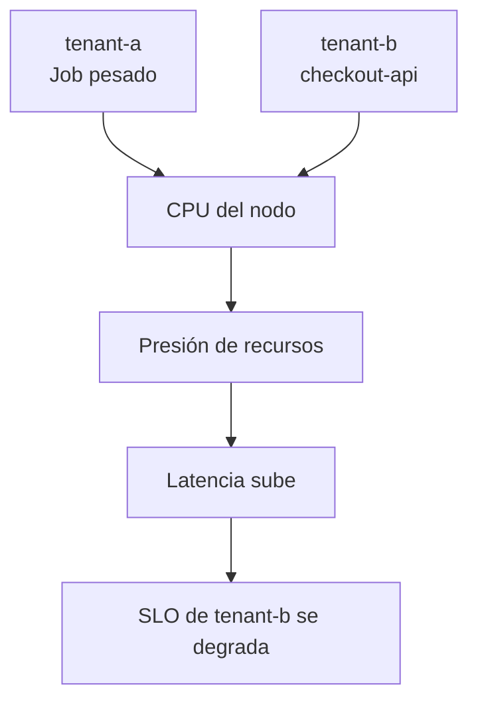
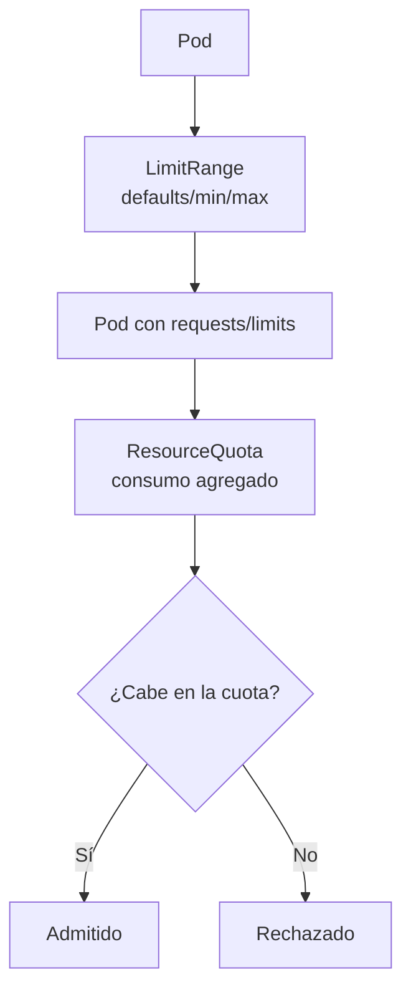
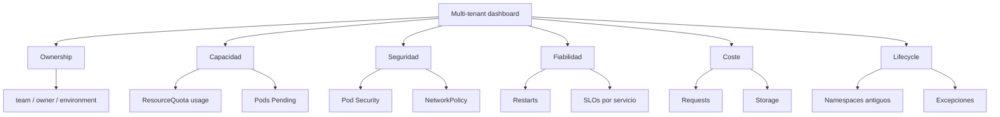
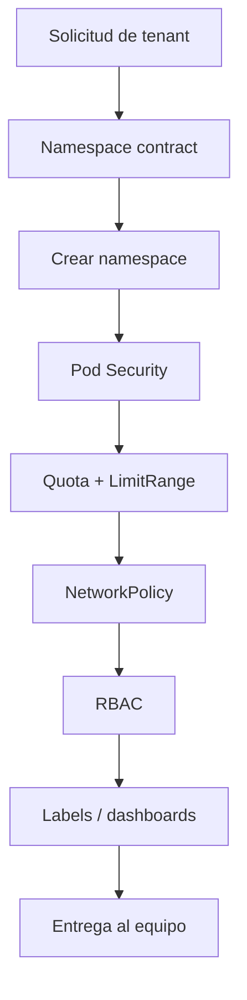

<!-- COURSE_NAV_START -->

[Anterior](<26. Policy as Code y guardrails de plataforma.md>) | [Indice](README.md) | [Siguiente](<28. Networking avanzado y tráfico en Kubernetes.md>)

<!-- COURSE_NAV_END -->

# 27. Multi-tenancy, namespaces y límites de plataforma

## 27.1. Objetivo del módulo

En el módulo anterior trabajaste Policy as Code y guardrails de plataforma. Aprendiste que una plataforma Kubernetes madura no debería depender solo de documentación, memoria o revisión manual, sino de reglas versionadas, probables y ejecutables que hagan más fácil desplegar de forma segura, operable y coherente. Este módulo continúa esa idea desde otra perspectiva: qué ocurre cuando varias aplicaciones, equipos, entornos o productos comparten el mismo cluster.

Multi-tenancy en Kubernetes no significa simplemente crear varios namespaces. Un namespace ayuda a organizar recursos y ofrece una frontera útil para algunas políticas, pero no aísla por sí solo CPU, memoria, red, permisos, costes, secretos, identidades, storage, workloads privilegiados, control plane, nodos ni blast radius. Si varios equipos comparten un cluster sin límites claros, tarde o temprano aparecerán problemas de noisy neighbors, permisos excesivos, costes opacos, saturación compartida, conflictos de ownership, dificultad para depurar incidentes y presión sobre el equipo de plataforma.

La pregunta central de este módulo no es “cómo creo namespaces”. La pregunta es cómo diseño una plataforma compartida donde cada tenant tenga autonomía suficiente para desplegar y operar su software, pero con límites explícitos que protejan al resto del cluster. Esa protección no se consigue con una única pieza. Se construye combinando namespaces, RBAC, ResourceQuota, LimitRange, NetworkPolicy, Pod Security Admission, policies, labels, ownership, observabilidad, costes, runbooks, excepciones y criterios claros sobre cuándo compartir cluster y cuándo separar.

La tesis del módulo es esta:

> Un namespace organiza recursos, pero la multi-tenancy aparece cuando añades límites, permisos, aislamiento, observabilidad y ownership.

La tesis operacional es esta:

> Una plataforma multi-tenant en Kubernetes debe hacer explícito qué se comparte, qué se aísla, quién puede cambiar qué, cuánto puede consumir cada tenant y cómo se responde cuando un tenant afecta a los demás.

En este módulo aprenderás:

- Qué significa multi-tenancy en Kubernetes
- Qué es un tenant
- Qué problemas resuelve compartir un cluster
- Qué riesgos introduce compartir un cluster
- Por qué un namespace no es una frontera de seguridad suficiente por sí solo
- Qué responsabilidades puede asumir un namespace
- Cómo diseñar namespaces por equipo, aplicación, entorno o tenant
- Qué límites tiene cada estrategia
- Cómo usar labels y annotations para ownership, coste y operación
- Cómo usar RBAC para limitar acceso por tenant
- Cómo usar ServiceAccounts dentro de un namespace
- Cómo usar ResourceQuota para limitar consumo agregado
- Cómo usar LimitRange para definir defaults y límites por objeto
- Cómo evitar noisy neighbors
- Cómo usar NetworkPolicy para aislamiento de red
- Cómo usar Pod Security Admission como baseline por namespace
- Cómo diseñar límites de plataforma sin romper delivery
- Cómo gestionar excepciones
- Cómo conectar multi-tenancy con SLOs, incident response, autoscaling y Policy as Code
- Cómo modelar coste y chargeback/showback por namespace
- Cómo hacer onboarding de un tenant
- Cómo hacer offboarding de un tenant
- Cómo automatizar el setup con Taskfile
La idea principal es sencilla:

```text
Compartir cluster reduce coste y complejidad operativa solo si los límites están diseñados.
Sin límites, compartir cluster convierte la plataforma en un sistema de interferencias.
```

---

## 27.2. Por qué este módulo existe en un curso de Kubernetes

Kubernetes suele entrar en una organización como una herramienta para ejecutar contenedores, pero en cuanto varios equipos empiezan a usar el mismo cluster se convierte en una plataforma compartida. Esa transición cambia el problema. Ya no basta con que una aplicación funcione; ahora necesitas que varias aplicaciones puedan convivir sin romperse entre ellas, sin consumir toda la capacidad disponible, sin acceder a recursos que no les corresponden, sin abrir tráfico innecesario, sin esconder costes y sin hacer que cada incidente sea una investigación global.

El diseño multi-tenant afecta directamente al flujo de trabajo. Si el equipo de plataforma debe crear manualmente cada namespace, revisar cada RoleBinding, decidir cada cuota, corregir cada manifest y aprobar cada excepción, la plataforma se convierte en constraint del sistema. Si, por el contrario, los equipos tienen libertad sin guardrails, el cluster se convierte en un entorno frágil donde cada tenant puede afectar al resto. El diseño correcto está entre esos extremos: autonomía con límites.

Este módulo trata los namespaces como unidad operativa, no solo como agrupación lógica. Un namespace puede representar un equipo, una aplicación, un entorno, un tenant SaaS, una sandbox, un espacio temporal de preview o una frontera de políticas. Cada elección tiene consecuencias sobre seguridad, coste, observabilidad, despliegue, RBAC, quotas, redes, incidentes y ownership. Por eso, antes de escribir YAML, hay que decidir qué problema organizativo y operativo quieres resolver.

### Criterio de comprensión

Debes poder explicar:

> En Kubernetes, multi-tenancy no es una feature única. Es una propiedad que construyes combinando fronteras, permisos, límites y operación.

---

## 27.3. Qué es un tenant

Un tenant es una unidad que comparte infraestructura con otras unidades, pero necesita algún grado de separación. En Kubernetes, un tenant puede ser un equipo, una aplicación, un producto, un entorno, un cliente, una organización interna, una squad, una sandbox o un conjunto de workloads gestionados por una misma responsabilidad.

### Ejemplos de tenants

| Tenant              | Ejemplo                                 | Qué necesita                                 |
| ------------------- | --------------------------------------- | -------------------------------------------- |
| Equipo              | `checkout-team`                         | autonomía de despliegue y límites de consumo |
| Aplicación          | `checkout-api`                          | ownership, SLO, permisos propios             |
| Entorno             | `staging`, `production`                 | separación de riesgo y configuración         |
| Cliente SaaS        | `customer-a`                            | aislamiento más fuerte y cumplimiento        |
| Sandbox             | `team-a-sandbox`                        | límites estrictos y bajo coste               |
| Plataforma          | `monitoring`, `ingress`, `cert-manager` | privilegios especiales y protección          |
| Preview environment | `pr-123`                                | creación y eliminación automatizada          |

El nivel de aislamiento requerido depende del tenant. No es lo mismo aislar dos aplicaciones del mismo equipo que aislar clientes distintos con requisitos regulatorios. Tampoco es lo mismo compartir un cluster de desarrollo que compartir producción.

### Criterio de comprensión

Debes poder explicar:

> Un tenant no es siempre un cliente externo. Es cualquier unidad que necesita autonomía y límites dentro de una plataforma compartida.

---

## 27.4. Modelos de multi-tenancy

Hay varios modelos de multi-tenancy. La elección depende de riesgo, coste, criticidad, requisitos de cumplimiento, madurez operativa y tamaño de la organización.

| Modelo                         | Qué comparte                                    |         Aislamiento |      Coste | Complejidad |
| ------------------------------ | ----------------------------------------------- | ------------------: | ---------: | ----------: |
| Namespace por tenant           | cluster y control plane                         |          bajo/medio |       bajo |  bajo/medio |
| Namespace por equipo y entorno | cluster y control plane                         |               medio | bajo/medio |       medio |
| Cluster por entorno            | nada entre entornos                             | alto entre entornos | medio/alto |       medio |
| Cluster por tenant crítico     | poco o nada                                     |                alto |       alto |        alto |
| Virtual clusters               | nodos/control plane virtualizado según solución |          medio/alto |      medio |  medio/alto |
| Cuentas cloud separadas        | infraestructura separada                        |                alto |       alto |        alto |

### Regla

No uses el mismo modelo para todos los casos sin pensar.

Un equipo interno en desarrollo puede vivir bien en namespaces compartidos. Un cliente enterprise con requisitos fuertes de aislamiento quizá necesita cluster dedicado o cuenta cloud separada. Un entorno de preview puede vivir en namespaces efímeros con cuotas agresivas. Un sistema crítico de pagos quizá necesita aislamiento más fuerte que una app interna.

### Criterio de comprensión

Debes poder explicar:

> El modelo de multi-tenancy debe ajustarse al riesgo. Namespace compartido es barato y útil, pero no es el máximo nivel de aislamiento.

---

## 27.5. Namespaces: qué hacen y qué no hacen

Un namespace agrupa recursos Kubernetes bajo un nombre común. Permite aplicar RBAC namespaced, ResourceQuota, LimitRange, NetworkPolicy, labels de entorno, Pod Security Admission y muchas políticas de plataforma. También ayuda a organizar observabilidad, costes, ownership y limpieza.

Pero un namespace no es una frontera completa de seguridad por sí solo. No impide que un Pod consuma CPU del nodo si no hay quotas y requests. No impide tráfico entre namespaces si no hay NetworkPolicies efectivas. No impide privilegios peligrosos si no hay Pod Security o policies. No impide acceso al API si RBAC es demasiado amplio. No separa nodos físicamente. No separa el control plane. No impide que un tenant afecte a otro mediante saturación de recursos compartidos.

### Qué aporta un namespace

- Agrupación lógica
- Scope para nombres de muchos recursos
- Scope para RBAC namespaced
- Scope para ResourceQuota
- Scope para LimitRange
- Scope para NetworkPolicy
- Scope para Pod Security Admission
- Scope para ownership
- Scope para coste/showback
- Scope para policies
- Scope para limpieza y lifecycle
### Qué no aporta solo

- Seguridad fuerte
- Aislamiento de red por defecto
- Aislamiento de CPU/memoria por defecto
- Aislamiento de nodos
- Separación de control plane
- Separación de storage
- Protección frente a Pods privilegiados
- Protección frente a permisos cluster-wide
- Protección frente a CRDs peligrosos
- Protección frente a noisy neighbors
### Criterio de comprensión

Debes poder explicar:

> Un namespace es una frontera administrativa útil, pero necesita políticas alrededor para convertirse en una frontera operativa real.

---

## 27.6. El problema de noisy neighbors

Un noisy neighbor es un tenant que consume recursos compartidos y degrada a otros tenants. Puede hacerlo por una subida legítima de tráfico, un bug, un retry storm, una cola sin límites, un Job mal configurado, un test de carga, un memory leak, un HPA agresivo o un workload sin requests.

Ejemplo:



El noisy neighbor no siempre es malicioso. Muchas veces es un equipo que no sabe que su workload está afectando a otros. Por eso, la respuesta no puede ser solo “tened cuidado”. La plataforma debe definir límites.

### Formas de reducir noisy neighbors

- Requests realistas
- ResourceQuota por namespace
- LimitRange con defaults
- HPA con maxReplicas razonable
- Quotas de objetos
- PriorityClass y preemption con cuidado
- Separación por node pools
- Taints y tolerations
- NetworkPolicy
- Rate limiting
- Observabilidad por namespace
- Cost allocation
- Políticas de Jobs y CronJobs
- Guardrails en CI y admission
### Criterio de comprensión

Debes poder explicar:

> Noisy neighbor es un problema de límites. Si un tenant puede consumir recursos sin freno, el cluster compartido se vuelve injusto e inestable.

---

## 27.7. Estrategias de namespaces

La estrategia de namespaces debe responder a cómo trabaja tu organización. No hay un diseño universal. Cada estrategia facilita algunas cosas y complica otras.

### Namespace por equipo

Ejemplo:

```text
team-checkout
team-payments
team-platform
```

Ventajas:

- Buen ownership
- RBAC sencillo por equipo
- Coste por equipo
- Autonomía clara
Costes:

- Mezcla aplicaciones de criticidad distinta
- Puede mezclar entornos si no se separan bien
- Las quotas afectan a todo el equipo
- Incidentes de una app pueden afectar al namespace completo
### Namespace por aplicación

Ejemplo:

```text
checkout-api
payment-api
catalog-api
```

Ventajas:

- Ownership por servicio
- SLO y costes más precisos
- Policies específicas por app
- Limpieza clara
Costes:

- Muchos namespaces
- Más gestión de RBAC
- Más objetos base
- Puede ser excesivo para servicios pequeños
### Namespace por entorno

Ejemplo:

```text
shop-dev
shop-staging
shop-production
```

Ventajas:

- Diferencia clara de criticidad
- Policies por entorno
- Fácil entender riesgo
Costes:

- Varios equipos en un mismo namespace
- Ownership difuso
- Quotas menos precisas
- RBAC más complejo si varios equipos comparten
### Namespace por equipo y entorno

Ejemplo:

```text
checkout-dev
checkout-staging
checkout-prod
payments-dev
payments-staging
payments-prod
```

Ventajas:

- Buen equilibrio
- Enforce diferente por entorno
- RBAC por equipo
- Coste y ownership razonables
- Buena base para GitOps
Costes:

- Más namespaces
- Necesitas automatizar onboarding
- Requiere naming y catálogo
### Namespace por tenant SaaS

Ejemplo:

```text
customer-a-prod
customer-b-prod
customer-c-prod
```

Ventajas:

- Aislamiento por cliente
- Coste por cliente
- Operación por cliente
- Policies específicas
Costes:

- Puede explotar en número de namespaces
- Gestión de secrets y configuración más compleja
- No siempre suficiente para requisitos fuertes
- Requiere automatización madura
### Criterio de comprensión

Debes poder explicar:

> La estrategia de namespaces debe reflejar ownership, entorno, criticidad y modelo operativo. No debe ser solo una convención de nombres.

---

## 27.8. Criterios para elegir estrategia

Antes de elegir namespaces, responde a preguntas organizativas y técnicas.

### Preguntas de diseño

- ¿Quién es el owner del workload?
- ¿Qué equipo lo opera?
- ¿Qué SLO tiene?
- ¿Qué criticidad tiene?
- ¿Qué datos maneja?
- ¿Qué permisos necesita?
- ¿Qué otros servicios consume?
- ¿Qué tráfico expone?
- ¿Qué coste debe imputarse?
- ¿Qué entorno representa?
- ¿Qué políticas aplican?
- ¿Qué excepciones son posibles?
- ¿Qué lifecycle tiene?
- ¿Es efímero o permanente?
- ¿Cuántos tenants habrá?
- ¿Qué ocurre si se compromete?
- ¿Qué ocurre si consume todos sus recursos?
- ¿Qué ocurre si necesita aislamiento más fuerte?
### Regla

El namespace debe ser suficientemente grande para no crear burocracia y suficientemente pequeño para tener ownership, límites y políticas claros.

### Criterio de comprensión

Debes poder explicar:

> Un namespace mal dimensionado crea dos problemas opuestos: demasiada fricción si es demasiado pequeño, demasiada ambigüedad si es demasiado grande.

---

## 27.9. Namespace contract

Un namespace multi-tenant debería tener contrato. El contrato define qué espera la plataforma del tenant y qué ofrece la plataforma a cambio.

### Ejemplo de contrato

```md
# Namespace contract: checkout-prod

## Purpose

Production namespace for checkout team workloads.

## Owner

checkout-team

## Environment

production

## Criticality

high

## Allowed workload types

- Deployment
- Service
- ConfigMap
- Secret
- Job
- CronJob
- HorizontalPodAutoscaler
- PodDisruptionBudget

## Required controls

- Pod Security restricted
- ResourceQuota
- LimitRange
- Default deny NetworkPolicy
- RBAC least privilege
- Image digest required
- No latest
- Requests required
- Runbook annotations for page alerts

## SLOs

- checkout-api availability
- checkout-api latency
- checkout async processing freshness

## Cost allocation

Cost is attributed to checkout-team.

## Exceptions

Exceptions expire in <= 30 days and require platform approval.
```

### Criterio de comprensión

Debes poder explicar:

> Un namespace contract evita que un namespace sea solo un contenedor vacío de recursos. Define propósito, owner, límites y obligaciones.

---

## 27.10. Labels y annotations de namespace

Las labels y annotations convierten namespaces en entidades operables. Permiten aplicar policies por selector, asignar coste, buscar ownership, generar dashboards y automatizar reglas.

### Labels recomendadas

```yaml
apiVersion: v1
kind: Namespace
metadata:
  name: checkout-prod
  labels:
    platform.acme.io/team: checkout
    platform.acme.io/environment: production
    platform.acme.io/criticality: high
    platform.acme.io/tenant-type: team
    platform.acme.io/cost-center: product-checkout
    pod-security.kubernetes.io/enforce: restricted
    pod-security.kubernetes.io/audit: restricted
    pod-security.kubernetes.io/warn: restricted
```

### Annotations recomendadas

```yaml
metadata:
  annotations:
    platform.acme.io/owner: "checkout-team"
    platform.acme.io/slack: "#team-checkout"
    platform.acme.io/runbook: "docs/incidents/runbooks/checkout.md"
    platform.acme.io/slo: "docs/slos/checkout-api-slo.md"
    platform.acme.io/onboarding-ticket: "PLAT-1234"
```

### Criterio de comprensión

Debes poder explicar:

> Las labels y annotations de namespace no son decoración. Son datos operativos para políticas, coste, observabilidad y soporte.

---

## 27.11. RBAC por tenant

RBAC define quién puede hacer qué en Kubernetes. En multi-tenancy, RBAC debe impedir que un tenant acceda o modifique recursos de otro tenant, y debe limitar el acceso a recursos cluster-wide a administradores o componentes de plataforma.

### Regla

Usa `Role` y `RoleBinding` para permisos namespaced. Usa `ClusterRole` con cuidado. Evita `ClusterRoleBinding` para equipos de producto salvo casos muy justificados.

### Ejemplo: developer read/write limitado al namespace

```yaml
apiVersion: rbac.authorization.k8s.io/v1
kind: Role
metadata:
  name: tenant-developer
  namespace: checkout-prod
rules:
  - apiGroups: ["", "apps", "batch", "autoscaling"]
    resources:
      - pods
      - pods/log
      - services
      - configmaps
      - deployments
      - replicasets
      - jobs
      - cronjobs
      - horizontalpodautoscalers
    verbs: ["get", "list", "watch", "create", "update", "patch"]
```

```yaml
apiVersion: rbac.authorization.k8s.io/v1
kind: RoleBinding
metadata:
  name: checkout-team-developers
  namespace: checkout-prod
subjects:
  - kind: Group
    name: checkout-team
    apiGroup: rbac.authorization.k8s.io
roleRef:
  kind: Role
  name: tenant-developer
  apiGroup: rbac.authorization.k8s.io
```

### Cuidado con permisos peligrosos

Algunos permisos pueden ser más peligrosos de lo que parecen:

- `create pods/exec`
- `create pods/portforward`
- `get secrets`
- `update rolebindings`
- `create roles`
- `impersonate`
- `create pods` con ServiceAccounts privilegiadas
- `create clusterroles`
- `create validatingwebhookconfigurations`
- `create customresourcedefinitions`
- `create pods` en namespaces de plataforma
### Criterio de comprensión

Debes poder explicar:

> RBAC no debe conceder autonomía ilimitada. Debe conceder la capacidad necesaria dentro del namespace y proteger las fronteras del cluster.

---

## 27.12. ServiceAccounts por workload

Los usuarios no son la única identidad en Kubernetes. Los Pods usan ServiceAccounts. En multi-tenancy, cada workload debería tener una identidad propia o al menos una identidad limitada por tipo de workload.

### Mala práctica

```yaml
spec:
  serviceAccountName: default
```

Usar la ServiceAccount `default` para todo dificulta auditoría y permisos mínimos.

### Mejor práctica

```yaml
apiVersion: v1
kind: ServiceAccount
metadata:
  name: checkout-api
  namespace: checkout-prod
automountServiceAccountToken: false
```

Si el workload no necesita hablar con la API de Kubernetes, desactiva automount del token. Si lo necesita, concede permisos mínimos.

### Ejemplo de Role mínimo para leer ConfigMaps concretos

```yaml
apiVersion: rbac.authorization.k8s.io/v1
kind: Role
metadata:
  name: checkout-api-config-reader
  namespace: checkout-prod
rules:
  - apiGroups: [""]
    resources: ["configmaps"]
    resourceNames: ["checkout-api-config"]
    verbs: ["get"]
```

### Criterio de comprensión

Debes poder explicar:

> Cada workload debería tener una identidad mínima. La ServiceAccount default no debe convertirse en una identidad compartida sin control.

---

## 27.13. ResourceQuota

`ResourceQuota` limita el consumo agregado dentro de un namespace. Es una pieza central contra noisy neighbors porque impide que un tenant consuma todos los recursos del cluster o cree demasiados objetos.

### Ejemplo

```yaml
apiVersion: v1
kind: ResourceQuota
metadata:
  name: checkout-prod-quota
  namespace: checkout-prod
spec:
  hard:
    requests.cpu: "4"
    requests.memory: 8Gi
    limits.memory: 16Gi
    pods: "40"
    services: "20"
    configmaps: "50"
    secrets: "50"
    persistentvolumeclaims: "10"
```

### Qué protege

- CPU solicitada
- Memoria solicitada
- Memoria máxima
- Número de Pods
- Número de Services
- Número de Secrets
- Número de ConfigMaps
- Número de PVCs
- Otros objetos, según configuración
### Qué no protege

- Dependencias externas
- Base de datos compartida
- Tráfico de red
- Uso real si los requests son irreales
- Saturación por retries
- Costes fuera del cluster
- Permisos excesivos
- Pods privilegiados
### Criterio de comprensión

Debes poder explicar:

> ResourceQuota limita consumo agregado por namespace, pero solo funciona bien si los workloads declaran requests y limits realistas.

---

## 27.14. LimitRange

`LimitRange` define límites y defaults para recursos dentro de un namespace. Puede establecer requests y limits por defecto, mínimos y máximos. Es útil para evitar Pods sin requests y para proteger namespaces donde los equipos todavía no declaran recursos correctamente.

### Ejemplo

```yaml
apiVersion: v1
kind: LimitRange
metadata:
  name: checkout-prod-defaults
  namespace: checkout-prod
spec:
  limits:
    - type: Container
      defaultRequest:
        cpu: 100m
        memory: 128Mi
      default:
        memory: 256Mi
      min:
        cpu: 50m
        memory: 64Mi
      max:
        cpu: "1"
        memory: 1Gi
```

### Ventajas

- Evita Pods sin requests
- Define defaults iniciales
- Protege contra valores extremos
- Ayuda a que ResourceQuota sea efectiva
- Reduce errores en manifests simples
### Riesgos

- Defaults incorrectos pueden ocultar mal dimensionamiento
- Puede crear una falsa sensación de right-sizing
- Puede romper workloads legítimos con necesidades mayores
- Puede introducir throttling o OOMKilled si los defaults son demasiado bajos
### Criterio de comprensión

Debes poder explicar:

> LimitRange puede dar defaults seguros, pero no sustituye right-sizing por workload.

---

## 27.15. ResourceQuota y LimitRange juntos

`ResourceQuota` y `LimitRange` se complementan. `ResourceQuota` controla el total del namespace. `LimitRange` controla valores por objeto o contenedor. Si tienes ResourceQuota de CPU/memoria pero los Pods no declaran requests, puedes encontrarte con rechazos o comportamientos difíciles de entender. Por eso, suele tener sentido combinar ambos.



### Diseño recomendado

Para namespaces compartidos:

- Define LimitRange con defaults razonables
- Define ResourceQuota por namespace
- Exige requests mediante policy
- Observa uso real
- Revisa cuotas periódicamente
- Ajusta por SLO, criticidad y coste
### Criterio de comprensión

Debes poder explicar:

> LimitRange normaliza cada workload; ResourceQuota limita el total del tenant.

---

## 27.16. NetworkPolicy por tenant

Por defecto, muchos clusters permiten comunicación amplia entre Pods. NetworkPolicy permite restringir tráfico a nivel de Pod usando labels. En multi-tenancy, es una pieza importante porque un namespace no implica aislamiento de red automático.

### Default deny ingress

```yaml
apiVersion: networking.k8s.io/v1
kind: NetworkPolicy
metadata:
  name: default-deny-ingress
  namespace: checkout-prod
spec:
  podSelector: {}
  policyTypes:
    - Ingress
```

### Default deny egress

```yaml
apiVersion: networking.k8s.io/v1
kind: NetworkPolicy
metadata:
  name: default-deny-egress
  namespace: checkout-prod
spec:
  podSelector: {}
  policyTypes:
    - Egress
```

### Permitir tráfico desde Ingress controller

```yaml
apiVersion: networking.k8s.io/v1
kind: NetworkPolicy
metadata:
  name: allow-ingress-controller-to-checkout
  namespace: checkout-prod
spec:
  podSelector:
    matchLabels:
      app.kubernetes.io/name: checkout-api
  policyTypes:
    - Ingress
  ingress:
    - from:
        - namespaceSelector:
            matchLabels:
              platform.acme.io/component: ingress
      ports:
        - protocol: TCP
          port: 8080
```

### Permitir salida a payment-api

```yaml
apiVersion: networking.k8s.io/v1
kind: NetworkPolicy
metadata:
  name: allow-checkout-to-payment
  namespace: checkout-prod
spec:
  podSelector:
    matchLabels:
      app.kubernetes.io/name: checkout-api
  policyTypes:
    - Egress
  egress:
    - to:
        - namespaceSelector:
            matchLabels:
              platform.acme.io/team: payments
          podSelector:
            matchLabels:
              app.kubernetes.io/name: payment-api
      ports:
        - protocol: TCP
          port: 8080
```

### Cuidado

NetworkPolicy requiere un plugin de red que la implemente. También debes permitir DNS si bloqueas egress. Si aplicas default deny sin entender dependencias, puedes romper tráfico legítimo.

### Criterio de comprensión

Debes poder explicar:

> NetworkPolicy convierte el namespace en una frontera de red más real, pero necesita dependencia explícita, testing y soporte del CNI.

---

## 27.17. Pod Security por namespace

Pod Security Admission permite aplicar Pod Security Standards por namespace. En multi-tenancy, esto es útil para evitar que tenants desplieguen Pods con privilegios excesivos.

### Namespace restricted

```yaml
apiVersion: v1
kind: Namespace
metadata:
  name: checkout-prod
  labels:
    platform.acme.io/team: checkout
    platform.acme.io/environment: production
    platform.acme.io/criticality: high
    pod-security.kubernetes.io/enforce: restricted
    pod-security.kubernetes.io/enforce-version: latest
    pod-security.kubernetes.io/audit: restricted
    pod-security.kubernetes.io/audit-version: latest
    pod-security.kubernetes.io/warn: restricted
    pod-security.kubernetes.io/warn-version: latest
```

### Estrategia por entorno

| Entorno        | Pod Security recomendado              |
| -------------- | ------------------------------------- |
| dev            | warn/audit baseline o restricted      |
| staging        | enforce baseline o restricted         |
| production     | enforce restricted, salvo excepciones |
| platform       | policies específicas, más control     |
| debug temporal | namespace aislado y expiración        |

### Criterio de comprensión

Debes poder explicar:

> Pod Security por namespace reduce el riesgo de que un tenant ejecute workloads con privilegios incompatibles con una plataforma compartida.

---

## 27.18. Secrets y ConfigMaps en multi-tenancy

Secrets y ConfigMaps son namespaced, pero eso no significa que estén protegidos si RBAC es amplio. En multi-tenancy, debes controlar quién puede leer, crear, actualizar y montar secrets. Dar `get secrets` a muchos usuarios o ServiceAccounts puede exponer credenciales sensibles.

### Reglas recomendadas

- No dar `get/list/watch secrets` salvo necesidad
- Separar ServiceAccounts por workload
- Evitar montar todos los secrets en muchos Pods
- No compartir secrets entre tenants
- Usar External Secrets o integración con un secret manager cuando aplique
- Rotar secretos
- Auditar acceso
- Evitar secretos en ConfigMaps
- Evitar secretos en annotations, labels y logs
- Evitar secretos en imágenes
- Usar namespaces como scope, pero no como única defensa
### Criterio de comprensión

Debes poder explicar:

> Que un Secret sea namespaced no significa que sea seguro. La seguridad depende de RBAC, acceso de Pods, rotación y prácticas de gestión.

---

## 27.19. Storage y multi-tenancy

Storage introduce otra dimensión de aislamiento. Un namespace puede limitar PVCs, pero el almacenamiento real puede compartir backend, IOPS, snapshots, backups y políticas de retención. En clusters multi-tenant, debes pensar cómo se aíslan volúmenes, quién puede crear PVCs, cuánto storage puede consumir cada tenant y qué clases de almacenamiento están permitidas.

### Riesgos

- Un tenant consume demasiado storage
- PVCs olvidados generan coste
- StorageClass de alto coste usada sin control
- Snapshots accesibles indebidamente
- Datos persistentes quedan tras offboarding
- Backups mezclan responsabilidades
- Workloads comparten backend sin entender performance
- Falta de cifrado o retención clara
### Controles

- ResourceQuota para `persistentvolumeclaims`
- Quota de storage por StorageClass
- StorageClass permitidas por policy
- Labels de coste
- Retención definida
- Cleanup de PVCs huérfanos
- Backup policy por namespace
- Acceso mínimo a snapshots
- Separación fuerte para datos sensibles
### Criterio de comprensión

Debes poder explicar:

> Multi-tenancy no termina en Pods. Los volúmenes, snapshots, backups y StorageClasses también forman parte del aislamiento.

---

## 27.20. Cluster-scoped resources

Algunos recursos Kubernetes no son namespaced. Esto es crítico en multi-tenancy porque un tenant con permisos sobre recursos cluster-scoped puede afectar a todo el cluster.

### Ejemplos

- Nodes
- PersistentVolumes
- StorageClasses
- CustomResourceDefinitions
- ClusterRoles
- ClusterRoleBindings
- ValidatingWebhookConfigurations
- MutatingWebhookConfigurations
- Namespaces
- PriorityClasses
- IngressClasses
- RuntimeClasses
- Some controller-level custom resources, según instalación
### Regla

Los tenants de producto normalmente no deberían poder crear ni modificar recursos cluster-scoped. Si necesitan algo cluster-wide, debería pasar por un flujo de plataforma.

### Criterio de comprensión

Debes poder explicar:

> La multi-tenancy basada en namespaces se rompe si los tenants tienen permisos cluster-wide sin control.

---

## 27.21. CRDs y operadores en entornos compartidos

Los CRDs y operadores amplían Kubernetes. También amplían la superficie de riesgo. Un operador puede observar recursos de muchos namespaces, crear objetos, modificar estado y ejecutar reconciliaciones con permisos amplios. En un cluster multi-tenant, instalar un operador no es una decisión local de un equipo si el operador requiere permisos cluster-wide.

### Preguntas antes de instalar un operador

- ¿Qué permisos necesita?
- ¿Es namespaced o cluster-scoped?
- ¿Qué CRDs instala?
- ¿Puede afectar otros namespaces?
- ¿Quién lo opera?
- ¿Cómo se actualiza?
- ¿Qué ocurre si falla?
- ¿Qué ocurre si reconcilia mal?
- ¿Tiene SLO?
- ¿Hay runbook?
- ¿Cómo se gestionan versiones?
- ¿Cómo se audita?
- ¿Puede un tenant crear recursos que hagan que el operador actúe fuera de su frontera?
### Criterio de comprensión

Debes poder explicar:

> En multi-tenancy, un operador con permisos cluster-wide es parte de la plataforma, aunque lo haya pedido un equipo de producto.

---

## 27.22. Node pools, taints y tolerations

A veces el namespace no basta. Puede que necesites separar workloads por nodos. Esto puede ocurrir por criticidad, hardware, coste, cumplimiento, aislamiento de performance o necesidades de plataforma.

### Ejemplos

- Node pool para workloads críticos
- Node pool para Jobs pesados
- Node pool para workloads GPU
- Node pool para plataforma
- Node pool spot/preemptible para batch
- Node pool dedicado para tenants sensibles
- Node pool separado para cargas con requisitos de compliance
### Taints y tolerations

Un taint evita que Pods se programen en un nodo salvo que tengan una toleration compatible. Esto ayuda a reservar nodos para ciertos tipos de workloads.

```yaml
tolerations:
  - key: "workload.acme.io/dedicated"
    operator: "Equal"
    value: "checkout"
    effect: "NoSchedule"
```

### Node affinity

```yaml
affinity:
  nodeAffinity:
    requiredDuringSchedulingIgnoredDuringExecution:
      nodeSelectorTerms:
        - matchExpressions:
            - key: workload.acme.io/pool
              operator: In
              values:
                - critical
```

### Criterio de comprensión

Debes poder explicar:

> Cuando el riesgo o el constraint no puede controlarse solo con namespace, puedes necesitar aislamiento a nivel de nodo o cluster.

---

## 27.23. PriorityClass y preemption

`PriorityClass` permite indicar que algunos Pods son más importantes que otros. En situaciones de presión, Kubernetes puede preemptar Pods de menor prioridad para programar Pods más prioritarios. Esto puede ser útil, pero también peligroso si se usa sin criterio.

### Ejemplo conceptual

```yaml
apiVersion: scheduling.k8s.io/v1
kind: PriorityClass
metadata:
  name: critical-product
value: 100000
globalDefault: false
description: "Critical product workloads"
```

### Riesgos

- Tenants compiten por prioridad
- Workloads menos críticos quedan desplazados
- Se usa prioridad para saltarse capacity planning
- Se crean incidentes en tenants secundarios
- La plataforma pierde fairness
### Regla

PriorityClass debe ser política de plataforma, no una opción libre para cada tenant.

### Criterio de comprensión

Debes poder explicar:

> La prioridad es una herramienta de protección sistémica, no una forma de que cada equipo declare que lo suyo es lo más importante.

---

## 27.24. ResourceQuota avanzada

ResourceQuota puede limitar más que CPU y memoria. También puede limitar número de objetos, storage y recursos concretos. Esto es útil para evitar que un tenant cree miles de Secrets, Jobs, Services o PVCs.

### Ejemplo

```yaml
apiVersion: v1
kind: ResourceQuota
metadata:
  name: checkout-prod-object-quota
  namespace: checkout-prod
spec:
  hard:
    pods: "40"
    services: "20"
    secrets: "50"
    configmaps: "50"
    count/jobs.batch: "20"
    count/cronjobs.batch: "10"
    persistentvolumeclaims: "10"
    requests.storage: 100Gi
```

### Por qué importa

Un tenant puede afectar al cluster no solo consumiendo CPU. También puede crear demasiados objetos, demasiados Jobs, demasiadas PVCs o demasiados Secrets. Eso aumenta coste, ruido operativo y presión sobre control plane.

### Criterio de comprensión

Debes poder explicar:

> La capacidad de plataforma incluye también número de objetos y presión sobre el control plane, no solo CPU y memoria.

---

## 27.25. Limitaciones de quotas

Las quotas ayudan, pero no son una solución completa. Una quota puede impedir que un namespace supere cierto consumo declarado, pero no sabe si un servicio está saturando una base de datos externa, si una retry storm está dañando otro sistema, si un workload tiene un bug de negocio o si un tenant está consumiendo un proveedor cloud fuera del cluster.

### Lo que quotas no resuelven

- Saturación de DB compartida
- Rate limits de proveedores externos
- Tráfico de red excesivo
- Costes cloud fuera de Kubernetes
- Latencia por locks
- Reintentos mal diseñados
- Mensajes duplicados
- Uso abusivo de APIs internas
- Permisos mal concedidos
- Fugas de datos
- Mal diseño de SLOs
### Criterio de comprensión

Debes poder explicar:

> ResourceQuota protege recursos Kubernetes declarados, pero no sustituye resiliencia, rate limiting ni límites de dependencias compartidas.

---

## 27.26. Cost allocation, showback y chargeback

En una plataforma compartida, los costes deben ser visibles. Si nadie sabe qué equipo consume qué, la optimización se vuelve política, no técnica. Showback significa mostrar coste por equipo o tenant. Chargeback significa imputar ese coste formalmente.

### Señales útiles

- Namespace
- Team label
- Environment label
- Cost center label
- Requests CPU/memoria
- Uso real CPU/memoria
- Storage
- Tráfico, si está disponible
- Node pool
- GPU
- PVCs huérfanos
- Jobs temporales
- Entornos preview activos
### Labels de coste

```yaml
metadata:
  labels:
    platform.acme.io/team: checkout
    platform.acme.io/environment: production
    platform.acme.io/cost-center: product-checkout
```

### Cuidado

Cost allocation basado solo en requests puede penalizar equipos que sobredimensionan. Cost allocation basado solo en uso real puede no reflejar capacidad reservada. Un modelo útil debe explicar qué mide y qué incentivos crea.

### Criterio de comprensión

Debes poder explicar:

> En multi-tenancy, el coste invisible se convierte en conflicto. El coste visible permite decisiones económicas mejores.

---

## 27.27. Fairness y límites de plataforma

Fairness significa que ningún tenant debe poder degradar de forma injusta a otros. Esto no implica que todos tengan el mismo tamaño de cuota. Un tenant crítico puede tener más recursos. Un entorno de desarrollo puede tener menos. Una sandbox puede tener límites agresivos. Lo importante es que la diferencia sea explícita.

### Mecanismos de fairness

- ResourceQuota
- LimitRange
- MaxReplicas en HPA
- Quotas por tipo de objeto
- Node pools separados
- PriorityClass controlada
- Rate limiting
- NetworkPolicy
- Budget por equipo
- Alertas de consumo
- Revisión periódica
- Políticas de limpieza
### Criterio de comprensión

Debes poder explicar:

> Fairness no significa igualdad exacta. Significa límites explícitos y justificados para que un tenant no perjudique al resto.

---

## 27.28. Observabilidad por tenant

Multi-tenancy necesita observabilidad por tenant. Si no puedes ver consumo, errores, latencia, restarts, eventos, costes y políticas por namespace o equipo, la plataforma no puede operar bien.

### Preguntas que debe responder un dashboard multi-tenant

- ¿Qué namespaces existen?
- ¿Quién es owner?
- ¿Qué entorno representan?
- ¿Qué namespaces están cerca de su quota?
- ¿Qué namespaces tienen más CPU request?
- ¿Qué namespaces tienen más memoria request?
- ¿Qué namespaces consumen más storage?
- ¿Qué namespaces tienen Pods Pending?
- ¿Qué namespaces tienen más restarts?
- ¿Qué namespaces tienen NetworkPolicy?
- ¿Qué namespaces tienen Pod Security restricted?
- ¿Qué namespaces tienen excepciones activas?
- ¿Qué tenants están quemando SLO?
- ¿Qué tenants han aumentado coste esta semana?
- ¿Qué namespaces parecen abandonados?
### Diagrama de dashboard



### Criterio de comprensión

Debes poder explicar:

> Si no puedes observar la plataforma por tenant, no puedes gobernar multi-tenancy de forma justa ni segura.

---

## 27.29. Incident response en cluster multi-tenant

Un incidente en un cluster multi-tenant debe responder rápido a dos preguntas: qué tenant está afectado y qué tenant, si alguno, está causando presión. La investigación debe evitar dos errores: culpar demasiado pronto a un tenant y tratar todo incidente como problema global del cluster.

### Preguntas de triage

- ¿Qué namespace está afectado?
- ¿Qué SLO está quemándose?
- ¿Hay otros namespaces afectados?
- ¿Hay un namespace consumiendo recursos inusuales?
- ¿Hay Pods Pending?
- ¿Hay ResourceQuota agotada?
- ¿Hay OOMKilled?
- ¿Hay NodePressure?
- ¿Hay HPA escalando agresivamente?
- ¿Hay Jobs o CronJobs recientes?
- ¿Hay NetworkPolicy cambiada?
- ¿Hay Pod Security denials?
- ¿Hay cambios de RBAC?
- ¿Hay un rollout o migración reciente?
- ¿Hay un tenant saturando una dependencia compartida?
### Comandos útiles

```bash
kubectl get ns --show-labels
kubectl get resourcequota -A
kubectl describe resourcequota -n checkout-prod
kubectl get limitrange -A
kubectl get pods -A --field-selector=status.phase=Pending
kubectl get events -A --sort-by=.lastTimestamp
kubectl top pods -A
kubectl top nodes
kubectl get hpa -A
kubectl get networkpolicy -A
```

### Criterio de comprensión

Debes poder explicar:

> En un cluster multi-tenant, incident response necesita separar impacto, causa, tenant afectado y tenant que genera presión.

---

## 27.30. Onboarding de un tenant

Onboarding no debería ser una secuencia manual de comandos improvisados. Debe ser un flujo repetible que crea namespace, labels, quotas, LimitRange, RBAC, NetworkPolicy, Pod Security, políticas base, documentación y ownership.

### Pasos recomendados

1. Crear namespace con labels y annotations
2. Aplicar Pod Security Admission
3. Aplicar ResourceQuota
4. Aplicar LimitRange
5. Aplicar default deny NetworkPolicy
6. Añadir NetworkPolicies permitidas
7. Crear ServiceAccounts base si aplica
8. Crear Role y RoleBinding del equipo
9. Añadir policies de plataforma
10. Registrar owner, Slack, runbook y coste
11. Crear dashboard o filtro de observabilidad
12. Crear documentación del namespace contract
13. Validar con checks
14. Entregar golden path de despliegue
### Diagrama



### Criterio de comprensión

Debes poder explicar:

> Onboarding de tenants debe ser automatizado porque cada paso manual es una oportunidad de inconsistencia.

---

## 27.31. Offboarding de un tenant

Offboarding es tan importante como onboarding. Un namespace abandonado puede conservar Secrets, PVCs, permisos, coste, NetworkPolicies, dashboards, alertas y excepciones. La plataforma debe tener un proceso para retirar tenants de forma segura.

### Pasos recomendados

1. Confirmar owner y aprobación
2. Detener despliegues
3. Revisar workloads activos
4. Revisar PVCs
5. Revisar Secrets
6. Exportar datos si aplica
7. Revocar RBAC
8. Eliminar ServiceAccounts
9. Eliminar NetworkPolicies
10. Eliminar dashboards o filtros
11. Eliminar alertas
12. Eliminar excepciones
13. Eliminar namespace
14. Registrar cierre
### Criterio de comprensión

Debes poder explicar:

> Offboarding evita que la plataforma acumule coste, permisos y datos huérfanos.

---

## 27.32. Preview environments y namespaces efímeros

Los namespaces efímeros para Pull Requests o pruebas son útiles, pero pueden convertirse en una fuente importante de coste y ruido si no tienen lifecycle automático.

### Reglas recomendadas

- Nombre con PR o ticket
- Owner claro
- TTL
- ResourceQuota agresiva
- LimitRange
- NetworkPolicy restrictiva
- Sin acceso a datos reales
- Secrets de bajo riesgo
- Limpieza automática
- Labels de coste
- No permitir LoadBalancer salvo excepción
- No permitir StorageClass caro salvo excepción
- No permitir workloads privilegiados
### Ejemplo de labels

```yaml
metadata:
  labels:
    platform.acme.io/environment: preview
    platform.acme.io/owner: checkout-team
    platform.acme.io/ttl-hours: "48"
    platform.acme.io/pr: "1234"
```

### Criterio de comprensión

Debes poder explicar:

> Los entornos efímeros solo son baratos y seguros si también es efímero su coste, su acceso y su lifecycle.

---

## 27.33. Multi-tenancy y Policy as Code

El módulo anterior mostró Policy as Code. En multi-tenancy, muchas decisiones deben codificarse como políticas para que la plataforma sea consistente.

### Políticas candidatas

- Namespaces deben tener labels obligatorias
- Production namespaces deben tener Pod Security restricted
- Namespaces deben tener ResourceQuota
- Namespaces deben tener LimitRange
- Namespaces deben tener default deny NetworkPolicy
- Workloads deben tener requests
- Workloads deben usar imágenes de registry aprobado
- Workloads de producción deben usar digest
- Services LoadBalancer solo permitidos en namespaces autorizados
- HostPath prohibido salvo excepción
- Secrets no pueden tener ciertos patrones inseguros, si se valida
- HPA debe tener maxReplicas
- CronJobs deben tener concurrencyPolicy
- Preview namespaces deben tener TTL
### Criterio de comprensión

Debes poder explicar:

> Multi-tenancy depende de Policy as Code porque la consistencia de límites no puede depender de configuración manual namespace por namespace.

---

## 27.34. Multi-tenancy y SLOs

Cada tenant puede tener SLOs distintos. Un servicio crítico de checkout no debe recibir el mismo tratamiento que una sandbox interna. Los SLOs ayudan a decidir cuotas, prioridad, minReplicas, PDB, node pool, alertas, soporte y coste aceptable.

### Ejemplo

| Tenant              | Criticidad | SLO                    | Consecuencia                    |
| ------------------- | ---------- | ---------------------- | ------------------------------- |
| checkout-prod       | alta       | 99.9% disponibilidad   | más headroom, PDB, alertas page |
| catalog-prod        | media      | 99.5% disponibilidad   | límites moderados               |
| preview-pr-123      | baja       | sin SLO fuerte         | TTL, quotas agresivas           |
| analytics-batch     | baja/media | frescura diaria        | node pool batch                 |
| platform-monitoring | alta       | observabilidad crítica | prioridad y protección          |

### Criterio de comprensión

Debes poder explicar:

> En una plataforma multi-tenant, los límites deben alinearse con criticidad y SLO, no aplicarse igual por comodidad.

---

## 27.35. Multi-tenancy y autoscaling

Autoscaling en un cluster multi-tenant debe tener límites. Un HPA sin maxReplicas razonable puede convertir un pico o un bug en consumo excesivo compartido. KEDA puede escalar consumers y presionar una base de datos. Cluster Autoscaler puede añadir nodos y aumentar coste. Por eso, autoscaling debe respetar quotas, downstream constraints y políticas de coste.

### Reglas recomendadas

- Todo HPA debe tener maxReplicas
- maxReplicas debe considerar downstream
- Workloads con HPA deben tener requests
- Namespaces deben tener ResourceQuota
- Workers deben escalar por métricas alineadas con SLO
- KEDA debe tener min/max y cooldown razonable
- Scale-to-zero solo si el SLO lo permite
- Alertar cuando un tenant se acerque a quota
- Alertar cuando un HPA esté sostenido cerca de maxReplicas
### Criterio de comprensión

Debes poder explicar:

> Autoscaling sin límites puede romper fairness multi-tenant y convertir capacidad compartida en coste compartido sin control.

---

## 27.36. Multi-tenancy y seguridad de supply chain

Un cluster multi-tenant debe controlar qué imágenes ejecuta cada tenant. Si un tenant puede desplegar desde cualquier registry, con cualquier tag y sin firma, el riesgo no queda aislado necesariamente a su namespace. Una imagen comprometida puede intentar moverse lateralmente, explotar vulnerabilidades o usar permisos disponibles.

### Guardrails recomendados

- Registries aprobados
- No `latest`
- Digest en producción
- Firma en producción si la plataforma lo soporta
- SBOM y escaneo en CI
- Admission policy para imágenes
- Trazabilidad commit-imagen-Pod
- Bloqueo de imágenes revocadas
- Listado de imágenes corriendo por namespace
### Criterio de comprensión

Debes poder explicar:

> En multi-tenancy, una imagen insegura no es solo problema del tenant que la despliega; puede aumentar el riesgo de todo el cluster compartido.

---

## 27.37. Multi-tenancy y datos

Kubernetes puede separar workloads, pero los datos suelen vivir en sistemas compartidos: bases de datos, buckets, brokers, caches, warehouses o proveedores externos. El aislamiento de namespaces no protege automáticamente esos sistemas.

### Preguntas de diseño

- ¿Cada tenant tiene schema separado?
- ¿Cada tenant tiene base de datos separada?
- ¿Cada tenant tiene credenciales propias?
- ¿Los Secrets están separados?
- ¿Los backups se separan por tenant?
- ¿Los logs contienen datos de otros tenants?
- ¿Hay rate limits por tenant?
- ¿Hay cuotas en el broker?
- ¿Hay topic o queue por tenant?
- ¿Hay riesgo de fuga cruzada?
- ¿El namespace refleja aislamiento de datos o solo de workloads?
### Criterio de comprensión

Debes poder explicar:

> Multi-tenancy de Kubernetes no implica multi-tenancy segura de datos. El aislamiento de datos necesita diseño propio.

---

## 27.38. Límites de plataforma y producto interno

La plataforma no debería presentarse como una colección de restricciones. Debe presentarse como un producto interno que ofrece caminos seguros. Eso cambia la forma de diseñar límites. Un límite debe tener razón, documentación, feedback, excepción y camino de cumplimiento.

### Buen límite

```text
Los namespaces de producción requieren ResourceQuota.
Motivo: evitar noisy neighbors y proteger capacity planning.
Cómo cumplir: usar la plantilla namespace-production.
Cómo excepcionar: excepción de 30 días con owner y aprobación.
```

### Mal límite

```text
No puedes desplegar. Policy failed.
```

### Criterio de comprensión

Debes poder explicar:

> Un límite de plataforma debe proteger al sistema y al mismo tiempo enseñar al tenant cómo operar dentro de él.

---

## 27.39. Multi-tenancy y Theory of Constraints

La multi-tenancy puede mejorar eficiencia compartiendo recursos, pero también puede crear nuevos constraints. El equipo de plataforma puede convertirse en constraint si todo onboarding, excepción o cambio de quota requiere intervención manual. El control plane puede convertirse en constraint si demasiados tenants crean objetos sin límites. La base de datos compartida puede convertirse en constraint si todos los tenants escalan sin coordinación. El proceso de seguridad puede convertirse en constraint si las excepciones tardan demasiado.

Desde Theory of Constraints, el objetivo no es optimizar cada namespace localmente. El objetivo es mejorar el flujo global del sistema: permitir que equipos entreguen software seguro y fiable sin que un tenant degrade a los demás ni que la plataforma se convierta en cuello de botella.

### Señales de constraint

- Onboarding tarda días
- Cambiar quota requiere demasiada coordinación
- Excepciones se acumulan
- Políticas bloquean sin explicación
- Equipos evitan la plataforma
- Incidentes implican siempre a plataforma
- No hay ownership claro
- Costes no se pueden atribuir
- Quotas se ajustan por queja, no por datos
- Los mismos problemas aparecen en cada namespace nuevo
### Criterio de comprensión

Debes poder explicar:

> Multi-tenancy solo mejora el sistema si reduce coste y coordinación sin crear un constraint nuevo en la plataforma.

---

## 27.40. Multi-tenancy y software economics

Compartir cluster puede reducir coste de infraestructura y operación, pero también introduce coste de coordinación, riesgo de interferencias, complejidad de políticas, observabilidad más exigente y necesidad de plataforma. Un cluster dedicado por equipo puede ser más caro, pero ofrece aislamiento más fuerte y menor blast radius. La decisión no es puramente técnica.

### Costes y beneficios

| Decisión                   | Beneficio                                    | Coste                       |
| -------------------------- | -------------------------------------------- | --------------------------- |
| Cluster compartido         | mejor utilización, menos operación duplicada | aislamiento más difícil     |
| Namespace por tenant       | autonomía y coste bajo                       | frontera limitada           |
| Cluster dedicado           | aislamiento fuerte                           | más coste y operación       |
| Quotas estrictas           | fairness                                     | posible fricción            |
| NetworkPolicy default deny | menor blast radius                           | más diseño de dependencias  |
| Pod Security restricted    | menor riesgo runtime                         | adaptación de imágenes      |
| Showback                   | coste visible                                | requiere labels y reporting |
| Automatizar onboarding     | menos toil                                   | inversión inicial           |

### Regla económica

No elijas aislamiento solo por coste de infraestructura. Incluye coste de incidentes, coste de coordinación, coste de cumplimiento, coste de plataforma y coste de pérdida de confianza.

### Criterio de comprensión

Debes poder explicar:

> La multi-tenancy es una decisión económica: ahorra recursos si los límites reducen más riesgo y coordinación de los que introducen.

---

## 27.41. Manifiestos del módulo

Estructura recomendada:

```text
k8s/multi-tenancy/
  namespaces/
    checkout-prod-namespace.yaml
  quotas/
    checkout-prod-resourcequota.yaml
    checkout-prod-limitrange.yaml
  rbac/
    checkout-prod-role.yaml
    checkout-prod-rolebinding.yaml
    checkout-api-serviceaccount.yaml
  network/
    checkout-prod-default-deny-ingress.yaml
    checkout-prod-default-deny-egress.yaml
    checkout-allow-ingress-controller.yaml
    checkout-allow-payment-api.yaml
  policies/
    require-namespace-labels.yaml
    require-resourcequota.yaml

docs/platform/tenants/
  checkout-prod-contract.md
  tenant-onboarding-checklist.md
  tenant-offboarding-checklist.md

docs/platform/multi-tenancy/
  namespace-strategy.md
  quota-policy.md
  network-isolation-policy.md
```

### Namespace

```yaml
apiVersion: v1
kind: Namespace
metadata:
  name: checkout-prod
  labels:
    platform.acme.io/team: checkout
    platform.acme.io/environment: production
    platform.acme.io/criticality: high
    platform.acme.io/tenant-type: team
    platform.acme.io/cost-center: product-checkout
    pod-security.kubernetes.io/enforce: restricted
    pod-security.kubernetes.io/enforce-version: latest
    pod-security.kubernetes.io/audit: restricted
    pod-security.kubernetes.io/audit-version: latest
    pod-security.kubernetes.io/warn: restricted
    pod-security.kubernetes.io/warn-version: latest
  annotations:
    platform.acme.io/owner: "checkout-team"
    platform.acme.io/slack: "#team-checkout"
    platform.acme.io/runbook: "docs/incidents/runbooks/checkout.md"
    platform.acme.io/slo: "docs/slos/checkout-api-slo.md"
```

### ResourceQuota

```yaml
apiVersion: v1
kind: ResourceQuota
metadata:
  name: checkout-prod-quota
  namespace: checkout-prod
spec:
  hard:
    requests.cpu: "4"
    requests.memory: 8Gi
    limits.memory: 16Gi
    pods: "40"
    services: "20"
    secrets: "50"
    configmaps: "50"
    persistentvolumeclaims: "10"
    count/jobs.batch: "20"
    count/cronjobs.batch: "10"
```

### LimitRange

```yaml
apiVersion: v1
kind: LimitRange
metadata:
  name: checkout-prod-defaults
  namespace: checkout-prod
spec:
  limits:
    - type: Container
      defaultRequest:
        cpu: 100m
        memory: 128Mi
      default:
        memory: 256Mi
      min:
        cpu: 50m
        memory: 64Mi
      max:
        cpu: "1"
        memory: 1Gi
```

### ServiceAccount

```yaml
apiVersion: v1
kind: ServiceAccount
metadata:
  name: checkout-api
  namespace: checkout-prod
automountServiceAccountToken: false
```

### Default deny NetworkPolicies

```yaml
apiVersion: networking.k8s.io/v1
kind: NetworkPolicy
metadata:
  name: default-deny-ingress
  namespace: checkout-prod
spec:
  podSelector: {}
  policyTypes:
    - Ingress
```

```yaml
apiVersion: networking.k8s.io/v1
kind: NetworkPolicy
metadata:
  name: default-deny-egress
  namespace: checkout-prod
spec:
  podSelector: {}
  policyTypes:
    - Egress
```

### Tenant contract

```md
# Tenant contract: checkout-prod

## Purpose

Production namespace for checkout team workloads.

## Owner

checkout-team

## Environment

production

## Criticality

high

## Required controls

- Pod Security restricted
- ResourceQuota
- LimitRange
- Default deny ingress and egress
- Explicit allowed NetworkPolicies
- RBAC least privilege
- Image digest in production
- Requests required
- Runbook and SLO annotations

## Cost center

product-checkout

## Exceptions

Exceptions require owner, reason, mitigation, approval and expiration.
```

### Criterio de comprensión

Debes poder explicar:

> Un tenant no se crea solo con un namespace. Se crea con namespace, límites, permisos, red, seguridad, ownership y contrato operativo.

---

## 27.42. Taskfile para multi-tenancy

Añade tareas:

```yaml
tenant:apply:checkout:
  desc: Apply checkout-prod tenant baseline
  cmds:
    - kubectl apply -f k8s/multi-tenancy/namespaces/checkout-prod-namespace.yaml
    - kubectl apply -f k8s/multi-tenancy/quotas/checkout-prod-resourcequota.yaml
    - kubectl apply -f k8s/multi-tenancy/quotas/checkout-prod-limitrange.yaml
    - kubectl apply -f k8s/multi-tenancy/rbac/checkout-api-serviceaccount.yaml
    - kubectl apply -f k8s/multi-tenancy/rbac/checkout-prod-role.yaml
    - kubectl apply -f k8s/multi-tenancy/rbac/checkout-prod-rolebinding.yaml
    - kubectl apply -f k8s/multi-tenancy/network/checkout-prod-default-deny-ingress.yaml
    - kubectl apply -f k8s/multi-tenancy/network/checkout-prod-default-deny-egress.yaml

tenant:status:
  desc: Show namespaces, quotas, limits and policies
  cmds:
    - kubectl get ns --show-labels
    - kubectl get resourcequota -A
    - kubectl get limitrange -A
    - kubectl get networkpolicy -A

tenant:describe:checkout:
  desc: Describe checkout-prod tenant resources
  cmds:
    - kubectl describe ns checkout-prod
    - kubectl describe resourcequota -n checkout-prod
    - kubectl describe limitrange -n checkout-prod

tenant:rbac:can-i:
  desc: Check permissions. Usage USER_GROUP=checkout-team VERB=list RESOURCE=pods task tenant:rbac:can-i
  cmds:
    - kubectl auth can-i {{.VERB}} {{.RESOURCE}} -n checkout-prod --as-group={{.USER_GROUP}}

tenant:rbac:serviceaccount:
  desc: Check checkout-api ServiceAccount permissions
  cmds:
    - kubectl auth can-i get configmaps -n checkout-prod --as=system:serviceaccount:checkout-prod:checkout-api
    - kubectl auth can-i list secrets -n checkout-prod --as=system:serviceaccount:checkout-prod:checkout-api

tenant:network:list:
  desc: List NetworkPolicies
  cmds:
    - kubectl get networkpolicy -n checkout-prod
    - kubectl describe networkpolicy -n checkout-prod

tenant:quota:debug:
  desc: Debug quota usage
  cmds:
    - kubectl describe resourcequota -n checkout-prod
    - kubectl get pods -n checkout-prod
    - kubectl get events -n checkout-prod --sort-by=.lastTimestamp

tenant:top:
  desc: Show resource usage by namespace
  cmds:
    - kubectl top pods -n checkout-prod
    - kubectl top pods -A

tenant:events:
  desc: Show recent tenant events
  cmds:
    - kubectl get events -n checkout-prod --sort-by=.lastTimestamp

tenant:contract:
  desc: Show checkout-prod tenant contract
  cmds:
    - cat docs/platform/tenants/checkout-prod-contract.md

tenant:onboarding:checklist:
  desc: Show tenant onboarding checklist
  cmds:
    - cat docs/platform/tenants/tenant-onboarding-checklist.md

tenant:offboarding:checklist:
  desc: Show tenant offboarding checklist
  cmds:
    - cat docs/platform/tenants/tenant-offboarding-checklist.md

tenant:delete:checkout:
  desc: Delete checkout-prod tenant baseline
  cmds:
    - kubectl delete namespace checkout-prod
```

### Criterio DevEx

Debes poder explicar:

> Taskfile convierte multi-tenancy en una operación repetible: crear, inspeccionar, depurar, validar permisos, revisar red y limpiar tenants.

---

## 27.43. Práctica 1: diseñar estrategia de namespaces

### Objetivo

Elegir una estrategia de namespaces para el curso.

### Pasos

Crea:

```text
docs/platform/multi-tenancy/namespace-strategy.md
```

Incluye:

- Modelo elegido
- Por qué se elige
- Qué alternativas se descartaron
- Convención de nombres
- Labels obligatorias
- Environments soportados
- Ownership
- Cuotas base
- Criterios para cluster dedicado
- Criterios para namespaces efímeros
### Preguntas

- ¿El namespace representa equipo, app, entorno o tenant?
- ¿Cómo se separa producción de staging?
- ¿Quién es owner?
- ¿Cómo se asigna coste?
- ¿Qué ocurre con preview environments?
- ¿Cuándo un tenant merece cluster separado?
### Criterio

Debes poder explicar:

> La estrategia de namespaces debe estar escrita porque afecta RBAC, coste, políticas, observabilidad e incident response.

---

## 27.44. Práctica 2: crear namespace con contrato

### Objetivo

Crear un tenant mínimo bien etiquetado.

### Pasos

Crea:

```text
k8s/multi-tenancy/namespaces/checkout-prod-namespace.yaml
docs/platform/tenants/checkout-prod-contract.md
```

Aplica:

```bash
task tenant:apply:checkout
task tenant:describe:checkout
task tenant:contract
```

### Preguntas

- ¿Qué labels tiene el namespace?
- ¿Qué Pod Security aplica?
- ¿Quién es owner?
- ¿Qué runbook referencia?
- ¿Qué coste representa?
- ¿Qué entorno representa?
- ¿Qué criticidad tiene?
### Criterio

Debes poder explicar:

> Un namespace production sin owner, criticidad y política es un riesgo operativo.

---

## 27.45. Práctica 3: aplicar ResourceQuota y LimitRange

### Objetivo

Evitar consumo ilimitado por tenant.

### Pasos

Aplica quota y limit range:

```bash
task tenant:apply:checkout
task tenant:quota:debug
```

Crea un Pod o Deployment sin requests y observa si LimitRange añade defaults o si las políticas lo rechazan, según tu configuración.

### Preguntas

- ¿Qué cuota total tiene el namespace?
- ¿Qué defaults aplica LimitRange?
- ¿Qué ocurre si un Pod pide más del máximo?
- ¿Qué ocurre si el namespace agota pods?
- ¿Qué ocurre si agota CPU requests?
- ¿Qué evento aparece?
- ¿Cómo pedirías aumento de quota?
### Criterio

Debes poder explicar:

> ResourceQuota limita el total; LimitRange controla valores por objeto. Juntos reducen noisy neighbors.

---

## 27.46. Práctica 4: validar RBAC

### Objetivo

Comprobar permisos por tenant.

### Pasos

Ejecuta:

```bash
task tenant:rbac:can-i USER_GROUP=checkout-team VERB=list RESOURCE=pods
task tenant:rbac:can-i USER_GROUP=checkout-team VERB=list RESOURCE=secrets
task tenant:rbac:serviceaccount
```

### Preguntas

- ¿El equipo puede listar Pods?
- ¿Puede leer Secrets?
- ¿Puede crear RoleBindings?
- ¿Puede modificar recursos cluster-wide?
- ¿La ServiceAccount del workload puede leer lo que necesita?
- ¿Tiene permisos que no necesita?
- ¿Qué permiso sería peligroso?
### Criterio

Debes poder explicar:

> RBAC debe verificarse con escenarios reales, no solo revisarse visualmente en YAML.

---

## 27.47. Práctica 5: aplicar default deny NetworkPolicy

### Objetivo

Entender aislamiento de red por tenant.

### Pasos

Aplica default deny ingress y egress:

```bash
task tenant:apply:checkout
task tenant:network:list
```

Intenta comunicación entre Pods de namespaces distintos y observa qué se permite o bloquea.

### Preguntas

- ¿El namespace tiene default deny ingress?
- ¿Tiene default deny egress?
- ¿DNS sigue funcionando?
- ¿Qué tráfico se rompió?
- ¿Qué tráfico debe permitirse explícitamente?
- ¿Cómo documentas dependencias entre namespaces?
- ¿Cómo probarías esto en CI o staging?
### Criterio

Debes poder explicar:

> Default deny es potente, pero solo funciona bien si conoces y documentas dependencias legítimas.

---

## 27.48. Práctica 6: simular noisy neighbor

### Objetivo

Razonar sobre límites cuando un tenant consume recursos.

### Escenario

Un namespace de batch ejecuta un Job que consume mucha CPU y memoria. Otro namespace ejecuta `checkout-api`.

### Preguntas

- ¿Qué ResourceQuota limita al namespace batch?
- ¿Qué LimitRange aplica?
- ¿Hay node pool separado?
- ¿Hay PriorityClass?
- ¿Qué ocurre si no hay requests?
- ¿Cómo se observa el impacto?
- ¿Qué SLO se degrada?
- ¿Qué política evitaría repetir el problema?
### Criterio

Debes poder explicar:

> Un noisy neighbor se previene con límites antes del incidente, no con reproches después.

---

## 27.49. Práctica 7: diseñar onboarding de tenant

### Objetivo

Crear un checklist repetible.

Crea:

```text
docs/platform/tenants/tenant-onboarding-checklist.md
```

Debe incluir:

- Solicitud
- Owner
- Namespace name
- Environment
- Criticality
- Cost center
- Quota
- LimitRange
- Pod Security
- RBAC
- NetworkPolicy
- ServiceAccounts
- Secrets strategy
- Observability
- SLO
- Runbook
- Exception process
- Approval
### Preguntas

- ¿Qué pasos son automáticos?
- ¿Qué pasos requieren decisión humana?
- ¿Qué defaults ofrece la plataforma?
- ¿Qué datos se usan para coste?
- ¿Qué policies se aplican por defecto?
### Criterio

Debes poder explicar:

> Onboarding es parte del producto plataforma. Si es manual e inconsistente, multi-tenancy se degrada con cada tenant nuevo.

---

## 27.50. Práctica 8: diseñar offboarding de tenant

### Objetivo

Evitar recursos, datos y permisos huérfanos.

Crea:

```text
docs/platform/tenants/tenant-offboarding-checklist.md
```

Debe incluir:

- Confirmación de owner
- Backup o export de datos
- Revisión de PVCs
- Revisión de Secrets
- Eliminación de workloads
- Revocación de RBAC
- Eliminación de ServiceAccounts
- Eliminación de alertas
- Eliminación de dashboards
- Eliminación de excepciones
- Eliminación del namespace
- Registro final
### Preguntas

- ¿Qué datos deben conservarse?
- ¿Qué secrets deben revocarse?
- ¿Qué PVCs quedan?
- ¿Qué coste desaparece?
- ¿Qué permisos se eliminan?
- ¿Qué riesgo hay si el namespace queda abandonado?
### Criterio

Debes poder explicar:

> Offboarding es seguridad, coste y limpieza operativa. No es solo borrar un namespace.

---

## 27.51. Checklist de multi-tenancy

Antes de considerar listo un tenant en Kubernetes:

- El namespace tiene owner
- El namespace tiene environment
- El namespace tiene criticity
- El namespace tiene cost center
- El namespace tiene Pod Security Admission
- El namespace tiene ResourceQuota
- El namespace tiene LimitRange
- El namespace tiene default deny NetworkPolicy o una decisión explícita
- El tenant tiene RBAC mínimo
- Los usuarios no tienen permisos cluster-wide innecesarios
- Los workloads usan ServiceAccounts específicas
- Las ServiceAccounts no montan token si no lo necesitan
- Los Secrets están protegidos por RBAC
- Los workloads tienen requests
- Los HPAs tienen maxReplicas
- Los Jobs y CronJobs tienen límites razonables
- El tenant tiene observabilidad por namespace
- Hay runbook o contacto operativo
- Hay SLO si es producción crítica
- Hay política de coste o showback
- Hay proceso de excepción
- Hay proceso de onboarding
- Hay proceso de offboarding
- Las policies se aplican de forma automatizada
- Hay alertas de quota cercana al límite
- Hay revisión periódica de namespaces huérfanos
- Hay criterios para mover a cluster dedicado
---

## 27.52. Errores habituales

### Error 1. Creer que namespace equivale a aislamiento fuerte

Un namespace solo no aísla red, recursos, permisos, nodos ni datos. Necesita controles alrededor.

### Error 2. No usar ResourceQuota

Sin quota, un tenant puede consumir recursos compartidos sin límite claro.

### Error 3. No usar LimitRange

Sin defaults ni límites por objeto, aparecen Pods sin requests o con valores extremos.

### Error 4. Dar permisos cluster-wide a equipos de producto

Eso rompe la frontera de namespaces y aumenta blast radius.

### Error 5. Usar la ServiceAccount default para todo

Pierdes trazabilidad y mínimo privilegio.

### Error 6. No aplicar NetworkPolicy

Muchos clusters permiten comunicación amplia por defecto. Eso no es aislamiento multi-tenant.

### Error 7. No tener ownership en namespaces

Cuando algo falla, nadie sabe quién debe responder.

### Error 8. No etiquetar para coste

El coste se vuelve invisible y las conversaciones se vuelven políticas.

### Error 9. No limpiar namespaces efímeros

Los entornos temporales se vuelven coste permanente.

### Error 10. Aplicar las mismas cuotas a todos

No todos los tenants tienen la misma criticidad, SLO o perfil de carga.

### Error 11. Ignorar storage

PVCs, snapshots y backups también forman parte del aislamiento.

### Error 12. Permitir CRDs y operadores sin control

Un operador puede afectar todo el cluster aunque lo haya pedido un solo equipo.

### Error 13. No tener excepciones controladas

Sin excepciones formales aparecen bypasses informales.

### Error 14. No automatizar onboarding

Cada namespace creado a mano aumenta inconsistencia y toil.

### Error 15. Usar multi-tenancy para ahorrar coste sin medir riesgo

El ahorro de infraestructura puede perderse en incidentes, coordinación y fragilidad.

---

## 27.53. Criterio de salida del módulo

Puedes dar este módulo por completado cuando puedas explicar y demostrar lo siguiente.

### Conceptos

Debes poder explicar:

- Qué es multi-tenancy en Kubernetes
- Qué es un tenant
- Qué modelos de multi-tenancy existen
- Qué aporta un namespace
- Qué no aporta un namespace
- Qué es noisy neighbor
- Cómo elegir estrategia de namespaces
- Qué es un namespace contract
- Qué labels y annotations necesita un namespace operable
- Cómo aplicar RBAC por tenant
- Cómo diseñar ServiceAccounts por workload
- Qué aporta ResourceQuota
- Qué aporta LimitRange
- Cómo se complementan ResourceQuota y LimitRange
- Qué aporta NetworkPolicy
- Qué aporta Pod Security Admission
- Cómo se gestionan Secrets en multi-tenancy
- Qué riesgos introduce storage
- Qué son recursos cluster-scoped
- Qué riesgos tienen CRDs y operadores
- Cuándo usar node pools, taints y tolerations
- Qué papel tiene PriorityClass
- Cómo hacer cost allocation
- Qué significa fairness
- Cómo observar plataforma por tenant
- Cómo investigar incidentes multi-tenant
- Cómo hacer onboarding y offboarding
- Cómo conectar multi-tenancy con Policy as Code
- Cómo conectar multi-tenancy con SLOs
- Cómo conectar multi-tenancy con autoscaling
- Cómo conectar multi-tenancy con supply chain
- Cómo evaluar multi-tenancy desde TOC y software economics
### Práctica

Debes poder:

- Crear un namespace con labels y annotations
- Aplicar Pod Security Admission
- Aplicar ResourceQuota
- Aplicar LimitRange
- Crear Role y RoleBinding
- Crear ServiceAccount específica
- Verificar permisos con `kubectl auth can-i`
- Aplicar default deny NetworkPolicy
- Crear políticas de red permitidas
- Inspeccionar quotas
- Depurar eventos por namespace
- Listar consumo por namespace
- Diseñar un tenant contract
- Diseñar onboarding checklist
- Diseñar offboarding checklist
- Razonar sobre noisy neighbors
- Razonar cuándo un tenant necesita aislamiento más fuerte
### Frase final de comprensión

Debes poder explicar esta frase:

> Multi-tenancy en Kubernetes no consiste en poner muchos equipos dentro del mismo cluster; consiste en diseñar límites para que puedan compartirlo sin perder seguridad, fiabilidad, fairness ni capacidad de operación.

---

## 27.54. Referencias oficiales y materiales de apoyo

| Tema                               | Referencia                                                                                                                                                           |
| ---------------------------------- | -------------------------------------------------------------------------------------------------------------------------------------------------------------------- |
| Kubernetes Multi-tenancy           | [https://kubernetes.io/docs/concepts/security/multi-tenancy/](https://kubernetes.io/docs/concepts/security/multi-tenancy/)                                           |
| Kubernetes Namespaces              | [https://kubernetes.io/docs/concepts/overview/working-with-objects/namespaces/](https://kubernetes.io/docs/concepts/overview/working-with-objects/namespaces/)       |
| Kubernetes ResourceQuotas          | [https://kubernetes.io/docs/concepts/policy/resource-quotas/](https://kubernetes.io/docs/concepts/policy/resource-quotas/)                                           |
| Kubernetes LimitRange              | [https://kubernetes.io/docs/concepts/policy/limit-range/](https://kubernetes.io/docs/concepts/policy/limit-range/)                                                   |
| Kubernetes RBAC                    | [https://kubernetes.io/docs/reference/access-authn-authz/rbac/](https://kubernetes.io/docs/reference/access-authn-authz/rbac/)                                       |
| Kubernetes ServiceAccounts         | [https://kubernetes.io/docs/concepts/security/service-accounts/](https://kubernetes.io/docs/concepts/security/service-accounts/)                                     |
| Kubernetes NetworkPolicy           | [https://kubernetes.io/docs/concepts/services-networking/network-policies/](https://kubernetes.io/docs/concepts/services-networking/network-policies/)               |
| Kubernetes Pod Security Admission  | [https://kubernetes.io/docs/concepts/security/pod-security-admission/](https://kubernetes.io/docs/concepts/security/pod-security-admission/)                         |
| Kubernetes Pod Security Standards  | [https://kubernetes.io/docs/concepts/security/pod-security-standards/](https://kubernetes.io/docs/concepts/security/pod-security-standards/)                         |
| Kubernetes Taints and Tolerations  | [https://kubernetes.io/docs/concepts/scheduling-eviction/taint-and-toleration/](https://kubernetes.io/docs/concepts/scheduling-eviction/taint-and-toleration/)       |
| Kubernetes Assign Pods to Nodes    | [https://kubernetes.io/docs/concepts/scheduling-eviction/assign-pod-node/](https://kubernetes.io/docs/concepts/scheduling-eviction/assign-pod-node/)                 |
| Kubernetes Priority and Preemption | [https://kubernetes.io/docs/concepts/scheduling-eviction/pod-priority-preemption/](https://kubernetes.io/docs/concepts/scheduling-eviction/pod-priority-preemption/) |
| Kubernetes StorageClasses          | [https://kubernetes.io/docs/concepts/storage/storage-classes/](https://kubernetes.io/docs/concepts/storage/storage-classes/)                                         |
| Kubernetes Persistent Volumes      | [https://kubernetes.io/docs/concepts/storage/persistent-volumes/](https://kubernetes.io/docs/concepts/storage/persistent-volumes/)                                   |

## 27.55. Lecturas de apoyo

| Tema                                | Qué leer                                                                                                            |
| ----------------------------------- | ------------------------------------------------------------------------------------------------------------------- |
| Kubernetes official docs            | Multi-tenancy, namespaces, RBAC, ResourceQuota, LimitRange, NetworkPolicy y Pod Security Admission.                 |
| Cloud Native DevOps with Kubernetes | Operación de clusters compartidos, seguridad, despliegues y plataforma interna.                                     |
| Kubernetes in Action                | Namespaces, RBAC, Services, Pods, seguridad y recursos Kubernetes.                                                  |
| Kubernetes Up & Running             | Fundamentos de operación, scheduling, recursos, Deployments y Services.                                             |
| SRE                                 | SLOs, ownership, incident response, capacity planning y gestión de plataformas compartidas.                         |
| Team Topologies                     | Plataformas internas, cognitive load, golden paths y relación plataforma-equipo consumidor.                         |
| Theory of Constraints               | Identificar cuándo plataforma, permisos, capacidad o tenants se convierten en constraints.                          |
| Software economics                  | Coste de compartir infraestructura, coste de aislamiento, coste de coordinación y coste de incidentes multi-tenant. |

<!-- COURSE_NAV_START -->

[Anterior](<26. Policy as Code y guardrails de plataforma.md>) | [Indice](README.md) | [Siguiente](<28. Networking avanzado y tráfico en Kubernetes.md>)

<!-- COURSE_NAV_END -->
