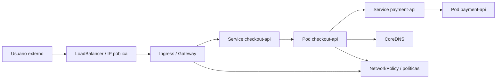
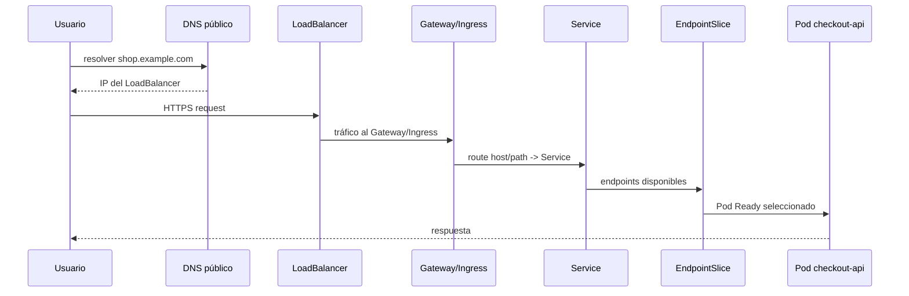
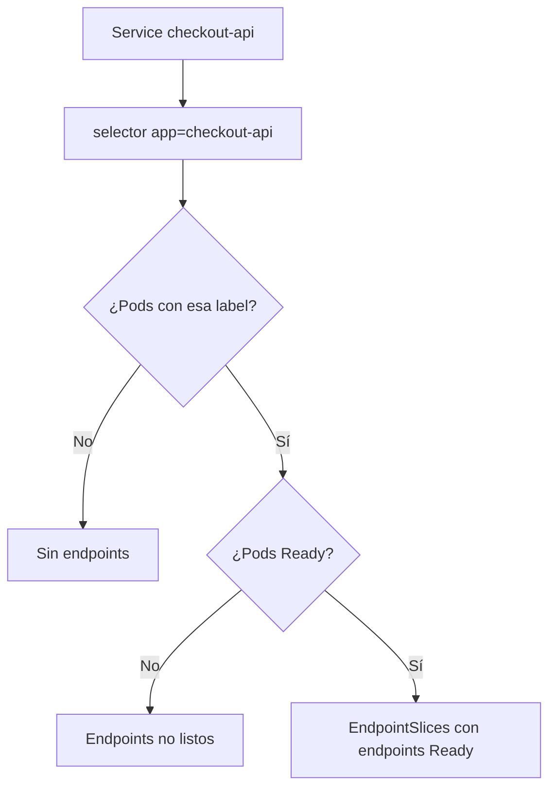
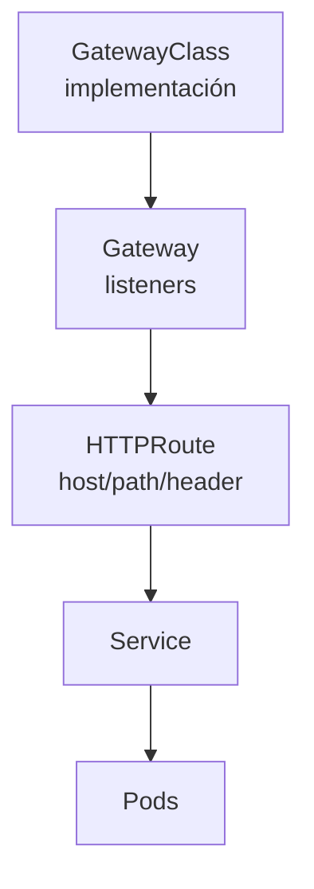

<!-- COURSE_NAV_START -->

[Anterior](<27. Multi-tenancy, namespaces y límites de plataforma.md>) | [Indice](README.md) | [Siguiente](<29. Service mesh, tráfico L7 y resiliencia de red.md>)

<!-- COURSE_NAV_END -->

# 28. Networking avanzado y tráfico en Kubernetes

## 28.1. Objetivo del módulo

En los módulos anteriores construiste una base importante para operar aplicaciones cloud native en Kubernetes: despliegues sin downtime, releases seguras, migraciones compatibles, feature flags, resiliencia, SLOs, autoscaling, seguridad de supply chain, Policy as Code y multi-tenancy. Este módulo conecta muchas de esas piezas a través de una dimensión que suele subestimarse hasta que falla: el tráfico.

En Kubernetes, casi todo pasa por la red. Un Pod habla con otro Pod, un Service selecciona endpoints, CoreDNS resuelve nombres, kube-proxy o el dataplane del CNI implementa rutas hacia backends, un Ingress o un Gateway recibe tráfico externo, una NetworkPolicy permite o bloquea comunicación, un Service mesh puede interceptar llamadas, una dependencia lenta puede disparar retries y una mala configuración de timeout puede convertir una degradación parcial en una cascada. Cuando algo falla, no basta con preguntar si los Pods están Running. Hay que entender si el tráfico llega, a dónde llega, cómo se resuelve el nombre, qué endpoints existen, qué política lo permite, qué balanceador participa, qué cabeceras se conservan, qué TLS termina dónde y qué señal observa el sistema.

Este módulo no trata networking como una colección de recursos YAML. Lo trata como un modelo de flujo. La pregunta no será solo “cómo creo un Service”, sino qué contrato de tráfico representa ese Service, qué backends selecciona, cómo se actualizan sus EndpointSlices, qué ocurre durante rollouts, cómo se expone al exterior, qué capa toma decisiones L4 o L7, cómo se depura una ruta completa y qué límites debes poner para que el tráfico no rompa resiliencia, seguridad o SLOs.

La tesis del módulo es esta:

> En Kubernetes, el tráfico no sigue tus intenciones; sigue objetos, labels, endpoints, políticas y dataplanes concretos.

La tesis operacional es esta:

> Operar networking en Kubernetes exige poder seguir una request de extremo a extremo: desde el cliente hasta el Pod, pasando por DNS, Service, EndpointSlice, Ingress o Gateway, políticas de red, balanceadores, timeouts, TLS, observabilidad y límites de plataforma.

En este módulo aprenderás:

- Qué modelo de red asume Kubernetes.
    
- Qué significa tráfico norte-sur y este-oeste.
    
- Qué papel tiene el CNI.
    
- Qué papel tiene kube-proxy o el dataplane equivalente.
    
- Cómo funcionan Services, selectors y EndpointSlices.
    
- Qué diferencia hay entre ClusterIP, NodePort, LoadBalancer, ExternalName y headless Services.
    
- Cómo funciona DNS dentro del cluster.
    
- Cómo depurar resolución DNS.
    
- Qué problemas aparecen con readiness y endpoints.
    
- Qué diferencia hay entre Ingress, Ingress Controller, Gateway API, API Gateway y Service mesh.
    
- Cuándo usar Ingress y cuándo Gateway API.
    
- Cómo modelar tráfico HTTP con Gateway, HTTPRoute y Services.
    
- Cómo pensar TLS termination.
    
- Cómo diseñar rutas por host, path, headers y versiones.
    
- Cómo se relaciona tráfico con canary, progressive delivery y feature flags.
    
- Cómo usar topology-aware routing como optimización de tráfico.
    
- Cómo depurar Services, endpoints, DNS, Ingress y Gateway.
    
- Cómo observar tráfico con métricas, logs y trazas.
    
- Cómo conectar networking con SLOs, resiliencia, multi-tenancy, seguridad y software economics.
    
- Cómo automatizar prácticas de diagnóstico con Taskfile.
    

La idea principal es sencilla:

```text
Si no puedes seguir el camino de una request, no puedes operar con seguridad una plataforma Kubernetes.
```

---

## 28.2. Por qué este módulo existe en un curso de Kubernetes

Kubernetes hace que muchas operaciones de red parezcan simples. Creas un Service y puedes llamar a `http://payment-api`. Creas un Ingress y tu aplicación queda expuesta. Añades un selector y Kubernetes conecta Pods con tráfico. Esa simplicidad es valiosa, pero puede ocultar lo que ocurre realmente. Cuando algo falla, necesitas ir más allá de la abstracción y entender qué recurso estaba tomando cada decisión.

Un problema de tráfico puede parecer un fallo de aplicación, de DNS, de Service, de readiness, de NetworkPolicy, de Ingress Controller, de TLS, de certificados, de balanceador cloud, de Gateway, de CNI, de CoreDNS, de endpoints, de kube-proxy, de service mesh o de una dependencia lenta. Si el equipo no tiene un modelo mental claro, cada incidente empieza como una exploración caótica. Se miran logs al azar, se reinician Pods que estaban sanos, se cambian timeouts sin criterio y se culpa a Kubernetes cuando el problema real era un selector incorrecto o una política de red incompleta.

Este módulo busca que puedas razonar sobre tráfico como una cadena de decisiones. Cada tramo tiene una pregunta: el cliente resuelve un nombre, llega a una entrada, la entrada elige una ruta, la ruta apunta a un Service, el Service tiene endpoints, los endpoints apuntan a Pods Ready, las policies permiten o bloquean, el backend responde dentro de un timeout y las señales quedan observadas. Si cualquiera de esos eslabones falla, la request falla o se degrada.

### Criterio de comprensión

Debes poder explicar:

> Kubernetes simplifica el consumo de servicios, pero operar tráfico exige entender los recursos y dataplanes que conectan una request con un Pod real.

---

## 28.3. El mapa de tráfico en Kubernetes

Antes de entrar en recursos concretos, necesitamos un mapa. En Kubernetes normalmente hablamos de dos grandes direcciones de tráfico.

|Tipo de tráfico|Qué representa|Ejemplo|
|---|---|---|
|Norte-sur|entra o sale del cluster|usuario externo → checkout-api|
|Este-oeste|ocurre dentro del cluster|checkout-api → payment-api|

El tráfico norte-sur suele pasar por un LoadBalancer cloud, un Ingress Controller, un Gateway, un API Gateway o un proxy de entrada. El tráfico este-oeste suele pasar por Services, DNS, EndpointSlices, NetworkPolicies y, si existe, un service mesh o dataplane CNI con capacidades avanzadas.



Este mapa no es universal. Cada cluster puede implementar detalles de forma distinta. Un cluster puede usar NGINX Ingress, Traefik, HAProxy, Envoy Gateway, Contour, Istio, Cilium, Linkerd, cloud load balancers, eBPF, iptables, IPVS u otros componentes. Lo importante para el curso es separar el modelo lógico de Kubernetes de la implementación concreta del cluster.

### Criterio de comprensión

Debes poder explicar:

> El tráfico norte-sur entra o sale del cluster; el tráfico este-oeste conecta workloads dentro del cluster. Ambos necesitan diseño, observabilidad y límites.

---

## 28.4. El modelo de red de Kubernetes

Kubernetes asume un modelo de red donde los Pods pueden comunicarse entre sí usando direcciones IP, los nodos pueden comunicarse con los Pods y no debería hacer falta NAT entre Pods dentro del cluster para el modelo básico. Esta idea permite que Kubernetes construya Services, DNS y endpoints sobre una red plana de Pods, aunque la implementación real dependa del plugin CNI y del entorno.

En la práctica, la red de Kubernetes la implementa el CNI del cluster. El CNI se encarga de conectar Pods a la red, asignar interfaces, configurar rutas y aplicar capacidades según la implementación. Algunos CNIs ofrecen NetworkPolicy, cifrado, eBPF, observabilidad, balanceo avanzado, integración con cloud, multi-cluster u otras capacidades. Otros son más simples. Por eso, dos clusters Kubernetes pueden tener la misma API y comportamientos diferentes en performance, políticas y depuración de red.

### Qué debes distinguir

|Capa|Pregunta|
|---|---|
|Modelo Kubernetes|¿Qué abstracciones existen?|
|CNI|¿Cómo se conectan realmente los Pods?|
|Service dataplane|¿Cómo llega tráfico de Service a Pod?|
|DNS|¿Cómo se resuelven nombres internos?|
|Ingress/Gateway|¿Cómo entra tráfico HTTP/TLS?|
|NetworkPolicy|¿Qué comunicación está permitida?|
|Observabilidad|¿Cómo veo latencia, errores y rutas?|

### Criterio de comprensión

Debes poder explicar:

> Kubernetes define un modelo de red; el CNI y los controladores concretos implementan ese modelo con capacidades y límites propios.

---

## 28.5. De una request a un Pod

Cuando un usuario llama a `https://shop.example.com/checkout`, la request atraviesa varias decisiones. Puede resolver un DNS público, llegar a un LoadBalancer cloud, entrar por un Gateway o Ingress, seleccionar una ruta HTTP, apuntar a un Service, elegir un endpoint, llegar a un Pod Ready y finalmente recibir una respuesta de la aplicación.



Durante un incidente, cada flecha puede fallar. El DNS público puede apuntar mal, el LoadBalancer puede no tener backends sanos, el Gateway puede no tener listener, la ruta puede no coincidir, el Service puede no tener endpoints, las labels pueden no seleccionar Pods, readiness puede estar fallando, NetworkPolicy puede bloquear tráfico, TLS puede estar mal configurado o el Pod puede responder tarde.

### Criterio de comprensión

Debes poder explicar:

> Depurar tráfico en Kubernetes consiste en seguir la request y comprobar cada decisión, no en reiniciar componentes al azar.

---

## 28.6. Services como contrato estable

Los Pods son efímeros. Cambian de IP, aparecen y desaparecen durante rollouts, escalado, fallos, rescheduling y despliegues. Un Service ofrece una identidad estable para acceder a un conjunto dinámico de Pods.

Un Service normalmente selecciona Pods mediante labels. Kubernetes mantiene la relación entre Service y backends mediante EndpointSlices. Cuando un Pod aparece, desaparece o deja de estar Ready, los endpoints cambian. Esta relación es esencial para entender por qué un Service puede existir y aun así no recibir tráfico útil.

### Ejemplo de Service

```yaml
apiVersion: v1
kind: Service
metadata:
  name: checkout-api
  namespace: shop
  labels:
    app.kubernetes.io/name: checkout-api
    app.kubernetes.io/component: api
    app.kubernetes.io/part-of: shop
spec:
  selector:
    app.kubernetes.io/name: checkout-api
  ports:
    - name: http
      port: 80
      targetPort: http
```

### Preguntas clave

- ¿El Service tiene selector?
    
- ¿El selector coincide con labels de Pods?
    
- ¿El puerto del Service apunta al `targetPort` correcto?
    
- ¿El container expone ese puerto?
    
- ¿Los Pods están Ready?
    
- ¿Existen EndpointSlices?
    
- ¿Las NetworkPolicies permiten tráfico?
    
- ¿El cliente usa el nombre DNS correcto?
    

### Criterio de comprensión

Debes poder explicar:

> Un Service no envía tráfico a “una aplicación”. Envía tráfico a endpoints seleccionados por labels y readiness.

---

## 28.7. EndpointSlices

EndpointSlice representa los endpoints disponibles para un Service. En vez de manejar una lista gigante de endpoints en un único objeto, Kubernetes distribuye esa información en slices. Para operar tráfico, los EndpointSlices son una fuente de verdad muy útil: muestran qué direcciones IP y puertos son candidatos reales para recibir tráfico.

### Comandos útiles

```bash
kubectl get endpointslice -n shop
kubectl get endpointslice -n shop -l kubernetes.io/service-name=checkout-api
kubectl describe endpointslice -n shop -l kubernetes.io/service-name=checkout-api
```

### Qué mirar

- Direcciones IP.
    
- Puertos.
    
- Condición Ready.
    
- Service asociado.
    
- Labels.
    
- Cantidad de endpoints.
    
- Distribución por zona, si aplica.
    
- Diferencia entre Pods esperados y endpoints reales.
    

### Error común

Un Deployment puede tener Pods Running y el Service puede existir, pero si los Pods no están Ready o el selector no coincide, el Service puede quedarse sin endpoints útiles.



### Criterio de comprensión

Debes poder explicar:

> Cuando un Service falla, mirar EndpointSlices suele ser más útil que mirar solo el Service.

---

## 28.8. Tipos de Service

Kubernetes ofrece varios tipos de Service. Cada uno responde a una necesidad distinta.

|Tipo|Uso principal|Riesgo si se usa mal|
|---|---|---|
|ClusterIP|acceso interno dentro del cluster|asumir que expone hacia fuera|
|NodePort|puerto en cada nodo|exposición amplia y difícil de gobernar|
|LoadBalancer|balanceador externo gestionado por proveedor|coste y exposición externa|
|ExternalName|alias DNS hacia nombre externo|confusión, dependencia externa|
|Headless|descubrimiento directo de Pods|acoplamiento a endpoints|

### ClusterIP

Es el tipo por defecto. Sirve para comunicación interna entre workloads.

```yaml
apiVersion: v1
kind: Service
metadata:
  name: payment-api
  namespace: shop
spec:
  type: ClusterIP
  selector:
    app.kubernetes.io/name: payment-api
  ports:
    - name: http
      port: 80
      targetPort: http
```

### NodePort

Expone un puerto en los nodos. Puede ser útil para laboratorios o integraciones específicas, pero en plataformas profesionales suele gobernarse con cuidado porque abre una superficie de exposición más amplia.

### LoadBalancer

Pide al proveedor de infraestructura un balanceador externo. Es útil para puntos de entrada, pero puede tener coste, límites cloud y políticas de seguridad asociadas.

### ExternalName

Crea un alias DNS hacia un nombre externo. Puede ser cómodo, pero no crea un proxy ni valida disponibilidad. Es una forma de discovery, no una abstracción completa de resiliencia.

### Headless Service

Un headless Service no crea un ClusterIP y permite descubrir directamente endpoints. Es útil para algunos sistemas stateful, service discovery específico o workloads que necesitan conocer backends individuales.

### Criterio de comprensión

Debes poder explicar:

> El tipo de Service expresa cómo quieres exponer o descubrir backends. Elegirlo mal crea exposición, coste o acoplamiento innecesario.

---

## 28.9. DNS interno

Kubernetes crea nombres DNS para Services. Normalmente puedes resolver un Service dentro del mismo namespace con su nombre corto:

```text
payment-api
```

Desde otro namespace, puedes usar:

```text
payment-api.shop
```

Y el nombre completamente cualificado suele tener esta forma:

```text
payment-api.shop.svc.cluster.local
```

DNS interno es una pieza crítica de la experiencia Kubernetes. Permite que una aplicación no tenga que conocer IPs de Pods ni direcciones cambiantes. Pero también introduce su propia clase de problemas: resolución lenta, CoreDNS saturado, configuración incorrecta, búsqueda de namespaces inesperada, políticas egress que bloquean DNS o clientes que cachean respuestas de forma inadecuada.

### Comandos de depuración

```bash
kubectl run dns-debug -n shop --image=busybox:1.36 --restart=Never -- sleep 3600
kubectl exec -n shop dns-debug -- nslookup payment-api
kubectl exec -n shop dns-debug -- nslookup payment-api.shop.svc.cluster.local
kubectl exec -n shop dns-debug -- cat /etc/resolv.conf
kubectl logs -n kube-system deployment/coredns
```

### Criterio de comprensión

Debes poder explicar:

> DNS permite usar nombres estables, pero una resolución correcta no garantiza que el tráfico llegue ni que el backend responda.

---

## 28.10. CoreDNS y problemas de resolución

CoreDNS suele resolver nombres dentro del cluster. Cuando falla, muchos servicios parecen caídos aunque los Pods estén sanos. Por eso, DNS debe observarse y depurarse como parte del sistema.

### Síntomas comunes

- `no such host`.
    
- Resoluciones lentas.
    
- Timeouts de DNS.
    
- Errores intermitentes.
    
- Latencia alta en llamadas internas.
    
- Pods que funcionan con IP pero no con nombre.
    
- Fallos tras aplicar default deny egress.
    
- CoreDNS con CPU alta.
    
- CoreDNS sin endpoints o con Pods no Ready.
    

### Preguntas de diagnóstico

- ¿El nombre es correcto?
    
- ¿El namespace es correcto?
    
- ¿El Service existe?
    
- ¿CoreDNS está Running y Ready?
    
- ¿La NetworkPolicy permite egress a DNS?
    
- ¿El Pod puede llegar al Service de DNS?
    
- ¿Hay errores en logs de CoreDNS?
    
- ¿El cliente cachea DNS?
    
- ¿Hay demasiadas consultas por request?
    

### Criterio de comprensión

Debes poder explicar:

> Un fallo de DNS puede parecer un fallo de aplicación. La depuración debe separar resolución de nombre, conexión y respuesta del backend.

---

## 28.11. Readiness, endpoints y tráfico durante rollouts

Readiness decide si un Pod debe recibir tráfico. Durante un rollout, Kubernetes crea nuevos Pods, espera a que estén Ready y actualiza endpoints. Si readiness está mal diseñada, el tráfico puede llegar demasiado pronto o dejar de llegar cuando todavía habría capacidad útil.

### Buen diseño

- Startup probe protege arranque lento.
    
- Readiness indica capacidad real para recibir tráfico.
    
- Liveness no depende de servicios externos.
    
- Graceful shutdown marca el Pod como no Ready antes de terminar.
    
- `terminationGracePeriodSeconds` permite cerrar requests.
    
- `maxUnavailable` y `maxSurge` mantienen capacidad durante rollout.
    

### Fallo típico

```text
Pod arranca
readiness responde OK demasiado pronto
Service lo incluye como endpoint
empieza a recibir tráfico
la app todavía no tiene caches, conexiones o configuración lista
aparecen 5xx
```

### Otro fallo típico

```text
payment-api externo falla
readiness de checkout-api depende de payment-api
todos los Pods checkout-api dejan de estar Ready
Service queda sin endpoints
el sistema pierde capacidad aunque checkout-api podría degradar
```

### Criterio de comprensión

Debes poder explicar:

> Readiness no es decoración. Controla si un Pod aparece como backend de tráfico.

---

## 28.12. kube-proxy, iptables, IPVS y eBPF

Kubernetes Services necesitan un dataplane que haga llegar tráfico desde la IP o nombre del Service hacia los Pods backend. En muchos clusters, kube-proxy implementa esa lógica con iptables o IPVS. En otros, un CNI con eBPF puede reemplazar parte de esa funcionalidad.

Para usar Kubernetes no necesitas memorizar todos los detalles internos, pero sí debes entender que un Service no es un proceso escuchando. Es una abstracción implementada por reglas de red, proxying o dataplane. Esto importa al depurar performance, conntrack, balanceo, problemas de nodo, políticas de red y diferencias entre clusters.

### Qué debes saber

- El comportamiento concreto depende del cluster.
    
- El dataplane puede influir en latencia y observabilidad.
    
- Algunos problemas ocurren solo en ciertos nodos.
    
- Un Service puede funcionar desde un Pod y fallar desde otro si hay políticas o rutas distintas.
    
- Los CNIs avanzados pueden añadir observabilidad y funcionalidades extra.
    
- No todas las capacidades de red son portables entre clusters.
    

### Criterio de comprensión

Debes poder explicar:

> Un Service es una abstracción de API; el tráfico real lo implementa el dataplane del cluster.

---

## 28.13. Session affinity y distribución de tráfico

Por defecto, un Service reparte tráfico entre endpoints según el dataplane. Si necesitas que un cliente vaya al mismo backend durante cierto tiempo, Kubernetes ofrece `sessionAffinity: ClientIP`.

### Ejemplo

```yaml
apiVersion: v1
kind: Service
metadata:
  name: checkout-api
  namespace: shop
spec:
  selector:
    app.kubernetes.io/name: checkout-api
  sessionAffinity: ClientIP
  ports:
    - name: http
      port: 80
      targetPort: http
```

### Cuándo puede tener sentido

- Aplicaciones legacy con estado local temporal.
    
- Sesiones que no se han externalizado.
    
- Flujos que dependen de cache local.
    
- Workloads internos muy específicos.
    

### Riesgos

- Peor balanceo.
    
- Hotspots.
    
- Menor resiliencia ante caída de Pod.
    
- Acoplamiento a estado local.
    
- Dificulta autoscaling.
    
- Oculta problemas de diseño de sesión.
    

### Regla

Antes de usar session affinity, pregunta por qué la aplicación necesita estado local.

### Criterio de comprensión

Debes poder explicar:

> Session affinity puede resolver un síntoma, pero también puede esconder que la aplicación no está preparada para escalar horizontalmente.

---

## 28.14. Topology-aware routing

En clusters multi-zona, enviar tráfico a endpoints de otra zona puede aumentar latencia y coste. Topology-aware routing intenta mantener tráfico dentro de la misma zona cuando hay endpoints disponibles y capacidad suficiente.

### Qué problema intenta resolver

- Reducir latencia inter-zona.
    
- Reducir coste de transferencia entre zonas.
    
- Mejorar locality.
    
- Evitar saltos innecesarios.
    

### Qué debes tener en cuenta

- No sustituye alta disponibilidad multi-zona.
    
- Depende del soporte y configuración del cluster.
    
- Puede comportarse distinto según distribución de endpoints.
    
- Necesita suficiente capacidad por zona.
    
- Debe observarse antes de asumir beneficio.
    
- No debe romper resiliencia por preferir locality demasiado agresivamente.
    

### Criterio de comprensión

Debes poder explicar:

> Topology-aware routing optimiza locality, pero solo ayuda si cada zona tiene capacidad suficiente y el cluster lo soporta correctamente.

---

## 28.15. Ingress

Ingress es un recurso Kubernetes para exponer servicios HTTP o HTTPS mediante reglas de host y path. Ingress por sí solo no implementa tráfico. Necesitas un Ingress Controller que observe recursos Ingress y configure un proxy o balanceador real.

### Ejemplo

```yaml
apiVersion: networking.k8s.io/v1
kind: Ingress
metadata:
  name: checkout-api
  namespace: shop
spec:
  ingressClassName: nginx
  rules:
    - host: shop.example.com
      http:
        paths:
          - path: /checkout
            pathType: Prefix
            backend:
              service:
                name: checkout-api
                port:
                  number: 80
```

### Qué resuelve

- Enrutado HTTP por host.
    
- Enrutado HTTP por path.
    
- Terminación TLS, según controlador.
    
- Exposición externa.
    
- Integración con LoadBalancer.
    
- Punto común de entrada para APIs o webs.
    

### Límites

Ingress es relativamente simple. Muchas capacidades avanzadas dependen de annotations específicas del controlador, lo que reduce portabilidad. Si necesitas routing más expresivo, separación de roles entre plataforma y equipos, tráfico avanzado o extensibilidad, Gateway API suele ser una alternativa más moderna.

### Criterio de comprensión

Debes poder explicar:

> Ingress define intención de entrada HTTP, pero el comportamiento real depende del Ingress Controller.

---

## 28.16. Ingress Controller no es Ingress

Es importante separar el recurso de Kubernetes del componente que lo implementa.

|Elemento|Qué es|
|---|---|
|Ingress|recurso Kubernetes con reglas HTTP|
|IngressClass|indica qué controlador debe gestionarlo|
|Ingress Controller|componente que configura proxy/balanceador|
|LoadBalancer|infraestructura que expone el controlador|
|Service backend|destino interno|

Un Ingress puede estar perfectamente escrito y no funcionar si no hay controlador, si la `ingressClassName` no coincide, si el controlador no tiene Service externo, si TLS falla o si las policies bloquean el tráfico.

### Comandos útiles

```bash
kubectl get ingress -A
kubectl describe ingress -n shop checkout-api
kubectl get ingressclass
kubectl get pods -A | grep ingress
kubectl logs -n ingress-nginx deployment/ingress-nginx-controller
```

### Criterio de comprensión

Debes poder explicar:

> Ingress es configuración; Ingress Controller es quien hace que esa configuración afecte al tráfico real.

---

## 28.17. Gateway API

Gateway API es una familia de recursos para modelar tráfico de forma más expresiva y extensible que Ingress. Introduce una separación más clara entre infraestructura compartida y rutas de aplicación. En muchos diseños, el equipo de plataforma gestiona Gateways y listeners, mientras los equipos de aplicación gestionan Routes dentro de límites definidos.

### Recursos importantes

|Recurso|Responsabilidad|
|---|---|
|GatewayClass|tipo de implementación o controlador|
|Gateway|punto de entrada con listeners|
|HTTPRoute|reglas HTTP hacia Services|
|GRPCRoute|reglas gRPC hacia Services|
|ReferenceGrant|permiso para referencias cross-namespace|
|BackendTLSPolicy|configuración TLS hacia backends, según soporte|

### Modelo mental



### Por qué importa

Gateway API permite expresar responsabilidades de plataforma y aplicación con más claridad. El equipo de plataforma puede controlar qué listeners existen, qué dominios se exponen y qué namespaces pueden adjuntar rutas. Los equipos de producto pueden definir rutas sin gestionar toda la infraestructura de entrada.

### Criterio de comprensión

Debes poder explicar:

> Gateway API separa mejor infraestructura de entrada y reglas de aplicación, lo que encaja bien con plataformas multi-tenant.

---

## 28.18. Gateway y HTTPRoute

Un Gateway define listeners. Un HTTPRoute define reglas que se adjuntan a un Gateway y envían tráfico a uno o varios Services.

### Gateway

```yaml
apiVersion: gateway.networking.k8s.io/v1
kind: Gateway
metadata:
  name: public-gateway
  namespace: platform-ingress
spec:
  gatewayClassName: example-gateway-class
  listeners:
    - name: https
      protocol: HTTPS
      port: 443
      hostname: shop.example.com
      tls:
        mode: Terminate
        certificateRefs:
          - name: shop-example-com-tls
```

### HTTPRoute

```yaml
apiVersion: gateway.networking.k8s.io/v1
kind: HTTPRoute
metadata:
  name: checkout-route
  namespace: shop
spec:
  parentRefs:
    - name: public-gateway
      namespace: platform-ingress
  hostnames:
    - shop.example.com
  rules:
    - matches:
        - path:
            type: PathPrefix
            value: /checkout
      backendRefs:
        - name: checkout-api
          port: 80
```

### Qué mirar al depurar

- ¿Existe GatewayClass?
    
- ¿Existe Gateway?
    
- ¿El listener está Accepted?
    
- ¿El HTTPRoute está Accepted?
    
- ¿La route está adjuntada al Gateway?
    
- ¿El hostname coincide?
    
- ¿El path coincide?
    
- ¿El backendRef apunta al Service correcto?
    
- ¿Hay permisos cross-namespace necesarios?
    
- ¿El controlador soporta la feature usada?
    

### Criterio de comprensión

Debes poder explicar:

> Gateway recibe tráfico; HTTPRoute decide cómo se enruta ese tráfico hacia Services.

---

## 28.19. Ingress vs Gateway API

Ingress y Gateway API pueden resolver problemas parecidos, pero no tienen el mismo modelo.

|Necesidad|Ingress|Gateway API|
|---|--:|--:|
|HTTP básico por host/path|Sí|Sí|
|Modelo más simple|Sí|No tanto|
|Separación plataforma/app|Limitada|Mejor|
|Routing avanzado|Por annotations/controlador|Modelo más expresivo|
|Multi-tenancy|Más difícil|Mejor con parentRefs y policies|
|Portabilidad|Limitada por annotations|Mejor intención común|
|Extensibilidad|Menor|Mayor|
|gRPC específico|Depende|GRPCRoute|
|Roles compartidos|Limitado|Mejor diseñado|

### Regla

Usa Ingress si tus necesidades son simples y tu plataforma ya lo opera bien. Considera Gateway API si necesitas multi-tenancy más clara, rutas más expresivas, separación de responsabilidades o evolución hacia un modelo más estándar de tráfico.

### Criterio de comprensión

Debes poder explicar:

> Gateway API no es solo “Ingress nuevo”; introduce un modelo de roles y rutas más adecuado para plataformas compartidas.

---

## 28.20. API Gateway, Ingress y Service mesh

Estos términos se mezclan mucho. Conviene separarlos.

|Componente|Dónde actúa|Qué suele resolver|
|---|---|---|
|Ingress Controller|entrada HTTP al cluster|host/path, TLS, proxy externo|
|Gateway API controller|entrada y routing declarativo|listeners, routes, multi-tenancy|
|API Gateway|frontera de APIs|auth, rate limit, quotas, plans, API lifecycle|
|Service mesh|tráfico servicio-servicio|mTLS, retries, telemetry, policies L7|
|Service Kubernetes|discovery y load balancing interno|IP estable y endpoints|

Un Ingress Controller puede hacer algunas funciones de API Gateway. Un API Gateway puede correr dentro o fuera del cluster. Un service mesh puede gestionar tráfico este-oeste y, a veces, entrada. La decisión no debe basarse solo en nombres de herramientas, sino en responsabilidades.

### Preguntas de diseño

- ¿Dónde se autentica al cliente externo?
    
- ¿Dónde se aplica rate limiting?
    
- ¿Dónde se termina TLS?
    
- ¿Dónde se hace mTLS interno?
    
- ¿Quién posee las rutas?
    
- ¿Quién observa latencia y errores?
    
- ¿Quién gestiona retries?
    
- ¿Quién aplica políticas de tenant?
    
- ¿Qué equipo opera cada capa?
    

### Criterio de comprensión

Debes poder explicar:

> Ingress, Gateway, API Gateway y service mesh pueden solaparse, pero no resuelven exactamente el mismo problema operativo.

---

## 28.21. TLS termination

TLS puede terminar en varios puntos. Cada opción cambia seguridad, observabilidad, certificados, performance y responsabilidades.

### Opciones comunes

|Terminación|Descripción|
|---|---|
|En LoadBalancer externo|TLS termina antes del cluster|
|En Ingress/Gateway|TLS termina en el punto de entrada Kubernetes|
|Passthrough hasta aplicación|la app termina TLS|
|mTLS interno|servicios internos verifican identidad mutua|

### Preguntas de diseño

- ¿Dónde están los certificados?
    
- ¿Quién los renueva?
    
- ¿Dónde se inspecciona HTTP?
    
- ¿Qué tráfico queda cifrado dentro del cluster?
    
- ¿Necesitas mTLS entre servicios?
    
- ¿El backend espera HTTP o HTTPS?
    
- ¿Cómo se rotan certificados?
    
- ¿Qué logs quedan en cada capa?
    
- ¿Qué política exige producción?
    

### Criterio de comprensión

Debes poder explicar:

> TLS termination no es solo configuración de certificados. Define qué capa puede ver, enrutar, observar y proteger el tráfico.

---

## 28.22. HTTP routing por host, path y headers

El routing L7 permite tomar decisiones usando propiedades HTTP: host, path, método, headers o query params, según soporte del controlador. Esto habilita rutas por API, versiones, tenants, pruebas internas o migraciones progresivas.

### Ejemplo conceptual con HTTPRoute

```yaml
apiVersion: gateway.networking.k8s.io/v1
kind: HTTPRoute
metadata:
  name: checkout-route
  namespace: shop
spec:
  parentRefs:
    - name: public-gateway
      namespace: platform-ingress
  hostnames:
    - shop.example.com
  rules:
    - matches:
        - path:
            type: PathPrefix
            value: /checkout
      backendRefs:
        - name: checkout-api
          port: 80
    - matches:
        - path:
            type: PathPrefix
            value: /internal/checkout
          headers:
            - name: X-Internal-User
              value: "true"
      backendRefs:
        - name: checkout-api
          port: 80
```

### Cuidado

Routing por headers puede ser útil, pero también puede crear bypasses si headers no están protegidos o si vienen de clientes externos sin validación. Si una ruta interna depende de un header, debes tener claro quién puede establecerlo y dónde se valida.

### Criterio de comprensión

Debes poder explicar:

> El routing HTTP avanzado es potente, pero cada condición de ruta debe tener un modelo de confianza claro.

---

## 28.23. Canary y traffic splitting

El tráfico puede dividirse entre versiones para reducir riesgo. Esto puede hacerse con service mesh, Gateway API si el controlador lo soporta, Ingress Controller con capacidades específicas o herramientas de progressive delivery como Argo Rollouts.

### Ejemplo conceptual

```text
90% tráfico -> checkout-api-v1
10% tráfico -> checkout-api-v2
```

### Qué protege

- Reduce blast radius.
    
- Permite observar una versión nueva con tráfico real.
    
- Facilita rollback o abort.
    
- Conecta despliegue con SLOs.
    
- Ayuda a validar performance y errores antes de exponer al 100%.
    

### Qué no resuelve

- Migraciones incompatibles.
    
- Falta de idempotencia.
    
- Dependencias saturadas.
    
- Errores que solo aparecen con cierto tenant.
    
- Feature flags mal diseñadas.
    
- Observabilidad insuficiente.
    

### Relación con módulos anteriores

- Módulo 18: progressive delivery y Deployments.
    
- Módulo 21: feature flags separan deploy y release.
    
- Módulo 22: resiliencia evita cascadas.
    
- Módulo 23: SLOs deciden si promover o abortar.
    
- Módulo 24: capacity evita que v2 se quede sin recursos.
    
- Módulo 26: policies evitan rutas inseguras.
    
- Módulo 27: multi-tenancy define quién puede tocar rutas.
    

### Criterio de comprensión

Debes poder explicar:

> Traffic splitting reduce riesgo de exposición, pero solo es seguro si las versiones son compatibles y las señales de SLO permiten decidir.

---

## 28.24. Retries, timeouts y tráfico

Retries y timeouts pueden configurarse en aplicación, gateway, ingress, service mesh o cliente externo. Si cada capa decide sin coordinación, el tráfico puede multiplicarse.

### Riesgo

```text
cliente reintenta
gateway reintenta
service mesh reintenta
app reintenta
worker reintenta
```

Una request de usuario puede convertirse en muchas llamadas internas. Si el downstream está degradado, esto genera retry storms.

### Regla

La política de retries debe ser de sistema, no de capa aislada.

### Preguntas

- ¿Qué capa tiene el timeout total?
    
- ¿Qué capa reintenta?
    
- ¿Qué errores son retryables?
    
- ¿Hay idempotencia?
    
- ¿Hay jitter?
    
- ¿Hay retry budget?
    
- ¿Hay circuit breaker?
    
- ¿La métrica de tráfico muestra intentos o requests de usuario?
    
- ¿Qué capa registra el retry?
    

### Criterio de comprensión

Debes poder explicar:

> El tráfico no solo aumenta por usuarios. También aumenta por políticas de retries mal coordinadas.

---

## 28.25. NetworkPolicy en un módulo de tráfico

El módulo siguiente profundizará en seguridad runtime, RBAC y políticas de red. Aquí usamos NetworkPolicy desde la perspectiva del flujo de tráfico: qué comunicación está permitida y cómo afecta a depuración.

### Default deny egress y DNS

Si aplicas default deny egress, es frecuente romper DNS. Un Pod puede no resolver nombres porque no puede hablar con CoreDNS.

### Ejemplo conceptual para permitir DNS

```yaml
apiVersion: networking.k8s.io/v1
kind: NetworkPolicy
metadata:
  name: allow-dns
  namespace: shop
spec:
  podSelector: {}
  policyTypes:
    - Egress
  egress:
    - to:
        - namespaceSelector:
            matchLabels:
              kubernetes.io/metadata.name: kube-system
      ports:
        - protocol: UDP
          port: 53
        - protocol: TCP
          port: 53
```

Este ejemplo puede necesitar adaptación según labels reales del namespace, CNI y despliegue de CoreDNS.

### Criterio de comprensión

Debes poder explicar:

> Una NetworkPolicy puede hacer que un problema parezca DNS, Service o aplicación. La depuración de tráfico debe incluir policies.

---

## 28.26. Egress desde el cluster

El tráfico de salida es tan importante como el de entrada. Muchas aplicaciones llaman a APIs externas, proveedores de pago, sistemas legacy, servicios SaaS, registries, bases de datos gestionadas o endpoints cloud. En Kubernetes, el egress puede pasar por NAT, gateways, firewalls, service mesh, proxies corporativos o políticas cloud.

### Preguntas de diseño

- ¿Qué workloads pueden salir a internet?
    
- ¿Qué destinos externos están permitidos?
    
- ¿Hay egress gateway?
    
- ¿Cómo se controla DNS externo?
    
- ¿Cómo se observan errores de salida?
    
- ¿Cómo se aplican timeouts?
    
- ¿Cómo se gestionan certificados?
    
- ¿Qué IP ve el proveedor externo?
    
- ¿Hay rate limits externos?
    
- ¿Hay allowlists por IP?
    
- ¿Qué ocurre si el NAT gateway se satura?
    
- ¿Hay NetworkPolicy egress?
    
- ¿Hay costes de tráfico inter-zona o internet?
    

### Criterio de comprensión

Debes poder explicar:

> Egress no controlado rompe seguridad, coste y resiliencia. Las llamadas externas deben ser explícitas y observables.

---

## 28.27. External Services y dependencias fuera del cluster

No todas las dependencias viven dentro del cluster. Puedes llamar a una base de datos gestionada, una API externa, un broker externo o un sistema legacy. Kubernetes puede ayudarte a representar algunas dependencias mediante Services sin selector, Endpoints gestionados manualmente o ExternalName, pero eso no convierte una dependencia externa en resiliente.

### ExternalName

```yaml
apiVersion: v1
kind: Service
metadata:
  name: legacy-payment
  namespace: shop
spec:
  type: ExternalName
  externalName: payment.legacy.example.com
```

### Cuándo puede tener sentido

- Alias interno para dependencia externa.
    
- Transición desde legacy.
    
- Evitar hardcodear nombres externos en muchas apps.
    
- Simplificar configuración.
    

### Riesgos

- Puede ocultar que la dependencia está fuera del cluster.
    
- No aplica load balancing Kubernetes real sobre backends.
    
- No resuelve TLS, auth, retries ni observabilidad.
    
- Puede confundir ownership.
    
- Puede dificultar debugging si nadie documenta el destino real.
    

### Criterio de comprensión

Debes poder explicar:

> Representar una dependencia externa como Service puede ayudar al discovery, pero no cambia sus límites de red, seguridad ni resiliencia.

---

## 28.28. Headless Services y descubrimiento directo

Un headless Service permite descubrir endpoints sin un ClusterIP. Es útil cuando el cliente necesita conocer backends individuales, como en algunos sistemas stateful, bases de datos, brokers o protocolos específicos.

### Ejemplo

```yaml
apiVersion: v1
kind: Service
metadata:
  name: payment-api-headless
  namespace: shop
spec:
  clusterIP: None
  selector:
    app.kubernetes.io/name: payment-api
  ports:
    - name: http
      port: 80
      targetPort: http
```

### Cuándo usarlo

- StatefulSets.
    
- Sistemas que necesitan identidad por Pod.
    
- Service discovery externo.
    
- Clientes que implementan su propio balanceo.
    
- Casos donde no quieres una IP virtual de Service.
    

### Riesgos

- Más acoplamiento a endpoints.
    
- Mayor responsabilidad en cliente.
    
- Rebalanceo menos transparente.
    
- Comportamiento distinto ante rollouts.
    
- Necesidad de entender DNS y endpoints.
    

### Criterio de comprensión

Debes poder explicar:

> Headless Service da más visibilidad de endpoints al cliente, pero también le transfiere más responsabilidad.

---

## 28.29. Multi-cluster y tráfico entre clusters

Este módulo no profundiza en multi-cluster, pero es importante entender que muchos problemas de tráfico reaparecen con más complejidad cuando hay varios clusters: discovery, failover, latencia, consistencia de políticas, certificados, rutas, DNS, costes inter-región, observabilidad y ownership.

### Preguntas mínimas

- ¿Quién decide a qué cluster va el usuario?
    
- ¿Hay DNS global?
    
- ¿Hay balanceador global?
    
- ¿Hay failover manual o automático?
    
- ¿Cómo se evita split brain?
    
- ¿Cómo se propagan certificados?
    
- ¿Cómo se sincronizan policies?
    
- ¿Cómo se observan trazas entre clusters?
    
- ¿Qué ocurre con datos?
    
- ¿Qué SLO protege el diseño multi-cluster?
    
- ¿Qué coste inter-región introduce?
    

### Criterio de comprensión

Debes poder explicar:

> Multi-cluster no es simplemente duplicar Kubernetes. Duplica y amplifica decisiones de tráfico, datos, observabilidad y operación.

---

## 28.30. Observabilidad de tráfico

Para operar networking necesitas señales de tráfico. No basta con saber que los Pods existen. Debes ver requests, latencia, errores, saturación, endpoints, retries, timeouts, DNS, rutas y cambios de configuración.

### Métricas útiles

```text
http_requests_total{service="checkout-api",route="/checkout",status="500"}
http_request_duration_seconds_bucket{service="checkout-api",route="/checkout"}
http_client_request_duration_seconds_bucket{dependency="payment-api"}
http_client_errors_total{dependency="payment-api",type="timeout"}
gateway_requests_total{gateway="public-gateway",route="checkout-route"}
gateway_request_duration_seconds_bucket{route="checkout-route"}
dns_request_duration_seconds_bucket
dns_errors_total
network_policy_denied_total
service_endpoints_ready{service="checkout-api"}
```

Los nombres exactos dependen de tu stack, controlador y librerías. Lo importante es que puedas separar entrada, aplicación, dependencias, DNS y dataplane.

### Logs útiles

- Access logs del Gateway o Ingress.
    
- Logs de aplicación con correlation ID.
    
- Logs de DNS cuando sea necesario.
    
- Logs de controller.
    
- Logs de service mesh, si aplica.
    
- Eventos Kubernetes.
    

### Trazas

Las trazas son especialmente útiles para requests que atraviesan varios servicios. Ayudan a ver dónde se consume el presupuesto de latencia, qué dependencia falla, si hubo retry y qué servicio devolvió error.

### Criterio de comprensión

Debes poder explicar:

> La observabilidad de tráfico debe permitir distinguir fallo de entrada, fallo interno, fallo DNS, fallo de dependencia y fallo de política.

---

## 28.31. Debugging de Services

Cuando un Service no funciona, no empieces reiniciando Pods. Sigue una secuencia.

### Checklist

1. ¿El Service existe?
    
2. ¿El Service tiene selector?
    
3. ¿Los Pods tienen labels que coinciden?
    
4. ¿Los Pods están Ready?
    
5. ¿Hay EndpointSlices?
    
6. ¿El puerto y `targetPort` son correctos?
    
7. ¿El Pod escucha en ese puerto?
    
8. ¿DNS resuelve el Service?
    
9. ¿NetworkPolicy permite tráfico?
    
10. ¿La app responde desde dentro del cluster?
    
11. ¿El problema ocurre desde todos los Pods o solo algunos?
    
12. ¿Hay eventos recientes?
    
13. ¿Hubo rollout?
    

### Comandos

```bash
kubectl get svc -n shop checkout-api
kubectl describe svc -n shop checkout-api
kubectl get pods -n shop -l app.kubernetes.io/name=checkout-api --show-labels
kubectl get endpointslice -n shop -l kubernetes.io/service-name=checkout-api
kubectl describe endpointslice -n shop -l kubernetes.io/service-name=checkout-api
kubectl run curl-debug -n shop --image=curlimages/curl --restart=Never -- sleep 3600
kubectl exec -n shop curl-debug -- curl -v http://checkout-api
```

### Criterio de comprensión

Debes poder explicar:

> Depurar un Service es comprobar selector, endpoints, readiness, puertos, DNS y policies en orden.

---

## 28.32. Debugging de Ingress

Cuando una ruta externa falla, necesitas separar entrada, routing, Service y backend.

### Checklist

1. ¿El DNS público apunta al LoadBalancer correcto?
    
2. ¿El LoadBalancer está creado?
    
3. ¿El Ingress Controller está Running?
    
4. ¿Existe IngressClass?
    
5. ¿El Ingress usa la clase correcta?
    
6. ¿El host coincide?
    
7. ¿El path coincide?
    
8. ¿TLS está bien configurado?
    
9. ¿El backend Service existe?
    
10. ¿El backend Service tiene endpoints?
    
11. ¿Hay errores en logs del controller?
    
12. ¿NetworkPolicy permite tráfico controller → backend?
    
13. ¿La app responde desde dentro del cluster?
    

### Comandos

```bash
kubectl get ingress -n shop
kubectl describe ingress -n shop checkout-api
kubectl get ingressclass
kubectl get svc -A | grep ingress
kubectl get pods -A | grep ingress
kubectl logs -n ingress-nginx deployment/ingress-nginx-controller --since=15m
kubectl get svc -n shop checkout-api
kubectl get endpointslice -n shop -l kubernetes.io/service-name=checkout-api
```

### Criterio de comprensión

Debes poder explicar:

> Depurar Ingress exige comprobar entrada externa, controller, regla HTTP, Service, endpoints y permisos de red.

---

## 28.33. Debugging de Gateway API

Gateway API añade más recursos y condiciones de estado. Eso mejora expresividad, pero exige saber leer condiciones.

### Checklist

1. ¿Existe GatewayClass?
    
2. ¿El controller soporta esa GatewayClass?
    
3. ¿El Gateway está Accepted?
    
4. ¿Los listeners están Programmed?
    
5. ¿El HTTPRoute está Accepted?
    
6. ¿El HTTPRoute está attached al Gateway?
    
7. ¿El hostname coincide?
    
8. ¿El path/header coincide?
    
9. ¿Hay ReferenceGrant si cruza namespaces?
    
10. ¿El backend Service existe?
    
11. ¿El backend tiene endpoints?
    
12. ¿El controller soporta la feature usada?
    
13. ¿Hay logs del controller?
    

### Comandos

```bash
kubectl get gatewayclass
kubectl get gateway -A
kubectl describe gateway -n platform-ingress public-gateway
kubectl get httproute -A
kubectl describe httproute -n shop checkout-route
kubectl get svc -n shop checkout-api
kubectl get endpointslice -n shop -l kubernetes.io/service-name=checkout-api
```

### Criterio de comprensión

Debes poder explicar:

> Gateway API se depura leyendo condiciones de Gateway, listeners, Routes y backendRefs, no solo mirando si el YAML existe.

---

## 28.34. Debugging de DNS

DNS debe depurarse de forma separada. Resolver un nombre no prueba conectividad HTTP, y fallar al resolver un nombre no dice que el Service no exista.

### Checklist

1. ¿El Service existe?
    
2. ¿El nombre usado es correcto?
    
3. ¿El namespace es correcto?
    
4. ¿El Pod tiene `/etc/resolv.conf` correcto?
    
5. ¿CoreDNS está Running?
    
6. ¿CoreDNS tiene endpoints?
    
7. ¿NetworkPolicy permite egress a DNS?
    
8. ¿Hay logs de errores en CoreDNS?
    
9. ¿El problema ocurre en un namespace o en todos?
    
10. ¿El cliente cachea DNS?
    
11. ¿Hay demasiadas consultas?
    

### Comandos

```bash
kubectl run dns-debug -n shop --image=busybox:1.36 --restart=Never -- sleep 3600
kubectl exec -n shop dns-debug -- cat /etc/resolv.conf
kubectl exec -n shop dns-debug -- nslookup kubernetes.default
kubectl exec -n shop dns-debug -- nslookup payment-api.shop.svc.cluster.local
kubectl get pods -n kube-system -l k8s-app=kube-dns
kubectl logs -n kube-system deployment/coredns --since=15m
```

### Criterio de comprensión

Debes poder explicar:

> DNS debugging separa nombre, namespace, CoreDNS, egress policy y comportamiento del cliente.

---

## 28.35. Debugging de NetworkPolicy

NetworkPolicy puede ser difícil de depurar porque el recurso declara intención, pero la implementación depende del CNI. Además, varias policies pueden combinarse para permitir tráfico. En Kubernetes, una vez un Pod queda seleccionado por una NetworkPolicy de cierto tipo, el tráfico de ese tipo debe estar permitido explícitamente.

### Checklist

1. ¿El CNI soporta NetworkPolicy?
    
2. ¿El Pod está seleccionado por alguna policy?
    
3. ¿Hay default deny?
    
4. ¿La policy cubre Ingress, Egress o ambos?
    
5. ¿Los selectors coinciden?
    
6. ¿Los namespaceSelectors coinciden?
    
7. ¿Las labels del namespace existen?
    
8. ¿Los puertos coinciden?
    
9. ¿DNS está permitido?
    
10. ¿El tráfico es TCP, UDP u otro?
    
11. ¿Hay policies generadas por plataforma?
    
12. ¿El problema empezó tras cambiar labels?
    

### Comandos

```bash
kubectl get networkpolicy -n shop
kubectl describe networkpolicy -n shop
kubectl get ns --show-labels
kubectl get pods -n shop --show-labels
kubectl exec -n shop curl-debug -- curl -v http://payment-api.shop.svc.cluster.local
```

### Criterio de comprensión

Debes poder explicar:

> NetworkPolicy se depura comprobando qué Pods selecciona, qué dirección controla, qué labels usa y qué tráfico permite explícitamente.

---

## 28.36. Manifiestos del módulo

Estructura recomendada:

```text
k8s/networking/
  services/
    checkout-api-service.yaml
    payment-api-service.yaml
    payment-api-headless-service.yaml
    legacy-payment-externalname.yaml
  ingress/
    checkout-api-ingress.yaml
  gateway/
    public-gateway.yaml
    checkout-httproute.yaml
  networkpolicy/
    default-deny-egress.yaml
    allow-dns.yaml
    allow-checkout-to-payment.yaml
  debug/
    curl-debug-pod.yaml
    dns-debug-pod.yaml

docs/networking/
  traffic-contract-checkout-api.md
  ingress-vs-gateway.md
  debugging-runbook.md
  egress-policy.md
```

### Service checkout-api

```yaml
apiVersion: v1
kind: Service
metadata:
  name: checkout-api
  namespace: shop
  labels:
    app.kubernetes.io/name: checkout-api
    app.kubernetes.io/component: api
    app.kubernetes.io/part-of: shop
spec:
  selector:
    app.kubernetes.io/name: checkout-api
  ports:
    - name: http
      port: 80
      targetPort: http
```

### Service payment-api

```yaml
apiVersion: v1
kind: Service
metadata:
  name: payment-api
  namespace: shop
  labels:
    app.kubernetes.io/name: payment-api
    app.kubernetes.io/component: api
    app.kubernetes.io/part-of: shop
spec:
  selector:
    app.kubernetes.io/name: payment-api
  ports:
    - name: http
      port: 80
      targetPort: http
```

### Ingress checkout-api

```yaml
apiVersion: networking.k8s.io/v1
kind: Ingress
metadata:
  name: checkout-api
  namespace: shop
spec:
  ingressClassName: nginx
  rules:
    - host: shop.example.com
      http:
        paths:
          - path: /checkout
            pathType: Prefix
            backend:
              service:
                name: checkout-api
                port:
                  number: 80
```

### HTTPRoute checkout-api

```yaml
apiVersion: gateway.networking.k8s.io/v1
kind: HTTPRoute
metadata:
  name: checkout-route
  namespace: shop
spec:
  parentRefs:
    - name: public-gateway
      namespace: platform-ingress
  hostnames:
    - shop.example.com
  rules:
    - matches:
        - path:
            type: PathPrefix
            value: /checkout
      backendRefs:
        - name: checkout-api
          port: 80
```

### Debug Pod

```yaml
apiVersion: v1
kind: Pod
metadata:
  name: curl-debug
  namespace: shop
spec:
  restartPolicy: Never
  containers:
    - name: curl
      image: curlimages/curl:8.10.1
      command: ["sleep", "3600"]
```

### Traffic contract

```md
# Traffic contract: checkout-api

## Public entrypoint

- Host: shop.example.com
- Path: /checkout
- Protocol: HTTPS

## Internal service

- Service: checkout-api.shop.svc.cluster.local
- Port: 80
- Target port: http

## Dependencies

- payment-api.shop.svc.cluster.local
- CoreDNS
- ingress or gateway controller

## Required policies

- Ingress/Gateway route for /checkout
- Egress to payment-api
- Egress to DNS
- NetworkPolicy for allowed traffic only

## SLO relation

- Availability SLO for POST /checkout
- Latency SLO p95 < 500ms

## Observability

- Gateway access logs
- checkout-api HTTP metrics
- payment-api client metrics
- traces with correlation ID
```

### Criterio de comprensión

Debes poder explicar:

> Un contrato de tráfico documenta cómo entra una request, cómo se enruta, qué dependencias usa y qué señales permiten operarla.

---

## 28.37. Taskfile para networking

Añade tareas:

```yaml
networking:apply:services:
  desc: Apply networking Services
  cmds:
    - kubectl apply -f k8s/networking/services/checkout-api-service.yaml
    - kubectl apply -f k8s/networking/services/payment-api-service.yaml

networking:apply:ingress:
  desc: Apply checkout-api Ingress
  cmds:
    - kubectl apply -f k8s/networking/ingress/checkout-api-ingress.yaml

networking:apply:gateway:
  desc: Apply Gateway API route examples
  cmds:
    - kubectl apply -f k8s/networking/gateway/public-gateway.yaml
    - kubectl apply -f k8s/networking/gateway/checkout-httproute.yaml

networking:apply:debug:
  desc: Apply debug Pods
  cmds:
    - kubectl apply -f k8s/networking/debug/curl-debug-pod.yaml
    - kubectl apply -f k8s/networking/debug/dns-debug-pod.yaml

networking:services:
  desc: Show Services and EndpointSlices
  cmds:
    - kubectl get svc -n shop
    - kubectl get endpointslice -n shop

networking:describe:checkout:
  desc: Describe checkout Service and EndpointSlices
  cmds:
    - kubectl describe svc -n shop checkout-api
    - kubectl describe endpointslice -n shop -l kubernetes.io/service-name=checkout-api

networking:dns:payment:
  desc: Resolve payment-api from debug Pod
  cmds:
    - kubectl exec -n shop dns-debug -- nslookup payment-api
    - kubectl exec -n shop dns-debug -- nslookup payment-api.shop.svc.cluster.local

networking:curl:checkout:
  desc: Curl checkout-api Service from debug Pod
  cmds:
    - kubectl exec -n shop curl-debug -- curl -v http://checkout-api

networking:curl:payment:
  desc: Curl payment-api Service from debug Pod
  cmds:
    - kubectl exec -n shop curl-debug -- curl -v http://payment-api

networking:ingress:status:
  desc: Show Ingress status
  cmds:
    - kubectl get ingress -n shop
    - kubectl describe ingress -n shop checkout-api
    - kubectl get ingressclass

networking:gateway:status:
  desc: Show Gateway API status
  cmds:
    - kubectl get gatewayclass
    - kubectl get gateway -A
    - kubectl get httproute -A
    - kubectl describe httproute -n shop checkout-route

networking:policies:
  desc: Show NetworkPolicies
  cmds:
    - kubectl get networkpolicy -n shop
    - kubectl describe networkpolicy -n shop

networking:events:
  desc: Show recent networking-related events in shop
  cmds:
    - kubectl get events -n shop --sort-by=.lastTimestamp

networking:coredns:logs:
  desc: Show CoreDNS logs
  cmds:
    - kubectl logs -n kube-system deployment/coredns --since=15m

networking:runbook:
  desc: Show networking debugging runbook
  cmds:
    - cat docs/networking/debugging-runbook.md

networking:delete:debug:
  desc: Delete debug Pods
  cmds:
    - kubectl delete -f k8s/networking/debug/curl-debug-pod.yaml || true
    - kubectl delete -f k8s/networking/debug/dns-debug-pod.yaml || true
```

### Criterio DevEx

Debes poder explicar:

> Taskfile no sustituye saber networking. Reduce fricción para ejecutar una secuencia de diagnóstico consistente.

---

## 28.38. Práctica 1: seguir una request interna

### Objetivo

Entender el camino `checkout-api → payment-api`.

### Pasos

Aplica Services y debug Pods:

```bash
task networking:apply:services
task networking:apply:debug
task networking:services
```

Resuelve DNS:

```bash
task networking:dns:payment
```

Llama al Service:

```bash
task networking:curl:payment
```

Inspecciona EndpointSlices:

```bash
task networking:describe:checkout
```

### Preguntas

- ¿El Service existe?
    
- ¿El DNS resuelve?
    
- ¿Qué EndpointSlices existen?
    
- ¿Cuántos endpoints Ready hay?
    
- ¿El `targetPort` coincide?
    
- ¿La respuesta viene del backend esperado?
    
- ¿Qué pasaría si readiness falla?
    
- ¿Qué pasaría si el selector no coincide?
    

### Criterio

Debes poder explicar:

> Una llamada interna depende de DNS, Service, EndpointSlice, Pods Ready, puerto correcto y políticas de red.

---

## 28.39. Práctica 2: romper selector y depurar

### Objetivo

Ver cómo un Service puede quedarse sin endpoints.

### Escenario

Cambia temporalmente el selector del Service para que no coincida con los Pods.

### Pasos

Edita el Service:

```bash
kubectl edit svc checkout-api -n shop
```

Cambia el selector a una label inexistente.

Inspecciona:

```bash
kubectl get endpointslice -n shop -l kubernetes.io/service-name=checkout-api
kubectl describe svc -n shop checkout-api
task networking:curl:checkout
```

Restaura el selector correcto.

### Preguntas

- ¿El Service sigue existiendo?
    
- ¿Tiene endpoints?
    
- ¿Qué error devuelve curl?
    
- ¿Los Pods estaban Running?
    
- ¿Por qué mirar solo Pods habría confundido el diagnóstico?
    

### Criterio

Debes poder explicar:

> Un Service con selector incorrecto puede existir sin tener backends reales.

---

## 28.40. Práctica 3: readiness y endpoints

### Objetivo

Comprobar cómo readiness afecta al tráfico.

### Escenario

Haz que los Pods de `payment-api` fallen readiness o simula una app no preparada.

### Pasos

Observa endpoints antes:

```bash
kubectl get endpointslice -n shop -l kubernetes.io/service-name=payment-api
```

Provoca fallo de readiness según el manifest de laboratorio.

Observa:

```bash
kubectl get pods -n shop
kubectl get endpointslice -n shop -l kubernetes.io/service-name=payment-api
task networking:curl:payment
```

### Preguntas

- ¿Los Pods están Running?
    
- ¿Están Ready?
    
- ¿Aparecen como endpoints Ready?
    
- ¿El Service responde?
    
- ¿Qué diferencia hay entre Pod Running y endpoint Ready?
    
- ¿Qué impacto tiene en rollout?
    

### Criterio

Debes poder explicar:

> Kubernetes enruta a Pods que están listos como endpoints, no simplemente a Pods que existen.

---

## 28.41. Práctica 4: depurar DNS

### Objetivo

Separar fallo de DNS de fallo de aplicación.

### Pasos

Ejecuta:

```bash
task networking:dns:payment
kubectl exec -n shop dns-debug -- cat /etc/resolv.conf
kubectl get pods -n kube-system -l k8s-app=kube-dns
task networking:coredns:logs
```

### Preguntas

- ¿Qué nameserver usa el Pod?
    
- ¿Qué search domains aparecen?
    
- ¿El nombre corto funciona?
    
- ¿El FQDN funciona?
    
- ¿CoreDNS está sano?
    
- ¿NetworkPolicy podría bloquear DNS?
    
- ¿Qué diferencia hay entre resolver y conectar?
    

### Criterio

Debes poder explicar:

> DNS correcto solo prueba resolución. Todavía falta probar conectividad y respuesta del backend.

---

## 28.42. Práctica 5: Ingress

### Objetivo

Exponer `checkout-api` con Ingress.

### Pasos

Aplica:

```bash
task networking:apply:ingress
task networking:ingress:status
```

Prueba con host header, adaptando IP o port-forward según tu entorno:

```bash
curl -v -H "Host: shop.example.com" http://localhost/checkout
```

### Preguntas

- ¿Existe IngressClass?
    
- ¿El Ingress tiene address?
    
- ¿El host coincide?
    
- ¿El path coincide?
    
- ¿El backend Service existe?
    
- ¿El Service tiene endpoints?
    
- ¿Hay logs en el controller?
    
- ¿TLS está configurado o no?
    

### Criterio

Debes poder explicar:

> Ingress conecta HTTP externo con Services internos, pero necesita controller, clase, ruta, backend y endpoints.

---

## 28.43. Práctica 6: Gateway API

### Objetivo

Modelar entrada con Gateway y HTTPRoute.

### Pasos

Aplica manifests si tu cluster tiene Gateway API y controlador compatible:

```bash
task networking:apply:gateway
task networking:gateway:status
```

Inspecciona condiciones:

```bash
kubectl describe gateway -n platform-ingress public-gateway
kubectl describe httproute -n shop checkout-route
```

### Preguntas

- ¿GatewayClass existe?
    
- ¿Gateway está Accepted?
    
- ¿Listener está Programmed?
    
- ¿HTTPRoute está Accepted?
    
- ¿Está adjuntada al Gateway?
    
- ¿El hostname coincide?
    
- ¿El backendRef apunta al Service correcto?
    
- ¿Hace falta ReferenceGrant?
    
- ¿El controlador soporta las features usadas?
    

### Criterio

Debes poder explicar:

> Gateway API se entiende leyendo relaciones y condiciones, no solo aplicando YAML.

---

## 28.44. Práctica 7: aplicar default deny egress

### Objetivo

Entender cómo una política de red afecta al tráfico.

### Pasos

Aplica default deny egress en un entorno controlado:

```bash
kubectl apply -f k8s/networking/networkpolicy/default-deny-egress.yaml
```

Prueba DNS y HTTP:

```bash
task networking:dns:payment
task networking:curl:payment
```

Permite DNS:

```bash
kubectl apply -f k8s/networking/networkpolicy/allow-dns.yaml
```

Permite payment-api:

```bash
kubectl apply -f k8s/networking/networkpolicy/allow-checkout-to-payment.yaml
```

### Preguntas

- ¿Qué se rompe primero?
    
- ¿DNS falla?
    
- ¿HTTP falla?
    
- ¿Qué policy repara DNS?
    
- ¿Qué policy permite payment-api?
    
- ¿Qué tráfico sigue bloqueado?
    
- ¿Cómo evitarías romper producción?
    

### Criterio

Debes poder explicar:

> Default deny solo es seguro si conoces dependencias y tienes políticas explícitas para tráfico necesario.

---

## 28.45. Práctica 8: documentar contrato de tráfico

### Objetivo

Convertir networking en documentación operativa.

Crea:

```text
docs/networking/traffic-contract-checkout-api.md
```

Incluye:

- Entrypoint público.
    
- Host.
    
- Path.
    
- TLS.
    
- Service interno.
    
- Dependencias internas.
    
- Dependencias externas.
    
- NetworkPolicies necesarias.
    
- SLO relacionado.
    
- Dashboards.
    
- Logs.
    
- Trazas.
    
- Runbook.
    

### Preguntas

- ¿Quién consume este servicio?
    
- ¿Cómo entra tráfico?
    
- ¿Qué dependencias necesita?
    
- ¿Qué políticas lo permiten?
    
- ¿Qué ocurre si payment-api falla?
    
- ¿Qué alerta indica degradación?
    
- ¿Qué runbook usarías?
    

### Criterio

Debes poder explicar:

> Un contrato de tráfico reduce incertidumbre durante cambios, incidentes y revisiones de seguridad.

---

## 28.46. Checklist de networking avanzado

Antes de considerar listo un flujo de tráfico:

-  El Service tiene selector correcto.
    
-  Los Pods tienen labels correctas.
    
-  Los Pods exponen el puerto esperado.
    
-  `targetPort` coincide.
    
-  Hay EndpointSlices.
    
-  Los endpoints están Ready.
    
-  DNS interno resuelve.
    
-  NetworkPolicy permite tráfico necesario.
    
-  DNS está permitido si hay default deny egress.
    
-  Ingress o Gateway tiene controller.
    
-  IngressClass o GatewayClass existe.
    
-  Host y path coinciden.
    
-  TLS termination está definida.
    
-  El backend Service existe.
    
-  El backend Service tiene endpoints.
    
-  Los timeouts están coordinados.
    
-  Los retries están coordinados.
    
-  Las métricas separan entrada, app y dependencias.
    
-  Hay access logs o trazas suficientes.
    
-  Hay runbook de debugging.
    
-  Hay contrato de tráfico.
    
-  Hay ownership claro.
    
-  Hay SLO relacionado.
    
-  Hay política de egress para dependencias externas.
    
-  Hay observabilidad de DNS si es crítico.
    
-  Hay estrategia para canary si aplica.
    
-  Hay límites para evitar retry storms.
    
-  Hay documentación de dependencias cross-namespace.
    

---

## 28.47. Errores habituales

### Error 1. Confundir Service con Pod

Un Service no es el backend. Es una abstracción que apunta a endpoints seleccionados.

### Error 2. Mirar Pods Running y asumir que hay tráfico

El tráfico depende de readiness y EndpointSlices, no solo de phase Running.

### Error 3. Olvidar DNS al aplicar default deny egress

Muchas políticas de red rompen DNS antes que cualquier otra cosa.

### Error 4. Usar Ingress sin entender el controller

El recurso Ingress no hace nada útil si no hay controlador que lo implemente.

### Error 5. Usar annotations específicas sin entender portabilidad

Muchos comportamientos avanzados de Ingress dependen del controlador.

### Error 6. Adoptar Gateway API sin leer condiciones

Gateway API expone estado mediante condiciones. Ignorarlas dificulta depuración.

### Error 7. Poner retries en todas las capas

Esto puede multiplicar tráfico y crear retry storms.

### Error 8. Usar session affinity para esconder estado local

Puede empeorar balanceo y dificultar autoscaling.

### Error 9. No documentar dependencias egress

Las llamadas externas invisibles complican seguridad, coste e incident response.

### Error 10. No observar tráfico por ruta

Sin métricas por ruta crítica, es difícil conectar tráfico con SLOs.

### Error 11. No distinguir API Gateway, Ingress y service mesh

Elegir herramientas por nombre en vez de por responsabilidad crea solapamiento y complejidad.

### Error 12. No tener contrato de tráfico

Durante un incidente nadie sabe qué ruta, Service, policy o dependency debería existir.

---

## 28.48. Networking, TOC y software economics

El networking avanzado tiene una dimensión económica y sistémica. Cada proxy, gateway, mesh, policy, hop, retry, timeout, certificado y ruta añade capacidad de control, pero también coste operativo, latencia, puntos de fallo y carga cognitiva. No todas las aplicaciones necesitan service mesh. No todos los clusters necesitan Gateway API desde el primer día. No todo tráfico necesita reglas avanzadas por headers. La pregunta correcta es qué constraint estás gestionando y qué riesgo estás reduciendo.

Desde Theory of Constraints, el tráfico debe observarse como flujo. Si el constraint está en una base de datos, añadir réplicas o proxies no mejora throughput. Si el constraint está en el Ingress Controller, optimizar Pods internos no resuelve el problema. Si el constraint está en DNS, reiniciar aplicaciones es desperdicio. Si el constraint está en una política de red demasiado rígida y sin feedback, la plataforma se convierte en cuello de botella.

Desde software economics, una configuración de tráfico debe evaluarse por su coste total: coste de infraestructura, coste de operación, coste de incidentes, coste de latencia, coste de seguridad, coste de aprendizaje y coste de cambio. Un diseño simple con Services e Ingress puede ser mejor que una malla compleja si el equipo no necesita ni puede operar esa complejidad. Un Gateway bien diseñado puede ahorrar coste de coordinación en una plataforma multi-tenant. Una NetworkPolicy default deny puede reducir blast radius, pero requiere inversión en documentación y pruebas.

### Criterio de comprensión

Debes poder explicar:

> El networking no mejora por añadir más capas. Mejora cuando cada capa reduce un riesgo real o libera un constraint sin crear más complejidad de la que el equipo puede operar.

---

## 28.49. Criterio de salida del módulo

Puedes dar este módulo por completado cuando puedas explicar y demostrar lo siguiente.

### Conceptos

Debes poder explicar:

- Qué modelo de red asume Kubernetes.
    
- Qué papel tiene el CNI.
    
- Qué es tráfico norte-sur.
    
- Qué es tráfico este-oeste.
    
- Qué es un Service.
    
- Qué son EndpointSlices.
    
- Qué relación hay entre selector, Pods, readiness y endpoints.
    
- Qué diferencias hay entre ClusterIP, NodePort, LoadBalancer, ExternalName y headless Service.
    
- Cómo funciona DNS interno.
    
- Qué papel tiene CoreDNS.
    
- Qué diferencia hay entre Ingress e Ingress Controller.
    
- Qué aporta Gateway API.
    
- Qué diferencia hay entre Gateway, HTTPRoute y Service.
    
- Qué diferencia hay entre Ingress, Gateway, API Gateway y service mesh.
    
- Qué implica TLS termination.
    
- Cómo funciona routing por host, path y headers.
    
- Cómo se relaciona traffic splitting con progressive delivery.
    
- Qué riesgo tienen retries por capas.
    
- Cómo afecta NetworkPolicy al flujo de tráfico.
    
- Qué implica egress control.
    
- Cómo depurar DNS, Services, Ingress, Gateway y NetworkPolicy.
    
- Cómo observar tráfico con métricas, logs y trazas.
    
- Cómo conectar networking con SLOs, resiliencia, multi-tenancy, seguridad y economía.
    

### Práctica

Debes poder:

- Crear Services para `checkout-api` y `payment-api`.
    
- Inspeccionar EndpointSlices.
    
- Depurar un selector incorrecto.
    
- Comprobar readiness y endpoints.
    
- Resolver DNS desde un Pod.
    
- Probar conectividad con un debug Pod.
    
- Crear un Ingress.
    
- Leer estado de Ingress e IngressClass.
    
- Crear un Gateway y un HTTPRoute.
    
- Leer condiciones de Gateway API.
    
- Aplicar default deny egress.
    
- Permitir DNS explícitamente.
    
- Permitir tráfico entre servicios.
    
- Documentar un contrato de tráfico.
    
- Usar Taskfile para diagnóstico repetible.
    

### Frase final de comprensión

Debes poder explicar esta frase:

> Networking avanzado en Kubernetes no consiste en memorizar recursos, sino en poder seguir, limitar, observar y explicar el camino real del tráfico.

---

## 28.50. Referencias oficiales y materiales de apoyo

|Tema|Referencia|
|---|---|
|Kubernetes Services, Load Balancing, and Networking|[https://kubernetes.io/docs/concepts/services-networking/](https://kubernetes.io/docs/concepts/services-networking/)|
|Kubernetes Service|[https://kubernetes.io/docs/concepts/services-networking/service/](https://kubernetes.io/docs/concepts/services-networking/service/)|
|Kubernetes Ingress|[https://kubernetes.io/docs/concepts/services-networking/ingress/](https://kubernetes.io/docs/concepts/services-networking/ingress/)|
|Kubernetes Gateway API|[https://kubernetes.io/docs/concepts/services-networking/gateway/](https://kubernetes.io/docs/concepts/services-networking/gateway/)|
|Kubernetes EndpointSlice API|[https://kubernetes.io/docs/reference/kubernetes-api/discovery-resources/endpoint-slice-v1/](https://kubernetes.io/docs/reference/kubernetes-api/discovery-resources/endpoint-slice-v1/)|
|Kubernetes Network Policies|[https://kubernetes.io/docs/concepts/services-networking/network-policies/](https://kubernetes.io/docs/concepts/services-networking/network-policies/)|
|Kubernetes DNS for Services and Pods|[https://kubernetes.io/docs/concepts/services-networking/dns-pod-service/](https://kubernetes.io/docs/concepts/services-networking/dns-pod-service/)|
|Kubernetes Debug Services|[https://kubernetes.io/docs/tasks/debug/debug-application/debug-service/](https://kubernetes.io/docs/tasks/debug/debug-application/debug-service/)|
|Kubernetes Debugging DNS Resolution|[https://kubernetes.io/docs/tasks/administer-cluster/dns-debugging-resolution/](https://kubernetes.io/docs/tasks/administer-cluster/dns-debugging-resolution/)|
|Kubernetes Topology Aware Routing|[https://kubernetes.io/docs/concepts/services-networking/topology-aware-routing/](https://kubernetes.io/docs/concepts/services-networking/topology-aware-routing/)|
|Gateway API HTTPRoute|[https://gateway-api.sigs.k8s.io/api-types/httproute/](https://gateway-api.sigs.k8s.io/api-types/httproute/)|
|Gateway API GRPCRoute|[https://gateway-api.sigs.k8s.io/api-types/grpcroute/](https://gateway-api.sigs.k8s.io/api-types/grpcroute/)|
|Gateway API ReferenceGrant|[https://gateway-api.sigs.k8s.io/api-types/referencegrant/](https://gateway-api.sigs.k8s.io/api-types/referencegrant/)|

## 28.51. Lecturas de apoyo

|Tema|Qué leer|
|---|---|
|Kubernetes official docs|Services, EndpointSlices, DNS, Ingress, Gateway API, NetworkPolicy y debugging.|
|Kubernetes in Action|Services, networking básico, Pods, labels, selectors y exposición.|
|Kubernetes Up & Running|Modelo de red, Services, Ingress y operación de workloads.|
|Cloud Native DevOps with Kubernetes|Operación de tráfico, exposición, observabilidad y fiabilidad en Kubernetes.|
|Release It!|Timeouts, retries, circuit breakers, fallos en cascada y estabilidad de tráfico.|
|SRE|SLOs, latencia, errores, alerting, overload y diseño de sistemas operables.|
|Observabilidad con Grafana|Métricas, logs, trazas y dashboards para tráfico.|
|Theory of Constraints|Identificar constraints reales en rutas de tráfico y evitar optimización local.|
|Software economics|Coste de capas de red, coste de incidentes, coste de latencia y coste de complejidad operacional.|

<!-- COURSE_NAV_START -->

[Anterior](<27. Multi-tenancy, namespaces y límites de plataforma.md>) | [Indice](README.md) | [Siguiente](<29. Service mesh, tráfico L7 y resiliencia de red.md>)

<!-- COURSE_NAV_END -->