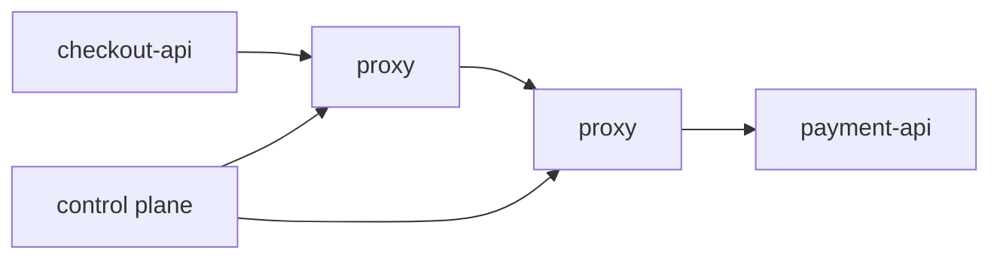
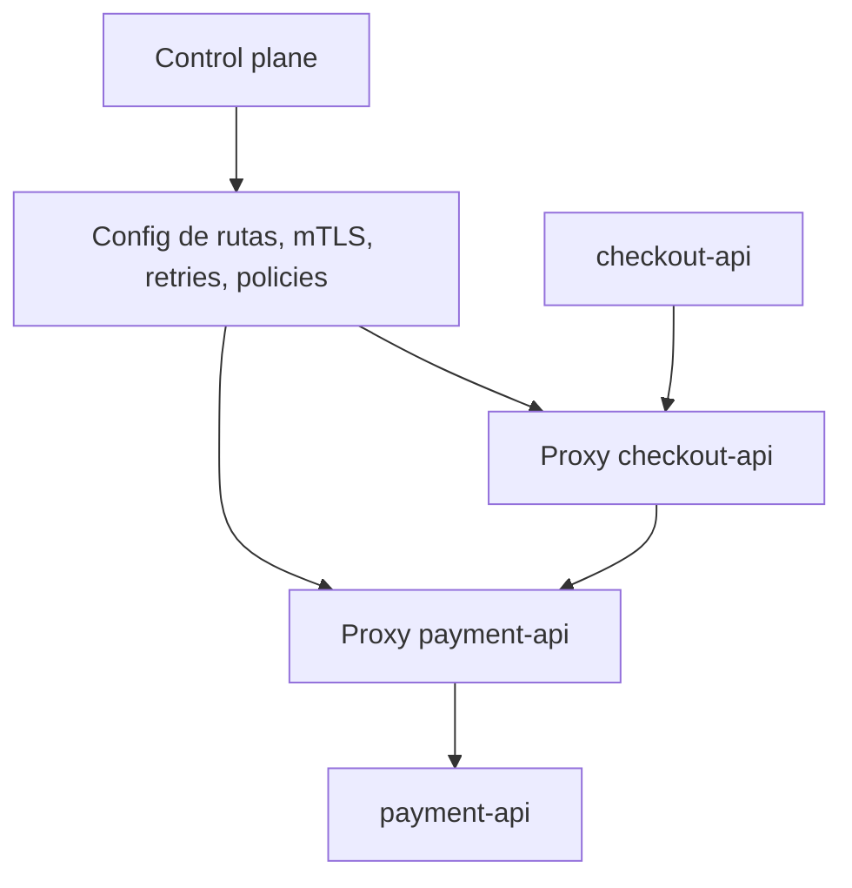
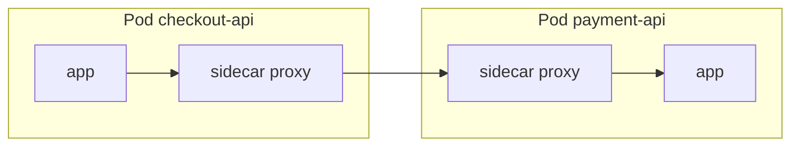
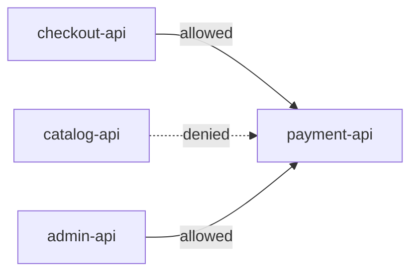
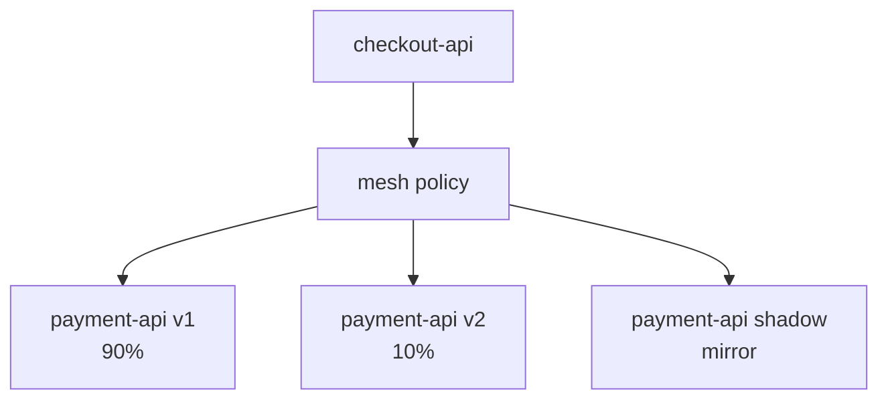
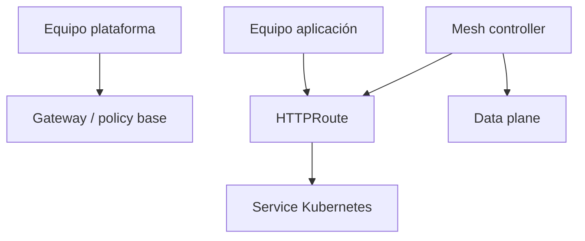
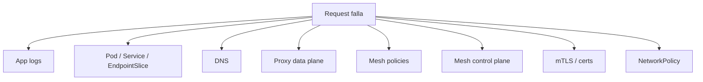

<!-- COURSE_NAV_START -->

[Anterior](<28. Networking avanzado y tráfico en Kubernetes.md>) | [Indice](README.md) | [Siguiente](<30. Backups, restore y disaster recovery.md>)

<!-- COURSE_NAV_END -->

# 29. Service mesh, tráfico L7 y resiliencia de red

## 29.1. Objetivo del módulo

En el módulo anterior trabajaste networking avanzado en Kubernetes desde la perspectiva del flujo real de tráfico: Services, EndpointSlices, DNS, Ingress, Gateway API, NetworkPolicy, egress, debugging y contratos de tráfico. Este módulo da el siguiente paso y estudia qué ocurre cuando introduces una capa adicional para gestionar tráfico entre servicios con más inteligencia de aplicación: un service mesh.

Un service mesh puede aportar mTLS entre servicios, identidad de workload, políticas L7, métricas de tráfico, retries, timeouts, circuit breaking, outlier detection, traffic splitting, canaries, mirroring, autorización, trazas y observabilidad sin obligar a cada equipo a implementar todo desde cero. Esa promesa es potente, pero también peligrosa si se adopta sin criterio. Un mesh añade proxies, control plane, CRDs, configuración nueva, latencia, consumo de CPU y memoria, superficie operativa, riesgo de políticas mal coordinadas y una capa más que depurar durante incidentes.

Este módulo no parte de la idea de que “service mesh es bueno” ni de que “service mesh es innecesario”. Parte de una pregunta más útil: qué problema real quieres resolver, qué parte pertenece a la aplicación, qué parte puede delegarse a la plataforma, qué coste introduce el mesh y cómo evitar que la capa L7 amplifique fallos en vez de contenerlos.

La tesis del módulo es esta:

> Un service mesh no hace resiliente una arquitectura frágil; centraliza y estandariza algunas decisiones de tráfico, seguridad y observabilidad que aun así debes diseñar bien.

La tesis operacional es esta:

> Introduce service mesh cuando necesitas control L7, identidad, mTLS, telemetría o políticas de tráfico a escala de plataforma, y cuando el equipo puede operar la complejidad adicional que esa capa introduce.

En este módulo aprenderás:

- Qué es un service mesh
- Qué problema resuelve y qué problema no resuelve
- Qué diferencia hay entre data plane y control plane
- Qué diferencia hay entre sidecar, sidecarless y ambient mesh
- Qué papel tienen Envoy, Linkerd, Istio, Cilium y otros enfoques
- Qué significa tráfico L4 y L7
- Qué aporta mTLS entre workloads
- Qué aporta identidad de servicio
- Qué aporta telemetry automática
- Qué aporta traffic management
- Qué son VirtualService, DestinationRule, ServiceProfile, HTTPRoute y políticas equivalentes
- Cómo diseñar retries, timeouts y circuit breakers sin crear retry storms
- Qué es outlier detection
- Qué es traffic splitting
- Qué es mirroring
- Qué es fault injection
- Qué es rate limiting en una capa mesh o gateway
- Qué riesgos tiene delegar resiliencia a proxies
- Qué debe quedarse en la aplicación
- Cómo se relaciona service mesh con Gateway API y GAMMA
- Cómo se relaciona service mesh con Ingress, API Gateway y NetworkPolicy
- Cómo observar y depurar tráfico L7
- Cómo diseñar una adopción gradual
- Cómo decidir si el mesh merece su coste
- Cómo automatizar validaciones y diagnóstico con Taskfile
La idea principal es sencilla:

```text
El mesh no elimina la complejidad de red.
La mueve a una capa común.
Eso solo ayuda si esa capa está bien gobernada, observada y entendida.
```

---

## 29.2. Por qué este módulo existe en un curso de Kubernetes

Kubernetes te da una base de networking: Pods, Services, DNS, EndpointSlices, Ingress, Gateway API y NetworkPolicy. Esa base resuelve discovery, exposición, enrutado básico y algunas fronteras de red. Pero muchas organizaciones necesitan controles más avanzados entre servicios: cifrado mutuo, identidad, autorización basada en servicio, métricas homogéneas, políticas de retries, traffic splitting, canary, circuit breaking o visibilidad de llamadas internas sin depender de que cada equipo implemente exactamente la misma librería.

Ahí aparece el service mesh. En vez de pedir a cada aplicación que implemente todas esas capacidades de forma homogénea, el mesh introduce una capa de infraestructura que intercepta o gestiona tráfico entre servicios. En el modelo clásico, cada Pod tiene un proxy sidecar que participa en el tráfico entrante y saliente. En otros modelos, parte de esa funcionalidad se mueve a proxies compartidos, nodos, eBPF o enfoques sidecarless. En todos los casos, la intención es parecida: añadir una capa común de seguridad, observabilidad y control de tráfico.

El problema es que “común” no significa “gratis”. Un mesh puede mejorar la plataforma si resuelve necesidades reales a escala, pero puede empeorar el sistema si se adopta por moda. Si introduces retries automáticos sin entender retries de aplicación, puedes crear retry storms. Si activas mTLS sin plan de rollout, puedes romper tráfico entre workloads. Si añades sidecars sin medir recursos, puedes afectar autoscaling y costes. Si el equipo no sabe depurar Envoy, Linkerd proxy, control plane, certificados o políticas L7, cada incidente se vuelve más difícil.

### Criterio de comprensión

Debes poder explicar:

> Service mesh tiene sentido cuando la necesidad de control común de tráfico, seguridad y observabilidad supera el coste operativo de añadir otra capa al sistema.

---

## 29.3. Qué es un service mesh

Un service mesh es una capa de infraestructura dedicada a gestionar comunicación servicio-servicio. Normalmente se sitúa entre las aplicaciones y la red, intercepta tráfico y aplica políticas comunes de seguridad, observabilidad y resiliencia.



El mesh suele dividirse en dos partes: data plane y control plane. El data plane está formado por los proxies que procesan tráfico. El control plane distribuye configuración, certificados, políticas y estado. Esta separación es importante porque muchos incidentes de mesh no ocurren en la aplicación, sino en la relación entre configuración del control plane y comportamiento del data plane.

### Qué puede aportar

- mTLS entre servicios
- Identidad de workload
- Autorización servicio-servicio
- Métricas de tráfico homogéneas
- Logs de acceso
- Trazas, si se integra correctamente
- Retries
- Timeouts
- Circuit breaking
- Outlier detection
- Traffic splitting
- Mirroring
- Fault injection
- Políticas de entrada y salida
- Mejor visibilidad de dependencias
- Separación de algunas decisiones de plataforma y aplicación
### Qué no aporta automáticamente

- Buen diseño de dominio
- Idempotencia
- Correctitud funcional
- Buenas APIs
- SLOs bien definidos
- Tests de contrato
- Migraciones compatibles
- Fallbacks de negocio
- Decisiones de producto sobre degradación
- Capacidad downstream
- Eliminación de deuda de aplicación
- Menor complejidad operativa por defecto
### Criterio de comprensión

Debes poder explicar:

> Un service mesh gestiona comunicación entre servicios, pero no diseña por ti el comportamiento correcto de esos servicios.

---

## 29.4. Data plane y control plane

La separación entre data plane y control plane es fundamental.

| Parte         | Responsabilidad      | Ejemplos                                  |
| ------------- | -------------------- | ----------------------------------------- |
| Data plane    | procesa tráfico real | sidecars, proxies, dataplane L4/L7        |
| Control plane | configura y coordina | políticas, certificados, rutas, identidad |

El data plane está en la ruta crítica de las requests. Si el proxy introduce latencia, consume recursos, aplica mal una política o rechaza tráfico, el usuario puede verse afectado. El control plane normalmente no está en cada request, pero si falla puede impedir que se propaguen políticas, certificados o configuración nueva.



### Preguntas de operación

- ¿Qué pasa si el control plane cae?
- ¿Los proxies siguen usando configuración anterior?
- ¿Cómo se rotan certificados?
- ¿Qué ocurre si una política nueva es inválida?
- ¿Qué métricas tiene el proxy?
- ¿Cómo se depura una ruta?
- ¿Cómo se sabe qué configuración recibió cada proxy?
- ¿Qué versionado tiene el control plane?
- ¿Cómo se actualiza el data plane?
### Criterio de comprensión

Debes poder explicar:

> El control plane decide y distribuye configuración; el data plane está en el camino real del tráfico.

---

## 29.5. Sidecar, sidecarless y ambient

El modelo clásico de service mesh usa sidecars: cada Pod tiene un contenedor de aplicación y un proxy junto a él. El proxy intercepta tráfico entrante y saliente. Este modelo da mucho control por workload, pero añade consumo de recursos por Pod, lifecycle adicional, configuración de inyección, complejidad de debugging y coste durante upgrades.



Los modelos sidecarless o ambient buscan mover parte de la funcionalidad fuera del Pod, por ejemplo a proxies compartidos, dataplanes de nodo o capas L4/L7 separadas. La promesa es reducir overhead por Pod y simplificar algunas operaciones, pero el modelo operativo cambia. No desaparece la complejidad; se desplaza.

### Comparación conceptual

| Modelo        | Ventaja                       | Coste                                      |
| ------------- | ----------------------------- | ------------------------------------------ |
| Sidecar       | control fino por workload     | recursos por Pod, upgrades de sidecars     |
| Sidecarless   | menor overhead por Pod        | dependencia mayor del dataplane compartido |
| Ambient       | separación L4/L7 según diseño | modelo mental y tooling específico         |
| Mesh ligero   | menos features, menos coste   | menor expresividad                         |
| Mesh completo | más control L7                | más complejidad operativa                  |

### Criterio de comprensión

Debes poder explicar:

> El modelo de dataplane determina dónde vive el coste del mesh: en cada Pod, en nodos, en proxies compartidos o en una combinación.

---

## 29.6. L4 y L7

Un mesh puede operar en distintas capas. L4 se centra en conexión: TCP, origen, destino, puerto, identidad, mTLS y métricas básicas. L7 entiende protocolo de aplicación, como HTTP o gRPC: rutas, métodos, headers, status codes, retries por respuesta, timeouts por ruta, traffic splitting por porcentaje o mirroring.

| Capa | Qué ve                              | Qué puede decidir                                    |
| ---- | ----------------------------------- | ---------------------------------------------------- |
| L4   | IP, puerto, conexión, identidad     | permitir, cifrar, enrutar conexión                   |
| L7   | host, path, method, headers, status | retries, routing, canary, mirroring, fault injection |

### Ejemplo

Un mesh L4 puede saber que `checkout-api` habló con `payment-api` por TCP. Un mesh L7 puede saber que `checkout-api` hizo `POST /authorize`, recibió `503`, reintentó una vez y tardó 180 ms.

### Cuidado

L7 aporta más control, pero también más coste. Requiere entender protocolos, cifrado, parsing, políticas por ruta, cabeceras, métricas y compatibilidad. No toda comunicación necesita L7.

### Criterio de comprensión

Debes poder explicar:

> L4 protege y observa conexiones; L7 permite tomar decisiones basadas en semántica de aplicación.

---

## 29.7. Qué problema resuelve y qué problema no resuelve

El service mesh resuelve mejor problemas de plataforma repetidos que problemas de diseño de aplicación. Si cada equipo implementa mTLS, métricas, retries, timeouts y canary de forma distinta, un mesh puede estandarizar parte de esa complejidad. Si el problema es que tus operaciones no son idempotentes, tus APIs no tienen contrato o tus SLOs no existen, el mesh no lo arregla.

### Buenas razones para considerar mesh

- Necesitas mTLS uniforme entre servicios
- Necesitas identidad de workload para autorización
- Necesitas métricas homogéneas entre servicios
- Tienes muchas aplicaciones en varios lenguajes
- Quieres traffic splitting consistente
- Quieres políticas L7 comunes
- Necesitas controlar egress o service-to-service de forma centralizada
- Necesitas observabilidad de llamadas internas sin reescribir todas las apps
- Necesitas preparar una plataforma multi-tenant con guardrails de tráfico
### Malas razones

- “Porque todas las empresas cloud native lo usan”
- “Porque queremos resiliencia sin tocar la aplicación”
- “Porque así no necesitamos entender networking”
- “Porque queremos arreglar microservicios mal diseñados”
- “Porque no tenemos SLOs pero queremos observabilidad”
- “Porque queremos retries automáticos en todas partes”
- “Porque nos falta disciplina de APIs”
### Criterio de comprensión

Debes poder explicar:

> Un mesh es una herramienta de plataforma. No debe usarse para tapar falta de diseño, contratos, SLOs o ownership.

---

## 29.8. La frontera entre aplicación y mesh

Una de las decisiones más importantes es qué vive en la aplicación y qué vive en el mesh. Si duplicas responsabilidades, puedes crear comportamientos inesperados. Si delegas demasiado, puedes ocultar decisiones que pertenecen al dominio.

| Responsabilidad       |        Aplicación |                  Mesh |
| --------------------- | ----------------: | --------------------: |
| Idempotencia          |                Sí |                    No |
| Validación de negocio |                Sí |                    No |
| Fallback semántico    |                Sí |       Parcialmente no |
| Deadline de operación |                Sí |          Parcialmente |
| Timeout de red        |                Sí |                    Sí |
| Retry técnico         |  Sí, con criterio |      Sí, con criterio |
| mTLS                  | No necesariamente |                    Sí |
| Identidad de workload |      Parcialmente |                    Sí |
| Autorización L7       |      Parcialmente |         Sí, si aplica |
| Traffic split         | No necesariamente |                    Sí |
| Métricas de tráfico   |                Sí |                    Sí |
| Métricas de negocio   |                Sí |                    No |
| Circuit breaking      |         Sí o mesh |                    Sí |
| Rate limiting         |  app/gateway/mesh | Sí, según herramienta |

### Regla

El mesh puede gestionar transporte. La aplicación debe seguir siendo dueña de semántica.

Un proxy puede reintentar un `GET` idempotente con seguridad razonable. No sabe si reintentar un `POST /authorize` puede duplicar un pago si no existe idempotencia. Un proxy puede devolver `503`. No sabe si el producto debe ofrecer otro método de pago, encolar la operación o mostrar un mensaje concreto.

### Criterio de comprensión

Debes poder explicar:

> El mesh puede tomar decisiones de tráfico, pero la aplicación sigue siendo responsable del significado del comportamiento.

---

## 29.9. Identidad y mTLS

Una de las razones más fuertes para adoptar service mesh es mTLS entre servicios. mTLS cifra tráfico y permite autenticación mutua: ambos lados pueden verificar la identidad del otro. En una plataforma compartida, esto ayuda a pasar de “estoy hablando con una IP” a “estoy hablando con un workload con identidad”.

### Qué aporta mTLS

- Cifrado en tránsito
- Autenticación mutua entre workloads
- Base para autorización servicio-servicio
- Menor confianza implícita en la red interna
- Mejora de postura zero trust
- Trazabilidad de identidades
### Qué no resuelve por sí solo

- Autorización de negocio
- Validación de usuario final
- Vulnerabilidades de aplicación
- Exposición de secretos en runtime
- Permisos Kubernetes excesivos
- Movimiento lateral si las políticas son demasiado amplias
- Datos mal clasificados
- APIs sin controles
### Riesgos operativos

- Rotación de certificados
- Políticas demasiado estrictas que rompen tráfico
- Workloads fuera del mesh
- Excepciones para legacy
- Debugging más complejo
- Interacciones con TLS existente
- Performance overhead
- Rollout gradual
### Criterio de comprensión

Debes poder explicar:

> mTLS mejora la confianza entre workloads, pero no sustituye autorización, seguridad de aplicación ni diseño de permisos.

---

## 29.10. Autorización servicio-servicio

Con identidad de workload, puedes definir políticas de autorización entre servicios. En vez de permitir que cualquier Pod llame a cualquier Service, puedes expresar reglas como: `checkout-api` puede llamar a `payment-api`, pero `catalog-api` no.

### Modelo conceptual



### Preguntas de diseño

- ¿Qué identidad representa cada workload?
- ¿La identidad viene de ServiceAccount?
- ¿Qué namespace puede llamar?
- ¿Qué método o path está permitido?
- ¿Se autoriza por L4 o L7?
- ¿Qué ocurre con tráfico legacy no mesh?
- ¿Cómo se auditan denegaciones?
- ¿Quién aprueba nuevas dependencias?
- ¿Cómo se prueba una política antes de enforce?
### Relación con NetworkPolicy

NetworkPolicy controla tráfico a nivel de red, normalmente L3/L4. Una política de mesh puede controlar identidad y L7. No son necesariamente sustitutas. En una plataforma madura pueden coexistir: NetworkPolicy reduce blast radius a nivel de red y el mesh aplica identidad, mTLS y reglas de aplicación.

### Criterio de comprensión

Debes poder explicar:

> NetworkPolicy responde “qué Pods pueden comunicarse por red”; la autorización de mesh puede responder “qué identidad puede llamar a qué servicio o ruta”.

---

## 29.11. Telemetría automática

Un mesh puede generar métricas de tráfico automáticamente. Esto es valioso cuando hay muchas aplicaciones en varios lenguajes y no todas están instrumentadas igual. Las métricas de mesh suelen incluir requests, latencia, errores, retries, bytes, origen, destino, ruta o identidad, según soporte.

### Métricas útiles

```text
requests_total{source="checkout-api",destination="payment-api"}
request_duration_seconds_bucket{source="checkout-api",destination="payment-api"}
response_total{destination="payment-api",status_code="503"}
tcp_connections_opened_total{source="checkout-api",destination="payment-api"}
retries_total{source="checkout-api",destination="payment-api"}
mtls_handshake_errors_total
authorization_denied_total
```

Los nombres exactos dependen de la herramienta. Lo importante es la intención: ver tráfico entre servicios con etiquetas consistentes.

### Límites de la telemetría del mesh

El mesh puede ver tráfico, pero no conoce necesariamente el resultado de negocio. Puede saber que `POST /checkout` respondió `200`, pero no sabe si el checkout quedó en estado incorrecto. Puede saber que `payment-api` respondió `503`, pero no sabe si la aplicación usó fallback correcto. Por eso, la telemetría de mesh complementa, no reemplaza, métricas de aplicación y negocio.

### Criterio de comprensión

Debes poder explicar:

> La telemetría del mesh mejora visibilidad de tráfico, pero no sustituye métricas semánticas de la aplicación.

---

## 29.12. Traffic management L7

Traffic management en un mesh permite definir reglas de enrutado y comportamiento del tráfico. Dependiendo de la herramienta, puedes configurar routing por host, path, headers, subsets, versiones, pesos, timeouts, retries, circuit breaking, outlier detection, mirroring o fault injection.



### Casos de uso

- Canary release
- Blue/green
- A/B testing técnico
- Migración de backend
- Testing con tráfico real duplicado
- Rutas por header interno
- Bloqueo de destinos no permitidos
- Timeouts por dependencia
- Retries con límites
- Circuit breaking por destino
- Outlier detection de instancias malas
### Cuidado

Cuanto más tráfico se decide fuera de la aplicación, más importante es documentar dónde vive cada regla. Si parte del comportamiento está en código, parte en mesh y parte en gateway, depurar una request exige mirar tres lugares. Esa fragmentación puede ser útil si está gobernada, pero peligrosa si nadie tiene el mapa.

### Criterio de comprensión

Debes poder explicar:

> Traffic management L7 permite mover decisiones de red a la plataforma, pero exige ownership claro de esas decisiones.

---

## 29.13. Timeouts en el mesh

Configurar timeouts en el mesh puede proteger a clientes y dependencias. Pero el timeout del mesh debe coordinarse con los timeouts de la aplicación, gateway y cliente externo. Si el mesh corta antes de que la aplicación espere, el código puede interpretar errores de forma inesperada. Si el mesh espera demasiado, puede retener recursos y romper el presupuesto de latencia.

### Regla

Los timeouts deben formar una cadena coherente.

```text
timeout de dependencia
<
timeout de operación de aplicación
<
timeout del gateway o cliente externo
```

Si añades mesh, añade otra capa a esa cadena:

```text
timeout de intento en mesh
<=
timeout de cliente HTTP de aplicación
<=
deadline de operación
<
timeout externo
```

### Preguntas

- ¿Quién tiene el deadline total?
- ¿El mesh corta la llamada antes que la app?
- ¿La aplicación sabe distinguir timeout del mesh?
- ¿El timeout incluye retries?
- ¿Qué status se devuelve?
- ¿Dónde se registra el timeout?
- ¿Cómo afecta al SLO?
- ¿Qué pasa con requests no idempotentes?
### Criterio de comprensión

Debes poder explicar:

> Un timeout en el mesh no elimina la necesidad de timeouts en la aplicación ni de presupuesto de latencia.

---

## 29.14. Retries en el mesh

Retries en el mesh pueden ser útiles para fallos transitorios de red o respuestas retryables. Pero también pueden ser peligrosos porque ocurren fuera del código de aplicación. Si la aplicación también reintenta, el gateway también reintenta y el cliente también reintenta, puedes multiplicar tráfico sin verlo claramente desde una sola capa.

### Riesgo

```text
cliente externo: 2 intentos
gateway: 2 intentos
mesh: 3 intentos
app: 2 intentos
```

Una request de usuario puede convertirse en muchas llamadas downstream.

### Reglas mínimas

- Reintentar solo errores clasificados como transitorios
- No reintentar operaciones no idempotentes sin protección
- Usar backoff
- Usar jitter si la herramienta lo soporta
- Definir número máximo
- Definir timeout total
- Observar retries
- Evitar retries duplicados en varias capas
- Respetar `Retry-After` cuando aplique
- Documentar qué capa es dueña del retry
### Criterio de comprensión

Debes poder explicar:

> Un retry en el mesh sigue siendo carga real sobre la dependencia, aunque la aplicación no lo vea como una llamada explícita.

---

## 29.15. Circuit breaking y outlier detection

Circuit breaking limita conexiones, requests pendientes o errores hacia un destino. Outlier detection intenta detectar endpoints que están fallando y expulsarlos temporalmente del pool de backends. Ambas técnicas pueden reducir daño, pero deben entenderse como mecanismos de tráfico, no como reparación de la dependencia.

### Diferencia conceptual

| Mecanismo         | Qué hace                                               |
| ----------------- | ------------------------------------------------------ |
| Circuit breaking  | limita presión hacia un destino                        |
| Outlier detection | aparta endpoints con comportamiento malo               |
| Readiness         | decide si un Pod debe recibir tráfico desde Kubernetes |
| HPA               | añade o quita réplicas                                 |
| Fallback          | define respuesta alternativa de negocio                |

### Ejemplo

Si una réplica de `payment-api` empieza a devolver `503`, outlier detection puede reducir tráfico hacia esa réplica. Si todo `payment-api` está saturado, circuit breaking puede limitar llamadas. Si el negocio necesita aceptar pagos pendientes, eso sigue siendo decisión de aplicación.

### Criterio de comprensión

Debes poder explicar:

> Outlier detection puede apartar instancias malas; circuit breaking puede limitar presión; ninguno decide el fallback de negocio.

---

## 29.16. Traffic splitting y canary

Traffic splitting permite enviar porcentajes de tráfico a versiones distintas. Es una de las razones más comunes para introducir capacidades L7.

### Ejemplo conceptual

```text
checkout-api -> payment-api-v1: 95%
checkout-api -> payment-api-v2: 5%
```

### Qué necesitas para hacerlo bien

- Versiones compatibles
- Migraciones compatibles
- SLOs definidos
- Métricas por versión
- Error rate por versión
- Latencia por versión
- Capacidad suficiente
- Rollback o abort rápido
- Feature flags si el comportamiento funcional cambia
- Runbook
- Ownership de la política
### Riesgo

Si solo miras métricas agregadas, el 5% de canary puede fallar gravemente y quedar oculto por el 95% sano. Las métricas deben segmentarse por versión, ruta, tenant o subset cuando sea necesario.

### Criterio de comprensión

Debes poder explicar:

> Canary con mesh solo reduce riesgo si puedes observar la versión nueva por separado y abortar con rapidez.

---

## 29.17. Mirroring de tráfico

Mirroring duplica tráfico hacia un backend shadow sin que la respuesta de ese backend afecte al cliente. Es útil para probar una versión nueva con tráfico real, validar performance, comparar logs o detectar incompatibilidades. Pero no es gratis.

### Riesgos

- Duplica carga
- Puede ejecutar efectos secundarios si el backend no es seguro
- Puede contaminar métricas
- Puede exponer datos a sistemas no preparados
- Puede afectar downstream dependencies
- Puede violar expectativas de privacidad si no se controla
- Puede generar coste significativo
### Regla

Solo hagas mirroring hacia endpoints que no producen efectos secundarios o que están explícitamente diseñados para ignorarlos.

### Criterio de comprensión

Debes poder explicar:

> Traffic mirroring sirve para observar comportamiento con tráfico real, pero puede duplicar carga y efectos si no está diseñado cuidadosamente.

---

## 29.18. Fault injection

Fault injection permite introducir errores o retrasos artificiales para probar resiliencia. Un mesh puede inyectar latencia, aborts HTTP, errores o fallos controlados. Esto ayuda a comprobar timeouts, fallbacks, circuit breakers, dashboards, alertas y runbooks.

### Casos de uso

- Probar timeout de `checkout-api → payment-api`
- Comprobar circuit breaker
- Validar fallback
- Validar alertas de latencia
- Validar SLO burn rate
- Practicar incident response
- Verificar que retries no crean storm
- Validar runbooks
### Cuidado

Fault injection en producción debe ser extremadamente controlado. Debe tener scope reducido, ventana temporal, owner, rollback claro, comunicación y observabilidad. En staging puede ser más libre, pero debe parecerse lo suficiente a producción para enseñar algo útil.

### Criterio de comprensión

Debes poder explicar:

> Fault injection no es romper por romper. Es una práctica controlada para validar que las defensas funcionan.

---

## 29.19. Rate limiting y quotas L7

Algunos meshes o gateways pueden aplicar rate limiting por ruta, usuario, tenant, servicio o identidad. Esto puede proteger dependencias y mejorar fairness, pero también puede mezclar responsabilidades si no está bien diseñado.

### Preguntas

- ¿El límite es por usuario, IP, tenant, servicio o ruta?
- ¿La identidad es confiable?
- ¿El límite protege qué SLO?
- ¿Qué respuesta recibe el cliente?
- ¿Se devuelve `429`?
- ¿Se usa `Retry-After`?
- ¿Se observa quién está limitado?
- ¿Hay excepciones?
- ¿Dónde se configura?
- ¿Qué ocurre con tráfico interno?
- ¿Qué capa aplica el límite: gateway, mesh o aplicación?
### Regla

Rate limiting debe estar cerca de la frontera donde la identidad y el objetivo del límite son claros.

### Criterio de comprensión

Debes poder explicar:

> Rate limiting L7 protege capacidad y fairness solo si la identidad, el scope y la respuesta están bien definidos.

---

## 29.20. Service mesh y Gateway API

Gateway API nació para modelar tráfico de forma más expresiva que Ingress. La iniciativa GAMMA busca usar Gateway API también para configurar service mesh, especialmente tráfico este-oeste. La idea es evitar crear recursos duplicados para conceptos parecidos y mantener un modelo orientado a roles.

### Por qué importa

En vez de que cada mesh tenga una API completamente distinta para rutas internas, Gateway API puede servir como lenguaje común para algunos casos de routing. Esto puede mejorar portabilidad conceptual, separación de roles y experiencia de plataforma. Aun así, el soporte depende del controlador y de la versión de las features. No debes asumir que cualquier recurso Gateway API funciona igual en todos los meshes.

### Modelo conceptual



### Criterio de comprensión

Debes poder explicar:

> Gateway API puede convertirse en una API común para parte del tráfico mesh, pero debes comprobar soporte real del controlador y madurez de cada feature.

---

## 29.21. Service mesh, Ingress y API Gateway

Un service mesh no elimina automáticamente la necesidad de Ingress o API Gateway. Cada capa puede tener responsabilidades distintas.

| Capa            | Responsabilidad habitual                               |
| --------------- | ------------------------------------------------------ |
| Ingress/Gateway | entrada HTTP/TLS al cluster                            |
| API Gateway     | APIs externas, auth, rate plans, developer experience  |
| Service mesh    | tráfico servicio-servicio, mTLS, telemetry, L7 interno |
| NetworkPolicy   | aislamiento de red L3/L4                               |
| Aplicación      | semántica, negocio, idempotencia                       |

### Riesgo de solapamiento

Si Gateway, API Gateway, mesh y aplicación tienen retries, timeouts, auth parcial, rate limiting y routing, nadie sabe qué capa manda. El diseño debe asignar responsabilidades explícitas.

### Preguntas

- ¿Dónde se autentica el usuario externo?
- ¿Dónde se autoriza servicio-servicio?
- ¿Dónde se hace mTLS?
- ¿Dónde se aplican retries?
- ¿Dónde se aplican rate limits?
- ¿Dónde se hace traffic split?
- ¿Dónde se observa latencia?
- ¿Qué equipo opera cada capa?
- ¿Qué ocurre cuando las políticas contradicen?
### Criterio de comprensión

Debes poder explicar:

> Un mesh debe integrarse con Ingress y API Gateway mediante responsabilidades claras, no competir con ellos por controlar todo.

---

## 29.22. Service mesh y NetworkPolicy

NetworkPolicy y service mesh pueden coexistir. NetworkPolicy controla tráfico a nivel de red entre Pods o namespaces, según soporte del CNI. El mesh controla tráfico a nivel de identidad, L4 o L7, según herramienta y configuración.

### Diseño combinado

```text
NetworkPolicy:
  checkout namespace puede hablar con payments namespace por puerto 8080

Mesh authorization:
  serviceAccount checkout-api puede llamar a payment-api POST /authorize
```

Este diseño combina una frontera amplia de red con una política más específica de identidad o ruta.

### Riesgo

Si confías solo en el mesh y dejas la red completamente abierta, una mala configuración del mesh, un workload fuera del mesh o una excepción puede abrir más tráfico del esperado. Si confías solo en NetworkPolicy, quizá no puedes expresar reglas L7 o identidad de servicio con suficiente precisión.

### Criterio de comprensión

Debes poder explicar:

> NetworkPolicy reduce blast radius de red; el mesh puede añadir identidad, mTLS y reglas L7. No son equivalentes.

---

## 29.23. Service mesh y resiliencia de aplicación

El módulo 22 dejó claro que Kubernetes no diseña resiliencia por ti. Lo mismo aplica al mesh. Un mesh puede ejecutar timeouts, retries, circuit breakers y traffic splits. Pero la aplicación sigue necesitando idempotencia, deadlines, fallbacks, clasificación de errores, métricas de negocio y contratos claros.

### Qué puede ayudar a estandarizar

- Timeout por ruta
- Retry limitado
- Circuit breaking
- Outlier detection
- Métricas de dependencia
- Traffic split
- Fault injection
- mTLS
- Autorización servicio-servicio
### Qué debe seguir en la aplicación

- Idempotency key
- Deduplicación
- Fallback de negocio
- Respuesta degradada
- Estado `payment_pending`
- Validación funcional
- Deadline semántico
- Tratamiento de errores ambiguos
- Métricas de negocio
- Decisión de producto
### Regla

No uses el mesh para esconder falta de resiliencia en la aplicación.

### Criterio de comprensión

Debes poder explicar:

> El mesh puede aplicar patrones técnicos de tráfico, pero la aplicación debe conservar la responsabilidad del comportamiento correcto.

---

## 29.24. Service mesh y SLOs

Un mesh puede mejorar la visibilidad de SLIs de tráfico: disponibilidad, latencia, error rate, success rate, retries, mTLS, denials y dependencia entre servicios. Esto puede facilitar dashboards y alertas. Pero no todos los SLOs deberían basarse solo en métricas del mesh.

### Buen uso

- Latencia entre servicios
- Error rate por destino
- Success rate por ruta
- Tasa de retries
- Tasa de timeouts
- mTLS coverage
- Autorizaciones denegadas
- Circuit breaker activado
- Tráfico por versión durante canary
### Límite

Un SLO de checkout no debería depender únicamente de que el proxy vea `200`. Necesitas saber si el checkout fue correcto. Las métricas del mesh ayudan a diagnosticar, pero los SLOs de producto necesitan señales de aplicación.

### Criterio de comprensión

Debes poder explicar:

> La telemetría del mesh ayuda a medir tráfico y dependencias; los SLOs críticos deben seguir representando experiencia o resultado del usuario.

---

## 29.25. Service mesh y autoscaling

El mesh afecta autoscaling porque añade consumo de recursos y puede cambiar métricas. En modelo sidecar, cada Pod tiene al menos un contenedor extra. Eso impacta CPU, memoria, startup, readiness, requests, limits, HPA y coste. Además, retries o mTLS pueden aumentar CPU. El mesh también puede generar métricas útiles para escalar, pero debes distinguir presión real de ruido inducido por proxy.

### Preguntas

- ¿Cuánto CPU consume el proxy?
- ¿Cuánta memoria consume?
- ¿Los requests incluyen el sidecar?
- ¿HPA escala por CPU de aplicación, del Pod o del proxy?
- ¿El proxy introduce latencia?
- ¿El sidecar retrasa readiness?
- ¿Qué ocurre durante rollout?
- ¿Los proxies tienen límites?
- ¿Cómo afecta a cost allocation?
- ¿Qué pasa con scale-to-zero?
- ¿Qué métricas usa KEDA o HPA?
### Criterio de comprensión

Debes poder explicar:

> Añadir mesh cambia el perfil de recursos del workload. Autoscaling y capacity planning deben recalibrarse.

---

## 29.26. Service mesh y multi-tenancy

En una plataforma multi-tenant, el mesh puede ayudar a separar identidades, políticas y tráfico entre equipos o namespaces. Pero también puede convertirse en una capa compartida crítica: si el control plane falla o una política global se aplica mal, puede afectar a muchos tenants.

### Beneficios

- mTLS por defecto entre tenants
- Políticas de autorización entre namespaces
- Métricas por source/destination
- Traffic policies por equipo
- Canaries controlados
- Mejor visibilidad de dependencias cross-namespace
- Guardrails de tráfico
### Riesgos

- Control plane compartido como blast radius
- Políticas globales mal diseñadas
- Excepciones difíciles
- Tenants que no entienden errores del mesh
- Upgrades coordinados
- Diferentes necesidades por tenant
- Coste del proxy imputado a equipos
- Debugging más complejo
### Criterio de comprensión

Debes poder explicar:

> En multi-tenancy, el mesh puede ser guardrail compartido o nuevo punto de fallo compartido, según cómo se gobierne.

---

## 29.27. Service mesh y Policy as Code

Las políticas de mesh deben tratarse como código. No deberían modificarse manualmente en producción sin revisión, pruebas, rollout gradual y rollback. Un cambio de autorización, retry o routing puede afectar directamente tráfico productivo.

### Políticas que deben versionarse

- Autorización servicio-servicio
- mTLS mode
- Destination policies
- Retry policies
- Timeout policies
- Circuit breaking
- Traffic split
- Fault injection
- Rate limiting
- Egress rules
- Mesh onboarding por namespace
- Excepciones
### Reglas de gobernanza

- Validar policies en CI
- Usar dry-run o audit cuando exista
- Usar entornos staging
- Tener owners
- Documentar intención
- Asociar a SLO o riesgo
- Definir expiración para fault injection
- Evitar cambios manuales no trazados
- Tener runbook para rollback de policy
### Criterio de comprensión

Debes poder explicar:

> Una política de mesh es código de producción porque puede cambiar el camino real de las requests.

---

## 29.28. Adopción gradual del mesh

Adoptar un mesh de golpe en todos los namespaces puede ser arriesgado. Un rollout gradual permite aprender, medir overhead, descubrir incompatibilidades y ajustar operación.

### Estrategia recomendada

1. Definir problema que quieres resolver
2. Seleccionar un servicio no crítico
3. Instalar mesh en entorno no productivo
4. Activar telemetría sin políticas agresivas
5. Medir overhead
6. Activar mTLS en modo permisivo si la herramienta lo soporta
7. Activar mTLS estricto por namespace o servicio
8. Añadir políticas de autorización
9. Añadir traffic management limitado
10. Documentar debugging
11. Crear Taskfile
12. Revisar SLOs y coste
13. Extender a servicios críticos solo después de aprendizaje
### Criterio de comprensión

Debes poder explicar:

> La adopción de mesh debe ser incremental porque cambia tráfico, seguridad, observabilidad, recursos y debugging.

---

## 29.29. Cuándo no usar service mesh

No usar service mesh también puede ser una buena decisión. Un equipo puede operar bien con Services, NetworkPolicy, Ingress/Gateway, librerías de aplicación, OpenTelemetry, Prometheus y buenas prácticas de resiliencia. El mesh no debe introducirse si el problema puede resolverse con una solución más simple y con menos coste operativo.

### Señales de que quizá no lo necesitas todavía

- Pocos servicios
- Un solo lenguaje o framework con librerías comunes
- No necesitas mTLS interno
- No necesitas traffic splitting L7 avanzado
- Ya tienes observabilidad suficiente
- NetworkPolicy cubre tus necesidades de aislamiento
- El equipo no puede operar otra capa crítica
- No tienes SLOs ni runbooks
- No tienes ownership claro de rutas y políticas
- Tu mayor problema está en la aplicación o los datos, no en tráfico
### Criterio de comprensión

Debes poder explicar:

> No adoptar mesh puede ser la decisión correcta si no tienes el problema que el mesh resuelve o no puedes operar su complejidad.

---

## 29.30. Comparación conceptual de enfoques

Este módulo no intenta elegir una herramienta universal. Istio, Linkerd, Cilium Service Mesh, Consul, Kuma, Envoy Gateway y otros enfoques tienen modelos y trade-offs distintos. Lo importante para el curso es aprender a evaluar.

| Criterio      | Pregunta                                                |
| ------------- | ------------------------------------------------------- |
| Funcionalidad | ¿Necesitas L4, L7, mTLS, routing, auth, telemetry?      |
| Operación     | ¿Puedes operar control plane y upgrades?                |
| Performance   | ¿Cuál es el overhead de CPU, memoria y latencia?        |
| Modelo        | ¿Sidecar, ambient, sidecarless, eBPF?                   |
| Ecosistema    | ¿Se integra con Gateway API, Prometheus, Grafana, OTel? |
| DevEx         | ¿Los errores son comprensibles para equipos?            |
| Seguridad     | ¿Cómo gestiona identidad, certificados y políticas?     |
| Multi-tenancy | ¿Puede separar ownership y policies por namespace?      |
| Portabilidad  | ¿Cuánto dependes de CRDs específicas?                   |
| Coste         | ¿Qué coste añade por Pod, nodo y operación?             |

### Criterio de comprensión

Debes poder explicar:

> La elección de mesh es una decisión de plataforma, no una comparación de features aisladas.

---

## 29.31. Observabilidad y debugging de mesh

Depurar mesh exige mirar más capas que en Kubernetes básico. Ya no basta con Pod, Service y EndpointSlice. También debes revisar proxies, configuración recibida, certificados, políticas, rutas, métricas del mesh, logs del control plane y estado del data plane.

### Preguntas de diagnóstico

- ¿El workload está dentro del mesh?
- ¿El proxy fue inyectado?
- ¿El proxy está Ready?
- ¿El control plane está sano?
- ¿La política se aplicó?
- ¿El proxy recibió la configuración?
- ¿mTLS está activo?
- ¿La identidad es la esperada?
- ¿Hay authorization denied?
- ¿Hay timeout del proxy?
- ¿Hay retry del proxy?
- ¿El destino tiene endpoints?
- ¿La app funciona sin mesh?
- ¿El problema ocurre solo con un origen?
- ¿El problema ocurre solo con una ruta?
- ¿Qué dicen métricas source/destination?
### Capas de debugging



### Criterio de comprensión

Debes poder explicar:

> Depurar mesh significa comprobar aplicación, Kubernetes y mesh como tres capas relacionadas, no como sospechosos separados.

---

## 29.32. Manifiestos del módulo

Los manifests de service mesh dependen mucho de la herramienta. Para que el módulo sea útil sin casarse con una implementación, usaremos una estructura neutral y ejemplos conceptuales. En tu cluster real, debes adaptar estos ejemplos a Istio, Linkerd, Gateway API GAMMA, Cilium, Consul, Kuma u otra herramienta.

Estructura recomendada:

```text
k8s/service-mesh/
  common/
    namespace-shop-mesh-labels.yaml
    checkout-api-serviceaccount.yaml
    payment-api-serviceaccount.yaml
  gateway-api/
    checkout-to-payment-httproute.yaml
  istio/
    payment-timeout-retry-virtualservice.yaml
    payment-destinationrule-circuitbreaker.yaml
    checkout-payment-authorizationpolicy.yaml
  linkerd/
    checkout-serviceprofile.yaml
    payment-traffic-split.yaml
  docs/
    mesh-adoption-plan.md
    mesh-traffic-policy.md
    mesh-debugging-runbook.md
```

### Namespace preparado para mesh

```yaml
apiVersion: v1
kind: Namespace
metadata:
  name: shop
  labels:
    platform.acme.io/team: checkout
    platform.acme.io/environment: staging
    platform.acme.io/mesh: enabled
```

En un mesh real, puede que necesites labels específicas de la herramienta para inyección de sidecar o modo ambient. No mezcles esta label genérica con labels reales sin revisar documentación de tu implementación.

### ServiceAccounts por workload

```yaml
apiVersion: v1
kind: ServiceAccount
metadata:
  name: checkout-api
  namespace: shop
automountServiceAccountToken: false
```

```yaml
apiVersion: v1
kind: ServiceAccount
metadata:
  name: payment-api
  namespace: shop
automountServiceAccountToken: false
```

### Policy doc

```md
# Mesh traffic policy: checkout-api -> payment-api

## Dependency

checkout-api calls payment-api for payment authorization.

## Criticality

High.

## Ownership

- Source owner: checkout-team
- Destination owner: payments-team
- Platform owner: platform-team for mesh policies

## Timeout

150 ms per attempt.

## Retries

Retries are disabled in mesh for POST /authorize unless idempotency is guaranteed.

Application owns payment idempotency and retry classification.

## Circuit breaking

Limit concurrent requests to payment-api to protect downstream.

## mTLS

Required in staging and production.

## Authorization

Only checkout-api ServiceAccount can call payment-api authorization route.

## Observability

Track:

- request rate
- success rate
- p95/p99 latency
- timeout count
- retry count
- authorization denied
- mTLS errors

## SLO relation

Protect checkout availability and latency SLOs.

## Rollout

Start in staging with telemetry only.
Enable mTLS permissive.
Move to strict.
Add authorization.
Add traffic policies.
```

### Criterio de comprensión

Debes poder explicar:

> Los manifests de mesh no deben vivir separados de una política de tráfico que explique intención, ownership, SLO y límites.

---

## 29.33. Ejemplo conceptual con Istio

Istio usa recursos como `VirtualService` y `DestinationRule` para traffic management. Este ejemplo es didáctico y debe adaptarse a la versión y configuración real del cluster.

### Timeout y retry limitado

```yaml
apiVersion: networking.istio.io/v1
kind: VirtualService
metadata:
  name: payment-api
  namespace: shop
spec:
  hosts:
    - payment-api.shop.svc.cluster.local
  http:
    - match:
        - uri:
            prefix: /authorize
      timeout: 150ms
      retries:
        attempts: 0
      route:
        - destination:
            host: payment-api.shop.svc.cluster.local
            port:
              number: 80
```

En este caso desactivamos retries en mesh para `/authorize` porque una autorización de pago no debe reintentarse automáticamente desde la capa de red si no hay idempotencia y contrato explícito. La aplicación debe ser dueña de la semántica.

### Circuit breaking conceptual

```yaml
apiVersion: networking.istio.io/v1
kind: DestinationRule
metadata:
  name: payment-api
  namespace: shop
spec:
  host: payment-api.shop.svc.cluster.local
  trafficPolicy:
    connectionPool:
      tcp:
        maxConnections: 50
      http:
        http1MaxPendingRequests: 100
        maxRequestsPerConnection: 10
    outlierDetection:
      consecutive5xxErrors: 5
      interval: 10s
      baseEjectionTime: 30s
```

### Criterio de comprensión

Debes poder explicar:

> Una política Istio de tráfico debe reflejar semántica de la operación; no todos los endpoints deben tener retries automáticos.

---

## 29.34. Ejemplo conceptual con Linkerd

Linkerd puede ofrecer mTLS automático, métricas y traffic splitting. Algunos comportamientos se modelan con recursos como ServiceProfile o TrafficSplit, según versión y configuración. Este ejemplo es didáctico y debe adaptarse a la instalación real.

### ServiceProfile conceptual

```yaml
apiVersion: linkerd.io/v1alpha2
kind: ServiceProfile
metadata:
  name: payment-api.shop.svc.cluster.local
  namespace: shop
spec:
  routes:
    - name: POST /authorize
      condition:
        method: POST
        pathRegex: /authorize
      timeout: 150ms
```

### TrafficSplit conceptual

```yaml
apiVersion: split.smi-spec.io/v1alpha4
kind: TrafficSplit
metadata:
  name: payment-api-split
  namespace: shop
spec:
  service: payment-api
  backends:
    - service: payment-api-v1
      weight: 90
    - service: payment-api-v2
      weight: 10
```

### Criterio de comprensión

Debes poder explicar:

> Un mesh ligero puede ser suficiente si tu necesidad principal es mTLS, telemetría y algunas políticas de tráfico sin adoptar un modelo L7 muy amplio.

---

## 29.35. Ejemplo conceptual con Gateway API para mesh

Gateway API puede modelar algunas rutas de tráfico interno cuando el controlador de mesh lo soporta. Este ejemplo usa un `HTTPRoute` que referencia directamente un Service como padre, siguiendo el enfoque de mesh con Gateway API cuando está disponible.

```yaml
apiVersion: gateway.networking.k8s.io/v1
kind: HTTPRoute
metadata:
  name: checkout-to-payment
  namespace: shop
spec:
  parentRefs:
    - group: ""
      kind: Service
      name: payment-api
  rules:
    - matches:
        - path:
            type: PathPrefix
            value: /authorize
      backendRefs:
        - name: payment-api
          port: 80
```

Este ejemplo depende del soporte real de tu mesh para Gateway API en modo mesh. No debe asumirse como portable sin validación.

### Criterio de comprensión

Debes poder explicar:

> Gateway API puede reducir APIs específicas de cada mesh, pero el soporte mesh depende del controlador y de la madurez de cada recurso.

---

## 29.36. Taskfile para service mesh

Añade tareas genéricas. Algunas tareas dependen de la herramienta instalada, por lo que se separan en comunes, Istio y Linkerd.

```yaml
mesh:status:
  desc: Show mesh-related namespaces and workloads
  cmds:
    - kubectl get ns --show-labels
    - kubectl get pods -n shop -o wide

mesh:apply:namespace:
  desc: Apply mesh labels and base ServiceAccounts
  cmds:
    - kubectl apply -f k8s/service-mesh/common/namespace-shop-mesh-labels.yaml
    - kubectl apply -f k8s/service-mesh/common/checkout-api-serviceaccount.yaml
    - kubectl apply -f k8s/service-mesh/common/payment-api-serviceaccount.yaml

mesh:pods:
  desc: Show shop Pods and containers
  cmds:
    - kubectl get pods -n shop
    - kubectl get pods -n shop -o jsonpath='{range .items[*]}{.metadata.name}{" containers="}{range .spec.containers[*]}{.name}{" "}{end}{"\n"}{end}'

mesh:events:
  desc: Show shop events
  cmds:
    - kubectl get events -n shop --sort-by=.lastTimestamp

mesh:debug:checkout:
  desc: Describe checkout-api Pods
  cmds:
    - kubectl describe pods -n shop -l app.kubernetes.io/name=checkout-api

mesh:logs:checkout:
  desc: Show checkout-api app logs
  cmds:
    - kubectl logs deployment/checkout-api -n shop

mesh:istio:proxy-status:
  desc: Show Istio proxy status
  cmds:
    - istioctl proxy-status

mesh:istio:proxy-config:routes:
  desc: Show Istio proxy routes. Usage POD=<pod> task mesh:istio:proxy-config:routes
  cmds:
    - istioctl proxy-config routes {{.POD}} -n shop

mesh:istio:analyze:
  desc: Analyze Istio configuration
  cmds:
    - istioctl analyze -A

mesh:istio:apply:traffic:
  desc: Apply Istio traffic policies
  cmds:
    - kubectl apply -f k8s/service-mesh/istio/payment-timeout-retry-virtualservice.yaml
    - kubectl apply -f k8s/service-mesh/istio/payment-destinationrule-circuitbreaker.yaml

mesh:linkerd:check:
  desc: Run Linkerd check
  cmds:
    - linkerd check

mesh:linkerd:viz:
  desc: Show Linkerd routes and stat resources when available
  cmds:
    - linkerd viz stat deploy -n shop
    - linkerd viz routes deploy/checkout-api -n shop

mesh:runbook:
  desc: Show mesh debugging runbook
  cmds:
    - cat k8s/service-mesh/docs/mesh-debugging-runbook.md

mesh:policy:
  desc: Show mesh traffic policy
  cmds:
    - cat k8s/service-mesh/docs/mesh-traffic-policy.md
```

### Criterio DevEx

Debes poder explicar:

> Taskfile debe hacer repetible comprobar inyección, estado del mesh, configuración recibida, rutas, métricas, eventos y runbooks.

---

## 29.37. Práctica 1: decidir si necesitas mesh

### Objetivo

Evitar adopción por moda.

Crea:

```text
k8s/service-mesh/docs/mesh-adoption-plan.md
```

Incluye:

- Problema que quieres resolver
- Servicios candidatos
- Riesgos actuales
- Alternativas sin mesh
- Capacidades necesarias
- Coste esperado
- Métricas de éxito
- Plan de adopción gradual
- Plan de rollback
- Equipo owner
### Preguntas

- ¿Necesitas mTLS?
- ¿Necesitas autorización servicio-servicio?
- ¿Necesitas traffic splitting?
- ¿Necesitas métricas homogéneas?
- ¿Puedes resolverlo con Ingress/Gateway/NetworkPolicy/librerías?
- ¿Quién operará el control plane?
- ¿Qué SLO protege?
- ¿Qué coste introduce?
### Criterio

Debes poder explicar:

> La primera práctica de service mesh no es instalarlo; es justificar qué problema resuelve.

---

## 29.38. Práctica 2: comprobar si un workload está dentro del mesh

### Objetivo

Aprender a verificar onboarding real.

### Pasos

Aplica configuración base:

```bash
task mesh:apply:namespace
task mesh:status
task mesh:pods
```

Según la herramienta, comprueba si hay sidecar, proxy, modo ambient o identidad asociada.

### Preguntas

- ¿El namespace está marcado para mesh?
- ¿El Pod tiene sidecar?
- ¿El proxy está Ready?
- ¿La app sigue escuchando en el mismo puerto?
- ¿Cambió el número de contenedores?
- ¿Cambió el consumo de recursos?
- ¿Qué ocurre con Pods existentes?
- ¿Hace falta reiniciar workloads para entrar en el mesh?
### Criterio

Debes poder explicar:

> Un namespace etiquetado no garantiza que todo el tráfico esté ya bajo control del mesh; debes verificar workload por workload.

---

## 29.39. Práctica 3: observar telemetría mesh

### Objetivo

Comparar métricas de aplicación y métricas de mesh.

### Pasos

Genera tráfico de `checkout-api` a `payment-api`.

Consulta métricas según la herramienta:

```bash
task mesh:linkerd:viz
```

o, en Istio:

```bash
task mesh:istio:proxy-status
```

Revisa dashboards o métricas Prometheus.

### Preguntas

- ¿Qué source y destination aparecen?
- ¿Se ve latencia?
- ¿Se ve success rate?
- ¿Se ven status codes?
- ¿Se ven retries?
- ¿Se ve mTLS?
- ¿Puedes distinguir versión v1/v2?
- ¿Qué métricas siguen faltando en la aplicación?
### Criterio

Debes poder explicar:

> La telemetría del mesh muestra tráfico entre servicios; las métricas de aplicación explican significado de negocio.

---

## 29.40. Práctica 4: diseñar timeout y retry policy

### Objetivo

Evitar políticas peligrosas por defecto.

Crea:

```text
k8s/service-mesh/docs/mesh-traffic-policy.md
```

Para `checkout-api → payment-api`, define:

- Timeout
- Retries
- Errores retryables
- Idempotencia requerida
- Owner de la política
- Métricas
- SLO protegido
- Qué capa es dueña del retry
- Qué capa es dueña del fallback
### Preguntas

- ¿La operación es idempotente?
- ¿La app ya reintenta?
- ¿El gateway reintenta?
- ¿Qué timeout total existe?
- ¿El mesh puede cortar antes que la app?
- ¿Qué métrica demuestra retries?
- ¿Qué harías con `POST /authorize`?
- ¿Qué harías con `GET /catalog/items`?
### Criterio

Debes poder explicar:

> No hay política de retries genérica segura. Depende de método, idempotencia, error y capa responsable.

---

## 29.41. Práctica 5: circuit breaking y outlier detection

### Objetivo

Diseñar límites hacia una dependencia.

### Pasos

Aplica una política conceptual de circuit breaking en staging o laboratorio:

```bash
task mesh:istio:apply:traffic
```

Simula errores en `payment-api`.

Observa métricas, logs y comportamiento.

### Preguntas

- ¿Qué límite se aplicó?
- ¿Qué ocurre cuando hay muchos 5xx?
- ¿Se aparta algún endpoint?
- ¿La app recibe error rápido?
- ¿Aumentan retries?
- ¿Se protege payment-api?
- ¿El usuario recibe respuesta adecuada?
- ¿Qué hace la aplicación cuando el circuito limita tráfico?
### Criterio

Debes poder explicar:

> Circuit breaking en mesh protege tráfico, pero la experiencia de usuario depende de cómo la aplicación maneje el fallo.

---

## 29.42. Práctica 6: traffic split canary

### Objetivo

Entender canary L7 con observabilidad por versión.

### Escenario

`payment-api-v1` recibe 90% del tráfico y `payment-api-v2` recibe 10%.

### Preguntas

- ¿Cómo identificas v1 y v2?
- ¿Cómo separas métricas por versión?
- ¿Qué SLO debe mirar el canary?
- ¿Qué error rate aborta?
- ¿Qué latencia aborta?
- ¿Cómo vuelves a 100% v1?
- ¿Qué pasa si v2 escribe datos incompatibles?
- ¿Qué relación tiene esto con feature flags?
### Criterio

Debes poder explicar:

> Traffic split no reemplaza compatibilidad de versiones ni observabilidad por versión.

---

## 29.43. Práctica 7: mTLS y autorización

### Objetivo

Razonar sobre identidad y permisos de tráfico.

### Escenario

Solo `checkout-api` puede llamar a `payment-api`.

### Preguntas

- ¿Qué identidad usa `checkout-api`?
- ¿Qué identidad usa `payment-api`?
- ¿Qué ServiceAccount representa cada una?
- ¿mTLS está activo?
- ¿La autorización es L4 o L7?
- ¿Qué ocurre si `catalog-api` llama a `payment-api`?
- ¿Cómo se observa un deny?
- ¿Qué excepción permitirías?
- ¿Cómo se prueba en staging?
### Criterio

Debes poder explicar:

> mTLS da identidad y cifrado; autorización decide qué identidad puede hacer qué.

---

## 29.44. Práctica 8: fault injection controlada

### Objetivo

Validar resiliencia y alertas.

### Escenario

Inyecta 500 ms de latencia o errores 503 en un porcentaje pequeño de tráfico en staging.

### Preguntas

- ¿Qué scope tiene el experimento?
- ¿Cuánto dura?
- ¿Quién es owner?
- ¿Qué SLO observas?
- ¿Qué alerta debería dispararse?
- ¿Qué fallback debería activarse?
- ¿Cómo deshaces el cambio?
- ¿Qué aprendiste?
- ¿Qué política impide dejarlo activo por accidente?
### Criterio

Debes poder explicar:

> Fault injection debe tener scope, duración, owner, observabilidad y rollback. Si no, es simplemente introducir riesgo.

---

## 29.45. Práctica 9: runbook de debugging mesh

### Objetivo

Preparar diagnóstico operativo.

Crea:

```text
k8s/service-mesh/docs/mesh-debugging-runbook.md
```

Debe incluir:

- Comprobar Pods
- Comprobar inyección o dataplane
- Comprobar proxy readiness
- Comprobar control plane
- Comprobar configuración recibida
- Comprobar mTLS
- Comprobar autorización
- Comprobar rutas
- Comprobar Service y EndpointSlices
- Comprobar DNS
- Comprobar NetworkPolicy
- Comprobar métricas source/destination
- Comprobar logs del proxy
- Comprobar eventos
### Preguntas

- ¿Cómo sabes si el problema está en app o mesh?
- ¿Cómo sabes si el proxy recibió política nueva?
- ¿Cómo ves denegaciones?
- ¿Cómo ves certificados?
- ¿Cómo ves rutas?
- ¿Cómo haces rollback de una política?
- ¿Quién debe ser escalado?
### Criterio

Debes poder explicar:

> Un runbook de mesh debe unir debugging Kubernetes y debugging del dataplane, no sustituir uno por otro.

---

## 29.46. Checklist de service mesh

Antes de considerar listo un mesh para producción:

- El problema que resuelve está documentado
- Hay owner de plataforma
- Hay plan de adopción gradual
- Hay plan de rollback
- Hay entorno de prueba
- Hay métricas de overhead
- Requests y limits incluyen proxy o dataplane
- HPA considera impacto del mesh
- mTLS está definido por entorno
- Identidades de workload están claras
- Políticas de autorización están versionadas
- Policies de traffic management están versionadas
- Timeouts están coordinados con aplicación y gateway
- Retries están coordinados por capa
- Operaciones no idempotentes no tienen retries automáticos inseguros
- Circuit breaking tiene métricas
- Outlier detection tiene métricas
- Traffic splitting tiene métricas por versión
- Fault injection tiene expiración y owner
- Hay dashboards de source/destination
- Hay alertas útiles
- Hay runbook de debugging
- Hay proceso de excepción
- Hay policy as code para cambios de mesh
- Hay documentación para equipos consumidores
- Hay criterio para workloads fuera del mesh
- Hay revisión periódica de coste y valor
---

## 29.47. Errores habituales

### Error 1. Adoptar mesh sin problema claro

Si no sabes qué riesgo reduce, el mesh añade complejidad sin dirección.

### Error 2. Creer que mesh sustituye resiliencia de aplicación

El mesh no implementa idempotencia, fallback de negocio ni correctitud funcional.

### Error 3. Activar retries globales

Retries genéricos pueden duplicar efectos y crear retry storms.

### Error 4. No medir overhead

Sidecars o dataplanes consumen recursos. Eso afecta coste y autoscaling.

### Error 5. No coordinar timeouts

El mesh, la app y el gateway pueden cortar en momentos distintos.

### Error 6. Usar traffic split sin métricas por versión

El canary puede fallar y quedar oculto en métricas agregadas.

### Error 7. Ignorar workloads fuera del mesh

El tráfico no mesheado puede saltarse mTLS, auth o telemetry.

### Error 8. No tener runbook

Cuando falla el mesh, el equipo no sabe si mirar app, proxy, policy, DNS o Service.

### Error 9. Mezclar responsabilidades con API Gateway

Auth, rate limiting, routing y retries pueden duplicarse en varias capas.

### Error 10. Usar mirroring con efectos secundarios

Duplicar tráfico puede duplicar acciones reales si el backend no está preparado.

### Error 11. Tratar políticas de mesh como configuración manual

Una política de mesh cambia producción. Debe versionarse y probarse como código.

### Error 12. No diseñar excepciones

Legacy, debugging e integraciones externas pueden necesitar excepciones temporales. Sin proceso, aparecen bypasses.

### Error 13. No revisar coste económico

El mesh puede ser técnicamente elegante y económicamente injustificado.

---

## 29.48. Service mesh, TOC y software economics

Service mesh debe evaluarse como una inversión, no como una insignia de madurez. Añade capacidades, pero también añade coste fijo, coste de aprendizaje, coste de operación, consumo de recursos, riesgo de incidentes de plataforma y carga cognitiva para equipos. Desde software economics, su valor aparece si reduce más riesgo, toil, duplicación y coste de coordinación de lo que introduce.

Desde Theory of Constraints, el mesh puede elevar un constraint si el problema real es inconsistencia de políticas de tráfico, falta de mTLS, falta de observabilidad servicio-servicio o dificultad de hacer canaries seguros. Pero también puede crear un nuevo constraint si cada cambio de ruta requiere al equipo de plataforma, si las políticas son difíciles de entender, si el control plane se vuelve frágil o si los equipos no pueden depurar tráfico sin especialistas.

### Preguntas económicas

- ¿Qué coste de incidente reduce?
- ¿Qué toil elimina?
- ¿Qué duplicación evita?
- ¿Qué riesgo de seguridad reduce?
- ¿Qué coste de infraestructura añade?
- ¿Qué latencia añade?
- ¿Qué coste de operación añade?
- ¿Qué entrenamiento exige?
- ¿Qué dependencia de plataforma crea?
- ¿Qué alternativas más simples existen?
### Regla

No añadas mesh para parecer cloud native. Añádelo cuando su capacidad común reduzca un coste sistémico real.

### Criterio de comprensión

Debes poder explicar:

> Service mesh mejora el sistema solo si reduce un constraint real o un riesgo sistémico más de lo que aumenta complejidad y coste operativo.

---

## 29.49. Criterio de salida del módulo

Puedes dar este módulo por completado cuando puedas explicar y demostrar lo siguiente.

### Conceptos

Debes poder explicar:

- Qué es un service mesh
- Qué problema resuelve
- Qué problema no resuelve
- Qué es data plane
- Qué es control plane
- Qué diferencia hay entre sidecar, sidecarless y ambient
- Qué diferencia hay entre L4 y L7
- Qué aporta mTLS
- Qué aporta identidad de workload
- Qué aporta autorización servicio-servicio
- Qué aporta telemetría automática
- Qué es traffic management L7
- Cómo diseñar timeouts en mesh
- Cómo diseñar retries en mesh
- Qué es circuit breaking
- Qué es outlier detection
- Qué es traffic splitting
- Qué es mirroring
- Qué es fault injection
- Qué es rate limiting L7
- Cómo se relaciona service mesh con Gateway API y GAMMA
- Cómo se relaciona service mesh con Ingress y API Gateway
- Cómo se relaciona service mesh con NetworkPolicy
- Qué debe quedarse en la aplicación
- Cómo se relaciona mesh con SLOs
- Cómo se relaciona mesh con autoscaling
- Cómo se relaciona mesh con multi-tenancy
- Cómo se relaciona mesh con Policy as Code
- Cuándo no usar mesh
- Cómo evaluar un mesh desde TOC y software economics
### Práctica

Debes poder:

- Diseñar un plan de adopción de mesh
- Verificar si un workload está dentro del mesh
- Inspeccionar proxies o dataplane
- Observar métricas source/destination
- Diseñar una política de timeout
- Diseñar una política de retry
- Decidir cuándo desactivar retries en mesh
- Diseñar circuit breaking
- Razonar sobre outlier detection
- Diseñar traffic split
- Diseñar fault injection controlada
- Diseñar autorización servicio-servicio
- Escribir un runbook de debugging mesh
- Añadir tareas Taskfile para diagnóstico
- Explicar qué capa es responsable de cada decisión
### Frase final de comprensión

Debes poder explicar esta frase:

> Un service mesh no sustituye entender el tráfico; exige entenderlo mejor, porque ahora el comportamiento de red vive también en una plataforma programable compartida.

---

## 29.50. Referencias oficiales y materiales de apoyo

| Tema                               | Referencia                                                                                                                                                                                           |
| ---------------------------------- | ---------------------------------------------------------------------------------------------------------------------------------------------------------------------------------------------------- |
| Istio                              | [https://istio.io/](https://istio.io/)                                                                                                                                                               |
| Istio Traffic Management           | [https://istio.io/latest/docs/concepts/traffic-management/](https://istio.io/latest/docs/concepts/traffic-management/)                                                                               |
| Istio Traffic Management Reference | [https://istio.io/latest/docs/reference/config/networking/](https://istio.io/latest/docs/reference/config/networking/)                                                                               |
| Istio Circuit Breaking             | [https://istio.io/latest/docs/tasks/traffic-management/circuit-breaking/](https://istio.io/latest/docs/tasks/traffic-management/circuit-breaking/)                                                   |
| Istio Authentication Policy        | [https://istio.io/latest/docs/tasks/security/authentication/authn-policy/](https://istio.io/latest/docs/tasks/security/authentication/authn-policy/)                                                 |
| Linkerd: What is a service mesh?   | [https://linkerd.io/what-is-a-service-mesh/](https://linkerd.io/what-is-a-service-mesh/)                                                                                                             |
| Linkerd automatic mTLS             | [https://linkerd.io/2-edge/features/automatic-mtls/](https://linkerd.io/2-edge/features/automatic-mtls/)                                                                                             |
| Linkerd traffic split              | [https://linkerd.io/2-edge/features/traffic-split/](https://linkerd.io/2-edge/features/traffic-split/)                                                                                               |
| Linkerd ingress integration        | [https://linkerd.io/2-edge/features/ingress/](https://linkerd.io/2-edge/features/ingress/)                                                                                                           |
| Gateway API for Service Mesh       | [https://gateway-api.sigs.k8s.io/mesh/](https://gateway-api.sigs.k8s.io/mesh/)                                                                                                                       |
| GAMMA Initiative                   | [https://gateway-api.sigs.k8s.io/docs/mesh/gamma/](https://gateway-api.sigs.k8s.io/docs/mesh/gamma/)                                                                                                 |
| Gateway API HTTPRoute              | [https://gateway-api.sigs.k8s.io/api-types/httproute/](https://gateway-api.sigs.k8s.io/api-types/httproute/)                                                                                         |
| Envoy Proxy                        | [https://www.envoyproxy.io/](https://www.envoyproxy.io/)                                                                                                                                             |
| Envoy Outlier Detection            | [https://www.envoyproxy.io/docs/envoy/latest/intro/arch_overview/upstream/outlier](https://www.envoyproxy.io/docs/envoy/latest/intro/arch_overview/upstream/outlier)                                 |
| Envoy Circuit Breaker Stats        | [https://www.envoyproxy.io/docs/envoy/latest/configuration/upstream/cluster_manager/cluster_stats](https://www.envoyproxy.io/docs/envoy/latest/configuration/upstream/cluster_manager/cluster_stats) |
| Kubernetes Gateway API             | [https://kubernetes.io/docs/concepts/services-networking/gateway/](https://kubernetes.io/docs/concepts/services-networking/gateway/)                                                                 |
| Kubernetes Services and Networking | [https://kubernetes.io/docs/concepts/services-networking/](https://kubernetes.io/docs/concepts/services-networking/)                                                                                 |
| Kubernetes NetworkPolicy           | [https://kubernetes.io/docs/concepts/services-networking/network-policies/](https://kubernetes.io/docs/concepts/services-networking/network-policies/)                                               |

## 29.51. Lecturas de apoyo

| Tema                       | Qué leer                                                                                               |
| -------------------------- | ------------------------------------------------------------------------------------------------------ |
| Istio documentation        | Traffic management, security, mTLS, authorization, gateways, telemetry y debugging.                    |
| Linkerd documentation      | mTLS automático, telemetry, traffic split, service profiles y operación de mesh ligero.                |
| Envoy documentation        | Data plane, retries, timeouts, circuit breaking, outlier detection y métricas.                         |
| Gateway API GAMMA          | Uso de Gateway API para service mesh y tráfico este-oeste.                                             |
| Kubernetes official docs   | Services, Gateway API, NetworkPolicy, DNS y debugging de networking.                                   |
| Release It!                | Timeouts, circuit breakers, bulkheads, fallos en cascada y estabilidad.                                |
| SRE                        | SLOs, alerting, overload, gestión de errores y operación de plataformas compartidas.                   |
| Observabilidad con Grafana | Métricas, logs, trazas y dashboards para tráfico L7.                                                   |
| Theory of Constraints      | Evaluar si el mesh reduce un constraint real o crea uno nuevo.                                         |
| Software economics         | Coste de capa adicional, coste de incidentes, coste de coordinación y retorno de una plataforma común. |
<!-- COURSE_NAV_START -->

[Anterior](<28. Networking avanzado y tráfico en Kubernetes.md>) | [Indice](README.md) | [Siguiente](<30. Backups, restore y disaster recovery.md>)

<!-- COURSE_NAV_END -->