# 3. Primer cluster y `kubectl`

## Objetivo del módulo

En el módulo 1 aprendiste a empaquetar `checkout-api` como contenedor.

En el módulo 2 entendiste por qué aparece Kubernetes: no porque ejecutar un contenedor sea difícil, sino porque operar muchos workloads, en muchos nodos, con cambios, fallos, red, configuración, permisos y observabilidad sí lo es.

En este módulo vas a crear tu primer cluster local y aprenderás a hablar con Kubernetes usando `kubectl`.

El objetivo no es dominar todavía Pods, Deployments, Services o networking. Eso vendrá después.

El objetivo es construir el primer circuito completo:

```text
crear cluster local
hablar con la API
ver nodos
crear un namespace
aplicar un manifest
ver estado
leer logs
entrar en un contenedor
hacer port-forward
ejecutar smoke test
borrar recursos
repetirlo con Taskfile
```

Kubernetes proporciona `kubectl` como herramienta de línea de comandos para comunicarse con el control plane usando la API de Kubernetes. `kubectl` no es Kubernetes. Es un cliente de la API. ([Kubernetes](https://kubernetes.io/docs/reference/kubectl/ "Command line tool (kubectl)"))

La idea central del módulo es esta:

> Kubernetes se controla mediante una API. `kubectl` es una forma cómoda de hablar con esa API.

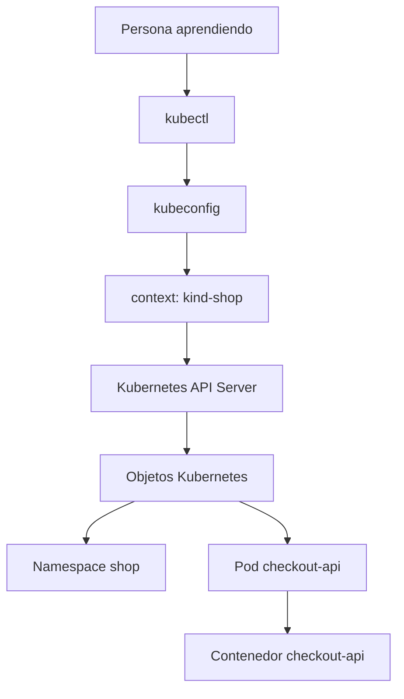

---

## 3.1. Qué vas a aprender y qué no vas a aprender todavía

Este módulo es el primer contacto práctico con Kubernetes.

Vas a aprender:

- Qué es un cluster local
- Qué es `kubectl`
- Qué es un `kubeconfig`
- Qué es un context
- Qué es un namespace
- Cómo crear un cluster con kind
- Cómo comprobar que el cluster responde
- Cómo aplicar un manifest sencillo
- Cómo inspeccionar recursos
- Cómo leer logs
- Cómo entrar en un contenedor
- Cómo usar `port-forward`
- Cómo borrar recursos
- Cómo automatizar el flujo con Taskfile
No vamos a profundizar todavía en:

- Ciclo de vida completo de Pods
- Deployments
- ReplicaSets
- Services
- Ingress
- Gateway API
- ConfigMaps
- Secrets
- Storage
- RBAC
- Probes
- NetworkPolicy
- Scheduling avanzado
- Observabilidad completa
Esos temas tienen módulos propios.

Aquí queremos que el alumno gane una primera intuición:

> Creo algo en Kubernetes, Kubernetes lo guarda como objeto, puedo observarlo, diagnosticarlo y borrarlo.

---

## 3.2. Qué es un cluster local

Un cluster Kubernetes es un conjunto de componentes que trabajan juntos para ejecutar workloads.

Para aprender no necesitas empezar con un cluster cloud.

Puedes usar un cluster local.

En este módulo usaremos **kind** como opción principal.

kind ejecuta clusters locales de Kubernetes usando contenedores Docker como “nodos”. Fue diseñado principalmente para probar Kubernetes, pero también se usa para desarrollo local y CI. ([kind.sigs.k8s.io](https://kind.sigs.k8s.io/ "kind - Kubernetes"))

También existe **minikube**, que se define como Kubernetes local, enfocado en facilitar el aprendizaje y el desarrollo. minikube puede arrancar Kubernetes con un solo comando si tienes Docker u otro entorno compatible de contenedores o máquinas virtuales. ([Kubernetes](https://kubernetes.io/docs/tasks/tools/install-minikube "minikube start - Kubernetes"))

### Por qué usaremos kind como opción principal

kind encaja muy bien con este curso porque:

- Es reproducible
- Es rápido para crear y borrar clusters
- Funciona bien con Taskfile
- Encaja bien con prácticas automatizadas
- Se usa mucho para testing local y CI
- Permite cargar imágenes locales en el cluster sin publicar en un registry
### Contrato mental

|Herramienta|Qué hace|Cuándo usarla aquí|
|---|---|---|
|kind|Crea clusters locales usando contenedores como nodos|Opción principal del curso|
|minikube|Crea un cluster local orientado a aprendizaje y desarrollo|Alternativa válida|
|Docker Desktop Kubernetes|Cluster local integrado en Docker Desktop|Útil si ya lo tienes, pero menos explícito para aprender|
|Cluster cloud gestionado|Cluster real gestionado por un proveedor|Más adelante, no para el primer laboratorio|

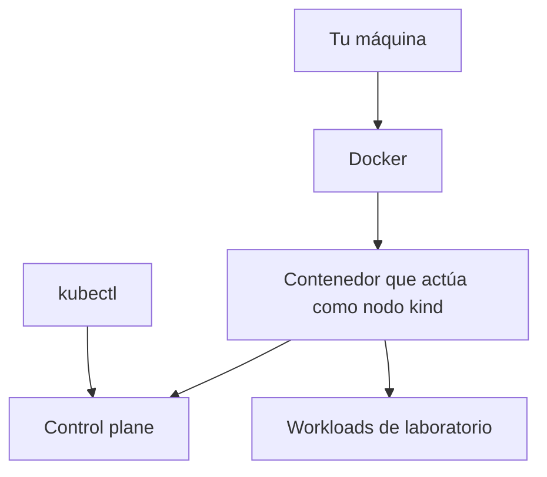

### DevEx del bloque

Un buen laboratorio local debe poder crearse y destruirse sin miedo.

Por eso vamos a tratar el cluster local como desechable:

```bash
task k8s:kind:create
task k8s:kind:delete
```

La regla es:

> Si el cluster local no se puede reconstruir fácilmente, el entorno de aprendizaje se convierte en una fuente de fricción.

---

## 3.3. Qué es `kubectl`

`kubectl` es la herramienta de línea de comandos para interactuar con clusters Kubernetes usando la API. Sirve para desplegar aplicaciones, inspeccionar recursos y gestionar workloads. ([Kubernetes](https://kubernetes.io/docs/reference/kubectl/introduction/ "Introduction to kubectl"))

No debes pensar en `kubectl` como una shell remota.

`kubectl` no entra en el cluster para ejecutar magia.

`kubectl` hace peticiones a la API de Kubernetes.

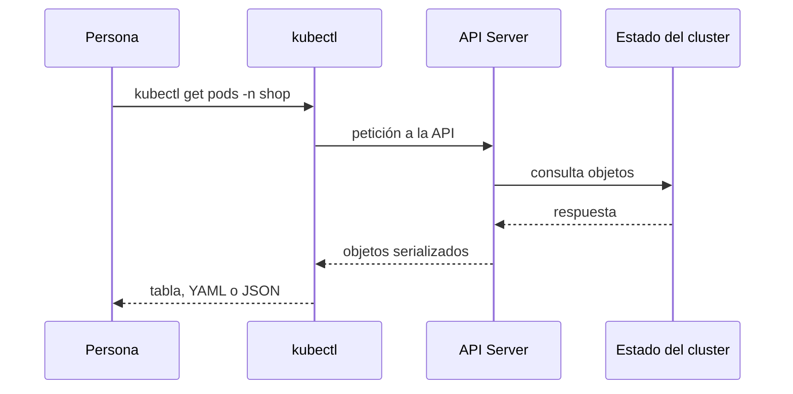

### Comandos que vas a usar

|Comando|Pregunta que responde|
|---|---|
|`kubectl version --client`|¿Tengo cliente instalado?|
|`kubectl cluster-info`|¿El cluster responde?|
|`kubectl config get-contexts`|¿Qué contextos conozco?|
|`kubectl config current-context`|¿A qué cluster apunta ahora `kubectl`?|
|`kubectl get nodes`|¿Qué nodos tiene el cluster?|
|`kubectl get namespaces`|¿Qué namespaces existen?|
|`kubectl apply -f`|¿Puedo crear o actualizar recursos declarativos?|
|`kubectl get`|¿Qué recursos existen?|
|`kubectl describe`|¿Qué detalles y eventos tiene un recurso?|
|`kubectl logs`|¿Qué está escribiendo un contenedor?|
|`kubectl exec`|¿Puedo ejecutar un comando dentro de un contenedor?|
|`kubectl port-forward`|¿Puedo exponer temporalmente un recurso localmente?|
|`kubectl delete -f`|¿Puedo borrar lo que apliqué?|

### DevEx del bloque

No memorices todos los comandos como una lista.

Agrúpalos por intención:

```text
ver configuración
ver estado
aplicar cambios
diagnosticar
acceder temporalmente
borrar
```

Eso hará que el troubleshooting sea más natural en módulos posteriores.

---

## 3.4. `kubeconfig`, contexts y namespaces

Antes de crear recursos, necesitas entender tres conceptos.

### `kubeconfig`

`kubectl` necesita saber a qué cluster conectarse y con qué credenciales.

Para eso usa un fichero de configuración.

La documentación oficial indica que `kubectl` busca por defecto un fichero llamado `config` en `$HOME/.kube`, aunque también puedes indicar otros ficheros con la variable `KUBECONFIG` o con el flag `--kubeconfig`. ([Kubernetes](https://kubernetes.io/docs/reference/kubectl/ "Command line tool (kubectl)"))

### context

Un context indica una combinación de:

- cluster
- usuario o credenciales
- namespace por defecto, si está configurado
Esto permite cambiar entre clusters sin reescribir comandos completos.

### namespace

Un namespace permite agrupar recursos dentro del cluster.

En este curso usaremos:

```text
shop
```

como namespace principal.

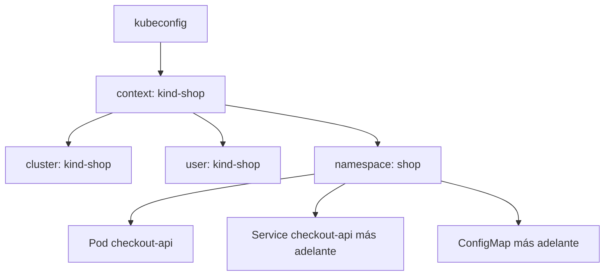

### Comandos

Ver contextos:

```bash
kubectl config get-contexts
```

Ver el context actual:

```bash
kubectl config current-context
```

Crear namespace:

```bash
kubectl create namespace shop
```

Usar namespace en cada comando:

```bash
kubectl get pods -n shop
```

Configurar namespace por defecto para el context actual:

```bash
kubectl config set-context --current --namespace=shop
```

### DevEx del bloque

Para aprendizaje, es mejor ser explícito al principio:

```bash
kubectl get pods -n shop
```

Aunque configures namespace por defecto, escribir `-n shop` hace más visible dónde estás trabajando.

Más adelante puedes usar tareas de Taskfile para evitar repetirlo sin ocultarlo:

```yaml
vars:
  NAMESPACE: shop
```

---

## 3.5. Crear el primer cluster con kind

### Contrato del cluster local

Queremos un cluster local que:

- Se llame `shop-learning`
- Sea fácil de borrar
- Sea fácil de recrear
- Permita desplegar `checkout-api`
- Permita inspeccionar nodos y recursos
- Permita usar imágenes locales cargadas desde Docker
### Crear cluster

```bash
kind create cluster --name shop-learning
```

Ver clusters kind:

```bash
kind get clusters
```

Comprobar contexto actual:

```bash
kubectl config current-context
```

Deberías ver algo parecido a:

```text
kind-shop-learning
```

Comprobar que el cluster responde:

```bash
kubectl cluster-info
kubectl get nodes
```

kind documenta el flujo de inicio rápido con el comando `kind create cluster`, y crea un contexto de `kubectl` para hablar con el cluster creado. ([kind.sigs.k8s.io](https://kind.sigs.k8s.io/docs/user/quick-start/ "Quick Start - kind - Kubernetes"))

### Qué observar

```bash
kubectl get nodes
```

Debería mostrar al menos un nodo.

En kind, ese nodo es un contenedor Docker que actúa como nodo Kubernetes.

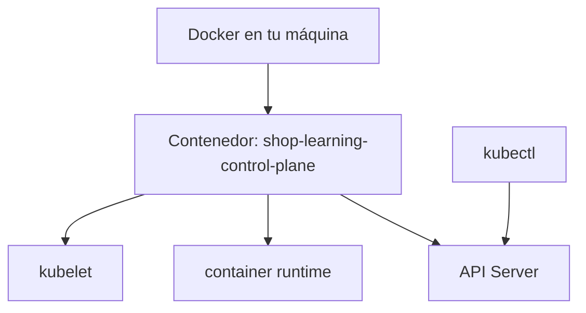

### Borrar cluster

```bash
kind delete cluster --name shop-learning
```

### DevEx del bloque

Añade estas tareas:

```yaml
k8s:kind:create:
  desc: Create local Kubernetes cluster with kind
  cmds:
    - kind create cluster --name {{.KIND_CLUSTER}}

k8s:kind:delete:
  desc: Delete local Kubernetes cluster
  cmds:
    - kind delete cluster --name {{.KIND_CLUSTER}}

k8s:context:
  desc: Show current kubectl context
  cmds:
    - kubectl config current-context
```

### Criterio de comprensión

Debes poder explicar:

> kind crea un cluster local usando contenedores como nodos. `kubectl` habla con ese cluster mediante el context configurado.

---

## 3.6. Comprobar herramientas y compatibilidad

Antes de trabajar con el cluster, valida tus herramientas.

`kubectl` debe ser compatible con la versión del cluster. La documentación oficial indica que la versión de `kubectl` debe estar dentro de una diferencia de una versión menor respecto al control plane del cluster. ([Kubernetes](https://kubernetes.io/docs/tasks/tools/install-kubectl-linux/ "Install and Set Up kubectl on Linux"))

### Comandos

```bash
kubectl version --client
kubectl version
kind version
docker --version
jq --version
yq --version
task --version
```

### Qué observar

- `kubectl` instalado
- kind instalado
- Docker disponible
- `jq` disponible
- `yq` disponible
- Task disponible
- `kubectl` puede hablar con el cluster
### DevEx del bloque

Amplía `task doctor`:

```yaml
doctor:
  desc: Check required local tools
  cmds:
    - node --version || true
    - npm --version || true
    - git --version
    - curl --version
    - jq --version
    - yq --version
    - task --version
    - docker --version
    - docker compose version
    - podman --version || true
    - kubectl version --client
    - kind version
```

Y añade una tarea para comprobar el cluster:

```yaml
k8s:doctor:
  desc: Check Kubernetes cluster access
  cmds:
    - kubectl config current-context
    - kubectl cluster-info
    - kubectl get nodes
```

### Criterio de comprensión

Debes poder explicar:

> Tener `kubectl` instalado no significa tener acceso correcto al cluster. Debo comprobar cliente, context y respuesta del API Server.

---

## 3.7. Primeros comandos de lectura

Antes de crear nada, lee el estado del cluster.

La primera habilidad en Kubernetes no es escribir YAML.

La primera habilidad es observar.

### Comandos

```bash
kubectl get nodes
kubectl get namespaces
kubectl get pods -A
kubectl get events -A --sort-by=.metadata.creationTimestamp
```

### Qué significa cada comando

|Comando|Qué observa|
|---|---|
|`kubectl get nodes`|Nodos disponibles|
|`kubectl get namespaces`|Espacios de agrupación|
|`kubectl get pods -A`|Pods de todos los namespaces|
|`kubectl get events -A`|Eventos recientes del cluster|

### Salida amplia

```bash
kubectl get pods -A -o wide
```

`-o wide` añade más información en formato tabular.

### Salida JSON

```bash
kubectl get pods -A -o json | jq -r '.items[] | [.metadata.namespace, .metadata.name, .status.phase] | @tsv'
```

### Salida YAML

```bash
kubectl get nodes -o yaml | yq '.items[].metadata.name'
```

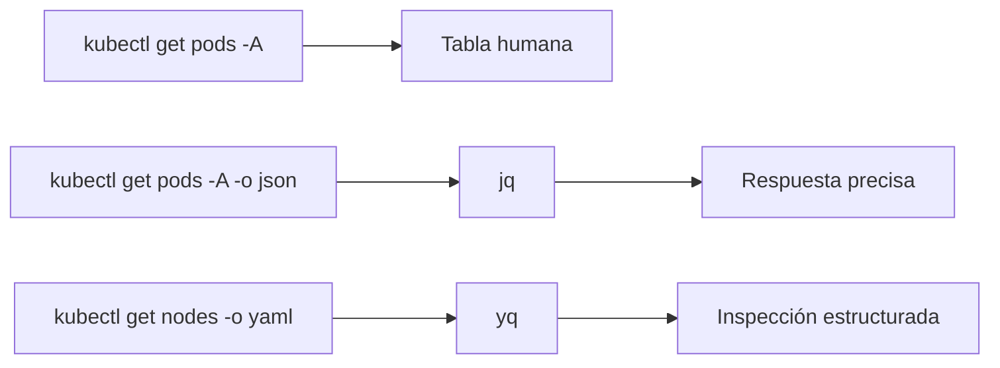

### DevEx del bloque

Añade tareas de observación:

```yaml
k8s:status:
  desc: Show useful Kubernetes status
  cmds:
    - kubectl get nodes
    - kubectl get namespaces
    - kubectl get pods -A
    - kubectl get events -A --sort-by=.metadata.creationTimestamp

k8s:pods:json:
  desc: Show pods as structured JSON summary
  cmds:
    - kubectl get pods -A -o json | jq -r '.items[] | [.metadata.namespace, .metadata.name, .status.phase] | @tsv'
```

### Criterio de comprensión

Debes poder explicar:

> Antes de cambiar un cluster, debo saber observar su estado actual.

---

## 3.8. Crear el namespace `shop`

### Qué es un namespace

Un namespace agrupa recursos dentro del cluster.

No es una frontera de seguridad completa por sí mismo, pero permite organizar recursos y aplicar políticas más adelante.

En este curso, todo el sistema `shop` vivirá en:

```text
shop
```

### Manifest declarativo

Crea:

```text
kubernetes/00-namespace/namespace.yaml
```

Contenido:

```yaml
apiVersion: v1
kind: Namespace
metadata:
  name: shop
  labels:
    app.kubernetes.io/part-of: shop
```

### Aplicar

```bash
kubectl apply -f kubernetes/00-namespace/namespace.yaml
```

### Ver

```bash
kubectl get namespaces
kubectl get namespace shop -o yaml
```

Inspeccionar con `yq`:

```bash
yq '.metadata.name' kubernetes/00-namespace/namespace.yaml
```

Inspeccionar desde el cluster con `jq`:

```bash
kubectl get namespace shop -o json | jq '.metadata.name'
```

### DevEx del bloque

Añade:

```yaml
k8s:namespace:apply:
  desc: Apply shop namespace
  cmds:
    - kubectl apply -f kubernetes/00-namespace/namespace.yaml

k8s:namespace:get:
  desc: Show shop namespace
  cmds:
    - kubectl get namespace shop -o yaml
```

### Criterio de comprensión

Debes poder explicar:

> Un namespace me permite agrupar recursos relacionados. En este curso, `shop` será el espacio de trabajo principal dentro del cluster.

---

## 3.9. Preparar la imagen local para kind

Este punto es importante.

Cuando construyes una imagen con Docker:

```bash
docker build -t checkout-api:1.0.0 ./apps/checkout-api
```

la imagen existe en tu Docker local.

Pero el cluster kind ejecuta sus nodos dentro de contenedores. Esos nodos no necesariamente ven automáticamente todas las imágenes de tu Docker local.

kind permite cargar una imagen local dentro del cluster con `kind load docker-image`. La documentación de kind incluye flujos para cargar imágenes locales en un cluster kind. ([kind.sigs.k8s.io](https://kind.sigs.k8s.io/docs/ "Documentation Distributed under CC BY 4.0 - kind - Kubernetes"))

### Build

```bash
docker build -t checkout-api:1.0.0 ./apps/checkout-api
```

### Load into kind

```bash
kind load docker-image checkout-api:1.0.0 --name shop-learning
```

### Contrato mental

|Lugar|Qué contiene|
|---|---|
|Docker local|Imagen construida por `docker build`|
|Nodo kind|Imagen disponible para que Kubernetes la ejecute|
|Registry externo|Imagen disponible para otros clusters o máquinas|

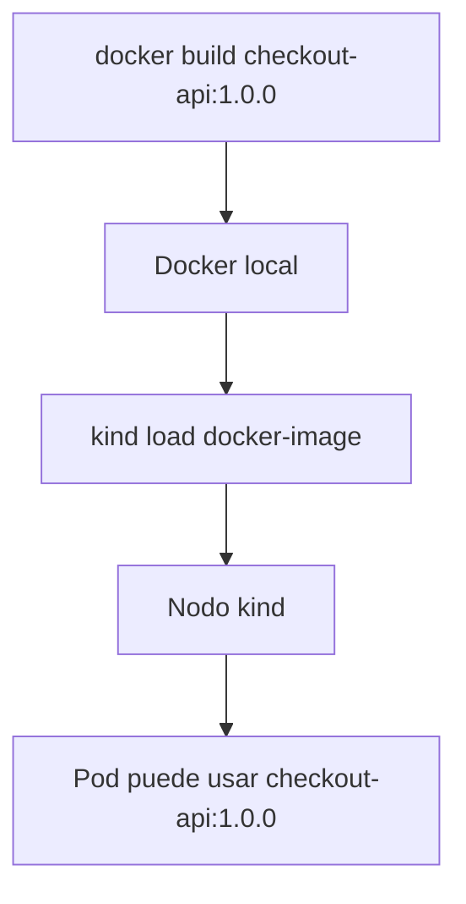

### DevEx del bloque

Añade:

```yaml
k8s:image:load:
  desc: Load checkout-api image into kind cluster
  cmds:
    - kind load docker-image {{.IMAGE_NAME}}:{{.IMAGE_TAG}} --name {{.KIND_CLUSTER}}
```

Y una tarea compuesta:

```yaml
k8s:image:prepare:
  desc: Build and load checkout-api image into kind
  cmds:
    - task container:build:docker
    - task k8s:image:load
```

### Criterio de comprensión

Debes poder explicar:

> Construir una imagen local no basta para que un cluster kind pueda usarla. Tengo que cargarla en el cluster o publicarla en un registry accesible.

---

## 3.10. Primer manifest: Pod `checkout-api`

Antes de crear el Pod, definimos el contrato mínimo.

### Qué queremos

Queremos ejecutar `checkout-api` dentro del namespace `shop`.

El Pod debe:

- Usar la imagen `checkout-api:1.0.0`
- Ejecutar un contenedor llamado `checkout-api`
- Exponer el puerto interno `8080`
- Recibir variables de entorno
- Usar `imagePullPolicy: IfNotPresent` para permitir la imagen cargada en kind
- Mantener el ejemplo sencillo
No vamos a explicar todavía todo el ciclo de vida de Pods. Eso corresponde al módulo 5.

Aquí solo necesitas ver el primer objeto ejecutable.

### Manifest

Crea:

```text
kubernetes/01-pod/pod.yaml
```

Contenido:

```yaml
apiVersion: v1
kind: Pod
metadata:
  name: checkout-api
  namespace: shop
  labels:
    app.kubernetes.io/name: checkout-api
    app.kubernetes.io/part-of: shop
spec:
  containers:
    - name: checkout-api
      image: checkout-api:1.0.0
      imagePullPolicy: IfNotPresent
      ports:
        - containerPort: 8080
      env:
        - name: SERVICE_NAME
          value: checkout-api
        - name: PORT
          value: "8080"
        - name: LOG_LEVEL
          value: debug
```

### Explicación mínima

|Campo|Qué significa|
|---|---|
|`apiVersion`|Versión de la API usada por este objeto|
|`kind`|Tipo de objeto|
|`metadata.name`|Nombre del objeto|
|`metadata.namespace`|Namespace donde vive|
|`metadata.labels`|Etiquetas para identificarlo|
|`spec`|Estado deseado|
|`containers`|Contenedores dentro del Pod|
|`image`|Imagen que se ejecuta|
|`imagePullPolicy`|Cuándo intentar descargar la imagen|
|`ports.containerPort`|Puerto documentado del contenedor|
|`env`|Variables de entorno|

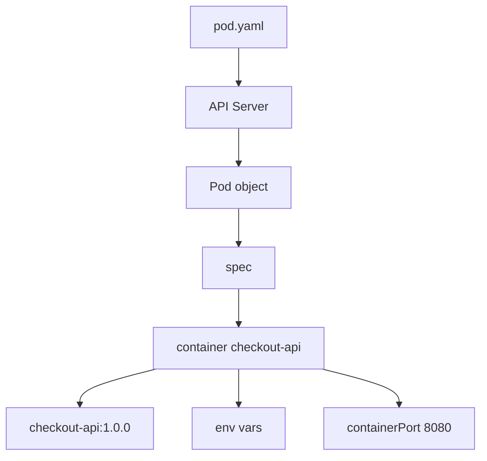

### Aplicar

```bash
kubectl apply -f kubernetes/01-pod/pod.yaml
```

### Ver

```bash
kubectl get pods -n shop
kubectl get pod checkout-api -n shop -o wide
```

### DevEx del bloque

Añade:

```yaml
k8s:pod:apply:
  desc: Apply checkout-api Pod
  cmds:
    - kubectl apply -f kubernetes/01-pod/pod.yaml

k8s:pod:get:
  desc: Show checkout-api Pod
  cmds:
    - kubectl get pod checkout-api -n {{.NAMESPACE}} -o wide
```

### Criterio de comprensión

Debes poder explicar:

> Un Pod es el primer objeto ejecutable que crearé en Kubernetes, pero `kubectl apply` no ejecuta directamente un contenedor. Envía un objeto a la API y Kubernetes intenta materializarlo.

---

## 3.11. Observar estado del Pod

Una vez creado el Pod, no basta con ver que “existe”.

Hay que observar su estado.

### Comandos

```bash
kubectl get pod checkout-api -n shop
kubectl get pod checkout-api -n shop -o wide
kubectl describe pod checkout-api -n shop
kubectl get events -n shop --sort-by=.metadata.creationTimestamp
```

### Qué mirar

|Señal|Qué indica|
|---|---|
|`STATUS`|Fase visible del Pod|
|`READY`|Contenedores ready frente a total|
|`RESTARTS`|Reinicios del contenedor|
|`AGE`|Tiempo desde creación|
|`NODE`|Nodo donde se ejecuta|
|Events|Señales de scheduling, pull, start, errores|

### Inspección estructurada con `jq`

```bash
kubectl get pod checkout-api -n shop -o json | jq '.status.phase'
kubectl get pod checkout-api -n shop -o json | jq '.status.containerStatuses'
kubectl get pod checkout-api -n shop -o json | jq '.spec.containers[0].image'
```

### Inspección del manifest local con `yq`

```bash
yq '.kind' kubernetes/01-pod/pod.yaml
yq '.metadata.name' kubernetes/01-pod/pod.yaml
yq '.spec.containers[0].image' kubernetes/01-pod/pod.yaml
```

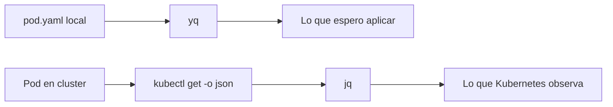

### DevEx del bloque

Añade:

```yaml
k8s:pod:inspect:
  desc: Inspect checkout-api Pod
  cmds:
    - kubectl get pod checkout-api -n {{.NAMESPACE}} -o wide
    - kubectl describe pod checkout-api -n {{.NAMESPACE}}
    - kubectl get pod checkout-api -n {{.NAMESPACE}} -o json | jq '.status.phase'
    - kubectl get pod checkout-api -n {{.NAMESPACE}} -o json | jq '.status.containerStatuses'
```

### Criterio de comprensión

Debes poder explicar:

> `kubectl get` me da una vista rápida. `kubectl describe` me da detalles y eventos. `kubectl get -o json | jq` me permite hacer preguntas precisas.

---

## 3.12. Leer logs del Pod

La aplicación ya escribía logs por stdout en Docker.

En Kubernetes, puedes leer esos logs con:

```bash
kubectl logs checkout-api -n shop
```

Seguir logs:

```bash
kubectl logs -f checkout-api -n shop
```

Generar tráfico todavía no será posible desde tu máquina hasta que hagamos `port-forward`, pero el log de arranque ya debería existir.

### Contrato de logs esperado

El arranque debería emitir algo parecido a:

```json
{
  "level": "debug",
  "service": "checkout-api",
  "message": "server started",
  "port": 8080
}
```

### DevEx del bloque

Añade:

```yaml
k8s:logs:
  desc: Follow checkout-api logs
  cmds:
    - kubectl logs -f pod/checkout-api -n {{.NAMESPACE}}
```

### Criterio de comprensión

Debes poder explicar:

> `kubectl logs` lee la salida del contenedor gestionado por Kubernetes. La decisión de escribir logs por stdout en el módulo 1 permite que esto funcione ahora.

---

## 3.13. Entrar en el contenedor con `kubectl exec`

En Docker usaste:

```bash
docker exec -it checkout-api sh
```

En Kubernetes usarás:

```bash
kubectl exec -it checkout-api -n shop -- sh
```

Dentro:

```sh
whoami
pwd
ls -la
printenv | sort
wget -qO- http://localhost:8080/health
exit
```

### Qué observar

- Estás dentro del contenedor del Pod
- `localhost:8080` funciona dentro del mismo contenedor
- Las variables de entorno están presentes
- El usuario debería ser el definido en la imagen
### DevEx del bloque

Añade:

```yaml
k8s:shell:
  desc: Open shell inside checkout-api Pod
  cmds:
    - kubectl exec -it pod/checkout-api -n {{.NAMESPACE}} -- sh
```

### Criterio de comprensión

Debes poder explicar:

> `kubectl exec` sirve para inspeccionar un contenedor que Kubernetes está ejecutando. No debe convertirse en la forma normal de corregir sistemas a mano.

---

## 3.14. Acceder a `checkout-api` con `port-forward`

Todavía no hemos creado un Service.

No tenemos Ingress.

No tenemos Gateway.

Solo tenemos un Pod.

Para acceder temporalmente desde tu máquina, usaremos `port-forward`.

```bash
kubectl port-forward pod/checkout-api -n shop 8080:8080
```

En otra terminal:

```bash
curl -i http://localhost:8080/health
curl -i http://localhost:8080/ready
curl -i http://localhost:8080/checkout
```

También puedes ejecutar:

```bash
task smoke
```

### Qué significa

```text
8080:8080
```

significa:

```text
LOCAL_PORT:POD_PORT
```

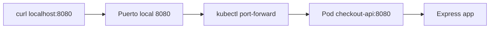

### Contrato de uso

`port-forward` es útil para:

- Desarrollo local
- Debugging
- Validar una app sin crear Service
- Acceso temporal
No es una estrategia de exposición real para producción.

Más adelante aprenderás Services, Ingress y Gateway API.

### DevEx del bloque

Añade:

```yaml
k8s:port-forward:
  desc: Forward local port to checkout-api Pod
  cmds:
    - kubectl port-forward pod/checkout-api -n {{.NAMESPACE}} {{.PORT}}:8080
```

Esta tarea se queda ejecutando. Debe correr en una terminal separada.

### Criterio de comprensión

Debes poder explicar:

> `port-forward` crea un túnel temporal entre mi máquina y un recurso del cluster. No reemplaza un Service.

---

## 3.15. Borrar recursos

Todo lo que creas debe poder borrarse.

Borrar el Pod:

```bash
kubectl delete -f kubernetes/01-pod/pod.yaml
```

Borrar el namespace:

```bash
kubectl delete -f kubernetes/00-namespace/namespace.yaml
```

Comprobar:

```bash
kubectl get pods -n shop
kubectl get namespace shop
```

Si el namespace ya no existe, el comando de Pods devolverá error porque el namespace fue eliminado.

### DevEx del bloque

Añade:

```yaml
k8s:pod:delete:
  desc: Delete checkout-api Pod
  cmds:
    - kubectl delete -f kubernetes/01-pod/pod.yaml --ignore-not-found

k8s:namespace:delete:
  desc: Delete shop namespace
  cmds:
    - kubectl delete -f kubernetes/00-namespace/namespace.yaml --ignore-not-found
```

### Criterio de comprensión

Debes poder explicar:

> Un laboratorio serio no solo sabe crear recursos. También sabe borrarlos y reconstruirlos.

---

## 3.16. Primer flujo completo del módulo

Este es el flujo que el alumno debe poder repetir.

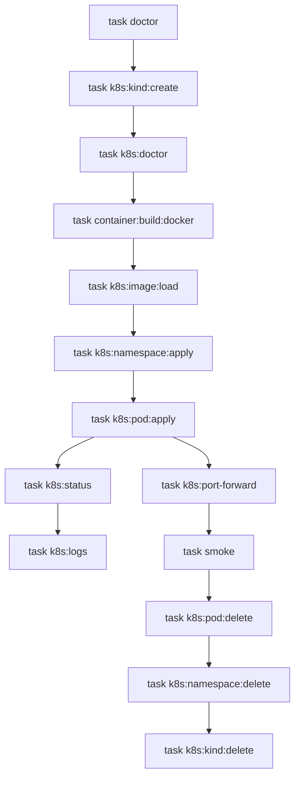

### Comandos

Terminal 1:

```bash
task doctor
task k8s:kind:create
task k8s:doctor
task k8s:image:prepare
task k8s:namespace:apply
task k8s:pod:apply
task k8s:pod:inspect
task k8s:port-forward
```

Terminal 2:

```bash
task smoke
task k8s:logs
```

Limpieza:

```bash
task k8s:pod:delete
task k8s:namespace:delete
task k8s:kind:delete
```

### Criterio de comprensión

Debes poder explicar todo el circuito:

> Construyo imagen, la cargo en kind, creo un namespace, aplico un Pod, observo estado, leo logs, abro un port-forward, valido el contrato HTTP y borro recursos.

---

## 3.17. Taskfile completo para el módulo 3

Amplía el `Taskfile.yml` con estas variables y tareas.

```yaml
version: '3'

vars:
  APP_NAME: checkout-api
  IMAGE_NAME: checkout-api
  IMAGE_TAG: 1.0.0
  PORT: 8080
  KIND_CLUSTER: shop-learning
  NAMESPACE: shop
  COMPOSE_FILE: compose/compose.yaml

tasks:
  default:
    desc: List available tasks
    cmds:
      - task --list

  doctor:
    desc: Check required local tools
    cmds:
      - node --version || true
      - npm --version || true
      - git --version
      - curl --version
      - jq --version
      - yq --version
      - task --version
      - docker --version
      - docker compose version
      - podman --version || true
      - kubectl version --client
      - kind version

  app:install:
    desc: Install checkout-api dependencies locally
    dir: apps/{{.APP_NAME}}
    cmds:
      - npm install

  app:run:
    desc: Run checkout-api locally without a container
    dir: apps/{{.APP_NAME}}
    cmds:
      - PORT={{.PORT}} LOG_LEVEL=debug npm start

  container:build:docker:
    desc: Build checkout-api image with Docker
    cmds:
      - docker build -t {{.IMAGE_NAME}}:{{.IMAGE_TAG}} ./apps/{{.APP_NAME}}

  smoke:
    desc: Run checkout-api smoke test
    cmds:
      - ./scripts/smoke-test.sh

  k8s:kind:create:
    desc: Create local Kubernetes cluster with kind
    cmds:
      - kind create cluster --name {{.KIND_CLUSTER}}

  k8s:kind:delete:
    desc: Delete local Kubernetes cluster
    cmds:
      - kind delete cluster --name {{.KIND_CLUSTER}}

  k8s:context:
    desc: Show current kubectl context
    cmds:
      - kubectl config current-context

  k8s:doctor:
    desc: Check Kubernetes cluster access
    cmds:
      - kubectl config current-context
      - kubectl cluster-info
      - kubectl get nodes

  k8s:status:
    desc: Show useful Kubernetes status
    cmds:
      - kubectl get nodes
      - kubectl get namespaces
      - kubectl get pods -A
      - kubectl get events -A --sort-by=.metadata.creationTimestamp

  k8s:pods:json:
    desc: Show pods as structured JSON summary
    cmds:
      - kubectl get pods -A -o json | jq -r '.items[] | [.metadata.namespace, .metadata.name, .status.phase] | @tsv'

  k8s:image:load:
    desc: Load checkout-api image into kind cluster
    cmds:
      - kind load docker-image {{.IMAGE_NAME}}:{{.IMAGE_TAG}} --name {{.KIND_CLUSTER}}

  k8s:image:prepare:
    desc: Build and load checkout-api image into kind
    cmds:
      - task container:build:docker
      - task k8s:image:load

  k8s:namespace:apply:
    desc: Apply shop namespace
    cmds:
      - kubectl apply -f kubernetes/00-namespace/namespace.yaml

  k8s:namespace:get:
    desc: Show shop namespace
    cmds:
      - kubectl get namespace {{.NAMESPACE}} -o yaml

  k8s:namespace:delete:
    desc: Delete shop namespace
    cmds:
      - kubectl delete -f kubernetes/00-namespace/namespace.yaml --ignore-not-found

  k8s:pod:apply:
    desc: Apply checkout-api Pod
    cmds:
      - kubectl apply -f kubernetes/01-pod/pod.yaml

  k8s:pod:get:
    desc: Show checkout-api Pod
    cmds:
      - kubectl get pod checkout-api -n {{.NAMESPACE}} -o wide

  k8s:pod:inspect:
    desc: Inspect checkout-api Pod
    cmds:
      - kubectl get pod checkout-api -n {{.NAMESPACE}} -o wide
      - kubectl describe pod checkout-api -n {{.NAMESPACE}}
      - kubectl get pod checkout-api -n {{.NAMESPACE}} -o json | jq '.status.phase'
      - kubectl get pod checkout-api -n {{.NAMESPACE}} -o json | jq '.status.containerStatuses'

  k8s:logs:
    desc: Follow checkout-api logs
    cmds:
      - kubectl logs -f pod/checkout-api -n {{.NAMESPACE}}

  k8s:shell:
    desc: Open shell inside checkout-api Pod
    cmds:
      - kubectl exec -it pod/checkout-api -n {{.NAMESPACE}} -- sh

  k8s:port-forward:
    desc: Forward local port to checkout-api Pod
    cmds:
      - kubectl port-forward pod/checkout-api -n {{.NAMESPACE}} {{.PORT}}:8080

  k8s:pod:delete:
    desc: Delete checkout-api Pod
    cmds:
      - kubectl delete -f kubernetes/01-pod/pod.yaml --ignore-not-found

  k8s:lab:apply:
    desc: Apply namespace and checkout-api Pod
    cmds:
      - task k8s:namespace:apply
      - task k8s:pod:apply

  k8s:lab:delete:
    desc: Delete checkout-api Pod and namespace
    cmds:
      - task k8s:pod:delete
      - task k8s:namespace:delete
```

---

## 3.18. Práctica principal del módulo

### Objetivo

Crear un cluster local, desplegar `checkout-api` como Pod, observarlo, acceder por `port-forward`, validar su contrato y limpiar todo.

### Resultado esperado

Al final deberías tener:

```text
kubernetes-learning-lab/
  kubernetes/
    00-namespace/
      namespace.yaml
    01-pod/
      pod.yaml
  Taskfile.yml
```

### Paso 1. Crear cluster

```bash
task k8s:kind:create
task k8s:doctor
```

### Paso 2. Construir y cargar imagen

```bash
task k8s:image:prepare
```

### Paso 3. Crear namespace

```bash
task k8s:namespace:apply
task k8s:namespace:get
```

### Paso 4. Aplicar Pod

```bash
task k8s:pod:apply
task k8s:pod:get
```

### Paso 5. Inspeccionar

```bash
task k8s:pod:inspect
task k8s:status
```

### Paso 6. Leer logs

```bash
task k8s:logs
```

### Paso 7. Acceder con port-forward

En una terminal:

```bash
task k8s:port-forward
```

En otra terminal:

```bash
task smoke
```

### Paso 8. Entrar en el contenedor

```bash
task k8s:shell
```

Dentro:

```sh
printenv | sort
wget -qO- http://localhost:8080/health
exit
```

### Paso 9. Borrar recursos

```bash
task k8s:lab:delete
```

### Paso 10. Borrar cluster

```bash
task k8s:kind:delete
```

### Criterio de finalización

La práctica está completa cuando puedes:

- Crear el cluster
- Ver nodos
- Ver context actual
- Crear el namespace `shop`
- Construir la imagen
- Cargar la imagen en kind
- Aplicar el Pod
- Ver estado del Pod
- Leer logs
- Entrar en el contenedor
- Hacer port-forward
- Ejecutar el smoke test
- Borrar recursos
- Borrar el cluster
- Repetir todo con Taskfile
---

## 3.19. Ejercicios cortos

### Ejercicio 1. Context actual

Ejecuta:

```bash
kubectl config current-context
kubectl config get-contexts
```

Responde:

- ¿A qué cluster apunta `kubectl`?
- ¿Qué context creó kind?
- ¿Qué pasaría si tu context apunta a otro cluster?
---

### Ejercicio 2. Namespaces

Ejecuta:

```bash
kubectl get namespaces
kubectl get pods -A
kubectl get pods -n shop
```

Responde:

- ¿Qué diferencia hay entre `-A` y `-n shop`?
- ¿Por qué usaremos `shop` como namespace?
- ¿Qué error aparece si el namespace no existe?
---

### Ejercicio 3. Imagen no cargada

Borra el cluster y créalo de nuevo:

```bash
task k8s:kind:delete
task k8s:kind:create
```

Aplica namespace y Pod sin cargar la imagen:

```bash
task k8s:namespace:apply
task k8s:pod:apply
task k8s:pod:inspect
```

Responde:

- ¿Qué error aparece?
- ¿Por qué Kubernetes no encuentra la imagen?
- ¿Qué comando lo corrige?
Después corrige:

```bash
task k8s:image:load
kubectl delete pod checkout-api -n shop
task k8s:pod:apply
```

---

### Ejercicio 4. Logs

Ejecuta:

```bash
task k8s:logs
```

En otra terminal:

```bash
task k8s:port-forward
```

En una tercera terminal:

```bash
task smoke
```

Responde:

- ¿Qué logs aparecen?
- ¿Qué endpoint genera cada log?
- ¿Por qué los logs funcionaban ya desde Docker?
---

### Ejercicio 5. `port-forward`

Ejecuta:

```bash
task k8s:port-forward
```

Responde:

- ¿Qué puerto local estás usando?
- ¿A qué puerto del Pod apunta?
- ¿Por qué esto no es una forma real de exponer producción?
- ¿Qué recurso estudiarás más adelante para exponer Pods de forma estable?
---

### Ejercicio 6. `kubectl get`, `describe`, `logs`, `exec`

Completa:

|Necesidad|Comando|
|---|---|
|Ver si el Pod existe||
|Ver eventos del Pod||
|Leer logs del Pod||
|Entrar en el contenedor||
|Ver YAML del Pod||
|Extraer imagen con `jq`||

---

## 3.20. Errores habituales

### Error 1. Pensar que `kubectl` es Kubernetes

`kubectl` no es Kubernetes.

Es un cliente de la API.

Puedes tener Kubernetes sin usar `kubectl`, y puedes tener `kubectl` instalado sin tener acceso correcto a ningún cluster.

---

### Error 2. Olvidar el context

Uno de los errores más peligrosos es ejecutar comandos contra el cluster equivocado.

Antes de aplicar o borrar recursos, revisa:

```bash
kubectl config current-context
```

---

### Error 3. Olvidar el namespace

Si ejecutas:

```bash
kubectl get pods
```

solo ves Pods del namespace por defecto del context actual.

Para este curso usa:

```bash
kubectl get pods -n shop
```

o:

```bash
kubectl get pods -A
```

---

### Error 4. Construir una imagen local y asumir que kind la ve

Docker local y el nodo kind no son exactamente el mismo espacio de ejecución.

Si usas una imagen local en kind, normalmente tendrás que cargarla:

```bash
kind load docker-image checkout-api:1.0.0 --name shop-learning
```

---

### Error 5. Saltar directamente a YAML sin observar

Antes de cambiar cosas, observa:

```bash
kubectl get
kubectl describe
kubectl logs
kubectl get events
```

La práctica no es solo aplicar manifests. Es aprender a leer el sistema.

---

### Error 6. Usar `exec` para arreglar a mano

Entrar en un contenedor puede ayudar a diagnosticar.

No debe convertirse en el mecanismo normal de cambio.

Los cambios deben vivir en código, imágenes, manifests o configuración versionada.

---

### Error 7. Confundir `port-forward` con exposición real

`port-forward` sirve para acceso temporal.

Más adelante usarás Services, Ingress o Gateway API para exposición estable.

---

## 3.21. Criterio de salida del módulo

Puedes pasar al módulo 4 cuando puedas hacer todo esto sin seguir una receta ciegamente.

### Conceptos

Debes poder explicar:

- Qué es un cluster local
- Qué es kind
- Qué diferencia hay entre kind y minikube a nivel de propósito
- Qué es `kubectl`
- Qué es `kubeconfig`
- Qué es un context
- Qué es un namespace
- Qué hace `kubectl apply`
- Qué diferencia hay entre `get`, `describe`, `logs`, `exec` y `port-forward`
- Por qué una imagen local debe cargarse en kind
- Por qué `port-forward` no sustituye un Service
### Práctica

Debes poder:

- Crear un cluster kind
- Ver nodos
- Ver context actual
- Crear namespace `shop`
- Construir `checkout-api`
- Cargar la imagen en kind
- Aplicar el Pod
- Ver el estado del Pod
- Leer logs
- Entrar en el contenedor
- Hacer port-forward
- Ejecutar el smoke test
- Borrar recursos
- Borrar el cluster
### DevEx

Debes poder ejecutar:

```bash
task doctor
task k8s:kind:create
task k8s:doctor
task k8s:image:prepare
task k8s:lab:apply
task k8s:pod:inspect
task k8s:port-forward
task smoke
task k8s:lab:delete
task k8s:kind:delete
```

### Frase final de comprensión

Debes poder explicar esta frase:

> Kubernetes se controla mediante una API. `kubectl` es un cliente de esa API. Antes de entender todos los objetos de Kubernetes, debo aprender a crear, observar, diagnosticar y borrar recursos de forma repetible.

---

## 3.22. Referencias oficiales

|Tema|Referencia|
|---|---|
|Instalar herramientas Kubernetes|Kubernetes Docs, Install Tools. ([Kubernetes](https://kubernetes.io/docs/tasks/tools/ "Install Tools"))|
|Instalar `kubectl` en Linux|Kubernetes Docs, Install and Set Up kubectl on Linux. ([Kubernetes](https://kubernetes.io/docs/tasks/tools/install-kubectl-linux/ "Install and Set Up kubectl on Linux"))|
|Instalar `kubectl` en macOS|Kubernetes Docs, Install and Set Up kubectl on macOS. ([Kubernetes](https://kubernetes.io/docs/tasks/tools/install-kubectl-macos/ "Install and Set Up kubectl on macOS"))|
|Instalar `kubectl` en Windows|Kubernetes Docs, Install and Set Up kubectl on Windows. ([Kubernetes](https://kubernetes.io/docs/tasks/tools/install-kubectl-windows/ "Install and Set Up kubectl on Windows"))|
|`kubectl`|Kubernetes Docs, Command line tool. ([Kubernetes](https://kubernetes.io/docs/reference/kubectl/ "Command line tool (kubectl)"))|
|Introducción a `kubectl`|Kubernetes Docs, Introduction to kubectl. ([Kubernetes](https://kubernetes.io/docs/reference/kubectl/introduction/ "Introduction to kubectl"))|
|Referencia rápida de `kubectl`|Kubernetes Docs, kubectl Quick Reference. ([Kubernetes](https://kubernetes.io/docs/reference/kubectl/quick-reference/ "kubectl Quick Reference"))|
|kind|kind official site. ([kind.sigs.k8s.io](https://kind.sigs.k8s.io/ "kind - Kubernetes"))|
|kind Quick Start|kind official documentation. ([kind.sigs.k8s.io](https://kind.sigs.k8s.io/docs/user/quick-start/ "Quick Start - kind - Kubernetes"))|
|minikube|minikube official documentation. ([Kubernetes](https://kubernetes.io/docs/tasks/tools/install-minikube "minikube start - Kubernetes"))|
|Hello Minikube|Kubernetes tutorial. ([Kubernetes](https://kubernetes.io/docs/tutorials/hello-minikube/ "Hello Minikube"))|
|Usar `kubectl` si vienes de Docker|Kubernetes Docs, kubectl for Docker Users. ([Kubernetes](https://kubernetes.io/docs/reference/kubectl/docker-cli-to-kubectl/ "kubectl for Docker Users"))|

## 3.23. Lecturas de apoyo

|Libro|Qué leer|
|---|---|
|_Kubernetes: Up and Running_|Capítulo 3: cluster, minikube, cloud providers, cliente Kubernetes y componentes.|
|_Kubernetes: Up and Running_|Capítulo 4: `kubectl`, namespaces, contexts, objetos, labels, annotations y debugging.|
|_Kubernetes in Action_|Capítulo 2: cluster local, Minikube, primer despliegue y comandos iniciales.|
|_Cloud Native DevOps with Kubernetes_|Capítulo 3: arquitectura, managed Kubernetes, self-hosting y costes.|
|_Cloud Native DevOps with Kubernetes_|Capítulo 7: `kubectl`, logs, exec, port-forward, contexts, namespaces y herramientas útiles.|