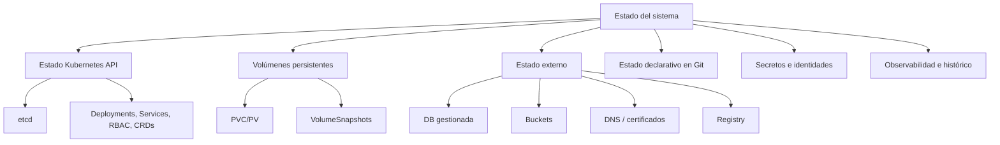
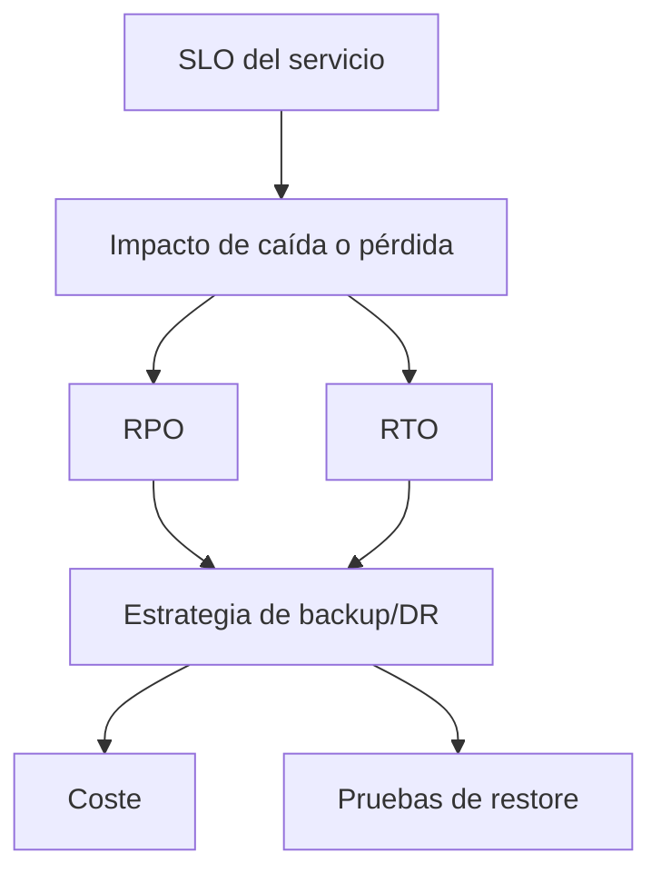

<!-- COURSE_NAV_START -->

[Anterior](<29. Service mesh, tráfico L7 y resiliencia de red.md>) | [Indice](README.md) | [Siguiente](<31. FinOps, coste operativo y eficiencia en Kubernetes.md >)

<!-- COURSE_NAV_END -->

# 30. Backups, restore y disaster recovery

## 30.1. Objetivo del módulo

En los módulos anteriores has trabajado disponibilidad, resiliencia, SLOs, incident response, autoscaling, supply chain, políticas de plataforma, multi-tenancy, networking avanzado y service mesh. Todas esas prácticas reducen la probabilidad y el impacto de fallos, pero no eliminan una verdad incómoda: tarde o temprano tendrás que recuperar algo. Puede ser una tabla dañada por una migración, un volumen eliminado por error, un namespace borrado, un Secret rotado incorrectamente, una release que escribió datos incompatibles, un cluster perdido, una región caída o una cuenta comprometida.

Este módulo trata backups, restore y disaster recovery en Kubernetes desde una perspectiva operativa. No vamos a tratar backup como una tarea de infraestructura aislada, sino como una capacidad del sistema. Una capacidad real debe tener objetivo, alcance, automatización, cifrado, retención, pruebas de restore, responsables, runbooks, métricas, alertas y criterios claros de recuperación. Guardar copias sin probarlas no es disaster recovery. Es acumulación de artefactos con esperanza.

Kubernetes complica el tema porque el estado no vive en un único lugar. Parte del estado vive en el API server y `etcd`: Deployments, Services, ConfigMaps, Secrets, RBAC, CRDs, custom resources, policies, HPAs, NetworkPolicies y otros objetos. Parte vive en volúmenes persistentes: bases de datos, colas, índices, ficheros, caches durables o contenido subido por usuarios. Parte vive fuera del cluster: bases de datos gestionadas, buckets, DNS, certificados, registries, sistemas de identidad, colas cloud, backups del proveedor, repositorios Git, pipelines y secretos externos. Una estrategia de recuperación que solo mira Kubernetes puede dejar fuera lo más importante.

La tesis del módulo es esta:

> Un backup que no se restaura periódicamente no es una garantía; es una hipótesis no verificada.

La tesis operacional es esta:

> Disaster recovery en Kubernetes consiste en saber qué estado importa, dónde vive, cuánto puedes perder, cuánto tardas en volver, cómo pruebas esa recuperación y qué decisiones de producto y operación se activan cuando el sistema falla.

En este módulo aprenderás:

- Qué diferencia hay entre backup, restore, disaster recovery y business continuity
- Qué son RPO y RTO
- Qué estado existe en Kubernetes
- Qué estado vive fuera de Kubernetes
- Por qué GitOps no sustituye backup
- Qué papel tiene `etcd`
- Qué papel tienen PersistentVolumes, PVCs, StorageClasses y VolumeSnapshots
- Qué aporta Velero y herramientas equivalentes
- Qué límites tienen los snapshots de volumen
- Qué límites tienen los backups de objetos Kubernetes
- Cómo diseñar una estrategia por workload
- Cómo hacer backup de recursos namespaced
- Cómo hacer backup de recursos cluster-scoped
- Cómo pensar backups de CRDs y custom resources
- Cómo proteger Secrets en backups
- Cómo diseñar retención, cifrado e inmutabilidad
- Cómo probar restores
- Cómo diseñar runbooks de recuperación
- Cómo definir DR para un namespace, una app, un cluster y una región
- Cómo relacionar backups con SLOs, incident response, multi-tenancy, security y software economics
- Cómo automatizar prácticas con Taskfile
La idea principal es sencilla:

```text
No necesitas saber solo si tienes backups.
Necesitas saber qué puedes recuperar, hasta qué punto en el tiempo, en cuánto tiempo y con qué evidencia.
```

---

## 30.2. Por qué este módulo existe en un curso de Kubernetes

Kubernetes está diseñado para reconciliar estado deseado. Si un Pod muere, el ReplicaSet puede crear otro. Si un nodo desaparece, los Pods pueden programarse en otro nodo. Si un Deployment se actualiza, Kubernetes puede hacer rollout. Esa capacidad puede crear una falsa sensación de seguridad: como Kubernetes se recupera de muchos fallos pequeños, algunos equipos asumen que también se recuperará de pérdida de datos, corrupción, eliminación accidental, compromiso de credenciales o pérdida de cluster.

Ese salto es peligroso. Kubernetes puede recrear un Pod, pero no puede reconstruir una base de datos corrupta si no existe backup consistente. Puede volver a aplicar un Deployment desde Git, pero no puede recuperar un Secret que fue rotado mal si no tienes fuente segura. Puede crear un PVC nuevo, pero no sabe qué datos debía contener. Puede restaurar objetos si tienes manifiestos, pero no sabe si los CRDs, operadores y versiones están en el orden correcto. Puede reprogramar workloads, pero no puede decidir qué RPO y RTO son aceptables para el negocio.

Este módulo existe para que el lector deje de pensar en backup como “copiar cosas” y empiece a pensar en recuperación como una capacidad diseñada. Esa capacidad debe cubrir estado, orden, consistencia, dependencias, secretos, identidad, datos, políticas y verificación. El objetivo no es tener la herramienta más completa. El objetivo es poder recuperarse cuando importa.

### Criterio de comprensión

Debes poder explicar:

> Kubernetes recupera procesos y estado deseado, pero la recuperación de datos y continuidad del sistema requiere una estrategia explícita de backup, restore y DR.

---

## 30.3. Backup, restore, disaster recovery y business continuity

Antes de hablar de herramientas, hay que limpiar el vocabulario.

| Concepto            | Qué significa                        | Pregunta principal                    |
| ------------------- | ------------------------------------ | ------------------------------------- |
| Backup              | copia de datos o configuración       | ¿Tenemos una copia recuperable?       |
| Restore             | proceso de recuperar desde backup    | ¿Podemos volver a un estado útil?     |
| Disaster recovery   | capacidad de recuperar ante desastre | ¿Podemos operar tras un fallo grave?  |
| Business continuity | continuidad del servicio/negocio     | ¿Puede el negocio seguir funcionando? |

Un backup es un medio. Restore es la prueba. Disaster recovery es la capacidad operativa de usar restore bajo presión. Business continuity es el resultado que importa para la organización.

### Ejemplo

Tener un backup nocturno de PostgreSQL es backup. Restaurarlo en un entorno limpio y validar que `checkout-api` funciona es restore. Poder recuperar el servicio si se pierde el cluster principal es disaster recovery. Poder seguir aceptando pedidos, aunque sea en modo degradado o con procesos manuales temporales, es business continuity.

### Criterio de comprensión

Debes poder explicar:

> Backup no es el objetivo. El objetivo es restaurar capacidad útil para el negocio dentro de límites aceptables.

---

## 30.4. RPO y RTO

RPO y RTO son dos de los conceptos más importantes de recuperación.

| Concepto | Significado              | Pregunta                                          |
| -------- | ------------------------ | ------------------------------------------------- |
| RPO      | Recovery Point Objective | ¿Cuántos datos podemos perder?                    |
| RTO      | Recovery Time Objective  | ¿Cuánto tiempo podemos estar degradados o caídos? |

### RPO

Si haces backup cada 24 horas, tu RPO práctico podría acercarse a 24 horas. Eso significa que, ante cierto desastre, podrías perder hasta un día de datos. Para un checkout, eso probablemente es inaceptable. Para una sandbox, puede ser aceptable.

### RTO

Si restaurar el sistema tarda 8 horas, tu RTO práctico no es 30 minutos aunque lo escribas en un documento. El RTO real se mide con ejercicios de restore.

### Ejemplo por workload

| Workload           |                     RPO |        RTO | Estrategia probable                                |
| ------------------ | ----------------------: | ---------: | -------------------------------------------------- |
| checkout database  |                 minutos |   < 1 hora | backups frecuentes, PITR, réplica, runbook probado |
| catálogo cacheable |                   horas |    2 horas | reconstrucción desde fuente                        |
| preview env        | pérdida total aceptable | recreación | no backup, TTL                                     |
| monitoring config  |                   horas |     1 hora | GitOps + backup de configuración                   |
| user uploads       |           minutos/horas |    2 horas | bucket versioning + replication + restore          |
| cluster objects    |                   horas |    2 horas | Velero/GitOps/etcd según alcance                   |

### Criterio de comprensión

Debes poder explicar:

> RPO mide pérdida aceptable de datos; RTO mide tiempo aceptable de recuperación. Ambos deben probarse, no declararse de memoria.

---

## 30.5. El mapa del estado en Kubernetes

Para diseñar backups necesitas saber dónde vive el estado. En Kubernetes hay muchas formas de estado y no todas se recuperan igual.



### Estado Kubernetes API

Incluye recursos como Deployments, Services, ConfigMaps, Secrets, RBAC, CRDs, HPAs, NetworkPolicies, Gateway API resources, mesh policies, ResourceQuotas, LimitRanges, PDBs, Jobs, CronJobs, StatefulSets y custom resources.

### Estado de datos

Incluye datos persistentes de aplicaciones: bases de datos, índices, mensajes, ficheros subidos, colas, snapshots, backups de bases externas, objetos en buckets y storage.

### Estado de plataforma

Incluye controladores instalados, CRDs, admission policies, certificados, configuración de ingress/gateway, operadores, políticas de mesh, configuración de observabilidad, RBAC y secretos de integración.

### Estado fuera del cluster

Incluye repositorios Git, container registries, DNS, IAM, secretos externos, proveedores cloud, bases gestionadas, buckets, pipelines, artefactos firmados, SBOMs y registros de auditoría.

### Criterio de comprensión

Debes poder explicar:

> Una estrategia de backup empieza haciendo inventario de estado. Si no sabes dónde vive el estado, no sabes qué puedes perder.

---

## 30.6. GitOps no sustituye backup

GitOps ayuda a reconstruir estado deseado, pero no sustituye backup. Un repositorio Git puede contener manifests, Helm charts, Kustomize overlays y configuración declarativa. Eso es valioso para recrear recursos. Pero no contiene necesariamente datos, Secrets reales, contenido de volúmenes, estado de CRDs gestionados por operadores, snapshots, histórico de bases de datos, certificados emitidos, objetos generados dinámicamente o estado externo.

### GitOps ayuda a recuperar

- Deployments
- Services
- Ingress/Gateway
- NetworkPolicies
- HPAs
- ResourceQuotas
- LimitRanges
- Policies
- Configuración declarativa
- Versiones esperadas
- Parte del estado de plataforma
### GitOps no recupera por sí solo

- Datos en PVC
- Datos en DB gestionada
- Mensajes en broker
- Secrets si no están gestionados externamente
- Certificados emitidos dinámicamente
- Estado interno de operadores
- CRDs y custom resources no versionados
- Contenido generado por usuarios
- Historial necesario para PITR
- Artefactos del registry si se pierden
### Regla

GitOps es parte de recuperación, no toda la recuperación.

### Criterio de comprensión

Debes poder explicar:

> GitOps reconstruye intención declarativa; backup y restore reconstruyen estado perdido o dañado.

---

## 30.7. `etcd` y estado del cluster

`etcd` almacena el estado del cluster Kubernetes. Si pierdes todos los nodos de control plane y no tienes snapshot de `etcd`, puedes perder el estado del cluster. Un backup de `etcd` puede ser importante para recuperar el control plane, pero no debe confundirse con backup de aplicación.

### Qué contiene `etcd`

- Objetos Kubernetes
- ConfigMaps
- Secrets
- RBAC
- CRDs y custom resources
- Estado deseado y observado de muchos recursos
- Información sensible si no está protegida adecuadamente
### Qué no contiene `etcd`

- Datos dentro de volúmenes
- Contenido de bases externas
- Imágenes de contenedor
- Artefactos del registry
- Buckets externos
- Repositorios Git
- Estado interno fuera de Kubernetes
### Implicaciones

Los snapshots de `etcd` son críticos y sensibles. Deben cifrarse, protegerse, probarse y almacenarse fuera del fallo que intentan cubrir. Restaurar `etcd` no es una operación casual; puede afectar todo el cluster y debe seguir procedimientos específicos del entorno.

### Criterio de comprensión

Debes poder explicar:

> `etcd` permite recuperar estado del cluster, pero no recupera los datos de aplicación que viven en volúmenes o servicios externos.

---

## 30.8. PersistentVolumes, PVCs y StorageClasses

Los PersistentVolumes son recursos de almacenamiento que sobreviven al ciclo de vida de un Pod. Un PersistentVolumeClaim solicita almacenamiento. Una StorageClass define clases de almacenamiento y comportamiento de aprovisionamiento. Para backup y DR, necesitas entender qué StorageClass usa cada PVC, qué capacidades ofrece el proveedor y si soporta snapshots, replicación, cifrado, retención o recuperación cross-zone/cross-region.

### Preguntas por PVC

- ¿Qué aplicación lo usa?
- ¿Qué datos contiene?
- ¿Es fuente de verdad o cache reconstruible?
- ¿Qué StorageClass usa?
- ¿Soporta snapshots?
- ¿Los snapshots son crash-consistent o application-consistent?
- ¿Hay cifrado?
- ¿Dónde se almacenan snapshots?
- ¿Se pueden restaurar en otro cluster?
- ¿Se pueden copiar a otra región?
- ¿Qué RPO/RTO exige?
- ¿Quién valida el restore?
- ¿Qué pasa si se borra el PVC?
- ¿Cuál es `reclaimPolicy` del PV?
### Criterio de comprensión

Debes poder explicar:

> Un PVC no es solo “disco para un Pod”. Es un contenedor de datos con requisitos de recuperación, consistencia y retención.

---

## 30.9. VolumeSnapshots

VolumeSnapshot proporciona una forma estandarizada de crear una copia de un volumen en un punto del tiempo usando capacidades del CSI driver. Es útil para backups, migraciones, pruebas y protección antes de cambios peligrosos. Pero un snapshot de volumen no siempre equivale a un backup completo ni a una restauración de aplicación consistente.

### Qué aporta

- Copia point-in-time de un volumen
- Integración con CSI
- Posibilidad de crear PVC desde snapshot
- Protección antes de migraciones
- Base para herramientas de backup
- Recuperación de datos de volumen
### Límites

- Depende del CSI driver
- Puede ser crash-consistent, no application-consistent
- Puede no copiarse fuera de la zona o región
- Puede no proteger contra fallo del proveedor
- Puede no incluir objetos Kubernetes
- Puede no incluir varias PVCs de forma consistente
- Puede no incluir estado externo
- Puede quedar afectado por políticas de retención del proveedor
- Puede necesitar quiesce de la aplicación para consistencia fuerte
### Ejemplo conceptual

```yaml
apiVersion: snapshot.storage.k8s.io/v1
kind: VolumeSnapshot
metadata:
  name: checkout-db-snapshot
  namespace: shop
spec:
  volumeSnapshotClassName: csi-snapshot-class
  source:
    persistentVolumeClaimName: checkout-db-data
```

### Criterio de comprensión

Debes poder explicar:

> Un VolumeSnapshot captura un volumen en un punto del tiempo, pero la consistencia de aplicación depende del workload, del storage y del procedimiento.

---

## 30.10. Consistencia: crash-consistent y application-consistent

No todos los backups tienen la misma calidad. Un snapshot crash-consistent captura el estado como si la máquina o el volumen se hubieran detenido de golpe. Puede ser suficiente para algunos sistemas, pero no para todos. Un backup application-consistent coordina la aplicación para que los datos queden en un estado recuperable y coherente.

### Crash-consistent

Puede funcionar bien para algunos sistemas con journal o mecanismos de recuperación. Pero puede dejar transacciones a medias, buffers no escritos o varias PVCs en estados no coordinados.

### Application-consistent

Requiere coordinar con la aplicación: flush, lock, checkpoint, backup lógico, hooks pre/post, pausa de escrituras, replica, PITR o mecanismo específico de la base de datos.

### Ejemplo

Una base PostgreSQL normalmente no debería confiar solo en snapshot de volumen si necesitas garantías fuertes. Puede requerir backups con herramientas específicas, WAL archiving y Point-in-Time Recovery. Un directorio de ficheros estáticos puede tolerar snapshots más simples si los ficheros se escriben de forma atómica o si el negocio acepta cierta inconsistencia.

### Criterio de comprensión

Debes poder explicar:

> Que un volumen tenga snapshot no significa que la aplicación restaurada vaya a estar en un estado lógico correcto.

---

## 30.11. Backups de bases de datos en Kubernetes

Las bases de datos requieren especial cuidado. Kubernetes puede ejecutar StatefulSets y PVCs, pero la consistencia y recuperación de una base de datos depende del motor, su configuración y su estrategia de backup. Para bases críticas, suele ser mejor usar mecanismos nativos del motor y, cuando sea posible, servicios gestionados que ofrezcan backups, PITR, réplica, cifrado y restore probado.

### Estrategias comunes

- Backup lógico
- Backup físico
- WAL/binlog archiving
- Point-in-Time Recovery
- Replicación
- Snapshots coordinados
- Exportaciones verificables
- Restore periódico en entorno de prueba
- Pruebas de integridad
- Backups gestionados por operador especializado
### Preguntas para `checkout-db`

- ¿Cuál es el RPO?
- ¿Cuál es el RTO?
- ¿Necesitamos PITR?
- ¿Dónde se almacenan WALs?
- ¿Quién prueba restore?
- ¿Qué versión de DB se restaura?
- ¿Qué pasa si una migración corrompe datos?
- ¿Podemos restaurar a un punto antes de la migración?
- ¿Cómo se valida que `checkout-api` funciona tras restore?
- ¿Qué ocurre con eventos o mensajes emitidos después del punto restaurado?
### Criterio de comprensión

Debes poder explicar:

> Para bases de datos, backup correcto es una propiedad del motor y del proceso, no solo del volumen donde vive.

---

## 30.12. Backups de objetos Kubernetes

Además de datos, necesitas recuperar configuración de Kubernetes. Herramientas como Velero pueden hacer backup de recursos Kubernetes y volúmenes persistentes según configuración. También puedes reconstruir parte del estado desde GitOps, pero hay que saber qué recursos están declarados y cuáles se generan dinámicamente.

### Qué incluir

- Namespaces
- Deployments
- StatefulSets
- DaemonSets
- Jobs y CronJobs
- Services
- Ingress/Gateway resources
- ConfigMaps
- Secrets, con cuidado
- RBAC
- NetworkPolicies
- ResourceQuotas
- LimitRanges
- HPAs
- PDBs
- CRDs
- Custom resources
- Mesh policies
- Admission policies
- ServiceAccounts
### Qué revisar

- Recursos cluster-scoped
- Orden de restauración
- CRDs antes que custom resources
- Operadores antes que recursos gestionados
- Secrets cifrados
- Conflictos con recursos existentes
- Diferencias entre clusters
- StorageClasses disponibles
- Namespaces excluidos
- Recursos efímeros que no deberían restaurarse
### Criterio de comprensión

Debes poder explicar:

> Restaurar objetos Kubernetes exige entender dependencias entre recursos, no solo aplicar YAML en cualquier orden.

---

## 30.13. CRDs, operadores y custom resources

Los CRDs y operadores complican backup y restore. Un custom resource puede representar una base de datos, un certificado, un cluster de Kafka, un backup schedule o una configuración de mesh. Si restauras custom resources sin el operador correcto, pueden quedar inertes. Si restauras el operador pero no su estado, puede reconciliar de forma inesperada. Si restauras CRDs incompatibles con la versión actual, puedes romper el API.

### Preguntas

- ¿Qué CRDs existen?
- ¿Quién los instala?
- ¿Están versionados en Git?
- ¿Qué operador los reconcilia?
- ¿El operador está en el backup?
- ¿Qué orden de restore exige?
- ¿Los custom resources contienen estado crítico?
- ¿Hay finalizers?
- ¿Hay webhooks?
- ¿Qué pasa si el operador reconcilia antes de que estén los Secrets?
- ¿Hay compatibilidad de versiones?
### Criterio de comprensión

Debes poder explicar:

> En Kubernetes moderno, muchas aplicaciones de plataforma viven en CRDs. Backup y restore deben tratar CRDs y operadores como parte del sistema, no como detalle secundario.

---

## 30.14. Secrets y backups

Los Secrets son especialmente delicados. Los backups pueden contener credenciales, tokens, certificados, claves privadas, passwords de bases de datos y secretos de integración. Si un backup no está cifrado o está demasiado accesible, se convierte en una copia completa de material sensible.

### Reglas mínimas

- Cifrar backups
- Limitar acceso a backups
- Auditar acceso
- Separar permisos de backup y restore
- Proteger snapshots de `etcd`
- Evitar exportar Secrets en texto plano
- Preferir secret managers externos cuando aplique
- Rotar secretos si hay exposición
- No restaurar Secrets antiguos sin revisar
- Documentar impacto de restore sobre credenciales
- Tener runbook de rotación post-restore
### Riesgo

Restaurar Secrets antiguos puede reintroducir credenciales revocadas, certificados expirados o tokens comprometidos. También puede romper integraciones si el sistema externo espera una credencial nueva.

### Criterio de comprensión

Debes poder explicar:

> Un backup de Secrets es también una copia de riesgo. Debe protegerse como producción.

---

## 30.15. Retención, cifrado e inmutabilidad

Una estrategia de backup necesita política de retención. No todos los backups deben conservarse para siempre. Tampoco deben ser tan pocos que no puedas volver a un punto anterior al fallo. Además, los backups deben protegerse frente a borrado accidental, ransomware, compromiso de cuenta y error humano.

### Decisiones de retención

- Backups horarios durante 24 horas
- Backups diarios durante 30 días
- Backups semanales durante 12 semanas
- Backups mensuales durante 12 meses
- Retención legal o regulatoria si aplica
- Expiración automática
- Borrado seguro
- Coste de almacenamiento
- Separación por entorno
### Controles

- Cifrado en reposo
- Cifrado en tránsito
- Acceso mínimo
- MFA para acceso administrativo
- Object lock o inmutabilidad, si aplica
- Replicación cross-region
- Separación de cuentas
- Auditoría
- Pruebas de restore
- Alertas de fallo de backup
### Criterio de comprensión

Debes poder explicar:

> Un backup debe estar protegido contra el mismo tipo de errores o ataques que intenta mitigar.

---

## 30.16. Backups y multi-tenancy

En un cluster multi-tenant, backup y restore deben respetar fronteras de tenant. No todos los tenants tienen el mismo RPO, RTO, retención, coste o criticidad. Restaurar un namespace puede afectar a otros si comparte recursos, CRDs, operadores, storage, NetworkPolicies o dependencias externas.

### Preguntas por tenant

- ¿Qué namespaces pertenecen al tenant?
- ¿Qué recursos cluster-scoped usa?
- ¿Qué PVCs tiene?
- ¿Qué Secrets tiene?
- ¿Qué dependencias externas usa?
- ¿Qué RPO/RTO tiene?
- ¿Quién puede solicitar restore?
- ¿Quién aprueba restore?
- ¿Qué coste tiene la retención?
- ¿Hay datos sensibles?
- ¿Hay backups separados por tenant?
- ¿Cómo se evita restaurar datos de un tenant en otro?
### Criterio de comprensión

Debes poder explicar:

> En multi-tenancy, backup y restore deben respetar ownership, aislamiento, coste y permisos de cada tenant.

---

## 30.17. Backups y security incident response

Un incidente de seguridad cambia la forma de restaurar. Si una imagen, credencial, cuenta, pipeline o cluster fue comprometido, restaurar desde backup puede reintroducir el compromiso si no sabes cuándo empezó y qué artefactos están contaminados.

### Preguntas durante incidente de seguridad

- ¿Desde cuándo existe el compromiso?
- ¿Qué backups podrían estar contaminados?
- ¿Qué credenciales deben rotarse?
- ¿Qué imágenes deben bloquearse?
- ¿Qué Secrets no deben restaurarse?
- ¿Qué artefactos de supply chain están afectados?
- ¿El backup contiene malware o configuración maliciosa?
- ¿Qué logs de auditoría existen?
- ¿Se debe restaurar a un cluster limpio?
- ¿Qué políticas de admisión deben endurecerse antes de restore?
### Regla

Después de un incidente de seguridad, restaurar rápido no es suficiente. Debes restaurar limpio.

### Criterio de comprensión

Debes poder explicar:

> En seguridad, el restore debe evitar reintroducir el atacante, la credencial comprometida o la configuración vulnerable.

---

## 30.18. Disaster recovery por niveles

No todos los escenarios requieren la misma respuesta. Diseña DR por niveles.

| Nivel            | Escenario                             | Recuperación                             |
| ---------------- | ------------------------------------- | ---------------------------------------- |
| Recurso          | Secret, ConfigMap, Deployment borrado | restaurar recurso o reaplicar Git        |
| Namespace        | namespace eliminado o dañado          | restaurar namespace, recursos y PVCs     |
| Aplicación       | app y datos corruptos                 | restore de datos + recursos + validación |
| Cluster          | pérdida del cluster                   | recrear cluster + restaurar estado       |
| Región           | pérdida regional                      | failover o restore en otra región        |
| Cuenta/proveedor | compromiso o pérdida amplia           | recuperación en cuenta limpia            |

### Por qué importa

Si todos los fallos se tratan como “restaurar cluster”, las respuestas serán lentas y peligrosas. Si todos se tratan como “reaplicar YAML”, perderás datos. El nivel de DR debe corresponder al alcance del fallo.

### Criterio de comprensión

Debes poder explicar:

> Disaster recovery no es una acción única. Cambia según si perdiste un recurso, una app, un namespace, un cluster o una región.

---

## 30.19. Restore parcial y restore completo

Restore parcial recupera una parte del sistema: un namespace, un PVC, una tabla, un Secret, un Deployment o una configuración. Restore completo reconstruye un entorno mayor: cluster completo, plataforma o región.

### Restore parcial

Ventajas:

- Menos impacto
- Más rápido
- Menos riesgo
- Útil para errores humanos
- Útil para corrupción localizada
Riesgos:

- Inconsistencia con otros recursos
- Dependencias no restauradas
- Versiones incompatibles
- Datos restaurados a distinto punto temporal que eventos o mensajes
- Conflictos con estado actual
### Restore completo

Ventajas:

- Útil ante pérdida de cluster
- Más coherente si el backup es consistente
- Permite reconstrucción en entorno limpio
Riesgos:

- Más lento
- Más complejo
- Más impacto
- Puede restaurar cosas innecesarias
- Puede traer configuración antigua o vulnerable
### Criterio de comprensión

Debes poder explicar:

> Restore parcial reduce impacto, pero exige entender consistencia con el resto del sistema.

---

## 30.20. Orden de recuperación

El orden importa. Restaurar recursos en orden incorrecto puede fallar o producir estados extraños.

### Orden conceptual

1. Infraestructura base
2. Cluster Kubernetes
3. StorageClasses y drivers
4. CRDs
5. Operadores/controladores
6. Namespaces
7. RBAC y ServiceAccounts
8. Secrets y ConfigMaps
9. PersistentVolumes/PVCs o restauración de datos
10. Recursos de plataforma
11. Workloads
12. Ingress/Gateway/Networking
13. Policies
14. Autoscaling
15. Observabilidad
16. Validación funcional
17. Reapertura de tráfico
Este orden puede variar según herramienta y plataforma, pero ilustra una idea: no restaures workloads antes de que existan sus datos, permisos, Secrets, CRDs y dependencias.

### Criterio de comprensión

Debes poder explicar:

> Restore no es aplicar todo a la vez. Es reconstruir dependencias en un orden que produzca un sistema válido.

---

## 30.21. Validación tras restore

Un restore no termina cuando `kubectl get pods` muestra Running. Termina cuando has demostrado que la capacidad útil volvió.

### Validaciones mínimas

- Pods Running y Ready
- Services con endpoints
- DNS interno resuelve
- Secrets correctos
- PVCs montados
- Aplicación responde
- Migraciones compatibles
- Datos esperados presentes
- Checkouts de prueba funcionan
- Métricas se emiten
- Logs llegan
- Trazas funcionan
- Alertas no muestran degradación
- SLO vuelve a estado aceptable
- Usuarios o consumidores pueden operar
- No hay errores de autorización
- No hay NetworkPolicy bloqueando tráfico legítimo
- No hay colas atascadas
- No hay Jobs fallando
### Smoke test de restore

```bash
curl -fsS -X POST http://localhost:8080/checkout \
  -H 'Content-Type: application/json' \
  -H 'Idempotency-Key: restore-test-001' \
  -d '{"checkoutId":"restore-test-001","amount":4999,"currency":"EUR"}'
```

### Criterio de comprensión

Debes poder explicar:

> Restore se valida con comportamiento útil, no con recursos que simplemente existen.

---

## 30.22. Pruebas periódicas de restore

Una organización puede tener backups diarios durante años y descubrir el día del desastre que no sabe restaurarlos. Por eso, las pruebas periódicas son obligatorias.

### Tipos de prueba

| Prueba                    | Qué valida                           |
| ------------------------- | ------------------------------------ |
| Restore de recurso        | recuperar objeto borrado             |
| Restore de namespace      | recuperar conjunto namespaced        |
| Restore de PVC            | recuperar datos de volumen           |
| Restore de DB             | recuperar consistencia de base       |
| Restore en cluster limpio | reconstruir plataforma               |
| Game day DR               | practicar incidente completo         |
| Restore cross-region      | validar desastre regional            |
| Restore security-clean    | validar recuperación tras compromiso |

### Frecuencia sugerida

La frecuencia depende de criticidad. Un sistema de checkout crítico puede requerir pruebas mensuales o trimestrales. Una sandbox puede no necesitar backups. Lo importante es que la frecuencia esté justificada por RPO/RTO, riesgo y coste.

### Criterio de comprensión

Debes poder explicar:

> La prueba de restore convierte backup de creencia en evidencia.

---

## 30.23. Velero como herramienta de backup y restore

Velero es una herramienta habitual para backup y restore de recursos Kubernetes y volúmenes persistentes. Puede ayudar en escenarios de disaster recovery, migración de clusters y protección de namespaces. Su valor está en coordinar recursos Kubernetes, metadata y volúmenes según plugins y configuración.

### Qué puede aportar

- Backups programados
- Backups por namespace
- Backups con selectors
- Restore de recursos Kubernetes
- Integración con snapshots de volumen
- Migración entre clusters
- Hooks
- Plugins de proveedores
- Retención
- Exclusiones
- Operación declarativa mediante recursos
### Qué debes revisar

- Backend de almacenamiento
- Plugins de cloud
- Permisos
- Cifrado
- Retención
- Namespaces incluidos
- Recursos excluidos
- CRDs
- Volume snapshots
- Hooks de consistencia
- Restore order
- Conflictos de recursos existentes
- Compatibilidad de versiones
- Pruebas periódicas
### Criterio de comprensión

Debes poder explicar:

> Velero puede orquestar backups y restores de Kubernetes, pero no decide por ti qué es consistente ni qué RPO/RTO necesita cada aplicación.

---

## 30.24. Schedules y políticas de backup

Un schedule define cuándo se hacen backups. Pero el schedule no debe ser global por comodidad. Debe derivarse de RPO, criticidad, coste y retención.

### Ejemplo conceptual con Velero

```yaml
apiVersion: velero.io/v1
kind: Schedule
metadata:
  name: checkout-prod-daily
  namespace: velero
spec:
  schedule: "0 2 * * *"
  template:
    includedNamespaces:
      - checkout-prod
    ttl: 720h
```

### Preguntas

- ¿Ese horario cumple RPO?
- ¿Qué pasa si falla el backup?
- ¿Hay alerta?
- ¿Incluye PVCs?
- ¿Incluye Secrets?
- ¿Incluye CRDs necesarios?
- ¿Dónde se almacena?
- ¿Cuánto cuesta retenerlo?
- ¿Se prueba restore?
- ¿Hay backup antes de migraciones peligrosas?
### Criterio de comprensión

Debes poder explicar:

> El schedule de backup debe derivarse del RPO y validarse con restore, no elegirse por comodidad horaria.

---

## 30.25. Backups antes de migraciones

Antes de migraciones de datos riesgosas, puede ser necesario tomar backup o snapshot. Pero no debe usarse backup como excusa para migraciones inseguras. Una migración debe seguir siendo compatible, reversible cuando sea posible, incremental, observable y probada.

### Antes de migrar

- Confirmar backup reciente
- Confirmar restore probado
- Confirmar RPO/RTO
- Confirmar plan de rollback o roll-forward
- Confirmar compatibilidad app vieja/nueva
- Confirmar feature flags si aplica
- Confirmar métricas de DB
- Confirmar runbook
- Confirmar ventana de cambio si existe
- Confirmar comunicación
### Riesgo

Si una migración escribe datos nuevos y luego restauras a un punto anterior, puedes perder eventos, pagos, mensajes o acciones de usuario realizadas después. Restaurar datos no es gratis. Puede requerir reconciliación.

### Criterio de comprensión

Debes poder explicar:

> Backup antes de migración reduce riesgo, pero no sustituye diseño de migraciones compatibles y observables.

---

## 30.26. DR y eventos/mensajes

Los sistemas modernos suelen usar colas, eventos y procesamiento asíncrono. Restore de base de datos sin considerar eventos puede crear inconsistencias. Puedes restaurar la DB a las 10:00, pero el broker puede tener mensajes de las 10:10, o consumidores pueden reprocesar eventos que ya no encajan.

### Preguntas

- ¿Qué pasa con mensajes emitidos después del punto restaurado?
- ¿El broker tiene backup?
- ¿Se pueden reemitir eventos?
- ¿Hay idempotencia?
- ¿Hay deduplicación?
- ¿Hay outbox?
- ¿Hay DLQ?
- ¿Los consumidores toleran duplicados?
- ¿Cómo se reconcilia estado externo?
- ¿Cómo se evita doble cobro o doble envío?
- ¿Qué sistemas downstream recibieron eventos antes del restore?
### Criterio de comprensión

Debes poder explicar:

> Restore de datos en sistemas event-driven necesita reconciliar mensajes, eventos, idempotencia y efectos externos.

---

## 30.27. DR y sistemas externos

Una aplicación Kubernetes rara vez vive sola. Puede depender de DNS, CDN, proveedores de pago, IAM, buckets, bases gestionadas, registries, observabilidad, pipelines y secretos externos. Disaster recovery debe incluir estos sistemas.

### Inventario externo

- DNS
- Certificados
- Container registry
- Git repositories
- CI/CD
- Secret manager
- IAM roles
- Cloud load balancers
- Buckets
- Managed databases
- Message brokers
- Monitoring
- Alerting
- Incident management
- Feature flag system
- Payment provider
- Email/SMS provider
### Preguntas

- ¿Qué pasa si el registry no está disponible?
- ¿Podemos recrear cluster sin Git?
- ¿Podemos desplegar sin CI?
- ¿Podemos restaurar sin secret manager?
- ¿DNS puede apuntar a región secundaria?
- ¿Certificados se emiten automáticamente?
- ¿Los backups están en la misma cuenta comprometida?
- ¿Quién tiene permisos de break-glass?
### Criterio de comprensión

Debes poder explicar:

> Disaster recovery de Kubernetes falla si ignora los sistemas externos que hacen posible desplegar, enrutar, autenticar y operar.

---

## 30.28. Runbooks de restore

Un runbook de restore debe estar escrito antes del incidente. Durante presión, nadie debería inventar la secuencia de recuperación desde cero.

### Qué debe incluir

- Escenario cubierto
- RPO/RTO objetivo
- Prerrequisitos
- Permisos necesarios
- Fuente del backup
- Cómo elegir punto de restore
- Pasos de recuperación
- Orden de recursos
- Validaciones
- Criterios de abort
- Riesgos
- Comunicación
- Rollback o alternativa
- Evidencia a guardar
- Contactos
- Post-restore cleanup
### Ejemplo de estructura

```md
# Runbook: restore checkout-prod namespace

## Scenario

checkout-prod namespace was accidentally deleted or corrupted.

## RPO/RTO

RPO: 1 hour
RTO: 2 hours

## Preconditions

- Velero available.
- Backup storage reachable.
- Cluster healthy.
- Platform operator available.
- Checkout owner available.

## Steps

1. Identify backup.
2. Confirm restore point.
3. Restore namespace resources.
4. Restore PVC snapshots.
5. Restore Secrets from approved source.
6. Validate Pods and Services.
7. Run smoke tests.
8. Confirm SLO recovery.
9. Communicate status.

## Abort when

- Backup integrity cannot be verified.
- Restore would overwrite newer valid data.
- Security incident requires clean-room restore.
```

### Criterio de comprensión

Debes poder explicar:

> Un runbook de restore debe decir qué hacer, qué no hacer y cómo saber si funcionó.

---

## 30.29. Clean-room restore

Un clean-room restore consiste en restaurar en un entorno limpio, aislado o nuevo, en vez de restaurar encima del entorno afectado. Es especialmente útil después de incidentes de seguridad, pérdida de cluster, corrupción grave o cuando necesitas validar backups sin tocar producción.

### Usos

- Probar backups
- Investigar datos dañados
- Recuperar tras compromiso
- Validar migraciones
- Comparar estado antes/después
- Rehearsal de DR
- Restaurar en otra región
- Evitar contaminar producción
### Requisitos

- Cluster limpio
- Acceso controlado
- Secretos seguros
- Red aislada
- Datos anonimizados si aplica
- Runbook
- Validación
- Coste temporal
- Limpieza posterior
### Criterio de comprensión

Debes poder explicar:

> Clean-room restore reduce riesgo porque prueba recuperación sin sobrescribir ni contaminar el entorno afectado.

---

## 30.30. DR cross-region

La recuperación cross-region busca operar desde otra región si la principal falla. Esto es más complejo que copiar backups. Implica datos, DNS, certificados, imágenes, secretos, IAM, networking, capacidad, proveedores, latencia y procedimientos.

### Preguntas

- ¿Los backups están replicados?
- ¿Las imágenes están disponibles en la región secundaria?
- ¿Los Secrets están disponibles?
- ¿La DB tiene réplica o backups restaurables?
- ¿Los buckets replican?
- ¿DNS puede cambiar rápido?
- ¿Certificados existen en secundaria?
- ¿Hay capacidad en la región secundaria?
- ¿Los node pools existen?
- ¿Las StorageClasses existen?
- ¿Los manifests son compatibles?
- ¿Qué datos se pierden según RPO?
- ¿Quién decide failover?
- ¿Cómo se hace failback?
- ¿Cómo se evita split brain?
### Criterio de comprensión

Debes poder explicar:

> DR cross-region es una capacidad de arquitectura, datos, red y operación; no solo un backup copiado a otra región.

---

## 30.31. Failover y failback

Failover mueve operación a un entorno secundario. Failback devuelve operación al entorno principal. Muchas estrategias se centran en failover y olvidan failback, pero volver puede ser más difícil si hubo escrituras en secundaria.

### Failover

Preguntas:

- ¿Quién lo autoriza?
- ¿Qué SLO está afectado?
- ¿Qué datos se pierden?
- ¿El secundario está listo?
- ¿DNS o tráfico cambia cómo?
- ¿Hay capacidad suficiente?
- ¿Las dependencias externas apuntan bien?
- ¿Cómo se comunica?
- ¿Cómo se evita doble escritura?
### Failback

Preguntas:

- ¿Qué datos se escribieron en secundaria?
- ¿Cómo se reconcilian?
- ¿La primaria está limpia?
- ¿Qué backups se toman antes?
- ¿Cómo se valida?
- ¿Hay ventana de mantenimiento?
- ¿Cómo se evita pérdida de datos?
- ¿Qué sistemas externos deben reconfigurarse?
### Criterio de comprensión

Debes poder explicar:

> Failover sin plan de failback puede recuperar servicio temporalmente y crear un problema de datos después.

---

## 30.32. DR y observabilidad

La observabilidad también forma parte de DR. Si pierdes dashboards, alertas, logs, métricas o trazas durante un desastre, recuperas a ciegas.

### Preguntas

- ¿La plataforma de observabilidad está dentro del mismo cluster?
- ¿Tiene backup?
- ¿Hay observabilidad externa?
- ¿Los dashboards están en Git?
- ¿Las alertas están versionadas?
- ¿Los logs se almacenan fuera del cluster?
- ¿Hay retención suficiente?
- ¿Puedes observar el entorno restaurado?
- ¿Hay alertas de backup fallido?
- ¿Hay métricas de duración de restore?
- ¿Hay auditoría de restore?
### Señales de backup

- Último backup exitoso
- Duración del backup
- Tamaño del backup
- Errores
- Backups fallidos consecutivos
- Último restore probado
- Duración del restore
- Edad del backup más reciente
- Cumplimiento de RPO
- Excepciones activas
### Criterio de comprensión

Debes poder explicar:

> No puedes operar disaster recovery si la propia observabilidad desaparece con el desastre.

---

## 30.33. DR y SLOs

Los SLOs deben influir en RPO y RTO. Si un servicio tiene un SLO estricto, no puedes diseñar backups con recuperación manual de 8 horas salvo que el negocio acepte ese riesgo. A la vez, no todos los servicios merecen DR complejo.

### Relación



### Ejemplo

`checkout-api` con pagos reales necesita RPO bajo, RTO bajo y reconciliación de efectos externos. Un entorno preview puede tener RPO infinito y RTO basado en recreación. Aplicar la misma estrategia a ambos desperdicia dinero o asume riesgo inaceptable.

### Criterio de comprensión

Debes poder explicar:

> RPO y RTO deben derivarse del impacto y los SLOs, no de la herramienta de backup disponible.

---

## 30.34. DR y error budgets

El error budget puede informar decisiones de DR. Si un servicio está quemando presupuesto por incidentes de datos o restores lentos, quizá hay que invertir en mejores backups, PITR, automatización de restore o reducción de estado. Si el budget está sano y el servicio es poco crítico, quizá no necesitas una estrategia costosa.

### Decisiones guiadas por budget

| Situación                             | Decisión                              |
| ------------------------------------- | ------------------------------------- |
| Restores fallan en pruebas            | invertir en runbooks y automatización |
| RTO real supera objetivo              | mejorar procedimiento o arquitectura  |
| RPO real inaceptable                  | aumentar frecuencia o PITR            |
| Backup consume demasiado              | revisar retención y criticidad        |
| DR no se usa en servicios no críticos | simplificar estrategia                |
| Incidente de datos repetido           | rediseñar migraciones y protección    |

### Criterio de comprensión

Debes poder explicar:

> Error budgets ayudan a decidir si invertir en recuperación, reducir riesgo o simplificar donde el coste no se justifica.

---

## 30.35. DR y software economics

Backup y DR son inversiones. Tienen coste de almacenamiento, herramientas, licencias, ejecución, cifrado, retención, pruebas, personas, documentación, complejidad y oportunidad. Pero no tenerlos tiene coste de pérdida de datos, caída, incumplimientos, soporte, pérdida de confianza, trabajo reactivo, estrés y posible impacto legal.

### Costes visibles

- Almacenamiento
- Snapshots
- Replicación
- Licencias
- Infraestructura secundaria
- Tiempo de pipeline
- CPU/memoria de operadores
- Tráfico cross-region
### Costes ocultos

- Runbooks obsoletos
- Restores no probados
- Falsa confianza
- Coordinación durante incidentes
- Backups de datos innecesarios
- Retención excesiva
- Excepciones olvidadas
- Complejidad de herramientas
- RPO/RTO irreales
### Regla económica

No hagas backup de todo con la misma intensidad. Clasifica estado por valor, criticidad, reconstruibilidad y coste de pérdida.

### Criterio de comprensión

Debes poder explicar:

> DR eficiente no es guardar todo para siempre; es invertir recuperación proporcional al impacto real de perder cada estado.

---

## 30.36. DR y Theory of Constraints

Desde Theory of Constraints, DR puede mejorar o empeorar el sistema. Puede mejorar si reduce el constraint de recuperación: menos tiempo para volver, menos incertidumbre, menos dependencia de héroes, menos coordinación manual. Puede empeorar si introduce procesos pesados, backups que bloquean bases de datos, restores que dependen de un único experto o herramientas que nadie entiende.

### Preguntas TOC

- ¿Cuál es el constraint durante recuperación?
- ¿Es el tiempo de descarga?
- ¿Es la base de datos?
- ¿Es la falta de permisos?
- ¿Es la falta de runbook?
- ¿Es el DNS?
- ¿Es la coordinación entre equipos?
- ¿Es la validación funcional?
- ¿Es la falta de entorno limpio?
- ¿Es la decisión de negocio?
### Regla

Optimiza el paso que limita la recuperación real, no el paso que es más fácil automatizar.

### Criterio de comprensión

Debes poder explicar:

> Mejorar backups no mejora DR si el verdadero constraint es decidir, validar, acceder o reconciliar datos.

---

## 30.37. Manifiestos y estructura del módulo

Estructura recomendada:

```text
k8s/backup-dr/
  velero/
    checkout-prod-schedule.yaml
    checkout-prod-backup.yaml
    checkout-prod-restore.yaml
  snapshots/
    checkout-db-volumesnapshot.yaml
    checkout-db-restore-pvc.yaml
  policies/
    backup-storage-location-policy.md

docs/backup-dr/
  backup-strategy.md
  restore-runbook-checkout-prod.md
  dr-plan-cluster-loss.md
  dr-test-report-template.md
  data-inventory.md
  rpo-rto-matrix.md

scripts/
  validate-restore-checkout.sh
  list-backup-critical-resources.sh
```

### RPO/RTO matrix

```md
# RPO/RTO matrix

| System                | State                |  RPO |      RTO | Strategy                        | Owner         |
| --------------------- | -------------------- | ---: | -------: | ------------------------------- | ------------- |
| checkout-api          | Kubernetes resources |   1h |       2h | Velero + GitOps                 | checkout-team |
| checkout-db           | relational data      |   5m |       1h | DB-native backup + PITR         | data-team     |
| user uploads          | object storage       |   1h |       2h | bucket versioning + replication | platform-team |
| preview env           | ephemeral            | none | recreate | no backup                       | platform-team |
| monitoring dashboards | config               |  24h |       2h | GitOps                          | platform-team |
```

### Data inventory

```md
# Data inventory: checkout

## Kubernetes state

- Namespace: checkout-prod
- Deployments: checkout-api
- Services: checkout-api
- ConfigMaps: checkout-api-config
- Secrets: managed externally
- HPA: checkout-api
- PDB: checkout-api
- NetworkPolicies: checkout-prod policies

## Persistent state

- checkout-db
- user-upload references

## External state

- PostgreSQL managed database
- payment provider
- object storage
- DNS
- container registry
- feature flag system

## Recovery notes

- Payment operations require reconciliation.
- Restore before migration may require event replay review.
- Secrets must come from secret manager, not old cluster backup.
```

### VolumeSnapshot

```yaml
apiVersion: snapshot.storage.k8s.io/v1
kind: VolumeSnapshot
metadata:
  name: checkout-db-snapshot
  namespace: checkout-prod
spec:
  volumeSnapshotClassName: csi-snapshot-class
  source:
    persistentVolumeClaimName: checkout-db-data
```

### PVC from snapshot

```yaml
apiVersion: v1
kind: PersistentVolumeClaim
metadata:
  name: checkout-db-data-restored
  namespace: checkout-prod
spec:
  storageClassName: standard
  dataSource:
    name: checkout-db-snapshot
    kind: VolumeSnapshot
    apiGroup: snapshot.storage.k8s.io
  accessModes:
    - ReadWriteOnce
  resources:
    requests:
      storage: 20Gi
```

### Velero schedule conceptual

```yaml
apiVersion: velero.io/v1
kind: Schedule
metadata:
  name: checkout-prod-daily
  namespace: velero
spec:
  schedule: "0 2 * * *"
  template:
    includedNamespaces:
      - checkout-prod
    ttl: 720h
```

### Restore runbook

```md
# Runbook: restore checkout-prod

## Scenario

checkout-prod namespace or resources need restore.

## RPO/RTO

- RPO: 1 hour for Kubernetes resources.
- RTO: 2 hours for namespace restore.
- Database RPO/RTO follow DB-native plan.

## Preconditions

- Confirm incident scope.
- Confirm restore point.
- Confirm whether this is security-related.
- Confirm whether data restore is required.
- Confirm owner approval.

## Steps

1. Pause traffic if needed.
2. Select backup.
3. Restore into clean namespace when possible.
4. Restore or attach PVCs.
5. Restore Secrets from approved source.
6. Validate Services and EndpointSlices.
7. Run smoke tests.
8. Validate SLO panels.
9. Reopen traffic.
10. Document timeline.

## Abort when

- Restore point is suspected compromised.
- Restore would overwrite valid newer data.
- Required Secrets cannot be safely restored.
- Database state and event state cannot be reconciled.
```

### Criterio de comprensión

Debes poder explicar:

> La estructura del módulo separa inventario, objetivos, backups, restores, runbooks, pruebas y políticas. Esa separación evita que DR sea solo una carpeta de YAML.

---

## 30.38. Taskfile para backups, restore y DR

Añade tareas:

```yaml
backup:inventory:
  desc: Show backup data inventory
  cmds:
    - cat docs/backup-dr/data-inventory.md

backup:rpo-rto:
  desc: Show RPO/RTO matrix
  cmds:
    - cat docs/backup-dr/rpo-rto-matrix.md

backup:velero:list:
  desc: List Velero backups
  cmds:
    - velero backup get

backup:velero:schedules:
  desc: List Velero schedules
  cmds:
    - velero schedule get

backup:velero:create:checkout:
  desc: Create an on-demand Velero backup for checkout-prod
  cmds:
    - velero backup create checkout-prod-manual-$(date +%Y%m%d%H%M%S) --include-namespaces checkout-prod

backup:velero:describe:
  desc: Describe a Velero backup. Usage BACKUP=<name> task backup:velero:describe
  cmds:
    - velero backup describe {{.BACKUP}} --details

backup:velero:restore:checkout:
  desc: Restore checkout-prod from a Velero backup. Usage BACKUP=<name> RESTORE=<name> task backup:velero:restore:checkout
  cmds:
    - velero restore create {{.RESTORE}} --from-backup {{.BACKUP}}

backup:snapshot:apply:
  desc: Create checkout DB VolumeSnapshot
  cmds:
    - kubectl apply -f k8s/backup-dr/snapshots/checkout-db-volumesnapshot.yaml

backup:snapshot:list:
  desc: List VolumeSnapshots
  cmds:
    - kubectl get volumesnapshot -A
    - kubectl get volumesnapshotcontent

backup:restore:pvc:
  desc: Create restored PVC from VolumeSnapshot
  cmds:
    - kubectl apply -f k8s/backup-dr/snapshots/checkout-db-restore-pvc.yaml

backup:critical-resources:
  desc: List critical resources for backup review
  cmds:
    - kubectl get ns
    - kubectl get crd
    - kubectl get deploy,sts,ds,svc,ingress,hpa,pdb,networkpolicy -A
    - kubectl get pv,pvc -A
    - kubectl get validatingadmissionpolicy,validatingadmissionpolicybinding

restore:runbook:checkout:
  desc: Show checkout restore runbook
  cmds:
    - cat docs/backup-dr/restore-runbook-checkout-prod.md

restore:validate:checkout:
  desc: Run checkout restore validation smoke test
  cmds:
    - ./scripts/validate-restore-checkout.sh

dr:test:report:
  desc: Show DR test report template
  cmds:
    - cat docs/backup-dr/dr-test-report-template.md

dr:events:
  desc: Show recent cluster events during DR testing
  cmds:
    - kubectl get events -A --sort-by=.lastTimestamp

dr:backup:health:
  desc: Show backup-related health signals
  cmds:
    - velero backup get
    - velero restore get
    - kubectl get volumesnapshot -A
```

### Criterio DevEx

Debes poder explicar:

> Taskfile debe hacer repetible inventariar, crear backup, listar snapshots, iniciar restore, validar recuperación y generar evidencia de DR.

---

## 30.39. Práctica 1: inventario de estado

### Objetivo

Saber qué hay que proteger antes de diseñar backups.

Crea:

```text
docs/backup-dr/data-inventory.md
```

Incluye:

- Estado Kubernetes
- PVCs
- Bases de datos
- Buckets
- Secrets
- CRDs
- Dependencias externas
- Estado reconstruible
- Estado no reconstruible
- Owner
- Criticidad
Ejecuta:

```bash
task backup:inventory
task backup:critical-resources
```

### Preguntas

- ¿Qué estado se perdería si borras el namespace?
- ¿Qué estado se perdería si pierdes el cluster?
- ¿Qué estado no vive en Kubernetes?
- ¿Qué estado puede reconstruirse?
- ¿Qué estado necesita backup real?
- ¿Qué estado contiene secretos?
- ¿Qué owner valida cada restore?
### Criterio

Debes poder explicar:

> No se diseña backup desde herramientas. Se diseña desde inventario de estado y criticidad.

---

## 30.40. Práctica 2: definir RPO/RTO

### Objetivo

Convertir impacto en objetivos de recuperación.

Crea:

```text
docs/backup-dr/rpo-rto-matrix.md
```

Incluye:

- Sistema
- Tipo de estado
- RPO
- RTO
- Estrategia
- Owner
- Frecuencia de prueba
- Evidencia requerida
Ejecuta:

```bash
task backup:rpo-rto
```

### Preguntas

- ¿Qué sistema tiene RPO más bajo?
- ¿Qué sistema puede perderse sin backup?
- ¿Qué restore debe probarse más a menudo?
- ¿El RTO está medido o supuesto?
- ¿Qué coste introduce cada objetivo?
- ¿El negocio acepta esos objetivos?
### Criterio

Debes poder explicar:

> RPO/RTO deben estar escritos y aceptados porque definen cuánta pérdida y cuánto tiempo de recuperación son tolerables.

---

## 30.41. Práctica 3: crear backup bajo demanda

### Objetivo

Crear un backup manual de un namespace.

Ejecuta:

```bash
task backup:velero:create:checkout
task backup:velero:list
```

Describe el backup:

```bash
task backup:velero:describe BACKUP=<backup-name>
```

### Preguntas

- ¿Qué namespace incluye?
- ¿Incluye PVCs?
- ¿Incluye Secrets?
- ¿Qué recursos excluye?
- ¿Cuánto tarda?
- ¿Dónde se almacena?
- ¿Qué TTL tiene?
- ¿Qué alerta habría si falla?
### Criterio

Debes poder explicar:

> Crear backup es solo el primer paso. Debes saber qué incluye, qué excluye, dónde vive y cómo se restaura.

---

## 30.42. Práctica 4: crear VolumeSnapshot

### Objetivo

Proteger temporalmente un PVC antes de una operación riesgosa.

Ejecuta:

```bash
task backup:snapshot:apply
task backup:snapshot:list
```

### Preguntas

- ¿El CSI soporta snapshots?
- ¿Qué VolumeSnapshotClass usa?
- ¿El snapshot está Ready?
- ¿Dónde se almacena físicamente?
- ¿Es consistente para la aplicación?
- ¿Se puede restaurar en otro cluster?
- ¿Se elimina con el namespace?
- ¿Qué retención tiene?
### Criterio

Debes poder explicar:

> Crear un VolumeSnapshot no basta; debes conocer soporte del storage, consistencia, retención y capacidad de restore.

---

## 30.43. Práctica 5: restore de PVC desde snapshot

### Objetivo

Crear un PVC restaurado desde snapshot.

Ejecuta:

```bash
task backup:restore:pvc
kubectl get pvc -n checkout-prod
```

Monta el PVC restaurado en un Pod de validación o entorno seguro.

### Preguntas

- ¿El PVC restaurado se creó correctamente?
- ¿Tiene el tamaño esperado?
- ¿La aplicación puede leerlo?
- ¿Los datos son coherentes?
- ¿Hay conflicto con el PVC original?
- ¿Qué validación funcional haces?
- ¿Qué harías si los datos no son consistentes?
### Criterio

Debes poder explicar:

> Restaurar un PVC es útil solo si puedes montar, leer y validar los datos recuperados.

---

## 30.44. Práctica 6: restore de namespace en entorno limpio

### Objetivo

Probar recuperación sin tocar producción.

Crea un namespace de restore, por ejemplo:

```text
checkout-restore-test
```

Restaura recursos desde backup adaptando nombres y conflictos según herramienta.

Ejecuta validación:

```bash
task restore:validate:checkout
```

### Preguntas

- ¿Qué recursos se restauraron?
- ¿Qué recursos fallaron?
- ¿Qué CRDs faltaban?
- ¿Qué Secrets no deberían restaurarse?
- ¿Qué PVCs se restauraron?
- ¿La aplicación arranca?
- ¿Los Services tienen endpoints?
- ¿El smoke test pasa?
- ¿Cuánto tardó?
- ¿El RTO se cumple?
### Criterio

Debes poder explicar:

> Restore en entorno limpio revela dependencias ocultas sin poner en riesgo producción.

---

## 30.45. Práctica 7: runbook de restore

### Objetivo

Documentar la recuperación de `checkout-prod`.

Crea:

```text
docs/backup-dr/restore-runbook-checkout-prod.md
```

Debe incluir:

- Escenario
- RPO/RTO
- Prerrequisitos
- Permisos
- Cómo elegir backup
- Pasos
- Validaciones
- Abort criteria
- Riesgos
- Comunicación
- Post-restore cleanup
Ejecuta:

```bash
task restore:runbook:checkout
```

### Preguntas

- ¿Alguien de guardia podría seguirlo?
- ¿Dice cuándo abortar?
- ¿Incluye validación funcional?
- ¿Incluye Secrets?
- ¿Incluye datos externos?
- ¿Incluye comunicación?
- ¿Incluye evidencias?
### Criterio

Debes poder explicar:

> Un runbook de restore debe poder ejecutarse bajo presión sin depender de memoria tribal.

---

## 30.46. Práctica 8: DR test report

### Objetivo

Registrar evidencia de una prueba de disaster recovery.

Crea:

```text
docs/backup-dr/dr-test-report-template.md
```

Contenido recomendado:

```md
# DR test report

## Date

## Scenario tested

## Systems involved

## RPO target

## RTO target

## Backup used

## Steps executed

## Timeline

## Result

## RPO achieved

## RTO achieved

## What worked

## What failed

## Gaps found

## Action items

| Action | Owner | Due date | Type |
| ------ | ----- | -------- | ---- |
```

### Preguntas

- ¿Qué se probó?
- ¿Qué no se probó?
- ¿Se cumplió RTO?
- ¿Se cumplió RPO?
- ¿Qué pasos fueron manuales?
- ¿Qué permisos faltaban?
- ¿Qué documentación estaba mal?
- ¿Qué acciones quedan?
### Criterio

Debes poder explicar:

> Una prueba de DR sin reporte pierde aprendizaje y no mejora la próxima recuperación.

---

## 30.47. Práctica 9: simular pérdida de ConfigMap

### Objetivo

Practicar restore parcial de recurso simple.

### Escenario

Borra un ConfigMap no crítico en un entorno de laboratorio.

### Pasos

1. Confirma que el recurso está en backup o Git
2. Borra el ConfigMap
3. Restaura desde Git o backup
4. Valida que la aplicación sigue funcionando
5. Registra tiempo de recuperación
### Preguntas

- ¿Git era suficiente?
- ¿Necesitaste Velero?
- ¿Hubo rollout automático?
- ¿Qué pasó con Pods que ya tenían configuración cargada?
- ¿Qué señal confirmó recuperación?
### Criterio

Debes poder explicar:

> No todo restore necesita recuperar un cluster entero. Practicar restores pequeños mejora habilidad operativa.

---

## 30.48. Práctica 10: simular corrupción de datos

### Objetivo

Razonar sobre un caso donde reaplicar YAML no sirve.

### Escenario

Una migración defectuosa corrompe datos de checkout.

### Preguntas

- ¿Cuál es el punto de restore correcto?
- ¿Qué datos se pierden si vuelves a ese punto?
- ¿Qué eventos se emitieron después?
- ¿Qué pagos se autorizaron después?
- ¿Hay reconciliación?
- ¿PITR está disponible?
- ¿Debes bloquear tráfico?
- ¿Debes activar modo degradado?
- ¿Quién decide?
- ¿Qué comunicación hace falta?
### Criterio

Debes poder explicar:

> Corrupción de datos no se resuelve solo restaurando. Requiere elegir punto, reconciliar efectos y proteger al usuario.

---

## 30.49. Checklist de backup, restore y DR

Antes de considerar madura la recuperación:

- Existe inventario de estado
- Cada estado tiene owner
- Cada estado tiene criticidad
- Cada sistema crítico tiene RPO
- Cada sistema crítico tiene RTO
- RPO/RTO están aceptados por negocio
- GitOps está separado de backup real
- `etcd` tiene estrategia de snapshot si aplica
- Snapshots de `etcd` están cifrados
- PVCs críticos tienen estrategia de backup
- Bases críticas tienen backup nativo
- PITR existe donde RPO lo exige
- VolumeSnapshots se prueban
- Backups de objetos Kubernetes se prueban
- CRDs y operadores están incluidos en estrategia
- Secrets están protegidos
- Backups están cifrados
- Backups tienen retención
- Backups están fuera del fallo que cubren
- Hay inmutabilidad donde el riesgo lo justifica
- Hay alertas de backup fallido
- Hay métricas de edad del último backup
- Hay runbooks de restore
- Hay pruebas periódicas de restore
- Hay reportes de DR test
- Hay estrategia para restore parcial
- Hay estrategia para cluster loss
- Hay estrategia para seguridad
- Hay plan de failover
- Hay plan de failback
- Hay validación funcional post-restore
- Hay limpieza post-restore
- Hay revisión económica de retención y coste
---

## 30.50. Errores habituales

### Error 1. Confundir backup con restore

Tener ficheros de backup no demuestra que puedas recuperar el sistema.

### Error 2. No probar restores

El día del incidente no es el momento de descubrir cómo se restaura.

### Error 3. Pensar que GitOps es backup

GitOps reconstruye configuración declarativa, pero no recupera datos.

### Error 4. Hacer snapshot de volumen y asumir consistencia

Un snapshot puede no ser application-consistent.

### Error 5. Ignorar bases de datos

Las bases críticas necesitan estrategia propia, no solo PVC snapshot.

### Error 6. Ignorar eventos y colas

Restaurar DB sin reconciliar mensajes puede crear inconsistencias.

### Error 7. Restaurar Secrets antiguos sin revisar

Puedes reintroducir credenciales revocadas, expiradas o comprometidas.

### Error 8. Guardar backups en el mismo blast radius

Si el mismo fallo borra producción y backups, no tienes DR.

### Error 9. No cifrar backups

Los backups pueden contener secretos y datos sensibles.

### Error 10. No tener RPO/RTO reales

RPO/RTO no medidos son deseos, no objetivos.

### Error 11. No saber quién decide failover

La parte más lenta de DR puede ser la decisión, no la tecnología.

### Error 12. No planificar failback

Volver al entorno principal puede ser más difícil que activar el secundario.

### Error 13. No incluir CRDs y operadores

Restaurar custom resources sin operadores o versiones compatibles puede fallar.

### Error 14. No validar con comportamiento de usuario

Pods Ready no significa negocio recuperado.

### Error 15. Mantener retención infinita sin criterio

Guardar demasiado puede aumentar coste, riesgo y complejidad.

---

## 30.51. Criterio de salida del módulo

Puedes dar este módulo por completado cuando puedas explicar y demostrar lo siguiente.

### Conceptos

Debes poder explicar:

- Qué diferencia hay entre backup, restore, DR y business continuity
- Qué son RPO y RTO
- Qué estado vive en Kubernetes
- Qué estado vive fuera de Kubernetes
- Por qué GitOps no sustituye backup
- Qué contiene `etcd`
- Qué no contiene `etcd`
- Qué son PV, PVC y StorageClass
- Qué aporta VolumeSnapshot
- Qué límites tienen los snapshots
- Qué significa crash-consistent
- Qué significa application-consistent
- Por qué las bases de datos requieren estrategia propia
- Qué incluye un backup de objetos Kubernetes
- Qué problemas introducen CRDs y operadores
- Cómo proteger Secrets en backups
- Cómo diseñar retención y cifrado
- Qué significa restore parcial
- Qué significa restore completo
- Por qué importa el orden de recuperación
- Cómo validar post-restore
- Qué aporta Velero
- Qué límites tiene Velero
- Cómo se relaciona DR con migraciones
- Cómo se relaciona DR con eventos y colas
- Cómo se relaciona DR con sistemas externos
- Cómo se relaciona DR con SLOs y error budgets
- Cómo evaluar DR desde software economics y TOC
### Práctica

Debes poder:

- Crear inventario de estado
- Crear matriz RPO/RTO
- Crear backup bajo demanda
- Listar backups
- Describir backup
- Crear VolumeSnapshot
- Crear PVC desde snapshot
- Diseñar restore de namespace
- Diseñar restore de base de datos
- Escribir runbook de restore
- Ejecutar validación funcional post-restore
- Crear reporte de DR test
- Razonar sobre restore en incidente de seguridad
- Razonar sobre failover y failback
- Automatizar tareas con Taskfile
### Frase final de comprensión

Debes poder explicar esta frase:

> Backup es guardar una posibilidad; restore es demostrarla; disaster recovery es convertir esa demostración en una capacidad operativa bajo presión.

---

## 30.52. Referencias oficiales y materiales de apoyo

| Tema                                     | Referencia                                                                                                                                                 |
| ---------------------------------------- | ---------------------------------------------------------------------------------------------------------------------------------------------------------- |
| Kubernetes Persistent Volumes            | [https://kubernetes.io/docs/concepts/storage/persistent-volumes/](https://kubernetes.io/docs/concepts/storage/persistent-volumes/)                         |
| Kubernetes Storage Classes               | [https://kubernetes.io/docs/concepts/storage/storage-classes/](https://kubernetes.io/docs/concepts/storage/storage-classes/)                               |
| Kubernetes Volume Snapshots              | [https://kubernetes.io/docs/concepts/storage/volume-snapshots/](https://kubernetes.io/docs/concepts/storage/volume-snapshots/)                             |
| Kubernetes CSI Volume Snapshots          | [https://kubernetes.io/docs/concepts/storage/volume-snapshots/](https://kubernetes.io/docs/concepts/storage/volume-snapshots/)                             |
| Kubernetes etcd backup                   | [https://kubernetes.io/docs/tasks/administer-cluster/configure-upgrade-etcd/](https://kubernetes.io/docs/tasks/administer-cluster/configure-upgrade-etcd/) |
| etcd disaster recovery                   | [https://etcd.io/docs/v3.5/op-guide/recovery/](https://etcd.io/docs/v3.5/op-guide/recovery/)                                                               |
| Velero                                   | [https://velero.io/](https://velero.io/)                                                                                                                   |
| Velero documentation                     | [https://velero.io/docs/](https://velero.io/docs/)                                                                                                         |
| Velero backup reference                  | [https://velero.io/docs/main/backup-reference/](https://velero.io/docs/main/backup-reference/)                                                             |
| Velero restore reference                 | [https://velero.io/docs/main/restore-reference/](https://velero.io/docs/main/restore-reference/)                                                           |
| Velero schedules                         | [https://velero.io/docs/main/backup-reference/#schedule-a-backup](https://velero.io/docs/main/backup-reference/#schedule-a-backup)                         |
| PostgreSQL backup and restore            | [https://www.postgresql.org/docs/current/backup.html](https://www.postgresql.org/docs/current/backup.html)                                                 |
| PostgreSQL continuous archiving and PITR | [https://www.postgresql.org/docs/current/continuous-archiving.html](https://www.postgresql.org/docs/current/continuous-archiving.html)                     |

## 30.53. Lecturas de apoyo

| Tema                                | Qué leer                                                                                         |
| ----------------------------------- | ------------------------------------------------------------------------------------------------ |
| Kubernetes official docs            | PersistentVolumes, StorageClasses, VolumeSnapshots, etcd backup y administración de cluster.     |
| Velero docs                         | Backup, restore, schedules, plugins, resource filters, volume snapshots y migración.             |
| PostgreSQL docs                     | Backups lógicos, físicos, WAL archiving y Point-in-Time Recovery.                                |
| Cloud Native DevOps with Kubernetes | Operación de clusters, aplicaciones stateful y recuperación operacional.                         |
| Kubernetes in Action                | Volumes, StatefulSets, Services, recursos Kubernetes y operación básica.                         |
| Kubernetes Up & Running             | Fundamentos de workloads, almacenamiento y operación de aplicaciones.                            |
| SRE                                 | Disaster recovery, incident response, SLOs, error budgets y pruebas de recuperación.             |
| Release It!                         | Fallos de integración, estabilidad, recuperación y diseño para operación.                        |
| Observabilidad con Grafana          | Señales de backup, restore, dashboards, alertas y trazabilidad de incidentes.                    |
| Software economics                  | Coste de pérdida de datos, coste de retención, coste de recuperación y coste de falsa confianza. |
| Theory of Constraints               | Identificar el constraint real durante recuperación y evitar optimizar pasos irrelevantes.       |

<!-- COURSE_NAV_START -->

[Anterior](<29. Service mesh, tráfico L7 y resiliencia de red.md>) | [Indice](README.md) | [Siguiente](<32. Platform engineering, golden paths y DevEx.md>)

<!-- COURSE_NAV_END -->
