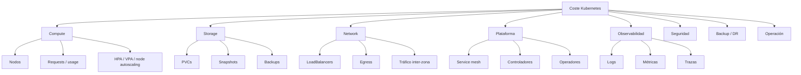
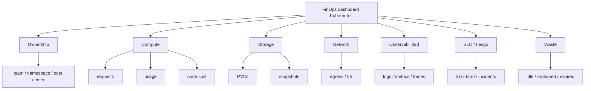

<!-- COURSE_NAV_START -->

[Anterior](<30. Backups, restore y disaster recovery.md>) | [Indice](README.md) | [Siguiente](<32. Platform engineering, golden paths y DevEx.md>)

<!-- COURSE_NAV_END -->

# 31. FinOps, coste operativo y eficiencia en Kubernetes

## 31.1. Objetivo del módulo

En los módulos anteriores has construido una visión bastante completa de Kubernetes como plataforma de ejecución: despliegues, releases, migraciones, feature flags, resiliencia, SLOs, autoscaling, supply chain, políticas, multi-tenancy, networking, service mesh, backups y disaster recovery. Este módulo conecta todas esas piezas desde una pregunta económica: cuánto cuesta operar Kubernetes, quién genera ese coste, qué valor protege, qué desperdicio existe y qué decisiones permiten mejorar eficiencia sin romper fiabilidad.

FinOps en Kubernetes no consiste en mirar una factura cloud al final del mes y pedir a los equipos que “gasten menos”. Tampoco consiste en reducir requests hasta que los Pods empiecen a fallar, apagar entornos sin entender su uso o perseguir un porcentaje mágico de utilización. FinOps es una práctica de colaboración entre ingeniería, producto, plataforma y finanzas para tomar mejores decisiones sobre gasto, capacidad, riesgo y valor. En Kubernetes, eso exige traducir una factura basada en nodos, discos, tráfico, snapshots, balanceadores y servicios cloud en coste atribuible a namespaces, equipos, aplicaciones, entornos, workloads, tenants y decisiones técnicas.

La eficiencia en Kubernetes no es usar todos los nodos al 100%. Un cluster sin margen puede parecer barato hasta que quema SLOs, degrada latencia, bloquea rollouts, dispara retries o obliga a incident response. Una plataforma eficiente mantiene capacidad suficiente para proteger el flujo de valor con el menor coste razonable. Eso implica eliminar desperdicio, pero también invertir en headroom, resiliencia, observabilidad, backups, seguridad y automatización cuando esas inversiones reducen riesgo o coste futuro.

La tesis del módulo es esta:

> FinOps en Kubernetes no es reducir coste localmente; es hacer visible el coste del sistema para decidir dónde gastar, dónde ahorrar y dónde el ahorro destruiría fiabilidad o flujo.

La tesis operacional es esta:

> Una plataforma Kubernetes eficiente conecta coste, capacidad, ownership, SLOs, error budgets y constraints reales para que cada equipo pueda ver el impacto económico de sus decisiones sin optimizar contra el sistema.

En este módulo aprenderás:

- Qué es FinOps aplicado a Kubernetes
- Qué diferencia hay entre coste cloud, coste Kubernetes y coste de producto
- Por qué la factura cloud no basta para tomar decisiones de ingeniería
- Qué significa coste directo, coste compartido y coste asignado
- Cómo se asigna coste por namespace, label, workload, equipo o tenant
- Qué papel tienen requests, limits, uso real y nodos
- Qué coste introducen CPU, memoria, storage, red, backups, snapshots, logs, trazas, balanceadores y registries
- Qué significa idle cost
- Qué significa waste
- Qué significa right-sizing
- Qué significa headroom
- Qué relación hay entre autoscaling y coste
- Qué relación hay entre quotas y fairness
- Qué relación hay entre SLOs, error budgets y eficiencia
- Por qué no debes optimizar coste rompiendo el constraint real
- Cómo diseñar dashboards FinOps para Kubernetes
- Cómo diseñar políticas de coste como guardrails
- Cómo gestionar showback y chargeback
- Cómo conectar coste con multi-tenancy
- Cómo crear una capacity and cost review
- Cómo automatizar inspección de coste y capacidad con Taskfile
La idea principal es sencilla:

```text
Coste sin contexto genera recortes.
Coste con contexto genera decisiones.
```

---

## 31.2. Por qué este módulo existe en un curso de Kubernetes

Kubernetes facilita crear recursos, escalar workloads, añadir réplicas, montar volúmenes, exponer servicios, generar logs, desplegar entornos temporales, usar service mesh, crear snapshots y separar tenants por namespaces. Esa facilidad es una fortaleza, pero también hace que el coste aparezca distribuido y oculto. Un equipo puede añadir un HPA con `maxReplicas: 50`, otro puede dejar entornos preview vivos durante semanas, otro puede generar logs de debug en producción, otro puede crear PVCs que nadie borra y otro puede activar un service mesh sin recalcular requests. La factura llega agregada, pero las decisiones que la produjeron ocurrieron en muchos lugares pequeños.

El problema no es solo financiero. El coste oculto degrada el sistema. Si nadie sabe qué workload consume qué, no puedes discutir capacidad con datos. Si no sabes qué namespace está cerca de su quota, descubres el problema durante un incidente. Si no sabes qué servicio está sobredimensionado, pagas capacidad que no protege ningún SLO. Si no sabes qué servicio está infradimensionado, ahorras dinero quemando error budget. Si no sabes qué coste introduce un mesh, una política de backups o un entorno preview, la plataforma se convierte en una suma de decisiones locales sin visión económica.

Este módulo existe porque Kubernetes no es solo un scheduler. Es una plataforma económica. Cada request de CPU, cada GiB de memoria, cada PVC, cada réplica mínima, cada snapshot, cada log retenido, cada balanceador, cada nodo infrautilizado y cada retry tiene consecuencias económicas. FinOps permite que esas consecuencias sean visibles, discutibles y gobernables.

### Criterio de comprensión

Debes poder explicar:

> Kubernetes convierte muchas decisiones técnicas en consumo económico distribuido. FinOps hace visible ese consumo para que pueda gobernarse sin romper fiabilidad.

---

## 31.3. FinOps no es solo ahorro

Una lectura pobre de FinOps lo reduce a ahorrar dinero. Esa lectura suele producir decisiones dañinas: bajar requests sin medir latencia, reducir réplicas mínimas sin mirar RTO, apagar entornos que eran necesarios para feedback, eliminar logs que luego hacen falta en incident response o recortar backups sin entender RPO.

FinOps no busca gasto mínimo. Busca gasto justificado. A veces la decisión correcta es gastar menos. A veces es gastar más en capacidad base, backups, observabilidad o automatización porque ese gasto reduce un coste mayor: incidentes, toil, pérdida de datos, retrasos, mala experiencia de usuario o riesgo de seguridad.

### Mal enfoque

```text
Este namespace cuesta demasiado. Reducimos réplicas y retention de logs.
```

### Mejor enfoque

```text
Este namespace cuesta demasiado para el valor que protege. Revisemos tráfico, SLO, requests, uso real, almacenamiento, logs, backups, entornos activos y ownership antes de decidir qué coste es desperdicio y qué coste es margen necesario.
```

### Regla

No llames desperdicio a una capacidad que protege un SLO, reduce riesgo o mantiene flujo en el constraint correcto.

### Criterio de comprensión

Debes poder explicar:

> FinOps no pregunta solo “cómo gastamos menos”, sino “qué gasto protege valor y qué gasto no está comprando nada útil”.

---

## 31.4. Coste cloud, coste Kubernetes y coste de producto

En Kubernetes conviene separar tres niveles de coste.

| Nivel             | Qué mide                       | Ejemplo                               |
| ----------------- | ------------------------------ | ------------------------------------- |
| Coste cloud       | factura del proveedor          | nodos, discos, LB, snapshots, tráfico |
| Coste Kubernetes  | consumo dentro del cluster     | namespaces, Pods, PVCs, requests      |
| Coste de producto | coste asociado a una capacidad | checkout, catálogo, pagos, búsqueda   |

La factura cloud te dice cuánto pagas al proveedor. Kubernetes te ayuda a entender qué workloads consumen esa infraestructura. Producto necesita saber qué coste se asocia a qué capacidad de negocio. FinOps conecta esos niveles.

### Ejemplo

El proveedor factura un node pool de 2.000 euros al mes. Kubernetes muestra que el namespace `checkout-prod` reserva el 35% de CPU y el 40% de memoria de ese node pool. Producto necesita saber si ese coste protege un flujo crítico, qué SLO tiene, cuánto tráfico procesa, qué ingresos o riesgo protege y si hay desperdicio.

### Criterio de comprensión

Debes poder explicar:

> La factura cloud dice cuánto se paga. Kubernetes ayuda a explicar quién lo consume. Producto debe decidir si ese consumo está justificado por valor, riesgo o aprendizaje.

---

## 31.5. El mapa de costes en Kubernetes

El coste de Kubernetes no vive solo en CPU y memoria. Una plataforma real tiene muchas fuentes de coste.



La parte visible suele ser compute. La parte olvidada suele ser storage, red, observabilidad, backups, snapshots, entornos temporales, balanceadores y coste operativo humano. Si un equipo solo optimiza CPU y memoria, puede dejar intacta una fuente mayor de coste.

### Criterio de comprensión

Debes poder explicar:

> Kubernetes genera coste por capacidad, datos, tráfico, observabilidad, seguridad, recuperación y operación. CPU y memoria son solo una parte.

---

## 31.6. Asignación de coste

Para que FinOps funcione, el coste debe poder asignarse a alguna unidad responsable. En Kubernetes, las unidades habituales son namespace, team, application, workload, environment, tenant o cost center.

### Modelos comunes

| Modelo      | Ventaja                    | Límite                                      |
| ----------- | -------------------------- | ------------------------------------------- |
| Namespace   | simple y fácil de empezar  | falla si varios equipos comparten namespace |
| Labels      | flexible                   | exige disciplina de metadata                |
| Workload    | más preciso                | requiere tooling y buenas labels            |
| Team        | útil para showback         | necesita ownership claro                    |
| Tenant      | útil en SaaS/multi-tenancy | puede ser complejo                          |
| Environment | separa prod/dev/staging    | no identifica producto                      |
| Cost center | conecta finanzas           | puede ocultar detalle técnico               |

### Labels recomendadas

```yaml
metadata:
  labels:
    app.kubernetes.io/name: checkout-api
    app.kubernetes.io/component: api
    app.kubernetes.io/part-of: shop
    platform.acme.io/team: checkout
    platform.acme.io/environment: production
    platform.acme.io/cost-center: product-checkout
    platform.acme.io/criticality: high
```

### Regla

Sin labels fiables, no hay FinOps fiable.

Si las labels faltan, cambian de nombre o no tienen owner, los informes de coste se vuelven discutibles. Cuando los informes no son confiables, los equipos dejan de usarlos para decidir.

### Criterio de comprensión

Debes poder explicar:

> La asignación de coste en Kubernetes depende tanto de métricas como de metadata disciplinada.

---

## 31.7. Coste directo, compartido y no asignado

No todo coste se asigna igual. Algunos costes son directos, otros compartidos y otros aparecen como no asignados hasta que mejoras la metadata.

| Tipo        | Ejemplo                                        | Cómo tratarlo                                |
| ----------- | ---------------------------------------------- | -------------------------------------------- |
| Directo     | PVC de `checkout-prod`                         | asignar al namespace/equipo                  |
| Compartido  | Ingress Controller                             | repartir por tráfico, requests o namespaces  |
| Plataforma  | monitoring, policy engines, mesh control plane | repartir o mantener como coste de plataforma |
| No asignado | Pods sin labels                                | corregir metadata                            |
| Externo     | DB gestionada                                  | asignar por owner, uso o coste center        |
| Operativo   | guardias, toil, incidentes                     | analizar junto a coste cloud                 |

### Costes compartidos

Los costes compartidos son inevitables. CoreDNS, ingress, monitoring, service mesh, policy engines, node overhead y operadores no pertenecen siempre a un único equipo. Debes decidir si los repartes por uso, por proporción de requests, por namespace, por equipo o si los mantienes como coste explícito de plataforma.

### Criterio de comprensión

Debes poder explicar:

> No todo coste se puede imputar directamente a un Pod. Los costes compartidos necesitan reglas explícitas para evitar discusiones arbitrarias.

---

## 31.8. Requests como reserva económica

En Kubernetes, los requests indican al scheduler cuánta CPU y memoria necesita un contenedor. También funcionan como una forma de reserva económica: capacidad que el cluster debe tener disponible para poder programar el Pod.

Si un equipo declara requests muy altos, puede estar reservando capacidad que no usa. Si declara requests muy bajos, puede conseguir mejor apariencia de coste, pero empeorar scheduling, HPA, estabilidad y comportamiento bajo presión. El coste correcto no se obtiene minimizando requests, sino haciéndolos realistas respecto al uso, SLO y variabilidad.

### Ejemplo

```yaml
resources:
  requests:
    cpu: 500m
    memory: 512Mi
  limits:
    memory: 1Gi
```

Este Pod reserva 500 millicores y 512 MiB de memoria desde el punto de vista del scheduler. Si en realidad usa 50 millicores y 128 MiB casi siempre, puede haber desperdicio. Si en picos necesita 600 millicores y 700 MiB para mantener latencia, quizá el request tiene sentido o necesita autoscaling.

### Criterio de comprensión

Debes poder explicar:

> Un request no es solo configuración técnica. Es una afirmación económica sobre capacidad que el workload necesita reservar.

---

## 31.9. Limits y coste de fallo

Los limits restringen consumo máximo. Pueden proteger nodos y otros workloads, pero también pueden crear fallos. Memory limit demasiado bajo puede causar OOMKilled. CPU limit demasiado restrictivo puede causar throttling, aumentar latencia, provocar timeouts y disparar retries.

### Coste visible y coste oculto

| Decisión          | Coste visible               | Coste oculto                    |
| ----------------- | --------------------------- | ------------------------------- |
| Memory limit bajo | menor consumo máximo        | OOMKilled, restarts, incidentes |
| CPU limit bajo    | contención de CPU           | throttling, latencia, retries   |
| Sin memory limit  | menos OOM por límite propio | riesgo para nodo                |
| Sin CPU limit     | menos throttling            | posible consumo agresivo        |
| Limits copiados   | rapidez inicial             | mala capacidad real             |

### Regla

Los limits no deben usarse como herramienta ciega de ahorro.

Un limit puede reducir consumo máximo, pero si aumenta retries, latencia, incidentes o rework, puede ser económicamente peor.

### Criterio de comprensión

Debes poder explicar:

> Reducir limits puede ahorrar capacidad aparente y aumentar coste real si provoca inestabilidad.

---

## 31.10. Uso real, request y eficiencia

Para hablar de eficiencia necesitas comparar uso real, requests y SLOs. Un workload que usa mucho menos que sus requests puede estar sobredimensionado. Un workload que usa cerca o por encima de sus requests puede estar bien ajustado o bajo riesgo, según latencia, picos y error budget.

### Métricas útiles

```text
cpu_usage / cpu_request
memory_working_set / memory_request
cpu_throttling
oom_killed_total
pod_restarts_total
p95_latency
error_rate
hpa_desired_replicas
hpa_current_replicas
```

### Interpretación

| Señal               | Posible lectura                                 |
| ------------------- | ----------------------------------------------- |
| Uso bajo y SLO sano | posible right-sizing o reducción de minReplicas |
| Uso bajo y SLO malo | el constraint no es CPU/memoria                 |
| Uso alto y SLO sano | puede estar bien, revisar headroom              |
| Uso alto y SLO malo | underprovisioning o dependency constraint       |
| Throttling alto     | CPU limit puede estar dañando latencia          |
| OOMKilled           | memory limit/request insuficiente o leak        |
| HPA siempre en max  | falta capacidad o maxReplicas bajo              |
| HPA nunca escala    | métrica o threshold quizá inútil                |

### Criterio de comprensión

Debes poder explicar:

> La eficiencia no se deduce solo de utilización. Se interpreta junto a SLO, variabilidad, picos, throttling, restarts y constraints.

---

## 31.11. Idle cost y waste

Idle cost es el coste de capacidad no usada. Waste es gasto que no compra valor, resiliencia, aprendizaje ni margen útil. No son exactamente lo mismo. Puede haber capacidad idle que sea headroom deliberado para absorber picos. Puede haber gasto activo que sea waste, por ejemplo un entorno abandonado usando CPU y storage.

### Ejemplos de idle cost aceptable

- Réplicas mínimas para un servicio crítico
- Capacidad para rollouts sin downtime
- Headroom para picos
- Nodo reservado para workloads críticos
- Backups retenidos por RPO/RTO
- Observabilidad suficiente para incident response
### Ejemplos de waste

- Namespaces preview sin TTL
- PVCs huérfanos
- LoadBalancers olvidados
- Logs debug retenidos 30 días sin uso
- Requests copiados demasiado altos
- HPAs con maxReplicas enorme sin downstream
- Snapshots antiguos sin política
- Service mesh en workloads que no usan sus capacidades
- Entornos duplicados sin owner
- Imágenes y artefactos sin retención
### Criterio de comprensión

Debes poder explicar:

> Todo waste es coste innecesario, pero no toda capacidad ociosa es waste. A veces la capacidad ociosa es margen comprado conscientemente.

---

## 31.12. Right-sizing

Right-sizing significa ajustar recursos para que el workload tenga capacidad suficiente sin reservar mucho más de lo necesario. No se hace una vez. Es una práctica continua porque el tráfico, el código, las dependencias, los patrones de uso y los SLOs cambian.

### Señales para right-sizing

- CPU p50, p95 y p99
- Memory working set p95
- Throttling
- OOMKilled
- Restarts
- Latencia
- Error rate
- HPA behavior
- Picos
- Estacionalidad
- Requests actuales
- Limits actuales
- Coste por namespace
- Recomendaciones VPA
- Cambios recientes de tráfico o código
### Proceso recomendado

1. Identificar workloads con mayor coste
2. Revisar SLO y criticidad
3. Comparar requests con uso real
4. Revisar picos y estacionalidad
5. Revisar throttling y OOMKilled
6. Proponer ajuste pequeño
7. Validar en staging o canary
8. Observar SLO post-cambio
9. Documentar decisión
10. Revisar periódicamente
### Criterio de comprensión

Debes poder explicar:

> Right-sizing no es bajar recursos. Es ajustar capacidad a demanda real, variabilidad y SLO.

---

## 31.13. VPA como recomendador económico

Vertical Pod Autoscaler puede ayudar a detectar requests sobredimensionados o infradimensionados. En muchos servicios con HPA, puede ser prudente usar VPA en modo recomendación antes que permitir cambios automáticos. Sus recomendaciones son una fuente de evidencia, no una orden que haya que aplicar sin pensar.

### Cuándo aporta valor

- Workloads con requests copiados
- Servicios con consumo estable
- Jobs con consumo predecible
- Namespaces con coste alto
- Equipos sin datos de uso
- Revisión periódica de capacidad
### Cuándo tener cuidado

- Workloads con picos raros
- Aplicaciones con memoria irregular
- Servicios con HPA por CPU
- Workloads donde recrear Pods es riesgoso
- Sistemas con SLO estricto
- Consumo influido por incidentes recientes
- Métricas incompletas
### Regla

Usa VPA para aprender antes de automatizar.

### Criterio de comprensión

Debes poder explicar:

> VPA puede reducir waste de requests, pero sus recomendaciones deben interpretarse con SLOs, picos y modelo de autoscaling.

---

## 31.14. HPA, coste y riesgo

Horizontal Pod Autoscaler puede mejorar eficiencia porque ajusta réplicas a demanda. Pero también puede aumentar coste de forma agresiva o amplificar problemas si escala por una señal equivocada. Un HPA que escala por CPU puede ser útil en workloads CPU-bound. En una API que espera a una DB lenta, puede añadir Pods que presionan aún más la DB.

### Costes del HPA

- Más Pods
- Más requests reservados
- Más consumo real
- Más conexiones downstream
- Más logs y métricas
- Más coste de red
- Más nodos si Cluster Autoscaler crece
- Más complejidad de observabilidad
### Decisiones importantes

- `minReplicas`: coste base y disponibilidad
- `maxReplicas`: coste máximo y protección downstream
- Métrica: señal de presión
- Threshold: sensibilidad
- Scale-up behavior: velocidad de reacción
- Scale-down behavior: coste vs estabilidad
- Headroom: margen deliberado
- Alertas: cuándo una política falla
### Criterio de comprensión

Debes poder explicar:

> HPA no elimina capacity planning. Lo convierte en una política dinámica con coste, límites y riesgos propios.

---

## 31.15. Cluster Autoscaler y coste de nodos

Aunque HPA escale Pods, los Pods necesitan nodos. Cluster Autoscaler o node autoscaling puede añadir nodos si hay Pods Pending por falta de capacidad y retirar nodos infrautilizados cuando es seguro. Esta capa conecta directamente Kubernetes con la factura cloud.

### Riesgos de coste

- Requests demasiado altos crean más nodos
- Pods con constraints estrictas impiden bin packing
- PDBs pueden bloquear scale-down
- DaemonSets consumen capacidad en cada nodo
- Node pools fragmentados reducen eficiencia
- GPUs o instancias caras quedan infrautilizadas
- Storage local o affinity impiden mover Pods
- Scale-down demasiado conservador mantiene coste
- Scale-down agresivo puede afectar SLOs
### Preguntas

- ¿Qué node pools existen?
- ¿Qué workloads usan cada pool?
- ¿Qué porcentaje de cada nodo está reservado?
- ¿Qué porcentaje se usa realmente?
- ¿Qué Pods impiden scale-down?
- ¿Qué PDBs bloquean drenado?
- ¿Qué DaemonSets consumen overhead?
- ¿Qué workloads requieren nodos caros?
- ¿Qué nodos están infrautilizados?
- ¿Qué coste tiene el headroom?
### Criterio de comprensión

Debes poder explicar:

> El coste de Kubernetes se paga principalmente a nivel de nodos, pero se causa mediante requests, scheduling, constraints y políticas de workloads.

---

## 31.16. Bin packing y fragmentación

Bin packing es la capacidad de empaquetar Pods eficientemente en nodos. Un cluster puede tener CPU y memoria libres en total, pero no suficiente en ningún nodo concreto para programar un Pod nuevo. Eso se llama fragmentación. La fragmentación aumenta coste porque obliga a crear nodos aunque haya capacidad agregada ociosa.

### Causas comunes

- Requests demasiado grandes
- Node affinity innecesaria
- Taints y tolerations demasiado específicas
- Muchos node pools pequeños
- Pods con recursos desbalanceados
- DaemonSet overhead alto
- PDBs que impiden movimiento
- Workloads con storage local
- Réplicas distribuidas de forma rígida
- Topology spread demasiado estricto
### Ejemplo

Un cluster puede tener 4 CPUs libres en total, repartidas como 500m en ocho nodos. Si un Pod pide 2 CPUs, no cabe en ningún nodo. Desde fuera parece que hay capacidad; desde el scheduler no.

### Criterio de comprensión

Debes poder explicar:

> La eficiencia de cluster no depende solo de capacidad total, sino de si esa capacidad está disponible en formas que los Pods pueden usar.

---

## 31.17. Storage cost

Storage suele crecer en silencio. PVCs, snapshots, backups, logs persistentes, buckets, imágenes, registries y volúmenes huérfanos pueden acumular coste durante meses.

### Fuentes de coste

- PVCs activos
- PVs retenidos tras borrar PVCs
- Snapshots
- Backups
- Buckets
- StorageClass premium
- IOPS provisionadas
- Discos sobredimensionados
- Volúmenes sin owner
- Datos duplicados en entornos
- Retención excesiva
- Logs persistidos
- Registry sin cleanup
### Preguntas

- ¿Qué PVCs existen?
- ¿Quién es owner?
- ¿Qué StorageClass usan?
- ¿Qué tamaño tienen?
- ¿Cuánto usan realmente?
- ¿Hay PVs Released?
- ¿Hay snapshots antiguos?
- ¿Qué retención aplica?
- ¿Qué datos son reconstruibles?
- ¿Qué datos requieren RPO/RTO?
- ¿Qué coste tiene StorageClass premium?
- ¿Qué PVCs pertenecen a namespaces abandonados?
### Criterio de comprensión

Debes poder explicar:

> Storage cost se controla con ownership, retención, right-sizing, lifecycle y conocimiento de qué datos merecen protección.

---

## 31.18. Network cost

El coste de red puede ser difícil de ver. En muchos proveedores, el tráfico entre zonas, regiones, internet, NAT gateways, load balancers o servicios gestionados puede generar coste significativo. Kubernetes puede ocultar ese coste detrás de Services, Ingress, Gateways, service mesh o comunicación entre Pods.

### Fuentes de coste

- Egress a internet
- Tráfico cross-zone
- Tráfico cross-region
- LoadBalancers
- NAT gateways
- Service mesh overhead
- Replicación
- Backups cross-region
- Logs/traces enviados fuera
- Pull de imágenes
- Llamadas a APIs externas
- Data transfer de storage
### Preguntas

- ¿Qué servicios generan más egress?
- ¿Qué tráfico cruza zonas?
- ¿Topology-aware routing ayudaría?
- ¿El mesh duplica tráfico con mirroring?
- ¿Los backups cruzan región?
- ¿Los logs salen a un backend externo?
- ¿Hay NAT gateway saturado o caro?
- ¿Los workloads llaman a servicios cloud en otra región?
- ¿Las imágenes se descargan repetidamente?
- ¿Qué tráfico es necesario para SLO y qué tráfico es desperdicio?
### Criterio de comprensión

Debes poder explicar:

> El tráfico también es coste. En Kubernetes, el coste de red suele aparecer donde cruzas fronteras: zona, región, internet, proveedor o capa de observabilidad.

---

## 31.19. Observability cost

La observabilidad permite operar, pero también cuesta. Métricas, logs y trazas consumen CPU, memoria, almacenamiento, red, licencias, cardinalidad, retención y atención humana. El objetivo no es observar menos, sino observar mejor.

### Fuentes de coste

- Logs de alto volumen
- Retención larga
- Métricas de alta cardinalidad
- Trazas al 100%
- Dashboards sin uso
- Alertas ruidosas
- Exporters innecesarios
- Labels dinámicas
- Debug logs permanentes
- Duplicación entre stacks
- Service mesh telemetry
- OpenTelemetry mal configurado
### Buenas preguntas

- ¿Qué señales protegen SLOs?
- ¿Qué logs se usan en incidentes?
- ¿Qué métricas tienen cardinalidad peligrosa?
- ¿Qué trazas se muestrean?
- ¿Qué dashboards se usan?
- ¿Qué alertas generan acción?
- ¿Qué retención necesita cada señal?
- ¿Qué datos son necesarios legalmente?
- ¿Qué señales pueden agregarse?
- ¿Qué entornos necesitan la misma retención que producción?
### Criterio de comprensión

Debes poder explicar:

> Observabilidad eficiente no significa menos señales; significa señales con intención, cardinalidad controlada y retención proporcional al uso.

---

## 31.20. Backup, DR y coste

El módulo anterior trató backups, restore y disaster recovery. FinOps no debe reducir backups sin entender RPO/RTO. Pero sí debe hacer visible cuánto cuesta proteger cada estado y si esa protección está alineada con criticidad.

### Costes

- Snapshots
- Backups
- Replicación cross-region
- Storage inmutable
- Retención larga
- Restore tests
- Entornos clean-room
- Herramientas
- Operación
- Tráfico de backup
- Backups de datos no críticos
### Preguntas

- ¿Qué backups no se han restaurado nunca?
- ¿Qué backups protegen sistemas sin owner?
- ¿Qué snapshots no tienen expiración?
- ¿Qué retención excede el RPO/RTO?
- ¿Qué sistemas críticos no tienen suficiente protección?
- ¿Qué datos son reconstruibles y no necesitan backup caro?
- ¿Qué coste tendría perder esos datos?
- ¿Qué coste tendría restaurarlos tarde?
### Criterio de comprensión

Debes poder explicar:

> El coste de DR debe evaluarse contra el coste de pérdida y tiempo de recuperación, no contra una regla genérica de retención.

---

## 31.21. Entornos efímeros, preview y sandbox

Los entornos efímeros pueden acelerar feedback y mejorar calidad. También pueden generar mucho coste si no tienen TTL, quotas y ownership. Un preview environment que vive dos horas puede ser barato y valioso. El mismo entorno olvidado durante tres semanas se convierte en waste.

### Guardrails recomendados

- TTL obligatorio
- Namespace label con owner
- ResourceQuota agresiva
- LimitRange
- Sin LoadBalancer por defecto
- Storage pequeño y efímero
- Sin datos productivos
- Logs con retención corta
- Autoscaling limitado
- Limpieza automática
- Coste visible por PR o team
- Alertas de entornos expirados
### Ejemplo de labels

```yaml
metadata:
  labels:
    platform.acme.io/environment: preview
    platform.acme.io/team: checkout
    platform.acme.io/pr: "1234"
    platform.acme.io/ttl-hours: "48"
    platform.acme.io/cost-center: product-checkout
```

### Criterio de comprensión

Debes poder explicar:

> Los entornos efímeros son eficientes cuando su lifecycle también es efímero.

---

## 31.22. Multi-tenancy, showback y chargeback

En plataformas multi-tenant, FinOps necesita visibilidad por tenant. Showback consiste en mostrar coste a equipos o unidades. Chargeback consiste en imputar ese coste formalmente. No siempre necesitas chargeback, pero casi siempre necesitas showback.

### Showback sano

Un showback sano permite conversación:

- Qué equipo consume qué
- Qué entorno cuesta más
- Qué workloads crecieron
- Qué coste es producción
- Qué coste es preview
- Qué coste es plataforma
- Qué coste está sin owner
- Qué coste protege SLO
- Qué coste parece waste
### Chargeback con cuidado

Chargeback puede crear incentivos perversos si los equipos recortan recursos para pagar menos aunque eso degrade el sistema. Si se usa chargeback, debe incluir reglas claras para costes compartidos, plataforma, headroom, SLOs y capacidad crítica.

### Criterio de comprensión

Debes poder explicar:

> Showback mejora visibilidad. Chargeback cambia incentivos. Ambos requieren metadata confiable y reglas explícitas.

---

## 31.23. SLOs, error budgets y eficiencia

La eficiencia operativa debe estar conectada con SLOs. Si optimizas coste y rompes un SLO, no has mejorado el sistema. Si mantienes exceso de capacidad sin proteger ningún SLO, probablemente tienes waste. Los SLOs ayudan a distinguir margen necesario de gasto injustificado.

### Decisiones guiadas por SLO

| Estado                        | Decisión probable                       |
| ----------------------------- | --------------------------------------- |
| SLO sano y coste alto         | revisar right-sizing y waste            |
| SLO quemándose y coste bajo   | revisar underprovisioning o constraints |
| SLO sano y headroom explícito | mantener si protege picos               |
| SLO malo y uso bajo           | buscar dependency constraint            |
| SLO sano y entorno sin uso    | eliminar o reducir                      |
| SLO crítico sin DR suficiente | invertir, no recortar                   |

### Error budget

El error budget ayuda a decidir si puedes asumir optimizaciones de coste más agresivas. Si el budget está sano, puedes experimentar con right-sizing gradual. Si está casi agotado, no es buen momento para recortar capacidad de un flujo crítico.

### Criterio de comprensión

Debes poder explicar:

> La eficiencia se evalúa contra objetivos de servicio. Ahorrar quemando error budget es trasladar coste a fiabilidad.

---

## 31.24. Coste y resiliencia

Resiliencia cuesta dinero. Réplicas mínimas, PDBs, multi-zona, backups, circuit breakers, observabilidad, colas, buffers y capacity headroom no son gratis. Pero la falta de resiliencia también cuesta: incidentes, pérdida de ingresos, rework, soporte, estrés, pérdida de confianza y daño reputacional.

### Costes de resiliencia

- `minReplicas` mayor
- Capacidad multi-zona
- PDBs
- Headroom
- Colas
- Backups
- DR
- Observabilidad
- Service mesh
- Fault injection
- Runbooks
- Tests de restore
### Mala optimización

Eliminar réplicas mínimas de un servicio crítico puede ahorrar coste mensual y aumentar la probabilidad de downtime durante rollouts, node drains o picos.

### Buena optimización

Reducir réplicas de un servicio no crítico fuera de horario, con SLO compatible, runbook claro y autoscaling validado.

### Criterio de comprensión

Debes poder explicar:

> La resiliencia es coste preventivo. FinOps decide qué prevención está justificada por impacto, SLO y riesgo.

---

## 31.25. Coste y seguridad

La seguridad también tiene coste: scanners, policy engines, admission controllers, firmas, SBOMs, secretos externos, auditoría, retención, logs, herramientas y personas. Recortar seguridad sin entender riesgo puede generar incidentes mucho más caros que el ahorro.

### Costes de seguridad

- Escaneo de imágenes
- Firma y verificación
- SBOM storage
- Policy engines
- Admission controllers
- Secret managers
- Audit logs
- Runtime security
- NetworkPolicy
- mTLS
- Revisiones
- Excepciones
### Decisión económica

No toda herramienta de seguridad se justifica igual. Bloquear `latest` puede tener coste bajo y valor alto. Un service mesh completo solo para mTLS en dos servicios puede no estar justificado si hay alternativas más simples. La evaluación debe mirar riesgo reducido, coste de operación, madurez del equipo y efecto sobre flujo.

### Criterio de comprensión

Debes poder explicar:

> La seguridad efectiva no es maximizar controles, sino colocar controles que reducen riesgo sistémico con coste operativo sostenible.

---

## 31.26. Coste de service mesh

El módulo 29 trató service mesh. Desde FinOps, un mesh introduce coste de infraestructura y coste cognitivo. Sidecars consumen CPU y memoria. El control plane consume recursos. La telemetría aumenta volumen de métricas. mTLS y proxies pueden añadir latencia y CPU. Las policies requieren mantenimiento. Los upgrades requieren operación.

### Costes visibles

- CPU/memoria del proxy
- CPU/memoria del control plane
- Métricas adicionales
- Logs adicionales
- Trazas adicionales
- Latencia
- Más requests para capacity
- Tiempo de operación
### Costes ocultos

- Debugging más complejo
- Formación
- Políticas inconsistentes
- Cambios de plataforma como cuello de botella
- Incidentes por configuración L7
- Duplicación con gateway o app
- Overhead en entornos no críticos
### Pregunta clave

¿Qué coste sistémico reduce el mesh?

Si reduce duplicación de mTLS, mejora observabilidad entre servicios, habilita canaries seguros y reduce incidentes, puede ser inversión. Si se adopta por moda y nadie usa sus capacidades, es waste sofisticado.

### Criterio de comprensión

Debes poder explicar:

> Service mesh debe justificar su coste por capacidades usadas, riesgos reducidos y operación sostenible.

---

## 31.27. Coste de políticas y plataforma

Policy as Code, guardrails, multi-tenancy y golden paths también tienen coste. Requieren mantenimiento, pruebas, documentación, excepciones, soporte y evolución. Pero reducen coste de errores repetitivos, revisiones manuales, incidentes y coordinación.

### Coste que reduce una buena plataforma

- Revisión manual repetitiva
- Manifests inconsistentes
- Workloads sin requests
- Namespaces sin owner
- Imágenes inseguras
- Configuración no observable
- Incidentes por falta de runbooks
- Onboarding manual
- Excepciones informales
- Soporte repetido
- Cognitive load de equipos
### Riesgo

Una plataforma mal diseñada puede convertirse en coste y constraint. Si cada excepción tarda días, si cada política bloquea sin explicar, si cada cambio requiere plataforma, si no hay golden paths, el coste de coordinación puede superar el ahorro.

### Criterio de comprensión

Debes poder explicar:

> Una plataforma eficiente reduce coste de coordinación y errores repetidos; una plataforma rígida los mueve a una cola central.

---

## 31.28. FinOps y Theory of Constraints

Desde Theory of Constraints, el objetivo no es optimizar cada métrica local de coste. El objetivo es mejorar el sistema respecto a su meta. Si el constraint está en la base de datos, reducir coste de Pods no mejora throughput. Si el constraint está en onboarding de plataforma, optimizar nodos puede no mejorar entrega. Si el constraint está en observabilidad deficiente, recortar logs puede empeorar recuperación. Si el constraint está en capacidad de revisión, introducir políticas con falsos positivos puede empeorar flujo.

### Preguntas TOC para FinOps

- ¿Cuál es el objetivo del sistema?
- ¿Dónde está el constraint?
- ¿El coste que queremos recortar protege ese constraint?
- ¿El ahorro reduce throughput?
- ¿El ahorro aumenta WIP o incidentes?
- ¿El gasto actual eleva el constraint o es waste?
- ¿La optimización local empeora otra parte?
- ¿Qué métrica de sistema mejora?
### Ejemplo

Reducir réplicas de `checkout-api` puede ahorrar 300 euros al mes. Si eso aumenta latencia en el flujo principal y reduce conversión, es mala decisión. Reducir 20 namespaces preview abandonados puede ahorrar igual o más sin tocar el constraint del negocio.

### Criterio de comprensión

Debes poder explicar:

> En FinOps, una optimización local de coste solo es mejora si no degrada el constraint que limita valor, fiabilidad o flujo.

---

## 31.29. Modelo económico de una capacidad Kubernetes

Para evaluar una capacidad, no mires solo su coste cloud. Mira inversión total.

```text
coste total de una capacidad =
coste de infraestructura
+ coste de plataforma
+ coste de observabilidad
+ coste de seguridad
+ coste de backup/DR
+ coste de operación
+ coste de incidentes
+ coste de cambio
+ coste de oportunidad
```

### Ejemplo: checkout-api

`checkout-api` cuesta más que sus Pods. Tiene base de datos, backups, logs, trazas, SLOs, alerts, runbooks, security scanning, registry, ingress, TLS, feature flags, soporte, guardias y coste de cambio. Algunos costes son directos. Otros son compartidos. FinOps intenta hacer visible esa estructura para decidir con criterio.

### Criterio de comprensión

Debes poder explicar:

> El coste de un servicio Kubernetes no es solo su Deployment. Es todo lo necesario para construirlo, ejecutarlo, observarlo, protegerlo, recuperarlo y cambiarlo.

---

## 31.30. Dashboard FinOps para Kubernetes

Un dashboard FinOps útil no debe ser una tabla de gasto sin contexto. Debe conectar coste, capacidad, ownership, SLO, desperdicio y tendencia.

### Preguntas que debe responder

- ¿Cuánto cuesta cada namespace?
- ¿Cuánto cuesta cada equipo?
- ¿Cuánto cuesta producción frente a no producción?
- ¿Qué workloads tienen mayor coste?
- ¿Qué workloads tienen requests muy superiores al uso?
- ¿Qué workloads están cerca de limits?
- ¿Qué workloads tienen throttling?
- ¿Qué namespaces tienen PVCs caros?
- ¿Qué snapshots están vencidos?
- ¿Qué entornos preview expiraron?
- ¿Qué coste no tiene owner?
- ¿Qué servicios críticos tienen bajo headroom?
- ¿Qué servicios no críticos tienen alto coste?
- ¿Qué coste compartido tiene plataforma?
- ¿Qué coste creció esta semana y por qué?
- ¿Qué ahorro es seguro y qué ahorro amenaza SLO?
### Modelo de dashboard



### Criterio de comprensión

Debes poder explicar:

> Un dashboard FinOps debe ayudar a decidir, no solo a mirar gasto.

---

## 31.31. Alertas FinOps

No todo coste debe generar alerta inmediata. Muchas señales de coste son para revisión periódica, no para despertar a alguien. Aun así, algunas condiciones merecen notificación porque indican fuga, riesgo o desperdicio activo.

### Alertas o notificaciones útiles

- Namespace sin owner
- Coste diario anómalo
- HPA sostenido cerca de maxReplicas
- Namespace cerca de ResourceQuota
- PVC huérfano
- Snapshot vencido
- Preview environment expirado
- LoadBalancer sin tráfico
- Logs con crecimiento anómalo
- Métrica con cardinalidad explosiva
- Cluster con nodos infrautilizados durante días
- Pods Pending por requests excesivos
- Workloads críticos sin headroom
### Regla

No conviertas FinOps en alert fatigue.

Muchas señales deberían ser reportes semanales o issues automáticos. Solo alerta en tiempo real cuando el coste indique fuga rápida, riesgo operativo o impacto en SLO.

### Criterio de comprensión

Debes poder explicar:

> Las señales FinOps deben tener cadencia adecuada: algunas son incidentes, otras son revisión semanal y otras son higiene mensual.

---

## 31.32. Cost review periódica

Una cost review es una ceremonia operativa corta donde se revisa coste con contexto técnico. No debe ser una reunión para culpar equipos. Debe ser un mecanismo de aprendizaje y decisión.

### Participantes

- Plataforma
- Equipos dueños de servicios caros
- Producto si hay trade-offs de SLO o entornos
- Finanzas o FinOps si aplica
- Seguridad/observabilidad cuando el coste venga de esas áreas
### Agenda

1. Tendencia de coste
2. Mayores cambios desde la revisión anterior
3. Coste por equipo y entorno
4. Workloads con waste probable
5. Workloads con underprovisioning
6. Storage y snapshots
7. Observabilidad y cardinalidad
8. Entornos efímeros
9. Acciones cerradas
10. Nuevas acciones con owner y fecha
### Criterio de comprensión

Debes poder explicar:

> Una cost review útil convierte facturas en decisiones técnicas con owner, evidencia y seguimiento.

---

## 31.33. Guardrails de coste

Los guardrails de coste evitan desperdicio accidental. No deben impedir que un sistema crítico tenga la capacidad que necesita. Deben hacer visible y revisable el consumo antes de que sea un problema.

### Guardrails útiles

- Namespaces deben tener owner y cost center
- Production namespaces deben tener ResourceQuota
- Preview namespaces deben tener TTL
- PVCs deben tener owner
- Snapshots deben tener expiración
- HPAs deben tener maxReplicas
- LoadBalancers requieren aprobación o clase específica
- Logs debug no pueden estar activos indefinidamente
- Retención por entorno
- StorageClass premium requiere label o excepción
- Workloads deben tener requests
- Workloads con coste alto deben tener SLO o justificación
- Namespaces sin actividad se marcan para revisión
### Ejemplo de policy humana

```md
# Cost guardrail: preview namespace TTL

All preview namespaces must include:

- platform.acme.io/environment=preview
- platform.acme.io/team
- platform.acme.io/ttl-hours

Namespaces older than TTL are deleted automatically unless an exception exists.
```

### Criterio de comprensión

Debes poder explicar:

> Los guardrails de coste previenen desperdicio accidental sin convertir la plataforma en una aprobación manual constante.

---

## 31.34. Showback report

Un showback report debe explicar coste con contexto, no solo repartir culpa.

### Estructura recomendada

```md
# Kubernetes showback report

## Period

2026-06

## Summary

Total platform cost:
Production cost:
Non-production cost:
Shared platform cost:
Unallocated cost:

## Top cost drivers

| Rank | Team | Namespace | Cost | Change | Main driver |
| ---- | ---- | --------- | ---: | -----: | ----------- |

## Efficiency signals

| Workload       | Signal                   | Recommendation                 |
| -------------- | ------------------------ | ------------------------------ |
| checkout-api   | CPU request 4x p95 usage | review right-sizing            |
| preview-pr-884 | expired TTL              | delete namespace               |
| search-worker  | HPA at maxReplicas       | review capacity and downstream |

## Risks

- checkout-api near quota during peak.
- payment-worker queue lag growing.
- monitoring logs retention increased cost by 35%.

## Actions

| Action | Owner | Due date |
| ------ | ----- | -------- |
```

### Criterio de comprensión

Debes poder explicar:

> Un showback report debe mostrar coste, causa, riesgo y acción. Sin acción, es contabilidad pasiva.

---

## 31.35. Manifiestos y estructura del módulo

Estructura recomendada:

```text
docs/finops/
  kubernetes-cost-model.md
  showback-report-template.md
  cost-review-template.md
  namespace-cost-policy.md
  right-sizing-review.md
  platform-shared-costs.md

k8s/finops/
  policies/
    require-cost-labels.yaml
    require-preview-ttl.yaml
    require-hpa-maxreplicas.yaml
  quotas/
    preview-resourcequota.yaml
    preview-limitrange.yaml

scripts/
  list-workloads-without-cost-labels.sh
  list-expired-preview-namespaces.sh
  list-pvcs-without-owner.sh
  list-hpas-without-maxreplicas.sh
```

### Cost model

```md
# Kubernetes cost model

## Allocation dimensions

- team
- namespace
- application
- environment
- cost center
- workload
- tenant

## Direct costs

- workload compute
- PVCs
- snapshots
- LoadBalancers
- namespace-specific backups

## Shared costs

- ingress controllers
- CoreDNS
- monitoring
- logging
- tracing
- policy engines
- service mesh control plane
- cluster system overhead

## Allocation rules

- Namespace costs assigned to namespace owner.
- Shared platform costs reported separately and optionally allocated by proportional usage.
- Unallocated costs are tracked as platform debt until metadata is fixed.

## Required labels

- platform.acme.io/team
- platform.acme.io/environment
- platform.acme.io/cost-center
- app.kubernetes.io/name
- app.kubernetes.io/part-of
```

### Cost policy

```md
# Namespace cost policy

## Required namespace labels

- platform.acme.io/team
- platform.acme.io/environment
- platform.acme.io/cost-center
- platform.acme.io/owner

## Production

Production namespaces require:

- ResourceQuota
- LimitRange
- owner
- SLO reference for critical services

## Preview

Preview namespaces require:

- TTL
- owner
- cost center
- aggressive ResourceQuota
- automatic cleanup

## Exceptions

Exceptions must include:

- owner
- reason
- expiration
- expected monthly cost
```

### Kyverno-style conceptual policy: require cost labels

```yaml
apiVersion: kyverno.io/v1
kind: ClusterPolicy
metadata:
  name: require-cost-labels
spec:
  validationFailureAction: Audit
  rules:
    - name: require-namespace-cost-labels
      match:
        any:
          - resources:
              kinds:
                - Namespace
      validate:
        message: "Namespaces must define team, environment and cost-center labels."
        pattern:
          metadata:
            labels:
              platform.acme.io/team: "?*"
              platform.acme.io/environment: "?*"
              platform.acme.io/cost-center: "?*"
```

### Preview quota

```yaml
apiVersion: v1
kind: ResourceQuota
metadata:
  name: preview-quota
  namespace: checkout-preview-pr-123
spec:
  hard:
    requests.cpu: "1"
    requests.memory: 2Gi
    limits.memory: 4Gi
    pods: "10"
    services: "5"
    persistentvolumeclaims: "2"
```

### Criterio de comprensión

Debes poder explicar:

> La estructura FinOps debe separar modelo de coste, políticas, reportes, revisiones y automatizaciones. Si todo vive en dashboards, no se convierte en práctica.

---

## 31.36. Taskfile para FinOps

Añade tareas:

```yaml
finops:model:
  desc: Show Kubernetes cost model
  cmds:
    - cat docs/finops/kubernetes-cost-model.md

finops:showback:template:
  desc: Show showback report template
  cmds:
    - cat docs/finops/showback-report-template.md

finops:review:template:
  desc: Show cost review template
  cmds:
    - cat docs/finops/cost-review-template.md

finops:labels:missing:
  desc: List resources that may be missing cost labels
  cmds:
    - ./scripts/list-workloads-without-cost-labels.sh

finops:preview:expired:
  desc: List expired preview namespaces
  cmds:
    - ./scripts/list-expired-preview-namespaces.sh

finops:pvc:owners:
  desc: List PVCs and owner labels
  cmds:
    - kubectl get pvc -A --show-labels

finops:pvc:orphaned:
  desc: List PVs that may need cleanup review
  cmds:
    - kubectl get pv

finops:hpa:
  desc: Show HPAs and scaling limits
  cmds:
    - kubectl get hpa -A

finops:hpa:describe:
  desc: Describe HPA. Usage NAMESPACE=shop NAME=checkout-api task finops:hpa:describe
  cmds:
    - kubectl describe hpa -n {{.NAMESPACE}} {{.NAME}}

finops:quota:
  desc: Show ResourceQuotas
  cmds:
    - kubectl get resourcequota -A
    - kubectl describe resourcequota -A

finops:limitrange:
  desc: Show LimitRanges
  cmds:
    - kubectl get limitrange -A

finops:top:namespaces:
  desc: Show pod usage across namespaces
  cmds:
    - kubectl top pods -A

finops:top:nodes:
  desc: Show node usage
  cmds:
    - kubectl top nodes

finops:events:
  desc: Show recent events that may explain capacity or scheduling issues
  cmds:
    - kubectl get events -A --sort-by=.lastTimestamp

finops:capacity:pending:
  desc: Show pending Pods
  cmds:
    - kubectl get pods -A --field-selector=status.phase=Pending

finops:apply:policies:
  desc: Apply FinOps policy examples
  cmds:
    - kubectl apply -f k8s/finops/policies/require-cost-labels.yaml
    - kubectl apply -f k8s/finops/policies/require-preview-ttl.yaml
    - kubectl apply -f k8s/finops/policies/require-hpa-maxreplicas.yaml
```

### Criterio DevEx

Debes poder explicar:

> Taskfile convierte FinOps en inspección repetible: labels, quotas, usage, HPAs, PVCs, preview environments, pending Pods y cost reviews.

---

## 31.37. Práctica 1: crear modelo de coste Kubernetes

### Objetivo

Definir cómo se asigna coste en la plataforma.

Crea:

```text
docs/finops/kubernetes-cost-model.md
```

Incluye:

- Dimensiones de asignación
- Costes directos
- Costes compartidos
- Costes no asignados
- Labels obligatorias
- Reglas de reparto
- Límites del modelo
- Frecuencia de revisión
Ejecuta:

```bash
task finops:model
```

### Preguntas

- ¿Qué coste se asigna por namespace?
- ¿Qué coste se asigna por workload?
- ¿Qué coste queda como plataforma?
- ¿Qué coste queda sin owner?
- ¿Qué labels son obligatorias?
- ¿Qué coste compartido no sabes repartir todavía?
- ¿Qué decisión permite tomar este modelo?
### Criterio

Debes poder explicar:

> Un modelo de coste hace explícitas las reglas de asignación para que el coste sea discutible con datos y no con opiniones.

---

## 31.38. Práctica 2: detectar workloads sin labels de coste

### Objetivo

Encontrar coste no asignable.

Crea:

```text
scripts/list-workloads-without-cost-labels.sh
```

El script debe listar Deployments, StatefulSets, DaemonSets, Jobs y CronJobs que no tengan labels mínimas de coste u ownership.

Ejecuta:

```bash
task finops:labels:missing
```

### Preguntas

- ¿Qué workloads no tienen team?
- ¿Qué workloads no tienen environment?
- ¿Qué workloads no tienen cost center?
- ¿Qué namespaces tienen más recursos sin owner?
- ¿Qué política evitaría nuevos casos?
- ¿Cómo corriges recursos legacy?
### Criterio

Debes poder explicar:

> El coste sin labels se convierte en coste sin conversación responsable.

---

## 31.39. Práctica 3: revisar requests frente a uso real

### Objetivo

Detectar candidatos a right-sizing.

Ejecuta:

```bash
task finops:top:namespaces
task finops:top:nodes
```

Revisa métricas históricas en Prometheus/Grafana si existen.

### Preguntas

- ¿Qué workloads tienen requests altos y uso bajo?
- ¿Qué workloads tienen uso alto sostenido?
- ¿Qué workloads tienen throttling?
- ¿Qué workloads tienen OOMKilled?
- ¿Qué workloads tienen SLO crítico?
- ¿Qué ajustes serían seguros?
- ¿Qué ajustes requieren canary?
- ¿Qué ajustes no deberían hacerse ahora por error budget?
### Criterio

Debes poder explicar:

> Right-sizing exige comparar uso histórico, requests, limits, SLOs, picos y riesgo operativo.

---

## 31.40. Práctica 4: revisar HPAs desde FinOps

### Objetivo

Entender coste y riesgo de políticas dinámicas.

Ejecuta:

```bash
task finops:hpa
```

Para un HPA concreto:

```bash
task finops:hpa:describe NAMESPACE=shop NAME=checkout-api
```

### Preguntas

- ¿Qué minReplicas tiene?
- ¿Qué maxReplicas tiene?
- ¿Qué métrica usa?
- ¿Está cerca de maxReplicas?
- ¿Escala por CPU, memoria o métrica custom?
- ¿El downstream soporta maxReplicas?
- ¿El scale-down es demasiado agresivo?
- ¿El minReplicas es coste necesario o waste?
- ¿Qué SLO protege?
### Criterio

Debes poder explicar:

> Un HPA es una política económica dinámica: define coste base, coste máximo y riesgo de escalado.

---

## 31.41. Práctica 5: revisar storage y PVCs

### Objetivo

Detectar coste persistente olvidado.

Ejecuta:

```bash
task finops:pvc:owners
task finops:pvc:orphaned
```

### Preguntas

- ¿Qué PVCs no tienen owner?
- ¿Qué PVCs pertenecen a namespaces no críticos?
- ¿Qué PVCs usan StorageClass cara?
- ¿Hay PVs Released?
- ¿Hay snapshots sin expiración?
- ¿Qué PVCs son reconstruibles?
- ¿Qué PVCs requieren RPO/RTO?
- ¿Qué datos deben conservarse por cumplimiento?
### Criterio

Debes poder explicar:

> Storage necesita lifecycle explícito porque su coste permanece aunque el tráfico desaparezca.

---

## 31.42. Práctica 6: diseñar política de preview environments

### Objetivo

Controlar coste de entornos efímeros.

Crea:

```text
docs/finops/preview-environment-cost-policy.md
```

Incluye:

- TTL máximo
- Labels obligatorias
- ResourceQuota
- LimitRange
- Restricciones de LoadBalancer
- Restricciones de PVC
- Retención de logs
- Limpieza automática
- Excepciones
- Owner
### Preguntas

- ¿Cuánto puede vivir un preview?
- ¿Quién paga el coste?
- ¿Qué recursos puede crear?
- ¿Puede crear LoadBalancer?
- ¿Puede usar datos reales?
- ¿Qué ocurre al expirar?
- ¿Cómo se notifica al owner?
- ¿Cómo se excepciona?
### Criterio

Debes poder explicar:

> Los preview environments aceleran feedback solo si su coste y lifecycle están gobernados.

---

## 31.43. Práctica 7: diseñar showback report

### Objetivo

Crear una plantilla de reporte accionable.

Crea:

```text
docs/finops/showback-report-template.md
```

Debe incluir:

- Periodo
- Coste total
- Coste por entorno
- Coste por equipo
- Coste compartido
- Coste no asignado
- Top cost drivers
- Waste probable
- Riesgos de underprovisioning
- Acciones
Ejecuta:

```bash
task finops:showback:template
```

### Preguntas

- ¿El reporte explica causa de coste?
- ¿Distingue prod y no prod?
- ¿Distingue coste necesario y waste?
- ¿Incluye riesgo?
- ¿Incluye acciones con owner?
- ¿Evita culpar sin contexto?
### Criterio

Debes poder explicar:

> Un showback report debe generar conversación y decisiones, no vergüenza ni gaming de métricas.

---

## 31.44. Práctica 8: cost review

### Objetivo

Convertir FinOps en práctica recurrente.

Crea:

```text
docs/finops/cost-review-template.md
```

Incluye:

- Fecha
- Participantes
- Cambios de coste
- Top drivers
- SLO/riesgo
- Acciones anteriores
- Nuevas acciones
- Decisiones
- Experimentos de ahorro
- Riesgos aceptados
### Preguntas

- ¿Qué coste subió?
- ¿Por qué subió?
- ¿Qué coste bajó?
- ¿Qué ahorro fue seguro?
- ¿Qué recorte sería peligroso?
- ¿Qué acción tiene owner?
- ¿Qué se revisará en la próxima sesión?
### Criterio

Debes poder explicar:

> FinOps mejora cuando se convierte en cadencia de aprendizaje, no en reacción mensual a la factura.

---

## 31.45. Práctica 9: analizar un recorte propuesto

### Objetivo

Evitar optimizaciones locales dañinas.

### Escenario

Alguien propone reducir `checkout-api` de `minReplicas: 3` a `minReplicas: 1` porque el tráfico medio es bajo.

### Preguntas

- ¿Qué SLO protege `checkout-api`?
- ¿Qué ocurre durante rollout?
- ¿Qué ocurre si un nodo cae?
- ¿Qué PDB existe?
- ¿Qué RTO requiere?
- ¿Cuánto tarda un Pod en estar Ready?
- ¿Qué ahorro mensual genera?
- ¿Qué riesgo introduce?
- ¿Hay alternativa más segura?
- ¿Hay waste en otro lugar menos crítico?
### Criterio

Debes poder explicar:

> Un recorte correcto debe comparar ahorro contra riesgo, SLO, tiempo de reacción y alternativas menos dañinas.

---

## 31.46. Práctica 10: buscar waste seguro

### Objetivo

Encontrar ahorro que no degrade el sistema.

Busca:

- Preview namespaces expirados
- PVCs huérfanos
- Snapshots vencidos
- LoadBalancers sin tráfico
- Logs debug permanentes
- Workloads sin tráfico
- Requests claramente sobredimensionados en servicios no críticos
- Entornos duplicados sin owner
- Imágenes antiguas en registry
- Dashboards/alerts sin uso
### Preguntas

- ¿Qué ahorro tiene bajo riesgo?
- ¿Qué requiere owner approval?
- ¿Qué requiere prueba?
- ¿Qué se puede automatizar?
- ¿Qué guardrail evitaría repetición?
- ¿Qué coste no debes tocar por SLO?
### Criterio

Debes poder explicar:

> El mejor ahorro inicial suele estar en recursos abandonados, expirados o sin owner, no en recortar capacidad crítica.

---

## 31.47. Checklist FinOps para Kubernetes

Antes de considerar madura la práctica FinOps:

- Existe modelo de coste Kubernetes
- Namespaces tienen owner
- Namespaces tienen team
- Namespaces tienen environment
- Namespaces tienen cost center
- Workloads tienen labels mínimas
- Coste no asignado se mide
- Coste compartido está definido
- Producción y no producción se separan
- Requests se revisan periódicamente
- Limits se revisan con throttling/OOMKilled
- VPA se usa al menos como recomendador donde aplica
- HPAs tienen maxReplicas
- HPAs se revisan con downstream constraints
- ResourceQuotas existen en namespaces compartidos
- Preview environments tienen TTL
- PVCs tienen owner
- Snapshots tienen retención
- Backups se relacionan con RPO/RTO
- Logs tienen política de retención
- Métricas de alta cardinalidad se revisan
- Service mesh tiene coste observado
- LoadBalancers tienen ownership
- Network egress se revisa
- Hay dashboard FinOps
- Hay showback report
- Hay cost review periódica
- Acciones FinOps tienen owner y fecha
- Los recortes se evalúan contra SLOs
- Los ahorros no degradan el constraint del sistema
- Hay guardrails para evitar waste repetido
---

## 31.48. Errores habituales

### Error 1. Reducir FinOps a ahorrar

Ahorrar puede ser correcto, pero FinOps trata de gastar mejor.

### Error 2. Optimizar coste sin mirar SLOs

Un recorte que quema error budget no es eficiencia; es traslado de coste a fiabilidad.

### Error 3. Mirar solo CPU y memoria

Storage, red, observabilidad, backups, snapshots y balanceadores también cuestan.

### Error 4. No tener labels

Sin metadata confiable, el coste no se puede asignar con justicia.

### Error 5. Confundir idle con waste

Headroom puede ser capacidad ociosa deliberada para proteger picos y rollouts.

### Error 6. Bajar requests sin medir

Requests afectan scheduling, HPA, bin packing y estabilidad.

### Error 7. Usar limits como tijera de coste

Limits demasiado bajos pueden causar throttling, OOMKilled, retries e incidentes.

### Error 8. Ignorar node pools

La factura suele pagarse por nodos, no por Pods. Los Pods causan coste mediante requests y scheduling.

### Error 9. No limpiar entornos efímeros

Lo efímero sin TTL se vuelve permanente.

### Error 10. No revisar storage

PVCs y snapshots olvidados son una fuente clásica de gasto silencioso.

### Error 11. No medir coste de observabilidad

Logs, métricas y trazas pueden crecer sin proteger mejores decisiones.

### Error 12. Penalizar equipos por coste sin contexto

Si un equipo opera un servicio crítico, su coste puede ser necesario. El reporte debe incluir valor y riesgo.

### Error 13. Crear chargeback con incentivos malos

Si pagar menos se premia sin mirar SLO, los equipos aprenderán a infra-declarar recursos.

### Error 14. Optimizar localmente contra el sistema

Reducir coste en un componente puede empeorar throughput, incident response o capacidad de cambio.

---

## 31.49. Criterio de salida del módulo

Puedes dar este módulo por completado cuando puedas explicar y demostrar lo siguiente.

### Conceptos

Debes poder explicar:

- Qué es FinOps aplicado a Kubernetes
- Por qué FinOps no es solo ahorro
- Qué diferencia hay entre coste cloud, coste Kubernetes y coste de producto
- Qué fuentes de coste existen en Kubernetes
- Cómo se asigna coste por namespace, label, workload, equipo o tenant
- Qué es coste directo
- Qué es coste compartido
- Qué es coste no asignado
- Por qué requests son reserva económica
- Cómo limits pueden crear coste de fallo
- Cómo interpretar uso real frente a requests
- Qué diferencia hay entre idle cost y waste
- Qué es right-sizing
- Qué aporta VPA
- Qué coste introduce HPA
- Qué coste introduce Cluster Autoscaler
- Qué es bin packing
- Qué es fragmentación
- Qué coste introduce storage
- Qué coste introduce network
- Qué coste introduce observabilidad
- Cómo conectar DR y coste
- Cómo gobernar entornos efímeros
- Qué es showback
- Qué es chargeback
- Cómo conectar FinOps con SLOs y error budgets
- Cómo conectar FinOps con resiliencia
- Cómo conectar FinOps con seguridad
- Cómo evaluar service mesh económicamente
- Cómo aplicar Theory of Constraints a decisiones de coste
### Práctica

Debes poder:

- Crear un modelo de coste Kubernetes
- Definir labels obligatorias
- Detectar workloads sin labels
- Revisar requests frente a uso real
- Revisar HPAs desde coste y riesgo
- Revisar PVCs y PVs
- Diseñar política de preview environments
- Crear showback report
- Ejecutar cost review
- Evaluar un recorte propuesto
- Buscar waste seguro
- Diseñar guardrails de coste
- Automatizar inspecciones con Taskfile
### Frase final de comprensión

Debes poder explicar esta frase:

> Kubernetes eficiente no es Kubernetes barato; es Kubernetes donde cada euro de capacidad, operación y protección tiene una razón visible y revisable.

---

## 31.50. Referencias oficiales y materiales de apoyo

| Tema                                                   | Referencia                                                                                                                                                                 |
| ------------------------------------------------------ | -------------------------------------------------------------------------------------------------------------------------------------------------------------------------- |
| Kubernetes Resource Management for Pods and Containers | [https://kubernetes.io/docs/concepts/configuration/manage-resources-containers/](https://kubernetes.io/docs/concepts/configuration/manage-resources-containers/)           |
| Kubernetes Assign CPU Resources                        | [https://kubernetes.io/docs/tasks/configure-pod-container/assign-cpu-resource/](https://kubernetes.io/docs/tasks/configure-pod-container/assign-cpu-resource/)             |
| Kubernetes Assign Memory Resources                     | [https://kubernetes.io/docs/tasks/configure-pod-container/assign-memory-resource/](https://kubernetes.io/docs/tasks/configure-pod-container/assign-memory-resource/)       |
| Kubernetes Horizontal Pod Autoscaling                  | [https://kubernetes.io/docs/concepts/workloads/autoscaling/horizontal-pod-autoscale/](https://kubernetes.io/docs/concepts/workloads/autoscaling/horizontal-pod-autoscale/) |
| Kubernetes Autoscaling Workloads                       | [https://kubernetes.io/docs/concepts/workloads/autoscaling/](https://kubernetes.io/docs/concepts/workloads/autoscaling/)                                                   |
| Kubernetes Vertical Pod Autoscaling                    | [https://kubernetes.io/docs/concepts/workloads/autoscaling/vertical-pod-autoscale/](https://kubernetes.io/docs/concepts/workloads/autoscaling/vertical-pod-autoscale/)     |
| Kubernetes Node Autoscaling                            | [https://kubernetes.io/docs/concepts/cluster-administration/node-autoscaling/](https://kubernetes.io/docs/concepts/cluster-administration/node-autoscaling/)               |
| Kubernetes ResourceQuota                               | [https://kubernetes.io/docs/concepts/policy/resource-quotas/](https://kubernetes.io/docs/concepts/policy/resource-quotas/)                                                 |
| Kubernetes LimitRange                                  | [https://kubernetes.io/docs/concepts/policy/limit-range/](https://kubernetes.io/docs/concepts/policy/limit-range/)                                                         |
| Kubernetes Pod QoS Classes                             | [https://kubernetes.io/docs/concepts/workloads/pods/pod-qos/](https://kubernetes.io/docs/concepts/workloads/pods/pod-qos/)                                                 |
| Kubernetes Persistent Volumes                          | [https://kubernetes.io/docs/concepts/storage/persistent-volumes/](https://kubernetes.io/docs/concepts/storage/persistent-volumes/)                                         |
| Kubernetes Storage Classes                             | [https://kubernetes.io/docs/concepts/storage/storage-classes/](https://kubernetes.io/docs/concepts/storage/storage-classes/)                                               |
| Kubernetes Topology Aware Routing                      | [https://kubernetes.io/docs/concepts/services-networking/topology-aware-routing/](https://kubernetes.io/docs/concepts/services-networking/topology-aware-routing/)         |
| FinOps Foundation                                      | [https://www.finops.org/](https://www.finops.org/)                                                                                                                         |
| FinOps Foundation: Calculating Container Costs         | [https://www.finops.org/wg/calculating-container-costs/](https://www.finops.org/wg/calculating-container-costs/)                                                           |
| OpenCost                                               | [https://www.opencost.io/](https://www.opencost.io/)                                                                                                                       |
| Kubecost documentation                                 | [https://www.kubecost.com/](https://www.kubecost.com/)                                                                                                                     |

## 31.51. Lecturas de apoyo

| Tema                                | Qué leer                                                                                            |
| ----------------------------------- | --------------------------------------------------------------------------------------------------- |
| FinOps Foundation                   | Principios FinOps, asignación de costes, colaboración ingeniería-finanzas y reporting.              |
| Kubernetes official docs            | Requests, limits, quotas, autoscaling, storage, node autoscaling y networking.                      |
| Cloud Native DevOps with Kubernetes | Operación de clusters, costes, eficiencia, observabilidad y plataforma.                             |
| Kubernetes Up & Running             | Fundamentos de recursos, scheduling, scaling y operación.                                           |
| SRE                                 | SLOs, error budgets, capacity planning, toil y decisiones de fiabilidad.                            |
| Observabilidad con Grafana          | Dashboards, métricas, logs, cardinalidad y coste de observabilidad.                                 |
| Theory of Constraints               | Evitar optimización local y enfocar mejoras donde el sistema está limitado.                         |
| Software economics                  | Coste de oportunidad, coste de carry, deuda, liquidez, opcionalidad, riesgo y retorno de inversión. |
| Tidy First?                         | Evaluar cambios técnicos por coste, timing, retorno y opciones futuras.                             |
| Menos software, más impacto         | Reducir software y complejidad como mecanismo económico para bajar coste basal.                     |

<!-- COURSE_NAV_START -->

[Anterior](<30. Backups, restore y disaster recovery.md>) | [Indice](README.md) | [Siguiente](<32. Platform engineering, golden paths y DevEx.md>)

<!-- COURSE_NAV_END -->