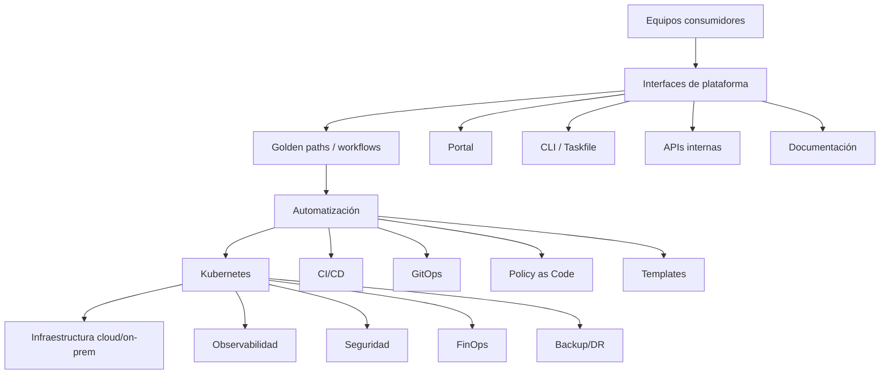
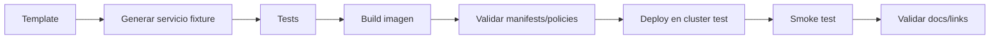

<!-- COURSE_NAV_START -->

[Anterior](<31. FinOps, coste operativo y eficiencia en Kubernetes.md>) | [Indice](README.md) | [Siguiente](33. Troubleshooting avanzado y failure labs.md)

<!-- COURSE_NAV_END -->

# 32. Platform engineering, golden paths y DevEx

## 32.1. Objetivo del módulo

En los módulos anteriores has construido una plataforma Kubernetes desde muchas dimensiones: despliegues, releases, migraciones, feature flags, resiliencia, SLOs, autoscaling, supply chain, Policy as Code, multi-tenancy, networking, service mesh, backups, disaster recovery y FinOps. Este módulo une todo lo anterior desde una perspectiva de producto interno: cómo hacer que esas capacidades no sean una colección de conocimientos dispersos, sino una plataforma usable, segura, observable y económica para los equipos que desarrollan software.

Platform Engineering no consiste en crear otro equipo que apruebe tickets, escriba YAML por los demás o centralice todas las decisiones técnicas. Tampoco consiste en comprar un portal, instalar Backstage y declarar que ya existe una plataforma interna. Platform Engineering consiste en diseñar y operar un producto interno que reduzca carga cognitiva, acelere feedback, haga más seguro el camino habitual y permita que los equipos de producto desplieguen, observen y operen software con autonomía dentro de límites explícitos.

Un golden path es una forma recomendada, soportada y optimizada de hacer algo frecuente. En Kubernetes, puede ser el camino para crear una API nueva, desplegar una aplicación, exponer una ruta, añadir observabilidad, declarar un SLO, configurar un HPA, pedir un namespace, crear un preview environment, añadir un secret externo o publicar una imagen firmada. Un golden path no es una jaula. Es una carretera pavimentada: si el caso es normal, el equipo avanza rápido y con seguridad; si el caso es especial, existe un proceso explícito para salirse del camino sin convertir cada excepción en caos.

La tesis del módulo es esta:

> Una plataforma interna no es un conjunto de herramientas; es una experiencia de producto que reduce carga cognitiva y convierte buenas prácticas en caminos fáciles de seguir.

La tesis operacional es esta:

> Platform Engineering en Kubernetes debe convertir capacidades complejas en interfaces de autoservicio, golden paths, guardrails, documentación viva, observabilidad y soporte evolutivo, evitando que el equipo de plataforma se convierta en el constraint del sistema.

En este módulo aprenderás:

- Qué es Platform Engineering
- Qué diferencia hay entre plataforma, portal, pipeline, framework interno y equipo de plataforma
- Qué es un Internal Developer Platform
- Qué es un Internal Developer Portal
- Qué es un golden path
- Qué diferencia hay entre golden path, paved road, guardrail, template y checklist
- Qué significa DevEx en una plataforma Kubernetes
- Cómo reducir carga cognitiva sin esconder lo importante
- Cómo diseñar una plataforma como producto
- Cómo definir usuarios, journeys, capacidades y contratos
- Cómo diseñar Team APIs y ownership
- Cómo conectar golden paths con Kubernetes, CI/CD, GitOps, observabilidad, SLOs, FinOps y seguridad
- Cómo diseñar self-service sin crear caos
- Cómo decidir qué automatizar y qué no
- Cómo evitar que la plataforma sea una cola de tickets
- Cómo medir DevEx de forma útil
- Cómo diseñar un catálogo de servicios
- Cómo usar plantillas y scaffolding
- Cómo diseñar documentación viva
- Cómo usar Taskfile para mejorar DevEx
- Cómo versionar y probar golden paths
- Cómo gobernar excepciones
- Cómo aplicar Theory of Constraints y software economics al diseño de plataforma
La idea principal es sencilla:

```text
Una buena plataforma no hace que Kubernetes desaparezca.
Hace que el camino correcto sea más corto, más claro y más seguro que el camino improvisado.
```

---

## 32.2. Por qué este módulo existe en un curso de Kubernetes

Kubernetes es potente, pero no es una experiencia de producto por sí mismo. La API de Kubernetes te permite expresar workloads, red, storage, políticas, seguridad y escalado. Eso no significa que cada equipo de producto deba aprender todos los detalles de Deployments, HPAs, PDBs, NetworkPolicies, Ingress, Gateway API, ServiceAccounts, ResourceQuotas, ValidatingAdmissionPolicies, VolumeSnapshots, CRDs, service mesh, FinOps y disaster recovery antes de poder entregar una funcionalidad.

La plataforma aparece cuando conviertes ese conjunto de capacidades en caminos consumibles. Un equipo que quiere publicar `checkout-api` no debería empezar con una hoja en blanco. Debería tener un camino soportado para crear el repositorio, generar la estructura, ejecutar tests, construir la imagen, firmarla, publicar SBOM, desplegar en un namespace con políticas correctas, exponer una ruta, recibir métricas, declarar SLO, crear alertas, documentar runbook y tener un preview environment. Ese camino debe ser claro, automatizado, versionado, probado y mantenido.

Pero hay un peligro: al intentar ayudar, la plataforma puede convertirse en un cuello de botella. Si todo requiere ticket, si la documentación está obsoleta, si las plantillas no cubren casos reales, si los errores de policies son opacos, si los equipos no entienden qué ocurre, si el portal oculta demasiado y si cada excepción tarda días, la plataforma reduce autonomía en vez de aumentarla. Platform Engineering debe evitar ese resultado diseñando interfaces de autoservicio y guardrails que permitan flujo.

### Criterio de comprensión

Debes poder explicar:

> Kubernetes ofrece primitivas; una plataforma interna ofrece caminos consumibles para que los equipos entreguen software sin tener que redescubrir cada decisión operativa.

---

## 32.3. Plataforma, portal, pipeline y equipo de plataforma

Conviene separar términos que se suelen mezclar.

| Concepto                    | Qué es                                                          | Qué no es                   |
| --------------------------- | --------------------------------------------------------------- | --------------------------- |
| Plataforma interna          | conjunto de capacidades consumibles por equipos                 | solo Kubernetes             |
| Internal Developer Platform | producto interno que integra herramientas, flujos y capacidades | solo un portal web          |
| Internal Developer Portal   | interfaz para descubrir y consumir capacidades                  | toda la plataforma          |
| Pipeline                    | automatización de build/test/deploy                             | experiencia completa        |
| Golden path                 | camino recomendado para un caso común                           | obligación universal        |
| Equipo de plataforma        | equipo que diseña y opera capacidades internas                  | equipo de tickets para todo |
| Guardrail                   | límite automatizado que reduce riesgo                           | burocracia manual           |
| Framework interno           | librería o plantilla técnica                                    | plataforma completa         |

Un portal como Backstage puede ser valioso porque centraliza catálogo, documentación, ownership, scaffolding y enlaces operativos. Pero instalar un portal sin capacidades detrás solo crea una interfaz bonita hacia la misma confusión. Una plataforma puede empezar sin portal si tiene CLI, Taskfile, templates, documentación y pipelines buenos. El portal ayuda cuando hay suficientes capacidades que descubrir y operar.

### Criterio de comprensión

Debes poder explicar:

> Un portal es una interfaz de la plataforma, no la plataforma. La plataforma es el conjunto de capacidades, contratos, caminos y soporte que los equipos consumen.

---

## 32.4. Platform Engineering como producto interno

Una plataforma interna debe gestionarse como producto. Eso significa que tiene usuarios, problemas, journeys, métricas, soporte, backlog, feedback, releases, documentación, adopción gradual, decisiones de alcance y criterios de éxito. Si se gestiona como proyecto técnico, puede terminar optimizando lo que le interesa al equipo de plataforma, no lo que reduce carga cognitiva y mejora flujo para los equipos consumidores.

### Usuarios típicos

- Desarrolladores de producto
- Tech leads
- SRE/operaciones
- Seguridad
- Data engineers
- QA/quality engineers
- Product managers
- Equipos de soporte
- Finanzas/FinOps
- Equipos de compliance
- Nuevas incorporaciones
### Jobs-to-be-done de la plataforma

- Crear un servicio nuevo
- Desplegar una versión
- Abrir una ruta externa
- Crear un namespace
- Añadir un secret
- Ver logs y métricas
- Declarar un SLO
- Configurar alertas
- Crear un preview environment
- Revisar coste
- Restaurar backup
- Pedir una excepción
- Rotar credenciales
- Diagnosticar un incidente
- Decommissionar un servicio
### Criterio de comprensión

Debes poder explicar:

> Una plataforma interna debe diseñarse desde los trabajos reales de sus usuarios, no desde la lista de herramientas que el equipo de plataforma quiere instalar.

---

## 32.5. DevEx en Kubernetes

Developer Experience no significa que todo sea fácil en el sentido superficial. Significa que el entorno de trabajo permite a los equipos entender, cambiar, probar, desplegar y operar software con menos fricción innecesaria, menos incertidumbre y menos dependencia de conocimiento tribal. En Kubernetes, una buena DevEx no oculta los riesgos importantes, pero sí evita que cada equipo tenga que ensamblar desde cero prácticas de despliegue, seguridad, observabilidad, coste y recuperación.

### Señales de mala DevEx

- Crear un servicio requiere copiar YAML de otro repositorio
- Nadie sabe qué labels son obligatorias
- Los errores de admission no explican cómo corregir
- Desplegar depende de abrir tickets
- Los runbooks viven fuera del repositorio y están obsoletos
- Cada equipo usa una estructura distinta
- Los entornos preview no son repetibles
- Las policies fallan solo al final del proceso
- Los dashboards no enlazan con servicios
- El owner de un servicio no está claro
- El coste no tiene metadata fiable
- Las excepciones se negocian por chat
- Onboarding de una persona nueva tarda semanas
### Señales de buena DevEx

- Hay templates mantenidas
- Hay Taskfile o CLI para flujos frecuentes
- Hay validación local y CI
- Hay mensajes de error útiles
- Hay golden paths claros
- Hay catálogo con ownership
- Hay documentación cerca del código
- Hay dashboards enlazados desde el servicio
- Hay runbooks versionados
- Hay self-service para casos normales
- Hay proceso de excepción explícito
- Hay feedback rápido
- Hay soporte del equipo de plataforma
### Criterio de comprensión

Debes poder explicar:

> DevEx en Kubernetes mejora cuando el equipo puede hacer lo correcto con menos búsqueda, menos espera y menos interpretación de reglas implícitas.

---

## 32.6. Cognitive load: reducir sin infantilizar

Reducir carga cognitiva no significa esconder todo. Significa exponer el nivel adecuado de abstracción para el trabajo. Un equipo no debería tener que aprender todos los detalles del CSI driver para pedir almacenamiento normal, pero sí debería entender que un PVC tiene coste, owner, backup policy y lifecycle. Un equipo no debería escribir manualmente cada NetworkPolicy desde cero, pero sí debería declarar qué dependencias necesita y entender que egress no es libre.

### Mala abstracción

```text
Pulsa este botón y no te preocupes por nada.
```

Esta abstracción crea dependencia. Cuando algo falla, nadie entiende el sistema.

### Buena abstracción

```text
Declara el tipo de servicio, dependencias, criticidad, SLO y exposición.
La plataforma genera manifests, policies, dashboards y pipelines con defaults seguros.
Puedes inspeccionar lo generado y modificarlo dentro de límites explícitos.
```

Esta abstracción reduce trabajo repetitivo sin eliminar aprendizaje operativo.

### Regla

La plataforma debe reducir decisiones accidentales, no eliminar decisiones esenciales.

### Criterio de comprensión

Debes poder explicar:

> Una buena plataforma abstrae repetición y riesgo común, pero mantiene visible el contrato operativo que el equipo debe entender.

---

## 32.7. Golden path

Un golden path es un camino recomendado, probado y soportado para resolver un caso frecuente. En Kubernetes, no debería ser solo una plantilla de YAML. Debería incluir código inicial, estructura de repositorio, tests, pipeline, Dockerfile, manifests, policies, observabilidad, SLOs, runbooks, Taskfile, documentación, ownership y proceso de evolución.

### Ejemplo: golden path para una API HTTP

El camino podría crear:

- Repositorio o carpeta
- Aplicación Express `checkout-api` de ejemplo
- Tests mínimos
- Dockerfile multi-stage
- `.dockerignore`
- GitHub Actions o pipeline equivalente
- Build de imagen
- SBOM
- Escaneo
- Firma
- Deployment
- Service
- Ingress o HTTPRoute
- HPA
- PDB
- Resource requests
- SecurityContext
- NetworkPolicy
- SLO template
- Dashboard link
- Runbook
- Taskfile
- README
- `catalog-info.yaml`
### Criterio de comprensión

Debes poder explicar:

> Un golden path no es un documento con recomendaciones; es un camino ejecutable que produce un servicio operable con defaults seguros.

---

## 32.8. Golden path, paved road, guardrail, template y checklist

Estos conceptos se solapan, pero conviene diferenciarlos.

| Concepto    | Qué aporta                                            |
| ----------- | ----------------------------------------------------- |
| Golden path | flujo completo recomendado para un caso frecuente     |
| Paved road  | infraestructura y tooling que hacen fácil ese flujo   |
| Guardrail   | límite automatizado que evita desviaciones peligrosas |
| Template    | punto de partida reproducible                         |
| Checklist   | recordatorio verificable                              |
| Runbook     | guía operativa para incidentes o tareas               |
| Policy      | regla ejecutable                                      |
| Portal      | interfaz para descubrir y ejecutar capacidades        |

Una template sin pipeline no es golden path. Una policy sin camino de cumplimiento es fricción. Un portal sin templates ni automatizaciones es catálogo pasivo. Un checklist sin validación puede ser útil, pero no reemplaza guardrails.

### Criterio de comprensión

Debes poder explicar:

> Un golden path integra templates, automatización, documentación, policies y soporte. Cada pieza aislada ayuda, pero no equivale al camino completo.

---

## 32.9. Thin viable platform

Una plataforma interna no debe empezar intentando cubrir todos los casos. Un buen enfoque es construir una thin viable platform: la plataforma mínima que resuelve problemas reales de los equipos consumidores con suficiente calidad para ser adoptada y evolucionada.

### Qué puede incluir una versión inicial

- Namespace contract
- Golden path para API HTTP
- Pipeline estándar
- Dockerfile y build
- Deployment, Service y HPA base
- Observabilidad mínima
- SLO template
- Runbook template
- Taskfile
- Validación de manifests
- Policies básicas: no `latest`, requests, labels
- Catálogo simple de servicios
- Proceso de excepción
- Documentación corta
### Qué dejar fuera al principio

- Portal complejo si todavía no hay capacidades maduras
- Service mesh si no hay problema claro
- Automatizaciones cross-cloud sofisticadas
- Chargeback formal si no hay showback confiable
- Catálogo excesivo de plantillas
- Framework interno obligatorio
- Abstracciones que ocultan Kubernetes sin soporte
### Criterio de comprensión

Debes poder explicar:

> La plataforma viable mínima no es la más pequeña técnicamente; es la menor plataforma que reduce un dolor real y puede crecer con feedback.

---

## 32.10. Arquitectura de una plataforma Kubernetes

Una plataforma Kubernetes madura suele tener varias capas. No todas necesitan existir desde el primer día, pero el mapa ayuda a evitar confusiones.



La plataforma no es una capa única. Es la experiencia que conecta interfaces, workflows, automatización, Kubernetes, infraestructura y operación.

### Criterio de comprensión

Debes poder explicar:

> Una plataforma interna combina interfaces, workflows, automatización, guardrails y operación. Kubernetes es una parte central, pero no toda la plataforma.

---

## 32.11. Capacidades de plataforma

Una plataforma debe definirse por capacidades, no por herramientas. Una capacidad es algo que un equipo puede consumir para realizar un trabajo.

### Capacidades típicas

| Capacidad         | Ejemplo de consumo                            |
| ----------------- | --------------------------------------------- |
| Crear servicio    | `task platform:new-service NAME=checkout-api` |
| Desplegar         | merge a main o promoción GitOps               |
| Exponer ruta      | crear HTTPRoute desde template                |
| Crear namespace   | solicitud self-service con contract           |
| Gestionar secrets | declarar ExternalSecret                       |
| Observabilidad    | dashboard y alertas por template              |
| SLOs              | generar SLO document y alertas                |
| Preview env       | crear entorno por PR                          |
| Backup            | asociar backup policy a namespace             |
| Coste             | ver coste por equipo                          |
| Excepción         | crear policy exception con expiración         |
| Decommission      | retirar servicio con checklist                |
| Incident response | runbooks enlazados desde catálogo             |

### Criterio de comprensión

Debes poder explicar:

> Una plataforma se evalúa por las capacidades que ofrece a sus usuarios, no por la cantidad de herramientas instaladas.

---

## 32.12. Interfaces de plataforma

Las interfaces de plataforma son los puntos donde los equipos consumen capacidades. Pueden ser CLI, Taskfile, portal, APIs, templates, GitOps, documentación o pipelines.

| Interfaz      | Ventaja                            | Riesgo                               |
| ------------- | ---------------------------------- | ------------------------------------ |
| Taskfile      | cercano al repo, simple, auditable | menos descubrible a escala           |
| CLI           | buena UX si está cuidada           | mantenimiento propio                 |
| Portal        | descubrimiento y catálogo          | puede ser capa superficial           |
| GitOps        | trazabilidad y revisión            | puede ser lento si todo requiere PR  |
| Templates     | consistencia                       | pueden quedarse obsoletas            |
| APIs internas | autoservicio real                  | mayor coste de construcción          |
| Docs          | contexto y explicación             | se quedan obsoletas si no se prueban |

### Regla

No todos los flujos necesitan portal. No todos los flujos necesitan CLI. Elige la interfaz según frecuencia, riesgo, usuario y necesidad de automatización.

### Criterio de comprensión

Debes poder explicar:

> Una buena interfaz de plataforma debe aparecer donde el usuario ya trabaja y debe reducir pasos sin ocultar contratos importantes.

---

## 32.13. Catálogo de servicios

Un catálogo de servicios mantiene ownership y metadata del ecosistema. Herramientas como Backstage pueden ayudar a centralizar componentes, documentación, APIs, owners, links, runbooks, dashboards y templates. Backstage describe su Software Catalog como un sistema centralizado para ownership y metadata de software, y sus templates como una forma de crear componentes dentro del portal.

### Metadata útil

```yaml
apiVersion: backstage.io/v1alpha1
kind: Component
metadata:
  name: checkout-api
  description: Handles checkout orchestration
  annotations:
    backstage.io/techdocs-ref: dir:.
    grafana/dashboard-url: https://grafana.example.com/d/checkout-api
    platform.acme.io/runbook: docs/runbooks/checkout-api.md
    platform.acme.io/slo: docs/slos/checkout-api.md
spec:
  type: service
  lifecycle: production
  owner: checkout-team
  system: shop
```

### Qué debería responder el catálogo

- ¿Quién es owner?
- ¿Qué sistema o dominio pertenece?
- ¿Dónde está el repositorio?
- ¿Dónde está el dashboard?
- ¿Dónde está el runbook?
- ¿Qué SLO tiene?
- ¿Qué APIs expone?
- ¿Qué dependencias tiene?
- ¿Qué coste tiene?
- ¿Qué versión está en producción?
- ¿Qué incidentes recientes tuvo?
- ¿Qué golden path usó?
### Criterio de comprensión

Debes poder explicar:

> Un catálogo útil no es una lista de servicios; es una interfaz operativa para ownership, soporte, documentación y descubrimiento.

---

## 32.14. Templates y scaffolding

Las templates reducen repetición y mejoran consistencia. Pero una template envejece. Si no se prueba, si no se versiona y si nadie la mantiene, se convierte en deuda de plataforma.

### Qué debe generar una template de API

- Estructura de aplicación
- Tests
- Dockerfile
- `.dockerignore`
- Pipeline
- Manifests Kubernetes
- Taskfile
- README
- `catalog-info.yaml`
- SLO template
- Runbook template
- Observability config
- Security defaults
- Resource defaults
- NetworkPolicy
- Ownership labels
### Buenas prácticas

- Versionar templates
- Probar templates en CI
- Generar ejemplos reales
- Mantener changelog
- Permitir actualización de servicios existentes
- Documentar decisiones
- Evitar magia excesiva
- Hacer visible lo generado
- Incluir validaciones
- Pedir pocos datos al usuario, pero los correctos
### Criterio de comprensión

Debes poder explicar:

> Una template de plataforma es código de producción: crea sistemas que otros operarán durante años.

---

## 32.15. Golden path para `checkout-api`

El curso ya usa una aplicación Express/Node.js como `checkout-api`. Un golden path para esta API debería generar un servicio completo, no solo un Deployment.

### Entrada mínima

```text
name: checkout-api
team: checkout
system: shop
component: api
language: node
runtime: express
environment: production
criticality: high
externalRoute: /checkout
slo: checkout-api-standard
```

### Salida esperada

```text
checkout-api/
  src/
    server.js
  test/
  Dockerfile
  .dockerignore
  package.json
  Taskfile.yml
  README.md
  catalog-info.yaml
  docs/
    slos/checkout-api-slo.md
    runbooks/checkout-api.md
    adr/0001-service-baseline.md
  k8s/
    deployment.yaml
    service.yaml
    hpa.yaml
    pdb.yaml
    networkpolicy.yaml
    httproute.yaml
```

### Qué defaults debería incluir

- `runAsNonRoot`
- `readOnlyRootFilesystem`, si la app lo soporta
- Requests iniciales razonables
- Memory limit
- Probes
- Graceful shutdown
- Labels estándar
- ServiceAccount específica
- No `latest`
- Imagen por digest en producción
- HPA con maxReplicas
- PDB si es crítico
- NetworkPolicy explícita
- Dashboard y runbook
- Taskfile para test, build, run, deploy, logs, smoke
### Criterio de comprensión

Debes poder explicar:

> El golden path de `checkout-api` debe producir una API lista para operar, no solo lista para compilar.

---

## 32.16. Taskfile como interfaz DevEx

Taskfile es una herramienta excelente para este curso porque acerca la plataforma al repositorio. Permite que el lector ejecute tareas repetibles sin memorizar comandos largos de Kubernetes, Docker, Helm, kubectl, curl, jq, Velero, policy tools o scripts internos.

### Buen uso de Taskfile

- `task test`
- `task build`
- `task docker:build`
- `task k8s:apply`
- `task k8s:status`
- `task k8s:logs`
- `task k8s:smoke`
- `task hpa:status`
- `task networking:debug`
- `task policy:validate`
- `task finops:review`
- `task backup:restore:test`
Taskfile no debería esconder completamente lo que hace. Cada tarea debe tener `desc`, comandos legibles y nombres consistentes. Si una tarea ejecuta algo destructivo, debe hacerlo evidente.

### Criterio de comprensión

Debes poder explicar:

> Taskfile mejora DevEx cuando convierte flujos frecuentes en comandos recordables sin ocultar la intención operacional.

---

## 32.17. Golden paths y Policy as Code

Un golden path y una policy se necesitan mutuamente. La policy dice qué no puede entrar o qué debe cumplirse. El golden path da una forma fácil de cumplir. Si solo tienes policy, creas fricción. Si solo tienes golden path sin policy, dependes de que todos lo usen siempre.

### Ejemplo

Policy:

```text
Producción exige imagen por digest, labels de ownership, requests y no latest.
```

Golden path:

```text
El pipeline genera imagen, calcula digest, actualiza manifest, añade labels y valida requests.
```

La combinación reduce riesgo y carga cognitiva. El equipo no tiene que recordar cada regla, porque el camino normal ya produce recursos compatibles. Si decide desviarse, la policy da feedback y el proceso de excepción permite casos justificados.

### Criterio de comprensión

Debes poder explicar:

> Un guardrail sin golden path bloquea; un golden path sin guardrail es opcionalidad frágil.

---

## 32.18. Self-service sin caos

Self-service significa que un equipo puede obtener una capacidad sin esperar a una intervención manual para casos normales. Pero self-service no significa permisos ilimitados. Necesita contratos, quotas, policies, ownership, audit y límites.

### Ejemplos de self-service sano

- Crear preview environment con TTL
- Crear namespace con contract aprobado automáticamente si cumple reglas
- Generar servicio desde template
- Añadir ruta HTTP dentro de dominios permitidos
- Solicitar secret externo mediante ExternalSecret
- Ver coste del equipo
- Crear dashboard desde template
- Pedir backup policy estándar
- Crear excepción temporal con workflow revisable
### Riesgo de self-service mal diseñado

- Namespaces sin owner
- LoadBalancers sin control
- Coste impredecible
- Secrets mal gestionados
- Policies saltadas
- Rutas inseguras
- Storage caro sin retención
- Workloads privilegiados
- Plataforma sin visibilidad
### Criterio de comprensión

Debes poder explicar:

> Self-service útil combina autonomía con límites. Sin límites es caos; sin autonomía es cola de tickets.

---

## 32.19. Team APIs

Team API es una forma de describir qué ofrece un equipo, cómo se consume, qué soporte da, qué límites tiene y cómo interactuar con él. En Platform Engineering, el equipo de plataforma necesita una Team API clara: qué capacidades ofrece, cuáles son los SLOs de la plataforma, cómo se piden cambios, qué casos son self-service, qué casos requieren conversación y cómo se gestionan excepciones.

### Team API de plataforma

```md
# Team API: Platform team

## Purpose

Provide paved roads for deploying, operating and observing services on Kubernetes.

## Capabilities

- Service golden path
- Namespace onboarding
- CI/CD baseline
- GitOps deployment
- Observability baseline
- Policy as Code
- Backup/DR baseline
- FinOps reporting
- Preview environments

## Self-service

- Create service from template
- Create preview environment
- View dashboards
- Run policy validation
- Request standard namespace

## Requires collaboration

- New cluster-scoped controller
- New CRD
- Production exception
- Dedicated node pool
- Non-standard ingress
- Data recovery incident

## Support

- Slack: #platform-support
- Office hours: weekly
- Incident escalation: platform-oncall

## SLOs

- Platform API availability
- CI template success rate
- Time to create preview environment
- Time to onboard namespace
```

### Criterio de comprensión

Debes poder explicar:

> Una Team API reduce ambigüedad entre plataforma y equipos consumidores: qué ofrece, cómo se consume y cuándo hay que colaborar.

---

## 32.20. Ownership y modelo de soporte

Una plataforma interna necesita ownership claro. No solo ownership de servicios, también ownership de templates, pipelines, policies, controllers, runbooks, dashboards, namespaces, exceptions y capacidades.

### Preguntas

- ¿Quién mantiene la template de API?
- ¿Quién actualiza el Dockerfile base?
- ¿Quién cambia policies?
- ¿Quién aprueba excepciones?
- ¿Quién opera el portal?
- ¿Quién responde si falla GitOps?
- ¿Quién mantiene Taskfile común?
- ¿Quién actualiza documentación?
- ¿Quién revisa coste compartido?
- ¿Quién soporta incidentes de plataforma?
- ¿Quién decide deprecations?
### Modelo de soporte

| Tipo de problema   | Primer paso               | Escalado                  |
| ------------------ | ------------------------- | ------------------------- |
| Template no genera | issue en repo plataforma  | plataforma                |
| Policy bloquea     | revisar mensaje y docs    | plataforma si error       |
| Servicio falla     | equipo owner              | plataforma si capa común  |
| Cluster incidente  | plataforma                | proveedor/cloud si aplica |
| Coste anómalo      | equipo owner + FinOps     | plataforma                |
| Restore            | equipo owner + plataforma | seguridad si compromiso   |
| Excepción          | workflow documentado      | aprobadores definidos     |

### Criterio de comprensión

Debes poder explicar:

> Una plataforma sin ownership claro se convierte en infraestructura compartida sin responsabilidad compartida.

---

## 32.21. Documentación viva

La documentación de plataforma debe vivir cerca del código, ejecutarse cuando sea posible y actualizarse con los cambios. Una wiki estática puede ayudar, pero si se aleja de templates, scripts, Taskfiles y policies, se queda obsoleta.

### Documentación que debe existir

- Getting started
- Golden paths
- Service template docs
- Namespace contract
- Policy catalog
- Exception process
- SLO templates
- Runbook templates
- Incident runbooks
- FinOps model
- Backup/restore runbooks
- Networking contracts
- Migration guide
- Troubleshooting
- FAQ
- Changelog
- Deprecation notices
### Prácticas

- Docs en el repo
- Docs generadas desde templates cuando aplique
- Ejemplos probados
- Comandos ejecutables
- Taskfile como fuente de ayuda
- CI valida links y snippets críticos
- Versionado de docs
- Changelog de breaking changes
- Feedback desde usuarios
### Criterio de comprensión

Debes poder explicar:

> La documentación de plataforma debe ser parte del producto, no un residuo después de construir herramientas.

---

## 32.22. Medir DevEx

Medir DevEx no es contar cuántas herramientas tiene la plataforma. Hay que medir flujo, fricción, autonomía, calidad y confianza.

### Métricas útiles

- Tiempo para crear un servicio
- Tiempo para crear un preview environment
- Tiempo para onboardear namespace
- Tiempo desde merge a producción
- Fallos de pipeline por errores de plataforma
- Errores de policy por tipo
- Tiempo medio de resolución de excepciones
- Porcentaje de servicios con golden path
- Porcentaje de servicios con SLO y runbook
- Porcentaje de workloads con labels correctas
- Porcentaje de coste asignado
- Tickets repetitivos a plataforma
- Incidentes causados por configuración
- Satisfacción de equipos
- Carga cognitiva percibida
- Adopción de templates
- Tiempo de recuperación de incidentes de plataforma
### Cuidado

No conviertas DevEx en vanity metrics. Un portal con muchas visitas no significa que reduzca fricción. Muchos servicios creados desde template no significan que la template produzca servicios operables. Menos tickets puede significar autoservicio bueno o abandono del soporte.

### Criterio de comprensión

Debes poder explicar:

> Las métricas DevEx deben medir reducción de fricción y mejora de flujo, no actividad superficial de herramientas.

---

## 32.23. DORA, SLOs y plataforma

La plataforma debe mejorar delivery sin sacrificar fiabilidad. Las métricas DORA pueden ayudar a evaluar flujo de entrega: lead time for changes, deployment frequency, failed deployment recovery time, change failure rate y deployment rework rate. Pero no deben interpretarse aisladas de SLOs, error budgets y contexto.

### Relación

| Métrica                         | Qué puede indicar                           |
| ------------------------------- | ------------------------------------------- |
| Lead time                       | fricción desde cambio a producción          |
| Deployment frequency            | capacidad de entregar en lotes pequeños     |
| Failed deployment recovery time | capacidad de recuperación                   |
| Change failure rate             | riesgo de cambios                           |
| Deployment rework rate          | coste de corregir despliegues problemáticos |
| SLO burn                        | impacto real en usuario                     |
| Error budget                    | margen de riesgo operativo                  |

Una plataforma sana debería reducir lead time y recovery time, facilitar despliegues pequeños, reducir errores repetitivos y mejorar observabilidad. Si despliega más rápido pero quema error budget, no está mejorando el sistema.

### Criterio de comprensión

Debes poder explicar:

> La plataforma debe mejorar flujo y fiabilidad juntos. DORA sin SLOs puede empujar velocidad local sin proteger experiencia del usuario.

---

## 32.24. Golden paths y SLOs de plataforma

La propia plataforma debe tener SLOs. Si los equipos dependen de CI/CD, GitOps, portal, registry, policies, observabilidad o namespace onboarding, esas capacidades tienen que ser operables.

### SLOs posibles

- Tiempo para crear preview environment
- Disponibilidad del portal
- Disponibilidad de GitOps controller
- Latencia de pipeline común
- Porcentaje de templates que generan correctamente
- Tiempo de onboarding de namespace
- Tiempo de resolución de policy false positive
- Disponibilidad de observabilidad básica
- Tiempo de restore de entorno de prueba
- Porcentaje de servicios con coste asignado
- Tiempo de respuesta en soporte plataforma
### Criterio de comprensión

Debes poder explicar:

> Si la plataforma es producto, también necesita objetivos de servicio y feedback de sus usuarios.

---

## 32.25. Golden paths y FinOps

El módulo anterior mostró que el coste aparece distribuido. Golden paths pueden ayudar a controlar coste desde el nacimiento de un servicio.

### Defaults FinOps en golden path

- Labels de team, environment y cost center
- Requests iniciales razonables
- HPA con maxReplicas
- ResourceQuota por namespace
- StorageClass por defecto
- TTL para preview environments
- Logs con retención por entorno
- PVCs con owner
- No LoadBalancer por defecto
- Dashboards de coste
- Showback metadata
- Taskfile de revisión
### Criterio de comprensión

Debes poder explicar:

> FinOps funciona mejor cuando la metadata y los límites de coste se crean con el servicio, no cuando se intentan reconstruir al final del mes.

---

## 32.26. Golden paths y seguridad

La seguridad debe estar integrada en el camino normal. Si seguridad aparece solo como revisión final, genera fricción y bypasses.

### Defaults de seguridad

- Imagen sin `latest`
- Digest en producción
- SBOM
- Escaneo
- Firma
- Provenance, si aplica
- `runAsNonRoot`
- `allowPrivilegeEscalation: false`
- ServiceAccount específica
- Token automount desactivado si no se necesita
- NetworkPolicy base
- Secrets externos
- Policy validation
- Pod Security compatible
- Runbook de excepción
### Criterio de comprensión

Debes poder explicar:

> Un golden path seguro no pide a los equipos recordar todos los controles; los incorpora como defaults verificables.

---

## 32.27. Golden paths y observabilidad

Un servicio creado desde golden path debería nacer observable. No debería llegar a producción sin métricas, logs estructurados, correlation ID, health endpoints, dashboards, alertas y runbook mínimo.

### Baseline de observabilidad

- `/health`
- `/ready`
- Métricas HTTP
- Métricas de dependencias
- Logs estructurados
- Correlation ID
- Dashboard
- Alertas por SLO
- Runbook
- Trace propagation, si aplica
- Links desde catálogo
### Criterio de comprensión

Debes poder explicar:

> Observabilidad no debe ser una tarea posterior. Es parte del contrato mínimo de un servicio operable.

---

## 32.28. Golden paths y resiliencia

Un golden path no puede diseñar toda la resiliencia de negocio, pero sí puede proporcionar defaults técnicos razonables.

### Defaults de resiliencia

- Graceful shutdown
- Readiness real
- Startup probe si la app tarda
- Liveness conservadora
- PDB para críticos
- HPA con límites
- Timeouts de ejemplo
- Circuit breaker en librería o policy documentada
- Idempotency guidance para endpoints no seguros
- Retry guidance
- Runbook de degradación
- SLO template
### Criterio de comprensión

Debes poder explicar:

> El golden path puede dar estructura de resiliencia, pero la aplicación debe definir semántica, idempotencia y fallback de negocio.

---

## 32.29. Versionado de golden paths

Los golden paths evolucionan. Una template inicial puede quedarse obsoleta cuando cambian policies, Kubernetes, librerías, seguridad, observabilidad o estructura de repositorio. Por eso, los golden paths necesitan versionado y estrategia de actualización.

### Problemas habituales

- Servicios nuevos nacen con template nueva
- Servicios antiguos quedan con template vieja
- Nadie sabe qué versión usa cada servicio
- Las policies nuevas rompen servicios legacy
- El equipo de plataforma no ofrece migración
- Las mejoras no se propagan
### Estrategias

- Versionar templates
- Registrar versión en `catalog-info.yaml`
- Mantener changelog
- Ofrecer migration guides
- Crear codemods o scripts cuando sea posible
- Validar servicios existentes contra baseline
- Permitir adopción incremental
- Deprecar versiones antiguas con fecha
- Comunicar breaking changes
### Criterio de comprensión

Debes poder explicar:

> Un golden path no termina al generar un servicio; debe tener ciclo de vida y migración para servicios existentes.

---

## 32.30. Testing de golden paths

Un golden path debe probarse. Si una template genera un repositorio que no compila, un pipeline que no pasa, un Deployment que no arranca o un dashboard roto, la confianza en la plataforma cae.

### Qué probar

- La template genera archivos correctos
- El proyecto compila
- Los tests pasan
- La imagen se construye
- El manifiesto valida schemas
- Las policies pasan
- El deployment arranca en cluster de prueba
- El smoke test pasa
- Las métricas aparecen
- El catálogo importa metadata
- Los enlaces de docs funcionan
- Taskfile funciona
- El pipeline completo funciona
### Pipeline de golden path



### Criterio de comprensión

Debes poder explicar:

> Una template no probada traslada el riesgo al primer equipo que la use.

---

## 32.31. Excepciones y caminos no estándar

Una plataforma madura permite desviaciones controladas. Si todo caso no estándar requiere saltarse la plataforma por fuera, la plataforma pierde credibilidad. Si cualquier caso puede saltarse sin control, los guardrails pierden valor.

### Excepción bien diseñada

Debe incluir:

- Qué golden path no se puede usar
- Por qué
- Qué riesgo introduce
- Qué mitigación existe
- Quién aprueba
- Quién es owner
- Cuándo expira
- Cómo se vuelve al camino soportado
- Qué aprendizaje deja para mejorar la plataforma
### Pregunta importante

¿La excepción es realmente excepcional o revela que el golden path no cubre un caso común?

Si muchas excepciones son similares, no son excepciones. Son feedback de producto para evolucionar la plataforma.

### Criterio de comprensión

Debes poder explicar:

> Las excepciones son una fuente de aprendizaje de producto. Si se repiten, el golden path está incompleto.

---

## 32.32. Evitar la plataforma como constraint

Platform Engineering puede resolver un constraint o convertirse en uno nuevo. Si la plataforma reduce espera, decisiones repetitivas y errores, mejora el flujo. Si centraliza cambios, approvals y conocimiento, empeora el flujo.

### Señales de que plataforma es constraint

- Onboarding de servicio tarda días
- Crear namespace requiere varios tickets
- Excepciones no tienen SLA
- Policies fallan con mensajes opacos
- Equipos copian YAML para evitar plataforma
- Portal tiene datos obsoletos
- Golden path no se actualiza
- Plataforma aprueba manualmente cambios frecuentes
- El equipo de plataforma está saturado
- Los equipos no pueden depurar sin plataforma
- Los mismos problemas se repiten
- Hay más tiempo esperando que construyendo
### Cómo aliviarlo

- Self-service
- Golden paths probados
- Docs vivas
- Validación temprana
- Mensajes útiles
- Team API clara
- Office hours
- Métricas de fricción
- Automatización determinista
- Delegar ownership
- Reducir scope
- Deprecar caminos no usados
- Priorizar el constraint real
### Criterio de comprensión

Debes poder explicar:

> Una plataforma solo mejora el sistema si aumenta autonomía segura. Si centraliza todas las decisiones, se convierte en el cuello de botella.

---

## 32.33. Platform Engineering y Theory of Constraints

Desde Theory of Constraints, la plataforma debe subordinarse al objetivo del sistema: entregar valor de forma segura, fiable y sostenible. La pregunta no es cuántas capacidades tiene la plataforma, sino qué constraint reduce.

### Preguntas TOC

- ¿Dónde pierden más tiempo los equipos?
- ¿Qué bloquea más cambios?
- ¿Qué incidentes se repiten?
- ¿Qué conocimiento tribal limita flujo?
- ¿Qué tickets son más frecuentes?
- ¿Qué errores son más caros?
- ¿Qué parte del sistema genera más rework?
- ¿Qué golden path elevaría el constraint?
- ¿Qué automatización solo optimiza un problema local?
- ¿Qué política aumenta WIP?
### Ejemplo

Si los equipos tardan días en crear entornos de prueba, un golden path de preview environments puede elevar el constraint. Si el mayor problema es falta de ownership en producción, instalar un portal sin corregir metadata no resuelve el constraint. Si la plataforma invierte meses en service mesh cuando los equipos no tienen SLOs ni runbooks, quizá está optimizando lejos del problema real.

### Criterio de comprensión

Debes poder explicar:

> Platform Engineering debe empezar por el constraint del flujo de entrega, no por el catálogo de herramientas deseadas.

---

## 32.34. Platform Engineering y software economics

Una plataforma interna es una inversión. Tiene coste de construcción, mantenimiento, soporte, documentación, migración, operación y evolución. Su retorno aparece cuando reduce coste de coordinación, reduce riesgo, acelera feedback, mejora reutilización, reduce toil, baja coste basal, mejora calidad y evita incidentes repetitivos.

### Fórmula didáctica

```text
valor económico de una plataforma =
coste evitado de repetición
+ coste evitado de incidentes
+ reducción de lead time
+ reducción de rework
+ reducción de cognitive load
+ mejora de fiabilidad
+ mejora de seguridad
+ mejora de visibilidad de coste
- coste de construir y operar la plataforma
- coste de migrar y formar equipos
- coste de complejidad añadida
```

### Buenas inversiones

- Automatizar creación de servicios si se crean a menudo
- Crear policies para errores repetidos y caros
- Mejorar observabilidad si incident response es lento
- Crear preview environments si feedback tarda demasiado
- Crear namespace onboarding si plataforma es cuello de botella
- Crear showback si coste es invisible
- Crear runbook templates si incidentes dependen de personas concretas
### Malas inversiones

- Portal antes de tener capacidades útiles
- Mesh antes de tener problema de tráfico común
- Templates que nadie mantiene
- Framework obligatorio que aumenta acoplamiento
- Abstracción que impide entender errores
- Automatizar procesos que todavía no entiendes
- Medir vanity metrics en vez de flujo
### Criterio de comprensión

Debes poder explicar:

> La plataforma debe pagarse a sí misma reduciendo coste sistémico; si solo añade una capa más, es deuda interna.

---

## 32.35. Platform Engineering y sistemas sociotécnicos

Una plataforma no es solo tecnología. Cambia relaciones entre equipos. Define quién decide, quién opera, quién soporta, quién puede cambiar qué, quién asume riesgo, quién paga coste y quién aprende de incidentes. Por eso, Platform Engineering debe diseñarse como sistema sociotécnico.

### Riesgos sociales

- Plataforma como policía
- Equipos de producto como clientes pasivos
- Falta de feedback real
- Roadmap de plataforma desconectado
- Políticas percibidas como imposición
- Equipo de plataforma saturado
- Shadow platforms
- Bypass de guardrails
- Falta de ownership
- Soporte por canales informales
- Plataforma diseñada para compliance, no para flujo
### Prácticas sanas

- Discovery con equipos consumidores
- Office hours
- Embedded enablement temporal
- RFCs para cambios grandes
- Roadmap transparente
- Team API
- Métricas de fricción
- Excepciones trazables
- Postmortems compartidos
- Golden paths co-diseñados
- Comunicación de deprecations
- Feedback en catálogo o portal
### Criterio de comprensión

Debes poder explicar:

> Una plataforma funciona cuando cambia el sistema de trabajo, no solo cuando instala herramientas.

---

## 32.36. Manifiestos y estructura del módulo

Estructura recomendada:

```text
platform/
  README.md
  Taskfile.yml
  catalog/
    catalog-info-template.yaml
  golden-paths/
    api-service/
      README.md
      template/
        package.json
        src/server.js
        Dockerfile
        Taskfile.yml
        catalog-info.yaml
        docs/slos/service-slo.md
        docs/runbooks/service-runbook.md
        k8s/deployment.yaml
        k8s/service.yaml
        k8s/hpa.yaml
        k8s/pdb.yaml
        k8s/networkpolicy.yaml
        k8s/httproute.yaml
      tests/
        generated-service-builds.sh
        generated-service-deploys.sh
  docs/
    platform-product-strategy.md
    team-api.md
    golden-path-catalog.md
    exception-process.md
    devex-metrics.md
    support-model.md
    deprecation-policy.md
```

### Platform README

```md
# Internal Kubernetes platform

## Purpose

Help product teams deploy, operate and evolve services on Kubernetes with autonomy and guardrails.

## Supported golden paths

- API service
- Worker service
- Scheduled job
- Preview environment
- Namespace onboarding

## Interfaces

- Taskfile
- GitOps
- Service catalog
- Documentation
- Platform support channel

## Principles

- Self-service for common cases.
- Guardrails instead of manual approvals.
- Documentation lives with code.
- Policies must have golden paths.
- Exceptions must expire.
- Platform is treated as a product.
```

### Golden path catalog

```md
# Golden path catalog

| Golden path          | Use when               | Output                             | Owner         | Status    |
| -------------------- | ---------------------- | ---------------------------------- | ------------- | --------- |
| API service          | HTTP API on Kubernetes | repo, pipeline, k8s, observability | platform-team | supported |
| Worker service       | async consumer         | worker baseline, HPA/KEDA guidance | platform-team | beta      |
| Preview environment  | PR environment         | namespace, quotas, route, TTL      | platform-team | supported |
| Namespace onboarding | new tenant namespace   | namespace contract, RBAC, quotas   | platform-team | supported |
```

### Team API

```md
# Team API: Platform team

## Purpose

Provide paved roads for Kubernetes delivery and operation.

## Capabilities

- Golden paths
- CI/CD baseline
- GitOps deployment
- Observability baseline
- Policy as Code
- FinOps showback
- Backup/DR baseline
- Namespace onboarding

## Self-service

- Create service from template
- Create preview environment
- Validate manifests
- View service catalog
- View cost reports

## Collaboration required

- New CRD/operator
- Cluster-scoped permissions
- Production policy exception
- Dedicated node pool
- Non-standard networking
- Disaster recovery event

## Support

- Slack: #platform-support
- Office hours: weekly
- Incidents: platform-oncall
```

### Criterio de comprensión

Debes poder explicar:

> La estructura de plataforma debe tratar golden paths, documentación, soporte, métricas y exceptions como producto versionado.

---

## 32.37. Taskfile para Platform Engineering

Añade tareas:

```yaml
platform:docs:
  desc: Show platform README
  cmds:
    - cat platform/README.md

platform:team-api:
  desc: Show platform Team API
  cmds:
    - cat platform/docs/team-api.md

platform:golden-paths:
  desc: Show golden path catalog
  cmds:
    - cat platform/docs/golden-path-catalog.md

platform:new-api:
  desc: Generate a new API service from golden path. Usage NAME=checkout-api TEAM=checkout SYSTEM=shop task platform:new-api
  cmds:
    - ./platform/golden-paths/api-service/scripts/generate.sh {{.NAME}} {{.TEAM}} {{.SYSTEM}}

platform:validate:generated-api:
  desc: Validate generated API golden path fixture
  cmds:
    - ./platform/golden-paths/api-service/tests/generated-service-builds.sh
    - ./platform/golden-paths/api-service/tests/generated-service-deploys.sh

platform:policy:validate:
  desc: Validate generated manifests against platform policies
  cmds:
    - task policy:validate:schemas
    - task policy:check:no-latest
    - task policy:check:labels

platform:catalog:validate:
  desc: Validate catalog metadata
  cmds:
    - test -f catalog-info.yaml || (echo "catalog-info.yaml is required" && exit 1)
    - grep -q "owner:" catalog-info.yaml || (echo "catalog-info.yaml must define owner" && exit 1)

platform:devex:metrics:
  desc: Show DevEx metrics definition
  cmds:
    - cat platform/docs/devex-metrics.md

platform:exception-process:
  desc: Show platform exception process
  cmds:
    - cat platform/docs/exception-process.md

platform:support:
  desc: Show platform support model
  cmds:
    - cat platform/docs/support-model.md

platform:deprecation-policy:
  desc: Show platform deprecation policy
  cmds:
    - cat platform/docs/deprecation-policy.md

platform:smoke:
  desc: Run platform smoke checks
  cmds:
    - task platform:docs
    - task platform:team-api
    - task platform:golden-paths
    - task platform:devex:metrics
```

### Criterio DevEx

Debes poder explicar:

> El Taskfile de plataforma debe permitir descubrir, generar, validar y entender la plataforma sin depender de memoria tribal ni comandos ocultos.

---

## 32.38. Práctica 1: diseñar la plataforma como producto

### Objetivo

Definir propósito, usuarios y capacidades antes de construir herramientas.

Crea:

```text
platform/docs/platform-product-strategy.md
```

Incluye:

- Problema que resuelve la plataforma
- Usuarios
- Jobs-to-be-done
- Capacidades iniciales
- Qué queda fuera
- Métricas de éxito
- Riesgos
- Roadmap
- Feedback loop
- Support model
### Preguntas

- ¿Qué constraint reduce la plataforma?
- ¿Quiénes son los usuarios?
- ¿Qué trabajo frecuente mejora?
- ¿Qué capacidad se necesita primero?
- ¿Qué no se debe construir todavía?
- ¿Cómo sabrás si funciona?
- ¿Qué coste introduce?
### Criterio

Debes poder explicar:

> Diseñar plataforma como producto empieza por usuarios, problemas y constraints, no por elegir portal o herramientas.

---

## 32.39. Práctica 2: crear Team API de plataforma

### Objetivo

Clarificar relación entre plataforma y equipos consumidores.

Crea:

```text
platform/docs/team-api.md
```

Ejecuta:

```bash
task platform:team-api
```

Debe incluir:

- Propósito
- Capacidades
- Self-service
- Casos que requieren colaboración
- Canales de soporte
- SLOs de plataforma
- Expectativas de los consumidores
- Cómo pedir cambios
- Cómo pedir excepciones
### Preguntas

- ¿Qué puede hacer un equipo sin ticket?
- ¿Qué requiere colaboración?
- ¿Qué soporte ofrece plataforma?
- ¿Qué espera plataforma de los equipos?
- ¿Qué SLOs tiene la plataforma?
- ¿Qué pasa si la plataforma falla?
### Criterio

Debes poder explicar:

> Team API evita que la plataforma sea una relación implícita basada en favores, chats y conocimiento tribal.

---

## 32.40. Práctica 3: definir golden path de API

### Objetivo

Diseñar un golden path completo para servicios HTTP.

Crea:

```text
platform/golden-paths/api-service/README.md
```

Debe describir:

- Cuándo usarlo
- Inputs
- Outputs
- Estructura generada
- Defaults de seguridad
- Defaults de observabilidad
- Defaults de resiliencia
- Defaults de FinOps
- Cómo desplegar
- Cómo validar
- Cómo pedir excepción
- Cómo migrar a nueva versión
### Preguntas

- ¿Genera solo código o servicio operable?
- ¿Incluye tests?
- ¿Incluye Dockerfile?
- ¿Incluye manifests?
- ¿Incluye SLO y runbook?
- ¿Incluye catálogo?
- ¿Incluye Taskfile?
- ¿Incluye policies?
- ¿Cómo se actualiza?
### Criterio

Debes poder explicar:

> Un golden path de API debe producir un servicio que pueda desplegarse, observarse, operarse, recuperarse y costearse.

---

## 32.41. Práctica 4: crear catálogo de golden paths

### Objetivo

Hacer descubribles los caminos soportados.

Crea:

```text
platform/docs/golden-path-catalog.md
```

Ejecuta:

```bash
task platform:golden-paths
```

Incluye:

- Nombre
- Caso de uso
- Estado: experimental, beta, supported, deprecated
- Owner
- Inputs
- Outputs
- Documentación
- Version
- Changelog
- Fecha de revisión
### Preguntas

- ¿Qué caminos están soportados?
- ¿Qué caminos son experimentales?
- ¿Quién mantiene cada uno?
- ¿Qué caso cubre cada camino?
- ¿Qué camino falta?
- ¿Qué camino debería deprecarse?
### Criterio

Debes poder explicar:

> Un catálogo de golden paths evita que los equipos tengan que descubrir por rumores qué está soportado.

---

## 32.42. Práctica 5: generar `checkout-api` desde golden path

### Objetivo

Validar que el golden path produce algo usable.

Ejecuta:

```bash
task platform:new-api NAME=checkout-api TEAM=checkout SYSTEM=shop
```

Después:

```bash
task platform:validate:generated-api
```

### Preguntas

- ¿El proyecto compila?
- ¿Los tests pasan?
- ¿La imagen se construye?
- ¿Los manifests validan?
- ¿Las policies pasan?
- ¿El servicio arranca?
- ¿El smoke test pasa?
- ¿El catálogo se importa?
- ¿La documentación generada es útil?
- ¿Qué parte requiere intervención manual?
### Criterio

Debes poder explicar:

> Un golden path solo es real si puedes generar, construir, desplegar y validar un servicio desde él.

---

## 32.43. Práctica 6: diseñar documentación viva

### Objetivo

Evitar documentación separada de la realidad.

Crea:

```text
platform/docs/documentation-strategy.md
```

Incluye:

- Dónde vive la documentación
- Qué se genera automáticamente
- Qué se valida en CI
- Qué comandos se prueban
- Qué enlaces se validan
- Cómo se versiona
- Cómo se depreca
- Cómo se recibe feedback
- Quién mantiene cada documento
### Preguntas

- ¿Qué docs se quedan obsoletas más rápido?
- ¿Qué comandos deberían probarse?
- ¿Qué ejemplos deben compilar?
- ¿Qué docs pertenecen a cada golden path?
- ¿Cómo se publican?
- ¿Cómo se detecta documentación rota?
### Criterio

Debes poder explicar:

> Documentación viva es documentación conectada a código, templates, tests y feedback.

---

## 32.44. Práctica 7: definir métricas DevEx

### Objetivo

Medir si la plataforma reduce fricción real.

Crea:

```text
platform/docs/devex-metrics.md
```

Incluye:

- Métricas de flujo
- Métricas de calidad
- Métricas de soporte
- Métricas de adopción
- Métricas de satisfacción
- Métricas que no usarás
- Cómo se recogen
- Frecuencia de revisión
- Acciones esperadas
### Preguntas

- ¿Qué fricción estás midiendo?
- ¿Qué métrica puede ser vanity?
- ¿Qué métrica puede crear gaming?
- ¿Qué métrica conecta con SLO?
- ¿Qué métrica conecta con DORA?
- ¿Qué métrica conecta con FinOps?
- ¿Qué métrica conecta con soporte?
### Criterio

Debes poder explicar:

> Medir DevEx sirve para mejorar flujo y reducir fricción, no para decorar la plataforma con números.

---

## 32.45. Práctica 8: diseñar proceso de excepción

### Objetivo

Permitir desviaciones sin perder gobernanza.

Crea:

```text
platform/docs/exception-process.md
```

Debe incluir:

- Qué puede excepcionarse
- Qué no puede excepcionarse
- Campos obligatorios
- Owner
- Riesgo
- Mitigación
- Expiración
- Aprobación
- Revisión
- Camino de retorno
- Cómo detectar excepciones repetidas
### Preguntas

- ¿Qué excepciones son comunes?
- ¿Qué excepciones deberían convertirse en nuevo golden path?
- ¿Qué excepciones son demasiado peligrosas?
- ¿Quién aprueba?
- ¿Cómo expiran?
- ¿Cómo se auditan?
### Criterio

Debes poder explicar:

> Un proceso de excepción sano protege casos reales sin normalizar desviaciones permanentes.

---

## 32.46. Práctica 9: diseñar support model

### Objetivo

Evitar soporte informal y dependencia de personas concretas.

Crea:

```text
platform/docs/support-model.md
```

Incluye:

- Canales
- Horarios
- Severidades
- Qué es incidente de plataforma
- Qué es problema de servicio
- Escalado
- Office hours
- SLA o SLO de soporte
- Cómo pedir features
- Cómo reportar bugs
- Cómo priorizar
### Preguntas

- ¿Qué problemas atiende plataforma?
- ¿Qué problemas debe resolver el equipo owner?
- ¿Cómo se escala un incidente?
- ¿Qué soporte es síncrono?
- ¿Qué soporte es asíncrono?
- ¿Cómo se evita soporte por DM?
- ¿Cómo se aprende de tickets repetidos?
### Criterio

Debes poder explicar:

> Soporte de plataforma debe ser parte del producto, no una red informal de interrupciones.

---

## 32.47. Práctica 10: deprecation policy

### Objetivo

Gestionar evolución de la plataforma sin romper equipos.

Crea:

```text
platform/docs/deprecation-policy.md
```

Incluye:

- Qué puede deprecarse
- Cómo se anuncia
- Periodo mínimo
- Migración
- Compatibilidad
- Scripts de ayuda
- Excepciones
- Fecha de retirada
- Métricas de adopción
- Plan de rollback
### Preguntas

- ¿Qué golden path está obsoleto?
- ¿Qué servicios lo usan?
- ¿Cómo se detecta uso?
- ¿Qué migración se ofrece?
- ¿Qué fecha es razonable?
- ¿Qué riesgo tiene mantenerlo?
- ¿Qué riesgo tiene retirarlo?
### Criterio

Debes poder explicar:

> Una plataforma que evoluciona sin deprecation policy transfiere coste de cambio a los equipos consumidores.

---

## 32.48. Checklist de Platform Engineering

Antes de considerar madura una plataforma Kubernetes:

- La plataforma tiene propósito escrito
- Se conocen usuarios y jobs-to-be-done
- Hay Team API
- Hay catálogo de golden paths
- Cada golden path tiene owner
- Cada golden path tiene estado: experimental, beta, supported o deprecated
- El golden path principal genera servicio operable
- Las templates se prueban en CI
- Hay Taskfile o CLI para flujos frecuentes
- Hay catálogo de servicios
- Hay ownership de servicios
- Hay documentación viva
- Hay policy catalog
- Las policies tienen golden paths para cumplir
- Hay proceso de excepción
- Las excepciones tienen expiración
- Hay soporte explícito
- Hay office hours o canal de feedback
- Hay métricas DevEx
- Hay SLOs de plataforma
- Hay showback de coste
- Hay onboarding de namespace
- Hay preview environments gobernados
- Hay runbook templates
- Hay deprecation policy
- Hay changelog de plataforma
- Hay revisión periódica de adopción
- Hay estrategia para legacy
- La plataforma no depende de tickets para casos normales
- El equipo de plataforma mide si está reduciendo el constraint real
---

## 32.49. Errores habituales

### Error 1. Confundir portal con plataforma

Un portal sin capacidades útiles solo centraliza enlaces.

### Error 2. Construir desde herramientas, no desde problemas

La plataforma debe resolver jobs reales de equipos consumidores.

### Error 3. Crear golden paths que solo generan YAML

Un servicio necesita pipeline, observabilidad, seguridad, coste, runbooks y ownership.

### Error 4. No probar templates

Cada equipo consumidor se convierte en tester involuntario de la plataforma.

### Error 5. Bloquear sin dar camino de cumplimiento

Policies sin golden paths crean fricción y bypasses.

### Error 6. Ocultar demasiado

Si la plataforma oculta contratos operativos, los equipos no pueden depurar incidentes.

### Error 7. Hacer todo por ticket

El equipo de plataforma se convierte en constraint.

### Error 8. Medir vanity metrics

Número de templates o visitas al portal no demuestra mejor DevEx.

### Error 9. No tener ownership

Templates, policies, docs y runbooks sin owner se degradan.

### Error 10. No tener excepciones

Los casos reales buscarán caminos informales.

### Error 11. No tener deprecation policy

La plataforma acumula versiones antiguas y coste de compatibilidad.

### Error 12. No incluir FinOps desde el principio

Luego el coste aparece como sorpresa sin metadata.

### Error 13. No incluir observabilidad desde el principio

El servicio nace desplegable pero no operable.

### Error 14. Construir una plataforma demasiado grande demasiado pronto

Una plataforma amplia sin adopción real se convierte en inventario caro.

---

## 32.50. Criterio de salida del módulo

Puedes dar este módulo por completado cuando puedas explicar y demostrar lo siguiente.

### Conceptos

Debes poder explicar:

- Qué es Platform Engineering
- Qué problema resuelve en Kubernetes
- Qué diferencia hay entre plataforma, portal, pipeline y equipo de plataforma
- Qué es un Internal Developer Platform
- Qué es un Internal Developer Portal
- Qué es un golden path
- Qué diferencia hay entre golden path, paved road, guardrail, template y checklist
- Qué significa DevEx
- Qué significa reducir cognitive load
- Qué es una thin viable platform
- Qué capacidades debe ofrecer una plataforma Kubernetes
- Qué interfaces puede tener una plataforma
- Qué aporta un catálogo de servicios
- Qué aporta scaffolding
- Cómo se diseña un golden path de API
- Por qué Taskfile mejora DevEx
- Cómo se relacionan golden paths y Policy as Code
- Qué significa self-service con guardrails
- Qué es una Team API
- Qué ownership necesita una plataforma
- Qué es documentación viva
- Cómo medir DevEx
- Cómo conectar plataforma con DORA, SLOs y error budgets
- Cómo conectar plataforma con FinOps
- Cómo conectar plataforma con seguridad
- Cómo conectar plataforma con observabilidad
- Cómo versionar y probar golden paths
- Cómo gestionar excepciones
- Cómo evitar que plataforma sea constraint
- Cómo evaluar plataforma desde TOC y software economics
### Práctica

Debes poder:

- Escribir una estrategia de plataforma como producto
- Crear Team API
- Definir golden path de API
- Crear catálogo de golden paths
- Generar `checkout-api` desde template
- Validar el golden path
- Diseñar documentación viva
- Definir métricas DevEx
- Diseñar proceso de excepción
- Diseñar support model
- Diseñar deprecation policy
- Añadir tareas Taskfile para plataforma
- Explicar qué casos son self-service
- Explicar qué casos requieren colaboración
### Frase final de comprensión

Debes poder explicar esta frase:

> Platform Engineering no consiste en poner una capa delante de Kubernetes; consiste en convertir la experiencia de entregar software sobre Kubernetes en un producto interno seguro, observable, económico y agradable de usar.

---

## 32.51. Referencias oficiales y materiales de apoyo

| Tema                                           | Referencia                                                                                                                                                                                         |
| ---------------------------------------------- | -------------------------------------------------------------------------------------------------------------------------------------------------------------------------------------------------- |
| CNCF Platforms White Paper                     | [https://tag-app-delivery.cncf.io/whitepapers/platforms/](https://tag-app-delivery.cncf.io/whitepapers/platforms/)                                                                                 |
| CNCF Platform Engineering overview             | [https://www.cncf.io/blog/2025/11/19/what-is-platform-engineering/](https://www.cncf.io/blog/2025/11/19/what-is-platform-engineering/)                                                             |
| Backstage                                      | [https://backstage.io/](https://backstage.io/)                                                                                                                                                     |
| Backstage Software Catalog                     | [https://backstage.io/docs/features/software-catalog/](https://backstage.io/docs/features/software-catalog/)                                                                                       |
| Backstage Software Templates                   | [https://backstage.io/docs/features/software-templates/](https://backstage.io/docs/features/software-templates/)                                                                                   |
| Team Topologies: Platform Engineering          | [https://teamtopologies.com/platform-engineering](https://teamtopologies.com/platform-engineering)                                                                                                 |
| Team Topologies: Core team types               | [https://teamtopologies.com/key-concepts-content/what-are-the-core-team-types-in-team-topologies](https://teamtopologies.com/key-concepts-content/what-are-the-core-team-types-in-team-topologies) |
| Team Topologies: Team API                      | [https://teamtopologies.com/key-concepts-content/category/Team%2BAPI](https://teamtopologies.com/key-concepts-content/category/Team%2BAPI)                                                         |
| Kubernetes Resource Management                 | [https://kubernetes.io/docs/concepts/configuration/manage-resources-containers/](https://kubernetes.io/docs/concepts/configuration/manage-resources-containers/)                                   |
| Kubernetes Gateway API                         | [https://kubernetes.io/docs/concepts/services-networking/gateway/](https://kubernetes.io/docs/concepts/services-networking/gateway/)                                                               |
| Kubernetes ValidatingAdmissionPolicy           | [https://kubernetes.io/docs/reference/access-authn-authz/validating-admission-policy/](https://kubernetes.io/docs/reference/access-authn-authz/validating-admission-policy/)                       |
| Kubernetes Pod Security Standards              | [https://kubernetes.io/docs/concepts/security/pod-security-standards/](https://kubernetes.io/docs/concepts/security/pod-security-standards/)                                                       |
| Kubernetes NetworkPolicy                       | [https://kubernetes.io/docs/concepts/services-networking/network-policies/](https://kubernetes.io/docs/concepts/services-networking/network-policies/)                                             |
| FinOps Foundation: Calculating Container Costs | [https://www.finops.org/wg/calculating-container-costs/](https://www.finops.org/wg/calculating-container-costs/)                                                                                   |

## 32.52. Lecturas de apoyo

| Tema                       | Qué leer                                                                                                                       |
| -------------------------- | ------------------------------------------------------------------------------------------------------------------------------ |
| Team Topologies            | Platform teams, cognitive load, Team APIs, stream-aligned teams, enabling teams y platform as product.                         |
| CNCF Platforms White Paper | Plataformas como interfaces y experiencias para consumir capacidades, portales, APIs y golden path templates.                  |
| Backstage docs             | Catálogo, templates, TechDocs, plugins y developer portal como interfaz.                                                       |
| Kubernetes official docs   | Primitivas que el platform team convierte en golden paths: Deployments, Services, Gateway, NetworkPolicy, policies y recursos. |
| Accelerate / DORA          | Flujo de entrega, recuperación, change failure y métricas de delivery.                                                         |
| SRE                        | SLOs, error budgets, toil, incident response y plataformas operables.                                                          |
| Observabilidad con Grafana | Dashboards, métricas, logs, trazas y experiencia operacional.                                                                  |
| FinOps Foundation          | Cost allocation, showback, costes compartidos y responsabilidad económica.                                                     |
| Theory of Constraints      | Diseñar plataforma para elevar el constraint real, no para optimizar localmente.                                               |
| Software economics         | Evaluar plataforma como inversión que reduce coste de coordinación, riesgo, rework y coste basal.                              |

<!-- COURSE_NAV_START -->

[Anterior](<31. FinOps, coste operativo y eficiencia en Kubernetes.md>) | [Indice](https://chatgpt.com/c/README.md) | [Siguiente](33. Troubleshooting avanzado y failure labs.md)

<!-- COURSE_NAV_END -->
