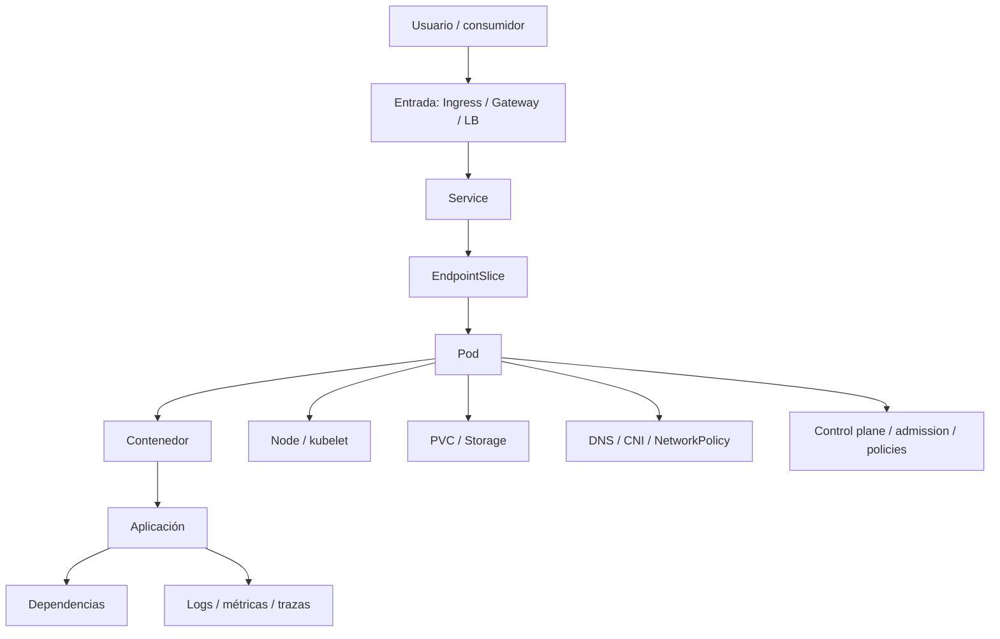

<!-- COURSE_NAV_START -->

[Anterior](<32. Platform engineering, golden paths y DevEx.md>) | [Indice](README.md)

<!-- COURSE_NAV_END -->

# 33. Troubleshooting avanzado y failure labs

## 33.1. Objetivo del módulo

En los módulos anteriores has construido una plataforma Kubernetes desde muchas dimensiones: despliegues, releases, migraciones, feature flags, resiliencia, SLOs, autoscaling, seguridad de supply chain, Policy as Code, multi-tenancy, networking avanzado, service mesh, backups, disaster recovery, FinOps y Platform Engineering. Este módulo convierte todo ese conocimiento en una capacidad operativa esencial: diagnosticar fallos con evidencia, reproducirlos de forma segura y aprender de ellos antes de que ocurran en producción.

Troubleshooting avanzado no consiste en memorizar comandos de `kubectl`. Tampoco consiste en reiniciar Pods, borrar recursos o cambiar YAML hasta que algo parezca funcionar. Troubleshooting avanzado consiste en construir una hipótesis, recoger evidencia, reducir incertidumbre, identificar la frontera del fallo, intervenir de forma segura y verificar que el sistema volvió a un estado útil. En Kubernetes, esa capacidad exige entender capas: aplicación, contenedor, Pod, Service, EndpointSlice, DNS, NetworkPolicy, Ingress, Gateway, HPA, scheduler, kubelet, storage, node, CNI, control plane, observabilidad, policies y dependencias externas.

Failure labs son laboratorios de fallo diseñados para practicar esa capacidad. No son ejercicios de romper cosas por romper. Son escenarios controlados donde provocas fallos representativos, observas señales, practicas diagnóstico, documentas runbooks y aprendes qué evidencia necesitas antes de un incidente real. Un failure lab bueno enseña a pensar. Un failure lab pobre solo enseña a ejecutar un comando mágico.

La tesis del módulo es esta:

> Troubleshooting avanzado en Kubernetes no empieza con comandos; empieza con un modelo causal del sistema y una disciplina de evidencia.

La tesis operacional es esta:

> Una plataforma Kubernetes madura entrena fallos antes de producción: diseña failure labs, captura señales, valida runbooks, reduce tiempo de diagnóstico y convierte cada fallo en aprendizaje operativo.

En este módulo aprenderás:

- Qué significa troubleshooting avanzado
- Qué diferencia hay entre síntoma, causa, mecanismo, impacto y mitigación
- Por qué no debes empezar reiniciando Pods
- Cómo pensar en capas de diagnóstico
- Cómo construir hipótesis
- Cómo recoger evidencia sin destruirla
- Cómo usar `kubectl describe`, `logs`, `events`, `exec`, `debug`, `top` y JSONPath
- Cuándo usar ephemeral containers
- Cómo depurar CrashLoopBackOff, ImagePullBackOff, Pending, OOMKilled, readiness failures y DNS
- Cómo depurar Services, EndpointSlices, Ingress, Gateway y NetworkPolicy
- Cómo depurar problemas de scheduling, quotas, HPA y resources
- Cómo depurar storage, PVCs, mounts y VolumeSnapshots
- Cómo depurar service mesh sin culpar siempre al mesh
- Cómo separar problema de aplicación, plataforma, red, storage o dependencia externa
- Cómo diseñar failure labs seguros
- Cómo crear laboratorios de fallo para `checkout-api` y `payment-api`
- Cómo escribir runbooks de diagnóstico
- Cómo crear un Taskfile de troubleshooting
- Cómo conectar troubleshooting con SLOs, incident response, observabilidad, platform engineering, TOC y software economics
La idea principal es sencilla:

```text
No depures Kubernetes buscando culpables.
Depura reduciendo incertidumbre capa por capa.
```

---

## 33.2. Por qué este módulo existe en un curso de Kubernetes

Kubernetes expone muchísima información: estados de Pods, eventos, logs, métricas, objetos, condiciones, controladores, endpoints, policies y recursos. Pero más información no significa mejor diagnóstico. En un incidente real, la dificultad no suele ser que no haya datos, sino que hay demasiados datos sin orden. Un Pod está en `CrashLoopBackOff`, otro tiene `Readiness probe failed`, el HPA escaló, el Service no tiene endpoints, CoreDNS muestra errores, un nodo tiene presión de memoria, una NetworkPolicy cambió, el Ingress devuelve 503 y el usuario solo ve que checkout no funciona.

Sin un método, el equipo salta de una pista a otra. Reinicia Pods, borra el Deployment, escala réplicas, cambia probes, desactiva NetworkPolicies o culpa a DNS. A veces el sistema vuelve, pero nadie sabe por qué. Ese tipo de recuperación no crea conocimiento. Solo compra alivio temporal.

Este módulo existe para enseñar que troubleshooting debe ser una práctica de ingeniería. La plataforma debe facilitarla con herramientas, comandos repetibles, dashboards, runbooks, failure labs y buenas abstracciones. El objetivo no es que cada persona memorice todo Kubernetes, sino que el sistema guíe el diagnóstico y preserve evidencia suficiente para aprender.

### Criterio de comprensión

Debes poder explicar:

> Kubernetes ofrece señales, pero el troubleshooting requiere un método para convertir señales dispersas en una explicación causal verificable.

---

## 33.3. Síntoma, impacto, causa, mecanismo y mitigación

Antes de diagnosticar, hay que separar conceptos.

| Concepto            | Qué significa                             | Ejemplo                                 |
| ------------------- | ----------------------------------------- | --------------------------------------- |
| Síntoma             | señal visible de que algo va mal          | usuarios reciben 503                    |
| Impacto             | daño para usuario o negocio               | checkout no puede completarse           |
| Causa inmediata     | condición técnica que produce el síntoma  | Service sin endpoints                   |
| Mecanismo causal    | por qué se llegó a esa condición          | readiness depende de payment-api caído  |
| Mitigación          | acción para reducir impacto               | degradar checkout o revertir readiness  |
| Causa contribuyente | factor que amplificó el fallo             | retries saturaron payment-api           |
| Causa sistémica     | condición organizativa/técnica recurrente | no hay failure lab de dependency outage |

Un buen diagnóstico no se queda en el síntoma. Si el Ingress devuelve 503 porque el Service no tiene endpoints, eso explica el 503, pero no explica por qué no hay endpoints. Si no hay endpoints porque readiness falla, falta saber por qué falla readiness. Si falla porque depende de una dependencia externa, falta saber si esa dependencia debería formar parte de readiness. Si esa decisión se copió en muchas apps, el problema ya no es un Pod; es un diseño de plataforma.

### Criterio de comprensión

Debes poder explicar:

> El síntoma te dice dónde duele. El mecanismo causal explica cómo el sistema llegó ahí. La mitigación reduce daño antes de completar toda la explicación.

---

## 33.4. La regla de oro: no destruyas evidencia

Durante un incidente, algunas acciones destruyen o alteran evidencia. Reiniciar Pods puede borrar estado temporal. Borrar recursos puede eliminar events. Reaplicar manifests puede ocultar qué había antes. Escalar a cero puede perder logs en buffers. Cambiar varias cosas a la vez impide saber qué acción funcionó.

### Antes de intervenir

Captura evidencia mínima:

- `kubectl get pods -A -o wide`
- `kubectl describe pod`
- `kubectl logs`
- `kubectl logs --previous`
- `kubectl get events`
- `kubectl get deploy,rs,svc,endpointslice,hpa,pdb`
- `kubectl describe node`
- métricas relevantes
- cambios recientes
- rollout history
- versión de imagen
- condiciones del recurso
- estado de endpoints
- políticas aplicadas
- timestamps
### Regla

Mitiga rápido cuando el impacto lo exige, pero captura suficiente evidencia para no perder aprendizaje.

### Criterio de comprensión

Debes poder explicar:

> Un restart puede ser mitigación, pero si lo haces antes de mirar logs, events y estado anterior, quizá destruyes la única pista útil.

---

## 33.5. Modelo de capas de diagnóstico

Un fallo en Kubernetes puede vivir en varias capas. El diagnóstico avanzado consiste en moverse por esas capas sin saltar arbitrariamente.



No siempre sigues el mismo orden. Si el síntoma es 503 externo, probablemente empiezas por entrada, Service y endpoints. Si el síntoma es CrashLoopBackOff, empiezas por Pod, logs y container status. Si el síntoma es Pending, empiezas por scheduler, events, resources, taints, quotas y affinity. Si el síntoma es latencia, empiezas por SLO, métricas, dependencies, CPU throttling y retries.

### Criterio de comprensión

Debes poder explicar:

> La capa inicial de diagnóstico depende del síntoma, pero el objetivo siempre es conectar impacto, señales y mecanismo causal.

---

## 33.6. Método de troubleshooting

Un método simple y robusto:

1. Define impacto
2. Acota alcance
3. Identifica cambio reciente
4. Observa estado actual
5. Formula hipótesis
6. Busca evidencia que pueda falsarla
7. Mitiga el impacto
8. Verifica recuperación
9. Preserva evidencia
10. Documenta aprendizaje
### Preguntas iniciales

- ¿Qué usuario o servicio está afectado?
- ¿Desde cuándo?
- ¿Qué cambió justo antes?
- ¿Es global o parcial?
- ¿Afecta a un namespace, app, nodo, zona, ruta, versión o tenant?
- ¿El error es disponibilidad, latencia, datos, permisos, red o coste?
- ¿Hay rollback posible?
- ¿Qué SLO se está quemando?
- ¿Qué mitigación reduce impacto con menor riesgo?
### Criterio de comprensión

Debes poder explicar:

> Una hipótesis útil no es “Kubernetes falla”. Una hipótesis útil predice qué evidencia deberías ver si fuera cierta.

---

## 33.7. Comandos base de diagnóstico

Los comandos no son el método, pero deben estar disponibles. El valor está en usarlos con intención.

### Estado general

```bash
kubectl get pods -A -o wide
kubectl get deploy,rs,sts,ds,job,cronjob -A
kubectl get events -A --sort-by=.lastTimestamp
kubectl get nodes -o wide
kubectl top nodes
kubectl top pods -A
```

### Recurso concreto

```bash
kubectl describe pod -n shop checkout-api-xxxxx
kubectl logs -n shop checkout-api-xxxxx
kubectl logs -n shop checkout-api-xxxxx --previous
kubectl get pod -n shop checkout-api-xxxxx -o yaml
kubectl get pod -n shop checkout-api-xxxxx -o jsonpath='{.status.containerStatuses}'
```

### Red y Services

```bash
kubectl get svc -n shop
kubectl describe svc -n shop checkout-api
kubectl get endpointslice -n shop
kubectl get endpointslice -n shop -l kubernetes.io/service-name=checkout-api
kubectl get ingress -A
kubectl get httproute -A
kubectl get networkpolicy -A
```

### Scheduling y capacidad

```bash
kubectl describe node <node>
kubectl get resourcequota -A
kubectl describe resourcequota -n shop
kubectl get limitrange -A
kubectl get hpa -A
kubectl describe hpa -n shop checkout-api
kubectl get pdb -A
```

### Criterio de comprensión

Debes poder explicar:

> Los comandos base deben responder preguntas concretas: estado, eventos, logs, endpoints, capacidad, red y cambios.

---

## 33.8. Events: útiles, pero efímeros

Los events de Kubernetes son una fuente muy útil de señales: fallos de scheduling, pull de imágenes, probes fallando, mounts, killing containers, quotas, backoff, problemas de nodes y más. Pero los events son efímeros y pueden rotar. No son una base de datos permanente de diagnóstico.

### Comandos

```bash
kubectl get events -n shop --sort-by=.lastTimestamp
kubectl get events -A --sort-by=.lastTimestamp
kubectl describe pod -n shop checkout-api-xxxxx
```

### Qué buscar

- `FailedScheduling`
- `FailedMount`
- `BackOff`
- `Unhealthy`
- `Killing`
- `Pulling`
- `Failed`
- `ImagePullBackOff`
- `FailedCreate`
- `Exceeded quota`
- `NodeNotReady`
- `Preempted`
### Regla

Si el incidente importa, captura events pronto.

### Criterio de comprensión

Debes poder explicar:

> Los events explican transiciones recientes, pero no sustituyen logs, métricas ni trazas duraderas.

---

## 33.9. Logs actuales y logs anteriores

En CrashLoopBackOff, los logs actuales pueden estar vacíos porque el contenedor acaba de reiniciar. `--previous` permite ver logs de la instancia anterior del contenedor, siempre que existan todavía.

### Comandos

```bash
kubectl logs -n shop deploy/checkout-api
kubectl logs -n shop pod/checkout-api-xxxxx -c checkout-api
kubectl logs -n shop pod/checkout-api-xxxxx -c checkout-api --previous
kubectl logs -n shop deploy/checkout-api --since=15m
kubectl logs -n shop deploy/checkout-api --tail=200
```

### Qué mirar

- Error justo antes de terminar
- Variables de entorno faltantes
- Fallos de conexión
- Migraciones fallidas
- Permisos de fichero
- Puerto incorrecto
- Señales `SIGTERM`
- Stack trace
- Mensajes repetidos
- Correlation IDs
- Diferencia entre logs actuales y previos
### Criterio de comprensión

Debes poder explicar:

> En contenedores que reinician, `kubectl logs --previous` puede ser más importante que los logs actuales.

---

## 33.10. `kubectl exec` y sus límites

`kubectl exec` permite ejecutar comandos dentro de un contenedor en ejecución. Es útil para inspeccionar entorno, DNS, filesystem, procesos o conectividad. Pero tiene límites: el contenedor debe estar corriendo, la imagen debe tener herramientas y no siempre deberías modificar el contenedor durante investigación.

### Usos razonables

```bash
kubectl exec -n shop deploy/checkout-api -- env
kubectl exec -n shop deploy/checkout-api -- cat /etc/resolv.conf
kubectl exec -n shop deploy/checkout-api -- wget -S -O- http://payment-api
kubectl exec -n shop deploy/checkout-api -- printenv DATABASE_URL
```

### Riesgos

- Cambiar estado dentro del contenedor
- Ejecutar comandos destructivos
- Depender de herramientas que no existen
- No poder entrar si el contenedor crashloop
- Exponer secretos en terminal o logs
- Confundir entorno de debug con estado reproducible
### Criterio de comprensión

Debes poder explicar:

> `kubectl exec` sirve para inspeccionar un contenedor vivo, pero no debe convertirse en administración manual de producción.

---

## 33.11. `kubectl debug` y ephemeral containers

Los contenedores efímeros permiten añadir un contenedor de debug a un Pod existente para investigar. Son útiles cuando la imagen de aplicación es mínima, no tiene shell o no incluye herramientas de diagnóstico. También ayudan cuando `kubectl exec` no es suficiente.

### Ejemplo

```bash
kubectl debug -n shop -it pod/checkout-api-xxxxx --image=nicolaka/netshoot --target=checkout-api
```

### Casos de uso

- Imagen distroless
- Falta de `sh`, `curl`, `dig`, `ss`, `tcpdump`
- Diagnóstico de red
- Inspección de namespaces de proceso, si aplica
- Debug de Pods en ejecución
- Diagnóstico sin reconstruir imagen
### Límites y cuidado

- No todos los clusters permiten ephemeral containers
- Las policies pueden bloquear imágenes de debug
- Debe controlarse quién puede usarlo
- Puede exponer información sensible
- No debe usarse como bypass de supply chain
- Debe haber imágenes de debug aprobadas
- Debe quedar auditado
### Criterio de comprensión

Debes poder explicar:

> Ephemeral containers son una herramienta de diagnóstico potente, pero deben gobernarse como capacidad de plataforma, no como puerta trasera.

---

## 33.12. Debug Pods

A veces no quieres entrar en el Pod afectado. Quieres crear un Pod de debug en el mismo namespace para probar DNS, red, Service o políticas desde un origen controlado.

### Ejemplo

```yaml
apiVersion: v1
kind: Pod
metadata:
  name: curl-debug
  namespace: shop
  labels:
    app.kubernetes.io/name: curl-debug
spec:
  restartPolicy: Never
  containers:
    - name: curl
      image: curlimages/curl:8.10.1
      command: ["sleep", "3600"]
```

### Comandos

```bash
kubectl apply -f k8s/troubleshooting/debug/curl-debug-pod.yaml
kubectl exec -n shop curl-debug -- curl -v http://checkout-api
kubectl exec -n shop curl-debug -- curl -v http://payment-api
kubectl delete pod -n shop curl-debug
```

### Criterio de comprensión

Debes poder explicar:

> Un debug Pod ayuda a separar si el problema está en el cliente original, en el Service, en DNS, en NetworkPolicy o en el backend.

---

## 33.13. CrashLoopBackOff

`CrashLoopBackOff` significa que un contenedor arranca, falla y Kubernetes espera progresivamente antes de reiniciarlo. No es una causa. Es un síntoma.

### Diagnóstico

```bash
kubectl get pods -n shop
kubectl describe pod -n shop checkout-api-xxxxx
kubectl logs -n shop checkout-api-xxxxx --previous
kubectl get pod -n shop checkout-api-xxxxx -o jsonpath='{.status.containerStatuses}'
```

### Causas comunes

- Error de aplicación al arrancar
- Variable de entorno faltante
- Secret o ConfigMap incorrecto
- Comando o args mal configurados
- Puerto ocupado o incorrecto
- Migración fallida
- Permisos de filesystem
- Imagen incompatible
- Dependencia requerida en startup no disponible
- Liveness demasiado agresiva
- OOMKilled durante arranque
### Failure lab

Rompe una variable obligatoria de `checkout-api`.

```yaml
env:
  - name: PAYMENT_API_URL
    value: ""
```

Observa:

```bash
kubectl rollout restart deploy/checkout-api -n shop
kubectl get pods -n shop
kubectl logs -n shop deploy/checkout-api --previous
kubectl get events -n shop --sort-by=.lastTimestamp
```

### Criterio

Debes poder explicar:

> CrashLoopBackOff no se arregla reiniciando. Se diagnostica mirando por qué el proceso termina.

---

## 33.14. ImagePullBackOff

`ImagePullBackOff` indica que Kubernetes no puede descargar la imagen. De nuevo, es un síntoma.

### Diagnóstico

```bash
kubectl describe pod -n shop checkout-api-xxxxx
kubectl get events -n shop --sort-by=.lastTimestamp
kubectl get secret -n shop
kubectl get pod -n shop checkout-api-xxxxx -o yaml
```

### Causas comunes

- Imagen no existe
- Tag incorrecto
- Digest incorrecto
- Registry inaccesible
- Credenciales faltantes
- ImagePullSecret mal configurado
- Rate limit del registry
- Política de admisión
- Nodo sin salida de red
- Certificado de registry no confiable
- Arquitectura incorrecta de imagen
### Failure lab

Cambia temporalmente la imagen a un tag inexistente:

```yaml
image: ghcr.io/acme/checkout-api:not-existing
```

Observa events.

### Criterio

Debes poder explicar:

> ImagePullBackOff se diagnostica desde events, registry, credenciales, política de imagen y conectividad del nodo.

---

## 33.15. Pending Pods

Un Pod en `Pending` no ha sido programado o no puede completar preparación inicial. El scheduler o el entorno están diciendo que no existe un lugar válido para ejecutarlo.

### Diagnóstico

```bash
kubectl describe pod -n shop checkout-api-xxxxx
kubectl get events -n shop --sort-by=.lastTimestamp
kubectl get nodes
kubectl describe node <node>
kubectl get resourcequota -n shop
kubectl describe resourcequota -n shop
kubectl get limitrange -n shop
```

### Causas comunes

- CPU request demasiado alto
- Memory request demasiado alto
- ResourceQuota agotada
- Taints sin tolerations
- Node affinity imposible
- Topology spread demasiado estricto
- PVC no disponible
- StorageClass inexistente
- PodSecurity o admission bloqueando creación
- Priority/preemption insuficiente
- No hay nodos disponibles
### Failure lab

Sube el request de CPU a algo imposible:

```yaml
resources:
  requests:
    cpu: "100"
    memory: 256Mi
```

Observa `FailedScheduling`.

### Criterio

Debes poder explicar:

> Pending es un problema de scheduling, capacidad, constraints o preparación de recursos, no un problema de proceso de aplicación.

---

## 33.16. OOMKilled

`OOMKilled` indica que el contenedor fue terminado por exceder memoria disponible o su memory limit. Puede aparecer como restart, CrashLoop o degradación intermitente.

### Diagnóstico

```bash
kubectl describe pod -n shop checkout-api-xxxxx
kubectl get pod -n shop checkout-api-xxxxx -o jsonpath='{.status.containerStatuses[*].lastState}'
kubectl top pod -n shop
kubectl logs -n shop checkout-api-xxxxx --previous
```

### Causas comunes

- Memory limit demasiado bajo
- Memory leak
- Pico de carga
- Cache sin límite
- Procesamiento de payload grande
- Concurrencia excesiva
- Configuración de runtime incorrecta
- Sidecar añadido sin recalcular recursos
### Qué mirar

- `Last State: Terminated`
- `Reason: OOMKilled`
- Exit code 137
- Memory working set
- Cambios recientes
- Tamaño de payloads
- Número de workers
- Proxies o sidecars
- HPA o VPA
### Criterio

Debes poder explicar:

> OOMKilled no se resuelve siempre subiendo memoria; hay que distinguir limit bajo, leak, pico legítimo y modelo de concurrencia.

---

## 33.17. Readiness failures

Readiness decide si un Pod debe recibir tráfico. Un fallo de readiness puede dejar un Service sin endpoints y provocar 503, aunque los Pods estén Running.

### Diagnóstico

```bash
kubectl get pods -n shop
kubectl describe pod -n shop checkout-api-xxxxx
kubectl get endpointslice -n shop -l kubernetes.io/service-name=checkout-api
kubectl logs -n shop deploy/checkout-api --since=15m
```

### Causas comunes

- Endpoint de readiness incorrecto
- App tarda más en arrancar
- Startup probe faltante
- Readiness depende de dependencia externa
- Puerto incorrecto
- Path incorrecto
- Timeout demasiado bajo
- Liveness/readiness mezcladas
- Configuración no cargada
- Dependencia interna saturada
### Failure lab

Configura readiness contra un path incorrecto:

```yaml
readinessProbe:
  httpGet:
    path: /not-ready
    port: http
```

Observa endpoints.

### Criterio

Debes poder explicar:

> Un Pod Running no necesariamente recibe tráfico. Readiness controla su presencia en endpoints.

---

## 33.18. Liveness failures

Liveness decide cuándo Kubernetes debe reiniciar un contenedor. Una liveness mal diseñada puede matar una aplicación que estaba lenta pero recuperable.

### Diagnóstico

```bash
kubectl describe pod -n shop checkout-api-xxxxx
kubectl get events -n shop --sort-by=.lastTimestamp
kubectl logs -n shop checkout-api-xxxxx --previous
```

### Causas comunes

- Probe demasiado agresiva
- Timeout muy bajo
- Endpoint depende de DB o servicio externo
- GC pause
- CPU throttling
- Arranque lento sin startupProbe
- Deadlock real
- Saturación interna
### Regla

Liveness debe responder a “este proceso está irrecuperable”, no a “una dependencia está lenta”.

### Failure lab

Reduce `timeoutSeconds` y `failureThreshold` de liveness hasta provocar reinicios bajo carga.

### Criterio

Debes poder explicar:

> Liveness es un martillo. Úsalo para procesos irrecuperables, no para degradaciones normales de dependencias.

---

## 33.19. Service sin endpoints

Un Service puede existir y no tener endpoints. Es una de las causas más comunes de 503 en Ingress o Gateway.

### Diagnóstico

```bash
kubectl get svc -n shop checkout-api
kubectl describe svc -n shop checkout-api
kubectl get pods -n shop --show-labels
kubectl get endpointslice -n shop -l kubernetes.io/service-name=checkout-api
```

### Causas comunes

- Selector no coincide
- Pods no Ready
- Pods en otro namespace
- Labels cambiadas
- Deployment no creó Pods
- Pods Pending
- Readiness fallando
- Puerto mal definido
### Failure lab

Cambia el selector del Service:

```yaml
selector:
  app.kubernetes.io/name: checkout-api-wrong
```

Observa EndpointSlices vacíos.

### Criterio

Debes poder explicar:

> Service sin endpoints significa que Kubernetes no tiene backends listos para ese contrato de tráfico.

---

## 33.20. DNS failures

Un fallo de DNS puede parecer fallo de Service, aplicación o red. Hay que separar resolución de conectividad.

### Diagnóstico

```bash
kubectl run dns-debug -n shop --image=busybox:1.36 --restart=Never -- sleep 3600
kubectl exec -n shop dns-debug -- nslookup kubernetes.default
kubectl exec -n shop dns-debug -- nslookup payment-api.shop.svc.cluster.local
kubectl exec -n shop dns-debug -- cat /etc/resolv.conf
kubectl get pods -n kube-system -l k8s-app=kube-dns
kubectl logs -n kube-system deployment/coredns --since=15m
```

### Causas comunes

- Nombre incorrecto
- Namespace incorrecto
- Service inexistente
- CoreDNS no Ready
- NetworkPolicy bloquea DNS
- Egress default deny sin excepción
- CoreDNS saturado
- Cliente cachea DNS de forma problemática
- Búsqueda DNS inesperada
### Failure lab

Aplica default deny egress sin permitir DNS.

### Criterio

Debes poder explicar:

> DNS correcto prueba resolución, no conectividad; DNS fallando no prueba que la aplicación esté caída.

---

## 33.21. NetworkPolicy failures

NetworkPolicy puede bloquear tráfico de forma silenciosa desde el punto de vista de la aplicación. El error visible puede ser timeout, connection refused o DNS failure.

### Diagnóstico

```bash
kubectl get networkpolicy -n shop
kubectl describe networkpolicy -n shop
kubectl get ns --show-labels
kubectl get pods -n shop --show-labels
kubectl exec -n shop curl-debug -- curl -v http://payment-api.shop.svc.cluster.local
```

### Causas comunes

- Default deny sin allow
- Selector de Pod incorrecto
- Selector de namespace incorrecto
- Labels faltantes
- Puerto incorrecto
- DNS no permitido
- CNI no soporta NetworkPolicy
- Policy generada por plataforma
- Egress bloqueado hacia dependencia externa
### Failure lab

Aplica una NetworkPolicy que permita tráfico solo desde una label que el cliente no tiene.

### Criterio

Debes poder explicar:

> NetworkPolicy se depura mirando qué Pods selecciona, qué dirección controla y qué tráfico permite explícitamente.

---

## 33.22. Ingress y Gateway 503

Un 503 desde Ingress o Gateway suele indicar que la entrada no puede llegar a un backend sano, pero hay muchas causas posibles.

### Diagnóstico Ingress

```bash
kubectl get ingress -n shop
kubectl describe ingress -n shop checkout-api
kubectl get ingressclass
kubectl logs -n ingress-nginx deployment/ingress-nginx-controller --since=15m
kubectl get svc -n shop checkout-api
kubectl get endpointslice -n shop -l kubernetes.io/service-name=checkout-api
```

### Diagnóstico Gateway API

```bash
kubectl get gatewayclass
kubectl get gateway -A
kubectl describe gateway -n platform-ingress public-gateway
kubectl get httproute -A
kubectl describe httproute -n shop checkout-route
kubectl get svc -n shop checkout-api
kubectl get endpointslice -n shop -l kubernetes.io/service-name=checkout-api
```

### Causas comunes

- Host no coincide
- Path no coincide
- IngressClass/GatewayClass incorrecta
- Controller no instalado
- Listener no programado
- HTTPRoute no accepted
- BackendRef incorrecto
- Service sin endpoints
- TLS mal configurado
- NetworkPolicy bloquea controller → backend
- Controller sin permisos
### Criterio

Debes poder explicar:

> Un 503 en la entrada se depura leyendo ruta, controller, backend Service, endpoints y políticas de red.

---

## 33.23. HPA no escala

HPA puede no escalar aunque la app esté sufriendo. También puede escalar por la razón equivocada.

### Diagnóstico

```bash
kubectl get hpa -n shop
kubectl describe hpa -n shop checkout-api
kubectl top pods -n shop
kubectl top nodes
kubectl get --raw "/apis/metrics.k8s.io/v1beta1/namespaces/shop/pods" | jq .
```

### Causas comunes

- metrics-server no funciona
- Pods no tienen requests
- Métrica incorrecta
- Target demasiado alto
- HPA en maxReplicas
- HPA en minReplicas por estabilización
- Métrica custom no disponible
- App está limitada por DB, no CPU
- CPU throttling por limits
- Pods Pending por falta de nodos
### Failure lab

Quita CPU requests de `checkout-api` y observa cómo afecta a HPA basado en CPU.

### Criterio

Debes poder explicar:

> HPA depende de métricas, requests y señales correctas. Si la métrica no representa presión real, escalar no arregla el sistema.

---

## 33.24. ResourceQuota y LimitRange failures

Quotas y LimitRanges protegen multi-tenancy y coste, pero también pueden bloquear workloads si no se entienden.

### Diagnóstico

```bash
kubectl get resourcequota -n shop
kubectl describe resourcequota -n shop
kubectl get limitrange -n shop
kubectl describe limitrange -n shop
kubectl get events -n shop --sort-by=.lastTimestamp
```

### Síntomas

- Deployment no crea ReplicaSet o Pods
- Pods rechazados
- Error de quota exceeded
- Requests requeridos
- Limit mínimo o máximo incumplido
- PVC no permitido
- Número de Secrets o ConfigMaps agotado
### Failure lab

Configura una ResourceQuota con `pods: "1"` e intenta escalar a 3.

### Criterio

Debes poder explicar:

> Quotas no fallan “Kubernetes”; están diciendo que el tenant llegó a un límite de plataforma.

---

## 33.25. Storage y mount failures

Los fallos de storage suelen aparecer como Pods Pending, ContainerCreating, FailedMount o aplicaciones que arrancan sin datos.

### Diagnóstico

```bash
kubectl describe pod -n shop checkout-db-xxxxx
kubectl get pvc -n shop
kubectl describe pvc -n shop checkout-db-data
kubectl get pv
kubectl get storageclass
kubectl get events -n shop --sort-by=.lastTimestamp
```

### Causas comunes

- PVC Pending
- StorageClass inexistente
- AccessMode incompatible
- Volume no puede montarse
- CSI driver fallando
- Nodo sin acceso al volumen
- Secret de storage incorrecto
- ReclaimPolicy inesperada
- VolumeSnapshot no Ready
- Zona del volumen incompatible con nodo
### Failure lab

Referencia una StorageClass inexistente.

### Criterio

Debes poder explicar:

> Un Pod puede no arrancar porque la aplicación esté bien, pero el volumen que necesita no existe, no monta o no es accesible desde ese nodo.

---

## 33.26. Node pressure

Los nodos pueden sufrir presión de memoria, disco, PID o red. Eso puede provocar evictions, Pods Pending, latencia y comportamiento intermitente.

### Diagnóstico

```bash
kubectl get nodes
kubectl describe node <node>
kubectl top node <node>
kubectl get pods -A -o wide | grep <node>
kubectl get events -A --sort-by=.lastTimestamp | grep <node>
```

### Señales

- `MemoryPressure`
- `DiskPressure`
- `PIDPressure`
- `NetworkUnavailable`
- Pods evicted
- Imagenes ocupando disco
- DaemonSets consumiendo recursos
- Logs llenando disco
- Node NotReady
- Kubelet con errores
### Failure lab

En local o laboratorio controlado, simula presión de disco con un Pod que escribe en `emptyDir` limitado, nunca en producción.

### Criterio

Debes poder explicar:

> Un problema de Pod puede ser en realidad un problema del nodo donde fue programado.

---

## 33.27. Rollout roto

Un rollout puede fallar por imagen, readiness, recursos, PDB, quotas, migrations o dependencia.

### Diagnóstico

```bash
kubectl rollout status deploy/checkout-api -n shop
kubectl rollout history deploy/checkout-api -n shop
kubectl describe deploy -n shop checkout-api
kubectl get rs -n shop
kubectl get pods -n shop -l app.kubernetes.io/name=checkout-api
kubectl get events -n shop --sort-by=.lastTimestamp
```

### Mitigación

```bash
kubectl rollout undo deploy/checkout-api -n shop
```

Rollback solo es seguro si la versión anterior es compatible con datos, config y dependencias.

### Failure lab

Despliega una imagen válida que falla readiness y observa rollout atascado.

### Criterio

Debes poder explicar:

> Rollback es una herramienta de mitigación, pero no arregla migraciones incompatibles ni datos ya modificados.

---

## 33.28. Service mesh failures

Con service mesh, el fallo puede vivir en app, Service, EndpointSlice, proxy, mTLS, authorization, route, control plane o policy.

### Diagnóstico genérico

```bash
kubectl get pods -n shop
kubectl describe pod -n shop checkout-api-xxxxx
kubectl logs -n shop checkout-api-xxxxx -c <app-container>
kubectl logs -n shop checkout-api-xxxxx -c <proxy-container>
kubectl get svc,endpointslice -n shop
kubectl get events -n shop --sort-by=.lastTimestamp
```

### Preguntas

- ¿El Pod está dentro del mesh?
- ¿El proxy está Ready?
- ¿La app funciona sin mesh?
- ¿mTLS está activo?
- ¿Hay denegaciones de autorización?
- ¿La route L7 coincide?
- ¿El proxy recibió configuración?
- ¿El control plane está sano?
- ¿El problema afecta a todos los clientes o solo a una identidad?
- ¿La NetworkPolicy bloquea antes del mesh?
### Criterio

Debes poder explicar:

> En mesh, no culpes al proxy por defecto ni lo ignores. Añade una capa más al modelo causal.

---

## 33.29. Control plane y API access

A veces el problema no está en la app, sino en el acceso al API server, kubectl, RBAC, admission o control plane.

### Diagnóstico

```bash
kubectl cluster-info
kubectl version
kubectl auth can-i get pods -n shop
kubectl get --raw='/readyz?verbose'
kubectl get validatingadmissionpolicy
kubectl get mutatingwebhookconfiguration
kubectl get validatingwebhookconfiguration
```

### Causas comunes

- Contexto kubeconfig incorrecto
- Credenciales caducadas
- RBAC insuficiente
- API server no disponible
- Webhook de admisión caído
- Policy bloqueando
- CRD no disponible
- Control plane degradado
- Rate limit del API
- Certificados
### Failure lab

Crea una ValidatingAdmissionPolicy en modo controlado que bloquee un recurso de prueba y practica interpretar el error.

### Criterio

Debes poder explicar:

> No todo fallo de despliegue es del workload; admission, RBAC y control plane también son parte del camino.

---

## 33.30. Dependencias externas

Muchas degradaciones de Kubernetes son degradaciones de dependencias externas: bases de datos gestionadas, proveedores de pago, DNS externo, registry, secret manager, APIs SaaS o colas.

### Diagnóstico

- Métricas de cliente HTTP
- Trazas distribuidas
- Logs con dependency name
- Timeouts
- Retries
- Error classification
- Circuit breaker state
- Egress policies
- DNS externo
- Status page del proveedor
- Rate limits
- Credenciales
### Preguntas

- ¿La dependencia falla desde todos los Pods?
- ¿Solo falla desde un namespace?
- ¿Solo falla desde una zona?
- ¿Hay NetworkPolicy o egress gateway?
- ¿Hay rate limit?
- ¿Cambió secret o certificado?
- ¿El proveedor ve nuestras requests?
- ¿Los retries amplifican el problema?
### Failure lab

Haz que `payment-api` devuelva 503 o tarde 2 segundos y observa `checkout-api`.

### Criterio

Debes poder explicar:

> Una dependencia externa puede manifestarse como fallo interno. El diagnóstico debe separar app, red, egress y proveedor.

---

## 33.31. Observabilidad para troubleshooting

Un sistema operable debe emitir señales que ayuden a diagnosticar. Si necesitas entrar en cada Pod para saber qué pasa, la plataforma no está dando suficiente observabilidad.

### Señales mínimas

- Métricas RED: rate, errors, duration
- Métricas USE para recursos: utilization, saturation, errors
- Logs estructurados
- Correlation ID
- Trazas distribuidas
- Eventos Kubernetes exportados
- Métricas de HPA
- Métricas de probes
- Métricas de dependencies
- Métricas de DNS
- Métricas de ingress/gateway
- Métricas de node pressure
- Métricas de quotas
- Métricas de backup/restore
### Criterio

Debes poder explicar:

> Troubleshooting mejora cuando las señales ya existen antes del incidente. No se puede improvisar observabilidad bajo presión.

---

## 33.32. Failure labs: definición

Un failure lab es un escenario controlado donde introduces un fallo conocido para practicar diagnóstico, validar señales, mejorar runbooks y entrenar respuesta. Debe tener objetivo, alcance, setup, fallo, señales esperadas, comandos, criterios de éxito, rollback y aprendizaje.

### Estructura

```md
# Failure lab: service without endpoints

## Objective

Practice diagnosing 503 caused by Service selector mismatch.

## Scope

Namespace shop in local or staging cluster.

## Fault

Change checkout-api Service selector to a non-existing label.

## Expected symptoms

- Ingress/Gateway returns 503.
- Service exists.
- EndpointSlices empty.
- Pods Running and Ready.

## Diagnosis path

1. Check entrypoint.
2. Check Service.
3. Check EndpointSlices.
4. Check Pod labels.
5. Compare selector and labels.

## Rollback

Restore original selector.

## Success criteria

Student explains why Pods are healthy but traffic fails.
```

### Criterio

Debes poder explicar:

> Un failure lab enseña una relación causal concreta, no solo un comando de reparación.

---

## 33.33. Seguridad de failure labs

Los failure labs deben ser seguros. No se deben ejecutar fallos destructivos en producción salvo prácticas de chaos engineering extremadamente maduras, con controles, aprobación y blast radius reducido.

### Reglas

- Ejecutar primero en local o staging
- Scope pequeño
- Duración limitada
- Owner explícito
- Rollback probado
- Señales observables
- No usar datos reales sensibles
- No romper dependencias compartidas
- No introducir secretos en logs
- No saturar servicios externos
- No ejecutar carga destructiva
- Documentar resultado
- Limpiar recursos
### Criterio

Debes poder explicar:

> Practicar fallos sin límites no es aprendizaje; es introducir riesgo innecesario.

---

## 33.34. Catálogo de failure labs

El curso debería incluir un catálogo de laboratorios.

| Lab | Fallo                      | Concepto              |
| --- | -------------------------- | --------------------- |
| 01  | CrashLoopBackOff           | proceso termina       |
| 02  | ImagePullBackOff           | imagen/registry       |
| 03  | Pending por CPU            | scheduling            |
| 04  | OOMKilled                  | memoria               |
| 05  | readiness path incorrecto  | endpoints             |
| 06  | Service selector roto      | Service sin endpoints |
| 07  | DNS bloqueado              | NetworkPolicy egress  |
| 08  | Ingress 503                | ruta a backend        |
| 09  | HPA sin metrics            | autoscaling           |
| 10  | Quota exceeded             | multi-tenancy         |
| 11  | PVC Pending                | storage               |
| 12  | rollout roto               | deployment            |
| 13  | dependency timeout         | resiliencia           |
| 14  | service mesh deny          | identidad/policy      |
| 15  | backup restore drill       | DR                    |
| 16  | preview namespace expirado | platform/FinOps       |
| 17  | policy admission deny      | guardrails            |
| 18  | node pressure              | capacidad/nodo        |

### Criterio

Debes poder explicar:

> El catálogo de labs debe cubrir fallos de aplicación, red, storage, scheduling, policies, plataforma y dependencias.

---

## 33.35. Manifiestos y estructura del módulo

Estructura recomendada:

```text
k8s/troubleshooting/
  debug/
    curl-debug-pod.yaml
    dns-debug-pod.yaml
    netshoot-debug-pod.yaml
  labs/
    01-crashloop/
      README.md
      patch-break-env.yaml
      patch-restore-env.yaml
    02-imagepull/
      README.md
      patch-bad-image.yaml
      patch-restore-image.yaml
    03-pending-cpu/
      README.md
      patch-huge-cpu-request.yaml
      patch-restore-resources.yaml
    04-oomkilled/
      README.md
      memory-hog-deployment.yaml
    05-readiness/
      README.md
      patch-bad-readiness.yaml
      patch-restore-readiness.yaml
    06-service-selector/
      README.md
      patch-bad-service-selector.yaml
      patch-restore-service-selector.yaml
    07-dns-networkpolicy/
      README.md
      default-deny-egress.yaml
      allow-dns.yaml
    08-ingress-503/
      README.md
    09-hpa-metrics/
      README.md
    10-quota/
      README.md
      strict-resourcequota.yaml
    11-storage/
      README.md
      bad-pvc.yaml
    12-rollout/
      README.md
    13-dependency-timeout/
      README.md
    14-mesh-deny/
      README.md

docs/troubleshooting/
  troubleshooting-method.md
  incident-evidence-template.md
  failure-lab-template.md
  runbook-crashloop.md
  runbook-service-503.md
  runbook-dns.md
  runbook-pending-pods.md
  runbook-oomkilled.md

scripts/
  collect-k8s-evidence.sh
  inspect-service-path.sh
  inspect-pod-failure.sh
```

### Failure lab template

```md
# Failure lab: <name>

## Objective

## Scope

## Preconditions

## Fault injected

## Expected symptoms

## Expected signals

## Diagnosis path

## Commands

## Mitigation

## Rollback

## Success criteria

## Questions

## Cleanup

## Learning notes
```

### Incident evidence template

```md
# Incident evidence

## Time window

## Impact

## Affected users/services

## SLO affected

## Recent changes

## Current hypothesis

## Evidence collected

### Kubernetes resources

### Logs

### Events

### Metrics

### Traces

### External systems

## Mitigation applied

## Result

## Remaining uncertainty

## Follow-up actions
```

### Criterio

Debes poder explicar:

> La estructura de troubleshooting debe separar labs, runbooks, debug manifests y scripts de recogida de evidencia.

---

## 33.36. Script de recogida de evidencia

Un script de evidencia no diagnostica por ti, pero reduce el riesgo de olvidar señales importantes.

```bash
#!/usr/bin/env bash
set -euo pipefail

NAMESPACE="${1:-shop}"
APP="${2:-checkout-api}"
OUT_DIR="${3:-troubleshooting-evidence-$(date +%Y%m%d%H%M%S)}"

mkdir -p "$OUT_DIR"

kubectl get ns "$NAMESPACE" -o yaml > "$OUT_DIR/namespace.yaml" || true
kubectl get deploy,rs,pod,svc,hpa,pdb,networkpolicy,ingress -n "$NAMESPACE" -o wide > "$OUT_DIR/resources-wide.txt" || true
kubectl get events -n "$NAMESPACE" --sort-by=.lastTimestamp > "$OUT_DIR/events.txt" || true
kubectl get pods -n "$NAMESPACE" -l app.kubernetes.io/name="$APP" -o yaml > "$OUT_DIR/pods.yaml" || true
kubectl get svc -n "$NAMESPACE" "$APP" -o yaml > "$OUT_DIR/service.yaml" || true
kubectl get endpointslice -n "$NAMESPACE" -l kubernetes.io/service-name="$APP" -o yaml > "$OUT_DIR/endpointslices.yaml" || true
kubectl describe deploy -n "$NAMESPACE" "$APP" > "$OUT_DIR/deployment-describe.txt" || true
kubectl describe svc -n "$NAMESPACE" "$APP" > "$OUT_DIR/service-describe.txt" || true
kubectl logs -n "$NAMESPACE" deploy/"$APP" --since=30m > "$OUT_DIR/logs-current.txt" || true
kubectl logs -n "$NAMESPACE" deploy/"$APP" --since=30m --previous > "$OUT_DIR/logs-previous.txt" || true

echo "Evidence collected in $OUT_DIR"
```

### Criterio

Debes poder explicar:

> Automatizar evidencia reduce toil y mejora aprendizaje, pero el script debe ser transparente y seguro.

---

## 33.37. Taskfile para troubleshooting

Añade tareas:

```yaml
troubleshooting:evidence:
  desc: Collect evidence. Usage NAMESPACE=shop APP=checkout-api task troubleshooting:evidence
  cmds:
    - ./scripts/collect-k8s-evidence.sh {{.NAMESPACE}} {{.APP}}

troubleshooting:pods:
  desc: Show Pods in namespace
  cmds:
    - kubectl get pods -n {{.NAMESPACE | default "shop"}} -o wide

troubleshooting:events:
  desc: Show recent events
  cmds:
    - kubectl get events -n {{.NAMESPACE | default "shop"}} --sort-by=.lastTimestamp

troubleshooting:logs:
  desc: Show app logs. Usage NAMESPACE=shop APP=checkout-api
  cmds:
    - kubectl logs -n {{.NAMESPACE}} deploy/{{.APP}} --since=30m

troubleshooting:logs:previous:
  desc: Show previous app logs. Usage NAMESPACE=shop APP=checkout-api
  cmds:
    - kubectl logs -n {{.NAMESPACE}} deploy/{{.APP}} --previous --since=30m

troubleshooting:describe:pod:
  desc: Describe a Pod. Usage NAMESPACE=shop POD=...
  cmds:
    - kubectl describe pod -n {{.NAMESPACE}} {{.POD}}

troubleshooting:service:path:
  desc: Inspect Service and EndpointSlices. Usage NAMESPACE=shop SERVICE=checkout-api
  cmds:
    - kubectl get svc -n {{.NAMESPACE}} {{.SERVICE}}
    - kubectl describe svc -n {{.NAMESPACE}} {{.SERVICE}}
    - kubectl get endpointslice -n {{.NAMESPACE}} -l kubernetes.io/service-name={{.SERVICE}} -o wide
    - kubectl describe endpointslice -n {{.NAMESPACE}} -l kubernetes.io/service-name={{.SERVICE}}

troubleshooting:dns:debug:
  desc: Apply DNS debug Pod
  cmds:
    - kubectl apply -f k8s/troubleshooting/debug/dns-debug-pod.yaml

troubleshooting:dns:resolve:
  desc: Resolve Service from debug Pod. Usage NAMESPACE=shop HOST=payment-api.shop.svc.cluster.local
  cmds:
    - kubectl exec -n {{.NAMESPACE}} dns-debug -- nslookup {{.HOST}}

troubleshooting:curl:debug:
  desc: Apply curl debug Pod
  cmds:
    - kubectl apply -f k8s/troubleshooting/debug/curl-debug-pod.yaml

troubleshooting:curl:
  desc: Curl URL from debug Pod. Usage NAMESPACE=shop URL=http://checkout-api
  cmds:
    - kubectl exec -n {{.NAMESPACE}} curl-debug -- curl -v {{.URL}}

troubleshooting:hpa:
  desc: Describe HPA. Usage NAMESPACE=shop HPA=checkout-api
  cmds:
    - kubectl describe hpa -n {{.NAMESPACE}} {{.HPA}}

troubleshooting:quota:
  desc: Describe ResourceQuota
  cmds:
    - kubectl describe resourcequota -n {{.NAMESPACE | default "shop"}}

troubleshooting:node:
  desc: Describe node. Usage NODE=...
  cmds:
    - kubectl describe node {{.NODE}}

troubleshooting:top:
  desc: Show resource usage
  cmds:
    - kubectl top nodes
    - kubectl top pods -A

lab:01:crashloop:break:
  desc: Inject CrashLoop lab
  cmds:
    - kubectl apply -f k8s/troubleshooting/labs/01-crashloop/patch-break-env.yaml

lab:01:crashloop:restore:
  desc: Restore CrashLoop lab
  cmds:
    - kubectl apply -f k8s/troubleshooting/labs/01-crashloop/patch-restore-env.yaml

lab:06:service-selector:break:
  desc: Break Service selector
  cmds:
    - kubectl apply -f k8s/troubleshooting/labs/06-service-selector/patch-bad-service-selector.yaml

lab:06:service-selector:restore:
  desc: Restore Service selector
  cmds:
    - kubectl apply -f k8s/troubleshooting/labs/06-service-selector/patch-restore-service-selector.yaml

lab:07:dns:block:
  desc: Apply default deny egress to break DNS in lab
  cmds:
    - kubectl apply -f k8s/troubleshooting/labs/07-dns-networkpolicy/default-deny-egress.yaml

lab:07:dns:allow:
  desc: Allow DNS again
  cmds:
    - kubectl apply -f k8s/troubleshooting/labs/07-dns-networkpolicy/allow-dns.yaml

lab:cleanup:debug:
  desc: Delete debug Pods
  cmds:
    - kubectl delete -f k8s/troubleshooting/debug/curl-debug-pod.yaml || true
    - kubectl delete -f k8s/troubleshooting/debug/dns-debug-pod.yaml || true
```

### Criterio DevEx

Debes poder explicar:

> Taskfile debe hacer que diagnosticar sea repetible, no mágico: evidencia, eventos, logs, endpoints, DNS, curl, HPA, quotas y labs.

---

## 33.38. Práctica 1: recoger evidencia antes de tocar nada

### Objetivo

Entrenar disciplina de evidencia.

### Pasos

Provoca un fallo simple o usa un entorno con fallo.

Ejecuta:

```bash
task troubleshooting:evidence NAMESPACE=shop APP=checkout-api
```

Revisa la carpeta generada.

### Preguntas

- ¿Qué evidencia se recogió?
- ¿Qué falta?
- ¿Qué evidencia podría rotar?
- ¿Qué evidencia no deberías compartir por contener secretos?
- ¿Qué comando repetirías durante el incidente?
- ¿Qué señal apunta a la primera hipótesis?
### Criterio

Debes poder explicar:

> Antes de intervenir, debes capturar evidencia suficiente para entender y aprender.

---

## 33.39. Práctica 2: CrashLoopBackOff lab

### Objetivo

Diagnosticar un proceso que termina al arrancar.

### Pasos

Inyecta fallo:

```bash
task lab:01:crashloop:break
kubectl get pods -n shop
```

Diagnostica:

```bash
task troubleshooting:events NAMESPACE=shop
task troubleshooting:logs:previous NAMESPACE=shop APP=checkout-api
```

Restaura:

```bash
task lab:01:crashloop:restore
```

### Preguntas

- ¿Qué dice el estado del Pod?
- ¿Qué dicen los logs previos?
- ¿Qué events aparecen?
- ¿El fallo era Kubernetes o la aplicación?
- ¿Qué validación confirma recuperación?
### Criterio

Debes poder explicar:

> En CrashLoopBackOff, los logs anteriores suelen contener la causa inmediata.

---

## 33.40. Práctica 3: Service sin endpoints

### Objetivo

Diagnosticar 503 causado por selector roto.

### Pasos

Rompe selector:

```bash
task lab:06:service-selector:break
```

Observa:

```bash
task troubleshooting:service:path NAMESPACE=shop SERVICE=checkout-api
task troubleshooting:curl URL=http://checkout-api NAMESPACE=shop
```

Restaura:

```bash
task lab:06:service-selector:restore
```

### Preguntas

- ¿El Service existe?
- ¿Tiene endpoints?
- ¿Los Pods están Running?
- ¿Qué labels tienen los Pods?
- ¿Qué selector tiene el Service?
- ¿Por qué Ingress/Gateway podría devolver 503?
### Criterio

Debes poder explicar:

> Pods sanos no implican tráfico sano si el Service no los selecciona.

---

## 33.41. Práctica 4: DNS bloqueado por NetworkPolicy

### Objetivo

Separar DNS de conectividad HTTP.

### Pasos

Aplica debug Pod:

```bash
task troubleshooting:dns:debug
```

Bloquea egress:

```bash
task lab:07:dns:block
```

Prueba resolución:

```bash
task troubleshooting:dns:resolve NAMESPACE=shop HOST=payment-api.shop.svc.cluster.local
```

Permite DNS:

```bash
task lab:07:dns:allow
```

### Preguntas

- ¿Qué error aparece?
- ¿CoreDNS está caído o bloqueado?
- ¿Qué policy cambió?
- ¿Qué tráfico hay que permitir?
- ¿Resolver nombre significa que HTTP funcionará?
### Criterio

Debes poder explicar:

> Default deny egress puede romper DNS aunque CoreDNS esté sano.

---

## 33.42. Práctica 5: Pending por resources

### Objetivo

Diagnosticar fallo de scheduling.

### Pasos

Aplica un request imposible en laboratorio.

Observa:

```bash
kubectl get pods -n shop
task troubleshooting:events NAMESPACE=shop
kubectl describe pod -n shop <pod>
task troubleshooting:top
```

### Preguntas

- ¿Qué dice `FailedScheduling`?
- ¿Falta CPU, memoria o hay otro constraint?
- ¿Hay quotas?
- ¿Hay taints?
- ¿Hay affinity?
- ¿Qué cambio restauraría capacidad?
### Criterio

Debes poder explicar:

> Pending es una decisión del scheduler basada en capacidad y constraints.

---

## 33.43. Práctica 6: OOMKilled

### Objetivo

Distinguir leak, limit bajo y pico legítimo.

### Pasos

Ejecuta un workload de laboratorio que consuma memoria hasta superar el limit.

Observa:

```bash
kubectl describe pod -n shop <pod>
kubectl get pod -n shop <pod> -o jsonpath='{.status.containerStatuses[*].lastState}'
kubectl logs -n shop <pod> --previous
kubectl top pod -n shop
```

### Preguntas

- ¿Aparece `OOMKilled`?
- ¿Qué exit code tiene?
- ¿Cuál era el memory limit?
- ¿El consumo fue gradual o súbito?
- ¿Qué métrica habría alertado antes?
- ¿Subir memoria arregla causa o solo síntoma?
### Criterio

Debes poder explicar:

> OOMKilled necesita análisis de memoria, patrón de carga y límites, no solo aumentar recursos.

---

## 33.44. Práctica 7: rollout roto

### Objetivo

Diagnosticar y mitigar un rollout que no progresa.

### Pasos

Despliega una versión con readiness rota.

Observa:

```bash
kubectl rollout status deploy/checkout-api -n shop
kubectl describe deploy -n shop checkout-api
kubectl get rs -n shop
kubectl get pods -n shop
kubectl get events -n shop --sort-by=.lastTimestamp
```

Mitiga:

```bash
kubectl rollout undo deploy/checkout-api -n shop
```

### Preguntas

- ¿Qué ReplicaSet está fallando?
- ¿La imagen arranca?
- ¿Readiness falla?
- ¿Hay endpoints?
- ¿Rollback es seguro?
- ¿Qué pasaría si hubo migración incompatible?
### Criterio

Debes poder explicar:

> Rollout troubleshooting conecta Deployment, ReplicaSets, Pods, readiness, endpoints y compatibilidad de datos.

---

## 33.45. Práctica 8: dependency timeout

### Objetivo

Practicar diagnóstico de dependencia lenta.

### Escenario

`checkout-api` llama a `payment-api`. `payment-api` empieza a tardar 2 segundos o devuelve 503.

### Señales

- Latencia p95 sube
- Errores en `checkout-api`
- Trazas muestran tiempo en `payment-api`
- Retries aumentan
- HPA quizá escala
- Error budget se quema
### Preguntas

- ¿El fallo está en `checkout-api` o `payment-api`?
- ¿Hay timeout configurado?
- ¿Hay retries?
- ¿Hay retry storm?
- ¿La operación es idempotente?
- ¿Hay fallback o degradación?
- ¿Qué métrica confirma mitigación?
### Criterio

Debes poder explicar:

> Un timeout de dependencia se diagnostica con métricas de cliente, trazas y clasificación de errores, no solo con logs del servidor.

---

## 33.46. Práctica 9: admission deny

### Objetivo

Distinguir fallo de plataforma/policy de fallo de aplicación.

### Escenario

Una policy bloquea imágenes `latest`, missing labels o Pods privilegiados.

### Pasos

Aplica un manifest inválido.

Observa:

```bash
kubectl apply -f invalid-deployment.yaml
kubectl get events -n shop --sort-by=.lastTimestamp
kubectl get validatingadmissionpolicy
```

### Preguntas

- ¿Qué policy bloqueó?
- ¿El mensaje explica corrección?
- ¿El fallo ocurre antes de crear Pods?
- ¿Existe golden path para cumplir?
- ¿Hace falta excepción?
### Criterio

Debes poder explicar:

> Admission deny ocurre antes del runtime. No hay logs de aplicación porque la aplicación nunca llegó a ejecutarse.

---

## 33.47. Práctica 10: restore drill como troubleshooting

### Objetivo

Conectar troubleshooting y disaster recovery.

### Escenario

Un ConfigMap o Secret no crítico se borra en laboratorio.

### Pasos

1. Captura evidencia
2. Confirma impacto
3. Restaura desde Git o backup
4. Valida comportamiento
5. Documenta tiempo de recuperación
### Preguntas

- ¿Git era suficiente?
- ¿Hacía falta backup?
- ¿Qué Pods necesitaban restart?
- ¿Qué validación demuestra recuperación?
- ¿Qué runbook faltaba?
### Criterio

Debes poder explicar:

> Troubleshooting no termina en encontrar la causa; termina en recuperar capacidad útil y aprender.

---

## 33.48. Runbooks de troubleshooting

Un runbook de troubleshooting debe guiar diagnóstico, no solo listar comandos. Debe empezar por síntomas, hipótesis, evidencia y caminos de decisión.

### Runbook: Service 503

````md
# Runbook: Service returns 503

## Symptoms

- Ingress or Gateway returns 503.
- User-facing route unavailable.

## First questions

- Which host/path?
- Since when?
- Was there a rollout?
- Is the issue global or partial?

## Evidence
```bash
kubectl get ingress,httproute -A
kubectl describe ingress -n <ns> <name>
kubectl describe httproute -n <ns> <name>
kubectl get svc -n <ns> <service>
kubectl get endpointslice -n <ns> -l kubernetes.io/service-name=<service>
kubectl get pods -n <ns> --show-labels
kubectl get events -n <ns> --sort-by=.lastTimestamp
```
````

## Decision path

1. Route missing or not accepted?
2. Service missing?
3. EndpointSlices empty?
4. Pods not Ready?
5. NetworkPolicy blocking entry controller?
6. Backend returning errors?
## Mitigation

- Rollback recent route or deployment
- Restore selector
- Restore readiness
- Disable bad policy only if approved and scoped
## Validation

- Curl route
- Service has endpoints
- SLO burn stops
```

### Criterio

Debes poder explicar:

> Un runbook bueno guía decisiones. Un runbook malo solo acumula comandos.

---

## 33.49. Troubleshooting y SLOs

SLOs ayudan a priorizar troubleshooting. No todos los fallos tienen el mismo impacto. Un Pod crashloop en un preview environment no exige la misma respuesta que checkout con error budget quemándose.

### Uso de SLOs

- Determinar severidad.
- Priorizar mitigación.
- Decidir rollback.
- Decidir si seguir investigando o restaurar.
- Medir recuperación.
- Evaluar si el lab representa un fallo real.
- Conectar diagnóstico con experiencia de usuario.

### Regla

Diagnostica con profundidad, pero mitiga según impacto.

Si el SLO crítico está quemándose, puedes necesitar rollback antes de completar el root cause. Pero después debes volver a la evidencia y completar aprendizaje.

### Criterio

Debes poder explicar:

> SLOs convierten troubleshooting en una práctica orientada a impacto, no solo a curiosidad técnica.

---

## 33.50. Troubleshooting y incident response

Troubleshooting ocurre dentro de incident response cuando hay impacto real. No son lo mismo. Incident response coordina roles, comunicación, severidad y mitigación. Troubleshooting reduce incertidumbre técnica.

### Roles

| Rol | Responsabilidad |
|---|---|
| Incident commander | coordina respuesta |
| Tech lead diagnóstico | guía hipótesis técnicas |
| Comunicaciones | informa estado |
| Scribe | registra timeline |
| SME | aporta conocimiento específico |
| Plataforma | revisa capas comunes |
| Servicio owner | valida comportamiento |

### Criterio

Debes poder explicar:

> En un incidente, troubleshooting debe servir a la mitigación y coordinación, no competir con ellas.

---

## 33.51. Troubleshooting y Platform Engineering

Una plataforma madura no deja el troubleshooting solo en manos de expertos. Lo convierte en experiencia de producto.

### Capacidades de plataforma

- Taskfile de diagnóstico.
- Debug Pods aprobados.
- Ephemeral containers gobernados.
- Dashboards por servicio.
- Runbooks generados por golden path.
- Catálogo con owner, SLO y dashboard.
- Failure labs por capacidad.
- Scripts de evidencia.
- Policy messages útiles.
- Links desde alerts a runbooks.
- Plantillas de incident evidence.
- Office hours y soporte.

### Criterio

Debes poder explicar:

> Platform Engineering mejora troubleshooting cuando reduce tiempo para encontrar evidencia y aumenta autonomía de equipos.

---

## 33.52. Troubleshooting, TOC y software economics

Troubleshooting tiene coste. Cada minuto de incidente consume atención, interrumpe trabajo, aumenta WIP, retrasa delivery y puede afectar usuarios. Failure labs, runbooks, observabilidad y automatización también tienen coste. La decisión económica es invertir lo suficiente para reducir el coste sistémico de diagnóstico y recuperación.

Desde Theory of Constraints, el objetivo no es optimizar cada runbook. Es identificar dónde se pierde más tiempo durante fallos: falta de señales, falta de ownership, permisos, acceso a logs, DNS opaco, policies, dependencia de expertos, ausencia de entornos de prueba o decisiones lentas. Ahí es donde debes invertir.

### Preguntas económicas

- ¿Qué fallos se repiten?
- ¿Dónde se pierde más tiempo?
- ¿Qué evidencia falta siempre?
- ¿Qué requiere un experto único?
- ¿Qué comando se ejecuta manualmente cada vez?
- ¿Qué dashboard falta?
- ¿Qué lab evitaría aprender en producción?
- ¿Qué runbook reduciría recovery time?
- ¿Qué coste tiene construirlo?
- ¿Qué coste tiene no construirlo?

### Criterio

Debes poder explicar:

> Troubleshooting eficiente no es saber más comandos; es reducir el coste de pasar de síntoma a mitigación verificada.

---

## 33.53. Checklist de troubleshooting avanzado

Antes de considerar madura la capacidad de troubleshooting:

- [ ] Existe método de diagnóstico escrito.
- [ ] Existen runbooks por síntoma común.
- [ ] Existen scripts de recogida de evidencia.
- [ ] Existen debug Pods aprobados.
- [ ] Ephemeral containers están gobernados.
- [ ] Los equipos saben usar `logs --previous`.
- [ ] Events se capturan pronto.
- [ ] Servicios tienen dashboards.
- [ ] Alertas enlazan a runbooks.
- [ ] Catálogo enlaza owner, SLO y dashboard.
- [ ] Hay failure labs por categoría.
- [ ] Los labs tienen rollback.
- [ ] Los labs se ejecutan en entorno seguro.
- [ ] Hay labs de CrashLoopBackOff.
- [ ] Hay labs de ImagePullBackOff.
- [ ] Hay labs de Pending.
- [ ] Hay labs de OOMKilled.
- [ ] Hay labs de readiness.
- [ ] Hay labs de DNS.
- [ ] Hay labs de Service endpoints.
- [ ] Hay labs de NetworkPolicy.
- [ ] Hay labs de HPA.
- [ ] Hay labs de Quota.
- [ ] Hay labs de storage.
- [ ] Hay labs de rollout.
- [ ] Hay labs de dependency timeout.
- [ ] Hay labs de admission deny.
- [ ] Hay post-lab reports.
- [ ] Hay revisión periódica de runbooks.
- [ ] Troubleshooting está conectado con incident response.
- [ ] Troubleshooting está conectado con SLOs.
- [ ] La plataforma reduce dependencia de expertos únicos.

---

## 33.54. Errores habituales

### Error 1. Reiniciar antes de observar

Puede mitigar, pero también destruye evidencia.

### Error 2. Confundir estado con causa

`CrashLoopBackOff`, `Pending` o `ImagePullBackOff` son síntomas, no explicaciones completas.

### Error 3. Mirar solo Pods

El fallo puede estar en Service, DNS, NetworkPolicy, quota, storage, ingress, gateway o dependencia externa.

### Error 4. No mirar `--previous`

En crashloops, los logs actuales pueden no contener el fallo.

### Error 5. No mirar events pronto

Los events rotan y pueden perderse.

### Error 6. Cambiar varias cosas a la vez

Impide saber qué acción funcionó.

### Error 7. Culpar a DNS por defecto

DNS puede fallar, pero también puede ser el primer síntoma de egress bloqueado.

### Error 8. Culpar a Kubernetes por errores de aplicación

Un proceso que termina por config incorrecta no es fallo del scheduler.

### Error 9. Ignorar quotas

Las quotas pueden bloquear creación de Pods y objetos de forma legítima.

### Error 10. Debuggear producción sin límites

Los comandos de debug pueden exponer datos, alterar estado o romper policies.

### Error 11. Tener runbooks como listas de comandos

Un runbook debe guiar razonamiento y decisión.

### Error 12. No practicar fallos

El primer failure lab no debería ocurrir durante un incidente real.

### Error 13. No conectar troubleshooting con SLOs

Sin impacto, todo parece igual de urgente.

### Error 14. No documentar aprendizaje

Resolver sin aprender garantiza repetición.

---

## 33.55. Criterio de salida del módulo

Puedes dar este módulo por completado cuando puedas explicar y demostrar lo siguiente.

### Conceptos

Debes poder explicar:

- Qué es troubleshooting avanzado.
- Qué diferencia hay entre síntoma, impacto, causa, mecanismo y mitigación.
- Por qué no debes destruir evidencia.
- Cómo usar un modelo de capas de diagnóstico.
- Cómo formular hipótesis falsables.
- Cómo usar events.
- Cómo usar logs actuales y previos.
- Cuándo usar `kubectl exec`.
- Cuándo usar `kubectl debug`.
- Cuándo usar ephemeral containers.
- Cuándo usar debug Pods.
- Cómo diagnosticar CrashLoopBackOff.
- Cómo diagnosticar ImagePullBackOff.
- Cómo diagnosticar Pending.
- Cómo diagnosticar OOMKilled.
- Cómo diagnosticar readiness y liveness.
- Cómo diagnosticar Services sin endpoints.
- Cómo diagnosticar DNS.
- Cómo diagnosticar NetworkPolicy.
- Cómo diagnosticar Ingress/Gateway 503.
- Cómo diagnosticar HPA.
- Cómo diagnosticar quotas.
- Cómo diagnosticar storage.
- Cómo diagnosticar rollouts.
- Cómo diagnosticar service mesh.
- Cómo diagnosticar dependencias externas.
- Cómo diseñar failure labs.
- Cómo conectar troubleshooting con SLOs, incident response, platform engineering, TOC y software economics.

### Práctica

Debes poder:

- Recoger evidencia antes de intervenir.
- Usar `kubectl describe`.
- Usar `kubectl logs --previous`.
- Usar `kubectl get events`.
- Inspeccionar EndpointSlices.
- Crear debug Pods.
- Usar `kubectl debug` cuando aplique.
- Ejecutar labs de CrashLoopBackOff.
- Ejecutar labs de Service sin endpoints.
- Ejecutar labs de DNS bloqueado.
- Ejecutar labs de Pending.
- Ejecutar labs de OOMKilled.
- Ejecutar labs de rollout roto.
- Ejecutar labs de dependency timeout.
- Escribir runbooks por síntoma.
- Escribir incident evidence reports.
- Automatizar diagnóstico con Taskfile.
- Explicar qué capa falló y cómo lo verificaste.

### Frase final de comprensión

Debes poder explicar esta frase:

> Troubleshooting avanzado en Kubernetes no consiste en arreglar rápido a ciegas; consiste en recuperar el servicio mientras preservas suficiente evidencia para entender, aprender y evitar que el fallo vuelva igual.

---

## 33.56. Referencias oficiales y materiales de apoyo

| Tema | Referencia |
|---|---|
| Kubernetes Monitoring, Logging, and Debugging | https://kubernetes.io/docs/tasks/debug/ |
| Kubernetes Troubleshooting Applications | https://kubernetes.io/docs/tasks/debug/debug-application/ |
| Kubernetes Debug Running Pods | https://kubernetes.io/docs/tasks/debug/debug-application/debug-running-pod/ |
| Kubernetes Troubleshooting Clusters | https://kubernetes.io/docs/tasks/debug/debug-cluster/ |
| Kubernetes Debug Services | https://kubernetes.io/docs/tasks/debug/debug-application/debug-service/ |
| Kubernetes Debug DNS Resolution | https://kubernetes.io/docs/tasks/administer-cluster/dns-debugging-resolution/ |
| Kubernetes Ephemeral Containers | https://kubernetes.io/docs/concepts/workloads/pods/ephemeral-containers/ |
| kubectl debug reference | https://kubernetes.io/docs/reference/kubectl/generated/kubectl_debug/ |
| Kubernetes Resource Metrics Pipeline | https://kubernetes.io/docs/tasks/debug/debug-cluster/resource-metrics-pipeline/ |
| Kubernetes Services | https://kubernetes.io/docs/concepts/services-networking/service/ |
| Kubernetes NetworkPolicy | https://kubernetes.io/docs/concepts/services-networking/network-policies/ |
| Kubernetes Resource Management | https://kubernetes.io/docs/concepts/configuration/manage-resources-containers/ |
| Kubernetes ResourceQuota | https://kubernetes.io/docs/concepts/policy/resource-quotas/ |
| Kubernetes LimitRange | https://kubernetes.io/docs/concepts/policy/limit-range/ |
| Kubernetes Persistent Volumes | https://kubernetes.io/docs/concepts/storage/persistent-volumes/ |
| Kubernetes Horizontal Pod Autoscaling | https://kubernetes.io/docs/concepts/workloads/autoscaling/horizontal-pod-autoscale/ |

## 33.57. Lecturas de apoyo

| Tema | Qué leer |
|---|---|
| Kubernetes official docs | Debugging applications, Services, DNS, Pods, clusters, events, logs, ephemeral containers y metrics. |
| Kubernetes in Action | Pods, Services, controllers, probes, debugging y operación práctica. |
| Kubernetes Up & Running | Modelo operativo, Services, Deployments, troubleshooting básico y administración. |
| Cloud Native DevOps with Kubernetes | Operación, debugging, observabilidad, CI/CD y respuesta a fallos. |
| Observabilidad con Grafana | Dashboards, métricas, logs, trazas y diagnóstico operacional. |
| SRE | Incident response, alerting, SLOs, postmortems y reducción de toil. |
| Release It! | Timeouts, retries, circuit breakers, fallos en cascada y estabilidad. |
| Theory of Constraints | Diagnosticar el constraint real y evitar optimizaciones locales durante incidentes. |
| Software economics | Coste del tiempo de diagnóstico, coste de incidentes, coste de falsa confianza y retorno de failure labs. |
| Platform Engineering | Runbooks, golden paths, self-service, debugging como parte de la experiencia de plataforma. |

<!-- COURSE_NAV_START -->
[Anterior](<32.%20Platform%20engineering,%20golden%20paths%20y%20DevEx.md>) | [Indice](README.md) | [Siguiente](<34. Operación avanzada, upgrades y mantenimiento de clusters.md>)
<!-- COURSE_NAV_END -->
```
