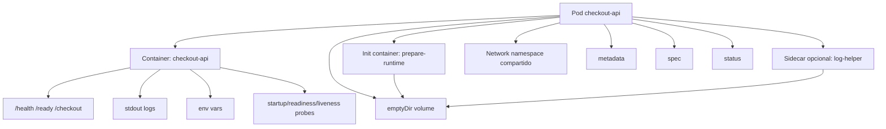
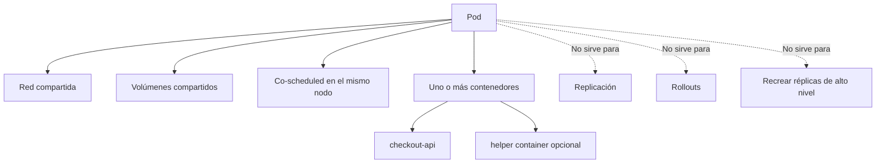
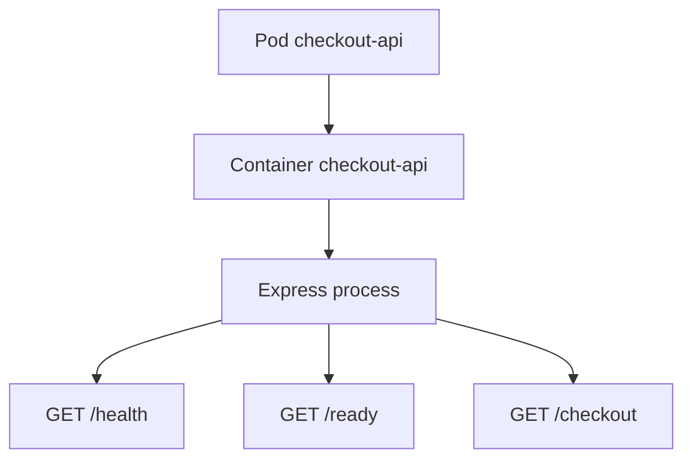
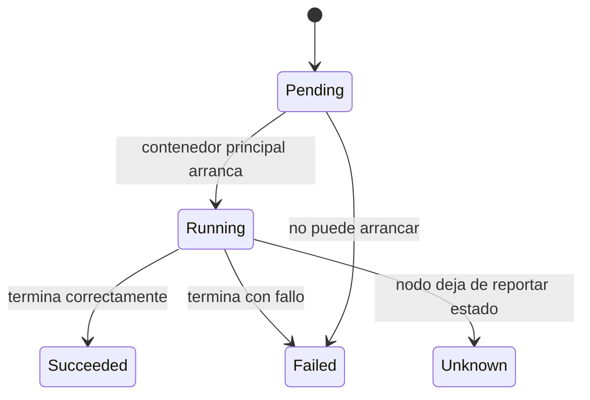
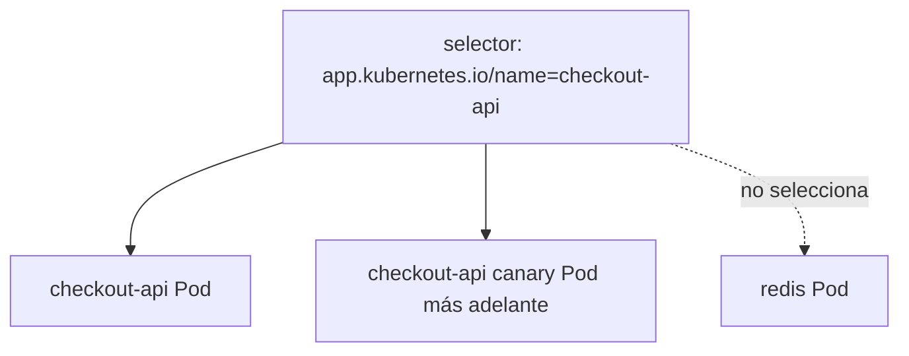
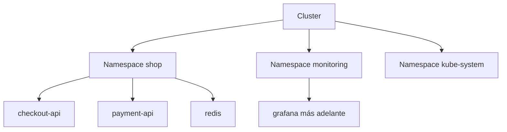
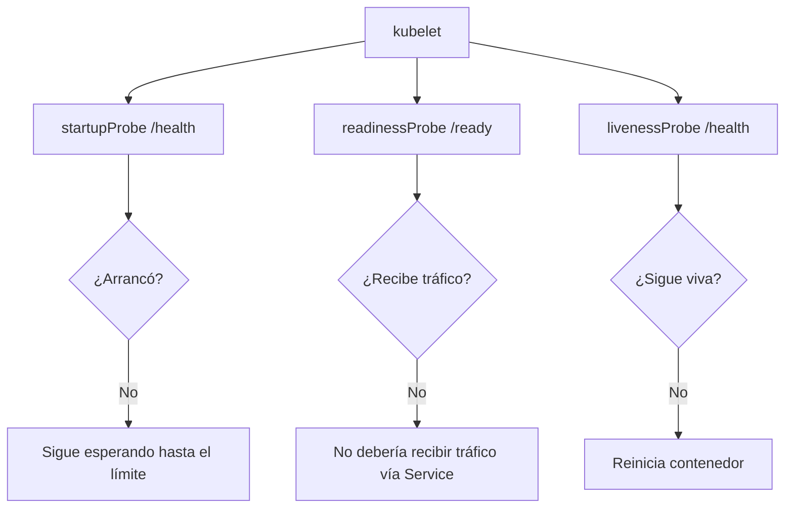
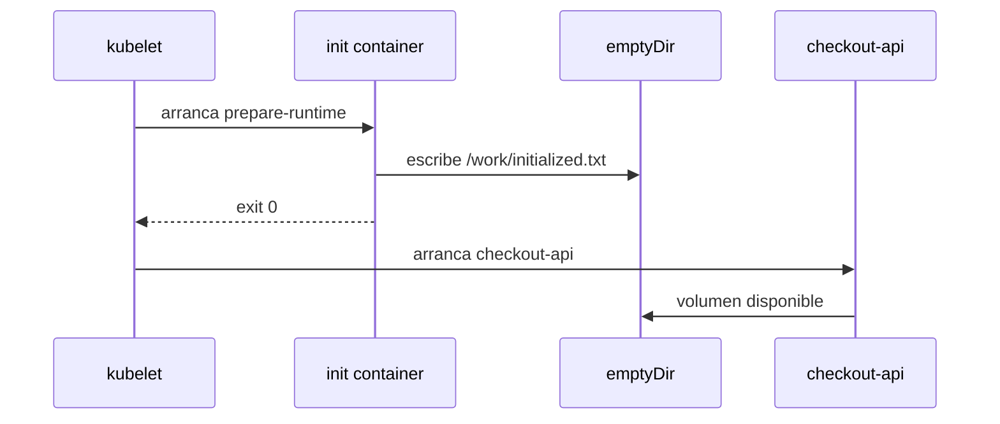

<!-- COURSE_NAV_START -->
[Anterior](<4. Modelo mental de Kubernetes.md>) | [Indice](README.md) | [Siguiente](<6. Workloads.md>)
<!-- COURSE_NAV_END -->

# 5. Pods y objetos básicos

## Objetivo del módulo

En el módulo 3 creaste tu primer Pod `checkout-api`.

En el módulo 4 aprendiste a mirarlo con más criterio: `metadata`, `spec`, `status`, events, logs, scheduler, kubelet y reconciliación.

Ahora toca profundizar en el objeto más importante para entender Kubernetes desde dentro:

> El Pod.

Un Pod es el objeto desplegable más pequeño de Kubernetes. La documentación oficial lo define como un grupo de uno o más contenedores con recursos compartidos de red y almacenamiento, y con una especificación que indica cómo ejecutar esos contenedores. También explica que los Pods se ejecutan en un contexto compartido y que Kubernetes gestiona Pods, no contenedores directamente. ([Kubernetes](https://kubernetes.io/docs/concepts/workloads/pods/ "Pods | Kubernetes"))

La idea central del módulo es esta:

> Un Pod no es “un contenedor”. Un Pod es una unidad lógica de ejecución donde uno o más contenedores viven juntos, se programan juntos, comparten contexto y producen señales que Kubernetes puede observar.



---

## 5.1. Qué vas a aprender y qué no vas a aprender todavía

Vas a aprender:

- Qué es un Pod
- Qué comparte un Pod
- Qué no comparte un Pod
- Qué significa el lifecycle de un Pod
- Qué son las fases `Pending`, `Running`, `Succeeded` y `Failed`
- Qué son las condiciones del Pod
- Qué son init containers
- Qué son sidecars
- Qué son ephemeral containers
- Qué son labels y selectors
- Qué son namespaces
- Qué son annotations
- Qué son probes: startup, readiness y liveness
- Qué son requests y limits
- Qué es `securityContext`
- Qué es Downward API
- Cómo usar `jq`, `yq`, `kubectl` y Taskfile para inspeccionar Pods
- Cómo crear un pequeño failure lab de Pods
No vamos a profundizar todavía en:

- Deployments
- ReplicaSets
- Services
- StatefulSets
- DaemonSets
- Jobs
- CronJobs
- ConfigMaps y Secrets en detalle
- PersistentVolumes
- NetworkPolicy
- RBAC
- Ingress o Gateway API
Eso vendrá después.

Aquí queremos que el alumno entienda bien la unidad mínima de ejecución.

---

## 5.2. El contrato mental de un Pod

Antes de escribir más YAML, hay que definir el contrato mental.

Un Pod responde a esta pregunta:

> ¿Qué contenedores deben vivir juntos para formar una unidad mínima de ejecución?

La documentación oficial explica que un Pod puede usarse de dos formas principales: como wrapper de un único contenedor, que es el caso más habitual, o como grupo de varios contenedores estrechamente acoplados que necesitan compartir recursos y vivir juntos. También advierte que no se deben usar múltiples contenedores en un Pod para conseguir replicación; para eso existen recursos de workload que gestionan Pods en tu nombre. ([Kubernetes](https://kubernetes.io/docs/concepts/workloads/pods/ "Pods | Kubernetes"))

### Qué comparte un Pod

Los contenedores dentro del mismo Pod pueden compartir:

- Red
- IP del Pod
- `localhost`
- Volúmenes
- Algunas partes del contexto de ejecución
- Ciclo de vida operativo del Pod
### Qué no significa un Pod

Un Pod no significa:

- Una réplica escalable por sí misma
- Un microservicio completo en todos los casos
- Un proceso único necesariamente
- Una máquina virtual
- Un mecanismo de resiliencia por sí solo
- Un sustituto de Deployment


### Criterio de comprensión

Debes poder explicar:

> Si dos contenedores no necesitan vivir juntos, compartir red o compartir volúmenes, probablemente no deberían estar en el mismo Pod.

---

## 5.3. Cuándo usar un Pod de un solo contenedor

El caso normal es un Pod con un contenedor principal.

Para `checkout-api`, el diseño base será:

```text
Pod checkout-api
  container checkout-api
```

Esto es correcto porque la API ya contiene su proceso principal y no necesita, por ahora, otro contenedor estrechamente acoplado.



### Contrato del Pod base

Queremos un Pod que:

- Viva en el namespace `shop`
- Tenga labels consistentes
- Ejecute la imagen `checkout-api:1.0.0`
- Use `imagePullPolicy: IfNotPresent`
- Exponga el puerto interno `8080`
- Reciba variables de entorno
- Tenga probes HTTP
- Tenga requests y limits
- Tenga `securityContext`
- Escriba logs por stdout
- Se pueda validar con `task smoke` usando `port-forward`
### Criterio de comprensión

Debes poder explicar:

> Un Pod de un solo contenedor no es una mala práctica. Es el caso más habitual cuando la aplicación no necesita un contenedor auxiliar estrechamente acoplado.

---

## 5.4. Lifecycle de un Pod

Antes de pedir probes, init containers o debugging, hay que entender el ciclo de vida.

La documentación oficial explica que los Pods siguen un lifecycle definido: empiezan en `Pending`, pasan a `Running` si al menos uno de sus contenedores primarios arranca correctamente, y luego pasan a `Succeeded` o `Failed` dependiendo de cómo terminen sus contenedores. También indica que kubelet gestiona los contenedores y ejecuta probes para seguir la salud de la aplicación. ([Kubernetes](https://kubernetes.io/docs/concepts/workloads/pods/pod-lifecycle/ "Pod Lifecycle | Kubernetes"))



### Fases habituales

|Fase|Significado|
|---|---|
|`Pending`|El Pod fue aceptado por la API, pero aún no todos los contenedores están creados o ejecutándose|
|`Running`|El Pod fue asignado a un nodo y al menos un contenedor principal está ejecutándose|
|`Succeeded`|Todos los contenedores terminaron correctamente y no serán reiniciados|
|`Failed`|Al menos un contenedor terminó con fallo y no será reiniciado|
|`Unknown`|El estado no se puede obtener, normalmente por problemas de comunicación con el nodo|

### Estados visibles que verás mucho

Además de las fases, en `kubectl get pods` verás estados operativos como:

- `ContainerCreating`
- `ImagePullBackOff`
- `ErrImagePull`
- `CrashLoopBackOff`
- `CreateContainerConfigError`
- `Running`
- `Completed`
- `Error`
- `Pending`
Estos nombres no son todos “fases” puras del Pod. Muchos vienen de estados de contenedores, reasons y condiciones.

### Comandos

```bash
kubectl get pod checkout-api -n shop
kubectl get pod checkout-api -n shop -o json | jq '.status.phase'
kubectl get pod checkout-api -n shop -o json | jq '.status.conditions'
kubectl get pod checkout-api -n shop -o json | jq '.status.containerStatuses'
kubectl describe pod checkout-api -n shop
kubectl get events -n shop --sort-by=.metadata.creationTimestamp
```

### Criterio de comprensión

Debes poder explicar:

> `kubectl get pods` me da una vista resumida. Para entender el lifecycle real debo mirar `status`, `containerStatuses`, conditions y events.

---

## 5.5. Labels y selectors

Antes de usar labels, hay que explicar para qué sirven.

Las labels son pares clave-valor asociados a objetos como Pods. La documentación oficial explica que se usan para identificar atributos significativos para los usuarios, organizar objetos y seleccionar subconjuntos de objetos. ([Kubernetes](https://kubernetes.io/docs/concepts/overview/working-with-objects/labels/ "Labels and Selectors | Kubernetes"))

### Por qué importan

Kubernetes no debería depender de nombres frágiles para agrupar recursos.

Si más adelante tienes tres Pods de `checkout-api`, no quieres operar cada uno por nombre concreto.

Quieres decir:

```text
todos los Pods cuyo app.kubernetes.io/name sea checkout-api
```

### Labels recomendadas para el curso

Usaremos labels consistentes:

```yaml
labels:
  app.kubernetes.io/name: checkout-api
  app.kubernetes.io/component: api
  app.kubernetes.io/part-of: shop
  app.kubernetes.io/version: "1.0.0"
```

### Selector

Un selector permite seleccionar objetos usando labels.

Ejemplo:

```bash
kubectl get pods -n shop -l app.kubernetes.io/name=checkout-api
```



### Práctica rápida

```bash
kubectl get pods -n shop --show-labels
kubectl get pods -n shop -l app.kubernetes.io/name=checkout-api
kubectl get pods -n shop -l app.kubernetes.io/part-of=shop
```

### DevEx del bloque

Añade tareas:

```yaml
k8s:pods:labels:
  desc: Show Pods with labels
  cmds:
    - kubectl get pods -n {{.NAMESPACE}} --show-labels

k8s:pods:select:checkout:
  desc: Select checkout-api Pods by label
  cmds:
    - kubectl get pods -n {{.NAMESPACE}} -l app.kubernetes.io/name=checkout-api
```

### Criterio de comprensión

Debes poder explicar:

> Las labels hacen que los objetos puedan ser encontrados, agrupados y conectados por intención operativa, no solo por nombre.

---

## 5.6. Namespaces

Ya usaste `shop` en módulos anteriores. Ahora lo explicamos mejor.

Los namespaces permiten aislar grupos de recursos dentro de un mismo cluster. La documentación oficial explica que los nombres de recursos deben ser únicos dentro de un namespace, pero no entre namespaces, y que este scope aplica a objetos namespaced, no a recursos de cluster como Nodes o StorageClasses. ([Kubernetes](https://kubernetes.io/docs/concepts/overview/working-with-objects/namespaces/ "Namespaces"))

### Qué resuelve un namespace

Un namespace ayuda a separar:

- Aplicaciones
- Entornos
- Equipos
- Laboratorios
- Políticas
- Cuotas
- Seguridad
- Limpieza de recursos
### Qué no resuelve por sí solo

Un namespace no es automáticamente:

- Una frontera de seguridad completa
- Una red aislada
- Un tenant seguro
- Una garantía de que no haya acceso entre recursos
Para eso necesitas otras piezas, como RBAC, NetworkPolicy, ResourceQuota, LimitRange y Pod Security Admission.



### Comandos

```bash
kubectl get namespaces
kubectl get pods -n shop
kubectl get pods -A
kubectl get all -n shop
```

### DevEx del bloque

Mantén el namespace como variable:

```yaml
vars:
  NAMESPACE: shop
```

Y evita comandos ambiguos en el curso:

```bash
kubectl get pods
```

Prefiere:

```bash
kubectl get pods -n shop
```

### Criterio de comprensión

Debes poder explicar:

> Un namespace organiza recursos y ayuda a aplicar políticas, pero no debe confundirse con seguridad completa.

---

## 5.7. Annotations

Las annotations son metadata no pensada para selección.

La documentación oficial dice que puedes usar annotations para adjuntar metadata arbitraria no identificadora a objetos, y que clientes como herramientas o librerías pueden recuperar esa metadata. ([Kubernetes](https://kubernetes.io/docs/concepts/overview/working-with-objects/annotations/ "Annotations"))

### Diferencia entre labels y annotations

|Elemento|Uso principal|Se usa para seleccionar|
|---|---|---|
|Label|Identificar, agrupar y seleccionar|Sí|
|Annotation|Añadir metadata no selectiva|No|

### Ejemplo

```yaml
annotations:
  course.emmanuel.dev/module: "5"
  course.emmanuel.dev/purpose: "pod-lifecycle-lab"
```

### Cuándo usar annotations

Puedes usarlas para:

- Documentar propósito
- Añadir información para herramientas
- Registrar decisiones
- Añadir links a runbooks
- Guardar checksums generados por herramientas
- Integrar con controllers o sistemas externos
### Cuándo no usarlas

No uses annotations para:

- Seleccionar Pods
- Sustituir documentación importante
- Guardar secretos
- Meter configuración de negocio grande
- Ocultar decisiones que deberían estar en manifests claros
### Comandos

```bash
kubectl get pod checkout-api -n shop -o json | jq '.metadata.annotations'
kubectl annotate pod checkout-api -n shop course.emmanuel.dev/inspected=true
kubectl get pod checkout-api -n shop -o json | jq '.metadata.annotations'
```

### Criterio de comprensión

Debes poder explicar:

> Labels sirven para seleccionar. Annotations sirven para añadir metadata que otras herramientas o personas pueden leer.

---

## 5.8. Probes: startup, readiness y liveness

Antes de añadir probes al YAML, hay que explicar el contrato.

Una probe es una comprobación que kubelet ejecuta para entender algo sobre el contenedor.

Kubernetes documenta tres tipos principales de probes para contenedores: startup, readiness y liveness. La página oficial de configuración explica cómo definir probes HTTP, TCP, gRPC y por comando, y muestra el uso de startup probes para proteger contenedores lentos al arrancar. ([Kubernetes](https://kubernetes.io/docs/tasks/configure-pod-container/configure-liveness-readiness-startup-probes/ "Configure Liveness, Readiness and Startup Probes | Kubernetes"))

### Por qué importan

En el módulo 1 definiste el contrato HTTP:

- `GET /health`
- `GET /ready`
- `GET /checkout`
Ahora Kubernetes puede usar parte de ese contrato para operar el Pod.

### Startup probe

Pregunta:

> ¿La aplicación ya ha terminado de arrancar?

Uso típico:

- Apps lentas al arrancar
- Evitar que liveness mate la app antes de tiempo
- Dar margen inicial
### Readiness probe

Pregunta:

> ¿Esta instancia debe recibir tráfico ahora?

Uso típico:

- Sacar un Pod del balanceo si no está listo
- Evitar enviar tráfico a una instancia arrancada pero no preparada
- Controlar rollouts más seguros
### Liveness probe

Pregunta:

> ¿Esta instancia está viva o debe reiniciarse?

Uso típico:

- Detectar bloqueos
- Reiniciar contenedores que no se recuperan solos
- Evitar procesos vivos pero inútiles


### Contrato recomendado para `checkout-api`

|Probe|Endpoint|Motivo|
|---|---|---|
|startupProbe|`/health`|La app ya responde HTTP|
|readinessProbe|`/ready`|La app puede recibir tráfico|
|livenessProbe|`/health`|El proceso sigue respondiendo|

### Importante

En este módulo todavía no tendremos Service, así que readiness no afectará a tráfico real de un Service. Aun así, sí verás el estado `Ready` en el Pod.

### Fragmento de YAML

```yaml
startupProbe:
  httpGet:
    path: /health
    port: http
  failureThreshold: 30
  periodSeconds: 2

readinessProbe:
  httpGet:
    path: /ready
    port: http
  initialDelaySeconds: 2
  periodSeconds: 5
  failureThreshold: 3

livenessProbe:
  httpGet:
    path: /health
    port: http
  initialDelaySeconds: 5
  periodSeconds: 10
  failureThreshold: 3
```

### DevEx del bloque

Añade una tarea para inspeccionar probes:

```yaml
k8s:pod:probes:
  desc: Show checkout-api probes
  cmds:
    - kubectl get pod checkout-api -n {{.NAMESPACE}} -o json | jq '.spec.containers[0] | {startupProbe, readinessProbe, livenessProbe}'
```

### Criterio de comprensión

Debes poder explicar:

> Startup decide si la app terminó de arrancar. Readiness decide si debe recibir tráfico. Liveness decide si el contenedor debe reiniciarse.

---

## 5.9. Requests y limits

Antes de poner recursos en YAML, hay que explicar qué significan.

Cuando defines un Pod, puedes especificar cuántos recursos necesita cada contenedor. La documentación oficial indica que los recursos más comunes son CPU y memoria; el scheduler usa requests para decidir en qué nodo colocar el Pod, y kubelet aplica limits para impedir que un contenedor use más del límite configurado. ([Kubernetes](https://kubernetes.io/docs/concepts/configuration/manage-resources-containers/ "Resource Management for Pods and Containers | Kubernetes"))

### Requests

Un request dice:

> Para ejecutar este contenedor, reserva o considera que necesito al menos esto.

Ejemplo:

```yaml
requests:
  cpu: 100m
  memory: 128Mi
```

### Limits

Un limit dice:

> Este contenedor no debería poder usar más de esto.

Ejemplo:

```yaml
limits:
  cpu: 500m
  memory: 256Mi
```

### CPU

En Kubernetes:

```text
100m
```

significa 100 millicores, es decir, 0.1 CPU.

### Memory

Ejemplos:

```text
128Mi
256Mi
1Gi
```

### Contrato para `checkout-api`

Para el laboratorio:

```yaml
resources:
  requests:
    cpu: 100m
    memory: 128Mi
  limits:
    cpu: 500m
    memory: 256Mi
```

No es una recomendación universal para producción.

Es un valor didáctico razonable para una API Express pequeña de laboratorio.

### DevEx del bloque

Añade:

```yaml
k8s:pod:resources:
  desc: Show checkout-api resource requests and limits
  cmds:
    - kubectl get pod checkout-api -n {{.NAMESPACE}} -o json | jq '.spec.containers[0].resources'
```

### Criterio de comprensión

Debes poder explicar:

> Requests ayudan al scheduler a decidir dónde colocar el Pod. Limits ayudan a kubelet a controlar cuánto puede consumir el contenedor.

---

## 5.10. SecurityContext

Antes de añadir seguridad al YAML, hay que explicar el problema.

En el módulo 1 decidiste que la imagen de `checkout-api` no debía ejecutarse como root.

En Kubernetes, puedes reforzar parte de esa intención con `securityContext`.

La documentación oficial define security context como la configuración de privilegios y control de acceso para un Pod o contenedor, incluyendo UID/GID, ejecución privilegiada o no privilegiada, capacidades Linux y otras opciones. ([Kubernetes](https://kubernetes.io/docs/tasks/configure-pod-container/security-context/ "Configure a Security Context for a Pod or Container"))

### Qué queremos para `checkout-api`

Queremos que el contenedor:

- No escale privilegios
- Ejecute como usuario no root
- Use filesystem raíz de solo lectura cuando sea posible
- Elimine capacidades Linux innecesarias
- Tenga un perfil seccomp razonable
### Fragmento recomendado

```yaml
securityContext:
  allowPrivilegeEscalation: false
  readOnlyRootFilesystem: true
  runAsNonRoot: true
  runAsUser: 1000
  capabilities:
    drop:
      - ALL
```

A nivel de Pod:

```yaml
securityContext:
  seccompProfile:
    type: RuntimeDefault
```

### Cuidado con readOnlyRootFilesystem

Si usas `readOnlyRootFilesystem: true`, la app no puede escribir en el filesystem raíz.

Eso es bueno para seguridad, pero puede romper aplicaciones que intentan escribir en `/tmp`, logs en fichero o caches locales.

Nuestra `checkout-api` escribe logs por stdout, así que encaja bien.

### DevEx del bloque

Añade:

```yaml
k8s:pod:security:
  desc: Show checkout-api security context
  cmds:
    - kubectl get pod checkout-api -n {{.NAMESPACE}} -o json | jq '{podSecurityContext: .spec.securityContext, containerSecurityContext: .spec.containers[0].securityContext}'
```

### Criterio de comprensión

Debes poder explicar:

> SecurityContext no arregla toda la seguridad, pero permite declarar límites importantes sobre cómo se ejecuta un Pod o contenedor.

---

## 5.11. Downward API

Antes de usar Downward API, hay que explicar el problema.

A veces la aplicación necesita saber algo sobre el Pod donde corre:

- Nombre del Pod
- Namespace
- Nombre del nodo
- IP del Pod
- Labels
- Annotations
- Requests o limits asignados
No queremos que la aplicación tenga que hablar con la Kubernetes API para obtener datos básicos sobre sí misma.

La documentación oficial explica que Downward API permite exponer campos del Pod y del contenedor a los procesos que corren dentro del contenedor, ya sea mediante variables de entorno o mediante ficheros en un volumen especial. ([Kubernetes](https://kubernetes.io/docs/concepts/workloads/pods/downward-api/ "Downward API | Kubernetes"))

### Ejemplo con variables de entorno

```yaml
env:
  - name: POD_NAME
    valueFrom:
      fieldRef:
        fieldPath: metadata.name
  - name: POD_NAMESPACE
    valueFrom:
      fieldRef:
        fieldPath: metadata.namespace
  - name: POD_IP
    valueFrom:
      fieldRef:
        fieldPath: status.podIP
```

### Qué permite

Dentro del contenedor:

```sh
printenv | grep POD_
```

Podrías ver:

```text
POD_NAME=checkout-api
POD_NAMESPACE=shop
POD_IP=10.244.0.12
```

### DevEx del bloque

Añade:

```yaml
k8s:pod:env:
  desc: Show environment variables inside checkout-api
  cmds:
    - kubectl exec -n {{.NAMESPACE}} pod/checkout-api -- printenv | sort
```

### Criterio de comprensión

Debes poder explicar:

> Downward API permite que la aplicación conozca metadata básica de su propio Pod sin acoplarse directamente al cliente de Kubernetes.

---

## 5.12. Init containers

Antes de pedir un init container, hay que explicar cuándo tiene sentido.

Un init container es un contenedor especializado que se ejecuta antes de los contenedores principales. La documentación oficial explica que los init containers corren antes que los app containers, deben completar correctamente y se ejecutan de forma secuencial; si uno falla, kubelet lo reinicia hasta que tenga éxito, salvo configuraciones de restart policy específicas. ([Kubernetes](https://kubernetes.io/docs/concepts/workloads/pods/init-containers/ "Init Containers | Kubernetes"))

### Para qué sirven

Sirven para tareas previas como:

- Esperar una dependencia
- Generar un fichero temporal
- Preparar permisos
- Descargar configuración no sensible
- Hacer una comprobación previa
- Separar herramientas de preparación de la imagen principal
### Para qué no sirven

No deberían usarse para:

- Lógica principal de negocio
- Procesos que deben vivir junto a la app
- Sustituir un Job de migración real
- Esconder dependencias mal diseñadas
### Práctica didáctica

Usaremos un init container simple que escribe un fichero en un volumen `emptyDir`.

No es una necesidad real de `checkout-api`.

Es una práctica para ver lifecycle y volumen compartido sin meter dependencias externas.



### Fragmento

```yaml
volumes:
  - name: runtime-work
    emptyDir: {}

initContainers:
  - name: prepare-runtime
    image: busybox:1.36
    command:
      - sh
      - -c
      - echo "initialized at $(date)" > /work/initialized.txt
    volumeMounts:
      - name: runtime-work
        mountPath: /work
```

### Criterio de comprensión

Debes poder explicar:

> Un init container prepara algo antes de que arranque la app principal. Debe terminar correctamente; no vive durante toda la vida del Pod.

---

## 5.13. Sidecars

Antes de usar sidecars, hay que explicar bien el concepto.

Un sidecar es un contenedor auxiliar que corre junto al contenedor principal dentro del mismo Pod. La documentación oficial indica que los sidecars extienden o ayudan a la aplicación principal con funcionalidades como logging, monitoring, seguridad o sincronización, sin modificar directamente el código principal. También indica que Kubernetes v1.33 marca los sidecar containers como estables y que se implementan como un caso especial de init containers con `restartPolicy: Always`. ([Kubernetes](https://kubernetes.io/docs/concepts/workloads/pods/sidecar-containers/ "Sidecar Containers | Kubernetes"))

### Cuándo tiene sentido un sidecar

Tiene sentido si el contenedor auxiliar:

- Debe vivir en el mismo Pod
- Necesita compartir red o volúmenes
- Extiende al contenedor principal
- Tiene una relación estrecha con la app
- No merece ser un servicio separado
Ejemplos:

- Agente de logs
- Proxy local
- Sincronizador de ficheros
- Exporter local
- Adaptador de protocolo
### Cuándo no tiene sentido

No uses sidecar si:

- Solo quieres escalarlo de forma independiente
- Tiene ciclo de vida separado
- Es otro servicio de negocio
- No necesita compartir contexto con la app
- Solo estás metiendo cosas juntas por comodidad
### Importante para el laboratorio

Para evitar depender de una versión concreta del cluster, la práctica principal de este módulo no requerirá sidecar nativo. Lo explicaremos como concepto y dejaremos una práctica opcional.

La documentación actual indica que los sidecars nativos son estables en Kubernetes v1.33, pero si el alumno usa un cluster más antiguo, puede no tener el mismo comportamiento. ([Kubernetes](https://kubernetes.io/docs/concepts/workloads/pods/sidecar-containers/ "Sidecar Containers | Kubernetes"))

### Criterio de comprensión

Debes poder explicar:

> Un sidecar no es “otro contenedor cualquiera”. Es un colaborador estrechamente acoplado al contenedor principal dentro del mismo Pod.

---

## 5.13 bis. Patrones CKAD de multi-container Pods

Un Pod puede tener varios contenedores, pero eso no significa que debas meter varios microservicios dentro del mismo Pod.

Regla base:

> Un Pod debe representar una unidad de despliegue cohesionada.

Los multi-container Pods tienen sentido cuando los contenedores colaboran estrechamente y comparten lifecycle, red o volúmenes.

CKAD suele esperar que entiendas estos patrones:

| Patrón | Intención |
|---|---|
| Init container | Preparar algo antes de arrancar la app principal |
| Sidecar | Añadir una capacidad auxiliar junto a la app |
| Adapter | Transformar una salida o interfaz |
| Ambassador | Proxy local hacia un servicio externo |

### Init container

Un init container se ejecuta antes de los contenedores principales.

Si falla, Kubernetes vuelve a intentarlo según la política del Pod.

Ejemplo:

```yaml
apiVersion: v1
kind: Pod
metadata:
  name: checkout-with-init
spec:
  initContainers:
    - name: wait-for-config
      image: busybox:1.36
      command: ["sh", "-c", "echo preparing runtime && sleep 2"]
  containers:
    - name: checkout-api
      image: nginx:1.27
      ports:
        - containerPort: 80
```

Validar:

```bash
kubectl apply -f checkout-with-init.yaml
kubectl get pod checkout-with-init
kubectl logs checkout-with-init -c wait-for-config
kubectl logs checkout-with-init -c checkout-api
```

### Sidecar con `emptyDir`

Un sidecar añade una capacidad auxiliar.

Ejemplo: el contenedor principal escribe ficheros y el sidecar los observa.

```yaml
apiVersion: v1
kind: Pod
metadata:
  name: data-exchange
spec:
  volumes:
    - name: shared-data
      emptyDir: {}
  containers:
    - name: main-app
      image: busybox:1.36
      command: ["sh", "-c"]
      args:
        - i=1; while true; do echo "data-$i" > /data/$i.txt; i=$((i+1)); sleep 10; done
      volumeMounts:
        - name: shared-data
          mountPath: /data

    - name: sidecar
      image: busybox:1.36
      command: ["sh", "-c"]
      args:
        - while true; do echo "files=$(ls /data | wc -l)"; sleep 15; done
      volumeMounts:
        - name: shared-data
          mountPath: /data
```

Validar:

```bash
kubectl apply -f data-exchange.yaml
kubectl logs data-exchange -c sidecar -f
kubectl exec -it data-exchange -c main-app -- sh
```

### Adapter

Un adapter transforma una salida existente en un formato más útil.

Ejemplo conceptual:

```text
app escribe logs en formato propio
adapter lee esos logs
adapter expone o emite formato estándar
```

Manifest simplificado:

```yaml
apiVersion: v1
kind: Pod
metadata:
  name: adapter-example
spec:
  volumes:
    - name: logs
      emptyDir: {}
  containers:
    - name: app
      image: busybox:1.36
      command: ["sh", "-c"]
      args:
        - while true; do echo "checkout ok" >> /logs/app.log; sleep 5; done
      volumeMounts:
        - name: logs
          mountPath: /logs

    - name: adapter
      image: busybox:1.36
      command: ["sh", "-c"]
      args:
        - tail -f /logs/app.log | sed 's/^/[checkout-api] /'
      volumeMounts:
        - name: logs
          mountPath: /logs
```

Validar:

```bash
kubectl apply -f adapter-example.yaml
kubectl logs adapter-example -c adapter -f
```

### Ambassador

Un ambassador actúa como proxy local.

La aplicación habla con `localhost`.

El ambassador se encarga de llegar al servicio externo o interno.

Ejemplo conceptual:

```text
main app -> localhost:9000 -> ambassador -> payment-api.shop.svc.cluster.local:80
```

En CKAD puede aparecer como patrón conceptual o como manifest multi-container.

La señal clave es esta:

> Si un contenedor simplifica el acceso de la app principal a otro servicio mediante un proxy local, probablemente estás ante Ambassador.

--- 
## 5.14. Ephemeral containers

Antes de usar ephemeral containers, hay que explicar su propósito.

Un ephemeral container es un contenedor temporal que se añade a un Pod existente para troubleshooting. La documentación oficial dice que se usan para inspeccionar servicios, no para construir aplicaciones, y que son estables desde Kubernetes v1.25. También indica que no se reinician automáticamente y que no son apropiados para workloads normales. ([Kubernetes](https://kubernetes.io/docs/concepts/workloads/pods/ephemeral-containers/ "Ephemeral Containers | Kubernetes"))

### Cuándo usarlos

- Para debuggear un Pod en ejecución
- Cuando la imagen principal no tiene shell
- Cuando necesitas herramientas de diagnóstico temporal
- Para investigar problemas difíciles de reproducir
### Cuándo no usarlos

No uses ephemeral containers para:

- Añadir funcionalidad de negocio
- Corregir producción a mano
- Sustituir imágenes bien preparadas
- Ejecutar procesos permanentes
- Evitar crear un Pod nuevo
### Ejemplo conceptual

```bash
kubectl debug -n shop -it pod/checkout-api --image=busybox:1.36 --target=checkout-api
```

Dependiendo del runtime, permisos y versión del cluster, el comportamiento puede variar. Por eso lo trataremos como práctica opcional de troubleshooting, no como requisito del módulo.

### Criterio de comprensión

Debes poder explicar:

> Un ephemeral container es una herramienta de diagnóstico temporal, no una forma normal de diseñar aplicaciones.

---

## 5.15. Manifest completo del Pod `checkout-api`

Ahora que ya hemos explicado los conceptos, podemos pedir el manifest.

Crea:

```text
kubernetes/01-pod/pod.yaml
```

Contenido:

```yaml
apiVersion: v1
kind: Pod
metadata:
  name: checkout-api
  namespace: shop
  labels:
    app.kubernetes.io/name: checkout-api
    app.kubernetes.io/component: api
    app.kubernetes.io/part-of: shop
    app.kubernetes.io/version: "1.0.0"
  annotations:
    course.emmanuel.dev/module: "5"
    course.emmanuel.dev/purpose: "pod-lifecycle-lab"
spec:
  securityContext:
    seccompProfile:
      type: RuntimeDefault

  volumes:
    - name: runtime-work
      emptyDir: {}

  initContainers:
    - name: prepare-runtime
      image: busybox:1.36
      command:
        - sh
        - -c
        - echo "initialized at $(date)" > /work/initialized.txt
      volumeMounts:
        - name: runtime-work
          mountPath: /work

  containers:
    - name: checkout-api
      image: checkout-api:1.0.0
      imagePullPolicy: IfNotPresent

      ports:
        - name: http
          containerPort: 8080

      env:
        - name: SERVICE_NAME
          value: checkout-api
        - name: PORT
          value: "8080"
        - name: LOG_LEVEL
          value: debug
        - name: POD_NAME
          valueFrom:
            fieldRef:
              fieldPath: metadata.name
        - name: POD_NAMESPACE
          valueFrom:
            fieldRef:
              fieldPath: metadata.namespace
        - name: POD_IP
          valueFrom:
            fieldRef:
              fieldPath: status.podIP

      volumeMounts:
        - name: runtime-work
          mountPath: /work

      startupProbe:
        httpGet:
          path: /health
          port: http
        failureThreshold: 30
        periodSeconds: 2

      readinessProbe:
        httpGet:
          path: /ready
          port: http
        initialDelaySeconds: 2
        periodSeconds: 5
        failureThreshold: 3

      livenessProbe:
        httpGet:
          path: /health
          port: http
        initialDelaySeconds: 5
        periodSeconds: 10
        failureThreshold: 3

      resources:
        requests:
          cpu: 100m
          memory: 128Mi
        limits:
          cpu: 500m
          memory: 256Mi

      securityContext:
        allowPrivilegeEscalation: false
        readOnlyRootFilesystem: true
        runAsNonRoot: true
        runAsUser: 1000
        capabilities:
          drop:
            - ALL
```

### Qué contiene este manifest

|Bloque|Qué enseña|
|---|---|
|`metadata.labels`|Organización y selección|
|`metadata.annotations`|Metadata no selectiva|
|`spec.securityContext`|Seguridad a nivel de Pod|
|`volumes.emptyDir`|Volumen temporal compartido|
|`initContainers`|Preparación antes de arrancar la app|
|`containers`|Contenedor principal|
|`ports.name`|Puerto nombrado para probes|
|`env.valueFrom.fieldRef`|Downward API|
|`startupProbe`|Arranque|
|`readinessProbe`|Preparación para tráfico|
|`livenessProbe`|Salud del proceso|
|`resources`|Requests y limits|
|`container.securityContext`|Seguridad a nivel de contenedor|

### Aplicar

```bash
kubectl apply -f kubernetes/01-pod/pod.yaml
```

### Ver

```bash
kubectl get pod checkout-api -n shop -o wide
kubectl describe pod checkout-api -n shop
kubectl get events -n shop --sort-by=.metadata.creationTimestamp
```

### Criterio de comprensión

Debes poder explicar:

> Este manifest no es una lista de campos. Es una declaración de cómo debe ejecutarse, prepararse, observarse, limitarse y protegerse `checkout-api`.

---

## 5.16. Inspección con `kubectl`, `jq` y `yq`

La inspección debe ser parte del aprendizaje, no una actividad secundaria.

### Inspeccionar el manifest local

```bash
yq '.metadata.labels' kubernetes/01-pod/pod.yaml
yq '.spec.initContainers' kubernetes/01-pod/pod.yaml
yq '.spec.containers[0].readinessProbe' kubernetes/01-pod/pod.yaml
yq '.spec.containers[0].resources' kubernetes/01-pod/pod.yaml
yq '.spec.containers[0].securityContext' kubernetes/01-pod/pod.yaml
```

### Inspeccionar el objeto en el cluster

```bash
kubectl get pod checkout-api -n shop -o json | jq '.metadata.labels'
kubectl get pod checkout-api -n shop -o json | jq '.status.phase'
kubectl get pod checkout-api -n shop -o json | jq '.status.initContainerStatuses'
kubectl get pod checkout-api -n shop -o json | jq '.status.containerStatuses'
kubectl get pod checkout-api -n shop -o json | jq '.spec.containers[0].resources'
```

### Inspeccionar Downward API dentro del contenedor

```bash
kubectl exec -n shop pod/checkout-api -- printenv | grep POD_
```

### Inspeccionar volumen compartido

```bash
kubectl exec -n shop pod/checkout-api -- cat /work/initialized.txt
```

### Criterio de comprensión

Debes poder explicar:

> `yq` me ayuda a entender lo que voy a aplicar. `jq` me ayuda a entender lo que Kubernetes aceptó y observa.

---

## 5.17. Failure lab 1: readiness rota

Antes de crear el fallo, explica qué queremos comprobar.

Queremos ver qué ocurre cuando el contenedor arranca, pero la readiness probe apunta a una ruta incorrecta.

Eso representa una situación real:

> La app está viva, pero Kubernetes no la considera lista.

### Crear manifest roto

```bash
cp kubernetes/01-pod/pod.yaml kubernetes/01-pod/pod-bad-readiness.yaml
yq -i '.metadata.name = "checkout-api-bad-readiness"' kubernetes/01-pod/pod-bad-readiness.yaml
yq -i '.spec.containers[0].readinessProbe.httpGet.path = "/not-ready"' kubernetes/01-pod/pod-bad-readiness.yaml
```

### Aplicar

```bash
kubectl apply -f kubernetes/01-pod/pod-bad-readiness.yaml
```

### Observar

```bash
kubectl get pod checkout-api-bad-readiness -n shop
kubectl describe pod checkout-api-bad-readiness -n shop
kubectl get events -n shop --sort-by=.metadata.creationTimestamp
kubectl logs pod/checkout-api-bad-readiness -n shop
```

### Preguntas

- ¿El Pod está `Running`?
- ¿Está `Ready`?
- ¿El contenedor se reinicia?
- ¿Qué events aparecen?
- ¿Qué diferencia hay entre liveness fallando y readiness fallando?
### Limpiar

```bash
kubectl delete -f kubernetes/01-pod/pod-bad-readiness.yaml --ignore-not-found
```

### Criterio de comprensión

Debes poder explicar:

> Una readiness rota puede impedir que el Pod sea considerado listo sin reiniciar necesariamente el contenedor.

---

## 5.18. Failure lab 2: liveness rota

Ahora queremos ver algo más peligroso.

Si liveness falla, kubelet puede reiniciar el contenedor.

### Crear manifest roto

```bash
cp kubernetes/01-pod/pod.yaml kubernetes/01-pod/pod-bad-liveness.yaml
yq -i '.metadata.name = "checkout-api-bad-liveness"' kubernetes/01-pod/pod-bad-liveness.yaml
yq -i '.spec.containers[0].livenessProbe.httpGet.path = "/dead"' kubernetes/01-pod/pod-bad-liveness.yaml
```

### Aplicar

```bash
kubectl apply -f kubernetes/01-pod/pod-bad-liveness.yaml
```

### Observar

```bash
kubectl get pod checkout-api-bad-liveness -n shop -w
kubectl describe pod checkout-api-bad-liveness -n shop
kubectl get pod checkout-api-bad-liveness -n shop -o json | jq '.status.containerStatuses'
kubectl get events -n shop --sort-by=.metadata.creationTimestamp
```

### Preguntas

- ¿Aumenta `RESTARTS`?
- ¿Qué dice `lastState`?
- ¿Qué events aparecen?
- ¿Por qué una liveness mal definida puede crear inestabilidad?
### Limpiar

```bash
kubectl delete -f kubernetes/01-pod/pod-bad-liveness.yaml --ignore-not-found
```

### Criterio de comprensión

Debes poder explicar:

> Una liveness probe mal definida puede reiniciar una aplicación sana y crear un fallo artificial.

---

## 5.19. Failure lab 3: init container fallando

Queremos observar qué pasa cuando un init container no termina correctamente.

### Crear manifest roto

```bash
cp kubernetes/01-pod/pod.yaml kubernetes/01-pod/pod-bad-init.yaml
yq -i '.metadata.name = "checkout-api-bad-init"' kubernetes/01-pod/pod-bad-init.yaml
yq -i '.spec.initContainers[0].command = ["sh", "-c", "echo failing init && exit 1"]' kubernetes/01-pod/pod-bad-init.yaml
```

### Aplicar

```bash
kubectl apply -f kubernetes/01-pod/pod-bad-init.yaml
```

### Observar

```bash
kubectl get pod checkout-api-bad-init -n shop
kubectl describe pod checkout-api-bad-init -n shop
kubectl get pod checkout-api-bad-init -n shop -o json | jq '.status.initContainerStatuses'
kubectl logs pod/checkout-api-bad-init -n shop -c prepare-runtime
```

### Preguntas

- ¿Arranca el contenedor principal?
- ¿Dónde aparece el fallo?
- ¿Qué logs tiene el init container?
- ¿Qué relación hay entre init containers y app containers?
### Limpiar

```bash
kubectl delete -f kubernetes/01-pod/pod-bad-init.yaml --ignore-not-found
```

### Criterio de comprensión

Debes poder explicar:

> Si un init container falla, el contenedor principal no arranca porque la inicialización del Pod no se ha completado.

---

## 5.20. Taskfile del módulo 5

Añade estas tareas al `Taskfile.yml`.

```yaml
  k8s:pod:apply:
    desc: Apply checkout-api Pod
    cmds:
      - kubectl apply -f kubernetes/01-pod/pod.yaml

  k8s:pod:delete:
    desc: Delete checkout-api Pod
    cmds:
      - kubectl delete -f kubernetes/01-pod/pod.yaml --ignore-not-found

  k8s:pod:describe:
    desc: Describe checkout-api Pod
    cmds:
      - kubectl describe pod checkout-api -n {{.NAMESPACE}}

  k8s:pod:labels:
    desc: Show checkout-api Pod labels
    cmds:
      - kubectl get pod checkout-api -n {{.NAMESPACE}} --show-labels
      - kubectl get pod checkout-api -n {{.NAMESPACE}} -o json | jq '.metadata.labels'

  k8s:pod:annotations:
    desc: Show checkout-api Pod annotations
    cmds:
      - kubectl get pod checkout-api -n {{.NAMESPACE}} -o json | jq '.metadata.annotations'

  k8s:pod:lifecycle:
    desc: Show checkout-api Pod lifecycle status
    cmds:
      - kubectl get pod checkout-api -n {{.NAMESPACE}} -o wide
      - kubectl get pod checkout-api -n {{.NAMESPACE}} -o json | jq '{phase: .status.phase, conditions: .status.conditions, initContainerStatuses: .status.initContainerStatuses, containerStatuses: .status.containerStatuses}'

  k8s:pod:probes:
    desc: Show checkout-api probes
    cmds:
      - kubectl get pod checkout-api -n {{.NAMESPACE}} -o json | jq '.spec.containers[0] | {startupProbe, readinessProbe, livenessProbe}'

  k8s:pod:resources:
    desc: Show checkout-api resource requests and limits
    cmds:
      - kubectl get pod checkout-api -n {{.NAMESPACE}} -o json | jq '.spec.containers[0].resources'

  k8s:pod:security:
    desc: Show checkout-api security context
    cmds:
      - kubectl get pod checkout-api -n {{.NAMESPACE}} -o json | jq '{podSecurityContext: .spec.securityContext, containerSecurityContext: .spec.containers[0].securityContext}'

  k8s:pod:env:
    desc: Show environment variables inside checkout-api
    cmds:
      - kubectl exec -n {{.NAMESPACE}} pod/checkout-api -- printenv | sort

  k8s:pod:init:file:
    desc: Show file created by init container
    cmds:
      - kubectl exec -n {{.NAMESPACE}} pod/checkout-api -- cat /work/initialized.txt

  k8s:pod:inspect:full:
    desc: Inspect checkout-api Pod deeply
    cmds:
      - task k8s:pod:describe
      - task k8s:pod:labels
      - task k8s:pod:annotations
      - task k8s:pod:lifecycle
      - task k8s:pod:probes
      - task k8s:pod:resources
      - task k8s:pod:security

  k8s:failure:readiness:apply:
    desc: Apply Pod with broken readiness probe
    cmds:
      - cp kubernetes/01-pod/pod.yaml kubernetes/01-pod/pod-bad-readiness.yaml
      - yq -i '.metadata.name = "checkout-api-bad-readiness"' kubernetes/01-pod/pod-bad-readiness.yaml
      - yq -i '.spec.containers[0].readinessProbe.httpGet.path = "/not-ready"' kubernetes/01-pod/pod-bad-readiness.yaml
      - kubectl apply -f kubernetes/01-pod/pod-bad-readiness.yaml

  k8s:failure:readiness:inspect:
    desc: Inspect Pod with broken readiness probe
    cmds:
      - kubectl get pod checkout-api-bad-readiness -n {{.NAMESPACE}} || true
      - kubectl describe pod checkout-api-bad-readiness -n {{.NAMESPACE}} || true
      - kubectl get events -n {{.NAMESPACE}} --sort-by=.metadata.creationTimestamp

  k8s:failure:readiness:delete:
    desc: Delete Pod with broken readiness probe
    cmds:
      - kubectl delete -f kubernetes/01-pod/pod-bad-readiness.yaml --ignore-not-found || true

  k8s:failure:liveness:apply:
    desc: Apply Pod with broken liveness probe
    cmds:
      - cp kubernetes/01-pod/pod.yaml kubernetes/01-pod/pod-bad-liveness.yaml
      - yq -i '.metadata.name = "checkout-api-bad-liveness"' kubernetes/01-pod/pod-bad-liveness.yaml
      - yq -i '.spec.containers[0].livenessProbe.httpGet.path = "/dead"' kubernetes/01-pod/pod-bad-liveness.yaml
      - kubectl apply -f kubernetes/01-pod/pod-bad-liveness.yaml

  k8s:failure:liveness:inspect:
    desc: Inspect Pod with broken liveness probe
    cmds:
      - kubectl get pod checkout-api-bad-liveness -n {{.NAMESPACE}} || true
      - kubectl describe pod checkout-api-bad-liveness -n {{.NAMESPACE}} || true
      - kubectl get pod checkout-api-bad-liveness -n {{.NAMESPACE}} -o json | jq '.status.containerStatuses' || true
      - kubectl get events -n {{.NAMESPACE}} --sort-by=.metadata.creationTimestamp

  k8s:failure:liveness:delete:
    desc: Delete Pod with broken liveness probe
    cmds:
      - kubectl delete -f kubernetes/01-pod/pod-bad-liveness.yaml --ignore-not-found || true

  k8s:failure:init:apply:
    desc: Apply Pod with broken init container
    cmds:
      - cp kubernetes/01-pod/pod.yaml kubernetes/01-pod/pod-bad-init.yaml
      - yq -i '.metadata.name = "checkout-api-bad-init"' kubernetes/01-pod/pod-bad-init.yaml
      - yq -i '.spec.initContainers[0].command = ["sh", "-c", "echo failing init && exit 1"]' kubernetes/01-pod/pod-bad-init.yaml
      - kubectl apply -f kubernetes/01-pod/pod-bad-init.yaml

  k8s:failure:init:inspect:
    desc: Inspect Pod with broken init container
    cmds:
      - kubectl get pod checkout-api-bad-init -n {{.NAMESPACE}} || true
      - kubectl describe pod checkout-api-bad-init -n {{.NAMESPACE}} || true
      - kubectl get pod checkout-api-bad-init -n {{.NAMESPACE}} -o json | jq '.status.initContainerStatuses' || true
      - kubectl logs pod/checkout-api-bad-init -n {{.NAMESPACE}} -c prepare-runtime || true

  k8s:failure:init:delete:
    desc: Delete Pod with broken init container
    cmds:
      - kubectl delete -f kubernetes/01-pod/pod-bad-init.yaml --ignore-not-found || true
```

### Flujo recomendado

```bash
task k8s:kind:create
task k8s:image:prepare
task k8s:namespace:apply
task k8s:pod:apply
task k8s:pod:inspect:full
task k8s:port-forward
task smoke
```

En otra terminal:

```bash
task k8s:pod:env
task k8s:pod:init:file
```

Failure lab:

```bash
task k8s:failure:readiness:apply
task k8s:failure:readiness:inspect
task k8s:failure:readiness:delete

task k8s:failure:liveness:apply
task k8s:failure:liveness:inspect
task k8s:failure:liveness:delete

task k8s:failure:init:apply
task k8s:failure:init:inspect
task k8s:failure:init:delete
```

### Criterio DevEx

Debes poder explicar:

> Una buena DevEx para Pods no consiste solo en aplicar YAML. Consiste en tener tareas para aplicar, validar, inspeccionar lifecycle, ver probes, revisar resources, analizar seguridad y reproducir fallos pequeños.

---

## 5.21. Práctica principal del módulo

### Objetivo

Convertir el Pod básico de módulos anteriores en un Pod didáctico y operable.

### Resultado esperado

Al final deberías tener:

```text
kubernetes-learning-lab/
  kubernetes/
    01-pod/
      pod.yaml
      pod-bad-readiness.yaml
      pod-bad-liveness.yaml
      pod-bad-init.yaml
  Taskfile.yml
```

### Paso 1. Preparar cluster e imagen

```bash
task k8s:kind:create
task k8s:image:prepare
task k8s:namespace:apply
```

### Paso 2. Aplicar Pod completo

```bash
task k8s:pod:apply
```

### Paso 3. Inspeccionar lifecycle

```bash
task k8s:pod:lifecycle
task k8s:events
```

### Paso 4. Inspeccionar labels y annotations

```bash
task k8s:pod:labels
task k8s:pod:annotations
```

### Paso 5. Inspeccionar probes

```bash
task k8s:pod:probes
```

### Paso 6. Inspeccionar resources y security

```bash
task k8s:pod:resources
task k8s:pod:security
```

### Paso 7. Validar Downward API e init container

```bash
task k8s:pod:env
task k8s:pod:init:file
```

### Paso 8. Validar contrato HTTP

En una terminal:

```bash
task k8s:port-forward
```

En otra:

```bash
task smoke
```

### Paso 9. Ejecutar failure labs

```bash
task k8s:failure:readiness:apply
task k8s:failure:readiness:inspect
task k8s:failure:readiness:delete
```

```bash
task k8s:failure:liveness:apply
task k8s:failure:liveness:inspect
task k8s:failure:liveness:delete
```

```bash
task k8s:failure:init:apply
task k8s:failure:init:inspect
task k8s:failure:init:delete
```

### Paso 10. Limpiar

```bash
task k8s:pod:delete
task k8s:namespace:delete
task k8s:kind:delete
```

### Criterio de finalización

La práctica está completa cuando puedes explicar:

- Qué hace el Pod
- Qué hace el init container
- Qué expone Downward API
- Qué comprueba cada probe
- Qué resources has declarado
- Qué securityContext has declarado
- Qué significan labels y annotations
- Qué diferencia hay entre readiness rota, liveness rota e init container fallando
- Qué comandos usaste para diagnosticar cada caso
---

## 5.22. Ejercicios cortos

### Ejercicio 1. Leer el Pod como contrato

Ejecuta:

```bash
yq '.metadata' kubernetes/01-pod/pod.yaml
yq '.spec.containers[0]' kubernetes/01-pod/pod.yaml
```

Responde:

- ¿Qué parte identifica el Pod?
- ¿Qué parte define el contenedor principal?
- ¿Dónde están las probes?
- ¿Dónde están los resources?
- ¿Dónde está el securityContext?
---

### Ejercicio 2. Labels y selectors

Ejecuta:

```bash
kubectl get pods -n shop --show-labels
kubectl get pods -n shop -l app.kubernetes.io/name=checkout-api
kubectl get pods -n shop -l app.kubernetes.io/component=api
```

Responde:

- ¿Qué labels tiene el Pod?
- ¿Qué selector lo encuentra?
- ¿Qué selector no lo encuentra?
---

### Ejercicio 3. Probes

Ejecuta:

```bash
kubectl get pod checkout-api -n shop -o json | jq '.spec.containers[0] | {startupProbe, readinessProbe, livenessProbe}'
```

Responde:

- ¿Qué endpoint usa startup?
- ¿Qué endpoint usa readiness?
- ¿Qué endpoint usa liveness?
- ¿Qué pasaría si `/ready` devuelve 500?
- ¿Qué pasaría si `/health` deja de responder?
---

### Ejercicio 4. Resources

Ejecuta:

```bash
kubectl get pod checkout-api -n shop -o json | jq '.spec.containers[0].resources'
```

Responde:

- ¿Qué CPU request tiene?
- ¿Qué memory request tiene?
- ¿Qué CPU limit tiene?
- ¿Qué memory limit tiene?
- ¿Qué componente usa requests para scheduling?
- ¿Qué componente aplica limits?
---

### Ejercicio 5. SecurityContext

Ejecuta:

```bash
kubectl get pod checkout-api -n shop -o json | jq '{podSecurityContext: .spec.securityContext, containerSecurityContext: .spec.containers[0].securityContext}'
```

Responde:

- ¿Corre como root?
- ¿Permite privilege escalation?
- ¿Qué capacidades se eliminan?
- ¿Qué implica `readOnlyRootFilesystem`?
---

### Ejercicio 6. Init container

Ejecuta:

```bash
kubectl get pod checkout-api -n shop -o json | jq '.status.initContainerStatuses'
kubectl exec -n shop pod/checkout-api -- cat /work/initialized.txt
```

Responde:

- ¿Terminó correctamente el init container?
- ¿Qué fichero creó?
- ¿Cómo lo ve el contenedor principal?
---

### Ejercicio 7. Downward API

Ejecuta:

```bash
kubectl exec -n shop pod/checkout-api -- printenv | grep POD_
```

Responde:

- ¿Cuál es el nombre del Pod?
- ¿Cuál es el namespace?
- ¿Cuál es la IP del Pod?
- ¿Por qué esto no requiere que la aplicación llame a la API de Kubernetes?
---

## 5.23. Errores habituales

### Error 1. Pensar que un Pod es siempre un contenedor

Un Pod puede tener uno o varios contenedores.

El caso de un contenedor es el más común, pero no define todo el concepto.

---

### Error 2. Meter varios servicios en el mismo Pod por comodidad

No metas `checkout-api`, `payment-api` y `inventory-api` en el mismo Pod.

Son servicios con ciclos de vida distintos.

Deben poder desplegarse, escalarse y fallar de forma independiente.

---

### Error 3. Confundir readiness y liveness

Readiness decide si la instancia debería recibir tráfico.

Liveness decide si kubelet debería reiniciar el contenedor.

Una liveness mal definida puede crear reinicios innecesarios.

---

### Error 4. Añadir probes antes de tener endpoints claros

Primero define el contrato HTTP.

Después conecta probes a ese contrato.

No inventes probes que no representen salud real.

---

### Error 5. No definir resources

Sin requests, el scheduler tiene menos información para colocar el Pod.

Sin limits, puedes tener menos control sobre consumo máximo.

Los valores deben revisarse con datos reales más adelante.

---

### Error 6. Usar init containers para lógica de negocio

Un init container prepara el entorno.

No debería ejecutar lógica principal de la aplicación.

---

### Error 7. Usar sidecars para todo

Un sidecar aumenta acoplamiento dentro del Pod.

Úsalo cuando la relación sea estrecha y justificada.

---

### Error 8. Usar ephemeral containers como parche operacional

Un ephemeral container es para troubleshooting.

No debe convertirse en una forma normal de modificar producción.

---

### Error 9. Tratar annotations como cajón desastre

Annotations son útiles, pero no deben ocultar decisiones importantes ni guardar secretos.

---

## 5.24. Criterio de salida del módulo

Puedes pasar al módulo 6 cuando puedas hacer todo esto sin seguir una receta ciegamente.

### Conceptos

Debes poder explicar:

- Qué es un Pod
- Por qué Kubernetes gestiona Pods y no contenedores sueltos
- Qué comparte un Pod
- Qué no resuelve un Pod
- Qué son phases, conditions y containerStatuses
- Qué son labels
- Qué son selectors
- Qué son namespaces
- Qué son annotations
- Qué diferencia hay entre startup, readiness y liveness
- Qué son requests y limits
- Qué es `securityContext`
- Qué es Downward API
- Qué es un init container
- Qué es un sidecar
- Qué es un ephemeral container
### Práctica

Debes poder:

- Aplicar el Pod completo
- Inspeccionar labels y annotations
- Inspeccionar lifecycle
- Inspeccionar probes
- Inspeccionar resources
- Inspeccionar securityContext
- Validar Downward API
- Ver el fichero creado por el init container
- Ejecutar smoke test con port-forward
- Provocar una readiness rota
- Provocar una liveness rota
- Provocar un init container fallando
- Diagnosticar cada caso con `get`, `describe`, `logs`, `events`, `jq` y `yq`
### DevEx

Debes poder ejecutar:

```bash
task k8s:pod:apply
task k8s:pod:inspect:full
task k8s:pod:env
task k8s:pod:init:file
task k8s:failure:readiness:apply
task k8s:failure:readiness:inspect
task k8s:failure:readiness:delete
task k8s:failure:liveness:apply
task k8s:failure:liveness:inspect
task k8s:failure:liveness:delete
task k8s:failure:init:apply
task k8s:failure:init:inspect
task k8s:failure:init:delete
```

### Frase final de comprensión

Debes poder explicar esta frase:

> Un Pod es la unidad mínima de ejecución de Kubernetes. Para operarlo bien necesito entender su lifecycle, sus señales, sus probes, sus recursos, sus límites de seguridad, su metadata y la relación entre sus contenedores.

---

## 5.25. Referencias oficiales

|Tema|Referencia|
|---|---|
|Pods|Kubernetes Docs, Pods. ([Kubernetes](https://kubernetes.io/docs/concepts/workloads/pods/ "Pods \| Kubernetes"))|
|Pod lifecycle|Kubernetes Docs, Pod Lifecycle. ([Kubernetes](https://kubernetes.io/docs/concepts/workloads/pods/pod-lifecycle/ "Pod Lifecycle \| Kubernetes"))|
|Init containers|Kubernetes Docs, Init Containers. ([Kubernetes](https://kubernetes.io/docs/concepts/workloads/pods/init-containers/ "Init Containers \| Kubernetes"))|
|Sidecar containers|Kubernetes Docs, Sidecar Containers. ([Kubernetes](https://kubernetes.io/docs/concepts/workloads/pods/sidecar-containers/ "Sidecar Containers \| Kubernetes"))|
|Ephemeral containers|Kubernetes Docs, Ephemeral Containers. ([Kubernetes](https://kubernetes.io/docs/concepts/workloads/pods/ephemeral-containers/ "Ephemeral Containers \| Kubernetes"))|
|Probes|Kubernetes Docs, Configure Liveness, Readiness and Startup Probes. ([Kubernetes](https://kubernetes.io/docs/tasks/configure-pod-container/configure-liveness-readiness-startup-probes/ "Configure Liveness, Readiness and Startup Probes \| Kubernetes"))|
|Resource management|Kubernetes Docs, Resource Management for Pods and Containers. ([Kubernetes](https://kubernetes.io/docs/concepts/configuration/manage-resources-containers/ "Resource Management for Pods and Containers \| Kubernetes"))|
|Labels and selectors|Kubernetes Docs, Labels and Selectors. ([Kubernetes](https://kubernetes.io/docs/concepts/overview/working-with-objects/labels/ "Labels and Selectors \| Kubernetes"))|
|Namespaces|Kubernetes Docs, Namespaces. ([Kubernetes](https://kubernetes.io/docs/concepts/overview/working-with-objects/namespaces/ "Namespaces"))|
|Annotations|Kubernetes Docs, Annotations. ([Kubernetes](https://kubernetes.io/docs/concepts/overview/working-with-objects/annotations/ "Annotations"))|
|Security context|Kubernetes Docs, Configure a Security Context for a Pod or Container. ([Kubernetes](https://kubernetes.io/docs/tasks/configure-pod-container/security-context/ "Configure a Security Context for a Pod or Container"))|
|Downward API|Kubernetes Docs, Downward API. ([Kubernetes](https://kubernetes.io/docs/concepts/workloads/pods/downward-api/ "Downward API \| Kubernetes"))|

## 5.26. Lecturas de apoyo

|Libro|Qué leer|
|---|---|
|_Kubernetes in Action_|Capítulos 3 y 4: Pods, labels, selectors, annotations, namespaces, probes, ReplicationControllers, ReplicaSets, DaemonSets, Jobs y CronJobs.|
|_Kubernetes: Up and Running_|Capítulos 5 y 6: Pods, health checks, resource management, volumes, labels y annotations.|
|_Cloud Native DevOps with Kubernetes_|Capítulos 5 y 8: resources, probes, lifecycle, containers, image tags, digests, ports, env vars, security context y volumes.|
|_Kubernetes Patterns_|Capítulos 4, 5 y 6: Health Probe, Managed Lifecycle y Automated Placement.|

<!-- COURSE_NAV_START -->
[Anterior](<4. Modelo mental de Kubernetes.md>) | [Indice](README.md) | [Siguiente](<6. Workloads.md>)
<!-- COURSE_NAV_END -->
